# 《金匮要略》原文及分析
- 写在前面
    - ★为需背诵的内容
    - 条文的原文
    - 病因、病机、方药、分析
    - 证型和方药
    - 这篇笔记我有很认真的整理，受到了幕布很多优秀的同专业的同学的影响，幕布里还有很棒的《内经》《伤寒》笔记，没有《金匮》的，所以我这学期边上课边整理，希望能在幕布凑一个中医四大经典吧！也希望和大家交流，共同进步！
    -  [https://mubu.com/inv/5717453]("https://mubu.com/inv/5717453")
    - > 本文档由幕布整理，我的专属邀请码点击用微信注册可再获赠1月免费高级会员
- 脏腑经络先后病脉证第一
    - 治未病(预防)思想——1
        - ★ **【1】问曰：上工治未病，何也？师曰：夫治未病者，见肝之病，知肝传脾，当先实脾，四季脾旺不受邪，即勿补之；中工不晓相传，见肝之病，不解实脾，惟治肝也。&nbsp;夫肝之病，补用酸，助用焦苦，益用甘味之药调之。酸入肝，焦苦入心，甘入脾。脾能伤肾，&nbsp;肾气微弱，则水不行；水不行，则心火气盛；心火气盛，则伤肺；肺被伤，则金气不行；金气不行，则肝气盛。故实脾，则肝自愈。此治肝补脾之要妙也。肝虚则用此法，实则不在用之。经曰：“&nbsp;虚虚实实，补不足，损有余”&nbsp;，是其义也。余脏准此。&nbsp;&nbsp;**
            - **上工：** 指医术高明的医生。《灵枢.邪气脏腑病形篇》：“善调脉者，不待于色，能参合而行之者，可以为上工，上工十全九，行二者，中工，中工十全七。行一者，下工，下工十全六。 ”
            - **治未病：** 这里指治未病的脏腑。《素问·四气调神大论》中：“是故圣人不治已病治未病……”指治未病之人。&nbsp;
            - **实脾：**
            - **四季脾王**
            - **☆脾能伤肾：** 伤，制约的意思。
            - **肾气微弱：**
            - **五行制化图** 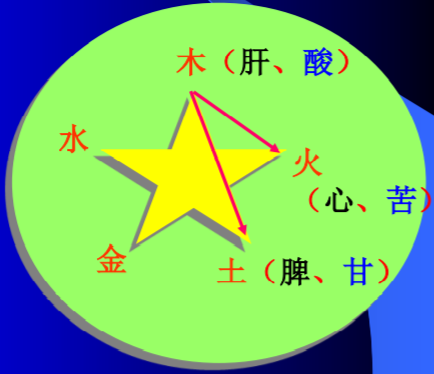
        - **肝虚证治法：**
            - 补用酸———酸入肝，本味补本脏
            - 助用焦苦———焦苦入心，心为肝之子，子能令母实
            - 益用甘味之药调之甘———甘入脾，甘味之药调和中气
        - **治未病的理论和方法——**
        - **虚实异治的原则——** 实证以泻本脏为主，并安他脏，以防疾病蔓延。虚证以补本脏为主，&nbsp;并通过整体调节以防他脏乘侮。
        - **为什么医生会犯“虚虚实实”的错误呢？&nbsp;——** “至虚有盛候，反泻含冤；大实有羸状，误补益疾。”
    - 病因、发病——2 8 13
        - **【2】疾病发生的原因、病因分类 （传变途径）以及疾病的预防与早期治疗的措施。**
            - ★ **【2第一段】夫人禀五常，因风气而生长，风气虽能生万物，亦能害万物，如水能浮舟，亦能覆舟。若五脏元真通畅，人即安和&nbsp;。客气邪风，中人多死。千般疢难，不越三条：一者，经络受邪，入脏腑，为内所因也；二者，四肢九窍，血脉相传，壅塞不通，为外皮肤所中也；三者房室、金刃、虫兽所伤。以此详之，病由都尽。**
                - **人禀五常：** 禀，是“受”的意思；五常，即五行。&nbsp;
                - **风气：**
                - **元真：**
                - **客气邪风：** 外至曰客，不正曰邪，指致病的不正常气候。
                - **疢难：chěn** 《广雅.释诂》：“疢，病也”，疢难，疾病也。
            - **杂病发病机理——天人合一**
                - **邪气**
                - **正气**
            - **病因三条** 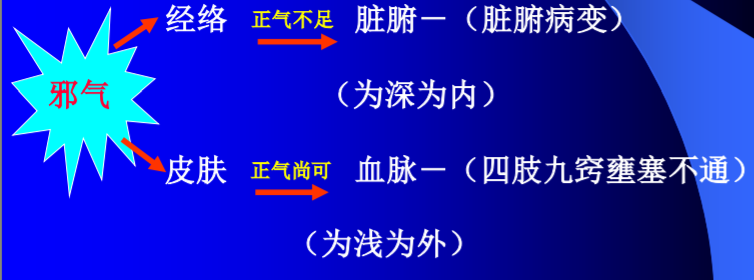
            - **仲景三因与无择三因之别** 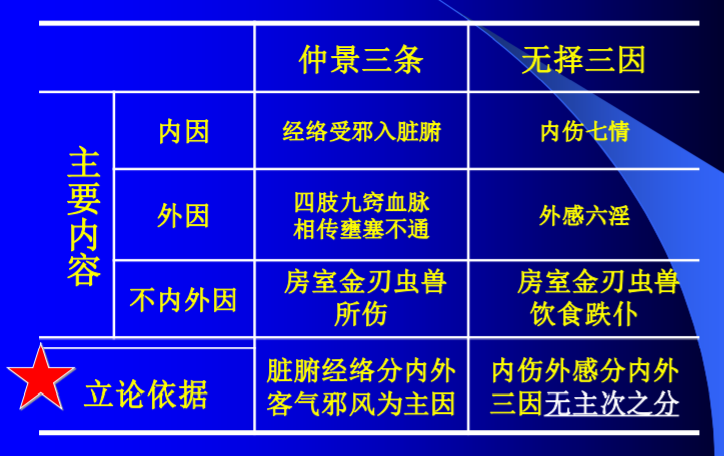
            - ★ **【2第二段】 若人能养慎，不令邪风干忤经络；适中经络，未流传脏腑，即医治之。四肢才觉重滞，即导引、吐纳、针灸、膏摩 ，勿令九窍闭塞；更能无犯王法、禽兽灾伤，房室勿令竭乏 ，服食节其冷、热、苦、酸、辛、甘，不令遗形体有衰，病则无由入其腠理。腠者，是三焦通会元真之处，为血气所注； 理者，是皮肤脏腑之文理也。**
                - **养慎** ：内养正气，外慎邪风。
                - **仲景预防疾病方法&nbsp;**
                    - ①&nbsp;养慎（不受邪，未病先防）
                    - ②&nbsp;有病早治（适中经络，未流传脏腑，即医治之）
                    - ③&nbsp;遵纪守法，避免意外灾伤，房室有节，饮食、起居。
                - **预防目的——**
        - **【8】 病因举例&nbsp;**
        - > 本条论述与时令不符 的反常气候的四种类型
            - **【8】问曰：有未至而至，有至而不至，有至而不去，有至而太过，何谓也？师曰：冬至之后，甲子夜半少阳起，少阳之时，阳始生，&nbsp;天得温和。以未得甲子，天因温和，此为未至而至也；以得甲子，而天未温和，为至而&nbsp;不至也；以得甲子，而天大寒不解，此为至而不去也；以得甲子，而天温如盛夏五六月时，此为至而太过也。**
                - **未至而至**
                - **甲子：**
                - **少阳：**
            - **反常气候易致人发病** ——人与自然是统一的整体，如春温、夏热、秋凉、冬寒是正&nbsp;常的自然规律，有益于万物生长，人也是适应环境变化而健康生存。若气候与时令不符本既为反常气候，易导致人体发病。&nbsp; 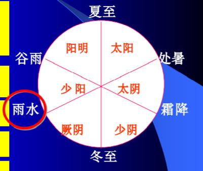
                - 正常：冬至之后，甲子夜半少 阳起，少阳之时，阳始生，天得温和。&nbsp;
                - 未至而至：以未得甲子，天因温和
                - 至而不至：以得甲子，而天未温和&nbsp;
                - 至而不去：以得甲子，天大寒不解
                - 至而太过：以得甲子，天温如盛夏 五六月时&nbsp;
        - **【13】五邪中人各有法度**
        - > 通过观察患者的各种症状和体征，推测疾病的病因，从而为治疗提供可靠的依据。
这种思维方法，为后世的病因辨证及审证求因奠定了基础，并对其发展起了较大的推动作用。
            - ★ **【13】清邪居上，浊邪居下，大邪中表，小邪中里，谷饪之邪，从口入者，宿食也。 五邪中人，各有法度，风中于前，寒中于暮，湿伤于下，雾伤于上，风令脉浮，寒令脉急，雾伤皮腠，湿流关节，食伤脾胃，极寒伤经，极热伤络。**
                - **五邪：** 风邪、寒邪、雾邪、湿邪、谷飪（宿食）之邪。
            - **五邪致病规律**
                - **风（大邪）**
                - **寒（小邪）**
                - **雾（清邪）**
                - **湿（浊邪**
                - **谷饪之邪** &nbsp;&nbsp;&nbsp;&nbsp;隔宿不化&nbsp;&nbsp;&nbsp;&nbsp;居中&nbsp;&nbsp;&nbsp;&nbsp;&nbsp;&nbsp;&nbsp;从口入&nbsp;&nbsp;&nbsp;&nbsp;&nbsp;食伤脾胃&nbsp;
    - 病机——10
        - **【10】“厥阳独行”的病机**
        - > **也就是阴阳失调为杂病的总病机**
            - **问曰:经云“厥阳独行”何谓也?师曰:此为有阳无阴，故称厥阳。**
                - **☆厥阳独行:** 阳气偏盛之极，孤阳上逆，阴不能敛阳
        - **阴阳关系** —— ☯对立制约 ☯ 消长平衡 ☯ 互根互用 ☯ 相互转化
        - **健康状态——**
        - **阴阳失衡**
    - 四诊举例——3~12
        - **望面部**
            - **【3】问曰：病人有** **气色** **见于面部，愿闻其说。 师曰：鼻头色青，腹中痛，苦冷者死；鼻头色微黑者，有水气；色黄者，胸上有寒；色白者， 亡血也，设微赤非时者死；其目正圆者痉，不治。又色青为痛，色黑为劳，色赤为风，色黄者便难，色鲜明者有留饮。**
                - **望气色：**
                    - **&nbsp;**
        - **望呼吸形态**
            - **【6】师曰：吸而微数，其病在中焦，实也，当 下之即愈；虚者不治。在上焦者，其吸促，在 下焦者，其吸远，此皆难治。呼吸动摇振振者， 不治。**
                - **吸而微数：**
                - **吸远：**
                - **动摇振振：**
                    - 元气衰竭，肾不纳气，形气不能相守！
            - **望呼吸形态**
        - **闻诊**
            - **【4】师曰：病人语声寂然喜惊呼者，骨 节间病；语声喑喑然不彻者，心膈间病； 语声啾啾然细而长者，头中病。**
                - **语声寂然：**
                - **喑喑然：**
                - **啾啾然：**
        - **切诊**
            - **【9】师曰：病人脉浮者在前，其病在表， 浮者在后，其病在里，腰痛背强不能行， 必短气而极也。**
                - **前：**
                - **后：**
                - **极：**
        - **脉、色、四时合参**
            - **【7】师曰：寸口脉动者，因其王时而动， 假令肝王色青，四时各随其色。肝色青 而反色白，非其时色脉，皆当病。**
                - **寸口**
                - **王时：**
                    - 春—色青—脉弦；
                    - 夏—色赤—脉洪； 
                    - 秋—色白—脉浮；
                    - 冬—色黑—脉沉。
    - 论治原则——14~17
        - **表里同病先后治**
            - **【14】问曰：病有急当救里救表者，何谓也？ 师曰：病，医下之，续得下利清谷不止，身 体疼痛者，急当救里；后身体疼痛，清便自调者，急当救表也。**
                - **救：**
                - **下利清谷：**
                - **清便自调：**
            - **表里同病的来源——表证误下**
                - 两者合之——表里同病  
                    - 表邪不去，营卫不通―――  ―身疼痛。  
                    - 内无实邪，徒伤脾胃阳气―――下利清谷  
            - **治疗原则： 先救其里，再攻其表&nbsp;**
                - 知其常，达其变 
                - 辨虚实、分缓急，急者先治，不可 拘泥先表后里之说
                    - **先表后里---为常法：**
                    - **先里后表---为变法**
                    - **表里同治---为兼治法：**
        - **新旧同病先后治**
            - **【15】夫病痼疾加以卒病，当先治其 卒病，后乃治其痼疾也。**
                - **痼疾：**
                - **卒病：**
            - **卒病与痼疾本身的性质和病机的特点：**
                - 痼疾日久势缓，根深蒂固，变化少，难以速愈  
                - 卒病新起势急，邪气尚浅，变化多，其病易除
            - 先治卒病，后治痼疾：痼疾病久，势缓难除，
            - 欲速不达；新病始得，势急易去，迟则生变  
            - **治新病同时必须照顾痼疾：以防其相互影响**
        - **饮食调护**
            - **【16】师曰：五脏病各有所得者愈，五脏病各有 所恶，各随其所不喜者为病。病者素不应食， 而反暴思之，必发热也。**
                - **所得：**
                - **所恶：**
        - **审因论治**
            - ★ **【17】夫诸病在脏，欲攻之，当随其所得而攻之，如渴者，与猪苓汤。余皆仿此。**
                - **☆在脏：** 在里的疾病。
                - **☆攻：** 治疗的意思。
                - **所得：**
- 痉湿暍病脉证治第二
    - 概述 
        - 本篇论述了痉病、湿病和暍病的辨证论治。 
        - 此三病都因外感而发，起始都有太阳表证。
        - 金代成无己《注解伤寒论》亦载有“辨痉湿 暍病脉证”篇。
        - **合篇意义&nbsp;**
            - ①在外均由外邪诱发，主证初起时均有太阳表证，在内都有平素阳气或津液不足的内因。 
            - ② 三病病机相仿，病位相近，三病均有伤寒与杂病的过渡性质。 
    - 痉病&nbsp;
        - **主症**
            - 颈项强急，口噤不开，甚至角弓反张为主证。 
        - **兼症**
            - 外感，如恶寒、发热。
        - **病因病机：&nbsp;**
            - 《内经》：以外邪立论，由外邪侵袭 ，壅阻经络而成&nbsp;
                - “诸痉项强，皆属于湿” “诸暴强直，皆属于风”&nbsp; 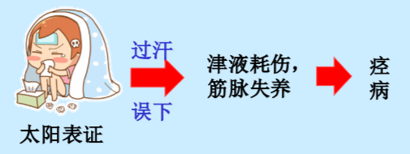
                - 《金匮》：津液不足 ，筋脉失养，外感风寒而致&nbsp; 
        - **临床相关病证**
            - **外感痉病：**
            - **内伤痉病：**
    - 暍病 ——“伤暑也”
        - **主症：**
            - 发热身重、汗出烦渴，少气脉虚为主证。
        - **病因病机：**
            - **易兼寒、夹湿。&nbsp;**
                - 暑为六淫之一，侵犯人体，从太阳开始 ——发热恶寒之表证 
                - 暑多挟湿 ——身重而疼痛 
                - 夏暑酷热，出汗过多，耗阳气伤阴津 ——少气脉虚
    - 湿病&nbsp;
        - 湿病导论
            - **主症：**
                - 发热身重、骨节疼烦为主证。
            - **病因病机：**
                - **内：** 阳气不足
                - **外：** 感受外湿
                - **或兼夹**
                - 湿邪致病分为内湿和外湿。 
                    - **外湿，**
                    - **内湿，**
            - **致病特点**
                - **首犯太阳肌表，表现太阳表证。**
                - > 《素问·生气通天论》：“因于湿，首如裹。” （开始像太阳伤寒)
                - **易阻遏气机，蒙蔽清窍。**
                - > 《灵枢·百病始生》：“风雨则伤上，清湿则伤下”。 
                - **内合于里，困及中焦脾胃。**
                - **易受环境影响**
                - **湿性重着、黏滞**
                - **多夹杂**
                    - 《脏腑经络先后病》：“湿伤于下，雾伤于上……，雾伤皮腠，湿流关节。”
            - **湿病特点**
                - **病位：**
                - **主证：**
                - **病因：**
                    - 外湿——为主因，多挟风寒  
                    - 内湿——脾失健运，湿自内停
                - **病机：**
                    - 湿邪痹阻阳气，不通则痛； 
                    - 湿为阴邪，损伤阳气。 
                - **治则：**
        - 一 湿病治法  
            - **发汗【18】**
            - > **风湿在表时正确发汗的治法。**
                - **【18】风湿相搏，一身尽疼痛，法当汗出而解，值天阴雨不止，医云此可发汗，** **汗之病不愈者** **，何也？盖发其汗，汗大出者，但风气去，湿气在，是故不愈也。 若治风湿者，发其汗，但微微似欲出汗者，风湿俱去也。**
                - **1.  病机、治法**
                    - 风、湿合邪，侵犯肌表，流注关节，痹阻阳气。 当用汗法。 
                    - > 风湿相搏，一身尽疼痛，法当汗出而解
                - **2.  汗之病不愈的原因**
                    - **（1）天人相应** ： 适值天气阴雨连绵不止，外界湿气较盛，影响体内湿邪排泄。
                    - **（2）汗不得法：** 大汗出，风气虽去而湿邪仍在，病非但不愈，还耗伤阳气。
                        -  风为阳邪，其性轻扬，皮毛开则汗出，风邪可随汗泄而尽去； 
                        -  湿为阴邪，其性粘滞，非阳气内蒸难以速去，故 ——汗不可尽泄。
                        - > 值天阴雨不止，医云此可发汗，汗之病不愈者，何也？盖发其汗，汗大出者，但风气去，湿气在，是故不愈也。
                - **3.   正确汗法**
                - **【辨治要领与思路】**
                    - ① **注意环境气候对人体的影响** ，风湿病每因气候潮湿，病情增剧。
                    - ②风湿病一经发汗，可使疼痛缓解，但 **应缓取微汗，不可使大汗出** ，且汗出过多，有导致亡阳的危险，致病不愈。从《伤寒论》麻黄汤、桂枝汤、葛根汤等方来看，均在服法内强调了覆取微汗的方法，可见凡须出汗的病，都不可使其大汗，必须注意及之。
                    - **除治风湿药外应配以** ***温阳之品*** **来助阳去湿。**
                        - 必须微微汗出，使阳气周流全身，缓缓蒸发， 营卫畅通，则风邪和湿邪同时随汗而缓缓排出体外。（如桂枝汤之汗法）&nbsp;
                        - > 若治风湿者，发其汗，但微微似欲出汗者，风湿俱去也。
            - **利小便【14】**
            - > **内湿外湿相合**
                - **【14】太阳病，关节疼痛而烦，脉沉而细者，此名湿痹。湿痹之候，小便不利，大便反快，但当利其小便。&nbsp;**
                - ☆ **湿痹：**
                    - 素有内湿，招致外湿，湿邪不仅流入关节，而且内合于脾，形成内外合邪之证。
                    - 以脉沉而细，关节疼痛而烦，小便不利，大便反快为主证。
                - **1.  病因病机**
                    - 感受外湿，流注关节筋脉  
                    - 脾胃虚弱或外湿伤脾，形成内湿
                - **2.  证候特点**
                    - “太阳病”——“脉浮，头项强痛而恶寒”（湿邪犯表）  
                    - 关节疼痛而烦——湿邪流注关节  
                    - 里湿为主为重
                        - 脉沉而细——沉脉主里，细为湿阻、阳闭  
                        - ☆小便不利，大便反快  ——湿阻于中，阳气不化，湿趋大肠
                - **3.  治法：但利小便**
                - **【辨治要领与思路】**
                    - **根据外湿内湿的孰轻孰重来决定发汗、利小便的先后缓急。**
                    - **切不可见大便溏就用止泻药，因为大便溏由湿所致**
                    - ③对于本证后世芳香化湿、苦温燥湿、淡渗利湿法可作参考。 本证一般注家主张用五苓散类。 
        - 二 湿病证治  
            - **头中寒湿－内药鼻中【19】**
            - > **寒湿在于头中的证治**
                - **【19】湿家病身疼发热， 面黄而喘，头痛鼻塞而烦，其脉大，自能饮食， 腹中和无病，病在头中寒湿，故鼻塞，内药鼻中则愈。**
                - **☆湿家：** 常患久患湿病的人，这里在于指明患者的体质是 **素体阳虚。**
                - **1.  病因病机：**
                    - 多得之于晓行雾中，令雾之湿气蒙蔽头面清窍 
                - **2.  证候特点**
                    - 身疼发热、脉大——感受寒湿，侵入肌表  
                    - 面黄——湿郁于上，此面黄在病机上与“黄疸”不同  
                    - 喘——肺合皮毛，邪在于表，肺气不宣而上逆  
                    - 头痛鼻塞而烦――湿气蒙蔽头面清窍 
                    - ☆阴性症状——自能饮食，腹中和无病——湿邪并未传里
                    - > 此阴性症状是内湿与外湿的鉴别要点！
                - **3.  治法“内药鼻中则愈” 讲解**
                    - 后世医家： 
                        - ○多主张瓜蒂散搐鼻，令黄水出，宣泄寒湿
                        - ○亦可用鹅不食草纳入鼻中
                        - ○内服芳香开窍之剂辛夷散
            - **寒湿在表－麻黄加术汤【20】**
            - > **寒湿在表的证治和治疗禁忌**
                - **【20】湿家身烦疼，可与麻黄加术汤发其汗为宜，慎不可以火攻之。**
                    - 麻黄加术汤方：  
                        - 麻黄三两，去节 桂枝二两，去皮 甘草一两，炙 杏仁 七十个，去皮尖 白术四两  
                        - 上五味，以水九升，先煮麻黄，减二升，去上沫，内诸 药，煮取二升半，去滓，温服八合，覆取微似汗。&nbsp;  
                    - **火攻：**
                    - **1、证候特点**
                        - 麻黄汤证——恶寒、发热、无汗、脉浮等表证  
                        - 湿病——身烦疼，沉重 
                    - **2、病因病机**
                        - 素有湿病，肌表外感寒湿，痹阻阳气，阳气运行受阻。  
                        - 寒＋湿——在表 ↓
                    - **3、治法： 散寒除湿，微汗祛邪**
                    - **4．方药：麻黄加术汤**
                        - 麻黄+白术——虽发汗而不致过汗 （麻黄得白术）
                        - 白术+麻黄——可并行表、里之湿 （白术得麻黄）
                    - **5．禁忌：火攻**
                        - 误治：大汗伤阳，风去湿存  
                        - 变证：火热内攻，必伤津液，可引起发黄或衄血等病变
                    - **【辨治要领与思路】**
                        - 1.本证的辨证要点是 **身烦疼** ，据方测证当有 **无汗** 症状。
                        - 2.本方系麻黄汤加白术。原方 **白术用至四两** ，故 **重用白术是应用本方的要点之一。** 
            - **风湿在表－麻杏薏甘汤【21】**
            - > 风湿在表（渐次化热）的成因和证治
                - ★ **【21】病者一身尽疼，发热，日晡所剧者，名风湿。 此病伤于汗出当风，或久伤取冷所致也。可与麻黄杏仁薏苡甘草汤。**
                    -  麻黄杏仁薏苡甘草汤方：  
                        - 麻黄半两，去节，汤泡 甘草一两，炙 薏苡仁半两 杏仁十个，去皮尖，炒  
                        - **有微汗，避风。&nbsp;**
                    - **日晡所：** 晡（bu）申时，即下午3～5时。所，不定之词，表约数。
                    - **久伤取冷：**
                    - **1、证候特点**
                    - > 病者一身尽疼，发热，日晡所剧者，名风湿。 
                        - 一身尽疼——风湿侵袭，滞留肌表，邪正相争  （身重，疼痛呈走串性）  
                        - 发热，日晡所加剧——提示有化热趋势。  
                            - 补充：恶风寒，脉浮数——以药测证 
                    - **2、起因**
                    - > 此病伤于汗出当风，或久伤取冷所致也。​
                        - 此感受风、湿之邪——   一是未出透之汗液；二是外湿侵入
                            - 汗出当风  
                            - 久伤取冷
                    - **3、 治法：微汗**
                        - 轻清宣化  
                            - 轻－剂量  清－清热
                        - 解表祛湿  
                    - **4、方药：麻杏薏甘汤——麻黄汤中薏苡仁易桂枝**
                        - 麻黄半两，甘草一两——取微汗祛湿。  
                        - 麻黄：辛温，解表  
                        - 杏仁：辛凉轻清，宣肺利气以助汗解  
                        - 薏仁：甘，微寒，淡渗利湿，通络止痛    
            - **风湿兼气虚－防己黄芪汤【22】**
            - > 风湿表虚的证治
                - **【22】风湿，脉浮，身重，汗出恶风者，防己黄芪汤主之。**
                    -   防己黄芪汤方： 
                        -  防己一两 甘草半两，炒白术七钱半 黄芪一两一分，去 芦  
                        - **生姜** **大枣** **虫行皮中** **绕腰以下** **微汗**
                        - **下有陈寒：**
                        - **◆虫行皮中：** 指服药后病人皮肤出现痒如有虫爬一样的感觉。
                        - **差：**
                        - **1、证候特点**
                        - > 风湿，脉浮，身重，汗出恶风者，防己黄芪 汤主之。 
                            - 脉浮身重——风湿在表  
                            - 汗出恶风——气虚卫外不固 
                        - **2、病因病机：外感风湿之邪，风湿在表兼气虚**
                        - **3、治法：微汗——益气固表，祛风除湿**
                        - **4、方药：防己黄芪汤**
                            - **方解** 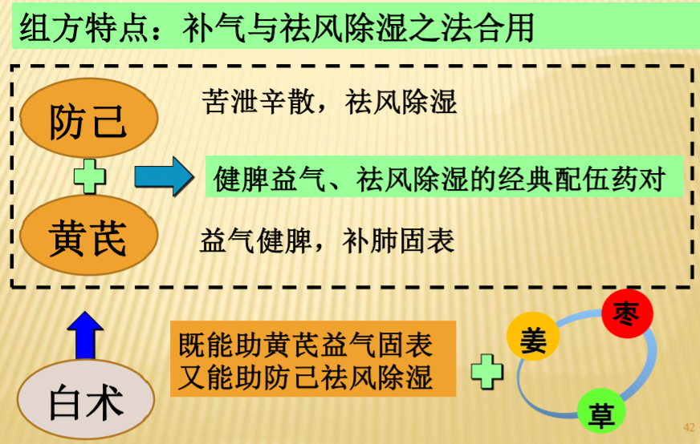
                        - **【辨治要领与思路】**
                            - **辨证要点是身重、汗出、恶风、脉浮。**
                            - **重视随症治疗**
                            - **重视患者服药后的反应和护理** **助之以温，远之以寒**
            - **风湿兼阳虚－表阳虚－桂枝附子汤/白术附子汤  【23】**
                - **【23】伤寒八九日，风湿相搏，身体疼烦，不 能自转侧，不呕不渴，脉浮虚而涩者，桂枝附子汤主之；若大便坚，小便自利者，去桂 加白术汤主之。**
            - **风湿兼阳虚－表里阳虚－甘草附子汤【24】**
                - **【24】风湿相搏，骨节疼烦掣痛，不得 屈伸，近之则痛剧，汗出短气，小便不 利，恶风不欲去衣，或身微肿者，甘草 附子汤主之。&nbsp;**
            - **湿病证治规律**
                - **1 病因病机**
                    - ＊ 外湿为主因多挟风寒  
                    - ＊外湿与内湿相互影响发病  
                    - ＊ 湿邪痹阻阳气为湿病总病机 
                - **2 治疗特点**
                    - ＊微发汗  
                    - ＊利小便  
                    - ＊助阳气 
- 百合狐惑阴阳毒病 脉证治第三
    - 合篇意义
        - **病因：** **热性病**
        - **症状：** **神志方面症状**
    - 百合病 ：
        - 百合病导论
            - **主症**
                - 以精神恍惚不定，口苦，小便赤，脉微数为特征。
            - **病因病机**
                - “百脉一宗，悉致其病”为其病机。 
        - 一 表现及病机（1） 
            - ★ **【1】论曰：百合病者，** **百脉一宗，悉致其病也** **。意欲食复不能食，常默默，欲卧不能卧，欲行不能行，欲饮食，或有美时，或有不用闻食臭时，如寒无寒，如热无热，** **口苦，小便赤** **，诸药不能治，得药则剧吐利，如有神灵者，身形如和，** **其脉微数** **。**
            - **☆百脉一宗：** 百脉，泛指全身的血脉;宗，本也，谓人体百脉， 同出一源。(心、肺)
            - **常默默：**
            - **臭：**
            - **身形如和：**
            - **1.病因病机&nbsp;**
            - > “百合病者，百脉一宗，悉致其病也”。
                - 热病之后，余热未清；情志不遂，郁而化火
                - 《金匮要略》原文1条：“其证或未病而预见”提出百合病乃由“伤寒大病之后， 余热未解 ，百脉未和或平素多思不解， 情志不遂 ；或偶触惊疑，卒临景遇，因而形神俱病，故有如是之现证也。”
                    - 心肺阴虚内热
            - **2.临床表现**
                - **本证：“症状百出”**
                - **情志改变 “不定之症”**
                    - 心神不安、饮食失调、行为改变、感觉异常等症
                - **心肺阴虚 “不变之症”**
                    - 口苦，小便赤， 脉微数
            - **3.拓展**
                - 现代医学认为：百合病相当于各种神经官 能症和植物神经功能紊乱。神经症的发病通常 与不良的社会心理因素有关，不健康的素质和 人格特性常构成发病的基础。植物神经功能紊 乱与遗传、素质（思想和躯体）、性别、生物 机体、年龄、社会因素有关。
        - 二 百合病证治 
            - **正治：**
                - **★【5】百合病，不经吐、下、发汗，病形如初者，百合地黄汤主之。**
                    - 百合地黄汤方： 
                        - 泉水 大便当如漆。&nbsp;
                    - **正治条件：**
                    - **治法：**
                    - **方药：**
                        - 百合——甘寒，清气分之热，安神，清心润肺
                        - 生地黄汁——甘润，泄血分之热，滋益心肾
                        - 泉水――甘寒，下热气， 利小便
                    - **【辨治要领与思路】**
                        - &nbsp;①辨别百合病的临床主要依据：一是阴虚内热引 起的心神不安及饮食、行为失调等；二是阴虚内热所致的口苦、小便不利、脉微数。 
                        -  ②临床治病应根据服药后的病情变化决定治疗时间的长短， “中病，勿更服”——中病即止。当然，对于一些慢性疾病为防止病情反复，仍需善后调理。  
                        - ③告诉病人服药后可能出现的反应，服生地黄后易引起泄泻，且大便色黑。
                        - ④临床应用：本方多用于治疗一些情志病，如更年期忧郁症、癔病、神经官能症、植物神经功能失调、梅核病等，也用于急性热病后期，或余热未尽，神志恍惚者
                        - ⑤注意事项：百合病是一种慢性虚热性疾病，不容易在短时间内治愈，往往一服中病，停药后又复发，所以在服用百合地黄汤时，应以守方 为宜，长期服用，不可中间停服。
            - **误治救逆：**
                - **误汗——百合知母汤（2）**
                    - **【2】百合病发汗后者，百合知母汤主之。**
                        - **“如寒无寒，如热无热”**
                            - 误以为有表证而发其汗 
                            -  “心烦，口燥”（阴津更伤，虚热更甚）  
                        - **方药：**
                            - 百合——润养心肺，益气安神  
                            - 知母——养阴清热除烦  
                            - 泉水——清其内热  
                        - **治法：**
                - **误下——滑石代赭汤（3）**
                    - **【3】百合病下之后者，滑石代储汤主之。**
                        - **“欲食不能食，不用闻食臭”**
                            - 误以为热结胃府，宿食停聚而下之  
                            - “呕吐，呃逆，小便反少”  （伐胃伤津，胃气上逆）  
                        - **方药：**
                            - 百合——润养心肺  
                            - 滑石、泉水——清热利小便  
                            - 代赭石——和胃降逆  
                        - **治法：**
                - **误吐——百合鸡子汤（4）**
                    - **【4】百合病吐之后者，用百合鸡子汤主之。**
                        - **“默默不语，欲卧不得卧”**
                            - 误以为痰浊壅盛，内扰心神而吐之  
                            - “虚烦不眠，胃中不和”  （更伤其阴，燥热愈甚）  
                        - **方药：百合鸡子汤**
                            - 百合——润养心肺  
                            - 鸡子黄——养阴润燥，安五脏，宁心神  
                            - 泉水——清热利小便  
                        - **治法”阴复胃和，热除心安**
                - **三方鉴别**
                    -  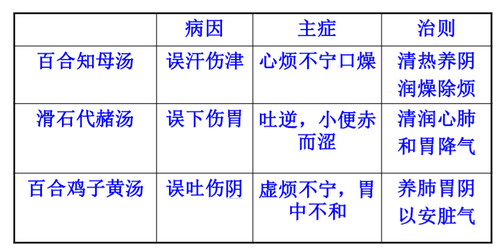
            - **变证施治：**
                - **变渴——百合洗方、瓜蒌牡蛎散（6、7）**
                    - **【6】百合病一月不解，变成渴者，百合洗方主之。**
                    - **【7】百合病渴不差者，栝楼牡蛎散主之。&nbsp;**
                        - **日久不愈，阴伤更重**
                        - ——变成渴者→百合洗方（肺合皮毛，其气相通。滋肺润燥）
                        - ——渴不差者→栝楼牡蛎散（生津止渴；益阴潜阳，引热下行）
                - **变发热——百合滑石散（8）**
                    - **【8】百合病变发热者，百合滑石散主之。**
                    - **&nbsp;日久不愈，里热更重**
                    - ——变发热者→百合滑石散（养阴清热）  
                        - 当微利，止服（分利太过，耗伤阴液）
                - **用药总结**
                    - 百合病变证，变渴、变发热，都是病情在 内热的程度上有所变化
                        - 口燥——知母 
                        - 变渴——栝楼根 
                        - 当泉水与百合清热力度不够时，改用滑石、 牡蛎
    - 狐惑病：
        - 狐惑病导论
            - **主证**
                - 常表现出以咽喉、二阴溃烂，后期见目赤为主证，伴见精神恍惚等症状。
            - **病机**
                - 主要由湿热虫毒所致。
            - 现代医学认为，狐惑病相当于白塞氏病（又称白塞氏综合征， 或口—眼—生殖器综合征），是 一种罕见的免疫介导的全身性血管炎性疾病，表现为口疮病、生殖器溃疡和复发性葡萄膜炎与眼前房积脓的三联征。
                -  
        - 病名含义
            - 狐惑——狐疑惑乱——湿毒致病
            - 狐 ——虫蚀上下
        - 狐惑病内容
            - 一 表现及病机（10） 
            - 二 狐惑病证治 
                - 内治：  
                    - **湿热虫毒蕴脾——甘草泻心汤（10）**
                    - > 湿热蕴脾：临床表现及治疗​
                        - ★ **【10】狐惑之为病，状如伤寒，默默欲眠，目不得闭， 卧起不安，** **蚀于喉为惑，蚀于阴为狐，** **不欲饮食，恶闻食臭，其面目乍赤、乍黑、乍白。蚀于上部则声喝，甘草泻心汤主之。**
                            - **蚀：**
                            - **乍赤、乍黑、乍白：** 非指病人面色突变，乃指颜色深重。
                            - **声喝（一作“嗄”）**
                            - **嗄（shà）：** 指声音嘶哑。
                        - **病因病机及临床表现&nbsp;**
                            - **①蚀于喉为惑，蚀于阴为狐：**
                                - 湿热上熏咽喉、下蚀前后二阴，则溃烂、 疼痛、瘙痒 
                            - **②状如伤寒：**
                                -  初起有恶寒发热（湿热内蕴，营卫失和）
                            - **③默默欲眠，目不得闭，卧起不安：**
                                - 患者痛苦难当，加之热扰心神，则身热心烦，卧起不安，久则精神困倦，欲睡不得
                            - **④不欲饮食，恶闻食臭：（ VS 百合病？）&nbsp;**
                                - 湿热蕴于肠胃，脾胃不和，饮食异常 
                            - **⑤面目乍赤、乍黑、乍白：**
                                - 邪正相争，气血失调，病色现于面部 
                            - **病机：**
                            - **治法：**
                            - **方药：**
                                - 甘草生用、重用，配黄芩，黄连－清热解毒  
                                - 半夏，干姜－辛温性燥，宣化内湿  
                                - 人参，大枣－安中和胃
                    - **日久不愈酿脓——赤豆当归散（13）**
                        - **【13】病者脉数，无热，微烦，默默但欲卧， 汗出，初得之三、四日，目赤如鸠眼； 七、八日，目四眦黑。** **若能食者** **，脓已 成也，赤豆当归散主之。**
                            - 赤豆当归散方： 
                                - **浆水服**
                            - **鸠眼：**
                            - **目四眦：**
                        - **病因病机及临床表现&nbsp;**
                            -      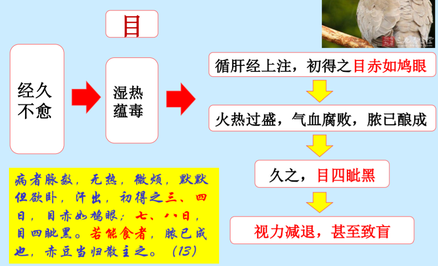
                            - **其他症状**
                                - 脉数，微烦，默默但欲卧——热扰心神
                                - &nbsp;阴性症状：
                                    - 无热，汗出——热入营血，病不在表  
                                    - 能食——病势局限，胃气无扰&nbsp;
                                - 证属：湿热蕴毒于局部&nbsp;
                                    -  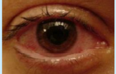
                            - **病机：**
                            - **治法：**
                            - **方药：**
                                - 赤小豆——渗湿，和血解毒  
                                - 当归——活血，祛瘀生新  
                                - 浆水——清凉解毒，和胃化滞
                                - > 补充：浆水，《本草纲目》又称酸浆，《中国医学大辞典》称米浆水。
                - 外治：  
                    - **外洗——苦参（11）**
                        - **【11】蚀于下部则咽干，苦参汤主之。**
                            - **下部：** 
                    - **外熏——雄黄（12）**
                        - **【12】蚀于肛者，雄黄熏之。**
                    - **扩展**
                        - 前阴溃疡病＋地肤子、蛇床子
                        - 肛门蚀烂＋炒槐角 
                        - 眼部损害＋密蒙花、草决明 
                        - 口腔溃疡＋外用冰硼散、锡类散等
                        - 肝经湿热，症见口苦、 溲赤、懊恼、失眠者＋龙胆草、黄柏、木通、 车前子、赤小豆等&nbsp;
                        - 脾气虚衰，症见形瘦 发热，神疲肢倦者＋补中益气汤 以清解湿热，升清降浊&nbsp;
                - 注意要点：
                    - 1. 狐惑病类似于现代的白塞氏综合症。 
                    - 2. 此病亦有皮肤易受损害（伤口不愈合）的特点。 
                    - 3. 此病不是性病。 
                    - 4. 此病是慢性疾病，其症状有所起伏，难治。 
    - 阴阳毒（阳毒＆阴毒）：
        - **主证**
            - 由疫毒感染引起，以咽痛，发斑为证。
        - **以证候特点划分阴阳**
            - **阳毒患者，体质较强** **浅表**
            - **阴毒患者，体质较弱** **病邪内伏**
        - 阳毒
            - **【14】阳毒之为病，面赤斑斑如锦纹，咽喉痛，唾脓血。五日可治，七日不可治， 升麻鳖甲汤主之。**
        - 阴毒
            - **【15】阴毒之为病，面目青，身痛如被杖，咽喉痛。五日可治，七日不可治，升麻 鳖甲汤去雄黄、蜀椒主之。**
        - **临床表现**
            - 主证：发斑、咽喉痛
            - 阳毒，乃热壅于上，表现为面赤斑斑如锦纹、咽喉痛、吐脓血等&nbsp;
            - 阴毒，乃邪阻经脉，表现为面目青、身痛如被杖、咽喉痛等&nbsp;
        - **证治：升麻鳖甲汤**
        - > **升麻入阳明、太阴二经** **但仅走二经气分，故必佐以当归通络中之血，甘草解络中之毒** **鳖甲守护营神**
            - 阳毒患者，体质较强，邪气 郁结于浅表
                - 升麻——辛凉发散，升提走表， 向外祛邪解毒 （入阳明、太阴）
                - 生甘草——加强清热解毒之功 （解络中之毒）
                - 鳖甲——咸平入血，养阴清热， 走里向内护正抗毒 （守护营神）
                - 当归——助鳖甲滋阴扶正，养血活血 （通络中之血）
                - 雄黄、蜀椒——增加辛温发散， 乘势祛邪，以阳从阳，速散其毒 
            - 阴毒患者，体质较弱， 病邪内伏
                - 升麻鳖甲汤去雄黄、蜀椒（不让药性向外走助邪，而入里）
        - **阴阳毒预后**
        - > 早治早好
            - 若病变时间短，病情较轻，病邪较浅， 正气尚盛，疫毒之邪尚可透发，治疗比较容易，预后较好； 
            -  若迁延日久，病邪转盛，正气较弱，邪 深病重，治疗就难，预后就差。 
    - 小结：
        -  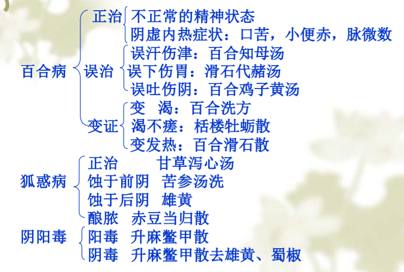
- 中风历节病脉证并治第五
    - 概述 
        - **中风** **历节**
        - 两者均属于广义风病范围，均有肢体经络的症状，所用方药均有祛风、通络之功。  
    - 合篇意义
        - （1）范围：皆属广义风病范畴。 
        - （2）病机：正虚邪中，内外合邪的病机特点。 
        - （3）主证：肢体经脉证状。  
            - 发病趋势：中风由经络深入脏腑；历节由经络深入肌肉关节。
    - **中风**
        - **主证**
            - ☆以口眼歪斜，半身不遂，甚或突然昏仆、昏不识人为特征。
        - **病机**
            - 为正气不足， 偶感外邪诱发致病。
                - **风善行多变相似** 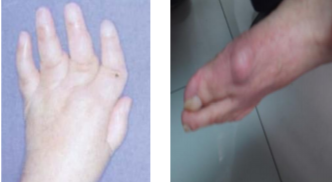
                - 《内经》曾称 ：“偏枯”“ 偏风”“大厥 ”“薄厥”
                - 《金匮要略》中始将其命名为“ 中风”&nbsp;
                - 后世医家及现代医学又有“真中风”、 “类中风 ”等&nbsp;
        - **脉症与鉴别（1）**
        - > 中风的临床表现，从脉象说明中风的病因病机，并论述中风和痹证的鉴别。
            - **【1】夫风之为病，当半身不遂，或但臂不遂者，此为痹。脉微而数，中风使然。**
                - **半身不遂：**
                - **痹：**
            - **病因病机**
            - > “脉微而数，中风使然”&nbsp;
                - 微——内因：气血亏虚，络脉空虚 
                - 数——外因：邪气有余，风邪乘虚而入
                - 基本病机：正虚风中 
                    - 正气不足，贼邪不泄，经脉痹阻所致 
            - **中风与痹症的鉴别**
                -  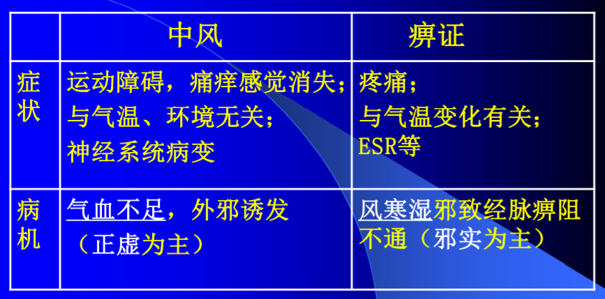
        - **成因与辨证（2）**
            - ★ **【2】寸口脉浮而紧，紧则为寒，浮则为虚； 寒虚相搏，邪在皮肤；浮者血虚，络脉空虚；贼邪不泻，或左或右；邪气反缓，正气即急，正气引邪，㖞僻不遂。邪在于络，肌肤不仁；邪在于经，即重不胜；邪入腑，即不识人；邪入于脏，舌即难言，口吐涎。**
                - **皮肤：**
                - **☆贼邪：** 贼风邪气，泛指致病因素
                - **㖞僻不遂：**
                - **肌肤不仁：**
                - **即重不胜：**
            - **分析**
                - **中风的病因病机：正虚邪中**
                    - 浮——内因：气血亏虚，脉络不充；非为表证 
                    - 紧——外因：风寒外邪侵袭 
                        - “寒虚（邪正）相搏，邪在皮肤”：正邪交争于肌表皮肤，即为邪在轻浅
                - （2）中风的临床症状产生的机理：
                - > 络脉空虚；贼邪不泻，或左或右
                    - 络脉空虚     贼邪不泻
                    -                      ↓
                    - 气血不足，邪气随虚处停留，而正气 又无力祛邪外出&nbsp;
                    -                      ↓
                    - **“正虚邪遏”&nbsp;**
                - （3）中风的临床症状产生的机理：
                - > 邪气反缓，正气即急，正气引邪，㖞僻不遂。
                    - 邪气反缓——受邪一侧，因络脉气血瘀滞，肌肉筋脉失去濡养，故现弛缓状态
                    - 正气即急——无病一侧血气运行正常，筋脉肌肉能发挥正常作用，故相对紧张拘急
                    - 中风口眼㖞斜，向左者病在右；向右者病在左
                - （4）中风临床辨证分型的依据
                    - **邪在于络 ，肌肤不仁**
                    - **邪在于经 ，即重不胜**
                    - **邪入于腑 ，即不识人**
                    - **邪入于脏 ，舌即难言，口吐涎**
                        -  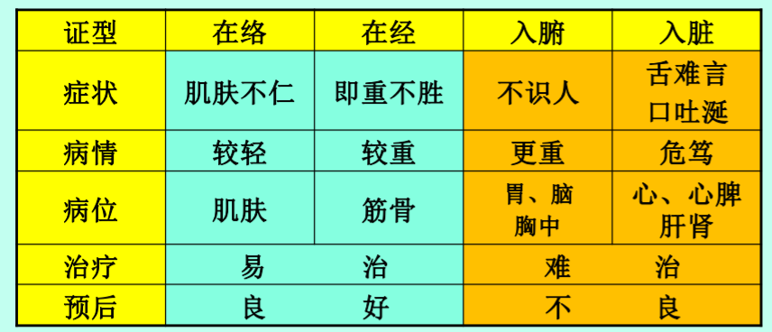
    - **历节**
        - **主证**
            - 以骨节疼痛遍历关节，痛势剧烈，日久肿大变形为特征
        - **病机**
            - 肝肾不足，感受风寒湿邪，痹阻经脉而致。
                -  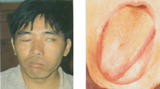
        - **病因病机**
            - **肝肾不足，水湿内侵（4）**
            - > 病因病机：肝肾不足，水湿内侵
                - ★ **【4】寸口脉沉而弱，沉即主骨，弱即主筋，沉即为肾，弱即为肝。汗出入水中，如水伤心，历节黄汗出，故曰历节。**
                    - **☆如水伤心：** 心主血脉，如水伤心，犹言水湿伤及血脉 
                    - **☆黄汗：** 指历节病的关节疼痛处汗出色黄，故曰“历节黄汗出”。此与黄汗病的汗出色黄，遍及全身者不同。
                - **①内因———肝肾不足**
                    - 寸口脉沉而弱——筋骨 失养
                    - 沉——主骨———为肾———肾精亏 
                    - 弱——主筋———为肝———肝血虚
                - **②外因 ——水湿内侵**
                    - “汗出入水中” —— “如水伤心”
                - **③症状**
                    - “历节黄汗出”  （疼痛、肿大、变形、黄汗出 ）
            - **其它：（6）（7）（9）（5）**
                - **阴血不足，风邪外袭**
                - > 论述阴血不足，风邪外袭之历节病机。&nbsp;
                    - **【6】少阴脉浮而弱，弱则血不足，浮 则为风，风血相搏，即疼痛如掣。**
                    - **①脉象**
                        - 少阴脉——阴血不足 风邪外袭
                            - 浮—为风 
                            - 弱—血不足 阴血不足 风邪外袭 
                    - **② 病机**
                    - **③ 症状**
                - **气虚湿盛，酒后汗出当风**
                - > 论述气虚风湿历节的病机及证候。&nbsp;
                    - **【7】盛人脉涩小，短气自汗出，历节疼不 可屈伸，此皆饮酒汗出当风所致。**
                    - **①脉象：**
                    - **②外因：**
                    - **③症状：**
                - **偏嗜酸咸导致历节病及与黄汗病的鉴别**
                - > 论述过食酸咸饮食，内伤肝肾，为产生历节病的机理之一，并与黄汗病鉴别。&nbsp;
                    - **【9】味酸则伤筋，筋伤则缓，名曰泄；咸则伤骨，骨伤则痿，名曰枯；枯泄相搏，名曰** **断泄** **。荣气不通，卫不独行，荣卫俱微，三焦无所御，** **四属断绝** **，身体羸瘦，独足肿大。 黄汗出，胫冷。假令发热，便为历节也。**
                    - **病因病机**
                        -  
                - **胃有蕴热，复感风湿**
                - > 论述胃有蕴热，外感风湿的历节病机。&nbsp;
                    - **【5】&nbsp;趺阳脉浮而滑，滑则谷气实，浮则汗自出。&nbsp;**
                        -  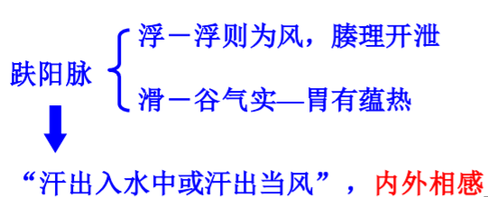
        - **辨证论治**
            - **风湿历节——桂枝芍药知母汤（8）**
                - ★ **【8】诸肢节疼痛，** **身体魁羸** **，脚肿如脱，头眩短气，温温欲吐，桂枝芍药知母汤主之。**
                    - 桂枝芍药知母汤方： 
                        -  桂枝四两 芍药三两 甘草二两 麻黄二两 生姜五两 白术五两 知母四两 防风四两 附子二枚，炮  
                        - 上九味，以水七升，煮取二升，温服七合，日三服。
                    - **身体魁羸：**
                    - **脚肿如脱：**
                    - **温温：**
                - **①证候特点：**
                - **②病机：** 风湿痹阻骨节，渐次化热伤阴 
                    - 诸肢节疼痛——风湿留注筋脉关节，气血运行受阻  
                    - 身体魁羸——病久不解，正气渐衰  
                    - 脚肿如脱——湿无出路，留注下肢  
                    - 头眩——湿阻清阳  
                    - 短气，温温欲吐——湿阻中焦，气机不利，胃失和降
                - **③治法：**
                - **④方药：**
                    - 桂枝、麻黄、防风 —— 祛风除湿散寒  
                    - 附子、白术 —— 温经助阳除湿  
                    - 芍药、知母 —— 益阴清热，柔筋缓急  
                    - 生姜、甘草 —— 和胃止呕调中
                    - 药偏温燥，重在祛邪；温散而不伤阴，养阴却不碍阳之妙
            - **寒湿历节——乌头汤（10）**
                - **【10】病历节不可屈伸，疼痛，乌头汤主之。**
                    - 乌头汤方：
                        - 治脚气疼痛，不可屈伸。麻黄 芍药 黄芪各三两 甘草三两（炙） 川乌五枚 （㕮咀，以蜜二升，煎取一升，即出乌头）  
                        - 上五味，㕮咀四味，以水三升，煮取一升， 去滓，内蜜煎中，更煎之，服七合。不知，尽 服之。 
                - **①证候特点：**
                    - 寒湿侵袭，痹阻关节
                        - 骨关节疼痛 、不可屈伸
                        - 特点：痛有定处，痛势剧烈，喜温恶寒，或遇寒加剧。舌淡苔白，脉沉迟或沉紧或弦紧
                - **②治法：**
                - **③方药：**
                - > 尤怡：此治寒湿历节之正法也。寒湿之邪，非麻黄、乌头不能去，而病在筋节，又非如皮毛之邪可一汗而散者。故以黄芪之补，白芍之收，甘草之缓，牵制二物，俾得深入而去留邪。 ——《心典》&nbsp;
                    - 乌头、麻黄——温经散寒，宣散透表，除湿止痛  
                    - 芍药、甘草——酸甘柔筋，缓急止痛  
                    - 黄芪——益气固表  
                        - 助麻黄、乌头温经止痛          • 制麻黄的发汗太过之性
                    - 白蜜——解乌头毒，延长药效，缓急止痛
                - **☆④服药反应**
                    - **瞑眩反应：**
                    - **中毒反应：**
                - **桂枝芍药知母汤与乌头汤鉴别**
                    -  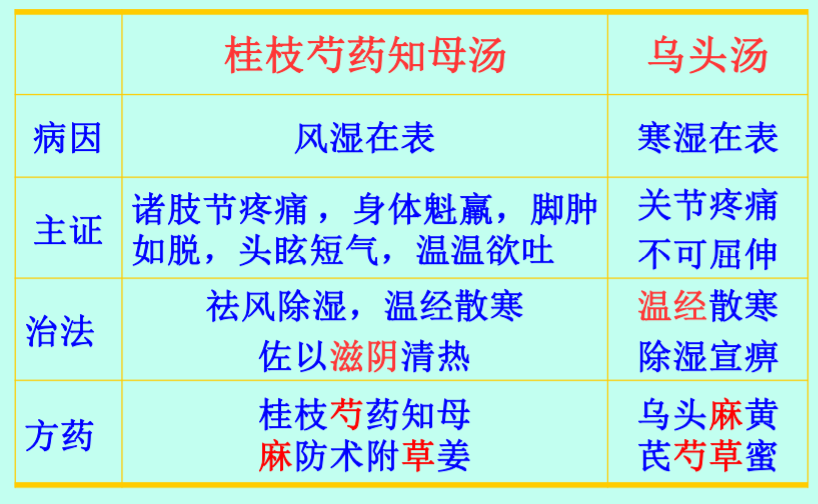
        - **总结**
            -  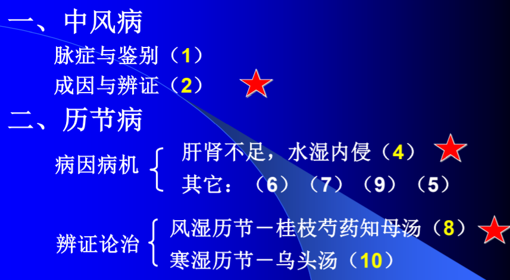
- 血痹虚劳病脉证并治第六&nbsp;
    - 概述 
        - 本篇论述了血痹、虚劳病的辨证论治。
        - ☆血痹病属肌肤经络病证，虚劳病属脏腑病证。
        - 虽两者在病位有在外、在内之别，但二者均有脏腑气血虚损的内因。
        - 1、概念：
            - ☆血痹， *以肢体局部麻木为主症* , 由气血不足 , 加被微风所引起。
                - ☆ 痹证，以肢体筋骨疼痛为主症 , 是风、寒、 湿三气杂感所致 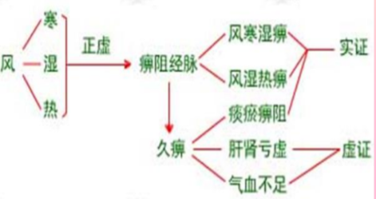
            - 虚劳，非一种病证，是劳伤所致的慢性衰弱性疾病的总称。
            - > “虚损、劳伤”的简称，气血虚衰，不能荣于五脏。脏腑真气不足，谓之损。劳倦伤脾，房劳伤肾，劳则耗气，谓之劳。
“因病而致虚”，因虚成损，积损成劳，久劳更虚，久虚不复。
                - ☆治疗重点在于 **调补脾肾，调整阴阳平衡。** 
                    - 阴阳气血两虚  
                    - **招邪夹风**
                    - **血瘀**
        - 2、合篇意义： 
            -  血痹与虚劳两病，一表一里，一轻一重。 
                - （1）证候上：虚证 
                - （2）病情上：慢性虚弱性疾病 
                - （3）病机上：属阴阳气血（营卫）不足，甚则虚损 
                - （4）治疗上：扶正为主，补益脾肾 
    - 血痹病
        - **血痹的成因与轻证的证治（1）**
            - **【1】问曰：血痹病从何得之？师曰：夫** **尊荣人** **骨弱肌肤盛，重因疲劳汗出，卧不时动摇，** **加被微风** **，遂得之。但以** **脉自微涩，在寸口、关上小紧** **，宜针引阳气，令脉和紧去则愈。**
                - **尊荣人：** 养尊处优的人。不从事体力劳动，肌肉虽然丰盛，实则筋骨脆弱，腠理不固，抗病能力薄弱。
                - **加被微风：**
            - **1．成因**
                - 内因：尊容人骨弱肌肤盛，卫阳不足，腠理不固。（体质因素） 
                - 外因：重因疲劳汗出，卧不时动摇，微风侵袭。
                    -  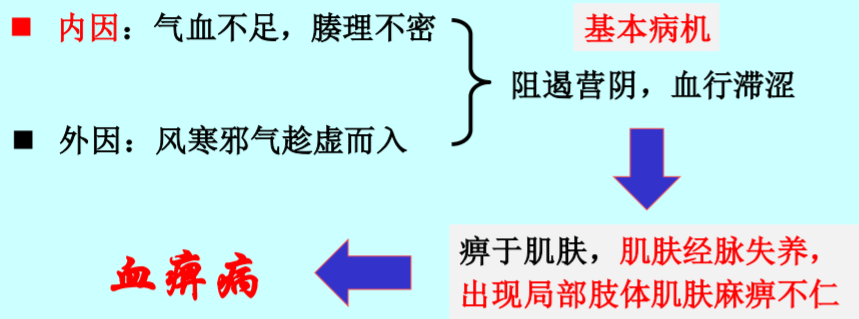
                    - 思虑伤脾夜间辗转反侧，睡眠不安——抗病能力低下
                    - > 卧不时动摇，微风侵袭
            - **2．脉象：**
                - 微——阳微之证（卫阳不足）  
                - 涩——血滞之候  
                - 小紧——为感受风寒――见于寸口、关上，为受邪轻浅 
            - **3．治法：宜针引阳气  ——“气为血之帅”，“气行则血行”**
                -  脉和：邪去脉自和  
                - 紧去：缓而不紧
        - **血痹重证的证治（2）**
            - ★ **【2】血痹** **阴阳俱微，寸口关上微，尺中小紧** **，外证身体不仁，** **如风痹状** **，黄芪桂枝五物汤主之。**
                - 黄芪桂枝五物汤方：  
                    - 黄芪三两 芍药三两 桂枝三两 生姜六两 大枣十二枚
                    - 上五味，以水六升，煮取二升，温服七合，日三服。一方有人参。
                - **阴阳俱微：**
                - **风痹：**
            - **&nbsp;1．以脉论理**
                - 内因：
                    - “阴阳俱微”——营卫气血不足  
                    - 寸口关上微——阳虚  
                - 外因： 
                    - 尺中小紧——阴血不足，外受风邪 
            - **2．证状：**
                - 以局部肌肤麻木不仁为特征若受邪较重，亦可兼有酸痛感——如风痹状
            - **3．☆鉴别：**
                - 风痹——顽麻疼痛兼有  
                - 血痹——唯顽麻无疼痛  
                - 历节——唯疼痛无顽麻
            - **4.治法：补气行血，温阳行痹**
            - **5.方药：黄芪桂枝五物汤**
                - 《伤寒论》里，讲它是 **调和营卫** 的作用，对我们治疗内伤杂病来说，它就是 **调和阴阳的作用（辛甘生阳，酸甘化阴）**
                    - 黄芪——益气行痹；“一方有人参”增强气推动血的力量
                    - 生姜——倍用，桂枝和生姜的配伍，辛温通阳行卫，专门走肌表
                    - 少甘草——去掉甘草的甘、缓之性
            - **☆可以“针引阳气”吗？   不可以！**
                - **勿取以针，而调以甘药也**
        - **血痹病的脉象**
            - **轻证**
                - **涩**
                - **紧**
            - **重证**
                - **微**
                - **紧**
            - **脉**
                - 微－阳气微   
                - 涩－血行涩  
                - 紧－外感风寒
                - **正气虚损的程度** **人体受邪的轻重。**
        - **血痹病证治特点**
            - 感邪轻浅——治以针刺&nbsp;
            - > “针引阳气”；
“四肢才觉重滞，即导引、吐纳、针灸、膏摩，病 勿令九窍闭塞”
            - 血痹重证——治以方药
            - > **（益气通阳，调和营卫，达到气行则血行，血行则风寒祛除）**
    - 虚劳病
        - **虚劳病脉象的总纲 （3）**
            - **【3】夫男子平人，脉大为劳，极虚亦为劳。**
                - **平人：**
                - **男子：**
            - **虚劳病总脉象**
            - > 阴阳两虚是虚劳病的总病机。
                - **脉象对于外形看似无病的虚劳早期**
                - 大脉－真阴不足，虚阳外浮。（浮大或芤） 
                - 极虚－元阳不足，脉气不充。（重按极无力）
        - **辨证（4~12除去第八条）**
            - **阴血不足**
                - **【4】男子面色薄者，主渴及亡血，卒喘悸， 脉浮者，里虚也。**
                    - **面色薄：**
                    - **卒喘悸**
                    - **脉浮者，里虚也：**
            - **气血亏虚**
                - **【5】男子脉虚沉弦，无寒热，短气里急，小便不利，面色白，时目瞑，兼衄，少腹满，此为劳使之然。**
                    - **脉虚沉弦**
                    - **面色白，时目瞑（视物不清）**
                    - **兼衄**
                    - **里急、小便不利、少腹满**
            - **阴虚阳浮（季节相关）**
                - **【6】劳之为病，其脉浮大，手足烦，春夏剧，秋冬瘥，阴寒精自出，酸削不能行。**
                    - **浮大**
                    - **春夏剧，秋冬瘥**
                    - **阴寒精自出**
                    - **酸削不能行**
            - **肾虚无子（男子不育的最早记载）**
                - **【7】男子脉浮弱而涩，为无子，精气清冷。**
                    - 脉浮弱而涩——真阳不足，精血虚衰，精清不温不能受胎。
                    - **曹颖甫** **当归生姜羊肉汤**
            - **虚劳盗汗（脉象）**
                - **【9】 男子平人，脉虚弱细微者，喜盗汗也。**
                    - **脉虚弱细微**
                    - **喜：**
            - **同脉异病**
            - > 本条论述脉大有虚寒和虚热的区别&nbsp;
                - **【10】人年五六十，其病脉大者，痹侠背行，若 肠鸣、马刀、侠瘿者，皆为劳得之。**
                    - **痹侠背行**
                    - **肠鸣**
                    - **马刀侠瘿**
            - **脾肾阳虚（脾肾虚衰的主证）**
                - **【11】脉沉小迟，名脱气，其人疾行则喘喝，手足 逆寒，腹满，甚则溏泄，食不消化也。**
                    - **脱气：**
                    - **手足逆寒**
                    - **腹满、甚则溏泄、食不消化**
            - **精血亏损（革脉的形成机制及特点与主病）**
                - **【12】脉弦而大，弦则为减，大则为芤，减则为寒，芤则为虚，虚寒相搏，此名为革。妇 人则半产漏下，男子则亡血失精。**
                - **革脉** **弦、大**
                    - **弦**
                    - **大**
                        - 阴血亏耗，阴损及阳，阴不敛阳，虚阳外浮 
        - **证治 （13~18）**
            - **虚劳失精一桂枝加龙骨牡蛎汤(8)**
            - > 论述了虚劳失精梦交的证治
                - **【8】夫失精家少腹弦急，阴头寒，目眩， 发落，脉极虚芤迟，为清谷亡血，失精。 脉得诸芤动微紧，男子失精，女子梦交， 桂枝加龙骨牡蛎汤主之。&nbsp;**
                    - **失精家：**
                    - **少腹弦急：**
                    - **清谷：**
                - **1．证候分析：**
                    -  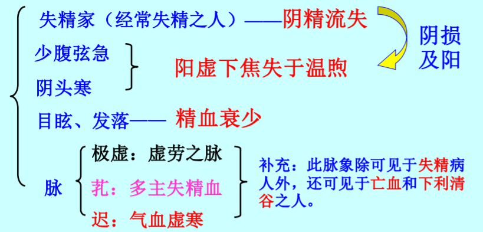
                - **2．主要病机：**
                    - 阴损及阳，阴阳两虚  
                        - 阳不能外固，阴不能内守，心肾不交以致失精，梦交等
                - **3. 治法：调和阴阳，潜镇摄纳**
                - **4. 方药：桂枝加龙骨牡蛎汤**
                    - 桂枝汤：内证得之，化气调阴阳  
                    - 龙骨、牡蛎：潜镇摄纳  
                    - “急则治标”
                - **【辨治要领与思路】**
                    - **☆调和阴阳是张仲景治病的特色之一** 。 **虛劳失精既可是阳虚不固,也可以是阴虚火旺** 。但本条则属阴阳两虛、阴阳不和故用桂枝汤调和阴阳加龙骨、牡蛎潜镇固涩。
                    - **☆治疗的关键在于截断阴精耗损的途径** 一一失精、梦交。
                    - 应用:妇女的带下证、汗证、小儿遗尿
            - **虚劳腹痛一小建中汤(13)**
            - > 论述了虚劳腹痛的论治
                - ★ **【13】虚劳里急，悸，衄，腹中痛，梦失精， 四肢酸疼，手足烦热，咽干口燥，小建中汤主之。**
                    - 桂枝三两 甘草三两 大枣十二枚 芍药六两 生姜三片 胶饴一升
                    - **里急：**
                - **1.证候分析：**
                    -  
                - **2.主要病机：阳损及阴，阴阳失调，寒热错杂**
                    -  脾胃病久,气血并亏，脾胃为阴阳升降之枢 
                - **3.治法：甘温建中，调和阴阳**
                - > 《心典》：“欲求阴阳之和者，必于中气，求中气之立者，必以建中也。”&nbsp;
                - **4.方药：小建中汤 ——**
                    - 桂枝汤倍芍药加饴糖——辛甘助阳，酸甘化阴，调和阴阳 
                - **拓展**
                    - 可不可以阴虚有热用滋阴清热，阳虚有寒用温阳散寒的方法呢?
                        - 《灵枢.终始篇》:“阴阳俱不足，补阳则阴竭，泻阴则阳脱，如是者，可将甘药”
                    - ☆如何理解阴阳两虚，寒热错杂，从中而治?
                        - 1.《灵枢·终始篇》:阴阳俱不足，补阳则阴竭，泻阴则阳脱。如是者，可将以甘药。
                            - 若补阳，用温补药，对阴液来说，就有损耗;泻阴，甘、寒之品，泻阴对阳虚有害;宜以甘药从中焦而治，建立中气。
                        - 2.《心典》谓:“ 欲求阴阳之和者，必于中气，求中气之立者，必以建中也。”
                            - 建立中气，使中气得以四运，从阴引阳，从阳引阴，可以使阴阳得以协调，这种寒热错杂证随之消失。
                        - 3.甘药为主，能补、能和、能缓。
                            - 恰中病机:脾阳虚，饴糖补中、温中;甘草、大枣味甘，调中;芍药、甘草，缓急止痛。甘温之品，补益中焦脾胃，建立中气。
                - **【辨治要领与思路】**
                    - ①本证阴阳两虚但偏于阳虚，临床辨证除条文所述症状外，可有自汗、面色不华、舌质淡，脉虚等
                    - ②重脾胃、补中气。虚劳阴阳两虚、气血不足、寒热错杂之症状，需重视脾胃后天之本，令气血生化有源。
                    - ③小建中汤组方关键是在桂枝汤基础上倍芍药加饴糖， 从而变桂枝汤调和营卫为建中补脾胃之剂。
            - **桂枝加龙骨牡蛎汤和小建中汤鉴别**
                -  
            - **虚劳腹痛一黄芪建中汤(14)**
            - > ☆承上条论述阴阳两虚， **气虚更甚** 的证治 。
                - **【14】虚劳里急，诸不足，黄芪建中汤主之。**
                    - **诸不足：**
                - **1． 证状：**
                    - 里急：里气虚寒，腹中拘急隐痛。  
                    - 诸不足为省文法，当包括小建中汤证中的证状（悸、衄、腹中痛、  梦失精、手足烦热）  
                    - 证状当较上条为重。 
                    -  以方中黄芪推测，当加自汗或盗汗 、身重不仁  、脉虚大等证。
                - **2. 治法：益气补中。**
                - **3. 方药：黄芪建中汤 （小建中汤加黄芪一两半）**
                - > ☆“急者缓之必以甘，虚者补之必以温”
                - **4.药味加减：**
                    - 气短胸满者加生姜——生姜，性温而不大热，协助 小建中汤加强温补之力；培土生金，疗脾胃虚寒， 肺气不足而致气短，胸满。 
                    - 腹满者去枣，加茯苓——甘温之剂用量太多，恐令 人中满，故去大枣，而留饴糖，因其主方功效不变。 茯苓是补利兼优之品，甘、淡渗利的作用，可健脾、 利小便，使补而不滞。 
                    - 疗肺虚不足，加半夏——肺虚损其布散津液功能下 降，久之生痰，宣降不利。半夏来燥湿化痰，降逆 消痞。
            - **虚劳腰痛一肾气丸(15)**
                - **【15】虚劳腰痛，少腹拘急，小便不利者， 八味肾气丸主之。**
                    - 干地黄八两 山药 山茱萸各四两 泽泻 牡 丹皮 茯苓各三两 桂枝 附子各一两
                - **1.证状分析**
                - > 基本病机：肾中阳气不足，失于温煦
                    - 虚劳腰痛
                    - 少腹拘急，小便不利
                - **2.治法：**
                - > “善补阳者，必于阴中求阳，则阳得阴助而生化无穷;善补阴者，必于阳中求阴，则阴得阳升而泉源不竭"&nbsp;
                - **3.方药**
                - **4.药物配伍**
                    - 干地黄八两 ——补肾填精 
                    - 山药四两——平补肺脾肾 
                    - 山茱萸四两 ——补肝肾，收敛精气
                    - 泽泻、牡丹皮、茯苓各三两 ——祛肾之水邪（小便不利），使补而不滞、温而不燥&nbsp;
                    - 桂枝 附子各一两——微微生火以生肾气
                    - > 《伤寒来苏集》：此肾气丸纳桂，附于滋阴剂中十倍之一，意不在补火，而在微生火，即生肾气也，故不曰温肾，而名肾气。
                - **【辨治要领与思路】**
                    - ①辨证要点：腰部酸痛，遇劳加重，休息则可缓解，并伴 有少腹部拘急不舒，小便不利。
                    - ②治疗重点：重视补肾，因肾为先天之本，主藏精气。本 证旨在补益肾气，但所用的药物是在干地黄、山茱萸、 薯蓣、泽泻、茯苓、丹皮基础上，加桂枝、附子，反映了仲景通过阴阳互生 , 达到阴中求阳的治疗思想。
            - **虚劳风气-薯蓣丸(16)**
                - **★【16】虚劳诸不足，风气百疾，薯蓣丸主之。**
                    - 薯蓣丸方： 
                        - 薯蓣三十分 当归 桂枝 曲 干地黄 黄豆卷各十 分 甘草二十八分 人参七分 芎䓖 芍药 白龙 麦门冬 杏仁各六分 柴胡 桔梗 茯苓各五分 阿 胶七分 干姜三分 白蔹二分 防风六分 大枣百枚， 为膏 
                        - 上二十一味，末之，炼蜜为丸，如弹子大，空腹酒服 一丸。一百丸为一剂。
                    - **风气百疾：** 风气，泛指外界病邪，风为百病之长，风邪侵袭人体，可引起多种疾病。
                - **1.病机：**
                    - 虚劳诸不足——病久气虚阴阳不足——抗病力减弱，易兼挟风邪而引起多种疾病。（虚实夹杂！）→若祛邪则伤正， 补益气血则恋邪
                - **2.治法： 健脾益气，扶正祛邪**
                - **3.方药：薯蓣丸**
                - > ☆此方能治能防，可以预防虚劳病人风气百疾的发生。
                    - 薯蓣（山药） 
                    - 四君＋干姜、大枣——益气 
                    - 四物＋麦冬、阿胶——养血 
                    - 桂枝、柴胡、防风——祛邪 
                    - 桔梗、杏仁、白蔹——理气 
                    - 豆卷、神曲 ——调中
                - **【辨治要领与思路】**
                    - 脾胃为后天之本，气血营卫生化之源，气 血阴阳诸不足，必须脾胃健运，饮食增加， 才能得以恢复。 
                    -  本证属慢性久病，治以丸剂缓而图之。 
            - **虚烦不眠一酸枣仁汤(17)**
            - > 论述了虚烦不寐的虚劳证治
                - **【17】虚劳虚烦不得眠，酸枣仁汤主之。**
                    - 酸枣仁二升 川芎二两 知母二两 甘草一两 茯苓二两
                    - **虚烦不得眠：**
                    - > 《医学统旨》：“虚烦者，心中烦扰，郁而不宁也”“津液去多，五内枯燥，或荣血不足，阳盛阴微”。&nbsp;
                - **1.主证:虚烦不寐——病程长**
                    - 肝阴不足，心血亏虚，阴虚为本，内热为标
                        - 魂藏于肝，人寐则入藏于肝，寤则随神往来。
                        - 神藏于心，《灵枢 本神》:“肝藏血， 血舍魂，”
                        - 若肝阴心血不足，则神魂不能归藏，而出现虚烦不寐。
                            - 魂——情绪；神——思维
                        - 以方测证,当兼见情绪激动、头目昏眩、口渴咽干、舌红 少苔等症。
                - **2.治法：养阴清热 ，宁心安神。**
                - **3.方药： 酸枣仁汤**
                    - 酸枣——归心肝经，养血安神（炒）
                    - 川芎——调血疏肝，辛燥之性，相反相成，使酸补而不滞
                    - 茯苓——安神宁心 
                    - 知母——清热除烦 
                    - 甘草——与枣仁酸甘益阴；与茯苓健脾宁神&nbsp;
                    - **临床加减：**
                        - 火旺者 + 加黄连； 
                        - 烦躁多怒，睡眠不安 + 牡蛎、石决明  
                        - 阴虚甚者 + 百合、生地； 
                        - 大便燥者 + 二至丸 
                - **4.与《伤寒论》中栀子豉汤之虚烦不得眠鉴别**
                    - 病机：外感热病，误治虚其胸胃，余热留恋不去。 （正气未虚！）  
                    - 症状：胸脘痞塞，按之濡，心中懊恼，舌苔薄黄而腻之证。
            - **虚劳干血一大黄蟄虫丸(18)**
            - > 论述虚劳干血的证治
                - ★ **【18】五劳虚极羸瘦，腹满不能饮食，食伤、 忧伤、饮伤、房室伤、饥伤、劳伤、经络营卫气伤，内有干血，肌肤甲错，两目黯黑，缓中补虚，大黄蛰虫丸主之。**
                    - **☆肌肤甲错：** 皮肤粗糙如鱼鳞状。
                    - **☆两目黯黑：** （1）白睛为青黑色。（2）病人自觉视物不清,瘀血内停症状之一。
                - **1.虚劳瘀血的形成原因：**
                    - **五劳 ：**
                        - （1）《素问·宣明五气篇》： “久视伤血，久卧伤气，久坐伤肉，久立伤骨，久行伤筋”
                        - （2） 五脏劳伤之说。
                        -        ↓
                        - 日久营卫经络气伤，气血运行 受阻而瘀血内停，日久成“干血”（因虚致瘀）
                    - **七伤：**
                - **2.证候分析**
                    - 羸瘦——气血不能营养骨肉 
                    - 腹满——气滞血凝，气机不利 
                    - 不能饮食——脾胃运化失常 
                    - 肌肤甲错——干血内结，精血不能外润肌肤 
                    - 两目黯黑——肝主藏血，内有积瘀，血液不  能上荣于目。
                - **3.治法：缓中补虚，活血化瘀**
                - > **此证由虚致瘀，治当攻补兼施** **大黄蛰虫丸祛瘀生新，峻药丸服，扶正而不留瘀，祛瘀而不伤正** **“缓中补虚”**
                - **4.方药：大黄蟅虫丸**
                    - 大黄、蛰虫、水蛭、蛴螬、虻虫、干漆、桃仁  ——活血化瘀以攻邪  
                    - 芍药、干地黄——养阴益血  
                    - 白蜜、甘草 ——健脾益气  
                    - 黄芩——清热  
                    - 杏仁——理气
                - **【辨治要领与思路】**
                    - ①本证属虚劳挟瘀，故在虚劳症状基础上，肌肤甲错 、两目黯黑是其辨证的要点。此外，当见舌有瘀点 瘀斑、脉涩等症。  
                    - ②“缓中补虚”是张仲景治疗虚劳干血的又一重要治法 。虚劳伴瘀，理应祛瘀，因祛瘀方能生新，然该虚劳干血已属 久病，故只能缓攻瘀血，并扶助正气，这样才能达到扶正祛邪之目的。
    - 小结
        - **血痹病由气血不足，感受风邪，血行不畅，阳气痹阻 所引起，其证以肢体局部麻木不仁或轻微疼痛为特征** **轻证可用针刺疗法，稍重的可用黄芪桂枝五物汤** 目的皆 在于温阳通痹，临床上可针药结合治疗
        - 2. 虚劳病是因虚致损，积损成劳，有阳虚 ( 气虚 )、阴虚 ( 血虚 )、阴阳两虚的不同。本篇略于治单纯的阴虚或阳虚， 而详于病情复杂的阴阳两虚。
        - &nbsp;3. 本篇重点论述了虚劳治疗上的特点 ： 
            - 指出五脏气血虚损成劳，在治疗上重视补益脾肾二脏； 
            -  对阴阳两虚的错综复杂病证治疗的重点是补脾胃、建中气， 以达到平衡阴阳的目的； 
            - 虚劳病虚实夹杂，虚多邪少者，宜扶正以祛邪，邪重而致 虚者，宜以祛邪为主； 
            - 治法上侧重甘温扶阳, 故在治疗虚劳的 7 首方剂中有 5 首 为甘温调补脾气之方。
- 肺痿肺痈咳嗽上气病脉证及治第七
    - 合篇意义
        - （1）病位：肺系疾病
        - （2 ）症状：咳、痰、喘
        - （3）病因：内伤自病；兼感外邪；失治转归
            - 肺痿有虚热虚寒之别
            - 肺痈为实证
            - 咳嗽上气有上下表里之别
    - **肺痿（偏虚）**
        - **主证**
            - 多吐浊沫、短气为主
        - **病机**
            - 肺气痿弱不振（分虚寒、虚热两种）
            - **成因脉证病机——虚热（1）**
                - **【1】问曰：热在上焦者，因咳为肺痿。肺痿之病何从得之？师曰：或** **从汗出，或从呕吐，或从消渴，小便利数，或从便难，又被快药下利** **，重亡津液，故得之。曰：寸口脉数，其人咳，口中反有浊唾诞沫者何？师曰：为肺痿之病。若口中辟辟燥，咳即胸中隐隐痛，脉反滑数，此为肺痈，咳唾脓血。脉数虚者为肺痿，数实者为肺痈。**
                    - **快药：**
                    - **辟辟：**
                    - **浊唾涎沫：**
                - **肺痿成因：**
                    - 或从汗出：伤心阴
                    - 或从呕吐：伤肺脾胃
                    - 或从消渴，小便利数：肾阴虚，阴损及阳，小便反多
                    - 或从便难，又被快药下利：老年人或病后虚人应当用润下药，反用大黄、芒硝等寒下之品
                    - **后果：**
                        - **（**
                - **临床症状：**
                    - 饮入于胃，游溢精气，上输于脾。脾气散精，上归于肺，通调水道，下输膀胱。水精四布，五经并行，合于四时五藏阴阳，揆度以为常也——《内经,素问,经脉别论篇》
                    - 肺气痿弱不振，不能将脾所运化的水谷精微输布到周身，也不能通调水道下输膀胱——产生病理性的津液
                        - 虚寒肺痿——“上焦有寒，其口多涎”
                        - 虚热肺痿——虚热炼液成痰
                        -                                   ↓
                        - **口中反有浊唾涎沫，**
                - **肺痈症状：**
                    - 口中辟辟燥——肺热雍盛(火性炎上）
                    - 咳即胸中隐隐痛——肺脏生痈
                    - 脉反滑数——属于实热证
                    - > 脉数虚者为肺痿
        - **证治**
            - **虚热证治——麦门冬汤（11）**
                - **【11】火逆上气，咽喉不利，止逆下气者，麦门冬汤主之**
                    - 麦门冬汤方：
                        - 麦门冬七升 半夏一升 人参三两 甘草二两 粳米三合 大枣十二枚
                        - 右六味，以水一斗二升，煮取六升，温服一升，日三夜一服。
                - **病机：**
                - **临床症状：**
                - **方药：**
                    - 君：麦门冬——滋养肺胃之阴，清其虚热（干寒）
                    - > 麦门冬：半夏=7:1 去性取用
                    - 臣：半夏（温燥）——化痰，降逆
                    - 佐：人参、甘草、粳米、大枣——养胃益气（培土生金法）
                - **治法：**
            - **成因脉证病机证治——虚寒——甘草干姜汤（5）**
                - **★【5】肺痿吐诞沫而不咳者，其人不渴，必遗尿，小便数，所以然者，以上虚不能制下故也。此为肺中冷，必眩，多诞唾，甘草干姜汤以温之。若服汤已渴者，属消渴。**
                    - 甘草干姜汤方：
                        - 甘草四两（炙） 干姜二两（炮）右口父 咀，以水三升，煮取一升五合，去滓，分温再服。
                - **虚寒肺痿成因：**
                    - 素体阳虚，而从寒化
                    - 虚热肺痿，失治转归，阴虚及阳
                    - 热则气烁，冷则气沮
                - **临床表现**
                    - 肺痿吐诞沫——上焦有寒，其口吐涎（清稀的）
                    - 而不咳者——咳而无力
                    - 其人不渴——肺津不布，肺气痿弱，膀胱无制，而津液不藏→遗尿，小便数
                - **方药：**
                    - 甘草——补中益气
                    - 干姜——守而不走，温中、理中
                - **治法：**
    - **肺痈（偏实）**
        - **主证**
            - 咳嗽、胸痛、吐腥臭脓痰、状如米粥（振寒脉数）
        - **病机**
            - 感受风邪热毒，致使肺生痈脓
        - **病因病机脉证预后（2）**
            - **【2】问曰：病咳逆，脉之，何以知此为肺痈？当有脓血，吐之则死，其脉何类？师曰：寸口脉微而数，微则为风，数则为热；微则汗出，数则恶寒。风中于卫，呼气不入；热过于荣，吸而不出。风伤皮毛，热伤血脉。风舍于肺，其人则咳，口干喘满，咽燥不渴，时唾浊沫，时时振寒。热之所过，血为之凝滞，蓄结痈脓，吐如米粥。始萌可救，脓成则死。**
            - **病因：**
            - **病变部位：**
            - **三期**
                - 表证期——“风伤皮毛”“风中于卫”
                    - 脉浮而数
                    - 发热、恶寒、汗出、咽喉干燥、咳嗽、胸痛（痛有定处）
                - 酿脓期——“风舍于肺”
                    - 其人则咳，口干喘满，
                    - 咽燥不渴，时唾浊沫——不渴为热聚导致津液输布失常
                    - 时时振寒（发热）
                    - 脉反滑数（数实有力）
                - 成脓期——“热之所过，血为之凝滞，蓄结痈脓”
                    - 吐如米粥
    - **咳嗽上气**
        - **主证**
            - 咳嗽上气、喉中痰鸣、甚则喘不得卧
        - **病机**
            - 肺气胀满
        - **证治**
            - **寒饮郁肺——射干麻黄汤（6）**
                - **【6】咳而上气，喉中水鸡声，射干麻黄汤主之。**
                    - 射干麻黄汤方：
                        - 射干十三枚（一云三两） 麻黄四两 生姜四两 细辛三两 紫菀三两 款冬花三两 五味子半斤 大枣七枚 半夏大者八枚（洗）（一法半升）
                        - 右九味，以水一斗二升，先煮麻黄两沸，去上沫，内诸药，煮取三升，分温三服。
                    - **喉中水鸡声：**
                - **方药：**
                    - 去桂枝——表征为轻
                    - 去芍药、甘草——酸敛甘缓不利于饮邪的祛除
                    - 干姜换生姜配细辛——辛散之力更强，增强化饮作用
                    - > 生姜配细辛，温散化饮更强——辛味
                    - 半夏——祛痰，降逆
                    - 五味子——酸收，克辛散之力
                    - 加射干——利咽祛痰
                    - > 配麻黄宣肺平喘
                    - 加紫菀、冬花——止嗽
                    - 加大枣——顾护胃气
                - **治法：**
            - **痰浊雍肺——皂荚丸（7）**
                - **【7】咳逆上气，时时吐浊，但坐不得眠，皂荚丸主之。**
                    - 皂荚丸方：
                        - 皂荚八两（刮去皮，用酥炙）
                        - 右一味，末之，蜜丸梧子大，以枣膏和汤取三丸，日三夜一服。
                - **方药：**
                    - 皂荚——涤痰除卓之峻剂
                    - 枣膏——顾护胃气、缓和皂荚峻烈之性
                - **主治：**
            - **饮热迫肺——越婢加半夏汤方（13）**
                - **【13】咳而上气，此为肺胀，其人喘，目如脱状，脉浮大者，越婢加半夏汤主之。**
                    - 越婢加半夏汤方：
                        - 麻黄六两 石膏半斤 生姜三两 大枣十五枚 甘草二两 半夏半升
                        - 右六味，以水六升，先煮麻黄，去上沫，内诸药，煮取三升，分温三服。
                - **目如脱状：**
            - **寒饮夹热——厚朴麻黄汤（8）**
                - **【8】咳而脉浮者，厚朴麻黄汤主之。**
                    - 厚朴麻黄汤方：
                        - 厚朴五两 麻黄四两 石膏如鸡子大 杏仁半升 半夏半升 干姜二两 细辛二两 小麦一升 五味子半升
                        - 右九味，以水一斗二升，先煮小麦熟，去滓，内诸药，煮取三升，温服一升，日三服。
                - **方药：**
                    - 干姜，半夏，细辛，五味子（参考射干麻黄汤处解析）
            - ★ **【14** **】肺胀，咳而上气，烦躁而喘，脉浮者，心下有水，小青龙加石膏汤主之。**
- 奔豚气病脉证治第八
    - **奔豚——《伤寒》 见桂枝加桂汤，苓桂甘枣汤**
    - **概述**
        - 首见于《灵枢 》
        - “奔”快跑、疾驰；“豚”小猪——冲气上逆之势
        - ***少腹*** 胸 咽
    - **病征鉴别**
        - **1.冲气**
            - 病位：肾
        - **2.冲疝**
            - 以疝痛为主
            - ”此生病，从少腹上冲胸而痛“、”不得二便“
            - 有疼痛，没有二便
        - **3.肾积**
            - 有积块
    - **成因与主症（1）**
    - > 论述“奔豚气”病的病因与症状
        - **【1】师曰：病有奔豚，有吐脓，有惊怖，有火邪，此四部病，皆从惊发得之。师曰：奔豚病，从少腹起，上冲咽喉，发作欲死，复还止，皆从惊恐得之。**
        - **病因——皆从惊发得之；皆从惊恐得之**
            - 都为精神刺激
                - 惊则气乱，伤心
                - 恐则气下，伤肾
        - “冲脉者起于胞中，上循脊里，其浮于外者，循腹上行，会于咽喉”——奔豚气病与心肝肾、冲脉密切相关
    - **分型**
        - **肝郁化热——奔豚汤（2）**
            - **【2】奔豚气上冲胸，腹痛，往来寒热，奔豚汤主之。**
                - 奔豚汤方：
                    - **李根白皮**
                    - > 李根白皮（大寒，清火清热）可用桑白皮、川楝子替代
奔豚汤用李根白皮，归芎芍齐调肝血，生姜半夏能降逆，芩葛清​热草缓急、

                    - 右九味，以水二斗，煮取五升，温服一升，日三夜一服。
                - **病因：情志不遂——肝气郁结，肝郁化热**
                - **治法：和胃降逆，养血平肝**
                - 为什么不用小柴胡对应往来寒热？
                    - 柴胡黄芩和解少阳，柴胡能升阳气·，加重热证。
        - **阳虚寒逆——桂枝加桂汤（3）**
            - **【3】发汗后，烧针令其汗，针处被寒，核起而赤者，必发奔豚，气从少腹上至心，灸其核上各一壮，与桂枝加桂汤主之。**
                - 桂枝加桂汤方：
                    - 桂枝五两 芍药三两 甘草二两（炙） 生姜三两 大枣十二枚
                    - 右五味，以水七升，微火煮取三升，去滓，温服一升。
            - 烧针令其汗——伤心阳——加桂枝（温通心阳，平冲降逆）
            - **治法：**
        - **阳虚饮动——茯苓桂枝甘草大枣汤（4）**
            - **【4】发汗后，脐下悸者，欲作贲豚，茯苓桂枝甘草大枣汤主之。**
                - 茯苓桂枝甘草大枣汤方：
                    - 茯苓半斤 甘草二两（炙） 大枣十五枚 桂枝四两
                    - 右四味，以甘澜水一斗，先煮茯苓，减二升，内诸药，煮取三升，去滓，温服一升，日三服。（甘澜水法：取水二斗，置大盆内，以勺扬之，水上有珠子五六千颗相逐，取用之）
            - **病因：**
            - 桂枝配茯苓——化气利水，通阳
            - **治法：通阳降逆，平冲利水**
- 胸痹心痛短气病脉证治第九
    - 概述
        - 本篇论述胸痹与心痛两种疾病，其中又以论 胸痹为主。 
        - 短气为呼吸短促，常为胸痹、心痛病兼见的症状。
    - 概念
        - **胸痹：**
            - 1、胸痹之名称，首见于《内经》。
            - > **饮邪痹阻胸中作为胸痹的主要病机。**
            - 2、胸膺部——心、肺
        - **心痛：**
            - 心痛病名首见于《内经》“邪在心，则病心痛” 
            - 后世提出的心痛包括心前区、胸骨后、胃脘上部或左侧背部 疼痛。 
            - 古人将胃脘痛也称之心痛,《丹溪心法·心脾痛》： “心痛即胃脘痛。 ” ——消化系统疾病
    - 合篇意义 
        - 病位邻近──胸膈间病 
        - 主症相似──疼痛 
        - 病因病机相同──“阳微阴弦” 
    - 胸痹
        - **通过脉象论述胸痹、心痛的病因病机（1）**
            - ★ **【1】夫脉当取太过不及，阳微阴弦，即胸痹而痛，所以然者，责其极虚也。今阳虚知在上焦，所以胸痹、心痛者，以其阴弦故也。**
                - **太过不及：**
                    - 太过：洪、大、数、滑、弦； 
                    - 不及：细、小、迟、涩、沉。  
                - **阳微阴弦：**
            - **1．临证时应注意脉象的太过与不及**
            - > 《医宗金鉴》：“脉太过则病，不及亦病，故脉当取太过不及而候病。”
                - 太过者，邪气有余  
                - 不及者，正气虚弱
                - 提示：注意辨别病人正气和邪气两个方面
            - **2．据脉论理阐述病机**
            - > “阳微阴弦”是胸痹病的根本病机
                - 阳微一一(寸) 上焦阳虛
                    - 最虛之处，便是容邪之所:上焦阳虛,阴邪太盛，阴乘阳位
                - 阴弦——(尺)中、下焦阴盛(包括寒、湿、痰饮等)
                - 临床症状:气滞——→血瘀(满闷疼痛) 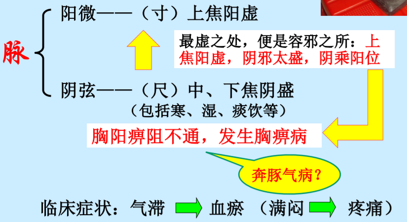
            - **3．病机关键**
                - 在于胸阳不足，即“所以然者，责其极虚 也。 ”
            - **4．阳微、阴弦二者缺一不可&nbsp;**
            - **【辨治要领与思路】&nbsp;**
                - 1.切脉当辨“太过不及” ，此诊脉之要诀。  
                - 2. “阳微阴弦”突出反应了正气、邪气在胸 痹心痛发病过程中所处的地位和作用。
        - **论述因邪实所致胸痹短气的病机（2）**
            - **【4】平人无寒热，短气不足以息者，实也。**
                - **平人**
        - 胸痹证治&nbsp;
            - **典型证—栝蒌薤白白酒汤 （3）**
                - ★ **【3】胸痹之病，喘息咳唾，胸背痛，短气，寸口脉沉而迟，关上小紧数，栝楼薤白白酒汤主之。**
                    - 栝楼薤白白酒汤方： 
                        -  栝楼实一枚(捣) 薤白半升 白酒七升  上三味，同煮，取二升，分温再服。
                - **1.证候分析**
                - > 辨证关键：胸背痛，短气—阳虚邪闭
                    - 喘息咳唾——胸阳不足，痰浊上犯，阴乘阳位， 肺失宣降 
                    - 胸背痛——背为胸之腑，邪浊闭塞胸中，前 后之气不通 
                    - 短气——痰饮阻膈，气道不利
                - **2．脉象：**
                - > 迟数之脉并见，一者，数字误，二者，作急疾讲。——《医宗金鉴》
                    - 寸口脉沉而迟—胸阳不振－阳微  
                    - 关上小紧数—中焦停饮，阴寒内盛－阴弦
                - **3．治法： 通阳宣痹，豁痰利气**
                - **4.    方解**
                    - 栝楼——苦寒滑润，宽胸利气，豁痰 散结 
                    - 薤白——辛苦温，通阳宣痹，泄浊行 气，又可制约栝楼寒性太过 
                    - 白酒——辛温走串，轻扬善行，引药 上行，通阳宣痹，亦为溶媒 剂&nbsp;
                - **【辨治要领与思路】**
                    - ①本条胸痹病属胸阳不振，阴邪阻滞所致。故其临 床的主症为“喘息咳唾，胸背痛，短气”。尤其 是“胸背痛，短气”是辨证的关键。 
                    - ②栝楼薤白白酒汤中白酒的作用不可忽视。
                - **【临床应用】**
                    - 主治：冠心病心绞痛、支气管哮喘、 肋间神经痛、胸部软组织损伤、非化脓 性肋软骨炎等。  还可辨证治疗胸胁部等疾患。
            - **重证—栝蒌薤白半夏汤 ——痰饮雍盛（4）**
                - **【4】胸痹不得卧，心痛彻背者，栝楼薤白半夏汤主之。**
                    - 栝楼薤白半夏汤方：
                        - 栝楼实一枚 薤白三两 半夏半斤 白酒一斗  上四味，同煮，取四升，温服一升，日三服。
                - **1.如何判断为痰饮壅盛?**
                    - “胸痹”主证中，喘息咳唾之证应较.上条为重。.
                    - 以方测证:此方中加入化痰散结的半夏，而通阳宣痹的薤白从8两减为3两。
                - **2.主症:**
                    - 胸痹不得卧一痰 饮壅塞，脉络不通胸痹而不得平卧，较上条“喘息咳唾”为重;
                    - 心痛彻背——心 胸痛牵彻后背，较“胸背痛”为剧。
                - **3.治法:豁痰下气，通阳散结，降逆逐饮**
                - **4.方药:栝楼薤白半夏汤**
                - **【辨治要领与思路】**
                    - ①本条胸痹病的主症是喘息不能平卧，心 痛彻背，据方论证，当有苔腻等症状。 
                    -  ②本条胸痹病较栝楼薤白半夏汤证为重， 故在加入半夏的基础上，白酒用至一斗，从 一般日二服改至三服。
                - **【临床应用】**
                    - 栝楼薤白半夏汤为主方，适当加味，常用于治 疗痰浊阻痹心胸所致的心病。 
                    - 有的取本方豁痰通阳之功治疗肺病，也有的用 于治疗肋间神经痛、乳腺增生症等。
            - **虚证—人参汤；实证—枳实薤白桂枝汤  ——虚实异治（5）**
                - **★【5】** **胸痹心中痞，留气结在胸，胸满，胁下逆抢心， 枳实薤白桂枝汤主之；人参汤亦主之。**
                    - 枳实薤白桂枝汤方：  
                        - 枳实四枚 厚朴四两 薤白半斤 桂枝一两  栝楼一枚(捣)  
                    - 人参汤方：  
                        - 人参 甘草 干姜 白术各三两
                - **1．胸痹基本病理是“阳微阴弦”二者俱在 。**
                    -  临床辨治当分偏实、偏虚的差异来治疗。 
                - **2．主证**
                    -  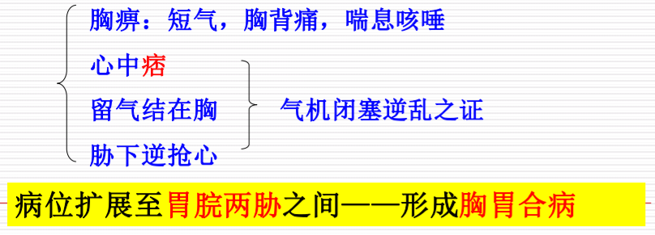
                - **3．偏于实证：**
                    - 脉阴弦，兼有心胸满闷，腹胀，大便不畅，舌苔厚腻， 膨膨然气不得出等--------阴寒痰浊偏盛 
                    - **治法：通阳散结，降逆除满**
                    - **方药：枳实薤白桂枝汤（又名栝楼薤白桂枝汤）**
                        - 枳实、厚朴—行气散结，消痞除满 
                        - 栝楼—豁痰下气，宽畅胸膈 
                        - 薤白、桂枝—通阳散结，平降逆气
                - **4．偏于虚证：**
                    - 脉阳微, 兼有倦怠少气，甚四肢厥冷，出冷汗等 ——阳气虚馁，阴霾不散，蕴结心胸 
                    - **治法：补气助阳**
                    - **方药：人参汤**
                        - 人参、甘草—补气以助阳气运行 
                        - 白术—健脾以消痰浊 
                        - 干姜—温阳散结以消痞满
                - **【辨治要领与思路】**
                    - 1.同为胸痹，偏于实的用枳实薤白桂枝汤， 以通为主。偏于虚的用人参汤，以补为主。  
                    - 2.二方的应用也可提示胸痹发作性的特点， 急性发作偏于邪实，缓解期间偏于正虚。 
            - **轻证—茯苓杏仁甘草汤、橘枳姜汤 （6）**
                - **【6】胸痹，胸中气塞，短气，茯苓杏仁甘草汤主之；橘枳姜汤亦主之。**
                    - 茯苓杏仁甘草汤方：  
                        - 茯苓三两杏仁五十个甘草一两。上三味，以水一 斗，煮取五升，温服一升，日三服。不差，更服。  
                    - 橘枳姜汤方：  
                        - 橘皮一斤枳实三两生姜半斤。上三味，以水五升， 煮取二升，分温再服。 
                - **1.如何判断为胸痹轻证?**
                    - ☆胸痹主证为“短气，胸背痛，喘息咳唾”
                        - 此条仅述:
                            - 胸中气塞，短气”-无疼痛或较轻
                    - ☆所用二方:
                        - 茯苓杏仁甘草汤 一一宣肺利气化饮；饮阻气滞
                        - 橘枳姜汤一一虽可温 胃行气散结，但其力远不及枳实薤白桂枝汤
                    - 饮邪偏盛—当见咳逆，吐涎沫，小便不利，舌苔白滑。  
                    - 气滞偏盛—当见心下痞满，呕吐气逆。
                - **2.方药：**
                    - 偏于饮阻者——健脾利饮，理肺降气：茯苓杏 仁甘草汤 
                    - 偏于气滞者——温胃散饮，理气降逆：橘枳姜 汤
                - **3.方解：**
                    - 茯苓杏仁甘草汤－－宣肺利气化饮  
                        - 茯苓—渗湿利水，排除肺中湿气  
                        - 杏仁—宣肺降气化痰  
                        - 甘草—补中和中，使邪去不伤正
                    - 橘枳姜汤－－温胃理气散结  
                        - 橘皮—理气化痰，燥湿行滞、和胃  
                        - 生姜—温通散寒，蠲饮止呕  
                        - 枳实—除痰癖，开胸结，消胀满
                - **【辨治要领与思路】&nbsp;**
                    - 同病异治：本条胸痹均伴有胸闷短气，但 证候却有偏于饮阻和偏于气滞之不同，故 偏于饮阻的用茯苓杏仁甘草汤，偏于气滞 的则用橘枳姜汤。
            - **急证—薏苡附子汤**
                - **胸痹缓急者，薏苡附子散主之。**
                    - 薏苡附子散方：  
                        - 薏苡仁十五两 大附子十枚（炮）  上二味，杵为散，服方寸匕，日三服。
                - **主证：胸痹，拘急作痛**
                - **方药：薏苡附子散**
                - **治法：散寒除湿，温阳通痹，缓急止痛**
                - **方解：以散为剂，意在取效迅速以缓急痛&nbsp;**
                    - 炮附子——温经散寒，通阳止痛 
                    - 薏苡仁——除湿宣痹，缓解筋脉挛急； 其性味甘淡微寒，可防附子 辛温太过
    - 心痛病
        - 心痛病证治&nbsp;
            - **寒饮气逆 心痛轻证——桂枝生姜枳实汤（8）**
                - **【8】心中痞，诸逆，心悬痛，桂枝生姜枳实汤主之。**
                    - 桂枝生姜枳实汤方： 
                        -  桂枝 生姜各三两 枳实五枚  上三味，以水六升，煮取三升，分温三服。
                    - **诸逆：**
                    - **心悬痛：**
                    - > 《医宗金 鉴》说：“心悬而空痛，如空中悬物动摇而痛也。”
                - **1. 主 证 ： ☆突出“痛、痞、逆”三字为特点**
                    - 心中痞—寒饮停聚，阳气不运 
                    - 心悬痛—寒饮冲逆 
                    - 诸逆—胃气与阴邪上逆，可见干呕，气塞 
                - **2.病机：寒饮内停，上逆攻冲于心胸部位**
                - **3.治法:温阳化饮，下气降逆**
                - **4.方药:桂枝生姜枳实汤 VS 橘枳姜汤**
                    - 枳实、生姜
                        - +桂枝----通阳降逆--- 气逆为主
                        - +桔皮----理气散结---气塞为主
            - **桂枝生姜枳实汤VS 枳实薤白桂枝汤比较**
                -  
            - **阴寒痼结心痛重证——乌头赤石脂丸（9）**
                - **【9】心痛彻背，背痛彻心，乌头赤石脂丸主之。**
                    - 乌头赤石脂丸方：   
                        - 蜀椒一两一法二分 乌头一分(炮) 附子半两(炮) 一法一分 干姜一两一法一分 赤石脂一两一法二分  
                        - 上五味，末之，蜜丸如梧子大，先食服一丸，日三服。 不知，稍加服。 
                - **1．主证：**
                    - 心痛彻背，背痛彻心（心胸部疼痛牵引到肩背部，肩 背疼痛又牵引至心胸）—痛势急剧，持续不解  
                    - 以方测证：冷汗出，面色晦暗，四肢逆冷，脉沉紧或 细微欲绝。 
                - **2．病机：阴寒痼结，寒气攻冲**
                - **3．治法：温阳逐寒，止痛救逆**
                - **4．方药：乌头赤石脂丸**
                    - 乌头、附子、椒、姜—大辛大热之品，峻逐阴寒而定痛 
                    - 赤石—固涩，收敛阳气以防辛热之品温散太过
                - **【辨治要领与思路 】**
                    - 1.心痛重证的辨证要点是心痛彻背，背痛彻心。
                    - 2.治疗应分别证情轻重而治:轻者桂枝生姜枳实汤;重者用乌头赤石脂丸。
                    - 3.治疗重证，仲景喜用附子或乌头，或两者并用。
                        - 乌头:长于起沉寒痼冷，并可使在经的风寒得以疏散
                        - 附子:长于治在脏的寒湿，能使之得以温化
            - **乌头赤石脂丸证与栝楼薤白半夏汤证鉴别**
                -  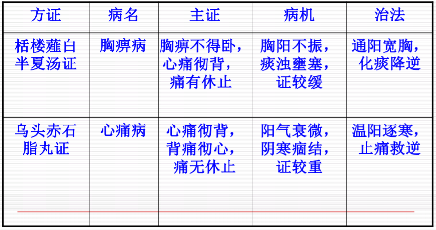
- 腹满寒疝宿食病脉证治第十
    - 三病概念     
        - 概 述 
            - **腹满**
                - 是以腹部胀满为突出表现的一种证候，常兼腹痛。 
                - 其病机包括虚实两个方面：
                    -  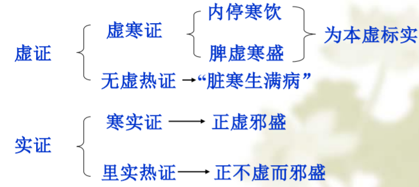
            - **寒疝**
                - 主证是腹中急痛，痛势急迫，不兼腹胀。
                - 其典型表现是绕脐痛。
                - 其病机是阴寒内盛，寒气攻冲。
            - 宿食
                - 即伤食，又称食积，指因脾胃功能失常或暴饮暴食致使食物滞留于胃肠，经宿不化而引起的一种疾病。
                - 其表现随邪气停留部位不同而各异。
                    - 胃:腹胀，呕恶，不能食
                    - 肠:腹胀痛，便秘不爽
    - 合篇意义
        - 三者病变均涉及胃肠 
        - 脉证相似，均有脉弦紧和腹部胀满或疼痛症状 
        - 在辨证施治上有共同之处  
            - 大建中汤——虚寒性腹满与寒疝  
            - 大承气汤——实热证腹满与宿食
    - 腹满的辨证及论治&nbsp;
        - 一、腹满的寒热虚实辨证（1、2、3）
            - 虚寒性腹满的病机、辨证和治则（1、3）
                - **【1】趺阳脉微弦，法当腹满，不满者必便 难，两胠疼痛，此虚寒从下上也，当以温药服之。**
                - **【3】腹满时减，复如故，此为寒，当与温药。（3）**
                    - **趺阳：** **。**
                    - **胠：**
                - **1.以脉论理阐明病机**
                    - **跌阳脉**
                        - 微——中阳不足，气血运行衰减
                        - 弦——下焦肝寒或肾寒之气上逆中焦
                - **2.症状特点:**
                    - (1)腹满(时减，复如故，喜温喜按) :阴寒之气横聚于腹，病在中焦脾胃。
                    - (2)不满者:阴寒不散，下闭阴窍， 病在下焦肝肾，故不腹满，而大便难、两肤疼痛，乃下焦阴寒之气攻冲两胁所致。
                    - ☆主证特点:“腹满” 时减;复如故;喜温喜按尤在泾:“腹中寒气得阳而暂开，得阴而复合也”。
                - **3.治法:当以温药服之——宣 散体内寒气(理中丸等)**
                - **【辨治要领与思路】**
                    - ①虛寒性腹满的辨证要点是“趺阳脉微弦”和“腹满时减，复如故”两大要点。
                    - ②治疗虛寒性腹满，当辦清证候兼挟分别而治。
                    - ③重视鉴别诊断。
            - 第2条——实热性腹满
                - **【2】病者腹满，按之不痛为虚，痛者为实，可下之。舌黄未下者，下之 黄自去。**
                - **1.从主证“腹满”的性质判断虚实属性：**
                    - 腹满，按之不痛―――虚 
                    - 腹满，按之痛――――实  
                - **2.实证腹满的治法：下法**
                    - 温下―――寒实证 
                    - 寒下 ――― 里实热证 （通腑泄热）
                    - ☆本条之腹满实证，从舌黄判断为实热证。
                - **3.“舌黄未下者，下之黄自去”的含义:**
                    - 提示了寒下法的两个应用指征:
                        - 必须是实热积滞，舌苔转黄者，可用。-- -“舌黄”。
                        - 正气未损，即能耐攻下者可用。--------- “未下”。
                    - ☆“黄自去”提示了实热腹满向愈的标志
                - **虚寒性与实热性腹满的鉴别要点表**
                    -  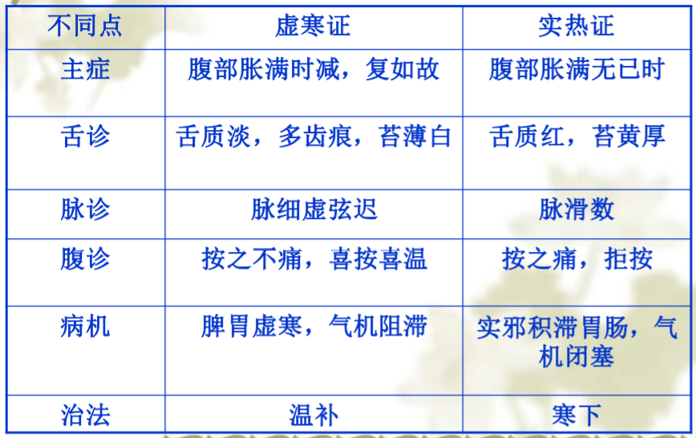
        - 二、腹满的辨证论治  
            - **实热证——厚朴三物汤（11）**
            - > 里实胀重于积
                - **【11】痛而闭者，厚朴三物汤主之。**
                    - 厚朴三物汤方：  厚朴八两 大黄四两 枳实五枚  
                    - 上三味，以水一斗二升，先煮二味，取 五升，内大黄，煮取三升，温服一升。以利 为度。 
                - **1.如何判断病机特点为“胀重于积”?**
                    - “闭”为大便不通，矢气亦不传——气机闭塞之明证
                    - 以方测证一一行气之 枳实、厚朴用量大于大黄
                - **2.主症:**
                    - 腹部胀满疼痛(按之痛剧、腹满不减)
                    - 大便闭结不通，亦无矢气
                - **3.治疗:**
                - **4.方药：厚朴三物汤**
                    - 厚朴三物汤与小承气汤药物组成相同
                    - 厚朴三物汤 厚朴8 大黄4 枳实5  
                    - 小承气汤      厚朴2 大黄4 枳实3
                - **【辨治要领与思路】**
                    - ①临证首辨寒热虚实，其次应辨其兼证，一旦确定 里热实证，仍需据其疼痛与腹胀的程度及矢气之 有无、黄苔之润燥等，判断其证胀与积的孰重孰 轻，然后决定治法方药。
                    - ②“以利为度”临证治病应根据用药后的反应决定 疗程的长短，不能长期服用，防止伤正。
            - **实热证——大承气汤（13）**
            - > 里实积胀俱重
                - **【13】腹满不减，减不足言，当须下之， 宜大承气汤。**
                    - 大承气汤方：见前“痉病”中。
                    - 厚朴三物汤 + 芒硝三合
                - **1.主证:腹满不减，减不足言(持续性)**
                    - 主证细化:“腹满”不减;按之痛;满痛在脐周
                    - 以方测证:烦躁不安，潮热谵语，大便秘结，舌苔黄腻，甚则焦黑起刺，脉沉滑有力等。
                    - 痞满燥实坚”——胀痛、拒按,燥屎
                - **2.治疗:当须下之**
                    - 寒下法:通腑泄热
                - **3.方药:大承气汤**
                    - 温分再服，得下止服
            - **表里兼证——厚朴七物汤（9 ）**
            - > 腹满里实兼表寒的证治
                - **【12】病腹满，发热十日，脉浮而数，饮食 如故，厚朴七物汤主之。**
                    - 厚朴七物汤方：    
                        -  厚朴半斤 甘草 大黄各三两 大枣十枚  枳实五枚 桂枝二两 生姜五两  
                        - 上七味，以水一斗，煮取四升，温服八合，日三 服。呕者加半夏五合；下利去大黄；寒多者加生姜至 半斤。 
                - **1.症状**
                    - 外感十日之后见腹满(以胀为主) --以里证为主为急
                    - 脉浮而数-发热十日，仍见脉浮，为表邪未解
                    - 饮食如故一病变重点主要在肠，胃气素强，胃气未病
                    - ——表邪未解,兼有阳明腑实气滞的腹满病
                - **2.治法:行气除满，疏表散寒--表里双解**
                - **3.方药:厚朴七物汤**
                    - 桂枝汤去芍药——解表达邪，调和营卫
                    - 厚朴三物汤——行气导滞除满
            - **表里兼证——大柴胡汤（12）**
            - > 里实兼少阳证
                - **【12】按之心下满痛者，此为实也，当下之， 宜大柴胡汤。**
                    - 大柴胡汤方：  
                        - 柴胡半斤 黄芩三两 芍药三两 半夏半升（洗） 枳实四枚（炙）大黄二两 大枣十二枚 生姜五两  
                        - 上八味，以水一斗二升，煮取六升，去滓，再煎， 温服一升，日三服。
                - **1. 主证：**
                    - 按之心下满痛—实邪停聚于上腹心下 
                - **2.病机：**
                - **3.病位：**
                - **4.治疗：**
                - **5.方药：**
                    - 柴胡、黄芩：和解少阳  
                    - 半夏、生姜 、大枣：降逆和胃安中  
                    - 大黄、枳实：攻逐阳明热结  
                    - 芍药：缓急止痛  
                        - 仲景取舍芍药的根据乃在于腹满的疼痛有无 
                - **临床应用**
                    - 胆囊炎、胆石症等多存在大便不畅以及 胆汁排泄不畅，日久导致炎症发生，大柴胡 汤可以在一定程度上促进胆汁排泄。
                - **【辨治要领与思路】**
                    - ①腹诊：按之痛否辨其虚实是仲景常用的方法。本条 就是以“按之心下满痛”而断其为实证。 
                    - ②主证：心下满痛。心下而及两胁的满痛表现，遂辨 其证为阳明里实兼涉少阳。
            - **虚寒证——附子粳米汤（10）**
            - > 寒饮逆满&nbsp;
                - **【10】腹中寒气，雷鸣切痛，胸胁逆满， 呕吐，附子粳米汤主之。**
                    - 附子粳米汤方：  
                        - 附子一枚（炮） 半夏半升 甘草一两 大枣 十枚 粳米半升  
                        - 上五味，以水八升，煮米熟，汤成，去滓，温 服一升，日三服。
                - **1.病因：腹中寒气**
                    - 寒：脾胃阳虚――阴寒内生、水湿内停  
                    - 气：内无宿食、燥屎、瘀血等有形实邪－阳虚生内寒 ——寒气水湿相搏 
                - **2. 主证： 其特点为“痛、满、吐”类似于“急性胃炎”**
                    - 雷鸣切痛——水气相击而鸣―喜温按、痛时止，复如故  
                    - 胸胁逆满——寒饮水湿上逆攻冲（病势从下向上）  
                    - 呕吐—胃气上逆—呕吐物多清稀、完谷不化（中阳虚）  
                    - 脉见沉、紧、弦（本虚标实！脾胃阳虚，阴寒水湿内停
                - **3.治法：**
                - **4.方药：**
                    - 炮附子—温中散寒以止痛  
                    - 半夏—化饮降逆以治呕  
                    - 粳米、甘草、大枣—补益脾胃以缓急  
                    - 附子大辛大热，粳米、甘草、大枣补中缓急，两者相 合既能温中散寒、止痛缓急，又能防止附子辛热太过。这 是仲景药物配 伍特点之一。 
                - **理中汤（人参汤）亦治中焦虚寒证**
                    - 理中汤：以下利为主（中阳不足）――药性升提  
                    - 附子粳米汤：以呕逆为主（水湿上犯）——药性降逆
                - **【临床应用】**
                    - 霍乱四逆、胃寒翻胃以及属中焦虚寒停饮的胃痉挛、 消化性溃疡等疾病  
                    - 寒盛痛甚者加干姜、肉桂等 
                    - 呕甚者加吴茱萸、竹茹等
                    - 食滞者加神曲、内金等
            - **虚寒证——大建中汤（14）**
            - > 脾虚寒盛
                - **★** **【14】心胸中大寒痛，呕不能饮食，腹中寒，上冲皮起，出见有头足，上下痛而不可触近，大建中汤主之。**
                    - 大建中汤方：  
                        - 蜀椒二合 干姜四两 人参二两  
                        - 
                        - > 脾虚寒盛&nbsp;
                - **1.主证：**
                    - 心胸中大寒痛，腹中寒（心胸肠胃）  
                    - 上下痛不可触近 （属虚？属实？）  
                    - 上冲皮起，出见有头足（寒气攻冲）
                    - 呕不能食  
                - **2.病机：**
                - **3.治法：**
                - **4.方药：大建中汤**
                    - 蜀椒、干姜——温中焦之阳气，散寒降逆  
                    - 人参、饴糖——甘温益气缓急
                    - 大建中汤治疗虚寒性腹痛之“痛、呕”及扶正养胃作用 均较附子粳米汤强，故言： 
                        - 中 焦 阳 气：
                            - 治疗虚寒性腹痛：附子不如干姜 
                            - 治疗虚寒性呕吐：半夏不如蜀椒 
                            - 温养脾胃：枣、草、米不如人参、饴糖
                - **附子粳米汤VS大建中汤**
                    -  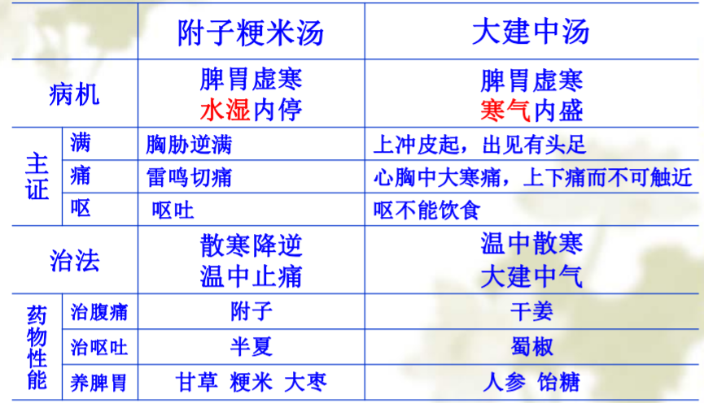
            - **寒实证——大黄附子汤（15）**
            - > 寒实积滞
                - **【15】胁下偏痛，发热，其脉紧弦，此寒 也，以温药下之，宜大黄附子汤。**
                    - 大黄附子汤方：  
                        - 大黄三两 附子三枚（炮） 细辛二两  
                        - 上三味，以水五升，煮取二升，分温三服；若 强人，煮二升半，分温三服。服后如人行四五里， 进一服。
                - **1. 主证 ：**
                    - 胁下偏痛：一侧胸胁疼痛 发热 
                    - 发热:寒积郁滞，阳气运行受阻，郁而化热，热势不高
                        - 非表证之热一脉不浮;
                        - 非阳明腑实-脉不滑数
                    - 弦紧脉:紧则有寒，弦则气滞
                - **2.病机：**
                - **3.治法：**
                - **4.方药：**
                    - 大黄－泻下通便 附子、细辛（量小、后下）－温阳散寒止痛  
                    - －制大黄寒凉之性
                    - 仲景附子、细辛同用，用于治疗寒邪伏于阴分， 细辛其性辛散温通，芳香走窜，可入里化表，宣通上 下。善止疼痛，但无温中作用。
                        -  
                - **【辨治要领与思路】**
                    - 方后“服后如人行四五里”，大黄附子汤能温阳祛寒， 通便行滞，服后身上出现发热、汗出的情况，这是药物起效 的反应。 
                    - 主症为大便不通，因此预后的好坏亦以服药后大便情况是 否通利为转移。因为寒实内结，阳气已经不足，是邪实正虚 ，如服温下剂后大便通利，是邪去正复，转危为安；如服后 大便仍不通畅，反增呕吐肢冷，脉象转细，是中阳已败，病 情已趋恶化。
    - 寒疝的辨证及论治&nbsp;
        - 一、病因病机（17）
        - 二、辨证论治  
            - **阴寒痼结——大乌头煎（17）**
                - ★ **【17】腹痛，脉弦而紧，弦则卫气不行，即恶寒，紧則不欲食，邪正相搏，即为寒疝。绕脐痛，若發則白汗出，手足厥冷，其脉沉弦者，大烏頭煎主之。**
                    - 乌头煎方：  
                        - 乌头大者五枚，熬，去皮，不㕮咀  
                        - 上以水三升，煮取一升，去滓，内蜜二升，煎令水气 尽，取二升，强人服七合，弱人服五合。不差，明日更服， 不可一日再服。
                    - **白汗：**
                - **1.以脉论寒疝病机：**
                    - 弦——主内寒，里阳亏虚，阳气不能行于外而恶寒  （发病的根据） 
                    - 紧——主外寒，外寒抑遏胃阳，则不欲食  （发病的诱因）
                    - 邪正相博，正不敌邪！  寒凝气滞血瘀——寒疝疼痛&nbsp;
                - **2.症状：**
                    - 发作性腹痛，部位绕脐——“若发” 
                    - 白汗出 
                    - 手足逆冷，恶寒，脉沉弦——单纯里寒，阴寒固结 
                - **3.治法：**
                - **4.方药：**
                    - 先煎久煎乌头――减轻其毒性 
                    -  素体虚弱之人慎用忌用 
                    - 一日用量不可过大 
                    - 以药液入口不麻为度 
                    -  用蜜很重要
                - **【辨治要领与思路】&nbsp;**
                    - ①寒疝的主症是阵发性绕脐剧痛。  寒疝脉象不一，轻者微弦（第1条），重者 弦紧，危者沉弦。 
                    - ②用峻猛剂应因人制宜。
            - **表里俱寒——乌头桂枝汤（19）**
                - **【19】寒疝腹中痛，逆冷，手足不仁，若身疼 痛，灸刺诸药不能治，抵当乌头桂枝汤主之。**
                    - 乌头桂枝汤方：  
                        - 乌头上一味，以蜜二斤，煎减半，去滓。以桂枝汤五合 解之，得一升后，初服二合；不知即服三合，又不知，复加 至五合。其知者，如醉状，得吐者，为中病。
                - **1.主证：**
                    - 寒疝腹中痛：内之阳气亏虚，阴寒内结 
                    - 逆冷，手足不仁：阳虚寒凝血滞，四肢失于温煦濡养 
                    - 身疼痛：外感寒邪，营卫不和
                - **2.病机:**
                - **3.治法:**
                - **4.方药:**
                    - 大乌头煎一起沉寒 以缓急痛
                    - 桂枝汤一和营卫以解表寒 (可否“抵挡乌头麻黄”? )
                - **【辨治要领与思路】&nbsp;**
                    - ①表里同病：辨证关键是腹痛，逆冷，身疼痛。 
                    - ②乌头用量应据痛证的轻重缓急而定。
                    - ③乌头桂枝汤煎服方法与服后观察的要点： 
                    - 乌头必须蜜煎，以减其毒性，并延长药效； 
                    - 当小剂量递增，以知为度；  
                    - 服药后如醉、呕吐表现为中病“瞑眩”反应，提示沉寒痼冷 已温散，阳气能伸展，但又绝对不可再服，否则必致中毒。
            - **血虚寒疝——当归生姜羊肉汤（18）**
                - ★ **【18】寒疝腹中痛，及胁痛里急者，当归生姜羊肉汤主之。**
                    - 当归生姜羊肉汤方：  
                        - 当归三两 生姜五两 羊肉一斤  
                        - 上三味，以水八升，煮取三升，温服七合，日三 服。若寒多者，加生姜成一斤；痛而呕者，加橘皮 二两、白术一两。加生姜者，亦加水五升，煮取三 升二合，服之。 
                - **1.病因病机：**
                    -  血虚气少，气虚生寒 
                    - 素体血虚，外受寒邪 
                - **2.主症：**
                    - 腹中痛——势缓，多绵绵而痛，喜温喜按 
                    - 胁痛，里急——肝血不足，肝之筋脉失却阴  血濡养和阳气之温煦
                - **3.治法：**
                - **4.方药：**
                - > 《素问·阴阳应象大论》：“形不足温之以气，精不足补之以味”所以选用血肉有情之品羊肉补虚生血。&nbsp;
                    - 当归—补血、活血 
                    - 生姜—散寒、止痛 
                    - 羊肉—补虚生血
                - **【临床应用】&nbsp;**
                    - **食疗强身** **产后及失血**
                    - 对血虚内寒性产褥热、产后恶露不 尽、肌衄、久泻以及低血压性眩晕、十 二指肠球部溃疡等，使用时应酌情加味。 
- 五脏风寒积聚病脉证并治第十一
    - 一、主要内容
        - 五脏中风、中寒
        - 真脏脉象
        - 五脏病证
            - **肝着(7)——旋覆花汤**
                - ★ **【7】肝着，其人常欲蹈其胸上，先未苦时，但欲饮热，旋覆花汤主之。**
                    - 旋覆花汤方：  
                        - 旋覆花三两 葱十四茎 新绛少许  
                            - 上三味，以水三升，煮取一升，顿服之。
                    - **肝着：**
                    - **蹈其胸上：**
                - **1.主症：**
                    - 令气机舒展
                        - 其人常欲蹈其胸上 
                        -  先未苦时，但欲饮热 
                        - 胸胁痞闷不舒，甚至胀痛、刺痛。
                        - 初郁气分—胸满，胀痛，蹈胸、饮热尚可 
                        - 久病入血—胸胁刺痛，经脉气血郁滞，虽饮热亦无助
                - **2.病因病机：**
                - **3.治法：**
                - **4.方药：**
                    - **旋覆花：**
                    - 行气活血， 通阳散结
                    - **新绛**
                        - 1、用于治疗肝痛，胸胁痞闷不舒，甚则 胀痛前者，要用红花染成的新绛；  
                        - 2、用于妇人流产、崩漏等，则用茜草染 成的新绛。
                - **【辨治思路】**
                    - ①肝着主症是胸胁胀满，局部喜捶 打揉按，欲饮热，脉弦涩。   
                    - ②肝着病机是肝经气血郁滞，着而 不行。运用行气活血、通阳散结之 “通”法是治疗肝着的要领。
                - **临床应用**
                    - 证属肝经气血瘀滞，着而不行的梅核气、  月经不调、产后漏下、肋间神经痛、肋  软骨炎、慢性胃炎、冠心病等。
            - **脾约(15)**
            - **肾着(16)——甘姜苓术汤&nbsp;**
                - ★ **【16】肾着之病，其人身体重，腰中冷，如坐水中，形如水状，反不渴，小便自利，饮食如故，病属下焦，身劳汗出，衣里冷湿，久久得之，腰以下冷痛，腹重如带五千钱，甘姜苓术汤主之。**
                    - 甘姜苓术汤 ：
                        - 甘草 白术各二两 干姜 茯苓各四两  
                        - 上四味，以水五升，煮取三升，分温三服，腰 中即温。
                    - **肾着：** 寒湿就痹着于肾的外府腰部，致使阳气的痹着不行，以腰部的沉重、冷、痛 为主症的一类疾病。
                - **1.病因：**
                - **2.主症：**
                    - 感受寒湿之邪(腰部为主)&nbsp;
                        - 其人身体重 
                        - 腰中冷 
                        - 腰以下冷痛
                    - 阴性症状
                        - 反不渴 
                        - 小便自利 
                        - 饮食如故
                - **3.治法：**
                - **4.方药：**
                    - 辛甘扶阳，温中散寒
                        - 甘草 干姜
                    - 健脾利湿（饮食如故？）
                        - 茯苓 白术
                    - **脏腑功能：**
                    - **VS 肾虚腰痛**
                - **【辨治思路】&nbsp;**
                    - ①病名虽为肾着，但其病机为腰中 寒湿。命名方法体现了仲景以“脏腑 辨证”为核心的学术思想。  
                    -  ②治疗肾着的要领是在健脾化湿药 物的基础上，应用温中散寒化湿的干 姜。 
            - **心伤(10)**
            - **癫狂(12)**
        - 三焦病证
        - 积聚谷气（20）
        - > 积聚谷气的鉴别
            - **【20】问曰：病有积、有聚、有谷气，何 谓也？师曰：积者，脏病也，终不移； 聚者，腑病也，发作有时，展转痛移， 为可治；谷气者，胁下痛，按之则愈， 复发为谷气。诸积大法，脉来细而附骨者，乃积也……。**
                - **谷气：**
            - **1.积聚均为腹部肿块**
                -  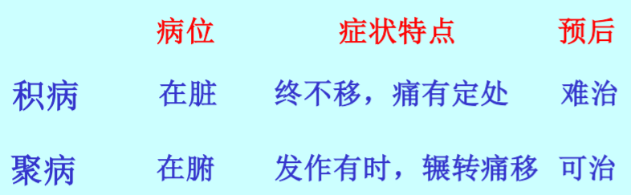
            - **2.症状特点：**
            - **3.病机：**
            - **4.治法:**
    - 二、合篇意义
        - 均以五脏病证为核心
- 痰饮咳嗽病脉证并治第十二&nbsp;
    - **概述&nbsp;**
        - 1.痰字含义：汉晋唐时期，“痰”通“淡” 、 “澹”。 指水液清稀动荡状态。
        - 2.痰饮病概念：
            - 是指体内水液输布运化失常，停积于某些部位的病症。
        - 3.临床表现：其症状表现较为复杂，可用“呕、咳、喘、满、痛、肿、悸、眩”来概括。
        - 4.病机：肺脾肾三脏气化功能失常，水液代谢障碍，导致水饮停聚于体内某部的疾病。
            - 痰饮病的病理性质：总属阳虚阴盛，输化失调，因虚致实，水液停聚。
        - 5.分类：
            - 痰饮病名为《金匮》首创，有广义和狭义之分
            - 痰饮（广义）
                - 悬饮，痰饮（狭义），溢饮，支饮
    - **痰饮**
        - 一、成因及总脉象（12）
            - **【12】夫病人饮水多，必暴喘满；凡食少饮多， 水停心下，甚者则悸，微者短气。脉双弦者， 寒也，皆大下后善虚；脉偏弦者，饮也。&nbsp;**
                - **双弦：**
                - **偏弦：**
            - **【分析】本条论述广义痰饮病的成因与主症分三部分来讲解：**
                - 第一层：“夫病人饮水多，必暴喘满”，指出痰饮病骤发的成因。
                - 第二层：“凡食少饮多……微者短气”，指出饮病由渐而得的原因。
                - 第三层：“脉双弦者.……偏弦者饮也”，论述寒与饮之脉象辨别。
            - 论述广义痰饮病的病因、病机和脉症
                - 1.病因病机
                    - “病人”一一什么病？
                        - “食少饮多”——脾胃虚弱，运化无力的病人
                    - 病因病机？
                        - 内因一一脾胃虚弱运化水谷无力
                        - 外因一一饮水多水停心下，阻滞气机。
                - 2.脉症表现
                    - 甚者― 悸 
                        - 心下悸―水气内停较重者，上凌于心 
                        - 脐下悸―如：奔豚气病
                    - 微者――短气 ――妨碍气机的升降&nbsp;
                - 3.脉象特点
                    - 脉偏弦，弦而有力
                    - 双弦（无力）—寒也―皆大下（下利、攻下）——后善虚 （本虚）
                    - 偏弦（有力）—饮也―水饮阴邪偏注于某一局  部，为邪实 (标实)&nbsp;
        - 二、痰饮病分类&nbsp;（1、2）
            - **【1】问曰：夫饮有四，何谓也？师曰：有痰饮，有悬饮，有溢饮，有支饮。**
            - **【2】问曰：四饮何以为异？师曰：其人素盛今瘦，水走肠间，沥沥有声，谓之痰饮；饮后水流在胁下，咳唾引痛，谓之悬饮；饮水流行，归于四肢当汗出而不汗出，身体疼重，谓之溢饮；咳逆倚息，短气不得卧，其形如肿，谓之支饮。**
                - **素盛今瘦：**
                - **沥沥有声：**
                - **咳逆倚息：**
            - **四饮的鉴别要点**
                -  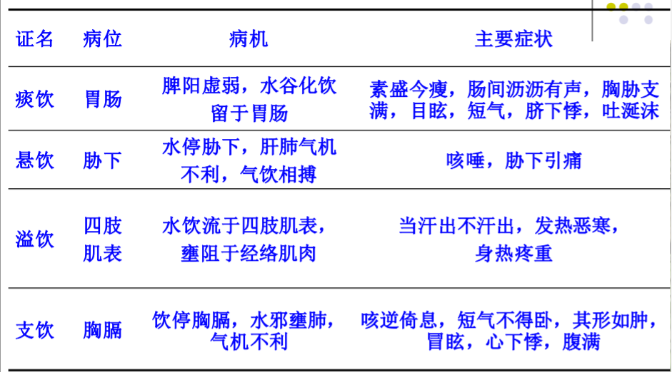
            - **中西病名对照**
                -  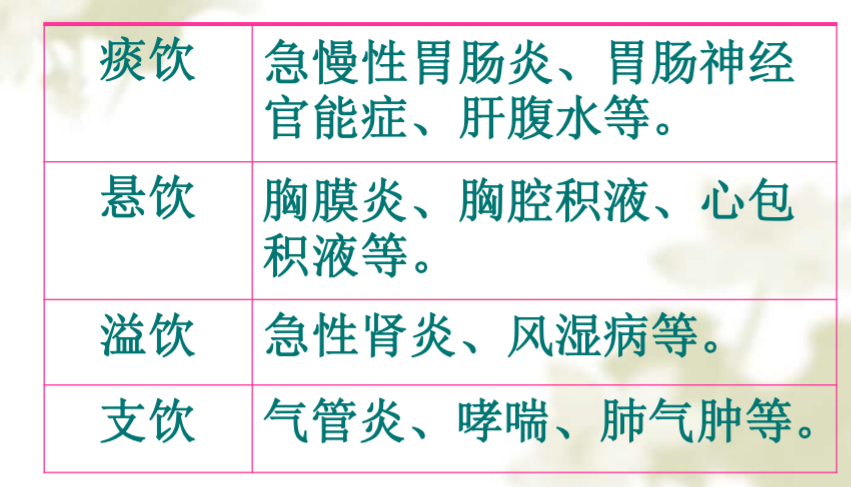
        - 三、痰饮病总治则&nbsp;（15）
            - **★【15】病痰饮者，当以温药和之。**
            - **1.饮邪性质： 饮为阴邪，最易损伤阳气，阻滞气机。 遇寒则凝，得阳始化，得温则行。**
            - **2.温药作用：振奋阳气， 开发腠理，通行水道。**
            - **3.和之：**
                - **调和脏腑，恢复气化—治本**
                - **行消开导，祛除饮邪—治标**
                - > 《本义》：……言和之则不专事温补，即有行消之品，亦概其例义于温药之中，方谓之和之而不可谓之补之益之也。
 行者，行其气也；
 消者，消其痰也；
 开者，开其阳也；
 导者，导饮邪从大小便出也。
            - **4.痰饮病的五大治法**
                - ①温阳化饮法：泽泻汤、苓桂术甘汤、五苓散、小半夏汤、小半夏加茯苓汤、肾气丸。
                - ②表里两解法：小青龙汤、大青龙汤。
                - ③疏导肠胃法：己椒苈黄丸、厚朴大黄汤。
                - ④泻水逐饮法：葶苈大枣泻肺汤、十枣汤。
                - ⑤扶正祛饮法：木防己汤、木防己去石膏加茯苓芒硝汤。
        - 四、痰饮证治
            - **1.饮停心下 ——茯苓桂枝白术甘草汤**
                - ★ **【16】心下有痰饮，胸胁支满，目眩，苓桂术甘汤主之。**
                    - 茯苓桂枝白术甘草汤方：  
                        - 茯苓四两 桂枝 白术各三两 甘草二两  
                        - 上四味，以水六升，煮取三升，分温三服，小便则利。
                - **1.症状：**
                    - 胸胁支满一一饮停心下
                    - 目眩一饮阻心下，清阳不升，清窍失养
                    - 小便不利一一气机不利
                - **2病机：**
                    - 饮停中焦，阻碍气机升降，浊阴不降，清阳不升。
                - **3.治法： 温阳化饮，健脾利水**
                - **4.方药：苓桂术甘汤**
                    - 茯苓－淡渗利水，化饮降逆 ——温阳化饮
                    - 桂枝－辛温－振奋阳气以消饮邪 ——温阳化饮
                    - 白术－苦温－健脾燥湿 ——补土制水
                    - 甘草－甘温－和中益气——补土制水
                - **【辨治要领与思路】**
                    - **重用茯苓**
            - **2.微饮短气——饮及脾肾**
                - **【17】夫短气有微饮，当从小便去之，苓桂 术甘汤主之；方见上。肾气丸亦主之。方见脚气中。**
                - **1.症状：**
                    - 短气  
                    - 小便不利  
                - **2.病机：**
                    - 饮邪形成之原因有脾、肾的不同， 故症状表现亦有差异
                - **3.治法：**
                - **4.方药：**
                    -  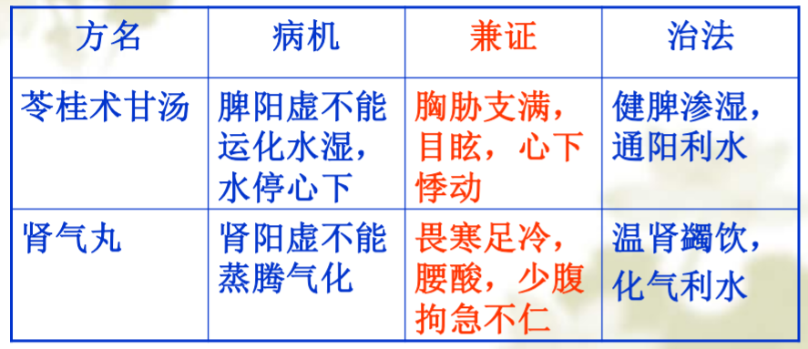
                - **【辨治要领与思路】**
                    - 原文虽曰“当从小便去之”，但从本条所 出二方功效来看，并非单纯利小便，而是于温 阳化气。因此，张仲景旨在通过温阳化气，达 到通利小便，祛除饮邪的目的。 
            - **3.下焦饮逆 ——五苓散**
                - **【31】假令瘦人，脐下有悸，吐涎沫而癫眩，此 水也，五苓散主之。**
                    - 五苓散方：  
                        - 泽泻一两一分 猪苓三分（去皮） 茯苓三分 白术三分 桂二分（去皮）  
                        - 上五味，为末，白饮服方寸匕，日三服，多饮暖 水，汗出愈。
                    - **癫眩：**
                - **1、病机：**
                - **2、主证：**
                    - ——水饮动于下，逆于中，犯于上所致
                - **3、治法：**
                - **4、方药：**
                    - 泽泻、茯苓、猪苓——淡渗利水，使水饮从小便而去；
                    - 桂枝——解肌发汗以散饮，化膀胱之气以利水，且具平冲降逆之功而使水饮表里分消；
                    - 白术——健脾利水
                - **【辨治要领与思路】**
                    - ①本条主症除形体消瘦，脐下筑筑悸动，吐涎 沫，头目眩晕外，还应有小便不利之症。因水 无去路，停于下而动逆于上，故致该证。 
                    - ②注意饮食的宜忌有助于疾病的治疗。原文 “多饮暖水，汗出愈”，是指借暖水之温以助 药力，通玄府，使部分水饮之邪由汗而解。
            - **4.痰饮呕吐——小半夏加茯苓汤**
                - ★ **【28】呕家本渴，渴者为欲解。今反不渴，心下有支饮故也，小半夏汤主之。《千金》云：小半夏加茯苓汤。**
                    - 小半夏汤方：  
                        - 半夏一升 生姜半斤  
                        - 上二味，以水七升，煮取一升半，分温再服
                - **呕家预后判断**
                    - 般呕吐： 呕家本渴－吐后伤阴 
                    - 痰饮呕吐： 渴者为欲解－饮去阳复
                    - ↓
                    - 今反不渴－心下有支饮故也
                    - ↓
                    - 小半夏汤证－呕而不渴
                - **治法：**
                - **方药：**
                    - 半夏一辛温，涤痰化饮，降逆止呕
                    - 生姜一辛散，温中降逆，消散寒饮，抑制半夏之悍性。
                - **【30】卒呕吐，心下痞，膈间有水，眩悸者，小半 夏加茯苓汤主之。**
                - > 本条论述饮邪致呕兼眩悸的证治
                    - 小半夏加茯苓汤方：  
                        - 半夏一升 生姜半斤 茯苓三两一法四两  
                        - 上三味，以水七升，煮取一升五合，分温再服。
                - **1、病机：**
                - **2、证候特点：**
                    - 卒—突然发作，胃气上逆则突然呕吐
                    - 心下痞——水饮内停、饮阻气滞
                    - 眩——水饮上泛，清阳不升重于上一条！
                    - 悸——水气凌心（“甚者则悸”）
                - **3、治法：**
                - **4、方药：**
                - **【辨治要领与思路】**
                    - 本方与小半夏汤均治因饮邪导致的呕吐。 “卒”字，表示病发突然，病势偏急，呕吐较 剧，并有痞、眩、悸之症，用药又增导水下利 之茯苓，由此可知，本方主治病证重于小半夏 汤病证，本方蠲饮降逆之力胜于小半夏汤。
                - **【41】先渴后呕，为水停心下，此 属饮家,小半夏茯苓汤主之。**
                    - **1.症状**
                        - 口渴一一性质（渴不欲饮，饮亦不多）
                        - 饮后呕吐
                    - **2.治法：**
                    - **3.方药：**
                    - **【分析】**
                        - 注意与胃热口渴相鉴别  本条论述水饮上逆致呕的证治。  一般情况应先呕吐损伤津液后再出现口渴，本条先口渴后呕吐，是由于病人本为停饮之体，因 脾不散津，津不上承而出现口渴。因渴而饮水过 多，水停心下成为新饮，水饮不能下行反而上逆 则出现呕吐。  
                        - 故治疗可用降逆止呕，引水下行的小半夏加茯 苓汤。小半夏汤蠲饮降逆，加茯苓以增强利水之 力，使旧饮去而新饮生，则渴呕自止。
            - **5.留饮欲去——甘遂半夏汤**
                - **【18】病者脉伏，其人欲自利，利反快，虽利， 心下续坚满，此为留饮欲去故也，甘遂半夏 汤主之。**
                    - 甘遂半夏汤方：  
                        - 甘遂（大者）三枚 半夏十二枚（以水一升，煮取半 升，去滓） 芍药五枚 甘草如指大一枚（炙）  
                        - 上四味，以水二升，煮取半升，去滓，以蜜半升， 和药汁煎取八合，顿服之。
                    - **1.主证：**
                        - 病者脉伏——饮邪久留，阳气被郁，脉道不利  
                        - 其人欲自利，利反快——正气祛邪外出  
                        - 虽利， 心下续坚满——虽有自利，但留饮病根未除
                    - **2.病机分析：**
                        -  —正气未虚，留饮欲去。 
                        - —饮邪顽固，去而未尽。
                    - **3.治法：**
                    - **4.方药：**
                        - 甘遂－攻逐饮邪 
                        - 甘草－与甘遂同用，相反相击，一战祛邪 
                        - 半夏－降逆蠲饮散结 
                        - 芍药，白蜜－酸收甘缓以安中
            - **6.肠间饮聚成实&nbsp;——己椒苈黄丸**
                - ★ **【29】腹满，口舌干燥，此肠间有水气，己椒苈黄丸主之。**
                    - 防己椒目葶苈大黄丸方：  
                        - 防己 椒目 葶苈（熬） 大黄各一两  
                        - 上四味，末之，蜜丸如梧子大，先食饮服一丸，日 三服，稍增，口中有津液。渴者，加芒硝半两。
                - **1、病位：**
                - **2、主证：**
                    - 腹中胀满（沥沥有声）——脾胃运化失职，肺气  不能通调水道，致使水邪留滞肠间  
                    - 口舌干燥（但不喜饮水）——水饮不化，津液不  能上承  
                    - 大、小便不利
                - **3、病机：**
                - **4、病势：**
                - **5、治法：**
                - **6. 方药：己椒苈黄丸**
                    - 防己——苦泄，渗透肠间水气  
                    - 椒目——辛散，并除心腹留饮  
                    - 葶苈——破坚逐邪，通利水道  
                    - 大黄——荡涤肠胃，泄热逐水  
                    - ——宣上运中导水下行，前后分消
                - **7.服药后：**
                    - （1）口中有津液——肺气得降，脾气得升，津液上潮； 
                    - （2）渴——饮阻热结，热滞于肠。加芒硝软坚破结
                - **【临床应用】**
                    - 本方证尚可兼见大便秘结，小便不利，浮肿， 脉沉弦有力等症。病人服药后可泻出痰涎，并有 舒适感。  
                    - 本方对肺心病、心包炎、胸膜炎、哮喘、肝 硬化腹水等属饮邪内结，痰热壅滞的实证，均有 一定疗效。但脾虚饮停者不宜
                - **己椒苈黄丸、甘遂半夏汤、五苓散三方列表鉴别**
                    -  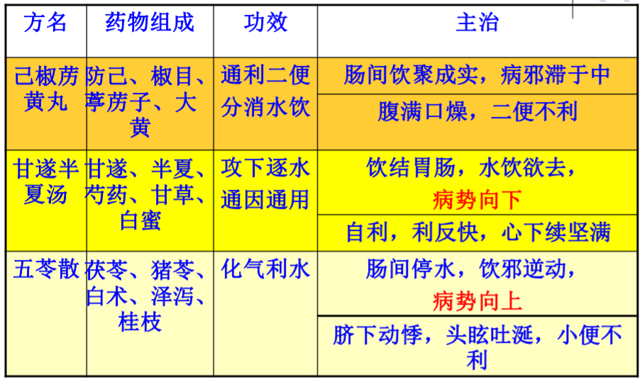
            - **7.痰饮冒眩&nbsp;——泽泻汤**
                - **【25】心下有支饮，其人苦冒眩，泽泻汤主之。**
                    - 泽泻汤方：  
                        - 泽泻五两 白术二两  
                        - 上二味，以水二升，煮取一升，分温再服
                    - 冒眩：即头目昏眩。&nbsp;
                    - > 《心典》： 水饮之邪，上乘清阳之位，则为冒眩。冒者，昏冒而神不清，如有物冒蔽也；眩者，目眩转而乍见玄黑也。
                - 症状——支撑胀满感
                - 病机——脾虚饮泛，蒙蔽清阳&nbsp;
                - 治法———健脾化饮，降逆止眩
                - **【辨治要领与思路】**
                    - 本证与苓桂术甘汤证同为目眩，但原因不一：
                        - 苓桂术甘汤饮阻中焦，清阳不升为主；
                        - 本证更突出阴浊冒逆，蒙蔽清阳。
                    - **5:2**
    - **悬饮**
    - > 本条论述悬饮实邪证的脉症与治疗
        - **【21】脉沉而弦者，悬饮内痛。**
        - **【22】病悬饮者，十枣汤主之。**
            - 十枣汤方：  
                - 芫花（熬） 甘遂 大戟 各等分  
                - 上三味，捣筛，以水一升五合，先煮肥大枣十枚， 取八合，去滓，内药末。强人服一钱匕，羸人服半钱， 平旦温服之；不下者，明日更加半钱，得快下后，糜 粥自养。
                - **内痛：**
                - **熬：**
                - **羸人：**
                - **平旦：**
            - **1、病机主证：**
                - 饮流胁下，阻遏气机 肝络不舒，肺气不宣
            - **2、治法：**
            - **3 、方药——十枣汤&nbsp;**
                - **经隧**
                - **脏腑**
                - **胸胁伏饮**
                - 大枣——益气护胃，缓和 诸药之毒，减少药后反应
            - **煎服法**
                - 先煮肥大枣，后内三药末（醋炒，减毒）。
                - 药量因体质而异。
                - 平旦温服之（阳气生发）。
                - 得快下后，糜粥自养（顾护胃气）
    - **溢饮**
        - **【23】病溢饮者，当发其汗，大青龙汤主之；小青龙汤亦主之。**
            - 小青龙汤方：  
                - 麻黄三两（去节）芍药三两五味子半升干姜三两甘草三两（炙）细辛三 两桂枝三两（去皮）半夏半升（汤洗）  
                - 上八味，以水一斗，先煮麻黄减二升，去上沫，内诸药，煮取三升，去 滓，温服一升。
            - 大青龙汤方：  
                - 麻黄六两（去节）桂枝二两（去皮）甘草二两（炙）杏仁四十个（去皮 尖）生姜三两大枣十二枚石膏如鸡子大（碎）  
                - 上七味，以水九升，先煮麻黄，减二升，去上沫，内诸药，煮取三升， 去滓，温服一升，取微似汗。汗多者，温粉粉之。
        - 溢饮的发生，多因感受风寒外邪，或口渴暴饮，饮溢四 肢肌表——“当汗出而不汗出，身体疼重”
        - **1.症状： 一病两方**
            - **大青龙汤：**
                - 身体疼重，无汗，恶寒发热、烦躁、脉浮紧。
                - 外寒重而夹郁热一一一发汗散饮兼清郁热
            - **小青龙汤：**
                - 身体疼重，无汗。咳嗽、喘满、痰多稀白、恶寒发热、脉弦紧。
                - 外寒而兼里饮一一一发汗兼温化水饮。
        - **2.比较**
            - 《伤寒来苏集》：“能化胸中之热气而为汗 ，故名大青龙，能化心下之水气而为汗， 故名小青龙，盖大青龙表证多，只烦躁是里证，小青龙里证多，只发热是表证”
            -  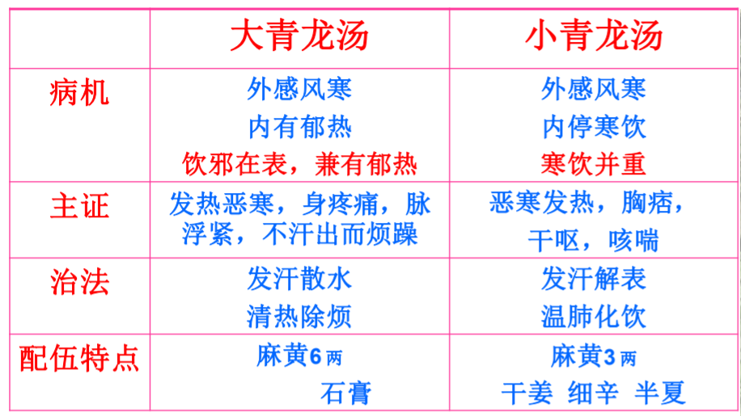
    - **支饮**
        - **1.膈间支饮重证——木防己汤/木防己加茯苓芒硝汤**
            - **【24】膈间支饮，其人喘满，心下痞坚，面色黧黑，其脉沉紧，得之数十日，医吐下之不愈，木防己汤主之。虚者即愈；实者三日复发，复与不愈者，宜木防己汤去石膏加茯苓芒硝汤主之。**
                - 木防己汤方：
                    - 木防己三两石膏十二枚如鸡子大桂枝二两人参四两上四味，以水六升，煮取二升，分温再服。
                - 木防己加茯苓芒硝汤方：
                    - 木防己桂枝各二两人参茯苓各四两芒硝三合上五味，以水六升，煮取二升，去滓，内芒硝，再微煎，分温再服，微利则愈。
            - **支饮重证**
                - 其人喘满－膈间支饮，上迫于肺  
                - 心下痞坚－水饮内结，胃气被郁  
                - 面色黧黑－饮聚于膈，营卫不利  
                - 其脉沉紧－寒饮留伏，结聚不散
            - **分析**
                - 得之数十日 （病程长 ） 医吐下之不愈 （有误治 ）
                - > 痞坚之处，必有伏阳，吐下之余，定无完气，书不尽言，而意可会也。——《心典》&nbsp;
            - **病机：饮热互结兼气虚**
            - **治法：**
            - **方解**
                - 木防己——苦
                - > 一苦一辛，行水饮而散结气
                - 桂枝 行水饮而散结气&nbsp;——辛
                - > 一苦一辛，行水饮而散结气
                - 石膏——辛凉以清郁热 
                - 人参——扶正补虚
            - **药后转归&nbsp;**
            - > 《心典》：“以坚投坚而坚不破者，即以软投坚而即破也。”&nbsp;
                - 虚者即愈：能得痞坚虚软，是水去气行，结聚已散，病即可愈。
                - 实者三日复发：仍痞坚结实，是饮结较重，病重药轻，原方不能胜任。
            - **【总结】**
            - > **饮支膈间痞坚成实**
                - **本证的特点：**
                - **辨证要点：**
                - 服药之后能使痞坚变成虚软，是水去气行的标志。
                - “三日”为虚数词，“三日复发”，是指短期内有效，不久又将出现喘满，心下痞坚等症状
                - “石膏十二枚如鸡子大”，从仲景其他方中用石膏的用药规律来看，石膏剂量大多为“鸡子大”，据此，这里当理解为石膏十二小枚，合起来如鸡子大。
        - **2.支饮腹满——厚朴大黄汤**
            - **【26】支饮胸满者，厚朴大黄汤主之。**
                - 厚朴大黄汤方：  
                    - 厚朴一尺 大黄六两 枳实四枚  
                    - 上三味，以水五升，煮取二升，分温再取
            - **证候分析：**
                - 腹满——肺合大肠，饮热郁肺，肺气不宣，腑气不通
            - **治法：**
            - **方药：**
                - 厚朴尺，枳实4，大黄6
            - **三方比较**
                -  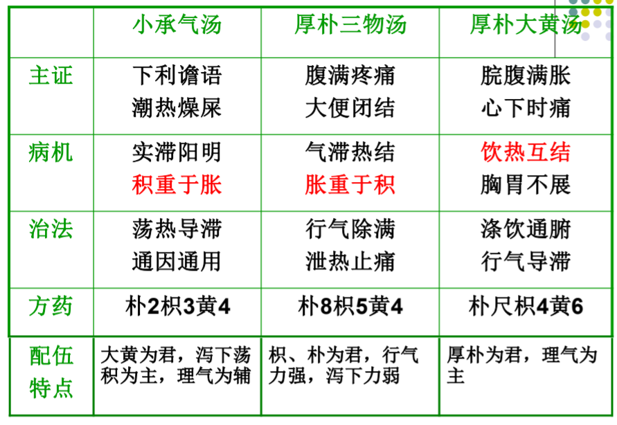
        - **3.支饮壅肺不得息——葶苈大枣泻肺汤**
            - **【27】支饮不得息，葶苈大枣泻肺汤主之。 方见肺痈中。**
            - **主证：**
            - **治法：**
            - **方药：**
            - **【辨治要领与思路】&nbsp;**
                - **不得息** **胸满** **张口抬肩，口吐稀涎，咽干不欲饮，脉滑数**
                - **痰涎壅盛，邪实气闭**
        - **4.支饮邪实咳嗽&nbsp;——十枣汤**
        - > 水饮犯肺，久病邪实咳嗽的治法
            - **【32】咳家其脉弦，为有水，十枣汤主之。方见上。**
                - **咳嗽、脉弦** **实证** **邪盛证实** **患者正气未虚而能承受**
            - **【33】夫有支饮家，咳烦，胸中痛者，不卒死，至一百日或一岁，宜十枣汤。方见上。**
                - **病程较长，咳嗽频繁且剧烈** **添“胸中痛”之症** **正气尚未大虚，纵然可用十枣汤攻之**
        - **5．随证施治（35-40）有**
            - **【35】咳逆倚息不得卧，小青龙汤主之。方见上及 肺痈中。**
            - 自“咳逆倚息不得卧，小青龙汤主之”始，至苓甘五味加姜辛半杏大黄汤止共6条原文可以看作是仲景治疗痰饮病一份医案。
                -  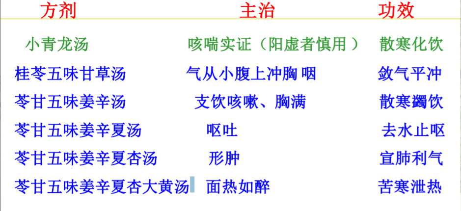
        - **痰饮眩晕治方**
            - **【16】心下有痰饮，胸胁支满，目眩，苓桂术甘汤主之。**
            - **【25】心下有支饮，其人苦冒眩，泽泻汤主之。**
            - **【30】卒呕吐，心下痞，膈间有水，眩悸者，小半夏加茯苓汤主之。**
            - **【31】假令瘦人脐下有悸，吐涎沫而癫眩，此水也，五苓散主之。**
    - **痰饮治法归纳**
        - **（1）温阳化饮法：脾肾阳虛，当分轻重**
            - ①苓桂术甘汤温阳蠲饮，健脾利水。
            - ②肾气丸温肾蠲饮，化气利水。
        - **（2）表里双解法：**
            - ①内饮外寒的支饮、滋饮，当以小青龙汤化饮解表。
            - ②外寒内饮兼郁热的滥饮，以大青龙汤发汗清热除饮。
        - **（3）疏导肠胃法：**
            - ①狭义疲饮停聚成实者，用己椒苈黄丸前后分消，攻坚還饮。
            - ②支饮腹满者，以厚朴大黄汤疏导肠胃，荡涤窦郛。
        - **（4）泻水還饮法：**
            - ①文饮不得息者，用带苈大枣泻肺汤泻麻饮。
            - ②狭义痰饮之留饮欲去者，以甘邀半夏汤急则治标，因势利导。
            - ③胸胁积饮，属悬饮；支饮久咳、邪盛正实者，均以十枣汤攻下逐饮或誌饮止咳。
        - **（5）扶正祛饮法：支饮痞坚，虛实错杂证**
            - ①虛者以木防已汤补虛清热，通阳利水；
            - ②实者则用木防己去石膏加茯苓芒硝汤行水散结。消坚补虛
        - **病痰饮者，当以温药和之** **治本以脾肾为主，治标有行、消、开、 导、清诸法**
- 消渴小便不利淋病脉证并治第十三
    - **1.三病概念**
        - **消渴**
            - **病机**
                - PS: 消渴症：热性病过程中出现口渴引饮的症状。
            - **《内经》对消渴的病因认为有：**
                - 饮食不节\胃肠积热\情志失调\气血郁滞\五脏虚弱
            - **王肯堂在《证治准绳》将消渴分为三种：** 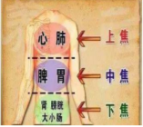
                - 上消：渴而多饮 
                - 中消：消谷善饥 
                - 下消：渴而便数
            - **程钟龄在《医学心悟》中承王肯堂之说立有治法：**
                - 治上消者宜润其肺，兼清其胃；  
                - 治中消者宜清其胃，兼滋其肾；  
                - 治下消者宜滋其肾，兼补其肺。 
        - **小便不利：**
        - **淋病：**
    - **2.合篇意义**
        - 症状：口渴、小便异常  
        - 病位：肾和膀胱  
        - 治疗：有的方治可以互通
    - **消渴**
        - **病机与主症（2、8）**
            - **【2】寸口脉浮而迟，浮即为虚，迟即为劳；虚则卫气不足，劳则营气竭。趺阳脉浮而数，浮即为气，数即消谷而大坚；气盛则溲数，溲数即坚，坚数相搏，即为消渴。**
            - **寸口脉候心肺**
                - 浮一浮而无力一卫气不足一卫虚气浮不敛
                    - 阴虚为本，燥热为标
                - 迟一血脉不充一营气亏损一营虚燥热内生
            - **趺阳脉候脾胃**
                - 正常一沉而和缓
                - 浮而数一胃热气盛，热盛于内，气蒸于外
                    - 浮—胃气有余。气有余则化火，水为火迫而偏走膀胱—小便频数 
                    - 数—胃热亢盛。火热消灼肠液—大便干结
        - **证治（12、3）**
            - **肺胃热盛，津气两伤——白虎加人参汤**
                - **【12】渴欲饮水，口干舌燥者，白虎加人参汤主之。**
                - **1.症状：**
                    - 渴欲饮水一一热盛伤津
                    - 口干舌燥一一虽饮水不解（伤津、耗气）
                    - 脉洪数有力
                    - 舌尖红，苔黄腻
                    - 可见小便频数
                    - （突出气化——饮入之水≠津液）
                - **2.治法：益气清热养阴**
                - **3.方药：白虎加人参汤白虎汤、人参**
                - > 尤怡：“此肺胃热盛伤津，故以白虎清热，人参生津止渴，盖即所谓上消膈消之证。”
            - **肾气亏虚的消渴——肾气丸**
                - **【3】男子消渴，小便反多，以饮一斗， 小便一斗，肾气丸主之。**
                - **1.症状：**
                    - 消渴一一口渴消水而不解
                    - 小便反多
                    - 饮一斗，小便一斗
                    - 补充：当兼腰膝酸软疼痛，脚肿，尺脉弱等症
                    - **消渴病多系热候，唯下消有寒有热** **肾阴虚者则不宜**
                - **2.病机：**
                - **3.治则：**
                - **4.肾气丸**
                    - 痰饮病－－小便不利  
                    - 消渴病－－小便反多
                - **【辨治要领与思路】**
                    - 病异让同可异病同治。肾气丸在《虚劳病》篇和《痰饮病》篇中均治小便不利，在本篇则治小便过多，前者因肾阳不足，膀胱气化不利；后者则为肾阳不足，不能化气以摄水。虽然表现不同，但病本则一。
                    - **微生火**
    - **小便不利证治**
        - **上燥下寒证——栝楼瞿麦丸(10)**
            - **【10】小便不利者，有水气，其人若渴，栝楼瞿麦丸主之。**
                - 栝楼瞿麦丸方：  
                    - 栝楼根二两 茯苓 薯蓣各三两 附子一枚（炮）瞿 麦一两 
                    - 上五味，末之，炼蜜丸梧子大，饮服三丸，日三服； 不知，增至七八丸，以小便利，腹中温为知。
            - **１. “上燥下寒”病机的判断  从主症小便不利入手**
                - **小便不利**
                    - 化源不足，阴虚内热   
                    - 湿热蕴结  
                    - 肾阳亏虚，气化失司 
            - **２.主症**
                - 病机：
                    - **上燥**
                    - **下寒**
                        - 小便不利  
                        - 口渴唇燥  
                        - 水肿；腹部畏寒喜暖
            - **3.治则：温阳化气，蒸津利水**
            - **4.栝楼瞿麦丸**
                - 栝楼根一润燥生津，止渴于上
                - 茯苓、山药一补益脾土，输运水津于中
                - 瞿麦、茯苓一渗导水气于下
                - 附子一温阳化气
                - **组方特点：温、润、利**
                - > 温阳而不伤津，润燥而不碍阳，淡渗而不劫阴 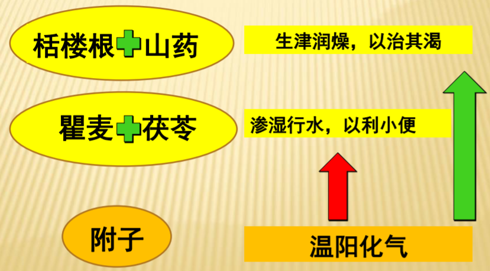
            - **【辨治要领与思路】**
                -  1．据方测证，栝楼瞿麦丸证在上可兼眩晕、烦热、失 眠；在下可有畏寒肢冷腹冷、腰以下肿等症，属上热下 寒证。 
                -  2．栝楼瞿麦丸证，栝楼根润燥生津，附子温阳化气， 山药健脾，瞿麦、茯苓淡渗利水，温阳不伤津，润燥不 碍阳，淡渗不劫阴，温润利并行不悖，是其配伍特点。
        - **湿热挟瘀——蒲灰散、滑石白鱼散(11)**
        - > 论述小便不利的三种治法
            - **【11】小便不利，蒲灰散主之；滑石白鱼散、 茯苓戎盐汤并主之。**
            - **1.蒲灰散**
                - 蒲灰 生蒲黄  
                - 滑石：清热利湿&nbsp;
                - 以方测证：  
                    - ――病机：湿热夹瘀，气机不利  
                    - ――见症：尿黄热不利 舌苔黄腻  
                    - ――治则：泄热化瘀利窍 
            - **2.滑石白鱼散**
                - 白鱼－书虫子，又叫书鱼，功能利小便。  
                - 乱发（烧炭）－血余炭，消瘀止血。  
                - 滑石－清利湿热。
                - ――病机：湿热血瘀  
                - ――见症: 尿中带血  尿道刺痛 ――血淋  
                    - ＋少腹胀满 
                - &nbsp;――方药：滑石白鱼散，清瘀利尿&nbsp;
            - **3.茯苓戎盐汤**
                - 茯苓、白术－健脾利湿  
                - 戎盐：青盐 咸寒，润下渗利，可助水脏，益精气，利水消瘀
                - ――病机：脾肾亏虚，湿热内蕴。  
                - ――见症：尿后余沥不尽，色不黄，刺痛不显  伴食少，腰膝酸软，四肢乏力，舌淡苔白 
            - **【辨治要领与思路】&nbsp;**
                - 同病异治，即使证候相同，但有程度差异者，也应 异治。 
                - **轻重虚实** **滑石白鱼散和蒲灰散** **血淋** **热淋** **茯苓戎盐汤** **劳淋或膏淋**
        - **脾肾亏虚——茯苓戎盐汤(11)**
        - **膀胱气化不行——五苓散(4、5)**
        - **水热互结伤阴——猪苓汤(13)**
    - **淋病**
        - **主症（7）**
            - **【7】淋之为病，小便如粟状，小腹弦急，痛引 脐中。**
            - > 石淋&nbsp;
        - **治禁（9）**
            - **【9】淋家不可发汗，发汗则必便血。**
            - > 久治不愈，多有肾阴不足、津液素亏、膀胱蓄热之象，辛温发汗，更劫阴液，热盛伤络，尿血&nbsp;
- 水气病脉证并治第十四
    - 概述
        - **水气病：**
            - 1.《素问·水热穴论》说“其本在肾，其末在肺。”又说：“肾者， 胃之关也, 关门不利，故聚水而从其类也” 。 
            - 2.《素问·至真要大论》：“诸湿肿满，皆属于脾” 。
            - **分类**
                - 《内经》：风水、石水、涌水。 
                - 《金匮》 ：四水、五脏水、黄汗；水分、 气分、血分。 
                - 《巢氏病源·水肿候门》：风水、皮水、 石 水。
            - **病机**
                - 《内经》云：“饮食入胃，游溢精气，上输于脾，脾气散精，上归于肺，通调水道，下输膀胱，水精四布，五经并行。”&nbsp;
            - **总结：“其本在肾，其标在肺，其制在脾”**
            - **鉴别：水气病与痰饮病的异同**
                -  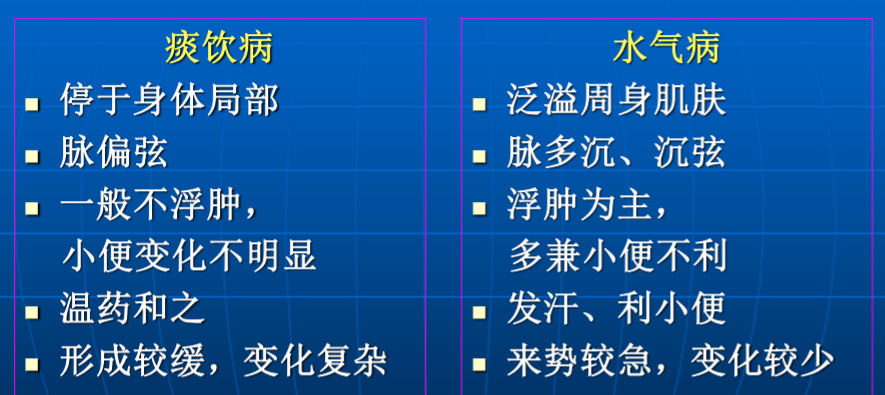
    - **分类与辨证**
        - **（一）四水与黄汗**
            - ★ **【1】师曰：病有风水、有皮水、有正水、有石水、有黄汗。风水，其脉自浮，外证骨节疼痛，恶风；皮水， 其脉亦浮，外证胕肿，按之没指，不恶风，其腹如鼓， 不渴，当发其汗；正水，其脉沉迟，外证自喘；石水， 其脉自沉，外证腹满不喘；黄汗，其脉沉迟，身发热，胸满，四肢头面肿，久不愈，必致痈脓。**
            - **风水**
            - > 风水，其脉自浮，外证骨节疼痛，恶风
                - 病位——其病在表（肺） 
                - 病因——风客肌表 
                - 病机——风邪袭表，肺失宣降。 
                - 证候——脉浮恶风（风邪在表），外证骨节疼 痛（风湿留滞关节）
                - 特点：发病急剧，头面先肿，迅速遍及全身。 
                - 治法：当发其汗
            - **皮水**
            - > 皮水，其脉亦浮外证肘肿，按之没指，不恶风，其腹如鼓，不渴当发其汗
                - 病位——其病在肌肤（脾、肺） 
                - 病因——水溢于表 • 病机——脾虚湿盛，水泛体表 
                - 证候——
                    - 其脉亦浮（水湿阻滞，肿在肌表）
                    - 外证浮肿、按之没指（水湿潴留皮中）
                    - 不恶风（非外感侵袭）
                    - 其腹如故（里水不多）
                    - 不渴（未挟热邪）
                - 特点：发病较缓，足踝部先肿，而后遍及全身。 
                - 治法：当发其汗。
            - **风水与皮水比较**
                -  
            - **正水&nbsp;**
            - > 正水，其脉沉迟，外证自喘；
                - 病位——病在里（肾、肺或脾） 
                - 病因——里阳不足，寒水所胜 
                - 病机——脾肾阳虚，肺失肃降 
                - 证候——脉沉迟（里阳不足，寒水所胜），外证 自喘（水停于里，气逆于上）
                - 特点：发病较缓，腰以下肿
                - 治法：温肾化水。
            - **石水**
            - > 石水，其脉自沉，外证腹满不喘
                - 病位——病位在里（肝、肾） 
                - 病因——水湿内停，阳气不行 
                - 病机——脾肾阳虚，寒水内盛 
                - 证候——脉自沉（肾阳不足，寒水聚结下焦），外证腹满、不喘（水气结于少腹，未波及于上）
                - 特点：发病较缓，下肢肿甚，连及腹部
                - 治法：温阳散结
            - **四水比较**
                -  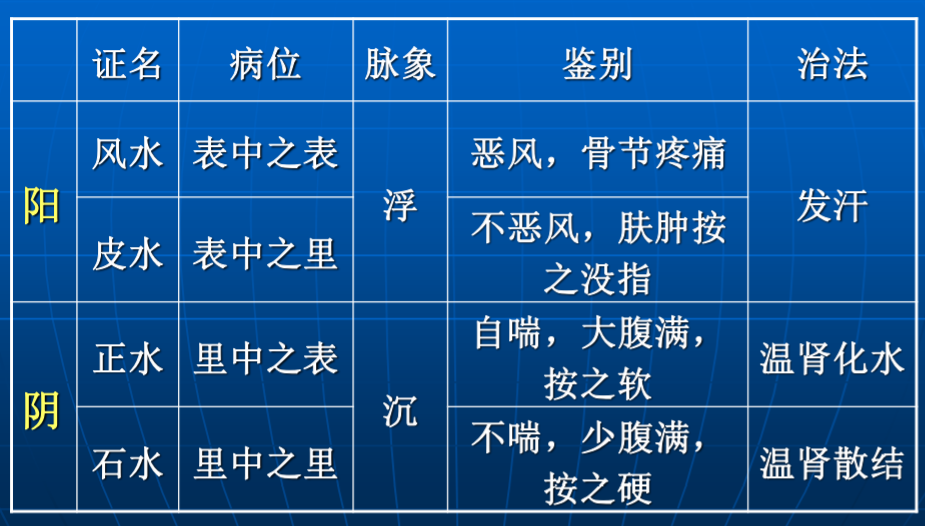
            - **黄汗**
                - 含义——汗出染衣色黄  
                - 病因——脾虚，汗出入水中浴 
                - 病机——脾虚失运，水湿外淫；卫郁营热，湿热交蒸 
                - 证候——脉沉迟（水湿内郁，营气被阻），汗出色黄 （卫营郁热，湿热交蒸肌腠），身发热（郁遏卫气， 营郁化热），胸满（胸阳不布，肺气不畅），四肢头面肿（水湿泛溢肌腠）。 
                - 转归——久不愈，必致痈脓（营卫不通，郁热更盛， 气血腐败）
        - **（二）血病及水，水病及血**
        - > 妇人水肿，有血分、水分之异
            - **【20】问曰：病有血分水分，何也？师曰：经水前断，后病水，名曰血分，此病难治， 先病水，后经水断，名曰水分，此病易治， 何以故？去水，其经自下。**
            - **血分**
                - **病机：**
                - **证候：**
                - **病势：**
                - **治则：**
            - **水分**
                - **病机：**
                - **证候：**
                - **病势：**
                - **治则：**
            - **气分病**
                - **【30】师曰：寸口脉迟而涩，迟则为寒，涩为血不足。 趺阳脉微而迟，微则为气，迟则为寒。寒气不足，则 手足逆冷；手足逆冷则营卫不利；营卫不利，则腹满 肠鸣相逐，气转膀胱，荣卫俱劳； 阳气不通即身冷， 阴气不通即骨疼；阳前通则恶寒，阴前通则痹不仁； 阴阳相得，其气乃行，大气一转，其气乃散；实则失 气，虚则遗尿，名曰气分。**
                - **证候分析&nbsp;**
                    - 寒气不足，则手足逆冷——有寒而阳气不足，营卫运行不利 
                    - 营卫不利则腹满胁鸣相逐——阴寒独盛，寒从中生 
                    - 气转膀胱，营卫俱劳——寒气下转膀胱，太阳失其化气、卫外之权 
                    - 阳前（不）通则恶寒——阳气断绝流通，肌体失于温煦 
                    - 阴前（不）通则痹不仁——阴气断绝流通，肌肤失于濡养
                - **气分病治则**
                    - 气实→实则失气—阳气衰微，大气不转，泄于后阴。
                    - 气虚→虚则遗尿—阳虚气弱，失于固摄。
                    - 含义：由于脏腑功能失调，气化不行，停水外溢所致的水气病
                    - 病机：水寒之气乘阳气之虚而病在气分，阴阳失调。
                    - 病位：病变以肺、脾、肾为中心，亦与三焦、膀胱有关
                    - 证候：手足逆冷、腹满、肠鸣、身冷、骨痛、肌肤不仁
                    - 治则：调其阴阳，温运阳气。“大气一转，其气乃散”。
                - **气、血、水&nbsp;**
                    -  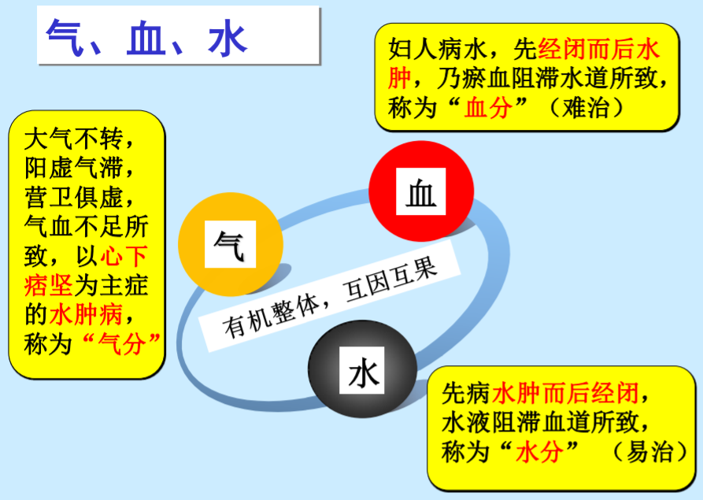
    - **总体治法**
        - **（一）利小便、发汗**
        - > 论述水肿病的一般治疗原则
            - **【18】师曰：诸有水者，腰以下肿， 当利小便；腰以上肿，当发汗乃愈。**
            - **1.证候分析腰以上肿：病位在上在表，当发汗。**
                - 腰以下肿：病位在下在里，当利小便。
            - **2.应用：**
                - ①适应范围：阳证、实证；阴证、虚证不宜单独使用此法则
                - ②两法同施
                - ③知常达变
                - ④不宜久用
        - **（二）攻下逐水**
            - ★ **【11】夫水病人，目下有卧蚕，面目鲜泽，脉伏，其人消渴。病水腹大，小便不利，其脉沉绝者，有水，可下之。**
            - **水肿病人可下之证**
                - 目下有卧蚕一一脾胃为水湿所困，水湿上泛于目胞。
                - 面目鲜泽——水气盛脉伏——水气内盛。
                - 其人消渴——阳为水遏，气不布津，津不上乘。
                - 小便不利——气机阻滞，阳不化水。
                - 病水腹大——水愈积愈多，溢于腹内。
                - 脉沉绝——水遏气闭。
            - **治则：可下之**
                - 正气未衰，为实证，宜攻逐水邪。  
                - 正气已衰，属虚证，不可攻下。
    - **证治**
        - **（一）风水**
            - **1.风水表虚——防已黄芪汤**
                - **【22】风水，脉浮身重，汗出恶风者，防已黄芪汤主之。腹痛者加芍药。**
                - > 论风水表虚证治
                - **1.证候分析：**
                    - 脉浮——风邪袭表
                    - 身重一水湿浸淫肌表
                    - 汗出恶风—表虚不固
                - **2.病机：表虚夹风，水泛肌肤**
                - **3.治则：益气固表，除湿利水**
                - **方药：防己黄芪汤**
                    - 防己——利水
                    - 黄芪——益气固表
                    - 生姜、大枣、甘草——补中，调和营卫
                    - 加减：腹痛者加芍药——缓急止痛
            - **2.风水挟热——越婢汤**
                - **【2】风水恶风，一身悉肿，脉浮不渴，续自汗出，无大热，越婢汤主之。**
                - > 论风水挟热的证治
                - 越婢湯方：  
                    - 麻黃六兩 石膏半斤 生薑三兩 大棗十五枚 甘草二兩  
                    - 上五味，以水六升，先煮麻黄，去上沫，内 诸药，煑取三升，分温三服。恶风者加附子一枚 炮。风水加术四两。
                - **1.证候分析：**
                    - 恶风——风邪在表
                    - 身悉肿——肺失通调，水气泛溢肌肤
                    - 脉浮而渴——病在表，风邪化热伤津
                    - 续自汗出，无大热——热蒸汗出，因汗出而热不甚
                - **2.病机：风水表实挟肺卫郁热**
                - **3.治则：发越水气，兼清郁热**
                - **4.方药：越婢汤**
                    - 麻黄配生姜——宣散水湿。
                    - 麻黄伍石膏——发越水气，兼清郁热
                    - 生姜、大枣、甘草——调营卫，和中气
                - **5.加减法**
                    - 恶风者加炮附子一枚——复阳止汗
                    - 风水，加白术四两——健脾祛湿
        - **（二）皮水**
            - **1.皮水挟热——越婢加术汤**
            - > 论述皮水郁热证的治疗
                - **【5】里水者，一身面目黄肿，其脉沉，小便不利，故令病水。假如小便自利，此亡津 液，故令渴也，越婢加术汤主之。**
                - **1.证候分析**
                    - 里水者——《脉经》注：“一云皮水” 。  
                    - 一身面目洪肿——水湿盛于皮中。  
                    - 脉沉——水湿内盛
                    - 小便不利——水液不能下输于膀胱。 
                - **2.病机：脾虚不运，肺气不宣，水湿郁热**
                - **3.治则：发汗清热，健脾除湿、**
                - **4.方药：越婢加术汤**
                    - 麻黄、石膏——发越水气，兼清郁热白术——健脾除湿。
                    - 生姜、大枣—一调和营卫。
                - **5.治禁：假如小便自利，此亡津液，故令渴也**
                    - ——津液已伤，则不能用越婢加术汤。
            - **2.皮水表实——越婢加术汤/甘草麻黃汤**
            - > 论述皮水夹热证及皮水郁表证的治疗
                - **【25】里水，越婢加术汤主之，甘草麻黃汤亦主之。**
                    - 越婢加术湯：見上。  
                    - 甘草麻黃湯方：  
                        - 甘草二兩 麻黃四兩  
                        - 上二味，以水五升，先煑麻黃，去上沫，內甘草， 煑取三升，溫服一升，重覆汗出，不汗，再服。慎風寒。
                - **1.证候：**
                    - 里水—即皮水，指条文（5）所述证候：一身面目洪肿，脉沉，小便不利。
                - **2.病机：脾失健运，肺气不宜，水湿停聚化热**
                - **3.治疗：**
                    - 皮水，表实里热——越婢加术汤。
                    - 皮水，表实无里热——甘草麻黄汤。
                - **4.方药:甘草麻黄汤**
                    - 麻黄——发汗宣肺利水。  
                    - 甘草——和中补土。  
                    - 甘草麻黄汤具有上宣肺气，中助脾气，外行水 气的作用。
            - **3.皮水阳郁——防己茯苓湯主**
            - > 皮水脾虚阳郁证治
                - **【24】皮水爲病，四肢腫，水氣在皮膚中，四肢聶聶動者，防己茯苓湯主之。**
                    - 防己茯苓湯方：
                        - 防己三兩黄芪三兩桂枝三兩茯苓六兩甘草二兩
                        - 上五味，以水六升，袁取二升，分溫三服。
                - **1.证候分析**
                    - 皮水为病—脾虚失运，水气泛溢肌表。
                    - 四肢肿，水气在皮肤中——脾失健运，水溢于四肢皮肤。
                    - 四肢聂聂动者——水淫四肢，阳气受阻。
                - **2.病机：脾虚水气盛，阳郁不宣。**
                - **3治法：通阳化气，表里分消水湿。**
                - **4.方药：防己茯苓汤**
                    - 桂枝、黄芪——通阳行痹，鼓舞卫阳
                    - 防己（+黄芪）——扶表利水（汗）
                    - 茯苓（+桂枝）——通阳利水（利）
                    - 甘草——和中健脾以制水
            - **4 . 皮水湿热内壅 ——蒲灰散**
            - > 论述皮水阳郁而手足厥冷的治疗
                - **【27】 厥而皮水者，蒲灰散主之。方見消渴中。**
                - **1.证候：**
                    - 厥——四肢厥冷。水气阻遏阳气，不能达于四末。
                    - 皮水——外证跗肿，按之没指，恶风，其腹如鼓，不渴
                - **2.病机：水气盛于外，湿热壅于内，阳气被郁**
                - **3.治则：通阳利小便。**
                    - 叶天士：“通阳不在温而在利小便。”
                - **4.方药：蒲灰散。（见消渴篇）**
                    - 蒲灰——清利下焦湿热
                    - 滑石——利小便
        - **（三）正水**
            - **【26】水之为病，其脉沉小，属少阴；浮者为风；无水虚胀者为气；水，发其汗即已。脉沉者宜麻黄附子汤；浮者宜杏子汤。**
            - > 论述风水与正水的证治，以及水气病和虚胀的鉴别
                - 麻黄附子湯方：
                    - 麻黄三兩甘草二草附子一枚（炮）
                    - 上三味，以水七升，先麻黄，去上沫，内诸药，煮取二升半，温服八分，日三服。
                - 杏子湯方：未見，恐是麻黄杏仁甘草石膏湯
            - **1、正水与风水的区别**
                -  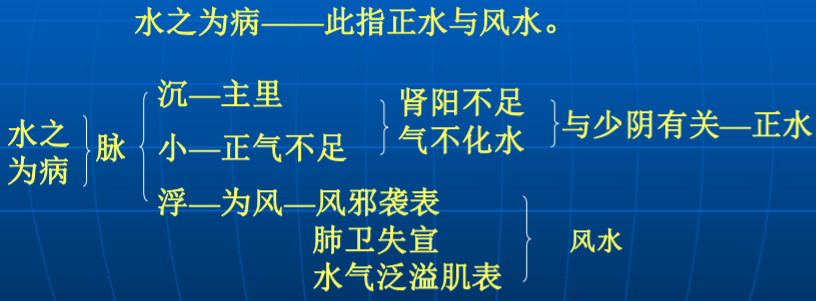
            - **2、水气病与气胀的鉴别**
                -  
            - **3、正水与风水的治法**
                -  
                - **麻黄附子汤——助阳发汗**
                    - 麻黄—发汗解表 
                    - 附子—温阳化水 
                    - 甘草—和中 
            - **本条内容简示如下：**
                -  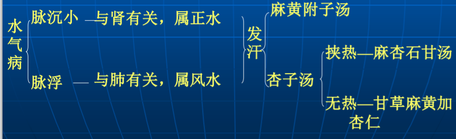
        - **（四）黄汗**
            - **1、卫郁营热、表虚湿遏——耆芍桂酒湯**
            - > 论述黄汗的病机和证治
                - **【28】問曰：黄汗之爲病，身體腫一作重，發熱汗出而渴，狀如風水，汗沾衣，色正黄如柏汁，脈自沉，何從得之？師曰以汗出入水中浴，水從汗孔入得之，宜耆芍桂酒湯主之。**
                    - 黃耆芍藥桂枝苦酒湯方：
                        - 黃耆五兩 芍藥三兩 桂枝三兩
                        - 上三味，以苦酒一升，水七升，相和，煮取三升，溫服一升，當心煩，服至六七日乃解。若心煩不止者，以苦酒阻故也。
                - **1.证候分析：**
                    - 身体肿一水湿外侵，卫郁不行水。
                    - 发热一营卫失和，营郁而为热。
                    - 汗出而渴一热蒸汗出津伤汗沾衣，色正黄如柏汁一湿热内郁营分，热蒸汗出而黄。
                    - 脉沉—湿热阻遏营卫之气。
                - **2.病因：汗出入水中浴，水从汗孔入得之**
                - **3.鉴别：**
                    -  
                - **4.病机：卫郁营热，表虚湿遏**
                - **5.治则：调和营卫，固表祛湿，兼泄营热**
                - **6.方药：芪芍桂酒汤**
                    - 桂枝、芍药—调和营卫。  
                    - 黄芪—实卫走表；配桂枝，振奋卫阳而行水湿。
                    - 苦酒（米醋）
                        - 散：泄营中郁热。
                        - 收：摄营益阴。
            - **2、气虚湿盛阳郁——桂枝加黄耆湯**
            - > 论述黄汗病的另一种治法，及其与历节、劳气的鉴别
                - **【29】黄汗之病，兩胚自冷；假令發熱，此屬歷節。食已汗出，又身常暮盜汗出者，此勞氣也。若汗出已反發熱者，久久其身必甲錯；發熱不止者，必生惡瘡。**
                - **若身重，汗出已輒輕者，久久必身瞤，瞤即胸中痛，又從腰以上必汗出，下無汗，腰髖弛痛，如有物在皮中狀，劇者不能食，身疼重，煩躁，小便不利，此爲黄汗，桂枝加黄耆湯主之。**
                    - 桂枝加黄耆湯方：
                        - 桂枝三兩 芍藥三兩 甘草二兩 生薑三兩 大棗十二枚 黄耆二兩
                        - 上六味，以水八升，贵取三升，溫服一升，須臾飲熱稀粥一升餘，以助藥力，溫服取微汗，若不汗，更服。
                - **1.黄汗与历节、劳气的鉴别**
                    -  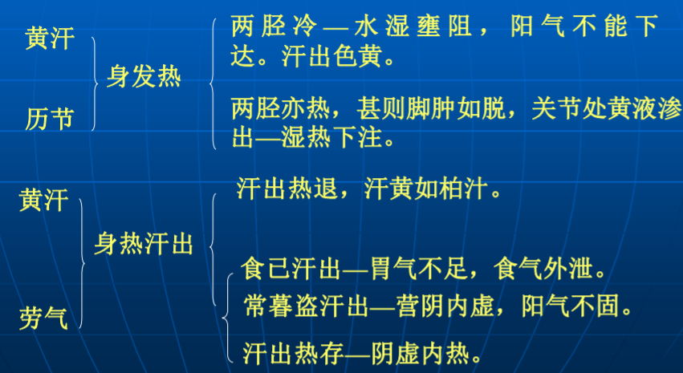
                - **2.黄汗预后：**
                    - 汗出反发热
                        - 久久其身必甲错—耗损营血，肌肤失养。 
                        - 发热不止，必生恶疮——营血不通，正 气日衰，外感邪毒。&nbsp;
                - **3.黄汗的另一种治法：**
                    - 若身重湿盛之故汗出已辄轻者——湿从汗泄
                    - 久久必身瞤——汗久阳损及阴
                    - 胸中痛——胸中阳气不足
                    - 又从腰以上必汗出——上焦阳虚
                    - 下无汗，腰髋弛痛，如有物在皮中——下焦湿盛剧则不能食湿伤脾胃
                    - 身疼重——湿流肌肉
                    - 烦躁湿热扰动心神小便不利——膀胱气化失常
                - **4.病机：黄汗病日久不愈，营卫失调，水湿郁滞，阳气不宣**
                - **5.治则：调和营卫，宣阳散湿**
                - **6.方药：桂枝加黄芪汤**
                    - 桂枝汤——调和营卫，宣阳散湿
                    - 黄芪——助阳逐湿
        - **（五）气分病**
            - **1、阳虚阴凝——麻辛附子湯**
            - > 气分病的证治
                - **【31】氣分，心下堅，大如盤，邊如旋杯，水飲所作，桂枝去芍藥加麻辛附子湯主之。**
                - 桂枝去芍藥加麻黄細辛附子湯方：
                    - 桂枝三兩 生薑三兩 甘草二兩 大棗十二枚 麻黄二兩 細辛二兩 附子一枚（炮）
                    - 上七味，以水七升，煮麻黄，去上沫，内诸药，煮取二升，分温三服，当汗出，如虫行皮中，即愈
                - **1.证候分析**
                    - 心下坚，大如盘一谓心下坚大，其状如盘，按之虽外坚而中空无物
                    - 旋杯一覆杯之意，即外坚中空，如杯覆置之状
                    - 心下坚，大如盘，边如旋杯一阳虚阴凝，水饮搏结于中
                - **2.病机：阳虚阴凝，大气不转，水饮停聚，搏结于中**
                - **3.治则：温阳散寒，通利气机，宣散水饮**
                - **4方药：桂枝去芍药加麻辛附子汤**
                    - 麻黄、附子、细辛——助阳、温经、散寒
                    - 桂枝、生姜——通阳、化气、散饮。
                    - 甘草、大枣——补中气，振中阳。
            - **2、脾虚气滯——枳术湯**
            - > 论述气分病的另一种证治
                - **【32】心下堅，大如盤，邊如旋盤，水飲所作，枳术湯主之。**
                    - 枳术湯方：
                        - 枳實七枚 白术二兩
                        - 上二味，以水五升，煮取三升，分溫三服，腹中軟即當散也
                - **1.证候分析**
                    - 心下坚，大如盘，边如旋盘一脾弱气滞，水饮内聚，痞结于中
                - **2.病机：脾弱气滞，水饮结于气分**
                - **3.治则：行气散结，健脾利水。**
                - **4.方药枳术汤**
                    - 枳实——行气消痞
                    - 白术——健脾化饮
            - **预后**
                - **【10】脈得諸沉，當責有水，身軆腫重。 水病脈出者，死。**
                    - **脉出：**
                - **水气病脉沉**
                    -  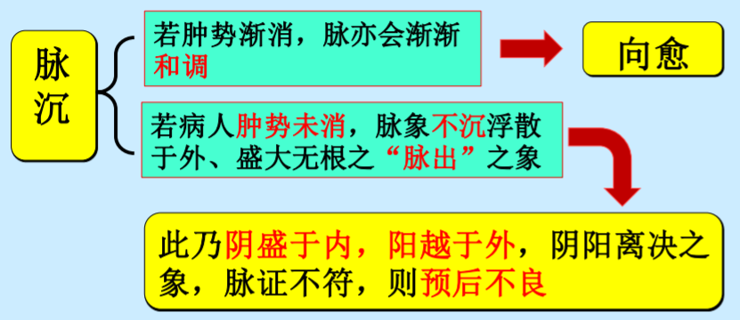
- 黄疸病脉证并治第十五
    - 概念
    - > 有广义和狭义之分
        - 狭义黄疸：以身黄、目黄、小便黄为主证，以目睛黄染为特点。
        - ***发黄***
    - 病因病机
        - 外感湿热，蕴瘀发黄
        - 中焦虚弱，寒湿内生
        - 火劫误治发黄
        - 女劳发黄
        - 燥结发黄 虚劳发黄
    - 治疗
        - 清利湿热为主，但汗、吐、下、和、温、清、消、 补八法均贯穿其中。
        - 阳黄——清热利湿、攻下瘀热（色鲜明如橘子色） 
        - 阴黄——温脾化湿退黄（色晦暗如烟熏） 
        - 虚黄——益气补虚（面色萎黄）
        - 关幼波：
            - 1.治黄必治血，血行黄易却
            - 2.治黄需解毒，毒解黄易除
            - 3.治黄要治痰，痰化黄易散
    - 分类
    - > 黄疸分类始于《金匮要略》
        - 按病因分为三类
            - 谷疸――食谷不节 
            - 酒疸――饮酒过度 
            - 女劳疸――房劳肾虚
        - 黑疸：上述三种病久不愈，瘀血内停或由 误治引起的一种表现，非为一种独立病证
    - 内容
        - 一、病因病机  
            - **湿热发黄（1）**
                - **【1】寸口脉浮而缓，浮则为风，缓则为痹， 痹非中风，四肢苦烦，脾色必黄，瘀热以行。**
                - **1. 湿热黄疸的发病机理**
                    - 脉浮而缓——在杂病“浮”则为风，“风”可作“热”理解，而“缓”为湿之征。
                    - 脾家蕴有湿热
                    - 湿热溢入血分，行于体表，必然发生黄疸
                - **2.症状**
                    - 四肢苦烦——湿热困脾
                        - 四肢……脾主四肢－脾  
                        - 苦烦……重滞不舒－湿
                    - 脾色必黄——脾经湿热蕴结血分  
                    - 瘀热以行——湿热迫及胆汁外溢
                        - 瘀热……发热且与血分有关  
                        - 以行……邪气郁蒸的过程 
                - **3.特异性病机**
                - > “脾色必黄，瘀热以行”
                    - ⑴脾色必黄：强调病位在脾胃中焦；  黄色—属土—脾胃  
                    - ⑵瘀热以行：强调发病与血分有关；  湿热溢入血分
                    - > **黄皆发于血分**
                - **【辨治思路】**
                    - **血分** **治疗黄疸应重视活血祛瘀** **加入凉血活血药物**
                    - **治脾为要**
            - **火劫发黄（8）**
            - > 1.火劫而发黄的治法。2.湿邪在黄疸发病中的作用
                - **【8】师曰：病黄疸，发热烦喘，胸满口燥者， 以病发时火劫其汗，两热所得。然黄家所得， 从湿得之。一身尽发热而黄，肚热，热在里， 当下之。**
                - **1.为什么一开始会误用“汗”法？**
                    - 或湿邪郁而化热——里热外达而误认为表证  
                    - 或里有湿邪，复感风邪——而见表证&nbsp;
                    - **两热搏结而发黄疸**
                - **&nbsp;2.症状：**
                - > 热象明显，但必定兼湿
                    - 黄疸  发热而喘——火热伤津，肺气上逆  
                    - 胸满口燥——热壅于内，胸中气机不利  
                    - 肚热——湿热内盛&nbsp;
                - **3.治法：当下之（通腑泄热）**
                    - **泻热时，切勿忘其湿**
                - **【辨治思路】**
                    - “然黄家所得，从湿得之”强调了黄 疸的形成与脾湿有关，为后世“无湿不 作疸”之说奠定了基础。因此治疗黄疸应该重视利湿，本篇16条明确提出“诸病黄家，但当利其小便” 。上条强调 “瘀” ，此条强调“湿” 
            - **寒湿发黄（3）**
                - **【3】阳明病，脉迟者，食难用饱，饱则发烦头眩，小便必难，此欲作谷疸。虽下之，腹满如故，所以然者，脉迟故也。**
                - **1．“阳明病”**
                    - “阳明之为病，胃家实是也”  主证为腹满
                    - 腹满若为“阳明病”――脉当见洪大滑实之 象，下之满必除 
                    - 今腹满脉迟，且下之如故――显为“太阴病”
                - **2．症状：**
                    - 腹满（下之如故）——阳虚禁下  
                    - 食难用饱——饱则伤脾，食从寒化，加重寒湿  
                    - 饱则发烦头眩——清阳不升  
                    - 小便必难——气化失司，输布失职  
                    - 脉迟无力——阳虚寒湿阻滞  
                    - ▲当见面色萎黄，精神困倦，少气懒言等证 ——此寒湿中阻，无从外泻——欲作谷疸
                - **【辨治思路】**
                    - 1.本条的辨证关键在于脉迟，同时伴有舌淡 、神疲、纳差、头眩、小便不利、腹满或大 便溏薄、苔白腻等证。与湿热发黄者不同。  
                    - 2. 本条当用温中化湿法，如茵陈理中汤等。 
        - 二、分类与主症（2）、（4） 
            - **酒疽【2】**
                - **趺阳脉紧而数，数则为热，热则消谷，紧则为寒，食即为满。尺脉浮为伤肾，趺阳脉紧为伤脾。风寒相搏，食谷即眩，谷气不消，胃中苦浊，浊气下流小便不通，阴被其寒，热流膀胱，身体尽黄，名曰** ***谷疸*** **。**
                - **额上黑，微汗出，手足中热，薄暮即发，小便自利名曰** ***女劳疸*** **；腹如水状，不治。**
                - **心中懊恼而热，不能食，时欲吐，名曰** ***酒疽*** **。**
            - **酒黄疸【4】**
                - **夫病** ***酒黄疸*** **，必小便不利，其候心中热，足下热， 是其证也。**
                - **谷疸——饮食内伤，脾失健运，湿热内蕴&nbsp;**
                    - 趺阳脉数——胃中有热，消谷善饥  
                    - 脉紧——脾有寒湿，运化无力 
                    - 风寒相搏——湿热相搏 
                    - **食谷即眩**
                    - 谷气不消——寒湿困脾，不得运化 
                    - **小便不通**
                    - **脾色必黄，瘀热以行**
                - **女劳疸**
                    - **主症：**
                        - 额上黑——房劳伤肾，肾色外现
                        - 微汗出，手足中热，薄暮即发——阴虚生内热 
                        - 膀胱急——虚热下逼膀胱，小腹拘急 
                        - 小便自利——肾虚重，湿热轻，小便自调 
                        - 腹如水状——阴阳两伤，脾肾两败
                    - **病因病机：**
                    - **辨证要点：**
                    - **治法：**
                    - **方药：**
                        - 阴虚——六味地黄丸或左归丸  
                        - 阳虚——肾气丸加减或右归丸 
                - **酒疸——嗜酒过度，胃蕴湿热**
                    - 心中懊憹而热——酒性湿热，内蕴脾胃，熏蒸于心 
                    - 不能食，时欲吐——湿热内盛，胃失和降 
                    - 小便不利——湿热下注，影响膀胱气化 
                    - 心中热——湿热上干于心 
                    - 足下热——湿热下注于足
            - **辨证要点&nbsp;**
                - **食谷即眩，小便不利**
                - **心中懊恼而热** **小便不利**
                - **额上黑** **小便自利**
        - 三、证治——谷疸、酒疸、女劳疸、兼变证
            - **谷疸:**
                - **湿热两盛一茵陈蒿汤(13)**
                    - **【13】谷疸之为病，寒热不食，食即头眩，心胸不安，久久发黄，为谷疸，茵陈蒿汤主之。**
                        - 茵陈蒿汤方：  
                            - 茵陈蒿六两 栀子十四枚 大黄二两  
                            - 尿如皂角汁状，色正赤，一宿腹减，黄从小便去也。&nbsp;
                    - **1.主症**
                        - 谷疸一一发黄（病史）
                        - 寒热一一湿热阻滞营卫
                        - 不食一一湿热困阻脾胃，运化失司
                        - 食即头眩，心胸不安一湿热上犯，清阳不升
                        - **小便不利一一湿热无由排出**
                    - **2.“久久”一一发病过程**
                    - **3.治法：**
                    - **4.方药：**
                        - （主）茵陈蒿—清热利湿 （6两） 先煎 
                        - 栀子—清三焦而利水道 （14枚） 
                        - 大黄—泻热通腑（2两） （泄血中之瘀热） 
                    - **【辨治要领与思路】**
                        - **寒热不食，食则头眩** **鲜明如橘子色**
                        - **“久久发黄”**
                        - **清三焦和血分之 热，而不是攻下**
            - **酒疸**
                - **热重于湿一栀子大黄汤(15)**
                    - **【15】酒黄疸，心中懊憹，或热痛，栀子大黄汤主 之。**
                        - 栀子大黄汤方：  
                            - 栀子十四枚 大黄一两 枳实五枚 豉一升  
                            - 上四味，以水六升，煮取二升，分温三服。 
                    - **1.主症**
                        - 酒疸一发黄（病史的概念）
                        - **心中懊恼**
                        - 热痛一热势较重（第2条言懊恼而热）
                    - **2.治法：清心除烦，除积泄热**
                    - **3.方药：栀子大黄汤**
                        - 栀子、豆豉一清心除烦
                        - 大黄、枳实一除积泄热
                        - 本方除有心中懊儂热痛外，尚有身热，心烦不眠，大便难，小便黄赤，身黄如橘子色等症。
                    - **栀子大黄汤与茵陈蒿汤鉴别**
                        -  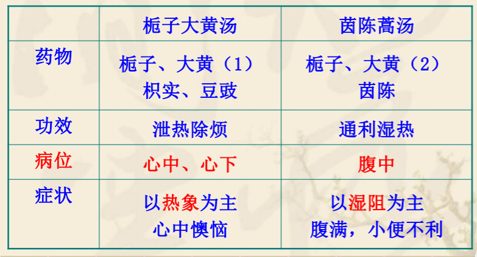
                - **热盛里实一大黄硝石汤(19)**
                - > 论述热盛里实的黄疸证治&nbsp;
                    - **【19】黄疸腹满，小便不利而赤，自汗出，此为表和里实，当下之，宜大黄硝石汤。**
                        - 大黄硝石汤方：
                            - 大黄黄柏硝石各四两栀子十五枚
                            - 上四味，以水六升，煮取二升，去滓，内硝，更煮取一升，顿服。
                    - **1.主症:**
                        - 腹满——邪热传里，里热成实，壅滞气机
                        - 小便不利而赤——湿热阻滞，气化失司
                        - 自汗——热邪迫津外泄(表和里实)
                        - 兼见大便秘结——湿热伤津，肠失濡润
                    - **2.病机：**
                    - **3.治法：**
                    - **4.方药：大黄硝石汤**
                        - 大黄、硝石一一通腑泄热，攻下瘀热结滞
                        - 栀子、黄柏一一清利三焦、肝胆之湿热
                - **湿重于热一茵陈五苓散(18)**
                - > 湿重于热的黄疸治法&nbsp;
                    - **【18】黄疸病，茵陈五苓散主之。一本云茵陈汤及五苓散并主之。**
                        - 茵陈五苓散方：
                            - 茵陈蒿末十分 五苓散五分 方见痰饮中
                            - 上二物和，先食饮方寸匕，日三服。
                    - **1.病机:**
                    - **2.从方测证:**
                        - 发黄，形寒发热，纳呆呕恶，小便
                        - 不利，腹胀便溏，苔腻不渴等
                    - **3.治法:**
                    - **4.方药:**
                        - 五苓散一通阳化气利小便
                        - 茵陈蒿一利湿退黄
                - **湿热发黄四汤证鉴别表**
                    -  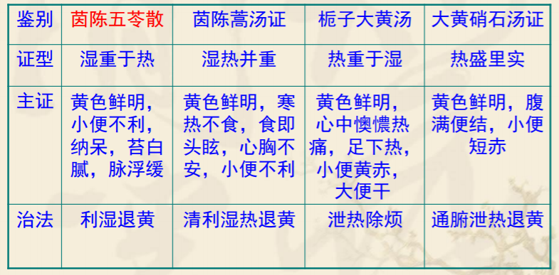
            - **女劳疸**
                - **兼瘀血湿热一硝石矾石散(14)**
                - > 女劳疸转变为黑疸兼有瘀血湿热的证治
                    - **黄家日晡所发热，而反恶寒，此为女劳得之。**
                    - **膀胱急，少腹满，身尽黄，额上黑，足下热，因作黑疸。其腹胀如水状，大便必黑，时溏，此女劳之病，非水也。腹满者难治。硝石矾石散主之。**
                        - 硝石矾石散方：
                            - 硝石矾石（烧）等分上二味，为散，以大麦粥汁和服方寸匕，日三服，病随大小便去，小便正黄，大便正黑，是候也
                    - **1.症状:**
                        - 当发热而恶寒
                        - 膀胱急，少腹满
                        - 身尽黄，额上黑，足下热
                        - 腹胀如水状
                        - 大便必黑(瘀血着于内)，时溏
                    - **2.病机:**
                    - **3.治法:**
                    - **4.方药:硝石礬石散**
                        - 硝石一一味苦性咸寒，能入血分消瘀除热
                        - 礬石一一性寒味酸，能入气分化湿利水
                        - 大麦一一味甘性平，功能养胃，缓硝、礬之悍性
            - **黄疸的兼证、变证、广义黄疸**
                - **心兼表虚证一桂枝加黄芪汤(16)**
                - **心兼少阳证一小柴胡汤(21)**
                - **心误治变哕一小半夏汤 (20)**
                - **心虚劳萎黄一小建中汤(22)**
        - 四、预后
            - **【11】黄疸之病，当以十八日为期，治之十日以上瘥，反剧为难治。**
            - **十八日左右为期**
            - **【辨治要领与思路】**
                - **提示临床治病应抓住时机，及 时治疗，有利于疾病的好转。**
- 惊悸吐衄下血胸满瘀血病 脉证治第十六&nbsp;
    - **概说**
        - 七种病证的概念
            - (一)惊悸——惊是受外界惊恐刺激而引起的一种临床表现。悸是由气血虚弱、心失所养而引起心神恍惚、跳动不能自主的症状
            - (二)吐血—— 血从口中吐出
            - (三)衄血——鼻、齿齦、耳、舌及皮肤不因外伤而出血的病证
            - (四)下血——大便出 血。
            - (五)胸满——是瘀血中的一个症状。
            - (六) 瘀血——血液瘀滞体内，包括溢出经脉外而积存于组织间隙的，或因血液运行受阻而滞留于经脉内及瘀积于器官内的。
    - **七种病证合篇的意义**
        - 这些病证与心和血脉有密切关系，所以合为一篇论述
    - **惊悸病**
        - 一、概念
            - 惊悸病名，源自《内经》。  
            - 《素问·脉解》篇言：“恶人与火，闻木音则惕然 而惊者，阳气与阴气相搏，水火相恶，故惕然而惊 也。”提出惊的概念及致惊的原因。 
            - 病程上有久暂之分，证情上有轻重之别，但二者 互相联系，突然受惊必然导致心悸；心悸又易并 见惊恐，故常惊悸并称。
        - 二、惊悸病辩病思路
            - 辨病因病机
                - **【1】寸口脉动而弱，动即为惊，弱则为悸。**
                    - 病因有内外因之分，惊为外动所使，悸为内虚所致。 
                    - 脉“动即为惊”，由于外界刺激，致使心无所倚，神无所归，血气逆乱，故脉动不宁。 
                    - 脉“弱则为悸”，气血不足，心脉失养，则虚生悸证。 
            - 辩临床表现
                -  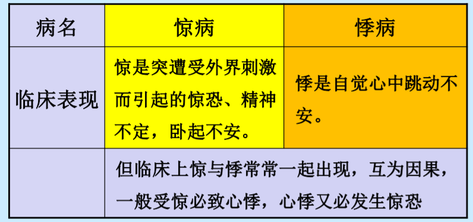
        - 三、惊悸病证治特点 
            - **火劫致惊——桂枝去芍药加蜀漆牡蛎龙骨救逆汤（12）**
                - **【12】火邪者，桂枝去芍药加蜀漆牡蛎龙骨救逆汤主之。**
                    -  
            - **水饮致悸——半夏麻黄丸（13）**
                - **【13】心下悸者，半夏麻黄丸主之。**
                    -  
    - **吐衄下血瘀血病**
        - 一、概念&nbsp;
            - 吐血、衄血、下血和瘀血同属血证范围。 
            - 血证是临床上常见的病证，凡血液不循常道，或 上溢于口鼻，或下泄于前后二阴，或渗出于肌肤， 所形成的一类出血性疾病，统称为血证。
        - 二、主要内容
            - **吐血、衄血证治**
                - **虚寒吐血一 柏叶汤一温中止血(14)**
                    - **【14】吐血不止者，柏叶汤主之。**
                    - 中气虚寒→吐血不止，温中止血：柏叶汤
                - **热盛吐衄一泻心汤一清热泻火(17)**
                    - **【17】心气不定，吐血，衄血，泻心汤主之。**
                    - 心火亢盛吐衄→苦寒清热，降火止血 ：泻心汤&nbsp;
            - **便血证治**
                - **远血一一虚寒便血一 黄土汤一温脾摄血(15)**
                    - **【15】下血，先便后血，此远血也，黄土汤主之。**
                    - 虚寒远血→温脾摄血：黄土汤
                - **近血一一湿热便血一赤小豆当归散一清利湿热，活血止血 (16)**
                    - **【16】下血，先血后便，此近血也，赤小豆当归散主之。**
                    - 湿热近血→清利湿热，活血止血 ：赤小豆当归散
            - **瘀血**
                - **瘀血本证(10)**
                    - **【10】病人胸满，唇痿舌青，口燥，但欲 漱水不欲咽，无寒热，脉微大来迟，腹 不满，其人言我满，为有瘀血。**
                - **瘀血化热(11)**
                - > 重于第10条—烦、口干而渴—化热
                    - **【11】病者如热状，烦满，口干燥 而渴，其脉反无热，此为阴伏， 是瘀血也，当下之。**
                - **比较**
                    -  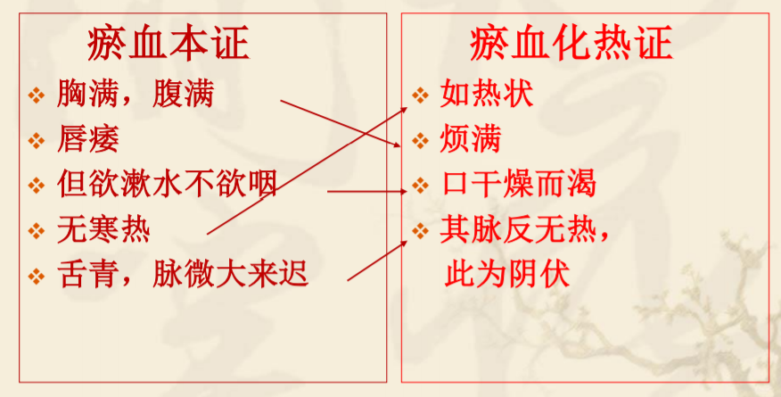
- 妇人妊娠病脉证并治第二十
    - 概述
        - **剂型丸散**
        - 内容涉及妊娠与癥病的鉴别，癥病漏下，妊娠呕吐、 腹痛、下血、小便难、水气、胎动不安、伤胎等疾病的 诊断以及治疗。 
    - （一）辨妊娠与癥病
        - **妊娠的诊断与调治**
        - > 论述妊娠的诊断及恶阻轻者的证治&nbsp;
            - **【1】师曰：妇人得平脉、阴脉小弱，其人渴， 不能食，无寒热，名妊娠，桂枝汤主之。方见 下利中。于法六十日当有此证，设有医治逆者， 却一月，加吐下者，则绝之。**
                - **平脉：**
                - > 尤怡“阴脉小弱者，初起胎气未盛，而阴方受蚀，故阴脉比阳脉小弱。”
            - **【病机】**
            - **【治疗】**
                - 轻者：无需治疗，饮食调养  
                - 重者：调和阴阳，安中和胃  
                - 方药：桂枝汤“有故无殒，亦无殒。”  
                - > “外证得之，为解肌袪邪气；内证得 之，为化气调阴阳。”
        - **胎、癥的鉴别与治疗**
        - > 论述癥病与妊娠的鉴别，及癥病下血的治法
            - **【2】妇人宿有癥病，经断未及三月，而得漏下不止， 胎动在脐上者，为癥痼害。妊娠六月动者，前三月经 水利时，胎也。下血者，后断三月衃也。所以血不止 者，其癥不去故也，当下其癥，桂枝茯苓丸主之。**
                - 桂枝茯苓丸方： 
                    - 桂枝 茯苓 牡丹（去心）桃仁（去皮尖，熬）芍 药各等分 
                    - 上五味，末之，炼蜜和丸，如兔屎大，每日食前服 一丸。不知，加至三丸。
                - **癥：**
                - **妊娠：**
            - **【病机】**
            - **【治疗】**
            - **【方药】**
                - 桂枝：辛温，温通血脉。  
                - 茯苓：健脾和中安正气  
                - 芍药：调营益阴  
                - 丹皮、桃仁：活血化瘀
    - （二）辨妊娠期间其他疾病
        - **腹痛——阳虚寒盛——附子汤**
        - > 论述妊娠阳虚寒甚的腹痛证治
            - **【3】妇人怀娠六七月，脉弦发热，其胎愈胀，腹痛恶寒者，少腹如扇，所以然者，子藏开故也，当以附子汤温其藏方未见。**
                - **弦：**
                - **发热：**
                - **腹胀：**
                - **少腹如扇：**
                - **腹痛恶寒：**
            - **【病机】**
            - **【治疗】**
            - **【方药】**
                - 炮附子：温阳暖宫
                - 人参：温补元阳
                - 白术、茯苓：健脾除寒湿
                - 芍药：和血通痹
        - **腹痛——肝脾失调——当归芍药散**
        - > 肝脾不和而致的妊娠腹痛的治法&nbsp;
            - **【5】妇人怀妊，腹中痔痛，当归芍药散主之。**
                - 当归芍药散方：
                    - 当归三两芍药一斤茯苓四两白术四两泽泻半斤芎翦半斤一作三两。
                    - 上六味，杵为散，取方寸匕，酒和，日三服。
            - **【病机】**
            - **【治法】**
                - 芍药一一养血敛阴，柔肝止痛
                - 川芎一一活血通经
                - 当归一一补血活血
                - 苓、术、泻——健脾益气淡渗利湿
            - **【辨治要领与思路】**
                - 当归芍药散的临床表现可包括两方面：
                - 一是肝血虚少的表现，如面唇少华，头昏，目眩，爪甲不荣，肢体麻木，腹中拘急而痛，或绵绵作痛；或月终量少，色淡，甚至闭经等。
                - 二是脾虚湿停的见证，如纳少体倦，白带量多，面浮或下肢微肿，小便不利或泄泻等。并见舌淡苔白腻或薄腻脉弦细
        - **胞阻——胶艾汤**
        - > 本条论述妇人冲任脉虚三种下血的证治
            - **【4】师曰：妇人有漏下者，有半产后，因续下血都不绝者，有妊娠下血者。假令妊娠腹中痛，为胞阻，胶艾汤主之。**
                - 芎归胶艾汤方：
                    - 一方加干姜一两，胡氏治妇人胞动无干姜。
                    - 芎蒻阿胶甘草各二两艾叶当归各三两芍药四两干地黄六两
                    - 上七味，以水五升，清酒三升，合煮，取三升，去滓，内胶，令消尽，温服一升，日三服。不差，更作。
                - **漏下：**
                - **半产：**
                - **胞阻：**
            - **漏下、半产后续下雪不绝、胞阻——冲任脉虚，阴血不能内守**
                - **胶艾汤——调补冲任，固经养血**
                    - 阿胶一一养血止血
                    - 艾叶——温经暖宫
                    - 四物汤一一养血和血
                    - 甘草一一调和诸药
                    - 清酒一一温经和血
            - **【辨治要领与思路】**
                - **冲任虚损，血虚兼寒最为适宜**
                - 芎归胶艾汤主治的妇女下血症，其临床表现都具有下列特点：即所下之血色多浅淡，或黯淡，质清稀。并常伴头晕目眩，神疲体倦，舌淡，脉细等证候。
        - **恶阻——干姜人参半夏丸**
        - > 本条论述恶阻重证的证治&nbsp;
            - **【6】妊娠呕吐不止，干姜人参半夏丸主之。**
                - 干姜人参半夏丸方：
                    - 干姜人参各一两半夏二两
                    - 上三味，末之，以生姜汁糊为丸，如梧桐子大，饮服十丸，日三服。
            - **【病机】**
                - 千姜——温化寒饮
                - 半夏—降逆止呕
                - 人参—一益气安胎
                - 丸——便于受纳，和缓补益
                - > “半夏得人参，不惟不碍胎，且能固胎”
            - **【功用】**
        - **小便难——当归贝母苦参丸**
        - > 本条论述妊娠血虚热郁小便难的证治
            - **【7】妊娠小便难，饮食如故，当归贝母苦参丸主之。**
                - 当归贝母苦参丸方：男子加滑石半两。
                    - 当归贝母苦参各四两
                    - 上三味，末之，炼蜜丸如小豆大，饮服丸，加至十丸。
                - **小便难：**
                - **饮食如故：**
                - 妊娠小便难，即后世所称“子淋”
                - **【治法】**
                - **【方药评析】**
                    - 当归一一补血和血，活血
                    - 贝母——利气解郁清肺，上焦通则下焦自通
                    - 苦参——清热利湿
                - **【辨治要领与思路】**
                    - **不可通利太过** **若渗利太过，不仅耗伤津血，还恐引起滑胎**
                    - 本条“小便难”，可表现为小便短黄不爽，或尿频尿急，淋漓涩痛，伴小便灼热，小腹胀痛。
                    - **下病上取治疗思路**
        - **水肿——葵子茯苓散**
        - > 本条论述妊娠水气的证治。
            - **【8】妊娠有水气，身重，小便不利，洒淅恶寒，起即头眩，葵子茯苓散主之。**
                - 葵子茯苓散方：
                    - 葵子一斤茯苓三两
                    - 上二味，杵为散，饮服方寸匕，日三服。小便利则愈。
                - 妊娠水气即后世的“妊娠肿胀”，亦称“子肿”。
                    - **有水气：**
                    - **身重：**
                    - **小便不利：**
                    - **恶寒：**
                    - **头眩：**
                - **【治法】**
                - **【方药评析】葵子茯苓散**
                    - 葵子：性甘寒滑，滑利通窍，消水气
                    - 茯苓：淡渗利水
                - **【辨治要领与思路】**
                    - 辨识本证的要领在于抓住病机。本证属于膀胱气化受阻，水气内停的实证，故以身肿，身重，小便不利，洒淅恶寒，起则头眩为辨证要点。
                    - **妊娠慎用药** **一是服药量不可太大** **二是不可久服，小便利则宜停服，以免造成滑胎**
        - **胎动不安—血虚湿热——当归散**
            - **【9】妇人妊娠，宜常服当归散主之。**
                - 当归散方：
                    - 当归黄芩芍药芎葉各一斤白术半斤
                    - 上五味，杵为散，酒饮服方寸匕，日再服。妊娠常服即易产。胎无苦疾，产后百病悉主之。
            - **【功用】**
            - **【病机】**
                - 当归、芍药——补肝血
                - 川芎——和血舒肝
                - 白术——健脾除湿
                - 黄芩——坚阴清热
            - **【辨治要领与思路】&nbsp;**
                - **后世医家将白术、黄芩视为安胎圣药**
                - 当归散证的临床表现应有：胎动下坠或妊娠下血，或腹痛，或曾经半产等，并伴头昏，神疲肢倦，口干口苦，纳少，面黄形瘦，大便或结或溏，舌尖微红或苔薄黄，脉细滑。
                - 本方用于胎动不安或预防滑胎时，方中川芎用量宜小，一般为3—6g。
        - **胎动不安—脾虚寒湿——白术散**
            - **【10】妊娠养胎，白术散主之。**
                - 白术散方：见《外台》
                    - 白术芎蒻蜀椒三分去汗牡蛎二分
                    - 上四味，杵为散，酒服一钱匕，日三服，夜一服。但苦痛，加芍药；心下毒痛，倍加芎；心烦吐痛，不能食饮，加细辛一两，半夏大者二十枚。服之后，更以醋浆水服之；若呕，以醋浆水服之；复不解者，小麦汁服之。已后渴者，大麦粥服之。病虽愈，服之勿置。
            - **【功用】**
            - **【病机】**
                - 白术——健脾燥湿
                - 川芎—和血疏肝
                - 蜀椒——温中散寒
                - 牡蛎——收敛固涩
            - **【辨治思路与要领】**
                - **肝脾** **因为胎赖母血以养，而肝主藏血，脾为气血生化之源，故应注意调养肝脾**
                - 妊娠病用白术散的常见症状，应包括脘腹疼痛，恶心，呕吐，不思饮食，肢倦，便溏，带下量多，甚至胎动不安。舌淡，苔白润或滑，脉缓滑。
        - **白术散、当归散比较表**
            -  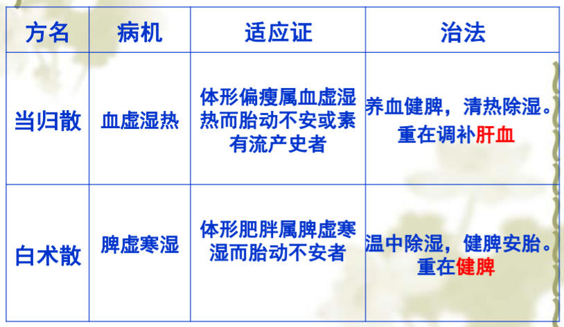
- 妇人产后病脉证治第二十一&nbsp;
    - 概述
        - **产后常见病的证治** **痉病、郁冒、大便难**
    - （一）辨产后常见三病 
        - 痉病、郁冒、大便难是妇女产后容易发生的三种病证
            - 产后痉病——筋脉失于濡养，拘急成痉，以筋脉挛急抽 搐，甚至角弓反张、口噤不开为主症。（VS外感痉病） 
            - 产后郁冒——以头眩目瞀、郁闷不舒为主症。 
            - 大便难——胃肠失润，大便干结。
            - **【1】问曰：新产妇人有三病，一者病痉，二者病郁冒，三者大 便难，何谓也？师曰：新产血虚，多汗出，喜中风，故令 病痉；亡血复汗，寒多，故令郁冒；亡津液，胃燥，故大便难。**
            - **痉病、郁冒、大便难** **亡血伤津、气血不足**
            - **产后三病的病因**
                -  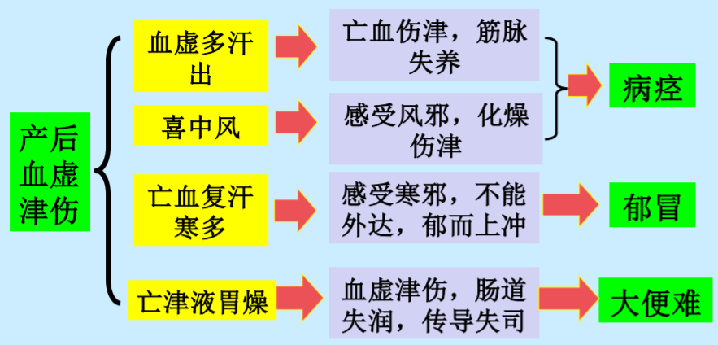
    - （二）辨产后伴随疾病
        - **产后腹痛——血虚里寒——当归生姜羊肉汤主**
        - >  产后常见病证，临床当辨治虚实
            - **【4】产后腹中疞痛，当归生姜羊肉汤主之；并治腹中寒疝，虚劳不足。**
        - **产后腹痛——气血郁滞&nbsp;——枳实芍药散**
            - **【5】产后腹痛，烦满不得卧，枳实芍药散主之。**
                - 枳实芍药散方：  
                    - 枳实（烧令黑，勿太过） 芍药等分  
                    - 上二味，杵为散，服方寸匕，日三服，并主痈脓，以麦 粥下之。
        - **产后腹痛——瘀血阻滞——下瘀血汤**
            - **【6】师曰：产妇腹痛，法当以枳实芍药散，假令不愈者，此为腹 中有干血着脐下，宜下瘀血汤主之。亦主经水不利。**
                - 下瘀血汤方： 
                    - 大黄二两，桃仁二十枚，蟅虫二十枚（熬，去足） 
                    - 上三味，末之，炼蜜合为四丸，以酒一升，煎一丸，取八合，顿服之。新血下如豚肝。
        - **产后瘀血兼阳明腑实**
            - **【7】产后七八日，无太阳证，少腹坚痛，此恶露不尽，不大便， 烦躁发热，切脉微实，再倍发热，日晡时烦躁者，不食，食则讝语，至夜即愈，宜大承气汤主之。热在里，结在膀胱也。 方见痉病中。**
            - 阳明胃实，故发热烦躁，日哺所为甚；腑气不通，故不欲饮食； 
            - 若勉强进食则更增邪热，热扰神明则谵语； 
            - 至夜阳明经气衰，因此热轻症减。 
        - **产后中风——表虚外感——阳旦汤/桂枝汤**
            - **【8】产后风，续之数十日不解，头微痛，恶寒，时时有热，心 下闷，干呕汗出。虽久，阳旦证续在耳，可与阳旦汤。即 桂枝汤，见下利中。**
            - 太阳中风表证，产后体虚感邪， 正气不能驱邪外出，故病程迁延日久
            - **临床表现：**
        - **产后中风——阳虚外感&nbsp;——竹叶汤**
            - **【9】产后中风发热，面正赤，喘而头痛，竹叶汤主之。**
            - 产后气血大虚，卫外不固，复感 外邪，形成正虚邪实&nbsp;
            - 临床表现：发热，头痛——病邪在表 ；面正赤——阳气亏虚，虚阳上浮  喘－－肺气闭郁&nbsp;
        - **产后烦呕——竹皮大丸**
            - **【10】妇人乳中虚，烦乱呕逆，安中益气，竹皮大丸主之。**
            - 产后耗气伤血，复因哺乳 → 阴血不足，虚热内扰 → 热扰心神，则心烦意乱；热犯于胃则呕逆
        - **产后下利——白头翁加甘草阿胶汤**
            - **【11】产后下利虚极，白头翁加甘草阿胶汤主之。**
            - 产后阴血不足，又兼下利 → 更伤其阴，湿热壅滞肠道 → 临床可见发热腹痛、里急后重、下利脓血，且病发于产后，尚有体倦、口 干、脉虚等症。
- 妇人杂病脉证并治第二十二
    - 概述
        - 本篇主要论述妇人杂病，提出女子若经血不调可以变 证百出，但病因不外“虚”、“积冷”、“结气”三者，应该审慎辨证施治 
        - 提出了脏躁、梅核气、转胞、阴部疾病等多种病证。 
        - 涉及内、外治法如坐药、外洗药等特殊治疗方法，为后世研究妇人杂病，奠定了良好的根基。&nbsp;
    - 妇人杂病
        - **（一）辨妇人热入血室**
            - **在行经期感受外邪**
            - **不在行经期**
            - **【1】妇人中风，七八日续来寒热，发作有时，经水适断，此为热入血室，其血 必结，故使如虐状，发作有时，小柴胡汤主之。**
            - **【2】妇人伤寒发热，经水适来，昼日明了，暮则谵语，如见鬼状者，此为热入血室，治之无犯胃气及上二焦，必自愈。**
            - **【4】阳明病，下血谵语者，此为热入血室，但头汗出，当刺期门，随其实而泻之，濈然汗出者愈。**
        - **（二）辨妇人情志病**
            - **梅核气——半夏厚朴汤**
                - **【5】妇人咽中如有炙脔，半夏厚朴汤主之。**
                - 情志不畅，气 郁化火，炼液 为痰，痰气交 阻，上逆咽喉
                - 咽喉部物感，如 肉阻塞，吞不下， 吐不出；还可伴胸闷叹息等症状
                - **半夏厚朴汤：辛开苦降，解郁化痰&nbsp;**
            - **脏躁——甘麦大枣汤**
                - **【6】妇人脏躁，喜悲伤欲哭，象如神灵所作，数欠伸， 甘麦大枣汤主之。**
                - 平素肝气郁结， 血虚脏躁、心火 扰神，脏阴不足， 虚热内扰
                - 喜哭泣，时时 悲伤，常感体 倦，作欠伸
                - **甘麦大枣汤：补益心脾之阴&nbsp;**
        - **（三）妇人经带不利**
            - 妇人经水异常：或漏下不止，或经水不利&nbsp;
            - **虚寒夹瘀、半产后漏下不止——温经汤**
                - 常伴有少腹里急、腹部胀满或刺痛 ，且拒按等表现，以及傍晚发热或 手掌心烦热、口唇干燥等特点。
                - **&nbsp;【9】问曰：妇人年五十所，病下利，数十日不止，暮即发热， 少腹里急，腹满，手掌烦热，唇口干燥，何也？师曰：此 病属带下。何以故？曾经半产，瘀血在少腹不去。何以知之？其证唇口干燥，故知之，当以温经汤主之。**
                - **温经汤：阴阳兼顾，虚实并治，温 经养血而不留瘀，活血散寒而不伤正，集“温、润 、养、散”于一体。&nbsp;**
            - **冲任虚寒，经气下陷而漏下不止——胶姜汤**
                - 称为“陷经”，因寒气凝结而经血色瘀黑。&nbsp;
                - **【12】妇人陷经，漏下，黑不解，胶姜汤主之。臣亿等校诸本无胶姜 汤方，想是前妊娠中胶艾汤。**
                - **胶姜汤：温经散寒，固冲养血。**
                - 原文未看到胶姜汤组成，但根 据方名看来，阿胶、干姜二药 已具备补虚、温里、止漏的作 用，且林亿等认为是胶艾汤， 按《千金方》的胶艾汤，其中亦有干姜，对本证说来，是可以取用的。
            - **肝经不利，气血郁滞，经水不利——大黄甘遂汤**
                - 少腹按痛，经水色紫有块，舌紫暗，脉涩等表现。
                - **【13】妇人少腹满如敦状，小便微难而不渴，生后者，此为水与血并结在血室也，大黄甘遂汤主之。**
                - **水与血都结在下焦血室**
            - **瘀热内结成实，经水不利——土根散（浅）抵挡汤（重）**
                - 少腹硬满结痛拒按，脉象沉涩等表现。&nbsp;
                - **【10】带下，经水不利，少腹满痛，经一月再见者，土瓜根散主之。**
                    - **瘀热内结之实证** **病势较浅者**
                - **【14】妇人经水不利下，抵当汤主之。亦治男子膀胱满急，有瘀血者。**
                    - **瘀热内结之实证** **病势较重者**
        - **（四）妇人腹痛**
            - **湿热带下——矾石丸**
                - **【15】妇人经水闭不利，脏坚癖不止，中有干血，下白物，矾石丸 主之。**
                - 瘀血内阻，蓄泄其常，胞宫湿热成为白 带，可见带下量多，黄臭、质黏腻，舌 苔黄腻，脉濡数等。
            - **寒湿带下——蛇床子散方**
                - **【20】蛇床子散方，温阴中坐药。**
                    - 下焦阳虚，寒湿凝滞，可见带下清晰色 白，自觉阴中冷等症状。
            - **风冷血滞——红蓝花酒**
                - **【16】妇人六十二种风，及腹中血气刺痛，红蓝花酒主之。**
                - **刺痛**
            - **肝脾失调——当归芍药散**
                - **【17】妇人腹中诸疾痛，当归芍药散主之。**
                - **小便不利，四肢头面微肿**
            - **脾虚营弱——小建中汤**
                - **【18】妇人腹中痛，小建中汤主之。**
                - **喜温喜按** **无华**
        - **（五）其他疾病**
            - **转胞——肾气丸**
                - **【19】问曰：妇人病，饮食如故，烦热不得卧，而反 倚息者，何也？师曰：** **此名转胞，不得溺也** **，以胞系了戾，故致此病，但利小便则愈，宜肾气丸主之。**
            - **阴吹——膏髪煎**
                - **胃气下泄，阴吹而正喧，此谷气之实也，膏髪煎导之。**