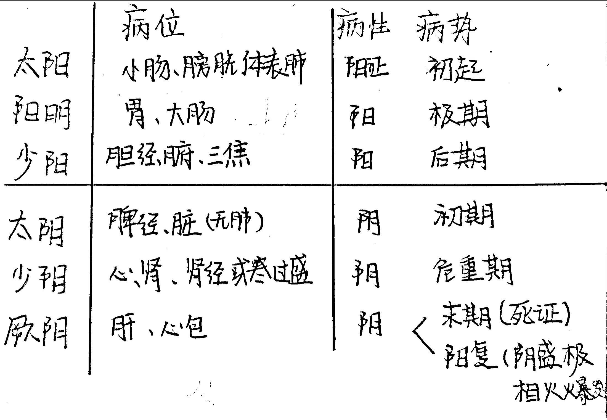
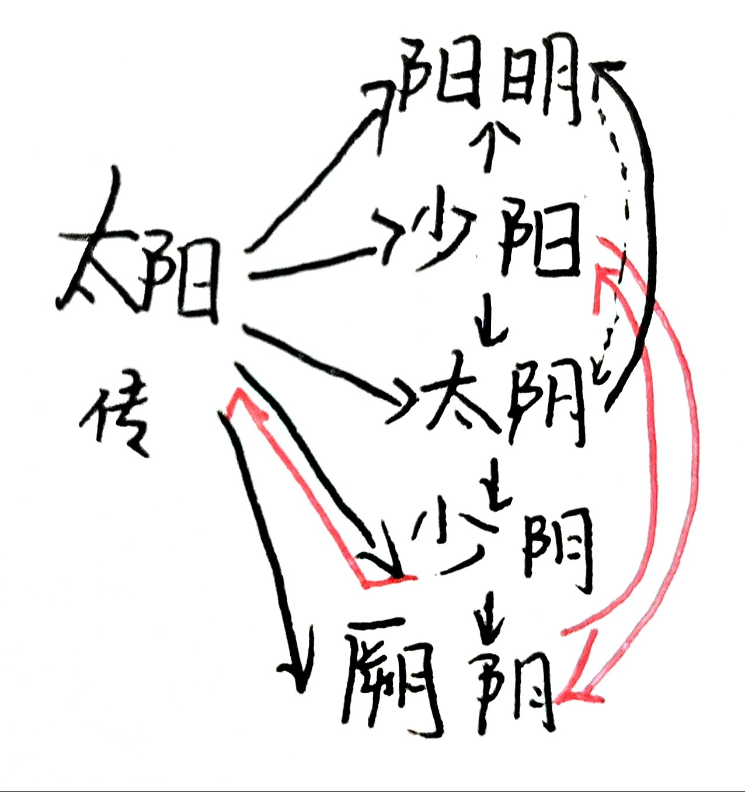

# 伤寒
- 总论
    - 经方十一家
    - 作者：张机，字仲景
    - > 东汉末年（250～219）
        - 籍贯：河南南阳邓县
        - 素质：君用思精而韵不高，将为良医
        - 学医经历：开始受于张伯祖（师带徒）尽得其传
        - 职务：举孝廉，官至长沙太守，后世医著用长沙代指张仲景
        - 1589明代 方有执 《伤寒论条辨》称其为医圣
    - 成书背景
        - 社会背景—传染病流行
        - > 东汉末年
            - 天灾
            - 战争
        - 学术背景
        - > 博采众方，结合创立了理法方药一体的辨证论治体系
            - 医经七家
    - 流传与沿革
        - 公元200年—伤寒杂病论
        - 晋 王叔和 收集整理十卷 名《伤寒论》
        - ⭕️唐 孙思邈《千金翼》 王焘《外台秘要》
        - ⭕️宋 林亿 孙奇 高保衡 官定本 是现存最早的版本，分成两本
        - 金 成无己 最早的一部全文注释本
        - ⭕️明 赵开美 《仲景全书》复刻宋本
        - 1991《伤寒论校注》刘渡舟
    - 内容和贡献
    - > 是中国医学史上现存最早的、完整系统的一部临床医学著作
        - ⭕️含义
            - 广义：一切外感热病的总称
            - 狭义：人体感受风寒邪气，感而即发的病症
        - 内容
            - 10卷22篇
                - 前五篇
                    - 平脉
                    - 辨脉
                    - 伤寒例：外感病的总论
                    - 痉湿暍
                - 六经病证篇
                - 后八篇
                    - 可发汗
                    - 不可汗
                    - 汗后
                    - 可吐
                    - 不可吐
                    - 可下
                    - 不可下
                    - 汗吐下后
            - 理法方药角度
                - 理
                    - 六经辨证体系
                - 法
                    - 治则：扶正祛邪（扶阳气 保胃气 存津液）
                    - 治法：八法（汗 吐 下 和 温 清 消 补）
                - 方
                    - ⭕️112方
                - 药
                    - 64味
            - 药剂技术（各种剂型）
            - 护理知识
        - ⭕️贡献
            - 首创六经辨证的理论体系
            - 为临床医学发展奠基
            - 方书之祖  记载大量复方，方剂学，药剂学，中医护理学发展的基础
    - 六经辨证
        - 六经的含义
        - 三阴三阳的本义
            - 阴阳气量的多少
        - 三阴三阳在内经中的含义
            - 生理性：用其命名脏腑经络
        - 三阴三阳在伤寒论的含义
            -  
            - 病理性
        - 六经的传经
            - 循经传 越经传 表里传（夫妻传） 
        - ⭕️六经病的变证
            - 一个病失治或误治（坏病）
            - 治疗原则：观其脉证，知犯和逆，随证治之
        - ⭕️六经病发病的特殊形式
            - 合病
                - 2个以上阳经同时发病（邪过盛）
            - 并病
                - 1经未罢，1经又起（有先后顺序）
            - 直中：外邪不经过三阳，直接三阴发病
        - 六经辩证及其他
            - 八纲辨证
                - 不能用于指导用方
            - 脏腑经络辩证
    - 学习方法和内容
        - 学什么
        - 怎么学
            - 学习思路和方法
                - 认清性质，明确目的
                - 提纲挈领，掌握全局
                - 熟读原文，明辨本意
                - 前后联系，明经解要
                - 参考名家，加深理解
                - 结合临床，学以致用
- 各论
    - 太阳病
        - 原文
            - 纲要
                - 太阳病脉证纲要
                    - 1
                - 分类
                    - 2【伤寒】
                    - 3【中风】
                    - 6【温病】
                - 辨病发于阳/阴
                    - 7
                - 辨寒热真假
                    - 11
            - 本证
                - 太阳经证
                    - 太阳中风（表虚）证
                        - 12、13【桂枝汤证】
                        - 53、54桂枝汤在杂病营卫不和中的应用
                        - 16、17【桂枝汤禁例】
                        - 兼证
                            - 14【桂枝加葛根汤证】
                            - 43【桂枝加厚朴杏子汤证】
                            - 20【桂枝加附子汤证】
                            - 21【桂枝去芍药汤证】
                            - 22【桂枝去芍药加附子汤证】
                            - 62【桂枝加芍药生姜各一两人参三两新加汤】
                    - 太阳伤寒病（表实）证
                        - 35【麻黄汤证】
                        - 兼证
                            - 31【葛根汤证】
                            - 38、39【大青龙汤证】
                            - 40、41【小青龙汤证】
                                - 或然证
                    - 太阳表郁证
                - 太阳腑证
                    - 蓄水证
                        - 71、74【五苓散】
                    - 蓄血证
                        - 106【桃核承气汤】
                        - 124、125【抵当汤】
                        - 126【抵当丸】
            - 太阳病变证
                - 变证治则
                    - 16【坏病】
                    - 辨寒热真假
                        - 11皮肤与骨髓
                    - 论汗下先后90
                    - 91辨标本缓急
                        - 先表后里实例
                - 热证
                    - 栀子豉汤类
                        - 7 6枙子豉汤
                            - 栀子甘草豉汤
                                - 栀子生姜豉汤
                        - ＊ 79枙子厚朴汤
                        - * 80枙子干姜汤
                    - 63【麻杏甘石汤】
                    - 34【葛根黄芩黄连汤】
                - 虚证
                    - 心阳虚证
                        - 64【桂枝甘草汤】
                        - 118 桂枝甘草龙骨牡蛎汤
                        - 112桂枝去芍药加蜀漆牡蛎龙骨救逆汤
                        - 奔豚证
                            - 117【桂枝加桂汤证】
                    - 阳虚兼水气
                        - 65【茯苓桂枝甘草大枣汤】
                            - 重用茯苓半斤 甘澜水
                        - 67【茯苓桂枝白术甘草汤】
                        - 28  桂枝去桂加茯苓白术汤
                    - 脾虚
                        - 66【厚朴生姜半夏甘草人参汤】
                        - 102【小建中汤】
                        - 163  桂枝人参汤
                    - 肾阳虚
                        - 61  干姜附子汤
                        - 69  茯苓四逆汤
                        - 82【真武汤】
                    - 阴阳两虚
                        - 伤寒兼阴阳两虚 29  甘草干姜汤、芍药甘草汤
                        - 汗后阴阳两虚  68  芍药甘草附子汤
                        - 心阴阳两虚  177【炙甘草汤】/复脉汤
                            - 脉结代
                - 结胸证
                    - 结胸辩证
                        - 128 131
                    - 热实结胸证
                        - 135 137【大陷胸汤】
                            - 清酒七升
                            - 煎煮顺序
                                - 大黄去滓 纳芒硝 入甘遂末
                            - 效猛，中病即止
                        - 131【大陷胸丸】
                        - 138【小陷胸汤】
                    - 寒实结胸证
                        - 141【三物白散方】
                            - 白饮（米汤）和服
                - 痞证
                    - 151成因及证候特点
                    - 热痞证
                        - 154 大黄黄连泻心汤
                            - 采用麻沸汤法，去其味存其性
                        - 155  附子泻心汤
                            - 热痞兼表阳虚
                                - 附子另煎取汁
                                - 三黄开水浸泡取其汁
                    - 寒热错杂痞证（互结于中焦）
                    - > 🙏去滓再煎～意在使寒热药性相合，作用协调
                        - 149【半夏泻心汤】
                        - 157 生姜泻心汤
                        - 158 甘草泻心汤
                    - 类似证
                        - 161【旋覆代赭汤】
                        - > 去滓再煎
                - 上热下寒证（寒热错杂上下相隔）
                    - 173【黄连汤】
                        - 煎1次昼3次夜2次少量多次可防呕
            - 太阳病类似证
                - 风湿
                - 十枣汤
                - 瓜蒂散证
    - 阳明病
        - 辩证纲要
            - 180 提纲
            - 179 病因病机
                - 三个
            - 183脉证
        - 本证
            - 阳明热证
            - > 清法
                - 176 白虎汤
                - > 辛寒清热法
                - 168 169白虎加人参汤
                - 223猪苓汤
                - > 利水育阴法
                - 枙子豉汤
            - 阳明病实证
            - > 下法
                - 三承气汤证
                - > 通腑泻热，攻下实邪
                    - 207、249调胃承气汤
                    - 213小承气汤
                    - 238 215 255大承气汤
                - 润导法
            - 阳明病寒证虚证
                - 243吴茱萸汤
        - 变证
            - 发黄证
                - 湿热发黄
                    - 236茵陈蒿汤
                    - > 清利湿热兼通下
                    - 262麻黄连轺赤小豆汤
                    - > 清利➕发表
                        - 潦水（雨水）煎煮：味薄不助湿
                - 寒湿发黄
                - 被火发黄
            - 血热证
                - 衄血证
                - 下血证
                - 蓄血证
                    - 237抵当汤
                    - > 逐淤泄热
    - 少阳病
    - > 和解
        - 纲要
            - 263提纲
            - 264治禁
        - 本证
        - > 经腑同治
            - 96、266、100、101小柴胡汤
                - 去滓再煎
        - 兼证
            - 146柴胡桂枝汤
            - 103大柴胡汤
                - 去滓再煎
            - 104柴胡加芒硝汤
            - 147柴胡桂枝干姜汤
            - 107柴胡加龙骨牡蛎汤
            - 172黄芩汤与黄芩加半夏生姜汤
    - 太阴病
    - > 中焦脾虚寒湿
        - 273提纲
        - 本证
            - 277四逆辈
        - 变证
            - 279太阴腹痛证
                - 桂枝加芍药汤
                - 桂枝加大黄汤
            - 259太阴发黄证
        - 预后
            - 阳复自愈
            - 转属阳明
    - 少阴病
        - 纲要
            - 281提纲
            - 少阴化寒证辩证要点
        - 本证
            - 少阴寒化证
                - 317脉通四逆汤
                - 316真武汤
                - 305附子汤
                - 309吴茱萸汤
            - 少阴热化证
                - 303黄连阿胶汤
                - 319猪苓汤
            - 少阴阳郁证
                - 318四逆散
        - 变证
            - 301麻黄细辛附子汤
            - 302麻黄附子甘草汤
    - 厥阴病
    - > 寒热错杂
        - 纲要
            - 326提纲消渴
        - 本证
            - 厥阴寒热错杂证
                - 338乌梅丸
                - 359干姜黄芩黄连人参汤
            - 厥阴寒证
                - 351当归四逆汤
                - 378吴茱萸汤
            - 厥阴热证
                - 371白头翁汤
        - 辨厥逆证
            - 337厥逆的病机与证候特点
            - 热厥
                - 350重证白虎汤
            - 寒厥
                - 354四逆汤
    - 霍乱病
        - 呕吐而利
    - 阴阳易差后劳复病