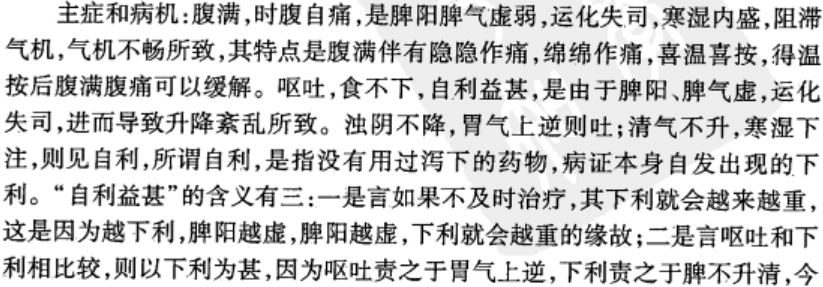
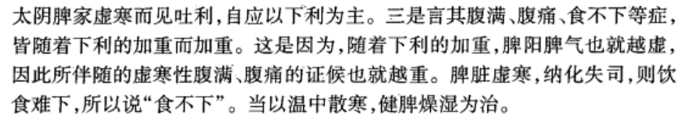
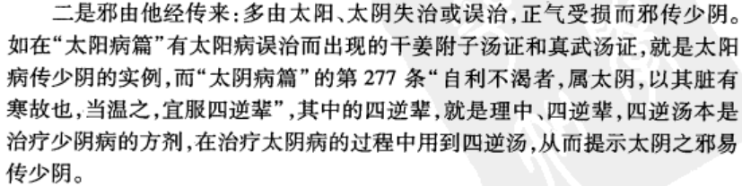
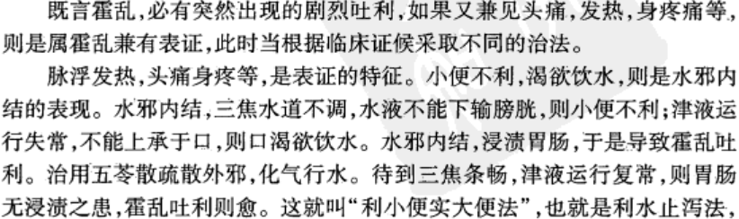

# 郝万山讲伤寒论
- 许叔微伤寒经验
    - 辩证
        - “伤寒治法，先要明表里虚实，能明此四字，则仲景三百九十七法，可坐而定也”。
            - 他之所以这样强调辨证，与当时医学界的情况是有关系的。因为晋、唐以来的医家，多侧重于搜残补缺、荟萃方药、义疏经论等方面。到了宋初，这种学风不仅仍然盛行，而且还偏于对“五运六气”的研究，从而忽视了实践中的辨证施治。许叔微认为，《伤寒论》虽以三阴三阳分证,但足以分析病情、取决治则的关键，还在于阴阳、表里、寒热、虚实。然八者之中，以“阴阳”为纲而统括其他六变，因而阴阳不辨，便无法进一步分析表里、寒热、虚实。
            - 例如“三阳”为阳，而阳热之证莫盛于“阳明”;“三阴”为阴，而阴寒之证莫盛于“少阴”。
        - 发热恶寒发于阳，无热恶寒自阴出；
        - 阳盛热多内外热，白虎相当并竹叶;
        - 阴盛寒湿脉沉弦，四逆理中为最捷；
        - 热邪入胃结成毒，大小承气宜疏泄。(《伤寒百证歌・伤寒病证总类歌》)
        - 医案
            - 曹生初病伤寒六七日，腹满而吐，食不下，身温，手足热，自利，腹中痛，呕恶心。医者谓之阳多，尚疑其手足热，恐热蓄于胃中而吐呕，或见吐利而为霍乱。请予诊，其脉细而沉，质之曰：太阴证也。太阴之为病，腹满而吐，食不下，自利益甚，时腹自痛。予止以理中丸，用仲景云如鸡子黄大，昼夜投五六枚，继以五积散，数日愈。许叔微按：予见世医论伤寒，但称阴证阳证。盖仲景有三阴三阳，就一证中，又有偏胜多寡，须是分明辩质，在何经络，方与证候相应，用药有准。且如太阴、少阴，就阴证中，自有补泻，岂可止谓之阴证也哉！（《伤寒九十论·太阴证第二十三》）
    - 辨脉
        - 脉静人病内虚故，人安脉病曰行尸；
        - 右手气口当主气，主血人迎左其位，
        - 气口紧甚食必伤，人迎紧盛风邪至；
        - 数为在腑迟为脏，浮为在表沉在里；
        - 脉浮而缓风伤营，浮紧兼涩寒伤卫；
        - 脉微大忌令人吐，欲下犹防虚且细；
        - 沉微气弱汗为难，三者要须常审记；
        - 阳加于阴(风伤营)有汗证，左手沉微却应未；
        - 趺阳胃脉定死生，太溪肾脉为根蒂，
        - 脉来六至或七至，邪气渐深须用意；
        - 浮大昼加并属阳，沉细夜加分阴位；
        - 九至以上来短促，状若涌泉无入气；
        - 更加悬绝渐无根，命绝天真当死矣。”(《伤寒百证歌・伤寒脉证总论歌》)
        - 医案
            - 里中一人，中表病，消渴甚，饮水不止，胸中热疼，气冲心下，八九日矣。医者或作中暍，或作贲豚。予诊之曰：证似厥阴，曾吐虫否？曰：昨曾吐蛔。予曰：审如是，厥阴证也。可喜者，脉来沉而缓迟耳，仲景云：厥阴为病，消渴，气上撞心，饥不欲食，食则吐蛔。又曰：厥阴病，渴欲饮水者，少少与之愈。今病人饮水过多，乃以茯苓甘草白术桂枝汤治之，得止。后投以乌梅丸，数日愈。
            - 许叔微按：病至厥阴，若太阳传者，三阴三阳皆已遍。惟恐脉强，则肝邪盛，脾土受克，故舌卷囊缩而死。今脉来迟缓而沉，则土脉得气，脾不受克，故有可喜之道。
            - 仲景云：卫气和名曰缓，营气和名曰迟，迟缓相搏名曰沉。又曰：寸口脉，缓而迟，缓则阳气长，其色鲜，其颜光，其声商。迟则阴气盛，骨髓满，精血生，肌肉紧。营卫俱行，刚柔相济，岂非安脉耶 !（《伤寒九十论·厥阴证第二十二》
- 六经总论（《医学衷中参西录》原第七期第一卷）&nbsp;
    - 伤寒治法以六经分篇，然手足各有六经，实则十二经也。手足之经既有十二，而《伤寒论》但分为六经者何也？ 
    - 【按】《内经》之论十二经也，凡言某经而不明言其为手经、足经者皆系足经，至言手经则必明言其为手某经。盖人之足经长、手经短，足经大、手经小，足经原可以统手经，但言足经而手经亦恒寓其中矣。《伤寒论》之以六经分篇，此遵《内经》定例，寓手经于足经中也。彼解《伤寒论》者，谓其所言之六经皆系足经，是犹未明仲景着伤寒之深意也。 
    - 经者，气血流通之处也。人之脏腑与某经相通，即为某经之府，其流通之气血原由府发出，而外感之内侵遂多以府为归宿。
    - 今将手足十二经及手足十二经之府详列于下。  手足虽有十二经，其名则分为六经，因手足经之名原相同也。其经有阴有阳，其阳经分太阳、阳明、少阳，其阴经分太阴、少阴、厥阴。其阴阳之经原互相表里，太阳与少阴为表里，阳明与太阴为表里，少阳与厥阴为表里。凡互为表里者，因其阴阳之经并行，其阳行于表，阴行于里也。至于经之分属于府者，足太阳经之府在膀胱，足少阴经之府在肾，足阳明经之府在胃，足太阴经之府在脾，足少阳经之府在胆，足厥阴经之府在肝，此足之三阴、三阳经与府也。  手之太阳经其府在小肠，手之少阴经其府在心，手之阳明经其府在大肠，手之太阴经其府在肺，手之少阳经其府在三焦，手之厥阴经其府在心胞，此手之三阴、三阳经与府也。 
    - 阳经为阴经之表，而太阳经又为表中之表。其经之大都会在背，而实则为周身之外廓，周身之营血卫气皆赖其卫护保合，且具有充分之热力，为营卫御外感之内侵，是以《内经》名之为巨阳。推原其热力之由来，不外君、相二火，君火生于心之血脉与肺相循环，而散热于胸中大气（一名宗气）以外通于营卫，此如日丽中天有阳光下济之热也，是以其经名为太阳。相火生于肾中命门，肾原属水，中藏相火，其水火蒸热之气，由膀胱连三焦之脂膜以透达于身之外表，此犹地心水火之气（地中心有水火之气），应春令上透地面以生热也，为其热力发于水中，故太阳之经又名太阳寒水之经也。为太阳经之热力生于君、相二火，是以其经不但以膀胱为府，而亦以胸中为府，观《伤寒论》陷胸诸汤、丸及泻心诸汤，皆列于太阳篇中可知也。 
    - 至于人病伤寒，其六经相传之次第，详于《内经·素问·热论篇》谓“人之伤于寒也则为病热，一日巨阳受之，故头项痛、腰脊强；二日阳明受之，阳明主肌肉，其脉侠（同夹）鼻络于目，故身热目疼，而鼻干不得卧也；三日少阳受之，少阳主胆，其脉循胁络于耳，故胸胁痛而耳聋；三阳经络皆受其病而未入于脏者故可汗而已；四日太阴受之，太阴脉布胃中络于嗌（咽喉），故腹满而嗌干；五日少阴受之，少阴脉贯肾络于肺，系舌本，故口燥舌干而渴，六日厥阴受之，厥阴之脉循阴器而络于肝，故烦满而囊缩。经络受病入于府者，故可下而已。”此《内经》论六经相传之次第也。至《伤寒论》六经之次序，皆以《内经》为法，而未明言其日传一经，至愚生平临证之实验，见有伤寒至旬日，病犹在太阳之府者，至他经相传之日期，亦无一定，盖《内经》言其常，而病情之变化恒有出于常例之外者，至传至某经，即现某经之病状，此又不尽然，推原其所以然之故，且加以生平临证之实验，知传至某经即现某经之病状者，多系因其经先有内伤也。若无内伤则传至某经恒有不即现某经之病时，此在临证者细心体察耳。 　　 
    - 至于六经之命名，手足皆同，然有因手经发源之府而命名者，有因足经发源之府而命名者。如太阳经名为太阳寒水之经，此原因足太阳之府命名，而手太阳亦名太阳寒水之经者，是以足经而连带其手经也。他如阳明经名为阳明燥金之经，是因手阳明之府命名（手阳明府大肠属金，其互为表里之肺亦属金），而足阳明经亦名阳明燥金之经者，是以手经而连带其足经也。少阳经名为少阳相火之经，此因足少阳之府命名（胆中寄有相火），而手少阳经亦名为少阳相火之经者，是以足经而连带其手经也。太阴经名为太阴湿土之经，此因足太阴之府命名（脾为湿土），而手太阴经亦名太阴湿土之经者，是以足经而连带其手经也。少阴经名为少阴君火之经，此因手少阴之府命名（心为君火），而足少阴经亦名少阴君火之经者，是以手经而连带其足经也。厥阴经名为厥阴风木之经，此因足厥阴之府命名（肝属木而主风），而手厥阴经亦名厥阴风木之经者，是以足经而连带其手经也。此手足十二经可并为六经之义也。
- 第一章、辨太阳病脉证并治
    - 概说
        - 1、太阳病的病位
            - 病变部位涉及到足太阳膀胱经、足太阳膀胱腑，也涉及到太阳所主的肌表营卫。且太阳主表，肺主皮毛，故体表阳气受邪，表气不利时，多会导致肺气宣发肃降失调而出现咳或喘。因此，手太阴肺的病证也会出现在＂太阳病篇＂，而没出现在＂太阴病篇＂。
        - 2、太阳病的成因
            - 风寒外袭（主要成因）
            - 少阴之邪外出太阳
                - 或是少阴寒盛伤阳证，阳气恢复，阴病出阳，脏邪还腑，邪气外出太阳
                - 或是少阴热化证，正气恢复，邪气外出太阳
                - 注意：邪气外出的是太阳膀胱经之腑，而不是太阳之经或太阳之表
        - 3、有关太阳的生理
            - ＂太＂指＂大＂，＂太阳＂的本义指强大的阳气，因此也称＂巨阳＂。其次是阳明，再次为少阳。
            - （一）足太阳膀胱经
                - 此经行于人体头项后背，从头至足，是人体循行路线最长，穴位最多，覆盖面积最大的经脉。其脉上连风府与督脉相通，下络腰肾而属膀胱。
                    - 督脉为阳脉之海，总督诸阳
                    - 肾藏元阴元阳，为一身阴阳之本
                    - 故太阳经可以借助督脉阳气及肾中阳气的资助，而主一身之表阳
                - 足太阳经别属肾膀胱络肾，散布于心，加强了膀胱、肾、心三脏的联系，也解释了太阳蓄血证为什么会出现如狂或发狂等心主神志功能失常的原因
            - （二）足太阳膀胱腑
                - 膀胱位于下焦，与足少阴肾，脏腑相连，经脉相互络属，相为表里。
                - 膀胱的生理功能
                    - 藏津液
                    - 司气化（重要）
                        - ＂肾合三焦膀胱。三焦膀胱者，腠理毫毛其应＂一一膀胱在肾阳的温煦作用下，通过气化，化生阳气，其阳气通过足太阳膀胱经脉和三焦输布于体表。（阳气的化生和输布）
                        - 参与水液代谢
            - （三）太阳阳气
                - 量最多、最大（人体体表和外界接触面积最大，所以体表阳气需要足够强大）
                - 部位主要在体表，功能为＂司开合，肥腠理，卫外而为固＂
                    - 温煦肌表
                    - 管理汗孔开合，调节体温
                    - 防御外邪
                - 太阳主外，指太阳阳气的卫外功能（故也叫卫气）
                - ＂太阳主表而统营卫＂
                    - 体表阳气被外来风寒邪气所伤，称为太阳病。
                    - 营行脉中，卫行脉外，营为卫之守，卫为营之使，营卫相将而不相离，共同完成了温养、濡润体表和保护体表的作用。
                - 太阳阳气的化生、补充和布达
                    - 化生于下焦一一膀胱在肾阳的温煦作用下通过气化作用化生阳气，此阳气通过膀胱经脉和三焦向体表输布
                    - 补充于中焦一一依赖水谷精微之气（腹中有食身上暖，腹中无食身上寒）
                    - 宣发于上焦一一太阳阳气虽然通过膀胱经脉和三焦向体表输布，但要分布于体表，还要依赖上焦肺气的宣发
        - 4、太阳病的证候分类与治法
            - 太阳经证（太阳表证，病变重点在经脉和体表）
                - 太阳中风证一一以发热，汗出，恶风，头项强痛，脉浮缓为主要临床表现。以风邪袭表，卫强营弱，营卫失和为基本病机，治以桂枝汤解肌袪风，调和营卫
                - 太阳伤寒证一一以恶寒发热，无汗而喘，全身疼痛，脉浮紧为主要临床表现。以寒邪袭表，卫闭营郁为基本病机，治以麻黄汤发汗散寒、宣肺平喘
                - 表郁轻证一一以发热恶寒，阵发发作如疟状，身痒，面赤，为主要临床表现。以表证日久，表有小邪闭郁不解，而且营卫之气已经不足为基本病机，治以桂枝麻黄各半汤、桂枝二麻黄一汤小发其汗。而表有小邪不解，里有轻度郁热而兼见烦躁者，则用桂枝二越婢一汤小发其汗，兼清郁热
            - 太阳腑证（太阳病里证，病变重点在太阳之腑）
                - 病在气分一一太阳膀胱气化不利而水邪内蓄（太阳蓄水证）。以小便不利，渴欲饮水，少腹苦里急并且伴有表证为主要临床表现。治以五苓散外疏内利，表里两解
                - 病在血分一一表邪循经入里化热，热和血结于下焦而血热内蓄（太阳蓄血证）。以如狂或发狂，少腹急结或硬满为主要临床表现。治以桃核承气汤泄热化瘀或抵当汤(丸)破血逐瘀
            - 太阳病变证（失治或误治所致）
                - 无固定模式，需观其脉证，知犯何逆随证治之。
            - 太阳病类似证
        - 5、太阳病的自然病程和预后
            - 自然病程：＂太阳病，头痛至七天以上自愈者，以行其经尽故也＂。如及时治疗，且得法，可以截断病程，使汗出表解而早日痊愈
            - 若太阳表邪不解，或失治、误治，邪气可以传入他经。
    - 一、太阳病辨证纲要
        - 1、太阳病提纲
            - 原文：太阳之为病，脉浮，头项强痛而恶寒。
                - 浮脉：轻取即得，举之有余，按之少力，如水漂木
                - 头项强痛：强直不柔和，且头痛
            - 讲解
                - 本证成因：风寒外袭
                - 主症和病机
                    - 脉浮一一外邪袭表，正气因抗邪而浮盛于外，气血必充盛于表
                    - 头项强痛一一外邪束表，太阳经脉受邪，经气不利（太阳经脉上额，交巅，入络脑，还出别下项）。这是诊断邪气在太阳经的定位性症状
                    - 恶寒一一风寒之邪外袭肌表，卫阳被伤，温煦失司
        - 2、太阳病分类提纲
            - （一）太阳中风提纲
                - 原文：太阳病，发热，汗出，恶风，脉缓者，名为中风。
                    - 脉缓：与紧脉相对而言，指脉象松弛，弛缓，柔软，非指平人脉来四至，从容和缓之缓脉（此应是脉浮缓）
                    - 中风：肌表被风邪所伤之证候，非后世猝然晕倒，偏瘫，口眼歪斜之中风
                - 讲解
                    - 本证成因：风邪袭表
                    - 主症和病机（风邪袭表，卫强营弱，营卫失和）
                        - 发热一一太阳中风是风阳邪气侵袭肌表的病证，风阳伤卫阳，两阳相争，卫阳因抗邪而浮盛于外，并进而出现病理性亢奋(卫强)
                        - 汗出一一一是卫阳被伤，卫外失司，一是风性疏泄，使营阴外越(营弱)
                        - 恶风一一一是卫阳被伤，温煦失司，一是汗出肌腠疏松，不胜风袭(虽身居密室，加衣覆被而怕冷不减)
                        - 脉缓一一脉浮缓，浮主在表，缓主营阴伤(营卫失和)
                - 注意：中风证又称中风表虚证，虽名＂表虚＂，却非虚证，此是与伤寒表实证相对而言的
            - （二）太阳伤寒提纲
                - 原文：太阳病，或已发热，或未发热，必恶寒，体痛，呕逆，脉阴阳俱紧者，名为伤寒
                    - 脉阴阳俱紧：阴、阳在此分别指尺脉和才脉。此语泛指寸关尺三部之脉皆呈浮紧象
                    - 伤寒：外感风寒
                - 讲解
                    - 本证成因：寒邪袭表
                    - 主症和病机（寒邪袭表，卫闭营郁）
                        - 必恶寒一一寒为阴邪，最易伤人阳气，寒邪袭表，卫阳被伤，温煦失司
                        - 或已发热，或未发热一一大阳伤寒证的发热可迟可早，但终究会出现(如无发热，则为少阴伤寒)
                        - 体痛一一寒性凝涩，寒主收引，寒主痛，寒伤肌表，不仅外闭卫阳，而且内郁营阴，使营卫气血凝滞，筋脉拘挛(不通则痛、卫闭营郁)
                        - 呕逆一一寒邪束表，正气抗邪于表而不能顾护于里，里气升降失常所致
                        - 脉阴阳俱紧一一浮主邪在表，紧主寒邪盛(寒主收引，使筋脉拘挛所致)
                - 注意：太阳中风与太阳伤寒的鉴别关键在于有汗(微微汗出)和无汗
            - （三）温病和风温提纲
                - 原文：太阳病，发热而渴，不恶寒者，为温病。若发汗已，身灼热者，名风温，风温之为病，脉阴阳俱浮，自汗出，身重，多眠睡，鼻息必鼾，语言难出。若被下者，小便不利，直视失溲，若被火者，微发黄色，剧则如惊痫，时瘛疭。若火熏之，一逆尚引日，再逆促命期。
                    - 温病：外感热病
                    - 风温：与后世风温病不同，此仅指温病误用辛温发汗引起的变证
                    - 脉阴阳俱浮：寸关尺三部脉浮盛有力，为热邪鼓动气血，气盛血涌，血脉贲张所致（轻取即得，重按滑数有力）
                    - 多眠睡：指热盛扰神所致的昏睡状态
                    - 失溲：小便失禁(后溲、大溲才指大便失禁)。此是热盛神昏，膀胱失约所致，与下文＂小便不利＂(尿少，因热盛伤津所致)并不矛盾
                    - 被火：指误用火针、火熏、火熨、火灸等一类方法治疗
                    - 瘛疭：四肢抽搐
                - 讲解
                    - 本证成因：温热邪气外袭
                    - 温病的主证和病机（耗阴伤津）
                        - 发热一一温热邪气侵袭肺卫，卫阳与温热相争而出现病理性亢奋
                        - 渴一一温为阳邪，最易伤津耗阴（温病初起便伤津，伤寒则需入里化热才伤津）
                        - 不恶寒一一温热邪气伤阴液为主
                        - 注意：温病初期时，可见轻微恶风寒（因温邪常夹有风邪，风邪伤卫阳，使卫阳温煦失司)，常伴口渴、舌红、脉数等热象
                    - 风温的主症和病机
                        - 发汗已，身灼热一一邪热炽盛，误用辛温之剂发汗，以热助热，故热不退而身灼热（高热汗出而热不退就是风温病）
                        - 脉阴阳俱浮一一邪热充斥于内外，鼓动气血，气血涌盛，血脉贲张所致
                        - 自汗出一一阳热逼迫津液外泄
                        - 身重一一壮火食气，火热耗气，故倦怠身重（阴损会及阳，故伤阴会耗气，所以困顿乏力）
                        - 多眠睡，鼻息必鼾，语言难出一一热扰心神、心主言、热壅气机，肺窍不利
                    - 风温误治变证的表现与病机
                        - 小便不利一一尿少，非排尿不便。热盛伤津，又误用下法，更损阴液，而致化源不足
                        - 直视一一热盛伤津，又误用下法，更损阴液，使肝肾阴精被伤，不能上荣于目，故两目呆滞凝视无神
                        - 失溲一一热盛神昏，关门不固，膀胱失约
                        - 发黄一一误用火疗，以火助助热，内伤营血，营气不布
                        - 如惊痫，时瘛疭一一火邪内攻，或热极风动；或火热伤津耗液，水不涵木而动风，出现阵阵抽搐
                        - 若火熏之，一逆尚引日，再逆促命期一一一而再的误治，只能促进病人死亡
        - 3、太阳病的自愈日和欲解时
            - 原文：病有发热恶寒者，发于阳也；无热恶寒者，发于阴也。发于阳，七日愈；发于阴，六日愈，以阳数七，阴数六故也
            - 讲解
                - 发热恶寒者，发于阳也一一外邪侵袭人体后，正气奋起抵抗，则见发热。既见发热，则表明正气不衰，邪气亦盛，正邪斗争有力，故多为阳经之证，为阳证
                    - 太阳病见发热恶寒
                    - 阳明病见热结在里、表里俱热，或蒸蒸发热，或日晡潮热
                    - 少阳病见往来寒热或呕而发热
                - 无热恶寒者，发于阴也一一病邪侵袭人体之后，阳气已虚，阴寒独盛，正气不能与邪相争，故无热。既无热则表明正气已衰，抗邪无力，故多为阴经之证
                    - 太阴脾阳虚弱
                    - 少阴心肾阳虚
                    - 厥阴虚寒致厥
                - 阳证七日愈有可能，阴证往往不可能六日愈（太阳病的＂正经＂病程为六、七天左右）
                - 阳数七一一火的成数（奇）
                - 阴数六一一水的成数（偶）
            - 原文
                - 太阳病，头痛至七日以上自愈者，以行其经尽故也。若欲作再经者，针足阳明，使经不传则愈
                    - 行其经尽：此指邪在太阳经之势己衰，太阳病的自然病程已经结束
                    - 欲作再经：或邪在太阳本经将进入第二个病程，即第二个七天，或邪传他经
                - 太阳病，欲解时，从巳至未上
                    - 欲解时：指邪气可能得解的时间，即邪气离开人体的时间
                    - 从巳至未上：从巳时到未时，即9点至15点之间（子丑寅卯辰巳午未申酉戌亥）
                - 风家，表解而不了了者，十二日愈
                    - 风家：指易患太阳中风证的人
                    - 不了了：犹言不爽快，不舒适
            - 讲解
                - 针足阳明，使经不传则愈——清泻邪气、振奋阳明之气（强壮正气），防止太阳邪气内传
                - 十二日愈——虚人外感，正气偏弱
        - 4、辨太阳病传经与否
            - 原文
                - 伤寒一日，太阳受之，脉若静，为不传；颇欲吐，若躁烦，脉数急者，为传也
                    - 伤寒一日：外感邪气之初
                    - 脉若静：脉平静无变化（脉证相符）
                    - 脉数急：与脉静相对
                - 伤寒二三日，阳明、少阳证不见者，为不传也
            - 讲解
                - 伤寒一日，太阳受之——太阳总领营卫，为六经之外藩，故外邪伤人，太阳首当其冲
                - 脉若静，为不传——脉象没有数急变化，仍是太阳病的病脉
                - 颇欲吐，若躁烦，脉数急者，为传也——如果病人出现恶心想呕吐的症状，这是胃气失和进而上逆的表现；烦躁不安则是阳明内热，扰乱心神的表现；脉数急提示病情已经变化，既然脉象和症状都发生了变化，所以为传也
    - 二、太阳病证
        - 1、太阳经证
            - （一）中风表虚证类
                - 1、太阳中风的因、机、证、治
                    - 原文
                        - 太阳中风，阳浮而阴弱，阳浮者，热自发，阴弱者，汗自出，啬啬恶寒，淅淅恶风，翕翕发热，鼻鸣干呕者，桂枝汤主之
                            - 阳浮而阴弱：一指脉象轻取见浮，沉取见弱(脉浮缓)；二指病机，卫阳抗邪浮盛于外，营阴汗出而损弱于内
                            - 啬啬恶寒，淅淅恶风，翕翕发热：怕冷怕风又发热
                        - 桂枝三两、芍药三两、炙甘草二两、生姜三两、大枣十二枚
                            - 桂枝汤比例为3：3：2：3(红枣现代用量一般为3～6枚，需掰开)
                        - 上五味，㕮咀三味，以水七升，微火煮取三升，去滓，适寒温，服一升。服已，须臾啜热稀粥一升余，以助药力。温覆令一时许，遍身漐漐，微似有汗者益佳，不可令如水流漓，病必不除。若一服汗出病差，停后服，不必尽剂。若不汗，更服依前法。又不汗，后服小促其间，半日许，令三服尽。若病重者，一日一夜服，周时观之。服一剂尽，病证犹在者，更作服。若汗不出者，乃服至二三剂。禁生冷、粘滑、肉面、五辛、酒酪、臭恶等物。
                            - 须臾：短时间内
                            - 喝药后需慢慢喝粥和盖被子助发汗
                            - 小促期间：略微缩短两次喝药的时间
                            - 周时：一昼夜
                            - 五辛：一指蒜、慈葱、兴渠、韮、薤，一指小蒜、大蒜、韭、芸苔、胡荽(香菜)
                        - 太阳病，发热汗出者，此为荣弱卫强，故使汗出，欲救邪风者，宜桂枝汤
                            - 救：止也，如救火
                            - 邪风：俩字互换下，看看认识不
                    - 讲解
                        - 本证成因：风邪袭表
                        - 主症和病机
                            - 阳浮而阴弱一一脉象轻取见浮，沉取见弱；卫强营弱
                            - 翕翕发热一一卫阳抗邪于外而发热
                            - 啬啬恶寒、淅淅恶风一一卫气为风寒所伤，温分肉功能受损，且肌腠疏松，故恶风寒
                            - 头痛一一太阳经脉受邪，经气不利
                            - 鼻鸣一一肺合皮毛，其气上通于鼻，外邪犯表，肺窍不利
                            - 干呕一一风邪袭表，正气抗邪于表而不能顾护于里，导致升降失常，胃气上逆
                    - 治法：解肌祛风，调和营卫
                    - 方剂：桂枝汤
                        - 桂枝汤治太阳风，桂芍甘草姜枣同，解肌发表调营卫，汗出恶风此方功
                    - 方义
                        - 桂枝一一辛温，解肌祛风，温通卫阳，以散卫分之邪
                        - 芍药一一酸苦微寒，敛汗滋阴，养血和营(桂枝配芍药，一散一收，一开一合，在发汗中有敛汗之意，在和营中有调卫之功)
                        - 生姜一一辛温发散，降逆止呕(呕家圣药)，佐桂枝发散风寒以解肌
                        - 大枣(红)一一甘平补中，助芍药益阴和营
                        - 炙甘草一一甘平，既调和诸药(和事佬)，又配桂枝、生姜、大枣辛甘化阳以助卫阳，配芍药、大枣酸甘化阴以滋营阴
                        - 服药注意
                            - 药后喝粥助发汗
                            - 加盖衣被不能少
                            - 见效好转需停药
                            - 对证不效需加量
                            - 药后禁食五辛物
                    - 医案
                        - 1.高热恶风，渴不多饮，脉浮缓（岳美中医案）
                            - 14岁女孩，恶风发热半年余，体温高达40℃，发狂谵语，欲往户外奔跑。但渴不多饮，胃纳减少，二便自调。舌苔淡黄而腻，脉象浮缓。观其舌苔淡黄，渴不多饮，二便自调，知其不是真热；发热恶风，脉见浮缓，系中风证未罢，营卫失和。拟桂枝汤原方服之，三剂而愈。（《岳美中医话集》）
                        - 2.伤寒发热，头痛胸痛（张志聪医案）
                            - —少年，伤寒三四日，头痛发热，胸痛不可忍。病家曰：三日前因食面而致病。张曰：不然，面饭粮食，何日不食，盖因外感风寒，以致内停饮食，非因食面而为头痛发热之也。故凡停食感寒，只宜解表，不可推食，如里气一松，外邪即陷入矣。且食停于内，在胸下胃脘间，按之而痛。今胸上痛不可按，此必误下而成结胸。病家云：昨延某师，告以食面，故用消食之药，以致胸中大痛。因诊其外症尚在，仍用桂枝汤加减，一服而愈。（《续名医类案•伤寒》卷一）
                        - 3.伤寒恶寒畏风，耳聋失聪（施沛医案）
                            - 庠友王孟衍，患伤寒，过经不解。召余诊，人迎脉浮而缓。其外证恶寒畏风，虽重裘不解，烈火不除，以绵蒙其首，而两耳若失，面赤舌黑。先是曾以丸药下之。余曰：此表证未解，先攻其里，表证仍在，须桂枝汤解之。主人摇手咋舌，畏不敢用，复以羌活、柴胡等药发汗。汗后亦不解，反大溲溏泄，前溲黄赤。医用清利之剂，病益甚。七日后复召余诊，脉候同前。余曰：此病非桂枝汤不效。病者敬诺，余亟处剂。及执药欲饮，病者曰：生死在此一匕乎！先饮三分之一，觉胸次开豁；再饮其一，则背上一指大有若火烙，其热渐及两胁，则曰：诚仙丹也。覆杯尽剂即欲睡，睡醒耳内痒极，轰然作声，若复还以耳者，而病解矣。
                            - 初病时，医以为虚证，曾用补中益气汤加鹿角胶，使外邪闭固不出，致眠食不安者廿有七日。病者复畏人参。余曰：此诚因噔废食也。初者外邪未解，固不可用，今病久气耗，非参、芪何以复元？制参苓白术散，久服痊愈。（《云起堂诊籍》）
                        - 4.阴斑寒热无汗（余听鸿医案）
                            - 常熟大河镇道士王少堂，六月初，偕妻回里，十四日起寒热，遍体红疹满布。
                            - 周姓医进以辛凉解肌之方，服后病增，至十七日，病更剧，其岳母邀余诊之。脉极细而微，重按至骨，微见数象。神识颇清，遍体干燥，身无点汗，舌绛无津，而又不渴。言语轻微，躁不能寐，红斑密布，无空隙之处。余思此乃正虚邪陷之阴斑也。
                            - 余曰：初十晚到家，逐日所作何事？试一一述之。
                            - 曰：十一至十三做法事，十四日忏事毕，结帐后当夜即热。
                            - 余曰：再去问之，初十有房事否？答言有之。
                            - 初十日酷暑，坐船数十里，外风袭表，暑热逼蒸，至夜欲后，气脉皆虚，热邪即乘虚内伏。
                            - 加之十一至十三，身为法官，终日厚衣，汗出不止。汗多则外阳已虚，津液亦涸，腠理空豁；又高叫敕令，中气亦虚，热邪易人，故见寒热。又被寒凉之药遏其阳气，故内热虽甚，无阳气蒸动，无津液化汗出表。若再服寒凉，表阳愈虚，热陷更深，阴斑无疑矣。用仲景桂枝汤，加干姜、人参，重用甘草，服后再饮以米汤。
                            - 余思汗多则阳弱阴伤，以桂枝汤和其表，以干姜合桂枝护其中阳，假甘草之多甘，合米饮之谷气，甘淡以助其胃津，得干姜之热，蒸动其胃津以上升，又赖桂枝之力推之出表。若得汗出，则中阳动而表阳和，内伏之邪，亦可由外表而发，待其烦躁狂叫，或奔走越垣，方为佳兆，切不可与以凉药，恐火郁不能外达也。如服此药后，仍然不变，则难治矣。
                            - 服药后，明午果然神识渐狂，声高而起坐不安，渴已能饮，病家惊惶，饮以蔗浆一碗，依旧静卧，声微脉细。至二鼓，余至其家，问之，曰：今午渐狂，声髙渴饮，不料服蔗汁后，依然如故。
                            - 余曰：正欲其阴证转阳，由里出表，阳回而烦，方为佳兆。又为寒凉所遏，事属周折，仍从原方，加台参须服之。
                            - 明午又见烦躁能饮，以温水饮之，汗出脉起矣。再进以甘凉之品，生胃阴而泄热助汗，托之外出，汗透而神静安寐，脉亦转和缓，能思饮食。
                            - 余曰：汗后肌润，脉和思食，正能胜邪，病有转机矣。阳回以养阴为要，进以生脉法，加甘凉咸寒之品，数剂而痊。
                            - 然证似少阴，究非伤寒可比。此是外邪内伏，无阳气阴液化汗以达表。所以读《伤寒》者，知有是病，即有是方，两言尽之矣。（《余听鸿医案》）
                        - 5.自汗恶风（胡天成医案）
                            - 阙某，男，58岁。1999年春，因失于调摄，近半月常自汗出，恶风，口和不渴，二便自调，舌质正红，苔白，脉浮弱。
                            - 乃思《伤寒论》云：病常自汗出者，此为荣气和，荣气和者，外不谐，以卫气不共荣气谐和故尔。以荣行脉中，卫行脉外，复发其汗，荣卫和则愈。宜桂枝汤。方证对应，遂书桂枝汤方。
                            - 处方：桂枝10g，白芍15g，生姜10g，大枣10g，甘草6g。
                            - 2剂。水煎服，1日1剂。嘱服药后啜热稀粥一碗，以助药力，避风寒取微汗。
                            - 第3日阙君电告，药甚灵验，遵嘱服药1剂后遍身微似有汗，今天果然不再汗出，也不恶风。问第2剂药还服否？答曰：仲景早就告诫：“若一服汗出病瘥，停后服，不必尽剂。”再嘱注意调摄以防复发。（《四川名家经方实验录》）
                        - 6.阵发性发热汗出（刘渡舟医案）
                            - 李某，女，53岁。患阵发性发热汗出一年余，每天发作二到三次。前医按阴虚发热治疗，服药二十余剂罔效。问其饮食、二便尚可，视其舌淡苔白，切其脉缓软无力。
                            - 辨为营卫不和，卫不护营之证。当调和营卫阴阳，用发汗以止汗的方法。为疏桂枝汤。
                            - 桂枝9g，白芍9g，生姜9g，炙甘草6g，大枣12枚。二剂。服药后，啜热稀粥，覆取微汗而病壤。（《刘渡舟临证验案精选》）
                        - 7.频繁阵发性汗出（赵明锐医案）
                            - 某老年妇女，内脏没有发现任何病变，只是每日出汗数十次，骤作汗出，刹那即止，延绵三年之久不愈。并发精神倦怠、心神恍惚不安、易于感冒等症。治以桂枝汤。
                            - 桂枝12g，白芍12g，炙甘草15g，生姜3片，大枣3枚。水煎服，日服一剂。
                            - 服到十剂后，出汗已痊愈。（《经方发挥》）.
                        - 8.下肢疼痛（范中林医案）
                            - 田某，女，70岁，北京中直机关家属。病史：左下肢疼痛，以小腿与膝关节为重，步履艰难，一年有余。某医院按风湿性关节炎治疗，经理疗、针灸、中药治疗无效。1978年11月28日来诊，按太阳证风湿论治，两诊而愈。
                            - 初诊：经人搀扶前来。左腿痛甚，难以着地，并有畏风及沉重感，人夜常剧痛难寐，关节不红肿。舌质淡红，苔白滑。
                            - 此为太阳证风湿，法宜祛风胜湿，解肌通络，以桂枝汤加味主之。
                            - 处方：桂枝3g，白芍10g，生姜15g，大枣15g，牛膝10g，炙甘草10g，威灵仙6g，木瓜10g。二剂。
                            - 复诊：上方服两剂，腿痛消失，可下地自由走动。为巩固疗效，清除余邪，原方加减，再服。
                            - 处方：桂枝6g，白芍10g，生姜10g，牛膝10g，炙甘草10g，木瓜10g，紫苏叶10g，防风1og，法夏1og。
                            - 服两剂病愈。1979年5月15日追访，因家中无人，邻居介绍：1977年患者腿痛，多处治疗，不见好转，痛甚时，背着儿女在家哭泣。范老几剂药治愈，现回乡探亲去了。（《范中林六经辨证医案选》
                        - 9.破伤风（万密斋医案）
                            - 一妇人，年四十余，形黑而瘠，性躁急。先患左腿发内痈，溃后起坐。
                            - 万曰：疮口未合，当禁风。其妇自恃强健，不听。忽一日眩仆，目贬口歪，身反张，手足挛曲，亟求治。
                            - 曰：此破伤风，痉病也。用桂枝汤加熟附子、黄芪、防风，一剂而病减；再服十全大补汤，三剂而安。（《续名医类案•破伤风》卷三十六）
                        - 10.冻疮（夏仲方医案）
                            - 某女，42岁。足踝上方患冻疮，历时5月不愈。溃疡面大逾手掌，创面突出，四周边缘皮肉僵硬成口，此致患处麻木，不痛不痒。给服桂枝汤加当归，仅18剂而愈。（《上海历代名医方技集成》）
                        - 11.经后腹痛（夏仲方医案）
                            - 关某，女，39岁，未婚。1960年10月3日初诊。近两年来，每次月经干净后腹痛厉害，历时3〜6天。腹痛引及两大腿，腰酸，大便如常。内科与妇科检査未发现器质性病变。过去有阵发性心悸史，现在很少发作。脉迟，舌淡红嫩，苔薄少。此下焦虚寒，拟方温中止痛。
                            - 处方：桂枝4.5g，白芍9g，炒甘草3g，党参9g，生姜2片，红枣5枚。14帖。
                            - 1960年11月2日二诊：
                            - 服中药后，此次月经后腹痛仍有发作，但程度较轻，历时也短，仅痛三天半。大便稀，怕冷，手指不暖。脉细小，舌淡润。仍以前法治之。
                            - 处方：桂枝4.5g，白芍9g，甘草3g，姜半夏6g，白术9g，当归4.5g，陈皮4.5g，煨姜2片，红枣5枚。6帖。
                            - 以后连续服桂枝汤加味28帖，最近一次月经后未发腹痛。要求再予原法巩固。
                            - 按：桂枝汤张仲景用之最广，《伤寒论》及《金匮要略》用桂枝的有76方。桂枝既是解表药又是温里药。本例月经后的腹痛，用桂枝温经通脉，通则不痛，所以痛经中用桂枝常获卓效。（《中医经方学家夏仲方专辑》）
                        - 12.妊娠恶阻（赵明锐医案）
                            - 洛某，女，29岁。妊娠三月，反应颇重，数十日来呕吐不食，水谷难人，少腹下动气上冲脘部，肢体消瘦，精神疲乏，困卧床第。治以桂枝汤加减。
                            - 桂枝12g，白芍12g，炙甘草10g，半夏10g，陈皮10g，白术10g，生姜6g，大枣10枚。用伏龙肝水煎服。二剂后痊愈。
                            - 按：本例患者虽为妊娠反应，出现长时间的呕吐、水谷难入等症，但该患突出的症状是气从少腹上冲脘部，为服桂枝汤的基本条件。如无气上冲逆之症，用桂枝汤效果不佳，可以他方求之。桂枝汤不是泛治妊娠反应的方剂。桂枝汤治疗此病的主要作用是改善胃肠中之过分的虚寒状态，使胃气稍复，呕逆好转，即能少进饮食，谷气渐旺，诸症即能随之改善。（《经方发挥》）
                        - 13.产后发热，汗出恶风（刁本恕医案）
                            - 张某，女，27岁，工人。1992年2月2日初诊。患者产后3天，发热，恶风寒，汗出，近日加剧，不能起床，请余出诊。
                            - 自述：昨日曾服中药1剂，服后诸症更甚，汗多不止，畏风畏寒，虽卧帐中，仍觉有风吹人体内，厚衣被加热水袋仍寒战不已。服药即恶心呕吐，食欲顿减，稍食即胃脘胀满而痛，恶露减少。苦淡，苔薄白，舌边齿痕明显，脉浮细数。体温39.8℃。观前医处方为生石膏40g，连翘10g，薄荷10g，菊花10g，蝉蜕10g，元参12g。皆阴寒之品。
                            - 辨证：此太阳中风之表虚证。前医不识，误用辛凉苦寒，而致证不解而阳气更伤。故急投桂枝汤以救之。
                            - 处方：桂枝汤加味：桂枝10g，白芍12g，生姜10g，甘草3g，大枣10g，当归10g，川芎6g，益母草15g。
                            - 二诊：服上药1剂，热退，汗出，恶风畏寒大减，体温降至正常，饮食增加，少腹痛止。原方去益母草，再进1剂。
                            - 三诊：2剂后阳气得复，太阳中风诸症俱愈。仅左侧乳下肿胀未消，又因患病而断乳，乳汁不通而肿胀更甚。后配合外治，予温经散寒、活血祛瘀之剂内服外敷调理而愈。（《四川名家经方实验录》）
                        - 14.小儿急惊风（吴佩衡医案）
                            - 柯某之长子，年一岁半。1922年阴历九月初六日晨，寐醒抱出，冒风而惊，发热，自汗沉迷，角弓反张，手足抽搐，目上视，指纹赤而浮，唇赤舌淡白，脉来浮缓。由于风寒阻遏太阳经气运行之机，加以小儿营卫未充，脏腑柔嫩，不耐风寒，以致猝然抽搐而成急惊风证。此为太阳肌表之证，以仲景桂枝汤主之，使中于太阳肌膜之邪，得微汗而解。
                            - 桂尖10g，杭芍10g，甘草6g，生姜10g，小枣7枚。加入粳米一小撮同煎。嘱服后温覆而卧，使得微汗。
                            - 一剂尽，即熟寐，汗出热退，次日霍然。（《吴佩衡医案》）
                        - 15.过服苦寒药致目盲（彭履祥医案）
                            - 廖某，男，20岁。初患眼病，红肿疼痛，经西医治疗，红肿疼痛消退，但逐渐弱视失明。而外观双目圆睁，毫无异态，身无不适，经久不愈。
                            - 初诊时，虑其病久未愈，必肝气郁结所致，以逍遥散数剂，不效。
                            - 再诊时，据述原住院一年多，中西药不效，痛遂日增。
                            - 査所服方药，均以“因目为火户”作依据，多系清热泻火之类。
                            - 分析其初病时，目虽红肿疼痛，尚能视物如常，肿痛消失，反而失明。愈治而视力愈弱，此必苦寒阴柔过剂，损伤中气，以致营卫紊乱，精血不能上荣于目，故目盲不能视物。
                            - 此医药不当，非目病所致。拟调和营卫法，处以桂枝汤全方。
                            - 桂枝10g，白芍10g，大枣18g，生姜10g，甘草1og。嘱服6剂。
                            - 复诊时据云，服上方3剂后，目有光感，6剂服完，视物较清楚。仍守上方，继服6剂。
                            - 半月后再诊，已能写字看书报。一年后随访，未见复发。（《著名中医学家的学术经验》）
                        - 16.眼干涩，畏光羞明（门纯德医案）
                            - 梁某，男，31岁。自述眼不能睁大，干涩怕光，视物不清。眼科诸法治疗三月不效。见其颜面色黄，体质较差，白睛微红不肿，脉象偏弱等征象。
                            - 确认为此非急性风火眼病，不能清热泻实，又不宜大补气血。乃属整体营卫失调，气血不和，影响到局部，使目失所养。令服桂枝汤三剂。时过一周，基本恢复正常。（《名方广用》）
                        - 17.鼻鼽（聂惠民医案）
                            - 李某，女，27岁。1999年10月29日初诊。患鼻塞流涕，时时频作，病已三年。每以寒冷则发，伴有前额头痛。脉沉略细，苔薄白。
                            - 证属风寒束表，营卫不和。
                            - 治宜调和营卫，散寒通窍。宗桂枝汤加味。
                            - 处方：桂枝10g，杭芍10g，炙甘草6g，大枣6枚，藁本10g，辛夷10g，苍耳子10g，生芪15g。生姜三片为引。
                            - 服药七剂，诸症皆减，头痛已去。守方调理三周，症除病愈。（《聂氏伤寒学》）
                - 2、桂枝汤的其他适应证
                    - （1）凡是太阳病，见头痛、发热、汗出、恶风寒者
                        - 讲解
                            - 本条所论，扩大了桂枝汤的应用范围——一切表证，无论中风、伤寒，也无论是否经过治疗，只要出现头痛、发热、汗出、恶风这四个症状，都可用桂枝汤
                    - （2）太阳病兼轻度里虚者
                        - 原文
                            - 太阳病，外证未解，脉浮弱者，当以汗解，宜桂枝汤。
                        - 讲解
                            - 凡太阳病外证未解，不论有汗无汗，只要脉见浮弱，有正气不足之象，不耐麻黄汤峻汗者，均应使用桂枝汤调和营卫，扶正祛邪。
                    - （3）汗下后太阳表证仍在者
                        - 原文
                            - 太阳病，下之后，其气上冲者，可与桂枝汤，方用前法。若不上冲者不得与之。
                                - 其气上冲：一说病人自觉症状，指病人或自觉胸中有上逆的感觉，或有胃气上逆的呕吐，或有肺气上逆的咳喘等；一说病机的描述，“上冲”与“内陷”相对，“其气”指太阳阳气，即太阳阳气仍能向上向外抗邪于表，提示表证仍在。
                            - 太阳病，先发汗不解，而复下之，脉浮者不愈。浮为在外，而反下之，故令不愈。今脉浮，故在外，当须解外则愈，宜桂枝汤。
                            - 伤寒发汗已解，半日许复烦，脉浮数者，可更发汗，宜桂枝汤。
                                - 烦：烦热、发热
                        - 讲解
                            - 表证仍在，则仍需解外。
                            - 桂枝汤既可解表，又能保护正气，故不用峻猛之麻黄汤戕伐正气。
                    - （4）太阳病兼里实欲先解表者
                        - 原文
                            - 太阳病，外证未解，不可下之，下之为逆，欲解外者，宜桂枝汤。
                        - 讲解
                            - 病在表者，理当汗解；病属里实，法当攻下，此为治疗的常法。
                            - 表证兼里实，一般先解表，如先行攻下，里邪虽减，但使用攻下药物会让正气入里，表邪也随之内陷，导致变证从生。先解表则里邪不会妄动。
                            - 不用麻黄汤是恐其峻汗伤津，更增在里之燥热。
                            - 桂枝汤可解肌祛风，又滋阴和营，既能驱邪，又无辛燥助热之弊。
                    - （5）非外邪所致之营卫不和
                        - 原文
                            - 病常自汗出者，此为荣气和者，外不谐，以卫气不共荣气谐和故尔。以荣行脉中，卫行脉外。复发其汗，荣卫和则愈，宜桂枝汤。
                                - 荣气和：营气功能正常
                                - 外不谐：卫气不安分
                            - 病人脏无他病，时发热自汗出而不愈者，此卫气不和也。先其时发汗则愈，宜桂枝汤。
                                - 脏无他病：脏腑无病，里气调和
                                - 先其时：发热自汗前
                        - 讲解
                            - 自汗出证的证治
                                - 主症和病机
                                    - 病常自汗出，因无发热、恶寒、头痛等症，知非外感。
                                    - 其病机为“卫气不共荣气谐和”，即营卫失调，卫气失于固护开阖所致。
                                - 治法
                                    - 复发其汗，荣卫和则愈。（自汗伤正，发汗驱邪，故自汗乃营卫相离，发汗使营卫相合）
                            - 时发热自汗出的证治
                                - 主症和病机
                                    - 时发热自汗出而不愈，指发热、自汗出阵发性发作，其病机为卫气不和，营卫不调（卫阳得不到营阴的制约则发热，营阴得不到卫阳的护卫则自汗）
                                - 治法
                                    - 先其时发汗则愈。在病症发作之前，或发作的间歇期，用桂枝汤来调和营卫，既可截断病势，又可避免过汗。
                                - 医案
                                    - 男性，56岁，自诉近三月来，每日下午3时出现烘热，并伴随全身大汗。前医叠用滋阴敛阳、清热降火、益气固表、收涩敛汗等方法，效果不显。如用收涩敛汗重剂后，病人汗止，但烦热甚，以至难以忍耐。遂用桂枝汤，嘱其在下午1点半左右服药，多喝热水，保温发汗，每日一次，连服6剂而愈。3个月后复发，再用六剂痊愈。
                    - （6）病重药轻，治用针药并用法
                        - 原文
                            - 太阳病，初服桂枝汤，反烦不解者，先刺风池、风府，却与桂枝汤则愈。
                                - 风池：足少阳胆经穴名。
                                - 风府：督脉穴名，太阳膀胱经在此与督脉相连。
                        - 讲解
                            - 太阳之邪过盛，药力不足以驱邪外出，反而激怒了邪气，因此导致烦热不解（病重药轻的激惹现象）。
                            - 先刺风池、风府，一则可以疏通太阳经气和后颈部的气血，从而达到调动正气的效果；一则可以泄太阳经脉中和后颈部的风邪，为后来的桂枝汤疏通道路。
                - 3、桂枝汤禁忌症
                    - 原文
                        - 桂枝本为解肌，若其人脉浮紧，发热汗不出者，不可与之也。常须识此，勿令误也。
                            - 解肌：解散肌表之邪
                            - 识：志，铭记
                        - 若酒客病，不可与桂枝汤，得之则呕，以酒客不喜甘故也。
                            - 酒客病：饮酒过度，湿热内盛，阻遏营卫气血，使营卫气血失和，而见烦热，多汗，周身酸楚，头痛等类似太阳中风证的病症
                        - 凡服桂枝汤吐者，其后必吐脓血也。
                    - 讲解
                        - 典型的、单纯的太阳伤寒表实证禁用桂枝汤（误用则变坏证）
                        - 湿热内蕴者禁用桂枝汤（辛温助热，甘味增湿，使湿热壅滞更重，导致胃气上逆而呕）
                        - 毒热壅盛者禁用桂枝汤（需清热）
                - 4、桂枝汤的加减应用
                    - （1）桂枝加葛根汤证
                        - 原文
                            - 太阳病，项背强几几，反汗出恶风者，桂枝加葛根汤主之。
                                - 项背强几几：几读紧。项背拘急牵强，俯仰不能自如。
                            - 葛根（四两） 麻黄（三两，去节） 芍药（二两） 生姜（三两，切） 甘草（二两，炙） 大枣（十二枚，擘） 桂枝（二两，去皮）
                            - 右七味，以水一斗，先煮麻黄、葛根，减二升，去上沫，内诸药，煮取三升，去滓。温服一升，覆取微似汗，不须啜粥，余如桂枝法将息及禁忌。（臣亿等谨按，仲景本论，太阳中风自汗用桂枝，伤寒无汗用麻黄，今证云汗出恶风，而方中有麻黄，恐非其本意也。第三卷有葛根汤证，云无汗恶风，正与此方同，是合用麻黄也。此云桂枝加葛根，恐是桂枝汤中但加葛根耳。）
                                - 内：加入
                                - 将息：调养
                        - 讲解
                            - 项背强几几——不但头项强痛，而且连及背部，出现拘紧不揉和，俯仰不能自如（风寒客于经脉，经气不畅，气血不利）
                            - 反汗出恶风——本证辨证关键，由汗出恶风可知此为风邪在经，经气不利；如若寒邪在经，寒性凝滞，当无汗。
                        - 治法：解肌祛风，升津舒经
                        - 方剂：桂枝加葛根汤
                            - 桂加葛根走经输,项背几几反汗濡。解肌驱风滋经脉,用治柔痉理不殊。
                        - 方义
                            - 葛根
                                - 升阳发表，助桂枝汤发表解肌
                                - 疏通经脉，祛除邪气
                                - 升津液，起阴气，鼓舞阳明津液的布达，滋阴润燥，以缓解经脉拘挛
                            - 桂枝汤——解肌祛风，调和营卫
                        - 医䅁
                            - 1.感冒（聂惠民医案）
                                - 郑某，女，成年。1978年10月初诊。患感冒三天，自服解表药如银翘丸、抗生素、解热镇痛药，未效，故求余诊。病见发热（37.6℃），微恶风寒，身见自汗，鼻塞流涕，项背拘急，不能自如，面部自觉有拘紧感（既往患过颜面神经麻搏）。切其脉缓而弱，舌淡红，苔薄白。
                                - 证属风邪客表，营卫不和，经输不利而致。
                                - 治宜解肌祛风，调和营卫，舒经活络，拟桂枝加葛根汤化裁。
                                - 遂以原方加嫩桑枝10g。进药二剂，取微汗出。药后病去七八，继服二剂而安。（《聂氏伤寒学》）
                            - 2.汗出恶风，项背拘急伴下利（刘渡舟医案）
                                - 刘某，男，41岁。患病已三月，项背强紧，顾盼俯仰不能自如，自汗出而恶风。问其大便则称稀溏，每日二三次，伴有脱肛与后重等症。切其脉浮，视其舌苔白润。
                                - 刘老辨脉浮、汗出恶风为桂枝证；项背拘急而强几几为太阳经输气血不利所致；大便溏薄，肛肠下坠后重，则为阳明受邪，升清不利之象。
                                - 大论云：“太阳病，项背强几几，反汗出恶风者，桂枝加葛根汤主之”。仲景示人，有汗的用桂枝，无汗的用麻黄，故本证当用桂枝汤。项背强急，应加葛根。又大便下利，为太阳阳明合病，而葛根能走上彻下，疏解“二阳”，切为病之所宜。
                                - 桂枝15g，白芍15g，葛根16g，生姜12g，炙甘草10g，大枣12枚。服药后，不须啜粥。
                                - 连服七剂，诸症皆爽然而愈。（《刘渡舟临证验案精选》）
                            - 3.风中经络，口眼斜（刘渡舟医案）
                                - 张某，女，26岁。时值炎夏，乘长途汽车返乡，面朝敝窗而坐，疾风掠面，当时殊觉凉爽，抵家却发觉左侧面部肌肉拘急不舒，口眼斜。视其舌苔白而润，切其脉浮。
                                - 辨为风中阳明经络，正邪相引所致。治当疏解阳明之风邪，兼以缓急解痉为法。
                                - 桂枝9g，白芍9g，生姜9g，大枣12枚，炙甘草6g，葛根15g，白附子6g，全蝎6g。
                                - 仅服两剂，汗出邪散而病愈。（《刘渡舟临证验案精选》）
                            - 4.风中经络，颈项偏斜（胡天成医案）
                                - 吴某，女，5岁。1979年11月9日初诊。其母代诉：8天前患儿在田间玩耍，不慎失足落水，当时仅将裤子打湿，头身未见外伤，患儿亦未诉任何不适。傍晚，其父收工回家，即发现患儿颈项向左偏斜，不能转动，入夜不能平睡，呼叫颈项疼痛。因疑为“失枕”，次日即请人“端颈”，未见好转。第3日又外敷药2次，均未见效。病后，患儿白天嬉戏如常，暮夜即感不适，要母怀抱。如此已8日，病无起色。亲友又以为“骨伤”所致，嘱到骨科就诊。经检查排除颈椎病，遂邀笔者诊治。其时患儿头颈明显向左偏斜，颈项肌肉强硬，皮色不变，亦不发热，但压之疼痛，头汗甚多，口干喜饮，饮食减少，大便1日1次，小便不黄，舌质正常，苔白，脉浮。
                                - 审为太阳中风，经输不利，处桂枝加葛根汤加天花粉。
                                - 处方：桂枝10g，白芍15g，生姜10g，大枣12g，甘草3g，葛根24g，天花粉18g。水煎服，1日1剂。
                                - 二诊：其母诉上方连服3剂，1剂汗止，3剂颈即不偏，唯转动尚欠灵活。此太阳经输之气尚未完全疏通之故。仍守上方，更加秦艽15g，丝瓜络12g，以祛风通络。
                                - 结果病儿继服2剂后，颈项即活动自如。（（四川名家经方实验录》）
                            - 5.手足抽搐症（门纯德医棄）
                                - 刘某，女，30岁。患手足抽搐已四年，每次发作均出现手足挛缩，环口发紧，背直项强。患者神志清楚，遇劳则发作。春季妊娠期病情加重，注射葡萄糖酸钙可缓解，停药后又复发。
                                - 与桂枝加葛根汤加白苣子9g，钩藤15g调治数日，搐搦一直未发。（《名方广用》）
                            - 6.肢体震颠（门纯德医案）
                                - 贾某，男，62岁。素患高血压、动脉硬化症。每逢体劳过度或情志不舒，则出现肢体震颤，轻者颤动有时，重者身不由己，尤以上肢为重。经服用镇静安定之类药物均不见效。
                                - 诊见：情志淡漠，头及上肢颤动无度，项背素日发强，脉缓而细弦。遂以桂枝加葛根汤加钩藤15g，全蝎3g，令服三剂。
                                - 服后震颤大减，自觉周身活畅。再以桂枝加葛根汤倍加芍药，令服三剂，其症若失。（《名方广用》）
                            - 7.小儿惊风（马光亚医案）
                                - 尹某，男，1岁。因感冒在某医院诊治，在注射了一针（不知为何药）后，即发生抽搐。转诊至某大医院后，经脊髓穿刺检査，未发现脑炎病菌，但小儿抽风不止，准备第2次抽脊髓。因小儿的母亲不愿而止，暗中请我去诊治，时间是1978年12月11日。
                                - 症状是发热柚风，体温不高，只在38℃多一点，四肢抽搐，角弓反张，无汗。
                                - 处方：用桂枝汤加葛根：桂枝5g，白芍5g，甘草5g，葛根10g，生姜3片。
                                - 药煮好后，只给病儿灌了1/2的量，不到2个小时，小孩不抽风了，慢慢的热也退了，当日即出院回家。
                                - 这是痒病，亦名惊风，因为体温不高，不是热证，是寒证，故用桂枝加葛根汤半剂即愈。（《台北临床三十年》）
                            - 西医病症医案
                                - 1.颈椎骨质增生，颈项强痛（张天锡医案）
                                    - 李某，女，48岁，医务人员。1988年7月就诊。长期颈项强痛，摄片示：第3〜7颈椎骨质增生。因疼痛加重而来求治。
                                    - 査：颈项强痛，牵引至背，拘急不舒，颈项处围着线制颈圈，且暑热天亦不能摘取，痛苦不堪，自汗出且恶风，舌质淡红，苔薄白……
                                    - 处方：桂枝加葛根汤：葛根120g，白芍60g，桂枝30g，大枣20g，生姜20g，甘草20g。先以水煎葛根，后内诸药，日服3次。
                                    - 3剂后诸症减轻，颈圈去掉。原方原剂不变再服3剂，诸症若失。再以穿龙骨刺片治疗颈椎骨质增生。（《四川名家经方实验录》）
                                - 2.颈椎骨质增生，颈项酸困疼痛（赵明锐医案）
                                    - 王某，男，40岁。项部酸困疼痛二年，能俯不能仰，头项稍向后抬即感到两胳膊及两手麻木不适。经数处医院检查，诊断为颈椎骨质增生。
                                    - 当前缺乏有效疗法，嘱其自行调养。给服桂枝加葛根汤40余剂，此病虽未治愈，但项部的酸困疼痛感觉有一定的好转，已不为所苦了。（《经方发挥》）
                        - 此方勿加麻黄
                    - （2）桂枝加厚朴杏子汤证
                        - 原文
                            - 太阳病，下之微喘者，表未解故也，桂枝加厚朴杏子汤主之。
                            - 桂枝三两（去皮）　甘草二两（炙）　生姜三两（切）　芍药三两　大枣十二枚（擘）　厚朴二两（炙，去皮）　杏仁五十枚（去皮尖）
                            - 上七味，以水七升，微火煮取三升，去滓，温服一升，覆取微似汗。
                            - 喘家作桂枝汤，加厚朴、杏子佳。
                        - 讲解
                            - 本证成因
                                - 太阳表证，误下伤里气，表邪乘虚内陷胸中而成表证兼喘。
                                - 平素有喘疾，复受风寒，外邪引起宿喘发作，而成中风兼喘。
                            - 主症和病机
                                - 微喘者一一为误下后，表邪入里，使肺气不利进而上逆所致。
                                - 表未解一一虽经误下，表邪并未完全入里，仍有表证
                        - 治法：解肌祛风，降气平喘
                        - 方剂：桂枝加厚朴杏子汤
                        - 方义
                            - 厚朴、杏仁一一下气降逆，消痰平喘。
                            - 桂枝汤——解肌祛风，调和营卫
                        - 医案
                            - 1.伤寒喘息（许叔微医案）
                                - 戊申正月，有一武弁在仪真为张遇所虏，日夕置于舟艎板下，不胜验伏。后数日得脱，因饱食解衣扪虱以自快，次日遂作伤寒。
                                - 医者以因饱食伤而下之，一医以解衣中邪而汗之。杂治数日，渐觉昏困，上喘息高。医者怆惶，罔知所指。
                                - 予诊之曰：太阳病下之，表未解，微喘者，桂枝加厚朴杏子汤，此仲景法也。
                                - 医者争曰：某平生不曾用桂枝，况此药热，安可愈喘？
                                - 予曰：非汝所知也。
                                - —投而喘定，再投而濈濈汗出，至晚，身凉而脉已和矣。
                                - 医者曰：予不知仲景之法，其神如此。
                                - 予曰：仲景之法，予岂诳惑后世也哉！人自寡学，无以发明耳。（《伤寒九十论》）
                            - 2.小儿咳喘（聂惠民医案）
                                - 赵某，男，9岁。1987年2月初诊。患儿自幼患咳喘病。今年春节外感，诱发咳嗽喘息，服药治疗未见病愈。近来数天，复感外寒，咳嗽喘息加重，夜卧难平，痰多稀喉中痰鸣，服抗生素等中西药效不显，故前来求诊。素体虚弱，脾胃不和，易患外感，舌尖略红，苔剥脱，中间苔淡黄，脉沉弦略数。
                                - 证属寒邪束表，郁而化热，肺气不降，而致咳喘。拟调营和卫，理肺平喘，宗桂枝加厚朴杏子汤化裁。
                                - 处方：桂枝8g，杭芍10g，甘草4g，生姜三片，大枣5枚，浙贝10g，桔梗10g，川朴10g，杏仁8g。六剂。水煎温服，每剂分三次服用。
                                - 药后喘平，夜卧亦安，唯晨起偶有咳嗽。前方不变，继服四剂，喘咳皆平。继调脾胃而安，五年未复发。（《聂氏伤寒学》）
                            - 西医病症医案
                                - 1.感冒并发肺炎（刘渡舟医案）
                                    - 刘某，男，33岁。1994年1月5日初诊。感冒并发肺炎，口服“先锋四号”，肌注青霉素，身热虽退，但干咳少痰，气促作喘，胸闷。伴头痛，汗出恶风，背部发凉，周身骨节酸痛，阴囊湿冷。舌苔薄白，脉来浮弦。
                                    - 证属太阳中风，寒邪迫肺，气逆作喘。
                                    - 法当解肌祛风，温肺理气止喘。
                                    - 桂枝10g，白芍10g，生姜10g，炙甘草6g，大枣12g，杏仁10g，厚朴15g。
                                    - 服药七剂，咳喘缓解。仍有汗出恶风，晨起吐稀白痰。上方桂枝、白芍、生姜增至12g。
                                    - 又服七剂，咳喘得平，诸症悉除。医院复査，肺炎完全消除。（《刘渡舟临证验案精选》）
                                - 2.婴儿腺病毒肺炎（蒲辅周医案）
                                    - 初某，男，3个月。1961年2月27日初诊。
                                    - 主诉：发热4天，咳嗽气促，抽风两次。1961年2月24日住院。
                                    - 人院后检査：体温39.4℃，脉搏106次/分，发育、营养中等，右肺叩诊稍浊，两肺呼吸音粗糙，有干啰音及小水泡音，以右肺为著。
                                    - 血常规：白细胞总数12.9X109/L，中性粒细胞0.68，淋巴细胞0.32。
                                    - 胸部透视：右肺上下野斑片状阴影，肺纹理模糊。
                                    - 诊断：腺病毒肺炎。
                                    - 入院前，用退热消炎止咳中药罔效。人院后，症见髙热无汗，烦躁哭闹，惊惕不安。先用土霉素、红霉素等西药，并投大剂寒凉撤热之麻杏石甘汤，复进银翘散加味，证势依然，停西药邀蒲老会诊。
                                    - 刻诊：体温40"C，无汗咳喘，膈动足凉，胸腹满，面色青黄，口周色青，唇舌质淡，苔灰白，脉浮滑，指纹青，直透气关以上。
                                    - 蒲老指出：本为感受风寒，始宜辛温疏解，误用辛凉苦寒，以致表郁邪陷，肺卫不宣。治宜调和营卫，透邪出表。
                                    - 处方：桂枝加厚朴杏子汤加味：桂枝1.5g，厚朴15g，前胡1.5g，炙甘草1.5g，白芍1.8g，杏仁10粒，僵蚕3g，生姜2片，大枣2枚。
                                    - 服1剂微汗出，热渐退，精神佳，膈动、吃奶、口周及指纹青均好转，唯喉间水鸣声，便溏日5次，脉滑不数，舌淡苔秽白。
                                    - 营卫虽和，肺气仍闭，湿痰阻滞。法当温宣降逆化痰。
                                    - 处方：射干麻黄汤：射干1.5g，麻黄1.5g，紫菀1.5g，前胡1.5g，炙甘草1.5g，细辛0.9g，法半夏3g，炒苏子3g，五味子7粒，生姜2片，大枣2枚。
                                    - 服1剂体温降至36.4℃，精神好转，身潮润，足欠温，腹满减，二便如前，面青白，右肺水泡音较多，左肺较少，脉沉滑，舌淡苔退。表邪已解，肺胃未和。
                                    - 宜调和肺胃，益气化痰。治仿朴姜夏草人参汤加味。
                                    - 处方5西洋参1.5g，炙甘草1.5g，橘红1.5g，法半夏3g，川厚朴2.1g，生姜2片。
                                    - 服2剂，咳减至微，呼吸正常，纳增，大便日1〜2次，成形，小便多，两肺呼吸音粗，少量干湿啰音，舌正常无苔，脉沉细滑。
                                    - 续以二陈汤加白前、苏子、枇杷叶、生姜调肺胃，化瘀湿。
                                    - 服2剂后，乳食调养。胸透示右肺片状阴影部分吸收，临床痊愈出院。（《四川名家经方实验录》）
                    - （3）桂枝加附子汤证
                        - 原文
                            - 太阳病，发汗，遂漏不止，其人恶风，小便难，四支微急，难以屈伸者，桂枝加附子汤主之。
                                - 汗漏不止：汗出淋漓不止。
                                - 小便难：尿少
                                - 四肢微急：四肢轻度拘急。
                            - 桂枝三两（去皮）　芍药三两　甘草三两（炙）　生姜三两（切）　大枣十二枚（擘）　附子一枚（炮，去皮，破八片）
                            - 上六味，以水七升，煮取三升，去滓，温服一升。本云：桂枝汤，今加附子。将息如前法。
                        - 讲解
                            - 本证成因：太阳病，发汗，汗出太多，导致阴阳两伤，而表证尚未解除。
                            - 主症和病机
                                - 发汗，遂漏不止一一汗生于阴而出于阳，汗出越多，卫阳越虚，肌腠不能固密，营阴随之外泄，于是出现了伤阳损液的结果。
                                - 恶风一一过汗伤阳，表阳虚弱，温煦失司，不耐风袭。
                                - 小便难一一过汗伤阳损阴，津液亏少，化源不足，阳气破伤，气化无力。
                                - 四肢微急，难以屈伸一一既有阳虚四肢筋脉失温的因素，也有阴液被伤，四肢筋脉失去濡养的因素。
                            - 本证为阴阳两伤，但治法只取助阳解表而不补阴，为何？
                                - 本证病变重点在于阳虚不固，阴液虽有损伤，但阴伤缘于汗泄，汗泄缘于阳虚不固，因此采用助阳解表法，助阳则表固，表固则敛汗，敛汗就是摄阴。
                                - 有形之阴液不能速生，无形之阳气所当急固，何况阳生则阴长，阳气恢复，气化功能正常，阴液就能自行恢复。
                        - 治法：调和营卫，扶阳固表
                        - 方剂：桂枝加附子汤
                        - 方义
                            - 炮附子温经复阳，固表止汗。
                            - 桂枝汤——解肌祛风，调和营卫。
                            - 邪去阳旺，表固汗止，津液自复，诸证可愈。
                        - 医案
                            - 1.鼻衄（李师昉医案）
                                - 孙某，男，35岁。1956年10月5日初诊。患者素体气虚，常易感冒。3天前因劳累过度而患鼻衄，出血盈斗，两昼夜不止，前医用寒凉止血之剂无效，身微恶寒，二便清调。脉微弱，舌淡红、苔薄白。此为卫表阳虚，气失固摄，宜桂枝加附子汤主之。方用：桂枝尖、生白芍、熟附子各6g，炙甘草3g，生姜3片，大麥3枚。
                                - 1剂衄减，2剂衄止，后以十全大补汤调理复元。（《危症难病倚附子》）
                            - 2.少腹痛伴恶寒遗溺（张有章医案）
                                - 戊申奉委以征葰税赴石柱。甫抵旅店，日薄暮。歇未定，微闻有人呻痛，声惨，询之旅店，知为东邻，郝寿五之妻，患少腹痛也。
                                - 方问答间，寿五适至，因谓余曰，拙妻身受此病，已历三年。每于病将作时，必恶寒遗溺，辄数日而痛不衰，经医无算，卒尟效。
                                - 今蒙存问，如知医而以救世为念者，能不一行救之乎。往为诊之，尺脉沉迟而细，乃以桂枝加附子汤温之，数剂而瘥。
                                - 论曰：此少腹痛者，乃督脉及足少阴肾经，足太阳膀胱三者互引而成者也……太阳之气病则身必恶寒，肾脏之经病则溺时遗。太阳为卫外之固，少阴为生气之源，阴阳俱病，牵及督脉出原之部，而少腹更痛矣。今用桂枝汤以解外，并解督脉之寒，加熟附子以温肾，兼温太阳之气，阴阳即和，少腹痛奚得不愈耶。（《伤寒借治论》卷上）
                            - 3.伤寒汗多小便数（许叔微医案）
                                - 有一李姓士人，得太阳因汗后汗不止，恶风，小便涩，足挛曲而不伸。予诊其脉，浮而大。浮为风，大为虚，此证桂枝汤第七证也。仲景云：太阳病，发汗，遂漏不止，其人恶风，小便难，四肢微急，难以屈伸者，桂枝加附子。
                                - 三投而汗止。再投以芍药甘草，而足得伸数，数日愈。（《伤寒九十论》）
                            - 4.伤寒过汗，大汗淋漓（邢锡波医案）
                                - 赵某，男，35岁，工人。病史：素阳气衰弱，因患伤寒，发汗后，而病不解，医者又以疏风宣表之剂与之。服药1小时，大汗淋漓，湿透浃背。
                                - 过半日许，而汗仍蒸蒸不断，烦躁不安，背觉恶寒，脉象虚弱无力，而寸脉尤甚。是知平素阳气不足，而汗剂又过其量，致汗出过多，阳气外越，现真阳有欲脱之象，因以桂枝加附子汤与之。
                                - 证属：表证未解，阳气不足。
                                - 治宜：扶阳解表。
                                - 处方：白芍15g，附子10g，桂枝10g，甘草10g，生姜3g，大枣10枚。
                                - 以白芍为敛汗之主药。此证之所以亡阳，以汗出过多之故。如不敛其汗，而欲回其阳，恐不能很快达到目的。故服此药1剂后而汗减躁安，再剂而病愈。所以关于阳虚的病人发汗，最宜注意。（《邢锡波医案集》）
                            - 5.伤风汗多恶寒（余无言医案）
                                - 顾某，男，42岁。初诊：1950年3月间。
                                - 主诉：劳汗当风，患伤风之证，始则啬啬恶寒，淅淅恶风，但寒不热。约半日许，始渐翕翕发热，发热与恶寒间时并见。初病之时，因贫未能调治。至第三日，病势转剧，且增四肢拘急、手足发凉，十指尤冷，始来就诊。
                                - 诊查：面带垢晦，袖手缩足，由家属扶持人诊。头面颈项均自汗颇多，领围带湿，气息微喘，及诊其脉，则觉手已微凉，手指尤甚。
                                - 辨证：太阳表证，卫虚末厥。
                                - 处方：桂枝加附子汤方：川桂枝9g，京芍药12g，炙甘草7.5g，熟附片15g，生姜4.5g，大枣10枚。
                                - 二诊：次日。服上方药一剂而愈。又处以调理之剂，令服药两剂，以扶正气。（《中国现代名中医医案精华（第六册）》）
                            - 6.伤风汗多恶寒（邢锡波医案）
                                - 王某，男，45岁，干部。
                                - 病史：卫气素虚，皮毛不固，动则汗出。忽感风邪，始则啬啬恶寒，淅淅恶风。继则翕翕发热，头项强痛，腰背酸楚，间以恶心，自汗淋漓。迁延两日，病势有增，四肢拘急，屈伸不和，手足发凉，十指尤甚。延余就诊，见其面色垢暗，劫手，缩足，自汗颇多，气息微喘。此乃太阳表证，卫阳欲亡，故以桂枝加附子汤与之。
                                - 证属：表邪不解，卫阳不固。
                                - 治宜：扶阳解表。
                                - 处方：熟附片15g，赤芍12g，桂枝10g，甘草8g，生姜5g，大枣10枚。
                                - 服药1剂，表解汗止而愈。（《邢锡波医案集》）
                            - 7.半身汗闭（赖良蒲医案）
                                - 肖某，男，36岁，萍乡人。
                                - 症状：一九三四年暮春，夜卧当风，突然寒战体痛，前来诊治，自诉几年来，只左半边有汗，其右半身虽在酷暑终无汗出，界限分明，脉象左浮紧，右沉迟，舌苔白。
                                - 诊断：此里寒太盛，格拒真阳，不能右行外达，以致玄府闭塞，汗不得泄。
                                - 疗法：议用温经驱寒，解肌通络法，以桂枝加附子汤主之。
                                - 附片四钱，桂枝三钱，酒白芍三钱，炙甘草二钱，大枣四枚，生姜三钱。水煎服。
                                - 服三剂，改投补气升阳法，以加味补中益气汤十剂后，遂得通身透汗，精神轻松愉快。
                                - 自按：阳不外达，气不流畅，则血脉凝滞，汗孔闭塞，亦犹中风偏枯，气血不荣之理。兹以桂枝加附子汤温经通络，继以补中益气汤补气升阳，使气血流畅，汗孔开张，多年不治之痼疾，乃迎刃而解。（《蒲园医案》）
                            - 8.痹证（刘渡舟医案）
                                - 王某，男，25岁。患者身材高大，体魄雄伟。夏季某日与妻子同房后，因觉燥热而置两腿于窗户之上，迎风取爽。几天后，左腿疼痛，左小腿拘挛而屈伸不利。针、药屡治不效。脉弦迟，舌苔水滑。
                                - 桂枝18g，附子12g，白芍9g，生姜9g，炙甘草6g，大枣7枚，木瓜9g，独活6g。
                                - 服药二剂后，痛止腿伸而愈。（《经方临证指南》）
                            - 9.小腿溃疡经久不愈（权依经医案）
                                - 褚某，男，20岁，通渭县人，工人。1957年4月18日初诊。患者右下肢小腿腓肠肌部位发生疮疡，经久不愈，不能收口，已有月余，溃疡周围青紫，无红肿，脉沉微。方用本方加附子治疗。
                                - 桂枝9g，白芍9g，炙草6g，生姜9g，大枣4枚，附子3g。水煎，分二次服。三剂。
                                - 二诊：患者服上药后，溃疡由青紫转红。继用上方，再服三剂。
                                - 三诊：服用上药后，溃疡开始缩小，疮面有肉芽新生。继用上方，服至十剂，疮面愈合，病告痊愈。（《古方新用》）
                            - 10.小儿低热（董廷瑶医案）
                                - 庞某，女，7岁。1984年8月28日就诊。低热九月，体温在37.5〜38℃间，面色黄暗，关节疼痛，膝部为甚，胸闷气短，汗出淋滴，纳可眠安，二便尚调，脉濡不匀，舌淡根腻。西医诊断为风湿性心脏病。证属风湿相搏，治以桂枝附子法。
                                - 桂枝、炙甘草、陈皮各3g，附子4.5g，川草乌、赤白芍、当归各6g，苍术、鸡血藤、川牛膝各9g，生姜三片，红枣五枚。七剂。
                                - 药后即见痛轻热降，一月后诸恙均和矣。（《董廷瑶幼科撷要》）
                            - 11.小儿神智呆钝（董廷瑶医案）
                                - 段某，男，7岁。1984年9月29日一诊。患儿难产，经产钳始下。自幼神智呆钝，有时独语，初进小学，学习成绩欠佳。言少手抖，走路踽行，面色苍黄，动辄多汗，大便时干，小溲夜遗。脉濡细弱，舌苔淡润。心神受损，表阳久虚。治以桂枝加附子汤。
                                - 桂枝3g，白芍6g，清甘草3g，生姜二片，红枣三枚，黄厚附片4.5g，干菖蒲9g，制首乌9g，当归6g，火麻仁9g，麻黄根9g。七帖。因住外地，嘱以连服。
                                - 12月29日四诊：神思已清，智能渐开，能言能写，手足亦舒，尚有夜遗，脉濡苔润。治宗原法，合以扶元固肾。
                                - 桂枝3g，白芍6g，清甘草3g，生姜二片，红枣三枚，龙牡各20g（先人），黄厚附片6g，桑標蛸9g，莲须9g，怀山药9g，太子参10g。七帖。
                                - 经又服二月余，智力接近正常，诸症亦平。（《董廷瑶幼科撷要》）
                            - 12.鼻鼽（蒋建丑医案）
                                - 患者王某，女，18岁。2001年6月8日来诊。自述鼻孔发痒，清涕如注反复发作2年，加重10余天，伴频频喷嚏，鼻塞不通，不闻香臭，患者清涕如水，每日湿巾十余张，遇风益甚，自服“鼻炎丸”无效。诊得患者面色白，体胖神疲，舌淡苔黄滑，寸脉浮缓，双尺沉细。追问出患者有夜间尿床8年的病史，平素畏寒肢冷，不耐体育运动。
                                - 诊断为鼻鼽，证乃肾阳亏虚，肺中虚寒，鼻失温养，寒水泛鼻。治以温阳镇水，利窍止鼽。
                                - 处方：桂枝加附子汤化裁：附子20g（另包先熬1h），桂枝10g，白芍10g，生姜10g，大枣15g，苍耳子10g，益智仁15g，金櫻子15g。
                                - 服2剂，涕大减，继进3剂，鼻通涕止，再以肾气丸调理善后。（《四川名家经方实验录》）
                            - 西医病症医案
                                - 1.植物神经功能紊乱症（张琪医案）
                                    - 李某，男，23岁。1980年3月6日初诊。自汗1年余，尤其在精神紧张时汗出不止，伴有头眩，夜寐不安，多梦健忘。
                                    - 西医诊断为“植物神经功能紊乱”，用安定、谷维素等药不效，来门诊求治。
                                    - 患者就诊时，汗出不止，头面如洗，遍身衣湿，头晕乏力，精神倦怠，舌质淡红苔白滑，脉沉。
                                    - 初诊辨证为表虚不固，曾用桂枝加龙骨牡蛎汤加黄芪治疗，连服8剂，头晕稍愈，但汗出不减，后不能忍受。仍求治于余。
                                    - 细察之，除前症外，尚见四肢厥冷、颤抖。辨为卫阳不足，表虚不固，宜调和营卫，温阳益气，固表敛汗。
                                    - 处方：桂枝20g，白芍20g，甘草10g，红枣5枚，生姜10g，附子10g，煅龙骨20g，煅牡蛎20g，麻黄根15g，党参15g，黄芪50g，五味子15g。
                                    - 5月8日复诊：服用上方8剂后，自汗明显减少，头晕减轻，全身较前有力，但仍手脚厥冷、颤抖。已见初效，继服前方，附子增量为15g。
                                    - 6月1日三诊：连服上方20剂，附子逐渐增量，最后增至25g。汗出已止，手足转温，睡眠好转，余症悉除。嘱续用原方10剂后，停药观察。
                                    - 后随访病人，1年来已不自汗，诸症皆愈，远期疗效也较满意。（《张琪临床经验辑要》）
                                - 2.风湿病，关节疼痛，恶寒不已（山田光胤医案）
                                    - 48岁妇女，约10年前患全身关节风湿病，左肘及右手关节肿大且变形，难以屈伸。身材高瘦，脉沉小，肌肉软弱，腹部有振水音。用桂芍知母汤虽较轻快，但一个月后梅雨期患感冒，发热，再度关节疼痛，体温上升至38℃，但无发热感，恶寒不已。因此，用桂枝加附子汤显著好转，已能操作家务。（《临床应用汉方处方解说》）
                                - 3.坐骨神经痛（权依经医案）
                                    - 王窠，男，26岁，兰州市人，工人。1978年12月13日初诊。患者突感左腰臀部疼痛，并呈线条状向下放射至腘窝部。向前弯腰和行走时疼痛加剧，似有条筋缩短一样牵制性痛，伴有麻木、闲重感。患病已有两月余，仍不能坐，只能站立就诊。
                                    - 检查：患者不能做弯腰活动，抬腿、拾物试验阳性，局部无肿胀，左臀部有压痛。
                                    - X线拍骨盆正位片：双髂骨、耻骨及坐骨结节骨质均无异常。
                                    - 西医诊断为坐骨神经痛。患者舌尖红，苔薄白，脉滑。方用桂枝加附子汤加重白芍、炙草药量。
                                    - 桂枝9g，白芍12g，炙草12g，生姜9g，大枣4枚，附片3g。水煎分二次服。三剂。
                                    - 二诊：患者自感服上药三剂后，疼痛大为减轻，其向下放射范围已缩短而局限于臀部，再不向腘窝部放射，局部压痛也已减轻。舌脉仍同上。继用上方，再服三剂。
                                    - 三诊：患者服上药三剂后，已能坐在凳子上就诊，下肢已不痛。但臀部有麻木感，弯腰时腰部仍疼痛，舌红苔薄黄，脉滑。再用上方，加葛根12g。三剂。
                                    - 四诊：服上药后，向前弯腰时仍感疼痛，仍有筋短缩之感。舌脉同上。仍用上方，再加花粉12g。三剂。
                                    - 五诊：服上药后，弯腰时已不疼痛，抬腿、拾物试验转为阴性。舌尖红，苔薄白，脉滑。再服上药，以善其后。（《古方新用》）
                    - （4）桂枝去芍药汤证及桂枝去芍药加附子汤证
                        - 原文
                            - 太阳病，下之后，脉促胸满者，桂枝去芍药汤主之。
                                - 脉促：脉急促
                                - 胸满：胸闷
                            - 桂枝三两（去皮）　甘草二两（炙）　生姜三两（切）　大枣十二枚（擘）
                            - 上四味，以水七升，煮取三升，去滓，温服一升。本云：桂枝汤，今去芍药，将息如前法。
                            - 若微寒者，桂枝去芍药加附子汤主之。
                                - 微寒：多认为是脉微、恶寒两个症状
                            - 桂枝三两（去皮）　甘草二两（炙）　生姜三两（切）　大枣十二枚（擘）　附子一枚（炮、去皮，破八片）
                            - 上五味，以水七升，煮取三升，去滓，温服一升。本云：桂枝汤，今去芍药加附子。将息如前法。
                        - 讲解
                            - 本证成因：表证误下，挫伤心胸阳气，表邪乘虚内陷胸中，或又兼肾阳受损。
                            - 主症和病机
                                - 胸满一一心胸阳气不振，阴郁不伸，邪陷胸中，气机不利
                                - 脉促一一心胸阳气不足，但尚能奋力与邪气相争
                                - 微寒者一一肾阳虚损，无力鼓动气血，则脉微；肾阳虚而表阳不足，温煦失司则恶寒。
                            - 为何不用芍药？
                                - 芍药味酸微寒，其性阴柔，有收敛之性，用之有碍于宣通阳气，对桂枝振奋心胸阳气有掣肘之弊。（凡见胸满者则不用芍药）
                                - 桂枝汤用芍药为调和营卫，敛汗之用，现已邪陷胸中，已无自汗出之症状，故不用。
                        - 治法1：温振心胸阳气，祛邪达表
                        - 方剂：桂枝去芍药汤
                            - 桂枝去芍义何居？胸满阴弥要急除，若见恶寒阳不振，更加附子一枚具。
                        - 方义
                            - 本方去芍药，则纯辛甘化阳以温振心胸阳气。
                        - 医案
                            - 胸闷案
                                - 刘渡舟医案：李×x，女，岁。因患心肌炎而住院治疗，每当入夜则胸中憋闷难忍，气短不足以息，必须靠吸氧气才能得以缓解。舌质淡苔白，脉弦而缓。辨为胸阳不振，阴气内阻证。桂技1O克  生姜10克  大枣12枝  炙甘草6克．服药二剂后证状减轻，原方加附子6克，再服三剂后，证状消除。
                        - 治法2：温振心胸阳气，祛邪达表，兼以温补肾阳
                        - 方剂：桂枝去芍药加附子汤
                            - 桂枝去芍避阴寒,加附助阳理固然。脉促无力舌质淡,胸痹治法非等闲。
                        - 方义
                            - 温经扶阳，双补心肾之阳
                        - 医案
                            - 胸痛案
                                - 刘渡舟医案：王×x，男，46岁。多年来胸中发满，或疼痛，往往因气候变冷而加剧。伴有咳嗽、短气。手足发凉，小便清长等证。舌质淡嫩，苔白略滑，脉沉弦而缓。此乃胸阳不振，阳不胜阴，阴气窃踞胸中，气血运行不利。治疗当以温补心阳，以散阴寒为主。
                    - （5）桂枝新加汤证
                        - 原文
                            - 发汗后，身疼痛，脉沉迟者，桂枝加芍药生姜各一两人参三两新加汤主之。
                            - 桂枝三两（去皮）　芍药四两　甘草二两（炙）　人参三两　大枣十二枚（擘）&nbsp;生姜四两
                            - 上六味，以水一斗二升，煮取三升，去滓，温服一升。本云：桂枝汤，今加芍药，生姜，人参。
                        - 讲解
                            - 本证成因：汗后营血被伤，肌肤失养。
                            - 主症和病机
                                - 身疼痛一一若汗后表解，此症当消，今汗出后身疼痛仍在，故当凭脉辨证。（不荣则痛）
                                - 脉沉迟一一沉主里，迟主营气不足，阴血虚少。（正如＂假令尺中迟者，不可发汗，何以知然？以营气不足，血少故也。＂可见仲景脉法中的迟脉，可以主营血不足）
                        - 治法：养营血，荣肌肤
                        - 方剂：桂枝新加汤
                            - 桂枝加参新加汤，增姜加芍效力彰。身疼脉沉非表证，血虚营弱汗多伤。
                        - 方义
                            - 人参一一益气和营，补汗后诸虚
                            - 桂枝汤一一酸甘养营血、辛甘益卫阳，重用芍药以增强滋养营血的作用；重用生姜意在宣通阳气，行血脉之滞，并引药达表。
                            - 诸药相合，调营卫，益气血，养肌肤，除身痛。
                        - 医案
                            - 1.周身筋骨疼痛（赵明锐医案）
                                - 曹某，男，60岁。患周身筋骨疼痛四年多，起初仅是劳碌多才感到疼痛，休息好就不足为害了，因此没有引起足够的重视。近一年多以来已经发展到行步艰难，困卧床笫，有时翻身都感到困难，并且最容易感冒。现症状：周身疼痛、酸困，静止时则不要紧，稍微活动就觉得疼痛，为了减少疼痛经常避免起床活动。痛处喜按、喜热，易汗，手足厥冷，息低，懒言，肢体消瘦，皮肤枯搞，舌淡苔薄，脉虚细而缓。食欲、二便均属正常。
                                - 据此脉症显然属于气血不足之证，先后服新加汤40余剂，其病减去十之七八，又宗此方制为丸药，继服两个月以后，基本痊愈，并能参加轻微劳动。（《经方发挥》）
                            - 2.感冒（赵守真医案）
                                - 朱君，中学教员。体羸弱，素有遗精病，又不自爱惜，喜酒多嗜好，复多斫丧。平日恶寒特甚，少劳即喘促气上，其阳气虚微肾元亏损也明甚。1947年冬赴席邻村，醉酒饱食，深夜始归，不免风寒侵袭。次日感觉不适，不恶寒，微热汗出，身胀，头隐痛。自煎服葱豉生姜汤，病未除，精神呈不振，口淡不思食，舆而来诊，切脉微细乏力。参之前证，则属阳虚感冒，极似《伤寒论》太阳少阴两感证。
                                - 麻黄附子细辛汤，麻附甘草汤两方，殊不宜阳虚有汗之本证。以麻黄宣发、细辛温窜，如再发汗则足以损其阴津，病转恶化，此所当忌。当遂改用桂枝加芍药生姜人参新加汤，又增附子，并损益分量，期于恰合证情。
                                - 党参五钱，桂枝、芍药、炙草各三钱，生姜钱半，大枣五枚，附子三钱。嘱服三帖再论。
                                - 复诊：诸症悉已，食亦略思，但神疲尚属委顿，脉仍微弱，阳气未复，犹宜温补，处以附子汤加巴戟、枸杞、鹿胶、芦巴补肾诸品，调理善后。（《治验回忆录》）
                            - 3.体虚感冒（门纯德医案）
                                - 李某，男，26岁。患者体弱乏力，饮食无味，全身不适日久。经常感冒，但体温不高，多次査验血象，白细胞总数仅2400/mm³。五个月来，遍治不效。见其面淡无泽，脉弱而缓，与服桂枝人参新加汤（桂枝9g，生白芍12g，炙甘草6g，小红参6g，生姜12g，大枣5枚）。服药四剂，精神明显好转，又与上方服六剂后，白细胞增至4600/mm³，且饮食增加，食欲很好。后以人参养荣汤加鹿角胶9g（烊化），鸡血藤30g，先后与桂枝人参新加汤交替服用三十余剂。
                                - 二月后，经二次査验，白细胞均在6000/mm³左右，诸症消失，已能正常参加生产劳动。（《名方广用》）
                            - 4.老人体虚感冒（门纯德医案）
                                - 庞姓老翁，80余岁。初冬外出感寒，回家后自觉疲惫不堪，饮食不下。观见面色苍白，蜷卧欲睡，目闭不严，言语绵绵，声低气弱，时断时续。脉弱无力，舌淡，苔薄白。此为体虚复感风寒，以致营卫不和，虚阳更衰。疏与桂枝人参新加汤。
                                - 桂枝9g，生白芍12g，小红参6g，炙甘草6g，生姜12g。水煎服。
                                - 一剂后见效，老人精神好转，饮食少许，又拟六君子汤加味，三剂后，恢复正常。（《名方广用》）
                            - 5.月经过多，头晕身痛（聂惠民医案）
                                - 杨某，女，28岁。1989年9月2日初诊。患者自述本次月经后，又有一次出血，血量为多，夹有血块，其后头晕头痛，牵引项背，腰酸身痛，伴心慌气短，倦怠乏力。面色苍白，痛苦面容，脉沉细略数，苔薄白，舌尖红。
                                - 证属经期失血，营血不足，复感外邪，经气郁滞而致血虚身痛。
                                - 治宜益气和营，疏通经脉，取桂枝新加汤加葛根、菊花。四剂，水煎温服，每日一剂，分三次服。
                                - 药后项背痛除，精神转佳，头痛乏力未尽。前方继服四剂，药后病愈。（《聂氏伤寒学》）
                            - 6.产后身痛（刘渡舟医案）
                                - 兰某，女，31岁。1993年5月8日初诊。产后一月，身痛，腰痛，两脚发软如踩棉花。汗出恶风，气短懒言而带下颇多。
                                - 曾服用生化汤五剂，罔效。视其舌体胖大，切其脉沉缓无力。
                                - 刘老辨为产后气血两虚，营卫不和之证，为疏《伤寒论》桂枝新加汤加味，以调和营卫，益气扶营。
                                - 桂枝10g，白芍16g，生姜12g，炙甘草6g，大枣12枚，党参20g，桑寄生30g，杜仲10g。
                                - 服药五剂，身痛止，汗出恶风已愈，体力有增，口干，微有腰部酸痛，乃于上方加玉竹12g，再服三剂而愈。（《刘渡舟临证验案精选》）
                            - 7.产后受风寒，手足拘挛疼痛（赵明锐医案）
                                - 杨某，女，36岁因产后着风寒致手足拘挛，发作时四肢挛缩，蜷曲，疼痛难忍，痛苦万分，必须经按摩、针灸始能暂时缓解。但时隔不久即又发作，或一日数发，或数日一发。虽经医治但仍发作频频，已反复发作半年之久。诊其脉迟而紧，舌淡无苔。考虑为产后血虚，复感受风寒之邪，筋脉“寒则收引”，遂投以新加汤加当归、木瓜、钩藤等，服二剂后拘挛顿然停止，继服五剂痊愈。（《经方发挥》）
                            - 西医病症医案腰肌劳损（赵明锐医案）
                                - 郭某，男，48岁。患腰部疼痛半年之久，每逢劳碌及着受风寒即加重，隐痛绵绵，酸困的感觉多于疼痛，严重时伸屈皆感困难。外科医生诊断为腰肌劳损。病情逐渐发展，曾多服补肾之品，结合针灸、按摩、理疗等法，虽有近效，但不能巩固。后服新加汤加当归、黄芪出入化裁20余剂治愈。（《经方发挥》）
                - 太阳病桂枝汤证（《医学衷中参西录》原第七期第一卷）
                    - 病名伤寒，而太阳篇之开端，实中风、伤寒、风温并列，盖寒气多随风至，是中风者伤寒之诱起也。无论中风、伤寒，入阳明后皆化为温，是温病者伤寒之归宿也。惟其初得之时，中风、伤寒、温病，当分三种治法耳。为中风为伤寒之诱起，是以太阳篇开始之第一方为桂枝汤，其方原为治中风而设也。
                    - 《伤寒论》原文：太阳病，发热，汗出，恶风，脉缓者（缓脉与迟脉不同，脉搏以一息四至为准，脉迟者不足四至，若缓脉则至数不改似有懒动之意），名为中风。《伤寒论》原文∶太阳中风，阳浮而阴弱（脉法关前为阳，关后为阴，其浮脉见于关前，弱脉见于关后，浮者着手即得，弱者不任重按）。阳浮者热自发，阴弱者汗自出，啬啬恶寒。（单弱不胜寒之意），淅淅恶风（为风所伤恒畏风声之意），翕翕发热（其热蕴而不散之意），鼻鸣干呕者，桂枝汤主之。【桂枝汤方】桂枝（三两，去皮），芍药（三两），炙甘草（二两），生姜（三两），大枣（十二枚，擘）。上五味 咀，以水七升微火煮取三升，去滓，适寒温，服一升。服须臾，啜热稀粥一升余以助药力，温复令一时许，遍体 微似有汗者益佳，不可令如水流漓，病必不除。若一服汗出病瘥（愈也），停后服，不必尽剂；若不汗，更服根据前法；又不汗，后服小促其间，半日许，令三服尽；若病重者，一日一夜服，周时观之；服一剂尽，病证犹在者，更作服；若汗不出者乃服至二三剂。禁生冷、粘滑、肉面、五辛、酒酪、臭恶等物。
                    - 人之营卫皆在太阳部位，卫主皮毛，皮毛之内有白膜一层名为腠理，腠理之内遍布微丝血管即营也。其人若卫气充盛，可为周身之外围，即受风不能深入（此受风，不可名为中风），其人恒多汗闭不出，迨其卫气流通，其风自去，原可不药而愈也。至桂枝汤所主之证，乃卫气虚弱，不能护卫其营分，外感之风直透卫而入营，其营为风邪所伤，又乏卫之保护，是以易于出汗。其发热者，因营分中之微丝血管原有自心传来之热，而有风以扰之，则更激发其热也。其恶风者，因卫虚无御风之力，而病之起点又由于风也。推原其卫气不能卫护之故，实由于胸中大气之虚损。《灵枢》五味篇曰：“谷始入于胃，其精微者，先出于胃之两焦，以溉五脏，别出两行营卫之道，其大气之抟而不行者，积于胸中，命曰气海。”由斯观之，营卫原与胸中大气息息相通，而大气实为营卫内部之大都会，愚临证实验以来，见有大气虚者，其营卫即不能护卫于外而汗出淋漓，夫大气原赖水谷之气时时培养，观服桂枝汤者当啜热粥以助药力，此不惟助其速于出汗，实兼欲助胸中大气以固营卫之本源也。或问：桂枝汤提纲中原谓阴弱者汗自出，未尝言阳弱者汗自出也。夫关后为阴主血，关前为阳主气，桂枝汤证，其弱脉惟见于关后，至关前之脉则见有浮象，未见其弱，而先生竟谓桂枝汤证之出汗，实由于胸中大气之弱，不显与提纲中之言相背乎？答曰：凡受风之脉多见于关前，提纲中所谓阳浮者，其关前之脉因受风而浮也，所谓阴弱者，知其未病之先其脉原弱，至病后而仍不改其弱也，由斯而论，其未病之先，不但关后之脉弱，即关前之脉亦弱，既病之后，其关前脉之弱者转为浮脉所掩，而不见其弱耳。然其脉虽浮，必不任重按，是浮中仍有弱也，特古人立言尚简，未尝细细明言耳。
                    - 是以愚用桂枝汤时，恒加黄芪以补其胸中大气，加薄荷以助其速于出汗，不至若方后所云，恒服药多次始汗也。又宜加天花粉助芍药以退热（但用芍药退热之力恒不足），即以防黄芪服后能助热也（黄芪、天花粉等分并用，其凉热之力相敌，若兼用之助芍药清热，分量又宜多用）。若遇干呕过甚者，又宜加半夏以治其呕，惟此时药局所鬻之半夏，多制以矾（虽清半夏亦有矾），若用以止呕，必须用微温之水淘净矾味，用之方效。
                    - 愚治桂枝汤证，又有屡用屡效之便方，较用桂枝汤殊为省事，方用生怀山药细末两半或一两，凉水调和煮成稀粥一碗，加白糖令适口，以之送服西药阿斯匹林一瓦，得汗即愈。桂枝汤证之出汗，不过间有出汗之时，非时时皆出汗也，故必用药再发其汗，始能将外感之风邪逐出。然风邪去后，又虑其自汗之病不愈，故方中山药与阿斯匹林并用，一发汗、一止汗也，至于发汗与止汗之药并用而药力两不相妨者，此中原有深义，盖药性之入人脏腑，其流行之迟速原迥异，阿斯匹林之性其发汗最速，而山药止汗之力则奏效稍迟，是以二药虽一时并用，而其药力之行则一先一后，分毫不相妨碍也。
            - （二）伤寒表实证类
                - 1、太阳伤寒的因、机、证、治
                    - 原文
                        - 太阳病，头痛，发热，身疼，腰痛，骨节疼痛，恶风，无汗而喘者，麻黄汤主之。
                        - 麻黄三两（去节）　桂枝二两（去皮）　甘草一两（炙）　杏仁七十个（去皮尖）
                        - 上四味，以水九升，先煮麻黄，减二升，去上沫，内诸药，煮取二升半，去滓，温服八合，覆取微似汗，不须啜粥，余如桂枝法将息。
                        - 太阳病，十日以去，脉浮细而嗜卧者，外已解也。设胸满胁痛者，与小柴胡汤。脉但浮者，与麻黄汤。
                        - 脉浮者，病在表，可发汗，宜麻黄汤。
                        - 脉浮而数者，可发汗，宜麻黄汤。
                    - 讲解
                        - 本证成因：风寒外袭
                        - 主症和病机
                            - 发热——外寒束表，表闭阳郁，阳气不得宣泄。
                            - 恶寒——寒邪袭表，卫阳被伤，温煦肌肤功能失司。
                            - 头痛、身疼，腰痛，骨节疼痛——寒为阴邪，其性凝滞收引，寒邪伤表，使肌肤骨节的筋脉拘挛，气血凝滞。（不通则痛）
                            - 无汗而喘——寒邪闭敛玄府，郁滞营阴，必然无汗。肺主气，外合皮毛，而太阳主表，今太阳肌表受寒，毛窍闭塞，影响肺气宣发肃降，进而导致肺气上逆，固见气喘。
                        - 证属寒邪束表，卫闭营郁，肺气不得宣降，故治以麻黄汤发汗散寒，宣肺平喘。
                    - 治法：发汗解表，宣肺平喘
                    - 方剂：麻黄汤
                        - 麻黄汤中用桂枝，杏仁甘草四般施，发热恶寒头项痛，喘而无汗服之宜。
                    - 方义
                        - 麻黄——辛温，开腠理，散风寒，解表发汗，其性轻清上浮，专疏肺郁，以宣肺平喘，为君药。
                        - 桂枝——辛温，解肌祛风，助麻黄发汗，为臣药。麻桂并行，则发散风寒之力更强。
                        - 杏仁——宣肺降气，可助麻黄平喘，为佐药。
                        - 炙甘草——调和诸药，缓和麻桂之性，为使药。
                        - 诸药相合，为发汗散寒，解表逐邪第一峻剂。
                        - 药量比例为——麻黄3：桂枝2：炙甘草1为宜。
                    - 医案
                        - 一、伤寒表实
                            - 刘渡舟医案：刘某某，男，50岁。隆冬季节，因工作需要出差外行，途中不慎感受风寒之邪，当晚即发高烧，体温达39．8，恶寒甚重，虽覆两床棉被，仍洒晰恶寒，发抖，周身关节无一不痛，无汗，皮肤滚烫而咳嗽不止。视其舌苔薄白，切其脉浮紧有力，此乃太阳伤寒表实之证。治宜辛温发汗，解表散寒。用麻黄汤：
                            - 麻黄9克，桂枝6克，杏仁12克，炙甘草3克，1剂   服药后，温覆衣被，须臾，遇身汗出而解。
                            - 按语：麻黄场为发汗之峻剂，用之不当，易生它变，不少临床医生畏惧麻、桂，不敢投用。一见发热，便认为是温热之证，滥用车凉之品，反令表寒闭郁，久久不解，或致久咳不已，或致低烧不退，或致咽喉不利等，不一而足。盖表实证之发热，乃由卫阳闭郁，正邪交争所致，故发热必伴有恶寒。这与温热病的发热不恶寒，并伴有口渴伤津之候，有其本质的区别。风寒郁闭卫阳，故直须辛温发汗，寒随汗出，卫气一通，则发热自退，即《内经》所谓“体若燔炭，汗出而散”也。
                        - 二、咳喘
                            - 姜春华医案；胡某某，女，46岁。咳喘已七年，近受风寒侵袭，胸闷窒塞，呼吸不利。咳喘多痰，喉间作水鸣声，苔白，脉软。以麻黄汤加味，处方：
                            - 麻黄6克，桂枝9克，川朴9克，枳实9克，杏仁9克，甘草6克，2剂。
                            - 药后咳喘减轻，上方去川朴，加陈皮3克，又服2剂，咳止喘平，呼吸通畅，   (陕西个医学院学报1990；＜1)，3)
                            - 按语：本案为冷风哮喘。肺内素有疾饮内伏，受风寒外感引发。麻黄场外解风寒，内宣肺气，又加枳实、厚朴以肃肺下气，药中其鸽，则其效如神。（是不是应为小青龙汤证）
                        - 三、水肿(急性肾炎)
                            - 陈华医案：刘某，男，9岁。1984年冬因脸面突然浮肿，进某医院诊为“急性肾炎”，经西药治疗半月，证情反复。近二日诸症加重，脸面浮肿，喘咳无痰，心烦不宁，小便不利，阵阵恶寒，舌淡胖，苔白腻，脉浮紧。辨为风水泛滥之肿，因冬季风寒当令，外邪束表，肺失宣降，水道不通，水泛肌肤所致。处方；
                            - 麻黄6克，桂枝6克，杏仁6克，炙甘草3克，茅根1D克，蝉衣5克。
                            - 2帖小便通利，诸症减轻。续服3帖，诸症若失。后用四君子场加生黄芪调理周身收功，迫访一年末见发作。&nbsp;&nbsp;&nbsp;
                            - 按语：风水泛滥，肿势较剧。多由感受风邪，肺气失宣，不能“通调水道，下输膀肮”，水邪内停，便泛滥于肌肤而致肿，属“阳水”范畴。治之当以宣通肺气，通调水道为法。麻黄汤通宣肺气，发汗利尿，可堪当此任。又加蝉衣、茅根，则疏风利尿之功更强。
                        - 四、风隐疹(荨麻疹)
                            - 李克绍医案：陈某，单身独居，1973年春节前，清晨冒寒到邻村换取面粉，突然身痒，前后身及两上肢，遍起斑块，高出皮肤，颜色不红，时抓时起，时起时消，用扑尔敏及注射钙剂，均无效。四五日后改找中医治疗，余初用浮萍方，无效。后根据思考脉迟、肢冷，并有明显感寒外因，遂改用麻黄场原方。共服2刑，块消痒止，后未复发。
                            - 按语：因感寒令卫闭营郁，见隐疹身痒，肢冷，脉沉发散之，邪去则疹消。
                        - 五、寒闻失音
                            - 赵守真医案：汪某以养鸭为业，残冬寒风凛别，雨雪交加，整日随鸭群蝶躞奔波，不胜其劳。某晚归时，感觉不适，饮冷茶一大钟，午夜恶寒发热，咳嗽声嘶，既而语言失音。曾煎服姜汤冲杉木炭末数钟，声亦不扬。晨间，其父伴来就诊，代述失音原委。因知寒袭肺金，闭塞空窍，故咳嗽声哑。按脉浮紧，舌上无苔，身疼无汗，乃太阳表实证。其声暗者，非金破不鸣，是金实不鸣也《素问·咳论》云：“皮毛者，肺之合也。”又《灵枢‘邪气脏腑病形》云：“形寒寒饮则伤肺。”由于贼风外袭，玄府阻闭，饮冷固邪，痰滞清道，治节失职之所致。治宜开毛窍宣肺气，不必治其暗。表邪解，肺气和，声自扬也。疏麻黄场与之；
                            - 麻黄9克，桂枝、杏仁各6克，甘草3克。
                            - 服后，复温取汗，换衣两次。翌日外邪解，声音略扬，咳仍有痰，胸微胀。又于前方去桂枝，减麻黄为4．5克，加贝母、桔梗各6克，白蔻3克，细辛1．5克，以温肺化痰。续进2帖，遂不咳，声音复常。(《治验回忆录》1962：2—3)
                            - 按语：《灵枢·忧恚无言》说：“人卒然元音者，寒气客于厌，则厌不能发，发不能下，致其开阖不致，故无音。”今患者外感风寒，复饮冷茶，寒饮相博，阻塞肺窍会厌，故致音哑，所谓“金实不鸣”也。故以麻黄汤宣通肺气开散“金实”，候邪气外解，则会厌动利，音声能发。
                        - 六、呃逆
                            - 王星田医案：丁某，男，26岁，1986年4月28日初诊。月余前外出淋雨，回家后即发热恶寒，头身疼痛，腹部胀满，恶心欲吐，呃逆。他医以感冒治疗，予APc、桑菊感冒片等，除呃逆如故外，余症悉减。又治呃一个月．呃逆反有加剧之势。患者表情痛苦，面白神疲，呃逆频频，声音响亮，胃内食物常因呃逆而涌出，脘腹时痛，厚衣裹体，身困头昏，舌淡苔薄白，脉浮稍紧。此乃太阳表寒未解，郁闭肺卫，经输不利使然。治宜发汗解表，宣肺止呃法。麻黄汤加味：
                            - 麻黄12克，桂枝10克，杏仁15克，炙甘草6克，柿蒂50克。1剂，水煎服。
                            - 药后周身出汗少许，厚衣尽去，呢逆有减。原方再进1剂，呃除，它症亦减。减麻黄量至6克，坚持服完3剂，呃逆痊愈。(河南中医1992；(6＞；260)
                            - 按语；呃逆月余，屡治不效，乃传统思维束缚之故。盖感冒一证，虽曰易治．但当典型症状消失后，却因病因末除，一些症状便成为主要矛盾，其治仍应辨证求因，如若对症治疗，定难取效。察患者厚衣裹身，呃声洪亮，脉浮紧有力，仍具表实之病机。夫肺胃同主肃降，经脉相互联属，又手太阳经贯膈络胃，故风寒束表，肺卫闭遏，太阳经输不利，可致膈动呃逆，脘腹疼痛。治以麻黄汤祛其病因治本，重加柿蒂治标，标本同治，则霍然而愈。
                        - 七、息性黄疽
                            - 陈华医案：张某，男，62岁。时值隆冬兴修水利而汗出当风，复雨，适夜恶寒而栗，身痛，时作干咳，小便点滴，一夜之间全身皮肤黄染如橘，舌苔黄而薄腻，脉浮紧而弦。诊为伤寒表实之急性黄疸。因风寒湿邪束表，肺失宣降，水道不通，湿郁化热，交蒸于肌肤。方用：
                            - 净麻黄12克，嫩桂枝12克，光杏仁12克，炙甘草6克，绵茵陈l0克。
                            - 服2帖表解，尿畅，黄疽消失。(国医论坛1986；(2＞：24)
                            - 按语：本案汗出当风，复淋雨，感受寒湿之邪，湿蕴体内，“若小便利音，不能发黄”，今小便不利，湿无去路，郁而化热，熏蒸肌肤，而致发黄。麻黄汤既能开皮毛以发汗解表，又能宣肺气以通调水道，汗通尿畅，则湿邪自无藏身之处，又加茵陈以利湿退黄，方证合拍，投之即效。
                        - 八、癃闭
                            - 吴光烈医案：吴某，男，36岁，1984年2月15日就诊。患者以捕捉鱼虾为生，经常涉水淋雨，三日前突然畏冷发热，无汗，咳嗽声重，痰白而稀，伴小便点滴不畅，小腹胀急疼痛不可按，痛苦难以言状．而延余诊治。脉浮，舌苔薄白。此乃风寒犯肺，肺气郁闭而致尿闭不畅。方用麻黄汤加味：
                            - 麻黄15克，桂枝、杏仁各9克   牛膝30克    葱白3茎，水煎温服。1剂尽而小便通畅。(福建中医药1987；＜1)：27)
                            - 按语；“肺为水之上源”，“通调水道，下输膀胱”。今风寒闭肺，上窍闭塞，致下窍不通，小便点滴不行。治以麻黄汤宣通肺气，启上闸而开支流，此先贤所谓“提壶揭盖”之法也。
                        - 九、遗尿
                            - 韩天育医案；某女．32岁。1991年春因感受风寒而发热恶寒头痛，服用感冒胶囊等末愈。此后经常怕冷，微热，头痛身痛，体温常在37℃以上，住某院治疗，发热有所好转，但小便开始不利，数日后不禁，迭经医治，病无起色。刻诊：形体肥胖，两眼险虚浮，下肢浮肿，尿意频急，小便后仍有尿意，时有自遗，咳嗽高声、大笑时尿液自出。有尿时需急入厕，动作稍迟则尿湿衣裤，痛苦不迭。发热微恶寒，肢节疼痛，体温在37—38℃之间波动，平时很少出汗，炎夏时亦是如此，查尿常规阴性。舌质淡润，苔白腻，脉浮微紧。查以前所服处方，皆温肾固涩、补肺健脾之法，鉴于此，另辟路径，以太阳表实证治之，投麻黄汤：
                            - 麻黄I0克，桂枝6克，杏仁I0克，甘草15克，3剂。
                            - 服药后遍体津津汗出，发热解，小便正常，至今未有复发。(吉林中医药1992，(4)‘19)
                            - 按语：小便不禁或频数，责之于肾虚者众，每以温补收涩为治。本案为外感风寒之邪，虽迁延日久，但并末传变，太阳表实证俱在．治仍宜解表发汗之法。肺主皮毛，又通调水道，风寒外束，肺气不宣，则汗闭而小便失常。用麻黄场宣通肺气，以开鬼门，则汗出小便畅也。本案与上案小便不通，皆肺通调水道失常之证，因于外寒闭阻者，皆宜麻黄汤治之。
                        - 十、痛经(膜样痛经)
                            - 彭艺丛医案：李某，女，30岁，1990年2月15日初诊。痛经10余年，逐年加重，行经前1—3天，小腹呈阵发性剧痛或胀痛，难以忍受，直至经行2—3天排出膜样物后疼痛方减。伴有乳房及胁肋胀痛，西医诊断为膜样痈经。刻下经期将至，腹痛剧烈，患者以头撞壁，心情不佳，少腹胀，脉弦迟，舌黯苔白，尺肤欠温。检视前医之方，多是归、芍、桃、红之类以活血化痰者；又有逍遥散之类舒肝解郁者。问知患者素小腹冷胀，肢冷畏寒，白带多而清稀，经色黯有块，经期感寒则腹痛增剧，少腹温慰则略减。此寒结太阳之府膀胱是也，宜麻黄汤加味治之：
                            - 麻黄l0克，桂枝l2克，杏仁l0克，炙甘草6克，水蛭4克(焙干研末冲服)，3剂，水煎冷服。
                            - 服药1剂，痛减经行。3剂服讫，经畅无痛。嘱常服附子理中丸，并于每次经行前服3剂麻黄扬，调理半年病愈，至今未见复发。 (国医论坛1993；(5＞：15)
                            - 按语：本案痛经，为寒与血凝，结聚于太阳膀耽之府。前医化痰、行气之不效者，未散寒之故也。用麻黄汤以散太阳府寒，寒去则经通，经通则痛止。于此诚信仲景之方，不我欺也。
                        - 十一、难产
                            - 舒氏医案：偶医一产妇，发动六日，子已出胞，头已向下，而竞不产。医用催生诸方，又用催生之灵符，又求灵神炉丹，俱无效。延余视之，其身壮热，无汗，头项腰背强痛，此寒伤太阳之营也，法主麻黄汤，作一大剂投之，使温覆，少顷，得汗，热退身安，乃索食，食讫，豁然而生。此治其病，而产自顺，上工之法也。(《里汉医学31956：175)
                            - 按语：麻黄汤内服有催生之妙，可能与本方散寒利营之功有关，用于表寒不解，营卫闭塞不畅难产。待录此案以供临床参考。
                        - 十二、暴发赤眼(急性结膜炎)
                            - 许世瑞医案：张某某，女，47岁，1983年4月1日来诊。于2日前突患“急性结膜炎”而来诊治，到见双目红赤而黯，微痒不灼痛，脸浮而苍，微发寒热，口和不渴，头昏胀，二便自调。观其舌正苔滑，切其脉缓而滑。此风寒客于太阳目系之候，当发之，治以麻黄汤加味:
                            - 生麻黄12克，桂枝35克，炙甘草6克，杏仁12克，细辛12   川苇10克，水煎服。
                            - 2剂后，目赤退去大半，余症亦减，4剂后病疹。(河北中医1989r＜1＞：14＝
                            - 按语：暴发赤眼，热证为多，而本案口不渴，二便调，舌苔滑，脉缓滑，微有寒热，乃风寒客于太阳经脉之候。《灵枢·经脉别论》云：“小肠手太阳之脉，……其支者，从缺盆循颈颊，至目锐毗。“膀胱足太阳之脉，起于目内眺。”风寒上客，循经结聚于目，发为本病。用麻黄汤以散风寒之邪，经脉邪去，眼疾自愈
                - 2、太阳伤寒和衄解
                    - 原文
                        - 太阳病，脉浮紧，无汗，发热，身疼痛，八九日不解，表证仍在，此当发其汗。服药已，微除，其人发烦目瞑，剧者必衄，衄乃解。所以然者，阳气重故也。麻黄汤主之。
                        - 太阳病，脉浮紧，发热，身无汗，自衄者愈。
                        - 伤寒脉浮紧，不发汗，因致衄者，麻黄汤主之。
                    - 讲解
                        - 以衄代汗
                            - 脉浮紧，无汗，发热，身疼痛，八九日不解——太阳伤寒表实证邪郁日久
                            - 服药已，微除，其人发烦目瞑，剧者必衄，衄乃解——药虽中病，仅能稍挫病势，诸证微有缓解，随后正邪剧烈相争，病人出现心烦、头晕、闭目不敢睁眼的症状，随着症状加重，进而出现鼻衄，诸证就随着衄血而解。
                            - 太阳伤寒表实证邪郁日久，阳气郁遏太严重，在辛温药力的鼓动下，郁遏之阳奋力祛邪，营中邪气来不及从汗而解，于是就直接从血分外泄而出现鼻衄。
                            - 太阳表寒如不从汗解，则只能从肺窍——鼻部的衄血而解，其他部位的出血则达不到祛除表邪的效果。民间有用迎香穴放血的疗法来治疗发热。
                        - 自衄作解
                            - 太阳病，脉浮紧，发热，身无汗，自衄者愈——未用药，病人正气旺盛，自己好了。
                            - 每见于青壮年阳气状盛之人，年高体弱，婴幼儿痛则由于阳气偏虚，则极少见到。
                        - 以汗代衄
                            - 伤寒脉浮紧，不发汗，因致衄者，麻黄汤主之——伤寒表实证，当汗失汗，则表邪闭郁，邪无出路。虽出现衄解的转机，但鼻衄点滴不畅，而表证仍留恋不解，这和汗出不彻而表邪不解是一样的道理。故用麻黄汤发之。
                        - 注意：如果衄血不止，高热不退，烦躁神昏，舌质红绛，则属表寒入里化热，热入营血，热迫血妄行的表现，当用凉血止血，切不可当伤寒衄解。
                - 3、麻黄汤的其他适应证
                    - 原文
                        - 太阳与阳明合病，喘而胸满者，不可下，宜麻黄汤。
                    - 讲解
                        - 两经或两经以上的证候同时出现，谓之合病。
                        - 此为阳明经表证与太阳经表证合病，由喘而胸满可知此以太阳邪气为主，故用麻黄汤
                        - 强调“不可下”则可知此非阳明里实证。
                - 4、麻黄汤和辛温发汗剂的禁忌证
                    - 原文1
                        - 咽喉干燥者，不可发汗。
                    - 讲解
                        - 咽通于胃，喉通于肺，咽喉为肺胃之门户，又是三阴经脉所循行之处。
                        - 尤其肺、肾两经均贯于喉，其“通气道、过饮食、发声音的正常生理功能需依赖肺、肾阴液的滋养和润泽。
                        - 若咽喉干燥则阴液不足，咽喉失润则肺肾阴亏，此里不足也，虽有表证，亦不可辛温发汗。强发汗则伤阴耗液，变证蜂起。当滋阴解表，如加减葳蕤汤。
                    - 原文2
                        - 淋家，不可发汗，发汗必便血。
                            - 淋家：久患淋病之人。小便淋沥不尽，尿频量少，尿道作痛。
                            - 便血：指尿血
                    - 讲解
                        - 久患淋病之人，多属下焦阴亏而膀胱蓄热，虽有太阳表证，也不可辛温发汗，恐其助膀胱之热而伤下焦之阴，阴伤则热盛，热迫血旺行则见尿血。
                        - 对淋家外感，可用辛凉解表法。如误汗而致尿血者，可用养阴清热凉血法，可用猪苓汤或小蓟饮子。
                    - 原文3
                        - 疮家，虽身疼痛，不可发汗，汗出则痉。
                            - 疮家：久患疮疡之人
                            - 痉：筋脉拘急抽搐之病证
                    - 讲解
                        - 久患疮疡之人，既有毒热内盛，又因脓血流失而气血两伤，其身疼痛，或因毒热阻遏，血脉不通；或因气血不足，肌肤失养，非伤寒之身疼痛，故不能用麻黄汤。
                        - 辛温之剂能助热，伤阴液，故用之则痉。
                        - 疮家可用益气养血清热解毒法治疗。
                    - 原文4
                        - 衄家，不可发汗，汗出必额上陷脉急紧，直视不能眴，不得眠。
                            - 衄家：平素经常流鼻血的人
                            - 额上陷脉急紧：两边太阳穴的动脉拘急。
                            - 眴：眼珠转动
                    - 讲解
                        - 久患鼻衄之人，阴血亏虚者居多，恐伤阴，故不用麻黄汤。
                        - 此需与伤寒衄解分辨清楚。（一时出血与经常出血）
                    - 原文5
                        - 亡血家，不可发汗，发汗则寒栗而振。
                            - 亡血家：平素有慢性失血证的人
                    - 讲解
                        - 亡血家，平素有慢性失血证的人，阴血必虚。而气为血之帅，血为气之母，失血之人，不仅阴血亏虚，阳气也必有耗伤。
                        - 阴阳两虚之人可能会出现肌肤失养之疼痛（不荣则痛），此需与伤寒表实证之疼痛辨别。
                        - 此当益气补血兼以解表，误用麻黄汤发汗则阴阳气血更虚。阴血不足，筋脉失养，阳气损伤，肌肤失温，因而出现寒战不止的变证。
                    - 原文6
                        - 汗家，重发汗，必恍惚心乱，小便已阴疼，与禹余粮丸。
                            - 汗家：平素患有盗汗或自汗的人。
                    - 讲解
                        - 汗乃心之液，系阳气蒸化津液而成，平素出汗过多，不论自汗盗汗，皆有阴血阳气的损伤。
                        - 若用麻黄汤恐加剧阴阳两损，使心失所养，心神无主，神气浮越，故恍惚心乱；亦使阴液耗损，阴中涩滞，故尿道疼痛。
                        - 禹余粮丸方已遗失，但从主药禹余粮可推断治疗大法为敛阴止汗，重镇固涩，既救其汗，亦补其虚。
                    - 原文7
                        - 病人有寒，复发汗，胃中冷，必吐蛔。
                            - 胃中冷：泛指胃肠虚寒。
                    - 讲解
                        - 胃中冷，当先温里，后解其表，或温中兼以解表，切不可单独使用辛温发汗，宜理中汤送服乌梅丸。
                        - 如误发汗，则气随津脱，更伤胃肠之阳，胃寒则气逆，故见呕吐。若素有蛔虫寄生（现已少有），因蛔虫有喜温避寒之性，常会因肠寒而上行扰动，故吐蛔。
                    - 原文8
                        - 脉浮数者，法当汗出而愈，若下之，身重心悸者，不可发汗，当自汗出乃解。所以然者，尺中脉微，此里虚，须表里实，津液自和，便汗出而愈。
                            - 表里实：表里正气充实。
                    - 讲解
                        - 身重——下之使阳气虚损，加之表邪未解。
                        - 心悸——阳虚心神失养
                        - 误用下法，徒伤里气，表亦不除，甚至坏证。
                        - 里气虚则不可汗之，应补其里虚，等待表里正气充实，气血充沛，津液自和，则病证才有可能自汗而解。
                    - 原文9
                        - 脉浮紧者，法当身疼痛，宜以汗解之，假令尺中迟者，不可发汗。何以知然？以荣气不足，血少故也。
                            - 尺中迟：尺脉迟滞无力，脉来不足四至。
                    - 讲解
                        - 荣气不足，血少故也——此营血不足，不可辛温发汗。（里虚兼有外感）
                        - 可频频与小建中汤和之，和之而邪解，不须发汗；设不解，不妨多于，待尺中有力，乃与麻黄汤汗之可也。（虚人伤寒建其中）
                    - 以上九条虽为麻黄汤使用禁忌，实际泛指辛温发汗诸方之禁忌。凡阴、阳、气、血、表、里诸不足，或湿热、毒热、虚热内盛者，皆当禁用或慎用辛温发汗。
                - 5、伤寒兼证
                    - （1）葛根汤证及葛根加半夏汤证
                        - 原文
                            - 太阳病，项背强几几，无汗，恶风，葛根汤主之。
                            - 葛根四两　麻黄三两（去节）　桂枝二两（去皮）　生姜三两（切）　甘草二两（炙）　芍药二两　大枣十二枚（擘）
                            - 上七味，以水一斗，先煮麻黄、葛根，减二升，去白沫，内诸药，煮取三升，去滓，温服一升，覆取微似汗，余如桂枝法将息及禁忌，诸汤皆仿此。
                            - 太阳与阳明合病者，必自下利，葛根汤主之。
                            - 太阳与阳明合病，不下利但呕者，葛根加半夏汤主之。
                            - 葛根四两　麻黄三两（去节） 生姜二两（切）　甘草二两（炙）　芍药二两　桂枝二两（去皮）　大枣十二枚（擘）　半夏半升（洗）
                            - 上八味，以水一斗，先煮葛根、麻黄，减二升，去白沫，内诸药，煮取三升，去滓，温服一升，复取微似汗。
                        - 讲解
                            - 葛根汤的适应证
                                - 寒邪在经，太阳经气不利证
                                    - 本证成因：寒邪侵袭太阳经脉。
                                    - 主症和病机
                                        - 项背强几几——寒邪侵袭太阳经脉，寒邪收引，寒性凝涩，使太阳经气不利，气血运行不畅，筋脉拘急痉挛
                                        - 无汗恶风——寒邪闭表
                                    - 本证与桂枝加葛根汤证，皆见项背强几几，，但桂枝加葛根汤证为风邪在表；本证为寒邪在表。辨证要点为汗出与否。
                                    - 本证与麻黄汤证皆为外感风寒，不同点是，麻黄汤证为寒邪外束，卫闭营郁，肺气不宣，故症见表实而喘，虽头项强痛但不见项背强几几；本证为寒邪在经，经气不利，故症见表实兼项背强几几，但无气喘。
                                - 太阳与阳明合病，兼见下利证
                                    - 本证成因：太阳与阳明经表同时感受风寒邪气。
                                    - 主症和病机
                                        - 下利——阳明里气升降紊乱，提示阳明表邪偏盛。
                                        - 阳明经脉邪气盛，阳明里气抗邪于表，不能固护于里，于是导致里气升降失常。
                                - 葛根汤为治疗阳明经表证的主方，并有升阳止泻的功效，故用于二阳合病兼见下利。
                            - 葛根加半夏汤的适应证
                                - 太阳与阳明合病兼见呕吐证
                                    - 本证成因：太阳与阳明经表同时感受风寒邪气。
                                    - 主症和病机
                                        - 呕吐——阳明里气升降紊乱，提示阳明表邪偏盛。
                                        - 阳明经脉邪气盛，阳明里气抗邪于表，不能固护于里，于是导致里气升降失常。
                                - 因本证兼有呕吐，故加半夏和胃降逆止呕。
                        - 治法：发汗散寒，升津舒经。
                        - 方剂：葛根汤。
                            - 葛根桂枝加葛黄，无汗项背几几强。二阳合病下利治，刚痉无汗角弓张。
                        - 方义
                            - 葛根汤由桂枝汤加葛根、麻黄而成。
                            - 葛根——升津液，舒筋脉，又助麻、桂解肌发表，为君药。
                            - 半夏——和胃降逆，止呕，为佐药。
                        - 医案
                            - 1.头痛（太阳少阴两感证）
                                - 李某，男，35岁。桑拿浴汗出甚多，洗毕驶摩托车感寒，当晚便恶寒发热，无汗骨楚，枕项强痛，目睛疼痛。本系太阳病，葛根汤一剂可愈。然医者一见发热便打吊针，输大剂青霉素、先锋霉素三天，并服牛黄解毒丸。至第四日，发热(38.5℃)诸症不减，头益痛，令作CT检查。其兄与余熟，遂偕来咨询。望其面色苍白，肌肤干燥，舌质淡，苔白腻。询知胃口不开，口干不苦，不思饮，大便三日未行，今日始便，亦不干秘，小便清白，不咳嗽，亦无鼻塞流涕等状，切得脉象沉细，触知四末甚冷。
                                - 恶寒发热，无汗头痛，项背强几几，属太阳病葛根汤证无疑，然脉不浮反沉细，四末不温反逆冷，显属已传少阴，以太阳少阴相表里也。考西药诸霉素，苦寒药也，更伍与牛黄解毒丸，令郁闭之表寒雪上加霜，加之素日阳气不足，故而内传也。治当表里兼顾，温阳与发散同步并行，拟葛根汤加味：
                                - 葛根15g 麻黄10g 桂枝7.5g 白芍7.5g 甘草6g 附子10g 生姜10g 红枣5枚 一剂，温服取汗。
                                - 次日二诊：未遵汗出揭被之嘱，致汗水淋漓，被褥尽湿，幸有附子固阳，未至汗漏不止。发热（37℃）、恶寒、头项强痛均减，手足转温，颜面泛红。复增恶心、呕吐，口苦，头颞憋胀。舌淡红，苔白腻，脉象沉弦。此太阳少阳并病，即柴胡桂枝汤证也，拟：
                                - 柴胡18g 黄芩10g 半夏15g 党参10g 甘草6g 桂枝10g 白芍10g 葛根15g 生姜10g 红枣5枚 一剂
                                - 三诊：头痛项强、恶寒发热均止，胃纳增，恶心止，精神大好。仍口干苦，微眩。舌淡红，苔白腻，脉弦细。此太阳之邪已尽，少阳尚留余邪，拟小柴胡汤善后之。
                                - 按：本案侥幸得愈，然不明病愈之理，以太阳少阴两感证，用葛根汤合麻黄附子甘草汤温阳散邪，并不为错，何以药后变为柴胡桂枝汤证？若谓过汗伤正，致营卫不和、邪入少阳，果如是，少阴之邪何反得解？
                            - 2. 疖肿
                                - 焦某，男，22岁，在上海读大三，2006年7月18日初诊。自高二起，后发际、上口唇疖肿此伏彼起，五年中或服诸霉素消炎，或以三黄、银翘清热解毒，然疖肿依旧我行我素。望其面色红润，前额、左鬓疖肿刚敛，上唇疖肿大小各一，后发际周围瘢痕如织。疖肿有紫暗收敛者，有尖顶结疱成脓者，有焮红暴怒、摸之灼热呼痛者。舌淡红，苔薄白。询知胃口甚好，大便二日一行，干秘不畅。向不汗出，即使剧烈运动，亦仅前臂、下肢汗出，头颈胸背终不见汗。身不热，不恶寒。切得脉象沉滑略数。
                                - 脉证分析：风湿入表，蕴郁成毒。血气方刚之躯，正气充沛，拒邪入里，奈表闭不透，致邪毒结伏缠绵，久久不解，此汗不出之故也。夫治病驱邪，以顺势利导，与邪出路为上策。苦寒之品，冰伏其邪，致邪不散不灭，延长病程，犹若困兽之斗，疖肿焉能痊愈？遵《素问》结者散之之治，拟：
                                - 葛根15g 麻黄10g 桂枝6g 白芍6g 甘草4.5g 生姜5片 红枣5枚 一剂，临睡服。
                                - 二诊：胸背四肢汗出甚多，头颈未汗。项、唇疖肿焮红，疖头脓汁充盈，疼痛益甚，颈项株累，转侧不灵，头额发热，咽喉疼痛，舌边尖红，苔白微腻。热毒虽见外散，然匿蛰五载，岂能一汗而尽。且胸背汗出，头颈无汗，仍系汗散之标。
                                - 原方加桔梗15g二剂，临睡服，药后食热粥一碗。
                                - 三诊；连续两晚用药，汗出如洗，颈项亦汗。疖肿痛，项强依然。口干思饮，舌边尖红赤，苔薄黄，脉滑略数。如此之治，实属火上浇油、捅马蜂窝。然不用辛温，火毒焉能尽除?以其汗出较多，口干思饮，故去麻黄，加天花粉生津止渴，消肿排脓。拟：
                                - 葛根15g 桂枝10g 白芍10g 甘草6g 天花粉15g 生姜5g 红枣5枚 二剂，临睡服，药后继以热粥。
                                - 四诊：药后汗仍多，疖肿疼痛减，先前焮怒者已出脓收敛，项强、咽痛不再。今进餐亦汗出津津，此腠理通，营卫和之象也。因假期将满，嘱服防风通圣丸十日。
                                - 一年后，彼因房室传导阻滞来电咨询，知疖肿偶见，米粒大小而已，可不治自愈。
                            - 3.臂痛
                                - 周某，男，23岁，城内油漆工。正月中旬，虽已立春，然忻州仍北国风光，寒风凜冽。周因工期紧迫，劳作至子夜。室内汗出湿衣，外出感受风寒，当晚腰背四肢疼痛不已，右臂尤甚，不能持物，不能穿衣。杂治半月，痛终未已。刻下恶寒无汗，骨节酸楚，示风寒仍羁留于太阳。然脉不浮，呈弦细紧象，弦紧主痛，细为血虚。再视其舌，红润苔薄。询知纳便如常，溲清白，口不干，知其津液不亏。遂舍脉从证，予以辛温表散，拟葛根汤原方：
                                - 葛根15g 麻黄6g 桂枝10g 白芍10g 炙草4.5g 生姜6片 红枣5枚 一剂
                                - 二诊：药后遍身汗出，臂痛大减，关节屈伸自如，夜间微恶寒，脉弦细。风寒已散大半，少有余邪，拟桂枝加葛根汤加味治之：
                                - 葛根15g 桂枝10g 白芍10g 炙草4.5g 当归10g生 姜6片 红枣5枚 二剂
                                - 三诊：臂痛止，已能作业，惟作时微汗出。此外邪已净，正气虚弱，拟桂枝新加汤补之：
                                - 桂枝10g 白芍15g 炙草6g 党参10g 生姜3片 红枣5枚 三剂
                            - 4.颈淋巴结肿痛
                                - 邓某，女，17岁。发热、左颈淋巴结肿痛三日，服消炎药不效，于2007年3月2日求诊。望其形体不虚，面有热色，淋巴结约3cmx2cm大小，皮色不红，摸之疼痛。舌淡红，苔薄白。询知颈项强痛，转动不敏。恶寒无汗，饮食不思，恶心欲吐，大便不干，二三日一行。切得脉象浮弦。
                                - 观其脉症，此风寒客于太阳经脉，经气郁结不利，致淋巴结肿大疼痛。恶心欲吐者，太阳之邪内迫阳明，胃气上逆也。治当解表祛邪，以通太阳经气。拟：
                                - 葛根30g 麻黄10g 桂枝6g 白芍6g 甘草6g 半夏15g 生姜5片 红枣6枚 三剂，停消炎药。
                                - 二诊：药后微汗出，发热、恶寒、恶心皆止。淋巴结虽未消失而疼痛已止。为净余邪，原方减半夏两剂。
                            - 5．急性胃肠炎之葛根加半夏汤与白头翁合黄芩加半夏生姜汤方证案
                                - 刘某，女，50岁初诊日期：1965年9月12日：昨晚吃了一碗葡萄，今日上午感无力、口渴、下肢酸软，喝了三杯热茶后，即觉身热、头昏、恶寒，下午皮肤热如燔炭灼手，体温40.1℃，不思饮食，有温温欲吐之感，并感心烦，舌苔白厚而少津，脉数急。与葛根加半夏石膏汤：葛根12g麻黄9g炙甘草6g白芍9g桂枝6g生姜9g半夏12g大枣3枚生石膏30g。
                                - 按语：患者食欲不节，逾夜出现身热不适诸症，身热生午后益甚，“如燔炭灼手”，伴有头昏、恶寒为表证在，心烦、渴饮为里热证已具，舌苔白厚为伤食于里，脉数急为邪热益炽，其“不思饮食，有温温欲吐之感”为热传于里，胃气失和。辨六经属太阳阳明合病，法予两解，《伤寒论》第33条“太阳阳明合病，不下利但呕者，葛根加半夏汤主之。”更加生石膏以清解里热，生石膏可去无形之热如白虎汤证、大青龙汤证，亦可去有形之邪郁积之热，如小青龙汤加石膏汤清痰饮郁热。
                                - 9月13日二诊：傍晚服药后，即呈昏睡状态，并发生呕吐，吐出大量清水，夜半出现腹泻，为大量水样便，色红，便后入睡，身热减轻，体温37.4℃，意识亦渐轻。仍有腹泻，但量已少，仍有欲吐之情，与白头翁合黄芩加半夏生姜汤：白头翁6g黄芩9g黄柏9g黄连9g秦皮9g白芍9g甘草6g大枣3枚半夏12g生姜9g
                                - 9月14日三诊：昨日下午，诸症大减，呈脉静身凉之象，体温36℃，仍无力、不思饮食。今日，身微汗出，已进食。嘱饮食调理，不日而痊。
                                - 按语：服药后即昏睡，继则发生吐、泻，积滞得去，而身热得减，意识渐轻，至此可谓“表解而里未和也”。因水样便、色红，并前之烦渴，辨为热利，与白头翁合黄芩加半夏生姜汤。白头翁汤清热解毒，止利排脓，热痢专方，《伤寒论》371条“热利下重者，白头翁汤主之。”373条“下利欲饮水者，以有热故也，白头翁汤主之。”又因热利而兼呕吐，考虑合黄芩加半夏生姜汤，《伤寒论》172条”太阳与少阳合病。自下利者，黄芩汤主之；不下利但呕者，黄芩加半夏生姜汤主之。”胡希恕先生指出“发热腹泻，或痢疾而腹挛痛者，即可用本方（黄芩汤），不必限于太阳与少阳合病。”案中载有：水样便、色红，不能完全排除痢疾，若见里急后重，或便脓血，以更加大黄，通泄热毒。
                                - 太阳与阳明两阳合（并）病，治当表里双解，本例首诊即是，或先解表，再予攻里，如《伤寒论》第152条十枣汤证“表解者，乃可攻之”，164条大黄黄连泻心汤证“不可攻痞，当先解表，表解乃可攻痞”，170条白虎（加人参）汤证“其表不解，不可与白虎汤。渴欲饮水，无表证者，白虎加人参汤主之。
                    - （2）大青龙汤证
                        - 原文
                            - 太阳中风，脉浮紧，发热恶寒，身疼痛，不汗出而烦躁者，大青龙汤主之。若脉微弱，汗出恶风者，不可服。服之则厥逆，筋惕肉瞤，此为逆也。
                            - 麻黄六两（去节）　桂枝二两（去皮）　甘草二两（炙）　杏仁四十枚（去皮尖）　生姜三两（切）　大枣十二枚（擘）　石膏如鸡子大（碎）
                            - 上七味，以水九升，先煮麻黄，减二升，去上沫，内诸药，煮取三升，去滓，温服一升，取微似汗。汗出多者，温粉扑之。一服汗者，停后服。若复服，汗多亡阳，遂虚，恶风烦躁，不得眠也。
                            - 伤寒脉浮缓，身不疼，但重，乍有轻时，无少阴证者，大青龙汤发之。
                        - 讲解
                            - 本证成因
                                - 寒邪闭表，阳郁化热。
                                - 湿郁肌表，阳郁化热。
                            - 主症和病机
                                - 脉浮紧，发热，恶寒，身疼痛，不汗出——风寒外束，卫阳被遏，营阴郁滞。
                                - 脉浮缓，身不痛，但重，乍有轻时——湿郁在表（无汗），湿性重浊则身重，脉浮则在表。
                                - 烦躁（最重要的主症）——外邪闭表，阳郁化热，郁热扰心。
                            - 不汗出为烦躁之因，烦躁为不汗出之果。
                            - 本证外有寒邪闭表或湿邪郁遏而成表实，内有阳郁化热而成烦躁，故用大青龙汤外发在表之邪，内清郁热，为解表清里，表里同治之剂。
                            - 鉴别诊断
                                - 脉微弱——肾阳虚衰，无力鼓动气血。
                                - 汗出恶风——肾阳虚衰，表阳不固，温煦失司。
                                - 此为虚寒证，因虚弱之阳勉强与阴寒相争，争而不胜时，常会出现肢体躁动不宁的表现，也就是阴盛则躁，不可误用大青龙汤（阳盛则躁），故无少阴证者，大青龙汤发之。
                        - 治法：外散表邪，内清郁热。
                        - 方剂：大青龙汤
                            - 大青龙汤桂麻黄，杏草石膏姜枣藏，太阳无汗兼烦喘，散寒清热此方良。
                        - 方义
                            - 麻黄用量为麻黄汤之倍，发汗之力更强，又佐桂枝、生姜辛温发汗，外散风寒或外宣湿郁，以开表气之闭。
                            - 石膏——大辛大寒，以清郁热，除烦躁。
                            - 炙甘草、大枣——和中以滋汗源。
                            - 药后汗出表解，热除烦解，犹如龙升雨降，郁热顿除，故名大青龙。
                            - 服药后应微微汗出，不可过汗，防汗出过多而伤津耗气亡阳。汗出不止则用炒热的米粉扑身止汗。（用冷米粉恐冰伏余寒）
                        - 医案
                            - 1.头痛、眼球痛（上田椿年医案）
                                - 一男子患严重眼球炎引起浮肿，剧烈疼痛，精神若狂躁，痛苦难忍，濒于死亡之境。其脉浮数，头痛发热。先与搐鼻方（瓜蒂末或半夏、皂荚末等，吹人鼻孔，刺激鼻黏膜，使之打喷嚏），夜半再次引起疼痛，与搐鼻方同时用大青龙汤，至天明头痛痊愈。（《临床应用汉方处方解说》）
                            - 2.伤寒发热烦躁（许叔微医案）
                                - 何保义从王太尉军中，得伤寒，脉浮涩而紧。予曰：若头疼发热，恶风无汗，则麻黄证也；烦躁，则青龙汤证也。何曰：今烦躁甚。予投以大青龙汤，三投汗解。（《伤寒九十论》）
                            - 3.伤寒发热，无汗烦躁（程杏轩医案）
                                - 许妪冬月病伤寒，寒热头痛。医投疏表和解不应，渐致昏渴。更进芩、连清之亦不应。便秘经旬，用大黄亦不下。予初望其面赤烦躁，意属阳证，及切脉细涩，又疑阳证阴脉，思维未决。因问其汗，自病起至今未出，扪之肤熇而枯。予曰：是矣。且不立方，姑先与药剂，有验再商。幸彼农家，不谙药性，与药即服。次日往视，面红稍退，烦躁略平，肤腠微润，
                                - 予曰：生矣。疏方付之，乃大青龙汤也。又服一剂，更见起色，转为调理而安。
                                - 渠族人佩之兄与予善，亦知医理。问曰：君治此病，殆有神助，不然如斯重候，何药之奇，效之速也。
                                - 予曰：仲圣云，太阳病不罢，面色缘缘正赤者，此阳气怫郁在表，其人躁烦，不知痛处，但坐以汗出不彻，更发汗则愈。何以知之？脉涩故也。子能参悟此篇，自知此病之治法矣。（《杏轩医案》初集）
                            - 4.伤寒发热，无汗烦躁（费绳甫医案）
                                - 石少梅，江阴人，患伤寒，恶寒发热，头痛项强，腰痛，无汗烦躁，苔白，脉来浮紧。此风寒两伤营卫，里热无从外泄，非发汗不可，方用大青龙汤。
                                - 麻黄一钱，桂枝一钱五分，杏仁三钱，甘草一钱，石膏三钱。一剂，汗出热退，躁止而安。（《近代中医流派经验选集》）
                            - 5.感冒发热，无汗烦躁（王显夫医案）
                                - 马某，男，30余岁。得病已四日，发热恶寒，无汗身疼，有时烦躁。医投发散剂，不得汗，烦躁益甚。脉浮紧，舌苔腻。细参病脉，合于营卫兼病，表寒里热之证，非大青龙汤不解。但体质素亏，宜大药轻用之。
                                - 炙麻黄3g，生石膏24g（先煎），生甘草1.8g，川桂枝2.1g，杏仁9g，生姜2片，大麥4枚。
                                - 服药汗出，热退，诸恙悉平。调治两次即愈。（《上海老中医经验选编》）
                            - 6.感冒发热烦躁（刘惠民医案）
                                - 刘某，男，30岁。1962年1月18日初诊。
                                - 病史：四天前因劳累受凉，发冷发热，头痛烦躁，周身酸楚，流涕咳嗽，吐白黏痰。
                                - 检查：舌苔黄，根部略厚，脉紧而数。
                                - 辨证：外感风寒，郁热于里。
                                - 治法：发汗解表，清热除烦，润肺化痰。
                                - 处方：麻黄6g，生石膏（捣）24g，柴胡9g，桂枝9g，白芍12g，款冬花9g，炒杏仁9g，山药30g，五味子6g，炙甘草6g，生姜6g，大枣（劈）3枚。水煎两遍，分两次温服。服第一次药后，喝热米汤一碗，过半小时，再服第二次药。
                                - 方解：本方仿大青龙汤解表寒兼清里热之意，用麻黄、柴胡、桂枝、甘草、生石膏、生姜、大枣表里两解，治体痛烦躁；白芍和血敛阴，与解表药配伍，一散一收，调和营卫，使表邪得解，里气得和；杏仁、款冬花、五味子润肺止咳化痰，山药益肺健脾，与生石膏同用，以防止其寒凉太过而伤脾胃。服药两剂而愈。（《刘惠民医案》）
                            - 7.感冒高热，无汗烦躁（刘惠民医案）
                                - 刘某，男，12岁。1965年8月14日初诊。
                                - 病史：四天前出汗后游泳，当晚高烧，体温40℃，持续不退，头痛，全身酸紧，无汗，恶心，口渴，烦躁。经用中西药治疗，效果不显，来诊。
                                - 检査：神倦，面红，气促，舌苔白厚腻，脉紧而数。
                                - 辨证：寒湿束表，化热入里。
                                - 治法：发汗解表，清热除烦，祛湿散寒，调和营卫。
                                - 处方：麻黄6g，桂枝9g，炒杏仁12g，知母15g，炙甘草6g，生石膏（捣）24g，山药30g，葛根12g，防风9g，生姜6g，大枣5枚。水煎两遍，分两次温服。服第一次药后，喝热米汤一碗，过半小时再服第二次药取汗。
                                - 方解：本证为寒湿之邪束于肌表，治不得法，有化热入里之象，故用大青龙汤加葛根解肌发表，清热除烦，调和营卫，用知母、生石膏、山药生津止渴兼清里热，用防风胜湿止痛兼解肌表，以祛寒湿之邪。服药两剂，诸症痊愈。（《刘惠民医案》）
                            - 8.感冒高热，无汗烦躁（荒木性次医案）
                                - 一妇人因感风寒，发热数日不解，服2〜3种西药不效，发热近40℃，头痛如刀割，咽干，欲饮水，苦闷，夜间不寐，时时恶寒，如欲死状，坐卧不安。其主症为不汗出而烦躁，故与大青龙汤。服后大汗出，诸症霍然而愈。（《临床应用汉方处方解说》）
                            - 9.疟疾（高鼓峰医案）
                                - 曹献扆室人，十一月病疟，发则头重腰痛，寒从背起，顷之，壮热烙手，汗出不止。
                                - 曰：此太阳经疟也，用大青龙汤。
                                - 曹曰：病来五六日，委顿甚矣。且病者禀素怯弱，又他医言有汗要无汗，带补为全。今汗如此，而复用此药，恐不能当。
                                - 高笑曰：第服此，其病自除，当晚汗犹未止，进一大剂，即熟睡，次日不发。逾日，以补中益气调理而痊。（《续名医类案•疟》卷七）
                            - 10.风水（叶熙春医案）
                                - 林女，22岁，二月。
                                - 主诉：始有寒热，治后虽退，而咳嗽不已，由上而下全身漫肿。
                                - 诊査：头大如斗，双目合缝，气逆不耐平卧，小溲短少，食入腹笥作胀。按脉浮滑而数，舌苔白薄。
                                - 辨证：水气内停，风邪外袭，两者相搏，溢于皮肤成肿。
                                - 治法：经云：病始于上而盛于下者，先治其上，拟大青龙法。
                                - 处方：生麻黄一钱，白杏仁三钱（杵），生石膏五钱（杵，先煎），甘草八分，桂枝木八分，陈皮钱半，粉猪苓三钱，生姜皮五分，茯苓皮四钱，清炙桑白皮三钱，炒椒目钱半（包）。
                                - 二诊：气逆略平，汗出无多，咳嗽如故，肿势未消。按脉浮滑，舌苔白薄。水气逆肺，肺失肃降，气机不利，水湿难消。再拟疏风宣肺，行气利水。
                                - 处方：生麻黄一钱，白杏仁三钱（杵），桂枝木钱半，生石膏五钱（杵，先煎），冬瓜子皮各四钱，带皮苓三钱，清炙桑白皮三钱，炒椒目一钱（包），生姜皮八分，紫背浮萍二钱，陈皮钱半。
                                - 三诊：肺气得宣，汗出尿增，水肿十去五六，咳嗽大减，气逆渐平。脉浮，苔白。病势转机，再以原法出入。
                                - 处方：生麻黄五分，白杏仁三钱（杵），桂枝木一钱，茯苓三钱，炒晒白术钱半，炙陈皮钱半，炒枳壳钱半，泽泻二钱，大腹皮三钱，防己钱半，清炙桑白皮二钱。
                                - 四诊：水肿已退八九，气逆亦平，食后腹笥仍胀。脉弦而细，舌苔白薄。水为阴邪，水湿久停，中阳不展，脾失健运，再拟温中化气行水。
                                - 处方：桂枝木钱半，姜皮一钱，冬瓜子皮各四钱，清炙桑皮三钱，茯苓皮五钱，泽泻二钱，炒晒白术二钱，猪苓三钱，炒椒目一钱，平地木五钱，大腹皮三钱，红枣五只。
                                - 五诊、六诊：水肿已消，咳嗽气逆俱平。接服六君子汤加猪苓、泽泻、桂枝等健脾化湿，连续进药十余剂而告痊愈。（《中国现代名中医医案精华（一）》）
                            - 11.产后浮肿，腹满二便不利（中神琴溪医案）
                                - 一妇人产后发生浮肿，腹部胀满，大小便不利，饮食不进。其夫为医师，治疗无效。一年许病情愈进，呼吸困难，呈喘息样。与桃花加芒硝汤无效，于是恳请往诊。诊之脉浮滑，按其腹，水声漉漉然。按开南窗而北窗自通之理，与大青龙汤，温而覆被。
                                - 其夜大发热，汗出如流；3〜4日后小便通利，日数行；5〜6日后腹满消，继与大青龙汤百日而愈。（《临床应用汉方处方解说》）
                        - 张锡纯讲解太阳病大青龙汤证（《医学衷中参西录》原第七期第一卷）
                            - 有太阳中风之脉，兼见太阳伤寒之脉者，大青龙汤所主之证是也。 《伤寒论》原文：太阳中风，脉浮紧，发热，恶寒，身疼痛，不汗出而烦躁，大青龙汤主之。若脉微弱，汗出恶风者，不可服，服则厥逆，筋惕肉瞤，此为逆也。 
                            - 【大青龙汤方】麻黄（六两，去节），桂枝（二两，去皮），甘草（二两，炙），杏仁（五十个，去皮尖），生姜（三两，切），大枣（十二枚，劈），石膏（如鸡子大，碎）（如鸡子大当有今之三两） 上七味，以水九升，先煮麻黄减二升，去上沫，纳诸药，煮取三升，去滓，温服一升，取微似汗，汗出多者，温粉扑之。一服汗者，停后服。汗多亡阳遂虚，恶风、烦躁，不得眠也。 
                            - 【按】此大青龙汤所主之证，原系胸中先有蕴热，又为风寒锢其外表，致其胸中之蕴热有蓄极外越之势。而其锢闭之风寒，而犹恐芍药苦降酸敛之性，似于发汗不宜，而代以石膏，且多用之以厚其力，其辛散凉润之性，既能助麻、桂达表，又善化胸中蕴蓄之热为汗，随麻、桂透表而出也，为有云腾致雨之象，是以名为大青龙也。至于脉微弱汗出恶风者，原系胸中大气虚损，不能固摄卫气，即使有热亦是虚阳外浮，若误投以大青龙汤，人必至虚者益虚，其人之元阳因气分虚极而欲脱，遂致肝风萌动而筋惕肉瞤也。夫大青龙汤既不可用，遇此证者自当另有治法，拟用生黄芪、生杭芍各五钱，麻黄钱半，煎汤一次服下，此用麻黄以逐其外感，黄芪以补其气虚，芍药以清其虚热也。为方中有黄芪以补助气分，故麻黄仍可少用也。若其人已误服大青龙汤，而大汗亡阳，筋惕肉瞤者，宜去方中麻黄，加净萸肉一两。&nbsp;《伤寒论》原文：伤寒，脉浮缓，身不疼，但重，乍有轻时，无少阴证者，大青龙汤发之。&nbsp;细思此节之文，知所言之证原系温病，而节首冠以伤寒二字者，因中风、温病在本书之定例，均可名为伤寒也。凡外感之脉多浮，以其多兼中风也。前节言伤寒脉浮紧，是所中者为凛冽之寒风，是中风兼伤寒也。&nbsp;后节言伤寒脉浮缓，知所中者非凛冽之寒风，当为柔和之温风，既中柔和之温风，则即成风温矣。是以病为伤寒必胸中烦躁而后可用石膏，至温病其胸中不烦躁，亦恒可用石膏，且其身不疼但重，伤寒第六节温病提纲中，原明言身重此明征也。况其证乍有轻时，若在伤寒必不复重用石膏，惟温病虽有轻时，亦可重用石膏。又伤寒初得有少阴证，若温病则始终无少阴证（少阴证有寒有热，此言无少阴证，指少阴之寒证而言，少阴寒证断不可用大青龙汤，至少阴热证，原为伏气化热窜入少阴，虽在初得亦可治以大青龙汤，此又不可不知），此尤不为伤寒而为温病之明征也。由此观之，是此节原为治温病者说法，欲其急清燥热以存真阴为先务也。至愚用此方治温病时，恒以薄荷代方中桂枝，尤为稳妥。&nbsp;凡发汗所用之药，其或凉或热，贵与病适宜。其初得病寒者宜用热药发其汗，初得病热者宜用凉药发其汗。如大青龙汤证，若投以麻黄汤则以热济热，恒不能出汗，即或出汗其病不惟不解，转益增烦躁，惟于麻、桂汤中去芍药，重加石膏多于麻、桂数倍，其凉润轻散之性，与胸中之烦躁化合自能作汗，矧有麻黄之善透表者以助之，故服后复杯之顷，即可周身得汗也。&nbsp;曾治一人冬日得伤寒证，胸中异常烦躁，医者不识为大青龙汤证，竟投以麻黄汤，服后分毫无汗，胸中烦躁益甚，自觉屋隘莫能容，诊其脉洪滑而浮，治以大青龙汤，为加天花粉八钱，服后五分钟，周身汗出如洗，病若失。&nbsp;或问：服桂枝汤者，宜微似有汗，不可令如水流漓，病必不除，服麻黄汤者，复取微似汗，知亦不可令汗如水流漓也。今于大青龙汤中加花粉，服汤后竟汗出如洗而病若失者何也？答曰：善哉问也，此中原有妙理，非此问莫能发之。凡伤寒、温病，皆忌伤其阴分，桂枝汤证与麻黄汤证，禁过发汗者恐伤其阴分也。&nbsp;至大青龙汤证，其胸中蕴有燥热，得重量之石膏则化合而为汗，其燥热愈深者，化合之汗愈多，非尽量透发于外，其燥热即不能彻底清肃，是以此等汗不出则已，出则如时雨沛然莫可遏抑。盖麻黄、桂枝等汤，皆用药以祛病，得微汗则药力即能胜病，是以无事过汗以伤阴分。至大青龙汤乃合麻、桂为一方，又去芍药之酸收，益以石膏之辛凉，其与胸中所蕴之燥热化合，犹如冶红之铁沃之以水，其热气自然蓬勃四达，此乃调燮其阴阳，听其自汗，此中精微之理，与服桂枝、麻黄两汤不可过汗者，迥不侔也。&nbsp;或问：大青龙汤证，当病之初得何以胸中即蕴此大热？答曰：此伤寒中伏气化热证也（温病中有伏气化热，伤寒中亦有伏气化热）。因从前所受外寒甚轻，不能遽病，惟伏藏于三焦脂膜之中，阻塞升降之气化，久而化热，后又因薄受外感之激动，其热陡发，窜入胸中空旷之府，不汗出而烦躁，夫胸中原为太阳之府，为其犹在太阳，是以其热虽甚而仍可汗解也。
                    - （3）小青龙汤证
                        - 原文
                            - 伤寒表不解，心下有水气，干呕发热而咳，或渴，或利，或噎，或小便不利，少腹满，或喘者，小青龙汤主之。
                                - 心下:胃脘部
                                - 水气：水气停留为患
                                - 噎：胸咽部有阻塞不通之感
                            - 麻黄三两（去节）　芍药三两　干姜三两  甘草三两（炙）桂枝三两（去皮）细辛三两 五味子半升  半夏半升（洗）
                            - 右八味，以水一斗，先煮麻黄，减二升，去上沫，内诸药，煮取三升，去滓，温服一升。
                            - 若渴，去半夏加栝蒌根三两。若微利，去麻黄加荛花如一鸡子，熬令赤色。若噎者，去麻黄加附子一枚，炮。若小便不利，少腹满者，去麻黄加茯苓四两。若喘，去麻黄，加杏仁半升（去皮尖）。且荛花不治利，麻黄主喘，今此语反之，疑非仲景意。（臣亿等谨按，小青龙汤，大要治水。又按《本草》，荛花下十二水，若水去，则利止也。又按《千金》形肿者应内麻黄，乃内杏仁者，以麻黄发其阳故也。以此证之，岂非仲景意也。）
                                - 熬：炒、烘、焙。
                            - 伤寒，心下有水气，咳而微喘，发热不渴。服汤已渴者，此寒去欲解也。小青龙汤主之。
                        - 讲解
                            - 本证成因：外有风寒表邪，内有水饮之气。
                            - 主症和病机
                                - 干呕——水饮犯胃，胃气上逆。
                                - 发热——表邪未解。
                                - 咳或喘——外寒引动内饮，内外合邪，水寒射肺，肺失宣降。（大量白色泡沫样稀痰）
                                - 或渴，或利，或噎，或小便不利，少腹满，或喘者——水饮之邪变动不居，常随三焦气机的升降出入而随处为患，或壅于上，或积于中，或滞于下。（水饮未患）
                            - 本证外有变寒，内有水饮，故以小青龙汤发汗蠲饮，表里同治。
                        - 治法：辛温解表，温化水饮。
                        - 方剂：小青龙汤
                            - 小青龙汤治水气，喘咳呕哕渴利慰，姜桂麻黄芍药甘，细辛半夏兼五味。
                        - 方义
                            - 麻黄——发汗解表，宣肺平喘，利水消肿。
                            - 桂枝——助麻黄解表通阳散寒。
                            - 半夏——化痰饮，降逆止呕。
                            - 芍药——酸敛护阴，与桂枝相伍则调和营卫。
                            - 炙甘草——和中护正，调和诸药。
                            - 干姜、细辛、五味子同用，为其特点，一则符合“病痰饮者，当以温药和之”的宗旨，二则取干姜、细辛之辛温，宣散水寒之邪，五味子之酸收，收敛肺气之耗散，一收一散，应肺之宣发肃降功能（与麻黄相伍亦如此）。
                        - 医案
                            - 一、咳喘(慢性支气管炎)刘渡舟医案：
                                - 柴某某，男，53岁，1994年12月3日就诊。患咳喘十余年，冬重夏轻，经过许多大医院均诊为“慢性支气管炎”，迭用中西药治疗而效果不显。就诊时，患者气喘憋闷，耸肩提肚，咳吐稀白之痰，每到夜晚则加重，不能平卧，晨起则吐痰盈杯盈碗，背部恶寒。视其面色黧黑，舌苔水滑，切其脉弦．寸有滑象。
                                - 断为寒饮内伏，上射于肺之证，为疏小青龙汤，麻黄9克，桂枝10克，干姜9克，五味子9克，细车6克，半夏14克 白芍9克   甘草10克。服7剂咳喘大减，吐痰减少，夜能卧寐，胸中觉畅，后以《金厦》桂苓五味甘草汤加杏、夏、姜正邪并顾之法治疗而愈。(《刘渡舟临证验案精选》1996：18—19)
                                - 按语：本案咳喘吐痰，痰色清稀，背部恶寒，舌苔水滑，为寒饮内扰于肺，肺失宣降所致。与小青龙汤证机相符，服本方则使寒邪饮去，肺气通畅而咳喘自平。
                            - 二、百日咳陈玉铭医案：
                                - 林某某，女，7岁。剧烈阵咳，数十声连续不绝，咳至面色青紫，腰背弯曲，涕泪俱下，须吐出粘痰方告平息。过一二小时，咳声复起，如此反复发作，一昼夜二三十次，绵延月余，累服地霉素等无效。脸有浮肿，食欲不振，严重时咳嗽则吐，舌白喉干，脉紧而滑。因拟小青龙扬与之：麻黄1．5克，桂枝3．4克  细辛1．5克  半夏3克  五味子2克，百部3克。守方不变，共服7剂痊愈
                                - 按语，痰饮内停之喘咳，其辨证眼目是咳至吐出粘痰方息，面有浮肿，舌白脉紧而滑等，故与小青龙汤温化之，投之神效。
                            - 三、肺胀(肺炎)熊曼琪医案：
                                - 张某某，女，26岁，1986年9月22日诊。患者八天前郊游归来，当晚即发热、头痛，服感冒灵后症减。次日发热38．5℃，伴咳嗽、气促、头痛，即到当地医院诊治。血常规；白细胞12，600／立方毫米，中性82％，淋巴16％；胸透现有下肺炎。肌注青、链霉素，口服四环素等药一周末效。来诊时发热38．8℃，头痛，神疲乏力，咳嗽转频，气促、胸部憋闷，胀痛，痰多质稀，舌淡、苔心微黄，脉浮滑略数。予小青龙加石膏汤：
                                - 炙麻黄、甘草、干姜、桂枝备6克，细辛5克，石膏(打碎先煎半小时)45克，五味子l0克，法半夏、杏仁、芍药各12克，苡仁15克。
                                - 服一剂，热减，咳喘皆减，胸部仍觉闷病，连服三剂，热退神爽，咳喘已平，胸病亦消，唯口淡，偶有稀白痰；前方去石膏，续进3剂，诸证若失，唯纳食欠佳。胸透双肺野清，下肺炎病灶影完全消散；白细胞6，800／立方毫米，中性68％，淋巴z6％。予陈夏六君丸调理善后，病去人安。(新中医l 989；(4＞：
                                - 按语：本案感受外邪，胸闷咳喘，痰多质稀，脉浮滑数内饮，兼有郁热，故用小青龙加石膏法取效。
                            - 四、胸痹(冠心病)刘景棋医案：
                                - 马某某，男，59岁，1979年5月18日初诊。胸憋气短，微咳，心前区经常疼痛，背部发凉疼痛巳四年。发作时，出汗，口渴，服硝酸甘油片后始能缓解，电图检查为心肌劳损。舌红苔薄白，左脉沉弦，右沉。印象：胸痹。辨证：饮犯胸鹰，胸阳被遏。治则：解表散寒，温化痰饮*处方：麻黄9克，桂枝9克  白芍9克，甘草9克，干姜9克，细辛9克，半夏9克，五味子9克，一剂。服药后稍有烦躁，两小时后缓解，心前区疼痛亦随之消失。年后复查末加重。    (《经方验犯987；18》
                                - 按语：寒饮相搏，阻于胸府，胸阳痹阻，而病胸痹。用小青龙汤温化寒饮，治本之措也。据报道，冠心病患者表现有痰饮证候者，本方有较好疗效。
                            - 五、悬饮(胸膜炎、胸腔积泊)熊曼琪医案：
                                - 陈某某，女，59岁，美国华侨，1986年9月l7日诊。咳喘痰多反复发作四月余，伴胸痛一周，入院前曾在美国多方求治数家医院，用多种抗菌素及止咳药无效，咳嗽渐甚，痰多质稀，近一周伴石侧胸胁疼痛，咳嗽气促，病情加重，故专程从美国回相国治疗。诊时神疲乏力，咳嗽痰多，质稀色白，卧则气短，右胸胁疼痛，咳唾转侧左侧亦有引痛，口渴喜热饮，舌谈偏暗、苔白略滑，脉细滑。体温37．1。一37．5℃，脉搏：96—100次／分，呼吸：22次／分，血压：100／60毫米汞柱。右胸稍隆起，叩诊过清音，左下肺呈浊音；右侧语额强，左侧语颤减弱，双肺呼吸音减弱，以左侧为甚；有下56闻及湿性哆音。痰培养：肺炎双球菌；白细胞11，400／立方毫米冲性77％，淋巴22％。胸透及x光片示：双肺纹理增粗，左胸膜增厚粘连，左肋膈角变钝，见有移动性液体，左膈活动受限，右肋膈角稍钝，密度增高，左上肺陈旧性肺结核。
                                - 中医诊为悬饮。届饮停胸胁，脉络受阻，肺气不利。治悬饮，常用十枣场类方。患者病久体虚，恐不堪峻逐，故拟温肺化饮，给予小青龙汤加减：
                                - 炙麻黄、五味子、桂枝各10克，干姜、炙甘草各6克，细辛3克，法半夏、杏仁各12克，白芍、桃仁、云茯苓、丝瓜络各15克煎服，每日1剂。
                                - 服药3剂，咳嗽、胸痛等症明显减轻，咯痰少，可平卧。以此方加减进服20余剂，呼吸平顺，卧起行走自如，咳嗽、胸痛等症均愈，出院时查各生理常数均正常。为巩固疗效，带本方数剂，加用理中丸以调理善后。(新中医19893＜4＝：18＝
                                - 按语：悬饮之证，多用十枣汤收功。然本案患者病久不愈，正气不支，攻之必不堪任，因证属寒饮内停，故径用小青龙汤温肺化饮，竞收全功。
                            - 六、汗出张育清医案：
                                - 吴某某，女，49岁，1986年9月18日初诊。患者自汗已三年，不分冬夏，稍动则汗出浸衣，甚以为苦，医作表卫不固，迭进益气固表药，乏效。诊得患者汗出清冷，背部常有恶寒感，头晕，乏力，口中和，胃纳一般，二便自调，舌苔薄白滑，脉沉弦。证属饮邪阻肺，治节失职，汗孔开合失司。
                                - 治拟温肺化饮，小青龙汤加味：麻黄、细辛各3克，桂枝8克，白芍12克，干姜、五味子各7克，茜草5克，麻黄根、法半夏各10克。服2剂，汗出减少。再进2剂，自汗止。续服玉屏风散，以善其后。
                                - 按语：自汗以卫阳不因者多，然本案久服益气固表之剂乏效，因究肺主皮毛，汗出不时，乃废理开阅不利之故。今肺有饮邪内阻，治节失职，不主宣发，致汗孔开合失常。予小青龙沥温肺化饮，以绝病本，加麻黄根一味，不仅收敛止汗治标，而且与麻黄相配，一开一圃，以助废理开因复常。辨治得当，顽疾尽拔。
                            - 七、呕吐(幽门不全性梗阻)王新昌医案：
                                - 赵某某，男，48岁，1985年9月4日初诊。半年来经常在饭后2—3小时发生呕吐，吐物为涎沫夹杂食物残渣，遇寒加重，时发时止，伴院腹闷胀，吸气纳呆，消瘦乏力，头晕心悸。舌质淡红，苔白稍腻，脉沉细。钡餐透视：胃蠕动增强．幽门钡剂通过缓慢。西医诊为幽门不全性梗阻。
                                - 病机为寒犯胃腑，水饮内结，宜温阳化饮：桂枝9克，白芍12克，甘草6克，干姜8克，麻黄6克，细辛3克，半夏15克，五味子9克，枳壳12克，厚朴12克。两煎台和约250毫升，一日分3—4次空腹服之。3剂后呕吐基本消失，惟腹胀明显，上方加炒莱服子30克仁6克，连服6剂，诸症尽愈。半年后随访，未再发作。(河南中医1987；(5)：45)按语：
                                - 本案呕吐虽无表证，但却遇寒加重，伴院闷纳果，苔白腻，脉沉细，本寒饮伏聚于胃皖之证，放每受外寒引动而发，以小育龙汤温化内伏之寒饮，则呕吐得止。
                            - 八、遗尿黄道富医案：
                                - 龚某，男，66岁，1991年4月26日初诊。素有慢性气管炎及习惯性便秘史。3个月前有口鼻气臭，头目昏眩，心下痞满不舒，咳吐涎沫不止。4月3日始小便次数增多，夜间遗尿，有时达3—4次，经多处治疗无效。近日又因外感风寒，咳嗽加重，不能乎卧，遗尿一夜达8次，形体消瘦，面色毗白，喘息气急，唇口发绀，咳吐白色泡沫痰涎。舌淡，苔白厚滑，脉浮弦。证属外感风寒，寒饮犯肺。
                                - 洽宜解表蠲饮，拟小青龙汤。处方：麻黄、桂枝、甘草各5克，姜半夏、白芍各10克，细辛、五味子、干姜各3克，水煎分2次热服。3剂后，身微汗出，咳喘大减，夜间遗尿减至3次。原方连进7剂，诸症皆消。续服肾气九月余善后，随访年余未复发。(新中医19935(9)，46)按语：素有寒饮内盛，复加风寒外引，外寒内饮，郁遏于肺，肺失宣肃，不能通调水道，令膀胱开合失司，而致遗尿。用小育龙汤温肺以固肾，化饮以制水，为下病上治之法也。
                            - 九、痛痹(类风湿性关节炎)朱莹医案：
                                - 王某，男，31岁。患肢体关节疼痛2年余，曾在当地医院诊断为“风湿性关节炎”，经中西药治疗，效不明显，时轻时重，于1990年6月12日来我院就诊。经详细检查：诊断为“类风湿性关节炎。”症见双手腕、手第一指关节、右脚历骨处肿胀、疼痛，活动受限，遇冷水后加重，二便调，舌淡红，苔白润，脉弦细。
                                - 此乃痛痹之顽证，着力温通除湿，以小青龙汤化裁：麻黄6克，生姜15克，赤白芍各15克，细辛10克，姜半夏10克，五味子10克，桂枝15克，羌活12克，独活12克，附子12克(先煎)，木瓜15克，木防己10克，炙甘草12克，6剂，1日l剂。服药后，关节肿胀明显减轻，继服16剂，病愈，以后末再复发。(甘肃中医学院学报U92；＜3＝，36—37
                                - 按语：本案为寒气胜之痛痹，从其舌脉之象，又知有饮邪内停，寒饮搏击，侵于经络关节而发痛痹。用小青龙汤在于温寒化饮，寒去饮化则经脉自通。当然．本方虽温散有余，但祛风通经不足，故加二活、附子、木瓜、防己等以弥小青龙之不足也，终令病愈。可见，小青龙非只月于寒饮咳喘之疾，经过辨证加减，其用广泛。
            - （三）表郁轻证
                - 1、桂枝麻黄各半汤证
                    - 原文
                        - 太阳病，得之八九日，如疟状，发热恶寒，热多寒少，其人不呕，清便欲自可，一日二三度发，脉微缓者，为欲愈也。脉微而恶寒者，此阴阳俱虚，不可更发汗、更下、更吐也。面色反有热色者，未欲解也，以其不能得小汗出，身必痒，宜桂枝麻黄各半汤。
                            - 如疟状：一是指寒热往来；二是指阵阵发作。此为后者。
                            - 清便欲自可：排大便正常，不干不稀，提示邪气未入阳明。
                            - 阴阳俱虚：此指表里俱虚，阴指里，阳指表。
                            - 面有热色：颜面有红色。
                        - 桂枝一两十六铢（去皮）　芍药　生姜（切）　甘草（炙）　麻黄（去节）各一两 大枣四枚（擘）　杏仁二十四枚（汤浸，去皮尖及两仁者）
                        - 上七味，以水五升，先煮麻黄一二沸，去上沫，内诸药，煮取一升八合，去滓，温服六合。本云：桂枝汤三合，麻黄汤三合，并为六合，顿服。将息如上法。
                    - 讲解
                        - 主症和病机
                            - 太阳病八九日一一表病日久不愈，营卫俱虚。
                            - 发热恶寒，热多寒少，一日二三度发一一与伤寒、中风不同，此为病久正伤邪微，小邪闭郁不解，正邪交争所致。后世称为表郁轻证。
                            - 其人不呕一一邪未入少阳
                            - 清便欲自可一一邪未入阳明
                        - 表郁轻证可能出现的三种转归（皆由邪郁日久，小寒闭表，汗出不彻引起）
                            - 脉微缓者，为欲愈也。（气脉和缓，正气来复）
                            - 脉微而恶寒者，此阴阳俱虚，不可更发汗、更下、更吐也。（表里阳气虚衰，治当扶阳解表）
                            - 面色反有热色者，未欲解故也，以其不能得小汗出，身必痒。（表邪不解，郁而化热，故面红身痒）
                        - 本证无汗，也未发汗，小邪闭郁不解，则非桂枝汤所能解；身痒而不痛，且病程既久，营卫亦虚，也非麻黄汤所宜。病情不重，病机复杂，惟二方合用，减小药量，方能切合病情，故用桂枝麻黄各半汤小发其汗。
                    - 治法：辛温轻剂，小发其汗。
                    - 方剂：桂枝麻黄各半汤
                        - 桂加麻杏名各半,肌表小邪不得散。面有热色身亦痒,两方合用发小汗。
                    - 方义
                        - 取麻黄汤发汗解表，疏达皮毛，以治表实无汗。
                        - 取桂枝汤调和营卫，扶正以滋汗源。
                        - 两方合用，制小其剂，刚柔相济，堪合病情。
                    - 医案
                        - 1.感冒（范文甫医案）
                            - 孙果亚，脉紧舌淡，恶寒头痛。伤寒之轻证者，尚在太阳。
                            - 桂枝4.5g，麻黄3g，白芍6g，甘草3g，杏仁9g，生姜4.5g，红枣6枚。
                            - 服四剂而愈。（《近代名医学术经验选编•范文甫专辑》）
                        - 2.手臂痛麻重证（龚去非医案）
                            - 龚某，男，70岁。初诊：1977年5月14日。
                            - 主诉：右上肢疼痛，伴麻木半个月。4月30日上午伏案工作时，突觉右上肢疼痛，活动不便。
                            - 一周后，疼痛阵发性加剧，胳臂及手指时感麻木，如触电样，拿物则痛不可忍。日夜不能上床平卧人睡，仅能背靠竹椅悬肘假眠。自服蠲痹汤数剂，无效。又因复感风邪，全身啬啬恶寒，低热无汗。
                            - 诊査：舌淡红，苔薄白，脉浮缓。
                            - 辨证：风邪束表，寒滞经络。
                            - 治法：疏风散寒，温通经络。
                            - 处方：桂枝15g麻黄8g，白芍15g，杏仁10g，甘草10g，生姜15g，大枣5枚，关白附12g，秦艽15g，黄芩15g，连翘15g，知母15g。两剂。
                            - 二诊：服上方药后，不但表证解除，且右上肢疼痛麻木明显减轻，甚慰。上方不变，又连服药六剂而愈。
                            - 按语：本案迄今十四年，此证未有复发，故志之。
                            - 病初曾摄X片，4、5、6颈椎轻度唇样骨质增生。西医友劝用牵引术治疗。
                            - 麻桂各半汤，仲景本为太阳病日久不愈，邪少势微之证而设，用来解表，固不与方义相惊，奇在加人关白附、秦艽后，不期彻底治愈痛痹重证。其理何在？不敢妄议，只得如实说出，供同行们参阅。（《中国现代名中医医案精华（五）》）
                        - 西医病症医案皮肤过敏症（聂惠民医案）
                            - 某患，女性，44岁。每于秋冬季节，皮肤通风即痒，已六年，且不敢搔之，否则痒不可忍，久而不休。西医诊为皮肤过敏，抗过敏药始可见效，后服之照发，几乎天天若此。
                            - 平素身体较弱，发作时恶风明显。脉浮舌淡。活血祛风之剂多服无效。投桂枝麻黄各半汤，取微似汗，三剂而愈，至今未发。（《聂氏伤寒学》）
                - 2、桂枝二麻黄一汤证
                    - 原文
                        - 服桂枝汤，大汗出，脉洪大者，与桂枝汤如前法；若形如疟，一日再发者，汗出必解，宜桂枝二麻黄一汤。
                            - 一日再发者：一天发作两次。
                        - 桂枝一两十七铢（去皮）　芍药一两六铢　麻黄一两六铢（去节） 生姜一两六铢（切）杏仁十六枚（去皮尖） 甘草一两二铢（炙）大枣五枚（擘）
                        - 上七味，以水五升，先煮麻黄一二沸，去上沫，内诸药，煮取二升，去滓，温服一升。本云：桂枝汤二分，麻黄汤一分，并为二升，分再服。今合为一方，将息如上法。
                    - 讲解
                        - 本证成因：太阳病服桂枝汤不得法，致汗出过多。
                        - 主症和病机
                            - 服桂枝汤，大汗出，脉洪大者，与桂枝汤如前法一一意味着此仍是桂枝汤证，脉洪大为辛温之药鼓动阳气浮盛于表，与邪相争。
                            - 若形如疟，一日再发者一一发热恶寒，一天发作两次，为表郁轻证。
                        - 此病机与桂枝麻黄各半汤证同，但证情更轻。
                    - 治法：辛温发散，微发其汗。
                    - 方剂：桂枝二麻黄一汤
                        - 桂二麻一名合方,寒热如疟治法良。大汗之后表未解,去邪同时正亦匡。
                    - 方义
                        - 药味同桂枝麻黄各半汤，但在药量比例上，麻黄汤剂量更轻，是取桂枝汤原量十二分之五，麻黄汤原量九分之二而成，在解肌祛风方中，略佐发汗之品，从而达到调和营卫，兼疏表寒的效果。
                        - 本方与桂枝麻黄各半汤相比，发汗力更小，故适用于大汗出后之微邪不解的证候。
                    - 医案
                        - 1.伤寒发热恶寒，一日数发（邢锡波医案）
                            - 吴某，女，62岁，家庭妇女。
                            - 病史：患太阳伤寒，服麻黄汤3剂病势轻减，而冷热时有发作，病仍迁延不解。
                            - 症现发热恶寒，头眩自汗，脉浮而软。病势虽不甚重，而1日发作3次，历时约40分钟。当发热恶寒时，身便瑟然无汗，而脉象亦由浮变为浮数无力。因其发作有时，知其邪已欲解，故与桂枝二麻黄一汤治之。
                            - 证属：汗出不彻，风邪在表。
                            - 治宜：调和营卫，小发其汗。
                            - 处方：桂枝6g，白芍5g，甘草4g，生姜3片，麻黄3g，杏仁3g，大枣5枚。
                            - 1剂后诸症大减，2剂则定，已霍然。（《邢锡波医案集》）
                        - 2.寒热往来，一日数发（姜佐景医案）
                            - 施右，住唐家湾肇周路仁德里二号。本年七月十五日，予施诊于广益中医院，有施姓妇者蹙颏告诉曰：先生，我昨服院外他医之方，病转剧，苦不堪言。余为之愕然，令陈其方，照录如下：经事淋漓，入夜寒热，胸闷泛恶，苔灰腻，治宜荆芩四物汤加味。
                            - 炒荆芥钱半，炒条芩钱半，全当归二钱，大川芎八分，炒丹皮钱半，赤白芍各钱半，金铃子二钱，制香附钱半，元胡索钱半，贯仲炭三钱，荷叶一角。
                            - 余曰：方未误，安得转剧？
                            - 妇曰：否，初我夜寐粗安，大便如常，自进昨药，夜中心痛甚剧，辗转不能成寐，且大便转为泄泻，乞先生一治之。
                            - 予按例首问其病历，妇曰：半月矣。
                            - 次问其寒热，妇曰：倏冷倏热，不计其次。余闻其言，若有所得焉。妇自陈其异状，汗出自首至胸而止，既不达于胸下，亦不及于两臂。
                            - 予思论有“剂颈而还”之语，此殆剂胸而还乎？
                            - 察其舌，黑近墨而不焦，口奇干。
                            - 余疑其方进陈皮梅、松花蛋之属。
                            - 妇曰：非是，日来苔黑，常作此状。按其脉，幸尚不微细。两肩至臂颇麻木。加以经事淋漓不止，妇儿不能悉陈其状。
                            - 予对此错杂之证，亦几有无从下笔之苦。使从所谓对症治法，琐琐而治之，则用药得毋近数十味？然而此非我所能也。因书方曰：
                            - 初诊（七月十五日）：寒热往来，每日七八度发，已两候矣。汗出，剂胸而还，经事淋漓，法当解表为先。以其心痛，加生地，倍甘草。
                            - 净麻黄一钱，川桂枝二钱，生甘草三钱，生苡仁一两，杏仁三钱，生白芍钱半，生地五钱，制川朴一钱，生姜二片，红枣六枚。
                            - 二诊（七月十六日）：昨进药后，汗出，遍身滎滎，心痛止，经事停，大便溏薄瘥，麻木减，仅自臂及指矣。黑苔渐退，口干渐和。夜中咳嗽得痰，并得矢气，是佳象。前方有效，不必更张。
                            - 净麻黄一钱，川桂枝钱半，生甘草二钱，生白芍钱半，大生地五钱，制川朴一钱，杏仁三钱，生姜二片，红枣六枚。
                            - 按：予遵仲圣脉证治法，而疏昨方，心未尝不揣惴也！以为次日复诊，能得寒热略除，即是大功，乃喜出望外，非但热退神振，抑且诸恙并差，有如方案所云，斯亦奇矣！
                            - 试求其所以能愈病之理，以症状学之立场言之，必曰能治其主症，斯一切客症或副症不治自愈也。
                            - 此言不误，然而无补于病理之了解。幸有博雅君子，阅吾此案，赐予说明其中一切病理。如苔黑口干，何以反宜麻桂？发汗伤津，何以反除心痛？经水淋漓，大便溏泄，犹风马牛之不相及，何以戛然并止？所深愿也。
                            - 曹颖甫曰：太阳水气留于心下，则津不上承而渴，此意丁甘仁先生常言之。舌黑不焦，大便又溏，知非阳明热证，而黑色亦为水气，水气凌心，心阳不振，故痛。大便溏，则为条芩之误，不用条芩，溏薄自止，非本方之功也。水气不能化汗外泄，故脾阳不振，而指臂麻。经水淋漓，亦水分多于血分，为水气所压故也。知病之所从来，即知病之所由去，不待烦言矣。
                            - 三诊（七月十七日）：寒热如疟渐除，大便已行，舌苔黑色亦淡，麻木仅在手指间。惟余咳嗽未楚，胸胁牵痛，有喘意，参桂枝加厚朴杏子法。
                            - 杏仁四钱，厚朴钱半，川桂枝二钱，生草三钱，白芍二钱，大生地六钱，丝瓜络四钱，生姜一片，红枣六枚。
                            - 按：服此大佳，轻剂调理而安。（《经方实验录》中卷）
                        - 3.寒热往来，一日再发（曹颖甫医案）
                            - 王右，六月二十二日。寒热往来，一日两度发，仲景所谓宜桂枝二麻黄一汤之证也。前医用小柴胡，原自不谬，但差一间耳！
                            - 川桂枝五钱，白芍四钱，生草三钱，生麻黄二钱，光杏仁五钱，生姜三片，红枣五枚。
                            - 按：病者服此，盖被自卧，须臾发热，遍身漐漐：汗出，其病愈矣。又服药时，最好在寒热发作前约一二小时许，其效为著。
                            - 依仲圣法，凡发热恶寒自一日再发（指发热二次，非谓合发热恶寒为二次）以至十数度发，皆为太阳病。
                            - 若一日一发，以至三数日一发，皆为少阳病。少阳病多先寒而后热，太阳如疟证却有先热而后寒者，观大论称少阳曰寒热往来，称太阳如疟曰发热恶寒，热多寒少，不无微意于其间欤。
                            - 以言治法，少阳病宜柴胡剂，太阳病宜麻桂剂，证之实验，历历不爽。若反其道以行之，以柴胡剂治寒热日数度发之太阳如疟，每每不效，以麻桂剂治寒热一作之少阳病，虽偶或得效，究未能恰中规矩。
                            - 《方极》云：桂枝二麻黄一汤治桂枝汤证多，麻黄汤证少，桂枝麻黄各半汤治桂枝汤、麻黄汤二方证相半者。此言似是而非，将令人有无从衡量之苦。
                            - 余则凭证用方，凡发热恶寒同时皆作，有汗者用桂枝汤，无汗者用麻黄汤；发热恶寒次第间作，自再发以至十数度发者，择用桂二麻一等三方，层次厘然，绝无混淆。
                            - 曹颖甫曰：少阳病之所以异于太阳者，以其有间也。若日再发或二三度发，则为无间矣。太阳所以异于阳明者，以其有寒也，若但热不寒，直谓之阳明可矣，恶得谓之太阳病乎？
                            - 固知有寒有热，一日之中循环不已者为太阳病，寒热日发，有间隙如无病之人者为少阳病，此麻桂二汤合用与柴胡汤独用之别也。病理既明，随证用药可矣。（《经方实验录》中卷）
                - 3、桂枝二越婢一汤证
                    - 原文
                        - 太阳病，发热恶寒，热多寒少，脉微弱者，此无阳也，不可更汗，宜桂枝二越婢一汤方。
                        - 桂枝（去皮）　芍药　麻黄 甘草（炙）各十八铢　生姜一两二铢（切）大枣四枚（劈）石膏二十四铢（碎，绵裹）
                        - 上七味，以水五升，煮麻黄一二沸，去上沫，内诸药，煮取二升，去滓，温服一升。本云：当裁为越婢汤、桂枝汤，合饮一升；今合为一方，桂枝汤二分，越婢汤一分。
                    - 讲解
                        - 主症和病机
                            - 太阳病，发热恶寒，热多寒少一一小邪未解
                            - 脉微弱者，此无阳也，不可更汗一一肾阳虚衰，不可发汗，当回阳救逆。
                        - 本证表寒里热，病机与大青龙汤证同，但邪小病轻，故此方可看为大青龙汤的轻剂。
                        - 需鉴别清楚＂阳盛则烦＂和＂阴盛则躁＂，避免误治！
                    - 治法：辛温微汗，兼清郁热。
                    - 方剂：桂枝二越婢一汤。
                        - 桂加麻膏量要轻,热多寒少脉不丰。小汗法中兼清热,桂二越一记心中。
                    - 方义
                        - 此为桂枝汤与越婢汤合方，并减轻药量，为表里双解之剂。
                        - 桂枝汤调和营卫，外散表邪。
                        - 越婢汤宣泄在里之郁热。
                    - 医案
                        - 1.寒热头痛骨楚（胡天雄医案）
                            - 徐鬃，女，26岁，已婚，南大公社同仁三队社员。
                            - 主诉：患“疟疾”寒热头痛已月余。
                            - 现病史：患者于1964年除夕饮少量酒后，遂觉恶寒发热，头痛骨楚，已服中药十余剂，又吃西药作疟疾治，均未效。
                            - 现在症：每日恶寒发热，头痛骨楚，发时寒从四肢起，寒少热多，热退后口渴饮热，无汗出，如此日二三次，并伴有咳嗽咯稀痰，不呕不苦，二便正常，脉数，左弦右较弱。
                            - 辨证：本病寒热头痛，间歇发作，又在高疟地区，颇似疟疾，但一般疟疾不致日发二三次，观其不呕不苦，二便正常，又无传入少阳、阳明征象，实由表邪久羁，失于疏解，而正气尚旺，故能郁久化热而有热多口渴之象，宜疏解表邪为主，兼清郁热。
                            - 处方：桂枝越婢汤：桂枝9g，白芍9g，麻黄3g，生石膏15g，甘草3g，姜3片，枣3枚。
                            - 效果：二剂痊愈。（《中国百年百名中医临床家丛书•胡天雄》）
                        - 2.寒热头痛，吐痰赭色（俞长荣医案）
                            - 王，女，二十岁。一九六三年十月十五日初诊。三日前因接触冷水，当时即有寒意。昨日上午开始头痛，恶寒发热，寒多热少，伴发咳嗽，咯痰白黏。今晨仍头痛发热（体温38.2℃，虽得微汗出，但尚恶风，喜着厚衣。咳嗽，痰色转赭色。咽痛而干，口渴而不多饮。胃纳欠佳，腰背酸痛（据云今年二月分娩后因不慎闪挫，以致腰痛至今），二便自调。形体较瘦，神色尚无异常，舌质无变，苔薄黄而滑，手足欠温但未至厥冷，六脉滑数。……病发于暮秋人冬之际，天气骤冷，风寒有机可乘。唯其体虚形瘦，应虑秋令燥气早伏；更因冒寒触冷，邪由皮毛袭肺。寒邪与燥气相搏，营卫失调……应作伤寒太阳证治例，但燥气内伏，又当稍变其制……
                            - 拟桂枝二越婢一、麻杏石甘汤两方并用，以散寒疏卫，和营清热。
                            - 处方：桂枝三钱，白芍三钱，麻黄二钱，杏仁二钱，甘草二钱，生姜二钱，生石膏一两六钱，红枣三枚。
                            - 仅服一剂，除因闪伤腰痛宿疾外，诸症悉除。继以自创“忍冬路通汤”专治其腰痛。（《伤寒论汇要分析•太阳病篇》）
                        - 3.感冒（邢锡波医案）
                            - 许某，男，35岁，工人。
                            - 病史：因劳动过剧，内蓄郁热，新寒外束，病初自觉发热恶寒，头痛，心烦热，体痛，有时汗出，口干舌燥，面红耳赤，脉象紧而数。曾服辛凉解表剂加味银翘散，汗未出，病不解，而寒热加剧。
                            - 证属：表邪未解，内有郁热。
                            - 治宜：散表邪，宣郁热。
                            - 处方：生石膏15g，连翘12g，白芍10g，麻黄8g，生姜6g，甘草6g，桂枝5g。
                            - 服药2剂后，遍身蒸蒸汗出，发热恶寒已解，身觉轻松，头已不痛，惟心中仍觉烦热，身倦食少。后以清热和胃疏解之品，连进2剂，诸症霍然而解。（《邢锡波医案集》）
                        - 4，类疟（刘渡舟医案）
                            - 刘某，女，10岁。深秋感受寒凉之气，发热恶寒，每日发作好几次，拖延数月未愈。脉浮无力，舌质红苔薄白，饮食及大小便基本正常。此种情况属于风寒郁表，日久不解，寒将化热的轻证。治用桂枝二越婢一汤。
                            - 麻黄3g，桂枝5g，白芍5g，生姜3g，大枣4枚，生石膏6g，炙甘草3g，玉竹3g。
                            - 共服二剂，得微汗出而解。（《经方临证指南》）
                        - 西医病症医案
                            - 1.风湿病（矢数道明医案）
                                - 岩某，46岁，女。初诊1985年11月。1年前，手指、两膝、肩、两踝关节发生肿痛，风湿症反应呈阳性。经激素治疗，有所轻减，但肿痛未能消除。家人中有患风湿病史者，血压90/60mmHg，体质上属虚证型。因病情并不太重，故按《指掌》所载，投给了薏苡仁汤，但未能奏效。
                                - 1986年1月改服桂枝二越婢—汤加术、附（附子5g）后，除月经前或过劳时仍有疼痛外，肿痛明显好转；10月时，好转率达95%左右。
                                - 本方的应用目标为四肢关节肿胀、疼痛，患部热感及口渴等。（《汉方临床治验精粹》）
                            - 2.风湿性关节炎（矢数道明医案）
                                - 宇某，30岁，女。初诊1972年9月。5年前患多发性关节风湿症，故未能结婚。体型瘦。主诉为两肩、手指、腕及足等处关节痛，勉强支撑病体坚持工作。脉弱，血压120/80mmHg，腹平坦，无胸胁苦满及抵抗压痛，有便秘症。关节有轻度强直，在风湿症中属轻型者。最初投给的是薏苡仁汤，但服后未见明显变化；继而改投桂枝二越婢一汤加苓、术、附、大黄0.5g（附子为1g）。服后疼痛有所减轻，乃继续服用3年，经过良好。1975年已能参加国内的短期旅游团，1979年12月，终于在37岁时美满地结了婚并于1980年10月顺利地生一女儿。产后一度发生过关节痛，但并未恶化，也未妨碍家务活动，目前正过着幸福的家庭生活。（《汉方临床治验精粹》）
                            - 3.胶原病（矢数道明医案）
                                - 小某，29岁，女。初诊1974年12月。本症例为坚持10年服用同一处方的患者。1968年起，全身关节肿痛，风湿症反应（+），1971年发热40℃，全身出疹，有剧烈关节痛，多次住院治疗。经某病院诊断为胶原病，曾服倍他米松每日达16片。现在营养一般、面色苍白，脉弱，血压100/60mmHg，舌有白苔，轻度口渴感，手足发凉，全身倦怠感严重，有肩凝及腰背痛，躺卧时自己不能翻身。每日仍服1片倍他米松，满月脸不太明显。初诊时处方为桂枝二越婢一汤加术、附子（1g）。
                                - 本处方之条文中曰：太阳病，发热，恶寒，热多寒少之证。但《图说东洋医学》中指出，对于体力在中等或稍低下的虚证倾向者，有关节肿痛、全身倦怠、患处有热感，非患处不热，有时反有轻微恶寒的急、慢性类风湿症，常用此方。
                                - 服药后，患者感到疼痛减轻，情绪改善，食欲增加，2个月后，体重增加2公斤，而倍他米松用量减到每天半片，病情逐步好转。其间，方中的附子量始终保持为1g。服药1年后，全身症状明显好转。因服药后患者感到身心均十分良好，故而继续服用了10年，同时早已停用了激素制剂。到1984年4月时，自觉症状基本消失，家务活动也逐渐能够承担了。（《汉方临床治验精粹》）
        - 2、太阳腑证
            - （一）太阳蓄水证证治
                - 原文
                    - 太阳病，发汗后，大汗出，胃中干，烦躁不得眠，欲得饮水者，少少与饮之，令胃气和则愈。若脉浮，小便不利，微热消渴者，五苓散主之。
                        - 胃中干：指津液耗伤，胃中阴液不足。
                        - 少少与饮之：多次少量饮水。
                        - 消渴：此指口渴能饮，且不解渴的症状，非后世的消渴病。
                    - 猪苓十八铢（去皮）　泽泻一两六铢　茯苓十八铢　桂枝半两（去皮）　白术十八铢
                    - 上五味，捣为散，以白饮和，服方寸匕，日三服，多饮暖水，汗出愈。如法将息。
                        - 白饮：白米汤
                        - 方寸匕：古代计量工具。
                    - 发汗已，脉浮数，烦渴者，五苓散主之。
                    - 伤寒，汗出而渴者，五苓散主之。不渴者，茯苓甘草汤主之。
                    - 茯苓二两　桂枝二两（去皮）　生姜三两（切）　甘草一两（炙）
                    - 上四味，以水四升，煮取二升，去滓，分温三服。
                    - 中风发热，六七日不解而烦，有表里证，渴欲饮水，水入则吐者，名曰水逆，五苓散主之。
                        - 有表里证：既有太阳表证，又有蓄水里证。
                        - 水逆：因下焦蓄水而致渴欲饮水，水入即吐的证候。为蓄水重证的一种表现，是因下窍不利，水无出路，水邪上逆，进而使胃气上逆所致。
                    - 太阳病，小便不利者，以饮水多，必心下悸；小便少者，必苦里急也。
                        - 苦里急：少腹急迫不舒而感到痛苦。
                    - 本以下之，故心下痞，与泻心汤，痞不解，其人渴而囗燥烦，小便不利者，五苓散主之。
                        - 心下痞：胃脘部堵塞胀满不痛的一种自觉症状。
                - 讲解
                    - 关于太阳蓄水证
                        - 成因
                            - 太阳病治不得法，导致表邪不解，邪气循经入腑，干扰了膀胱的气化功能，使气化不利。
                            - 在太阳表证期间，由于太阳之气抗邪于表，膀胱气化功能相对低下，此时如果饮水过多，不能全部气化，就会导致水液内留，继而抑制膀胱的气化功能。
                        - 主症和病机
                            - 口渴、消渴、烦渴、渴欲饮水等一一膀胱气化不利，津液不能输布上承。
                            - 小便不利、小便少一一膀胱气化不利，排除废水的功能发生障碍。
                            - 少腹苦里急一一膀胱气化不利，水蓄下焦，下焦气机壅遏。
                            - 心下痞（可能出现的症状）一一下窍不利，水无出路，水邪上逆，进而阻遏中焦。
                            - 水逆一一下窍不利，水无出路，水邪上逆，进而使胃气上逆
                            - 脉浮或浮数，身微热一一太阳表邪未解。
                    - 关于胃中津伤证
                        - 成因：汗出过多，损伤津液。
                        - 主症和病机
                            - 烦躁不得眠，欲得饮水一一阴虚则阳盛，津亏则气躁，阳盛气躁，则心神不宁而烦躁不眠；津液亏于内，必然求助于外，因此欲饮水。
                    - 关于胃虚水停证
                        - 成因：太阳表邪期间，饮水过多，使水液直接停留胃脘。
                        - 主症和病机
                            - 因＂伤寒，厥而心下悸，宜先治水，当服茯苓甘草汤＂可知本证主症有＂心下悸＂一一水邪和胃阳相搏的表现。
                            - 手足厥冷一一水阻胃阳，使中阳不能外达于手足所致。
                            - 口不渴和小便利一一与太阳蓄水证的鉴别要点。
                - 治法
                    - 太阳蓄水证：化气利水，兼以解表，方用五苓散。
                    - 胃中津伤证：饮水疗法，少少与饮之。
                    - 胃虚水停证：温胃化饮，方用茯苓甘草汤。
                - 方剂：五苓散
                    - 五苓散治太阳腑，白术泽泻猪苓茯，桂枝化气兼解表，小便通利水饮逐。
                - 方义
                    - 猪苓、茯苓、泽泻一一淡渗利水，通利小便，导水下行。
                    - 白术一一助脾气转输，使水精得以四布，配茯苓则健脾利水更强。
                    - 桂枝一一辛温，通阳化气，散表邪。配茯苓通阳化气而利水。
                - 医案
                    - 1. 黄疸
                        - 张老师之叔，46岁。发热，不思饮食，自视感冒未予寻医，以待自愈。然“感冒”非但不愈，且渐显身黄、目黄、小便黄，始知非感冒也。张老师邀余出诊，患者蜷卧于炕，神疲懒言，舌质淡，苔白腻，根甚厚。面黄既非橘色，亦非晦黄，其色介于二者之间。询知脘腹胀满，嗌不容粒，恶心欲吐，口干不欲饮，小便黄赤不利，大便三五日一行，不干秘。下肢水肿，压之成凹。诊得脉象沉缓，触知腹胀甚，无压痛。
                        - 黄疸一症，首须分辨阳黄阴黄，余听鸿先生云：“阴黄色淡而泛青，脉细肢倦，口淡舌白，小溲虽黄，而色不甚赤。阳黄如橘子色，脉实身热，舌底稍绛，苔腻黄厚，汗黄溲赤。虽诸疸皆从湿热始，久皆变为寒湿。阴黄亦热去湿存，阳微之意也。”本案腹满不食，呕恶、水肿，脉缓苔腻即热去湿存，湿浊中阻之症。而茵陈蒿汤、桅子柏皮汤为湿热蕴盛之黄疸方，故非所宜也。治宜温阳化气，利湿退黄。拟：
                        - 桂枝10g 白术15g 茯苓15g 泽泻15g 猪苓15g 茵陈30g 五剂
                        - 二诊：黄疸轻，胃口开，诸症皆减。守方七剂。
                        - 按：舌苔滑腻，呕恶腹胀，小便不利，为水湿内停之症。水湿内停源于气化不利，故用五苓散化气行水，加茵陈利湿退黄。
                        - 20世纪70年代初，公社卫生院既无超声机，亦不能作肝功能检验，连医生亦不懂两对半检测，症状消失即视为痊愈，能坚持服药十余剂，亦算不易，难谈长期保肝。
                    - 2. 尿频
                        - 王某，男，66岁。有尿频之苦，入夜尤甚，多达6〜8次。刚有睡意，即欲小便，尿且不畅，须待两三分钟。尿后余沥不净，会阴部憋胀，腰脊疼痛，口干思饮，时有耳鸣。血脂、血糖数值皆正常，B超检查，前列腺68mmx57mm。一医见前列腺肥大，投前列康、男康，不见好转。一医认为肾阳虚损，与服金匮肾气丸、脾肾两助丸，症状如故。四处求治，其效甚微，如是抱疴不瘳，萎顿八年，于2005年8月9日来诊。苦于市区公厕甚少，不便上街云云。望其隆准颐丰，颜面红润，舌淡红，苔薄白。诊脉沉缓。久服肾气丸不应，知非肾气虚弱。知饥思食，大便正常，亦非中气不足溲便以变之证。非脾非肾，何以使然？踟蹰再三，唯从水饮代谢中求之。《素问·经脉别论》云：“饮入于胃，游溢精气，上输于脾，脾气散精，上归于肺，通调水道，下输膀胱，水津四布，五经并行。”可见水饮代谢脾肾之外，复与肺、膀胱有关。肺为水之上源，今不见肺过，当寻求膀胱。《素问·脉要精微论》云“水泉不止者，是膀胱不藏也”，口干，欲得饮水，亦皆气化不利之症。如是知尿频、尿不利、尿余沥，皆缘于膀胱也。仲圣五苓散为膀胱气化失司之治方，遂照搬原方：
                        - 桂枝6g 白术15g 茯苓15g 猪苓15g 泽泻15g 三剂。
                        - 二诊：尿频、尿不畅略减，气化已启，守方续服。
                        - 三诊：五苓散改汤已服18剂，夜尿减为2〜3次，尿等待、尿不尽亦明显减轻，腰痛已止，仅会阴部微胀而已，嘱原方再服五剂。
                    - 3. 水肿
                        - 张某，女，7岁。素日饮食不节，加之玩耍坐卧于湿地，时已仲秋，闷热不减盛夏，其脾阳受困，由斯可见。晨起，睑下肿如卧蚕，全身亦肿，小便减少，大便稀溏，纳谷不思，神疲嗜睡，舌淡嫩，苔薄白，脉缓无力。化验小便：尿蛋白 、红细胞 。
                        - 观其脉症，知系脾虚湿盛。《素问·至真要大论》云：“诸湿肿满，皆属于脾。”脾虚则土不制水，致其泛滥成灾。治当补中健脾，温阳化湿。即俞昌崇土填臼之谓也。拟五苓散加减：
                        - 党参10g 白术10g 茯苓10g 桂枝3g 泽泻10g 茅根10g三剂，忌盐及高蛋白食品。
                        - 二诊：小便增多，水肿已散，胃纳增加。化验小便：蛋白-、红细胞 。
                        - 三诊：诸症悉已。尿常规检查，已属正常。因服药艰难，嘱其饮食起居予以调理。
                    - 4. 泄泻
                        - 康某，男，39岁。2008年7月12日初诊。脾素虚寒，食生冷、或油腻稍多即泻。一周前空调室内着凉，随即发热、头晕、泄泻。服藿香正气水、庆大霉素热退泻止。昨又泻，水便如注，日四五行，便前肠鸣、腹痛，微后重。饮食尚可，口苦，口不渴，不恶心，不嗳腐。望其面色淡黄不华，形体消瘦，舌淡红，苔薄白。诊得脉来弦细，腹软无压痛。
                        - 脾阳素虚，寒自内生，即使外无寒湿之袭，亦自可为病。今虽暑夏，空调阴冷乘虚而犯，卑监之土遂有寒湿之变，故健脾阳、祛寒湿为本案之治。然暴注下迫，口苦又为邪热之象,如是则需寒热共施。拟：
                        - 桂枝10g 茯苓15g 猪苓15g 泽泻15g 苍术18g 黄连6g 木香6g 三剂
                        - 二诊：泄泻止。方减黄连，续服五剂，务求脾土备化。
                - 方剂：茯苓甘草汤
                    - 茯苓甘草与桂姜，胃中停水悸为殃。气趋小腹或成泄，健胃泻水厥亦良。
                - 方义
                    - 茯苓利水；桂枝通阳化气；甘草扶中调药；生姜健胃以散水饮，共成温胃化饮之剂。
                    - 临床重用生姜温胃化饮消水。
                - 医案
                    - 心下悸
                        - 刘渡舟医案：阎某，男，26岁。思心下筑筑然动悸不安，腹诊有振水音与上腹悸动。三五日必发作一次腹泻，泻下如水，清冷无臭味，泻后心下之悸动减轻。问其饮食、小便，尚可。舌苔白滑少津，脉象弦。辨为胃中停饮不化，与气相搏的水悸病证。若胃中水饮顺流而下趋于肠道，则作腹泻，泻后胃饮稍减，放心下悸动随之减轻。然去而旋生，转日又见悸动。当温中化饮为治，疏方：
                        - 茯苓24克，生姜24克，桂枝10克，炙甘草6克。
                        - 药服3剂，小便增多，而心F之悸明显减少。冉进3剂，诸症得白此之后，末再复发。（《刘渡舟临证验案精选》1996，94）
                        - 按语：胃卞停饮一证，临床可见打心下悸动，四肢不温，或见主利，舌苔水滑,脉象滑或弦。本案脉证，主胃中停饮无疑，根据仲景治水之法，处以茯苓甘草汤温胃化饮获效。本方生姜剂量宜大．病重者亦可改用生姜汁冲服。
            - （二）太阳蓄血证证治
                - 1、桃核承气汤证
                    - 原文
                        - 太阳病不解，热结膀胱，其人如狂，血自下，下者愈。其外不解者，尚未可攻，当先解外。外解已，但少腹急结者，乃可攻之，宜桃核承气汤。
                            - 如狂：神志不正常，但比发狂轻。
                            - 少腹急结：少腹疼痛、胀满、拘急不舒。
                        - 桃仁五十个（去皮尖）　桂枝二两（去皮）　大黄四两　芒硝二两　甘草二两（炙）
                        - 上五味，以水七升，煮取二升半，去滓，内芒硝，更上火，微沸下火，先食温服五合，日三服，当微利。
                    - 讲解
                        - 本证成因：太阳表邪不解，邪气循经入腑化热，和血结于下焦。
                        - 主症和病机
                            - 少腹急结一一瘀热互结于下焦，气血凝滞不通所致。
                            - 其人如狂一一血热互结于下焦，血分浊热上扰心神。
                            - 血自下，下者愈一一邪热与血初结，热重而瘀未成形，故能好转。（血可泛指便血、月经、痔疮病出血等一切出血症状）
                            - 其外不解者，尚不可攻，当先解外一一先表后里的治疗原则。
                        - 鉴别
                            - 二者鉴别要点在于小便利与不利，和神志正常与否。
                            - 太阳蓄水和太阳蓄血，皆由太阳经表之邪不解而随经入里所致。然其病变一在膀胱气分，使气化失常，故必见小便不利；一在下焦血分，热与血结，故见神志如狂，因不关气分，故小便利。
                    - 治法：泄热行瘀
                    - 方剂：桃核承气汤
                        - 桃核承气硝黄草，少佐桂枝温通妙，下焦蓄血小腹胀，泻热破瘀微利效。
                    - 方义
                        - 方由调胃承气汤加桃仁、桂枝而成。
                        - 大黄、芒硝一一苦寒、咸寒并用，功能泄热破结，大黄又可去瘀生新。
                        - 桃仁一一活血化瘀以破血。
                        - 桂枝一一辛温通阳行气。（用于本方之意不在解表，而在通阳，行阴，开结，在寒凉药中酌加温热药，在血分药中加气分药，使全方皆活，可谓得阴阳互根之道）
                        - 炙甘草一一调和诸药，保护正气。
                    - 医案
                        - 22岁女患者，其母陪同前来就诊，诉每到经期就心烦意乱，烦躁不安，不能控制自己的情绪，或者大吵大闹，或者乱跑乱跳，甚至光着脚丫在马路上乱跑，经期过后一切正常。病程已8年，西医诊断为周期性精神性分裂症，曾用多种抗精神分裂药物，无效。经前则有少腹痛，腰痛，大便干燥，行经时少腹坠痛尤甚，月经不畅，多血块。遂辨为血热互结，方用桃核承气汤。嘱经前3天，每日一剂，月经未至就再服一剂，一直服至月经来潮的当天为止，经期第二天停药。药后诸证好转，能自我控制。最后用养血、益气、化痰、调和脾胃的方子善后，再无复发。
                        - 某男学生，胃穿孔术后1周，一直没大便。夜间出现狂躁，骂人，心烦，失眠。外科医生认为，胃穿孔部位有心血管断裂，不少血液存留肠道，没有及时排出体外，血液在肠道被细菌分解后，产生大量的氨进入血液循环，进而刺激大脑，导致了精神狂躁不安。于是用新霉素来抑制肠道的细菌，并用清结灌肠的方法来通便，但都没有收到预期效果。我见其人至晚如狂，腹部不适，就用桃核承气汤1剂。中午服药，傍晚泻下大量乌黑粪便，奇臭无比，当夜鼾睡如雷。
                        - 段某，女性，14岁，1965年10月4曰初诊。1964年3月月经初潮，后来未再来潮1965年4月23曰发四肢抽搐、昏厥，近来发作频繁。每发作前厌食，右上腹痛，胸闷，当有气自腹向上冲时即发抽搐及昏厥，时伴呼吸急迫、大声喧喊。口苦，便斡，舌苔白腻，脉弦细。右上腹痛，胸闷，口苦，便干，大柴胡汤。月经未潮，四肢抽搐、昏厥、大声喧喊，桃核承气汤。综合分析：证属瘀血阻滞、郁久化热，治以祛瘀清热，与大柴胡汤合桃核承气汤。处方：柴胡12g，白芍10g，枳实10g，生姜10g，大枣4枚，半夏12g，大黄6g，桃仁l0g，桂枝10g，炙甘草6g，黄芩10g，芒硝(分冲）10g。结果：上药服3剂，右上腹痛、胸闷未作，抽搐也未发。据证改服小柴胡汤合当归芍药散加减。调理3个月诸症已，月经来潮。
                - 2、抵当汤证
                    - 原文
                        - 太阳病六七日，表证仍在，脉微而沉，反不结胸，其人发狂者，以热在下焦，少腹当硬满，小便自利者，下血乃愈。所以然者，以太阳随经，瘀热在里故也。抵挡汤主之。
                            - 结胸：证名，指实邪结于胸膈脘腹，以胸膈脘腹硬满疼痛为主症的病证。
                        - 水蛭（熬）　虻虫各三十个（去翅足，熬）　桃仁二十个（去皮尖）　大黄三两（酒洗）
                            - 熬：炒，焙
                        - 上四味，以水五升，煮取三升，去滓，温服一升，不下，更服。
                        - 太阳病，身黄，脉沉结，少腹硬，小便不利者，为无血也；小便自利，其人如狂者，血证谛也，抵当汤主之。
                            - 无血：指无血证。
                            - 谛：证据确实之意。
                    - 讲解
                        - 本证成因：太阳随经，瘀热在里故也一一表邪不解，随经入里化热，热与瘀血结于下焦。
                        - 主症和病机
                            - 发狂或如狂一一瘀热互结，血热上扰心神，神识昏乱。
                            - 少腹硬或少腹硬满一一热与有形瘀血结于下焦。少腹硬，医者可触按而知，是有形瘀血已成；少腹满，为患者自觉症状，是气血瘀滞所致。
                            - 脉微而沉，或脉沉结一一沉脉主里；微为有形之邪阻滞，脉气不利；结即缓中有止，是气血凝滞，血脉不利之象。
                            - 发黄一一蓄血发黄为瘀血停滞，荣气不能敷布所致，故其色黄而晦黯无泽。
                        - 鉴别
                            - 蓄水与蓄血都为太阳腑证，皆有少腹部的症状。
                            - 蓄水病在气分，气化不利，故小便不利。
                            - 蓄血病在血分，无关气化，故小便自利。
                            - 且蓄血有如狂或发狂；蓄水有口渴、消渴，自是不同。
                    - 治法：破血逐瘀
                    - 方剂：抵当汤
                        - 抵当汤中用大黄，虻虫桃蛭力最强。少腹硬满小便利，攻瘀逐热治发狂。
                    - 方义
                        - 水蛭一一水生动物中最善于吸血而破血逐瘀者。
                        - 虻虫一一空中飞的昆虫中最善于吸血而破血逐瘀者。
                        - 大黄一一陆地上的草本植物中最善于泻热逐瘀者。
                        - 桃仁一一乔木上所结果仁中最善于行血化瘀者。
                        - 四药相合，可谓海陆空联合作战，集破血逐瘀药之大成，血行瘀下，诸证得愈。
                        - 不下更服一一服药后当以下利为取效之征。也可反推，得下之后止服，以免药过伤正。
                    - 医案
                        - 早年随宋孝志老师临诊，曾见宋老用抵当汤作散入胶囊囗服，治疗一例脑血管瘤，症见剧烈头痛并伴有偏盲者，经治近半年，头痛消失，视野恢复正常。
                            - &nbsp;抵当汤这张方子，是中医方剂中破血逐瘀力量最强的，所以在临床上，在一般情况下用的机会并不多，可是对顽固性的瘀血，我们用它有时候还能起到比较好的疗效。 30 年前，我跟着宋孝志老师抄方，一个病人是从宣武医院转去的，她的临床症状，是剧烈的头痛伴有偏盲。宣武医院当时做脑血管造影，诊断为脑血管瘤压迫了视神经的，那个时候这个区域进行手术，是很困难的。所以那个西医大夫说，我们没有更多的办法，手术很具有危险性，要不干脆找中医去试去找中医大夫试试，那个病人呢当然抱着一线希望，来找中医大夫，到东直门找了我们宋老，宋老沉思良久，这个病人给我的印象很深，头痛、眼睛睁不开、有偏盲，她感到很痛苦、很绝望，给我很深的印象，是个女同志，40 岁左右。 宋老沉思良久，开的是破血逐瘀的抵当汤，只是不让她做汤剂，而是选这几个药让她做散剂，装在胶囊里吃，一个胶囊装0.3 克左右，开始是让她早一粒，晚一粒，吃吃看。如果大便还是一天一次，没有一点稀软的表现的话，再增加1 粒，早1 粒，午1 粒，晚1 粒，如果还不行的话，主要观察大便，保持一天大便有1次比较稀软的就行了。超过两次就减量，1～2 次就不要减量，就这个量，就让她长期的吃。 这个病人吃了一个月症状没有改，宋老说再接着吃；吃到两个月的时候，头痛减轻许多了，视野开始恢复；吃了三个月的时候，几乎头不痛了，她前后吃了半年，野完全恢复，头也不痛了。半年以后她去复诊，因为症状全没有了，我就觉得很奇怪，这个血管瘤难道能够化掉吗？我就劝她再作一次脑血管造影，大家知道那个时候没有核磁共振，没有CT，连B 超都没有，30 年前那时候能够诊断脑血管瘤的唯一方法就是脑血管造影，而脑血管造影又有一定危险性，有一定的痛苦，所以病人不愿意做。但是我总想看看这个病人症状为什么改善？脑血管瘤到底还有没有？ 有一天，我背着宋老，我不敢让宋老听见，说你必须去做检查，没准这个瘤子跑到别的地方，更要害的地方，现在藏在那个地方，哪一天突然破裂出血的话，就可能有生命危险，所以必须做一个脑血管造影，证实一下，我说这东西是很难消掉的。 她听我这么一说，后来她告诉我，一晚上没睡着觉，我后来想起来，我太年轻，不应当这么说，她第二天就到宣武医院拍片子去了，拍完片子以后拿片子的时候，她和放射科拍片子的那个人说，你跟我对照一下，这两个片子有什么不？对照完以后（医生）说，这个片子是你的吧？这个片子不是你的。她问这个片子怎么不是我的呢？（他说）这个片子上有脑血管瘤，这个没有。她说这个片子就是我的，当初检查做报告的也是你，他说不可能，宣武医院说不可能，原来有血管瘤，现在怎么没有呢？所以那个人当然对照起来前后差了半年，就是没有了。他就问怎么治疗的？她说我就是找一个中医大夫，一直吃一种胶囊治好的。 但是从那（时候）到现在，用抵当汤做成散剂治疗脑血管瘤有这么好的效果的我只遇到这么一例，后来我遇到类似的人，也用过，也许是病人在坚持吃药方面，有些困难，也许是现代手术技术的提高，病人坚持了一段时间以后，觉得症状缓解的慢来就做手术了，所以没有像这个病人，能够坚持用半年，而使脑血管瘤完全消失，所有的临床表现都消失了，这个病人，我非常遗憾的是当时一直记着她的名字，她的地址，后来几次搬家，我就找不到这个资料了，这一直是个遗憾，如果我现在还能够随访她，当时她40 岁的话，现在30 年过去了，她应当是70 岁，到底她的远期疗效怎么样？很可惜，这个远期的随访资料找不到了。
                - 3、抵当丸证
                    - 原文
                        - 伤寒，有热，少腹满，应小便不利，今反利者，为有血也，当下之，不可余药，宜抵当丸。
                            - 不可余药：不可服其他药剂。
                        - 水蛭二十个（熬）　虻虫二十个（去翅足，熬）　桃仁二十五个（去皮尖）　大黄三两
                        - 上四味，捣分四丸。以水一升，煮一丸，取七合服之。晬时当下血，若不下者，更服。
                            - 晬时：周时，指一日一夜对头24小时。
                    - 讲解
                        - 本证成因：伤寒表邪随经入腑，与血结于下焦。
                        - 主症和病机
                            - 病由伤寒发热起，随后出现少腹胀满，若为蓄水，小便当不利，今小便反利，则知非蓄水，而为蓄血。但瘀缓热微，症仅见有热，少腹满，未见少腹硬，也未见如狂或发狂。故取抵当丸化瘀缓消
                        - 鉴别
                            - 蓄血证，证有轻重之分，治有缓急之别。热重于瘀者，是桃核承气汤证；瘀重于热者，是抵当汤证；瘀热皆轻者，是抵当丸证。
                    - 治法：化瘀缓消
                    - 方剂：抵当丸
                        - 抵当丸即抵当汤，捣药成丸煮水浆。连渣服之只一颗，缓攻瘀血正不伤。
                    - 方义
                        - 本方为抵当汤原方，减量后改作丸剂而成。虽药性峻烈，但一剂分为四丸，每服一丸，而成峻药缓攻之法。且汤者荡之，丸者缓之。
    - 三、太阳病变证
        - 1、变证治则
            - 原文
                - 太阳病三日，已发汗，若吐、若下，若温针，仍不解者，此为坏病，桂枝不中与之也。观其脉证，知犯何逆，随证治之。
                    - 温针：火针
                    - 桂枝：桂枝汤
                    - 不中：不可
                    - 知犯何逆：考察过去用过什么错误的治法。
            - 讲解
                - 坏病的含义和成因
                    - 太阳病本当汗解，但如果汗不得法，太阳病亦难解除。
                    - 病已经过三日，医者转而用吐、下，或温针取汗，此类治法，对于太阳病皆非所宜，因而引起病情恶化，其证候已不属六经病范畴，这就叫＂坏病＂，所以不能用桂枝汤解表了。
                    - 误治后坏病的特征
                        - 原有的典型太阳病已经变化，太阳病原有的证候己不复存在。
                        - 不属传经之变。
                        - 证候复杂，变化多端。
                - 坏病的治疗方法
                    - 坏病变化复杂，证候多端，所变何证，难以预料，当用何方，亦无成法可循，因此必须由医生仔细观察分析现有的脉证，了解既往用过什么样的误治方法。在认真分析研究的基础上，做出正确的判断，准确辨证，按证立法，依法选方。这就是“观其脉证，知犯何逆，随证治之”的原则。
        - 2、辨寒热真假
            - 原文
                - 病人身大热，反欲得衣者，热在皮肤，寒在骨髓也；身大寒，反不欲近衣者，寒在皮肤，热在骨髓也。
                    - 身大热：外见发热。
                    - 皮肤：指代人体表浅部位，或是说病证的表象。
                    - 骨髓：指代人体内里部位，或是说病证的本质。
                    - 身大寒：手足厥冷、恶寒甚至寒战。
            - 讲解
                - 发热恶寒是外感疾病的常见症状，既可见于表证，也可见于里证。作为里证表现于外的寒热症状，一般与疾病的本质是一致的，如“发热恶寒者发于阳也，无热恶寒者发于阴也”，就是以寒热来辨阴阳证候。
                - 但也有真寒而见假热，真热而见假寒的现象，此时必须透过现象，看清本质，才不致被假象所迷惑。
            - 医案
                - 一再生障碍性贫血病人，病情已属晚期，血红蛋白、白细胞、血小板皆低，由于抵抗力低下，合并有肺部感染，高热不退。西药用多种抗生素，中药遍用辛寒解热、甘寒解热、苦寒解热之品无效。遂请当时名老中医宋孝志先生会诊，宋老见其虽有高热，却拥衣覆被，蜷曲静卧，喜温恶寒，于是用四逆加人参汤治疗，发热渐退。这就是“身大热，反欲得衣”的真寒假热证。也就是阴盛于内，虚阳浮于外的证候（阴盛格阳）。
        - 3、辨表里先后
            - 原文
                - 本发汗，而复下之，此为逆也；若先发汗，治不为逆。本先下之，而反汗之，为逆；若先下之，治不为逆。
                - 伤寒，医下之，续得下利清谷不止，身疼痛者，急当救里；后身疼痛，清便自调者，急当救表。救里宜四逆汤，就表宜桂枝汤。
                    - 清谷：即所排大便含有未消化的食物。
                    - 清便自调：所排大便正常。
                - 病发热，头痛，脉反沉；若不差，身体疼痛，当救其里，宜四逆汤。
            - 讲解
                - 临床常有表里同病的情况，在这种情况下，应当治表，还是先治里，或是表里同治？张仲景区别了不同情况，采取了不同的处理方法。
                    - 表证兼里实
                        - 治疗原则：先发汗解表，待表邪解除之后，再议攻下里实。
                        - 如先行攻下，则往往引邪内入，虽在里之邪驱，但在外之邪随之内陷，传于何经，陷于何脏，难以预料，使病情更加复杂。
                        - 但如表里同病而里证急重，宜先下之，急去实邪。待里证解除后，若表证仍在，再议发汗。此时若不迅速攻下里实，便可能出现阴液枯竭、邪盛正衰、气机阻绝的结果。
                    - 表证兼里虚
                        - “实人伤寒发其汗，虚人伤寒建其中”概括了表证兼里实和表证兼里虚的两种不同证候的处理方法。当然也有急者先治，缓者后治的原则，应当和上一句结合应用。
                        - 后世医学家在治疗表里同病时有不少发展。如对表证兼里实者，有的采用解表功里双解法；对表证兼里虚者，有的采用助阳解表、滋阴解表、益气解表、养血解表等表里同治的方法。
                    - 表里同病
                        - 表里证病机关系密切或里证非大虚大实证，多可表里同治。
                        - 若里太虚，则先补其里。
        - 4、热证
            - （一）虚烦证
                - 1、栀子豉汤证、栀子甘草汤证、栀子生姜豉汤证
                    - 原文
                        - 发汗后，水药不得入口为逆，若更发汗，必吐下不止。
                        - 发汗吐下后，虚烦不得眠；若剧者，必反复颠倒，心中懊憹，栀子豉汤主之。
                            - 虚烦：指无形邪热郁于胸膈所致的心烦，因胸膈内无痰、水等有形实邪，故称虚烦。
                            - 心中懊憹：心胸烦乱极甚，大有无可奈何之感。
                        - 若少气者，栀子甘草豉汤主之。若呕者，栀子生姜豉汤主之。
                            - 少气：呼吸气少力弱、声低气怯。为气虚。
                        - 栀子豉汤方
                        - 栀子十四个（擘）　香豉四合（绵裹）
                        - 上二味，以水四升，先煮栀子，得二升半，内豉，煮取一升半，去滓，分为二服，温进一服，得吐者，止后服。
                        - 栀子甘草豉汤方
                        - 栀子十四个（擘）　甘草二两（炙）　香豉四合（绵裹）
                        - 上三味，以水四升，先煮栀子、甘草，取二升半，内豉，煮取一升半，去滓，分二服，温进一服，得吐者，止后服。
                        - 栀子生姜豉汤方
                        - 栀子十四个（擘）　生姜五两　香豉四合（绵裹）
                        - 上三味，以水四升，先煮栀子、生姜，取二升半，内豉，煮取一升半，去滓，分二服，温进一服，得吐者，止后服。
                        - 发汗若下之而烦热，胸中窒者，栀子豉汤主之。
                            - 胸中窒：患者感到胸中窒塞憋闷。
                        - 伤寒五六日，大下之后，身热不去，心中结痛者，未欲解也，栀子豉汤主之。
                            - 心中结痛：心胸处结滞疼痛。
                    - 讲解
                        - 本证成因：伤寒汗、吐、下后，余热留扰胸膈。
                        - 主症和病机
                            - 栀子豉汤证
                                - 虚烦不得眠，反复颠倒，心中懊憹者——无形邪热蕴郁心胸，郁热扰心
                                - 胸中窒——热郁气机，胸中气机不畅
                                - 胸中结痛——热郁气机，由气及血，血脉不和。
                                - 本证属热郁胸膈，治当用栀子豉汤清宣郁热。
                            - 栀子甘草汤证
                                - 心烦兼见少气——误治损伤正气及火热伤气。
                                - 治当用栀子甘草豉汤清宣郁热，兼以益气。
                            - 栀子生姜豉汤证
                                - 心烦兼见呕吐——胸膈郁热下扰胃脘，导致胃失和降。
                                - 治当用栀子生姜豉汤清宣郁热，兼以降逆和胃止呕。
                    - 治法：清宣郁热。
                    - 方剂
                        - 栀子豉汤证
                            - 栀子豉汤治虚烦，懊侬颠倒不得眠。呕吐少气加姜草，胸窒结痛药不添。
                        - 栀子甘草汤证
                        - 栀子生姜豉汤证
                    - 方义
                        - 栀子——苦寒，既可清透郁热，解郁除烦，又可导热于下，还可通利血脉，止疼痛之效。
                        - 豆豉——气味俱清，既能透表宣热，辛散在表稽留之邪，又能和降胃气。
                        - 二药相伍，降中有宣，宣中有降，为清宣胸膈郁热，治疗虚烦懊憹之良方
                        - 郁热宣散则气机畅达，气机畅达则血脉通利，其胸中窒和心中结痛两证自除，不必外加理气之品和活血之药。
                        - 三方煮药时，豆豉皆后下，取其轻清之性。
                        - 三方皆言“得吐者，止后服”，实际上栀子和豆豉都无催吐作用，但服药后，火郁得开，胃气得申，正气驱邪外出，往往有一吐为快的机转，故可作吐而解。正如表邪作汗解，里热随下泄，湿热从尿除一样。
                    - 医案
                        - 一、心烦
                            - 医案：袁某，男，24岁。患伤寒恶寒，发热，头痛，无汗，予麻黄汤一剂，不增减药味，服后汗出即瘥。历大半日许，患者即感心烦，渐渐增剧，自言心中似有万虑纠缠，意难摒弃，有时闷乱不堪，神若无主，辗转床褥，不得安眠，其妻仓惶，恐生恶变，乃复迎余，同往诊视。见其神情急躁，面容怫郁。脉微浮带数，两寸尤显，舌尖红，苔白，身无寒热，以手按其胸腹，柔软而无所苦，询其病情，曰，心乱如麻，言难表述。余曰无妨，此余热扰乱心神之候。乃书栀子豉汤一剂：
                            - 栀子9克，淡豆鼓9克。先煎栀子，后纳豆豉。
                            - 一服烦稍安，再服病若失。(《湖北中医医案选集·第一辑M 978：18)
                        - 二、胃痛烦呕
                            - 俞长荣医案：郑某，胃皖疼痛，医治之，痛不减，反增大便秘结，胸中满闷不舒，懊烦欲呕，辗转难卧，食少神疲，历七八日。适我下乡防疫初返，过其门，遂邀诊视。按其脉沉弦而滑，验其舌黄腻而浊，检其方多桂附、香砂之属。此本系宿食为用，初只须消导之品，或可获愈，今迁延多日，酿成“夹食致虚”，补之固不可，下之亦不宜。乃针对“心中懊烦”、“欲呕”二症，投以栀子生姜鼓汤：
                            - 栀子9克，生姜9克，香豉15克，分温作二服，若一服吐，便止后服。
                            - 病家问价值，我说：一角左右足矣。病家云，前方每剂均一元以上，尚未奏效，今用一角之药，何足为力？请先生增药。我笑答云：姑试试，或有效。若无效再议未迟。病家半信半疑而去。服后，并无呕吐，且觉胸舒痛减，遂尽剂。翌日，病家来谢，称服药尽剂后，诸症均瘥，昨夜安然入睡，今晨大使已下，并能进食少许。(《伤寒论汇要分析p1964：66)
                        - 三，心悸(病毒性心肌炎)
                            - 魏蓬春医案：陈某某，男，l 3岁，1983年11月5日初诊。一周前感冒发热，家长给服感冒药后好转(药名不清)，五天前晚上发热又起，仍给服前药，但热不退，且见心烦、心悸、寐差。经某医院西医检查：体温37．8℃，心率132次／分，律整，第一心音稍弱，各瓣膜区未闻及杂音，心界不增大。心电图检查：一度房室传导阻滞，T波低平。诊断为“病毒性心肌炎”，因家属不同意住院，门诊医生给予青霉素等抗生素、维生素c、三磷吱腺昔、乙酰辅酶A等治疗三天，症状元改变而来就诊。现症：发热，心烦闷，心悸心慌，寐差纳呆，恶心呕吐，二便正常，舌苔薄黄，脉数。证届邪热内揭，热扰心窍，治宜清宣邪热，宁心除烦。处方；
                            - 山栀子10克，淡豆豉15克，淡生姜3片，姜竹茄6克。3剂。
                            - 11月8日二诊，L1烦，心悸、恶心、呕吐见减，仍纳差，苔薄黄，脉稍数，守上方加鸡内金6克，怀山药15克。再进2剂。
                            - 11月10日三诊：心烦、心悸、恶心、呕吐止，饮食渐增。复查心电图：窦性心律。予一味薯茹饮调理善后。(新中医1985；(3)：46)
                        - 四、鼻衄
                            - 场本求真医案：—‘妇人，年七十余，鼻衄过多，止衄诸方无效。余问其状，颇有虚烦之象，因作桅子鼓汤与之。四五日后，来谢曰：服良方忽已。(《皇汉医学》1956
                        - 五、小儿夜啼
                            - 魏蓬春医案：龙某某，男，11个月，1983年10月4日就诊。患儿入夜则躁动不安、啼哭一周余。曾经他医用导赤散等治疗无效，因而来诊。小儿除上述症状外，伴有纳减，大便正常，小便赤而异臊，舌质红、苔薄黄，指纹紫红。此属热扰胸膈证，治宜清热除烦。处方：
                            - 山栀子4克，淡豆豉8枚2剂，诸症消失。(新中医1985；(3＞；46)
                        - 六、子淋(膀胱炎)
                            - 张宽智医案：患者女，27岁，1982年2月13日初诊。已孕，近20天尿频艰涩而痛，色黄赤，心烦不宁。妇科诊；“膀胱炎”，服西药诸症不减。精神欠佳，口苦而干，饮食不振，舌红苔黄，脉数而滑。证属邪热郁内，热扰胸膈。治以清热除烦、泻火通淋。
                            - 方用：栀子12克，豆豉10克，生地20克，茅根15克，车前草15克。水煎服，日3次，进药3帖，诸症悉除。于12月3日顺产—男婴，体健。(天津中医1986；＜6)：38)
                            - 按语：本例妊娠淋痛，由阳气素盛，心火偏亢，移热于小肠所致。日久引动心火致心烦，故用栀子豉汤清热除烦，加生地、茅根、车前草以增清热泻火通淋之功，使热清淋通，心烦自除。
                - 2、栀子厚朴汤证
                    - 原文
                        - 伤寒下后，心烦腹满，卧起不安者，栀子厚朴汤主之。
                        - 栀子十四枚（擘）　厚朴四两（炙，去皮）　枳实四枚（水浸，炙令黄）
                        - 上三味，以水三升半，煮取一升半，去滓，分二服。温进一服，得吐者，止后服。
                    - 讲解
                        - 本证成因：伤寒误下，导致邪气内陷化热，郁于胸膈，滞于脘腹。
                        - 主症和病机
                            - 心烦——郁热上扰心神。
                            - 腹满、卧起不安——邪热壅滞，腹部气机不畅。
                            - 本证无腹痛拒按、大便不通等腑实症状，说明未与有形实邪相结。故治当清热除烦，宽中消满，而不用攻下。
                    - 治法：清热除烦，宽中消满。
                    - 方剂：栀子厚朴汤
                        - 栀子厚朴药有三，栀子厚朴枳实煎。心烦腹满分上下，清烦泻满两证兼。
                    - 方义
                        - 栀子——苦寒，清热除烦。
                        - 厚朴——苦温，行气消满。
                        - 枳实——苦寒，破气消痞。
                    - 本证邪热内陷胸膈，下及脘腹，与栀子豉汤证相比，其病变部位更深、更下，故不用豆豉发散宣通，因豆豉气味轻清，作用偏于上、偏于外。枳实、厚朴善理肠胃之气，行气导滞，如果由于无形邪热下扰而见腹满，则与栀子配伍，行气清热；如果由于有形实邪结滞，则与芒硝、大黄配伍，行气通下。
                    - 鉴别
                        - 伤寒误下后出现心烦、腹满，其证有寒热虚实的不同。
                        - 如下之后心烦仍在，腹满而痛，脉实有力，舌苔黄者，为实邪未尽，可再行攻下。
                        - 如下之后二便自调，或腹泻，虽见心烦不安，但无热象，且腹满而喜温喜按，脉缓无力、舌淡苔白，此为下后里虚之证，切不可用本方。
                        - 腑实者，可用承气汤攻之；虚寒者，可用理中汤温之。
                    - 医案
                        - （1）虚烦腹满案一
                            - 医案：董××，女，37岁。证见心中懊侬不能自控，昼轻夜重，甚则奔出野外空旷之处，方觉稍安。并有脘腹胀满如物阻塞之感，小便色黄，但大便不秘，舌尖红绛，舌根有腻苔，脉弦数。此属心火内盛而有下移之势，然未与肠中糟粕相结。
                            - 生山栀9克枳实9克 厚朴9克。
                            - 服药一剂而愈。
                            - 解说：本案的辨证要点在于大便不秘。证见心烦而腹胀满，已有阳明胃肠腑气不利之势，所以仍为火郁虚烦证。
                        - （2）虚烦腹满案二
                            - 医案：刘××，男，36岁。心中懊侬，卧起不安，胸中窒闷，脘腹胀满。舌尖红而苔腻，脉弦。辨为气火交郁心胸之证。
                            - 生山栀9克  枳实9克  厚朴9克  淡豆豉9克。二剂而愈。
                            - 解说：本案与上一案相似，因为心中懊侬，胸中窒闷，所以用栀子豉汤宣郁；病位下及于腹，脘腹胀满，则取枳实，厚朴以利气结。栀子厚朴汤具有清宣郁热，利气消满的作用。它既可以被看作是小承气汤的变方，即由小承气汤去大黄加栀子而成；亦可被看成是栀子豉汤与小承气汤合方的化裁。把它们作下动态观察，就不难发现其间的关系与变化。
                                - ①栀子豉汤（栀子、豆豉）——火郁胸隔，气机不利
                                - ②栀子厚朴汤（栀子、厚朴、枳实）——火郁胸厢，迫及脘腹
                                - ③小承气汤（大黄、厚朴、枳实）——热入胃肠，腑实已成
                - 3、栀子干姜汤证
                    - 原文
                        - 伤寒，医以丸药大下之，身热不去，微烦者，栀子干姜汤主之。
                            - 丸药：古代常用丸剂成药，具有强烈的泻下作用。
                        - 栀子十四枚（擘）　干姜二两
                        - 上二味，以水三升半，煮取一升半，去滓，分二服。温进一服，得吐者，止后服。
                    - 讲解
                        - 本证成因：太阳伤寒，误以泻下丸药攻下，使中阳受损，虚寒内生，而且表邪内陷化热，郁于胸膈。
                        - 主症和病机
                            - 身热、微烦——表邪入里化热，郁于胸膈，郁热扰心则见心烦；郁热透发于外则见身热。
                            - 据“医以丸药大下之”的治疗经过，以及主治方中用温中散寒的干姜，可推知，本证尚有下利、腹痛等症。
                            - 上有郁热，下有寒气，故治宜清上温下，寒温并用，方用栀子干姜汤。
                    - 治法：清热除烦、温中暖脾。
                    - 方剂：栀子干姜豉汤
                        - 栀子干姜治心烦，身热不去泻又添。寒热并用分上下，清热温寒一方肩。
                    - 方义
                        - 栀子——苦寒，清胸膈郁热以除烦。
                        - 干姜——辛热，温中焦之阳气而散寒。
                        - 二药一清一温，一治上一治下，各司其职，且有互相监制之妙，既不使栀子伤中阳，也不令干姜增郁热。
                    - 医案
                        - 噎塞（食管憩室)
                            - 卢某，女，55岁。胸憋，嗳逆，吞咽噎塞由偶作至频发，由轻微至明显，业已3月。作X光造影，显示食管憩室2处，钡剂充盈1厘米左右，建议手术治疗。彼不愿手术，求诊于余。询知胸部发热，口苦口干，胃纳可，吞咽时胸部有压迫、窒塞感，甚则汗出心烦。心下沉重，烧灼，时恶心。大便溏而不畅，一两日一行。食水果、油腻即肠鸣泄泻。神疲乏力，上午尤甚。舌尖红，苔薄白。诊得脉沉滑，腹软无压痛。
                            - 中医无食管憩室一说，从脉证观之，此脾胃虚弱，上热下寒证也。热郁胸膈，是以口苦心烦，寒邪留中，故尔肠鸣泄泻。中虚而上热下寒，为黄连汤、半夏泻心汤之证，然黄连汤以腹痛欲呕为标的，半夏泻心汤以心下痞作靶眼，本案胸中窒塞，心烦下利，显宜栀子干姜汤。拟：
                            - 栀子10g 干姜10g 炙甘草10g 五剂
                            - 二诊：噎塞明显减轻，仍口苦便溏，舌脉如前，守方续服。
                            - 三诊：上方已服30剂，噎塞偶见，大便成形，时恶心，原方加半夏15g。之后，烦热加豆豉，恶心加半夏，神疲加党参。噎膈、灼心、便溏遂依次消失。治疗3月余，共服60剂，复作X光线检査，病灶处微有钡影，憩室几至不见。
                - 4、栀子豉汤禁忌证
                    - 原文
                        - 凡用栀子汤，病人旧微溏者，不可与服之。
                            - 旧微溏：指病人平时大便溏薄。
                    - 讲解
                        - 栀子汤指栀子豉汤、栀子甘草汤、栀子生姜豉汤、栀子厚朴汤等以栀子为主要药物的方剂。
                        - 栀子苦寒，施于热证，可以清热除烦。但不可用于寒证，不然则更伤人体阳气，尤其是脾胃之阳。
                        - 故体内无热，反而阳虚中寒者，栀子汤类则禁用。
                        - 不过，如果遇到上焦郁热，中下焦又有虚寒病变的可仿用栀子干姜汤法，用栀子清上热以除烦，用干姜温中阳以除寒，寒温并用，可保两全。
            - （二）邪热壅肺证（麻黄杏仁甘草石膏汤证）
                - 原文
                    - 发汗后，不可更行桂枝汤。汗出而喘，无大热者，可与麻黄杏仁甘草石膏汤主之。
                    - 麻黄四两（去节）　杏仁五十个（去皮尖）　甘草二两（炙）　石膏半斤（碎，绵裹）
                    - 上四味，以水七升，先煮麻黄，减二升，去上沫，内诸药，煮取二升，去滓，温服一升。
                    - 下后，不可更行桂枝汤，若汗出而喘，无大热者，可与麻黄杏子石膏甘草汤。
                - 讲解
                    - 本证成因：太阳病汗不得法或误下，邪气入里化热，壅于肺中。
                    - 主症和病机
                        - 汗出而喘——邪热壅肺，肺失宣降。邪热逼迫津液外越则见汗出。
                        - 既为邪热壅肺，则发热、咳吐黄痰，甚至铁锈色痰，喘促胸闷，鼻翼扇动，心烦口渴，尿赤便干，舌红苔黄，脉滑而数等症自在言外。
                        - 无大热者——无阳明里大热里大实。
                        - 伤寒论中涉及的主要喘证有五个
                            - 麻黄汤证
                            - 小青龙汤证
                            - 桂枝加厚朴杏子汤证
                            - 大承气汤证
                            - 麻杏石甘汤证
                            - “汗出而喘”排除了无汗而喘的麻黄汤证和外寒内饮的小青龙汤证。
                            - “不可更行桂枝汤”排除了中风兼喘证的桂枝加厚朴杏子汤证。
                            - “无大热”排除了阳明实热迫肺而见汗出而微喘、喘冒不得卧的大承气汤证。
                - 治法：清热宣肺平喘
                - 方剂：麻黄杏仁甘草石膏汤
                    - 仲景麻杏石甘汤，辛凉宣肺清热良，邪热壅肺咳喘急，有汗无汗均可尝。
                - 方义
                    - 麻黄——辛温，宣肺平喘。麻黄一药，有发汗、平喘、利尿三个作用，和桂枝相配则发汗散寒；和石膏、杏仁相配则宣肺平喘；和白术相配则利尿退肿。
                    - 石膏——辛寒，清肺中壅热。用量倍于麻黄，可监制麻黄的辛温之性，使之平喘而不助肺热。
                    - 杏仁——宣降肺气，协同麻黄平喘。
                    - 炙甘草——调和诸药。
                - 医案
                    - 1. 泛发性扁桃体炎
                        - 李某，8岁，4岁始扁桃体常发炎，炎则咽喉肿痛，发热咳嗽。消炎5?7日，症始缓，遍尝多种霉素，然病不虚月，一年住院达六七次。太原某医院诊为泛发性扁桃体炎，免疫功能低下，建议手术摘除。家长不接受，先遵医嘱服药，未及一月病照发。省某中医院认为先天不足，脾胃虚损，处方补中益气汤加味，送服六味地黄丸，用药三日，热复起，于2006年7月17日就诊于余。望其面白唇赤，明眸炯炯，双乳蛾红肿欲阖、凹凸不平，舌尖红赤，苔腻色白。闻得语声嘶哑，口气甚浓。询知咽喉疼痛，吞咽尤甚。发热，不恶寒，鼻塞，涕黄稠。咳嗽夜剧，呈顿咳，喉中痰声漉漉，咳唾不爽。胃纳差（素偏食、零食），唯思冷，大便干秘，日一行。诊其脉，浮滑略数。触其腹，心下拒压。
                        - 观其脉症，肺胃蕴热证也。似此患者临床不鲜，何也？当今孩童，多独生，父母听之任之，不敢有违。饭时不食，餐后零食，巧克力、火腿肠、干炸食品（且不说食品合格与否）时刻不离。长此以往，脾胃焉能不伤？饮食积滞，蕴郁化热，极易招蜂惹蝶，引动外感，内奸外邪，同恶相济。咽喉乃肺、胃之门户，故首当其冲，遭殃疼痛。宣肺清热之治虽为确当，然合理饮食，养护脾胃尤属重要。本案患儿四载不愈，一者治法欠妥；二者不忌饮食也。如此溺惯，不仅害其身体，且损其志气。故其治必先忌口，否则即使病愈，亦属暂时，旧炎不久复炽。待其父母颔首，余始拟方：
                        - 麻黄6g 杏仁6g 石膏15g 甘草4.5g 蝉衣6g 二剂 热退表解后服：
                        - 竹叶6g 石膏30g 粳米30g 甘草6g 沙参10g 麦冬15g 山药15g 苏子10g 七剂
                        - 11月14日二诊：四个月未感冒，以为病愈，放松忌口。昨日感冒，然不发热，咽不痛，仅鼻塞、流涕、咳嗽而已。询知纳呆便秘，两三日一行，舌边尖红，苔白腻。脉滑略数，心下拒压。
                        - 审证察脉，仍属肺胃蕴热。子夜咳嗽者，晚饭自倍，饮食积滞也。以其表热不剧，里积明显，故宜表里兼治，突出攻下，釜底夺薪以去热源。若不导滞，阳明腑实，势必酿成。拟：
                        - 麻黄6g 杏仁10g 甘草4.5g 大黄6g 槟榔10g 二剂
                        - 药后泄泻黏秽黑便甚多，咳嗽诸症止。嘱清淡饮食，晚餐少进，不须服药，胜似服药也。
                    - 2. 发热
                        - 马某，女，14岁，学生。反复感冒发热，乡医院点滴先锋霉素，口服罗红霉素，热退未逾旬日，症复作，再消炎……如此三月余，于2007年4月18日就诊于余。
                        - 四诊所见：发热，不恶风寒，头颞疼痛，咳嗽，鼻塞，鼻涕、痰黄稠不爽，咽喉微痛，夜汗甚多，巾被尽湿。神疲乏力，纳呆，口干不欲饮，大便素干秘，三四日始一行。观其舌，边尖赤，苔薄白，咽红，扁桃体肿大。切其脉，浮滑略数。诊其腹，脐左右拒压。化验室报告：白细胞7.6×10^9/L，血沉4mm/h，X线检查：双肺纹理增粗。
                        - 脉症相参，此风邪外袭，肺气失宣，腑实蕴结，表里俱热证也。表里同病之治，先表后里为常法，先里后表系变法。本案发热咳嗽缠绵三月者，乃表里互结、内外为奸故也。表邪因里实而恋，里实因表闭而固，故须表里同治。先解表后攻里或先攻里后解表，均非所宜。拟：
                        - 麻黄10g 杏仁10g 石膏30g 甘草6g 大黄10g 二剂
                        - 二诊：日泻一行，发热止，咳嗽、头痛减，夜微汗而已，胃纳仍差，痰黏稠不利，脐右压痛消失。邪去大半，接下之治，须宣肺止咳，清热化痰。拟：
                        - 麻黄10g 杏仁10g 石膏30g 甘草6g 芒硝10g 浙贝母15g三剂
                        - 三诊：咳嗽止，胃纳增，大便日一行，神倦不再，已上学矣。今晨鼻涕带血，其母忧病未愈，前来咨询，余谓肺胃余热使然，拟小柴胡汤加石膏、桔梗与之。
                    - 3. 膀胱咳
                        - 李某，28岁。妊娠七月，患风温。发热，咳嗽，鼻衄。经治疗，热退血止，而咳嗽一直不休。痰黏不爽，牵引胸、胁、腹疼痛，且随咳而尿。食欲可，大便干。口干口苦，思饮欲冷。观其舌红苔黄，切得脉象滑数。
                        - 咳而遗溺，膀胱咳也。妊子后，血聚下焦养胎，上焦相应缺血，加之风温高热，耗伤肺阴，肺叶受灼，故燥咳不已；金不制木，木反侮金，胁为肝之分野，故咳引胁痛；肺为水之上源，主周身之气，行宣降之令，与膀胱司气化，通水道，今肺气郁闭，宣降失职，致州都决渎不利，是以遗溺。治宜滋阴清热，宣肺缓肝。拟麻杏甘石汤加味：
                        - 麻黄10g 杏仁10g 石膏30g 黄芩10g 白芍10g 甘草6g 沙参15g 百合15g 玉竹15g 一剂症减，二剂痊愈。
                        - 按：某医谓妊娠后子宫压迫膀胱，故尿频。咳嗽则腹内压力增大，故尿随咳而出，似乎言之有理，然本方未能减轻子宫对膀胱之压力，何以尿频、遗尿倶止？
                    - 4. 小便淋痛
                        - 宋某，女，31岁，教师。欲尿不出，不尿自溢，已逾旬日。每课皆须临厕二三次，且小腹拘急，尿道灼痛。化验尿常规：白细胞++。望其面色红润有神，舌淡红，苔薄白。询知有咳嗽夙疾，至今仍胸满气短，咳痰黏稠。饮食喜冷，大便正常。五心烦热，腰脊酸软。诊得脉象滑而略数。
                        - 观其脉症，知系痰热蕴肺，通调失职而见州都病变。盖肺为水之上源，与膀胱同司气化。肺气壅遏，则气机痹塞而小便频涩，标在膀胱而本于肺也。治宜宣泄肺气、清热化痰，启上窍以利下窍。拟：
                        - 麻黄10g 杏仁10g 石膏30g 甘草6g 瓜萎15g 桔梗15g 二剂
                        - 二诊：淋涩愈，咳嗽气短止。仍五心烦热、腰膝酸困，此阴虚之候也，拟麦味地黄丸治之。
                        - 按：麻杏甘石汤为宣达肺气、清解里热之方，瓜萎、桔梗宽胸利膈，开提肺气。肺气清肃，如启橐龠，自能朝百脉，通水道。为下病上治，声东击西之案例也。
                    - 5. 结膜炎
                        - 刘某，女，13岁。素体健鲜病，活泼可爱。近三月余，双目红赤，泪如泉涌，眼科诊断为结膜炎。经脱敏、消炎不效，来看中医。
                        - 患儿双眼肉轮血丝鲜红，泪水汩汩，瘙痒甚，微痛。醒后双睑眵封无隙。耳廓后，及鼻腔湿疮满布，形如粟米。抓破者有淡黄色水液渗溢，部分已结痂。鼻时塞，流清涕，微咳嗽。纳便正常，喜食水果。舌淡红，苔薄白，脉滑略数。
                        - 观其脉症，此目疾、浸淫疮皆为湿蕴于内，复感风热，肺气失宣，风、热、湿内郁所致。治当宣肺、清热、化湿，同步进行。拟麻杏甘石汤加味：
                        - 麻黄6g 杏仁10g 石膏30g 甘草4.5g 苡仁15g 苍术15g 苍耳子10g 二剂
                        - 二诊：鼻塞解，咳嗽止，眼泪大减，目赤亦轻，尤为明显者湿疹不再渗溢。原方续服三剂。
                        - 三诊：目红、瘙痒止，耳后皮肤结痂，逐渐脱落痊愈，嘱服参苓白术散一月，以防复发。
            - （三）胃热弥漫，津气两伤证（白虎加人参汤证）
                - 原文
                    - 服桂枝汤，大汗出后，大烦渴不解，脉洪大者，白虎加人参汤主之。
                    - 知母六两　石膏一斤（碎，绵裹）　甘草三两（炙）　粳米六合　人参三两
                    - 上五味，以水一斗，煮米熟汤成，去滓，温服一升，日三服。
                - 讲解
                    - 本证成因：服桂枝汤，大汗出，津液损伤，表邪入里化热，阳热亢盛于里。
                    - 主症和病机
                        - 大汗出——既有服用桂枝汤不得法而导致汗出太多的原因，也有表邪入里化热，里热逼迫津液外越的因素。
                        - 大烦渴不解——一是大汗出耗伤津液，阳热亢盛损伤津液，津液大伤，必引水自救，故口渴；二是气随汗泄，热盛耗气，气伤而不能将水液化为津液，故饮不解渴。
                        - 脉洪大——阳明里热内盛，鼓动气血，血脉贲张。
                - 治法：清热、益气、生津。
                - 方剂：白虎加人参汤
                    - 白虎膏知甘草粳，气分大热此方清，热渴汗出脉洪大，人参加入气津生。
                - 方义
                    - 生石膏——辛甘大寒，清肺胃气分之热。
                    - 知母——苦寒，清热滋阴。与石膏合用，清热不伤津，滋阴不恋邪。
                    - 炙甘草、粳米——滋养胃气，以防石膏过寒伤胃。
                    - 人参——益气生津。
                - 医案
                    - 产后感冒
                        - 罗某，女，38岁，售货员。病史：产后18个日患伤寒证，内有邪热，医予以麻黄汤治之。汗出后，不恶寒但发热，反现口渴引饮，舌绛而干，心烦不宁，大便兼日不行，饮食不思，精神困倦。医复以大剂白虎汤佐以辛凉透表之剂。服药2剂，不但发热不退，而大便溏泻三四次，心烦加剧，病家恐慌，邀余往诊。
                        - 余见其证，确属传入阳明，而舌绛少津，脉象细数，为产后阴气未复，正气虚弱之证。故以白虎汤祛阳明之燥热，而佐以养阴扶正之品，扶正气而益真阴。
                        - 辩证：阳明燥热，气阴两伤。
                        - 治法：清阳明燥热，益气生津。
                    - 痿证 
                        - 刘景祺医案：李某某，男，7 1岁，1 979年7月23日就诊。全身无力已半年，两腿无力较甚，但关节不肿不痛，走路不过一里则劳累不堪，口渴喜冷饮，纳呆。脉洪滑。
                        - 辨为阳明热盛，气津两伤。
                        - 处方： 石膏18克，知母18克，甘草12克，花粉18克，党参9克，粳米18克。 服21剂，纳增，口渴止。现能步行三里而不倦，起坐自如。 
                        - 按语：下肢痿软而见口渴喜冷饮，脉洪滑，乃病在阳明燥热内盛。《素问·痿论》指出：“阳明者，五脏六腑之海，主润宗筋，宗筋主束骨而利机关也。’’故阳明热盛，伤津耗气，使四肢筋脉失养而致肢体痿软，不能行走。故用白虎加人参汤加党参、花粉以清阳明燥热，兼以益气生津，此《素问·痿论》所谓“治痿独取阳明之又一法也。 
                        - 【补述】俞长荣《伤寒论汇要分析》载：玉锡村林某妻，产后三日，发热不退，口渴，烦躁不安。前医认为“败血攻心’’症，以生化汤加减治疗'反增气急，谵语，自汗出。病后二日(即产后五日)请我诊治。患者脉洪大而数，舌质红绛而燥。我与人参白虎汤。 处方：生石膏一两二钱，知母三钱，潞党参一两，炙甘草二钱。嘱以粳米四两用水三大碗煮至微熟为度，取米汤三杯入上药，煎成一杯；剩余米汤留作次煎用(次煎两杯煎一杯)，日服两次。时值隆冬季节，病家见方中有石膏，颇为疑惧。盖乡人虽不识药性，但石膏大寒则为群众所共知，且俗例“产后宜温不宜凉’’，所以犹豫不敢服用。后经我解释，说明产后宜温乃一般治法，如有特殊情况，则不受此拘限。古人治产后病，亦有用攻下或寒凉者(按指《金匮》用大承气汤以及竹茹、石膏之类)。可见产后不拒寒凉，有古训可资参考。现病者高热，口渴，烦躁，汗出，脉洪数，舌质红绛燥，是因热甚劫津，故前医用生化汤加减，症状反而增剧，便是明证。此证此时，急须清里热，救津液，用人参白虎汤乃依证施药。方中虽用石膏一两余，尚非极量，且先煮粳米作汤，可以扶脾胃养阴液；重用潞党参，能保护元气不致过伤，纵使无效，决不至胎害。病家听后，才半信半疑而去。服一剂后，症状大减，次日按照原方再服一剂而愈。这说明方药应用，当根据病情而施，不能受季节所拘。
                    - 严重饥饿症 
                        - 陈定生医案：吴某某，女，35岁，1 987年1 2月2日入院。六个月前出现不明原因的强烈饥饿感，伴周身出汗、心慌、四肢颤抖，进食后症状即消失。初每日发作3～5次，后日渐加重，食毕即饥饿，需不断进食。三个月内体重由52公斤增加至87公斤，腹围由78厘米增加至1 26厘米。全身无力，行走困难。无烦渴多饮，血压、脉搏、体温、呼吸均正常。作B型超声、脑CT、脑血流图、24小时尿17羟、17酮类固醇、空腹血糖测定等多项检查均正常。在郑州某医院按“下丘脑综合征治疗月余，病情反而加重。后转某中医院以“中消”症服‘加味玉女煎”、“知柏地黄汤”等百余剂，未见效果。 入我科后，停服以往所用一切药物。予白虎加人参汤每日1剂，分两次煎服。服药1剂，次日强食症状即消失，每日三餐各进食三两已可。6天后体重下降5．5公斤。第8日能下床活动，生活自理。第1 2日痊愈出院。共服药12剂。出院后随访半年未反复，体重、腹围恢复如病前，能正常参加田间劳动。 按语：本案中虽无多饮、多尿、大便干燥之证，但善饥多食一症其病机与“中消’’相似。在治疗方面，程钟龄提出“治中消者，宜清其胃而兼滋其肾’’。虽未明其方药，但已立其大法。《素问·阴阳应象大论》云：“壮火食气。本案也确实现有气虚之证，故以白虎加人参汤清热、益气两相兼顾，投之果中。
                    - 头痛 
                        - 樊文有医案：陈某某，男，35岁，1 980年5月8日初诊。患者头痛已三年余，反复发作，殊为痛苦，在当地曾用中西药物、针灸、推拿等各种疗法，未能解除，特来郑州诊治。经某医院X线拍片、脑血流图、脑电图检查，未发现异常，诊为肌肉收缩性头痛，以镇静止痛治之，疗效不甚明显，乃求治于中医。
                        - 症见头痛以前额为甚，外则皮肤紧束，内则闷胀而痛，终日昏昏沉沉，记忆力减退，甚则心烦意乱，难于成寐，寐则恶梦纷纭，唇干口燥，但不欲饮，舌质红，苔薄黄，脉浮数。证属热郁阳明经脉所致。治宜清热为主，佐以辛散止痛。
                        - 方用： 白虎汤加味：生石膏30克，知母12克，炙甘草6克，粳米15克，白芷9克。 药进3剂，头痛著减，余证随之好转。原方再进3剂。头痛愈。为巩固疗效，上方又服2剂，半年后随访，头痛未发作。 
                        - 按语：头痛起因繁杂，本案头痛以前额为甚，乃病在阳明也，以阳明胃经“循发际，至额颅”之故。热郁阳明，循经上攻，故头痛。其心烦不寐、唇干口燥、舌红之证，均为阳明内热之象，故用辛寒之白虎汤以清阳明郁热。又观其证，口干欲饮，舌苔薄黄，脉浮，似有表不解之象，所以加白芷以解表散邪，同时又可引诸药直达病所，可谓一举两得。
            - （四）协热下利证（葛根芩连汤证）
                - 原文
                    - 太阳病，桂枝证，医反下之，利遂不止，脉促者，表未解也。喘而汗出者，葛根黄连黄芩汤主之。
                    - 葛根（半斤）&nbsp;甘草（二两，炙）&nbsp;黄芩（三两）&nbsp;黄连（三两）
                    - 上四味，以水八升，先煮葛根，减二升，内诸药，煮取二升，去滓，分温再服。
                - 讲解
                    - 本证成因：桂枝汤证误用下法，使表邪内陷，引起变证。
                    - 主症和病机
                        - 下利不止一一表邪入里化热，热邪下迫肠道。既为热利，则当有大便臭秽、肛门灼热、小便短赤等热证特征。
                        - 脉促一一脉数而急促，并有间歇的脉象。此反映人体阳热亢盛，正邪激烈相争。
                        - 表未解一一表邪尚在。
                        - 既有表证之发热，又有里热之下利，故本证在后世称为＂协热下利＂。
                    - 副症和病机
                        - 喘而汗出一一喘为肠热上攻，肺气不利；汗出为里热逼迫津液外越。
                    - 鉴别
                        - 本证以下利为主，症见下利不止，喘息较轻，是因肠热迫肺所致。
                        - 麻杏石甘汤证和桂枝加厚朴杏子汤证皆以喘为主，并无下利。
                - 治法：清热止利，两解表里。
                - 方剂：葛根芩连汤
                    - 葛根芩连甘草伍，用时先将葛根煮，内清肠胃外解表，协热下利喘汗除。
                - 方义
                    - 黄芩、黄连一一苦寒，清里热、厚肠胃、坚阴止利。
                    - 葛根一一辛凉，既可解肌表邪热，又能升津液、起阴气而止利。
                    - 炙甘草一一和中，调和诸药。
                - 医案
                    - 葛根黄连黄芩汤证其一（附列门人治验）
                        - 李（孩）　疹发未畅，下利而臭，日行二十余次，舌质绛，而苔白腐，唇干，目赤，脉数，寐不安，宜葛根芩连汤加味。
                        - 粉葛根（六钱）　细川连（一钱）　淮山药（五钱）　生甘草（三钱）　淡黄芩（二钱）　天花粉（六钱）　升麻（钱半）
                        - 【按】李孩服后，其利渐稀，痧透有增无减，逐渐调理而安。湘人师兄亦在红字会医院屡遇小孩发麻疹时下利，必治以本汤，良佳。又有溏泄发于疹后者，亦可以推治。
                        - 麻疹之利属于热者，常十居七八，属于寒者，十不过二三，故宜于葛根芩连汤者十常七八，宜于理中汤或桂枝人参汤者十不过二三。一或不慎，误投汤药，祸乃立至，可不畏哉！
                        - 今人每以葛根芩连汤证之利为协热利，实则葛根芩连汤证之利虽属热性，仲圣并未称之为协热利，至桂枝人参汤证之寒性利，反称之为协热而利。盖协热者，犹言挟表热也，此不可不知。
                        - 太阳病，当解表，若不予解表，而用治阳明法以下之，则变证。但或从寒化，或从热化，每无定局。正气盛者多从热化，正气衰者则从寒化。仲圣云：“太阳病，外证未除，而数下之，遂协热而利，利下不止，心下痞鞕，表里不解者，桂枝人参汤主之。”此从寒化之例也。又曰：“太阳病，桂枝证，医反下之，利遂不止，脉促者，表未解也，喘而汗出者，葛根黄连黄芩汤主之。”此从热化之例也。本条有余意，有省文，若欲知其洋，而不嫌辞赘者，可在“也”字下，加“宜葛根汤，若利不止”诸字样，则经旨明矣。意谓桂枝汤证因下伤津，利不止亦伤津，而脉促近于浮，为表未解，故宜葛根汤，以解其表，而养其津。若表解之后，内热甚炽，肺受热灼而喘，汗受热蒸而出者，当用葛根芩连汤以直折之。
                        - 余前谓桂枝汤证化热，则为白虎汤证，麻黄汤证化热，则为麻杏甘石汤证，今当续为之说，曰葛根汤证化热则为葛根芩连汤证。征之于临床，考之于经文，历历不爽。
                        - 曹颖甫曰：表未解者，必不汗出，盖利不止而脉促为表未解。表未解者，宜葛根汤。利不止而喘汗，为表病入里，则宜葛根芩连汤。脉促为脉紧变文，前于伤寒发微中已略申其旨。固知葛根芩连汤惟已经化热者宜之耳。惟其化热者宜之，而舌苔白腐，唇干目赤，乃无乎不宜，不惟热利为然也。
        - 5、虚证
            - （一）心阳虚证
                - 1、桂枝甘草汤证
                    - 原文
                        - 发汗过多，其叉手自冒心，心下悸，欲得按者，桂枝甘草汤主之。
                            - 叉手自冒心：即双手交叉按护于心前区。
                        - 桂枝四两（去皮）　甘草二两（炙）
                        - 上二味，以水三升，煮取一升，去滓，顿服。
                    - 讲解
                        - 本证成因：发汗过多，使心阳受损。多与素体心阳虚有关。
                        - 主症和病机
                            - 叉手自冒心，心下悸——汗出过多，心阳暴虚，心脏缺乏阳气的养护，动力不足，于是心悸不安，故以双手交叉按护于心胸部位，试图缓解悸动。（被动体位）
                    - 治法：温补心阳。
                    - 方剂：桂枝甘草汤。
                        - 桂枝甘草补心虚，两手叉冒已浇漓。汗多亡液心阳弱，药少力专不须疑。
                    - 方义
                        - 桂枝辛温，甘草甘温，二药合用，辛甘化阳，能温补心阳，养心定悸。
                        - 本方为补益心阳的主方，药味虽简，但桂枝用量大至四量，且一次顿服，故清代医家柯韵伯称本方为补心阳之峻剂。
                        - 张仲景治心阳虚常用桂枝、甘草，如治疗误下心胸阳气不足之桂枝去芍药汤和桂枝去芍药加附子汤、治疗心阴阳两虚之炙甘草汤、治疗心脾气血阴阳不足之小建中汤等，皆有桂枝和甘草的配伍。
                        - 伤寒论中补心阳用桂枝、甘草；补脾阳用甘草、干姜；补肾阳用附子、干姜；散肝胃寒邪用吴茱萸和生姜。
                    - 医案
                        - 1.心悸（马元仪医案）
                            - 沈康生夫人，病经一月，两脉浮虚，自汗恶风，此卫虚而阳弱也。与黄芪建中汤。一剂，汗遂止。……越一日，病者叉手自冒心间，脉之虚濡特甚，此汗出过多，而心阳受伤也。仲景云：发汗过多，病人叉手自冒心，心下悸者，桂枝甘草汤主之。与一剂良已。（《续名医类案•汗》卷十五）
                        - 2.心悸不寐（胡希恕医案）
                            - 李某，男性，30岁，某县会诊病例。
                            - 心慌惊悸已三四年，眠差易醒，常自汗出，苔薄白，舌尖红，脉浮弦数。证属心气不足，水气凌心。治以温阳降逆，与桂枝甘草汤加味。
                            - 桂枝30g，炙甘草15g，茯苓15g。
                            - 结果：上药服三剂诸症减，继服三剂心慌惊悸全消。（《经方传真》）
                        - 3.不寐，双手冒心（门纯德医案）
                            - 1970年曾治陈某，患结核性胸膜炎，经抗痨治疗，其患大愈，只因体质日弱，动辄出汗，患不寐证，经治，屡不收效，后致每每入夜不瞑，坐以待旦，偶有小卧，双手冒心。
                            - 证属心液受伤，心阳已弱。亦以桂枝甘草之小方，投石问路，三服而安。说明心液不足，荣卫失调，必然升降失常，欲求阳和，总宜温甘。（《名方广用》）
                        - 4.不寐重证（门纯德医案）
                            - 郑某，男，46岁。初诊日期：1964年4月27曰。患者最近三月来持续失眠，屡治不效，收人院，诊见其面色青，双目布满血丝，彻夜不卧，烦躁，在病房四周行走不休，白日喜独白蜷卧，少言少食，脉弦细，舌淡苔少。所服西药甚多，中药如磁朱丸、柏子养心丸、安神丸也屡服，少效。
                            - 盖失眠一症，无非邪正两端。寐本乎阴，神其所主，神安则寐。或邪袭，或营虚，阴阳失交，则神不安而不寐。
                            - 此患者既已养阴精，又潜阳定志，缘何不效？
                            - 细询之，方知其患病前，曾因着雨外感，自己大剂服葱姜红糖汤，得大汗，风寒得解，而不寐旋起。知其气血失和，心气馁虚，疏桂枝甘草汤一料试服。
                            - 桂枝12g，炙甘草9g。睡前服一煎。
                            - 次日晨八时，余査房，见其患者正在酣睡，同室人谓其昨一夜安眠。九时半，患者找余问还可服否，遂嘱其再进二剂，以后经调理病愈而出院。（《名方广用》）
                        - 西医病症医案
                            - 心律不齐，房性早搏（门纯德医案）
                            - 李某，女，29岁。
                            - 心电图示：窦性心律不齐，房性早搏。
                            - 自述：心悸气短，活动则更甚，头昏易惊，全身乏力。
                            - 予服桂枝甘草汤：桂枝10g，炙甘草6g，水煎服。二剂后诸症大效，心电图示：窦性心律；又服二剂而无恙。（《名方广用》）
                - 2、桂枝甘草龙骨牡蛎汤证
                    - 原文
                        - 火逆下之，因烧针烦躁者，属桂枝甘草龙骨牡蛎汤。
                            - 火逆：误用火疗。
                            - 烧针：针刺方法的一种，又称＂温针＂。
                        - 桂枝（一两，去皮）&nbsp;甘草（二两，炙）&nbsp;牡蛎（二两，熬）&nbsp;龙骨（二两）
                        - 上四味，以水五升，煮取二升半，去滓，温服八合，日三服。
                    - 讲解
                        - 本证成因：误用火疗，又误用下法，使心阳受损。
                        - 主症和病机
                            - 烦躁——心阳虚损，神失所养，致使心神浮越，病人因此而心神不宁，注意力不容易集中，甚至精神恍惚、惶恐不安的一种表现，和热邪上扰心神而致烦躁的感觉是不一样的。
                        - 古代所用之火针，由于受到工艺水平的限制，一般针体较粗，烧令通赤，以此刺人，除其生理的治疗作用外，往往会给病人生理上造成一种威慑，令人产生恐惧心理，也就是先惊其心（太阳伤寒者，加温针必惊也）。因此本条因火针而汗出伤心阳、心神失养致烦躁外，还有火针惊心扰神的因素。
                    - 治法：补益心阳，潜镇安神。
                    - 方剂：桂枝甘草龙骨牡蛎汤。
                        - 桂枝甘草组成方，龙牡加入安神良。心悸同时兼烦躁，补阳宁心效果彰。
                    - 方义
                        - 桂枝、甘草——辛甘化阳，温复心阳。本方桂枝一两，分三次服，甘草倍于桂枝，是因为本证仅是心主神志的功能失调，心神浮越而致烦躁，故药宜甘缓，而不宜过于辛散。
                        - 龙骨、牡蛎——涩可固脱，重可潜镇。二药重镇潜阳，敛浮越之心神；安神定志，除受惊之惶恐。
                    - 医案
                        - 1.心悸惊恐（胡希恕医案）
                            - 刘某，男性，30岁。1%6年4月5H初诊。
                            - 东北泰来地区出现一条疯狗，到处咬人。一次患者看到疯狗，虽未被咬，但被吓而致病，而现心慌、惊淨、恐惧等症。用中西药治疗不效而来京求治。诊其脉弦数，苔白腻。脉症合参，知其为阳虚水逆而致心阳不振，为桂枝甘草龙骨牡蛎汤的适应证，故与之。
                            - 桂枝12g，炙甘草6g，茯苓15g，生龙骨30g，生牡蛎30g。
                            - 结果：上药先后服六剂，诸症已，高兴回原籍。并来信告之，一年多也未复发。（《经方传真》）
                        - 2.心悸惊恐（赵明锐医案）
                            - 殷某，女，28岁。患者心悸善惊，稍劳则惕惕而动，并喜手按其胸，时有虚烦，已二年之久。近一年来上症增重，日轻夜重，睡眠后惊悸而醒。神志迟呆，记忆力锐减，失眠，自汗，胃纳不佳，手足易冷。曾多次用西药调治及服用中药安神养血之品不效。就诊时病情日渐加重，且常恐惧不安，天黑后一人不敢外出，在家中常幻听到有人呼唤她的名字，如无人伴随时，呼唤之声越来越大，惊惕更甚，以致每晚不敢独自在家。诊脉细而弱，考虑为心阳虚衰所致，给予桂枝甘草龙骨牡蛎汤二剂。
                            - 服后自觉心悸善惊大有好转。又连服五剂，诸症悉愈。后宗此方配制丸药服一月之久，以后概未复发。（《经方发挥》）
                        - 3.不寐（赵明锐医案）
                            - 石某，男，45岁，干部。患失眠十余年，逐渐加重。近一年来，有时几乎通宵不寐，时觉虚烦不安。虽累用安眠、镇惊之中西药，疗效不显，时好时坏。伴有头晕、心悸、耳鸣、易汗、手足不温等症。胃纳尚可，不欲饮水，小便清长，大便稀薄。脉沉迟无力，舌淡，舌胖有齿痕。以桂枝甘草龙骨牡蛎汤加茯苓等。服十三四剂后，睡眠基本正常，以后虽有反复，但症状轻微，不足为害。又以此方制成丸药，常服而巩固疗效。（《经方发挥》）
                        - 4.不寐（姜春华医案）
                            - 高某，女，31岁。初诊：1971年1月3日。患神经衰弱，失眠1年以上，服过多种安神镇静药无效。现头昏，失眠，心悸，面色苍白虚浮，脉弱，舌胖有齿印。
                            - 处方：桂枝6g，炙甘草9g，牡蛎（先煎）30g，龙骨（先煎）15g，黄芪9g。7剂。
                            - 二诊：服上方后失眠症状有改善，但心悸、怔忡依旧。前方加淮小麦20g，大枣7枚，续方7剂。
                            - 按：本案长期失眠，服镇静药罔效。根据先生经验，用桂枝甘草龙骨牡蛎汤对失眠有一定疗效。先生说：桂枝、甘草有兴奋作用，龙骨、牡蛎有镇静作用。阳药与阴药同用，看起来相反，实质是相成。兴奋药与镇静药同用，治疗失眠比单用镇静效果好。（《内科名家姜春华学术经验集》）
                        - 5.癫狂（王延俊医案）
                            - 纱帽街夏氏子，年甫二十五岁……疯癫……面戴阳，口裂，骨里青惨，扬手掷足，哭笑无时。问病几何时，曰：两月。问服何药，出方予视，不离攻痰败火诸峻剂。强诊，下指如窟，已虚极矣。
                            - 先以洋参、桂圆，令煎浓汁与服，探其尚任药否。次日来告，得药可睡片刻，醒亦稍静。知可挽回，以桂甘龙牡汤投之。
                            - 详告伊父：此药有旋乾转坤之力，服后狂甚往日，顷刻即定，一定即不复发，断不可令庸耳俗目见吾方，恐无知阻挠也。
                            - 果一剂即应。往诊，已困卧无力，脉亦收敛，不似前空大无伦矣。原方再进二剂，睡卧安恬，语言有序。以炙甘草汤缓为调理，两月痊愈。
                            - 桂枝甘草龙骨牡蛎汤：炙甘草五钱，桂枝二钱半，生龙骨五钱，生牡蛎五钱。照原方一两折二钱半为大剂。（《寿芝医案》）
                - 3、桂枝去芍药加蜀漆牡蛎龙骨救逆汤证
                    - 原文
                        - 伤寒脉浮，医以火迫劫之，亡阳，必惊狂，起卧不安者，桂枝去芍药加蜀漆牡蛎龙骨救逆汤主之。
                            - 火迫劫之：用火疗强迫发汗。
                            - 亡阳：此指心阳耗散亡失。
                            - 惊狂：精神惊恐不安、狂躁不宁。
                        - 桂枝三两（去皮）　甘草二两（炙）　生姜三两（切）　牡蛎五两（熬）　龙骨四两　大枣十二枚（擘）　蜀漆三两（洗去腥）
                        - 上七味，以水一斗二升，先煮蜀漆，减二升，内诸药，煮取三升，去滓，温服一升。本云：桂枝汤，今去芍药，加蜀漆、牡蛎、龙骨。
                    - 讲解
                        - 本证成因：表证误用火疗强迫取汗，遂致汗出过多，心阳被伤。
                        - 主症和病机
                            - 必惊狂，起卧不安者——汗为心之液，心液丢失过多则心阳受损。阳气不足者，浊音必乘，由于心阳不足，不仅心神失养，还会导致痰浊上乘，心神被扰，再加上火疗惊心，故出现精神惊恐、狂躁不宁而坐卧不安的主症。
                    - 治法：补益心阳，镇惊安神，祛痰安神。
                    - 方剂：桂枝去芍药加蜀漆牡蛎龙骨救逆汤
                        - 桂枝去芍恐助阴，痰水犯心狂躁纷。龙牡安神桂枝助，蜀漆涤饮有奇勋。
                    - 方义
                        - 本方由桂枝汤去芍药加蜀漆、龙骨、牡蛎而成。
                        - 桂枝。甘草——温养心阳，以救亡失之心阳。
                        - 生姜、大枣——调和营卫，补益中焦，以充化源，同时助桂枝甘草温养心阳。
                        - 龙骨、牡蛎——重镇安神。
                        - 蜀漆——常山幼苗，味辛苦而性寒，配牡蛎，涤痰化浊，安神止狂。（今临床用常山替代）
                        - 去芍药是避其阴寒之性，以利心阳迅速恢复。
                    - 医案
                        - 1.暑病误治坏证（王盂英医案）
                            - 胡秋纫于酷热时，偶有不适，医以柴、葛、香薷散之，反恶寒胸痞，更医用枳、朴、槟榔以泻之，势日剧。
                            - 延孟英视之，自汗不收，肢背极冷，奄奄一息，脉微无神。
                            - 曰：禀赋素亏，阳气欲脱，此必误认表证使然。与救逆汤加参、芪，服之渐安，继以补气生津，调理匝月而痊。（《王氏医案》卷二）
                        - 2.惊悸（胡希恕医案）
                            - 王某，女性，26岁，空军翻译。
                            - 旁观修理电线而受惊吓，出现惊悸心慌，失眠，头痛、纳差恶心，时有喉中痰鸣，每有声响则心惊变色，躁烦骂人不能自控，逐渐消瘦，由两人扶持而来诊。
                            - 苔白腻，脉弦滑寸浮。
                            - 此寒饮郁久上犯，治以温化降逆，与桂枝去芍药加蜀漆牡蛎龙骨汤加减。
                            - 桂枝10g，生姜10g，炙甘草6g，大枣4枚，半夏12g，茯苓12g，生牡蛎15g，生龙骨15g。
                            - 结果：上药服三剂，心慌、喉中痰鸣减轻，服六剂，纳增，睡眠好转，再服10剂诸症皆消。（《经方传真》）
                        - 3.惊怖（万友生医案）
                            - 梁某，男，36岁，病因大惊而起，日夜恐惧不安，晚上不敢独宿，即使有人陪伴，也难安寐而时自惊醒，白天不敢独行，即使有人陪伴，也触目多惊而畏缩不前。每逢可怕之事（即使并不足怕的事也常引以为怕），即自发呆而身寒肢厥拘急并引人阴筋，手足心出汗，发作过后则矢气、尿多。饮食减少，舌淡苔白，脉弦。
                            - 初诊投以桂枝汤去芍药加龙牡等（桂枝四钱，炙甘草八钱，生姜三钱，大枣六枚，生龙骨一两，生牡颇一两，远志三钱，桂圆肉二两，小麦二两）。
                            - 连服三剂，夜寐渐安。恐惧感明显减轻，发呆次数大减，可以独自出外行走，不再需人陪伴；但时当夏令，犹穿夹衣，自汗恶风，复诊守上方加生黄芪五钱，白芍三钱，再进数剂而病获痊愈。（《伤寒知要》）
                - 4、桂枝加桂汤证
                    - 原文
                        - 烧针令其汗，针处被寒，核起而赤者，必发奔豚，气从少腹上冲心者，灸其核上各一壮，与桂枝加桂汤。
                            - 奔豚：此指患者自觉有气从少腹上冲胸咽，发作欲死，复还止。
                            - 壮：艾灸疗法的计量单位。
                        - 桂枝五两（去皮）　芍药三两　生姜三两（切）　甘草二两（炙）　大枣十二枚（擘）。
                        - 上五味，以水七升，煮取三升，去滓，温服一升。本云：桂枝汤，今加桂满五两。所以加桂者，以泄奔豚气也。
                    - 讲解
                        - 本证成因：误用烧针发汗，导致两个并发症，一是引发贲豚，二是针处被邪毒感染。
                        - 主症和病机
                            - 针处被寒，核起而赤——针孔处被邪毒侵袭，局部气血壅滞，进而化热化火，出现红肿热痛，也就是局部发生感染。
                            - 必发奔豚，气从少腹上冲心者——误用火针发汗后，心阳虚损，下焦寒气乘机向上贲冲，而发为贲豚。
                    - 治法：温养心阳，平冲降逆。
                    - 方剂：桂枝加桂汤。
                    - 方义
                        - 本方为桂枝汤加重桂枝用量而成。
                        - 重用桂枝，与甘草相配，辛甘化阳，能温补心阳，强壮君火，以镇下焦之寒气。更佐生姜、大枣之甘，增强桂枝甘草温阳功效。
                        - 桂枝还能平冲降逆，即方后所注“泄贲豚气”。
                        - 芍药酸寒，张仲景治心阳虚诸证大多不用芍药，此方用之，旨在缓冲气之急，并监制桂枝辛散之性。
                    - 医案
                        - 1.头痛（马光亚医案）
                            - 曾某，女，住台北市永康街23巷某号。初诊时间：1980年11月3日。
                            - 病证：患头痛十余年，痛常在头右侧，如有外感必痛，有时手入冷水洗涤，亦能引起剧痛。畏寒，每一发痛，非立时服镇痛药不能忍受，脉沉紧。
                            - 处方：桂枝10g，酒芍10g，甘草6.5g，肉桂3g（研粉，2次冲服），生姜3片，大枣5枚，3剂。
                            - 上方是桂枝加桂汤，服3剂未再来，过了很久，患者因伤食发生胃痛请诊，告诉头痛已愈，有时虽有外感，亦不再发头痛了。（《台北临床三十年》）
                        - 2.头痛如锥刺（汤本求真医案）
                            - 20岁妇女，主诉头痛如锥刺，剧痛难忍。服安替匹林、米格来宁、溴剂等西药无效，用桂枝加桂汤，服1次大减，2日痊愈。（《临床应用汉方处方解说》）
                        - 3.心悸气短，气上冲胸（邢锡波医案）
                            - 项某，女，58岁，家庭妇女。
                            - 病史：平素心阳衰弱，心悸气短，于夏令季节，当风乘凉，饮水较多，至夜忽发少腹胀痛，气上冲胸，气上时自觉气息窒塞，不足以息，两手拽被而不敢动，气息梗塞僵滞不能作声，痛苦之状笔墨殊难形容。同时恶心欲呕，舌苔白腻，脉象沉迟，两寸尤甚。
                            - 此乃平日心阳不足，在暑热之际，又因饮食过多，贪凉过度，致脾阳不运，水湿停滞下焦，乘胸阳不振而上冲，其机制与奔琢证同，因拟桂枝加桂汤与之。
                            - 证属：心阳不足，外感风寒，水气上逆。
                            - 治宜：疏表邪，扶心阳，降冲逆。
                            - 处方：桂枝15g，白芍12g，茯苓10g，半夏10g，陈皮10g，生姜3片，炙甘草10g，大枣15枚。
                            - 服药后气逆缓和，恶心不作，已能人睡。连服3剂，诸症均愈。以后以辅心阳健脾降逆之剂，调理而愈。（《邢锡波医案集》）
                        - 4.奔豚（曹颖甫医案）
                            - 刘右，初诊九月十六日。始病中脘痛而吐水，自今年六月每日晨泄，有时气从少腹上冲，似有瘕块。气还则决然不觉。此但肝郁不调，则中气凝滞耳。
                            - 治宜吴茱萸汤合理中。
                            - 淡吴萸四钱，生潞党五钱，干姜三钱，炙草三钱，生白术五钱，生姜三片，红枣十二枚。
                            - 二诊九月十八日：两服吴茱萸合理中汤，酸味减而冲气亦低，且晨泄已痊愈。
                            - 惟每值黄昏，吐清水一二口，气从少腹挟痞上冲者，或见或否。
                            - 治宜从欲作奔豚例，用桂枝加桂汤，更纳半夏以去水。
                            - 川桂枝三钱，白芍三钱，生草钱半，桂心钱半，制半夏五钱，生姜五片，红枣七枚。
                            - 服后痊愈。（《经方实验录》下卷）
                        - 5.奔豚（姜佐景医案）
                            - 周右，住浦东。初诊气从少腹上冲心，一日四五度发，发则白津出，此作奔豚论。
                            - 肉桂心一钱，川桂枝三钱，大白芍三钱，炙甘草二钱，生姜三片，大红枣八枚。
                            - 二诊：投桂枝加桂汤后，气上冲减为日二三度发，白津之出亦渐稀。下得矢气，此为邪之去路，佳。
                            - 肉桂心一钱半，川桂枝三钱，大白芍三钱，炙甘草三钱，生姜三片，红枣十枚，厚朴钱半，半夏三钱。
                            - ……次日病者欣相告，曰：冲气减矣，胃纳亦增……服桂枝加桂汤而得矢气者，因桂性芳香兼能逐秽故也。然而逐秽气之专功，却不及厚朴，此为余屡次实验而得之者。又以半夏善降，故并用之。
                            - 三诊：气上冲，白津出，悉渐除，盖矢气得畅行故也。今图其本，宜厚朴生姜甘草半夏人参汤加桂。
                            - 厚朴三钱，生姜四钱，半夏四钱，甘草三钱，党参三钱，桂心一钱，桂枝二钱。（《经方实验录》下卷）
                        - 6.奔豚（刘渡舟医案）
                            - 崔某，女，50岁。患奔琢病半年余，每次发作时自觉有一股气，先从足内踝开始，沿两股内侧向上冲动，至小腹则小腹鼓起如木棒状，胀坠不舒；至心胸则觉胸中憋闷难忍，心悸，短气，头部冷汗淋漓；至咽喉则呼吸困难有窒息之感，精神极度紧张而恐怖欲死。稍顷气往下行，症状随之而减轻。如此每天发作三四次，患者苦不堪言。兼见腰部酸痛重著，带下清稀量多。
                            - 望其面色青黄不泽，舌胖质嫩，苔白而润，切其脉来弦数而按之无力。
                            - 此为心阳虚衰于上，坐镇无权，而下焦之阴气乘虚上冲所致。
                            - 治当温补心阳，下气降冲。方用：
                            - 桂枝15g，白芍9g，生姜9g，炙甘草6g，大枣7枚。另服黑锡丹6g。
                            - 共服五剂，冲气下降而病愈。（《刘渡舟临证验案精选》）
                        - 7.奔豚（张伯臾医案）
                            - 滕某，男，34岁„
                            - 一诊（1976年9月29日）：下腹作胀，时有冷气上冲胸膈，腰酸，右胁稍有胀痛，饥而不欲食，便软，舌苔白滑，脉弦细。仲景所称奔豚气是也，系肾虚水气上逆，桂枝加桂汤主之。
                            - 川桂枝4.5g，炒白芍6g，炙甘草3g，煨生姜3g，大枣3枚，上官桂3g，紫石英30g（先煎），防己12g，云茯苓12g。七剂。
                            - 二诊（1976年10月6日）：下腹作胀，冷气上冲，药后即平，纳食亦增，惟右胁时有隐痛，腰酸足软，苔白滑已化，脉细尺弱，舌转嫩红。水气上逆虽平，肾虚未复，肝气郁滞，再拟滋肾泄肝。
                            - 制熟地9g，怀山药15g，五味子4.5g，茯苓9g，宽丝饼15g，补骨脂12g，桑寄生12g，川楝子9g，潼白疾藜各9g。七剂。（《张伯臾医案》）
                        - 8.奔豚（岳美中医案）
                            - 张仲景桂枝加桂汤，即桂枝汤原方桂枝重加二两，按现在适用量，桂枝原为三钱加二钱，共成五钱之量，以寻常眼光看，还是治中风有汗之桂枝汤，但却不然，它因二钱分量之加，改治奔脉症，气从少腹上冲心者。
                            - 我曾治一妇人，患奔豚症二年，他医投大剂治奔豚之方药多剂未效，我投以此汤，六剂后即痊愈，最近追访，年余未发。（《岳美中论医集》）
                        - 9.奔豚呕吐腹痛（岳美中医案）
                            - 故乡老友娄某的爱人，年七十，患呕吐腹痛一年余，于1973年4月16日偕同远道来京就诊。
                            - 询其病状，云腹痛有发作性、先呕吐，即于小腹虬结成瘕块而作痛，块渐大，痛亦渐剧，同时气从小腹上冲至心下，苦闷“欲死”。既而冲气渐降，痛渐减，块亦渐小，终至痛止块消如常人。
                            - 按主诉之病状，是所谓中医之奔琢气者，言其气如豕之奔突上冲的形状，《金匮要略））谓得之惊发，惊发者，惊恐刺激之谓。
                            - 患者因其女暴亡，悲哀过甚，情志经久不舒而得此症，予仲景桂枝加桂汤。
                            - 桂枝15g，白芍药9g，炙甘草6g，生姜9g，大枣4枚（擘）。水煎温服，每日1剂。
                            - 4月30日二诊：共服上方14剂，奔豚气大为减轻，腹中作响，仍有1次呕吐。
                            - 依原方加半夏9g，茯苓9g，以和胃蠲饮。嘱服10剂。
                            - 5月13日三诊：有时心下微作冲痛，头亦痛，大便涩，左关脉弦、是肝胃气上冲，改予理中汤加肉桂、吴茱萸，以暖胃温肝，服后痊愈回乡。两月后函询未复发。（《岳美中医案集》）
                        - 10.奔豚兼胃痛（万友生医案）
                            - 李某，女，25岁。1991年2月25日初诊，自幼胃痛，历经检查无异。现每日清晨中胀气上冲至心窝部即痛，得矢气后缓解，脐周胀硬。久治无效。投以桂枝加桂汤方。
                            - 桂枝15g，炒白芍10g，炙甘草10g，肉桂10g，生姜5片，红枣10枚。
                            - 3月4日二诊：服上方后，腹中气上冲心窝减轻，矢气增多，胃痛稍减。守上方再进。
                            - 3月11日三诊：继服上方后，腹中气已不上冲心窝，但停药后气又上冲，守上方再进7剂。
                            - 3月18日四诊：气不上冲。嘱守上方长期巩固疗效。（《万友生医案选》）
                        - 11.产后奔豚（余无言医案）
                            - 赵某，女，40余岁。初诊：1936年，
                            - 主诉：产后三日即工作于菜圃中，时常坐于土地之上，体虚受寒。始则阵阵腹痛，继则气由少腹上冲心，发则咬牙闭目，气息俱停，手足发冷，持续约四五分钟。一昼夜发作七八次、十余次不等。病已有一星期。
                            - 辨证：奔豚。
                            - 处方：桂枝加桂汤：桂枝18g，芍药12g，炙甘草9g，生姜6g，红枣10枚。
                            - 二诊：二日后，上方药连服两剂无效。遂改用桂枝加肉桂方。
                            - 处方：桂枝12g，芍药12g，炙甘草9g，上肉桂1.5g，生姜6g，红枣10枚。肉桂另炖冲服。
                            - 上方药一服之后，其痛大减，脘腹之积气四散，时时嗳气，或行浊气。继服二剂，其病若失。（《中国现代名中医医案精华（六）》）
                        - 12.产后奔豚（盛循卿医案）
                            - 徐某，女，25岁。初诊：1972年2月14日。
                            - 主诉：产后二月，因惊恐而起，心悸不宁，先有呕吐，继则腹痛，发时自觉有块从少腹上冲至胸，苦闷甚剧，发后痛止块消。延来二月，经治未效。
                            - 诊查：精神萎弱，夜寐惊恐，畏寒肢冷，脉象细弦，舌苔白腻。
                            - 辨证：病属奔豚。
                            - 治法：治拟桂枝加桂汤，助阳散寒平冲。
                            - 处方：桂枝9g，炒白芍4.5g，炙草4.5g，柴胡4.5g，生姜2片，郁金9g，红枣3枚。
                            - 二诊：前方药连进二剂，冲气已减，饮食略思，神色转佳。仍守原意，再进三剂而愈。（《中国现代名中医医案精华（一）》）
                - 鉴别：以上四方证均为心阳虚证，但在具体病机病情上各有不同。
                    - 桂枝甘草汤为急补心阳峻剂，用于心阳暴虚，动力不足心脏失养之急证。
                    - 桂枝甘草龙骨牡蛎汤为扶心阳，安心神之剂，用于心阳虚，心神失养，心神浮越，心主神志的功能失调。
                    - 桂枝去芍药加蜀漆牡蛎龙骨救逆汤为心阳虚损、心神失养，兼痰浊扰神之剂，用于心主神志功能失常，伴有痰浊扰心之证。
                    - 桂枝加桂汤为温养心神，平冲降逆之剂，用于气从少腹上冲心之贲豚证（心阳虚，下焦寒气上冲）。
            - （二）阳虚兼水气证
                - 1、茯苓桂枝甘草大枣汤证
                    - 原文
                        - 发汗后，其人脐下悸者，欲作奔豚，茯苓桂枝甘草大枣汤主之。
                            - 悸：跳动不宁之证。心跳不宁称心悸，脐下搏动称脐下悸。
                        - 茯苓半斤　桂枝四两（去皮） 甘草二两（炙）　大枣十五枚（擘）
                        - 上四味，以甘澜水一斗，先煮茯苓，减二升，内诸药，煮取三升，去滓，温服一升，日三服。
                        - 作甘澜水法，取水二斗，置大盆内，以杓扬之，水上有珠子五六千颗相逐，取用之。
                    - 讲解
                        - 本证成因：发汗导致心阳受损，下焦水气欲乘虚上冲。
                        - 主症和病机
                            - 脐下悸，欲作奔豚——心阳不足，不能镇摄下焦水气。下焦水气有乘虚上冲之势，但欲冲未冲，故仅见脐下悸动。
                            - 若下焦寒水之气失于制约，逆而上冲，则可表现为气上冲心胸，甚至上冲咽喉，发作欲死复还止的奔豚在。由于奔豚证的病机是心阳虚，水气上冲，故多兼见小便不利。
                            - 只要在奔豚发作前，有脐下悸动不宁感的治之亦用苓桂枣甘汤。
                    - 治法：温通心阳，化气利水。
                    - 方剂：茯苓桂枝甘草大枣汤。
                        - 苓桂枣甘伏水邪，脐下悸动用则确。或者上冲发奔豚，甘澜水煮效方捷。
                    - 方义
                        - 桂枝、甘草——辛甘化阳，温阳君火，心火旺则能镇摄下焦寒水。桂枝平冲降逆之能，既能防奔豚于未发，又可降冲气之已发。
                        - 茯苓——强心利水，于桂枝配能畅达三焦，通阳行水，遏制奔豚之将作。
                        - 大枣——补脾益气，培土制水。
                        - 甘澜水又称“劳水”，将水反复搅动而得，意在多得天阳之气，减少水的阴寒性，但其实际意义和机制仍需探讨。
                    - 医案
                        - （1）奔豚证案
                            - 医案：郭××，男，56岁。患奔豚证，发作时气从少腹往上冲逆，至心胸则悸烦不安，胸满憋气，呼吸不利，并见头身汗出，每天发作两三次。小便短少不利，有排尿不尽之感。舌质淡，苔水滑，脉沉弦无力。水气下蓄，乘心脾阳虚而上冲。
                            - 茯苓30克  桂枝12克  大枣15个  炙甘草9克
                            - 上方服用两剂，则小便畅通，奔豚气不再发作。
                        - （2）欲作奔豚证案
                            - 医案：李××，男，43岁。脐下悸动，欲作奔豚。伴小腹及胃脘胀闷不舒，心悸。寸脉软，关尺之脉俱弦。心脾阳虚，水寒之气将欲上冲之证。
                            - 茯苓30克  桂枝12克  大枣15枚  炙甘草6克  肉桂3克
                            - 医案：陈x×，男，26岁。暑夏抗旱，挑水浇地，酷日之下劳动，汗出特别多，口中干渴难忍，因而俯首水桶暴饮，当时甚觉凉爽，但不多时则感到心下胃脘部位悸动不安，入夜亦不得安寐。经多方诊治，不见功效。来诊时，令其仰卧床上，用手按其心下，悸动应手；又用手震颇上腹部，可清晰地闻到胃中漉漉作响，其人小便尚利，舌苔水滑，脉弦。此证主胃中有水饮。
                            - 茯苓20克  桂枝10克  炙甘草6克  生姜汁1酒杯  二剂。
                            - 先煮前三味药，待药成后，以姜汁兑药服。
                            - 服药一剂后，自觉热辣气味直抵胃中，而胃中响悸动为甚。不多时，忽觉腹中疼痛欲作泻利，急忙登厕更衣，泻出水液甚多，随之心下悸动明显减轻。二剂服尽则全安。
                - 2、茯苓桂枝白术甘草汤证
                    - 原文
                        - 伤寒若吐、若下后，心下逆满，气上冲胸，起则头眩，脉沉紧，发汗则动经，身为振振摇者，茯苓桂枝白术甘草汤主之。
                            - 起则头眩：指病人由卧位坐起或起立时感到头晕目眩。
                            - 动经：动，伤害、损伤；动经即损伤经脉之气。
                        - 茯苓四两　桂枝三两（去皮）　白术二两　甘草二两（炙）
                        - 上四味，以水六升，煮取三升，去滓，分温三服。
                    - 讲解
                        - 本证成因：伤寒吐下后，心脾阳虚，无力运化水饮，导致水气上逆。
                        - 主症和病机
                            - 心下逆满——心脾阳虚，运化失司，水饮内生。水饮逆于心下，阻碍气机，则心下胀满且有气向上冲逆的感觉。
                            - 气上冲胸——水饮上冲心胸。
                            - 起则头眩——病人头晕目眩而不敢起动，起动则头晕目眩加重。这既有中焦清阳之气为水饮阻遏，不能上养头目，当患者坐起或起立时，清阳不能随体位而上升的因素；也有水饮邪气上蒙清窍的因素。
                            - 脉沉紧——沉主病在里，又主水病。紧脉主寒，故脉沉紧正是体内有水寒之气的特征。
                        - 误治变证：发汗则动经，身为振振摇——误用发汗则损伤经脉之气，且阳气更虚，经脉失温；而且水邪侵渍经脉，于是经脉不能主持准确有力的运动，而表现为肢体振颤摇动。
                        - 鉴别
                            - 苓桂枣甘汤和苓桂术甘汤在药物组成上仅一味之差，虽然都为水气而设，但在病机及临床方面却有较多不同。
                            - 苓桂术甘汤证为心脾阳虚，饮邪上逆，症状以中焦为主，心下逆满，气从心下上冲心胸。
                            - 苓桂枣甘汤证为心阳不足，下焦水邪欲乘虚上冲，症状以下焦为主，脐下悸动。
                            - 两方在功效上皆能温养化气、利水消饮的作用，苓桂术甘汤偏于治理中焦，用白术健脾；苓桂枣甘汤偏于治理下焦，重用茯苓利尿，用大枣培土。而用枣不用术是因为白术有加重下焦冲气的可能。故凡有脐下悸或脐上悸时，皆不用白术。
                    - 治法：温补心脾，化饮降逆。
                    - 方剂：茯苓桂枝白术甘草汤。
                        - 苓桂术甘温药方，气上冲胸水为殃。头眩心悸阴邪重，咳嗽短气功效彰。
                    - 方义
                        - 茯苓——淡渗利湿
                        - 桂枝——温阳降冲，配茯苓温阳化气，淡渗利水。
                        - 白术与茯苓相配，健脾利水；与炙甘草相配，健脾益气。
                    - 医案
                        - (1)水气上冲案
                            - 陈某，女，52岁。患头晕，心悸，胸中满闷，每到夜晚则气上冲胸，诸证随上冲之势而加剧。伴有面部虚浮，目下色青，下肢轻度浮肿，小便短少不利，口虽干但不欲饮水，强饮则胃中痞闷。问其大便反而秘结不通，五六日一次，坚如羊屎。舌质淡胖，苔白滑，脉沉滑无力。此证为心脾阳气两虚，脾阳不运，则水气内停，心阳不振，则水气上乘。水气上冲，阴来搏阳，所以头晕，心悸，胸闷；水气不化，津液不能布行，则小便不利而大便反秘；水气外溢皮肤则为浮肿。治疗当以温通心阳，气化津液，降冲伐水为主。
                            - 茯苓30克，桂枝10克，白术10克，炙甘草6克。
                            - 服药两剂后，气上冲胸及头晕、心悸等证得以控制。上方加肉桂3克，泽泻10克，助阳消阴，利水行津，又服两剂，口渴止，小便利而大便下。最后采用脾肾双温之法，又合用真武汤使阳回阴消，精神振奋。
                        - (2)奔豚证案
                            - 陆某，男，42岁。因患冠心病心肌梗死而住院，经两个多月治疗，病情没有缓解。现症：心胸疼痛，心悸气短，每当心痛发作之时，自觉气上冲咽喉，便觉气息窒塞，周身出冷汗，恐怖欲死。舌淡苔白，脉弦而结。此奔豚发作，属于心阳虚衰，坐镇无权，水气上冲，闭塞胸阳。治当通阳下气，利水宁心。
                            - 茯苓18克，桂枝10克，白术6克，炙甘草6克，龙骨12克，牡蛎12克。三剂。
                            - 药后冲气平息，心神得安，但脉仍有结象，并伴有明显的畏寒肢冷。此下焦肾阳未复，水寒之势尚未平伏。上方加附子10克，生姜10克，白芍10克，又服三剂，下肢转温。但心悸，胸痛偶发，转用：茯苓12克，桂枝10克，五味子6克，肉桂3克，炙甘草6克，又服六剂后，诸症皆平。心电图检查大致正常。
                        - (3)鼻不闻香臭案
                            - 吴某，女，50岁。患鼻塞难以呼吸，不闻香臭气味，每晚都要用“鼻眼净”滴鼻才能安然卧寐，否则，鼻道堵塞，气道不通而被憋醒。患病已7年，屡治无功。伴见头晕，胸闷，心悸，指端麻木等症，舌质淡嫩，六脉沉弱无力。证属心肺阳气虚弱，阴气用事，久而生饮。
                            - 茯苓15克，桂枝10克，白术6克，炙甘草6克，半夏10克，厚朴10克，薤白10克。
                            - 此方连续服用十多剂，饮消气通，而后鼻能闻知香臭。
                            - 【解说】李东垣曾指出：中气虚弱，清气不升，可以导致清窍不利的病变，所以他采用温补脾胃而升清阳的方法来治疗清窍不利证。但是，本案则运用苓桂术甘汤温阳化饮之法来治疗清窍不利病变。这是因为心肺阳气虚弱，寒饮内生，也往往可以产生鼻塞，呼吸不利等证，这种情况在临床上并不少见，应该引起注意。
                        - (4)眩晕案
                            - 吴某，女，38岁。患头晕目眩，严重时坐立不稳，经多方诊治仍无疗效。病人面色㿠白，舌质淡苔水滑，饮食与二便基本正常。辨为水饮内停，上冒清阳，治以温化痰饮为法。
                            - 茯苓30克，桂枝12克，白术10克，泽泻15克，牛膝10克，炙甘草6克。三剂。
                            - 服药后疗效显著，眩晕明显减轻，因方药对证，嘱其继续服用，又六剂后，证情基本稳定，予泽泻汤加味善后。
                            - 【解说】张仲景用苓桂术甘汤治疗两方面的病证。一方面是《伤寒论》所说的“心下逆满，气上冲胸，起则头眩，脉沉紧”。另一方面是《金匮要略·痰饮咳嗽病篇》中所说的“心下有痰饮，胸胁支满，目眩”。这两方面病证都是人体水液代谢失常，气不化水，水停于内为患，所以，又称之为“水气病”。这里所讲的“水气”概念，应该是既指有形的水饮，又包括无形的水寒之气。水指其形，寒指其气，如影之随形，不可分隔，所以往往合一而发病。水气病的发病机理，主要与心、脾、肾三脏的阳气虚衰有关。心属君火，上居胸中，能行阳令而制阴于下，如果心阳不足，坐镇无权，不能降服下焦阴气，则使寒水邪气上泛；脾为中土，有运化水湿之功，如果脾阳虚弱，不能运水制水，亦容易导致水气内生；另外，肾主水而司气化，与膀胱相表里，膀胱为州都之官，内藏津液，全赖肾阳的气化作用而能出其津液，如果肾阳不足，气化无权，不能主水于下，则津液停聚而为水邪。
                            - 水气病的最大临床特点就是“水气上冲”。由于心阳虚衰，不能坐镇于上，在下的水寒邪气乘虚上凌则发为水气上冲。水气上冲虽然与心、脾、肾三脏阳气之虚有关，但其中尤其以上焦的心阳虚不能降伏下焦阴寒为前提。水气上冲的典型临床表现是：气从脐下，或心下部位上冲胸咽，像如豚之奔突，所以古人称之为“奔豚气”。然而气从脐下往上奔突的，则多与心肾阳虚有关；气从心下部位往上冲逆的，则多与心脾阳虚有关。
                            - 水气上冲，既是水气病的病证特点，又是水气病的病理反映过程。大凡水气上冲所经过的部位，如脐下，心下，胸中，咽喉，以至于头面，五官清窍等地，则出现胀满、悸动、憋闷，或噎塞，或咳喘，或眩晕等症状。除此之外，辨识水气病，还可以从色、舌、脉诸方面观察。望色：临床多见面色黧黑，或出现水斑(即额、颊、鼻柱、口角等处，皮里肉外，出现黑斑)，舌体胖大，舌质淡嫩，舌苔多呈水滑之象；切诊：脉象多见沉弦或沉紧。
                            - 治疗水气病，主要应采用温阳化饮，利水降冲的方法，选用以茯苓、桂枝为主的一类方剂，而苓桂术甘汤则是苓桂剂的代表方。
                            - 茯苓在本方中有四方面的治疗作用：一是甘淡利水以消阴；二是宁心安神以定悸；三是行肺治节之令而通利三焦；四是补益脾土以防水气上冲。桂枝的治疗作用有三方面：一是补心阳以制水；二是通阳以消阴；三是下气以降冲。茯苓、桂枝相须相使，缺一不可，如果有茯苓而无桂枝，则不能化气以行津液；如果有桂枝而无茯苓，则不能利水以伐阴邪。白术协茯苓补脾崇土以制水；炙甘草助桂枝扶心阳以降冲。本方在临床上常用于以下几方面病证，疗效较佳。
                            - ①冠心病，心肌梗死，常见胸闷疼痛，心悸头晕，短气乏力，或浮肿，小便不利，并有相当一部分患者伴有明显的气上冲证；
                            - ②老年性慢性支气管炎，肺源性心脏病，见有胸闷憋气，咳嗽或喘，痰多稀白，面目浮肿等证，如果是急性发作，喘逆倚息不得卧者，可先服小青龙汤，待症状缓解后，再服本方调理巩固；
                            - ③不是上述病证，但是有明显水气病见证时，亦用本方治疗。
                        - 又附：水气上冲案
                            - 李某，女，59岁。有冠心病史，前来门诊求取中成药。症见：心下逆满，气上冲胸，起则头眩，肌肉跳动，畏寒肢冷，大便反干，数日一次，舌黯红而脉沉弱。观其先前所服之药，皆以薤白、栝蒌、丹参、檀香等活血理气为主。劝其再服汤药，予苓桂术甘汤原方三剂。复诊时面有喜色，谓此次服药对证，疗效显著，如是原方继续服用而大见功效。
                            - 【解说】活血化瘀方法，是目前临床治疗心脏病的常用方法之一。而“心为阳中之太阳”，心阳不足的心脏病则用苓桂术甘汤，乃是“温药和之”的方法，两法并存不可偏废。由于本方临床运用十分广泛，所以加减方法也比较多，比如：兼心神浮越而惊悸恐怖者，加龙骨、牡蛎以潜敛之；兼痰湿内盛者，合二陈汤以化痰；兼水冒清阳而眩晕重者，加泽泻利水；兼虚阳上浮而面热，心烦者，加白薇以清虚热；兼心血不续而脉结代的合生脉饮；或肾不纳气而少气喘息的，加五味子、紫石英；兼血压偏高加牛膝；兼口舌干燥欲饮水，而舌反红绛者，加太子参、沙参和丹参；若阳虚水泛严重者，见有畏寒肢冷，下肢浮肿，大便溏泄等证，则必与真武汤合用等等。除此之外，还有几种最常用的加减法，分别附列于下。
                        - 附一：苓桂杏苡汤证
                            - 苓桂术甘汤去白术、甘草，加杏仁、苡米，名曰苓桂杏苡汤。主治水气兼挟痰湿，水湿相因为患，症见咳嗽多痰，胸满，不欲饮食，周身酸楚，头重如裹，小便不利等。曾治李某，年逾八旬，生活尚能自理。入冬以来，常觉胸满，咳嗽吐白痰，周身酸懒，不欲行动，不思肥甘之物而欲素食。舌质淡苔白腻，脉弦缓无力，即用苓桂杏苡汤治疗，六剂后诸证均明显好转，转用异功散善后。
                        - 附二：苓桂芥甘汤证
                            - 苓桂术甘汤去白术，加白芥子疏肝利气，名曰苓桂芥甘汤，主治水气兼挟肝气上逆。曾治曹某，女，43岁。胸胁发满，入夜为甚，头晕目眩，心悸气短，嗳气频作，心烦易怒，来月经时，小腹作胀，面色黧黑，舌苔水滑，脉沉弦。用苓桂芥甘汤加香附，六剂后胸胁不满，嗳气不作，其余各症也明显减轻。转用小剂桂枝茯苓丸作汤剂，又加香附、郁金等药调治而获痊愈。
                        - 附三：苓桂茜红汤证
                            - 苓桂术甘汤去白术、甘草，加茜草、红花，名曰苓桂茜红汤。主治水气兼挟瘀血痹阻胸中。曾治太原曹某，素有冠心病史，近来头晕，胸闷疼痛，控及后背，舌边有瘀斑，苔水滑，脉弦。乃用苓桂茜红汤，诸症平息而安。
                - 3、桂枝去桂加茯苓白术汤证
                    - 原文
                        - 服桂枝汤，或下之，仍头项强痛，翕翕发热，无汗，心下满，微痛，小便不利者，桂枝去桂加茯苓白术汤主之。
                        - 芍药三两　甘草二两（炙）　生姜（切） 茯苓　白术各三两　大枣十二枚（擘）
                        - 上六味，以水八升，煮取三升，去滓，温服一升。小便利则愈。本云：桂枝汤，今去桂加茯苓白术。
                    - 讲解
                        - 本证成因：脾虚水停，水邪阻遏太阳经腑之气。
                        - 主症和病机
                            - 头项强痛、翕翕发热——颇似太阳中风，但用桂枝汤后，其证仍在，故非太阳中风。
                            - 心下满微痛——颇似里实，但下之后其证仍在，故非里实。
                            - 小便不利——水液代谢障碍，内有水结。
                            - 方用健脾利水之茯苓、白术可知本证属脾气虚，运化失司，水饮内停，水邪阻遏太阳经气，太阳经气不利则头项强痛，营卫郁遏则翕翕发热、无汗。
                            - 水邪凝于心下则心下满微痛。
                        - 鉴别
                            - 苓桂术甘汤旨在通阳而治心下逆满，气上冲胸，胸满心悸。
                            - 本方旨在和阴利水而治心下满微痛、小便不利。
                    - 治法：健脾化饮。
                    - 方剂：桂枝去桂加茯苓白术汤。
                        - 桂枝汤中去桂枝,苓术加来利水湿。小便不利心下满,颈项强痛热翕翕。
                    - 方义
                        - 茯苓、白术——健脾行水，既使水饮从小便而出，亦能使水饮不再形成。（二药得芍药则去水气、利小便之功更强）
                        - 去桂枝者，恐桂枝辛散之性，进一步引水饮外散于太阳经脉。
                        - 留芍药是取芍药酸寒而利小便，使水饮下行。
                        - 生姜、大枣、甘草——和中健脾，协助苓、术除去水饮。
                        - 桂枝与芍药皆可治疗水饮，但作用特点不同。
                            - 桂枝侧重通阳化气而祛水邪。
                            - 芍药侧重柔肝助疏泄而利小便。
                            - 桂枝通阳，芍药和阴。
                        - 此证水气已经外散太阳经脉，故不再用桂枝之外达；水饮内结于心下，故留芍药之走内以利水。
                    - 医案
                        - 陈修园头项强痛医案：
                            - 嘉庆戊辰，吏部谢芝田先生会亲，患头项强痛，身疼心下满，小便不利。服表药无汗，反烦，六脉洪数。  初诊疑为太阳阳明合病。谛思良久，曰：前病在无形之太阳，今病在有形之太阳。但使有形之太阳小便一利，则所有病气俱随无形之经气而汗解矣。  用桂枝去桂加茯苓白术汤，一服遂瘥。
                            - 按语：头项强痛，服解表药无效，知非表证，观其有小便不利一症，又见心下满，则为水气内停之候。  盖水邪内停于膀胱，郁遏其经脉中阳气，阳遏而经脉不利，故可见头项强痛、身疼等外证，看似表证而实非表证；水凝气结，里气不和，则见心下满等里证，似里实并非里实。所以本证汗下皆不宜用，当用利小便之法，而使经气外达则愈。
                            - 陈慎吾也同样认为，这个方子就是去桂加茯苓白术汤。他说他曾经治疗过一个低烧的女病人，这个低烧的女病人这个低热已经好长时间了，所以用养阴清热的方法，用益气，就是用治疗这个气虚发热的方法，几乎治疗低烧的方法都用到了，就是一直不好。后来他偶尔注意到她的小便少，下肢有点轻度的水肿，所以就用了桂枝去桂加茯苓白术汤，用了三副之后这个低热就退了，所以陈老呢对这个病例就留下了很深刻的印象，后来我在写《伤寒论诠解》的时候，就把这个病例写了进去，再后来我发现好多人，你看，我们的讲义上，“参考资料”医案就引用这句话：“陈慎吾先生曾治一发低热患者，而有翕翕发热，小便不利等证。陈辨为蓄水之发热，用本方仅两剂，便热退病愈。”后来就好多地方在引用这个，引用这个话。所以这张方子，我们就把它看做是桂枝去桂加茯苓白术汤。
                - 4、真武汤证
                    - 原文
                        - 太阳病发汗，汗出不解，其人仍发热，心下悸，头眩，身瞤动，振振欲擗地者，真武汤主之。
                            - 身瞤动：瞤，目动也，本义为眼睑跳动，在此引申为全身筋肉不自主的跳动。
                            - 振振欲擗地：指肢体颤动，站立不稳，像是要扑倒于地的样子。
                        - 茯苓　芍药　生姜（切）各三两　白术二两　附子一枚（炮、去皮、破八片）
                        - 上五味，以水八升，煮取三升，去滓，温服七合，日三服。
                    - 讲解
                        - 本证成因：太阳病发汗太过，导致少阴阳虚，不能制水化水，于是水邪泛滥。
                        - 主症和病机
                            - 发热——或为少阴阳虚，虚阳浮越；或为太阳表邪未解。需以临床辨证为主。
                            - 心下悸——少阴阳虚，不能制水，水气凌心。
                            - 头晕目眩——水邪上冒清阳，蒙蔽清窍。
                            - 身瞤动，振振欲擗地——水邪外侵肌肉，加之阳虚而筋脉失于温养。
                        - 鉴别
                            - 本证与苓桂术甘汤证皆属阳虚有水，但二者又有区别。
                            - 本证病变重心在下焦，在于肾，病势较重，伴有少阴肾阳虚衰。
                            - 苓桂术甘汤证病变在于中上焦，在于心脾，脾虚不运，心阳不足，水饮停聚，病势较轻。而此证若误汗进一步损伤阳气，则可能发展成为真武汤证。如苓桂术甘汤证原文中所说“发汗则动经，身为振振摇”。
                            - 苓桂枣甘汤证是心阳虚，水气欲乘虚上冲证。
                            - 苓桂术甘汤证是心脾阳虚，水气上逆证。
                            - 桂枝去桂加茯苓白术汤证脾虚水停，阻遏太阳经腑证。
                            - 真武汤证是肾阳虚衰，水邪上泛证。
                    - 治法：温阳利水。
                    - 方剂：真武汤。
                        - 真武附苓术芍姜，温阳利水壮肾阳，脾肾阳虚水气停，腹痛悸眩瞤惕康。
                    - 方义
                        - 附子——辛热，壮肾阳，补命火，使水有所主。
                        - 白术——苦温，燥湿健脾，使水有所制。术附同用，温煦经脉以除寒湿。
                        - 生姜——宣散水邪并可利水。
                        - 茯苓——淡渗利水，佐白术健脾。
                        - 芍药——活血脉，利小便，又可敛阴和营，制姜附刚燥之性，使之温经散寒而不伤阴。
                    - 医案
                        - 高血压
                            - 作者：黄煌（出处：经方医学论坛
                            - 今年8月19日，网上有位网友发帖如下：“我老妈今年73岁，今年7月21日突发脑梗，手脚抽搐、头晕、不能动。当晚送西医院急救做CT确认。……黄教授说身瞤动，振振欲僻地，开的是真武汤原方，炮附子用的是15克。一共吃了两个星期，期间我逐渐把炮附子加到50克，两个星期后血压高压恢复到了120几，头也不晕了，腿脚也有了力气。”这位网友对经方的信任让我感到高兴。我查到当时的记录：2012.7.31：头昏晕二十余天，耳鸣，下肢肿，膝痛。制附子15克（先煎30分钟）、白术20克、茯苓20克、白芍20克、生姜五大片。五剂。是真武汤原方。
                            - 真武汤是《伤寒论》方，是古代水气病的用方，经典的温阳利水方，适用于以精神萎靡、畏寒肢冷、脉沉细无力、浮肿为特征的疾病。为何可以用来治疗高血压？其奥秘在于经方治病不是针对局部，而是针对整体，血压高低不是古人治病的着眼点，而患者的感觉如何、体质状态如何，才是要密切关注的。比如，《伤寒论》用“心下悸，头眩，身瞤动，振振欲僻地”，寥寥几笔，勾勒出一个因眩晕和心悸导致全身颤抖，无法站立的患者形象。“振振欲擗地”一症，为真武汤的主要适应症之一，即头晕、心悸、震颤、走路不稳的意思。临床上，有的患者以走路发飘，或头重脚轻来诉说。网友沙丘沙先生也有则用真武汤原方治疗高血压的医案，患者也是位老妇人，诉说“脚下如踏棉，走路如驾云”，很有现场感。这也可以看做是“振振欲擗地”一证的通俗解释。
                            - 可能有人担心真武汤中附子的温阳会不会导致血压升高？其实，高血压未必就是阳旺。阳虚者大有人在。那些适用真武汤的患者，大多面色发黄，或有轻度浮肿貌，而且有时还要下肢浮肿困重，大便也多有不成形。以上的那位老大妈，就有下肢浮肿以及膝盖疼痛。他服用真武汤后，耳鸣头晕很快消失，附子加量后，血压也非常稳定。所以，治疗高血压，不能限定在平肝熄风的方药上。中医治病，还是要坚持“有是证用是方”的原则。当下患者的状况，才是我们下方的目标。
            - （三）脾虚证
                - 1、厚朴生姜半夏甘草人参汤证
                    - 原文
                        - 发汗后，腹胀满者，厚朴生姜甘草半夏人参汤主之。
                        - 厚朴半斤（去皮，炙）　生姜半斤（切）　半夏半斤（洗）　人参一两　甘草二两（炙）
                        - 上五味，以水一斗，煮取三升，去滓，温服一升，日三服。
                    - 讲解
                        - 本证成因：发汗损伤脾气。
                        - 主症和病机
                            - 腑胀满——素体脾虚，发汗太过，使脾气进一步虚衰，运化无力，痰湿内生，有形痰湿阻滞气机。证属虚中夹实。
                        - 鉴别
                            - 腹胀满有虚实之别，实证特征为“腹满不减，减不足言”，“按之痛”，治用承气汤类通泄里实。
                            - 虚证特征为腹满时减、喜温喜按，得温得按则减轻，治用理中汤类温中散寒。
                            - 本条所论病证属虚中夹实，腹张满一般多表现为上午轻，下午重，傍晚尤重，但胀满发作的时候不喜温按。在病机上以脾气虚弱为本，痰湿阻滞、气机不利为标，属虚实夹杂。
                    - 治法：健脾除湿，宽中消满。
                    - 方剂：厚朴生姜半夏甘草人参汤
                        - 厚朴夏姜参草寻,善治腹胀妙通神。脾气不运痰气结,三补七消法超群。
                    - 方义
                        - 厚朴——苦温，行气燥湿。
                        - 生姜、半夏——辛温，行气散结、化痰导滞。
                        - 人参、甘草——甘温，补益脾气而助运化。
                        - 诸药配合，补而不壅，消而不损，为消补兼施之剂。
                        - 但本证腹胀满，是以有形痰湿阻结，气机壅滞为主，因此燥湿化痰行气消满之药的用量大，而补益脾气之药用量小，可称作补三消七之法。
                    - 医案
                        - 胡希恕指导郝万山用厚朴生姜半夏甘草人参汤：
                            - 郝万山先生曾说起胡希恕先生的一则厚朴生姜半夏甘草人参汤验案。 “以前我在北京中医药大学附属医院做住院医生的时候，我治疗过一个病人，是一位50岁的女性。这个病人患的病是比较少见的病，它叫阵发性睡眠性血红蛋白尿。这种病人本身的红细胞的细胞膜有生理缺陷，到了一定年龄发病的时候，这个细胞膜在血液内酸度增高时就自然破坏了，红细胞的细胞膜破坏以后，这个红细胞中的血红蛋白，就释放入血液中，就出现溶血性黄疸的表现。
                            - 那天晚上她到我们急诊科就诊，希望能住院治疗。当时接诊的是一位年轻的大夫，大夫一看她皮肤黏膜发黄，以为是传染病，让她去传染病院看。患者就拿出在北京地坛医院的诊断，证明自己不是传染病。正好那天晚上我在病房值班，那个医生给我打电话问能不能收这个病人。
                            - 我到急诊科看过后，就让她在我们医院住院了。因为她有溶血，会出现贫血，但是我们给她输血，又不能一次输大量的血，怕引起溶血。所以，每次给她输少量的血，过几天再输一次，这是一种输血的治疗方法。然后我们用了中药治疗，也用了一些西药治疗，试图改变她体内的酸碱度。治疗一个阶段以后，溶血控制了，血红蛋白指数也上去了，患者的精神也不错。
                            - 有一天，我查房的时候，患者说：“郝大夫，我的肚子一敲梆梆响，你什么时候把我这个肚子胀再给我治治，等我肚子不胀了，我就可以出院了。”我一看她的肚子真的是鼓得圆圆的，患者还说早晨肚子不胀，上午也不胀，到了傍晚前后就会胀。我看她有贫血，舌头胖胖的，淡淡的，舌苔厚厚的。
                            - 我对她说：“你有脾虚，脾运化机能低下，痰湿内生，湿邪阻滞，气机不畅，因此就出现了这种肚子胀，你这是虚中夹实，我还真有办法治疗你这个虚中夹实。”
                            - 于是我就给她开了厚朴生姜半夏甘草人参汤。 那个时期，厚朴这味药特别缺，如果像我们这样的年轻大夫，要是每剂方开10克厚朴，再开上7剂药，药房的老师傅就会说没有药。所以，我只能开6克厚朴。生姜有些辣，所以我也考虑到这个药的口感，生姜开了3片，半夏大概是写了10克，这是个常用量。考虑到患者过去患过溶血性黄疸，脾虚是明显存在的，所以我用了20克党参，甘草大概用了6克。这个方子开出去以后，前一两天她没什么反应，到了第三天上午，早晨我去查房，患者对我说：“郝大夫，你开的那个药，我已经吃上了。可原来每天晚上我还能吃一小碗粥，自从吃了你开的药以后，我昨天晚上连这一碗粥也吃不下了。昨天晚上我的肚子胀得更厉害了。”
                            - 我心想我用方没有问题，症状怎么会加重呢？于是我就拿着这个患者的病历和我开的方子，去请教胡希恕先生。
                            - 胡老看过病历后，对我说：“你的辨证很对，你开的方子中药也选得很对，但药量没有把握好。”见我疑惑，胡老接着说：“你还记得《伤寒论》中厚朴生姜半夏甘草人参汤的药物的药量吗？”我说：“老师，我不记得了，只能记住药物的组成。” 胡老说道：“厚朴半斤姜半斤，一参二草也须分，半夏半升善除满，脾虚腹胀此方真。”（这是胡希恕先生所使用的方歌，是从陈修园的方歌修改而来的，“厚朴半斤姜半斤，一参二草也须分，半夏半升善除满，脾虚腹胀此方真”。弥足可珍。）
                            - 从那时起，我就把这首方歌记住了。“厚朴半斤姜半斤”，厚朴、生姜的量很重，“一参二草也须分”，人参只有一份，而厚朴、生姜却是八份，剂量比例不是显而易见吗？ 而我却把药物剂量比例给颠倒过来了，补气的党参用了20克，甘草用了6克，而厚朴、生姜只用了6克。 胡老思考片刻后说：“咱们把厚朴用到20克，生姜用到15克，党参的剂量改成6克，甘草用6克，半夏用15克。”
                            - 就这么一个方子，还是这五味药，就调了调剂量。患者吃完后第一天没有明显的效果，第二天、第三天肚子渐渐不胀了，程度越来越轻。吃了7剂药后，晚上肚子就不胀了。
                            - 所以，厚朴生姜半夏甘草人参汤是治疗脾虚痰湿阻滞、虚中夹实腹满的一张很好的方子。我们在应用它的时候，要特别注意它的药物剂量比例。
                            - 方证对应，却无效？胡希恕指点迷津，方子对了，药量配比亦关键！ 本文选自《胡希恕医论医案集粹》（中国中医药出版社出版，段治钧、冯世纶、廖立行主编），最终解释权归原作者所有
                - 2、小建中汤证
                    - 原文
                        - 伤寒二三日，心中悸而烦者，小建中汤主之。
                        - 桂枝三两（去皮）　甘草三两（炙）　大枣十二枚（擘）　芍药六两　生姜三两（切）　胶饴一升
                        - 上六味，以水七升，煮取三升，去滓，内胶饴，更上微火消解，温服一升，日三服。呕家不可用建中汤，以甜故也。
                    - 讲解
                        - 本证成因：平素气血不足，患外感后，正气抗邪于表，里气更加不支而成此证。
                        - 主症和病机
                            - 伤寒二三日，心中悸而烦——伤寒刚开始，未经汗下误治，却见心中悸而烦的症状，这是平素心脾不足、气血双亏，今感外邪，正气抗邪于表，里气更虚，气血不足，心失所养则悸；神失所养，心神不安则烦。
                    - 治法：建中补脾，调养气血。
                    - 方剂：小建中汤。
                        - 小建中汤君饴糖，方含桂枝加芍汤，温中补虚和缓急，虚劳里急腹痛康。
                    - 方义
                        - 本方为桂枝汤倍芍药加饴糖（麦芽糖）而成。
                        - 芍药、甘草——酸甘化阴，补益阴血。
                        - 桂枝、甘草——辛甘化阳，温阳心阳。
                        - 生姜、大枣——调中健脾。
                        - 饴糖——甘温益气建中，温养脾胃。
                        - 此方是治疗各种腹痛的名方，凡是脾胃气血不足筋脉失养而导致的各种腹部疼痛，用之皆有疗效。
                    - 医案
                        - 案一：胃脘疼痛
                            - 刘某，男,46岁，1965年11月30日初诊。
                            - 十多年来胃脘疼痛，近来加重，在当地中西医治疗无效，中药多是温中理气、活血祛瘀之品。西药治疗无效，动员其做手术，因惧怕手术而来京治疗。近症：胃脘刺痛，饥饿时明显，背脊发热，午后手心发热，有时胃灼热，心悸，头晕，身冷畏寒，汗出恶风，口中和不思饮，大便微溏，舌苔白，舌尖红，脉细弦。X线钡剂造影检查：十二指肠球部溃疡，溃疡面积0.4cm X 0.4cm。
                            - 恶风，身冷畏寒，汗出，太阳中风。脉细弦，大阴里寒。胃脘刺痛，心悸，里饮挟瘀。背脊发热，午后手心发热，有时胃灼热，头晕,口中和不思饮,大便微溏,舌苔白,舌尖红，太阳中风表不解，里饮上逆。
                            - 综合分析：太阳太阴合病，里寒甚而血不足于外，爲小建中汤方证。
                            - 处方：桂枝10g，白芍18g,生姜 10g，大枣4枚,炙甘草 6g,饴糖(分冲)45g
                            - 1965年12月3日二诊。
                            - 胃脘痛减，手足心热亦减，仍有时胃脘刺痛，背脊发热，大便日一行。
                            - 上方加炒五灵脂6g,延胡索粉(分冲)2g。1965年12月9日三诊。胃脘疼已不明显，惟食后心下堵满，四肢发凉，夜寐欠安。将返东北原籍，改服茯苓饮(茯苓15g,党参l0g,枳壳 l0g.苍术l0g,生姜10g,陈皮 30g，半夏 12g,带方回家调理。
                        - 案二：胃脘隐痛
                            - 张某，男，42岁，1966年6月10目初诊。
                            - 胃脘隐痛反复发作已5年，经检查诊爲\"胃黏膜脱垂\"。近来常于饥饿时胃脘疼，恶寒怕冷，口中和不思饮，无恶心吞酸，大便微溏、日行二次，下肢酸软。先与附子理中汤治之不效，后细问症，有汗出恶风，脉缓。
                            - 脉缓，恶风，汗出，大阳中风。胃脘疼，里虚寒。口中和不思饮，无恶心吞酸，大便微溏，日行二次，下肢酸软，里虚寒。
                            - 综合分析：知爲大阳中风表不解合并里虚寒证,爲小建中汤方证。
                            - 处方：桂枝l0g,白芍18g,生姜l0g,大枣4枚,炙甘草 6g,饴糖(分冲)45g。
                            - 结果：上药服6剂,胃脘痛已，但饥饿时仍感胃脘不适，大便溏好转仍日二行。仍服上方。7月1目复诊，除大便微溏外，无其他不适。
                - 3、桂枝人参汤证
                    - 原文
                        - 太阳病，外证未除，而数下之，遂协热而利，利下不止，心下痞硬，表里不解者，桂枝人参汤主之。
                            - 协热而利：协，伴随。即下利并伴有表证发热。
                        - 桂枝四两（别切）　甘草四两（炙）　白术三两　人参三两　干姜三两
                        - 上五味，以水九升，先煮四味，取五升，内桂，更煮取三升，去滓，温服一升，日再夜一服。
                    - 讲解
                        - 本证成因：太阳病屡用攻下，表邪未除而脾气被伤。
                        - 主症和病机
                            - 协热而利——脾胃阳气损伤，虚寒内生，运化失职，升降失常。
                            - 利下不止——清阳不升，故下利不止。
                            - 心下痞硬——浊阴不降，气机壅滞，故心下痞硬。
                            - 表里不解——外有表证，里有虚寒下利。
                        - 鉴别
                            - 桂枝人参汤证与葛根芩连汤皆属表证发热兼里证下利，皆是表里同病，也称为“协热下利”。
                            - 但葛根芩连汤证属表里俱热的协热利，而桂枝人参汤证则属于表里俱寒的协热利。前者宜辛凉解表、清热止利；后者宜辛温解表，温中止利。
                    - 治法：温中解表。
                    - 方剂：桂枝人参汤。
                        - 人参汤方即理中，加桂后煎力方增。痞利不解中寒甚，温中解表建奇功。
                    - 方义
                        - 本方是理中汤加桂枝而成。
                        - 理中汤亦名人参汤，有温中散寒止利的功效。
                        - 桂枝——解表散寒，同时助理中汤温中焦之阳。
                        - 此证以里虚寒为主，故理中汤四物先煮；桂枝为表而设，故桂枝后下，以充分发挥其辛散之力。
                    - 医案
                        - 1.慢性头痛（藤平健医案）
                            - 35岁男人，自4岁（年）前患严重之习惯性头痛，甚为苦恼。胃亦不适，苔白薄，脉软弱，腹软而膨满，心下微痞，未闻振水音。因由于经常便秘，头痛时引起呕吐。
                            - 即与此患者桂枝人参汤，历时4年之习惯性头痛转轻，共服药17周，呕吐及便秘同时治愈。
                            - 桂枝人参汤用于习惯性头痛之目标，要遵从“人参汤证而上冲急剧者”之意。
                            - 所以：①虚证；②脉沉、细、软等；③舌干湿不一致，但一般多为湿润，微白苔；④腹力偏弱，上腹部正中线轻度抵抗压痛，⑤上腹部是否有振水音不定；⑥下利、发热时有时无，但习惯性头痛时，大多无下利。（《临床应用汉方处方解说》）
                        - 2.下利发热（大塚敬节医案）
                            - 30岁男子，容易感冒，感冒即引起严重喘息咳嗽。约15日前水样下利，日2〜3行。时时发热，无食欲。与桂枝人参汤，3日下利止，食欲恢复。
                            - 桂枝人参汤乃人参汤中加桂枝，用于表热里寒下利之方剂。用桂枝解表热，以人参汤治里寒。（《临床应用汉方处方解说》）
                        - 3.慢性下利（荒木性次医案）
                            - 50岁妇女，约10年前患肋膜炎，一年许治愈。今年春又患腹膜炎，缠绵不愈。有微热，时头痛，虽有食欲，但食已即吐。心下不适，腹略膨胀，时有限局性漉漉鸣音，微痛，手足冷，—派寒象，大便日数行似水。以脉略数而无力、手足冷、腹中雷鸣为主症，与当归四逆汤，逐渐好转，精神未衰，但下利仍然不止。小便难出时，则下利必多。因而与桂枝人参汤。服3〜4日，一夜吐利大作，至晓不止，手足厥冷，犹如死者，众人皆惊。次晨吐利全止，诸症尽消。次日起大便日一行。服桂枝人参汤1周，身体复原。（《临床应用汉方处方解说》）
                        - 4.协热利（刘渡舟医案）
                            - 陈某，19岁。
                            - 主诉：头疼身痛，发热恶寒，大便作泻，每日四五次，无红白黏液，腹中绵绵作痛。前医用藿香正气散未能取效。
                            - 诊査：切其脉浮弦而缓，舌苔薄白而润。
                            - 辨证：余辨为表里皆寒的“协热利”证。
                            - 治法：用桂枝人参汤。令其先煮理中汤，后下桂枝，日夜服之。
                            - 服上方药两剂而愈。
                            - 按语：里寒挟表邪而为“协热利”。《伤寒论》原文163条谓“……利下不止，心下痞硬，表里不解者，桂枝人参汤主之”。本病人虽无“心下痞粳”，但有腹中绵绵作痛，其病机为寒。先煮理中汤，后下桂枝，则辛甘发散之力更强。药后果收表邪解、里寒祛、下利止之效。（《中国现代名中医医案精华（三）》）
                        - 5.心下痞满（邢锡波医案）
                            - 霍某，女，63岁，家庭妇女。
                            - 病史：素有脾胃衰弱之证，因感寒而身发冷热，头痛无汗，心下痞满。医者用辛温解表之剂，而佐以苦寒消痞之法。服药后，汗未出表不解，而溏泻数次，痞满加剧，渐至不欲饮食，腹痛肢厥。脉象沉微，舌苔滑润。
                            - 此乃脾阳素虚，因误用苦寒，邪转内陷。由于脾阳不运，故痞益甚，而下利不止。宜疏散表邪，温健中州，宜用桂枝人参汤与之。
                            - 处方：桂枝10g，炒白术10g，党参10g，干姜10g，甘草6g。服药后，啜稀粥一杯，以助药力。
                            - 服药2剂，身见小汗，冷热消，培轻，下利已减。连服5剂，痞消泻止，诸症痊愈。（《邢锡波医案集》）
                        - 西医病症医案
                            - 1.十二指肠球部溃疡（刘赤选医案）
                                - 谭某，男，36岁。1973年9月17日初诊。
                                - 自诉患胃痛已久，疼痛经常发作，曾经X线胃肠钡餐检查，诊断为十二指肠球部溃疡。近月来胃脘隐隐作痛，以饭后二三小时及夜间为甚，右上腹有明显压痛及痞闷感，口淡无味，时泛清涎，胃纳欠佳，神疲乏力，小便较多。脉迟弱，舌质淡，苔薄白。
                                - 此为脾胃虚寒，治宜温中散寒止痛。用桂枝人参汤。
                                - 处方：党参15g，白术15g，干姜9g，炙甘草9g，桂枝12g（后下）。三剂。
                                - 二诊：9月24日。服上药后胃痛减轻，胃纳稍增，但时觉脘闷欲吐。脉舌如前。仍守前法，照上方加法半夏以暖胃止呕。
                                - 处方：党参15g，白术15g，干姜9g，炙甘草9g，桂枝12g（后下），法半夏9g。三剂。
                                - 三诊：10月29日。患者告服上药后，胃痛已止，饮食如常。由于未能坚持诊治，胃痛又复发，痞闷喜按，小便较多。脉迟细，舌淡，苔薄白。仍用桂枝人参汤。
                                - 处方：党参15g，白术15g，干姜9g，炙甘草9g，桂枝9g（后下）。三剂。
                                - 患者服药后胃痛又止。以后按上方继续服用，以巩固疗效。（《著名中医学家的学术经验》）
                            - 2.慢性结肠炎（聂惠民医案）
                                - 孙某，男，51岁，干部。1979年12月2日初诊。
                                - 患慢性结肠炎十余年，时轻时重，大便稀溏日四五次，甚则十余次，轻时每日一二次。近日加重，腹泻日十余次，稀水便，夜间亦便一二次。腹痛喜按、喜暖，手足清冷，形体消瘦，面色暗黄无华，体倦神乏，经多方治疗未收显效。诊见脉沉无力，舌淡，苔薄白。
                                - 中医辨证为寒湿留中，脾运失健而致腹泻。治以温中散寒，兼以利湿。取桂枝人参汤合五苓散化裁。
                                - 处方：党参15g，炒白术12g，干姜6g，炙甘草6g，桂枝10g，茯苓10g，猪苓10g，泽泻10g，山药12g。水煎，温服。
                                - 进药六剂，症减其半。守方调治月余，诸症皆除，一年未复发。（《聂氏伤寒学》）
            - （四）肾阳虚证
                - 1、干姜附子汤证
                    - 原文
                        - 下之后，复发汗，昼日烦躁不得眠，夜而安静，不呕，不渴，无表证，脉沉微，身无大热者，干姜附子汤主之。
                            - 眠：通瞑，闭目。
                        - 干姜一两　附子一枚（生用，去皮，破八片）
                        - 右二味，以水三升，煮取一升，去滓，顿服。
                    - 讲解
                        - 本证成因：先下后汗，治疗失序，肾阳暴伤。
                        - 主症和病机
                            - 昼夜烦躁不得眠——肾阳大伤，少阴阳衰阴盛的表现。肾阳虚衰，阴寒逼迫阳气，弱阳勉强和阴寒抗争，但争而不胜，此时则见肢体躁动不宁。
                            - 夜而安静——昼为阳，夜为阴，人体阳气在昼间得天阳相助，尚能与阴寒相争，故昼日躁动不宁而不得闭目静息。至夜则阴气大盛，已虚之阳失助，无力与阴寒相争，不争则静，故夜而安静。
                            - 脉沉微——肾阳衰微、阴寒内盛。
                            - 身无大热——提示还没有发展到阴盛格阳，虚阳外越的地步。
                            - 证属阳虚燥烦。
                    - 治法：急救回阳。
                    - 方剂：干姜附子汤。
                        - 干姜附子治少阴,阳虚烦躁夜则宁。不呕不渴无表证,身无大热脉微沉。
                    - 方义
                        - 干姜、附子皆大辛大热之品，煮后一次服下，意在急救肾阳于暴衰。不用甘草，是为避其甘缓，影响急救效果。
                        - 但药后阳气稍复，则当用四逆汤等巩固疗效。
                    - 医案
                        - 1.伤寒少阴病强发汗致衄血（许叔微医案）
                            - 一妇人，得伤寒数日，咽干烦渴，脉弦细。医者汗之，其始衄血，继而脐中出血。医者惊骇而遁。
                            - 予曰：少阴强汗之所致也。盖少阴不当发汗，仲景云：少阴强发汗，必动其血，未知从何道而出，或从口鼻，或从耳目，是为下厥上竭，此为难治。
                            - 仲景云无治法，无药方。予投以姜附汤数服，血止，后得微汗愈。（《伤寒九十论》）
                        - 2.小儿发热（王延俊医案）
                            - 连襟周清贻作买甘肃，春温病死，遗两子振颓、振靡，贫无立锥，茕茕孤寡，无人经理，予接至家抚养之。
                            - 戊午六月原配大病，多方调理，时䗪予怀，又兼治他人，刻无停晷，形神交瘁，怠忽乘焉。振靡恰于此时病，其母抱之告予曰：二官下午发热，彻夜如火，天明即退。
                            - 予漫应曰：非湿即热，不则受暑，藿香正气丸即好，取而与服可也。
                            - 次早见之甚清爽，以为愈矣。乃是夜又发，尚不介意，改换白术除湿汤：茯苓、潞参、柴胡、甘草，地骨皮、白术、生地黄、知母、泽泻。
                            - 全方服后，令睡。黎明予起，伊母已泪痕交睫，云：二官昨夜服药后，反复烦乱，彻夜不眠，似在不救。
                            - 予闻而心悸，入室观之，面目青惨，神气飞扬，不禁大骇。乃详询其何由致病，初病何状。始犹语言支离，辞不达意，急语曰：勿太琐琐，直言前日误食何物，因而发热？
                            - 曰：食过冰粉，别无他物。乃憬然悟夏月伏阴在内，冰粉停窒胃气，又加寒冷，午后阴生，入夜阴盛，阳气无权，散漫于外，不能归宅，所以发热。
                            - 藿香正气、白术除湿两方，一疏其表，一清其里，直砒鸩也。以干姜附子汤与之。
                            - 服后腹痛泻水两次，其夜不热，乃得安睡。继服理中平补，无所苦矣。
                            - 噫嘻！小儿发热，本小恙也，伊母不能详告，予亦未经细问，以致用药判若天渊，几促其命。平日动云不错，孰知错至此耶？医无杀人之心，而有杀人之术，三复此言，敢不警惕！（《寿芝医案》）
                        - 3.阴证咽痛（李肇翚医案）
                            - 李某，男，40岁，1986年4月16日就诊。六天前患风寒感冒，经治诸症悉减，但遗留咽痛。曾口服红霉素及肌注青霉素，咽痛不但不减，反而加重，甚至不能进食及讲话。
                            - 刻见面色晄白，身冷恶寒，口淡不渴，不思饮食，微有咳嗽，咳吐少许白色痰液。査咽峡部不红不肿，扁桃体不大，咽后壁无滤泡增生，舌淡苔白，脉沉紧。
                            - 证属阳虚外感寒邪，滞结于咽部所致。
                            - 法当温阳散寒，投干姜附子汤为治。
                            - 处方：熟附子15g，干姜10g。2剂，久煎频服。
                            - 药后咽痛大减，已能进食、言谈。嘱其将原药服完，遂告痊愈，随访至今未复发。（《伤寒名医验案精选》）
                - 2、茯苓四逆汤证
                    - 原文
                        - 发汗，若下之，病仍不解，烦躁者，茯苓四逆汤主之。
                        - 茯苓四两　人参一两　甘草二两（炙）　干姜一两半　附子一枚（生用，去皮，破八片）
                        - 上五味，以水五升，煮取三升，去滓，温服七合，日三服。
                    - 讲解
                        - 本证成因：汗下太过，导致阴阳两伤。
                        - 主症和病机
                            - 烦躁——阴阳两伤，水火失济，心神不安的表现。
                            - 本条原文过于简略，没能将阴阳两虚、心肾损伤病变的临床特征完整表述出来。
                            - 根据茯苓四逆汤的作用推测，本证除心神不安，烦躁不宁外，还当有畏寒蜷卧、下利清谷、手足逆冷、脉微细、口干渴等临床表现。
                    - 治法：回阳益阴。
                    - 方剂：茯苓四逆汤。
                        - 茯苓四逆少阴虚,心肾阴阳已不支。补阳生附姜甘草,扶阴参苓两药施。
                    - 方义
                        - 本方由四逆汤加人参、茯苓而成。
                        - 四逆汤——回阳救逆。
                        - 人参——安精神、定魂魄、益气生津。姜、附与人参同用，则回阳之中有益阴之功，益阴之中有救阳之力。
                        - 茯苓——宁心安神而出烦躁。
                    - 医案
                        - 虚寒眼疾案:
                            - 目者:五脏六腑之精上注，神气游行而出入也。黄元御说:“窍开而光露，是以无微而不烛，一有微阴不降，则雾露暖空，神气障蔽，阳陷而光損矣。”昔时，吾阅黄元御著《黄氏医书八种》，至创用乌肝汤(即茯苓四逆汤加白芍、桂枝、首乌)治疗眼疾，即合书不观，以为眼疾全为阳热之证，而无虚寒之理也。后治眼疾，一遇虚寒证，多治不愈。又细阅黄氏方书，细审其理，才知前者之非。自此以后，治疗眼疾，若辨证为虚寒者，每用茯苓四逆汤加减治之，疗效确为满意，兹举一例于下:
                            - 患者姬××，女，45岁，邓县西关茶园经理，于1964年7月诊
                            - 主诉:乳子年余，月经淋沥不断，经量过多。继发眼疾，目昏，视物不清，剧烈疼痛，特来诊治:
                            - 眼目红肿，内有白翳，其泪满眼，睁目则下流，剧烈疼痛，头晕目眩，面色青黑，舌白多津，精神委靡，肢节困疼，腰疼如折，腹疼如胶，四肢欠温，六脉沉弦
                            - 经血过多，淋沥不断，经血下注，血不充目而致病。脾统血而肝藏血，木气不达，脾虚失统，则经血陷流；阳虚不能温运四肢则厥逆；腰为肾之府，肾寒失温则腰疼；眼目红肿，内有白翳，睁眼即流水，此为阳虚不能温阳化气，证属虚寒，宜温肾阳、补脾胃、疏肝木、止血补荣。处方:
                            - 茯苓一两 桂枝五钱 炮附子五钱 干姜五钱 首乌五钱 白芍五钱 甘草五钱 党参五钱
                            - 服药二剂，痛止，月经恢复正常，改服苓桂术甘汤加白芍、首乌、丹皮，四剂翳消病愈。
                        - 发热不愈正虚亡阳案:
                            - 患者李××，女，35岁，农民，患者素阳不足，外感寒邪，发热恶寒，寒多热少，入夜尤甚，常增被而不暖。初用辛凉解表，继用苦寒泄下，以致病重，卧床不起已三月矣。现证:面色白无华，精神恍惚，形体消瘦，凉汗大出，面颊沟汗满下流，语声低微，气息奄奄，四肢厥逆，六脉欲绝，拟方
                            - 茯苓一两 炮附子五钱 潞党参五钱 干姜五钱 甘草五钱
                            - 上方二日内连服七剂，汗止足温，六脉来复，继服20余剂而愈
                            - 按:外感之病，本应解表。但素体阳虚外感风寒的患者，辛凉解散、苦寒泻下均不宜用。若误用之，则伐其脾胃、败其肾阳，必至阴阳俱亡、精神离散，变成坏证。李××之证，前医愈治愈重的原因，即在于此。此时，急宜温肾中之阳，培土固正，燥脾去湿而温中，庶可挽回。服后果获良效
                        - 权依经《古方新用》病案：
                            - 王某男23岁，务农，1955年9月12日初诊
                            - 患者于清晨掏粪时，见有人上吊于厕内，即被吓昏于地。当时患者四肢冰凉，面色发青，呼吸微弱，脉摸不到。当地老中医认为无脉为不治之症，不予用药。余思良久，认为患者因惊恐所得，惊则伤心，恐则伤肾，而心主血脉，致使心肾不交而无脉。方用本方以救急：
                            - 附片3g，炙甘草6g，干姜4.5g，党参3g，茯苓18g。水煎分二次服。二剂。
                            - 二诊：患者服二剂后，神志清醒，四肢转温，脉已出。但又出现腹泻、失眠二症，此为心肾病及肝所致，又用乌梅丸二剂。
                            - 三诊：患者服上药后腹泄止，舌苔转黄，心中懊忄农，又用栀子豉汤一剂，病告痊愈。
            - （五）阴阳两虚证
                - 1、甘草干姜汤证、芍药甘草汤证
                    - 原文
                        - 伤寒脉浮，自汗出，小便数，心烦，微恶寒，脚挛急，反与桂枝汤，欲攻其表，此误也，得之便厥。咽中干，烦燥，吐逆者，作甘草干姜汤与之，以复其阳。若厥愈、足温者，更作芍药甘草汤与之，其脚即伸。若胃气不和，谵语者，少与调胃承气汤。若重发汗，复加烧针者，四逆汤主之。
                            - 脚挛急：脚，小脚。即小腿肌肉拘急，伸屈不利，或伴有疼痛。
                            - 厥：又作厥逆，指手足逆冷。
                        - 甘草干姜汤方
                        - 甘草四两（炙）　干姜二两（炮）
                        - 上二味，以水三升，煮取一升五合，去滓，分温再服。
                        - 芍药甘草汤方
                        - 芍药四两　甘草四两（炙）
                        - 上二味，以水三升，煮取一升五合，去滓，分温再服。
                        - 调胃承气汤方
                        - 大黄四两（去皮，清酒浸）　甘草二两（炙）　芒硝半升
                        - 上三味，以水三升，煮取一升，去滓，内芒硝，更上火微煮令沸，少少温服之。
                        - 四逆汤方
                        - 甘草二两（炙）　干姜一两半　附子一枚（生用，去皮，破八片）
                        - 上三味，以水三升，煮取一升二合，去滓，分温再服，强人可大附子一枚，干姜三两。
                    - 讲解
                        - 本证成因：阴阳两虚表未解，误用桂枝汤发汗，导致变证丛生。
                        - 主症和病机
                            - 脉浮、自汗出、微恶寒——病在表，为太阳表证。
                            - 小便数——阳虚不能固摄精液。
                            - 心烦、脚挛急——阴液不足，心神失养，筋脉失濡。
                            - 此三证表明，本证为太阳表证而兼阴阳两虚，治之当扶正祛邪，温阳益阴而解表。
                            - 手足厥逆——阳气更虚，不能温养四肢。
                            - 吐逆——阳虚寒盛，阴寒犯胃，胃气上逆。
                            - 咽中干——阴液更虚，咽喉失润。
                            - 烦躁——阴阳两虚，心神失养失濡。
                        - 由于本证以阳虚为主，故先用甘草干姜汤以复其阳，待阳回厥愈足温之后，再投芍药甘草汤，以滋其阴。（先回阳，后救阴，这是张仲景治疗阴阳两虚病证的一般次序）
                        - 服温阳药后，有可能阳复太过，邪从燥化，转入阳明胃腑，而出现“胃气不和，谵语”，可给予小剂量的调胃承气汤，泻热和胃，不可太过。
                        - 如果再次发汗，误用火疗，则使阳气更虚，出现四肢逆冷、恶寒蜷卧、燥烦不安、脉微细等少阴病的表现，这就得用四逆汤回阳救逆了。
                    - 治法：先温中复阳，后酸甘复阴。胃气不和者泻热和胃；少阴阳虚者回阳救逆。
                    - 方剂：甘草干姜汤，芍药甘草汤。
                        - 甘草干姜二药齐，温肺运脾暖四肢。金匮用以治肺痿，咳嗽多涎尿也遗。
                        - 芍药甘草两药投，筋挛拘急足趾抽。苦甘化阴利血脉，滋阴柔肝效立瘳。
                    - 方义
                        - 甘草干姜汤
                            - 甘草甘温，益气和中；干姜辛热，温中复阳。二味辛甘化阳，使中焦阳气回复。
                            - 本方可看作半个理中汤，甘草用量倍于干姜，使干姜不过于温燥，以免损伤不足之阴。
                            - 本方主要在于恢复中焦脾阳，其适应证中虽有手足厥冷，但非少阴病，只不过是中阳不达四末而已，因此只用干姜回阳，不用附子救逆。
                            - 医案
                                - 宗某，男性，35岁，1968年3月24曰初诊。头晕，呕逆，吐涎沫1个月余，伴嗳气，右偏头痛。口干不思钦，大便溏，舌苔白滑，脉沉弦细，右寸浮。
                                - 头晕，呕逆，吐涎沫，伴嗳气，右偏头痛，寒饮上犯。脉沉弦细，舌苔白滑，口干不思饮，大便溏，里虚家。
                                - 综合分析：证爲太阴里虚家，饮邪上犯，爲甘草斡姜加陈皮半夏汤方证。
                                - 处方：炙甘草18g，斡姜l0g，陈皮30g，半夏15g。
                                - 结果：上药服3剂，诸症均已。
                        - 芍药甘草汤
                            - 芍药酸寒，益阴养血；甘草甘温，缓急补虚。二物相配，酸甘化阴，滋阴养血、缓解拘挛，专治阴血不足，筋脉失养所致的筋脉拘挛之证。
                            - 《朱氏集验方》称其为“去杖汤”，主治脚弱无力，行走艰难。
                            - 《医学心悟》言其止腹痛如神。脉迟为寒，加干姜；脉洪为热，加黄连。
                            - 《伤寒分经》用之治至夜发热，血虚筋挛，头面赤热；亦可治过汗伤阴，导致发热不止，或误用辛热，扰其荣血，不受补益者。
                            - 医案
                                - 腹痛
                                    - 韩某，女，12岁，南关小学学生。《素问·上古天真论》云：“女子二七天癸至，任脉通，太冲脉盛，月事以时下。”今不满二七，业已潮汛，且量多期延。初因害羞不愿就医，后失血甚多，出现神疲眩晕，心悸短气，难以上学，始来就诊。化验检查，血红蛋白60g／L，红细胞170万，mm3。余用滋阴补肾法以治，诸症减轻。因血红蛋白未达正常，继续服药调理。近三日，过午腹痛，时轻时甚，用手按压，痛可得缓，夜寐后疼痛渐止。上午则一无所苦，饮食、二便亦正常。舌淡红，苔薄白。脉弦细略数。
                                    - 观其脉症，知崩漏日久，阴血大损，脉络失养而作痛也。何以午前不痛、午后痛?以午前属阳，阳气为用，尚可帅血运行，是以不痛；午后属阴，阴血为用，血运不畅，故而痛也。治当补血通痹，缓急止痛。拟：
                                    - 白芍15g炙甘草15g二剂
                                    - 二诊：疼痛再未发作。遂继续滋肾补血予以调理。
                                    - 按：芍药甘草汤为《伤寒论》治腿脚挛急疼痛之方。方中芍药敛阴和肝，逐血痹，畅血行。甘草补中和中，以滋血源，故对阴血亏虚之挛急疼痛，不论其在何部位。均可用之。二药用量相等，否则效果较差。
                                - 经方实验录：右足行步不良
                                    - 芍药甘草汤证其二（附列门人治验）
                                    - 老妈二月七日右足行步不良，此有瘀滞也，宜芍药甘草汤以疏之。
                                    - 京赤芍八钱生甘草四钱
                                    - 【按语】挚友张君挚甫客居海上，雇有年老女佣一人，方来自原籍浙江黄岩，未越半月，而病已七日矣。其病右足拘急，不能行，行则勉强以跟着地，足尖上向，如躄者然。夜则呼痛达旦，阖家为之勿寐。右足踝骨处又因乘轮擦伤，溃烂不能收口。老媪早年尝有所谓疯气之疾，缠绵三年方愈，自惧此番复发，后顾堪虞，嗒然若丧，哭求归里。挚甫怜之，亟来请诊。余细察之，右胫之皮色较左胫略青，乃疏上方。方成，挚甫以为异，亲为煎煮。汤成。老媪不肯服。曰：服之无济也，吾年前之恙略同于此，三年而后已，今安有一药而瘥者？强而后进。翌日复诊，媪右足已能全部着地，惟溃烂处反觉疼痛。余即就原方加生甘草二钱，使成六钱。炙乳没各八分，外用阳和膏及海浮散贴之。又翌日访之，老媪料理杂务，行走如健时。及见余，欢颜可掬，察之，右胫青色略减，溃处亦不痛矣。挚甫率之，长揖共谢。曰：君之方，诚神方也，值廉而功捷。余逊辞曰：我不能受君谢，君当致谢于吾师，吾师尝用此而得效也。然吾师将亦曰：我不能受君谢，君当致谢于仲师。仲师曰：作芍药甘草汤与之，其脚即伸也。挚甫略知医，曰：有是哉！执此观之，今人以本汤为小方，不屑一用之者，非也。或姑信而用之，而药量欠重，不效如故，致用而失望者，亦未达一间也。然则究竟芍药之功用为如何？吾友吴君凝轩曰：芍药能活静脉之血，故凡青筋暴露，皮肉挛急者，用之无不效。善哉，一语破千古之奥谜，酸收云乎哉？芍药能令足部之静脉血上行，使青筋隐退，步履如旧者，此芍药甘草汤中芍药之功也。患桂枝汤证者服桂枝汤后，其动脉血既畅流于外，使无芍药助之内返，岂非成表实里虚之局，此桂枝汤中芍药之功也。虽有自下达上，自表返里之异，其属于静脉一也。
                                    - 抑芍药甘草汤不仅能治脚挛急，凡因跌打损伤，或睡眠姿势不正，因而腰背有筋牵强者，本汤治之同效。余亲验者屡，盖其属于静脉瘀滞一也。缘动脉之血由心脏放射于外，其力属原动而强，故少阻塞。静脉之血由外内归于心脏，其力近反动而较弱，故多迟滞。迟滞甚者，名曰血痺，亦曰恶血。故《本经》谓芍药治血痺，《别录》谓芍药散恶血。可知千百年前之古语，悉合千百年后之新说，谁谓古人之言陈腐乎？
                                    - 曹颖甫曰：辛未之秋予家筱云四弟妇来诊，无他病，惟两足酸疼，拘急三年矣。其子荫衢问可治与否，予告以效否不可必，药甚平稳，不妨姑试之，乃为用赤白芍各一两，生草八钱。至第三日，荫衡来告曰，服经两剂，今已行步如常矣。而佐景所用，效如桴鼓者乃又如此，此可为用经方者劝矣。
                                    - 芍药一味，李时珍《本草》所引诸家之说率以为酸寒。历来医家以讹传讹，甚有疑桂枝汤方中不应用芍药。予昔教授于石皮弄中医专校，与马嘉生等向药房取赤白芍亲尝之。白芍味甘微苦，赤芍则甚苦。可见本经苦平之解甚为的当，予谓苦者善泄，能通血络之瘀，桂枝汤为解肌药，肌腠为孙络所聚，风袭肌理则血液凝闭而不宣，故必用芍药以通之。然予说但凭理想，今吴生凝轩乃有芍药活静脉之血一解，足证予言之不谬。读《伤寒论》者可以释然无疑矣。
                                    - 【又按】以上自桂枝加龙骨牡蛎汤至当归建中汤凡四证，皆从桂枝汤加减。
                                    - 桂枝加龙骨牡蛎汤以盗汗失精为主，炙甘草汤以心动悸为主，小建中汤以腹中痛为主，当归建中汤以妇人经产为主，黄耆建中汤以虚劳诸不足为主，皆大补之方。
                                    - 余曾揭桂枝汤为补方之义，读者或不置信，今也能毋释然？仲圣于桂枝汤之加减示范独详者，留他汤为后人作隅反，不徒省笔墨已也。至芍药甘草汤与桂枝甘草汤同为组成桂枝汤之母方，并表之以彰其功。
                - 2、芍药甘草附子汤证
                    - 原文
                        - 发汗，病不解，反恶寒者，虚故也，芍药甘草附子汤主之。
                        - 芍药三两　甘草三两（炙）　附子一枚（炮，去皮，破八片）
                        - 上三味，以水五升，煮取一升五合，去滓，分温三服。
                    - 讲解
                        - 本证成因：发汗后阴阳两伤。
                        - 主症和病机
                            - 恶寒——阳气受损，身体失于温煦。
                            - 以方测证可知，本证除阳虚外，还应有阴血不足的病机。
                            - 阴阳两伤，阳气不能温养，阴血不能濡润，则可导致筋脉拘挛，而见脚挛急等。
                    - 治法：扶阳益阴。
                    - 方剂：芍药甘草附子汤。
                        - &nbsp;芍药甘草附子汤，汗后阴阳两俱伤。恶寒不热应温补，芍甘和阴附助阳。
                    - 方义
                        - 芍药甘草汤加附子而成。
                        - 芍药甘草汤——酸甘化阴，养营补血，濡养筋脉，缓解拘急。
                        - 附子——辛热，温经复阳，扶助卫气。
                        - 卫阳充则恶寒自罢，阴血复则脚挛急自除。
                    - 医案
                        - 古人杰医案
                            - 马××，男，原陕西省检察院检查专员。解放前作地下工作，被敌人逮捕入狱。患伤寒病出汗太多，热退后受风，恶寒，振战，身出鸡皮疙瘩，手足冷，少腹痛，饮热汤略止。在狱中受敌折磨，更缺乏营养，日渐消瘦。解放后，出狱，带病工作，支持不住，在西安市郊王曲住疗养院数年，遍求名医治疗无效。后经某老中医治疗，吃中药半年，服人参，鹿茸1000克多，亦未见显著效力。1954年初诊，脉沉迟而涩，60次/分，舌无苔，面色暗黑，少腹按之坚硬如石，拒按，筋拘急，如指粗，语低微。询其病史，方知发汗后伤其元气。
                            - 根据《伤寒论》第68条：“发汗病不解，反恶寒者，虚故也，芍药甘草附子汤主之。”
                            - 开出芍药甘草附子汤（芍药，炙甘草，附子）之后，交给患者，患者见此方药味少，分量大，怀疑说：“三味如此简单之草药，岂能治我这复杂而长期不愈的久病吗？”
                            - 后经我给他详细讲解病的根源，他恍然大悟说：“我初得病时，就是发汗太多，身体发冷而病的，求医多年，从未听到过你这种理论，服一剂试试。”
                            - 当天夜晚十二点，有人乘小汽车来敲我的门，说病人吃药三小时后，觉腹中发热，热气满身走串。问是怎么回事？我说：“这是寒散阳复的好现象。”
                            - 至第二天下午，病人亲自来说：“没想到我的病已见大效，现在身不冷腹不痛了，此方真是奇妙！”
                            - 复诊其脉已由沉迟而涩转为细弱，脉位升至中部（关部），仍用前方三剂，服后病已消失，身暖不冷，皮肤柔和。病人拿此方请前述之某老中医看，此医看后讽讥曰：“这叫什么药方，纯粹胡闹。”
                            - 病人说：“我的病经先生用珍贵药品补治半年，未见效果，浪费了国家大量资金。此药少价贱，服四剂病已治愈。”
                            - 倪海厦按语：此方治静脉曲張，吃阿司匹林越吃脚越冷，吃芍药甘草附子汤越吃脚越热。
                - 3、炙甘草汤证
                    - 原文
                        - 伤寒，脉结代，心动悸，炙甘草汤主之。
                        - 甘草四两（炙）　生姜三两（切）　人参二两　生地黄一斤　桂枝三两（去皮） 阿胶二两　麦门冬半升（去心）　麻仁半升　大枣十二枚（擘）
                        - 上九味，以清酒七升，水八升，先煮八味，取三升，去滓，内胶烊消尽，温服一升，日三服。一名复脉汤。
                            - 清酒：清醇的陈米酒。
                            - 烊消：将胶质药物放入热药液中溶化的过程。
                    - 讲解
                        - 本证成因：平素阴阳气血不足，患伤寒后，正气不支，心脏失养。
                        - 主症和病机
                            - 脉结代——脉律不整，有歇止，这是阴阳气血两虚，血脉不充，脉道不续所致。
                            - 心动悸——言心悸严重，其发作之时，衣服甚至床铺亦随之而动，这是阴阳气血两虚，心失所养所致。
                    - 治法：滋阴养血，通阳复脉。
                    - 方剂：炙甘草汤
                        - 炙甘草参枣地胶，麻仁麦桂姜酒熬，益气养血温通脉，结代心悸肺痿疗。加芍去参枣桂姜，加减复脉滋阴饶。
                    - 方义
                        - 炙甘草——补益中气。畅经脉，行气血。
                        - 人参、大枣配合甘草补益中焦，以壮气血生化之源。
                        - 生地、阿胶、麦冬、麻子仁——诸多养阴药合用，滋心阴、养心血。
                        - 桂枝、生姜——通阳气、行血脉。（阴无阳则不生，阳无阴则不长，故在诸滋阴养血药中加二味阳药，以促使滋阴养血药物的吸收和运化）
                        - 另外本方用清酒与水共煮，清酒可养血通经，也可行药滞，防止方中诸多滋阴之品腻膈滞胃。
                    - 医案
                        - 视惑(青光限、中心视网膜炎)
                            - 姚芳蔚医案；张某某，女，57岁，1953年9月9日初诊。
                            - 早岁右眼病青盲失明，近年左眼亦感昏蒙，视物如在云雾，眼前茧星满目，时而白光发如电闪，红光发如火焰，红白相衬，飞舞眩惑，因致头目眩晕．睛痛眉骨酸楚，心烦不安。病名神光自现，阳光越散，亦青盲之象也。脉象沉细，舌中光绎，责之阴精亏损，虚阳上浮，心神不宁，孤阳飞越，故而光发乱散，不得内敛。
                            - 治宜补阴益血，宁神潜阳。
                            - 处炙甘草汤加龙骨、牡蛎。
                            - 数服之，病情大见好转，红、白二光几乎消失。但云雾尚见，当再予补益收功，服原方。(广东中医U63；＜6)；28)
                            - 按语：《灵枢·大惑论》云：“目者，心之使也”，言目睛得心血灌注以养。故心血不足，心气亏耗，目失所滋，而病视惑，以炙甘草汤补益心之气血，目得濡灌而愈。
                        - 失明
                            - 姚芳蔚医案：沈某某，女，47岁，1957年lo月22日初诊。
                            - 左眼突然失明，一月于兹。当初先见黑丝垂下，以后逐渐加多，最近一片漆黑，卒物不清，眼酸痛干涩，头亦晕眩，证类目衄，舌淡脉细。
                            - 良由血淤睛中，光华无法发越。治宜滋阴养血，佐以固涩。
                            - 方用炙甘草汤去桂姜加黄芩、地榆。仅服5剂，疼痛缓解，目视亦见。
                            - 改用杞菊地黄九加黄芩、阿胶、地榆治之，视物渐清晰，后以一甲复脉汤巩固之。(广东中医1963；(6＞：29)
                            - 按语：本案失明由目之血络不固，血溢络外，被于睛中所致。盖目之血络，由心所主，心阴不足，虚火上炎，扰于血络，可致目衄。当以温养心之阴血为主，佐以固涩。用炙甘草场去桂、姜之温，则专事滋补；加黄芩、地榆，以增清热凉血化淤之功。
                        - 目干(干燥综合征)
                            - 刘莹医案：李某，女，55岁，家属。素有眼干、口干、阴部干燥，畏光等症状合并类风湿性关节炎，双手关节变形，西医诊断“干燥综合征”。对此病尚无有效疗法。此患者眼睑结膜充血，睑缘红肿。泪液分泌试验；零。角膜荧光素染色：角膜上皮点状剥脱。病人有心悸、失眠，十分痛苦，频频滴用人工泪液，服用各种汤药及中成药疗效不佳。病人舌淡红少苔，脉细弱，始以养阴清热方治疗无效，偶得启示用炙甘草汤，眼部症状及粘膜干燥减轻，心悸、失眠减轻，现继续服药，观察疗效，以便进一步研究。(甘肃中医学院学报1992；(4)：33)
                            - 按语：五脏六腑之精皆上注于目，心之精气不足，同样会致目疾。炙甘草汤用于眼科的指征是：(1)证状：外障见红肿痛，羞明流泪，病势缓，病程长；内障见视物模糊，酸楚疼痛，不能久视。伴头晕目眩、乏力、心悸、畏寒、失眠多梦；(2)舌象：舌淡苔白而润，或淡红少苔，或光绛无苔；(3)脉象：沉细、沉迟、细弱或结代。
                        - 风湿性心脏病
                            - 张某，女性，32岁,1965年3月12日初诊。心悸气短5年多，在哈尔滨市诊断爲风湿性心脏病\"，住院治疗5个月，关节疼痛缓解，但仍心慌惊悸，多梦，稍劳即喘，二便如常，两颧红，舌苔白，舌有瘀点，脉沉细结代。多梦，稍劳即喘，二便如常，两颧红，舌苔白、舌有瘀点，表里俱虚、津血虚而挟瘀。脉沉细结代，心慌惊悸，津血虚。
                            - 综合分析：证属表里俱虚，久致津血虚，血不养心，治以调和营卫，补津生血，养心安神，与炙甘草汤加生龙骨、生社蛎。
                            - 处方：生地黄30g,麦冬12g,火麻仁10g,炙甘草l0g,党参10g’桂枝6g,生姜l0g大枣8枚生龙骨{同煎）15g,生牡蛎（同煎)15g阿胶(烊化)l0g
                            - 结果:上药服用2个月，心慌心悸好转，走五六里地不感气喘，来信告之已参加工作。
        - 6、结胸证
            - （一）结胸辨证
                - 原文1
                    - 问曰：病有结胸，有脏结，其状何如？答曰：按之痛，寸脉浮，关脉沉，名曰结胸也。
                        - 结胸：为邪气和有形痰水结于胸膈的病证，以胸膈脘腹疼痛硬满而拒按为主要表现。
                        - 脏结：为内脏阳虚，阴寒内凝于脏的病证，在临床上表现上有胸膈脘腹的疼痛而与结胸相似，但病机与结胸不同。
                - 讲解
                    - 寸脉浮——寸以候外，浮主外邪，故代表邪由外来。
                    - 关脉沉——关以候里，沉主水饮，代表病人在里素有痰水。
                    - 上二证结合，则是代言结胸证是由外来邪气和内里的痰水相结合而成的病症，并不是结胸证的临床实际脉象。
                - 原文2
                    - 病发于阳而反下之，热入因作结胸；病发于阴而反下之，因作痞也。所以成结胸者，以下之太早故也。
                        - 痞：证候名，也称心下痞。指以胃脘部胀满堵塞不通，按之柔软不痛为主要表现的证候。
                - 讲解
                    - 病发于阳——病发于表，误下后，使表邪内陷，入里化热，若病人体内素有痰水等有形实邪，或攻下导致脾胃功能失调，运化失职，津液停聚，痰水内生，则无形热邪与痰水实邪相结于胸膈，形成结胸。
                    - 病发于阴——病发于里，里为阴。虽发于里，若非腑实证，亦不可攻下。不当下而反下之，必然损伤脾胃之气，使其升降功能失常，气机壅滞，则形成心下痞证。
                    - 误下虽是结胸的重要诱因，但临床上多有不因误下而形成结胸的情况。故诊断不可拘泥于此，当以脉证表现为凭。
            - （二）热实结胸证
                - 1、大陷胸汤证
                    - 原文
                        - 太阳病，脉浮而动数，浮则为风，数则为热，动则为痛，数则为虚，头痛发热，微盗汗出，而反恶寒者，表未解也。医反下之，动数变迟，膈内拒痛，胃中空虚，客气动膈，短气躁烦，心中懊憹，阳气内陷，心下因硬，则为结胸，大陷胸汤主之。若不结胸，但头汗出，余处无汗，剂颈而还，小便不利，身必发黄也。
                            - 客气：外来邪气。
                            - 阳气内陷：此指太阳阳气不能向外抗邪于表，也就意味着表邪将随阳气的内陷而入里。
                            - 结胸：为邪气和有形痰水结于胸膈的病证，以胸膈脘腹疼痛硬满而拒按为主要表现。
                            - 剂颈而还：剂通齐。指只见头部汗出，汗至颈部而止，颈部以下无汗。
                        - 大黄六两（去皮）　芒硝一升　甘遂一钱匕
                        - 上三味，以水六升，先煮大黄减二升，去滓，内芒硝，煮一两沸，内甘遂末，温服一升。得快利，止后服。
                        - 伤寒六七日，结胸热实，脉沉而紧，心下痛，按之石硬者，大陷胸汤主之。
                        - 伤寒十余日，热结在里，复往来寒热者，与大柴胡汤。但结胸，无大热者，此与水结在胸胁也，但头微汗出者，大陷胸汤主之。
                        - 太阳病，重发汗，而复下之，不大便五六日，舌上燥而渴，日晡所小有潮热，从心下至少腹硬满而痛不可近者，大陷胸汤主之。
                            - 日晡所：日晡，申时的别称，为下午3~5时。即下午3~5时前后、左右。
                            - 不可近：形容疼痛拒按不可触碰的样子。
                    - 讲解
                        - 本证成因：太阳病或少阴病误下，邪气入里化热，或太阳表邪入里化热，邪热与水饮结于胸膈脘腹。
                        - 主症和病机
                            - 心下痛，按之实硬；或膈内拒痛；或从心下至少腹硬满而痛不可近——水热互结，邪气盛实，气血遏组，不通则痛。
                            - 短气——水热邪气阻遏，胸中气机不畅。
                            - 烦躁，心中懊憹——水热互结，郁热扰心。
                            - 但头微汗出——水热互结，郁热不得外越，故身无汗，但头为诸阳之会，阳热上蒸，则可见头部汗出。
                            - 脉沉而紧——沉主病在里，紧主邪实，又主疼痛。
                            - 不大便五六日，舌上燥而渴，日晡所小有潮热——阳明里实证。燥热结滞阳明则不大便，阳明燥热伤津则舌上燥而渴。由于阳明之热和糟粕相结，热邪内收内敛，因此平时不会出现明显发热，但在申时前后，太阳偏西，自然界阳气内收内合，而在生理上，阳明的阳气也是主合的，此时阳明的阳气得天时而旺、正邪斗争激烈，故发热明显，每日如此，有如江河湖海的涨潮退潮，发有定时，所以叫潮热。但此条言小有潮热，说明阳明的实热邪气并不重。
                        - 鉴别：湿热发黄证、大柴胡汤证、阳明腑实证皆可有胸膈脘腹的疼痛，故需和大陷胸汤证相鉴别。
                            - 湿热发黄证的特征是：但头汗出，余处无汗，剂颈而还，小便不利，身必发黄。这是由于湿热互结，热邪因受到湿邪的牵制，不得外越而为汗，故身无汗，但阳热上蒸，可见到但头汗出；湿热下泄，但因受到热邪的牵制，而不得下泄，故见小便不利；湿热瘀结体内，迫使胆液外泄，则身必发黄。
                            - 大柴胡汤证则既有阳明燥结在里之证，又有少阳寒热往来之特征。
                            - 阳明腑实证则有不大便，舌上燥渴，日晡潮热的特点，虽有绕脐痛、腹满痛而拒按，但腹部无结胸证之按之石硬的特征。如果兼有整个腹部硬满疼痛，按之石硬，则是兼有结胸证了，就要按照结胸证来治疗。
                    - 治法：泻热逐水破结。
                    - 方剂：大陷胸汤。
                        - 大陷胸汤用硝黄，甘遂一克效力强，悬饮内停胸胁痛，大腹肿满用无差。
                    - 方义
                        - 本方为泻热逐水之峻剂。
                        - 甘遂——辛苦而寒，既能泻热，又能逐水，长于泻胸腹之积水。
                        - 大黄、芒硝——泻热荡实，与甘遂配合，共成泻热逐水的峻剂，使水热之结从大便泻出。
                        - 因其泻下力峻猛，稍过则易伤正，故得快利，止后服。
                        - 本方先煮大黄，去掉药渣，纳入芒硝，上火煮一两开，最后纳入甘遂末。因芒硝易溶于水，不需多煮，甘遂泻下的有效成分不溶于水，需要以末冲服，才能发挥药效，所以先煮大黄。
                    - 医案
                        - 一、胸脯痰诞 曹颖甫医案：沈家湾陈姓孩，年十四，独生子也。其母爱逾掌珠。—日忽得病，邀众出诊。脉洪大．大热，口干，自汗，右足不利伸屈，病属阳明。然口虽渴．终日不欲饮水，胸部如塞，按之似痛，不胀不硬，又类悬饮内痛。大便于工作五日末通，上湿下燥，于此可见。且太阳之湿内入胸膈，与阳明内热同病，不攻其湿痰，燥热焉除?于是，遂书大陷胸汤与之。 制甘遂4．5克。大黄9克．芒硝6克。 服后，大便畅通，燥屎与痰涎先后俱下其它诸症，均各霍然。 按语：上有痰饮内停，下有燥屎结聚，外有太阳之湿，内有阳明之热，相互结聚于胸膈脘腹，而见上证。当与大陷胸汤攻其湿痰，下其燥热，待邪从前后分下，则体腔坦荡，诸症自消。
                        -  二、春温险证（脑膜炎） 张挚甫医案：何某，男，3岁，于1938年诊于重庆。病发热气急，呕吐颇频，迷睡昏沉，咬牙面青，角弓反张，手足抽搐，胃脘坚硬如石，病情险恶。其父母惊慌万状，手足无措，曾抱孩至医院请求急诊。经化验检查：诊断为脑膜炎，必须住院医治。因所需费用太巨．一时无法筹措，故服中药。乃书一大陷胸汤： 制甘遂0．9克，大黄4、5克，芒硝4．5克（冲）。 前后连进3剂（制甘遂加至1．5克，大黄、芒硝各加至6克），服后下粪水及痰涎其多，抽搐止，呼吸平，病有转机。续与甘寒生津之剂而告愈。（哈尔滨中医1960；（11）；56） 按语：《素问•至真要大论》云：“诸热X瘛，皆属于火。”然本案除有火邪上攻外，亦有痰涎内停，痰涎内阻于胸脯，则胃院坚硬如石，呕吐频频。当用攻逐泻下之法，持有形之邪尽去．则无形邪热无所依附，其症自除。鉴于邪结部位在于胸脯，故用大陷胸汤治疗。固本方药力峻猛，故中病即止，改用计寒滋润之品调理善后。 三、结胸证 刘渡舟医案：天津罗某某，素有茶癖，每日把壶长饮，习以为常。身体硕胖，面目光亮，每以身健而自豪。冬季感受风寒历，自服青宁丸与救苦丹，病不效而胸中硬疼，呼吸不利，项背拘急，俯仰为难。经人介绍，乃请余诊。其脉弦而有力，舌苔白厚而腻。辨为伏饮踞于胸肠，而风寒之邪又比热入里，热与水结于上，乃大陷胸丸证。为疏： 大黄6克，芒硝6克，停苈子，杏仁各9克，水二碗、蜜半碗、煎成多半碗，后下甘遂末1克。服1剂，大便泻下两次，而胸中顿突爽。又服1剂，泻下4次此病告愈，而饮茶之嗜亦淡。（《新编伤寒论类方pl984：81） 按语：本案结胸证已具，非峻药不能攻逐于下。惟部位偏高，宜峻药缓攻，故用大陷胸丸药并重用白蜜半碗，取其甘缓之性，使药力留恋于上焦，不致有下之过急而伤正留邪之弊。 四、咳喘（喘息型支气管炎） 林文谋医案：林某某点，2个月，1985年7月27日入院。患儿咳嗽6天．气急3天，伴发热、烦躁不安、厌食。当地医疗站治疗无效后转入我院。查：体温38℃，气急，烦躁不安，鼻冀煽动，口唇红，咽部轻度充血。双肺弥漫性痰呜、湿呼及喘鸣音；心音强，140次／分。胸透；双肺纹理增粗模糊。西医诊断：喘息型支气管炎。经抗菌素、激素、补液等处理3天乏效，病情转危，邀余会诊。诊见：神志欠清，脸色苍白，胸满腹胀如球，脐外突约1．5厘米，呈透明状。咳嗽，气急而喘，鼻翼煽动，大便3天未通，舌质红，苔薄腻，指纹紫红在风关。证系痰热内童。治宜清上泻下。 用大黄（后入）、杏仁、桑白皮、停苈子（布包）各3克煎服。 2剂后，便泻3次，神志转清，喘息干，腹胀消；再服2剂，体温下降，咳嗽止，能吸乳，肺部痰呜、湿哗音消失，住院9天出院，至今未再复发。
                - 2、大陷胸丸证
                    - 原文
                        - 病发于阳，而反下之，热入，因作结胸。病发于阴，而反下之，因作痞也。所以成结胸者，以下之太早故也。结胸者，项亦强，如柔痉状，下之则和，宜大陷胸丸。
                            - 柔痉：痉病主要表现为颈项强直，角弓反张，口噤不开。有汗者名柔痉，无汗者名刚痉。
                        - 大黄半斤　葶苈子半斤（熬）　芒硝半升　杏仁半升（去皮尖，熬黑）
                        - 上四味，捣筛二味，内杏仁、芒硝研如脂，和散，取如弹丸一枚；别捣甘遂末一钱匕，白蜜二合，水二升，煮取一升，温顿服之。一宿乃下。如不下，更服，取下为效。禁如药法。
                    - 讲解
                        - 项亦强，如柔痉状——水热互结于胸膈，导致项部经脉受阻，津液不布，经脉失养而出现颈项拘紧类似痉病。水热蒸腾于外，故见汗出。
                        - 既名结胸，水热互结，阻遏气血，则当有胸膈疼痛、短气，血热扰心，则当见烦躁等症。
                    - 治法：泻热逐水，峻药缓攻。
                    - 方剂：大陷胸丸。
                        - 大陷胸丸法最超，半升葶苈杏硝调。项强如痉君须记，大黄甘遂下之消。
                    - 方义
                        - 本方由大陷胸汤加杏仁、葶苈子、白蜜而成。
                        - 方中大黄、芒硝、甘遂合用，既可泻热破结，亦能攻逐水饮，为方中主药。
                        - 因病位偏上，故用杏仁宣利肺气，葶苈子泻肺利水，务使肺气宣达，药力能走行于上，水之上源畅通，则高处之邪可去。
                        - 本方药物作用虽猛，但由于采用煮丸之法，用量小，且方中又有白蜜甘缓，能使泻下之力缓缓发出，不一掠而过，这样就有利于去上部之邪，体现了峻药缓攻之法。
                - 3、小陷胸汤证
                    - 原文
                        - 小结胸病，正在心下，按之则痛，脉浮滑者，小陷胸汤主之。
                        - 黄连一两 半夏半升（洗） 栝蒌实大者一枚
                        - 上三味，以水六升，先煮栝蒌取三升，去滓，内诸药，煮取一升，去滓，分温三服。
                    - 讲解
                        - 本证成因：伤寒表邪入里化热，与痰邪结于心下。
                        - 主症和病机
                            - 正在心下，按之则痛——提示本证病变部位局限在心下。
                            - 按之则痛一一病势和缓，即不按无显著疼痛。
                            - 脉浮滑——浮主热，滑主痰，提示小结胸的主要病机是痰热相结。
                        - 鉴别
                            - 小结胸与大结胸皆为热实结胸，但二者邪结部位有深浅广狭之分，症状有轻重之别，病势有缓急之异。
                            - 大结胸病为水热互结，病位以心下为主，可以上涉胸肺，下至少腹，旁及两胁。其临床表现见心下硬满疼痛，按之而硬，或从心下至少腹硬满而痛不可近，脉沉紧，证重势急，故用泻热逐水破结的大陷胸汤治之。
                            - 小结胸病为痰热互结，病位局限，正在心下，病势和缓，按之则痛，脉浮滑。故用清热化痰开结的小陷胸汤治之。
                    - 治法：清热化痰开结。
                    - 方剂：小陷胸汤。
                        - 小陷胸汤连半蒌，宽胸开结涤痰优，膈上热痰痞满痛，舌苔黄腻服之休。
                    - 方义
                        - 黄连——苦寒，泻心下热结。
                        - 半夏——辛温，化心下痰饮。
                        - 栝楼实——甘寒滑利，既能助黄连清热泻火，又能助半夏化痰开结，同时还有润便导下的作用，使痰热从大便而出，而且还有活血化瘀、通痹止痛的作用。
                    - 医案
                        - 一、胃脘痛 刘渡舟医案：孙某某，女，58岁。胃脘作痛，按之则痛甚，其疼痛之处向外鼓起一包，大如鸡子，濡软不硬。患者恐为癌变，急到医院作x光钡餐透视，因需排队等候，心急如火，乃请中医治疗。切其脉弦滑有力，舌苔白中带滑。问其饮食、二便，皆为正常。辨为痰热内凝，脉络淤滞之证。为疏小陷胸汤： 栝蒌实30克．黄连9克，半夏10克。共服3剂，大便解下许多黄色粘液，胃院之痛立止遂消，病愈。（《刘渡舟临证验案精选》1996---95） 按语：刘老认为：①栝蒌实在本方起主要作用，其量宜大，并且先煎；②服本方后，大便泻下黄色粘涎，乃是痰涎下出的现象；②本方可用于治疗急性胃炎、渗出性胸膜炎、支气管肺炎等属痰热凝结者。若兼见少阳证胸胁苦满者，可与小柴胡汤合方，效如桴鼓。
                        - 二、发热 孙一奎医案：徐某，每日午后发热，直至天明，夜热更甚，右胁胀痛，咳嗽咽痛，坐卧俱痛，脉左尺弦大，右脉滑大博指，此肝胆之火为痰所凝，郁而为疼，夜甚者，肝邪实也。乃以小陷胸汤为主。 栝蒌30克，黄连9克，半夏6克，前胡、青皮各3克，水煎饮夜服当归芦荟丸微下之，夜半痛止热退，两帖全安。（《赤水玄珠》） 按语：本案为小结胸证波及胸胁，在临床上往往见到发热症状。本案病机除痰热内陷外．尚有肝火郁滞一环，以右胁胀痛，脉弦大为凭，故在小陷胸汤清泄痰热的同时，加前胡、青皮并配服当归龙荟九以疏泄肝火。服之使痰热得清，郁火得泄，则发热自除。
                        - 三、失眠： 张宗如医案：高某，男，42岁，1984年5月23日就诊。失眠半年余，睡前服安定、利眠宁等药，方能入睡。刻诊：胸闷头重，心烦口苦，目眩，纳差，便干，舌苔黄腻，脉滑数。此属中运不健、痰热内扰所致。治以清泄痰热、养心安神。方用小陷胸汤加枣仁10克、菖蒲4克、远志8克、大黄6克（后下），水煎服。3剂睡眠好转，不服安定等药亦能入睡，便通纳增，余症悉减。再诊原方去大黄，继服5剂痊愈。（吉林中医药1989） 按语：本案失眠，乃痰热内扰所致。《张氏医道》云：“脉滑数有力不眠者，中有宿滞痰水。”凡饮食不节，或脾胃虚弱，均可导致宿食停滞，酿成痰热，郁遏于中。若痰热上扰则失眠，《内经》所谓“胃不和则卧不安”也。治宜用小陷胸汤清泄胃中痰热，加菖蒲、枣仁、远志等以化痰宁心安神。药证契合，故获良效。
                        - 四、呕吐 何正海医案：朱某，女，35岁，1987年9月7日初诊。因操劳过度，饮食失节以致脘腹胀痛，心下痞微痛，烦躁不安，遂呕吐不止。呕吐之物为痰诞和胆汁，病已6日。大便秘结，小便黄。舌质红，苔黄腻，脉滑数。证属痰热内阻型呕吐。方用小陷胸汤： 黄连10克，半夏10克，栝蒌仁15克。 按语：呕吐一证，成因诸多，若属痰热中阻，当径用小陷胸汤每收良效。（河北中医1990） ………………呃逆（胃神经宫能症） 吴应福医案：何某某，女，56岁。思呃逆半年余，经钡餐透视，胃肠无异常，诊断为“胃神经官能症”，经多方医治无效。1986年8月27日来我处就诊。病人形体肥胖，呃声洪亮，短频，冲逆而出，心下满闷，按压则痛，伴恶心、纳差，舌红苔黄腻，脉滑。辨证为“结胸证”。治宜清热涤痰，开结平顺。拟小陷胸汤加味： 黄连、制半夏各l0克，瓜蒌18克，吴茱萸3克，柿蒂12克。 2剂痊愈。随访迄今末复发。（四川中医19885＜2）215） 按语：痰热结于心下（胃皖），胃气上逆，呃逆不止。用小陷胸汤化痰热以治本，加柿蒂降胃气以治标，标本兼治，投之立愈。
            - （三）寒实结胸证
                - 原文
                    - 寒实结胸，无热证者，与三物小白散。
                    - 白散方
                    - 桔梗（十八铢） 巴豆（六铢，去皮心，熬赤黑，研如脂） 贝母（十八铢）
                    - 上三味，捣为散，纳巴豆，更于臼中治之，白饮和服，强人半钱匕，羸者减之。病在上则吐，在下则利。不利，进热粥一杯。利不止，进冷粥一杯（一云冷水一杯）。
                - 讲解
                    - 本证成因：寒邪和痰、水等有形实邪互结于胸膈脘腹。
                    - 主症和病机
                        - 具有结胸的特征，见心下硬满而痛，或及于胸胁，甚则可见连及少腹等。
                        - 无热证——即无发热、烦躁、渴饮、面赤、脉数、苔黄燥等热像。
                    - 鉴别
                        - 结胸有热实与寒实之分。
                        - 热实结胸的病变性质为阳热实证，病机是热与水结，故有热象。
                        - 寒实结胸的病变性质为阴寒实证，病机是寒与痰水相结，故无热象。
                - 治法：温散寒邪，攻逐痰水。
                - 方剂：白散方。
                    - 白散三物巴桔贝，寒实结胸此方贵。或吐或利分上下，中病即止莫伤胃。
                - 方义
                    - 巴豆——辛热，攻逐寒水，泻下冷结，其作用十分峻猛，为主药。
                    - 贝母——化痰开结。
                    - 桔梗——开提肺气，既可散结化痰，又可载药上行，使药力作用于上部。
                    - 因其药性均猛，故用白米汤和服，即便于散剂吞服，又可监制巴豆毒性。服药后大多既吐且利。
                    - 若加强泻下作用，可进服热粥以助药物的辛热之性；若下利太过，可进冷粥以抑制其辛热毒性，减轻泻下作用。
                - 医案
                    - 白喉 | 王吉椿医案
                        - 张某某，女，6岁，1956年10月诊。微热声嘶，咳声如犬吠，西医诊断为白喉。至夜10时许，病情加剧，面色晄白，口唇紫绀，肢冷汗出，喘息欲脱。脉细数，苔白微黄。喉部双扁桃体及悬雍垂处，皆有不规则之灰白色假膜覆盖。
                        - 证属痰火缠喉之白喉重证。时送医院抢救已不及，即用三物白散2克，加麝香少许，冷开水送服。
                        - 逾15分钟，患儿咳嗽加剧，呕出痰水约半小碗，杂有假膜碎片，呼吸略平。后又呕吐3次，泻下2次，患儿竟能帖然入睡。
                        - 翌日，呼吸通畅，唇红而润，再服白散1.5克，加麝香少许，又呕吐痰水若干，诸症悉减， 假膜消退，后用宣肺清热，利咽化痰汤剂调理善后。（浙江中医杂志1987,(1):32）
                        - 【按 语】陆渊雷《伤寒论今释》曰：“三物白散所治，即近世所谓急喉痹，乃白喉及小儿急性喉炎之类，不必无热，亦不必大便不通，其症喘鸣气促，肢冷汗出，窒息欲死，故曰寒实，曰无热证欤？此其所结，上迫咽喉，与大陷胸汤绝异”。此说甚为精详，可资临床参考。
            - （四）结胸证治禁与预后
                - 原文1
                    - 结胸证，其脉浮大者，不可下，下之则死。
                - 讲解
                    - 结胸证，邪气结聚于里，其脉象应沉紧或沉实有力。
                    - 此见浮大脉，是邪实而正虚，正不胜邪，正气外脱的表现，其脉象应当是浮大而无力的。如用攻逐之剂，必定导致正气虚脱，而且有性命之忧。
                - 原文2
                    - 结胸证悉具，烦躁者亦死。
                - 讲解
                    - 主死的“烦躁”应当是燥烦，症见肢体躁动不宁，病机是正不胜邪，真气散乱，预后凶险，故曰“死”。
                    - 结胸证，尤其是大结胸证，从临床表现看，多属于急腹症。重症病人，常会出现感染中毒性休克，并因感染中毒性休克而死亡。而在休克前期，病人往往躁动不安，与此相似。
        - 7、脏结证
            - （一）脏结辨证
                - 原文
                    - 何谓脏结？答曰∶如结胸状，饮食如故，时时下利，寸口脉浮，关上小细而沉紧，名脏结，舌上白胎滑者，为难治。
                - 讲解
                    - 脏结是内脏阳衰、阴寒凝结的病证，病性属正衰邪实。
                    - 如结胸状——脏结与结胸有相似的临床表现，如心下硬满、疼痛拒按，甚至连及少腹硬痛等。
                    - 饮食如故——阴寒凝结在脏，胃腑无实邪壅滞。但此仅是与结胸病对比而言，并非饮食正常。
                    - 时时下利——脏虚阳衰，阴寒内凝，阳气不能温运，不时发生下利。
                    - 寸脉浮——邪由外来。
                    - 关脉小细沉紧——里有阴阳气血的虚衰。
                    - 舌上白胎滑者，难治——为阳气虚衰，寒湿凝聚不化。阴寒凝结，非攻不去；而脏气大衰，又不耐攻伐。真可谓正衰邪实，攻补两难。
            - （二）脏结证治禁及其危候
                - 原文1
                    - 脏结无阳证，不往来寒热，其人反静，舌上胎滑者，不可攻也。
                - 讲解
                    - 脏结无阳证，不往来寒热，其人反静——进一步申明无烦躁等阳热证候。
                    - 舌上胎滑者——阳虚而寒湿不化。
                    - 此阴寒之证，当用温化寒湿，补益阳气之法（理中、四逆之辈）或可多延时日，决不可单用攻下。
                - 原文2
                    - 病胁下素有痞，连在脐旁，痛引少腹入阴筋者，此为脏结，死。
                        - 痞：此指肿块。
                        - 阴筋：外生殖器。
                - 讲解
                    - 病胁下素有痞，连在脐旁——指两胁素有可以触及的肿块痞积，其大小一直连接到肚脐旁边。此是脏结重证。（从现今看，这很像是肿大的肝脾或者肝脾的肿瘤。）
                    - 痛引少腹入阴筋——指胁下痞块疼痛向少腹部放散，并且疼拘挛痛牵引至外生殖器，使外生殖器挛缩。
                    - 由于足厥阴肝经绕阴器，循胁下；足太阴脾经循行大腹，而少腹乃肝肾所主，肾又开窍于二阴。因此出现胁下痞块痛引入少腹入阴筋，则提示肝脾肾三脏阳气大衰，阴寒凝结，病势危重，预后不良，故仲景断为“死”证。
        - 8、痞证
            - （一）热痞证
                - 1、大黄黄连泻心汤证
                    - 原文
                        - 心下痞，按之濡，其脉关上浮者，大黄黄连泻心汤主之。
                            - 濡：通软。
                        - 大黄二两　黄连一两
                        - 上二味，以麻沸汤二升渍之，须臾，绞去滓，分温再服。
                            - 麻沸汤：正沸腾的水。
                        - 伤寒，大下后，复发汗，心下痞，恶寒者，表未解也。不可攻痞，当先解表，表解乃可攻痞。解表宜桂枝汤，攻痞宜大黄黄连泻心汤。
                    - 讲解
                        - 本证成因：里未成实，误用下法中气被伤，邪气入里化热，壅塞于中焦，致使中焦气机不畅失司，气机痞塞，窒而不通，如此便形成心下痞。
                        - 主症和病机
                            - 心下痞，按之濡——指病人自觉胃脘部有堵闷痞塞之感，不痛，按之柔软，说明此病乃气机痞塞所致，而不是痰水实邪的凝结。
                            - 关脉浮——关脉主中焦病证，浮主阳热有余。
                            - 提示无形邪热干扰中焦的斡旋功能，而导致中焦气机枢机不利，气机痞塞。
                            - 如热痞兼表证，症见心下痞而伴见恶寒者，当先解表，后攻痞。表邪解除后，再攻痞，则无后顾之忧。
                    - 治法：泻热消痞。
                    - 方剂：大黄黄连泻心汤。
                        - 大黄黄连泻心汤，黄芩黄连和大黄。清热泻痞沸汤渍，擅治烦躁吐衄殃。
                    - 方义
                        - 大黄——苦寒泻热、和胃、开结，又有推陈出新之力。
                        - 黄连——苦寒清心胃之火。
                        - 二味药苦寒，气味俱厚，如果水煮取液，则药力走肠胃而泻下。本证病在中焦，属无形邪热痞塞心下，因此不可直下胃肠。故用滚开水浸泡二药一会，绞汁而服，意在取其寒凉之气，以清中焦无形之热；薄其苦泄之味，以防直下胃肠。
                    - 医案
                        - 热痞（植物神经功能紊乱）
                            -  刘渡舟医案：王某某，女，42岁，94年3月28日初诊。心下痞满，按之不痛，不欲饮食，小便短赤，大便偏干，心烦，口干，头晕耳鸣。西医诊为“植物神经功能紊乱’。其舌质红，苔白滑，脉来沉弦小数。此乃无形邪热痞于心下之证，与大黄黄连泻心汤以泄热消痞：大黄3克，黄连10克，沸水浸泡片刻，去滓而饮。 服3剂后，则心下痞满诸证爽然而愈。（《刘渡舟临证验案精选》1996：96） 按语：“心下’’位居中焦，乃阴阳气机升降之要道，火热邪气阻塞其间，气机不得畅通，而见心下痞，溲短、便干、口干、心烦，皆一派火热之象，故与本方泄热以消痞，乃正治之法也。热痞（植物神经功能紊乱）
                            - 刘渡舟医案：王某某，女，42岁，94年3月28日初诊。心下痞满，按之不痛，不欲饮食，小便短赤，大便偏干，心烦，口干，头晕耳鸣。西医诊为“植物神经功能紊乱’。其舌质红，苔白滑，脉来沉弦小数。此乃无形邪热痞于心下之证，与大黄黄连泻心汤以泄热消痞：大黄3克，黄连10克，沸水浸泡片刻，去滓而饮。
                            - 服3剂后，则心下痞满诸证爽然而愈。（《刘渡舟临证验案精选》1996：96）
                            - 按语：“心下’’位居中焦，乃阴阳气机升降之要道，火热邪气阻塞其间，气机不得畅通，而见心下痞，溲短、便干、口干、心烦，皆一派火热之象，故与本方泄热以消痞，乃正治之法也。
                        - 咳血（空洞型肺结核）
                            -  黄耀人医案：柯某，男，48岁，1962年5月21’日入院。有与肺结核患者长期接触史，去春咳嗽，咯少量血。今年3月间，咳吐脓血痰，经X光透视，诊断为“空洞型肺结核。诊见面色苍黄，两颧微赤，舌苔粗白微黄，溺白便秘，痰出白腻而带腥臭，发音微嘶。脉弦滑数，右手特大，甚则滑动搏指。入院5小时出血约500m1，当即灌服童便及十灰散，继与肃肺保金豁痰止血之剂。血止后觉胸中热痛，怔忡盗汗，音低而嘶。又进养阴清肺、咸寒降火宁心方5剂，仍大量出血，且较第一次更剧。经急救止血后，尚频频咳痰带血，脉洪数滑动，胸痛心烦，改投苦寒泻火方： 大黄15克，黄芩9克，黄连12克，生栀子12克。 连服12剂，血止，咳息，胸痛平，脉转缓滑，于6月11日出院。追访两月余，未见再出血，X光透视，病灶已愈合。（福建中医药1964；(6)：23） 按语：本案多方治疗不效，观其频频咳血，胸痛心烦，脉洪数滑动，显系胃火刑金之候。胃火不平，则咳不止，与大黄黄连泻心汤加味以泄胃火而止血，方证丝扣，是获良验。
                        - 鼻衄腹泻
                            -  刘景祺医案：于某，女，37岁，1982年11月17日初诊。鼻衄腹泻已三月余。胃脘经常憋胀，饭后胀满较剧，纳呆，大便稀，每日七八次，每天夜间大便二三次，且有五更泄。血常规化验：RBC285万／mm3，Hb7％，WBC5600／mm3，屡治不愈。舌淡，苔薄白，脉左右关上滑。印象：鼻衄、下痢。辨证：邪热壅聚，上逆下迫。治则：泻热除痞。处方：大黄6克，苦参9克（代黄连），黄芩9克，炒莱服子15克，藿香叶12克，竹茹12克。二诊：药后诸症大减，鼻衄止，纳增，大便每日一二次，成形，夜间已不大便。原方续服6剂，攻固疗效。（《经方验））1987：36～37） 按语：两脉关以上滑，乃中、上焦有火热也，火热炽盛，迫血妄行，至鼻衄不止。以泻心汤之泻火凉血治之有良效，法师于仲景也。 、口鼻生疮 张从善医案：高某某，女，51岁，1985年9月14日初诊。素体阴虚，痰热内蕴，口舌糜烂，每年间断发作数次。近日又复发，口鼻生疮、结痂、流黄涕。伴心烦、寐差，口干舌燥，苔薄黄欠津，脉细滑。证属心火上炎、肺壅温热，治宜清泻上焦郁热，用大黄黄连泻心汤原方：大黄3克，黄连3克，黄芩3克，每日一剂，沸水渍5分钟，去渣顿服。连服4剂即愈。（河北中医1986~(4)~37） 按语：邪热扰于上焦，上炎口鼻。以本方用麻汤渍服，取其清扬轻淡，以利涤上焦之邪。所谓“治上焦如羽，非轻不举’也。 五、胃脘痛 张从善医案：景某某，女，66岁，1985年10月24日初诊。主因吃花生引起胃脘疼痛，嗳气频作，大便干结，伴全身乏力，咳嗽，舌苔黄，脉沉缓。证属食滞胃脘，郁而化火，治宜清热泻火，用大黄黄连泻心汤原方：大黄3克，黄连3克，黄芩3克，日一剂，沸水渍5分钟，去渣顿服。10月30日复诊：自述初诊取药后，感药少量轻，心甚疑之，既服4剂，气降腑通，肠润痛止，始信药证相投。（河北中医1986；?4)：37） 按语：本案不惟热壅，亦挟食滞，故其证不痞而痛，又大便干结，所幸方中有大黄一味，可去有形之实邪，邪气盛者，宜水煎服。
                        - 眩晕
                            -  刘渡舟医案：王某，男，41岁。患高血压病多年，久服复方降压片、降压灵等药，血压一直未能控制，近日因生气而血压上升至190／130mmHg。自述：头目晕眩，如坐舟车，而且心烦急躁特甚，有时彻夜不眠，且口渴欲凉饮，舌红苔黄糙老，脉弦滑数而有力。病情加重后曾多方服药未效。索取前方观之，尽为平肝、息风、潜阳之剂。思之良久，断为阳亢火盛动风之证，乃处大黄黄连泻心汤： 大黄9克，黄连9克，黄芩9克，水煎煮令服3剂。 服后大便溏泻，但心烦减轻，且能入睡。继服2剂，诸证皆轻，血压降至150/110mmHg。北京中医学院学报1987；(3)：34） 按语：高血压眩晕，多属阳亢风动之候，今人常以平肝潜阳息风法治之，虽能奏效一时，但终不能获其痊愈。刘老认为，心主血属火，肝藏血属木，心火盛则肝火旺，肝火旺则阳亢而风动。治疗与其平肝息风，莫如清泻血中之火热，火热得清，则阳平风灭。故对阳亢风动之眩晕证，但见阳盛化热之症状，即用本方每取卓效。
                - 2、附子泻心汤证
                    - 原文
                        - 心下痞，而复恶寒汗出者，附子泻心汤主之。
                        - 大黄二两　黄连一两　黄芩一两　附子一枚（炮，去皮，破，别煮取汁）
                        - 上四味，切三味，以麻沸汤二升渍之，须臾，绞去滓，内附子汁，分温再服。
                    - 讲解
                        - 本证成因：肾阳不足，复患热痞。
                        - 主症和病机
                            - 热痞兼见恶寒汗出，由于没有发热，故其恶寒、汗出非太阳表证，而是肾阳不足，表阳虚衰，肌肤失温则恶寒，阳不摄阴则汗出。
                            - 阳虚之恶寒汗出，非附子莫治；热邪痞结于中焦，非三黄不除。
                    - 治法：泻热消痞，扶阳固表。
                    - 方剂：附子泻心汤。
                        - 附子泻心芩连黄，恶寒汗出痞为殃。专煎轻渍须记住，泻热之中又扶阳。
                    - 方义
                        - 三黄用滚开水浸泡，取其寒凉之气，以清中焦无形之热而消痞。
                        - 附子——辛热有毒，单煮久煮浓取其汁，温肾阳以助表阳。
                    - 医案
                        - 一、上热下寒
                            - 刘渡舟医案：韩某，男，28岁。患背热如焚，上身多汗，齿衄，烦躁不安。但自小腹以下发凉，如浴水中，阴缩囊抽，大便溏薄，尿急尿频，每周梦遗二到三次。在当地易数医治疗无效，专程来京请余诊治。视其舌质偏红，舌苔根部白腻，切其脉滑而缓。此上热下寒之证，治当清上温下。然观病人所服之方，率皆补肾固涩之品，故难取效，处与附子泻心汤：
                            - 黄芩6克，黄连6克，大黄3克(沸水浸泡十分钟去渣)，炮附子12克(文火煎四十分钟，然后兑“三黄’’药汤，加温后合服)。
                            - 服3剂，大便即已成形，背热减轻，汗出止，小腹转暖，阴囊上抽消失。又续服3剂而病愈。(《刘渡舟临证验案精选》1996：6-7)
                            - 按语：人体的水火阴阳籍赖脏腑气机运动的升降出入，周济于表里上下，维持着一个相对的平衡。一般而言，火在上而下行以温水寒'水在下而上升以济火热；阳卫外以守阴，阴守内以助阳。据本案脉证，显为上热下寒，水火不能上下交济所致。病变的焦点则在于上焦热盛，盛则亢，亢则不下行，则下寒无火以温，而呈现七热下寒之局面。徒用补肾固涩之法，则隔鞋搔痒，定难取效。治当清上热而温下寒，用附子泻心汤正与之相宜，服之则热得三黄而清，寒得附子而温，阴阳调和，水火既济，其寒热错综复杂之证自愈。
                        - 二、呕血便血(上消化道大出血)
                            - 姜琴医案：罗某·男，3 1岁，1 9 91年4月24日下午4时初诊。患者既往有慢性胃炎及十二指肠溃疡病史，入院前1天因进食不当突感胃脘嘈杂，脘痞不适，心悸，恶心、呕吐，始为胃内容物，继则呕血，共呕吐7次(为咖啡色液及鲜红血)共约1000ml，大便下血，色紫黑如柏油样．此刻患者眩晕欲仆，面色苍白。拟诊为上消化道出血急诊入院。检验，Hb40g／L，大便隐血(卅)，测Bp 7／4kpa，立即给止血芳酸、脑垂体后叶素、安络血、升压药等治疗，并输血400ral'于晚1l时血压稳定于12／7kpa。翌日，自感胸脘痞闷，干呕不止'又呕吐3次约200ml，为咖啡色液体，并排柏油样稀便2次，证见消瘦神疲，胸闷，面色浮红，汗出，形寒肢冷，口干口苦，口唇干裂'舌质红绛、苔黄腻而糙，脉细数，证属阳明积热，虚火上炎，络血外溢'又呕血后，虚阳外越，气虚不摄，形成上热自热，下寒自寒现象。现呕血仍未止，急以泻心汤釜底抽薪，清泄阳明积热，下降无形之气，配附子以温阳固脱。处方：
                            - 附子、大黄、黄芩各1O克，黄连6克。
                            - 连服3剂，药后呕血即止，精神好转，胸闷消失，大便一次转黄，食欲增进。药合病机，拟上方去大黄，加党参、炒白芍、麦冬、白蔻各10克，山药30克，以益气养阴，温中健脾。连服12剂，元气渐振，食欲正常，大便隐血试验转阴，Hb升至110g／L，Bp13／9kPa'诸症消失，共住院20天，痊愈出院。(陕西中医199 2；\u003C9&gt;：411)
                            - 按语：阳明之热，损伤肠胃血络，迫血妄行，则上而吐血，下而便血，又见面色浮红，El干唇裂，舌质红绛，苔黄而糙，脉象细数’一派火热之象，本应单刀直入，直清胃肠之火，怎奈发病既久，中气虚陷，气随血脱，而又见神疲、汗出、肢冷、形寒等虚寒之证。此寒热兼挟之证，治当温清并施，寒热齐投。故用附子泻心汤清泄胃肠而兼温阳祛寒，俾使热泄于内，阳达于外，气复血固而呕、便血止。
                        - 三、发热(沙门氏菌属感染)
                            - 冯剑南医案：杨某，男，1岁7月，1 988年9月11日诊。患儿4天前因不明原因发热住院，伴有呕吐、厌食、腹痛、解脓血便。检查：大便培养沙门氏菌阳性。血清凝结反应阳性。结论为沙门氏菌属感染急性胃肠炎型。用氯霉素、四环素治疗半个月无效，并出现颗粒白细胞减少反应，乃改服中药。证见：神乏，嗜睡，呕吐，厌食’午后壮热汗多，面色红赤，烦躁多啼，腹痛胀满拒按，痢下赤白脓血，小便短赤，舌尖起泡，舌质鲜红，舌苔黄而厚腻，脉象滑数。证属湿疫内盛，正阳不足。处方：
                            - 附片、大黄各6克，黄连、黄芩各3克。水煎频服。
                            - 服2剂后，热退，呕吐，纳增，小便转清，黄苔消失。仍有腹胀肠鸣，大便稀溏兼有少量粘液，脉象浮滑。改用理中汤加减调脾胃，以滋化源。5剂而愈。(四川中医19 92；\u003C5&gt;：15)
                            - 按语：本案乍看上去，1派热象，但若仔细观察，从中可窥探出神疲、嗜睡、白痢等寒征象，实属寒热夹杂之候，用附子泻心汤果获良效。可见临床仔细辨证，方不致误。
            - （二）寒热错杂痞证
                - 1、半夏泻心汤证
                    - 原文
                        - 伤寒五六日，呕而发热者，柴胡汤证具，而以他药下之，柴胡证仍在者，复与柴胡汤，此虽已下之，不为逆，必蒸蒸而振，却发热汗出而解；若心下满而硬痛者，此为结胸也，大陷胸汤主之；但满而不痛者，此为痞，柴胡不中与也，宜半夏泻心汤。
                        - 半夏半升（洗）　黄芩　干姜　人参　甘草（炙）各三两　黄连一两　大枣十二枚（擘）
                        - 上七味，以水一斗，煮取六升，去滓，再煎，取三升，温服一升，日三服。
                    - 讲解
                        - 本证成因：少阳病误下，中气受伤，斡旋失司，气机壅滞，而成心下痞。
                        - 呕而发热，是少阳病热郁胆腑的表现，胆腑郁热犯胃，胃气上逆，故见呕吐，热郁胆腑，故见持续发热，因此说明柴胡汤证具。
                        - 少阳病禁用汗吐下，因为少阳为一阳，小阳，抗邪能力较差，和上下不能驱除少阳的邪气，只能损伤少阳的正气，于是就容易导致变证的发生。
                        - 本条误用下法出现了三种情况
                            - 柴胡证仍在，复与柴胡汤。虽幸无酿成大错，然下之有损正气，故再用小柴胡汤后，就出现了战汗作解的表现。战汗的特征是先有剧烈寒战，这是邪气与正气相争的反映；随后又出现了发热，这是正气与邪气相争的反映；随发热之后出现汗出而病解，这是正胜邪却的表现。若战而不热，是邪盛正衰，正不抗邪；若热而不汗，是正不却邪，都需继续治疗。
                            - 少阳病误下后，邪热陷于胸膈，和水邪相结，形成了大结胸证，于是就出现了心下满而硬痛，当用大陷胸汤泻热逐水破结。
                            - 出现心下痞。
                        - 主症和病机
                            - 心下但满而不痛者，此为痞一一少阳病误下后，中气被伤，斡旋失司，中焦枢机不利，气机壅滞。
                            - 仅是气的壅滞，并无痰饮、水湿、食积、瘀血等有形邪气的阻滞，所以只觉得胀满而无明显疼痛，更无按之石硬的表现。
                            - 由于气机壅滞中焦，中焦又是人体的升降之枢，进一步必然会导致升降紊乱，上热下寒。故《金匮要略》言＂呕而肠鸣，心下痞者，半夏泻心汤主之＂。
                        - 鉴别
                            - 小柴胡汤证
                                - 半表半里枢机不利。
                            - 半夏泻心汤证
                                - 半上半下枢机不和。
                    - 治法：和中降逆，化痰消痞。
                    - 方剂：半夏泻心汤。
                        - 半夏泻心黄连芩，干姜甘草与人参，大枣合之治虚痞，法在降阳而和阴。
                    - 方义
                        - 半夏一一辛温，为君，化痰和胃、降逆消痞。以方测证，提示本证除中焦胃气虚，无力斡旋外，还受到痰邪的干扰，使中焦不利。
                        - 干姜一一温中暖脾而除寒气，且和半夏相配，有辛开散结之功。
                        - 黄芩、黄连一一苦寒清热，降逆和胃，并有苦降泄满之效。
                        - 人参、甘草、大枣一一甘温调补脾胃之虚。
                        - 脾升胃降，中焦气机条畅，痞塞自消。本方辛开、苦降、甘调并用，是和解中焦枢机的代表方。
                        - 煮后去滓再煎一一指煮后去掉药渣，把药液再加热浓缩。其意在使寒热并行，攻补同施，更好的起和解作用。
                    - 医案
                        - 刘渡舟治痰气痞案一则
                            - 张某，男，36岁。平素嗜好饮酒，常饮又多饮，日久之后，酒湿内伤，脾胃失运，中气不和，痰从中生，影响中焦气机升降失调，而成心下痞满之证。伴见恶心呕吐，大便稀溏，每日三四次。虽经多方治疗却难以收功。舌质红，苔白，脉弦滑，此属痰气交阻而成痞，治宜半夏泻心汤。
                            - 半夏12克、干姜6克、黄连6克、黄芩6克、党参9克、大枣7枚、炙甘草9克。
                            - 服一剂，大便泻出白色粘液甚多，呕恶大减。再一剂，痞、利俱减。四剂尽而病愈。
                            - 解说：本案辨证时抓住心下痞而确定为泻心汤证；根据恶心呕吐及有嗜酒酿痰的病史而确立为痰气痞，所以服用半夏泻心汤后从大便泻出许多白色痰涎而愈。可见古人所谓半夏泻心汤治疗“痰气痞”这一说法并非虚妄。
                            - “心下痞”是临床常见的一种病证，是指病人感到心下（相当于胃之上脘）部位有一种痞塞不通的不适感，医生采用触按的方法时，一般没有触痛或按痛感。所以，这与结胸证的“心下硬满，按之则痛”或“从心下至少腹硬满疼痛不可按者”有明显的区别。
                            - 因为病位在“心下”，处于中州，为上下气机升降的交通要道，任何原因，只要能导致中焦气机升降失常而痞塞于心下，都能产生心下痞。所以，从病机上说，心下痞属于无形之气机痞塞于中焦，与有形实邪凝结于胸中而导致的结胸证截然不同。《伤寒论》第151条说：“按之自濡，但气痞耳”, 指出了心下痞的证候特点及病机关键。尽管病人自我感觉到心下堵塞，痞闷难忍，但医生按之却濡软而不坚硬疼痛，其主要机理是内无有形之实邪。根据临床所见心下痞的种种表现，一般来说，心下痞的病人腹部总是柔软的，虽然个别病人亦会有按之疼痛的感觉，但决不像结胸证那样按之石硬，痛不可近。极少数病人有时会在心下部位鼓起一小包，按之则消，抬手又起，这叫做气包，仍属于心下痞范畴，在临床上均需加以注意。另外需要说明的是，“心下痞”是一个医学术语，病人在叙述症状时往往诉说为胃脘堵塞，如有物内阻，严重者只能端坐而不能俯身。正确地理解病人的自我感觉，对于准确辨证是很有好处的。
                            - 脾胃虚弱，气机升降失常是形成心下痞的发病基础，脾气不升则寒从内生，胃气不降则热从内起，这样，又进一步导致了寒热之气错杂于中焦，所以，这一类心下痞又往往被称为“寒热错杂痞”。半夏泻心汤是治疗寒热错杂痞的代表方，本方集寒热补消之药于一体，能清上温下，辛开苦降，目的在于调和脾胃功能，恢复气机之升降以消痞塞。本方由于以半夏为主，具有化痰和胃降逆之功，所以针对“痰气痞”而设立。痰气内阻，容易引起胃气上逆而发生恶心、呕吐或呃逆等证，所以本方临床辨证的特点是以胃气上逆为主。至于内挟水饮的“饮气痞”，以及客气上逆的“客气痞”，则分别用生姜泻心汤及甘草泻心汤治疗。
                        - 腹胀  岳美中医案：
                            - 徐某某，男，42岁，1958年8月起食欲不振，疲乏无力，大便日2～4次、呈稀糊状，腹胀多矢气，曾在长春某医院诊断为“慢性肝炎’’，治疗10个月出院。此后因病情反复发作，5年中先后4次住院，每次均有明显之肠胃症状。1964年元月住入本院，8月7日会诊。
                            - 经治医师报告：病人肝功能正常，谷丙转氨酶略高，在150～180单位之间。惟消化道症状明显，8个月来多次应用表飞鸣、胃舒平、酵母片、黄连素……治疗，终未收效。现仍食欲不振?口微苦，食已胃脘满闷腹胀，干噫食臭，午后脘部胀甚，矢气不畅，甚则烦闷懒言，不欲室外活动，睡眠不佳，每夜2～4小时，肝区时痛。望其体形矮胖，舌苔白润微黄，脉沉而有力，右关略虚。为寒热夹杂，阴阳失调，升降失常的慢性胃肠功能失调病症。取用仲景半夏泻心汤，以调和之。
                            - 党参9克，清半夏9克，干姜4．5克，炙甘草4．5克，黄芩9克，黄连3克，大枣4枚（擘）。以水500毫升煎至300毫升，去渣再煎取200毫升，早晚分服，日一剂。
                            - 药后诸症逐渐减轻，服至40余剂时，患者自作总结云：治疗月余在5个方面有明显改善。食欲增进，食已脘中胀闷未作，腹胀有时只轻微发作，此其一；精力较前充沛，喜欢散步及室外活动，时间略长也不感疲劳，此其二；大便基本上一日一次，大便时排出多量气体，消化较好此其三；肝区疼痛基本消失，有时微作，少时即逝'此其四；睡眠增加，中午亦可睡半小时许，此其五。多年之病，功效明显，后因晚间入睡不快，转服养心安神之剂。（《岳美中医案集}1978：46）
                            - 按语：病程既久，反复发作，脾胃虚弱于前；便溏腹胀，神疲懒言，口干微苦，舌苔微黄，寒热错杂于后。终至气机痞塞，升降失常?而见心下痞满，干噫食臭，矢气不畅。用半夏泻心汤补益脾胃，辛开苦降，调理寒热，毕数功于一役也。坚持服用，终使顽疾尽拔。
                        - 反胃
                            - 俞长荣医案：郑某某，男，32岁，1964年3月21日就诊。两年来不时发生朝食暮吐或暮食朝吐。近来发作更频，每一、二日便呕吐一次。呕吐物除食物外，尚有多量酸水。平时口淡无味，食后胃脘胀满，郁闷不舒，心中嘈杂，腰痛，肢末欠温，大便尚可，小便清长，次数增多。唇色红赤，舌质红，舌苔薄白而滑，脉沉细弱。诊为土虚木乘，胃气上逆。治拟抑肝和胃。予半夏泻心汤合左金丸。
                            - 半夏、白皮参各9克，黄连、黄芩、干姜、吴萸各6克，炙草3克，大枣3枚。
                            - 4月9日二诊：治疗以来，仅轻微呕吐两次。吐出物系清水、痰涎，夹少许食物，无酸味。心中嘈杂已除，但时时清涎自涌，肢末欠温，小便仍清长而频。唇色、舌质转正常，舌苔薄白而滑。予半夏泻心汤去芩、连，加附子、炒白朮、补骨脂各9克，煨肉蔻6克、肉桂1．2克（另冲），白皮参易为白晒参。嘱每三日服1剂，连服10剂，语症基本消除。（福建中医药1981；(3)：31）
                            - 按语：本案反胃已久，显系脾胃虚寒，运化无权，通降失度而致。口淡、脘胀、肢末不温、溲清，脉沉细弱，乃一派虚寒之象，治宜温中补阳。然唇舌红、心中嘈杂、吐酸，又系内有郁火之征。总缘脾胃虚寒，膈间有热，形成上热下寒，虚实并见之候。初诊以苦辛通胃之阳'苦寒以制肝之逆；次诊上热已除，倒逆之热渐缓，则宜专温其中下'故去苦寒之芩、连，加桂、附、朮、骨脂、肉蔻以温中祛寒。
                        - 不寐
                            - 李克绍医案：李某某，女性，年约六旬。1970年春，失眠症复发'屡治不愈，日渐严重，竟至烦躁不食，昼夜不眠，每日只得服安眠药片'才能勉强略睡一时。当时我院在曲阜开门办学，应邀往诊。按其脉涩而不流利，舌苔黄厚粘腻，显系内蕴湿热。因问其胃脘满闷否?答日，非常满闷。并云大便数日未行，腹部并无胀痛。我认为'这就是“胃不和则卧不安’’。要使安眠，先要和胃。处方：半夏泻心汤原方加枳实。
                            - 傍晚服下，当晚就酣睡了一整夜，满闷烦躁，都大见好转。接着又服了几剂，终至食欲恢复，大便畅行，一切基本正常。（《伤寒解惑论））1978：144）
                            - 按语：中者为四运之轴，阴阳之机。今湿热积滞壅遏胃脘则阴阳不能交泰而失眠。用半夏泻心汤加枳实泄热导滞、舒畅气机，俾湿热去，气机畅，胃气和，则卧寐安。
                        - 黄疸
                            - 熊魁梧医案：夏某某，女，41岁，1980年6月13日初诊。患者于三月前因高烧出现黄疸，巩膜、皮肤、小便皆黄，黄疸指数26u，大便白而疑为阻塞性疾病，住院80天，因惧其手朮而出院。现头昏-口苦'恶心呕吐、胸闷、纳差，胃脘部有痞塞感，右胁痛，不能右侧卧'大便每日--~X，色白，舌质红苔黄，脉缓弱，治宜辛开苦降，疏肝解郁，拟半夏泻心汤加味。．
                            - 党参l5克，法半夏9克，黄连6克，干姜6克，黄芩9克，柴胡9克?杭芍9克，枳实10克，炒三仙各9克，鸡内金9克，郁金9克，甘草6克。
                            - 服药约半年，终以此方加减（曾加用过香附、山楂、丹参等利胆祛淤之品），大便逐渐由白变黄，胁痛消失，黄疸指数6u，病基本告愈。（云南中医杂志1983；(4)：37）
                            - 按语：黄疸属湿热者固多，然虚寒者亦不少，仲景虽有“诸病黄家，但利其小便’’之训，但此是常法。本案乃脾胃升降失其常度，土壅木郁，致肝气不得疏泄，胆汁不循常道而外溢，因而发黄。若继用清利，必不能愈，当疏利肝胆，调其脾胃升降功能，则不治黄而黄自退，此乃变法。知常达变，方不致误。
                        - 霍乱（急性肠胃炎）
                            - 林文犀医案：潘某某，女，成年，1978年3月31日初诊。因饮食不妥，初为消化不良，投以保和汤加减，服之无效。当夜发生呕吐泻泄10余次，翌晨应邀出诊。见患者全身消瘦，眼眶下陷等脱水之象，脉象细数（120次／分），四肢拘急转筋，口渴欲饮，水入即吐。证候危急，急须纠正脱水，待呕吐缓解后，遂拟半夏泻心汤加樟木、乌梅煎服。下午再诊：呕吐已止，泄泻减少。嘱再煎服第二煎，不久泄泻亦止。嗣后与四君子汤加味，1剂而安。（新中医1979；(5)：42）
                            - 按语：樟木味辛性微温，功专祛风散寒，消食化滞，止吐止泻。乌梅味酸性温，功专生津止渴，涩肠止泻，利筋脉。两味加于半夏泻心汤中治疗霍乱（急性胃肠炎之吐泻），功效甚捷。
                        - 胃脘痛（胃窦炎）
                            - 郑玉兰医案：许某，女，45岁，1987年2月14日初诊。主证：近半年来，胃脘经常胀痛，伴有饥饿感，喜热食，进食痛减，饭后半小时胃痛加重，平日食量很小，常嗳气，夜晚胃痛影响睡眠。舌质淡红、舌体胖，舌尖红，苔薄白，脉濡数。钡餐透视为胃窦炎，心电图提示为心肌炎。分析患者以上症状属寒热错杂，气机不畅，且寒重于热，并兼气血不足，故用半夏泻心汤，干姜加至9克。处方3剂，嘱患者水煎服，每日J剂，分2次服。
                            - 2月18日二诊：患者述服前方后，胃脘痛减轻，但仍感心下痞闷，舌脉同前，前方干姜用量加至12克，并加佛手9克，以助调气，嘱其继服5剂。
                            - 2月28日三诊：患者食欲增，胃脘胀满痞闷已愈。虑患者素有心肌炎病史，现仍有虚象，故于前方去佛手，加黄芪20克补气生血，继服5剂以善后。半年后随访，胃脘痛未再复发。9月22日钡餐透视结果：胃、十二指肠无异常。（山东中医杂志1990）
                            - 按语：寒热错杂型胃脘痛，报导甚多，临床用半夏泻心汤确有良效。
                        - 泄泻
                            - 周文祥医案：张某，男，27岁，1986年2月5日诊。患者因昨晚饮酒发热，渴凉水数杯，早晨腹痛腹泻，泻下如水色黄，腹中辘辘有声，恶心欲吐，胸中满闷不舒，口干欲冷饮，舌质红、苔白腻，脉沉细数。证属胃热肠寒，治宜寒热并调、除湿止泻。予半夏泻心汤：
                            - 半夏12克，黄芩、黄连、党参各6克，干姜9克，甘草5克，大枣4枚。水煎温服，1剂而愈。（陕西中医1992；（1）：35）
                            - 按语：泄泻之法众多，解表和中有之，清热利湿有之，消食导滞有之，健脾益气有之，抑肝扶脾有之。而本案胃热肠寒，寒热错杂，则又当寒热并调而治之。其间奥义，难以尽言，贵在辨证而旅治。
                        - 便秘
                            - 曹英信医案：刘某，男，9个月。半年来大便秘结，状如羊屎，每周需蜂蜜一斤，常用开塞路灌肠方能大便。吾投半夏泻心汤'一生不解，问之：“半夏泻心汤治下利，此无疑，何‘以能治便秘?’’吾日：“按其脘部甚满甚胀，其舌淡而润，其苔白而厚，乃胃不降，脾不升也。若不明升降之理而用攻剂，则脾气愈损，其胀益甚，当与半夏泻心汤调其气机升降。’’药尽7剂，大便已不燥结，每日一行。（陕西中医1985；(12)：546）
                            - 按语：泄泻乃脾升不足为主，便秘属胃降不足为甚。当升不升，该降不降，均系升降失调所致。本方治便秘，其意在于调气机，运脾胃，使脾气（阳）得运，脾津（阴）充盈，阴阳协调，气足津充，则便自润。曹老先生告诫：凡遇便秘要详辨细思，求其根源，不可急于攻下。实属经验之谈。
                        - 胸痹（冠心病心肌梗塞）
                            - 郑大为医案：男患，55岁，1983年12月4日初诊。患冠心病5年，心前区疼痛，胸闷气短，近1周来加重。心电图检查，心脏前壁侧壁心肌梗塞。现独自行走困难，胃脘憋闷、纳呆，乏力，舌红、苔薄白，脉沉滑。症属脾虚生痰，阻遏胸阳，治以辛开苦降，健脾通阳。方药：半夏泻心汤加薤白15克，炒谷芽30克，服16剂后，心前区疼痛消失，半年内未复发，已能独自行走。（实用中医内科杂志19881(3)：114）
                            - 按语：脾虚生痰，上犯心胸，使胸阳不展，气机不运而病胸痹。正如《医门法律》说：“胸中阳气，如离照当空，旷然无外。设地气一上，则窒塞有加。故知胸痹者，阳气不用，阴气上逆之候也。’’病起于中焦，仍以治中焦为宜。半夏泻心汤辛开苦降，兼豁痰湿，与病相宜，故一投即应。
                        - 头痛
                            - 郑大为医案：女患，29岁，1983年6月17日初诊。头痛已5年余，经常持续头痛，闷胀以头后部为甚，视物昏花，反复发作'久治未愈。伴有胃脘胀痛，纳呆，有时恶心，舌淡，苔白腻，脉沉滑。此乃中焦痞塞，寒热夹杂，运化失常，不能升清降浊而致。治宜辛开苦降，宣通上下。方药：半夏泻心汤加竹茹15克，共服20剂而痊愈。（实用中医内科杂志1988；(3)：114）
                            - 按语：头痛伴胃脘胀痛，纳呆恶心，苔腻脉滑，病缘于湿痰困阻脾胃，气机升降失常。清气不升，头窍失养，或浊气不降，上扰清巅，均可致头痛，故以辛开苦降，宜通上下之半夏泻心汤获愈。
                        - 耳鸣
                            - 沈秒勤医案：陈某，男，42岁，1980年4月6日初诊。耳鸣闭塞，头胀30余天。一周前经五官科检查无异常，察其形体尚盛，苔黄腻而润，脉濡数。询其病史，大便不实半年余，多一日两次。辨证：睥胃虚弱，湿热蕴蒸，清窍为之不利。治法：泻热除湿，甘温补脾，以利清窍。处方：
                            - 法半夏10克，黄连5克，黄芩10克，干姜3克，党参12克，炙甘草6克，大枣6枚，陈皮10克。服5剂，耳鸣减少，腻苔渐化。继服7剂，耳鸣消失，大便成形。随访半年未发。（江西中医药1983；(6)：29）
                            - 按语：本案乃脾胃虚弱，湿热蕴蒸，浊气上升而致耳鸣。《素问?通评虚实论》说：“头痛耳鸣，九窍不利，肠胃之所生也。叶天士也曾说：“湿与温合，蕴郁而蒙蔽于上，清窍为之壅塞，浊邪害清也。故取半夏泻心汤甘温补脾，泻热除湿，加陈皮以调畅气机。待脾胃调和，热清湿化，耳鸣顿失。
                        - 口腔溃疡
                            - 岳在文医案：云某某，男，28岁。口腔溃疡半年余，时好时犯，服清热泻火之剂，不仅不效，反而更剧，西药维生素B2、维生素C，长期服之不应。询其致病之因，外出工作，饥饱不均，寒热不调。自感胃脘痞满不适，腹中肠鸣漉漉，大便稀干不等，溲黄，饮食欠佳，晨起口苦咽干，舌质红，苔白腻，脉濡数。证属脾胃不调，寒热错杂，升降失宜，火邪炎于上，寒邪居于下。治法健脾和胃，清上温下。方拟半夏泻心汤加减：
                            - 半夏6克，干姜6克，黄芩10克，黄连10克j党参12克，白朮10克，茯苓10克，陈皮10克，山药15克，炙甘草6克。
                            - 2剂后口腔溃疡应手而瘥，脾胃诸症随之而愈。（内蒙古中医药1989~(2)"32）
                            - 按语：脾开窍于口，寒热错杂于中焦脾胃，津不上润而阴火上行，致口腔溃疡反复发作。病属寒热错杂，单清其火或只温其寒，皆不能愈。惟寒热并投j升降气机，斡旋于中焦，方能使痞开结散，津布而火降，口糜自除。临床对口腔溃疡久不愈者，不妨用本方一试。
                        - 啮齿
                            - 张东明医案：胡某某，52岁。初诊：1986年5月14日。自述一月来上下牙齿相互磨切，格格有声，不由自主，终日不止。曾用针刺、中药和西药镇静，效果不显，遂来求治。见其啮齿声高清脆，连连不断，前牙已磨掉三分之一，口有浊气。伴有心中烦闷，心下痞满，时有干呕，小便色黄，舌红苔中心黄，脉弦数。症为湿热内蕴，阻于中焦，气机不畅，脾胃升降失常而致。治以苦寒清热，辛热宣通?少佐甘温调补之法。方用半夏泻心汤加味：
                            - 半夏9克，黄连9克，黄芩7克，干姜4克，生姜4克，党参6克，竹茹9克，丹皮7．5克?生姜6克，大枣4枚。2剂。
                            - 二诊：服药后自觉心中豁达，心烦、痞满等症消失。磨牙间隔时间延长，且能控制。苔白，脉数。药已中病，仍守原方，继投3剂，一
                            - 月之痼疾痊愈。（山西中医1987~(4)：33）
                        - 目赤（结膜炎）
                            - ．黄禾生医案：崔某，女，62岁，1984年11月28日来诊。今年三月患急性结膜炎以来，经中西医反复治疗，白睛仍然红赤，眼眶酸痛，头昏乏力，羞明流泪，视物昏花，早上胸闷，咯吐稠痰，便溏不畅，舌苔淡黄腻，脉现弦数。索阅所服中药处方，皆从肝肺有热着手，尽不见效。此案实由脾胃湿热波及肺经，白睛属肺所主，故致红赤，遂用半夏泻心汤加桑白皮15克治之，服药2剂病减，再服2剂则愈。（云南中医杂志1978）
                            - 按语：白晴红赤缘于肺热，而本案肺热乃是由于脾胃湿热上泛所致。病源在于脾胃，不在肝经，故清泻肝热徒劳无益，服药数月亦不见寸功。一经辨证准确，即使半夏泻心汤中有辛热之辈，亦能轻取获胜。
                        - 不孕
                            - 彭海燕医案：田某，女，29岁，1990年3月7日初诊。婚后4年余，3年前曾于孕3个月时无明显诱因自然流产一胎。此后3年同居未孕。曾行多种检查及治疗，盆腔碘油造影提示：“宫腔形态正常，双侧输卵管通畅。诊刮病检报告：“子宫内膜腺体分泌不良"。测基础体温双相，但高温相上升较慢。其爱人精液检查正常。屡服健脾及补肾填精之品不效。患者平素小腹冷感，胃脘嘈杂胀满，大便质稀1～2次。月经周期正常，末次月经1991年2月27日。舌红苔薄黄腻。证属寒热互结?胞脉受阻而致不孕。治宜调和寒热，理气温经。投半夏泻心汤化裁：
                            - 半夏、党参、香附各12克、黄芩、干姜、陈皮各9克，黄连、炙甘草各3克，大枣3枚。服5剂，胃脘嘈杂明显减轻，苔薄黄略腻，余症同前。上方去黄芩、香附，加白朮、桑寄生。服药月余来诊，告知月经40余天未至，经查怀孕，后足月顺产一男婴。（陕西中医1992；(5)：225）
                            - 按语：脾胃虚弱，寒热与痰湿互结于中焦，气机不畅，胞脉阻滞而致不孕。治又当撇开补肾之传统大法，而予半夏泻心汤以辛开苦降，祛除痰湿，调畅气机。虽不刻意种子安胎，而实收种子安胎之效矣。
                        - 小儿五迟五软
                            - 曹英信医案：张某某，女，1岁。前额狭窄，发稀不润，肢体软弱，反应迟钝，涎水多而清淡，纳差，腹胀，拒按，易惊。舌苔白润，脉濡。病属五迟五软。当先后天并调，投半夏泻心汤：
                            - 半夏6克，干姜5克，炙草5克，酒黄连1．5克，黄芩5克，大枣6克，党参5克。
                            - 服4剂，涎水减少，纳增。再进7剂，腹胀尽除，精神好转。继以脾肾双补，以“人参健脾丸"、“杞菊地黄丸"早晚各服半丸，调理一月，行走较前有力。嘱常服上药，以图治愈。（陕西中医1985；(12)：546）
                            - 按语：脾胃为后天之本，气血生化之源。患儿虚弱既久，单用补肾之法则滋腻妨食，故先调中焦之升降，待脾胃健运，则布津微于五脏六腑，四肢百骸矣。据曹英信老中医经验：治疗脾肾同病时，当重视后天脾胃，为补肾奠定物质基础，继而用填补肾精之法，使精血同生，脾肾共健，方能愈其顽疾。
                - 2、生姜泻心汤证
                    - 原文
                        - 伤寒，汗出解之后，胃中不和，心下痞硬，干噫食臭，胁下有水气，腹中雷鸣，下利者，生姜泻心汤主之。
                            - 干噫食臭：即暖气有饮食的气味或暖气有饮食的酸馊腐败气味。
                        - 生姜四两（切）　甘草三两（炙）　人参三两　干姜一两　黄芩三两　半夏半升（洗）　黄连一两　大枣十二枚（擘）
                        - 上八味，以水一斗，煮六升，去滓，再煎，取三升，温服一升，日三服。
                    - 讲解
                        - 本证成因：表证汗后，表解里未和。
                        - 主症和病机
                            - 胃中不和，心下痞硬一一中气不足，斡旋失司，枢机不利，气机痞塞。
                            - 干噫食臭一一饮食停滞，胃热气逆。
                            - 腹中雷鸣，下利一一脾寒不运，水饮不化，脾气不升。
                            - 胁下有水气一一水邪下浸肠道。
                            - 证属中气虚，复受水邪干扰而成心下痞。
                    - 治法：和胃降逆，散水消痞。
                    - 方剂：生姜泻心汤。
                        - 生姜泻心是良方，胃中和不痞为殃。噫气下利芩连草，参枣半夏与二姜。
                    - 方义
                        - 本方为半夏泻心汤减二两干姜，加四两生姜而成。二方组方原则相同，皆属辛开苦降甘调之法。
                        - 生姜泻心汤证因胃中不和且有水气，故本方重用生姜为君。
                        - 生姜气薄，性辛温，功偏宣散，能开胃气、避秽浊、散水气。
                        - 干姜辛热，功兼内守。
                        - 生姜走而不守，干姜守而不走，二者相伍，散中有宣，既能宣散水气，又能温补中州。
                    - 注意
                        - 服药后有瞑眩状态发作，病就会迅速痊愈，这在临床上也是常遇到的事情。疾病如果是病程久，或者是人身体素虚，有时就会出现这种情况。后世所说的战汗，那也是一种瞑眩状态。所谓瞑眩就是吃药中病后，有效验的一种特殊反应。 我也遇到过这种事情：我给一个人吃生姜泻心汤，这本来是治下利的药，他吃完了反而下利无度，家属半夜来敲我的门，一问才知道是这种情况。我说不要紧，你回去吧，再连续吃就好了，这个药是治下利的，它不会使其更下利。来的这个人说不行，您非看看去不可。后来我就去了，正是半夜，病人是个小孩，到了那儿这个小孩子就已经好多了。后来我说把第二煎再吃了吧，他妈还不敢让他吃，我说不要紧，吃了吧，吃完了第二天就好了。” 编者按：胡希恕先生在讲到生姜泻心汤时曾特别提到：“用此方要注意一点，容易发生眩晕，本来治呕吐、下利的，吃此药后反倒吐得厉害，泻利无度，这不要怕，过后病必好。此方是半夏泻心汤减量干姜而加大量生姜，祛水气的力量相当大，半夏、干姜皆温中祛水，半夏下气祛饮。胃肠病有下利或大便溏，同时有伤食、吞酸，用此方有良效。服药后有时有这种瞑眩的情况，这是药物发挥作用而一时出现的一种特殊的有效状态。
                    - 医案
                        - 彭某，女性，30岁，1965年8月26日初诊。因吃葡萄而患腹泻已3天，每曰3次水样便，腹微痛，咽干不思饮，心下痞满，纳差，嗳气，腹时胀满而肠鸣漉漉，四肢乏力，舌苔白腻，脉弦滑。
                        - 舌苔白腻，心下痞满、纳差、嗳气、腹泻、腹时胀满而肠鸣漉漉、四肢乏力、下寒。脉弦滑，咽干不思饮，上热。
                        - 综合分析：原本中寒，又值外邪相加，中阳不运，饮郁化热，与生姜泻心汤。
                        - 处方：生姜12g，干姜3g，炙甘草10g，党参10g，半夏12g，黄芩10g，黄连10g，大枣4枚。
                        - 结果：上药服1剂，腹泻，腹痛止，服3剂诸症好转。
                - 3、甘草泻心汤证
                    - 原文
                        - 伤寒中风，医反下之，其人下利，日数十行，谷不化，腹中雷鸣，心下痞硬而满，干呕，心烦不得安，医见心下痞，谓病不尽，复下之，其痞益甚，此非热结，但以胃中虚，客气上结，故使硬也，甘草泻心汤主之。
                            - 谷不化：大便夹有未消化的食物。
                            - 结热：实热内结于阳明胃肠。
                            - 客气：外来邪气。
                        - 甘草四两（炙）　黄芩三两　半夏半升（洗）　大枣十二枚（擘）　黄连一两　干姜三两      人参三两
                        - 上六味，以水一斗，煮取六升，去滓，再煎取三升，温服一升，日三服。
                    - 讲解
                        - 本证成因：表证误下，中气损伤，斡旋失司，外邪上扰，以致气机痞塞于中焦，进而导致寒热错杂，升降失常。
                        - 主症和病机
                            - 心下痞硬而满一一脾胃气虚，斡旋失司，气机壅滞，中焦枢机不利。
                            - 下利日数十行，谷不化，腹中雷鸣一一脾寒气陷，水谷不化，而直趋大肠。
                            - 干呕、心烦不得安一一胃虚气逆伴客热上扰。
                    - 治法：补中和胃消痞。
                    - 方剂：甘草泻心汤。
                        - 甘草泻心用芩连，干姜半夏参枣全。心下痞硬下利甚，更治狐惑心热烦。
                    - 方义
                        - 本方即半夏泻心汤加炙甘草至四两而成。
                    - 医案
                        - 狐惑病 
                            - 刘渡舟医案：郑某某，女，32岁。患病而有上、中、下三部的特点。在上有口腔经常糜烂作痛，而不易愈合；在下有前阴粘膜溃破，既痛且痒；中部则见心下痞满，饮食乏味。问其小便尚可，大便则每日二次犹能成形。切其脉弦而无力，舌苔薄白而润。三部之证由中州发起。
                            - 辨为脾虚不运，失降失常，气痞于中，而挟有湿螽之毒。
                            - 治宜健脾调中，升清降浊，兼解虫毒之侵蚀。
                            - 处方： 炙甘草12克，黄芩9克，人参9克，干姜9克，黄连6克，半夏10克，大枣7枚。 共服10余剂，以上诸症逐渐获愈。（《刘渡舟临证验案精选》1996：126）
                            -  按语：本方治狐惑病，法见《金匮要略》。本案虽患狐惑而见上、中、下三部症状，但患者有心下痞满，饮食乏味，大便频行，此脾胃虚而不运之象。当治从脾胃，复其升降之职，则一身之水火既济，阴阳调和。又本方辛苦相掺而重用甘草，有杀虫解毒之功。有的医家于本方加生石膏，以清阳明胃热，亦有灼见卓识。
                        - 大便燥结
                            - 岳美中医案：宋某某，男，59岁，1960年12月31日初诊。便燥数月，每于饥饿时胃脘胀痛，吐酸，得按则痛减，得矢气则快然,惟矢气不多，亦不口渴。诊见面部虚浮，脉象濡缓。投甘草泻心汤加茯苓。3剂后大便甚畅，矢气转多。改投防己黄芪汤加附子4?5克。1剂后大便甚畅，胃脘痛胀均减，面浮亦消，惟偶觉烧心。原方加茯苓服用2剂。3个月后随访，诸症皆消。
                - 4、胃虚痰阻痞证
                    - 原文
                        - 伤寒，发汗，若吐，若下，解后心下痞硬，噫气不除者，旋覆代赭石汤主之。
                        - 旋覆花三两　人参二两　生姜五两　代赭一两　甘草三两（炙）　半夏半升（洗）大枣十二枚（擘）
                        - 上七味，以水一斗，煮取六升，去滓，再煎取三升，温服一升，日三服。
                    - 讲解
                        - 本证成因：伤寒误治，或汗不得法，表证虽除，但脾胃之气损伤，以致运化失常，痰浊内生并进而中阻。
                        - 主症和病机
                            - 心下痞硬一一痰浊阻滞中焦，脾胃气机壅滞。
                            - 噫气不除一一噫气频作，久不缓解；或虽噫气频频，但心下痞硬之证不能缓解。由此可知此证不仅是中焦的斡旋失司，气机壅滞，而且已有有形的痰浊邪气阻滞，只凭暖气是不足以缓解的。
                    - 治法：和胃降逆，化痰消痞。
                    - 方剂：旋覆代赭汤。
                        - 旋覆代赭重用姜，半夏人参甘枣尝，降逆化痰益胃气，胃虚痰阻痞嗳康。
                    - 方义
                        - 旋覆花一一消痰下气散结。（包煎）
                        - 代赭石一一重镇降逆。（其用量少则化痰降胃气，量大则镇肝降逆气，若生用则可直抵下焦，通泻大便，易伤胃气）
                        - 半夏、生姜一一除痰消饮，和胃降逆。
                        - 人参、甘草、大枣一一益气补中。
                    - 医案
                        - 一、噎膈反胃
                            - 喻嘉言医案：治一人膈气，粒食不入，始吐清水，次吐绿水，次吐黑水，次吐臭水，呼吸将绝。一昼夜，先服理中汤六剂，不令其绝，来早转方，一剂而安。《金匮要略》云：噫气不除者，旋覆代赭汤主之。吾于此病分别用之者有二道：一者以黑水为胃底之水，此水且出，则胃中之津久已不存，不敢于半夏以燥其胃也。一者以将绝之气，止存一丝，以代赭石坠之，恐其立断，必先以理中分理阴阳，使气易于降下，然后以代赭得以建奇奏绩，乃用旋覆花一味煎汤调代赭末二匙与之，才入口即觉气转入丹田矣。困倦之极，服补药二十剂，将息．二月而愈。(《寓意草》)
                            - 按语：治病之道，须明标本缓急。本案因胃虚之极而见呕吐反胃，故先予理中汤固其中气，待中气建立，再予旋覆代赭汤以降胃逆。前后两方，次第井然，丝丝入扣，终令危笃之疾得奏奇验。据报道，用本方加减治疗食道癌、胃癌而见上述诸症者有良效。
                        - 二、呃逆
                            - 刘景祺医案：陈某某，男，30岁，1 983年4月1 4日初诊。呃逆频频发作已三个多月，每于饭后即呃逆，声短而频，有时呕吐。苔薄白，脉弦。辨证：胃虚肝乘，胃失和降。治则：镇肝降逆。处方：旋覆代赭汤6剂，呃逆消失。(《经方验))1987：59)
                            - 按语：呃逆声频而短，胃气虚也；脉来见弦，肝气乘也。木横犯土，胃气上逆，故呃逆不止。用旋覆代赭汤以抑肝之盛气，降胃之逆气。肝平胃和，其呃自止。
                        - 三、呕眩
                            - 陈松筠医案：夏某某，女，1 5岁。1 958年患脑膜炎后，眩晕、健忘未得根治，此次伤风诱发旧病，来势颇盛，头晕且痛，眼黑而昏，闭目不能视物，如坐舟中，动则眩而扑地，虽挟腋亦不能行走，时时作呕，由同学背负来诊。诊见两目微红，舌苔白滑，脉象弦细而迟。此为肝虚风动，脾湿生痰，风痰相结，蒙蔽清窍，虽兼外感，究系实少虚多。治以敛浮镇逆，育阴潜阳，运化痰浊，兼疏外感。方用旋覆代赭汤加芍药、钩藤、菊花。一昼夜进药2剂，次日午后即能起床，脉症显著好转。续与原方，一周获愈。后用滋养培补之剂，调理而愈。(浙江中医杂志1 9 6 6；\u003C7&gt;：30)
                            - 按语：本案咳喘日久，又见痰声漉漉，纳呆，脉细。究其病机乃病久不解，胃气大伤，中土不运，痰浊内生，上犯于肺所致。以旋覆代赭汤和胃化痰降逆，乃治本之法。痰浊去，胃气降，则肺气肃，而咳喘自平。
                        - 四、梅核气
                            - 黄阳生医案：刘某某，男，28岁，1 98 1．年3月1 2日初诊。咽中不适，如有物梗阻，咽之不下，咯之不出，有时咳出少量灰色粘痰，舌苔薄白，脉缓。属梅核气，乃气滞痰郁所致。治以利气开郁，化痰散结。用旋覆代赭汤加味：
                            - 旋覆花1 00克纱布包煎，代赭石1 5 0克，半夏50克，沙参50克，生姜20片，大枣20枚，甘草5 O克，茯苓30克。头煎用水5斤。煎取3斤，再煎用水3斤·煎取2斤，两次煎汁合一，装入开水壶中，当茶，随时饮之，一日服完。
                            - 药仅两帖，其病若失。(黑龙江中医药1 985~\u003C2&gt;~2 5)
                            - 按语：痰气郁结于胸膈之上，故觉咽中不适，如有物梗阻。方中旋覆花下气消痰，代赭石重镇降逆，半夏降逆化痰，又加茯苓健脾，配姜、枣以绝生痰之源，沙参养阴清咽。煎药当茶饮，意在使药力连惯。
                        - 【补述】刘渡舟《新编伤寒论类方》载：魏生诊治一妇女，噫气频作而心下痞闷，脉来弦溃，按之无力。辨为脾虚肝逆、痰气上攻之证为疏旋覆花9克、党参9克、半夏9克、生姜3片、代赭石30克、炙甘草9克、大枣3枚。令服3剂，然效果不显，乃请余会诊。诊毕，视方辨证无误，乃将生姜剂量增至1 5克，代赭石则减至6克，嘱再服三剂，而病竟大减。魏生不解其故。余日：仲景此方的剂量原来如此。因饮与气搏于心下，非重用生姜不能开散。代赭石能镇肝逆，使气下降，但用至30克则直驱下焦，反掣生姜、半夏之肘，而于中焦之痞则无功，故减其剂量则获效。可见经方之药量亦不可不讲求也。魏生称谢。
        - 9、痞证类证
            - （一）下利证
                - 1、治利四法
                    - 原文
                        - 伤寒，服汤药，下利不止，心下痞硬，服泻心汤已，复以他药下之，利不止，医以理中与之，利益甚；理中者，理中焦，此利在下焦，赤石脂禹余粮汤主之，复利不止者，当利其小便。
                        - 赤石脂禹余粮汤方
                        - 赤石脂一斤（碎）　太一禹余粮一斤（碎）
                        - 上二味，以水六升，煮取三升，去滓，分温三服。
                    - 讲解
                        - 因心下痞证有下利的见证，故下利一证当属痞证的类似证候。
                        - 本条治利有四法
                            - 泻心汤类的燮理升降治利法，适用于中焦斡旋失司，枢机痞塞，升降失调的下利。
                            - 温中汤的温中补虚止利法，适用于脾阳脾气虚，运化失司，寒湿下注，升降紊乱的下利。
                            - 赤石脂禹余粮汤的涩肠固脱止利法，适用于关门不固，纯虚无邪，大肠滑脱的下利。
                            - 利尿方剂（如五苓散、真武汤、猪苓汤）的利小便实大便法，适用于清浊不分，水浸肠道的下利。
                    - 治法：对下利滑脱证，当用固脱止利法。
                    - 方剂：赤石脂禹余粮汤。
                        - 赤石禹粮两药珍,大便滑脱利不禁。理中不应宜此法,涩以固脱是指针。
                    - 方义
                        - 赤石脂一一甘酸性温而涩。
                        - 禹余粮一一甘涩而平，二物相配，涩肠固脱而止利。
                    - 医案
                        - 郑学煊医案：陈某某，男，67岁。病者年近古稀，恙患泄泻，屡进温补脾肾诸药，淹缠日久，泻总不止。症见形瘦面憔，懒言短气，脉息细弱，舌淡苔白。病系久泻滑脱，治应固涩。方用赤石脂禹余粮汤合四神丸、五味异功散加减： 赤石脂24克，禹余粮18克，肉豆蔻9克，党参15克，白朮9克，茯苓9克，陈皮3克，炙甘草3克，巴戟天9克。服5剂显效，续服5剂，诸恙均撤。后予参苓白朮散15剂，嘱隔日l剂，恢复正常.（《伤寒论方医案选编》1981：320） 按语：年老气虚，久泻滑脱，只补不固，徒劳无益，故改弦易辙，加用赤石脂禹余粮汤而愈。
                - 2、太阳少阳合病下利
                    - 原文
                        - 太阳与少阳合病，自下利者，与黄芩汤；若呕者，黄芩加半夏生姜汤主之。
                        - 黄芩汤方
                        - 黄芩三两　芍药二两　甘草二两（炙）　大枣十二枚（擘）
                        - 上四味，以水一斗，煮取三升，去滓，温服一升，日再夜一服。
                        - 黄芩加半夏生姜汤方
                        - 黄芩三两　芍药二两　甘草二两（炙）　大枣十二枚（擘）　半夏半升（洗）　生姜一两半（一方三两，切）
                        - 上六味，以水一斗，煮取三升，去滓，温服一升，日再夜一服。
                    - 讲解
                        - 因心下痞证有下利的特征，故将此条附心下痞证之后，以资鉴别。
                        - 本证成因：太阳与少阳两经同时受邪而发病，邪入胆腑化热，胆热迫于胃肠。
                        - 主症和病机
                            - 虽言太阳与少阳合病，但条文中并没有提到太阳证的临床表现，方中也无治疗太阳病的药物，所论乃是少阳胆热迫于胃肠，而出现下利或呕吐的证治。
                            - 自下利一一少阳火郁不伸，内迫阳明大肠。
                            - 少阳邪热下迫，疏泄不利，气机不畅，其下利必有肛门灼热，腹痛，甚则里急后重等；而少阳之邪不解，则口苦、咽干、目眩等症状亦自在其中。治用黄芩汤清少阳胆热，坚阴止利。
                            - 若少阳胆热犯胃，胃气上逆而见呕吐，则用黄芩汤加半夏、生姜，清热止利兼以和胃降逆止呕。
                    - 治法：清热止利；或清热止利兼降逆止呕。
                    - 方剂：黄芩汤，黄芩加半夏生姜汤。（治热痢之基础方）
                        - 黄芩汤治太少利，腹痛急迫脉弦细。黄芩白芍甘草枣，清热和阴平肝逆。
                        - 黄芩原方加夏姜，呕吐下利胃肠伤。太少合病邪热淫，苦降辛开治少阳。
                    - 方义
                        - 黄芩一一苦寒，清解少阳及内犯胃肠之邪热。
                        - 芍药一一酸寒、泄热敛阴和营，并于土中伐木而缓急止痛。
                        - 甘草、大枣一一益气和中。
                        - 半夏、生姜一一清热止利兼以和胃降逆止呕。
                    - 医案
                        - 【黄芩汤医案】 
                            - 痢疾 赵某，女，61岁，醋厂家属。今年夏秋之季，饮食不洁，祸起萧墙，感染鱼腹之疾。几经治疗不愈，延期已逾三月。一日临厕五六次，腹痛不爽，脓血杂下，赤多白少，以致阴血大亏，脾胃损伤，生化障碍，茶饭不思，精神疲惫，日益不支。舌红少津，口干口苦。诊其脉，弦细略数。触其腹，腹壁柔软，无压痛。
                            -  观其脉症，此湿热久稽，损伤脉络，阴血亏虚之证也。
                            - 其治疗，单纯清热燥湿，或滋阴，或止血，均非确当。因苦寒之品败胃伤阴；纯予止血亦属舍本求末；单一滋阴救液，徒有恋邪之弊。
                            - 证情若此，何以为治？将三法共冶于一炉，方取黄芩汤清热燥湿，三七参化腐生肌，逐瘀止血，生山药滋阴健脾。意在诸药合用，则邪可去，正可复。
                            - 拟： 黄芩10g 白芍20g 甘草10g 三七3g 生山药15g 红枣6枚 三剂。
                            -  二诊：下痢日减为二至三次，血大减，腹痛亦轻。仍口苦，纳谷不馨。舌红无苔，脉象弦细。药已中的，紧守原法。 上方加焦三仙各10g 三剂 
                            - 三诊：大便日行一二，无脓血，腹痛止，知饥思食，此湿热已清，阴液得复之象也，如方再服三剂。
                        - 黄芩加半夏生姜汤方
                            - 刘某，女，50岁，1965年9月12曰初诊。因吃不洁葡萄后，患急性胃肠炎，出现身热恶寒，腹泻稀水便，温温欲吐，服葛根加半夏汤后，热追而吐利不止，舌苔白厚，脉弦细数。
                            - 恶寒，身热，表未全解。脉弦细数，温温欲吐，少阳病。舌苔白厚，吐利不止，阳明里湿热。
                            - 综合分析：证属三阳合病，爲黄芩加半夏生姜汤方证。
                            - 处方：黄芩10g，炙甘草6g，白芍l0g，大枣4枚，半夏12g，生姜10g。
                            - 结果：上药服1剂，体温恢复正常，腹泻止，胃稍和，仍不思欢食。服2剂，身微汗出，食饮如常，仍感乏力，继善后调理。
            - （二）上热下寒证
                - 原文
                    - 伤寒，胸中有热，胃中有邪气，腹中痛，欲呕吐者，黄连汤主之。
                    - 黄连三两　甘草三两（炙）　干姜三两　桂枝三两（去皮）　人参二两　半夏半升（洗）　大枣十二枚（擘）
                    - 上七味，以水一斗，煮取六升，去滓，温服，昼三夜二。疑非仲景方。
                - 讲解
                    - 因心下痞有上热下寒的特征，故将此条附痞证之后，以资鉴别。
                    - 主症和病机
                        - 胸中有热——胃热。
                        - 胃中有邪气——脾寒。
                        - 腹中痛——寒邪在下，寒气犯脾，寒凝气滞所致。
                        - 欲呕吐——邪热居于胸膈、胃脘，影响胃之和降。
                        - 热于寒分居上下，热者自热，寒者自寒，阴阳寒热上下不相交通。
                    - 鉴别
                        - 本证与半夏泻心汤证、生姜泻心汤证、甘草泻心汤证同属寒热杂之证。
                        - 但三泻心汤证是中气不足，复受邪扰，斡旋失司，中焦枢机不利，气机痞结心下，继而导致上热下寒，升降紊乱，故以心下痞为主症。
                        - 本证是寒热上下阻隔，寒自为寒，热自为热，故以欲呕吐，腹中痛为主症
                - 治法：清上温下，和胃降逆。
                - 方剂：黄连汤。
                    - 黄连汤内参连草，姜桂半夏和大枣。胃中有寒心胸热，呕吐腹痛此方宝。
                - 方义
                    - 黄连一一苦寒，以清胃热。
                    - 干姜一一辛热，以温脾寒。
                    - 半夏一一降逆和胃，以止呕吐。
                    - 桂枝一一辛温，通阳散寒，交通上下寒热阴阳。
                    - 人参、炙甘草、大枣一一益胃健脾和中。
                - 医案
                    - 案一
                        - L先生，47岁，在南美洲回国求诊，2011年5月30日初诊
                        - 形貌：形体瘦薄，脸色黄暗，身高175cm体重51.5kg。
                        - 病史：胃脘胀痛多年伴疲乏消瘦，时欲嗳气而不得，无饥饿感，常服香砂六君丸与藿香正气丸症可略减，大便3天一行，条细，入水漂浮。稍动则多汗，时感头晕，口无干苦。睡眠一般，每天睡5~6小时，夜晚22到1点辄不能入睡，多梦。手足凉，下肢皮肤瘙痒。
                        - 查体：舌暗淡红，舌边紫暗，苔厚略黄，脉弱。腹肌偏紧，剑突下硬。
                        - 既往史：6岁患甲肝，有低血压，未测过血糖。嗜好烈性酒。
                        - 家族史：母亲高血压病，父亲体健。
                        - 处方：肉桂10g 桂枝10g 半夏10g 黄连2g 党参15g 炙甘草10g 干姜10g 红枣15g。7剂，水煎，每日一剂。嘱咐到医院体检。
                        - 2011年6月7日第二诊：
                        - 药后胃脘胀痛缓解，2011年6月3日血生化：乳酸脱氢酶：101（120-220）U/L ；甘油三酯：0.46（0.55-1.71）mmol/L，空腹血糖正常。原方15剂，每日一剂水煎服。
                        - 2011年7月2日第三诊：
                        - 体重回升1kg，胃脘无不适感，食纳欠佳，大便两日一行。下肢皮肤干燥，瘙痒起皮。舌质暗苔腻，血压90/60mmHg。
                        - 处方：肉桂10g 桂枝10g 姜半夏10g 黄连2g 党参15g 炙甘草10g 干姜10g 红枣20g  生晒参5g 。15剂，每周服5剂。
                        - 2011年7月19日第四诊：
                        - 服药10剂时受凉致病情反复，胃脘胀痛，后服5剂改善，大便成形，偶有偏稀。追述既往有贪凉饮冷史，从无上火表现。现体重又上升1公斤，睡眠好转。舌质淡红有紫色瘀斑，苔白腻水滑。守方继服。
                        - 2011年8月9日第五诊：
                        - 病情稳定，诉药苦，纳眠尚好而梦多，大便成形。舌质暗淡苔薄腻，脉弱。月底将回南美洲。
                        - 处方：桂枝10g 肉桂10g 黄连2g 生晒参10g 党参15g 姜半夏10g 炙甘草10g 干姜10g 红枣20g。9剂，服三天停两天。
                        - 整理者按：
                        - 四诊后亦可考虑用桂枝人参汤善后。
                        - 本案出自《黄煌经方医案》P 55页
                    - 案二
                        - Z女士，33岁。2011年6月25日初诊。
                        - 体貌：体瘦肤白、口唇偏红，大眼睛双眼皮。
                        - 主诉：上腹部疼痛不适、易腹泻1年。
                        - 病史：近1年来，患者经常出现上腹不适，进食后腹胀、嗳气甚至疼痛，平躺时可闻及肠鸣漉漉，易腹泻；无泛酸及恶心。经胃镜检查，确诊为慢性浅表性胃炎。间断采用中西药治疗，效果不佳，遂来诊。患者平素频发口腔溃疡，怕冷；月经量偏少；就诊时查舌尖红、苔白腻，脉滑。查体：腹肌偏硬，心下有压痛。2010年5月胃镜示：浅表性胃炎，HP（+++）；病理检查提示：黏膜中度慢性炎症、轻度肠上皮化生。处方：黄连3g，黄芩6g，姜半夏15g，党参15g，干姜10g，生甘草6g，大枣20g。 15剂，每日1剂，水煎，早晚分服。
                        - 7月12日第二诊：
                        - 症状缓解，仍时感上腹疼痛不适，闻及肠鸣；大便好转，晨起口苦。处方:黄连2g，黄芩6g，姜半夏15g，党参15g，干姜10g，生甘草6g，肉桂6g，大枣20g。7剂。
                        - 8月9日第三诊：
                        - 上腹不适感消失，肠鸣漉漉已无，但大便次数增多、质略稀。处方：黄连2g，肉桂6g，姜半夏15g，党参15g，干姜10g，生甘草6g，大枣20g。7剂。
                        - 整理者按：
                        - 1、本案初诊时，考虑疾病诊断明确，按常规思路从病论治，予慢性浅表性胃炎对病专方半夏泻心汤，取效后二诊转方，有肠鸣明显而加桂，三诊改从体质着手，考虑其为患黄连病的桂枝体质，故予黄连汤。黄师临证多年，能快速判定该患者身心偏敏感，故方中连、桂等药量偏小。
                        - 2、半夏泻心汤、甘草泻心汤和黄连汤均为治疗寒热错杂证如“上热、中痞、下寒”的消痞良方，需注意临证鉴别。半夏泻心汤与黄连汤的组方仅相差一味药，但方证差异较大。前者有黄芩而无桂枝，其方证多内有伏热，见唇舌红、心下痞的黄芩证；后者有桂枝无黄芩，其方证多有阳郁冲逆证，病程较长，见肠鸣漉漉兼腹痛泄泻的桂枝证。而甘草泻心汤多用于治疗消化道黏膜溃疡。
                        - 3、黄师治疗胃肠病喜用桂枝，具备下列证据之一者，就可考虑使用：桂枝体质、桂枝舌、病程较长、萎缩性胃炎伴肠上皮化生、有痛症、肠鸣漉漉等。
                        - 本案出自《黄煌经方医案》P 57页
                    - 案三
                        - D先生，54岁，2011年11月12日初诊
                        - 形貌:体型偏瘦，面色黄暗，眼圈发黑，口唇暗红，表情丰富。身高170 cm体重60 kg 。
                        - 病史：1996年以来，嗳气、矢气频，大便稀溏，西医按“胃肠功能紊乱”诊治并多处求诊，服用多种动物中药。刻诊：大便先干后溏，有里急后重感。晨起小腹疼痛如触电样，纳眠尚可，舌苔黄厚，脉缓。
                        - 既往史：混合痔、肾结石、异位性皮炎。
                        - 黄师追问：酒后何状？答醉后呕吐及尖叫。
                        - 处方：黄连5g 肉桂10g 党参15g 干姜10g 姜半夏15g 生甘草5g 红枣20g。15剂。
                        - 2011年11月26日第二诊：
                        - 精神好，纳寐可，大便调。小腹隐痛，矢气则舒。喜甜怕冷，近几年来看见冷菜即自觉腹中冷，服药后好转。
                        - 处方：桂枝10g 肉桂5g 白芍15g 生甘草5g 干姜10g 红枣30g 党参15g 生麦芽20g 麦芽糖50g分冲。  15剂。
                        - 整理者按：
                        - 该案“小腹疼痛如触电样”、“见冷菜即觉腹中冷”、“小腹隐痛”均为用“桂”的可靠依据。
                        - 本案出自《黄煌经方医案》P 61页
                    - 案四
                        - W先生，33岁。2011年8月6日初诊。
                        - 形貌：体壮实、皮肤偏白，双眼皮、目有神。
                        - 病史：患者有慢性腹泻逾10年，大便每日2至3次，质溏，无腹痛，腹部受凉或饮食油腻即泄泻，梅雨季节大便次数增多。就诊时症见：胃纳佳，矢气多；易口干，偶有口腔溃疡，醉酒易吐。
                        - 查体：舌质红、苔薄腻，脉滑。脐上按压痛。
                        - 处方：黄连5g，肉桂10g，姜半夏15g，党参15g，生甘草5g，干姜10g，大枣20g。10剂，每日1剂，水煎，早晚分服。
                        - 2011年8月27日第二诊：
                        - 大便成形，每日1至2次，但进食刺激性食物后仍易腹泻，脐周仍不能受凉；舌质红、苔薄腻。予原方续服20剂，每日1剂，水煎，连服5天即停服2天。
                        - 整理者按：
                        - 1、黄师临床用方必从方证入手，用方之依据不仅可从所患疾病获得，更可求之于体质。患者虽久泻而双目有神、体重未减，可知非虚人。结合形体结实、唇红、舌红及脉滑，断为黄连体质。肠道敏感、易激惹，遇冷则泻，为桂枝证。综合以上两点，结合慢性腹泻这一疾病，考虑为黄连汤证，为黄连体质者兼夹桂枝证。但黄连汤更常用于治疗桂枝体质的黄连病（如前慢性浅表性胃炎案）。
                        - 2、黄连汤与葛根芩连汤在临床上是运用频率较高的治泻经方。后者为清解之剂，治疗纯热无寒之证；黄连汤为寒温并用的胃肠调理剂。黄师认为，葛根芩连汤证患者多肤糙偏黑、体格壮实，而黄连汤证患者常肤色白瘦、皮肤滋润。五苓散亦常用于腹泻治疗，其方证患者常有脂肪肝病史，多偏胖、腹软且有脂肪堆积，能食，易口渴、汗多而小便不利。乌梅丸也是连桂合用治疗久利，但本案年轻体壮，双目有神，脉滑无肢冷。
                        - 3、日本汉方医学常将黄连汤用于醉酒后不适。黄师则多用该方治疗反复发作的腹痛、糖尿病性胃轻瘫、胃肠型感冒发热不退、心肌炎等顽症。方中的桂枝常用肉桂代替或二者同时应用。因肉桂气味浓烈，擅长治疗腹中冷痛及心悸不寐等，正是黄连汤的主治症。方中黄连苦以清热除烦，桂枝辛以通阳散寒，前人所谓苦辛配伍法。两药比例原为1:1，但可据病情寒热不同，适当调整。方中人参一般用党参代替，但瘦弱不食者，也可用生晒参。此方宜少量频服，不宜加减太多。
                        - 本案出自《黄煌经方医案》P 62页
        - 10、欲愈候
            - 原文
                - 凡病，若发汗，若吐，若下，若亡血，亡津液，阴阳之和者，必自愈。
                    - 若：前三个＂若＂表并列，第四个＂若＂表因果。译一一凡是疾病，或经过发汗，或经过涌吐，或经过泻下，结果导致了大邪虽去，津液阴血已伤，只要能够阴阳自我调和，就能自行痊愈。
                - 大下之后，复发汗，小便不利者，亡津液故也。勿治之，得小便利，必自愈。
            - 讲解
                - 阴阳失调,是一切疾病的基本病机；使阴阳协和，既是治疗一切疾病的总原则，也是一切疾病痊愈的基础。
        - 11、火逆证
            - 原文
                - 太阳病二日，反躁，反烧瓦熨其背，而大汗出，大热入胃，胃中水竭，躁烦，必发谵语。十余日，振栗、自下利者，此为欲解也。故其汗从腰已下不得汗，欲小便不得，反呕，欲失溲，足下恶风，大便硬，小便当数，而反不数及不多，大便已，头卓然而痛，其人足心必热，谷气下流故也。
                    - 熨：火疗法之一。
                    - 振栗：寒战。
                    - 卓然：突然。
                - 太阳病中风，以火劫发汗，邪风被火热，血气流溢，失其常度。两阳相熏灼，其身发黄。阳盛则欲衄，阴虚则小便难，阴阳俱虚竭，身体则枯燥。但头汗出，剂颈而还，腹满微喘，口干咽烂，或不大便，久则谵语，甚者至哕，手足躁扰，捻衣摸床，小便利者，其人可治。
                    - 哕：呃逆，即膈肌痉挛。
                - 形作伤寒，其脉不弦紧而弱。弱者必渴，被火者必谵语。弱者发热、脉浮，解之当汗出愈。
                - 太阳病，以火熏之，不得汗，其人必躁，到经不解，必清血，名为火邪。
                    - 清血：清同圊，指厕所。即便血。
                - 脉浮，热甚，反灸之，此为实，实以虚治，因火而动，必咽燥吐血。
                - 微数之脉，慎不可灸；因火为邪，则为烦逆，追虚逐实，血散脉中，火气虽微，内攻有力，焦骨伤筋，血难复也。脉浮，宜以汗解，用火灸之，邪无从出，因火而盛，病从腰以下必重而痹，名火逆也，欲自解者，必当先烦，乃自汗而解。何以知之？脉浮，故知汗出解也。
                    - 烦逆：烦，热也，火也；逆，错也。即火逆，指误用火疗。
                    - 追虚逐实：使虚证更虚，使实证更实。
            - 讲解
                - 火疗具有温通经脉，祛寒止痛的作用，对于沉寒痼冷性的疼痛性疾病，有一定的疗效。但对于外感发热性疾病，尤其对里热证，误用火疗，以火治火，必然导致病症的恶化，而成坏病。在伤寒论中称此为火逆证。
                - 以上原文虽以火逆立论，但实际上揭示了火热邪气伤人以后所出现的病证特征。即火热邪气容易伤津、动血、扰神、发黄、动风的特点。基本把火热邪气的致病特征概括无遗。
- 第二章、辨阳明病脉证并治
    - 概说
        - 1、阳明病的性质和特点
            - 阳明病是外感病病程中，邪入阳明经、腑，正邪相争激烈，邪热极盛的阶段。
            - 特点：内热亢盛，津伤化燥成实。
            - 性质：为里、热、实证。
        - 2、阳明病的病位
            - 实际上，阳明病的病变部位应当与整个胃肠系统相关。
            - 在《伤寒论》中统称“胃家”。
        - 3、阳明病的成因
            - 阳明本经受邪
                - 阳明经脉被风寒邪气所伤，邪气进而循经入里化热而形成阳明病，这在《伤寒论》中称正阳阳明。
            - 邪由他经传来
                - 太阳病失治。误治，邪传阳明，这在《伤寒论》中称太阳阳明。
                - 少阳病误治，邪传阳明，这在《伤寒论》中称少阳阳明。
                - 太阴病腐秽不去，日久从阳明燥化而出现大便硬，于是邪气外出阳明而成阳明病。这也叫脏邪还腑，阴病出阳。
        - 4、阳明生理
            - 经脉
                - 足阳明经别上通于心，沟通了阳明与心的关系。这就是阳明经脉受邪，出现心主神志功能失常之谵语的原因。
            - 腑
                - 足阳明胃腑与脾同居中州，脾与胃以膜相连，经脉相互络属，相为表里。
                - 胃主受纳、腐熟水谷，其气以降为顺，喜润而恶燥；脾主运化、转输精微，其气以升为健，喜燥而恶湿。脾胃纳化相因，升降相依，燥湿相济，合为气血化生之源，为后天之本。于是《素问》就有了“阳明常多气多血”的说法。
                - 手阳明大肠腑与手太阴肺有经脉相互络属，故相为表里。大肠主传化物，排糟粕，其功能的正常发挥须依赖肺气的肃降、脾气的布津和胃气的降浊。
            - 阳气
                - “明”，著也，即显著，“阳明”就是阳气显著的意思，《黄帝内经》称其为“二阳”，后世医家称其为“盛阳”。
                - 在生理上，其阳气的量比太阳之三阳要小，但比少阳之一阳要大，仍然是比较旺盛的。
                - 由于胃肠道是人体最内部的器官，而阳明的阳气作用于胃肠道，所以说阳明主里。
        - 5、阳明病的证候分类和治法
            - （一）阳明经表证
                - 由于经脉是循行于人体之表，风寒邪气侵袭阳明经脉，阳明经的阳气被郁，故出现了阳明的经表之证。
                - 症见额头疼痛，缘缘面赤，目痛鼻干，夜卧不宁，发热恶寒无汗等，治宜发汗解表，疏通经脉，根据情况可选用葛根汤、麻黄汤、桂枝汤等。
                - 正如《医宗金鉴》所说：葛根浮长表阳明，缘缘面赤额头痛，发热恶寒身无汗，目痛鼻干卧不宁。
                - 由于阳明的阳气主要作用部位在胃肠道，而不在阳明经脉，所以正邪斗争在阳明经表的持续时间往往只有一天，邪气便很快循经入里化热。（始虽恶寒，二日自止，此为阳明病也）临床少见。
            - （二）阳明热证
                - 由于阳明经脉行于胸腹，故大多传统注家们把＂阳明病篇＂涉及到的上、中、下之热证归属于阳明病。
                - 1、热在上焦，邪热留扰胸膈证：阳明经热误下，使邪热留扰胸膈，症见心烦不得眠，心中懊憹等，治以清宣郁热法，方用桅子豉汤。
                - 2、热在中焦，胃热弥漫和胃热弥漫津气两伤证：症见身热、多汗、烦渴、脉浮滑或脉洪大等。治以辛寒折热法或辛寒折热，益气生津法，方用白虎汤或白虎加人参汤。
                - 3、热在下焦，阴伤水热互结证：阳明经热误下，使下焦阴伤，邪热与水相结，症见脉浮、发热、渴欲饮水，小便不利等。治以育阴利水清热法，方用猪苓汤。
            - （三）阳明实证（主要证候）
                - 1、阳明腑实证
                    - 邪热与阳明糟粕相结，既见潮热、谵语、烦躁、多汗、不恶寒反恶热等燥热内盛之象，又有不大便、腹胀满，或绕脐痛、腹满痛等阳明腑气不畅之证。
                    - 治疗宜用下法。可根据具体情况分别选用大承气汤的泄热通腑峻下法、小承气汤的通腑导浊缓下法、调胃承气汤的泄热通便和下法。
                - 2、脾约证
                    - 胃阳强而脾阴弱，脾不能为胃行其津液，津液不能还入胃肠道，症见小便多，大便硬结，数日不大便而无所苦。
                    - 治以滋津通便润下法，方用麻子仁丸。
                - 3、津枯便结证
                    - 津液内竭，肠道失润，而见干燥的粪便结滞肛内，大便难出。
                    - 治用蜜煎方的导便法或猪胆汁的灌肠法。
                - 4、阳明蓄血证
                    - 阳明之热与阳明久有的淤血相结，症见其人喜忘、屎虽硬反易解，其色必黑。治以逐瘀泻热法，用抵当汤。
            - （四）阳明其他证候
                - 胃腑虚寒气逆证：症见食谷欲呕，治以温补法，用了吴茱萸汤。
                - 胃家虚冷哕逆证：治以温中法。（本讲稿略）
            - （五）阳明变证
                - 主要是阳明湿热发黄证：阳明之热与太阴之湿相合，湿热互结，郁蒸发黄，症见身黄如橘子色、但头汗出、小便不利、渴饮水浆、腹胀满。治以清利湿热法，据情分别选用茵陈蒿汤，桅子柏皮汤，麻黄连轺赤小豆汤。
        - 6、阳明邪气的传经和阳明病的预后
            - 《伤寒论》中明言：“阳明居中，主土也，万物所归，无所传复。”凡阳明热、实之邪，多不再传其他经，务以清、下二法从本经论治。（但阳明燥热之邪上迫肺气。下劫肝肾之阴，轻则伤津耗液，重则阴损及阳，这种对其他脏腑的影响却是客观存在的）
            - 阳明与太阴同属中土，中土热实证多为阳明病，中土虚寒证多为太阴病，阳明病过用清下，损伤脾阳脾气，病可传太阴；太阴病湿去而腐秽内留日久，邪从阳明燥化，又可外出阳明，故后世医家就有了“实则阳明，虚则太阴”的说法。
    - 一、阳明病辨证纲要
        - 1、阳明病提纲
            - 原文
                - 阳明之为病，胃家实是也。
            - 讲解
                - 胃家——泛指胃肠而言，《灵枢》：大肠小肠皆属于胃，是足阳明也。 包括足阳明胃、手阳明大肠以及手太阳小肠在内，泛指胃肠系统。
                - 实——指病证性质。（张仲景只是把有形之邪如痰、饮、水湿、食积、淤血等称作实，故胃家实者，邪热入胃，与糟粕相结而成实，非胃气自盛也）
        - 2、阳明病病因病机
            - 原文
                - 问曰：病有太阳阳明，有正阳阳明，有少阳阳明，何谓也？答曰：太阳阳明者，脾约是也。正阳阳明者，胃家实也。少阳阳明者，发汗、利小便，胃中躁烦实，大便难是也。
                    - 脾约：胃热肠燥，津液受伤，脾阴不足，使脾为胃行津液的功能受到约束，而见大便硬，小便数。
                - 问曰：何缘得阳明病？答曰：太阳病发汗，若下，若利小便，此亡津液，胃中干燥，因转属阳明。不更衣，内实，大便难，此名阳明也。
                    - 不更衣：不大便。
                - 本太阳病，初得病时发其汗，汗先出不彻，因转属阳明也。伤寒发热，无汗，呕不能食，而反汗出濈濈然者，是转属阳明也。
                    - 汗出濈濈然：汗出连绵不断的样子。
                - 伤寒转系阳明者，其人濈然微汗出也。
            - 讲解
                - 阳明病的成因有三
                    - 太阳病汗不得法或发汗不彻，或误用吐、下、利小便，损伤津液，继而导致邪入阳明化燥成实。此为太阳阳明。
                    - 外邪侵袭阳明经表，进而循经入腑化热成燥，因燥成实，或宿食化燥成实。此为正阳阳明。
                    - 少阳病误用汗、吐、下损伤津液，少阳之邪入于阳明，由热化燥成实。此为少阳阳明。
                - 阳明实证的分类有三
                    - 阳明燥热约束脾阴，使其不能为胃行其津液，津液不能还入胃肠，而致大便秘结，小便多，为脾约。
                    - 形成胃中燥热实证，即阳明腑实证。
                    - 津伤便结，而见大便难。
                - 阳明病的症状和病机
                    - 汗出濈濈然——太阳之邪已完全转属阳明，其症状由无汗变为汗出连绵不断。为太阳表寒全部入里化热，里热逼迫津液外越所致。
                    - 濈然微汗出——伤寒转系阳明，也就是太阳之邪初传阳明，里热虽成但未炽盛，太阳表邪未尽，表气尚有不畅。表气不畅，其证仅是微汗而非大汗出；汗出连绵不断，则是阳明里热逼迫津液外越的表现。
        - 3、阳明病脉证
            - （一）阳明经表初感外邪的表现
                - 原文
                    - 问曰：病有得之一日，不发热而恶寒者，何也？答曰：虽得之一日，恶寒将自罢，即自汗出而恶热也。
                    - 问曰：恶寒何故自罢？答曰：阳明居中，主土也。万物所归，无所复传，始虽恶寒，二日自止，此为阳明病也。
                - 讲解
                    - 不发热而恶寒——阳明经表感寒之初，寒伤阳气，温煦失司，而见恶寒，里阳又未能及时伸展，热势未显，故无发热（阳明经表感寒特征之一，还当见额头疼痛，缘缘面赤，目痛鼻干等）。
                    - 万物所归，无所传复——是说阳明胃居中焦，就其生理而言，具有土德之性，既能长养万物，也是万物的归宿。从病理而言，阳明以燥为本，诸经病邪，无论表里寒热，只要并入阳明，则必从阳明从燥而化，因燥成实，好像五行之土，既能生长万物，又是万物的归宿，故云万物所归。一但邪气进入阳明，从阳从燥而进化，进而成实，实则秘固，能够得到通畅则生，止于秘固则死，又怎能传他经？故说无所复传。
            - （二）阳明病里热实证的外证和脉象
                - 原文
                    - 问曰：阳明病外证云何？答曰：身热，自汗出，不恶寒。反恶热也。
                    - 伤寒三日，阳明脉大。
                - 讲解
                    - 阳明外证——指阳明里热、里实证反映于外的证候，并不是指表证。这是阳明热证与实证所共有在外的表现，是阳明病的辨证要点之一。
                    - 阳明外证的表现和病机
                        - 身热——是阳明热证和阳明实证都可以见到的临床表现。胃热弥漫或燥热内实，皆为里热炽盛，里热蒸腾于外则见身热。胃热弥漫时，则表现为表里俱热、身大热；里实已成时，则表现为蒸蒸发热或日晡所发潮热。
                        - 汗自出——是里热炽盛，逼迫津液外泄的表现，或是大汗出，或是身濈然汗出，或是手足濈濈汗出，或是手足漐漐汗出。
                        - 不恶寒，反恶热，则提示表无寒，故不恶寒；里热盛，故恶热
                    - 阳明病脉象
                        - 伤寒三日，如果邪在阳明，则见大脉，这里所说的大脉，一般注家都解释为洪大脉。
                        - 阳明为水谷之海，多气多血之经，且阳气隆盛。邪入阳明，多会从阳化热化燥，邪热鼓动气血，致使气血涌盛，其脉形必宽阔而大，其势必彭湃而如洪水，故脉洪大当为阳明热证的主脉。
                    - 鉴别
                        - 阳明胃热弥漫证可见脉洪大。
                        - 阳明燥热内结成实证，则以实脉、沉迟脉为特征，故阳明病之主脉并不是洪大一种。
                        - 且阳明脉大，又当大而有力，是邪盛正不衰之象，若大而无力，甚或浮大中空，则属虚证。（脉大为劳即是此例）
        - 4、阳明病的欲解时
            - 阳明病欲解时，从申至戌上（15时~21时）。以酉时为中心，早不过申，晚不过戌。酉时也称日昳，太阴逐渐西沉，是一天中阳气转虚、转阖、转收的时候，而阳明病为盛阳感热邪，正邪斗争激烈，呈现出大热大实之证。此时天阳渐阖，与阳明之气以降为顺，主降、主阖的生理特点相一致，于是阳明之气得天阳相助而得以振作，抗邪有力，正邪斗争激烈，阳明病之潮热、谵语诸症也随之加重。但当通过治疗，阳明病邪气将退，病程将结束时，随着天阳渐虚、渐降、渐阖，阳明的热实邪气就像得石膏、硝、黄之泻热，而此事阳明正气又处于振作状态，于是就为阳明病的欲解创造了有利的时机。由此提示，对于阳明病的治疗，用清下二法，则选在中午过后服药为佳。
    - 二、阳明病证
        - 1、阳明热证
            - （一）栀子豉汤证
                - 原文
                    - 阳明病，脉浮而紧，咽燥，口苦，腹满而喘，发热汗出，不恶寒，反恶热，身重。若发汗则燥，心愦愦，反谵语。若加温针，必怵惕，烦躁不得眠。若下之，则胃中空虚，客气动膈，心中懊憹，舌上胎者，栀子豉汤主之。
                        - 愦愦：心中烦乱不安的样子。
                        - 怵惕：恐惧的样子
                        - 动：伤犯
                        - 胎：通苔
                    - 阳明病，下之，其外有热，手足温，不结胸，心中懊憹，饥不能食，但头汗出者，栀子豉汤主之。
                - 讲解
                    - 阳明病，脉浮而紧——虽与太阳伤寒之脉象相似，但发热汗出，不恶寒反恶热，则不属太阳伤寒，而属阳明热证。浮主阳明热盛，紧主邪气盛。咽燥为胃热循经上熏，灼伤津液所致。
                    - 口苦——胃火上炎。
                    - 腹满而喘——热壅于里，气机壅滞则腹满；阳明气机壅滞，迫使肺气不得肃降则喘。
                    - 身重——为阳热充斥经脉，气机不畅的表现。
                    - 发热汗出，不恶寒，反恶热——正是阳明热盛，逼迫津液外越的表现。（后世医家有人认为，此需辛凉清解为宜）
                    - 以下连用三“若”字，言误治后的不同变证。
                    - 热扰胸膈证的见证和病机
                        - 心中懊憹——为无形邪热留扰心胸，郁热扰心所致。
                        - 舌上胎——是指舌苔或黄，或黄白相间，主热郁于上。
                        - 但头汗出——也就意味着身上无汗，此是热郁胸膈郁热不得外越，故身上无汗，而头为诸阳之会，郁热上蒸，就只会头部汗出。
                        - 饥不能食——嘈杂烦饿的感觉，胃有热则消谷善饥，故有饥饿之感，但此为邪热，不能化谷，并非胃阳亢盛，因而不欲食。
                        - 外有热，手足温——是阳明热邪未除的表现。
            - （二）白虎汤证
                - 原文
                    - 伤寒，脉浮滑，此以表有热，里有寒，白虎汤主之。
                        - 表有寒，里有热
                            - 宋臣林亿等有按语云：“前篇云热结在里，表里俱热者，白虎汤主之，有云其表不解，不可与白虎汤。此云脉浮滑，表有热，里有寒者，必表里字差矣。又阳明一证云，脉浮迟，表热里寒，四逆汤主之。又少阴一证云里寒外热，通脉四逆汤主之。以此表里自明矣。”据此理校，表有热，里有寒句，当作表里俱热解释为是。
                            - 又桂林古本《伤寒杂病论》作“里有热，表无寒”。里有热自是白虎汤的适应证，表无寒则提示无白虎汤的使用禁忌。
                            - 也有个别医家认为，表有热，里有寒是指热痹，关节有红肿热痛，因为关节在四肢体表，这就是表有热；而热痹在里并无一般意义上的热邪，所以可以说里有寒。而《伤寒论》原书将此条放在两条风寒湿痹证治的原文之后的，将其看成是热痹不无道理。何况白虎汤加减治疗热痹也是有效的。
                        - 口不仁：口舌麻木，食不知味。
                        - 面垢：面部如蒙尘垢。
                    - 知母六两            石膏一斤（碎）               甘草二两（炙）                     粳米六合
                    - 上四味，以水一抖，煮米熟汤成，去滓。温服一升，日三服。
                    - 三阳合病，腹满，身重，难以转侧，口不仁，面垢，谵语，遗尿。发汗则谵语，下之则额上生汗，手足逆冷。若自汗出者，白虎汤主之。
                - 讲解
                    - 阳明胃热弥漫证的主症和病机
                        - 脉浮滑——浮主热盛于外，滑主热炽于里。故其证当为胃热弥漫，邪热充斥内外，表里俱热，见证当有身热、汗自出、不恶寒反恶热、心烦、舌干、口渴等。
                        - 表有热，里有寒——是《伤寒论》悬而未决的问题之一，诸注虽难如意，似也不必强解。然以方药而测病证，是研究《伤寒论》的基本方法之一，白虎汤为甘寒重剂，故当用于胃热弥漫之证，若非邪热充斥，表里俱热，恐不得妄投。至于用白虎汤加减治疗热痹，则以关节红肿热痛为辨证要点，不必拘泥于里热是否炽盛。
                    - 仲景脉学
                        - 在脉学发展史上介于《内经》脉学和王叔和、李时珍脉学的中间阶段，故与叔和。时珍脉象主病有不同之处。如浮主热。
                    - 三阳合病阳明热盛的主症和病机
                        - 三阳合病——是言太阳、阳明、少阳三经同时发病。但从原文描述的临床表现来看，是以阳明热盛为主。
                        - 腹满——为阳明邪热壅滞气机，腹部气机不畅所致。
                        - 身重，难以转侧——邪气弥漫三阳，三阳经气不利。
                        - 口不仁，面垢——阳明经脉绕口、过面部，阳明之热循经上熏。
                        - 谵语——阳明经别上通于心，胃热循经上扰心神，使心主神志和心主言的功能失常。
                        - 遗尿——热盛神昏，膀胱失约。（有人认为遗尿是太阳病的表现，其实无论是太阳表证还是太阳腑证，都没有出现过遗尿）
                        - 自汗出——阳明热盛，逼迫津液外泄。
                    - 三阳合病的治疗禁忌和误治变证。
                        - 三阳合病禁用汗、吐二法。
                        - 误用辛温发汗，会更伤津液，使胃家燥热益盛，谵语加重。
                        - 误用苦寒泻下，因里未成实，必伤伐无辜，使阴液竭于下，阳气无所依附而脱于上，故见额上汗出如油珠，手足厥冷之危证。
                - 治法：辛寒清热。
                - 方剂：白虎汤。
                    - 白虎膏知甘草粳，气分大热此方清，热渴汗出脉洪大，人参加入气津生。
                - 方义
                    - 
                - 医案
                    - 一、发热
                        - 许叔微医案：从军王武经病，始呕吐，俄为医者下之，已八九日，而内外发热。予诊之曰：当行白虎加人参汤。或云既吐复下，是
                        - 里虚矣，白虎可行乎?予日：仲景云见太阳篇二十八证，若下后，七八日不解，热结在里，表里俱热者，白虎加人参汤，证相当也。盖吐
                        - 为其热在胃脘，而脉致令虚大，三投而愈。(伤寒九十论·证三十六&gt;)
                        - 按语：本案始因胃热呕吐，误用攻下，邪气弥漫，而致内外发热，恰合\u003C伤寒论&gt;1 68条“伤寒，若吐若下，七八日不解，热结在里，
                        - 表里俱热’’之白虎加人参汤证。本案叙证过简，除发热外，还当有大渴引饮，脉来洪大，汗出恶风之证。
                    - 二、遗尿
                        - 许叔微医案：城南妇人，腹满身重，遗尿，言语失常。他医日：不可治也。肾绝矣。其家惊忧无措，密召予至，是医尚在座。乃诊之曰：何谓肾绝?医家日：仲景谓溲便遗失，狂言，反目直视，此谓肾绝也。予曰：今脉浮大而长，此三阳合病也，胡为肾绝?仲景云：腹满身重，难于转侧，口不仁，谵语、遗尿。发汗则谵语，下之则额上生汗，手足厥冷，白虎证也。今病人谵语者，以不当汗而汗之，非狂言
                        - 反目直视，须是肾绝脉，方可言此证。乃投以白虎加人参汤，数服而病悉除。(\u003C伤寒九十论·证六十一&gt;)
                        - 按语：本案叙理甚明，堪为后世之垂范。
                    - 三、严重饥饿症
                        - 陈定生医案：吴某某，女，35岁，1 987年1 2月2日入院。六个月前出现不明原因的强烈饥饿感，伴周身出汗、心慌、四肢颤抖，进
                        - 食后症状即消失。初每日发作3～5次，后日渐加重，食毕即饥饿，需不断进食。三个月内体重由52公斤增加至87公斤，腹围由78厘米增加至1 26厘米。全身无力，行走困难。无烦渴多饮，血压、脉搏、体温、呼吸均正常。作B型超声、脑CT、脑血流图、24小时尿17羟、17酮类固醇、空腹血糖测定等多项检查均正常。在郑州某医院按“下丘脑综合征刀治疗月余，病情反而加重。后转某中医院以“中消”症服‘加味玉女煎”、、“知柏地黄汤”等百余剂，未见效果。
                        - 入我科后，停服以往所用一切药物。予白虎加人参汤每日1剂，分两次煎服。服药1剂，次H(／k院第二日)强食症状即消失，每日三餐各进食三两已可。6天后体重下降5．5公斤。第8日能下床活动，生活自理。第1 2日痊愈出院。共服药1 2剂。出院后随访半年未反复，体重、腹围恢复如病前，能正常参加田间劳动。
                        - (中医杂志1 989；(5)\"24)
                        - 按语：本案中虽无多饮、多尿、大便干燥之证，但善饥多食一症其病机与“中消’’相似。在治疗方面，程钟龄提出“治中消者，宜清其胃而兼滋其肾’’。虽未明其方药，但已立其大法。《素问·阴阳应象大论》云：“壮火食气。本案也确实现有气虚之证，故以白虎加人参汤清热、益气两相兼顾，投之果中。
                    - 四、热盛伤津(甲状最危象)
                        - 张博明医案：杨某，女，26岁。因患“甲亢’病在我院门诊服药后于1986年4月26日收住院手术治疗。手术顺利。术后24小时左右患者突然烦躁不安、谵妄、腹泻水样便数次。且高烧、口渴喜饮，大汗淋漓。舌红而少津、苔黄，脉数而虚大无力。诊断为“甲亢’术后并发甲状腺危象。中医辨证为阳明热盛，气津两伤。治宜清热除烦，益气生津。遂投：
                        - 生石膏1 00克，知母1 O克，炙甘草6克，粳米1 5克，人参1 O克。
                        - 速煎1剂口服，上症迅速减轻。再投3剂善后，诸症消失，治愈出院。(湖南中医杂志1990；(3)\"39)
                        - 按语：甲状腺危象，临床常见身大热、汗大出、口大渴、脉虚大无力，为阳明热盛，气津两伤之象，符合白虎加人参汤之证机，用之屡验。
                    - 五、消渴(糖尿病)
                        - 刘景祺医案：金某，男，55岁，1 981年3月11日初诊。口渴多饮，神疲消瘦，全身无力，已五六个月，某医院诊断为“糖尿病力·服
                        - 中西药不效，前来就诊。化验尿糖(卅)，空腹血糖240mg％。舌苔黄白厚，脉洪滑而有力。诊为消渴，乃阳明热盛，气阴两伤。治宜清
                        - 热益气生津。处方：
                        - 石膏\"60克，知母1 8克，甘草1 2克，粳米1 8克，麦冬30克，沙参30克，葛根1 8克，花粉30克，党参9克，6剂。
                        - 二诊：口干与全身无力好转，尿糖(一)，脉洪，前方继服1 2剂。
                        - 三诊：口渴大减，饮水基本正常，全身较前有力。苔薄，脉洪。尿糖(一)，空腹血糖1 40rag％，前方继服60剂。
                        - 四诊：症状消失，苔薄白，脉滑。尿糖(一)，空腹血糖80mg％。(经方验}1 987\"68)
                        - 按语：三多一少病消渴，肺燥胃热肾精脱。本案所见，以胃热为主，兼有津伤气耗，故以白虎加参汤清热益气生津。\u003C景岳全书》指出：“凡治消之法，最当先辨虚实。若察其脉证，果为实火，致耗津液者，但去其火，则津液自生而消渴自止。力据报道，本方用治消渴病热象明显者，有良效。
                    - 六、暑厥
                        - 黎庇留医案：林某某，女，38岁。夏月午睡后，昏不知人，身热肢厥，汗多，气粗如喘，牙关微紧。舌苔黄燥，脉洪大而芤。诊为暑厥。暑热燔灼阳明，故见身热炽盛；暑热内蒸，迫津外泄，则多汗而气粗如喘；热郁气机则肢厥；热上扰神明则神昏；脉洪大而芤，为正不胜邪之象。治以清暑泄热，益气生津。投白虎加人参汤：
                        - 朝鲜白参、知母、粳米各1 5克，石膏30克，甘草9克。
                        - 服1剂后，脉静汗止，手足转温，神识清爽，频呼口渴·且欲冷饮，再投1剂而愈。(广东医学．祖国医学版1963；\u003C1&gt;：36)
                        - 按语：本案乃夏月中暑，津伤气耗而发病。《素问·生气通天论》云：“阳气者，烦劳则张，精绝，辟积于夏，使人煎厥。，，又云：“因于暑，汗，烦则喘喝。”其四肢厥冷，乃因阳气闭郁于内，不达四肢所致。故以白虎加人参汤清暑热，益气津。待暑清热泄，气津两复，则厥疾乃瘳。
                    - 七、痿证
                        - 刘景祺医案：李某某，男，7 1岁，1 979年7月23日就诊。全身无力已半年，两腿无力较甚，但关节不肿不痛，走路不过一里则劳累不堪，口渴喜冷饮，纳呆。脉洪滑。辨为阳明热盛，气津两伤。处方：
                        - 石膏1 8克，知母1 8克，甘草1 2克，花粉1 8克，党参9克，粳米1 8克。
                        - 服2 1剂，纳增，口渴止。现能步行三里而不倦，起坐自如。(《经方验))1 98 7：68~6 9)
                        - 按语：下肢痿软而见口渴喜冷饮，脉洪滑，乃病在阳明燥热内盛。《素问·痿论》指出：“阳明者，五脏六腑之海，主润宗筋，宗筋主束骨而利机关也。’’故阳明热盛，伤津耗气，使四肢筋脉失养而致肢体痿软，不能行走。故用白虎加人参汤加党参、花粉以清阳明燥热，兼以益气生津，此《素问·痿论》所谓“治痿独取阳明之又一法也。
                        - 【补述】俞长荣《伤寒论汇要分析》载：玉锡村林某妻，产后三日，发热不退，口渴，烦躁不安。前医认为“败血攻心’’症，以生化汤加减治疗'反增气急，谵语，自汗出。病后二日(即产后五日)请我诊治。患者脉洪大而数，舌质红绛而燥。我与人参白虎汤。
                        - 处方：生石膏一两二钱，知母三钱，潞党参一两，炙甘草二钱。嘱以粳米四两用水三大碗煮至微熟为度，取米汤三杯入上药，煎成一杯；剩余米汤留作次煎用(次煎两杯煎一杯)，日服两次。
                        - 时值隆冬季节，病家见方中有石膏，颇为疑惧。盖乡人虽不识药性，但石膏大寒则为群众所共知，且俗例“产后宜温不宜凉’’，所以犹豫不敢服用。后经我解释，说明产后宜温乃一般治法，如有特殊情况，则不受此拘限。古人治产后病，亦有用攻下或寒凉者(按指《金匮》用大承气汤以及竹茹、石膏之类)。可见产后不拒寒凉，有古训可资参考。现病者高热，口渴，烦躁，汗出，脉洪数，舌质红绛燥，是因热甚劫津，故前医用生化汤加减，症状反而增剧，便是明证。此证此时，急须清里热，救津液，用人参白虎汤乃依证施药。方中虽用石膏一两余，尚非极量，且先煮粳米作汤，可以扶脾胃养阴液；重用潞党参，能保护元气不致过伤，纵使无效，决不至胎害。病家听后，才半信半疑而去。服一剂后，症状大减，次日按照原方再服一剂而愈。这说明方药应用，当根据病情而施，不能受季节所拘。
                    - 八、头痛
                        - 樊文有医案：陈某某，男，35岁，1 980年5月8日初诊。患者头痛已三年余，反复发作，殊为痛苦，在当地曾用中西药物、针灸、推拿等各种疗法，未能解除，特来郑州诊治。经某医院X线拍片、脑血流图、脑电图检查，未发现异常，诊为肌肉收缩性头痛，以镇静止痛治之，疗效不甚明显，乃求治于中医。
                        - 症见头痛以前额为甚，外则皮肤紧束，内则闷胀而痛，终日昏昏沉沉，记忆力减退，甚则心烦意乱，难于成寐，寐则恶梦纷纭，唇干口燥，但不欲饮，舌质红，苔薄黄，脉浮数。证属热郁阳明经脉所致。
                        - 治宜清热为主，佐以辛散止痛。方用：白虎汤加味：生石膏30克，知母l 2克，炙甘草6克，粳米1 5克，白芷9克。
                        - 药进3剂，头痛著减，余证随之好转。原方再进3剂。头痛愈。为巩固疗效，上方又服2剂，半年后随访，头痛未发作。(河南中医1989)
                        - 按语：头痛起因繁杂，本案头痛以前额为甚，乃病在阳明也，以阳明胃经“循发际，至额颅’’之故。热郁阳明，循经上攻，故头痛。其心烦不寐、唇干口燥、舌红之证，均为阳明内热之象，故用辛寒之白虎汤以清阳明郁热。又观其证，口干欲饮，舌苔薄黄，脉浮，似有表不解之象，所以加白芷以解表散邪，同时又可引诸药直达病所，可谓一举两得。
            - （三）白虎加人参汤证
                - 原文
                    - 服桂枝汤，大汗出后，大烦渴不解，脉洪大者，白虎加人参汤主之。
                    - 伤寒，若吐，若下后，七八日不解，热结在里，表里俱热，时时恶风，大渴，舌上干燥而烦，欲饮水数升者，白虎加人参汤主之。
                    - 知母六两　石膏一斤（碎，绵裹）　甘草三两（炙）　粳米六合　人参三两
                    - 上五味，以水一斗，煮米熟汤成，去滓，温服一升，日三服。
                    - 伤寒，无大热，口燥渴，心烦，背微恶寒者，白虎加人参汤主之。
                    - 伤寒，脉浮，发热，无汗，其表不解者，不可与白虎汤，渴欲饮水，无表证者，白虎加人参汤主之。
                    - 若渴欲饮水，口干舌燥者，白虎加人参汤主之。
                - 讲解
                    - 本证成因：伤寒汗吐下后，邪入阳明，或伤寒邪气自传阳明。
                    - 主症和病机
                        - 热结在里，表里俱热——阳明胃热炽盛，里热外蒸，邪热弥漫周身，充斥内外。
                        - “无大热”——里热盛，迫津外泄，汗出极多，使外表之热得以宣散，扪其肌肤，反觉无大热。
                        - 大汗出——里热逼迫津液外泄。
                        - 大烦渴不解——舌上干燥而烦，欲饮水数升，此里热伤津而引水自救。（热盛耗气，气伤则不能将水化为津液，故饮水数升而口渴不解）
                        - 脉洪大——里热炽盛，鼓动气血，使气盛血涌，血脉贲张。（脉来盛去衰，来盛提示里热邪气盛，去衰提示人体津液和正气有所损耗）
                        - 背微恶风寒和时时恶风——阳明里热炽盛，汗出肌疏，汗孔开张，不胜风袭；亦有大热耗气，气不固表的因素。
                - 治法：清热、益气、生津。
                - 方剂：白虎加人参汤。
                    - 白虎加参气阴伤，烦渴脉大饮水浆。汗出过多脉成芤，背微恶寒舌焦黄。
                - 方义
                    - 本方由白虎汤加人参而成，加人参益气生津，主要针对气津两伤的病机，共成辛寒清热，益气生津之剂。
                    - 阳明热病化燥，用白虎加人参者，何也？石膏辛寒，仅能散表热，知母甘苦，仅能降里热；甘草、粳米仅能载药留于中焦。若胃经热久伤气，气虚不能生津者，必须人参养正回津，而后白虎汤乃能清化除燥。
                    - 禁忌：伤寒脉浮，发热无汗，其表不解，不可与白虎汤。因脉浮，发热，无汗，为寒邪闭表，用白虎汤类方剂则易冰伏寒邪而生他变。（有汗不可用麻黄，无汗不可用白虎）
                - 医案
                    - 痿证 
                        - 刘景祺医案：李某某，男，7 1岁，1 979年7月23日就诊。全身无力已半年，两腿无力较甚，但关节不肿不痛，走路不过一里则劳累不堪，口渴喜冷饮，纳呆。脉洪滑。
                        - 辨为阳明热盛，气津两伤。
                        - 处方： 石膏18克，知母18克，甘草12克，花粉18克，党参9克，粳米18克。 服21剂，纳增，口渴止。现能步行三里而不倦，起坐自如。 
                        - 按语：下肢痿软而见口渴喜冷饮，脉洪滑，乃病在阳明燥热内盛。《素问·痿论》指出：“阳明者，五脏六腑之海，主润宗筋，宗筋主束骨而利机关也。’’故阳明热盛，伤津耗气，使四肢筋脉失养而致肢体痿软，不能行走。故用白虎加人参汤加党参、花粉以清阳明燥热，兼以益气生津，此《素问·痿论》所谓“治痿独取阳明之又一法也。 
                        - 【补述】俞长荣《伤寒论汇要分析》载：玉锡村林某妻，产后三日，发热不退，口渴，烦躁不安。前医认为“败血攻心’’症，以生化汤加减治疗'反增气急，谵语，自汗出。病后二日(即产后五日)请我诊治。患者脉洪大而数，舌质红绛而燥。我与人参白虎汤。 处方：生石膏一两二钱，知母三钱，潞党参一两，炙甘草二钱。嘱以粳米四两用水三大碗煮至微熟为度，取米汤三杯入上药，煎成一杯；剩余米汤留作次煎用(次煎两杯煎一杯)，日服两次。时值隆冬季节，病家见方中有石膏，颇为疑惧。盖乡人虽不识药性，但石膏大寒则为群众所共知，且俗例“产后宜温不宜凉’’，所以犹豫不敢服用。后经我解释，说明产后宜温乃一般治法，如有特殊情况，则不受此拘限。古人治产后病，亦有用攻下或寒凉者(按指《金匮》用大承气汤以及竹茹、石膏之类)。可见产后不拒寒凉，有古训可资参考。现病者高热，口渴，烦躁，汗出，脉洪数，舌质红绛燥，是因热甚劫津，故前医用生化汤加减，症状反而增剧，便是明证。此证此时，急须清里热，救津液，用人参白虎汤乃依证施药。方中虽用石膏一两余，尚非极量，且先煮粳米作汤，可以扶脾胃养阴液；重用潞党参，能保护元气不致过伤，纵使无效，决不至胎害。病家听后，才半信半疑而去。服一剂后，症状大减，次日按照原方再服一剂而愈。这说明方药应用，当根据病情而施，不能受季节所拘。
                    - 严重饥饿症
                        - 陈定生医案：吴某某，女，35岁，1987年1 2月2日入院。六个月前出现不明原因的强烈饥饿感，伴周身出汗、心慌、四肢颤抖，进食后症状即消失。初每日发作3～5次，后日渐加重，食毕即饥饿，需不断进食。三个月内体重由52公斤增加至87公斤，腹围由78厘米增加至126厘米。全身无力，行走困难。无烦渴多饮，血压、脉搏、体温、呼吸均正常。
                        - 作B型超声、脑CT、脑血流图、24小时尿17羟、17酮类固醇、空腹血糖测定等多项检查均正常。
                        - 在郑州某医院按“下丘脑综合征治疗月余，病情反而加重。后转某中医院以“中消”症服‘加味玉女煎”、“知柏地黄汤”等百余剂，未见效果。 
                        - 入我科后，停服以往所用一切药物。予白虎加人参汤每日1剂，分两次煎服。服药1剂，次日强食症状即消失，每日三餐各进食三两已可。6天后体重下降5．5公斤。第8日能下床活动，生活自理。第1 2日痊愈出院。共服药12剂。出院后随访半年未反复，体重、腹围恢复如病前，能正常参加田间劳动。 
                        - 按语：本案中虽无多饮、多尿、大便干燥之证，但善饥多食一症其病机与“中消’’相似。在治疗方面，程钟龄提出“治中消者，宜清其胃而兼滋其肾’’。虽未明其方药，但已立其大法。《素问·阴阳应象大论》云：“壮火食气。本案也确实现有气虚之证，故以白虎加人参汤清热、益气两相兼顾，投之果中。
                    - 头痛
                        - 樊文有医案：陈某某，男，35岁，1 980年5月8日初诊。患者头痛已三年余，反复发作，殊为痛苦，在当地曾用中西药物、针灸、推拿等各种疗法，未能解除，特来郑州诊治。经某医院X线拍片、脑血流图、脑电图检查，未发现异常，诊为肌肉收缩性头痛，以镇静止痛治之，疗效不甚明显，乃求治于中医。
                        - 症见头痛以前额为甚，外则皮肤紧束，内则闷胀而痛，终日昏昏沉沉，记忆力减退，甚则心烦意乱，难于成寐，寐则恶梦纷纭，唇干口燥，但不欲饮，舌质红，苔薄黄，脉浮数。
                        - 证属热郁阳明经脉所致。治宜清热为主，佐以辛散止痛。
                        - 方用： 白虎汤加味：生石膏30克，知母12克，炙甘草6克，粳米15克，白芷9克。 药进3剂，头痛著减，余证随之好转。原方再进3剂。头痛愈。为巩固疗效，上方又服2剂，半年后随访，头痛未发作。 
                        - 按语：头痛起因繁杂，本案头痛以前额为甚，乃病在阳明也，以阳明胃经“循发际，至额颅”之故。热郁阳明，循经上攻，故头痛。其心烦不寐、唇干口燥、舌红之证，均为阳明内热之象，故用辛寒之白虎汤以清阳明郁热。又观其证，口干欲饮，舌苔薄黄，脉浮，似有表不解之象，所以加白芷以解表散邪，同时又可引诸药直达病所，可谓一举两得。
            - （四）猪苓汤证
                - 原文
                    - 若脉浮发热，渴欲饮水，小便不利者，猪苓汤主之。
                    - 猪苓（去皮）　茯苓　泽泻　阿胶　滑石（碎）各一两
                    - 上五味，以水四升，先煮四味，取二升，去滓，内阿胶烊消，温服七合，日三服。
                    - 阳明病，汗出多而渴者，不可与猪苓汤，以汗多胃中燥，猪苓汤复利其小便故也。
                - 讲解
                    - 本证成因：阳明热证误下后，热入下焦，由于下焦是水液代谢的重要场所，又是人体真阴化生之地，所以热入下焦，邪热极易与水相结，又极易伤损下焦阴液，而误下也易伤阴，故形成阴伤水热互结之证。
                    - 主症和病机
                        - 脉浮、发热——为阳明余热尚存。
                        - 渴欲饮水——一是由于热与水结，津液不化，二是热盛津伤，津液不足。
                        - 小便不利——水热结于下焦，气化不利。（因本证有热邪，症应见小便短赤急迫，尿道涩痛，也就是尿频、尿急、尿痛，与五苓散证或真武汤证之小便不量少是完全不同的）
                        - 证属阴虚而水热互结，治用猪苓汤清热利水育阴。
                    - 鉴别与禁忌
                        - 中焦胃家燥热盛，见汗出多而喘，应清胃热和胃燥，禁用猪苓汤，以防利水伤津。
                        - 下焦阴虚水热互结，见小便不利而渴，应清热利水育阴，当用猪苓汤。
                        - 故中焦胃热弥漫，津气两伤的多汗和口渴，一定要和下焦阴虚水热互结的口渴鉴别清楚。
                        - 热在中焦，有口渴而无小便不利、尿道涩痛；热在下焦，水热互结时，即口渴又小便不利、尿道涩痛。
                    - 阳明热证误治后的变证
                        - 误下后热郁上焦胸膈者，治以栀子豉汤清宣郁热。
                        - 误下后热留中焦，胃热弥漫，津气两伤者，治用白虎加人参汤清热益气生津。
                        - 误下后热入下焦，水热互结又有阴虚者，治用猪苓汤滋阴清热利水。
                        - 此为清代医家柯韵伯的阳明起手三法。热在上焦，离肌表尚近，治用清宣；热在下焦，离下窍犹近，治用清利；热在中焦，往外不能宣，往下不能利，可用辛寒折热。（充分体现了中医因势利导，给邪予出路的治疗原则）
                - 治法：清热利水育阴。
                - 方剂：猪苓汤
                    - 猪苓汤治少阴虚，热与水蓄烦呕居。小便不利口又渴，泽胶猪茯及滑石。
                - 方义
                    - 猪苓、茯苓、泽泻——甘淡渗泄以利水。
                    - 滑石——甘寒，通窍利水，导热下行。
                    - 阿胶为驴皮所制，属血肉有情之品，甘平育阴润燥，滋养真阴。
                    - 共成清热利水育阴之剂。
                - 医案
                    - 岳美中:猪苓汤、石韦散治疗输尿管结石（病案3例）
                        - 砂、石淋病，为“尿中之砂”。《医宗必读》谓“如汤瓶久在火中，底结白碱也”。此虽取类比象之说，但从临床观察，认为其内有湿热留滞，固不可移，所以多数患者有小便短赤，尿道炽热症状。若湿热灼伤脉络，则尿血；蒸于肾之外府，则腰痛。因而可用清热利湿法治疗砂、石淋病，亦即现代医学中之泌尿系统结石，结石可望排出，而获得痊愈。
                        - 例一施某某，男性，53岁，印尼华侨。
                            - 1962年4月16日初诊，患者述：两个月前，开始右侧腰痛，尿血，经某某医院X线摄片检查发现，右侧输尿管相当于第3腰椎之下缘处，有约0.8x0.5厘米之结石阴影，同年3月，又进行泌尿系统静脉造影，结石下移至骨盆腔，估计距离输尿管口约5厘米，因来求诊。疏以猪苓汤治之。
                            - 处方：猪苓9克，茯苓9克，泽泻12克，滑石18克，阿胶9克，水煎服。
                            - 5月2日复诊：前方服14剂，小便血止，尿转短赤，仍腰痛。一周前，腹部平片检查，结石位置未动，因改服下方：
                            - 金钱草60克，滑石15克，石韦12克，冬葵子9克，海金沙12克，车前子12克，泽泻12克，茯苓9克，水煎服。
                            - 上方服近20剂，结石排出，诸症消失而痊愈。
                        - 例二阿某，男性，40岁，印尼人。
                            - 1962年4月初诊，述腰痛，尿常规检查，经常有多数红白细胞，经泌尿系统静脉造影及腹部平片等多次检查证实，为右侧输尿管第2、第3狭窄部之间有结石1块。据此处方：
                            - 金钱草60克，木通9克，车前子12克，瞿麦9克，滑石15克，冬葵子9克，茯苓12克，海金沙9克，甘草梢9克，石韦9克，水煎服。
                            - 上方服10余剂，结石排出，诸症霍然，X线摄片检查，结石阴影消失。自此后，未再有不适感。
                        - 例三余某某，男性，50岁，干部。
                            - 曾因腰痛住入某某医院，该院摄片检査，左侧输尿管有约0.3x0.4厘米之结石阴影数个。1962年6月初诊，疏方如下：
                            - 石韦9克，木通6克，车前子12克，瞿麦9克，滑石12克，茯苓12克，甘草梢9克，冬葵子9克，金钱草30克，泽泻12克，水煎服。
                            - 服药至28剂，小便时随之排出结石5块，大者如黄豆，小者如粳米。后检查，结石阴影消失，诸症亦未再现。
                        - 按：对于泌尿系统结石属于下焦湿热者，常用石韦散、八正散、猪苓汤等方剂，虽均主在清利，但其用法各不相同。如湿热蕴蓄膀胱不甚，出现小便短赤，尿道灼热者，以石韦散为宜；若湿热较甚，不仅小便短赤或不通，大便亦秘者,当用八正散兼泻二阴；若湿热踞于下焦，灼伤阴络，尿血者，苦寒清利之品非所宜，若勉为其用，必更损阴液，此时应以猪苓汤治之。二苓甘平，泽泻、滑石甘寒，清利湿热而不伤阴，阿胶养血止血，而不碍清利。因此，例二、例三湿热不盛，均以石韦散加减取效。而例一始则用猪苓汤，迨血止阴复，而后再用石韦散加减收功。方剂必须辨证选用，恰如其分，方能奏效。
                    - 产后外感误治
                        - 聂惠民医案：于某，女28岁，1963年1O月初诊。患急性肾盂肾炎。1963年秋，产后合并尿潴留，行留置导尿术三天，并配合针灸治疗而愈。一月之后，突然发热恶寒(体温38～3 9℃)周身酸楚，腰酸且痛，恶心不欲食，小便稍频，脉浮数，苔白。
                        - 就诊于某院名医，因产后月余，形体消瘦，医者遵“产后宜温’’之理，拟疏解外邪之剂，并重用黄芪、党参等品。服药两剂，自觉周身热甚，犹如有热气从肌腠中向外蒸发，烦热难忍，衣被难着，不得安卧，尿频尿急，尿量不多，便后尿道灼痛，脉浮数且细，苔淡黄。尿常规：蛋白+，红、白细胞满视野。
                        - 医者见温之不得，又现热淋之证，故改投清热利湿之剂，重用木通、车子、扁蓄等通利之品，服药三剂，诸症增剧，出现肉眼血尿，小便频数不减，以致入厕不欲起身。
                        - 余诊之，见病不解，反致血淋，此乃通利过度，事得其反，导致疾病剧变，故更前法，改用：猪苓汤加金银花、大蓟、小蓟、藕节、白茅根。服药数剂，病热始衰，继服前方取效．治疗月余而痊愈，未见复发。
        - 2、阳明实证
            - （一）三承气汤证（阳明腑实证）
                - 调胃承气汤
                    - 原文
                        - 阳明病，不吐，不下，心烦者，可与调胃承气汤。
                        - 大黄四两（去皮，清酒浸）　甘草二两（炙）　芒硝半升
                        - 右三味，以水三升，煮取一升，去滓，内芒硝，更上火微煮一二沸，温顿服之，以调胃气。
                        - 太阳病三日，发汗不解，蒸蒸发热者，属胃也，调胃承气汤主之。
                        - 伤寒吐后，腹胀满者，与调胃承气汤。
                    - 讲解
                        - 本证成因：伤寒或汗或吐后，邪气传入阳明化热成燥。或阳明经表受邪，邪气循经入里化热成燥。
                        - 主症和病机
                            - 心烦——由于阳明经别上通于心，阳明胃肠实热壅结，浊热循经上扰心神。
                            - 蒸蒸发热——邪已化热，内传阳明，里热炽盛。
                            - 腹胀满——燥热结滞，腑气不畅。
                            - 以上所述，知病机当是邪热与阳明糟粕初结，里热炽盛为主、腑气不通为辅——燥热内盛，里实初成。
                    - 治法：泄下燥热，条畅胃气。（重在泻热）
                    - 方剂：调胃承气汤
                        - 大承气汤用硝黄，大黄枳实厚朴饶，去硝名曰小承气，调胃承气硝黄草。
                        - 大承气汤大黄硝，枳实厚朴先煮好，峻下热结急存阴，阳明腑实重证疗。去硝名为小承气，轻下热结用之效，调胃承气硝黄草，缓下热结此方饶。
                    - 方义
                        - 大黄——苦寒，攻积导滞，荡涤胃肠，推陈出新，泻热去实。
                        - 芒硝——咸寒辛苦，润燥软坚，泻热导滞。
                        - 硝黄合用，正合《内经》“热淫于内，治以咸寒，佐以辛苦”的原则，清胃热，和胃燥，泻热通便。
                        - 但硝黄合用，泻下之力峻猛，往往可直下肠胃，而本方旨在通过胃肠道来排泄体内的燥热、毒素。因此用甘草一味，甘缓和中，使硝黄峻下之力缓缓发出，也使药效持续时间延长，只有这样，才能达到以邪热为主的作用。
                        - 正如王子接《绛雪园古方选注》说：调胃承气者，以甘草缓大黄、芒硝留中泄热，故调味，非恶硝黄伤胃而用甘草也。泄尽胃中无形结热，而阴气亦得上承，故曰承气。其义亦用制胜，甘草制芒硝，甘胜咸也；芒硝制大黄，咸胜苦也；去枳实、厚朴者，邪热结胃劫津，恐辛燥重劫胃津也。
                    - 医案
                        - 调胃承气汤证
                            - 郭雍医案：治一人。盛年恃健不善养，过饮冷酒食肉，兼感冒，初病即身凉自利，手足厥逆，额上冷汗不止，遍身痛，呻吟不已，僵卧不能转侧，却不昏愦，亦不恍惚。郭曰：病人甚静，并不昏妄，其自汗自利，四肢逆冷，身重不能起，身痛如被杖，皆为阴症无疑。令服四逆汤，灸关元穴及三阴交，未应，加服丸炼金液丹，利、厥、汗皆少。若药艾稍缓，则诸症复出。如此进退者凡三日夜，阳气虽复，症复如太阳病，未敢服药，静以待汗。二三日复大烦躁，次则澹语斑出，热甚，无可奈何，乃与调胃承气汤，得利，大汗而解。阴阳反复有如此者。
                            - 酒洗大黄9克、芒硝9克、炙甘草6克。
                            - 寥笙注：本案初为阴证，继由阴转阳，而为阳明里实热证。患者初为阴症，故自利、厥逆、额上冷汗不止，一派少阴症状。经服四逆汤、金液丹温阳剂，及艾灸之后，利、厥、汗方少止。继由阴出阳，斑出澹语，壮热烦渴，阳明证具，故以调胃承气汤下之而愈。伤寒为大病，变化莫测，其传变视人身正气之盛衰及邪气之强弱，相互之间的消长关系为转移。由阴出阳者有之，由阳入阴者有之，阴出于阳于病为退，阳入于阴于病为进，阴阳胜复，其机至微。仲景论伤寒，极变迁之能事，故伤寒学说，为变之医学，如不明变，不可以读《伤寒论》。此案初为阴证，既转阳证，如不知变，则去生远矣。要知阳明一经，既为三阴之表以御邪，又为三阴之里以逐邪，阳明之关系三阴重矣。
                - 小承气汤
                    - 原文
                        - 阳明病，其人多汗，以津液外出，胃中燥，大便必硬，硬则谵语，小承气汤主之。若一服谵语止，更莫再服。
                        - 小承气汤方
                        - 大黄四两（酒洗）　厚朴二两（炙，去皮）　枳实三枚（大者，炙）
                        - 上三味，以水四升，煮取一升二合，去滓，分温二服，初服当更衣，不尔，尽饮之。若更衣者，勿服之。
                        - 阳明病，谵语，发潮热，脉滑而疾（一云虚）者，小承气汤主之；因与承气汤一升，汤入腹中转矢气者，更服一升；若不转矢气，勿更与之。明日不大便，脉反微涩者，里虚者，为难治，不可更与承气汤也。
                            - 矢气：放屁。
                        - 太阳病，若吐，若下，若发汗后，微烦，小便数，大便因硬者，与小承气汤和之。
                    - 讲解
                        - 本证成因：太阳病汗吐下后，津液受伤，邪气入里，从阳明燥化，燥实内结，而形成阳明燥结证。或阳明病，其人多汗，伤津化燥成实。
                        - 主症和病机
                            - 多汗——里热迫津外泄。
                            - 大便硬结——汗出太多，津液耗伤，邪气化燥成实，燥实结滞。
                            - 心烦、谵语——阳明经别上通于心，阳明燥热秽浊之气循经上扰心神则见心烦；使心主神志和心主言的功能失司则见谵语。（正如柯韵伯所言：多汗是胃燥之因，便难是谵语之根）
                            - 小便数——阳明燥热逼迫津液偏渗。（从小便数多，可知津液不能还入胃肠，大便必硬结）
                            - 发潮热（阳明病尤其是大承气汤适应证的特征之一）——阳明之气旺于日晡所，当阳明燥热内盛时，每于日晡前后正邪斗争激烈，而见定时发热。
                            - 脉滑而疾——脉滑利而疾数，并非大承气汤证的沉实脉象，因此犹恐燥实敛结程度尚浅，故而不敢贸然投用大承气汤，故试用小承气汤。
                            - 但毕竟谵语、潮热皆见、燥实已结，故将小承气汤药量加大。
                        - 一般说来里热实证，大多数表现为小便黄赤而短少，为何此证小便多？这需要从阳明燥热损伤津液的不同途径理解。
                            - 阳明燥热逼迫津液外越而表现为多汗，见到多汗则可知阳明燥热已成。
                            - 阳明燥热逼迫津液偏渗而表现为小便多，见到小便多可知阳明燥热已成。
                                - 郝万山老师的心得体会：若热邪比较弥散，使病人的外周血脉扩张为主，则病人表现多汗；若热邪相对内敛，使病人的内脏血脉扩张为主，就可能多尿。但临床所见，多汗者一般不多尿；多尿者一般不多汗。
                                - 在白虎汤证和白虎加人参汤证中，因为热邪尚弥散，所以没提到多尿的问题。而在三承气汤证中都提到过小便利或小便数。
                                - 但在大承气汤证的后期，尽管热邪已内敛，但仍然会出现小便不利、小便短少，这种是由于全身津液耗伤，化源不足的缘故。
                            - 阳明燥热逼迫津液下泄，表现为下利，这种下利，有大量的肠液丢失，造成的伤津耗液，亡阴失水也是最严重的。
                        - 综上所述，小承气汤证的病机应是实邪痞结，腑气不畅。其治法应是破滞除满，通便泻热。
                        - 药后反应及对策：用小承气汤1升后，如见腹中转气，是肠中燥屎已动，只因药轻病重而未致泻下，因此可再服1升，以便通热泄为愈。如果不见转气，传统注家则认为，这是腑实未成，就不可以再服承气汤了。如果便通热泄后，第二天又出现不大便，脉反见涩滞不利之象，这是气血津液大亏又有结滞的表现，正衰邪结，攻补两难，故为难治，就不能再用承气汤了。
                        - 有个问题需要讨论。
                            - 一个健康的人，肯定没有阳明“腑实”的存在，服用小承气汤后，自然也会出现泻下和排矢气的现象，难道出现矢气就意味着有阳明腑实吗？因此，“若不转气者，勿更与之”，不能简单的理解为没有“腑实”，而是另有原因。
                            - 仲景在这里究竟遇到怎样的一个病人呢？竟然服用小承气汤1升后，既不转气，又没有大便，而且还伴有谵语、发潮热？从临床观察看，这很可能是一个肠麻痹的病人。在外感热病病程中，由于致病微生物毒素的作用，可以导致肠麻痹，甚至可以导致麻痹性肠梗阻，于是在服用泻下剂之后，才没有肠道反应。对于这种情况，当然不能继续用泻下剂强攻，强攻可能导致肠穿孔。这在古代医疗条件下，是九死一生的危证。
                    - 治法：破滞除满，通便泻热。（以通便为主）
                    - 方剂：小承气汤
                        - 小承气汤朴枳黄，便硬谵语腹胀详。识得燥结分轻重，脉滑不紧用此方。
                    - 方义
                        - 大黄——苦寒，泻热去实、退陈出新。
                        - 厚朴——辛苦而温，行气除满。
                        - 枳实——苦而微寒，理气消痞。
                        - 本方不用芒硝而用枳、朴，泻热之力较调胃承气汤为弱，但通腑之力又较调胃承气汤为强。所用枳、朴之量较大承气汤为小，又无芒硝，故泻热或通腑之力皆逊于大承气汤，因此名小承气。
                        - 柯韵伯：厚朴倍大黄，是气药为君，名大承气；大黄倍厚朴，是气药为臣，名小承气。味多性猛，制大，其服欲令下也，因名曰大；味少性缓，制小，其服欲微和胃气也，故名曰小。
                        - （仲景用麻子仁丸治疗脾约证，主要目的在于通便。而麻子仁丸正是以小承气汤为基础，再加麻子仁、杏仁和芍药所组成的）
                    - 医案
                        - 小承气汤证
                            - 李士材医案：治一人。伤寒至五日，下利不止，懊侬目张，诸药不效，有以山药、茯苓与之，虑其泻脱也。李诊之曰：六脉沉数，按其脐则痛，此协热自利，中有结粪，小承气倍大黄服之，果下粪数枚，利止，懊侬亦愈。
                            - 酒洗大黄12克、厚朴9克、炒枳实6克。
                            - 寥笙注：本案为热结旁流，内有结粪（燥屎）之小承气汤症。患者下利不止，最易迷惑医者眼目，要知热结旁流，燥屎不去，则下利不止，非通因通用不足以止利，故服小承气汤，燥屎下，利即止，热去烦除，懊侬亦愈，治病求本，即此之谓也。前医昧于辨证，认实作虚，反其道而行，以山药茯苓甘淡补脾，所以不效。李氏诊得六脉沉数，沉为在里，数则为热，按其脐则痛，中有结粪，此热结里实阳明症，与中焦虚寒下利，大相径庭，脉证合参，辨证精确，故投剂立效。方用小承气汤微和胃气，勿令大泻下，名之曰小者，味少力缓，制小其服耳。大黄苦寒通地道，以润肠和胃；枳实苦寒，以消痞实，厚朴苦温除胀满，共奏和胃润肠，勿令大泻下之功。
                - 大承气汤
                    - 原文
                        - 阳明病，下之，心中懊憹而烦，胃中有燥屎者，可攻。腹微满，初头硬，后必溏，不可攻之。若有燥屎者，宜大承气汤。
                            - 胃中：泛指肠道
                        - 大承气汤方
                        - 大黄四两（酒洗）　厚朴半斤（炙、去皮）　枳实五枚（炙）　芒硝三合
                        - 右四味，以水一斗，先煮二物，取五升，去滓，内大黄，更煮取二升，去滓，内芒硝，更上微火一二沸，分温再服，得下，余勿服。
                        - 病人不大便五六日，绕脐痛，烦躁，发作有时者，此有燥屎，故使不大便也。
                        - 阳明病，谵语，有潮热，反不能食者，宜大承气汤下之，胃中必有燥屎五六枚也；若能食者，但硬耳，宜大承气汤。
                        - 大下后，六七日不大便，烦不解，腹满痛者，此有燥屎也。所以然者，本有宿食故也，宜大承气汤。
                        - 病人小便不利，大便乍难乍易，时有微热，喘冒不得卧者，有燥屎也，宜大承气汤。
                            - 喘冒：气喘而头昏目眩。
                        - 伤寒，若吐，若下后，不解，不大便五六日，上至十余日，日晡所发潮热，不恶寒，独语如见鬼状。若剧者，发则不识人，循衣摸床，惕而不安，微喘，直视，脉弦者生，涩者死。微者，但发热，谵语者，大承气汤主之，若一服利，止后服。
                            - 循衣摸床：患者意识障碍时，所出现的不自主的循衣被、床帐反复摸弄的动作，也叫捻衣摸床，多见于热病后期或其他危重证。
                            - 惕而不安：心中惶恐悸动不安。
                            - 直视：两目呆滞凝视，转动不灵活。
                        - 伤寒六七日，目中不了了，睛不和，无表里证，大便难，身微热者，此为实也，急下之，宜大承气汤。
                            - 无表里证：外无明显的发潮热、汗自出、不恶寒、反恶热等阳明外证；里无明显的腹满痛、绕脐痛、谵语等阳明燥热内盛的里证。
                        - 阳明病，发热汗多者，急下之，宜大承气汤（一云大柴胡汤）。
                        - 发汗不解，腹满痛者，急下之，宜大承气汤。
                        - 腹满不减，减不足言，当下之，宜大承气汤。
                            - 腹满不减，减不足言：腹满持续存在，没有减轻的时候，即使偶尔有减轻，这种减轻的程度也是微不足道的。
                        - 二阳并病，太阳证罢，但发潮热，手足漐漐汗出，大便难而谵语者，下之则愈，宜大承气汤。
                            - 手足漐漐汗出：手足汗出潮润的样子。
                    - 讲解
                        - 本证成因：或伤寒吐下后，津液被伤，邪气传入阳明化热化燥；或阳明经脉受邪，邪气循经入里化热化燥；或素有食积内停，邪气与食积相合，化热化燥。
                        - 主症和病机
                            - 日晡所发潮热——阳明阳气旺于日晡所，阳明燥热内盛，此时正邪斗争激烈，发热明显增高，每日如此，故称发潮热。
                            - 时有微热——日晡所时为有潮热。
                            - 汗多、手足漐漐汗出——阳明燥热逼迫津液外越所致。又因阳明主四肢，在阳明实热证后期，津液已经耗伤时，则不能表现为全身多汗，而仅表现为手足多汗，或是手足汗出连绵不断，或是手足潮润不断出小汗。
                            - 不恶寒，但热——表无寒邪，表证已解，而里有热。
                            - 谵语、烦躁、心中懊憹而烦、烦不解、独语如见鬼状、不识人、循衣摸床、惕而不安——阳明经别上通于心，阳明燥热循经上扰心神，使心主神志和心主言的功能失常所致，轻则致谵语、烦躁、烦不解；重则热盛神昏，而见独语如鬼状、不识人；津竭正衰，心神失养还可导致循衣摸床，惕而不安等神气散乱的危象。
                            - 身重——阳热壅滞经脉，经气不利。
                            - 短气而喘、微喘、喘冒不能卧——阳明燥热耗伤肺气，肺虚气逆并有燥热迫肺的表现。
                            - 直视、目中不了了、睛不和等——肝肾阴精被阳明燥热所耗，目睛失养。
                            - 腹胀、腹满。绕脐痛、腹满痛、腹满不减，减不足言等——燥热实邪阻滞阳明，腑气壅遏所致，当是腹满疼痛拒按。正如《金匮》所言：腹满按之痛为实。（注意，阳明腑实证腹部实证表现的部位在脐周或全腹部，既不是少腹，也不是心下；腹满是本人自觉症状，并不是腹部膨隆臌胀；有腹满疼痛并有压痛，但腹壁柔软，没有按之石硬的感觉，也就是没有腹肌的痉挛紧张。如果腹部按之有石硬的感觉，这就是并发了大结胸证。）
                            - 大便难、大便硬、有燥屎、不大便——阳明燥热实邪阻结。
                            - 大便乍难乍易——阳明燥热下迫，则大便乍易，甚至可见下利。
                            - 小便利——尿量多，燥热邪气逼迫津液偏渗。
                            - 小便不利、小便少、小便短赤——燥热伤津，化源不足。
                            - 不能食——实热壅滞，腑气闭阻。
                            - 脉象可见脉实、脉迟、脉滑而数——实邪内盛故脉实；有形之邪阻滞，经气不利，故脉迟；邪热内盛，故脉滑而数。
                            - 综上，本证病机为阳明燥热内盛，腑气壅滞，是阳明腑实证中病情最重者。
                        - 由白虎加人参汤证的“热结在里，表里俱热”，到调胃承气汤证的“蒸蒸发热”，再到大承气汤证的“日晡所发潮热”，是热邪由弥散到内敛的三个不同阶段。
                            - 白虎加人参汤证属胃热弥漫，热邪充斥周身，弥散内外，因此24小时持续高热。
                            - 调胃承气汤证属热邪和阳明糟粕初结，热势已经有所内敛，但仍可表现为24小时的里热炽盛——蒸蒸发热。
                            - 大承气汤证属邪热完全和阳明糟粕相结，热邪已经内收、内敛、内聚、内郁，在平常时间发热表现不出来，只有在日晡前后，也就是下午3~5点钟前后，阳明经的阳气旺盛的时候，正邪斗争激烈，发热则明显地表现出来。
                        - 阳明急下三证
                            - 目中不了了，睛不和——提示肾阴精大伤，从病史看，原有阳明燥热，已经迁延发展至肝肾阴精大伤的地步。此时是养肝肾阴精呢，还是泻下阳明燥热？阳明燥热不去，病因不除，用养肝肾阴精之法，就等于扬汤止沸，无济于事；而急下阳明燥热，就相当于釜底抽薪，可以从根本上解决问题。
                            - 阳明病，发热汗多者——提示阳明燥热伤津耗液、逼迫津液外越之势猛烈，因此要急下。
                            - 发汗不解，腹满痛者——提示阳明燥热形成迅速，汗后迅速出现了腹满痛，也要当头急下。
                    - 治法：攻下实热，荡涤燥结。
                    - 方剂：大承气汤。
                    - 方义
                        - 大黄——苦寒，攻积导滞，荡涤肠胃，退陈出新，邪热去实。
                        - 芒硝——咸寒辛苦，润燥软坚，邪热导滞。
                        - 枳实——辛而微寒，理气消痞。
                        - 厚朴——辛苦而温，利气消满。
                        - 鉴别
                            - 调胃承气汤重在泻热，故全身热毒内盛的证候偏重者宜用。
                            - 小承气汤重在通腑，故腹部的实证表现为主者宜用。
                            - 大承气汤泻热与通腑之力俱重，故全身热毒内盛的证候和腹部的实证表现两组证候皆重者宜用之。（临床上若要提高大承气汤的泻热作用，可加入炙甘草，使其药力缓缓发出）
                    - 医案
                        - 中医病证医案
                            - 1.高热谵语，泻水恶臭（张琪医案）
                                - 单某，男，57岁，1974年11月5日初诊。
                                - 高热10余日不退，体温39〜39.7℃，在某医院住院，拟诊为肠伤寒，但未査出伤寒杆菌，故未确诊。经用多种抗生素治疗，高热不退，邀余会诊。
                                - 患者壮热神昏谵语，舌苔黄燥，脉沉实，但已腹泻多次，泻出污水奇臭难闻，腹部坚硬拒按。
                                - 辨证：阳明腑实，热扰神昏。
                                - 立法：泻热攻结，急下存阴。
                                - 方药：大黄25g，芒硝25g（冲），枳实20g，厚朴20g，水煎，2次分服。
                                - 11月6日复诊：遵嘱服药1剂，于当日夜间燥屎10余枚，坚硬如石，髙热渐退，神志转清，继服1剂。
                                - 11月7日三诊：服药后又下燥屎及稠状粪便甚多，奇臭难闻，热退神清。此燥屎已尽，腑实已除，宜以养阴和胃之剂善后调理。
                                - 按语：本例壮热神昏，舌苔黄燥，脉沉实，据此脉证，辨为实热内结，扰及神明，耗伤阴津，欲用急下存阴之法，投泻剂治之。但其陪护家属及经治医生皆曰病人已腹泻多次，担心不堪再泻。余以手触其腹部硬满拒按，察视病人泄泻，见其泻下污水奇臭难闻，知乃阳明腑热，燥屎已成，而致热结旁流，不急下之不可救其危，故以“通因通用”之法，用大承气汤投之。果然其效如鼓应桴。（《张琪临床经验辑要》）
                            - 2.壮热便闭，头痛目不了了（曹颖甫医案）
                                - 予尝诊江阴街肉庄吴姓妇人，病起已六七日，壮热，头汗出，脉大，便闭，七日未行，身不发黄，胸不结，腹不胀满，惟满头剧痛，不言语，眼张，瞳神不能瞬，人过其前，亦不能辨，证颇危重。
                                - 余曰：目中不了了，睛不和，燥热上冲，此阳明篇三急下证第一证也。不速治，病不可为矣。于是遂书大承气汤方与之。
                                - 大黄四钱，枳实三钱，川朴一钱，芒硝三钱。
                                - 并嘱其家人速煎服之，竟一剂而愈。盖阳明燥气上冲颠顶，故头汗出，满头剧痛，神识不清，目不辨人，其势危在顷刻。今一剂而下，亦如釜底抽薪，泄去胃热，胃热一平，则上冲燥气因下无所继，随之俱下，故头目清明，病遂霍然。非若有宿食积滞，腹胀而痛，壮热谵语，必经数剂方能奏效，此缓急之所由分。是故无形之气与有形之积，宜加辨別，方不至临诊茫然也。（《经方实验录》上卷）
                            - 3.伤寒厥证（施沛医案）
                                - 一人伤寒，九日以来，口不能言，目不能视，体不能动，四肢俱冷，咸谓阴症。
                                - 诊之，六脉皆无；以手按腹，两手护之，眉皱作楚；按其趺阳，大而有力，乃知腹有燥矢也。
                                - 欲与大承气汤，病家惶惶不敢进。
                                - 李曰：吾郡能辨是症者，惟施笠泽耳。
                                - 延诊之，若合符节。遂下之，得燥矢六七枚，口能言，体能动矣。故按手不及足者，何以救此垂绝之证耶？（《续名医类案·伤寒》卷一）
                            - 4.伤寒厥证（六角重任医案）
                                - 一男子，年四十有余，热病十八九日，口不能言，目不得正视，身体不动，手足清冷。诸医以为阴证，与参附辈，不得寸效。
                                - 余诊之，两脉如蜘蛛丝将绝，候其腹，脐下有物磊砢，乃作大承气汤饮之。通燥屎五六枚，诸症顿退。（《伤寒论今释》卷六引《古方便览》）
                            - 5.头痛（姜春华医案）
                                - 患者，男，42岁。
                                - 初诊：头部剧痛10余日，大便多日未行，目赤舌红，脉大。证属胃家实，治宜通腑去毒，投以大承气汤。
                                - 处方：大黄（后下）9g，芒硝6g，川朴9g，枳实6g。3剂。
                                - 仅1剂，大便通，头痛除。（《内科名家姜春华学术经验集》）
                            - 6.头痛（张子和医案）
                                - 一妇，头偏痛五七年，大溲燥结，双目赤肿，眩晕。凡疗头风之药，靡所不试，且头受针灸无数。
                                - 戴人诊之，急数而有力，风热之甚也。此头角痛是三焦相火之经，乃阳燥金胜也。燥金胜乘肝则肝气郁，肝气郁则气血壅，气血壅则上下不通，故燥结于中，寻至失明。以大承气汤投之，人河水煎二两，加芒硝一两，顿使饮。
                                - 三五服，下泄如汤，且二十余行。次服七宣丸、神功丸以润之，菠菱葵菜猪羊血以滑之，三剂外，目豁首轻，燥泽结释而愈。（《名医类案•首风》卷六）
                            - 7.经年头痛（赵明锐医案）
                                - 吕某，女，50余岁。患头痛十多年，间作间止，经断续治疗未愈。因该形体较消瘦，前医多以虚证论之，偏以补气、补血，或气血双补之法，虽经医甚多，但十数年来未见显效。据诉，头痛多发生在盛夏，或受热、着风、情绪不佳而引起。
                                - 初诊时正在发病，正额头痛如劈，痛苦万状。面部自觉灼热，汗出，口干，舌燥，渴而能饮，大便三四日未解，小便短赤，脉实大，舌质赤老苔，有芒刺。
                                - 证属阳明实热，腑气不通，上冲头部。
                                - 服大承气汤一剂，解下燥粪少许，头痛稍有好转，脉舌如前。考虑药轻病重，未能彻底攻下。再投原方，服后次日泄下燥粪甚多，恶臭异常，其中并夹杂有紫血块，头痛及诸症十去其八九。续服增液承气汤而愈。随访二年未复发。（《经方发挥》）
                            - 8.满头剧痛（曹颖甫医案）
                                - 女儿若华，忽病头痛，干呕，服吴茱萸汤，痛益甚，眠则稍轻，坐则满头剧痛，咳嗽引腹中痛，按之，则益不可忍，身无热，脉微弱，但恶见火光，口中燥，不类阳明腑实证状，盖病不专系肠中，而所重在脑，此张隐庵所谓阳明悍热之气上循人脑之证也。
                                - 按即西医所谓脑膜炎之类。
                                - 及其身无热，脉微弱之时，而急下之，所谓釜底抽薪也。若身有大热，脉大而实，然后论治，晚矣。
                                - 处方：生川军钱，芒硝三钱，枳实四钱，厚朴一钱。
                                - 佐景按：若华女士服本方后约三小时，即下，所下非燥矢，盖为水浊也，而恙乃悉除，不需再诊。（《经方实验录》上卷）
                            - 9.偏头痛伴便秘腹满（六角重任医案）
                                - 一老人患偏头痛，其痛如刀刳，历四十余日，诸医不能疗。
                                - 余诊之，腹硬满，大便不通十四日，舌上黄胎，面目黧黑。乃与此方五剂，下利五六行，诸症顿退。六七日而全治。（《伤寒论今释》卷六引《古方便览》）
                            - 10.腹痛（王堉医案.）
                                - 黑六，里中人，遗其名。一日腹痛欲绝，强步至门，跪求余治。
                                - 余曰：何忽得此疾？
                                - 泣诉曰，咋日吃莜面条半大碗，饭罢入瓜田，渴甚，饮凉水二碗，归家则腹痛作矣。胸中如碗鼓甚，按之如刺。
                                - 余曰：此食积也，但汝胸中如石塞窦无隙可通，用药治之，恐药弱而病强，攻之不破也。
                                - 痛者曰：然则听之乎。
                                - 余曰：尔欲病愈，须遣人扶掖，在田野中，往返疾行数百步乃可，病者辞以不能。
                                - 余曰：不能则难治也。再三苦求，乃以大剂承气汤加麦芽、槟榔疏之。
                                - 告曰，三服乃可。病者归，初服而胸中如坠，二服后下气暴作，急如厕，则如桶脱底，胸腹空虚，负耒而耕矣。（《醉花窗医案》）
                            - 11.腹痛（朱丹溪医案）
                                - 一人于六月投渊取鱼，至秋深雨凉，半夜小腹痛甚，大汗。脉沉弦细实，重取如循刀责责然。与大承气汤加桂二服，微利痛止。
                                - 仍连日于申酉时复痛，坚硬不可近，每与前药，得微利，痛暂止。
                                - 于前药加桃仁泥，下紫黑血升余，痛亦止。脉虽稍减而责责然犹在，又以前药加川附子，下大便五行，有紫黑血如破絮者二升而愈。又伤食，于酉时复痛，在脐腹间，脉和，与小建中汤，一服而愈。（《名医类案•腹痛》卷六）
                            - 12.腹痛，二便闭（李铎医案）
                                - 曾香未客，患积热腹痛，医以疏寒消滞药迭进无效。痛极时大汗如雨，十指微冷，神昏懒言，更请一医，见其形状，不究虚实，作阴寒治，拟投附桂理中。病者未敢遽服，延余诊视，脉沉而弦数，两颧赤，舌苔黄，口不渴，二便闭，胸腹胀痛，手不可按。
                                - 以脉症细为推究，显属实热之象，但何得指冷大汗？
                                - 因思内有实热，阳明痛极，必汗出指冷，其神昏懒言，乃痛难支持之故。
                                - 若三阴虚寒之痛，必面青背曲，喜重按，下利，此为明辨耳。
                                - 遂以大承气加槟榔攻之，—服二便通利，痛随利减，再剂胀痛如失，此正古人谓通则不痛之义也。（《医案偶存》卷九）
                            - 13.少腹痛（程杏轩医案）
                                - 许生泳堂母病请治。据云因食豚肝面饼，后偶触怫郁，致患腹痛。自用麦芽、楂曲、香砂、二陈不应。
                                - 因其痛在少腹，以为寒凝厥阴，加吴萸、炮姜，服之益剧。
                                - 予问：“痛处可按乎?”
                                - 曰：“拒按”。
                                - 又问：“日来便乎?”
                                - 曰：“未也。”
                                - 切脉沉细，视舌苔黄中心焦燥。
                                - 顾谓生曰：“此下症也”。
                                - 生曰：“连服温消，诸剂不验，思亦及此，因家母平素质亏，且脉沉细，故未敢下”。
                                - 予曰：痛剧脉伏，此理之常，质虽虚，而病则实，书称腑病以通为补。
                                - 仲师云：“腹满不减，减不足言，当下之。”
                                - 又云：“舌黄未下者，下之黄自去。今痛满拒按，舌黄焦燥，下证悉具，夫复何疑?”方定大承气汤，用元明粉代芒硝，仍加香砂、楂曲，兼行气滞。
                                - 服头煎后，便行一次，其痛略定，随服复煎，夜半连下三次，痛势大减，舌干转润。易以调中和胃，旬后起居如常。（《杏轩医案》初集）
                            - 14.伤食腹痛（邢锡波医案）
                                - 孙某，男，38岁，工人。
                                - 病史：患者因饮食不节，2日来饭后腹痛，恶心呕吐，心烦口渴，大便不通，小便量少。中午饮食过饱，1小时后腹痛剧烈，胸腹满闷而住院。
                                - 检査：腹部膨隆，叩诊胃泡鼓音区可达脐下2指，上腹有压痛，腹部有明显振水音。肠鸣音稍亢进。腹部X线片见胃呈轻度扩张，胃泡长17cm，有大量食物潴留。胃液潜血阳性，脉洪大有力，舌苔微黄而厚。
                                - 证属：腑气不通，实热郁结。
                                - 治宜：荡涤积滞，通里通下。
                                - 处方：厚朴24g，芒硝18g，大黄15g，枳实12g，甘草6g，大枣5枚„
                                - 经胃肠减压、输液，腹部胀满不减，欲吐。服第1剂，全部吐出。原方又服1剂，服后1小时半许，泻下大量灰白色腐臭大便，腹部胀痛消失，振水音明显减少，禁食1日而愈。（《邢锡波医案集》）
                            - 15.伤食腹痛（邢锡波医案）
                                - 卢某，男，50岁，工人。
                                - 病史：前2日因吃冷食后，感受寒冷而腹痛，全身发冷，腹痛自下腹延至全腹疼痛，呈阵发性，腹部胀满，恶心作呕，便秘，不思食，身倦嗜卧。
                                - 检査：体温35.5C，脉搏67次/分，面色苍白）手足厥冷，腹部膨隆，可见肠型及蠕动波，无压痛及反跳痛，肠鸣音可听到，无高调。X线检査见空回肠大量充气，并有阶梯状液平面。
                                - 证属：寒气阻滞，浊气不行。
                                - 治宜：温通涤荡。
                                - 处方：芒硝24g，生大黄15g，厚朴15g，枳实15g，附子15g。
                                - 服药后，旋即吐出，是寒邪阻滞，药难通下。继用针强刺中脘、脾俞、大肠俞、关元俞等穴。针刺时，即出虚恭3次。
                                - 又将原方煎服1剂，服药后半小时，腹痛加剧，夜间泻便3次，翌晨又排便3次，均为黑色稀便，腹痛减轻，四肢回温，腹胀消失，精神好转。脉象弦而有力。是肠气已通，寒气宣散。仍宜通肠荡积和胃散寒之剂。
                                - 处方：枳实15g，厚朴12g，木香10g，陈皮10g，乌药10g，生姜3片，大黄3g，甘草3g。
                                - 服药后又排便3次，腹胀痛消失，食欲恢复，精神清健。后以调理脾胃之剂调理而愈。（《邢锡波医案集》）
                            - 16.伤食腹痛（焦树德医案）
                                - 杨某，男，38岁，1961年12月14日初诊。
                                - 主诉腹痛2天。前天晚上从外地回京，腹中饥饿，即急食米面蒸糕约半小盆，食后即睡，未盖被而受了凉。次晨即觉上腹部及脐左处疼痛，胃脘痞塞胀满，不思饮食，小便短赤，大便3日未行，今日疼痛难忍，急来就诊。观其舌苔白，脉象弦滑有力。上腹及脐左处疼痛拒按。
                                - 白细胞计数11.7X10^9，分类：中性粒细胞0.86。
                                - 据此脉症诊为食滞腹痛。
                                - 治以消导攻下之法，以大承气汤随证加减。
                                - 处方如下：酒军12g，枳实12g，厚朴9g，芒硝6g（后下），焦槟榔9g，焦三仙各9g。水煎服1剂。立即针合谷、内关、商阳、天枢四穴，不留针，以迅速止痛。
                                - 药后排出稀臭大便两次，胃脘及脐部之疼痛完全消失，病即痊愈。以后追访，腹痛未作。（《焦树德临床经验辑要》）
                            - 17.伤食腹痛戴眼（黎庇留医案）
                                - 右滩黄菊舫之次子舟恍，年十五。于四月间，患发热，口渴，咳，不大便三四日。
                                - 医治十余日，不愈；始延余诊。以大柴胡汤之有大黄者，退热止咳—其咳为胃热乘肺也。
                                - 五月初四，其热退尽。可食饭，佐膳惟青菜而已。
                                - 初六晚，因食过饱，夜半腹痛甚，手足躁扰，循衣摸床；床中之钱，摸入口竟可咬碎。越日午刻，乞余往诊。
                                - 余至时，见其无钱可咬，则自咬其臂。双目紧闭，惕然不安，一种怪状，令人骇异。
                                - 余命其开目相视，但露白眼，黑睛全无。
                                - 其母惊问何故？
                                - 余曰：“此阳明剽悍气之病也。夫悍滑疾之气，上走空窍，目系牵引，以故黑睛上窜也”。
                                - 曰：“如此可治否”？
                                - 余曰：“急下则可。然事如救焚，稍缓则无及也”。
                                - 即主以大承气汤；嘱其“速煎速服。期在大下，乃有生机”。
                                - 其母危惧万状，留余坐守，医护勿间，时钟声正三响也；即服大承气一剂。
                                - 四句钟，未得下，再与大承气一剂；五句钟，依然未动，再与前方，加多大黄四钱，各药亦照加。六句钟再诊，仍复无动于中，手足未静，再以此方加重。七句钟诊之，始见腹中雷鸣，转矢气，知有欲下之势。当乘机穷追直下，须臾不可缓。
                                - 惟大承气已四剂，至是，则似宜筹一善策，内外夹攻，期在顽敌必溃。
                                - 乃将此四剂药渣，合并煎热，半敷脐部，半熏谷道。如是不及二十分钟，即下黑粪如泥浆者一大盆。照例，大承气所下者如水；乃连服四剂，仅得如泥浆之物。其悍热之凶险，于以可知！
                                - 时医动谓富贵家最喜平和之药，而恶攻伐之剂。顾此证数小时内，连服大承气四五剂，则医固当以病为重，而不当投病家之所好也——盖非此则不足以折其病势，而保其生机。宜张隐庵认此为急宜峻下之悍气也。然非读书理透，则绝无此胆识；且非病家信任之笃，亦断不敢肩此重负也。
                                - 迨至下后，手足安宁，是晚复能酣睡。次早诊之，手足如常。惟开目依然白眼。其母颇以为忧。
                                - 余曰：大势已定，无庸再下。但热极伤络，燥极伤阴。筋失阴液之养，故目系紧急也。今日之事，养阴为上。
                                - 为订竹叶石膏汤去半夏加竹茹。
                                - 自后或黄连阿胶汤，或芍药甘草汤加竹前、丝瓜络之类。
                                - 服至十五日早，黑睛渐露一线，如眉月初出。
                                - 十六七日，复露其半；十八早，睛已全现，可顾盼自如矣。
                                - 其母大喜，余亦如释重负。
                                - 留医至此，余即告辞回馆。由是每日延诊调养，数日举动健复。是役也，惊心动魄，殚精悴志。盖亦由感其信赖诚笃，乃能竭力以赴，而获底于成。（《黎庇留医案》）
                            - 18.腰尻脊胯俱痛（张子和医案）
                                - 一人六十余，病腰尻脊胯俱痛，数载不愈，昼静夜躁，大痛往来，痛作必令人以手捶击，至五更鸡鸣则渐减，向曙则痛止。左右及病者皆作鬼神阴谴，百方祷祝无验。
                                - 淹延岁月，肉瘦皮枯，饮食减少，暴怒日增，惟候一死。
                                - 张诊其两手脉沉滞坚劲，力如张，谓之曰：病虽瘦，难于食，然腰尻脊跨皆痛者，必大便坚燥。
                                - 其左右曰：有五七日，或八九日见燥粪一块，如小弹丸，结硬不可言。曾令人剜取之，僵下一两块。浑身燥痒，皮肤皱揭，枯涩如麸片。既得病之虚实，随用大承气汤，以姜、枣煎之，加牵牛头末二钱。
                                - 不敢言是泻剂，盖病者闻暖则悦，闻寒则惧，说补则从，说泻则逆，此弊非一日也。及煎服，使稍热咽之，从少累多，累至三日，天且晚，脏腑下泄四五行，约半盆。
                                - 以灯视之，皆燥粪痹块及瘀血杂脏，秽不可近。须臾痛减九分，昏睡如常人。
                                - 至明日将夕，始觉饥而索粥。温良与之，又困睡一二日，其病尽去。次令饮食调养，日服导饮丸、甘露散滑利便溺之药，四十余日乃复。
                                - 盖虚结与闭，虽久犹可解而决去。腰脊胯痛者，足少阳胆经之所过也。《难经》曰：诸痛为实。又痛随利减，不利则痛何由去？故凡燥症，皆三阳病也。病者既痊，寿乃八十岁。（《续名医类案•腰痛》卷十九）
                            - 19.伤寒（李炳医案）
                                - 黄解元，承吉之叔父，病伤寒。有叶生者，治以姜、术而烦减，将服附子。
                                - 翁诊曰：胃热敛于脾，故减耳，更温则脾烂矣。服大黄生，服附子死。
                                - 叶不能争，投以大承气，两目珠戴入于脑。翁曰：热纵也。又下之，目珠出而颈软，头不能宜。翁曰：热遁于足太阳。加滑石、甘草，下之愈。叶生乃服。（《李翁医记》卷下）
                            - 20.伤寒（虞抟医案）
                                - —人，三月间得伤寒证，恶寒发热，小便淋涩，大便不行。
                                - 初病时茎中出小精血片，如枣核大，由是众医皆谓房事所致，遂作虚证治，而用补中益气等药，七八日后热愈甚，大渴引饮，胃中满闷，语言错乱。
                                - 召虞诊视，六脉俱数其，右三部长而沉滑，左手略平，亦沉实而长。
                                - 虞曰：此大实大满，证属阳明经，宜大承气汤。
                                - 众皆惊愕。虞强作大剂，连进二服，大泻后热退气和而愈。十日后，因食鸭肉太多，致复热。来问處，教用鸭肉烧灰存性，生韭汁调下六七钱，下黑粪一碗许而安。（《名医类案•伤寒》卷一）
                            - 21.伤寒谵妄腹痛（六角重任医案）
                                - 贾人年六十，患热病，诸药杂投，日以增剧。至十七八FJ，耳聋目瞑，不知人，唇焦舌黑，谵妄燥渴，唯索冷水，水人则呕哕，扬手舞足，病势危甚，家人待毙而已。余按其腹，硬满而有疼痛之状，乃作大承气汤三剂饮之。其夜下硬屎五六枚，明早，得目明耳闻，始知人事，然口渴未止，犹欲饮冷水。余弗禁，恣饮之。至三日，不复欲饮，仍与前方。服十余剂，诸症日除。复诊时，心下痞硬，腹中雷鸣，更作半复泻心汤及三黄丸饮之，病痊愈。（《伤寒论今释》卷六引《古方便览》）
                            - 22.伤寒二便闭（张景岳医案）
                                - 一壮年，素好火酒，适于夏月，醉则露卧，不畏风寒，此其食性脏气，皆有大过人者，因致热结三焦，二便俱闭。
                                - 余先以大承气汤，用大黄五七钱，如石投水。又用神祐丸及导法，俱不能通，且前后俱闭，危剧益甚。
                                - 遂仍以大承气汤加生黄二两，芒硝三钱，加牙皂二钱煎服。
                                - 黄昏进药，四鼓始通，大便通而后小便渐利。此所谓盘根错节，有非斧斤不可者，即此之类，若优柔不断，鲜不害矣。（《景岳全书•杂证谟》卷三十四）
                            - 23.伤寒便秘，懊恼怫郁（许叔微医案）
                                - 一人病伤寒八九日，身热无汗，时时谵语，时因下后，大便不通三日矣，非躁非烦，非寒非痛，昼夜不得卧，但心中无晓会处，或时发一声，如叹息之状。
                                - 医者不省是何证。
                                - 许诊之，曰：此懊恼怫郁，二证俱作也。
                                - 胃中有燥屎者，承气汤。下燥屎二十余枚，得利而解。仲景云：阳明病下之，心下懊侬微烦，胃中有燥屎者，可攻。
                                - 又云：病者小便不利，大便乍难乍易，时有微热，怫郁不得卧者，有燥屎也，承气汤主之。
                                - 《素问》云：胃不和则卧不安，此夜所以不得眠也。
                                - 仲景云：胃中燥，大便坚者，必谵语，此所以有时发谵语也。非躁非烦，非寒非痛，所以心中懊恼也。声如叹息而时发一声，所谓外气怫郁也。燥屎得除，大便通利，胃中安和，故其病悉去也。（《名医类案•伤寒》卷一）
                            - 24.伤寒便闭呃逆（邃岩医案）
                                - 一人伤寒，阳明内实，地道不通发呃，其脉长而实，以大承气汤下之而愈。（《续名医类案·呃逆》卷十四）
                            - 25.伤寒食复，便秘谵语（邢锡波医案）
                                - 于某，女，14岁，学生。
                                - 病史：初因伤风发热，头痛自汗，恶寒心烦，余以麻杏石甘汤加银花、连翘1剂而愈。后因食肉过多，病又复发，初起目肿如桃，头痛如劈，烦躁谵语，大渴引饮，潮热自汗，小便短涩，大便不通，腹胀拒按，舌绛苔燥，两脉滑实。
                                - 证属：阳明燥实。
                                - 治宜：泄热通下。
                                - 处方：生大黄12g，厚朴I2g，芒硝10g，枳实10g。
                                - 服药1剂，下燥屎数十枚，诸症霍然痊愈。后以清热和胃之剂，调理而愈。（《邢锡波医案集》）
                            - 26.伤寒发狂（张令韶医案）
                                - 丁巳秋，予治一妇人，伤寒九日，发狂面白，谵语不识人，循衣摸床，口瞤目动，肌肉抽搐，遍身手足尽冷，六脉皆脱，死证悉具。
                                - 诸医皆辞不治。予因审视良久，闻其声重而且长，句句有力，乃曰：此阳明内实，热郁于内，故令脉道不通，非脱也。
                                - 若真元败绝而脉脱，必气息奄奄，不久即死，安得有如许气力，大声疾呼，久而不绝乎？
                                - 遂用大承气汤，启齿而下，夜间解黑粪满床，脉出身热神清，舌燥而黑，更服小陷胸汤二剂而愈。
                                - 因思此症大类四逆，若误投之立死，硝黄固不可以误投，参附又岂可以轻试也哉！
                                - 渊雷案：此证因是谵语而非郑声，故毅然投承气，可谓卓然不惑者矣，若参以腹诊，当尤易辨。（《伤寒论今释》卷六引《伤寒直解》）
                            - 27.伤寒便秘，发斑兼狂（陆祖愚医案）
                                - 顾玉岩，年六十，患伤寒。服药头疼骨痛已除，身热烦躁，兼发赤斑而狂。
                                - 诊之，六脉沉数有力，目瞪直视，噤不出声，舌黑芒刺，四肢冰冷。询其大便，二十日不行。
                                - 谓年虽高，脉尚有神，力任无事。
                                - 投以大承气汤，目闭昏沉，咸谓决死。一二时顷，腹中鸣响，去燥屎若干，诸症脱然，仅存一息，改用人参、麦冬、归、芍、芪、术、调理而安。（《续名医类案•伤寒》卷一）
                            - 28.伤寒谵语（巢渭芳医案）
                                - 孙社川妻年未四旬，值四月中，伤寒两候，已成陷症。谵语，舌垢黄、中焦黑，便泄一夜三四次，目红胸痞，举家以为祟症。
                                - 邀补山寺诸僧礼忏不应，又用女巫画朱符咒等法，迟误至三候矣。
                                - 社川岳丈与渭本家，邀往诊之。两脉沉细而伏，目昏红，言语若癫状。此六急下症之一也，以大承气下之，两剂而痊。病退后面浮肢肿，用建中收功。（《巢渭芳医话》）
                            - 29.伤寒谵语狂笑，下利清水（六角重任医案）
                                - 一妇人患伤寒，谵语狂笑，下利清水，日数十行，诸医不能疗。
                                - 余诊之，腹硬满，按之痛甚，乃作此方（大承气汤），连进三剂，利即止，诸症并治。（《伤寒论今释》卷七引《古方便览》）
                            - 30.伤寒失下，昏不知人（徐灵胎医案）
                                - 苏州柴行倪姓，伤寒失下，昏不知人，气喘舌焦，已办后事矣。
                                - 余时欲往扬州，泊舟桐泾桥河内，适当其门，晚欲登舟，其子哀泣求治。
                                - 余曰：此乃大承气汤证也，不必加减，书方与之。
                                - 戒之曰：一剂不下，则更服，下即止。
                                - 遂至扬月余而返，其人已强健如故矣。古方之神效如此，凡古方与病及证俱对者，不必加减。若病同而证稍有异，则随证加减，其理甚明。而人不能用。若不当下者，反下之，遂成结胸，以致闻者，遂以下为戒。颠倒若此，总由不肯以仲景《伤寒论》潜心体认耳。（《洄溪医案》）
                            - 31.伤寒谵语，便秘遗尿（王三尊医案）
                                - 朱笠庵，感寒，屡用发表清里药不愈。脉乍大乍小，数而无力，谵语，舌黄燥、遗尿，大便秘，欲饮滚热茶。
                                - 时予初习医，因脉虚热饮，不敢再进寒凉消伐之剂。远延两名医，一与以连理汤，一与以六君子汤，愈剧。后不服药，止频饮松萝热茶，数日后渐觉清明。
                                - 自主以承气汤，下胶粪一遍，遂渐愈。
                                - 是知脉虚者，屡用发表，中气虚也；思热饮者，滞化为痰，中气弱不能利痰，故借汤之暖，以运荡之也；遗尿者，心移热于小肠也。标虽虚而本却实。故现舌苔干黄，仍归攻下而愈也。（《医权初编》卷下）
                            - 32.伤寒误补发咳逆（虞抟医案）
                                - 一人，病伤寒阳明内实，医以补药治之，而发咳逆。十日后召虞诊，其脉长而实大。与大承气汤大下之，热退而咳亦止。（《名医类案•咳逆》卷四）
                            - 33.伤寒身热便秘（许叔微医案）
                                - 一武弁李姓，在宣化作警，伤寒五六日矣。镇无医，抵郡召予，予诊视之曰：脉洪大而长，大便不通，身热无汗，此阳明证也，须下。
                                - 病家曰：病者年逾七十，恐不可下。
                                - 予曰：热邪毒气，并畜于阳明，况阳明经络，多血少气，不问老壮当下，不尔别请医治。
                                - 主病者曰：审可下，—听所治。
                                - 予以大承气汤，半日殊未知。
                                - 诊其病，察其证，宛然在。
                                - 予曰：药曾尽否。
                                - 主者曰，恐气弱不禁，但服其半耳。
                                - 予日：再作一服。亲视饮之，不半时间，索溺器，先下燥粪十数枚，次溏泄一行，秽不可近，未离已中汗矣，濈然周身，一时顷汗止身凉，诸苦遂除。
                                - 次日予自镇归，病人索补剂，予日：服大承气汤得差，不宜服补剂，补则热仍复，自此但食粥旬日可也。故予治此疾终身，止大承气一服而愈，未有若此之捷。（《伤寒九十论》）
                            - 34.瘟疫（徐守愚医案）
                                - 剡北孙凝夏长媳瘟疫病治案。
                                - 中年寡妇，体质怯弱，忽病瘟疫，医者咸谓时当秋后，证属晚发，俗名秋呆子。
                                - 乃以吴鞠通《条辨》中套法施治，十余日而病加重。
                                - 治锋系凝夏堂弟，托伊作札邀余诊。脉沉实有力，右关更甚。身壮热，舌焦红，神昏谵语，齿脚挛，大便闭，小便赤。
                                - 显系阳明胃府病，下之可愈。
                                - 余用大承气汤加人中黄方。
                                - 其家翁凝夏行医有年，不知瘟疫治法，见而骇之，即携前方以示余曰：小媳阴分多亏，服养阴清热之剂尚不能愈，投此峻剂，毋乃不可乎？
                                - 余视其方，乃复脉去姜、桂，暑湿证中育阴套法耳，胡可治病？
                                - 于是余正色相告曰：古人谓釜中扬沸，不如釜底抽薪。
                                - 余方抽薪法也，较之育阴润燥，因循误事，以蹈扬沸之弊者，相去远矣。
                                - 病势至斯，何可姑待？
                                - 维时治锋在座，见余论证处方，声声称善，奈何其兄凝夏尚然踌躇莫决，弥深顾虑者，乃复晓之曰：余所以不惮山路崎崛来斯一诊者，一则应治锋雅招，一则图令媳复苏，如服此方则病不愈，罚银百两，愈则分文不取。
                                - 余言激切至此，凝夏乃放胆命服。果药一下咽，遂得熟睡。至天明泻出黑粪无数，再剂而病脱然。（《医案梦记》）
                            - 35.瘟疫（佚名者医案）
                                - 误医赤晨之医，医赤晨大郎继宽，不可没其功也。继宽同时染疫，汗后不解，脉较赤晨少健，浮沉着中，腹不硬痛，舌生灰色润苔。
                                - 书云：黑润苔属虚寒，从未有言灰色润苔，当用硝、黄者。
                                - 予不敢用，亦不敢补，惟用清法，俟其变症。
                                - 彼以大承气汤下之，下后苔少退，热少止，仍不思食；两日不下，灰苔复生；又下之，所下皆胶滞之物，如此下五六次方愈。
                                - 此症此脉此治法，彼云亦未经过，乃出新裁，予始服其才识。……继宽年方二十，未娶，酒量、食量皆佳，非实证而何？……脉症皆不可凭，惟以意消息得之，医之为道难矣。（《医权初编》卷下）
                            - 36.瘟疫四肢不举，目闭口张（吴又可医案）
                                - 朱海畴，年四十五岁，患疫得下症，四肢不举，身卧如塑，目闭口张，舌上胎刺。
                                - 问其所苦，不能答。
                                - 因问其子，两三日所服何药？
                                - 云：承气汤三剂，每剂投大黄一钱许，不效，更无他策，惟待日而已。诊得脉尚有神，下症悉具，药浅病深也。
                                - 先投大黄一两五钱，目有时而稍动。
                                - 再投，舌刺无芒，口渐开，能言。
                                - 三剂，舌苔稍去，神思稍爽。
                                - 四日，服柴胡清燥汤，五曰，复生芒刺，烦热又加，再下之。
                                - 七日，又投承气汤、养荣汤，肢体自能稍动。
                                - 计半月，共服大黄十二两而愈。又数日，始进糜粥，调理两月平复。凡治千人，所遇此等不过三四人而已，姑存案以备参酌耳。（《续名医类案•疫》卷五）
                            - 37.瘟疫四肢不收，口眼开脱（福井枫亭医案）
                                - 一人年四十余，病温疫下血后，身重难转侧，四肢不收，日眼开脱，语言不出，其状如塑人。脉滑，舌上生芒刺，似欲冷饮。
                                - 余以为下证具，即投以大承气汤服之。
                                - 一帖，眼睛活动，语言少生，续服前方，痊愈。（《先哲医话》卷下）
                            - 38.瘟疫腹痛（陈虬医案）
                                - 杨剃匠某患瘟疫，旬日不解，妻亦继病，家贫店小，秽气触人，戚好无过问者，恃邻谊求诊，予入脉之，见夫妇同卧一床，呻吟之声惨不忍闻，证皆身热口渴，神昏妄语，齿垢唇干，舌燥黑而有断纹，腹皆痛而拒按。
                                - 虽患症均同，而诊脉，夫则沉实有力，妻虽实而按之如石，疑其真脏脉见，但不审腹疼何以亦能拒按？
                                - 因问之曰：“比有所食否?”
                                - 曰：“曾食番茹丝，遂尔腹痛。”
                                - 曰：“是矣，此一虚一实证也。夫宜攻而妻则宜补。”
                                - 或问故，乃语之曰：“腹痛拒按者，一邪聚，一食积也。妄语者，实则谵语，虚则郑声也。身热口渴，齿垢唇干，舌黑而纹裂者，一则邪火盛而阴伤，法当攻邪，所谓祛邪所以保正也。
                                - 一则直阴亏而火亢，法当养阴，所谓养正所以逐邪也。
                                - 但阴虚之人，齿虽垢而舌多光而无苔，今黑裂而仍断为阴虚者，以饮食不洁，积垢所成，上虽有苔，而根自鲜红，前曾挖视也。”
                                - 乃以大剂承气汤授其夫，三下之，始作战汗而解。
                                - 盖里气得和，而外邪自解也。
                                - 妻则投以吴氏增液汤，麦冬、生地、元参，加枳实一钱五分，麦芽—钱，石斛一钱，西洋八分，养胃化食，一剂而得下，痛愈，乃改投吴氏加减复脉汤，仍加东洋，六剂而各候均愈。
                                - 唯身热未除，乃于前方加桂枝六分，人乳拌生芪钱半，羚羊钱半，再剂，得微汗而解。盖营卫和而汗自出也。凡外邪自外入者，终当从汗而解，医者不可不知。（《二续名医类案》引《蛰庐诊录》）
                            - 39.瘟疫误表，便秘谵语（吴佩衡医案）
                                - 陈某之父，四川省会理县鹿厂牛上坎农民。年虽六旬，体素康健。
                                - 1916年4月初，因事赴邻村，值村中时疫流行，遂被传染。返家数日，忽觉胸闷食少，头昏体困，口燥思饮而起病。
                                - 初起即感懔懔憎寒，继则发热，渴思冷饮，头体疼痛，小便短少，其色如茶，病卧已七八日，自服发表消导药二剂无效，始延余诊视。
                                - 脉来洪数，唇焦口燥，舌苔厚腻，边白中黄而生芒刺。但头汗出，余处无汗，壮热烦渴饮冷，时发谵语，小便短涩但又随时点滴遗出。大便已六七日不通，腹满而不能食。
                                - 此乃瘟疫误于表散，大伤真阴，疫毒传入阳明之腑，邪热内蒸而呈是状。
                                - 急宜凉下以救真阴，拟仲景大承气汤加石膏、寸冬，急下救阴，犹釜底抽薪之意，务将胃肠中之邪热疫毒下尽为度。
                                - 大黄16g（泡水兑入），芒硝13g（后放），枳实13g（炒，捣），厚朴13g（炒），生石膏30g（碎，布包），寸冬26g。
                                - 此方煎服三次后，畅下黑酱粪半小桶之多，臭不可当，身热约退七八，口津渐回，苔刺变软，谵语止，小便已不滴遗，稍见清长，色仍黄，仍渴喜冷饮，当即索取石缸内冰凉冷水一碗与饮之，饮后病者自云心中爽快，再饮一碗，顿觉全身清凉，竟得安卧熟寐片刻。
                                - 余热未尽，继拟小承气汤加清热养阴生津以治之。
                                - 沙参16g，生石膏15g（碎，布包），枳壳10g，寸冬16g，厚朴10g，生地13g，玄参10g，大黄6g（泡水兑入）。
                                - 服二剂后，大便溏泄数次，色由酱黑而渐次转黄，脉静身凉，津液满口，苔皮退去八九，烦渴止，已能进稀粥少许。
                                - 拟方：沙参20g，杭芍10g，生地13g，寸冬13g，北芪30g，当归13g，甘草6g。
                                - 连服三剂，食增神健，诸症全瘳。（《吴佩衡医案》）
                            - 40.瘟疫身黄发斑（程从周医案）
                                - 周郁吾，江右疡医也，得时疫热证，原兼停滞而起，因新娶，即寄居秦氏叔岳家，就近延医，渐致沉重，身目俱黄如柏，遍身紫斑点如蚊迹之状，目无所见，耳无所闻，呼亦不应。
                                - 乃叔岳已代备衣棺，闻予医愈其乡人何云从之弟，乃迎余过诊一决。
                                - 见其舌上黄苔，问之，数日未更衣，时脉已散乱。
                                - 问还可救否？余曰：论脉尤起色，但伤寒有凭症不凭脉者，今用背水一阵，或侥幸于万一，如再迟延，非余所知也。乃以大承气汤，倍加硝、黄灌下。
                                - 一时许，腹中作响，缘昏沉不能起来，因而秽污满床。大行数次，便开目能认人，调治月余而愈。（《程茂先医案》卷二）
                            - 41.瘟疫下利臭水（吴又可医案）
                                - 时疫得下证，日久失下，日逐下利纯臭水，昼夜十数行，乃致口燥唇干，舌裂如断。
                                - 医者误按仲景协热下利法，因与葛根黄连黄芩汤，服之转剧。
                                - 邀予诊视，乃热结旁流，急与大承气一服，去宿粪甚多，色如败酱，状如黏胶，臭恶异常，是晚利顿止。
                                - 次日服清燥汤一剂，脉尚沉，再下之，脉始浮，下证减去，肌表仅存微热。
                                - 此应汗解，虽不得汗，然里邪先尽，中气和平，所以饮食渐进。半月后忽作战汗，表邪方解。
                                - 盖缘下利日久，表里枯燥之极，饮食半月，津液渐冋，方可得汗，所谓积流而渠自通也。可见脉浮身热，非汗不解，血燥津枯，非液不汗。昔人以夺血无汗，今以夺液无汗，血液虽殊，枯燥则一也。（《温疫论•夺液无汗》卷上）
                            - 42.瘟疫谵语（王三尊医案）
                                - 蒋星允仆人，二十余岁，仲秋患疫。一医始以麻黄汤发汗，终无汗。一医数下之，皆稀粪，不愈。
                                - 予视时，已过经矣。肚皮黏腹，谵语，口渴，舌无苔，脉虚数。
                                - 屡服清火药，小便已白，而余症不解。但脐下筑筑动气，矢气甚臭，大肠必有结粪也。以大承气汤小其制，下结粪数十枚，继自汗而愈。
                                - 此证舌无苔，小便已白，脉小数无力，肚皮黏腹，全似虚证。惟谵语，矢气甚臭，无汗，脐下跳动，是为下证。《内经》脐下动气不可汗下之语，不可泥也。（《医权初编》卷下）
                            - 43.温病神昏微厥（张仁锡医案）
                                - 程姓子温热旬余，身热不退，舌黑生刺，鼻如烟煤，神志昏乱，手足微厥，六脉沉细。
                                - 此必承气证，而误解白虎也。白虎无破结之能，徒戕胃气，反郁其阳，致令脉道不利，腑热壅闭难解。
                                - 遂与大承气，连进两剂，大便得通，下后脉见浮数，余谓家人曰：邪达于表，汗将大至，连煎白虎加人参汤灌之。覆杯，果汗至如雨。（《清代名医医话精华•张希白医话精华》）
                            - 44.春温二便闭（翟竹亭医案）
                                - 郭外王庄村罗连喜，于三月间染疫，服某医药五六帖不效。邀余时，病已半月，但见日（目）睛突出眼眶二寸余，凶甚。
                                - 合家惊恐，无敢近视。诊其脉洪滑实大，问其小便，点滴如火，大便闭结六七日，日夜饮冷水十余碗，知是火毒上升，无处放泄，以致目睛外露。若不抽薪，何以解焚？
                                - 遂用大承气汤。
                                - 芒硝24，大黄45g，枳实21g，厚朴21g，加黄连5g，黄芩24g。
                                - 投一剂，大便解二次，病势脉象不衰，又投一剂，泻下四五次，目睛缩人大半，热渴已减。后用金银花解毒汤加减，服五帖，鼻衄战汗齐发，调理月余方获全功。（《湖岳村叟医案•温疫门》）
                            - 45.春温便闭（方略医案）
                                - 张秀慧妻，春月得病，大热便闭，绝食七日，舌黑唇焦，神昏僵卧，呼之不应，举家号泣，治棺相待。
                                - 余因游览，偶过其门，迎人诊视，尺脉只一丝未绝，面红如醉，遂以大承气汤加生地服之，下结粪数枚，四肢稍动，方能言语。复以滋阴生血之药连进旬余，乃得复旧。（《尚友堂医案》卷下）
                            - 46.春温夹食，头痛便秘，烦躁谵语（钱存济医案）
                                - 病者：张修臣子，年十二岁，住广德北乡。
                                - 病名：春温夹食。
                                - 原因：初因伤风发热，头痛自汗，不寒而渴，余投以麻杏甘石汤加薄荷、银花，一剂即愈。后因误食鲫鱼半碗，其症复作，他医进以辛燥，病转剧。
                                - 证候：目肿如桃，头痛如劈，烦躁谵语，大渴引饮，潮热自汗，小便短数，大便不通，胃胀拒按。
                                - 诊断：脉象滑实，舌绛苔燥，合病因脉症参之，此胃实证也。
                                - 疗法：以大承气汤原方，先煎枳、朴，继纳大黄，次人芒硝，盖取生者气锐而先行，熟者气钝而和缓之义，欲使芒硝先化燥屎，大黄继通地道，而枳、朴除其积滞，皆所以通泄大肠而逐热也。
                                - 处方：厚朴五钱，枳实四钱，大黄四钱，芒硝三钱。以水三碗，先煮枳、朴取二碗，去滓，纳大黄，煮取一碗，去滓，纳芒硝溶化，顿服。
                                - 效果：服一剂，下燥屎数十枚，诸恙霍然，即占勿药。令以米饮调之，一周而愈。（《全国名医验案类编•火淫病案》第六卷）
                            - 47.春温壮热多汗，口渴便闭（陈作仁医案）
                                - 病者：杨春芳，年四十八岁，南昌人，住广润门外。
                                - 病名：春温误治。
                                - 原因：房事过劳，时届春令，无以应生发之气，致发春温重症。误服辛温发表等剂，病曰加重，延误旬日。
                                - 证候：壮热不退，汗多口渴，大便旬余不通，舌苔黑生芒刺，病势危险已极。
                                - 诊断：脉左右俱洪数鼓指。
                                - 合参病势现象，察其前服各方，知系春温误药所致。证已至此，非大剂滋阴兼涤肠，不及挽救。
                                - 疗法：议以增液承气法，重用元参、生地、麦冬为君以滋水养阴，合大承气汤以急下存津，此亦破釜沉舟之意也。
                                - 处方：润元参六钱，鲜生地六钱，杭麦冬五钱（去心），生川军三钱，川厚朴二钱，炒枳实二钱，元明粉二钱（冲）。
                                - 次诊：一剂大便即通，热渴俱减，险象已除。（《全国名医验案类编•火淫病案》第六卷）
                            - 48.伤暑畏寒（戴原札医案）
                                - 松江诸仲文，盛夏畏寒，常御重纩，饮食必令极热始下咽，微温即吐。
                                - 他医投以胡椒煮伏雌之法，日啖鸡者三，病更剧。
                                - 戴曰：脉数而大且不弱。
                                - 刘守真云，火极似水，此之谓也。
                                - 椒发三阴之火，鸡能助痰，只益其病耳。
                                - 乃以大承气汤下之，昼夜行二十余度。顿减纩之半。后以黄连导痰汤加竹沥饮之，竟瘳。（《续名医类案•恶寒》卷六）
                            - 49.暑温通妄（汪延元医案）
                                - 巴文彧兄令爱，暑月壮热，舌苔黄，烦渴热饮，间有谵妄。至五日，舌转黑苔，湿润有津，知其热淫于内。
                                - 与连翘、黄芩、青蒿、麦冬、赤芍、竹叶、元参、甘草，势已稍减。
                                - 或又荐他医。
                                - 医以脉来数而无力，喜热饮而凉，舌苔黑而不燥，不知火极似水，认作寒证。
                                - 訾予前手药误，举家无措，乃立温散一方，又令以姜汤送消暑丸。
                                - 病人更烦躁无奈，其乃弟独强予救之。
                                - 予以胃中按之牢若痛，转矢气，黑苔微干，已有应下之症，宜以咸寒苦辛泄之。用大承气汤二剂，大便始通，各症虽退，而黑苔反燥，夜间潮热，仍与犀角地黄汤加减而后愈。（《广陵医案摘录》）
                            - 50.暑温谵语，脐腹绞痛（邢锡波医案）
                                - 郑某，男，13岁，学生。
                                - 病史：初因伤暑发热，腹痛水泻，服固肠丸，泻虽止，而热与痛更甚，继服青蒿饮加白虎汤，亦不见效。延迟7〜8日，午后发热益甚，夜则谵语，舌苔黄厚焦燥，口渴引饮，脐腹绞痛。诊其脉沉滑而数，右手重按有力。
                                - 证属：郁热燥实。
                                - 治宜：峻下热结。
                                - 处方：生大黄10g，芒硝10g，知母10g，枳实6g，甘草6g。
                                - 服药后3小时，大便下坚屎数枚，服2煎后，又下秽粕很多，腹痛顿止，夜间谵语未作，但余热尚需进而清之，乃改用清热养阴之剂，调理而愈。（《邢锡波医案集》）
                            - 51.温病大热大渴，四肢不举（黎庇留医案）
                                - 罗某，男。六月间患发热，口苦，大渴。请某医诊治，用大剂小柴胡汤去法夏加瓜蒌根、白茅根与服。
                                - 次早，发热如前，且加鼻衄颇多。
                                - 某医认为热迫阳络，于前方中加犀角、竹茹等与服，亦复如故，且增加辛苦。
                                - 请余往诊，见病者大热、大渴，不能步履出舍，四肢难于举动。
                                - 当时其家人已煎好犀角一钱，提出商童是否与服，余认为此悍热乃阳明急下证发热汗多者，即嘱其家人速煎大承气汤与服。
                                - 初服一剂，四肢仍疲软，未泻。依前方加重大黄再服乃下，手足开始能转动，焦渴稍减，舌能伸出口，此系连服大承气之力。次日病出少阳，悍热已退，再给小柴胡汤三四剂而痊愈。（《广州近代老中医医案医话选编》）
                            - 52.温病发热脘痛，神昏谵语（费绳甫医案）
                                - 孟河金奎官，发热，有汗不解，脘痞作痛，神昏谵语，时常痉厥，口干苔黄，中心灰黑厚腻。医皆束手无策，请余诊之，脉来沉实而滑，此阳明内热，非急下存阴，不能挽救。
                                - 酒炒大黄五钱，芒硝三钱，枳实一钱，厚朴一钱
                                - 一剂，大便畅行二次，热退神清，痉厥皆止。以粳米熬粥，缓缓与服。约两日，即知饥而痊。（《费绳甫医话医案》）
                            - 53.湿温（许珊林医案）
                                - 宁波张义乾，秋间患湿热证。发热十余日不解，大肉脱尽，肌肤甲错，右脚不能伸动，小腹右旁突起一块，大如拳，倍极疼痛。大便已十四五日不解。
                                - 延医治之，皆谓肠内生痈。伊亲胡宝翁乃商治于余。余谓肠痈胀急，《金匮》以败酱散主治，今此草罕有。
                                - 伊于第三日觅得，乃问余服法。
                                - 余曰：果尔，须同去诊视。瞑眩之药，岂堪悬拟？因同至张家，见张倚于床褥，张目摇头，病苦万状，面色青惨而枯，脉极坚实，沉部如弹石，尺愈有力，时或一駃。
                                - 余曰：此非肠痈也。肠痈脉洪数为脓已成，脉弦紧为脓未成。今浮部不洪数而沉部实大，腹筋突起，目有赤缕，乃湿热之邪结于阳明，腹旁之块，乃燥矢之积聚也。
                                - 但得大便一通，块即消散，而腹亦不痛矣。
                                - 病者闻之曰：曾与前医商过下法。
                                - 医云：人已虚极，岂可妄下？余思胀疼不下，病何由除？今先生为我用下法，死且不怨。余遂书大承气方，大黄五钱，芒硝三钱。旁视者惶惶未决。
                                - 余曰：不下必死，下之或可望生。
                                - 于是煎成置于几上，病人力疾起坐，一饮而尽。
                                - 不逾时，腹中大响。旋复登厕，先下结粪如弹丸者三四枚，既而溏泄半桶，腹平块消，明日脚伸而胀痛俱失。
                                - 继进增液汤二剂而热亦退，再与益胃汤法，胃纳渐旺，津液渐濡。
                                - 余便上郡。病者欲食羊肉，以问近地之医士，云病后胃气当复，羊肉最能补胃，由是病者坦然无疑，恣意饱餐，次日，身又发热，舌苔又厚浊而脉又数。
                                - 复来召余。余曰：湿热证初愈，以慎口味为第一要务，何如是之蒙昧耶？
                                - 乃与平胃散加神曲、焦楂、谷芽而分置遂减，以胃气久虚，不任消耗之故也。果服二剂而安。（《清代名医医话精华•许珊林医话精华》）
                            - 54.疫证囊缩（朱增籍医案）
                                - 王怀四，壮年力田，染病旬日，忽舌焦囊缩，延余诊治。
                                - 诊得脉沉数，咽干，小便黄赤，大便燥结，以脉证审之，是厥阴大承气急下之证。
                                - 然未经历炼，迟疑不敢，默思阴乃极阴之脏，而得极阳之证，非极阴之物，不足以制极阳之邪。取井底泥涂之，其囊即不缩人，速与大承气下其结粪，二服而愈。（《疫证治例》卷四）
                            - 55.痢疾（赵明锐医案）
                                - 马某，男，38岁。夏秋之季因染痢疾，日下20多次脓血便，里急后重，腹痛阵阵，发热而渴。
                                - 前医给予中西药治疗，次日痢止。但隔日又现腹痛大作，发热欲吐，口干渴，里急后重，欲便不能，痛苦万分。
                                - 诊其脉数而有力，苔黄厚，舌质红。
                                - 此是因痢虽止，但湿热之毒郁于胃肠，无所出处。投以大承气汤一剂，泻下数次脓血便，次日诸症若失。（《经方发挥》）
                            - 56.痢疾（王堉医案）
                                - 同乡张七兄名守秩，其夫人患痢疾，屡治不效。托其戚梁某转邀余视之，则年五十余，人甚枯瘦。诊其脉，浮数特甚。
                                - 问：发热否？曰：热甚。
                                - 问：渴否？曰：渴甚。
                                - 余曰：若然，则腹必胀痛也。
                                - 曰：然。
                                - 乃告张曰：外似虚，却是实证，非下之不可。
                                - 张不然其说，曰：体素虚，况痢则愈虚，再下之恐不相宜，万一病不可补，微利之可乎？余告以利之无益，若再迟数日，恐内蕴攻胃，成噤口也。
                                - 张不得已，嘱余开方。余以大承气汤进。
                                - 归经数日，又请往视，余曰：此病当大效，何迟迟至是。
                                - 问来人，则前方恐过峻，减去芒硝故也。
                                - 乃告其来人曰：归语张某，不服芒硝，勿望余治也。
                                - 来人归以实告，张勉强加芒硝服之，越半时腹中如坠，暴下如血块数次，病者气乏而卧，痢亦止矣。
                                - 越日遣人又问，告曰：病已去，不必再下，但病实伤阴，以芍药汤和之，数剂则无误矣。归遂服芍药汤，半月而安。中秋备物作谢，言之始知其详。（《醉花窗医案》）
                            - 57.痢疾（翟竹亭医案）
                                - 北门内杨姓妇人，年七旬，禀赋其厚。
                                - 六月患痢一月未瘳，某医用十全八珍等汤，服十帖不愈。请余诊治，六脉有力有神，年虽老确属实证，如贼在室，理应驱逐，用大承气汤一帖，泻下燥屎如核桃大五六枚，饮食大进，不治痢而痢自止。（《湖岳村叟医案•痢疾门》）
                            - 58.下利腹痛，里急后重（对渡舟医案）
                                - 李某，男，35岁。病下利腹痛，肛门灼热如火烙，大便后重难通。
                                - 曾自服“十滴水”，腹痛当时得以缓解，下利3日未作，至第四天，腹痛又发，较前更严重，里急后重，下利皆为红白黏液，有排泄不尽之感。以手按其腹，疼痛叫绝。脉沉有力，舌苔黄厚。
                                - 其证始于胃肠积热，乃葛根芩连汤证，反服“十滴水”热性之品，使邪热凝结不开，以致气血腐化为红白之利。
                                - 治当通因通用，荡涤胃肠积滞以推陈致新。
                                - 大黄10g，元明粉10g，枳实10g，厚朴10g，滑石10g，青黛3g，甘草3g。
                                - 服药一剂后，大便泻下黏秽数次，诸症随即而愈。（《经方临证指南》）
                            - 59.腹满痞结（佚名者医案）
                                - 户部侍郎小娘子患痞，蕴积结聚，已经年矣。
                                - 其候腹满壮热，大小便闭，不食。……百药俱试，而无一中，势已窘迫，招汤视之。
                                - 问曰：合服何药？
                                - 答曰：当服甘遂、大黄。
                                - 张惊曰：前诸医者，皆用补剂，此女不进食久矣，不宜利动肠胃。
                                - 答曰：信我者生，逆我者死。
                                - 张曰：更有无甘遂而次于此药方者可否？
                                - 乃令即服大承气汤，二服而愈。
                                - 次日诊之，尚有余滞积实，其症必过数日而复闭，须服前药，始可除根。数日后，果再闭，腹满痞结，再服此药，一服而痊。（《续名医类案•癖积》卷三十）
                            - 60.五更咳嗽（李翰卿医案）
                                - 靳某，男，8岁。1960年4月5日初诊。
                                - 近1周来，每于后半夜咳嗽频作，咳有定时，多在五更时分，同时兼有气短，汗出，脐腹硬满拒按，大便干结，舌苔黄燥，脉弦滑而微数。
                                - 诊为食滞肠胃，化火上冲于肺的大承气汤证。
                                - 治宜通里攻下，釜底抽薪，兼以清理肺气。
                                - 处方：枳实3g，厚朴3g，大黄2.5g，元明粉1.5g（冲服），陈皮4.5g，柴胡2.5g，杏仁3g。1剂，水煎服。
                                - 嘱咐患者，服第一煎后，会出现肚子拧痛，大便稀，日行1〜2次，此为正常反应，应以流食调养。
                                - 第二煎后，腑气大通，自觉上下通气，身轻气爽，次日五更以后咳嗽再未发作。（《中国百年百名中医临床家丛书•李翰卿》）
                            - 61.燥咳（钱存济医案）
                                - 病者：陈周溪，年近四旬，身体强盛，广德屠宰税经理，住本城。
                                - 病名：燥咳。
                                - 原因：时值秋燥司令，先患房事，后宴会，酒罢当风而卧，醒则发咳。
                                - 证候：干咳无痰，胸膺板闷，胃脘拒按，口干喜冷，日晡发热，夜不安寐。
                                - 诊断：六脉强直有力，舌苔黄燥。
                                - 合病因脉象断之，乃肺燥胃实也。先以清燥活痰药投之，不应。继以消导豁痰药治之，转剧。
                                - 此由时值燥令，胃肠积热化燥，燥火横行，宜其无济也。
                                - 疗法：大承气汤合调胃法，君以苦寒荡积之大黄，佐以咸寒润燥之芒硝，臣以苦辛开泄之朴实，少加甘草以缓硝黄之峻为使。
                                - 处方：川锦纹一两（酒洗），川卷朴三钱，炒枳实三钱，玄明粉三钱，生甘草钱半。上药先煎，后纳玄明粉，俟玄明粉溶化，去滓顿服。
                                - 效果：服一剂，下燥屎数十枚，其病霍然。改用清燥救肺汤二剂，以善其后。（《全国名医验案类编•燥淫病案》第五卷）
                            - 62.喘证（赵明锐医案）
                                - 赵某，男，50岁。平素体健，偶然感到胸腹满闷.食后尤甚，一二日后，病情逐渐加重，继则喘息，抬肩不得卧，腹部胀满、拒按，三日未解大便，身热，口渴能饮，小便短赤，汗出。
                                - 诊得脉象实大而数，苔黄厚腻，投以大承气汤。
                                - 大黄12g，厚朴12g，枳实12g，芒硝10g，加瓜蒌15g。
                                - 服一剂后，泻下粪便颇多，喘息随之而愈。（《经方发挥》）
                            - 63.噎膈（翟竹亭医案）
                                - 余姨母五十五岁，患噎膈证，自觉咽喉间有物挡塞，吐之不出，咽之不下，气上冲逆，嘈杂难受，饮食减少，形容憔悴，日吐痰涎约碗许。
                                - 招余诊治，诊得胃脉沉实有力，肺脉洪大，此是子母俱实之证。肺主肃杀下降，脾主津液，肺气不降，则脾之津液不能独行，津液化为痰涎。
                                - 究其本源，实因大肠之燥而成，余用大承气汤服一帖，大解二次，下干粪三十余枚，坚硬如石子，病去二三。又服二帖，燥粪已尽，后见溏便，诸症十全。
                                - 此证倘作真噎膈治之不愈，死者无言，医者不醒，必归咎于命。命之一字，乃医家藉口，以谢病人，告无过者也。（《湖岳村叟医案•妇科门》）
                            - 64.宿食积滞（赵明锐医案）
                                - 李某，男，23岁。饮食不节，暴饮暴食，致胃中宿食一月之久，证见食欲不振，口渴能饮，大便不利，小便短赤，日哺手心潮热，胸下及少腹疼痛拒按，脉洪大而数，舌质红，老苔。经服大承气汤一剂，大便泻下数次，三日后痊愈。（《经方发挥》）
                            - 65.肠痈（曹颖甫医案）
                                - 周，复发初诊，大便不甚畅行，自以他药下之，痛而不行，仲师所谓非其治也。
                                - 今拟用承气汤加桃仁主之。
                                - 生川军三钱（后人），枳实四钱，川朴二钱，桃仁四钱，芒硝二钱（冲）。
                                - ……服后，便畅下，痛大除，惟有时按之还作小痛耳。（《经方实验录》下卷）
                            - 66.关格（孙奉职医案）
                                - 赵仪女，忽吐逆，大小便不通，烦乱，四肢渐冷，无脉，凡一日半。
                                - 大承气汤一剂，至夜半，渐得大便通，脉渐和，翌日乃安。
                                - 此关格之病，极为难治，垂死而活者，惟此一人。（《续名医类案•呕吐》卷六）
                            - 67.不寐（钱国宾医案）
                                - 陕西喻少川，久以开毡店居杭，体厚刚健，偏嗜炙煿，性躁动肝气，年逾五旬，终夜不寐者六年，用痰火气血之药多矣。
                                - 早晨诊候，寸关洪浮有力，若坚实之象，惟两尺脉大。
                                - 熟思之，以脉论，肥人当沉，今六脉洪浮有力；以症论，上身怕热，足反畏冷；以药论，清补倶已尽服。
                                - 《难经》曰：人之安睡，神归心，魄归肺，魂归肝，意归脾，志藏肾，五藏各安其位而寝。且夜属阴主静，日属阳主动，阴阳和平，安然寤寐。
                                - 此六年不睡，乃阳亢症也，当大泄其阳，使阴气渐复，则寐矣。
                                - 用大承气汤加大黄二两，泄十余行，其人昏倦，睡数日方醒，进以粥食愈。（《续名医类案•不眠》卷二十一）
                            - 68.不寐（姜春华医案）
                                - 战某，男，38岁。
                                - 初诊：1982年3月4日。连续失眠10余日，彻夜不寐，服大量安眠药无用，痛苦不堪。面红目赤，大便不通多日，舌苔黄厚，脉大。
                                - 用大承气汤。
                                - 处方：大黄9g，芒硝6g，枳实6g，厚朴9g。
                                - 仅服1剂，腑通，当夜酣然人眠。（《内科名家姜春华学术经验集》）
                            - 69.癫狂（罗天益医案）
                                - 甲寅岁四月初，予随斡耳朵行至界河里住。丑斯兀闽病五七日，发狂乱，弃衣而走，呼叫不避亲疏，手执湩乳，与人饮之。时人皆言风魔了，巫师祷之不愈而反剧。上闻，命予治之。
                                - 脉得六至，数日不得大便，渴饮湩乳。
                                - 予思之，北地高寒，腠理致密，少有病伤寒者。然北地此时乍寒乍热，因此触冒寒邪，失于解利，因转属阳明证，胃实谵语，又食羊肉以助其热，两热相合，是谓重阳则狂。
                                - 阳胜宜下，急以大承气汤一两半，加黄连二钱，水煎服之。是夜下利数行，燥屎二十余块，得汗而解。翌日再往视之，身凉脉静。（《卫生宝鉴·泻热门》卷六）
                            - 70.癫狂（王好古医案）
                                - 彰德张相公子谊夫之妻许氏，乃状元许先之女，绍明之妹也。病阳厥怒狂，发时饮食四五倍，骂詈不避亲疏，服饰临丧，或哭或歌，或以刃伤人，不言如哑，言即如狂，素不知书识字，便读文选。人皆以为鬼魔，待其静诊之，六脉举按皆无，身表如冰石，其发也叫呼，声声愈高。
                                - 余昔闻洁古老人云：本经言夺食则已，非不与之食而为夺食也，当以药大下之而使不能食，为之夺食也。
                                - 予用大承气汤下之，得脏腑（指肠垢）数升，狂稍宁；待一二日复发，又下之，得便数升，其疾又宁；待一二日又发，三下之，宁如旧。但不能食，疾稍轻而不已，下之又五七次，计大便数斗，疾缓身温，脉生，至十四日其疾愈，脉如旧，困卧三四日后起苏，饮食微进，又至十日后得安。（《阴证略例•海藏治验录》）
                            - 71.癫狂（李中梓医案）
                                - —人病颠，脉洪且搏指，承气汤数下而安。（《续名医类案•颠狂》卷二十一）
                            - 72.痉证（黎庇留医案）
                                - 里海辛村潘塾师之女，八九岁，发热面赤，角弓反张，谵语，以为鬼物。
                                - 符箓无灵，乃延予诊。
                                - 见以鱼网蒙面，白刃拍桌，而患童无惧容。
                                - 予曰：此痉病也。非魅！
                                - 切勿以此相恐，否则重添惊疾矣。投以大承气汤，一服，即下两三次，病遂霍然。（《黎庇留医案》）
                            - 73.痉厥实证，挛急抽搐（门纯德医案）
                                - 李某之妻，30余岁。
                                - 素日体壮无病，忽于某日上午挛急抽搐，骱齿握拳，不省人事，召余急诊，见：呼吸粗壮不勾，牙关紧闭，神志不清，触其腹硬而胀，脉实而大。
                                - 急疏大承气汤一帖，令立即煎服。
                                - 余亲自给患者掀齿喂药，约二时许，患者渐渐苏醒，全身诸症消失，即可下床自如活动。（《名方广用》）
                            - 74.痉证发狂（山田业广医案）
                                - 杉本某者，以其妻患疫，扶持过劳，妻愈而己身病作。一夜三更，卒起出外，云将诣稻荷神社礼佛，家人以深夜阻之，弗听。
                                - 两弟窃怪之，尾其后，则登神社，箕踞狂呼，发种种妄言。弟大惊，强掖以归，遂发狂，翌日乞余诊之，投柴胡加龙蛎汤，数日自若。
                                - 病人三十余岁，壮实多力，距跃逾丈，捷如飞，家人疑为狐祟。越十日许，再乞诊，熟察之，昼夜数十发，不发时稍清醒，发则握拳张足，心下苦闷。
                                - 按其项背手足，筋络努张甚，强按之，则呼楚不堪，观其反张之势，类痉病之发狂。
                                - 因投大承气汤五帖，以为大量硝黄，日必下利五六行。然日仅二行，而筋络渐缓，从此病发日减，十余日后，神气稍定，仍持前方月余，病减七八，念硝黄不宜长用，稍减之，病辄转剧，不得已，又增其量。
                                - 凡七八十日，肠胃习于药而安焉，大便若硬，一利辄快，后有不快通时，用承气必应。盖其肠胃之实，异于常人也，余五十年来用硝黄之多，此人为最。
                                - 古人立方之妙，可惊异焉。（《金匮要略今释》卷一引山田业广）
                            - 75.臌胀（范中林医案）
                                - 范某，女，22岁。成都市龙泉区长风乡，农民。
                                - 病史：两岁时开始患腹胀，其后发展到全身皆肿，肌肉变硬。下阴常流黄水，臭味异常。十多年来，病魔缠身，其父为之四处求医，未见显效。
                                - 1969年8月，前来就诊，按阳明腑证论治，服药2剂后基本治愈。
                                - 诊治：腹胀如鼓，胸胁满闷，皮色苍黄，全身肌肤胀硬。大便常秘结，所下如羊粪，已四日未行；下阴不断渗出臭黄水。舌质深红，苔黄燥，脉沉实有力。
                                - 此为阳明腑证兼水热互结。
                                - 法宜峻下热结，兼逐积水，以大承气并大陷胸汤加味主之。
                                - 处方：生大黄18g，厚朴30g，枳实30g，芒硝30g，甘遂15g（冲服），芫花15g（冲服），桑皮60g。
                                - 先服一剂，泻下燥屎十余枚，并臭秽黄水甚多，腹部硬胀消失大半。
                                - 续服一剂，胸腹肿胀皆消，全身肌肤变软，下阴外渗之黄水亦止。因自觉病势顿减，加以客居成都，经济困难，遂自行停药回家。
                                - 不久患者邻友来告，已康复如常。1979年7月追访，病愈结婚，并生一子。十年来身体一直很好。（《范中林六经辨证医案选》）
                            - 76.少腹积块（赵明锐医案）
                                - 一患者，女，40岁，患病半年，身体很虚，骨瘦如柴，饮食难进，胃腹胀满，胸满喘促，大便不通，曾经多方医治。
                                - 医者一见此状，即断为虚证无疑，或谓气虚，予以补气；或谓血虚，予以补血；或认为气血均亏，拟以双补；或给止喘之西药；或谓腹中有恶性病变。
                                - 诸说纷纭，莫衷一是，辗转治疗半年，无寸效。诸医束手，患者待毙。后经友人介绍延余诊治，细观其诸症，虽然一派虚弱之象，但少腹部可触及积块.自觉下坠疼痛，常以两手扶持，方能行动。舌苔黄厚，脉尚有力。
                                - 又阅前医药方，皆为峻补之剂，余告病家，此为虚中夹实，虽身形虚羸至极，但胃肠结有实邪，阻碍其脾胃消化吸收之功能。
                                - 此时水谷尚自不能运化，安能吸收补养之药乎？
                                - 前医只知其虚象，未见其实邪，即使有人虑及其实，在此种情况下，也不敢用泻下攻克之剂，屡用补剂，致肠胃之实更实，气血之虛愈虚。遂给以大承气汤一剂。
                                - 服药约二小时后，开始腹痛，难以忍耐，举家惶惶，以为用药有误。
                                - 余告曰：此是药力所致，再过片刻必有发作。果应我言，过二小时后，腹痛肠鸣加剧，泻下数次，量颇多，皆为各色污秽之物，秽臭异常，泻后顿觉浑身轻快，即思饮食，腹畅喘平，腹中积块消失。
                                - 次日即能进一小碗面条，随后给予健脾补气之品调补，病情日趋好转，继而痊愈。（《经方发挥》）
                            - 77.痿证（李中梓医案）
                                - 朱太学，八年痿废，屡治无功。诊之，六脉有力，饮食如常。此实热内蒸，心阳独亢，症名脉痿。
                                - 用承气汤下六七行，左足便能伸缩。再用大承气，又下十余行，手中可以持物。更用黄连、黄芩各一斤，酒蒸大黄八两蜜丸，日服四钱，以人参汤送。一月之内，去积滞不可胜数，四肢皆能展舒。
                                - 曰：今积滞尽矣。煎三才膏十斤与之，服毕而痊。（《续名医类案•痿》卷十三）
                            - 78.脚气冲心（浅田宗伯医案）
                                - 亡友尾台良作，屡称治脚气肿满冲心，莫若大承气汤。
                                - 余壮年时，未信其说，其后中桥大锯街一商夫，年二十四五许，患脚气，两脚麻痹，微肿，服药四五日，脚疾如失。
                                - 其人大喜，慢于食禁，动作五六日，忽腹满如鼓，大小便不利，气急促迫，两脚满肿，脉洪数。
                                - 余诊而惊骇，以为冲心在瞬息间也，欲与降气利水之剂，继思此人适恣饮啖，或当有停滞胃实之证，须先去宿滞而后治冲心，乃急令服大承气汤。
                                - 二帖而小便稍利，腹满稍减，连服五六帖，大便渐通。诸症皆安。十余帖，大患霍然而愈。（《伤寒论今释》卷六引浅田氏）
                            - 79.经期延长（大塚敬节医案）
                                - 月经量少，2周来淋漓不断，近4〜5日严重，妇人来院求治，此时按常规应予桃核承气汤、桂枝茯苓丸，但这位妇人肥胖，腹部胀满，且结实健壮，脉充实为沉实脉，故与大承气汤。于是，出血量之多如流产，3日后完全停止。（《临床应用汉方处方解说》）
                            - 80.妊娠染疫（王廷俊医案）
                                - 蓉城东隅大慈寺侧近机匠妇赵氏，怀孕弥月，得晚发疫，过十八日矣，日日服药，病转增剧，乃延余诊。
                                - 入其门，诸医满座，见予至，去者半，留二人焉。
                                - 予召机匠至前，详询所苦，拉杂道之，引入内室，见病妇卧地上，盖单被，离尺许，热气蒸人，面红黑，口裂，鼻息粗壮，唤使举手诊脉，不动，知已耳聋。
                                - 伊夫以手式示之，忽摇头大叫，掀去单被，体赤露不知羞耻。脉得沉洪而实，见两乳伸缩，不禁大惊，语曰：病于申酉时当死，此时辰初，犹可用药挽救，然非大下不为功。
                                - 留者两医曰：温疫实证当下，孕妇敢下耶？下不大小俱伤耶？
                                - 予曰：妇之罹此危也，皆诸公固执误之耳。明明阳明热证，当热未团结，白虎汤可解，今已恶候齐备，延至申酉阳明旺时，邪热亢极，津液尽倾，不死何待？且不见乳之伸缩乎？
                                - 男子厥阴绝，舌卷载缩而死；女子厥阴绝，舌卷乳缩而死。
                                - 趁此一线未绝，姑尽吾技，以对病者，心乃安也。
                                - 急书大承气与之，两医咋舌而退，予亦乘车而返。
                                - 坐未定，伊夫奔来，谓诸医先告药店：王寿芝所开系送终汤，万不可卖，卖必招祸。
                                - 予愤极，自撮一剂，复命与同至病所，督令煎服，坐视之。异哉！异哉！药不香也，病妇闻之，大呼：好香药！好香药！予知闻药而香，胃气未绝，即大佳兆。
                                - 煎成，妇又大呼，快与我吃。
                                - 伊夫掏一小碗灌之，顷又索药，予令与一大碗，且告以刻许，当得战汗，战时尔勿畏，汗出热退，病人必欲上床卧，卧或两三日，断不可惊醒，俟自醒大泻，病自解矣。
                                - 伊云：先生施恩小坐，替予壮胆。连连叩头，见之实不忍走，而腹号甚，令煮饭食我。饭未熟，病妇四支乱动，口眼翕张，而大摇颤颤约两三刻，汗如雨下，热乃渐退；退尽手如冰，口无气而人死矣。
                                - 斯时也，若母若姨若姊若妹一齐奔出，大哭大闹大骂，门外观者，目瞪耳语，老妪嫩妇，如观戏剧，而其夫乃请予走，余亦心摇目眩，耳聋口干，固不肯走。
                                - 起而诊脉，脉乍时一动，动而复止，止又续动，大声呼曰：众人且息，听予—言。若辈谓若死，若顷刻复生何以谢我？
                                - 其母曰：谢线绉袍褂两套。语际，病者大呻，若姨若姊若妹狂奔入室，恐尸走也。
                                - 予起复诊，脉续续出，又告之曰：病者再呻，必语欲上床卧，乃可扶起。果应言而长呻，其气缓，其音平，谓：何掷我地下。
                                - 予促其夫扶之上床，乃去。见老妪嫩妇指了，偶语，不闻何说，归始早餐。噫嘻！名医岂易为哉！
                                - 次日，其夫尚以睡为死，复来问故。予曰：前言，睡当二三日，汝回静候，不死也。果二口半乃醒。泻一次，又睡一日，醒大泄如注，腹馁思食。与粥，不欲，欲酸菜汤下饭。其夫来询，可与否？告以少与，归而与食，复睡，神气大安。问再与何药，予曰：不必药，少与饮食，自此无恙矣。（《寿芝医案》）
                            - 81.转胞（陆养愚医案）
                                - 予自德清归，舟泊菱湖，岸上哭声甚惨，又闻要喷醋。
                                - 令人询其故，且告以湖城陆养愚偶在舟中。彼人慌出下船磕头：素闻陆老爷仙名，今日天遣到此，救我妇也。
                                - 予问其病状。
                                - 答曰：小人之妇，受孕九月，大小便不通，已三日矣。今早忽然胎上冲心，昏晕数次。
                                - 予曰：何不接医疗之？
                                - 答曰：现有一先生在家，无可措手。即上岸诊视，脉沉洪而实。
                                - 谓村医曰：何不下之？
                                - 答曰：恐伤胎孕。
                                - 予曰：有故无殒。即令人下舟，锉大承气汤一剂，少加木香、白蔻仁。
                                - 村医见大黄两许，摇头伸舌而去。村人有难色。
                                - 予曰：我坐在汝家，看汝妇得生而去。其人始安心。
                                - 煎服一二时许，二便俱通，出黑屎甚多，胎亦无恙。
                                - 予留调气养荣汤二剂，而不服。
                                - 数日后，小水不利，将小腹揉捺才来，乃煎服之，小水如旧。月余产一男。
                                - 又过数月，其人持风菱百斤，率妻抱子同至予家，予适外出，等候数日方遇，夫妇跪谢，予留之酒饭，受其菱而偿其价。（《陆氏三世医验•胎逆峻下两全》卷二）
                            - 82.产后身热口渴，腹痛胸满便秘（郑叔渔等医案）
                                - 病者：刘式聪乃室，年逾四稔，体强，住西乡石牛。
                                - 病名：胃肠实热。
                                - 原因：初患温热，又复生产，邪热乘虚而陷入阳明，遂成实热之症。
                                - 证候：单热不寒，舌黑口渴，两耳无闻，腹痛胸满，大便旬余不解。
                                - 诊断：脉左手沉数，右手沉实。脉症合参，此手足阳明实热证也……
                                - 疗法：急则治标，仿仲景治产后实热例，用大承气汤以夺其邪。下后，即用归、芍、地以养其血，元、麦、生草以滋其液，治分标本先后，庶无实实虚虚之弊。
                                - 处方：生锦纹三钱，芒硝钱半，川朴一钱，枳实一钱，水六杯，先煮枳、朴，后纳硝、黄，煮取三杯，分二次服，一剂知，即勿服。
                                - 又方：当归身三钱，大生地四钱，生白芍三钱，元参钱半，破麦冬三钱，生甘草八分。
                                - 效果：一日大便利，耳能闻，舌黑退，胸腹舒。改服次方，旬余就痊。（《全国名医验案类编•火淫病案》第六卷）
                            - 83.产后燥热腹胀（曹颖甫医案）
                                - 同乡姻亲高长顺之女……产后六七日，体健能食，无病，忽觉胃纳反佳，食肉甚多。
                                - 数日后，日晡所，觉身热烦躁，中夜略瘥，次日又如是。
                                - 延恽医诊，断为阴亏阳越。投药五六剂，不效。
                                - 改请同乡朱医，谓此乃桂枝汤证，如何可用养阴药？即予轻剂桂枝汤，内有桂枝五分，白芍一钱。二十日许，病益剧。
                                - 长顺之弟长利与余善，乃延余诊。
                                - 知其产后恶露不多，腹胀，予桃核承气汤，次日稍愈。但仍发热，脉大，乃疑《金匮》有产后大承气汤条，得毋指此证乎？
                                - 即予之，方用：生大黄五钱，枳实三钱，芒硝三钱，厚朴二钱。
                                - 方成，病家不敢服，请示于恽医。
                                - 恽曰：不可服。
                                - 病家迟疑，取决于长顺。长顺主与服，并愿负责。服后，当夜不下，次早，方下一次，干燥而黑。午时又来请诊，谓热已退，但觉腹中胀，脉仍洪大，嘱仍服原方。
                                - 实则依余意，当加重大黄，以病家胆小，姑从轻。次日，大下五六次，得溏薄之黑粪，粪后得水，能起坐，调理而愈。（《经方实验录》下卷）
                            - 84.小儿急惊风（门纯德医案）
                                - 韩某，男，6岁。睡前活泼如常，忽于夜间十一点突发髙烧，时有抽搐，忽而头顶后倾，四肢强直痉挛，欲吐而吐不多，问之不语。
                                - 家长急于救治，半夜叫门召余。
                                - 诊时抽搐已减，双脉滑数有力。
                                - 诊断为小儿急惊风，急予川大黄、芒硝、枳实、厚朴各3g、生石膏24g，令其赴本地一家“日夜药店”取药，速煎服之。
                                - 次日余前去复诊，患儿始睡，其家长云：当夜把药煎好服之，约临晨四时半诸症缓解，渐渐入睡。触其脉象小滑，令其醒后服下二煎即可。几日后，患儿全家前来致谢，患儿已活泼如常。（《名方广用》）
                            - 85.重感冒后目不了了（赵明锐医案）
                                - 韩某，男，21岁。于8个月前，患重感冒，经治愈后，遗眼睛视力不佳。
                                - 患者口干，舌燥，喜饮，溺短，便燥，脉大而实。
                                - 据此脉证，为热邪伏里，灼伤津液，不能上润于目所致的“目不了了”、“睛不和”。宗仲景启示，以大承气汤试之，讵料应手取效，两剂而愈。
                                - 以后凡遇到热邪伤津而致的视力不佳，眼光朦胧缭乱的患者，投以大承气汤，大多能收到满意的效果。（《经方发挥》）
                            - 86.暴发火眼（赵明锐医案）
                                - 刘某，男，18岁。
                                - 于一周以来，患目睛红、肿、涩、痛，迎风流泪，怕光羞明，奇痒难忍，先服疏风清热之剂未效，后治以大承气汤，一剂而愈。（《经方发挥》）
                            - 87.耳痒便秘经闭（大塚敬节医案）
                                - 52岁妇女，体格健壮，因耳朵痒痛苦来院，耳鼻科治疗不愈，脉沉有力而迟，腹部膨满有抵抗，顽固性便秘，月经半年前停止。
                                - 因脉与腹证为目标，与大承气汤，至第5日，月经量过多不能外出，与月经开始之同时耳痒亦止。
                                - 所谓承气，意味着顺气之义，即所谓顺调运转气机。
                                - 对此患者，本方之功用，不仅是下剂，气机运转而月经自下，同时耳痒亦止。（《临床应用汉方处方解说》）
                            - 88.茧唇（张山雷医案）
                                - 壬子四月，赵氏童年，环唇四周寸许紫黯坚硬，干燥胀痛，唇内红活，而唇外木硬如牛皮，搔之不知，但干结而尚未裂。
                                - 此症殊不多见，亦茧唇之类。
                                - 询之大府不行，小溲短赤，口气，断为脾胃实热无疑。
                                - 迳投大承气加清胃化痰软坚之品，二剂腑行而愈。（《古今医案平议》第四种之第二卷）
                            - 89.齿痛（薛己医案）
                                - —男子齿痛甚，胃脉数实，以承气汤一剂即止。（《外科发挥•咽喉》卷六）
                        - 西医病症医案
                            - 1.病毒性脑炎（张琪医案）
                                - 李某，女，16岁。1986年9月16日初诊。
                                - 病孩1月前始头痛、发热、伴有呕吐。
                                - 当地医院以感冒诊治不效。1周后病情加重，高热39℃，神志不清，并频繁抽搐而转送某医院住院。
                                - 经腰穿等检査确诊病毒性脑炎，给以氨苄青霉素、先锋霉素、甘露醇及牛黄安宫丸等药治疗近一个月无明显改善。
                                - 病情危急，众医多以为不可治，嘱家属准备后事。
                                - 后经介绍请余会诊，诊见病人仍神志不清，高热39.7℃，躁动不宁，时有抽搐、牙关紧闭，遗尿不知。启其齿，舌红，苔黄燥，询其大便，其母讲每日鼻饲奶粉等，但两周大便未行。
                                - 以手触其腹，硬满拒按，患者昏迷中尚知用手拒之。脉象左右沉数有力。
                                - 综合脉证，诊为“暑温”，为暑热之邪传入阳明，热结成实，窍闭风动。
                                - 治之以通腑泄热，开窍熄风。遂投以大承气汤。
                                - 处方：生大黄25g，芒硝（冲化）15g，枳实20g，川朴10g。水煎鼻饲，每剂分2次隔6小时温服。
                                - 日进两剂，发热见轻，体温降至38℃，抽搐来再发作。但大便未行，神志仍不清。药见初效，嘱原方再进。两剂后下硬屎块少许，躁动减轻，体温再降至37.5〜37.8℃之间，神志亦稍好转。因燥屎仍蓄积未下，故嘱前方再服。又进1剂，大便日数行，泻下黏稠夹杂硬块，初为黑污，继则深黄，其量其多，约半痰盂。躁动遂止，体温转至正常，至午夜苏醒，识其亲友。继以养阴清热之剂调理而渐康复。（《张琪临床经验辑要》）
                            - 2.结肠憩室炎（邢锡波医案）
                                - 尹某，男，25岁，工人。
                                - 病史：下腹部胀痛2个月，近1周加剧恶心，呕吐，发热。患者经常高温作业，汗出过多，大便干燥，常每4〜5日1行，下腹满，胀闷，食欲减少，烦躁不得卧。脉沉滑有力，舌质红，苔薄黄，X线钡剂灌肠检查可见充盈钡剂的袋状突出，诊断为结肠憩室炎。
                                - 证属：胃热炽盛，燥屎初结。
                                - 治宜：泄热通便，破滞除满。
                                - 处方：生大黄15g，枳实12g，厚朴10g。
                                - 连服2剂，泻燥屎甚多，继又泻稀便4次，热退神安，但腹胀如故，嗳气不食，脉缓而濡，腹部喜按，叩之呈鼓音。
                                - 此为脾虚作胀，积食停滞，拟健脾以除虚胀，治当攻补兼施，枳术丸加减治之。
                                - 处方：炒白术24g，生山药15g，枳实12g，茯苓12g，厚朴10g，青皮10g，紫豆蔻10g，大腹皮10g，莱菔子10g，二丑面6g，木香6g。
                                - 服药10剂，腹胀减轻，饮食恢复，痞闷已消，诸症均消。嘱患者注意调养，1年来大便一直正常，腹胀未再复发。（《邢锡波医案集》）
                            - 3.肠扭转腹痛（邢锡波医案）
                                - 余某，男，68岁，农民。
                                - 病史：前1〜2日腹部有时隐约作痛，忽于第三日下午饭后突觉全腹疼痛，痛势难忍，遂来就诊，腹痛为持续性钝痛与阵发性绞痛，恶心作呕，腹胀便秘，口渴不思饮。
                                - 检査：体温36℃，血压130/80mmHg，右下腹部可见明显肠型，肠鸣音较弱，白细胞11450/mm³，中性83%。脉弦紧，苔白厚而燥，请外科会诊，诊断为小肠扭转。
                                - 证属：实热壅滞，肠中郁闭。
                                - 治宜：通阳明，荡积滞，消胀止痛。
                                - 处方：厚朴24g，生大黄18g，芒硝18g，代赭石18g，枳实15g。
                                - 服药后旋即吐出，急令速煎原方1剂，服后病人遂入睡，翌日腹胀痛减轻，肠鸣出现，肠型隐迹，然大便仍未通行，小便短赤，脉仍弦而有力，舌苔薄黄，是壅滞渐通，而阳明之燥结仍未通行，仍宜大力猛攻以通燥结，辅以补气益阴之剂。
                                - 处方：生大黄30g，当归30g，代赭石30g，厚朴18g，枳实15g，芒硝15g，吉林参6g（单煎）。
                                - 服药后3小时，排泻稀便4次，腹部胀痛消失，肠鸣音恢复而愈。（《邢锡波医案集》）
                            - 4.急性肠梗阻（张志民医案）
                                - 患者男性，二十八岁。
                                - 初诊：一九六一年九月十六日。突发腹痛腹胀、呕吐已一天。不发热、不恶寒、不能食，腹胀痛拒按。
                                - 西医协助会诊，肠鸣音亢进，可闻到气过水声；腹部透视：中腹部有两处较大液平面.结肠充气；白细胞12000/mm³，中性70%。
                                - 印象：肠梗阻。建议先服中药。
                                - 舌苔黄厚，脉沉滑有力，两天未解大便，小便短赤。阳明腑气不通，可下之。
                                - 方用：大黄12g（后下），生枳实12g，厚朴15g，玄明粉9g（冲），莱瓶子9g。服一剂。
                                - 上午服药，夜七时，泻稀水便两次，放矢气。腹痛、呕恶等均缓解。腹透：液平消失，调理而愈。（《伤寒论方运用法》）
                            - 5.急性胰腺炎（张伯臾医案）
                                - 郑某，女，23岁。1973年3月9日。
                                - 昨日中午过食油荤，入夜上腹部剧烈疼痛，拒按，并向腰部放射，恶心欲吐，口十便秘，今起发热38℃，白细胞17100，中性82%，血淀粉酶1600u，脉小弦，苔薄黄腻。
                                - 湿热滞互阻中焦延及胰腺，不通则痛
                                - 急拟清热解毒通腑法，方以大承气汤加减：生大黄9g（后下），元明粉9g（冲），枳实12g，生山楂15g。红藤30g，败酱草30g，两味煎汤代水煎上药。
                                - 服一剂腹痛减，二剂腹痛除，热退，白细胞及血尿淀粉酶均正常。（《张伯臾医案》）
                            - 6.急性肠梗阻（门纯德医案）
                                - 仝某，男，40岁。正值劳动时突然腹痛，蜷屈俯卧，嚎叫不已，抬至公社医院，诊为“急性肠梗阻”，因医院条件太差，不能施行手术救治。
                                - 此时，余正在此地巡回医疗，应邀诊之。
                                - 见：面赤身热，腹痛拒按，其脉洪大滑数，遂疏与大承气汤令速煎服。不足一小时，患者下床欲便，便后安然如常。（《名方广用》）
                            - 7.顽固性湿疹（门纯德医案）
                                - 魏某，男，42岁。自述患湿疹已七八年，时轻时重，经多方求治不愈。
                                - 诊见前后胸背部血疹成片，面部紫红瘆粒布满，双臂外侧（伸侧）湿疹皆是，瘙痒难忍，时常抓破，尤其食辛辣刺激物之后，其状更甚。
                                - 诊其脉象沉实有力，即予川大黄9g，芒硝9g，枳实9g，厚朴6g，蝉蜕9g，赤芍9g，金银花15g，桃仁9g，麻黄5g，水煎温服。
                                - 服药三剂后，面部湿疹明显减轻，且瘙痒大减，又令其隔日一剂服之，半月后湿疹痊愈。（《名方广用》）
                - 以上三证，是由全身热毒内盛的证候和腹部的实证表现两组证候组成的。若只有第一组证候，充其量可以诊断为阳明热证，只能用清法，而不可用下法。若只有第二组证候，则不属于外感病而是杂病，属于杂病“腹满”中的实证，虽可用下法治疗，但不能称为阳明病，更不能称为阳明腑实证。
                - 从大便的性状鉴别三承气汤证
                    - 调胃承气汤证——不大便
                    - 小承气汤证——大便硬，成硬条状。
                    - 大承气汤证——有燥屎，也就是粪便结成硬球状。
                    - 郝万山老师言：从临床角度看，这种鉴别方法没有实际意义，因为在泻下之前，大便的性状究竟如何，没人能看得到。用泻下药后，大便干湿杂下，不可能再去辨别其原来的性状，即使能辨别，也没有意义了。所以我的理解是，《伤寒论》所说的“大便硬”、“燥屎”，并不是指大便的具体性状，而是指燥结的轻重程度，也就是说，“大便硬”是燥结程度较重的意思，而“燥屎”是燥结程度最重的意思。至于燥屎五六枚的话，也是言燥结程度已经相当严重。
                -  
            - （二）麻子仁丸证
                - 原文
                    - 趺阳脉浮而涩，浮则胃气强，涩则小便数，浮涩相搏，大便则难，其脾为约，麻子仁丸主之。
                        - 趺阳脉：冲阳穴处，可扪及足背动脉搏动，可候脾胃之气的盛衰。
                    - 麻子仁二升　芍药半斤　枳实半斤（炙）　大黄一斤（去皮）　厚朴一尺（炙，去皮）　杏仁一升（去皮尖、熬、别作脂）
                    - 上六味，蜜和丸，如梧桐子大，饮服十丸，日三服，渐加，以知为度。
                        - 以知为度：以愈为准。
                - 讲解
                    - 本证成因：胃阳盛，脾阴虚，津液不能还入胃肠道，而致小便数多，大便硬结。
                    - 主症和病机
                        - 趺阳脉浮而涩——趺阳脉浮，主胃有热，胃阳亢盛，所以说“浮则胃气强”；趺阳脉涩，主脾阴虚。胃阳盛而脾阴虚，脾胃阴阳失衡，这就是后世医家所说的胃强脾弱。于是脾只能把胃肠道中的水液吸收走，无力把津液还入胃肠道，导致胃肠失润而出现大便硬。由于脾阴虚，其为胃行其津液的功能被胃阳所制约，水液只能偏渗膀胱而出现小便多，故曰“涩则小便数”。（脾约证）
                    - 临床特点：大便干结，甚则干如羊屎，但不更衣十日无所苦，不见潮热、谵语、腹满痛等全身热毒内盛的表现，但见小便量多。
                - 治法：润肠通便。
                - 方剂：麻子仁丸
                    - 麻子仁丸小承气，杏芍麻仁治便秘，胃热津亏解便难，润肠通便脾约济。
                - 方义
                    - 本方由小承气汤加麻子仁、杏仁、芍药组成。以小承气汤为底方，在于去实通便，行气导滞。
                    - 麻子仁——滋燥润肠、通利大便为本方主药。
                    - 杏仁——降肺气、润肠道。
                    - 芍药——缓急解痉、和营养血。
                - 医案
                    - 火麻仁丸证
                        - 曹颖甫医案：治一人。能食，夜卧则汗出，不寐，脉大，大便难。此为脾约，火麻仁丸30克，作三服，开水送下。
                        - 《伤寒论》原方：火麻仁15克、杏仁9克、大黄6克、白芍9克、炒枳实6克、厚朴3克。
                        - 寥笙注：本案为脾约证。患者脉大能食，大便难，为胃中有热，热盛伤阴，津液亏损，不能濡润大肠，故大便硬；邪热伤阴，故夜卧多汗，而不寐。《伤寒论》说：“跌阳脉浮而涩浮，则胃气弱，涩则小便数，浮涩相搏，大便则硬，其脾为约，麻子仁丸主之。”本案症状与此条不尽相符，但胃强脾弱之病理机转则一，故以火麻仁丸治之愈。方用火麻仁之甘平，以润燥滋肠；佐杏仁之苦温，以肃肺降气，有助于通便；枳实之苦寒，厚朴之苦温，以破气行滞；白芍酸寒养阴，大黄苦寒攻下清热，合之为养液润燥，清热通幽之剂，用治肠中干燥而大便难甚效。
                    - 脾约证案
                        - 医案：刘××，男，28岁。患大便燥结，五六日排解一次，每次大便时，往往因努责用力而汗出湿衣，但腹中无所苦。口唇发干，用舌津舔之则起厚皮如痂，撕之则唇破血出。脉沉滑，舌苔黄。此是胃强脾弱的脾约证。疏以麻子仁丸一料，服尽而愈。
                        - 解说：麻子仁丸由小承气汤加麻仁，杏仁，芍药和蜜为丸而成，治疗“脾约证”。脾约有二个含义：
                        - 一、约者，穷乏也。津液素亏，脾无津液输布而穷约；
                        - 二、约者，约束也。脾之弱阴被胃之强阳所约束，津液不能还于胃中。
                        - 为什么会形成脾约？在正常情况下，阳明与太阴相表里，脏腑之气相通，脾能为胃行其津液而使燥湿相济，以维持脏腑间的阴阳平衡。如果阳明胃气过强而太阴脾阴太弱，则胃之强阳反凌脾之弱阴，使脾阴受约而不能为胃行其津液；津液不能还于胃中，胃肠失于濡润而干燥，大便因此而难下。所以，脾约证仍属阳明腑实证之一，但是这种大便难有以下特点；经常性和习惯性的大便秘结，其粪块异常干硬，虽然数日不大便，但无腹满腹痛，潮热，谵语等证，所以不属于承气汤的治疗范围，而应该用麻子仁丸润下通便。
            - （三）蜜煎方证
                - 原文
                    - 阳明病，自汗出，若发汗，小便自利者，此为津液内竭，虽鞭不可攻之，当须自欲大便，宜蜜煎导而通之，若土瓜根及大猪胆汁皆可为导。
                        - 导：导便法，为外治法之一。
                    - 蜜煎方
                    - 食蜜七合
                        - 食蜜：蜂蜜。
                    - 右一味，于铜器内，微火煎，当须凝如饴状，搅之勿令焦着，欲可丸，并手捻作挺，令头锐，大如指，长二寸许，当热时急作，冷则硬。以内谷道中，以手急抱，欲大便时乃去之。
                    - 土瓜根方
                    - 已佚。
                    - 猪胆汁方
                    - 大猪胆一枚，泻汁，和少许法醋，以灌谷道内，如一食顷，当大便出宿食恶物，甚效。
                        - 法醋：醋。
                - 讲解
                    - 本证成因：病人原本自汗出，再用汗法伤津液，加之小便自利，这就造成了津液内竭。
                    - 主症和病机
                        - 大便结滞近于肛门，欲解而硬涩难解，这是由于汗、尿过多，津液内竭，而导致大便干结的缘故。
                    - 鉴别
                        - 本证无身热、烦躁、谵语等阳明热炽之象，也无腹满痛、绕脐痛、腹大满不通等腑气壅滞之征，因此大便虽硬结，却不可用承气汤一类攻下。应在病人欲解大便时，用润通之法，或者导硬，或者灌肠，取因势利导，软化排出结粪的方法
                - 治法：滋津润燥，导下通便。
                - 方剂：蜜煎方、土瓜根、大猪胆汁。
                - 方义
                    - 蜜煎方仅蜂蜜一味。
                        - 蜂蜜甘平润滑，降液汁状的蜂蜜加热浓缩至黏稠如饴糖状，用手搓成大小适当的栓剂，用时塞入肛门，可润滑肠道，软化结粪，有利于干结燥粪的排出。
                        - 本方古时应用广泛，如《丹溪心法》治诸秘服药不通，或兼他证，又或老弱虚极不可用药者，用蜜熬，入皂角末少许作兑，以导之。冷秘，生姜兑之亦可。
                        - 郝万山老师临床体会是，本方不仅可软化结硬的粪便，而且可以调整结肠功能，其疗效远比开塞露或肥皂条导便法为优。
                    - 土瓜根方已遗失。
                    - 大猪胆汁汤
                        - 猪胆汁苦寒清热，但因其属碱性，对结肠黏膜有一定的刺激作用，因此和入少许食醋，以中和其碱性，灌肠后就可以减轻对肠黏膜的刺激，可润燥清热导便，又可调节肠道功能，也为治疗津伤便结的佳方。
                    - 上述肛门栓剂及灌肠剂的应用，在世界医学史上是最早的。
            - （四）阳明蓄血证
                - 原文
                    - 阳明证，其人喜忘者，必有畜血，所以然者，本有久淤血，故令喜忘。屎虽硬，大便反易，其色必黑者，宜抵当汤下之。
                - 讲解
                    - 本证成因：阳明之热和阳明胃肠素有淤血相结。
                    - 主症和病机
                        - 阳明证——指本证病在阳明胃肠，并有硬屎。
                        - 喜忘——心主血，又主神明，因为胃肠素有的淤血，淤血不去则新血不生，心神失养所致。
                        - 屎虽硬，大便反易，其色必黑者（阳明蓄血证的特征）——阳明之热与糟粕相结，大便则硬。但离经之血液与燥屎相混，因血液属阴，其性濡润，则化坚为润，大便虽硬而排便却容易。其色黑，为蓄血的特征。
                    - 鉴别：蓄血证有太阳蓄血和阳明蓄血。
                        - 太阳蓄血证，为太阳表邪在经不解，循经入腑化热，热与血结在下焦膀胱，以致出现少腹急结，或少腹硬满，小便自利，其人如狂或发狂等症。（新淤）
                        - 阳明蓄血证，为阳明邪热与胃肠道久有之淤血相结与肠内，新血不生，心神失养，故见喜忘，大便虽硬而易出，其色黑。（宿淤）
                        - 二者成因和证候虽有差异，但其病理机转都是邪热与血结，同为蓄血证，故都可用抵当汤治疗。
                - 治法：破血逐瘀。
                - 方剂：抵当汤
                    - 抵当汤中用大黄，虻虫桃蛭力最强。少腹硬满小便利，攻瘀逐热治发狂。
                - 方义
                    - 水蛭一一水生动物中最善于吸血而破血逐瘀者。
                    - 虻虫一一空中飞的昆虫中最善于吸血而破血逐瘀者。
                    - 大黄一一陆地上的草本植物中最善于泻热逐瘀者。
                    - 桃仁一一乔木上所结果仁中最善于行血化瘀者。
                    - 四药相合，可谓海陆空联合作战，集破血逐瘀药之大成，血行瘀下，诸证得愈。
                    - 不下更服一一服药后当以下利为取效之征。也可反推，得下之后止服，以免药过伤正。
            - （五）下法禁忌
                - 原文
                    - 伤寒呕多，虽有阳明证，不可攻之。
                    - 阳明病，心下硬满者，不可攻之。攻之利遂不止者死，利止者愈。
                    - 阳明病，面合色赤，不可攻之。必发热，色黄者，小便不利也。
                        - 面合色赤：满面通红。合，通也。
                    - 阳明病，不能食，攻其热必哕，所以然者，胃中虚冷故也。以其人本虚，攻其热必哕。
                        - 哕：呃逆。哕字在宋代以后的医书里，词义发生了变化，变成了干呕的意思。
                - 讲解
                    - 伤寒呕多，不可下——注家一般认为，这或者是胃热气逆，邪结偏上，不可逆其势而攻下；或者是少阳有邪，横逆犯胃，胃失和降而见呕多。（因少阳有禁下之说，故即使有阳明证，亦当以和解少阳与清泄阳明并用，而不可独用下法。）
                        -  
                    - 心下硬满，不可下——阳明病邪结于腑，其证当见腹满痛、绕脐痛、腹大满不通、腹胀满等，病位在腹部而不在心下。心下硬满，病位偏于上部，且未言疼痛拒按，是尚未构成实证，只是气机痞塞所致，因此不可攻之。
                        - 《伤寒论》所言“心下”，是指胃脘部，论中涉及到心下硬满或痞满者，有大柴胡汤证、五苓散证、桂枝人参汤证、泻心汤证、旋覆代赭汤证等，独不见承气汤证。
                    - 面和色赤，不可下——阳明经行于面部，阳明病见满面通红，是邪伤阳明经表，阳明经脉的阳气被郁所致。（设面色缘缘正赤者，阳气怫郁在表，当解之熏之）
                    - 胃家虚冷，不能食者不可下——阳明病，症见不能食，有因燥屎阻结，腑气壅闭而不能纳食者，当用大承气汤攻下。也有因胃家虚寒，腐熟无权而不能受纳者。如将胃家虚寒之不能食，误作热实阻滞而攻下，必损伤胃气，出现胃伤虚气上逆的呃逆不止。（虚实寒热之辨，应综合全部脉证分析，不可仅见不能食一证，便轻断虚实。）
        - 3、胃寒气逆证
            - 原文
                - 食谷欲呕，属阳明也，吴茱萸汤主之。得汤反剧者，属上焦也。
                - 吴茱萸汤方
                - 吴茱萸一升（洗）         人参三两          生姜六两（切）           大枣十二枚
                - 上四味，以水七升，煮取二升，去渣。温服七合，日三服。
            - 讲解
                - 食谷欲呕——胃腑虚寒，受纳无权。
                - 属阳明也——此仅指胃而言。正如程郊倩所说，“食谷欲呕者，纳不能纳之象，属胃气虚寒，不能消谷使下行也。曰阳明者，别其少阳喜呕之兼半表、太阳干呕之属表者不同，温中降逆为主”。
                - 鉴别：因在中医辨证上，有随吃随吐谓之热；朝食暮吐，暮食朝吐谓之寒的说法。今见食谷欲吐，如属上焦有热，胃气上逆所致者，还当兼见舌红，苔黄，口臭等热像，此时若用吴茱萸汤之辛温，以热助热，必拒而不纳，反使呕逆加剧。
            - 治法：温中祛寒，降逆和胃。
            - 方剂：吴茱萸汤（凡肝胃虚寒、浊阴上逆诸证，皆宜用之）
                - 吴茱萸汤重用姜，人参大枣共煎尝，厥阴头痛胃寒呕，温中补虚降逆良。
            - 方义
                - 吴茱萸——辛苦而温，暖肝胃，散阴寒，下气降浊，为方中主药。（气味不良，用量不宜太大）
                - 生姜——辛温，温胃化饮，降逆止呕。
                - 人参、大枣——甘温、甘平，补虚和中。
            - 医案
                - 一、少阴吐利
                    - 许叔微医案：有人病伤寒数日，自汗，咽喉肿痛，上吐下利。医作伏气。予诊之日：此证可疑，似是之非，乃少阴也，其脉三部俱紧，安得谓之伏气?伏气脉必浮弱，谓非时寒冷，着人肌肤，咽喉先痛'次下利者是也。近虽有寒冷不时，然当以脉证为主，若误用药，其毙可待。予先以吴茱萸汤救之，次调之诸药而愈。
                    - 按语：仲景论伏气病，有咽喉痛证，但脉微弱。今脉不微弱而三部俱紧，又复吐利并作，乃脾胃阳虚寒盛之候，咽喉疼痛，为虚阳上扰所致，故以吴茱萸汤温中散寒而愈。
                - 二、胃脘痛
                    - 刘渡舟医案：某女，32岁。主诉胃脘疼痛，多吐涎水而心烦。舌质淡嫩，苔水滑，脉弦无力。初以为胃中有寒而心阳不足，投以桂枝甘草汤加木香、砂仁，无效。再询其证，有烦躁夜甚，涌吐清涎绵绵不绝，且头额作痛。辨为肝胃虚寒挟饮。
                    - 吴茱萸9克，生姜15克，党参12克，大枣12枚。服3剂后，诸症皆消。
                    - 按语：胃脘疼痛而见呕吐清涎，舌淡嫩，苔水滑，脉弦无力，肝胃虚寒挟饮之征，此用吴茱萸汤治疗有较好疗效。本案辨证还须注意一个证候特征，就是烦躁夜甚，这是阳虚阴盛，阴阳相争的表现。夜半阴气盛极，寒邪得阴气之助而肆虐；同时，阴气生于夜半，阳气生与阴寒交争，故烦躁于夜半子时加甚。《伤寒论》云：“厥阴病欲解时'从丑至卯止。”从另外一个角度揭示于厥阴气旺之时，必然能与邪气抗争的现象。
                - 三、头痛
                    - 柳并耕医案：李某某，男，59岁，1973年5月4日初诊。患者年近六旬，身体颇健，素有吐清涎史。若逢气候变迁，头痛骤发，而以巅顶为甚。前医投以温药，稍有验。近年来因家事烦劳过度，是以头痛日益增剧，并经常咳嗽，吐痰涎，畏寒恶风，经中西药治疗未效。邀余诊治。证见精神困倦，胃纳欠佳，舌苔滑润，脉象细滑。根据头痛吐涎，畏寒等症状辨证，是阳气不振，浊阴之邪引动肝气上逆所致。……治以温中补虚，降逆行痰，主以吴茱萸汤。
                    - 处方：党参30克，吴茱萸9克，生姜15克，大枣8枚。连服4剂，头痛渐减，吐涎亦少，且小便也略有清长。此乃寒降阳升，睥胃得以运化之机。前方既效，乃再守原方，继进5剂，诸症痊愈。
                    - 按语：头痛以巅顶为甚，吐涎沫，舌苔滑润，乃肝胃虚寒'浊阴上逆之明征，故投吴茱萸汤获效。
                - 四、不食
                    - 李克绍医案：某男，壮年。每日只能勉强进食一二两，不食亦不饥。在某院住院近一个月，多方治疗，与健脾、消导等药，俱不见效。适值余暑假回家，因求我诊视。患者不嗳气，不呕吐，形体不消瘦。自诉稍觉胸闷。按其脉象，稍觉弦迟，舌质正常，舌苔薄白粘腻。因考虑：弦主饮，迟主寒，舌苔粘腻，当是胃寒挟浊。因与吴茱萸汤加神曲试治。吴茱萸用15克。次日，患者来述，服后食欲大振。令其再服1剂，以巩固疗效。
                    - 按语：不食一证，起因最杂，寒热虚实，均可致此。本案不食，无证可辨，仅见舌苔粘腻，脉来弦迟，李老以此为凭，而断本案为寒饮痰浊作祟，足见其辨证过人之处。
                - 五、阴烦
                    - 李海颖医案：要某，女，63岁。丙寅春月病手肢疖疮，住院治疗周余，疮愈。继而变生夜间失眠之苦，服镇静催眠药，反日渐加剧'彻夜烦躁不得眠。改肌注速效镇静药，病人反夜烦更剧，大声哀叹不休，至天亮方安然入睡。每晚如是。虽中西药合治，但不取效。时逾半月余，前邀余试诊。
                    - 诊见：病人面色晦暗，手足逆冷'食纳不佳。语言正常，白日静坐不烦，大便微溏，舌质淡红无苔，双脉沉迟有力。辨证为肝肾阳虚，中阳不振，浊阴气逆之阴烦(虚烦)证。治拟温中补虚，降逆散寒。方选吴茱萸汤：吴茱萸、人参各9克，生姜18克，大枣12枚。1剂。水煎，日3服。服药后，病人当夜安然入睡，呼之不醒。知药中病机，守原方，继服1剂而告痊愈。1年后访，无复发。
                    - 按语：病家年高体弱，始病疮疖，多用清热解毒之苦寒剂治之，疮虽愈，则胃气伤、元阳败，虚寒内生，继岁虚烦不得眠。本应以温中补虚治之。然医者不辨，为烦躁、失眠诸标象所惑，虽多法治之，皆非治本，且更伤中阳。阳逾损则阴寒逾盛。夜为阴之主时，二阴相得重阴之气上逆，扰于神明，则发为阴烦。表现为夜间烦躁，失眠，彻夜哀叹无休。细审之，则见病人面色晦暗，手足逆冷，食少便溏，舌淡无苔，脉沉迟，一派阴寒内盛之症。故投吴茱萸汤使肝肾得温，中虚得补，逆降寒散。药中病机取效如神。
                - 六、脏躁
                    - 李颖医案：崔某，女，54岁。平素性情抑郁，常烦闷焦躁，嗳气叹息。近1年来逐渐加重。多处投医，均以更年期综合征论治。投以逍遥散、甘麦大枣、百合地黄汤类，皆不奏效。近1O天来，每睡至鸡鸣时分，焦躁烦闷欲死，不自主，胡言乱语，说唱不休，至平旦时分，自觉舌下有津液自生，口舌润，则说唱止。曾用大剂量镇静抗焦虑药治之，效果不佳。邀余诊之。
                    - 诊见：患者面色晦暗，体态虚浮肥胖，脘腹胀满，按之则濡，不欲饮食。脉沉细而缓，舌淡嫩、苔少。辨证为少阴阳虚，厥阴气逆之脏燥（更年期综合症）投以吴茱萸汤：吴茱萸、人参各9克，生姜18克，大枣12枚。1剂，日3次服。药后当夜鸡鸣时分无发作。令再服原方2剂，诸症若失。今八月中旬，遇机随访，健康如故，至今无复发。
                    - 按语：病人素体阳虚阴湿内盛，若伤于情志每易致阴湿郁滞，影响气机。又值更年期，少阴经脉之气虚衰，因手少阴经属心，主神明，足少阴经属肾，主藏精，真阴真阳寄于其中，故少阴心肾阳衰，则阴寒内盛，厥阴之气逆而上冲，则病人烦闷欲死，胡言乱语说唱不休。鸡鸣至平旦为人体阳气升腾，阴气潜降之际，此时，体阳欲借阳之主时，破重阴郁阻而外升，故病家此时发作或烦躁加剧。舌下自觉生津者乃虚阳终得以升矣。病虽为脏躁，然不为古人所拘泥，临床细审脉证，施以辨证论治，用辛热温补，降逆散寒之吴茱萸汤而获卓功。
                - 七、多寐
                    - 刘景祺医案：王某某，男，53岁，1983年11月4日初诊。多寐已十年，十年前由于受凉和生气引起心烦欲死，干呕吐涎沫，胸闷头痛，无力，倦怠，嗜睡，时好时坏。近三四年来，完全丧失劳动能力。每届初冬即开始终日嗜睡，唤醒吃饭，饭后再睡，至来年夏季才稍好转。曾在当地服平胃散、补中益气汤和二陈汤加减百余剂未效。现仍心烦头痛恶心，全身无力，不能行走，上下汽车须人搀扶。二便正常。舌苔薄白，脉沉滑。
                    - 辨证：肝胃虚寒，浊阴上逆。
                    - 治则：暖肝、温胃、补虚。
                    - 处方：吴茱萸18克，生姜18克，党参18克，大枣6个。服6剂。 1984年1月1 4日复诊：回家后按原方服40剂，近一月来睡眠恢复正常，心烦恶心头痛消失，能参加一般体力劳动，脉沉滑。
                    - 按语：《灵枢·寒热病》篇云：“阳气盛则嗔目，阴气盛则瞑目”。昭示多寐之病机为阴盛阳虚，因阳主动，阴主静，故阴盛则多寐。《丹溪心法》进一步指出：“脾胃受湿，沉困无力，怠惰安卧。”本案据其脉证，乃肝胃虚寒，湿浊上蒙神明所致，故以吴茱萸汤暖肝和胃，降化湿浊收功。
                - 八、尸厥
                    - 冉雪峰医案：周某，38岁。体质素弱，曾患血崩，平日常至余处治疗。此次腹部不舒，就近请某医诊治，服药腹泻，病即陡变，晕厥瞑若已死，如是者半日许，其家已备后事，因族人以身尚微温，拒入殓，且争执不休，周不获已，托其邻居来我处请往视以解纠纷，当偕往。病人目瞑齿露，死气沉沉，但以手触体，身冷未僵，扪其胸膈，心下微温，恍惚有跳动意，按其寸口，在若有若无间，此为心体未全静止，脉息未全厥绝之症。族人苦求处方，姑拟参附汤：人参3克，附子3克。煎浓汁，以小匙微微灌之，而嘱就榻上加被。越二时许，复来邀诊，见其眼半睁，扪其体微温，按其心部，跳跃较明晰，诊其寸口，脉虽极弱极微，亦较先时明．晰。
                    - 予曰：真怪事，此病可救乎?及予扶其手自肩部上诊察时，见其欲以手扪头而不能，
                    - 因问：病人未昏厥时曾云头痛否?
                    - 家人日：痛甚。因思仲景头痛欲绝者，吴茱萸汤主之。又思前曾患血崩，此次又腹泻，气血不能上达巅顶，宜温宣冲动，因拟吴茱萸汤一方：吴茱萸9克，人参4．5克，生姜9克，大枣4枚。越日复诊，神识渐清，于前方减吴萸之半，加人参至9克。一周后病大减，用当归内补建中汤，炙甘草汤等收功。
                    - 按语：厥阴乃阴尽阳生之处。本案先患血崩，后患腹泻，则液伤殆尽，阳随之脱，头窍失养则剧痛，生阳欲绝则昏厥不省人事。故先予参附汤以回阳，待病有转机，继以吴茱萸汤温扶厥阴之阳，待一阳生而渐壮而病愈。
                - 九、目赤
                    - 刘金发医案：梁某某，女，37岁。眼赤而痛，泪多，头晕而痛，不畏阳光，已十余日，曾服辛凉解表数剂而增剧，脉微弦而缓，手足冷。此属厥阴上乘于头目，治宜升其清阳以降盛阴之气。吴茱萸汤加当归9克。1剂而诸症均减，续服3剂而愈。
                    - 按语：目赤而痛，多火热为病，然本案目赤而手足冷，脉弦而缓，前因辛凉解表而不效，显然为阴寒之证。厥阴寒浊上攻目窍，郁滞不解，可见目赤而痛，治则但降其厥阴寒浊，则目疾自愈。
                    - 【补述】郭雍《伤寒补亡论》：“凡寒厥，手足逆冷而烦躁的，不论其它余证，当先服吴茱萸汤；如手足厥冷不见烦躁者，当先与四逆汤；如果手足厥冷而又下利，脉沉微不见者，则当急服通脉四逆汤。”
    - 三、阳明病变证
        - 1、阳明湿热发黄证
            - 阳明和太阴相表里，阳明之热如不从阳明燥化，而从太阴湿化，湿热相合，则可形成湿热发黄证。
            - （一）茵陈蒿汤
                - 原文
                    - 阳明病，无汗，小便不利，心中懊憹者，身必发黄。
                    - 阳明病，发热，汗出者，此为热越，不能发黄也。小便不利，渴引水浆者，此为瘀热在里，身必发黄，茵陈蒿汤主之。
                        - 瘀热：邪热瘀滞的意思。由于湿热发黄证涉及到湿热郁结在血分的问题，故用瘀热，而不用郁热。
                    - 茵陈蒿六两        栀子十四枚             大黄二两（去皮）
                    - 上三味，以水一斗二升，先煮茵陈，减六升，内二味，煮取三生，去渣。分三服，小便当利，尿如皂荚汁状，色正赤，一宿腹减，黄从小便去也。
                    - 伤寒七八日，身黄如橘子色，小便不利，腹微满者，茵陈蒿汤主之。
                - 讲解
                    - 本证成因：病人素体脾虚湿盛，阳明之热和太阴之湿相合而发身黄。
                    - 主症和病机
                        - 但头汗出，身无汗，剂颈而还，或无汗——发热如果能见到汗出，这是里热能向外发越的表现，热既能外越，就不会与湿相合，因而就不能发黄。若汗出只局限于头部，至颈部而止，周身无汗，这是由于湿热相合，热受湿邪的牵制而不得外越所致，但头为诸阳之会，阳热上蒸，故仅见
                        - 小便不利，尿赤——湿热相合，郁阻三焦，湿邪受热邪的牵制而不得下泄的表现。
                        - 渴引水浆——为湿热互结，气化不行，津液不布，且热伤
                        - 身必发黄，身黄如橘子色——湿热互结，瘀热在里，熏蒸肝胆，胆热液泄，胆汁不循常道，逆流入血，泛溢肌肤。
                    -  
                - 治法：清热利湿退黄
                - 方剂：茵陈蒿汤
                    - 茵陈蒿汤大黄栀，瘀热阳黄此方施，便难尿赤腹胀满，功在清热与利湿。
                    - 茵陈蒿汤治疸黄,阴阳寒热细推详。阳黄大黄栀子入,阴黄附子与干姜。
                - 方义
                    -  
                - 医案
                    - 胡希恕医案
                        - 王某，男性，34岁，1964年5月8日初诊。
                        - 患慢性肝炎多年，近突发黄疸，经中西医治疗，黄疸指数逐渐升高，人亦面目俱黄如橘色’发热’ 口舌干，胸胁苦满，恶心'，不欲食，大便秘结，舌苔黄腻，脉滑数。
                        - 发热，口舌干，胸胁苦满，恶心，不欲食，半表半里阳热。脉滑数，舌苔黄腻，大便秘结，阳明里实热。
                        - 综合分析：此阳黄，属少阳阳明合病，爲大柴胡汤合茵陈蒿汤方证。
                        - 处方：
                        - 柴胡12g，黄芩10g， 枳实l0g，白芍l0g，生姜10g，半夏12g，大枣4枚，茵陈24g，大黄10g，山栀子10g
                        - 结果：上药服2剂，大便得通，恶心已，胸胁苦满减，精神好转。坚持服药28剂，黄疸退，查肝功能完全正常，旧有肝病亦随之而愈，约1个月出院。
                    - 大塚敬节腹诊医案选（二十九）:茵陈蒿汤腹证（2）
                        - 肾病综合征的少年
                        - 曾经使用茵陈蒿汤治疗肾病综合征和肾炎。
                        - 一九三九年五月我接诊了一例八岁男孩的肾病综合征。患者浮肿，贫血，尿少，尿中蛋白多量。
                        - 我投予五苓散治疗，结果患者嫌药物难喝，只服药二天便放弃了。三年过去，我也把该患者的事情忘记了。
                        - 可是，一九四一年的五月十八日，突然接到了该患者家的往诊要求。
                        - 患者的祖母介绍说，上次诊治以后便在附近的医院住院治疗，使用了多种方法，仍未痊愈。更换药物后，四五天里尿量增加，浮肿减退，但使用的利尿剂减量后，很快浮肿就又加重了。一直这样反复，什么时候能够治好也看不到希望。
                        - 所以，这次一定要他好好吃药，他自己也打算服药了，请务必多费心治疗。
                        - 我往诊的时候患者并没有高度浮肿，主要在面部和腹部有水气。我当时这样想，对于直到今天早晨还持续服用西药的患者，无论怎样仔细地诊察，还是难以把握病证的本态。便做了简单的诊察后给予了三天量的分消汤就回去了。随后打电话对介绍该患者的人说：“今天看了S君，给予了一些药物，但二三天后浮肿会迅速加重，小便排出困难。到时也许会向你抱怨，请你这样说，之所以停用那些药物是因为它们根本就治不好这样的难病。”
                        - 可能被我猜中了。第三天的早上，患者家里来电话说，从昨天开始尿量减少，一昼夜的尿量不到200毫升，全身肿得都圆了，胸部非常难受，昨夜一夜未眠。请赶快来一趟。
                        - 当天下午，我到了患者家中，在上二楼的楼梯上就听见患者“难受、难受”的呻吟声。患者在哭，因为浮肿，眼睛肿得只剩一条缝，眼泪从眼缝里流到脸上。腹部显著膨满，心窝部可以看到几条青筋，口渴明显，无尿。并且三天均便秘。
                        - 于是，我根据上述症状，确信其为茵陈蒿汤适应证，决定使用该方。
                        - 茵陈蒿汤虽然一般被认为用来治疗黄疸，但该方实际上是应用于古人所谓 “瘀热在里”状态的方剂，以口渴、小便不利、尿色赤褐、便秘、胸内苦闷和腹部膨满为指征，并不以黄疸为必须的存在。中神琴溪（1743-1833，日本江户时期医家---译者注）对于多种治疗无效的顽固性子宫出血而里有瘀热者使用该方而获效。村井琴山（1733-1815，日本江户时期医家---译者注）用该方治疗脚气病（维生素B1缺乏症---译者注）肿胀发热者而获速效。堀均氏使用该方治愈了荨麻疹。
                        - 目前患者虽然有高度浮肿，但并不能认为是应用苓术类利尿剂的证候。另外也不像麻黄剂适应证。
                        - 该患者除有浮肿外，还诉心胸苦烦（胸口痞闷不畅）、口渴、小便不利、便秘和腹满。并且患者最痛苦的症状是心胸苦烦，因此而难以入眠。这不正是栀子剂证所见的心中懊憹不得眠之证吗。茵陈蒿汤证中“心胸不安”所指的就是这种状态。另外，茵陈具有祛除在里之瘀热、疗口渴和增加尿量的功效。茵陈蒿汤即是在这二味药物基础上加大黄而成。
                        - 基于这样的考虑，便投予了茵陈蒿汤。令人惊叹的奇效迅速出现了，第二天尿量达1500毫升，心胸变得舒畅，饮食增加。服药二十天时，只剩下腹部的浮肿，其他自觉症状消失，基本上已无任何苦痛。心下部的青筋和腹水略有减轻，但还不到完全消除的程度。这时的尿量又有所减少，日尿量约700-800毫升。因为此时患者身心的感觉尚好，我便考虑在治疗上静守现状。
                        - 但是，在投药后第二十六天的凌晨二点左右，患者突然诉剧烈腹痛，像是阑尾炎。患者家属来电话，邀我紧急往诊。我觉得不可思议，急忙赶到，看到患者眉间紧皱，在流泪，面色苍白。
                        - 脉浮而略数，疼痛从回盲部扩散向右肾的区域，对按压敏感。略移动右腿或翻身时腹痛便加重。但因为腹部还有相当程度的浮肿，难以充分地触摸到深部的情况。体温为39.6℃。
                        - 我请患者的父母到另外的房间，对他们说：“这次腹痛可能是阑尾炎所致，但我并没有对肾病综合征合并阑尾炎的治疗经验。所以对疾病的预后没有把握，如果不进行治疗观察，不能断言能治好还是不能治好。我可以努力地积极治疗，但现在一般的倾向是阑尾炎必须做手术，如果你们决定做手术，我不会有异议。但我不认为手术的结果会给肾病综合征带来有益的影响，在这一点上请反复考虑后作决定。”说完这些我便回去了。
                        - 其后还不到一个小时，患者家属来取药，并这么对我说：“一切拜托先生了，即使发生死亡之类的事情，也决不怨恨你。这是我们反复考虑后的决定。”
                        - 于是，我投予了大黄牡丹汤，下午三点左右，我打电话询问病情。
                        - 回答说，体温为37.8℃，腹痛好像也略有减轻。
                        - 我安心了一些，在去另外一患者处出诊途中，于晚七点左右拐到该患者家。此时患者在睡觉，脉已静，腹部仍有压痛，但看上去自觉性腹痛已去八成。翌日清早，我又去看该患者，让我感到惊奇的是，一直膨满而青筋显现的腹部一下子小了下去，青筋也消失了。家属说从昨天早上到现在尿出有1500毫升以上。因为几乎没有摄入饮食，而尿量如此之多，的确在意料之外。患者腹部仍有压痛，移动腿脚时腹痛有所加重，但体温恢复到了正常水平。此后又连续六天投予大黄牡丹汤，阑尾炎的症状完全消失，每日尿量在1500-2000毫升，尿中蛋白基本上为阴性了。
                        - 该患者一直有腹部青筋症状，所以也许从一开始就应该投用驱瘀血剂。因为发生了阑尾炎而使用了具有驱瘀血作用的大黄牡丹汤，对肾病综合征也产生了有益的作用。可能正是这种作用而青筋消失、尿蛋白转阴、尿量增加，加快了病情转愈。青筋是瘀血的一种证候却忽略了它，这一点应该反省。
                        - 该患者现已大学毕业，成了一名青年绅士。
            - （二）栀子柏皮汤
                - 原文
                    - 伤寒身黄发热，栀子柏皮汤主之。
                    - 肥栀子十五，炙甘草一两，黄柏二两
                    - 上三味，以水四升，煮取一升半，去渣。分温再服。
                - 讲解
                    - 身黄，发热——湿热相合的阳黄，其黄色鲜明，如橘子色，意在言外。
                    - 无汗或但头汗出，小便不利，心烦懊憹，亦是本条见证。
                    -  
                - 治法：清泄湿热退黄，兼以护中。
                - 方剂：栀子柏皮汤
                    - 栀子柏皮湿热黄，发热尿赤量不长。栀子黄柏兼甘草，清热祛湿好思量。
                - 方义
                    -  
                - 医案
                    - 黄疸(黄疸型传染性肝炎)
                        - 王琦医案：盛某某，男，28岁。初起发热恶寒，体温38．2C，浑身骨节酸痛，汗出不畅，诊为感冒而投发散之剂，发热缠绵周余不退，继则出现胸脘痞满，不思饮食，食入加胀，身面渐黄·尿色如浓吵茶样，经肝功能检查，黄疸指数20单位，谷丙转氨酶600单位，诊断为急性黄疸型肝炎。舌苔黄腻，脉滑数。中医辨证为湿热黄疸属阳黄之证。方用栀子柏皮汤合茵陈五苓散加减：茵陈18克，栀子12克、黄柏9克，泽泻9克，猪、茯苓各12克，生麦芽15克，甘草4．5克。上方随证出入服1 O余剂后，黄疸消退，肝功能恢复正常。后以原法更小其制，并配入运脾和胃之品，调理月余，身体康复。
                        - 按语：本方功在清热利湿，适用于湿热内郁，热重于湿而里无结滞的阳黄证。然本方药少力逊，临床常合茵陈五苓散类，以增强其清利湿热之效。
                    - 痢疾
                        - 陈石兴医案：李某某，男，21岁。初病只感到脐周不适，隐隐作痛，每天稀便3～4次，未予注意。第3天自觉症状加重，腹泻带粘液，日20余次。伴有里急后重，四肢无力。体温37．5℃。即投予SG，按常规服法，服药一天，体温正常，大便次数减少至1 5次左右，其他诸症未见好转。遂改用栀子柏皮汤治疗。仅服1剂，全部症状消失，观察5个月，未见复发。
                        - 按语：本案叙证较简，以方测证，还当有心烦懊侬、口渴、舌红苔黄、脉滑数等症，为湿热内蕴，热重于湿之候。湿热下注肠道，故见下利。用栀子柏皮汤治之，若合黄芩汤，则其效更佳。
                    - 栀子柏皮汤证
                        - 久黄案
                        - 医案：唐××，男，17岁。患亚急性肝坏死，住某传染病院治疗已三个多月，周身发黄如烟熏，两足发热，夜寐时必须将两足伸出被外，脘腹微胀，小便黄赤。舌质红绛，脉弦。此为湿热久蕴，伏于阴分，正气受损。
                        - 栀子9克 黄柏9克炙甘草6克。
                        - 服药六剂后，病情好转，但又显现阴液不足之象，至夜间口干咽燥，津液不滋，上方合大甘露饮法：
                        - 栀子 黄柏 黄芩  茵陈各3克 枳壳 枇杷叶 丹皮 石斛 麦冬
                        - 赤芍各9克。
                        - 上方连服十二剂后，黄疸基本消退，因而改用和胃健脾，化湿解毒等法，调治达半年之久而愈。
                        - 解说：栀子柏皮汤的组方妙在用炙甘草和中健脾，益气补虚，并可监制栀子，黄柏苦寒伤胃之弊。但临床上如何使用本方，却难为医家所掌握。一般来说，凡湿热黄疸不是表里之证，或用茵陈篙汤等清热利湿之后，黄疸未尽，而人体正气已损，阴分尚有伏热，如见五心烦热等证，用本方效果较好。
            - （三）麻黄连翘赤小豆汤
                - 原文
                    - 伤寒，瘀热在里，身必黄，麻黄连翘赤小豆汤主之。
                        -  
                    - 麻黄二两（去节）        连翘根二两            杏仁四十个（去皮尖）            赤小豆一升              大枣十二枚             生梓白皮（切）一升              生姜二两（切）           炙甘草二两
                    - 上八味，以潦水一斗，先煮麻黄再沸，去上沫，内诸药，煮取三升，去渣。分温三服，半日服尽。
                        - 潦水：雨水。
                - 讲解
                    - 伤寒——外有寒邪束表，当见无汗，恶寒，头痛，身痒等症。
                    - 瘀热在里——湿热蕴郁在里而发身黄，在外有风寒袭表。
                    - 如果此时停止治疗湿热发黄，专治表证，就会使湿热发黄的治疗中断，有可能导致发黄反跳。如果继续使用茵陈蒿汤治疗湿热发黄而不顾及表证，因茵陈蒿汤中有大黄，易使人体正气趋向于体内，者就容易导致表邪内陷。
                    - 故用麻黄连翘赤小豆汤解表散邪，清热利湿。一旦表邪解除后，在里的湿热发黄证往往不可能痊愈，此时应继续改用原来治疗发黄所用的茵陈蒿汤或栀子柏皮汤。
                - 治法：解表散邪，清热利湿。
                - 方剂：麻黄连翘赤小豆汤
                    - 麻黄连轺赤豆汤，湿热兼表身发黄。麻翘姜辛梓皮枣，杏仁赤豆煮潦浆。
                - 方义
                    -  
                - 医案
                    - 【郝万山：刘渡舟指导解表方】
                        - 1、治荨麻疹
                            - 我们这个同学得的是荨麻疹，每天晚上痒得一夜一夜睡不着觉，开始找我看，我就用一般的凉血的、燥湿的、袪风的、止痒的，吃了三天药，这小伙子还是一夜一夜睡不着觉，到了晚上就痒。因为我和刘老师住一个房间，然后这个小伙子又去找我了，说老师，吃了您三付药了还是不好。
                            - 我说让老师给看看。让刘老师给他摸脉，刘老师给他摸脉，摸完脉之后问我说，你说这是什么脉象呀？
                            - 我说，这小伙子瘦，这个脉轻轻地一摸就摸到了。
                            - 他说，什么轻轻地一摸就摸到了，你说它是不是浮脉？
                            - 我说老师，他没得感冒，能说他是浮脉吗？脉轻轻地一摸就摸到了。
                            - 他说，没有得感冒就没有浮脉了？这个小伙子什么地方痒呀？
                            - 我说皮肤痒呀。
                            - 他说皮肤是表还是里呀。
                            - 我说皮肤当然是表啊，不是里啊。
                            - 既然皮肤痒这是表，你承认，脉又轻取既得，当然是表证呀。
                            - 我说老师这是表证呀？
                            - 他说是呀。
                            - 我说，那怎么办呀？表证就该发汗啊。
                            - 我说这个病要发汗呀？
                            - 他说是啊。我说那用什么方子呀？用麻黄连翘赤小豆汤。
                            - 《伤寒论》的方子，湿热在表。好，开了麻黄连轺（yao）赤小豆汤以后，我写方子问老师药量，你把药拿过来之后，白天不用吃的，每天晚上临睡觉之前，你吃上之后多喝一点热水，盖上被子发汗，连发三天汗。治荨麻疹我还没有采取这种方法。
                            - 连发了三天汗，这小伙子荨麻疹不起了，那个地方洗澡也困难，后来我发现他身上脱了好多屑，荨麻疹就好了，这个小伙子现在在一个部队医院工作，因为他当时就是军人。
                        - 2、治小儿肾炎
                            - 唐山地震以后，我们回到了北京。有一天，协和医院的一个我们中医学院的毕业生给我打电话说郝老师，我们儿科住着一个小儿肾炎的病人，这个化验的尿的指标总是不能改善，时间也比较长，我们用西医的手段，似乎看不到很快见效的希望，能不能找中医来看看。我说你们协和医院咱们祝老就是你们医院的啊，他说祝老现在在日本。我说你们想找谁看。他说我们想找刘老师看看。那我就陪着刘老去了。
                            - 孩子呢，头面水肿，尿的化验很糟糕。老师摸脉，摸完了，我也摸，老师问我什么脉。我说，他的脉轻轻地一摸就摸到了。
                            - 他说轻取既得，就是浮脉。
                            - 我说老师，浮脉怎么办？
                            - 浮脉发汗呀。
                            - 我说他没有感冒呀。他说你看看他，头面肿，脉轻取既得，头面不是表吗，上半身肿者发其汗嘛，浮又肿。
                            - 我说老师用什么方子？
                            - 麻黄连轺赤小豆汤啊。
                            - 我说发几天汗？
                            - 他那个时间发长点，发七天汗。
                            - 你看，这个人发七天汗。
                            - 后来，我听协和医院的大夫给我打电话说，从发了这七天汗以后，这个孩子头面水肿逐渐逐渐消了，那么化验呢，也逐渐逐渐改善了。
                        - 3、治急性黄疸性肝炎
                            - 这个病人是阳黄，急性黄疸性肝炎，又是大夏天，敞着胸，那个黄的颜色，鲜黄如橘子色，你只要看上一次你会终生不忘，那种黄就是黄如蜡染。对于一个传染病我总是胆怯。
                            - 刘老师说你摸摸脉，摸摸脉。我就大着胆子摸摸脉。膜完脉了，回到医生办公室，老师说脉怎么样啊。
                            - 我说这脉有点浮，那脉浮怎么办呀？我说他现在是黄疸性肝炎，湿热在里，没有表证，你说他身上痒不痒呀。我说他身上痒。他说身痒、脉浮，这就是表证，我想他是黄疸性肝炎，胆盐沉积在皮肤，刺激那个神经末梢，他当然身上痒了。可老师就把这种身上痒就把这种脉浮当作了表证来看待。那么我说老师怎么治疗？他说你会治疗啊。我说我会了，用麻黄连翘赤小豆汤。老师说，啊，这才学会，所以我学会用麻黄连轺赤小豆汤用三遍，老师经常说，你的悟性够差的。其实这么个人，也就是用这张方子发了7天汗，从此黄疸指数一天比一天低，一天比一天低。当时那个病人是北京园林局的一个干部，据说这个人前几年还在世。
                            - 所以脉浮主表在临床上具有普遍的指导意义，我们不要认为只是感冒才叫表。皮肤病、皮肤的过敏、身上瘙痒，甚至包括一些牛皮癣，我们都可以，只要脉浮，都可以用解表的方法来治疗
        - 2、阳明热入血室证
            - 原文
                - 阳明病，下血，谵语者，此为热入血室。但头汗出者，刺期门，随其实而泻之，濈然汗出则愈。
                    - 血室：一般指胞宫。
            - 讲解
                - 本证成因：阳明之热内入血室，和血相结。
                - 主症和病机
                    - 下血，谵语（本证主要见证）——阳明病谵语，若与腹满硬痛，不大便，潮热等症共见，为阳明腑实证。此证谵语见下血，是阳明之热，内迫血室，与血相结，形成了热入血室证。热入血分，或血热而妄行，或血热互结，血不归经，皆可见“下血”；血室的正常功能，与肝的疏泄功能密切相关，而肝经抵少腹，络阴器，血室瘀热循肝经上扰，致使肝不藏魂，则见谵语。其谵语特点是，至暮则发，而不是发生在日晡所。
                    - 但头汗出——血热互结，血中之热不能透发于外而熏蒸于上。
            - 治法
                - 刺期门，随其实而泻之。因期门为肝经募穴，而血室又隶属于肝脉，故刺期门可疏利肝胆之气，泻血室之实热，从而便使气血调和，阴阳平衡，正胜邪却，热随汗泄而病愈。
                - 郝万山老师临床所用的刺期门法，是在期门穴附近寻找可以看见的瘀滞的静脉血管团，局部碘酒消毒，酒精脱碘，严格消毒后，用三棱针刺瘀滞的静脉血管团放血，要达到血流成行的效果。血流停止后，在局部拔个火罐，将渗入皮下的淤血尽可能拔出，这样就不会遗留下淤血留滞的疼痛。此法在病证发作时使用，效果尤佳。
- 第三章、辨少阳病脉证并治
    - 概说
        - 少阳病是邪入少阳经腑，胆火内郁，三焦失畅，枢机不利的病证，症见口苦，咽干，目眩，往来寒热，胸胁苦满，心烦喜呕，嘿嘿不欲饮食，脉弦细或沉紧等。其病性属热，为阳证。
        - 一、少阳病的病位
            - 少阳病的病变部位涉及到足少阳胆经、胆腑和手少阳三焦。
        - 二、少阳病的成因
            - 一是本经受邪，多因素体虚弱，抗邪无力，外邪直接侵犯少阳经脉而成。
            - 二是邪由他经传来，如太阳病误治、失治后，邪气可传少阳；厥阴病阳气恢复，脏邪还腑，阴病出阳，其邪气也可以外出少阳。
        - 三、少阳的生理
            -  
            -   
            -  
            -   
        - 四、少阳病的证候特点、分类、治法与治禁
            -  
            -   
            -  
        - 五、少阳病的预后
            -  
    - 一、少阳病辨证纲要
        - 1、少阳病提纲
            - 原文
                - 少阳之为病，口苦，咽干，目眩也。
            - 讲解
                - 本证成因：邪入少阳。
                - 主症和病机
                    - 口苦，咽干，目眩——少阳胆腑有郁热之征象。
                    - 胆腑郁热，蒸迫津液则口苦。
                    - 少阳郁火灼伤津液则咽干。
                    - 少阳之脉起于目锐眦，且肝与胆和，肝开窍于目，少阳木火之气循经上扰清窍，则头晕目眩。
                -  
                -  
        - 2、少阳病的临床表现和治疗禁忌
            - 原文
                - 伤寒，脉弦细，头痛发热者，属少阳，少阳不可发汗，发汗则谵语，此属胃。胃和则愈，胃不和，烦而悸。
            - 讲解
                -  
        - 3、少阳病及阳证的传经与预后和欲解时
            - 原文
                - 伤寒六七日，无大热，其人燥烦者，此为阳去入阴故也。
                    - 阳去入阴：即去表入里。
                - 伤寒三日，三阳为尽，三阴当受邪，其人反能食而不呕，此为三阴不受邪也。
                - 伤寒三日，少阳脉小者，欲已也。
            - 讲解
                -  
                -  
                -   
            - （附）热入血室证
                - 原文
                    -  
                - 讲解
                    - 本证成因：妇人月经期患外感，或经水适断患外感，或患外感病后来月经。此时血室空虚，在表之邪乘机内陷，邪热与血结于血室，而成热入血室证。
                    -  
                        -   
                        -  
                    -  
                    -  
            - 少阳病欲解时
                -   
    - 二、少阳病证
        - 1、少阳经腑受邪，枢机不利证
            - 原文
                -  
                    -  
                -  
                    -  
                -  
            - 讲解
                -  
                -  
                -  
            - 治法：和解少阳。
            - 方剂：小柴胡汤
                - 小柴胡汤和解供，半夏人参甘草从，更用黄芩加姜枣，少阳百病此为宗。
            - 方义
                -  
                -  
                -   
                -   
            - 医案
                - 高热谵语腹满（小柴胡/麻黄汤无效）案
                    - “6岁，女孩。发热39度，曾接受近邻医生治疗，未见改善。热度逐渐升高至40度以上，出现谵语。咳声不断，无痰，舌淡湿润苔黄，口不渇，脉浮弱，无食欲。下痢一日1-2次。腹部膨满。
                    - 投以小柴胡汤两日，无效。
                    - 改投麻黄汤。3日后往诊，形如死相。
                    - 水样腹泻失禁，脉浮大弱。体温39.6度，但全身无热感。紧急灌入真武汤，颜色见好，稍有精神。继续服用真武汤，直至痊愈”---大塚敬节
                - 江尔逊胁痛寒热（小柴胡无效）案
                    - 我因素体尪羸，十余岁时，偶患感冒。咳嗽，胁部牵制疼痛，如翻身、转侧、深呼吸时牵引作痛，寒热往来，一日几十度发，每次数分钟或十数分钟不等。发时背心如冷水泼之，顷刻又如火燎之。服小柴胡汤加减无效，卧床不起，饮食不进，先师（陈鼎三）诊后，用《温病条辨》香附旋复花汤，服后则呕吐，吐出粘涎碗许，越半日，寒热、胁痛即除矣。”
                    - 江尔逊按:此案后岁又发痰饮，服香附旋复花汤、六安煎（二陈+杏仁、白芥子）亦无效矣，予滚痰丸（桔梗甘草 射干 白前根 茯苓；当归 杏仁 枳壳；知母 天花粉 瓜蒌霜 麦冬 石斛；重用鲜竹沥）收功。
                - 肖相如医案
                    - 少阳病的本质是正气已显不足，正邪双方都呈衰减之势，正邪分争，相持不下。
                    - 感冒后久咳不愈
                        - 2004年底，我教过的针灸学院的一位学生在北京石景山医院实习，感冒以后咳嗽，久治不愈。
                        - 当时他正处于紧张的研究生备考阶段，但因为咳嗽没有办法好好复习，就回学校来找我治疗。
                        - 我给开的处方是小柴胡汤加杏仁、桔梗、橘红，就开了3付药。
                        - 他服完第1付药，咳嗽就止住了，但还是坚持将3付药服完了。
                        - 这就更加坚定了他考伤寒专业研究生的信念，2005年以伤寒专业考生中，总分第一名的成绩考取我校（北京中医药大学）伤寒专业，现在博士毕业多年，在中国中医科学院工作。
                        - 感冒后的久咳，一般属于病毒感染，用抗生素无效，中医用常规的清热化痰止咳也无效。病人一般无明显寒热之象，舌苔一般为白苔，有少量白痰。
                        - 久咳不愈的机理是患者正气不足，不能一鼓驱邪外出，所以需要扶正祛邪并用，同时也与三焦阻隔，津液不能通调有关，方以小柴胡汤加平缓的宣肺化痰之品，多可数剂而瘥。
                    - 慢性肾衰合并金葡萄败血症
                        - 裴某某，女，70岁，2003年10月3日会诊。西医诊断是心衰合并肾衰，住河北医科大学第三医院肾病科。经治心衰控制，已透析。
                        - 但发热半月不愈，用各种抗菌素无效，血液培养有金黄色葡萄球菌生长，诊断为慢性肾衰合并金葡菌败血症，药敏试验对万古霉素敏感。
                        - 但万古霉素为肾毒性药物，迫于无奈，只得小剂量使用，治疗一周无效。医院已无计可施，告知家属，可能已经没有办法治疗，或者可请中医试试。
                        - 通过熟人请我会诊。诊时病人每天发热下午甚，可达39℃以上，无汗，不恶寒，时咳嗽，喉中有痰声，痰不易咳出，口不渴，大便3天未解，无食欲，小便尚可，舌暗淡苔白腻稍黄，脉弦细。
                        - 证属正虚邪恋，不能祛邪外出。治宜扶正祛邪并用，方以小柴胡汤为主。
                        - 处方：柴胡30克，黄芩30克，白人参10克，半夏10克，生姜10克，大枣4枚，炙甘草6克，杏仁10克，全瓜蒌15克，生大黄6克（后下）。
                        - 3剂，每天1剂，先用水将药浸泡半小时，用大火煮开，再用小火煮半小时，去滓，将药液浓缩至300亳升，分3次服完。
                        - 服药1剂后，泻下大便3次，体温降至38℃，发热时间明显缩短，食欲增加。服完3剂，体温正常，食欲恢复。
                    - 慢性泌尿系统感染
                        - 1988年8月间，我回老家湖北，在武汉逗留期间，武汉某医院的同道邀我帮忙，会诊一位慢性泌尿系统感染的病人。
                        - 患者为45岁女性，患泌尿系统感染多年，反复发作，这次发病已经半月，经过治疗不能控制。西药用过多种抗生素，中药用过清热利湿解毒等治法，苦寒药居多。
                        - 诊时病人的表现有尿道灼热疼痛，尿少色黄，口苦咽干，舌红苔薄黄而腻，脉弦细。体温在38℃左右波动，血象也高，尿中有红、白细胞和脓球。
                        - 我说用小柴胡汤合导赤散可以治愈，但我的同道将信将疑，我说你试用1周，无效你再找我。1周后他告诉我，这个病人基本上好了。
        - 2、小柴胡汤的其他适应证
            - （一）少阳不和兼太阳表证
                - 原文
                    - 伤寒中风，有柴胡证，但见一证便是，不必悉具。凡柴胡汤病证而下之，若柴胡证不罢者，复与柴胡汤，必蒸蒸而振，却复发热汗出而解。
                        - 蒸蒸而振：蒸蒸，盛也。蒸蒸而振，即寒战盛的样子。
                - 讲解
                    - 本证成因：太阳伤寒或中风，邪传少阳，而太阳邪气未罢。
                    -  
                    -   
                    -  
            - （二）少阳不和兼阳明热郁
                - 原文
                    - 阳明病，发潮热，大便溏，小便自可，胸胁满不去者，与小柴胡汤
                        - 可：犹宜也。
                - 讲解
                    -  
                    -  
            - （三）少阳不和兼阳明不大便
                - 原文
                    - 阳明病，胁下硬满，不大便而呕，舌上白胎者，可与小柴胡汤，上焦得通，津液得下，胃气因和，身濈然汗出而解。
                - 讲解
                    -  
                    -  
            - （四）三阳同病
                - 原文
                    - 伤寒四五日，身热恶风，颈项强，胁下满，手足温而渴者，小柴胡汤主之。
                - 讲解
                    -  
                    -  
                    -  
                    -  
            - （五）阳微结证
                - 原文
                    -  
                - 讲解
                    -   
                    -  
                    -  
                    -  
            - （六）少阳兼里虚时的处理方法
                - 原文
                    - 伤寒，阳脉涩，阴脉弦，法当腹中急痛，先与小建中汤，不差者，小柴胡汤主之。
                        - 法：犹理也。
                - 讲解
                    -  
                    -  
                    -  
        - 3、小柴胡汤使用禁忌
            - 原文
                -  
            - 讲解
                -  
                -  
    - 三、少阳病兼证
        - 1、柴胡桂枝汤
            - 原文
                -  
            - 讲解
                - 本证成因：太阳表证未除，邪气又入少阳，并兼太阴表证。
                -  
            - 治法：和解少阳，兼以解表。
            - 方剂：柴胡桂枝汤
                - 柴胡桂枝两方合，善治太少两经疴。心下支结关节痛，初期肝硬亦能和。
            - 方义
                -  
                -  
            - 医案
                - 赵崇学医案
                    - 张某，女，34岁，1990年7月20日初诊。1989年春产后受风，出现恶寒发热身疼，经治好转，但遗留全身怕冷症状，盛夏亦须毛衣加身，经查血沉、抗“0’’、血象、尿常规等无阳性所见，西医诊断为神经官能症，经多方治疗，效果不佳。
                    - 刻诊：时气温36~C左右，患者仍穿两件毛上衣，下着绒线裤，其形体偏胖，面色青滞无华，行走步履自然。询其所苦，言怕冷、汗出、身疼，每遇天气变化时加重,时有乏力，偶见恶心但不呕吐，心下闷胀，纳食、睡眠及二便尚可，脉弦长按之无力，舌稍红苔薄白，月经时前时后，行经时腹痛并有瘀血块。
                    - 此乃外邪侵入太少两经，阳气郁遏不伸所致。治用柴胡桂枝汤： 柴胡15克，桂枝12克，白芍12克，甘草6克，黄芩10克，法半夏12克，党参15克，生姜10克，大枣10克。 煎服5剂，怕冷减轻，不需厚衣；又进15剂，诸症全消，身和如常人。（国医论坛1991） 
                    - 按语：此证多见于女性，由太少同病，阳气不伸所致。其证除畏寒外，常兼见身疼、汗出、、恶心、口苦、月经不调等，用柴胡桂枝汤太少两和，每收奇效。
                - 张志民医案
                    - 郑某，男，32岁。患十二指肠球部溃疡已二年，每因感冒或饮食不节，胃痛即发。周前又作，服药无效。经检胸骨下时作疼痛，5天来每餐只能饮稀粥少许。询其此次胃痛系感冒之后转剧，现仍微有寒热（37．5℃），头晕、口苦、肢倦、不思饮食，深呼吸时觉胸部不舒，微咳，时欲呕，大便3天未行，舌苔薄白，脉浮数。此乃胃病宿疾因感冒而加重。治新病，宿疾可瘥。予柴胡桂枝汤原方。1剂后，头晕、口苦、肢倦等症减半，寒热除，胃痛大减，纳渐增。2剂后，诸症均除，食欲更佳。再服2剂，能食干饭。（浙江中医杂志1980；(11～12)：553）
                    - 按语：胃痛每以感寒诱发或加重，并有寒热等表证；又见口苦、纳呆、胸部不适、头晕等少阳见证。辨证应属太少同病，乃太阳表郁不解，少阳气机不利而发胃痛，故用柴胡桂枝汤解表散邪，疏达气机，太少同治，果两投而愈。
                -  李平医案
                    - 发热：患者，女，44岁。发热5天，体温高达40．1℃。曾注射庆大霉素、安痛定等，并口服APC等退烧药，药后虽汗出但高热不解。查白血球12，000•血沉、尿常规，X线胸透均正常，体温40．I'C。诊其脉缓而弦，舌质红，苔薄白。
                    - 综合病情：发热恶寒，头痛少汗，四肢关节疼而烦扰，恶心欲吐，二便调。
                    - 证系太少合病，以柴胡桂枝汤主之。药用： 柴胡24克，半夏10克，党参10克，黄芩15克，桂枝10克，杭芍10克，甘草6克，生姜3片，大枣5枚。 服1剂热退，再进2剂，余证悉除。查血象：白血球降至正常。（天津中医1989）
                    -  按语：柴胡桂枝汤是治疗外感发烧的有效方剂。张景岳指出：“邪在太阳者，当知为阳中之表，治宜轻法；邪在少阳者，当知为阳中之枢，治宜和解，此皆治表之法也。’’李氏认为，临证见发热三五天或六七天，或服它药高热不解者，无论兼见少阳证与否，即投本方，往往一二剂收功。同时，在使用时重用柴胡、黄芩，如高热达38～40~C以上，柴胡用量可达24～30克，否则，难以奏效。
        - 2、大柴胡汤的适应证
            - 原文
                -  
            - 讲解
                - 大柴胡汤的适应证有二
                    - 少阳不和兼有阳明里实
                        - 本证成因：太阳病传入少阳和阳明。
                        -  
                    - 少阳胆腑的热实证
                        - 本证成因 
                        -  
                -  
            - 治法：和解少阳，通下里实。
            - 方剂：大柴胡汤。
                - 大柴胡汤大黄枳，柴芩姜夏芍枣宜。少明合病气火郁，呕吐口苦心下急。
            - 方义
                -   
                -  
            - 医案
                - 脊髓肿瘤痿证腰痛心下痞（大柴胡无效）案
                    - 此为20年前之事，在每周四千叶大学东洋医学自由讲座开课前的公开诊疗时间，某患者坐轮椅来诊。该患者数年前开始出现行走困难，半年前于该大学附属医院内科入院诊治，被诊断为脊髓肿瘤，进行多种治疗未见好转，遂征得主治医师的同意和介绍，至汉方医学研究室诊治。在我接诊前的一周，该患者已经过小仓重成医师诊疗，给予了大柴胡汤一周的药物。诊察发现，其体质为肌肉结实型，腹与脉也呈充实状态，有显著的心下痞硬，胸胁苦满也较强，怎么看也的确是大柴胡汤证。
                    - 但小仓重成医师给予一周大柴胡汤，服药无任何效果，显然方药与证不合。那么到底是什么证呢。 再仔细诊察，于中脘（胸骨剑突与脐中间的穴位）附近触摸到一处直径约十厘米的圆板状膨突，并伴有压痛。莫非这就是桂枝去芍藥加麻黄附子细辛汤的“心下坚，大如盘”腹候吗？该患者突出的症状是显著腰痛，不能行走。相见三郎医师也曾报道桂枝去芍藥加麻黄附子细辛汤治疗腰痛的明显效果，于是便投予了一周量的桂枝去芍藥加麻黄附子细辛汤（后世方称其为桂姜枣草黄辛附汤）。
                    - 结果收到了明显效果，一周后腰痛不可思议地减轻，其后二周、三周，病情随治疗进程而好转，治疗一个月零几天时终于可以自己步行来就诊了。该患者治疗数月后出院，其后在与我保持联系的数年间，一直服用本方，可以坚持照料家务。 以此为契机，我对于腰痛腿痛病患者，以中脘附近圆盘状抵抗和压痛为指征使用本方，获得了意外的效果。
                    - 其腹征虽说如圆盘状，但即使并非呈圆盘形，如果以某种程度的抵抗和压痛为着眼点，也能够取得一定的疗效。 基于以上经验，我们认识到，抵抗的大小并不一定是圆盘状，其周边不是旋杯状似乎也无妨，其位置与其说是在心下，不如说更易见于略往下的部位。并且，该腹候并不局限于古人所说的枳术汤，也确定无疑地适宜于桂枝去芍藥加麻黄附子细辛汤，这些均为依照临床而确认过的事实。——藤平健
                - 胡希恕经方医学系列学习案例—— 慢性前列腺炎急性发作之大柴胡汤合增液承气汤方证案
                    - 李某，男，46岁 病案号：121641
                    - 初诊日期1965年5月31日：既往有慢性前列腺炎史，近一周来，出现头晕头痛，恶寒发热，无汗，身疲乏力，四肢酸软，曾服两剂桑菊饮加减，热不退，因有尿急、尿痛、尿浊，又给服八正散加减，诸症不减。今日仍恶寒发热，全身酸楚，有时汗出，尿急、尿痛、尿浊，下午体温38℃，大便如常，小便黄赤，尿常规检查：白细胞成堆，红血球8～10。舌质淡而有紫斑，舌苔白腻，脉细滑数，寸浮。
                    - 此证极似湿热下注之象，但已用八正散不效，可知有隐情，故又细问其何症，得知有口苦，胸满闷，由《伤寒论》第257条“病人无表里证，发热七八日，脉浮数者，可下之。”之句悟出，此证为湿热内结，辨方证为大柴胡汤和增液承气汤：
                    - 柴胡12g白芍12g枳实9g半夏9g黄芩9g生姜9g大枣4枚大黄6g炙甘草6g生地15g麦冬12g玄参12g生石膏30g
                    - 结果：上药服两剂，热退身凉和，因仍有尿痛、尿急，改服猪苓汤加大黄，连服六剂，诸症已。
                    - 分析：
                    - 本例患者，既往有慢性前列腺炎病史，近一周急性发作，表里合病，症情纷繁。
                    - 恶寒发热，无汗，身体酸乏，头晕头痛，为有表证；小便不利，苔白腻，脉滑数，为湿停于下且渐趋化热；后询问之胸满闷、口苦为半表半里柴胡证表现。综合考虑，为湿热之邪弥漫充斥表里上下（三焦）。
                    - 前诊用桑菊饮加减两剂不效者，乃是由于对于外邪里饮者，治当两顾，单纯解表，症犹不去。又以湿热下注，予八正散加减，八正散是后世方中治热淋、血淋的常用代表方。同理，单纯的清热利湿亦于事无补。那么，此时若选用解表化饮两顾之方若茵陈五苓散类是否可以“手到擒来”呢？不能，原因在于本例还合有半表半里之证。总属三阳合病，夹有痰湿。
                    - 胡老讲过，对三阳合病，治从少阳或是合治之，但是因症主次而有侧重。胡老在本例最终辨证选方是少阳阳明合病，湿热内结，用大柴胡汤和增液承气汤，似舍太阳而就于里之两部，似与大论所论矛盾，如抵当汤、白虎汤、承气汤等。概因表邪渐趋入里化热，在表之津气亦见虚象，如身疲乏力、四肢酸软等，同时，邪实于里，里气失和，表亦失于通透。
                    - 《伤寒论》第257条“病人无表里证，发热七八日，脉浮数者，可下之。”里热盛，亦可见发热脉浮数，本例午后热甚即是阳明病或湿邪蕴热的表现，同时亦可见汗出、恶寒，宜加详审。此处和解与清泄少阳阳明合病，亦通治三阳及存津液之明智举措。
                    - 或据《金匮要略·痉湿暍病篇》而问曰“湿病”禁下，此例为何可予以清泄？这是因为，《金匮要略·痉湿暍病篇》所论“湿病”为外湿，外湿病宜微汗去之，当然禁下，虑其虚里而引邪深入故也。对于在里之湿，法有攻下一途，本例即然，使湿邪去，无形之邪则无所依附而悄然遁去。
                    - 此合方服两剂而热退身凉和，余里证湿热下注，小便不利，再予猪苓汤加大黄，六剂症已。猪苓汤加大黄着重在下一案中详解，此处从略。
                - 脑梗后综合调理有良方---大柴胡汤加黄连合柴胡加龙骨牡蛎汤案
                    - 林某某，男，70岁，于2005年09月29日就诊于省中医院。诊断有多种疾病：强直性脊柱炎，高血压，胆结石，脂肪肝，白内障，带状疱疹等，还曾有过脑梗，现带状疱疹后遗神经痛，三叉神经痛每天都发。其人身材高大，体质壮实，神情淡漠，脸红，头晕，乏力，动则汗出。大便不畅，时有七天不解，下肢微肿。舌色暗红，苔黄白腻。黄师处以柴胡加龙骨牡蛎汤合大柴胡汤加黄连方：柴胡12克，黄芩12克，制半夏12克，党参12克，桂枝10克，茯苓15克，制大黄10克，龙骨12克，牡蛎12克，黄连3克，枳壳实（各）10克，赤白芍（各）10克，干姜5克，红枣20克。七剂药后病人前来复诊时表情丰富，诉药很香，且服用后觉精神状态明显好转，现在很少哈欠了，大便也很畅，两三天一次。又闻其有支气管扩张史，这两天有咳嗽，咯白粘痰。原方增加至黄芩15克，制大黄加至12克续服。
                    - 波按：随着人们生活水平的提高，高血压、胆结石、脂肪肝等已成为常见病、多发病，特别是在中老年人群中。此人集诸多疾病于一身，真可谓是当代老年人的典型代表。对于治疗，到西医院，要到各个科室去找不同的专家开一大堆药，而到我们经方门诊，这诸多毛病往往只要通过抓住病人的体质，选用一张配方就都能缓解了。经过临床发现很多中老年人有共同的特点：颈部较短、肩宽、胸围与肋弓角较大，上腹部胀痛，按之尤甚，轻则仅为抵抗感，或不适感，重则上腹部有压痛，肌紧张，多伴有嗳气、恶心或呕吐，舌质坚老，苔薄黄或黄厚，多为情绪抑郁、紧张、睡眠不好等，黄老师称此为大柴胡汤体质，这种体质的病人都是要用大柴胡汤的。此方加黄连便合了三黄泻心汤，对于高血压等疾病见面部暗红者，效果更好。因为此人又见神情淡漠，乏力等意欲低下的表现，故而合用了柴胡加龙骨牡蛎汤。药后此人表情丰富，精神状态明显好转，说明方证相应，其大脑供血得到了改善。老师再三强调此种体质类型的人千万不能吃补药，清热泻火药就是其长期的保健品。为服用方便，黄老师常推荐此类体质的病人服用一种黑褐色的大蜜丸---黄连上清丸，其味苦，但气味芳香，为三黄泻心汤及凉膈散的加味方。原多用于治疗头晕脑胀，牙龈肿痛，口舌生疮，咽喉红肿，耳痛耳鸣，暴发火眼，大便干燥，小便黄赤等属于上焦风热的病症。其中大黄的含量最多，所以适用于那些面部潮红、大便秘结的中老年人，是价廉物美的清热保健品。
                - 胡希恕医案
                    - 案一、高热患者：
                        - 会诊患者，住某医院。
                        - 高热50余日，西医用尽退热方法不解。请各医院会诊，多疑爲癌变，最后邀胡老往诊。
                        - 现症见：呕不能食，胸胁满，心下痞，大便难，脉弦有力。
                        - 脉弦，呕不能食，胸胁满，少阳数。脉有力，大便难，阳明病。心下痦，少阳阳明合病。
                        - 综合分析：少阳阳明合病，大柴胡汤证。
                        - 结果：与大柴胡汤方1剂热退，3剂痊愈出院。
                        - 按：此证多有，故出此例以供参考。
                    - 案二、哮喘患者
                        - 康某，男性，36岁，1964年4月29曰初诊。
                        - 3年前因食青辣椒而发嗦喘，在东北久治不效而来京求治。冬夏皆作，始终未离氨茶碱。半年来多服补肺益肾之剂，证反有增无减。近曰哮喘发作，画轻夜重，倚息不得卧，大汗淋漓。伴胸闷腹满，口斡便秘，心悸眠差，舌苔薄白，脉沉缓。
                        - 近哮喘发作，倚息不得卧，大汗淋漓，伴心悸、眠差，舌苔薄白，病不在表，不是寒虚，而是热实。胸闷腹满，少阳病。口斡便秘，阳明病。脉沉缓，画轻夜重，瘀血证。
                        - 综合分析：证属少阳阳明合病，兼挟瘀血，爲大柴胡合桂枝茯苓丸加生石膏汤方证。
                        - 处方：柴胡12g，黄芩l0g，生姜 l0g，半夏12g，枳实l0g，炙甘草6g，白芍10g，大枣4枚，大黄6g，桂枝10g，桃仁l0g，茯芩10g，牡丹皮10g，生石膏(同煎)45g。
                        - 结果：上药服2剂，诸症减轻。3剂后大便通畅，哮喘未作，停用氨茶碱。但因仍有口干，原方再服3剂遂愈。
                        - 1966年9月25曰出差来京，告知：2年来曾数次感冒咳嗽，但未发哮喘。
                        - 按：胡老把本方用于治疗哮喘，令后学叹爲观止。
        - 3、柴胡加芒硝汤证
            - 原文
                -  
            - 讲解
                - 本证成因：少阳兼阳明里实误用丸药泻下后的证治。
                -   
            - 治法：和解少阳，泻热润燥。
            - 方剂：柴胡加芒硝汤
                - 小柴加硝两解方，芒硝后煎入药良。日晡潮热胸胁满，调和胃胆利少阳。
            - 方义
                -  
            - 医案
                - 医案一
                    - 小儿，8岁，日晡发热，伴干咳，无汗，无恶寒、恶风，恶心、呕吐，大便干燥。
                    - 舌诊：舌淡，少苔，略显白腻，舌尖红    脉诊：弦、细、数    方剂：小柴胡汤合橘枳姜汤 柴胡12 黄芩6半夏6人参6炙甘草6生姜6大枣12个陈皮9枳实6桔梗6    夜半想来，误诊了。当用柴胡加芒硝汤加减，分析如下：     无汗，阳明病外证身热，汗自出，故阳明除外     无恶寒、恶风，麻黄证除外     脉弦细数、恶心呕吐，当属少阳，但是用小柴胡汤不对，分析：伤寒论条文229，阳明病，发潮热，大便溏，小便自可，胸胁满不去，与小柴胡汤。伤寒论条文230，阳明病，胁下硬满，不大便而呕，舌上白苔者，可与小柴胡汤。由此二条，可以看出，小柴胡汤证，大便不是干燥的，大便干燥不是小柴胡汤证。那么大柴胡汤呢？伤寒论条文165，伤寒发热，汗出不解，心下痞硬，呕吐而下利者，大柴胡汤主之。大柴胡汤里实津液未伤，有汗，可下。
                    - 胡希恕胡老云：柴胡加芒硝汤主治小柴胡汤证里有热而大便难者。     总结：大柴胡汤与柴胡加芒硝汤异同：
                    - 小柴胡汤证热重里实，津液未伤，有汗，考虑大柴胡汤 小柴胡汤证热重里实，津液已伤，无汗，考虑柴胡加芒硝汤     大柴胡汤苔黄，柴胡加芒硝汤苔白。
                    - 没有芒硝，有人参、炙甘草，里热里实当加重。患儿家属反馈服药后，发热加重，干咳加重。嘱其购买芒硝5g兑入药中内服。失访，不知家属是否照办，也不知病情变化情况。
                - 医案二
                    - 男，8岁，高热无汗39.0°，呕吐纳差，上唇黄水疮。
                    - 舌诊：舌淡，薄白苔
                    - 脉诊：弦、细、数
                    - 辩证：少阳证热重
                    - 方剂：柴胡加芒硝汤 柴胡24 黄芩9 半夏9 党参8 炙甘草6 生姜9 大枣12个 一剂煎服，嘱其分二日服完，从第二顿药加芒硝3g。
                    - 疗效反馈：至第二日清晨共服芒硝6g，当晚及第二日清晨仍发热38.0°，服药后未大便，思索片刻，告知，芒硝量不足所致，嘱其每顿药将芒硝加量至5g。仔细看书，书中芒硝量为甘草的1倍，与柴胡量差不多，由此可知，芒硝近乎为主药，量若不足，不能发挥效力。方剂组成虽对，份量若不对，效果减半，甚至无效。
                - 胡希恕医案
                    - 李某，男，65岁，1965年5月24日初诊。
                    - 1个月感左胸不适，灼热感，胸闷气短，活动后明显，某西医院诊断爲心肌梗死。经住院治疗，已度过危险期，但胸闷等症状不见好转，故请中医会诊。
                    - 近症：左胸灼热，憋气，时头胀，寒热往来，口腔上部肿痛，心下痞满，口苦咽干，纳差，大便干结，失眠，舌苔黄，脉弦细。
                    - 脉弦，寒热往来，口苦咽斡，心下痞满，左胸灼热，憋气，时头胀，纳差，少阳病。苔黄，大便斡结，口腔上部肿痛，失眠，阳明病。
                    - 综合分析：证属少阳阳明合病，爲小柴胡加芒硝汤的适应证。
                    - 处方：
                    - 柴胡18g，黄芩10g，半夏15g，党参10g，炙甘草6g，生姜l0g，大枣4枚，芒硝（分
                    - 冲) 15g，栀子l0g。
                    - 结果：上药服6剂，诸症好转。因感冒咳嗽来诊，与半夏厚朴汤加瓜蒌治之遂安。
        - 4、柴胡桂枝干姜汤证
            - 原文
                -  
            - 讲解
                - 本证成因：伤寒汗不得法，又下之过早，汗下两伤，津液受损，脾气被伤，邪传少阳。
                -  
                -  
            - 治法：和解少阳，畅达三焦，温脾生津。
            - 方剂:柴胡桂枝干姜汤
                - 柴胡桂姜痛胁背，大便不实尿欠利。阳邪向阴气化衰，柴芩姜桂草粉蛎。
            - 方义
                -  
                -  
            - 医案
                - 心悸(窦性心动过速)陈津生医案
                    - 康某某，男，20岁，1984年11月13日就诊。观其形瘦、颧红、唇燥，谓半年来胸闷、心悸，甚则左乳下其动应衣，每入夜即身冷寒战，至子时以后汗出身热而寒解，昼日无寒热，伴脘痞，纳呆，口干等证。脉弦细疾数。舌红、舌体略胖，苔薄白。(心电图：窦性心动过速)。
                    - 投柴胡桂姜汤加味：柴胡25克，桂枝1O克，花粉15克，黄芩1O克，干姜1O克，龙牡各25克，五味子12克，炙草1O克，3剂。
                    - 11月1 6日复诊，夜间寒热已止，胸闷心悸大减，纳增，脉转和缓，上方用量减半，继服3剂而愈。
                    - 按语：仲景谓该方可治“心烦”一证，据陈氏经验，本方用于治疗窦性心动过速、室性期前收缩等心律失常伴有少阳证候者有特效。本案心悸见有夜间寒热，即属少阳证，故投柴胡桂枝干姜汤应手而愈。
                - 咳嗽(慢性支气管炎) 杨秀俊医案
                    - 朱某某，男，59岁，1984年2月15日初诊。患者自述三年前患有“慢性支气管炎'，近日因情志不畅，咳嗽增剧。数医诊治，累服中西药未效，故转求医于吾。
                    - 证见：咳嗽痰多，胸胁满闷不适，嗳气纳呆，舌质淡红、苔薄腻微黄，脉弦。细揣其症，其起因固然是木郁不舒，条达功能失职。然“见肝之病，知肝传脾”，且“脾为生痰之源”，痰随肝气上逆于肺，则呛而咳。治宜疏肝健脾，化痰止咳。
                    - 投柴胡桂枝干姜汤加减，处方：柴胡、桂枝、半夏、栝蒌仁(打碎)、枳壳、花粉各9克，生牡蛎(扪卒)1 2克，黄芩、炙甘草各6克，干姜4．5克。三剂，水煎服。 
                    - 2月18日复诊：咳嗽痰量减少。胸胁满闷等症均减轻，舌苔白微腻，脉滑。药中病机，续拟上方去花粉加陈皮9克，3剂。
                    - 2月21日三诊：食欲增加，微有咳嗽、痰少，余症消失。后以香砂六君子丸、尖化合冬散等调理善后以巩固疗效。随访一年未见复发。
                    -  按语：本案咳嗽乃肝、脾、肺三脏同时受累，然其本在肝、脾，其标在肺。用柴胡桂枝干姜汤加减治疗，使肝郁得舒，脾湿得化，肺气复其清肃，咳嗽痊愈。
                - 胃脘痛(胃下垂) 龚明礼医案
                    - 祁某，女，61岁，1983年5月2 6日诊。胃脘疼痛已有一年余，某医院诊断为“胃下垂”。近一月来疼痛加剧，伴神疲乏力，纳少泛恶，口臭口干，胃脘部有振水音。心烦，大便时溏，舌边尖红苔薄白，脉细软无力。
                    - 此属热郁肝胆，脾气虚惫，运化无权，水饮停聚胃中。治宜清利肝胆，温脾化饮，方拟柴胡桂枝干姜汤加味：柴胡10克，黄芩6克，干姜6克，桂枝6克，炙甘草6克，牡蛎12克，天花粉12克，茯苓1O克。
                    - 上方共进3剂，胃痛已减，口臭已愈，但出现腹中雷鸣。此为肝郁渐疏，脾气已运，上方加黄芪12克，服1O剂，诸证果愈。 
                    - 按语：口臭、口干、心烦、舌边尖红，肝胆有热也；神疲纳呆，大便时溏，脉细无力，脾寒也。胆热脾寒，气机不利，津凝不滋，则胃脘疼痛，且有振水音。治宜清利肝胆，温脾化饮，本方正与之相合，加茯苓者，以加强化饮 利湿之功。
        - 5、柴胡加龙骨牡蛎汤证
            - 原文
                -   
            - 讲解
                - 本证成因：伤寒八九日，误下，正气受损，邪气弥漫三阳。
                -  
                -  
            - 治法：和解泄热，镇惊安神。
            - 方剂：柴胡加龙骨牡蛎汤。
                - 柴加龙牡桂丹铅，大黄茯苓记要谙。减去甘草铅要裹，胸满烦马敬小便难。
            - 方义
                -  
                -   
            - 医案
                - 脑梗后综合调理有良方---大柴胡汤加黄连合柴胡加龙骨牡蛎汤案黄煌案
                    - 林某某，男，70岁，于2005年09月29日就诊于省中医院。诊断有多种疾病：强直性脊柱炎，高血压，胆结石，脂肪肝，白内障，带状疱疹等，还曾有过脑梗，现带状疱疹后遗神经痛，三叉神经痛每天都发。其人身材高大，体质壮实，神情淡漠，脸红，头晕，乏力，动则汗出。大便不畅，时有七天不解，下肢微肿。舌色暗红，苔黄白腻。黄师处以柴胡加龙骨牡蛎汤合大柴胡汤加黄连方：柴胡12克，黄芩12克，制半夏12克，党参12克，桂枝10克，茯苓15克，制大黄10克，龙骨12克，牡蛎12克，黄连3克，枳壳实（各）10克，赤白芍（各）10克，干姜5克，红枣20克。七剂药后病人前来复诊时表情丰富，诉药很香，且服用后觉精神状态明显好转，现在很少哈欠了，大便也很畅，两三天一次。又闻其有支气管扩张史，这两天有咳嗽，咯白粘痰。原方增加至黄芩15克，制大黄加至12克续服。
                    - 波按：随着人们生活水平的提高，高血压、胆结石、脂肪肝等已成为常见病、多发病，特别是在中老年人群中。此人集诸多疾病于一身，真可谓是当代老年人的典型代表。对于治疗，到西医院，要到各个科室去找不同的专家开一大堆药，而到我们经方门诊，这诸多毛病往往只要通过抓住病人的体质，选用一张配方就都能缓解了。经过临床发现很多中老年人有共同的特点：颈部较短、肩宽、胸围与肋弓角较大，上腹部胀痛，按之尤甚，轻则仅为抵抗感，或不适感，重则上腹部有压痛，肌紧张，多伴有嗳气、恶心或呕吐，舌质坚老，苔薄黄或黄厚，多为情绪抑郁、紧张、睡眠不好等，黄老师称此为大柴胡汤体质，这种体质的病人都是要用大柴胡汤的。此方加黄连便合了三黄泻心汤，对于高血压等疾病见面部暗红者，效果更好。因为此人又见神情淡漠，乏力等意欲低下的表现，故而合用了柴胡加龙骨牡蛎汤。药后此人表情丰富，精神状态明显好转，说明方证相应，其大脑供血得到了改善。老师再三强调此种体质类型的人千万不能吃补药，清热泻火药就是其长期的保健品。为服用方便，黄老师常推荐此类体质的病人服用一种黑褐色的大蜜丸---黄连上清丸，其味苦，但气味芳香，为三黄泻心汤及凉膈散的加味方。原多用于治疗头晕脑胀，牙龈肿痛，口舌生疮，咽喉红肿，耳痛耳鸣，暴发火眼，大便干燥，小便黄赤等属于上焦风热的病症。其中大黄的含量最多，所以适用于那些面部潮红、大便秘结的中老年人，是价廉物美的清热保健品。
                - 一、癫痫　　刘渡舟医案：
                    - 尹某某，男，34岁。因惊恐而患癫痫病。发作时惊叫，四肢抽搐，口吐白沫，汗出。胸胁发满，夜睡呓语不休，且乱梦纷纭，精神不安，大便不爽。视其人神情呆滞，面色发青，舌质红，舌苔黄白相兼。脉象沉弦。辨为肝胆气郁，兼有阳明腑热，痰火内发而上扰心神#039;心肝神魂不得潜敛之故。治宜疏肝泻胃，涤痰清火，镇惊安神。
                    - 处方：柴胡12克，黄芩9克，半夏9克，党参10克，生姜9克，龙骨15克,牡蛎15克，大黄6克(后下)，铅丹3克(布包)，茯神9克，桂枝5克，大枣6枚。服1剂则大便通畅，胸胁之满与呓语皆除，精神安定，惟见欲吐不吐’胃中嘈杂为甚，上方加竹茹16克，陈皮10克服之而愈。　　
                    - 按语：病因惊恐等情志因素，发生癫痫。《临证指南医案》认为，癫痫“或由惊恐以致内脏不平，经久失调，一触积痰，厥气内风猝焉暴逆”而发。用柴胡加龙骨牡蛎汤治疗．，有较好疗效。刘老在具体运用时，常随证灵活加减化裁，如肝火偏胜者，加龙胆草、夏枯草、山栀子；病及血分，加白芍、桃仁、丹皮；顽痰凝结不开者，加郁金、胆南星、明矾、天竺黄。　　
                - 二、郁证　　蓝一清医案：
                    - 魏某某，女，32岁。精神不畅，时有哭笑，喃喃自语，入夜尤甚，已10余日。病因人工流产术后，情志不遂而出现上证。曾经医院治疗，服大量安定剂无效。于1983年4月20日来诊。舌质红苔黄腻，脉弦无力。　　
                    - 处方:柴胡10克，桂枝10克，龙骨15克，牡蛎15克，大黄7．5克，黄芩10克，半夏10克，大枣10克，合欢20克，茯苓20克，生地25克，党参20克，日服3次。药后精神有所好转，哭笑已止，但仍觉胸中闷塞，时有心烦意乱等症。而术后已断之恶露复来，量一般，血色暗紫，有血块。舌质微红苔腻转薄，脉略弦。继服上方3剂。诸证明显减轻，精神畅快，只偶有心烦，恶露已绝，舌质淡红苔薄白，脉已有缓和之象。上方继服3剂以善其后。　　
                    - 按语：本案用柴胡加龙骨牡蛎汤疏肝解郁，下瘀血而安五脏。柴胡配合欢以解肝气之郁结；大黄伍生地祛恶血而生新。龙牡、茯苓敛心气而调神；桂枝、党参、生地、大枣又可补产后之虚。　　
                - 三、狂证　　周连三医案
                    - 彭某某，男，32岁，1963年11月27日诊治。患者在1959年因精神受刺激，导致精神失常，狂躁妄动，打人骂人，久治不愈，住精神病院多方治疗无效，请周老师会诊。
                    - 证见：面红目赤，狂躁妄动，打人骂人，毁坏器物，撕衣裸体，目光炯炯#039;少睡少食，哭笑无常，舌质红苔黄腻，脉洪数。症属肝郁化火#039;痰火上扰。治宜舒肝利胆，祛痰泻火。
                    - 处方：柴胡、黄芩各24克，半夏21克，生姜15克，茯苓、龙骨、牡蛎各30克，桂枝9克，铅丹6克，大枣12枚，大黄1&nbsp;8克。服上方后，涌吐痰涎二碗余，泻下风沫，夜能安睡#039;诸证减轻。后减铅丹为3克、大黄为9克，连续服用4剂，继以它药调治而愈。　　
                    - 按语：本方疏利肝胆，重镇安神，凡属肝郁化火，炼液成痰’痰火上扰之惊悸、发狂、胸满、谵语、烦躁、癫痫等证，用本方治疗均有良好效果。　　
                - 四、惊悸怔忡(频发性室性期前收缩)　　朱进忠医案
                    - 毕某某，男，41岁。心前区憋闷，时有心跳暂停之感。某院心电诊为“频发性室性期前收缩，住院治疗四月余无效。头晕失眠，心烦而悸，嘈杂泛酸，四肢乏力，口苦口干，苔薄白，脉弦而结涩。证脉相参，诊为邪入少阳，心阳不振，水饮不化。
                    - 拟用柴胡加龙骨牡蛎汤加减：柴胡1 5克，半夏1 0克，党参1 0克，黄芩i 0克，桂枝1 5克#039;茯苓1 5克，甘草6克，生姜9克，大枣7枚，大黄3克，龙骨1 5克#039;牡蛎1 5克。服药3剂诸症均减，继服40剂诸证消失而愈。　　
                    - 按语，惊悸怔忡有虚实之分，虚者多因心血之不足；实者，多因于痰火。故养血安神，清热化痰为本病常用之法。若肝郁气滞，心阳不振，水饮上冲者，投以本方确有实效。　
                - 五、失眠　　胡国珍医案
                    - 梅某某，女，42岁。长期失眠四年多，近年来病情加剧，甚则彻夜目不交睫。患者四年前，正值产月之中，因恚怒争吵而是夜即通宵失眠，嗣后常犯此疾。初服安眠剂尚能入睡三四小时，后服药亦无济于事。曾去芜湖市某医院诊治，皆以鲜效而丧失治疗信心。近年来病情有增无减，每夜几乎不能寐，甚则彻夜目不交睫。曾一度夜晚．外出劳动至深夜方归。冀以过度疲劳来达到稍睡片刻之目的，仍是毫无效果。由此体力日衰，精力愈疲，几不欲生，经人介绍而来试诊。
                    - 初诊：患者形体肥胖，肤色晦暗不华，眼泡．浮肿，睡眼惺忪红筋攀附，精神颓唐近于呆滞，一经追询病史则娓娓不绝，情绪无常，时而大笑，时而抽泣。自谓胸胁满闷，喜太息，肌肉颤动，头昏身重，难以转侧，大便稍硬，饮食略减，脉细弦，舌苔白薄微腻。查阅所携药方，有温胆汤、酸枣仁汤、柏子养心丸及归脾汤者，皆不获效。窃思罹病于恚怒之后，肝气怫郁胆气不宁，肝胆内寄之相火妄升，心神受扰，魂不守舍，神不安宅，失眠由此而生，肝失疏泄，脾失健运，水湿不化，湿被郁火煎熬而成痰，痰随气升而扰乱神明，故成此顽疾，宗柴胡加龙骨牡蛎汤以观进退。处方：　　柴胡9克，龙骨15克，牡蛎15克，大黄6克，桂枝6克，辰砂拌茯神1O克，竹沥拌半夏9克，赭石1 5克，党参9克，远志9克，生姜3片，红枣3枚。5剂。　　
                    - 二诊：患者五日后欣喜来告日：“此方服完3剂后夜晚即可入睡二三小时，胸胁觉畅，情绪较前安定，服完5剂后已能入睡四五小时，头昏减轻，白天精神充沛。quot;脉舌变化不大，前方既效，无庸更张。原方加酸枣仁9克，续进5剂。三诊：两眼泡浮肿见消，两眼红筋亦退，面色转润，精神益沛，已能安静入寐。但若受惊动易醒，脉，已和缓，诸症皆已见愈，投悦脾养心以资巩固。　　
                    - 按语：少阳受邪，胆木失荣，痰热聚膈，上扰心神而致失眠、魂魄不宁，临床上这类失眠患者多有精神创伤和隐曲之事。本方以和解少阳，疏利肝胆经气为主；益脾养一5-，镇惊安神为辅，用之正为适宜。方中铅丹有毒，可以代赭石、磁石、辰砂等重镇安神药与远志、胆星、天竺黄等清热化痰药代替之。　　
                - 六、眩晕　　朱进忠医案：
                    - 傅某某，女，21岁。眩晕两个多月，某院诊为“美尼尔氏病quot;，久治不效。头晕时轻时重，严重时天旋地转，不敢睁眼，甚至恶心呕吐，耳如蝉鸣，胸满心烦，心下悸动，舌苔薄白，脉弦细涩。综合脉证，诊为肝郁气结，痰湿不化，寒热挟杂之证。
                    - 拟：柴胡加龙骨牡蛎汤加甘草，去铅丹。2剂后诸证减轻，1 O剂后消失，继服20剂而愈。　　
                    - 按语：本案眩晕非肝阳上亢，亦非气血两亏，乃肝郁气滞，痰湿不化，寒热错杂之候，故以本方治之。　　
                - 七、耳聋耳鸣(耳硬化症)　　朱进忠医案
                    - 郭某某，女，成年人。耳鸣耳聋五年，某院诊为“耳硬化症，久治不效。头晕头胀，时轻时重，严重时天旋地转，不敢睁眼，甚至恶心呕吐，失眠心烦，胸胁苦满，大便秘结，小便时清时黄，脉弦滑。综合脉证，诊为痰火郁结，肝胆阳明俱病。
                    - 拟柴胡加龙骨牡蛎汤去铅丹，加甘草，1O剂诸证好转，30剂后头晕耳聋消失，但仍时有耳鸣。　　
                    - 按语：观本案脉证，显为肝气郁结，痰火阻滞，肝胆阳明俱见之侯，以本方加减而有良效。　　
                - 八、阳痿　　朱进忠医案：
                    - 陈某某，男，41岁。频繁遗精七八年，针刺治疗后，非但遗精不减，且发现阳萎，前后服龟灵集、三肾丸及温肾壮阳之品达三百多剂无效。近来年，亦感头晕心悸，烦躁易怒，口苦咽干，舌苔薄白，脉沉弦而缓。综其脉证，诊为三焦气滞，寒湿不化，心肾不交，命火失养之疾，乃拟柴胡加龙骨牡蛎汤理三焦，化寒湿，交心肾。　　
                    - 柴胡6克，半夏9克，甘草6克，川军3克，黄芩9克，党参9克，桂枝12克，生姜3片，大枣5枚，生龙骨15克，牡蛎15克。服药3剂阳痿好转，继进20剂诸症均愈。　　
                    - 按语：阳痿多责之于命门火衰，温补下元乃医者常用之法。然本案病情复杂，为三焦气滞，寒热夹杂，心肾不交。用本方在于疏通三焦，寒热并治，心肾并调。所以治疗本病必须详审病因以论治。
                - 九、遣精　　朱进忠医案：
                    - 郭某某，男，40岁。遗精五年，频用固精止遗之剂不效，近两年来更加严重。一般二三天遗精一次，有时几天连续遗头晕头胀，失眠心悸，烦躁易怒，胸满串痛，少腹拘急而冷，口苦咽干，指趾厥冷，舌苔黄白而润，脉沉弦。证脉相参，诊为肝郁气结，疏泄失职，肾关失固。
                    - 为拟柴胡加龙骨牡蛎汤加减：柴胡6克，半夏9克，黄芩9克，花粉9克，党参9克，桂枝9克，茯苓9克，龙骨15克，牡蛎15克，生姜3片，甘草6克，大枣5枚，川军3克。服药4剂遗精好转，继服80剂而愈。　　
                    - 按语：遗精一证，虽然肾气不固为多，但其他脏腑阴阳气血失调亦可致此，当分其心、肝、肾而求之。本案少用固精之品而取效，在于调治肝木也。
                - 十、震颤麻痹(巴金森氏综合征)　　朱东奇医案
                    - 姜某某，男，42岁，1 982年11月2日初诊。半年前在田间劳动，突闻其子车祸，遂抱往医院抢救。途中适逢下雨，加之衣着单薄，心情急愤，浑身汗出。翌日即感肌体违和，周身困重，时而寒热，语言迟缓，腹胀纳少。继而筋惕肉颤，手不能做细活，走路慌张，全身痿软无力-，肢体麻冷。曾经某地医院检查为“巴金森氏病quot;，予服安坦、左旋多巴等药治疗，上述症状一度缓解，后又复发。近半月诸症加剧，卧床不起，转请中医治疗。诊其脉弦滑，舌红苔黄厚根腻，口粘发苦，大便干结，小便色黄。患者平素禀性沉默，寡言少语，今既失之惊恐内伤，又复加风雨外袭，以致内外相客引而为病。且久病失调，忧虑日增，致肝气郁结，横犯脾土。治以疏肝理脾，解郁安神，清热镇惊。
                    - 处方：柴胡12克，黄芩1O克，龙骨15克，牡蛎15克，桂枝6克，茯苓1O克，半夏1O克，党参12克，大黄6克，丹参15克，百合12克，生姜3片，大枣6枚，水煎服。服药5剂症状大减，自觉浑身松动，肌肉震颤偶发。宗原方去大黄、茯苓加焦三仙各1O克、莱菔子1O克，继服5剂。后以逍遥丸调理月余，1年后随访未再复发。已能参加正常劳动。　　
                    - 按语：本案病变部位主要在肝，肝主筋、藏魂，卒受惊吓，肝气逆乱，不能主筋和藏魂，则见筋肉颤动，痿软无力，神情恍惚等症。用本方以疏肝理气，解郁安神，清热镇惊。方证相符，故获良效。　　
                - 十一、妄动(小儿舞蹈病)　　朱进忠医案
                    - 张某某，女，1 2岁。手足乱动，行走不稳，挤眉弄眼等五个多月。某院诊为“舞蹈病’’。烦躁易怒，时时叹气，脉弦而细。综合脉证，诊为邪入少阳，痰湿内郁，风邪外客。
                    - 故拟柴胡加龙骨牡蛎汤加减，解少阳，化痰湿，疏风定痉。柴胡3克，桂枝6克，白芍6克，黄芩6克，半夏6克，党参6克，茯苓6克，生龙骨6克，生牡蛎6克，甘草6克，生姜2片，大枣2枚。服药3剂诸证好转，继服30剂而愈。　　
                    - 按语：据报道，本方用于肝胆俱病，痰火挟胃热所致小儿舞蹈病，有一定效果。　　
                    - 补述鄢建君在《四川中医))1 987年1 2期中报道：柴胡加龙骨牡蛎汤出自《伤寒论》一书，有镇惊解郁，化痰安神之功。古人除用本方治疗伤寒下后烦惊谵语证外，还治癫、狂、痫、多梦少寐等症。今人则推而广之，用其治疗甲状腺机能亢进、高血压、眩晕等多种疾病。余曾试用本方治疗“甲亢’’2例，均导致贫血现象，特报告如下，望能引起同道注意。　　两例患者均为20岁，皆系纺织厂女工，未婚。均于1 980年初起病，同年5月经解放军1 7 1医院作基础代谢、扫描等检查，诊断为。甲亢’’，回本地医院住院治疗。入院时，两例血常规检查均为正常值，以中药滋阴清热，软坚散结并配合西药他巴唑、维生素类治疗一月余，病情未见好转，此时，血常规检查，仍均属正常。改用柴胡加龙骨牡蛎汤治疗(原方药味不变，其中铅丹用量9克)，服药5～7剂后(西药未停)，患者头昏、心悸等症状加重，面色及口唇苍白无华。查血：Hb分别下降至8克、7克，RBC分别下降为286万和239万，但WBC仍均正常。遂停用本方，并将中药改为养血健Il}法治疗半月，复查血常规才均恢复正常值。
- 第四章、辨太阴病脉证并治
    - 概说
        -  
        - 一、太阴病病位
            -  
        - 二、太阴病成因
            - 1、脾阳素虚，寒湿直中。
            - 2、太阳病、阳明病误治或少阳病失治、误治，导致脾阳受损，外邪內侵。
        - 三、太阴病生理
            -  
            -  
        - 四、太阴病的证候分类和治疗
            -   
            -  
            -  
        - 五、太阳病预后
            -  
    - 一、太阴病辨证纲要
        - 原文
            - 太阴之为病，腹满而吐，食不下，自利益甚，时腹自痛。若下之，必胸下结硬。
                - 胸下结硬：胸下即胃脘部，指胃脘部痞结胀硬。
        - 讲解
            - 主症和病机  
            - 误治变证 
            - 鉴别 
        - 欲解时
            -  
    - 二、太阴病证
        - 1、太阴脏虚寒证
            - 原文
                - 自利不渴者，属太阴，以其脏有寒故也，当温之，宜服四逆辈。
                    - 脏有寒：指脾脏虚寒。
                    - 四逆辈：《医宗金鉴》曰：“四逆辈者，指四逆、理中、附子等汤而言也。”桂林古本《伤寒杂病论》作：“宜服理中、四逆辈”。
            - 讲解
                - 主症和病机  
                - 鉴别 
        - 2、太阴经脉气血不和证
            - 原文
                -  
            - 讲解
                - 本证成因：太阳病误用攻下，邪传太阴经脉，致使太阴经脉气血失和。
                - 主症和病机  
                -  
            - 治法：疏通经脉，缓急止痛。对大实者，又当佐以化瘀通络。
            - 方剂：桂枝加芍药汤，桂枝加大黄汤。
                - 桂枝加芍腹痛诊，此病原来属太阴。慢性菌痢久不已，脉沉弦缓是指针。
                - 桂枝大黄治腹痛，太阴阳明表里病。调和气血泻结滞，胃弱之人宜慎用。
            - 方义
                - 桂枝加芍药汤 
                - 桂枝加大黄汤 
                - 心得 
                - 鉴别  
            - 医案
                - 桂枝加芍药汤证
                    - 1.慢性菌痢（刘渡舟医案）
                        - 王某，男，46岁。
                        - 大便下利达一年之久，先后用多种抗生素，收效不大。每日腹泻3〜6次，呈水样便，并夹有少量脓血。伴有里急后重，腹部有压痛，以左下腹为甚。畏寒发热（37.5℃左右），舌红，苔白，脉沉弦。粪便镜检有红、白细胞及少量吞噬细胞。西医诊为慢性菌痢。
                        - 辨证：脾脏气血凝滞，木郁土中所致。治法：调脾家阴阳，疏通气血，并于土中伐木。
                        - 桂枝10g，白芍30g，炙甘草10g，生姜10g，大枣12枚。
                        - 服汤二剂，下利次数显著减少，腹中颇觉轻松；三剂后则大便基本成形，少腹之里急消失；服至四剂则诸症霍然而瘳。（《刘渡舟临证验案精选》）
                    - 2.胃炎（门纯德医案）
                        - 阎某，男，25岁，汽车司机。
                        - 因饮食不节，外出受寒，致胃脘疼痛二十余日，有时绞痛难忍。
                        - 医院诊断为胃炎、胃痉挛。经服各类制酸、健胃、止痛等中西药物，效果不显。
                        - 诊其脉象略有弦意，遂认为“中虚里急”。
                        - 本应投小建中汤，恐其饴糖导致胃酸增加，故予以桂枝加芍药汤，加全蝎6g研末，以汤药冲服。两剂而愈。（《名方广用》）
                    - 3.胃溃疡（门纯德医案）
                        - 周某，男，52岁。
                        - 上腹部疼痛已两月余，午后疼痛较剧，伴恶心呕吐，不思饮食，靠输液维持。
                        - 钡餐造影诊断为：胃小弯溃疡，伴有胃炎、胃痉挛。
                        - 曾用解痉镇痛等西药稍缓解，后渐无效。又予中药补气、健脾、调胃等汤剂，效果不太明显，病情日渐加重。
                        - 诊时见：面色苍黄，形体羸瘦，心悸气短，冷汗自出，言微语颤，自觉上腹疼痛，痞胀不已，触之则濡软无块。脉象微弱，舌淡苔薄。
                        - 此证为体质虚弱已极，营卫失和，脾虚肝急。
                        - 应以调营养卫、柔肝建中、缓急止痛而立法。令服桂枝加芍药汤。
                        - 桂枝9g，生白芍20g，炙甘草6g，生姜9g，大枣4枚。
                        - 一剂后，疼痛明显缓解，次日二剂服毕，疼痛基本消失，精神亦渐好。又令服四剂，诸症大见好转，也能少许进食。结合自拟和胃散、西药维生素类药物，治疗月余，逐渐恢复健康，一直工作至今。（《名方广用》）
                    - 4.急性胃扭转（门纯德医案）
                        - 张某，女，32岁。
                        - 某日突觉上腹剧痛，疼痛难忍，大汗淋漓，并伴有恶心呕吐等症。
                        - 急去医院诊治，放射科报告：胃扭转。需施复位手术。患者不从，邀余治疗。
                        - 与服仲景桂枝加芍药汤。
                        - 生白芍18g，桂枝9g，炙甘草6g，生姜9g，大枣4枚。加全蝎6g（研冲）。
                        - 一剂后吐止痛减，二剂诸症消失，医院复査，扭转复原。（《名方广用》）
                    - 5.游走肾，内脏下垂，经常腹痛（矢数道明医案）
                        - 内某，13岁，女。初诊：1982年1月。
                        - 营养一般，体重50公斤，自发病后已减轻5公斤。主诉腹痛。1980年10月发病，历经内、外、妇科检査均末发现特殊所见，但腹痛、恶心及37℃左右微热却持续存在，最后经癌症研究所诊断为胃、肠、胰腺均下垂并有游走肾倾向。
                        - 腹痛部位不固定，下腹部及脐旁均发生过，横卧位时疼痛减轻。排气多，时有腹鸣、便秘倾向，常服番泻叶。
                        - 面色稍带苍白，脉弱，血压120/80mmHg。腹部稍虚，腹直肌轻度紧张，有胃内停水，胳左右到下腹部有压痛。根据“腹胀时有疼痛”而投给桂枝加芍药大黄（0.5g）汤。
                        - 服药1个月后，大便顺畅，腹痛半减，2个月后疼痛基本消失，3个月后生活已正常而舒适，腹力已复原，不再有疲倦感。
                        - 龙野一雄氏就本方之适用症举出“虚证而腹满或腹部钝痛者”、“虚证而以硬结为主，或腹满或钝痛者”、“急性阑尾炎并发限局性腹膜炎而呈虚证者”、“原因不明之腹痛而呈虚证者”等等。
                        - 这类患者为数很多。换言之，桂枝加芍药汤用于虚寒腹痛，其临床表现大致为：脉及腹力均弱，腹直肌轻度紧张，或部分腹肌拘挛硬结，因积气而致腹胀感，经常腹痛等。此时用本方大多奏效。（《汉方临床治验精粹》）
                    - 6.乙状结肠溃疡，腹胀积气（矢数道明医案）
                        - 某，53岁，男。初诊：1981年5月25日。
                        - 1980年7月，患乙状结肠溃疡，当时主医曾私下告知家属，并非单纯溃疡而疑似恶性肿瘤。因有肠梗阻而做了手术及人工肛门。9月再作手术并缝闭人工肛门。出院时因有粘连，故又在门诊治疗了一个阶段。
                        - 体格、营养、面色大致均一般，体重55公斤。舌有薄白苔，湿润，脉沉细弱。血压160/76mmHg。
                        - 主诉腹胀积气，无腹痛，但感到腹壁紧张。腹部稍呈虚状，正中线遗有手术瘢痕，两侧腹直肌有轻度硬结。
                        - 投给桂枝加芍药汤后，腹内积气明显减少，腹肌硬结也有所缓解。
                        - 1981年9月14日，原方中添加了厚朴及半夏2味。10月10日，因左侧鼠蹊部出现拇指头大淋巴肿大而有些担忧，故再添加了云芝4g。
                        - 服药3个月后，淋巴肿大完全消失，不再有疲劳感，气色好转，腹胀消失，一切顺畅。
                        - 1987年3月，距初诊时已6年，仍未发现恶变迹象，本人健康地生活、工作，并继续服药。（《汉方临床治验精粹》）
                    - 7.阑尾术后腹痛腹胀伴肠鸣（矢数道明医案）
                        - 吉某，47岁，男。初诊：1982年2月11日。
                        - 体格、营养、面色均一般，脉弱，血压为120/70mmHg。主诉14岁时做阑尾炎手术后，遗留下迄今未愈的腹痛。
                        - 初发阑尾炎时曾用冷却法镇痛，其后因再发，方做了手术。手术后发生粘连，腹痛不止，又做二次手术。当时说可以治好，但结果手术后毫不见效，遗留至今。
                        - 肠内积气，有腹鸣、腹痛恼人。腹部因手术而绷紧，有压痛，因积气而稍胀满。“腹胀时有疼痛”，属疝痛之一种。
                        - 投给桂枝加芍药汤一周后，长期遗留的腹痛开始减轻；1个月后，腹鸣、腹痛均消失，自称如同换成新人一样；2个月后，体力恢复，腹部有力，血压130/80mmHg，全天工作不感疲倦。（《汉方临床治验精粹》）
                    - 8.肠手术后腹部不适，纳呆便秘（矢数道明医案）
                        - 大某，59岁，男。初诊：1984年3月。
                        - 患者过去做过多次手术，27岁时做痔的手术，40岁时因胃溃疡而开腹，57岁时再度作痔的手术，同年5月又因乙状结肠狭窄接受了两处手术。
                        - 体格、营养、面色一般，手术后有腹部不适感，食欲减退，排便困难。体重51公斤。初诊时血压150/90mmHg。无明显腹痛。腹诊脐周围及乙状（结肠）部有抵抗压痛。乃投给桂枝加芍药汤。
                        - 服药后，食欲见好，大便顺利，体力增强。12月时，体重增至55公斤，血压也稳定在130/80mmHg。年末时打过高尔夫球，未感疲劳。因服药后全身舒适，状态良好，故仍在继续服药。（《汉方临床治验精粹》）
                    - 9.子宫肌瘸，经期腹痛（矢数道明医案）
                        - 尾某，50岁，女。初诊：1982年10月。
                        - 体型稍胖，面色一般，腹平坦，脉有力。初诊时血压160/100mmHg，无舌苔，下腹部可触及小块状物。
                        - 主诉2年前起一直有异常出血，妇科检査发现有鹅蛋大子宫肌瘤，因年龄关系暂不作手术，每年检査1次观察经过。
                        - 长期有月经痛，下腹经常有臌胀感，很不舒服，有块状出血，手足冰冷。最近肌瘤增大。
                        - 妇科认为若继续出血，最好作手术。患者有神经症倾向，希望用汉方治疗，避免手术。最初投给桂枝茯苓丸料，未见好转。
                        - 其后因排下血块而改用折冲饮，但月经痛及出血均依然不止。
                        - 乃根据月经痛及下腹部臌胀，虽无脐旁脐下拘急，仍试用了桂枝加芍药汤。
                        - 服药后的次月经期居然未发生疼痛，患者颇感轻快。
                        - 1983年3〜6月的3个月内，经期虽有大量出血，但却毫无疼痛。9月起停经，肌瘤缩小，妇科也认为无须再作手术。血压稳定在140/90mmHg。患者终于安下心来。
                        - 本症例体质偏实，又有肌瘤及块状出血，故先投给桂苓丸料、折冲饮等方，但未见效，反而在改用适合于虚证的桂枝加芍药汤后，却见了效。（《汉方临床治验精粹》）
                        - 辨证：脾脏气血凝滞，木郁土中所致。治法：调脾家阴阳，疏通气血，并于土中伐木。
                - 桂枝加大黄汤证
                    - 1.感寒发热，伤食腹痛（邢锡波医案）
                        - 翟某，男，26岁，农民。
                        - 病史：平素腹部有时胀满，泛酸。因露雨捕鱼感寒而发热恶寒，头疼身痛，服辛温疏表之剂，汗出后头身痛解，寒热亦轻。
                        - 在此表邪未尽，内热未清之时，恣意饮酒食脍，因之恶寒又作，腹部剧痛膨胀，不能平卧，按之痛不可忍，四肢厥逆，面色苍白，舌苔腻，脉象沉微。
                        - 在此表邪未解里证又急之际，攻里又恐表邪内陷，疏表则胀痛不支，更兼证实脉虚，急攻又恐引起剧变，于病情错综中审慎处之。
                        - 证属：表邪内陷，脾胃积滞
                        - 治宜：双解表里，温通食滞。
                        - 处方：白芍15g，桂枝12g，生姜10g，大黄10g，枳实10g，干姜10g，甘草6g。
                        - 服药后，大便连泻3次，腹部胀满痛均减，能安卧沉睡一夜，周身不断汗出而冷热不作，次曰精神清爽，知饥思食。后以健脾和消食之剂，调理而愈。（《邢锡波医案集》）
                    - 2.痢疾腹痛（有持桂里医案）
                        - 一人病痢，用桂枝加芍药大黄汤。其人于左横骨上，约径二寸之际，痛极不堪，始终以手按之。用此方，痢止而痛亦治，是痢毒也。（《伤寒论今释》卷七引《方舆輗》）
                    - 3.腹痛便秘（张琪医案）
                        - 王某，农民，夏日远行又贪吃生冷，突然呕吐，腹痛难忍，大便不通，无矢气，以急诊来哈求治，经某医院外科检査疑诊为肠套叠，但未定。
                        - 邀余会诊，诊其脉现沉滑，腹拒按，尿赤，大便不通，舌苔燥。
                        - 为肠胃素热，夏月远行过劳，又贪吃生冷，寒热积滞，给予本方（桂枝加大黄汤）1剂，呕吐止，腹痛减，继用1剂，大便通下燥屎若干，腹痛随之而愈，
                        - 注家皆谓本方治太阳病误下，邪陷太阴，表证未罢，腹满实痛，乃随文衍义之语。其实本方并不限于表证不解，桂枝亦并非单用其解表，同生姜合用以温中化寒，大黄泻下，乃寒温并用之意。（《张琪临床经验辑要》）
                    - 4.不寐伴腹痛便硬（荻舒台洲医案）
                        - 三井某，年二十有余，腹中拘急，大便硬，饮食如常，但欲眠不能眠，来请诊。诊曰：予不能眠者，非心气之所为，其病在胃中。经曰：胃不和则卧不安是也。乃与桂枝加芍药大黄汤，—剂而知，九剂而愈。（《先哲医话》卷上）
                    - 5.慢性痢疾（刘渡舟医案）
                        - 李某，男，36岁。
                        - 患慢性痢疾，多年屡治不愈。大便下痢夹有红白黏液，里急后重，每日三四次，伴腹满疼痛拒按。脉弦有力，舌质绛苔黄。
                        - 此证虽然脾胃气血不和，但又挟有阳明凝滞之实邪，积邪不去，则下利不能止。
                        - 治法当加大黄以通腑气，扫除肠中腐秽。
                        - 桂枝9g，白芍18g，生姜9g，大枣10枚，炙甘草6g，大黄6g，三剂。
                        - 嘱一次煎煮顿服。服药后大便畅利，泻下皆黏腻臭秽之物，而后下利日渐轻缓。（《经方临证指南》）
                    - 6.肠结核（聂惠民医案）
                        - 朴某，女，50岁，干部。1985年4月初诊。
                        - 患者确诊为肠结核已六年，经治病情缓解，唯腹痛时作，排便困难，多二至四日一次，便干结成球状，难以排出，常服通便药物，方能维持大便。伴有手足欠温，乏力纳差，脉沉缓，苔薄白、中心淡黄。
                        - 证属太阴脾家气血不和，运转失职而致。
                        - 治以调和气血，行瘀通腑。以桂枝加大黄汤加味治之，方用：
                        - 桂枝10g，赤白芍各15g，炙甘草5g，大枣5枚，熟大黄6g，生姜三片，元胡10g。水煎服。
                        - 进药七剂，大便通畅，每日排便一次，余症皆减，守方进药月余，前疾消除。（《聂氏伤寒学》）
                - 桂枝加大黄汤证
                    - 中医病证医案
                        - 1.感寒发热，伤食腹痛（邢锡波医案）
                            - 翟某，男，26岁，农民。
                            - 病史：平素腹部有时胀满，泛酸。因露雨捕鱼感寒而发热恶寒，头疼身痛，服辛温疏表之剂，汗出后头身痛解，寒热亦轻。
                            - 在此表邪未尽，内热未清之时，恣意饮酒食脍，因之恶寒又作，腹部剧痛膨胀，不能平卧，按之痛不可忍，四肢厥逆，面色苍白，舌苔腻，脉象沉微。
                            - 在此表邪未解里证又急之际，攻里又恐表邪内陷，疏表则胀痛不支，更兼证实脉虚，急攻又恐引起剧变，于病情错综中审慎处之。
                            - 证属：表邪内陷，脾胃积滞
                            - 治宜：双解表里，温通食滞。
                            - 处方：白芍15g，桂枝12g，生姜10g，大黄10g，枳实10g，干姜10g，甘草6g。
                            - 服药后，大便连泻3次，腹部胀满痛均减，能安卧沉睡一夜，周身不断汗出而冷热不作，次曰精神清爽，知饥思食。后以健脾和消食之剂，调理而愈。（《邢锡波医案集》）
                        - 2.痢疾腹痛（有持桂里医案）
                            - 一人病痢，用桂枝加芍药大黄汤。其人于左横骨上，约径二寸之际，痛极不堪，始终以手按之。用此方，痢止而痛亦治，是痢毒也。（《伤寒论今释》卷七引《方舆輗》）
                        - 3.腹痛便秘（张琪医案）
                            - 王某，农民，夏日远行又贪吃生冷，突然呕吐，腹痛难忍，大便不通，无矢气，以急诊来哈求治，经某医院外科检査疑诊为肠套叠，但未定。
                            - 邀余会诊，诊其脉现沉滑，腹拒按，尿赤，大便不通，舌苔燥。
                            - 为肠胃素热，夏月远行过劳，又贪吃生冷，寒热积滞，给予本方（桂枝加大黄汤）1剂，呕吐止，腹痛减，继用1剂，大便通下燥屎若干，腹痛随之而愈，
                            - 注家皆谓本方治太阳病误下，邪陷太阴，表证未罢，腹满实痛，乃随文衍义之语。其实本方并不限于表证不解，桂枝亦并非单用其解表，同生姜合用以温中化寒，大黄泻下，乃寒温并用之意。（《张琪临床经验辑要》）
                        - 4.不寐伴腹痛便硬（荻舒台洲医案）
                            - 三井某，年二十有余，腹中拘急，大便硬，饮食如常，但欲眠不能眠，来请诊。诊曰：予不能眠者，非心气之所为，其病在胃中。经曰：胃不和则卧不安是也。乃与桂枝加芍药大黄汤，—剂而知，九剂而愈。（《先哲医话》卷上）
                    - 西医病症医案
                        - 1.慢性痢疾（刘渡舟医案）
                            - 李某，男，36岁。
                            - 患慢性痢疾，多年屡治不愈。大便下痢夹有红白黏液，里急后重，每日三四次，伴腹满疼痛拒按。脉弦有力，舌质绛苔黄。
                            - 此证虽然脾胃气血不和，但又挟有阳明凝滞之实邪，积邪不去，则下利不能止。
                            - 治法当加大黄以通腑气，扫除肠中腐秽。
                            - 桂枝9g，白芍18g，生姜9g，大枣10枚，炙甘草6g，大黄6g，三剂。
                            - 嘱一次煎煮顿服。服药后大便畅利，泻下皆黏腻臭秽之物，而后下利日渐轻缓。（《经方临证指南》）
                        - 2.肠结核（聂惠民医案）
                            - 朴某，女，50岁，干部。1985年4月初诊。
                            - 患者确诊为肠结核已六年，经治病情缓解，唯腹痛时作，排便困难，多二至四日一次，便干结成球状，难以排出，常服通便药物，方能维持大便。伴有手足欠温，乏力纳差，脉沉缓，苔薄白、中心淡黄。
                            - 证属太阴脾家气血不和，运转失职而致。
                            - 治以调和气血，行瘀通腑。以桂枝加大黄汤加味治之，方用：
                            - 桂枝10g，赤白芍各15g，炙甘草5g，大枣5枚，熟大黄6g，生姜三片，元胡10g。水煎服。
                            - 进药七剂，大便通畅，每日排便一次，余症皆减，守方进药月余，前疾消除。（《聂氏伤寒学》）
        - 3、太阴中风证
            - 原文
                - 太阴中风，四肢烦疼，阳微阴涩而长者，为欲愈。
                    - 阳微阴涩：此指脉象，阴阳指脉之沉取和浮取。阳微阴涩，即脉浮而微，沉取而涩。
                - 太阴病，欲解时，从亥至丑上。
                - 太阴病，脉浮者，可发汗，宜桂枝汤。
            - 讲解
                - 本证成因：风邪侵袭四肢末梢。
                - 主症和病机  
                - 太阴表证的预后 
                - 太阴表证的治法 
        - 4、太阴发黄证
            - 原文
                - 伤寒发汗已，身目为黄，所以然者，以寒湿在里不解故也。以为不可下也，于寒湿中求之。
            - 讲解
                - 本证成因：伤寒发汗，损伤脾阳，而且素有“寒湿在里”。
                - 主症和病机  
                - 治法 
                - 鉴别 
        - 5、太阴腐浊不化证及其预后
            - 原文
                -  
            - 讲解
                -   
- 第五章、辨少阴病脉证并治
    - 概说
        - 一、少阴病的性质和特点
            - 少阴病主要证候特点是心肾阴阳俱虚，而又以肾阳虚衰为主的，具有全身性正气衰弱的病证，就其主要证候来说，为外感病发展过程中阴证的较为危重阶段。
        - 二、少阴病的病位
            - 病变部位涉及到手、足少阴心、肾及其经脉。
        - 三、少阴病的成因
            - 1、外邪直中少阴 
            - 2、邪由他经传来 
        - 四、少阴的生理
            -   
            -  
            -  
            -  
        - 五、少阴病证候分类与治疗
            - （一）、少阴脏证 
                - 1、少阴寒化证 
                - 2、少阴热化证 
                - 3、少阴阳郁证 
            - （二）、少阴经证
                - 少阴经证也就是“少阴病篇”的咽痛证，由于手足少阴经脉的循行部位都和咽喉有关，因此可以把少阴经脉受邪而形成的咽痛证，看成是少阴病的经证。
            - （三）、少阴兼证
                - 少阴兼证中有太少两感证，也就是太阳和少阴同时感受外邪而发病，治宜麻黄附子细辛汤温经发汗，或麻黄附子甘草汤温经微发汗；有燥热下灼少阴真阴证，治宜大承气汤或大柴胡汤急下存阴。
        - 六、少阴病的治疗禁忌
            - 少阴病本证中的脏证，无论是寒化证还是热化证，多是以正虚为主，因此禁用发汗、攻下以及火疗等。
        - 七、少阴病的预后
            -  
    - 一、少阴病辨证纲要
        - 1、少阴病提纲
            - 原文
                - 少阴之为病，脉微细，但欲寐也。
            - 讲解
                -   
        - 2、少阴寒化证辨证要点
            - （一）、少阴真阳衰微证
                - 原文
                    -  
                - 讲解
                    - 本证成因：素体少阴阳衰阴盛，邪入少阴，从阴化寒。
                    - 主症和病机  
                    - 鉴别 
            - （二）、少阴寒盛伤阳证
                - 原文
                    - 病人脉阴阳俱紧，反汗出者，亡阳也。此属少阴，法当咽痛而复吐利。
                - 讲解
                    - 本证成因：寒邪伤少阴肾阳。
                    - 主症和病机 
                    - 鉴别 
        - 3、少阴病的治疗禁忌
            - 原文
                - 少阴病，脉细沉数，病为在里，不可发汗。
                - 少阴病，脉微，不可发汗，亡阳故也；阳已虚，尺脉弱涩者，复不可下之。
            - 讲解
                -  
        - 4、欲解时
            -  
    - 二、少阴病证
        - 1、少阴寒化证
            - （一）、阳衰阴盛证
                - 原文
                    -  
                - 讲解
                    -   
                    -  
                - 治法：急温回阳。
                - 方剂：四逆汤
                    - 四逆汤中附草姜，阳衰寒厥急煎尝，腹痛吐泻脉沉细，急投此方可回阳。
                - 方义
                    -  
                    -  
                - 医案
                    - 真心痛
                        - 江×，男，56岁，患冠心病多年。某上午突然胸部憋闷、刺痛，头晕目眩、冷汗淋漓。入院急诊，心电图示：急性冠状动脉供血不足，心肌缺血型改变。患者神疲欲寐，面容青紫，周身不温，四肢厥冷过膝肘，口唇及指端发青，冷汗渍渍，脉沉迟弱极，时隐时现，舌暗面见淤斑。
                        - 余当即辩为心阳衰微之证，并急疏附子10g（生、制各半），干姜10g，炙甘草6g，葱白9根，令速煎取温灌之。会诊医师遵余意进行救治。药后三刻，视其眼神转活，面有表情，冷汗得止，询之已能言语，心痛减。
                        - 此心阳复，故再予人参汤、瓜蒌薤白半夏汤兴阳行痹，二方交替轮服数剂，精神振作，胸痛基本消失，夜间已能安卧。饮食能进，六脉略和，小有结脉，继以灸甘草汤、枳实薤白桂枝汤二方各三剂，交替服用。一月以后，心电图已大有改善，遂出院。后遇小劳又心悸气短，脉沉细，舌质淡，又以兴阳行痹、活血化淤方药调治月余而告愈。
                        - 胸痛一症，其重症称之为“真心痛”。发病急，常可导致猝死。本患者系由于痹阻淤滞日久，导致心阳衰微，痹阻至极，阳气欲脱。治疗时若通心阳，理气血同用，则缓可济急。清·陈士铎云：“人有真心痛者，法不在救，然用药得宜，亦未尝不可也…………。”余以为在生理上，阳气是化生的主要方面；在病理上，较之阴精，阳气更易受损，治疗上，阳易骤生而阴难速长。故救治危逆之证，余常立于兴阳之法。几十年间，颇感得心应手。
                    - 阳虚咳喘
                        - 2018.01.16王入民62岁，
                        - 症见：全身浮肿，双下肢为甚，按之凹陷不易起，咳嗽咳痰气喘，痰多稀白，气短，咳吐无力，舌淡苔白，脉沉紧，眼睑爪甲色淡，夜尿频，四肢冰凉，日常畏寒。饮入于胃，游溢精气，脾气散精，上归于肺，通条水道，下输膀胱。
                        - 取附子45g干姜30g炙甘草（制附子温燥之烈性）15g白术（培土制水）30g
                        - 次日
                        - 症见：四肢仍浮肿，咳嗽咳痰现在缓解不明显，再予附子60g干姜45g炙甘草30g白术30g茯苓30g陈皮15g。
                        - 次日，患者咳嗽，浮肿现象好转。未予中药继续服用。
                        - 2018.01.23
                        - 症见：全身浮肿较前消退，咳嗽，咳痰好转，痰少，四肢温，舌质淡，苔厚腻，覆薄黄苔，口腔溃疡，脉沉细。
            - （二）、阴盛格阳证
                - 原文
                    -  
                - 讲解
                    - 主症和病机  
                    - 或然证和病机 
                    - 鉴别 
                - 治法：破阴回阳，交通内外。
                - 方剂：通脉四逆汤
                - 方义
                    -  
                    -  
                    - 本方药物组成与四逆汤同，故应用范围与四逆汤类似。
                - 医案
            - （三）、阴盛戴阳证
                - 原文
                    -   
                - 讲解
                    - 主症和病机 
                    - 药后反应和处理 
                - 治法1：破阴回阳，交通上下。
                - 方剂1：白通汤。
                - 方义1
                    -  
                - 治法2：破阴回阳，交通上下，兼咸寒反佐。
                - 方剂2：白通加猪胆汁汤
                - 方义2
                    -   
                    -  
                - 医案
            - （四）、阳虚水泛证
                - 原文
                    -  
                - 讲解
                    - 本证成因：素体少阴阳虚，邪从寒化，阳虚不能制水，从而导致水邪泛滥。
                    - 主症和病机 
                    - 鉴别  
                    - 按：罗东逸曰：真武者，北方司水之神也，以之名汤者，藉以镇水之义也。夫人一身制水者脾，主水者肾也。肾为胃关，聚水而从其类，倘肾中无阳，则脾之枢机虽运，而肾之关门不开，水即欲行以无主制，故泛溢妄行而有是证也。用附子之辛温，壮肾之元阳，则水有所主矣。白术之温燥，创建中土，则水有所制矣。生姜之辛散，佐附子以补阳，于补水中寓散水之意。茯苓之渗淡，佐白术以建土，于制水中寓利水之道焉。而尤重在芍药之苦降，其旨甚微。盖人身阳根于阴，若徒以辛热补阳，不少佐以苦降之品，恐真阳飞越矣。芍药为春花之殿，交夏而枯，用之以极亟收散漫之阳气而归根。下利减芍药者，以其苦降涌泻也。加干姜者，以其温中胜寒也。水寒伤肺则咳，加细辛、干姜者，胜水寒也。加五味子者，收肺气也。小便利者，去茯苓，恐其过利伤肾也。呕者，去附子倍生姜，以其病非下焦，水停于胃，所以不须温肾以行水，只当温胃以散水，且生姜功能止呕也。
                - 治法：温阳化气行水。
                - 方剂：真武汤
                    - 真武附苓术芍姜，温阳利水壮肾阳，脾肾阳虚水气停，腹痛悸眩瞤惕康。
                - 方义
                    -  
                - 医案
                    - ①水肿（1965；7：39）：
                        - 魏某某，男，59岁。于1963年7月诊断。病号初病时，因头面及下半身午后浮肿，曾服中西药两月余仍未见效，病日增重，而来就诊。现症：浑身除胸腹及手心未肿之外，均浮肿，按之凹下去不起，小便罕见，食物不进，口虽渴，但不饮，神倦体寒，着衣被而不暖，面色灰黯无华，舌苔黑而滑润，舌质赤色娇艳，脉浮大无根，此乃真阳衰极，土不制水所引起。拟方：炮附子60g，白术24g，白芍24g，茯苓24g，潞党参 60g，玉桂6g，炙甘草24g，生姜30g，水煎3次，头煎1次顿服，2-3煎无论次数，频繁饮服，1日尽1剂。连进3剂，浮肿已消退十之六七，查其苔己不黑，脉不浮而反沉，此乃虚焰渐衰，正气渐复之佳象，上方附片，党参、玉桂、生姜量减半，续服4剂而愈。
                    - ②喘证（1965；2：53）：
                        - 王某某，女，61岁，病号有慢性咳喘病例，逢寒病作。时值秋末冬初，其发生时，喘息抬肩，动则喘息更甚，伴随咳嗽，吐痰色白，痰稀量多，形瘦神惫，时而汗出。现其面有微绎，舌苔薄白，脉沉弱无力，投二陈、青龙皆不收效，后服白果 定喘汤，但只有减轻，没有铲除，停药病仍发，百医不效。余诊之曰：此仍肾中真阳缺如，水寒射肺也。痰生于饮，治痰必驱其饮。处方：真武汤重用茯苓60g，加干姜6g，细辛24g，服1剂知，2剂病大减。复诊：咳喘已平，吐白痰仍多，纳食不畅。前方加五味子6g，白术9g，3剂而好转。
                    - ③大汗亡阳（1979；12：17）：
                        - 张某某，男，34岁。1963年8月17日看病。素体乏力，外感寒气，服解表药后发高烧退，但午后潮热不退，继服辛凉解表之剂，则发烧渐高，不断不退，又投凉药泻下，则大汗不尽，诸法救之没有作用，抬来我院诊治。症见形体消瘦，精神萎糜，汗出如雨，衣被浸湿，低热不退，筋脉拘急，眩晕无法站立，二便均无，手脚厥冷，脉沉细。
                        - 此表阳不固，虚阳外越，治宜温阳固表。处方：炮附片（先煎）、白芍、白术、茯苓、生姜各30g，大剂频繁饮之，汗出稍止而神气复，继服上方7剂，发烧亦随之而愈。
                    - ④痉病：
                        - 张某某，女，47岁，1976年4月28日初诊。病号于产后40天，始觉两臂振颤，渐渐加剧，进一步至浑身不自主震颤，已两个数月，阵发性加重，影响睡觉及吃饭，病患看病时亦稳坐稳坐，并伴随舌颤，言语不利，堵气，以长息为快，食欲差，舌尖略红，左侧有瘀斑，舌苔白，两手脉俱沉滑弱。
                        - 治宜温阳镇水，真武汤加味：茯苓30g，白术24g，制附子12g，白芍15g，生姜12g，桂枝9g，半夏12g，生龙牡各30g，炙甘草6g。水煎服2剂。4月30日复诊：病号自述，29日晨8时服第1剂药，至今天下午6时许，颤动大致禁止，腹内鸣响，当晚又进第2剂，颤动停止，晚上睡眠明显改善，仅偶然自发头有阵阵轰鸣，上方白芍药改用30g，加钩藤12g，磁石30g，再服3剂而癒
            - （五）、阳虚身痛证
                - 原文
                    -  
                - 讲解
                    - 本证成因：少阴阳虚，肌肤骨节失温，寒湿凝滞。
                    - 主症和病机 
                    - 鉴别 
                - 治法：扶阳温经，散寒除湿。
                - 方剂：附子汤
                - 方义
                    -  
                    -  
                    -  
                - 医案
            - （六）、寒逆剧吐证
                - 原文
                    - 少阴病，吐利，手足逆冷，烦躁欲死者，吴茱萸汤主之。
                - 讲解
                    - 本证成因：少阴寒盛，寒邪上逆，升降紊乱。
                    - 主症和病机 
                    - 鉴别 
                    -  
                - 治法：温中通阳驱寒，泄浊降逆止呕。
                - 方剂：吴茱萸汤
                - 方义
                    - 吴茱萸——辛苦而温，暖肝胃，散阴寒，下气降浊，为方中主药。（气味不良，用量不宜太大）
                    - 生姜——辛温，温胃化饮，降逆止呕。
                    - 人参、大枣——甘温、甘平，补虚和中。
            - （七）、下利滑脱证
                - 原文
                    -  
                - 讲解
                    - 主症和病机 
                    - 鉴别 
                - 治法：温阳固脱，涩肠止利。
                - 方剂：桃花汤
                - 方义
                    -  
                - 医案
        - 2、少阴热化证
            - （一）、阴虚火旺、心肾不交证
                - 原文
                    -  
                - 讲解
                    - 本证成因：素体少阴阴虚阳亢，外邪从阳化热，而成阴虚火旺，心肾不交之证。
                    - 主症和病机 
                    - 鉴别 
                - 治法：滋阴清热，交通心肾。
                - 方剂：黄连阿胶汤
                - 方义
                    -  
                    -   
                - 医案
            - （二）、阴虚火旺、水热互结证
                - 原文
                    - 少阴病，下利六七日，咳而呕渴，心烦不得眠者，猪苓汤主之。
                - 讲解
                    - 本证成因 
                    - 主症和病机 
                    - 鉴别  
                - 治法：育阴清热利水
                - 方剂：猪苓汤
                - 方义
                    - 猪苓、茯苓、泽泻——甘淡渗泄以利水。
                    - 滑石——甘寒，通窍利水，导热下行。
                    - 阿胶为驴皮所制，属血肉有情之品，甘平育阴润燥，滋养真阴。
                    - 共成清热利水育阴之剂。
        - 3、少阴阳郁证
            - 原文
                -   
            - 讲解
                - 主症和病机 
                - 或见症和病机 
                - 鉴别 
            - 治法：舒畅气机，透达郁阳。
            - 方剂：四逆散。
                - 四逆散里用柴胡，芍药枳实甘草须，此是阳郁成厥逆，疏肝理脾奏效奇。
            - 方义
                -  
                -   
            - 医案
        - 4、少阴咽痛证
            -  
            - （一）少阴虚热上扰咽痛证
                - 原文
                    -  
                - 讲解
                    - 本证成因：素体少阴阴虚阳盛，外邪从阳化热，虚热循经上扰；或虚寒下利日久，真阴被伤，虚热内生，进而虚热循经上扰。
                    - 主症和病机  
                    - 鉴别 
                - 治法：滋润肺肾，以清虚热。
                - 方剂：猪肤汤。
                - 方义
                    -  
                    -  
            - （二）少阴客热咽痛证
                - 原文
                    -  
                - 讲解
                    - 本证成因：外来邪热侵袭少阴经脉。
                    - 主症和病机 
                - 治法：清热利咽。
                - 方剂：甘草汤、桔梗汤
                - 方义
                    -  
                    -  
                    -  
                - 医案
            - （三）少阴痰热咽痛证
                - 原文
                    -   
                - 讲解
                    - 主症和病机 
                - 治法：清热涤痰，敛疮消肿。
                - 方剂：苦酒汤
                - 方义
                    -  
                    -  
                - 医案
            - （四）少阴客寒咽痛证
                - 原文
                    -  
                - 讲解
                    -   
                - 治法：散寒通咽，涤痰开结。
                - 方剂：半夏散及汤。
                - 方义
                    -  
                - 医案
    - 三、少阴病兼证
        - 1、少阴兼太阳证
            - 少阴兼太阳证也就是少阴和太阳同时感受外寒而发病，因此也叫太少两感证。
            - 原文
                -  
            - 讲解
                - 本证成因：太阳和少阴同时感受外邪而发病。
                -  
                - 鉴别 
            - 治法：温经发表。
            - 方剂：麻黄附子细辛汤，麻黄附子甘草汤
                - 麻黄附子细辛汤，温经发表两法彰，若非表里相兼治，少阴发热葛能康。
                - 麻黄附子甘草汤，伤寒两感阳气伤。此方原来无里症，助阳发汗保安康。
            - 方义
                - 麻黄附子细辛汤 
                -  
                - 麻黄附子甘草汤  
                -  
            - 医案
                - 火神派经典医案
                    - 一男子冬季掉入冷水坑，出来后暴盲，处以麻黄附子细辛汤原方，原量，一剂愈。暴盲因为掉入冷水，全身阳气瞬间郁闭，不能濡养眼目，用麻附辛汤通表里阳气，阳气得通，眼目得养，故恢复。
                - 方舆輗医案
                    - 男孩，年甫五岁，病痘，初发，与葛根加大黄汤。自第三日放点，至第四日痘皆没，但欲寝，绝饮食，脉沉，热如除，宛然有少阴病状，因劝转他医，病家不听，强请治，于是潜心细诊，觉沉脉中神气犹存，乃作麻黄附子细辛汤服之。 翌日，痘再透发，脉复，气力稍振，起胀灌脓，皆顺利，结痂而愈。因思此儿本无热毒，不过寻常之痘，以多用葛根加大黄汤，发汗过多，大便微溏，致有此变化，此皆余初年未熟之咎也。（《经方应用》1981：333） 
                    - 按语：患儿痘初发，因误用葛根加大黄汤误汗误下，虚其阳气，以致邪毒内陷少阴而见欲睡、脉沉之象，且痘旋隐没，所好沉脉中神气犹存，阳虚未甚可知，故改投麻黄附子细辛汤温经透邪，病获转机。仲景未言此方能治痘，然施于此等见证，其效如斯，所谓“有是证即用是药”是也。
        - 2、少阴兼燥实证
            - 少阴兼燥实证，也叫少阴急下证。
            - 原文
                -  
            - 讲解
                -   
                -  
                    -  
                -   
                - 鉴别 
            - 治法：泻热通便，急下存阴。
            - 方剂：大承气汤。
                - 大承气汤用硝黄，大黄枳实厚朴饶，去硝名曰小承气，调胃承气硝黄草。
    - 四、少阴病预后
        - 1、正复向愈证
            - （一）寒盛伤阳证的自愈候
                - 原文
                    - 少阴病，脉紧，至七八日，自下利，脉暴微，手足反温，脉紧反去者，为欲解也，虽烦，利，必自愈。
                - 讲解
                    -   
            - （二）少阴中风证的欲愈候
                - 原文
                    - 少阴中风，阳微阴浮者，为欲愈。
                - 讲解
                    -  
        - 2、热移膀胱证
            - 原文
                - 少阴病，八九日，一身手足尽热者，以热在膀胱，必便血也。
            - 讲解
                -   
            - 外传太阳之腑，轻则猪苓汤，重则黄连阿胶汤。
        - 3、阳回可治证
            - 原文
                -  
            - 讲解
                - 下利自止，手足温，手足不逆冷，时自烦，欲去衣被，皆为阳气来复，阴寒将退之兆，故曰可治。
        - 4、少阴危重证
            - 原文
                -   
            - 讲解
                -  
                -  
- 第六章、辨厥阴病脉证并治
    - 概说
        - 一、厥阴病的性质和特点
            -  
        - 二、厥阴病的病位
            -  
        - 三、厥阴病的生理
            -  
            -   
        - 四、厥阴病的成因、证候分类、治法和预后转归 
            - 1、厥阴寒证 
            - 2、厥阴危重证和死证 
            - 3、寒邪郁遏厥阴相火证 
                - 厥阴自愈证 
                - 厥阴热证 
                - 厥阴寒热错杂证 
                - 厥热进退证 
                -  
        - 五、“厥阴病篇”所涉及的厥利呕哕
            - （一）厥证 
                -  
                -  
                -  
                -  
                -   
                -  
                -  
                -  
            - （二）下利证
                -  
                -  
                -  
            - （三）呕证
                -  
                -  
                -  
            - （四）哕证 
                -  
                -  
                -  
    - 一、厥阴病辨证纲要
        - 原文
            - 厥阴之为病，消渴，气上撞心，心中疼热，饥而不欲食，食则吐蛔。下之利不止。
        - 讲解
            - 本证成因：寒邪郁遏厥阴相火，相火郁极乃发，相火上冲而成上热，阴寒未尽而成下寒，从而就形成了上热下寒证。
            - 主症和病机 
            -   
            - 鉴别 
        - 欲解时
            -  
    - 二、厥阴病证
        - 1、厥阴寒证
            - （一）厥阴经寒证
                - 原文
                    -  
                - 讲解
                    - 本证成因：肝血不足，经脉失养，复感寒邪。
                    - 主症和病机 
                    - 鉴别 
                - 治法：养血通脉，温经散寒。
                - 方剂：当归四逆汤
                - 方义
                    -  
                    -  
                - 医案
                - 原文
                    - 病者手足厥冷，言我不结胸，小腹满，按之痛者，此冷结在膀胱关元也。
                - 讲解
                    -  
            - （二）厥阴脏寒证
                - 原文
                    - 干呕吐涎沫，头痛者，吴茱萸汤主之。
                - 讲解
                    - 本证成因：外寒直接侵犯厥阴之脏，或者肝脏内有久寒。
                    - 主症和病机 
                    -  
                - 方剂：吴茱萸汤
                - 方义
                    - 吴茱萸——辛苦而温，暖肝胃，散阴寒，下气降浊，为方中主药。（气味不良，用量不宜太大）
                    - 生姜——辛温，温胃化饮，降逆止呕。
                    - 人参、大枣——甘温、甘平，补虚和中。
                    -   
            - （三）厥阴经脏两寒证
                - 原文
                    -  
                - 讲解
                    - 本证成因：厥阴肝脏内有沉寒，肝血不足，复受外寒。
                    -  
                    -  
                - 治法：养血通脉，温经暖脏，通阳散寒。
                - 方剂：当归四逆加吴茱萸生姜汤
                - 方义
                    -  
                    -   
                - 医案
        - 2、厥阴危重证——脏厥证
            - 原文
                - 伤寒脉微而厥，至七八日肤冷，其人躁无暂安者，此为脏厥，非蛔厥也。
            - 讲解
                -  
                -  
        - 3、寒邪郁遏厥阴相火诸证
            - 原文
                -   
            - 讲解
                -  
                -  
                -  
                -  
                -  
                -  
                -  
        - 4、厥阴寒热错杂证
            - 原文
                -  
            - 讲解
                -  
                -   
                -  
                -   
            - 治法：清上温下，安蛔止痛。
            - 方剂：乌梅丸
                - 乌梅丸用细辛桂，黄连黄柏及当归，人参附子椒姜继，温脏安蛔寒厥剂。
            - 方义
                -  
                -  
                -  
            - 医案
    - 三、辨厥逆证
        - 1、厥逆的病机与证候表现
            - 原文
                - 凡厥者，阴阳气不相顺接，便为厥。厥者，手足逆冷者是也。
            - 讲解
                -  
                -  
        - 2、厥逆证治
            - （一）热厥
                - （1）、热厥的特点与禁忌
                    - 原文
                        - 伤寒，一二日至四五日，厥者必发热，前热者后必厥，厥深者热亦深，厥微者热亦微。厥应下之，而反汗者，必口伤烂赤。
                    - 讲解
                        - 本证成因：热邪内闭，使阳气内郁而不能外达。
                        - 特点  
                        - 治则 
                        - 禁忌和误治变证 
                        - 鉴别 
                - （2）、热厥轻证
                    - 讲解
                        - 主症和病机 
                        - 预后 
                - （3）、热厥重证
                    - 原文
                        - 伤寒脉滑而厥者，里有热，白虎汤主之。
                    - 讲解
                        -  
                    - 治法：清热回厥。
                    - 方剂：白虎汤
            - （二）寒厥
                - 原文
                    - 大汗出，热不去，内拘急，四肢疼，又下利厥逆而恶寒者，四逆汤主之。
                    - 大汗，若大下利，而厥冷者，四逆汤主之。
                - 讲解
                    - 本证成因：少阴真阳衰微，四末失温。
                    - 主症和病机 
                - 治法：急救回阳。
                - 方剂：四逆汤
            - （三）痰阻胸阳致厥
                - 原文
                    - 病人手足厥冷，脉乍紧者，邪结在胸中，心下满而烦，饥不能食者，病在胸中，当须吐之，宜瓜蒂散。
                - 讲解
                    - 本证成因：痰食阻滞胸阳，阳气不达四末致厥。
                    - 主症和病机 
                - 治法：涌吐停痰宿食。
                - 方剂：瓜蒂散
            - （四）水阻胃阳致厥
                - 原文
                    - 伤寒厥而心下悸，宜先治水，当服茯苓甘草汤，却治其厥。不尔，水渍入胃，必作利也。
                - 讲解
                    - 本证成因 
                    - 主症和病机 
                - 治法：温胃化饮。
                - 方剂：茯苓甘草汤
            - 厥证小结 
        - 3、厥证治禁与寒厥可灸
            - 原文
                -  
            - 讲解
                -  
                -  
                -  
    - 四、辨呕哕下利证
        - 1、辨呕证
            - （一）寒呕
                - 原文
                    - 呕而弱，小便复利，身有微热，见厥者难治，四逆汤主之。
                - 讲解
                    -  
            - （二）热呕
                - 原文
                    - 呕而发热者，小柴胡汤主之。
                - 讲解
                    -   
            - （三）寒热错杂之呕
                -  
        - 2、辨哕证
            - 原文
                -  
            - 讲解
                - 虚寒致哕证 
                - 实邪致哕证 
        - 3、辨下利证
            - （一）下利的先兆
                - 原文
                    - 伤寒四五日，腹中痛，若转气下趣少腹者，此欲自利也。
                - 讲解
                    -   
            - （二）虚寒下利证
                - 原文
                    -  
                - 讲解
                    -  
            - （三）实热下利证
                - 原文
                    - 下利谵语者，有燥屎也，宜小承气汤。
                - 讲解
                    -  
                    -   
            - （四）湿热下利证
                - 原文
                    -  
                - 讲解
                    - 本证成因：肝经湿热下迫大肠或大肠湿热下注。
                    - 主症和病机 
                    - 鉴别 
                - 治法：清热燥湿，凉肝解毒。
                - 方剂：白头翁汤
                - 方义
                    -  
                    -  
                - 医案
            - （五）寒热错杂下利证
                - 1、干姜黄芩黄连人参汤证
                    - 原文
                        -  
                    - 讲解
                        -  
                        -  
                        -  
                    - 治法：苦寒泄降，辛温通阳。
                    - 方剂：干姜黄芩黄连人参汤
                    - 方义
                        -  
                    - 医案
                - 2、麻黄升麻汤证
                    - 原文
                        -   
                    - 讲解
                        -  
                    - 治法：发越郁阳，清上温下。
                    - 方剂：麻黄升麻汤
                    - 方义
                        -  
                        -   
                    - 医案
    - 五、厥阴病预后
        - 1、正复可愈证
            - 原文
                - 厥阴风木，脉微浮为欲愈，不浮为未愈。
                - 厥阴病，渴欲饮水者，少少与之愈。
            - 讲解
                - 主症和病机 
                -  
                -  
        - 2、正衰危重证
            - 原文
                -   
            - 讲解
                -  
- 第七章、辨霍乱病脉证并治
    - 概说
        - 一、霍乱的概念
            -  
        - 二、霍乱病的成因
            -  
        - 三、霍乱病的分类
            -  
        - 四、霍乱的治法
            -   
    - 一、霍乱的证候特点
        - 原文
            -  
        - 讲解
            - 主症和病机 
            - 鉴别 
    - 二、霍乱病的治法
        - 1、利水止利法和温中止利法
            - 原文
                -  
            - 讲解
                -   
            - 方剂：理中丸
            - 方义
                -  
                -  
                -   
            - 医案
        - 2、温里驱寒止利法
            - 原文
                - 吐利汗出，发热恶寒，四肢拘急，手足厥冷者，四逆汤主之。
            - 讲解
                -  
            - 原文
                - 既吐且利，小便复利，而大汗出，下利清谷，内寒外热，脉微欲绝者，四逆汤主之。
            - 讲解
                -  
        - 3、破阴回阳，益阴和阳法
            - 原文
                -   
            - 讲解
                -  
            - 治法：回阳救逆，益阴和阳。
            - 方剂：通脉四逆加猪胆汁汤。
            - 方义
                -  
            - 医案
        - 4、回阳救逆，益气生津法
            - 原文
                -  
            - 讲解
                -   
            - 治法：回阳救逆，益气生津。
            - 方剂：四逆加人参汤
            - 方义
                -  
            - 医案
    - 三、霍乱病愈后的调养
        - 1、里和表未解的治法
            - 原文
                - 吐利止而身痛不休者，当消息和解其外，宜桂枝汤小和之。
            - 讲解
                -  
        - 2、病后的饮食调理
            - 原文
                - 吐利发汗，脉平，小烦者，以新虚不胜谷气故也。
            - 讲解
                -  
- 第八章、辨阴阳易差后劳复病脉证并治
    - 概说
        -  
    - 一、阴阳易证
        - 原文
            -  
        - 讲解
            -  
        - 治法：导邪外出
        - 方剂： 
        - 方义
            -  
    - 二、差后劳复证
        - 原文
            -   
        - 讲解
            -  
        - 治法：清热除烦，宽中行气。
        - 方剂：枳实栀子豉汤
        - 方义
            -  
        - 原文
            - 伤寒差以后，更发热，小柴胡汤主之。脉浮者，以汗解之，脉沉者，以下解之。
        - 讲解
            -  
    - 三、差后遗留疾患的处理
        - 1、差后腰以下有水气证
            - 原文
                -  
            - 讲解
                -  
            - 治法：逐水清热，软坚散结。
            - 方剂：牡蛎泽泻散
            - 方义
                -  
        - 2、差后两太阴虚寒证
            - 原文
                - 大病差后，喜睡，久不了了，胸上有寒，当以丸药温之，宜理中丸。
            - 讲解
                -  
        - 3、差后余热未尽，形气两伤证
            - 原文
                -  
            - 讲解
                -   
            - 治法：清热和胃，益气生津。
            - 方剂：竹叶石膏汤。
            - 方义
                -   
            - 医案
    - 四、差后的饮食调养
        - 原文
            - 病人脉已解，日暮微烦，以病新差，人强与谷，脾胃气尚弱，不能消谷，故令微烦，损谷则愈。
        - 讲解
            -  