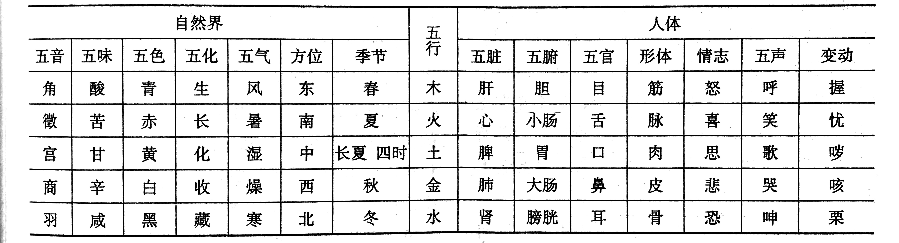

# 中医基础理论
- 中医学理论体系
    - 中医学是研究人体生理、病理，以及疾病的诊断、预防和治疗为主的一门学科
    - 学科属性：以自然科学为主体，与人文社会科学等多学科相交融的综合性医学科学知识体系
    - 中医学理论体系的形成
        - 理论体系的形成在战国-秦汉时期
        - 形成的标志：《黄帝内经》的问世
        - 体系的确立
            - 《难经》-脉诊、针灸治疗，三焦、命门、奇经八脉、虚则补其母、实则泻其子
            - 《伤寒杂病论》-第一部临床医学专著，六经辨证，脏腑辨证
            - 《神农本草经》-第一部药物学专著
    - 中医学理论体系的发展
        - 魏、晋、隋、唐
            - 《脉经》-最早的脉学专著
            - 《诸病源候论》-第一部中医学病理学专著
        - 宋、金、元
            - 《小儿药证直诀》
            - 《三因极一病证方论》
            - 金元四大家
                - 刘完素
                - 张从正
                - 李杲
                - 朱震亨
        - 明、清
            - 温补学派
                - 薛己
                - 张介宾
                - 赵献可
            - 李中梓
            - 温病学派
                - 吴又可-《温疫论》
                - 叶天士-《外感温热论》
                - 吴鞠通-《温病条辨》
                - 薛生白-《湿热病篇》
                - 王孟英-《温热经纬》
    - 主要特点
        - 整体观
            - **五脏** **心**
        - 辨证论治
        - > 中医学认识疾病和处理疾病的基本原则
            - 病、证、症
                - 病：一个完整的异常生命过程
                - 证：某一阶段或某一类型的病理概括
                - 症：症状+体征
            - 同病异治、异病同治
- 精气学说
    - **“水地说”**
    - **“云气说”**
    - 精气学说的基本内容
        - 精气是构成宇宙的本原
        - 精气是天地万物的中介
        - 天地精气化生为人
        - 精气的运动与变化
            - 气的运动形式：升、降、聚、散
            - 气化：气的运动产生宇宙各种变化的过程
- 阴阳学说
    - **相互关联** **对立**
    - > 水火者，阴阳之征兆也
​​
    - 事物阴阳属性的绝对性、相对性
        - 绝对性：属阴或属阳不可变
        - 相对性
            - 阴阳属性相对转化
            - 阴阳之中复有阴阳
            - 因比较对象的变化而变化
        - 昼夜阴阳
        - 四季阴阳
            - 春-阴中之阳-少阳
            - 夏-阳中之阳-太阳
            - 秋-阳中之阴-少阴
            - 冬-阴中之阴-太阴
        - 五脏阴阳
            - 心-阳中之阳
            - 肺-阳中之阴
            - 肝-阴中之阳
            - 肾-阴中之阴
            - 脾-阴中之至阴
            - > 脾为孤脏
    - 阴阳学说基本内容
        - 阴阳对立制约
        - > 在一个统一体中
        - 阴阳互根互用
            - 阴阳互根
            - > 被破坏→“孤阴不生，独阳不长”→“阴阳离绝，精气乃绝”
            - 阴阳互用
            - > “阴在内，阳之守也；阳在外，阴之使也”
        - 阴阳交感互藏
        - > 是宇宙万物赖以生成和变化的根源
        - 阴阳消长
        - > 根本原因：阴阳之间存在对立制约与互根互用的关系
        - 阴阳转化
        - > 产生于“物极”阶段​​
转化是消长的结果​
        - 阴阳的自和与平衡
        - > 自和是阴阳的本性
    - 阴阳学说在中医学中的应用
        - 组织结构和生理机能方面
            - 皮肉为阳中之阳，筋骨为阳中之阴
            - > 皮肤为阳中之阳，肌肉为阳中之阴；筋为阴中之阳，骨为阴中之阴
            - 督脉为阳脉之海，任脉为阴脉之海
        - 病理方面
            - 六淫中，风、暑、火（热）邪属阳，寒、湿邪属阴
            - 阴阳失调是疾病的基本病机之一
                - 主要表现形式：阴阳的偏盛偏衰、互损
                - 寒热性疾病的病理总纲
                    - “阳胜则热，阴胜则寒”
                    - “阳胜则阴病，阴胜则阳病”
                    - “阳虚则寒，阴虚则热”
        - 疾病诊断方面
            - 脉象
                - 寸为阳，尺为阴
                - 至者为阳，去者为阴
                - **浮大洪滑** **沉涩细小**
            - 阴阳是八纲辨证的总纲
        - 疾病预防和治疗方面
            - 防治疾病的基本原则：调整阴阳，使之保持或恢复相对平衡，达到阴平阳秘
            - 确定治疗原则
                - 阴阳偏盛：“实则泻之”，即损其有余
                    - 阳偏盛-实热证-“热者寒之”
                    - 阴偏盛-寒实证-“寒者热之”
                    - “阳胜则阴病”“阴胜则阳病”→阴虚or阳虚→于“实者泻之”中加滋阴or助阳之品
                - 阴阳偏衰：“虚则补之”，即补其不足
                    - 阴偏衰-“阴虚则热”-虚热证-滋阴制阳-“阳病治阴”-“壮水之主，以制阳光
                    - > “阳病”指的是阴虚导致阳气相对偏亢，治阴即补阴之意
                    - 阳偏衰-“阳虚则寒”-虚寒证-扶阳抑阴-“阴病治阳”-“益火之源，以消阴翳”
                    - > “阴病”指的是阳虚导致阴气相对偏盛，治阳即补阳之意
            - 药性
                - **辛、甘、淡** **酸、苦、咸**
- 五行学说
    - 五行特性
        - “木曰曲直”
            - **生长**
        - “火曰炎上”
            - 引申：具有温热、上升、光明等性质或作用的事物和现象
        - “土爰稼穑”
            - **生化**
        - “金曰从革”
            - 引申：具有沉降、肃杀、收敛等性质或作用的事物和现象
        - “水曰润下”
            - 引申：具有滋润、下行、寒凉、闭藏等性质或作用的事物和现象
    - 事物属性的五行归类 
        - 肺在体合皮
            - 肺对皮毛的作用
                - 肺气宣发→卫气外输于皮毛
                - 肺气宣发→水谷精微、津液外输于皮毛
            - 皮毛对肺的作用
                - 皮毛宣散肺气→调节呼吸
                - 皮毛受邪→内合于肺
        - 肝在体合筋
            - 肝为“罢极之本”
        - 肾在体合骨
            - 髓分骨髓、脊髓、脑髓，皆由肾精化生
            - “脑为髓海”
            - “齿为骨之余”
        - 肝之华在爪
            - “爪为筋之余”
        - 肾之华在发
            - “发为血之余”
        - 肺开窍于鼻
            - 喉为肺之门户
            - 各种内伤或过用→耗损肺津、肺气→金破不鸣
            - 各种外邪袭肺→肺失宣降，郁滞不畅→金实不鸣
        - 肝开窍于目
            - 目又称“精明”
            - “精之窠为眼，骨之精为瞳子，筋之精为黑眼，血之精为络，其窠气之精为白眼，肌肉之精为约束”
        - 肾在窍为耳及二阴
            - 临床常以耳的听觉变化作为判断肾精及肾气盛衰的重要标志
        - 脾在志为思
            - “思出于心，而脾应之”
        - 五神
            - 精气是神志活动的物质基础，心是神志活动产生的重要脏器
            - 神与心的关系极为密切，“心藏脉，脉舍神”
            - “肝藏血，血舍魂”
            - “肺藏气，气舍魄”
                - 魄以肺的精气作为物质基础，其与身俱来，为人的某些本能的感觉及动作
            - “脾藏营，营舍意”
                - 意是对某种事物具有忆念并准备实施的神志活动
            - “肾藏精，精舍志”
                - 志是对人的思维活动内容及经验的存记
            - 思：思考
            - 虑：在思考的基础上做长远的预测
            - 智：经过深思熟虑而做出正确决定的思维过程
        - 心在液为汗
            - 汗液的生成、排泄与心血、心神的关系密切
            - “血汗同源”“汗为心之液”
        - 涎：为口津，即唾液中较清稀的部分
        - 唾：唾液中较稠厚的部分，由肾精化生
    - 事物五行属性的归类依据和方法
        - 方法
            - 取象比类法
            - 推演络绎法
    - 五行学说的基本内容
        - 五行相生、相克
        - > “克我”者为“所不胜”，“我克”者为“所胜”
        - 五行制化
            - 维持平衡协调
            - 规律：五行中一行亢盛，必然随之有制约，以防亢而为害
        - 五行相乘、相侮
            - 过度制约或克制
            - 反向制约和克制
        - 五行的母子相及
            - 母病及子
            - 子病及母
                - 子病犯母：子行亢盛→母行亢盛→子母两行皆亢盛
                - 母子俱不足：子行虚弱→母行不足→子母俱不足
                - 子盗母气：子行亢盛→损伤母行→子盛母衰
    - 五行学说在中医学中的应用
        - 生理方面
            - 说明五脏生理特点
            - 构建天人一体的五脏系统
            - 说明五脏之间的生理联系
        - 病理方面
            - 传变：五脏病理上的相互影响
                - 相生关系的传变
                    - “母病及子”
                    - “子病及母”
                - 相克关系的传变
                    - “相乘”
                    - “相侮”
        - 疾病诊断方面
        - 疾病治疗方面
            - 指导脏腑用药
            - 控制疾病传变
            - 确立治则治法
                - “五行相生”-基本治疗原则：“虚则补其母，实则泻其子”
                    - 滋水涵木法、益火补土法、培土生金法、金水相生法
                    - > 益（肾）火补土法
                - “五行相克”-基本治疗原则：抑强扶弱
                    - 抑木扶土法、培土制水法、佐金平木法、泻南补北法
            - 指导针灸取穴
            - 指导情志疾病的治疗
- 藏象学说
    - 主要特点：以五脏为中心的整体观
    - **生理特点的不同**
        - 五脏的共同生理特点：化生、贮藏精气
        - > “所谓五脏者，藏精气而不泻也，故满而不能实”
        - 六腑的共同生理特点：受盛、传化水谷
        - > “六腑者，传化物而不藏，故实而不能满也”
        - 奇恒之腑形态上中空有腔与六腑相似，技能上贮藏精气与五脏相同
    - 病理：“脏病多虚”“腑病多实”
    - 治疗：“五脏宜补”“六腑宜泻”
- 五脏
    - 心
        - 生理功能
            - 主血脉
                - 主血
                    - 心气推动血液运行→输送营养物质到全身脏腑形体官窍
                    - 心有生血的作用，即“奉心化赤”
                        - 肾精+津液+营气→心阳→血
                - 主脉
                    - 心气推动和调控心脏搏动、脉的舒缩→脉道通利，血液通畅
                    - **心气充沛** **血液充盈** **脉道通利** **心脏的正常搏动**
            - 藏神/主神明/主神志
                - 心统帅全身脏腑、经络、形体、官窍的生理活动and主司意识、思维、情志等精神活动
                - 广义之神：整个人体生命活动的主宰和总体现
                - 狭义之神：人的意识、思维、情感、性格等精神活动
                - “心者，生之本，神之变也”
                - 心为“五脏六腑之大主”
        - 生理特性
            - 心为阳脏而主通明
                - 阳脏、火脏
                - 心主通明：心脉以通畅为本，心神以清明为要
            - 心气下降
    - 肺
        - 生理功能
            - 主气司呼吸
                - 呼吸之气
                    - 肺主呼吸实际上是肺气的宣发和肃降运动在气体交换过程中的具体表现
                - 一身之气
                    - 肺主司一身之气的生成和运行
                        - 体现
                            - 宗气的生成
                                - 水谷之气+清气→宗气，属后天之气
                                - 宗气在肺中生成，积存于胸中“气海”
                                    - 息道→喉咙→促进肺的呼吸
                                    - 贯注心脉→助心推动血液运行
                                    - 三焦→丹田→资先天元气
                            - 对全身气机的调节作用
                                - 肺有节律的呼吸对全身之气的升降出入运动起着重要的调节作用
                                - “肺者，气之本”
            - 主行水
                - 肺气的宣发肃降运动→推动、调节全身水液的输布和排泄
                - “肺为水之上源”
                - 病理：宣肺利水、降气利水治疗肺失宣降引起的津液代谢障碍
            - 朝百脉，主治节
                - 朝百脉
                    - 心气是血液循环运行的基本动力，而肺气助心行血
                        - 呼吸运动→调节全身气机→促进血液运行
                        - 宗气“贯心脉”→推动血液运行
                - 主治节
                    - 是对肺的主要生理机能的高度概括
                        - 治理调节呼吸运动
                        - 调节全身气机
                        - 治理调节血液的运行
                        - 治理调津液代谢
        - 生理特性
            - 肺为华盖
            - > “水之上源”、“脏之长”
            - 肺为娇脏
            - 肺气宣降
            - > 宣降运动协调，维持肺的呼吸、行水机能
                - 宣发
                    - 呼出浊气
                    - 脾-津液、部分水谷精微→头面诸窍、全身皮肤肌腠
                    - 宣发卫气→皮毛肌腠→温分肉，充皮肤，肥腠理，司开阖，将代谢后的津液化为汗液并控制、调节其排泄
                - 肃降
                    - 吸入清气，清气+谷气→宗气→脐下，以资元气
                    - 脾-津液、部分水谷精微→向下布散至其他脏腑以濡润
                    - 将脏腑代谢后产生的浊液下输膀胱，成为尿液生成之源
    - 脾
    - > 脾精之浓厚者化营化血，轻清者化卫化气
        - 生理功能
            - 主运化
            - > “后天之本”、“气血生化之源”
                - 运化食物
                - > 食物→胃→食糜→小肠-脾气→分清浊
                - 运化水液
                    - 水液→水精/津液
                        - 上输于肺→全身
                        - 四周→“以灌四傍”
                        - 胃、小肠、大肠中的部分水液→三焦→膀胱
                        - 居中枢转津液，使全身津液随脾胃之气的升降而上腾下达
            - 主统血
            - > 脾统血与气摄血是统一的
                - 脾气统摄、控制血液在脉中正常运行而不逸出脉外
        - 生理特性
            - 脾气上升
                - 脾主升清：维持水谷精微的上输
                - 脾主升举内脏：内脏位置的相对稳定
            - 喜燥恶湿
                - 脾气下陷的病机
                    - 脾气虚弱→升举无力——中气下陷
                    - 脾气为湿所困
            - 脾为孤脏
    - 肝
        - 生理功能
            - 主疏泄——调节气机
                - 促进血液、津液的运行输布
                - 促进脾胃运化和胆汁的分泌排泄
                    - 胆汁乃肝之余气所化
                - 调畅情志
                - 促进男子排精与女子排卵行经
                -  调节气机：肺、肝
                - 肝失疏泄
                    - 肝气郁结，疏泄失职
                    - 肝气亢逆，疏泄太过
                    - 肝气虚弱，疏泄不及，生发无力
            - 主藏血
                - **贮藏血液** **调节血量** **防止出血**
                - 防止出血：脾、肝
                - 生理意义
                    - 涵养肝气
                    - 调节血量
                    - 濡养肝及筋目
                    - 化生、濡养魂，维持正常神志及睡眠
                    - 为经血之源
                        - 血海
                    - 防止出血
        - 生理特性
            - 肝为刚脏
            - 肝气升发
    - 肾
    - > 肾气是人体防御机能的根本
肾阴不足——壮水之主，以制阳光
肾阳不足——益火之源，以消阴翳​​
        - 生理功能
            - 藏精，主生长发育生殖与脏腑气化
                - 藏精
                    - 肾中精气→天癸
                    - 肾藏的精包括先天之精和后天之精。先天之精是肾精的主体成分，后天之精起充养作用
                - 主生长发育与生殖
                    - 天癸
                        - 女：二七天癸至，月事以时下；七七天癸竭
                        - 男：二八肾气盛，天癸至；七八天癸竭
                - 脏腑气化
                    - 肾气由肾精所化，也是一身之气分布到肾的部分
                    - 肾气为脏腑之气中最重要者，称为脏腑之气的根本
                    - 肾阳为一身阳气之本，肾阴为一身阴气之本，肾阴肾阳称“五脏阴阳之本”
            - 主水
                - 主司、调节全身水液代谢的作用
                    - 肾气对参与水液代谢脏腑的促进作用，尤其对脾肺之气的运化和输布水液的功能
                    - 肾气的生尿和排尿作用
                - 肺主行水、脾主运化水液、肾主水
                - 肺为水之上源、肾为水之下源
            - 主纳气
                - 保持吸气的深度，防止呼吸表浅
                - 吸入的清气，由肺气的肃降下达于肾，必须经过肾气的摄纳潜藏，维持一定深度，利于气体的交换
                - “肺为气之主，肾为气之根”
        - 生理特性
            - 主蛰守位
                - **藏精**
                    - 具体体现：肾的藏精、主纳气、主生殖、主二便等
                - 守位
                    - 肾中相火（肾阳）涵于肾中，潜藏不露，以发挥其温煦、推动等作用
                        - 君火/心火，即心阳，心之生理之火
                        - 相火：其他脏腑之火
                            - 肝之相火：雷火
                            - 肾之相火：龙火
                        - 少火：生理状态下各脏腑的阳气
                        - 壮火：病理状态下各脏腑的亢盛之火
            - 肾气上升
                - 肾阳鼓动肾阴，合化为肾气上升以济心，维持人体上下的协调
        - 命门
            - **眼睛**
            - 《难经》将命门始作内脏，指右肾
    - 五脏之间的关系
        - 心与肺
            - 气血关系
                - 血液运行、呼吸吐纳
                - 积于胸中的宗气是连接心之搏动和肺之呼吸的中间环节
        - 心与脾
            - 血液生成的相互为用
            - 血液运行的相互协同
        - 心与肝
            - 行血与藏血
                - 出现血虚：心、肝
            - 精神调节
        - 心与肾
            - 心肾相交
                - 水火既济
                - 精神互用
                - > 精能化气生神，为气、神之源；神能控精驭气，为精、气之主​
                - 君相安位
        - 肺与脾
            - 气的生成
                - 清气+谷气→宗气，宗气+元气→一身之气
                - 一身之气的盛衰主要取决于宗气的生成
            - 水液代谢
                - 肺脾协调配合，是保证津液正常输布与排泄的重要环节
        - 肺与肝
            - 气机升降的调节
        - 肺与肾
            - 水液代谢
            - 呼吸运动
            - 阴阳互资
        - 肝与脾
            - 疏泄与运化的相互为用
            - 藏血与统血的相互协调
        - 肝与肾
            - “肝肾同源”“乙癸同源”
                - 精血同源
                - 藏泄互用
                - 阴阳互滋互制
        - 脾与肾
            - 先天与后天的互促互助
            - 水液代谢
- 六腑
    - 胆、胃、大肠、小肠、三焦、膀胱
    - 共同生理特点：传化物而不藏，实而不能满。“六腑以通为用”
    - 胆
        - 生理功能
            - 贮藏排泄胆汁
                - **肝之余气（精气）** **精汁**
                - **中精之腑** **中清之腑**
                - 胆汁→胆腑→浓缩、贮藏→肝气疏泄→肠→促进饮食水谷的消化吸收
            - 主决断
    - 胃
        - 上脘，包括贲门；下脘，包括幽门；中脘，包括胃体
        - 生理机能
            - 主受纳水谷
                - **水谷之海**
            - 主腐熟水谷
                - 初步消化
                - **水谷气血之海**
        - 生理特性
            - 胃气下降
                - 饮食物入胃
                - 经胃气的腐熟作用形成的食糜→小肠
                - 食物残渣→大肠→粪便
                - 粪便有节制地排出
            - 喜润恶燥
                - 胃的受纳腐熟，不仅依赖胃气的推动和蒸化，也需胃中津液的濡润
            - 胃气
                - 推动胃的运动以发挥受纳腐熟水谷作用的一类精微物质，一身之气到胃的部分
                - 脾气与胃气合称“中气”
                - 水谷之气，简称“谷气”，是一身之气的重要组成部分
                    - “胃为五脏之本”
                    - 脉中胃气的强弱有无对判断疾病预后有重要价值
    - 小肠
        - 上口与胃在幽门相接，下口与大肠在阑门相连
        - 生理机能
            - 主受成化物
                - 受盛：小肠接受由胃腑下传的食糜而盛纳之
                - 化物：由脾气对小肠中的食糜进一步消化→精微、糟粕
            - 主泌别清浊
            - 小肠主液
                - 小肠在吸收谷精的同时吸收了大量的津液
                - 具体应用：“利小便所以实大便”治疗泄泻
    - 大肠
        - 生理功能
            - 主传化糟粕
            - 大肠主津
    - 膀胱
        - 生理功能
            - 汇聚水液
                - “津液之腑”“膀胱者，州都之官”
            - 贮存、排泄尿液
    - 三焦
        - 六腑三焦
            - 主要生理机能：疏通水道，运行津液
            - “三焦者，决渎之官”
        - 部位三焦
            - **孤府**
            - 生理机能——作为通道
                - 通行诸气，主要运行元气
                    - “三焦者，原气之别使也”
                - 运行津液
                    - “三焦气化”：津液代谢的协调平衡状态
            - 上焦如雾
            - 中焦如沤
            - > 就解剖部位而言，肝胆属中焦；就机能联系而言，肝肾同源，肾居下焦，肝从肾属下焦
            - 下焦如渎
        - 辨证三焦
    - 五脏与六腑的关系
        - 心与小肠
        - 肺与大肠
        - 脾与胃
            - 纳运相成
            - **升降相因**
                - 脾胃为枢纽
            - 燥湿相济
        - 肝与胆
        - 肾与膀胱
            - 膀胱的汇聚水液及贮尿排尿，取决于肾气的盛衰
- 奇恒之腑
    - 脑、髓、骨、脉、胆、女子胞
    - 形态上类腑，机能上似脏贮藏精气
    - 脑
    - > “脑为髓之海”“诸髓者，皆属于脑”
        - 生理功能
            - 主宰生命活动
                - “元神之府”
            - 主司感觉运动
            - 主司精神活动
                - “头者，精明之府”
        - 与脏腑精气的关系
            - 脑的生理病理统归于心而分属于五脏
            - 将神分为神、魂、魄、意、志五种不同的表现，分别由心、肝、肺、脾、肾五脏主司，即“五神脏”
    - 女子胞
        - 男子之胞称为“精室”
        - 生理功能
            - 主持月经
                - 月经的产生是脏腑经脉气血及天癸作用于胞宫的结果
            - 孕育胎儿
        - 与脏腑经脉的关系
            - 与天癸的关系
                - 天癸：是肾精肾气充盈到一定程度时体内出现的一种精微物质，有促进生殖器官发育成熟、女子月经来潮及排卵、男子精气溢泻，因而具备生殖能力的作用
            - 与经脉的关系
                - **冲、任、督、带**
                - **冲脉** **任脉**
                - 冲脉“冲为血海”，任脉为“阴脉之海”“任主胞胎”
            - 与脏腑的关系
                - **心、肝、脾、肾**
- 精、气、血、津液、神
    - 精
        - 禀受于父母的生命物质与后天水谷精微相融合而形成的一种精华物质
        - 是构成人体和维持人体生命活动的最基本物质
        - 人体之精
            - 狭义之精：特指生殖之精
            - 广义之精：一切构成人体和维持人体生命活动的液态精华物质
                - 如：先天之精、后天之精、生殖之精、脏腑之精、血、津液等
            - 一般意义的精，指先天之精、水谷之精、生殖之精、脏腑之精，不包含血、津液
        - 人体之精藏于肾，包括“先天之精”“后天之精”
        - 人体之精的生成与全身脏腑经络功能的协调和旺盛，尤其是脾胃运化功能的正常、肾所藏精的充盛、气血的充盈直接相关
        - 功能
            - 繁衍生命
            - > 生殖之精实由肾精化生
            - 濡养作用
            - 化血作用
                - 精转化为血
                - 精可不断地融合于血液中
            - 化气作用
                - 精是气的化生本源
            - 化神作用
                - 只有积精，才能全神，这是生命存在的根本保证
        - 分类
            - 来源
                - 先天之精
                - 后天之精
            - 部位
                - 各脏腑之精
                - > 脾精还有化生气血、生长肌肉的作用
            - 功能
                - 生殖之精
                - 营养之精
    - 气
        - 气由精化生
        - 精是人体生命的本原，气是人体生命的维系
        - 生成
            - 生成之源
                - 先天之气（元气）+水谷之气+清气→肺、脾胃、肾→一身之气（人气）
            - 相关脏腑
                - 肾为生气之根
                - 脾胃为生气之源
                - 肺为生气之主
        - 功能
            - 推动
            - 温煦
            - 防御作用
            - > 气的防御功能决定着疾病的发生、发展和转归
            - 固摄作用
            - 中介作用
        - 分类
            - 人身之气
            - > ​与邪气相对而言，称为正气​
            - 元气
                - 人体生命活动的原动力
                - “元气”“原气”“真气”，都是由先天之精化生的先天之气
                - 元气由肾精化生，根于命门
                    - 肾精的主体成分是先天之精，但必须得到水谷之精的充养，才能充盛而化生足够的元气
                - **三焦**
                - 生理功能
                    - 推动和调节人体的生长发育和生殖机能
                    - 推动和调控各脏腑、经络、形体、官窍的生理活动
                - 元气含有元阴、元阳，为一身阴阳之根，脏腑阴阳之本
                - > “命门为元气之根，为水火之宅，五脏之阴气非此不能滋，五脏之阳气非此不能发”​​
            - 宗气
                - 谷气+清气→积聚于胸中，属后天之气的范畴
                - 宗气在胸中积聚之处，称为“气海”“膻中”
                - 来源
                    - 脾胃→水谷之精→水谷之气
                    - 肺→清气
                - 布散全身方式——“上出息道，下走气街”
                    - 上出息道（呼吸道）
                    - 贯注心脉
                    - 沿三焦下行
                - 凡语言、声音、呼吸的强弱，气血的运行，肢体的寒温和活动能力，视听的感觉能力，心搏的强弱及节律，均和宗气盛衰有关
                - **虚里** 宗气的盛衰
            - 营气
                - 营与血可分不可离，常将“营血”并称
                - 营气由水谷精微中的精华部分化生，并进入脉中
                - 生理功能
                    - 化生血液
                    - 营养全身
            - 卫气
                - 卫气由水谷精微中的慓悍滑利部分化生
                - 生理功能
                    - 防御外邪
                    - 温养全身
                    - 调控肌腠
                - 营卫区别
                    - 营气性质精纯，富由营养；卫气性质慓疾滑利，易于流行
                    - 营行脉中，卫行脉外
                        - 白天以卫气为主导，营气随卫气由体内到体表
                        - 夜间以营气为主导，卫气随营气由体表行于内脏
            - 经络之气
                - 是各种刺激、信息的感应、负载和传导者
        - 人体之气的气化
            - 气机：气的运动
                - 基本形式：升降出入
            - 气化：气的运动而产生的各种变化
                - 基本形式：体内精气血津液各自的代谢及其相互转化
            - 气机失调：气的升降出入运动失常
                - 气机不畅：气的运行受阻而不畅通
                - 气滞：受阻较甚，局部阻滞不通
                    - 大多属于邪实，也有因气虚推动无力导致者
                    - **肺、肝、脾胃**
                    - 共同特点：闷、胀、疼痛
                    - > 气虚而滞者，在闷、胀、痛方面不如实证明显，兼见相应的气虚征象
                - 气逆：气的上升太过or下降不及
                    - 也可因气虚无力下降导致气机上逆
                    - **肺、肝、胃**
                - 气陷：气的上升不及or下降太过
                    - 多由气虚发展而来
                    - **脾**
                    - 病理变化
                        - 上气不足
                        - > 脾气虚损→升清无力→头目失养
                        - 中气下陷
                        - > 脾气虚损，升举无力→气机趋下，甚至内脏下垂
                - 气脱：气的外出太过而不能内守
                    - 可见面色苍白、汗出不止、目闭口开、全身瘫软、手撒、二便失禁、脉微欲绝或虚大无根
                    - 气脱与亡阳、亡阴
                        - 同：在病机和临床表现上多有相同之处，病机都属气的大量脱失，临床都可见因气脱失而致生命机能严重衰竭的表现
                        - 异
                            - 亡阳：阳气突然大量脱失，见寒象
                            - 亡阴：阴气突然大量脱失，见热象
                            - 气脱：无明显寒象或热象，但见气虚不固及生命机能衰竭
                - 气闭：气不能外达而郁结闭塞于内
                    - 气机闭阻，失于外达，甚至清窍闭塞，出现昏厥
    - 血
        - 生成
            - 化生之源
                - 水谷之精化血
                    - 水谷之精化生的营气和津液是化生血液的主要物质，也是血液的主要构成成分
                - 肾精化血
                - > 精与血之间存在着相互资生和相互转化的关系
            - 相关脏腑
                - 脾胃是血液化生之源
                - 心肺对血液的生成起重要作用
                - 肾藏精，精生髓，精髓是化生血液的基本物质之一；同时肾气充沛也可以促进脾胃的运化
                - 没有肝
        - 运行
            - 影响因素
                - 气的推动与宁静作用的协调、温煦与凉润作用的平衡
                - 气的固摄
                - 脉道的完好无损、通畅无阻
                - 血液的清浊及黏稠状态
                - 血液的寒热
                - 阳邪→血液妄行，阴邪→血行缓慢，甚至瘀血
            - 相关脏腑
                - 心、肝、脾、肺
                - 没有肾
        - 功能
            - 濡养作用
            - > “肝受血而能视，足受血而能步，掌受血而能握，指受血而能摄”
                - 也是化生经水、乳汁，养育胎儿，哺育婴儿的物质基础
            - 化神作用
                - 血是机体精神活动的主要物质基础
                - > 人体的精神活动必须得到血液的营养。“血气者，人之神，不可不养”“血脉和利，精神乃居”
    - 津液
        - 是机体一切正常水液的总称
        - > 包括各脏腑形体官窍的内在液体及其正常分泌物
            - 津
                - 质地较清稀，流动性较大
                - 布散于体表皮肤、肌肉和空窍，并能渗入血脉之内，起滋润作用
            - 液
                - 质地较浓稠，流动性较小
                - 灌注于骨节、脏腑、脑、髓等，起濡养作用
        - 津液的生成
            - 脾胃、小肠、大肠
        - 输布
            - 脾、肺、肾、肝、三焦
        - 排泄
            - 与肾、肺、脾的生理机能有关
            - 肾的地位最重要
        - 功能
            - 滋润濡养
            - 充养血脉
            - 津液的代谢能调节体温以适应环境的气温变化
    - 神
        - 生成
            - 精气血津液是神产生的物质基础
            - 脏腑精气对自然、社会环境的各种刺激做出应答→意识、思维、情感等精神活动
        - 作用
            - 调节精气血津液的代谢
            - 调节脏腑的生理机能
            - 主宰人体的生命活动
                - 神的盛衰是生命力盛衰的综合体现
                - 神是人体生理活动、心理活动的主宰
    - 精、气、血、津液之间的关系
        - 气与血
            - 气为血之帅
                - 气能生血
                - 气能行血
                - 气能摄血
            - 血为气之母
                - 血能养气
                - 血能载气
                    - 大失血病人→气脱病变    “气随血脱”
        - 气与津液
            - 气能生津
            - 气能行津
            - > 津液由脾胃化生后，经脾、肺、肾、三焦之气的有序升降出入，输布到全身各处
            - 气能摄津
            - 津能生气
            - 津能载气
                - 暑热病证→气随汗液外泄，出现少气懒言、体倦乏力等气虚表现
                - 大汗、大吐、大泻等津液大量丢失时，气随之大量外脱——“气随津脱”“吐下之余，定无完气”
        - 精、血、津液
            - 精血同源
            - 津血同源
                - “汗血同源”
                - “夺血者无汗，夺汗者无血”
        - 精、气、神
            - 精、气、神为人身之“三宝”
            - 气能化精、摄精
            - 精能化气
            - 精与气化神
            - > 气为“神之母”
            - 神驭精气
- 体质
    - **形态结构** **生理机能** **心理状态**
    - **精**
    - 正气虚是发病的内在根据，邪气是疾病形成的外在条件
- 病因
    - 辨症求因/审症求因：临床表现→分析症状、体征→推求病因
    - 六淫
        - 风、寒、暑、湿、燥、火（热）六种外感病邪
            - 六气：正常情况下风、寒、暑、湿、燥、火是自然界六种不同的气候变化
            - 气候变化异常超过人体适应能力or正气不足不能适应自然界气候变化→六气成六淫，又称“六邪”
        - 共同致病特点
            - 外感性
            - > 多从肌表、口鼻而入，或同时受邪
            - 季节性
            - 地域性
            - 相兼性
        - 阴邪：寒、湿
        - 阳邪：风、暑、火（热）
        - 伤津：暑、火、燥
        - 伤津耗气：暑、火
        - 风邪的性质及致病特点
            - 风性轻扬开泄，易袭阳位
                - 风邪轻扬、向上、向外
                    - 常伤及人体的上部（头、面）和肌表
                - 开泄指风邪伤人易使腠理不固而汗出
            - 风性善行数变
                - 善行：风性善动不居，游走不定
                - 数变：风邪致病变幻无常，发病迅速。以风邪为先导的外感病，一般发病急，传变较快
            - 风性主动
            - 风为百病之长
                - 风邪常兼他邪伤人致病
                - 风邪伤人致病最多
        - 寒邪的性质及致病特点
            - 寒为阴邪，易伤阳气
            - 寒性凝滞
                - 不通则痛
                - 寒邪是最易导致疼痛的外邪
            - 寒性收引
        - 暑邪的性质及致病特点
            - 暑为阳邪，其性炎热
            - 暑性升散，易扰心神，易伤津耗气
            - 暑多夹湿
        - 湿邪的性质及致病特点
            - 湿为阴邪，易伤阳气
                - 湿易损伤脾阳
            - 湿性重浊
                - 沉重感，附着难移
                - 易出现分泌物和排泄物秽浊不清
            - 湿性黏滞，易阻气机
            - > **最易伤脾**
                - 症状的粘滞性
                - 病程的缠绵性
                - 易阻气机
            - 湿性趋下，易袭阴位
                - 易伤人体下部的病邪尚有寒邪
        - 燥邪的性质及致病特点
            - 燥性干涩，易伤津液
            - 燥易伤肺
        - 火（热）邪的性质及致病特点
            - 火热为阳邪，其性燔灼趋上
            - 火热易扰心神
            - 火热易伤津耗气
            - 火热易生风动血
            - 火邪易致疮痈
    - 疠气
        - 是一类具有强烈致病性和传染性病邪的统称
        - 治病特点
            - 发病急骤，病情危笃
            - 传染性强，易于流行
            - 一气一病，症状相似
    - 七情内伤
        - 七情：喜、怒、忧、思、悲、恐、惊七种正常的情志活动
        - 七情内伤：喜、怒、忧、思、悲、恐、惊等七种引发和诱发疾病的情志活动
        - 致病特点
            - 直接伤及内脏
                - 损伤相应之脏
                - **心**
                    - 首先损伤心
                    - 七情内伤均可作用于心神
                    - 七情发于心而应于五脏
                    - 无论何种情志致病，均可影响心神、损伤相应的脏腑。“情志之伤，虽五脏各有所属，然求其所由，则无不从心而发”
                - **心肝脾**
                - 易损伤潜病之脏腑
            - 影响脏腑气机
                - 怒则气上
                - 喜则气缓
                - > 有虚象
                - 悲则气消
                - 恐则气下
                - 惊则气乱
                - > 无虚象
                - 思则气结
            - 多发为情志病
            - 影响病情变化
    - 劳逸失度
        - 过度劳累
            - 劳力过度——伤肺脾
            - 劳神过度——伤心脾
            - 房劳过度——伤肾
    - 痰饮
        - 是人体水液代谢障碍所形成的病理产物
            - 痰：较稠浊
            - 饮：较清稀
        - 因其停留的部位不同而表现各异
            - “痰饮”“悬饮”“溢饮”“支饮”
        - 形成——肺、脾、肾、肝、三焦的机能失常密切相关
        - 致病特点
            - 阻滞气血运行
            - 影响水液代谢
                - 反过来影响肺、脾、肾等脏腑的机能活动
            - 易于蒙蔽心神
            - 致病广泛，变幻多端
                - 百病多由痰作祟
                - 痰饮停滞体内，可夹风、夹热、化寒，化火，化燥
    - 瘀血/恶血/衃血/蓄血/败血/污血
        - 瘀血既是病理产物，又是具有致病作用的“死血”
            - 血瘀：血液运行不畅或血液瘀滞不通的病理状态
            - 瘀血：具有致病性的病理产物
        - 形成
            - 血出致瘀
            - 血行不畅致瘀
                - 气滞→瘀
                - 虚→瘀
                - 血寒→瘀
                - 血热→瘀
        - 瘀血的致病特点
            - 易于阻滞气机
            - > “血瘀则气滞”
            - 影响血脉运行
            - 影响新血生成
            - > “瘀血不去，新血不生”
            - 病位固定，病证繁多
        - 瘀血致病的症状特点
            - 疼痛
                - 刺痛
                - 痛处固定不移
                - 拒按
                - 夜间痛甚
            - 肿块
            - 出血
            - 色紫黯
            - 可出现肌肤甲错，脉涩或结代
- 发病
    - 正气
        - 正气含有阴气、阳气两部分
        - 防御作用
            - 抵御外邪
            - 祛除病邪
            - 修复调节
            - 维持脏腑经络机能的调节，防止病理产物及内生五“邪”的产生
    - 邪气
        - 损害作用
            - 导致生理机能失常
            - 造成脏腑组织的形质损害
            - 改变体质类型
    - 正气不足是疾病发生的基础
    - 邪气是发病的重要条件
    - 发病类型
        - 感邪即发/卒发/顿发
            - 感邪后立即发病
        - 徐发/缓发
            - 感邪后缓慢发病
            - **渐进性病理改变**
        - 伏而后发
            - 感受邪气后并不立即发病，病邪在机体内潜伏一段时间，或在诱因作用下，过时发病
            - 多见于外感性疾病和某些外伤
            - > “伏气温病”​
        - 继发
            - 在原发疾病的基础上，继发新的疾病
            - 密切联系
        - 合病与并病
            - 合病：外感初起时两经同时受邪而发病
            - 并病：一经病证未罢又出现另一经病证的发病特点；具体疾病的病后增病
        - 复发
            - 疾病初愈、慢性病缓解阶段→诱因→疾病再度发作或反复发作
            - 机理：余邪未尽，正气未复or慢性病变宿根未除
- 病机
    - 邪正盛衰
        - 实：邪气亢盛为主，正气未衰，正邪激烈相争
        - 虚：正气虚损为主，邪气已退或不明显，正邪难以激烈相争
        - 虚实变化
            - 虚实错杂
                - 虚中夹实：以正虚为主，兼实邪为患
                - 实中夹虚：以邪实为主，兼正气虚损
            - 虚实真假
                - 真实假虚-“大实有羸状”-通因通用
                    - 瘀血内阻→崩漏下血
                    - 热结胃肠→“热结旁流”
                - 真虚假实-“至虚有盛侯”-塞因塞用
                    - 脾气虚弱，运化无力→食少脘腹胀满
                    - 气血亏虚，血海空虚→闭经
        - 疾病转归
            - 正胜邪退
            - 邪去正虚
            - > 邪气退却而正气大伤
病机特点：邪气已退，对机体的损害作用已经消失，但正气被消耗的状况有待恢复​
            - 邪胜正衰
            - 邪正相持
                - 势均力敌 迁延状态
                - 病邪既不能消散，也不能深入，又称为“邪留”“邪结”
                - 邪气留结之处，即是邪正相搏病理表现明显之所
            - 正虚邪恋
                - 缠绵难愈
                - 多见于疾病后期
                - 是多种疾病由急性转慢性，或慢性病久治不愈，或遗留某些后遗症的主要原因之一
    - 阴阳失调
    - > 阴阳失调最基本的病机是阴阳的偏盛偏衰
        - 阴阳偏盛
            - 阳偏盛
                - 多以热、动、燥为特点
                - 阳盛之初，对津液和阴气的损伤一般不明显→病情发展→实热兼津亏阴虚→虚热性病变
            - 阴偏盛
                - 多以寒、静、湿为特点
                - 在阴偏盛时常伴有不同程度的阳气不足→虚寒性病变
        - 阴阳偏衰
            - 阳偏衰
            - > 阳虚则寒是虚而有寒；阴胜则寒是以寒为主，虚象不明显
一般以肾阳虚衰最为重要​
            - 阴偏衰
            - > 阴虚则热是虚而有热；阳胜则热是以热为主，虚象不明显
一般以肾阴亏虚为主​
        - 阴阳互损
            - 阴阳互根互用→阴阳两虚
            - 肾最易出现
            - 阴损及阳
            - 阳损及阴
        - 阴阳格拒
            - 阴盛格阳-真寒假热证-热因热用or以热治热
            - 阳盛格阴-真热假寒证-寒因寒用
        - 阴阳亡失
            - 亡阳
                - 多见冷汗淋漓（冷汗如水）、面色苍白、四肢逆冷、精神萎靡、脉微欲绝
            - 亡阴
                - 多见手足虽温而大汗不止（热汗如油）、烦躁不安、心悸气喘、体倦无力、脉数疾躁动（无力）
        - 阴阳转化
        - > 以一定条件为前提
    - 精、气、血失常
        - 精的失常
            - 精虚
            - 精的施泄失常
                - 失精
                    - 精脱为失精之重证，治疗以固气为要
                - 精瘀
        - 气的失常
            - 气虚
                - 一身之气不足及其功能低下的病理变化
                - 先天不足；后天失养；脾肺肾机能失调致气的生成不足
                - 常见神疲、乏力、眩晕、自汗、易感冒、面白、舌淡、脉虚等
            - 气机失调
                - 气滞
                - 气逆
                - 气陷
                - 气闭
                - 气脱
        - 血的失常
            - 血虚
                - 常见面色淡白或萎黄、唇舌爪甲色淡无华、神疲乏力、头目眩晕、心悸不宁、脉细等
                - 血虚以心、肝多见
            - 血运失常
                - 血瘀
                - 出血
        - 精、气、血关系失调
            - 精与气血
                - 精气两虚
                - > 多于肾有关
                - 精血不足
                - > 肾、肝
                - 气滞精瘀、血瘀精阻
            - 气与血
                - 气滞血瘀
                - > 多见肝肺气滞➡️心血、肝血瘀滞
                - 气虚血瘀
                - > 多见心气不足
                - 气不摄血
                - > 多与脾气亏虚有关
                - 气随血脱
                - 气血两虚
    - 津液代谢失常
        - 津液不足
            - 干燥枯涩征象
        - 津液与气血关系失调
            - 水停气阻
            - > 水停与气滞常并见
            - 气随津脱
            - > “吐下之余，定无完气”
            - 津枯血燥
            - 津亏血瘀
            - > 津液充足是保持血脉充盈，血行通畅的重要条件
            - 血瘀水停
    - 内生“五邪”
        - 指疾病过程中，机体自身由于脏腑机能异常而导致化风、化火、化寒、化燥、化湿的病理变化
        - 分别称为“内风”“内寒”“内湿”“内燥”“内火”
        - 内生“五邪”属于内伤病的病机，外感六淫属于外感病的病因
        - 风气内动
            - 肝阳化风
            - 热极生风/热甚动风
            - 阴虚风动
            - 血虚生风
                - 血燥生风
        - 寒从中生/内寒
            - 内寒的临床特点主要是虚而有寒，以虚为主
            - 外寒的临床特点是以寒为主，多为实寒
        - 湿浊内生
            - 脾气的运化失职是湿浊内生的关键
            - 肾阳虚也易导致湿浊内生
        - 津伤化燥/内燥
            - 以肺、胃、大肠多见
            - 另外，因气虚or气滞，津液不得布散而发挥滋润作用，也可导致
        - 火热内生
            - 实火
            - 虚火
                - 阴虚内热多见全身性的虚热征象
                - 阴虚火旺多见集中于机体某一部位的火热征象
                - 气虚→精血津液代谢迟缓or郁滞→虚火内生
    - 疾病传变
        - 形式
            - 病位传变
            - 外感病传变
                - 六经传变
                - 三焦传变
                - 卫气营血传变
            - 内伤病传变
        - 病性转化
            - 寒热转化
                - 寒→热
                    - 实寒→实热
                    - > 寒邪化热入里
                    - 虚寒→虚热
                    - > “阳损及阴”
                - 热→寒
                    - 实热→虚寒
                    - > “壮火食气”
                    - 实热→实寒
                    - > 热痹证因用药或素体阳虚，热去而从寒化为寒痹证
                    - 虚热→阴虚为主的阴阳两虚
                    - > “阴损及阳”
            - 虚实转化
                - 实→虚
                - > 邪气盛为主要矛盾的实性病变→正气虚损为主要矛盾的虚性病变
                - 虚→实
                - > 正气虚损为主要矛盾的虚性病变→邪气盛为主要矛盾的实性病变
- 防治原则
    - 预防
        - 未病先防
            - 养生以增强正气
            - > 顺应自然；养性调神；护肾保精；形体锻炼；调理饮食；针灸、推拿、药物调养
            - 防止病邪侵害
            - > 避其邪气；药物预防以防止病邪伤害
        - 既病防变
            - 早期诊治
            - 防止疾病的传变
            - > 阻截病传途径；先安未受邪之地
    - 治则：治疗疾病时所必须遵循的基本原则，是在整体观念和辨证论治精神指导下而制定的治疗疾病的准绳
    - > 治病求本是中医学治疗疾病的指导思想，位于治则治法理论体系的最高层次
        - 治法：在一定治则指导下制定的针对疾病与证的具体治疗大法、治疗方法、治疗措施
        - 正治与反治
            - 正治/逆治
                - 寒者热之
                - 热者寒之
                - 虚者补之
                - 实者泻之
            - 反治/从治
                - 热因热用
                - 寒因寒用
                - 塞因塞用
                - 通因通用
        - 治标与治本
            - 缓则治本
                - 痨病肺肾阴虚之咳嗽，肺肾阴虚是本，咳嗽、潮热、盗汗是标→用滋补肺肾之阴治本
            - 急则治标
                - 病因明确的剧痛，频繁呕吐，二便不通
                - 水臌，腹水严重、腹部胀满、呼吸急促、二便不利
                - 大出血病人
            - 标本兼治
                - 素体气虚，反复感冒
        - 扶正与祛邪
            - 运用
                - 单独运用
                - 同时运用
                - 先后运用
                    - 先扶正后祛邪，即先补后攻，适应于正虚为主，兼祛邪反更伤正气，或机体不能耐受攻伐
                    - 先祛邪后扶正，即先攻后补，适应于邪胜为主，兼扶正反会助邪，或正气尚能耐受攻伐
        - 调整阴阳
            - 损其有余/“实则泻之”
            - > 热者寒之、寒者热之
            - 补其不足/虚则补之
                - 虚热
                    - “壮水之主，以制阳光”
                    - “阳中求阴”
                - 虚寒
                    - “益火之源，以消阴翳”
                    - “阴中求阳”
            - 阴阳两补
        - 调理精气血津液
            - 调理气与血
            - > 气随血脱者先益气固脱以止血
            - 调理气与津液
            - > 气随津脱者宜补气以固脱，辅以补津
            - 调理气与精
            - 调理精血津液
        - 三因制宜
            - 因时制宜
                - 根据时令气候特点，考虑用药的治则
                - “用寒远寒，用凉远凉，用温远温，用热远热”
            - 因地制宜
            - 因人制宜
- 养生与寿夭
    - 养生原则
        - 顺应自然
        - 形神兼养
        - 调养脾胃
        - 因人而异