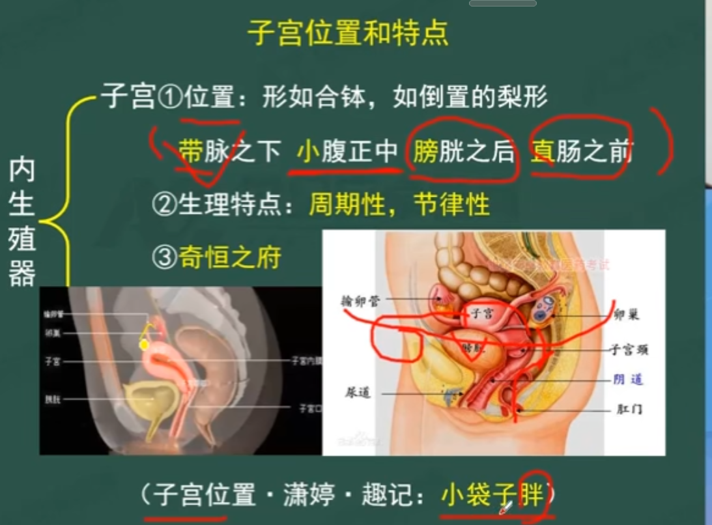
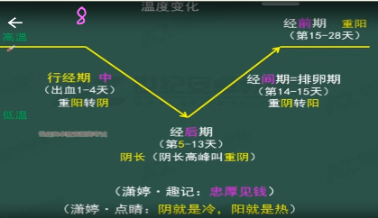
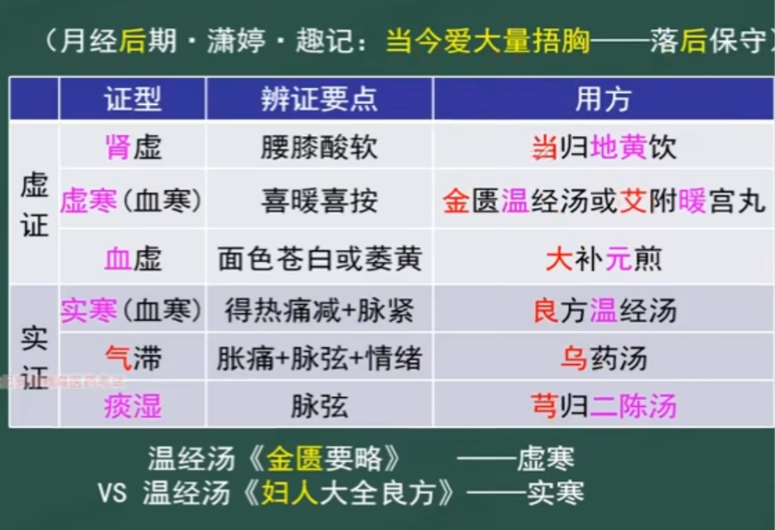
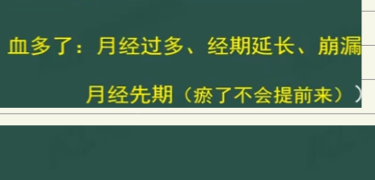
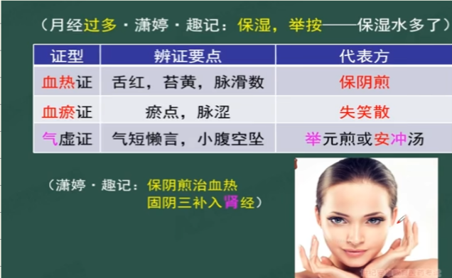
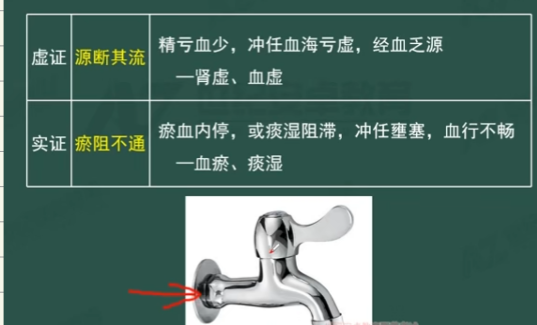
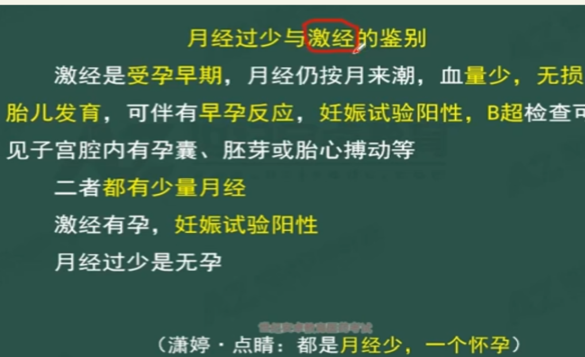
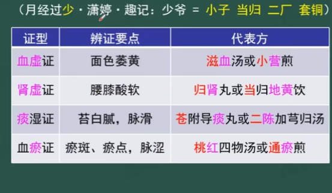

# 中医妇科学
- 绪论
- 生殖器官
    - 外生殖器
        - 阴户=四边=外阴
        - > 阴蒂+大小阴唇+阴唇系带+前庭部位 是防御外邪入侵的第一道门户
        - 功能
            - 防御外邪入侵的第一道门户
            - 合阴阳入口
            - 经带恶露之出口
            - 娩出胎儿之产门
    - 内生殖器
        - 阴道
            - 功能，一个通道
                - 防御外邪进去通道
                - 交合的器官
                - 经带的通道
                - 分娩胎儿的路径
        - 子门=子户=子宫颈口，第二道门户
            - 功能，关口
                - 排出月经，分娩胎儿的关口
        - 子宫
            - 小袋子胖 
            - 功能，产，排
                - 产生排出月经带下
                - 孕育，分娩胎儿
- 生殖生理
    - 女性一生各期的生理特点
        - 胎儿期
            - 十月怀胎，10个妊娠月（28天一月，280天）
        - 新生儿期
            - 出生后4周，28天内
            - 特殊生理，乳房假发育，假月经
        - 儿童期
            - 12岁的儿童
            - 10岁左右第二性征发育
        - 青春期
            - 标志，月经来潮
            - 二七，三七之年
            - 第二性征发育
        - 性成熟期
            - 三七—七七
            - 省内，危房，干透
                - 乳头属肝，乳房属胃，足少阴肾经行乳内
        - 围绝经期
            - 七七
        - 老年期
            - 60以后
    - 月经
        - 月经生理
            - 初潮
                - 二七-3+2
                - > 早至11/12，迟16
            - 周期
                - 开始，出血第一天
                - 2次月经第一天的间隔时间为一个周期，28-30天
            - 行经期
                - 正常3~7天，多数3~5天
            - 量色质味
                - 二六，20~60ml
                - 暗红
                - 不稀不稠不凝固，无血块
                - 无特殊臭气
            - 经期表现
                - 经前，胸乳略胀，小腹略坠，腰微酸，情绪易波动
            - 绝经
                - 最后一次行经后，停闭一年以上，平均49.5，表明即将进入老年期
        - 特殊生理
            - 并月
            - 季经
            - 避年
                - 一年一新
            - 暗经
            - > 暗河
                - 终身不潮而能受孕者
            - 激经
            - > **鸡胜狗** ，又名盛胎，垢胎 ​
                - 孕初期，仍按月经周期有少量出血而无损于胎儿
        - 产生机理
            - 神鬼冲宫去
            - 脏腑
                - 与 肝脾肾 最为密切，以 肾 为主导
            - 天癸
                - 源与先天 肾气
            - 经络
                - 冲任 督带
            - 胞宫
                - 中心环节，肾， 天 癸，冲 任 ， 胞 宫生殖轴
            - 气血
                - 妇人以血为本
                - > 气为血之帅，血为气之母
        - 周期变化与调节
            - 忠厚见前
                - 行经期（中）
                    - 时间
                        - 出血1—4天
                    - 特点
                        - 排出经血 ，子宫泻而不藏
                        - 出血第一天 ，为一个周期开始
                        - 重阳转阴
                - 经 后 期
                    - 第5—13天
                    - 月经来完之后， 血海空虚渐复，子宫藏而不泄
                    - 阴长 （阴长高峰叫 重阴 ）
                - 经 间 期
                    - 第14-15天
                    - 正值 2次月经中间=排卵期， 氤氲之时，真机，的侯，重阴转阳
                - **经** **前** **期**
                    - 第15-28天
                    - 下一个月经之前，阴盛阳生渐至 重阳
                - 温度变化
                    -  
    - 带下
    - 妊娠
    - 产褥
    - 哺乳
- 病因病机
    - 病因（邪）
        - 寒热湿 邪（忽冷忽热，哭）
        - 情志 ：怒思恐
        - 生活： 房劳 多产， 饮食 不节， 劳逸 失常
        - 体质：跌扑 损伤 ， 调摄 失宜
    - 病机（损伤，失调）
        - 神鬼冲宫去
            - 脏腑功能失常（ 肝脾肾 ）
            - 冲任督带 损伤
            - 气血 失调
            - 胞络，胞脉，胞宫 受损
            - 肾，天癸，冲任，胞宫生殖轴 失调
- 诊断与辩证
    - 问诊
        - 月经有期，带下有味
        - 月经
            - 期 色量质
        - 带下
            - 味 色量质
    - 切诊
        - 月经脉
            - 滑
        - 妊娠脉
            - 滑有力，尺 脉按之不绝
        - 临产脉=离经·脉
            - 双手中指两旁至末节
        - 产后脉
            - 失血耗气伤津， 脉滑数而重按无力，浮大虚数： 注意是否气血血脱
    - 辨证要点
        - 以 八纲辨证 为纲领
        - 以 脏腑辨证 和 气血辨证 为主要辨证方法
        - 个别疾病如产后感染邪毒采用 卫气营血辨证
- 治疗
- 月经病
    - 概述
        - 本病
            - 周期，经期，经量 异常
        - 伴随病
            - 本身没问题，伴随月经周期，或于经断前后出现明显症状
        - 病因病机
            - 病因
                - 寒热湿 ， 七情 内伤， 饮食 不节，房劳，劳倦，体质
            - 病机
                - 神鬼冲宫去
        - 辨证
            - 期色量质
            - 经带胎产，全身症状
        - 治疗原则
            - 重在 治本调经 ， 补肾 为第一大法
            - 分清 先病，后病
            - > 因经不调而后生他病，先调经，经调则他病自除 因他病致经不调，先治他病，病去则经自调
            - 急则治标，缓则治本
        - 注意事项
            - 经前勿滥补，经后勿滥攻
            - 青春期 少 年治 肾 ，生育期 中 年治 肝 ，更年期， 老 年治 脾
            - 虚补实泄
                - 虚证 补 肾扶脾养血
                - 实证 疏 肝理气活血
    - 月经本病
        - 周期异常
            - 月经先期
                - 概述
                    - 周期提前7天以上，连续2个周期以上
                    - 病机：冲任不固，经血失约
                    - 病因
                        - 气虚
                            - 脾气，肾气虚， 气虚不能摄血
                        - 血热
                            - 血热迫血妄行 ，阳盛血热，阴虚血热，肝郁血热
                - 鉴别
                    - 图片
                - 辨证
                    - 气虚
                        - 脾 气虚
                            - 证候
                                - 气短，纳少便溏
                            - 治法
                                - 补 脾 益 气 ， 摄血 调经
                            - 方剂
                                - 补 中 益 气 汤/归脾汤
                        - 肾 气虚
                            - 证候
                                - 腰膝酸软
                            - 治法
                                - 补肾益气，固冲调经
                            - 方剂
                                - 固阴 煎/归 肾 丸
                                - > 气血阴，固阴三补入肾经
                    - 血热
                        - 阳盛 血热
                            - 证候
                                - 深红，质粘稠，舌红苔黄，脉数
                            - 治法
                                - 清热 凉血调经
                            - 方剂
                                - 清 经散
                        - 阴虚 血热
                            - 证候
                                - 色红，质稠， 两颧潮红，手足心热，舌红苔少，脉细数
                            - 治法
                                - 养阴清热调经
                            - 方剂
                                - 两地汤
                        - 肝郁 血热
                            - 证候
                                - 色深红，质稠，胀痛，烦躁易怒，弦数
                            - 治法
                                - 疏肝 清热， 凉血调经
                            - 方剂
                                - 丹栀 逍遥散
                - 总结
                    - 图片
            - 月经后期
                - 概述
                    - 周期延后7天以上，连续出现2个周期
                    - > 青春期初潮一年内或围绝经期，周期有延后而无其他证候者，不作病论
                    - 7天<X<6个月（经闭）
                    - 虚证 （源断其流)
                        - 肾虚，血虚，虚寒
                    - 实证( 瘀滞不通 ）
                        - 血寒，气滞，痰湿
                - 鉴别
                    - 经期推迟，首先排除妊娠— 妊娠实验阳性
                        - 早孕
                            - 早孕反应
                            - 妊娠实验阳性
                            - B超检查子宫腔内有孕囊
                        - 月经后期
                            - 无以上表现，多有月经失调病史
                - 辨证
                    - 肾虚
                        - 证候
                            - 腰膝酸软
                        - 治法
                            - 补肾养血 调经
                        - 方剂
                            - 当归 地黄 饮（补血滋肾）
                    - 血虚
                        - 证候
                            - 面色苍白或萎黄，脉细
                        - 治法
                            - 补血 益气 调经
                        - 方剂
                            - 大补 元 煎（肾虚头痛，肾气虚）
                    - 血寒
                        - 虚寒
                            - 证候
                                - 喜暖喜按
                            - 治法
                                - 扶阳 祛寒调经
                            - 方剂
                                - 温 经汤《金gui要略》/艾附 暖 宫丸
                        - 实寒
                            - 证候
                                - 冷痛拒按，得温痛减，脉沉 紧
                            - 治法
                                - 温经 散寒 调经
                            - 方剂
                                - 温 经汤《 妇人 大全良方》
                    - 气滞
                        - 证候
                            - 胀痛 ，精神抑郁，脉 弦
                        - 治法
                            - 理气 行滞调经
                        - 方剂
                            - 乌药 汤（武器）
                    - 痰湿
                        - 症候
                            - 苔白腻，脉滑
                        - 治法
                            - 燥湿化痰，活血调经
                        - 方剂
                            - 芎归 二陈汤
                - 总结
                    -  
            - 月经先后不定期
                - 概述
                    - 月经周期提前或延后 7天 以上，连续 3个 周期以上
                    - 月经先后不定期=经水先后无定期=月经愆期=经 乱
                    - 周期不，正常但行经期正常，经量正常
                - 鉴别
                    - 崩漏 ，周期+经期+经量，全乱了
                    - 月经先后不定期 ，周期乱
                - 辩证
                    - 肝郁
                        - 症候
                            - 胀痛，叹息，脉弦
                        - 治法
                            - 疏肝理气 调经
                        - 方剂
                            - 逍遥散逍遥散
                    - 肾虚
                        - 症候
                            - 腰膝酸软，头晕耳鸣，脉细弱
                        - 治法
                            - 补 肾 调经
                        - 方剂
                            - 固 阴 煎（固阴三补入肾经）
                    - 肝郁肾虚
                        - 定睛 一看， 不慎输干 净了
                        - 症候
                            - 胀痛，腰膝酸软，脉弦细
                        - 治法
                            - 补肾疏肝
                        - 方剂
                            - 定经汤
                - 总结
        - 经期异常
            - 经期延长
            - 经间期出血
        - 经量异常
            - 月经过多  崩漏
                - 概述
                    - 月经量以 20-60ml 为宜，超过 80ml 为月经过多
                    - 病因病机
                        - 气虚   不能摄血
                        - 血热   迫血妄行
                        - 血瘀   血不行经
                    -  
                - 辩证
                    - 气虚
                        - 症候
                            - 气短 ，小腹 空坠
                        - 治法
                            - 补 气 摄血固冲
                        - 方剂
                            - 举元 煎/安 冲 汤
                    - 血热
                        - 症候
                            - 深红，粘稠，舌红，苔黄，脉滑数
                        - 治法
                            - 清热凉血，固冲止血
                        - 方剂
                            - 保元煎
                    - 血瘀
                        - 症候
                            - 紫暗，有血块，舌紫暗或有瘀点，脉涩
                        - 治法
                            - 活血化瘀止血
                        - 方剂
                            - 失笑散 加益母草，三七，茜草
                - 总结
                    -  
            - 月经过少  经闭
                - 概述
                    - 月经周期正常，月经量明显减少，或行经时间不足2天，月经量少于20ml，甚至点滴即使净者
                    -  
                - 鉴别
                    -  
                - 辩证
                    - 肾虚
                        - 症候
                            - 腰膝酸软
                        - 治法
                            - 补 肾 益精，养血调经
                        - 方剂
                            - 归 肾 丸/当归 地黄 饮
                    - 血虚
                        - 症候
                            - 面色萎黄，脉细
                        - 治法
                            - 养 血 益气调经
                        - 方剂
                            - 滋 血 汤/小 营 煎
                    - 血瘀
                        - 症候
                            - 紫暗，血块，舌 紫暗，瘀斑 ，脉沉弦/ 涩
                        - 治法
                            - 活血化瘀调经
                        - 方剂
                            - 桃红 四物汤/通 瘀 煎
                    - 痰湿
                        - 症候
                            - 肥胖，带多，苔白腻，脉滑
                        - 治法
                            - 化痰燥湿调经
                        - 方剂
                            - 苍附导 痰 丸/ 二陈 加芎归汤
                - 总结
                    -  
    - 月经伴随病
        - 乳房胀痛
        - 感冒
        - 泄泻
        - 吐niu
        - 头痛
        - 身痛
        - 浮肿
        - 情志异常
        - 风疹块
        - 口糜
        - 发热
        - 痛经
    - 绝经期
        - 绝经前后诸证
        - 绝经复来