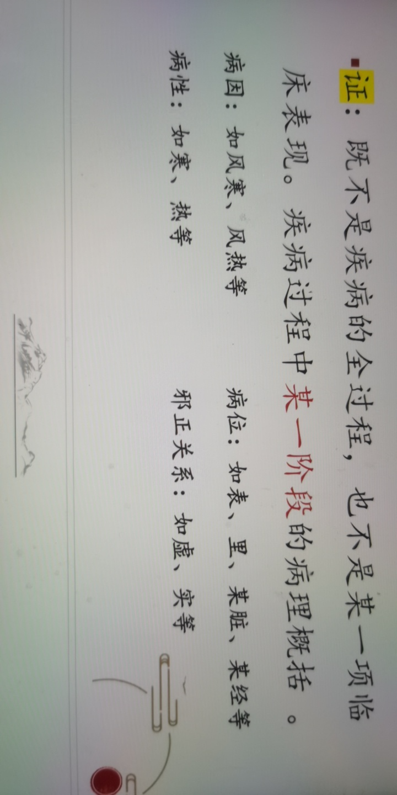
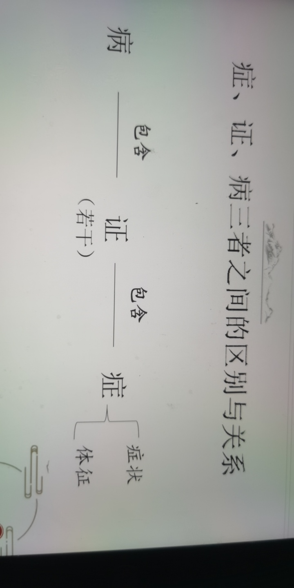

# 中医学基本理论
- 中医学基本概念：
- > 中医学建立在传统文化基础上，以整体观念为主导思想，关于人体生理，病理疾病的诊断防治，以辨证论治为诊疗特点，“传统”包括中医基础理论，预防医学，临床医学。
    - 中医理论体系的形成和发展
        - （一）先秦两汉时期———形成时期（四大经典）
            - 《黄帝内经》
                - 奠定了中医的理论基础
                - 现存的第一部医学典籍
                - 被称为“医家之宗”
                - 《灵枢》+《素问》灵枢主要讲针灸，素问主要讲理论，个有九卷，每个有81篇，总共162篇
            - 《难经》————《黄帝八十一难经》
                - 汉代，相传为秦越人（象征扁鹊）所传
                - 辅翼《内经》
                - 创右肾为命门说
                - 创造性提出 独取寸口 （手腕），已知五脏六腑死生吉凶的诊脉方法
            - 《伤寒杂病论》
                - 东汉末年，张仲景，《伤寒论》+《金匮要略》
                - 理法方药相结合， 太阳阳明少明，太阴厥阳少阴
                - 第一部辨证论治的专著 ，为临床医学的发展奠定了基础
            - 《神农草本经》
                - 汉代
                - 现存第一部药物学专著，确立了中药理论的基础，及汉以前药物学之大成
                - 四性： 寒、热、温、凉， 五味： 酸、甜、甘、辛、咸
                - 收载中药365种，三品分类法：上品，中品，下品
        - （二）晋隋唐时期充实发展
            - 晋•皇甫谧，著《针灸甲乙经》
                - 我国第一部针灸学专著
            - 晋•王权和，著《脉经》
                - 第一部脉学专著
            - 隋•元芳等人著《诸病源候论》
                - 我国第一部病因病机与症候专注（传染病）
            - 唐•孙思邈（药王），著《千金要方》《千金翼方》， 最早的方剂学专著，堪为第一部古代医学百科全书
        - （三）宋金元时期———突破性发展
            - 宋•陈元泽，著《三因极病证方论》
                - 倡三因学说，将病因分为三类，内因，外因，不内外因病理学
            - 宋•钱二，著《小儿药证直诀》
                - 是一部系统的儿童专著
                - 开创脏腑治证先河
            - 金元四大家
                - 刘完素
                    - 火热论开山
                    - 寒凉派开山
                - 张从正（张子和）
                    - 攻邪派开山
                    - 汗，吐，下
                - 李东恒（李杲gao）
                    - 补士派开山
                - 朱丹溪（朱震亨）
                    - 相火论
                    - 滋阴派
            - 宋•王惟一，著《铜仁腧学针灸图经》
                - 是我国古代针灸典籍中一部很有价值的针灸学专著
                - 针灸铜人
        - （四）明清时期———综合汇通深化发展
        - > 集古代中医基础理论之大，成出现大批集成性著作
            - 李时珍
                - 《本草纲目》
                - 东方医药巨典
            - 温病学派
            - > 温病为热性病的总称，以急性发热，热象象显著为特点
                - 明•吴又可《瘟疫论》
                    - 吴又可是医学史上第一位温病专家，《瘟疫论》则为我国第一部温病学专著
                - 温病四大家
                    - 叶天士
                    - 薛雪
                    - 吴鞠通
                    - 王孟英（主要攻霍乱）
        - （五）近代和现代
        - > 继承发展创新
    - 中医学的基本特点
        - （一）整体观念（中医学的指导思想）
            - 人体是一个有机的整体
                - 生理方面
                - 病理方面
                - 诊断上：有诸内，必形诸外
            - 人与自然环境的统一性
                - 正常情况下，天人相应
                    - 人秉天地之气而生
                    - 季节昼夜，地域环境等
                - 四时气候变化对人体生理，病理的影响
                    - 生理
                        - 春温夏热，腠里开，汗多尿少
                        - 秋凉冬寒，腠里闭，尿多
                    - 病理
                        - 春多温病
                        - 夏多泄泻，秋多疟病，冬多伤寒
                - 地理环境对人体生理病理的影响
                    - 生理
                        - 东南，地低，气温热，腠理疏松，皮肤润，个子细
                        - 西北，地高，气燥寒，腠理致密，皮肤粗糙，个子彪悍
                    - 病理
                        - 东方多痛疡
                        - 南方多挛痹
                        - 西方多内伤
                        - 北方多脏寒，生满病
                - 三因制宜： 因时，因地，因人制宜
        - （二）辨证论治
        - > 概念：运用中医的诊断方法，对病人的复杂症状进行分析，综合判断为某种性质的证，辩证 自而根据中医治疗的原则，确定治疗方法，论治
            - 整体观念
                - 人体是一个有机的整体
                    - 生理方面
                        - 其一，就其形体结构而言，人体是由若干脏腑器官构成的
                        - 其二，就生命物质而言，气、血、精、津、液，是组成人体并维持人体生命活动的基本物质
                        - 其三，就机能活动而言，人体各个脏器，组织或器官，都有各自不同的生理功能，这些不同的生理功能又都是整体机能活动的组成部分，决定了机体的整体统一性
                    - 病理方面
                        - 内脏病变可反映到相应形体官窍，脏腑之间病变可互相影响，并可以影响整个整体
                    - 诊断上
                        - 有诸内，必形诸外
                        - 局部症状是整体功能失调，在局部的反应与全身脏腑，阴阳，气血的盛衰虚实有关，因此治疗时属
                - 人与自然环境的统一性
                    - 与基本观念同上
                - 人与社会环境密切相关
                    - 与基本观念同上
                - **病，症，证的含义**
                    - 病，指有特定病因发病形式，病机发展规律和转归的一种 完整的病理过程
                    - 症： 症状，体征
                        - 病人主观的异常感觉或某些病态变化是指 症状 （发热，咳嗽，呕吐，头痛——自觉症）
                        - 能被察觉到的客观表现指 体征 （面黄目赤舌子——他绝症）
                    - 证 ：既不是疾病的全过程，也不是某一项临床表现，疾病过程中，某一阶段的病理概括
                        -  
                - **症，证，病三者之间的区别与关系**
                    - 症：疾病的个别表象（不及证深刻，准确）
                    - 证：疾病某个阶段的本质变化（比并更具体贴切，更具可操作性）
                    - 病：疾病病理变化的全过程（笼统）
                    -  
            - **辩证论治的运用**
            - > “中医治病主要不是眼于病之异同，而是取决于证的性质”
                - 辨证论治 作为 诊治疾病的基本原则 ， 要求 人们辩证地看待病与证的关系
                - 辨证与辨病相结合：以辩病为先， **以辩证为主**
                - 辩病： *注重疾病发展全过程提高辩证准确性——（整体认识）*
                - > **—————+—————**
                - **辩证** **：** *注重疾病发展阶段性，具体体现了疾病发展过程中变化*
                - > ————— **=—————**
                - 深化对疾病认识，使诊断更全面准确，从而诊疗才更针对性
                - **同病异治和异病同治**
                    - 一种病常可表现出不同的 证 （如感冒，水肿等）———同病异治
                    - 不同的并在其发展过程的某些阶段可以出现类同 症状 （如久痢，脱肛，子宫下垂）———异病同治