# 中医诊断学
- **绪论**
    - 中医诊断学的主要内容
        - 诊断
            - 诊断就是通过对病人的询问、检查，以掌握病情资料，从而对病人的健康状态和病变的本质进行辨识，并对所患病、证作出概括进行判断
        - 中医诊断学主要包括诊法、诊病、辨证和病历四大部分
            - 诊法
                - 诊法是对患者进行诊察、收集病情资料的基本方法，包括望、闻、问、切四种诊法，简称“四诊”
                - 望诊——视觉观察
                    - 病人全身及局部神色形态和排泄物的形色质量
                - 闻诊——听觉和嗅觉
                    - 声音和气味的变化
                - 问诊——语言交流
                    - 疾病的发生过程、现在症状及其他与疾病有关的情况
                - 切诊——触觉
                    - 脉象和身体局部的变化
                - 四诊收集到的资料——症
                    - **症状**
                        - 指病人主观感觉到的痛苦和不适（问诊）
                    - **体征**
                        - 指客观能够检测出来的异常征象（闻诊、望诊、切诊）
            - 诊病
                - 诊病亦称辨病，是在中医学理论指导下，综合分析四诊资料，对疾病的病种作出判断，得出病名诊断的思维过程
                - **病是对该疾病全过程的特点与规律所作的概括和抽象**
                    - 病名
                        - *疟疾、痢疾、肺痨、痫病、消渴、滑胎、痛经、麻疹、红丝疔、乳岩、脓包疮、牛皮癣、内痔⋯*
            - 辨证
                - **辨证是在中医学理论的指导下，对临床资料进行分析、综合，从而对疾病当前的病位与病性等本质作出判断，并概括为完整证名的诊断思维过程**
                - **证**
                    - 中医学的一个特有的概念，是对疾病过程中所处的一定（当前）阶段的病位、病性、病因以及病势等所作的病理概括，是致病因素、机体反应的综合
                    - 包括证名、证型、证候
                        - **证名**
                            - 将疾病当前阶段本质概括成的诊断名称
                            - *痰热壅肺证、瘀阻脑络证、脾肾阳虚证、卫分证⋯*
                        - **证候**
                            - 证表现的症状、体征
                            - 据候辨证
                        - **证型**
                            - 常见、典型规范的证
            - 病历（病案）
                - 诊籍首创于仓公（淳于意）
                - 诊疗等情况的书面记录，病历、诊籍
                - 病情—病史—诊断—治疗
                - 医疗、科研、教学、管理、司法的重要资料
    - 中医诊断的基本原理
        - 理论基础
            - 人是有机整体，相互作用，因果联系，局部与整体病理相关
            - 《素问·阴阳应象大论》：以我知彼，以表知里，以观过与不及之理，见微得过，用之不殆
        - 司外揣内
            - 从外知内
            - 有诸内者必形诸外
                - 外（症状体征）——推测内部（病理本质）
        - 见微知著
            - 通过微小的变化，可以测知整体的情况
            - *面部分候、独取寸口、舌诊、目诊⋯*
        - 以常衡变（以常达变）
            - 通过观察比较，在认识正常的基础上，发现太过、不及的异常变化，从而认识事物的性质及变动的程度
            - 《素问·玉机真脏论》：五脏脉变，揆度奇恒，道在于一
            - 望面色
                - 健康面色—失神面色
            - 察舌
                - 正常舌象（淡红舌薄白苔）—红舌黄苔
    - 中医诊断的基本原则
        - 整体审察
            - 认识论上注意整体观念，相互联系
                - 局部病变—影响全身
                - 精神刺激—气机及形体变化
                - 脏腑病变—气血阴阳失常、精神活动改变
                - 任何疾病—都有整体变化
            - 病情资料收集全面
                - 起因，病史，痛苦不适，各种病理改变
                - 精神、饮食、睡眠、二便⋯习惯
                - 体质，家庭，环境，时令，气候
            - 分析全面，综合判断
                - 真—假
                - 本质—现象
                - 因—果
                - 主要—次要
                - 局部—整体
            - 必须整体审察是由于疾病时
                - 人体局部会影响整体
                - 内部可以牵连外部
                - 疾病受自然环境的影响
        - 诊法合参
            - 诸法参用，综合收集病情
            - 诊法合参是中医诊断疾病的基本原则之一，诊断必须做到望、闻、问、切四诊俱备，不能忽视任何一种诊病方法，这样才能搜集到病人全面的、详细的资料，做出正确的诊断
        - 病证结合
            - 先辨病再辨证
                - 前提：能确定为某病
                - 优点：便于确认证的类型
            - 先辨证再辨病
            - 辨病与辨证相结合，不能只辨证而忽略辨病
    - 中医诊断学的发展简史
        - 公元五世纪，为四诊奠定基础
        - 春秋战国，扁鹊《难经》重视脉分，提出寸口诊法
        - 春秋战国时期，阐述了望闻问切诊法，奠定中医诊断学理论基础的最早著作是《黄帝内经》
        - 西汉淳于意首创诊籍，记录了病人的姓名、居址、药方、日期，为后世病案奠基
        - 东汉·张仲景《伤寒杂病论》第一部临床医学论著，开创辨证论治先河
        - 东汉·华佗《中藏经》脏腑辨证的专书，论证、论脉、论防治十分精要
        - 我国现存最早的脉学专著是《脉经》（西晋·王叔和）
        - 我国第一部论述病源与证候诊断的专著是《诸病源候论》（隋·巢元方）
        - 唐·孙思邈《备急千金要方》临床医学百科全书
        - 宋·陈无择《三因极一病证方论》三因学说
        - 南宋·施发《察病指南》诊法专著，最早以图示脉
        - 元朝敖氏《点点金》、《金镜录》论舌第一部专著
        - 现存最早的舌诊专著是《敖氏伤寒金镜录》（元·杜清碧）
        - 金元四大家
            - 刘完素——寒凉派
                - 以火热立论，用药以寒凉为主
                - 《素问玄机原病式》诊病辨证，重视病机
            - 李东垣——补土派
                - 脾胃论：内伤脾胃，百病由生
                - 李杲辨脉重视四诊合参
            - 张子和——攻下派
                - 病由邪生，邪去正安
                - 张从正《儒门事亲》主张从外知内
            - 朱震亨——养阴派
                - 阳常有余，阴常不足
                - 朱丹溪《格致余论》重视症状的鉴别诊断
        - 明·李时珍《濒湖脉学》27脉
        - 明.李世材《诊家正眼》28脉
        - 清·喻嘉言《寓意草》
        - 清·汪宏《望诊遵经》望诊专著
        - 清·叶天士《温热论》记载了丰富的温热病诊疗经验，创立卫气营血辨证
        - 清·吴鞠通《温病条辨》记载了丰富的温热病诊疗经验，创三焦辨证
        - 清·吴又可《温疫论》记载了丰富的温热病诊疗经验。
        - 清·张诞先《伤寒舌鉴》
        - 1917，曹炳章《彩图辨舌指南》
        - 研究脉学为主的专著有：《脉经》《崔氏脉诀》《察病指南》《濒湖脉学》
        - 研究舌诊为主的专著有：《点点金》《金镜录》《伤寒舌鉴》《舌苔统志》
    - 学习中医诊断的方法
        - 熟悉理论
            - 诊病方法和辨证思维，涉及阴阳五行、精神气化等基本理论。要理解、掌握本门课程的基本理论、基本知识
        - 临床实践
            - “熟读王叔和，不如临证多”。神、象等概念抽象，真正理解需要临床实际观察、体会。病情千变万化，需要临床锻炼积累经验
        - 辨证思维
            - 临床诊断，是感性认识到理性认识的飞跃。要注意思维方法、思维形式的锻炼和修养
- **第一章 望诊**
    - 望诊的概念
        - 望诊，是医生运用视觉观察患者全身或局部表现，以了解机体生理功能和病理变化的诊察方法
    - 望诊的地位
        - 四诊之首
        - “望而知之谓之神”
    - 第一节 全身望诊
        - **望神**
            - 望神是通过观察人体生命活动的整体表现来判断病情的方法
            - 神的含义
                - 狭义
                    - 即“精神”，指精神、意识、思维(和情志)活动
                - 广义
                    - 即“神气”，指机体脏腑组织功能活动的外在表现。包括精神意识，思维活动，面色眼神，形体动态，语言呼吸和对外界的反应等各个方面，是对人体生命现象的高度概插（整体表现）
            - 望神的原理
                -  
            - 望神的意义
                - 望神的旺衰可以了解精气盛衰，判断病情的轻重和预后的吉凶
                - 精气充足则体健神旺，抗病力强，即使有病也多属轻病，预后较好；精气亏虚，则体弱神衰，抗病力弱，有病多重，预后较差
            - 望神的注意事项
                - 因神的表现在患者无意之时流露最真，因此医生须重视诊察患者时的第一感觉，做到静心凝神，一会即觉
                - 要注意神形合参，尤其当形神表现不致时，更应综合判断，如久病形羸色败，虽神志清醒亦属失神
                - 有些症状和体征对神的判断具有重要意义，如神昏谵语等，应予重视
            - 望神的主要内容：在望诊察神时尤应重点观察
                - **两目**
                    - 注意眼神、视觉功能及运动状态
                        - 眼神是心神的外在反映
                        - 目又为脏腑精气汇聚之处口
                    - 目的视觉功能和运动状态可以反映脏腑精气的盛衰
                        - 两目神光充沛，精彩内含，视物清晰，运动灵活——有神——脏腑精气充盛
                        - 两目浮光外露，目无精彩，运动不灵，视物模糊——无神——脏腑精气虚衰
                - **神情**
                    - 此指精神意织、思维活动，往往通过面部表情及对外界刺激的反应等表现出来
                    - 神情是心神和脏腑精气盛衰的外在表现
                - **色泽**
                    - 是指人体周身皮肤（以面部为主）的色泽
                        - 气色荣润有泽——脏腑精气充盛
                        - 气色枯搞无泽——脏腑精气虚衰
                - **体态**
                    - 指人的形体姿态
                        - 形体——由精气等物质构成
                        - 姿态——脏腑功能的外在表现
                        - ——推测脏腑精气盛衰、功能强弱
                    - 还应结合语言、呼吸、舌象、脉象等方面的表现进行综合判断
                - 尤其要注重诊察眼神的变化
            - 神的分类
                - **得神（有神）**
                    - 【临床表现】
                        - 两目灵活，明亮有种，面色荣润，含蓄不露，神志清晰，表情自然，肌肉不削反应灵敏
                    - 【临床意义】
                        - 正气充足，精气充盛，体健神旺
                        - 多见于健康无病
                        - 虽病精气未衰，属病轻易治，预后良好
                - **少神（神气不足）**
                    - 【临床表现】
                        - 两目停滞，目光乏神，面色少华，暗淡不荣，精神不振，思维迟钝，少气懒言肌肉松软，动作迟缓，反应正确
                        - 肺脾气虚——补气
                    - 【临床意义】
                        - 精气不足，机能咸退
                        - 轻病，或恢复期病情好转
                        - 虚证体质虚
                - **失神（无神）**
                    - 失神是精亏神衰或非盛神乱的重病表现
                    - **精亏神衰——久病虚证**
                        - 正气大伤，精气亏虚，功能严重衰退
                        - 精亏神衰而致失神
                            - 【临床表现】
                                - 两目晦暗，目无光彩，面色无华，晦暗暴露，精神萎靡，意识模糊，反应迟钝，手撒尿遗，骨枯肉脱，形体羸瘦
                            - 【临床意义】
                                - 精气大伤，机能严重衰咸，多见久病、重病，预后不良
                    - **外盛神乱——急性病实证**
                        - 邪气亢盛，机体功能严重障碍
                        - 邪盛神乱而致失神
                            - 【临床表现】
                                - 神昏谵语，循衣模床，撮空理线；卒倒神昏，两乎握固，牙关紧闭
                            - 【病因病机】
                                - 邪气亢盛，热扰神明，邪陷心包；肝风挟痰，蒙蔽清窍，阻闭经络
                            - 【临床意义】
                                - 邪气亢盛，脏腑功能严重障碍，气血津液失调，多见于急性重病
                - **假神**
                    - 指原来失神的病人，突然出现暂时好转的现象
                    - 【临床表现】
                        - 原本目光晦滞，突然目似有光，但却浮光外露
                        - 本为面色晦暗，一时面似有华，但为两颧泛红如妆
                        - 本已神昏或精神极度萎靡，突然神识似清，想见亲人，言语不休，但精神烦躁不安
                        - 身体沉重难移，忽思起床活动，但并不能自己转动
                        - 毫无食欲，久不能食，突然索食，且食量大增等
                    - 【临床意义】
                        - 脏腑精气极度衰竭，正气将脱，阴不敛阳，虚阳外越，阴阳即将离诀，属病危
                        - “回光返照”或“残灯复明”，常是危重病人临终前的征兆
                    - 特点
                        - 久病重病本已失神——整体表现是精亏神衰
                        - 突然出现某些局部似为“好转”的表现，这些局部的“好转”表现与整体精亏神衰极不符合
                        - 这种“好转”的表现只是短暂的，一般在数分钟或数小时（最多不超过48小时）内病情迅速恶化而死亡
                    - 假神与病情好转的鉴别
                        - 久病重病的病人经过正确的治疗而病情好¨转，则是整体表现逐步好转。其精神好转也是逐渐的，并与整体状况好转相一致
                -   
                -  
        - **望色**
            - 望色，又称“色诊”，是通过观察患者皮肤色泽变化来诊察病情的方法。色即皮肤的颜色，包括青、赤、黄、白、黑五种颜色变化泽即皮肤的光泽，指荣润或是枯槁的光泽变化。临床一般以望面部色泽变化为主
            - 望面部色泽诊病的意义
                - 判断气血盛衰
                - 辨别病邪性质
                - 确定病变部位
                - 预测疾病转归
            - 《素闻·刺热》分候法
                - 额 心
                - 鼻 脾
                - 左颊 肝
                - 右颊 肺
                - 颏 肾
                -   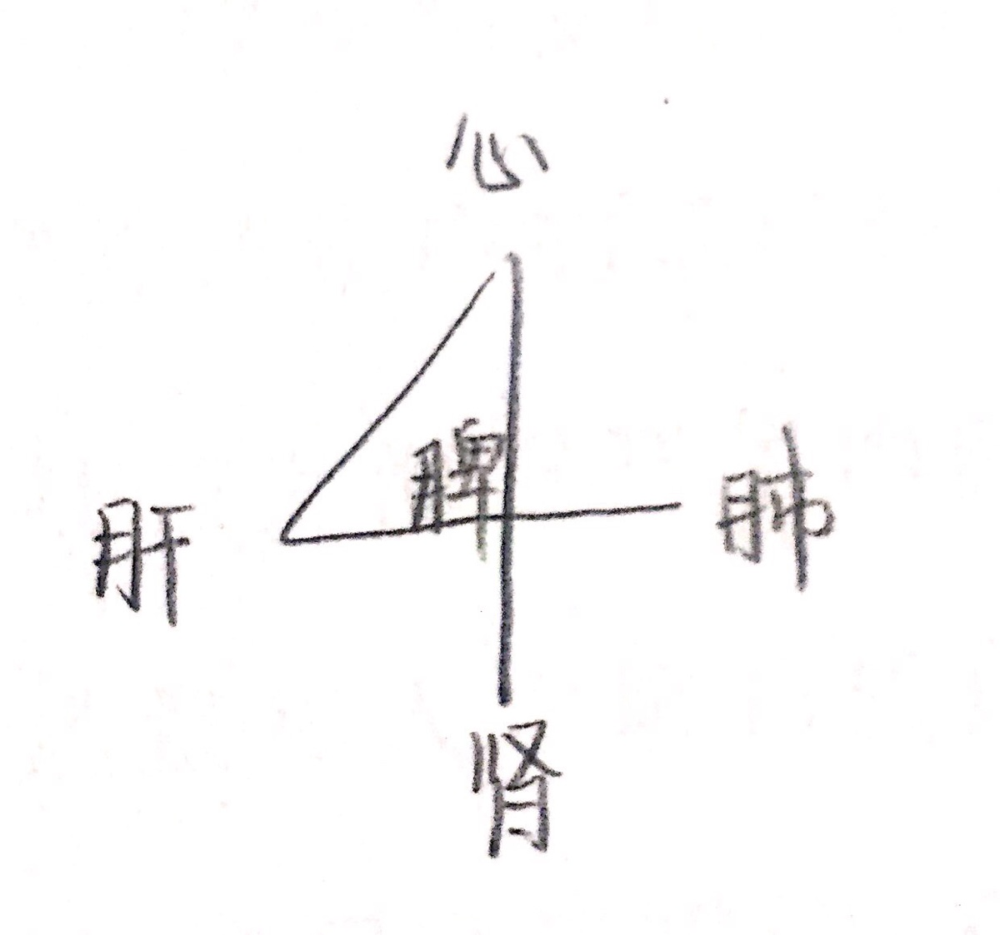
            - **常色和病色**
                - **常色**
                    - 指人在生理状态时的面部色泽
                    - 【表现】
                        - 面部皮肤光明润泽
                        - 常色的特点是明润、含蓄
                        - 常色有主色和客色之分
                            - **主色**
                                - 人生来就有，终生基本不变的面色，属个体素质，往往与种族和遗传有关，又称正色
                                - 由于种族、禀赋的原因，主色也有偏赤、白、青、黄、黑的差异
                            - **客色**
                                - 受季节气候、地理环境、饮食情绪、运动等因素影响，画部发生的正常色泽变化
                                - **四季气候与面色**
                                    - 春季面色稍青
                                    - 夏季面色稍赤
                                    - 长夏面色稍黄
                                    - 秋季面色稍白
                                    - 冬季面色稍黑
                                - **明润含蓄**
                                - 客色一般为一过性改变，排除相关因素后即恢复原来面色
                    - 【意义】
                        - 是有神气的表现，显示人体精充神旺、气血津液充足、脏腑功能正常
                - **病色**
                    - **晦暗、暴露**
                    - 病色可反映不同性质、不同脏腑的病变。观察病色的关键，在于分辨面色的善色与恶色
                        - **善色**
                            - 患者面色虽有异常，但仍光明润泽
                            - 病变轻浅，脏腑精气未衰，胃气尚能上荣于面，多见于新病、轻病、阳证，其病易治，预后较好
                        - **恶色**
                            - 患者面色异常，且枯槁晦暗
                            - 病变深重，脏腑精气已衰，胃气不能上荣于面，多见于久病、重病、阴证，其病难治，预后较差
            - **五色主病**
                - 病色可分为赤、白、黄、青、黑五种，分别见于不同脏腑和不同性质的疾病
                - 《灵枢·五色》认为
                    - 以五色分属于五脏，其对应关系是“青为肝，赤为心，白为肺，黄为脾，黑为肾”
                    - 以五色反映疾病的不同性质，则“青黑为痛，黄赤为热，白为寒”
                - 这种根据患者面部五色变化以诊察疾病的方法，即五色主病，或称“五色诊”
                - **赤色**
                    - 主热证，亦可见于戴阳证
                    - 病因病机
                        - 面部脉络扩张
                            - 邪火亢盛
                            - 虚火上炎
                            - 虚阳浮上
                    - 临床特征及意义
                        - 满面通红——实热证
                        - 午后两颧潮红——阴虚证
                        - 久病重病面色苍白，却时而泛红为妆，游移不定——戴阳证
                - **白色**
                    - 主虚证（包括血虚、气虚、阳虚）、寒证。
                    - 病因病机
                        - 气血不能上荣于面部
                            - 气虚血少
                            - 阳虚寒盛
                    - 临床特征及意义
                        - 面色淡白无华，唇舌淡白——血虚
                        - 面色白光——阳虚
                        - 面色苍白——亡阳、气血暴脱或阴寒内盛
                - **黄色**
                    - 主脾虚、湿证
                    - 病因病机
                        - **面色黄**
                            - 脾虚机体失养
                            - 湿邪内蕴，脾失运化
                    - 临床特征及意义
                        - 面色萎黄——脾胃气虚，气血不足
                        - 面黄虚浮——脾虚湿蕴
                        - #面目肌肤一身俱黄——“黄疸”——肝胆失疏，胆汁外溢肌肤
                        - #面目黄而鲜明如橘皮色——阳黄——脾胃、肝胆湿热
                        - #面目黄而晦暗如烟熏色——阴黄——脾胃寒湿
                - **青色**
                    - 主寒证、气滞、血、疼痛、惊风
                    - 病因病机
                        - 面部脉络血行不畅
                        - **面色青**
                            - 寒凝气滞
                            - 瘀血内阻
                            - 疼痛剧烈
                            - 筋脉拘急
                - **黑色**
                    - 主肾虚、寒证、水饮、血瘀
                    - 病因病机
                        - **面色黑**
                            - 肾阳虚衰
                            - 寒水内盛
                            - 血失温养
                            - 脉络拘急
                            - 血行不通
                    - 临床表现与意义
                        - 面黑暗淡——肾阳虚
                        - 面黑干焦——肾阴虚
                        - 目眶周围发黑——肾虚水饮或寒温带下
                        - 面色黧黑，肌肤甲错——血瘀日久
            - **望色十法**
                - 浮沉
                    - 浮者，显露——主表
                    - 沉者，深隐——主里
                - 清浊
                    - 清者，清明——主阳
                    - 浊者，浊暗——主阴
                - 微茫
                    - 微者，浅淡——主虚
                    - 茫者，深浓——主实
                - 散抟
                    - 散者，疏散——主新病或欲解
                    - 抟者，壅滞——主久病或渐聚
                - 泽夭
                    - 泽者，润泽——主精气未衰，易治
                    - 夭者，枯槁——主精气已衰，难治
            - 望色的注意事项
                - 知常达变，综合判断
                - 整体为主，荣枯为要
                - 注意光线、昼夜、情绪、饮食等因素的影响
                - 非疾病因素对病色的影响的特点
                    - 一过性改变
                    - 排除有关因素后，面色即恢复原状
        - **望形**
            - **形体强弱**
                - **体强**
                    - 特征
                        - 骨骼粗大，胸廓宽厚，肌肉充实，皮肤润泽
                    - 意义
                        - 内脏坚实，气血旺盛，抗病力强
                        - 应该指出的是，真正的体质强壮当是体魄俱健
                - **体弱**
                    - 身体虚弱，骨骼细小，胸廓狭窄，肌肉瘦削，皮肤枯槁，筋弱无力，精神不振，食少懒言等
                    - 说明体质虚衰，内脏脆弱，气血不足，抗病力弱，有病难治，预后较差
            - **形体胖瘦**
                - **正常**
                    - 能食、肉坚、神旺、有力，形气有余，属精充气足体健
                - **肥胖**
                    - 食少、肉松、神疲、乏力，形盛气虚，属阳虚，多痰湿
                    - 易患痰饮、中风等病
                - **消瘦**
                    - 头长形，颈细长，肩狭窄，胸狭平坦，大旗瘦瘪
                    - 体瘦食多，属中焦有火
                    - 体瘦食少，属中气虚弱
                    - 体瘦颧红，伴潮热盗汗，口咽干燥者，多属阴虚火旺的表现，易患肺痨等病
                    - 久病重病，卧床不起，骨瘦如柴，为脏腑精气衰竭，气液干枯，属病危
                - 形体虽胖，但少气乏力者，为精气不足，抗病力弱
                - 形体虽瘦，但神旺有力者，为精气充沛，抗病力强
            - **体质形态**
                - **阴脏人**
                    - 形体偏于矮胖，头圆颈粗，胸厚，身体姿势多后仰，平时喜热恶凉
                    - 阳较弱而阴偏盛，患病易从阴化寒，多寒混痰浊内停
                - **阳脏人**
                    - 形体偏于瘦长，头长颈细，肩窄胸平，身体姿势多前屈，平时喜凉恶热
                    - 阴较亏而阳偏旺，对暑热阳邪易感，患病易从阳化热，导致伤阴伤津
                - **阴阳和平之人(平脏人)**
                    - 平时无寒热喜恶之偏
                    - 阴阳平衡，气血调匀
        - **望态**
            - 望姿态的原理和意义
                - 功能亢进、躁动不安
                    - **阳证、热证、实证**
                - 功能衰减、喜静懒动者
                    - **阴证、寒证、虚证**
            - **动静姿态**
                - 动者、强者、仰者、伸者
                    - **属表、属阳、属热、属实**
                - 静者、弱者、俯者、屈者
                    - **属里、属阴、属寒、属虚**
            - **体位变化**
                - **坐形**
                    - 坐而仰首，胸胀气粗
                        - 肺实气逆
                    - 坐而喜俯，少气懒言
                        - 体弱气虚
                    - 但坐不得卧，卧则气逆
                        - 咳喘肺胀，或水饮停于胸腹
                    - 但卧不能坐，坐则神疲晕眩
                        - 脱血夺气，或肝阳化风
                    - 坐时常以手抱头，头倾不能昂，凝神熟视
                        - 精神衰败
                - **卧式**
                    - **卧时面常向外，身轻自能转侧**
                        - 阳证、热证、实证
                    - **卧时面常向里，身重不能转侧**
                        - 阴证、寒证、虚证
                        - 若见于久病重病
                            - 气血衰败已极，预后不良
                        - 仰卧伸足，掀去衣被
                            - 实热证
                        - 蜷卧缩足，喜加衣被者
                            - 虚寒证
                    - **坐卧不安**
                        - 烦躁之证或腹满胀痛
                - **立姿**
                    - 站立不稳，其态似醉，常并见眩晕
                        - 肝风内动
                    - 不耐久站，站立时常欲依靠它物支撑
                        - 气血虚衰
                - **行态**
                    - 以手护腰，弯腰曲背，行动艰难
                        - 腰腿病
                    - 行走时身体震动不定
                        - 肝风内动
                        - 筋骨受损
                - **痛姿**
                    - 蹙额捧头，俯不欲仰
                        - **头痛**
                    - 叉手扪心，闭目不语
                        - **心虚怔忡或心痛**
                    - 两手护乳前，惟恐触碰
                        - **乳痈**
                    - 以手护腹，俯身前倾
                        - **腹痛**
                    - 护处必痛
            - **异常动作**
                - **多与风和肝有关**
                    - 唇、险、指、趾不时颤动
                    - 手足蠕动
                    - 四肢拘挛
                    - 四肢抽搐
                    - 角弓反张
                - **痫病**
                    - 卒然昏倒，不省人事，伴四肢抽搐，口吐涎沫，两日上视，移时苏醒，解后如常
                - **失神**
                    - 循衣摸床、撮空理线
                - **中风之中脏腑**
                    - 卒然昏倒，半身不遂，口眼㖞斜
                - **中风之中经络，或中风后遗症**
                    - 神志清楚，仅半身不遂或口眼㖞斜
                - **厥证**
                    - 卒然昏倒，伴见四肢厥冷，而呼吸自续
                - **中暑**
                    - 盛夏卒倒，面赤汗出，甚而昏迷痉厥
                - **痿证**
                    - 手足软弱无力，行动不灵而无痛
                - **痹证**
                    - 四肢关节肿痛，屈伸不利
                - **气血不足，风湿内侵**
                    - 儿童手足伸屈扭转，挤眉眨眼，呶嘴伸舌，状似舞蹈，不能自制
                - **寒战**
                    - 恶寒战栗
    - 第二节 局部望诊
        - 局部望诊包括望头面、五官、躯体、四肢、二阴、皮肤、小儿指纹等
        - **望头面**
            - **望头部**
                - 肾、脑的病变和脏腑精气的盛衰
                - 原理
                    - 头为精明之府，诸阳之会，中藏脑髓，脑为髓海，为肾所主；肾精化血，发为血之余，肾之华；脏腑精气皆上荣于头
                    - 头颅的大小、外形、囟门、动态以及头发的色泽与分布
                - **望头颅**
                    - **巨颅**
                        - 先天不足，肾精亏损，水液停聚于脑
                    - **小颅**
                        - 先天肾精不足，颅骨发育不良
                    - **方颅**
                        - 肾精不足、脾胃虚弱
                        - 颅骨发育不良（佝偻病、先天性梅毒）
                - **望囟门**
                    - **囟填（实证）——囟门高突**
                        - 温病火邪上攻
                        - 脑髓病变
                        - 颅内水液停聚
                    - **囟陷（虚证）——囟门凹陷**
                        - 吐泻伤津
                        - 气血不足
                        - 先天精气亏损，脑髓失充
                    - **解颅——囟门迟闭**
                        - 先天肾气不足
                        - 后天脾胃虚弱，发育不良（小儿佝偻病）
                        - 常兼有
                            - **五软**
                                - 头软
                                - 项软
                                - 手足软
                                - 肌肉软
                                - 口软
                            - **五迟**
                                - 立迟
                                - 行迟
                                - 发迟
                                - 齿迟
                                - 语迟
                - **望动态**
                    - 头摇不能自主
                    - 肝风内动
                    - 气血虚衰
                    - 脑神失养
                - **望头发**
                    - **正常**
                        - 黑润、有光泽、茂密
                        - 肾气旺盛
                        - 精血充足
                    - **异常**
                        - 发黄干枯、稀疏易落
                        - 精血不足
                        - **斑秃**
                            - 头发突然呈斑片状脱落，脱落处显露圆形或者椭圆形光亮头皮，无自觉症状
                            - 血虚受风，或者精神紧张所致。
                        - **青壮年头发易落稀疏，兼眩晕、健忘、腰膝酸软**
                            - 肾虚
                        - **头皮痒、多屑、多脂**
                            - 血热化燥所致
                        - **青少年白发、失眠、健忘**
                            - 劳神伤血
                            - 或者遗传所致
                        - **小儿头发稀疏、黄软、生长迟缓**
                            - 先天不足，肾精亏损
                        - **小儿发结如穗、枯黄无泽**
                            - 疳积病
            - **望面部**
                - **面肿**
                    - **面部浮肿，按之凹陷**
                        - 水肿病
                        - 肺、脾、肾三脏功能失调
                        - 眼睑颜面先肿，发病较速者为阳水，多由外感风邪，肺失宣降所致
                        - 足部下肢先肿，发病较缓者为阴水、多由脾肾阳虚，水湿泛滥所致
                    - **抱头火丹**
                        - 颜面红肿热基，灼热疼痛，压之褪色，目不能开
                    - **大头瘟**
                        - 重者头肿如斗
                        - （热毒内结，血热壅盛，感染时邪，火毒上攻所致）
                - **腮肿**
                    - **一侧或两侧腮部以耳垂为中心肿起，边缘不清，局部灼热疼痛**
                        - 痄腮
                        - 外感温毒所致
                        - 多见于儿童，属传染病
                    - **若颧下颌上耳前发红肿起，伴有寒热、疼痛**
                        - 发颐
                        - 阳明热毒上攻所致
                - **面削额耸(面脱)**
                    - 面部肌肉消瘦，两颧高耸，眼窝面颊凹陷，伴见全身骨瘦如柴
                    - 脏腑精血消耗殆尽
                    - 多见于慢性病晚期的病危阶段
                - **口眼歪斜**
                    - **单见一侧口眼歪斜而无身瘫痪**
                        - 风邪中络
                    - **口眼歪斜，兼半身不遂**
                        - 中风病
                        - 风痰阻络
                        - 肝阳上亢
                - **特殊面容较**
                    - **惊恐貌**
                        - 小儿惊风
                        - 狂犬病
                        - 瘿瘤
                        - ⋯
                    - **苦笑貌**
                        - 新生儿脐风
                        - 破伤风
                        - ⋯
                    - **狮面伴见鼻骨塌陷，眉毛、头发脱落者**
                        - 麻风病
        - **望五官**
            - **望目**
                - 五轮学说
                    - 瞳人属肾——水轮
                    - 黑眼属肝——风轮
                    - 目眦及血络属心——血轮
                    - 白睛属肺——气轮
                    - 眼睑属脾——肉轮
                - **目色**
                    - **目赤肿痛**
                        - 多属实热证
                        - 白睛色红为肺火，或外感风热
                        - 两眦赤痛为心火
                        - 睑缘赤烂为脾有湿热
                        - 全目赤肿为肝经风热上攻
                    - **白晴发黄**
                        - 多属黄疸，多由湿热或寒湿内蕴，肝胆疏泄失常，胆汁外溢所致
                    - **目眦淡白**
                        - 多属血虚，目络不能充盈所致
                    - **目胞色黑**
                        - 多属肾虚，为肾精亏耗，或肾虚水泛、寒湿下注之象
                - **目形**
                    - **目胞浮肿**
                        - 为水肿的先兆和常见表现
                        - 低枕睡眠后胞睑微肿，活动后消失者，不属病态
                    - **眼眶凹陷**
                        - 多见于吐泻伤津或气血虚衰的患者
                        - 若久病、重病眼眶深陷，伴形瘦如柴，则为脏腑精气竭绝，属病危
                    - **眼球突出**
                        - 兼气喘胸满者，多属肺胀，为痰浊阻肺、肺失宜降所致。若眼球突出兼颈前微肿，急躁易怒者，多属瘿病，因肝郁化火、废气壅结所致
                    - **眼睑红肿**
                        - 睑缘肿起结节如麦粒，红肿较轻者，称为针眼；胞睑漫肿，红肿较重者，称为眼丹。皆为风热邪毒或脾胃蕴热上攻于目所致
                - **目态**
                    - **瞳孔缩小**
                        - 直径小于2毫米
                        - **中毒**
                        - **中风中脏腑**
                    - **瞳孔散大**
                        - 直径大于5毫米，对光反射迟钝或消失
                        - **颅脑损伤** **中风中脏腑**
                        - 瞳孔完全散大，对光反射消失 临床死亡的指征之一
                        - **青风内障** **药物中毒**
                    - **目睛凝视**
                        - 指患者两眼固定，不能转动
                        - 固定前视
                            - **瞪目直视**
                            - 脏腑精气将绝，病危
                        - 固定上视
                            - **戴眼反折**
                        - 固定侧视
                            - **横目斜视**
                        - 肝风内动，牵引目系 **外伤目系** **先天**
                    - **闭目障碍**
                        - **瘿瘤病**
                        - **风中面络**
                        - 小儿睡时露睛 脾气虚弱，气血不足，胞睑失养 **吐泻伤津** **慢脾风**
                    - **胞睑下垂（睑废）**
                        - 双睑下垂
                            - 先天不足、脾肾亏虚
                        - 单睑下垂
                            - 脾气虚弱
                            - **中风病危** **颅脑病变** **外伤**
            - **望鼻**
                - **色泽**
                    - 鼻色红黄隐隐，明润光泽
                        - 胃气充足
                    - 鼻色淡白
                        - 气血两虚
                        - 血虚
                    - 色赤
                        - 肺脾蕴热
                    - 色青
                        - 阴寒腹痛
                    - 色微黑
                        - 肾虚，寒水内停
                    - 鼻端微黄明润
                        - 新病为虽病但胃气未伤，属病轻
                    - 鼻头晦暗枯槁
                        - 脾胃虚衰，胃气失荣之重证
                - **形态**
                    - 鼻头红肿生疖
                        - 胃热或血热
                    - **酒齄鼻**
                        - 肺胃湿热，侵入血络所致
                    - 鼻柱溃陷
                        - 多见于梅毒、麻风病
                    - 鼻翼煽动
                        - 多见于哮病、喘病等肺失宣降
                        - 新病多属肺热壅盛
                        - 久病多属肺肾虚衰之危证
                - **鼻道**
                    - 鼻道通气良好
                        - 脾胃精气充足，肺气宣通
                    - 鼻流清涕
                        - 外感风寒或阳气虚弱
                    - 鼻流浊涕
                        - 外感风热或肺胃蕴热
                    - 久流腥臭腋涕而不愈
                        - 多见于鼻渊
                        - 多为外邪侵袭，或胆经湿热上逆于鼻所致
                    - **鼻衄**
                        - 多因肺胃蕴热，或阴虚肺燥伤及鼻络所致
                    - **鼻痔**
                        - 多为湿热邪毒蕴结鼻窍所致
            - **望耳**
                - **色泽**
                    - 耳郭色泽红润
                        - 正常人气血充足
                    - 耳轮淡白
                        - 多属气血亏虚
                    - 耳轮红肿
                        - 多为肝胆湿热或热毒上攻
                    - 耳轮青黑
                        - 多见于阴寒内盛或有剧痛者
                    - 耳轮干枯焦黑
                        - 多属肾精亏耗，精不上荣，为病重
                        - 可见于温病后期肾阴耗伤及下消等
                    - 小儿耳背有红络
                        - 多为麻疹先兆
                - **形态**
                    - 耳郭厚大
                        - 正常人肾气充足
                    - 耳郭瘦薄
                        - 先天亏虚，肾气不足
                    - 耳轮肿大
                        - 多为邪气充盛
                    - 耳轮干枯萎缩
                        - 多为肾精耗竭
                    - 耳轮甲错
                        - 多为久病瘀血入络
                - **耳道**
                    - **脓耳**
                        - 肝胆湿热循经上熏
                        - 病程较长，日久不愈者，可由实转虚，而为肾阴亏虚，虚火上炎
                    - 外伤后耳道流血水
                        - 颅底骨折，属病危
                    - **耳疖**
                        - 邪热搏结耳窍
                    - **耳痔**
                        - 湿热痰火上逆
                        - 气血瘀滞耳道
            - **望口与唇**
                - **色泽**
                    - 唇色红润
                        - 胃气充足、气血调匀
                    - 唇色淡白
                        - 血虚
                    - 唇色深红
                        - 热盛
                    - 唇色呈樱桃红
                        - 多见于煤气中毒
                    - 唇色青紫为血瘀
                        - 心气、心阳虚、或呼吸困难严重的患者
                    - 青黑
                        - 寒盛、痛极
                        - 血脉凝滞，血络郁阻所致
                - **形态**
                    - 口唇干燥
                        - 津液已伤
                    - 口唇糜烂
                        - 脾胃积热上蒸
                    - 口角流涎
                        - 小儿：脾气虚弱
                        - 成人：风中络脉或中风后遗症
                    - **口疮**
                        - 心脾积热上蒸所致
                    - **鹅口疮**
                        - 湿热秽浊之气上蒸于口所致
                    - 唇裂如兔唇
                        - 多为先天发育畸形所致
                    - 久病人中沟变平，口唇翻卷不能覆齿
                        - 为脾气将绝之危象
                - **动态**
                    - 口张
                        - 口开不闭
                        - 为肺气将绝
                    - 口噤
                        - 实证
                        - 牙关紧闭
                        - 筋脉拘急
                        - 中风、痫病、惊风等
                    - 口撮
                        - 口唇紧聚
                        - 新生儿脐风或破伤风
                    - 口僻
                        - 口角㖞斜
                        - 中风或风痰阻络
                    - 口振
                        - 战栗鼓颌
                        - 阳虚寒盛或邪正剧争
                        - 外感寒邪、温病战汗或疟疾发作
                    - 口动
                        - 口角掣动
                        - 动风之象
            - **望齿与龈**
                - **望齿**
                    - **色泽**
                        - 牙齿洁白润泽而坚固
                            - 肾气旺盛、津液充足
                        - 牙齿干燥
                            - 胃阴已伤
                        - 齿燥如石
                            - 阳明热甚，津液大伤
                        - 燥如枯骨
                            - 肾阴枯竭，精不上荣
                            - 见于温热病的晚期，属病重
                        - 牙齿枯黄脱落
                            - 久病者多为骨绝，属病重
                    - **动态**
                        - 牙齿松动，齿根外露
                            - 肾虚或老人
                        - 牙关紧急
                            - 肝风内动
                        - 咬牙啮齿
                            - 热极生风
                        - 睡中啮齿
                            - 胃热、虫积或消化不良
                            - 亦可见于正常人
                - **望龈**
                    - 牙龈淡红而润泽
                        - 胃气充足、气血调匀
                    - 牙龈淡白
                        - 血虚或气血两虚
                    - 红肿疼痛
                        - 胃火亢盛
                    - 牙龈萎缩
                        - 肾虚
                    - 牙龈出血
                        - 齿衄
                        - 兼牙龈红肿疼痛者
                            - 胃火灼伤龈络
                    - 不红不痛而微肿者
                        - 脾气虚而血失统摄
                        - 或肾阴虚，虚火上炎
            - **望咽喉**
                - **正常表现**
                    - 淡红润泽，不痛不肿，呼吸通畅，发音正常，吞咽无阻
                - **形色**
                    - 咽部红肿灼痛
                        - **实热证**
                        - 肺胃热毒壅盛
                    - 咽部嫩红，肿痛不显
                        - **虚热证**
                        - 肾阴亏虚，虚火上炎
                    - **乳蛾**
                        - 肺胃热盛，火毒熏蒸
                    - **白喉**
                        - 烈性传染病
                        - 外感火热疫邪所致
                - **脓液**
                    - 咽喉红肿高突，触之有波动感，压之柔软凹陷者
                        - 已成脓
                    - 压之坚硬而无波动感
                        - 尚未成脓
                    - 红肿溃破后出脓黄稠，脓液排出，创面愈合快者
                        - 实热证
                    - 脓液清稀，排出不尽，创面愈合慢者
                        - 虚寒证
        - **望躯体**
            - **望颈项**
                - **外形**
                    - **瘿瘤**
                        - 颈前结喉处有肿块突起，或大或小，或单侧或双侧，可随吞咽上下移动
                        - 肝郁气滞痰凝
                        - 或与地方水土有关
                    - **瘰疬**
                        - 颈侧、颌下有肿块如豆，推之可移，累累如串珠
                        - 肺肾阴虚，虚火内灼，炼液为痰，结于颈部
                        - 或外感风火时毒，挟痰结于颈部
                    - **颈瘘（鼠瘘）**
                        - 颈部痈肿、瘰疬溃破后，久不收口，形成管道
                        - 痰火久结，气血凝滞，溃破成脓
                - **动态**
                    - **项强**
                        - 指项部筋肉拘急或强痛，活动受限
                        - 头项强痛不舒，兼恶寒发热等症
                            - 外感风寒，经气不利
                        - 项部强直，不能前俯，兼壮热头痛，者神昏抽搐
                            - 火热内盛，燔灼肝经
                            - 温病极期阶段或破伤风等病
                        - **落枕**
                            - 睡姿不当，经络气滞
                    - **项软**
                        - 指颈项软弱，抬头无力
                        - 常见于小儿，为五软之一
                        - 肾精亏损或脾胃虚弱，以致发育不良
                        - 久病、重病颈项软弱，头部下垂，目眶深陷
                            - 脏腑精气衰竭之象，属病危
                    - **颈脉异常**
                        - 安静状态时人迎脉搏动明显可见
                            - 肝阳上亢
                            - 血虚重证
                        - 半卧位或坐位时颈脉明显充盈怒张平卧时更甚
                            - 水肿
                            - 鼓胀
            - **望胸胁**
                - **外形**
                    - **正常人**
                        - 胸廓两侧对称，呈椭圆形，左右径大于前后径（比例约1.5：1）
                            - 小儿和老人则左右径略大于前后径或几乎相等
                        - 两侧锁骨上下窝对称
                    - **扁平胸**
                        - 胸廓前后径不及左右径的一半，呈扁平状
                        - 肺、肾阴虚或气阴两虚
                    - **桶状胸**
                        - 胸廓前后径增加，与左右径约相等，至超过左右径，肋间增宽且饱满，胸廓呈圆桶状
                        - 肺胀病，多因久病咳喘，耗伤肺肾，以致肺虚气逆，渐积而成
                    - **佝偻胸**
                        - 有鸡胸、漏斗胸、肋如串珠等不同表现
                            - **鸡胸**
                                - 胸骨下部明显前突，肋骨侧壁凹陷，形似鸡胸
                            - **漏斗胸**
                                - 胸骨剑突显著内陷，形似漏斗
                            - **肋如串珠**
                                - 胸骨两侧的肋骨与肋软骨连接处明显隆起，状如串珠
                        - 先天不足或后天失养，肾气不充，骨骼发育异常
                        - 常见于佝偻病患儿
                    - **胸廓不对称**
                        - 一侧胸廓塌陷，肋间变窄
                            - 肺痿、肺部手术后等
                        - 一侧胸廓膨隆，肋问变宽
                            - 悬饮病、气胸等
                    - **乳房肿溃**
                        - **乳痈**
                        - 肝气不疏，胃热壅滞，或外感邪毒
                - **呼吸**
                    - **正常人**
                        - 呼吸均匀，节律整齐，每分钟16～18次，胸廓起伏左右对称
                        - 妇女以胸式呼吸为主，男子和儿童以腹式呼吸为主
                    - **形式异常**
                        - 胸式呼吸增强，腹式呼吸减弱
                            - 多为腹部有病
                            - 鼓胀、积聚
                        - 妊娠期妇女胸式呼吸减弱，腹式呼吸增强
                            - 胸部有病
                            - 肺痨、悬饮、胸部外伤等
                        - 两侧胸部呼吸不对称，即胸部一侧呼吸运动较另一侧明显减弱
                            - 多为此侧胸部有病
                            - 悬饮、肺痿、肺肿瘤等
                    - **时间异常**
                        - 吸气困难，时间延长，伴吸气时胸骨上窝、锁骨上窝及肋间凹陷
                            - 痰饮停肺
                            - 急喉风、白喉重证等
                        - 呼气困难，时间延长，伴口张目突、端坐呼吸
                            - 哮喘、肺胀等
                    - **节律异常**
                        - 呼吸急促，胸廓起伏显著
                            - 邪热、痰浊犯肺，肺失宣降
                        - 呼吸微弱，胸廓起伏不显
                            - 肺气亏虚，气虚体弱
                        - 呼吸不齐，表现为呼吸由浅渐深，再由深渐浅，以至暂停，往返重复，或呼吸与暂停交替出现
                            - 肺气衰竭之象，属病重
            - **望腹部**
                - **正常人**
                    - 腹部平坦对称，直立时腹部可稍隆起，约与胸平齐，仰卧时则稍凹陷
                - **腹部膨隆**
                    - 指仰卧时前腹壁明显高于胸耻连线
                    - 单腹鼓胀，四肢消瘦，甚者腹壁青筋暴露，肚脐突出
                        - 鼓胀病
                        - 肝部脾虚，气滞血癖，水湿内停
                    - 腹部胀满，周身浮肿者
                        - 水肿病
                        - 肺脾肾三脏功能失调，水邪停聚，泛滥肌肤
                    - 腹局部膨隆
                        - 积聚等病
                - **腹部凹陷**
                    - 指仰卧时前腹壁明显低于胸耻连线，亦称舟状腹
                    - 新病
                        - 剧烈吐泻，津液大伤
                    - 久病，伴肉削骨著
                        - 脏腑精血耗竭，属病危之象
            - **望腰背部**
                - **正常人**
                    - 腰背部两侧对称，俯仰转侧自如
                    - 直立时脊柱居中
                        - 颈、腰段稍向前弯曲
                        - 胸、骶段稍向后弯曲
                        - 无左右侧弯
                - **外形**
                    - **脊柱弯曲**
                        - 脊骨过度后弯，致使前胸塌陷
                            - 驼背
                            - 肾气亏虚、发育不良
                            - 脊柱外伤或老年人
                        - 脊柱偏离正中线，向左或右弯屈者
                            - 脊柱侧弯
                            - 肾气亏虚、发育不良
                            - 脊柱外伤或老年人
                        - 久病之人背脊后突，两肩下垂
                            - 背曲肩随
                            - 心肺精气衰败之象
                        - 脊骨弯曲突起，形如龟背
                            - 小儿骨质未坚，发育障碍
                            - 脊骨局部疾患以致变形
                            - 佝偻病或脊椎结核
                    - **脊疳**
                        - 患者极度消瘦，以致脊骨突出似锯
                            - 为脏腑精气亏损之象
                            - 慢性重病患者
                - **动态**
                    - **角弓反张**
                        - 患者病中脊背后弯，反折如弓，兼见颈项强直，四肢抽搐者
                        - 肝风内动，筋脉拘急
                        - 破伤风等
                    - **腰部拘急**
                        - 腰部疼痛，活动受限，转侧不利
                        - 寒湿内侵，腰部脉络拘急
                        - 或跌仆闪挫局部气滞血
        - **望四肢**
            - **外形**
                - **四肢浮肿**
                    - 一般是全身浮肿的一部分，也有仅足跗肿胀者，按之有凹痕久不平复
                    - 水肿病
                - **膝部肿大**
                    - 膝部红肿热痛，屈伸不利
                        - 多为热痹
                        - 风湿热邪郁久化热
                    - 膝部肿大，股胫消瘦，形如鹤膝
                        - 鹤膝风
                        - 寒湿久留、气血亏虚
                - **下肢畸形**
                    - **“0”形腿、罗圈腿**
                        - 膝内翻
                        - 先天亏虚，肾气不充，发育不良
                    - **“X”形腿**
                        - 膝外翻
                        - 先天亏虚，肾气不充，发育不良
                    - 踝关节呈固定形内收位
                        - 足内翻
                        - 先天亏虚，肾气不充，发育不良
                    - 呈固定形外展位
                        - 足外翻
                        - 先天亏虚，肾气不充，发育不良
                - **青筋暴露**
                    - 小腿脉络曲张，形似蚯蚓
                    - 寒湿内侵，或瘀血阻络
                - **手指变形**
                    - 一个或数个手指关节呈梭状畸形，活动受限
                        - 风湿久蕴，筋脉拘挛，或兼痰阻络
                    - **杵状指趾**
                        - 久病咳喘，心肺虚损，痰瘀互结
            - **动态**
                - 肢体痿废
                - 四肢抽搐
                - 手足颤动
                - ⋯
        - **望二阴**
            - **望前阴**
                - **外阴肿胀**
                    - **阴肿**
                        - 全身水肿的局部表现
                        - 见于严重水肿病
                    - **疝气**
                        - 肝郁、寒湿、湿热、气虚或久立远行
                - **阴部湿痒**
                    - 阴部瘙痒，甚者红肿湿烂渗水
                    - 肝经湿热下注
                - **子宫脱垂（阴挺、阴茄）**
                    - 妇女子宫从阴道中脱出
                    - 中气下陷
                    - 常见于体弱脾虚或产后劳伤之人
                - **睾丸异常**
                    - 小儿睾丸过小或触不到
                        - 先天发育异常
                        - 痄腮后遗症
            - **望后阴**
                - **肛痈**
                    - 肛门周围局部红肿高起，疼痛明显，至溃脓
                    - 湿热下注或外感热毒
                - **肛裂**
                    - 肛门皮肤与肛管黏膜有狭长裂伤，排便时疼痛出血
                    - 热结肠燥或阴津不足，大便燥结坚硬，努力排便而撑裂
                - **痔疮（痔核、痔疮）**
                    - 肛门内外生有紫红色柔软肿块，突起如峙
                        - 生于肛门齿线以内者为内痔
                        - 生于肛门齿线以外者为外痔
                        - 内外皆有者为混合痔
                    - 肠中湿热蕴结或血热肠燥，或久坐、负重、便秘等，使肛门部血络淤滞所致
                - **肛瘘**
                    - 肛痈或痔疮，溃破后久不敛口，逐渐形成瘘管
                    - 瘘管长短不一，或通入直肠，或开口于肛周，局部痒痛，脓水淋漓，缠绵难愈
                    - 湿热下注或外感热毒，肠中湿热蕴结或血热肠燥，或久坐、负重、便秘等
                - **脱肛**
                    - 直肠或直肠黏膜组织脱出肛外
                        - 轻者大便时脱出，便后缩回
                        - 重者脱出后不能自回，需用手慢慢推还
                    - 脾虚中气下陷
        - **望皮肤**
            - **正常人**
                - 皮肤润泽、柔韧光滑而无肿胀
            - **色泽形态**
                - **发赤**
                    - 皮肤发赤，色如涂丹
                        - 丹毒
                    - 发于头面
                        - 抱头火丹
                    - 发于腰部
                        - 缠腰火丹
                    - 发于小腿
                        - 流火
                    - 发于全身，游走不定
                        - 赤游丹
                    - 发于上部
                        - 风热化火
                    - 发于下部
                        - 湿热化火
                    - 亦有因外伤染毒而引起
                - **发黄**
                    - 黄疸
                        - 面目身皮肤、爪甲俱黄
                            - **阴黄**
                                - 黄色晦暗如烟熏，伴畏寒口淡，苔白腻
                                - 脾胃寒湿所致
                            - **阳黄**
                                - 黄色鲜明如桔子色，伴口渴而舌苔黄腻，尿色深黄
                                - 脾胃、肝胆湿热所致
                    - 非黄疸
                        - 无目黄者为非黄疸
                            - **萎黄**
                                - 见淡黄枯瘦者为“萎黄”
                                - 属脾胃气虚，气血不足
                            - **黄胖**
                                - 见面黄虚浮者为“黄胖”
                                - 属脾气虚衰，湿邪内阻
                - **发黑**
                    - 皮肤色黒而晦暗
                        - 肾阳虚衰，温运无力，血行不畅
                    - 色黒而干枯不荣
                        - 劳伤肾精，肌肤失养
                - **白斑**
                    - 皮肤局部明显变白，斑片大小不等，与正常皮肤界限清楚，且无异常感觉
                        - 白癜风
                        - 风湿侵袭、气血不荣
                - **干燥**
                    - 皮肤干涩不荣，则有皲裂、脱屑
                    - 津液已伤，或营血亏虚
                - **甲错**
                    - 皮肤干枯粗糙，状若鱼鳞
                    - 瘀血久停，肌肤失养
                - **肿胀**
                    - 周身肌肤肿胀，按之凹陷不起
                        - 水肿
                    - 按之即起
                        - 气胀
            - **皮肤病症**
                - **斑疹**
                    - **斑**
                        - **色深红或青紫，点大成片，平铺于皮肤，抚之不碍手，压之不褪色者，为斑**
                        - 色深红或紫红，兼身热、面赤、脉数等实热表现者
                            - **阳斑**
                                - **顺证、轻证**
                                    - 斑点稀少色红身热、先从胸腹出现，再头及四肢，继而热退神清，是邪气透泄的佳兆
                                - **逆证、重证**
                                    - 斑点稠密，色现深红或紫黑，先从四肢出现再延及胸腹，兼见大热不退，神志昏迷，为正不胜邪，邪毒内陷。
                            - 热邪亢盛，内迫营血
                        - 色淡青或淡紫，隐隐稀少，兼面白、神疲、脉虚等气虚表现者
                            - 阴斑
                            - 脾气亏虚，血失统摄
                    - **疹**
                        - **色红，点小如粟米，高出皮肤，抚之碍手，压之褪色者，为疹**
                            - 麻疹、风疹、瘾疹等
                                - **麻疹**
                                    - **顺证**
                                        - 疹色红润，自头面到胸腹、四肢依次出现，出疹透彻，逐渐回隐，身热渐退
                                    - **逆证**
                                        - 疹色淡红而暗，，或淡而不红，或赤紫而暗，疹点不能透发，或突然隐没神昏喘息
                            - 外感风邪，或外感麻毒时邪，或风寒、风热侵袭营卫
                - **水疱**
                    - 即皮肤上出现成簇或散在性小水疱
                    - **白㾦**
                        - 皮肤出现白色小疱疹，晶莹如粟，高出皮肤，擦破流水，多发于颈胸部，四肢偶见，面部不发
                        - 外感湿热郁于肌表，汗出不彻
                        - 多见于湿温病
                    - **水痘**
                        - 小儿皮肤出现粉红色斑丘疹，很快变成椭圆形小水疱，晶莹明亮，浆液稀薄，皮薄易破，分批出现，大小不等
                        - 外感湿热时邪
                        - 属儿科常见传染病
                    - **热气疮**
                        - 口角、唇边、鼻旁出现成簇粟米大小水疱，灼热痒痛
                        - 外感风热
                        - 或肺胃蕴热上熏
                    - **湿疹**
                        - 周身或局部皮肤先现红斑、瘙痒，迅速形成丘疹、水疱，破后渗液，形成红赤湿润之糜烂面
                        - 湿热蕴结，复感风邪，郁于肌肤
                - **疮疡**
                    - 发于皮肉筋骨之间的疾患
                    - **痈**
                        - 患部红肿高大，根盘紧束，灼热疼痛
                        - **特点**
                            - 未脓易消
                            - 已脓易溃
                            - 脓液稠黏
                            - 疮口易敛
                        - 属阳证
                        - 湿热火毒蕴结，气血瘀滞
                    - **疽**
                        - 患部漫肿无头，皮色不变或晦暗，局部麻木，不热少痛
                        - **特点**
                            - 未脓难消
                            - 已脓难溃
                            - 脓汁稀薄
                            - 疮口难敛
                        - 属阴证
                        - 气血亏虚，阴寒凝滞
                    - **疔**
                        - 患处顶白形小如粟，根硬而深，麻木痒痛，多发于颜面手足
                        - **特点**
                            - 邪毒深重，易于扩散
                        - 外感风热或内生火毒
                    - **疖**
                        - 患部形小而圆，红肿热痛不甚，出脓即愈
                        - **特点**
                            - 病位浅表，症状轻微
                        - 外感热毒或湿热内蕴
    - 第三节 望排出物
        - **排出物色浅淡(白)、质清稀**
            - 虚证、寒证
        - **色深浓(黄)、质稠浊**
            - 实证、热证
        - **望痰涎**
            - **望痰**
                - 痰是由肺和气道排出的病理性液，浊稠者为痰，清稀者为饮
                - 痰白清稀量多
                    - 寒痰
                    - 寒邪客肺，津凝成痰
                    - 或脾虚失运，湿聚为痰
                - 痰黄黏稠有块
                    - 热痰
                    - 热邪内盛，灼津成痰
                - 痰少黏而难咯
                    - 燥痰
                    - 燥邪犯肺，灼津成痰，
                    - 或肺阴虚，虚火灼津成痰
                - 痰白滑量多易咯
                    - 湿痰
                    - 脾失健运，水湿内停，聚而成痰
                - 痰中带血，或咯血者
                    - 血痰
                    - 火热灼伤肺络
                - 脓血痰腥臭
                    - 多见于肺痈
                    - 热毒蕴肺，腐败酿脓
            - **望涎**
                - 口流清涎量多者
                    - 脾胃虚寒，气不摄津
                - 口中时吐黏涎者
                    - 脾胃湿热，湿浊上泛
                - 口角流涎不止
                    - 中风后遗症
                    - 或风中络脉之人
                    - 面肌收摊无力
                - 小儿口角流涎，涎渍颐下
                    - 滞颐
                    - 脾虚不能摄津
                    - 可见于胃热、虫积或消化不良
        - **望呕吐物**
            - 呕吐物清稀
                - 寒呕
                - 胃阳不足，腐熟无力
                - 或寒邪犯胃，损伤阴阳，水饮内停，胃失和降
            - 呕吐不消化的酸腐食物
                - 伤食
                - 暴饮暴食，食滞胃脘，胃气上逆
            - 呕吐黄绿色苦水
                - 肝胆郁热，胃失和降
            - 呕吐清水痰涎
                - 痰饮
                - 饮停胃腑，胃气失降
            - 吐血鲜红或紫略有块，夹有食物残渣
                - 胃有积热
                - 或肝火犯胃
                - 或胃腑瘀血
                - 热伤胃络，络破血溢所致
        - **望二便**
            - **大便**
                - 诊察脾、胃、肠及肝、肾、肺的功能状况及病性的寒热虚实
            - **小便**
                - 了解体内的津液代谢以及相关脏腑的功能状态
            - **望大便**
                - 大便清稀如水样
                    - 寒湿泄泻
                    - 外感寒湿，或饮食生冷，以致脾失健运
                - 大便黄褐如糜
                    - 湿热泄泻
                    - 外感暑湿，或饮食不洁，伤及胃肠，大肠传导失常
                - 大便稀溏，完谷不化，或如鸭溏
                    - 脾虚或兼肾虚泄泻
                    - 脾胃气虚或阳虚，运化失职，或兼肾阳虚衰，火不暖土
                - 大便如黏冻，夹有脓血
                    - 多见于痢疾
                    - 湿热蕴结大肠
                    - 血多脓少者偏于热，脓多血少者偏于湿
                - 大便色灰白
                    - 多见于黄疸
                    - 肝胆疏泄失常，胆汁外溢
                - 大便干燥硬结，甚者燥结如羊屎
                    - 肠燥津亏
                    - 热盛伤津，或胃火偏盛，大肠液亏，传化不利
                    - 可见于年老、产后患者
                - **便血**
                    - 血色鲜红
                        - 近血
                        - 风热灼伤肠络所致的肠风下血，或肛裂、痔疮出血等
                    - 血色紫暗或色黑如柏油
                        - 远血
                        - 胃肠热盛、迫血妄行，或脾不统血
            - **望小便**
                - 小便清长
                    - 多见虚寒证
                    - 阳虚气化无力，气不化津，排尿失摄
                    - 可见于久病阳虚或年高体弱、肾气不固之人
                - 小便短黄
                    - 多见实热证
                    - 热盛伤津
                    - 可见于剧烈汗、吐、泻而津亏的患者
                - 尿中带血
                    - 热伤血络，或脾肾不固，或湿热蕴结膀胱
                    - 多见于血淋、肾癌、膀胱肿瘤等病
                - 尿有砂石
                    - 多因湿热内蕴，日久煎熬津液杂质成为砂石所致
                    - 见于石淋患者
                - 小便浑浊如米泔、牛乳状
                    - 多因肾气亏虚，固摄无力，脂液下流所致或下焦湿热，气化不行，清浊不分并趋于下所致
                    - 可见于尿浊、膏淋等患者
    - 第四节 望小儿指纹
        - 指观察3岁以下小儿浮露于示指掌侧前缘浅表络脉形色变化，以诊察病情的方法
        - 正常小儿指纹浅红隐隐，或略带紫色，见于示指掌指前缘横纹附近，其形态多为斜形、单支，粗细适中
        - **小儿的年龄、形体及气候对指纹有一定的影响**
            - 一般年幼儿、体瘦儿指纹显露而较长
            - 年长儿、体胖儿指纹不显而略短
            - 天热脉络扩张，指纹增粗变
            - 长天冷脉络收缩，指纹变细缩短
        - **病理小儿指纹**
            - **浮沉分表里**
                - 指纹浮而显露
                    - 为病位较浅，可见于外感表证
                - 指纹沉隐不显
                    - 为病位较深，可见于内伤里证
            - **色泽辨病性**
                - 指纹鲜红
                    - 多属外感表证
                - 指纹紫红
                    - 多属里热证
                - 指纹色青
                    - 主疼痛、惊风
                - 指纹紫黑
                    - 为血络郁闭，病属重危
                - 指纹色淡
                    - 多属脾虚、气血不足等虚证
                - **指纹色深暗**
                    - **实证**
                    - 邪气亢盛
                - **指纹色浅淡**
                    - **虚证**
                    - 正气虚衰
            - **淡滞定虚实**
                - **指纹浅淡而纤细，分支不显者**
                    - 多属虚证、寒证
                    - 因气血不足，脉络不充所致
                - **指纹浓滞而增粗，分支显见者**
                    - 多属实证、热证，因邪正相争，气血壅滞所致。
            - **三关测轻重**
                - **将小儿指纹按指节分为三关**
                    - **风关**
                    - **气关**
                    - **命关** 
                    - 
                - **指纹的长短反映病情的轻重**
                    - 病情越重，指纹越长
                    - **络**
                    - **经**
                    - **脏腑**
                    - **透关射色** 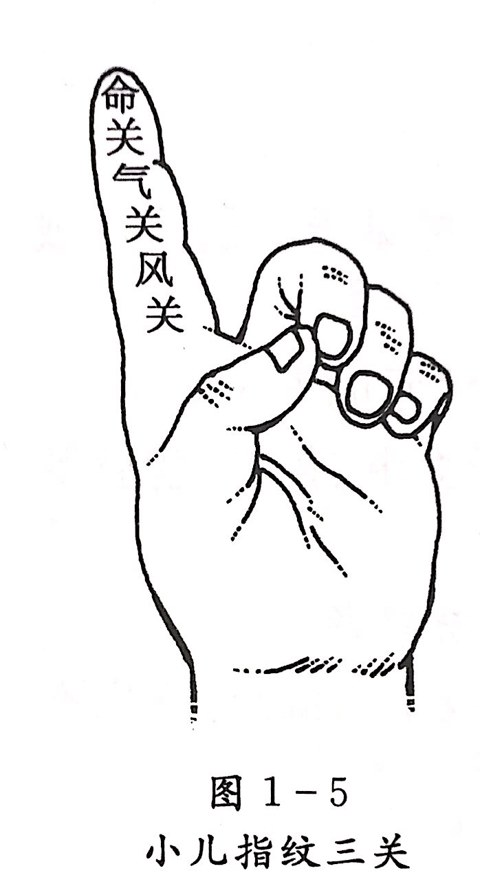
    - 第五节 舌诊
        - **舌诊概说**
            - **舌的形态、结构、功能**
                - 伸舌时一般只能看到舌人字界沟之前的舌体部分，故中医诊舌的部位主要是舌体，又称舌质
                -  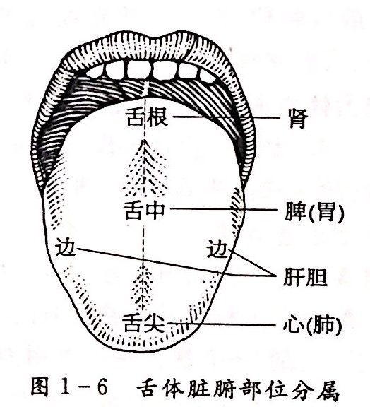
            - **舌诊原理**
                - 舌与脏腑、经络的关系
                    - 舌体运动是否灵活自如，语言是否清晰，反映了“心藏神”的功能，舌的味觉与心神的功能亦有关
                    - 舌象与脾胃运化功能直接相关
                    - 舌与经络脏腑关系密切
                    - 脏腑的病变反映于舌面，具有一定的分布规律
                - 舌与气血津液的关系
                    - 舌体的颜色、形态，与气血的盛衰和运行状态有关舌苔和舌体的润燥与津液的盈亏有关
            - **舌诊方法和注意事项**
                - **体位和伸舌姿势**
                    - 坐位或仰卧位
                    - 自然光线
                - **方法**
                    - 先看舌尖，再看舌中、舌边，最后看舌根部
                    - 先看舌体，再看舌苔，然后根据舌体、舌苔的基本特征，分项察看
                    - 尽量减少患者伸舌的时间。若一次望舌判断不准，可让患者休3～5分钟后，再重复望舌
                    - 鉴别舌苔有根与无根、是否属于染苔
                        - 刮舌
                            - 用消毒压舌板的边缘，以适中的力量，在舌面上由舌根向舌尖刮3～5次
                        - 揩舌
                            - 用消毒纱布包裹示指上，蘸少许清水在舌面上揩抹数次
                - **注意事项**
                    - 光线
                        - 自然光线为佳。如在夜间或暗处，采用日光灯光源较好，避免面对有色的光线
                        - 光照的强弱与色调，常常会影响正确的判断
                            - 如光线过暗，可使舌色暗滞
                            - 用白炽灯泡或手电筒照明，容易把白苔误作黄苔
                            - 窗帘、墙壁等周围有色物体的反射光，也会使舌色发生相应的改变
                    - 伸舌姿态
                        - 伸舌姿态要自然舒展，舌体放松，向两侧展开，舌尖下垂
                        - 不能过度用力，不宜伸舌过长
                            - 舌体紧张、卷曲、过分用力、时间过久都会影响舌体血液循环而出现假象
                    - 饮食及药物可使舌象发生变化
                        - 进食后，往往舌苔由厚变薄
                        - 多喝水可使舌苔由燥变润
                        - 进食辛热食物后，舌色偏红
                        - 多吃甜腻食品，舌苔变厚
                        - 服用大量镇静剂后，舌苔厚腻
                        - 长期服用某些抗生素，可产生黑腻苔或霉腐苔
                        - 染苔
                            - 饮服某些食物或药物，会使舌苔染色，称为染苔。
                                - 饮牛乳、豆浆等可使舌苔变白、变厚
                                - 吃蛋黄、橘子、核黄素等可将舌苔染黄
                                - 吃橄榄、酸梅，长期吸烟等可使舌苔染成灰色、黑色
                                - 舌苔可在短时间内自然退去，或经揩舌除去，一般多与病情不相符。如发现疑问时，可询问患者的饮食、服药情况，或用揩舌的方法予以鉴别。
            - **舌诊内容和正常舌象**
                - **内容**
                    - 舌质和舌苔的综合变化，统称舌象
                - **正常舌象**
                    - 舌体柔软灵活，舌色淡红明润，舌苔薄白均匀，苔质干湿适中
                    - 淡红舌，薄白苔
                    - 舌象正常说明人体气血津液充盈，脏腑功能正常
                - **生理变异**
                    - 年龄性别因素
                        - 老年人精气渐衰，气血偏虚，脏腑功能减退，气血运行迟缓，舌色多暗红
                        - 儿童阴阳稚弱，脾胃功能尚薄，生长发育很快，处于代谢旺盛而营养相对不足的状态，舌多淡嫩，舌苔偏少易剥落
                        - 女性在经期，舌蕈状乳头充血而舌质偏红，或舌尖边部点刺增大，月经过后恢复正常
                    - 体质禀赋因素
                        - 形体肥胖之人，舌多见胖大且质淡
                        - 形体消瘦之人，舌体略瘦而舌色偏红
                        - 裂纹舌、齿痕舌、地图舌等
                        - 一般情况下无临床意义
                    - 气候环境因素
                        - 夏季暑湿盛，苔厚色淡黄
                        - 秋季燥气当令，苔多偏薄偏干
        - **望舌质**
            - **舌神**
                - 【舌象特征】
                    - 舌色红润，鲜明光泽，舌体活动自如
                        - 荣舌
                    - 舌色晦暗干枯，活动呆滞
                        -  枯舌
                - 【临床意义】
                    - 舌质的荣枯，是衡量机体正气盛衰的标志之一，也是估计疾病的轻重和预后的依据
                        - 荣舌为舌有神气，疾病状态见荣舌往往病情轻浅，预后良好
                        - 枯舌为舌无神气，说明气血阴阳皆衰，生机已微，预后较差
            - **舌色**
                - **淡红舌**
                    - 【舌象特征】
                        - 舌色淡红润泽
                    - 【临床意义】
                        - 是气血调和，无病之象，常见于健康人
                        - 如外感表证初起，病情轻浅，未伤气血，也可见到淡红舌内伤杂病中
                        - 若舌色淡红明润，提示阴阳平和，气血充盈，病情尚轻，或为疾病好转之征兆
                - **淡白舌**
                    - 【舌象特征】
                        - 舌色较正常浅淡
                        - 舌色白，几无血色
                            - 枯白舌
                    - 【临床意义】
                        - **主气血两虚、阳虚**
                            - 舌色淡白而舌体瘦小，多属气血两虚
                            - 舌淡白胖嫩，或有齿痕，多属阳气虚衰
                            - 多由气血亏虚，血不上荣或阳气衰微，无力载血上荣所致
                        - **枯白舌主脱血夺气**
                            - 脱血夺气，病情危重，舌无血气充养，则显枯白无华
                - **红绛舌**
                    - 【舌象特征】
                        - 舌色较淡红舌为深，至呈鲜红色者为红舌深红色
                            - 绛舌
                        - 一般绛舌多由红舌进一步发展而成
                    - 【临床意义】
                        - **主热证**
                            - 舌色稍红，或仅舌边尖略红
                                - 外感风热表证
                            - 初起舌尖红
                                - 心火上炎
                            - 舌两边红
                                - 肝经有热
                            - 舌色鲜红，舌苔黄燥
                                - 气分实
                            - 热舌色深绛，苔薄而干
                                - 热入营血
                            - 舌嫩红或绛，少苔或无苔
                                - 阴虚内热
                            - **红绛舌颜色越深，表明邪热越重**
                                - 舌色由淡红转为红绛，提示热势渐增，病情加重
                                - 反之，舌色由绛红转为淡红，则是热退病轻之象
                        - 多由阳热亢盛，气血上壅于舌
                        - 或热入营血，耗伤营阴，血液壅滞，充斥于舌
                        - 亦可因阴虚内热，虚火上炎于舌所致
                - **青紫舌**
                    - 【舌象特征】
                        - 全舌呈均匀青色或紫色，或红绛之中泛现青紫色
                            - 全青紫舌
                        - 如仅局部见青紫色斑块、斑点或条带
                            - 局部青紫舌
                    - 【临床意义】
                        - **主气血不畅**
                            - 青紫舌多由淡白舌或红绛舌发展而成，故其主病即是在淡白舌或红绛舌的基础上出现气血运行不畅的病理改变。
                                - 舌由红绛进而紫红或绛紫，干枯少津，多由热毒炽盛，深入营血，营阴受灼，血壅不畅所致
                                - 舌由淡白进而淡紫或青紫，湿润，多因阴寒内盛，血脉瘀滞所致
                        - **暴力外伤致气滞血察也可见舌青紫或暗紫**
                            - 全舌青紫
                                - 为血瘀较重
                            - 舌局部见紫斑、紫点
                                - 局部血瘀或血瘀较轻
                        - 紫斑、紫点见于舌尖
                            - 多主心血瘀阻
                        - 见于舌边
                            - 多为肝郁血瘀
            - **舌形**
                - **老、嫩舌**
                    - 【舌象特征】
                        - **老舌**
                            - 舌体坚敛苍老，纹理粗糙或皱缩，舌色较暗
                        - **嫩舌**
                            - 舌体浮胖娇嫩，纹理细腻，舌色浅淡
                        - **胖嫩舌**
                            - 由于嫩舌多兼浮胖，故常并称胖嫩舌
                    - 【临床意义】
                        - **老舌**
                            - **主实证**
                            - 多因邪气亢盛而正气未衰，邪正剧争，气血壅滞所致
                        - **嫩舌**
                            - **主虚证**
                            - 多因气血亏虚，舌体不充所致
                            - 舌淡白而嫩
                                - 多属气血亏虚
                            - 舌红而嫩
                                - 多属阴液不足，舌体失养
                        - **胖嫩舌**
                            - 多由脾肾阳虚，水湿不化，上泛舌络所致
                            - 舌淡白而胖嫩
                                - 多属脾肾阳虚
                - **胖、瘦舌**
                    - 【舌象特征】
                        - **胖大舌**
                            - 舌体比正常人大而厚，伸舌满口，舌肌弛缓
                        - **肿胀舌**
                            - 舌体肿大，盈口满嘴，葚者不能闭口，舌肌胀急
                        - **瘦薄舌**
                            - 舌体较正常，舌瘦小而薄
                    - 【临床意义】
                        - **胖大舌**
                            - **主水湿、痰饮**
                            - 多因阳虚水湿停聚，或痰饮上泛，阻滞舌络所致
                            - 舌淡而胖大
                                - 脾肾阳虚，水湿内停
                            - 舌红而胖大
                                - 脾胃湿热
                                - 痰热内蕴
                        - **肿胀舌**
                            - **主热盛、酒毒**
                            - 热毒内炽，气血上壅，或素喜饮酒，酒毒上攻所致
                            - 舌深红而肿胀
                                - 心脾热盛
                            - 舌青紫而肿胀
                                - 酒毒攻心之象
                        - **瘦薄舌**
                            - **主阴血亏虚**
                            - 阴血耗损，舌失滋养所致
                            - 舌色浅淡而瘦薄
                                - 属心脾气血两虚
                            - 舌色红绛而瘦薄
                                - 热盛伤阴
                                - 阴虚火旺
                - **裂纹舌**
                    - 【舌象特征】
                        - 舌面上有明显裂沟，且裂沟中并无舌苔覆盖
                    - 【临床意义】
                        - **主阴血亏虚**
                        - 多由精血不足，或阴液耗损，舌体失养所致
                        - 舌色浅淡而裂
                            - 血虚
                        - 舌色红绛而裂
                            - 邪热伤津
                            - 阴虚火旺失养
                        - 若生来舌面上就有较浅的裂沟、裂纹，裂纹中有苔覆盖，且无不适感觉者，为先天性舌裂，应与病理性裂纹舌加以鉴别
                - **芒刺舌**
                    - 【舌象特征】
                        - 舌面上有乳头高突如刺，摸之棘手
                    - 【临床意义】
                        - **主热盛**
                        - 多因脏腑热极或血分热盛，充于舌络所致
                        - 舌尖有芒刺
                            - 心火亢盛
                        - 舌边有芒刺
                            - 肝胆热盛
                        - 舌中有芒刺
                            - 胃肠热极
                            - 一般芒刺越多，邪热愈荏
                            - 舌红而生芒刺
                                - 气分热盛
                            - 舌红绛而生芒刺
                                - 血热内盛
                                - 阴虚火旺
                            - 舌绛紫而生芒刺
                                - 热入营血，气血壅滞
                - **齿痕舌**
                    - 【舌象特征】
                        - 舌体边缘有牙齿压迫的痕迹
                        - 胖大舌常伴有舌边齿痕
                    - 【临床意义】
                        - **主脾虚水湿内停**
                        - 多因脾虚水湿内停，湿阻于舌，舌体胖大受牙齿挤压而成
                        - 舌体胖大，舌色淡白伴有齿痕
                            - 阳气虚弱，水湿内停
                        - 舌体不胖而有齿痕，舌质嫩
                            - 脾虚或气血两虚
                - 此外，舌的形质还有 **重舌、舌痈、舌疗、舌疖、舌菌** 等异常，多属于舌的局部组织病变
            - **舌态**
                - **痿软舌**
                    - 【舌象特征】
                        - 舌体软弱，伸缩无力
                    - 【临床意义】
                        - **主阴虚、气血两虚**
                        - 多因气血虚极，阴液亏耗，舌肌筋脉失养而废弛
                        - 舌色红绛而暴痿
                            - 邪热亢盛，阴液耗损
                        - 舌色红绛而渐痿
                            - 肝肾阴亏，筋脉失养
                        - 舌色淡白而渐痿
                            - 久病亏损，气血虚极
                - **强硬舌**
                    - 【舌象特征】
                        - 舌体失却柔和，屈伸不利，或不能转动者
                    - 【临床意义】
                        - **主热入心包、高热伤津、风痰阻络**
                        - 多因外感邪热亢盛，热入心包，扰及神明，舌无主宰；或高热伤津，筋脉失养；亦可因肝风挟痰，风痰上阻舌络而致
                        - 舌红绛强硬，兼神志不清
                            - 热入心包
                        - 舌色红绛，干而强硬
                            - 高热伤津
                        - 舌强语言謇涩，伴肢体麻木、眩晕
                            - 风痰阻络，中风之征兆
                - **震颤舌**
                    - 【舌象特征】
                        - 舌体不自主的颤动，动摇不宁
                            - 轻者仅伸舌时颤动
                            - 重者不伸舌亦抖颤难宁
                    - 【临床意义】
                        - **主肝风内动**
                        - 多因阴血亏虚，肝筋失养，舌脉挛急或因邪热亢盛，燔灼肝经，筋脉拘急而致舌体颤动
                        - 新病舌绛而颤动
                            - 热极生风
                        - 舌红少津而颤动
                            - 肝阳化风、阴虚动风
                        - 久病舌淡白而颤动
                            - 血虚动风
                        - 酒毒内蕴亦可见舌体颤动
                - **歪斜舌**
                    - 【舌象特征】
                        - 伸舌时舌体偏向一侧，或左或右
                        - 一般舌歪在前半部明显
                    - 【临床意义】
                        - **多为中风、中风先兆**
                        - 多因肝风内动，挟痰或挟，痰阻滞于一侧经络，舌肌弛缓，伸缩乏力，故伸舌时向一侧偏斜
                - **吐弄舌**
                    - 【舌象特征】
                        - 吐舌
                            - 舌伸口外，不即回缩者
                        - 弄舌
                            - 舌反复吐而即回，或舌舐口唇四周，掉动不宁者
                    - 【临床意义】
                        - **两者多见于心脾有热**
                        - 多因热伤津液，肝筋失养，引动内风，以致筋脉动摇，不能自已
                        - 吐舌不宁
                            - 多属疫毒攻心，或正气已绝
                        - 弄舌不已
                            - 常见于小儿智能发育不良
                            - 或为动风先兆
                - **短缩舌**
                    - 【舌象特征】
                        - 舌体卷短，紧缩不能伸长，严重者舌难抵齿
                        - 舌短缩常与舌痿软并见
                    - 【临床意义】
                        - **主寒凝、痰阻、血虚、津伤**
                        - 多因寒邪侵袭，舌脉挛缩或因痰湿内阻，阻滞舌根；或因气血俱虚，舌失充养，筋脉痿弱短缩；亦可因热盛津伤，筋脉挛急所致
                        - 舌淡白痿软而短缩
                            - 气血虚衰
                        - 舌青紫湿润而短缩
                            - 寒凝筋脉
                        - 舌胖大而短缩
                            - 痰湿内阻
                        - 舌干红而短缩
                            - 热盛津伤
                        - 短缩舌多为病情危重的征象
            - **舌下络脉**
                - **正常舌下络脉**
                    - **单支**
                    - 其长度、形态、色泽、粗细和舌下小血络等变化反映气血运行情况
                - **观察**
                    - 观察时让患者张口，将舌体向上腭方向翘起，舌尖轻抵上腭，勿用力太过，使舌体自然放松，舌下络脉充分显露
                    - 首先观察舌系带两侧大络脉的长短、粗细、颜色，有无怒张、弯曲等异常改变，然后观察周围细小络脉的颜色、形态有无异常
                        - 舌下络脉短而细，周围小络脉不明显，舌色偏淡
                            - 多属气血不足，脉络不充
                        - 舌下络脉柤胀，或呈青紫、绛、绛紫、紫黑色，或曲张如大小不等紫色珠子状，或舌下细小络脉呈暗红色或紫色网络
                            - 为血瘀的征象
                            - 可因气滞、寒凝、热郁、痰湿、气虚、阳虚等导致，但需结合其他症状综合分析
        - **望舌苔**
            - **正常舌苔**
                - 脾胃之生气上熏胃津而成
            - **病理舌苔**
                - 胃气挟邪气上泛而成
            - **苔质**
                - **薄、厚苔**
                    - 【舌象特征】
                        - **薄苔（见底苔）**
                            - 透过舌苔能隐隐见到舌体
                        - **厚苔（不见底苔）**
                            - 不能透过舌苔见到舌体
                    - 【临床意义】
                        - **主邪气的盛衰和浅深**
                        - **薄苔**
                            - 正常舌苔的表现之一，或为疾病在表
                            - 由胃气上熏，胃津上潮，聚于舌面而成
                            - 舌苔薄而均匀，或舌之中根部微厚
                                - 健康之人
                            - 若疾病初起在表，病情轻浅，未伤胃气，舌苔无明显变化，亦可见到薄苔
                        - **厚苔**
                            - 疾病在里，病情较重
                            - 胃气上升，兼夹食浊、痰湿等病邪，积滞于舌所致
                            - 舌苔厚，或舌中根部尤著
                                - 外感邪气已入里
                                - 胃肠内有宿食、痰浊停滞
                        - **舌苔的厚薄转化**
                            - 舌苔由薄增厚
                                - **病进**
                            - 舌苔由厚变薄
                                - **病退**
                            - 舌苔的厚薄转化，一般是渐变的过程
                                - 如薄苔突然增厚
                                    - 邪气极盛，迅速入里
                                - 若舌苔骤然消退，舌上无新生舌苔
                                    - 正不胜邪
                                    - 胃气暴绝
                - **润、滑、燥、糙苔**
                    - 【舌象特征】
                        - **润苔**
                            - 舌苔润泽有津，干湿适度
                        - **滑苔**
                            - 舌苔湿润而滑，伸舌欲滴
                        - **燥苔**
                            - 舌苔干燥少津
                        - **糙苔**
                            - 舌苔干而粗糙、扪之涩手
                    - 【临床意义】
                        - 反映体内津液的盈亏和输布情况
                        - **润苔**
                            - 为胃津肾液上潮舌画所致
                            - 舌苔润泽，多属正常
                            - 病中见润苔，提示体内津液未伤，且运行正常
                        - **滑苔**
                            - **主痰饮、主湿**
                            - 多因寒湿内侵，或阳虚，不能运化水湿，湿聚舌画所致
                            - 舌淡而苔滑多为水湿内停
                        - **燥苔、糙苔**
                            - **皆主津液已伤，或津液输布障碍**
                            - 多因热盛伤津，阴液亏耗；或痰饮、癖血内阻，郁遏阳气，气不布津所致
                            - 舌红苔燥
                                - 热荏伤津
                            - 舌淡而苔燥
                                - 痰饮内阻，阳气被逼，不能蒸腾津液
                            - 舌青紫而苔燥
                                - 瘀血内阻
                        - 如舌苔由润变燥，表明热重津伤，或津失输布；反之，舌苔由燥转润，主热退津复，或饮邪始化
                - **腐、腻苔**
                    - 【舌象特征】
                        - **腐苔**
                            - 苔顶疏松，颗粒较大，舌边、舌中皆厚，刮之易去，如豆腐渣堆积舌面
                        - **腻苔**
                            - 苔质致密，颗粒细腻，舌边苔薄，舌中苔厚，刮之难去，如油腻覆盖舌面
                    - 【临床意义】
                        - **腐苔**
                            - 主食积胃肠，痰浊内蕴
                            - 多因体内阳热有余，蒸腾胃中腐浊之气上泛，积聚于舌所致
                            - 病中腐苔渐退，续生薄白新苔，为正气胜邪，病邪消散
                        - **腻苔**
                            - **主湿浊、痰饮、湿温等**
                            - 常因体内湿法内盛，阳气被抑，湿浊停聚舌画所致
                            - **舌苔薄腻**
                                - 腻而不板滞
                                    - 食积，或脾虚湿困
                                - 白腻而滑
                                    - 主痰浊、寒湿内阻
                            - **黄厚黏腻**
                                - 多为痰热、湿热、暑湿之邪内蕴
                - **剥落苔**
                    - 【舌象特征】
                        - 剥落苔
                            - 舌本有苔，忽然全部或部分剥脱
                        - 前剥苔
                            - 舌苔前半部剥脱
                        - 中剥苔
                            - 舌苔中部剥脱
                        - 根剥苔
                            - 舌苔根部剥脱
                        - 花剥苔
                            - 舌苔多处剥脱，舌面仅残存斑驳舌苔
                        - 地图舌
                            - 舌苔剥脱形状不规则，形似地图，边缘凸起，界限清楚，部位时有转移
                        - 镜面舌
                            - 舌苔全部剥脱，舌面光洁如镜
                    - 【临床意义】
                        - **主胃气大伤、胃阴枯竭，或气血两虚**
                        - 因胃气匮乏，不得上熏于舌；或胃阴枯涸，不能上潮至舌所致
                        - 舌红苔剥
                            - 主阴虚
                        - 舌淡苔剥
                            - 为气血两虚
                        - 镜面舌色红绛
                            - 胃阴枯竭
                            - 属阴虚重证，病重难治
                        - 舌色枯白如镜
                            - 营血大虚
                            - 或阳气虚衰，病重难治
                        - 剥苔的范围大小，多与气阴或气血不足程度有关
                        - 剥脱部位，多与舌面脏腑分布相应
                            - 舌苔前剥，多为肺阴不足
                            - 舌苔中剥，多为胃阴不足
                            - 舌苔根剥，多为肾阴枯竭
                        - 望舌苔的有无、消长及剥脱变化，不仅能测知胃气、胃阴的存亡，亦可反映邪正的盛衰和疾病的预后
                            - 舌苔从全到剥，是胃之气阴不足，正气渐衰的表现
                            - 舌苔剥落之后，复生薄白之苔，乃邪去正安，胃气渐复之佳兆
                            - 无论舌苔的增长或消退，都以逐渐转变为佳；若舌苔骤长鼻退，多为病情暴变征象。
                - **有根、无根苔**
                    - 【舌象特征】
                        - **有根苔（真苔）**
                            - 无论苔之厚薄，皆紧贴舌面，刮之难去
                        - **无根苔（假苔）**
                            - 舌苔不与舌质相连，似浮涂于舌，刮之易去，刮后舌质光洁无垢
                    - 【临床意义】
                        - **主胃气的有无**
                            - 有根苔：有胃气
                            - 无根苔：胃气已衰
                        - 有根苔，是由脾胃生发之气熏蒸，上聚于舌所成，故其苔有根蒂，与舌体不可分离
                        - 无根苔,往往因久病之后，胃气匮乏，不能续生新苔，而已生之旧苔渐渐脱离舌面而无根蒂
            - **苔色**
                - **白苔**
                    - 【舌象特征】
                        - **薄白苔**
                            - 舌上薄薄分布一层白色舌苔，透过白苔仍可看到舌质
                        - **厚白苔**
                            - 苔呈乳白色或粉白色，舌边尖稍薄，中根部较厚，舌质被舌苔遮盖
                    - 【临床意义】
                        - **一般为正常之苔，亦可见于寒证和表证**
                        - 由于胃气上熏，凝聚于舌而成，犹如土地之微草，而生成薄薄一层白苔；或阳虚内寒，遇阻阳气，寒凝于舌而见白苔
                        - 苔薄白而润，布于舌中、舌根部
                            - 正常舌苔
                        - 苔薄白，兼有恶寒发热、脉浮等症
                            - 表证初起
                        - 苔薄白，舌质浅淡
                            - 气血亏虚证
                        - 苔薄白而干，舌质淡红
                            - 表邪未解，肺津已伤，多由外感风热所致
                        - 苔薄白，舌尖红
                            - 燥热伤津
                            - 或心肺有热
                        - 苔厚白滑或腻
                            - 主痰湿、食浊内阻
                        - 苔厚白而干
                            - 痰浊中阻
                            - 或热伤津液
                        - 苔厚白如积粉，扪之不燥
                            - 常见于瘟疫或内痈
                            - 秽浊之邪上熏而成
            - **黄苔**
                - 【舌象特征】
                    - **淡黄苔（微黄苔）**
                    - **深黄苔（正黄苔）**
                        - **老黄苔**
                - 【临床意义】
                    - **主热证、里证**
                    - 多因病邪入里，邪已化热，脏腑内热，胃气夹邪热上泛，熏灼于舌所致
                    - 苔色越黄，热邪愈重
                        - 淡黄为热轻
                        - 深黄为热重
                        - 焦黄为热结
                        - 舌尖苔黄，热在上焦
                        - 舌中苔黄，热在中焦
                        - 舌根苔黄，热在下焦
                        - 舌边苔黄，肝胆有热
                    - 舌苔由白转黄，或黄白相兼
                        - 外感表证化热入里，但尚未完全入里，表里相兼阶段
                    - 苔薄黄而润
                        - 邪初入里，热未伤津
                    - 苔薄黄而干
                        - 邪热不甚，但津液已伤
                    - 苔黄而腻
                        - 湿热或痰热内蕴，或为食积化腐
                    - 苔黄厚干燥
                        - 高热伤津
                    - 苔焦黄干裂
                        - 邪热炽盛，津液枯涸之征
            - **灰黑苔**
                - 【舌象特征】
                    - **黑苔**
                        - 苔色浅黑
                    - **灰苔**
                        - 苔色深灰
                    - **灰黑苔**
                        - 灰苔与黑苔仅有轻重程度的差别，常并称为灰黑苔
                        - 灰黑苔多由白苔或黄苔转化而成，多在疾病持续一定时日、发展到相当程度后才出现
                - 【临床意义】
                    - **主里寒、里热之重证**
                    - 多因肾阳虚衰，里寒之极，寒水上泛或里热极盛，炽灼熏蒸所致
                    - 一般苔色越黑，病情越重
                    - 苔质的润燥是辨别灰黑苔寒热属性的重要指征
                        - 苔灰黑湿润多津
                            - 寒湿病证
                            - 多由白苔转化而成
                        - 苔灰黑干燥无津液
                            - 火热病证
                            - 多由黄苔转变而成
                        - 舌面湿润，边尖苔白腻而中根部苔灰黑
                            - 主阳虚寒湿内盛，或痰饮内停
                        - 舌苔黑而干燥见于舌尖
                            - 心火极盛
                        - 见于舌中
                            - 肠热腑实，或胃将败坏之象
                        - 见于舌根部
                            - 主下焦热盛
        - **舌象综合分析**
            - **舌质与舌苔合参**
                - 脏腑虚实、气血盛衰的变化，主要表现在舌质
                - 病邪的寒热深浅、邪正的消长，多反映于舌苔
                - 舌质与舌苔的变化统一，提示病机相同
                    - 主病为两者意义的综合
                - 舌质、舌苔变化不一致
                    - 对舌质、舌苔形成的原因及相互关系进行全面审定
                - 在疾病发展过程中，舌象亦随之相应变化，所以也要注意舌象的动态分析
            - **舌诊的临床意义**
                - 1.判断正气盛衰
                    - 气血充盛则舌体红润，气血不足则舌色淡白
                    - 津液充足则舌质、舌苔滋润，津液不足则舌干苔燥
                    - 胃气旺盛则舌苔有根，胃气衰败则舌苔无根或光剥无苔
                    - 气血运行正常则色红活鲜明，气滞血则舌色青紫或舌下络脉怒张
                    - 脏腑功能失常亦常见于舌
                        - 脾失健运，湿邪困阻每见舌苔厚腻
                        - 肝风内动多有舌体震颤或歪斜等
                        - ……
                - 2.分辨病位浅深
                    - 病邪轻、浅多见舌苔变化，而病情深、重可见舌苔舌体同时变化
                    - 外感温热病
                        - 邪在卫分，则舌苔薄白
                        - 邪入气分，舌苔白厚而干或见黄苔，舌色红
                        - 邪入营分则见舌绛
                        - 邪入血分，舌色深红、紫绛或紫黯，舌枯少苔或无苔
                - 3.区别病邪性质
                    - 不同的病邪致病，舌象特征亦各异
                        - 外感风寒，苔多薄白
                        - 寒湿为病，舌淡而苔白滑
                        - 痰饮、湿浊、食滞或外感秽浊之气，均可见舌苔厚腻
                        - 燥热为病，则舌红苔燥
                        - 瘀血内阻，舌紫暗或有斑点
                - 4.推断病势进退
                    - 通过对舌象的动态观察，可测知病变的发展趋势
                - 5.估计病情预后
                    - 舌象可提示病情的轻重和预后的吉凶
                        - 舌荣有神，舌面有苔，舌态无异者
                            - 正气尚充，胃气未败
                            - 病情较轻，预后多吉
                        - 舌质枯晦，舌苔骤剥，舌态异常
                            - 正气亏损，胃气衰败
                            - 病情较重，预后多凶
- **第二章 闻诊**
    - 第一节 听声音
        - **正常声音**
            - 指人在正常生理状态下发出的声音，又称为常声
            - 发声自然，声调和畅，刚柔相济，应答自如，言与意符等特点
            - 气血充盈，发音器官和脏腑功能正常
            - 一般男性多声低而浊，女性多声高而清，儿童则声音尖利清脆，老年人声音多浑厚而低沉
            - 喜时发声多欢悦，怒时发声忿厉而急，悲哀时发声悲惨而断续，快乐时发声多舒畅而和缓，敬则发声多正直而严肃，爱则发声多温柔等
        - **病变声音**
            - 病变声音，是指疾病反映于语言、声音上的变化，除正常生理变化和个体差异之外的声音，均属病变声音。
            - **发声**
                - 语声高亢、宏亮有力、声音连续
                    - 阳证、实证、热证
                    - 是阳盛气实，功能亢奋的表现
                - 语声低微细弱，声音断续而懒言
                    - 阴证、虚证、寒证
                    - 禀赋不足，气血虚损
                - **声重**
                    - 语声重浊（声重）
                        - 发出的声音沉闷而不清晰
                    - 外感风寒，或湿浊阻滞，以致肺气不宣，鼻窍不利
                - **音哑与失音**
                    - 音哑——语声嘶哑，病较轻
                    - 失音——语而无声，病较重
                    - **新病多实（“金实不鸣”）**
                        - 外感风寒、风热袭肺或痰湿壅肺，肺气不宣，清肃失职
                    - **久病多虚（“金破不鸣”）**
                        - 精气内伤，肺肾阴虚，虚火灼肺
                    - **用嗓过度**
                        - 气阴耗伤
                    - **妊娠失音(子喑)**
                        - 胞胎阻脉，肾精不能荣
                - **鼻鼾(伴嗜睡、昏迷)**
                    - 气道不利
                    - 为中风入脏之危候
                - **呻吟(身有痛楚或胀满)**
                    - 高亢有力
                        - 实证、剧痛
                    - 久病、低微无力
                        - 虚证
                    - 结合“护处必痛”
            - **语言：心神的病变**
                - 虚证、寒证——沉默寡言，语声低微
                - 实证、热证——烦躁多言，高亢有力
                - **谵语**
                    - 神识不清，胡言乱语，声高有力
                    - 热扰心神之实证
                - **郑声**
                    - 神识不清，语言重复，时断时续，声音低弱模糊
                    - 心气大伤，精神散乱
                - 实则谵语，虚则郑声
                - **独语**
                    - 神志错乱，自言自语，喃喃不休，见人语止，首尾不续
                    - 气血亏虚，心神失养，气郁痰结，阻蔽心窍
                    - 可见于癫证、郁证
                - **错语**
                    - 语言错乱，说后自知
                    - 心气不足，神失所养或痰浊、瘀血、气郁等阻碍心神
                - **狂言**
                    - 神志错乱，语无伦次，狂躁妄言
                    - 痰火扰心的狂证
                - **语言謇涩**
                    - 神志清楚，思维正常，但语言不流利，或吐字不清
                    - 风痰阻络
                    - 中风先兆或中风后遗症
                    - 口吃
            - **呼吸**
                - 热证、实证——呼吸气粗而快
                - 寒证、虚证——呼吸气微而慢
                - **喘**
                    - 呼吸困难，短促急迫，甚则张口抬肩，鼻翼煽动，不能平卧
                    - **实喘**
                        - 发病急骤，呼吸深长，声高息粗，胸中胀满，以呼出为快
                        - 外邪袭肺或痰饮停肺，肺失肃降
                    - **虚喘**
                        - 病势缓慢，喘声低微，短促难续，得一长息为快，动则喘甚
                        - 肺肾亏虚，气失摄纳
                - **哮**
                    - 呼吸急促似喘，喉间有哮鸣音，反复发作，缠绵难愈
                    - 宿痰内伏，复感外邪，引动伏引
                    - 哮必兼喘，喘不兼哮
                - **短气**
                    - 呼吸气急短促，数而不能接续，似喘而不抬肩，喉中无痰鸣音
                    - 短气有虚实之分
                        - **虚证短气**
                            - 兼见声低息微，头晕目眩，形体消瘦，神疲乏力
                            - 肺气不足，形体虚弱
                        - **实证短气**
                            - 兼见呼吸息粗，或胸胁脘腹胀满
                            - 痰饮、气滞、食积胃肠、瘀血内阻
                - **少气（气微）**
                    - 呼吸微弱而声低，气少不足以息，言语无力
                    - **主诸虚劳损**
                    - 多因久病体弱或肺肾气虚所致
            - **咳嗽：肺**
                - 五脏六腑皆令人咳，非独肺也
                - **病机总属：肺失肃降，肺气上逆**
                - **实证**
                    - 咳声重浊紧闷
                    - 痰湿浊邪停聚于肺，肺失肃降
                - **虚证**
                    - 咳声轻清低微
                    - 久病肺气虚损，失于宣降
                - 咳声重浊，痰白清稀，鼻塞不通
                    - 外感风寒袭肺
                - 咳声（重浊）紧闷
                    - 寒湿痰饮停聚于肺
                - 咳声不扬，痰稠色黄，不易咳出
                    - 热邪犯肺
                - 咳嗽无力，咳声低微
                    - 久病耗伤肺气，肺虚
                - 咳嗽痰多，易于咯出
                    - 痰浊阻肺
                - 咳声清脆，伴痰少难咯
                    - 燥热
                - 干咳无痰，或痰少而粘，不易咯出
                    - 燥邪犯肺或肺阴不足
                - 夜间咳甚
                    - 肾水亏
                - 天亮咳甚
                    - 脾虚
                - **顿咳（百日咳）**
                    - 风痰搏结，郁而化热（小儿）
                - **白喉**
                    - 肺肾阴虚，火毒攻喉
            - **呕吐：胃失和降，胃气上逆**
                - **虚寒证**
                    - 吐势徐缓，声音低弱，吐物清稀
                - **实热证**
                    - 吐势较猛，声音壮厉，吐出粘痰黄水，或苦或酸
                - 呕吐呈喷射状
                    - 热扰神明或脑髓病变
                - 呕吐酸腐食糜
                    - 食滞胃脘
                - 朝食暮吐，暮食朝吐
                    - 脾胃阳虚之“胃反”
                - 口干欲饮，饮后即吐
                    - 痰饮停胃之“水逆”
            - **呃逆（哕）：胃气上逆**
                - **实证**
                    - 呃声频作，高短而有力
                - **虚证**
                    - 呃声低沉，声弱无力
                - 新病呃逆，其声有力
                    - 寒邪或热邪客于胃
                - 久病、重病呃逆不止，声低气怯无力
                    - 胃气衰败之危候
            - **嗳气（噫气）：胃气上逆**
                - 嗳气酸腐，兼脘腹胀满
                    - 宿食停滞
                - 嗳气频作而响亮，嗳气后脘腹胀减，发作因情志变化而增减
                    - 肝气犯胃
                - 嗳气频作，兼见脘痛
                    - 寒邪客胃或胃阳虚
                - 嗳气低沉断续，无酸腐气味，兼见纳呆食少
                    - 脾胃虚弱，久病或老人
            - **太息（叹息）**
                - 情志不遂，肝气郁结
            - **喷嚏**
                - 新病喷嚏，兼恶寒发热，鼻流清涕
                    - 外感风寒
                - 若久病阳虚之人，忽发喷嚏
                    - 阳气回复
            - **呵欠**
                - **数欠**
                    - 阴盛阳衰
            - **肠鸣**
                - 胃脘部鸣响，如囊裹浆，振动有声
                    - 痰饮停聚于胃脘
                - 脘腹鸣声辘辘，得温得食则减，饥寒加重
                    - 肠胃虚寒
                - 肠鸣高亢频急，脘腹痞满，大便泄泻
                    - 风寒湿邪阻滞胃肠
                - 肠鸣稀少
                    - 肠道传导功能障碍
                - 肠鸣消失，脘腹部胀满疼痛拒按
                    - 肠道气滞不通
    - 第二节 嗅气味
        - 实证、热证——气味酸腐臭秽
        - 虚证、寒证——微有腥臭
        - **病体气味**
            - **口气**
                - 口臭
                    - 口腔不洁，龋齿，便秘，消化不良
                - 酸臭气，伴食减，脘腹胀满
                    - 胃肠积滞
                - 口出臭秽气
                    - 胃热
            - **汗气**
                - 汗出腥膻
                    - 风湿热邪久蕴皮肤
                - 臭秽
                    - 瘟疫或暑热火毒炽盛
                - 腋下汗出臊臭
                    - 湿热内蕴，见下狐臭
            - **痰涕之气**
                - 咳吐浊痰脓血，腥臭异常
                    - 热毒炽盛，血腐肉败，多属肺痈
                - 咳痰黄稠味腥
                    - 肺热壅盛
                - 咳吐痰涎清稀或味咸、无特异气味
                    - 寒证
                - 鼻流浊涕腥秽如鱼脑
                    - 鼻渊
                - 鼻流清涕，无气味
                    - 外感风寒
            - **呕吐物之气**
                - 清稀无臭味
                    - 胃寒
                - 酸臭秽浊
                    - 胃热
                - 有脓血而腥臭
                    - 内有溃疡
                - 呕吐未消化食物，味酸馊
                    - 食积
            - **排泄物之气**
                - 大便酸臭难闻
                    - 肠有郁热
                - 溏泻而腥臭
                    - 脾胃虚寒
                - 泄泻臭如败卵，或夹不消化食物，矢气酸臭
                    - 宿食停滞
                - 小便黄赤混浊，有臊臭气味
                    - 膀胱湿热
                - 尿甜并散发烂苹果样气味
                    - 消渴病
                - 妇女月经臭秽
                    - 多见于热证
                - 经血味腥
                    - 多见于寒证
                - 带下臭秽而黄稠
                    - 多属湿热
                - 带下腥臭而清稀
                    - 多属寒湿
                - 崩漏或带下奇臭，兼见颜色异常者
                    - 应进一步检查，以判别是否为癌症所致
        - **病室气味**
            - *由病体本身或排出物所散发*
            - 病室臭气触人
                - 瘟疫病
            - 病室有血腥味
                - 失血
            - 腐臭气
                - 溃腐疮疡
            - 尸臭气
                - 脏腑衰败
            - 尿臊气（氨气味）
                - 水肿病晚期
            - 烂苹果气味（酮体气味）
                - 消渴病危重证
- **第三章 问诊**
    - 第一节 问诊的的意义、方法及注意事项
        - **问诊的意义**
        - **问诊的方法**
            - 抓住重点，全面询问
            - 边问边辨，问辨结合
        - **问诊的注意事项**
            - 诊室安静，避免各种干扰
            - 态度和蔼认真，耐心仔细倾听
            - 语言通俗易懂，反应平和恰当
            - 适当鼓励提醒，避免诱导暗示
            - 急诊危重病人，治疗抢救为先
    - 第二节 问诊的内容
        - **一般情况**
            - 主要包括姓名、性别、年龄、婚况、民族、职业、籍贯、工作单位、现住址等
                - 一是便于联系和随访，二是获取与疾病有关的资料，作为诊治疾病的参考
        - **主诉**
            - 病人就诊时所陈述的最感痛的症状、体征及持续时间
            - 如
                - 腹痛、腹泻1天
                - 咳喘反复发作5年，加重一周
                - 下肢水肿反复发作两年，伴心悸1月
            - 要求简洁、精练，文字一般不超过25字
        - **现病史**
            - 现病史是指从起病到此次就诊时的发生、发展、变化过程及诊治经过
            - 现病史的内容包括以下几个方面
                - **起病情况**
                    - 起病急，病程短者多为外感病，属实证
                    - 患病已久，反复发作，经久不愈者多为内伤病，属虚证或虚实夹杂证
                    - 因情志不畅而致胁肋胀痛者，多属肝气郁结
                    - 因暴饮暴食而致脘腹胀满疼痛、肠鸣腹泻者多为食滞胃肠等
                - **病变过程**
                    - 病变过程是指患者从起病到就诊时的病情发展变化情况
                    - 如发病后症状的性质工程度有何变化，何时加重或减轻，何时出现新的症状，病情变化有无规律等
                    - 一般按发病时间的先后顺序进行询问
                - **诊治经过**
                    - 诊治经过是指患者患病后至此次就诊前所接受过的诊断与治疗情况
                    - 对于初诊患者，应按时间顺序详细询问
                        - 如起病后当时曾在何处做过哪些检査、做过何种诊断，依据是什么，经过哪些治疗，治疗的效果及反应如何等
                - **现在症状**
                    - 是指患者就诊时所感到的一切痛苦和不适
        - **既往史**
            - **过去病史**
            - **平素健康状况**
                - 素体健壮者，现患疾病多属实
                - 素体虚弱者，现患疾病多属虚
                - 素体阴虚者，易感温燥之邪而发为热证
                - 素体阳虚者，易受寒湿之邪而罹患寒证等
            - **既往患病情况**
                - 既往患病情况，是指患者本次所患疾病以外的过去所患过的其他疾病
                - 哮病、痫病等疾病，虽经治疗后症状消失，但由于尚未根除，某些诱因可导致其旧病复发
                - 儿童在麻疹流行季节，出现一些类似麻疹先驱表现，通过询问既往是否患过麻疹，即可作出鉴别诊断
        - **个人生活史**
            - 个人生活史包括患者的生活经历、平素的饮食起居、精神情志及婚育状况等
            - **生活经历**
                - 生活经历包括出生地、居住地及经历地
                - 特别注意某些地方病、传染病的流行区域及患者的居住环境和条件
                - 居住区域水中含氟较高，易患氟骨病
                - 久居丘陵缺碘地区，易患瘿瘤病
                - 长期居住潮湿地带，易患风湿痹病等
            - **饮食起居**
                - 饮食起居包括平时的饮食嗜好与生活起居习惯等
                - 嗜食肥甘者，多病痰湿
                - 偏食辛辣者，易患热证
                - 贪食生冷者，可致寒证
                - 饮食无节，嗜酒过度者，易患胃病、肝病等
                - 好逸恶劳懒动者，气血多滞，易生痰湿
                - 劳累过度，房室不节者，易耗伤精气，常患诸虚劳损
                - 起居无常，劳逸不调，思虑过度者，易患失眠、头昏、健忘诸疾
                - 素体阳气偏盛者多喜凉恶热
                - 素体阴气偏盛者多喜热恶凉
            - **精神情志**
                - 患者平素性格内向，处事谨小慎微，多气恼忧思者，易患抑郁、焦虑等精神疾患
                - 此次患病起于情志刺激者，患者易出现肝气郁结、肝郁化火等证候的表现，并提示医生在运用药物治疗的同时，应辅以心理疏导，以便使患者尽快康复
            - **婚育状况**
                - 对成年男女应询问其是否结婚、结婚年龄、有无生育、配偶健康状况以及有无传染病、遗传病等
                - 对女性患者要记录其经、带、胎、产的情况，如初潮年龄、绝经年龄、月经周期、行经日数，月经和带下的量、色、质情况等
                - 对已婚妇女还应询问妊娠次数、生产胎数，以及有无流产、早产和难产等
        - **家族史**
            - 主要询问与患者有血缘关系的直系亲属(如父母、子女、兄弟姐妹等)及与本人生活有密切关系的亲属(如配偶等)的健康与患病情况
            - 必要时应询问亲属的死亡原因
    - 第三节 问现在症
        - **“十问歌”**
            - 明·张景岳“十问篇”
            - 清·陈修园修改：“十问歌”
                - 一问寒热二问汗
                - 三问头身四问便
                - 五问饮食六胸腹
                - 七聋八渴俱当辨
                    - 喝冷水
                    - 喝热水
                        - 脾胃虚寒
                    - 喝了后是否会吐出
                        - 水饮停积于胃，水饮内停，气化障碍，津液不能上输于胃
                - 九问旧病十问因
                - 再兼服药参机变
                - 妇女尤必问经期，迟速闭崩皆可见
                - 再添片语告儿科，天花麻疹侵占验
        - **问寒热**
            - 问寒热是指询问患者怕冷或发热的感觉
            - **寒：患者自觉怕冷的感觉**
                - **畏寒**
                    - 怕冷，加衣覆被或近火取暖可以缓解
                - **恶寒**
                    - 怕冷，加衣覆被或近火取暖不能缓解
                - **恶风**
                    - 遇风觉冷，避之则缓，常较恶寒为轻
                - **寒战**
                    - 恶寒严重，并伴有全身发抖
            - **热：发热，指患者的休温高于正常，或体温正常，但患者自觉全身或某一局部发热**
                - **五心烦热**
                    - 自觉胸中烦热，伴有手足心发热
                - **行蒸发热**
                    - 自觉有热自骨内向外蒸发
            - 寒热的产生主要取决于病邪的性质和机体阴阳的盛衰两方面
                - 寒为阴邪，其性清冷，感受寒邪，多见恶寒
                - 热为阳邪，其性炎热，感受热邪多见发热
                - 在机体阴阳失调时，阳盛则热，阴盛则寒，阴虚则热，阳虚则寒
            - **问寒热的内容**
                - 有无怕冷或发热的症状
                - 怕冷与发热是否有联系
                - 寒热出现的时间、轻重、特点、持续时间及其有关兼症等
            - **常见的寒热症状**
                - **恶寒发热**
                    - 指患者在恶寒的同时伴有发热（体温升高）
                    - 常见于外感病的初期阶段
                    - 是诊断表证的一个重要依据
                        - 有一分恶寒，便有一分表证
                    - **恶寒重发热轻**
                        - **表寒证**
                        - 常伴有鼻塞清涕，无汗，头身疼痛，脉浮紧等症
                        - 由于寒为阴邪，寒邪袭表，郁遏卫阳，故见恶寒重而发热轻
                    - **发热重恶寒轻**
                        - **表热证**
                        - 常伴有汗出、咽喉肿痛、脉浮数等症
                        - 由于热为阳邪，易致阳盛，故见发热重而恶寒轻
                    - **发热轻而恶风**
                        - **伤风表证**
                            - **“太阳中风证”**
                            - **“表虚证”**
                        - 常伴有汗出，头项强痛，脉浮缓等症
                        - 由于风邪为阳邪，其性开泄，风邪袭表，使腠理疏松，阳气郁遏而不型，故见恶风而发热轻微
                    - 外感表证的寒热轻重，除与病邪性质有关外，还与邪正盛衰密切相关
                        - 邪正俱盛者，恶寒发热皆较重
                        - 邪轻正衰者，恶寒发热均较轻
                        - 邪盛正衰者，多恶寒重而发热轻等
                - **但寒不热**
                    - **里寒证**
                    - **新病恶寒**
                        - **里实寒证**
                        - 患者感寒后恶寒，伴有鼻塞流清涕，头身疼痛，脉浮紧
                            - 外感初期，寒邪外束，肌表失温所致
                        - 患者突感恶寒肢冷，伴脘腹冷痛，喜温拒按，或咳喘痰鸣，脉沉迟有力
                            - **实寒证**
                            - 多因感受寒邪较重，直接侵袭机体，阳气被遏，机体失温所致
                    - **久病畏寒**
                        - 患者经常畏寒肢冷，得温则缓，常伴有脘腹冷痛隐隐，喜温喜按、少气懒言、舌淡嫩、脉沉迟无力
                        - **里虚寒证**
                        - 多因素体虚弱，或久病伤阳，使阳气虚衰，形体失于温煦所致
                - **但热不寒**
                    - 患者只感发热，而不觉怕冷
                    - 里热证
                    - **壮热**
                        - 患者身发高热（体温39℃以上），持续不退，不恶寒，反恶热者，称为壮热
                        - 常兼有面赤、烦渴、大汗出、舌红苔黄、脉洪大等症
                        - 多因表邪入里，邪正相搏，阳热内盛，蒸达于外所致
                        - **里实热证**
                    - **潮热**
                        - 患者定时发热，或定时热甚，如潮汐之有定时者，称为潮热
                        - **阳明潮热**
                            - 热势较高，日晡热甚（日晡，即申时，为下午3～5时）
                            - 伴见腹胀满疼痛拒按、便秘、舌红苔黄厚干燥等症
                            - **里实热证**
                            - 系胃肠燥热内结所致
                        - **湿温潮热**
                            - 身热不扬（肌肤初扪不觉热，扪之稍久，即感灼手者），午后尤甚，并伴有身重，脘痞，苔腻等症
                            - 常见于湿温病，故称湿温潮热
                            - 系湿热蕴结，湿遏热伏，热难透达所致
                        - **阴虚潮热（骨蒸潮热）**
                            - 午后或入夜低热，自觉有热自骨内向外蒸发之感，故称阴虚潮热
                            - 常伴见形体消瘦，颧红，盗汗，舌红少苔等症
                            - 系阴虚不能制阳，虚热内生所致
                    - **微热（低热）**
                        - 患者的热势不高（多在37～38℃之间），或仅自觉发热，体温不高者，称为微热
                        - **内伤**
                        - **气虚发热**
                            - 长期微热，烦劳则甚，常伴有神疲乏力，少气懒言，自汗，脉虚等症
                            - 由于脾虚气陷，清阳不升，郁而发热
                        - **阴虚发热**
                            - 长期微热
                        - **气郁发热**
                            - 情志不舒，时有微热，常伴有急躁易怒，胁肋腹痛，脉弦等症
                            - 情志不畅，肝气郁结化火所致
                        - **瘀血发热**
                            - 长期微热，面色黧黑，口唇紫绀，肌肤干涩，舌色紫暗，脉细涩等症
                            - 瘀血久留，郁久化热所致。
                - **寒热往来（往来寒热）**
                    - 指恶寒和发热交替发作
                    - 是邪正相争于半表半里，互为进退的病理反应
                    - **寒热往来，发无定时**
                        - 指患者寒热往来，交替而作，发作无时间规律者
                        - 常伴有口苦，咽干，目眩，胸胁满闷，神情默默，不欲饮食，脉弦等症
                        - **伤寒病的少阳证**
                        - 多因病邪侵入少阳，正邪相争于半表半里所致
                    - **寒热往来，发有定时**
                        - 指寒战和高热交替发作，一日一作，或两三日一作，并伴有剧烈头痛，口渴多汗等症
                        - **疟疾病**
                        - 因疟邪侵袭，伏藏于膜原并随营卫运行，入内与阴相争则寒战，外出与阳争则发热，故寒战与高热交替出现，休作有时
                - **恶寒发热与寒热往来有何异同，各主何病？**
                    - 恶寒发热是指病人既怕冷，同时又发热的一种病理状态；而寒热往来是指患者恶寒与发热交替发作，恶寒之时不发热，发热之时不恶寒
                    - 恶寒发热主表证，其中恶寒重、发热轻的属表寒证；发热重、恶寒轻的属表热证；发热轻、恶风汗出的属太阳中风表虚证
                    - 寒热往来是半表半里的表现，可见于少阳病和疟疾
        - **问汗**
            - 问汗是指询问患者有无汗出异常的情况
            - 汗是由阳气蒸化津液从汗孔外出于体表而形成
                - 《素问·阴阳别论篇》：“阳加于阴谓之汗”
            - **无汗**
                - 指患者当汗出而不出汗的表现
                - **表证无汗**
                    - **表实寒证**
                    - 寒性收引，使腠理致密，玄府闭塞，因而无汗
                    - 常伴有恶寒重发热轻、头身痛、鼻塞、流清涕、脉浮紧等症
                - **里证无汗**
                    - **新病里证无汗**
                        - 多为阴寒内盛，阻遏阳气，蒸化功能失常所致
                    - **久病里证无汗**
                        - 多属阳气虚衰，蒸化无力，或津血亏虚，生化乏源所致
                - **局部无汗**
                    - 局部无汗多表现为半身无汗，即半侧身体（或左或右，或上或下）无汗出
                    - 常见于中风、痿证、截瘫的患者
                    - 因风痰、瘀血、风湿之邪，阻闭经络，使气血运行不周所致
            - **有汗**
                - 患者不当汗出而汗出，或汗出较多
                - **表证有汗**
                    - **外感风邪袭表证** **风热表证**
                    - 因风热邪气袭表，风性开泄，热性升散，腠理疏松而汗出
                - **里证有汗**
                    - **自汗**
                        - 经常清醒状态下汗出较多，活动尤甚
                        - **气虚、阳虚证**
                        - 因气虚或阳虚，肌表失固，津液外泄所致。动则耗气，故活动后汗出尤甚
                    - **盗汗**
                        - 入睡时汗出，醒则汗止者称为盗汗
                        - **阴虚证**
                        - 阴虚生内热，入睡后卫阳入里，内热加重，肌表失固，热蒸津液而外泄，故睡眠时汗出；醒后卫阳复出于肌表，肌表固密，津液不得外泄，故醒后汗止
                    - **大汗**
                        - 汗出量多
                        - 蒸蒸大汗，并见壮热烦躁
                            - **里实热证**
                            - 为里热亢盛，蒸津外泄所致
                        - 久病或重病，大汗不止，汗出清冷，并见面色苍白，四肢厥冷，脉微欲绝
                            - **亡阳证**
                            - 因阳气暴脱，津随气泄所致
                        - 久病、重病，汗出热而黏，并见身热躁扰，烦渴，尿少，脉细数或疾等
                            - **亡阴证**
                            - 因阴液大伤，虚热蒸腾，迫使津液外泄而成
                    - **战汗**
                        - 先见全身寒冷战抖，而后汗出
                        - 提示邪正剧争，常为病情变化的转折点，多见于外感热病中
                        - 汗出热退，脉静身凉，是邪去正复之佳兆
                        - 汗出而身热不减，烦躁不安，脉来急疾，是邪盛正衰的危候
                - **局部有汗**
                    - **头汗（但头汗出）**
                        - 仅头部或头项部出汗较多
                        - 进食辛辣、热汤，或饮酒时出现头汗较多者，不属病态
                        - 原因
                            - 上焦热盛，邪热迫津外泄
                            - 中焦湿热，湿郁热蒸，逼津上越
                            - 气脱不固，元气将脱，虚阳上越，津随阳泄
                    - **心胸汗**
                        - 心胸部易汗出或出汗较多
                        - 伴见心悸失眠、食少便溏、神疲倦怠等
                            - 心脾两虚
                        - 伴见心悸心烦、失眠多梦、腰膝酸软等
                            - 心肾不交
                    - **手足心汗**
                        - 手足心微汗出，一般属生理现象
                        - 若汗出过多，称为手足心汗
                        - 多见阴经郁热熏蒸；中焦湿热郁蒸或脾虚失运，津液旁达四肢；阳明燥热内结，热蒸汗出
                    - **阴汗**
                        - 男女外阴部及其周围汗出过多
                        - 多由下焦湿热郁蒸所致
            - **表证问汗有何临床意义？**
                - 表证是外邪侵犯肌表的一种证候，邪气有寒邪、热邪、风邪等不同，通过问汗可以有助于辨别表邪的性质，并且可以了解机体营卫是否失常
                - **表证无汗**
                    - **表寒证**
                    - 提示寒邪束表，腠理玄府闭塞
                - **表证有汗**
                    - 发热恶风，脉缓者
                        - **表虚证**
                        - 提示风邪袭表，风性开泄，腠理玄府开张，津液外泄
                    - 兼发热较重，脉浮数者
                        - **表热证**
                        - 提示热邪袭表，热性升散，腠理开放，津液外泄
        - **问疼痛**
            - **因实而疼痛**
                - 多因感受外邪、或气滞血瘀，或痰食虫积等，阻滞脏腑经络气机、使气血运行不畅
                - **“不通则痛”**
                - 痛而拒按
            - **因虚而疼痛**
                - 多因气血不足，或阴精亏损，使脏腑、组织、经络失养
                - **“不荣则痛”**
                - 痛而喜按
            - **问疼痛的性质（特点）**
                - **胀痛**
                    - 指疼痛带有胀满的感觉，多为气滞所致
                        - 胸胁脘腹等处胀痛，时发时止
                            - 肺、肝、胃肠气滞所致
                        - 头目腹痛
                            - 多见于肝阳上亢或肝火上炎的病证
                - **刺痛**
                    - 疼痛尖锐如针刺之感
                    - **瘀血阻滞**
                    - 以头部及胸胁、脘腹等处较为常见
                - **窜痛**
                    - 指疼痛的部位游走不定，或走窜攻痛
                    - **气滞** **风痹**
                        - **窜痛**
                            - 多因肝郁气滞所致
                        - **游走痛**
                            - 多见于风痹
                - **固定痛**
                    - 指疼痛部位固定不移
                    - 胸胁脘腹等处固定作痛
                        - 瘀血内阻
                    - 肢体关节疼痛固定不移
                        - 寒湿、湿热、瘀热阻滞
                - **冷痛**
                    - **寒证疼痛**
                    - 常见于腰脊、脘腹及四肢关节等处
                    - **实寒证**
                        - 因寒邪侵入，阻滞脏腑、组织、经络所致
                    - **虚寒证**
                        - 因阳气不足，脏腑、组织、经络失于温煦所致
                - **灼痛**
                    - 指疼痛伴有灼热感，痛而喜凉，属火热邪气为患
                    - **实热证**
                        - 火邪窜络，阳热熏灼所致
                    - **虚热证**
                        - 阴虚火旺灼伤络脉所致
                - **重痛**
                    - 指疼痛伴有沉重感，多因湿邪困阻气机所致
                    - 常见于头部、四肢及腰部
                        - 肢体关节重痛，同定不移
                            - 多见痹病的湿痹
                        - 头部重痛
                            - 肝阳上亢，气血上壅
                - **闷痛**
                    - 指疼痛带有满闷、憋闷的感觉
                    - 多见于胸部
                    - 痰浊内阻心肺
                - **绞痛**
                    - 指疼痛剧烈如刀绞
                    - 多因瘀血、结石、虫积等有形实邪阻闭气机，或寒邪凝滞闭阻气机所致
                        - **真心痛**
                        - **腰腹痛**
                        - **脘朘痛**
                - **掣痛**
                    - 指疼痛伴有抽掣牵引之感，又称引痛、彻痛、抽痛
                    - 多因筋脉失养或经脉阻滞不通所致
                        - 胸痛彻背，背痛彻胸
                            - 见于瘀阻心脉的真心痛
                        - 小腿掣痛
                            - 可因寒凝经脉或肝血不足所致
                - **酸痛**
                    - 指疼痛伴有酸楚不适之感
                    - 常见于四肢、腰背的关节或肌肉部位
                    - 多因风湿侵袭，气血运行不畅，或肾虚、气血不足，组织失养所致
                - **隐痛**
                    - 指痛势较缓，尚可忍耐，但绵绵不休
                    - 常见于头、脘腹、胁肋、腰背、少腹等部位
                    - 多因精血亏虚，或阳气不足，机体失养所致
                - **空痛**
                    - 指疼痛带有空虚之感
                    - 常见于头部、腰腹部等
                    - 多因脑髓空虚、肾精不足，或气血亏虚，组织器官失养所致
            - **问疼痛的部位**
                - **头痛**
                    - 指整个头部或头的某一部分疼痛
                    - **性质**
                        - 外感风、寒、暑、湿、火邪，或痰瘀内阻，上扰清窍所致头痛者
                            - **实证**
                                - 病情急剧，痛无休止的多属外感头痛，属实证
                                    - 头痛连项，遇风加剧——风寒所致——风寒头痛
                                    - 头痛怕热，面红目赤——风热所致——风热头痛
                                    - 头痛如表，身体困重——风湿之邪所致的——风湿头痛
                        - 气血不足，肾精亏损，髓海失充所致头痛
                            - **虚证**
                                - 发病慢，头痛较缓，时作时止者多为内伤头痛，属虚证
                                    - 过劳则甚——气虚头痛
                                    - 伴眩晕，面色苍白者——血虚头痛
                                    - 伴腰膝酸软者——肾虚头痛
                    - **部位**
                        - 巅顶痛——厥阴经
                        - 后脑痛连项背——太阳经
                        - 两侧头痛——少阳经
                        - 前额连眉棱骨痛——阳明经
                - **胸痛**
                    - 指胸部正中或偏于一侧疼痛
                    - 胸居上焦，内藏心肺，所以胸痛多为心肺病变
                        - 胸前“虚里”部位（心前区心尖搏动之处）作痛，痛引肩背内臂
                            - 病位在心
                        - 胸膺部位作痛，兼有咳喘
                            - 病位在肺
                        - 左胸心前区憋闷刺痛
                            - 瘀阻心脉
                        - 胸痛喘促，痰黄而稠
                            - 热邪壅肺
                        - 胸痛而咳吐脓血腥臭痰
                            - 多属肺痈
                        - 胸痛咯血，或痰中带血，伴潮热，盗汗
                            - 肺痨
                - **胁痛**
                    - 指胁肋部的一侧或两侧疼痛
                    - 胁痛除局部病变外，常多与肝胆病变有关
                        - 胁肋胀痛、情绪抑郁或急躁易怒
                            - 肝郁气滞
                        - 胁肋胀痛，纳呆厌食，身目发黄
                            - 肝胆湿热
                        - 胁肋灼痛，头晕面赤，口苦咽干
                            - 肝胆火盛
                        - 胁肋刺痛，或胁下触及肿块，固定而拒按
                            - 肝血瘀阻
                        - 胁肋饱满胀痛，咳唾痛剧
                            - 饮停胸胁之悬饮病
                        - 举重挣努，或胸肋部活动较猛等突然出现胁肋疼痛
                            - 岔气
                            - 多属局部气机阻滞所致
                        - 胁肋部外伤后疼痛剧烈，妨碍正常呼吸
                            - 应考虑肋骨损伤
                - **脘痛**
                    - 指上腹部剑突下疼痛
                    - 脘是胃腑所在部位，又称胃脘
                    - 胃脘疼痛多与胃病相关
                        - 进食后痛势缓解
                            - 虚证
                        - 胃脘冷痛，得热痛减
                            - 寒证
                        - 胃脘灼痛，喜凉恶热
                            - 热证
                        - 胃脘胀痛，频频矢气，嗳气或矢气后症状减轻
                            - 气滞
                        - 胃脘胀痛，嗳腐吞酸，矢气恶臭
                            - 食滞
                        - 进食后加剧
                            - 实证
                - **腹痛**
                    - 指胃脘以下，耻骨毛际以上的部位发生疼痛
                        - 大腹
                            - 脐以上
                            - 属脾
                        - 小腹
                            - 脐以下至耻骨毛际以上正中
                            - 属膀胱、胞宫、小肠
                        - 少腹
                            - 小腹两侧
                            - 属足厥阴肝经、大肠
                    - 大腹隐痛，喜温喜按
                        - 脾胃虚寒
                    - 小腹胀痛，小便不利
                        - 膀胱气滞
                    - 小腹胀痛或刺痛，随月经周期而发
                        - 胞宫气滞血瘀
                    - 少腹冷痛，牵及外阴
                        - 寒滞肝脉
                - **背痛**
                    - 指后背两侧，或脊骨部位发生疼痛
                        - 脊痛不可俯仰
                            - 督脉损伤
                        - 背痛连项
                            - 风寒之邪客于太阳经脉
                        - 肩背疼痛
                            - 风湿阻滞，经气不利
                - **腰痛**
                    - 指腰脊正中，或要部两侧疼痛
                        - 腰痛绵绵，酸软无力，以两侧为主
                            - 肾虚
                        - 腰脊或腰骶部冷痛重着，每遇寒冷阴雨天加重
                            - 寒湿痹病
                        - 腰脊疼痛连及下肢
                            - 经络痹阻
                        - 腰部刺痛拒按，固定不移
                            - 瘀血阻络
                        - 侧腰部剧痛如刀绞，伴血尿
                            - 结石阻滞下焦
                        - 腰痛伴尿频、尿急、尿痛或尿血
                            - 湿热蕴结下焦
                - **四肢痛**
                    - 指四肢的肌肉、筋脉、关节等部位疼痛
                    - 常见于风寒湿三邪合而侵袭人体所致的痹病
                        - 疼痛游走不定
                            - 感到风邪
                        - 疼痛剧烈，遇寒加剧，得热痛减
                            - 感受寒邪
                        - 重着而痛，固定不移，或伴有肌肤麻木不仁
                            - 感受湿邪
                        - 关节红肿热痛
                            - 感受热邪
                            - 或风寒湿邪郁久化热
                        - 关节疼痛，肿大变形，屈伸受限
                            - 痹病日久，痰阻络，筋脉拘挛
                        - 独见足跟或胫膝酸痛
                            - 肾虚
                            - 多见于老年体衰之人
                - **周身痛**
                    - 指头身、腰背、四肢均觉疼痛
                    - 临床应注意询问其发病的时间，病程的长短
                        - 新病周身痛
                            - **实证**
                            - 感受风寒湿邪，经气不利
                        - 久病卧床不起而周身痛
                            - **虚证**
                            - 气血亏虚，筋脉失养
        - **问头身胸腹**
            - **头晕**
                - 指患者自觉头脑有晕旋之感
                    - 轻者闭目即止
                    - 重者则感觉自身或景物旋转，如坐舟车，站立不稳
                - 头晕昏沉，伴胸闷呕恶、舌苔白腻
                    - 痰湿内阻，清阳不升
                - 头晕而胀，伴有面红目赤，烦躁易怒，舌红苔黄，脉弦数
                    - 肝火上炎
                - 外伤后头晕刺痛，夜间尤甚
                    - 瘀血阻络
                - 头晕胀痛，伴有腰酸耳鸣，头重足轻
                    - 肝阳上亢
                - 头晕目眩，过劳加重，伴有面白倦怠，舌淡，脉细弱
                    - 血亏虚所致
                - 头晕耳鸣，兼腰酸遗精，健忘
                    - 肾精亏虚
            - **耳鸣**
                - 指自觉耳内鸣响，重者影响听觉
                - **实证**
                    - 突发耳鸣，声大如潮声，按之鸣声不减，或加重
                    - 常因肝胆火盛，上扰清窍或痰瘀阻滞清窍所致
                - **虚证**
                    - 若渐觉耳鸣，声小如蝉鸣，按之鸣声减轻或暂停
                    - 常因肝肾阴虚，肝阳上扰，或肾精亏虚，髓海不充，耳失所养，或脾虚气陷所致
            - **耳聋**
                - 指听力减退，甚者听觉丧失
                - **实证**
                    - 新病暴聋
                    - 肝胆火逆，上壅于耳
                    - 外邪上袭，蒙蔽清窍
                    - 外伤
                - **虚证**
                    - 久病渐聋
                        - 多因精气虚衰，不能上充清窍所致
                    - 年老耳渐聋
                        - 年高气虚精衰
            - **目痒**
                - 指眼睑、眦内或目珠有痒感
                    - 轻者揉拭则止
                    - 重者极痒难忍
                - 如两目奇痒，羞明流泪，并有灼热感
                    - 肝经风火上扰
                - 两目微痒而干涩
                    - 血液亏虚，目失濡养
            - **目痛**
                - 单目或双目疼痛
                - 目胀痛，兼面红目赤、急躁易怒
                    - 肝火上炎
                - 目赤肿痛，兼差明多眵
                    - 风热之邪上行之象
                    - **暴发火眼** **天行赤眼**
                - 目微赤微痛，时痛时止，且干涩少眵
                    - 阴虚火旺
            - **目眩（眼花）**
                - 眼前昏暗或发黒，或眼前冒金花，或眼前如有蚊蝇飞舞
                - 目眩兼有头晕头胀，面赤口渴
                    - 风火上扰清窍
                - 兼见头晕胸闷，脘痞恶心，苔腻脉滑
                    - 痰湿上浆清窍
                - 兼有头晕乏力，气短食少，腹胀便溏
                    - 中气下陷，清阳不升
                - 兼有头晕腰酸，耳鸣健忘
                    - 肝肾不足，目窍失养
            - **目昏、雀盲、歧视**
                - **目昏**
                    - 视物昏花不明，模糊不清
                - **雀盲（雀目、鸡盲、夜盲）**
                    - 白昼视力正常，每至黄昏后视物不清，夜间尤荏，如雀之盲
                - **歧视**
                    - 视一物为二物
                - 均为不同程度的视力减退
                - 由肝血不足，肾精亏虚，目失充养所致
                - 常见于年老或体弱之人
            - **胸闷（胸痞）**
                - 胸部有痞塞、满闷之感
                - 与心、肺气机不畅有关
                    - 胸闷不适，兼有心悸气短
                        - 心气不足，心阳不振
                    - 胸部憋闷，心痛如刺，面唇青紫
                        - 心血瘀阻
                    - 胸闷痰多，咳嗽气喘
                        - 痰浊阻肺
            - **心悸**
                - 指患者自觉心跳、心慌，悸动不安，不能自主的一种症状
                - 多是心神或心脏病变的反映
                    - **惊悸**
                        - 受惊而发，或心悸易惊，恐惧不安
                        - 外受异常刺激
                        - 时发时止
                        - 全身情况较好，病情较轻
                    - **怔忡**
                        - 心跳剧烈，悸动不安，上至心胸，下至脐腹
                        - 常由惊悸进一步发展而成
                        - 内虚
                        - 活动加重，劳累易发，持续时间较长
                        - 全身情况较差，病情较重。
            - **胁胀**
                - 一侧或两侧胁部有胀满的感觉
                - 多见于肝胆的病变
                    - 胁肋胀满，精神抑郁或急躁易怒，善太息
                        - 肝气郁结
                    - 胁胀口苦，身目发黄，舌苔黄腻
                        - 肝胆湿热
            - **脘痞（脘闷）**
                - 自觉胃脘部窒塞满闷
                - 是脾胃病变的反映，多因气机阻滞所致
                    - 脘痞食少，腹胀便溏
                        - 脾胃虚弱
                    - 脘痞腹胀，呕恶痰涎
                        - 痰湿中阻
            - **腹胀**
                - 自觉腹部胀满不舒，或伴腹部膨隆
                - 时胀时减而喜按
                    - 脾胃虚弱，失于健运
                - 持续胀满不减而拒按
                    - 食积胃肠，或实热内结，阻塞气机
                - 腹胀如鼓，皮色青黄，腹壁青筋暴露
                    - 酒食不节，或情志所伤，或虫积蓄血，致使肝、脾、肾功能失常，气、血、水互结，聚于腹内
            - **身重**
                - 身体有沉重如负重物的感觉
                - 湿邪内阻
                - 也可见于温热之邪，耗伤气阴
            - **麻木（不仁）**
                - 肌肤感觉减退，基至消失
                - 多见于头面、四肢等
                - 气血亏虚、肝风内动、痰瘀阻络
            - **疲乏**
                - 周身或肢体等部位经常感到倦怠，没有气力，甚至活动减少或功能下降
                - 精血亏虚，肌体失养
                - 气虚阳衰，推动无力
                - 湿困气机、气郁气消
            - **恶心、心烦、健忘、身痒等**
        - **问情志**
            - **情志抑郁**
                - 持续的情绪低落，心境苦闷，寡言少语，愁眉不展，唉声叹气，善悲易哭，兴趣缺乏，甚至意志消沉，悲观绝望，自罪自责，有自杀观念或行为等
                - 肝郁气滞痰凝，阻闭心神
                - 心、脾、肾的气血功能失调
            - **情绪高涨**
                - 情感活动显著增强，表现为与环境不相符的过分的愉快、欢乐的病态喜悦
                - 精力异常充沛，兴奋多语，情绪不稳，语言高昂，眉飞色舞，喜笑颜开，表情丰富、生动，易引起周围人的共鸣，对一切都感到非常乐观，对任何事都感到有兴趣，自负自信，甚至流于夸大等
                - 肝郁化火，痰火互结，内扰心神
                - 心肾阴虚，虚火内动
            - **焦虑**
                - 在缺乏明显客观因素或充分根据的情况下，经常担心可能发生和难以预料的某种危险或不幸事件而感到忧虑不安，紧张恐惧，顾虑重重，以致出现措手顿足，坐卧不宁，唉声叹气，怨天尤人，多方劝解也不能消除
                - 也可突然出现强烈的恐惧感，有如大祸临头，惶惶不安，或自己濒临死亡之感，并伴有心悸胸闷，胸前压迫感，有如将要窒息等
                - 心的气血亏损，心神失养，或痰热内扰，心神不安所致
                - 常见于心胆气虚、心脾两虚、阴虚内热及胆郁痰扰等证
            - **恐惧**
                - 患者对某种客观刺激产生的一种不合理的恐惧反应，表现为紧张、害怕、提心吊胆，并伴有心悸、气促、汗出、颤抖、面色改变等
                - 多见于肝胆气虚、心胆气虚、胆郁痰扰等证
            - **烦躁**
                - 心中烦热难耐，手足躁扰不宁
                - 邪热、痰火、瘀热内扰心神
                - 阴虚火旺，内扰心神
        - **问睡眠**
            - **正常情况**
                - 卫气昼行于阳经，阳气盛则醒；夜行于阴经，阴盛则眠
                - 若机体气血充盈，心肾相交，阴平阳秘，则睡眠正常
                - 若机体气血亏虚，心肾不交，阴阳失调，则睡眠出现异常
            - **失眠（不寐、不得眠）**
                - 经常不易入睡，或睡而易醒不能再睡，或睡而不酣，甚至彻夜不眠，常伴有多梦
                - 病机总属：阳不入阴，神不守舍
                    - **虚**
                        - 阴血亏虚，心神失养
                            - 睡后易醒，不易再睡
                                - 心脾两虚
                            - 心烦不寐，甚至彻夜不眠
                                - 心肾不交
                    - **实**
                        - 多因邪气内盛，心神被扰
                            - 入睡而时时惊醒，不易安卧
                                - 胆郁痰扰
                            - 若失眠而频频太息，伴情绪异常
                                - 肝气郁结，心气不宁
                            - 夜卧不安，难以入眠，伴脘腹胀闷、嗳气频作、矢气恶臭
                                - 食滞内停
            - **嗜睡（多寐、多眠睡）**
                - 不论昼夜，神疲困倦，睡意很浓，经常不自主地入睡
                - 病机总属：阳虚阴盛或痰湿困脾
                    - 困倦嗜睡，伴头目昏沉、胸闷脘痞、肢体困重
                        - 痰湿困脾，清阳不升
                    - 饭后嗜睡，兼神疲倦怠、食少纳呆
                        - 中气不足，脾失健运
                    - 大病之后，精神疲乏而嗜睡
                        - 正气未复
                    - 嗜睡而精神疲惫，伴有畏寒肢冷、蜷卧恶动、喜温
                        - 阳虚阴盛
                - 嗜睡与昏睡不同
                    - 嗜睡
                        - 呼之即醒，神志清楚，醒后复睡
                    - 昏睡
                        - 日夜沉睡，神志模糊，不能正确应答，甚则神志昏迷，对外界刺激无任何反应
                            - 温热病患者出现高热神昏，昏睡不醒
                                - 热入心包
                            - 中风患者昏睡而伴有鼾声痰鸣
                                - 痰瘀蒙蔽心神
                                - 属中风之危象
        - **问饮食口味**
            - **口渴与饮水**
                - **口不渴饮**
                    - 口中不渴，不欲饮水
                    - 机体津液未伤
                    - 寒证、湿证（寒邪或湿邪不耗津液），或无明显燥热的病证
                - **口渴欲饮**
                    - 口渴明显而欲饮水，饮水量多
                    - 津液严重耗伤，尤其是胃津不定所致
                    - **（燥证、热证）**
                    - 口干微渴，兼发热、咽喉肿痛
                        - 外感温热病初期，伤律较轻
                    - 大渴喜冷饮，并壮热面赤、汗出、脉洪数
                        - 里热炽盛，津液大伤
                        - 里实热证
                    - 口渴多饮，伴小便量多、多食易饥、机体消瘦
                        - 消渴病
                    - 体内津液大量丢失，大渴引饮
                        - 剧吐、过汗，或泻下、利小便失度
                - **渴不多饮**
                    - 虽口干而渴，但饮水不多；或虽口干但不欲饮水
                    - 津液损伤较轻，或津液未伤，但其气化、输布发生降碍，津液不能上承所致
                    - 常见于阴虚证、湿热证、痰饮内停、瘀血内停及热入营分证
                    - 口燥咽干面不多饮，兼颧红盗汗、舌红少津者
                        - **阴虚证**
                        - 阴虚津液不足则口渴，虚热耗津较少，故饮水不多
                    - 渴不多饮，兼身热不扬、头身困重、脘闷苔腻者
                        - **湿热证**
                        - 热伤津液，则口渴，内有湿郁，则渴不多饮
                    - 渴喜热饮，饮水不多，或水入即吐者
                        - **痰饮内停，或阳气虚弱**
                        - 饮停阳弱，津液不得气化上承，则口渴喜热饮，饮水不多
                        - 饮停于胃，胃失和降，故水入即吐
                    - 口干但欲漱水而不欲咽，兼舌紫暗或有瘀斑者
                        - **瘀血内停**
                        - 瘀血内阻，气不化津，津不上承，则口干
                        - 津液本不缺乏，则仅欲漱水润口而不欲下咽
                    - 口渴饮水不多，也可见于温病营分证
                        - 热必耗津，故口渴
                        - 邪热入营，可蒸腾营阴上承，故不甚渴饮
            - **食欲与食量**
                - **食欲减退**
                    - 食欲减退，又称不欲食、纳呆纳少或纳差，指食欲不振，不思饮食，或食之无味，食量减少，甚至无饥饿感和进食要求
                    - 新病食欲减退
                        - 一般是正气抗邪的保护性反应
                        - 病情较轻，预后良好
                    - 久病食欲减退，兼有腹胀便唐，神疲倦怠，面色萎黄，舌淡脉虚者
                        - 脾胃虚弱
                    - 食少纳呆，伴头身困重，脘闷腹胀，舌苔厚腻者
                        - 湿盛困脾
                - **厌食**
                    - 指厌恶食物，或恶闻食味，又称恶食
                    - 厌食兼有嗳气酸腐、脘腹胀满、舌苔厚腻者
                        - 饮食停滞胃腑，腐熟功能失常
                    - 厌食油膩之物，兼脘腹痞闷、呕恶便溏、肢体困重者
                        - 脾胃湿热
                    - 厌食油腻厚味，伴胁肋胀痛灼热、口苦泛呕、身目发黄者
                        - 肝胆湿热
                    - 妇女在妊娠早期
                        - 择食或厌食反应
                            - 妊娠后冲脉之气上逆，影响胃之和降
                            - 属生理现象
                        - 严重者，反复出现恶心呕吐、厌食，甚至食入即吐
                            - 属病态，称为妊娠恶阻
                - **消谷善饥**
                    - 指食欲过于旺盛，食量增多，食后不久即感饥饿者，又称多食易饥
                    - 多食易饥，兼见口渴心烦、口臭便秘者
                        - 胃火亢盛，腐熟太过
                    - 兼见多饮多尿、形体消瘦者
                        - **消渴病**
                        - 胃肾阴亏火旺
                    - 兼大便溏泄者
                        - 胃强脾弱
                            - 胃强者，是指胃腐熟、消磨功能亢进
                            - 脾弱者，是指脾运化水谷的功能减弱
                - **饥不欲食**
                    - 指虽有饥饿感，但不欲食，或进食不多
                    - 胃阴不足，虚火内扰
                        - 虚火内扰——易于饥饿
                        - 阴虚胃弱——受纳腐熟水谷功能减退，故不欲食
                - **偏嗜食物或异物**
                    - 偏嗜肥甘，易生痰湿
                    - 偏食生冷，易伤脾胃
                    - 过食辛辣，易病燥热
                    - 妇女妊娠期间，偏嗜酸辣等食物，一般不属病态
                    - 嗜食泥土、生米、纸张等异物兼见消瘦、腹胀腹痛者
                        - 虫病
                        - 常见于小儿
                        - 饮食不洁，虫卵入腹生虫，使脾胃的纳运失常
                    - **疾病过程中**
                        - 食欲恢复，食量渐增
                            - 胃气渐复，疾病向愈
                        - 食欲逐渐不振，食量渐减
                            - 脾胃功能逐渐衰退，提示病情加重
                        - 若久病或重病患者，本不欲食，甚至不能食，突然欲食或暴食
                            - **“除中”**
                            - 是中气衰败，脾胃之气将绝的危象
                    - 患者自觉吞咽艰涩，进食梗噎不顺，胸膈阻塞，饮食难下，甚至食入即吐者
                        - **噎膈（食道癌）**
                        - 肝脾肾功能失调，痰、气、血互结，津枯血燥，渐致食管狭窄不通所致
            - **口味脾胃**
                - **口淡**
                    - 指饮食无味，常伴有食欲减退
                    - 脾胃气虚
                - **口苦**
                    - 指口中味苦
                    - 肝胆火盛，或湿热内蕴以致胆气上逆所致
                - **口甜**
                    - 指口中味甜
                    - 脾胃湿热或脾虚之证
                        - 口甜而黏腻不爽
                            - 脾胃湿热
                        - 口甜而涎沫稀薄
                            - 脾虚
                - **口酸**
                    - 指口味酸
                    - 肝胃不和、伤食
                        - 伤食者，口中多为酸腐气味
                - **口咸**
                    - 指口中味咸
                        - 肾虚及寒水上泛
                - **口涩**
                    - 指口中干涩，如食生柿子之感
                    - 燥热伤津，或脏腑阳热偏盛，气火上逆
                - **口黏腻**
                    - 指口中黏膩不爽，常伴舌苔厚膩
                    - 湿浊停滞、痰饮、食积
                    - 口黏膩常与味觉异常同见
                        - 黏腻而甜
                            - 脾胃湿热
                        - 黏膩而苦
                            - 肝胆湿热
                - **口舌麻木而感觉减退**
                    - 应注意肝阳化风之可能，亦有因某些药物过量所致者
                - **口腔疼痛而糜烂**
                    - 多因脾胃有热，或心火上炎，或阴虚火旺所致
        - **问二便**
            - **大便**
                - 健康人一般每日或隔日大便一次，色黄质软成形，排便顺畅，便内无脓血、黏液及未消化的食物等
                - **便次异常**
                    - **便秘**
                        - 指大便难以排出，或每次排便时间延长，或便次减少者，又称大便难
                        - 大便数日一行，粪质干硬，排出困难
                        - 或排便次数正常，但因粪质干燥而便下艰难
                        - 或大便虽不干燥，但因排便无力而便难
                        - 便秘有寒热虚实之分
                            - 实证便秘
                                - 邪滞胃肠，腑气不通
                                - 如热结肠道，或寒凝肠腑
                                    - **实热证**
                                        - 高热，腹部胀痛，舌红苔燥黄
                                        - 热盛伤津，大肠燥化太过，水不行舟的便秘
                                    - **阴寒证**
                                        - 面色苍白、喜热饮，脉沉迟
                                        - 由于阴寒内结，肠道气机滞塞的便秘
                            - 虚证便秘
                                - 气血阴阳不足，肠失濡润，或推动乏力所致
                                    - **阴虚证**
                                        - 舌红少苔，脉细数，潮热，五心烦热
                                        - 阴液亏虚，肠道失润，大便干结而秘
                                    - 久病、老年或产后便秘，无力排便者，多属气液两亏的便秘
                    - **泄泻**
                        - 粪如水样
                            - **便溏**
                        - 脾失健运，小肠清浊不分，大肠燥化不及，传导太过所致
                        - 新病暴泻
                            - 实证
                        - 久病缓泻
                            - 虚证
                        - 泄泻伴有食欲不振、腹胀隐痛、神倦消瘦者
                            - 脾虚失运
                        - 黎明前腹痛作泻，泻后痛减，伴有形寒肢冷、腰膝酸痛者
                            - **五更泄**
                            - 脾肾阳虚，寒湿内积
                        - 泄泻暴作，伴有急迫腹痛、泻下不爽、肛门灼热者
                            - 湿热蕴结大肠
                        - 泻下清稀，伴有腹部冷痛、肠鸣苔白腻者
                            - 寒湿
                        - 泻下臭秽，伴有呕吐酸腐、腹胀纳减者
                            - 食滞内停
                        - 暴食之后腹痛吐泄
                            - 伤食证
                        - 腹痛作泻，泻后痛减，伴有情绪抑郁、脉弦者
                            - 肝郁乘脾，属肝脾不调证
                - **便质异常**
                    - **完谷不化**
                        - 大便中含有未消化的食物残渣
                        - 脾胃虚寒，或肾虚命门火衰
                        - **五更泄**
                    - **溏结不调**
                        - 大便干稀不调
                        - 大便时干时稀
                            - 肝郁脾虚，肝脾不调（情志）
                        - 大便先干后稀
                            - 脾胃气虚
                    - **脓血便**
                        - 大便中夹有黏冻或黏冻与血混杂者
                        - **痢疾**
                        - 湿热邪气阻滞大肠，使大肠气血瘀滞腐败而成（湿热蕴结）
                    - **便血**
                        - 血液从肛门排出
                            - 便中带血
                            - 便血相混
                            - 便后滴血
                            - 全血便
                        - 胃肠脉络受损
                        - 便黑如柏油，或便血紫暗
                            - 远血
                            - 胃肠瘀血，或脾不统血
                        - 便血鲜红，粪血不融合
                            - 近血
                            - 热邪内盛，肠风下血，或肛门局部撕裂或脉络瘀血
                - **排便感异常**
                    - **肛门灼热**
                        - 排便时肛门有灼热感
                        - 大肠湿热下注，或大肠郁热，下迫直肠
                        - 湿热泄泻或湿热痢疾
                    - **里急后重**
                        - 便意窘迫，时时欲便，肛门重坠，便出不爽，有便意难尽之感
                        - 湿热内阻，肠道气滞
                        - 为湿热痢疾的主症之一
                    - **排便不爽**
                        - 排便不通畅，有滞涩难尽之感
                        - 湿热蕴结，肠道气机传导不畅；或肝气犯脾，肠道气滞；或食滯胃肠，气机不畅
                    - **滑泻失禁**
                        - **滑泻**
                        - 见于久病年老体衰，或久泻不愈者
                            - 脾肾虚衰，肛门失约
                        - 新病腹泻势急而大便未能控制，或神志昏迷而大便自行流出者
                            - 虽亦为肛门失约，但为热迫大肠，或心神障碍，大肠失其主宰而致
                    - **肛门气坠**
                        - 肛门有下坠之感，甚则脱肛，常于劳累或排便后加重
                        - 脾虚中气下陷
                        - 常见于久泻或久痢不愈
            - **小便**
                - 健康成人在一般情况下，日间排尿3~5次，夜间0~1次，每昼夜总尿量1000~1800毫升。尿的颜色淡黄而清亮，无特殊气味
                - **尿量异常**
                    - **尿量增多**
                        - 尿次、尿量皆明显超过正常
                        - 小便清长量多、畏寒喜暖者
                            - **虚寒证**
                            - 阳气虚衰，气不化津
                        - 多尿而伴多饮、多食、消瘦疲乏者
                            - **消渴病**
                    - **尿量减少**
                        - 尿次、尿量皆明显少于正常
                        - 尿少而色黄者
                            - 热盛，或汗吐下伤律所致
                        - 尿少而伴有水肿者
                            - 肺、脾、肾功能失常，气化不利，水湿痰饮内停
                - **尿次异常**
                    - **小便频数**
                        - 排尿次数增多，时欲小便
                        - 新病小便频数，短赤而急迫者
                            - 膀胱湿热，气化失职
                        - 久病小便频数，量多色清，夜间尤甚者
                            - 肾阳不足，肾气不固，膀胱失约
                    - **癃闭**
                        - 癃
                            - 小便不畅，点滴而出
                        - 闭
                            - 小便不通，点滴不出
                        - 合称癃闭
                        - 肾与膀胱的气化不利，三焦、肺、脾、肝等脏腑的功能失常
                        - 癃闭的病机有虚实之分
                            - 肾之阳气不足，无力气化，津液内停，或脾气虚弱，失于升清降浊，而致开合失司者
                                - 虚证
                            - 湿热蕴结膀胱，或肺热气壅，或瘀血、结石阻塞下焦而致者
                                - 实证
                - **排尿感异常**
                    - **小便涩痛**
                        - 小便排出不畅而痛（简称尿痛），或伴急迫、尿道灼热等感觉
                        - 湿热下注，膀胱气化不利
                        - 常见于淋证
                    - **余沥不尽**
                        - 小便之后点滴不尽（又称尿后余沥）
                        - 肾气不固，膀胱失约
                        - 常见于老年或久病体衰者
                    - **小便失禁**
                        - 患者神志清醒，而小便失控而自遗
                        - 肾气不足，下元不固，或下焦虚寒，膀胱失煦，不能制约水液
                        - 神昏而小便自遗者
                            - 属危重证候
                    - **遗尿**
                        - **尿床**
                        - 肾气不足，膀胱失约
        - **问妇女、男子**
            - **问妇女**
                - **问月经**
                    - **月经（月信、月水）**
                        - 是指健康而发育成熟的女子，胞宫周期性出血的生理现象
                        - 月经周期一般为28日左右，行经日数3~5日，每次经量中等（一般为50~100毫升），经色正红，经质不稀不稠，不夹血块
                        - 在妊娠期及哺乳期月经不来潮
                    - **初潮**
                        - 健康女子月经第一次来潮
                        - 多在14岁左右
                    - **绝经**
                        - 月经闭止
                        - 多在49岁左右
                    - **经期异常**
                        - **月经先期**
                            - 周期提前7日以上，并连续提前2个月经周期以上
                            - 气虚不能摄血，或阳盛血热、肝郁血热、阴虚火旺，以致热扰冲任，血海不宁等所致
                        - **月经后期**
                            - 周期延后7日以上，并连续错后2个月经周期（35天）以上
                            - 营血亏损、阳气虚衰，无以化血，使血海空虚，不能按时蓄溢；或气滞不行、寒凝血瘀，冲任受阻所致
                            - 多卵卵巢综合症
                                - 卵泡不成熟，不排卵（多胖）
                        - **月经先后不定期**
                            - 经期不定，月经或提前或延后7日以上，并连续2个月经周期以上
                            - 肝气郁滞，或瘀血阻滞，或脾肾虚损，冲任气血失调，血海蓄溢失常所致
                        - **闭经**
                            - 女子年逾18周岁，月经尚未来潮，或已行经后又中断，连续停经3个月以上者
                                - 妊娠期、哺乳期或绝经期的月经停闭，属生理现象
                                - 部分少女初潮后，偶尔出现月经停闭，而无其他不适反应者，无病理意义，不作闭经论治
                            - **病理性闭经**
                                - 脾肾亏损，冲任气血不足，血海空虚，或气滞、寒凝而血瘀，或痰湿阻滞胞宫，胞脉不通所致
                                    - 内分泌失调，易衰老
                                - **暗经**
                                    - 有些妇女终身无月经而同样能怀孕者
                                - **季经**
                                    - 有3个月行经一次者
                                - **避年**
                                    - 一年行经一次者
                                - **倒经**
                                    - 行经期经血不循常道而上逆，出现吐血、鼻衄或眼耳出血者
                                - 这些情况的形成，主要与个体体质相关，无病理意义
                    - **经量异常**
                        - **月经过多**
                            - 月经量较常量明显增多而月经周期、经期基本正常者
                            - 愁伤冲任，迫血安行；或气虚，冲任不固，经血失约；或瘀阻胞络，络伤血溢等所致
                        - **崩漏**
                            - 非行经期间，阴道内忽然大量出血，或持续下血，淋漓不止者
                            - **崩（血崩）**
                                - 来势急，出血量多者
                            - **漏（漏下）**
                                - 来势缀，出血量少，淋漓不止者
                            - **崩为漏之甚，漏为前之渐**
                                - 病势上表现缓急不同，但两者常可相互转化，交替出现
                            - **发病机制**
                                - 血热、血瘀、肾亏、脾虚等以致热伤冲任，迫血安行
                                - 或脾肾亏虚，冲任不固
                                - 或瘀阻冲任，血不归经
                        - **月经过少**
                            - 月经周期基本正常，月经量较常量明显减少，甚至点滴即净
                            - 精血亏少，或气血两虚，血海失充，或寒凝血瘀，冲任不畅所致
                    - **经色、经质异常**
                        - **经色**
                            - 指经血的颜色
                            - 经色淡红质稀
                                - 气虚或血少不荣
                            - 经色深红质稠
                                - 血热内炽
                            - 经色紫暗，夹有血块，兼小腹冷痛
                                - 寒凝血瘀
                        - **经质**
                            - 指经血的质地
                    - **痛经**
                        - 正值经期或行经前后，出现周期性小腹疼痛，或痛引腰骶，甚至剧痛难忍者
                        - 经前或经期小腹胀痛，经血排出不畅
                            - 气滞
                        - 经期小腹刺痛，经血中挟有紫暗色血块
                            - 血瘀
                        - 经期小腹冷痛，得温痛减
                            - 寒凝或阳虚
                        - 经期或经后小腹隐痛，喜按揉
                            - 气血两虚，胞脉失养
                - **问带下**
                    - **生理性带下**
                        - 妇女阴道内的一种少量白色透明、无臭的分泌物
                        - 润泽阴道、防御外邪入侵
                    - **病理性带下（带下病）**
                        - 带下量过多，淋漓不断，或伴有颜色、质地、气味等异常改变者
                        - 妇女在月经期前后、排卵期或妊娠期，带下量略有增加，属生理现象
                        - **热：稠、臭**
                        - **白带**
                            - 带下色白、量多、质稀、少臭
                                - 脾肾阳虚，寒湿下注
                            - 带下色白、质稠、状如凝乳，或呈豆腐渣状，气味酸臭，伴阴部瘙痒
                                - 湿浊下注
                                - 霉菌性阴道炎
                        - **黄带**
                            - 带下色黄、质黏、气味臭秽者
                            - 湿热下注
                        - **赤白带**
                            - 白带中混有血液，赤白杂见者
                                - 肝经郁热，或湿热下注所致
                            - 中老年妇女，带下颜色赤黄略褐，淋漓不断，伴气味臭秽异常者
                                - 湿热夹毒下注所致
                                - 预后多不良
            - **问男子**
                - **阳痿**
                    - 男子阴茎不能勃起，或勃起不坚，或坚而不久，致使不能进行房事
                    - 阳痿可分虚实
                        - 初病多实，久病多虚
                        - 骤发多实，渐发多虚
                        - 青壮年多实，老年多虚
                        - 继发者多实，原发者多虚
                    - 虚证
                        - 房劳过度，思虑劳心，抑郁太过
                    - 实证
                        - 情志不遂，邪气内停，阻滞宗筋
                    - 阳痿而伴面色淡白、畏寒肢冷、腰膝酸软等症
                        - 肾阳不足，命门火衰
                    - 伴有面色无华、心悸少寐、倦怠食少、神疲乏力等症
                        - 心脾两虚
                    - 伴有抑郁寡欢，或急躁易怒、善太息、胁肋胀闷、脉弦等症
                        - 肝气郁结
                    - 伴有小便灼热，或滴白浑浊、少腹不适、睾丸抽痛等症
                        - 湿热下注
                    - 继发于跌仆金刃等外伤，或盆腔、会阴部手术，并伴有少腹、睾丸局部刺痛，舌紫暗等症
                        - 瘀血阻络
                - **阳强**
                    - 阴茎异常勃起，久举不衰
                    - 阳强而胀痛剧烈，伴急躁易怒、胁肋胀痛、口苦心烦等症
                        - 肝火内扰
                    - 阳强而疼痛较轻，勃起持续时间较短，伴有性欲亢进、头晕耳鸣、潮热盗汗、腰膝酸软等症者
                        - 肝肾阴虚，命门相火妄动
                - **遗精**
                    - 不经性交，而精液自行遗泄
                        - 梦遗
                            - 有梦而遗
                        - 滑精
                            - 无梦而遗，甚至清醒时精液自流
                    - 遗精频作，甚至滑精，伴有头昏目眩，耳鸣腰酸等症
                        - 肾气虚损，精关不固
                    - 阳强易举，梦中遗精，伴有夜寐不安，五心烦热，心悸怔忡等症
                        - 阴虚火旺，心肾不交
                    - 有梦而遗，伴有面白无华，心悸气短，失眠健忘等症
                        - 心脾两虚
                    - 遗精频作，或有梦而遗，伴有尿时有精液流出，或小便赤涩不畅，或阴部潮湿发痒等症
                        - 湿热下注
                    - 成年未婚男子，或婚后夫妻分居者，一个月遗精1~2次，次日无明显不适或其他异常表现者，属于生理性溢精现象
                - **早泄**
                    - 性交时间极短即精液自泄，不能正常进行房事
                    - 一般多属虚证，病位常责之于肾
                    - 早泄伴有腰膝酸软或冷痛，神疲乏力，舌淡，脉沉弱，两尺尤甚等症者
                        - 肾之阳气不足
                    - 早泄伴有阳事易兴、虚烦不寐、腰膝酸软、潮热盗汗等症
                        - 肝肾阴虚，相火妄动
        - **问小儿**
            - 生理上
                - 脏腑娇嫩、生机蓬勃、发育迅速
            - 病理上
                - 发病较快、变化较多、易虚易实
            - **出生前后情况**
                - 新生儿（出生后~1个月）
                    - 多与先天因素或分娩情况有关
                - 婴幼儿（1个月~3周岁）
                    - 发育较快，需要充足的营养供给，但其脾胃功能又较弱，如喂养不当，易患营养不良、腹泻以及“五软”、“五迟”等病
            - **预防接种、传染病史**
                - 小儿6个月~5周岁之间，从母体获得的先天免疫力逐渐消失，而后天的免疫功能尚未形成，故易感染水痘、麻疹等急性传染病
            - **发病原因**
                - 小儿脏腑娇嫩，抵抗力弱，调节功能低下，易受气候及环境影响而发病
                    - 感受六淫之邪而导致外感病，出现发热恶寒、咳嗽咽痛等症
                - 小儿脾胃薄弱，消化力差，极易伤食，而出现呕吐，泄泻等症
                - 婴幼儿脑神经发育不完善，易受惊吓，而见哭闹、惊叫、惊风等
- **第四章 切诊**
    - 第一节 脉诊
        - **脉诊概说**
            - **脉象形成的原理**
                - 心脏搏动是形成脉象的动力
                - 气血在脉管内运行是脉象形成的物质基础
                - 五脏协同是脉象正常的保证
            - **诊脉的方法和注意事项**
                - **时间**
                    - 《内经》认为清晨是诊脉的最佳时间
                        - “诊法常以平旦。”
                    - 切脉的操作时间
                        - 每手不少于1分钟，以3分钟左右为宜。
                        - **平息**
                            - 诊脉时，医生的呼吸要自然均匀，用自己二呼二吸的时间去计算患者脉搏的次数，此艮哩平乡此外，医生必须全神贯注，仔体会，才能识别指下的脉象。
                        - **平息定至**
                            - 一息4～5至
                - **体位**
                    - 正坐、仰卧均可，心脏与寸口同水平，直腕、仰掌
                    - 在腕关节背部垫上脉枕
                - **指法**
                    - 定位
                        - 先用中指定关
                        - 接着用示指按关前的寸脉部位，环指按关后的尺脉部位
                    - 布指
                        - **指目**
                        - 布指疏密和患者的身长相适应
                            - 身高臂长者，布指宜疏
                            - 身矮臂短者，布指宜密
                    - **常用指法（举、按、寻、集、據、总按、单诊）**
                        - 举
                            - 手指用较轻的力取脉（浮取）
                        - 寻
                            - 寻找、推寻之意（中取）
                        - 按
                            - 手指用较重的力取脉（沉取）
                            - 即手指由轻到重，由重到轻，左右推寻，找寻最明显的脉动部位，调节合适的指力以取脉
                        - 循
                            - 沿脉道的轴向移动，体会脉体长短和脉势虚实
                        - 推
                            - 以指目按脉脊，左右内外微微推动
                        - 总按
                            - 三指同时用力诊脉，总体辨别脉象 
                        - 单诊
                            - 用一指分别诊察寸关尺的某一部脉象
            - **诊脉的部位**
                - **遍诊法**
                    - 即《内经》三部九候诊法
                - **三部诊法**
                    - 首见于汉代张仲景《伤寒论》，即诊人迎、寸口、趺阳三脉
                - **寸口诊法**
                    - **寸口（气口、脉口）**
                        - 腕后高骨(桡骨茎突)内侧，桡动脉搏动处
                    - **寸口诊法**
                        - 自晋以来主要用寸口诊法
                        - 始见于《内经》，详于《难经》，推广于晋代王叔和的《脉经》
                        - 指单独切按桡骨茎突内侧的一段桡动脉的搏动形象，以推测人体生理病理状况的一种诊案方法
                    - **寸关尺分候脏腑**
                        - 首见于《内经》
                        -  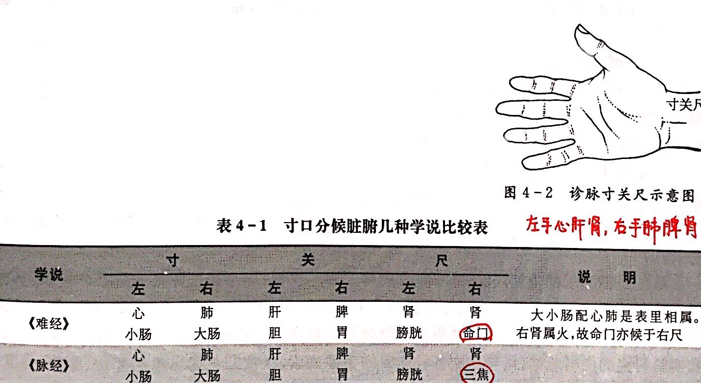
                        -   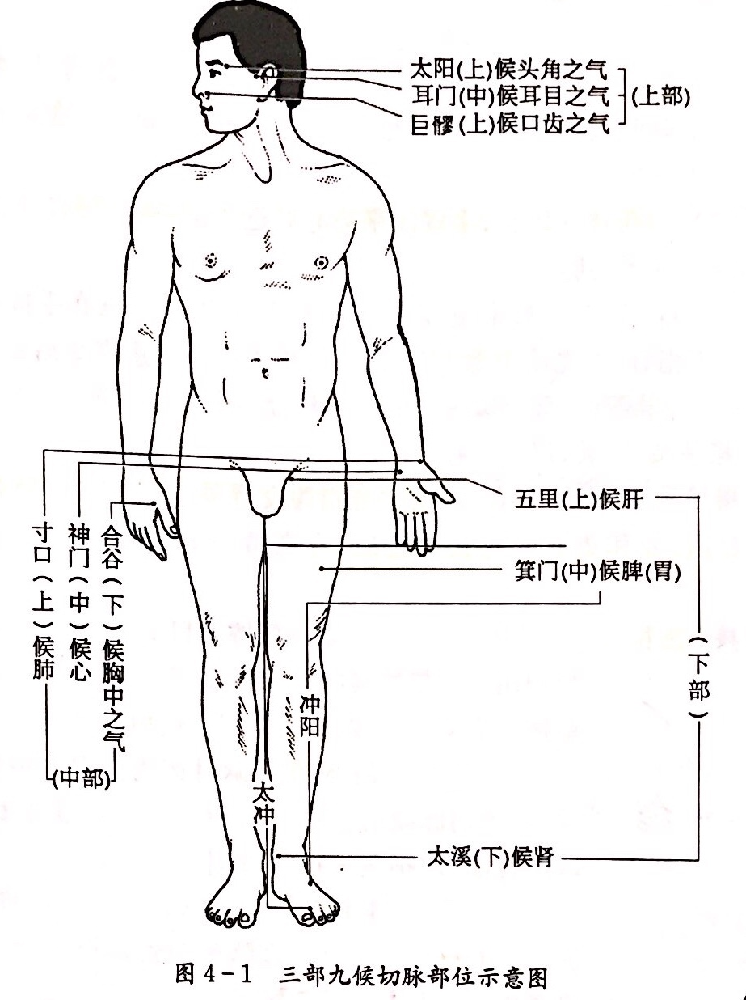
                    - **独取寸口的理论依据**
                        - 寸口是手太阴肺经动脉之大会，而肺朝百脉
                            - 寸口是肺经的动脉，是肺经气血会聚之处，而五脏六腑十二经气血的运行都始于肺而终于肺，终而复始，循行不息，故寸口的脉象变化，能反映营卫气血、脏腑经脉的病变
                        - 手太阴肺经起于中焦与脾（足太阴）同属太阴，故与脾胃之气相通，而脾胃为后天之本，气血生化之源，故脏腑气血之盛衰，可反映于寸口
            - **脉象要素**
                - **脉位**
                    - 脉动显现部位的浅深
                - **至数**
                    - 脉搏的频率
                    - 中医以一个呼吸周期为脉搏的计量单位，一呼一吸为一息
                    - 一息脉来四五至为平脉，一息六至以上见数脉，一息不足四至为迟脉
                - **脉长**
                    - 脉动应指的轴向范围长短
                    - 脉动范围超越寸关尺三部为长脉，应指不及寸、尺两部，但见关部或寸部者为短脉
                - **脉力**
                    - 脉搏的强弱
                    - 脉搏应指有力为实脉，应指无力为虚脉
                - **脉宽**
                    - 脉动应指的径向范围大小，即手指感觉到脉道的粗细
                        - 不等于血管的粗细
                    - 脉道宽大见洪脉，狭小见细脉
                - **流利度**
                    - 脉搏的流利通畅程度
                    - 脉来流利圆滑者为滑脉，艰难不流利者为涩脉
                - **紧张度**
                    - 脉管的紧急或弛缓程度
                    - 脉管紧绷为弦脉，弛缓为缓脉
                - **均匀度**
                    - 脉动节律是否均匀
                    - 脉搏力度、大小是否一致
        - **正常脉象**
            - 平脉，就是正常人的脉象
            - **形态特征**
                - 三部有脉，一息四至（闰以太息五至，相当于60～90次/分钟），不浮不沉，不大不小，从容和缓，柔和有力，节律一致，尺脉沉取有一定力量，并随生理活动和气候环境的不同而有相应变化
            - **特点**
                - **有胃——脉有胃气**
                    - 脉有胃气主要反映了脾胃运化功能的盛衰和营养状况的优劣
                        - 《素问·平人气象论》指出：“人以水谷为本，脉以胃气为本。”
                        - 《素问·玉真脏论》说：“脉弱以滑是有胃气。”
                            - 弱是指柔和，滑是指流利的意思，说明脉中胃气指的是脉的和缓、从容、流利
                    - 脉象从容、和缓、流利，是有胃气的基本特征
                    - 即使是病脉，不论浮沉迟数，但有徐和之象，便是有胃气
                - **有神——脉贵有神**
                    - 脉有神反映了脏气充盈和心之功能健旺与否
                        - 《景岳全书·脉神章》曰：“谓脉中有力即有神矣，若数极迟败中不复不力为无神也。”
                        - 陈士铎《辨脉论》提到：“按指之下有条理，先后秩然不乱者，此有神之至。”
                    - 脉象有神的主要表现是柔和有力，节律整齐
                    - 即使微弱的脉，不至于散乱而完全无力为有神弦实的脉，弦实之中仍带有柔和之象的为有神
                    - 神以精气为物质基础，故诊神之有无，可察精气之盛衰
                - **有根——脉贵有根**
                    - 脉之有根关系到肾气的盛衰
                        - 肾乃先天之本，元气之根，人身十二经脉全赖肾间动气之生发，肾气犹存，好比树木之有根，枝叶虽枯根本不坏，当有生机
                    - 脉象有根主要表现为沉取应指有力，尺部尤显
                    - 病虽重，尺脉尚滑实有力，提示肾气犹存，还有生机
                    - 诊察脉象根之有无，可测知肾精的盈亏和肾气的盛衰
                - 有力之中不失柔和，和缓之中不失有力，节律整齐，尺部应指，就是有胃、有神、有根的表现
                    - 脉属正常，或虽患病，精气未败，生机构存，预后尚好
            - **生理变异**
                - 《医宗必读·脉法心参》:“酒后之脉常数，饮后之脉常洪，远行之脉常疾，久饥之脉常空，室女尼姑多濡弱，婴儿之脉常七至。”
                - **四季气候**
                    - 春微弦
                    - 夏微洪
                    - 秋微浮
                    - 冬微沉
                - **地理环境**
                    - 南方地势低下，气候温热、潮湿，人体肌腠疏松，故脉多细软或略数
                    - 北方地势高峻，空气干燥，气候偏寒，人体肌腠紧缩，故脉多沉实
                - **性别**
                    - 妇女脉象较男子濡弱而略快
                    - 妊娠期脉常见滑数而冲和
                - **年龄**
                    - 年龄越小，脉搏越快
                    - 婴儿每分钟脉搏约120次
                    - 五六岁的幼儿，每分钟脉搏90～110次
                    - 青年体壮脉搏有力；老人气血虚弱，精力渐次，脉搏较弱
                    - 儿童脉象较软；老人脉多兼弦
                - **体格**
                    - 身躯高大的人，脉的显现部位较长
                    - 矮小的人，脉的显现部位较短
                    - 瘦人肌肉薄，脉常浮
                    - 肥胖的人，皮下脂肪厚，脉常沉
                    - 运动员脉多缓而有力
                    - 六阴脉
                        - 常见六脉沉细等同，而无病象
                    - 六阳脉
                        - 六脉常见洪大等同，而无病象
                - **情志**
                    - 喜则伤心而脉缓
                    - 怒则伤肝而脉急
                    - 惊则气乱而脉动
                - **劳逸**
                    - 剧烈运动和远行之后，脉多急疾
                    - 入睡之后，脉多迟缓
                    - 脑力劳动之人，脉多弱于体力劳动者
                - **饮食**
                    - 饭后、酒后脉多数而有力
                    - 饥饿时脉象稍缓而少力
                - 斜飞脉
                    - 少数人脉不见于寸口，而从尺部斜向手背
                - 反关脉
                    - 脉出现在寸口的背侧
        - **常见脉象及其临床意义**
            - **脉位分类**
                - **@@浮脉**
                    - 【脉象特征】
                        - 举之有余，按之不足。
                            - 如水漂木
                    - 【临床意义】
                        - 主表证，亦主虚证。
                            - 有力：表实证
                            - 无力：表虚证
                        - 生理性浮脉可见于形体消瘦、脉位表浅者。夏秋之时阳气升浮，也可见浮脉。
                - **散脉**
                    - 【脉象特征】
                        - 浮散无根，稍按则无。
                    - 【临床意义】
                        - 主元气离散，脏腑之气将绝。
                - **@@芤脉kou**
                    - 【脉象特征】
                        - 浮大中空，如按葱管。
                    - 【临床意义】
                        - 主失血、伤阴。
                - **@@沉脉**
                    - 【脉象特征】
                        - 举之不足，按之有余。
                            - 脉位深在，如石投水。
                    - 【临床意义】
                        - 主里证。
                            - 有力：里实
                            - 无力：里虚
                        - 生理性沉脉可见于肥胖之体、脉管深沉者。
                - **伏脉**
                    - 【脉象特征】
                        - 脉位深沉，推筋按骨始得，甚则伏而不见。
                    - 【临床意义】
                        - 主里证。常见于邪闭、厥证、痛极。
                - **牢脉**
                    - 复合脉象
                    - 【脉象特征】
                        - 脉形沉而实大弦长，轻取、中取均不应，沉取始得，坚着不移。
                    - 【临床意义】
                        - 主阴寒内实、疝气癥瘕。
                            - （癥瘕：腹内包块）
            - **脉率分类**
                - **@@迟脉**
                    - 既可见于寒证，又可见于热证
                    - 【脉象特征】
                        - 脉来迟慢，一息不足四至。
                    - 【临床意义】
                        - 主寒证。
                            - 有力：寒积（实寒）
                            - 无力：虚寒
                        - 脉迟不可概丛为寒证，如邪热结聚，阻滞血脉流行，也可见迟脉。
                        - 生理性迟脉可见于久经锻炼的运动员，脉迟而有力。
                - **@@缓脉**
                    - 【脉象特征】
                        - 一息四至，来去缓怠。
                            - 其脉率稍慢于正常脉而快于迟脉。
                    - 【临床意义】
                        - 主湿病、脾胃虚弱。
                        - 生理性缓脉见脉来从容不迫，应指均匀，和缓有力，是神气充沛的正常脉象。
                - **@@数脉**
                    - 【脉象特征】
                        - 脉来急数，一息五六至。
                    - 【临床意义】
                        - 主热证。
                            - 有力：实热
                            - 无力：虚热
                        - 生理性数脉可见于儿童和婴儿。正常人在运动和情绪激动时，脉率也加快。
                - **疾脉**
                    - 【脉象特征】
                        - 脉来急疾，一息七八至。
                    - 【临床意义】
                        - 主热盛阳极，亦主亡阴、亡阳。
                        - 生理性疾脉可见于剧烈运动后，婴儿脉来一息七至也是平脉，不作疾脉论。
            - **脉宽度分类**
                - **洪脉**
                    - 【脉象特征】
                        -  脉来浮大，充实有力，状若波涛汹涌，来盛去衰。
                    - 【临床意义】
                        - 主气分热盛，亦主邪盛正衰。
                        - 生理性洪脉可见于夏季。因夏季阳气亢盛，脉象稍显洪大。
                - **大脉**
                    - 【脉象特征】
                        - 大脉脉体宽大，但无脉来汹涌之势。
                    - 【临床意义】
                        - 提示病情加重。
                            - 脉大而数实：邪实
                            - 脉大而无力：正虚
                        - 大脉可见于健康人，其特点为脉大而和缓、从容，寸口三部皆大，为体魄健壮之征象。
                - **@@细脉 ( 小脉 )**
                    - 【脉象特征】
                        - 脉细如线，但应指明显。
                    - 【临床意义】
                        - 主气血两虚、诸虚劳损，又主湿病。
                        - 生理性细脉可见于冬季，因寒冷刺激，脉道收缩，故脉象偏于沉细。
            - **脉长度分类**
                - **长脉**
                    - 【脉象特征】
                        - 脉形长，首尾端直，超过本位。
                            - 向前超逾寸部者称为溢脉
                            - 向后超逾尺部者称为履脉
                    - 【临床意义】
                        - 主肝阳有余，阳盛内热等有余之证。
                        - 生理性长脉可见于正常人。脉长而和缓，是中气充足，升降流行畅通，气血都无亏损的脉象，即所谓“长则气治”。
                - **短脉**
                    - 【脉象特征】
                        - 首尾俱短，不及三部。
                    - 【临床意义】
                        - 不可概作不足论。
                            - 有力：气郁
                                - 因气郁血瘀，或痰滞食积，阻碍脉道，以致脉气不伸而见短脉，则短涩而有力。
                            - 无力：气损
                                - 气虚不足，无力鼓动血行，故脉短而无力，所谓“短则气病”。
            - **脉力度分类**
                - **虚脉**
                    - 【脉象特征】
                        - 三部脉举之无力，按之空虚。
                    - 【临床意义】
                        - 主虚证。
                            - 气血两虚
                            - 脏腑诸虚
                - **弱脉**
                    - 【脉象特征】
                        - 极软而沉细。
                            - 轻按不显，重按始得。
                    - 【临床意义】
                        - 主气血俱虚、阳虚。
                - **微脉**
                    - 【脉象特征】
                        - 极细极软，按之欲绝，若有若无。
                    - 【临床意义】
                        - 主气血大虚、阳气衰微。
                            - 轻取之似无：阳气衰
                            - 重按之似无：阴气竭
                            - 久病脉微：正气将绝
                            - 新病脉微：主阳气暴脱
                - **实脉**
                    - 【脉象特征】
                        - 三部脉举按均有力。
                    - 【临床意义】
                        - 主实证。
            - **脉流利度分类**
                - **滑脉**
                    - 【脉象特征】
                        - 往来流利，如珠走盘，应指圆滑。
                    - 【临床意义】
                        - 主痰饮、食滞、实热 。
                            - （病案分析中考主痰 )
                        - **冲和（尤其女性左手关部）**
                            - 女性怀孕后，脉象较之前有力
                - **动脉**
                    - 【脉象特征】
                        - 脉形短如豆，厥厥动摇，滑数有力，关部尤为明显，且动摇不定。
                    - 【临床意义】
                        - 主痛、惊。
                - **@@涩脉**
                    - 【脉象特征】
                        - 脉细而缓，往来艰涩不畅，如轻刀刮竹。（病蚕食叶）
                    - 【临床意义】
                        - 主伤精、血少、气滞血瘀、挟痰、挟食。
                            - （病案分析中考瘀血内阻）
            - **脉紧张度分类**
                - **@@弦脉**
                    - 【脉象特征】
                        - 端直以长，如按琴弦。
                    - 【临床意义】
                        - 主肝胆病、诸痛、痰饮、疟疾；亦主虚劳、胃气衰败；（脾气不好）风证、动脉硬化等。
                            - （病案分析中：与肝有关）
                        - 生理性弦脉可见于春季，应自然界生发之气，故脉象弦而柔和，老年人阴血不足血脉失于濡养而失柔和之性，亦可见弦脉。
                - **紧脉**
                    - 【脉象特征】
                        - 脉来紧张，状如牵绳转索。
                    - 【临床意义】
                        - 主寒证、痛证、宿食。
                            - （病案分析中：与寒有关）
                - **革脉**
                    - 【脉象特征】
                        - 浮而弦硬，中空外坚，如按鼓皮。
                    - 【临床意义】
                        - 多主精血亏虚。
                        - 临床常见亡血、失精、半、漏下，如老年人出血即可见革脉。
                - **濡脉**
                    - 【脉象特征】
                        - 浮而细软 , 搏动力弱 , 不任重按 , 按之则无。
                    - 【临床意义】
                        - 主诸虚，亦主湿。
            - **脉均匀度分类**
                - **促脉**
                    - 【脉象特征】
                        - 脉来数而时一止，止无定数。
                    - 【临床意义】
                        - 主阳盛实热，气血痰饮宿食停滞，亦主脏气虚弱，阴血衰少。
                - **结脉**
                    - 【脉象特征】
                        - 脉来缓而时一止，止无定数。
                    - 【临床意义】
                        - 主阴盛气结，寒痰血；亦主气血虚衰。
                - **代脉**
                    - 【脉象特征】
                        - 脉来中止，止有定数，良久方来。
                    - 【临床意义】
                        - 主脏气衰微；亦主风证、痛证、七情惊恐、跌打损伤。
        - **脉象鉴别、相兼脉和真脏脉**
            - 脉象鉴别
                - **细微弱濡**
                    -   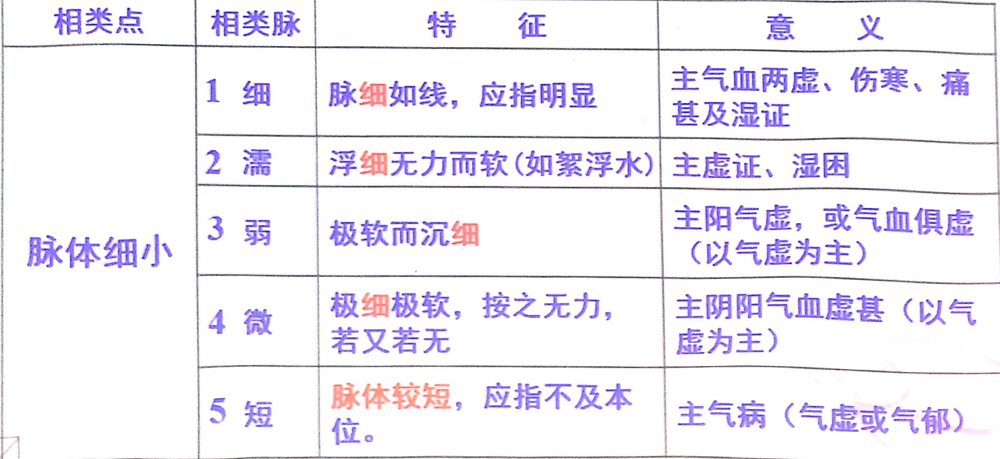
                - **长脉 相似脉**
                    -   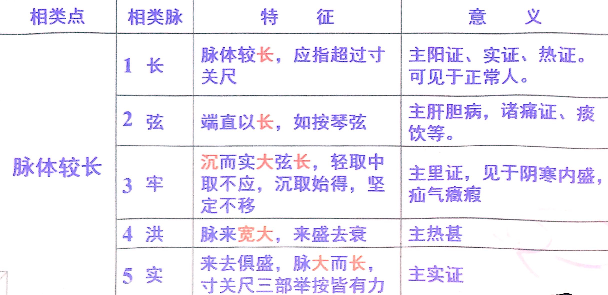
                - **虚脉 相似脉**
                    -   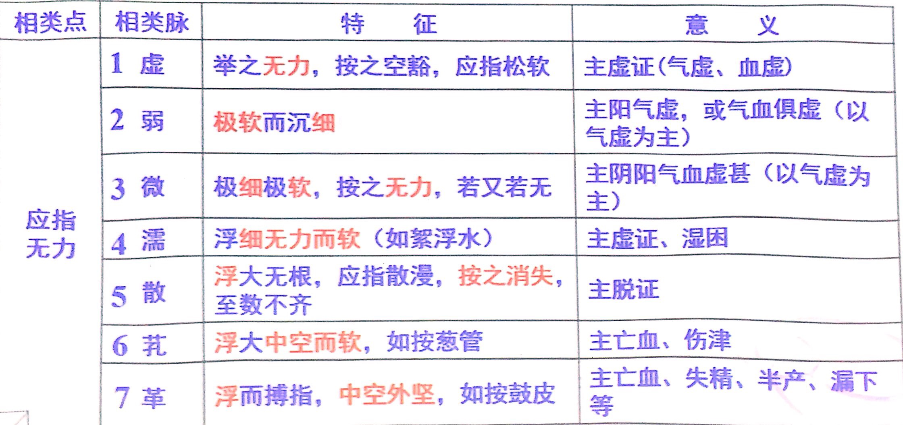
                - **涩脉 相似脉**
                    -   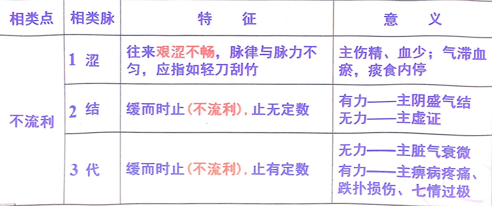
                - **@@结代促**
                    -   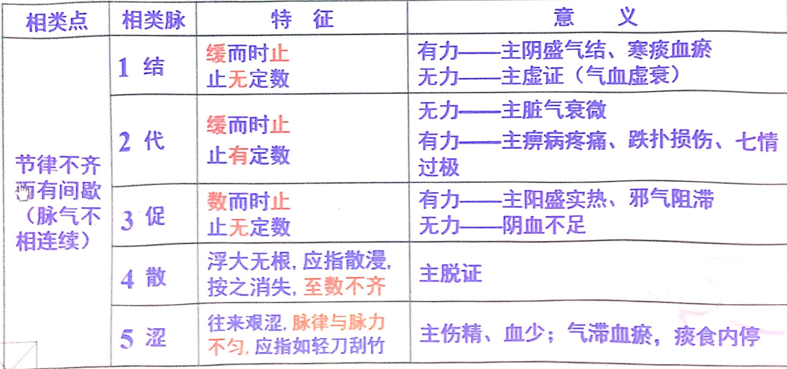
                    -  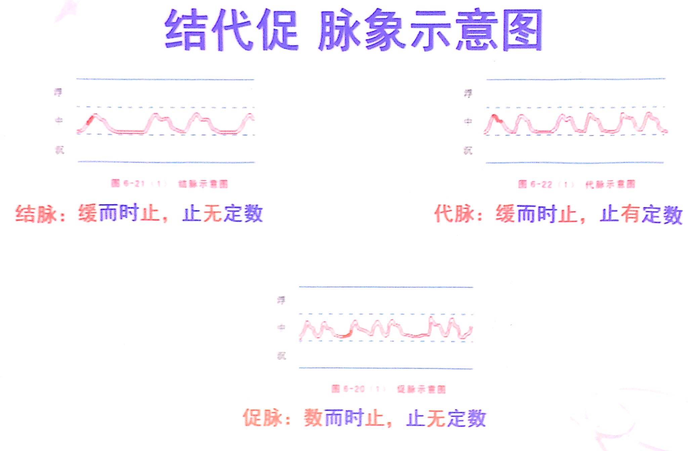
            - **相兼脉**
                - 含义
                    - 即复合脉（二种或二种以上单因素脉同时出现，复合构成的脉象）
                - 原因
                    - 正气盛衰，病因多相兼，病位病性变化
                - 构成原则
                    - 只要不是性质相反的脉都可构成相兼脉
                - 相兼脉主病等于该相兼的各单一脉象主病相合
                    - **浮紧脉**
                        - 主风邪伤卫，营卫不和，太阳中风的表虚证
                    - **浮缓脉**
                        - 主风邪伤卫，营卫不和，太阳中风的表虚证
                    - **浮数脉**
                        - 主风热袭表的表热证
                    - **浮滑脉**
                        - 主表证挟痰或风痰，常见于素体痰盛而又感受外邪者
                    - **洪数脉**
                        - 主气分热盛，多见于外感热病的中期
                    - **沉缓脉**
                        - 主脾虚而水湿停留
                    - **沉迟脉**
                        - 主里寒证，常见于脾肾阳虚、阴寒凝滞的病证
                    - **沉弦脉**
                        - 主肝郁气滞、寒滞肝脉或水饮内停
                    - **沉涩脉**
                        - 主血瘀，尤常见于阳虚而寒凝血瘀者
                    - **弦数脉**
                        - 主肝热证，常见于肝郁化火或肝胆湿热等病证
                    - **弦细脉**
                        - 主肝肾阴虚、血虚肝郁或肝郁脾虚
                    - **弦滑数**
                        - 见于肝郁夹痰、风阳上扰或痰饮内停等证
                    - **细数脉**
                        - 主阴虚火旺
                    - **滑数脉**
                        - 主痰热、痰火、湿热或食积化热
        - 诊妇人脉与小儿脉
        - 脉诊的临床意义及脉症从舍
    - 第二节 按诊
        - 按诊的方法与意义
            - **试述按俞穴的诊断方法和临床意义？**
                - 按俞穴是按压身体上某些特定穴位，通过穴位的变化和反应来判断内脏某些疾病的方法
                - **是否有结节或条索状物，有无压痛或其它敏感反应**
                    - 如肺俞穴若摸到结节，或按中府穴有明显压痛者，为肺病的反应
                    - 按上巨虚穴有显著压痛者，为肠痈的表现
                    - 肝病患者在肝俞或期门穴常有压痛等
                - **确定疾病的部位**
        - 按诊的内容
- **第五章 八纲辨证**
    - 第一节 八纲基本证
        - **概述**
            - 辨证的概念
                - 在中医基础理论指导下，对病人的临床资料进行分析、综合，从而对疾病的当前病理本质作出判断，并概括为具体证名的过程
            - 辨证的依据
                - 即四诊等各种诊察所获得的有关疾病的起因、病史资料、症状、体征、社会及自然环境因素等临床资料
            - 证、病、症的区别
                - 证：即证候，是疾病发生和演变过程中某一阶段本质的反映。提示病因、病机、病位、病性、病势，为论治提供依据
                    - 如：肺炎的热邪壅肺、肺阴虚证
                - 病：是病因作用体内出现的具有一定发展规律的邪正交争、阴阳失调等演变过程。是对疾病整个病理过程的概括
                    - 如：肺炎、脑炎、胃溃疡、高血压
                - 症：症即症状。包括自觉症状和他觉症状，是疾病证候本质的外在表现
                    - 自觉症状是指病人自我感到的异常变化
                        - 如：头痛、头晕、胸闷、恶心、腹胀、耳鸣
                    - 他觉症状医者通过四诊获得的异常特征
                        - 如：面红目赤、下肢浮肿、舌苔黄、脉数
            - 辨证的方法
                - 病因辨证
                - 经络辨证
                - 气血津液辨证
                - 脏腑辨证
                - 六经辨证
                - 卫气营血辨证
                - 三焦辨证
            - **八纲辨证定义**
                - 对四诊所取得的材料，进行综合分析，用表里、寒热、虚实、阴阳八类证候归纳说明病变的部位、性质和病变中正邪力量对比等情况的辨证方法
            - 根据病位、病势、病性及邪正力量对比情况，八纲可归纳为四对纲领
                - 表里辨证（病位、病势）
                - 寒热辨证（病性）
                - 虚实辨证（邪正力量对比）
                - 阴阳辨证（前三者的综合）
            - 八纲辨证意义
                - 是中医诊断学的主要内容之一
                - 疾病的临床表现尽管千变万化、极其复杂，但不外乎八纲辨证的八类证候
                - 运用八纲辨证可起到执简驭繁、高屋建瓴的作用
            - **为什么说八纲是各种辨证的总纲？**
                - 疾病的表现尽管极其复杂，但基本上可以用八纲加以归纳
                    - 如疾病的类别，可分阴证与阳证
                    - 病位的深浅，可分表证与里证
                    - 疾病的性质，可分寒证与热证
                    - 邪正的盛衰，邪盛为实证，正虚为虚证
                - 这样，运用八纲辨证就能将错综复杂的临床表现归纳为表里、寒热、虚实、阴阳四对纲领性证候，从而找出疾病的关键，掌握其要领，确定其类型，预测其趋势，为治疗指出方向
                - 它是分析疾病共性的辨证方法，适应于临床各科的辨证，故说八纲辨证是各种辨证的总纲
        - **表证与里证**
            - 表与里是辨别病位和病势的两个纲领。表里辨证主要应用于外感病证，可以判断病情的轻重浅深、病理变化趋势
            - 广义表里与狭义表里
                - 广义表里概念具有相对性
                    - 躯壳与脏腑
                        - 躯壳为表，脏腑为里 
                    - 脏与腑
                        - 腑为表，脏为里
                    - 脏腑与经络
                        - 经络为表，脏腑为里
                    - 三阳经与三阴经
                        - 阳经为表，阴经为里
            - 表里辨证的作用
                - 表里辨证适用于外感病，尤适于伤寒、温病初期
                - 表里辨证的主要作用有两个
                    - 辨轻重
                        - 表证浅而轻
                        - 里证深而重
                    - 辨进退
                        - 表邪入里为病进
                        - 里邪出表为病退
            - **表证**
                - 是六淫、疫疠等邪气经皮毛、口鼻侵入机体，正气抗邪所表现的轻浅证候的概括
                - **临床特点**
                    - 发病急
                    - 病情轻
                    - 病位浅
                    - 病程短
                    - 感受外邪
                - **临床表现**
                    - 主症（一定有）
                        - **恶寒**
                        - **薄白**
                        - **脉浮**
                    - 次症（可能出现也可能不出现）
                        - 头身疼痛
                        - 鼻塞流涕或喷嚏
                        - 咳嗽气喘
                    - （寒、热、痛、塞、咳）
                - **病因病机**
                    - 病因是感受了外来的邪气
                        - **发热**
                            - 外邪侵袭，正气抗邪，正邪相争
                        - **恶寒**
                            - 卫气受遏，不能温煦肌肤
                        - **舌苔薄白**
                            - 邪气在表，未伤及于里
                        - **脉浮**
                            - 正气抗邪，脉鼓动于外
                - **表证辨证要点**
                    - 感受外邪，为外感初起
                    - **恶寒发热并见**
                - **表证的治疗**
                    - **解表法** **汗法**
                    - 风寒表证
                        - 疏风散寒
                        - 麻黄汤
                    - 风热表证
                        - 疏风清热
                        - 桑菊饮
                    - 表虚表证
                        - 调和营卫
                            - 桂枝汤
                        - 益气解表
                            - 玉屏风散
            - **里证**
                - 泛指病变部位在内，由脏腑、气血、骨髓等病变所反应的证候
                - 多见于内伤杂病，或外感病中后期
                - **鉴别判断**
                    - 非表即里
                    - 症状繁多
                    - 以脏腑症状为主
                - **临床特点**
                    - 病位深
                    - 病情重
                    - 病程长
                - **临床表现**
                    - 病因复杂、病位广泛、症状繁多
                    - 常见
                        - 壮热、大汗、口渴、心烦、脉洪大
                        - 或痰稀色白肢冷乏力
                        - 无恶风恶寒
                        - 脉象不浮
                        - 多有舌象改变
                    - 寒热单见病程长，脉象不浮舌异常
                - **病因病机**
                    - 病邪由表入里，邪气渐次入内，侵犯脏腑
                    - 外邪直接侵犯内里而发（外邪直中）
                    - 七情内伤、饮食劳倦等直接损伤脏腑气血
                - **辨证要点**
                    - 病位在里，邪已深入于内
                    - 出现如以上所举例类似的里证的一些症状
                - **里证的治疗**
                    - 根据里证的寒热虚实，分别以温清补攻治疗
                    - 里虚证——补
                    - 里实证——攻
                    - 里寒证——温
                    - 里热证——清
            - **半表半里证**
                - 病邪既不在表，又非完全入里，介于表里之间的证候
                - **临床表现**
                    - 寒热往来
                    - 胸胁苦满
                    - 心烦喜呕
                    - 默默不欲饮食
                    - 口苦、咽干、目眩
                    - 脉弦
                - **病因病机**
                    - 外邪由表传内，尚未入于里
                    - 里邪透表，尚未透于表，邪气居于半表半里之间
                    - 邪气直犯少阳，正气渐虚，正邪分争，少阳枢机不利
                - **病因病机分析**
                    - **寒热往来**
                    - **胸胁苦满**
                    - **不欲饮食**
                    - **心烦**
                    - **喜呕**
                    - **口苦咽干**
                    - **可见脉弦**
                - **辨证要点**
                    - **寒热往来**
                    - 兼见胸胁苦满、口苦、咽干、目眩、脉弦等症状
                - **治疗**
                    - 和解表里法——小柴胡汤
                        - 柴胡、黄芩、参、夏、姜、枣、草
            - **表里证的鉴别**
                -   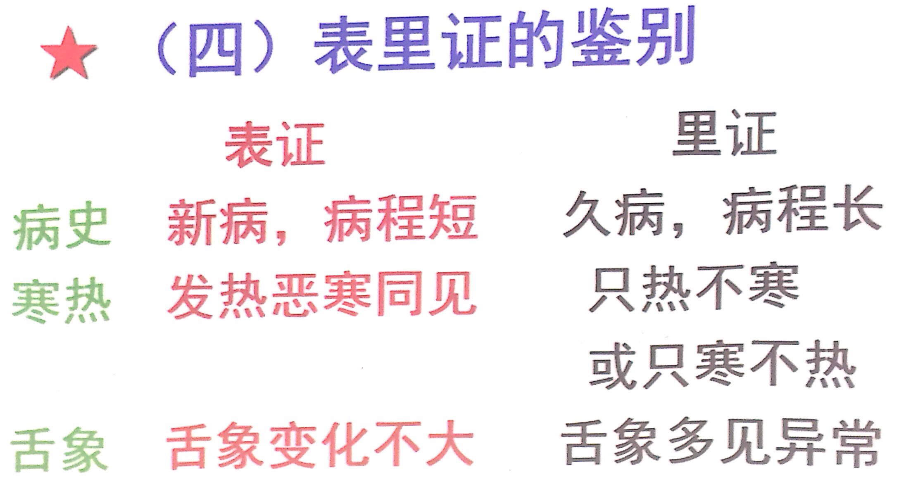
        - **寒证与热证**
            - 寒热是反映疾病性质的一对纲领，概括说明了肌体阴阳的偏盛偏衰
            - 《素问·阴阳应象大论》：“阳盛则热，阴盛则寒。”
            - 《素问·调经论》：“阳虚则外寒，阴虚则内热。”
            - **寒证**
                - **定义**
                    - 寒证是指感受寒邪、或阳虚阴盛所表现的证候
                    - 阴盛——实寒证
                    - 阳虚——虚寒证
                - **成因**
                    - 外感阴寒邪气
                    - 过服生冷寒凉，阴寒内盛
                    - 内伤久病，阳气耗伤
                - **临床表现：冷冷清清白滑迟**
                    - 阳失温煦
                        - 恶寒、畏冷、冷痛
                        - 喜暖、肢凉、蜷卧
                    - 寒不消水
                        - 口淡不渴
                        - 痰涎涕清稀
                    - 阳不运血
                        - 小便清长
                        - 大便清稀
                        - 苔白而润
                    - 阳不收血
                        - 面色白、舌淡
                    - 寒主收引
                        - 脉紧或迟
            - **热证**
                - **定义**
                    - 热证是指感受热邪、或阳盛阴虚、人体机能活动亢进所表现的证候
                        - 阳盛——实热证
                        - 阴虚——虚热证
                - **成因**
                    - 外感火热之邪
                    - 寒邪入里化热
                    - 七情过激，郁而化热
                    - 饮食不节，积久化热
                    - 房室劳伤，劫夺阴津
                - **临床表现**
                    - 热渴红数二便结
                        - 阳热亢盛
                            - 发热恶热喜冷
                        - 火性炎上
                            - 面红目赤
                        - 热灼津伤
                            - 口渴欲饮
                            - 痰涕黄稠
                            - 小便短黄
                            - 大便干结
                            - 苔黄干燥
                        - 热迫血疾
                            - 舌红脉数
                - **辨证要点**
                    - **阳热亢盛** **阴虚内热**
                    - **脏腑功能亢奋，热盛津伤**
                - **治疗原则**
                    - 实热宜清（白虎汤等）
                    - 虚热宜补（六味地黄丸等）
            - **寒热证鉴别要点**
                -  
        - **虚证与实证**
            - **虚实辨证的意义**
                - 了解机体邪正的盛衰，为治疗提供依据
                - 实者宜攻，虚者宜补
            - **虚实的含义**
                - 虚实是反映邪正盛衰的一对纲领，概括说明了病变过程中人体正气的强弱和致病邪气的盛衰
                - 《素问·通评虚实论》：“邪气盛则实，精气夺则虚。”
            - **实证**
                - **定义**
                    - 实证是对人体感受外邪，或体内病理产物蓄积而产生的各种临床表现的病理概括
                        - 邪气亢盛（有余），正气不虚，邪正斗争剧烈
                        - 病理产物停聚
                - **成因**
                    - 感受外邪
                    - 内脏功能失调，痰饮、水湿、瘀血、脓液、宿食、虫积等蓄积
                - **特点**
                    - 新起
                    - 暴病
                    - 病情剧烈
                    - 体质壮实
                - **临床表现**
                    - **壮热**
                    - **拒按**
                    - **胸闷烦躁**
                    - 甚则神昏谵语
                    - 呼吸气粗
                    - **痰涎壅盛**
                    - 大便秘结，小便不利
                    - 舌质苍老，舌苔厚腻
                    - **脉实**
            - **虚证**
                - **定义**
                    - **正气虚弱**
                    - 正气虚弱（矛盾主要方面）
                        - 正气：阴、阳、气、血、精、津液、营卫等
                        - 虚损程度：不足——亏虚虚弱——虚衰——亡脱
                    - 邪气不盛，邪正交争不剧烈
                - **成因**
                    - 先天不足
                    - 后天失调和疾病耗损
                - **特点**
                    - 病程较久
                    - 病势较缓
                    - 体质素虚
                    - **气虚**
                        - **神疲乏力** （肺
                        - **自汗** **懒言** （脾）
                        - **动则气急**
                        - **纳少不化**
                        - 舌质淡胖
                        - **脉虚**
                        - 乏力气短自汗出，纳少声低脉无力
                    - **阳虚**
                        - 阳虚证是指机体阳气不足，阳不制阴所表现的证候
                        - 气虚+虚寒
                        - 畏寒，形寒肢冷
                        - **小便清长**
                        - 下利清谷
                        - **脉迟**
                        - 畏寒肢冷二便清，神疲脉迟舌淡胖
                    - **血虚**
                        - 头晕目眩，失眠心悸
                        - 面色苍白无华或萎黄
                        - 手足麻木
                        - 口唇指甲淡白
                        - 舌质淡
                        - **脉细弱**
                        - 眩晕心悸面黄白，肢麻舌淡脉细弱
                    - **阴虚**
                        - 阴虚证是指机体阴液亏虚，阴不制阳所表现证候
                        - 头晕目眩，失眠心悸+虚热
                        - 颧红，微热或潮热，五心烦热
                        - **口干咽燥** **盗汗**
                        - **无苔**
                        - **脉细数**
                        - 眩晕失眠舌面红，身热盗汗脉细数
            - **虚实证鉴别要点**
                - 体质强弱
                    - 形体消瘦，精神萎摩不振——形体壮实，精神亢奋
                - 发病久暂
                - 病程长短
                - 声息高低
                    - 气弱懒言，声低息微——声高气粗
                - 痛处喜按与拒按
                    - 痛处喜按——痛处拒按
                - 舌象
                    - 舌淡嫩——舌质苍老
                - 脉象
                    - 脉虚——脉实有力
                - 内伤外感
        - **阴证与阳证**
            - **阴阳的基本含义**
                - 阴阳是对事物相互对立的两个方面的高度概括，是证候分类的纲领
                - 《内经·阴阳应象大论》：“善诊者，察色按脉，先别阴阳。”
            - **阴证、阳证的临床表现**
                - 阴证
                    - 里证、寒证、虚证的综合 
                - 阳证
                    - 表证、热证、实证的综合
            - **具体辨证内容**
                - **阳虚证（虚寒证）**
                - **阴虚证（虚热证）**
                - **阳盛证（实热证）**
                - **阴盛证（实寒证）**
                - **阳亢证**
                - **亡阳证**
                    - 含义
                        - 指体内阳气极度衰微而表现出阳气欲脱的危重证候
                    - 成因
                        - **阳气虚**
                            - 阴寒极盛，暴伤阳气
                            - 大汗、大出血、吐泻，失精（阳随阴脱）
                            - 中毒、严重外伤
                            - 痰瘀蒙闭心窍
                    - 临床表现
                        - 温煦、固摄推动失司
                        - 冷汗淋漓、汗质清稀
                        - 肌肤不温、手足厥冷
                        - 神情淡漠、呼吸微弱
                        - 面色苍白
                        - 舌淡而润
                        - 脉微欲绝
                - **亡阴证**
                    - 含义
                        - 指体液大量耗损，阴液严重亏乏而欲竭所表现出来的危重证候
                    - 成因
                        - 一般在阴液亏虚的基础上发展而来
                            - 壮热不退、大汗不止
                            - 大吐大泻
                            - 严重烧伤
                    - 临床表现
                        - 滋润、潜阳失司
                        - 汗热味咸而粘，如珠如油
                        - 身灼肢温、恶热
                        - 虚烦躁扰
                        - 口渴欲饮
                        - 面赤、皮肤皱瘪
                        - 小便极少
                        - 唇舌干燥
                        - 脉细数疾
                - **亡阴、亡阳证的鉴别**
                    - 汗之冷热及稀粘
                    - 四肢（皮肤）温凉
                    - 口渴喜恶
                    - 舌象
                    - 脉象
        - **病案分析**
            - **朱良春：上下不一主从下，表里不一主从里**
            - 素体虚弱 昨夜起发热 微恶风寒，头痛咳嗽，咽喉肿痛
                - **表热里寒证（** **表里同病，寒热错杂** **）**
                    - **里虚寒证**
                    - **外有风热表证**
                    - **表热里寒证** 表里同病，寒热错杂
            - 发热，怕冷，鼻流清涕 **咳出黄稠痰** 高热 大汗 口渴 满面通红 烦燥不安 舌红苔黄 脉洪数有力
                - **里证、实证、热证——里实热证**
                    - **风寒之邪**
                    - **表邪入里化热，里热亢盛**
                    - **热邪灼肺，耗伤阴津**
                    - **热邪扰心**
                    - **里实热证**
                - **治疗**
            - 咳嗽 胸中烦热 口舌生疮 腹痛绵绵 大便溏泻
                - **上热下寒证（上实下虚、寒热错杂、虚实夹杂）**
                    - **上焦有火**
                    - **下焦有寒**
                    - 故总体为上热下寒证（上实下虚、寒热错杂、虚实夹杂）
                - 先清热（热证为主要矛盾）
            - 奚某，男，41岁，2001年1月8日诊。三月前，运动后汗出受风，当夜发热恶寒，头痛，口干，有汗，轻微咳嗽，舌边尖红苔白，脉浮数。自行煎服生姜汤发汗。次日上午病势反重，发热39℃不退，大汗，口渴咽痛，舌绛苔黄干，脉洪数有力，给与清热解毒中药，三天后病势减。但低热不退，夜间尤甚，盗汗，干咳少痰，头晕心悸，失眠，舌红绛而干，无苔，脉细数。
                - **汗后当风**
                - **风热表证** **里实热证**
                - 用清热解毒，药证相符，病情减轻
                - **里虚热证**
            - 韦某，女，3岁，2001年8月15日诊。患儿腹泻三天，泻下无度，质稀如水，色黄混浊，精神萎靡，皮肤干燥，目眶凹陷，啼哭无泪，无尿，口渴引饮，齿干唇红，舌红无津。
    - 第二节 八纲证之间的关系
        - **八纲证候间的关系**
            - 八纲辨证，并不意味着把各种证候截然划分为八个区域。这八个方面的病理本质是相互联系、密不可分的
            - 八纲也不是孤立的、静止的简单的八个证候，而是具有表里、寒热、虚实相兼、错杂、真假、转化所形成的复杂的关系，这是中医辨证逻辑思维的突出表现
            - 在一定条件下还可向各自对立面转化。在疾病危重阶段还会出现与疾病本质相反的假象
        - **证的相兼**
            - **广义**
                - 指各种证候相兼存在
            - **狭义**
                - 指在疾病某一阶段，出现八纲两个以上的证候，但其病位无论在表在里，病情性质上没有寒与热、虚与实等相反证候的存在
                - 如实热证、虚热证等
            - 一般所说的证候相兼多为狭义的证候相兼
                - **表实寒证**
                    - 恶寒发热、头身疼痛、鼻塞流涕、咳嗽气喘、舌苔薄白、脉浮紧
                - **表实热证**
                    - 发热恶寒、咽喉肿痛、咳嗽痰黄、舌尖红苔薄、脉浮数
                - **里实寒证**
                    - 恶寒，肢冷、腹部冷痛拒按、舌苔白厚、脉沉弦紧
                - **里实热证**
                    - 壮热、大汗、口渴、心烦、脉洪大里
                - **虚寒寒证**
                    - 蜷卧、痰稀色白、肢冷乏力、腹痛喜暖喜按、脉弱或迟
                - **里虚热证**
                    - 颧红，微热或潮热，五心烦热，口干咽燥，盗汗，舌质红绛瘦薄、或有裂纹、苔剥或无苔，脉细数
                - 表虚寒证、表里虚寒证——里虚寒证
                - 表虚热证、表里虚热证——里虚热证
        - **证的错杂**
            - 指疾病在某一阶段，表里、寒热、虚实性质相反的证候同时表现于同一病人
            - 临床上常见的证候错杂
                - 表里同病
                - 寒热错杂
                - 虚实夹杂
            - 有四种情况
                - 表里同病而寒热虚实性质并无矛盾
                    - 如：表里实寒证、表里实热证
                - 表里同病且寒热性质相同，但虚实相反
                    - 如：表实寒——里虚寒证、表实热——里虚热证 
                - 表里同病且虚实性质相同，寒热相反
                    - 如：表实寒一里实热证、“寒包火”证等
                - 表里同病且寒热、虚实相反证候同时存在
                    - 如：表实寒-里虚热证
        - **证的转化**
            - 八纲中相互对立的证候之间，在一定条件下，可向其对立面转化
            - **常见的证候转化类型**
                - **表里出入**
                    - **表证入里**
                        - 先有表证，然后出现里证，表证随之消失
                        - 如
                            - 外感风热之邪，形成表热证，若表邪不解，入里化热而成为里热证
                    - **里邪出表**
                        - 指在里之邪，向外透达而出
                        - 如
                            - 高热烦渴之里热证，随汗出而热退身凉
                            - 麻疹（高热出疹）
                            - 白㾦
                - **寒热转化**
                    - **寒证化热**
                        - 指原有寒证，后出现热证，寒证随之消失
                        - 如
                            - 外感寒邪未及时发散，而机体阳气偏盛，寒邪入里化热，形成里热证
                    - **热证转寒**
                        - 指原有热证，后出现寒证，热证随之消失
                        - 如
                            - 里热证大汗，阳随津脱，可形成虚寒证，甚至亡阳证
                - **虚实转化**
                    - **实证转虚**
                        - 先为实证，病久邪气伤正，而转为虚证
                        - 如
                            - 邪热亢盛之实证，由于病久耗伤气津而致气阴两伤之虚证
                    - **虚证转实**
                        - 先为虚证，后正气渐复，与邪气相争，驱邪外出而表现属实的证候
                        - 素有虚证，因新感外邪、外伤、伤食等，以致当前以实证为主，虚证暂不明显
                        - 本为虚证，因正气不足，气化失常，病理产物停积体内而表现以实证为主
                            - 虚实夹杂
                        - 后两种情况实为虚实夹杂，以实为主
        - **证的真假**
            - 某些疾病在病情的危重阶段，可以出现一些与疾病本质相反的“假象”，以掩盖病情的真象
                - 真
                    - 是指与疾病的内在本质相符的证候
                - 假
                    - 是指与疾病本质所反映的常规证候不相符的某些表现
            - **临床常见的证候真假**
                - **寒热真假**
                    - **真热假寒（“热极似寒”“阳盛格阴证”）**
                        - 内有真热，而外见某些假寒表现的证候
                        - 考试时：舌脉对应的即是真
                        - 机理
                            - 邪热内盛，阳气郁闭于内而不能外达
                        - 临床表现：
                            - **假寒**
                                - 四肢凉甚至厥冷，恶寒寒战，神识昏沉，面色紫暗，脉沉迟或细数
                            - **真热**
                                - 高热，胸腹灼热，口鼻气灼，口臭息粗，口渴引饮，小便短黄，舌红苔黄而干，脉搏有力等
                    - **真寒假热（“寒极似热”“戴阳证”“虚阳浮越”“阴盛格阳证”）**
                        - 机理
                            - 久病阳气虚极，阴寒内盛，逼迫虚阳浮游于上、格越于外
                        - 临床表现
                            - **假热**
                                - 自觉发热，或脱衣揭被，面色浮红如妆，神志躁扰不宁（但疲乏无力），口渴（不欲饮），咽痛（不红肿），脉浮大或数（按之无力）等
                            - **真寒**
                                - 胸腹无灼热，下肢必厥冷，小便清长或尿少浮肿，下利清谷，舌淡等
                - **虚实真假**
                    - **真实假虚（“大实有羸状”）**
                        - 本质为实证，反见某些虚羸现象
                        - 机理
                            - 因热结胃肠，痰食壅积，湿热内蕴，瘀血停蓄等大积大聚阻滞经脉，而致气血不能畅达
                        - 临床表现
                            - 神情默默——但语时声高息粗
                            - 倦怠懒言——但动之觉舒
                            - 身体赢瘦——胸腹硬满拒按
                            - 脉象沉细——但按之有力
                    - **真虚假实（“至虚有盛候”）**
                        - 本质为虚证，反见某些实盛现象
                        - 机理
                            - 因久病脏腑虚衰，气血不足，运化无力而致气机不畅
                        - 临床表现
                            - 腹部胀满——时有缓解，内无肿块而喜按
                            - 呼吸喘促——但气短息弱
                            - 二便闭涩——但腹部不甚硬满
            - **虚实真假的鉴别要点**
                - **脉象**
                    - 有力——无力
                    - 有神——无神
                    - 沉取之象
                - **舌象**
                    - 胖嫩
                    - 苍老
                - **言语呼吸**
                    - 高亢粗壮
                    - 低怯微弱
                - **体质强弱**
                    - 病程新久
                    - 治疗经过
        - **八纲证候间的关系**
            - **证候相兼**
                - 表实寒证、表实热证、里实寒证、里实热证、里虚寒证、里虚热证等
            - **证候错杂**
                - 表里同病、寒热错杂、虚实夹杂
            - **证候真假**
                - 寒热真假、虚实真假
            - **证候转化**
                - 表里出入、寒热转化虚实转化
        - **病案分析**
            - 低热 夜间尤甚 五心烦热 干咳少痰 头晕目眩 心悸失眠 盗汗 颧 红 舌光红少津 脉细数
                - **阴虚内热证**
                - **肺痨日久，痨病伤阴，阴不制阳，虚火内生**
                - **阴虚失去滋润作用**
                - **阴虚火旺**
            - 齐某，女，29岁，2010年6月22日诊。三周前产后失血过多，而致头晕目眩，失眠多梦，心悸，神疲乏力，自汗，气短懒言，手指麻木，乳汁分泌不足。症见病人面色苍白，舌淡，脉细弱无力。
                - **气血两虚证**
                - **气随血脱**
                - **血虚不能充养头目、四肢等**
                - **心神失养**
                - **气虚**
                - **气血虚**
                - **气血两虚之象**
- **第六章 病性辨证**
    - **概说**
        - **概念**
            - **病性**
                - 指病理改变的性质，也就是病理变化的本质属性
                - 由于病性是导致疾病当前证候的本质性原因，因而也有称病性为“病因”者，即“审症求因”
                - 病因与病性的概念不完全相同
                    - 一般病因是指导致疾病发生的原始因素，如外感六淫、七情刺激、外伤、劳倦等，属于病因学、发病学的范畴
                    - 病性是当前证候的性质，如气虚、血瘀、湿热、痰饮等，属于诊断学、辨证学的范畴
                    - **从症状而推求原因**
            - **病性辨证**
                - 是在中医学理论的指导下，对病人所表现的各种症状进行分析、综合，从而确定疾病当前证候的性质的辨证方法
    - 第一节 六淫辨证
        - **六淫病证与“内生五邪”所表现的证候临床意义不同**
            - 六淫病证
                - 是由于外邪入侵所致
            - 内生五邪
                - 是指因脏腑功能失调所产生的病理反应
            - “内生五邪”所表现的证候虽与六淫病证的临床表现相似，但临床意义不同
        - **风淫证（“外风证”）**
            - **概念**
                - 指外感风邪所表现的证候
                - **发病急、变化快、游走不定**
            - **成因**
                - 主要是感受了外界的风邪，其中也可能包含着某些生物性致病因素
                - 发病迅速，变化快，游走不定
                    - *清风饮子、防风通圣散*
            - **临床表现及证候分析**
                - **风邪袭表证**
                    - 恶风、微热、汗出，苔薄白，脉浮缓
                    - 风邪袭表，腠理开合失调
                - **风邪犯肺证**
                    - 咳嗽、咽喉痒或痛、鼻塞或喷嚏等
                    - 风邪侵袭肺系，肺气失宣，鼻窍不利
                - **风客肌肤证**
                    - 皮肤瘙痒，或见丘疹
                    - 风邪客于肤腠，营卫气血不和
                - **风邪中络证**
                    - 肌肤麻木不仁、口眼歪斜
                    - 风邪侵袭经络，经气阻滞，脉络麻痹
                - **风毒育络证**
                    - 肌肉强真，牙关紧闭抽搐，角弓反张
                    - 风毒侵窜经络，经脉拘急
                - **风胜行痹证**
                    - 肢体关节游走疼痛
                    - 风与寒湿合邪，阻痹经络，流窜关节
                - **风水相搏证**
                    - 突起面睑肢体浮肿，迅速波及全身伴咳嗽，咽喉痛
                    - 风水搏肺，肺失通调
            - **辨证要点**
                - 新病，外感风邪
                - 恶风、微热、汗出，苔薄白，脉浮缓
                - 突起丘疹，皮肤瘙痒
                - 肢体关节游走疼痛
            - **风淫证与内风证鉴别**
                - **内风证**
                    - 又称肝风内动证，是指由于热盛、阳亢、血虚、阴虚等病理变化，出现眩晕欲扑、肢体麻木、振颤、抽搐等类似风性动摇特点为主要表现的一类证候
        - **寒淫证**
            - **概念**
                - 指外感寒邪所表现的证候，又称实寒
                - 新病突起，病势较剧，有感受寒邪的病史
            - **成因**
                - 外感阴寒之邪，如淋雨、下水、衣单、露宿、在冰雪严寒处停留、食生、饮冷等，阳气未能御制寒邪而致病
            - **特点**
                - 寒为阴邪，其性清冷、凝滯、收引，易伤阳气，阻碍气血运行
            - **分类**
                - **伤寒证（外寒证、表寒证、寒邪束表证、太阳表实证、太阳伤寒证等）**
                    - 是指寒邪外袭于肤表，阻遏卫阳，阳气抗邪于外所表现的表实寒证
                    - **临床表现与证候分析**
                        - 新起恶寒重，或伴发热，无汗，头身疼痛，鼻塞或流清涕，苔白，脉浮紧寒邪束表，郁闭肌腠，阳气失于温煦
                - **中寒证（又称内寒证、里寒证等）**
                    - 是指寒邪直接内侵脏腑、气血，遏制及损伤阳气，阻滞脏腑气机和血液运行所表现的里实寒证
                    - **临床表现与证候分析**
                        - 局部拘急冷痛
                            - 感受寒邪，经脉拘急
                        - 肢体厥冷，口不渴，小便清长，面色白甚或青，舌苔白，脉紧或沉迟有力
                            - 阴寒内盛，阳气不能温煦
                        - 或咳嗽、哮喘、咯稀白痰
                            - 寒邪客肺，肺失宣降（寒邪犯肺证）
                        - 或院股疼痛、肠鸣腹泻、呕吐
                            - 寒滞胃肠，使胃肠气机失常，运化不利（寒滞胃肠证）
                - **临床上寒淫证还有多种类型**
                    - 如寒滞肝脉证、寒滞心脉证、寒凝胞宫证、寒痹证等
                    - 除表现出各自脏器的证候特点外，均可见肢冷、患部拘急冷痛、无汗、面白或青、舌白，脉沉紧或脉伏等症
            - **辨证要点**
                - 新病突起，病势较剧，有感寒原因
                - 恶寒肢冷，局部冷痛，口淡面白，苔白润，脉紧或迟有力
            - **寒淫证与虚寒证鉴别**
                - **寒淫证**
                    - 指外感寒邪所致的实寒证
                    - “阴盛则寒”
                - **虚寒证（阳虚证）**
                    - 是指机体阳气亏虚，温煦、推动、气化无力，以畏寒肢冷为主要表现的虚寒证候
                    - “阳虚则寒”
        - **暑淫证**
            - **概念**
                - 指夏季感受暑邪所表现的暑热证候
                - 其发病一般只见于炎热夏季
            - **成因**
                - 夏月炎暑，感受暑热之邪
            - **特点**
                - 暑为阳邪，具有暑性炎热升散，耗气伤津，易夹湿邪等致病特点
                    - 夏季感冒：解表化湿
            - **临床表现与证候分析**
                - 发热恶热，汗出，口渴喜饮，尿短黄
                    - 暑性炎热升散，耗伤津液
                - 气短神疲，肢体闲佬，舌红，苔白或资，脉虚数
                    - 暑热耗气
                - 心烦
                    - 暑扰心神
                - 或发热，卒然晕倒，汗出不止，气喘，甚至昏迷、惊厥、抽播
                    - 暑闭心神，引动肝风
                - 或高热，神昏，胸闷，腹痛，呕恶，无汗，气喘等
                    - 暑闭气机（教材缺此，补充）
            - **辨证要点**
                - 夏月感受暑热之邪
                - 发热，汗多，口渴心烦，气短疲乏、尿黄等
            - **暑淫证与火热证的区别**
                - 暑的性质虽与火热同类，但暑邪致病有严格的季节性，其病机、证候也与一般火热证有一定的差别
        - **湿淫证**
            - **概念**
                - 指外感湿邪所表现的证候，亦称外湿证
                - 病势缠绵，病程迁延、难愈
            - **成因**
                - 因外湿侵袭，如气候潮湿，淋雨下水、居处卑湿、冒受雾露等
            - **特点**
                - 湿为阴邪，其性重浊、粘滞、趋下，易阻滞气机，损伤阳气
            - **临床表现与证候分析**
                - 微恶风寒发热
                    - 湿犯肌表，阳滞气机，困遏清阳
                - 头重而痛，身困重，肢体倦怠，关节酸痛重着，屈伸不利
                    - 寒湿凝滞经络、肌肉、筋骨，气血不畅
                - 胸闷，面色晦垢，困倦嗜睡
                    - 湿阻气机，困遏清阳
                - 脘痞，口腻不渴，纳呆，恶心欲呕，大便稀溏
                    - 湿困脾胃，纳运升降失司
                - 小便浑浊，妇女带下量多
                    - 湿邪下趋
                - 苔白厚腻，脉濡缓或细
                    - 湿浊内盛
            - **辨证要点**
                - 感受外湿困重，胀闷，痠楚，腻浊，脉濡缓或细
            - **外湿证与内湿证的鉴别**
                - 湿证有外湿、内湿之分，但常内外合邪、相因为病
                - **外湿证**
                    - 外感湿邪所致
                    - 病位偏于肌表、经络、肌肉、筋骨，以肢体困重、梭痛为主，或兼恶寒微热等表证
                - **内湿证**
                    - 过食肥甘酒醪、饮冷，脾失健运，湿浊内生
                    - 病位偏于内脏，湿困脾胃，运纳升降失调，以院腹痞胀、恶心呕吐、纳呆、便溏等为主
        - **燥淫证**
            - **成因**
                - 秋季气候干燥，或居处干旱少雨而外感燥邪
            - **特点**
                - 燥性干燥，易伤津液，易伤肺脏
            - **分类**
                - **凉燥**
                    - 发于深秋气谅者为凉燥
                - **温燥**
                    - 发于初秋气温者为温燥
                - **常见证型**
                    - 燥邪犯表证、燥邪犯肺证、燥干清窍证等
                    - 各自症状虽可有所偏重，但由于肌表、肺系和清窍常同时受累，以至三证的症状常相兼出现
            - **临床表现与证候分析**
                - 口鼻咽干燥，唇裂，皮肤干燥，口干渴欲饮，大便干燥，小便短黄，舌苔干燥
                    - 燥邪伤津，清窍、皮肤失润
                - 干咳少痰、痰黏难咯
                    - 燥邪犯肺伤律
                - 恶寒微发热，无汗，头痛，脉浮紧
                    - 凉燥表寒
                - 发热微恶风寒，少汗，咽喉疼痛，舌干苔薄黄，脉浮数
                    - 温燥表热
            - **辨证要点**
                - 秋季或处气候干燥的环境
                - 干咳，口、鼻、咽、唇、皮肤干燥不润
            - **燥淫证与内燥证的鉴别**
                - 燥淫证与由于血虚、阴亏所导致的机体失于濡润而出现的干燥证候不同
                    - **燥淫证**
                        - 因于外感，属外燥
                    - **由于血虚、阴亏所导致的机体失于濡润而出现的干燥证候**
                        - 因于内伤，属内燥
                - 但两者亦可相互为因、内外合病
        - **热淫证**
            - **成因**
                - 外感温热火邪，或其他外邪化热化火
                - 火、热、温邪的性质同类，仅有轻重、缓急等程度之别
                    - 程度上认为“温为热之渐，火为热之极”
                    - 从辨证学的角度看，火证与热证均是指具有温热性质的证候
                - 温热火为阳邪，其性燔灼、急迫、炎上，致病易伤津、耗气、生风、动血，易致疮疡
            - **临床表现与证候分析**
                - 发热微恶寒，头痛，咽喉疼痛，鼻寒流浊涕，舌边尖红，脉浮数
                    - 热邪犯表，肺卫失宣
                - 壮热，恶热喜凉，脉数有力
                    - 火热供盛，充斥内外
                - 面红目赤，舌红或绛
                    - 火热上炎
                - 烦躁不安
                    - 热扰心神
                - 口渴喜冷饮，汗多，大便秘结，小便短黄，苔黄干燥或灰黑
                    - 火热耗伤津液
                - 或见神昏、谵语
                    - 火热闭扰心神
                - 或见惊厥、抽搐
                    - 热极动风
                - 吐血、衄血
                    - 火热迫血妄行
                - 痈肿疮疡
                    - 热毒内盛，气血壅滞，血肉腐败成脓
        - **火淫证**
            - **成因**
                - 外感温热火邪，或其他外邪化热化火
                - 火、热、温邪的性质同类，仅有轻重、缓急等程度之别
                    - 程度上认为“温为热之渐，火为热之极”
                    - 从辨证学的角度看，火证与热证均是指具有温热性质的证候
            - **特点**
                - 温热火为阳邪，其性燔灼、急迫、炎上，致病易伤津、耗气、生风、动血，易致疮疡
            - **分类**
                - 常见证型
                    - 风热犯表证、肺热炽盛证、心火亢盛证、胃热炽盛证、热扰胸膈证、肠热腑实证、肝火上炎证、肝火犯肺证、热闭心包证、热入营血证、热火毒壅聚肌肤证等
                - 按八纲归类，火热证有表热、里实热之分
                    - 热邪外袭，卫气抗邪于外为表热证
                    - 邪热传里，或火热之邪直接内侵，以热在脏腑、营血等为主要表现者，为里实热证
            - **火淫证与内火证的鉴别**
                - **火淫证**
                    - 外感温热火邪，发热较甚，病势较剧，脉洪滑数有力
                    - 属“阳盛则热”
                - **内火（热）证**
                    - 指脏腑功能失常，火热内生所表现的证候
                    - 包括实火（热）证与虚热证
                        - **实热（火）证**
                            - 情志内伤，气郁化火，或过食辛热，或素体阳热亢盛——肝火亢盛、心火亢盛、胃火炽盛
                            - “阳盛则热”
                            - 里实热证
                        - **虚热证**
                            - 体内阴液亏虚，阴不制阳，虚热内生
                            - 低热、五心倾热、口锅、盗开、脉细数、舌红少津成少苔为主症
                            - “阴虚则热”
                            - 一般指阴虚证
    - 第二节 阴阳虚损辨证
        - 阴阳虚损辨证，是根据病人所表现的症状、体征等，分析，辨别疾病当前病理性质是否存在着阴、阳虚损的证候
        - 内容包括阳虚证、阴虚证、亡阳证、亡阴证等
        - **阴盛则寒，阳盛则热**
        - **阳虚证**
            - **概念**
                - 指体内阳气亏虚，以畏寒肢凉为主要表现的虚寒证候
            - **成因**
                - 阳气亏虚，温煦、推动、气化功能衰减
                    - 气虚进一步发展
                    - 久病损伤阳气
                    - 或久居寒凉之处
                    - 或过服寒凉清苦之品
                    - 年高命门之火渐衰
            - **临床表现及证候分析**
                - 畏寒肢冷，脉沉迟无力
                    - 阳虚，温煦、推动失职，寒从内生
                - 或自汗
                    - 阳气虚，卫表失固
                - 口淡不渴，或渴喜热饮，便溏尿清
                    - 阳虚不能温化津液
                - 或尿少浮肿，面色白光白，舌淡胖，苔白滑
                    - 阳气不能蒸腾、汽化水液，水湿内停
                - 兼神疫、乏力、气短等
                    - 气虚，机能减退
            - **阳虚=气虚+寒证**
            - **辨证要点**
                - 畏寒肢冷、面白、舌淡
                - 兼见气虚机能减退
            - **常见脏腑阳虚证**
                - 阳虚证、脾阳虚证、胃阳虚证、肾阳虚证、胞宫（精室）虚寒证等
                - 表现有各自脏器的证候特点
            - **常见阳虚兼夹证**
                - **阳气亏虚证**
                - **寒象**
                - **阴虚（即阴阳两虚）** **亡阳**
                - **气滞、血瘀、水泛** **痰饮**
        - **阴虚证**
            - **概念**
                - 咽干、五心烦热
            - **成因**
                - 阴液亏少，失于滋养；阴不制阳，虚热内生
                    - 久病、热病后期，伤耗阴液
                    - 情志过极，化火伤阴
                    - 房事不节，耗伤阴精
                    - 过服温燥之品，暗耗阴液
            - **临床表现及证候分析**
                - 形体消瘦，口燥咽干，小便短黄，大便干结，舌红少津或少苔，脉细数
                    - 阴液亏少，机体失养
                - 两颧潮红，五心倾热，潮热，盗汗
                    - 阴不制阳，虚火内扰
            - **辨证要点**
                - 口燥咽干，五心烦热，颧红，盗汗，舌红少津或苔少，脉细数
            - **常见脏腑阴虚证**
                -  肺阴虚证、心阴虚证、胃阴虚证、脾阴虚证、肝阴虚证、肾阴虚证等
                - 表现出各自脏器的证候特征
            - **常见阴虚兼夹证**
                - 阴虚可与气虚、血虚、阳虚、阳亢、精亏、津液亏虚以及外感懆邪等证候同时存在，或互为因果，而表现为气阴亏虚证、阴血亏虚证、阴阳两虚证、阴虚阳亢证、阴精亏虚证、阴津（液）亏虚证、阴虚燥热证等
                - 阴虚进而可发展成阳虚、亡阴
                - 阴虚可争致动风、气滞、血瘀、水停等病理发化
        - **亡阳证**
            - **概念**
                - 外脱 **冷汗、肢厥、面白、脉微**
            - **成因**
                - 阳气极度衰微外脱
                    - 阳气由虚而衰
                    - 寒邪极盛，暴伤阳气，
                    - 大汗、大吐、大泻、大失血、失精等阴血消亡而阳随阴脱
                    - 剧毒刺激、严重外伤、瘀痰阻塞心窍等致使阳气暴脱
            - **临床表现及证候分析**
                - 冷汗淋漓、汗质稀淡
                    - 阳气衰微外脱，固摄无权，津液外泄
                - 面色苍白，肌肤不温，手足厥冷
                    - 阳气外脱，温煦无权
                - 神情淡漠，呼吸气弱，舌淡而润，脉微欲绝
                    - 阳气衰微，鼓动无权，机能衰微
                - **心肾阳气虚脱**
            - **辨证要点**
                - 突见冷汗淋漓，四肢厥冷，面色苍白，脉微欲绝
        - **亡阴证**
            - **概念**
                - 汗出如油，身热虚烦，口渴，脉虚疾
            - **成因**
                - 阴液极度耗损欲竭
                    - 久病阴液亏虚渐竭
                    - 壮热、大吐、大泻、大汗、大出血、严重烧伤致阴液暴失
            - **临床表现及证候分析**
                - 汗热而黏、如珠如油
                    - 液脱阴竭
                - 身热恶热，虚烦躁扰，面赤颧红，呼吸急促，脉虚数疾
                    - 阴不制阳，阴竭阳浮
                - 口渴饮冷，皮肤皱瘪，小便极少，唇舌干燥
                    - 阴液耗竭，无以滋润
                - 亡阴所涉及的脏腑
                    - 心、肝、肾等
                - 亡阴若救治不及，势必阳气亦随之而衰亡
            - **辨证要点**
                - 突见汗出如油，身热烦渴、脉虚数疾
            - **亡阴与亡阳的关系**
                - 由于阴阳互根，所以亡阴与亡阳皆可相互累及而最终导致同损俱亡
                - 但具体证候中，常有先后、主次之别
            - **亡阴与亡阳的鉴别**
                - 病情危重，突然汗出，往往是亡阴或亡阳之兆
                - 汗质
                    - 稀冷如水
                    - 黏热如油
                - 身凉或身灼
                - 四肢厥逆或温和
                - 面白或面赤
                - 脉微或数疾
                -  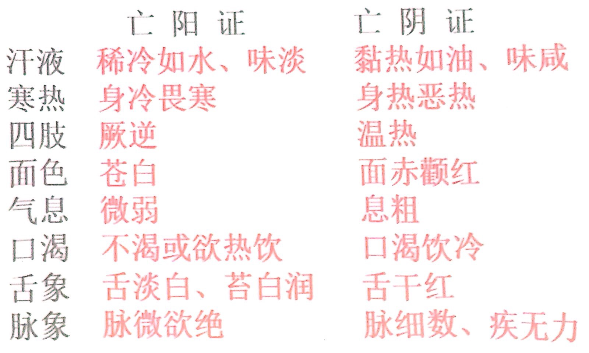
    - 第三节 气血辨证
        - 气血辨证，是根据病人所表现的症状、体征等，对照气血的生理、病理特点，分析、判断疾病当前病理性质有无气血亏损或运行障碍的证候
        - **气血证候的分类**
            - **气血亏虚证候**
                - 虚证
                    - 气虚证
                    - 血虚证
                - 气血虚的特殊表现
                    - 气脱证
                    - 血脱证
                    - 气陷证
                    - 气不固证
            - **气血运行失常证候**
                - 实证
                    - 气滞证
                    - 血瘀证
                - 气滞
                    - 气逆证
                    - 气闭证
                - 血分的热证、寒证
                    - 血热证
                    - 血寒证
                - 气血同病证候
                    - 气血两虚证
                    - 气滞血瘀证
                    - 气不摄血证
                    - 气随血脱证
                    - 气虚血瘀证
        - **气虚类证**
            - **气虚类证**
                - 包括气虚证、以及气陷证、气不固证、气脱证
            - **气虚证**
                - **概念**
                    - 指元气不足，推动、固摄、防御、气化等功能衰减，脏腑机能减退，以气短、乏力、神疲、脉虚等为主要表现的虚弱证候
                - **成因**
                    - 久病、重病、劳累过度等，元气耗伤太过
                    - 先天不足，后天失养，元气生成匮乏
                    - 年老体弱，机能减退而元自衰
                    - 推动、固摄、防御、气化等功能衰减，脏腑机能碱退
                - **临床表现及证候分析**
                    - 气短懒言，神疲乏力
                        - 元气不足，脏腑机能衰退
                    - 头晕目眩
                        - 气虚推动乏力，精微不能上荣
                    - 活动劳累后诸症加重
                        - “劳则气耗”（《素问·举痛论》）
                    - 舌淡嫩
                        - 营气虚不能上承于舌
                    - 脉虚弱
                        - 气虚鼓动血行之力不足
                - **常见脏腑气虚证**
                    - 心气虚证、肺气虚证、脾气虚证、肾气虚证、胃气虚证、肝胆气虚证等，甚至可为多脏气虚证候同在
                - **气虚导致的病理变化**
                    - 气虚而机能减退，运化无权，推动无力，可导致血虚、阳虚、生湿、生痰、水停、气滞、血瘀，以及易感外邪等
                    - 气虚可与血虚、阴虚、阳虚、津亏等兼并为病，而为气血两虚证、气阴两虚证、阳气亏虚证、津气亏虚证等
                    - 气陷证、气不固证、气脱证等，常是气虚的发展，或为其特殊表现
            - **气陷证**
                - **概念**
                    - 指气虚升举无力，而反下陷，以自觉气坠，或脏器下垂为主要表现的虚弱证候
                    - 又称中气下陷证、脾虚气陷证
                - **成因**
                    - 气虚的发展
                    - 或为气虚的一种特殊表现形式
                        - 气虚升举无力，而反下陷
                - **临床表现及证候分析**
                    - 头晕眼花，耳鸣，疲乏，气短，自觉气下坠感
                        - 气虚无力升举，清阳之气不升而反下陷
                    - 内脏位置下垂，或脱肛、阴挺等
                        - 气虚无力升举固摄，内脏位置不能维固而下垂
                    - 舌淡嫩，脉弱
                        - 气虚
                - **辨证要点**
                    - 气短、气坠、脏器下垂
            - **气不固证**
                - **概念**
                    - 指气虚失其固摄之能，以自汗、出血、二便失禁等为主要表现的虚弱证候
                - **成因**
                    - 气虚证的基础上进一步发展而成
                    - 气不固，可以包括气虚不能固摄津液、血液、小便、大便、精液、胎元等
                - **临床表现及证候分析**
                    - 气短，疲乏，面白，舌淡，脉虚无力
                        - 气虚
                    - 自汗，易感外邪
                        - 肺气虚，卫表不固
                    - 遗尿，余溺不尽，小便失禁，或大便滑脱失禁
                        - 肾气虚，不能固摄二便
                    - 各种出血，妇女崩漏
                        - 脾气虚，不能摄血
                    - 或为滑胎、小产
                        - 肾气虚，胎元不固
                    - 男子滑精、早泄
                        - 肾气虚，精关不固
                - **辨证要点**
                    - 肺脾肾虚弱，疲乏、气短、脉虚及自汗、出血、或二便失禁、胎元精液等不固
            - **气脱证**
                - **概念**
                    - 指元气亏虚已极，急骤外泄，以气息微弱、昏迷、汗出不止、脉微欲绝等为主要表现的危重证候
                - **成因**
                    - 气虚、气不固进一步发展
                    - 或长期饥饿、极度疲劳、暴邪骤袭等
                    - 元气亏虚已极，急骤外泄
                - **临床表现及证候分析**
                    - 呼吸微弱而不规则
                        - 肺气外脱
                    - 汗出不止
                        - 津随气泄
                    - 昏迷，面色苍白，肢厥身谅，脉微
                        - 心气外脱欲竭
                    - 口开目合，全身瘫软，手撒
                        - 脾气外泄之征
                    - 二便失禁
                        - 肾气外脱
                - **气脱证与亡阳证辨别**
                    - 亡阳证主证：冷汗淋漓
                    - 气脱证主证：呼吸微弱
        - **血虚类证**
            - **血虚类证**
                - 包括血虚证和血脱证
            - **血虚证**
                - **概念**
                    - 指血液亏虚，不能濡养脏腑、经络、组织，以面、脸、唇、舌色白，脉细为主要表现的虚弱证候
                - **成因**
                    - 血液耗损过多
                        - 各种出血
                        - 久病大病
                        - 劳神大过，阴血暗耗
                    - 血液化生不足
                        - 脾肾虚弱
                        - 进食不足，生化乏源
                        - 瘀血阻络，新血不生
                - **临床表现及证候分析**
                    - 头晕眼花，眼险、爪甲、唇、舌色淡，面色淡白或萎黄
                        - 血液亏少，不能漏养头、目、舌、面
                    - 心悸、多梦
                        - 血不养心、养神，心神不宁
                    - 手足麻木
                        - 血少不能濡养经脉、肌肤
                    - 妇女月经量少，色淡、衍期，甚至闭经
                        - 血海空虚，冲任失行
                    - 脉细无力
                        - 血虚脉失充盈
                - **辨证要点**
                    - 面、唇、舌淡白，脉细
                - **血虚导致的病理变化**
                    - 血虚可与气虚、阴虚、血瘀等兼并存在，而为气血两虚证、阴血亏虚证、血虚夹瘀证
                    - 血虚发展可致血脱
            - **血脱证**
                - **概念**
                    - 面色苍白、心悸、脉微或芤
                - **成因**
                    - 突然大量出血
                        - 呕血、便血、崩漏、外伤失血
                    - 长期反复失血、血虚进一步发展而成
                - **临床表现及证候分析**
                    - 面色苍白，舌色枯白，脉微或芤等
                        - 血液大量耗失，血脉空虚，不得荣润
                    - 眩晕，心悸
                        - 血液亡失，心脏、清窍失养
                - **辨证要点**
                    - 面色苍白、脉微或芤
                    - 气脱、亡阳
                - **气脱证、血脱证、亡阳证、亡阴证区别**
                    - **亡阳、血脱、气脱：**
                        - 气脱证：气息微弱尤为突出
                        - 血脱证：血液大量耗失的病史
                    - **亡阴、亡阳、气脱：**
                        - 亡阴证：汗出热粘、身热烦渴
                        - 亡阳证：冷汗淋漓、身凉肢冷
        - **气滞类证**
            - 包括气滞证以及气逆证、气闭证
            - **气滞证**
                - **概念**
                    - 指人体某一部分或某一脏腑、经络的气机阻滞，运行不畅，以胀闷、疼痛为主要表现的证候
                - **成因**
                    - 气机阻滞，运行不畅
                        - 忧郁悲伤，思虑过度，情志不舒
                        - 痰饮、瘀血、宿食、蛔虫、砂石等阻塞
                        - 阴寒凝滞，湿邪阻碍，外伤络服等
                        - 脏气虚弱，运行乏力
                - **临床表现及证候分析**
                    - 胸胁、脘腹等处或损伤部位的胀闷或疼痛
                        - 气的运行障碍，不通则痛
                    - 胀痛、窜痛、攻痛
                        - 气滞疼痛特点
                    - 嗳气、肠鸣、矢气后账、痛等症可随之缓解
                        - 可使气机暂时得通
                    - 每随情绪波动而改变
                        - 情志不通可导致或加重气滞
                    - 脉弦
                        - 气机不利、脉气不舒之象
                - **辨证要点**
                    - 胀闷、疼痛、窜痛
                - **常见脏腑气滞证**
                    - 有肝气郁结证、胃肠气滞证、肝胃气滞（不和）证等，并表现出各自的证候特征。
                    - 气滞一般是气逆、气闭的病理基础
            - **气逆证**
                - **概念**
                    - 指气机升降失调，气上冲逆，以咳喘、呕恶、头痛眩晕等为主要表现的证候
                - **成因**
                    - 多因气滞不顺而上逆
                    - **肺胃** **肝**
                - **临床表现及证候分析**
                    - 咳嗽，喘息
                        - 肺气上逆
                    - **呃逆，嗳气，或呕吐**
                        - **胃气上逆**
                    - 头痛，眩晕，昏厥、气从少腹上冲胸咽
                        - **肝气上逆**
                - **辨证要点**
                    - 咳喘、呕恶、头痛眩晕
            - **气闭证**
                - **概念**
                    - 指邪气阻闭脏器，以致气机逆乱，闭塞不通，以突发昏厥或绞痛为主要表现的急重证候
                - **临床表现及证候分析**
                    - 神昏或晕厥，肢厥
                        - 气机阻闭，心神失主
                    - 脏器绞痛、大小便闭塞不通
                        - 有形实邪阻塞脉络、管腔，闭阻气机
                    - 呼吸气粗、声高
                        - 邪气阻闭，肺气不利
                    - 脉沉实有力
                        - 实邪内阻
                - **辨证要点**
                    - 突发性昏厥或绞痛
        - **血瘀证**
            - **概念**
                - 指瘀血内阻，血行不畅，以疼痛、肿块、出血、青紫、脉涩为主要表现的证候
            - **临床表现及证候分析**
                - **疼痛**
                    - 如针刺刀割，痛处不移而固定，常在夜间加重
                    - 瘀血内积，气血运行受阻，不通则痛
                    - 气血不得通达，夜间血行缓慢，瘀阻更甚
                - **肿块**
                    - 在体表者，常呈青紫包块
                    - 在腹内者，可触及较坚硬而推之不移的肿块（称为症积）
                        - 积瘀不散而凝结
                - **出血**
                    - 色紫暗或夹有血块，或大便色黑如柏油状
                    - 瘀血阻塞脉络，血液不能循经运行，而溢出脉
                - **面唇舌肌肤青紫，脉涩**
                    - 肌肤甲错
                        - 瘀久不消，血液亏少，营血不能濡养肌肤
                    - 妇女经闭，或为血崩、漏下
                        - 瘀血阻滞冲任
                    - 腹部青筋显露，或皮肤出现丝状红缕（蜘蛛痣）
                        - 瘀血内阻，血行受阻
                    - **舌质紫暗或见紫斑、紫点，或舌下脉络曲张，或舌边有青紫色条状线**
                        - 瘀血内阻
                    - 脉涩，或结、代，或无脉
                        - 瘀血停聚之象
                - **面色黧黑，或唇甲青紫，或皮下紫斑**
                    - 瘀血阻络，气血运行不畅，全身缓慢而持久得不到气血的温煦濡养
            - **辨证要点**
                - 固定刺痛、肿块、出血、青紫、脉涩为主要表现
        - **血热证**
            - **概念**
                - 指火热内炽，侵迫血分，以出血、疮疡及身热口渴，舌绛、脉数等为主要表现的实热证候
                - 即血分的热证
            - **成因**
                - 火热炽盛，侵迫血分
                    - 外感热邪，或感受它邪化热，传入血分
                    - 情志过激，气郁化火
                    - 或过食辛辣燥热之品，火热内生
            - **临床表现及证候分析**
                - 咳血、吐血、衄血、尿血、便血、崩漏等出血，血色深红质稠，或斑疹显露
                    - 血热迫血妄行
                - 疮痈，红肿热痛
                    - 热炽血壅肉腐
                - 身热，心烦，口渴，舌红绛，脉滑数
                    - 血热内扰心神，伤阴耗液
            - **辨证要点**
                - 以出血、疮疡及身热、烦躁、口渴，舌绛、脉数等为主要表现
                - 出血、疮疡+热=血热证
            - **常见证型**
                - 血热证常见于外感温热病的血分证
                - 又可见于外科疮疡病、妇科月经病、其他杂病之中
        - **血寒证**
            - **概念**
                - 指寒邪客于血脉，凝滞气机，血行不畅，以患处冷痛拘急、肤色青紫及恶寒、肢冷等为主要表现的实寒证候
                - 即血分的寒证
            - **临床表现及证候分析**
                - 恶寒，手足或少腹等患处冷痛拘急、得温痛减
                    - 寒凝脉络，气血不畅，组织失于温养
                - 肤色紫暗发凉，或为痛经、月经衍期、经色紫暗、夹有血块，唇舌青紫，脉沉迟弦涩
                    - 瘀血内阻，血行不畅
            - **辨证要点**
                - 以患处冷痛拘急、肤色青紫及恶寒、肢冷等为主要表现
                - 寒+瘀=血寒证
        - **气血同病类证**
            - 气病或血病发展到一定的程度，往往影响到另一方的生理功能而发生病变，从而表现为气血同病的证候
            - **气滞血瘀证** **气虚血瘀证** **气血两虚证** **气不摄血证** **气随血脱证**
            - **试比较气滞血瘀证与气虚血瘀证的临床表现有何异同？**
                - 两证均有胸胁刺痛拒按，舌暗或见紫斑；脉涩等血瘀的症状
                - 但气滞血瘀证的疼痛兼有胀闷，走窜作痛并见性情急躁，胁下痞块，经闭或痛经，舌质紫暗等；而气虚血瘀证的疼痛以痛处不移为特点，并兼有面色淡白或暗紫，身倦乏力，少气懒言，舌淡，脉沉等气虚的症状
            - **气不摄血与血热证如何鉴别？**
                - 气不摄血证多见于慢性疾患，性质属虚，其出血色淡而质薄，舌质淡，脉细弱
                - 血热证多见于急性病证，性质属实，其出血色鲜红质稠，舌质红绛，脉弦数
            - **试述气血两虚，气不摄血和气随血脱证的临床表现？**
                - 气血两虚证：头晕目眩，少气懒言，乏力自汗，面色淡白或萎黄，心悸失眠，舌淡嫩，脉细弱
                - 气不摄血证：吐血便血，皮下瘀斑，崩漏，气短，倦怠乏力，面白无华，舌淡，脉细弱
                - 气随血脱证：大出血时突然面色苍白，四肢厥冷，大汗淋漓，甚至晕厥，舌淡，脉微欲绝或浮大而数
    - 第四节 津液辨证
        - 津液辨证，是根据病人所表现的症状、体征等，分析、辨别疾病当前病理属性是否有津液亏虚或运化障碍的证候
        - 津液证候包括津液亏虚和水液停聚而形成的痰证、饮证、水停证及湿证
        - **痰证**
            - **概念**
                - 咳痰、胸闷、呕恶、眩晕、体胖 局部有圆滑包块，苔腻、脉滑
            - **成因**
                - **肺、脾、肾** **水液不布，凝结成痰**
                    - 外感六淫、饮食不当、情志刺激、过逸少动等
            - **临床表现及证候分析**
                - 咳嗽咯痰，痰质粘稠，胸闷
                    - 痰停于肺，肺失宣降
                - 脘痞、纳呆、泛恶，呕痰涎
                    - 痰浊中阻，胃失和降
                - 某些部位出现圆滑柔韧的瘰疠、瘿瘤、乳癖、核块等症
                    - 痰质粘稠，停积于局部
                - 头重眩晕
                    - 痰随气升，蒙蔽清窍
                - 神昏而痰鸣，或发癫、狂、痴、痫等病
                    - 痰浊蒙蔽心神
                - 形体肥胖
                    - 痰泛于肌肤
                - 苔腻、脉滑
                    - 痰浊内阻
            - **辨证要点**
                - 咳痰、胸闷、呕恶、眩晕、体胖，或局部有圆滑包块，苔腻、脉滑
            - **常见证型**
                - 痰与其他病性兼并，有寒痰、热痰、湿痰、燥痰以及风痰、瘀痰、脓痰等之分
                - 临床常见的痰证有：痰蒙心神证、痰热闭神证、痰火扰神证、痰阻心脉证、痰阻胸阳证、痰浊阻肺证、痰热壅肺证、痰热结胸证、痰热腑实证、燥痰结肺证、痰阻胞宫（或精室）证、痰湿内盛证、痰阻经络证、风痰阻络证、痰气郁结证、脓痰蕴肺证、风痰闭神证、瘀痰阻络证等
                - “百病多因痰作祟”、“怪病多痰”
        - **饮证**
            - **概念**
                - 指水饮停聚于腔隙或胃肠，以胸闷脘痞、呕吐清水、咳痰清稀、肋间饱满、苔滑等为主要表现的证候
            - **临床表现及证候分析**
                - 脘腹痞胀，水声漉漉，泛吐稀涎或清水
                    - **胃肠** **痰饮**
                - 咳嗽气喘、吐痰多而质稀色白，胸闷心悸，甚或喉中哮鸣有声，气短不得卧
                    - **心肺** **支饮**
                - 胸胁饱满，支撑胀痛，咳唾引痛，胸闷息促，随呼吸，咳嗽，转侧而痛增
                    - **胸胁** **悬饮**
                - 水液泛聚于肌肤
                    - **衣饮**
                - 眩晕
                    - 清阳不升、饮邪上泛
                - 舌淡嫩，苔白滑，脉弦
                    - 饮邪内停
        - **水停证**
            - **概念**
                - 体内水液停聚，以肢体浮肿、小便不利，或腹满如鼓，舌淡胖、脉弦
            - **临床表现及证候分析**
                - 水肿，或见于面脸，或见于下肢，甚或全身皆肿，按之凹陷而不易起
                    - 肺、脾、肾功能失常，气化输布不利，水液停聚，泛溢肌肤
                - 腹满如鼓，叩之声浊
                    - 水停于腹腔
                - 小便短少
                    - 水液内停，气化失司
                - 苔滑，脉沉弦
                    - 水湿内停
            - **辨证要点**
                -  水肿、尿少，腹满如鼓，舌淡胖，脉沉弦
        - **水肿各证型的临床表现及辨证要点是什么？**
            - **阳水**
                - **临床表现**
                    - 头面浮肿，先从眼睑开始，继而遍及全身，小便短
                    - 肿势迅速，皮薄光亮
                    - 常伴有恶风（寒），发热，肢节酸痛，苔薄白，脉浮紧
                    - 或伴咽喉肿痛，舌红脉浮数
                    - 或伴全身水肿，来势较缓，按之没指，肢体沉重、困倦，小便短少，脘闷纳呆，泛恶欲吐，苔白腻，脉沉
                - **辨证要点**
                    - 发病急，来势猛，先从眼睑头面，上半身肿甚
            - **阴水**
                - **临床表现**
                    - 水肿以腰以下为甚，按之凹陷不起，小便短少，脘闷腹胀，纳呆便溏，面色恍白，神倦肢困，舌淡苔白，脉沉
                    - 或水肿日益加剧，小便不得，腰膝酸冷，四肢不温，畏寒神疲，面色恍白或灰滞，舌淡胖苔白滑，脉沉无力
                - **辨证要点**
                    - 发病缓，来势徐，水肿先从足部开始，腰以下肿甚
        - **湿水饮痰的区别**
            - **肺、脾、肾等脏腑功能失调** **水液气化失常**
                - **湿**
                    - 无明显形质可见，以肢体闷重酸困等为主要表现
                - **水**
                    - 质清稀为液态，流动性大，以水肿、少尿为主症
                - **饮**
                    - 是较水浊而较痰稀，常停聚于某些腔隙及胃肠，以停聚处的症状为主要表现
                - **痰**
                    - 质地稠浊而黏，流动性小，多停于肺，但可随气流窜全身，见症复杂，一般有吐痰多的主症
            - 湿、水、饮、痰本属一类，难以截然划分，且可相互转化、兼并，故又常互相通称，如有痰饮、痰湿、水饮、水湿、湿饮、湿痰等名
        - **津液亏虚证**
            - **概念**
                - 指体内津液亏少，脏腑、组织、官窍失却滋润、濡养、充盈，以口渴尿少，口鼻唇舌皮肤大便干燥等为主要表现的证候
            - **成因**
                - 大汗、大吐、大泻、高热、烧伤
                - 外界气候干燥，或体内阳气偏亢
                    - 津液耗损
                - 饮水过少，或脏气虚衰
                    - 津液生成不足
            - **临床表现及证候分析**
                - 口、鼻、唇、舌、咽喉干燥，唇焦或裂，眼球深陷，皮肤枯瘪而乏弹性，渴欲饮水，小便短少而黄，大便干结难解
                    - 津液亏少，不能充养濡润组织官窍
                - 舌干红少津、脉细数
                    - 阴液亏少不能遏制阳气，阳气偏旺
            - **辨证要点**
                - 口渴尿少，口鼻唇舌
                - 皮肤干燥，大便干结
            - **常见证型**
                - 有肺燥津伤证、胃燥津亏证、肠燥津亏证等
                - 气虚、血虚与津液亏虚可互为因果或同病，而形成阴液亏虚证、津气亏虚证、津枯血燥证等
            - **津液亏虚证与燥淫证的区别**
                - 外感燥邪耗伤津液所见证候，为燥淫证，属于外燥
                - 内津液亏虚必见干燥症状，为津液亏虚证，属于内燥
    - **病案分析**
        - 谢某，男，28岁。于夏季抗洪护堤工作中突然昏倒，发热，汗出不止。经抢救神识已清，但觉口渴，疲乏，尿黄，舌红，脉虚数。
            - 暑热伤津
                - 暑邪闭阻气机，阻虚
        - 姚某，男，35岁。腰脊疼痛，下肢关节强直两年。现觉胸痛，腰脊及下肢关节疼痛，膝踝关节肿胀，曲伸不利，行则依附拐杖。遇寒冷阴雨天气疼痛加剧。腿部肌肉萎缩，乏力神疲，舌淡苔白，脉细滑。
            - 寒湿证 痹证
        - 于某，男，28岁。5天前起胁肋疼痛，右侧尤甚。两目发黄，胸闷呕恶，食欲不振，口苦溲赤，大便干结，舌尖边红，苔黄腻，脉濡数。
            - 肝胆湿热
        - 邓某，男，28岁，形瘦，4月3日就诊，患者于3天前于兰州出差同来，即感口燥咽干，咳嗽，今日咳嗽加重，痰少难咯，咽干唇裂，渴欲饮水，皮肤干，舌红苔薄，脉细数。
            - 阴虚证
        - 赵某，男，30岁，患者于4天前开始发热，伴微恶寒。咳嗽吐稠痰，鼻塞流浊涕，未及治疗。现壮热，口渴，咳嗽加剧，痰稠色黄，气喘息粗，烦躁不安，大便干结，小便短赤，舌红苔黄燥，脉滑数。
            - 痰热
- **第七章 病位辨证**
    - 第一节 脏腑辨证
        - **概论**
            - 脏腑辨证，是在认识脏腑生理功能及病理特点的基础上，将四诊收集的症状及有关病情资料，进行分析综合，从而判断疾病所在的脏腑部位及病性的一种辨证方法
            - 概括言之，即以脏腑病位为纲，对疾病进行辨证
            - 脏腑辨证的意义，在于着重辨别疾病所在的脏腑病位
            - 首先是辨明脏腑病位，其次要辨清病性
            - 脏腑辨证作为病位辨证的一种，与病性辨证之间相互交织，临床既可以脏腑病位为纲，区分不同病性；也可在辨别病性的基础上，根据班确的病变特点确定病位所在脏腑
            - **脏腑辨证中的病证按虚实可分为几类？各包括哪些证？意义何在？**
                - 按八纲的虚实两纲可分为三类，即虚证、实证、虚实挟杂证
                    - **虚证**
                        - **阴虚**
                            - **肾精不足**
                                - 肾精不足不等于阴虚，但接近阴虚，暂附于阴虚
                        - **阳虚**
                            - **肾气不固**
                                - 肾气不固既可表现肾阳虚，也可表现肾阴虚，暂归于阳虚
                        - **气虚**
                            - 心气虚、肺气虚、脾气虚、脾不统血、心肺气虚、肺脾气虚
                        - **血虚**
                            - **心脾两虚**
                                - 心脾两虚既有心血虚也有脾气虚，暂放于血虚
                    - **实证**
                        - 心火亢盛、痰迷心窍、痰火扰心、小肠实热、风寒束肺、痰湿阻肺、风热犯肺、热邪壅肺、燥邪犯肺、大肠湿热、寒湿困脾、湿热蕴脾、胃热证、食滞胃脘、肝气郁结、肝火_上炎，热极生风、肝胆湿热、胆郁痰扰、膀胱湿热、肝火犯肺
                    - **虚实挟杂证**
                        - **心脉痹阻**
                            - 心脉痹阻，是本虚标实，故放在虚实挟杂
                - 这种分类意义在于：
                    - 由于脏腑辨证内容多，而相当多的证要记住和掌握，运用八纲的虚实两纲，便于认识、归纳和记忆，不失为掌握脏腑辨证的一个好方法
                        - 脏腑辨证共有病证57个，虚证就有28个，几乎占总数的一半，而虚证较容易归纳和记忆，因此，掌握虚证是掌握脏腑辨证的重要环节
                        - 实证共21个，其中热证或火证有8个，湿热证有4个，两项加起来占实证一大半，因此，应给予足够的重视
            - **五脏的阴虚证如何归纳？**
                - **阴虚证的临床表现（共性）**
                    - 潮热，或低热，五心烦热，盗汗，口干明燥，尿黄便结，舌红少律，脉细数
                    - 阴液不足，虚火内生所致
                - **心阴虚**
                    - 阴虚的共性 + 心悸，心烦，不寐，称为心阴虚
                    - 阴液不足，使藏神的功能失常所致
                - **肺阴虚**
                    - 阴虚的共性 + 声嘶，干咳无痰或少痰，痰中带血，称之为肺阴虚
                    - 虚火烧灼肺阴或使肺的脉络破损所致
                - **肝阴虚**
                    - 阴虚共性 + 两眼干涩，胁肋隐痛，脉弦，称之为肝阴虚
                    - 虚火灼阴，阴液不养肝窍或影响肝经所致
                - **肾阴虚**
                    - 阴虚共性 + 腰酸膝软，头晕，耳鸣，称之为肾阴虚
                    - 肾阴不足，使肾主骨、生髓、通脑、开窍于耳的功能失常所致
            - **五脏的阳虚证如何归纳？**
                - **阳虚证的临床表现（共性）**
                    - 面色恍白，畏冷肢凉，尿清便溏，舌质淡胖，脉迟弱
                    - 阳气失于温运所致
                - **心阳虚**
                    - 阳虚共性 + 心悸或怔忡，胸闷，称为心阳虚
                    - 心阳不足，不藏神而心悸怔忡，或心阳不足，宗气运行无力而致胸闷
                - **脾阳虚**
                    - 阳虚共性 + 纳少腹胀，腹痛，或水肿，称为脾阳虚
                    - 脾阳不足，使胃的受纳和脾的运化功能减弱，或影响脾的运化水湿的功能，使水湿内停，而发生水肿
                - **肾阳虚**
                    - 阳虚共性 + 腰酸，膝软，头晕，耳鸣，阳痿，称为肾阳虚
                    - 腰为肾之府，肾主骨生髓，脑为髓之海，肾开窍于耳，肾主生殖，肾阳不足则上述功能均受到影响
            - **五脏的气虚证如何归纳？**
                - **气虚证的临床表现（共性）**
                    - 面色淡白神疲乏力，自汗，舌淡苔白，脉虚
                    - 元气亏损，脏腑功能减退所致
                - **心气虚**
                    - 气虚共性 + 心悸或怔忡，胸闷，称为心气虚
                    - 心气虚使心失藏，出现心悸或怔忡，心气不足使宗气匮乏，产生胸闷不舒
                - **肺气虚**
                    - 气虚共性 + 上咳喘无力，少气不足以息，痰清稀或声低怯，称为肺气虚
                    - 肺气不足，呼吸功能减弱，出现少气不足以息
                    - 肺气不足，还可影响输布水液的功能，水停肺则为痰，肺气不足使宗气减弱，声低怯
                - **脾气虚**
                    - 气虚共性 + 纳差，腹胀，便溏，称为脾气虚
                    - 脾的运化水谷与运化水液的功能减弱，出现上述的症状
            - **五脏的血虚证如何归纳？**
                - **血虚证的临床表现（共性）**
                    - 面白无华或萎黄，唇色、眼睑、爪甲白，舌色淡白，脉弱
                    - 血液濡养人体的功能衰减
                - **心血虚**
                    - 血虚的共性 + 心悸或征忡，失眠多梦，健忘，称为心血虚
                    - 心神失藏，出现心悸或怔忡，失眠多梦，心血不足，濡养脑髓不足，出现健忘
                - **肝血虚**
                    - 血虚共性 + 视力减退或雀盲，妇女经少色淡，称为肝血虚
                    - 肝血不足，影响肝开窍于目、肝主胞宫等功能
        - **心与小肠病证**
            - **主要生理**
                - 心居胸中，为君主之官，主人身之血脉，又主神志，为五脏六腑之大主，在体为脉，其华在面，开窍于舌，其经脉循肩臂内侧后缘，与小肠互为表里
                - 小肠具有受盛化物和泌别清浊的功能
            - **主要病理**
                - **心**
                    - 心病证是心的生理功能失常，产生相应的病理改变，而出现的症状和体征，称为心病证的表现特点
                    - **生理功能：主血、藏神、其华在面、开窍于舌**
                        - 心气足，血脉充盈，则面色红润，脉和缓有力；心气不足，血脉亏损则面白无华，脉虚或细弱
                            - 心气不足，或气来不连续，则脉跳不匀，出现促、结、代脉
                        - 心血充盈，血能养神，表现神志清晰，思维敏捷，精力充沛；心血亏损，不足养神，出现心神不宁，失眠多梦，健忘
                            - 心开窍于舌，心血充盈，舌质淡红而有津液
                            - 若心血不足，则舌质淡白
                            - 若心火上炎，表现舌尖红赤或舌体糜烂
                            - 若心脉痹阻，血行瘀滞，表现舌质紫暗，或见瘀斑
                            - 若痰火扰心，则舌质红，苔黄腻，神志异常
                    - 血脉、神志功能失常
                        - 心悸，怔忡，心痛，心烦，失眠，健忘，精神错乱，神志昏迷，以及某些舌体病变等
                - **小肠**
                    - 功能失常
                        - 腹胀，腹痛，肠鸣，腹泻等
            - **常见证型**
                - **心之虚证**
                    - **心血虚证**
                        - **概念**
                            - 指血液亏虚，心失濡养，以心悸、失眠、多梦及血虚症状为主要表现的证候
                        - **病因病机**
                            - 劳神过度
                            - 失血过多
                            - 久病伤及营血
                            - 脾失健运或肾精亏损
                            - 生化之源不足
                        - **临床表现及证候分析**
                            - 心悸
                                - 血液不足，心失濡养，心动失常
                            - 失眠、多梦
                                - 心神失养，神不守舍
                            - 头晕眼花、健忘、面色淡白或萎黄，唇、舌色淡
                                - 血虚不能上荣头面
                            - 脉细无力
                                - 血少脉道失充
                        - **辨证要点**
                            - 心悸、失眠、多梦与血虚症状共见
                    - **心阴虚证**
                        - **概念**
                            - 指阴液亏损，心失滋润，虚热内扰，以心悸、心烦、失眠及阴虚症状为主要表现的虚热证候
                        - **病因病机**
                            - 思虑劳神太过，暗耗心阴
                            - 温热火邪，灼伤心阴
                            - 肝肾阴亏，不能上养，累及心阴
                        - **临床表现及证候分析**
                            - 心悸
                                - 阴液亏少，心失满养，心动失常
                            - 心烦、失眠、多梦
                                - 阴虚阳亢，虚热扰心，神不守舍
                            - 口燥咽干，形体消瘦
                                - 阴虚失滋
                            - 手足心热，潮热盗汗，两颧潮红，舌红少苔乏津，脉象细数
                                - 阴不制阳，虚热内生
                        - **辨证要点**
                            - 心悸、心烦、失眠与虚热症状共见
                        - **鉴别要点** 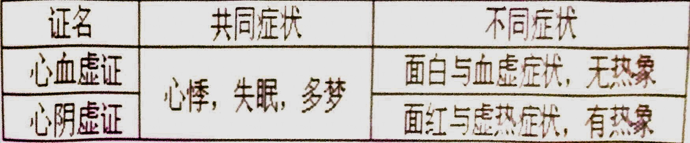
                    - **心气虚证**
                        - **概念**
                            - 指心气不足，鼓动无力，以心悸怔忡、胸闷气短及气虚症状为主要表现的虚弱证候
                        - **病因病机**
                            - 素体久虚
                            - 久病失养
                            - 劳倦过度
                            - 先天不足
                            - 年高气衰
                        - **临床表现及证候分析**
                            - 心悸怔忡
                                - 心气虚，鼓动乏力，心动失常
                            - 气短胸闷
                                - 宗气衰少
                            - 精神疲倦
                                - 脏腑功能减退
                            - 自汗
                                - 气虚卫外不固
                            - 活动劳累后诸症加剧
                                - 动则气耗
                            - 面色淡白，舌淡，脉虚
                                - 气虚运血无力，气血不足，血脉不荣
                        - **辨证要点**
                            - 心悸怔仲、胸闷气短与气虚症状共见
                    - **心阳虚证**
                        - **概念**
                            - 指心阳虚衰，温运失司，虚寒内生，以心悸怔忡、心胸闷痛及阳虚症状为主要表现的虚寒证候
                        - **病因病机**
                            - 心气虚进一步发展，或由其他脏腑病证损伤心阳
                        - **临床表现及证候分析**
                            - 心悸（轻）怔忡（重）
                                - 心阳虚衰，推动、温运无力，心动失常
                            - 胸闷气短
                                - 心阳虚衰，宗气衰少，胸阳不展，气滞胸中
                            - 心胸疼痛
                                - 心脉痹阻
                            - 畏寒肢冷
                                - 虚寒内生，温煦失职
                            - 自汗
                                - 阳虚卫外不固
                            - 面色白光白或面唇青紫，舌质紫暗，脉弱或结或代脉
                                - 温运乏力，面部血脉失充，寒凝而血行不畅
                            - 舌淡胖嫩，苔白滑
                                - 阳虚水湿不化
                        - **辨证要点**
                            - 心悸怔忡、心胸闷痛与虚寒症状共见
                        - **鉴别要点** 
                    - **心阳虚脱证**
                        - **概念**
                            - 指心阳衰极，阳气欲脱，以心悸胸痛、冷汗肢厥、脉微欲绝为主要表现的危重证候
                        - **病因病机**
                            - 由心阳虚证进一步发展
                            - 寒邪暴伤心阳
                            - 痰瘀阻塞心脉
                            - 失血亡津，气无所依，心阳随之外脱
                        - **临床表现及证候分析**
                            - 在心阳虚的基础上，突然：
                                - 冷汗淋离
                                    - 心阳衰亡，不能外固
                                - 四肢厥冷
                                    - 不能温煦四肢
                                - 呼吸微弱
                                    - 宗气外泄，不司呼吸
                                - 面色苍白无华
                                    - 阳气外脱，脉道失充
                                - 心痛剧烈，口唇青紫
                                    - 阳衰寒凝血脉
                                - 神志模糊，甚则昏迷
                                    - 心神涣散
                                - 脉微欲绝
                                    - 心脉衰竭
                        - **辨证要点**
                            - 心悸胸痛、冷汗肢厥、脉微欲绝等与亡阳症状共见
                - **心之实证**
                    - **心火亢盛证**
                        - **概念**
                            - 指心火内炽，上炎下移，扰神迫血，以心烦失眠、舌赤生疮、吐衄尿赤等为主要表现的实热证候
                                - 上炎到口舌，下移到小肠
                        - **病因病机**
                            - 扰神迫血
                                - 情志抑郁化火
                                - 火热之邪内侵
                                - 过食辛辣刺激、温补之品，久蕴化火
                        - **临床表现及证候分析**
                            - 心烦失眠
                                - 心火炽盛，热扰心神，神不守舍
                            - 发热口渴，便秘尿黄
                                - 热盛伤津
                            - 面红舌赤，苔黄脉数
                                - 火热内盛
                            - 狂躁谵语，神识不清
                                - 火热闭窍扰神
                            - 叶血衄血
                                - 火热迫血妄行
                            - 口舌生疮，溃烂疼痛
                                - 心火上炎舌窍
                            - 小便赤涩，灼热疼痛
                                - 心火下移小肠
                        - **辨证要点**
                            - 心烦失眠、舌赤生疮、吐衄尿赤与实热症状共见
                    - **心脉痹阻证**
                        - **概念**
                            - 指瘀血、痰浊、阴寒、气滞等因素阻痹心脉，以心悸怔忡、胸闷心痛为主要表现的血瘀证候
                            - 又称为心血（脉）瘀阻证
                        - **病因病机**
                            - 正气先虚，心阳不振，运血无力（本虚）
                            - 气滞、血瘀、痰阻、寒凝（标实）
                                - 气机阻滞、瘀血内阻、痰浊停滯、阴寒凝聚四型
                        - **临床表现及证候分析**
                            - 心悸怔忡
                                - 心阳不振，失于温运，心脉失养，心动不安
                            - 心胸憋闷疼痛
                                - 阳气不运，心脉阻滞不通
                            - 痛引肩臂内臂，时作时止
                                - 手少阴心经之脉横出腋下，循肩背、内臂后缘
                            - 以刺痛为特点，伴见舌质晦暗，或有青紫色瘀斑、瘀点，脉细涩或结或代
                                - 瘀血内阳（瘀阻心脉证）
                            - 以憋闷为特点，多伴体胖痰多，身重困倦，苔白腻，脉沉滑或沉涩
                                - 痰浊内盛（痰阻心脉证）
                            - 以痛势剧烈，突然发作，遇寒加剧，得温痛减为特点，伴见畏寒肢冷，舌淡苔白，脉沉迟或沉紧
                                - 寒邪内盛（寒凝心脉证）
                            - 以胀痛为特点，其发作多与精神因素有关，常伴见胁胀，善太息，脉弦
                                - 气机郁滞（气滞心脉证）
                        - **辨证要点**
                            - 心悸怔忡、心胸憋闷疼痛与瘀、痰、寒、气所致心脉痹阻症状共见
                        - **为什么说心脉痹阻证是“本虚标实”？**
                            - 就一个具体患者来说，应根据患者的临床表现而定，辨证论治
                        - 目前临床多数医家认为本证不是单虚证或实证，而是本虚标实
                            - 本虚，因此证多见于中年以上患者，往往表现有程度不同气虚、阳虚、阴虚
                            - 标实，主要根据疼痛发作的特点，以及有瘀血、痰浊、寒凝、气滞等表现
                    - **痰蒙心神证**
                        - **概念**
                            - 指痰浊内盛，蒙蔽心神，以神志抑郁、错乱、痴呆、昏迷为主要表现的痰浊证候
                            - 又称为痰迷心窍（包）证
                        - **病因病机**
                            - 痰浊蒙蔽心神
                                - 湿浊酿痰，阻遏气机
                                - 情志不遂，气郁生痰
                                - 痰浊内盛，挟肝风内扰
                        - **临床表现及证候分析**
                            - 神情痴呆，意识模糊，甚则昏不知人
                                - 痰浊蒙蔽，心神不清
                            - 精神神郁，表情谈漠，喃喃独语，举止失常
                                - 肝失疏泄，气郁生痰，蒙蔽心神
                            - 突然昏仆，不省人事，口吐涎沫，喉中痰鸣
                                - 痰浊内盛，引动肝风，肝风挟痰，蒙闭心神
                            - 面色晦暗
                                - 痰浊内阻，气血不畅
                            - 胸闷呕恶
                                - 痰阻胸阳，胃失和降
                            - 舌苔白腻，脉滑
                                - 痰浊内盛
                        - **辨证要点**
                            - 神志神郁、错乱、痴呆、昏迷与痰浊症状共见
                    - **痰火扰神证**
                        - **概念**
                            - 指火热痰浊交结，扰乱心神，以狂躁、神昏为主要表现的痰热证候
                            - 又叫痰火扰心（闭窍）证
                        - **病因病机**
                            - 痰火内盛，侵扰心神
                                - 精神刺激，思虑动怒，气郁化火，炼液为痰
                                - 外感温热、湿热之邪，热邪煎熬，灼液为痰
                        - **临床表现及证候分析**
                            - **外感热病中：**
                                - 发热口渴，面红目赤
                                    - 邪热内盛，热蒸火炎
                                - 胸闷气粗，吐痰黄稠，喉间痰鸣
                                    - 痰火壅肺
                                - 烦躁不宁，失眠多梦
                                    - 痰热扰心
                                - 神昏谵语
                                    - 痰火蔽窍，扰乱神志
                            - **内伤杂病中：**
                                - 轻则心烦失眠，重则精神错乱
                                    - 痰火内盛，闭扰心神
                                - 狂妄躁动，打人毁物，不避亲疏，糊言乱语，哭笑无常
                                    - 痰火扰乱精神
                                - 舌红，苔黄腻，脉滑数
                                    - 痰火内盛
                        - **辨证要点**
                            - 神志狂躁、神昏澹语与痰热症状共见
                        - **鉴别要点** 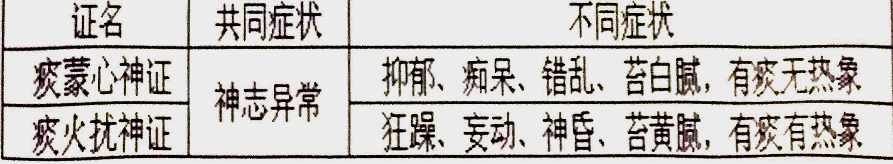
                    - **瘀阻脑络证**
                        - **概念**
                            - 指瘀血犯头，阻滞脑络，以头痛、头晕及血瘀症状为主表现的证候
                        - **病因病机**
                            - 头部外伤，瘀血停积脑内
                            - 久痛入络，瘀血阻塞脑络
                        - **临床表现及证候分析**
                            - 头痛如刺，痛处固定，经久不愈
                                - 瘀血阻滞脑络
                            - 头晕不已
                                - 脑络不通，气血失养
                            - 健忘，失眠，心悸
                                - 瘀血不去，新血不生，心神失养
                            - 昏不知人
                                - 外伤严重，元神无主
                            - 面色晦暗
                                - 脑络瘀阻，瘀色外现
                            - 舌质紫暗或有瘀点瘀斑，脉细涩
                                - 瘀血内阻
                        - **辨证要点**
                            - 头痛、头晕与血瘀症状共见
                - **小肠实证**
                    - **小肠实热证**
                        - **概念**
                            - 指心火下移小肠，膀胱气化失司，以小便赤涩疼痛、心烦、舌疮为主要表现的实热证候
                        - **病因病机**
                            - 心经有热，下移小肠
                            - 饮食不节，脾失健运，湿浊化热，下注小肠
                        - **临床表现及证候分析**
                            - 小便黄热、涩痛
                                - 心火下移小肠，膀胱气化失司
                            - 尿血
                                - 热伤血络
                            - 心烦口渴
                                - 热邪扰心
                            - 口舌生疮
                                - 火扰舌窍
                            - 脐腹胀痛
                                - 小肠、膀胱气机失调
                            - 舌红苔黄，脉数
                                - 实热
                        - **辨证要点**
                            - 小便赤涩疼痛、心烦、舌疮与实热症状共见
                    - **小肠气滞证（寒滞肝脉证）**
                - **小肠虚证**
                    - **小肠虚寒证（脾阳虚证）**
        - **肺与大肠病证**
            - **主要生理**
                - 肺居胸中，上连气道、喉咙，开窍于鼻。肺主气，司呼吸，主宜发，外合皮毛，主肃降，通调水道
                - 肺与大肠相表里，大肠主传导，排泄糟粕
            - **主要病理**
                - **肺病证候**
                    - 肺病证是肺的生理功能失常，发生病理改变，表现相应的症状和体征，即是肺病证的临床表现特点
                    - **生理功能：主气、主宣发、外和皮毛、主肃降，通调水道、开窍于鼻**
                        - 肺主呼吸之气和主一身之气，使气道通畅，呼吸均匀和调；肺气不足，则呼吸无力，少气不足以息，语音低微
                        - 肺主宣发，外合皮毛，使卫气津液输布全身，温润肌腠皮肤；肺卫气弱，则皮毛不固，自汗，易感冒
                        - 肺主肃降，通调水道，使呼吸平顺，不咳不喘，使水道疏通，小便自得；肺失肃降则呼吸不调，胸闷，咳嗽，气喘，水道不畅则小便不通利，痰饮，水肿等均可出现
                        - 肺开窍于鼻，肺气和顺，呼吸通畅；外邪袭肺，则鼻塞流涕；肺热壅盛，则鼻翼煽动
                    - **虚证**
                        - 气虚和阴虚
                    - **实证**
                        - 风、寒、燥、热和痰饮
                    - 症状以咳嗽、气喘最常见
                - **大肠病证候**
                    - **虚证**
                        - 阴血津亏
                    - **实证**
                        - 感受湿热之邪，或误食不洁，虫体寄生
                    - 症状以泄泻、便秘最常见
            - **常见证型**
                - **肺病虚证**
                    - **肺气虚证**
                        - **概念**
                            - 指由于肺功能减弱，以咳喘无力及气虚见症为主要表现的证候
                        - **病因病机**
                            - 久病咳喘，耗伤肺气
                            - 气的化生不足，肺失充养
                        - **临床表现及证候分析**
                            - 咳喘无力
                                - 肺气亏虚，宜降失权
                            - 动则咳喘益甚
                                - 动则耗气
                            - 少气短息，语声低怯
                                - 肺气虚，宗气衰少，走息道以行呼吸功能衰退
                            - 吐痰清稀
                                - 津液不布，聚而为痰，随肺气上逆
                            - 面色淡白，神疲体倦，舌淡苔白，脉弱
                                - 气虚
                            - 自汗、畏风，易受外邪侵袭而患感冒
                                - 肺气虚，不能宣发卫气于肌表，腠理不密，表卫不固
                        - **辨证要点**
                            - 咳喘无力及气虚见症共见
                    - **肺阴虚证**
                        - **概念**
                            - 指由于肺阴不足，虚热内生，以干咳或痰少而粘和虚热见症为主要表现的证候
                        - **病因病机**
                            - 热病后期耗伤肺阴
                            - 痨虫蚀肺
                            - 久咳伤肺，肺阴亏虚
                        - **临床表现及证候分析**
                            - 干咳无痰，或痰少而粘，难以咯出
                                - 肺为娇脏，性喜清润，肺阴不足，以致肺失清肃，虚热内生，炼津成痰
                            - 痰中带血
                                - 虚火灼伤肺络，络伤血溢
                            - 声音嘶哑
                                - 肺阴不足，咽喉失润
                            - 午后潮热、五心烦热、盗汗、两颧发红、口燥咽干、形体消瘦、舌红少津，脉细数
                                - 阴虚内热
                        - **辨证要点**
                            - 干咳或痰少而粘和虚热见症共见
                - **肺病实证**
                    - **风寒犯肺证**
                        - **概念**
                            - 指由于风寒之邪侵袭肺表，肺卫失宣，以咳嗽和风寒表证症状为主要表现的证候
                        - **病因病机**
                            - 外感风寒之邪，侵袭肺卫，致使肺气失宜
                        - **临床表现及证候分析**
                            - 咳嗽
                                - 外感风寒，袭表犯肺，肺气被束，失于宣降
                            - 咳吐痰液清稀
                                - 寒为阴邪
                            - 鼻塞流涕
                                - 鼻为肺窍，肺气失宜
                            - 微恶风寒
                                - 肺主气属卫，风寒犯表，损伤卫阳，肌表失于温煦
                            - 发热
                                - 卫阳被遏
                            - 头身疼痛
                                - 寒邪凝滞经络，经气不利
                            - 无汗
                                - 腠理闭塞
                            - 舌苔薄白，脉浮紧
                                - 感受风寒
                        - **辨证要点**
                            - 咳嗽兼见风寒表证症状共见
                    - **风热犯肺证**
                        - **概念**
                            - 指风热邪气侵袭肺系，肺卫受病，以咳嗽和风热表证症状为主要表现的证
                            - 三焦辨证：属上焦病证
                            - 卫气营血辨证：属卫分证
                        - **病因病机**
                            - 外感风热之邪，侵犯肺卫
                        - **临床表现及证候分析**
                            - 咳嗽
                                - 风热袭肺，肺失清肃，肺气上逆
                            - 痰稠色黄
                                - 风热为阳邪
                            - 鼻塞、流浊涕
                                - 肺气失宣，鼻窍不利，津液为热邪所熏
                            - 咽痛
                                - 风热上扰，咽喉不利
                            - 发热
                                - 肺卫受邪，卫气抗邪
                            - 恶寒
                                - 卫气被遏，肌表失于温煦
                            - 口微渴
                                - 热伤津液
                            - 舌尖红，苔薄黄，脉浮数
                                - 风热袭表犯肺
                        - **辨证要点**
                            - 咳嗽和风热表证并见
                        - **鉴别要点**
                            - 风寒犯肺证与风热犯肺证两者均属外感新病，均有咳嗽及表证证候
                            - 但前者为表寒证，见恶寒重发热轻，痰白清稀，流清涕，舌苔薄白，脉浮紧
                            - 后者为表热证，见发热重恶寒轻，痰少色黄，流浊涕，舌苔薄黄，脉浮数
                    - **燥邪犯肺证**
                        - **概念**
                            - **燥气伤肺证** **肺燥（外燥）证**
                            - 据其偏寒、偏热之不同，又有温燥、凉燥之分
                        - **病因病机**
                            - 秋令之季，感受燥邪，耗伤肺津，肺卫失和
                            - 风温之邪化燥伤津及肺
                        - **临床表现及证候分析**
                            - 干咳无痰，或痰少而粘，难以咯出
                                - 肺喜润恶燥，燥邪犯肺，易伤肺津，肺失滋润，清肃失职
                            - 甚则胸痛咯血
                                - 咳伤肺络
                            - 口、唇、鼻、咽干燥
                                - 燥邪伤津，失于滋润
                            - 大便干燥
                                - 肠道失润
                            - 溺少
                                - 尿源不足
                            - 发热微恶风寒，苔薄而干燥少津，脉浮
                                - 燥袭卫表，卫气失和
                            - 少汗，脉浮数
                                - 燥与热合，腠理开泄（温燥，多见于初秋）
                            - 无汗，脉浮紧
                                - 燥与寒并，腠理闭塞（凉燥，多见于深秋）
                        - **辨证要点**
                            - 干燥少津与肺系症状共见
                        - **鉴别要点——**
                            - 肺阴虚与燥邪犯肺均是肺的功能失常
                                - 肺阴虚是肺阴不足，虚热内生所反映的证候
                                - 燥邪犯肺是由于燥邪侵犯肺卫所表现的证候
                            - **相同**
                                - 都有阴液亏损，因而都有口鼻咽喉干燥，干咳，痰少难咯，舌质红少津等表现
                            - **不同**
                                - 肺阴虚是内伤病；燥邪犯肺是外感病，由六淫中的燥邪所引起
                                - 肺阴虚是单纯的阴虚证；燥邪犯肺是以实证为主，略兼阴液亏损
                                - 肺阴虚无表证，虚热内扰的症状明显；燥邪犯肺有表证，干燥症状突出，无虚热之象
                                    - 肺阴虚兼有阴虚内热则颧红、潮热、盗汗、无恶寒、无头痛、脉细数
                                    - 燥邪犯肺兼有表证则身热，无颧红，有汗出，有恶寒头痛，脉浮数
                    - **肺热炽盛证**
                        - **概念**
                            - 指邪热内盛于肺，以咳嗽，气喘和里实热症状为主要表现的证候
                            - 卫气营血辨证：属气分证
                            - 三焦辨证：属上焦病证
                        - **病因病机**
                            - 邪热蕴结于肺
                                - 外感风热入里
                                - 风寒之邪入里化热
                        - **临床表现及证候分析**
                            - 咳嗽，气喘
                                - 热邪犯肺，肺失清肃，气逆于上
                            - 咽喉红肿疼痛
                                - 肺热上熏咽喉，气血壅滞
                            - 鼻煽气灼
                                - 肺开窍于鼻，邪热迫肺，肺气不利
                            - 发热
                                - 里热蒸腾
                            - 口渴，便秘，小便短赤
                                - 邪热伤津
                            - 舌红苔黄，脉数
                                - 邪热内盛
                        - **辨证要点**
                            - 咳嗽，气喘和里实热症状共见
                    - **痰热壅肺证**
                        - **概念**
                            - 指痰热互结，壅闭于肺，以咳喘、痰多黄稠及痰热症状为主要表现的证
                            - 又称痰热阻肺证
                        - **病因病机**
                            - 外邪犯肺，郁而化热，热伤肺律，炼液成痰
                            - 素有宿痰，内蕴日久化热，痰与热结，壅阻于肺
                        - **临床表现及证候分析**
                            - 咳嗽，胸闷，气喘息粗
                                - 痰热壅阻于肺，肺失清肃，肺气上逆
                            - 甚则鼻翼煽动
                                - 肺气郁闭
                            - 咳吐脓血腥臭痰，胸痛
                                - 痰热阻滞肺络，气滞血壅，肉腐血败
                            - 咯痰黄稠而量多，或喉中痰鸣
                                - 痰热互结，随肺气上逆
                            - 发热
                                - 里热炽盛
                            - 烦躁不安
                                - 里热侵扰心神
                            - 口渴，便秘，小便黄赤
                                - 里热灼伤阴津
                            - 舌红苔黄腻，脉滑数
                                - 痰热内盛
                            - **肺痈**
                        - **辨证要点**
                            - 咳喘、痰多黄稠及痰热症状共见
                        - **热邪壅肺的辨证要点有？**
                            - **从八纲分析**
                                - 热邪壅肺有实热证的一般表现，如壮热、口渴、小便短赤，舌质红、舌苔黄、脉数
                            - **从脏腑辨证的角度分析**
                                - 热邪壅肺有热邪壅于肺的定位表现
                                    - 热邪使肺气上逆——咳声洪亮、气喘息粗
                                    - 热邪灼痰成疾——吐痰黄稠
                                    - 痰热阻滞气道和肺络——鼻煽或胸痛
                            - **病位在里，定位在肺，病性属热，邪（热）盛正强为实**
                        - 答：热邪壅肺的辨证要点有二：
                    - **寒痰阻肺证**
                        - **概念**
                            - 指寒邪与痰湿交并，壅阻于肺，以咳喘痰多色白与寒痰症状为主要表现的证候
                        - **病因病机**
                            - 素有痰疾，复感寒邪，内客于肺 
                            - 寒湿外邪侵袭于肺
                            - 中阳不足，寒从内生，聚湿成痰，上干于肺
                        - **临床表现及证候分析**
                            - 咳嗽，气喘，痰多色白
                                - 寒痰阻肺，肺失宣降
                            - 喉中痰鸣而哮
                                - 痰气搏结，上涌气道
                            - 胸胁满闷
                                - 寒痰凝闭于肺，肺气不利
                            - 形寒肢冷
                                - 寒性凝滞，阳气被郁而不达，肌肤失于温煦
                            - 舌淡，苔白腻或白滑，脉濡缓或滑
                                - 寒痰内盛
                        - **辨证要点**
                            - 咳喘痰多色白与寒痰症状共见
                    - **饮停胸胁证**
                        - **概念**
                            - 指水饮停于胸胁，气机受阻，以胸胁胀闷疼痛咳唾引痛为主要表现的证
                            - **悬饮**
                        - **病因病机**
                            - 中阳素虚，气不化水，水停为饮
                            - 外邪侵袭，肺失通调，水液运行输布障碍，停聚为饮，流注胁间
                        - **临床表现及证候分析**
                            - 胸胁饱胀疼痛
                                - 胸胁为气机升降之道，饮停胸胁，气道受阻，络脉不利
                            - 咳时疼痛加剧，气短息促
                                - 水饮上迫于肺，肺气不利
                            - 眩晕
                                - 饮邪遏阻，清阳不升
                            - 脉沉弦、苔白滑
                                - 水饮内停
                        - **辨证要点**
                            - 胸胁胀闷疼痛，咳唾引痛与饮停症状共见
                    - **风水相搏证**
                        - **概念**
                            - 指风邪侵袭，肺失宣降，水湿泛溢肌肤，以水肿骤起眼脸头面先肿，并兼表卫症状为主要表现的证候
                            - 阳水
                        - **病因病机**
                            - 外感风邪，肺卫受病宣降失常，通调失职
                            - 风遏水阳，风水相搏，泛溢肌肤
                        - **临床表现及证候分析**
                            - 水肿起于眼脸头面，继而遍及全身
                                - 风为阳邪，上先受之，风水相搏
                            - 小便短少
                                - 上焦不宜，气化失司
                            - 兼见恶寒发热，无汗，苔薄白，脉浮紧
                                - 风水偏寒
                            - 兼见咽喉肿痛，舌红，脉浮数
                                - 风水偏热
                        - **辨证要点**
                            - 水肿骤起眼险头面先肿，并兼表卫症状
                - **大肠病虚证**
                    - **肠燥津亏证**
                        - **概念**
                            - 指由大肠阴津亏虚，传导不利，以大便燥结，难以排出及津亏见证为主要表现的证候
                        - **病因病机**
                            - 阴血津液亏虚，大肠失于濡润
                                - 素体阴亏
                                - 年老而阴血不足
                                - 吐泻、久病、温热病后期等耗伤阴液
                                - 失血、妇女产后出血过多
                        - **临床表现及证候分析**
                            - 大便干燥秘结，难以排出，甚或数日一行
                                - 肠道阴津亏虚，失于滋润，传导失职
                            - 口臭、头晕
                                - 大肠腑气不通，秽浊之气逆于上
                            - 口干咽燥
                                - 阴津亏损，不能上承
                            - 舌红少津，苔黄燥
                                - 燥热内生
                            - 脉象细涩
                                - 脉道失充
                        - **辨证要点**
                            - 大便燥结，难以排出及津亏见症共见
                - **大肠病实证**
                    - **虫积肠道证**
                        - **概念**
                            - 指蛔虫等积滞肠道，以脐周腹痛，面黄形瘦，大便排虫与气滞症状为主要表现的证候
                        - **病因病机**
                            - 误食不洁，虫卵随饮食入口，在肠道内繁殖孳生
                        - **临床表现及证候分析**
                            - 腹痛时作
                                - 蛔虫扰动，虫安则痛止，或随便出而排虫
                            - 胃中嘈杂而贪食，久则面黄形瘦
                                - 虫居肠道，争食水谷，吮吸精微
                            - 腹痛扪之有条索块状
                                - 蛔虫钻窜，聚而成团，抟于肠中，阻塞不通
                            - **蛔厥**
                                - 蛔虫上窜，侵入胆道，气机逆乱
                            - 鼻痒、齘xie齿、面部生白色虫斑、白睛蓝斑
                                - 虫积肠道的特殊征象
                        - **辨证要点**
                            - 脐周腹痛，面黄形瘦，大便排虫与气滞症状共见
                    - **肠热腑实证**
                        - **概念**
                            - 指有形热结肠腑，以腹满硬痛，便秘与里热炽盛见症为主要表现的证候
                            - 六经辨证：阳明腑实证
                            - 卫气营血辨证：属气分证
                            - 三焦辨证：属中焦病证
                        - **病因病机**
                            - 肠中干燥，里热更甚，燥屎内结
                                - 邪热炽盛，汗出过多
                                - 误用发汗，津液外泄
                        - **临床表现及证候分析**
                            - 脐腹部硬满疼痛拒按，大便秘结
                                - 热结大肠，燥屎内结，腑气不通
                            - 日晡潮热
                                - 大肠属阳明经，其经气旺于日晡
                            - **热结旁流**
                                - 燥屎内踞而邪热又迫津下泄
                            - 神昏谵语
                                - 邪热与燥屎相结而热愈炽，上熏侵优心神
                            - 高热，汗出口渴，小便短黄
                                - 里热蒸达，迫津外泄
                            - 舌质红，苔黄厚而干燥，或焦黑起刺，脉沉数有力，或沉实有力
                                - 实热内结
                        - **辨证要点**
                            - 腹满硬痛，便秘与里热炽盛见症共见
                    - **大肠湿热证**
                        - **概念**
                            - 指由于湿热侵犯肠道，传导失职，以下痢或泄泻与湿热症状为主要表现的证候
                        - **病因病机**
                            - 夏秋之季，感受暑湿热邪，侵犯肠道
                            - 饮食不洁，湿热秽浊之邪蕴结肠道
                        - **临床表现及证候分析**
                            - 腹痛
                                - 湿热之邪犯及肠道，壅阻气机
                            - 暴注下泻，便色黄而秽臭
                                - 热迫肠道，水液下注
                            - 下痢脓血
                                - 湿热熏灼肠道，脉络受损
                            - 腹中有急迫感及肛门灼热
                                - 火热之性急迫，热蒸肠道，时欲排便
                            - 腹痛且肛门滞重
                                - 湿阻肠道，气滞不畅，大便不得畅通
                            - 口渴，尿短黄
                                - 火热伤津
                            - 身热
                                - 火热蒸达于外
                            - 舌质红，苔黄腻，脉滑数
                                - 湿热内蕴
                        - **辨证要点**
                            - 下痢或泄泻与湿热症状共见
                        - **大肠湿热的辨证要点如何？**
                            - **有湿热的一般表现**
                                - 身热、口渴、肛门灼热、尿短赤、舌红、苔黄等为“热”
                                - 苔腻、脉滑或濡等为“湿”
                            - **具有定位意义的湿热犯大肠的表现**
                                - 湿热内迫大肠，气机阻滞——腹痛、腹泻不爽
                                - 内伤气血——下痢脓血
                                - 大肠传导失常——里急后重
                                - 秽浊下移——暴注下泄，粪质粘稠臭秽
        - **脾与胃病证**
            - **主要生理**
                - 脾胃同居中焦，经络相互络属，互为表里
                - 脾主肌肉、四肢，开窍于口，其华在唇，外应于腹：脾主运化水谷精微，为气血生化之源；又主统血，使血液在脉管内运行；其性喜燥恶湿，以升清为用
                - 胃主受纳、腐熟水谷，其性喜润恶燥，以通降为和
                - 脾升胃降，相济为用，合称为“后天之本”
            - **主要病理**
                - **脾**
                    - 脾病证是脾的生理功能失常，发生病理改变，表现相应的症状和体征，称为脾病证表现特点
                    - 生理功能：主运化：主肌肉四肢、开窍于口、统血、脾气主升
                        - 脾气健运，消化吸收功能旺盛，肌肉壮实，轻劲有力；若脾失健运，不濡养肌肉四肢，则肌肉痿软，四肢倦怠无力
                        - 口为脾窍，脾气健运，气血充足，口唇红润光泽；若脾气失健运，气血不足，口唇淡白，皮肤萎黄
                        - 脾能统血，摄血于脉内；若脾不统血，会发生便血、崩漏、紫癜
                        - 脾主升；若脾气不升反下陷，会发生腹泻、脱肛、内脏下垂
                    - 运化、升清、统血功能失常：
                        - 纳少，腹胀，便溏，浮肿，周身困重，内脏下垂，慢性出血等
                - **胃**
                    - 受纳、腐熟功能失常：
                        - 胃脘痛，不欲食，恶心呕吐，暖气，呃逆等
            - **常见证型**
                - **脾之虚证**
                    - **脾气虚证**
                        - **概念**
                            - 指脾运失职，气血乏源，机体失养，以纳少腹胀，食后尤甚，便溏及气虚症状为主要表现的证候
                        - **病因病机**
                            - 脾主运化功能减退
                                - 饮食不节、过劳忧思
                                - 素体虚弱、年老体衰
                                - 大病初愈、调养失宜
                        - **临床表现及证候分析**
                            - 纳少腹胀，食后尤甚
                                - 脾气虚弱，运化失司
                            - 便溏
                                - 脾虚失运，升清不足，湿走肠道
                            - 肢体困倦
                                - 脾虚生湿，湿困肢体
                            - 面色无华，神疲乏力，少气懒言，舌淡苔白，脉缓弱
                                - 脾虚气血生化乏源
                        - **辨证要点**
                            - 纳少腹胀，食后尤甚，便溏与气虚症状共见
                    - **脾虚气陷证**
                        - **概念**
                            - 指脾气下陷，升清不足，以院腹坠胀，内脏下垂及气虚症状为主要表现的证候
                        - **病因病机**
                            - 脾气虚甚，清阳下陷
                                - 久泻久痢，劳累太过
                                - 妇女孕产失养
                        - **临床表现及证候分析**
                            - 纳少，脘腹坠胀，食后尤甚
                                - 脾虚升请失词，气坠于下
                            - 便意频数，久泻不止，肛门重坠，甚则脱肛，妇女子宫下垂
                                - 中气下陷，内脏失举
                            - **膏淋**
                                - 脾虚精微输布失常，清浊不分，反注膀胱
                            - 头晕目眩
                                - 脾虚下陷，清阳不升，头目失养
                            - 面色无华，神疲乏力，少气懒言，舌淡苔白，脉缓弱
                                - 脾虚气血生化乏源
                        - **辨证要点**
                            - 脘腹坠胀，内脏下垂与气虚症状共见
                    - **脾阳虚证**
                        - **概念**
                            - 指脾阳亏虚，失于温运，虚寒内生，以院腹胀痛，喜温喜按及阳虚症状为主要表现的证候
                        - **病因病机**
                            - 脾阳亏虚，虚寒内生，水谷不化
                                - 过食生冷，过用苦寒，日久损伤脾阳
                                - 外寒直中
                                - 肾阳亏虚，不能温煦脾阳
                        - **临床表现及证候分析**
                            - 脘腹胀痛，喜温喜按
                                - 脾阳亏虚，虚寒内生
                            - 畏寒怕冷，四肢不温
                                - 脾阳亏虚，温煦失职
                            - 口淡不渴，便溏、甚则完谷不化
                                - 脾阳亏虚，水湿不化
                            - 肢体浮肿，小便短少
                                - 水湿泛溢肌肤
                            - 妇女白带量多质稀
                                - 水湿下注
                            - 舌淡胖有齿痕，苔白滑，脉沉迟无力
                                - 脾阳亏虚，气失温运
                        - **辨证要点**
                            - 院腹胀痛，喜温喜按与虚寒症状共见
                        - **鉴别要点** 
                    - **脾不统血证**
                        - **概念**
                            - 指脾气亏虚，统血功能失常，血溢脉外，以各种出血为主要表现的证
                        - **病因病机**
                            - 久病气虚，忧思过劳，损伤脾气，导致统血失常，血溢脉外
                        - **临床表现及证候分析**
                            - 各种出血症状
                                - 脾气亏虚，统血失常，血溢脉外
                            - 吐血、便血
                                - 血溢胃肠
                            - 尿血
                                - 血溢膀胱
                            - 肌衄
                                - 血溢肌肤
                            - 鼻衄、齿衄
                                - 血溢于鼻、齿
                            - 妇女月经过多，甚则崩漏
                                - 脾虚冲任失养，固摄不足
                            - 食少，便溏，神疲乏力，少气懒言，舌淡苔白，脉细弱
                                - 脾气亏虚
                        - **辨证要点**
                            - 各种出血症状与气虚症状共见
                - **脾之实证**
                    - **寒湿困脾证**
                        - **概念**
                            - 指寒湿内盛，困阻脾阳，以脘腹痞闷，腹痛便溏，泛恶欲吐，头身困重，苔白腻等为主要表现的证候
                        - **病因病机**
                            - 寒湿内停 
                                - 外感寒湿
                                - 过食生冷
                            - 外湿内湿，互为因果
                                - 嗜食甘肥，湿浊内生
                                - 脾阳困阻，运化失常
                        - **临床表现及证候分析**
                            - 脘腹痞闷，腹痛便溏
                                - 寒湿困脾，湿阻气机
                            - 泛恶欲吐，口腻不渴
                                - 湿阻气机，胃气上逆
                            - 头身困重
                                - 湿遏清阳
                            - 肢体浮肿、小便短少
                                - 寒湿困脾，水湿不化
                            - 面目肌肤发黄，色泽晦暗
                                - 湿邪内生，胆汁外溢肌肤
                            - 舌淡体胖，苔白腻，脉濡缓或沉细
                                - 寒湿内盛，困阻脾阳
                        - **辨证要点**
                            - 脘腹痞闷，腹痛便溏，泛恶欲吐，头身因重，苔白腻与寒湿症状共见
                        - **脾阳虚与寒湿困脾的异同如何？**
                            - 脾阳虚是由于阳虚导致脾的功能失常，寒湿困脾是由于寒湿内盛，脾阳被困所表现的证候
                            - **相同**
                                - 病位都在脾
                                - 病因都有过食生冷或误用寒凉（“寒湿困脾也可以有阳气不足）
                                - 都有脾胃功能失常的表现：纳呆食少，食后腹胀；都有寒，如表现为便溏，舌淡胖，脉迟等。
                            - **不同**
                                - 脾阳虚为单纯的虚证，无黄疸，无头重、无恶心，四肢乏力，小便清长，舌质淡，舌苔白滑，脉沉细迟弱
                                - 寒湿困脾或见皮肤黄如烟熏，头重，恶心，四肢困倦，小便不利，舌质淡胖，舌苔白腻，脉沉缓或濡
                        - **湿热蕴脾与寒湿困脾有何异同？**
                            - **相同**
                                - 病位均在脾，都有“湿”的表现，如身困重，呕吐恶心，纳呆，身黄，便溏，舌苔腻，脉濡
                            - **不同**
                                - 湿热蕴脾有“热”，表现身热，舌质红，舌苔黄，脉数；寒湿困脾有“寒”，表现舌质淡，舌苔白滑
                                - 湿热蕴脾是湿热实证，寒湿困脾是寒湿实证，但在少数情况也可以表现为虚实夹杂证（如兼有阴黄）
                        - **寒湿困脾的辨证要点如何？**
                            - 寒湿困脾有寒湿证的临床表现
                                - 寒：口淡不渴，舌体胖舌苔白滑
                                - 湿：泛于上则头重，流于下则尿少，大便溏泄，留于肌肤则身困重、肢体浮肿，见于舌脉则苔腻、脉濡缓，女性则白带量多
                            - 具有定位意义的脾（胃）功能失常的临床表现
                                - 寒湿困脾，使胃失和降，脾失健运，见泛恶欲吐、口腻、纳呆、脘腹胀闷、腹痛
                    - **湿热蕴脾证**
                        - **概念**
                            - 指湿热内蕴，脾运失常，以脘腹胀闷，发热，身重，便溏不爽，苔黄腻等为主要表现的证候
                        - **病因病机**
                            - 湿热内蕴脾胃
                                - 外感湿热之邪
                                - 嗜食肥甘厚味，或饮酒无度
                        - **临床表现及证候分析**
                            - 脘腹胀闷
                                - 湿热内蕴，气机阻滞
                            - 身重
                                - 湿困肢体
                            - 发热，或身热不扬
                                - 湿遏热伏，郁蒸于内
                            - 汗出热不解，口中粘腻，便溏不爽
                                - 湿性缠绵粘滞
                            - 面目肌肤发黄，色泽鲜明，小便短黄
                                - 湿热交结，熏蒸肝胆，胆汁不循常道
                            - 舌红苔黄腻，脉濡数
                                - 湿热内蕴
                        - **辨证要点**
                            - 脘腹胀闷，身重，发热，便溏不爽，苔黄腻与湿热症状共见
                        - **湿热蕴脾的辨证要点如何？**
                            - **湿热证表现**
                                - 肢体困重、苔腻、脉濡为“湿”
                                - 舌红苔黄、脉数为“热”
                                - 湿热郁蒸，见身热起伏，汗出热不解
                            - **病位在脾的表现**
                                - 湿热蕴脾，使中焦气机升降失常，在上为呕恶，在中为脘腹痞闷、纳呆，在下为大便溏泄
                                - 湿热蕴脾若阻碍肝气，使肝失疏泄，胆汗外溢，可表现为面目肌肤发黄，皮肤发痒
                - **胃之虚证**
                    - **胃气虚证**
                        - **概念**
                            - 指胃气虚弱，胃失和降，以食少，胃脘痞满，胀痛，喜按及气虚症状为主要表现的证候
                        - **病因病机**
                            - 损伤胃气
                                - 饮食不节，饥饱无常
                                - 劳倦过度
                                - 他病失养
                        - **临床表现及证候分析**
                            - 食少
                                - 胃气虚弱，受纳、腐熟功能减退
                            - 胃脘痞满，胀痛
                                - 胃气失于和降
                            - 喜按
                                - 病性属虚
                            - 嗳气
                                - 气逆于上
                            - 面色萎黄，神疲乏力，少气懒言，舌淡苔白，脉弱
                                - 胃气虚弱，气血乏源
                        - **辨证要点**
                            - 食少，胃脘痞满，胀痛与气虚症状共见
                        - **鉴别要点** 
                    - **胃阳虚证**
                        - **概念**
                            - 指胃阳不足，胃失温养，以胃脘冷痛，喜温喜按及阳虚症状为主要表现的证候
                        - **病因病机**
                            - 过食生冷，或过用苦寒泻下之品
                            - 胃虚日久
                            - 他病失养
                        - **临床表现及证候分析**
                            - 胃院冷痛，时发时止
                                - 胃阳不足，虚寒内生，阻滞气机
                            - 喜温喜按
                                - 病属虚寒
                            - 食少脘痞，泛吐清水
                                - 胃阳不足，胃纳减退，胃气失降
                            - 畏寒肢冷，口淡不渴
                                - 阳虚生寒，津液不化
                            - 舌淡胖，苔白滑，脉沉迟无力
                                - 胃阳亏虚，温化不足
                        - **辨证要点**
                            - 胃院冷痛，喜温喜按与阳虚症状共见
                    - **胃阴虚证**
                        - **概念**
                            - 指胃阴不足，胃失濡润，以胃脘嘈杂，饥不欲食及阴虚症状为主要表现的证候
                        - **病因病机**
                            - 伤津耗液，胃阴受损
                                - 热病后期
                                - 气郁化火
                                - 吐泻太过
                                - 过食辛温
                        - **临床表现及证候分析**
                            - 胃脘嘈杂，隐隐作痛
                                - 胃阴不足，虚热内生
                            - 饥不欲食
                                - 阴液不足，胃失濡润
                            - 干呕呃逆
                                - 胃气失降
                            - 口燥咽干，大便闭结，小便短少，舌红少苔，脉细数
                                - 胃阴亏虚，机体失润
                            - **沙参麦冬汤**
                        - **辨证要点**
                            -  胃脘嘈杂，隐隐作痛，饥不欲食与阴虚症状共见
                - **胃之实证**
                    - **胃热炽盛证**
                        - **概念**
                            - 指胃中火热炽盛，胃运亢进，以胃脘灼痛，消谷善饥及实热症状为主要表现的证候
                        - **病因病机**
                            - 胃热炽盛，胃运亢进
                                - 过食辛热
                                - 气郁化火
                                - 邪热内侵
                        - **临床表现及证候分析**
                            - 胃脘灼痛，喜冷拒按
                                - 热邪壅胃，阻滞气机
                            - 消谷善饥，渴喜冷饮
                                - 胃热炽盛，胃运亢进
                            - 口臭吞酸
                                - 胃火内盛，浊气不降
                            - 牙龈肿痛、齿衄
                                - 火热循经上炎
                            - 小便短黄，大便闭结
                                - 热盛伤津
                            - 舌红苔黄，脉滑数
                                - 邪热内盛
                        - **辨证要点**
                            - 胃脘灼痛，喜冷拒按，消谷善饥及实热症状共见
                        - **鉴别要点** 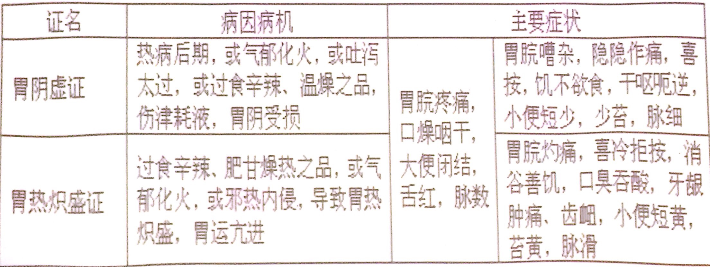
                    - **寒饮停胃证**
                        - **概念**
                            - 指寒饮停积于胃，以胃脘痞胀，胃中水声漉漉、口泛清水等为主要表现的证候
                        - **病因病机**
                            - 水饮停积于胃
                                - 饮食不节，嗜饮过度
                                - 劳倦内伤
                        - **临床表现及证候分析**
                            - 胃院痞胀，胃中水声塘漉
                                - 寒饮停胃，气机不利
                            - 口泛清水
                                - 胃气挟饮上逆
                            - 头晕目眩
                                - 饮阻清阳之气
                            - 舌淡，苔白滑，脉沉弦
                                - 寒饮内阻
                        - **辨证要点**
                            - 胃脘痞胀，胃中水声漉漉，口泛清水与痰饮症状共见
                    - **食滞胃脘证**
                        - **概念**
                            - 指饮食不化，积滞于胃，以脘腹痞胀作痛，厌食，呕吐酸腐食物，矢气频频，泻下臭秽等为主要表现的证候
                        - **病因病机**
                            - 饮食停积于胃
                                - 暴饮暴食，食积不化
                                - 素体胃虚，饮食难化
                        - **临床表现及证候分析**
                            - 脘腹痞胀作痛
                                - 饮食停滞，气机不利
                            - 拒按，厌食
                                - 内有实邪，拒于受纳
                            - 呕吐酸腐食物
                                - 胃失和降，积邪上逆
                            - 吐后好转
                                - 邪有出路
                            - 矢气频频，泻下臭秽
                                - 食积下走肠道
                            - 舌苔厚腻，脉滑实
                                - 食积滞胃
                        - **辨证要点**
                            - 脘腹痞胀作痛，拒按，厌食，舌苔厚腻与气滞症状共见
        - **肝与胆病证**
            - **主要生理**
                - 肝位于右胁，胆附于肝，肝胆互为表里
                - 肝开窍于目，在体合筋，其华在爪。足厥阴肝经绕阴器，循少腹，布胁肋，络胆，系目，交巅顶。肝主疏泄，调畅气机，通利血脉，疏泄胆汁，促进脾胃消化吸收，调节精神情志，有助于女子调经、男子泄精；肝又主藏血，具有贮藏血液和调节血量的功能
                - 胆能贮藏和排泄胆汁，并主决断
            - **主要病理**
                - **肝**
                    - 肝的生理功能失常，发生病理改变称“肝病症”，表现相应的症状和体征，称为肝病表现特点
                    - 生理功能：藏血，主疏泄，主筋，其华在爪，开窍于目
                        - 肝主疏泄，疏通开泄，情志舒展，气血和平；肝失疏泄，或为抑郁，或为亢奋
                            - 抑郁则郁郁不乐，多疑善虑，郁而不解，发为肝气横逆，可犯脾或犯胃，称为肝脾不和或肝胃不和
                            - 亢奋则急躁易怒，失眠多梦，目眩头晕，并可化火生风
                        - 肝主筋，其华在爪，若肝血受损，筋爪失养，会出现筋缓无力，肢体麻木，爪甲薄软
                            - 肝热、肝阳、肝血虚、肝阴虚均可影响肝主筋和化风，表现四肢抽搐，角弓反张，牙关紧闭，称为肝风内动
                        - 肝开窍于目，受血能视，肝的病理改变，可反映于目
                            - 肝阴虚，两目干涩
                            - 肝血不足，夜盲或视物不清
                            - 肝火上炎，目赤生翳
                            - 肝阳上亢，目赤肿痛
                    - 肝藏阴血，阴血充足，目明筋舒，屈伸自如；若阴血不足，或为阴虚，或为血虚，见两眼昏花，筋脉拘急，屈伸不利，月经量少，甚至闭经
                    - 疏泄与藏血功能失常：
                        - 胸胁少腹胀痛或窜痛，情志抑郁或易怒，头晕胀痛，肢体震颤，手足抽搐，以及目部症状，月经不调，阴部症状等
                - **胆**
                    - 贮藏和排泄胆汁失常：
                        - 胆怯易惊，惊悸不宁，口苦，黄疸等
            - **常见证型**
                - **肝病虚证**
                    - **肝血虚证**
                        - **概念**
                            - 指血液亏虚，肝及所系组织器官失养，以眩晕，视力减退，经少，肢麻震颤及血虚症状为主要表现的证候
                        - **病因病机**
                            - 肝及所系组织器官失养
                                - 生血不足
                                - 失血过多
                                - 久病耗伤肝血
                        - **临床表现及证候分析**
                            - 眩晕，视物模糊或夜盲，爪甲不荣
                                - 肝血不足，目与爪甲失养
                            - 肢麻震颤，肌肉瞤shun动，关节拘急
                                - 筋脉失养，血虚生风
                            - 月经量少、色淡、愆期、甚则闭经
                                - 血海空虚，冲任失养
                            - 面唇淡白，舌淡，脉细
                                - 血虚失荣
                        - **辨证要点**
                            - 眩晕，视力减退，经少，肢麻震颤等与血虚症状共见
                            - **血虚生风证**
                    - **肝阴虚证**
                        - **概念**
                            - 指阴液亏损，虚热内扰，以眩晕、目涩、胁痛及虚热症状为主要表现的证候
                        - **病因病机**
                            - 肝所系组织器官失养，虚热内生
                                - 耗损肝阴
                                    - 五志化火
                                    - 温热病后期
                                - 肾阴亏虚，水不涵木
                                - 湿热之邪侵犯肝经，久则耗伤肝阴
                        - **临床表现及证候分析**
                            - 眩晕，两目干涩，视力减退
                                - 肝阴不足，头目失濡
                            - 胁肋隐隐灼痛，脉弦
                                - 肝脉失养，虚火内灼，疏泄失常
                            - 手足蠕动
                                - 筋脉失濡，虚风内动
                            - 形体消瘦，咽干口燥，舌红少苔，脉细
                                - 阴虚失养
                            - 两颧潮红，五心烦热，潮热盗汗，脉数
                                - 虚热内蒸
                        - **辨证要点**
                            - 眩晕、目涩、胁痛等与虚热症状共见
                            - **阴虚动风证**
                - **肝病实证**
                    - 
                        - **概念**
                            - 指肝失疏泄，气机郁滞，以情志抑郁，胸胁、少腹胀痛与气滞症状为主要表现的证候
                        - **病因病机**
                            - 肝气失于疏泄
                                - 精神刺激，情志不遂
                                - 病邪侵扰，阻滞肝脉
                                - 其他脏腑影响
                        - **临床表现及证候分析**
                            - 情志抑郁，善太息，胸胁、少腹胀满窜痛，脉弦
                                - 肝失疏泄，气机郁滞，经气不利
                            - 乳房胀痛，月经不调，痛经
                                - 肝郁气滞，冲任失调
                            - 咽部异物感，颈部瘿瘤、瘰疬
                                - 肝气郁结，气郁生痰，痰气搏结于咽喉、颈部
                            - 胁下肿块
                                - 气血瘀阻，结于胁下
                        - **辨证要点**
                            - 情志抑郁、胸胁、少腹胀痛等与气滞症状共见
                    - **肝火炽盛证**
                        - **概念**
                            - 指火热炽盛，内扰于肝，气火上逆，以头痛，胁痛，烦躁，耳鸣与实热症状为主要表现的证候
                        - **病因病机**
                            - 肝胆气火上逆
                                - 情志不遂，气郁化火
                                - 外感火热之邪
                                - 嗜烟酒辛辣之品，酿热化火，犯及肝经
                        - **临床表现及证候分析**
                            - 胁肋灼痛，脉弦数
                                - 肝火内灼
                            - 头晕胀痛，面红目赤，舌红苔黄
                                - 肝火循经上攻，气血壅滞
                            - 急躁易怒，失眠多梦
                                - 热扰神魂，心神不宁，魂不守舍
                            - 耳鸣如潮，甚则突发耳聋
                                - 肝热移胆，循胆经上冲于耳
                            - 吐血、衄血
                                - 热盛迫血妄行
                            - 口苦
                                - 肝火夹胆气上溢
                            - 口渴，小便短黄，大便秘结
                                - 火邪灼津
                        - **辨证要点**
                            - 胁痛，头痛，烦躁，耳鸣等与实热症状共见
                    - **寒滞肝脉证**
                        - **概念**
                            - 指寒邪侵袭，凝滞肝经，以少腹、前阴、巅顶冷痛与实寒症状为主要表现的证候
                        - **病因病机**
                            - 肝经寒凝气滞
                                - 感受外寒
                                - 素体阳气不足，由外寒所引发
                        - **临床表现及证候分析**
                            - 少腹冷痛，牵引阴部坠胀作痛，或见阴器收缩引痛，或巅顶冷痛
                                - 寒凝肝脉，经脉收引挛急不通
                            - 恶寒肢冷
                                - 阳气阻遏，失于温煦
                            - 疼痛遇寒加剧，得热则减
                                - 寒凝气血
                            - 舌淡苔白，脉沉紧或弦紧
                                - 肝经寒盛
                        - **辨证要点**
                            - 少腹、前阴、巅顶冷痛等与实寒症状共见
                - **肝病虚实夹杂证**
                    - **肝阳上亢证**
                        - **概念**
                            - 指肝肾阴亏，阴不制阳，亢阳于上，以眩晕耳鸣，头目胀痛，面红烦躁，腰膝酸软等上盛下虚症状为主要表现的证候
                        - **病因病机**
                            - 肝肾阴亏于下，阳亢于上
                                - 情志过极，郁而化火，火热耗伤肝肾之阴
                                - 平素肝肾阴亏、房劳伤阴、年老阴亏等
                        - **临床表现及证候分析**
                            - 眩晕耳鸣，头目胀痛，面红目赤
                                - 肝阳上亢，血随气逆，气血上冲
                            - 急躁易怒，失眠多梦
                                - 亢阳扰动魂、神
                            - 头重脚轻，步履不稳，脉弦有力或弦细数
                                - 阳亢于上，阴亏于下，木旺耗水，水不涵木，上盛下虚
                            - 腰膝酸软无力，舌红少津
                                - 肝肾阴亏，筋骨、舌脉失养
                        - **辨证要点**
                            - 眩晕耳鸣，头目胀痛，面红烦躁，腰膝酸软等上盛下虚症状共见
                        - **鉴别要点** 
                        - **肝火上炎与肝阳上亢的异同如何？**
                            - **相同**
                                - 病位都在肝，病变都侵犯人体“上”部，都呈热或火的表现
                                - 皆可表现出急躁易怒，面红目赤，头胀痛，舌质红，脉滑数
                            - **不同**
                                - 肝火上炎是实证、实热证；肝阳上亢是下虚上实证、虚热证
                                    - 肝火上炎表现苔黄脉弦数，肝阳上亢表现舌红少津，脉细数
                                - 肝阳上亢的下虚是肾虚，因而有腰膝酸软，这种兼有肾阴亏的“下虚”是肝火上炎所不兼有的，也是两证的主要区别之一
                    - **肝风内动证**
                        - **概念**
                            - 泛指临床表现以眩晕、抽搐、震颤等具有“动摇”特点的风动症状的一类证候，属内风
                        - **分类**
                            - **肝阳化风**
                                - **概念**
                                    - 指阴虚阳亢，肝阳升发无制，亢极化风所致，以眩晕、肢麻、展顿为主要表现的证
                                - **病因病机**
                                    - 指阴虚阳亢，肝阳升发无制，亢极化风
                                - **临床表现及证候分析**
                                    - 眩晕欲仆，头摇而痛
                                        - 肝阳亢极化风，风阳冲逆于上
                                    - 肢体震颤，语言謇涩
                                        - 风动筋脉挛急
                                    - 手足麻木
                                        - 肝阴亏虚，筋失所养，虚风内动
                                    - 步履不正
                                        - 阳亢于上，阴亏于下，上盛下虚
                                    - 突然昏倒，不省人事，喉中痰鸣
                                        - 风阳暴升，阳盛灼津成痰，风痰上犯，蒙蔽清窍
                                    - 口眼歪斜，半身不遂，舌强不语
                                        - 风痰流窜于脉络
                                    - 舌红苔腻，脉弦有力
                                        - 风痰内盛
                                - **辨证要点**
                                    - 眩晕，肢麻，震颤，或突然昏例，口眼㖞斜，半身不遂等风动症状其见
                            - **热极生风**
                                - **概念**
                                    - 指邪热炽盛，热极动风，以高热，神昏，抽搐为主要表现的证候
                                - **病因病机**
                                    - 外感温热
                                        - 邪热亢盛，燔灼筋脉，热闭心神，亢扰肝风内动
                                - **临床表现及证候分析**
                                    - 高热，抽搐，颈项强直，两目上视，甚则角弓反张，牙关紧闭
                                        - 邪热炽盛，燔灼肝经，筋脉挛急
                                    - 烦躁不宁
                                        - 热扰心神
                                    - 神志昏迷
                                        - 痰热闭阻心窍
                                    - 舌质红绛，苔黄燥，脉弦数
                                        - 肝经热盛内灼营
                                - **辨证要点**
                                    - 高热与风动症状共见
                                - **热极生风的辨证要点如何？**
                                    - 实热证：出现高热，烦渴；舌质红绛，舌苔黄，脉弦数
                                    - 热陷心包：表现神志昏迷，躁扰如狂
                                    - 热灼肝经引动内风：有手足抽搐，颈项强直，两眼上视，角弓反张，牙关紧闭
                            - **阴虚动风**
                                - **概念**
                                    - 指肝阴亏虚，虚风内动，以手足震颤、蠕动，肢体抽搐，眩晕与虚热症状为主要表现的证
                                - **病因病机**
                                    - 肝阴亏虚，虚风内动
                                - **临床表现及证候分析**
                                    - 手足震颤、蠕动，肢体抽搐，脉弦
                                        - 肝阴不足，筋脉失养，筋膜挛急
                                    - 眩晕耳鸣，口燥咽干，舌红少津，脉细
                                        - 阴虚失养
                                    - 五心烦热，潮热颧红，脉数
                                        - 虚热内蒸
                                - **辨证要点**
                                    - 手足震颤、蠕动，肢体抽搐，眩晕等与虚热症状共见
                            - **血虚生风**
                                - **概念**
                                    - 指肝血亏虚，虚风内动，以眩晕，肢体震颤、麻木、拘急、瞤动，皮肤瘙痒与血虚症状为主要表现的证候
                                - **病因病机**
                                    - 肝血亏虚，筋脉失养
                                - **临床表现及证候分析**
                                    - 眩晕耳鸣，面白无华，爪甲不荣，舌淡，脉细或弱
                                        - 肝血不足，不能濡养
                                    - 肢体震颤，手足拘急，肢体麻木，肌肉瞤动，皮肤瘙痒
                                        - 筋脉失养，虚风内动
                                - **辨证要点**
                                    - 眩晕，肢体震颤、麻木、拘急、瞤动，皮肤瘙痒与血虚症状共见
                                - **鉴别要点** 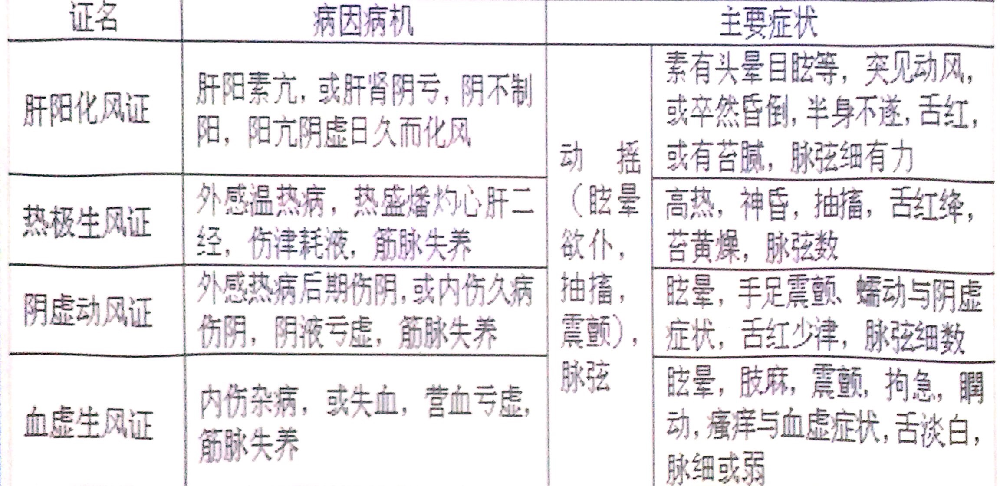
                - **胆病**
                    - **胆郁痰扰证**
                        - **概念**
                            - **胆怯易惊**
                        - **病因病机**
                            - 情志郁结，气郁化火生痰痰热内扰，胆气不宁
                        - **临床表现及证候分析**
                            - 胆怯易惊
                                - 痰热内扰，胆气不宁
                            - 胸胁闷胀，善太息
                                - 胆失疏泄，经气不畅
                            - 惊悸不宁，失眠多梦，烦躁不安
                                - 痰热内扰心神，神不守舍
                            - 头晕目眩
                                - 痰热循经上扰
                            - 泛恶欲呕
                                - 胆气犯胃，胃失和降
                            - 口苦
                                - 热迫胆气上溢
                            - 舌红，苔黄腻，脉弦滑数
                                - 痰热内蕴
                        - **辨证要点**
                            - 胆怯易惊，惊悸失眠等与痰热症状共见
                        - **胆郁痰扰与痰迷心窍的异同？**
                            - 胆郁痰扰是由于痰热内扰，胆气郁滞所表现出的证候；痰迷心窍是由于痰浊蒙闭心窍而主要表现为神志方面的异常
                            - **相同**
                                - 病因都可有情志郁结
                                - 都有“痰”的临床表现，如呕吐、苔腻、脉滑
                                - 都是里证实证
                            - **不同**
                                - 胆郁痰扰无痴呆、昏迷，有头晕、目眩、烦热、寐难、胸胁满闷、舌质红、舌苔黄、脉弦滑，偏于“热”
                                - 痰迷心窍有痴呆、、昏迷，无头晕、目眩，烦热少见或因昏迷不能诉说，寐难少见或不能诉说，胸胁满闷少见，舌质淡，苔白腻，脉滑，偏于“寒”
                - **肝胆同病**
                    - **肝胆湿热证** 脏腑兼证
                        - **肝胆湿热和湿热蕴脾的异同如何？**
                            - **相同**
                                - 肝胆湿热、湿热蕴脾都是感受湿热、饮食不洁、湿热内生而引起
                                - 都有湿热的共同表现，如黄疸、身热、恶心呕吐、舌苔黄腻、脉濡数
                            - **不同**
                                - 肝胆湿热多有胁痛，湿热蕴脾多有腹胀便溏；肝胆湿热证由于肝经络阴器，故每见疮疡、湿疹、风疹等病
        - **肾与膀胱病证**
            - **主要生理**
                - 肾位于腰部，左右各一，膀胱位于小腹中央，与肾直接相通，又有经脉相互络属，故为表里
                - **肾**
                    - 开窍于耳及二阴，在体为骨，生髓充脑，其华在发。肾的主要生理功能是藏精，主生长、发育与生殖，又主水，主纳气。肾内寄元阴元阳，为脏腑阴阳之根本，故称先天之本
                - **膀胱**
                    - 主要生理功能为贮尿和排尿
            - **主要病理**
                - **肾**
                    - 生长、发育和生殖功能障碍，水液代谢失常
                        - 腰膝酸软而痛，眩晕耳鸣，发育迟缓，智力低下，发白早脱，牙齿动摇，男子阳痿遗精、精少不育，女子经少经闭、不孕，以及水肿，二便异常，呼吸表浅等
                - **膀胱**
                    - 贮尿排尿功能失常
                        - 小便频急涩痛，尿闭以及遗尿，小便失禁等
            - **常见证型**
                - **肾阳虚证**
                    - **概念**
                        - **冷**
                    - **病因病机**
                        - 命门火衰，温煦失职，性欲减退，火不暖土，气化失职
                            - 素体阳虚
                            - 老年体衰
                            - 久病不愈
                            - 房事太过
                            - 其他脏腑病变累及于肾
                    - **临床表现及证候分析**
                        - 腰膝酸冷疼痛，畏寒肢冷，下肢尤甚
                            - 肾阳虚衰，腰府、骨骼失于温养
                        - 面色白光白，头目眩晕，精神萎靡
                            - 阳虚温运失职，血不上荣
                        - 面色黧黑
                            - 肾阳虚惫，阴寒内盛，气血运行不畅
                        - 性欲低下，男子阳痿精冷，女子宫寒不孕
                            - 命门火衰，性功能减退
                        - 小便频数清长，夜尿频多
                            - 阳虚气化失职，肾气不固
                        - 久泄不止，完谷不化，五更泄泻
                            - 火不暖土，脾失健运
                        - 浮肿
                            - 肾阳不足，不能蒸腾气化，水湿内停，泛溢肌肤
                        - 腰以下肿甚
                            - 肾居下焦，水湿趋下
                        - 腹部胀满，心悸咳喘
                            - 水气犯牌，凌心射肺
                        - 舌淡苔白，脉沉弱，两尺尤甚
                            - 肾阳不足，气血运行乏力
                    - **辨证要点**
                        - 腰膝酸冷，性欲低下，夜尿频多，久泄不止，浮肿与阳虚症状共见
                - **肾阴虚证**
                    - **概念**
                        - 指肾阴亏虚，失于濡养，虚热内扰，以腰膝酸软，头晕耳鸣，梦遗，经少及阴虚症状为主要表现的证候
                    - **病因病机**
                        - 肾失濡养，虚热内生
                            - 禀赋不足
                            - 虚劳久病
                            - 年老体弱
                            - 房事不节
                            - 过服温燥
                            - 温热后期，阴液亏耗
                    - **临床表现及证候分析**
                        - 腰膝酸软疼痛
                            - 肾阴亏虚，腰膝失养
                        - 头晕耳鸣，齿松发脱
                            - 阴虚精亏髓减，清窍失充，骨发失养
                        - 男子阳强易举，梦遗早泄
                            - 阴虚生热，相火妄动
                        - 女子经少经闭
                            - 肾阴亏虚，冲任不充
                        - 崩漏
                            - 虚火伤络血溢
                        - 失眠多梦
                            - 火扰心神
                        - 形体消瘦，咽干溲黄便干，少苔或无苔，脉细
                            - 阴亏失润
                        - 五心烦热，潮热盗汗，颧红，舌红脉数
                            - 虚火内扰
                    - **辨证要点**
                        - 腰膝酸软，头晕耳鸣，梦遗，经少及阴虚症状共见
                - **肾精不足证**
                    - **概念**
                        - 指肾中所藏之精亏虚，生长、发育与生殖功能减退，以生长发育迟缓，早衰，生育机能低下等为主要表现的证候
                    - **病因病机**
                        - 肾精不充
                            - 先天不足
                            - 后天失养 
                        - 耗伤肾精
                            - 久病劳损
                            - 房事不节
                    - **临床表现及证候分析**
                        - 小儿生长发育迟缓，身体矮小，囟门迟闭，智力低下，骨骼痿软
                            - 肾精不充，不能主骨生髓充脑，不能化血充养肌肉
                        - 腰膝酸软，耳鸣耳聋，健忘恍惚，神情呆钝，发枯易脱，齿松早脱
                            - 肾精失养
                        - 两足痿软，行动迟缓
                            - 骨失充养
                        - 性欲低下，男子精少不育，女子经闭不孕
                            - 肾精不足，生殖无源
                        - 舌淡，脉弱
                            - 虚弱之象
                    - **辨证要点**
                        - 生长发育迟缓，早衰，生育机能低下与精亏症状共见
                - **肾气不固证**
                    - **概念**
                        - 指肾气亏虚，封藏固摄无权，以腰膝酸软，小便频数清长，滑精早泄，经带量多，滑胎小产等为主要表现的证候
                    - **病因病机**
                        - 肾气不充
                            - 禀赋不足
                            - 年老体弱
                        - 耗伤肾气
                            - 久病劳损
                            - 房事过度
                    - **临床表现及证候分析**
                        - 腰膝酸软，神疲乏力，耳鸣失聪
                            - 肾气亏虚，腰膝、脑神、耳窍失养
                        - 小便频数清长，尿后余沥不尽，夜尿频多，遗尿，小便失禁
                            - 肾气固摄无权，膀胱失约
                        - 滑精、早泄
                            - 肾虚精关不固
                        - 月经淋漓不尽
                            - 肾虚冲任不固
                        - 带下清稀量多
                            - 肾虚带脉失约
                        - 滑胎小产
                            - 肾虚任脉失养，胎气不安
                        - 舌淡，脉弱
                            - 肾虚不能化血，舌脉失于充养
                    - **辨证要点**
                        - 腰膝酸软，小便频数清长，滑精早泄，经带量多，滑胎小产与肾虚症状共见
                    - **鉴别** 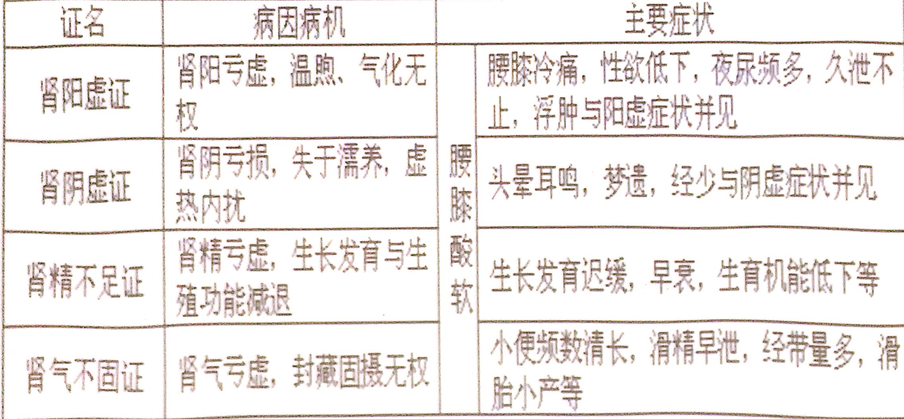
                - **膀胱湿热证**
                    - **概念**
                        - 指湿热蕴结膀胱，气化不利，以小便频急涩痛及湿热症状为主要表现的证候
                    - **病因病机**
                        - 膀胱气化不利
                            - 外感湿热，侵袭膀胱
                            - 嗜食辛辣肥甘，酿生湿热，下注膀胱
                    - **临床表现及证候分析**
                        - 小便频数、急迫、灼热、涩痛
                            - 湿热郁蒸膀胱，气化不利，下迫尿道
                        - 小便量少色深
                            - 湿热煎熬津液
                        - 尿血
                            - 湿热伤及血络
                        - 尿有砂石
                            - 湿热久恋，煎熬尿浊，结为砂石
                        - 腰部小腹胀痛
                            - 湿热蕴结，经气失调
                        - 发热口渴，舌红苔黄，脉数
                            - 邪热内炽
                        - 苔腻，脉滑或濡
                            - 湿邪内蕴
                    - **辨证要点**
                        - 小便频急涩痛与湿热症状共见
        - **脏腑兼证**
            - **心肾不交证（心肾阴虚）**
                - **概念**
                    - 指心肾水火既济的生理关系失调，以心烦、失眠、耳鸣、腰酸、梦遗等为主要表现的心肾阴虚阳亢证候
                - **病因病机**
                    - 耗伤心背之明，虚阳亢动，上扰心神
                        - 思虑劳神太过
                        - 情志抑郁，郁而化火
                        - 虚劳久病，房事不节
                - **临床表现及证候分析**
                    - 心烦失眠，惊悸多梦
                        - 心阴亏虚，心火偏亢，上扰心神
                    - 头晕，耳鸣，腰膝酸软
                        - 肾阴亏虚，脑髓、腰膝失养
                    - 梦遗
                        - 虚火扰动精室
                    - 口燥咽干，五心烦热，潮热盗汗
                        - 阴虚失濡，虚热内蒸
                    - 舌红少苔，脉细数
                        - 虚热
                - **辨证要点**
                    - 心烦、失眠、腰酸、耳鸣、梦遗等与虚热症状并见
            - **心肾阳虚证**
                - **概念**
                    - 指心与肾的阳气亏虚，以心悸、水肿等为主要表现的虚寒证候
                    - **水气凌心证**
                - **病因病机**
                    - 心阳虚衰，病久及肾，肾阳亦虚
                    - 肾阳亏虚，气化无权，水气凌心
                - **临床表现及证候分析**
                    - 心悸怔忡
                        - 心阳虚衰，鼓动无力
                    - 唇甲青紫，舌淡紫
                        - 温运无力，血行不畅
                    - 肢体浮肿，小便不利
                        - 肾阳亏虚，气化失司，水湿内停，外泛肌肤
                    - 形寒肢冷，神疲乏力，腰膝酸软，舌淡，苔白滑，脉弱
                        - 心肾两脏阳虚，形体失于温养，脏腑功能衰退
                - **辨证要点**
                    - 心悸怔忡、肢体浮肿等与虚寒症状共见
            - **心肺气虚证**
                - **概念**
                    - 指心肺两脏气虚，以心悸、咳喘等为主要表现的虚弱证候
                - **病因病机**
                    - 久病咳喘，耗伤肺气，累及于心
                    - 老年体虚，劳倦太过，耗伤心肺之气
                - **临床表现及证候分析**
                    - 心悸胸闷
                        - 心气亏虚，鼓动无力，气机不畅
                    - 咳嗽气短
                        - 肺气亏虚，宣降失职，呼吸功能减弱
                    - 吐痰清稀
                        - 津液输布无力而停聚为痰
                    - 声低懒言，神疲乏力，自汗，且活动后诸症加重
                        - 气虚全身机能减弱，且劳则耗气
                    - 面色淡白，舌淡，苔白，脉弱
                        - 气虚
                - **辨证要点**
                    - 咳喘无力、心悸胸闷等与气虚症状共见
            - 
                - **概念**
                    - 指心血不足，脾气亏虚，以心悸、失眠、头晕、食少、腹胀，便溏等为主要表现的虚弱证候
                    - **心脾两虚证**
                - **病因病机**
                    - 久病失调，思虑过度
                    - 饮食劳倦，损伤脾胃，生化不足
                    - 慢性失血，气血亏耗
                - **临床表现及证候分析**
                    - 心悸怔忡，失眠多梦
                        - 心血不足，心神失养
                    - 头晕健忘
                        - 血虚不能上荣
                    - 食欲不振，腹胀便溏
                        - 脾气亏虚，运化失职
                    - 神疲乏力，面色萎黄或淡白
                        - 气血生化不足
                    - 皮下紫斑，或月经色淡、淋漓不尽
                        - 脾虚不能统血
                    - 舌淡白，脉细弱
                        - 气血亏虚
                - **辨证要点**
                    - 心悸失眠、食少腹胀、或兼慢性失血等与气血亏虚症状共见
            - **心肝血虚证**
                - **概念**
                    - 指心肝两脏血虚，以心神及心肝相关组织官窍失养为主的虚弱证候
                - **病因病机**
                    - 思虑过度
                    - 失血过多
                    - 脾虚化源不足
                - **临床表现及证候分析**
                    - 心悸怔忡，失眠健忘
                        - 心血亏虚，心神失养
                    - 头晕目眩，视物模糊
                        - 肝血亏虚，头目失养
                    - 肢体麻木、震颤、拘挛，爪甲不荣
                        - 筋脉、爪甲失养
                    - 月经量少色淡、甚则闭经
                        - 心肝血虚，血海不充
                    - 面白，舌淡，脉细
                        - 血虚
                - **辨证要点**
                    - 心悸、失眠、眩晕、肢麻等与血虚症状共见
            - **脾肺气虚证**
                - **概念**
                    - 指脾肺两脏气虚，以咳喘、气短、痰稀、食少、腹胀、便溏等为主要表现的虚弱证候
                - **病因病机**
                    - 久病咳喘，耗伤肺气，子病及母
                    - 饮食劳倦，脾胃受损，伤及肺气
                - **临床表现及证候分析**
                    - 久咳不止，气短而喘
                        - 肺气亏虚，宣降失职，呼吸功能减退
                    - 咯痰清稀而多
                        - 肺气虚不能输布津液，聚湿生痰
                    - 食欲不振，腹胀便溏
                        - 脾气亏虚，运化失健
                    - 面浮肢肿、舌苔白滑
                        - 水湿不化而泛溢
                    - 声低懒言、神疲乏力、面白、舌淡、脉弱
                        - 气虚
                - **辨证要点**
                    - 咳喘短气、痰液清稀、食少便溏等与气虚症共见
            - **肺肾气虚证**
                - **概念**
                    - 指肺肾两脏气虚，以咳喘久延、呼多吸少、动则尤甚等为主要表现的虚弱证
                - **病因病机**
                    - 久病咳喘，耗伤肺气，病久及肾
                    - 劳伤太过，年老体弱，肾气亏虚，累及于肺，肺肾宣降、摄纳无权
                - **临床表现及证候分析**
                    - 咳嗽无力，气短而喘
                        - 肺气耗伤，呼吸功能减退
                    - 痰液清稀
                        - 津液输布无力，停聚为痰
                    - 乏力自汗
                        - 肺气虚，则宗气不足，卫表不固
                    - 呼多吸少，气不接续，动则益甚
                        - 肾气亏虚，摄纳无权，气不归元
                    - 耳鸣，腰膝酸软
                        - 肾气虚，耳窍失充，腰膝失养
                    - 舌淡紫，脉弱
                        - 肺肾气虚，久病咳喘，气血郁闭
                - **辨证要点**
                    - 久病咳喘，呼多吸少，动则尤甚等与气虚症状共见
            - **肺肾阴虚证**
                - **概念**
                    - 指肺肾两脏阴液亏虚，以千咳少痰、腰酸、遗精等为主要表现的虚热证候
                - **病因病机**
                    - 燥热、痨虫、久病咳喘等损伤肺阴，病久及肾
                    - 房劳太过，肾阴耗伤，肺失濡润
                - **临床表现及证候分析**
                    - 咳嗽痰少
                        - 肺阴亏虚，虚火内生，清肃失职
                    - 痰中带血
                        - 虚火灼伤肺络
                    - 声音嘶哑
                        - 虚火熏灼，喉失滋润
                    - 腰膝酸软
                        - 肾阴亏虚，腰膝失养
                    - 遗精
                        - 虚火扰动精室
                    - 月经量少
                        - 阴精不足，冲任空虚
                    - 口燥咽干，骨蒸潮热，颧红盗汗，形体消瘦
                        - 肺肾阴虚，虚热内蒸
                    - 舌红少苔，脉细数
                        - 阴虚内热
                - **辨证要点**
                    - 干咳、少痰、腰酸、遗精等与虚热症状共见
            - **肝火犯肺证**
                - **概念**
                    - **胸胁**
                - **病因病机**
                    - 郁怒伤肝，气郁化火
                    - 邪热内蕴肝经
                - **临床表现及证候分析**
                    - 胸胁灼痛，急躁易怒，烦热口苦
                        - 肝经气火内郁，经气不利
                    - 头胀头晕，面红目赤
                        - 气血上逆
                    - 咳嗽阵作
                        - 肝火犯肺，肺失清肃而肺气上逆
                    - 痰黄稠粘
                        - 火热灼津成痰
                    - 咳血
                        - 火热灼伤肺络
                    - 舌红，苔薄黄，脉弦数
                        - 肝火内炽
                - **辨证要点**
                    - 咳嗽痰黄、或咳血、胸胁灼痛、急躁与实热症状共见
            - **肝胆湿热证**
                - **概念**
                    - **胁肋**
                    - **肝经湿热（下注）证**
                - **病因病机**
                    - 湿热壅滞肝胆
                        - 感受湿热病邪
                        - 嗜食甘肥化生湿热
                        - 牌胃纳运失常，湿浊内生，郁而化热
                - **临床表现及证候分析**
                    - 胁肋胀痛
                        - 湿热蕴阻肝胆，疏泄失职，经气不畅
                    - 纳呆腹胀，口苦厌油，泛恶欲呕，大便不调
                        - 湿热阻滞，脾胃纳运失司
                    - 身目发黄
                        - 湿热内阻，胆汁不循常道，泛溢肌肤
                    - 寒热往来
                        - 邪居少阳，正邪相争
                    - 阴部潮湿瘙痒，惑男子睾丸肿胀热痛，或妇人带下黄臭
                        - 湿热循肝经卞注
                    - 舌红，苔黄腻，脉弦滑数
                        - 湿热之征
                - **辨证要点**
                    - 胁肋胀痛、身目发黄，或阴部瘙痒、带下黄臭等与湿热症状共见
            - **肝胃不和证**
                - **概念**
                    - 指肝气郁结，胃失和降，以脘胁胀痛、嗳气、吞酸、情绪抑郁等为主要表现的证候
                - **病因病机**
                    - 情志不舒，肝气郁结，横逆犯胃
                - **临床表现及证候分析**
                    - 胃脘、胁肋胀满疼痛，走窜不定
                        - 肝失疏泄，胃气郁滞
                    - 呃逆，嗳气
                        - 胃气上逆
                    - 吞酸嘈杂
                        - 气火内郁犯胃
                    - 饮食减少
                        - 胃纳失司
                    - 情绪抑郁，善太息，或烦躁易怒
                        - 肝失条达，甚则气郁化火
                    - 苔薄白，脉弦
                        - 肝气郁滞
                    - 舌苔薄黄
                        - 气郁化火
                - **辨证要点**
                    - 脘胁胀痛、嗳气、吞酸、情绪抑郁等症状共见
            - **肝脾不调证**
                - **概念**
                    - 指肝失疏泄，脾失健运，以胸胁胀痛、情志押郁、腹胀、便溏等为主要表现的证候
                - **病因病机**
                    - 情志不遂，郁怒伤肝，肝失条达而横乘脾土
                    - 饮食劳倦，损伤脾气，脾失健运而反侮肝木
                - **临床表现及证候分析**
                    - 胸胁胀满窜痛，善太息，情志抑郁
                        - 肝失疏泄，经气郁滞
                    - 急躁易怒
                        - 气郁化火
                    - 纳呆腹胀，便溏不爽，肠鸣矢气，或大便溏结不调
                        - 脾运失健，气滞湿阻
                    - 腹痛欲泻
                        - 肝气犯脾，气机郁滞，运化失调
                    - 泻后痛减
                        - 泻后气机暂得条畅
                    - 舌苔白，脉弦或缓弱
                        - 肝郁脾虚
                - **辨证要点**
                    - 胸胁胀痛、情志押郁、腹胀、便溏等共见
            - **肝肾阴虚证**
                - **概念**
                    - 指肝肾阴液亏虚，以腰酸胁痛、眩晕、耳鸣、遗精等为主要表现的虚热证候
                - **病因病机**
                    - 耗伤肝肾之阴
                        - 久病失调
                        - 情志内伤
                        - 房事不节
                        - 温病日久
                - **临床表现及证候分析**
                    - 头晕目眩，耳鸣健忘
                        - 肝肾阴虚，水不涵木，肝阳偏亢，髓海不足
                    - 胁部隐痛
                        - 肝阴亏虚，肝络失滋
                    - 腰膝酸软
                        - 肾阴不足，腰膝失养
                    - 失眠多梦
                        - 虚火上扰心神
                    - 遗精
                        - 虚火扰动精室
                    - 月经量少
                        - 阴精不足，冲任失养
                    - 口燥咽干，五心烦热，或低热颧红，舌红少苔，脉细数
                        - 阴虚失濡，虚热内炽
                - 【辨证要点】
                    - 腰膝酸软、胁部隐痛、眩晕耳鸣等与虚热症状共见
            - 
                - **概念**
                    - 指脾肾阳气亏虚，以久泻久痢、水肿、腰腹冷痛等为主要表现的虚寒证候
                - **病因病机**
                    - 久泻久痢，脾阳耗伤，不能充养肾阳
                    - 水邪久踞，肾阳受损，不能温暖脾阳
                - **临床表现及证候分析**
                    - 形寒肢冷，腰膝冷痛
                        - 脾肾阳虚，不能温煦全身、腰膝
                    - 下腹冷痛，久泻久痢不止
                        - 虚寒内生，水谷的腐熟、运化、吸收及排泄二便的功能失职
                    - 五更泄泻，完谷不化，便质清冷
                        - 命门火衰，阴寒凝滞，寅卯之交，阴气极盛
                    - 久病水肿，小便不利
                        - 脾肾阳虚，不能温化水液，泛溢肌肤
                    - 面色白
                        - 阳虚水气上泛
                    - 舌淡胖，苔白滑，脉沉迟无力
                        - 虚寒之征
                - **辨证要点**
                    - 久泻久痢、水肿、腰腹冷痛等与虚寒症状共见
        - **病案分析**
            - 许x，男，40岁，干部。2013-9-20就诊。素有“神经衰弱”症，经常失眠，近因每日开会至深夜，病情更甚。自诉心烦不寐，有时彻夜难眠，纵然入睡片刻，亦是睡眠不实而梦多，白天则觉头脑晕沉，心悸更甚，咽干舌燥，饮食无味，大便干结，小便短赤。诊见形体消瘦，舌红体小，苔少，脉细数。
                - 主诉：
                - **心阴虚证**
            - 半年多未再行经 心悸
                - 主诉：月经停闭半年，伴有心悸
                - **心肝血虚**
            - 张XX，女，39岁。一年来时感心悸，气短，精神疲惫，乏力，自汗，每当劳累之后，症状加重，面色淡白，舌质淡，脉虚。
                - 主诉：心悸一年，伴气短乏力
                - **心气虚证**
            - 刘XX，女，45岁，教师。因工作繁忙患者于半年前开始出现心悸、心烦，失眠多梦等症，并伴五心烦热，盗汗，颧红，舌红少津，脉细数。
                - 主诉：心悸半年，伴心烦
                - **心火亢盛证**
            - 吴X，男，52岁。患者十年前因疲劳出现心悸气短，未经治疗，以后每因劳累则病情加重，近二月因上症加重而来就诊。现自觉胸闷，心悸，时有胸痛，畏寒肢冷，医生查体时，望其面色淡白，舌淡胖，苔白滑，切诊脉微弱，四肢不温。
                - **心气虚的发展**
            - 吴X，女，50岁，职员。2012-10-06就诊。自述近十年来，每逢工作紧张，或加班睡眠不足时，即发舌疮，少时1~2处，多则5~6处，舌疼痛难忍，影响进食和说话，伴心烦、喜冷饮、大便秘结、小便短赤。查：舌尖红，舌尖、舌边有3处赤栏疮面，疮面直径可达1cm，苔薄黄操，脉数稍弦。
                - **心火亢盛证**
            - 王x、男，36岁、司机。2000-10-06就诊，一年前，在拉架过程中，被人用棍棒击中头部，当场倒地昏迷约半小时方才苏醒，经送医院治行血肿已吸收，摄X线等多方检查，未发现明显异常，但自感头痛，固定呈锥刺样，伴头晕、头胀、心烦，劳累时或在人多的地方痛甚，不敢过马路，伴心悸失眠、健忘，舌质紫暗，舌尖有瘀斑瘀点，脉涩有力，面晦不泽。
                - **瘀阻脑络证**
            - 周某，女，9月20日初诊。身热恶风，微咳两天，今日咳嗽加剧，痰少而黏，难以咯出，咳剧时胸痛，痰中带血丝，咽干鼻燥，舌红，苔薄白而干，脉浮数。
                - 主诉：
                - 辨证：
            - 汪某，男，25岁。2日前因气候突变，出现恶风寒，发热，无汗身痛，咳痰清稀。昨日起体温上升至39.5°C，咳嗽加剧。现高热，咳嗽，气喘息粗，胸闷，痰多色黄黏稠，口渴喜饮，烦躁不安，小便短黄，舌红苔黄腻，脉滑数。
                - 主诉：
                - 辨证：
            - 李某，男，56岁。每于秋冬常发咳喘，前天因天气骤冷，咳喘加重。现症见咳喘气急。喉中痰鸣，胸膈满闷，咯痰清稀量多。面白形寒，四肢不温，舌质淡，苔白滑，脉滑。
                - 主诉：咳喘两日，加重一日，今见咯痰清稀，面白形寒
                - **寒痰阻肺证**
            - 覃某，女，51岁。5日前出现发热恶风，咽喉疼痛、咳嗽等症，昨起面睑浮肿，现仍咽喉肿痛，咳嗽痰少，发热恶风，尿少，面睑浮肿，舌尖红，苔薄，脉浮数。
                - 主诉：面睑浮肿一日
                - **风水相搏证**
            - 章某，女，14岁。因吃冷食后出现腹痛已2日。症见腹痛欲泻，排便不畅。便量少，色黄臭秽，夹有黏液，日行十余次，肛门灼热坠胀，身热烦渴，汗出，舌质红，苔黄腻，脉象滑。
                - 主诉：腹痛两日，伴泄泻，夹有黏液
                - **大肠湿热证**
            - 王xx，男，8岁。
                - 主诉：发热，腹痛，大便脓血三天。
                - 病史：患儿于三天前开始发热，伴大便稀烂，挟有粘液，每日约5~6次，未作治疗，今日始来诊，证见：高热（体温40°C），腹痛，里急后重，大便脓血相混，日夜达20次，伴口渴频频索饮，口气臭秽，面色晦滞，精神疲倦，时见烦躁，四肢冷，按触腹部有灼热感，不欲盖衣被，尿黄而短，舌质红，苔黄干，脉滑数有力。
                - **痢疾——大肠湿热**
            - 于xx，女，35岁，1月前因母亲病故而悲伤过度，近半月来时感胸胁脘腹胀闷疼痛，喜太息，自觉咽部有物梗阻，吞之不下，吐之不出，每于思母之时诸症加重。此次月经未能按期而至，乳房作胀。舌苔薄白，脉弦细。
                - 主诉：自觉咽部有物梗阻半月
                - **肝郁气滞证**
            - 周某，男，63岁。2010年4月7日初诊。患者高血压病十余载，平素经常头晕胀痛，面红目赤，心悸肢麻，腰膝酸软，夜不成寐。昨晚饮酒后，因事恼怒，突然剧烈头痛，随即神志昏糊，口眼歪斜，半身不遂，呼吸气粗，喉中痰鸣，舌红绛，苔黄厚腻，脉弦滑数。
                - **肝火炽盛证**
            - 腿软 舌质干红无苔
                - **肝阳上亢证**
            - 张X，男，34岁，患者结婚6年至今无子，半个月前曾到外地某医院检查，发现精子不正常，总数为1亿，活动度小（20%）。自觉腰部酸软疼痛，精神疲乏，时有耳鸣，舌淡苔白，脉细弱。
                - 主诉：自觉腰部酸软疼痛半月/发现精子不正常
                - **肾精不足证**
                - 分析：肾藏精，主生殖。肾精不足，生殖无源，故男子精少而不育；腰为肾之府，肾虚腰失所养，则腰部酸软疼痛，耳为肾窍，肾精不足，耳窍失聪，故时有耳鸣；肾虚全身机能活动低下，则精神疲乏；舌淡苔白，脉细弱，为肾精不足之象。
            - 汪 XX，女，35岁。患者婚后五年中，曾四次妊，但均在怀孕三个月内出现腰腹酸痛坠胀或漏红现象而自然流产。平素腰膝酸软，劳累后尤甚，神疲乏力，尿频数而清长，舌淡苔白，脉沉弱。
                - **肾气不固证**
            - 林某，男，36岁，遗精日久，每周2-3次，并伴见头晕耳鸣，心烦少寐，惊悸多梦，口燥咽干，经常盗汗，腰膝酸软，舌红少苔，脉细数。此为何证？并作简要病机分析。
                - **心肾不交证**
                - 分析：心肾阴虚，虚火上扰心神，见心烦少寐，惊悸多梦；肾阴不足，骨髓不充，脑髓失养，见腰膝酸软，头晕耳鸣；虚火内炽，扰动精室，见遗精；口燥咽干，盗汗，舌红少苔，脉细数，为阴虚火旺之象。
            - 吴某，男，58岁，既往有肝炎病史，近半年来，肝区胀痛，窜痛，急躁易怒，疲乏无力，纳呆腹胀，肠鸣腹痛欲泻，泻后痛减，舌淡苔白，脉弦缓。
                - 主诉：肝区胀痛半年，伴纳呆腹胀
                - **肝脾不调证**
                - 分析：肝失疏泄，气机郁滞，故见胸胁胀满窜痛；肝失柔和之性故急躁易怒；肝气横逆犯脾，脾失健运，故见纳呆，腹胀；气滞湿阻，则肠鸣腹泻，气滞不通则腹痛，泻后气机得畅，故泻后痛减：疲乏无力为脾虚之象；苔白脉弦缓，为肝郁脾虚之象。
            - 女，41岁。三年前流产后，常自汗出，恶风，兼腹中鸣响，自觉常有冷风入侵体内，饮食欠佳，形瘦乏力，短气，经行甚少，舌淡苔白，脉弱。
                - 主诉：
                - 辨证：
    - 第二节 六经辨证
        - **六经病证**
            - **概说**
                - 六经辨证，是汉代医家张仲景根据《素问热论》的有关论述，在其《伤寒论》中创立的，用以阐明外感病发生、发展、传变规律的一种辨证方法
                - 六经辨证将外感病发生发展过程中所表现的不同证候，以阴阳为纲，归纳为三阳病（太阳病、阳明病、少阳病）和三阴病（太阴病、少阴病、厥阴病）两大类病证，分别从邪正斗争关系、病变部位、病势进退缓急等方面阐述外感病各个阶段的病变特点
            - **太阳病证**
                - 太阳病的主要脉症是“恶寒，头项强痛，脉浮”
                - **太阳经证**
                    - **太阳伤寒证**
                        - 以寒邪为主的风寒之邪侵犯太阳经脉，导致卫阳被遏所表现的证候
                        - **临床表现及证候分析**
                            - 恶寒
                                - 风寒外邪以寒邪为主而侵犯太阳之表，卫阳被遏，肌表失于温煦
                            - 发热
                                - 寒邪郁表，卫阳奋起抗邪，正邪交争
                            - 头身疼痛
                                - 寒性收引，卫阳郁遏，经气不畅，筋脉失于温养
                            - 无汗
                                - 寒性阴凝，致使肌腠致密，玄府不开，故虽身热
                            - 脉浮紧
                                - 寒邪凝束，正气抗邪
                            - 气喘
                                - 寒邪装表，若内舍于肺，肺气失宜
                        - **辨证要点**
                            - 以恶寒，无汗，脉浮紧为辨证要点
                    - **太阳中风证**
                        - 以风邪为主的风寒之邪侵袭太阳经脉，使卫强营弱所表现的证候
                        - **表虚证**
                            - 这是相对于太阳伤寒证的“表实证”命音的，并非是绝对的虚证
                        - **临床表现及证候分析**
                            - 发热
                                - 卫为阳，营为阴，风寒外邪以风邪为主侵犯太阳经，卫受邪而阳浮于外，与邪气相争
                            - 恶风汗出
                                - 风性开泄，以致卫外不固，营不内守，肌腠疏松
                            - 头痛
                                - 邪郁太阳之经，风性轻扬向上，常致头部经气不畅
                            - 脉浮缓
                                - 肌疏汗出，营阴不足
                            - 鼻鸣
                                - 外邪侵及于肺胃，肺气失宣
                            - 干呕
                                - 胃气失降
                        - **辨证要点**
                            - 以恶风，汗出，脉浮缓为辨证要点
                    - **鉴别**
                        - 有无汗出
                - **太阳腑证**
                    - 指太阳经证不解，病邪由太阳之表内传其膀胱或小肠等太阳之腑所表现的证候
                    - **太阳蓄水证**
                        - 是指太阳经证不解面内传膀胱腑，邪与水结，膀胱气化不利，水液停蓄所表现的证候
                        - **临床表现及证候分析**
                            - 发热、恶寒、脉浮或浮数
                                - 太阳经证不解，故仍见等表证症状
                            - 小便不利，小腹胀满
                                - 表邪内传膀胱之腑，气化功能失职，邪与水结，水液停蓄
                            - 渴欲饮水
                                - 水停而气不化津，津液不能上承
                            - 饮入即吐
                                - **“水逆”**
                        - **辨证要点**
                            - 以太阳经证及小便不利、小腹胀满并见为辨证要点
                    - **太阳蓄血证**
                        - 指太阳经证失治，邪热内传，与血相结于手太阳小肠腑所表现的证候
                        - **临床表现及证候分析**
                            - 少腹急结或硬满
                                - 太阳经证失治，邪热随经内传，与血相结，瘀热结于下焦少腹（手太阳小肠腑）
                            - 神乱如狂
                                - 热瘀内结，上扰心神
                            - 小便自利
                                - 病在肠腑，未影响膀胱气化功能
                            - 大便色黑如漆
                                - 瘀血下行随大便而出
                            - 脉沉涩或沉结
                                - 瘀热阻滞，脉道不利；
                        - **辨证要点**
                            - 以少腹急结，神乱如狂，但小便自利为辨证要点
            - **阳明病证**
                - **阳明经证**
                    - 指邪热亢盛，充斥于阳明之经，弥漫于全身，而肠中尚无燥屎内结所表现的证候
                    - **临床表现及证候分析**
                        - 身大热，不恶寒
                            - 邪入阳明，化热化燥，充斥阳明经，弥漫于全身
                        - 汗大出
                            - 邪热炽盛，迫津外泄
                        - 大渴引饮
                            - 热盛伤津，且汗出复伤津液
                        - 心烦躁扰
                            - 邪热上扰，心神不安
                        - 气粗似喘
                            - 热迫于肺，呼吸不利
                        - 面赤
                            - 热斥气血，涌盛于面
                        - 舌苔黄燥
                            - 热灼津伤
                        - 脉洪大有力
                            - 热壅脉道，气血涌盛
                    - **辨证要点**
                        - 以大热、大汗、大渴、脉洪大为其辨证要点
                - **阳明腑证**
                    - 指邪热内盛于里，邪热与肠中糟粕相搏，燥屎内结，阻滞肠道所表现的证候
                    - **病因病机**
                        - 阳明经证进一步发展的结果
                    - **临床表现及证候分析**
                        - 日晡潮热
                            - 肠腑实热弥漫，阳明经气旺于晡时，邪正相争更剧
                        - 手足谶然汗出
                            - 四肢禀气于阳明，热逼津泄甚于四末
                        - 腑气不通
                            - 脐腹胀满，痛而拒按
                        - 大便秘结不通
                            - 邪热与糟粕结于肠中
                        - 神昏谵语、狂躁、不得眠
                            - 邪热亢盛，上扰心神
                        - 苔黄燥而有芒刺，或焦黑燥裂
                            - 燥热内结，津液被劫
                        - 脉沉实
                            - 有形之邪壅实于里，阻滞气机，抑遏血脉，脉气不利
                        - 脉滑数
                            - 邪热结而不甚，热迫血涌
                    - **辨证要点**
                        - 以潮热汗出，腹满便秘，舌苔黄燥，脉象沉实为辨证要点
            - **少阳病证**
                - 邪犯少阳胆腑，枢机不利，经气不畅所表现的证候
                - 因邪郁于机体表里之间，故又称为半表半里证
                - **病因病机**
                    - 由病邪已离太阳之表，而尚未进入阳明之里所致
                    - 亦可由厥阴病证自里达表，转出少阳而成
                - **临床表现及证候分析**
                    - 寒热往来
                        - 邪正相争于半表半里，邪正进退交争
                    - 口苦
                    - 胆热上泛
                    - 咽干
                        - 胆热灼津
                    - 头目昏眩
                        - 胆热上扰清窍
                    - 胸胁苦满
                        - 邪郁少阳，经气不利
                    - 默默不欲饮食，喜呕
                        - 胆热扰胃，胃失和降
                    - 心烦
                        - 胆热扰神
                    - 脉弦
                        - 肝胆受病
                - **辨证要点**
                    - 以寒热往来，胸胁苦满，脉弦等为辨证要点
            - **太阴病证**
                - 指由多种原因导致牌阳虚衰，寒湿内生所表现的证候
                - 太阴病为三阴病之轻浅阶段，其病变特点为虚寒证
                - **病因病机**
                    - 由三阳治疗不当，损伤脾阳而陷入
                    - 也可由于内阳虚怯，风寒之邪直犯而起病
                - **临床表现及证候分析**
                    - 腹满
                        - 脾阳虚衰，寒湿内生，气虚湿阻，中焦气机不利
                    - 食纳减少，或见呕吐
                        - 脾病及胃，脾虚失运，胃失和降
                    - 口淡不渴
                        - 阳虚寒湿内盛，水液不化
                    - 自利
                        - 寒湿下趋，并走于下
                    - 时腹自痛
                        - 阳虚寒凝，腹中挛急
                    - 四肢欠温
                        - 脾主四肢，中阳内虚，不能温煦四末
                    - 脉沉缓而弱
                        - 脾虚气弱，脉气亦鼓动无力
                - **辨证要点**
                    - 以腹满时痛，自利，口不渴等虚寒之象为辨证要点
            - **少阴病证**
                - 指伤寒六经病变的后期出现心肾机能减退，全身阴阳衰惫的虚寒病证
                - **脉微细，但欲寐**
                - **少阴寒化证**
                    - 指病邪深入少阴，心肾阳气衰惫，从阴化寒，阴寒独盛所表现的虚寒证候
                    - **临床表现及证候分析**
                        - 无热恶寒，四肢厥冷
                            - 少阴阳气衰微，阴寒内盛，周身失于温养，四末失于通达
                        - 脉微细
                            - 心肾阳衰，脉气鼓动亦微
                        - 但欲寐
                            - 阳气不振，神失鼓舞
                        - 下利清谷，呕吐不食
                            - 心肾阳虚，火不暖土，升降失常
                        - 小便清长，渴喜热饮，但饮而不多
                            - 下焦阳气虚寒，不能主持水液，化气升津
                    - **辨证要点**
                        - 以无热恶寒，下利清谷，四肢厥冷，脉微细等为辨证要点
                - **少阴热化证**
                    - 指病邪深入少阴从阳化热，阴虚阳亢所表现的虚热证候
                    - **临床表现及证候分析**
                        - 心中烦热，夜不得眠
                            - 邪入少阴从火化热，灼伤真阴，水不济火，心火独亢，内扰心神
                        - 口燥咽干
                            - 阴液不足，苗窍失润
                        - 咽痛
                            - 阴不制阳，虚火循肾经上攻咽喉
                        - 舌红少苔，脉细而数
                            - 少阴阴血不充，虚火内炽
                    - **辨证要点**
                        - 以心烦不眠，口燥咽干，脉细而数为辨证要点
            - **厥阴病证**
                - 指伤寒病发展到较后阶段，出现阴阳对峙、寒热错杂、厥热胜复等为特点的证候概括
                - **临床表现及证候分析**
                    - **此处所述为上热下寒的症状**
                        - 上热，为胃中有热，表现为消渴，气上撞心，心中疼热
                        - 下寒，为肠中有寒，症状为饥而不欲食，食则吐蛔
                    - 消渴
                        - 胃热消烁津液
                    - 自觉气上撞心，心中疼热
                        - 邪入厥阴，厥热上逆，上冲胃脘
                    - 饥而不欲食
                        - 虽胃热而知饥，但肠中有寒，寒郁而食之不化，故又不欲食
                    - 食则吐蛔
                        - 勉强进食，则必引起胃气上逆而致呕吐，若内有蛔虫者，常可因呕逆之剧烈而引发吐蛔
                - **辨证要点**
                    - 以胃热肠寒，寒热交错为辨证要点
        - **六经病证的传变**
            - **传经**
                - **循经传**
                    - 按伤寒六经顺序传变者
                - **越经传**
                    - 不按上述循经次序，而是隔一经或隔两经相传者
                - **表里传**
                    - 六经中互为表里的阴阳两经相传者
            - **直中**
                - 伤寒病的发病，凡病邪不由阳经传入而径中阴经者
            - **合病**
                - 凡伤寒未经传变，两经或三经证候同时出现者
            - **并病**
                - 伤寒病凡一经病证未罢，又出现另一经证候者
    - 第三节 卫气营血辨证
        - **卫气营血病证**
            - **概说**
                - **卫气营血辨证**
                    - 清代·叶天士《外感温热篇》
                    - **外感温热病**
                        - **温热病**
                            - 一类由外感温热病邪所引起的热象偏重、并具有一定的季节性和传染性的外感疾病
                - 卫分证、气分证、营分证、血分证
            - **卫分证**
                - 指各种温热病邪侵犯肌表，致使卫气功能失常所表现的证候
                - 病属表热，常见于外感温热病的初起阶段
                - **临床表现及证候分析**
                    - 发热，微恶风寒
                        - 温为阳邪，温热病邪，犯于肤表，卫为邪郁
                    - **头痛**
                        - 温热之邪上扰清窍
                    - **口干微渴**
                        - 温热为阳邪，但病属初起，伤津不甚
                    - 舌边尖红，苔薄黄，脉浮数
                        - 邪热在表
                    - **咳嗽**
                        - 温邪犯肺，肺气失宣
                    - **咽喉红肿疼痛**
                        - 温热上灼，气血壅滞
                - **辨证要点**
                    - 以发热，微恶风寒，舌边尖红，脉浮数为辨证要点
            - **气分证**
                - 指温热病邪内传胜腑，正盛邪实，阳热亢盛所表现的实热证候
                - **临床表现及证候分析**
                    - 身热亢盛，且不恶寒，反恶热
                        - 里热炽盛，邪正剧争
                    - 汗出
                        - 邪热逼津外越
                    - 口渴
                        - 热灼津伤
                    - 舌红苔黄，脉数有力
                        - 热盛则气血涌盛
                    - 咳喘，胸痛
                        - 邪热内壅于肺，肺失清肃
                    - 痰黄粘稠
                        - 热甚灼伤津液
                    - 心烦懊恼，坐卧不安
                        - 热扰胸膈，心神不宁
                    - 便秘腹胀，痛而拒按
                        - 热结肠道，灼津化燥，热结成实，腑气不通
                    - 谵语、狂乱
                        - 热扰心神
                    - 苔黄而干燥，甚则焦黑起刺，脉沉实
                        - 燥热内结
                    - 口苦咽干
                        - 热郁胆经，胆气上逆
                    - 胸胁满痛
                        - 胆气郁滞，经气不利
                    - 心烦
                        - 胆热扰心
                    - 干呕
                        - 胆火犯胃，胃失和降
                    - 脉弦数
                        - 胆经有热
                - **辨证要点**
                    - 以发热不恶寒，反恶热，汗出，口渴，舌红苔黄，脉数有力为基本辨证要点
            - **营分证**
                - 指温病邪热内陷，营阴受损，心神被扰所表现的证候
                - **病因病机**
                    - 由气分证不解，邪热传入营分而成
                    - **逆传心包**
                    - 亦有营阴素亏，初感温热之邪盛，来势凶猛，发病急骤，起病即见营分证者
                - **临床表现及证候分析**
                    - 身热夜甚
                        - 邪热入营，灼伤营阴，夜与入阴之卫阳相搏
                    - 口不甚渴或不渴
                        - 邪热蒸腾营阴上潮于口
                    - 心烦不寐，甚至神昏谵语
                        - 热深入营，易扰心神
                    - 斑疹隐隐
                        - 邪热入营，灼伤血络
                    - 舌质红绛无苔，脉细数
                        - 营分有热，劫伤营阴
                - **辨证要点**
                    - 以身热夜甚，心烦不寐，舌质红绛，脉细而数为辨证要点
            - **血分证**
                - 指温病邪热深入阴血，导致动血、动风、耗阴所表现的证候
                - **血分实热证**
                    - 指温热病邪，深入血分，血分热盛，闭扰心神，迫血妄行，或燔灼肝经，引动肝风所表现的证候
                    - 多为血分证的前期阶段，性质为实热证
                    - **临床表现及证候分析**
                        - 身热夜甚，心烦不寐
                            - 邪热入营
                        - 躁扰不宁，神昏谵语，舌绛紫
                            - 血热内扰心神
                        - 斑疹显露，斑色紫黑，吐血、衄血、便血、尿血
                            - 邪热迫血安行，溢于脉外
                        - 四肢抽搐，颈项强直，角弓反张，目睛上视，牙关紧闭，脉弦数
                            - 邪热燔灼肝经，炽伤筋脉，引动肝风
                    - **辨证要点**
                        - 以营分重证（身热夜甚，躁扰神昏等）并见出血症状，或并见动风症状为辨证要点
                - **血分虚热证**
                    - 指血热久羁，耗伤肝肾之阴，虚热不退，机体失养，或虚风内动所表现的证候
                    - 多为血分证的后期阶段，性质为虚热证
                    - **临床表现及证候分析**
                        - 持续低热，暮热早凉，五心烦热
                            - 邪热久羁，劫灼阴分，余热未净
                        - 口干咽燥，舌干少苔
                            - 伤阴耗液，穷必及肾，上窍失润
                        - 形体干瘦，脉虚细
                            - 形体失养
                        - 神疲耳聋
                            - 阴耗精损，不能上充脑髓，神窍失养
                        - 手足蠕动，瘛疭chi(赤) zong(纵)
                            - 肝阴亏损，筋脉失濡，虚风内动
                    - **辨证要点**
                        - 以虚热不退并见机体失养，或并见虚风内动为辨证要点
        - **卫气营血病证的传变**
            - **一般规律**
                - 卫分——气分一一营分一一血分
            - **逆传**
                - **狭义**
                    - 卫分——营分、血分
                    - 只是顺传中的特殊类型，病情更急剧、重笃
                - **广义**
                    - 直入气营；卫气同病；气营两燔、气血两燔
    - 第四节 三焦辨证
        - **三焦病证**
            - **概说**
                - 清代吴鞠通 《温病条辨》 **外感温热病**
            - **上焦病证**
                - 指各种温热之邪侵袭上焦部位的手太阴肺或手厥阴心包所表现的证候
                - **临床表现及证候分析**
                    - 发热，微恶风寒，舌边尖红，脉浮数
                        - 肺主皮毛，温热之邪犯表，卫气失和，肺失宜降
                    - 头痛
                        - 温邪上扰清空
                        - **邪热犯卫证**
                    - 口渴
                        - 伤津
                    - 汗出
                        - 邪热内盛，逼津外越
                    - 咳嗽，气喘
                        - 邪热入里，壅滞于肺，肺失清肃，肺气上逆
                    - 但热不寒
                        - 邪热已由表入里
                        - **邪热壅肺证**
                    - 汗出，口渴，苔黄，脉数
                        - 邪热内盛
                    - 神昏，谵语，舌謇
                        - 肺经邪热不解，逆传心包，热扰心神
                    - 高热不退
                        - 里热壅盛，蒸达于外
                        - **逆传心包证**
                    - 肢厥
                        - 阳热内郁，不达于四肢
                    - 舌质红绛
                        - 温热灼伤营阴
                - **辨证要点**
                    - “温邪犯卫”以发热，微恶风寒，咳嗽，舌边尖红，脉浮数为辨证要点
                    - “邪热壅肺”以或但热不寒，咳喘，苔黄，脉数为辨证要点
                    - “逆传心包”以高热，神昏，舌质红绛为辨证要点
            - **中焦病证**
                - 指温热之那传入中焦脾骨，邪从燥化或邪从湿化所表现的证候
                - **临床表现及证候分析**
                    - 腹满，便秘
                        - 胃性喜润恶燥，邪入阳明，中焦燥热，热炽津伤，胃肠失润，燥屎内停
                    - 身热面赤
                        - 邪热蒸腾
                    - 神昏谵语
                        - 邪热侵扰心神
                        - **中焦燥热证**
                    - 渴欲饮冷，口干唇裂，小便短赤
                        - 灼津耗液
                    - 呼吸气粗
                        - 上迫于肺
                    - 苔黄燥或焦黑起刺，脉沉实有力
                        - 燥热内结，津液被劫之征
                    - 胸脘痞闷，泛恶欲呕，大便不爽或溏泄
                        - 脾性喜燥恶湿，邪从湿化，中焦湿热，脾失健运，胃失和降
                    - 身热不扬
                        - 湿遏热伏，郁于肌腠
                        - **中焦湿热证**
                    - 头身重痛
                        - 湿性重着，湿热郁阻，气机不和
                    - 苔黄腻，脉濡数
                        - 湿热内蕴之象
                - **辨证要点**
                    - “中焦燥热”以身热神昏，腹满便秘，苔黄燥，脉沉实为辨证要点
                    - “中焦湿热”以身热不扬，脘痞欲呕，便溏不爽，苔黄腻，脉濡数为辨证要点
            - **下焦病证**
                - 指温热病邪犯及下焦，劫伤肝肾之阴所表现的证候
                - **肾阴亏虚证** **肝阴亏虚证**
                - **临床表现及证候分析**
                    - 耳聋
                        - 肾阴亏耗，耳失充养
                    - 神疲
                        - 神失阴精充养
                    - 身热颧红，口燥咽干，手足心热甚于手足背，脉虚大
                        - 阴亏不能制阳，虚热内生
                    - 手足蠕动，甚或瘛疭
                        - 热邪久羁，真阴被灼，水不涵木，肝阴亏虚，筋失所养，拘挛迫急
                    - 心中憺憺大动
                        - 阴虚水亏，虚风内扰
                    - 神倦脉虚，舌绛苔少，甚或欲脱
                        - 阴精耗竭之象
                - **辨证要点**
                    - “肾阴亏虚”以身热颧红，口燥咽干，神倦耳聋为辨证要点
                    - “肝阴亏虚”以手足蠕动，神倦脉虚，舌绛苔少为辨证要点
        - **三焦病证的传变**
            - **顺传**
                - 上焦——手太阴肺经——中焦——下焦
                - 由浅入深，由轻到重
            - **逆传**
                - 肺卫——心包
                - 邪热炽盛，病情重笃
- **第八章 诊断综合运用**
    - 第一节 诊断思路与方法
        - 病情资料的综合处理
        - 诊断思维的一般方法
        - 主症诊断思路
        - 证的诊断思路
    - 第二节 病历书写与要求
        - 病历的含义与意义
        - 中医病历书写要求
        - 中医病历书写格式