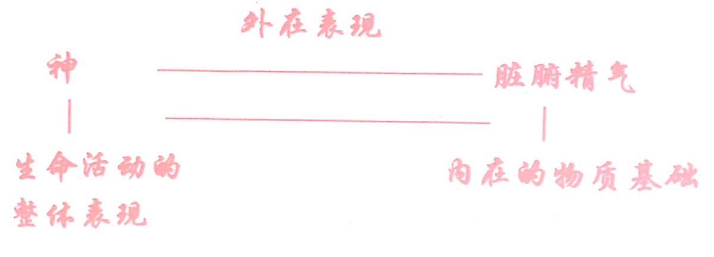
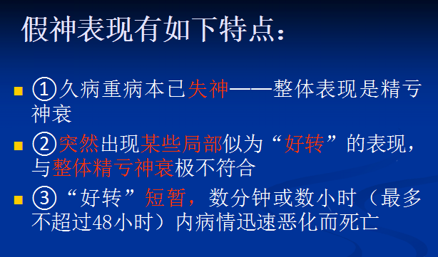
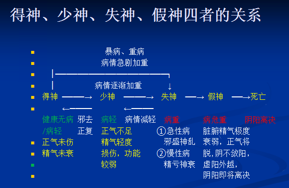
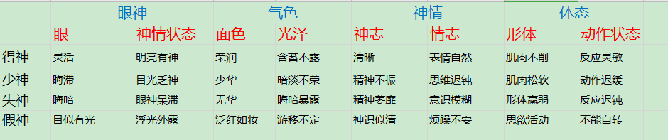
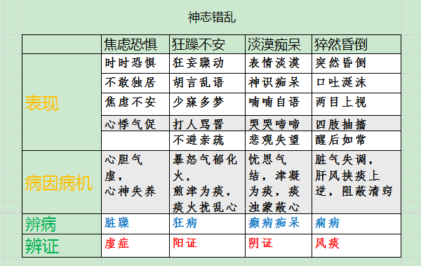
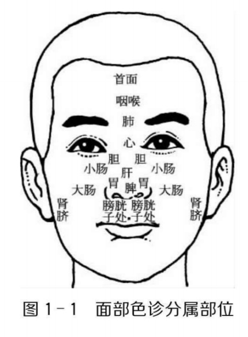
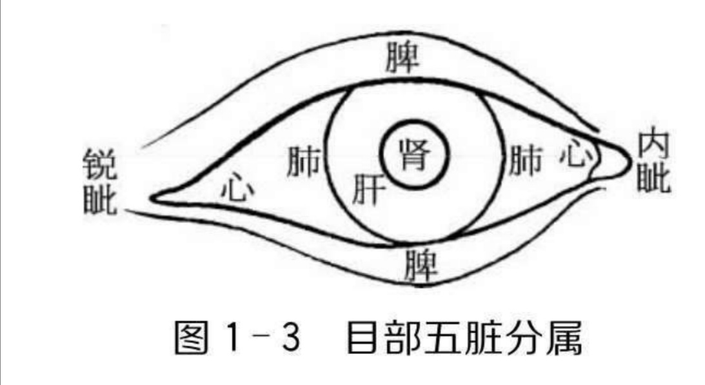
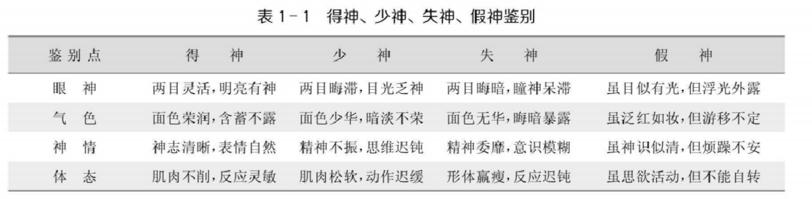

# 中医诊断学（持续更新中）
- 基本原理
- > 内外，大小，常变
    - 司外揣内
    - > 观察现象、推测变化、认识本质、解释征象
        - 外：疾病表现于外的症状、体征
        - 内：脏腑等内在的病理本质
        - 观察外表病理现象，推测内在病理变化，认识内在的病理本质，从而解释显于外的征象
    - 见微知著
        - 机体某些局部，包含着整体的生理、病理信息，通过微小变化，可测知整体情况
    - 以常衡变
        - 常：健康的、生理的状态
        - 变：异常的、病理的状态
        - 从正常中发现异常，从对比中找差别，认识疾病本质
- 基本原则
- > 整体，四诊，病证
    - 整体审察
        - 诊断疾病时：考虑整个人体、外环境对病证的影响
        - 收集临床资料：
            - 从整体上详细询问、检查，全面了解整体情况
            - 了解病史、体质、家庭、环境、时令、气候等对疾病有无影响
        - 对病情资料进行全面分析、综合判断
            - 注意到当前的、局部的、明显的病理改变
            - 顾及时、地、人、病的特殊性，从疾病的前因后果、演变发展趋势上整体审察
    - 诊法合参
        - 四诊并重，诸法参用，综合收集病情资料
        - 并不都按固定顺序进行
    - 病证结合
        - "病"与"证"密切相关，"辨病"与"辨证"相结合，有利于对疾病本质的全面认识
            - 病：从贯穿疾病始终的根本矛盾上认识病情
                - 辨病：从疾病  全过程、特征与规律上  认识疾病的本质
            - 证：从机体反应状况上认识病情
                - 辨证：从疾病  当前表现  判断病变部位、性质，抓住当前的主要矛盾
        - 临床思维分析
            - 通过辨病  确定了病种：可根据该病的一般演变规律，推测常见证型
            - 疾病本质反映不充分时：先辨证，有利于当前治疗，且通过对证变化的观察，有利于对疾病本质的揭示，从而确定病名
- 发展
    - 扁鹊：最早运用四诊
    - 《黄帝内经》：奠定诊断学理论基础
    - 《难经》：提  独取寸口  诊法
    - 淳于意：创“诊籍”
    - 张仲景：辨证论治理论创始人
    - 王叔和《脉经》：现存最早脉学专著
- 主要内容
- > 诊法、诊病、辨证和病历四部分内容
    - 诊法
    - > 对患者诊察，收集病情资料的基本方法
        - 收集的病情资料
            - 病史
            - **症状（广义）/"症" ！**
            - > 判断病种、辨别证候的主要依据
                - **症状（狭义） ！**
                - > 头痛、耳鸣、胸闷、腹胀等
                    - 主观感到的痛苦不适
                - **体征 ！**
                - > 面色白、喉中哮鸣、舌苔黄、脉浮数等
                    - 客观检测出的异常征象
        - 四诊：望、闻、问、切四种诊法
            - 望诊
            - > 运用视觉观察  患者的全身、局部的神、色、形、态，排出物的形、色、质、量等情况，以了解病情
                - 原理
                - > 人：有机整体，五官九窍、四肢百骸通过经络、五脏六腑密切联系
​有赖于气血津液充养
​脏腑功能状况与气血盈亏可反映于外
                    - 司外揣内、见微知著、以常衡变
                - **主要内容**
                    - **全身望诊**
                    - > 观察神、色、形、态
                        - **望神**
                        - > 观察&nbsp;&nbsp;人体生命活动&nbsp;&nbsp;整体表现
                            - **神的定义 ！**
                                - 广义：人体生命活动的整体表现
                                - > 精神、意识、思维、目光、呼吸、声音、语言、形体、动态、舌象、脉象等
                                - 狭义：人的精神、意识和思维活动
                            - 原理
                                - 脏腑精气：神的物质基础
                                - 神：精气的外在表现
                                -  
                            - 望神注意事项
                                - 1.重视第一感觉
                                - >  神的表现在患者无意时流露最真
                                - 2.神形合参，综合判断 
                                - > 尤其当形神表现不一致时，更应综合判断
​如久病形赢色败，虽神志清醒亦属失神
                                - 3.重视特殊症状和体征 
                            - 意义
                                - 精气神同盛衰
                                - > 了解脏腑精气盛衰，判断病情轻重，推测疾病预后
                                    - 脏腑精气充足：有神
                                    - 脏腑精气亏虚：少/无神
                            - **内容**
                                - 所望内容：眼神、气色、神情、体态等
                                    - 1.眼神、视觉功能、运动状态
                                        - 五脏六腑之精气皆上注于目 ​
                                        - 目系通于脑，为肝之窍、心之使、神之舍
                                        - 反映脏腑精气的盛衰
                                            - 两目神光充沛，精彩内含，视物清晰，运动灵活：有神，脏腑精气充盛
                                            - 两目浮光外露，目无精彩，运动不灵，视物模糊：无神，脏腑精气虚衰
                                    - 2.气色：周身皮肤（面部为主）的色泽
                                        - 色随气华，神以气养
                                        - 反映脏腑气血盛衰、功能强弱
                                            - 气色荣润有泽：脏腑精气充盛
                                            - 气色枯搞无泽：脏腑精气虚衰
                                    - 3.神情：精神意识、面部表情
                                        - 对外界刺激的反应，如精神意织、思维活动
                                        - 反映  心神、脏腑精气盛衰
                                    - 4.体态：形体、动作形态
                                        - 形体：由精气等物质构成
                                        - 姿态：脏腑功能的外在表现
                                        - 可推测脏腑精气盛衰、功能强弱
                                            - 形体丰盛/赢瘦，姿态自如/反常，动作灵活/迟钝
                                    - 其他
                                    - > 如言语、声音、呼吸、舌象、脉象等
                                - **神的分类**
                                - > 得少失假
                                    - **1.神的旺衰**
                                        - **得神**
                                            - 【临床表现】
                                                - 两目灵活，明亮有神
                                                - 面色荣润，含蓄不露
                                                - 神志清晰，表情自然
                                                - 肌肉不削，反应灵敏
                                            - 【临床意义】
                                                - 脏腑精气充足
                                                - 健康/虽病，精气未衰，病轻易治，预后良好
                                        - **少神："神气不足"**
                                        - > 晦滞、少华
                                            - 【临床表现】
                                            - > 呆，暗，懒，软，迟钝尚对
                                                - 两目晦滞，目光乏神
                                                - 面色少华，暗淡不荣
                                                - 精神不振，思维迟钝
                                                - 少气懒言，肌肉松软
                                                - 动作迟缓，反应正确
                                            - 【临床意义】
                                            - > 精气亏
                                                - 脏腑精气不足
                                                - 虚证/疾病恢复期
                                        - **失神："无神"**
                                        - > 精亏/邪盛；晦暗，无华
                                            - 分类
                                                - **精亏神衰  而失神：久病虚证**
                                                    - 【临床表现】
                                                        - 两目晦暗，瞳神呆滞
                                                        - 面色无华，晦暗暴露
                                                        - 精神萎靡，意识模糊
                                                        - 反应迟钝，手撒尿遗
                                                        - 骨枯肉脱，形体羸瘦
                                                    - 【临床意义】
                                                        - 精气大伤，功能衰减
                                                        - 重病/久病虚证，预后不良
                                                - **邪盛神乱  而失神：重病实证**
                                                    - 【临床表现】
                                                    - > 语床线，昏握牙
                                                        - 神昏瞻语，循衣摸床，撮空理线：气外泄
                                                        - 卒倒神昏，两手握固，牙关紧急：气内闭
                                                    - **【病因病机】！**
                                                    - > 邪扰/肝风痰堵
                                                        - 邪气亢盛，热扰神明，邪陷心包
                                                        - 或肝风挟痰，蒙蔽清窍，闭阻经络
                                                    - **【临床意义】！**
                                                        - 邪气亢盛、脏腑功能严重障碍，气血津液功能失调
                                                        - 多见于急性重病
                                            - 【临床意义】
                                            - > 亏/乱
                                                - 精亏神衰/邪盛神乱
                                                - 久病虚证/重病实证
                                        - **假神**
                                            - 【临床表现】
                                                - 久病、重病患者，精气本已极度衰竭，突然出现某些暂时"好转"的虚假表现
                                                    - 原本目光晦暗，突然目似有光，但浮光外露
                                                    - 原本面色晦暗，突然两颧泛红如妆，但游移不定
                                                    - 原本神昏或精神极度委靡，突然神识似清，想见亲人，言语不休，但烦躁不安
                                                    - 原本身体沉重难移，忽思起床活动，但不能自转
                                                    - 原本毫无食欲，久不能食，突然索食，且食量骤增
                                                - 本失神、精亏神衰；突然局部好转；好转短暂 
                                            - 【临床意义】
                                                - 脏腑精气极度衰竭，正气将脱，阴不敛阳，阴阳将离，虚阳外越，回光返照，属危重患者临终前征兆
                                                - 急性重病实证，预后不良
                                        - 如图
                                            -    
                                    - **2.神志错乱！**
                                        - **脏躁、癫、狂、痫等**
                                            - **焦虑不安、恐惧**
                                                - 脏躁/卑惵，虚证
                                                    - 心胆气虚，心神失养！
                                                    - > 卑惵：心虚神怯，抑郁自卑、胆怯恐惧，相当于神经衰弱、抑郁性神经症、恐怖症等
脏燥：心肝血虚，郁怒伤肝，血躁肝急导致​精神抑郁，有幻觉、知觉迟钝/过敏​
                                            - **狂躁不安**
                                                - 狂病，阳证
                                                    - 暴怒气郁化火，火煎津为痰，痰火扰乱心
                                                    - > 动而多怒
                                            - **淡漠痴呆**
                                                - 癫病/痴呆，阴证
                                                    - 忧思气结，津凝为痰，痰浊蒙蔽心/先天禀赋不足
                                                    - > 静而多喜
                                            - **猝然昏倒！**
                                                - 痫病，风痰！
                                                    - 脏气失调，肝风挟痰上逆，蒙蔽清窍！
                                            -  
                                        - 辨析：神志错乱与邪盛神乱而失神
                                            - 邪盛所致：全身性疾病严重阶段，病重至失神
                                            - 神志错乱：多反复发作，缓解时神志正常，病情不一定危重
                        - **望色**
                        - > 通过观察患者皮肤色泽变化来诊察病情的方法，望面部色泽变化为主
                            - 原理
                                - 面部血络丰富，皮肤薄嫩，体内气血盛衰变化易通过面部色泽变化显露
                                - 面部暴露充分，便于观察
                            - 望色注意事项
                                - 1.知常达变，综合判断
                                    - 患者面色与周围常色比较，局部色泽变化与其自身对应部位的正常肤色进行比较
                                    - 因病情复杂、面色与病性不符时，须观察患者体表其他部位组织的色泽，并结合其他诊法进行综合判断
                                - 2.整体为主，荣枯为要
                                    - 将各种望色方法相参运用。并应以患者的整体面色为主,以荣润含蓄或晦暗枯稿作为判断病情轻重和估计预后的主要依据。
                                - 3.注意光线、昼夜、情绪、饮食等因素影响
                            - 意义：气血、病邪、病位、转归
                                - 判断气血盛衰
                                    - 面部皮肤色泽：脏腑气血的外荣，反映气血盛衰、运行情况
                                - 辨别病邪性质
                                - > 机体感受不同病邪，引起不同病理变化，面部出现色泽改变

                                    - 色红：热邪
                                    - 色白：寒邪
                                    - 色青紫：气滞血瘀
                                - 确定病变部位：表里、脏腑、面部、顺逆
                                - > ​观察患者面部整体色泽变化为主，以分部色诊为辅
                                    - **面部颜色浮沉**
                                        - 色浮主病位在表，色沉主病位在里
                                    - **五色配五脏**
                                        - 青为肝病，赤为心病，白为肺病，黄为脾病，黑为肾病 
                                    - **​颜面区域分属脏腑 ！**
                                    - > 额心，鼻脾，左颊肝，右颊肺，颏肾 ​
                                        - 额部候心，鼻部候脾，左颊候肝，右颊候肺，颏部候肾 ​
                                        -  
                                - 预测疾病转归
                                    - 面色明亮润泽、含蓄不露者：顺，主病情轻浅，预后良好  ​
                                    - 面色晦暗枯槁、鲜明暴露者：逆，主病情深重，预后较差
                            - **内容**
                                - 所望内容：色、泽
                                    - 色：皮肤的颜色，属阴、属血
                                        - 反映血液的盈亏和运行状况
                                            - 血旺则色红
                                            - 血虚则色淡
                                            - 血瘀则色青紫
                                    - 泽：皮肤的光泽，属阳、属气
                                        - 反映精气盛衰
                                            - 明润含蓄（气至）/晦暗暴露（气不至）
                                            - 气盛则荣润有泽
                                            - 气虚则晦暗无华
                                - **常、病色**
                                - > 常分主客，病分善恶
                                    - **常色**
                                    - > 生理状态时的面部色泽
                                        - **特点：明润、含蓄；红黄隐隐，明亮润泽！**
                                        - 分类
                                            - 主色：先天
                                            - > 生来就有、终身基本不变的面色，属个体素质
                                                - 人体质：木、火、土、金、水
                                                - 故肤色有偏青、偏红、偏黄、偏白、偏黑
                                            - 客色：后天
                                            - > 受季节、气候、地理环境、饮食、情绪、运动等因素影响，面部发生的正常色泽变化
                                                - 一过性改变，排除相关因素后恢复
                                                - 如
                                                    - 四季：春季稍青，夏季稍赤，长夏稍黄，秋季稍白，冬季稍黑 
                                                    - 昼夜：白昼面色略显红润，黑夜面色微淡而干
                                                    - 酒后面红目赤，饱食面容润泽光亮，饥饿面色少泽微暗​
                                    - **病色**
                                    - > 疾病状态时的面部异常色泽
                                        - **特点：晦暗、暴露！**
                                        - > 晦暗：脏腑精气已衰，胃气不能上荣于面
暴露：病色外现，真脏色暴露​
                                        - 生成：脏腑精气、胃气上荣
                                        - 分类
                                            - 善色
                                            - > 患者面色虽有异常，但仍光明润泽

                                                - 原理：病变轻浅，脏腑精气未衰，胃气尚能上荣于面！
                                                - 见于：新病、轻病、阳证，其病易治，预后较好​
                                                - > 如：黄疸患者，面色黄，而鲜明如橘皮色
                                            - 恶色
                                            - > 患者面色枯稿晦暗、暴露
                                                - 原理：病变深重，脏腑精气已衰，胃气不能上荣于面！
                                                - 见于：久病、重病、阴证，其病难治，预后较差
                                            - 面色由善转恶，病情加重
                                - **色生克顺逆！**
                                    - **病、色相应：正病正色！**
                                    - **病、色不相应，反见他色：病色交错！**
                                    - > 色生病顺，色克病逆
                                        - 病色相生：吉
                                            - 色生病：吉中之顺
                                            - 病生色：吉中之逆
                                        - 病色相克：凶
                                            - 色克病：凶中之逆
                                            - 病克色：凶中之顺
                                - **五色主病**
                                    - 病色：赤、白、黄、青、黑
                                        - 五色对五脏："青为肝，赤为心，白为肺，黄为脾，黑为肾"
                                        - 五色对病性："青黑为痛，黄赤为热，白为寒"
                                    - **1.赤色：热证、戴阳证（通红、潮红）**
                                    - > 邪热亢盛/虚火上炎/虚阳上浮，面部脉络扩张，面见红色
                                        - 主热证
                                            - **满面通红：实热（外感/脏腑）**
                                                - 外感邪热，或脏腑阳热亢盛（血行加速，面部脉络扩张，气血上涌）
                                            - **两颧潮红：阴虚**
                                                - 阴虚阳亢，虚火上炎，多在午后
                                        - 主戴阳证
                                            - **久病重病，面色苍白，泛红如妆，游移不定**
                                                - 阳气虚衰，阴寒内盛，阴盛格阳，虚阳上浮
                                    - **2.白色 ：虚证、寒证  （淡白、晄白、苍白）**
                                    - > 气虚/血少/阳虚/寒盛等，气血不能上荣于面，面见白色
                                        - **面色淡白，唇舌色淡**
                                            - 血虚
                                                - 血不上荣
                                        - **面色晄白**
                                            - 阳虚水泛
                                                - 阳虚，行血行水乏力，水肿故绷紧
                                        - **面色苍白（白为主，加青），伴冷汗、肢冷、脉微！**
                                            - 亡阳/气血暴脱（导致气血运行不通，停滞）/阴寒内盛（导致收引凝滞）
                                                - 阳气暴脱，脱血夺气，面部脉络血少，血行迟滞兼血郁
                                    - **3.黄色 ：脾虚、湿证（萎黄、虚黄、阴黄、阳黄）**
                                    - > 机体失养/湿邪内蕴等，脾失运化，面见黄色
                                        - **面色萎黄！**
                                            - 脾胃气虚，气血不足
                                                - 脾失健运，气血化生无源，机体失养
                                        - **面黄虚浮！**
                                            - 脾虚湿蕴
                                                - 脾运不健，机体失养，水湿内停，泛溢肌肤，皮肤因此绷紧而有光泽 黄而虚浮，​​脾虚加湿停
                                        - **黄疸**
                                        - > 面目一身俱黄，主要为观察目黄
（湿邪阻滞，胆汁无法正常进入、下行于消化道，外溢体表）​​
                                            - 阳黄：湿热
                                                - 面目黄，鲜明如橘皮色
                                                - > 湿热内蕴，胆汁外溢
多见急性肝炎等疾病，与善色特点相配，预后较好
                                            - 阴黄：寒湿
                                                - 面目黄，晦暗如烟熏色
                                                - > 寒湿内阻，胆汁外溢
可见于肝癌等​​，疾病慢性，预后差
                                    - **4.青色：寒证、气滞、血瘀、疼痛、惊风（淡青黑、青紫、心痛、青黄、惊风）**
                                    - > 寒凝气滞/瘀血内阻/疼痛剧烈/筋脉拘急等，面部脉络血行不畅，面见青色
根本：血行不畅（疼痛、疯癫抽搐）​​
                                        - **面色淡青、青黑**
                                            - 寒盛（阴寒内盛，脉络拘急）/痛剧（气血不通，气血凝滞）
                                            - > 阴寒内盛，经脉挛急收引，不通而痛，以致面部脉络拘急，气血凝滞
由苍白到淡青到青黑，加重​​
                                        - **面色、口唇青紫！**
                                        - > 注意：心肺病变​​
                                            - 儿童：先天心不足，阳气亏虚
                                            - 成人：心阳不足/肺气闭塞
                                                - 心气、心阳虚衰，血行瘀阻/肺气闭塞，呼吸不利
                                        - **面色青黄**
                                            -  肝郁脾虚、气滞血瘀
                                            - > 青：肝郁，黄：脾虚
                                        - **突见面色青灰，口唇青紫，肢凉脉微！**
                                            - 真心痛：心阳暴脱、心血瘀阻（急性心肌梗死）
                                            - > 病发较急
                                        - **小儿高热（满面通红），见眉间、鼻柱、唇周发青（可能发生高热惊厥、抽搐：肝风内动）**
                                            - 惊风/欲作惊风
                                                - 阴惊而风动，受惊后高热 
                                                - 邪热壅滞，燔灼筋脉，筋脉拘急，血行瘀阻
                                    - **5.黑色 ：肾虚、水饮、寒证、血瘀、剧痛（暗淡、干焦、眼眶、黛黑）**
                                    - > 肾阳虚衰，寒水内盛，血失温养/肾阴精亏虚，机体失养，面见黑色
                                        - **面黑暗淡**
                                            - 肾阳虚
                                                - 阳虚火衰，水寒不化，不被推动，浊阴上泛
                                        - **面黑干焦**
                                            - 肾阴精亏虚
                                                - 肾精久耗，阴虚火旺，虚火灼阴，机体失养
                                        - **眼眶周围发黑**
                                            - 肾虚，水饮/寒湿带下
                                            - > 有遗精、带下等情况
                                        - **面色黛黑，肌肤甲错**
                                            - 血瘀日久
                                            - > 肌肤失去血液营养，时间长久，成鳞片状，发黑
                                - **望色十法 ！**
                                - > 浮沉清浊 为什三团 则要
为甚虚实，则要轻重​
                                    - 1.浮和沉（表里）
                                        - 浮：面色浮显于皮肤之外，主表证
                                        - 沉：面色沉隐于皮肤之内，主里证
                                        - 由浮转沉：邪气由表入里
                                        - 由沉转浮：病邪自里达表
                                    - 2.清和浊（阴阳）
                                        - 清：面色清明，主阳证
                                        - 浊：面色浊暗，主阴证
                                        - 由清转浊：病从阳转阴
                                        - 由浊转清：病由阴转阳
                                    - 3.微和甚（虚实）！
                                        - 微：面色浅淡，主虚证
                                        - 甚：面色深浓，主实证
                                        - 由微转甚：病因虚致实
                                        - 由甚转微：病由实转虚
                                    - 4.散和抟（新久）
                                        - 散：面色疏散，主新病，或病邪将解
                                        - 抟：面色壅滞，主久病，或病邪渐聚
                                        - 由抟转散：病久邪将解
                                        - 由散转抟：病近邪渐聚
                                    - 5.泽和夭（轻重）！
                                        - 泽：面色润泽，主精气未衰，病轻易治
                                        - 夭：面色枯槁，主精气已衰，病重难医
                                        - 由泽转夭：病趋重危
                                        - 由夭转泽：病情好转
                                    - 规律：不论面见何色
                                        - 呈沉、浊、甚、抟、夭：多属里证、久病、重病
                                        - 呈浮、清、微、散、泽：多属表证、新病、轻病
                        - **望形**
                        - > 观察患者强弱胖瘦、体质形态、畸形等，以诊察病情
                            - 原理
                                - 人体：五脏为中心
                                    - 五体合于五脏，有赖五脏精气充养
                                    - > 五体：皮毛、肌肉、血脉、筋腱、骨骼！
                                    - 五脏精气盛衰、功能强弱：通过五体反映于外，外形与内脏气血阴阳盛衰统一
                            - 意义
                                - 知脏腑虚实、气血盛衰、邪正消长、病势顺逆、邪气所在
                                - 不同体质形态，阴阳盛衰不同，对疾病的易感性和患病后的转归不同
                                - 观察体质类型有助诊断
                            - **内容：强弱、胖瘦、体质**
                                - **1.形体强弱（体质、脏腑、气血、抗病能力、治疗、预后）**
                                - > 脏腑虚实、气血盛衰​将形体外在表现、机体功能状态、神的衰旺等结合，综合判断
                                    - 体强：身体强壮
                                        - 外在：骨骼粗大，胸廓宽厚，肌肉充实，皮肤润泽
                                        - 功能：筋强力壮，精力充沛，食欲旺盛
                                        - 神态：神旺
                                        - 说明：体质强壮，内脏坚实，气血旺盛，抗病力强，有病易治，预后较好
                                    - 体弱：身体衰弱
                                        - 外在：骨骼细小，胸廓狭窄，肌肉瘦削，皮肤枯槁
                                        - 功能：筋弱无力，精神不振，食少懒言
                                        - 神态：神衰
                                        - 说明：体质虚衰，内脏脆弱，气血不足，抗病力弱，有病难治，预后较差
                                    - 有助了解脏腑虚实、气血盛衰
                                - **2.形体胖瘦：头 颈 肩 胸 腹**
                                - > 观察时，与精神状态、食欲食量等结合判断
                                    - **肥胖：圆、短粗、厚**
                                        - 形体特点：头圆形，颈短粗，肩宽平，胸厚短圆，大腹便便
                                        - 细分：食欲
                                            - **体胖能食，肌肉坚实，神旺有力**
                                                - 形气（脾胃之气）有余
                                                    - 精气充足，身体健康
                                            - **体胖食少，肉松皮缓，神疲乏力**
                                                - 形盛气虚
                                                    - 阳气不足，多痰多湿，易患痰饮、中风等
                                                    - > ​​气：固摄作用，使得肌肉紧实。气虚则缺乏约束，松垮，运行不足以堆积，则有痰湿
                                    - **消瘦：细长**
                                        - 形体特点：头长形，颈细长，肩狭窄，胸狭平坦，大腹瘦瘪
                                        - 细分：食欲
                                            - **体瘦食多**
                                                - 中焦有火
                                            - **体瘦食少**
                                                - 中气虚弱
                                                - > 脾胃虚弱/气血亏虚/病气消耗
                                            - **体瘦颧红，伴潮热盗汗，口咽干燥**
                                                - 阴虚火旺，易患肺病！
                                                - > 火灼伤肺阴
                                            - **久病重病，卧床不起，骨瘦如柴**
                                                - 脏腑精气衰竭，气液干枯，属病危
                                                - > 消耗性疾病；常失神
                                    - 注意内在精气、形气综合判断
                                        - 形体虽胖，但少气乏力者：精气不足，抗病力弱
                                        - 形体虽瘦，但神旺有力者：精气充沛，抗病力强
                                    - 身体质量指数（BMI）=体重(千克）÷身高（米）的平方
                                    - > 成人低于18.5：过轻，高于24：超重，高于28：肥胖。男性腰围大于等于85厘米、女性腰围大于等于80厘米为腰部肥胖
                                - **3.体质形态**
                                    - 体质：形体结构、功能方面的个体差异性
                                    - > 个体在先天禀赋、后天环境等因素影响下，在生长发育过程中逐渐形成的形体结构与功能方面的个体差异性
                                        - 反映：机体阴阳气血盛衰的禀赋特点、对疾病的易感性
                                    - 分类
                                        - “阴阳人”分类法
                                            - （1）阴脏人：（较胖，阳较弱，阴偏盛）
                                            - > 短粗，宽厚，后仰，喜热恶凉
                                                - 偏矮胖，头圆颈粗，肩宽胸厚
                                                - 身体姿势多后仰
                                                - 平时喜热恶凉
                                                - 体质特点：阳较弱，阴偏盛，患病易从阴化寒，多寒湿痰浊内停
                                            - （2）阳脏人：（较瘦，阴较亏，阳偏旺）
                                            - > 瘦长，窄平，前屈，喜凉恶热
                                                - 偏瘦长，头长颈细，肩窄胸平
                                                - 身体姿势多前屈
                                                - 平时喜凉恶热
                                                - 体质特点：阴较亏，阳偏旺，对暑热阳邪易感，患病易从阳化热，导致伤阴伤津。
                                            - （3）阴阳和平之人：又称平脏人
                                            - > 体质特点是阴阳平衡，气血调匀
                                        - 九种体质
                                            - （1）平和质：匀称健壮，面色明润，目光有神，头发稠密有光泽，唇色红润，精力充沛，不易疲劳，耐受寒热
                                            - （2）气虚质：肌肉松软，面色淡白或萎黄，精神不振，易出汗，易感风、寒之邪
                                            - > 气虚：面淡白、萎黄，精神萎，出汗，肌松
                                            - （3）阳虚质：平素畏冷，手足不温，喜热饮食，耐热不耐寒，神疲，易感风、寒、湿邪
                                            - > 怕寒
                                            - （4）阴虚质：体形偏瘦，口燥咽干，手足心热，大便干燥，皮肤干燥，耐冬不耐夏
                                            - > 燥热，偏瘦
                                            - （5）痰湿质：体形肥胖，腹部肥满松软，面部皮肤油脂较多，肢体困重，易疲倦，大便不成形或黏滞不爽
                                            - > 体胖腹肥，面油易累，粘滞
                                            - （6）湿热质：面垢油光，易生痤疮，大便黏滞不畅，小便短黄，男性易阴囊潮湿瘙痒，女性易带下色黄，外阴瘙痒
                                            - （7）血瘀质：面色晦暗，或色素沉着有瘀斑，口唇暗淡或紫，舌质暗有瘀点、瘀斑，舌下络脉紫暗、增粗，肌肤干涩、脱屑
                                            - > 晦暗，色沉，暗紫
                                            - （8）气郁质：神情抑郁，情感脆弱，郁闷寡欢，善思多虑，情绪低落，易于激动，对精神刺激适应能力较差
                                            - （9）特禀质：以生理缺陷、过敏反应等为主要特征，适应能力较差
                        - **望态**
                        - > 观察患者动静姿态、体位变化、异常动作等，诊察病情
                            - 原理
                                - 动静姿态、体位动作与机体阴阳盛衰和病性的寒热虚实关系密切
                                    - 阳主动，阴主静
                                        - 功能亢进、躁动不安：阳证、热证、实证
                                        - 功能衰减、喜静懒动：阴证、寒证、虚证
                                - 不同疾病迫使患者采取不同体位和动态，减轻疾病痛苦
                                - 肢体活动受心神支配，与经脉、筋骨、肌肉的状况密切相关，患者肢体的异常动作表现与一定的疾病有关
                            - 意义
                                - 观察患者的动静姿态和体位、动作，可判断疾病属性，有助诊断
                            - **内容**
                                - **1.动静姿态**
                                    - 病变：肢体动静失调
                                    - **诊态八法（《望诊遵经》提出）**
                                        - 动者、强者、仰者、伸者
                                            - 属表、阳、热、实证
                                            - > 便于散热、活动
                                        - 静者、弱者、俯者、屈者
                                            - 属里、阴、寒、虚证
                                - **2.体位变化**
                                - > 坐卧立行痛
                                    - **坐形**
                                        - 能否坐
                                            - **但坐不得卧，卧则气逆  ！**
                                                - 咳喘肺胀/水饮停于胸腹
                                                - > 痰饮停留胸腹，影响心肺，心慌气喘；坐立则下行，对心肺影响小​（eg：半瓶水）
                                            - **但卧不能坐，坐则神疲晕眩  ！**
                                                - 脱血夺气/肝阳化风
                                                - > 气血严重亏损，坐立难供养上身，躺下即可
​头晕目眩、四肢抽搐、手足震颤：动摇状，为风邪，多为肝风内动
                                        - 坐下后
                                            - **坐而仰首，胸胀气粗**
                                                - 肺实气逆
                                                - > 便于呼吸
                                            - **坐而喜俯，少气懒言**
                                                - 体弱气虚
                                            - **坐时以手抱头，头倾不能昂，凝神熟视**
                                                - 精神衰败
                                                - > 凝神熟视：支棱难转，反应迟钝
                                    - **卧式**
                                        - 面朝向、转身
                                            - **面常向外，身轻自能转侧**
                                                - 阳证、热证、实证
                                                - > 外：古指能上床处，即对光处
                                            - **面常向里，身重不能转侧**
                                                - 阴证、寒证、虚证
                                                - > 里：背光处
                                                - 若见于久病重病：气血衰败已极，预后不良
                                        - 卧姿
                                            - **仰卧伸足，掀去衣被**
                                                - 实热证
                                            - **蜷卧缩足，喜加衣被**
                                                - 虚寒证
                                            - **坐卧不安  ！**
                                                - 烦躁之征/腹满胀痛！
                                                - > 胃不和则卧不安
                                    - **立姿**
                                        - **站立不稳，其态似醉，并见眩晕**
                                            - 肝风内动
                                        - **不耐久站，站立时欲依靠支撑**
                                            - 气血虚衰
                                    - **行态**
                                        - **以手护腰，弯腰曲背，行动艰难**
                                            - 腰腿病
                                        - **行走时身体震动不定  !**
                                            - 肝风内动/筋骨受损！
                                            - > 如中风的后遗症
                                    - **痛姿：疼痛时患者的姿态**
                                    - > "护处必痛"
                                        - **蹙额捧头，俯不欲仰**
                                            - 头痛
                                        - **叉手扪心，闭目不语！**
                                            - 心虚怔忡/心痛！
                                            - > 严重的心慌心悸
                                        - **两手护乳前，唯恐触碰**
                                            - 多见于哺乳期女性，乳痈
                                        - **以手护腹，俯身前倾**
                                            - 腹痛
                                - **3.异常动作**
                                    - 注：形体异常动作多与风、肝有关
                                    - > 因风主动，善行数变，风气通于肝
                                    - **内容**
                                        - **唇、睑、指、趾颤动！**
                                        - > 热动风，内失养
                                            - 外感热病：动风先兆
                                            - 内伤杂病：气血不足，筋脉失养
                                        - **手足蠕动，缓慢掣动！**
                                            - 阴血不足，肝风内动之象
                                        - **四肢拘挛！**
                                            - 阴血不足，筋脉失养/寒邪侵袭，筋脉收引！
                                            - > 四肢拘急挛曲，不能伸直
                                        - **痉病  ！**
                                            - **四肢抽搐：四肢痉挛，迅速而不自主地收引、牵动，屈伸不已**
                                                - 突发抽搐，强劲有力
                                                    - 热极生风/肝阳化风
                                                - 抽搐不已，微弱无力
                                                    - 阴血不足，虚风内动
                                                - 小儿吐泻后，四肢抽搐
                                                    - 脾阳虚脱之证，"慢脾风"
                                            - **角弓反张：项背肌肉强直，头后仰，躯干前挺，体呈弓状**
                                                - 与四肢抽搐并见，病因病机一致
                                            - **牙关紧闭**
                                        - **猝然昏倒，不省人事，伴四肢抽搐、口吐白沫、两目上视，移时苏醒，醒后如常**
                                            - **痫病**
                                        - **循衣摸床，撮空理线**
                                            - 邪盛神乱之失神
                                            - > 神志不清，两手不自主抚摸衣被床沿，或在空中挥舞，如同理线
                                        - **中风**
                                            - **卒然昏倒，半身不遂，口眼歪斜**
                                                - 中脏腑
                                                    - 肝阳上亢，化风挟痰，卒中脏腑
                                            - **神志清楚，仅半身不遂或口舌歪斜**
                                                - 中经络/中风后遗症
                                            - **卒倒，口开手撒，二便失禁**
                                                - 中风脱证
                                            - **卒倒而牙关紧闭，两手握固，大小便闭**
                                                - 中风闭证
                                        - **卒然昏倒，伴见四肢厥冷，呼吸自续**
                                            - 厥证
                                        - **盛夏卒倒，面赤汗出，甚而昏迷痉厥**
                                            - 中暑
                                                - 暑热/暑湿秽浊之邪，闭阻气机、心神
                                        - **手足软弱无力，行动不灵而无痛**
                                            - 痿证
                                                - 阳明湿热/脾胃气虚/肝肾不足
                                        - **四肢关节疼痛，屈伸不利**
                                            - 痹证
                                                - 风、寒、湿三邪侵犯关节，气血痹阻不通
                                        - **儿童手足伸屈扭转，挤眉眨眼，努嘴伸舌，状似舞蹈，不能自制  ！**
                                            - 气血不足，风湿内侵
                    - **局部望诊**
                    - > 望头面、五官、颈项、躯体、四肢、二阴、皮肤
                        - 原理
                            - 人体是一个有机整体，整体的病变可反映于各个局部，局部的病变也可影响全身
                        - **内容**
                            - **望头面**
                                - **望头部**
                                    - 原理
                                        - 头：精明之府，藏脑髓，元神所居；诸阳之会，脏腑之清阳精气循经脉上荣于头
                                        - 脑：髓海，肾所主
                                        - 肾精化血，发为血之余、肾之华
                                    - 意义：诊察肾、脑、脏腑精气盛衰
                                    - 重点观察
                                        - **1.头颅大小：头围（头部通过眉间和枕骨粗隆的横向周长）**
                                        - > 一般新生儿：34cm，前半年增加8～10cm，后半年增加2～4cm，2岁时达 48cm，第二年仅增加2cm，5岁时约50cm，15岁时接近成人头围，达54～58cm。明显超出此范围者为头颅过大，反之为头颅过小，属病态，多见于正值颅骨发育期的婴幼儿
                                            - 小儿头颅膨大呈圆形，面部较小，双目下视，伴智力低下（膨大，圆形，面小，下视，低智）
                                                - 巨颅
                                                    - 先天不足，肾精亏损，水液停聚于脑
                                            - 小儿头颅狭小，顶部尖突，颅缝早合，伴智力低下（狭小，尖突，早合，低智）
                                                - 小颅
                                                    - 先天肾精不足，颅骨发育不良
                                            - 小儿前额左右突出，头顶平坦，颅呈方形（额左右突，顶平，方形）
                                                - 方颅
                                                    - 肾精不足/脾胃虚弱，颅骨发育不良
                                                    - 或见于佝偻病、先天性梅毒等
                                        - **2.囱门：婴幼儿颅骨接合不紧所形成的骨间隙，分前区、后区**
                                        - > 后囱：三角形，出生后2～4个月内闭合
​​前囱：菱形，出生后12～18个月内闭合​
​临床观察小儿生长发育状况的主要部位之一
                                            - 囱填：囟门高突！
                                            - > 颅内压力高：热/髓/水
                                                - 温病火邪上攻/脑髓病变/颅内水液停聚所致
                                                - 属实证
                                                - 小儿哭闹时囱门暂时突起不属病态
                                            - 囱陷：囱门凹陷！
                                            - > 伤津气血/精气脑髓
                                                - 吐泻伤津、气血不足/先天精气亏虚、脑髓失充所致！
                                                - 属虚证
                                                - 6个月以内的婴儿囟门微陷属正常
                                            - 解颅：囱门迟闭，此时前囟软且面积大！
                                            - > 先后天
                                                - 先天肾气不足/后天脾胃虚弱，发育不良所致！
                                                - 多见于小儿佝偻病
                                                - 常兼有
                                                    - 五软（头软、项软、手足软、肌肉软、口软）：头口项肌肢
                                                    - 五迟（立迟、行迟、发迟、齿迟、语迟，即生长发育迟缓）发齿语立行
                                        - **3.动态**
                                            - 头摇不能自主："摇头风"，肝风内动之兆
                                        - **4.头发**
                                        - > 发为血之余,肾之华。故望头发的色泽、发质和疏密,可以了解肾气的盛衰和精血的盈亏
                                            - **发色：黄白**
                                                - 发黄干枯，稀疏易落
                                                    - 精血不足
                                                    - 见于慢性虚损患者或大病之后
                                                    - > 血燥亦可排除；外部影响：美发次数过多亦影响发质
                                                - 青年白发
                                                    - 伴腰膝酸软、头晕耳鸣等症：肾虚
                                                    - 伴失眠、健忘等症：劳神伤血
                                                    - 无任何不适者，俗称"少白头"：先天禀赋，不属病态
                                            - **发质：稀疏、小儿软、小儿穗**
                                                - 发稀不长/发疏易断！
                                                - > 肾/精/阴
                                                    - 肾虚/精血不足/阴虚血燥！
                                                - 小儿头发稀疏黄软，生长迟缓，甚至久不生发，或枕后发稀！
                                                - > 肾、脾
                                                    - 先天不足，后天失养，脾肾亏虚！
                                                - 小儿发结如穗，枯黄无泽，面黄肌瘦
                                                    - 疳积
                                                    - > 如：过食甘肥厚腻，饮食吸收不良，气血不能上充濡养头发
                                            - **脱发**
                                                - 头发稀疏易脱，伴腰膝酸软、头晕耳鸣
                                                    - 肾虚
                                                - 突然片状脱发，显露圆形或椭圆形光亮头皮！
                                                    - 斑秃
                                                        - 血虚受风！
                                                        - 长期精神紧张、焦虑惊恐等情志失调，损伤精血
                                                        - > 直接原因：精血损伤所致
                                                - 青壮年头皮瘙痒，头发多屑多脂易落，甚至露出光亮头皮！
                                                    - 脂秃
                                                        - 血热化燥/湿热内蕴所致！
                                - **望面部**
                                - > 脏腑精气所荣，心之外华。 ​可诊察脏腑精气盛衰和病变
                                    - **1.面肿**
                                    - > 常伴随全身的水肿
                                        - 面部浮肿，皮色不变
                                            - 水肿病（全身水肿的一部分）
                                            - > 肺、脾、肾三脏功能失调
                                                - ​头面先肿
                                                    - 阳水
                                                    - > 肺失宣降，水停留头面部
                                                - ​ 下足向上肿
                                                    - 阴水
                                                    - > 脾肾阳虚，脾肾失输布
                                        - 头面皮肤掀红肿胀，色如涂丹，灼热疼痛！
                                            - "抱头火丹"
                                                - 风热火毒上攻！
                                        - 头肿大如斗，面目肿甚
                                            - "大头瘟"
                                                - 天行时疫，毒火上攻
                                    - **2.腮肿**
                                        - 以耳垂为中心肿起，边缘不清，局部灼热疼痛
                                            - **痄腮**
                                                - 外感温毒之邪，多见儿童，传染病
                                        - 颧下颌上耳前发红肿起，多为一侧，伴有寒热、疼痛，张口受限！
                                            - **发颐**
                                                - 阳明热毒上攻所致！
                                                - > 阳明有热，推动气血上涌，肿塞
                                    - **3.面削颧耸/面脱**
                                        - 面部肌肉消瘦，两颧高耸，眼窝、面颊凹陷，伴全身骨瘦如柴
                                            - 脏腑精血消耗殆尽，慢性病晚期病危阶段
                                    - **4.口眼（或舌）歪斜**
                                        - 患侧口角向健侧歪斜，患侧目不能闭，口不能合，不能皱眉鼓腮
                                            - 面瘫
                                                - 风邪中络
                                        - 口舌歪斜兼半身不遂
                                            - 中风病（中脏腑）
                                                - 肝风挟痰，阻闭经络
                                    - **5.特殊面容**
                                        - 惊恐貌
                                            - 小儿惊风、狂犬病和瘿瘤等
                                        - 苦笑貌
                                            - 新生儿脐风、破伤风等
                                        - 狮面伴鼻骨塌陷，眉毛、头发脱落
                                            - 麻风病、梅毒等
                            - **望五官**
                            - > 面部目、耳、鼻、口、舌五官，分别与五脏相关联，可了解脏腑病变
                                - **1.望目**
                                - > 肝之窍，心之使，五脏六腑之精气皆上注于目
                                    - 五轮学说：风水气血肉 五轮
                                    - > 《灵枢·大惑论》：目的不同部位分属于不同脏腑
                                        - 瞳仁属肾：水轮
                                        - 黑睛属肝：风轮
                                        - 目眦及血络属心：血轮
                                        - 白睛属肺：气轮
                                        - 眼睑属脾：肉轮
                                        -  
                                    - **1.目色：赤黄白黑**
                                    - > 正常人眼睑内与目毗色淡红，眼睑外之色同面色
                                        - 目赤肿痛：实热证！
                                            - 白睛色红：肺火/外感风热
                                            - 两眦赤痛：心火上炎
                                            - 睑缘赤烂：脾有湿热
                                            - 全目赤肿：肝经风热上攻！
                                        - 白睛发黄
                                            - 黄疸病的主要标志
                                                - 湿热/寒湿内蕴，肝胆疏泄失常，胆汁外溢
                                        - 目眦淡白
                                            - 血虚/气血两虚（目络失养，不能充盈）
                                        - 眼睑皮肤色黑：肾虚
                                            - 肾虚，肾精亏耗
                                            - 或肾虚，水泛、寒湿下注之象
                                    - **2.目形：胞、眶、球、睑**
                                        - 目胞浮肿
                                            - 常见于水肿
                                            - > 低枕睡眠后胞睑微肿，活动后消失者，不属病态
                                        - 眼眶凹陷！
                                            - 伤津脱液/气血虚衰！
                                        - 久病、重病，眼眶深陷，伴骨瘦如柴
                                            - 脏腑精气竭绝，病危
                                            - > 气液耗竭
                                        - 眼球突出
                                        - > 咳嗽气喘，老年人常见，伴随老年性慢性支气管炎。胸廓变厚，桶装胸，即肺滞；颈前结缨处肿大，即瘿瘤，甲状腺肿大
                                            - 肺胀/瘿瘤
                                                - 兼气喘胸满，反复发作，迁延难愈
                                                    - 肺胀：肺脾肾三脏虚损，肺气壅滞，气道不畅
                                                - 兼颈前微肿，急躁易怒
                                                    - 瘿瘤：肝郁化火、痰气壅结所致
                                        - 眼睑红肿！
                                            - 睑缘肿起结节如麦粒，红肿较轻：针眼
                                            - 胞睑漫肿，红肿较重：眼丹
                                            - 皆为风热邪毒/脾胃蕴热上攻于目！
                                            - > 热：风热/脾胃热
                                    - **3.目态（瞳、凝、闭、垂）**
                                    - > 正常人眼球活动自如、灵活,瞳孔呈圆形,直径为3～4毫米,对光反应灵敏
                                        - （1）瞳孔缩小：直径小于2毫米
                                            - 中毒所致
                                            - > 如川乌、草乌、毒覃、有机磷类农药及吗啡等中毒
                                            - 风中脏腑等危重疾病
                                            - > 未受刺激即收缩
                                        - （2）瞳孔散大：直径大于5毫米，对光反应迟钝或消失
                                            - 药物中毒等
                                            - 风中脏腑等，病情危重
                                            - 颅脑损伤（如头部外伤）
                                            - 青风内障、白内障
                                            - 两侧瞳孔完全散大，对光反应消失：临床死亡的指征之一
                                        - **（3）目睛凝视：两眼固定，不能转动（直、上、斜）**
                                            - 【临床表现】
                                                - 目睛正圆，固定前视：瞪目直视
                                                - 固定上视，白睛翻起：戴眼反折
                                                - 固定侧视，转动不灵：横目斜视
                                                - 常伴神昏、抽搐等症，属病情危重
                                            - 【病因病机】！
                                            - > 肝风/外伤/先天/精脱神衰
                                                - 精脱神衰之危候
                                                - 肝风内动，牵引目系之惊风、痉厥
                                                - 目睛斜视也可以见于外伤目系或者先天所致
                                        - **（4）闭目障碍：眼睑闭合障碍**
                                            - 双目闭合障碍
                                                - 瘿瘤
                                            - 单侧闭合障碍
                                                - 风中面络
                                            - 小儿睡时露睛
                                                - 脾气虚弱，气血不足，胞睑失养
                                                - 多见于吐泻伤津和慢脾风
                                            - 昏睡露睛
                                                - 中风、颅脑病变等危候
                                        - **（5）眼睑下垂：眼睑无力张开而上睑下垂，睑废**
                                            - 双睑下垂者：先天不足、脾肾亏虚所致
                                            - 单睑下垂者：脾气虚弱/中风病危候/颅脑病变/外伤所致
                                    - **4.目神**
                                        -  
                                - **2.望鼻**
                                - > 与肺脾相关：肺之窍，呼吸通道，主司嗅觉，为脾之所应
                                    - **色泽**
                                    - > 正常人胃气充足：鼻色红黄隐隐，明亮润泽
                                        - 鼻色淡白
                                            - 气血两虚/血虚
                                        - 鼻头色赤！
                                            - 肺脾蕴热！
                                        - 鼻头色青
                                            - 阴寒腹痛
                                        - 鼻色微黑
                                            - 肾虚，寒水内停
                                        - 鼻端微黄明
                                            - 新病，虽病但胃气未伤，病轻
                                        - 鼻头晦暗枯槁！
                                            - 脾胃虚衰、胃气失荣之重症！
                                    - **形态**
                                        - 鼻头红肿生疖！
                                            - 胃热或血热！
                                        - 鼻端生红色丘疹：酒渣鼻
                                            - 肺胃湿热，侵入血脉
                                        - 鼻柱溃陷
                                            - 梅毒、麻风病
                                        - 鼻翼煽动！
                                            - 哮病、喘证等，是肺失宣降、呼吸不利的表现
                                            - 新病：肺热壅盛！
                                            - 久病：肺肾虚衰之危证！
                                    - **鼻道**
                                    - > 鼻道通气良好：脾胃精气充足，肺气宣通
                                        - 鼻流清涕
                                            - 外感风寒/阳气虚弱
                                        - 鼻流浊涕！
                                            - 外感风热/肺胃蕴热！
                                        - 久流腥臭脓涕而不愈！
                                            - 鼻渊
                                                - 外邪侵袭/胆经湿热上逆于鼻！
                                        - 鼻腔出血！
                                            - 鼻衄
                                                - 肺胃蕴热/阴虚肺燥，灼伤鼻络！
                                        - 鼻道内生赘物，气息难通
                                            - 鼻痔
                                                - 湿热邪毒，蕴结鼻窍
                                - **3.望耳**
                                - > 肝胆肾相关；肾之窍，心寄窍于耳，手足少阳经布于耳，"宗脉所聚"
                                    - **色泽**
                                    - > 耳郭色泽红润：正常人气血充足
                                        - 耳轮淡白！
                                            - 气血亏虚！
                                        - 耳轮红肿！
                                            - 肝胆湿热/热毒上攻！
                                        - 耳轮青黑
                                            - 阴寒内盛/有剧痛
                                        - 耳轮干枯焦黑
                                            - 肾精亏耗，精不上荣
                                            - 为病重，可见于温病后期肾阴耗伤及下消等
                                        - 小儿耳背有红络，伴耳根发凉
                                            - 麻疹先兆
                                    - **形态**
                                    - > 耳廓厚大：正常人肾气充足
                                        - 耳廓瘦薄！
                                            - 先天亏虚，肾气不足！
                                        - 耳轮肿大
                                            - 邪气充盛
                                        - 耳轮干枯萎缩
                                            - 肾精耗竭
                                        - 耳轮甲错
                                            - 久病瘀血入络之象
                                    - **耳道**
                                        - 耳道流脓！
                                            - 脓耳
                                                - 早中期，脓黄稠：肝胆湿热循经上熏！
                                                - 病程较长，日久不愈：由实转虚，而为肾阴亏虚，虚火上炎！
                                        - 外伤后耳道流血水
                                            - 颅底骨折，病危
                                        - 耳道内局部红肿疼痛：耳疖！
                                            - 邪热搏结耳窍
                                        - 耳道内生赘物：耳痔
                                            - 湿热痰火上逆，气血瘀滞耳道
                                - **4.望口与唇**
                                - > 脾开窍于口，其华在唇，手足阳明经环绕口唇，诊察脾胃病变
                                    - **色泽**
                                    - > 唇色红润：正常人胃气充足、气血调匀
                                        - 唇色淡白
                                            - 血虚/气血两虚
                                        - 唇色深红
                                            - 阳热内盛
                                        - 唇色青紫
                                            - 血瘀
                                                - 心气虚、心阳虚/肺气郁闭，血行瘀滞
                                        - 唇色青黑
                                            - 寒盛、痛极（血脉凝滞，血络郁阻）
                                        - 唇色樱桃红
                                            - 煤气中毒
                                    - **形态**
                                        - 口唇干燥
                                            - 津液已伤
                                                - 燥热伤津/阴虚证
                                        - 口腔糜烂疼痛！
                                            - 口疮，口舌生疮
                                                - 心脾积热上蒸/阴虚火旺！
                                        - 口唇糜烂！
                                            - 脾胃积热上蒸！
                                        - 小儿口腔、舌上满布白斑如雪片！
                                            - 鹅口疮
                                                - 湿热秽浊之气上蒸于口！
                                        - 口角流涎
                                            - 小儿：脾气虚弱
                                            - 成人见口眼歪斜，多为风中络脉/中风后遗症
                                        - 唇裂如兔唇：先天发育畸形
                                        - 久病人中沟短缩，口唇翻卷不能覆齿
                                            - 脾气将绝之危象
                                    - **动态：口形六态！**
                                    - > 张/噤/撮/僻/振/动
                                        - 口张：口开不闭
                                            - 肺气/脾气将绝
                                        - 口噤：牙关紧闭！
                                            - 筋脉拘急，见于中风、痫病、惊风等！
                                        - 口撮：口唇紧聚！
                                            - 邪正交争，见于新生儿脐风/破伤风！
                                        - 口僻：口角歪斜
                                            - 风痰阻络，见于面瘫/中风患者
                                        - 口振：战栗鼓颌
                                            - 阳虚寒盛/邪正剧争，见于外感寒邪、温病战汗/疟疾发作之时
                                        - 口动：口角掣动，不能自制！
                                            - 胃气虚弱/动风之象！
                                - **5.望齿与牙龈**
                                - > 齿为骨之余，骨为肾所主；龈乃胃之络，手足阳明经络齿龈；诊察肾、胃的病变及津液的盈亏，特别对温病的辨证
                                    - **牙齿**
                                        - 洁白润泽而坚固：肾气旺盛、津液充足
                                        - 牙齿干燥
                                            - 胃阴已伤，胃中津液伤损
                                        - 光燥如石！
                                            - 胃阴大伤，津液损耗！
                                            - 阳明热甚，津液大伤，温热病极期伤胃阴严重
                                            - > 尚有光泽
                                        - 燥如枯骨！
                                            - 肾阴枯竭，精不上荣！
                                            - 温热病晚期，属病重
                                            - > 已无光泽
                                        - 牙齿枯黄脱落
                                            - 见于久病，多为骨绝，属病重
                                        - 牙齿稀疏松动，齿根外露
                                            - 肾虚/老人
                                        - 牙关紧急
                                            - 肝风内动
                                        - 咬牙啮齿
                                            - 热极生风（肝风内动）
                                        - 睡中啮齿！
                                            - 胃热/虫积/消化不良！
                                            - 亦可见于正常人（脸大小不一，自我调节）
                                    - **齿龈**
                                        - 齿龈淡红而润泽：正常人胃气充足、气血调和
                                        - 齿龈淡白
                                            - 血虚/气血两虚
                                        - 齿龈红肿疼痛
                                            - 胃火亢盛
                                        - 龈萎色淡！
                                            - 胃阴不足/肾气亏虚
                                        - 齿龈出血：齿衄
                                            - 兼齿龈红肿疼痛
                                                - 胃火灼伤龈络
                                            - 不红不痛而微肿！
                                                - 脾气虚而血失统摄/肾阴虚，虚火上炎
                                        - 齿龈溃烂，流腐臭血水，甚至唇腐齿落！
                                            - 牙开
                                                - 邪毒留滞，积毒上攻！
                                - **6.望咽喉**
                                - > 肺胃之门户，呼吸、进食的要冲。咽为饮食之道，为胃所系：喉为气息之门，归肺所属；足少阴肾经循喉咙，挟舌本，与咽喉关系密切；可以诊察肺、胃、肾的病变
                                    - **形色**
                                        - 咽部一侧/两侧喉核红肿疼痛，甚者溃烂有黄白色脓点！
                                            - 乳蛾！
                                                - 肺胃热盛，火毒熏蒸，扁桃体肿大！
                                        - 咽部红肿，灼痛明显
                                            - 实热证
                                                - 肺胃热毒壅盛
                                        - 咽部嫩红，肿痛不显，反复发作
                                            - 虚热证
                                                - 肾阴亏虚，虚火上炎
                                        - 咽喉漫肿，色淡红
                                            - 痰湿凝聚
                                        - 咽部见伪膜色灰白，坚韧不易剥去，重剥出血，旋即复生！
                                            - 白喉！
                                                - 外感火热疫邪所致，属烈性传染病！
                                    - **脓腐**
                                        - 咽喉红肿高突，触之有波动感，压之柔软凹陷者
                                            - 已成脓
                                        - 压之坚硬而无波动感
                                            - 尚未成脓
                                        - 咽喉溃腐，分散表浅，周围色红
                                            - 肺胃之热尚轻
                                        - 红肿溃破后出脓黄稠，脓液排出，创面愈合快者
                                            - 实热证
                                        - 脓液清稀，排出不尽，创面愈合慢者
                                            - 虚寒证
                            - **望颈项**
                            - > 前颈后项；气管、食管、脊髓和血脉行于内，为清气、 饮食、气血、津液循行之要道；手足阳明经、太阳经、少阳经以及任督两脉均行于此，是经气运行之通路；可以诊察全身脏腑气血的病变
                                - **外形：痰凝！**
                                - > 正常人颈项直立，两侧对称，气管居中，男性喉结较突出，女性喉结不明显
                                    - 瘿病：颈前结喉处有肿块突起，或大或小，单/双侧，可随吞咽上下移动！
                                        - 肝郁气滞痰凝（痰饮不能推动而阻滞）
                                        - 甲状腺肿大
                                    - 瘰疬：颈侧、颌下有肿块如豆，推之可移，累累如串珠状！
                                        - 肺肾阴虚，虚火内灼，炼液为痰，结成痰核
                                        - 或外感风火时毒，气血壅滞，结于颈项所致
                                    - 颈瘘：颈部痈肿、瘵痂溃破后，久不收口，形成管道
                                        - 痰火久结，气血凝滞，溃破成脓所致
                                - **动态**
                                - > 左右旋转各达30°，前俯后仰各达35"，左右侧屈各达45;安静时颈侧动脉搏动不易见到
                                    - 项强：项部筋肉拘急/强痛，活动受限
                                        - 头项强痛不舒，兼恶寒发热等：外感风寒，经气不利
                                        - 项部强直，不能前俯，兼壮热头痛，甚者神昏抽搐：火热内盛，燔灼肝经
                                            - 见于温病极期阶段/破伤风等病
                                        - 睡醒后项部拘急疼痛不舒：落枕
                                            - 睡姿不当，经络气滞所致
                                    - 项软：颈项软弱，抬头无力
                                    - > 注意是否为脑瘫；及时治疗可很好恢复
                                        - 常见于小儿，"五软"之一
                                        - 肾精亏损/脾胃虚弱，以致发育不良
                                            - 多见于佝偻病患儿
                                        - 久病、重病颈项软弱，头部下垂，目眶深陷
                                            - 脏腑精气衰竭之象，属病危
                                    - 颈脉异常
                                        - 安静状态：人迎脉搏动明显可见
                                            - 肝阳上亢/血虚重证
                                        - 半卧位/坐位：颈脉明显充盈怒张，平卧时更甚
                                            - 心肾阳虚，水气凌心，见于水肿/鼓胀等
                            - **望躯体**
                                - **望胸胁**
                                - > 肺、肾
                                    - 位置
                                        - 横膈以上，锁骨以下的躯干正面：胸
                                        - 胸侧自腋下至第十二肋骨的区域：胁
                                        - 胸骨、肋骨和脊柱等构成胸腔
                                        - 内藏心肺，属上焦，为宗气所聚。胸廓前有乳房，属胃经，乳头属肝经，两肋&nbsp;是肝胆经循行之处。
                                    - **外形&nbsp;**
                                    - > 正常人胸廓两侧对称，呈扁圆柱形，左右径大于前后径（比例约1.5∶1），小儿和老人则左右径略大于前后径/几乎相等。两侧锁骨上下窝对称。
                                        - 胸廓前后径不及左右径的一半，呈扁平状。颈部细长，锁骨突出，两肩向前，锁骨上下窝凹陷！
                                            - 扁平胸！
                                                - 肺肾阴虚/气阴两虚！
                                        - 胸廓前后径增加，与左右径约相等，甚至超过左右径，肋间增宽且饱满，胸廓呈圆桶状！
                                            - 桶状胸
                                                - 肺胀病
                                                - 久病咳喘，耗伤肺肾，肺虚气逆，渐积而成！
                                        - 佝偻胸
                                            - 胸骨下部明显前突，肋骨侧壁凹陷，形似鸡胸骨隆突：鸡胸
                                            - 胸骨下部剑突显著内陷，形似漏斗状：漏斗胸
                                            - 胸骨两侧的肋骨与肋软骨连接处明显隆起，状如串珠：肋如串珠
                                            - 多因先天不足/后天失养，肾气不充，骨骼发育异常所致
                                        - 胸不对称
                                            - 一侧胸廓塌陷，肋间变窄
                                                - 肺痿、肺部手术后
                                            - 一侧胸廓膨隆，肋间变宽
                                                - 悬饮病、气胸等患者
                                                - > 悬饮，胸中有积液
                                        - 乳房肿溃！
                                            - 妇女哺乳期乳房红肿热痛，乳汁不畅，甚则破溃流脓，身发寒热
                                                - 乳痈！
                                                    - 肝气不疏，胃热壅滞/外感邪毒所致！
                                    - **呼吸&nbsp;**
                                    - > 正常人呼吸均匀，节律整齐，每分钟16～18次，胸廓起伏左右对称；妇女：胸式呼吸，男子和儿童：腹式呼吸
                                        - 形式异常
                                            - 胸式呼吸增强，腹式呼吸减弱：腹部有病
                                                - 可见于鼓胀、积聚等/妊娠期妇女
                                            - 胸式呼吸减弱，腹式呼吸增强：胸部有病
                                                - 可见于肺疹、悬饮、胸部外伤等
                                            - 两侧胸部呼吸不对称，即胸部一侧呼吸运动较另一侧明显减弱：此侧胸部有疾
                                                - 可见于悬饮、肺痿、肺肿瘤等
                                        - 时间异常
                                            - 吸气困难，时间延长，伴吸气时胸骨上窝、锁骨上窝及肋间凹陷
                                                - 多见于急喉风、白喉重证等
                                            - 呼气困难，时间延长，伴口张目突、端坐呼吸
                                                - 可见于哮病、肺胀等患者
                                        - 节律异常
                                            - 呼吸急促，胸廓起伏显著
                                                - 邪热、痰浊犯肺，肺失宣降所致
                                            - 呼吸微弱，胸廓起伏不显
                                                - 肺气亏虚所致
                                            - 呼吸不齐，表现为呼吸由浅渐深，再由深渐浅，以至暂停，往返重复；或呼吸与暂停交替出现
                                                - 皆为肺气衰竭之象，属病重
                                - **望腹部**
                                - > 正常人腹部平坦对称，直立时腹部可稍隆起，约与胸平齐，仰卧时则稍凹陷
                                    - 位置
                                        - 腹部：剑突以下至耻骨以上的部位，内藏脾、胃、肝、胆、大肠、小肠、肾、膀胱、胞宫等，亦为诸经循行之处
                                        - 望腹部可以诊察腹内脏腑的病变和气血的盛衰
                                    - **外形**
                                    - > 正常人腹部平坦对称，直立时腹部可稍隆起，约与胸平齐，仰卧时则稍凹陷
                                        - 腹部膨隆：仰卧时前腹壁明显高于胸耻连线
                                            - 单腹鼓胀，四肢消瘦，甚者腹壁青筋暴露，肚脐突出者！
                                                - 鼓胀病！
                                                    - 肝郁脾虚，气滞血瘀，水湿内停所致！
                                            - 腹部胀满，周身浮肿者！
                                                - 属水肿病：肺脾肾三脏功能失调
                                                    - 水邪停聚，泛滥肌肤所致
                                            - 腹局部膨隆！
                                                - 多见于积聚等病！
                                                    - 气滞血瘀所致，临证需结合按诊进行诊断
                                        - 腹部凹陷：仰卧时前腹壁明显低于胸耻连线，亦称舟状腹
                                            - 若见于新病
                                                - 剧烈吐泻，津液大伤
                                            - 若见于久病，伴肉削骨著者
                                                - 脏腑精血耗竭，属病危之象
                                - 望腰背
                                    - 位置
                                        - 腰：身体运动枢纽，肾之府
                                        - 背：以脊柱为主干，胸中之府
                                        - 督脉贯脊行于正中，足太阳膀胱经分行挟于腰背两侧，经上有五脏六腑的俞穴，带脉横行环绕腰腹，总束阴阳诸经，皆与腰背密切正常人腰背部两侧对称，俯仰转侧自如，直立时脊柱居中，颈、腰段稍向前弯曲，胸、骶段稍向后弯曲，但无左右侧弯。望腰背部应重点观察脊柱及腰背部有无形态异常及活动受限。
                                        - 望腰背部可诊察相关脏腑、经络的病变
                                    - **外形**
                                        - 脊柱后弯（驼背/龟背）：脊骨过度后弯，致使前胸塌陷，背部凸起
                                            - 肾气亏虚，发育不良
                                            - 脊柱疾病/曲背久坐，矫正失时/老年人
                                        - 背曲肩随：久病之人背脊后突，两肩下垂！
                                            - 心肺精气衰败之象！
                                        - 脊柱侧弯：脊柱偏离正中线，向左/右弯屈
                                            - 先天不足，肾精亏损，发育不良/长期坐姿不良的患儿
                                            - 伴有疼痛/步态异常：一侧胸部有病/腰部扭伤
                                        - 脊开：患者极度消瘦，以致脊骨突出似锯
                                            - 脏腑精气亏损之象
                                            - 疳积后期/慢性重病患者
                                    - **动态**
                                        - 病中脊背前挺，反折如弓。兼见颈项强直，四肢抽搐!
                                            - 角弓反张！
                                                - 肝风内动，筋脉拘急所致！
                                                - 见于脐风、破伤风等患者
                                        - 腰部疼痛，活动受限，转侧不利
                                        - > 局部不通
                                            - 腰部拘急
                                                - 寒湿内侵，腰部脉络拘急/跌仆闪挫，局部气滞血瘀所致
                            - **望四肢**
                            - > 可以诊察脏腑和相应经脉的病变
                                - 位置
                                    - 上肢：肩、肘、腕、掌、指
                                    - 下肢：股、膝、胫、踝、附、趾等
                                    - 五脏均与四肢有关
                                        - 肺主四肢皮毛，心主四肢血脉，肝主四肢之筋，脾主四肢肌肉，肾主四肢之骨
                                        - 脾"主四肢"与其关系尤为密切
                                        - 手足三阳经、三阴经循行于四肢
                                - **外形**
                                    - **四肢浮肿**
                                        - 全身浮肿/仅足附肿胀，按之有凹痕久不平复：见于水肿病
                                        - 肺脾肾功能失调，水湿停留所致
                                    - **关节肿大&nbsp;**
                                        - 伴疼痛，屈伸不利，行动困难
                                            - 痹证
                                                - 风寒湿邪闭阻经脉所致
                                        - 关节红肿热痛，屈伸不利
                                            - 热痹
                                                - 风寒湿邪，郁久化热所致
                                        - 膝部肿大，股胫消瘦，形如鹤膝
                                            - 鹤膝风
                                                - 寒湿久留，气血亏虚所致
                                    - **下肢畸形**
                                        - 直立时两踝并拢两膝分离，且向外弓出
                                            - 膝内翻/〇形腿/罗圈腿
                                        - 两膝并拢而两踝分离，两小腿斜向外方
                                            - 膝外翻/X形腿
                                        - 踝关节呈固定型内收位
                                            - 足内翻
                                        - 呈固定型外展位
                                            - 足外翻
                                        - 皆属先天亏虚/后天失养，脾肾亏虚，发育不良所致
                                    - **青筋暴露&nbsp;**
                                    - > 经络不畅
                                        - 小腿脉络曲张，形似蚯蚓，立位时突起明显，坐卧时可减轻
                                        - 寒湿内侵，瘀血阻络/久立，局部气血回流不畅易导致
                                    - **手指变形&nbsp;**
                                        - 手指关节呈梭状畸形，活动受限！
                                            - 梭状指
                                                - 风湿久蕴，筋脉拘挛所致！
                                        - 手指末端膨大如杵，如鼓槌状！
                                            - 杵状指
                                                - 久病咳喘，心肺虚损，痰瘀互结所致！
                                - 动态相关内容
                                    - 常见肢体痿废、四肢抽搐、手足颤动等，参阅本章第一节"全身望诊"中"望态"
                            - 望二阴
                                - 位置
                                    - 前阴：外生殖器和尿道外口（尿窍）
                                    - > 与肾、膀胱、肝诸脏腑关系密切
                                        - 肾所司，宗脉所聚，太阴、阳明所会
                                        - 尿窍通于膀胱，精窍通于肾，阴户通于胞宫并与冲任二脉密切相关，肝经绕阴器
                                    - 后阴：肛门（魄门）
                                    - > 后阴病变与脾、肠、肾关系密切
                                        - 肾司二阴，脾主运化，升提内脏，大肠主传导
                                - 望前阴
                                - > 男性前阴：观察阴茎、阴囊和睾丸是否正常，有无硬结、肿胀、溃疡和其他异常的形色改变；女性前阴：有明确的适应证，由妇科医生负责检查，并需在女护士陪同下进行
                                    - 外阴肿胀&nbsp;
                                        - 阴肿
                                            - 男性阴囊/女性阴户肿胀，无瘙痒疼痛
                                            - 全身水肿的局部表现，见于严重的水肿病
                                        - 疝气病
                                            - 阴囊肿胀，小肠坠入而引起
                                            - 肝郁、寒湿、湿热、气虚/久立远行等所致
                                    - 阴部湿痒
                                        - 男子阴囊、阴茎/女子阴部瘙痒，甚者红肿湿烂，渗液灼痛
                                        - 肝经湿热下注
                                    - 子宫脱垂/阴挺/阴茄
                                        - 妇女阴户中有物突出如梨状
                                        - 中气下陷所致，常见于脾虚体弱/产后劳伤之人
                                    - 睾丸异常&nbsp;
                                        - 小儿睾丸过小/触不到
                                        - 先天发育异常/疟腮后遗症
                                - 望后阴
                                - > 患者侧卧位，双腿尽量前屈靠近腹部，使肛门充分暴露；用双手将臀部分开，方可观察
                                    - 肛痈&nbsp;
                                        - 肛门周围局部皮肤红肿高起，灼热疼痛明显，甚至溃破流脓
                                        - 湿热下注/外感热毒而发
                                    - 肛裂&nbsp;
                                        - 肛门皮肤与肛管黏膜有狭长裂伤，排便时疼痛出血
                                        - 热结肠燥/阴津不足，大便燥结坚硬，努力排便而撑裂
                                    - 痔疮&nbsp;
                                        - 肛门内外生有紫红色柔软肿块，突起如峙者：痔
                                        - 内痔：生于肛门齿线以内久坐、负重、便秘等，使肛门部血络瘀滞，搏结不散所者
                                        - 外痔：生于肛门齿线以外者
                                        - 混合痔：内外皆有者
                                        - 肠中湿热蕴结/血热肠燥
                                    - 肛瘘&nbsp;
                                        - 肛痈/痔疮溃破后久不敛口，逐渐形成瘘管
                                        - 瘘管长短不一，或通入直肠，或开口于肛周，局部痒痛，脓水淋漓，缠绵难愈
                                        - 肠内湿热风燥内蕴，肉腐化脓所致
                                    - 脱肛&nbsp;
                                        - 直肠/直肠黏膜组织脱出肛外
                                            - 轻者大便时脱出，便后缩回
                                            - 重者脱出后不能自回，需用手慢慢推还
                                        - 脾虚中气下陷所致
                            - **望皮肤**
                            - > 诊察肺和其他脏腑的疾病
                                - 原理
                                    - 皮肤：一身之表，内合于肺，卫气循行其间，有保护机体的作用
                                    - 脏腑气血通过经络荣养皮肤
                                    - 凡感受外邪/内脏有病，皆可引起皮肤发生异常改变而反映于外
                                - **色泽**
                                    - 皮肤发赤
                                        - 皮肤发红，色如涂丹者
                                            - 丹毒
                                        - 发于头面者
                                            - 抱头火丹
                                        - 发于腰部者
                                            - 缠腰火丹
                                        - 发于小腿者
                                            - 流火
                                        - 发于全身，游走不定者
                                            - 赤游丹
                                        - 发于上部
                                            - 风热化火所致
                                        - 发于下部
                                            - 湿热化火/外伤染毒而引起
                                    - 皮肤发黄
                                        - 黄疸
                                            - 面目身皮肤、爪甲俱黄者
                                            - 鉴别阴黄与阳黄
                                    - 皮肤发黑
                                        - 皮肤色黑而晦暗
                                            - 肾阳虚衰，温运无力，血行不畅引起
                                        - 色黑而干枯不荣
                                            - 劳伤肾精，肌肤失养所致
                                    - 皮肤白斑
                                        - 皮肤局部明显变白，斑片大小不等，与正常皮肤界限清楚，无异常感觉者，病程缓慢
                                            - 白癜风
                                                - 风湿侵袭、气血不荣所致
                                - **形质**
                                    - 皮肤干涩不荣，皱缩无弹性，甚则有皱裂、脱屑！
                                        - 皮肤干燥
                                            - 津液已伤/营血久亏，肌肤失养所致！
                                            - > 津伤营亏
                                    - 皮肤干枯粗糙，状若鱼鳞
                                        - 肌肤甲错
                                            - 血虚津枯，瘀血久停，肌肤失养所致
                                    - 肌肤肿胀
                                        - 水肿病
                                            - 周身肌肤肿胀，按之凹陷不起
                                        - 阳水
                                            - 头面先肿，由上而下，上半身肿甚
                                            - 风邪外袭，水湿浸渍，肺失宣降，脾失健运所致
                                        - 阴水
                                            - 足附下肢先肿，继及全身，腰以下肿甚
                                            - 脾肾阳虚，水湿泛滥所致
                                - **斑疹：全身性皮肤疾病**
                                    - 色深红/青紫，点大成片，平铺于皮肤下，抚之不碍手，压之不褪色
                                        - **斑**
                                            - 色深红/紫红，形似锦纹，兼身热、面赤、脉数等实热表现
                                                - **阳斑**
                                                    - 热邪亢盛，内迫营血而发
                                            - 色淡青/淡紫，隐隐稀少，兼面白、神疲、脉虚等气虚表现
                                                - **阴斑**
                                                    - 脾气亏虚，血失统摄/阳虚寒凝气血所致
                                    - 色红，点小如粟米，高出皮肤，抚之碍手，压之褪色
                                        - **疹**
                                            - 色桃红，形如麻粒，高于皮肤，从头面发际开始，延及胸腹四肢，逐渐稠密，后依出序渐消
                                                - **麻疹**
                                                    - 儿童常见的传染病，为外感麻毒时邪，内迫营血，从皮肤血络而出所致
                                            - 色淡红，细小稀疏，稍稍隆起，瘙痒不甚
                                                - **风疹**
                                                    - 风热时邪与气血相搏，发于皮肤所致
                                            - 色淡红/淡白，小如粟粒，大似豆瓣，高于皮肤，皮肤瘙痒，搔之融合成片，出没迅速
                                                - **瘾疹**
                                                    - 多因外感风邪/过敏而发于皮肤
                                - 水疱
                                - > 皮肤上出现的成簇/散在性小水疱
                                    - 白㾦&nbsp;
                                        - 皮肤出现的白色小疱疹，晶莹如粟，高出皮肤，擦破流水
                                        - 多发于颈胸部，四肢偶见，面部不发
                                        - 外感湿热郁于肌表，汗出不彻而发，多见于暑湿、湿温病等
                                    - 水痘&nbsp;
                                        - 小儿皮肤出现的粉红色斑丘疹，很快可变成椭圆形小水疱，晶莹明亮，浆液稀薄，皮薄易破，分批出现，大小不等
                                        - 外感湿热时邪所致，儿科常见传染病
                                    - 热气疮&nbsp;
                                        - 口角、唇边、鼻旁出现的成簇粟米大小水疱，灼热痒痛
                                        - 外感风热/肺胃蕴热上熏所致
                                    - 湿疹&nbsp;
                                        - 周身/局部皮肤先现红斑、瘙痒，迅速形成丘疹、水疱，破后渗液，形成红赤湿润之糜烂面
                                        - 湿热蕴结，复感风邪，郁于肌肤而发
                                - 疮疡：痈疽疔疖
                                - > 发于皮肉筋骨之间的一类外科疾患
                                    - 痈
                                    - > 患部红肿高大，根盘紧束，灼热疼痛
                                        - 特点
                                            - 未脓易消，已脓易溃，脓液稠黏，疮口易敛
                                        - 阳证：湿热火毒蕴结，气血瘀滞而发
                                        - > 气血瘀滞，血肉成脓
                                    - 疽
                                    - > 患部漫肿无头，皮色不变/晦暗，局部麻木，不热少痛
                                        - 特点
                                            - 未脓难消，已脓难溃，脓汁稀薄，疮口难敛
                                        - 阴证：气血亏虚，阴寒凝滞而发
                                        - > 气血亏虚，阴寒之邪凝滞气血；治疗时需要扶正祛邪，托毒外出​
                                    - 疔
                                    - > 患处顶白形小如粟，根硬而深，麻木痒痛，多发于颜面手足
                                        - 特点：邪毒深重，易于扩散
                                        - 外感风热/内生火毒而发
                                        - > 过食甘凉厚味
                                    - 疖
                                    - > 患部形小而圆，发于皮表，红肿热痛不甚，出脓即愈
                                        - 特点：病位浅表，症状轻微
                                        - 因外感火热/湿热内蕴而发
                    - 望排出物（望痰、涕、涎、呕吐物、二便）
                        - 排出物=排泄物（人体排出的代谢废物）+分泌物（人体官窍所分泌的液体）+排出的病理产物
                        - 规律
                            - 色浅淡（白）、质清稀：虚证、寒证
                            - 色深浓（黄）、质稠浊：实证、热证
                        - 望痰、涕、涎
                            - 望痰
                            - > 脾为生痰之源，肺为贮痰之器
                                - 痰：肺和气道排出的病理产物
                                    - 浊稠者：痰
                                    - 清稀者：饮
                                - 类型
                                    - 痰白清稀量多：寒痰
                                        - 寒邪客肺，津凝成痰/脾虚失运，湿聚为痰
                                    - 痰黄黏稠有块：热痰
                                        - 热邪内盛，灼津成痰
                                    - 痰白而粘稠难咳出：多与热有关
                                    - 痰少黏而难咯：燥痰
                                        - 燥邪犯肺，灼津成痰/肺阴虚，虚火灼津成痰
                                    - 痰白滑量多易咯：湿痰
                                        - 脾失健运，水湿内停，聚而成痰
                                    - 痰中带血/咯血：血痰/咯血
                                        - 火热灼伤肺络
                                    - 咯吐脓血痰，气味腥臭：肺痈
                                    - > 静置后出现分层，气味腐臭
                                        - 热毒蕴肺，腐败酿脓
                            - 望涕
                            - > 涕：鼻腔分泌的黏液
                                - 流涕：六淫侵袭，肺失宣肃
                                    - 新病流涕：外感表证
                                    - 鼻塞流清涕：风寒表证
                                    - 鼻塞流浊涕：风热表证
                                    - 久流浊涕，质稠、量多、气腥臭：鼻渊
                                        - 湿热阻
                                    - 反复阵发性流清涕，量多如注，伴鼻痒、喷嚏频作：鼻勋
                                        - 肺卫不固，风寒侵袭
                            - 望涎
                            - > 涎：脾之液，口腔分泌，濡润口腔、协助进食、促进消化。可诊察脾胃病变
                                - 口流清涎量多：脾胃虚寒，气不摄津
                                - 口中时吐黏涎：脾胃湿热，湿浊上泛
                                - 口角流涎不止
                                    - 中风后遗症/风中络脉；因面肌收摄无力
                                - 小儿口角流涎，涎渍颐下：滞颐
                                    - 脾虚不能摄津
                                    - 可见于胃热、虫积/消化不良
                                - 睡中流涎：脾虚不摄/胃热、食积
                        - 望呕吐物
                        - > 呕吐，胃气上逆所致，外感、内伤皆可引起
                            - 呕吐物清稀：寒呕
                                - 胃阳不足，腐熟无力/寒邪犯胃，损伤胃阳，水饮内停，胃失和降
                            - 呕吐物秽浊发臭：热呕
                                - 胃有积热所致如醉酒后呕吐，胃火上逆
                            - 呕吐不消化的酸腐食物：伤食
                                - 暴饮暴食，食滞胃胱，胃气上逆所致
                                - > 胃功能正常，胃气充足，但负担大，导致上逆
                            - 呕吐黄绿色苦水
                                - 肝胆湿热，胃失和降
                                - > 肝胆有热，影响到胃的升降
                            - 呕吐清水痰涎：痰饮
                            - > 停留于胃肠的狭义痰饮
                                - 饮停胃腑，胃气失降
                            - 吐血鲜红/紫暗有块，夹有食物残渣
                                - 胃有积热/肝火犯胃/胃腑瘀血，因热伤胃络，络破血溢
                        - 望二便
                            - 小便
                                - 形成
                                    - 与体内津液代谢直接相关
                                    - 受肾和膀胱的气化、肺的通调、脾的运化、三焦决渎直接影响
                                - 可了解体内的津液代谢以及相关脏腑的功能状态
                            - 望小便&nbsp;
                                - 小便清长：虚寒证
                                    - 阳虚气化无力，气不化津，排尿失摄
                                    - 久病阳虚/年高体弱、肾气不固的患者
                                - &nbsp;小便短黄：实热证
                                    - 热盛伤津所致
                                    - 也可见于因剧烈汗、吐、泻导致津伤者
                                - 尿中带血
                                    - 热伤血络/脾肾不固/湿热蕴结膀胱
                                    - 多血淋、肾癌、膀胱癌等
                                - 尿有砂石
                                    - 湿热内蕴，日久煎熬津液杂质成为砂石
                                    - 常见于石淋
                                - 小便浑浊如米油、牛乳状
                                    - 肾气亏虚，固摄无力，脂液下流所致
                                    - 或下焦湿热，气化不行，清浊不分并趋于下所致
                                    - 尿浊、膏淋等
                            - 大便
                                - 形成
                                    - 脾、胃、肠的功能状况相关
                                    - 受肝的疏泄、肾阳温运及肺气宣降等影响
                                    - 可诊察脾、胃、肠及肝、肾、肺的功能状况及病性的寒热虚实
                            - 望大便
                                - 状态
                                    - 大便清稀如水样：寒湿泄泻
                                        - 外感寒湿/饮食生冷，以致脾失健运
                                    - 大便稀溏，完谷不化，或如鸭溏（便湿）：脾虚/兼肾阳虚泄泻
                                        - 脾胃气虚/阳虚，运化失职/肾阳虚衰，火不暖土所致
                                    - 大便如黏冻，夹有脓血：痢疾
                                        - 湿热蕴结大肠所致
                                            - 血多脓少：偏于热
                                            - 脓多血少：偏于湿
                                        - 肠癌也可见大便脓血肠粘膜破损，出血
                                    - 大便干燥硬结，甚者燥结如羊屎：肠燥津亏
                                        - 热盛伤津/胃火偏盛，大肠液亏，传化不利
                                - 颜色
                                    - 大便黄褐如糜：湿热泄泻
                                        - 外感暑湿/饮食不洁，伤及胃肠，大肠传导失常
                                    - 大便色灰白如陶土：黄疸
                                        - 肝胆疏泄失常，胆汁不能正常排泄，不能进入肠道、形成粪便颜色，进入肌肤粘膜
                                    - 便血
                                        - 直肠/肛门附近出血："近血"
                                            - 血色鲜红，先血后便，肛门附近有疼痛
                                            - 风热灼伤肠络所致的肠风下血/肛裂、痔疮出血等
                                        - 胃、食道等离肛门较远部位出血："远血"
                                            - 血色紫暗/色黑如柏油，出血不易被直接发现
                                            - 瘀阻胃络/脾不统血
                        - 辨析
                            - 火热：鲜红
                            - 淤血：紫暗
                            - 吐血：从胃出，夹杂食物残渣，带有胃部不适
                            - 咯血从肺出，夹杂痰等，肺部有病变​
                    - 望小儿示指络脉
                    - > 3岁以下小儿 浮露于示指掌侧 前缘浅表 络脉形色变化、诊察病情
                        - 原理
                            - 小儿示指络脉与成人寸口脉同属手太阴肺经，可反映寸口脉的变化
                            - 3岁以下的小儿寸口脉部位短小，诊脉时不易配合，影响切脉真实性；小儿皮肤薄嫩，示指络脉易于暴露，便于观察
                        - 正常形态颜色
                            - 斜形、单支，粗细适中
                            - 正常小儿示指络脉浅红隐隐/略带紫色，见于示指掌指前缘横纹附近
                            - 年幼儿、体瘦儿：示指络脉显露而较长
                            - 年长儿、体胖儿：示指络脉不显而略短
                            - 天热脉络扩张，示指络脉增粗变长
                            - 天冷脉络收缩，示指络脉变细缩短
                        - 操作
                            - 家属抱小儿向光
                            - 先用左手拇指、示指固定小儿示指末端
                            - 再用右手拇指指腹部，从小儿示指指尖掌侧前缘向指根部推擦数次，用力适中，使示指络脉显露，观察其变化
                        - 辨别要领：浮沉分表里，色泽辨病性，淡滞定虚实，三关测轻重
                            - 1.浮沉分表里&nbsp;
                                - 示指络脉浮而显露：病位较浅，外感表证
                                    - 外邪袭表，正气抗邪，鼓舞气血趋向于表
                                - 示指络脉沉隐不显：病位较深，内伤里证
                                    - 邪气内伏，阻滞气血，难以外达
                            - 2.色泽辨病性
                                - 示指络脉鲜红：外感风寒表证
                                - 示指络脉紫红：里热证
                                - 示指络脉色青：主疼痛、惊风
                                - 示指络脉紫黑：血络郁闭，病属重危
                                - 示指络脉色淡白：脾虚、气血不足、开积等病证
                                - 示指络脉色深暗：实证，邪气亢盛
                                - 示指络脉色浅淡：虚证，正气虚衰
                            - 3.淡滞定虚实
                                - 示指络脉浅淡而纤细，分支不显：虚证、寒证
                                    - 因气血不足，脉络不充
                                - 示指络脉浓滞而增粗，分支显见：实证、热证
                                    - 因邪正相争，气血壅滞
                            - 4.三关测轻重
                                - 示指络脉按指节分三关
                                    - 第一节（掌指横纹至第二节横纹之间）：风关
                                    - 第二节（第二节横纹至第三节横纹之间）：气关
                                    - 第三节（第三节横纹至指端）：命关
                                - 示指络脉长短：病情越重，示指络脉越长
                                    - 示指络脉仅显于风关：邪气入络，邪浅病轻
                                    - 示指络脉达于气关：邪气入经，邪深病重
                                    - 示指络脉达于命关：邪入脏腑，病情严重
                                    - 示指络脉透过三关直达指端：透关射甲，病多凶险，预后不良
                    - 舌诊（望舌质、舌苔）
                    - > 观察舌质、舌苔变化，了解机体生理功能、病理变化的诊察方法
                        - 舌概述
                            - 丝状、覃状乳头与舌象的形成密切相关
                            - 结构
                                - 舌面上覆盖黏膜，黏膜有许多突起：舌乳头
                                    - 丝状乳头：新陈代谢后的脱落细胞混以食物残渣、细菌、黏液等/胃中阳气升腾，形成舌苔
                                    - > 形如圆锥状软刺，数目最多，广泛分布于舌面
                                    - 覃状乳头：其形态及色泽改变，是舌质变化的主要因素
                                    - > 呈草状，上部圆钝如球，根部细小，数目较少，血管丰富，故肉眼观察呈红色小点
                                    - 轮廓乳头
                                    - 叶状乳头
                                - 基础：骨骼肌，表面：黏膜
                                - 上面：舌面
                                - > 伸舌看到舌面人字界沟之前的舌体部分
                                - 下面：舌底，舌上卷时可见
                                    - 舌体前端：舌尖
                                - 中部：舌中
                                - 后部：舌根
                                - 两侧：舌边
                                - 舌面正中不明显的纵行皱褶：舌正中沟
                                - 舌底正中线上连于口腔底的黏膜皱鬟：舌系带
                                - 系带终点两侧的小圆形突起：舌下阜
                                - > 有腺管开口，左为金津，右为玉液，是胃津、肾液上潮的孔道
                                - 舌系带两侧各一条纵行大络脉：舌下络脉
                            - 功能：搅拌食物、协助吞咽、辅助发音和感受味觉
                        - 舌诊原理
                            - 舌与脏腑关系
                                - 与脏腑
                                    - 心舌：舌为心之苗
                                        - 心主血脉
                                            - 舌脉络丰富，心血上荣于舌
                                            - 人体气血运行情况可反映在舌体
                                        - 心藏神
                                            - 心神支配舌体运动
                                                - 舌运动：是否灵活自如，语言是否清晰
                                            - 舌味觉与心神功能有关
                                                - 心和，则舌能知五味
                                    - 脾胃舌：舌为脾之外候
                                        - 舌象与脾胃功能直接相关
                                            - 舌苔：胃气蒸化谷气，上承于舌面而成，与脾胃运化功能相应
                                            - 舌体：赖气血充养，脾胃为气血生化之源
                                    - 肝肾肺
                                        - 肝：藏血主筋，肾：藏精化血，肺系上达咽喉，均与舌产生联系
                                - 脏腑病变，舌象出现相应变化，反映于舌面
                                    - 舌质：候五脏病变为主
                                    - 舌苔：候六腑病变为主
                                    - 舌尖：候上焦心肺（心肺居上）
                                    - 舌中：候中焦脾胃（脾胃居中）
                                    - 舌边：候肝胆（肝胆之脉布胁肋）
                                    - 舌根：候肾（肾居下焦）
                                    - eg：
                                        - 心火上炎：舌尖红赤/破裂
                                        - 肝胆气滞血瘀：舌两侧紫色斑点/舌边青紫
                                        - 脾胃运化失常，痰湿停积中焦：舌中苔厚腻等
                            - 舌与经络关系
                                - 手少阴心经之别 系舌本
                                - 足太阴脾经 连舌本、散舌下
                                - 足厥阴肝经 络舌本
                                - 足少阴肾经 循喉咙，挟舌本
                                - 肺系上达咽喉，与舌根相连
                            - 舌与气血津液的关系
                                - 舌体血脉丰富
                                - 舌下金津、玉液：胃津、肾液上潮的孔穴
                                - 舌体颜色、形态：与气血的盛衰和运行状态有关
                                - 舌体、舌苔润燥：与津液盈亏、输布状态有关
                        - 注意事项
                        - > 望诊为主，结合闻、问诊和扪、摸、揩、刮等
                            - 以充足而柔和的自然光线/采用日光灯光源为佳
                            - 体位和伸舌姿势
                                - 位置略高于患者：俯视舌部
                                - 患者：坐位/&nbsp;仰卧位，面向自然光线，头略扬起，自然地将舌伸出口外，舌体放松，舌面平展，舌尖略向下，尽量张口使舌体充分暴露
                                - 伸舌过分用力，舌体紧张卷曲，影响舌体血液运行，引起舌色改变
                            - 饮食及药物可使舌象发生变化
                                - 饮服某些食物/药物，使舌苔染色：染苔
                                    - 一般可在短时间内自然退去/经揩舌除去。
                                    - 可询问患者的饮食、服药情况/用揩舌的方法鉴别
                                - 进食后，舌苔由厚变薄
                                - 多喝水：舌苔由燥变润
                                - 进食辛热食物：舌色偏红
                                - 多吃甜腻食品，舌苔变厚
                                - 服用大量镇静剂：舌苔厚腻
                                - 长期服用某些抗生素：黑腻苔/霉腐苔
                                - 牙齿残缺、镶牙、睡觉时张口呼吸等因素可导致舌象异常
                                - > 磨损变多，丝状乳头变短，摩擦变少，残缺处舌苔变厚张口导致舌苔变干​
                            - 一般有符合舌象变异的因素存在，而无任何不适症状者，多属于生理变异，否则应考虑是疾病的前期表现，必要时进行随访观察
                        - 方法
                            - 先望舌体，再望舌苔
                                - 舌体颜色易变，伸舌较久，舌质色泽失真
                                    - 先看舌尖，再看舌中、舌边，最后看舌根部
                                    - 根据临床需要，还可让患者舌抵上腭，察看舌下络脉
                                - 舌苔覆盖于舌体上，一般不会随观察久暂而变化
                                - 必要时配合刮舌、揩舌等诊察方法
                                    - 刮舌：消毒压舌板的边缘，以适中力量，在舌面上由舌根向舌尖刮3～5次
                                    - 揩舌：消毒纱布包裹示指上，蘸少许清水在舌面上揩抹数次
                                    - 鉴别舌苔有根与无根、是否属于染苔
                                    - 还可询问舌上味觉，舌体是否有疼痛、麻木、灼辣等异常感觉，舌体运动是否灵活自如等，协助诊断
                                - 迅速敏捷，全面准确，尽量减少伸舌时间（10-15s）；一次判断不准，患者休息3～5分钟后重复
                            - 舌象综合分析
                                - 脏腑虚实、气血盛衰变化：多反映于舌质
                                - 病邪寒热深浅、 邪正消长：多反映于舌苔
                                - 注意舌质、舌苔的关系，互验合参！！
                                    - 舌质、舌苔变化统一：病机相同，主病为两者意义的综合
                                        - 舌质红，舌苔黄，主实热证
                                        - 舌质红绛有裂纹，舌苔焦黄干燥，多为热极伤津
                                        - 舌质淡胖，苔白滑，主虚寒证
                                    - 舌质、舌苔变化不一致：对舌质、舌苔形成原因及相互关系进行全面分析，以求得统一
                                        - eg：舌质红绛而舌苔白腻
                                            - 分析
                                                - 舌质红绛，本属热证
                                                - 而苔白腻，又常见于寒湿内郁，质苔之间矛盾
                                            - 成因
                                                - 其一，外感热病中，营分有热，故舌质红绛，气分有湿，则苔白腻
                                                - > 如食积上犯
                                                - 其二，患者素有阴虚火旺之体，表现为舌质红绛，又因伤于痰浊食积，故见苔白腻
                                                - 其三，患者先有寒湿内郁，故苔白腻不解，但湿浊久郁，化热入营，则舌质红绛，实为湿遏热郁之征
                                - 疾病发展过程中，舌象随之变化，注意对舌象动态分析
                                - 结合全身症状、体征，综合分析，为辨证提供可靠的诊断依据
                                - eg
                                    - 外感病
                                        - 舌苔由薄变厚：邪气由表入里
                                        - 舌苔由白转黄：病邪化热
                                        - 舌色红绛，舌苔干燥：邪热充斥气营两燔
                                        - 舌苔剥落，舌质光红：热入营血，气阴俱伤
                                    - 内伤杂病
                                        - 中风患者舌色淡红，舌苔薄白：病情较轻，预后良好
                                        - 舌色由淡红转红，继而变红绛、紫暗，舌苔黄腻或焦黑，或舌下络脉怒张：风痰化热，瘀血阻滞
                                        - 舌色由紫暗转为淡红，舌苔渐化：病情趋向稳定好转
                        - 观察内容：舌质、舌苔的变化，统称舌象
                            - 舌质：即舌体
                            - > 舌之本体肌肉、脉络组织
                                - 意义：反映脏腑虚实、气血盛衰
                                - 望舌质：舌神、色、形、态及舌下络脉
                                    - 舌神：（枯荣）
                                    - > 体现：舌色、舌体运动（是否"红活"）
                                        - 舌象特征
                                            - 荣舌：舌色淡红明润，舌体活动自如
                                            - 枯舌：舌色晦暗干枯，舌体活动呆滞
                                        - 临床意义
                                        - > 舌质荣枯：衡量机体精气盛衰、判断病情轻重、预后吉凶
                                            - 荣舌：舌有神气；病情轻浅，预后良好
                                            - 枯舌：舌无神气，说明气血阴阳已衰，生机已微，预后较差
                                    - 舌色：舌体的颜色（淡红、淡白、红绛和青紫）
                                        - 淡红舌
                                            - 舌象特征：舌色淡红润泽
                                            - 原理：与肤色的形成相似
                                                - 红：血之色，明润光泽为胃气之华
                                                - 心血充足，心气、心阳旺盛，鼓动血液上荣于舌而色赤
                                                - 而胃气亦上熏
                                            - 临床意义
                                                - 分类：【心血充足，胃气旺盛】
                                                    - 平时
                                                        - 气血调和，无病之象，常见于健康人
                                                        - 反映：心血充足、胃气旺盛的生理状态
                                                    - 疾病
                                                        - 外感表证初起：病情轻浅，未伤气血
                                                        - 内伤杂病：阴阳平和，气血充盈，病情尚轻，或为疾病好转之征兆
                                        - 淡白舌
                                            - 舌象特征：舌色较正常浅淡
                                            - > 阳气不足，推动气血荣养无力/气血不足
                                            - 临床意义：主气血两虚/阳虚【气血两虚/阳虚/脱血夺气】
                                                - 病因病机：气血亏虚，血不上荣/阳气衰微，无力载血上荣
                                                - 分类：枯白/淡瘦/淡胖
                                                    - 枯白舌（舌色白，几无血色）：主脱血夺气
                                                    - > 脱血夺气,病情危重,舌无血气充养,则枯白无华
                                                    - 舌色淡白、舌体瘦小：气血两虚
                                                    - > 无法荣养，偏于血虚
                                                    - 舌淡白胖嫩，或有齿痕：阳气虚衰
                                                    - > 胀大后易碰到牙齿，出现齿痕；同恍白
                                        - 红绛舌
                                            - 舌象特征
                                                - 红舌：舌色较淡红舌为深，呈鲜红色
                                                - 绛舌：深红色，多由红舌进一步发展成
                                            - 临床意义：主热证【阳热气血上亢/热耗营阴/阴虚虚火上炎】
                                            - > 不反映假热的戴阳证；舌表现的往往为真实情况非假象
                                                - 病因病机
                                                    - 阳热亢盛，气血上壅于舌
                                                    - 或热入营血，耗伤营阴，血液壅滞，充斥于舌
                                                    - > 热深入营阴，损伤，导致血液粘滞，血行不畅
                                                    - 或阴虚内热，虚火上炎于舌所到
                                                - 分类：稍红边略红/尖红/边红/鲜红苔黄燥/色深苔薄/红而少苔
                                                    - 舌色稍红/仅舌边尖略红：外感风热表证初起
                                                    - > 进入胃分
                                                    - 舌尖红：心火上炎
                                                    - > 影响睡眠
                                                    - 舌两边红：肝经有热
                                                    - 舌色鲜红，舌苔黄燥：气分实热
                                                    - > 进入气分
                                                    - 舌色深绛，苔薄而干：热入营血
                                                    - > 营血分
                                                    - 舌嫩红或绛，少苔或无苔：主阴虚内热
                                                        - 红绛舌颜色越深：邪热越重
                                                            - 舌色由淡红转为红绛：热势渐增，病情加重
                                                            - 舌色由绛红转为淡红：热退病轻之象
                                        - 青紫舌：气血不畅（寒收引，热雍滞）
                                            - 舌象特征
                                                - 全青紫舌
                                                    - 全舌均匀青、紫色/红绛之中泛现青紫色
                                                - 局部青紫舌
                                                    - 仅局部见青紫色斑块、斑点或条带
                                            - 临床意义：主气血不畅【热毒伤阴血壅/阴寒血脉瘀滞/血瘀】
                                                - 病因病机
                                                    - 多由淡白舌或红绛舌发展而成，主病在二者病理基础上出现气血运行不畅
                                                    - 暴力外伤致气滞血瘀亦可见
                                                - 分类：由红绛入而干枯/由淡白进而湿润/全舌青紫/局部斑点
                                                    - 由红绛进而紫红或绛紫，干枯少津：热毒炽盛，深入营血，营阴受灼，血壅不畅所致
                                                    - > 伤津，导致舌苔干
                                                    - 由淡白进而淡紫或青紫湿润：阴寒内盛，血脉瘀滞所致
                                                    - > 未伤津，舌苔仍湿润
                                                    - 全舌青紫：血瘀较重
                                                    - 舌局部见紫斑、紫点：局部血瘀/血瘀较轻
                                                        - 见于舌尖：心血瘀阻
                                                        - 见于舌边：肝郁血瘀
                                    - 舌形：舌体的形质
                                        - 老、嫩舌
                                            - 舌象特征
                                                - 老舌：舌体坚敛苍老，纹理粗糙或皱缩，舌色晦暗
                                                - > 偏硬
                                                - 嫩舌：舌体浮胖娇嫩，纹理细腻
                                                - > 嫩舌多兼浮胖,故常并称胖嫩舌
                                            - 临床意义【邪正争气血壅/气血亏虚/脾肾阳虚不化水/阴液不足】
                                                - 老舌：主实证
                                                    - 病因病机：邪气亢盛而正气未衰，邪正剧争，气血壅滞所致
                                                - 嫩舌主虚证
                                                    - 病因病机：气血阴阳亏虚，舌体不充所致
                                                - 分类：淡白而嫩/淡白胖嫩/舌红而嫩
                                                    - 舌淡白而嫩：气血亏虚
                                                    - 舌淡白而胖嫩：脾肾阳虚，水湿不化，上泛舌络所致
                                                    - 舌红而嫩：阴液不足，舌体失养
                                        - 胖瘦舌
                                            - 舌象特征：胖大/肿胀/瘦薄
                                                - 胖大舌：舌体大而厚，伸舌满口，舌肌弛缓
                                                - > 舌肌迟缓，较软
                                                - 肿胀舌：舌体肿大，盈口满嘴，甚者不能闭口，舌肌胀急
                                                - > 摸起来较硬
                                                - 瘦薄舌：舌体较正常舌瘦小而薄
                                            - 临床意义【水湿、痰饮/热盛、酒毒/阴血亏虚】
                                                - 病因病机
                                                    - 胖大舌：主水湿、痰饮，阳虚水湿停聚/痰饮上泛，阻滞舌络所致
                                                    - 肿胀舌：主热盛、酒毒，热毒内炽，气血上壅/素喜饮酒，酒毒上攻所致
                                                    - 瘦薄舌：主阴血亏虚，阴血耗损，舌失滋养所致
                                                - 分类【淡而胖大/红而胖大/深红肿胀/绛紫肿胀/浅淡瘦薄/红绛瘦薄】
                                                    - 胖大舌：主水湿、痰饮
                                                        - 舌淡而胖大：脾肾阳虚,水湿内停
                                                        - 舌红而胖大,多为脾胃湿热或痰热内蕴
                                                    - 肿胀舌：主热盛、酒毒
                                                    - > 气血上涌，肿胀
                                                        - 舌深红而肿胀：心脾热盛
                                                        - > 气血上涌
                                                        - 舌绛紫而肿胀：酒毒攻心之象
                                                        - > 酒毒热盛
                                                    - 瘦薄舌：主阴血亏虚
                                                        - 舌色浅淡而瘦薄：心脾气血两虚
                                                        - 舌色红绛而瘦薄者：热盛伤阴/阴虚火旺所致
                                                        - > 高热后伤阴；长期阴虚损耗，与肝肾阴虚结合
                                        - 裂纹舌
                                            - 舌象特征：舌面有明显裂沟，裂沟中无舌苔覆盖
                                            - > 存在生理性裂纹舌，沟中有舌苔覆盖，属正常现象
                                            - 临床意义：主阴血亏虚【血虚/邪热伤津/阴虚火旺】
                                                - 病因病机：精血不足/阴液耗损，舌体失养所至
                                                - 分类【浅淡而裂/红绛而裂】
                                                    - 舌色浅淡而裂：血虚
                                                    - 舌色红绛而裂：邪热伤津/阴虚火旺
                                                    - 若生来舌面上就有较浅的裂沟、裂纹，裂纹中有苔覆盖，且无不适感觉：先天性舌裂，与病理性裂纹舌加以鉴别
                                        - 芒刺舌：与珺状乳头相关
                                            - 舌象特征：舌面上有乳头高突如刺，摸之棘手
                                            - 临床意义：主热盛【心火亢盛/肝胆热盛/胃肠热极/气分热盛/血热内盛/阴虚火旺/热入营血壅滞】
                                                - 病因病机：脏腑热极或血分热盛，充于舌络所致
                                                - 分类【尖有芒刺/边有芒刺/中有芒刺/红而生/红绛而生/绛紫而生】
                                                    - 舌尖有芒刺：心火亢盛
                                                    - 舌边有芒刺：肝胆热盛
                                                    - 舌中有芒刺：胃肠热极
                                                    - > 非脾胃：脾出现实证时，多为湿热，热邪蒸腾湿邪上升，导致舌中舌苔，遮盖舌中芒刺；若能见芒刺，说明舌苔不厚腻，湿不严重，只是热邪
                                                    - 一般芒刺越多，邪热愈甚
                                                    - 芒刺舌常与红、绛舌并见
                                                        - 舌红而生芒刺：气分热盛
                                                        - 舌红绛而生芒刺：血热内盛/阴虚火旺
                                                        - 舌绛紫而生芒刺：热入营血，气血壅滞
                                        - 齿痕舌
                                            - 舌象特征：舌体边缘有牙齿压痕
                                            - > 胖大娇嫩舌常伴有舌边齿痕，亦有舌体不胖大而出现齿痕者
                                            - 临床意义：主脾虚、水湿内停【阳虚水停/脾虚/气血两虚】
                                                - 病因病机：脾阳亏虚，水湿内停，湿阻于舌，舌体胖大受牙齿挤压而成
                                                - 分类【胖大淡白有齿痕/不胖质嫩齿痕】
                                                    - 舌体胖大，舌色淡白伴有齿痕：阳气虚弱，水湿内停
                                                    - 舌体不胖而有齿痕，舌质嫩：脾虚/气血两虚
                                                    - 舌形还有重舌、舌痈、舌疗、舌疝、舌菌等异常：舌局部组织病变
                                    - 舌态：即舌体的动态
                                        - 痿软舌
                                            - 舌象特征：舌体软弱，伸缩无力
                                            - > 常与瘦薄、裂纹舌并见
                                            - 临床意义：主阴虚、气血两虚【邪热耗阴/肝肾亏筋脉失养/久病气血虚极】
                                                - 病因病机：气血俱虚/阴液亏耗，舌肌筋脉失养而废弛
                                                - 分类【红绛暴痿/红绛渐痿/淡白渐痿】
                                                    - 舌色红绛而暴痿：邪热亢盛，阴液耗损所致
                                                    - > 见于高热之后
                                                    - 舌色红绛而渐痿：肝肾阴亏，筋脉失养所致
                                                    - 舌色淡白而渐痿：久病亏损，气血虚极所致
                                        - 强硬舌
                                            - 舌象特征：舌体失却柔和，屈伸不利，不能转动
                                            - 临床意义：主热入心包、高热伤津、风痰阻络【热入心包/高热伤津/风痰阻络中风】
                                            - > 热入心包：外感火热之邪损伤心神，（心包代心受邪），导致运动不灵活
                                                - 病因病机
                                                    - 外感邪热亢盛，热入心包，扰及神明，舌无主宰
                                                    - 高热伤津，筋脉失养
                                                    - 因肝风挟痰，风痰上阻舌络而致
                                                - 分类【红绛硬神不清/红绛干硬/强语涩肢麻眩晕】
                                                    - 舌红绛强硬，神志不清：热入心包
                                                    - 舌色红绛，干而强硬：高热伤津
                                                    - 舌强语言赛涩，伴肢体麻木、眩晕：风痰阻络，中风之征兆
                                        - 震颤舌
                                            - 舌象特征：舌体不自主颤动，动摇不宁，轻者仅伸舌时颤动，重者不伸舌亦抖颤难宁
                                            - 临床意义：主肝风内动【热极生风/肝阳化风/阴虚动风/血虚动风/酒毒内蕴】
                                                - 病因病机
                                                    - 阴血亏虚、肝筋失养
                                                    - 邪热亢盛，燔灼肝筋，使舌脉挛急而致舌体颤动
                                                - 分类【新病舌绛颤/久病舌淡白颤/舌红少津颤/酒毒内蕴】
                                                    - 新病舌绛而颤动：热极生风
                                                    - 舌红少津而颤动：肝阳化风、阴虚动风
                                                    - 久病舌淡白而颤动：血虚动风
                                                    - 酒毒内蕴：可见舌体颤动
                                        - 歪斜舌
                                            - 舌象特征：伸舌时舌体偏向一侧
                                            - 临床意义：中风/中风先兆
                                                - 肝风内动，挟痰或挟瘀，痰瘀阻滞于一侧经络，舌肌弛缓，伸缩乏力，故伸舌时向一侧偏斜
                                        - 吐弄舌
                                            - 舌象特征
                                                - 吐舌：舌伸口外，不即回缩
                                                - 弄舌：舌反复吐而即回，或舌舐口唇四周，掉动不宁
                                            - 临床意义【心脾有热/热伤津，筋脉失养/动风先兆/小儿智能发育】
                                                - 心脾有热：心开窍于舌，脾开窍于口，心脾有热，舌常伸于口外
                                                - 热伤津液，舌之筋脉失养，引动内风，以致筋脉动摇，不能自吐舌不宁多属疫毒攻心，或正气已绝
                                                - > 脾气欲绝，无法支持肌肉，伴随口开目合，手撒便遗，正气将绝
                                                - 弄舌不已：动风先兆/小儿智能发育不良
                                                - > 口唇抖动，伸舌似玩耍
                                        - 短缩舌
                                            - 舌象特征：舌体卷短紧缩，不能伸长，严重者舌难抵齿。短缩舌常与痿软舌并见，多为病情危重的征象
                                            - 临床意义：主寒凝、痰阻、血虚、津伤
                                                - 病因病机
                                                    - 寒邪侵袭，舌脉挛缩
                                                    - 或痰湿内阻，阻滞舌根
                                                    - 或气血俱虚，舌失充养，筋脉痿弱短缩
                                                    - 亦可因热盛津伤，筋脉挛急所致
                                                - 分类【青湿短缩/胖大短缩/白软短缩/干红短缩】
                                                    - 舌青紫湿润而短缩：寒凝筋脉
                                                    - 舌胖大而短缩：痰湿内阻
                                                    - 舌淡白痿软而短缩：气血虚衰
                                                    - 舌干红而短缩：热盛津伤
                                                    - 先天性舌系带过短，亦可表现为舌短缩，但无辨证意义
                                    - 舌下络脉
                                        - 正常情况：颜色暗红，长度不超舌尖至舌下阜连线的3/5，无怒张、紧束、弯曲、增生，大多为单支，极少有双支出现
                                        - 意义：反映气血的盈亏与运行情况
                                        - 观察方法：患者张口，将舌体向上腭方向翘起，舌尖轻抵上腭，勿用力太过，使舌体自然放松，舌下络脉充分显露
                                            - 首先：观察舌系带两侧大络脉
                                            - > 长短、粗细、色泽、形态，有无怒张、弯曲等异常改变
                                            - 然后：观察周围细小络脉
                                            - > 颜色、形态有无异常
                                            - 气血不足，脉络不充
                                                - 舌下络脉短而细，周围小络脉不明显，舌色偏淡
                                            - 血瘀
                                                - 舌下络脉粗胀
                                                - 或呈青紫、绛紫、紫黑色
                                                - 或曲张如大小不等紫色珠子状
                                                - 或舌下细小络脉呈暗红色或紫色网络
                                                - 可因气滞、寒凝、热郁、痰湿、气虚、阳虚等导致，须结合其他症状综合分析
                            - 舌苔：舌体上附着的苔状物
                                - 原理
                                    - 正常舌苔：脾胃之生气上熏胃津而成
                                    - 病理舌苔：胃气挟邪气上泛而成
                                - 意义：反映病邪性质和浅深、邪正消长
                                - 望舌苔：苔质、苔色
                                    - 苔质：舌苔的质地
                                        - 薄、厚苔
                                            - 舌象特征
                                                - 薄/底苔：透过舌苔能隐隐见到舌体
                                                - 厚/不见底苔：不能透过舌苔见到舌体
                                            - 临床意义：反映邪气盛衰、浅深
                                                - 薄苔：正常表现/疾病在表
                                                    - 原理：胃气上熏，胃津上潮，聚于舌面而成
                                                    - 分类
                                                        - 舌苔薄而均匀，或中根部微厚：健康之人
                                                        - 疾病初起在表，病情轻浅，未影响胃气，可见薄苔
                                                - 厚苔：主疾病在里，病情较重
                                                    - 原理：胃气上升，挟食浊、痰湿等病邪积滞于舌所致
                                                    - 分类：舌苔厚，或中根部尤著者
                                                        - 外感邪气已入里
                                                        - 或胃肠内有宿食、痰浊停滞
                                                - 厚薄转化
                                                    - 舌苔由薄增厚：病进，邪气渐盛/表邪入里
                                                    - 舌苔由厚变薄：病退，正气胜邪/邪气内消外达
                                                    - 以渐变为顺
                                                        - 薄苔突然增厚：邪气极盛，迅速入里
                                                        - 舌苔骤然消退，舌上无新生舌苔：正不胜邪，或胃气暴绝
                                        - 润、滑、燥、糙苔
                                            - 舌象特征
                                                - 润苔：舌苔润泽有津，干湿适度
                                                - 滑苔：舌苔湿润而滑，伸舌欲滴
                                                - 燥苔：舌苔干燥少津
                                                - 糙苔：舌苔干而粗糙，扪之涩手
                                            - 临床意义：反映津液盈亏、输布情况
                                                - 润苔：胃津肾液上潮舌面，多属正常
                                                    - 病中见润苔：体内津液未伤，输布正常
                                                - 滑苔：主痰饮、主湿
                                                    - 寒湿内侵/阳虚不能运化水湿，湿聚舌面
                                                    - > 脾肾阳气不足，温煦推动无力，水湿内停，荣养不利
                                                - 燥苔、糙苔：主津液已伤/津液输布障碍
                                                    - 病因病机
                                                        - 热盛伤津，阴液亏耗
                                                        - 或痰饮、瘀血内阻，郁遏阳气，气不布津所致不能蒸腾津液上承于舌
                                                    - 分类
                                                        - 舌青紫而苔燥：瘀血内阻，津不上承
                                                        - 舌红而苔燥：热甚伤津
                                                        - 舌淡而苔燥：痰饮内阻，阳气被遏/阳气亏虚，不能蒸腾津液上承于舌
                                                        - 舌苔由润变燥：热重津伤/津失输布
                                                        - 舌苔由燥转润：热退津复/饮邪始化
                                        - 腐苔和腻苔
                                        - > 腐：阳热有余腻：阳气被抑​
                                            - 舌象特征
                                                - 腐苔：苔质疏松，颗粒较大，舌边、舌中皆厚，刮之易去，如豆腐渣堆积舌面
                                                - 腻苔：苔质致密，颗粒细腻，舌边苔薄，舌中苔厚，刮之难去，如油腻覆盖舌面
                                            - 临床意义：主湿浊、痰饮、食积
                                                - 腐苔
                                                    - 体内阳热有余，蒸腾胃中腐浊之气上泛，积聚于舌所致
                                                    - 病中腐苔渐退，续生薄白新苔：正气胜邪，病邪消散之象
                                                - 腻苔
                                                    - 体内湿浊内盛，阳气被抑，湿浊停聚舌面所致
                                                    - 舌苔薄腻：食积/脾虚湿困
                                                    - 白腻而滑：主痰浊、寒湿内阻
                                                    - 黄厚黏腻：痰热、湿热、暑湿之邪内蕴
                                        - 剥落苔
                                            - 舌象特征：舌本有苔，忽然全部或部分剥脱
                                                - 前剥苔：舌苔前半部剥脱
                                                - 中剥苔：舌苔中部剥脱
                                                - 根剥苔：舌苔根部剥脱
                                                - 花剥苔：舌苔多处剥脱，舌面仅残存斑驳舌苔
                                                - 地图舌：舌苔剥脱形状不规则，形似地图，边缘凸起，界限清楚，部位时有转移
                                                - 镜面舌：舌苔全部剥脱，舌面光洁如镜
                                            - 临床意义：主胃气亏虚，胃阴损伤，或气血两虚
                                                - 胃气匮乏，不得上熏于舌
                                                - 或胃阴枯涸，不能上潮至舌所致
                                            - 分类
                                                - 舌红苔剥：主阴虚
                                                - 舌淡苔剥：气血两虚
                                                - 镜面舌舌色红绛：胃阴枯竭，阴虚重证
                                                - 舌色枯白如镜：营血大虚/阳气衰微，均病重难治
                                                - 剥苔范围与气阴/气血不足有关
                                                - 剥脱部位，与舌面脏腑分布相应
                                                    - 舌苔前剥：肺阴不足
                                                    - 舌苔中剥：胃阴不足
                                                    - 舌苔根剥：肾阴枯竭
                                            - 望舌苔的有无、消长及剥脱变化
                                                - 测知胃气、胃阴的存亡
                                                - 反映邪正的盛衰和疾病的预后
                                                - 舌苔从全到剥：胃之气阴不足，正气渐衰
                                                - 舌苔剥落之后，复生薄白之苔：邪去正安，胃气渐复之佳兆
                                                - 舌苔增退以逐渐转变为顺
                                                    - 舌苔骤长骤退：病情暴变征象
                                                - 先天性剥苔：生来就有，常在舌面中央人字沟之前，呈菱形，与先天禀赋有关
                                        - 有根苔和无根苔
                                            - 舌象特征
                                                - 有根苔/真苔：无论苔之厚薄，皆紧贴舌面，刮之难去
                                                - 无根苔/假苔：舌苔不与舌质相连，似浮涂于舌，刮之易去，刮后舌质光洁无苔
                                            - 临床意义：反映胃气有无
                                                - 有根苔：脾胃生发之气熏蒸，上聚于舌所成，故其苔有根蒂，与舌体不可分离
                                                - 无根苔：久病之后，胃气匮乏，不能续生新苔，旧苔渐渐脱离舌体，浮于舌面，故苔无根蒂
                                                - 察舌苔有根与无根：辨别病情轻重、预后
                                                    - 有根苔：有胃气，病轻易治，预后良好
                                                    - 无根苔：胃气衰，病重难治，预后不佳
                                    - 苔色：舌苔颜色，分为白苔、黄苔和灰黑苔
                                        - 白苔
                                            - 舌象特征
                                                - 薄白苔：透过白苔可看到舌体
                                                - 厚白苔：舌苔白而厚，舌体被遮盖
                                            - 临床意义：正常之苔，亦可见于寒证和表证
                                                - 病因病机
                                                    - 胃气上熏，凝聚于舌而成
                                                    - 或阳虚内寒，遏阻阳气，寒凝于舌而见
                                                - 分类
                                                    - 苔薄白而润：正常舌苔/表证初起/里证病轻/阳虚内寒
                                                    - 苔薄白而干，舌质淡红：表邪未解，肺津已伤，外感风热或燥邪所致
                                                    - 苔厚白滑或腻：主痰湿、食积
                                                    - 苔厚白如积粉，扪之不燥：积粉苔，见于瘟疫/内痈等病，秽浊湿邪与热毒相结上熏而成
                                                    - > 热证
                                                    - 苔白而燥裂，粗糙如砂石：燥热伤津，阴液亏损
                                                    - > 热证
                                        - 黄苔：主热证
                                            - 舌象特征
                                                - 浅黄苔：由薄白苔转化而来
                                                - 深黄苔：色黄而深浓
                                                - 焦黄苔：深黄色中夹有灰黑色苔
                                                - 常与红绛舌同时出现
                                            - 临床意义：主热证、里证
                                                - 病因病机：病邪入里化热，脏腑内热，胃气挟邪热上泛，熏灼于舌所致
                                                - 分类
                                                    - 苔色愈黄，邪热愈重
                                                        - 淡黄为热轻，深黄为热重，焦黄为热结
                                                    - 舌尖/中/根苔黄，热在上/中/下焦；舌边苔黄，肝胆有热
                                                    - 舌苔由白转黄，或黄白相兼：外感表邪化热入里，但尚未完全入里，处于表里相兼阶段
                                                    - 苔薄黄而润：邪初入里，热未伤津
                                                    - 苔薄黄而干：邪热不甚，但津液已伤
                                                    - 苔黄而腻：湿热/痰热内蕴，或为食积化腐
                                                    - 苔黄厚干燥：高热伤津
                                                    - 苔焦黄干裂：邪热炽盛，津液枯涸之征
                                        - 灰黑苔
                                            - 舌象特征
                                                - 苔色浅黑：灰苔，黑苔较灰苔色更深，仅有轻重程度的差别，并称灰黑苔
                                                - 由白/黄苔转化而成，在疾病持续一定时间，发展到相当程度后出现
                                            - 临床意义：主里寒、里热之重证
                                                - 肾阳虚衰，里寒之极，寒水上泛
                                                - 或里热极盛，炽灼熏蒸所致
                                                - 分类：苔色越黑，病情越重；苔质润燥辨别寒热属性
                                                    - 苔灰黑湿润多津：寒湿病证，由白苔转化而成
                                                    - 苔灰黑干燥无津液：火热病证，由黄苔转变而成
                                                    - 舌面湿润，边尖苔白腻而中根部苔灰黑：主阳虚寒湿内盛/痰饮内停
                                                    - 舌苔黑而干燥见于舌尖：心火极盛
                                                    - 灰黑见于舌中：肠热腑实/胃将败坏之象
                                                    - 灰黑见于舌根：主下焦热盛
                            - 正常舌象：淡红舌，薄白苔
                                - 舌质
                                    - 荣润，舌色淡红，大小适中，柔软灵活
                                - 舌苔
                                    - 薄白均&nbsp;匀，苔质干湿适中，不黏不腻，揩之不去
                            - 生理变异：舌象受内外因素的影响而产生相应的生理性变异
                                - 年龄、性别因素
                                    - 儿童阴阳稚弱，脾胃功能尚薄，生长发育迅速，处于代谢旺盛而营养相对不足的状态，舌多淡嫩，舌苔偏少易剥落
                                    - > 气阴不足为常态
                                    - 老年人精气渐衰，气血偏虚，脏腑功能减退，气血运行迟&nbsp;缓，舌色多暗红
                                    - > 血行不畅
                                    - 女性在经期，舌覃状乳头充血而舌质偏红/舌尖边部点刺增大，月经过后恢复正常
                                    - > 损血后颜色浅淡；经期气血充盈
                                - 体质禀赋因素
                                    - 形体肥胖之人：舌见胖大且色偏淡
                                    - 形体消瘦之人：舌体略瘦而舌色偏红
                                    - 裂纹舌、齿痕舌、地图舌等，均可见于先天性者，一般情况下无临床意义
                                - 气候环境因素
                                    - 夏季暑湿偏盛，舌苔多厚/色淡黄，偏腻
                                    - > 炎热潮湿
                                    - 秋季燥气当令，苔多偏薄偏干
                        - 舌诊临床意义
                            - 判断正气盛衰
                                - 正气盛衰明显反映于舌
                                    - 气血充盛：舌体红润
                                    - 气血不足：舌色淡或光剥无苔
                                    - 气血运行正常：舌色红活鲜明
                                    - 气滞血瘀：舌色青紫/舌下络脉怒张
                                - 判断脏腑功能
                                    - 脾失健运，湿邪困阻：舌苔厚腻
                                    - 肝风内动：舌体震颤或歪斜等
                            - 分辨病位深浅
                                - 病邪轻、浅：舌苔变化
                                - 病情深、重：舌苔舌体同时变化
                                - eg：外感温热病
                                    - 病位划分：卫、气、营、血四层次
                                        - 邪在卫分：舌苔薄白
                                        - 邪入气分：舌色红， 苔白厚而干或黄燥
                                        - 邪入营分：舌绛
                                        - 邪入血分：舌色暗红或绛紫，舌枯少苔或无苔
                            - 区别病邪性质
                                - 不同病邪致病，舌象特征各异
                                - 风、寒、热、燥、湿、痰、瘀、食等诸种病因，大多可从舌象上加以辨别
                                - eg
                                    - 外感风寒，苔多薄白
                                    - 苔白滑：痰饮、湿浊、食滞或外感秽浊之气，均可见舌苔厚腻
                                    - 燥热为病，则舌红苔燥
                                    - 瘀血内阻，舌紫暗或有斑点
                            - 推断病势进退
                                - 动态观察，可测知病变的发展趋势
                                - eg
                                    - 舌质由淡红转为红绛，乃至绛紫，舌苔由白转黄至灰黑，皆提示病变由表入里，由轻到重，由单纯变复杂，病势进展
                                    - 反之，则病势渐减，疾病向愈
                            - 估计病情预后
                                - 提示病情轻重、预后吉凶
                                - eg
                                    - 舌荣有神，舌面有苔，舌态无异：正气尚充，胃气未败，病情较轻，预后多吉
                                    - 舌质枯晦，舌苔骤剥，舌态异常：正气亏损，胃气衰败，病情较重，预后多凶
                - 望诊注意事项
                - > 光，温，暴露，熟悉
                    - 光线充足
                    - > 在充足、自然、柔和的自然光线或日光灯下进行，避有色光线干扰
                    - 温度适宜
                    - 充分暴露
                    - 熟悉生理
                    - > 熟悉各部位组织正常表现、其与内在脏腑经络的联系，运用整体观念分析，动态观察，从病情发展角度判断病理体征所提示的临床意义
            - 闻诊
            - > 通过听声音和嗅气味诊察疾病
                - 听声音
                    - 定义
                        - 听辨言语、气息的高低、强弱、清浊、缓急等变化，以及脏腑功能失调所发出的咳嗽、呕吐、肠鸣等异常声响，以判断病证寒热虚实等性质的方法
                    - 原理
                        - 发声：肺、喉、会厌、舌、齿、唇、鼻等器官协调运动，共同发挥作用的结果
                            - 肺：发声动力
                                - 肺主气，司呼吸，气动则有声
                            - 喉：发声机关
                                - 声由喉出，其余部分对声音起协调作用
                            - 肾：气之根
                                - 肾主纳气
                                - 气必由肾间动气，上出于舌，而后能发出声音
                            - 肝：主疏泄，调畅气机
                            - 脾：气血生化之源
                            - 心主神志：言语发声受心神支配
                    - 正常声音：人在生理状态下发出的声音
                        - 表现：发声自然，声调和畅，刚柔相济，应答自如，言与意符
                            - 年龄差异：男性多声低而浊，女性多声高而清，儿童则声音尖利清脆，老年人声音多浑厚而低沉
                            - 情志差异：喜时发声多欢悦，怒时发声忿厉而急，悲哀时发声悲惨而断续，快乐时发声多舒畅而和缓，敬则发声多正直而严肃，爱则发声多温柔等
                        - 意义：气血充盈，发音器官和脏腑功能正常
                    - 病变声音：疾病反映于语声、语言、呼吸等方面的变化，疾病状态的异常声响
                        - 语声
                            - 定义
                                - 听辨患者病变过程中说话的声音，有无异常目声响；通过声音变化判断正气盛衰、邪气性质及病情轻重
                            - 原理
                                - 语声高亢、有力、连续：阳证、实证、热证
                                    - 邪气盛实，功能亢奋
                                - 语声低微、无力、 断续：阴证、虚证、寒证
                                    - 正气不足，功能低下
                            - 内容
                                - 声重：语声重浊，发音沉闷不清晰
                                    - 外感风寒/湿浊阻滞，以致肺气不宣，鼻窍不利所致
                                - 音哑与失音
                                    - 定义
                                        - 音哑：语声嘶哑
                                        - 失音（古称"喑"）：语而无声
                                    - 分类
                                        - 新病音哑或失音：实证，金实不鸣
                                            - 外感风寒/风热袭肺/痰浊壅滞，以致肺气不宣，清肃失职
                                        - 久病音哑或失音者：虚证，金破不鸣
                                            - 肺肾阴虚，虚火灼肺，以致津枯肺损，声音难出
                                        - 暴怒叫喊/持续高声喧讲
                                            - 耗气伤阴，咽喉失润，亦可导致
                                        - 久病重病，突现声音嘶哑：脏气将绝之危候
                                        - 妊娠后期音哑失音：妊娠失音（子喑）
                                            - 胞胎阻碍肾之络脉，使肾精不能上荣于咽喉所致，分娩后多自愈
                                - 少气懒言：自觉气少不足以息，言语声低、无力
                                    - 主诸虚劳损，多因久病体弱/肺肾气虚所致
                                - 呻吟：病痛难忍所发出哀号悲啼，身有痛楚/胀满不舒
                                    - 新病呻吟，声音高亢有力：实证
                                    - 久病呻吟，声音低微无力：虚证
                                    - 临床结合望姿态的变化，判断病痛部位
                                - 惊呼：突然发出惊叫，声音尖锐，表情惊恐
                                    - 剧痛或惊恐所致
                        - 语言
                            - 定义
                                - 听辨患者语言表达与应答能力有无异常、吐字的清晰流利程度等
                            - 原理：语言异常，主要是心神病变
                            - 内容
                                - 谵语：神识不清，语无伦次，声高有力
                                    - 热扰心神所致，实证
                                    - 多见于温病热入心包证/阳明腑实证等
                                - 郑声：神识不清，语言重复，时断时续，声音低弱
                                    - 心气大伤，精神散乱之虚证
                                - 独语：自言自语，喃喃不休，见人则止，首尾不续
                                    - 多因心气不足，神失所养/气郁痰阻，蒙蔽心神所致
                                    - 常见于癫证、郁病
                                - 错语：语言错乱，说后自知
                                    - 虚证：心气不足，神失所养所致
                                    - 实证：痰浊、瘀血、气郁等阻碍心神所致
                                - 狂言：精神错乱，语无伦次，狂躁妄言
                                    - 情志不遂，气郁化火，痰火互结，扰乱神明所致
                                    - 多属阳热实证，常见于狂病、伤寒蓄血证
                                - 语言謇涩：神志清楚，思维正常，但语言不流利/吐字不清
                                    - 病中语言謇涩，每与舌强并见：风痰阻络所致，多为中风先兆或中风后遗症
                        - 呼吸
                            - 定义
                                - 诊察患者呼吸快慢，均匀通畅，气息强弱粗细，呼吸音清浊等
                            - 原理
                                - 虽病呼吸如常：形病而气未病
                                - 呼吸异常：形气俱病
                                - 呼吸气粗，频率加快：实证
                                - 呼吸气微，频率减慢：虚证
                            - 分类
                            - > 喘促喉中如水鸡声者谓之哮；气促而连续不能以息者谓之喘
                                - 喘：呼吸困难，短促急迫，甚者张口抬肩，鼻翼煽动，不能平卧
                                    - 多与肺肾有关
                                    - 实喘
                                        - 发病急骤，声高息粗，呼出为快，形体壮实，脉实有力
                                        - 外邪袭肺，热邪壅肺/痰饮停肺，肺失清肃，肺气上逆所致
                                    - 虚喘
                                        - 发病缓慢，声低气怯，息短不续，动则喘甚，吸入为快，形体虚弱，脉虚无力
                                        - 多由肺肾虚损，气失摄纳所
                                - 哮：呼吸急促，喉间有哮鸣音
                                    - 以呼吸困难、气息急促为主，以喉间哮鸣音为特征
                                    - 内有宿痰伏饮，复感外邪所诱发/因久居寒湿之地、过食酸咸生冷等诱发
                                    - 喘不兼哮，但哮必兼喘
                                - 短气：呼吸气急短促，数而不能接续，似喘而不抬肩，喉中无痰鸣音
                                    - 虚证短气：声低息微，头晕目眩，形体消瘦，神疲乏力等
                                        - 肺气不足，形体虚弱所致
                                    - 实证短气：呼吸息粗/胸胁、肮腹胀满等
                                        - 痰饮、气滞、食积胃肠或瘀血内阻所致
                        - 咳嗽
                            - 定义
                                - 喉部或气道受刺激时声带振动发出的声响
                                - 有声无痰：咳，有痰无声：嗽，有声有痰：咳嗽
                            - 原理
                                - 外感或内伤直接犯肺/有害气体刺激等致使肺失宣降，肺气上逆所致
                                - 多见于肺系疾病，其他脏腑患病亦可影响到肺，出现咳嗽
                            - 分类
                                - 咳嗽无力，咳声低微：虚证
                                    - 久病耗伤肺气，肺失清肃所致
                                - 咳声重浊紧闷：实证
                                    - 寒湿、痰饮停聚于肺，肺气不宣所致
                                - 咳声重浊，痰白清稀，鼻塞不通：外感风寒
                                    - 风寒袭肺，肺失肃降所致
                                - 咳声不扬，痰稠色黄，不易咳出：热证
                                    - 热邪犯肺，灼伤肺津所致
                                - 咳嗽痰多，易于咯出：痰湿证
                                    - 痰浊阻肺，肺失清肃所致
                                - 干咳无痰/痰少而黏，不易咯出：燥证
                                    - 燥邪犯肺/肺阴不足，肺失清肃所致
                                - 咳嗽阵发，发则连声不断，咳止时带有鸡鸣样回声：顿咳
                                    - 病程较长，缠绵难愈，又称*百日咳"
                                    - 常见于小儿
                                    - 风痰搏结，郁而化热，阻遏气道所致
                                - 咳声如犬吠，兼见声音嘶哑，吸气困难：白喉
                                    - 肺肾阴虚，火毒攻喉所致
                        - 呕吐
                            - 定义
                                - 饮食、痰涎等胃内容物上逆，经口而出
                                - 有声无物：干呕，有物无声：吐，有声有物：呕吐
                            - 原理：胃失和降、胃气上逆所致
                            - 分类
                                - 吐势徐缓，声音微弱，吐物呈清水痰涎：虚寒证
                                    - 脾胃阳虚，运化失职，胃失和降，胃气上逆所致
                                - 吐势较猛，声音壮厉，吐物呈黏痰黄水/酸或苦：实热证
                                    - 热邪伤及胃津，胃失濡润，胃气上逆所致
                                - 呕吐呈喷射状：热扰神明/脑髓有病
                                - 呕吐酸腐食物：伤食
                                    - 暴饮暴食等损伤脾胃所致
                                - 特殊呕吐：须四诊合参，综合分析
                                    - 饮食不洁引发吐泻：食物中毒
                                    - 朝食暮吐，暮食朝吐：胃反，脾胃阳虚
                                    - 口干欲饮，饮后即吐：水逆，痰饮停胃，胃气上逆
                        - 呃逆
                            - 定义：胃气上逆，从咽喉部发出不由自主的冲击声，声短而频，呃呃作响的症状
                            - 病因病机：胃失和降、胃气上逆
                                - 分类
                                    - 新病呃逆，其声有力：寒邪/热邪犯胃
                                    - 久病、重病呃逆不止，声低气怯：胃气衰败之危候
                                    - 呃声频作，高亢而短，连续有力：实证
                                    - 呃声低沉，声弱无力，良久一声：虚证
                                    - 突发呃逆，呃声不高不低，持续时间短暂无其他病史及兼症：一时气逆，不治自愈
                        - 嗳气
                            - 定义：胃中气体上出咽喉，发出声长而缓的声音，俗称“打嗝”
                            - 病因病机：胃失和降、胃气上逆的一种表现
                                - 分类
                                    - 嗳气酸腐，兼肮腹胀满：宿食内停所致
                                    - 嗳气频作，声音响亮，嗳气后胀满减轻，嗳气发作随情志变化而增减：肝气犯胃
                                    - 嗳气低沉断续，无酸腐气味，兼食少纳呆：脾胃虚弱，多见于久病或老年人
                                    - 嗳气频作，兼脱腹冷痛：寒邪犯胃/为胃阳虚
                                    - 饱食等因后，偶有嗳气，无其他兼症，不属病态
                        - 太息
                            - 定义：情志抑郁、胸闷不畅时不自觉地发出的长吁短叹声。
                            - 病因病机：情志不遂，肝气郁结所致
                        - 喷嚏
                            - 定义：肺气上冲于鼻而发出的声响
                            - 分类
                                - 新病喷嚏频作，兼有恶寒发热，鼻流清涕等症：外感风寒，鼻窍不利所致
                                - 久病阳虚之人，忽发喷嚏：阳气回复，病趋好转之象
                                - 偶发喷嚏，不属病态
                        - 鼻鼾
                            - 定义：熟睡或昏迷时鼻喉气道不利所发出的异常呼吸声
                            - 病因病机：多与睡姿有关/因慢性鼻喉病变所致，老年人及体胖者多见。若昏睡不醒，鼾声不断：属危候
                        - 呵欠
                            - 定义：张口深吸气而后呼出，微有响声的一种表现
                            - 因困倦欲睡而打呵欠者，不属病态
                            - 不拘时间，呵欠频频不止：数欠，多因身体虚弱，阴盛阳衰所致
                        - 肠鸣
                            - 定义：腹中胃肠蠕动所产生的声响
                            - 分类
                                - 正常情况：肠鸣音低而和缓，一般难以闻及
                                - 腹中气机不利：胃肠中水气相搏，发出声响，可闻及
                                    - 胃胱部鸣响，如囊裹浆，振动有声，行走或推抚胃胱部，其声下移：痰饮停聚于胃院，中焦气 机阻遏所致
                                    - 腔腹鸣声辘辘，得温得食则减，饥寒加重：中气不足，肠胃虚寒所致
                                    - 肠鸣高亢频急，胱腹痞满，大便泄泻：感受风寒湿邪，胃肠气机紊乱所致
                                - 肠鸣稀少：肠道传导功能障 碍所致
                                - 肠鸣消失，院腹部胀满疼痛拒按：肠道气滞不通所致的重证
                - 嗅气味
                    - 定义：嗅辨患者身体气味与病室气味以诊察疾病的方法
                    - 原理
                        - 气味酸腐臭秽者：实热
                        - 气味不重/微有腥臭者：虚寒
                    - 分类
                        - 病体气味：病体散发的各种异常气味
                            - 口气：从口中散发出的异常气味
                                - 正常人呼吸或讲话时，口中无异常气味散出
                                - 口中散发出臭气：口臭
                                    - 与口腔不洁、龋齿及消化不良等因素有关
                                - 口气酸臭，兼见食少纳呆，胱腹胀满：胃肠积滞
                                - 口气臭秽：胃热
                                - 口气腐臭/兼咳吐脓血：内有溃腐脓疡
                                - 口气臭秽难闻，牙龈溃烂：牙开
                            - 汗气：患者随汗出而散发的气味
                                - 汗出腥膻：风湿、湿温、热病
                                    - 风湿热邪久蕴肌肤/汗后衣物不洁所致
                                - 汗出臭秽：瘟疫
                                    - 邪热火毒炽盛所致
                                - 腋下臊臭：湿热内蕴所致，亦可见于狐臭病
                            - 痰、涕之气
                                - 正常状态：少量痰或涕，无异常气味
                                - 咳吐浊痰脓血，腥臭异常：肺痈
                                    - 热毒炽盛、灼伤肺络所致
                                - 咳痰黄稠味腥：热邪壅肺所致
                                - 咳吐痰涎清稀，无异常气味：多见于寒证
                                - 鼻流浊涕味腥秽：多见于鼻渊
                                - 鼻流清涕无异味：多见于外感风寒/鼻鼽
                            - 呕吐物之气
                                - 清稀无臭味：寒证
                                - 气味臭秽：热证
                                - 气味酸腐：食积
                                - 呕吐脓血而腥臭：内有痈疡
                            - 二便之气
                                - 大便臭秽黏腻：大肠湿热
                                - 大便泻下而腥：脾胃虚寒
                                - 大便泻下臭如败卵，矢气酸臭：伤食
                                - 小便混浊、臊臭异常：膀胱湿热
                                - 尿液有烂苹果样气味：消渴病重症
                            - 经带之气
                                - 妇女经血臭秽：热证
                                - 带下臭秽而黄稠：湿热
                                - 带下腥臭而清稀：寒湿
                                - 崩漏或带下奇臭，兼见颜色异常：应进一步检查，以判别是否为癌病所致
                        - 病室气味：由患者身体及分泌物、排泄物的气味散发、充斥病室而成，多属病情严重
                            - 病室臭气触人，轻则盈于床帐，重则充满一室：温疫类疾病患者
                            - 病室有腐臭气味：患者有疮疡溃烂
                            - 病室有尿臊味：水肿病晚期患者
                            - 病室有烂苹果味：消渴病重症患者
                            - 病室有尸臭气味：脏腑败坏，病情危重
                            - 病室有血腥味：患者有失血病证
            - 问诊
                - 定义：通过对患者或陪诊者进行有目的地询问，以了解病情的诊察方法
                - 意义
                    - 获取的病情资料较全面
                    - > 疾病的发生、发展、变化过程及诊治经过、患者的自觉症状、既往病史、个人生活史、家族史等，只有通过问诊才能获得，其他三诊均无
                    - 有利于疾病早期诊治
                    - > 某些疾病早期，患者往往仅表现有主观症状，客观体征尚未出现
                    - 有助于精神心理性疾病的诊断与治疗
                - 方法
                    - 抓住重点，全面询问
                        - 应当重点突出，又要注意全面
                        - 认真、耐心倾听患者对病情的叙述
                        - 抓住主诉，围绕其主要痛苦和不适，有目的地深入细致询问
                    - 边问边辨，问辨结合
                        - 注重、善于对患者叙述的主要症状，从病、证两个角度进行思考、分析
                        - 并根据中医辨证理论，结合望、闻、切三诊的信息，追踪新的线索，以便作进一步有目的、有重点的询问
                        - 还要做到边问边辨，边辨边问，问辨结合，减少问诊盲目性，有利于对疾病的正确诊断
                - 注意事项
                    - 诊室环境安静，避免各种干扰
                    - 态度和蔼认真
                        - 仔细耐心倾听问诊时，首先要有爱心，关心和理解患者，做到态度和蔼而严肃认真，耐心细致，全神贯注倾听患者的叙述，使患者感到亲切可近，愿意主动陈述病情
                        - 注意观察患者的面部表情、身体姿势等予以及时、适当的语言或非语言方式反馈，切忌敷衍
                    - 语言通俗易懂，反应平和恰当
                        - 语言要通俗易懂，忌用医学术语。对于患者的病情，切忌有悲观、惊讶的语言和表情反应，以免给患者增加思想负担
                    - 适当启发提示，避免诱导暗示
                        - 遇到患者叙述病情不够清楚、全面时，适当给予患者有目的地询问或启发式提问
                        - 遇到患者有难言之隐，不便说出/对某些病情不便当众表述者，应消除患者的思想负担
                        - 遇到患者情绪消沉、不愿诉说时，应努力激发患者热爱生活、战胜疾病的信心，从而使患者能主动与医生配合，保证医生全面准确地获取病情资料
                        - 不能凭自己的主观意愿去暗示或诱导患者/强行询问患者的隐私，以免所获病情资料片面或失真
                    - 急诊危重患者，积极抢救为先
                        - 对于急诊危重患者，应扼要询问患者或陪诊者，重点检查，以便争取时机，迅速积极抢救患者
                        - 病情缓解后，再进行详细询问，切不可机械地苛求完整记录而延误抢救时机，给患者造成不良后果
                - 内容
                    - 一般情次
                    - > 包括姓名、性别、年龄、婚况、民族、职业、籍贯、工作单位、现住址、联系方式等
                        - 便于与患者或家属进行联系，对患者的诊治负责/对患者的病情发展进行追访调查
                        - 从中获取与疾病有关的资料，作为诊治疾病的参考
                            - 如妇女有月经、带下、妊娠、产育等方面的特殊情况；男子则有遗精、滑精、阳痿、早泄等特有病变。小儿易患水痘、麻疹等病；中老年易患中风、胸痹等病。长期从事水中作业者易患寒湿痹病:矽肺、汞中毒、铅中毒等病常与从事的职业接触有害物质相关。所处地域不同，对患病也有影响，如丘陵、高山地区，水土中易缺 碘，瘘瘤病较为常见，疟疾在岭南等地发病率较高，血吸虫病多见于长江中下游一带，高原牧区易患肝包虫病等。此外，四时的更替和节气的变化，对疾病的发生也有影响，如麻疹、水痘等传染病多发生于春季，中暑、痢疾等多见于夏季，而秋季易患燥证，冬季多感冒、咳喘等
                    - 主诉
                    - > 患者就诊时所陈述的最感痛苦的症状、体征及持续时间
                        - 患者就诊的主要原因、疾病的主要症状
                        - 意义
                            - 可初步估计疾病的范围、类别及病势的轻重缓急
                            - 是进一步认识、分析疾病的主要线索和依据
                        - 抓准主诉后，要围绕主诉，进行深入、细致的询问
                            - 如产生的可能原因或诱因，具体部位、性质、程度及持续时间，其他相关的症状等
                            - 对主诉的记录，应简洁、精练，一般不超过25个字
                            - 一般不使用诊断性术语，如"胃胱痛"感冒"等；应用具体症状、体征来进行描述
                            - 若患者就诊时无自觉症状，甚或望、闻、切诊均未发现异常体征，仅是通过现代医学体检、化验或仪器检查发现异常时可以例外
                    - 现病史
                    - > 从起病到此次就诊时疾病的发生、发展、变化过程及诊治经过
                        - 起病情况
                        - > 包括发病时间、起病缓急、发病病因和诱因、最初症状及特点，做过何种处理等
                            - 对辨识疾病的原因、部位及性质等具有重要的意义
                            - 起病急，病程短：多为外感病，属实证
                            - 患病已久，反复发作，经久不愈：多为内伤病，属虚证/虚实夹杂证
                            - 情志不畅而致胁肋胀痛：肝气郁结
                            - 暴饮暴食而致胱腹胀满疼痛、肠鸣腹泻：食滞胃肠
                        - 病变过程
                        - > 患者从起病到就诊时的病情发展变化情况
                            - 如发病后症状的性质、程度有何变化，何时加重或减轻，何时出现新的症状，病情变化有无规律等
                            - 一般按发病时间的先后顺序进行询问，有助于了解疾病的病机演变情况及发展趋势
                        - 诊治经过
                        - > 患者患病后至此次就诊前所接受过的诊断与治疗情况
                            - 按时间顺序详细询问
                            - 起病后当时曾在何处做过哪些检查、做过何种诊断，依据是什么
                            - 经过哪些治疗，治疗的效果及反应如何等
                        - 现在症
                        - > 患者就诊时所感到的一切痛苦和不适
                            - 问诊的主要内容
                            - 辨病与辨证的基本依据
                    - 既往史
                    - > 患者的平素健康状况和既往患病情况
                        - 平素健康状况
                            - 患者平素的健康状况与当前疾病可能有一定联系，故可作为分析判断病情的参考依据
                                - 素体健壮者，现患疾病多属实
                                - 素体虚弱者，现患疾病多属虚
                                - 素体阴虚者易感温燥之邪而发为热证
                                - 素体阳虚者，易受寒湿之邪而罹患寒证、湿证等
                        - 既往患病情况
                            - 患者本次所患疾病之外过去所患过的其他疾病，了解患者过去有无手术史，对某些药物或物品有无过敏史等
                            - 可能与现患疾病有密切关系，对诊断现患疾病有一定的参考价值
                                - 哮病、痫病等疾病，虽经治疗后症状消失，但由于尚未根除，某些诱因可导致其旧病复发
                                - 儿童在疟腮流行季节，出现一些类似作腮先驱表现，通过询问既往是否患过作腮，即可作出鉴别诊断
                    - 个人生活史
                        - 生活经历
                        - > 包括出生地、居住地及经历地
                            - 注意某些地方病、传染病的流行区域及患者的居住环境和条件，以便判断现患疾病是否与此相关
                                - 居住区域水中含氟较高，易患氟骨病
                                - 久居丘陵缺碘地区，易患瘘瘤病
                                - 长期居住潮湿地带，易患风湿痹病等
                        - 饮食起居
                        - > 平时的饮食嗜好与生活起居习惯等
                            - 饮食偏嗜与不良的生活起居习惯可导致疾病的发生
                                - 嗜食肥甘者，多病痰湿
                                - 偏食辛辣者，易患热证
                                - 贪食生冷者，可致寒证
                                - 饮食无节，嗜酒过度者，易患胃病、肝病等
                                - 好逸恶劳懒动者，气血多滞，易生痰湿
                                - 劳累过度，房室不节者，易耗伤精气，常患诸虚劳损
                                - 起居无常，劳逸不调，思虑过度者，易患失眠、头昏、健忘诸疾
                            - 对分析患者的身体素质及判断疾病的性质有一定意义
                                - 素体阳气偏盛者多喜凉恶热
                                - 素体阴气偏盛者多喜热恶凉
                        - 精神情志
                        - > 询问、了解患者平素的性格特征、此次患病与情志的关系
                            - 不良的情志刺激，可导致气血阴阳的变化和脏腑功能的紊乱，引起疾病的发生
                            - 有助于疾病的诊断与治疗
                                - 患者平素性格内向，处事谨小慎微，多气恼忧思者，易患抑郁、焦虑等精神疾患
                                - 患病起于情志刺激者，患者易出现肝气郁结、肝郁化火等证候的表现
                            - 医生在运用药物治疗的同时，应辅以心理疏导，以便使患者尽快康复
                        - 婚育状况
                            - 对成年男女：询问其是否结婚、有无性生活史、有无生育、配偶健康状况以及有无传染病、遗传病等
                            - 对女性患者：记录其经、带、胎、产的情况，如初潮年龄、月经周期、行经日数、月经和带下的量、色、质情况，绝经年龄等
                            - 对已婚妇女：询问妊娠次数、生产胎数，以及有无流产、早产和难产等
                    - 家族史
                        - 与患者有血缘关系的直系亲属（如父母、子女、兄弟姐妹等）及与本人生活有密切关系的亲属（如配偶等）的健康与患病情况
                        - 必要时应注意询问亲属的死亡原因
                        - 有助于某些遗传性疾病和传染性疾病的诊断
                - 问现在症：对患者就诊时感到的痛苦、不适，和与其病情相关的全身情况进行询问
                    - 意义
                        - 大多是患者的主观症状，如疼痛、恶心、眩晕等，只有通过详细询问才能了解清楚，是问诊的主要内容
                        - 是患者当前内在病理变化本质的外在反映：诊病、辨证的主要依据
                    - 方法：十问歌
                        - 一问寒热二问汗，三问头身四问便，五问饮食六胸腹，七聋八渴俱当辨，九问旧病十问因，再兼服药参机变，妇女尤必问经期，迟速闭崩皆可见，再添片语告儿科，天花麻疹俱占验
                        - 注意事项：须根据具体情况，灵活有主次地询问，不可机械套用
                    - 内容
                        - 问寒热：询问患者有无怕冷或发热的感觉
                            - 寒：患者自觉怕冷的感觉
                                - 恶寒：患者感觉怕冷，加衣覆被/近火取暖不能缓解
                                - 畏寒：患者感觉怕冷，加衣覆被/近火取暖可以缓解
                                - 恶风：患者遇风觉冷，避之则缓，常较恶寒为轻
                                - > 腠理开闭
                                - 寒战：患者恶寒严重，伴全身发抖
                            - 热：发热
                                - 体温高于正常
                                - 体温正常，但自觉全身/某局部（如手足心等）有发热感觉
                            - 问寒热流程
                                - 首先：询问有无怕冷/发热症状
                                - 如有寒热症状：进一步询问怕冷与发热是否有联系，寒热出现的时间、轻重、特点、持续时间及其有关兼症等
                            - 寒热产生原理：取决于病邪性质、机体阴阳盛衰
                                - 寒为阴邪，其性清冷，感受寒邪，多见恶寒
                                - 热为阳邪，其性炎热，感受热邪多见发热
                                - 机体阴阳失调：阳盛则热， 阴盛则寒；阴虚则热，阳虚则寒
                            - 意义：辨别病邪性质、机体阴阳盛衰及病属外感或内伤的重要依据
                            - 寒热症状
                                - 恶寒发热：患者恶寒同时伴发热
                                    - 意义
                                        - 见于外感病初期阶段
                                        - 是诊断表证、鉴别表证类型的重要依据
                                        - 外感病中，恶寒为发热前奏，邪袭肌表，无论是否发热，恶寒最为常见
                                    - 原理
                                        - 外邪袭表，影响卫阳"温分肉"的功能，肌表失于温煦而恶寒
                                        - 邪气外束，腠理闭塞，卫阳失于宣散，则郁而发热
                                    - 内容：外感表证的寒热轻重
                                        - 受病邪性质影响：寒热并见
                                        - > 感受邪气的性质不同，寒热并见时两者表现的轻重也不同
                                            - 恶寒重发热轻：外感寒邪所致表寒证
                                                - 常伴：鼻塞流清涕，无汗，头身疼痛，脉紧等症
                                                - 病因病机：寒为阴邪，寒邪袭表，郁遏卫阳，故见恶寒重而发热轻
                                            - 发热重恶寒轻：外感热邪所致表热证
                                                - 常伴：汗出、咽喉肿痛、脉浮数等症
                                                - 病因病机：热为阳邪，易致阳盛，故见发热重而恶寒轻
                                            - 发热轻而恶风：外感风邪所致伤风表证（风邪袭表证）
                                                - 常伴：汗出、脉浮缓等症
                                                - 病因病机：风邪为阳邪，其性开泄，风邪袭表，使腠理疏松，阳气郁遏而不甚，故见恶风而发热轻微
                                        - 受机体正气、病邪盛衰影响
                                            - 邪正俱盛：恶寒发热皆较重
                                            - 邪轻正衰：恶寒发热均较轻
                                            - 邪盛正衰：多恶寒重而发热轻
                                - 但寒不热：患者只感觉怕冷而不觉发热
                                    - 意义：见于 里寒证
                                    - 原理：里寒证
                                        - 感受寒邪，郁遏机体阳气所致
                                        - 或体内阳气不足，阴寒内生所致
                                    - 内容
                                        - 新病恶寒：患者新病即感觉怕冷而无发热的症状
                                            - 分类
                                                - 外感表寒证初期，尚未发热
                                                    - 感寒后恶寒，伴有鼻塞流清涕，头身疼痛，脉浮紧
                                                    - 外感初期，寒邪外束，肌表失温所致
                                                - 实寒证
                                                    - 突感恶寒肢冷，伴腔腹冷痛，喜温拒按/咳喘痰鸣，脉沉迟有力
                                                    - 寒邪较盛，直接侵袭机体，阳气被遏，机体失温所致
                                            - 意义：见于 表寒证初期尚未发热之时/寒邪直中脏腑的里实寒证
                                        - 久病畏寒
                                            - 意义：里虚寒证
                                            - 表现：患者常畏寒肢冷，得温则缓，伴有胱腹冷痛隐隐，喜温喜按、少气懒言、舌淡嫩、脉沉迟无力者
                                            - 原理：里虚寒证
                                                - 素体虚弱
                                                - 或久病伤阳，使阳气虚衰，形体失于温煦所致
                                - 但热不寒：患者只感发热而不觉怕冷的症状
                                    - 意义：多见 里热证
                                    - 分类
                                        - 壮热
                                            - 表现
                                                - 身发高热（体温39℃以上），持续不退，不恶寒，反恶热者
                                                - 兼有面赤、烦渴、大汗出、舌红苔黄、脉洪大等症
                                            - 原理：表邪入里，邪正相搏，阳热内盛，蒸达于外所致，属里实热证
                                            - 意义：属里实热证，常见于温病的气分证/伤寒病的阳明经证等
                                        - 潮热
                                        - > 定时发热/定时热甚，如潮汐之有定时
                                            - 阳明潮热
                                                - 表现
                                                    - 热势较高，日晡（即申时，下午3～5时）热甚，亦称为"日晡潮热"
                                                    - 伴见腹胀腹满、疼痛拒按、便秘、舌红苔黄厚干燥等症
                                                - 意义：见于伤寒病的阳明腑实证
                                                - 原理：由于阳明经气旺于申时，胃肠燥热内结，正邪斗争剧烈，故此时热势加重
                                            - 阴虚潮热
                                                - 表现
                                                    - 午后、夜间低热，伴见形体消瘦、五心烦热、颧红、盗汗、舌红少苔等症
                                                    - 严重者自觉有热自骨内向外蒸发之感，称为"骨蒸潮热"
                                                - 意义：见于阴虚内热证，系阴虚不能制阳，虚热内生所致
                                                - 原理
                                                    - 多属阴虚火旺所致
                                                    - 由于午后至夜间，卫阳之气渐行入里，使体内偏亢之阳气更盛，故而发热
                                            - 湿温潮热
                                                - 表现
                                                    - 身热不扬（肌肤初扪不觉热，扪之稍久，即感灼手者），午后尤甚
                                                    - 伴有身重、脘痞、苔腻等症
                                                - 意义：常见于湿温病
                                                - 原理：湿热蕴结，湿遏热伏，热难透达所致
                                        - 微热/低热
                                            - 热势不高（多在37～38℃之间）/仅自觉发热，体温不高
                                            - 发热时间较长：内伤所致
                                                - 气虚发热
                                                    - 长期微热，烦劳则甚，伴有神疲乏力、少气懒言、自汗、脉虚等症
                                                    - 原理：脾虚气陷，清阳不升，郁而发热
                                                - 阴虚发热
                                                    - 长期微热
                                                    - 意义：见于阴虚内热证，系阴虚不能制阳，虚热内生所致
                                                    - 原理
                                                        - 多属阴虚火旺所致
                                                        - 由于午后至夜间，卫阳之气渐行入里，使体内偏亢之阳气更盛，故而发热
                                                - 气郁发热
                                                    - 情志不舒，时有微热，伴有急躁易怒、胁肋胀痛、脉弦等症
                                                    - 原理：情志不畅，肝气郁结化火所致
                                                - 血瘀发热
                                                    - 长期微热，伴有面色黛黑、口唇紫暗、肌肤干涩、舌色紫暗、脉涩等症
                                                    - 原理：瘀血久留，郁久化热所致
                                - 寒热往来：恶寒和发热交替发作
                                    - 意义：为邪正相争于半表半里，互为进退的病理反应
                                    - 分类
                                        - 寒热往来，发无定时
                                            - 表现
                                                - 寒热往来，交替而作，发作无时间规律者
                                                - 常伴有口苦、咽干、目眩、胸胁满闷、神情默默、不欲饮食、脉弦等症
                                            - 意义：见于伤寒病的少阳证
                                            - 原理：因病邪侵入少阳，正邪相争
                                        - 寒热往来，发有定时
                                            - 表现
                                                - 寒战和高热交替发作，一日一作/两三日一作
                                                - 伴有剧烈头痛、口渴多汗等症
                                            - 意义：见于疟疾病
                                            - 原理
                                                - 疟邪侵袭，伏藏于膜原并随营卫运行，入内与阴争则寒战，外出与阳所致
                                                - 争则发热，故寒战与高热交替出现，休作有时
                        - 问汗：询问患者有无汗出异常的情况
                            - 原理：汗由阳气蒸化津液从汗孔外出于体表而成
                                - 汗出动力：阳气
                                - 化生汗的物质基础：津液
                                - 汗出的途径：汗孔
                            - 询问：着重询问有无汗出，汗出的时间、部位、多少及伴见症状等
                            - 正常汗出
                                - 调节体温，滋润皮肤，排除废物等作用
                                - 一般在活动加强、进食辛辣、气候炎热、衣被过厚及情绪紧张等情况下出汗，属生理现象
                            - 病理现象：全身或身体某一局部，当汗出而无汗，不当汗出而汗多者
                                - 无汗：当汗出而不出汗的表现
                                    - 表证无汗
                                        - 意义：多见于外感风寒之邪所致的表实寒证
                                        - 原理：寒性收引，使滕理致密，玄府闭塞，因而无汗
                                        - 表现：伴有恶寒重发热轻、头身痛、鼻塞、流清涕、脉浮紧等症。
                                    - 里证无汗
                                        - 新病里证无汗：阴寒内盛，阻遏阳气，蒸化功能失常所致
                                        - 久病里证无汗：阳气虚衰，蒸化无力 /津血亏虚，生化乏源所致
                                    - 局部无汗
                                        - 表现：多半身无汗，即半侧身体（或左或右 /上或下）无汗出
                                        - 意义：常见于中风、痿病和截瘫患者
                                        - 原理：风痰、瘀血、风湿之邪，阻闭经络，气血运行不周
                                - 有汗：不当汗出而汗出 /汗出较多
                                    - 表证有汗
                                        - 意义：多见于外感所致风邪袭表证和风热表证
                                        - 原理：风热邪气袭表，风性开泄，热性升散，媵理疏松而汗出
                                    - 里证有汗
                                        - 自汗：醒时汗出较多，活动尤甚
                                            - 意义：常见于气虚、阳虚证
                                            - 原理
                                                - 气虚或阳虚，肌表失固，津液外泄所致
                                                - 动则耗气，故活动后汗出尤甚
                                        - 盗汗：入睡后汗出，醒则汗止
                                            - 意义：多见阴虚证
                                            - 原理
                                                - 阴虚生内热
                                                - 入睡后卫阳入里，内热加重，肌表失固，热蒸津液而外泄，故睡眠时汗出
                                                - 醒后卫阳复出于肌表，肌表固密，津液不得外泄，故醒后汗止
                                        - 大汗：汗出量多
                                            - 蒸蒸大汗，并见壮热、烦躁：属里实热证
                                                - 里热亢盛，蒸津外泄所致
                                            - 久病/重病，大汗不止，汗出清冷，并见面色苍白，四肢厥冷，脉微欲绝等：属亡阳证
                                                - 阳气暴脱，津随气泄所致
                                            - 久病、重病，汗出热而黏，并见身热躁扰，烦渴，尿少，脉细数或疾等，属亡阴证
                                                - 阴液大伤，虚热蒸腾，迫使津液外泄而成
                                        - 战汗 ：先见全身寒冷战栗，而后汗出
                                            - 意义：邪正剧争，常为病情变化的转折点，多见于外感热病
                                                - 汗出热退，脉静身凉：邪去正复之佳兆
                                                - 汗出而身热不减，烦躁不安，脉来急疾：邪盛正衰的危候
                                    - 局部有汗：身体某一局部汗出异常
                                        - 头汗：仅头部/头项部出汗较多
                                            - 原理
                                                - 上焦热盛，邪热迫津外泄
                                                - 中焦湿热，湿郁热蒸，逼津上越
                                                - 气脱不固，元气将脱，虚阳上越，津随阳泄
                                            - 若进食辛辣、热汤 /饮酒时出现头汗较多者，不属病态
                                        - 心胸汗：心胸部汗出/出汗较多
                                            - 心胸汗多，伴见心悸失眠、食少便潇、神疲倦怠：心脾两虚
                                            - 心胸汗多，伴见心悸心烦、失眠多梦、腰膝酸软：心肾不交
                                        - 手足心汗：手足心汗出过多
                                            - 原理
                                                - 阴经郁热熏蒸
                                                - 中焦湿热郁蒸
                                                - 脾虚失运，津液旁达四肢
                                                - 阳明燥热内结，热蒸汗出
                                        - 阴汗：外阴部及其周围汗出过多者
                                            - 下焦湿热郁蒸所致
                        - 问头身胸腹
                        - > 询问头、身、胸、腹等部位除疼痛以外的其他症状
                            - 1.头晕：自觉头脑有晕旋之感，轻者闭目即止，重者感觉自身或景物旋转，如坐舟车，站立不稳
                                - 头晕昏沉，伴胸闷呕恶、舌苔白腻：痰湿内阻，清阳不升所致
                                - 头晕而胀痛，伴有面红目赤，烦躁易怒，舌红苔黄，脉弦数：肝火上炎所致
                                - 外伤后头晕刺痛，夜间尤甚：瘀血阻络所致
                                - 头晕胀痛，伴有腰酸耳鸣，头重足轻：肝阳上亢所致
                                - 头晕目眩，过劳加重，伴有面白倦怠，舌淡，脉细或弱：气血亏虚所致
                                - 头晕耳鸣，兼腰酸遗精，健忘：肾精亏虚所致
                            - 2.耳鸣：自觉耳内鸣响，重者影响听觉
                                - 虚实之分
                                    - 突发耳鸣，声大如潮声，按之鸣声不减/加重：实证
                                        - 肝胆火热上扰清窍/痰瘀阻滞清窍所致
                                    - 渐觉耳鸣，声小如蝉鸣，按之鸣声减轻/暂停：虚证
                                        - 肝肾阴虚，肝阳上扰/肾精亏虚，髓海不充，耳窍失养/脾虚气陷所致
                            - 3.耳聋：听力减退，甚者听觉丧失
                                - 新病暴聋：实证
                                    - 肝胆火逆，上壅于耳/温热之邪上袭，蒙蔽清窍/见于外伤
                                - 久病渐聋：虚证
                                    - 精气虚衰，耳窍失聪
                                - 年老之人耳渐聋：年高气虚精衰之故
                            - 4.目痒：眼睑、眦内或目珠有痒感，轻者揉拭则止，重者极痒难忍
                                - 两目奇痒，羞明流泪，有灼热感：肝经风火上扰所致
                                - 两目微痒而干涩：阴血亏虚，目失濡养而成
                            - 5.目痛：单目或双目疼痛
                                - 目胀痛，兼面红目赤、急躁易怒：肝火上炎/肝阳上亢
                                - 目赤肿痛，兼羞明多眵：风热之邪上行之象，常见于暴发火眼/天行赤眼
                                - 目微赤微痛，时痛时止，且干涩少彰：阴虚火旺
                            - 6.目眩：眼前昏暗或发黑/眼前冒金花/眼前如有蚊蝇飞舞，又称眼花
                                - 目眩兼有头晕头胀，面赤口渴：风火上扰清窍
                                - 兼见头晕胸闷，院痞恶心，苔腻脉滑：痰湿上蒙清窍
                                - 兼有头晕乏力，气短食少，腹胀便潇：中气亏虚，清阳不升
                                - 兼有头晕腰酸，耳鸣健忘：肝肾不足，目窍失养所致
                            - 7.目昏、雀盲
                                - 视物昏花不明，模糊不清：目昏
                                - 白昼视力正常，每至黄昏后视物不清，夜间尤甚：雀盲
                                - 均为不同程度的视力减退
                                - 病因病机：肝血不足，肾精亏虚，目失充养所致，常见于年老或体弱之人
                            - 8.胸闷：胸部有痞塞、满闷之感，又称胸痞
                                - 与心、肺气机不畅有关
                                - 胸闷不适，兼有心悸气短：心气不足，心阳不振
                                - 胸部憋闷，心痛如刺，面唇青紫：心血瘀阻
                                - 胸闷痰多，咳嗽气喘：痰浊阻肺
                            - 9.心悸：患者自觉心跳、心慌，悸动不安，不能自主
                                - 原理：心主血脉/心藏神病变的反映
                                - 内容
                                    - 因惊而发/心悸易惊，恐惧不安，时发时止：惊悸
                                        - 外受异常刺激引起
                                        - 全身情况较好，病情较轻
                                    - 心跳剧烈，上至心胸，下达脐腹：怔忡
                                        - 内虚所致，常于活动后加重，持续时间较长
                                        - 全身情况较差，病情较重
                            - 10.胁胀：胁部胀满不适
                                - 多见于肝胆病变
                                    - 胁肋胀满，情志抑郁或急躁易怒，善太息：肝气郁结
                                    - 胁胀口苦，身目发黄，舌苔黄腻：肝胆湿热
                            - 11.肮痞：胃胱满闷，如物窒塞，又称腔闷
                                - 病因病机：是脾胃病变的反映，气机阻滞所致
                                - 内容
                                    - 腔痞食少，腹胀便满：脾胃虚弱
                                    - 院痞腹胀，呕恶吐涎：痰湿中阻
                            - 12.腹胀：自觉腹部胀满不舒/伴腹部膨隆
                                - 腹胀时减且喜按：脾胃虚弱，失于健运
                                - 持续胀满不减而拒按：食积胃肠/实热内结，阻塞气机
                                - 腹胀如鼓，皮色青黄，腹壁青筋暴露：酒食不节/情志所伤/虫积蓄血，使肝、脾、肾功能失常，气、血、水互结，聚于腹内而成
                            - 13.身重：身体有沉重如负重感
                                - 湿邪内阻/脾气亏虚/温热之邪，耗伤气阴
                            - 14.麻木：肌肤感觉减退，甚至消失，也称不仁
                                - 见于头面、四肢等部位
                                - 气血亏虚、肝风内动或痰瘀阻络所致
                            - 15.疲乏：周身/肢体困倦乏力，懈怠懒动
                                - 病因病机
                                    - 精血亏虚，机体失养
                                    - 或气虚阳衰，形体失充
                                    - 也可见于气郁或湿困所致
                            - 16.恶心、心烦、健忘、身痒等症
                        - 问二便：询问患者大小便排泄有无异常
                            - 原理
                                - 大便排泄
                                    - 直接由大肠所司
                                    - 与脾胃腐熟运化、肝疏泄、命门温煦、肺气肃降等有关系
                                - 小便排泄
                                    - 直接由膀胱所主
                                    - 与肾气化、脾运化转输、肺肃降、三焦通 调等功能有关系
                            - 意义：可了解机体消化功能强弱、水液代谢情况，是判断疾病寒热虚实的重要依据
                            - 大便
                                - 健康
                                    - 每日/隔日排便一次
                                    - 色黄质软成形，排便顺畅
                                    - 便内无脓血、黏液及未消化的食物等
                                - 便次异常
                                    - 便秘：便次减少，粪质干燥/排便困难
                                        - 分类：虚实
                                            - 实证便秘：邪滞胃肠，腑气不通
                                                - 如：热结肠道/气滞寒凝肠腑
                                            - 虚证便秘：气血阴阳不足，肠失濡润/推动乏力
                                    - 泄泻：便次增多，便质稀薄，粪如水样
                                        - 小肠清浊不分，大肠燥化不及，传导太过
                                        - 便搪：仅表现为粪便中水分多而不成形
                                        - 分类：寒热虚实
                                            - 实证：新病暴泻
                                            - 虚证：久病缓泄
                                            - 泄泻，伴食欲不振、腹胀隐痛、神倦消瘦：脾虚失运
                                            - 黎明前腹痛作泻，泻后则安，伴有形寒肢冷、腰膝酸痛：五更泄
                                                - 脾（表面）肾（根本）阳虚所致
                                            - 泄泻暴作，伴急迫腹痛、泻下不爽、肛门灼热：湿热蕴结大肠
                                            - 泻下清稀，伴腹部冷痛、肠鸣苔白腻：寒湿所致
                                            - 泻下臭秽，伴呕吐酸腐、舌苔厚腻：食滞内停
                                            - 腹痛作泻，泻后痛减，伴情绪抑郁、脉弦：肝郁乘脾
                                - 便质异常
                                    - 大便干燥、大便稀软或呈水样
                                    - 完谷不化：大便中含未被完全消化的食物
                                        - 多见于脾胃虚寒/肾虚命门火衰所致
                                    - 滤结不调：大便干稀不调
                                        - 大便时干时稀：肝郁脾虚，肝脾不调
                                        - 大便先干后稀：脾胃气虚
                                    - 脓血便：大便中夹有黏冻/黏冻与血混杂：痢疾
                                        - 湿热邪气阻滞大肠，使大肠气血瘀滞腐败而成
                                    - 便血：血液从肛门排出
                                        - 便中带血、便血相混、便后滴血或全血便，统称便血
                                        - 胃肠脉络受损所致
                                            - 便黑如柏油/便血紫暗：远血
                                                - 胃肠瘀血/脾不统血 所致
                                            - 便血鲜红，粪血不融合：近血
                                                - 热邪内盛，肠风下血/肛门局部撕裂或脉络瘀血而成
                                - 排便感异常
                                    - 肛门灼热：排便时肛门有灼热感
                                        - 大肠湿热下注/大肠郁热下迫所致
                                        - 见于湿热泄泻/湿热痢疾
                                    - 里急后重：便意窘迫，时时欲便，肛门重坠，便出不爽，有便意难尽之感
                                        - 湿热内阻，肠道气滞所致
                                        - 湿热痢疾的主症之一
                                    - 排便不爽：排便不通畅，有黏腻不爽或滞涩难尽之感
                                        - 湿热蕴结，肠道气机传导不畅
                                        - 或肝气犯脾，肠道气滞
                                        - 或食滞胃肠，气机不畅
                                    - 滑泻失禁：大便不能控制，滑出不禁，甚则便出而不自知
                                        - 久病年老体衰/久泻不愈：脾肾虚衰，肛门失约
                                        - 新病腹泻，势急而难以自控/神志昏迷而大便自行排出：虽亦为肛门失约，但为热迫大肠/心神困蒙，大肠失其主宰而致
                                    - 肛门气坠：肛门有下坠之感，甚则脱肛，常于劳累或排便后加重
                                        - 属脾虚中气下陷
                                        - 常见于久泻/久痢不愈的患者
                            - 小便
                                - 正常：健康成人日间排尿3～5次，夜间0～1次，每昼夜总尿量1000～1800毫升，呈淡黄色，透明无杂质，无特殊气味
                                - 尿量异常
                                    - 尿量增多：尿次、尿量明显超过正常
                                        - 小便清长量多、畏寒喜暖：虚寒证
                                            - 阳气虚衰，气不化津所致
                                        - 多尿而伴多饮、多食、消瘦疲乏：消渴病
                                    - 尿量减少：尿次、尿量皆明显少于正常
                                        - 尿少而色黄：热盛/汗吐下伤津
                                        - 尿少而伴有水肿：肺、脾、肾功能失常，气化不利，水湿痰饮内停所致
                                - 尿次异常
                                    - 小便频数：排尿次数增多，时欲小便
                                        - 新病小便频数，短赤而急迫：膀胱湿热，气化失职所致
                                        - 久病小便频数，量多色清，夜间尤甚：肾阳不足，膀胱失约所致
                                    - 癃闭
                                        - 概念
                                            - 小便不畅，点滴而出："癃"
                                            - 小便不通，点滴不出："闭"
                                        - 病因病机：由肾与膀胱气化不利所致/与三焦、肺、脾、肝等脏腑的功能失常密切相关
                                            - 病机分虚实
                                                - 肾之阳气不足，气化无力，津液内停/脾气虚弱，清浊升降失常，而致开合失司：虚证
                                                - 湿热蕴结膀胱/肺热气壅/瘀血、结石阻塞下焦：实证
                                - 排尿感异常
                                    - 小便涩痛：小便排出不畅，尿道疼痛/伴急迫、尿道灼热
                                        - 湿热下注，膀胱气化不利所致
                                        - 常见于淋证
                                    - 余沥不尽/尿后余沥：排尿之后小便仍点滴而下
                                        - 肾气不固，膀胱失约
                                        - 常见于老年或久病体衰者
                                    - 小便失禁：神志清醒，而小便失控而自遗
                                        - 肾气不足，下元不固/下焦虚寒，膀胱失司所致
                                        - 神昏而小便自遗：危重病候
                                    - 遗尿/尿床：睡眠中不自主地排尿，醒后方知
                                        - 肾气不足，膀胱失约所致
                        - 问饮食口味
                            - 原理：饮食是维持生命活动的物质基础，为后天水谷精气化生之源
                            - 内容
                                - 口渴与饮水
                                    - 口渴：口中干渴
                                    - 饮水：饮水的欲望、饮量的多少
                                    - 原理：与 脏腑气化功能 及 津液盈亏和输布 相关
                                    - 意义：可了解体内津液盛衰、输布情况以及病证寒热虚实
                                    - 内容
                                        - 口不渴：没有口渴的感觉
                                            - 体内津液未伤
                                                - 多见寒证、湿证
                                                - > 寒湿同为阴邪，不耗津液，虽病而津液未伤，故口不觉渴
                                                - 或：提示无明显燥证、热证
                                        - 口渴欲饮：口干口渴欲饮水
                                            - 提示体内津液已伤：多见于燥证、热证
                                                - 口干微渴，兼发热、咽喉肿痛：热病初期，伤津较轻
                                                - 大渴喜冷饮，伴壮热面赤、汗出、脉洪数：里热炽盛，津液大伤
                                            - 口渴多饮，伴小便量多、多食易饥、形体消瘦：消渴病
                                            - 剧吐、过汗/泻下、利尿过度，也可导致体内津液急剧丢失，出现大渴引饮
                                        - 渴不多饮：虽口干口渴，但饮水不多/不欲饮水
                                            - 津液损伤较轻/津液未伤，但因输布障碍，而致津液不能上承
                                            - 常见于阴虚、湿热、痰饮内停、瘀血内阻及热入营分等证
                                                - 口燥咽干而不多饮，兼潮热颧红盗汗、舌红少津：阴虚证
                                                - > 阴液不足则口干，虚热耗津较少，故不多饮
                                                - 渴不欲饮，兼身热不扬、头身困重、院闷苔腻：湿热证
                                                - > 热邪伤津则口渴，湿邪类水故不欲饮
                                                - 渴喜热饮，饮水不多/水入即吐：痰饮内停/阳气虚弱
                                                - > 饮停阳弱，津液不得气化上承，则口渴喜热饮，饮水不多；​饮停于胃，和降失司，故水入即吐
                                                - 口干但欲漱水而不欲咽，兼舌紫暗或有瘀斑：瘀血内阻
                                                - > 瘀血阻内，气不化津，津不上承，则口干，因非津亏，故仅欲漱水润口而不欲下咽
                                                - 口渴饮水不多，也可见于温病营分证
                                                - > 热必耗津，故口渴，邪热入营，蒸腾营阴上承，故不甚渴饮
                                - 食欲与食量
                                    - 定义
                                        - 食欲：摄食的要求和对摄食的欣快感
                                        - 食量：进食量的多少
                                    - 原理：与脾、胃的功能状态密切相关
                                        - 脾胃功能正常：有食欲，摄食量适当
                                        - 脾胃或相关脏腑发生病变：食欲与食量异常
                                    - 意义：对判断脾胃、相关脏腑功能强弱、疾病预后转归具有重要意义
                                    - 类型
                                        - 食欲减退
                                        - > 不欲食、纳呆、纳少或纳差
                                            - 表现
                                                - 食欲不振，不思饮食
                                                - 或食之无味，食量减少，甚至无饥饿感和进食要求
                                            - 分类
                                                - 新病食欲减退，伴头身困重，院痞腹胀，舌苔厚腻：湿盛困脾
                                                - 久病食欲减退，兼有腹胀便滤，神疲倦怠，舌淡脉虚：脾胃虚弱
                                        - 厌食/恶食
                                            - 表现
                                                - 厌恶食物/恶闻食味
                                            - 分类
                                                - 兼嗳气酸腐、院腹胀满、舌苔厚腻：饮食停滞胃腑，腐熟功能失常
                                                - 厌食油腻之物，兼胱腹痞闷、呕恶便滤、肢体困重：脾胃湿热
                                                - 厌食油腻厚味，伴胁肋胀满灼痛、口苦泛呕、身目发黄：肝胆湿热
                                                - > 肝胆脾胃属于中焦，湿热易转
                                                - 妊娠早期
                                                    - 择食/厌食反应：生理现象
                                                    - > 胎气上逆，导致阳明气上行、发生恶心厌食
                                                    - 反复出现恶心呕吐、厌食，甚至食入即吐：妊娠恶阻
                                                        - 妊娠后冲脉之气上逆，影响胃之和降所致
                                        - 消谷善饥/多食易饥：胃实热证
                                            - 表现
                                                - 食欲过于旺盛，食量增多，食后不久即感饥饿
                                                - 兼见口渴心烦、口臭便秘者
                                            - 原理：胃火亢盛，腐熟太过所致
                                            - 分类
                                                - 兼见多饮多尿、形体消瘦：消渴病
                                                    - 胃肾阴亏火旺所致
                                                - 兼大便滤泄：胃强脾弱
                                                - > 胃实热导致饥饿；脾虚寒，阳气不足，不能很好的消化吸收，导致排出物兼杂
                                        - 饥不欲食：胃虚热证
                                            - 表现：虽有饥饿感，但不欲进食/摄食不多
                                            - 原理：胃阴不足，虚火内扰
                                            - > 阴主物质，阳主功能
                                                - 胃阴亏虚，虚火内扰则易于饥饿
                                                - 阴虚胃弱，受纳腐熟功能减退，故不欲食
                                        - 偏嗜食物/异物：对某种食物/非食物之类的偏嗜现象。
                                            - 一般不引起疾病
                                            - 偏嗜太过可能导致病变
                                                - 口味
                                                    - 偏嗜肥甘，易生痰湿
                                                    - 偏食生冷，易伤脾胃
                                                    - 过食辛辣，易病燥热
                                                    - 妇女妊娠期间，偏嗜酸辣等：不属病态
                                                    - > 脾胃气机功能失常
                                                - 嗜异物
                                                    - 嗜食泥土、生米、纸张等异物，兼见消瘦、腹胀腹痛：虫积
                                                        - 常见于小儿
                                                        - 饮食不洁，虫卵入腹生虫，使脾胃纳运失常
                                                - 疾病患者饮食
                                                    - 疾病过程中，食欲好转，食量渐增：胃气渐复，疾病向愈之兆
                                                    - 食欲渐减，食量渐少：脾胃功能渐衰，提示病情加重
                                                    - 久重病患者，本不欲/不能食，突然欲/暴食：除中，中气衰败，脾胃之气将绝的危象
                                                    - 患者自觉吞咽艰涩，进食哽噎不顺，胸膈阻塞，饮食难下，甚至食入即吐：噎膈
                                                        - 肝、脾、肾功能失调，痰、气、血互结于食道所致
                                                        - > 可能为肿瘤导致
                                        - 口味：口中有无异常味觉
                                            - 原理
                                                - 脾开窍于口，其他脏腑之气亦可循经脉上至于口
                                                - 口味异常，常是脾胃功能失常或其他脏腑病变的反映
                                            - 类型
                                                - 口淡
                                                    - 饮食无味，常伴食欲减退
                                                    - 脾胃气虚
                                                - 口苦
                                                    - 口中味苦
                                                    - 肝胆火盛/湿热内蕴以致胆气上逆所致
                                                - 口甜
                                                    - 口中味甜
                                                    - 脾胃湿热：口甜而黏腻不爽
                                                    - 脾虚之证：口甜而涎沫稀薄
                                                - 口酸
                                                    - 口味酸
                                                    - 肝胃不和、伤食等所致
                                                    - 伤食者，口中多为酸腐气味
                                                - 口咸
                                                    - 口中味咸
                                                    - 肾虚/寒水上泛
                                                - 口涩
                                                    - 口中干涩，如食生柿子之感
                                                    - 燥热伤津/脏腑阳热偏盛，气火上逆所致
                                                - 口黏腻
                                                    - 口中黏腻不爽，伴舌苔厚腻
                                                    - 湿浊停滞、痰饮、食积等所致
                                                    - 常与味觉异常同见
                                                        - 黏腻而甜：脾胃湿热
                                                        - 黏腻而苦：肝胆湿热
                                                - 口舌麻木而感觉减退
                                                    - 肝阳化风之可能
                                                    - 或某些药物过量
                                                - 口腔疼痛而糜烂
                                                    - 脾胃有热/心火上炎/阴虚火旺所致
                        - 问疼痛
                            - 意义：机体各部位分别与脏腑经络相联系，通过询问，可测知病变所在的脏腑经络
                            - 疼痛类型
                                - 实证疼痛：不通则痛
                                    - 病因病机
                                        - 感受外邪/气滞血瘀/痰食虫积等，阻滞脏腑经络气机
                                        - 使气血运行不畅所致
                                    - 特征：痛势较剧，持续时间长，痛而拒按
                                - 虚证疼痛：不荣则痛
                                    - 病因病机
                                        - 气血不足 /阴精亏损
                                        - 使脏腑、组织、经络失养所致
                                    - 特征：痛势较缓，时痛时止，痛而喜按
                            - 询问：疼痛的性质、部位、程度、时间、喜恶和兼症等
                                - 问疼痛性质
                                    - 原理：引起疼痛的原因不同，表现的性质、特点也不同。有助于辨析疼痛产生原因
                                    - 胀痛：疼痛带有胀满感
                                        - 原理：气滞所致
                                        - 胸胁胱腹等处胀痛，时发时止：肺、肝、胃肠气滞所致
                                        - 头目胀痛：肝阳上亢或肝火上炎所致
                                    - 刺痛：疼痛尖锐如针刺之感
                                        - 原理：瘀血阻滞所致
                                        - 头部及胸胁、胱腹等处较为常见
                                    - 窜痛：疼痛部位游走不定/走窜攻痛
                                        - 原理：气滞所致/见于风痹
                                        - 窜痛
                                            - 胸胁院腹疼痛、走窜不定
                                            - 肝郁气滞所致
                                        - 游走痛
                                            - 肢体关节疼痛而游走不定
                                            - 多见于风痹
                                    - 固定痛：疼痛部位固定不移
                                        - 胸胁、肮腹等处固定作痛：瘀血内阻所致
                                        - 肢体关节疼痛固定不移：寒湿/湿热阻滞所致
                                            - 多见于寒痹（又称痛痹）、湿痹（又称着痹）、热痹等
                                    - 冷痛：疼痛伴冷感，痛而喜暖（寒证疼痛）
                                        - 常见于腰脊、院腹及四肢关节等处
                                        - 寒邪侵入，阻滞脏腑、组织、经络所致：实寒证
                                        - 阳气不足，脏腑、组织、经络失于温煦所致：虚寒证
                                    - 灼痛：疼痛伴灼热感，痛而喜凉（热证疼痛）
                                        - 火邪窜络，阳热熏灼所致：实热证
                                        - 阴虚火旺，灼伤络脉所致：虚热证
                                    - 重痛：疼痛伴沉重感
                                        - 湿邪困阻气机所致
                                        - 常见于头部、四肢及腰部
                                            - 肢体关节重痛：见于湿痹
                                    - 闷痛：疼痛带满闷、憋闷感
                                        - 多见于胸部：痰浊内阻心肺所致
                                    - 绞痛：疼痛剧烈如刀绞
                                        - 瘀血、结石、虫积等有形实邪阻闭气机/寒邪凝滞气机
                                            - 心脉痹阻引起的真心痛
                                            - 结石阻塞尿路引起的腰腹痛
                                            - 寒邪犯胃所致胃胱痛等
                                    - 掣痛：疼痛伴抽掣牵引感
                                        - 筋脉失养/经脉阻滞不通所致
                                        - 胸痛彻背，背痛彻胸：瘀阻心脉的真心痛
                                        - 小腿掣痛：寒凝经脉/肝血不足所致
                                    - 酸痛：疼痛伴酸楚不适感
                                        - 见于四肢、腰背关节/肌肉部位
                                        - 风湿侵袭，气血运行不畅/肾虚、气血不足，机体失养所致
                                    - 隐痛：痛势较缓，尚可忍耐，但绵绵不休
                                        - 见于头、院腹、胁肋、腰背、少腹等部位
                                        - 精血亏虚/阳气不足，脏腑经络失养所致
                                    - 空痛：疼痛带空虚之感
                                        - 见于头部、腰腹部等
                                        - 脑髓空虚、肾精不足/气血亏虚，机体失养所致
                                - 问疼痛部位
                                    - 头痛：整个头部/头某部分疼痛
                                        - 外感、内伤，虚证、实证，均可导致
                                            - 如
                                                - 外感六淫袭扰头目/痰瘀内阻所致头痛：实证
                                                - 气血不足，肾精亏损，髓海失充所致头痛：虚证
                                        - 据头痛部位，确定病变位置
                                            - 如
                                                - 巅顶痛：厥阴经
                                                - 后脑痛连项背：太阳经
                                                - 两侧头痛：少阳经
                                                - 前额连眉棱骨痛：阳明经
                                    - 胸痛：胸部正中/偏于一侧疼痛
                                        - 胸居上焦，内藏心肺，胸痛多为心肺病变
                                        - 询问
                                            - 首先分辨胸痛确切部位
                                                - 胸前"虚里"部位（心前区心尖搏动之处）作痛，痛引肩背 内臂：病位在心
                                                - 胸膺部位作痛，兼有咳喘：病位在肺
                                            - 结合疼痛性质与兼症，综合分析引起疼痛的原因
                                                - 左胸心前区憋闷刺痛者/痰中带血，伴潮热，盗汗：肺辨，为瘀阻心脉
                                                - 胸痛喘促，痰黄而稠：热邪壅肺
                                                - 胸痛而咳吐脓血腥臭痰：肺痈，胸痛咯血
                                    - 胁痛：胁肋部一侧/两侧疼痛
                                        - 两胁：肝胆经脉所过之处，肝胆居于右胁内，除局部病变外，多与肝胆病变有关
                                            - 胁肋胀痛、情绪抑郁/急躁易怒：肝郁气滞
                                            - 胁肋胀痛，纳呆厌食，身目发黄，为肝胆湿热；胁肋灼痛，头晕面赤，口苦咽干，为肝胆火盛
                                        - 胁肋刺痛/胁下触及肿块，固定而拒按：肝血瘀阻
                                        - 胁肋饱满胀痛，咳唾痛剧：饮停胸胁之悬饮病
                                    - 胃脘痛：上腹部胃腑所在部位，多与胃病相关
                                        - 进食后痛势缓解：虚证
                                        - 进食后加剧：实证
                                        - 胃脘冷痛，得热痛减：寒证
                                        - 胃脘灼痛，喜凉恶热：热证
                                        - 胃脘胀痛，频频嗳气、矢气，嗳气或矢气后症状减轻：气滞
                                        - 胃肮胀痛，嗳腐吞酸，矢气恶臭：食滞
                                    - 腹痛：剑突下、耻骨毛际以上（胃脘部除外）发生疼痛
                                        - 分区
                                            - 脐以上：大腹，属脾
                                            - 脐以下至耻骨毛际以上正中：小腹，属膀胱、胞宫、大小肠
                                            - 小腹两侧：少腹，属足厥阴肝经
                                        - 询问
                                            - 首先：查明疼痛确切部位，以判断病变所在脏腑
                                            - 其次：结合腹痛性质确定病性的寒热虚实
                                                - 大腹隐痛，喜温喜按：脾胃虚寒
                                                - 小腹胀痛，小便不利：膀胱气滞
                                                - 小腹胀痛/刺痛，随月经周期而发：胞宫气滞血瘀
                                                - 少腹冷痛，牵及外阴：寒滞肝脉
                                    - 背痛：躯干后部上平大椎，下至季肋的部位
                                        - 位置与原理
                                            - 背部中央：脊骨，督脉贯脊行于正中
                                            - 脊背两侧：足太阳膀胱经所过之处
                                            - 两肩背部：手三阳经分布
                                        - 内容
                                            - 脊痛不可俯仰：督脉损伤所致
                                            - 背痛连项：风寒之邪客于太阳经脉所致
                                            - 肩背疼痛：风湿阻滞，经气不利所致
                                    - 腰痛：腰脊正中/腰部两侧疼痛
                                        - 原理：腰为肾之府，故腰痛多考虑肾及周围组织的病变
                                        - 内容
                                            - 腰痛绵绵，酸软无力，以两侧为主：肾虚
                                            - 腰脊或腰骶部冷痛重着，每遇寒冷阴雨天加重：寒湿痹病
                                            - 腰脊疼痛连及下肢：经络痹阻
                                            - 腰部刺痛拒按，固定不移：瘀血阻络
                                            - 侧腰部剧痛如刀绞，伴血尿：结石阻滞下焦
                                            - 腰痛伴尿频、尿急、尿痛或尿血：湿热蕴结下焦
                                    - 四肢痛：四肢肌肉、筋脉、关节等部位疼痛
                                        - 原理：常见于风寒湿侵袭人体所致的痹病
                                        - 疼痛游走不定：以感受风邪为主，为 行痹
                                        - 疼痛剧烈，遇寒加剧，得热痛减：以感受寒邪为主，为 痛痹
                                        - 重着而痛，固定不移/伴有肌肤麻木不仁：以感受湿邪为主，为 着痹
                                        - 关节红肿热痛，因感受热邪/风寒湿邪郁久化热所致：为 热痹
                                        - 关节疼痛，肿大变形，屈伸受限：痹病日久，痰瘀阻络，筋脉拘挛所致：为 尪痹
                                        - 独见足跟或胫膝酸痛：属肾虚，多见于老年体衰之人
                                    - 周身痛：头身、腰背、四肢均觉疼痛
                                        - 新病周身痛：实证，感受风寒湿邪，经气不利所致
                                        - 久病卧床不起，周身痛：虚证，气血亏虚，筋脉失养所致
                        - 问情志
                        - > 情志：喜、怒、忧、思、悲、恐、惊
                            - 情志活动：以心为主导，诸脏共同参与的复杂的心神活动过程
                            - 内容
                                - 1.抑郁：不愉快
                                    - 持续的情绪低落，心境苦闷，寡言少语，愁眉不展，唉声叹气，善悲易哭，兴趣缺乏，甚至意志消沉，悲观绝望，自罪自责，有自杀念头或行为等
                                    - 病因病机
                                        - 肝郁气滞痰凝，阻闭心神而成
                                        - 也与心、脾、肾的气血功能失调相关
                                - 2.亢奋：情感活动显著增强
                                    - 与环境不相符的过分的愉快、欢乐的病态喜悦情绪，如精力异常充沛，兴奋多语，情绪不稳，语言高昂，眉飞色舞，喜笑颜开，表情丰富、生动，易引 起周围人的共鸣，对一切都感到非常乐观，对任何事都感到有兴趣，自负自信，甚至夸大妄想等
                                    - 病因病机
                                        - 肝郁化火痰火互结，内扰心神所致
                                        - 或由心肾阴虚，虚火内动所致
                                - 3.焦虑
                                    - 缺乏明显客观因素或充分根据的情况下
                                        - 担心可能发生和难以预料的某种危险或不幸事件而感到忧虑不安，紧张恐惧，顾虑重重，以致出现措手顿足，坐卧不宁，唉声叹气，怨天尤人，多方劝解也不能消除
                                        - 也可突然出现强烈的恐惧感，有如大祸临头，惶惶不安 /自己濒临死亡之感，并伴有心悸胸闷，胸前压迫感，有如将要窒息等
                                    - 病因病机
                                        - 心之气血亏损，心神失养/痰热内扰，心神不安所致
                                        - 常见于心胆气虚、心脾两虚、阴虚内热及胆郁痰扰等证
                                - 4.恐惧：对某种客观刺激产生的不合理的恐惧反应
                                    - 表现：紧张、害怕、提心吊胆，伴有心悸、气促、汗出、颤抖、面色改变等
                                    - 病因病机：肝胆气虚、心胆气虚、胆郁痰扰等证
                                - 5.烦躁：心中烦热难耐，手足躁扰不宁
                                    - 病因病机
                                        - 邪热、痰火、瘀热内扰心神
                                        - 或阴虚火旺内扰心神而致
                        - 问睡眠
                            - 原理
                                - 正常情况
                                    - 卫气昼行于阳经，阳气盛则醒；夜行于阴经，阴气盛则眠
                                    - 机体气血充盈，阴平阳秘，心肾相交，则睡眠正常
                                - 异常：机体气血亏虚，阴阳失调，心肾不交，则睡眠出现异常
                            - 内容
                                - 失眠/不寐/不得眠
                                    - 经常不易入睡/睡而易醒/醒后不能复睡，甚至彻夜不眠，常伴有多梦
                                    - 病机：阳不入阴，神不守舍
                                        - 分虚实
                                            - 虚者：阴血亏虚，心神失养
                                            - 实者：邪气内盛，心神被扰
                                        - 分类
                                            - 睡后易醒，不易再睡：心脾两虚
                                            - 心烦不寐，彻夜不眠：心肾不交
                                            - 入睡而时时惊醒，不易安卧：胆郁痰扰
                                            - 失眠而频现太息，伴情绪，异常：肝气目郁结，心神不宁
                                            - 夜卧不安，难以入眠，伴腔腹胀闷、嗳气频作、矢气恶臭：食滞内停
                                - 嗜睡/多寐
                                    - 不论昼夜，睡意很浓，经常不自主地入睡，精神困惫
                                    - 病机：阳虚阴盛/痰湿困脾
                                        - 困倦嗜睡，伴头目昏沉、胸闷胱痞、肢体困重：痰湿困脾，清阳不升
                                        - 饭后思睡，兼神疲倦怠、食少纳呆：中气不足，脾失健运
                                        - 大病之后，精神疲乏而嗜睡：正气未复
                                        - 嗜睡而精神疲惫，伴畏寒肢冷、蜷卧恶动、喜温：阳虚阴盛
                                        - 温热病患者出现高热神昏，昏睡不醒：热入心包之象
                                        - 中风患者昏睡而伴有鼾声、痰鸣：痰瘀蒙蔽心神，属中风之危象
                                    - 对比嗜睡、昏睡
                                        - 嗜睡：多神疲困倦，时时欲睡，但呼之即醒，神志清楚，醒后复睡
                                        - 昏睡：日夜沉睡，神志模糊，不能正确对答，甚则神志昏迷，对外界刺激无任何反应
                        - 问妇女
                            - 问月经
                                - 月经：健康而发育成熟的女子，胞宫周期性出血的生理现象，如潮汐之有信，每月一次
                                    - 原理
                                        - 健康女子月经第一次来潮，称为初潮，多在14岁
                                        - 月经闭止，称为绝经，多在49岁
                                        - 月经周期一般为28日，经期为3～5日
                                        - 每次经量中等（一般为50～100毫升），经色正红，经质不稀不稠，不夹血块
                                        - 妊娠期、哺乳期一般月经不来潮
                                        - 月经的形成与肾、肝、脾、胞宫、冲任两脉、气血等关系密切，询问月经可判断机体脏腑功能状况、气血盛衰
                                - 内容
                                    - 1.经期异常
                                        - 月经先期：月经周期提前7日以上，并连续提前2个月经周期以上
                                            - 气虚不能摄血/阳盛血热、肝郁血热、阴虚火旺，以致热扰冲任，血海不宁等所致
                                        - 月经后期：月经周期延后7日以上，并连续错后2个月经周期以上
                                            - 营血亏损、阳气虚衰，无以化血，使血海空虚，不能按时蓄溢
                                            - 或气滞不行、寒凝血瘀，冲任受阻所致
                                        - 月经先后不定期：经期不定，月经或提前或延后7日以上，并连续2个月经周期以上
                                            - 肝气郁滞/瘀血阻滞/脾肾虚损，冲任气血失调，血海蓄溢失常
                                    - 2.经量异常
                                        - 月经过多：月经量较常量明显增多而月经周期、经期基本正常
                                            - 热伤冲任，迫血妄行
                                            - 或气虚，冲任不固，经血失约
                                            - 或瘀阻胞络，络伤血溢等
                                        - 月经过少：月经周期基本正常，月经量较常量明显减少，甚至点滴即净
                                            - 精血少
                                            - 气血两虚，血海失充
                                            - 寒凝血瘀，冲任不畅
                                    - 3.经色、经质异常
                                        - 经色淡红质稀：血瘀，属气虚/血少不荣
                                        - 经色深红质稠：血热内炽
                                        - 经色紫暗，夹有血块，兼小腹冷痛：寒凝
                                    - 4.痛经：正值经期或行经前后，出现周期性小腹疼痛/痛引腰骶，甚至剧痛难忍
                                        - 经前/经期小腹胀痛，经血排出不畅：气滞
                                        - 经期小腹刺痛，经血中夹有紫暗色血块：血瘀
                                        - 经期小腹冷痛，得温痛减：寒凝/阳虚
                                        - 经期/经后小腹隐痛，喜按揉：气血两虚，胞脉失养
                                    - 5.崩漏：非行经期间，阴道内忽然大量出血/持续下血，淋漓不止
                                        - 来势急，出血量多："崩"
                                        - 来势缓，出血量少，淋漓不止："漏"
                                        - 两者相互转化，交替出现，"崩为漏之甚，漏为崩之渐"之说
                                        - 病因病机
                                            - 血热、血瘀、脾虚、肾亏等以致热伤冲任，迫血妄行
                                            - 或瘀阻冲任，血不归经
                                            - 或脾肾亏虚，冲任不固而形成
                                    - 6.闭经：女子年逾18周岁，月经尚未来潮/正常月经周期建立后，月经停止6个月以上/按自身原有月经周期，停止3个周期以上
                                        - 特殊情况
                                            - 妊娠期、哺乳期或绝经期月经停闭，属生理现象
                                            - 部分少女初潮后，偶尔出现月经停闭，而无其他不适反应者，无病理意义，不作闭经论治
                                        - 病因病机
                                            - 脾肾亏损，冲任气血不足，血海空虚
                                            - 或气滞、寒凝而血瘀
                                            - 或痰湿阻滞胞宫，胞脉不通
                            - 问带下
                                - 生理性带下
                                    - 阴道内少量白色透明、无臭分泌物
                                    - 可润泽阴道、防御外邪入侵
                                - 病理性带下
                                    - 概念
                                        - 带下量多，淋漓不断/伴有颜色、质地、气味等异常改变
                                        - 妇女在月经期前后、排卵期或妊娠期，带下量略有增加，属生理现象
                                    - 内容
                                        - 白带
                                            - 带下色白、量多、质稀、少臭：脾肾阳虚，寒湿下注所致
                                            - 带下色白、质稠、状如凝乳/呈豆腐渣状，气味酸臭，伴阴部瘙痒：湿浊下注所致
                                        - 黄带：带下色黄、质黏、气味臭秽：湿热下注
                                        - 赤白带：白带中混有血液，赤白杂见：肝经郁热/湿热下注
                                        - 中老年妇女带下五色杂现，淋漓不断，伴气味臭秽异常：湿热毒邪下注所致，预后不良
                        - 问男子
                            - 1.阳痿：阴茎不能勃起/勃起不坚/坚而不久，不能进行房事
                                - 分虚实
                                    - 虚证：房劳过度，思虑劳心，抑郁太过
                                    - 实证：情志不遂，邪气内停，阻滞宗筋
                                - 阳痿而伴面色淡白、畏寒肢冷、腰膝酸软：肾阳不足，命门火衰
                                - 伴面色无华、心悸少寐、倦怠食少、神疲乏力：心脾两虚
                                - 伴抑郁寡欢/急躁易怒、善太息、胁肋胀闷、脉弦：肝气郁结
                                - 伴小便灼热/滴白浑浊、少腹不适、睾丸抽痛：湿热下注
                                - 继发于跌仆金刃等外伤/盆腔、会阴部手术，并伴有少腹、睾丸局部刺痛，舌紫暗：瘀血阻络
                            - 2.阳强：阴茎异常勃起，久举不衰
                                - 阳强而胀痛剧烈，伴急躁易怒、胁肋胀痛、口苦心烦：肝火内扰
                                - 阳强而疼痛较轻，勃起持续时间较短，伴有性欲亢进、头晕耳鸣、潮热盗汗、腰膝酸软：肝肾阴虚，相火妄动
                            - 3.遗精：不经性交，精液自行遗泄
                                - 有梦而遗：梦遗
                                - 无梦而遗，甚至清醒时精液自流：滑精
                                - 遗精频作，甚至滑精，伴有头昏目眩，耳鸣腰酸：肾气虚损，精关不固
                                - 阳强易举，梦中遗精，伴有夜寐不安，五心烦热，心悸怔忡：心肾不交，阴虚火旺
                                - 有梦而遗，伴有面白无华，心悸气短，失眠健忘：心脾两虚
                                - 遗精频作/有梦而遗，伴有尿时有精液流出/小便赤涩不畅/阴部潮湿发痒：湿热下注
                                - 成年未婚男子/婚后夫妻分居者，一个月遗精1～2次，次日无明显不适或其他异常表现：生理性溢精
                            - 4.早泄：性交时间极短即精液自泄，不能正常进行房事
                                - 一般多属虚证，病位常责之于肾
                                - 伴腰膝酸软/冷痛，神疲乏力，舌淡，脉沉弱，两尺尤甚：肾之阳气不足
                                - 伴阳事易兴、虚烦不寐、腰膝酸软、潮热盗汗：肝肾阴虚，相火妄动
                        - 问小儿
                            - 生理上：脏腑娇嫩、生机蓬勃、发育迅速
                            - 病理上：发病较快、变化较多、易虚易实
                            - 内容
                                - 出生前后情况
                                    - 新生儿（出生后～1个月）：多与先天因素或分娩情况有关，着重询问妊娠期及产育期母亲的营养健康状况，如有何疾病，曾服何药，分娩时是否难产、早产等
                                    - 婴幼儿（1个月～3周岁）：发育较快，需要充足的营养供给，但其脾胃功能又较弱，如喂养不当， 易患营养不良、腹泻以及"五软"五迟"等病。应重点询问喂养方法及坐、爬、立、走、出牙、学语的迟早等情况，从而了解小儿后天营养状况和生长发育是否符合规律
                                - 预防接种、传染病史
                                    - 小儿6个月～5周岁之间，从母体获得的先天免疫力逐渐消失，而后天的免疫功能尚未形成，故易患水痘、麻疹等急性传染病。预防接种可帮助小儿建立后天免疫功能，以减少感染发病。患过某些传染病，如麻疹，常可获得终身免疫力
                                    - 若密切接触传染病患者，如水痘、丹痧等，常可引起小儿感染患病
                                - 发病原因
                                    - 小儿脏腑娇嫩，抵抗力弱，调节功能低下，易受气候及环境影响而发病
                                    - 易感受六淫之邪而导致外感病，出现发热恶寒、咳嗽、咽痛等症：小儿脾胃薄弱，消化力差，极易伤食，而出现呕吐，泄泻等症；婴幼儿脑神经发育不完善，易受惊吓，而见哭闹、惊叫、惊风等
                                - 注意询问有无家族遗传病史
            - 切诊
                - 切按脉搏及病体的有关部位，获取病情资料
    - 诊病
        - 中医学理论指导下，综合分析（四诊资料），判断疾病种类，得出病名诊断  的思维过程
        - 病名/病
        - > 具体疾病的代名词：疟疾、痢疾、痛经、麻疹等
            - 对  疾病  全过程  特点与规律的  概括、抽象
            - 对具体疾病，通过分析判断，作出的诊断
    - 辨证
    - > 资料  分析  本质  判断  概括
        - 中医学理论指导下，对临床资料进行分析、综合，对疾病当前的病位、病性等本质作出判断，概括为完整证名的诊断思维过程
        - 证
        - > 疾病本质
            - 对  疾病过程中  所处一定阶段的病位、病因、病性、病势等所作的病理性概括，对  致病因素与机体反应状态的综合归纳
            - 证名
            - > 痰热壅肺证、脾肾阳虚证、膀胱湿热证、瘀阻脑络证等
                - 将疾病当前阶段的病位、病性等本质，概括成一个诊断名称
            - 证候
                - 每个证所表现的、具有内在联系的症状及体征，即证的外候
            - 证型
                - 临床较为常见、典型、名称规范的证
        - 辨证方法
            - 八纲辨证、病性辨证（六淫辨证、阴阳虚损辨证、气血津液辨证）、病位辨证(脏腑辨证、六经辨证、卫气营血辨证、三焦辨证、经络辨证）等
    - 病历
        - 关于临床有关诊疗等情况的书面记录
- 