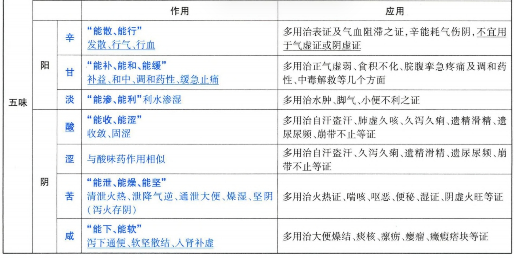
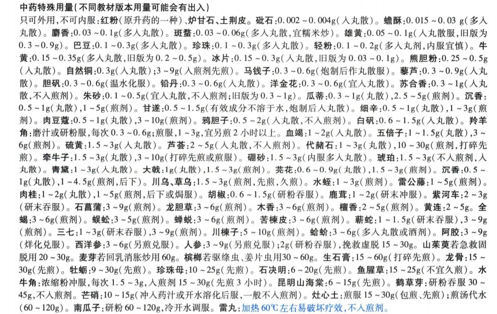
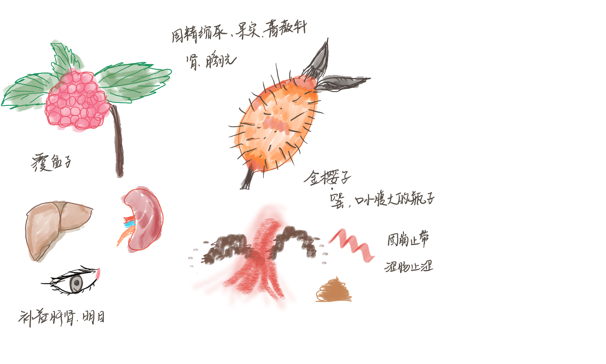
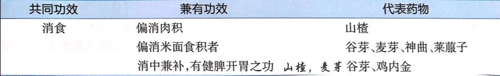
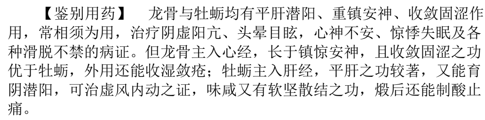
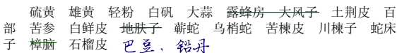

# 中药
- 总 论
    - **第一章 起源与发展**
        - 诗经：现存 **最早** 载药专著
        - 山海经：载药120多种，补药及 **预防**
        - 黄帝内经： **气味、归经、升降浮沉** 的理论基础
        - 神农本草经： **现存最早专著** ，365，三品，总结了药物的 **四气五味（首先）** 、有毒无毒、配伍法度、服药方法、剂型选择等基本原则。第一次大总结。
        - > **🍑中医基础理论四性**
        - 陶弘景· 本草经集注 ：新增药物主要取材于《名医别录》，自然属性分类，诸病通用药， 赤白芍 ，综合本草模式，730
        - > 猪猪吃白草
        - 苏敬主编·新修(唐)本草 ： **第一部官修+药典** ，图文并茂，增水蓼、葎草、山楂、人中白等民间经验用药，羊肝治疗夜盲症，收药844种
        - > **官修药典新修唐，蓼葎楂白羊肝盲。**
        - 本草品汇精要： **最后** 一部大型 **官修** 本草，1815
        - > 最后官修太精要
        - 五十二病方 ： 247种药 、283个方，我国 **现存最早的医学方书**
        - > 加起来差不多520
        - 唐慎微 · 证类本草 ：1558种药，3000，方药兼收，图文并重， **苍术**
        - > 苍天有证，证类唐僧
        - 滇南本草：最丰富的古代 **地方本草**
        - 本草图经：最早的版刻本草图谱
        - 寇宗奭·本草衍义：按年龄、体质、新久等决定药量， **四气改为四性**
        - > 因人而异改变性格
        - 李时珍·本草纲目：1892药， **载药数目最多** ，新增374，其中既收录了醉鱼草、半边莲、紫花地丁等民间药物，又吸收了番木鳖、番红花、曼陀罗等外来药物，百科全书
        -  **#赵学敏·本草纲目拾遗** ：增加药物716， **新增最多** ，太子参、于术、西洋参、冬虫夏草、银柴胡等临床常用药，及马尾莲、金钱草、独角莲、万年青、鸦胆子等疗效确切的民间草药。
        - > 赵敏十一，虫牙太深
        - **陈藏器·本草拾遗** ： **“十剂”** 分类
        - > 宣可去壅，生姜、橘皮之属是也。 通可去滞，通草、防己之属是也。 补可去弱，人参、羊肉之属是也。 泄可去闭，葶苈、大黄之属是也。 **轻可去实，麻黄、葛根之属是也。** 重可去怯，慈石、铁粉之属是也。 **滑可去着，冬葵子、榆白皮之属是也。** 涩可去脱，牡蛎、龙骨之属是也。 燥可去湿，桑白皮、赤小豆之属是也。 **湿可去枯，白石英、紫石英之属是也**
        - 甄权·药性论： **神曲**
        - 雷敩·雷公炮炙论：第一部炮制专著
        - 缪希雍·炮炙大法：雷公炮制十七法
        - 缪 **希** 雍·神农本草经 **疏** ：治吐血三要
        - 白猿经：乌头碱结晶
        - > 白乌头精
        - 做题：
            - 党参首见于《本草从新》，由清·吴仪洛撰写。
            - 北沙参首见于《本草汇言》，由明·倪朱谟撰写。
            - 《食疗本草》是唐代孟诜所著，是我国现存最早的食疗专著，也是世界上现存最早的食疗专著。
            - 汪昂是明末清初人，著作有《医方集解》《本草备要》等。
            - 《开宝本草》是宋代第一部官修本草。
            - 《本草蒙荃》是关于中药炮制理论的著作。
            - 葛洪的《肘后方》全称《肘后备急方》，世界最早记载天花、免疫法、食道异物治疗。
            - 黄宫 **绣** 的《本草求 **真** 》，载药520
    - **第二章 产地与采集**
        - 道地药材
        - > 地道药材，是优质纯真药材的专用名词，它是指 **历史悠久、产地适宜、品种优良、产量宏丰、炮制考究、疗效突出、带有地域特点** 的药材
            - 甘肃（当归）、宁夏（枸杞）、 **青海（大黄）** 、 **内蒙（黄芪）** 、东北（人参、细辛、五味子）、 **山西（党参）** 、河南（地黄、牛膝、 山药、菊花，河南有很多卖山菊的黄牛）、 **云南（三七、茯苓）** 、 **四川（黄连、川芎、贝母、乌头‐川乌/附子）** 、山东（阿胶）、浙江（玄参、麦冬、白术、浙贝母、延胡索、白芍、杭白菊、温郁金）、 **江苏（薄荷、苍术）** 、广东（陈皮、砂仁）
            - > 玄麦术浙贝，延胡白郁金。
        - 药材采用的方法
            - 全草
                - 从根以上割取地上部分--益母草、荆芥、紫苏、豨签草、木贼草
                - 连根入药--小蓟、车前草、地丁、柴胡
                - 带叶花梢--夏枯草、薄荷
            - 叶类
                - 花蕾将放或者正开时采收--大青叶、艾叶
                - 深秋或初冬经霜--桑叶
            - 花粉--蒲黄
            - 果实
                - 果实未成熟--青皮、枳实、覆盆子
                - 刚成熟--茴香、豆蔻、牵牛子、风仙子
                - 容易变质，略熟时--枸杞子、 **女贞子**
                - **使君子**
            - 种子--决明子、 **白果** 、莲子、菟丝子
            - 带花的 **果穗——夏枯草**
            - 根或块茎
                - **早春或深秋** --天麻、葛根、玉竹、大黄、桔梗、苍术
                - **夏天--半夏、延胡索**
            - 茎--天麻、薤白
            - 树皮类
                - 春夏（清明至夏至间）--黄柏、杜仲、厚朴
                - 秋后--牡丹皮、地骨皮
    - **第三章 炮制**
        - 盐制——引药下行、增强疗效、 **缓和药物辛燥之性**
        - > 常用药物：知母、黄柏；杜仲、补骨脂、沙苑子；泽泻、车前子；荔枝核、橘核、小茴香
        - 醋制——可引药入肝经、 **增强活血止痛、矫味矫臭** ，降低毒性
        - > 常用药物： **大戟、芫花、甘遂、商陆** ；柴胡、香附、青皮；五灵脂、延胡索、自然铜；三棱、莪术、穿山甲、皂矾
        - **酒制——可引药上行、** **活血化瘀、矫味矫臭** **、** #😕  **止泻止血** 、清热消痰
        - > 酒制可以矫味矫臭，如酒制乌梢蛇、蕲蛇等。 ​酒制可以增强药物的活血化瘀作用，如酒制当归、丹参、川芎等。 ​酒性辛散，可以引药势上行，如酒制黄芩，使药性上行，酒制大黄善清上部火热。
        - 修治——甘草
        - 水制——漂洗、浸泡、闷润、 **喷洒、水飞**
        - > 水飞是指借药物在水中的沉降性质分取药材极细粉末的方法，适用于 **不溶于水的矿物和贝壳类药物** ，如 **水飞朱砂、炉甘石、滑石、海蛤壳、雄黄** 。可去除杂质，洁净药物；使药物质地细腻，便于内服和外用；减少药物在研磨过程中飞扬损失；除去药物中可溶于水的毒性物质，如砷、汞等的作用。
        - 火制——炒（焦白术、大黄炭、地榆炭、荆芥炭）、炙（盐炙杜仲、黄柏）、 **烫** 、煅、煨（煨肉豆蔻、煨木香、煨生姜、煨葛根）
        - 水火共制 ——煮法、蒸法、 **炖法** 、 **燀法** 、淬法（醋淬自然铜、鳖甲，黄连煮汁淬炉甘石）
        - 其他——制霜、发酵（神曲、建曲、半夏曲）、精制、药拌
    - **第四章 药性**
        - **一、四气**
            - 寒凉——清热泻火，凉血解毒
            - 温热——温经散寒，补火助阳
        - **二、五味——** **从药物疗效中推导为主，以口尝获得为辅** 
        - **三、升降浮沉**
            - 升、浮（外）——辛、甘、温、热——花、叶、皮、枝
            - > “故解表药、温里药、 **祛风寒湿药、行气药、活血祛瘀药** 、开窍药、补益药、涌吐药等多具有升浮药性”。
            - 降、沉（内）——苦、酸、咸、寒、凉——子、实、矿、壳
            - > “故 **清热药** 、泻下药、利水渗湿药、降气平喘药、降逆和胃药、 **安神药** 、平肝息风药、 **收敛止血药** 、 **收涩药** 等多具有沉降药性”。
            - **🧀旋覆花降，苍耳子升**
        - **四、毒性**
            - 剂量过大、误服伪品、炮制不当、制剂服法不当、配伍不当 
            - **🧀内服小剂量**
                - 斑蝥[DD][0.03-0.06g]，麝香[0.03-0.1g]，雄黄[YD][0. 05-0.1g]，蟾酥[YD][0. 015-0. 03g]，砒石 [DD][0.002-0.004g].
    - **第五章 配伍**
        - 单行
        - 相须——AB功效相似，麻黄配桂枝、全蝎配蜈蚣
        - 相使——A为主，B为辅，石膏配牛膝、黄连配木香、黄芪配茯苓、枸杞子配菊花、黄连配吴茱萸
        - > 【注：小技巧：在区别药物配伍是相须还是相使时，可参考相须的药物多为同类药物（属于同一章节），性能功效相似。】
        - 相畏——A的毒副作用被B减轻，天南星配生姜
        - 相杀——A降低B的毒副作用，绿豆配巴豆
        - 相恶——A破坏B的功效，人参配莱菔子
        - 相反——AB产生毒副作用，人参配五灵脂
    - **第六章 禁忌**
        - **一、十八反——张子和——儒门事亲**
            - 本草明言十八反，半蒌贝蔹及攻乌，藻戟遂芫俱战草，诸参辛芍叛藜芦。
            - > 瓜蒌：全瓜蒌、瓜蒌皮、瓜蒌仁、瓜蒌根（天花粉） 乌头：川乌、草乌、附子（乌头子根加工品） 诸参：如人参、西洋参、党参、丹参、玄参、北（南）沙参、苦参。 无太子参 #赵学敏·本草纲目拾遗 《神农本草经》中记载的与乌头相反的药物是 **栝楼根** 、半夏、贝母、白蔹、白及，不包括栝蒌。
        - **二、十九畏——刘纯——医经小学**
            - 硫黄畏朴硝（芒硝），水银畏砒霜，狼毒畏密陀僧，巴豆畏牵牛，丁香畏郁金，川乌、草乌畏犀角，牙硝（芒硝）畏三棱，官桂（肉桂）畏赤石脂，人参畏五灵脂。
        -  #😕  **三、妊娠禁忌**
            - 妊娠慎用药
                - 活血化瘀药、行气药、攻下导滞药、药性辛热的温里药以及性质滑利之品
                - > 如桃仁、 **红花** 、牛膝（活血、通利之品）、 **枳实、大黄、附子（辛热之品）、肉桂** 、干姜、木通、冬葵子（通利之品）、瞿麦等。
            - 妊娠禁用药
                - 毒性强的药、作用峻猛的药以及堕胎作用较强的药
                - > 巴豆、牵牛子（峻下逐水药）、大戟、商陆、 **麝香** 、三棱、莪术、水蛭、斑蝥、马钱子、川乌、雄黄、砒石等。
    - **第七章 用法**
        - **一、煎煮法**
            - **解表药、清热药** 宜 **武火** 煎煮，时间宜 **短** ，煮沸后煎3～5分钟即可； **补益药** 需用 **文火** 慢煎，时间宜 **长** ，煮沸后再续煎30～60分钟
            - 1、先煎——金石、矿物、介壳类，如 **生** 石膏、瓦楞子、石决明、龟甲、 **石斛** 等，应打碎先煎。附子、乌头等毒副作用较强的药物。
            - 2、后下——气味芳香，如薄荷、青蒿、香薷、 **砂仁、肉桂** 、木香、沉香、白豆蔻、 **草豆蔻** 等，宜后下。 **钩藤、大黄、鱼腥草、番泻叶** 等，为防止破坏其有效成分也不宜久煎，应后下。
            - 3、包煎——黏性强、粉末状及带有绒毛，如 **蛤粉** 、滑石、 **青黛** 、 **旋覆花** 、 **车前子** 、蒲黄、灶心土、辛夷、海金沙、五灵脂、 **葶苈子** 等。
            - 4、另煎——某些贵重药材，如人参、西洋参、羚羊角。
            - 5、溶化（烊化）——胶类、黏性大而易溶，可单用水或黄酒加热溶化后，用煎好的药液冲服，如阿胶、鹿角胶、龟甲胶、鳖甲胶及蜂蜜、饴糖等。
            - 6、泡服——有效成分易溶于水或久煎容易破坏药效的药物，可泡入煎好的药液中，加盖闷润，减少挥发，如藏红花、番泻叶、胖大海等。
            - 7、冲服——某些贵重药材，常研成细末，用温开水或其他煎液冲服，如麝香、 **牛黄** 、珍珠、羚羊角、猴枣、马宝、西洋参、鹿茸、人参、蛤蚧等。某些药物高温容易破坏药效或有效成分难溶于水，也只能做散剂冲服，如 **雷丸、鹤草芽、鸡内金、甘遂、朱砂** 等。
            - 8、煎汤代水——防止某些药物与其他药物同煎使煎液混浊，难于服用，宜 **先煎后取其上清液代水再煎煮其他药物** ，如 **灶心土** 等。此外，某些药物质轻用量多、体积大、吸水量大，如 **玉米须、丝瓜络、金钱草** 等，也须煎汤代水用。
        - **二、服法**
            - 取决于 **病情和药性** ，无论饭前饭后，都要在饭前后1~2 小时服用，以免影响疗效。
            - 饭前服——滋补药，或病位在胸腹以下，如胃、肝、肾等脏疾患。
            - 饭后服——健胃消食药和对胃肠刺激性较大，或病位在胸膈以上，如眩晕、头痛、目疾、咽痛等。
            - 空腹服——驱虫药，补益药，攻 **下药** 。
            - > **峻下逐水药晨起空腹时服**
            - 睡前服——安神药， **缓下药** 。
            - 截疟药宜在疟疾发作前的2小时服用
            - 涩精止遗药晚间服1次
            - 慢性病定时服， **急性病、呕吐、惊厥** 及 **石淋、咽喉病** 须 **煎汤代茶饮** 者，均可 **不定时服**
- 解表药
    - **发散风寒药**
        - **发汗解表**
            - **麻黄**
                - 宣肺平喘（ **肺气壅遏所致喘咳之要药** ）、利水消肿（风水水肿）、散寒通滞（风寒湿痹、阴疽痰核）
            - **桂枝**
                - 发汗解肌、温通经脉（心悸，寒凝血滞）、助阳化气（🌿 **痰饮，蓄水** ）、平冲降逆
                - > 本品辛温助热，易伤阴动血，凡外感热病、阴虚火旺、血热妄行等证，均当忌用。孕妇及月经过多者慎用。
            - **香薷**
                - 化湿和中、 **利水消肿**
                - > **夏月麻黄** 。表虚有汗或暑热证×。 发表量不宜大，不宜久煎；利水消肿，量大浓煎。
            - **葱白**
                - 【内】散寒通阳【外】解毒散结、通络下乳
        - **解表散寒、止呕、解鱼蟹毒**
            -  #😕   **紫苏叶** **【后】**
                - 行气和胃、 **止呕安胎**
                - > 不宜久煎。 紫苏子：降气止咳平喘  润肠通便  化痰
            -  #😕  **生姜**
                - 温中止呕（ **呕家圣药** ）、化痰止咳
        - **荆芥** **【后】**
            - 解表散风、 **透疹消疮** 、【炭】收敛止血
            - > 发散风寒药中， **药性最为平和** 。不宜久煎。
        - **防风**
            - 祛风解表、胜湿止痛 （风湿痹痛常用药） 、止痉、升清燥湿
            - > 润剂 （ 秦艽）。外感风寒风热均可配伍使用， **平息内外风。** 阴血亏虚、热病动风者不宜使用 。
        - **归经**
        - > 辛温燥烈，阴血亏虚慎用
            - **羌活（太阳）**
                - 解表散寒  祛风胜湿  止痛（ **风寒湿痹，头项肩背疼痛** ）
                - > 羌活-上-解表-足太阳 独活-下-祛风胜湿-足少阴 **🌿用量过多导致呕吐** ，脾胃虚弱者慎用。
            - **藁本（太阳，巅顶）**
                - 祛风散寒  除湿止痛
            - **解表散寒、祛风止痛(风湿痹痛)、宣通鼻窍**
                - **白芷（阳明头疼）**
                    - 燥湿止带、消肿排脓、 **祛风止痒** 
                - **细辛【xd】（少阴头痛）**
                    - 温肺化饮、通关开窍醒神
                    - > 煎1~3g，散0.5~1g
        - **散寒解表、宣通鼻窍**
            - **辛夷【包】（治鼻渊头痛、鼻塞流涕要药）**
            - **苍耳子【yd】（治鼻渊要药）**
                - 祛风除湿（风疹瘙痒，疥癣麻风）、止痛（湿痹）
                - > 苍耳子=藁本+辛夷 煎3-10g
    - **发散风热药**
        - **疏散风热、清利头目**
            - **薄荷**
                - 辛，凉，肺、肝
                - **利咽透疹** 、疏肝行气、芳香辟秽、化湿和中
                - > 辛凉解表药中最能宣散表邪，且有一定发汗作用。体虚多汗者不宜。 宜后下，薄荷叶长于发汗解表，薄荷梗偏于行气和中。
            - **蔓荆子**
                - **祛风止痛（太阳）**
        - **疏散风热、利咽透疹**
            - **牛蒡子**
                - **宣肺祛痰** 、解毒消肿（痄腮）
                - > **滑肠通便** ，气虚便溏者慎用 。 升散之中有清降之性。
            - **蝉蜕**
                - 利咽开音、透疹止痒、明目退翳、息风止痉、镇静安神
                - > 主妇人生子不下， **孕妇×** 。 一般用量宜小；止痉则需大量。
        - **桑菊：疏散风热、平抑肝阳、清肝明目**
            - **桑叶**
                - **清肺润燥、凉血止血**
                - > 肺燥咳嗽多用蜜制桑叶
            - **菊花**
                - 清热解毒
                - > 黄--疏散风热；白--平抑肝阳，清肝明目；野--清热解毒
        - **升阳**
            - **柴胡**
                - 辛、苦，微寒，肝、肺
                - 疏散 **退热** （ **少阳** 证要药） 、疏肝解郁、升举阳气（ #脏器下陷  ）、退热截疟（疟疾寒热常用药 ）
                - > 解表退热生用，量稍重；疏肝解郁醋炙，升阳生用或酒炙，量稍轻。 ​阴虚阳亢，肝风内动，阴虚火旺及气机上逆慎用 。
            -  #😕  **升麻**
                - 发表透疹（ **阳毒发斑** ）、 **清热** 解毒、升举阳气 （ #脏器下陷 ）
                - > 发表透疹、清热解毒宜生用，升阳举陷宜炙用。 ​麻疹已透，阴虚火旺，及阴虚阳亢者忌用 。
            - **葛根**
                - 解肌退热、生津止渴、 **透疹、升阳止泻** 、通经活络（ **项背强痛** ）、解酒毒
                - > 解肌退热、透疹、生津生用，升阳止泻煨用  葛花：解酒醒脾 **🌿能扩张血管，有明显降压作用，适用于高血压患者颈项强痛**
        - **其他**
            - **淡豆豉**
                - 解表 **除烦** 、宣发郁热
            -  #😕  **浮萍**
                - 宣散风热、透疹止痒、利尿消肿
- 泻下药
    - **攻下药**
    - > 苦、寒 胃、大肠
        - **大黄**
            - **🤯泻下攻积（治疗积滞便秘要药） 活血祛瘀（治瘀血常用药）** 清热泻火 凉血解毒（ **血热吐衄，目赤咽痛，热毒疮疡，烧烫伤** ） 利湿退黄 【炭】止血
            - > 泻下攻积（便、热、痰） **生用且不宜久煎 治疗习惯性便秘不宜久用**
        - **芒硝**
            - 泻下通便 润燥软坚 【外】 **清火消肿 回乳**
            - > 制作西瓜霜
        -  #😕  **芦荟**
            - 泻下通便 清肝泻火 杀虫疗疳止痒
            - > 2~5g 丸散， **不宜入煎剂**
        -  #😕  **番泻叶** **【后】**
            - 泄热行滞 **通便利水（腹水）**
    - **润下（润肠通便）**
    - > 甘平 脾，大肠
        - **火麻仁【种子】**
            - 滋养补虚
        - **郁李仁**
            - **下气利水**
            - > 通泻二便
    - **峻下逐水（泻水逐饮）**
    - > 苦寒（除芫花，巴豆霜），有毒，二便不利
        - **泻水逐饮  消肿散结**
            - **醋甘遂【yd】**
            - > 善泻经隧水湿，醋制降低毒性0.5~1.5g（丸散） **风痰癫痫**
            - **醋大戟【yd】**
            - > 善泻脏腑水湿，醋制降低毒性1.5~3g（煎）1g（丸散） 瘰疬痰核
            - **醋商陆【yd】【根】**
                - 通利二便
                - > **煎服3-9g ​此节中利尿作用最强**
        - **性温热**
            - **醋芫花【yd】**
                - 泻水逐饮  祛 **痰** 止咳 【外】杀虫疗疮（疥癣秃疮，痈肿，冻疮）
                - > 善泻 **胸胁** 水湿 1.5~3g（煎）0.6g（丸散）
            -  #😕  **巴豆霜【yd】**
                - 峻下冷积（ **小儿乳食停积** ） 逐水消肿 豁 **痰** 利咽（喉痹，紧急下用） 【外】蚀疮（ **痈肿脓成未溃，疥癣恶疮，疣痣** ）
                - > 畏牵牛 0.1~0.3g（丸散） ​
        -  #😕  **炒牵牛子【yd】【种子】**
            - 泻水通便 消 **痰** 涤饮 杀虫攻积
            - > 畏巴豆 3‐6g（煎）1.5‐3g（丸散）
- 清热药
    - **清热泻火药**
    - > 苦寒或甘寒，清泄气分热为主
        - **清肺胃之火**
            - **石膏**
                - **🌿甘、辛，大寒**
                - 肺、胃
                - 除烦止渴（🌿 **气分实热** ， **肺热喘咳，胃火牙痛头痛，** 实热消渴） 【煅】收湿 敛疮 生肌 止血（溃疡不敛，湿疹瘙痒，水火烫伤，外伤出血）
                - > **生石膏，15‐60 g 先煎** 。脾胃虚寒及阴虚内热者忌用
            - **知母【百合科根茎】**
                - 苦、甘，寒
                - 肺、胃、肾
                - **🤯生津，滋阴润燥** （热病烦渴，肺热燥咳，内热消渴， **骨蒸潮热，肠燥便秘** ）
                - > **🤯🌿** **上清肺，中凉胃，下泻肾火。实虚均可** 【生】清热泻火【盐水炙】滋阴降火 本品性寒质润，有🌿 **滑肠** 作用，脾虚便溏者不宜用
        - **清热泻火 生津止渴**
        - > **甘寒，肺胃**
            -  #😕  **芦根**
                - 除烦 🌿止呕 🌿 **利尿**
                - > 鲜品量加倍，或捣汁
            - **天花粉**
                - 甘、微苦，微寒。
                - **🌿消肿排脓（疮疡肿毒）**
                - > **🌿孕妇×** ； **天花粉=瓜蒌根** ，反乌头，反附子。
        - **清心火（清热泻火 除烦）**
            -  #😕  **淡竹叶**
                - 除烦止渴 利尿通淋
                - > 心火下移小肠--导赤散
            - **栀子**
                - **苦，寒。**
                - > **脾虚便溏慎**
                - **心、肺、三焦经**
                - 🤯清热利湿 凉血解毒（ **血淋涩痛** ，血热吐衄， **目赤肿痛** ，火毒疮疡）【焦】凉血止血【外】消肿止痛
                - > 清三焦之火，利三焦之湿
        - **清肝泻火 明目**
            - **夏枯草** **【果穗】**
                - 辛，苦，寒
                - 肝，胆
                - 消肿散结 **（🌿🤯** ***瘿瘤瘰疬，乳痈肿痛*** **）**
            - **决明子** **【后】**
                - 润肠通便
                - >  #😕  润肠通便不宜久煎
            - **密蒙花**
                - **养肝** 明目 退翳
                - > 养肝、清肝
    - **清热燥湿药**
    - > 苦寒，用于治疗湿热证。 易伤胃阴，用量不宜过大。 脾胃虚寒，津伤阴亏不宜使用。
        - **清热燥湿、泻火、解毒**
            - **黄芩【上焦】**
                - 【炭】止血 🤯 **【炒】安胎**
                - > 在湿温病中应用更多： **退壮热，清肺热，清少阳热；清气分热** 酒炙，清上焦湿热 黄芩分枯芩和子芩。 **枯芩** 为生长年久的宿根，中空而枯，体轻主 **浮** ，善 **清上焦肺火** ，主治肺热咳嗽痰黄； **子芩** 为生长年少的子根，体实而坚，质重主 **降** ，善泻 **大肠湿热** ，主治湿热泻痢腹痛。
            - **黄连【中焦】**
            - > 治疗 **湿热痢疾** 要药；🌿 **清心热、胃热** ；解毒作用强，善疗疔毒 煎2-5g
            - **黄柏【下焦】**
                - 【盐炙】清虚热 除骨蒸
                - > 泻相火，退虚热
        -  #😕  **清热燥湿**
            - **龙胆（草）** **【根】**
                - 泻肝胆火（ **下焦湿热，湿热黄疸，肝火头痛，目赤肿痛，胁痛口苦** ）
            - **🌿苦参**
                - 杀虫止痒 利尿
                - > 治疗湿热带下及皮肤病常用药 反藜芦 ***苦燥虫痒尿***
            - **🌿秦皮**
                - 收涩止痢 止带 **明目（肝热目赤肿痛，目生翳膜）**
                - > ***燥涩利带目***
            - **🌿白鲜皮**
                - **🤯祛风解毒（🌿湿热黄疸，风湿热痹）**
    - **清热解毒药**
        - **用于温热病**
        - > **🌿卫气营血各个阶段均可使用**
            - **清热解毒  疏散风热**
                - **金银花**
                    - 甘，寒。
                    - 肺、心、胃
                    - 【炭】凉血止痢（热毒痢疾）  【露】清解暑热
                    - > **🤯治一切内痈外痈要药，肠痈，肺痈**
                -  #😕  **连翘**
                    - **消肿散结（瘰疬）** 清心 **利尿（热淋涩痛）**
                    - > “疮家圣药”--诸痛痒疮皆属于心。 青翘清热解毒力强，老翘透热达表，疏散风热力强。 长于泻心火，治疗热入心包，高热烦渴，神昏谵语。
            - **清热解毒**
                -  #😕   **🤯**  **贯众【xd】**
                    - 杀虫 **【炭】止血（血热吐衄，便血崩漏）**
                    - > **风热感冒，温毒发斑，痄腮大头瘟（表证）** 服用忌油腻
                -  #😕  **穿心莲**
                    - 燥湿（湿热泻痢，湿疹瘙痒，热淋涩痛） 凉血消肿（ **肺热** 咳喘， **肺痈吐脓** ，咽喉肿痛；疮疡肿毒，毒蛇咬伤）
                    - > **味苦，入煎剂易致恶心呕吐，多做丸片剂** 。
        - **清热解毒 凉血消斑**
            - **大青叶**
                - 凉血消斑best 利咽消肿
                - > **退热作用最明显 质轻力强，表里两清 风热表证，温病初起**
            - **青黛🌿** **【散剂冲服】**
                - 凉血消斑 泻火定惊
                - > **入丸散1‐3g**
            - **板蓝根**
                - 解毒利咽better
                - > **风热表证，温病初起**
        - **清热解毒 利咽**
            - **射干**
                - **消痰** 利咽
            - **山豆根 【yd】**
                - **消肿** 利咽
                - > 煎 **3-6g，** 过量服用易引起呕吐，腹泻，胸闷，心悸等。
            -  #😕  **马勃**
                - 辛，平
                - 肺
                - **凉血止血（血热迫肺吐血，衄血，外伤出血）**  **清肺** 利咽
                - > 风寒袭肺之咳嗽，失音不宜用。
        -  #😕  **乳痈（清热解毒 消肿散结 下乳）**
            - **蒲公英**
                - 利湿通淋 清肝 **明目**
                - > **清肺胃肝热 大量可致缓泻 🤯乳痈，肺痈，肠痈，痈疮疔毒皆可 解郁通乳**
            - **漏芦**
                - 通经下乳 🌿 **舒筋通脉**
        - **肺痈（清热解毒 消痈排脓）**
            - **鱼腥草🌿** **【后】**
                - 利尿通淋
            - **金荞麦**
                - 祛痰
        -  #😕  **肠痈（清热解毒）**
            - **败酱草**
                - 消痈排脓 祛瘀止痛
                - > 肠痈腹痛的首选药
            - **大血藤**
                - **祛风** 止痛 活血
                - > 要药
        - **毒蛇咬伤（** **清热解毒** **）**
            - **半边莲**
                - 利尿消肿（鼓胀水肿，黄疸）  祛湿（湿疹，湿疮）
                - > 鲜品30-60g 乳痈
            - **山慈菇** **【yd】**
                - 化痰散结
                - > **煎3-9g** 痰，结，痈
            -  #😕  **痈肿疔疮，咽喉肿痛**
                - **白花蛇舌草**
                    - 🌿利湿通淋（热淋涩痛，湿热黄疸）
                    - > 煎15-60g 肠痈
                - **紫花地丁**
                    - **凉血消肿** 清肝明目
                    - > **🌿擅长治疗疔毒** 肠痈，乳痈
                - **🤯重楼** **【xd】**
                    - 凉肝定惊 消肿止痛 化瘀止血（跌打损伤）
                    - > 治痈肿疔毒、毒蛇咬伤的常用药 **煎3-9g** ***楼毒肝惊肿瘀止***
        -  #😕  **痢疾（清热解毒 凉血止痢）**
        - > 热毒血痢
            - **白头翁**
                - 燥湿
            - **马齿笕**
                - **🤯🌿止血（崩漏，便血）** 利尿通淋
                - > **产后血痢**
            - **鸦胆子** **【xd】**
                - 🤯杀虫截疟（ **热毒血痢，冷积久痢** ） 【外】腐蚀赘疣
                - > 治疗血痢 内服用龙眼肉或装入胶囊吞服， **0.5-2g不入煎剂** 。
        - **其他（清热解毒）**
            - **野菊花**
                - 泻火平肝（目赤肿痛，头晕目眩）
            -  #😕  **土茯苓【百合科】**
                - 除湿 通利关节 **消肿散结**
                - > **🌿治疗梅毒、汞中毒** ；其余治疗梅毒--红粉、轻粉、蕲蛇。 煎15-60g，忌茶。
            -  #😕  **熊胆粉**
                - **🤯清肝明目 息风止痉**
                - > **0.25‐0.5 g** ，入丸散
    - **清热凉血药**
        - **清热凉血  养阴生津  滋阴泻火**
        - > **热入营血，温毒发斑** ； **热病伤阴，津伤便秘** ；阴虚内热，骨蒸
            - **生地**
                - **🌿甘、苦，寒。**
                - 心、肝、肾
                - 🌿清热凉血止血要药 **（血热出血，内热消渴）**
            - **玄参**
                - 🌿甘，苦，咸，微寒
                - 肺，胃，肾
                -  **解毒散结（咽喉肿痛，瘰疬）**
                - > 反藜芦。与生地相比，降火为主
        - **清热凉血止血  活血化瘀消痈**
        - > **妇科、外科。** **🤯** **温毒发斑，血热吐衄；经闭痛经，跌打损伤；疮痈肿毒**
            - **丹皮**
            - > 心肝 **肾--🌿治疗无汗骨蒸** 。 🌿凉血不留瘀，活血不动血， **实虚热** 。 ​【酒】活血化瘀
            - **赤芍**
            - > **🤯🌿** **清肝热，入肝经血分--目赤肿痛，肝郁胁痛** 血寒经闭不宜用。反藜芦。
        - **清热凉血** **解毒**
        - > 心肝 **🤯** **温病，斑疹，疮疡**
            -  #😕  **紫草** **【根】**
                - 活血🌿 **透疹消斑（血热毒盛，斑疹紫黑）**
                - > 水火烫伤 **性寒滑利，脾虚便溏禁用** 。
            - **水牛角【先】**
                - 定惊
                - > 散 **1.5‐3 g**
    - **清虚热药**
        -  #😕  **青蒿【后】**
            - 苦、辛，寒。
            - 肝、胆
            - 🤯清虚热（ **温邪伤阴，夜热早凉** ） 除骨蒸（阴虚发热，劳热骨蒸） 解暑热（ **暑热外感，发热口渴** ） 截疟（治疟疾良药） 退黄（湿热黄疸）
            - > 治疗 **无汗骨蒸**
        -  #😕  **🌿地骨皮**
        - > 枸杞的根皮
            - 甘，寒
            - 肺、肝、肾
            - 凉血除蒸（ **止血——咳血衄血** ） 清肺降火 生津止渴(内热消渴)
            - > 治疗 **有汗骨蒸** **清实火，退虚火**
        -  #😕  **白薇**
            - 🤯清热凉血（产后血虚发热） **利尿通淋** 🌿 **解毒疗疮**
        - **银柴胡**
            - 清虚热 除疳热
            - > 肝疳
        - **胡黄连**
            - 清虚热 除疳热 **清湿热**
            - > 脾疳
    - **总结**
        - 风热表证，温病初起：金银花、连翘、穿心莲、贯众、 **大青叶、板蓝根**
        - **发斑：羚羊角、大青叶、板蓝根、青黛、🌿贯众、清热凉血部分**
        - 乳痈： **瓜蒌，蒲公英** ，漏芦， **连翘** ，半边莲，紫花地丁，川贝，浙贝，夏枯草，王不留行，芒硝，穿山甲，苎麻根
        - 肺痈： **瓜蒌** ，金银花， **蒲公英** ，鱼腥草，金荞麦， 败酱草，穿心莲 ，🌿芦根，川贝，浙贝，桔梗， 合欢皮 ，千金苇茎汤（桃仁，薏苡仁）
        - 肠痈： **瓜蒌** ，薏苡仁，金银花， **蒲公英** ，败酱草，大血藤，紫花地丁，白花蛇舌草，金匮大黄牡丹汤（桃仁，芒硝，大黄，丹皮）
- 化湿药
    - **燥湿**
        - **苍术、厚朴**
        - > 均辛苦温，燥湿力强（ 湿阻中焦证，以寒湿为主 ）
            - **苍术**
                - 燥湿健脾（脾虚湿盛，水饮内停的痰饮，泄泻，🥰 **水肿** 证） 祛风散寒 **明目**
                - > 治湿要药，既化内湿，又可祛外湿
            - **厚朴**
                - 燥湿消痰 **下气除满（消除胀满之要药）**
                - > 治疗气--脾胃，痰--脾 **肺** ，湿--脾胃， **食--胃大肠**
        -  #😕  **燥湿温中  止呕  止泻**
        - > 辛温，脾胃 寒湿内阻，脘腹胀痛，痞满呕吐泄泻
            - **草豆蔻【种子】**
                - 行气 止痢
            - **草果【果实】**
                - **截疟除痰（疟疾寒热，瘟疫发热）**
                - > 燥湿、温中之力皆强于草豆蔻
    - **化湿**
        - **芳香化湿  发表解暑**
            - **藿香**
            - > **🥰寒湿闭暑**
                - 辛、微温
                - 脾、胃、肺
                - 和中止呕（治疗霍乱吐泻之要药）
                - > **暑湿表证，湿温初起**
            - **佩兰**
                - 醒脾开胃（ **脾经湿热口中甜腻、多涎口臭等脾瘅症要药** ）
        - **化湿行气、温中止呕**
        - > 辛温，脾胃经，果实 入汤剂均须后下，3～6g
            - **砂仁**
            - > 温燥之性较强，行气作用较强 入肾经，偏于治疗 **中、下焦** 之证 **温中偏脾，止泻** 入补剂，可减少补益药物的滋腻之弊
                - 健脾止泻（腹胀、腹痛、腹泻）  安胎（止呕）
                - > **醒脾调胃之要药**
            - **豆蔻**
            - > 芳香之味较浓 入肺经，偏于治疗 **中、上焦** 湿阻之证 **温中偏胃，止呕 肉豆蔻：温中行气，涩肠止泻**
                - 芳香宣化
- 祛风湿药
    - **祛风湿散寒**
    - > 辛苦温，入肝脾肾
        - **🌿独活**
            - 祛风湿（治风湿痹痛主药，皮肤瘙痒） 止痹痛 解表
            - > 本品辛燥，阴虚火旺者慎用 治疗少阴头痛：独活、细辛 **🌿羌活偏上** ，偏解表，足太阳经； **独活偏下** ，偏祛风湿，足少阴经
        - **🌿蕲蛇【YD】  乌梢蛇**
        - > 麻风，疥癣，瘰疬，恶疮
            - 肝
            - 祛风 通络 止痉
            - > 蕲蛇：甘咸温 1.以毒攻毒 2.截风要药 **，风毒之邪壅于肌肤常用药（🤯麻风）** ，抽搐痉挛常用药--内外风 乌梢蛇：甘平无毒
        - **草乌【先】【DD】＞川乌【先】【DD】**
            - 祛风除湿  温经止痛
            - > 半蒌贝敛及攻乌 **制，煎1.5-3g** ，先煎久煎，生品外用 一切沉寒痼冷之症，用此无不奏效 心腹冷痛，寒疝作痛 **跌扑伤痛，麻醉止痛**
        - **🌿木瓜**
        - > 酸温
            - 舒筋活络（湿痹不是风寒湿痹） **生津止渴** 和胃化湿 消食
            - > 湿痹、 **筋脉拘挛要药** ，脚气水肿常用药 胃酸过多×
        - **祛风湿 通经络 止痹痛**
        - > 治疗跌打损伤
            -  #😕  **昆明山海棠【先】【DD】** **【根】**
                - 活血止痛 续筋接骨
                - > 行十二经络 ​风寒湿痹日久关节肿痛麻痹良药
            -  #😕  **🌿威灵仙【根茎】---** **消骨鲠（咸）**
            - > **消骨鲠30-50g**
            -  #😕  **海风藤**
            - > 风寒湿痹、肢节疼痛、筋脉拘挛、屈伸不利的常用药
    - **祛风湿清热**
    - > 辛苦寒，肝脾肾
        -  #😕  **秦艽**
            - 辛、苦，平
            - 胃、肝、胆
            - 🤯祛风湿 舒经络 止痹痛 清湿热 **退虚热（骨蒸潮热，小儿疳积发热）**
            - > **🌿风药之润剂，无论新久寒热，均可配伍使用**  #青蒿 
        -  #😕  **高血压**
            - **🌿防己**
                - 膀胱，肺
                - 祛风止痛  利水消肿 **清热燥湿（湿疹疮毒）**
                - > **风湿痹证湿热偏盛** ，肢体酸重，关节红肿疼痛，及湿热身痛要药 大苦大寒易伤胃气，胃纳不佳及阴虚体弱者慎服
            - **臭梧桐【嫩枝、叶】**
                - 祛风湿 通经络 平肝
                - > 风湿痹痛，半身不遂，风疹湿疮，肝阳上亢眩晕
            - **🌿豨莶草【地上部分】**
                - 祛风湿 利关节 解毒
                - > 酒- **补肝肾** -风湿痹痛，半身不遂， ***筋骨无力，腰膝酸软，四肢麻木*** 生-风疹湿疮， ***痈肿疮毒***
        -  #😕  **桑枝**
            - 平
            - 祛风湿 利关节 利水  祛风止痒  生津（消渴）
        -  #😕  **海桐皮**
            - 平
            - 祛风湿  通络止痛 **杀虫止痒（疥癣，湿疮）**
        -  #😕  **雷公藤** **【根】【先】【DD】**
            - 祛风湿  活血通络  消肿止痛 杀虫解毒（麻风，顽痹，疥癣）
            - > 【末】0.5-1.5g，【先煎】1-3g，文火1-2h 治疗风湿顽痹要药 ***血络肿痛虫毒去***
        -  #😕  **络石藤**
            - 祛风通络 🌿 **凉血消肿（咽痹痈肿，跌打损伤）**
    - **祛风湿 补肝肾 强筋骨**
        - **南五加皮**
            - 利水消肿（水肿，脚气）
            - > 尤宜老人、久病体虚者 香加皮-利水消肿，祛风湿，强筋骨 刺五加-益气健脾，补肾安神
        - **桑寄生**
            - 平
            - 安胎  降压
        - **狗脊**
            - 强腰膝 **温补固摄 止血**
- 利水渗湿药
    - **利水消肿**
    - > 甘淡
        - **利水渗湿  健脾** **止泻**
        - > **渗利兼补益**
            - **茯苓**
                - 平
                - 心、肺、脾、肾
                - 宁心安神
                - > 利水消肿之要药 虚寒精滑者忌服 茯苓皮——利水消肿，茯神——宁心安神
            - **薏苡仁**
                - 凉
                - 除痹（湿痹拘挛）  排脓（ **肺痈、肠痈** ）  解毒散结
                - > **🤯【生】清利湿热，【炒】健脾止泻**
        - **利水渗湿**
            - **猪苓**
            - > 平
            - **泽泻**
                - **寒**
                - 泄热  化浊降脂
                - > **利小便而实大便** ，清膀胱之湿热， **泄肾经之虚火（热淋涩痛，遗精）** ，下焦湿热尤为适宜
        - **香加皮** **【YD】**
            - **辛苦温**
            - 利水消肿（心悸气短） **祛风湿（治风湿痹证常用药）  强筋骨**
    - **清热利尿通淋**
    - > 苦寒或甘淡寒
        - **下乳（产后乳汁不畅）**
            - **木通** **【YD】** **【藤茎】**
                - 通经下乳（利血脉，通关节→经闭乳少， **湿热痹痛** ）  🌿清心除烦
            - **通草**
                - 通 **气** 下乳  解暑（湿温初起，暑湿夹温）
            - **冬葵子【种子】**
                - 润肠
        - **清肺止咳**
            - **车前子【包】【种子】**
                - 🌿化痰  清肝明目 **渗湿止泻**
                - > 肾虚精滑及孕妇慎用 🌿利小便以实大便 **诸子皆泻，唯车前子、菟丝子能止泻**
            - **石韦【叶】**
                - **凉血止血**
                - > 常用于石淋、🌿 **血淋**
        - **清心火**
            - **瞿麦**
            - > 清心与小肠火，导热下行
                - **活血通经**
            - **灯心草【茎髓】**
            - > 心火下移小肠 ​小儿心热夜啼
        -  #😕  **止痒**
            - **萹蓄**
                - 杀虫
                - > **热淋、石淋，善杀三虫（蛔虫，蛲虫，钩虫）**
            - **地肤子【果实】**
                - 祛风利湿
        -  #😕  **🌿萆薢**
            - 苦平
            - 利湿去浊 **祛风除痹**
            - > **🌿治膏淋要药，小便色如米泔**
        - **滑石【块--先煎；粉--包煎】**
            - 解暑 【外】收湿敛疮
            - > 脾虚、热病伤津及孕妇忌用 善治湿热或暑湿水泄
        - **海金沙【包】【孢子】**
            - **治诸淋涩痛之要药**
    - **利湿退黄**
    - > 苦，微寒 肝
        - **茵陈**
        - > 治黄疸之要药
            - ​解毒疗疮（湿疹疮疡）
            - > 蓄血发黄，血虚萎黄慎用
        -  #😕  **虎杖**
        - > 肺
            - 清热解毒  散瘀止痛 **化痰止咳（肺热咳嗽）** 泻热通便
        -  #😕  **珍珠草【全草】**
        - > 甘，肺
            - 清热解毒（黄疸，泻痢，淋证；疮疡肿毒，蛇犬咬伤）  明目 **消积（小儿疳积）**
        - **🌿金钱草【全草】**
        - > 肾膀胱
            - 利尿通淋（🌿石淋，热淋，小便涩痛） **解毒消肿（痈疡疔疮，毒蛇咬伤）**
- 化痰止咳平喘药
- > 化痰＜涤痰＜豁痰
    - **温化寒痰**
        - **燥湿化痰  【外】消肿止痛（痈疽肿毒，毒蛇咬伤）**
        - > 【yd】【块茎】 辛，温。
            - **半夏【yd】【块茎】**
                - 脾、胃、肺
                - **降逆止呕** 消痞散结（瘿瘤痰核）
                - > 煎3~9g，生品内服【慎】 ​姜半夏长于降逆止呕，法半夏长于燥湿且温性较弱，半夏曲则有化痰消食之功，竹沥半夏能清化热痰。 反乌头。阴虚燥咳、血证、热痰、燥痰慎用。
            - **天南星【yd】【块茎】**
                - 肺，脾， **肝**
                - 祛风止痉
                - > 半夏走脏腑，天南星走经络 擅长去风痰，止抽搐 煎3~9g，生品内服【慎】 🤯天南星+牛胆汁=胆南星‐‐苦、微辛、 **凉** ， **清热化痰，息风定惊**
        -  #😕  **白附子【yd】【块茎】** **【先】**
            - 燥湿化痰  祛风止痉  止痛  解毒散结
            - > 善 **逐头面风痰（痰厥头痛，偏正头痛）** 煎3~6g 研末服0.5‐1g，宜炮制后用 阴虚血虚动风或热盛动风者、孕妇均不宜用
        - **散结消肿**
            -  #😕  **白芥子** **【后】【种子】**
                - 温肺豁痰 利气 通络止痛
                - > 善除 **“皮里膜外”** 之痰--阴疽流注，肢体麻木，关节肿痛 煎3~9g， **不宜久煎，🌿或作发泡用。**  **用量不宜过大，引起腹泻** 🌿本品 **辛温走散，耗气伤阴** ，久咳肺虚及阴虚火旺者忌用；消化道溃疡出血及皮肤过敏者忌用
            -  #😕  **皂荚【xd】**
                - 祛痰开窍 祛风杀虫止痒
                - > 丸散1~1.5g，外用适量。 **“通肺与大肠之气”，治疗便秘**  **辛散走窜力极强** ，非顽痰体壮实证者不宜使用。
    - **性味较为平和的祛痰药**
        - **降气消痰** **止咳**
            - **旋复花** **【包】【花序】**
                - 辛，苦，咸，微温
                - 肺，脾，胃，大
                - **🌿行水止呕（气逆呕吐）**
                - > 诸花皆升， **旋复花款冬花独降** ＋香附，治疗气血不和胸胁疼痛
            - **白前**
            - > **寒热新久内外咳嗽均适宜**
                - 辛，苦，微温
                - 肺
            - **前胡**
                - 辛，苦， **微寒**
                - 肺
                - **🌿散风清热（外感风热、痰热咳嗽）**
        - **桔梗【根】**
            - 苦，辛，平
            - 肺
            - 宣肺祛痰 利咽排脓 **（治肺痈常用药）**
            - > 被誉为“ **诸药之舟楫** ”能 **载药上行** 开宣肺气， **通利二便** 治疗肺经气分病要药 本品性升散，凡气机上逆者不宜用 **🌿胃、十二指肠溃疡者慎服，用量过大易致恶心呕吐**
    - **清化热痰**
        - **川贝母、浙贝母**
        - > 均性寒； **清热化痰止咳，散结消痈（肺痈，乳痈）** ；不与乌头同用，脾胃虚寒及有湿痰者不宜用。
            - **川贝【鳞茎】**
                - 苦、 **甘** ，微寒
                - > 甘味较著，甘润之性强
                - 肺、心
                - **润肺** 止咳
                - > 阴虚燥咳，久咳痨嗽等内伤咳嗽尤宜 研末冲服，每次1～2g ​
            - **浙贝**
                - 偏于苦泄
                - **清热化痰** 力佳
                - > 风热、痰热等咳嗽更宜
                - **清热解毒** 、散结消痈力强
                - > 瘰疠、痈肿等热毒证多用
        - **来源于竹**
        - > 甘寒， **清热化痰**
            -  #😕  **竹茹【茎中层】**
                - 清热化痰 **凉血止血** 除烦 **止呕（热性呕逆之要药）** 安胎
                - > 生清热化痰力强，姜汁炙用和胃止呕力强
            - **竹沥【竹杆经火烤流出的液汁】**
                - 清热豁痰 **定惊** 利窍
                - > **性寒滑，能通便 30~50ml冲服**
            - **天竺黄【杆内分泌干燥后的块状物】**
                - 清热豁痰 **凉心定惊**
        - **通便**
            - **瓜蒌**
                - 清热 **涤痰** 宽胸散结 **润燥滑肠**
                - > **甘寒而滑** ，脾虚便溏者及寒痰、湿痰证忌用。反乌头 肺痈，乳痈，肠痈
            - **胖大海【种子】**
                - 清热 **润肺** 利咽开音 润肠通便
                - > 泡服/煎2~3枚
        - **瘿瘤**
            - **海藻、** **昆布**
                - 化痰软坚散结（瘿瘤瘰疬）  利水消肿
            -  #😕  **黄药子【yd】【块茎】**
                - 化痰散结消瘿  清热解毒  凉血止血 **止咳平喘**
                - > 煎5~15g，末1~2g
        - **清热化痰 软坚散结**
        - > 先煎  肺肾经 痰热喘咳，瘿瘤瘰疬
            - **海蛤壳【先】** **【包】**
            - > 胃
                - 利尿消肿 【煅】制酸止痛 【外】收涩敛疮
            - **海浮石【先】**
                - **利尿通淋**
        - **礞石** **【先】【包】**
            - 坠痰下气  平肝镇惊
            - > 顽痰、老痰胶固之证，惊痫之良药
    - **止咳平喘**
        - **降气** **止咳平喘 润肠通便**
        - > 阴虚喘咳及脾虚便溏者慎用
            - **苦杏仁** **【xd】【后】**
                - 咳喘之要药
                - > 宣通肺气 婴儿慎用
            - **紫苏子**
                - 化痰
                - > **🌿治痰逆喘咳之要药**
        - **润肺下气止咳（新久寒热皆可）**
        - > 甘/辛，苦，温
            - **百部**
                - 【生】杀虫灭虱
                - > 久咳虚嗽宜蜜炙用
            - **紫菀**
            - > 与款冬花比较，重在化痰
                - 化 **痰**
                - > 外感暴咳生用，内伤久咳炙用
            - **款冬花**
            - > 与紫菀比较，重在止咳
                - 化痰
                - > 外感暴咳生用，内伤久咳炙用 **诸花皆升，旋复花款冬花独降**
        - **清肺止咳平喘**
        - > 苦，微寒
            -  #😕  **马兜铃【果实】**
                - 清肠消痣 平肝降压
                - > 用量不宜过大，以免引起呕吐 儿童、老年人【慎】孕妇、婴幼儿、肝肾功能不全【禁】
            - **枇杷叶**
                - 清 **胃** 降逆止呕
                - > 止咳蜜灸，止呕生用
        - **泻肺平喘 利水消肿**
            -  #😕  **桑白皮**
                - 清肝降压 **止血**
                - > 泻肺利水、平肝清火宜生用；肺虚咳嗽宜蜜炙用 善治风水、皮水等阳水实证
            - **葶苈子** **【包】【种子】**
            - > 末3~6g
        - **白果** **【yd】【种子】**
            - 甘、苦、涩、平
            - 肺、肾
            - 敛肺 **化痰定喘**  **止带缩尿**
            - > 捣碎煎服5~10g 本品有毒，不可多用，小儿尤当注意。 ​
        - **洋金花** **【yd】**
            - 辛，温
            - 肺，肝
            - 止咳平喘 **麻醉止痛  止痉**
            - > 0.2‐0.6g，宜入丸散剂
- 理气药
- > 一般为辛温（枳实枳壳微寒，川楝子苦寒，香附平）
    - **脾胃气滞**
        - **枳实、枳壳**
        - > 苦，辛，酸，🌿 **微寒** ；脾胃；治疗气（气滞胸胁疼痛，产后腹痛），食（胃肠积滞，湿热泻痢），痰（胸痹，结胸），🌿 #脏器下陷 
            - **枳实**
                - **破气** 消积（行气力强） 化 **痰** 除痞
                - > 治疗排序：痰→气→食 偏下气
            - **枳壳【未成熟的果实】**
                - 理气宽中 行滞消胀
                - > 治疗排序：气→食 → 痰
        - **木香，沉香，檀香**
        - > 辛温， 行气止痛
            - **木香【根】**
                - **健脾** 消食
                - > 行气止痛之要药，健脾消食之佳品 **治湿热泻痢里急后重之要药**  **生用行气力强，煨用实肠止泻** 气芳香能醒脾开胃，在补益方剂中用之，能减轻补益药的腻胃和滞气之弊，如《济生方》归脾汤中配伍木香，能使补气养血药补不碍胃，补而不滞
            - **沉香【后】**
                - 温中 **止呕**  **纳气平喘**
                - > +肾 ​煎服1‐5g，宜后下 ​丸散0.5‐1g
            -  #😕  **檀香【后】**
                - 温中散寒  调中开胃
                - > +心肺 **​🤯煎服2‐5g，宜后下 ​丸散1-3g**
        - **陈皮**
            - 辛、苦，温
            - **🌿脾、肺（胸痹）**
            - 理气 **健脾（脾虚、寒湿、食积→气滞）** 燥湿化痰
            - > **治疗呕吐、寒痰之要药**
        -  #😕  **大腹皮【槟榔衣】**
            - 行气宽中（🤯 **胃肠气滞，脘腹胀闷，大便不爽** ） 利水消肿（水肿，脚气，小便不利）
            - > 槟榔：杀虫攻积，缓泻通便，行气利水，截疟
        -  #😕  **甘松【根】**
            - 理气止痛  开郁醒脾 【外】祛湿消肿（ **脚气肿痛，牙痛** ）
    - **偏于疏肝**
        -  #😕  **青皮**
            - 疏肝 **破气** （行气力强） **消积化滞（㿂积积聚，久疟痞块）**
            - > 专理“肝胃气滞” ​醋炙疏肝止痛力强
        - **佛手、香橼【果实】**
            - 辛苦，酸，温
            - 肝脾肺
            - 疏肝理气 和胃止痛 **燥湿化痰**
            - > 佛手疏肝理气止痛力强，香橼燥湿化痰略胜
        - **乌药**
            - 行气止痛 **温肾散寒**
            - > **🤯上入肺，中走脾，下达肾与膀胱 治疗三焦寒凝气滞疼痛**
        - **荔枝核**
            - 行气散结（睾丸肿痛，疝气痛） **散寒止痛（痛经，脘腹痛）**
        - **疏肝解郁  理气和中**
            - **香附**
                - 辛、微苦、微甘， **平**
                - 肝、脾、三焦
                - 调经止痛
                - > **醋炙止痛力增强 疏肝解郁、行气止痛要药 妇科调经要药，《本草纲目》“气病之总司，女科之主帅”**
            -  #😕  **玫瑰花**
                - **活血** 止痛（跌打损伤）
            -  #😕  **梅花**
                - 化 **痰** 散结（梅核气）
    - **降气止呃**
        - **刀豆【种子】**
            - 甘温
            - **温肾助阳  温中止呕**
        - **柿蒂**
        - > **🤯苦，涩，平。止呃要药**
    - **川楝子【xd】**
        - 苦， **寒**
        - 疏肝泄热 行气止痛 杀虫疗癣
    -  #😕  **薤白**
        - 通阳散结 行气导滞（脘腹胀满，里急后重）
        - > 治胸痹之要药
- 活血化瘀药
    - **活血止痛**
    - > 辛温（郁金—寒，没药—平，五灵脂—甘温） 入气分血分（除五灵脂）
        - **川芎、延胡索**
        - > 活血行气止痛
            - **川芎【根茎】**
            - > 厥阴，少阳
                - **祛风通络**
                - > **《本草汇言》称其能‘下调经水，中开郁结’ ​《本草汇言》谓其能‘上行头目’ 血中之气药、🌿妇科要药、🌿诸经头痛要药（风寒，风热，风湿，瘀血）**
            - **延胡索【块茎】**
            - > **行血中之气滞，气中血滞，专治一身上下诸痛 🌿【末】1.5～3g【醋】止痛**
        - **郁金、姜黄**
        - > **🌿姜科** ，辛苦  ​气滞血瘀，胸胁刺痛，胸痹心痛，月经不调，经闭痛经
            -  #😕  **郁金【块根】**
            - > 寒
                - **寒**
                - 活血止痛 行气解郁  清 **心** 凉血（痰浊蒙蔽心窍，热陷心包） 利胆退黄
                - > 畏丁香 **凉血降气止血--血热吐衄，🤯** **妇女倒经（onlyone）** **行气力强 🌿川郁金：活血化瘀，清心除烦 🌿广郁金：疏肝行气，利胆退黄**
            - **姜黄【根茎】**
            - > 温
                - 温
                - **活血行气  通络止痛（风湿肩臂疼痛）**
                - > **除上肢痹痛** **祛瘀力强**
        - **乳香、没药**
        - > **辛苦，树脂 活血定痛 消肿生肌 多入丸散3~5g 内服宜炒** **#去油用**  **🌿外伤科要药** ​胃弱者慎用，孕妇及无瘀滞者忌用
            - **乳香**
                - 偏于行气伸筋，治疗痹症
                - > 定诸经之痛
            - **没药**
                - 平
                - 偏于化瘀治疗血瘀气滞
                - > 多认为其行气作用可以忽略
        - **五灵脂** **【包】** **【复齿鼯鼠的干燥粪便】**
            - **化瘀止血**
            - > 人参畏五灵脂 **🌿治疗瘀滞疼痛要药**
        -  #😕  **银杏叶**
            - 活血化瘀，通络止痛（胸痹心痛，中风偏瘫），敛肺平喘，化浊降脂（高血压）
            - > 白果：敛肺定喘，收涩止带，缩尿
    - **活血调经药**
    - > 活血祛瘀，调经止痛
        - **丹参**
            - 苦，微寒
            - 心、心包、肝
            - 凉血消痈 清心除烦
            - > 🌿 **妇科调经常用药** “能破宿血，补新血” “一味丹参散，功同四物汤” **🌿养血之力不足，重在活血** ​反藜芦
        - **红花、桃仁**
        - > 活血祛瘀，调经止痛
            - **红花**
                - 活血消斑（🌿 **热郁血瘀斑疹色暗** ）
                - > 活血化瘀，通经止痛要药 **跌打损伤，瘀滞肿痛要药** **🌿回乳，眩晕，目赤肿痛** 番红花力量较强，又兼有凉血解毒功效
            - **桃仁** **【xd】**
                - 🌿止咳平喘 润肠通便 活血消痈（肺痈、肠痈）
                - > 活血祛瘀作用强 桃仁霜包煎
        - **益母草、泽兰**
        - > 辛苦，地上部分 活血调经 利水消肿 （妇科经产血瘀病症及跌打损伤，瘀肿疼痛；水肿；疮疡肿毒）
            - **益母草**
                - 微寒--清热解毒
                - > 妇产科要药 各作用均强于泽兰
            - **泽兰**
            - > 妇科经产瘀血证的常用药
                - 微温
                - 祛瘀消痈
        - **牛膝、王不留行**
        - > **活血通经  🌿利尿通淋**
            -  #😕  **怀牛膝**
                - 补肝肾 强筋骨  引火（血、药）下行（🌿 **头痛眩晕，齿痛，口舌生疮，吐血衄血** ）
                - > **🌿川牛膝：长于活血通经；怀牛膝：长于补肝肾、强筋骨** 补肝肾、强筋骨宜酒炙 ​专下行，孕妇及月经过多者慎 中气下陷，脾虚泄泻，下元不固，多梦遗精慎用
            - **王不留行**
                -  **下乳**  **消痈（乳痈）**
                - > 走而不守 ​产后乳汁不下常用药 ​孕妇慎用
        -  #😕  **月季花**
            - 疏 **肝** 解郁 **消肿解毒**
            - > 不宜久服
        -  #😕  **鸡血藤**
            - **活血补血** 舒筋活络
            - > 苦而不燥，温而不烈，性质和缓 ​治经脉不畅，络脉不和病证常用药
    - **活血疗伤**
        - **跌打损伤，筋伤骨折**
            - **土鳖虫【xd】【蛰虫】**
                - 破血逐瘀（经产瘀滞及积聚痞块）   续筋接骨
                - > 研末服，1‐1.5g，黄酒送服
            - **自然铜【先】**
            - > 尤长于促进 **骨折愈合** ，为伤科要药
                - 散瘀止痛  续筋接骨
            - **骨碎补**
                - 活血疗伤止痛  续筋接骨   补肾强骨 **【外】消风祛斑（斑秃，白癜风）**
                - > 以入肾治骨，治骨伤碎而得名，为伤科要药 5版：止血
            - **苏木**
                - **活血祛瘀（经产瘀滞，心腹疼痛，疮痈肿毒）** 消肿止痛
        -  #😕  **马钱子【dd】**
            - **通络止痛** 散结消肿
            - > 伤科疗伤止痛（跌打损伤骨折肿痛）之佳品 治风湿顽痹、拘挛疼痛、麻木瘫痪之常用药 **🌿0.3‐0.6g，炮制后入丸散用** ​外用不宜大面积涂敷。孕妇禁用，体虚者忌用
        - **活血疗伤 化瘀止血止痛**
        - > 用于跌打损伤，瘀滞肿痛，外伤出血
            - **血竭**
                - 生肌敛疮
                - > 伤科及其他瘀滞痛证要药 无瘀血者不宜用，孕妇及月经期患者忌用 多入丸散，研末服，每次 **1‐2g**
            -  #😕  **儿茶【包】**
                - 收湿生肌敛疮 **清肺化痰**
                - > **收敛止血 ：吐血，衄血——多种内外伤出血**
            -  #😕  **刘寄奴**
                - 破血通经 **消食化积（食积腹痛，赤白痢疾）**
    - **破血消癥**
        - **破血行气 消积止痛**
        - > 醋制加强祛瘀止痛作用。 辛苦 癥瘕积聚，气滞血瘀经闭，心腹瘀痛；食停；跌打损伤，瘀肿疼痛
            - **三棱（偏破血）**
            - > 平
            - **莪术（偏破气）**
            - > 温
        - **破血消癥  逐瘀散结**
        - > 癥瘕积聚，血瘀经闭；跌打损伤，瘀滞肿痛
            - **水蛭【xd】**
            - > 煎服，1‐3g；研末服，0.3‐0.5g。
            - **虻虫【xd】**
            - > 煎服，1~1.5g；研末服，0.3g。
            - **斑蝥【dd】**
                - 攻毒蚀疮（痈疽恶疮，顽癣瘰疬）
                - > 内服多入丸散， **0.03‐0.06g，以糯米同炒，或配青黛、丹参缓其毒性** 不用于跌打损伤，外用对皮肤刺激大
        - **穿山甲**
            - 活血消㿂 **通经下乳** 消肿排脓 **搜风通络**
            - > 治疗 **产后乳汁不下之要药，疮疡肿痛之要药** ​孕妇慎用。痈肿已溃者忌用 末1~1.5g
- 止血药
    - **凉血止血**
    - > 甘苦寒凉，入血分 肝经（除白茅根——肺胃膀胱） ​以止血为主，虽有凉血之功，但清热作用并不强，治疗血热出血常配伍清热凉血药 不宜用于虚寒性出血，凉遏留瘀，不宜过量久服
        - **凉血止血  散瘀解毒消痈**
        - > 心，肝 血热吐血、衄血、尿血、血淋、便血、崩漏，外伤出血
            - **小蓟**
                - 利尿通淋
                - > 尤善治 **尿血，淋血** 《品汇精要》忌犯铁器
            - **大蓟**
            - > **吐血，咳血，崩漏下血 散瘀解毒消痈力强**
        - **凉血止血**
        - > **肝，大肠 止血炒炭 其性下降，尤宜于下焦便血、痔血**
            - **槐花**
                - 清肝泻火
                - > 无收涩之性，功在大肠
            - **地榆**
                - 苦，酸， **涩** ，微寒
                - **收敛止血（凡下部血热出血，如便血，痔血，崩漏，血痢均可）  🤯解毒敛疮**
                - > **水火烫伤要药** ​大面积烧伤病人不宜使用，以防引起中毒性肝炎
        - **侧柏叶**
            - 凉血止血  收敛止血 清肺化痰止咳 生发乌发
            - > 止血炒炭
        - **凉血止血**
        - > 两根茎，甘寒
            - **白茅根**
                - 清肺胃热  【生】 **清热利尿（湿热黄疸，水肿尿少，热淋涩痛）**
                - > 偏下部出血证，尤善治 **尿血，淋血 芦根--偏入气分，清热生津力强 白茅根--偏入血分，凉血止血**
            - **苎麻根**
                - **安胎** 【外】清热解毒
    - **化瘀止血**
        - **三七**
            - 甘，微苦，温
            - 消肿定痛 **补虚强壮**
            - > 末1-3g 伤科要药 止血不留瘀， **化瘀不伤正**
        - **茜草**
            - **凉血  通经**
            - > 尤宜于 **血热夹瘀出血** 证‐‐ **寒、肝**  **妇科调经要药** 凉血止血炒炭用，活血化瘀通经生用
        - **蒲黄【花粉】【包】**
            - 收敛止血  利尿通淋
            - > 妇科常用药 **对出血证，无论属寒属热（甘平），有无瘀滞，均可应用**  ​止血多炒用，化瘀、利尿多生用
        - **降香【后】**
            - 理气止痛  降气辟秽止呕（呕吐腹痛）
        - **花蕊石**
            - **收敛** 止血
    - **收敛止血**
    - > **苦涩平（白芨-微寒，紫珠叶-凉）** 或炭类，或质黏 适用于 **出血而无瘀滞** 者，出血有瘀或出血初期邪实慎用 ​常与活血化瘀或化瘀止血药同用
        - **微寒，肺胃经**
        - > 内外伤出血
            - **白芨**
                - 消肿生肌
                - > 收敛止血之要药，治疗 **内外出血** ，多用于 **肺胃出血** 证 ​外疡消肿生肌的常用药 末3-6g，反乌头
            -  #😕  **紫珠叶**
                - **凉血** 散瘀解毒消肿
                - > 临床多用于 **肺胃出血** 证  **水火烫伤** 【末】1.5-3g
        - **两炭**
            - **棕榈炭**
                - 止泻止带
                - > 收敛止血之要药
            - **血余炭**
                - **化瘀利尿**
                - > 止血不留瘀
        - **仙鹤草**
            - 解毒 杀虫 截疟 止痢 **补虚**
            - > 无论寒热虚实，皆可应用 【补虚】30-60g
    - **温经止血**
    - > 温热，不适用血热出血 治疗脾不统血，冲脉失固之虚寒性出血
        -  #😕  **艾叶【xd】**
            - 散寒止痛 **调经安胎** 【外】祛湿止痒
            - > 温经止血之要药 妇科 **下焦虚寒** 或 **寒客胞宫** 之要药 ​妇科安胎之要药 ​温经止血宜炒炭用，余生用
        -  #😕  **炮姜**
            - 温中止痛 **止泻**
            - > **【炮姜、干姜、生姜功效比较】** 1.生姜为鲜品，味辛温，长于 **发散外寒** ，又能 **温中止呕** ，多用于外感风寒及胃寒呕吐等证 2.干姜为干燥老姜，味辛性热，辛散之力已减，善于 **温中而祛里寒** ，多用于脾胃虚寒，阴盛阳衰之厥逆，以及寒饮伏肺等证 3. **干姜炮后** ，即为炮姜，味变苦涩，辛散作用更弱， **温经止血** 是其所长，多用于虚寒性出血证 →故前人有“ **生姜走而不守，干姜能走能守，炮姜守而不走** ”之说
        - **灶心土【先】【包】**
            - **止呕  止泻**
            - > 温经止血之要药 长于 **温中和胃而降逆止呕** 包，先煎；或 60‐120g， **煎汤代水** 。
- 收涩药
    - **固表止汗**
        - **麻黄根**
        - > 肺 ​敛肺固表止汗要药
        - **浮小麦**
            - 心
            - **益气  除热**
    - **敛肺涩肠**
    - > 酸，涩，平（五味子——酸甘温，五倍子——酸涩寒） 敛肺止咳  涩肠止泻
        - **五味子、五倍子**
        - > 止咳 泻 汗 遗
            - **五味子【果实】**
            - > 肺心肾，无大肠
                - 益气生津 补肾宁心
                - > 治疗久咳虚喘之要药，治肾虚精关不固、滑精之常用药 ​凡表邪未解，内有实热，咳嗽初起，麻疹初期，均不宜用
            - **五倍子【动物药】**
                - **降火 解毒消肿**  **止血** 收湿敛疮
        - **诃子**
            - **利咽开音**
            - > 治久泻久痢常用药，治失音之要药 ​涩肠止泻宜煨用，敛肺清热、利咽开音宜生用 ​凡外有表邪、内有湿实热滞者忌用
        - **罂粟壳**
            - **止痛（脘腹疼痛，筋骨疼痛）**
            - > **涩肠止泻之圣药** 功专敛肺涩肠 **固肾** ，凡久泻、久痢脱肛、久嗽气乏，并心腹筋骨诸通者最宜 【蜜】止咳【醋】止泻，止痛 本品易成瘾
        - **乌梅**
            - 生津安蛔  **固崩止血**
            - > 治久泻久痢常用药，安蛔良药 ​止泻止血宜炒炭用。外有表邪或内有实热积滞者均不宜服
    - **涩肠止泻**
        - **肉豆蔻【种子】**
            - 涩肠止泻（治虚寒性泻痢之要药） 温中行气（胃寒胀痛，食少呕吐）
            - > **内服须煨熟** **#去油用** **，湿热泻痢者忌用 【散】0.5~1g**
        -  #😕  **涩肠止泻  止血  止带**
            - **赤石脂【先】【矿】**
                - 生肌敛疮
                - > 治久泻久痢、下痢脓血之常用药 外伤出血 ​湿热积滞泻痢者忌服。孕妇慎用。畏官桂
            - **禹余粮【先】【矿】**
            - **石榴皮**
                - 涩精  杀虫
                - > 止血多炒炭 治久泻久痢常用药
    -  #😕  **椿皮**
        - **清热燥湿** 收敛止泻 **止血（血热崩漏便血）止带** 杀虫
    - **固精缩尿止带**
        - **山茱萸【果肉】**
            - 补益肝肾 收敛固涩（🤯 **止遗，止血，止带，止汗** -防止元气虚脱之要药）
            - > **平补阴阳之要药** 急救固脱20-30g
        - **覆盆子、金樱子**
        - > 果实，蔷薇科 肾膀胱 固精缩尿 
            - **覆盆子**
                - 补益肝肾明目
            -  #😕  **金樱子**
                - 固崩止带 涩肠止泻
                - > **主收涩（脏器下垂），无补益之功**
        - **桑螵蛸、海螵蛸**
        - > 固精缩尿
            - **桑螵蛸【螳螂的卵鞘】**
                - 补肾助阳（ **肾虚阳痿** ）
                - > 治疗肾虚不固之遗精滑精、遗尿尿频、白浊之良药
            -  #😕  **海螵蛸【乌贼🦑的内壳】**
                - 止血止带 **制酸止痛 【外】收湿敛疮**
                - > 也可治外伤出血
        - **莲子、芡实**
        - > 甘，涩，平 脾肾 ​益肾固精  补脾止泻止带 ​能补能涩
            - **莲子**
                - 养心安神
            -  #😕  **芡实**
                - 除湿止带
- 温里药
- > 辛，温热
    - **温肾（补火助阳  散寒止痛）**
    - > 心、肾、脾
        - **附子【先】【YD】【乌头根】**
            - 辛、甘，大热。有毒。
            - 回阳救逆（亡阳）
            - > 上助心阳、中温脾阳、下补肾阳，为“回阳救逆第一品药” **🌿走而不守，温通经络，逐经络中风寒湿邪（寒湿痹症，周身骨节疼痛）** 宜先煎0.5‐1 小时，至口尝无麻辣感为度 孕妇及阴虚阳亢者忌用。“半蒌贝蔹及攻乌”。 生品外用，内服须炮制。
        - **肉桂【后】**
            - 温通经脉 **引火归元（下焦元阳亏虚，虚阳上浮）**
            - > 🌿 **入煎剂2-5g，研末冲服1-2g** ​治命门火衰之要药 阴虚火旺，里有实热，血热妄行出血及孕妇忌用。畏赤石脂
    - **暖肝（散寒止痛）**
    - > 果实
        - **吴茱萸【XD】**
            - 降逆止呕 🌿 **助阳止泻（脾肾阳虚，五更泄泻）**
            - > **治肝寒气滞诸痛之主药 辛热燥烈，易耗气动火，故不宜多用、久服。阴虚有热者忌用 厥阴头痛**
        - **小茴香**
            - 理气和胃
            - > **🌿寒疝腹痛，睾丸偏坠疼痛**
    - **温中（温中散寒止痛）**
        - **干姜**
            - **🌿回阳通脉（亡阳证）** 温肺化饮
            - > 温暖中焦主药，无论实寒、虚寒皆可用之 辛热燥烈，阴虚内热、血热妄行者忌用
        - **高良姜**
            - 温胃止呕
            - > **🌿胃寒脘腹冷痛常用药**
        - **丁香**
            - 降逆 🌿 **温肾助阳**
            - > 胃寒呕逆之要药 ​畏郁金
        - **🌿花椒**
            - 杀虫（蛔虫，蛲虫）止痒
        -  #😕  **胡椒**
            - 下气消痰 **开胃进食**
            - > **癫痫痰多**
        -  #😕  **荜苃【果穗】**
            - 下气止痛
            - > **偏胃，上齿牙痛**
        -  #😕  **荜澄茄【果实】**
            - 行气止痛
            - > 偏肾，膀胱，寒湿阻滞，小便浑浊
- 补益药
    - **补气药**
    - > 多甘温，温性不强，亦有甘平，脾肺
        - **肺脾气虚**
            - **人参【五加科】【单】**
                - 甘、微苦，微温
                - 肺、脾、心、肾
                - 大补元气 复脉固脱（拯危救脱要药） 补脾益肺 **（肺脾心肾气虚证，补肺要药，补脾要药）** 养血生津（ **热病气虚津伤口渴** 及消渴证） 安神益智
                - > 不宜与藜芦同用 ​身热烦渴，口舌干燥，汗多，脉大无力者，常与石膏、知母同用，如白虎加人参汤
            - **党参**
                - 平偏温
                - 补 **脾** 益 **肺** 养血生津
                - > 肺脾气虚轻证，常代替古方人参 **🤯健脾运而不燥，滋胃阴而不湿，润肺而不犯寒凉，养血而不甚滋腻 鼓舞清阳，振动中气，而无刚燥之弊** 不宜与藜芦同用
            -  #😕  **西洋参【五加科】【单】**
                - 凉
                - 补 **气** 养 **阴（肺心脾气阴两虚）** 清热生津
                - > 不宜与藜芦同用
            - **太子参**
                - 平偏凉
                - 益气健 **脾** 生津润 **肺**
                - > **🤯清补之品** 不反藜芦
            - **黄芪**
                - 补气升阳（ #脏器下陷  ） 益卫固表 利水消肿 **养血生津** 🌿 **行滞通痹** 托毒排脓 敛疮生肌
                - > 蜜炙可增强其补中益气作用 补益脾气之要药 治疗气虚水肿之要药
        - **补气健脾**
            - **白术**
                - 健脾益气 燥湿利水 🌿 **止汗（气虚自汗） 安胎**
                - > 补气健脾第一要药 **🌿炒用增强健脾益气止泻** ​性温燥，热病伤津及阴虚燥渴者不宜
            - **白扁豆**
                - 健脾化湿和中  消暑  解毒
            - **山药**
                - 益气养阴  补脾肺肾 **涩精止带**
                - > **麸炒可增强补脾止泻作用**
        -  #😕  **脾肺**
            - **刺五加**
            - > **肺脾心肾**
                - 益气健脾  补肾安神
                - > 略有祛痰平喘之力。治疗肺肾两虚，久咳虚喘
            - **绞股蓝**
                - 益气健脾  化痰止咳 生津止渴  清热解毒
            - **红景天**
                - 益气活血（气虚血瘀，胸痹心痛，中风偏瘫）  通脉平喘
            - **沙棘**
                - **健脾消食  祛痰止咳  活血散瘀**
        - **补中益气  调和诸药**
            - **甘草**
                - 生用药性偏凉
                - 肺，脾，心，肾
                - **清热** 解毒 祛痰止咳 缓急止痛
                - > 本品有助湿壅气之弊，湿盛胀满、水肿者不宜用。 **🌿大剂量久服可导致水钠潴留，引起浮肿。**
            - **大枣**
                - 养血安神
    - **补血药**
    - > 甘温或平，多滋腻，入心肝血分
        - **调经**
            - **当归**
                - 补血活血 调经止痛 润肠通便
                - > 补血之圣药 妇科补血活血，调经止痛要药 活血行瘀之要药 补血用当归身，活血用当归尾，和血（补血活血）用全当归 湿盛中满、大便泄泻者忌服
            - **白芍【根】**
                - 养血调经 敛阴止汗 柔肝止痛 平抑肝阳
                - > 白补赤泻，白收赤散 炒用增加其补益作用，阳衰虚寒之证不宜用，反藜芦
        - **滋阴**
            - **熟地**
                - 补血滋阴  益精填髓
                - > 熟地黄炭能止血 ​养血补虚之要药，补肾阴之要药 ​性黏腻，气滞痰多、脘腹胀痛、食少便溏者忌服
            - **阿胶【烊化】【冲】**
                - **🌿补血  止血** 滋阴  润肺（肺阴虚咳嗽）
                - > 补血要药，止血要药 养阴滋肾水，阴液亏虚诸症 ​入汤剂宜烊化冲服 ​止血宜蒲黄炒，润肺宜蛤粉炒 ​本品黏腻，有碍消化，故脾胃虚弱者慎用
        -  #😕  **🌿制首乌**
            - 补肝肾 益精血 强筋骨 乌须发 化脂降浊
            - > **生首乌：解毒 消痈 截疟 润肠通便** 大便溏泄及湿痰较重者不宜用 有引起肝肾损伤风险，不宜大量长期使用
        - **龙眼肉**
            - 补益心脾 养血安神
    - **补阳药**
    - > 甘辛咸，温热，肾
        - **补肾阳 益精血**
        - > 甘咸温
            - **鹿茸**
                - 强筋骨 调冲任 托疮毒
                - > **🌿【末】1‐2g** ​凡发热者均当忌服 服用本品宜从小量开始，缓缓增加，不可骤用大量，以免阳升风动，头晕目赤，或伤阴动血
            - **紫河车**
                - 益气养血 纳气平喘（补肺气）
                - > 阴阳气血并补 【末】2-3g
            - **锁阳、肉苁蓉**
                - 润肠通便
                - > 锁阳无咸，故肉苁蓉润肠通便力强
        - **补肾阳 强筋骨 祛风湿**
            - **淫羊藿（仙灵脾）**
            - > 风湿痹痛，麻木拘挛
            - **巴戟天**
            - > 风湿痹痛，筋骨痿软
        - **仙茅【yd】**
            - 补肾阳  强筋骨  祛寒湿（腰膝冷痛，筋骨痿软无力）  止泻（阳虚冷泻）
        - **补肝肾 强筋骨 安胎**
            - **杜仲**
            - **续断**
                - 续折伤 止崩漏
        - **🌿补益肝肾 固精缩尿 养肝明目**
            - **沙苑子**
            -  #😕  **菟丝子**
                - **安胎 止泻** 【外】消风祛斑
                - > **诸子皆泻，唯车前子、菟丝子能止泻 🌿平补阴阳（偏阳）**
        - **温肾助阳  温脾止泻 固精缩尿**
            - **益智仁**
                - 摄唾
            - **补骨脂【果实】**
                - 纳气平喘  【外】消风祛斑
        -  #😕  **🌿补肺益肾**
        - > **肺肾气虚喘咳**
            - **蛤蚧**
                - **纳气定喘** 助阳益精
                - > 虚症咳喘之佳品
            - **冬虫夏草**
                - 止血化痰 固本益卫
                - > 诸劳虚损调补之要药 平补肺肾之要药
            - **核桃仁**
                - 甘温
                - 润肠
    - **补阴药**
        - **肺胃阴虚**
            - **北沙参、南沙参**
            - > 养阴清肺 益胃生津
                - **北沙参【伞形科】**
                    - 清肺胃作用强
                - **南沙参【桔梗科】**
                    - 化痰益气
            - **麦冬、天冬**
            - > 养肺胃阴，清肺胃热，🌿 **生津止渴（津亏肠燥便秘）** 肺胃 1.肺燥干咳，阴虚劳嗽，喉痹咽痛 ​2.胃阴不足，津伤口渴，内热消渴，肠燥便秘 ​【百合科】
                - **麦冬**
                    - 微苦微寒，滋腻性小
                    - 心
                    - 养心清心除烦
                - **天冬**
                    - 甘苦寒，清火润燥、滋腻性强
                    - 肾
                    - 滋肾阴，退虚火
            - **百合【鳞茎】**
                - 养阴润肺 养胃阴 清胃热 清心安神
            - **玉竹【根茎】**
                - 养阴润燥 生津止渴
        - **肝肾阴虚**
            - **龟板、鳖甲【先 】**
            - > 砂炒醋淬后，更容易煎出有效成分，去腥气，便于制剂 滋阴潜阳（ **退虚热——阴虚内热** 、阴虚阳亢、阴虚风动）
                - **🌿龟板**
                    - 🌿 **益肾强骨** （肾虚骨痿，小儿囟门不合） 养血补心 🤯 **固经止崩**
                - **鳖甲**
                    - 退热除蒸（治疗阴虚发热要药） **软坚散结**
            - **滋补肝肾  明目乌发**
            - > 【果实】
                - **枸杞子**
                    - 益精
                    - > **🤯平补肾精肝血之品**
                - **女贞子**
                - > 入丸剂为佳 **黄酒拌后蒸制增强滋补肝肾作用，使苦寒之性减弱**
            - **墨旱莲**
                - 滋补肝肾  凉血止血  乌发
            -  #😕  **桑葚**
                - 滋阴补血（ **须发早白** ） 生津润燥
        -  #😕  **石斛【茎】**
            - 益胃生津（热病津伤，口干烦渴，胃阴不足，食少干呕，病后虚热不退） **滋阴清热（肾阴亏虚、目暗不明、筋骨痿软，阴虚火旺、骨蒸劳热）**
            - > 主养胃肾之阴 煎服，6～12g；鲜品15～30g ​敛邪，故温热病不宜早用；又能助湿，若湿温热尚未化燥伤津者忌服。
        - **黄精**
            - 补气养阴  健脾  润肺  益肾（ **须发早白** ）
            - > 平补肺脾肾三经：山药（有固涩作用）、黄精
- 安神药
    - **重镇安神**
    - > 镇惊安神
        - **朱砂【硫化汞】【yd】**
            - 清心明目 解毒
            - > 镇心、清火、安神定志要药 内服，只宜入丸散服，每次 0.1‐0.5g；不宜入煎剂，外用适量 本品有毒，不可过量或持续服用，孕妇及肝功能不全者禁服 **入药只** **宜生用，忌火煅 🤯忌火煅的药物：猪虎熊狮／朱砂琥珀雄黄砒石**
        - **镇惊安神 平肝潜阳**
        - > 心肝肾
            - **磁石【先】**
                - 咸寒
                - 聪耳明目 纳气平喘
            - **龙骨【先】**
                - 甘涩平
                - 收敛固涩 收湿敛疮
                - > 重镇安神常用药， **精、尿、崩带、汗** 等多种正虚滑脱之证滑脱诸证 ​镇惊安神、平肝潜阳多生用。收敛固涩宜煅用 
        -  #😕  **琥珀**
            - 活血散瘀 利尿通淋
            - > 研末冲服，或入丸散，每次 1.5‐3g。 **不入煎剂。忌火煅** 🤯 **忌火煅的药物：猪虎熊狮／朱砂琥珀雄黄砒石** 散瘀止血，尤适用于血淋  内服活血消种，外用生肌敛疮，可用于疮痈肿毒
    - **养心安神**
    - > 甘平，除远志辛温
        - **养心安神  止汗**
            - **酸枣仁**
                - 补肝  生津
                - > 入肝经，更适用于心肝阴血亏虚之心神不宁 炒后易碎，便于煎出有效成分， **收敛止汗（体虚自汗，盗汗）**
            -  #😕  **柏子仁**
                - 滋阴（ **阴虚盗汗，小儿惊痫** ） 润肠通便
                - > 入肾经，心阴虚或心肾不交之心神不宁
        - **首乌藤**
            - 养血安神 祛风通络 祛风止痒
        - **合欢皮**
            - 解郁安神 **活血消肿** （跌打损伤，筋断骨折，血瘀肿痛；肺痈，疮痈肿毒）
            - > 悦心安神要药
        - **灵芝**
            - 平偏温
            - 补养气血安神 **化痰止咳平喘**
        - **远志**
            - 苦辛温
            - 心肾肺
            - 安神益智 交通心肾 祛痰开窍止咳 **消散痈肿**
            - > 交通心肾、安定神志、益智强识之佳品 **开心气，通肾气** ​化痰止咳宜炙用 ​凡实热或痰火内盛者，以及有胃溃疡或胃炎者慎用
- 消食药
- > 甘平（山楂微温，六神曲、稻芽温），脾胃，消食化积
    - **健脾消食行气**
    - > 脾胃肝
        -  #😕  **山楂**
            - **散瘀（痛经）** 🌿 **散结止痛（疝气痛）** 化脂降浊 **【炒】止泻止痢**
            - > **消化油腻肉食积滞要药** ​生、炒山楂多用于消食散瘀，焦山楂、山楂炭多用于止泻痢 ​脾胃虚弱而无积滞者或胃酸分泌过多者均慎用
        -  #😕  **麦芽**
            - **回乳消胀** **疏肝解郁**
            - > **🌿稻（谷）芽——消食和中 健脾开胃**
    - **神曲**
        - **解表退热**
        - > 尤宜外感表证兼食滞者 **焦三仙：焦山楂，焦神曲，焦麦芽 🌿丸剂中有金石、贝壳类，可用神曲糊丸，助消化，例如：磁朱丸**
    - **莱菔子**
        - **🌿降气化痰**
        - > 炒用消食下气化痰，生用吐风痰 ​辛散耗气，故气虚及无食积、痰滞者慎用 ​人参恶莱菔子
    -  #😕  **鸡内金**
        - 健胃 **涩精止遗**  **通淋化石（小儿疳积）**
        - > **🌿研末比煎剂好【末】1.5-3g** 三金： 1.金钱草：利湿退黄，利尿通淋，解毒消肿 2.海金沙【包】：清热利湿，通淋止痛 3.鸡内金
    - **总结** 
- 平肝熄风药
    - **平肝潜阳**
        - **贝壳类**
        - > 质重沉降，咸寒，先煎
            - **石决明**
                - 清肝明目 【煅】收敛止血  制酸止痛
                - > 外用煅或水飞 凉肝、镇肝之要药 兼有滋养肝阴之功，尤适宜肝肾阴虚，肝阳眩晕。
            - **牡蛎**
                - 肝，胆， **肾**
                - 益阴 **重镇安神** 软坚散结 【煅】收敛固涩 制酸止痛 
            - **珍珠母**
                - 肝，心
                - 清肝明目 **安神定惊** 燥湿收敛
                - > 珍珠——心肝， **安神定惊** 明目消翳 解毒  生肌  润肤 祛斑 珍珠草——利湿退黄，清热解毒，明目，消积
        - **代赭石【赤铁矿】**
            - 苦，寒
            - 肝，心，肺，胃
            - 重镇降逆（呕吐，呃逆，嗳气，气逆喘息） **凉血止血**
            - > 煎9-30g 降逆、平肝宜生用，止血宜煅用 含微量砷，故不宜长期服用 生铁落--辛凉，肝心，平肝镇惊：癫狂，易惊善怒，失眠，疮疡肿毒，扭伤疼痛，30-60g
    - **平抑肝阳**
    - > 植物类，肝经【xd】
        - **刺蒺藜【xd】【果实】**
            - 辛，苦，微温
            - 疏肝解郁（胸胁胀痛，乳闭胀痛） **活血祛风（风疹瘙痒，白癜风）  明目** 止痒（风热上攻，目赤翳障）
        - **罗布麻叶【xd】**
            - 甘，苦，凉
            - 清热利水
    - **息风止痉**
        -  #😕  **动物**
            - **羚羊角**
                - 咸，寒
                - 肝，心
                - 🤯平肝息风 **清肝明目** 清热解毒 凉血散血（温热病，气血两清） **解热镇痛（风湿热痹，肺热咳喘，百日咳）**
                - > 治惊痫抽搐要药，热极生风首选药 煎服1‐3g，宜 **单煎（另煎）** 2 小时以上 磨汁或研粉服，每次 **0.3‐0.6g** ​本品性寒，脾虚慢惊者忌用
            - **牛黄**
                - 苦，凉
                - 心，肝
                - 凉肝息风（ **不降肝阳** ） **清心豁痰** 开窍醒神 清热解毒（口舌生疮，咽喉肿痛，牙痛，痈疽疔毒）
                - > 中风痰迷、心肝有热首选药 清热解毒之良药 不入汤剂，只入丸散，每次 **0.15‐0.35g** ​非实热证不宜用，孕妇慎用
        - **植物**
        - > 均味甘，入肝经 ​息风止痉（作用和缓，尤宜于小儿）平抑肝阳
            - **天麻【先？】**
                - **性平**
                - > 寒热虚实均可，如小儿急慢惊风
                - **祛风通络止痛**
                - > 既息内风，又祛外风，治风要药 善治多种原因导致的 **头痛眩晕**
            - **钩藤【后】**
            - > 有效成分钩藤碱加热后易破坏，故 **不宜久煎（后下）** ，一般不超过20分钟
                - 性凉
                - > 清热定惊——肝阳兼肝火者为宜、 热极生风、小儿急惊风
                - 茎枝，轻清疏泄，🌿 **清透热邪**
                    - 感冒夹惊，小儿夜啼
                    - > 配蝉蜕、薄荷
        - **虫类（息风止痉 通络止痛 ）**
        - > 小儿急慢惊风均可配伍
            -  #😕  **地龙**
                -  **清热** 定惊 平喘 利尿 降压
                - > 研末冲服，每次 1‐1.5g
            - **僵蚕**
                - 疏风散热 止痒 **化痰散结**
                - > 研末吞服，每次 1‐1.5g ​散风热宜生用，其他多制用 惊风癫痫夹有痰热更为适宜
            - **蜈蚣、全蝎【yd】**
                - 攻毒散结
                - > 风湿顽痹，顽固性偏正头痛 肝风内动，痉挛抽搐，小儿惊风，中风口㖞，半身不遂，破伤风 ​全蝎辛平 蜈蚣辛温，力猛性燥，善走窜通达，息风止痉力更强 二者均为治痉挛抽搐要药 有毒，用量不宜过大。孕妇禁用。 煎3-5g，末 0.6‐1g
- 开窍药
- > 辛温（除冰片--微寒），心，多入丸散 开窍醒神
    - **冰片**
        - 清热解毒止痛 生肌（疮疡肿痛，久溃不敛，烧烫伤）
        - > 凉开之品 **五官科常用药** ： 目赤肿痛，口舌生疮，咽喉肿痛，耳道流脓 丸散0.15-0.3g
    - **麝香** **【不煎】**
        - 活血通经 消肿止痛（痈肿，瘰疬，咽喉肿痛） **催生下胎**
        - > 醒神回苏之要药（ **寒闭热闭均有效** ），伤科要药，心腹暴痛之佳品 入丸散，每次 **0.03‐0.1g** ，孕妇禁用
    - **苏合香**
        - 辟秽  止痛  温通散寒
        - > **中风痰厥，猝然昏倒，惊痫：治面青、身凉、苔白、脉迟之寒闭神昏之要药 胸痹心痛，脘腹疼痛 ​治冻疮良药 散0.3-1g**
    - **石菖蒲【根茎】**
        - 豁痰 **宁神益智** （健忘失眠，耳鸣耳聋） 化湿和胃
        - > **噤口痢（虚实皆可选用）** 痰湿秽浊蒙蔽清窍之神昏
- 涌吐药
- > 【yd】涌吐痰涎
    - **常山**
        - 【酒】截疟
        - > 胸中痰饮
    - **瓜蒂**
        - 祛湿退黄
        - > 【散】0.3~1g 风痰宿食食物中毒
    - **胆矾**
        - 解毒收湿 **祛腐蚀疮**
        - > 温水化服0.3~0.6g 风痰，喉痹，癫痫，食物中毒 **🤯风眼赤烂，口疮，牙疳**
- 驱虫药
    - **杀虫消积**
    - > 虫积腹痛，小儿疳积（槟榔无）
        - **使君子【yd】**
        - > **蛔虫病，蛲虫病**
            -  **健脾消疳**
            - > **🤯大量或与热茶同服，亦能引起呃逆、腹泻，故服用时当忌饮茶** **有滑肠作用 甘温**
        - **榧子**
        - > **蛔虫、钩虫、绦虫、姜片虫**
            - **润肺止咳** 润肠通便
        - **槟榔**
        - > **绦虫（best）** **、蛔虫、蛲虫、钩虫、姜片虫**
            - **缓泻通便（食积腹胀便秘，＋木香治疗泻痢后重）** 🤯 **行气利水（＋木瓜治疗脚气水肿）** 截疟
            - > 煎服，3～10g； **驱绦虫、姜片虫30～60g。** 生用力佳，炒用力缓；焦槟榔功能消食异滞，用于食积不消，泻痢后重。
        - **雷丸【xd】🤯** **【不煎】**
        - > **🤯饭后温开水调服，有效成分60℃左右破坏** 绦虫病，钩虫病，蛔虫病，蛲虫病
        - **鹤虱【xd】**
        - > 蛔虫、蛲虫、钩虫及绦虫
    - **杀虫**
        - **苦楝皮【yd】【先】**
        - > **蛔虫病，蛲虫病，钩虫病**
            - 疗癣
            - > 苦寒
        - **南瓜子**
        - > **本品甘平，杀虫而不伤正气 用治绦虫病①** 单用新鲜南瓜子 **30～60g** ，研烂，加水、冰糖或蜂蜜调匀，空腹顿服；②南瓜子研粉，冷开水调服 **60～120g** ，两小时后服槟榔60～120g的水煎剂，再过半小时，服玄明粉15g，促使泻下，以利虫体排出。 血吸虫病：较大剂量（ **120～200g** ）
        - **鹤草芽【不煎】**
        - > **🤯绦虫病**
            - 泻下通便
            - > 滴虫性阴道炎 早起空腹服，不入煎剂
    - **总结**
    - > **合（鹤草芽）肥（榧子）兵（槟榔）变（通便）**
        - 杀内外虫：芦荟，花椒，雄黄，川楝子（10外用杀虫治疗癣）。
        - 杀内虫（虫积腹痛）：扁蓄（蛔虫，钩虫，蛲虫），贯众，牵牛子，石榴皮（蛔虫，蛲虫，绦虫），椿皮，驱虫药（除了南瓜子，鹤草芽不能治疗虫积腹痛）。
        - 杀外虫：其余杀虫药。
- 攻毒杀虫止痒药
    - **解毒杀虫**
    - > **毒虫雄黄湿痰疟，硫磺疮痒火阳便，白矾风痰血泻止，燥湿退黄又止痒。蒜痢脾胃食欲强。**
        - **雄黄🤯【** **二硫化二砷** **】【yd】**
            - 解毒杀虫 燥湿祛痰 截疟
            - > 内服 0.05‐0.1g，入丸散用 内服宜慎，不可久服。外用不宜大面积涂擦及长期持续使用 切忌火煅（生成砒霜 As2O3） 🤯 **忌火煅的药物：猪虎熊狮／朱砂琥珀雄黄砒石**
        - **硫磺【yd】**
            - **🌿补火助阳通便** 【外】解毒杀虫 疗疮止痒
            - > 治疗疥疮的要药 ​内服 1.5‐3g，阴虚火旺及孕妇忌服 不易与芒硝，玄明粉同用
        - **白矾**
            - 止血止泻 **祛除风痰** 燥湿退黄（湿热黄疸，女劳疸） 【外】解毒杀虫 燥湿止痒
            - > 【丸散】0.6~1.5g
        - **大蒜**
            - 解毒消肿  杀虫  止痢 健脾温胃 增强食欲
    - **杀虫止痒**
    - > **虫痒荆皮外疗癣，蛇床湿风温肾阳。**
        - **土荆皮【yd】**
            - 杀虫 止痒 疗癣
            - > 不可内服
        - **蛇床子【yd】**
            - 杀虫止痒（阴痒，疥癣，湿疹瘙痒） 燥湿祛风 **温肾壮阳（寒湿带下，湿痹腰痛，肾虚阳痿，宫冷不孕）**
            - > 皮肤及妇科常用药
    - **蟾酥【yd】**
    - > **蟾毒痛开窍**
        - 解毒 止痛 **开窍醒神**
        - > 内服 **0.015‐0.03g** 研细 **外用不可入目** 。 孕妇忌用
- 拔毒化腐生肌药
    - **拔毒**
        - **红粉【升药】【水银＋火硝＋白矾】【yd】**
            - 拔毒除脓 去腐生肌
            - > 水银制剂，有大毒，只供外用的外科常用药之一 不用纯品，而多配煅石膏外用 ​外疡腐肉已去或脓水已尽者不宜用
        -  #😕  **铅丹【yd】**
            - 镇惊坠痰【外】拔毒生肌 杀虫止痒
            - > 内服入丸散，每次 0.3‐0.6g
    - **攻毒杀虫**
        - **轻粉【yd】**
        - > **痰积水便毒虫疮**
            - 祛痰消积 逐水通便 【外】攻毒杀虫 敛疮
            - > **治梅毒的药：土茯苓、升药、轻粉、大风子、蕲蛇 服后漱口**
        - **砒石【dd】**
        - > **痰喘毒癌疟虫疮**
            - 劫痰平喘 攻毒抑癌 截疟【外】攻毒杀虫 祛腐蚀疮
            - > 内服入丸散，每次 **0.002‐0.004g**
    - **解毒**
    - > **目赤肿痛**
        - **炉甘石**
            - 收湿止痒敛疮  解毒明目退翳
            - > 只供外用，不能内服
        - **硼砂**
            - 清肺化痰 【外】清热解毒
            - > 喉科及眼科常用药且多外用
- 仁儿
    - 火麻仁：润肠通便、滋养补虚
    - 郁李仁：润肠通便，下气利水
    - 酸枣仁：养心安神，止汗（炒），补肝，生津
    - 柏子仁：养心安神，止汗，滋阴，润肠通便
    - **降气  止咳平喘 润肠通便:** **紫苏子；苦杏仁** **【xd】【后】→** 咳喘之要药
    - > 阴虚喘咳及脾虚便溏者慎用
- **疥癣** 