# 中药
- 总论
    - 中药性能
        - 四气
            - 寒凉药分别具有清热泻火、凉血解毒、滋阴除蒸、泻热通便、清热利尿、清化痰热、清心开窍、凉肝息风等作用
            - 温热药则分别具有温里散寒、暖肝散结、补火助阳、温阳利水、温经通络、引火归原、回阳救逆等作用
        - 五味
            - 辛、甘、酸、苦、咸
            - 辛：（芳香）
                - “能散、能行”，发散解表、行气活血
                - 神昏窍闭症
                - 耗气伤阴，气虚阴虚者慎用
            - 甘：
                - “能补、能和、能缓”，补益气血、调药和中、缓急止痛
                - 
            - 淡：
                - “能渗、能利”，渗湿利小便
            - 酸：
                - “能收、能涩”，收敛、固涩
            - 苦：
                - “能泄、能燥、能坚”，清泄火热、泄降气逆、通泻大便、燥湿、坚阴　
            - 咸：
                - “能下、能软”，泻下通便、软坚散结　
            - 涩：
                - 与酸味药的作用相似，多用治虚汗、泄泻、尿频、遗精、滑精、出血等证
        - 升降浮沉
            - 升，即上升提举，趋向于上
            - 降，即下达降逆，趋向于下
            - 浮，即向外发散，趋向于外
            - 沉，即向内收敛，趋向于内
        - 归经
        - 毒性
            - 大毒：砒霜、巴豆、生草乌、生川乌
            - 有毒：半夏、附子、甘遂
            - 小毒：白果、贯众、吴茱萸
    - 中药配伍
        - 单行 　　单用一味药来治疗某种病情单一的疾病　　
        - 相须 　　两种功效类似的药物配合应用，可以增强原有药物的功效　
        - 相使 　　一种药物为主，另一种药物为辅，两药合用，辅药可以提高主药的功效
        - 相畏 　　一种药物的毒副作用能被另一种药物所抑制 　　
        - 相杀 　　一种药物能够减轻或消除另一种药物的毒副作用　
        - 相恶 　　一种药物能破坏另一种药物的功效。　　
        - 相反 　　两种药物同用能产生或增强毒副作用
        - 中药配伍禁忌
            - 十八反歌诀
                - 本草名言十八反
                - 半蒌贝蔹芨攻乌
                - > 乌头反贝母、瓜蒌、半夏、白蔹、白芨
                - 藻戟遂芫俱战草
                - > 甘草反大戟、海藻、芫花、甘遂
                - 诸参辛芍叛藜芦
                - > 藜芦反人参、丹参、沙参、苦参、细辛、芍药
            - 十九畏歌诀
                - 硫黄原是火中精，朴硝一见便相争
                - > 硫黄畏朴硝
                - 水银莫与砒霜见，狼毒最怕密陀僧
                - > 水银畏砒霜、狼毒畏密陀僧
                - 巴豆性烈最为上，偏与牵牛不顺情
                - > 巴豆畏牵牛
                - 丁香莫与郁金见，牙硝难合京三棱
                - > 丁香畏郁金、牙硝畏三棱
                - 川乌草乌不顺犀，人参最怕五灵脂
                - > 川乌/草乌畏犀角、人参畏五灵脂
                - 官桂善能调冷气，若逢石脂便相欺
                - > 官桂畏石脂
                - 大凡修合看顺逆，炮爁炙煿莫相依
            - 妊娠用药禁忌
                - 禁用
                    - 毒性强、作用峻猛的药以及堕胎作用较强的药
                - 慎用
                    - 主要包括活血化瘀药、行气药、攻下导滞药、药性辛热的温里药以及性质滑利之品
    - 剂量用法
        - 剂量
            - 大戟：不超过3克
            - 升药：外用
        - 用法
            - 煎煮
                - 一般药：先武火后文火
                - 解表、芳香药：武火煮沸，文火10~15
                - 补益药、矿、贝、骨、甲壳：文火久煎
                - 先煎：难溶解
                - 后下：有效成分易挥发或破坏
                - 包煎：易漂浮、成糊状易黏锅、有毛刺激咽喉
                - 另煎：贵重药
                - 烊化：胶类
                - 冲服：粉末状
            - 服药
                - 一般药物：间隔一小时左右
                - 空腹服：峻下逐水药、驱虫药、攻下药
                - 饭前服：补虚药及治疗肠胃道疾病药
                - 饭后服：对胃肠道有刺激的药、消食药
                - 睡前服：安神药，涩精止遗药
                - 不拘时服：急性病
    - 理气∈(破气&gt;行气)
- 解表药 
- > 发汗、解热、镇痛 对多种致病细菌、流行性感冒病毒也有抑制 降压及改善心、脑血液循环 **一般感冒、流行性感冒、上呼吸道感染、流行性脑脊髓膜炎、乙型脑炎初起、麻疹、支气管炎、肺炎、哮喘、急性肾炎、风湿性关节炎、化脓性皮肤病** **高血压、冠心病、脑血管病及突发性耳聋**
    - 解表药作用与适应证
        - 发汗解表——外感表证
        - 止咳平喘——咳喘
        - 利水消肿——水肿
        - 透疹——麻疹风疹
        - 止痛——风湿痹痛
        - 消疮——疮疡初起等兼有表证者
    - 发散风寒药（辛温解表药）
        - 祛风
            - 荆芥
                -  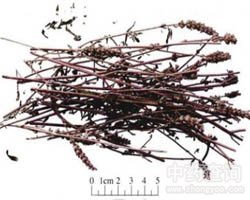
                - 透疹——麻疹不透，风疹瘙痒
                - **止血（宜炒炭）**
                - 消疮——疮疡初起
                - 发散风寒——风寒感冒
        - 利水
            - 麻黄
                -  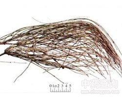
                - **平喘**
                - 阴疽 痰核
                - 发散风寒——风寒感冒
                - 麻黄汤、麻杏石甘汤、越婢汤
            - 香薷
                -  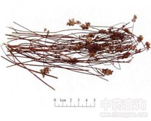
                - **化湿**
                - 利水消肿——水肿，小便不利，脚气浮肿
                - 香薷饮
        - 祛风湿止痛
            - 藁本
                -  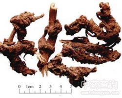
                - **止厥阴经癫顶痛**
                - 祛风湿止痛——风寒湿痹
                - 发散风寒——风寒感冒
            - 羌活（风中之燥剂）
                -  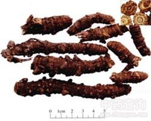
                - **止上半身痛**
                - 祛风湿止痛——风寒湿痹
                - 发散风寒——风寒感冒
            - 防风（风中之润剂）
                -  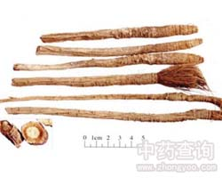
                - **止痉**
                - 祛风湿止痛——风寒湿痹
                - 发散风寒——风寒感冒
                - 九味羌活汤、消风散、玉直散、痛泻要方
        - 止呕和胃
            - 桂枝
                -  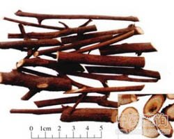
                - 温经止痛——寒凝血滞诸痛证
                - 助阳化气
                - 平冲降逆——心悸，奔豚
                - **肌**
                - 发散风寒——风寒感冒
            - 紫苏叶
                -  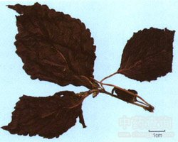
                - **气**
                - 发散风寒——风寒感冒
            - 生姜（呕家圣药）
                -  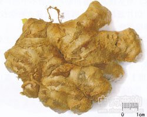
                - **咳**
                - 解鱼蟹毒——鱼蟹中毒
                - **呕**
                - 发散风寒——风寒感冒
        - 通窍
            - 辛夷（鼻渊要药）
                -  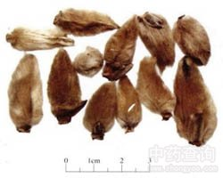
                - 发散风寒——风寒感冒，头痛
                - 通鼻窍——鼻塞、鼻渊，鼻鼽，鼻塞流涕
            - 苍耳子
                -  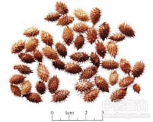
                - 祛风湿止痛——风疹瘙痒、风湿痹证
                - 发散风寒——风寒感冒，头痛
                - 通窍——鼻塞、鼻渊，鼻鼽，鼻塞流涕
            - 细辛
                -  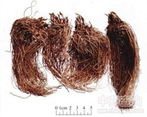
                - **少阴头疼**
                - **温肺化饮**
                - 发散风寒——风寒感冒，头痛
                - 通窍——鼻塞、鼻渊，鼻鼽，鼻塞流涕
            - 白芷
                -  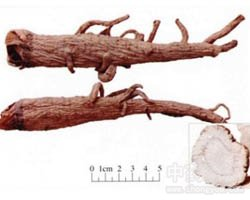
                - **阳明经头痛**
                - **止带**
                - **排脓**
                - 发散风寒——风寒感冒，头痛
                - 通窍——鼻塞、鼻渊，鼻鼽，鼻塞流涕
    - 发散风热药（辛凉解表药）
        - 利咽、透疹药
            - 薄荷
                -  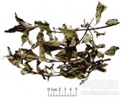
                - **头目**
                - **肝**
                - 发散风热——风热感冒
                - 利咽——咽喉肿痛
                - 透疹——麻疹不透，风疹瘙痒
            - 牛蒡子
                -  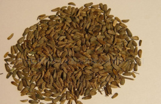
                - **祛痰**
                - 消肿疗疮——痈肿疮毒，丹毒，痄腮喉痹等
                - **通便**
                - 发散风热——风热感冒
                - 利咽——咽喉肿痛
                - 透疹——麻疹不透，风疹瘙痒
            - 蝉蜕
                -  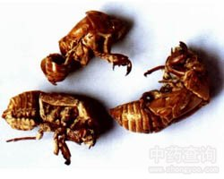
                - 明目退翳——目赤翳障
                - 息风止痉——小儿惊痫夜啼，破伤风
                - 发散风热——风热感冒
                - 利咽——咽喉肿痛
                - 透疹——麻疹不透，风疹瘙痒
        - 平肝药
            - 桑叶
                -  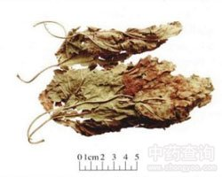
                - **燥**
                - 凉血止血——血热吐衄
                - 发散风热——风热感冒、头痛、咽喉痒、咳嗽
                - 平肝明目——肝阳上亢，头疼眩晕，目赤肿痛，目暗昏花
                - 桑菊饮、桑杏汤、羚角钩藤汤
            - 菊花（少阳证要药）
                -  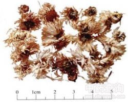
                - **毒**
                - 发散风热——风热感冒、头痛、咽喉痒、咳嗽
                - 平肝明目——肝阳上亢，头疼眩晕，目赤肿痛，目暗昏花
        - 升阳药
            - 柴胡（治疗少阳证要药，配黄芩）
                -  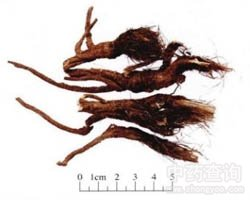
                - **肝**
                - 退热——伤寒邪在少阳，寒热往来
                - 升阳——气虚下陷，久泻脱肛
                - 发散风热——风热感冒、发热头痛
                - 小柴胡汤、逍遥散、补中益气汤、柴胡疟饮
            - 升麻
                -  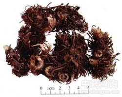
                - **疹**
                - **毒**
                - 升阳——气虚下陷，久泻脱肛
                - 发散风热——风热感冒、发热头痛
                - 麻黄升麻汤、补中益气汤、升麻葛根汤
            - 葛根
                -  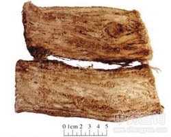
                - **津**
                - 透疹——麻疹不透
                - 通经活络——中风偏瘫，胸痹心痛，眩晕目痛
                - **泻**
                - 解酒毒——酒毒伤中
                - 升阳——气虚下陷，久泻脱肛
                - 发散风热——风热感冒、发热头痛
                - 葛根汤、升麻葛根汤、玉液汤、葛根芩连汤
        - 其他药
            -  蔓荆子
                -  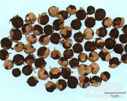
                - 清利头目——目赤多泪、齿龈肿痛，目暗、目眩，耳鸣耳聋
                - 祛风湿止痛——风湿痹痛
                - 发散风热——风热感冒、发热头痛
            -  淡豆豉
                -  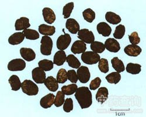
                - **烦**
                - 宣发郁热——寒热头痛
                - 发散风热——风热感冒、发热头痛
-  清热药
- > 抗茵、抗炎、抗肿瘤、解热、镇静、影响心血管系统、利尿 **湿疹、细茵性痢疾、高血压、慢性气管炎、感冒、烧伤、百日咳、胃溃疡、肝炎、流行性腮腺炎、肺炎、带状疱疹、水肿、咽喉肿痛、十二指肠溃疡、化脓性中耳炎、皮炎、头痛、冠状动脉粥样硬化性心脏病、支气管炎、扁平疣、急性扁桃体炎、腹泻、高脂血症、咳嗽、黄疸**
    - 清热药作用与适应证
        - 清热泻火——气分实热证
        - 清热凉血——血分实热证
        - 清热燥湿——湿热证
        - 清热解毒——热毒证
        - 清虚热——虚热证
    - 泻火药（气分实热）
        -  石膏（气分实热证要药）
            -  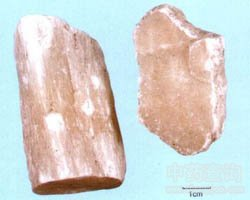
            - **止血**
            - 清胃热（生用）
            - **除烦**
            - 清热泻火（生用）——肺热燥咳；胃火亢盛，牙龈肿痛；
            - 15~60g打碎先煎
        -  知母
            -  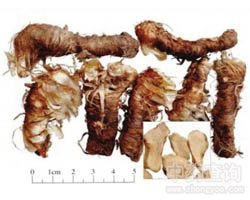
            - 滋阴润燥——骨蒸潮热、盗汗、阴虚肠燥便秘、阴虚燥咳
            - 生津止渴——热病烦渴
            - 清热泻火——肺热燥咳
        -  芦根
            -  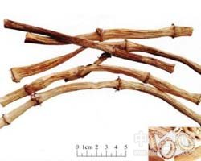
            - 止呕——胃热呕逆
            - 利尿——湿热淋证
            - 祛痰排脓——肺痈吐脓
            - 生津止渴——热病烦渴
            - 清热泻火——肺热燥咳
        - 天花粉
            -  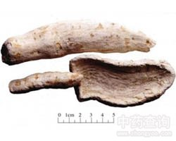
            - 清肺润燥——肺热燥咳
            - 消肿排脓——疮疡肿毒
            - 生津止渴——热病烦渴、内热消渴
            - 清热泻火——肺热燥咳
        -  淡竹叶
            -  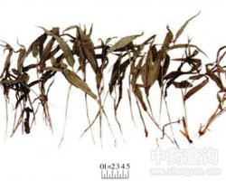
            - 利尿通淋——小便短赤涩痛
            - 除烦止渴——热病烦渴
            - 清热泻火——肺热燥咳
        -  栀子(热病烦闷要药）
            -  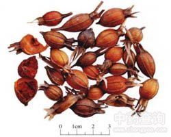
            - 消肿止痛（外用）——热毒疮疡、扭挫伤痛
            - 凉血解毒——血热出血、目赤肿痛
            - 清热利湿——湿热黄疸、淋证涩痛
            - 清热泻火——肺热燥咳
            - 除烦——热病烦渴
            - 清三焦之火、清心、利小便，凉血解毒
        -  夏枯草
            -  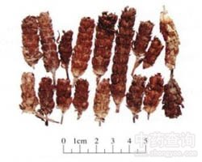
            - 清肝明目——目赤肿痛，目珠夜痛，头痛眩晕
            - 散结消肿——瘿瘤，瘰疬、乳痈，乳癖，乳房胀痛
        - 决明子
            -  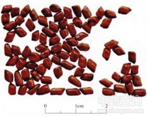
            - 润肠通便——肠燥便秘
            - 清肝明目——目赤涩痛、羞明多泪，目暗不明
    - 凉血药（营分血分实热）
        - 生地黄
            -  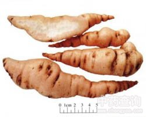
            - 养阴生津——热病伤阴，内热消渴，津伤便秘，阴虚发热证
            - 清热凉血——热入营血，温毒发斑，血热出血
        - 玄参
            -  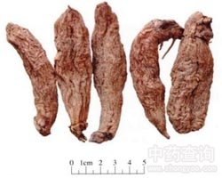
            - 解毒散结——瘰疬、痰核、脱疽
            - 滋阴降火——咽喉肿痛
            - 清热凉血——热入营血，温毒发斑
        - 牡丹皮（无汗骨蒸之要药）
            -  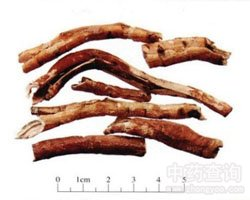
            - 活血化瘀——血淤证，肠痈初起
            - 阴虚发热，夜热早凉，无汗骨蒸
            - 清热凉血——热入营血，温毒发斑，血热吐衄
        - 赤芍
            -  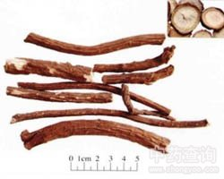
            - 散瘀止痛——血淤证，痈肿疮毒，目赤肿痛
            - 清热凉血——热入营血，温毒发斑，血热吐衄
        - 紫草
            -  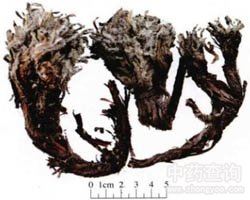
            - 透疹消斑——麻疹不透，斑疹紫黑
            - 清热凉血——热入营血，温毒发斑，血热吐衄
        - 水牛角
            - 解毒
            - 定惊
            - 清热凉血——热入营血，温毒发斑，血热吐衄
    - 燥湿药（湿热证火热证）
        - 黄芩（泄上焦肺火）
            -  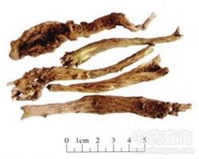
            - 止血——血热出血
            - 安胎——胎热胎动不安
            - 泻火解毒——痈肿疮毒
            - 清热燥湿——肺热咳嗽，高热烦渴，湿热蕴结证
        - 黄连（泄中焦胃火，长于泻心火）
            -  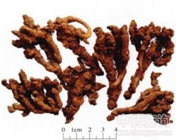
            - 泻火解毒——高热神昏，心火亢盛，烦燥心悸；痈肿疔疮，目赤肿痛，口舌生疮
            - 清热燥湿——湿热痞满，呕吐，泻痢；胃热呕吐吞酸、消渴，胃火牙痛，血热吐衄；湿疹湿疮，耳道流脓
        - 黄柏（泄下焦相火除骨蒸）
            -  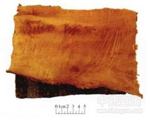
            - 除骨蒸——骨蒸劳热，盗汗，遗精
            - 泻火解毒——疮疡肿毒
            - 清热燥湿——湿热蕴结证，湿疹湿疮
        - 龙胆（泄肝火）
            -  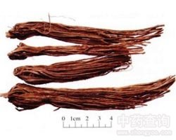
            - 泻肝胆火——肝火头痛，目赤耳聋胁痛，肝热惊厥抽搐
            - 清热燥湿——湿热黄疸，带下，湿疹瘙痒
        - 苦参
            -  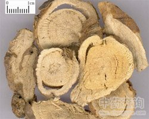
            - 杀虫止痒——疥癣、皮肤瘙痒，滴虫性阴道炎
            - 利尿——湿热淋痛，尿闭不通
            - 清热燥湿——湿热蕴结证、湿疹湿疮
        - 秦皮
            -  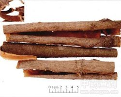
            - 收涩止痢
            - 止带
            - 明目
            - 清热燥湿
        - 白鲜皮
            -  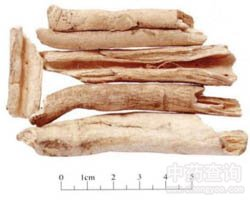
            - 祛风解毒
            - 清热燥湿
    - 解毒药（热毒病证）
        - 金银花（治痈要药）
            -  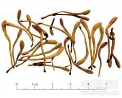
            - 凉血止痢——热毒血痢
            - 疏散风热——风热感冒，温病发热
            - 清热解毒——痈肿疔疮，喉痹，丹毒
        - 连翘（疮家圣药）
            -  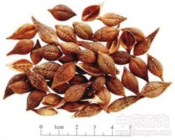
            - 凉血利尿——热入营血，高热烦渴，神昏发斑；热淋，小便短赤
            - 疏散风热——风热感冒，温病发热
            - 清热解毒——痈疽，瘰疬，乳痈，丹毒
        - 穿心莲（苦寒）
            -  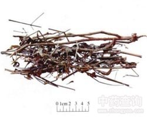
            - 凉血
            - 消肿
            - 燥湿——湿热泻痢，淋证涩痛，湿疹瘙痒
            - 疏散风热——风热感冒，温病发热
            - 清热解毒——痈肿疮疡，虫蛇咬伤；咽喉肿痛，口舌生疮
        - 大青叶
            -  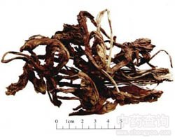
            - 凉血消斑
            - 清热解毒——疮痈丹毒
        - 板蓝根
            -  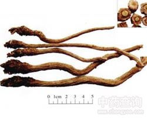
            - 凉血利咽
            - 清热解毒——疮痈丹毒
        - 青黛
            -  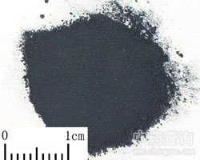
            - 凉血消斑
            - 泻火定惊
            - 清热解毒——疮痈丹毒
        - 贯众
            -  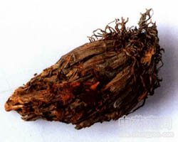
            - 清热解毒——风热感冒，温病发热，痄腮，疮疡肿毒
            - 驱虫——虫积腹痛
            - 止血——崩漏下血
        - 蒲公英（治疗乳痈之要药）
            -  
            - 清热解毒，消肿散结——热毒痈盛之痈肿
            - 利湿通淋——湿热黄疸，热淋涩痛
        - 紫花地丁(善疗疔毒）
            -  
            - 清热解毒——热毒痈盛之痈肿
            - 凉血消肿——肝热目赤肿痛，毒舌咬伤
        - 野菊花
            -  
            - 清热解毒
            - 泻火平肝
        - 漏芦
            -  
            - 清热解毒
            - 消痈散结
            - 通经下乳
            - 舒筋通脉
        - 土茯苓（梅毒要药）
            -  
            - 解毒——梅毒，汞中毒所致的肢体拘挛、筋骨疼痛
            - 除湿——湿热淋浊，带下，疥癣，湿疹瘙痒
            - 通利关节
        - 鱼腥草（肺痈之要药）
            -  
            - 清热解毒，消肿排脓——肺痈吐脓，痰热喘咳，疮痈肿毒
            - 利尿通淋——热淋，热痢
        - 败酱草
            -  
            - 清热解毒，消肿排脓——肠痈肺痈
            - 祛瘀止痛——血淤证
        - 大血藤
            -  
            - 清热解毒——肠痈（善散肠中瘀滞，善治脓未成）
            - 活血——血淤证
            - 祛风止痛——风湿痹痛
        - 射干
            -  
            - 清热解毒，消痰利咽——热毒痈盛之咽喉肿痛；痰涎壅盛，咳嗽气喘
        - 山豆根
            - 
            - 清热解毒，消肿利咽——热毒痈盛之咽喉肿痛；齿龈肿痛，口舌生疮
        - 马勃
            -  
            - 清肺
            - 解毒利咽
            - 止血
        - 白头翁（治痢之良药）
            -  
            - 清热解毒
            - 凉血止痢——热毒血痢
        - 马齿苋
            - 
            - 清热解毒——热毒疮疡
            - 凉血止血——血热崩漏，便血
            - 止痢——湿热痢疾，热毒血痢
        - 鸦胆子
            -  
            - 清热解毒
            - 止痢——热毒血痢，冷积久痢
            - 截疟——疟疾
            - 外用腐蚀赘疣——赘疣鸡眼
        - 白花蛇舌草
            -  
            - 清热解毒——痈肿疮毒，咽喉肿痛，毒蛇咬伤
            - 利湿通淋——热淋涩痛
        - 熊胆粉
            - 
            - 清热解毒
            - 息风止痉
            - 清肝明目
    - 清虚热药（温热病后期，夜热早凉）
        - 青蒿
            -  
            - 解暑热——外感暑热，发热烦渴
            - 截疟——疟疾寒热
            - 退黄——湿热黄疸
            - 清虚热，除骨蒸——温邪伤阴，夜热早凉，阴虚发热，骨蒸劳热
        - 白薇
            -  
            - 利尿通淋——热淋，血淋
            - 解毒疗疮——痈疽肿毒，咽喉肿痛
            - 清虚热——阴虚发热，骨蒸劳热，产后血虚发热，温邪伤营发热
        - 地骨皮
            -  
            - 清肺降火——肺热咳喘
            - 凉血除蒸——血热出血证，阴虚潮热，骨蒸盗汗，阴虚内热消渴
        - 胡黄连
            -  
            - 退虚热——骨蒸
            - 除疳热（小儿疳积发热）
        - 银柴胡
            -  
            - 清虚热——骨蒸
            - 除疳热（小儿疳积发热）
- 泻下药
- > 促进肠蠕动、刺激肠黏膜炎性充血水肿，引起不同程度腹泻 抑菌消炎、利胆、利尿、止血、降压 **习惯性便秘、急性阑尾炎、肠梗阻、渗出性胸膜炎，慢性肾炎和肝硬化、血吸虫病引起腹水胀满，以及精神分裂症** **高血压、消化道出血、口腔炎、乳腺炎、局部细菌感染、慢性气管炎、蛔虫病**
    - 作用与适应证
        - 攻下——主要用于高热不退、腹满胀痛、大便不通的里实热证，以及火毒内盛所致的目赤肿痛、咽肿口疮、疮痈疔毒、血热吐衄等证。
        - 润下——常用于年老、久病、产后津血亏虚引起的肠燥便秘。
        - 峻下逐水——主要用于胸腹积水、痰饮积聚、喘满气促、肺气壅实、二便不通、脉沉有力、形气俱实的水肿痰饮实证。
    - 攻下药
        - 大黄（积滞便秘要药）
            -  
            - 清热泻火——目赤咽肿，牙龈肿痛
            - 凉血解毒——热毒疮疡及烧烫伤
            - 止血（炒炭）——血热吐衄
            - 逐瘀通经（酒制）——瘀血阻滞
            - 利湿退黄——湿热黄疸，淋证
            - 泻下攻积（生用、后下）——大便秘结，胃肠食积
        - 芒硝
            -  
            - 清火消肿    
            - 泻下软坚——大便秘结，胃肠食积
        - 番泻叶
            -  
            - 泻热导滞——大便秘结，胃肠食积
        - 芦荟
            -  
            - 泻肝清火
            - 杀虫疗疳
            - 泻下通便——大便秘结，胃肠食积
    - 润下药
        - 火麻仁
            -  
            - 润肠通便——肠燥便秘
        - 郁李仁
            -  
            - 利水消肿——水肿胀满，脚气浮肿
            - 润肠通便——肠燥便秘
        - 松子仁
            - 润肺止咳——肺燥干咳
            - 润肠通便——肠燥便秘
    - 峻下逐水药
        - 甘遂
            -  
            - 消肿散结——疮痈肿毒
            - 泻水逐饮——水肿、胸胁停饮
            - 0.5~1g，内服醋制
        - 大戟
            -  
            - 消肿散结——疮痈肿毒
            - 泻水逐饮——水肿、胸胁停饮
        - 芫花
            -  
            - 祛痰止咳——寒饮咳痰
            - 外用杀虫疗疮——头疮、顽癣
            - 泻水逐饮——水肿、胸胁停饮
            - 1.5-3g，内服醋制
        - 巴豆
            -  
            - 峻下冷积——寒积便秘
            - 豁痰利咽——喉痹痰阻
            - 外用蚀疮——痈肿脓成未溃
            - 泻水逐饮——水肿、腹水鼓胀
            - 0.1-0.3
        - 牵牛子
            -  
            - 杀虫攻积——虫积腹痛
            - 泻水逐饮——水肿、胸胁停饮
- 祛风湿药
- > 镇痛、解热、抑菌、消炎、抗过敏 镇静、催眠、抗惊厥，以及利尿、强心 **风湿性关节炎、类风湿性关节炎、肌肉风湿痛、坐骨神经痛、腰脊劳损** **高血压、中风偏瘫、破伤风、心脏病以及肠炎、痢疾**
    - 作用与适应证
        - 祛风湿散寒——治风湿痹痛属寒者
        - 祛风湿清热——治风湿热痹，关节红肿热痛者
        - 祛风湿强筋骨——治风湿日久或肝肾虚损之腰膝无力，亦治肾虚腰痛或中风半身不遂等
    - 祛风寒湿药
        - 独活
            -  
            - 通痹止痛——少阴伏风头痛（脑仁痛）
            - 解表——风寒夹湿表证
            - 祛风寒湿止痛——风寒湿痹，风寒夹湿头痛
        - 威灵仙
            -  
            - 消骨骾——骨骾咽喉
            - 通经络
            - 祛风寒湿止痛——风寒湿痹
        - 川乌
            -  
            - 温经止痛——诸寒疼痛，跌打损伤，麻醉止痛
            - 祛风寒湿止痛——风寒湿痹
        - 蕲蛇（活络要药）🐍
            - 
            - 通络——中风口眼歪斜、半身不遂
            - 止痉——小儿急慢惊风、破伤风
            - 祛风寒湿止痛——风寒湿痹，麻风疬毒，皮肤瘙痒
        - 乌梢蛇🐍
            -  
            - 通络——中风口眼歪斜、半身不遂
            - 止痉——小儿急慢惊风、破伤风
            - 祛风寒湿止痛——风寒湿痹，麻风疬毒，皮肤瘙痒
        - 木瓜（舒筋要药）
            -  
            - 舒筋活络——吐泻转筋
            - 和胃化湿——
            - 消食，生津止渴——消化不良，津伤口渴
            - 祛风寒湿止痛——风寒湿痹，脚气肿痛
        - 青风藤
            -  
            - 利小便
            - 通经络
            - 祛风寒湿止痛——风寒湿痹，脚气肿痛
    - 祛风湿热药
        - 秦艽（风湿药中的润剂、虚热要药）
            -  
            - 清湿热——湿热黄疸
            - 退虚热——骨蒸潮热，疳积发热
            - 祛风湿——风湿痹症
        - 防己
            -  
            - 止痛
            - 利水消肿——水肿、小便不利、脚气
            - 祛风湿——风湿痹症，湿疹疮毒
        - 桑枝
            -  
            - 利关节
            - 祛风湿——风湿痹症
        - 豨莶草
            -  
            - 解毒
            - 利关节
            - 祛风湿——风湿痹症
        - 络石藤
            -  
            - 凉血消肿
            - 祛风通络
    - 祛风湿强筋骨药
        - 五加皮
            -  
            - 利水消肿——水肿、脚气
            - 补益肝肾——小儿行迟，体虚乏力
            - 强筋壮骨——筋骨痿软
            - 祛风湿——风湿痹症
        - 桑寄生
            -  
            - 安胎元——妊娠漏血，胎动不安
            - 补肝肾、强筋骨——痹症日久，伤及肝肾，腰膝酸软
            - 祛风湿——风湿痹症
        - 狗脊
            -  
            - 强腰膝
            - 补肝肾
            - 祛风湿——风湿痹症
- 化湿药
- > 健胃 促进消化液分泌、增进肠蠕动、排除胃肠积气、制止肠内异常发酵、止呕 抑制 **消化不良、肠炎、痢疾、胃肠神经官能症、肠梗阻、胃肠型感冒、流行性感冒及早期妊娠中毒症**
    - 作用及适应证
        - 宣化中焦湿浊，健运脾胃，疏通气机，消胀除痞，化湿醒脾，开胃进食——用于湿犯中焦，脾为湿困，运化失常引起的食少纳呆，倦怠乏力，胸闷脘痞，口甘多涎，便溏，苔腻等症。
        - （散寒解表、祛暑除湿、和胃止呕、降气平喘、理气安胎、除痰截疟）
    - 藿香（芳香化湿浊要药）
        -  
        - 和中止呕——呕吐
        - 发表解暑——暑湿或湿温
        - 芳香化湿——湿滞中焦
    - 佩兰（脾经湿热—脾瘅）
        -  
        - 醒脾开胃
        - 发表解暑——暑湿或湿温
        - 芳香化湿——湿滞中焦
    - 苍术（湿阻中焦要药）
        -  
        - 祛风散寒——风寒夹湿表证，风湿痹症
        - 明目——夜盲症
        - 燥湿健脾——湿滞中焦
    -  厚朴（消除胀满要药）
        -  
        - 行气——梅核气
        - 消痰平喘——痰饮咳喘
        - 燥湿消积——湿阻中焦，胃肠积滞，食积不化，脾胃气滞之脘腹胀满
    -  砂仁
        -  
        - 温中止泻——虚汗吐泻
        - 理气安胎——气滞妊娠恶阻或胎动不安
        - 化湿开胃——湿阻中焦，脾胃气滞
    - 豆蔻
        -  
        - 温中止呕——呕吐
        - 化湿行气——湿阻中焦，脾胃气滞
    - 草果
        -  
        - 截疟除痰
        - 燥湿温中
- 利水渗湿药
- > 利尿 抑菌、解热、消炎、止血、祛痰止咳、镇静降血压、利胆 **心性水肿、肝性水肿、肾病水肿、泌尿系感染、泌尿系结石、肝胆系统炎症、胆结石** **高血压、糖尿病、关节炎、气管炎**
    - 作用及适应证
        - 利水消肿——水肿，泄泻
        - 利尿通淋——痰饮，淋证
        - 利湿退黄——黄疸等水湿所致各种病证
    - 利水消肿药
        - 茯苓（利水渗湿要药）
            -  
            - 宁心安神——心悸失眠
            - 健脾——脾虚食少，便溏泄泻
            - 利水渗湿——水肿尿少，痰饮眩悸
        - 薏苡仁
            -  
            - 健脾止泻——脾虚泄泻
            - 除痹——湿痹拘挛
            - 排脓——肺痈，肠痈
            - 利水渗湿——水肿，小便不利，脚气（脚肿）
        - 猪苓
            -  
            - 利水渗湿——水肿，小便不利
        - 泽泻
            -  
            - 泄热（泻肾与膀胱之热）——热淋涩痛，遗精
            - 化浊降脂——高血脂症
            - 利水渗湿——水肿，小便不利，痰饮，泄泻，淋证
        - 香加皮
            -  
            - 祛风湿
            - 强筋骨
            - 利水消肿
        - 冬瓜皮
            -  
            - 清热解暑
            - 利水消肿
    - 利尿通淋药
        - 车前子（水泄）
            -  
            - 明目——目赤肿痛，目暗昏花
            - 祛痰——痰热咳嗽
            - 渗湿止泻——暑热泄泻
            - 利尿通淋——热淋涩痛，水肿胀满
        - 滑石
            -  
            - 清热解暑——暑湿，湿温，湿热水泻
            - 外用祛湿敛疮——湿疮，湿疹
            - 利尿通淋——热淋涩痛，水肿胀满
        - 木通
            -  
            - 清心除烦——口舌生疮，心烦尿赤
            - 通经下乳——经闭乳少，湿热痹证
            - 利尿通淋——热淋涩痛，水肿胀满
        - 通草
            -  
            - 通经下乳——产后乳汁不下
            - 利尿通淋——热淋涩痛，水肿胀满
        - 萆薢（膏淋要药）
            -  
            - 祛风除痹——风湿痹痛 ，关节不利，腰膝疼痛
            - 利湿去浊——膏淋，白浊，白带过多
        - 瞿麦
            -  
            - 活血通经
            - 利尿通淋——热淋涩痛，水肿胀满
        - 地肤子
            -  
            - 清热利湿
            - 祛风止痒
            - 利尿通淋
        - 石韦
            -  
            - 清肺止咳——肺热咳嗽
            - 凉血止血（血淋）——血热出血
            - 利尿通淋——淋证
        - 海金沙（诸淋涩痛要药）
            -  
            - 清热利湿
            - 通淋止痛
        - 扁蓄
            -  
            - 利尿通淋
            - 杀虫止痒
    - 利湿退黄药
        - 茵陈（黄疸要药）
            -  
            - 清利湿热——湿温暑湿，湿疮瘙痒
            - 利胆退黄——黄疸
        - 金钱草（石淋）
            -  
            - 利尿通淋——石淋，热淋
            - 解毒消肿（薏苡仁解毒散结）——恶疮肿毒，毒蛇咬伤
            - 利湿退黄——湿热黄疸
        - 虎杖
            -  
            - 清热解毒
            - 散瘀止痛
            - 化痰止咳
            - 此外泻热通便
            - 利湿退黄
- 温里药
- > 增加胃液分泌、增强消化机能、排除消化道积气、减轻恶心呕吐 抑制 强心、升高血压、镇静、镇痛 **消化不良、胃肠痉挛疼痛、肠胀气、蛔虫腹痛、蛔虫性肠梗阻、慢性气管炎、慢性肠炎、痢疾、疝气腹痛、慢性肾炎水肿、性功能障碍** **心衰、休克**
    - 作用及适应证
        - 温中散寒——主要用于寒邪内侵、阳气被困，或脾阳不足、寒自内生，所致脘腹冷痛、呕吐泻痢等脏寒证。
        - 温肾回阳——主要用于阴寒内盛、元阳衰微、下痢清谷、四肢厥冷、冷汗不止的亡阳厥脱证；或肾阳不足、阳痿宫冷、阴寒水肿、五更泄泻等证。
        - 暖肝散寒——主要用于寒犯肝经、厥阴头痛、寒疝腹痛等证。
        - 温肺化饮——主要用于寒痰停饮犯肺、喘咳痰稀等证。
    - 附子（回阳救逆第一品药）
        -  
        - 补火助阳——阳虚诸证
        - 回阳救逆——亡阳证
        - 散寒止痛——寒湿痹痛，阳虚外感
    - 干姜（温中散寒要药）
        -  
        - 回阳通脉——亡阳证
        - 温肺化饮——寒饮喘咳
        - 温中散寒——脾胃寒证，脘腹冷疼，呕吐泄泻
    - 肉桂（治命门火衰之要药）
        -  
        - 温通经脉——冲任虚寒，寒凝血滞证（腰痛，胸痹，阴疽，闭经，痛经）
        - 引火归元——虚阳上浮诸证（虚喘、眩晕目赤）
        - 补火助阳——肾阳不足，命门火衰（阳痿，宫冷）
        - 散寒止痛——心腹冷痛，寒疝腹痛
        - 宜后下或焗服
    - 吴茱萸（三止）
        -  
        - 降逆止呕——胃寒呕吐
        - 助阳止泻——脾肾阳虚，五更泄泻
        - 散寒止痛——寒凝肝脉疼痛（厥阴头痛、寒疝腹痛、痛经）
    - 小茴香
        -  
        - 理气和胃——少腹冷痛，痛经；中焦虚寒气滞
        - 散寒止痛——寒疝腹痛，睾丸偏坠疼痛
    - 丁香
        -  
        - 温肾助阳
        - 温中降逆
        - 散寒止痛
    - 高良姜
        -  
        - 温中止呕——胃寒脘腹冷疼
        - 散寒止痛——胃寒呕吐，嗳气吞酸
    - 花椒
        -  
        - 杀虫止痒
        - 温中止痛
- 理气药
- > 抑制胃肠平滑肌 兴奋胃肠平滑肌、增强肠管蠕动 健胃、助消化 促进胆汁分泌，有利胆作用 升压、收缩血管及兴奋心脏的抗休克 **急性胃肠炎、胃十二指肠溃疡、胃肠神经官能症、消化不良症等引起的胃肠胀痛、恶心呕吐、食欲不振，以及胃肠、腹膜、纵膈、食道某些疾病所引起的膈肌痉挛** **急慢性肝炎、胆囊炎、胆石症所引起的胸肋胀痛，以及乳腺增生、乳腺肿瘤所引起的乳房胀痛、乳房结块，腹股沟斜疝、腹股沟直疝、腹壁疝等所引起的疝气腹挛、牵引睾丸** **心律失常、心脏神经官能症、心绞痛、心肌梗塞等所引起的喘息短气、胸痛彻背** **休克，有强心、升压、抗休克**
    - 作用及适应证
        - 理脾和胃——主要用于饮食不节，或思虑过度，劳伤心脾，致使脾胃气滞，升降失常，气机紊乱而出现脘腹痞满胀痛，嗳气吞酸，恶心呕吐，不思饮食，大便秘结，或泻痢不爽、里急后重等脾胃气滞的病证。
        - 疏肝解郁——主要用于情志失调、或寒暖不适、或瘀血阻滞，致使肝失疏泄，气机郁滞，出现两肋胀痛，烦躁易怒，疝气腹痛，睾丸坠胀，经闭痛经，乳房胀痛或生结块等病证。
        - 疏肝和胃——主要用于情志不遂，肝气横逆，胃失和降，肝胃气滞，胸胁胃脘攻冲作痛，恶心呕吐，嘈杂吞酸，不思饮食，苔黄脉弦等证。
        - 通宣理肺——主行肺气郁滞，有宣降肺气、宽利胸膈及化痰止咳等作用。主要用于外邪犯肺，或痰湿阻肺，肺失宣降，胸闷喘咳，及痰滞寒凝气阻，胸中阳气不得宣通所致的胸闷作痛，喘息咳唾的胸痹证。
    - 陈皮（治痰要药）
        -  
        - 燥湿化痰——湿阻中焦证，湿痰寒痰，咳嗽痰多
        - 理气健脾——脾胃气滞证，呕吐呃逆，胸痹
    - 青皮
        -  
        - 消积化滞——气滞脘腹，食积腹痛
        - 疏肝破气——肝郁气滞
    - 枳壳
        -  
        - 理气宽中——胃下垂、子宫脱垂、脱肛
        - 行滞消胀——胸胁气滞、胀满产痛、食积不化、痰饮内停
    - 枳实（除痞要药）
        -  
        - 化痰散痞——胸痹，小结胸，心下痞
        - 破气消积——肠胃气滞（便秘、食积、泻痢后重）
        - 脏器下垂
    - 木香（行气止痛要药、里急后重要药）
        -  
        - 行气止痛，健脾消食——脾胃气滞证，腹痛胁痛，黄疸，泻痢里急后重（善行大肠滞气）
    - 香附（行气止痛、妇科调经、疏肝解郁要药）
        -  
        - 调经止痛——月经不调、痛经，乳房涨痛
        - 疏肝解郁——肝郁气滞证
        - 理气宽中——脾胃气滞
    - 薤白（胸痹要药）
        -  
        - 通阳散结——胸痹心痛
        - 行气导滞——痢疾里急后重，治疗大肠气滞
    - 沉香（降气）
        -  
        - 温中止呕——胃寒呕吐
        - 纳气平喘——虚喘
        - 行气止痛——寒凝气滞，胸腹胀痛
        - 宜后下
    - 川楝子
        -  
        - 杀虫——虫积腹痛、头癣
        - 疏肝止痛————肝郁化火诸痛
    - 乌药
        -  
        - 温肾散寒——肾阳不足，膀胱虚冷，遗尿尿频
        - 行气止痛——寒凝气滞诸痛
    - 檀香
        -  
        - 行气止痛
        - 散寒调中
    - 佛手
        -  
        - 疏肝解郁
        - 理气和中
        - 燥湿化痰
    - 大腹皮
        -  
        - 行气宽中
        - 行水消肿
    - 柿蒂
        -  
        - 降气止呃
- 消食药
- > 促进淀粉类及蛋白类食物的消化 促进胃液分泌、增强胃肠蠕动、提高消化能力 对胃肠道常见致病菌有不同程度的抑制 抑制 **消化不良、肠炎痢疾、各种疾病引起的食欲不振** **高血压、高血脂、冠心病、脾肿大**
    - 作用及适用证
        - 消化饮食——消化不良
        - 导行积滞——不思乳食，食而不化，腹部胀满，大便不调
        - 行气消胀——脘腹胀闷
        - 健运脾胃——脾胃虚弱
        - 增进食欲——食少纳呆
        - （降气消痰、止咳平喘、回乳消胀、活血化瘀、行气散结、固精止遗）
    - 山楂（治油腻肉食积滞要药）
        -  
        - 行气散瘀——血淤经闭通经，泻痢腹痛，疝气疼痛
        - 化浊降脂——高脂血症
        - 消食化积——肉食积滞，胃脘胀满，腹痛泄泻
    - 神曲
        -  
        - 消食化积——饮食积滞
    - 麦芽
        -  
        - 疏肝解郁——肝气郁滞或肝胃不和之胁痛
        - 回乳消胀（炒）——断乳、乳房肿痛
        - 消食化积（生）——食滞
    - 稻芽
        -  
        - 健脾开胃
        - 消食和中
    - 莱菔子（消食行气）
        -  
        - 降气化痰——咳喘痰多
        - 消食化积——食积气滞
    - 鸡内金
        -  
        - 涩精止遗——肾虚遗精遗尿
        - 通淋化石——砂石淋证，胆结石
        - 消食化积——饮食积滞
- 驱虫药
- > 麻痹虫体、分解虫体、直接杀灭 缓泻 **蛔虫病、绦虫病、蛲虫病、钩虫病、姜片虫病、血吸虫病** **胆道蛔虫、蛔虫性肠梗阻、脑囊虫病、肝吸虫黄疸** **小儿消化不良，以及病毒性肝炎、流行性感冒**
    - 作用及适用证
        - 驱虫——不思饮食，或消谷善饥，嗜食异物，腹痛时作，吐虫便虫，肛门奇痒，面色萎黄，形体消瘦，浮肿乏力
        - （消积健脾，开胃疗疳，清热燥湿，杀虫止痒，利水消肿，降气除胀，清热解毒，凉血止血）
    - 使君子
        -  
        - 杀虫消积——蛔虫病，蛲虫病；小儿疳积
        - 空腹服用，禁茶
    - 苦楝皮
        -  
        - 杀虫——蛔虫病、蛲虫病、钩虫病
        - 疗癣——疥癣、湿疮
    - 槟榔
        -  
        - 杀虫消积——肠道寄生虫病，绦虫病
        - 行气——食积气滞，泻痢后重
        - 利水——水肿，脚气肿痛
        - 截疟——疟疾
    - 雷丸
        -  
        - 杀虫消积
    - 榧子
        -  
        - 润肠通便
        - 润肺止咳
        - 杀虫消积
- 止血药
- > 促进凝血，缩短凝血时间；使局部血管收缩止血，或改善血管壁功能、降低血管通透性而止血；抑制纤维蛋白溶酶活性 降低血压、扩张冠状动脉、抗心律失常、抑菌、解热、祛痰、镇咳、利胆、利尿 **肺出血、胃及十二指肠溃疡性出血、血液病出血、妇科出血、外伤出血，以及各种疾病发展过程中的出血症** **高血压、冠心病、肝炎、肾炎、泌尿系感染、局部炎症、烫伤**
    - 作用及适用证
        - 收敛止血——主要用于吐血、衄血、咳血、咯血、便血、尿血、崩漏出血及外伤出血等症而内无瘀滞、外无实邪者。
        - 凉血止血——主要用于血热妄行引起的各种出血症。
        - 化瘀止血——主要用于瘀血阻滞、血不归经引起的各种出血症。
        - 温经止血——主要用于阳气不足、统摄无力所致的虚寒出血。
    - 凉血止血药
        - 小蓟
            -  
            - 散瘀解毒消痈
            - 利尿通淋（小蓟子饮）——尿血、血淋
            - 凉血止血——血热出血
        - 大蓟
            -  
            - 散瘀解毒消痈——热毒痈肿
            - 凉血止血——血热出血
        - 地榆（烧烫伤要药）
            -  
            - 解毒敛疮——湿疹、疮疡痈肿、烫伤
            - 凉血止血（下焦）——血热出血
        - 槐花
            -  
            - 清肝泻火——目赤头疼
            - 凉血止血（下焦）——血热出血
                - 槐花散治疗痔疮出血
        - 侧柏叶
            -  
            - 化痰止咳——肺热咳嗽
            - 生发乌发——脱发，早白
            - 凉血止血——血热出血
        - 白茅根
            -  
            - 清热利尿——水肿、热淋、黄疸
            - 清肺胃热——胃热呕吐、肺热咳嗽
            - 凉血止血（肺胃热）——血热出血
    - 化瘀止血药
        - 三七（止血不留瘀，化瘀不伤正，伤科要药）
            -  
            - 消肿定痛——跌打损伤
            - 补虚——虚损劳伤
            - 化瘀止血——出血证
        - 茜草（妇科调经要药）
            -  
            - 通经——血瘀经闭、跌打损伤、风湿痹痛
            - 化瘀止血——出血，血热夹瘀
            - 对血分证有三大功效，血热证有凉血，出血证有止血 ，瘀血证有活血作用
        - 蒲黄
            -  
            - 利尿通淋（小蓟子饮）——血淋尿血
            - 化瘀止血（胸腹部瘀血证）——出血，瘀血痛症
        - 降香
            -  
            - 理气止痛
            - 化瘀止血
    - 收敛止血药
        - 白及
            -  
            - 消肿生肌——手足皲裂、烫伤、痈肿疮疡
            - 收敛止血（主要用于肺胃出血之证）——出血，肺胃出血
        - 仙鹤草
            -  
            - 截疟——疟疾寒热
            - 止痢——痢疾腹泻
            - 补虚——脱力劳伤
            - 收敛止血——出血
        - 棕榈炭
            -  
            - 止泻止带——久泻久利，妇人带下
            - 收敛止血——出血
        - 血余炭
            -  
            - 利尿——小便不利
            - 化瘀止血——出血
    - 温经止血药
        - 艾叶（善疗下元虚冷）
            -  
            - 散寒调经——月经不调、痛经
            - 安胎——胎动不安
            - 温经止血——出血，虚寒性出血，崩漏
        - 炮姜
            -  
            - 温中止痛
            - 温经止血
- 活血化瘀药
- > 改善血流动力学 扩张外周血管、提高心肌供血供氧量、改善脑血循环及增加病变器官血流量 改善血液流变学 改善血液的浓度、黏稠度、凝固性及血细胞聚集性的状态 抗血栓形成、增强机体血液抗凝系统活性 改善微循环，多以通过改善微血管血流速度、解除微血管痉挛、降低毛细血管通透性 活血调经的作用，能加强子宫收缩 **心血管系统疾病，如冠心病、心绞痛、心肌梗塞等** **脑血管疾病，如脑血管栓塞、脑血管痉挛等** **血管病，如血栓闭塞性脉管炎、静脉炎等** **广泛性、弥漫性微循环障碍病** **自身免疫性疾病，如硬皮病、红斑狼疮、结节性动脉炎** **增生性病变，如慢性肝脾肿大、结节性肉芽肿、麻风样结节、类风湿性关节炎、丝虫病引起的象皮肿、腹腔内粘连性病变、瘢痕疙瘩** **妇科疾病，如月经不调、盆腔炎、子宫肌瘤、宫外孕、胎儿胎前死亡、胎盘滞留** **各种炎症，如扁桃体炎、咽炎、中耳炎、疖肿、乳腺炎、蜂窝组织炎、骨髓炎、外伤及烧伤感染** **各种疼痛病证，如瘀血阻滞的胃肠道、肝胆疼痛、神经痛、术后疼痛、痛经、分娩痛、产后宫缩痛** **宫颈癌、外阴癌、皮肤癌、唇癌**
    - 作用及适用证
        - 活血化瘀——主要用于血行障碍、瘀血阻滞引起的各种病证。如血滞经闭、行经腹痛、瘀血头痛、外伤及术后瘀血腹痛、风湿痹痛、中风瘫痪、半身不遂；痈疽肿痛、跌打伤痛等。
        - 破血消癥——用于大量瘀血停聚的蓄血证和气滞血瘀结为痞块的癥瘕证。
    - 活血止痛药
        - 川芎（血中气药，治头痛要药）
            -  
            - 活血行气——妇科活血调经要药，气滞血瘀诸痛证要药
            - 祛风止痛——治头痛要药，风湿痹痛
            - 上行头目，下调经水，中开郁结
        - 延胡索（活血行气止痛要药）
            -  
            - 行气
            - 活血止痛
        - 郁金
            -  
            - 行气解郁——热病神昏，癫痫痰闭证
            - 清心凉血——吐血，衄血，倒经，尿血，血淋
            - 利胆退黄——肝胆湿热黄疸、胆石症
            - 活血止痛——气滞血瘀痛证
        -  姜黄
            -  
            - 通经行气——风湿痹痛
            - 活血止痛——气滞血瘀痛证；牙痛，疮疡痈肿，皮癣痛痒
        - 乳香
            -  
            - 消肿生肌——跌打损伤，疮疡痈肿
            - 活血止痛——气滞血瘀痛证
        - 没药
            -  
            - 消肿生肌
            - 活血止痛——气滞血瘀痛证
        - 五灵脂
            -  
            - 活血止痛
            - 散瘀止血
    -  活血调经药
        - 丹参 （治血行不畅、瘀血阻滞之经产病要药。治疗血淤证）
            -  
            - 祛瘀止痛——血瘀心痛，脘腹痛疼，跌打损伤
            - 清心除烦——心烦
            - 凉血消痈——疮疡肿毒
            - 活血调经——月经不调，祛瘀止痛，凉血消痈，除烦安神
        - 红花🌸（治跌打损伤、瘀滞肿痛要药）
            -  
            - 散瘀止痛——跌打损伤、胸痹心痛、血瘀腹痛胁痛
            - 活血通经——血滞经闭、痛经、产后瘀滞腹痛、癥瘕积聚
        - 桃仁
            -  
            - 润肠通便——肠燥便秘
            - 止咳平喘——咳嗽气喘
            - 活血祛瘀——瘀血阻滞，肺痈肠痈
        - 益母草（经产要药）
            -  
            - 利尿消肿——肾性水肿
            - 清热解毒
            - 活血调经——血滞经闭
        - 牛膝
            -  
            - 补肝肾、强筋骨——腰膝酸痛，下肢痿软
            - 利尿通淋——淋证水肿
            - 引血下行——治肝阳上亢，出血证，实热证
            - 活血调经——瘀血阻滞
            - 川牛膝长于活血祛瘀，怀牛膝长于补肝肾强筋骨
        - 鸡血藤
            -  
            - 补血
            - 舒筋活络（藤类）——风湿痹痛，手足麻木，肢体瘫痪
            - 活血调经——月经不调
        - 王不留行
            -  
            - 下乳消肿
            - 利尿通淋
            - 活血通经
        - 泽兰
            -  
            - 活血调经
            - 利水消肿
    - 活血疗伤药
        - 土鳖虫
            -  
            - 续筋接骨——跌打损伤，筋伤骨折，瘀肿疼痛
            - 活血疗伤——血瘀经闭，产后瘀滞腹痛
        - 骨碎补
            -  
            - 补肾强骨
            - 外用消风祛斑
            - 活血疗伤止痛
        - 苏木
            -  
            - 活血疗伤
            - 散瘀痛经
        - 自然铜
            -  
            - 接骨疗伤
            - 散瘀止痛
    - 破血消癥药
        - 莪术（行气强于三棱）
            - 
            - 行气止痛，破血消癥——经闭，心腹瘀痛，食积脘腹胀痛，跌打损伤
        - 三棱
            - 
            - 行气止痛，破血消癥
        - 水蛭
            - 
            - 逐瘀通经，破血消癥
- 化痰止咳平喘药
- > 增加支气管的分泌，使痰液稀释，易于咳出，而有祛痰作用 镇咳 缓解支气管平滑肌痉挛 **感冒、气管炎、支气管炎、支气管哮喘、支气管扩张、大叶性肺炎、肺结核、肺癌** **甲状腺肿大、中风昏迷、半身不遂、癫痫、精神分裂症、癔病、美尼尔氏综合征**
    - 作用及适用证
        - 温化寒痰——主要用于寒痰犯肺所致的喘咳痰多、色白、质稀，口鼻气冷，或湿痰犯肺、咳嗽痰多、色白成块、舌苔白腻，以及痰湿阻滞经络所引起的关节酸痛、痰核流注、瘰疬，或痰浊上壅、蒙蔽清窍所致中风痰迷、癫痫惊狂等证。
        - 清化热痰——主要用于热痰壅肺所致的痰多咳喘、痰稠色黄，或燥痰犯肺、干咳少痰、咯痰不爽，以及痰火上扰的心烦不安、痰迷心窍的中风、癫狂，或痰火凝结、瘿瘤瘰疬痰核等证。
        - 止咳平喘——主要用于各种原因引起的肺失宣降、痰壅气逆的咳喘证。
    - 温化寒痰药
        - 半夏（燥湿化痰、温化寒痰要药，止呕要药）
            -  
            - 降逆止呕（止呕圣药）——呕吐
            - 消痞散结（化痰消痞）
            - 消肿止痛（外用）
            - 燥湿化痰（陈皮，二陈汤）——湿痰寒痰
        - 天南星
            -  
            - 祛风止痉（祛风痰）——风痰眩晕，中风，癫痫，破伤风
            - 散结消肿——痈疽肿痛，蛇虫叮咬
            - 燥湿化痰——湿痰寒痰
        - 白附子
            -  
            - 祛风止痉
            - 止痛
            - 解毒散结
            - 燥湿化痰——湿痰寒痰
        - 白芥子
            -  
            - 利气散结
            - 通络止痛
            - 利胸肺之气，散胸中气结，用于寒痰咳嗽，以有胸闷胸痛最为合适
            - 温肺豁痰（三子养亲汤）
        - 旋覆花
            -  
            - 降气止呕（旋覆代赭汤）——噫气呕吐
            - 消痰——咳嗽痰多，痰饮蓄结
        - 白前
            -  
            - 降气（是祛痰的结果）止咳祛痰
        - 皂荚
            -  
            - 散结消肿
            - 祛痰开窍
    - 清化热痰药
        - 桔梗
            -  
            - 利咽（风热、肺热、阴虚火旺）——咽喉肿痛，失音
            - 排脓（肺痈脓）——肺痈吐脓
            - 宣肺祛痰（长于外感咳嗽）——肺气不宣，咳嗽痰多
        - 前胡
            -  
            - 散风清热（解表药，荆防败毒散）
            - 降气化痰（化痰降气）
        - 川贝母
            -  
            - 散结消痈——瘰疬、乳痈肺痈
            - 清热润肺，化痰止咳——燥痰热痰，虚劳咳嗽、肺热燥咳
        - 浙贝母
            -  
            - 解毒散结消痈（强于川贝）
            - 清热化痰止咳——肺热咳嗽热痰
        - 瓜蒌
            -  
            - 宽胸散结（瓜蒌壳）——胸痹、结胸、肺痈
            - 润燥滑肠（瓜蒌仁）——肠燥便秘
            - 清热涤痰——痰热咳嗽
        - 竹茹
            -  
            - 除烦——痰热心烦
            - 止呕——胃热呕吐
            - 清热化痰——肺热咳嗽
        - 海藻
            -  
            - 利水消肿
            - 消痰软坚散结（痰核瘰疬）
        - 昆布
            -  
            - 利水消肿
            - 消痰软坚散结
        - 天竺黄
            -  
            - 清心定惊
            - 清热化痰
    - 止咳平喘药
        - 苦杏仁（咳喘要药）
            -  
            - 润肠通便——肠燥便秘
            - 降气止咳平喘（苦降肺气）——咳嗽气喘
        - 紫苏子
            -  
            - 润肠通便——肠燥便秘
            - 降气化痰（苏子降气汤）——咳嗽痰多
            - 止咳平喘（三子养亲汤）
        - 百部
            -  
            - 杀虫灭虱（外用）——阴道滴虫、头虱、疥癣
            - 润肺下气止咳（蜜炙润肺）——新久咳嗽、百日咳
                - 止咳作用强，用于新旧咳嗽，不平喘
        - 紫菀（长于化痰）
            -  
            - 润肺下气（蜜炙）
            - 化痰止咳
        - 款冬花（长于止咳平喘）
            -  
            - 润肺下气（蜜炙）
            - 化痰止咳
        - 枇杷叶
            -  
            - 降逆止呕（降肺胃气）——胃热呕吐
            - 清肺止咳（肺热的痰热咳喘）——肺热咳嗽
        - 桑白皮（甘）
            -  
            - 利水消肿（五皮饮，五皮散）——水肿
            - 泻肺平喘（肺热咳喘）（泻白散）——肺热咳喘
            - 与百部相反没有明显止咳作用
        - 葶苈子（大苦大寒）
            -  
            - 行水消肿（心源性水肿）（肺源性心脏病）——水肿、小便不利
            - 泻肺平喘（泻肺热逐痰水）（葶苈大枣泻肺汤）——痰涎壅盛
                - 治疗痰水壅滞的咳喘实证
        - 白果（外感风寒咳喘有痰可替代杏仁）
            -  
            - 收涩止带——带下、白浊
            - 缩尿——尿频、遗尿
            - 敛肺定喘——哮喘痰嗽
- 安神药
- > 镇静 催眠抗惊厥、降温及持续的降血压 **神经衰弱、神经官能症、精神分裂症、癫痫、癔病等所致的失眠、健忘、心悸及惊厥抽搐** **心律不齐、高血压**
    - 作用及适用证
        - 重镇安神——主要用于心火亢盛、痰火扰心、痰迷清窍所致的心悸失眠、烦躁易怒、惊痫癫狂、阳气浮动、心神不安等实证。
        - 滋养安神——主要用于心血不足、思虑过度、劳伤心脾、情志不遂等所致的失眠多梦、心悸不安、神疲健忘、喜笑失常、神魂不宁等虚证。
    - 重镇安神药
        - 朱砂
            -  
            - 明目
            - 解毒——疮疡肿毒
            - 清心镇惊安神——心神不安、心悸、失眠；惊风、癫痫
        - 磁石
            -  
            - 平肝潜阳——头晕目眩
            - 聪耳明目——耳鸣耳聋、视物昏花
            - 纳气平喘——肾虚气喘
            - 镇惊安神——心神不宁、惊悸、失眠、癫痫
        - 龙骨
            -  
            - 平肝潜阳——肝阳眩晕
            - 收敛固涩——滑脱诸证，湿疮痒疹
            - 镇惊安神——心神不宁、惊悸、失眠、癫痫
        - 琥珀
            -  
            - 活血散瘀
            - 利尿通淋
            - 镇静安神
    - 养心安神药
        - 酸枣仁（心神不安又出虚汗者）
            -  
            - 敛汗——自汗、盗汗
            - 生津
            - 养心补肝
            - 宁心安神——心悸失眠
        - 柏子仁（心神不宁又有肠燥便秘者）
            -  
            - 润肠通便——肠燥便秘
            - 止汗——阴虚盗汗
            - 养心安神——心悸失眠
        - 远志（治疗健忘）
            -  
            - 祛痰开窍（肺窍，心窍）——咳嗽痰多
            - 消痈散结——痈疽疮毒
            - 交通心肾
            - 宁心安神——失眠多梦、心悸怔仲、健忘
        - 合欢皮
            -  
            - 活血消肿
            - 解郁安神
        - 首乌藤
            -  
            - 祛风通络
            - 养血安神
- 平肝息风药
- > 镇静、降压、利尿 抗过敏 强心 **高血压脑病、美尼尔氏综合征、脑动脉硬化所引起的眩晕，流行性脑脊髓膜炎、乙型脑炎所引起的高热、神昏、惊厥、虚风内动、抽搐及原发性或继发性癫痫、破伤风、肝豆状核变性、震颤性麻痹引起的惊厥抽搐、小舞蹈病、脑血管意外，面神经麻痹引起的口眼歪斜**
    - 作用及适用证
        - 平肝潜阳——主要用于肝阴不足，阴不维阳、肝阳亢逆于上所致的头晕头痛、耳鸣耳聋、烦躁不安，以及惊悸癫狂等症。
        - 熄风止痉——主治温热病的高热神昏、惊风抽搐、热极生风，或肝血不足、筋失濡养、虚风内动，或风阳夹痰、风痰上扰、突然昏倒、不省人事、口吐白沫、四肢抽搐的癫痫惊狂，或口眼歪斜的面瘫中风，或风毒内袭、外风引动内风的角弓反张、挛急抽搐的破伤风症，以及中风后遗症的半身不遂等证。
    - 平抑肝阳药
        - 石决明（平肝凉肝要药）
            -  
            - 清肝明目——目赤、翳障、视物昏花
            - 平肝潜阳——肝阳上亢，头昏目眩
        - 牡蛎
            -  
            - 重镇安神——心神不安、惊悸失眠
            - 收敛固涩——滑脱诸证
            - 软坚散结——痰核、瘰疬、瘿瘤、癥瘕积聚
            - 平肝潜阳——肝阳上亢、头晕目眩
        - 代赭石（重镇降逆要药）
            -  
            - 重镇降逆（旋覆代赭汤）——气逆喘息、呕吐、呃逆、噫气
            - 凉血止血——血热吐衄、崩漏
            - 平肝潜阳——肝阳上亢、头晕目眩
        - 珍珠母
            -  
            - 清肝明目
            - 镇惊安神
            - 平肝潜阳——肝阳上亢、头晕目眩
        - 罗布麻
        - 刺蒺藜
    - 息风止痉药
        - 羚羊角（治肝风内动，惊痫抽搐要药）
            -  
            - 清肝明目
            - 清热解毒——温热病壮热神昏
            - 平肝息风（平肝潜阳+息风止痉）——肝风内动，惊痫抽搐；肝阳上亢，头晕目眩；肝火上炎，目赤头疼
        - 牛黄
            -  
            - 开窍醒神——热病神昏
            - 清热解毒——口舌生疮、咽喉肿痛
            - 凉肝息风——小儿惊风、癫痫
        - 珍珠
            - 安神定惊
            - 明目消翳
            - 解毒生肌
        - 钩藤（寒性不强，不宜久煎）
            -  
            - 清热平肝——头痛、眩晕
            - 息风定惊——肝风内动，惊痫抽搐
        - 天麻（平性）
            -  
            - 平抑肝阳——头痛、眩晕
            - 祛风通络——肢体麻木，手足不遂
            - 息风止痉（天麻钩藤饮）——肝风内动，惊痫抽搐
        - 地龙
            -  
            - 通络——半身不遂
            - 平喘——肺热哮喘
            - 利尿——小便不利
            - 清热息风——高热惊痫，癫狂
        - 僵蚕
            -  
            - 祛风止痛——风中经络证、口眼歪斜
            - 化痰散结——痰核瘰疬
            - 息风止痉——惊痫抽搐
        - 全蝎（痉挛抽搐要药）
            - 通络止痛
            - 攻毒散结
            - 息风镇痉
        - 蜈蚣
            - 通络止痛——风湿痹痛，顽固头痛
            - 攻毒散结——疮疡肿毒
            - 息风止痉——痉挛抽搐
            - 0.6~1
- 开窍药
- > 升压、镇静及抗痉厥 抗菌消炎 抗心绞痛 **流行性脑脊髓膜炎、乙型脑炎、中毒性肺炎、中毒性痢疾、尿毒症、中毒性肝炎、肝昏迷、脑血管意外** **脑血管意外热象不明显者，及癔病性昏厥、癫痫、脑震荡等猝然昏倒、不醒人事，属寒闭神昏者** **冠心病、心绞痛**
    - 作用及适用证
        - 温宣开窍——主治中风痰迷、气郁暴厥或感受秽浊之气而出现猝然昏倒、不省人事、两手握拳、牙关紧闭、肢冷脉沉等寒闭神昏证。
        - 凉宣开窍——主治热病神昏或痰热蒙蔽心窍而出现的猝然昏倒、不省人事、牙关紧闭、两手握固、身热面赤、脉数有力的热闭证。
    - 麝香（开窍要药）
        -  
        - 活血通经（通窍活脑汤）
        - 消肿止痛
        - 开窍醒神——闭证神昏
    - 冰片
        -  
        - 清热、止痛——
        - 开窍醒神——闭证神昏
        - 0.15~0.3
    - 石菖蒲
        -  
        - 醒神益智（与远志配伍）——健忘失眠、耳聋耳鸣
        - 化湿和胃（芳香）——湿阻中焦，噤口痢
        - 开窍祛痰（菖蒲郁金汤）——痰蒙清窍、神志昏迷
    - 苏合香
        -  
        - 辟秽
        - 止痛
        - 开窍醒神——闭证神昏
        - 0.3~1
- 补虚药
- > 非特异性免疫功能及特异性免疫功能均有增强 提高机体的适应性，增强机体对各种有害刺激的抵抗能力，调节病理过程，使紊乱的机能恢复正常，称适应原样作用 对肾上腺皮质系统有兴奋作用，能促进乳腺、子宫、阴道、卵巢、睾丸的发育 对糖、脂肪代谢有调节作用，并能促进蛋白质合成，增高白蛋白及球蛋白含量 强心 扩张冠状血管、改善心肌供血，对心肌缺血有保护 提高造血机能，促进血红细胞和血红蛋白生成 提高机体工作能力、改善睡眠和食欲，并能降低疲劳、增加体重，有滋补强壮 **慢性胃肠炎、慢性胃炎及十二指肠溃疡、胃下垂、子宫脱垂、脱肛、慢性肠炎、痢疾、慢性气管炎、肺结核、肺气肿、缺铁性贫血、再生障碍性贫血、胃及十二指肠溃疡出血、子宫功能性出血、血小板减少性紫癜、神经衰弱、心血管神经官能症、肺结核、肾结核、糖尿病、甲状腺机能亢进、高血压、小儿发育不良、慢性肾炎、性神经衰弱、男子精子量少和女子排卵障碍引起的不孕症、席汉氏综合征、甲状腺机能低下、慢性支气管哮喘、肺心病、流行性感冒、流行性脑脊髓膜炎、乙型脑炎、高热烦渴，或亡津失水所致感染性休克以及癌症术后、化疗后的综合治疗**
    - 作用及适用证
        - 补气——用于治疗气虚证。气虚证主要见于肺气虚和脾气虚。肺主气，肺气虚则少气懒言、动则气喘、易出虚汗。脾主运化，为后天之本，气血生化之源。脾气虚则神疲乏力、食欲不振、脘腹胀满、大便溏泄，甚则浮肿脱肛等。凡具以上症状者均可选用补气药治疗。又因气能生血、气能摄血，故血虚或因脾不统血而出现的大出血，也当配补气药。因大吐、大泻、大失血、大病所致的元气极虚、脉微欲绝，或汗出肢冷的亡阳厥脱证，也可配其他回阳救逆药来补气固脱，以资急救。
        - 补血——用于治疗血虚证。血虚证主要见于心血虚和肝血虚。心血虚常见面色不华、唇舌色淡、心悸怔忡、失眠多梦、记忆力减退或出现结、代脉。肝血虚常见面色萎黄、指甲苍白、眩晕耳鸣、视物昏花、月经后期量少色淡，甚则经闭等。上述证候均可选用补血药治疗。因肝肾同源，精血同源，对一些肾精不足者，也常配用补血药。
        - 补阴——用于治疗阴虚证。阴虚证主要见于肺阴虚、胃阴虚、肝阴虚、肾阴虚。肺阴虚多见干咳少痰，或咯痰带血、口干舌燥、咽痛音哑等症。胃阴虚多见舌绛苔剥、咽干口渴、纳呆不饥、胃中嘈杂、呕哕，或大便燥结等。肝阴虚多见两目干涩、视物不清、肢体麻木、眩晕等症。肾阴虚常见腰膝酸软、遗精滑泄、潮热盗汗、手足心热、心烦失眠等。
        - 补阳——用于治疗阳虚证。阳虚证多见于心阳虚、脾阳虚、肾阳虚。补心阳、温脾阳的药物参见温里药。肾阳为元阳，是人体阳气的根本。阳虚诸证往往与肾阳不足有关。肾阳虚可见肢寒畏冷、腰膝酸痛、阳痿早泄、宫冷不孕、白带清稀、遗尿尿频、小便清长等。上述证候均可用补肾阳的药物治疗。对于肾不纳气、呼多吸少的肾虚作喘，肾阳虚、气化不利、阳虚水泛的水肿，因肾火衰微而不能温运脾土的五更泄泻等，也须选用补阳药治疗。
    - 补气药
        - 人参(煎服3~9g；挽救虚脱可用15~30g，另煎 )
        - > 七分属阳三分属阴，益气生津，属于阳生阴长。脾胃气机健旺，阴液就更容易生成
            -  
            - 补脾益肺（补脾肺心肾）——肺脾心肾气虚
            - 生津养血——热病气虚津伤口渴及消渴
            - 安神益智
            - > 指的是消除疲劳包括体力疲劳和脑疲劳
            - 大补元气——元气虚脱，拯危救脱
        - 西洋参（寒凉清补，气阴双补；煎服3~6g）
        - > 张锡纯：凡欲用人参不能受人参之温补者，皆可以此代之。
            -  
            - 清热生津
            - 补养气阴——气阴两伤
        - 党参（气血双补，9~30g）
        - > 没有补元气的作用；益气以生津；补血
            -  
            - 养血生津——气血两虚、气津两伤
            - 补脾肺气——肺脾气虚
        - 太子参（气阴双补，9~30g）
        - > 作用平和主要为肺包括心脾，尤宜气阴两伤，适用于儿童，儿童本为稚阴稚阳之体用不着作用很强的药物，而且它不作用于肾，不会造成性早熟等不良反应。
            -  
            - 生津润肺，益气健脾——脾肺气阴两虚
        - 黄芪（补中益气要药）
            -  
            - 益卫固表
            - > 肺气虚不能很好的宣发卫气，卫气温分肉，肥腠理，司开合，补肺气能促进卫气宣发到肌表
            - 利水消肿
            - > 主要是益气利尿，一般用于气虚水肿
            - 生津养血
            - 行滞通痹
            - > 由于气血亏虚，正气不能使脓毒外出
            - 托毒排脓
            - 敛疮生肌
            - 补气升阳
            - > 补脾气又能升举脾胃清阳之气
        - 白术（脾脏补气健脾第一要药）
        - > 脾气虚，有倦怠乏力这些症状人参作用是最强的；如脾气虚，又有清阳不升，中气下陷，则黄芪的作用是最强的。它更主要的是对水湿的运化，能补虚又能祛除湿邪
            -  
            - 燥湿利水
            - 止汗——气虚自汗
            - 安胎（补气安胎）——脾虚胎动
            - > 脾虚气弱的胎动不安
            - 补气健脾——脾气虚证
            - > 人参，西洋参，太子参，党参，黄芪都是脾肺双补的药；白术因其温燥被脾所喜，被肺所恶，仅补脾气。
        - 山药
        - > 气阴双补，脾肺肾兼治，略兼涩性
            -  
            - 涩精止带
            - 补脾肺肾——脾虚肺虚肾虚
            - > 作用在脾，既补脾胃之气，又补脾胃之阴，缓解腹泻炒用。胃阴虚，口干舌燥，但运化功能基本正常；脾阴虚在脾气虚的基础上兼有口渴
作用在肺能补肺气，又能补肺阴，略兼一点涩性能敛肺气。
作用在肾，补肾气，又补肾阴。略有涩性，肾气不固，肾不纳气。​​
            - 益气养阴——消渴气阴两伤
        - 白扁豆
            -  
            - 和中消暑
            - 健脾化湿
        - 甘草
        - > 治疗心气虚。大量久服导致水肿
            -  
            - 祛痰止咳——咳喘
            - 清热解毒（生用）——热毒疮疡
            - 缓急止痛（四肢脘腹拘挛疼痛）——脘腹、四肢挛急疼痛
            - 调和诸药
            - 补脾益气——心气不足、脾气虚
        - 大枣
            - 养血安神
            - 补中益气
        - 刺五加 （刺肾安神绞痰毒）
            -  
            - 补肾安神
            - 益气健脾
        - 绞股蓝（刺肾安神绞痰毒）
            -  
            - 化痰止咳
            - 清热解毒
            - 益气健脾
        - 红景天（沙食痰血红血喘）
            -  
            - 通脉平喘
            - 益气活血
        - 沙棘（沙食痰血红血喘）
            -  
            - 健脾消食
            - 止咳祛痰
            - 活血化瘀
    - 补阳药
    - > 以补阳为主要功效，治疗阳虚证的药物。阳虚有心阳虚，脾阳虚，肾阳虚，胃阳虚，胞宫（精室）虚寒证。
        - 鹿茸（1-2g，研末冲服）
            -  
            - 益精血——精血不足
            - > 血肉有情之品，补肾阳振奋功能同时又提供物质基础
            - 强筋骨——腰膝无力，小儿五迟
            - 调冲任——冲任虚寒，崩漏带下
            - 托疮毒（阴疽内陷不起）
            - > 阳和汤
            - 补肾壮阳——肾阳虚衰
            - > 峻补元阳之品，在补肾阳的药中作用最强；缓补，作用较缓，所以亡阳证用附子
        - 巴戟天（3-10g）
            -  
            - 强筋骨
            - 祛风湿
            - 补肾阳
        - 淫羊藿
        - > 又称仙灵脾，温燥性强需配伍补精血药，因为肾阳要以肾精作为物质基础，不能单纯振奋功能，否则更耗伤肾精。
            -  
            - 强筋骨
            - 祛风湿
            - 补肾壮阳
            - > 长于壮阳起痿
        - 仙茅(3-10g)
            -  
            - 强筋骨
            - 祛寒湿
            - 补肾阳
        - 紫河车（2-3g）
            -  
            - 益气养血
            - 温肾补精
        - 杜仲
            -  
            - 强筋骨
            - > 肝主筋，肾主骨。
            - 安胎
            - 补肝肾
        - 续断
            -  
            - 强筋骨
            - 续折伤（活血祛瘀）
            - 止崩漏
            - 补肝肾
        - 肉苁蓉（6-10g）
        - > 作用从容不迫，故有从容之名。
            -  
            - 益精血
            - 润肠通便
            - 补肾阳
        - 锁阳（5-10g）
            -  
            - 益精血
            - 润肠通便
            - 补肾阳
        - 益智仁（摄唾）
            -  
            - 暖肾固精缩尿
            - 温脾止泻摄唾
        - 补骨脂
            -  
            - 固精缩尿
            - 纳气平喘
            - 温脾止泻
            - 外用消风祛斑
            - 补肾壮阳
        - 菟丝子
            -  
            - 安胎——肾虚胎动
            - 止泻——脾肾阳虚，便溏泄泻
            - > 温脾止泻，治疗五更泻
            - 消风祛斑（外用）
            - 补肾固精缩尿——肾虚腰痛，阳痿遗精
            - 养肝明目——肝肾不足，目暗不明
        - 沙苑子
            -  
            - 固精缩尿
            - 养肝明目
            - 补肾助阳
        - 蛤蚧
            - 纳气平喘
            - 助阳益精
            - 补肾益肺
        - 冬虫夏草
            -  
            - 止血化痰
            - 补肾益肺
        - 核桃仁
            - 温肺润肠
            - 补肾
    - 补血药
        - 当归（补血圣药、补血调经要药）
            -  
            - 止痛——虚寒腹痛
            - 润肠通便——血虚肠燥便秘
            - 补血活血调经——血虚血瘀，月经不调，痛经
        - 熟地黄
            -  
            - 益精填髓——肝肾阴虚
            - 补血滋阴——血虚
        - 白芍
            -  
            - 养血敛阴止汗——肝血亏虚，月经不调
            - 柔肝止痛——肝脾不和，胸胁脘腹疼痛
            - 平抑肝阳——肝阳上亢
        - 阿胶
            -  
            - 止血
            - 滋阴润燥
            - 补血
        - 制何首乌
            -  
            - 补肝肾，乌须发，强筋骨，益精血
            - 化浊降脂
        - 生何首乌
            -  
            - 解毒消痈
            - 润肠通便
            - 截疟
        - 龙眼肉
            -  
            - 补益心脾——思劳过度，劳伤心脾，惊悸怔忡，失眠健忘
            - 养血安神
    - 补阴药
        - 北沙参
            -  
            - 养阴清肺——肺阴虚证
            - 益胃生津——胃阴虚证
        - 南沙参
            -  
            - 养阴清肺
            - 益胃生津
            - 补气
            - 化痰
        - 百合
            -  
            - 养阴润肺——阴虚燥咳，劳嗽咯血
            - 清心安神——阴虚失眠心悸
        - 麦冬
            -  
            - 养阴润肺——肺阴虚
            - 益胃生津——胃阴虚
            - 清心除烦——心阴虚
        - 天冬
            -  
            - 养阴润燥——肺阴虚，肾阴虚
            - 清肺生津——热病伤津
        - 石斛
            -  
            - 益胃生津
            - 滋阴清热——热病伤津
        - 玉竹
            -  
            - 养阴润燥
            - 生津止渴
        - 黄精
            -  
            - 补气养阴
            - 健脾润肺益肾
        - 枸杞子
            -  
            - 滋补肝肾
            - 精益明目
        - 墨旱莲
            -  
            - 滋补肝肾
            - 凉血止血
        - 女贞子
            -  
            - 滋补肝肾
            - 乌须明目
        - 龟甲
            - 
            - 滋阴潜阳——阴虚阳亢，阴虚内热、虚风内动
            - 益肾健骨——肾虚骨萎，囟门不合
            - 养血补心——阴虚血亏，惊悸，失眠，健忘
        - 楮实子
            -  
            - 滋肾
            - 清肝
            - 明目
            - 利尿
- 收涩药
- > 镇咳祛痰 调节中枢系统及强心、调整不正常血压 对肝细胞有一定的保护 广谱抗菌 **多汗症、盗汗症及频死时的多汗症；气管炎、肺结核、肺癌等久咳；慢性肠炎、慢性痢疾等导致的久泻久痢；神经衰弱造成的遗精滑泄及遗尿、尿失禁；附件炎、阴道炎等造成的白带增多，以及功能性子宫出血**
    - 作用及适用证
        - 固表止汗——主治肺气不足、卫阳虚弱不能固表，汗液外泄而出现的自汗证，及阴虚火旺、内热炽盛，逼迫津液外泄所致的盗汗证。
        - 涩肠止泻——主治脾胃虚弱、中气下陷或脾肾阳虚所致的大肠滑脱不禁、久泻久痢及脱肛等证。
        - 固精止遗——主治肾阳不足、统摄无权、开合失司所致的遗精滑泄、遗尿尿频，甚至小便失禁等证。
        - 固崩止带——主治中气虚弱、肝肾不足、冲任失调所致的白带过多、绵绵不断以及崩中漏下等出血证。
        - 敛肺止咳——主治肺气虚弱或肺肾两虚的久咳虚喘证。
    - 固表止汗药
        - 麻黄根
            -  
            - 固表止汗
        - 浮小麦
            -  
            - 益气
            - 除热
            - 固表止汗
    - 敛肺涩肠药
        - 五味子
            -  
            - 益气生津——津伤口渴、消渴
            - 补肾宁心——心悸失眠多梦
            - 收敛固涩——自汗盗汗、遗精滑精
        - 乌梅
            -  
            - 敛肺止咳——肺虚久咳
            - 涩肠止泻——久泻久痢
            - 安蛔止痛——蛔厥腹痛
            - 生津止渴——虚热消渴
        - 五倍子
            -  
            - 敛肺止咳
            - 涩肠止泻
            - 固精止遗
            - 收敛止血
            - 收湿敛疮
        - 诃子
            -  
            - 利咽开音
            - 涩肠止泻
            - 敛肺止咳
        - 肉豆蔻
            -  
            - 温中行气——胃寒胀痛。食少呕吐
            - 涩肠止泻
        - 赤石脂
            -  
            - 收敛止血
            - 敛疮生肌
            - 涩肠止泻
    - 固精缩尿止带药
        - 山茱萸（防元气虚脱要药）
            -  
            - 补益肝肾——腰膝酸软，头晕耳鸣；遗精滑精
            - 收敛固涩——崩漏，月经过多；大汗不止，体虚欲脱
        - 桑螵蛸
            -  
            - 固精缩尿
            - 补肾助阳
        - 金樱子
            -  
            - 固精缩尿止带
            - 涩肠止泻
        - 海螵蛸
            -  
            - 固精止带
            - 收敛止血
            - 收湿敛疮
            - 制酸止痛——胃痛吐酸
        - 莲子
            -  
            - 益肾固精
            - 补脾止泻
            - 止带
            - 养心安神
        - 芡实
            -  
            - 固精止带
            - 健脾益肾
            - 止泻
            - 除湿
        - 椿皮
            -  
            - 清热燥湿
            - 收敛止带
            - 止泻止血
- 外用药
    - 攻毒杀虫止痒药
        - 雄黄
            -  
            - 解毒——痈肿疔疮，虫蛇咬伤
            - 杀虫——疥癣
            - 祛痰截疟——小儿喘满咳嗽，疟疾
            - 0.05~0.1
        - 硫磺
            -  
            - 解毒杀虫止痒(外用)
            - 补火助阳通便（内服）
        - 白矾
            -  
            - 解毒杀虫，燥湿止痒（外用）
            - 止血止泻化痰（内用）
    - 拔都化腐生肌药
        - 升药
            -  
            - 拔毒——湿疮、黄水疮、顽癣、梅毒
            - 去腐——脓出不畅、腐肉不去
            - 大毒
        - 砒石
            -  
            - 攻毒杀虫，蚀疮去腐（外）
            - 祛痰平喘，截疟（内）
        - 炉甘石
            -  
            - 解毒明目退翳
            - 收湿止痒敛疮
        - 硼砂
            -  
            - 清热解毒（外）
            - 清肺化痰（内）
            - 1.5~3