# 中药学各论
- **第一章 解表药**
    - 定义
        - **发散表邪，解除表证** **治疗外感表证**
        - 汗法
            - 解表药善走肌表， 能透发毛窍，使表邪由汗而解
    - 药性特点
        - 味辛质轻
            - 辛——能发散，轻扬升浮
        - 归肺、膀胱经
            - 肺——在表合皮毛
            - 膀胱——主一身表
    - 功效与适应证
        - **共同功效**
            - 发汗解表——外感表证
                - 恶寒、发热、头痛、身痛、脉浮
        - **其他**
            - 发汗宣肺而利水消肿
                - 风水证
                    - 水肿兼有表证且上半身肿，头面部肿为特点
            - 宣肺气止咳平喘
                - 表邪犯肺，肺气不宣的咳喘
            - 透疹
                - 麻疹初起，透发不畅
                    - 风疹瘙痒
            - 祛风寒湿止痹痛
                - 风湿痹证，肢节疼痛
            - 消疮
                - 疮疡初起兼有表证
    - 分类
        - 根据其功效又分为发散风寒药和发散风热药 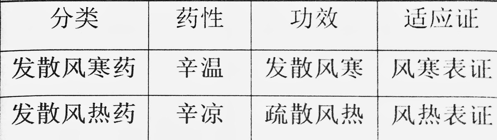
        - **发散风寒药**
            - **麻黄**
                - **药性**
                    - 辛、微苦，温
                - **功效、应用**
                    - **发汗解表**
                        - 风寒表实证 
                            - 即恶寒无汗，表寒重者
                        - 特点
                            - 辛温发汗力强
                    - **宣肺平喘**
                        - 咳喘证
                        - 特点
                            - 凡邪实之喘咳，肺气不宣者均可用
                            - 风寒束肺
                                - 兼发热恶寒
                                - 最宜用之
                            - 寒饮壅肺
                                - 兼形寒背冷，痰多清稀
                            - 肺热咳喘型
                                - 兼高热，喘急，胸闷
                    - **利水消肿**
                        - 风水证
                            - 水肿、小便不利兼有表证
                - **用法用量**
                    - 发汗解表，利水消肿
                        - 宜生用
                        - 解表用量宜小，2~5g
                    - 止咳平喘
                        - 多炙用
                        - 平喘利水用量可大，5~10g
                - **使用注意**
                    - 辛温发汗力强
                        - 表虚自汗、阴虚盗汗、虚证喘咳忌用
                    - 麻黄碱兴奋中枢作用
                        - 高血压、 心衰禁用
                        - 运动员慎用，失眠者慎用
            - **桂枝**
                - **药性**
                    - 辛、甘，温
                    - 归心、肺、膀胱经
                - **功效、应用**
                    - **发汗解肌——风寒表证**
                        - 风寒表实无汗者
                            - 与麻黄同用
                        - 风寒表虚有汗者
                            - 配芍药同用
                    - **温通经脉——寒凝血滞诸痛证**
                        - 胸痹
                            - 配薤白、枳实等
                        - 虚劳里急腹痛
                            - 配芍药、饴糖等
                        - 风寒湿痹，肩臂疼痛
                            - 配附子
                        - 血寒痛经、经闭
                            - 配当归、吴茱萸
                    - **助阳化气**
                        - 脾阳不运之痰饮
                            - 配白术、茯苓
                        - 膀胱气化不利之水肿
                            - 配茯苓、猪苓、泽泻
                            - 五苓散
                    - **平冲降逆**
                        - 心阳虚之心悸
                            - 配炙甘草、党参、麦冬
                            - 灸甘草汤
                        - 阴寒内盛， 上凌心胸之奔豚
                            - 桂枝加桂汤
                - **使用注意**
                    - 辛温助热，易伤阴动血
                        - 外感热病、阴虚火旺、血热妄行等证忌用
                    - 温通经脉
                        - 孕妇及月经过多者慎用
                - 麻黄与桂枝的比较
                    - **相同点**
                        - 均为辛温解表药，相须配用，则发汗力更强
                    - **不同点**
                        - **麻黄**
                            - 辛苦温，主入肺经
                            - 发汗力强
                                - 风寒表实无汗之证
                            - 宣肺平喘
                                - 实证喘咳
                                - 风寒束肺寒饮伏肺、肺热咳喘
                            - 利水消肿
                                - 风水水肿
                        - **桂枝**
                            - 辛甘温，入血分
                            - 发汗力弱
                                - 风寒表实无汗之证
                                - 风寒表虚有汗之证
                            - 温经通脉
                                - 寒凝血瘀的疼痛证
                            - 温阳通阳，化气
                                - 凡痰饮、水湿而致阳气不通，气化不行者
                            - 平冲降逆
                                - 心悸、奔豚
            - **紫苏**
                - **性味**
                    - 辛，温
                - **功效、应用**
                    - **发汗解表**
                        - 风寒表证
                            - 常与羌活、防风同用
                        - 特点
                            - 兼行气，气滞胸闷者尤宜
                    - **行气和胃**
                        - 行气宽中
                            - 脾胃气滞， 胸闷呕吐
                            - 与藿香、陈皮同用
                        - 理气安胎
                            - 妊娠呕吐， 胎动不安
                            - 与砂仁同用
                        - 理气化痰
                            - 痰凝气滞的梅核气
                            - 配伍半夏、厚朴
                    - **用于鱼蟹中毒，腹痛吐泻**
                - **用法**
                    - 不宜久煎
                    - 苏叶、苏梗功效相似
                        - **苏叶**
                            - 偏于发散风寒
                        - **苏梗**
                            - 偏于行气宽胸、安胎
            - **生姜**
                - **性味**
                    - 辛， 微温
                - **功效、应用**
                    - **发汗解表**
                        - 风寒表证中的轻证
                            - 感冒初期，用生姜红糖汤
                        - 特点
                            - 发汗作用弱
                                - 作为辛温发汗剂的辅助药
                    - **温中止呕——** **呕家圣药**
                        - 性温， 最宜于胃寒呕吐
                            - 配半夏
                        - 胃热呕吐亦可配伍用之
                            - 配黄连、竹茹
                        - 其它止呕药常用生姜汁制用
                            - 如姜半夏、姜竹茹
                    - **化痰止咳**
                        - 寒痰咳嗽
                    - **解鱼蟹毒**
                        - 鱼蟹中毒
                    - **解半夏、南星的毒**
                - 附药
                    - **生姜皮**
                        - 利水消肿
                        - 水肿， 小便不利
                    - **生姜汁**
                        - 功同生姜，偏于开痰止呕
                        - 便于临床应急服用
            - **香薷**
                - **性味**
                    - 辛，微温，芳香
                    - 芳香
                        - 能祛暑，化湿浊
                - **功效、应用**
                    - **发汗解表，化湿和中**
                        - 称其夏月麻黄
                        - 配厚朴、 扁豆
                        - 阴暑证
                        - 夏月乘凉饮冷，外感风寒，内伤暑湿，见恶寒发热、 头痛无汗、呕吐腹泻，脘腹胀满疼痛
                    - **利水消肿**
                        - 水肿脚气
                - **使用注意**
                    - 本品辛散耗气伤阴，发汗力较强
                        - 表虚有汗及阳暑证忌用
                        - 香薷为夏令解表散寒所常用，夏月之香薷犹冬月之麻黄，发汗较强，也有利水之功
                        - 香薷所治之暑病为夏月暑湿感寒之症，暑热证则非所宜
            - **荆芥、防风**
                - **相同点**
                    - 均辛，微温
                    - **祛风解表**
                        - 风寒表证
                            - 配羌活等
                        - 风热表证
                            - 配薄荷、连翘等
                    - 特点
                        - 均微温不燥，药性和缓
                        - 风寒、风热证均可相须为用
                - **不同点**
                    - **荆芥**
                        - **发汗力较大，透散力较强**
                            - 透疹
                                - 麻疹不透，风疹瘙痒
                            - 消疮
                                - 疮疡初起兼有表证
                        - **入血分，炒炭止血**
                            - 吐血、衄血、崩漏
                    - **防风**
                        - **特点**
                            - 祛风力较强，又可止痉
                                - **风病之通用药**
                            - **风药中润剂**
                        - **（祛风）胜湿止痛**
                            - 风寒挟湿表证
                            - 风寒湿痹痛
                        - **（息风）止痉**
                            - 破伤风
                        - **止泻**
                            - 肝郁脾虚之泄泻
            - **羌活、白芷、细辛、藁本**
                - **相同点**
                    - 均辛温
                    - **解表散寒，祛风止痛**
                        - 外感风寒
                        - 外风头痛
                        - 风湿痹痛
                - **不同点**
                    - **羌活**
                        - 辛温苦燥，气味浓烈，气雄而散
                        - **发汗力强，祛风除湿之力强**
                            - 风寒表证夹湿者
                                - 头痛项强，肢体酸痛
                        - **性升浮，走上**
                            - 善治风寒湿痹上半身疼痛者
                        - **主入太阳经**
                            - 善治太阳经头痛
                                - 头痛连及项背
                    - **白芷**
                        - 主入阳明经，治头面部疾患
                            - 善治阳明经头痛、牙痛
                                - 眉棱及前额疼痛
                        - **宣通鼻窍**
                            - 鼻鼽、鼻渊、鼻塞流涕
                        - **燥湿止带**
                            - 带下过多
                        - **消肿排脓**
                            - 疮痈肿毒，未成脓或成脓均可，为外科常用药
                    - **藁本**
                        - 辛温香燥，性味俱升，上达巅顶
                            - **巅顶头痛**
                    - **细辛**
                        - 辛温，有小毒
                        - **散寒力强**
                            - 一般表证少用
                            - 风寒表证，表寒重，恶寒身痛者
                            - 阳虚外感可配伍用之
                        - **止痛力强**
                            - 善治寒邪引起的痛证
                                - 如头痛、牙痛，风寒湿痹痛等
                        - **通窍**
                            - 鼻鼽、鼻渊、鼻塞流涕
                        - **温肺化饮**
                            - 寒饮伏肺的咳喘
                            - 常与干姜同用
                        - **用量用法**
                            - 有小毒，用量不宜过大，过量则呼吸麻痹，导致死亡
                            - **“辛不过钱”**
                                - 入煎剂：1~3克
                                - 入散剂：0.5~1克
                            - **细辛中毒的主要原因**
                                - 散剂用量过大
                                - 汤剂煎煮时间过短
                            - 阴虚阳亢头痛，肺燥伤阴干咳者忌用
                            - 不宜与藜芦同用
            - **苍耳子、辛夷**
                - **共同点**
                    - 均辛温
                    - **散风寒**
                        - 风寒感冒
                    - **通鼻窍**
                        - 治鼻渊的主药
                - **不同点**
                    - **苍耳子**
                        - 辛苦温，有毒
                        - 又祛风湿、止痛
                            - 风湿痹痛，风疹瘙痒
                    - **辛夷**
                        - 性上达，治鼻鼽、鼻渊、鼻塞流涕要药
                - **注意**
                    - 苍耳子有一定毒性
                        - 主要为肾、肝功能损害
                    - 苍耳子中毒的主要原因
                        - 用量过大
                            - 一次超过30g或10枚
                            - 入汤剂以3 ~9g为宜
                        - 炮制不当
                            - 要遵循去刺的原则
            - **[附]** 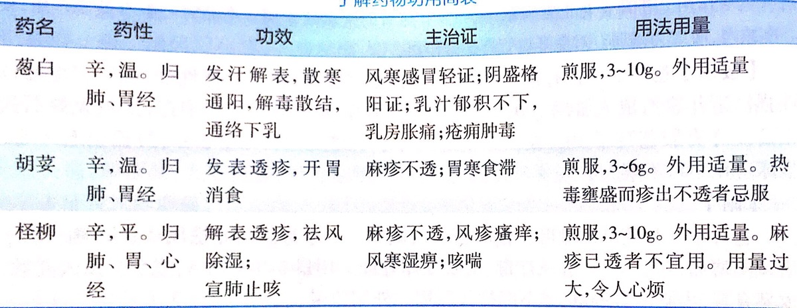
        - **发散风热药**
            - **薄荷、牛蒡子、蝉蜕**
                - **相同点**
                    - **疏散风热**
                        - 风热感冒或温病初起，发热头痛
                    - **利咽**
                        - 风热上攻，咽喉肿痛
                    - **透疹**
                        - 麻疹初起及风疹瘙痒（脱敏作用）
                - **不同点**
                    - **薄荷**
                        - 辛凉，质轻芳香
                        - **辛散之性较强，发汗力较强**
                            - 风热表证发热无汗者多用之，如银翘散
                        - **清利头目、利咽**
                            - 风热上攻的头痛眩晕、目赤多泪、咽喉肿痛宜用
                        - **疏肝行气**
                            - 肝郁气滞，胸闷胁痛
                        - **用法用量**
                            - 3~6g
                            - 宜后下
                            - 体虚多汗、阴虚血燥者慎用
                    - **牛蒡子**
                        - **长于宣肺、清热**
                        - **善宣肺透疹**
                            - 麻疹初起、风疹瘙痒多用
                        - **善解毒利咽**
                            - 热毒证，如疮痈肿毒、痄腮、喉痹等证
                        - **兼滑肠通便，大便不通者尤宜**
                            - 炒用可使其苦寒及滑肠之性略减
                    - **蝉蜕**
                        - **疏散肝经风热**
                        - **明目退翳**
                            - 风热上攻，目赤翳障
                        - **解痉**
                            - 惊风抽搐、破伤风
                            - 需大量
            - **桑叶、菊花**
                - **相同点**
                    - **疏散风热**
                        - 风热感冒或温病初起，发热头痛咳嗽
                        - 常配薄荷
                    - **平抑肝阳**
                        - 肝阳上亢之头痛眩晕
                    - **清肝明目**
                        - 肝经风热或肝火上炎之目赤肿痛
                        - 肝肾不足之目暗昏花
                - **不同点**
                    - **桑叶**
                        - **疏散风热之力较强**
                        - **善于清肺润燥**
                            - 肺热燥咳
                        - **兼能凉血止血**
                            - 血热吐衄
                        - **用法**
                            - 蜜制桑叶
                                - 能增强润肺止咳的作用，故肺燥咳嗽多用
                    - **菊花**
                        - **平肝、清肝之力较强**
                        - **清热解毒**
                            - 疔疮肿毒
                        - **黄、白菊花的功效重点**
                            - 黄菊花
                                - 偏于疏散风热
                            - 白菊花
                                - 偏于平肝、清肝
            - **蔓荊子**
                - **疏散风热，清利头目**
                    - 风热感冒，头昏头痛
                    - 目赤肿痛，齿龈肿痛，目黯不明，耳聋耳鸣
            - **柴胡、升麻、葛根**
                - **相同点**
                    - 均为辛凉之品，药性升浮
                    - **解表退热**
                        - 外感发热， 风热表证
                    - **两两相同点**
                        - **柴胡、升麻**
                            - **升举阳气**
                                - 药性上升，能升举下陷之阳气
                                - 适用于中气下陷证，如久泻脱肛、子官脱垂、胃下垂等
                            - 升麻升提之力较柴胡强
                        - **升麻、葛根**
                            - **透发麻疹**
                                - 麻疹初起，透发不畅
                - **不同点**
                    - **柴胡**
                        - **主入肝胆经**
                            - 外感发热——退热
                            - 善于和解少阳
                                - 偏于解半表之邪
                                - **少阳证**
                                    - 寒热往来、胸胁苦满、口苦咽干等
                            - 又退热截疟一一疟疾寒热
                        - **疏肝解郁**
                            - 肝郁气滞证
                                - 月经不调、胸胁疼痛
                    - **升麻**
                        - **入脾胃经** **清解阳明热毒**
                        - **清热解毒——阳明热毒证**
                            - 牙龈肿痛、口疮、咽喉肿痛
                            - 丹毒、痄腮、阳毒发斑
                    - **葛根（生）**
                        - **解肌退热**
                            - 外感表证
                                - 项背强痛
                            - 风热表证或风寒表证均可
                        - **主入阳明经胃经，升发清阳**
                            - 生津止渴
                                - 热病烦渴
                                - 阴虚消渴
                            - 升阳止泻
                                - 热泄热痢
                                - 脾虚泄泻
                                    - 煨葛根
                        - **通经活络**
                            - 中风偏瘫、胸痹心痛
                            - 眩晕头痛
                                - 扩血管、降压
                        - **解酒毒**
                            - 酒毒伤中
                            - 葛花
            - **淡豆豉**
                - **性味**
                    - 苦、辛，凉
                    - 趋向升浮
                    - 归肺、胃经
                - **功效、应用**
                    - **解表除烦**
                        - 烦躁胸闷，虚烦不眠
                    - **宣发郁热**
                        - 感冒，寒热头痛
            - **[附] 浮萍、木贼、谷精草** 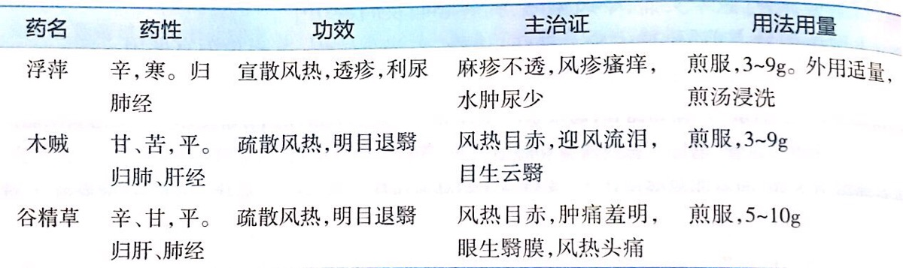
    - 配伍原则
        - **根据四时气候变化进行选择、配伍用药**
            - 冬季多风寒
            - 春季多风热
            - 夏季多夹暑湿
            - 秋季多兼燥邪
            - 故在选择发散风寒药多风热，或发散风热药的同时，还要注意
                - 配伍祛暑化湿药
                - 配伍润燥药
        - **根据体质的不同进行配伍**
            - **虚人外感**
                - 要根据正虚的不同，分别配伍补气、助阳、滋阴等补益药以扶正祛邪
        - **温病初起，邪在卫分**
            - 除选择发散风热药以外，要同时配伍清热解毒药
    - 使用注意
        - 辛散发汗，易耗散阳气，损伤津液，又血汗同源
            - 《伤寒论》“汗家、 疮家、亡血家不可汗”
        - 解表药发汗力强者一般中病即止，以免发汗太过伤津、伤阳
        - 入煎不宜久煎
            - 辛散轻扬之品，易于挥发
        - 用量应因时、因地制宜
        - 服药后宜覆被取汗，不可吹风
    - 解表药兼有功效归纳 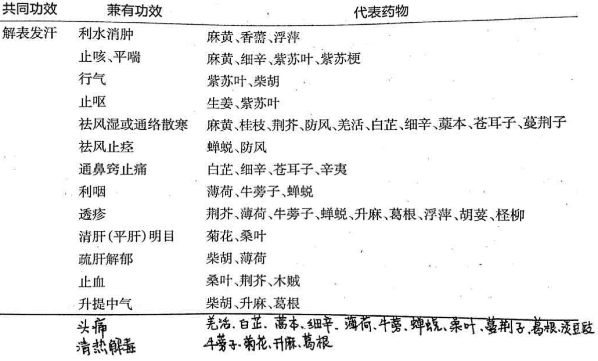
- **第二章 清热药**
    - 定义
        - **清解里热** **里热证**
            - 注意
                - **表热** **里热**
                - **实热证** **虚热证**
    - 药性特点
        - 药性寒凉
        - 遵循《内经》“热者寒之”及《本经》“疗热以寒药”的原则，用寒凉药治疗里热证
    - 功效与适应证
        - 清解里热
        - **里热证**
    - 分类
        - **清热泻火药**
            - **清气分实热，泻脏腑之火**
                - 温病邪入气分，高热烦渴等
                - 脏腑（心、肺、胃、肝）火热证
            - **按脏腑辨证划分**
                - **善清肺胃热的药物**
                    - **石膏、知母**
                        - **相同点**
                            - **清热泻火，除烦止渴**
                                - 气分实热证
                                - 壮热、口渴、汗出、脉洪大
                            - **肺热咳喘**
                            - **胃热牙龈肿痛**
                            - 皆为清气分实热、清肺胃火热之主药，二者常相须配伍同用
                        - **不同点**
                            - **石膏**
                                - 辛甘大寒
                                - **清热泻火力强**
                                    - 重在清解，偏重清肺胃实火
                                    - 肺热喘咳
                                        - 麻黄、杏仁等
                                    - 胃火牙龈肿痛
                                        - 升麻、黄连等
                                - **煅石膏外用，又收敛生肌**
                                    - 疮疡不敛、湿疹、水火烫伤等证
                                        - 黄连、青黛等
                                - 用量：15～60g
                            - **知母**
                                - 苦甘寒，质润
                                - **清肺胃实热及气分实热力逊**
                                - **滋阴润燥力强，重在清润**
                                    - 滋润肺胃之燥
                                        - 阴虚燥咳、阴虚消渴
                                    - 滋肾降火（归肾经）
                                        - 盐水炙
                                        - 阴虚火旺、骨蒸潮热
                                        - 知柏地黄丸
                                    - 润肠通便
                                        - 肠燥便秘
                    - **芦根、天花粉**
                        - **相同点**
                            - **清热泻火，生津止渴**
                                - 肺热咳嗽
                                - 热病津伤口渴
                            - 甘寒，能清透肺胃气分实热，并能生津止渴，但无养阴药恋邪之弊
                        - **不同点**
                            - **芦根**
                                - **清热作用较强——肺痈**
                                    - 苇茎汤
                                    - 清胃止呕
                                        - 胃热呕吐
                                    - 利尿
                                        - 小便短赤，热淋涩痛
                                - **用量**
                                    - 15～30g
                                    - 鲜芦根：30～60g
                            - **天花粉**
                                - **生津作用较强——消渴**
                                    - 又润肺燥
                                        - 肺燥咳嗽
                                    - 消肿排脓
                                        - 痈肿疮毒
                                - 脾胃虚寒、大便溏泄者、孕妇慎用
                                - 不与乌头同用
                    - **鸭跖草**
                - **善清心火的药物**
                    - **竹叶、淡竹叶**
                        - **相同点**
                            - **清热除烦，利尿**
                                - 热病烦渴， 口疮尿赤
                        - **不同点**
                            - **竹叶**
                                - **长于清心、胃之火**
                                    - 热病心烦口渴
                                    - 竹叶卷心
                            - **淡竹叶**
                                - **长于清热利尿**
                                    - 热淋涩痛，水肿，黄疸
                    - **栀子**
                        - **性味**
                            - 辛、苦，寒
                            - 归肝、胆经
                        - **功效、应用**
                            - **泻火除烦**
                                - 热病烦渴
                                    - 本品苦寒清降，清泻三焦火邪，善清心除烦
                            - **清热利湿**
                                - 湿热黄疸
                                - 茵陈、大黄
                            - **凉血止血**
                                - 血热吐衄
                                - 焦栀子
                            - **解毒消肿**
                                - 疮疡肿毒，跌打损伤
                        - **用法用量**
                            - 6～10g
                            - 生用多走气分面泻火
                            - 炒用可缓和其苦寒
                            - 炒焦多入血分而止血
                        - **使用注意**
                            - 苦寒伤胃，阴血亏虚，脾虚便溏者不宜用
                - **善清肝火的药物**
                    - **夏枯草、决明子**
                        - **相同点**
                            - **清肝泻火、明目**
                                - 肝火上炎证
                                    - 目赤肿痛，头痛眩晕
                        - **不同点**
                            - **夏枯草**
                                - **清肝火力强，长于散郁结**
                                    - 瘰疬、瘿瘤
                                    - 乳痈、乳癖
                                - 9～15g
                            - **决明子**
                                - **明目佳品**
                                - **润肠通便**
                                    - 肠燥便秘
                    - **密蒙花、青葙子** 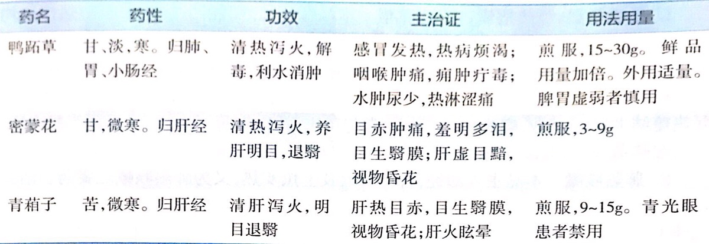
        - **清热燥湿药**
            - **清解、燥化湿热之邪**
                - 湿温、暑湿、泻痢、黄疸等湿热病证
                    - 湿温/暑温夹湿
                        - 身热不扬、胸脘痞闷、小便短赤
                    - 脾胃湿热
                        - 脘腹胀满、恶心呕吐
                    - 大肠湿热
                        - 泄泻、痢疾、里急后重
                    - 肝胆湿热
                        - 黄疸尿赤、胁肋疼痛、耳肿流脓
                    - 下焦湿热
                        - 带下色黄，或热淋涩痛
                    - 湿热流注关节
                        - 关节红肿热痛
                    - 湿热浸淫肌肤
                        - 湿疹湿疮
                    - 以上湿热诸证多见舌苍黄腻
            - **黄芩、黄连、黄柏**
                - **相同点**
                    - 均苦寒
                    - **清热燥湿**
                        - 湿热证
                            - 如泻痢，黄疸，湿疹湿疮
                    - **清热泻火**
                        - 三焦热盛证
                    - **清热解毒**
                        - 火毒证
                            - 如疮痈肿痛等
                - **不同点**
                    - **黄连**
                        - **清热燥湿力强，偏于中焦**
                            - 肠胃湿热泻痢首选
                        - **清热力强，善清心、胃、肝火**
                            - 清心除烦
                                - 热盛火炽， 高热烦燥
                                - 黄连解毒汤
                            - 清胃止呕
                                - 胃火炽盛之呕吐，牙痛，消谷善饥
                            - 兼清肝火
                                - 肝火犯胃，肝胃不和之呕吐吞酸
                        - 用量：2～5g
                    - **黄芩**
                        - **作用偏于上焦，善清肺、胆火**
                            - 肺热咳嗽
                            - 邪在少阳之寒热往来
                                - 柴胡
                        - **凉血止血**
                            - 热证出血
                            - 黄芩炭
                        - **除热安胎**
                            - 胎热不安
                        - 用法用量
                            - 3～10g
                            - 清热多生用
                            - 安胎多炒用
                            - 清上焦热可酒炙用
                            - 止血可炒炭用
                    - **黄柏**
                        - **苦寒趋下，尤善清下焦湿热**
                            - 湿热下注之热淋，带下，脚气足膝肿痛及湿热痿躄
                        - **长于清相火、退虚热**
                            - 阴虚发热，遗精盗汗等
                - **使用注意**
                    - **大苦大寒，过服久服易伤脾胃**
                        - 苦寒败胃
                        - 脾胃虚寒者忌用
                    - **苦燥伤津**
                        - 阴虚津伤者慎用
            - **龙胆**
                - **性味**
                    -  苦，寒
                - **功效、应用**
                    - **清热燥湿**
                        - 本品大苦大寒，尤善清下焦湿热
                        - 湿热黄疸，阴肿阴痒，带下黄稠，湿疹瘙痒
                            - 黄柏、苦参
                    - **泻肝胆火**
                        - 肝胆火旺证
                            - 胁痛、头痛、目赤、耳聋，口苦
                            - 柴胡、黄芩等
                            - 龙胆泻肝汤
                        - 热极生风
                            - 高热惊厥，手足抽搐
                            - 牛黄、钩藤等
                    - **用法用量**
                        - 3～6g
                    - **使用注意**
                        - 脾胃虚弱者不宜用，阴虚津伤者慎用
            - **苦参**
                - **性味**
                    - 苦，寒
                - **功效、应用**
                    - **清热燥湿**
                        - 湿热泻痢，黄疸尿赤
                        - 善清下焦湿热
                    - **杀虫止痒**
                        - 带下阴痒，湿疹疥癣
                        - 内服外洗
                    - **利尿**
                        - 湿热淋痛，尿闭不通
                - **用法用量**
                    - 4.5～9g
                - **使用注意**
                    - 不宜与藜芦同用
                    - 脾胃虚寒者禁用
            - **秦皮**
            - **白鲜皮**
        - **清热解毒药**
            - **清热解毒**
                - 温热病热毒炽盛
                - 热毒痈肿疮疡，毒蛇咬伤
            - **金银花、连翘**
                - **相同点**
                    - **疏散风热**
                        - 外感风热、温病初起
                        - 热入营血
                    - **清热解毒**
                        - 热毒疮疡、喉痹、丹毒
                        - 脱疽
                    - 既能透热达表，又能清里热而解毒，常相须为用
                - **不同点**
                    - **金银花**
                        - **疏散表热之效优**
                        - **炒炭后，善于凉血止痢**
                            - 热毒血痢
                        - **制露剂，清解暑热**
                            - 外感暑热
                    - **连翘**
                        - **清心解毒之力强，并善于消肿散结**
                            - 瘰疬痰核，乳痈
                        - 为“疮家圣药”
            - **穿心莲**
                - **性味**
                    -  苦，寒
                - **功效、应用**
                    - **清热解毒，凉血消肿**
                        - 外感风热，温病初起
                        - 咽喉肿痛，口舌生疮
                        - 肺热咳喘，肺痈吐脓
                            - 善清肺火
                        - 痈肿疮毒，蛇虫咬伤
                    - **清热燥湿**
                        - 湿热诸证
                        - 如湿热泻痢、湿热淋证、湿疹瘙痒
                - **用法用量**
                    - 6～9g
                    - 因本品味极苦，煎剂易致恶心呕吐，故现多作丸、片剂服用
            - **大青叶、板蓝根、青黛**
                - **相同点**
                    - 三者大体同出一源，功效亦相近
                    - **清热解毒，凉血消斑**
                        - 热入营血，高热、温毒发斑
                        - 痈肿疮毒，痄腮，丹毒
                - **不同点**
                    - **大青叶**
                        - **凉血消斑力强**
                    - **板蓝根**
                        - **解毒利咽效著**
                            - 温疫时毒，发热咽痛，痄腮
                    - **青黛**
                        - **泻（肝）火定惊**
                            - 肝火犯肺，胸痛咯血
                                - 黛蛤散
                            - 小儿惊痫
                        - 1～3g，常外用
            - **贯众**
                - **药性**
                    - 苦，微寒
                - **功效、应用**
                    - **清热解毒、凉血**
                        - 风热表证，温热病，热毒斑疹，痄腮
                    - **凉血止血**
                        - 血热出血
                        - 炒炭用兼能收涩止血
                    - **驱虫**
                - **用法用量**
                    - 5～10g
                    - 清热解毒宜生用
                    - 止血宜炒炭用
                - **使用注意**
                    - 有小毒，用量不宜过大
                    - 服用本品时忌油腻
                    - 孕妇、脾胃虚寒者慎用
            - **蒲公英、紫花地丁**
                - **相同点**
                    - **清热解毒、消肿散结**
                        - 热毒疮痈、肺痈、肠痈、乳痈
                - **不同点**
                    - **蒲公英**
                        - **善治痈肿、乳痈**
                        - **利湿通淋**
                            - 热淋涩痛、 湿热黄疸
                    - **紫花地丁**
                        - **味兼辛，散结力优**
                        - **善疗疔疮、解蛇毒**
                        - 15～30g
            - **野菊花**
            - **漏芦**
                - **性味**
                    - 苦，寒
                - **功效、应用**
                    - **清热解毒，消散痛肿**
                        - 热毒疮痈，乳痈
                    - **清热解毒，通经下乳**
                        - 产后乳房胀痛，乳汁不下
                    - **舒筋通脉**
                        - 湿痹拘挛
                - **用法用量**
                    - 5～9g
            - **土茯苓**
                - **性味**
                    - 甘、淡，平
                - **功效、应用**
                    - **解毒，除湿通利关节**
                        - 为治梅毒的要药
                            - 梅毒或汞剂中毒而致肢体拘挛、筋骨疼痛
                        - 热淋、阴痒带下疥癣、湿疹
                        - 痈肿、瘰疬
                - **用法用量**
                    - 15～60g
            - **鱼腥草**
                - **性味**
                    - 辛，微寒
                - **功效、应用**
                    - **清热解毒，消痈排脓**
                        - 清肺见长，治疗肺痈之要药
                        - 肺痈咳吐脓血
                            - 配桔梗、芦根等
                        - 肺热咳嗽
                            - 配黄芩、贝母、知母等
                        - 热毒疮毒
                            - 鲜品捣烂外敷
                    - **利尿通淋**
                        - 湿热淋证
                        - 配车前草、白茅根、海金沙等
                - **用法用量**
                    - 15～25g
            - **金荞麦**
            - **大血藤、败酱草**
                - **相同点**
                    - **善治肠痈**
                        - 清热解毒，消痈排脓
                            - 薏苡附子败酱散
                        - 活血化瘀
                - **不同点**
                    - **红藤**
                        - **活血**
                            - 跌打损伤、风湿痹痛、经闭痛经
                        - 9～15g
                    - **败酱草**
                        - **祛瘀止痛**
                            - 产后瘀阻腹痛
                        - 15～30g
            - **射干、山豆根、马勃**
                - **相同点**
                    - **清热解毒、利咽（长于清利咽喉）**
                        - 咽喉肿痛常用药
                - **不同点**
                    - **射干**
                        - 苦寒，又祛痰
                        - **尤适于热毒痰火郁结之咽喉肿痛**
                        - **痰多咳喘**
                            - 热痰、寒痰咳喘均可配伍应用
                    - **山豆根**
                        - 苦寒，有毒。泻火力强，又消肿
                        - **为热毒蕴结，咽喉肿痛的要药**
                        - **火热上炎，牙龈肿痛，口舌生疮**
                        - 广豆根含苦参碱、氧化苦参碱对癌症有抑制作用
                        - 3～6g（有毒）
                    - **马勃**
                        - **辛平，清热力弱，兼散肺经风热**
                            - 风热、肺火咽喉肿痛，咳嗽失音
                        - **止血**
                            - 吐血衄血、外伤出血
                        - 2～6g
            - **白头翁、马齿苋、鸦胆子、地锦草**
                - **相同点**
                    - **清热解毒，凉血止痢**
                        - 热毒血痢
                - **不同点**
                    - **白头翁**
                        - **善清肠胃湿热及血分热毒，为治热毒血痢要药**
                            - 白头翁汤
                        - **外洗，用于阴痒带下**
                        - 6～15g
                    - **马齿苋**
                        - **凉血止血**
                            - 血热崩漏、便血、痔血
                                - 便血——近血
                        - **清热解毒**
                            - 热毒疮疡、丹毒
                        - 15～30g
                    - **鸦胆子**
                        - **又可治冷积久痢**
                        - **杀虫截疟**
                            - 各型疟疾
                        - **腐蚀赘疣**
                            - 鸡眼赘疣
                        - 0.5～2g，龙眼肉或胶囊包裹
                    - **地锦草**
                        - **凉血止血**
                            - 血热出血
                        - **清热解毒**
                            - 热毒疮疡，毒蛇咬伤
                        - **利湿退黄**
                            - 湿热黄疸
                        - 9～20g
            - **半边莲、白花蛇舌草、山慈菇**
                - **相同点**
                    - **清热解毒**
                        - 痈疽发背，疗疮肿毒，毒蛇咬伤
                    - **蛇舌草、山慈菇——抗肿瘤**
                        - 各种肿瘤的防治
                - **不同点**
                    - **半边莲**
                        - **利水消肿**
                            - 腹胀水肿， 黄疸尿少
                        - 10～15g
                    - **白花蛇舌草**
                        - **利湿通淋**
                            - 热淋涩痛
                        - 15～60g
                    - **山慈菇**
                        - **化痰散结**
                            - 瘰疬痰核：癥瘕积聚
                            - 对甲状腺瘤效好
                        - 3～9g
            - **熊胆粉**
                - **性味**
                    - 苦，寒
                - **功效、应用**
                    - **清热解毒**
                        - 热毒蕴结所致之疮疡痈疽、痔疮肿痛、咽喉肿痛等
                    - **息风止痉**
                        - 热极生风， 惊痫抽搐
                    - **清肝明目**
                        - 目赤翳障
                - **用法用量**
                    - 1～2g，多入丸散
            - **[附] 蚤休、白蔹、四季青** 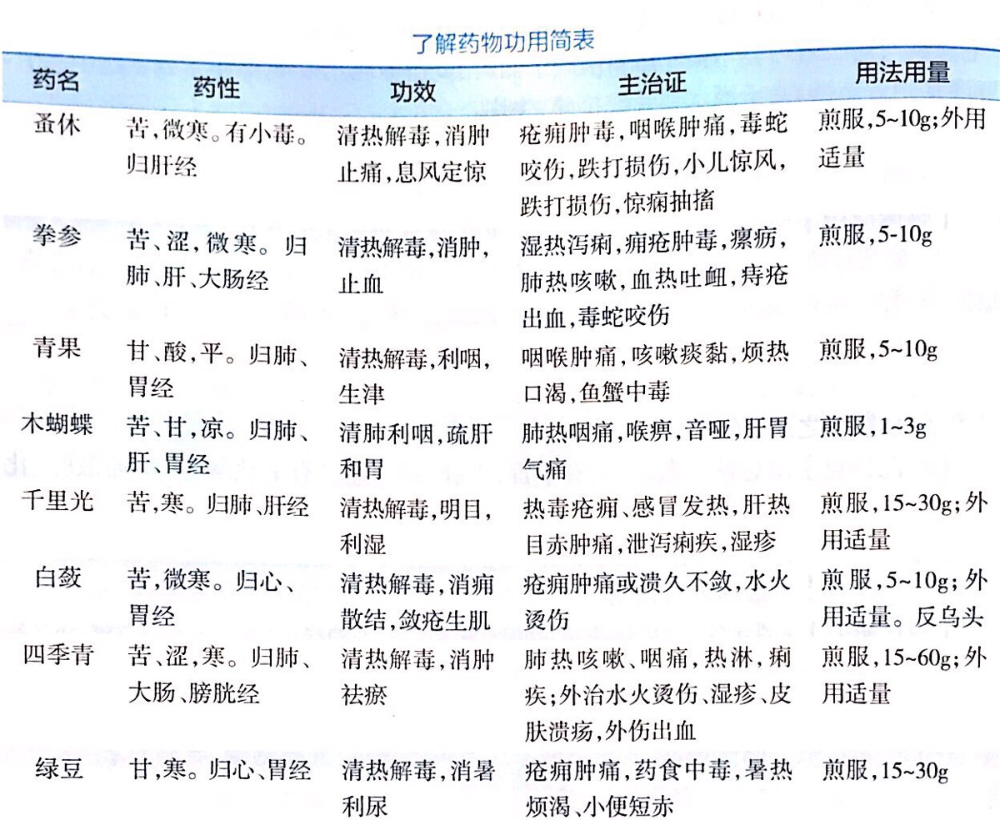
        - **清热凉血药**
            - 咸寒、甘寒或苦寒，入血分
            - **清解营分、血分热邪**
                - 热入营血及吐、衄、发斑等血分实热证
                    - 卫分：绛舌
                    - 营分：发斑
                    - 血分：出血
            - **生地黄、玄参（元参）**
                - **相同点**
                    - **均甘苦寒，清热凉血、滋阴**
                        - 热入营血，口干、舌绛
                            - 清营汤
                        - 温邪伤阴，肠燥便秘
                            - 增液汤
                        - 阴虚发热，骨蒸劳热
                        - 内伤消渴
                - **不同点**
                    - **生地**
                        - **滋阴生津作用强**
                        - **凉血止血**
                            - 血热妄行，吐血、衄血、便血、斑疹等
                    - **玄参**
                        - **泻火力强，解毒散结**
                            - 咽痛 、瘰疬、痰核、脱疽等
                            - 消瘰丸
                - **副作用**
                    - **甘寒助湿**
                        - 甘寒的清热药兼有养阴生津作用，易恋邪助湿
                        - 不宜早用，早用则易恋邪，引邪深入
                        - 湿热证忌用
                    - 10～15g，玄参反藜芦
            - **牡丹皮、赤芍**
                - **相同点**
                    - 性寒，入血分
                    - **均能清热凉血，活血散瘀**
                        - 血热证、血瘀证，血热瘀滞者最宜
                        - 热入营血
                            - 高热，斑疹紫暗，血热吐衄
                        - 血瘀
                            - 经闭痛经、癥瘕、跌打损伤
                        - 热毒
                            - 痈肿疮毒
                - **不同点**
                    - **牡丹皮**
                        - **清热凉血力强，可用于肠痈腹痛**
                            - 大黄牡丹皮汤
                        - **又善清透阴分伏热**
                            - 温邪伤阴，阴虚发热
                    - **赤芍**
                        - **活血散瘀力强**
                            - 血瘀诸证多用
                            - 但不能清虚热
                        - **主入肝经，又能清泻肝火**
                            - 善治肝热目赤翳障
                            - 肝郁化火胁痛
                        - 6～12g，血虚经闭者不宜用， 不宜与藜芦同用
            - **紫草**
                - **性味**
                    - 甘、咸，寒
                - **功效、应用**
                    - **凉血活血，解毒透疹**
                        - 血热毒盛，斑疹紫黑，麻疹不透
                    - **清热解毒，清热凉血，活血消肿**
                        - 疮疡，湿疹，水火烫伤
                - **用法用量**
                    - 5~10g
                - **使用注意**
                    - 性寒而滑利，脾虚便溏者忌服
            - **水牛角**
                - 代古方犀角
                - **性味**
                    - 苦，寒
                - **功效、应用**
                    - **清热凉血，解毒，定惊**
                        - 温热病热入血分，壮热神昏，舌绛脉数，或见斑疹
                        - 血热妄行的吐血、衄血
                        - 痈肿疮疡，咽喉肿痛
                - **用法用量**
                    - 15～30g，先煎3小时以上
                - **使用注意**
                    - 脾胃虚寒者忌用
        - **清虚热药**
            - **甘寒，清虚热、退骨蒸**
                - 阴虚发热，骨蒸潮热
                - 热病后期，温邪伤阴，夜热早凉
            - **青蒿**
                - **性味**
                    - 苦、辛，寒
                - **功效、应用**
                    - **清虚热，除骨蒸**
                        - 温邪伤阴，夜热早凉
                            - 整甲、知母、丹皮、生地
                        - 阴虚发热，劳热骨蒸
                            - 银柴胡、鳖甲
                    - **解暑**
                        - 暑热外感，发热口渴
                            - 连翘、滑石、西瓜翠衣
                            - 清凉涤暑汤
                    - **截疟**
                        - 疟疾寒热
                            - 单用较大剂量鲜品捣汁服
                - **用法用量**
                    - 6～12g，不宜久煎，或鲜用绞汁服
                - **使用注意**
                    - 脾胃虚弱,肠滑泄泻者忌服
            - **白薇**
                - **性味**
                    - 苦、咸，寒
                - **功效、应用**
                    - **清虚热，凉血**
                        - 本品苦寒，善入血分，有清热凉血，益阴除热之功
                        - 阴虚发热
                            - 地骨皮、知母、青高等
                        - 产后血虚发热
                            - 当归、人参、甘草
                        - 温邪入营，高热神昏
                            - 生地黄、玄参
                        - 肺热咳嗽：阴虚外感
                            - 黄芩、玉竹、薄荷
                    - **利尿通淋**
                        - 热淋，血淋
                        - 木通、滑石、石韦等同用
                    - **解毒敛疮**
                        - 疮痈肿毒，咽喉肿痛，毒蛇咬伤
                        - 内服、外敷均可，常与天花粉、赤芍、甘草等同用
            - **地骨皮**
                - **功效、应用**
                    - **凉血除蒸**
                        - 本品甘寒清润，清肝肾之虚热，除有汗之骨蒸
                        - 阴虚发热，盗汗骨蒸
                        - 知母、银柴胡（清骨散）
                    - **凉血止血**
                        - 血热出血证
                        - 吐血、衄血、尿血等
                    - **清肺降火（肺中伏火）**
                        - 肺热咳嗽
                        - 桑白皮、甘草等（泻白散）
                    - **生津止渴一内热消渴**
                        - 与生地黄、天花粉、五味子等同用
            - **银柴胡、胡黄连**
                - **相同点**
                    - **退虚热——骨蒸潮热**
                        - 地骨皮（清骨散）
                    - **除疳热——小儿疳热**
                        - 小儿食滞或虫积所致的疳积发热，腹部膨大，口渴消瘦，毛发焦枯
                        - 鸡内金、使君子
                - **不同点**
                    - **胡黄连**
                        - **清湿热——湿热泻痢**
                        - 黄芩、黄柏、白头翁
    - 使用注意
        - **苦寒败胃**
            - 药性苦寒，易伤脾胃，出现食欲减退，恶心呕吐，腹泻等副作用
            - 凡脾胃虚寒，食少便溏者慎用
            - 不宜过量或服用时间过长
        - **苦燥伤阴**
            - 热证易伤津液，苦寒药物又易化燥伤阴
            - 
        - **甘寒助湿**
            - 甘寒的清热药兼有养阴生津作用，易恋邪助湿
            - 不宜早用，早用则易恋邪，引邪深入
            - 湿热证忌用
        - 阴盛格阳，真寒假热之证，禁用清热药
    - 如何选用清热药 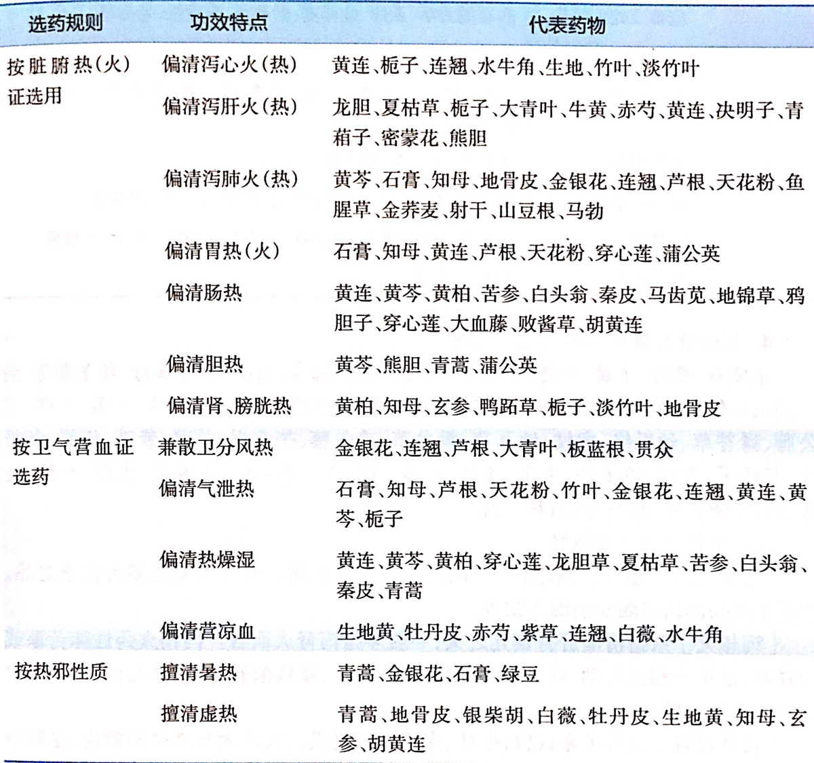
    - 清热药兼有功效归纳 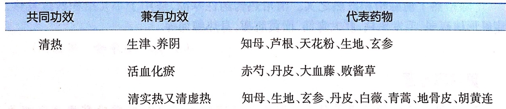
    - 清热解毒药兼有功效归纳 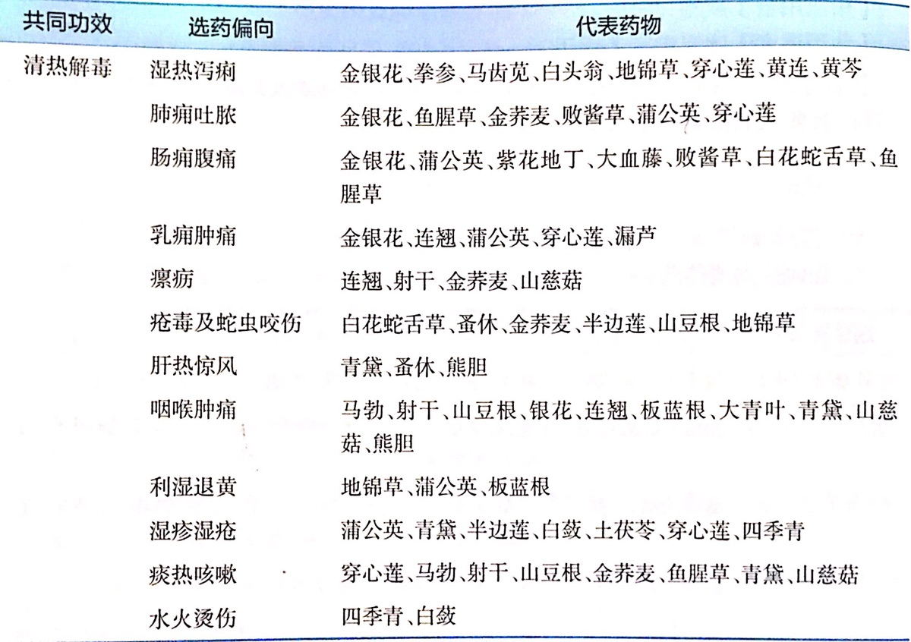
- **第三章 泻下药**
    - 定义
        - **泻下通便** **里实积滞证**
        - 通便
            - 排便次数增加
            - 便质变稀、软，甚至水样
    - 药性特点
        - 多苦寒，药性沉降
        - 归大肠经
    - 功效与适应症
        - **泻下攻积**
            - 便秘（燥屎＋实热或实寒）
            - 其它肠腑积滞证（湿热、痰、瘀、虫）
        - **清热泻火**
            - 实热内蕴，火毒炽盛证
            - 不论有无便秘，均可导热下行，起到釜底抽薪作用
        - **逐水退肿**
            - 水饮停蓄证
            - 如大腹水肿，悬饮、臌胀
    - 分类
        - **攻下药**
            - 泻下力较强，性多苦寒、成寒
            - **泻下积滞，清热泻火**
                - 肠腑积滞（实秘）
                    - 热秘，寒秘，虫积血瘀
                - 外感热病高热神昏谵语
                    - 火热上炎证
            - **大黄（将军）**
                - **药性**
                    - 苦、寒
                    - 归脾、胃、大肠、肝、心包经
                - **功效、应用**
                    - **泻下攻积**
                        - 大便秘结，胃肠积滞证
                            - 大黄苦寒，有较强的泻下通便、涤胃肠积作用，为治疗积滞便秘之要药
                        - 热结便秘
                            - 与行气药配用，可加强泻下，减轻腹胀腹痛
                            - 承气汤
                        - 热泻热痢
                            - **积滞**
                            - “通因通用”
                            - 芍药汤
                        - 冷积便秘
                            - 配附子、干姜等温里药
                            - “去性取用”
                    - **清热泻火、凉血解毒**
                        - 本品苦降，能使上炎之火下泄，具清热火、凉血止血之功
                            - 火热上攻诸证
                                - 目赤肿痛，头痛，咽痛，牙龈肿痛，颜面丹毒等
                                - 凉膈散
                            - 血热妄行的吐血、衄血
                        - 内服能清热解毒，并借其泻下通便作用，使热毒下泄，外用能清热解毒、消肿块
                            - 热毒疮疡，肠痈
                                - 配清热解毒药，内服外敷
                            - 烧烫伤
                                - 可研末调敷
                    - **祛瘀通经**
                        - 瘀血阻滞诸证
                            - 产后瘀滞腹痛、恶露不尽
                            - 血瘀经闭
                            - 跌打损伤，瘀血肿涌
                    - **清泄湿热**
                        - 黄疸，淋证等下焦湿热病证
                        - 本品苦寒降泄，可配伍清泄湿热药
                        - 八正散
                - **用法用量**
                    - 3～15克；如治急腹症时，可用至20克左右，甚至1日2～3剂
                    - **生用**
                        - 后下或开水泡服，泻下力强
                        - 重症、急病、体质强
                    - **熟用**
                        - 同煎，泻下力减弱
                        - 轻病、慢性病、体质弱
                - **使用注意**
                    - 峻烈攻下之品，易伤正气
                        - 非实证不宜妄用
                    - 性沉降，善活血
                        - 产前忌用
                        - 产后、月经期、哺乳期慎用
                    - 苦寒败胃
                        - 脾胃虚寒慎用
            - **芒硝**
                - **药性**
                    - 咸、苦，寒
                - **功效、应用**
                    - **泻下通便、润燥软坚**
                        - 热结便秘，大便燥结
                        - 常与大黄配伍，以增强泻下热
                    - **清热消肿（外用为主）**
                        - 痈肿乳痛
                        - 咽痛、口疮要药
                            - 制成西瓜霜
                            - 配冰片、硼砂
                        - 目赤肿痛
                - **用法用量**
                    - 6～12g
                - **使用注意**
                    - 孕妇慎用
                    - 不宜与硫黄、三棱同用
            - **番泻叶**
                - **功效、应用**
                    - **泻下导滞**
                        - 功似大黄，但清热泻火作用不及大黄
                        - 习惯性便秘
                        - 肠道清洁剂
                        - 小剂量缓下，大剂量则峻下
                - **用法用量**
                    - 煎服，2～6g，后下，或开水泡服
                - **使用注意**
                    - 妇女哺乳期、月经期及孕妇慎用
            - **芦荟**
                - **药性**
                    - 苦，寒
                - **功效、应用**
                    - **泻下通便**
                    - **清肝泻火**
                    - **杀虫疗疳**
                - **用法用量**
                    - 口服，2～5g，宜入丸散服
                    - 外用适量，研末敷患处
                - **使用注意**
                    - 孕妇慎用
                    - 脾胃虚弱，食少便溏者忌用
        - **润下药**
            - 泻下力缓，多为种子或种仁，含油脂
            - **润燥滑肠**
                - 津血不足，肠燥便秘（虚秘）
            - **火麻仁、郁李仁**
                - **相同点**
                    - 润肠通便
                        - 肠燥便秘
                - **不同点**
                    - **火麻仁**
                        - 甘平油润，性质平和
                        - **兼补虚**
                            - 体虚肠燥便秘之证
                    - **郁李仁**
                        - 苦降油润，兼能下气
                            - 气滞肠燥便秘
                        - 利尿
                            - 水肿胀满
            - **松子仁**
        - **峻下逐水药**
            - 泻下力峻猛而有毒
            - **胸腹积水，水肿、悬饮、臌胀，邪盛而正气尚能耐受攻伐者**
                - **能引起剧烈腹泻**
                    - 通便同时，大量水分从大便排出
                - **部分药兼利尿**
                    - 通利二便
            - **甘遂、京大戟、芫花**
                - **相同点**
                    - 均为峻下逐水药，作用峻猛且有毒
                    - **泻水逐饮**
                        - 水肿、臌胀、胸胁停饮之证，常同用
                        - 甘遂作用最强，其次为京大戟，最弱者为芫花
                        - 十枣汤（散剂）
                    - **甘遂、京大戟**
                        - **均消肿散结**
                            - 疮疡痈肿（外用）
                - **不同点**
                    - **甘遂**
                        - **善行经隧之水湿**
                        - **祛痰涎**
                            - 风痰癫痫
                        - 不入汤剂，炮制后多入丸散用，0.5～1.5g
                    - **芫花**
                        - 以泻胸胁水饮，并以祛痰止咳见长
                        - **杀虫疗疮**
                            - 头癣、白秃、痈肿
                        - 煎服，1.5～3g
                    - **使用注意**
                        - 三者均有毒，且不宜与甘草同用
                        - **醋制**
            - **牵牛子（黑丑）**
                - **功效、应用**
                    - **泻水通便**
                        - 水肿胀满，二便不通
                        - 单用，或配甘遂、京大戟
                        - 通行二便，泻下逐饮力较缓
                    - **消痰涤饮**
                        - 肺气壅滞，痰饮喘咳，面目浮肿
                    - **杀虫攻积**
                        - 蛔虫、绦虫等引起腹痛
                - **用法用量**
                    - 煎服，3～6g
                - **使用注意**
                    - 孕妇禁用
                    - 不宜与巴豆、巴豆霜同用
            - **巴豆霜**
                - **药性**
                    - 辛，热
                    - 有大毒
                - **功效、应用**
                    - **峻下冷积**
                        - 寒积便秘
                        - 寒邪食积阻结肠道
                            - 腹暴痛，胀满，大便不通，伴四肢厥冷，苔白，脉沉弦
                            - 如急性单纯性肠梗阻
                        - 配干姜、大黄，如三物备急丸
                    - **逐水退肿**
                        - **腹水实证**
                        - 一般配入丸剂使用
                        - 近代报导用本品配绛矾，含巴绛矾丸，治血吸虫病肝硬化腹水
                    - **豁痰利咽**
                        - 喉痹、白喉
                            - 痰涎壅盛，呼吸道阻塞，窒息频死者
                        - 注：祛痰涎以利气道，不同于清热利咽
                    - **外用蚀疮**
                        - 痈肿成脓未溃
                        - 疥癣恶疮
                - **用量用法**
                    - 入丸散，每次0.1～0.3
                    - 去油制霜
                - **使用注意**
                    - 孕妇及体弱者忌用
                    - 畏牵牛
            - **[附] 商陆** 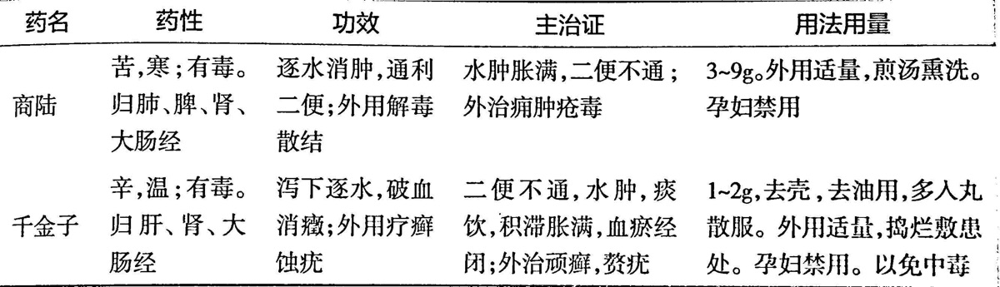
    - 配伍原则
        - **里实兼表邪**
            - 先表后里，或表里同用，防表邪内陷
        - **里实正虚**
            - 攻补兼施，使攻邪而不伤正
    - 使用注意
        - 攻下药、峻下逐水药，作用峻猛，或具有毒性，易伤正气及脾胃，故
            - 年老体虚、脾胃虚弱者当慎用
            - 妇女胎前产后及经期应当忌用
            - 奏效即止，慎过剂，以免损伤胃气
            - 注意炮制，控制用量
    - 泻下药兼有功效归纳 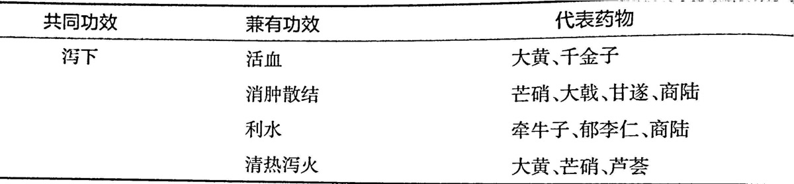
- **第四章 祛风湿药**
    - 定义
        - **祛除风湿，解除痹痛** **风湿痹证**
        - **痹证**
            - 外感风寒湿或风湿热之那，痹着肌肉、筋骨、关节，导致以肢体关节疼痛为主要临床表现的一类疾病
    - 药性特点
        - **药味**
            - 大多是辛、苦
            - **辛**
                - 散
                    - 发散外邪
                - 行
                    - 通络
                        - 关节经络痹塞不通
            - **苦**
                - 燥湿
                    - 痹证无论寒热，均有湿邪
        - **药性**
            - 有寒、温之分
    - 功效与适应症
        - **祛除风湿之邪**
            - **风湿痹证**
                - 关节疼痛，行动不利
            - **舒筋活络止痛**
                - 关节、经络痹阻不通
                - 肢体麻木，关节拘急，活动不利，甚至僵硬变形
        - **补肝肾，强筋骨（部分药物）**
            - **风湿痹痛日久而兼肝肾不足者**
                - 腰膝酸软无力
    - 分类
        - **祛风寒湿药**
            - **温**
            - **风寒湿痹**
                - 风寒湿之邪侵犯人体的关节，肌肉，经络而引起“痹证”
                - 主要表现
                    - 关节，肌肉疼痛，甚至肢体麻木，屈伸活动不利
                - **风寒湿痹有分三型**
                    - **行痹**
                        - 风邪偏胜
                        - 痛无定处，呈游走性
                    - **痛痹**
                        - 寒邪偏胜
                        - 疼痛剧烈，遇寒加重，得热则缓
                    - **着痹**
                        - 湿邪偏胜
                        - 痛处固定，肢体重着或麻木拘挛
            - **独活**
                - **药性**
                    - 辛、苦，微温
                - **功效、应用**
                    - **祛风除湿、通痹止痛**
                        - 风寒湿痹证
                        - 味苦性温燥，偏于祛湿
                            - **着痹尤宜**
                        - 入肾经，性善下行
                            - 偏于腰背和下半身酸重疼痛者
                    - **解表**
                        - 风寒表证挟湿
                        - 羌活、防风、荆芥
                        - 羌活胜湿汤
                    - **入肾经，搜伏风**
                        - 少阴头痛
                - **用法用量**
                    - 煎服，3～10g，可泡酒
                - **使用注意**
                    - 阴虚及血燥者慎用
                - **羌活与独活的区别和联系**
                    - **相同点**
                        - 祛风湿散寒——风寒湿痹证
                        - 解表一一风寒夹湿表证
                    - **不同点**
                        - **羌活**
                            - 气味浓烈，发散之力强，故偏于解表
                            - 其性走上，祛风湿，上半身痹痛尤宜
                        - **独活**
                            - 气味较淡，发散之力不显，偏于祛风湿，除痹痛，其性走下，下半身痹痛尤宜
                            - 对于全身关节疼痛，二药配伍同用，效果尤佳
                        - 古云：“羌活善治在上在表之游风，独活善治在内在下之伏风”
            - **威灵仙**
                - **药性**
                    - 辛、咸，温
                - **功效、应用**
                    - **祛风湿，通经络，止痛**
                        - 风湿痹痛
                            - 其辛味较浓，性猛善走，通行十二经脉，故祛风之力强
                        - **行痹**
                            - 肢体麻木，关节不利，筋骨酸痛，呈游走性
                    - **消骨鲠**
                        - 骨鲠喉间
                        - 煎汤加糖醋，缓缓饮服
                - **用法用量**
                    - 煎服，6～10g
                - **使用注意**
                    - 辛散走窜，气血虚弱者慎服
            - **川乌**
                - **药性**
                    - 辛、苦，热
                    - 有大毒
                - **功效、应用**
                    - **祛风除湿，温经止痛**
                        - 性热燥烈，有大毒，温经散寒力强
                        - 风寒湿痹痛，偏治寒湿重，局部疼痛剧烈者
                        - “白虎历节”
                            - 配麻黄白芍等（乌头汤）
                    - **止痛效果好**
                        - 各种疼痛证
                            - 头风疼痛，偏头痛
                            - 心腹冷痛、寒疝腹痛
                            - 跌打损伤、手术麻醉
                - **用法用量**
                    - 煎服，1.5～3g
                    - 毒性大，宜炮制后用；入汤剂要先煎0.5～1小时
                - **使用注意**
                    - 孕妇忌用
                    - 反半夏、瓜菱、贝母、白及、白蔹
                    - 不宜久服，生品只供外用
            - **蕲蛇（白花蛇）**
                - **药性**
                    - 甘、咸，温
                    - 有毒
                    - 归肝经
                - **功效、应用**
                    - **祛风通络**
                        - 祛除伏藏较深之风邪，可透骨搜风
                            - **行痹**
                            - 中风后遗症，半身不遂，肢体偏瘫
                    - **祛风止痒，兼以毒攻毒**
                        - 麻风疥癣，手足麻木，皮肤瘙痒
                    - **止痉**
                        - 破伤风
                        - 小儿急、慢惊风
                - **用法用量**
                    - 煎汤，3～9g
                    - 研末吞服，每次1～1.5g
                    - 或酒浸、熬膏、入丸、散服
                - **使用注意**
                    - 阴虚内热者忌服
            - **金钱白花蛇**
                - 性味归经、功效、应用与蕲蛇相似而力较强
                - 煎服，2～5g
                - 研粉吞服1～1.5g
            - **乌梢蛇**
                - **蕲蛇和乌梢蛇的比较**
                    - 二者功效相似
                    - **蕲蛇**
                        - 甘咸温，有毒
                        - 善透骨搜风，内走脏腑，外达皮肤，无处不到，作用强
                    - **乌梢蛇**
                        - 甘平，无毒
                        - 祛风通络，作用缓弱，且不伤气血
            - **木瓜、蚕沙**
                - **相同点**
                    - **祛风湿**
                        - 风湿痹痛
                    - **和胃化湿**
                        - 吐泻转筋
                - **不同点**
                    - **木瓜**
                        - **酸温** **，长于舒筋活络**
                            - 为治湿痹筋脉拘急之要药
                        - **祛湿舒筋**
                            - 脚气肿痛
                    - **蚕沙**
                        - 甘辛温
                        - **辛散温通**
                            - 寒痹、热痹均可配伍用
                        - **祛风止痒**
                            - 风疹等皮肤瘙痒证
                        - 包煎
            - **伸筋草**
                - **祛风除湿，舒筋活络**
            - **海风藤**
            - **青风藤**
            - **路路通**
                - 风湿痹痛，中风半身不遂
                - 跌打损伤
                - 水肿，小便不利
                - 经行不畅，经闭，乳少，乳汁不通
            - **[附] 蚕沙、油松节、丁公藤、昆明山海棠、穿山龙** 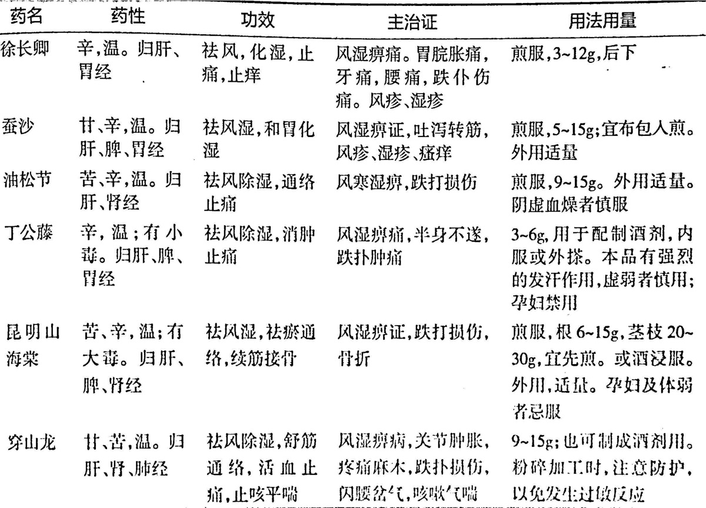
        - **祛风湿热药**
            - **寒**
            - **风湿热痹证**
            - **秦艽jiao**
                - **药性**
                    - 苦、辛，微寒
                    - 归肝经
                - **功效、应用**
                    - **祛风湿，通经络**
                        - 风湿痹痛
                        - **热痹**
                        - 偏于上肢关节痹痛
                        - 质地较润，无燥烈之弊，故有“风家润药”之称
                            - 阴血虚者亦可用
                    - **通经络**
                        - 中风半身不遂
                    - **退虚热**
                        - 阴虚发热，骨蒸潮热
                        - 配鳖甲等
                    - **清湿热**
                        - 湿热黄疸，一般作辅助药
                        - 常配茵陈蒿等同用
                - **用法用量**
                    - 煎服，3～10g
            - **防己**
                - **药性**
                    - 苦、辛，寒
                - **功效、应用**
                    - **祛风止痛**
                        - 痹痛，尤宜于湿热偏重之痹痛（其为寒性）
                        - 宣痹汤
                    - **利水消肿**
                        - 水肿
                            - **实证**
                                - 湿热壅滞之腹水、水肿
                                - 配葶苈子、大黄
                                - 己椒苈黄丸
                            - **虚证**
                                - 脾虚之便溏、浮肿
                                - 配黄芪、白术
                - **用法用量**
                    - 煎服，5～10g
                - **使用注意**
                    - 胃纳不佳及阴虚体弱者慎服
            - **桑枝**
                - 微苦，平
                - 袪风湿，利关节
                    - 上肢风湿热痹
            - **豨xi莶xian草、臭梧桐叶**
                - **共同点**
                    - **祛风湿，通络**
                        - 风湿热痹证
                    - **止痒**
                        - 湿疹，湿疮，皮肤搔痒
                        - 煎汤外洗
                    - 另，均降压
                    - 常相须为用（豨桐丸）
                - **不同点**
                    - **痈肿疔疮，湿疹疥癣**
                        - **祛风湿作用强**
                            - 生用性寒，宜于风湿热痹
                            - 酒制：兼补肝肾，强筋骨
                                - 痹证日久，下肢痿软
                                - 中风后遗症
                        - **清热解毒**
                            - 热毒疮痈
                        - 9～12g
            - **海桐皮**
            - **络石藤**
            - **雷公藤**
                - **药性**
                    - 苦，寒，大毒
                - **功效、应用**
                    - **祛风湿、活血通络、消肿止痛**
                        - 为治风湿顽痹要药
                        - 可单用内服或外敷
                    - **杀虫解毒（以毒攻毒）**
                        - 麻风，顽癣，湿疹，疥疮
                    - 现代用于肾炎、肾病综合征、红斑狼疮、干燥征、白塞病
                - **用法用量**
                    - 煎服，1～5g，文火煎1～2小时
                    - 外用适量
                - **使用注意**
                    - 大毒，内服宜慎
                    - 内脏有器质性病变及白细胞减少者慎服
                    - 孕妇禁用
                    - 外数不可超过半小时，否则起疱
            - **[附] 老鹤草、丝瓜络** 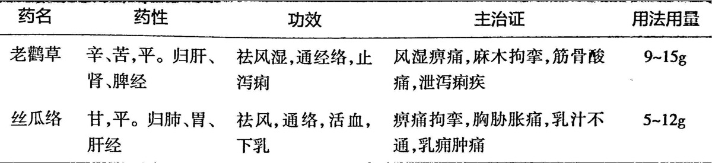
        - **祛风湿强筋骨药**
            - **入肝肾，祛风湿、补肝肾强筋骨**
                - 痹证日久，累及肝肾
                - 肝肾不足，腰膝酸软
                - 小儿行迟
            - **五加皮（南加皮）**
                - **药性**
                    - 辛、苦，温
                - **功效、应用**
                    - **祛风湿**
                        - 痹证
                        - 老人及久病体虚者宜
                        - 单用泡酒
                        - 又兼补益，为强壮性祛风湿药
                    - **补肝肾，强筋骨**
                        - 肝肾不足，腰膝酸软
                        - 小儿行迟
                    - **利水**
                        - 水肿，小便不利
                        - 五皮饮：生姜、获苓、大腹、陈皮
                - **用法用量**
                    - 5～10g
            - **桑寄生**
                - **药性**
                    - 苦、甘，平
                - **功效、应用**
                    - **祛风湿，补肝肾，强筋骨**
                        - 风湿痹证，病位在腰
                        - 肝肾不足，腰膝酸痛
                        - 其治腰酸腰痛，无论风湿，肾虚引起的均可用之
                    - **补肾安胎**
                        - 肝肾虚弱之胎动不安，习惯性流产
                - **用法用量**
                    - 9～15g
            - **狗脊**
                - **药性**
                    - 苦、甘，温
                - **功效、应用**
                    - **祛风湿，补肝肾，强腰膝**
                        - 风湿痹痛，腰痛脊强，不能俯仰
                        - 无论风湿，肾虚所致腰痛均用
                    - **温补固涩**
                        - 肾气不固之遗尿、白带过多
                - **用法用量**
                    - 6～12g
            - **[附] 千年健、雪莲花** 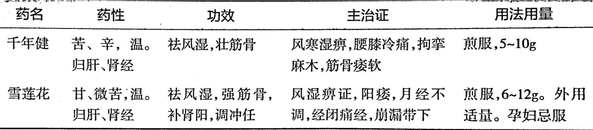
    - 配伍原则
        - 根据痹证的属性不同，来选择药物
            - **寒痹（痛痹）（风寒湿痹）**
                - 独活、羌活、成灵仙、川乌、草乌、寻骨风
                - **配伍**
                    - 温经散寒之品
                    - 如桂技、附子、细辛
            - **热痹（风湿热痹）**
                - 防己、豨莶草、络石藤、秦艽、桑枝
                - **配伍**
                    - 清热凉血，泻火解毒之品
                    - 如石膏、知母、黄柏、赤芍
            - **风邪偏重（行痹）**
                - 威灵仙、自花蛇、乌梢蛇、秦艽、海风藤、络石藤
                - **配伍**
                    - 解表药
                        - 麻黄、桂枝、防风、羌活
                        - 可祛肌表之风邪
                    - 活血药
                        - 如川芎、牛膝、当归
                        - “治风先治血，血行风自灭”
            - **湿邪偏重（着痹）**
                - 独活、防己、木瓜、豨莶草、松节
                - **配伍**
                    - 健脾燥湿之品
                    - 如苍术、白术、苡仁
        - 根据痹痛之部位，来选择用药
            - **上肢选用**
                - 羌活、桂枝、秦艽、桑枝
            - **下肢选用**
                - 独活、木瓜、防己、五加皮
            - **腰背选用**
                - 桑寄生、独活、狗脊、五加皮
        - 随着病情的变化，根据兼证不同配伍
            - **痹证而兼气血不足者**
                - 配伍补益气血之品
            - **痹证后期，骨骼变形，腰膝酸软**
                - 配补肾强筋骨之品
            - **病久入络**
                - 配伍活血祛瘀药、虫类药
    - 使用注意
        - 辛苦温燥之性药物，易耗伤阴血，故阴血虚者慎用
        - 部分药物有毒（乌头、雷公藤），要注意其炮制、配伍、剂型、煎法，并控制其用量，以防中毒
    - 选择用药 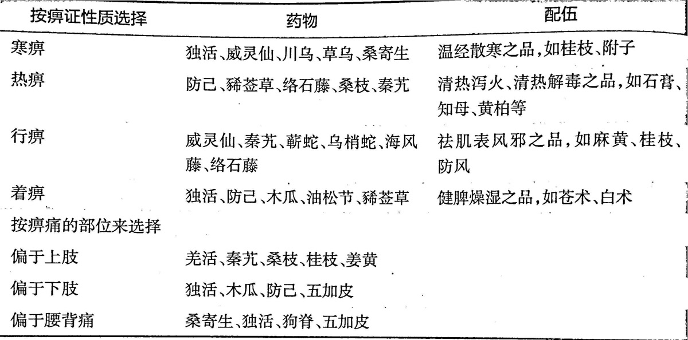
    - 袪风湿药兼有功效归纳 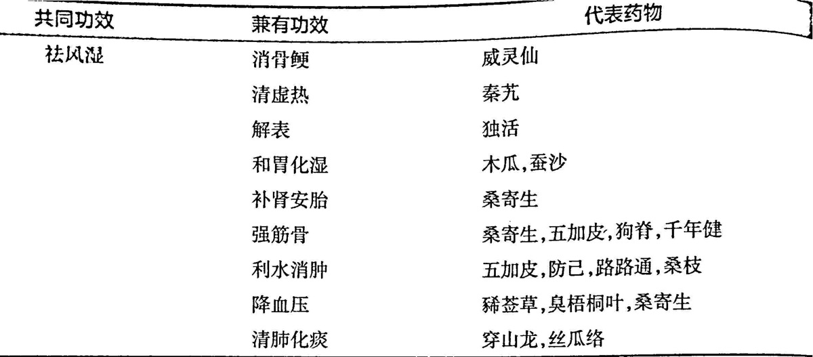
- **第五章 化湿药**
    - 定义
        - **化湿运脾** **湿阻中焦证**
        - 大多具芳香之性，所以人称芳香化湿药
        - “化”——运化，“湿”——湿邪
    - 药性特点
        - 辛苦温，芳香
            - 辛——行气
            - 苦——燥湿
            - 温——温化水湿
        - 气味芳香
            - 化湿
            - 解暑
            - 辟秽
    - 功效与适应症
        - **化湿一一湿困中焦（脾胃）证**
            - 闷腹胀，悉心吐，食欲不振，口中粘腻，肢体困重，大便稀溏，苔腻
        - 部分药兼
            - 行气（调畅气机，健脾和胃）
                - 脾胃气滞证
            - 解暑一一暑湿证
    - 分类
        - **芳香化湿药（小概念）**
            - 芳香味浓，有祛暑作用
            - **广藿香、佩兰**
                - **相同点**
                    - 二药是芳香化湿的代表药，芳香味浓
                    - **芳香化湿**
                        - 湿阻中焦证
                        - 脘腹痞闷，食少呕吐，神疲体倦，苔白腻
                    - **发表解暑**
                        - 暑湿证
                        - 身热不扬，困倦，大便泄泻，小便短赤，苔腻
                        - 藿香正气散
                    - 临床常相须配伍使用
                - **不同点**
                    - **广藿香**
                        - **和中止呕**
                            - 呕吐证
                                - 以湿邪中阻者最宜
                    - **佩兰**
                        - **性平，醒脾开胃**
                            - 脾瘅证
                                - 口中甜腻、多涎、口臭
        - **苦温燥湿药**
            - 苦温之性强，无祛暑作用
            - **苍术、厚朴**
                - **相同点**
                    - 均辛苦温
                    - **燥湿力强**
                        - 湿阻中焦证，以寒湿为主
                            - 腹胀食少，吐泻，苔白腻
                            - 常相须为用，如平胃散
                        - 另，苍术配清热药
                            - 下焦湿热证
                                - 湿热痿证、湿热带下、湿疮湿疹
                            - 如二妙散
                - **不同点**
                    - **厚朴**
                        - **消除胀满的要药**
                        - 破气（行气力量强）
                        - **下气除满**
                            - 燥湿
                                - 湿阻气滞
                            - 消积
                                - 食积气滞，腹胀便秘
                            - 消痰
                                - 有形之痰
                                    - 痰饮喘咳、胸闷
                                - 无形之痰
                                    - 痰阻气滞的梅核气
                                    - 半夏厚朴汤
                        - 湿、食、痰、气虚所致的胸、脘腹胀满疼痛均可用
                        - **厚朴花**
                            - 性味苦，微温
                            - **芳香化湿，理气宽中**
                            - 用于中焦湿阻气滞，胸脘痞闷胀满、食少纳差等
                    - **苍术**
                        - 辛散温燥为主，治湿要药，既化内湿，又可祛外湿
                        - **燥湿健脾**
                            - 脾虚湿盛证
                        - **祛风散寒除湿**
                            - 湿邪为重的痹证
                            - 外感风寒夹湿表证
                        - **明目一一夜盲症**
        - **化湿行气药**
            - 温燥之性不如苍术、厚朴，兼行气作用
            - **砂仁、豆蔻**
                - **共同点**
                    - 辛、温
                    - 温燥之性不如苍术、厚朴
                    - **化湿、行气、温中**
                        - 湿阻中焦气滞证，寒湿为主
                        - 脘腹胀满，不欲饮食，恶心呕吐，腹痛泄泻
                    - 二者入汤剂均须后下，3～6g
                - **不同点**
                    - **砂仁**
                        - 温燥之性较强，行气作用较强
                        - 偏于治疗中、下焦之证
                        - **偏健脾止泻**
                            - 腹胀、腹痛、腹泻
                        - **理气安胎（止呕）**
                            - 妇女妊娠恶阻，恶心呕吐，胎动不安
                        - 另入补剂，可减少补益药物的滋腻之弊
                    - **豆蔻**
                        - 芳香之味较浓，偏于治疗中、上焦湿阻之证
                        - **芳香宣化**
                            - 湿温证
                                - 三仁汤
                            - 湿热证
                        - **偏温中止呕**
                            - 胃寒呕吐
            - **草豆蔻**
                - **燥湿行气，温中止呕**
                    - 寒湿中阻气滞证
                    - 寒湿呕吐
            - **草果**
                - **燥湿温中，截疟除痰**
                    - 寒湿中阻证
                    - 疟疾
    - 配伍原则
        - 配伍行气药
            - 湿邪重浊粘滞，易阻滞气机，出现脘腹胀满痞闷
            - 气行则湿化
        - 配伍补气健脾药
            - 脾虚运化不利（运化水湿失司）
            - 脾运则湿去，标本兼治
        - 配伍淡渗利湿药
            - 因湿性下趋，可因势利导，使邪有去路，可提高化湿药效果
            - 陈无择云：“治湿不利小便，非其治也。”
    - 使用注意
        - 芳香化湿药多含挥发油，一般作散剂，如入汤剂不宜久煎，有些药物更须后下，砂仁、白豆蔻
        - 辛温香燥，有耗气伤阴之弊，故气虚阴亏津伤及舌干少津，大便干结者均宜慎用
    - 化湿药兼有功效归纳 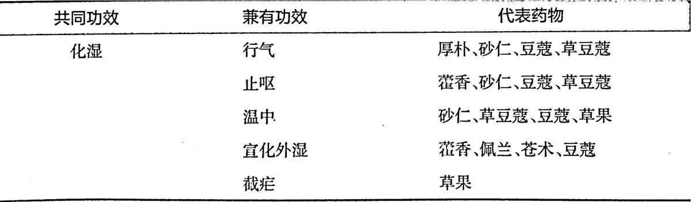
- **第六章 利水渗湿药**
    - 定义
        - **通利水道，渗泄水湿** **水湿内停病证**
        - 利水
            - 利尿，利小便
        - 渗湿
            - 往下慢慢地排泄水湿
        - 使体内多余的水湿之邪，从小便排出，故又称利湿药
        - **化温药、利湿药的区别**
            - **化湿药**
                - 将湿邪化之，并不增加小便的量
            - **利湿药**
                - 使湿邪从小便排出，增加小便量
    - 药性特点
        - 味淡，亦可稍甘
        - “淡”味具渗利水湿之功，又称“淡渗利湿”或“甘淡渗湿”
    - 分类
        - **利水消肿药**
            - 甘淡平或微寒
            - **利水消肿**
                - 水肿，痰饮，小便不利
            - **利水止泻**
                - 水湿泄泻（利小便，实大便）
            - **茯苓、猪苓**
                - **相同点**
                    - 甘、淡，平
                    - **利水渗湿**
                        - 水肿，小便不利
                        - 水湿泄泻
                - **不同点**
                    - **茯苓**
                        - 利湿作用较平和，用于寒热虚实各种水肿
                            - 五苓散
                        - 能利、能补，又能健脾、宁心
                            - **健脾**
                                - **脾虚证**
                                    - 四君子汤
                                - **脾虚湿胜证**
                                    - 痰饮
                                        - 苓桂术甘汤
                                    - 泄泻
                                        - 参苓白术散
                            - **宁心（安神）**
                                - 心悸失眠
                                - 归脾汤
                        - **茯苓皮**
                            - **利水消肿**
                            - 长于行皮肤水湿，多用治皮肤水肿
                        - **茯神**
                            - 宁心安神，用于心神不安、惊悸、健忘等
                        - 10～15g
                    - **猪苓**
                        - 利水作用较强，无补益之功
                        - 猪苓多糖有抗肿瘤、降糖的作用
                        - 6～12g
            - **薏苡仁**
                - **药性**
                    - 甘、淡，凉
                - **功效、应用**
                    - **利水渗湿**
                        - 水肿，脚气浮肿，小便不利
                        - 利尿作用缓和，较茯苓弱，水肿一般不单用
                    - **健脾止泻**
                        - 脾虚湿盛泄泻
                            - 党参、白术、茯苓
                        - 功似茯苓，利小便，实大便
                    - **（利湿）除痹**
                        - 湿痹拘挛（偏于湿热者）
                    - **（清热）排脓**
                        - **肺痈**
                            - 配芦根、冬瓜仁、桃仁
                        - **肠痈**
                            - 配红花、败酱草、桃仁
                    - **解毒散结**
                        - 赘疣，癌肿
                - **用法用量**
                    - 9～30g
            - **泽泻**
                - **药性**
                    - 甘、淡，寒
                - **功效、应用**
                    - **利水渗湿**
                        - 水作用比茯苓较强
                        - 水肿，小便不利，泄泻
                            - 配茯苓、猪苓、桂枝
                        - 痰饮停聚，清阳不升之头昏目眩
                            - 配白术
                    - **泄热**
                        - 既清膀胱之热，又泄肾经之虚火
                        - **下焦湿热淋证**
                            - 木通、车前子
                        - 肾阴不足，相火偏亢之遗精、潮热
                            - 熟地黄、山茱萸、牡丹皮
                        - 消渴多饮、多食、消瘦
                    - **化浊降脂**
                        - 高脂血症
                - **用法用量**
                    - 6～10g
                - **使用注意**
                    - 肾虚精滑无湿热者忌用
            - **冬瓜皮**
                - **利尿消肿，清热解暑**
                    - 水肿，小便不利
                    - 暑热烦渴
                - **冬瓜子**
                    - 清肺化痰，利湿排脓
                    - 肺热咳嗽、肺痈、肠痈、带下、白浊等
            - **玉米须**
                - **利尿消肿，利湿退黄**
                    - 水肿，小便不利，淋证
                    - **黄疸**
            - **香加皮（北五加）**
                - **利水消肿，祛风湿，强筋骨**
                    - 水肿，小便不利
                    - **风湿痹证，筋骨痿软**
                - 本品有毒，服用不宜过量
            - **[附] 葫芦、枳椇子（拐枣）** 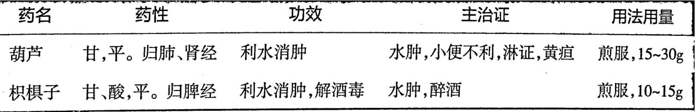
        - **利尿通淋药**
            - 甘淡寒或苦寒
            - **清利下焦湿热**
                - 淋证（热、血、石、膏淋），小便短赤，淋漓涩痛，或挟有砂石
            - 利尿通淋
                - 通利水道，解除小便淋沥涩痛之义
                - 适用于湿热蕴结膀胱或尿路结石所致的热淋，血淋，石淋等
                - 药如木通，金钱草，海金沙等
            - **车前子**
                - **药性**
                    - 甘，寒
                - **功效、应用**
                    - **利尿通淋**
                        - **膀湿热之淋证**
                            - 配木通、滑石
                            - 八正散
                        - **水肿，小便不利**
                            - 配猪苓、茯苓
                            - 肾虚腰重脚肿
                                - 济生肾气丸
                        - 其利尿作用与猪苓相同
                    - **渗湿止泻**
                        - 暑湿泄泻（利小便实大便）
                        - 单味，或配白术、获苓、泽泻
                    - **清肝明目**
                        - 肝火上炎之目赤肿痛
                        - 配夏枯草、菊花
                    - **清肺化痰**
                        - 肺热咳嗽，痰多色黄
                        - 配瓜蒌、贝母
                - **用法用量**
                    - 9～15g
                    - 包煎
                - **使用注意**
                    - 肾虚滑精者及孕妇慎用
                - **车前草**
                    - **清热利尿通淋，祛痰，凉血，解毒**
                        - **热淋**
                        - 9～30g，外用适量
            - **滑石**
                - **药性**
                    - 甘、淡，寒
                - **功效、应用**
                    - **利尿通淋**
                        - **热淋**
                            - 木通、车前子
                        - **石淋**
                            - 海金沙、金钱草
                    - **清热解暑**
                        - **暑湿**
                        - 暑热烦渴，小便短赤
                            - 甘草
                        - 湿温初起及暑温夹湿
                            - 头痛恶寒，身重胸闷，脉弦细而濡
                    - **（外用）祛湿敛疮**
                        - 湿疮，湿疹
                            - 可单用或与枯矾、黄柏等为末，撒布患处
                        - 痱子
                            - 与薄荷、甘草等配合制成痱子粉外用
                - **用法用量**
                    - 10～20g，外用适量
                    - 先煎、包煎
                - **使用注意**
                    - 脾虚、热病津伤及孕妇慎用
            - **木通、通草**
                - 今之木通，古书称为“通草”；今之通草，古书称为“通脱木”
                - **相同点**
                    - **利尿通淋**
                        - 湿热淋证
                    - **下乳**
                        - 产后乳汁不下或不畅
                        - 津血不足者，配补血养阴之品
                - **不同点**
                    - **木通**
                        - **苦泄力强，善清心除烦**
                            - 心火移热于小肠（心烦尿赤）
                            - 导赤散
                        - 3～6g
                        - 津亏、精滑、内无湿热及儿童、年老体弱、孕妇慎用
                        - **川木通**
                            - **利尿通淋，清心除烦，通经下乳**
                                - 淋证，水肿，心烦尿赤，口舌生疮，经闭乳少，湿热痹痛
                    - **通草**
                        - 3～5g
                        - 孕妇慎用
            - **瞿麦、萹蓄**
                - **相同点**
                    - **利尿通淋**
                        - **热淋、血淋**
                - **不同点**
                    - **萹蓄**
                        - **杀虫、止痒**
                            - 虫积腹痛
                            - 湿疹阴痒
                    - **瞿麦**
                        - **活血通经**
                            - 血热瘀滞的妇女经闭、痛经
                - 9～15g，孕妇慎用
            - **地肤子**
                - **药性**
                    -  辛、苦，寒
                - **功效、应用**
                    - **利尿通淋**
                        - 湿热淋证
                    - **清热利湿，祛风止痒**
                        - 风疹，湿疹
                            - 配白鲜皮、蛇床子、蝉蜕、黄柏
                        - 湿热阴痒、带下
                            - 配苦参、龙胆草、白矾，煎汤外洗患处
                            - 黄柏、苍术、车前子煎服
                - **用法用量**
                    - 9～15g
            - **海金沙**
                - **药性**
                    - 甘、咸，寒
                - **功效、应用**
                    - **利尿通淋，止痛**
                        - 诸淋涩痛
                        - **石淋**
                - **用法用量**
                    - 6～15g，包煎
                - **使用注意**
                    - 肾阴亏虚者慎服
            - **石韦**
                - **药性**
                    - 甘、苦，微寒
                - **功效、应用**
                    - **利尿通淋，又凉血止血**
                        - **血淋、血尿**
                        - 亦治略血、吐衄
                    - **清肺止咳**
                        - 咳嗽气喘
                - **用法用量**
                    - 6～12g
            - **萆薢**
                - **药性**
                    - 苦，平
                - **功效、应用**
                    - **利湿去浊**
                        - **膏淋**
                            - 乌药、益智仁、石菖蒲
                        - 白浊（白带属湿盛者）
                            - 猪苓、白术、泽泻
                    - **祛风湿**
                        - 风湿痹痛，筋脉屈伸不利
                        - **着痹**
                - **用法用量**
                    - 9～15g
                - **使用注意**
                    - 肝肾阴亏之遗精、滑精者慎用
            - **[附] 冬葵子、灯心草** 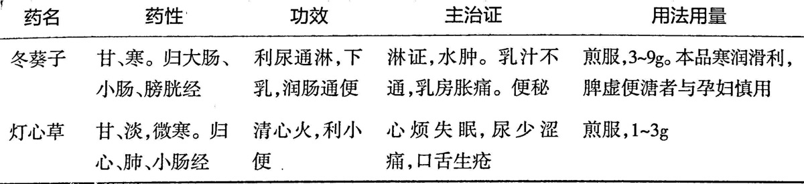
        - **利湿退黄药**
            - 苦寒，入肝胆经
            - **清肝胆湿热，退黄疸**
                - 湿热黄疸
            - **利湿清热**
                - 暑湿、湿温，湿疹，湿疮
            - **茵陈（蒿）**
                - **药性**
                    - 苦、辛，微寒
                - **功效、应用**
                    - **清热利湿，利胆退黄**
                        - 治疗黄疸之主药，阳黄、阴黄均可治疗
                        - **阳黄证（湿热所致）**
                            - 热重于湿者
                                - 栀子、黄柏、大黄
                            - 湿重于热者
                                - 茯苓、猪苓
                        - **阴黄证（寒湿郁滞，阳气不得宣运）**
                            - 附子、干姜
                            - 茵陈四逆汤
                    - **清热利湿**
                        - 湿疮、湿疹痒
                        - 配黄柏、苦参、地肤子，也可单味煎汤外洗
                - **用法用量**
                    - 6～15g
                - **使用注意**
                    - 蓄血发黄者及血虚萎黄者慎用
            - **金钱草**
                - **药性**
                    - 甘、咸，微寒
                - **功效、应用**
                    - **利湿退黄**
                        - 湿热黄疸
                            - 配茵陈蒿、栀子等
                        - 肝胆结石
                            - 配茵陈、大黄、郁金等
                    - **利尿通淋**
                        - 善消结石
                        - **石淋**
                            - 可单用大剂量煎汤代茶饮，或配海金沙、鸡内金、滑石等同用
                        - **热淋**
                            - 常配车前子、萹蓄
                    - **解毒消肿**
                        - 痈肿疔疮、毒蛇咬伤
                        - 鲜品捣汁内服或捣烂外敷
                        - 或配蒲公英、野菊花等同用
                - **用法用量**
                    - 15～60g
            - **虎杖**
                - **药性**
                    - 苦，寒
                - **功效、应用**
                    - **利湿退黄**
                        - 湿热黄疸
                            - 茵陈、栀子
                        - 小便涩痛，淋浊带下
                    - **清热解毒**
                        - 水火烫伤
                            - 单用研末，香油调敷
                        - 痈肿疮毒，毒蛇咬伤
                            - 或煎汤洗，鲜品捣敷
                    - **散瘀止痛**
                        - **血瘀证**
                            - 经闭、痛经
                            - 癥瘕
                            - 跌打损伤
                    - **（清肺）化痰止咳**
                        - 肺热、痰热咳嗽
                        - 贝母、枇杷叶、杏仁
                    - **本品还有泻热通便**
                        - 热结便秘
                - **用法用量**
                    - 9～15g
                    - 外用适量，制成煎液或油膏涂敷
                - **使用注意**
                    - 孕妇慎用
            - **[附] 地耳草（田基黄）、垂盆草、鸡骨草、珍珠草** 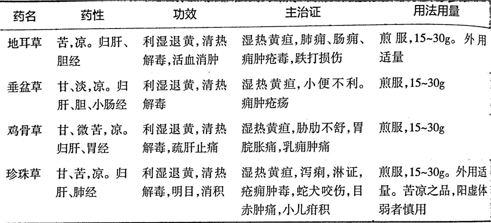
    - 配伍原则
        - **选用**
            - **病证性质** **病变部位**
        - **常配行气药**
            - 湿为阴邪、重浊粘腻，易阻遏气机
            - 气行则水行，气滞则水停
        - **根据湿邪的部位来选治湿药**
            - **上焦宜宣**
                - 桂枝、杏仁、蔻仁
            - **中焦宜化**
                - 苍术、厚朴、藿香、佩兰
            - **下焦宜利**
                - 猪苓、茯苓、木通、车前子
            - 古人曰：“利湿不分三焦，非其治也。”
    - 使用注意
        - **耗伤津液、阴液**
            - 故阴虚津伤者，肾虚遗精、遗尿者应慎重应用
        - **滑利之品**
            - 如滑石、木通、冬葵子
        - **毒性**
            - 使用时应严格把握剂量
    - 利水渗湿药兼有功效归纳 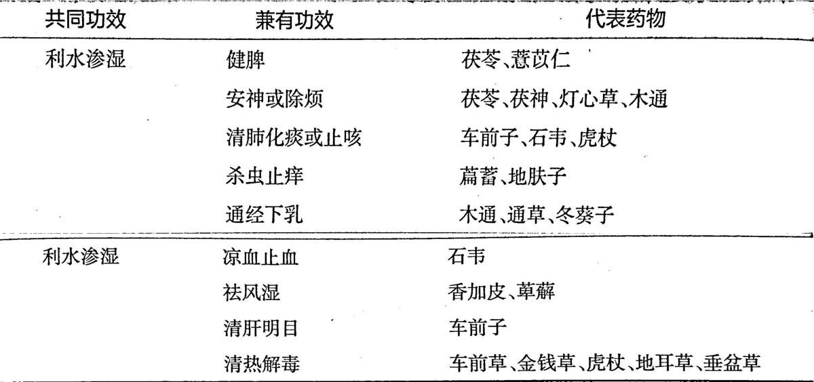
- **第七章 温里药**
    - 定义
        - **辛热或辛温** **温里祛寒** **里寒证**
    - 药性特点
        - 辛，温热
        - 疗寒以热药
    - 功效与适应症
        - **温里散寒、止痛**
            - **里寒诸证（脏腑实寒证为主）**
                - **温中散寒**
                    - **脾胃寒证**
                    - 脘腹疼痛、呕吐、泄泻等
                - **暖肝散寒**
                    - **寒滞肝脉证**
                    - 寒疝痛、少腹痛、痛经、厥阴头痛
                - **温肺化饮**
                    - **肺寒痰饮证**
                    - 痰饮咳喘，痰白清稀
        - **温阳（助阳）**
            - **虚寒证**
                - 形寒畏冷、四肢不温，舌淡苔白、脉象沉细等
                - **脾肾阳虚**
                    - 脘腹冷痛、呕吐、便溏、或腰膝酸痛、四肢浮肿、小便不利或小便清长而数
                - **心阳虚**
                    - 心悸征忡，胸痹心痛；心肾阳虚，小便不利，肢体浮肿
            - **回阳救逆**
                - 心肾阳衰，亡阳证
                    - 汗出不止，四肢逆冷，呼吸微弱，脉微欲绝
    - 分类
        - **附子**
            - **药性**
                - 辛，甘、大热
                - 有毒
                - 归心、脾、肾经
            - **功效、应用**
                - **回阳救逆**
                    - 上助心阳，中温脾阳，下补肾阳，为回阳救逆第一品药
                    - **亡阳证**
                        - 四肢厥冷、面色苍白、冷汗自出、脉微欲绝等
                        - 配人参或干姜、甘草，如参附汤、四逆汤
                - **补火助阳**
                    - 温一身之阳，凡阳虚者均可应用
                    - **肾阳不足**
                        - 腰膝酸软冷痛、小腹拘急、小便频数或水肿、或阳萎等
                        - 配肉桂、熟地、山萸肉等，如肾气丸
                    - **脾胃虚寒**
                        - 胃院冷痛、吐清水、肠鸣腹痛、大便溏泄、四肢不温等
                        - 配党参、白术、干姜等，如附子理中丸
                    - **心阳衰弱**
                        - 心悸气短、胸痹心痛，伴口指甲青紫、畏寒肢冷、面白舌淡、脉细弱等
                        - 配人参、桂枝
                    - **卫阳虚的自汗**
                        - 配桂枝、黄芪
                - **散寒止痛**
                    - 寒湿痹痛
            - **用量**
                - 3～15g
                - 亡阳证或寒痹痛甚，15～25g
            - **用法**
                - 入汤剂须用制附子
                - 先煎30～60分钟以减其毒性
            - **注意事项**
                - 孕妇忌用
                - 半蒌贝蔹及反乌（附子）
        - **干姜**
            - **药性**
                - 辛，热
                - 归脾、胃、肾、心、肺经
            - **功效、应用**
                - **温中暖脾**
                    - 温脾胃为主，实寒、虚寒均可用
                    - **脾胃寒证**
                        - 脘腹冷痛、呕吐泄泻等
                        - 配人参、白术、甘草等同用，如理中汤
                - **回阳通脉**
                    - **亡阳证**
                        - 四肢质冷、面色苍白、脉微欲绝等
                        - 四逆汤
                    - 与附子同用
                        - 增强附子回阳救逆的功效
                        - 降低附子毒性
                - **温肺化饮**
                    - **寒饮伏肺**
                        - 咳嗽气喘、形寒背冷、痰多清稀等
                        - 配细辛、五味子同用，如小青龙汤
            - **用法用量**
                - 煎服，3～10g
            - **使用注意**
                - 血热妄行、阴虚内热者忌用
                - 孕妇慎用
        - **肉桂**
            - **药性**
                - 辛、甘，大热
                - 归肾、脾、心、肝经
            - **功效、应用**
                - **补火助阳**
                    - 善温肾阳，作用温和持久
                    - **肾阳不足，命门火衰** **要药**
                        - 腰膝酸软、畏寒肢冷、尿频、阳萎、早泄等
                    - **虚喘证**
                        - 配附子、沉香、五味子等
                - **引火归原**
                    - 下焦虚寒，虚阳上浮证
                    - 面色浮红、咽痛色泛淡紫，下肢发冷
                - **散寒止痛（善去痼冷沉寒）**
                    - 胸痹，虚寒吐泻，寒疝腹痛
                - **温通经脉**
                    - **善入血分，行气血、通经脉（月经）**
                        - 妇女痛经经闭
                            - 温经汤
                        - 寒湿痹痛、腰痛
                        - 阴疽
                            - 色白，漫肿不溃，或久溃不敛
                            - 阳和汤
                - **在气血双补剂中，佐以本品，可鼓舞气血生长**
                    - 可“宣导百药”
                    - 十全大补汤
            - **用法用量**
                - 煎服，1～5g，后下
            - **使用注意**
                - 阴虚火旺者忌服
                - 有出血倾向者及孕妇慎用
                - 不宜与赤石脂同用
            - **肉桂、干姜、附子**
                - 均属辛热温阳之品，临床常配伍
                    - **肉桂**
                        - 偏于温肾，又温经散血分之寒
                    - **干姜**
                        - 重在温脾，兼能化饮、回阳
                    - **附子**
                        - 兼温脾肾，尤擅回阳救逆，为亡阳者所必用
                - 各有所长，应予区别
        - **吴茱萸**
            - **药性**
                - 辛、苦，热；有小毒
            - **功效、应用**
                - **散寒止痛**
                    - 善暖肝
                    - 最宜于肝寒气滞诸痛证
                        - 如疝痛、痛经、厥阴头痛
                    - 亦用于胃寒冷痛、腹痛、脚气疼痛等
                - **降逆止呕**
                    - 胃寒呕吐
                        - 配干姜
                    - 肝郁化火，呕吐吞酸
                        - 配黄连同用
                - **助阳止泻**
                    - **五更泄泻**
                    - 四神丸
                    - 配补骨脂、肉豆蔻、五味子
            - **用法用量**
                - 煎服，2～5g
                - 外用适量
            - **使用注意**
                - 小毒，不宜多用，久用
                - 阴虚有热者忌用
                - 孕妇慎用
        - **小茴香**
            - **药性**
                - 辛，温
            - **功效、应用**
                - **散寒止痛**
                    - 善温肾暖肝，治疗下焦寒性疼痛
                    - 寒疝疼痛、睾丸偏坠
                        - 配橘核、荔枝核、乌药等
                    - 少腹冷痛，或痛经
                        - 配当归、川芎、肉桂等
                        - 少腹逐瘀汤
                - **理气和胃**
                    - **脾胃气滞证**
                        - 脘腹胀痛、呕吐、食少等
                        - 配干姜、木香等
            - **用法用量**
                - 3～6g
            - **使用注意**
                - 阴虚火旺者慎用
        - **丁香**
            - **药性**
                - 辛，温
                - 归脾、胃、肾经
            - **功效、应用**
                - **温中降逆**
                    - **胃寒呕吐、呃逆**
                        - 丁香柿蒂汤
                    - **实寒呕吐**
                        - 配半夏、生姜
                    - **虚寒呃逆**
                        - 配柿蒂、人参、生姜
                - **补肾助阳**
                    - 肾阳不足，阳痿、脚弱、少腹冷痛
                    - 配巴戟天、肉苁蓉
            - **用法用量**
                - 1～3g
                - 内服或研末外敷
            - **使用注意**
                - 不宜与郁金同用
        - **高良姜**
            - **药性**
                - 辛，热
            - **功效、应用**
                - 温中止呕，散寒止痛
                - **胃寒脘腹冷痛**
                    - 配炮姜
                    - 二姜丸
                - **胃寒呕吐**
                    - 配半夏、生姜陈皮等
            - **用法用量**
                - 3～6g
        - **花椒**
            - **药性**
                - 辛，温
            - **功效、应用**
                - **温中止痛**
                    - **中焦虚寒证**
                        - 脘腹疼痛、呕吐、泄泻
                    - 配干姜、党参、饴糖同用
                - **杀虫，止痒**
                    - 蛔虫腹痛、吐蛔等
                        - 常用于胆道蛔虫症
                    - 湿疹，阴痒
                        - 可煎汤、外洗
            - **用法用量**
                - 煎服，3～6g
                - 外用适量，煎汤熏洗
            - **使用注意**
                - 阴虚内热者慎用
            - **椒目**
                - **药性**
                    - 性味苦，寒
                    - 归肺、肾、膀胱经
                - **功效、应用**
                    - **降气平喘，利水消肿**
                        - 痰饮喘咳，水肿胀满
                - **用法用量**
                    - 煎服，3～10g
        - **[附] 胡椒、荜茇、荜澄茄** 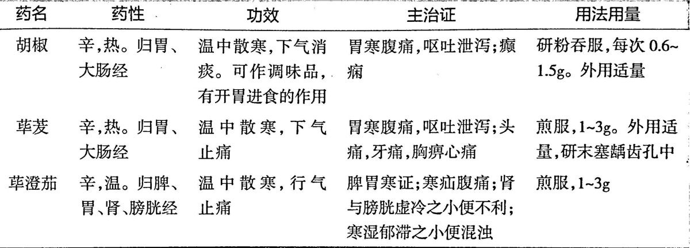
    - 使用注意
        - 本类药物辛热燥烈，易耗阴动火
            - 阴虚内热，津血亏虚，假寒真热，温热实火，血热妄行者忌用
            - 孕妇慎用或忌用
            - 天气炎热时不宜用
    - 温里药兼有功效归纳 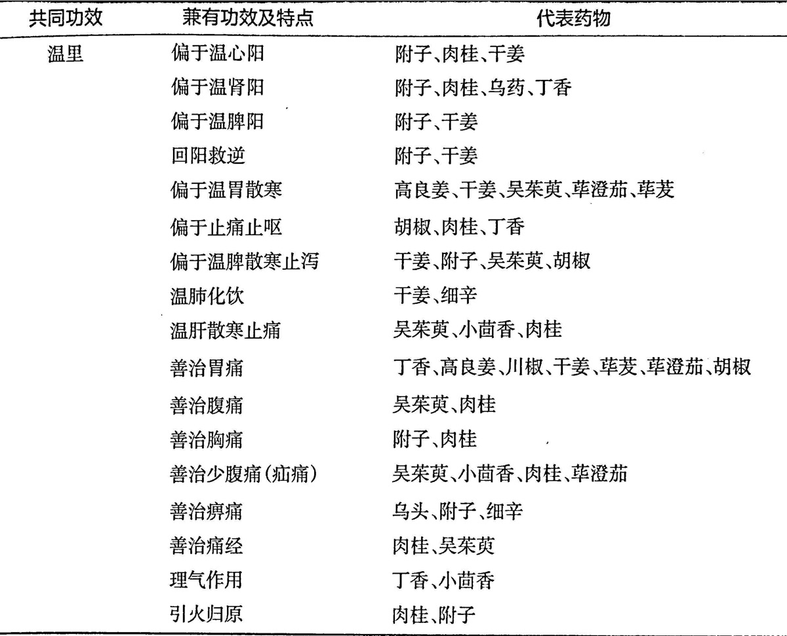
    - **[回阳救逆]**
        - 救治阳气将脱的一种方法，指药物具有恢复阳气、挽救厥逆证候的作用，用于久病体虚，阳气衰微，阴寒内盛或大汗、大吐、大泻所造成的亡阳证
    - **[引火归原]**
        - 治疗虚阳上浮的方法，使因肾阳亏虚而上浮的虚阳（虚火）下归于肾，称引火归原
        - 具有引火归原作用的药物，性味辛热，能温补肾火，适用于面热、头晕、咽痛、腰膝酸冷的“火不归原”证
- **第八章 理气药**
    - 定义
        - **疏理气机** **气机不畅之气滞、气逆**
    - 药性特点
        - 大多辛苦温，气味芳香
    - 功效与适应症
        - **理气健脾**
            - **脾胃气滞证**
                - 脘腹胀痛、食欲不振、食少纳呆
        - **疏肝解郁**
            - **肝气郁结证**
                - 胁肋胀痛、经前乳房胀痛、痛经、月经不调
        - **理气宽胸**
            - **肺气壅滞证**
                - 胸闷胸痛、咳嗽气喘
        - **降逆顺气**
            - **胃气上逆证**
                - 恶心呕吐、嗳气、呃逆
            - **肺气上逆证**
                - 咳嗽气喘
    - 分类
        - **行脾胃气滞为主**
            - **陈皮、枳实、木香**
                - **相同点**
                    - **皆理气健脾**
                        - **脾胃气滞证**
                        - 脘腹胀满，甚则胀痛，或兼饮食不思，恶心呕吐
                - **不同点**
                    - **陈皮**
                        - 辛、苦，温。归脾、肺经
                        - **理气健脾**
                            - 气力缓和
                            - **寒湿气滞**
                                - 配苍术、厚朴
                                - 平胃散
                            - **食积气滞**
                                - 配山植、神曲
                            - **脾虚气滞**
                                - 脘胀、食少便溏
                                - 配白术、人参等
                                - 异功散
                                - 常入补益剂中，使之补而不滞，滋而不腻
                            - **理气和胃止呕**
                                - 呕吐、呃逆
                        - **燥湿化痰**
                            - **湿痰阻肺**
                                - 咳嗽、痰多、胸闷
                                - 常配茯苓、半夏等
                            - **寒痰咳嗽**
                                - 常配干姜、细辛、五味子
                        - 3～10g
                        - **橘红**
                            - 性味辛、苦，温。归肺、脾经
                            - **理气宽中，燥湿化痰**
                                - 咳嗽痰多、食积伤酒、呕恶痞闷
                            - 3～10g
                        - **化橘红**
                            - 性味苦、辛，温。归脾、肺经
                            - **理气宽中，燥湿化痰**
                                - 寒痰或湿痰之咳嗽痰多、食积、胸闷
                            - 3～6g
                    - **枳实**
                        - 苦、辛、酸，微寒
                        - **破气消积**
                            - 行气作用较强，故可谓之破气
                            - **阳明热结的腑实证**
                                - 配大黄、厚朴、芒硝
                            - **湿热积滞泻痢**
                                - 腹胀腹痛，里急后重，大便脓血
                                - 配大黄、黄连等
                        - **消痰除痞**
                            - **胸痹心痛**
                                - 胸阳不振，痰浊内阻
                                - 常配薤白、栝楼，桂枝等
                            - **结胸证，水热互结者**
                                - 胸脘痞闷疼痛、痰黄难咳、苔黄腻
                                - 常配黄连、栝楼、半夏等
                        - 大剂量应用，子宫脱垂、脱肛、胃下垂等脏器下垂
                            - 单用或与黄芪、党参、柴胡、升麻等补气、升提药配伍
                        - 3～10g，麸炒后药性较平和
                        - 孕妇慎用
                    - **木香**
                        - **行气止痛**
                            - **善行脾胃气滞**
                            - **善行大肠滞气**
                                - 湿热痢疾，大肠气滞
                                    - 腹痛，里急后重
                                - 常配黄连
                        - **健脾消食**
                            - 补益剂用之，减轻补益药滞气和滋腻碍胃的弊端
                            - 如归脾汤
                        - 3～6g
                            - 生用行气力强
                            - 煨用宜于实肠止泻
            - **沉香**
                - **药性**
                    - 辛、苦，微温
                - **功效、应用**
                    - **（散寒）行气止痛**
                        - 寒凝气滞，胸腹胀闷疼痛
                        - 配乌药、木香、槟榔等
                        - 四磨汤
                    - **（温胃）降逆止呕**
                        - 胃寒呕吐、呃逆
                        - 配白豆蔻、紫苏、柿蒂等
                        - 柿蒂汤
                    - **（温肾）纳气平喘**
                        - **虚喘证**
                        - 常配附子、肉桂、补骨脂等
                        - 黑锡丹
                - **用法用量**
                    - 1～5g，后下
                - **使用注意**
                    - 气虚下陷及阴虚火旺者忌用
            - **檀香**
                - **药性**
                    - 辛，温
                    - 归脾、胃、心、肺经
                - **功效、应用**
                    - **行气温中，开胃止痛**
                - **用法用量**
                    - 2～5g
                - **使用注意**
                    - 阴虚火旺，实热吐衄者慎用
            - **大腹皮**
                - **药性**
                    - 辛，微温
                    - 归脾、胃、大肠、小肠经
                - **功效、应用**
                    - **行气宽中，行水消肿**
                - **用法用量**
                    - 5～10g
                - **使用注意**
                    - 气虚体弱者慎用
            - **甘松**
                - **药性**
                    - 辛、甘，温
                    - 归脾、胃经
                - **功效**
                    - **理气止痛，开郁醒脾**
                    - **外用祛湿消肿**
                - **用法用量**
                    - 3～6g
                    - 外用适量，泡汤漱口或煎汤洗脚或研末敷患处
        - **疏肝理气为主**
            - **青皮**
                - **药性**
                    - 苦、辛，温
                    - 归肝、胆、胃经
                - **功效、应用**
                    - **硫肝破气（行气力强）**
                        - **肝郁气滞证**
                        - 胁肋胀痛、乳房胀痛
                            - 配柴胡、香附等
                        - 疝气疼痛
                            - 配小茴香、川子、吴茱萸等
                    - **消积化滞**
                        - 食积气滞，脘腹胀满疼痛
                        - 配山楂、麦芽、六曲等
                    - **破气散结**
                        - 气滞血瘀所致的癥瘕积聚，久疟痞块
                        - 配三棱、莪术等
                        - 现代用以治疗肝硬化，肝脾肿大
                - **用法用量**
                    - 3～10g
                    - 醋炙止痛力增强
                - **使用注意**
                    - 气虚者慎用
            - **川楝子（鸡铃子）**
                - **药性**
                    - 苦，寒
                    - 有小毒
                    - 归肝、小肠、膀胱经
                - **功效、应用**
                    - **疏肝泄热、行气止痛**
                        - **肝郁化火诸痛证**
                        - 胁肋、脘腹疼痛
                            - 配延胡索
                        - 疝气疼痛
                            - 配小茴香、青皮等
                    - **杀虫**
                        - **虫积腹痛**
                    - **疗癣**
                        - **头癣**
                        - 焙黄研末，调成油膏涂于患处
                - **用法用量**
                    - 5～10g，炒用寒性降低
                    - 外用适量，研末调涂
                - **使用注意**
                    - 本品有毒，不宜过量或持续服用
                    - 又因苦寒，脾胃虚寒者忌用
                    - 孕妇慎用
            - **荔枝核**
                - 甘、微苦，温。归肝、肾经
                - **行气散结，祛寒止痛**
                - 5～10g
            - **香附**
                - **药性**
                    - 辛、微苦、微甘，平
                    - 归肝、脾、三焦经
                - **功效、应用**
                    - **疏肝解郁，调经止痛**
                        - **肝郁气滞证**
                            - 胁肋胀痛、寒疝腹痛
                        - 尤善用于月经不调、经来乳胀、胁痛、少腹作痛
                        - 柴胡疏肝散
                        - 妇科调经要药，被称为“女科之主帅”
                    - **理气调中**
                        - 脾胃气滞证，腹胀腹痛
                    - 既疏肝又理脾，被称为“气病之总司”，但以疏肝为主
                - **用法用量**
                    - 6～10g
        - **既疏肝又理脾**
            - **乌药**
                - **药性**
                    - 辛，温
                    - 归肺、脾、肾、膀胱经
                - **功效、应用**
                    - **行气（散寒）止痛**
                        - **寒凝气滞诸痛证**
                            - 胸闷、胁痛、脘腹胀痛
                            - 疝气腹痛
                            - 经期腹痛
                    - **温肾散寒（除膀胱冷气）**
                        - 下焦虚寒之小便频数、遗尿等
                        - 配益智仁、山药
                - **用法用量**
                    - 6～10g
            - **佛手、香橼**
                - **疏肝理气，和胃止痛**
                    - **肝胃气痛**
                        - 胸胁胀痛，胃脘痞闷
                    - **脾胃气滞**
                        - 脘腹胀痛，食少
                    - 既疏肝又理脾，药性和缓
                - **燥湿化痰**
                    - 久咳痰多，胸闷胁痛
            - **玫瑰花、梅花、娑罗子、九香虫**
                - 见表格
        - **理气宽胸**
            - **薤xie白**
                - **药性**
                    - 辛、苦，温
                    - 归心、肺、胃、大肠经
                - **功效、应用**
                    - **（行气宽胸）通阳散结**
                        - 阳气不得宣通之胸痹、心痛
                        - 配瓜、半夏、积实
                        - 散阴寒之凝滞，通胸阳之闭结，为治胸痹要药
                    - **行气导滞（行脾胃、大肠滞气）**
                        - 脘腹痞满胀痛
                            - 配砂仁、木香等
                        - 湿滞大肠，痢疾里急后重者
                            - 配黄连、黄柏、白芍、枳实等
                - **用法用量**
                    - 5～10g
                - **使用注意**
                    - 气虚无滞及胃弱纳呆者不宜用
        - **善降气**
            - **刀豆、柿蒂、（丁香）**
                - **相同点**
                    - **均善降气止呃**
                        - **呃逆证**
                - **不同点**
                    - **柿蒂**
                        - 性平，善降胃气
                        - **止呃要药**
                            - 各种呃逆证
                    - **刀豆**
                        - **性温**
                            - 宜于虚寒性呃逆证
                        - **温肾助阳**
                            - 肾虚腰痛
        - **[附] 香橼、玫瑰花、梅花、娑罗子、土木香、九香虫** 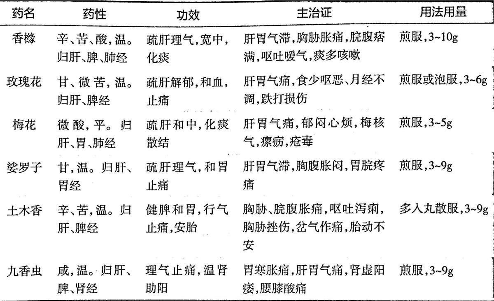
    - 使用注意
        - 理气药性多温燥，易耗气伤阴，故气虚、阴亏者应慎用
        - 破气药作用峻猛，孕妇慎用
    - 据脏腑不同选择用药 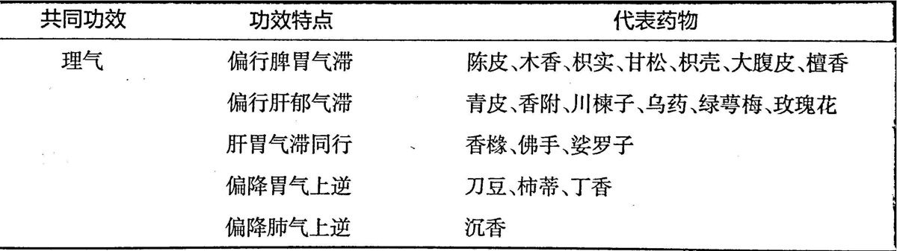
    - 据气滞的寒热属性不同选择用药 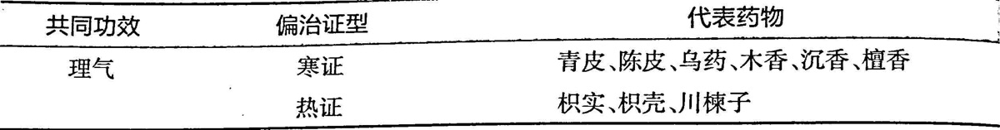
    - 据疼痛部位不同选择用药 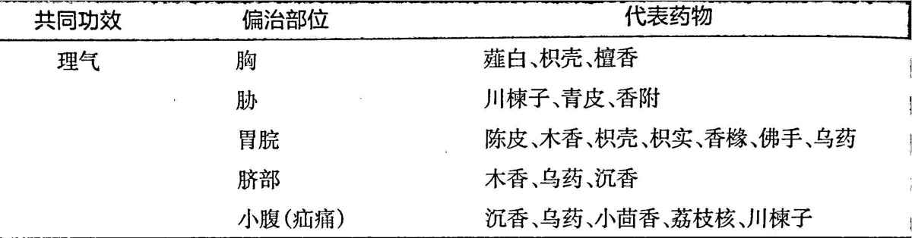
    - 据兼证不同选择用药 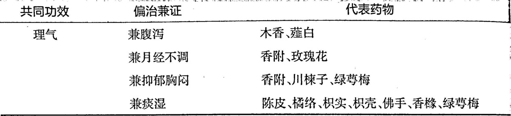
    - 据药物的功能选择用药 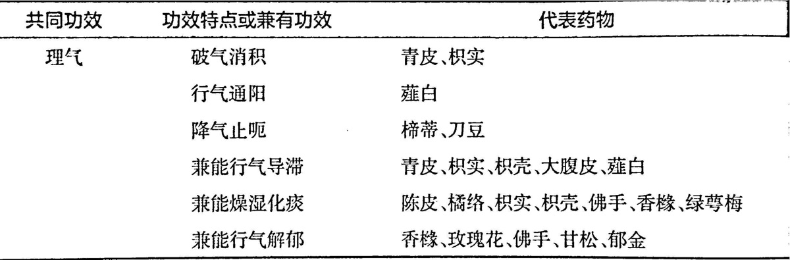
- **第九章 消食药**
    - 定义
        - **消食化积** **饮食积滞证**
    - 药性特点
        - 多甘平，归脾胃经
    - 功效与适应症
        - **消化饮食积滞**
            - **食积证**
            - 宿食不消引起的脘腹胀满、不思饮食、嗳气吞酸、恶心呕吐、大便失常
        - **开胃和中，个别药物可运脾**
            - 脾胃虚弱而致消化不良，食欲减退等
    - 分类
        - **山楂**
            - **药性**
                - 酸、甘，微温
            - **功效、应用**
                - **消食化积**
                    - 本品善消肉积
                    - **饮食积滞**
                        - 脘腹胀满、腹痛泄泻等
                    - 可单用，或配伍神曲、麦芽及木香、积壳等
                - **行气**
                    - **泻痢腹痛（炒焦或炒炭）**
                        - 现用于细菌性痢疾
                    - **疝气痛**
                - **活血散瘀**
                    - **产后瘀滞腹痛，恶露不尽**
                    - **瘀血痛经**
                    - **癥瘕积块（如肝脾肿大）**
                    - 单用煎汤冲砂糖服，亦可与当归、川芎、益母草等同用
                - **化浊降脂**
                    - **高脂血症**
            - **用法用量**
                - 9～12g，大剂量可用至30g
                - 消食散瘀——生山楂
                - 止泻止痢——生用、炒用均可
                - 焦山楂消食导滞作用更强
            - **使用注意**
                - 脾胃虚弱而无积滞者或胃酸分泌过多者均慎用
        - **神曲、麦芽、稻芽**
            - **焦三仙**
            - **相同点**
                - **消食和胃**
                    - **消化不良，饮食积滞**
                        - 尤善消米、面、薯、芋等淀粉类积滞
                    - 若脾虚运化无力，食欲不振者
                        - 与党参、白术等补气健脾药同用
            - **不同点**
                - **六神曲**
                    - **略兼解表**
                        - **外感表证兼食积者尤宜**
                    - 丸剂中有矿物，贝壳类药，每用神曲煮糊为丸，如磁朱丸等
                        - 既作赋形剂又能助消化
                    - 5～15g
                - **麦芽**
                    - **又疏肝、回乳消胀**
                        - **肝郁胁痛、妇女断乳**
                        - 生、炒麦芽各60g煎服
                    - 哺乳期妇女不宜使用
                - **谷芽**
                    - **消食功同麦芽而性较缓和**
            - **建神曲**
                - 本品为麦粉、麸皮和紫苏叶、荆芥、防风、羌活、薄荷、藿香、柴胡、厚朴、青皮、白术、木香、积实等四十多味药物经混合发而成的制品
                - 味苦性温，归脾、胃经
                - **消食化积，兼能理气化湿、发散风寒**
                    - 食积不化，或兼风寒表证
        - **莱菔子**
            - **药性**
                - 辛、甘，平
            - **功效、应用**
                - **消食除胀**
                    - **食积气滞，脘腹胀痛者**
                    - 味辛行气，善下气除胀满
                - **降气祛痰**
                    - **痰涎壅盛之咳嗽痰多，胸闷，口中粘腻**
                    - 常配苏子、白芥子
            - **用法用量**
                - 3～10g
            - **注意事项**
                - 凡气虚无食积者用，以防耗气
        - **鸡内金**
            - **药性**
                - 甘，平
            - **功效、应用**
                - **消食健胃**
                    - 消食化积力强
                    - 各种食积
                    - 消化不良
                    - 小儿疳积
                        - 配党参、白术
                - **涩精止遗**
                    - 遗精、遗尿及小便频数等
                - **通淋化石**
                    - 尿路结石、胆结石等
                    - 配金钱草、海金沙等
            - **用法用量**
                - 3～10g
            - **使用注意**
                - 脾虚无积滞者慎用
    - 配伍原则
        - 消食药往往配行气药同用，如陈皮、木香等，以增强行气导滞之功
        - 脾虚食积者可配伍健脾药，如党参、白术等以健脾助运消食
    - 消食药兼有功效归纳 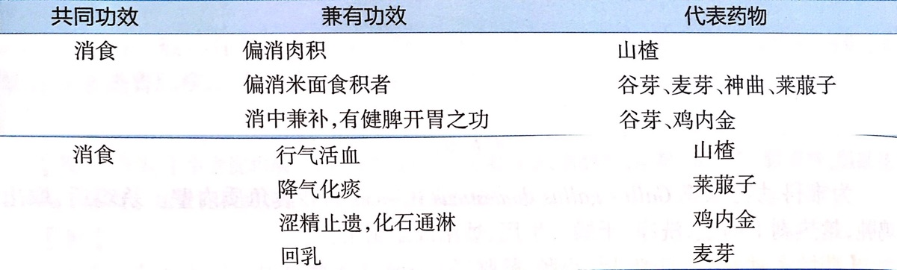
- **第十章 驱虫药**
    - 定义
        - **驱除或杀死人体内寄生虫** **虫证**
    - 药性特点
        - 多归脾胃、大肠经，部分有毒
    - 功效与适应症
        - **驱虫**
            - **蛔虫、钩虫、蛲虫、缘虫、姜片虫等肠道寄生虫病**
                - 脐腹胀痛，不思饮食，或易饥多食，嗜食异物，或肛门、耳、鼻骚痒，久则面色萎黄、形体瘦弱、腹大、浮肿
    - 分类
        - **使君子**
            - **药性**
                - 甘，温
            - **功效、应用**
                - **驱虫**
                    - 为驱蛔要药，尤宜于小儿
                    - **蛔虫病**
                        - 轻证单用炒香嚼服
                        - 重证可与苦楝皮、槟榔等同用
                    - **蛲虫病**
                        - 可与百步、槟榔、大黄等同用
                - **消积（健脾）**
                    - **小儿疳积**
                    - 见面色萎黄、形瘦腹大、腹痛有虫
                    - 常与槟榔、六曲、麦芽等配伍，如肥儿丸
            - **用法用量**
                - 使君子9～12g，捣碎入煎剂
                - 使君子仁6～9g，多入丸散或单用，作1～2次分服
                - 小儿每岁1～1.5粒，炒香嚼服，1日总量不超过20粒
            - **使用注意**
                - 大量服用可引起呃逆、眩晕、呕吐、腹泻等反应
                - 若与热茶同服能引起呃逆、腹泻，故服药时忌饮茶
        - **苦楝皮**
            - **药性**
                - 苦寒，有毒
            - **功效、应用**
                - **杀虫**
                    - 毒杀蛔虫、蛲虫、钩虫为主
                - **疗癣**
                    - 疥癣湿疮研末调涂
            - **用法用量**
                - 煎服，3～6g
                - 外用适量，研末，用猪脂调敷患处
            - **使用注意**
                - 有毒，不宜过量或持续久服
                - 孕妇及肝肾功能不全者慎服
        - **槟榔**
            - **药性**
                - 苦、辛，温
            - **功效、应用**
                - **杀虫**
                    - 善治绦虫证，有轻泻作用，有助于虫体排出
                    - 多种肠道寄生虫
                    - 方法
                        - 先用南瓜子研粉，冷开水调服60～120g
                        - 两小时后服槟榔60～120g的水煎剂
                        - 再过半小时，服玄明粉15g，促使泻下，以利虫体排出
                - **消积、行气**
                    - **食积气滞**
                        - 脘腹胀痛，嗳腐吞酸，大便不爽
                        - 配木香、枳实、青皮、大黄等，如木香槟榔丸
                    - **痢疾**
                        - 腹痛，里急后重
                        - 与木香、黄连、芍药等同用，如芍药汤
                - **利水**
                    - **水肿实证，腹胀气滞**
                        - 配厚朴、白术、泽泻等同用以行气利水
                    - **寒湿脚气，腿足肿痛**
                        - 配木瓜、吴茱萸、陈皮等同用，如鸡鸣散
                - **截疟**
                    - **疟疾**
                    - 常与柴胡、常山、草果等同用
            - **用法用量**
                - 煎服，3～10g
                - 驱绦虫、姜片虫30～60g
                - 焦槟榔用于治疗食积不消，泻痢后重
            - **使用注意**
                - 脾虚便溏或气虚下陷者忌用
                - 孕妇慎用
        - **南瓜子**
            - **驱绦虫为主**
        - **鹤草芽**
            - **杀灭绦虫为主**
            - 入散剂为宜，不入煎剂
        - **雷丸**
            - **杀绦虫、钩虫等**
            - 研粉服，不入煎剂
        - **鹤虱**
            - **驱杀多种肠道寄生虫**
        - **榧子**
            - **驱杀多种肠道寄生虫，兼能润肠通便、润肺止咳**
        -  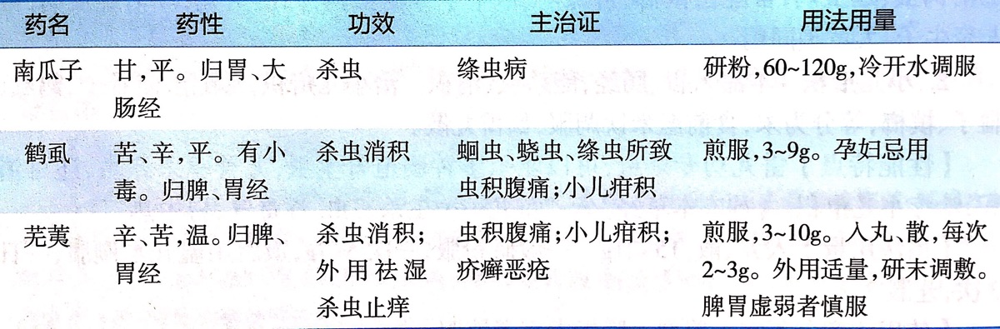
    - 配伍原则
        - 常配伍泻下药，以利虫体的排出
        - 脾胃虚弱者，可配健脾胃药，以防伤及脾胃
    - 使用注意
        - **空腹时**
        - **发热或腹痛剧烈时**
        - 驱虫药的用量一般大于常规药量，某些有毒性的药物应注意用量，以免损伤正气
        - 孕妇老弱者应慎用
    - 驱虫药兼有功效归纳 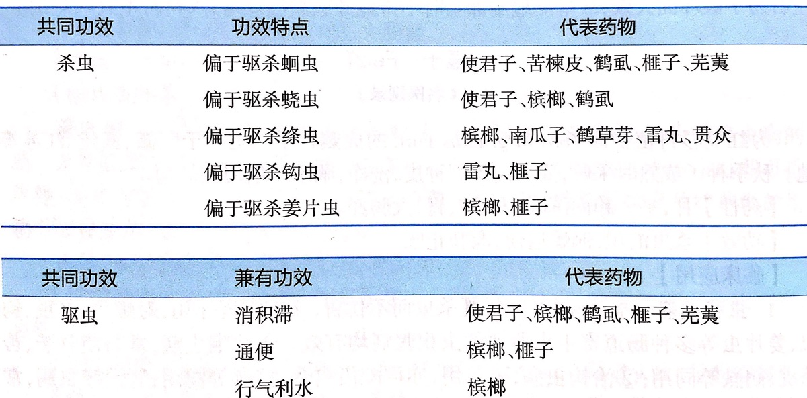
- **第十一章 止血药**
    - 定义
        - **制止体内外出血** **出血证**
            - **上部出血**
                - 咳血、吐血、衄血
            - **下部出血**
                - 便血、尿血、崩漏
            - 另有紫癜（肌衄）、外伤出血等
    - 药性特点、功效与适应症
        -  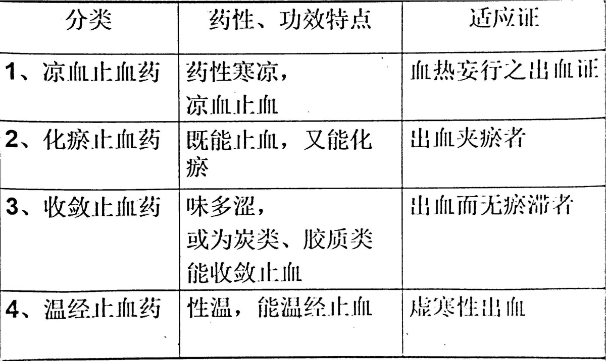
    - 分类
        - **凉血止血药**
            - **小蓟、大蓟**
                - **相同点**
                    - **凉血止血**
                        - **血热出血**
                    - **清热解毒，散瘀消痈**
                        - **热毒痈肿**
                - **不同点**
                    - **大蓟**
                        - **清热消痈作用较强**
                        - **止血应用广泛**
                            - **咯血、崩漏多用**
                        - 10～15g
                    - **小蓟**
                        - **兼利尿**
                            - **治尿血、血淋尤宜**
                        - 5～12g
            - **地榆、槐花**
                - **相同点**
                    - **凉血止血**
                        - **各种热性出血证**
                        - 性善下行，尤宜于下焦血热所致的便血、痔血
                - **不同点**
                    - **地榆**
                        - **药性**
                            - 苦、酸、涩，微寒
                        - **功效、应用**
                            - **兼收涩**
                                - **下焦血热之血、崩漏**
                            - **解毒敛疮**
                                - **烫伤、湿疹及疮疡痈肿**
                                - 配大黄粉，或配黄连、冰片
                        - **用法用量**
                            - 10～15g
                            - 外用适量，研末涂敷患处
                            - 止血多炒炭用，解毒敛疮多生用
                        - **使用注意**
                            - 性寒酸，虚寒性便血、下、崩漏及出血有瘀者慎用
                            - 治烧烫伤，忌大面积外用
                    - **槐花**
                        - **清肝火**
                            - **肝火上炎之头痛目赤**
                        - 夏枯草、菊花
                    - **槐角**
                        - **止血之力不及槐花，而清降泄热之力较强，兼能润肠**
                            - **肠热出血、痔疮出血**
                            - 常与地榆、黄芩、当归等同用，如槐角丸
                            - 6～10g
            - **侧柏叶**
                - **药性**
                    - 苦、涩，寒
                - **功效、应用**
                    - **凉血止血**
                        - 性寒，凉血止血；味涩，兼收敛止血
                        - **各种出血证，尤以血热者为宜**
                            - 配大蓟、小蓟、白茅根或生地
                        - **虚寒性出血**
                            - 配炮姜
                    - **化痰止咳**
                        - **咳嗽，对肺热咳嗽有痰者尤宜**
                    - **生发乌发**
                        - **脱发，须发早白**
                        - 内服外洗
                - **用法用量**
                    - 10～15g
                    - 止血多炒炭用，化痰止咳宜生用
            - **白茅根**
                - **药性**
                    - 甘，寒
                - **功效、应用**
                    - **凉血止血**
                        - **血热妄行之出血证**
                            - 咳血、吐血、衄血、尿血等
                        - **兼利尿，尤善用于尿血、血淋**
                    - **清热利尿**
                        - **热淋，水肿及湿热黄疸**
                        - 木通、滑石
                        - 茅根饮
                    - **善清肺胃热**
                        - **温热烦渴**
                        - **胃热呕吐**
                        - **肺热咳嗽**
                - **用法用量**
                    - 10～30g，鲜品加倍
            - **苎麻根**
                - **药性**
                    - 甘，寒
                - **功效、应用**
                    - **凉血止血**
                        - **血热出血**
                        - 咯血、吐血、衄血、崩漏、紫搬等及外伤出血诸证
                    - **安胎（要药）**
                        - **胎漏下血，胎动不安**
                        - 可配阿胶、当归、白芍同用
                    - **清热解毒**
                        - **热毒痈肿、丹毒**
                - **用法用量**
                    - 10～30g
                    - 外用适量，煎汤外洗，或鲜品捣敷
            - **[附] 羊蹄（土大黄）** 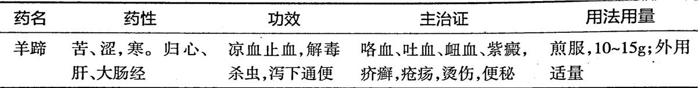
        - **化瘀止血药**
            - **三七**
                - **药性**
                    - 甘、微苦，温
                - **功效、应用**
                    - **化瘀止血**
                        - 止血不留瘀，化瘀不伤正
                        - **各种内外出血证，尤以有瘀者为宜**
                        - 单用内服外用均有良效，内服多研末吞服
                    - **活血定痛**
                        - **伤科要药**
                        - **跌打损伤，瘀滞疼痛**
                        - 可内服外敷
                    - **活血化瘀**
                        - **心腹瘀痛**
                        - 现临床常用三七总甙注射液治疗心脑血管疾病
                - **用法用量**
                    - **研末吞服，一次1～3g**
                    - 煎服，3～10g
                    - 外用适量
                - **使用注意**
                    - 孕妇慎用（活血）
            - **茜草qian**
                - **药性**
                    - 苦，寒
                - **功效、应用**
                    - **凉血化瘀止血**
                        - 凉血止血，又化瘀止血
                        - **血热夹瘀的出血证**
                            - 吐血、衄血、崩漏、尿血、便血
                    - **通经**
                        - **血瘀经闭**
                        - **跌打损伤**
                        - **风湿痹痛**
                - **用法用量**
                    - 6～10g
                    - 止血炒炭用
                    - 活血通经生用或酒炒用
            - **蒲黄**
                - **药性**
                    - 甘，平
                - **功效、应用**
                    - **化瘀止血**
                        - **各种内外出血证**
                        - 性平，出血证属寒属热，有无瘀滞均可用，以属实夹瘀者最宜
                    - **化瘀止痛**
                        - **瘀滞痛证**
                            - 如心腹瘀痛
                            - 配五灵脂（失笑散）
                    - **利尿**
                        - **血淋**
                        - 配生地、冬葵子（蒲黄散）
                - **用法用量**
                    - 5～10g，包煎
                    - 外用适量，研末外掺或调敷
                    - 止血多炒炭用，化瘀、利尿多生用
                - **使用注意**
                    - 孕妇慎用
            - **降香**
                - **药性**
                    - 辛，温
                - **功效、应用**
                    - **化瘀止血，理气止痛**
                        - **出血**
                        - 胸胁疼痛、跌损瘀痛
                - **用法用量**
                    - 9～15g，后下
                    - 外用适量，研细末敷患处
            - **[附] 花蕊石** 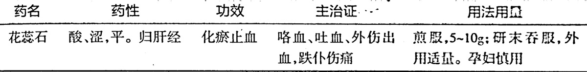
        - **收敛止血药**
            - **白及（芨）**
                - **药性**
                    - 苦、甘、涩，微寒
                - **功效、应用**
                    - **收敛止血**
                        - **收敛止血要药**
                        - **内外诸出血证**
                        - 常与三七粉同用
                            - 加强止血，又使止血不留瘀
                        - **肺胃出血、外伤出血**
                            - 咯血，肺阴不足
                                - 配枇杷叶，阿胶
                            - 胃出血之吐血、便血
                                - 配乌贼骨
                            - 外伤出血
                                - 研末撒在伤口上
                    - **（外用）消肿生肌**
                        - **痈肿**
                            - 配银花、皂角刺、天花粉
                        - **烫伤**
                            - 配虎杖
                        - **手足皲裂、肛裂**
                            - 研末麻油调涂，能促使裂口愈合
                - **用法用量**
                    - 煎服，6～15g
                    - **研末吞服，每次3～6g**
                    - 外用适量
                - **使用注意**
                    - 不宜与川乌、制川乌、草乌、制草乌、附子同用
            - **仙鹤草（龙牙草）**
                - **药性**
                    - 苦、涩，平
                - **功效、应用**
                    - **收敛止血**
                        - 咯血、吐血、衄血、便血、崩漏等多种出血证
                        - 性平，寒热虚实均可用
                    - **截疟**
                        - **疟疾寒热**
                    - **止痢**
                        - **血痢及久病泻痢**
                    - **解毒**
                        - **痈肿疮毒**
                    - **补虚强壮（脱力草）**
                        - **脱力劳伤**
                            - 神倦乏力，面色萎黄
                        - **小儿疳积**
                    - **杀虫**
                        - **滴虫性阴道炎**
                        - **阴痒带下**
                    - **癌肿和全血细胞减少症**
                - **用法用量**
                    - 6～12g
            - **棕榈炭（陈棕炭）、血余炭**
                - **相同点**
                    - **均苦涩平，收敛止血**
                        - 多种出血证，如止血、衄血、崩漏、便血、尿血等
                - **不同点**
                    - **棕榈炭**
                        - **尤多用于崩漏，以无瘀者为宜**
                        - 3～10g
                    - **血余炭**
                        - **化瘀**
                            - 止血不留瘀
                        - **利尿**
                            - **小便不通，血淋**
                        - 5～10g
            - **藕节**
                - **药性**
                    - 甘、涩，平
                - **功效、应用**
                    - **收敛止血，化瘀**
                        - **出血**
                            - 多用治肺胃出血
                            - 吐血、咯血、衄血、便血、虚寒性崩漏、血淋、尿血
                            - 小蓟饮子
                - **用法用量**
                    - 10～15g
            - **[附] 紫珠叶** 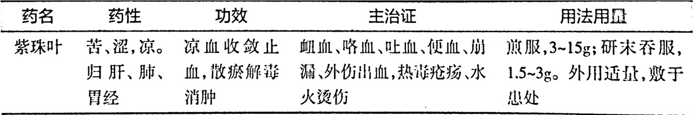
        - **温经止血药**
            - **艾叶（蕲艾）**
                - **药性**
                    - 辛、苦，温
                    - 有小毒
                - **功效、应用**
                    - 以温下焦为主，为妇产科常用药
                    - **温经止血**
                        - 虚寒出血，尤宜于崩漏
                        - 阿胶、地黄（胶艾汤）
                            - 止血补血
                    - **散寒调经**
                        - **月经不调** **、痛经、宫冷不孕**
                        - 虚寒者，配香附、吴茱萸、当归等
                            - 艾附暖宫丸
                    - **安胎**
                        - **胎漏下血、胎动不安**
                        - 配川断、桑寄生等
                    - **外用祛湿止痒**
                        - **湿疹、阴痒、疥癣**
                        - 煎汤外洗
                    - **艾灸**
                        - **温煦气血，透达经络**
                - **用法用量**
                    - 3～10g
                    - 外用适量，供灸治或熏洗用
                    - 温经止血宜炒炭用，余生用
            - **炮姜**
                - **药性**
                    - 苦，涩，温
                - **功效、应用**
                    - **温经止血**
                        - **虚寒性吐血、便血**
                            - 为治脾胃虚寒，脾不统血、吐血、便血要药
                        - **虚寒性崩漏**
                    - **温中止痛**
                        - **虚寒腹痛、腹泻**
                            - 配高良姜，如二姜丸
                        - **产后血虚腹痛**
                            - 配当归、川芎、桃仁，如生化汤
                    - **温中止痛**
                        - **虚寒腹痛、腹泻**
                            - 配高良姜、如二姜丸
                        - **产后血虚腹痛**
                            - 配当归、川芎、桃仁，如生化汤
                - **用法用量**
                    - 3～9g
                - **用法用量**
                    - 3～9g
                - **【炮姜、干姜、生姜功效比较】**
                    - 生姜为鲜品，味辛温，长于发散外寒，又能温中止呕，多用于外感风寒及胃寒呕吐等证
                    - 干姜为干燥老姜，味辛性热，辛散之力已减，善于温中而祛里寒，多用于脾胃虚寒，阴盛阳衰之厥逆，以及寒饮伏肺等证
                    - 干姜炮后，即为炮姜，味变苦涩，辛散作用更弱，温经止血是其所长，多用于虚寒性出血证
                    - 故前人有“生姜走而不守，干姜能走能守，炮姜守而不走”之说
            - **[附] 灶心土** 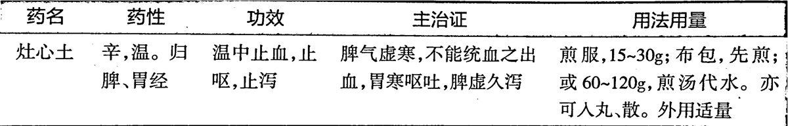
    - 配伍应用
        - 必须根据出血的不同原因和病情，选择药性相宜的止血药，并进行必要的配伍
            - 血热妄行而出血者
                - 应选择凉血止血药，并配伍清热泻火、清热凉血之品
            - 阴虚阳亢而出血者
                - 宜配伍滋阴降火、滋阴潜阳的药物
            - 若瘀血内阻，血不循经而外溢者
                - 应选化瘀止血药，并配伍行气活血药
            - 若虚寒性出血
                - 应选温经止血药，收敛止血药，多配伍益气健脾温阳之品
            - 若出血过多，气随血脱者
                - 则须急投大补元气之药以益气固脱
        - *“下血必升举，吐衄必降气”*
            - **升举**
            - **降气**
    - 使用注意
        - 凉血止血药、收敛止血药，易凉遏恋邪留瘀
            - 出血兼有瘀血者不宜单独使用
    - 止血药兼有功效归纳 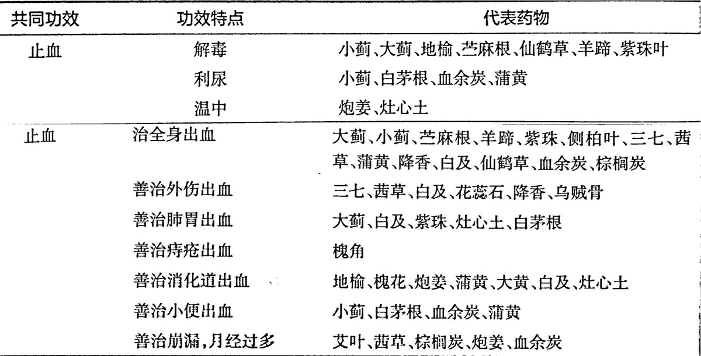
    - **［炒炭存性］**
        - 传统认为，中药止血药炒炭后，能增加止血效果
- **第十二章 活血化瘀药**
    - 定义
        - **疏通血脉、促进血行，消散瘀血** **瘀血证**
        - 活血作用强者，称破血药
    - 药性特点
        - 多辛苦温，主归肝、心经，入血分
    - 功效与适应症
        - 功效
            - **止痛、调经、疗伤、消痈、破血消癥**
            - **和血行血** **活血散瘀** **破血逐瘀**
        - 适应证
            - 一切血证，均可用之
            - **证候特点**
                - **疼痛特点**
                    - 痛如针刺，痛有定处
                - **肿块特点**
                    - 体表肿块色青紫
                    - 体内癥瘕，质硬压痛
                - **血证特点**
                    - 出血色紫，夹有血块
                - **望诊特点**
                    - 口唇、指甲青紫，舌质瘀斑瘀点
                - **脉象特点**
                    - 细涩或结代
            - **内科**
                - 胸、胁、脘、腹、头诸痛
                - 癓瘕积聚
                - 中风后半身不遂，肢体麻木及关节痹痛且久不愈
            - **妇科**
                - 经闭、痛经、月经不调、产后腹痛等
            - **伤科**
                - 跌打损伤，瘀滞肿痛
            - **外科**
                - 疮疡肿痛
    - 分类 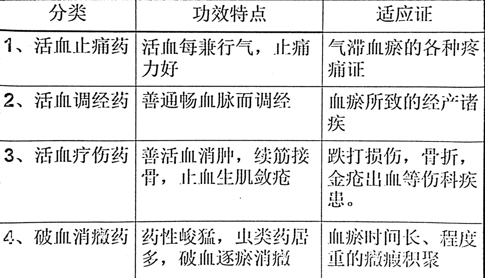
        - **活血止痛药**
            - **川芎（芎䓖）**
                - **药性**
                    - 辛，温
                - **功效、应用**
                    - **活血行气**
                        - **血瘀气滞之痛证**
                        - 既活血，又行气、被称为“血中气药”
                            - 肝郁气清，胁肋疼痛者
                            - 心脉瘀阻，胸痹心痛者
                            - 趺扑损伤，瘀血肿痛
                            - 痈疡脓成正虚难溃者
                        - “下调经水，中开郁结”，为调经要药
                            - 尤善治妇女月经不调、经闭、痛经、产后瘀滞腹痛
                            - 桃红四物汤
                    - **祛风止痛**
                        - “上行头目”
                            - **头痛要药**
                            - “头痛不离川芎”，无论风寒、风热、风湿、血虚、血瘀，均可随证配伍用之
                        - “旁通络脉”
                            - **风湿痹痛**
                                - 肢体疼痛麻木
                                - 配独活、柱枝、防风
                                    - 羌活胜湿汤
                    - *《本草纲目》：“头痛不离川芎，如不愈，加各引经药。太阳羌活，阳明白芷，少阳柴胡，太阴苍术，厥阴吴茱萸，少阴细辛。”*
                - **用法用量**
                    - 3～10g
            - **延胡索**
                - **药性**
                    - 辛、苦，温
                - **功效、应用**
                    - **活血，行气，止痛**
                        - **气血滞诸痛证**
                        - *李时珍言其“能行血中气滞，气中血滞，故专治一身上下诸痛”*
                        - 辛散温通，止痛作用优良，无论何种痛证（寒、热、气滞、血瘀），均可配伍应用
                            - 治胸痹心痛、胃痛、胁肋胀痛、妇女痛经、产后瘀滞腹蒲、寒疝腹痛、跌打损伤、风湿痹痛
                - **用法用量**
                    - 煎服，3～10g
                    - 研末吞服，1.5～3g
                    - 醋制
            - **郁金**
                - **药性**
                    - 辛、苦，寒
                - **功效、应用**
                    - **活血止痛、行气解郁**
                        - **血瘀气滞痛证**
                            - 胸、胁、腹痛（刺痛、胀痛）
                            - 痛经、乳房胀痛（尤其肝郁有热者）
                            - 瘀血阻滞胸痹心痛
                    - **清心（开窍）**
                        - **热病神昏**
                            - 配菖蒲、山栀
                        - **癫痫痰闭**
                            - 配白矾
                    - **凉血（止血）**
                        - **吐血、衄血及妇女倒经等气火上逆之出血证**
                        - **下焦血热，尿血、血淋**
                    - **利胆退黄**
                        - **湿热黄疸、胆石症**
                        - 茵陈、山栀
                    - *郁金：既活血又行气，性寒，可清心、凉血、清肝胆湿热*
                - **用法用量**
                    - 煎服，3～10g
                - **使用注意**
                    - 不宜与丁香、母丁香同用
            - **姜黄**
                - **药性**
                    - 辛、苦，温
                - **功效、应用**
                    - **破血行气**
                        - **血瘀气滞痛证**
                            - 心腹疼痛、痛经、经闭、月经不调、跌打损伤
                        - 活血力较强
                    - **通经止痛**
                        - **风湿痹痛**
                        - 尤长于行肢臂而除痹痛
                - **用法用量**
                    - 煎服，3～10g
                    - 外用适量
            - **乳香、没药**
                - **共同点**
                    - **活血止痛、消肿生肌**
                        - 为外伤科要药
                        - **伤科跌打损伤**
                            - 配血竭等
                            - 七厘散
                        - **外科疮疡肿毒初起，红肿热痛**
                            - 配金银花、白芷、乳香
                            - 仙方活命饮
                    - **活血行气止痛**
                        - **气滞血瘀诸痛证**
                            - 胸痹心痛、胃脘痛
                            - 痛经经闭，产后瘀痛
                            - 风湿痹痛
                - **不同点**
                    - **乳香**
                        - **偏于行气，伸筋**
                            - 风湿痹证
                    - **没药**
                        - **偏于散血化瘀**
                - **用法用量**
                    - 煎服或入丸、散，3～5g
                - **使用注意**
                    - 孕妇及胃弱者慎用
            - **五灵脂**
                - **药性**
                    - 苦、甘，温
                - **功效、应用**
                    - **活血止痛**
                        - **血瘀痛证**
                            - 胸、胁、脘、腹刺痛
                            - 痛经、经闭，产后瘀滞腹痛
                                - 蒲黄（失笑散）
                            - 骨折肿痛
                    - **化瘀止血**
                        - **出血证属血瘀内阻，血不循经者**
                            - 妇女血瘀崩漏
                        - 蒲黄（失笑散）
                - **用法用量**
                    - 3～15g，包煎
                    - 或入丸、散剂服，外用适量
                    - 化瘀止血宜炒用，活血止痛宜生用
                    - 醋炙
                - **使用注意**
                    - 孕妇慎服
                    - 人参畏五灵脂
        - **活血调经药**
            - **（紫）丹参**
                - **药性**
                    - 苦，微寒
                - **功效、应用**
                    - **活血调经**
                        - **血瘀之妇科经产诸疾**
                            - 月经不调，痛经，经闭，产后瘀滞腹痛
                        - **性微寒而缓，祛瘀生新而不伤正**
                            - *“一味丹参散，功同四物汤”*
                                - 非指补血，而指祛瘀生新
                        - **妇科调经要药**
                    - **祛瘀止痛**
                        - **血瘀证**
                            - 胸痹、脘腹疼痛
                                - 配檀香、砂仁
                            - 癥瘕积聚
                                - 配三棱、莪术
                            - 跌打损伤
                                - 配乳香、没药
                            - 风湿痹痛
                                - 配当归、羌活、独活
                    - **清心除烦（安神）**
                        - **热病烦躁昏迷**
                            - 配生地、玄参、黄连
                        - **杂病心悸失眠**
                            - 配酸枣仁、柏子仁
                            - 天王补心丹
                    - **凉血消痈**
                        - **血热瘀滞的疮疡痈肿**
                - **用法用量**
                    - 10～15g
                - **使用注意**
                    - 不宜与藜芦同用
            - **红花** **、桃仁**
                - **相同点**
                    - **活血祛瘀**
                        - **血瘀证**
                            - 经闭、痛经
                                - 配当归、川芎
                                - 桃红四物汤
                            - 产后瘀滞腹痛
                                - 配炮姜、川芎等
                            - 癥积痞块
                                - 配桂技、丹皮、赤芍
                            - 跌打损仿，瘀肿疼痛
                                - 红花油或红花酊涂搽
                - **不同点**
                    - **桃仁**
                        - **活血作用较强，又祛瘀消痈**
                            - **肺痈**
                                - 配苇茎、冬瓜仁
                                - 苇茎汤
                            - **肠痈**
                                - 配大黄、丹皮
                                - 大黄牡丹皮汤
                        - **润肠通便**
                            - **肠燥便秘**
                            - 配当归、麻仁
                        - **止咳平喘**
                            - **咳嗽气喘**
                            - 配杏仁
                        - 5～10g
                        - 孕妇慎用
                    - **红花**
                        - **活血通经**
                            - **活血通经作用较好，妇产科血瘀病证的常用药**
                        - **活血消斑**
                            - **热郁血瘀的斑疹色暗**
                            - 以番红花效好
                                - 性微寒，又可凉血解毒
                                - **西红花（藏红花、番红花）**
                                    - 甘，平
                                    - **活血化瘀，凉血解毒，解郁安神**
                                        - 经闭癥瘕，产后瘀阻，温毒发斑，忧郁痞闷，惊悸发狂
                                    - 煎服或沸水泡服，1~3g
                                    - 孕妇慎用
                        - *《本草衍义补遗》：“多用则破血，少用则养血”*
                        - 3～10g
                        - 孕妇慎用
            - **益母草（茺蔚子）、泽兰**
                - **相同点**
                    - **活血调经**
                        - **血滞经闭、痛经**
                        - **产后瘀滞腹痛，恶露不尽**
                        - **其它血瘀证亦可用**
                            - 跌打损伤、瘀肿疼痛及痈肿
                    - **利水消肿**
                        - **水肿，小便不利**
                        - 对水瘀互阻的水肿尤为适宜，现多用于肾炎水肿
                - **不同点**
                    - **益母草**
                        - **妇科经产要药**
                            - 可单用熬膏服
                                - 益母草流浸膏
                                - 益母草膏
                        - **清热解毒**
                            - **疮痈肿毒**
                        - 9～30g
                        - 孕妇慎用
                        - **茺蔚子**
                            - 味甘性微寒
                            - **活血调经之功与益母草相似，又能凉肝明目**
                                - **肝热头痛、目赤肿痛等证**
                                    - 青箱子、决明子
                                - **治目黯昏花、目生翳障者**
                                    - 枸杞子、生地黄等
                            - 瞳孔散大、血虚无瘀者慎用
                            - 5～10g
                    - **泽兰**
                        - **伤科跌打损伤，瘀肿疼痛多用**
                        - 6～12g
            - **怀牛膝**
                - **药性**
                    - 辛、苦，微温
                    - 性善下行
                - **功效、应用**
                    - **活血通经**
                        - **通月经**
                            - 妇科血瘀之经产诸疾
                            - 经闭、痛经、月经不调、产后腹痛
                        - **通经络**
                            - 跌打伤痛
                            - 配当归、桃仁、红花等
                            - 血府逐瘀汤
                    - **补肝肾，强筋骨，兼能祛除风湿**
                        - *怀牛膝独有，川牛膝无*
                        - **肾虚腰痛**
                            - 配杜仲、续断、补骨脂等
                        - **久痹腰膝酸痛乏力**
                            - 配独活、桑寄生等
                            - 独活寄生汤
                        - **湿热成痿，足膝痿软**
                            - 配苍术、黄柏
                            - 三妙丸
                    - **利尿通淋**
                        - **淋证**
                        - **水肿，小便不利**
                            - 济生肾气丸
                    - **引火（血）下行**
                        - **肝阳上亢**
                            - 头痛眩晕，目赤
                            - 配代赭石、牡蛎
                            - 镇肝息风汤
                        - **胃火上炎**
                            - 齿龈肿痛，口舌生疮
                            - 配地黄、石膏、知母
                            - 玉女煎
                        - **气火上逆，迫血妄行**
                            - 吐、衄血
                            - 配白茅根、山栀、代赭石
                - **用法用量**
                    - 5～12g
                - **使用注意**
                    - 孕妇慎用
                - **川牛膝**
                    - **活血通经**
                    - **通利关节**
                    - **利尿通淋**
                - **如何理解牛膝“性善下行”的特点？**
                    - **所治疾病部位**
                    - **病势向上之证**
                    - **引经药**
            - **鸡血藤**
                - **药性**
                    - 苦、甘，温
                - **功效、应用**
                    - **行血补血，调经**
                        - **性和缓，兼补血作用，善调经**
                            - 血瘀或血虚所致妇科经产诸疾
                            - 血虚萎黄
                    - **舒筋活络**
                        - **风湿痹痛**
                        - **中风手足麻木，肢体瘫痪**
                - **用法用量**
                    - 9～15g
            - **王不留行**
                - **药性**
                    - 苦，平
                - **功效、应用**
                    - **活血通经**
                        - **血瘀经闭，痛经**
                        - 配当归、川芎、红花
                    - **下乳消痈**
                        - **产后乳汁不下**
                            - 配穿山甲
                        - **乳痈**
                            - 配瓜蒌，蒲公英
                    - **利尿通淋**
                        - **热淋、血淋、石淋**
                - **用法用量**
                    - 5～10g
                - **使用注意**
                    - 孕妇慎用
            - **[附] 月季花、凌霄花** 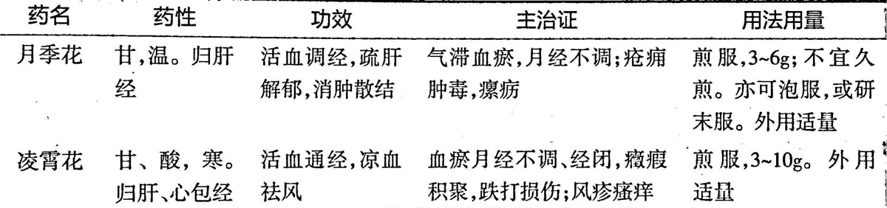
        - **活血疗伤药**
            - **土鳖虫（地鳖虫、䗪虫）**
                - **药性**
                    - 咸，寒；有小毒
                - **功效、应用**
                    - **破血逐瘀**
                        - **续筋接骨**
                            - 伤科常用
                            - 跌打损伤，筋伤骨折，瘀肿疼痛
                            - 可单味研末调敷，或研末黄酒冲服，或配自然铜、骨碎补、乳香等
                        - **通经消癥**
                            - 经闭、产后瘀滞腹痛、癥积等血瘀重证
                            - 下瘀血汤，鳖甲煎丸
                - **用法用量**
                    - 3～10g
                - **使用注意**
                    - 孕妇禁用
            - **马钱子**
                - **药性**
                    - 苦，温；有大毒
                - **功效、应用**
                    - **通络止痛**
                        - **跌打损伤，骨折肿痛**
                        - **风湿顽痹、麻木瘫痪**
                        - 本品有较强的开通经络，透达关节而止痛的作用
                        - 临床有报道，以本品治重症肌无力
                    - **散结消肿（外用）**
                        - **痈疽肿痛，咽喉肿痛**
                - **用法用量**
                    - 炮制后入丸、散，每次0.3～0.6g
                    - 外用适量，研末调敷
                - **使用注意**
                    - 孕妇禁用
                    - 不宜多服久服及生用
                    - 运动员慎用
                    - 有毒成分能被皮肤吸收，外用不宜大面积涂敷
            - **自然铜**
                - **药性**
                    - 辛，平
                - **功效、应用**
                    - 伤科接骨续筋要药
                    - **散瘀止痛，续筋接骨**
                        - **跌打损伤，骨折筋断，瘀肿疼痛**
                        - 配乳香、没药等，内服外敷均可
                - **用法用量**
                    - 3～9g，宜先煎
                    - 多醋淬研末人丸散服，每次0.3g
                    - 外用适量
            - **苏木**
                - **药性**
                    - 甘、咸，平
                - **功效、应用**
                    - **活血疗伤**
                        - **跌打损伤，骨折伤筋，瘀滞肿痛**
                        - 常配乳香、没药、自然铜等
                        - 八厘散
                    - **祛瘀通经**
                        - **妇科血经闭、痛经、产后瘀滞腹痛**
                        - **心腹瘀痛**
                        - **痈肿疮毒**
                - **用法用量**
                    - 3～9g
                    - 外用适量，研末撒敷
                - **使用注意**
                    - 孕妇慎用
            - **骨碎补**
                - **药性**
                    - 苦，温
                - **功效、应用**
                    - **活血疗伤（伤科要药）**
                        - **跌扑损伤，瘀肿疼痛**
                            - 可单用本品浸酒服，并外敷
                        - **金创，损伤筋骨**
                    - **补肾强骨**
                        - 温补肾阳，强筋骨，益虚损
                            - **肾虚腰痛脚弱、耳鸣、耳聋、牙痛**
                            - **肾虚久泻**
                    - **（外用）消风祛斑**
                        - **斑秃、白癜风**
                - **用法用量**
                    - 3～9g
                    - 外用适量，研末调敷或鲜品捣敷
            - **血竭（麒麟竭）**
                - **药性**
                    - 甘、咸，平
                - **功效、应用**
                    - **活血定痛**
                        - 本品入血分，为伤科要药
                        - **跌打损伤**
                            - 常配乳香、没药，加七厘散
                        - **产后瘀滞腹痛、痛经、经闭**
                        - **一切瘀血心腹刺痛**
                    - **止血生肌**
                        - **外伤出血**
                        - **疮疡不敛**
                        - 常配乳香、没药等研末外用
                        - 临床，单用血竭治胃、十二指溃疡、食道静脉破裂等各种上消化道出血，有较好疗效
                    - **儿茶**
                        - **又清肺化痰**
                            - **肺热咳嗽**
                - **用法用量**
                    - 研末，1～2g，或入丸剂
                    - 外用研末撒或入膏药用
            - **[附] 儿茶、刘寄奴** 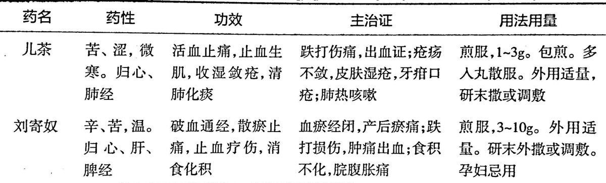
        - **破血消癥药**
            - **莪术、三棱**
                - **相同点**
                    - **破血行气**
                        - **血瘀气滞重证**
                        - 癥瘕积聚，癌肿，经闭痛经，心腹瘀痛
                    - **消积止痛**
                        - **食积脘腹胀痛**
                        - 常相须而用
                - **不同点**
                    - **三棱**
                        - **偏于破血**
                        - 5～10g
                        - 醋炙后可增强祛瘀止痛作用，外用适量。
                        - 孕妇禁用；不宜与芒硝、玄明粉同用
                    - **莪术**
                        - **偏于破气**
                        - 6～9g
                        - 月经过多者慎用，孕妇禁用
            - **水蛭**
                - **药性**
                    - 咸、苦、平；有小毒
                    - 入血分，其力峻效宏
                - **功效、应用**
                    - **破血通经，逐瘀消癥**
                        - **癥瘕积聚，经闭，跌打损伤等血瘀重证**
                    - **水蛭素强抗凝**
                        - **高血脂症、脑出血颅血肿、冠心病心绞痛**
                - **用法用量**
                    - 煎服，1～3g
                    - 外用适量
                    - 研末服，0.3－0.5g
                    - 以入丸散或研末服为宜，或用活水蛭放于瘀肿部位吸血消肿
                - **使用注意**
                    - 孕妇及月经过多者忌用
            - **穿山甲**
                - **药性**
                    - 咸，微寒
                - **功效、应用**
                    - **活血消癥，通经**
                        - 性善走窜，内达脏腑经络
                            - **癥瘕，血瘀经闭**
                            - **风湿痹痛**
                                - 关节不利，麻木拘挛
                                - 配白花蛇，蜈蚣等
                    - **下乳**
                        - **产后乳汁不下**
                    - **消肿排脓**
                        - **痈肿疮毒，瘰疠**
                        - 仙方活命饮
                        - 可使末成脓者消散，已成脓者速溃
                - **用法用量**
                    - 5～10g
                    - 生用；或洗净，砂炒至鼓起；或炒后再加人醋淬，用时捣碎
                - **使用注意**
                    - 孕妇慎用
            - **[附] 虻虫、斑蝥** 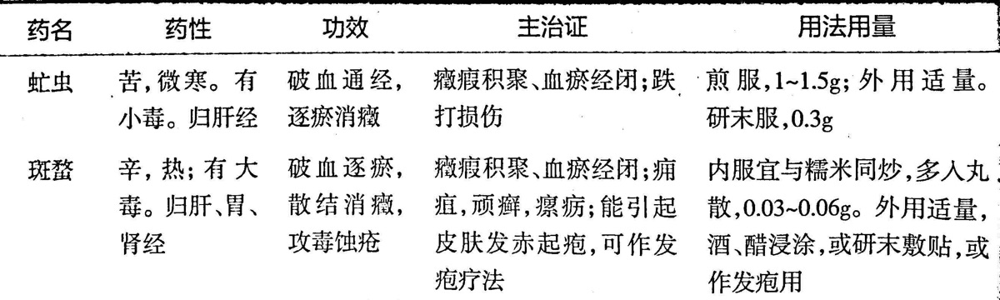
    - 配伍原则
        - 据各类药物的不同特点加以选择
        - 需针对形成瘀血的不同病因病情，随证配伍，以标本兼顾
            - 气虚血瘀、气滞血瘀⋯
        - 为了提高活血祛瘀之效，常与理气药配伍同用
            - 因“气为血帅”、“气滞血亦滞”、“气行则血行”
    - 使用注意
        - 活血药易耗血动血
            - 妇女月经过多及其他出血证无瘀血现象者忌用
            - 孕妇慎用或忌用
    - 活血化瘀药兼有功效归纳 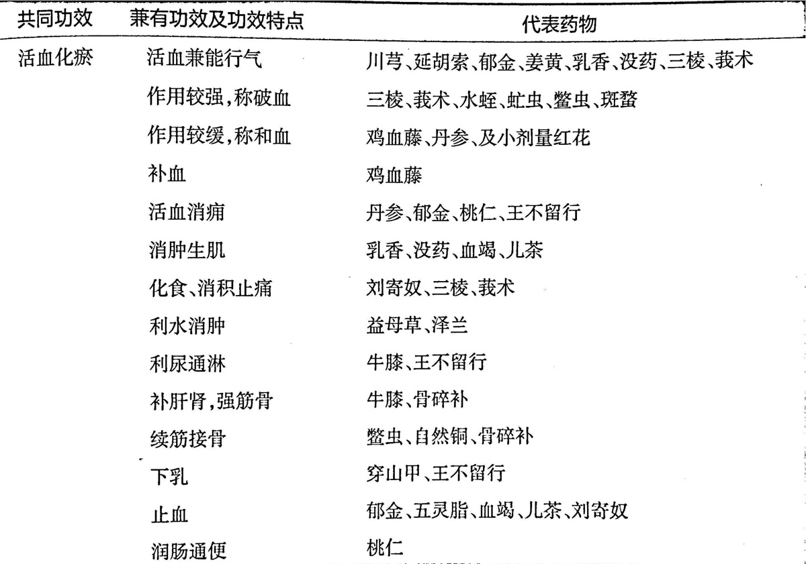
    - **[引火下行]**
        - 引上炎之火下行，而消退火热之证谓之引火下行
            - 肝火上炎之目赤肿痛
            - 肝阳上亢之头痛眩晕
            - 胃火上炎之牙龈肿痛
            - 心火上炎之口舌生疮
            - 血热妄行之吐衄
        - 由于火降而使血不上溢，故亦称“引血下行”
    - **[祛瘀生新]**
        - 瘀血阻滞，血行不畅，则影响新血生长，应用活血祛瘀药，祛除瘀血以利于新血的生长，谓之祛瘀生新
- **第十三章 化痰药**
    - 定义
        - **祛痰或消痰** **痰证**
            - **祛痰**
                - 祛除肺家有形之痰液
            - **消痰**
                - 消除全身各处致病的痰，如痰核、瘰疠
    - 功效与适应症
        - **痰证**
            - 痰者，既是病理产物，又是致病因子
            - “随气升降，无处不到”，所以痰证甚多
            - **痰阻于肺**
                - 咳喘痰多
            - **痰蒙心窍**
                - 昏迷、癲痫
            - **痰蒙清阳**
                - 眩晕
            - **肝风夹痰**
                - 中风、惊厥
            - **痰阻经络**
                - 肢体麻木，半身不遂，口眼歪斜
            - **痰火互结**
                - 瘰疠、瘿瘤
            - **痰凝肌肉，流注骨节**
                - 阴疽流注
    - 分类 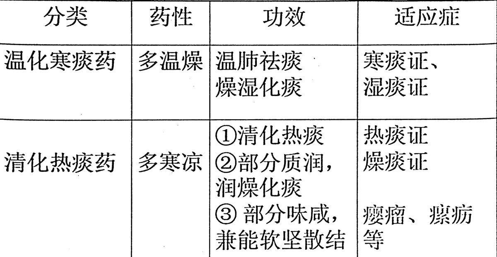
        - **温化寒痰药**
            - **半夏**
                - **炮制品**
                    - **清半夏（白矾制）**
                        - 消除辛辣刺激咽喉的副作用，降低毒性
                    - **姜半夏（生姜、白矾制）**
                        - 加强降逆止呕之功
                    - **法半夏（石灰、甘草液制）**
                        - 长于燥湿而温性较弱
                - **药性**
                    - 辛，温；有毒
                    - 归脾、胃、肺经
                - **功效、应用**
                    - **燥湿化痰**
                        - 为燥湿化痰、温化寒痰之要药
                        - 尤善治脏腑之湿痰
                        - **湿痰，寒痰证**
                            - 咳嗽气逆，痰多质稠或质稀
                            - 配橘皮
                                - 二陈汤
                        - **湿痰眩晕**
                            - 配天麻白术
                                - 半夏白术天麻汤
                    - **降逆止呕**
                        - 为止呕要药
                        - **痰饮或胃寒呕吐尤宜**
                            - 配生姜（相畏）
                            - 小半夏汤
                        - **胃热呕吐**
                            - 配黄连
                        - **胃阴虚呕吐**
                            - 配麦冬
                        - **胃气虚呕吐**
                            - 配人参、白蜜
                            - 大半夏汤
                        - **妊娠呕吐**
                            - 虽有妊娠禁忌之说，但历代也有配扶正安胎之品而用之
                    - **消痞散结**
                        - **心下痞满**
                            - 心下：指胃脘部
                            - 配干姜、黄连、黄芩
                            - 半夏泻心汤
                        - **痰热结胸**
                            - 结胸：脾脘部
                            - 配瓜蒌、黄连
                            - 小陷胸汤
                        - **梅核气**
                            - 配紫苏、厚朴、茯苓
                            - 半夏厚朴汤
                    - **外用消肿止痛**
                        - **瘿瘤痰核**
                        - **痈疽肿毒**
                        - **毒蛇咬伤**
                - **用法用量**
                    - 3～9g，内服一般炮制后使用
                        - **姜半夏**
                            - 长于降逆止呕
                        - **法半夏**
                            - 长于燥湿且温性较弱
                        - **半夏曲**
                            - 有化痰消食之功
                        - **竹沥半夏药**
                            - 性由温变凉，能清化热频，主治热痰、风痰之证
                    - 外用适量，磨汁涂或研末以酒调敷患处
                - **使用注意**
                    - 性温燥，阴虚燥咳、血证应慎用
                        - 然经过配伍，热痰证亦可用之
                    - 孕妇慎用
                    - 不宜与乌头类、附子同用
                    - 生品内服宜慎
            - **天南星**
                - **药性**
                    - 苦、辛，温；有毒
                    - **肝**
                - **功效、应用**
                    - **燥湿化痰**
                        - 温燥之性较半夏强
                        - **湿痰，寒痰证**
                            - 顽痰阻肺，咳喘胸闷
                                - 配半夏、枳实
                                - 导痰汤
                            - 痰热咳嗽
                                - 配黄芩、瓜蒌
                    - **祛风止痉**
                        - 归肝经，善祛经络之风痰
                        - **风痰证**
                            - 眩晕，半身不遂，手足顽麻，口眼歪斜；破伤风，角弓反张
                    - **外用散结消肿**
                        - **痈疽肿痛**
                        - **毒蛇咬伤**
                    - **胆南星**
                        - 苦、微辛，凉
                        - **清热化痰**
                            - **痰热咳嗽，咯痰黄稠**
                        - **息风定惊**
                            - **中风痰迷，癫狂惊痫**
                        - 3～6g
                - **用法用量**
                    - 煎服，3～9g，内服多制用
                    - 外用适量，研末以醋或酒调敷患处
                - **使用注意**
                    - 孕妇慎用
                    - 生品内服宜慎
            - **白附子（禹白附）**
                - **药性**
                    - 辛，温；有毒
                    - 归胃、肝经
                - **功效、应用**
                    - **风痰证**
                        - 辛温，善祛风痰
                        - 其性上行，尤擅治头面部诸疾
                        - **祛风痰，止痉，止痛**
                            - **中风口眼歪斜**
                                - 牵正散
                            - **惊风痫、破伤风**
                            - **痰厥头痛、偏正头痛**
                    - **关白附**
                        - 辛，热；有毒；归胃、肝经
                        - **祛风逐寒湿，止痛定惊**
                            - **中风痰壅，口眼㖞斜，惊风癫痫，破伤风，偏头痛，风寒湿痹，湿疹等**
                        - 1.5～4.5g，或入丸散，外用适量
                        - 毒性较大，不应与白附子混滑
                - **用法用量**
                    - 3～6g，一般炮制后用
                    - 外用适量，生品捣烂，熬膏或研末以酒调敷患处
                - **使用注意**
                    - 辛温燥烈有毒，故阴虚、血虚动风或热盛动风者不宜使用
                    - 孕妇慎用
                    - 生品内服宜慎
            - **芥子**
                - **药性**
                    - 辛，温
                    - 归肺经
                - **功效、应用**
                    - **温肺豁痰利气**
                        - **寒痰壅肺**
                            - 咳喘，胸闷痰多
                            - 配苏子、菜菔子
                            - 三子养亲汤
                        - **悬饮**
                            - 咳喘，胸满胁痛
                            - 配甘遂、大戟
                    - **散结通络止痛**
                        - 善治“皮里膜外之痰”
                        - **痰滞经络，关节麻木肿痛**
                        - **痰湿流注，阴疽流注**
                            - 配鹿角胶、肉桂、熟地
                            - 阳和汤
                - **用法用量**
                    - 3～9g
                    - 外用适量
                - **使用注意**
                    - 本品辛散走窜，气虚阴亏及有出血倾向者忌用
            - **皂荚**
                - **药性**
                    - 辛、咸，温；有小毒
                    - 归肺、大肠经
                - **功效、应用**
                    - **祛痰开窍，散结消肿**
                        - **顽痰阻肺咳喘证**
                        - **痰涎壅盛，关窍闭阻之证**
                        - **痈疽肿毒**
                    - **皂角刺**
                        - 辛，温，归肝、胃经
                        - **消肿托毒，排脓杀虫**
                            - **痈疽初起或脓成不溃**
                            - **外治疥癣麻风**
                        - 3～10g，外用适量，醋蒸取汁涂患处
                - **用法用量**
                    - 1～1.5g，多入丸散用
                - **使用注意**
                    - 本品辛散走窜，孕妇、气虚阴亏及有出血倾向者忌用
            - **[附] 猫爪草** 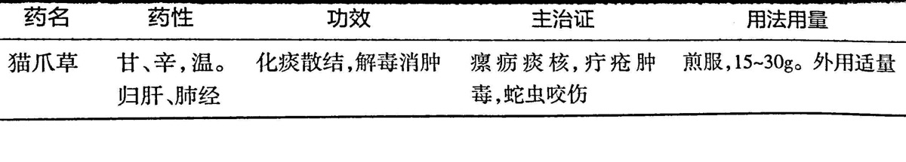
        - **药性平和的化药**
            - **旋覆花**
                - **药性**
                    - 苦、辛、咸，微温
                    - 趋向沉降
                    - 归肺、脾、胃、大肠经
                - **功效、应用**
                    - **降气化痰**
                        - **肺气**
                        - 寒痰、热痰均可配伍应用
                    - **降逆止呕**
                        - **胃气**
                        - 配赭石、半夏、生姜
                            - 旋覆代赭汤
                    - **金沸草**
                        - **降气，消痰，行水**
                            - **外感风寒，痰饮蓄结，咳喘痰多，胸膈痞满**
                            - 煎服，5～10g
                - **用法用量**
                    - 3～9g，包煎
                - **使用注意**
                    - 本品温散，阴虚劳嗽及津伤燥咳者忌用
            - **白前** **、前胡**
                - **相同点**
                    - **降气祛痰止咳**
                        - **咳嗽痰多、胸闷**
                        - 无论属寒属热，外感内伤，新咳久咳均可用
                - **不同点**
                    - **白前**
                        - **性微温，偏温肺祛痰，多用于内伤咳嗽**
                    - **前胡**
                        - **性微寒，又宣散风热，多用于风热及痰热咳嗽**
            - **桔梗**
                - **药性**
                    - 苦、辛，平
                    - 趋向升浮
                    - 归肺经
                - **功效、应用**
                    - **宣肺**
                        - 辛散苦泄，宣开肺气
                        - **祛痰**
                            - 肺气不宣的咳嗽痰多，胸闷不畅（寒热皆可）
                            - 配紫苏、杏仁或桑叶、菊花
                        - **利咽**
                            - 咽痛，失音
                            - 配甘草
                            - 甘桔汤
                        - **排脓**
                            - 肺痈吐脓
                            - 配鱼腥草、冬瓜仁
                    - **宣开肺气而通二便**
                        - 提壶揭盖法
                        - **癃闭、便秘**
                        - 《珍珠囊》称桔梗为“舟楫之剂”
                            - 指桔梗具有升浮之性，如舟楫载药上行达于上焦，常用作引经药治疗胸膈以上疾病
                            - 如在升陷汤、三物白散、参苓白术散中的应用
                - **用法用量**
                    - 3～10g
                - **使用注意**
                    - 气机上逆之呕吐、呛咳、眩晕及阴虚火旺咳血不宜用
                    - 用量过大易致恶心呕吐
        - **清化热痰药**
            - **川贝母、浙贝母**
                - **相同点**
                    - 均性寒
                    - **清热化痰**
                        - **肺热燥咳、痰热咳嗽**
                        - 配瓜蒌，知母
                    - **散结消痈**
                        - **瘰疠**
                            - 配玄参、牡蛎
                        - **乳痈、肺痈**
                            - 配蒲公英、鱼腥草
                    - 不与乌头同用
                - **不同点**
                    - **川贝母**
                        - 甘味较著，甘润之性强
                        - **润肺止咳力佳**
                            - **阴虚燥咳，久咳痨嗽等内伤咳嗽尤宜**
                        - **用量**
                            - 研末冲服，每次1～2g
                    - **浙贝母**
                        - 苦味较著，偏于苦泄
                        - **清热化痰力佳**
                            - **风热、痰热等咳嗽更宜**
                        - **清热解毒、散结消痈力强**
                            - **瘰疠、痈肿等热毒证多用**
                        - 5～10g
            - **瓜蒌（栝楼）**
                - **药性**
                    - 甘、微苦，寒
                    - 归肺、胃、大肠经
                - **功效、应用**
                    - **清热化痰**
                        - **痰热咳喘**
                            - 配黄芩、胆南星、枳实
                            - 清气化痰丸
                        - **瓜蒌仁可润肺化痰**
                            - 肺燥咳嗽
                    - **宽胸散结**
                        - 痰阻气郁者
                        - **胸痹**
                            - 配薤白
                            - 栝楼薤白白酒汤
                        - **结胸**
                            - 配黄连、半夏
                            - 小陷胸汤
                    - **清热散结消痈**
                        - **肺痈**
                            - 配鱼腥草、芦根
                        - **肠痈**
                            - 配败酱草、红藤
                        - **乳痈**
                            - 初起，红肿热痛
                            - 配当归、乳香、没药
                    - **润燥滑肠（瓜萎仁）**
                        - **肠燥便秘**
                        - 配火麻仁，郁李仁
                - **用法用量**
                    - 9～15g
                    - 天花粉、瓜萎皮、瓜蒌子、全瓜蒌四药同出一物
                        - **瓜蒌子**
                            - **润肺化痰、滑肠通便**
                        - **瓜蒌皮**
                            - **清热化痰、利气宽胸**
                        - **天花粉**
                            - **清热泻火生津，又消肿排脓**
                - **使用注意**
                    - 脾虚便溏者忌用
                    - 不宜与乌头类、附子同用
            - **竹茹、竹沥、天竺黄**
                - **相同点**
                    - 均来源于竹
                    - 性寒
                    - **清热化痰**
                        - **痰热咳喘**
                    - **竹沥、天竺黄**
                        - **定惊**
                            - **热病或痰热而致的惊风，癲痫，中风**
                            - **昏迷，喉间痰鸣**
                - **不同点**
                    - **天竺黄**
                        - **清心定惊之力尤胜**
                        - **多用于小儿惊风，热病神昏**
                        - 3～9g
                    - **竹沥**
                        - 性寒滑利，清热祛痰力强
                        - **豁痰、定惊、利窍**
                            - **肺热顽痰，胶结难咯者多用**
                            - **中风痰迷、惊痫癫狂**
                        - 15～30ml，冲服
                        - 脾虚便溏者忌用
                    - **竹茹**
                        - **长于清心除烦**
                            - **痰热扰心的痰多、心烦，失眠**
                            - 配枳实，半夏、茯苓
                            - 温胆汤
                        - **清胃止呕**
                            - **胃热呕吐**
                            - 配黄连、黄芩、生姜等
                        - 5～10g
                            - **生用**
                                - 清化痰热作用强
                            - **姜汁炙用**
                                - 和胃止呕作用强
                        - 胃寒呕逆及脾虚泄泻者不宜用
            - **胖大海**
                - **药性**
                    - 甘，寒
                    - 归肺、大肠经
                - **功效、应用**
                    - **清热润肺，利咽开音**
                        - **咽喉肿痛，音哑失音**
                    - **润肠通便**
                        - **肠燥便秘**
                    - **罗汉果**
                        - 甘，凉，归肺、大肠经
                        - **清热润肺，利咽开音，滑肠通便**
                            - **肺热燥咳，咽痛失音，肠燥便秘等**
                        - 9～15g
                - **用法用量**
                    - 沸水泡服或煎服，2～3枚
            - **海藻、昆布**
                - **药性**
                    - 咸，寒
                - **功效、应用**
                    - **消痰软坚**
                        - **瘿瘤**
                            - 即缺碘性甲状腺肿
                            - 配青皮、半夏、当归等
                            - 海藻玉壶汤
                        - **瘰疠**
                            - 配夏枯草、玄参、连翘
                        - **睾丸肿痛**
                            - 肝经疾病
                            - 配橘核、川楝子
                    - **利水消肿**
                        - **脚气浮肿及水肿**
                - **用法用量**
                    - 6～12g
                - **使用注意**
                    - 海藻反甘草
            - **黄药子**
                - **药性**
                    - 苦，寒；有小毒
                    - 归肺、肝、心经
                - **功效、应用**
                    - **化痰散结消瘿**
                        - **瘿瘤，瘰疠**
                    - **清热解毒**
                        - **疮疡肿毒，咽喉肿痛，毒蛇咬伤**
                    - **清热凉血**
                        - **血热出血**
                - **用法用量**
                    - 4.5～9g
                    - 外用适量，研末调敷患处
                - **使用注意**
                    - 本品有毒（肝肾功能），故不宜过量使用
            - **海蛤壳**
                - **药性**
                    - 苦、咸，寒
                    - 归肺、肾、胃经
                - **功效、应用**
                    - **清热化痰，软坚散结，制酸止痛**
                        - **肺热咳喘**
                    - **外用收湿敛疮**
                        - **瘿瘤，瘰疬**
                - **用法用量**
                    - 6～15g，先煎，蛤粉包煎
                        - **清热化痰，软坚散结**
                            - 生用
                        - **制酸止痛**
                            - 煅用
                    - 外用适量，研极细粉撒布或油调后敷患处
                - **使用注意**
                    - 脾胃虚寒者不宜用
            - **瓦楞子**
                - **药性**
                    - 咸，平
                    - 归肺、胃、肝经
                - **功效、应用**
                    - **消痰化瘀，软坚散结，制酸止痛**
                        - **顽痰胶结，瘿瘤瘰疬**
                        - **癥瘕痞块**
                - **用法用量**
                    - 9～15g，先煎
                        - **消痰化瘀，软坚散结**
                            - 生用
                        - **制酸止痛**
                            - 煅用
                - **使用注意**
                    - 无瘀血痰积者慎用
            - **[附] 海浮石、礞石** 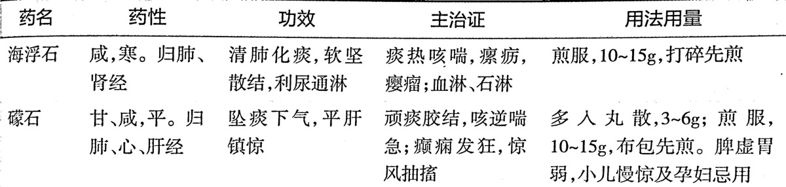
                - **礞石**
                    - 咸，平
                    - **坠痰下气**
                        - **顽痰、老痰胶结，气逆喘咳之实证**
                        - 配沉香、黄芩、大黄
                            - 礞石滚痰丸
                    - **平肝镇惊**
                        - **癲狂，惊痫**
    - 配伍原则
        - 应据成痰之因，审因论治
            - *“脾为生痰之源”*
            - **健脾燥湿药**
        - 又因痰易阻滞气机
            - *“气滞则痰凝，气顺则痰消”*
            - **理气药**
        - 此外
            - 癫痫、惊厥、眩晕、昏迷者
                - 配平肝息风、开窍、安神药
            - 痰核、瘰疠、瘿瘤者
                - 配软坚散结之品
            - 阴疽流注者
                - 配温阳通滞散结之品
    - 使用注意
        - **温化寒痰药** **清化热痰药**
        - 某些温燥之性强烈的刺激性化痰药，凡痰中带血等有出血倾向者，宜慎用
    - 化痰药兼有功效归纳 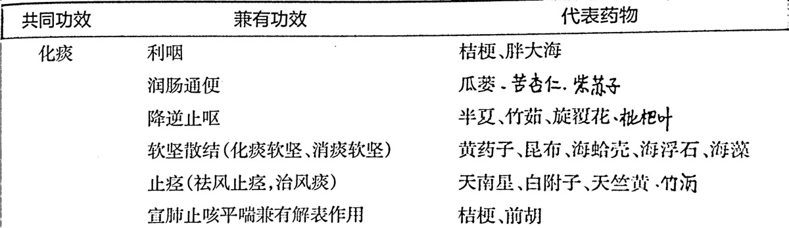
- **第十四章 止咳平喘药**
    - 定义
        - **制止咳嗽** **平定喘息** **咳嗽** **气喘证**
            - 痰、咳、喘往往在临上兼见，化药药与止咳平喘药常同用
    - 分类
        - **降肺气（宣肺）**
            - **苦杏仁**
                - **药性**
                    - 苦，微温，有小毒
                - **功效、应用**
                    - **降气止咳平喘（要药）**
                        - **各种咳喘证**
                            - 风寒、风热、温燥、肺热等
                            - 苓甘五味姜辛半夏杏仁汤
                        - 味苦降泄，肃降兼宣发肺气而能止咳平喘
                    - **润肠通便**
                        - **肠燥便秘**
                        - 配柏子仁、郁李仁
                        - 五仁丸
                    - **甜杏仁**
                        - 甘、平
                        - 功效与苦杏仁相似，药力较缓，且偏于润肺止咳
                            - **虚劳咳嗽**
                            - **津伤便秘**
                        - 5～10g
                - **用法用量**
                    - 5～10g
                    - 宜打碎入煎
                    - 生品入煎剂宜后下
                - **使用注意**
                    - 内服不宜过量，以免中毒
                    - 阴虚咳嗽、大便溏泄者忌用
                    - 婴儿慎用
            - **紫苏子**
                - **药性**
                    - 辛，温
                - **功效、应用**
                    - **降气化痰，止咳平端**
                        - 痰多咳喘
                        - 本品性主降，长于降肺气，化痰涎
                            - **痰壅气逆，咳嗽气喘，甚则不能平卧**
                                - 配白芥子、莱菔子
                                - 三子养亲汤
                            - **上盛下虚之久咳痰喘**
                                - 配肉桂、当归、厚朴等
                                - 苏子降子汤
                    - **润肠通便**
                        - **肠燥便秘**
                        - 配杏仁、火麻仁、瓜蒌仁
                        - 紫苏麻仁粥
                - **用法用量**
                    - 3～10g
                    - 或入丸散
                - **使用注意**
                    - 脾虚便溏者慎用
        - **润肺**
            - **百部**
                - **药性**
                    - 甘、苦，微温
                - **功效、应用**
                    - **润肺止咳**
                        - 新久咳嗽
                        - 甘润苦降，微温不燥，无论外感、内伤、暴咳、久嗽，皆可用之
                            - **风寒咳嗽**
                                - 配荆芥、桔梗、紫菀
                                - 止咳散
                            - **顿咳**
                                - 可单用或配贝母、紫菀
                            - **肺痨咳嗽**
                                - 配沙参、麦冬、贝母
                            - **久咳不已，气阴两虚**
                                - 配黄芪、沙参、麦冬
                    - **杀虫灭虱**
                        - **蛲虫病**
                            - 以本品浓煎，睡前保留灌肠
                        - **阴道滴虫**
                            - 可单用，或配蛇床子、苦参等煎汤坐浴外洗
                        - **头虱、体虱及疥癣**
                            - 可制成20％乙醇液，或50％水煎剂外搽
                - **用法用量**
                    - 3～9g
                    - 外用适量，水煎或酒浸
                    - 蜜炙百部润肺止咳，用于阴虚劳嗽
                - **使用注意**
                    - 本品易伤胃滑肠，脾虚食少便者忌用
            - **紫菀、款冬花**
                - **相同点**
                    - **润肺化痰止咳**
                        - **咳嗽痰多**
                        - 微温或温，质润
                        - 对咳嗽之证，无论外感内伤，病程长短，寒热虚实皆可用之
                        - 药性功效相似，二者常相须而用
                        - 5～10g
                - **不同点**
                    - **紫菀**
                        - **长于化痰**
                        - 外感暴咳宜生用，肺虚久咳宜蜜炙用
                    - **款冬花**
                        - **长于止咳**
                        - 外感暴咳宜生用，内伤久咳宜蜜炙用
        - **清肺**
            - **马兜铃**
            - **枇杷叶**
                - **药性**
                    - 苦，微寒
                - **功效、应用**
                    - **清肺止咳**
                        - **肺热咳嗽**
                            - 可单用制膏服用，或与黄芩、桑白皮、栀子等
                        - **燥热咳喘**
                            - 配桑白皮、知母、沙参
                            - 如清燥救肺汤
                    - **降逆止呕**
                        - **胃热呕吐，哕逆**
                        - 配陈皮、竹茹等同用
                - **用法用量**
                    - 6～10g，鲜品加倍
                    - 止咳宜炙用，止呕宜生用
                - **使用注意**
                    - 寒咳及胃寒呕逆者慎用
        - **泻肺**
            - **桑白皮、葶苈子**
                - **相同点**
                    - 性寒
                    - **泻肺平喘**
                        - **泻肺热**
                            - 肺热咳喘
                        - **泻肺中水气**
                            - 痰饮咳喘
                    - **利水消肿**
                        - **水肿**
                - **不同点**
                    - **桑白皮**
                        - 甘寒，药性较缓
                        - **长于清肺热，降肺火**
                            - **肺热咳喘，痰黄**
                        - **利水作用和缓**
                            - **皮肤水肿**
                        - 6～12g
                            - 泻肺利水、平肝清火宜生用
                            - 肺虚咳嗽宜蜜炙用
                    - **葶苈子**
                        - 辛苦大寒，力峻
                        - **重在泻肺中水气、痰涎**
                            - **对痰饮咳喘不得卧者尤宜**
                        - **利水力量强**
                            - **胸腹积水**
                        - 3～10g，宜包煎
                        - 虚寒喘促、脾虚肿满者忌服
                            - 炒能缓其寒性，不易伤脾胃
        - **敛肺**
            - **白果**
                - **药性**
                    - 甘、苦、涩，平；有毒
                    - 归肺、肾经
                - **功效、应用**
                    - **敛肺定喘**
                        - **喘咳痰多**
                            - 性涩而收，能敛肺定喘，且兼化痰之功，喘咳痰多常用
                            - 肺肾两虚之虚喘
                                - 配五味子、胡桃肉
                            - 外感风寒而内有蕴热而喘者
                                - 配麻黄、黄芩
                                - 定喘汤
                    - 善收涩固下焦：
                    - **止带**
                        - **脾肾亏虚带下**
                            - 配莲子、山药
                        - **湿热带下**
                            - 配芡实、黄柏
                    - **缩尿**
                        - **小便频数，遗尿**
                        - 配熟地、山萸肉、覆盆子
                    - **银杏叶**
                        - 甘、苦、涩，平。归心、肺经
                        - **活血化瘀，通络止痛，敛肺平喘，化浊降脂**
                            - **瘀血阻络，胸痹心痛，中风偏瘫，舌强语謇，肺虚咳喘，高脂血症**
                        - 9～12g
                        - 有实邪者忌用
                - **用法用量**
                    - 5～10g
                    - 用时捣碎，入药时须去其外层种皮及内层薄皮和心芽
                - **使用注意**
                    - 本品有毒，不可多用，小儿尤当注意
                    - 忌生食
                    - 其性收敛，咳喘痰稠咳吐不爽者慎用
        - **[附] 马兜铃、矮地茶（紫金牛、平地木）、洋金花** 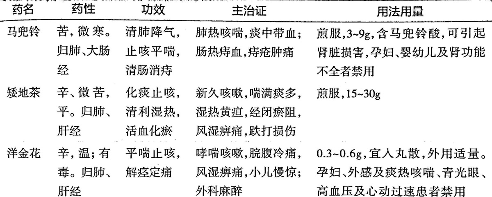
            - **洋金花**
                - **平喘止咳**
                    - **哮喘，咳嗽**
                    - 本品为麻醉镇咳平喘药
                - **麻醉镇痛**
                    - **心腹疼痛及风湿痹痛，跌打损伤，外科手术麻醉**
                - **解痉**
                    - **癫痫及小儿慢惊风**
    - 配伍原则
        - **病证不同**
            - 因咳喘每多夹痰，痰多易发咳嗽，故化痰、止咳、平喘三者常配伍同用
        - **咳喘的不同病因病机**
            - **外感而致者**
                - 配解表散邪药
            - **火热而致者**
                - 配清热泻火药
            - **里寒者**
                - 配温里散寒药
            - **虚劳者**
                - 配补虚药
    - 使用注意
        - 麻疹初起有表邪之咳嗽
            - 不宜单投止咳药，对收敛性及温燥之药尤为所忌，以免恋邪
            - 当以疏解清宣为主
    - 止咳平喘药兼有功效归纳 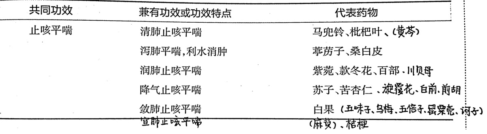
- **第十五章 安神药**
    - 定义
        - **安定神志** **心神不宁病证**
    - 药性特点
        - **多入心肝经**
            - 心藏神，肝藏魂，神志变化多与心肝经有关
    - 分类 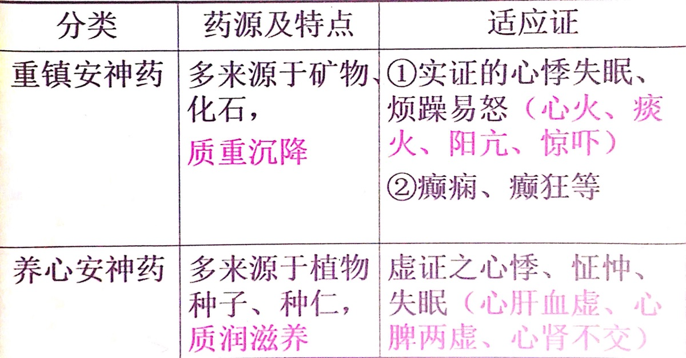
        - **重镇安神药**
            - **朱砂**
                - **药性**
                    - 甘，微寒；有毒
                    - 归心经
                - **功效、应用**
                    - **清心镇惊，安神**
                        - **心悸，失眠**
                            - 甘寒质重，专入心经，为镇心、清心、安神要药，最宜于心火亢盛者
                            - 心火亢盛者
                                - 配黄连、栀子
                            - 心火亢盛、心阴不足者
                                - 配当归、生地
                                - 朱砂安神丸
                    - **镇惊止痉**
                        - **惊风，癫痫**
                            - 高热神昏抽搐
                                - 配牛黄、麝香
                                - 安宫牛黄丸
                            - 癲痫抽搐
                                - 配磁石
                                - 如磁朱丸
                    - **明目**
                        - **视物昏花**
                    - **清热解毒**
                        - 内服外用
                        - **疮疡肿毒**
                            - 配雄黄、山慈菇、大戟
                            - 紫金锭
                        - **咽喉肿痛，口舌生疮**
                            - 配冰片、硼砂
                            - 冰硼散
                - **用法用量**
                    - 内服0.1～0.5g，多入丸散，不宜入煎剂
                    - 外用适量
                - **使用注意**
                    - 本品有毒，不宜大量服用或少量久服
                    - 孕妇及肝肾功能不全者禁用
                    - 忌火煅
                        - 火煅则析出水银，有剧毒
            - **磁石、龙骨**
                - **相同点**
                    - **镇心安神**
                        - **心神不宁，惊悸**
                        - **惊痫癲狂**
                    - **平肝潜阳**
                        - **肝阳上亢之头晕、急躁易怒**
                - **不同点**
                    - **磁石**
                        - 咸寒
                        - **有镇心神、清心肝火、益肾阴之长**
                            - **宜于肾虚肝旺或惊恐气乱之心神不安**
                        - **聪耳明目**
                            - **耳鸣耳聋、视物昏花**
                        - **纳气平喘**
                            - **虚喘证**
                        - 9～30g，先煎
                        - 不易消化，如入丸散，不可多服
                            - 1～3g
                            - 脾胃虚弱者慎服
                    - **龙骨**
                        - 甘涩平
                        - **为安神要药**
                            - **各种神志失常之患**
                        - **煅用味涩，收敛固涩**
                            - **滑脱证**
                                - 遗精滑精
                                    - 金锁固精丸
                                - 尿频遗尿
                                    - 桑螵蛸散
                                - 崩漏带下
                                    - 固冲汤
                                - 自汗盗汗
                            - **外用湿疮湿疹、疮疡久溃不敛**
                        - 煎服15～30g，外用适量，煅后研末干掺
                            - 镇惊安神、平肝潜阳
                                - 宜生用
                            - 收敛固涩、收湿敛疮
                                - 宜锻用
                        - 湿热积滞者慎用
                    - **龙齿**
                        - 甘、涩，凉
                        - **镇惊安神，清热除烦**
                            - **惊痫癫狂，心悸怔仲，失眠多梦，身热心烦**
                        - 15～30g，先煎
            - **琥珀**
                - **药性**
                    - 甘，平
                    - 归肝、心、膀胱经
                - **功效、应用**
                    - **镇惊安神**
                        - 入心、肝二经，质重而镇
                        - **心神不宁，心悸失眠、健忘**
                        - **惊风，癫痫**
                    - **活血散瘀**
                        - **痛经经闭**
                        - **心腹刺痛**
                            - 三七同用，研末内服
                        - **癥瘕积聚**
                            - 淋证，癃闭
                    - **利尿通淋**
                        - **因能散瘀止血，故尤宜于血淋**
                        - 单用有效，用琥珀为散，灯心汤送服
                        - 近年用琥珀末吞服
                            - 肾结石伴血尿者
                - **用法用量**
                    - 内服，1.5～3g
                    - 研末，或入丸散，不宜入煎剂
                - **使用注意**
                    - 阴虚内热及无瘀滞者慎服
        - **养心安神药**
            - **酸枣仁、柏子仁**
                - **相同点**
                    - 皆甘平之品
                    - **养心安神**
                        - **阴血不足、心神失养所致的心悸怔忡、失眠、健忘等症**
                    - 常相须为用，配麦冬、生地、远志
                        - 天王补心丹
                - **不同点**
                    - **酸枣仁**
                        - 安神作用较强，入肝经，益肝血，更宜于心肝阴血亏虚之心神不宁
                            - **心脾两虚**
                                - 惊悸失眠，体倦
                                - 黄芪、当归、党参
                                - 归脾汤
                            - **肝虚有热**
                                - 虚烦不眠
                                - 知母、茯苓、川芎
                                - 酸枣仁汤
                        - **味酸，敛汗**
                            - **体虚自汗、盗汗**
                        - **生津**
                            - **津伤口渴**
                        - 10～15g
                    - **柏子仁**
                        - **又入肾经，最宜于心阴虚及心肾不交之心神不宁**
                            - **心肾不交者**
                                - 心悸失眠、梦遗健忘
                                - 麦冬、熟地黄、石菖蒲等，如柏子养心丸
                        - **质润多脂，润肠通便**
                            - **肠燥便秘**
                        - 煎服，3～10g，大便溏泄者宜用柏子仁霜代替柏子仁
                        - 本品质润滑肠，故大便溏薄及痰多者慎用
            - **远志**
                - **药性**
                    - 苦、辛，温
                    - 归心、肾、肺经
                - **功效、应用**
                    - **安神益智，交通心肾**
                        - **最宜于心肾不交之失眠多梦，心悸征神，精神恍惚**
                            - 配茯神、龙齿、朱砂等
                        - **健忘证**
                            - 配人参、茯苓、菖蒲等
                    - **祛痰**
                        - **入心经，祛痰开窍**
                            - 痰阻心窍之癫痫惊狂
                            - 与祛痰、息风、开窍药同用
                        - **入肺经，祛痰止咳**
                            - 咳嗽痰多
                            - 配杏仁、贝母、瓜蒌等
                    - **消肿**
                        - **痈疽疮毒，乳房肿痛**
                            - 内服、外用均有疗效
                        - **喉痹**
                            - 研末吹喉，涎出为度
                - **用法用量**
                    - 3～10g
                    - 外用适量，化痰止咳宜炙用
                - **使用注意**
                    - 凡实热或痰火内盛者，以及有胃溃疡或胃炎者慎用
            - **合欢皮**
                - **药性**
                    - 甘，平
                    - 归心、肝、肺经
                - **功效、应用**
                    - **解郁安神**
                        - **忿怒忧郁，烦跟失眠**
                        - 甘平之品，入心肝经，善解肝郁，为悦心安神要药
                    - **活血消肿**
                        - **跌打骨折，血瘀肿痛**
                        - **肺痈，疮痈肿毒**
                    - **合欢花**
                        - 甘平，入心、肝经
                        - **解郁安神**
                            - **虚烦不眠、心神不安，忧郁失眠**
                        - 5～10g，或入丸、散
                - **用法用量**
                    - 6～12g
                    - 外用适量，研末调敷
            - **首乌藤（夜交藤）**
                - **药性**
                    - 甘，平
                    - 入心、肝经
                - **功效、应用**
                    - **补血安神**
                        - **心神不宁，失眠多梦**
                    - **祛风通络**
                        - **血虚身痛，风湿痹痛**
                        - **皮肤痒疹**
                - **用法用量**
                    - 9～15g
                    - 外用适量，煎水洗患处
            - **灵芝**
                - **药性**
                    - 甘，平
                    - 归心、肺、肝、肾经
                - **功效、应用**
                    - **补气安神**
                        - **心神不宁，失眠心悸**
                            - 气血两虚、心神失养之心神不宁、失眠多梦、惊悸健忘
                            - 单用煎汤或为末服有效
                            - 或与当归、龙眼肉、白芍等配伍
                    - **止咳平喘**
                        - **肺虚咳喘**
                            - 肺气不足，咳喘不已
                                - 与党参、五味子、干姜配伍
                            - 痰湿型咳喘
                                - 配伍化痰止咳平喘药
                        - **虚劳短气，不思饮食**
                            - 虚劳气短，食欲不振，口干烦躁
                            - 与山茱萸、人参、熟地黄配伍
                            - 紫芝丸
                - **用法用量**
                    - 6～12g
    - 配伍原则
        - **重镇安神药** **养心安神药**
            - **在选择重镇安神药时**
                - **因火热所致者**
                    - 配值清心活火
                - **因痰所致者**
                    - 配伍祛痰开窍药
                - **因血瘀所致者**
                    - 配伍活血化瘀药
                - **因肝阳上亢者**
                    - 配伍平肝潜阳药
            - **在选择养心安神时**
                - **因心血不足**
                    - 与补血药配伍
                - **因心阴不足**
                    - 与补阴药配伍
                - **心肾不交者**
                    - 与滋阴降火、交通心肾之品配伍
    - 安神药兼有功效归纳 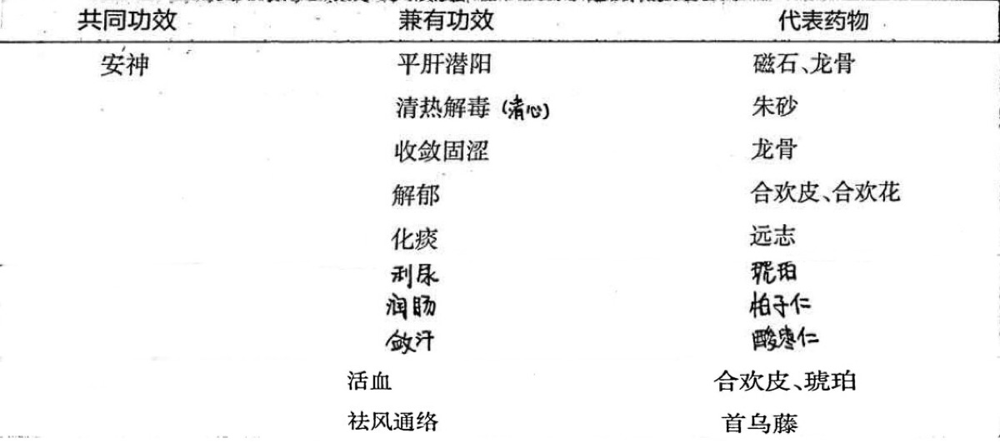
- **第十六章 平肝息风药**
    - 定义
        - **平肝潜阳或息风止痉** **肝阳上亢证或肝风内动证**
            - **平肝潜阳**
                - **肝阳上亢证**
                    - 头痛、眩晕
            - **息风止痉**
                - **肝风内动证**
                    - 痉挛、抽搐
    - 药性特点
        - **性味**
            - 多偏寒，少数偏温
            - 味苦或辛
        - **归经**
            - 皆入肝经
        - **来源**
            - 多为介类、昆虫类等动物药物及和石类药物
    - 分类
        - **按功效分类**
            - **平抑肝阳药**
                - 肝阳上亢证
            - **息风止痉药**
                - 肝风内动证
        - **按药源分类**
            - **介类及矿物类**
                - **质重，镇潜沉降，长于平肝潜阳**
                    - 肝阳上亢证
            - **虫类药**
                - **长于息风止痉、通络**
                    - 肝风内动痉厥抽搐、肢麻
            - **植物类**
                - **平肝**
                    - 作用较介类弱
                - **息风**
                    - 作用较虫类弱
            - **兽角**
                - **清肝、平肝、息风、解毒**
                    - 肝经热毒证、阳亢证、动风证
        - **平抑肝阳药**
            - **介类及矿物类**
                - **石决明**
                    - **药性**
                        - 咸，寒
                        - 归肝经
                    - **功效、应用**
                        - **平肝潜阳**
                            - **肝阳上亢，头晕目眩**
                            - 咸寒清热，质重潜阳，为镇肝、凉肝之要药
                                - 阴虚阳亢
                                    - 配伍白芍、生地黄、牡蛎等
                                - 肝阳独亢而有热象
                                    - 配伍夏枯草、黄岑、菊花等
                        - **清肝明目（要药）**
                            - **目赤，翳障，视物昏花**
                                - 肝火上炎目赤肿痛
                                    - 配夏枯草、决明子、菊花等
                                - 风热目赤翳膜
                                    - 配蝉蜕、菊花等
                                - 肝虚血少目涩昏暗
                                    - 配熟地黄、枸杞子等
                        - 此外，煅石决明
                            - **收敛、制酸止痛**
                                - **胃酸过多之胃脘痛**
                            - **止血**
                                - **外伤出血**
                                - 研末外敷
                    - **用法用量**
                        - 6～20g
                        - 打碎先煎
                            - 平肝、清肝宜生用
                            - 外用点眼宜煅用、水飞
                    - **使用注意**
                        - 脾胃虚寒，食少便溏，胃酸缺乏者忌用
                - **牡蛎**
                    - **药性**
                        - 咸，微寒
                        - 归肝、胆、肾经
                    - **功效、应用**
                        - 生用
                            - **平肝潜阳**
                                - **肝阳上亢，头晕目眩**
                                - 镇肝熄风汤
                            - **重镇安神**
                                - **心神不安，惊悸失眠**
                            - 常与龙骨相须为用
                            - **（味咸）软坚散结**
                                - **痰核、瘰疬、瘿瘤**
                                - **癥瘕积聚**
                        - 煅用
                            - **收敛固涩**
                                - **滑脱诸证**
                                - 久病体虚，正气不固，精气不断外泄
                                    - 自汗盗汗
                                    - 遗精滑精
                                    - 尿频遗尿
                                    - 崩漏带下
                            - **制酸止痛**
                                - **胃痛泛酸**
                                - 与乌贼骨、浙贝母共为细末，内服取效
                    - **用法用量**
                        - 9～30g
                        - 打碎先煎
                        - 收敛固涩、制酸止痛宜煅用，余皆生用
                    - **使用注意**
                        - 不宜多服、久服，易引起便秘和消化不良
                        - 体虚多寒者忌用
                        - 湿热实邪者忌用
                    - **龙骨与牡蛎**
                        - **共同点**
                            - **重镇安神**
                                - **心神不安、惊悸失眠**
                            - **平肝潜阳**
                                - **阴虚阳亢、头晕目眩**
                            - **（煅用）收敛固涩**
                                - **各种滑脱证**
                        - **不同点**
                            - **龙骨**
                                - **镇惊安神** **收敛固涩**
                            - **牡蛎**
                                - **平肝潜阳**
                                - **又味咸，软坚散结**
                                    - **瘰疬、痰核、癥瘕积聚**
                - **珍珠母**
                    - **药性**
                        - 咸，寒
                        - 归肝、心经
                    - **功效、应用**
                        - **珍珠**
                            - 甘、咸，寒；归心、肝经
                            - **定惊安神，明目消翳，解毒生肌，润肤祛斑**
                                - **惊悸失眠，惊风癲痫，目赤翳障，视物不清，口舌生疮、咽喉溃烂、溃疡不敛，皮肤色斑**
                            - 内服，多入丸散
                                - 0.1～0.3g
                                - 外用适量
                            - 凡病非痰热所引起者不宜使用
                    - **用法用量**
                        - 10～25g
                        - 打碎先煎，或入丸散剂
                        - 外用适量
                    - **使用注意**
                        - 本品性寒质重，易伤脾胃，脾胃虚寒者慎服
                - **[附] 紫贝齿** 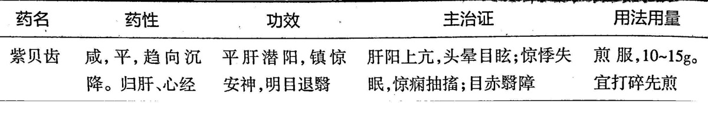
                    - **石决明、牡蛎、珍珠母、紫贝齿**
                        - **相同点**
                            - 皆为贝売类，质重沉降，咸寒或咸平
                            - **平肝潜阳**
                                - **肝阳上亢之头痛、眩晕、耳鸣**
                            - **石决明、珍珠母、紫贝齿**
                                - **清肝明目**
                                    - **肝热目赤肿痛**
                                - 石决明为镇肝、清肝要药，力量最强
                            - **牡蛎、珍珠母、紫贝齿**
                                - **入心经，镇惊安神**
                                    - **心悸失眠、心神不宁**
                                    - **惊风癫痫**
                        - **不同点**
                            - **牡蛎**
                                - **软坚散结**
                                    - **瘰疬、痰核、癥瘕积聚**
                                - **（煅用）收敛固涩**
                                    - **各种滑脱证**
                - **代赭石**
                    - **药性**
                        - 苦，寒
                        - 归肝、心、肺、胃经
                    - **功效、应用**
                        - **平肝潜阳**
                            - **肝阳上亢，头晕目眩**
                            - 配怀牛膝、生龙骨、生牡蛎、生白芍等
                            - 质重沉降，长于镇潜肝阳
                            - 性味苦寒，善清肝火，肝阳兼肝火者宜
                        - **重镇降逆（要药）**
                            - **呕吐、呃逆、噫气**
                                - 配旋花、半夏、生姜等
                            - **气逆喘息**
                                - 实喘、虚喘均可配用
                            - 本品质重性降，善降上逆之肺、胃气
                        - **凉血止血**
                            - **血热吐衄，崩漏**
                            - 本品善于降气、降火
                                - 尤宜于气火上逆，迫血妄行之出血证
                    - **用法用量**
                        - 9～30g
                        - 打碎先煎
                            - 降逆、平肝生用
                            - 止血煅用
                    - **使用注意**
                        - 虚寒证及孕妇慎用
                        - 因含微量砷，故不宜长期服用
            - **植物类**
                - **刺蒺藜**
                    - **药性**
                        - 辛、苦，平
                        - 有小毒
                        - 归肝经
                    - **功效、应用**
                        - **平肝**
                            - **肝阳上亢，头晕目眩**
                            - 配钩藤、珍珠母、菊花等
                            - **高血压病**
                        - **疏肝**
                            - **肝郁胸胁胀痛**
                                - 与柴胡、香附、青皮同用
                            - **肝郁乳闭胀痛**
                                - 与穿山甲、王不留行同用
                        - **祛风明目（要药）**
                            - **风热上攻，目赤翳障**
                            - 与菊花、蔓荆子、决明子等同用
                        - **祛风止痒**
                            - **风疹瘙痒**
                                - 配防风、荆芥、地肤子等
                            - **白癜风**
                                - 单用研末冲服或制成酊剂外涂
                    - **用法用量**
                        - 6～10g
                    - **使用注意**
                        - 血虚气弱、阴虚不足、孕妇均慎服
                - **罗布麻叶**
                    - **药性**
                        - 甘、苦，凉
                        - 归肝经
                    - **功效、应用**
                        - **平抑肝阳、清热**
                            - **肝阳上亢兼肝火上攻者**
                                - 头晕目眩，烦躁失眠
                            - 本品单用有效，煎服或开水泡汁代茶饮
                        - **利尿**
                            - **水肿，小便不利**
                            - 可单用取效，或配车前子、木通、泽泻等
                    - **用法用量**
                        - 煎服或开水泡服，6～12g
        - **息风止痉药**
            - **动物息风药**
                - **羚羊角**
                    - **药性**
                        - 咸，寒
                        - 归肝、心经
                    - **功效、应用**
                        - **息肝风**
                            - **肝风内动，惊痫抽搐**
                                - 咸寒，最宜于热极生风者
                                    - 高热神昏、惊厥抽搐
                                - 配钩藤、菊花、桑叶、自芍、生地等
                                - 羚角钩藤汤
                        - **平肝阳**
                            - **肝阳上亢兼肝火者宜**
                                - 头晕目眩，烦躁失眠，头痛如劈
                                - 配石决明、龟甲、生地、菊花等
                        - **清肝明目**
                            - **肝火上炎，目赤头痛**
                                - 常与决明子、黄芩、龙胆等同用
                        - **（清热）散血解毒**
                            - **清心凉肝、泻火解毒**
                                - 温热病壮热神昏，热毒发斑
                            - 常配犀角、石膏、寒水石、麝香等
                            - 紫雪丹
                        - **清肺热**
                            - **肺热咳喘，百日咳**
                            - 羚羊清肺散
                        - **山羊角**
                            - 性味咸寒，归肝经
                            - **平肝镇惊**
                                - *《医林纂要》：功用近羚羊角*
                                - **用于肝阳上亢之头晕目眩、肝火上炎之目赤肿痛以及肝风内动、惊痫抽搐等证**
                                - 作用较弱，应用时剂量可酌情增大
                            - 煎服，10～15g
                    - **用法用量**
                        - （薄片）1～3g，单煎2小时以上，取汁服
                        - 磨汁或研粉服，每次0.3～0.6g
                    - **使用注意**
                        - 脾虚慢惊忌用
                            - 脾虚慢惊忌用寒凉
                        - 无火热者勿用
                - **牛黄（类似：马宝、猴枣）**
                    - **药性**
                        - 苦，凉
                        - 归心、肝经
                    - **功效、应用**
                        - **清心豁痰，开窍醒神**
                            - 性凉，气芳香，入心经
                            - **热病神昏**
                                - 常与麝香、冰片、朱砂、黄连、栀子等
                                - 安宫牛黄丸
                                    - 昏迷——鼻管给药
                            - **痰热阻闭心窍，神昏**
                                - 如中风，惊风，癫痫等
                        - **凉肝息风**
                            - **惊风抽搐**
                                - 壮热，神昏，惊厥抽等
                                - 配朱砂、全蝎、钩藤等
                            - **痰蒙清窍，癲痫发作**
                                - 神昏、抽搐
                                - 配珍珠、远志、胆南星
                        - **清热解毒（良药）**
                            - **火毒郁结证**
                                - ロ舌生疮，咽喉肿痛，牙痛，痈疽疔毒
                            - 常与黄芩、雄黄、大黄等同用
                            - 牛黄解毒丸
                    - **用法用量**
                        - 入丸散，每次0.15～0.35g
                        - 外用适量，研末敷患处
                    - **使用注意**
                        - 孕妇填用
            - **植物类息风药**
                - **钩藤、天麻**
                    - **相同点**
                        - 均味甘，入肝经，作用和缓
                        - **息风止痉**
                            - **肝风内动，惊痫抽搐**
                            - 作用和缓，尤宜于小儿
                        - **平肝阳**
                            - **肝阳上亢的头痛，眩晕**
                            - 如天麻钩藤饮
                        - 常相须为用，是平肝息风的常用药对
                    - **不同点**
                        - **钩藤**
                            - **性微寒，可清热**
                                - **热极生风、小儿急惊风**
                                - **肝阳兼肝火者为宜**
                            - **轻清疏泄，清透热邪，定惊止痉**
                                - **感冒夹惊，小儿夜啼**
                                - 配蝉蜕、薄荷
                            - 煎服，3～12g
                                - **后下**
                            - 脾胃虚寒，慢惊风者慎用，无火者勿服
                        - **天麻**
                            - 性平，既息内风，又祛外风，治风要药
                            - **息内风**
                                - **各种肝风内动，惊痫抽搐**
                                - 寒热虚实均可，如小儿急慢惊风、破伤风
                            - **祛风通络**
                                - **风中经络的肢麻、痉挛、抽搐**
                                - **风湿痹痛**
                            - **止眩晕、止痛效果好**
                                - 既息肝风、平肝阳、又祛外风
                                - **偏正头痛，眩晕**
                                    - 肝阳上亢者
                                    - 风痰上扰者
                                    - 外风攻注者
                                    - 颈椎病、高血压、脑梗等
                            - 煎服，3～10g
            - **虫类药**
                - **地龙（蚯蚓）**
                    - **药性**
                        - 咸，寒
                        - 归肝、脾、膀胱经
                    - **功效、应用**
                        - **清热定惊**
                            - **高热惊痫，癫狂**
                            - 配钩藤、牛黄、白僵蚕、全蝎，或单用本品捣汁服用
                            - 性寒，既能息风止痉，又善于清热定惊
                        - **通络**
                            - **气虚血滞，半身不遂**
                                - 配黄芪、当归、桃仁、红花等
                            - **痹症**
                                - 尤宜于热痹
                        - **平喘**
                            - **肺热哮喘**
                                - 喘息不止，喉中哮鸣有声者
                                - 单用研末内服；亦可用鲜地龙水煎，加白糖收膏用
                        - **利尿**
                            - **小便不利，尿闭不通**
                            - 可单用或配伍车前子、木通、冬葵子
                        - **降压**
                            - **肝阳上亢型高血压病**
                        - **外用清热解毒**
                            - **腮腺炎、烫伤、丹毒等**
                    - **用法用量**
                        - 煎服，5～10g
                    - **使用注意**
                        - 脾胃虚寒无实热者及孕妇忌服
                - **全蝎、蜈蚣**
                    - **相同点**
                        - 均味辛、有毒之品，归肝经
                        - 性善走窜，既平息肝风，又搜风通络，均为治风要药
                            - **息风镇痉**
                                - **痉挛抽搐**
                                - 急慢惊风、破伤风、风中经络口眼歪斜
                            - **通络止痛**
                                - **风湿顽痹**
                                    - 筋脉拘挛，甚至关节变形
                                - **顽固性头痛**
                                - 肿瘤后期疼痛
                            - **攻毒散结**
                                - **疮疡肿毒，瘰疬结核**
                                - 多作外敷用
                                - 取其以毒攻毒，现常用于癌肿
                    - **不同点**
                        - **全蝎**
                            - 性平，毒性较小
                            - **息内风及搜风常用**
                            - 3～6g
                            - 本品有毒，不可过量使用
                            - 因属窜散之品，故血虚生风者、小儿慢脾风、孕妇均禁用
                        - **蜈蚣**
                            - **性猛温燥，走窜力强，搜风作用强**
                            - **毒性也较大，攻毒散结的作用也强，兼治毒蛇咬伤，百日咳、癌肿**
                            - 3～5g
                            - 本品有毒，用量不宜过大
                            - 血虚发痉，小儿慢惊及孕妇忌服
                        - **传统上全蝎以内科多用，蜈蚣以外科多用**
                - **（白）僵蚕**
                    - **药性**
                        - 咸、辛，平
                        - 归肝、肺、胃经
                    - **功效、应用**
                        - **功效特点**
                            - 既息内风，又祛外风，且能化痰散结，可用“风”和“痰”概括
                            - **息风止痉**
                                - **兼化痰定惊**
                                    - 急慢惊风、癲痫，挟痰热者尤为适宜
                                    - 破伤风抽搐
                                - 性平无毒，息风止痉力不如全、蜈蚣
                            - **祛风止痛**
                                - **祛风通络**
                                    - 风中经络，口眼歪斜
                                        - 配全、白附子
                                - **疏散风热、祛风止痒**
                                    - 风热头痛，目赤咽痛，风疹瘙痒
                            - **化痰散结**
                                - 本品味咸，软坚散结，又兼化痰
                                - **痰核，瘰疬**
                                - 可单用为末，或与浙贝母、夏枯草、连翘等化痰散结药同用
                                - 现治乳腺炎、流行性腮腺炎
                        - **僵蛹**
                            - **清热镇惊、化痰止咳、消肿散结**
                                - 高热惊风，痉挛抽搐，癲痫，急性喉炎，腮腺炎，急、慢性支气管炎，荨麻疹，高脂血症
                    - **用法用量**
                        - 5～10g
                    - **使用注意**
                        - 凡病非痰热所引起者不宜使用
    - 配伍原则
        - **审因配伍**
            - **平肝潜阳药配伍**
                - **阴虚阳亢者**
                    - 多配伍滋养肾阴药
                - **肝火上炎者**
                    - 多配伍清泻肝火药
            - **息风止痉药配伍**
                - **肝阳化风**
                    - 配伍平肝潜阳药
                - **热动肝风**
                    - 配伍清热药
                    - 如黄芩、黄连、石膏、菊花、龙胆等
                - **阴虚风动**
                    - 配伍养阴药，益阴以制阳
                    - 如生地、玄参等
                - **血虚风动**
                    - 配伍养血药
                    - 如当归、何首乌等
                - **脾虚慢惊风**
                    - 配伍补气健脾药物
                    - 如党参、白术等
        - **随病症配伍**
            - **肝风夹痰**
                - 配伍化痰药如竹沥、贝母、天竺黄等
            - **兼窍闭神昏者**
                - 配伍开窍药如麝香、冰片等
    - 平肝息风药兼有功效归纳 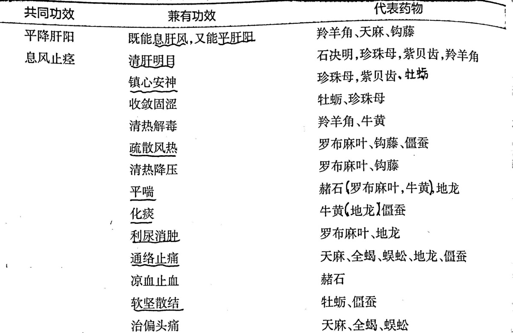
    - **[平肝潜阳]**
        - 平定、潜降上亢肝阳之义
        - 药以矿物药，介类药居多，适用于肝阳上亢之头晕，头痛
        - 药如代赭石，石决明等
        - **介类潜阳**
        - **滋阴潜阳**
    - **[息风止痉］**
        - 指平息肝风，制止痉挛抽搐
        - 药入肝经，适用于肝风内动，肢体抽搐；中风，口眼歪斜以及破伤风，角弓反张等
        - 药如全蝎，蜈蚣，天麻等
        - **虫类息风药**
- ***第十七章 开窍药***
    - 定义
        - **辛香走窜** **开窍醒神** **闭证神昏**
            - 又叫“芳香开窍药”
        - **窍**
            - 心窍
            - 清窍（上七窍）
        - **开窍醒神**
            - 窍——指心窍
            - **心主神明**
                - **心窍通**
                    - 神明有主，神志清醒，思维敏捷
                - **心窍被阻**
                    - 神明内闭，神志昏迷，不醒人事
            - *因此，苏醒神志作用即称为开窍*
    - 药性特点
        - 味辛、芳香，善于走窜，皆入心经
    - 功效与适应症
        - **开窍醒神**
            - **闭证神昏**
        - **神昏**
            - **闭证神昏**
                - **实证**
                    - 口噤手握，脉来有力
                    - **热闭神昏**
                        - 面红、身热、苔黄、脉数
                        - **温病热陷心包，痰热蒙蔽心窍，小儿惊风及中风痰厥等**
                        - 辛凉开窍，使用凉开法
                    - **寒闭神昏**
                        - 面青、身凉、苔白、脉迟
                        - **中风卒昏，中恶悉胸腹满痛等寒浊或痰湿阻闭气机，蒙蔽神明**
                        - 辛温开窍，使用温开法
            - **脱证神昏**
                - **虚证**
                - 口开手撒，脉微欲绝
    - 分类
        - **麝香**
            - **药性**
                - 辛，温
                - 归心、脾经
            - **功效、应用**
                - **开窍醒神**
                    - **闭证神昏**
                    - 走之性甚烈，为醒神回苏之要药，可用于各种原因所至之闭证神昏
                        - **寒闭神昏**
                            - 配苏合香、檀香、安息香等组成温开之剂，如苏合香丸
                        - **热闭神昏**
                            - 配牛黄、冰片、朱砂等药组成凉开之剂，如安宫牛黄丸、至宝丹等
                - **活血通经**
                    - **血瘀证**
                        - 血瘀经闭
                            - 配丹参、桃仁、红花
                        - 癥瘕
                            - 配水蛭、虻虫、三棱
                        - 心腹暴痛（厥心痛），顽固性偏正头痛
                        - 跌打损伤、骨折
                            - 配乳香、没药（为伤科要药）
                        - 风湿顽痹
                            - 配独活、威灵仙
                        - 难产，死胎，胞衣不下
                            - 配猪牙皂、天花粉
                            - 辛香走窜，活血通经，力达胞宫，有催生下胎之效
                - **（活血）消肿止痛**
                    - **疮疡肿毒，瘰疬痰核**
                        - 常配雄黄、乳香、没药
                    - **咽喉肿痛**
                        - 可配牛黄、蟾酥珍珠等，如六神丸
                    - 内服、外用均有良效
            - **用法用量**
                - 入丸散，每次0.03～0.1g，不入煎剂
                - 外用适量
            - **使用注意**
                - 孕妇禁用
                - 有称外敷亦可引起小产，故需特别注意
        - **冰片**
            - **分类**
                - 龙脑冰片（梅片）
                - 艾片
                - 机制冰片（合成龙脑）
            - **药性**
                - **微寒**
                - 归心、脾，肺经
            - **功效、应用**
                - **开窍醒神**
                    - **闭证神昏**
                        - **热闭神昏**
                            - **痰热内闭、暑热卒厥、小儿惊风等**
                - **清热止痛**
                    - **清热解毒、防腐生肌、消肿止痛，为五官科及外科常用外用药**
                        - **五官科**
                            - 目赤肿痛，喉痹口疮
                            - 单用点眼即效
                            - 冰硼散吹敷患
                        - **外科**
                            - 疮疡肿痛，疮溃不敛，水火烫伤
                    - **冠心病心绞痛**
            - **用法用量**
                - 入丸散，每次0.15～0.3g，不入煎剂
                - 外用适量，研粉点敷患处
        - **苏合香**
            - **药性**
                - 辛，温
                - 归心、脾经
            - **功效、应用**
                - **开窍醒神**
                    - **寒闭神昏要药**
                        - 面青、身凉、苔白、脉迟
                        - 常与麝香、安息香、檀香等同用
                        - 苏合香丸
                    - 辛香气烈，作用与香相似而力稍逊，长于温通、辟秽
                - **辟秽，止痛**
                    - **胸痹心痛，脘腹冷痛**
                    - 痰浊，血瘀或寒凝气滞所致
                    - 配冰片、檀香
                        - 如冠心苏合丸和苏冰滴丸，能较快地缓解疼痛，作用良好而持久
            - **用法用量**
                - 入丸散，0.3～1g，不入煎剂，外用适量
        - **石菖蒲**
            - 古书中又称九节菖蒲
            - **药性**
                - 辛、苦，温
                - 归心、胃经
            - **功效、应用**
                - 辛开苦燥温通，芳香走窜；兼化湿，豁痰，辟秽
                - **开窍豁痰**
                    - **痰蒙心窍，神志昏迷**
                        - 中风痰迷心窍
                        - 痰热癲痫、癫狂等
                - **醒神益智**
                    - **湿浊蒙蔽，嗜睡健忘**
                        - 配人参、茯苓、远志
                    - **失眠、多梦**
                        - 配茯苓、远志、龙骨
                    - **耳鸣、耳聋**
                        - 配菟丝子，女贞子
                - **化湿和胃**
                    - **湿阻中焦**
                        - 脘腹痞满，胀闷疼痛
                        - 配苍术、厚朴等
                    - **湿浊热毒互结之噤口痢**
                        - 水谷不纳、里急后重
                        - 配黄连、茯苓
                - **九节菖蒲**
                    - 区别于古书中的九节菖蒲
                    - 辛，温，有毒
                    - 归心，肝，脾经
                    - **化痰开窍，安神，化湿醒脾，解毒**
                        - **热病神昏，癫痫，气闭耳聋，多梦健忘，胸闷腹胀，食欲不振，风湿痹痛，痈疽，疥癣等**
                    - 煎服1.5～6g，或入丸、散，或鲜品捣汁服，外用适量
            - **用法用量**
                - **（入汤剂）**
        - **[附] 安息香** 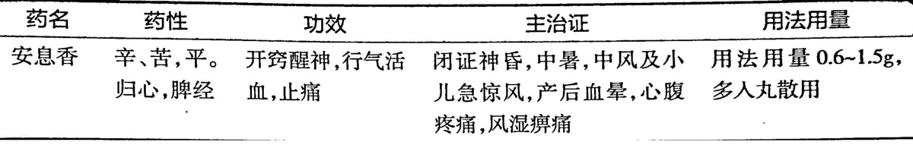
    - 配伍原则
        - **寒闭证**
            - 配温里祛寒之品
        - **热闭证**
            - 配清热解毒之品
        - **热闭神昏兼惊厥抽搐**
            - 配息风止痉药
    - 使用注意
        - **辛香走窜，易耗伤正气，为急救、治标之品**
            - 故只宜暂服，不可久用
        - **因气芳香，有效成分易挥发**
            - 故大多数不宜入煎剂，只入丸剂、散剂服用
        - **因芳香走窜，易伤胎元**
            - 故某些药物孕妇忌用，如麝香（另蟾酥、樟脑）
    - 开窍药兼有功效归纳 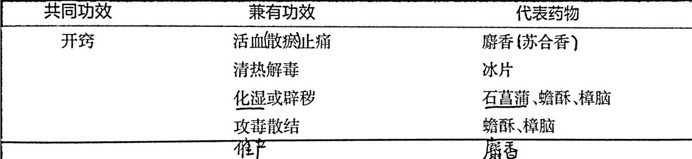
- ***第十八章 补虚药***
    - 定义
        - **补虚扶弱，纠正人体气血阴阳的不足** **虚证**
        - **补益药** **补养药**
    - 药性、归经
        - 大多味甘，故有滋补之功
        - **补气药**
            - 脾、肺经
        - **补阳药**
            - 肾经
        - **补血药**
            - 心、肝经
        - **补阴药**
            - 肺、胃、肝、肾经
    - 功效与适应症（意义）
        - **补益疗虚**
            - 人体气、血、阴、阳诸虚不足之证，以增强体质，消除衰弱
        - **扶正祛邪**
            - 病邪未尽而正气已衰的病证
            - 即与祛邪药同用，以攻补兼施，帮助正气恢复，有利于邪气消散
        - **扶正固脱（某些药）**
            - 救治正气虚重病证
        - **养生保健**
            - 增强体质，延缓衰老
    - 分类
        - 虚弱证的临床表现比较复杂，按证型分为气虚、血虚、阴虚、阳虚四类，因此补益药分补气药、补血药、补阴药、补阳药
        - **补气药**
            - **甘温** **甘平**
            - 补脏腑及一身之气，増强机体活动能力
                - **重在补脾、肺之气**
                    - **脾气虚弱证或中气下陷证**
                    - **肺气虚弱证**
                - *“肺主气”，“诸气者，皆属于肺”*
                - *“脾为后天之本，气血生化之原”*
            - **补脾肺之气**
                - **人参**
                    - **药性**
                        - 甘、微苦，微温
                        - 归脾、肺、心、肾经
                    - **功效、应用**
                        - **大补元气，复脉固脱**
                            - **虚脱危证**
                                - 大汗、大吐、大泻、大失血或大病久病所致元气虚极欲脱，气息微弱、脉微欲绝
                                    - **阳气衰微**
                                        - 四肢逆冷，脉微欲绝
                                        - 配附子以益气回阳救逆，即参附汤
                                    - **气脱阴衰**
                                        - 汗多身暖，口渴冷饮
                                        - 配麦冬、五味子以益气敛阴固脱，即生脉散
                                - 可单用本品浓煎服，即独参汤
                            - **[大补元气]**
                                - 大力补助人体的根本之气，有较强的扶正作用，治疗元气虚衰病证
                                - 对气虚欲脱者，可起“补气固脱”之功
                                - 大补元气代表药——人参
                        - **补脾益肺**
                            - **又补肾气助肾阳**
                                - **脾胃气虚证**
                                    - 常配白术、茯苓、甘草等
                                - **肺虚久咳或肺肾两虚咳喘**
                                    - 配五味子、黄芪等
                                    - 或配胡桃肉、蛤蚧等
                                - **阳痿宫冷**
                                    - 配鹿茸、肉苁蓉
                        - **生津**
                            - **热病气虚津伤口渴**
                            - **内热消渴**
                        - **养血（** **补气生血** **）**
                            - **气血两虚，久病虚羸**
                            - 如八珍汤
                        - **益智安神**
                            - **气血不足的心悸，失眠，健忘等症**
                            - 配酸枣仁、柏子仁
                        - **补气摄血**
                            - **气不摄血的出血证**
                        - **扶正法邪**
                            - **体虚外感、邪实正虚证**
                            - 配伍解表药及祛邪药
                    - **用法用量**
                        - **文火另煎**
                            - 3～9g
                        - **大剂量浓煎**
                            - 可用至30g
                        - 研末吞服
                            - 每次2g，每日2次
                        - **生晒参**
                            - 药性平和，多用于气阴不足者
                        - **红参**
                            - 药性偏温，多用于阳气虚弱者
                    - **使用注意**
                        - 反藜芦，畏五灵脂，恶莱菔子
                        - 甘温性升，壅滞敛邪，助火
                            - 阳亢，外感初起，火热，湿热及痰热者均忌用
                        - **萝卜** **饮茶**
                - **西洋参**
                    - 美国产的又叫“花旗参”
                    - **药性**
                        - 甘、微苦，凉
                        - 归心、肺、肾经
                    - **功效、应用**
                        - **补气养阴**
                            - 补气作用弱于人参
                            - 其药性偏凉，兼能清火养阴生津
                            - **气阴两伤证**
                                - **热伤气阴或大汗大泻、大失血，耗伤元气及阴津**
                                    - 常用以代替生脉散中之人参
                                - **肺气阴两虚**
                                    - 短气喘促，咳嗽痰少，或痰中带血等
                                    - 配玉竹、麦冬、川贝
                        - **清热生津**
                            - **热病气虚津伤**
                                - 倦怠口渴
                                - 配西瓜翠衣、竹叶、麦冬等同用，如清暑益气汤
                            - **内热消渴**
                                - 配黄芪、山药、天花粉
                    - **用法用量**
                        - 3～6g，另煎兑服
                        - 丸散：1～1.5g／次
                    - **使用注意**
                        - 不宜与藜芦同用
                - **党参**
                    - **药性**
                        - 甘，平
                        - 归脾、肺经
                    - **功效、应用**
                        - **健脾益肺**
                            - **脾胃虚弱证**
                                - 体虚倦怠，食少便溏等
                            - **肺气虚弱**
                                - 咳嗽气促，语声低弱等
                            - 代替古方中的人参
                        - **养血**
                            - **气血两虚证**
                                - 面色萎黄，短气懒言，头昏心悸等证
                                - 常配黄芪、白术、当归、熟地
                        - **生津**
                            - **气津两伤证**
                                - 短气口渴
                            - 与麦冬、五味子同用
                    - **用法用量**
                        - 煎服，9～30g
                    - **使用注意**
                        - 不宜与藜芦同用
                - **太子参（童参、孩儿参）**
                    - 儿科多用，常代西洋参
                    - **药性**
                        - 甘、微苦，平
                        - 归脾、肺经
                    - **功效、应用**
                        - **益气健脾，生津润肺**
                            - 气阴双补之品，性平力薄，属清补之品
                                - 更年期
                            - **脾肺气阴两虚轻证、火不盛者**
                                - 倦怠自汗，饮食减少，口干少津
                            - **小儿虚热汗多**
                        - 太子参补气养阴、生津清火之力不及西洋参
                    - **用法用量**
                        - 煎服，9～30g
                    - **使用注意**
                        - 邪实而正气不虚者慎用
                - **黄芪**
                    - **药性**
                        - 甘，微温
                        - 归脾、肺经
                    - **功效、应用**
                        - **补气升阳**
                            - **脾胃气虚证**
                                - 倦怠无力，食少便溏
                            - **中气下陷证**
                                - 久泻久痢、脱肛、内脏下垂
                                - 配人参、升麻、柴胡等
                        - **（补肺气）固表止汗**
                            - **肺虚咳喘气短**
                            - **表虚自汗**
                                - 配牡蛎、麻黄根
                            - **气虚外感**
                                - 配防风、白术
                        - **利水消肿**
                            - **气虚水肿尿少（要药）**
                            - 配伍白术、茯苓等
                            - 能补脾益气，又能利尿消肿，标本兼治
                        - **托疮生肌**
                            - **痈疽中后期，气血亏虚者痈疽难溃、久溃不敛**
                            - **疮家圣药**
                        - **补气生血**
                            - **血虚证**
                            - 与当归同用，如当归补血汤
                        - **补气以摄血**
                            - **脾虚不能统血所致失血证**
                            - 配人参、白术等，如归脾汤
                        - **补气以行血**
                            - **气虚血滞，筋脉失养的痹证、中风后遗症**
                                - 肌肤麻木或半身不遂
                            - 配当归、川芎、地龙等，如补阳还五汤
                        - **补气生津**
                            - **脾虚不能布津之消渴**
                            - 配天花粉、葛根等，如玉液汤
                    - **用法用量**
                        - 煎服，9～30g
                        - **生用**
                            - 偏于走表
                            - 托疮，利水
                        - **炙用**
                            - 偏于走里
                            - 补中益气升阳
                    - **使用注意**
                        - 本品补气升阳，易于助火
                            - 故邪盛正气未虚者，均不宜用
                            - 如表实，内有实热，气滞湿阻，食积内停，阴虚阳亢及痈疽初起或溃后热毒尚盛
                        - 虚证久服，可动火伤阴，用时宜慎
                    - **黄芪、人参**
                        - **共同点**
                            - 甘、微温
                            - **补气要药**
                            - **补气生津，补气生血，补气摄血**
                        - **不同点**
                            - **人参**
                                - **补气作用较强，长于大补元气，益气固脱**
                                - **又补心、脾、肺之气**
                                - **又生津、安神益智**
                            - **黄芪**
                                - **补气作用较弱，不能大补元气，但温升之力大于人参，长于补气升阳**
                                - **以补脾、肺气为主**
                                - **又补气**
                                    - **固表止汗**
                                    - **利水消肿**
                                    - **托毒生肌**
            - **补气健脾为主**
                - **白术**
                    - **药性**
                        - 甘、苦，温
                        - 归脾、胃经
                    - **功效、应用**
                        - **健脾益气，燥湿利水**
                            - **脾虚湿盛证**
                                - 食少便溏或泄泻、痰饮、水肿、带下诸证
                                - 配人参、茯苓等，如四君子汤
                            - *“脾脏补气健脾第一要药”*
                        - **（益气）止汗**
                            - **卫气不固，气虚自汗，易感风邪者**
                            - 其作用与黄芪相似而力稍逊
                            - 与黄芪、防风等配伍
                                - 如玉屏风散
                        - **（益气）安胎**
                            - **脾虚胎动不安**
                            - 与人参、阿胶等配伍
                    - **用法用量**
                        - 煎服，6～12g
                        - **燥湿利水**
                            - 生用
                        - **补气健脾止泻**
                            - 炒用
                    - **使用注意**
                        - 本品温燥，阴虚内热及燥热伤津者慎用
                - **山药（薯蓣、山蓣）**
                    - **药性**
                        - 甘，平
                        - 归脾、肺、肾经
                    - **功效、应用**
                        - 甘平，益气养阴、补脾肺肾、涩精止带，具营养作用
                        - **补脾气**
                            - **脾虚证**
                                - 消瘦乏力，食少便溏，带下
                                - 如参苓白术散
                            - **含有较多营养成分，又容易消化，尤宜于慢性病或病后体虚者**
                        - **益肺肾**
                            - **肺虚咳喘**
                            - **肺肾两虚久咳久喘**
                        - **补肾涩精**
                            - **肾虚证**
                                - 腰膝酸软，夜尿频多或遗尿，遗精滑精早泄，女子带下清稀
                                - 如六味地黄丸，肾气丸
                        - **益气养阴**
                            - **气阴两虚之消渴证**
                            - 与黄芪、天花粉、知母等品同用，如玉液汤
                    - **用法用量**
                        - 煎服，15～30g
                        - 麸炒可增强补脾止泻作用
                - **白扁豆**
                    - **药性**
                        - 甘，微温
                        - 归脾、胃经
                    - **功效、应用**
                        - **健脾化湿**
                            - **脾气虚证**
                                - 脾虚湿盛、运化失常之食少便溏或泄泻
                                - 脾虚而湿浊下注之白带过多等
                                - 常与人参、白术、茯苓等配伍
                                    - 如参苓白术散
                        - **和中消暑**
                            - **暑湿吐泻**
                                - 夏日暑湿伤中，脾胃不和所致吐泻，
                                    - 可单用煎服
                                    - 若偏于暑热夹湿者，与荷叶、滑石等清暑渗湿药配伍
                                - 若属暑月乘凉饮冷，外感于寒，内伤于湿之“阴暑”
                                    - 常与香薷、厚朴配伍
                                    - 如香薷散
                        - **解毒**
                            - **食物中毒**
                                - 酒毒、河豚鱼毒
                                - 某些药毒所引起的呕吐或吐泻
                            - 可单用研末或水煎服
                        - **扁豆衣**
                            - 甘、苦，温；归脾、大肠经
                            - **消暑化湿，健脾和胃**
                                - **暑湿内蕴，呕吐泄泻，胸闷纳呆，脚气浮肿，妇女带下**
                            - 煎服，5～10g
                        - **扁豆花**
                            - 甘，平；归脾、胃、大肠经
                            - **解暑化湿，止泻止带**
                                - **中暑发热，呕吐泄泻，白带过多**
                            - 煎服，5～10g
                    - **用法用量**
                        - 煎服，9～15g
                        - **健脾止泻**
                            - 炒用
                        - **消暑解毒**
                            - 生用
            - **补中、缓和药性**
                - **甘草**
                    - **药性**
                        - 甘，平
                        - 归心、肺、脾、胃经
                    - **功效、应用**
                        - **补益心脾**
                            - **心气虚弱**
                                - 心悸气短，脉结代
                                - 炙甘草为君，配麦冬、桂枝、五味子等
                            - **脏躁**
                                - 配小麦、大枣
                            - **脾胃虚弱证**
                                - 常配党参、白术
                        - **祛痰止咳**
                            - **咳嗽痰多**
                                - 甘平而润，不论寒热虚实均可用
                                - 风寒犯肺之咳喘
                                    - 配麻黄、杏仁
                                - 肺热咳嗽
                                    - 配石膏、杏仁、麻黄
                                - 肺燥咳嗽
                                    - 配贝母、沙参、杏仁
                                - 肺中虚冷，肺痿咳唾涎沫者
                                    - 配干姜、甘草
                        - **缓急止痛**
                            - 脘腹、四肢拘挛作痛
                            - 配白芍
                            - 小建中汤
                        - **清热解毒**
                            - **咽喉肿痛**
                                - 常配桔梗
                            - **疮疡肿毒**
                                - 常配蒲公英、银花
                            - **药物及食物中毒**
                        - **调和诸药**
                            - ***国老***
                            - 缓和它药烈性或减轻它药毒副作用，调和脾胃
                                - 如：白虎汤，调胃承气汤，四逆汤，半夏泻心汤
                    - **用法用量**
                        - 煎服，2～10g
                        - **生用**
                            - 性偏凉，可清热解毒
                        - **蜜炙**
                            - 药性微温，并可增强补益心脾之气和润肺止咳作用
                    - **使用注意**
                        - 不宜与海藻、京大戟、红大戟、甘遂、芫花同用
                        - 本品有助湿壅气之弊，湿盛胀满、水肿者不宜用
                            - 大剂量久服可导致水钠潴留，引起浮肿
                - **大枣**
                    - **药性**
                        - 甘，温
                        - 归脾、胃、心经
                    - **功效、应用**
                        - **补益脾胃**
                            - **脾胃虚弱证**
                                - ***脾之果***
                        - **养血安神**
                            - **心脾两虚**
                                - 失眠、健忘、食少者
                                - 如归脾汤
                            - **脏燥**
                                - 神志恍惚，不能自主
                                - 如甘麦大枣汤
                        - **缓和药性**
                            - 用于药性较强烈的方剂之中，以减少药物的副作用
                            - 如十枣汤，以本品
                                - 缓解甘遂、大戟、芫花的峻下作用及毒性
                                - 保护脾胃
                    - **用法用量**
                        - 煎服，6～15g
                        - 宜剪破入煎
                - **蜂蜜、饴糖**
                    - **相同点**
                        - **补中缓急**
                        - **润肺**
                    - **不同点**
                        - **蜂蜜**
                            - **润肠**
                            - **解毒**
                                - 解乌头类的药物毒
                            - 另，制药制剂
                    - **使用注意**
                        - 味甘助湿壅中
                - **[附] 刺五加、绞股蓝、红景天、沙棘、饴糖** 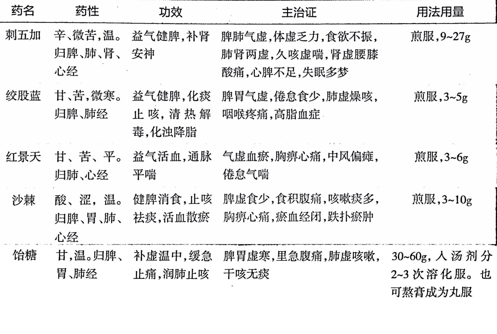
        - **补阳药**
            - 多甘温、成温或辛温，少数苦温
            - **温补人体阳气，主要是补肾阳**
                - 因肾阳为诸阳之本，阳虚诸证往往与肾阳虚有着密切关系
                - **肾阳虚证**
                    - 阳痿宫冷、腰膝酸软
                - **肾不纳气之咳喘**
                - **脾肾阳虚之泄泻、水肿**
            - **补肾壮阳类**
                - **鹿茸**
                    - **药性**
                        - 归肾、肝经
                        - 甘、咸，温
                    - **功效、应用**
                        - **补肾阳，益精血**
                            - 甘咸而温，为血肉有情之品
                            - **肾阳虚衰，精血不足证**
                                - 阳痿早泄、宫冷不孕、小便频数、畏寒肢冷、腰膝酸痛、头晕耳鸣、精神疲乏
                            - 单用或配入复方，如鹿茸酒
                        - **强筋骨**
                            - **肾虚骨弱，腰膝无力或小儿五迟**
                                - 配五加皮、熟地、山萸
                            - **骨折后期，愈合不良**
                                - 配骨碎补、川断、自然铜等
                        - **调冲任**
                            - **冲任虚寒，崩漏**
                                - 配乌贼骨、龙骨、川断等
                            - **虚寒带下**
                                - 配狗脊、白蔹等
                        - **托疮毒**
                            - **疮疡久溃不敛，脓出清稀**
                            - **阴疽疮肿内陷不起**
                            - 常与当归、肉桂等配伍，如阳和汤
                            - 借补阳气、益精血的作用达到温补内托的目的
                        - **鹿角**
                            - 咸，温；归肾、肝经
                            - **温肾阳，强筋骨，行血消肿**
                                - **肾阳不足，阳痿遗精，腰脊冷痛，阴疽疮病，乳痈初起，瘀血肿痛等症**
                            - 煎服，6～15g
                            - 阴虚火旺者忌服
                        - **鹿角胶**
                            - 甘、咸，温；归肾、肝经
                            - **温补肝肾，益精养血**
                                - **肝肾不足所致腰膝酸冷，阳痿遗精，虚劳赢瘦，崩漏下血，便血尿血，阴疽肿痛等症**
                            - 烊化兑服，3～6g
                                - 加黄酒隔水蒸
                            - 阴虚火旺者忌服
                        - **鹿角霜**
                            - 咸、涩，温；归肝、肾经
                            - **温肾助阳，收敛止血**
                                - **脾肾阳虚，白带过多、遗尿尿频，崩漏下血，疮疡不敛等症**
                            - 煎服，9～15g，宜先煎
                            - 阴虚火旺者忌服
                    - **用法用量**
                        - 1～3g，研末吞服，或入丸散
                    - **使用注意**
                        - 凡发热者均当忌服
                        - 宜从小量开始，缓缓增加，不可骤用大量，以免阳升风动，头晕目赤，或伤阴动血
                - **淫羊藿（仙灵脾）、巴戟天、仙茅**
                    - 二仙：仙灵脾、仙茅
                    - **相同点**
                        - 辛（甘），温（热），入肾、肝经
                        - **补肾壮阳**
                            - **肾阳虚**
                                - 阳痿遗精、宫冷不孕、虚寒性月经不调
                                - 三药合用、枸杞子、熟地，如赞育丸
                        - **强筋骨，祛风湿**
                            - **肝肾不足、筋骨萎软、腰膝酸痛**
                                - 杜仲、桑寄生
                            - **风湿久痹、步履艰难**
                    - **不同点**
                        - **巴戟天**
                            - 辛甘微温，药力较逊
                        - **淫羊藿**
                            - **补肾壮阳**
                                - 有雄激素样及植物性雌激素样作用
                            - **肾阳虚的喘咳** **妇女更年期合征**
                        - **仙茅**
                            - 辛热有毒，温燥之性强
                                - **祛寒湿**
                                    - 腰膝冷痛甚
                                - **补肾阳**
                                    - 阳虚久泻
                                    - 补骨脂、益智仁
                - **肉苁蓉、锁阳**
                    - 平补之剂，补而不峻，温而不烈
                    - **补肾阳、益精血**
                        - **肾阳虚**
                            - 阳痿不育、宫冷不孕，腰膝酸软、筋骨无力
                        - 配菟丝子、杜仲、川断等
                    - **润肠通便**
                        - **肠燥便秘，对于老人肾阳不足、精血亏虚者尤宜**
                        - 配当归、牛膝等
                    - **肉苁蓉**
                        - 甘、咸，温；归肾、大肠经
                        - 煎服，6～10g
                    - **锁阳**
                        - 甘，温；归肝、肾、大肠经
                        - 煎服，5～10g
                    - **使用注意**
                        - 大便溏泄者、实热便秘者忌服
                - **[附] 胡芦巴、韭菜子、阳起石、紫石英、海狗肾、海马、蛤蟆油** 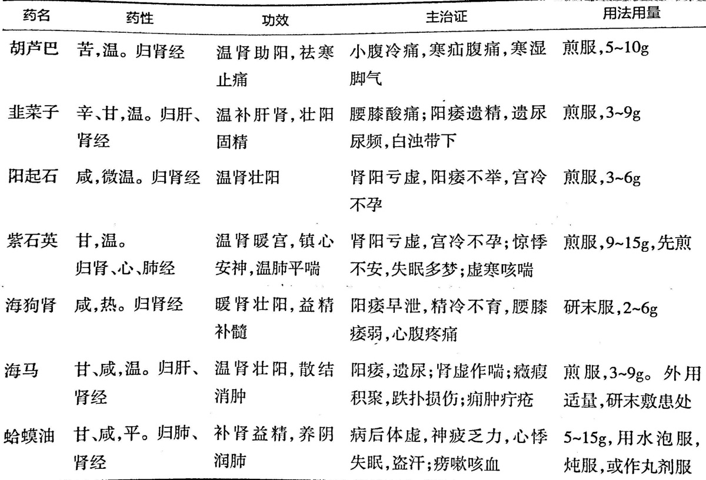
            - **温补脾肾类**
                - **补骨脂** **、益智仁**
                    - **相同点**
                        - 补益之中兼有收涩之性
                        - **补肾固精缩尿**
                            - **肾虚之遗精滑精、遗尿尿频**
                        - **温脾止泻**
                            - 均能补火生土以止泻
                            - **脾肾阳虚泄泻**
                            - 如补骨脂
                                - 配五味子、肉豆蔻、吴茱萸
                                - 如四神丸
                    - **不同点**
                        - **补骨脂**
                            - 辛、苦，温；归肾、脾经
                            - 助阳力强，偏于温肾
                            - **长于温肾助阳**
                                - **肾阳不足、命门火衰**
                                    - 阳痿不孕、腰膝冷痛
                            - **纳气平喘**
                                - **肾不纳气**
                                    - 虚喘
                                - 配人参、肉桂、沉香
                                    - 黑锡丹
                            - **外用消风祛斑**
                                - **白癜风、斑秃**
                                - 酒浸制成酊剂外涂
                            - 煎服，6～10g，外用20％～30％酊剂涂患处
                            - 阴虚火旺及大便秘结者忌服
                        - **益智仁**
                            - 辛，温；归脾、肾经
                            - 助阳力较弱，偏于温脾
                            - **暖肾缩尿，临床遗尿尿频多用**
                                - 配山药、乌药，如缩泉丸
                            - **温脾散寒摄唾**
                                - **脾虚流涎多唾**
                                    - 口多涎唾或者小儿流涎不止
                                - 配党参、白术
                            - 煎服，3～10g
            - **阴阳双补类**
                - **菟丝子、沙苑子**
                    - **相同点**
                        - 甘平或甘温；归肾、肝
                        - **补肾固精缩尿**
                            - **肾虚腰膝冷痛，阳萎遗精**
                            - **小便频数，遗尿；白带过多**
                                - 配龙骨、芡实、莲须
                            - *既补肾阳、又益肾精，又有固涩之性*
                        - **养肝明目**
                            - **肝肾不足，目失所养所致的目暗不明，视物模糊**
                            - 配枸杞子、熟地、菊花
                            - *益肾精养肝血而明目*
                    - **不同点**
                        - **菟丝子**
                            - 辛、甘，平；归肝、肾、脾经
                            - **益肾固摄之功较优**
                            - **安胎**
                                - **肝肾不足之胎动不安，胎漏下血**
                                - 寿胎丸
                            - **止泻**
                                - **脾虚、或脾肾阳虚之久泄**
                            - **（外用）消风祛斑**
                                - **白癜风**
                                - 酒浸外涂
                            - 煎服，6～12g；外用适量
                            - 阴虚火旺、大便燥结、小便短赤者不宜服
                        - **沙苑子**
                            - 甘，温；归肝、肾经
                            - **养肝明目作用较强**
                            - 煎服，9～15g
                            - 阴虚火旺及小便不利者慎用
            - **补肝肾，强筋骨类**
                - **杜仲、续断**
                    - **相同点**
                        - 甘温，归肝、肾经
                        - **补肝肾，强筋骨**
                            - **肾虚腰酸腰痛要药**
                                - 妇女经期、孕期
                            - **风湿、外伤腰痛亦可用**
                        - **安胎**
                            - **肝肾不足的胎动不安、胎漏下血、习惯性流产**
                            - 配桑寄生、菟丝子、阿胶
                                - 寿胎丸
                    - **不同点**
                        - **杜仲**
                            - **补肝肾为重，肝肾不足之腰痛、胎动不安用之优**
                            - **另，有可靠的降血压作用**
                            - 煎服，6～10g
                            - 本品温补，阴虚火旺者慎用
                        - **续断**
                            - 味兼苦辛，能行血脉，为补而不滞之品，伤科要药
                            - **续折伤**
                                - **跌打损伤、骨折肿痛**
                            - **止崩漏**
                                - **肝肾不足崩漏经多、胎漏下血**
                            - 煎服，9～15g
                            - 风湿热痹者忌服
            - **补肺肾、纳气平喘类**
                - **蛤蚧、核桃仁、冬虫夏草、紫河车**
                    - **相同点**
                        - 均归肺肾经
                        - **补益肺肾，纳气定喘**
                            - **肺肾两虚久咳虚喘、劳嗽咯血**
                        - **益肾助阳**
                            - **肾虚腰痛、阳痿遗精**
                            - 其中紫河车、蛤蚧又为血肉有情之品，既助肾壮阳，又益精血，适用于肾阳不足，精血亏虚者
                                - 不如鹿茸
                    - **不同点**
                        - **蛤蚧**
                            - 咸，平；归肺、肾经
                            - **峻补肺肾，尤为治疗肺肾两虚、虚喘劳嗽之要药**
                            - 人参蛤蚧汤
                            - 煎服，3～6g；多入丸散或酒剂
                            - 风寒或实热咳喘者忌服
                        - **冬虫夏草**
                            - 甘，平；归肺、肾经
                            - **甘平不燥，能入肾益精助阳**
                            - **又止血化痰**
                                - **劳嗽痰血**
                                - 北沙参、川贝母、阿胶等
                            - **另、补虚扶弱**
                                - **病后体虚不复或自汗畏寒**
                                - 与鸭、鸡、猪肉等炖服
                            - 煎服，3～9g
                        - **紫河车**
                            - 甘、咸，温；归肺、肝、肾经
                            - *禀人之精血而成，平补阴阳气血，有强壮之功，其补力缓和，逊于鹿茸*
                            - **又益气养血**
                                - **气血不足，萎黄消瘦，产后乳少**
                                - 配党参、黄芪、当归、熟地
                            - **癫痫** **某些过敏性或免疫缺陷症**
                            - 研末吞服，2～3g
                            - 阴虚火旺者不宜单独应用
                        - **核桃仁**
                            - 甘，温；归肾、肺、大肠经
                            - **又润肠**
                                - **肠燥便秘**
                            - **另有排石之功**
                                - **古方用于石淋**
                            - 煎服，6～9g
                            - 阴虚火旺、痰热咳嗽及便溏者不宜使用
        - **补血药**
            - 甘平，甘温，质多滋腻
            - **补血**
                - **心肝血虚证**
                - **妇女月经不调等经产诸症**
            - **大多还兼养阴**
                - **肝肾阴虚证**
            - **当归**
                - **药性**
                    - 甘、辛，温
                    - 归肝、心、脾经
                - **功效、应用**
                    - **补血**
                        - 味甘质润，为补血要药
                        - **血虚证**
                            - 配熟地、白芍，如四物汤
                        - **若气血两虚**
                            - 配黄芪，如当归补血汤
                    - **活血**
                        - **血瘀证**
                        - 配熟地、白芍、桃仁、红花等
                            - 桃红四物汤
                            - 酒当归
                    - **调经止痛**
                        - **妇科经产诸证**
                            - 月经不调、经闭痛经、产后气血两虚
                        - **疼痛证**
                            - 如虚寒腹痛、风湿痹痛、跌打损伤、痈疽疮疡
                        - *补血活血，性温散寒，为调经要药，尤善用于血虚、血瘀、寒凝者*
                    - **润肠通便**
                        - 质润，含油脂
                        - **血虚肠燥便秘**
                            - 尤宜于久病体弱、老人及产后血虚者
                        - 配肉苁蓉、火麻仁
                - **用法用量**
                    - 煎服，6～12g
                    - **当归身**
                        - 长于补血
                    - **当归尾**
                        - 长于活血
                    - **全当归**
                        - 长于和血
                    - **生用**
                        - 补血润肠
                    - **酒炒**
                        - 通经活血
                - **使用注意**
                    - 湿盛中满，大便溏泄者慎用
            - **熟地黄**
                - **药性**
                    - 甘，微温
                    - 归肝、肾经
                - **功效、应用**
                    - **补血**
                        - 味甘质腻，为补血要药
                        - **血虚证**
                            - 萎黄，头昏眩晕、心悸失眠
                        - 常配伍当归、白芍、川芎，如四物汤
                    - **滋阴**
                        - 为滋补肝肾阴精的代表数
                        - **益精填髓**
                            - **肝肾阴虚证**
                                - 见眩晕耳鸣骨蒸潮热，盗汗遗精，消渴
                                - 常配山茱萸、山药等
                            - **肝肾精血亏损**
                                - 腰膝酸软，眩晕耳鸣，须发早白
                                - 常配牛膝、何首乌、菟丝子等
                                - 七宝美髯丹、虎潜丸
                - **用法用量**
                    - 煎服，9～15g
                - **使用注意**
                    - 性质滋腻，易助湿碍胃（较生地尤甚），致食欲减退，腹胀腹泻
                        - 气滞痰多，湿盛苔腻，脾胃虚弱，食少便溏者，均应忌用
                    - 减轻其副作用
                        - 脾胃虚弱者，宜与砂仁同炒，或配橘皮、砂仁、木香等行气健胃药同用
                - **熟地与生地比较**
                    - 同为一物，但由于加工方法不同，其功效亦有区别
                        - **鲜生地**
                            - 鲜者
                        - **生地**
                            - 又称干地黄
                            - 烘干
                        - **熟地黄**
                            - 经黄酒拌闷蒸晒者
                            - 其性由凉转温，质更粘腻
                    - **相同点**
                        - **均入血分**
                            - **血分证**
                                - 血虚或血热
                        - **均滋阴**
                            - **阴虚证**
                    - **不同点**
                        - **熟地**
                            - 甘，微温
                            - **长于补血，滋阴填精**
                                - **血虚证**
                                - **肝肾阴虚，精血不足**
                        - **生地**
                            - 甘苦寒
                            - **长于清热凉血生津**
                                - **血热津伤证**
            - **白芍**
                - **药性**
                    - 苦、酸，微寒
                    - 归肝、脾经
                - **功效、应用**
                    - **养血调经**
                        - **血虚或阴虚有热的月经不调、崩漏**
                        - 常配当归、熟地
                            - 保阴煎、胶艾汤
                    - **敛阴止汗**
                        - **外感风寒，营卫不和**
                            - 恶风、自汗
                            - 常配桂枝同用，以调和营卫
                        - **阴虚盗汗**
                            - 配牡蛎、龙骨
                    - **柔肝止痛**
                        - *养血敛阴一疏肝*
                        - **[柔肝]**
                            - 滋补阴血之品，使肝体得养，肝气柔和条达，疏泄如常，谓之柔肝
                            - 用于血虚肝郁的胁肋疼痛及筋脉失养的手足挛急作痛
                            - 药如白芍
                        - **胁肋疼痛（血虚肝郁）**
                            - 常配当归、柴胡同用，如道遥丸
                        - **腹痛泄泻（肝脾不调）**
                            - 常配白术、防风、陈皮，如痛泻药方
                        - **手足挛急疼痛（营血不足）**
                            - 常配甘草
                    - **（养阴）平肝**
                        - **肝阴不足、肝阳上亢之头痛，昡晕**
                        - 常配牛膝、代赭石、龙骨、牡蛎，如镇肝息风汤
                    - *“白补赤泻，白收赤散”*
                - **用法用量**
                    - 煎服，6～15g
                - **使用注意**
                    - 不宜与藜芦同用
                    - 阳衰虚寒之证不宜用
            - **阿胶**
                - **药性**
                    - 甘，平
                    - 归肺、肝、肾经
                - **功效、应用**
                    - *为血肉有情之品，滋补力强，为补益阴血之佳品*
                    - **补血**
                        - **血虚诸证**
                        - 常配熟地、当归等
                            - 阿胶四物汤
                            - 胶艾汤
                            - 炙甘草汤
                    - **滋阴**
                        - **阴虚火旺**
                            - 心烦失眠，盗汗
                            - 常配黄连，鸡子黄，如黄连阿胶汤
                        - **阴虚风动**
                            - 手足瘛疭chi zong
                            - 常配鳖甲、龟板，如大、小定风珠
                    - **润肺**
                        - **阴虚肺燥**
                            - 干咳少痰或痰中带血
                            - 常配麦冬、沙参
                    - **止血**
                        - *味甘质粘，为重要的胶类止血药*
                            - 出血兼血虚、阴虚者最宜
                        - **出血证**
                            - 吐血、咯血
                                - 常配蛤粉同炒
                            - 崩漏，尿血
                                - 常配蒲黄同炒
                    - **此外，养血止血而安胎**
                        - **妊娠下血，胎动不安**
                - **用法用量**
                    - 3～9g，烊化兑服（黄酒隔水蒸）
                    - **生用**
                        - 长于补血，滋阴润燥
                    - **蛤粉炒**
                        - 长于清肺
                    - **蒲黄炒**
                        - 长于止血
                - **使用注意**
                    - 性黏腻，有碍消化，脾胃虚弱便溏者慎用
            - **何首乌**
                - **药性**
                    - 苦、甘、涩，微温
                    - 归肝、心、肾经
                - **功效、应用**
                    - **熟首乌**
                        - **补益精血**
                            - **乌须发，强筋骨**
                                - **血虚证**
                                    - 头昏目眩，心悸失眠，面色萎黄
                                    - 常配当归、白芍
                                - **肝肾精血亏虚证**
                                    - 腰膝酸软，昡晕耳鸣，遗精，须发早白
                                    - 常配地黄、女贞子、覆盆子
                        - **化浊降脂**
                            - **高脂血症**
                    - **生首乌**
                        - 甘、苦，平
                        - **解毒消痈**
                            - **疮痈，瘰疠**
                                - 常配连翘、玄参、昆布等
                            - **风疹瘙痒**
                                - 配荆芥、防风等
                        - **截疟**
                            - **气血亏虚，久疟不止**
                            - 配人参、当归等
                        - **润肠通便**
                            - 甘润质腻
                            - **血虚肠燥便秘**
                            - 常配当归、麻仁等
                - **用法用量**
                    - **制何首乌**
                        - 煎服，6～12g
                    - **生何首乌**
                        - 煎服，3～6g
                - **使用注意**
                    - 制何首乌，湿痰壅盛者慎用
                    - 生何首乌，大便溏薄者忌用
            - **龙眼肉**
                - **药性**
                    - 甘，温
                    - 归心、脾经
                - **功效、应用**
                    - **补益心脾，养血安神**
                        - **心脾两虚，气血不足**
                            - 心悸、失眠、健忘等
                            - **思虑过度，劳伤心脾**
                                - 常配黄芪、人参、当归、酸枣仁等，如归脾汤
                            - **老年体衰、产后、大病后，见气血不足者**
                                - 和白糖蒸熟，开水冲服
                - **用法用量**
                    - 煎服，9～15g
                - **使用注意**
                    - 内有郁火，痰饮气滞，湿阻中满者忌服
        - **补阴药**
            - 多甘寒，少数成寒
            - **滋养脏腑之阴液，生津润燥**
                - **重在补肺胃、肝肾之阴**
                    - 肺、胃阴虚证
                    - 肝肾阴虚证
            - **北沙参、南沙参**
                - 来源于两种不同的植物，但功用相似
                - **相同点**
                    - 甘，微寒
                    - 归肺、胃经，补肺胃之阴，清肺胃之热
                        - **养阴清肺**
                            - **肺热燥咳**
                                - 干咳少痰、咳血或咽干音哑等
                        - **益胃生津**
                            - **胃阴不足**
                                - 口干多饮、饥不欲食、大便干结、舌苔光剥或舌红少津及胃痛胃胀、干呕等
                - **不同点**
                    - **北沙参**
                        - **清养肺胃作用强**
                            - 肺胃阴虚有热之证较为多用
                        - 微苦
                        - 煎服，5～12g
                        - 风寒咳嗽及肺胃虚寒者忌服；不宜与藜芦同用
                    - **南沙参**
                        - **兼化痰及益气作用**
                            - 较宜于燥咳痰粘及气阴两伤者
                        - 煎服，9～15g
                        - 反藜芦
            - **百合**
                - **药性**
                    - 归肺、心经
                    - 甘、寒
                - **功效、应用**
                    - **特点**
                        - 养肺、心之阴，清肺、心之热
                    - **养阴润肺**
                        - 作用平和，不及北沙参、麦冬
                        - **阴虚燥咳**
                            - 配款冬花
                        - **劳嗽咯血**
                            - 配生地、玄参、桔梗、川贝母
                            - 如百合固金汤
                    - **清心安神**
                        - **阴虚有热之失眠、心悸**
                            - 配麦冬、酸枣仁
                        - **百合病**
                            - 神志恍惚，情绪不能自主，口苦、尿赤
                            - 心阴虚有热
                            - 配生地黄、知母
                - **用法用量**
                    - 煎服，6～12g
                    - 也可蒸食、煮粥食或拌蜜蒸食
                    - 外用：将敷，适量
                - **使用注意**
                    - 脾肾虚寒便溏者不宜用
            - **麦冬** **、天冬**
                - **相同点**
                    - 滋肺胃之阴，清肺胃之热
                    - **养阴润肺**
                        - **肺燥干咳痰少**
                        - **阴虚劳嗽咳血**
                        - **咽痛音哑**
                    - **益胃生津**
                        - **胃阴不足**
                            - 口渴咽干，内热消渴，肠燥便秘
                                - **消渴**
                                    - 配天花粉、乌梅等
                                - **热邪伤津之便秘**
                                    - 配生地、玄参
                - **不同点**
                    - **麦冬**
                        - 甘、微苦，微寒；归心、肺、胃经
                        - **微苦、微寒，滋腻性较小**
                        - **清心除烦**
                            - **阴虚有热**
                                - 心烦、失眠
                                - 配枣仁、柏仁
                            - **热伤心营**
                                - 神烦少寐
                                - 配黄连、生地
                                - 清营汤
                        - 煎服，6～12g
                    - **天冬**
                        - 归肺、肾经
                        - **清火与润燥之力强于麦冬**
                        - **滋肾阴、降虚火**
                            - **肾阴不足、腰膝酸软**
                                - 配熟地、牛膝
                            - **阴虚火旺、骨蒸潮热**
                                - 配知母、黄柏
                        - 煎服，6～12g
                        - 脾虚便溏、虚寒泄泻者忌用
            - 石斛（枫斗：铁皮石斛）
                - **药件**
                    - 甘，微寒
                    - 归胃、肾经
                - **功效、应用**
                    - **特点**
                        - 长于养胃、肾阴，兼清热、降虚火
                    - **益胃生津**
                        - **热病伤津**
                            - 舌干烦渴
                        - **胃阴虚有热**
                            - 低热颁渴，胃脘嘈杂、隐痛或灼痛
                    - **滋阴清热**
                        - **肾阴虚证**
                            - 目暗不明，筋骨痿软
                            - 配熟地黄、枸杞子、菟丝子等
                            - 石斛夜光丸
                        - **阴虚火旺**
                            - 骨蒸劳热
                            - 配枸杞子、黄柏、胡黄连等
                - **用法用量**
                    - 煎服，6～12g，鲜品15～30g
                - **使用注意**
                    - 本品能敛邪，故温热病不宜早用
                    - 又能助湿，若湿温病尚未化燥伤津者，以及脾胃虚寒，大便溏薄，舌苔厚腻者均不宜用
            - **玉竹**
                - **药性**
                    - 甘，微寒
                    - 归肺、胃经
                - **功效、应用**
                    - **特点**
                        - 药力缓和，滋腻之性小
                    - **养阴润燥**
                        - **肺阴不足**
                            - 干咳少痰、咳血、声音嘶哑等
                            - 配沙参、麦冬、桑叶
                        - **养肺阴、兼清肺热**
                        - **滋阴而不碍邪**
                            - 阴虚外感（风热）
                                - 咳嗽，咽干痰结
                                - 与薄荷、淡豆豉等同用，如加减威蕤汤
                    - **生津止渴**
                        - 养胃阴，兼清胃热
                        - **胃阴不足，咽干口渴**
                            - 配沙参、麦冬
                        - **内热消渴**
                            - 配石膏、知母、天花粉等
                    - **养心阴，略能清心热**
                        - **热伤心阴**
                            - 烦热多汗、惊悸
                - **用法用量**
                    - 煎服，6～12g
            - **黄精**
                - **药性**
                    - 甘，平
                    - 归脾，肺、肾经
                - **功效、应用**
                    - **特点**
                        - 气阴双补，偏于养阴，且作用缓和
                    - **益气养阴、健脾**
                        - **脾虚证**
                            - 面色萎黄、困倦乏力、食少口干、大便干燥
                            - 单用或白术、党参同用
                        - 作用缓和，难求速效，适宜用作慢性久病及病后之调补药
                    - **润肺**
                        - **阴虚肺燥**
                            - 干咳少痰
                            - 配沙参、川贝等
                        - **肺肾阴虚**
                            - 劳嗽久咳
                            - 单用熬膏服用
                            - 或配熟地、百部同用
                    - **益肾**
                        - **肾精亏虚**
                            - 腰膝酸软、须发早白等早衰症状
                            - 单用熬膏服用
                            - 或配构杞子
                - **用法用量**
                    - 煎服，9～15g
                    - 或熬膏，或入丸、散服
                - **使用注意**
                    - 痰湿壅滞，中寒便溏、气滞腹胀者不宜服用
            - **枸杞子**
                - **药性**
                    - 甘，平
                    - 归肝、肾经
                - **功效、应用**
                    - **滋补肝肾，益精明目**
                        - 平补肾精肝血，无滋腻碍胃之弊
                        - **肝肾阴虚证及精血不足证**
                            - 视力减退、耳鸣耳聋、牙齿松动、须发早白、腰膝酸软、遗精滑泄
                            - 阴虚消渴
                            - 单用熬膏服
                                - 配怀牛膝、何首乌等
                            - 尤多用于肝肾阴虚之两目干涩，内障目昏
                                - 如杞菊地黄丸
                    - **有补血之功**
                        - 血虚萎黄、失眠多梦，头昏耳鸣
                        - 常与龙眼肉配伍
                            - 如杞圆膏
                - **用法用量**
                    - 煎服，6～12g
                    - 或熬膏、浸酒或入丸、散
            - **墨旱莲** **、女贞子**
                - **相同点**
                    - **滋补肝肾**
                        - 作用不及熟地、山茱萸，但补而不腻，为平补、清补之品
                        - **肝肾阴虚证**
                            - 须发早白、头晕目眩、失眠多梦、腰膝酸软、遗精耳鸣等
                            - 相须为用，如二至丸
                - **不同点**
                    - **女贞子**
                        - 甘、苦，凉；归肝、肾经
                        - **滋补力较强，明目乌发**
                            - **多用于肝肾阴虚目暗不明，视力减退，须发早白**
                        - 煎服，6～12g；或人丸、散剂
                    - **墨旱莲**
                        - 甘、酸，寒；归肝、肾经
                        - **补益作用不及女贞子**
                        - **性寒，凉血止血**
                            - **阴虚火旺，迫血妄行的咯血、衄血、尿血、崩漏**
                            - 配生地、阿胶
                        - 煎服，6～12g；或熬膏、捣汁或入丸、散
            - **楮实子**
                - **药性**
                    - 甘，寒
                    - 归肝、肾经
                - **功效、应用**
                    - **补肾清肝**
                        - **肝肾阴虚证**
                            - 肝肾不足的腰膝酸软、虚劳骨蒸、盗汗遗精、头晕目昏
                            - 常与栒杞子、黑豆配伍
                    - **明目**
                        - **目翳昏花**
                            - 寒能清热，清肝明目
                                - 肝经有热，目生翳障
                                    - 可单味研末用，如楮实散
                                - 治风热上攻，目翳流泪，眼目昏花
                                    - 配荆芥穗、地骨皮，炼蜜丸，米汤调服
                    - **利尿**
                        - **水肿**
                            - 补肾阴，助肾气，利水湿
                                - 阴虚气化不利所致水液停滞之臌胀、小便不利等证
                                - 与丁香、茯苓同用
                                    - 楮实子丸
                - **用法用量**
                    - 煎服，6～12g
                    - 或入丸、散
                - **使用注意**
                    - 虚寒证患者慎用
            - **龟甲** **、鳖甲**
                - **相同点**
                    - 咸，微寒，入肝、肾经
                    - **滋阴潜阳**
                        - 滋养肝肾之阴以清虚热、平潜肝阳、息肝风
                        - **阴虚内热**
                            - 骨蒸潮热、盗汗遗精
                            - 配知母、青蒿
                        - **阴虚阳亢**
                            - 头痛、眩晕
                            - 配石决明、菊花
                        - **阴虚风动**
                            - 手足蠕动
                            - **（三甲）**
                - **不同点**
                    - **龟甲**
                        - 咸、甘，微寒；归肝、肾、心经
                        - **长于滋肾**
                            - 滋阴方中多用
                            - 配熟地、知母、黄柏，如大补阴丸
                        - **益肾强骨**
                            - **肾虚骨痿，小儿囟门不合**
                            - 配熟地、知母、牛膝等
                            - 虎潜丸
                        - **养血补心**
                            - **阴血亏虚，失眠健忘**
                            - 配龙骨、远志等
                        - **固经止崩**
                            - **阴虚血热崩漏、月经过多**
                            - 配椿根皮、黄柏、香附等
                        - 煎服，打碎先煎，9～24g
                        - **龟甲胶**
                            - 咸、甘，凉；归肝、肾、心经
                            - **滋阴，养血，止血**
                                - **阴虚潮热，骨蒸盗汗，腰膝酸软，血虚菱黄，崩漏带下**
                            - 3～9g，烊化兑服
                    - **鳖甲**
                        - 咸，微寒；归肝、肾经
                        - **长于退热除蒸**
                            - **夜热早凉、潮热骨蒸多用**
                            - 配青蒿、秦艽、知母等，如秦艽鳖甲汤
                        - **软坚散结（醋炙用）**
                            - **腹内癥瘕积聚、疟母**
                            - 配柴胡、丹皮、土鳖虫
                                - 如鳖甲煎丸
                        - 煎服，9～24g；打碎先煎
                            - 滋阴潜阳宜生用
                            - 软坚散结宜醋炙用
            - **[附] 桑椹、明党参、黑芝麻** 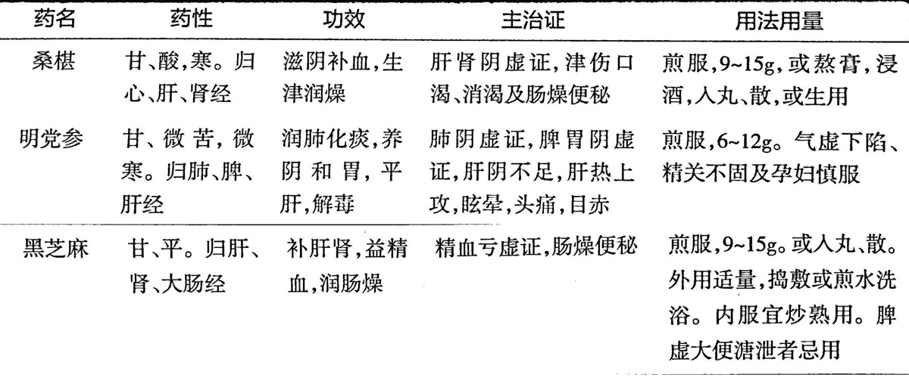
    - 配伍原则
        - 补气药和补阳药、补血药和补阴药，往往相辅而用
            - 气血两亏、阴阳俱虚的证候，又当气血兼顾或阴阳兼补
        - 对于邪盛正衰的证候
            - 配伍祛邪药，可以起到扶正祛邪的目的
        - **行气健脾和胃**
            - **壅阻气机**
            - **碍胃助湿，影响运化**
    - 使用注意
        - 补虚药为虚证所设，身体健康，并无虚弱表现者，不可滥用
            - **误补益疾** **恋邪**
        - **助湿满中** **有碍脾之运化**
        - **助火伤阴**
            - 阴虚火旺者忌用
            - 天气炎热之夏令，一般慎用、少用
    - 补虚药兼有功效归纳 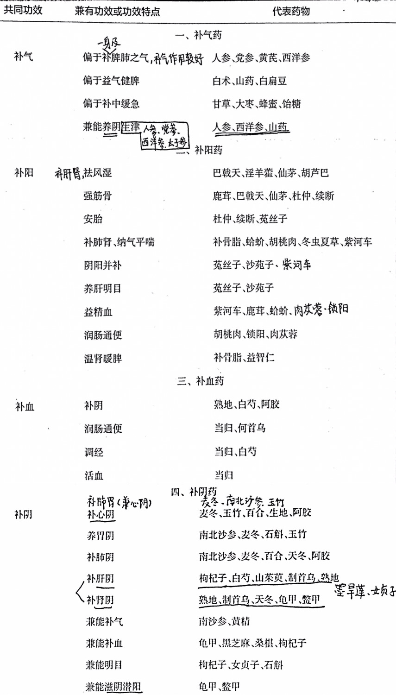
- ***第十九章 收涩药***
    - 定义
        - **收敛固涩** **滑脱证**
    - 功效与适应症
        - **收敛固涩**
            - **滑脱证**
                - **敛取耗散，固其滑脱**
                - 久病体虚、正气不固、脏腑功能衰退所致的滑脱不禁的病证
    - 分类 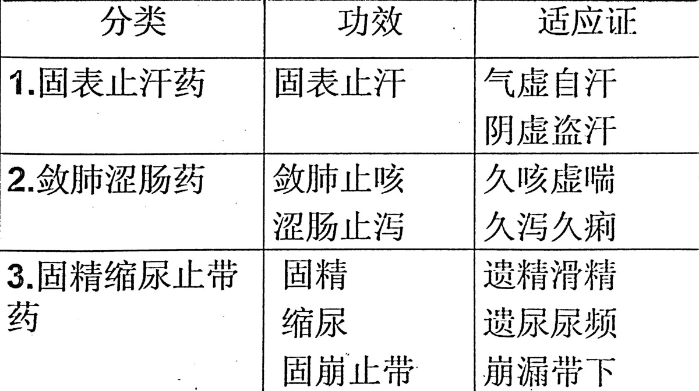
        - **固表止汗药**
            - **麻黄根、浮小麦、糯稻根**
                - **相同点**
                    - **均固表止汗**
                        - **自汗、盗汗**
                - **不同点**
                    - **麻黄根**
                        - 甘、涩，平；归心、肺经
                        - **功专止汗**
                            - **自汗、盗汗**
                        - 煎服，3～9g；外用适量
                        - 有表邪者忌用
                    - **浮小麦**
                        - 甘，凉；归心经
                        - **兼益气（阴）除热**
                            - **骨蒸劳热**
                        - **小麦**
                            - **养心除烦**
                                - **脏躁病**
                        - 煎服，15～30g；研末服，3～5g
                    - **糯稻根**
                        - 甘，平；归心，肝经
                        - 为止汗生津佳品
                        - **益胃生津、退虚热**
                            - **热病后期虚热不退，骨蒸劳热**
                            - **病后脾胃不足，津液不生而口渴，汗出**
                        - 煎服，15～30g
        - **敛肺涩肠药**
            - **五味子**
                - **药性**
                    - 归肺、心、肾经
                    - 酸、甘，温
                    - **五味俱全，以酸甘为主**
                        - **味酸收敛，味甘补益**
                            - **收涩**
                                - 敛肺、敛汗、涩肠、固精
                            - **补益**
                                - 益肺、生津、滋肾、宁心
                - **功效、应用**
                    - **敛肺滋肾**
                        - 久咳虚喘要药
                        - 味酸收敛，甘温而润，能上敛肺气，下滋肾阴
                        - **肺虚久咳**
                            - 配罂粟壳
                            - 五味子丸
                        - **肺肾两虚喘咳**
                            - 配山茱萸、熟地、山药
                            - 都气丸
                        - **敛肺止咳功佳，又可用于寒饮咳喘证**
                            - 配麻黄、细辛、干姜
                            - 如小青龙汤
                    - **敛汗**
                        - **自汗、盗汗**
                        - 配麻黄根，牡蛎
                    - **补肾涩精**
                        - **遗精、滑精**
                        - 配麦冬、山萸肉、熟地、山药
                    - **涩肠止泻**
                        - **脾肾虚寒久泻不止**
                        - 吴茱萸同炒
                            - 五味子散
                        - 或与补骨脂、肉豆、吴茱萸同用
                            - 四神丸
                    - **益气生津**
                        - **甘以益气，酸能生津**
                            - 津伤口渴
                                - 人参、麦冬
                                - 生脉散
                            - 消渴
                                - 山药、知母、天花粉、黄芪
                                - 玉液汤
                    - **补肾宁心**
                        - 补益心肾而宁心安神
                        - **心悸，失眠，多梦**
                            - 阴血亏或心不交所致
                            - 麦冬、丹参、生地、酸枣仁
                            - 天王补心丹
                - **用法用量**
                    - 煎服，2～6g
                - **使用注意**
                    - 内服剂量不宜过大
                    - 凡表邪未解，内有实热，咳嗽初起，麻疹初期，均不宜用
            - **乌梅**
                - **药性**
                    - 酸、涩，平
                    - 归肝、脾、肺、大肠经
                - **功效、应用**
                    - **敛肺**
                        - **肺虚久咳（少痰或干咳无痰）**
                        - 罂粟壳、杏仁
                    - **涩肠**
                        - **久泻久痢**
                        - 罂粟壳、诃子
                    - **生津**
                        - **虚热消渴**
                        - 天花粉、麦冬、人参
                            - 玉泉散
                    - **安蛔**
                        - **蛔厥病证**
                            - 腹痛、呕吐、四肢厥冷
                        - 细辛、川椒、黄连、附子
                            - 乌梅丸
                        - 蛔虫得酸则静，为安之良药
                    - **（炒炭用）固崩止血**
                        - **崩漏下血**
                    - **（外敷）消疮毒**
                        - **胬肉外突**
                        - 捣烂或炒炭研末外敷
                - **用法用量**
                    - 煎服，6～12g，大剂量可用至30g
                    - 外用适量，捣烂或炒炭研末外敷
                        - 止泻止血宜炒炭用
                - **使用注意**
                    - 外有表邪或内有实热积滞者均不宜服
            - **五倍子**
                - **药性**
                    - 酸、涩，寒
                    - 归肺、大肠、肾经
                - **功效、应用**
                    - **敛肺降火**
                        - 既敛肺止咳，又清肺降火
                        - **肺虚久咳**
                            - 五味子、罂粟壳
                        - **肺热痰嗽**
                            - 瓜蒌、黄岑、贝母
                        - **热灼肺络，咳嗽咯血者**
                            - 藕节、白及
                    - **涩肠止泻**
                        - **久泻久痢**
                        - 配诃子、五味子
                    - **敛汗**
                        - **自汗盗汗**
                    - **固精止遗**
                        - **遗精滑精**
                        - 配龙骨、茯苓
                    - **止血**
                        - **崩漏下血**
                            - 可单用，或配棕桐炭、血余炭
                        - **便血痔血**
                            - 槐花、地榆
                            - 或煎汤熏洗患处
                    - **（外用）收湿敛疮（解毒消肿）**
                        - **湿疮流水、溃疡不敛**
                        - **肛脱不收、子宫下垂**
                        - **疮疖肿毒等**
                        - 可单味研末外敷或煎汤熏洗，也可配合枯矾同用
                - **用法用量**
                    - 煎服，3～6g
                    - 入丸散服，每次1～1.5g
                    - 外用适量，研末外敷或煎汤熏洗
                - **使用注意**
                    - 湿热泻痢者忌用
                    - 不宜过量服用，以免损害肝脏
                    - 局部应用，可能有刺激症状
                - **五倍子、五味子** 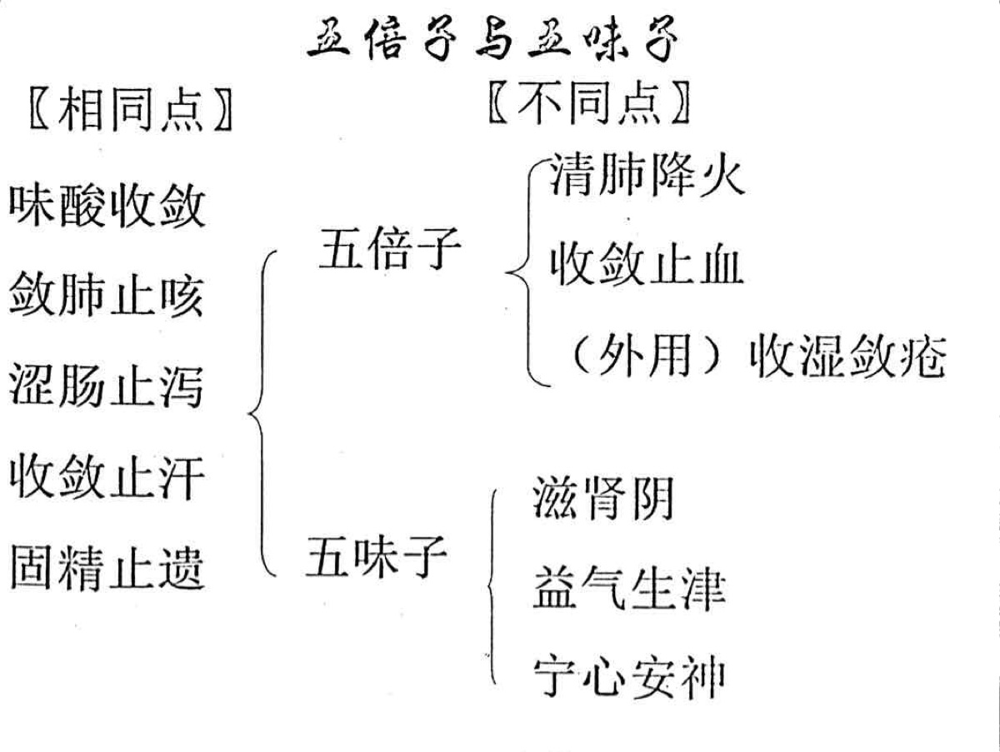
            - **罂粟壳、诃子** 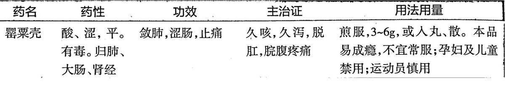
                - **相同点**
                    - 苦、涩，平
                    - **涩肠止泻**
                        - **久泻久痢而无邪滞者**
                            - 脾虚或脾肾两虚
                    - **敛肺止咳**
                        - **肺虚久咳**
                - **不同点**
                    - **罂粟壳**
                        - **止痛效好**
                            - **诸痛较剧者**
                                - 胃痛、腹痛、筋骨疼痛
                        - **注意**
                            - 过量或持续服用易成瘾
                            - 咳嗽或泻痢初起邪实者忌用
                    - **诃子**
                        - **利咽开音**
                            - **久咳失音**
                            - 桔梗、甘草
                                - 诃子汤
                        - 煎服，3～10g
                            - **煨用**
                                - 涩肠止泻
                            - **生用**
                                - 敛肺清热利咽开音
                        - 凡外有表邪、内有湿热积滞者忌用
            - **石榴皮**
                - **药性**
                    - 酸、涩，温
                    - 归大肠经
                - **功效、应用**
                    - **涩肠止泻**
                        - **久泻，久痢**
                            - 单用煎服
                            - 或研末冲服
                            - 肉豆蔻、诃子
                        - **久泻久痢而致脱肛**
                            - 党参、黄芪、升麻
                    - **止血**
                        - **便血**
                            - 单用煎服，或配伍地榆、槐花
                        - **崩漏及妊娠下血不止**
                            - 当归、阿胶、艾叶炭
                    - **驱虫**
                        - **虫积腹痛**
                            - 虫得酸则静，喜暖恶塞
                            - 蛔虫、蛲虫、绦虫等病致虫积腹痛
                                - 槟榔、使君子
                    - **涩精、止带**
                        - **遗精、带下等证**
                - **用法用量**
                    - 煎服，3～9g
                    - **生用**
                        - 入汤剂
                    - **炒用**
                        - 入丸、散
                    - **炒炭用**
                        - 止血
                - **使用注意**
                    - 泻痢初起忌用
            - **肉豆蔻、赤石脂、禹余粮**
                - **相同点**
                    - **涩肠止泻**
                        - **久泻，久痢**
                - **不同点**
                    - **肉豆蔻**
                        - 辛，温；归脾、胃、大肠经
                        - **辛** **温** **治疗虚寒性泻痢**
                            - 补骨脂、五味子、吴茱萸
                                - 四神丸
                        - **温中行气**
                            - **胃寒气滞**
                                - 胀痛、食少、呕吐
                            - 丁香、干姜、半夏等同用
                        - 煎服，3～10g；内服须煨熟去油用
                        - 湿热泻痢者忌用
                    - **赤石脂、禹余粮**
                        - 温涩，质重入下焦
                        - **收敛止血（止带）**
                            - **便血、痔血、崩漏**
                            - **带下**
                        - **赤石脂**
                            - 甘、酸、涩，温；归大肠、胃经
                            - **（外用）生肌敛疮**
                                - **疮疡久溃不敛**
                                - 配龙骨、乳香、没药、血竭等，研细末，撒疮口
                            - 煎服9～12g，先煎；外用适量；研细末撒患处或调敷
                            - 湿热积滞泻痢者忌服；孕妇慎用；畏官桂
                        - **禹余粮**
                            - 甘、涩，微寒；归胃，大肠经
                            - 煎服，9～15g，先煎；或入丸散
                            - 邪实者不宜使用；孕妇慎用
        - **固精缩尿止带药**
            - **山茱萸**
                - **药性**
                    - 酸、涩，微温
                    - 归肝、肾经
                - **功效、应用**
                    - **补益肝肾**
                        - 酸微温，质润，温而不燥，补而不峻，为平补阴阳之要药
                            - **肝肾阴虚**
                                - 腰膝酸软，头晕耳鸣
                                - 六味地黄丸
                            - **命门火衰**
                                - 腰膝冷痛，小便不利
                                - 肾气丸
                            - **阳痿不举**
                                - 鹿茸、补骨脂、淫羊藿等
                    - **收敛固涩**
                        - **补肾益精，固精缩尿（要药）**
                            - 肾虚遗精滑精、遗尿尿频
                        - **补肝肾，固崩止血**
                            - 崩漏下血、月经过多
                        - **敛汗固脱**
                            - **元气虚脱证**
                                - 大汗不止、体虚欲脱
                            - 人参、附子、龙骨
                - **用法用量**
                    - 煎服，6～12g，急救固脱20～30g
                - **使用注意**
                    - 湿热而致小便淋涩者不宜应用
            - **覆盆子、金樱子**
                - **相同点**
                    - **固精缩尿**
                        - **遗精滑精、遗尿尿频**
                - **不同点**
                    - **覆盆子**
                        - **益肾**
                        - **养肝明目**
                            - **肝肾不足，目暗不明**
                    - **金樱子**
                        - 酸、甘、涩，平；归肾、膀胱、大肠经
                        - *主收涩，无补益之功*
                            - **固崩止带**
                                - **崩漏带下**
                            - **涩肠止泻**
                                - **久泻久痢**
                        - 煎服，6～12g
                        - 有实火、邪实者不宜使用
            - **桑螵蛸、海螵蛸**
                - **相同点**
                    - **固精止遗**
                        - **遗精滑精**
                - **不同点**
                    - **桑螵蛸**
                        - 甘、咸，平；归肝、肾经
                        - **补肾助阳**
                            - **肾阳虚之遗精滑精**
                            - **肾虚阳痿**
                        - 煎服，5～10g
                        - 阴虚多火或内有湿热之遗精，膀胱湿热小便频数者不宜用
                    - **海螵蛸**
                        - 咸、涩，温；归脾、肾经
                        - **收敛止血**
                            - **崩漏下血**
                                - 配茜草炭、棕桐炭
                                - 固冲汤
                            - **吐血便血**
                                - 配白及
                        - **收敛止带**
                            - **赤白带下**
                            - 配白芷、血余炭
                        - **制酸止痛**
                            - **胃痛泛酸**
                            - 配白及、瓦楞子、延胡索
                        - **收湿敛疮**
                            - **湿疹湿疮，溃疡不敛**
                        - 煎服，5～10g；散剂酌减；外用适量，研末撒患处
                        - 本品性收涩，久服易致便秘；阴虚多热者不宜多用
            - **莲子、芡实**
                - **相同点**
                    - 同科属，甘涩平，归脾肾经
                    - **益肾固精**
                        - **肾虚遗精、遗尿**
                    - **补脾止泻、止带**
                        - 补中兼涩
                            - **脾虚食少、泄泻**
                            - **脾肾两虚带下**
                - **不同点**
                    - **芡实**
                        - 甘、涩，平；归脾、肾经
                        - **益脾肾固涩** **除湿止带**
                            - 为虚、实带下常用药
                        - 煎服，9～15g
                    - **莲子**
                        - 甘、涩，平；归脾、肾、心经
                        - **养心安神**
                            - **心肾不交之虚烦、心悸、失眠等**
                        - 煎服，6～15g，去心打碎用
                        - **莲须**
                            - 甘、涩，平，归心、肾经
                            - **固肾涩精**
                                - **遗精、滑精、带下、尿频**
                            - 煎服，3～5g
                        - **莲房**
                            - 苦、涩，温，归肝经
                            - **化瘀止血**
                                - **崩漏尿血、寿疮出血、产后瘀阻、恶露不尽**
                                - 炒炭用
                            - 煎服，5～10g
                        - **莲子心**
                            - 苦，寒，归心、肾经
                            - **清心安神，交通心肾，涩精止血**
                                - **热入心包，神昏谵语**
                                - **心肾不交，失眠遗精**
                                - **血热吐血**
                            - 煎服，2~5g
                        - **荷叶**
                            - 苦，平；归肝、脾、胃经
                            - **清暑化湿，升发清阳凉血止血**
                                - **暑热烦渴、暑湿泄泻、脾虚泄泻、血热吐衄、便血崩漏**
                                - **荷叶炭**
                                    - **收涩化瘀止血**
                            - 煎服，3～10g；荷叶炭3～6g
                        - **荷梗**
                            - 苦，平，归肺、脾、胃经
                            - **通气宽胸，和胃安胎，止崩止带**
                                - **外感暑湿，胸闷不畅**
                                - **妊娠呕吐，胎动不安**
                                - **吐血**
                            - 煎服，10~15g
                        - **石莲子**
                            - 苦，寒，归脾、胃、心经
                            - **除湿热，清心开胃**
                                - **热毒噤口痢疾**
                            - 煎服，3～10g
            - **椿皮**
                - **药性**
                    - 归大肠、胃、肝经
                    - 苦、涩，寒
                - **功效、应用**
                    - **清热燥湿，收敛止带**
                        - **赤白带下**
                    - **止泻**
                        - **湿热泻痢，久泻久痢**
                    - **止血**
                        - **崩漏，便血**
                    - **此外，本品尚有杀虫功效**
                        - **内服治蛔虫腹痛**
                        - **外洗治疥癣瘙痒**
                - **用法用量**
                    - 煎服，6～9g
                    - 外用适量
                - **使用注意**
                    - 本品苦寒，脾胃虚寒者慎用
            - **[附] 覆盆子、刺猬皮、鸡冠花** 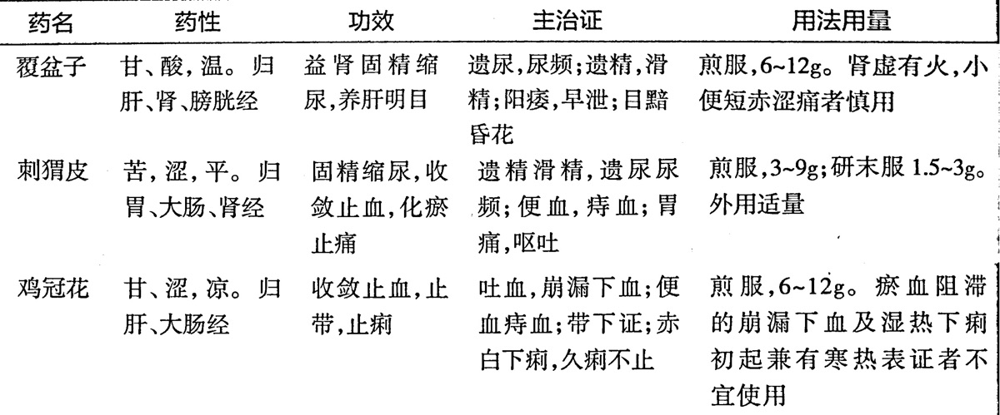
    - 配伍原则
        - **正气虚弱**
        - 收涩药多属治标之品，须与相应的补益药配伍同用，以标本兼顾
    - 使用注意
        - **敛邪**
            - 故凡表邪未解，湿热所致之泻、带下，血热出血以及郁热未清者，均不宜用
            - 误用有“闭门留寇”之弊
    - 收涩药兼有功效归纳 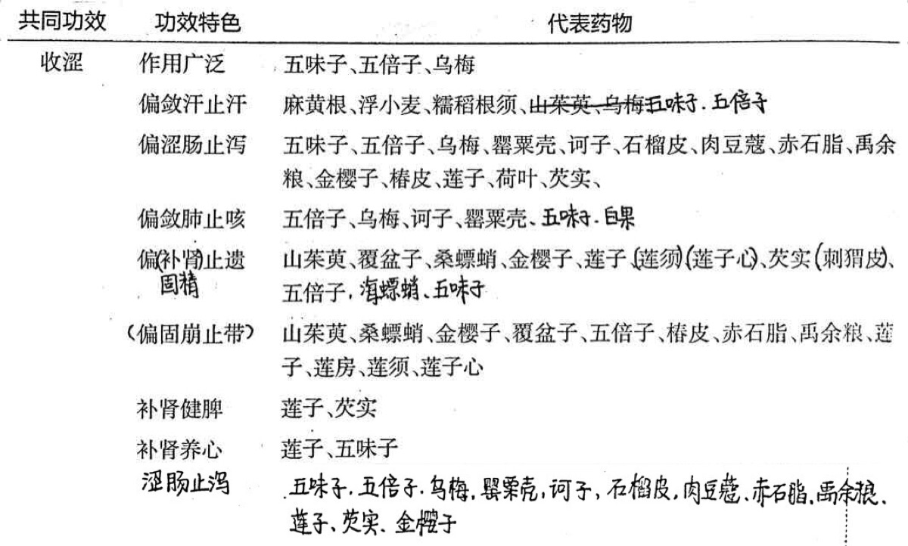
- ***第二十章 涌吐药***
    - 定义
        - **促使呕吐** **毒物、宿食、痰涎等停滞在胃或胸膈以上所致病证**
        - 涌吐药物的运用属于“八法”中的吐法，旨在因势利导，驱邪外出，以达到治疗疾病的目的
    - **常山**
        - **药性**
            - 苦、辛，寒
            - 有毒
            - 归肺、肝、心经
        - **功效、应用**
            - **吐痰涎**
                - **痰饮停聚，胸膈痞塞**
                    - 痰饮停聚郁结，胸膈满闷胀痛，不欲饮食，欲吐而不得吐
                - 常与甘草、白蜜同用，水煎温服
            - **截疟**
                - **疟疾**
                    - 各种疟疾寒热，尤以间日疟和三日疟为佳
                    - 单用本品浸酒，或与草果、厚朴、槟榔等同用
                        - 如截疟七宝饮
            - **用法用量**
                - 煎服，5～9g；或入丸散
                - 涌吐宜生用，截疟宜酒炒用
            - **使用注意**
                - 本品有催吐副作用，用量不宜过大
                - 体虚者及孕妇慎用
    - **藜芦** 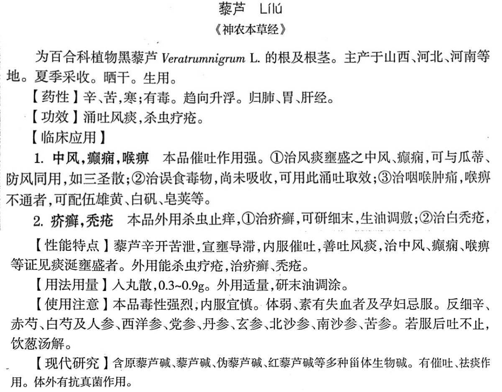
    - **[附] 瓜蒂、胆矾** 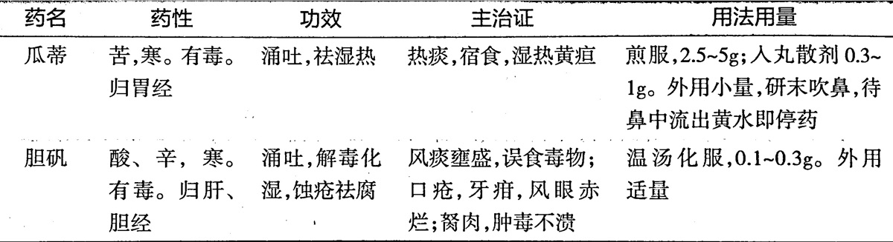
    - 涌吐药兼有功效归纳 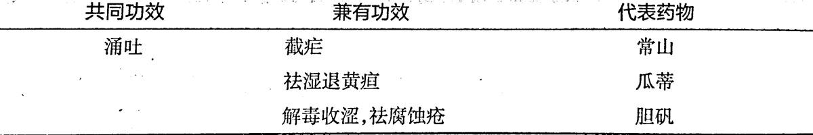
- ***第二十一章 攻毒杀虫止痒药***
    - 定义
        - **攻毒疗疮，杀虫止痒** **疮疡、湿疹、疥癣等病证**
    - 功效与适应症
        - **攻毒疗疮，杀虫止痒**
            - **主要适用于某些外科及五官科病证**
                - 疮痈疔毒，疥癣、湿疹
                - 喉证、聤耳、牙痛
            - **还用于麻风、梅毒及虫蛇咬伤、癌肿等**
    - **硫黄**
        - **药性**
            - 酸，温
            - 有毒
            - 归肾、大肠经
        - **功效、应用**
            - **（外用）解毒杀虫止痒**
                - 性温而燥
                - **治疥疮要药**
                    - 即单取硫黄为末，麻油调涂用
                - **顽癣**
                    - 轻粉、斑蝥、冰片为末同香油、面粉为膏，涂敷患处
                - **阴疽疮疡**
                    - 荞麦面、白面为末贴敷患处
            - **（内服）补火助阳，通便**
                - **阳痿足冷**
                - **虚喘冷哮**
                - **虚寒便秘**
        - **用法用量**
            - 外用适量，研末敷或加油调敷患处
            - 内服，1.5～3g，炮制后入丸、散服
        - **使用注意**
            - 性温有毒，内服慎用，阴虚火旺及孕妇忌服
            - 不宜与芒硝、玄明粉同用
    - **雄黄**
        - **药性**
            - 辛，温；有毒
            - 归肝、大肠经
        - **功效、应用**
            - **解毒杀虫**
                - （以毒攻毒）
                - （外用或内服）
                - **痈肿疔疮，湿疹疥癣**
                    - 单用
                    - 或配白矾
                    - 或配乳香、没药、麝香
                - **蛇虫咬伤**
                    - 单用香油调涂患处
                    - 重者内外兼施，当与五灵脂共为细末，酒调灌服，并外敷
            - **杀虫**
                - **虫积腹痛**
                    - 牵牛子、槟榔
                    - **蛲虫病引起的肛门瘙痒**
                        - 雄黄粉、凡士林制成的纱布条塞于肛门内
            - **内服**
                - **燥湿化痰**
                    - 喘满咳嗽
                    - 配杏仁、巴豆
                - **祛风定惊**
                    - 癲痫
                    - 配朱砂
                - **截疟**
                    - 疟疾，现少用
        - **用法用量**
            - 外用适量，研末调敷
            - 内服入丸散，0.05～0.1g
        - **使用注意**
            -         开窍药内服宜慎，不可久服
            - 外用不宜大面积涂擦及长期持续使用
            - 孕妇禁用
            - 切忌火煅。“雄黄见火如砒”
    - **白矾**
        - **枯矾**
        - **药性**
            - 酸、涩，寒
            - 归肺、脾、肝、大肠经
        - **功效**
            - 外用
                - **解毒杀虫**
                - **燥湿止痒**
            - 内服
                - **止血止泻**
                - **祛除风痰**
        - **用法用量**
            - 外用适量，研末调敷或化水洗患处
            - 内服入丸、散，0.6～1.5g
        - **使用注意**
            - 体虚胃弱及无湿热痰火者忌服
    - **蛇床子**
        - **药性**
            - 辛、苦，温
            - 有小毒
            - 归肾经
        - **功效、应用**
            - **杀虫止痒、燥湿**
                - 本品辛苦温质燥，为皮肤及妇科病常用
                - **阴痒**
                    - 如滴虫性阴道炎
                - **湿疹，疥癣**
                    - 常与苦参、黄柏、白矾等配伍，且较多外用
            - **温肾壮阳**
                - **肾虚阳痿，官冷不孕**
        - **用法用量**
            - 内服，煎汤，3～10g
            - 外用适量，多煎汤熏洗或研末调敷
        - **使用注意**
            - 阴虚火旺或下焦有湿热者不宜用
    - **土荆皮** 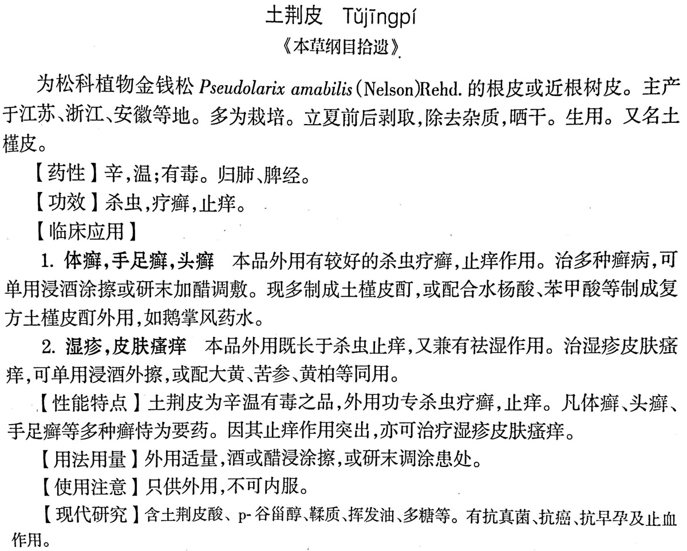
    - **蜂房** 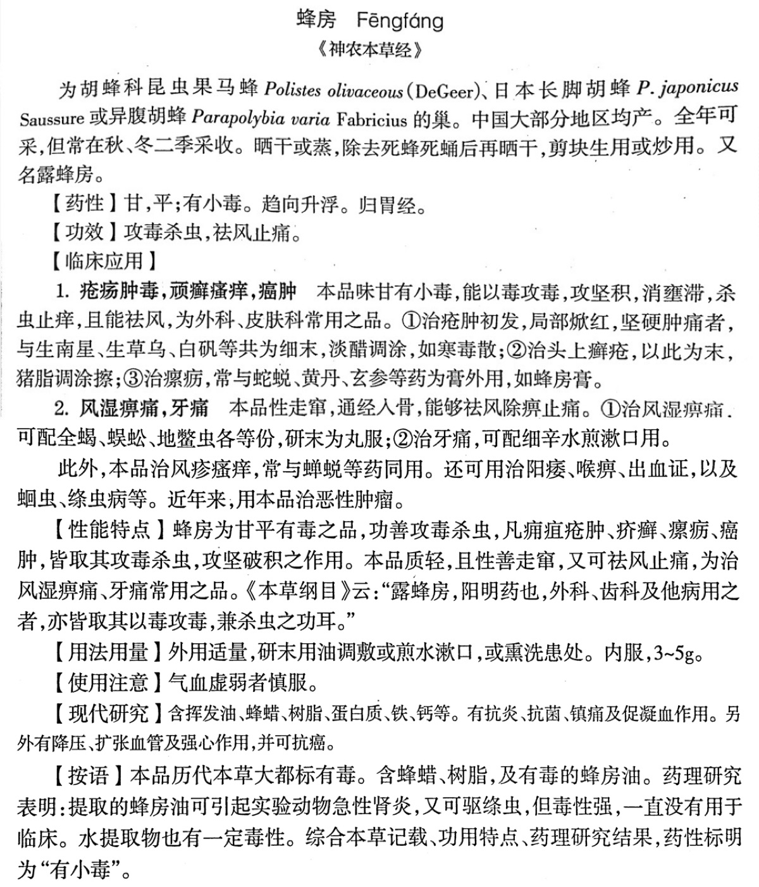
    - **蟾酥**
        - **药性**
            - 辛，温；有毒
            - 归心经
        - **功效、应用**
            - **解毒，止痛**
                - **痈疽疔疮，瘰疠**
                - **咽喉肿痛，牙痛**
                - 有良好解毒消肿，麻醉止痛作用，可外用及内服
            - **开窍醒神**
                - **痧胀腹痛，吐泻神昏**
                - 辛温走窜，有辟秽化浊，开窍醒神之功，嗅之亦能催嚏
        - **用法用量**
            - 内服，0.015～0.03g，研细，多入丸、散用
            - 外用适量
        - **使用注意**
            - 本品有毒，内服宜慎，勿过量
            - 孕妇忌用
            - 外用不可入目
    - **[附] 大蒜、樟脑** 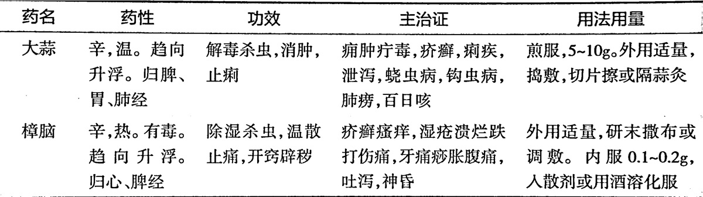
    - 攻毒杀虫止痒药兼有功效归纳 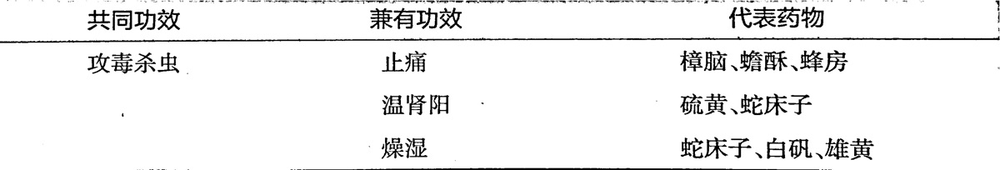
- ***第二十二章 拔毒化腐生肌药***
    - 定义
        - **拔毒化腐，生肌敛疮** **痈疽疮疡证**
    - 功效与适应症
        - **拔毒化腐，生肌敛疮**
            - **痈疽疮疡溃后脓出不畅，或溃后腐肉不去，新肉难生**
                - 伤口难以生肌愈合
            - **癌肿，梅毒**
            - 部分药
                - **皮肤湿疹**
                - **五官科的口疮、喉证、目赤翳障等**
    - **升药**
        - **药性**
            - 辛，热
            - 有大毒
            - 归肺、脾经
        - **功效、应用**
            - **拔毒去腐**
                - **痈疽溃后，胞出不畅**
                - **腐肉不去，新肉难生**
                - **只供外用**
            - **煅石膏**
                - 用量比为1：9者称九一丹，技毒力较轻而
                - 收湿生肌力较强：9：1者称九转丹，则拔毒提脓之力强
        - **用法用量**
            - 外用适量
            - 本品只供外用，不能内服
            - 且不用纯品，多配煅石膏外用
            - 用时，研极细粉末，干掺或调敷，或以药捻沾药粉使用
        - **使用注意**
            - 升药有大毒，外用亦不可过量或持续使用
            - 外疡腐肉已去或脓水已尽者，不宜用
            - 升药仅供外用，一般不可内服，以防蓄积毒性或慢性中毒
                - 氧化汞对人的致死量为0.1～0.7g
    - **轻粉** 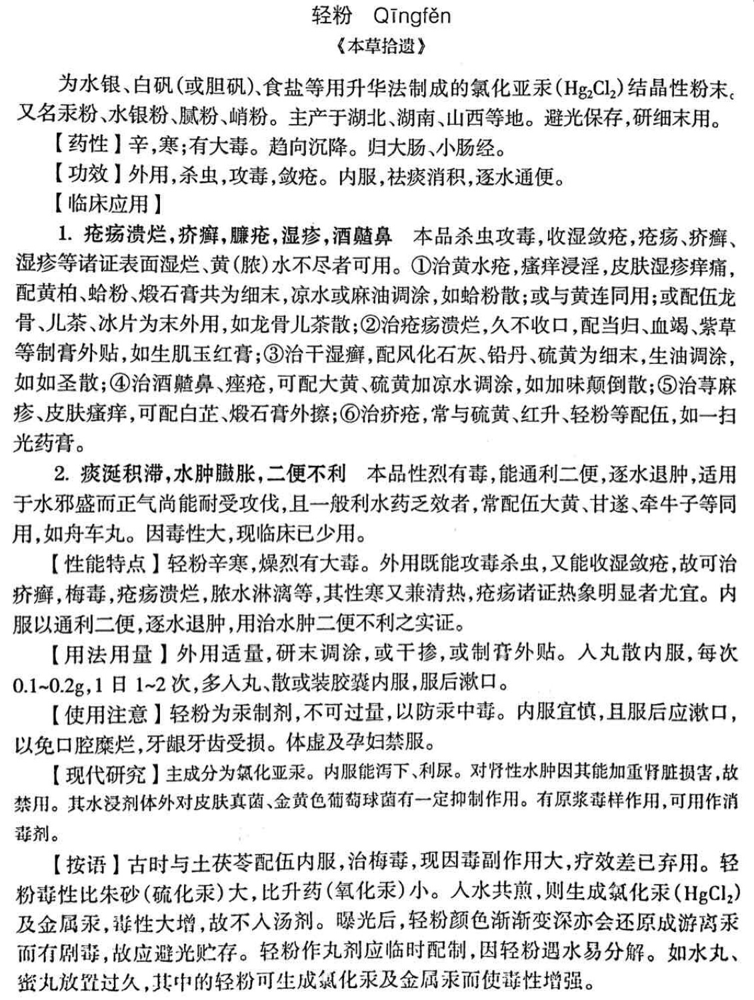
    - **砒石**
        - **药性**
            - 辛，大热
            - 有大毒
            - 归肺、肝经
        - **功效、应用**
            - **攻毒杀虫、蚀疮去腐**
                - **腐肉不脱之恶疮**
                    - 配硫黄、苦参外涂
                - **瘰疠，顽獬，牙疳，痔疮、宫颈癌、皮肤癌**
                    - 配明矾、雄黄、乳香为细末
                        - 如三品一条枪（《外科正宗》）
                - 虽可单用贴敷，因易中毒且引起剧烈疼痛，故多配其他药物以缓其毒
            - **（内服）劫痰平喘**
                - 辛大热，能祛寒劫痰平喘
                - **寒痰哮喘**
                - 久治不愈者，可配淡豆豉为丸服，如紫金丹
        - **用法用量**
            - 外用适量，研末撒敷，宜作复方散剂或入膏药、药捻用
            - 内服一次0.002～0.004g（古时常用剂量为10mg），只做丸、散服，不宜入汤剂
        - **使用注意**
            - 砒石剧毒，须严格掌握用量，内服宜慎，不可持续服用；外用亦不可过量，以防吸收中毒
                - **成人中毒量为0.01g；致死量为0.1～0.2g**
                - 且有人对砒石非常敏感，使用过程中出现中毒反应，应立即停药
                - **砒中毒初期，症见**
                    - 口咽灼热，剧烈腹痛，随后呕吐，吐出物初似米汤，渐呈黏液状，含胆汁，甚者吐血
                    - 水样腹泻，严重者呈血水样大便
                    - 口渴，咽喉干燥，头痛眩晕，烦躁不安，尿少尿闭，或血尿、蛋白尿
                    - 肌肉痉挛疼痛，皮肤变白发冷，后期发绀，终致血压下降，循环衰竭而亡
            - 孕妇禁服，不可作酒剂服，忌火煅，不宜与水银配伍
    - **炉甘石、硼砂**
        - **相同点**
            - **均解毒防腐，且无毒刺激性小，为眼科常用**
        - **不同点**
            - **炉甘石**
                - 甘，平；归肝、脾经
                - 专供外用，性平力缓，解毒力小
                - **解毒明目退翳**
                    - **目赤翳障，烂弦风眼（眼科）**
                - **收湿止痒敛疮**
                    - **溃疡不敛，皮肤湿疮等（皮肤科）**
                - 外用适量，研末撒布或调敷；水飞制极细末点眼
                - 宜炮制后用；一般不内服
            - **硼砂**
                - 甘、咸，凉；归肺、胃经
                - 性寒，清热解毒力强
                - **（外用）清热解毒**
                    - **眼科目赤翳障（眼科）**
                    - **口腔科咽喉肿痛，口舌生疮（喉科）**
                - **（内服）清热化痰**
                    - **痰热证**
                - 外用适量，研极细末干撒或调敷患处；或化水漱口，或入丸散含化内服，每次1.5～3g
                - 外用为主，内服宜慎
        - **[附] 铅丹** 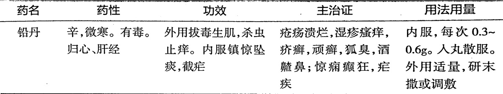
    - 拔毒化腐生肌药兼有功效归纳 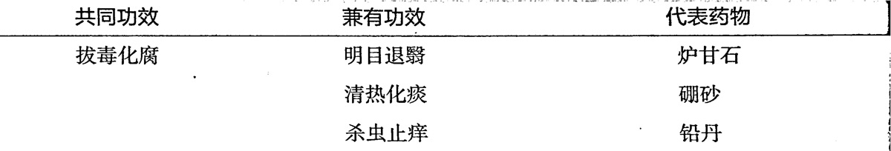