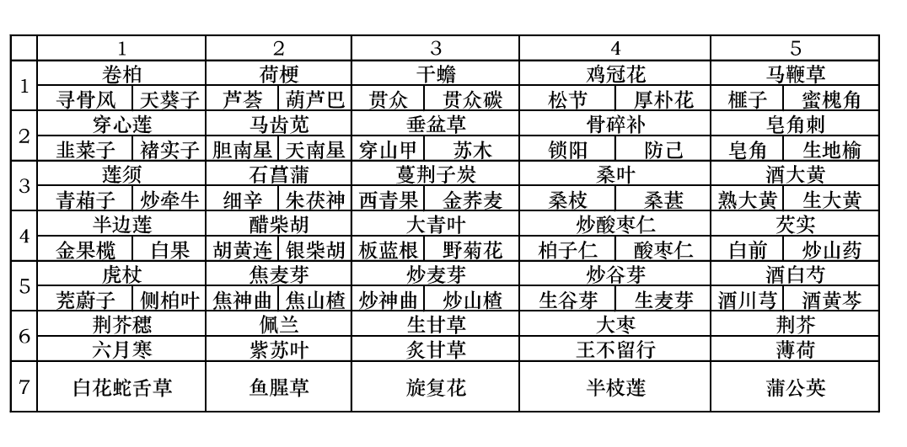
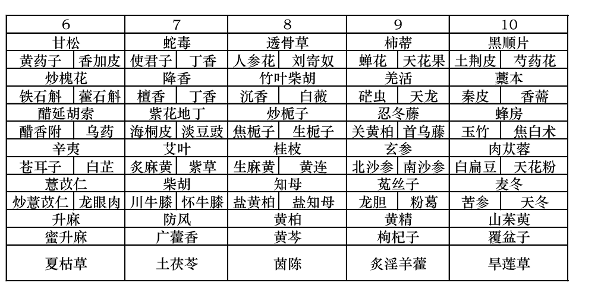
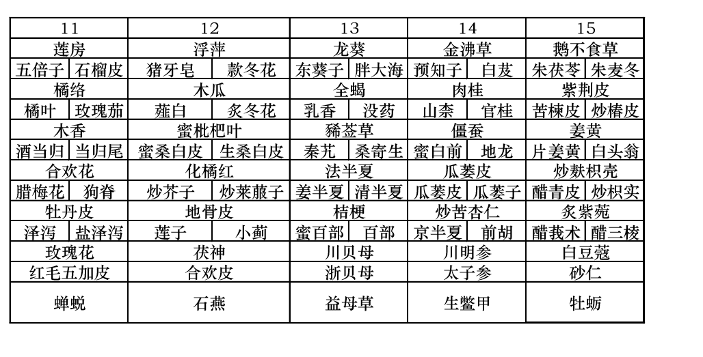
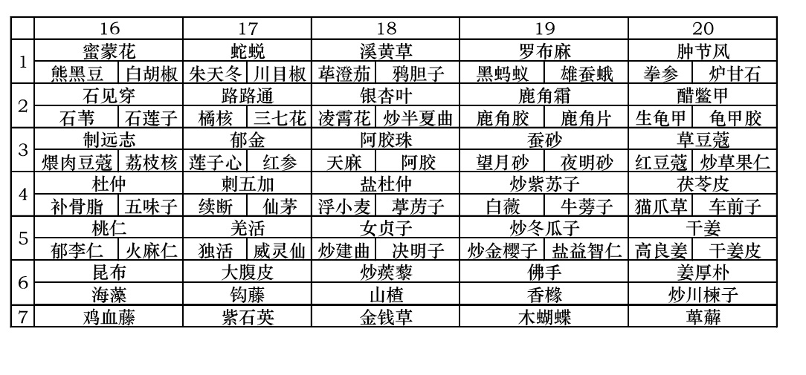
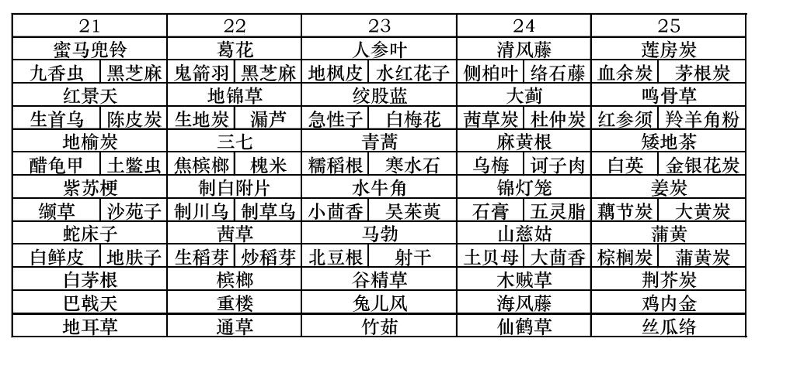
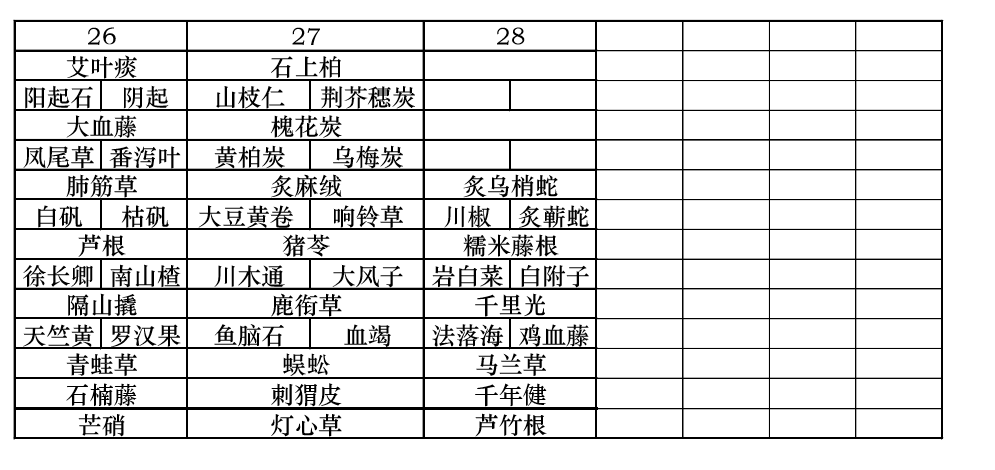

# 中药房中药饮片归类  
- 易生虫饮片
    - 党参、人参、南沙参、冬虫夏草、鹿茸
    - 当归、独活、白芷、防风、板蓝根、
    - 甘遂、生地、泽泻、金瓜萎、枸杞子、
    - 大皂角、桑甚、龙服肉、核桃仁、莲子、
    - 薏苡仁、杏仁、青风藤、桑白皮、、
    - 蕲蛇、鸡内金、菊花、金银花、凌霄花、
    - 北沙参、防己、莪术、贝母、金果榄、
    - 佛手、陈皮、砂仁、酸枣仁、红花、
    - 闹羊花、蒲黄、芫花、蝉蜕、黄柏
    - 狗肾、地龙、甘草、黄芪、山药、
    - 天花粉、桔梗、灵芝、猪苓
    - 茯苓、水蛭、僵蚕、蜈蚣、乌药、
    - 葛根、丹参、何首乌、赤芍、苦参、
    - 延胡索、升麻、萆薢、大黄、肉豆蔻、
    - 淡豆鼓、柴胡、地榆、川芎、半夏、玉竹
- 易发霉饮片
    - 天冬、牛膝、独活、玉竹
    - 黄精、白果、橘络、全瓜蒌
    - 山茱萸、莲子心、枸杞子
    - 大枣、马齿苋、大蓟、小蓟
    - 大青叶、桑叶、哈蟆油、鹿筋
    - 狗肾、水獭肝、蛤蚧、黄柏
    - 白鲜皮、川槿皮、人参、党参
    - 当归、毛知母、紫菀、菊花
    - 红花、金银花、白及、木香
    - 五味子、洋金花、蝼蛄、蜈蚣
    - 地龙、蕲蛇、甘草、葛根、山柰
    - 青皮、芡实、薏苡仁、栀子
    - 羌活、紫菀、黄芩、远志
- 易泛油饮片
    - 独活、火麻仁、核桃仁、榧子、
    - 千金子、当归、牛膝、巴豆
    - 狗肾、木香、龙眼肉、杏仁
    - 蝼蛄、紫河车、前胡、川芎、白术、苍术
- 易变化饮片
    - 月季花、白梅花、玫瑰花、款冬花、红花、山茶花、金银花、扁豆花、橘络、佛手、通草、麻黄
- 易失去气味饮片
    - 广霍香、香薷、紫苏、薄荷
    - 佩兰、荆芥、细辛、肉桂
    - 花椒、月季花、玫瑰花
    - 吴茱萸、八角茴香、丁香
    - 檀香、沉香、厚朴
    - 独活、当归、川芎
- 易升化饮片
    - 樟脑、薄荷脑、冰片
- 易软化融化类饮片
    - 松香、芦荟、阿魏、猪胆膏、白胶香、安息香、柿霜、乳香、没药、苏合香
- 易风化饮片
    - 棚砂、白矾、绿矾、芒硝、胆矾
- 易潮解饮片
    - 芒硝、大青盐、绿矾、胆矾、蹦砂、成秋石、盐附子、金蝎、海藻、昆布
- 药房斗图
    -  
    -  
    -  
    -  
    -  
    -  