# 中西医诊断
- 整体
    - 意识障碍
        -  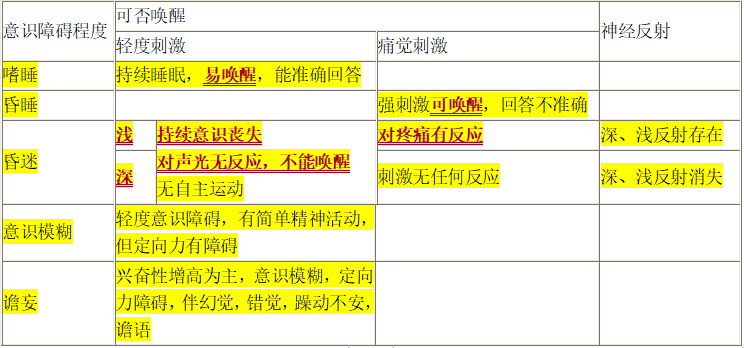
        - 嗜睡　　
            - 最轻的意识障碍　　
            - 可唤醒，能配合检查　　
            - 刺激去除后很快入睡　　
            - 意识障碍早期表现, 常见于颅内压增高病人
        - 意识模糊 　　
            - 意识水平轻度下降　　
            - 保持简单的精神活动　　
            - 定向力发生障碍　　
        - 谵妄　　
            - 一种以兴奋性增高为主的急性高级神经中枢活动失调状态。　　
            - 谵妄状态：定向力/自知力障碍，注意力涣散，不能与外界正常接触　　
            - 常有错觉/幻觉，错视为主，形象生动逼真→恐惧/外逃或 　　
            - 伤人行为　　
            - 急性谵妄状态---高热/中毒（如阿托品类）　　慢性谵妄状态---慢性酒中毒
        - 昏睡　　
            - 较深的睡眠状态，处于熟睡状态　　
            - 在强烈刺激下可唤醒　　
            - 醒时答话含糊或答非所问　　
        - 昏迷　　 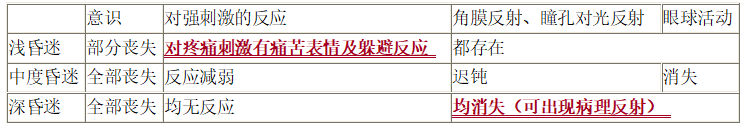
            - 意识状态中断或丧失　　
            - 浅昏迷　　深昏迷　　　　
    - 精神面貌
        - 意识障碍伴发热　先发热——严重感染；
        - 先意识障碍——脑出血，脑肿瘤，脑外伤　　
        - 意识障碍伴呼吸缓慢　见于吗啡或巴比妥类中毒、颅内高压　　
        - 意识障碍伴呼吸深大　见于尿毒症、糖尿病酮症酸中毒　　
        - 意识障碍伴瞳孔散大　见于酒精中毒、癫痫、低血糖昏迷（低糖痫酒大）　　
        - 意识障碍伴瞳孔缩小　见于海洛因、吗啡、巴比妥类、有机磷等中毒（巴吗磷海小）
        - **得神（有神）**
            - 【临床表现】
                - 两目灵活，明亮有种，面色荣润，含蓄不露，神志清晰，表情自然，肌肉不削反应灵敏
            - 【临床意义】
                - 正气充足，精气充盛，体健神旺
                - 多见于健康无病
                - 虽病精气未衰，属病轻易治，预后良好
        - **少神（神气不足）**
            - 【临床表现】
                - 两目停滞，目光乏神，面色少华，暗淡不荣，精神不振，思维迟钝，少气懒言肌肉松软，动作迟缓，反应正确
                - 肺脾气虚——补气
            - 【临床意义】
                - 精气不足，机能咸退
                - 轻病，或恢复期病情好转
                - 虚证体质虚
        - **失神（无神）**
            - 失神是精亏神衰或非盛神乱的重病表现
            - **精亏神衰——久病虚证**
                - 正气大伤，精气亏虚，功能严重衰退
                - 精亏神衰而致失神
                    - 【临床表现】
                        - **精神萎靡**
                    - 【临床意义】
                        - 精气大伤，机能严重衰咸，多见久病、重病，预后不良
            - **外盛神乱——急性病实证**
                - 邪气亢盛，机体功能严重障碍
                - 邪盛神乱而致失神
                    - 【临床表现】
                        - **神昏谵语**
                    - 【临床意义】
                        - 邪气亢盛，脏腑功能严重障碍，气血津液失调，多见于急性重病
        - **假神**
            - 指原来失神的病人，突然出现暂时好转的现象
            - 【临床表现】
                - 原本目光晦滞，突然目似有光，但却浮光外露
                - **颧红如妆**
                - 本已神昏或精神极度萎靡，突然神识似清，想见亲人，言语不休，但精神烦躁不安
                - 身体沉重难移，忽思起床活动，但并不能自己转动
                - 毫无食欲，久不能食，突然索食，且食量大增等
            - 【临床意义】
                - **脏腑精气极度衰竭，正气将脱，阴不敛阳，虚阳外越**
                - “回光返照”或“残灯复明”，常是危重病人临终前的征兆
            - 假神与病情好转的鉴别
                - 整体表现逐步好转。其精神好转也是逐渐的，并与整体状况好转相一致
        - **神乱**
            - 【临床表现】
                - 焦虑恐惧——脏躁、卑惵（心胆气虚、心神失养）
                - 狂躁不安——狂病（痰火扰神）
                - 淡漠痴呆——癫病、痴呆（痰蒙心神、先天不足）
                - 猝然昏倒——痫病（肝风、痰蒙清窍）
        -  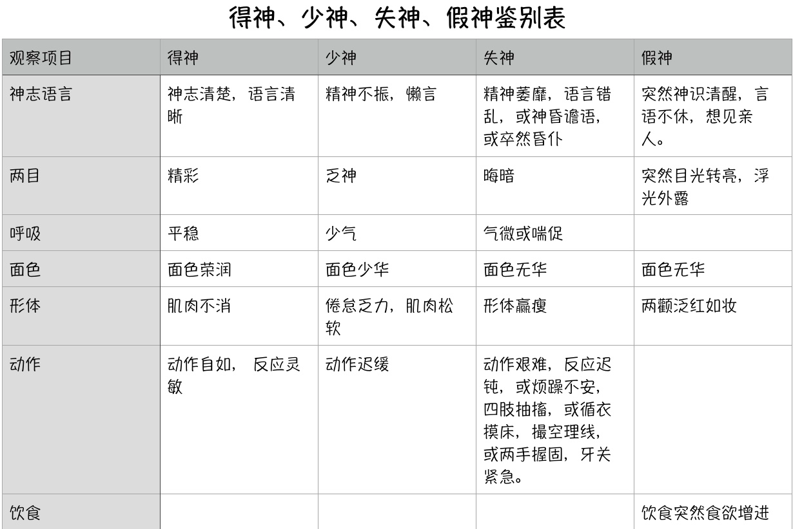
        -  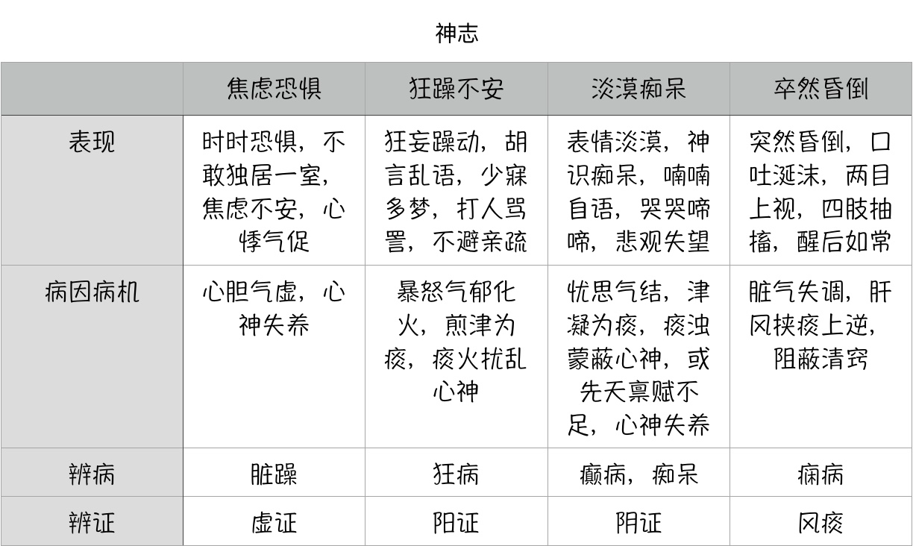
    - 体型
        - **肥胖**
            - 食少、肉松、神疲、乏力，形盛气虚，属阳虚，多痰湿
            - 易患痰饮、中风等病
        - **消瘦**
            - 头长形，颈细长，肩狭窄，胸狭平坦，大旗瘦瘪
            - 体瘦食多，属中焦有火
            - 体瘦食少，属中气虚弱
            - 体瘦颧红，伴潮热盗汗，口咽干燥者，多属阴虚火旺的表现，易患肺痨等病
            - 久病重病，卧床不起，骨瘦如柴，为脏腑精气衰竭，气液干枯，属病危
        - 形体虽胖，但少气乏力者，为精气不足，抗病力弱
        - 形体虽瘦，但神旺有力者，为精气充沛，抗病力强
    - 姿势 体位
        - 强迫体位
            - 仰卧位：急性腹膜炎
            - 俯卧位：脊柱疾病
            - 侧卧位：卧于患侧，一侧胸膜炎及大量胸腔积液
            - 强迫坐位：心肺功能不全
            - 强迫蹲位：发绀性先天性心脏病
            - 辗转体位：胆绞痛，肾绞痛，肠绞痛
            - 角弓反张：破伤风，小儿脑膜炎
        - 步态
            - 痉挛性偏瘫步态（画圈样）：脑血管病后遗症　　
            - 剪刀步态：脑瘫或截瘫　　
            - 醉酒步态：小脑病变、酒精中毒　　
            - 慌张步态：震颤麻痹（帕金森）　　
            - 蹒跚步态（鸭步）：佝偻病、大骨节病、进行性肌营养不良或先天性双髋关节脱位
            - 间歇性跛行：下肢闭塞性动脉粥样硬化
            - 共济失调：小脑或脊髓后索疾病
        - **坐形**
            - 坐而仰首，胸胀气粗
                - 肺胀、痰饮停肺
            - 坐而喜俯，少气懒言
                - 体弱气虚
            - 但坐不得卧，卧则气逆
                - 咳喘肺胀，或水饮停于胸腹
            - 但卧不能坐，坐则神疲晕眩
                - 脱血夺气，或肝阳化风
            - 坐时常以手抱头，头倾不能昂，凝神熟视
                - 精神衰败
        - **卧式**
            - **卧时面常向外，身轻自能转侧**
                - 阳证、热证、实证
            - **卧时面常向里，身重不能转侧**
                - 阴证、寒证、虚证
                - 若见于久病重病
                    - 气血衰败已极，预后不良
                - 仰卧伸足，掀去衣被
                    - 实热证
                - 蜷卧缩足，喜加衣被者
                    - 虚寒证
            - **坐卧不安**
                - 烦躁之证或腹满胀痛
        - **立姿**
            - 站立不稳，其态似醉，常并见眩晕
                - 肝风内动
            - 不耐久站，站立时常欲依靠它物支撑
                - 气血虚衰
        - **行态**
            - 以手护腰，弯腰曲背，行动艰难
                - 腰腿病
            - 行走时身体震动不定
                - 肝风内动
                - 筋骨受损
        - **痛姿**
            - 蹙额捧头，俯不欲仰
                - **头痛**
            - 叉手扪心，闭目不语
                - **心虚怔忡或心痛**
            - 两手护乳前，惟恐触碰
                - **乳痈**
            - 以手护腹，俯身前倾
                - **腹痛**
            - 护处必痛
    - 动作
        - 抽搐全身或局部成群骨骼肌非自主的抽动或强烈收缩，常引起关节运动和强直，不伴有意识丧失
            - 破伤风、狂犬病、低钙抽搐、癔症性抽搐（破一概全）
        - 伴有意识丧失
            - 癫痫大发作
        - 肢体偏瘫
            - 脑血管疾病及颅内占位
        - 唇、险、指、趾不时颤动\手足蠕动\四肢拘挛\四肢抽搐\角弓反张
            - **多与风和肝有关**
        - 卒然昏倒，不省人事，伴四肢抽搐，口吐涎沫，两日上视，移时苏醒，解后如常
            - **痫病**
        - 循衣摸床、撮空理线
            - **失神**
        - 卒然昏倒，半身不遂，口眼㖞斜
            - **中风之中脏腑**
        - 神志清楚，仅半身不遂或口眼㖞斜
            - **中风之中经络，或中风后遗症**
        - 卒然昏倒，伴见四肢厥冷，而呼吸自续
            - **厥证**
        - 盛夏卒倒，面赤汗出，甚而昏迷痉厥
            - **中暑**
        - 手足软弱无力，行动不灵而无痛
            - **痿证**
        - 四肢关节肿痛，屈伸不利
            - **痹证**
        - 儿童手足伸屈扭转，挤眉眨眼，呶嘴伸舌，状似舞蹈，不能自制
            - **气血不足，风湿内侵**
        - 恶寒战栗
            - **寒战**
    - 周身痛
        - 指头身、腰背、四肢均觉疼痛
        - 临床应注意询问其发病的时间，病程的长短
            - 新病周身痛
                - **实证**
                - 感受风寒湿邪，经气不利
            - 久病卧床不起而周身痛
                - **虚证**
                - 气血亏虚，筋脉失养
- 神经
    -  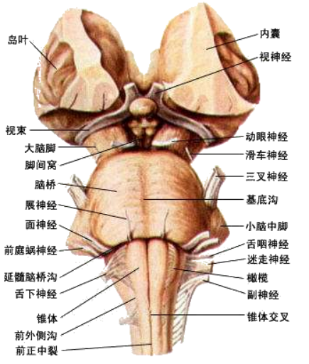 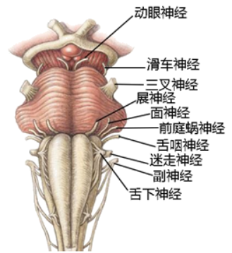
    - 感觉
        -  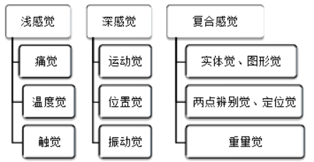
        - 感觉障碍类型
            - 末梢型：呈手套、袜套状，见于多发性神经炎
            - 神经根型：节段分布，疼痛剧烈，伴有放射痛或麻木感，见于椎间盘突出症，颈椎病，和神经根炎等
            - 脊髓型
                - 脊髓横贯型：病变平面以下感觉均缺失
                - 脊髓半横贯型：病变同侧损伤平面以下深感觉丧失及痉挛性瘫痪；对侧痛温觉丧失（对浅同深），见于脊髓外肿瘤和脊髓外伤等
            - 内囊型：病灶对侧半身感觉障碍、偏瘫、同向偏盲，称为三偏征，见于脑血管疾病
            - 脑干型：同侧面部感觉缺失和对侧躯干及肢体感觉丧失（同面对身），见于炎症、肿瘤、血管病变
            - 皮质型
    - 肌张力增强
        - 折刀样强直：伸直上肢及弯曲下肢所遇的阻力大，被动运动快比被动运动慢阻力大，见于锥体束损害　　
        - 铅管样强直 ：被动运动检查时，向各方向的活动所遇的阻力是一致的，见于锥体外系损害，帕金森　　
        - 齿轮样强直 ：被动运动检查时，向各方向的活动所遇的阻力是断续相间的，见于锥体外系损害，帕金森
    - 不随意运动
        - 震颤
            - 静止性震颤——帕金森
            - 动作性震颤——小脑病变
            - 扑翼样震颤——肝性脑病
        - 舞蹈症——迅速、多变、无目的、无规律、不对称的不自主动作，舞蹈动作常自肢体远端开始，病情进展时逐渐发展为全身性并影响随意运动
            - 儿童脑风湿病变
        - 手足抽搦——以腕、踝关节剧烈屈曲、肌肉痉挛为特征，可伴喉痉挛、惊厥
            - 低钙血症、碱中毒
    - 瘫痪 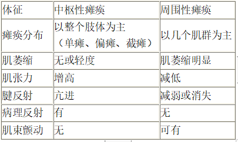
    - 脑膜刺激征
        - 颈强直、凯尔尼格（kernig）征、布鲁津斯基（Brudzinski)征
        - 脑膜炎、蛛网膜下腔出血
    - 病理反射 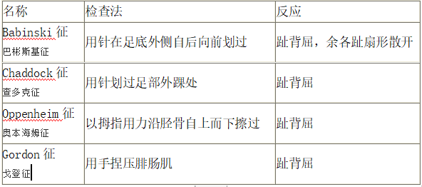 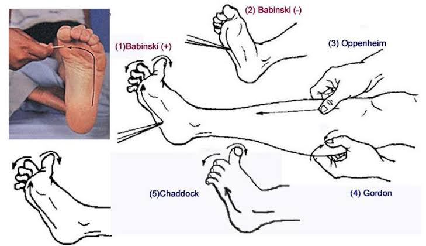
        - 霍夫曼征 （Hoffmann sign）　　
            - 持患者腕部，夹住病人的中指，拇指向下弹击中指指甲，如果出现其余四指的屈曲，即为阳性
        - 肌阵挛　
            - 髌阵挛　　
                - 方法：患者仰卧，下肢伸直，医师用拇指与示指掐住髌骨上缘，用力向下快速推动数次，保持一定的推力　　
                - 阳性反应：股四头肌节律性收缩而使髌骨上下运动
            - 踝阵挛：　　
                - 方法：患者仰卧，医师用左手托住腘窝，使髋、膝关节稍屈曲，右手紧贴患者的脚掌，用力使踝关节过伸　　
                - 阳性表现：足呈节律性的持续屈伸
        - 巴宾斯基征、奥本海姆征、戈登征、查多克征、霍夫曼征、肌阵挛
            - 锥体束病损
    - 神经反射
        - 浅反射 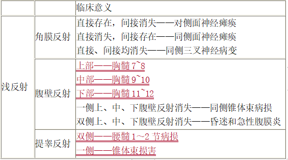
        - 深反射 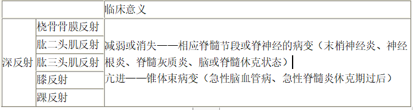
    - 面神经麻痹 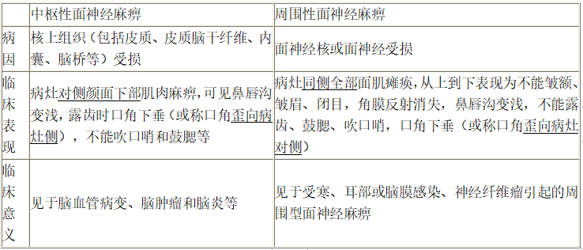 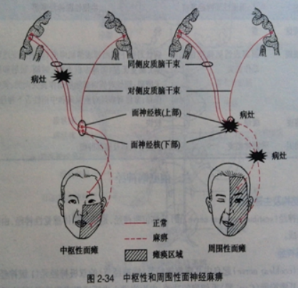 
- 皮肤
    - **颜色**
        - **黄疸** 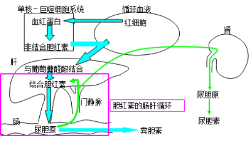 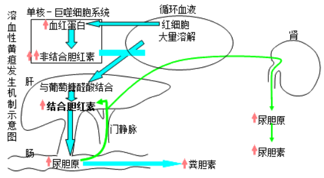 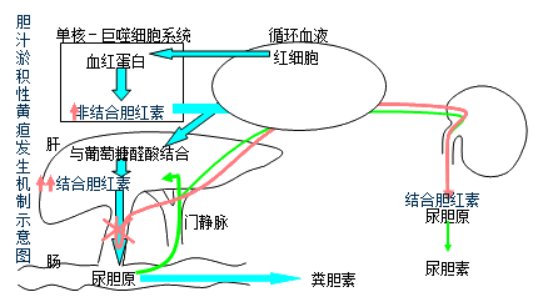 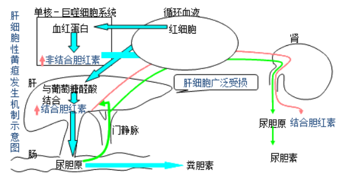 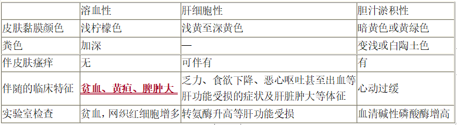 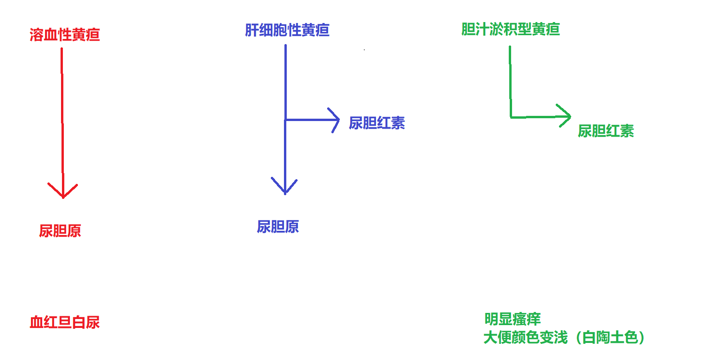
            - 总胆红素TB＞ 34.2μmoI/L；巩膜、皮肤、黏膜黄染  
                - 显性黄疸  　　
            - 总胆红素TB:17.1～34.2μmoI/L
                - 隐性黄疸
            - 面目黄而鲜明如橘皮色
                - 阳黄——脾胃、肝胆湿热
            - 面目黄而晦暗如烟熏色
                - 阴黄——脾胃寒湿
    - **皮疹 皮下出血**
        - 蜘蛛痣　　雌激素导致毛细血管扩张所致，出现于上半身
            - 见于肝硬化和慢性肝炎
        - 斑疹　　皮肤颜色发红，形态不一，一般不高出皮肤 
            - 见于斑疹伤寒、丹毒
        - 玫瑰疹　　鲜红色圆形红斑，压之退色，松开时又复现，由病灶周围的血管扩张所形成 
            - 伤寒和副伤寒
        - 丘疹　　为局限、充实的浅表损害，皮疹呈点状，高出皮肤 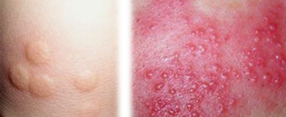
            - 见于麻疹、湿疹
        - 斑丘疹　　斑疹和丘疹同时存在 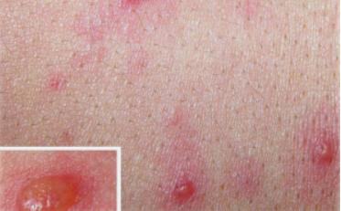
            - 见于药物疹、风疹、猩红热
        - 荨麻疹　　苍白或红色高出皮肤的局限性水肿，大小不等、形态各异，奇痒 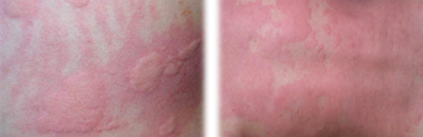
            - 见于食物或药物过敏
        - **斑（皮肤黏膜出血）**
            - **三个基本病因**
                - 1.血管壁缺陷　　
                - 2.血小板数量及功能异常　　
                - 3.凝血功能障碍
            - 对称性、荨麻疹样或丘疹样紫癜，伴关节痛、腹痛
                - 过敏性紫癜
            - 伴关节腔出血或关节畸形
                - 血友病
            - **色深红或青紫，点大成片，平铺于皮肤，抚之不碍手，压之不褪色者，为斑**
                - 色深红或紫红，兼身热、面赤、脉数等实热表现者
                    - 阳斑——热邪亢盛，内迫营血
                - 色淡青或淡紫，隐隐稀少，兼面白、神疲、脉虚等气虚表现者
                    - 阴斑——脾气亏虚，血失统摄
        - **疹**
            - **色红，点小如粟米，高出皮肤，抚之碍手，压之褪色者，为疹**
                - 色如桃红，形似麻粒，先见于耳后发际，渐延及颜面、躯干和四肢，疹发透彻后按出疹顺序依次消退，高热、咳嗽 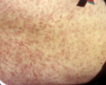
                    - 麻疹（麻疹病毒感染引起的急性呼吸道疾病）——因外感时邪疫毒所致，儿科常见
                - 色淡红，细小稀疏，瘙痒不已，时发时止，耳后及枕部淋巴结肿大 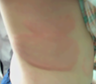
                    - 风疹（风疹病毒引起的急性传染病）——多为外感风热时邪所致　
                - 色淡红色或淡白色，大小形态各异，瘙痒，搔之融合成片，高出皮肤，发无定处，出没迅速，时隐时现 
                    - 瘾疹（荨麻疹）——多因风寒或风热侵袭营卫或过敏所致。
        - **水疱**
            - **皮肤上出现成簇或散在性小水疱**
                - 皮肤出现白色小疱疹，晶莹如粟，高出皮肤，擦破流水，多发于颈胸部，四肢偶见，面部不发 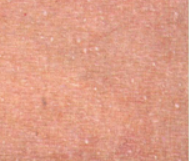
                    - 湿温病
                - 小儿皮肤出现粉红色斑丘疹，很快变成椭圆形小水疱，向心性分布，晶莹明亮，浆液稀薄，皮薄易破，分批出现，大小不等 
                    - 水痘（急性传染病——由水痘-带状疱疹病毒引起）——外感湿热时邪，儿科常见传染病
                - 口角、唇边、鼻旁出现成簇粟米大小水疱，灼热痒痛
                    - 热气疮（急性疱疹性皮肤病）——外感风热；肺胃蕴热上熏
                - 周身或局部皮肤先现红斑、瘙痒，迅速形成丘疹、水疱，破后渗液，形成红赤湿润之糜烂面 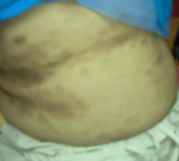
                    - 湿疹（慢性炎症性瘙痒性皮肤病）——湿热蕴结，复感风邪，郁于肌肤
    - **肿块**
        - **皮下结节      圆形或椭圆形坚硬结节**
            - 结缔组织病：风湿结节、痛风
        - **皮下气肿           触诊有握雪感，听诊有捻发音**
            - 见于胸部外伤、气胸、产气杆菌感染
        - **淋巴结肿大** 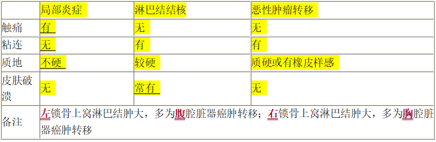
            -  局部炎症——表面光滑，痛，无粘连，质软
            - 淋巴结结核（瘰疬）——多见于颈后三角，多发性、质硬、与周围组织有粘连，破溃后可形成瘘管，愈后可形成瘢痕
            - 恶性肿瘤淋巴结转移——质地坚硬、无痛性、生长　　速度快、与周围组织有粘连
        - **痈** 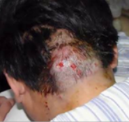
            - 患部红肿高大，根盘紧束，灼热疼痛
            - 是多个相邻的毛囊或汗腺的急性化脓性感染，或由多个疖融合而成。致病菌常为金黄色葡萄球菌。
            - 未脓易消；已脓易溃；脓液稠黏；疮口易敛
                - 未脓易消；已脓易溃；脓液稠黏；疮口易敛
                - 已脓易溃
                - 脓液稠黏
                - 疮口易敛
            - 属阳证
            - 湿热火毒蕴结，气血瘀滞
        - **疽** 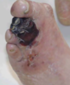
            - 有头疽（carbuncle），病症名。指生长于肌肤间，以局部初起皮肤上即有粟粒脓头，红肿热痛，易向深部及周围扩散，脓头亦相继增多，溃烂后状如莲蓬蜂窝为主要表现的急性化脓性疾病。本病相当于西医的痈。
            - 无头疽是多种发生在骨骼与关节间的化脓性疾病的统称。其特点是漫肿色白，疼痛彻骨。难消，难溃，难敛，并能形成瘘管。如发于长骨者多损骨；发生于关节的，易造成畸形。相当于西医的化脓性骨髓炎、化脓性关节炎。
            - 未脓难消；已脓难溃；脓汁稀薄；疮口难敛
                - 未脓难消
                - 已脓难溃
                - 脓汁稀薄
                - 疮口难敛
            - 属阴证
            - 气血亏虚，阴寒凝滞
        - **疔** 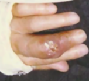
            - 多发于颜面手足的急性化脓性疾病，局部表现为红、肿、热、痛，呈小结节，并可逐渐增大，呈锥形隆起。继而中央变软，出现白色小脓栓
            - 外感风热或内生火毒
        - **疖** 
            - 患部形小而圆，红肿热痛不甚，出脓即愈
            - 一种化脓性毛囊及毛囊深部周围组织的感染，相邻近的多个毛囊感染、炎症融合形成的叫痈
            - 病位浅表，症状轻微
            - 外感热毒或湿热内蕴
- 头发
    - **斑秃**
        - 血虚受风，精神紧张（自身免疫、遗传、神经精神因素、内分泌失调）
    - **青壮年头发易落稀疏，兼眩晕、健忘、腰膝酸软**
        - 肾虚
    - **脱发、头皮痒、多屑、多脂**
        - 血热化燥（脂溢性脱发）
    - **青少年白发、失眠、健忘**
        - 劳神伤血（遗传、白癜风、脑炎、慢性消耗性疾病、营养不良）
    - **小儿头发稀疏、黄软、生长迟缓**
        - 先天不足，肾精亏损（维生素缺乏）
    - **小儿发结如穗、枯黄无泽** 
        - 疳积病（蛋白质-能量营养不良、维生素营养障碍、微量元素缺乏）
- 头部
    - **巨颅**
        - 先天不足，肾精亏损，水液停聚于脑（脑积水）
    - **小颅**
        - 先天肾精不足，颅骨发育不良（囟门早闭伴智力低下）
    - **方颅**
        - 肾精不足、脾胃虚弱
        - 颅骨发育不良（佝偻病、先天性梅毒）
    - **头痛**
        - 头痛的病因及诱因　　
            - 较长时间近距离用眼时
                - 眼疲劳引起的头痛　　
            - 过度紧张、劳累而诱发或加重
                - 紧张性头痛
            - 月经期时容易发作
                - 女性偏头痛
            - 血压未得到控制
                - 高血压头痛
        - 头痛的部位　　　
            - 额部
                - 大脑半球的病变，并向颞部放射　　
            - 枕部
                - 小脑病变　　
            - 眼的周围或眼上部
                - 青光眼
        - 头痛的性质　　　
            - 颜面发作性电击样疼痛
                - 三叉神经痛　　
            - 咽喉后部发作性疼痛并向耳及枕部放射
                - 舌咽神经痛　　
            - 搏动样头痛
                - 血管性头痛
        - 头痛的时间　　　
            - 上午重下午轻
                - 鼻窦炎　　
            - 下午或傍晚出现；
                - 紧张性头痛　
            - 夜间
                - 丛集性
            - 早上起床时较明显；
                - 占位性头痛
        - 外感风、寒、暑、湿、火邪，或痰瘀内阻
            - 头痛连项，遇风加剧
                - 风寒所致——风寒头痛
            - 头痛怕热，面红目赤
                - 风热所致——风热头痛
            - 头痛如表，身体困重
                - 风湿之邪所致的——风湿头痛
        - 发病慢，头痛较缓，时作时止者
            - 过劳则甚
                - 气虚头痛
            - 伴眩晕，面色苍白者
                - 血虚头痛
            - 伴腰膝酸软者
                - 肾虚头痛
        - 
            - 巅顶痛
                - 厥阴经
            - 后脑痛连项背
                - 太阳经
            - 两侧头痛
                - 少阳经
            - 前额连眉棱骨痛
                - 阳明经
    - **头晕**
        - 指患者自觉头脑有晕旋之感
            - 轻者闭目即止
            - 重者则感觉自身或景物旋转，如坐舟车，站立不稳
        - 头晕昏沉，伴胸闷呕恶、舌苔白腻
            - 痰湿内阻，清阳不升
        - 头晕而胀，伴有面红目赤，烦躁易怒，舌红苔黄，脉弦数
            - 肝火上炎
        - 外伤后头晕刺痛，夜间尤甚
            - 瘀血阻络
        - 头晕胀痛，伴有腰酸耳鸣，头重足轻
            - 肝阳上亢
        - 头晕目眩，过劳加重，伴有面白倦怠，舌淡，脉细弱
            - 血亏虚所致
        - 头晕耳鸣，兼腰酸遗精，健忘
            - 肾精亏虚
- 面部
    - **赤色**
        - **主热证，亦可见于戴阳证**
        - 
            - 满面通红——实热证
            - 午后两颧潮红——阴虚阳亢之虚热证
            - 久病重病面色苍白，却时而泛红为妆，游移不定——阴盛格阳之戴阳证
    - **白色**
        - **主虚证（包括血虚、气虚、阳虚）气血不足、寒证**
        - 
            - 面色白光——阳虚
            - 面色白而虚浮——阳虚水泛
            - 面色淡白无华，唇舌淡白——血虚
            - 面色苍白——亡阳、气血暴脱或阴寒内盛
    - **黄色**
        - **主脾虚、湿证**
        - 
            - 面色淡黄无华——萎黄——脾胃气虚，气血不足
            - 面黄淡黄虚浮——黄胖——脾虚湿蕴
            - 身面目黄而鲜明如橘皮色——阳黄（急性黄疸型肝炎）——脾胃、肝胆湿热
            - 身面目黄而晦暗如烟熏色——阴黄（慢性肝炎）——脾胃寒湿
    - **青色**
        - **主** **血瘀、寒证、痛证** **、** **惊风、气滞、肝病**
        - 
            - 面色淡青——虚寒证　　
            - **青黑**
            - **瘀血**
            - **青黄**
            - **惊风**
    - **黑色**
        - **主** **寒证、疼痛、血瘀** **、** **肾虚、水饮**
        - 
            - 面黑暗淡——肾阳虚
            - 面黑干焦——肾阴虚
            - **肾虚水饮或寒湿带下**
            - **血瘀** 
    - **面肿**
        - **面部浮肿，按之凹陷**
            - 眼睑颜面 阳水 肺
            - 足部下肢 阴水 脾肾
        - **头面红肿热痛，压之褪色**
            - 抱头火丹（链球菌引起的急性淋巴管皮肤炎）（颜面丹毒）
        - **头面红肿热痛，目不能开**
            - 大头瘟（流行性腮腺炎）
    - **腮肿**
        - **一侧或两侧腮部以耳垂为中心肿起，边缘不清，局部热痛**
            - 痄腮（流行性腮腺炎）
        - **颧下颌上耳前发红肿起，伴有寒热、疼痛**
            - 因少阳、阳明经热毒上攻所致
    - **口眼歪斜**
        - **单见一侧口眼歪斜而无身瘫痪**
            - 风邪中络（面神经麻痹）
        - **口眼歪斜，兼半身不遂**
            - 中风病
            - 风痰阻络
            - 肝阳上亢
            - (偏瘫）（中枢神经受损）
    - **惊恐貌**
        - 小儿惊风
        - 狂犬病
        - 瘿瘤
    - **苦笑貌**
        - 新生儿脐风
        - 破伤风
    - **狮面伴见鼻骨塌陷，眉毛、头发脱落者**
        - 麻风病
- 眼部
    - 目色
        - **目赤肿痛**
            - 实热证
                - 白睛色红——肺火，或外感风热
                - 两眦赤痛——心火
                - 睑缘赤烂——脾有湿热
                - 全目赤肿——肝经风热上攻
                - （急性结膜炎）
        - **白晴发黄**
            - 黄疸
                - 湿热或寒湿内蕴，肝胆疏泄失常，胆汁外溢所致
        - **目眦淡白**
            - 血虚，目络不能充盈所致
        - **目胞色黑晦暗**
            - 肾虚，为肾精亏耗，或肾虚水泛、寒湿下注之象
        - **黑睛灰白浑浊**
            - 眼病、玻璃体浑浊
    - 动态
        - **瞳孔缩小**
            - **中毒**
            - **出血性中风中脏腑**
        - **瞳孔散大&nbsp;**
            - **颅脑损伤** **中风中脏腑**
            - 瞳孔完全散大，对光反射消失 临床死亡的指征之一
            - **青风内障** **药物中毒**
        - **目睛凝视**
            - 指患者两眼固定，不能转动
            - **瞪目直视**
            - **戴眼反折**
            - **横目斜视**
                - 肝风内动，牵引目系 **外伤目系** **先天**
        - **闭目障碍**
            - **瘿瘤病**
            - **风中面络**
            - 小儿睡时露睛 脾气虚弱，气血不足，胞睑失养 **吐泻伤津** **慢脾风**
        - **胞睑下垂（睑废）**
            - 双睑下垂
                - 先天不足、脾肾亏虚
            - 单睑下垂
                - 脾气虚弱
                - **中风病危** **颅脑病变** **外伤**
    - **目痒**
        - 指眼睑、眦内或目珠有痒感
            - 轻者揉拭则止
            - 重者极痒难忍
        - 如两目奇痒，羞明流泪，并有灼热感
            - 肝经风火上扰
        - 两目微痒而干涩
            - 血液亏虚，目失濡养
    - **目痛**
        - 单目或双目疼痛
        - 目胀痛，兼面红目赤、急躁易怒
            - 肝火上炎
        - 目赤肿痛，兼差明多眵
            - 风热之邪上行之象
            - **暴发火眼** **天行赤眼**
        - 目微赤微痛，时痛时止，且干涩少眵
            - 阴虚火旺
    - **目眩（眼花）**
        - 眼前昏暗或发黒，或眼前冒金花，或眼前如有蚊蝇飞舞
        - 目眩兼有头晕头胀，面赤口渴
            - 风火上扰清窍
        - 兼见头晕胸闷，脘痞恶心，苔腻脉滑
            - 痰湿上浆清窍
        - 兼有头晕乏力，气短食少，腹胀便溏
            - 中气下陷，清阳不升
        - 兼有头晕腰酸，耳鸣健忘
            - 肝肾不足，目窍失养
    - **目昏、雀盲、歧视**
        - **目昏**
            - 视物昏花不明，模糊不清
        - **雀盲（雀目、鸡盲、夜盲）**
            - 白昼视力正常，每至黄昏后视物不清，夜间尤荏，如雀之盲
        - **歧视**
            - 视一物为二物
        - 均为不同程度的视力减退
        - 由肝血不足，肾精亏虚，目失充养所致
        - 常见于年老或体弱之人
    - **眼球**
        - 双侧眼球突出——见于甲状腺功能亢进症　　
        - 单侧眼球突出——眶内占位性病变　 &nbsp;
        - 双侧眼球凹陷——重度脱水、老年人
        - 单侧眼球凹陷——Horner综合征和眶尖骨折
    - **眼睑**
        - 双侧上眼睑下垂：重症肌无力　　
        - 单侧上眼睑下垂：动眼神经麻痹
        - 双侧眼睑闭合不全——甲亢  
        - 单侧眼睑闭合不全——面神经麻痹
    - **瞳孔**
        - 双侧瞳孔缩小——虹膜炎、有机磷农药中毒，吗啡、巴比妥、氯丙嗪、毒蕈中毒、毛果芸香碱（爸妈用农药种红蘑绿果）　　
        - 双侧瞳孔散大——见于外伤、青光眼绝对期、视神经萎缩、濒死状态、颈交感神经刺激和阿托品、可卡因　　
        - 两侧不等大——脑疝、脑外伤、脑肿瘤、中枢神经梅毒
        - 瞳孔对光反射迟钝或消失——见于昏迷病人
- 鼻部
    - 蝶形红斑 
        - 见于红斑狼疮　　
    - 酒糟鼻：鼻尖及鼻翼皮肤发红，并有毛细血管扩张、组织肥厚 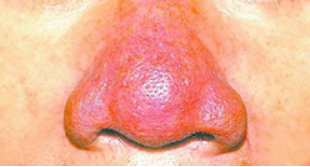
    - 鞍鼻：鼻梁塌陷而致鼻外形似马鞍状 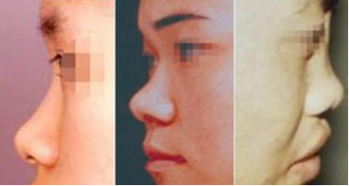
        - 见于鼻骨骨折、鼻骨发育不全和先天性梅毒
    - 蛙状鼻：鼻腔完全阻塞，鼻梁宽平如蛙状 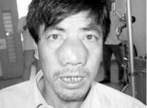
        - 见于肥大鼻息肉
    - 
    - 鼻窦区压痛多为鼻窦炎 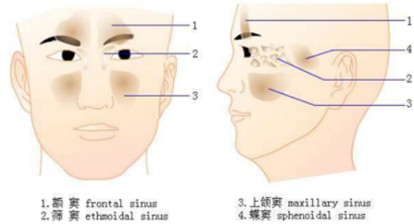
    - 
    - 鼻色红黄隐隐，明润光泽
        - 胃气充足
    - 鼻色淡白
        - 气血两虚
        - 血虚
    - 色赤
        - 肺脾蕴热
    - 色青
        - 阴寒腹痛
    - 色微黑
        - 肾虚，寒水内停
    - 鼻端微黄明润
        - 新病为虽病但胃气未伤，属病轻
    - 鼻头晦暗枯槁
        - 脾胃虚衰，胃气失荣之重证
    - 鼻头红肿生疖
        - 胃热或血热
    - **酒齄鼻**
        - 肺胃湿热，侵入血络所致
    - 鼻柱溃陷
        - 多见于梅毒、麻风病
    - 鼻翼煽动
        - 多见于哮病、喘病等肺失宣降
        - 新病多属肺热壅盛
        - 久病多属肺肾虚衰之危证
    - 鼻道通气良好
        - 脾胃精气充足，肺气宣通
    - 鼻流清涕
        - 外感风寒或阳气虚弱
    - 鼻流浊涕
        - 外感风热或肺胃蕴热
    - 久流腥臭腋涕而不愈
        - 多见于鼻渊
        - 多为外邪侵袭，或胆经湿热上逆于鼻所致
    - **鼻衄**
        - 多因肺胃蕴热，或阴虚肺燥伤及鼻络所致
    - **鼻痔**
        - 多为湿热邪毒蕴结鼻窍所致
- 口唇
    - 口腔粘膜
        - 出现蓝黑色的色素沉着——肾上腺皮质功能减退
        - 出血点或瘀斑——出血性疾病或维C缺乏
        - 第二磨牙颊粘膜处针头大小白色斑点——麻疹
        - 粘膜充血、肿胀、对称性、小出血点——猩红热、风疹
        - 乳白色薄膜覆盖于口腔粘膜、口角处——鹅口疮（白色念球菌感染）
    - 形态
        - 口唇发绀
            - 见于心脏内外有异常动静脉分流通道，呼吸衰竭、心力衰竭、真性红细胞增多症
        - 口唇干燥
            - 津液已伤（脱水、大出血、高热）
        - 口唇糜烂
            - 脾胃积热上蒸（核黄素缺乏）
        - 口角流涎
            - 小儿：脾气虚弱
            - 成人：风中络脉或中风后遗症
        - 口腔糜烂疼痛
            - 心脾积热上蒸所致（口腔溃疡）
        - 小儿口腔、舌上满布白斑如雪片，乳白色薄膜覆盖于口腔粘膜、口角处
            - 湿热秽浊之气上蒸于口所致（鹅口疮——白色念球菌感染）
        - 唇裂如兔唇
            - 多为先天发育畸形所致
        - 小儿口腔颊黏膜近臼齿处出现微小灰白色斑点，周围绕以红晕
            - 麻疹粘膜斑
    - 动作
        - 口张——口开不闭
            - 虚证，为肺气将绝
        - 口噤——口闭难开
            - 实证，多因肝风内动，筋脉拘急所致，可见于痫病、中风、惊风、破伤风
        - 口撮——口唇紧聚，不能吮吸
            - 新生儿脐风或破伤风
        - 口僻——口喎
            - 中风或风痰阻络
        - 口振——口唇振摇
            - 外感寒邪、温病战汗或疟疾发作
        - 口动——频繁开合
            - 胃气虚弱；口角掣动不止，为热极生风或脾虚生风
    - **口气**
        - 口臭
            - 口腔不洁，龋齿，便秘，消化不良
        - 酸臭气，伴食减，脘腹胀满
            - 胃肠积滞
        - 口出臭秽气
            - 胃热
- 齿龈
    - **望齿**
        - **色泽**
            - 牙齿洁白润泽而坚固
                - 肾气旺盛、津液充足
            - 牙齿干燥
                - 胃阴已伤
            - 齿燥如石
                - 阳明热甚，津液大伤
            - 燥如枯骨
                - 肾阴枯竭，精不上荣
                - 温热病晚期，属病重
            - 牙齿枯黄脱落
                - 久病者多为骨绝，属病重
        - **动态**
            - 牙关紧急
                - 肝风内动，热极生风或风痰阻络
            - 咬牙啮齿
                - 热极生风
            - 睡中啮齿
                - 胃热、虫积或消化不良
                - 亦可见于正常人
    - **望龈**
        - 红肿疼痛
            - 胃火亢盛
        - 牙龈萎缩
            - 肾虚，胃阴不足
        - 牙龈出血
            - 齿衄
            - 兼牙龈红肿疼痛者
                - 胃火灼伤龈络
- 舌
    - **舌色**
        - **淡红舌**
            - 见于健康人；病情轻浅，未伤气血；疾病好转
        - **淡白舌**
            - 淡白湿润，舌体胖嫩——阳气虚　　
            - 淡白光莹，舌体瘦薄——气血两亏
        - **枯白舌**
            - 脱血夺气，病情危重，舌无血气充养，则显枯白无华
        - **红舌**
            - 舌色稍红，或舌边尖略红
                - 外感风热表证初起
            - 舌鲜红而少苔，舌体瘦小，或有裂纹，或光红无苔
                - 虚热证
            - 色鲜红，有芒刺，或兼黄厚苔
                - 实热证
            - 舌两边红
                - 肝经有热
            - 舌尖红
                - 心火上炎
        - **绛舌** 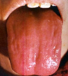
            - 舌绛有苔，或有红点、芒刺
                - 属实热证，多为温病热入营血，或脏腑内热炽盛　　
            - 舌绛少苔或无苔，或有裂纹
                - 属虚热证，热病后期阴液受损，或久病阴虚火旺　　
            - 舌绛少苔而津润，或有瘀斑、瘀点
                - 血瘀
        - **青紫舌** 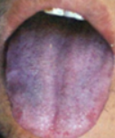
            - 舌淡紫或青紫而湿润
                - 阳气虚阴寒盛，寒凝血瘀　　
            - 舌色淡红中泛现青紫
                - 肺气壅滞，或肝郁血瘀，也可见于先天性心脏病，或某些药物、食物中毒　　
            - 舌紫红或绛紫而干枯少津
                - 热盛伤津，气血壅滞　　
            - 全舌青紫
                - 全身性瘀血　
            - 舌有紫色斑点
                - 瘀血阻滞于局部，或局部脉络损伤。　　
            - 舌紫而肿胀：
                - 为酒毒内蕴。　　
            - 全舌青
                - 寒邪直中肝肾，阳郁不宣　　
            - 口燥而漱水不欲咽
                - 瘀血内阻
    - **舌形**
        - **老舌** 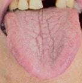
            - 舌质纹理粗糙，坚敛而不柔软，舌色较暗
            - 病邪亢盛，正邪交争，气血壅滞所致实证　　
        - **嫩舌** 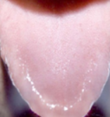
            - 舌质纹理细腻，浮胖娇嫩，舌色浅淡
            - 气血不足；阳气亏虚，寒湿内生
        - **肿胀舌**
            - 舌体肿大，盈口满嘴，甚者不能闭口，不能缩回
            - 心脾热盛、外感湿热
        - **胖大舌** 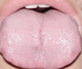
            - 舌体比正常舌大，伸舌满口
            - 水湿痰饮内停
        - **瘦薄舌** 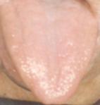
            - 舌体比正常舌瘦小而薄
            - 气血两虚，阴虚火旺
        - **点刺舌**
            - 鼓起于舌面的红色或紫红色星点
                - 点舌
            - 舌乳头高突如刺，摸之棘手的红色或黄黑色点刺
                - 刺舌
            - 脏腑热极，或血分热盛
        - **裂纹舌** 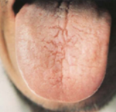
            - 舌面上出现各种形状的裂纹、裂沟、深浅不一
            - 热盛伤阴，血虚，脾虚湿侵
        - **齿痕舌**
            - 舌体边缘见牙齿压迫痕迹，称齿痕舌或齿印舌多因舌体胖大而受齿缘压迫所致
            - 脾虚和湿盛
    - **舌态**
        - **痿软舌**
            - 舌体软弱，无力屈伸，痿废不灵　　
            - 气血俱虚，热灼津伤，或阴液亏虚
        - **强硬舌**
            - 舌体板硬强直，运动不灵活
            - 热入心包，或高热伤津，或风痰阻络
        - **震颤舌**
            - 舌体震颤抖动，不能自主
            - 肝风内动
                - 舌淡白而颤动
                    - 气血两虚而动风
                - 舌绛紫而颤动，伴高热惊厥
                    - 热极生风
                - 舌红绛而颤动，伴眩晕、肢体麻木
                    - 肝阳化风
                - 舌红少津少苔而颤动
                    - 阴虚动风
                - 舌体颤动
                    - 酒毒内蕴
        - **歪斜舌**
            - 舌伸出后偏向患侧
                - 舌下神经麻痹
            - 伸舌时舌体偏向一侧，或左或右
            - 中风，或中风先兆
        - **吐弄舌**
            - 吐舌表现为舌伸于口外，不即回缩；
            - 弄舌表现为舌微露出口，立即收回，或舐口唇上下左右，摇动不停。　　
            - 心、脾二经有热
        - **短缩舌**
            - 舌体卷短、紧缩，不能伸长
            - 危重证候
    - **舌苔**
        - **白苔**
            - 表证、寒证、湿证，也可见于热证
            - 苔薄白而润，布于舌中、舌根部
                - 正常舌苔
            - 苔薄白，兼有恶寒发热、脉浮等症
                - 表证初起
            - 苔薄白，舌质浅淡
                - 气血亏虚证
            - 苔薄白而干，舌质淡红
                - 表邪未解，肺津已伤，多由外感风热所致
            - 苔薄白，舌尖红
                - 燥热伤津
                - 或心肺有热
            - 苔厚白滑或腻
                - 主痰湿、食浊内阻
            - 苔厚白而干
                - 痰浊中阻
                - 或热伤津液
            - 苔厚白如积粉，扪之不燥 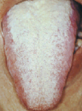
                - 瘟疫或内痈
                - 秽浊之邪上熏而成
        - **黄苔**
            - 里证、热证
            - 舌苔由白转黄，或黄白相兼
                - 外感表证化热入里，但尚未完全入里，表里相兼阶段
            - 苔薄黄而润
                - 邪初入里，热未伤津
            - 苔薄黄而干
                - 邪热不甚，但津液已伤
            - 苔黄而腻
                - 湿热或痰热内蕴，或为食积化腐
            - 苔黄厚干燥
                - 高热伤津
            - 苔焦黄干裂
                - 邪热炽盛，津液枯涸之征
        - **灰黑苔**
            - 邪热炽盛，或阴寒内盛，痰湿久郁
            - 苔灰黑湿润多津
                - 寒湿病证
                - 多由白苔转化而成
            - 苔灰黑干燥无津液
                - 火热病证
                - 多由黄苔转变而成
            - 舌面湿润，边尖苔白腻而中根部苔灰黑
                - 主阳虚寒湿内盛，或痰饮内停
            - 舌苔黑而干燥见于舌尖
                - 心火极盛
            - 见于舌中
                - 肠热腑实，或胃将败坏之象
            - 见于舌根部
                - 主下焦热盛
        - 其他 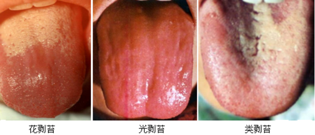
            - 花剥苔：舌苔多处剥脱，剥脱处光滑无苔，余处斑斑驳驳地残存舌苔，界限明显
                - 胃气阴两伤
            - 地图舌：舌苔不规则地大片脱落，边缘厚，舌苔界限清楚，形似地图　
                - 核黄素（维生素B2）缺乏者
            - 光剥苔（镜面舌）：舌苔全部脱落，舌面光洁如镜
                - 胃阴干涸，胃乏生气（缺铁性贫血、恶性贫血及慢性萎缩性胃炎）
            - 类剥苔：剥脱处并不光滑，似有新生颗粒
            - 牛肉舌：糙皮病（烟酸缺乏） 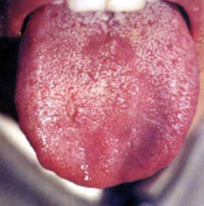
            - 草莓舌：猩红热或长期发热患者 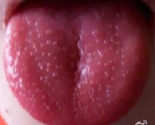
- 耳部
    - **色泽**
        - 耳郭色泽红润
            - 正常人气血充足
        - 耳轮淡白
            - 多属气血亏虚
        - 耳轮红肿
            - 多为肝胆湿热或热毒上攻
        - 耳轮青黑
            - 多见于阴寒内盛或有剧痛者
        - 耳轮干枯焦黑
            - 多属肾精亏耗，精不上荣，为病重
            - 可见于温病后期肾阴耗伤及下消等
        - 小儿耳背有红络
            - 多为麻疹先兆
    - **形态**
        - 耳郭瘦薄
            - 先天亏虚，肾气不足
        - 耳轮肿大
            - 多为邪气充盛
        - 耳轮干枯萎缩
            - 多为肾精耗竭
        - 耳轮甲错
            - 多为久病瘀血入络
    - **耳道**
        - **脓耳**
            - 肝胆湿热循经上熏
            - 病程较长，日久不愈者，可由实转虚，而为肾阴亏虚，虚火上炎
        - 外伤后耳道流血水
            - 颅底骨折，属病危
        - **耳疖**
            - 邪热搏结耳窍
        - **耳痔**
            - 湿热痰火上逆
            - 气血瘀滞耳道
    - **耳鸣**
        - 指自觉耳内鸣响，重者影响听觉
        - 突发耳鸣，声大如潮声，按之鸣声不减，或加重
            - **实证**
        - 若渐觉耳鸣，声小如蝉鸣，按之鸣声减轻或暂停
            - **虚证**
    - **耳聋**
        - 听力减退，甚者听觉丧失
        - **实证**
            - 新病暴聋
            - 肝胆火逆，上壅于耳
            - 外邪上袭，蒙蔽清窍
            - 外伤
        - **虚证**
            - 久病渐聋
                - 精气虚衰，不能上充清窍所致
            - 年老耳渐聋
                - 年高气虚精衰
- 咽喉
    - 咽部红肿灼痛
        - **，**
    - 咽部嫩红，肿痛不显
        - **，** 阴虚火旺
    - 咽部一侧或两侧喉核红肿疼痛，甚者溃烂有黄白色脓点 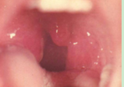
        - 乳娥（扁桃体炎）——肺胃热盛，火毒熏蒸
    - 伪膜色灰白，坚韧不易剥去，重剥出血，旋即复生 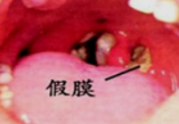
        - 白喉（白喉杆菌感染）烈性传染病、外感火热疫邪所致
- 颈项
    - 气管
        - 推向健侧：液、气、肿瘤　
        - 拉向患侧：肺不张、胸膜粘连
    - 颈部血管
        - 颈静脉怒张——见于右心衰竭、缩窄性心包炎、心包积液或上腔静脉梗阻
        - 颈静脉搏动——三尖瓣关闭不全（左二右三、左肺右体）
        - 颈动脉搏动（安静状态下）——发热、甲亢、高血压、主不全、严重贫血
        - **颈脉异常**
            - 安静状态时颈动脉搏动明显可见
                - 肝阳上亢
                - 血虚重证
                - （主动脉瓣关闭不全、高血压、甲状腺功能亢进症及严重贫血病人）
            - 半卧位或坐位时颈脉明显充盈怒张平卧时更甚
                - 水肿、鼓胀
                - （颈静脉怒张）
    - 肿块
        - 甲状腺肿大：Ⅰ度，不能看出肿大，但能触及；Ⅱ度，能看到肿大，又能触及，但在胸锁乳突肌以内；Ⅲ度，超过胸锁乳突肌 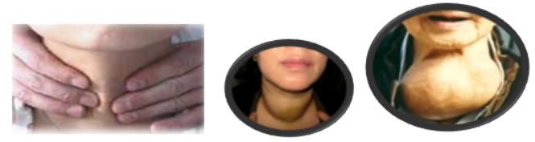
        - 颈前结喉处有肿块突起，或大或小，或单侧或双侧，可随吞咽上下移动 
            - 瘿瘤（甲状腺肿瘤）——肝郁气滞痰凝或与地方水土有关
        - 颈侧、颌下有肿块如豆，推之可移，累累如串珠 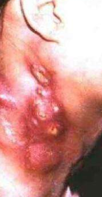
            - 瘰疬（结核病——结核杆菌侵入颈部淋巴结）肺肾阴虚，虚火内灼，炼液为痰，结于颈部或外感风火时毒，挟痰结于颈部
        - 颈部痈肿、瘰疬溃破后，久不收口，形成管道
            - 颈瘘（颈部瘘管及囊肿）——痰火久结，气血凝滞，溃破成脓
    - **动态**
        - **项强——**
            - 兼恶寒发热等症
                - 外感风寒，经气不利
            - 兼壮热头痛，神昏抽搐
                - 火热内盛，燔灼肝经
                - 温病极期阶段或破伤风等病
            - **落枕**
                - 睡姿不当，经络气滞
        - **项软——**
            - 常见于小儿，为五软之一，肾精亏损或脾胃虚弱，以致发育不良
            - > 五软　小儿头软、项软、手足软、肌肉软、口软​五迟　立迟、行迟、发迟、齿迟和语迟
            - 久病、重病颈项软弱，头部下垂，目眶深陷，脏腑精气衰竭之象，属病危
- 胸胁
    - **胸部** 
        - **叩诊** 
        - **触觉语颤**
            - 语颤减弱或消失见于：　　
                - 肺泡内含气量增多：肺气肿、支气管哮喘发作　　
                - 支气管阻塞：阻塞性肺不张、气管内分泌物增多　　
                - 胸壁与肺组织传导距离增大：胸腔积液、气胸、胸膜肥厚、胸壁皮下气肿　　
                - 体质衰弱
            - 语颤增强见于：　　
                - 肺实变 ：肺炎、肺梗死、肺结核、肺脓肿及肺癌　　
                - 浅而大的肺空洞：肺结核、肺脓肿、肺肿瘤所致的空洞　　
                - 压迫性肺不张：胸腔积液压迫、肿瘤压迫
        - **呼吸音**
            - 正常呼吸音
                - 支气管呼吸音　　ha
                    - 分布于喉部、胸骨上窝、背部第6颈椎至第2胸椎附近
                - 肺泡呼吸音　　      fu
                    - 分布于除支气管呼吸音及支气管肺泡呼吸音以外的区域
                - 支气管肺泡呼吸音　　
                    - 分布于胸骨角附近、肩胛间区第3、4胸椎水平及右肺尖
            - 病理呼吸音
                - 支气管呼吸音　　
                    - 出现位置不对
                        - 肺实变，肺内空腔、肺不张
                - 肺泡呼吸音
                    - 减弱或消失
                        - 呼吸运动障碍；呼吸道阻塞；肺顺应性降低；胸腔内肿物；胸膜疾病
                    - 增强
                        - 运动、发热、甲亢、一侧呼吸功能减弱则另一侧代偿性增强　　
                - 支气管肺泡呼吸音
        - **啰音**
            - 干啰音——支气管病变
                - 两肺分布：
                    - 急慢性支气管炎、支气管哮喘、支气管肺炎、左心衰（心源性哮喘）　　
                - 局限性分布：
                    - 支气管局部结核、肿瘤、异物或黏稠分泌物附着　　
                - 局部而持久
                    - 支气管内膜结核或肺癌早期
            - 湿啰音（水泡音）——肺与支气管病变
                - 两肺散在性分布
                    - 支气管炎，支气管肺炎、血性播散型肺结核、肺水肿
                - 两肺底分布
                    - 肺淤血、肺水肿早期、支气管肺炎
                - 一侧或局限性分布
                    - 肺炎、肺结核、支气管扩张、肺脓肿、肺癌、肺出血
            -  
        - **胸膜摩擦音**
            - 干性胸膜炎症的重要体征
        - **外形**
            - **扁平胸**
                - 胸廓前后径不及左右径的一半，呈扁平状 
                - 肺、肾阴虚或气阴两虚（瘦长体型或慢性消耗性疾病）
            - **桶状胸**
                - 胸廓前后径增加，与左右径约相等，至超过左右径，肋间增宽且饱满，胸廓呈圆桶状 
                - 肺胀病，多因久病咳喘，耗伤肺肾，以致肺虚气逆，渐积而成（慢阻肺、支气管哮喘发作）
            - **佝偻胸**
                - 有鸡胸、漏斗胸、肋如串珠等不同表现
                    - **鸡胸**
                        - 胸骨下部明显前突，肋骨侧壁凹陷，形似鸡胸 
                    - **漏斗胸**
                        - 胸骨剑突显著内陷，形似漏斗 
                    - **肋如串珠**
                        - 胸骨两侧的肋骨与肋软骨连接处明显隆起，状如串珠
                - 先天不足或后天失养，肾气不充，骨骼发育异常
                - 佝偻病
            - **胸廓不对称**
                - 一侧胸廓塌陷，肋间变窄
                    - 肺痿、肺部手术后等
                - 一侧胸廓膨隆，肋问变宽
                    - 悬饮病、气胸等
            - **乳房肿溃**
                - **乳痈**
                - 肝气不疏，胃热壅滞，或外感邪毒
        - **胸痛**
            - 指胸部正中或偏于一侧疼痛
            - 发病年龄
                - 青壮年多见于
                    - 胸膜炎、心肌炎
                - 老年人多见
                    - 心绞痛、心肌梗死、肺癌　
            - 胸痛部位
                - 沿一侧肋间神经分布伴胸痛，不超过体表正中线　　
                    - 带状疱疹　　
                - 多侵犯第1、2肋软骨　
                    - 非化脓性肋软骨炎
                - 胸骨后
                    - 食管、膈和纵隔肿瘤
                - 胸骨后或心前区，疼痛常牵涉至左肩背、左臂内侧达无名指及小指
                    - 心绞痛与急性心肌梗死
            - 胸痛的性质
                - 刺痛
                    - 骨痛
                - 灼痛或灼热感（抗酸剂缓解）
                    - 食管炎
                - 压榨样痛，可伴有窒息感（硝酸甘油缓解）
                    - 心绞痛
                - 疼痛更为剧烈并有恐惧、濒死感
                    - 心肌梗死
                - 尖锐刺痛或撕裂痛，伴呼吸时加重，屏气时消失
                    - 干性胸膜炎
                - 突然剧烈刺痛或绞痛，呼吸困难、发绀、咯血
                    - 肺梗死
                - 胸痛活动后缓解
                    - 心脏神经症
            - 胸痛持续时间　　
                - 阵发性
                    - 平滑肌痉挛或血管狭窄缺血所致疼痛　　
                - 发作时间短暂
                    - 心绞痛　　
                - 疼痛持续时间长且不易缓解
                    - 心肌梗死
            - 心肺病变
                - 胸前“虚里”部位（心前区心尖搏动之处）作痛，痛引肩背内臂
                    - 心
                - 胸膺部位作痛，兼有咳喘
                    - 肺
                - 左胸心前区憋闷刺痛
                    - 瘀阻心脉
                - 胸痛喘促，痰黄而稠
                    - 热邪壅肺
                - 胸痛而咳吐脓血腥臭痰
                    - 多属肺痈
                - 胸痛咯血，或痰中带血，伴潮热，盗汗
                    - 肺痨
        - **胸闷（胸痞）**
            - 胸部有痞塞、满闷之感
            - 与心、肺气机不畅有关
                - 胸闷不适，兼有心悸气短
                    - 心气不足，心阳不振
                - 胸部憋闷，心痛如刺，面唇青紫
                    - 心血瘀阻
                - 胸闷痰多，咳嗽气喘
                    - 痰浊阻肺
    - **乳房**
        - 红肿热痛，局限于一侧乳房
            - 急性乳房炎
        - 肿块形状不规则，表面凹凸不平，边界不清，压痛不明显，可有"橘皮样"、乳头内陷及血性分泌物
            - 乳癌
    - **胁痛**
        - 胁肋部的一侧或两侧疼痛
        - 局部病变，肝胆病变
            - 胁肋胀痛、情绪抑郁或急躁易怒
                - 肝郁气滞
            - 胁肋胀痛，纳呆厌食，身目发黄
                - 肝胆湿热
            - 胁肋灼痛，头晕面赤，口苦咽干
                - 肝胆火盛
            - 胁肋刺痛，或胁下触及肿块，固定而拒按
                - 肝血瘀阻
            - 胁肋饱满胀痛，咳唾痛剧
                - 饮停胸胁之悬饮病
            - 举重挣努，或胸肋部活动较猛等突然出现胁肋疼痛
                - 岔气
                - 多属局部气机阻滞所致
            - 胁肋部外伤后疼痛剧烈，妨碍正常呼吸
                - 应考虑肋骨损伤
    - **胁胀**
        - 一侧或两侧胁部有胀满的感觉
        - 肝胆的病变
            - 胁肋胀满，精神抑郁或急躁易怒，善太息
                - 肝气郁结
            - 胁胀口苦，身目发黄，舌苔黄腻
                - 肝胆湿热
- 心
    -  
    - **心脏瓣膜听诊区**
        -  
        - 二尖瓣区：　左侧第5肋间隙，锁骨中线内侧　
        - 主动脉瓣区：　胸骨右缘第2肋间　
        - 主动脉瓣第二听诊区：   胸骨左缘第3、4肋间
        - 肺动脉瓣区：　胸骨左缘第2肋间隙　　
        - 三尖瓣区：　胸骨体下端近剑突偏右或偏左处
    - **心音听诊**
        - 第一心音S1：房室瓣关闭所致，标志收缩期的开始【心肌收缩力】
        - 第二心音S2：主、肺动脉瓣关闭所致，标志舒张期的开始（A2主动脉P2肺动脉）【瓣膜压力】
        -  
        - S1增强：发热、甲亢、二尖瓣狭窄；完全性（三度）房室传导阻滞产生响亮S1——大炮音　　
        - S1减弱：心肌收缩力减弱，见心肌炎、心肌梗死、二尖瓣关闭不全
        - S1强弱不等：心房颤动
        - A2增强：高血压病、主动脉粥样硬化等。　　
        - A2减弱：低血压、主动脉瓣狭窄和关闭不全　　
        - P2增强：肺动脉高压、二尖瓣狭窄、肺心病　　
        - P2减弱：肺动脉瓣狭窄或关闭不全
        - 开瓣音（二尖瓣开放拍击音）：见于二尖瓣狭窄而瓣膜弹性尚好时，是二尖瓣分离术适应证的重要参考条件
        - 奔马律 ：心衰，心室心肌受损的重要体征
    - **心包摩擦音**
        - 胸骨左缘3、4肋间
        - 见于心包炎、心梗、尿毒症
    - **心包摩擦感**
        - 干性心包炎的体征
        - 胸左4易触及
    - **叩诊**
        - 正常心界 
        - 靴形——主动脉关闭不全，高血压
        - 梨形——二尖瓣狭窄
        - 烧瓶形——心包积液
        - 普大型——扩张型心肌病
        -  
    - **触诊震颤** 
    - **心尖搏动**
        -  
        - 正常心尖搏动：位于第五肋间，左锁骨中线内0.5～1.0cm
        - 向左下移动（触诊抬举性）：左心室肥大　　
        - 向左移动，胸骨左缘三四肋间：右心室肥大
        - 增强：左心室肥大、甲亢、重症贫血、发热　　
        - 减弱或消失：心包积液、左侧气胸或胸腔积液、肺气肿
        - 负性心尖搏动：黏连性心包炎、显著右心室增大者
        - 剑突下心脏搏动：肺气肿+右心室肥大
    - **房颤**
        - 心律绝对不规则　　
        - S1强弱不等且无规律　　
        - 脉搏短绌——心率快于脉率　　
        - 常见于二狭、冠心病、甲亢
    - **心悸**
        - 患者自觉心跳、心慌，悸动不安，不能自主
        - 心神或心脏病变
            - **惊悸**
                - 受惊而发，或心悸易惊，恐惧不安，外受异常刺激，时发时止
                - 全身情况较好，病情较轻
            - **怔忡**
                - 心跳剧烈，悸动不安，上至心胸，下至脐腹，常由惊悸进一步发展而成，活动加重，劳累易发，持续时间较长
                - 全身情况较差，病情较重
    - **心包积液**
        - 心尖搏动明显减弱或消失，颈静脉怒张
        - 心尖搏动在心浊音界内或不能触到；肝大，压痛，肝-颈静脉回流征阳性；可有奇脉
        - 心界向两侧扩大，“烧瓶状”，卧位时心底部增宽
        - 心音遥远，心率加快
    - **左心衰**
    - **右心衰**
        - 颈静脉怒张，口唇发绀、浮肿
        - 肝脏肿大、压痛、肝-颈静脉回流征阳性，下肢或腰骶部凹陷性水肿
        - 心界扩大，可有胸水或腹水体征
    - **二尖瓣**
        - 二尖瓣闭合不全
            - 心尖搏动向左下移位，收缩期震颤
            - 心浊音界向左下扩大
            - 心尖部S1减弱，心尖部有3/6级或以上粗糙的吹风样全收缩期杂音，范围广泛，常向左腋下及左肩胛下角传导，并可掩盖S1
        - 二尖瓣狭窄
            - 二尖瓣面容
            - 心尖搏动向左下移位，舒张期震颤
            - 心浊音界早期稍向左，以后向右扩大，心腰部膨出，呈梨形
            - 心尖部S1亢进，较局限的递增型舒张中晚期隆隆样杂音，可伴开瓣音，P2亢进、分裂，肺动脉瓣区Graham Steell杂音
    - **主动脉**
        - 主动脉狭窄
            - 心尖搏动向左下移位，呈抬举性，主动脉瓣区收缩期震颤
            - 心浊音界向左下扩大
            - 主动脉瓣区高调、粗糙的递增-递减型收缩期杂音，向颈部传导，心尖部S1减弱，A2减弱
        - 主动脉闭合不全
            - 颜面较苍白，颈动脉搏动明显，可见点头运动
            - 心尖搏动向左下移位并呈抬举性，周围血管阳性
            - 心浊音界向左下扩大，心脏呈靴形
            - 主动脉瓣第二听诊区叹气样递减型舒张期杂音，可向心尖部传导；心尖部S1减弱，A2减弱或消失，可闻及Austin-Flint杂音
    -    
    - **三尖瓣**
    - **周围血管征**
        - 头部随脉搏呈节律性点头运动、颈动脉搏动明显、毛细血管搏动征、水冲脉、枪击音与杜氏双重杂音。　　
        - 脉压增大所致，常见于主闭、发热、贫血及甲亢
- 腹部
    - **触诊**
        - 压痛反跳痛 
            - 反跳痛：4个手指并拢向深腹部压迫，然后突然脱离检查部位，患者感到一种抽痛感
                - 急性腹膜炎
            - Murphy征——用力按压腹壁胆囊点，然后嘱病人缓慢深吸气，如在吸气过程中因疼痛而突然屏气，称（Murphy）征阳性
                - 急性胆囊炎
            - 胆囊点：位于右侧腹直肌外缘与肋弓交界处 
            - 阑尾点（麦氏点）：右髂前上棘与脐连线中外1/3交界处 
            - 季肋点：在第10肋骨前端
            - 上输尿管点：在脐水平线上，腹直肌外缘
            - 中输尿管点：在两侧髂前上棘水平，腹直肌外缘，相当于输尿管第二狭窄处（入骨盆腔处） 
            - 肋脊点：在背部脊柱与第12肋所成的夹角顶点，又称肋脊角
            - 肋腰点：在第12肋与腰肌外缘的夹角顶点，又称肋腰角 
        - 全腹紧张度增加
            - 板状腹——急性弥漫性腹膜炎
            - 面团感、揉面感——结核性腹膜炎
        - 肝脏
            - 肝脏肿大——肝炎、脂肪肝、肝淤血、早期肝硬化、白血病、血吸虫病
            - 局限性肝大——肝脓肿、肝囊肿、肝肿瘤
            - 肝脏缩小——肝坏死、晚期肝硬化
        - 脾脏 
            - 轻度肿大：肋下≤3cm　　
                - 慢性肝炎、伤寒、粟粒性结核
            - 中度肿大：＞3cm但在脐水平线以上
                - 肝硬化、慢性淋巴细胞白血病、淋巴瘤
            - 高度肿大：超过脐水平线或前正中线
                - 慢性粒细胞白血病
        - 胆囊
            - 胆囊肿大，有囊性感，伴有压痛，墨菲征阳性
                - 急性胆囊炎
            - 胆囊肿大，无压痛，有黄疸，库瓦济埃征阳性
                - 胰头癌
            - 胆囊肿大，有实性感
                - 胆囊结石或胆囊癌
        - 肾脏
        - 
    - **外形**
        - **腹部膨隆**
            - 指仰卧时前腹壁明显高于胸耻连线（腹内积液（蛙状腹）、腹内积气、腹内肿瘤或炎症包块）
            - 单腹鼓胀，四肢消瘦，甚者腹壁青筋暴露，肚脐突出
                - 鼓胀病
                - 肝部脾虚，气滞血癖，水湿内停
            - 腹部胀满，周身浮肿者
                - 水肿病
                - 肺脾肾三脏功能失调，水邪停聚，泛滥肌肤
            - 腹局部膨隆
                - 积聚等病（脏器肿大、肿瘤、炎性包块）
        - **腹部凹陷**
            - 指仰卧时前腹壁明显低于胸耻连线，亦称舟状腹
            - 新病
                - 剧烈吐泻，津液大伤（脱水）
            - 久病，伴肉削骨著
                - 脏腑精血耗竭，属病危之象（消瘦、慢性疾病所致恶病质）
        - **腹壁静脉**
            - 腹壁静脉曲张　　 
                - 曲张静脉以脐为中心，脐上的血流向上、脐下的血流向下
                - 见于门静脉高压或上、下腔静脉梗阻
        - **胃肠型和蠕动波**
            - 胃肠轮廓及自左肋缘向右的蠕动波
                - 胃肠梗阻
    - **肠鸣**
        - 肠鸣音活跃：＞10次/分，但音调不高亢见于：饥饿状态、急性肠炎、胃肠大出血、服用泻药后等　　
        - 肠鸣音亢进：机械性肠梗阻
        - 肠鸣音减少：3～5分钟以上才能听到一次，见于腹膜炎、老年性便秘、电解质紊乱或胃肠动力低下
        - 肠鸣音消失：急性腹膜炎或麻痹性肠梗阻
        - 震水音：触动胃部可听到气体和液体撞击的声音，在清晨空腹或餐后6～8小时以上仍能听到振水音，则提示幽门梗阻或胃扩张
        - 胃脘部鸣响，如囊裹浆，振动有声
            - 痰饮停聚于胃脘
        - 脘腹鸣声辘辘，得温得食则减，饥寒加重
            - 肠胃虚寒
        - 肠鸣高亢频急，脘腹痞满，大便泄泻
            - 风寒湿邪阻滞胃肠
        - 肠鸣稀少
            - 肠道传导功能障碍
        - 肠鸣消失，脘腹部胀满疼痛拒按
            - 肠道气滞不通
        -  
    - **腹痛部位**
        -   
        - 中上腹部	
            - 胃、十二指肠疾病、急性胰腺炎
        - 右上腹部	
            - 肝脓肿、胆石症、胆囊炎
        - 右下腹部	
            - 急性阑尾炎
        - 左下腹部或下腹部	
            - 降结肠、乙状结肠病变
        - 脐部或脐周	
            - 小肠疾病
        - 全腹痛	
            - 空腔脏器穿孔后引起弥漫性腹膜炎
    - **腹痛的性质与程度**
        - 烧灼样疼痛 	
            - 与化学性刺激有关，如消化性溃疡
        - 绞痛 	
            - 为空腔脏器痉挛、扩张或梗阻引起，胆绞痛、肾绞痛及肠绞痛
        - 持续性的钝痛 	
            - 实质脏器牵张或腹膜外刺激所致
        - 隐痛或胀痛	
            - 脏器轻度扩张或包膜牵扯等引起如：肠寄生虫病
        - 剧烈性疼痛	
            - 脏器穿孔或严重炎症所致，肝、脾破裂，异位妊娠破裂
    - **腹痛**
        - 慢性、周期性、节律性中上腹隐痛或灼痛
            - 消化性溃疡
        - 溃疡史、突然剧烈刀割样、烧灼样持续疼痛
            - 溃疡性穿孔
        - 暴饮暴食、酗酒
            - 急性胰腺炎
        - 转移性右下腹疼痛
            - 急性阑尾炎
        - 进食油腻食物史
            - 胆囊炎或胆石症
        - 伴呕吐、腹胀、停止排便排气
            - 肠梗阻
        - 伴腹胀、呕吐隔餐或隔日食物
            - 幽门梗阻
        - 右上腹、黄疸
            - 肝胆疾病
        - 脐周痛
            - 肠蛔虫
        - 持续性、广泛性剧烈全腹痛伴腹肌紧张
            - 急性弥漫性腹膜炎
        - 剑突下钻顶样痛
            - 胆道蛔虫梗阻
    - **腹痛**
        - 指胃脘以下，耻骨毛际以上的部位发生疼痛
            - 大腹
                - 脐以上
                - 属脾
            - 小腹
                - 脐以下至耻骨毛际以上正中
                - 属膀胱、胞宫、小肠
            - 少腹
                - 小腹两侧
                - 属足厥阴肝经、大肠
        - 大腹隐痛，喜温喜按
            - 脾胃虚寒
        - 小腹胀痛，小便不利
            - 膀胱气滞
        - 小腹胀痛或刺痛，随月经周期而发
            - 胞宫气滞血瘀
        - 少腹冷痛，牵及外阴
            - 寒滞肝脉
    - **脘痛**
        - 上腹部剑突下疼痛
        - 胃病
            - 进食后痛势缓解
                - 虚证
            - 胃脘冷痛，得热痛减
                - 寒证
            - 胃脘灼痛，喜凉恶热
                - 热证
            - 胃脘胀痛，频频矢气，嗳气或矢气后症状减轻
                - 气滞
            - 胃脘胀痛，嗳腐吞酸，矢气恶臭
                - 食滞
            - 进食后加剧
                - 实证
    - **疾病**
        - 肝硬化
            - 黄疸、蜘蛛痣、肝掌，蛙状腹，食管胃底静脉曲张、腹壁静脉曲张
            - 肝肿大或缩小，质硬，无压痛，脾大、脾亢，移动性浊音阳性，液波震颤
        - 幽门梗阻
            - 呕吐大量隔日食物
            - 空腹时上腹部饱满，出现胃型、蠕动波及逆蠕动波，振水音
        - 急性腹膜炎
            - 腹膜刺激征——腹壁紧张，压痛及反跳痛
            - 胃肠穿孔时，叩诊肝浊音区缩小或消失，肠鸣音减弱或消失
        - 急性阑尾炎
            - 右下腹麦氏点有固定的压痛及反跳痛
        - 急性胆囊炎
            - 右下肋胆囊区腹壁紧张、压痛及反跳痛，墨菲氏阳性
        - 肠梗阻（痛呕胀闭）
            - 腹部膨胀，腹壁紧张，有压痛
            - 绞窄性肠梗阻，有反跳痛
            - 机械性肠梗阻，有肠型及蠕动波，肠鸣音亢进，金属音调
            - 麻痹性肠梗阻，无肠型，肠鸣音减弱或消失
- 腰背
    - **外形**
        - **脊柱弯曲**
            - 脊骨过度后弯，致使前胸塌陷
                - 驼背
                - 肾气亏虚、发育不良
                - 脊柱外伤或老年人
            - 脊柱偏离正中线，向左或右弯屈者
                - 脊柱侧弯
                - 肾气亏虚、发育不良
                - 脊柱外伤或老年人
            - 久病之人背脊后突，两肩下垂
                - 背曲肩随
                - 心肺精气衰败之象
            - 脊骨弯曲突起，形如龟背
                - 小儿骨质未坚，发育障碍
                - 脊骨局部疾患以致变形
                - 佝偻病或脊椎结核
        - **脊疳**
            - 患者极度消瘦，以致脊骨突出似锯
                - 为脏腑精气亏损之象
                - 慢性重病患者
    - **动态**
        - **角弓反张**
            - 患者病中脊背后弯，反折如弓，兼见颈项强直，四肢抽搐者
            - 肝风内动，筋脉拘急
            - 破伤风等
        - **腰部拘急**
            - 腰部疼痛，活动受限，转侧不利
            - 寒湿内侵，腰部脉络拘急
            - 或跌仆闪挫局部气滞血
    - **背痛**
        - 指后背两侧，或脊骨部位发生疼痛
            - 脊痛不可俯仰
                - 督脉损伤
            - 背痛连项
                - 风寒之邪客于太阳经脉
            - 肩背疼痛
                - 风湿阻滞，经气不利
    - **腰痛**
        - 指腰脊正中，或要部两侧疼痛
            - 腰痛绵绵，酸软无力，以两侧为主
                - 肾虚
            - 腰脊或腰骶部冷痛重着，每遇寒冷阴雨天加重
                - 寒湿痹病
            - 腰脊疼痛连及下肢
                - 经络痹阻
            - 腰部刺痛拒按，固定不移
                - 瘀血阻络
            - 侧腰部剧痛如刀绞，伴血尿
                - 结石阻滞下焦
            - 腰痛伴尿频、尿急、尿痛或尿血
                - 湿热蕴结下焦
- 四肢
    - **外形**
        - **四肢浮肿**
            - 水肿病
        - **膝部肿大**
            - 膝部红肿热痛，屈伸不利
                - 多为热痹
                - 风湿热邪郁久化热
            - 膝部肿大，股胫消瘦，形如鹤膝
                - 鹤膝风
                - 寒湿久留、气血亏虚
        - **下肢畸形**
            - **“0”形腿、罗圈腿**
                - 膝内翻，先天亏虚，肾气不充，发育不良
            - **“X”形腿**
                - 膝外翻，先天亏虚，肾气不充，发育不良
            - 踝关节呈固定形内收位
                - 足内翻，先天亏虚，肾气不充，发育不良
            - 呈固定形外展位
                - 足外翻，先天亏虚，肾气不充，发育不良
        - **青筋暴露**
            - 小腿脉络曲张，形似蚯蚓
                - 寒湿内侵，或瘀血阻络
        - **手指变形**
            - 匙状甲　　 
                - 见于缺铁性贫血
            - **梭状指趾** 
                - 风湿久蕴，筋脉拘挛，或兼痰阻络（类风湿性关节炎）
            - **杵状指趾** 
                - 久病咳喘，心肺虚损，痰瘀互结（慢性缺氧性疾病）
    - **四肢痛**
        - 指四肢的肌肉、筋脉、关节等部位疼痛
        - 风寒湿三邪合而侵袭人体所致的痹病
            - 疼痛游走不定
                - 感到风邪
            - 疼痛剧烈，遇寒加剧，得热痛减
                - 感受寒邪
            - 重着而痛，固定不移，或伴有肌肤麻木不仁
                - 感受湿邪
            - 关节红肿热痛
                - 感受热邪
                - 或风寒湿邪郁久化热
            - 关节疼痛，肿大变形，屈伸受限
                - 痹病日久，痰阻络，筋脉拘挛
            - 独见足跟或胫膝酸痛
                - 肾虚
                - 多见于老年体衰之人
- 前阴
    - **外阴肿胀**
        - **阴肿**
            - 水肿病——全身水肿的局部表现
        - **疝气**
            - 肝郁、寒湿、湿热、气虚或久立远行
    - **阴部湿痒**
        - 阴部瘙痒，甚者红肿湿烂渗水
        - 肝经湿热下注
    - **子宫脱垂（阴挺、阴茄）**
        - 妇女子宫从阴道中脱出
        - 中气下陷
        - 常见于体弱脾虚或产后劳伤之人
    - **睾丸异常**
        - 小儿睾丸过小或触不到
            - 先天发育异常
            - 痄腮后遗症
    - **男子**
        - **阳痿**
            - 男子阴茎不能勃起，或勃起不坚，或坚而不久，致使不能进行房事
            - 阳痿而伴面色淡白、畏寒肢冷、腰膝酸软等症
                - 肾阳不足，命门火衰
            - 伴有面色无华、心悸少寐、倦怠食少、神疲乏力等症
                - 心脾两虚
            - 伴有抑郁寡欢，或急躁易怒、善太息、胁肋胀闷、脉弦等症
                - 肝气郁结
            - 伴有小便灼热，或滴白浑浊、少腹不适、睾丸抽痛等症
                - 湿热下注
            - 继发于跌仆金刃等外伤，或盆腔、会阴部手术，并伴有少腹、睾丸局部刺痛，舌紫暗等症
                - 瘀血阻络
        - **阳强**
            - 阴茎异常勃起，久举不衰
            - 阳强而胀痛剧烈，伴急躁易怒、胁肋胀痛、口苦心烦等症
                - 肝火内扰
            - 阳强而疼痛较轻，勃起持续时间较短，伴有性欲亢进、头晕耳鸣、潮热盗汗、腰膝酸软等症者
                - 肝肾阴虚，命门相火妄动
        - **遗精**
            - 不经性交，而精液自行遗泄
                - 梦遗
                    - 有梦而遗
                - 滑精
                    - 无梦而遗，甚至清醒时精液自流
            - 遗精频作，甚至滑精，伴有头昏目眩，耳鸣腰酸等症
                - 肾气虚损，精关不固
            - 阳强易举，梦中遗精，伴有夜寐不安，五心烦热，心悸怔忡等症
                - 阴虚火旺，心肾不交
            - 有梦而遗，伴有面白无华，心悸气短，失眠健忘等症
                - 心脾两虚
            - 遗精频作，或有梦而遗，伴有尿时有精液流出，或小便赤涩不畅，或阴部潮湿发痒等症
                - 湿热下注
            - 成年未婚男子，或婚后夫妻分居者，一个月遗精1~2次，次日无明显不适或其他异常表现者，属于生理性溢精现象
        - **早泄**
            - 性交时间极短即精液自泄，不能正常进行房事
            - 一般多属虚证，病位常责之于肾
            - 早泄伴有腰膝酸软或冷痛，神疲乏力，舌淡，脉沉弱，两尺尤甚等症者
                - 肾之阳气不足
            - 早泄伴有阳事易兴、虚烦不寐、腰膝酸软、潮热盗汗等症
                - 肝肾阴虚，相火妄动
- 小便
    - 形态
        - 小便清长
            - 多见虚寒证——阳虚气化无力，气不化津，排尿失摄；见于久病阳虚或年高体弱、肾气不固之人
        - 小便短黄
            - 多见实热证——热盛伤津；见于剧烈汗、吐、泻而津亏的患者
        - 尿中带血
            - 热伤血络，或脾肾不固，或湿热蕴结膀胱；见于血淋、肾癌、膀胱肿瘤等病
        - 尿有砂石
            - 多因湿热内蕴，日久煎熬津液杂质成为砂石所致；见于石淋患者
        - 小便浑浊如米泔、牛乳状
            - 多因肾气亏虚，固摄无力，脂液下流所致或下焦湿热，气化不行，清浊不分并趋于下所致；见于尿浊、膏淋等患者
    - 气味
        - 小便黄赤混浊，有臊臭气味
            - 膀胱湿热
        - 尿甜并散发烂苹果样气味
            - 消渴病
    - 尿量异常
        - **尿量增多**
            - 尿次、尿量皆明显超过正常
            - 小便清长量多、畏寒喜暖者
                - **虚寒证**
                - 阳气虚衰，气不化津
            - 多尿而伴多饮、多食、消瘦疲乏者
                - **消渴病**
        - **尿量减少**
            - 尿次、尿量皆明显少于正常
            - 尿少而色黄者
                - 热盛，或汗吐下伤律所致
            - 尿少而伴有水肿者
                - 肺、脾、肾功能失常，气化不利，水湿痰饮内停
    - **尿次异常**
        - **小便频数**
            - 排尿次数增多，时欲小便
            - 新病小便频数，短赤而急迫者
                - 膀胱湿热，气化失职
            - 久病小便频数，量多色清，夜间尤甚者
                - 肾阳不足，肾气不固，膀胱失约
        - **癃闭**
            - 癃
                - 小便不畅，点滴而出
            - 闭
                - 小便不通，点滴不出
            - 合称癃闭
            - 肾与膀胱的气化不利，三焦、肺、脾、肝等脏腑的功能失常
            - 癃闭的病机有虚实之分
                - 肾之阳气不足，无力气化，津液内停，或脾气虚弱，失于升清降浊，而致开合失司者
                    - 虚证
                - 湿热蕴结膀胱，或肺热气壅，或瘀血、结石阻塞下焦而致者
                    - 实证
    - **排尿感异常**
        - **小便涩痛**
            - 小便排出不畅而痛（简称尿痛），或伴急迫、尿道灼热等感觉
            - 湿热下注，膀胱气化不利
            - 常见于淋证
        - **余沥不尽**
            - 小便之后点滴不尽（又称尿后余沥）
            - 肾气不固，膀胱失约
            - 常见于老年或久病体衰者
        - **小便失禁**
            - 患者神志清醒，而小便失控而自遗
            - 肾气不足，下元不固，或下焦虚寒，膀胱失煦，不能制约水液
            - 神昏而小便自遗者
                - 属危重证候
        - **遗尿**
            - **尿床**
            - 肾气不足，膀胱失约
- 月经
    - 形态
        - 经色淡红质稀
            - 气虚或血少不荣
        - 经色深红质稠
            - 血热内炽
        - 经色紫暗，夹有血块，兼小腹冷痛
            - 寒凝血瘀
    - 经期
        - **月经先期**
            - 周期提前7日以上，并连续提前2个月经周期以上
            - 气虚不能摄血，或阳盛血热、肝郁血热、阴虚火旺，以致热扰冲任，血海不宁等所致
        - **月经后期**
            - 周期延后7日以上，并连续错后2个月经周期（35天）以上
            - 营血亏损、阳气虚衰，无以化血，使血海空虚，不能按时蓄溢；或气滞不行、寒凝血瘀，冲任受阻所致
            - 多卵卵巢综合症
                - 卵泡不成熟，不排卵（多胖）
        - **月经先后不定期**
            - 经期不定，月经或提前或延后7日以上，并连续2个月经周期以上
            - 肝气郁滞，或瘀血阻滞，或脾肾虚损，冲任气血失调，血海蓄溢失常所致
        - **闭经**
            - 女子年逾18周岁，月经尚未来潮，或已行经后又中断，连续停经3个月以上者
                - 妊娠期、哺乳期或绝经期的月经停闭，属生理现象
                - 部分少女初潮后，偶尔出现月经停闭，而无其他不适反应者，无病理意义，不作闭经论治
            - **病理性闭经**
                - 脾肾亏损，冲任气血不足，血海空虚，或气滞、寒凝而血瘀，或痰湿阻滞胞宫，胞脉不通所致
                    - 内分泌失调，易衰老
                - **暗经**
                    - 有些妇女终身无月经而同样能怀孕者
                - **季经**
                    - 有3个月行经一次者
                - **避年**
                    - 一年行经一次者
                - **倒经**
                    - 行经期经血不循常道而上逆，出现吐血、鼻衄或眼耳出血者
                - 这些情况的形成，主要与个体体质相关，无病理意义
    - 经量
        - **月经过多**
            - 月经量较常量明显增多而月经周期、经期基本正常者
            - 愁伤冲任，迫血安行；或气虚，冲任不固，经血失约；或瘀阻胞络，络伤血溢等所致
        - **崩漏**
            - 非行经期间，阴道内忽然大量出血，或持续下血，淋漓不止者
            - **崩（血崩）**
                - 来势急，出血量多者
            - **漏（漏下）**
                - 来势缀，出血量少，淋漓不止者
            - **崩为漏之甚，漏为前之渐**
                - 病势上表现缓急不同，但两者常可相互转化，交替出现
        - **月经过少**
            - 月经周期基本正常，月经量较常量明显减少，甚至点滴即净
            - 精血亏少，或气血两虚，血海失充，或寒凝血瘀，冲任不畅所致
    - 痛经
        - 正值经期或行经前后，出现周期性小腹疼痛，或痛引腰骶，甚至剧痛难忍者
        - 经前或经期小腹胀痛，经血排出不畅
            - 气滞
        - 经期小腹刺痛，经血中挟有紫暗色血块
            - 血瘀
        - 经期小腹冷痛，得温痛减
            - 寒凝或阳虚
        - 经期或经后小腹隐痛，喜按揉
            - 气血两虚，胞脉失养
    - 气味
        - 妇女月经臭秽
            - 多见于热证
        - 经血味腥
            - 多见于寒证
        - 带下臭秽而黄稠
            - 多属湿热
        - 带下腥臭而清稀
            - 多属寒湿
        - 崩漏或带下奇臭，兼见颜色异常者
            - 应进一步检查，以判别是否为癌症所致
- 带下
    - **生理性带下**
        - 妇女阴道内的一种少量白色透明、无臭的分泌物
        - 润泽阴道、防御外邪入侵
    - **病理性带下（带下病）**
        - 妇女在月经期前后、排卵期或妊娠期，带下量略有增加，属生理现象
        - **热：稠、臭**
        - **白带**
            - 带下色白、量多、质稀、少臭
                - 脾肾阳虚，寒湿下注
            - 带下色白、质稠、状如凝乳，或呈豆腐渣状，气味酸臭，伴阴部瘙痒
                - 湿浊下注
                - 霉菌性阴道炎
        - **黄带**
            - 带下色黄、质黏、气味臭秽者
            - 湿热下注
        - **赤白带**
            - 白带中混有血液，赤白杂见者
                - 肝经郁热，或湿热下注所致
            - 中老年妇女，带下颜色赤黄略褐，淋漓不断，伴气味臭秽异常者
                - 湿热夹毒下注所致
                - 预后多不良
- 后阴
    - **肛门和直肠检查**
        - 有剧烈触痛——肛裂与感染
        - 触痛并有波动感——肛门、直肠周围脓肿
        - 柔软光滑而有弹性包块——直肠息肉
        - 质地坚硬、表面凹凸不平的包块——直肠癌
        - 指套带有黏液、脓液或血液——炎症并有组织破坏
    - **肛痈**
        - 肛门周围局部红肿高起，疼痛明显，至溃脓
        - 湿热下注或外感热毒
    - **肛裂**
        - 肛门皮肤与肛管黏膜有狭长裂伤，排便时疼痛出血
        - 热结肠燥或阴津不足，大便燥结坚硬，努力排便而撑裂
    - **痔疮（痔核、痔疮）**
        - 肛门内外生有紫红色柔软肿块，突起如峙
            - 生于肛门齿线以内者为内痔
            - 生于肛门齿线以外者为外痔
            - 内外皆有者为混合痔
        - 肠中湿热蕴结或血热肠燥，或久坐、负重、便秘等，使肛门部血络淤滞所致
    - **肛瘘**
        - 肛痈或痔疮，溃破后久不敛口，逐渐形成瘘管
        - 瘘管长短不一，或通入直肠，或开口于肛周，局部痒痛，脓水淋漓，缠绵难愈
        - 湿热下注或外感热毒，肠中湿热蕴结或血热肠燥，或久坐、负重、便秘等
    - **脱肛**
        - 直肠或直肠黏膜组织脱出肛外
            - 轻者大便时脱出，便后缩回
            - 重者脱出后不能自回，需用手慢慢推还
        - 脾虚中气下陷
- 大便
    - 形态
        - 大便清稀如水样
            - 寒湿泄泻——外感寒湿，或饮食生冷，以致脾失健运
        - 大便黄褐如糜
            - 湿热泄泻——外感暑湿，或饮食不洁，伤及胃肠，大肠传导失常
        - 大便稀溏，完谷不化，或如鸭溏
            - 脾虚或兼肾虚泄泻——脾胃气虚或阳虚，运化失职，或兼肾阳虚衰，火不暖土
        - 大便如黏冻，夹有脓血
            - 多见于痢疾——湿热蕴结大肠；血多脓少者偏于热，脓多血少者偏于湿
        - 大便色灰白
            - 多见于黄疸——肝胆疏泄失常，胆汁外溢
        - 大便干燥硬结，甚者燥结如羊屎
            - 肠燥津亏——热盛伤津，或胃火偏盛，大肠液亏，传化不利；见于年老、产后患者
        - **便血**
            - 血色鲜红
                - 近血——风热灼伤肠络所致的肠风下血，或肛裂、痔疮出血等
            - 血色紫暗或色黑如柏油
                - 远血——胃肠热盛、迫血妄行，或脾不统血
    - 气味
        - 大便酸臭难闻
            - 肠有郁热
        - 溏泻而腥臭
            - 脾胃虚寒
        - 泄泻臭如败卵，或夹不消化食物，矢气酸臭
            - 宿食停滞
    - 便次异常
        - **便秘**
            - 大便难以排出，或每次排便时间延长，或便次减少者
            - 高热，腹部胀痛，舌红苔燥黄
                - **实热证**
            - 面色苍白、喜热饮，脉沉迟
                - **阴寒证**
            - 舌红少苔，脉细数，潮热，五心烦热
                - **阴虚证**
        - **泄泻**
            - 粪如水样
                - **便溏**
            - 新病暴泻
                - 实证
            - 久病缓泻
                - 虚证
            - 泄泻伴有食欲不振、腹胀隐痛、神倦消瘦者
                - 脾虚失运
            - 黎明前腹痛作泻，泻后痛减，伴有形寒肢冷、腰膝酸痛者
                - **五更泄**
                - 脾肾阳虚，寒湿内积
            - 泄泻暴作，伴有急迫腹痛、泻下不爽、肛门灼热者
                - 湿热蕴结大肠
            - 泻下清稀，伴有腹部冷痛、肠鸣苔白腻者
                - 寒湿
            - 泻下臭秽，伴有呕吐酸腐、腹胀纳减者
                - 食滞内停
            - 暴食之后腹痛吐泄
                - 伤食证
            - 腹痛作泻，泻后痛减，伴有情绪抑郁、脉弦者
                - 肝郁乘脾，属肝脾不调证
    - **便质异常**
        - **完谷不化**
            - 大便中含有未消化的食物残渣
            - 脾胃虚寒，或肾虚命门火衰
            - **五更泄**
        - **溏结不调**
            - 大便干稀不调
            - 大便时干时稀
                - 肝郁脾虚，肝脾不调（情志）
            - 大便先干后稀
                - 脾胃气虚
        - **脓血便**
            - 大便中夹有黏冻或黏冻与血混杂者
            - **痢疾**
            - 湿热邪气阻滞大肠，使大肠气血瘀滞腐败而成（湿热蕴结）
        - **便血**
            - 血液从肛门排出
                - 便中带血
                - 便血相混
                - 便后滴血
                - 全血便
            - 便黑如柏油，或便血紫暗
                - 远血
                - 胃肠瘀血，或脾不统血
            - 便血鲜红，粪血不融合
                - 近血
                - 热邪内盛，肠风下血，或肛门局部撕裂或脉络瘀血
    - **排便感异常**
        - **肛门灼热**
            - 排便时肛门有灼热感
            - 大肠湿热下注，或大肠郁热，下迫直肠
            - 湿热泄泻或湿热痢疾
        - **里急后重**
            - 便意窘迫，时时欲便，肛门重坠，便出不爽，有便意难尽之感
            - 湿热内阻，肠道气滞
            - 为湿热痢疾的主症之一
        - **排便不爽**
            - 排便不通畅，有滞涩难尽之感
            - 湿热蕴结，肠道气机传导不畅；或肝气犯脾，肠道气滞；或食滯胃肠，气机不畅
        - **滑泻失禁**
            - **滑泻**
            - 见于久病年老体衰，或久泻不愈者
                - 脾肾虚衰，肛门失约
            - 新病腹泻势急而大便未能控制，或神志昏迷而大便自行流出者
                - 虽亦为肛门失约，但为热迫大肠，或心神障碍，大肠失其主宰而致
        - **肛门气坠**
            - 肛门有下坠之感，甚则脱肛，常于劳累或排便后加重
            - 脾虚中气下陷
            - 常见于久泻或久痢不愈
- 病室
    - 病室臭气触人
        - 瘟疫病
    - 病室有血腥味
        - 失血
    - 腐臭气
        - 溃腐疮疡
    - 尸臭气
        - 脏腑衰败
    - 尿臊气（氨气味）
        - 水肿病晚期
    - 烂苹果气味（酮体气味）
        - 消渴病危重证
- 问诊
    - 一问寒热二问汗
    - 三问头身四问便
    - 五问饮食六胸腹
    - 七聋八渴俱当辨
    - 九问旧病十问因
    - 再兼服药参机变
    - 妇女尤必问经期，迟速闭崩皆可见
    - 再添片语告儿科，天花麻疹侵占验
    - **一般情况**
        - 主要包括姓名、性别、年龄、婚况、民族、职业、籍贯、工作单位、现住址等
            - 一是便于联系和随访，二是获取与疾病有关的资料，作为诊治疾病的参考
    - **主诉**
        - 病人就诊时所陈述的最感痛的症状、体征及持续时间
        - 如
            - 腹痛、腹泻1天
            - 咳喘反复发作5年，加重一周
            - 下肢水肿反复发作两年，伴心悸1月
        - 要求简洁、精练，文字一般不超过25字
    - **现病史**
        - 现病史是指从起病到此次就诊时的发生、发展、变化过程及诊治经过
        - 现病史的内容包括以下几个方面
            - **起病情况**
                - 起病急，病程短者多为外感病，属实证
                - 患病已久，反复发作，经久不愈者多为内伤病，属虚证或虚实夹杂证
                - 因情志不畅而致胁肋胀痛者，多属肝气郁结
                - 因暴饮暴食而致脘腹胀满疼痛、肠鸣腹泻者多为食滞胃肠等
            - **病变过程**
                - 病变过程是指患者从起病到就诊时的病情发展变化情况
                - 如发病后症状的性质工程度有何变化，何时加重或减轻，何时出现新的症状，病情变化有无规律等
                - 一般按发病时间的先后顺序进行询问
            - **诊治经过**
                - 诊治经过是指患者患病后至此次就诊前所接受过的诊断与治疗情况
                - 对于初诊患者，应按时间顺序详细询问
                    - 如起病后当时曾在何处做过哪些检査、做过何种诊断，依据是什么，经过哪些治疗，治疗的效果及反应如何等
            - **现在症状**
                - 是指患者就诊时所感到的一切痛苦和不适
    - **既往史**
        - **过去病史**
        - **平素健康状况**
            - 素体健壮者，现患疾病多属实
            - 素体虚弱者，现患疾病多属虚
            - 素体阴虚者，易感温燥之邪而发为热证
            - 素体阳虚者，易受寒湿之邪而罹患寒证等
        - **既往患病情况**
            - 既往患病情况，是指患者本次所患疾病以外的过去所患过的其他疾病
            - 哮病、痫病等疾病，虽经治疗后症状消失，但由于尚未根除，某些诱因可导致其旧病复发
            - 儿童在麻疹流行季节，出现一些类似麻疹先驱表现，通过询问既往是否患过麻疹，即可作出鉴别诊断
    - **个人生活史**
        - 个人生活史包括患者的生活经历、平素的饮食起居、精神情志及婚育状况等
        - **生活经历**
            - 生活经历包括出生地、居住地及经历地
            - 特别注意某些地方病、传染病的流行区域及患者的居住环境和条件
            - 居住区域水中含氟较高，易患氟骨病
            - 久居丘陵缺碘地区，易患瘿瘤病
            - 长期居住潮湿地带，易患风湿痹病等
        - **饮食起居**
            - 饮食起居包括平时的饮食嗜好与生活起居习惯等
            - 嗜食肥甘者，多病痰湿
            - 偏食辛辣者，易患热证
            - 贪食生冷者，可致寒证
            - 饮食无节，嗜酒过度者，易患胃病、肝病等
            - 好逸恶劳懒动者，气血多滞，易生痰湿
            - 劳累过度，房室不节者，易耗伤精气，常患诸虚劳损
            - 起居无常，劳逸不调，思虑过度者，易患失眠、头昏、健忘诸疾
            - 素体阳气偏盛者多喜凉恶热
            - 素体阴气偏盛者多喜热恶凉
        - **精神情志**
            - 患者平素性格内向，处事谨小慎微，多气恼忧思者，易患抑郁、焦虑等精神疾患
            - 此次患病起于情志刺激者，患者易出现肝气郁结、肝郁化火等证候的表现，并提示医生在运用药物治疗的同时，应辅以心理疏导，以便使患者尽快康复
        - **婚育状况**
            - 对成年男女应询问其是否结婚、结婚年龄、有无生育、配偶健康状况以及有无传染病、遗传病等
            - 对女性患者要记录其经、带、胎、产的情况，如初潮年龄、绝经年龄、月经周期、行经日数，月经和带下的量、色、质情况等 
            - 对已婚妇女还应询问妊娠次数、生产胎数，以及有无流产、早产和难产等
    - **家族史**
        - 主要询问与患者有血缘关系的直系亲属(如父母、子女、兄弟姐妹等)及与本人生活有密切关系的亲属(如配偶等)的健康与患病情况
        - 必要时应询问亲属的死亡原因
- 呼吸
    - **呼气味**
        - 大蒜臭味（有机磷中毒）
        - 烂苹果味（糖尿病酮症酸中毒）
        - 氨味（尿毒症）
        - 腥臭味（肝性脑病）
    - **呼吸困难**
        - 左心衰竭呼吸困难：劳力性呼吸困难；夜间阵发性呼吸困难；咳粉红色泡沫痰；端坐呼吸
            - 劳力性呼吸困难：活动时出现或加重，休息时减轻或缓解
            - 夜间阵发性呼吸困难：夜间睡眠中突感胸闷、憋气、惊醒、被迫坐起、数分钟或数十分钟缓解。重症伴有气喘、发绀、咳粉红色泡沫痰
            - 端坐呼吸：平卧时加重，端坐位时减轻
        - 呼气性呼吸困难
            - 特点：广泛哮鸣音
            - 部位：喉、气管、大支气管
            - 疾病：喉部疾病（急性喉炎、喉头水肿、喉痉挛），支气管疾病（气管异物、支气管肿瘤或受压）
        - 吸气性呼吸困难
            - 特点：三凹征：锁骨上窝，胸骨上窝，肋间隙 
            - 部位：支气管
            - 疾病：支气管哮喘、喘息型慢性支气管炎、慢性阻塞性肺气肿
        - 混合性呼吸困难
            - 特点：呼气吸气均费力
            - 部位：肺组织
            - 疾病：重症肺炎、重症肺结核、大面积肺不张、大块肺梗死、大量胸腔积液和气胸
        - 酸中毒性深大呼吸（Kussmaul呼吸）：呼吸深长而规则，常伴鼾声
            - 糖尿病酮症酸中毒
        - 癔症性呼吸困难：呼吸非常频速和表浅
        - 中枢性呼吸困难：呼吸变慢而深，并常伴有呼吸节律的异常
            - 潮式呼吸 Cheyne-Stokes 呼吸：呼吸浅慢—深快—浅慢，停止5~30s。
                - 见于中枢神经系统疾病，脑炎、脑膜炎、颅内压增高、脑干损伤
            - 间歇呼吸 Biot呼吸：有规律的几次深呼吸，停止呼吸，然后重复
                - 临终前的危机征象
    - **正常人**
        - 每分钟12～20次
    - **形式异常**
        - 胸式呼吸增强，腹式呼吸减弱
            - 多为腹部有病
            - 鼓胀、积聚
        - 妊娠期妇女胸式呼吸减弱，腹式呼吸增强
            - 胸部有病
            - 肺痨、悬饮、胸部外伤等
        - 两侧胸部呼吸不对称，即胸部一侧呼吸运动较另一侧明显减弱
            - 多为此侧胸部有病
            - 悬饮、肺痿、肺肿瘤等
    - **时间异常**
        - 吸气困难，时间延长，伴吸气时胸骨上窝、锁骨上窝及肋间凹陷
            - 痰饮停肺
            - 急喉风、白喉重证等
        - 呼气困难，时间延长，伴口张目突、端坐呼吸
            - 哮喘、肺胀等
    - **节律异常**
        - 呼吸急促，胸廓起伏显著
            - 邪热、痰浊犯肺，肺失宣降
        - 呼吸微弱，胸廓起伏不显
            - 肺气亏虚，气虚体弱
        - 呼吸不齐，表现为呼吸由浅渐深，再由深渐浅，以至暂停，往返重复，或呼吸与暂停交替出现
            - 肺气衰竭之象，属病重
    - **喘**
        - 呼吸困难，短促急迫，甚则张口抬肩，鼻翼煽动，不能平卧
        - **实喘**
            - 发病急骤，呼吸深长，声高息粗，胸中胀满，以呼出为快
            - 外邪袭肺或痰饮停肺，肺失肃降
        - **虚喘**
            - 病势缓慢，喘声低微，短促难续，得一长息为快，动则喘甚
            - 肺肾亏虚，气失摄纳
    - **哮**
        - 呼吸急促似喘，喉间有哮鸣音，反复发作，缠绵难愈
        - 宿痰内伏，复感外邪，引动伏引
        - 哮必兼喘，喘不兼哮
    - **短气**
        - 呼吸气急短促，数而不能接续，似喘而不抬肩，喉中无痰鸣音
        - 短气有虚实之分
            - **虚证短气**
                - 兼见声低息微，头晕目眩，形体消瘦，神疲乏力
                - 肺气不足，形体虚弱
            - **实证短气**
                - 兼见呼吸息粗，或胸胁脘腹胀满
                - 痰饮、气滞、食积胃肠、瘀血内阻
    - **少气（气微）**
        - 呼吸微弱而声低，气少不足以息，言语无力
        - **主诸虚劳损**
        - 多因久病体弱或肺肾气虚所致
- 言语
    - **谵语**
        - 神识不清，胡言乱语，声高有力
        - 热扰心神
    - **郑声**
        - 神识不清，语言重复，时断时续，声音低弱模糊
        - 心气大伤
    - 实则谵语，虚则郑声
    - **独语**
        - 神志错乱，自言自语，喃喃不休，见人语止，首尾不续
        - 气血亏虚
        - 可见于癫证、郁证
    - **错语**
        - 语言错乱，说后自知
        - 心气不足
    - **狂言**
        - 神志错乱，语无伦次，狂躁妄言
        - 痰火扰心 狂证
    - **语言謇涩**
        - 神志清楚，思维正常，但语言不流利，或吐字不清
        - 风痰阻络
        - 中风先兆或中风后遗症
        - 口吃
- 呕吐 （呕血 便血 打嗝  嗳气） 
    -  呕吐 
    - 呕血
        - 上消化道出血（呕血）
            - （Treitz韧带以上）：出血量大、速度快，呕血 
            - 病因：消化性溃疡、食管与胃底静脉曲张破裂、急性胃黏膜病变
        - 下消化道出血（便血）
            - 暗红或鲜红的便血：位置高（如高位小肠出血），停留时间长，黑便
                - 慢性、周期性、节律性上腹痛
                    - 消化性溃疡　
                - 蜘蛛痣、肝掌、黄疸、腹壁静脉曲张、腹水、脾肿大
                    - 肝硬化门静脉高压 　　
                - 皮肤黏膜出血
                    - 血液病及急性传染病 　　
                - 右上腹痛、黄疸、寒战高热（夏氏三联征）
                    - 急性梗阻性化脓性胆管炎
    - **呕吐：胃失和降，胃气上逆**
        - **虚寒证**
            - 吐势徐缓，声音低弱，吐物清稀
        - **实热证**
            - 吐势较猛，声音壮厉，吐出粘痰黄水，或苦或酸
        - 呕吐呈喷射状
            - 热扰神明或脑髓病变
        - 呕吐酸腐食糜
            - 食滞胃脘
        - 朝食暮吐，暮食朝吐
            - 脾胃阳虚之“胃反”
        - 口干欲饮，饮后即吐
            - 痰饮停胃之“水逆”
        - 与进食关系　　
            - 进食数小时集体发病---食物中毒　　
            - 餐后立即呕吐---精神性，妊娠反应　　
            - 进食＞6小时---幽门梗阻
        - 时间　　
            - 晚上夜间---幽门梗阻。　　
            - 晨起---功能性消化不良、妊娠反应
        - 呕吐的特点　　
            - 恶心先兆，呕吐后感轻松——胃源性呕吐　　
            - 喷射状呕吐，无恶心先兆，吐后不感轻松，伴剧烈头痛、血压升高、脉搏减慢、视神经乳头水肿——颅内高压
            - 无恶心，呕吐不费力，全身状态较好——精神性呕吐
    - **呕吐物**
        - 呕吐物含胆汁者
            - 十二指肠或空肠梗阻　　
        - 有腐败或发酵的臭味
            - 幽门梗阻　　
        - 粪臭味呕吐物
            - 小肠梗阻　　
        - 呕吐物呈咖啡色
            - 上消化道出血
        - 呕吐物清稀
            - 寒呕——胃阳不足，腐熟无力；寒邪犯胃，损伤阴阳，水饮内停，胃失和降
        - 呕吐不消化的酸腐食物
            - 伤食——暴饮暴食，食滞胃脘，胃气上逆
        - 呕吐黄绿色苦水
            - 肝胆郁热，胃失和降
        - 呕吐清水痰涎
            - 痰饮——饮停胃腑，胃气失降
        - 吐血鲜红或紫略有块，夹有食物残渣
            - 胃有积热；肝火犯胃；胃腑瘀血；热伤胃络，络破血溢所致
    - **呕吐物之气**
        - 清稀无臭味
            - 胃寒
        - 酸臭秽浊
            - 胃热
        - 有脓血而腥臭
            - 内有溃疡
        - 呕吐未消化食物，味酸馊
            - 食积
    - **呃逆（哕）：** **胃气上逆**
        - **实证**
            - 呃声频作，高短而有力
        - **虚证**
            - 呃声低沉，声弱无力
        - 新病呃逆，其声有力
            - 寒邪或热邪客于胃
        - 久病、重病呃逆不止，声低气怯无力
            - 胃气衰败之危候
    - **嗳气（噫气）：** **胃气上逆**
        - 嗳气酸腐，兼脘腹胀满
            - 宿食停滞
        - 嗳气频作而响亮，嗳气后脘腹胀减，发作因情志变化而增减
            - 肝气犯胃
        - 嗳气频作，兼见脘痛
            - 寒邪客胃或胃阳虚
        - 嗳气低沉断续，无酸腐气味，兼见纳呆食少
            - 脾胃虚弱，久病或老人
- 咳嗽 （咳痰 咯血）
    -  
    - 咳嗽的时间与节律　　
        - 突然发生
            - 刺激性气体、异物等
        - 阵发性
            - 百日咳、支气管肺癌、哮喘
        - 长期慢性
            - 慢性支气管炎、支气管扩张
        - 清晨
            - 慢性支气管炎、支气管扩张、肺脓肿
        - 夜间
            - 左心衰　
    - 与体位的关系
        - 变换体位时咳嗽加剧
            - 支气管扩张、肺脓肿
    - 咳嗽的音色 
    - 痰的性状　　
        - 恶臭痰
            - 厌氧菌感染　　
        - 黄绿色痰
            - 铜绿假单孢菌感染　　
        - 粉红色泡沫痰
            - 肺水肿的特征
    - 咳嗽
        - 五脏六腑皆令人咳，非独肺也
        - **病机总属：肺失肃降，肺气上逆**
        - **实证**
            - 咳声重浊紧闷
            - 痰湿浊邪停聚于肺，肺失肃降
        - **虚证**
            - 咳声轻清低微
            - 久病肺气虚损，失于宣降
        - 咳声重浊，痰白清稀，鼻塞不通
            - 外感风寒袭肺
        - 咳声（重浊）紧闷
            - 寒湿痰饮停聚于肺
        - 咳声不扬，痰稠色黄，不易咳出
            - 热邪犯肺
        - 咳嗽无力，咳声低微
            - 久病耗伤肺气，肺虚
        - 咳嗽痰多，易于咯出
            - 痰浊阻肺
        - 咳声清脆，伴痰少难咯
            - 燥热
        - 干咳无痰，或痰少而粘，不易咯出
            - 燥邪犯肺或肺阴不足
        - 夜间咳甚
            - 肾水亏
        - 天亮咳甚
            - 脾虚
        - **顿咳（百日咳）（**
            - 风痰搏结，郁而化热（小儿）
        - **白喉（**
            - 肺肾阴虚，火毒攻喉
    - **痰**
        - 由肺和气道排出的病理性液，浊稠者为痰，清稀者为饮
        - 痰白清稀量多
            - 寒痰——寒邪客肺，津凝成痰；脾虚失运，湿聚为痰
        - 痰黄黏稠有块
            - 热痰——热邪内盛，灼津成痰
        - 痰少黏而难咯
            - 燥痰——燥邪犯肺，灼津成痰；肺阴虚，虚火灼津成痰
        - 痰白滑量多易咯
            - 湿痰——脾失健运，水湿内停，聚而成痰
        - 痰中带血，或咯血者
            - 血痰——火热灼伤肺络
        - 脓血痰腥臭
            - 多见于肺痈——热毒蕴肺，腐败酿脓
    - 咯血
        - 大量咯血（＞500ml/d）
            - 空洞型肺结核、支气管扩张和肺脓肿　　
        - 中等咯血（100～500ml/d）
            - 二尖瓣狭窄 　　
        - 小量咯血（＜100ml/d）
        - 咳嗽、咯血、潮热、盗汗、体重减轻
            - 肺结核
        - 咯血伴皮肤黏膜出血
            - 钩端螺旋杆菌、流行性出血热、血液病
        - 咯粉红色泡沫痰
            - 左心衰
- 涎
    - 口流清涎量多者
        - 脾胃虚寒，气不摄津
    - 口中时吐黏涎者
        - 脾胃湿热，湿浊上泛
    - 口角流涎不止
        - 中风后遗症；风中络脉；面肌收摊无力
    - 小儿口角流涎，涎渍颐下
        - 滞颐；脾虚不能摄津；胃热、虫积或消化不良
- 寒热
    -   
    - 稽留热：＞39℃，波动：1℃ 
        - 肺炎链球菌性肺炎、伤寒高热期
    - 弛张热：＞39℃，波动：2℃ 	
        - 败血症/风湿热/重症肺结核/化脓性炎症（拜师结盟）
    - 间歇热	：骤升骤降，高热数小时，无热数天&nbsp;	
        - 疟疾、急性肾盂肾炎（间歇急于疟）
    - 回归热	：骤升骤降，高热无热各持续数天 	
        - 回归热、霍奇金病、周期热（回家挥霍周）
    - 波状热	：渐高渐降	
        - 布氏杆菌病
    - 不规则热：无规律	
        - 结核病、风湿热、支气管肺炎、渗出性胸膜炎
    - 恶寒发热
        - 在恶寒的同时伴有发热（体温升高），外感病初期
        - 有一分恶寒，便有一分表证
        - **恶寒重发热轻**
            - 常伴有鼻塞清涕，无汗，头身疼痛，脉浮紧
                - **表寒证**
        - **发热重恶寒轻**
            - 常伴有汗出、咽喉肿痛、脉浮数
                - **表热证**
        - **发热轻而恶风**
            - 常伴有汗出，头项强痛，脉浮缓等症
                - **伤风表证“太阳中风证”“表虚证”**
        - 外感表证的寒热轻重，除与病邪性质有关外，还与邪正盛衰密切相关
            - 邪正俱盛者，恶寒发热皆较重
            - 邪轻正衰者，恶寒发热均较轻
            - 邪盛正衰者，多恶寒重而发热轻等
    - 但寒不热
        - 指患者只感觉怕冷而不觉发热的症状
        - **里寒证**
        - **新病恶寒**
            - 患者感寒后恶寒，伴有鼻塞流清涕，头身疼痛，脉浮紧
                - **里实寒证**
            - 患者突感恶寒肢冷，伴脘腹冷痛，喜温拒按，或咳喘痰鸣，脉沉迟有力
                - **实寒证**
        - **久病畏寒**
            - 患者经常畏寒肢冷，得温则缓，常伴有脘腹冷痛隐隐，喜温喜按、少气懒言、舌淡嫩、脉沉迟无力
                - **里虚寒证**
    - 但热不寒
        - 里热证
        - **壮热**
            - 患者身发高热（体温39℃以上），持续不退，不恶寒，反恶热者，称为壮热
            - 常兼有面赤、烦渴、大汗出、舌红苔黄、脉洪大等症
                - **里实热证**
        - **潮热**
            - 患者定时发热
            - **阳明潮热**
                - 热势较高，日晡热甚（日晡，即申时，为下午3～5时）
                - 伴见腹胀满疼痛拒按、便秘、舌红苔黄厚干燥等症
                    - **里实热证**
            - **湿温潮热**
                - 身热不扬（肌肤初扪不觉热，扪之稍久，即感灼手者），午后尤甚，并伴有身重，脘痞，苔腻等症
                    - 湿温病
            - **阴虚潮热（骨蒸潮热）**
                - 午后或入夜低热，自觉有热自骨内向外蒸发之感，故称阴虚潮热
                    - 常伴见形体消瘦，颧红，盗汗，舌红少苔等症
        - **微热（低热）**
            - **内伤**
            - **气虚发热**
                - 长期微热，烦劳则甚，常伴有神疲乏力，少气懒言，自汗，脉虚等症
                - 脾虚气陷，清阳不升，郁而发热
            - **阴虚发热**
                - 长期微热
            - **气郁发热**
                - 情志不舒，时有微热，常伴有急躁易怒，胁肋腹痛，脉弦等症
                - 情志不畅，肝气郁结化火
            - **瘀血发热**
                - 长期微热，面色黧黑，口唇紫绀，肌肤干涩，舌色紫暗，脉细涩等症
                - 瘀血久留，郁久化热
    - **寒热往来（往来寒热）**
        - **寒热往来，发无定时**
            - 指患者寒热往来，交替而作，发作无时间规律者
            - 常伴有口苦，咽干，目眩，胸胁满闷，神情默默，不欲饮食，脉弦等症
                - 伤寒病的少阳证
        - **寒热往来，发有定时**
            - 指寒战和高热交替发作，一日一作，或两三日一作，并伴有剧烈头痛，口渴多汗等症
                - 疟疾病
    - **恶寒发热与寒热往来有何异同，各主何病？**
        - 恶寒发热是指病人既怕冷，同时又发热的一种病理状态；而寒热往来是指患者恶寒与发热交替发作，恶寒之时不发热，发热之时不恶寒
        - 恶寒发热主表证，其中恶寒重、发热轻的属表寒证；发热重、恶寒轻的属表热证；发热轻、恶风汗出的属太阳中风表虚证
        - 寒热往来是半表半里的表现，可见于少阳病和疟疾
- 出汗
    - **无汗**
        - 当汗出而不出汗的表现
        - **表证无汗**
            - 常伴有恶寒重发热轻、头身痛、鼻塞、流清涕、脉浮紧等症
                - **表实寒证**
        - **里证无汗**
            - 新病里证无汗
            - 久病里证无汗
        - **局部无汗**
            - 局部无汗多表现为半身无汗，即半侧身体（或左或右，或上或下）无汗出
                - 中风、痿证、截瘫
    - **有汗**
        - 患者不当汗出而汗出，或汗出较多
        - **表证有汗**
            - 外感风邪袭表证和风热表证
        - **里证有汗**
            - **自汗**
                - 经常清醒状态下汗出较多，活动尤甚
                - 气虚、阳虚证
            - **盗汗**
                - 入睡时汗出，醒则汗止者称为盗汗
                - 阴虚证
            - **大汗**
                - 汗出量多
                - 蒸蒸大汗，并见壮热烦躁
                    - 里实热证
                - 久病或重病，大汗不止，汗出清冷，并见面色苍白，四肢厥冷，脉微欲绝
                    - 亡阳证
                - 久病、重病，汗出热而黏，并见身热躁扰，烦渴，尿少，脉细数或疾等
                    - 亡阴证
            - **战汗**
                - 先见全身寒冷战抖，而后汗出
                - 提示邪正剧争，为病情变化的转折点，多见于外感热病中
                    - 汗出热退，脉静身凉，是邪去正复之佳兆
                    - 汗出而身热不减，烦躁不安，脉来急疾，是邪盛正衰的危候
        - **局部有汗**
            - **头汗（但头汗出）**
                - 仅头部或头项部出汗较多
                - 进食辛辣、热汤，或饮酒时出现头汗较多者，不属病态
                - 原因
                    - 上焦热盛，邪热迫津外泄
                    - 中焦湿热，湿郁热蒸，逼津上越
                    - 气脱不固，元气将脱，虚阳上越，津随阳泄
            - **心胸汗**
                - 心胸部易汗出或出汗较多
                - 伴见心悸失眠、食少便溏、神疲倦怠等
                    - 心脾两虚
                - 伴见心悸心烦、失眠多梦、腰膝酸软等
                    - 心肾不交
            - **手足心汗**
                - 手足心微汗出，一般属生理现象，若汗出过多，称为手足心汗
                    - 多见阴经郁热熏蒸；中焦湿热郁蒸或脾虚失运，津液旁达四肢；阳明燥热内结，热蒸汗出
            - **阴汗**
                - 男女外阴部及其周围汗出过多
                    - 多由下焦湿热郁蒸所致
- 水肿 
    -     
    - 水肿较坚实，移动性小，发展较缓慢；体位性水肿：非卧位病人水肿首先发生于踝部，而卧位病人首先发生于腰骶部，伴肝经静脉反流阳性、颈静脉怒张、肝大
        - 心源性水肿（右心功能不全）
    - 水肿软而移动性大，晨起出现眼睑或颜面水肿
        - 肾源性水肿（肾小球肾炎及肾病综合征）
    - 腹水出现早，伴肝掌、蜘蛛痣、门静脉高压（大水支）最常见并发症急性上消化道出血
        - 肝源性水肿（肝硬化失代偿期、肝炎）
    - 水肿前常有消瘦，水肿从下肢渐蔓延全身
        - 营养不良性水肿（各种慢性消耗性疾病、长期营养缺乏、重度烧伤）
    - 
    - 眼睑颜面 阳水
        - 肺
    - 足部下肢 阴水
        - 脾肾
- 疼痛
    -  
    - **胀痛**
        - 疼痛带有胀满
            - 气滞
        - 胸胁脘腹等处胀痛，时发时止
            - 肺、肝、胃肠气滞所致
        - 头目腹痛
            - 多见于肝阳上亢或肝火上炎的病证
    - **刺痛**
        - **瘀血阻滞**
    - **窜痛**
        - 疼痛的部位游走不定，或走窜攻痛
        - **气滞** **风痹**
            - **窜痛**
                - 肝郁气滞
            - **游走痛**
                - 风痹
    - **固定痛**
        - 胸胁脘腹等处固定作痛
            - 瘀血内阻
        - 肢体关节疼痛固定不移
            - 寒湿、湿热、瘀热阻滞
    - **冷痛**
        - 疼痛伴有冷感，痛而喜暖
        - **寒证疼痛，**
    - **灼痛**
        - 疼痛伴有灼热感，痛而喜凉，
        - 火热邪气
    - **重痛**
        - 疼痛伴有沉重感
        - 湿邪困阻气机，常见于头部、四肢及腰部
            - 肢体关节重痛，同定不移
                - 多见痹病的湿痹
            - 头部重痛
                - 肝阳上亢，气血上壅
    - **闷痛**
        - 疼痛带有满闷、憋闷，多见于胸部
            - 痰浊内阻心肺
    - **绞痛**
        - 疼痛剧烈如刀绞
        - 多因瘀血、结石、虫积等有形实邪阻闭气机，或寒邪凝滞闭阻气机所致
            - **真心痛**
            - **腰腹痛**
            - **脘朘痛**
    - **掣痛**
        - 疼痛伴有抽掣牵引之感，又称引痛、彻痛、抽痛
        - 筋脉失养或经脉阻滞不通
            - 胸痛彻背，背痛彻胸
                - 见于瘀阻心脉的真心痛
            - 小腿掣痛
                - 可因寒凝经脉或肝血不足所致
    - **酸痛**
        - 疼痛伴有酸楚不适之感，常见于四肢、腰背的关节或肌肉部位
        - 风湿侵袭，气血运行不畅，或肾虚、气血不足，组织失养
    - **隐痛**
        - 痛势较缓，尚可忍耐，但绵绵不休，常见于头、脘腹、胁肋、腰背、少腹等部位
        - 精血亏虚，或阳气不足，机体失养
    - **空痛**
        - 疼痛带有空虚之感，常见于头部、腰腹部等
        - 脑髓空虚、肾精不足，或气血亏虚，组织器官失养
- 情志
    - **情志抑郁**
        - 持续的情绪低落，心境苦闷，寡言少语，愁眉不展，唉声叹气，善悲易哭，兴趣缺乏，甚至意志消沉，悲观绝望，自罪自责，有自杀观念或行为等
        - 肝郁气滞痰凝，阻闭心神
        - 心、脾、肾的气血功能失调
    - **情绪高涨**
        - 情感活动显著增强，表现为与环境不相符的过分的愉快、欢乐的病态喜悦
        - 精力异常充沛，兴奋多语，情绪不稳，语言高昂，眉飞色舞，喜笑颜开，表情丰富、生动，易引起周围人的共鸣，对一切都感到非常乐观，对任何事都感到有兴趣，自负自信，甚至流于夸大等
        - 肝郁化火，痰火互结，内扰心神
        - 心肾阴虚，虚火内动
    - **焦虑**
        - 在缺乏明显客观因素或充分根据的情况下，经常担心可能发生和难以预料的某种危险或不幸事件而感到忧虑不安，紧张恐惧，顾虑重重，以致出现措手顿足，坐卧不宁，唉声叹气，怨天尤人，多方劝解也不能消除
        - 也可突然出现强烈的恐惧感，有如大祸临头，惶惶不安，或自己濒临死亡之感，并伴有心悸胸闷，胸前压迫感，有如将要窒息等
        - 心的气血亏损，心神失养，或痰热内扰，心神不安所致
        - 常见于心胆气虚、心脾两虚、阴虚内热及胆郁痰扰等证
    - **恐惧**
        - 患者对某种客观刺激产生的一种不合理的恐惧反应，表现为紧张、害怕、提心吊胆，并伴有心悸、气促、汗出、颤抖、面色改变等
        - 多见于肝胆气虚、心胆气虚、胆郁痰扰等证
    - **烦躁**
        - 心中烦热难耐，手足躁扰不宁
        - 邪热、痰火、瘀热内扰心神
        - 阴虚火旺，内扰心神
- 饮食
    - **口渴与饮水**
        - **口不渴饮**
            - 口中不渴，不欲饮水
            - 寒证、湿证（寒邪或湿邪不耗津液），或无明显燥热的病证
        - **口渴欲饮**
            - 口渴明显而欲饮水，饮水量多
            - **（燥证、热证）**
            - 口干微渴，兼发热、咽喉肿痛
                - 外感温热病初期，伤律较轻
            - 大渴喜冷饮，并壮热面赤、汗出、脉洪数
                - 里热炽盛，津液大伤
                - 里实热证
            - 口渴多饮，伴小便量多、多食易饥、机体消瘦
                - 消渴病
            - 体内津液大量丢失，大渴引饮
                - 剧吐、过汗，或泻下、利小便失度
        - **渴不多饮**
            - 虽口干而渴，但饮水不多；或虽口干但不欲饮水
            - 常见于阴虚证、湿热证、痰饮内停、瘀血内停及热入营分证
            - 口燥咽干面不多饮，兼颧红盗汗、舌红少津者
                - **阴虚证**
                - 阴虚津液不足则口渴，虚热耗津较少，故饮水不多
            - 渴不多饮，兼身热不扬、头身困重、脘闷苔腻者
                - **湿热证**
                - 热伤津液，则口渴，内有湿郁，则渴不多饮
            - 渴喜热饮，饮水不多，或水入即吐者
                - **痰饮内停，或阳气虚弱**
                - 饮停阳弱，津液不得气化上承，则口渴喜热饮，饮水不多
                - 饮停于胃，胃失和降，故水入即吐
            - 口干但欲漱水而不欲咽，兼舌紫暗或有瘀斑者
                - **瘀血内停**
                - 瘀血内阻，气不化津，津不上承，则口干
                - 津液本不缺乏，则仅欲漱水润口而不欲下咽
            - 口渴饮水不多，也可见于温病营分证
                - 热必耗津，故口渴
                - 邪热入营，可蒸腾营阴上承，故不甚渴饮
    - **食欲与食量**
        - **食欲减退**
            - 食欲减退，又称不欲食、纳呆纳少或纳差，指食欲不振，不思饮食，或食之无味，食量减少，甚至无饥饿感和进食要求
            - 新病食欲减退
                - 一般是正气抗邪的保护性反应
                - 病情较轻，预后良好
            - 久病食欲减退，兼有腹胀便唐，神疲倦怠，面色萎黄，舌淡脉虚者
                - 脾胃虚弱
            - 食少纳呆，伴头身困重，脘闷腹胀，舌苔厚腻者
                - 湿盛困脾
        - **厌食**
            - 厌恶食物，或恶闻食味，又称恶食
            - 厌食兼有嗳气酸腐、脘腹胀满、舌苔厚腻者
                - 饮食停滞胃腑，腐熟功能失常
            - 厌食油膩之物，兼脘腹痞闷、呕恶便溏、肢体困重者
                - 脾胃湿热
            - 厌食油腻厚味，伴胁肋胀痛灼热、口苦泛呕、身目发黄者
                - 肝胆湿热
            - 妇女在妊娠早期
                - 择食或厌食反应
                    - 妊娠后冲脉之气上逆，影响胃之和降
                    - 属生理现象
                - 严重者，反复出现恶心呕吐、厌食，甚至食入即吐
                    - 属病态，称为妊娠恶阻
        - **消谷善饥**
            - 食欲过于旺盛，食量增多，食后不久即感饥饿者，又称多食易饥
            - 多食易饥，兼见口渴心烦、口臭便秘者
                - 胃火亢盛，腐熟太过
            - 兼见多饮多尿、形体消瘦者
                - **消渴病**
                - 胃肾阴亏火旺
            - 兼大便溏泄者
                - 胃强脾弱
                    - 胃强者，是指胃腐熟、消磨功能亢进
                    - 脾弱者，是指脾运化水谷的功能减弱
        - **饥不欲食**
            - 指虽有饥饿感，但不欲食，或进食不多
            - 胃阴不足，虚火内扰
                - 虚火内扰——易于饥饿
                - 阴虚胃弱——受纳腐熟水谷功能减退，故不欲食
        - **偏嗜食物或异物**
            - 偏嗜肥甘，易生痰湿
            - 偏食生冷，易伤脾胃
            - 过食辛辣，易病燥热
            - 妇女妊娠期间，偏嗜酸辣等食物，一般不属病态
            - 嗜食泥土、生米、纸张等异物兼见消瘦、腹胀腹痛者
                - 虫病
                - 常见于小儿
                - 饮食不洁，虫卵入腹生虫，使脾胃的纳运失常
            - **疾病过程中**
                - 食欲恢复，食量渐增
                    - 胃气渐复，疾病向愈
                - 食欲逐渐不振，食量渐减
                    - 脾胃功能逐渐衰退，提示病情加重
                - 若久病或重病患者，本不欲食，甚至不能食，突然欲食或暴食
                    - **“除中”**
                    - 是中气衰败，脾胃之气将绝的危象
            - 患者自觉吞咽艰涩，进食梗噎不顺，胸膈阻塞，饮食难下，甚至食入即吐者
                - **噎膈（食道癌）**
                - 肝脾肾功能失调，痰、气、血互结，津枯血燥，渐致食管狭窄不通所致
    - **口味脾胃**
        - **口淡**
            - 指饮食无味，常伴有食欲减退
            - 脾胃气虚
        - **口苦**
            - 指口中味苦
            - 肝胆火盛，或湿热内蕴以致胆气上逆所致
        - **口甜**
            - 指口中味甜
            - 脾胃湿热或脾虚之证
                - 口甜而黏腻不爽
                    - 脾胃湿热
                - 口甜而涎沫稀薄
                    - 脾虚
        - **口酸**
            - 指口味酸
            - 肝胃不和、伤食
                - 伤食者，口中多为酸腐气味
        - **口咸**
            - 指口中味咸
                - 肾虚及寒水上泛
        - **口涩**
            - 指口中干涩，如食生柿子之感
            - 燥热伤津，或脏腑阳热偏盛，气火上逆
        - **口黏腻**
            - 指口中黏膩不爽，常伴舌苔厚膩
            - 湿浊停滞、痰饮、食积
            - 口黏膩常与味觉异常同见
                - 黏腻而甜
                    - 脾胃湿热
                - 黏膩而苦
                    - 肝胆湿热
        - **口舌麻木而感觉减退**
            - 应注意肝阳化风之可能，亦有因某些药物过量所致者
        - **口腔疼痛而糜烂**
            - 脾胃有热，或心火上炎，或阴虚火旺
- 睡眠
    - **正常情况**
        - 卫气昼行于阳经，阳气盛则醒；夜行于阴经，阴盛则眠
        - 若机体气血充盈，心肾相交，阴平阳秘，则睡眠正常
        - 若机体气血亏虚，心肾不交，阴阳失调，则睡眠出现异常
    - **失眠（不寐、不得眠）**
        - 经常不易入睡，或睡而易醒不能再睡，或睡而不酣，甚至彻夜不眠，常伴有多梦
        - 病机：阳不入阴，神不守舍
            - 睡后易醒，不易再睡
                - 心脾两虚
            - 心烦不寐，甚至彻夜不眠
                - 心肾不交
            - 入睡而时时惊醒，不易安卧
                - 胆郁痰扰
            - 若失眠而频频太息，伴情绪异常
                - 肝气郁结，心气不宁
            - 夜卧不安，难以入眠，伴脘腹胀闷、嗳气频作、矢气恶臭
                - 食滞内停
    - **嗜睡（多寐、多眠睡）**
        - 不论昼夜，神疲困倦，睡意很浓，经常不自主地入睡
        - 病机：阳虚阴盛或痰湿困脾
            - 困倦嗜睡，伴头目昏沉、胸闷脘痞、肢体困重
                - 痰湿困脾，清阳不升
            - 饭后嗜睡，兼神疲倦怠、食少纳呆
                - 中气不足，脾失健运
            - 大病之后，精神疲乏而嗜睡
                - 正气未复
            - 嗜睡而精神疲惫，伴有畏寒肢冷、蜷卧恶动、喜温
                - 阳虚阴盛
        - 嗜睡与昏睡不同
            - 嗜睡
                - 呼之即醒，神志清楚，醒后复睡
            - 昏睡
                - 日夜沉睡，神志模糊，不能正确应答，甚则神志昏迷，对外界刺激无任何反应
                    - 温热病患者出现高热神昏，昏睡不醒
                        - 热入心包
                    - 中风患者昏睡而伴有鼾声痰鸣
                        - 痰瘀蒙蔽心神
                        - 属中风之危象
- 脉搏血压
    - **血压**
        - 高血压≥140mmHg/90mmHg　　
            - 高血压病（亦称原发性高血压）　
            - 继发性高血压（约&lt;5%）：肾脏疾病、肾上腺皮质或髓质肿瘤、肢端肥大症、甲状腺功能亢进症、妊娠高血压综合征　　
        - 低血压＜90／60mmHg　　
            - 休克、急性心肌梗死、心力衰竭、心包填塞、肾上腺皮质功能减退
        - 脉压增大：脉压&gt;40mmHg　　
            - 主动脉瓣关闭不全、动脉导管未闭、动静脉瘘、高热、甲状腺功能亢进症、严重贫血、动脉硬化　　　
        - 脉压减小：脉压&lt;30mmHg　　
            - 主动脉瓣狭窄、心力衰竭、休克、心包积液
    - **脉率**
        - 正常值：60～100次／分钟
        - 脉率增快：
            - 发热、疼痛、贫血、甲状腺功能亢进症、心力衰竭、休克、心肌炎　
        - 脉率减慢：
            - 颅内高压、病态窦房结综合征、二度及以上窦房或房室传导阻滞，伤寒，或服用强心苷、钙拮抗剂、β受体阻滞剂等药时
        - 脉搏短绌：
            - 心房颤动时，脉率少于同时计数的心率
        - **迟脉**
            - 既可见于寒证，又可见于热证
            - 脉来迟慢，一息不足四至
            - 主寒证
                - 有力：寒积（实寒）
                - 无力：虚寒
            - 生理性迟脉可见于久经锻炼的运动员，脉迟而有力
        - **缓脉**
            - 一息四至，来去缓怠，其脉率稍慢于正常脉而快于迟脉
            - 主湿病、脾胃虚弱
            - 生理性缓脉见脉来从容不迫，应指均匀，和缓有力，是神气充沛的正常脉象。
        - **数脉**
            - 脉来急数，一息五六至
            - 主热证
                - 有力：实热
                - 无力：虚热
            - 生理性数脉可见于儿童和婴儿。正常人在运动和情绪激动时，脉率也加快。
        - **疾脉**
            - 脉来急疾，一息七八至
            - 主热盛阳极，亦主亡阴、亡阳
    - **脉位**
        - **浮脉**
            - 举之有余，按之不足，如水漂木
            - 主表证，亦主虚证
                - 有力：表实证
                - 无力：表虚证
        - **散脉**
            - 浮散无根，稍按则无
            - 主元气离散，脏腑之气将绝
        - **芤脉**
            - 浮大中空，如按葱管
            - 主失血、伤阴
        - **沉脉**
            - 举之不足，按之有余，脉位深在，如石投水
            - 主里证
                - 有力：里实
                - 无力：里虚
            - 生理性沉脉可见于肥胖之体、脉管深沉者。
        - **伏脉**
            - 脉位深沉，推筋按骨始得，甚则伏而不见
            - 主里证。常见于邪闭、厥证、痛极
        - **牢脉**
            - 复合脉象
            - 脉形沉而实大弦长，轻取、中取均不应，沉取始得，坚着不移
            - 主阴寒内实、疝气癥瘕
            - （癥瘕：腹内包块）
    - **脉宽度**
        - **洪脉**
            - 脉来浮大，充实有力，状若波涛汹涌，来盛去衰
            - 主气分热盛，亦主邪盛正衰
            - 生理性洪脉可见于夏季。因夏季阳气亢盛，脉象稍显洪大。
        - **大脉**
            - 大脉脉体宽大，但无脉来汹涌之势
            - 提示病情加重。
                - 脉大而数实：邪实
                - 脉大而无力：正虚
            - 大脉可见于健康人，其特点为脉大而和缓、从容，寸口三部皆大，为体魄健壮之征象。
        - **细脉 ( 小脉 )**
            - 脉细如线，但应指明显
            - 主气血两虚、诸虚劳损，又主湿病
            - 生理性细脉可见于冬季，因寒冷刺激，脉道收缩，故脉象偏于沉细。
    - **脉长度**
        - **长脉**
            - 脉形长，首尾端直，超过本位
                - 向前超逾寸部者称为溢脉
                - 向后超逾尺部者称为履脉
            - 主肝阳有余，阳盛内热等有余之证
            - 生理性长脉可见于正常人。脉长而和缓，是中气充足，升降流行畅通，气血都无亏损的脉象，即所谓“长则气治”。
        - **短脉**
            - 首尾俱短，不及三部
            - 有力：气郁
                - 因气郁血瘀，或痰滞食积，阻碍脉道，以致脉气不伸而见短脉，则短涩而有力。
            - 无力：气损
                - 气虚不足，无力鼓动血行，故脉短而无力，所谓“短则气病”。
    - **脉力度**
        - **虚脉**
            - 三部脉举之无力，按之空虚
            - 主虚证
                - 气血两虚
                - 脏腑诸虚
        - **弱脉**
            - 极软而沉细，轻按不显，重按始得
            - 主气血俱虚、阳虚
        - **微脉**
            - 极细极软，按之欲绝，若有若无
            - 主气血大虚、阳气衰微
                - 轻取之似无：阳气衰
                - 重按之似无：阴气竭
                - 久病脉微：正气将绝
                - 新病脉微：主阳气暴脱
        - **实脉**
            - 三部脉举按均有力
            - 主实证
    - **脉流利度**
        - **滑脉**
            - 往来流利，如珠走盘，应指圆滑
            - 痰饮
            - **冲和（尤其女性左手关部）**
                - 女性怀孕后，脉象较之前有力
        - **动脉**
            - 脉形短如豆，厥厥动摇，滑数有力，关部尤为明显，且动摇不定
            - 主痛、惊
        - **涩脉**
            - 脉细而缓，往来艰涩不畅，如轻刀刮竹（病蚕食叶）
            - 血瘀
    - **脉紧张度**
        - **弦脉**
            - 端直以长，如按琴弦
            - 肝胆病
                - 生理性弦脉可见于春季，应自然界生发之气，故脉象弦而柔和，老年人阴血不足血脉失于濡养而失柔和之性，亦可见弦脉
        - **紧脉**
            - 脉来紧张，状如牵绳转索
            - 寒
        - **革脉**
            - 浮而弦硬，中空外坚，如按鼓皮
            - 临床常见亡血、失精、半、漏下，如老年人出血即可见革脉。
            - 多主精血亏虚
        - **濡脉**
            - 浮而细软 , 搏动力弱 , 不任重按 , 按之则无
            - 主诸虚，亦主湿
    - **脉均匀度**
        - **促脉**
            - 脉来数而时一止，止无定数
            - 主阳盛实热，气血痰饮宿食停滞，亦主脏气虚弱，阴血衰少
        - **结脉**
            - 脉来缓而时一止，止无定数
            - 主阴盛气结，寒痰血；亦主气血虚衰
        - **代脉**
            - 脉来中止，止有定数，良久方来
            - 主脏气衰微；亦主风证、痛证、七情惊恐、跌打损伤
- 实验室诊断
    - 血液一般检查
        -   
        - 红细胞及血红蛋白
            - 增多
                - 相对性增多
                    - 缺水（腹泻、呕吐、烧伤、糖尿病酮症酸中毒、尿崩）
                - 绝对性增多
                    - 缺氧（阻塞性肺气肿、肺源性心脏病、发绀性心脏病）
            - 减少
                - 生成减少：
                    - 巨幼细胞贫血——缺原料
                    - 缺铁性贫血——合成障碍
                    - 再障、白血病——骨髓造血功能障碍
                - 破坏过多：
                    - 溶血性贫血、蛋白、脾亢
                - 丢失过多：
                    - 失血性贫血
            - 大小改变
                - 小红细胞——	缺铁性贫血、小细胞低色素性贫血
                - 大红细胞——	溶血性贫血、急性失血性贫血、巨幼细胞贫血
                - 巨红细胞 ——	巨幼细胞贫血（叶酸或维生素B12缺乏）
                - 大小不均 ——	反映骨髓中红细胞系增生旺盛，见于增生性贫血，如溶血性贫血、失血性贫血、巨幼细胞贫血，尤其以巨幼细胞贫血更为显著
        - 白细胞(&gt;10*10^9,   &lt;4*10^9)
            - 中性粒细胞 
                - 反应性增多——感染、损伤、出血溶血、中毒、肿瘤、免疫病
                - 异常增生性增多——白血病、骨髓增殖病
                - 粒细胞减少症（中性粒 &lt;2*10^9
                - 粒细胞缺乏症（中性粒&gt;0.5*10^9
                - 病理性减少——病毒感染、伤寒、血液病、免疫病、脾亢
                - 核象变化　　
                    -   
                    - 核左移：周围血中杆状核粒细胞增多并出现晚幼粒、中幼粒、早幼粒等细胞。常见于感染，特别是急性化脓性感染，也见于急性大出血、急性溶血反应、急性中毒等。　　
                    - 核右移：5叶者超过3%时称为核右移。见于巨幼细胞贫血、恶性贫血。
            - 嗜酸性粒细胞
                - 变态反应性疾病（过敏）、寄生虫病、皮肤病、血液病
            - 嗜碱性粒细胞
                - 增多——慢粒白血病
            - 淋巴细胞
                - 增多——病毒感染
        - 血小板
            - ＞400×10^9g/L 血小板增多
            - ＜100×10^9g/L 血小板减少
                - 生成障碍：再生障碍贫血、白血病
                - 破坏增多：紫癜、脾亢
        - 网织红细胞（28~84）*10^9
            - 增多——骨髓红细胞系增生旺盛
            - 减少——骨髓造血功能减低
            - 贫血疗效观察
                - 贫血患者，铁剂或叶酸治疗3~5天后，网织红细胞开始升高，7~10天达到高峰，治疗后两周逐渐下降
        - 红细胞沉降率
            - 增快
                - 各种炎症（风湿热活动期）、组织损伤坏死、肿瘤、高球蛋白血症、高胆固醇血症、贫血
    - 血栓与止血检查
        - APTT(活化部分凝血活酶)：内源凝血系统的筛选试验，是监测肝素治疗的首选指标
        - PT（血浆凝血酶原时间）：外源凝血系统的筛选试验，是对口服抗凝药治疗监测首选指标
        - D-二聚体增高：诊断肺栓塞、肺梗死
    - 骨髓检查
        - 骨髓增生程度分级 
    - 肝病检查
        - 蛋白质代谢检查
            - 蛋白正常值
                - 血清总蛋白（TP）= 60-80g/L （白+球）
                - 白蛋白(A) =35-55g/L (直接反应肝功能）
                - 球蛋白(G) = 20-30g/L （免疫）
                - 白蛋白/球蛋白（A/G）= (1.5~2.5)/1
                - 白蛋白A &lt; 25g 低蛋白血症
            - 总蛋白与白蛋白降低
                - 慢性肝病（肝炎、肝硬化、肝癌）A/G比值降低、倒置
                - 肝外疾病（白蛋白不足、蛋白质丢失过多、消耗增加）
            - 总蛋白与白蛋白增高
                - 脱水（腹泻、呕吐、肠梗阻....)
            - 总蛋白与球蛋白增高
                - 慢性肝病、M球蛋白血症、免疫病（红斑狼疮、类风湿、风湿热）、慢性炎症与慢性感染
        - 胆红素代谢检查
            - 结合为主——阻塞性(0～6.8μmol/L）
            - 非结合为主——溶血性(&lt;11.1μmol/L)
            - 结合非结核都高——肝细胞性
            - 
            - 尿胆红素强阳性——阻塞性
            - 尿胆红素阴性——溶血性
            - 尿胆红素阳性——肝细胞
        - 血清酶检查
            - 血清氨基转移酶
                - ALT(谷丙转氨酶)0～40U/L
                - AST(谷草转氨酶;天门冬氨酸氨基转移酶)0～40U/L
                - ALT/AST &lt;=1
                - 转氨酶升高
                    - 心肌梗死
                        - 急性心梗后6~8小时，AST↑
                    - 肝脏疾病
                        - 急性病毒性肝炎：ALT/AST＞1         (ALT↑↑AST↑)
                        - 酒精性肝病：ALT/AST&lt;1         (ALT -  AST↑↑)
            - ALP 碱性磷酸酶升高
                - 胆道阻塞疾病，ALP1明显增高
                - 急性肝炎，ALP2明显增高
                - 纤维性骨炎、佝偻病、骨软化症、成骨细胞瘤
            - γ-GT 升高
                - 胆道阻塞性疾病：原发性胆汁性肝硬化、硬化性胆管炎
                - 肝癌：正常10倍以上
            - LDH 乳酸脱氢酶升高
                - 肝脏疾病
                    - LDH5升高（肝细胞坏死敏感指标）
                - 急性心肌梗死
                    - LDH1、LDH2增高，LDH1/LDH2&gt;1
        - 病毒性肝炎标志物
            - 甲型肝炎
                - HAV  Ag阳性   证实HAV在体内存在
                - HAV -RNA阳性 特异性，早期诊断意义大
                - 
                - 抗HAV-IgA阳性 早期、急性期患者粪便中
                - 抗HAV-IgM阳性 早期诊断甲肝特异性指标，感染一周后产生
                - 抗HAV-IgG阳性 获得免疫力标志，既往感染提示
            - 乙型肝炎
                - HBsAg 阳性 存在感染
                - HBcAg阴性  有传染性
                - HBeAg阳性  有传染性，正在复制
                - 
                - HBsAb阳性  保护性
                - HBcAb阳性  IgM近期活动；IgG曾经
                - HBeAb阳性  恢复
                - 
                - 大三阳 HBsAg、HBeAg、HBcAb （正在大量复制、传染性强）
                - 小三阳 HBsAg、HBeAb、HBcAb （复制减小、传染性降低）
            - 丙型肝炎
                - HCV-RNA  复制活跃、传染性强
                - 
                - 抗HCV阳性  非保护性抗体，提示有传染性
                    - 抗HCV-IgM阳性 早期，病毒复制指标，六个月阳性，提示慢性丙肝
                    - 抗HCV-IgG阳性  已有感染
    - 肾功能检查
        - 肾小球功能试验
            - 内生肌酐清除率（Ccr）
                - 大致等于肾小球滤过率（GFR）
                - 判断肾小球损害的敏感指标，较早反应肾小球滤过功能
                - 肾衰竭代偿期：80~51ml/min
                - 肾衰竭失代偿：50~20ml/min
                - 肾衰竭尿毒症早期：19~10ml/min
                - 肾衰竭尿毒症晚期：&lt;10ml/min
            - 血肌酐（Cr）
                - 反映肾小球滤过功能，敏感性优于血尿素氮，评价肾功能损害的重要指标
            - 血清尿素氮（BUN）3.2~7.1mmol/L
                - 增高
                    - 肾前因素：肾血流量减少（心功不全、水肿、脱水、休克）、蛋白质分解增加（急性传染病、上消化道出血、烧伤、甲亢）
                    - 肾脏因素
                    - 肾后性因素：尿路结石、前列腺增生、泌尿系统肿瘤引起尿路梗阻
        - 肾小管功能试验
            - 尿β2-微球蛋白（β2-MG）反映近端肾小管的重吸收功能
            - 昼夜尿比密试验（莫氏试验）反映远端肾小管和集合管功能状态的敏感试验，肾脏的稀释浓缩功能
        - 血尿酸测定
            - 血UA增高：反映早期肾小球滤过功能损伤，比Cr和BUN敏感
            - 诊断痛风的主要依据
    - 常用生化检查
        - 糖类检查
            - 空腹血糖（FBG） 3.9~6.1mmol/L        &gt;7.0mmol/L为高糖血症
            - 葡糖糖耐量试验（OGTT）峰值&gt;11.1mmol/L，诊断糖尿病
            - 血清糖化血红蛋白（GHb）血糖与尿糖波动较大时有诊断意义
                - 4%~6%
                - 反映2~3个月的平均血糖水平
        - 血脂测定
            - HDL-C   抗动脉粥样硬化作用
            - LDL-C    升高导致动脉粥样硬化
        - 电解质
            - 钾 3.5~5.5mmol/L
                - 增高
                    - 肾脏排钾减少
                    - 摄入或注射大量钾盐
                    - 严重溶血或组织损伤
                - 降低
                    - 钾盐摄入不足，低钾饮食，禁食或厌食
                    - 钾丢失过多
            - 钠 135~145mmol/L
                - 增高
                    - 过多输入含钠盐的溶液、失水、肾上腺皮质功能亢进、脑外伤、急性脑血管病
                - 降低
                    - 胃肠道失钠
                    - 尿钠排出过多
            - 血清钙
                - 高钙血症
                    - 溶骨作用增强（甲状旁腺功能亢进症）、吸收增加（大量维生素D）、摄入过多
                - 低钙血症
                    - 成骨作用增强、摄入不足、吸收减少（维D缺乏）、肾脏疾病、急性坏死性胰腺炎、代谢性碱中毒
        - 血清铁及其代谢物测定
            - 血清铁、血清转铁蛋白饱和度（Tfs）、血清铁蛋白（SF）
            - 增高：再障
            - 降低：缺铁性贫血
    - 酶学检查
        - 淀粉酶（AMS）
            - 急性胰腺炎：3500U/L疑似，&gt;5000U/L确诊
        - 心肌损伤常用酶
            - 血清肌酸激酶（CK）
            - 血清肌酸激酶同工酶（CK-MB）
                - 急性心肌梗死：AMI早期诊断的敏感指标之一
                - 骨骼肌病变与损伤
        - 心肌蛋白
            - 肌钙蛋白T（cTnT）
            - 肌钙蛋白I  （cTnI）
            - 两者是诊断AMI的确定性标志物，诊断特异性优于CK-MB和LDH
    - 免疫学检查
        - 免疫球蛋白（Ig）
            - 单克隆增高
                - 原发性巨球蛋白血症   IgM明显增高
                - 多发性骨髓瘤  IgG\IgA\IgD\IgE增高
                - 各种过敏性疾病  过敏性鼻炎、寄生虫感染IgE增高
            - 多克隆增高   IgG\IgA\IgM增高，见于各种自身免疫性疾病
            - Ig减低  免疫缺陷
        - 血清补体
            - 总补体溶血活性增高（CH50）增高：见于各种急性炎症、组织损伤和某些恶性肿瘤
            - 补体C3：增高见于急性炎症、传染病早期、某些恶性肿瘤及排斥反应；减低见于急性肾炎
        - 感染免疫检测
            - 抗链球菌溶血素O（ASO）升高
                - 活动性风湿热、风湿性关节炎、链球菌感染后急性肾小球肾炎、急性上呼吸道感染、皮肤或软组织感染
                - 曾有溶血性链球菌，不一定是近期感染链球菌的证据
        - 肿瘤标志物
            - 甲胎蛋白（AFP）
                - 原发性肝细胞癌最特异的标志物
            - 癌胚抗原（CEA）
                - 消化器官癌+转移性肝癌，无特异性
            - 癌抗原125（CA125）
                - 卵巢癌
            - 糖链抗原19-9（CA19-9）
                - 胰腺癌、胆囊癌
            - 前列腺特异抗原（PSA）
                - 前列腺癌
        - 自身抗体检查
            - 类风湿因子（RF）
                - 类风湿关节炎、系统性红斑狼疮
            - 抗核抗体（ANA）
                - 系统性红斑狼疮（SLE）、类风湿性关节炎、桥本病
            - 抗Sm抗体阳性
                - 抗Sm抗体为系统性红斑狼疮为特有，特异性99%
            - 抗dsDNA抗体阳性
                - 见于活动期SLE
    - 尿液检查
        - 一般性状
            - 尿量
                - 多尿：&gt;2500ml/天
                - 少尿：&lt;400ml
                - 无尿：&lt;100ml
            - 颜色、透明度
                - 淡红色：肉眼血尿，血量&gt;1mL/尿量L
                - 浓茶色或酱油色：血红蛋白尿，见于蚕豆病，陈发性睡眠性血红蛋白尿、恶性疟疾、输血反应
                - 乳糜尿：见于丝虫病
                - 胆红素尿：见于肝细胞性黄疸和阻塞性黄疸
                - 脓尿和菌尿：泌尿系统感染
            - 气味
                - 烂苹果气味——糖尿病酮症酸中毒
                - 蒜臭味——有机磷中毒
            - 比重
                - 1.015~1.025
                - 增高：急性肾炎、糖尿病、肾病综合征、肾前性少尿
                - 减低：慢性肾炎、慢性肾衰竭、尿崩症
        - 显微镜检查
            - 细胞
                - 红细胞
                    - 镜下血尿：尿无血色，每高倍镜视野&gt;3个
                - 白细胞和脓细胞
                    - 镜下脓尿：每高倍镜视野&gt;5个
            - 管型
                - 透明管型
                    - 正常人偶有，肾实质病变时增多
                - 细胞管型
                    - 红细胞管型——急性肾炎、慢性肾炎急性发作、狼疮性肾炎、肾移植术后急性排斥反应
                    - 白细胞管型——肾实质感染性疾病，见于肾盂肾炎
                    - 蜡样管型——肾小管病变严重，预后较差
                    - 脂肪管型——肾病综合征
    - 粪便检查
        - 水样或粥样
            - 腹泻，如急性肠胃炎、甲亢
        - 米泔样
            - 霍乱
        - 粘液脓样或粘液脓血便
            - 痢疾、溃疡性结肠炎、直肠癌
        - 果酱样
            - 阿米巴痢疾
        - 鲜血便
            - 肠道下段出血
        - 柏油样
            - 上消化道出血
        - 灰白色
            - 阻塞性黄疸
    - 痰液检查
        - 红色或棕色
            - 肺结核、支气管扩张、肺癌
        - 粉红色泡沫样
            - 急性肺水肿
        - 铁锈色
            - 肺炎链球菌肺炎、肺梗死
        - 棕褐色
            - 肺阿米巴脓肿
        - 黄色脓性
            - 化脓性感染
    - 浆膜腔穿刺液检查
        - 漏出液（稀）
            - 非炎症原因导致血管内漏出到血管外的蛋白含量低的淡黄色浆液性液体。
            - 不自凝
            - 黏蛋白定性阴性
            - 细菌检测阴性
            - 细胞学检测阴性
            - 非炎症所致
            - 淡黄、浆液性
            - 透明、微浑
            - 比重&lt;1.018
        - 渗出液（浓）
            - 炎症时血管壁通透性增加导致从血管内渗出到血管外的含大量蛋白质的液体
            - 自凝
            - 黏蛋白定性阳性
            - 细菌检测阳性
            - 细胞学检测可有肿瘤细胞
            - 炎症、肿瘤、物理或化学刺激
            - 不定，可为黄色、脓性、血性、乳糜性
            - 多浑浊
            - 比重&gt;1.018
    - 脑脊液检查
        - 禁忌：颅内压明显增高或伴显著视乳头水肿，避免脑疝
        - 化脓性脑炎
            - 浑浊脓性，伴有脓块
            - 细胞数显著增加，中性粒细胞为主
            - 有致病菌
            - 蛋白质+++以上
            - 葡萄糖↓↓↓
            - 氯化物↓
        - 结核性脑炎
            - 微浊，毛玻璃样，静置后有薄膜形成
            - 细胞数增加，淋巴细胞为主
            - 抗酸染色可找到结核杆菌
            - 蛋白质+、++、+++
            - 葡萄糖↓↓
            - 氯化物↓↓
        - 病毒性脑炎
            - 清晰或微浊
            - 细胞数增加，淋巴细胞为主
            - 无细菌
            - 蛋白质+、++
            - 葡萄糖正常
            - 氯化物正常
        - 蛛网膜下腔出血
            - 血性
            - 细胞数增加，红细胞为主
            - 蛋白质+、++
            - 葡萄糖正常
            - 氯化物正常
            - 细菌无
        - 脑肿瘤
            - 黄色或无色
            - 细胞数正常或稍增加
            - 蛋白质
            - 葡萄糖正常
            - 氯化物正常
            - 细菌无
        - 化脓性脑炎、结核性脑炎、脑脓肿、脑肿瘤明显升高
- 心电图诊断
    - 基本知识
        - 心电图纸  
        - 导联位置 
        - **胸前导联** 
        - **肢体导联（心电轴0°~90°）**    
        - P波：心房除极　　
        - QRS综合波：心室除极，0.06~0.1s　　
        - PR间期：心房除极开始到心室开始除极的时间，0.12~0.2s
        - QT间期：心室除极开始到心室复极结束的时间，0.32~0.44s
        - T波：心室复极。T波的方向通常与QRS综合波一致，方向相反（不一致）可能表示过去或现在的梗死　　
        - ST段：心室肌除极完成。正常时与RP（或TP）段代表的基线平齐，或轻微偏移
        - RR间期&nbsp;：2个 QRS波之间的时间间隔
        -   
    - 异常心电图
        - 心电轴左偏
            - 左心室肥大、腹水、肥胖、妊娠、横位心脏
        - 心电轴右偏
            - 右心室肥大、广泛心肌梗死、肺气肿、垂直位心脏
        - 宽而深的Q波
            - 心肌梗死
        - P波
            - 在aVR导联倒置，Ⅰ、Ⅱ、aVF，V3、V4、V5、V6导联直立，其余导联不一定
            - 逆行P波，P波在aVR导联直立，Ⅱ、Ⅲ，aVF导联倒置，表示激动起源于房室交界
        - U波升高
            - 低血钾
        - QT间期延长
            - 心肌损害、心肌缺血、心室肥大、心肌炎
        - QT间期缩短
            - 高血钙、高血钾、洋地黄效应
        - ST段抬高
            - 早期复极
            - 左心室肥厚
            - 心肌缺血和梗死
            - 左心室壁瘤
            - 心包炎
            - 高钾血症
            - 低体温症
            - 肺栓塞
        - ST段压低
            - 低钾血症
            - 地高辛
            - 心内膜下心肌缺血
            - 急性心肌梗死的对应性改变
    - 疾病
        - 心肌梗死 
            - 缺血型：T波倒置
            - 损伤型：弓背向上的ST段抬高
            - 坏死型：Q波异常加深增宽
            - 定位 
        - 心肌缺血
            - 心绞痛
                - 典型心绞痛：ST段水平或压低&gt;0.1mL，T波倒置
                - 变异性心绞痛：ST段抬高，常伴T波高耸
        - 心房肥大（左房宽宽，右房高尖）
            - 左心房肥大——P波增宽&gt;0.11S，呈双峰，间距&gt;0.04S
                - 多见于二尖瓣
            - 右心房肥大——P波高尖，&gt;0.25mV
                - 肺源性心脏病
        - 心律失常
            - 室性过早搏动 
                - QRS波宽大畸形&gt;0.12S
                - 提早出现QRS波和T波，方向相反，P波无
                - 代偿间歇完全
            - 房性过早搏动 
                - 提早多出一个房性P'波
                - P'R间期&gt;0.12S
                - QRS波正常
                - 代偿间歇不完全
            - 心房颤动 
                - P波消失，代之以心房颤动波（f波）
                - 心室率绝对不规则
                - QRS波形态一般正常
            - 心室颤动 
                - QRS-T波群消失，出现心室颤动波
            - 房室传导阻滞
                - Ⅰ度：PR间期&gt;0.21S 
                - Ⅱ度：Ⅰ型PR间期进行性延长，RR间期进行性缩短，直至心室漏搏（QRS消失），循环往复；Ⅱ型PR间期恒定，有心室漏搏  
                - Ⅲ度：P波与QRS波无固定关系，心房率&gt;心室率，PP与RR间距各有规律 
- 影象学检查
    - 超声诊断
        - 二尖瓣狭窄、扩张性心肌病——超声心动图
        - 胆囊结石：胆囊内一个或数个强光团、光斑，其后方伴声影或彗星尾，强光团或光斑随体位和重力方向而改变
        - 泌尿系结石：同上，输尿管结石多位于输尿管狭窄处
        - 脂肪肝：肝均匀增大，表面园钝，边缘角增大，肝内回声增多，呈云雾状改变
        - 肝硬化：肝体积缩小，逐步向右上移行，肝包膜回声增强，呈锯齿样改变，脾肿大
    - 放射诊断
        - 检查方法
            - 特殊检查：软X线，用钼作靶面，检查软组织（乳腺）
            - 造影检查：钡剂用于食管和胃肠造影
        - 呼吸系统
            - 慢性支气管炎：两肺纹理增多、增粗
            - 大叶性肺炎：实变期肺野出现均匀性密度增高的片状阴影，呈肺段性或大叶性分布，大片密实阴影中可见透亮的含气支气管影，即支气管充气征
            - 肺结核：原发综合征——哑铃状；血型播散型——均匀粟粒阴影；空洞型——空洞+周围纤维索条影
            - 肺癌：中心型——肺门肿块阴影，反“S”状；周围型——分叶状，常有毛刺
        - 循环系统
            - 梨形心：二尖瓣狭窄
            - 靴型心：主不全、高血压性心脏病
            - 烧瓶心：心包积液
        - 消化系统
            - 消化性溃疡：胃溃疡，直接征象 龛影多见于胃小弯；十二指肠溃疡，直接征象 龛影多见于球部，间接征象，激惹征，幽门痉挛，分泌增多和胃张力及蠕动方面的改变
            - 胃癌：胃内形态不规则的充盈缺损，多见于蕈伞型癌；胃腔狭窄，胃壁僵硬，多见于浸润型癌；形态不规则，位于轮廓内的龛影，多见于溃疡型癌；粘膜皱襞破坏、消失或中断；肿瘤区蠕动消失
            - 胃肠道穿孔：膈下有弧形或半月形透亮气体影
            - 肠梗阻：肠管扩张，积气积液，阶梯状气液平
        - 泌尿系统
            - 肾结石：肾盂或肾盏内，可见圆形、卵圆形或桑葚状致密影
            - 膀胱结石 ：耻骨联合上方圆形或卵圆形致密影，可随体位而改变，总在膀胱最低处
        - 骨与关节
            - 长骨骨折——X线最常用、最基本
            - 椎间盘突出——MRI最好方法
        - 中枢神经系统
            - 脑瘤——首选MRI
            - 颅脑外伤——首选CT
                - 脑挫裂伤——低密度脑水肿区内散在斑点高密度出血灶
            - 脑血管病——首选CT
                - 脑出血，基底节高密度灶
                - 蛛网膜下出血——脑沟、脑池、脑裂内密度增高影
                - 脑梗死——低密度灶
    - 放射性核素诊断
        - TT3\TT4联合测定对甲状腺功能的判断有重要意义
        - FT3\FT4对诊断甲亢或甲减更加准确和敏感
        - TSH增高见于甲减症，TSH降低见于甲亢