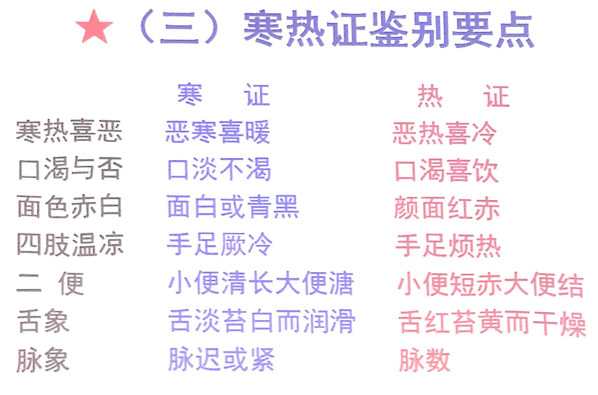
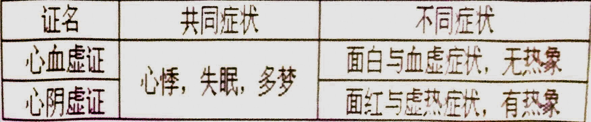
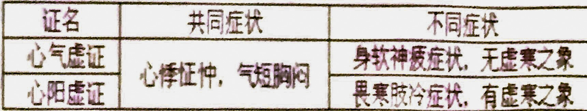
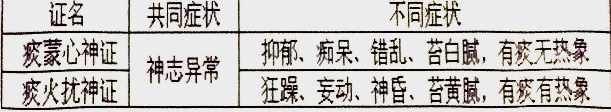
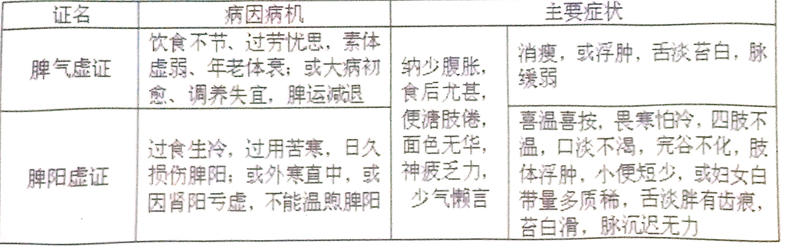
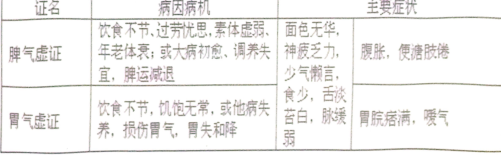
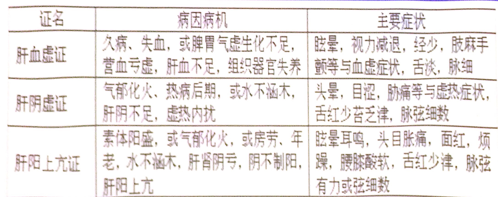
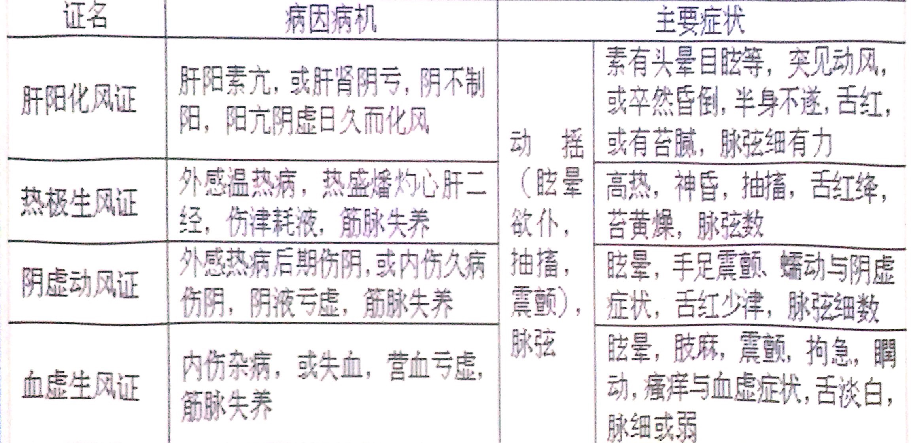
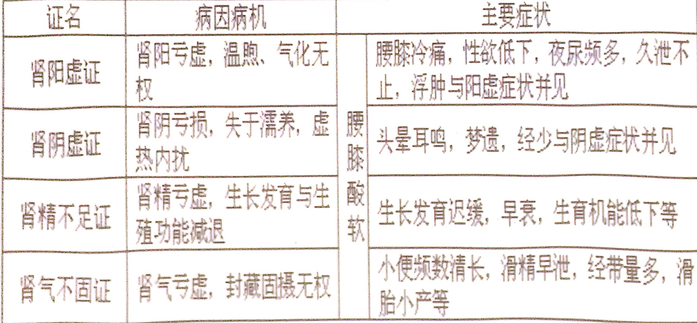

# 中诊辩证
- **八纲辨证**
    - **表证、里证**
        - 表与里是辨别病位和病势的两个纲领。表里辨证主要应用于外感病证，可以判断病情的轻重浅深、病理变化趋势
        - **表证**
            - **恶寒** **薄白、脉浮**
            - **表证的治疗**
                - **解表法** **汗法**
                - 风寒表证
                    - 疏风散寒
                    - 麻黄汤
                - 风热表证
                    - 疏风清热
                    - 桑菊饮
                - 表虚表证
                    - 调和营卫
                        - 桂枝汤
                    - 益气解表
                        - 玉屏风散
        - **里证**
            - **寒热独见**
            - **病因病机**
                - 病邪由表入里
                - 外邪直侵犯内里（外邪直中）
                - 七情内伤、饮食劳倦等直接损伤脏腑气血
            - **里证的治疗**
                - 根据里证的寒热虚实，分别以温清补攻治疗
                - 里虚证——补
                - 里实证——攻
                - 里寒证——温
                - 里热证——清
        - **半表半里证**
            - **寒热往来**
            - **病因病机**
                - 外邪由表传内，尚未入于里
                - 里邪透表，尚未透于表，邪气居于半表半里之间
                - 邪气直犯少阳，正气渐虚，正邪分争，少阳枢机不利
                - **寒热往来**
                - **胸胁苦满**
                - **不欲饮食**
                - **心烦**
                - **喜呕**
                - **口苦咽干**
                - **可见脉弦**
            - **治疗**
                - 和解表里法——小柴胡汤
                    - 柴胡、黄芩、参、夏、姜、枣、草
        - **表里证的鉴别**
            -  
    - **寒证、热证**
        - **寒证**
            - **冷冷清清白紧迟**
                - 恶寒、畏冷、冷痛、喜暖、肢凉
                - 痰涎涕清稀、小便清长、大便清稀
                - 苔白而润、面色白、舌淡
                - 脉紧或迟
        - **热证**
            - **热渴红黄数二便结**
                - 阳热亢盛
                    - 发热恶热喜冷
                - 火性炎上
                    - 面红目赤
                - 热灼津伤
                    - 口渴欲饮
                    - 痰涕黄稠
                    - 小便短黄
                    - 大便干结
                    - 苔黄干燥
                - 热迫血疾
                    - 舌红脉数
            - **病因病机**
                - 外感火热之邪
                - 寒邪入里化热
                - 七情过激，郁而化热
                - 饮食不节，积久化热
                - 房室劳伤，劫夺阴津
            - **治疗原则**
                - 实热宜清（白虎汤等）
                - 虚热宜补（六味地黄丸等）
        - **寒热证鉴别要点**
            -  
    - **虚证、实证**
        - **实证**
            - **新病、声高气粗、体强、疼痛拒按、舌老苔腻、脉有力**
                - **壮热**
                - **疼痛拒按**
                - **胸闷烦躁**
                - **神昏谵语**
                - 呼吸气粗
                - **痰涎壅盛**
                - 大便秘结，小便不利
                - 舌质苍老，舌苔厚腻
                - **脉实**
            - 病因病机
                - 感受外邪
                - 内脏功能失调，痰饮、水湿、瘀血、脓液、宿食、虫积等蓄积
                - 新起
                - 暴病
                - 病情剧烈
                - 体质壮实
        - **虚证**
            - **久病、声低息微、体弱、疼痛喜按、舌嫩少苔、脉无力**
                - **气虚**
                    - **神疲乏力** （肺
                    - **自汗** **懒言** （脾）
                    - **动则气急**
                    - **纳少不化**
                    - 舌质淡胖
                    - **脉虚**
                    - 乏力气短自汗出，纳少声低脉无力
                - **血虚**
                    - **头晕目眩，失眠心悸**
                    - 面色苍白无华或萎黄
                    - 手足麻木
                    - 口唇指甲淡白
                    - 舌质淡
                    - **脉细弱**
                    - 眩晕心悸面黄白，肢麻舌淡脉细弱
                - **阳虚**
                    - 阳虚证是指机体阳气不足，阳不制阴所表现的证候
                    - 气虚+虚寒
                    - 畏寒，形寒肢冷
                    - **小便清长**
                    - 下利清谷
                    - **脉迟**
                    - 畏寒肢冷二便清，神疲脉迟舌淡胖
                - **阴虚**
                    - 阴虚证是指机体阴液亏虚，阴不制阳所表现证候
                    - **头晕目眩** **失眠心悸**
                    - **颧红** **潮热** **五心烦热**
                    - **口干咽燥** **盗汗**
                    - **红绛瘦薄** **裂纹，苔剥** **无苔**
                    - **脉细数**
                    - 眩晕失眠舌面红，身热盗汗脉细数
    - **阴证、阳证**
        - **阴证（**
        - **阳证（**
        - **阴盛证（实+寒）**
        - **阴虚证（虚+热）**
        - **阳虚证（虚+寒）**
        - **阳盛证（实+热）**
        - **阳亢证**
        - **亡阳证**
            - 冷汗稀、四肢厥冷、舌淡而润、脉微欲绝
                - 温煦、固摄推动失司
                - 冷汗淋漓、汗质清稀
                - 肌肤不温、手足厥冷
                - 神情淡漠、呼吸微弱
                - 面色苍白
                - 舌淡而润
                - 脉微欲绝
        - **亡阴证**
            - 热汗粘、身热恶热、舌红干瘦、脉细数
                - 滋润、潜阳失司
                - 汗热味咸而粘，如珠如油
                - 身灼肢温、恶热
                - 虚烦躁扰
                - 口渴欲饮
                - 面赤、皮肤皱瘪
                - 小便极少
                - 唇舌干燥
                - 脉细数疾
    - **病案分析**
        - **朱良春：上下不一主从下，表里不一主从里**
        - 素体虚弱 昨夜起发热 微恶风寒，头痛咳嗽，咽喉肿痛
            - **表热里寒证（** **表里同病，寒热错杂** **）**
                - **里虚寒证**
                - **外有风热表证**
                - **表热里寒证** 表里同病，寒热错杂
        - 发热，怕冷，鼻流清涕 **咳出黄稠痰** 高热 大汗 口渴 满面通红 烦燥不安 舌红苔黄 脉洪数有力
            - **里证、实证、热证——里实热证**
                - **风寒之邪**
                - **表邪入里化热，里热亢盛**
                - **热邪灼肺，耗伤阴津**
                - **热邪扰心**
                - **里实热证**
            - **治疗**
        - 咳嗽 胸中烦热 口舌生疮 腹痛绵绵 大便溏泻
            - **上热下寒证（上实下虚、寒热错杂、虚实夹杂）**
                - **上焦有火**
                - **下焦有寒**
                - 故总体为上热下寒证（上实下虚、寒热错杂、虚实夹杂）
            - 先清热（热证为主要矛盾）
        - 奚某，男，41岁，2001年1月8日诊。三月前，运动后汗出受风，当夜发热恶寒，头痛，口干，有汗，轻微咳嗽，舌边尖红苔白，脉浮数。自行煎服生姜汤发汗。次日上午病势反重，发热39℃不退，大汗，口渴咽痛，舌绛苔黄干，脉洪数有力，给与清热解毒中药，三天后病势减。但低热不退，夜间尤甚，盗汗，干咳少痰，头晕心悸，失眠，舌红绛而干，无苔，脉细数。
            - **汗后当风**
            - **风热表证** **里实热证**
            - 用清热解毒，药证相符，病情减轻
            - **里虚热证**
        - 韦某，女，3岁，2001年8月15日诊。患儿腹泻三天，泻下无度，质稀如水，色黄混浊，精神萎靡，皮肤干燥，目眶凹陷，啼哭无泪，无尿，口渴引饮，齿干唇红，舌红无津。
    - 八纲证之间的关系
        - **证的转化**
            - 八纲中相互对立的证候之间，在一定条件下，可向其对立面转化
            - **表里出入、寒热转化、虚实转化**
        - **证的相兼**
            - 指在疾病某一阶段，出现八纲两个以上的证候，但其病位无论在表在里，没有相反证候的存在
            - **表实寒证**
                - 恶寒发热、头身疼痛、鼻塞流涕、咳嗽气喘、舌苔薄白、脉浮紧
            - **表实热证**
                - 发热恶寒、咽喉肿痛、咳嗽痰黄、舌尖红苔薄、脉浮数
            - **里实寒证**
                - 恶寒，肢冷、腹部冷痛拒按、舌苔白厚、脉沉弦紧
            - **里实热证**
                - 壮热、大汗、口渴、心烦、脉洪大有力
            - **虚寒寒证**
                - 蜷卧、痰稀色白、肢冷乏力、腹痛喜暖喜按、脉弱或迟
            - **里虚热证**
                - 颧红，微热或潮热，五心烦热，口干咽燥，盗汗，舌质红绛瘦薄、或有裂纹、苔剥或无苔，脉细数
            - 表虚寒证、表里虚寒证——里虚寒证
            - 表虚热证、表里虚热证——里虚热证
        - **证的错杂**
            - 指疾病在某一阶段，性质相反的证候同时表现于同一病人
            - 表里同病、寒热错杂、虚实夹杂
            - 四种情况
                - 表里同病  寒热虚实相同
                    - 如：表里实寒证、表里实热证
                - 表里同病  寒热相同，虚实相反
                    - 如：表实寒——里虚寒证、表实热——里虚热证
                - 表里同病  虚实相同，寒热相反
                    - 如：表实寒一里实热证、“寒包火”证等
                - 表里同病  寒热相反，虚实相反
                    - 如：表实寒-里虚热证
            - **寒热错杂**
                -  外寒里热
                    - 外寒证见恶寒发热, 头痛, 舌苔薄白而润
                    - 里热则可见身热汗多, 渴欲引饮, 心烦口苦, 小便短赤刺痛,&nbsp;舌红苔黄, 脉洪数或弦数证
                - 外热里寒
                    - 外热可见身热不恶寒, 咽痛口渴, 咳嗽痰黄,
                    - 里寒则可见口淡不渴, 喜热饮, 小便清长,&nbsp;大便溏泻, 舌淡苔白润, 脉沉迟
                - 上热下寒
                    - 既有口干口苦, 泛酸, 舌质红,
                    - 又兼有喜暖喜温, 大便溏薄, 甚至完谷不化, 小便清长
                - 上寒下热
                    - 既有清涎自涌或呕吐清水, 口淡,
                    - 又兼有大便秘结或黏腻不爽, 小便短赤
                - 寒热错杂
                    - 口干口苦,&nbsp;反酸,&nbsp;呃逆, 呕吐, 腹痛, 大便溏薄, 如半夏泻心汤证
        - **证的真假**
            - 病情的危重阶段，出现与疾病本质相反的“假象”（生理），掩盖病情的真象（病理）
            - **真热假寒**
                - **胸腹灼热**
                - 四肢冷，恶寒寒战
                - 机理
                    - 邪热内盛，阳气郁闭于内而不能外达
            - **真寒假热**
                - **胸腹无热**
                - 自觉发热，或脱衣揭被，面红
                - 机理
                    - 久病阳气虚极，阴寒逼迫虚阳浮游于上、格越于外
            - **真实假虚**
                - **有力**
                    - 神情默默——但语时声高息粗
                    - 倦怠懒言——但动之觉舒
                    - 身体赢瘦——胸腹硬满拒按
                    - 脉象沉细——但按之有力
                - 机理
                    - 因热结胃肠，大积大聚阻滞经脉，而致气血不能畅达
            - **真虚假实**
                - **无力**
                    - 腹部胀满——时有缓解，内无肿块而喜按
                    - 呼吸喘促——但气短息弱
                    - 二便闭涩——但腹部不甚硬满
                - 机理
                    - 因久病脏腑虚衰，气血不足，运化无力而致气机不畅
        - **病案分析**
            - 低热 夜间尤甚 五心烦热 干咳少痰 头晕目眩 心悸失眠 盗汗 颧 红 舌光红少津 脉细数
                - **阴虚内热证**
                - **肺痨日久，痨病伤阴，阴不制阳，虚火内生**
                - **阴虚失去滋润作用**
                - **阴虚火旺**
            - 齐某，女，29岁，2010年6月22日诊。三周前产后失血过多，而致头晕目眩，失眠多梦，心悸，神疲乏力，自汗，气短懒言，手指麻木，乳汁分泌不足。症见病人面色苍白，舌淡，脉细弱无力。
                - **气血两虚证**
                - **气随血脱**
                - **血虚不能充养头目、四肢等**
                - **心神失养**
                - **气虚**
                - **气血虚**
                - **气血两虚之象**
- **病性辨证**
    - 六淫辨证
        - **风淫（“外风证”）**
            - 轻扬开泄、善行数变、风性主动、风为百病之长
            - **发病急、变化快、游走不定**
            - **风邪袭表证**
                - **汗出**
            - **风邪犯肺证**
                - 咳嗽、咽喉痒或痛、鼻塞或喷嚏等
            - **风客肌肤证**
                - **突发** **瘙痒**
            - **风胜行痹证**
                - **游走疼痛**
            - **风水相搏证**
                - **水肿** **咳嗽**
            - **风邪中络证**
                - 肌肤麻木不仁、口眼歪斜
            - **风毒育络证**
                - 肌肉强真，牙关紧闭抽搐，角弓反张
            - **内风证**
                - 眩晕欲扑、肢体麻木、振颤、抽搐
        - **寒淫**
            - 易伤阳气、凝滞收引
            - **恶寒肢冷、冷痛、拘急无汗**
            - **伤寒证（外寒证、表寒证、寒邪束表证、太阳表实证、太阳伤寒证等）**
                - **无汗**
            - **中寒证（又称内寒证、里寒证等）**
                - 冷痛，肢体厥冷，脏腑症候，排出物清稀色白，舌苔白，脉紧
            - **虚寒证（阳虚证）**
                - 是指机体阳气亏虚，温煦、推动、气化无力，以畏寒肢冷为主要表现的虚寒证候
                - “阳虚则寒”
        - **暑淫**
            - 炎热升散，耗气伤津，易夹湿邪
            - **热、气虚、夹湿、神昏**
            - 发热汗出，神疲气短，心烦，口渴喜饮，尿短黄，肢体困倦、舌红苔黄，脉虚数
                - 或发热，卒然晕倒，汗出不止，气喘，甚至昏迷、惊厥、抽播
                - 或高热，神昏，胸闷，腹痛，呕恶，无汗，气喘等
            - **辨证要点**
                - 夏月感受暑热之邪
                - 发热，汗多，口渴心烦，气短疲乏、尿黄等
        - **湿淫**
            - 重浊、黏滞、趋下、阻滞气机，损伤阳气
            - **病势缠绵，病程迁延、难愈**
            - 头昏如裹、嗜睡、身体困重、胸闷脘痞、纳呆、恶心、局部渗液、妇女带下量多、舌苔滑腻
            - **内湿证**
                - 过食肥甘酒醪、饮冷，脾失健运，湿浊内生
                - 病位偏于内脏，湿困脾胃，运纳升降失调，以院腹痞胀、恶心呕吐、纳呆、便溏等为主
        - **燥淫**
            - 干燥，易伤津液，易伤肺脏
            - 皮肤干裂、口唇鼻咽喉干燥、大便干
            - 燥邪犯肺伤律
                - 干咳少痰、痰黏难咯
            - 凉燥（干+风寒）
                - 恶寒微发热，无汗，头痛，脉浮紧
            - 温燥（干+风热）
                - 发热微恶风寒，少汗，咽喉疼痛，舌干苔薄黄，脉浮数
            - **内燥证**
                - 燥淫证与由于血虚、阴亏所导致的机体失于濡润而出现的干燥证候不同
                    - **燥淫证**
                        - 因于外感，属外燥
                    - **由于血虚、阴亏所导致的机体失于濡润而出现的干燥证候**
                        - 因于内伤，属内燥
                - 但两者亦可相互为因、内外合病
        - **热淫**
            - 燔灼、急迫、炎上
            - **易伤津、耗气、生风、动血，易致疮疡**
            - **热、红、黄、数**
            - 发热、口渴、汗多、大便秘结、舌红绛、脉数有力、神昏、谵语、抽搐、吐血、痈肿疮疡
        - **火淫**
            - 燔灼、急迫、炎上
            - **易伤津、耗气、生风、动血，易致疮疡**
            - **热、红、黄、数**
            - 发热、口渴、汗多、大便秘结、舌红绛、脉数有力、神昏、谵语、抽搐、吐血、痈肿疮疡
            - 火、热、温邪的性质同类，仅有轻重、缓急等程度之别
                - “温为热之渐，火为热之极”
                - 火证与热证均是指具有温热性质的证候
            - **内火（热）证**
                - 指脏腑功能失常，火热内生所表现的证候
                - **实热（火）证**
                    - 情志内伤，气郁化火，或过食辛热，或素体阳热亢盛——肝火亢盛、心火亢盛、胃火炽盛
                    - “阳盛则热”
                    - 里实热证
                - **虚热证**
                    - 体内阴液亏虚，阴不制阳，虚热内生
                    - 低热、五心倾热、口锅、盗开、脉细数、舌红少津成少苔为主症
                    - “阴虚则热”
                    - 一般指阴虚证
    - 情志辩证
        - 喜（气缓）
            - **思想不集中、脉缓**
        - 怒（气上）
            - **面红目赤、呕血**
        - 忧（气消）
            - **疲乏少力**
        - 恐（气下）
            - **二便失禁、滑精阳痿**
        - 思（气结）
            - **纳谷不馨、腹胀、胸闷胁胀、善太息**
    - 气血津液辨证
        - **气病辩证**
            - 气虚
                - 乏力、气短、少气、自汗、虚脉
            - 气陷
                - 体弱而瘦，气虚+坠胀、脏器下垂
            - **气不固**
                - 气虚+自汗或二便、经精不固、滑胎
            - **气脱**
                - **汗出不止** **微**
            - 气滞
                - 痞闷胀、嗳气矢气、情绪变化、胸胁脘腹胀闷、窜痛
            - **气逆**
                - 咳喘（肺）、呕吐、呃逆（胃）；眩晕、咳血（肝）
            - **气闭**
                - **实**
        - **血病辨证**
            - 血虚
                - **色淡**
            - 血脱
                - **大出血、面色苍白、舌枯白、脉微或芤**
            - 血瘀
                - **刺痛** **舌紫暗有瘀斑、脉涩**
            - 血热
                - **出血+热**
            - 血寒
                - **血瘀+寒**
        - **气血同病**
            - 气滞血瘀
                - 胀闷疼痛走窜、刺痛、情志不舒、舌紫暗瘀斑瘀点、脉弦涩
            - 气虚血瘀
                - 少气乏力、刺痛、舌有瘀斑瘀点、脉细涩
            - 气血两虚
                - 乏力、自汗、唇甲色淡、脉细无力
            - 气不摄血
                - 慢性出血、神疲无力、少气懒言、脉弱
            - 气随血脱
                - 大出血、冷汗淋漓、气少息微、脉微欲绝
        - **津液类辩证**
            - 痰饮水湿
                - **湿（中下）**
                    - 无明显形质可见，以肢体闷重酸困等为主要表现
                - **水（全身）**
                    - 质清稀为液态，流动性大，以水肿、少尿为主症
                - **饮（局部）**
                    - 是较水浊而较痰稀，常停聚于某些腔隙及胃肠，以停聚处的症状为主要表现
                - **痰（上）**
                    - 质地稠浊而黏，流动性小，多停于肺，但可随气流窜全身，见症复杂，一般有吐痰多的主症
            - 痰
                - **痰多** **苔腻、脉滑**
            - 饮
                - 胸闷脘痞、呕吐清水、咳吐清稀痰涎、肋间饱满、苔滑
                    - 痰饮（饮留胃肠）
                        - 脘腹痞胀，呕吐清涎，胃中振水音，肠间水声辘辘
                    - 支饮（饮停心肺）
                        - 胸闷心悸，气短不能平卧
                    - 悬饮（饮停胸胁）
                        - 胸胁饱满、胀痛，咳嗽、转侧则痛增，脉弦
                    - 溢饮（饮溢四肢）
                        - 肢体沉重、酸痛，或浮肿，小便不利
            - 水停
                - **肢体浮肿、小便不利**
                    - 阳水
                        - 眼睑、颜面先肿，迅速遍及全身，皮薄光亮，小便短少，伴咽喉肿痛、咳嗽及表证
                    - 阴水
                        - 足胫、下肢先肿，渐至全身，腰以下肿甚，按之凹陷难复，小便短少，兼脾、肾阳虚的表现
            - 津亏
                - **干燥、脉细数无力**
    - **病案分析**
        - 谢某，男，28岁。于夏季抗洪护堤工作中突然昏倒，发热，汗出不止。经抢救神识已清，但觉口渴，疲乏，尿黄，舌红，脉虚数。
            - 暑热伤津
                - 暑邪闭阻气机，阻虚
        - 姚某，男，35岁。腰脊疼痛，下肢关节强直两年。现觉胸痛，腰脊及下肢关节疼痛，膝踝关节肿胀，曲伸不利，行则依附拐杖。遇寒冷阴雨天气疼痛加剧。腿部肌肉萎缩，乏力神疲，舌淡苔白，脉细滑。
            - 寒湿证 痹证
        - 于某，男，28岁。5天前起胁肋疼痛，右侧尤甚。两目发黄，胸闷呕恶，食欲不振，口苦溲赤，大便干结，舌尖边红，苔黄腻，脉濡数。
            - 肝胆湿热
        - 邓某，男，28岁，形瘦，4月3日就诊，患者于3天前于兰州出差同来，即感口燥咽干，咳嗽，今日咳嗽加重，痰少难咯，咽干唇裂，渴欲饮水，皮肤干，舌红苔薄，脉细数。
            - 阴虚证
        - 赵某，男，30岁，患者于4天前开始发热，伴微恶寒。咳嗽吐稠痰，鼻塞流浊涕，未及治疗。现壮热，口渴，咳嗽加剧，痰稠色黄，气喘息粗，烦躁不安，大便干结，小便短赤，舌红苔黄燥，脉滑数。
            - 痰热
- **病位辨证**
    - 脏腑辨证
        - 首先是辨明脏腑 **病位** ，其次要辨清 **病性**
        - **病位**
            - 心：心悸、心烦、失眠、心胸疼痛、神志异常（神昏谵语、狂躁、痴呆）
            - 小肠：小便赤涩灼痛、心烦、口舌生疮
            - 肺：咳、喘、哮
            - 大肠：大便秘结、下痢脓血
            - 肝：胁肋胀痛、情志因素发作或加重、急躁易怒、目涩目眩、脉弦
            - 胆：胆怯、惊悸、胁肋胀痛不适
            - 脾：食少纳差、便溏、腹胀
            - 胃：胃胀痛、呕吐、呃逆、嗳腐吞酸、纳呆
            - 肾：腰膝酸软、呼多吸少、五更泄、阳痿早泄
            - 膀胱：小便频急涩痛、尿血或有砂石
        - **病性**
            - **气短懒言、神疲乏力**
            - **色淡**
            - **畏寒怕冷、四肢不温、喜温喜按**
            - 精亏：小儿生长发育迟缓、发脱齿松、健忘
            - **排泄物清稀**
            - **排泄物黄稠、舌红苔黄**
            - **苔白腻**
            - **舌红苔黄腻**
            - **走窜、情志影响、嗳气矢气**
            - **舌紫暗有瘀斑**
            - **嗳腐吞酸**
            - **浮肿**
            - **头重脚轻、舌红苔黄、脉弦**
            - **干、脉浮**
            - **干，脉细数无力**
        - **心与小肠病证**
            - **心**
                - 心悸、心烦、失眠、心胸疼痛、神志异常（神昏谵语、狂躁、痴呆）
                - **虚证**
                    - **心血虚证**
                        - 
                            - 心悸
                                - 血液不足，心失濡养，心动失常
                            - 失眠、多梦
                                - 心神失养，神不守舍
                            - 头晕眼花、健忘、面色淡白或萎黄，唇、舌色淡
                                - 血虚不能上荣头面
                            - 脉细无力
                                - 血少脉道失充
                        - 心悸、失眠、多梦与血虚症状共见
                    - **心阴虚证**
                        - 
                            - 心悸
                                - 阴液亏少，心失满养，心动失常
                            - 心烦、失眠、多梦
                                - 阴虚阳亢，虚热扰心，神不守舍
                            - 口燥咽干，形体消瘦
                                - 阴虚失滋
                            - 手足心热，潮热盗汗，两颧潮红，舌红少苔乏津，脉象细数
                                - 阴不制阳，虚热内生
                        - 心悸、心烦、失眠与虚热症状共见
                        - **鉴别要点** 
                    - **心气虚证**
                        - 
                            - 心悸怔忡
                                - 心气虚，鼓动乏力，心动失常
                            - 气短胸闷
                                - 宗气衰少
                            - 精神疲倦
                                - 脏腑功能减退
                            - 自汗
                                - 气虚卫外不固
                            - 活动劳累后诸症加剧
                                - 动则气耗
                            - 面色淡白，舌淡，脉虚
                                - 气虚运血无力，气血不足，血脉不荣
                        - 心悸怔仲、胸闷气短与气虚症状共见
                    - **心阳虚证**
                        - 
                            - 心悸（轻）怔忡（重）
                                - 心阳虚衰，推动、温运无力，心动失常
                            - 胸闷气短
                                - 心阳虚衰，宗气衰少，胸阳不展，气滞胸中
                            - 心胸疼痛
                                - 心脉痹阻
                            - 畏寒肢冷
                                - 虚寒内生，温煦失职
                            - 自汗
                                - 阳虚卫外不固
                            - 面色白光白或面唇青紫，舌质紫暗，脉弱或结或代脉
                                - 温运乏力，面部血脉失充，寒凝而血行不畅
                            - 舌淡胖嫩，苔白滑
                                - 阳虚水湿不化
                        - 心悸怔忡、心胸闷痛与虚寒症状共见
                        - **鉴别要点** 
                    - **心阳虚脱证**
                        - 
                            - 在心阳虚的基础上，突然：
                            - 冷汗淋离
                                - 心阳衰亡，不能外固
                            - 四肢厥冷
                                - 不能温煦四肢
                            - 呼吸微弱
                                - 宗气外泄，不司呼吸
                            - 面色苍白无华
                                - 阳气外脱，脉道失充
                            - 心痛剧烈，口唇青紫
                                - 阳衰寒凝血脉
                            - 神志模糊，甚则昏迷
                                - 心神涣散
                            - 脉微欲绝
                                - 心脉衰竭
                        - 心悸胸痛、冷汗肢厥、脉微欲绝等与亡阳症状共见
                - **实证**
                    - **心火亢盛证**
                        - 
                            - 心烦失眠
                                - 心火炽盛，热扰心神，神不守舍
                            - 发热口渴，便秘尿黄
                                - 热盛伤津
                            - 面红舌赤，苔黄脉数
                                - 火热内盛
                            - 狂躁谵语，神识不清
                                - 火热闭窍扰神
                            - 叶血衄血
                                - 火热迫血妄行
                            - 口舌生疮，溃烂疼痛
                                - 心火上炎舌窍
                            - 小便赤涩，灼热疼痛
                                - 心火下移小肠
                        - 心烦失眠、舌赤生疮、吐衄尿赤与实热症状共见
                    - **心脉痹阻证**
                        - 
                            - 心悸怔忡
                                - 心阳不振，失于温运，心脉失养，心动不安
                            - 心胸憋闷疼痛
                                - 阳气不运，心脉阻滞不通
                            - 痛引肩臂内臂，时作时止
                                - 手少阴心经之脉横出腋下，循肩背、内臂后缘
                            - 以刺痛为特点，伴见舌质晦暗，或有青紫色瘀斑、瘀点，脉细涩或结或代
                                - 瘀血内阳（瘀阻心脉证）
                            - 以憋闷为特点，多伴体胖痰多，身重困倦，苔白腻，脉沉滑或沉涩
                                - 痰浊内盛（痰阻心脉证）
                            - 以痛势剧烈，突然发作，遇寒加剧，得温痛减为特点，伴见畏寒肢冷，舌淡苔白，脉沉迟或沉紧
                                - 寒邪内盛（寒凝心脉证）
                            - 以胀痛为特点，其发作多与精神因素有关，常伴见胁胀，善太息，脉弦
                                - 气机郁滞（气滞心脉证）
                        - 心悸怔忡、心胸憋闷疼痛与瘀、痰、寒、气所致心脉痹阻症状共见
                    - **痰蒙心神证**
                        - 
                            - 神情痴呆，意识模糊，甚则昏不知人
                                - 痰浊蒙蔽，心神不清
                            - 精神神郁，表情谈漠，喃喃独语，举止失常
                                - 肝失疏泄，气郁生痰，蒙蔽心神
                            - 突然昏仆，不省人事，口吐涎沫，喉中痰鸣
                                - 痰浊内盛，引动肝风，肝风挟痰，蒙闭心神
                            - 面色晦暗
                                - 痰浊内阻，气血不畅
                            - 胸闷呕恶
                                - 痰阻胸阳，胃失和降
                            - 舌苔白腻，脉滑
                                - 痰浊内盛
                        - 神志神郁、错乱、痴呆、昏迷与痰浊症状共见
                    - **痰火扰神证**
                        - 
                            - **外感热病中：**
                                - 发热口渴，面红目赤
                                    - 邪热内盛，热蒸火炎
                                - 胸闷气粗，吐痰黄稠，喉间痰鸣
                                    - 痰火壅肺
                                - 烦躁不宁，失眠多梦
                                    - 痰热扰心
                                - 神昏谵语
                                    - 痰火蔽窍，扰乱神志
                            - **内伤杂病中：**
                                - 轻则心烦失眠，重则精神错乱
                                    - 痰火内盛，闭扰心神
                                - 狂妄躁动，打人毁物，不避亲疏，糊言乱语，哭笑无常
                                    - 痰火扰乱精神
                                - 舌红，苔黄腻，脉滑数
                                    - 痰火内盛
                        - 神志狂躁、神昏澹语与痰热症状共见
                        - **鉴别要点** 
                    - **瘀阻脑络证**
                        - **概念**
                            - 指瘀血犯头，阻滞脑络，以头痛、头晕及血瘀症状为主表现的证候
                        - **病因病机**
                            - 头部外伤，瘀血停积脑内
                            - 久痛入络，瘀血阻塞脑络
                        - **临床表现及证候分析**
                            - 头痛如刺，痛处固定，经久不愈
                                - 瘀血阻滞脑络
                            - 头晕不已
                                - 脑络不通，气血失养
                            - 健忘，失眠，心悸
                                - 瘀血不去，新血不生，心神失养
                            - 昏不知人
                                - 外伤严重，元神无主
                            - 面色晦暗
                                - 脑络瘀阻，瘀色外现
                            - 舌质紫暗或有瘀点瘀斑，脉细涩
                                - 瘀血内阻
                        - **辨证要点**
                            - 头痛、头晕与血瘀症状共见
            - **小肠**
                - 小便赤涩灼痛、心烦、口舌生疮
                - **实证**
                    - **小肠实热证**
                        - 
                            - 小便黄热、涩痛
                                - 心火下移小肠，膀胱气化失司
                            - 尿血
                                - 热伤血络
                            - 心烦口渴
                                - 热邪扰心
                            - 口舌生疮
                                - 火扰舌窍
                            - 脐腹胀痛
                                - 小肠、膀胱气机失调
                            - 舌红苔黄，脉数
                                - 实热
                        - 小便赤涩疼痛、心烦、舌疮与实热症状共见
                    - **小肠气滞证（寒滞肝脉证）**
                - **虚证**
                    - **小肠虚寒证（脾阳虚证）**
        - **肺与大肠病证**
            - **肺**
                - 咳、喘、哮
                - **虚证**
                    - **肺气虚证**
                        - 
                            - 咳喘无力
                                - 肺气亏虚，宜降失权
                            - 动则咳喘益甚
                                - 动则耗气
                            - 少气短息，语声低怯
                                - 肺气虚，宗气衰少，走息道以行呼吸功能衰退
                            - 吐痰清稀
                                - 津液不布，聚而为痰，随肺气上逆
                            - 面色淡白，神疲体倦，舌淡苔白，脉弱
                                - 气虚
                            - 自汗、畏风，易受外邪侵袭而患感冒
                                - 肺气虚，不能宣发卫气于肌表，腠理不密，表卫不固
                        - 咳喘无力及气虚见症共见
                    - **肺阴虚证**
                        - 
                            - 干咳无痰，或痰少而粘，难以咯出
                                - 肺为娇脏，性喜清润，肺阴不足，以致肺失清肃，虚热内生，炼津成痰
                            - 痰中带血
                                - 虚火灼伤肺络，络伤血溢
                            - 声音嘶哑
                                - 肺阴不足，咽喉失润
                            - 午后潮热、五心烦热、盗汗、两颧发红、口燥咽干、形体消瘦、舌红少津，脉细数
                                - 阴虚内热
                        - 干咳或痰少而粘和虚热见症共见
                - **实证**
                    - **风寒犯肺证**
                        - 
                            - 咳嗽
                                - 外感风寒，袭表犯肺，肺气被束，失于宣降
                            - 咳吐痰液清稀
                                - 寒为阴邪
                            - 鼻塞流涕
                                - 鼻为肺窍，肺气失宜
                            - 微恶风寒
                                - 肺主气属卫，风寒犯表，损伤卫阳，肌表失于温煦
                            - 发热
                                - 卫阳被遏
                            - 头身疼痛
                                - 寒邪凝滞经络，经气不利
                            - 无汗
                                - 腠理闭塞
                            - 舌苔薄白，脉浮紧
                                - 感受风寒
                        - 咳嗽兼见风寒表证症状共见
                    - **风热犯肺证**
                        - 
                            - 咳嗽
                                - 风热袭肺，肺失清肃，肺气上逆
                            - 痰稠色黄
                                - 风热为阳邪
                            - 鼻塞、流浊涕
                                - 肺气失宣，鼻窍不利，津液为热邪所熏
                            - 咽痛
                                - 风热上扰，咽喉不利
                            - 发热
                                - 肺卫受邪，卫气抗邪
                            - 恶寒
                                - 卫气被遏，肌表失于温煦
                            - 口微渴
                                - 热伤津液
                            - 舌尖红，苔薄黄，脉浮数
                                - 风热袭表犯肺
                        - 咳嗽和风热表证并见
                        - **鉴别要点**
                            - 风寒犯肺证与风热犯肺证两者均属外感新病，均有咳嗽及表证证候
                            - 前者为表寒证，见恶寒重发热轻，痰白清稀，流清涕，舌苔薄白，脉浮紧
                            - 后者为表热证，见发热重恶寒轻，痰少色黄，流浊涕，舌苔薄黄，脉浮数
                    - **燥邪犯肺证**
                        - 
                            - 干咳无痰，或痰少而粘，难以咯出
                                - 肺喜润恶燥，燥邪犯肺，易伤肺津，肺失滋润，清肃失职
                            - 甚则胸痛咯血
                                - 咳伤肺络
                            - 口、唇、鼻、咽干燥
                                - 燥邪伤津，失于滋润
                            - 大便干燥
                                - 肠道失润
                            - 溺少
                                - 尿源不足
                            - 发热微恶风寒，苔薄而干燥少津，脉浮
                                - 燥袭卫表，卫气失和
                            - 少汗，脉浮数
                                - 燥与热合，腠理开泄（温燥，多见于初秋）
                            - 无汗，脉浮紧
                                - 燥与寒并，腠理闭塞（凉燥，多见于深秋）
                        - 干燥少津与肺系症状共见
                        - **鉴别要点——**
                            - **相同**
                                - 都有阴液亏损，因而都有口鼻咽喉干燥，干咳，痰少难咯，舌质红少津等表现
                            - **不同**
                                - 肺阴虚是内伤病；燥邪犯肺是外感病，由六淫中的燥邪所引起
                                - 肺阴虚是单纯的阴虚证；燥邪犯肺是以实证为主，略兼阴液亏损
                                - 肺阴虚无表证，虚热内扰的症状明显；燥邪犯肺有表证，干燥症状突出，无虚热之象
                                    - 肺阴虚兼有阴虚内热则颧红、潮热、盗汗、无恶寒、无头痛、脉细数
                                    - 燥邪犯肺兼有表证则身热，无颧红，有汗出，有恶寒头痛，脉浮数
                    - **肺热炽盛证**
                        - 
                            - 咳嗽，气喘
                                - 热邪犯肺，肺失清肃，气逆于上
                            - 咽喉红肿疼痛
                                - 肺热上熏咽喉，气血壅滞
                            - 鼻煽气灼
                                - 肺开窍于鼻，邪热迫肺，肺气不利
                            - 发热
                                - 里热蒸腾
                            - 口渴，便秘，小便短赤
                                - 邪热伤津
                            - 舌红苔黄，脉数
                                - 邪热内盛
                        - 咳嗽，气喘和里实热症状共见
                    - **痰热壅肺证**
                        - 
                            - 咳嗽，胸闷，气喘息粗
                                - 痰热壅阻于肺，肺失清肃，肺气上逆
                            - 甚则鼻翼煽动
                                - 肺气郁闭
                            - 咳吐脓血腥臭痰，胸痛
                                - 痰热阻滞肺络，气滞血壅，肉腐血败
                            - 咯痰黄稠而量多，或喉中痰鸣
                                - 痰热互结，随肺气上逆
                            - 发热
                                - 里热炽盛
                            - 烦躁不安
                                - 里热侵扰心神
                            - 口渴，便秘，小便黄赤
                                - 里热灼伤阴津
                            - 舌红苔黄腻，脉滑数
                                - 痰热内盛
                            - **肺痈**
                        - 咳喘、痰多黄稠及痰热症状共见
                    - **寒痰阻肺证**
                        - 
                            - 咳嗽，气喘，痰多色白
                                - 寒痰阻肺，肺失宣降
                            - 喉中痰鸣而哮
                                - 痰气搏结，上涌气道
                            - 胸胁满闷
                                - 寒痰凝闭于肺，肺气不利
                            - 形寒肢冷
                                - 寒性凝滞，阳气被郁而不达，肌肤失于温煦
                            - 舌淡，苔白腻或白滑，脉濡缓或滑
                                - 寒痰内盛
                        - 咳喘痰多色白与寒痰症状共见
                    - **饮停胸胁证**
                        - 
                            - 胸胁饱胀疼痛
                                - 胸胁为气机升降之道，饮停胸胁，气道受阻，络脉不利
                            - 咳时疼痛加剧，气短息促
                                - 水饮上迫于肺，肺气不利
                            - 眩晕
                                - 饮邪遏阻，清阳不升
                            - 脉沉弦、苔白滑
                                - 水饮内停
                        - 胸胁胀闷疼痛，咳唾引痛与饮停症状共见
                    - **风水相搏证**
                        - 
                            - 水肿起于眼脸头面，继而遍及全身
                                - 风为阳邪，上先受之，风水相搏
                            - 小便短少
                                - 上焦不宜，气化失司
                            - 兼见恶寒发热，无汗，苔薄白，脉浮紧
                                - 风水偏寒
                            - 兼见咽喉肿痛，舌红，脉浮数
                                - 风水偏热
                        - 水肿骤起眼险头面先肿，并兼表卫症状
            - **大肠**
                - 大便秘结、下痢脓血
                - **虚证**
                    - **肠燥津亏证**
                        - 
                            - 大便干燥秘结，难以排出，甚或数日一行
                                - 肠道阴津亏虚，失于滋润，传导失职
                            - 口臭、头晕
                                - 大肠腑气不通，秽浊之气逆于上
                            - 口干咽燥
                                - 阴津亏损，不能上承
                            - 舌红少津，苔黄燥
                                - 燥热内生
                            - 脉象细涩
                                - 脉道失充
                        - 大便燥结，难以排出及津亏见症共见
                - **实证**
                    - **虫积肠道证**
                        - 
                            - 腹痛时作
                                - 蛔虫扰动，虫安则痛止，或随便出而排虫
                            - 胃中嘈杂而贪食，久则面黄形瘦
                                - 虫居肠道，争食水谷，吮吸精微
                            - 腹痛扪之有条索块状
                                - 蛔虫钻窜，聚而成团，抟于肠中，阻塞不通
                            - **蛔厥**
                                - 蛔虫上窜，侵入胆道，气机逆乱
                            - 鼻痒、齘xie齿、面部生白色虫斑、白睛蓝斑
                                - 虫积肠道的特殊征象
                        - 脐周腹痛，面黄形瘦，大便排虫与气滞症状共见
                    - **肠热腑实证**
                        - 
                            - 脐腹部硬满疼痛拒按，大便秘结
                                - 热结大肠，燥屎内结，腑气不通
                            - 日晡潮热
                                - 大肠属阳明经，其经气旺于日晡
                            - **热结旁流**
                                - 燥屎内踞而邪热又迫津下泄
                            - 神昏谵语
                                - 邪热与燥屎相结而热愈炽，上熏侵优心神
                            - 高热，汗出口渴，小便短黄
                                - 里热蒸达，迫津外泄
                            - 舌质红，苔黄厚而干燥，或焦黑起刺，脉沉数有力，或沉实有力
                                - 实热内结
                        - 腹满硬痛，便秘与里热炽盛见症共见
                    - **大肠湿热证**
                        - 
                            - 腹痛
                                - 湿热之邪犯及肠道，壅阻气机
                            - 暴注下泻，便色黄而秽臭
                                - 热迫肠道，水液下注
                            - 下痢脓血
                                - 湿热熏灼肠道，脉络受损
                            - 腹中有急迫感及肛门灼热
                                - 火热之性急迫，热蒸肠道，时欲排便
                            - 腹痛且肛门滞重
                                - 湿阻肠道，气滞不畅，大便不得畅通
                            - 口渴，尿短黄
                                - 火热伤津
                            - 身热
                                - 火热蒸达于外
                            - 舌质红，苔黄腻，脉滑数
                                - 湿热内蕴
                        - 下痢或泄泻与湿热症状共见
                        - **大肠湿热的辨证要点如何？**
                            - **有湿热的一般表现**
                                - 身热、口渴、肛门灼热、尿短赤、舌红、苔黄等为“热”
                                - 苔腻、脉滑或濡等为“湿”
                            - **具有定位意义的湿热犯大肠的表现**
                                - 湿热内迫大肠，气机阻滞——腹痛、腹泻不爽
                                - 内伤气血——下痢脓血
                                - 大肠传导失常——里急后重
                                - 秽浊下移——暴注下泄，粪质粘稠臭秽
        - **脾与胃病证**
            - **脾**
                - 食少纳差、便溏、腹胀
                - **虚证**
                    - **脾气虚证**
                        - 
                            - 纳少腹胀，食后尤甚
                                - 脾气虚弱，运化失司
                            - 便溏
                                - 脾虚失运，升清不足，湿走肠道
                            - 肢体困倦
                                - 脾虚生湿，湿困肢体
                            - 面色无华，神疲乏力，少气懒言，舌淡苔白，脉缓弱
                                - 脾虚气血生化乏源
                        - 纳少腹胀，食后尤甚，便溏与气虚症状共见
                    - **脾虚气陷证**
                        - 
                            - 纳少，脘腹坠胀，食后尤甚
                                - 脾虚升请失词，气坠于下
                            - 便意频数，久泻不止，肛门重坠，甚则脱肛，妇女子宫下垂
                                - 中气下陷，内脏失举
                            - **膏淋**
                                - 脾虚精微输布失常，清浊不分，反注膀胱
                            - 头晕目眩
                                - 脾虚下陷，清阳不升，头目失养
                            - 面色无华，神疲乏力，少气懒言，舌淡苔白，脉缓弱
                                - 脾虚气血生化乏源
                        - 脘腹坠胀，内脏下垂与气虚症状共见
                    - **脾阳虚证**
                        - 
                            - 脘腹胀痛，喜温喜按
                                - 脾阳亏虚，虚寒内生
                            - 畏寒怕冷，四肢不温
                                - 脾阳亏虚，温煦失职
                            - 口淡不渴，便溏、甚则完谷不化
                                - 脾阳亏虚，水湿不化
                            - 肢体浮肿，小便短少
                                - 水湿泛溢肌肤
                            - 妇女白带量多质稀
                                - 水湿下注
                            - 舌淡胖有齿痕，苔白滑，脉沉迟无力
                                - 脾阳亏虚，气失温运
                        - 院腹胀痛，喜温喜按与虚寒症状共见
                        - **鉴别要点** 
                    - **脾不统血证**
                        - 
                            - 各种出血症状
                                - 脾气亏虚，统血失常，血溢脉外
                            - 吐血、便血
                                - 血溢胃肠
                            - 尿血
                                - 血溢膀胱
                            - 肌衄
                                - 血溢肌肤
                            - 鼻衄、齿衄
                                - 血溢于鼻、齿
                            - 妇女月经过多，甚则崩漏
                                - 脾虚冲任失养，固摄不足
                            - 食少，便溏，神疲乏力，少气懒言，舌淡苔白，脉细弱
                                - 脾气亏虚
                        - 各种出血症状与气虚症状共见
                - **实证**
                    - **寒湿困脾证**
                        - 
                            - 脘腹痞闷，腹痛便溏
                                - 寒湿困脾，湿阻气机
                            - 泛恶欲吐，口腻不渴
                                - 湿阻气机，胃气上逆
                            - 头身困重
                                - 湿遏清阳
                            - 肢体浮肿、小便短少
                                - 寒湿困脾，水湿不化
                            - 面目肌肤发黄，色泽晦暗
                                - 湿邪内生，胆汁外溢肌肤
                            - 舌淡体胖，苔白腻，脉濡缓或沉细
                                - 寒湿内盛，困阻脾阳
                        - 脘腹痞闷，腹痛便溏，泛恶欲吐，头身因重，苔白腻与寒湿症状共见
                        - **脾阳虚与寒湿困脾的异同如何？**
                            - 脾阳虚是由于阳虚导致脾的功能失常，寒湿困脾是由于寒湿内盛，脾阳被困所表现的证候
                            - **相同**
                                - 病位都在脾
                                - 病因都有过食生冷或误用寒凉（“寒湿困脾也可以有阳气不足）
                                - 都有脾胃功能失常的表现：纳呆食少，食后腹胀；都有寒，如表现为便溏，舌淡胖，脉迟等。
                            - **不同**
                                - 脾阳虚为单纯的虚证，无黄疸，无头重、无恶心，四肢乏力，小便清长，舌质淡，舌苔白滑，脉沉细迟弱
                                - 寒湿困脾或见皮肤黄如烟熏，头重，恶心，四肢困倦，小便不利，舌质淡胖，舌苔白腻，脉沉缓或濡
                        - **湿热蕴脾与寒湿困脾有何异同？**
                            - **相同**
                                - 病位均在脾，都有“湿”的表现，如身困重，呕吐恶心，纳呆，身黄，便溏，舌苔腻，脉濡
                            - **不同**
                                - 湿热蕴脾有“热”，表现身热，舌质红，舌苔黄，脉数；寒湿困脾有“寒”，表现舌质淡，舌苔白滑
                                - 湿热蕴脾是湿热实证，寒湿困脾是寒湿实证，但在少数情况也可以表现为虚实夹杂证（如兼有阴黄）
                        - **寒湿困脾的辨证要点如何？**
                            - 寒湿困脾有寒湿证的临床表现
                                - 寒：口淡不渴，舌体胖舌苔白滑
                                - 湿：泛于上则头重，流于下则尿少，大便溏泄，留于肌肤则身困重、肢体浮肿，见于舌脉则苔腻、脉濡缓，女性则白带量多
                            - 具有定位意义的脾（胃）功能失常的临床表现
                                - 寒湿困脾，使胃失和降，脾失健运，见泛恶欲吐、口腻、纳呆、脘腹胀闷、腹痛
                    - **湿热蕴脾证**
                        - 
                            - 脘腹胀闷
                                - 湿热内蕴，气机阻滞
                            - 身重
                                - 湿困肢体
                            - 发热，或身热不扬
                                - 湿遏热伏，郁蒸于内
                            - 汗出热不解，口中粘腻，便溏不爽
                                - 湿性缠绵粘滞
                            - 面目肌肤发黄，色泽鲜明，小便短黄
                                - 湿热交结，熏蒸肝胆，胆汁不循常道
                            - 舌红苔黄腻，脉濡数
                                - 湿热内蕴
                        - 脘腹胀闷，身重，发热，便溏不爽，苔黄腻与湿热症状共见
                        - **湿热蕴脾的辨证要点如何？**
                            - **湿热证表现**
                                - 肢体困重、苔腻、脉濡为“湿”
                                - 舌红苔黄、脉数为“热”
                                - 湿热郁蒸，见身热起伏，汗出热不解
                            - **病位在脾的表现**
                                - 湿热蕴脾，使中焦气机升降失常，在上为呕恶，在中为脘腹痞闷、纳呆，在下为大便溏泄
                                - 湿热蕴脾若阻碍肝气，使肝失疏泄，胆汗外溢，可表现为面目肌肤发黄，皮肤发痒
            - **胃**
                - 胃胀痛、呕吐、呃逆、嗳腐吞酸、纳呆
                - **虚证**
                    - **胃气虚证**
                        - 
                            - 食少
                                - 胃气虚弱，受纳、腐熟功能减退
                            - 胃脘痞满，胀痛
                                - 胃气失于和降
                            - 喜按
                                - 病性属虚
                            - 嗳气
                                - 气逆于上
                            - 面色萎黄，神疲乏力，少气懒言，舌淡苔白，脉弱
                                - 胃气虚弱，气血乏源
                        - 食少，胃脘痞满，胀痛与气虚症状共见
                        - **鉴别要点** 
                    - **胃阳虚证**
                        - 
                            - 胃院冷痛，时发时止
                                - 胃阳不足，虚寒内生，阻滞气机
                            - 喜温喜按
                                - 病属虚寒
                            - 食少脘痞，泛吐清水
                                - 胃阳不足，胃纳减退，胃气失降
                            - 畏寒肢冷，口淡不渴
                                - 阳虚生寒，津液不化
                            - 舌淡胖，苔白滑，脉沉迟无力
                                - 胃阳亏虚，温化不足
                        - 胃院冷痛，喜温喜按与阳虚症状共见
                    - **胃阴虚证**
                        - 
                            - 胃脘嘈杂，隐隐作痛
                                - 胃阴不足，虚热内生
                            - 饥不欲食
                                - 阴液不足，胃失濡润
                            - 干呕呃逆
                                - 胃气失降
                            - 口燥咽干，大便闭结，小便短少，舌红少苔，脉细数
                                - 胃阴亏虚，机体失润
                            - **沙参麦冬汤**
                        - 胃脘嘈杂，隐隐作痛，饥不欲食与阴虚症状共见
                - **实证**
                    - **胃热炽盛证**
                        - 
                            - 胃脘灼痛，喜冷拒按
                                - 热邪壅胃，阻滞气机
                            - 消谷善饥，渴喜冷饮
                                - 胃热炽盛，胃运亢进
                            - 口臭吞酸
                                - 胃火内盛，浊气不降
                            - 牙龈肿痛、齿衄
                                - 火热循经上炎
                            - 小便短黄，大便闭结
                                - 热盛伤津
                            - 舌红苔黄，脉滑数
                                - 邪热内盛
                        - 胃脘灼痛，喜冷拒按，消谷善饥及实热症状共见
                        - **鉴别要点** 
                    - **寒饮停胃证**
                        - 
                            - 胃院痞胀，胃中水声塘漉
                                - 寒饮停胃，气机不利
                            - 口泛清水
                                - 胃气挟饮上逆
                            - 头晕目眩
                                - 饮阻清阳之气
                            - 舌淡，苔白滑，脉沉弦
                                - 寒饮内阻
                        - 胃脘痞胀，胃中水声漉漉，口泛清水与痰饮症状共见
                    - **食滞胃脘证**
                        - 
                            - 脘腹痞胀作痛
                                - 饮食停滞，气机不利
                            - 拒按，厌食
                                - 内有实邪，拒于受纳
                            - 呕吐酸腐食物
                                - 胃失和降，积邪上逆
                            - 吐后好转
                                - 邪有出路
                            - 矢气频频，泻下臭秽
                                - 食积下走肠道
                            - 舌苔厚腻，脉滑实
                                - 食积滞胃
                        - 脘腹痞胀作痛，拒按，厌食，舌苔厚腻与气滞症状共见
        - **肝与胆病证**
            - **肝**
                - 胁肋胀痛、情志因素发作或加重、急躁易怒、目涩目眩、脉弦
                - **虚证**
                    - **肝血虚证**
                        - 
                            - 眩晕，视物模糊或夜盲，爪甲不荣
                                - 肝血不足，目与爪甲失养
                            - 肢麻震颤，肌肉瞤shun动，关节拘急
                                - 筋脉失养，血虚生风
                            - 月经量少、色淡、愆期、甚则闭经
                                - 血海空虚，冲任失养
                            - 面唇淡白，舌淡，脉细
                                - 血虚失荣
                        - **血虚生风证**
                        - 眩晕，视力减退，经少，肢麻震颤等与血虚症状共见
                    - **肝阴虚证**
                        - 
                            - 眩晕，两目干涩，视力减退
                                - 肝阴不足，头目失濡
                            - 胁肋隐隐灼痛，脉弦
                                - 肝脉失养，虚火内灼，疏泄失常
                            - 手足蠕动
                                - 筋脉失濡，虚风内动
                            - 形体消瘦，咽干口燥，舌红少苔，脉细
                                - 阴虚失养
                            - 两颧潮红，五心烦热，潮热盗汗，脉数
                                - 虚热内蒸
                        - **阴虚动风证**
                        - 眩晕、目涩、胁痛等与虚热症状共见
                - **实证**
                    - **肝郁气滞证**
                        - 
                            - 情志抑郁，善太息，胸胁、少腹胀满窜痛，脉弦
                                - 肝失疏泄，气机郁滞，经气不利
                            - 乳房胀痛，月经不调，痛经
                                - 肝郁气滞，冲任失调
                            - 咽部异物感，颈部瘿瘤、瘰疬
                                - 肝气郁结，气郁生痰，痰气搏结于咽喉、颈部
                            - 胁下肿块
                                - 气血瘀阻，结于胁下
                        - 情志抑郁、胸胁、少腹胀痛等与气滞症状共见
                    - **肝火炽盛证**
                        - 
                            - 胁肋灼痛，脉弦数
                                - 肝火内灼
                            - 头晕胀痛，面红目赤，舌红苔黄
                                - 肝火循经上攻，气血壅滞
                            - 急躁易怒，失眠多梦
                                - 热扰神魂，心神不宁，魂不守舍
                            - 耳鸣如潮，甚则突发耳聋
                                - 肝热移胆，循胆经上冲于耳
                            - 吐血、衄血
                                - 热盛迫血妄行
                            - 口苦
                                - 肝火夹胆气上溢
                            - 口渴，小便短黄，大便秘结
                                - 火邪灼津
                        - 胁痛，头痛，烦躁，耳鸣等与实热症状共见
                    - **寒滞肝脉证**
                        - **概念**
                            - 指寒邪侵袭，凝滞肝经，以少腹、前阴、巅顶冷痛与实寒症状为主要表现的证候
                        - **病因病机**
                            - 肝经寒凝气滞
                                - 感受外寒
                                - 素体阳气不足，由外寒所引发
                        - **临床表现及证候分析**
                            - 少腹冷痛，牵引阴部坠胀作痛，或见阴器收缩引痛，或巅顶冷痛
                                - 寒凝肝脉，经脉收引挛急不通
                            - 恶寒肢冷
                                - 阳气阻遏，失于温煦
                            - 疼痛遇寒加剧，得热则减
                                - 寒凝气血
                            - 舌淡苔白，脉沉紧或弦紧
                                - 肝经寒盛
                        - **辨证要点**
                            - 少腹、前阴、巅顶冷痛等与实寒症状共见
                - **虚实夹杂证**
                    - **肝阳上亢证**
                        - 
                            - 眩晕耳鸣，头目胀痛，面红目赤
                                - 肝阳上亢，血随气逆，气血上冲
                            - 急躁易怒，失眠多梦
                                - 亢阳扰动魂、神
                            - 头重脚轻，步履不稳，脉弦有力或弦细数
                                - 阳亢于上，阴亏于下，木旺耗水，水不涵木，上盛下虚
                            - 腰膝酸软无力，舌红少津
                                - 肝肾阴亏，筋骨、舌脉失养
                        - 眩晕耳鸣，头目胀痛，面红烦躁，腰膝酸软等上盛下虚症状共见
                        - **鉴别要点** 
                        - **肝火上炎与肝阳上亢的异同如何？**
                            - **相同**
                                - 病位都在肝，病变都侵犯人体“上”部，都呈热或火的表现
                                - 皆可表现出急躁易怒，面红目赤，头胀痛，舌质红，脉滑数
                            - **不同**
                                - 肝火上炎是实证、实热证；肝阳上亢是下虚上实证、虚热证
                                    - 肝火上炎表现苔黄脉弦数，肝阳上亢表现舌红少津，脉细数
                                - 肝阳上亢的下虚是肾虚，因而有腰膝酸软，这种兼有肾阴亏的“下虚”是肝火上炎所不兼有的，也是两证的主要区别之一
                    - **肝风内动证**
                        - **肝阳化风**
                            - 
                                - 眩晕欲仆，头摇而痛
                                    - 肝阳亢极化风，风阳冲逆于上
                                - 肢体震颤，语言謇涩
                                    - 风动筋脉挛急
                                - 手足麻木
                                    - 肝阴亏虚，筋失所养，虚风内动
                                - 步履不正
                                    - 阳亢于上，阴亏于下，上盛下虚
                                - 突然昏倒，不省人事，喉中痰鸣
                                    - 风阳暴升，阳盛灼津成痰，风痰上犯，蒙蔽清窍
                                - 口眼歪斜，半身不遂，舌强不语
                                    - 风痰流窜于脉络
                                - 舌红苔腻，脉弦有力
                                    - 风痰内盛
                            - 眩晕，肢麻，震颤，或突然昏例，口眼㖞斜，半身不遂等风动症状其见
                        - **热极生风**
                            - 
                                - 高热，抽搐，颈项强直，两目上视，甚则角弓反张，牙关紧闭
                                    - 邪热炽盛，燔灼肝经，筋脉挛急
                                - 烦躁不宁
                                    - 热扰心神
                                - 神志昏迷
                                    - 痰热闭阻心窍
                                - 舌质红绛，苔黄燥，脉弦数
                                    - 肝经热盛内灼营
                            - 高热与风动症状共见
                            - **热极生风的辨证要点如何？**
                                - 实热证：出现高热，烦渴；舌质红绛，舌苔黄，脉弦数
                                - 热陷心包：表现神志昏迷，躁扰如狂
                                - 热灼肝经引动内风：有手足抽搐，颈项强直，两眼上视，角弓反张，牙关紧闭
                        - **阴虚动风**
                            - 
                                - 手足震颤、蠕动，肢体抽搐，脉弦
                                    - 肝阴不足，筋脉失养，筋膜挛急
                                - 眩晕耳鸣，口燥咽干，舌红少津，脉细
                                    - 阴虚失养
                                - 五心烦热，潮热颧红，脉数
                                    - 虚热内蒸
                            - 手足震颤、蠕动，肢体抽搐，眩晕等与虚热症状共见
                        - **血虚生风**
                            - 
                                - 眩晕耳鸣，面白无华，爪甲不荣，舌淡，脉细或弱
                                    - 肝血不足，不能濡养
                                - 肢体震颤，手足拘急，肢体麻木，肌肉瞤动，皮肤瘙痒
                                    - 筋脉失养，虚风内动
                            - 眩晕，肢体震颤、麻木、拘急、瞤动，皮肤瘙痒与血虚症状共见
                            - **鉴别要点** 
            - **胆**
                - 胆怯、惊悸、胁肋胀痛不适
                - **胆郁痰扰证**
                    - 
                        - 胆怯易惊
                            - 痰热内扰，胆气不宁
                        - 胸胁闷胀，善太息
                            - 胆失疏泄，经气不畅
                        - 惊悸不宁，失眠多梦，烦躁不安
                            - 痰热内扰心神，神不守舍
                        - 头晕目眩
                            - 痰热循经上扰
                        - 泛恶欲呕
                            - 胆气犯胃，胃失和降
                        - 口苦
                            - 热迫胆气上溢
                        - 舌红，苔黄腻，脉弦滑数
                            - 痰热内蕴
                    - 胆怯易惊，惊悸失眠等与痰热症状共见
                    - **胆郁痰扰与痰迷心窍的异同？**
                        - 胆郁痰扰是由于痰热内扰，胆气郁滞所表现出的证候；痰迷心窍是由于痰浊蒙闭心窍而主要表现为神志方面的异常
                        - **相同**
                            - 病因都可有情志郁结
                            - 都有“痰”的临床表现，如呕吐、苔腻、脉滑
                            - 都是里证实证
                        - **不同**
                            - 胆郁痰扰无痴呆、昏迷，有头晕、目眩、烦热、寐难、胸胁满闷、舌质红、舌苔黄、脉弦滑，偏于“热”
                            - 痰迷心窍有痴呆、、昏迷，无头晕、目眩，烦热少见或因昏迷不能诉说，寐难少见或不能诉说，胸胁满闷少见，舌质淡，苔白腻，脉滑，偏于“寒”
                - **肝胆湿热证** 脏腑兼证
                    - **肝胆湿热和湿热蕴脾的异同如何？**
                        - **相同**
                            - 肝胆湿热、湿热蕴脾都是感受湿热、饮食不洁、湿热内生而引起
                            - 都有湿热的共同表现，如黄疸、身热、恶心呕吐、舌苔黄腻、脉濡数
                        - **不同**
                            - 肝胆湿热多有胁痛，湿热蕴脾多有腹胀便溏；肝胆湿热证由于肝经络阴器，故每见疮疡、湿疹、风疹等病
        - **肾与膀胱病证**
            - **肾**
                - 腰膝酸软、呼多吸少、五更泄、阳痿早泄
                - **肾阳虚证**
                    - 
                        - 腰膝酸冷疼痛，畏寒肢冷，下肢尤甚
                            - 肾阳虚衰，腰府、骨骼失于温养
                        - 面色白光白，头目眩晕，精神萎靡
                            - 阳虚温运失职，血不上荣
                        - 面色黧黑
                            - 肾阳虚惫，阴寒内盛，气血运行不畅
                        - 性欲低下，男子阳痿精冷，女子宫寒不孕
                            - 命门火衰，性功能减退
                        - 小便频数清长，夜尿频多
                            - 阳虚气化失职，肾气不固
                        - 久泄不止，完谷不化，五更泄泻
                            - 火不暖土，脾失健运
                        - 浮肿
                            - 肾阳不足，不能蒸腾气化，水湿内停，泛溢肌肤
                        - 腰以下肿甚
                            - 肾居下焦，水湿趋下
                        - 腹部胀满，心悸咳喘
                            - 水气犯牌，凌心射肺
                        - 舌淡苔白，脉沉弱，两尺尤甚
                            - 肾阳不足，气血运行乏力
                    - 腰膝酸冷，性欲低下，夜尿频多，久泄不止，浮肿与阳虚症状共见
                - **肾阴虚证**
                    - 
                        - 腰膝酸软疼痛
                            - 肾阴亏虚，腰膝失养
                        - 头晕耳鸣，齿松发脱
                            - 阴虚精亏髓减，清窍失充，骨发失养
                        - 男子阳强易举，梦遗早泄
                            - 阴虚生热，相火妄动
                        - 女子经少经闭
                            - 肾阴亏虚，冲任不充
                        - 崩漏
                            - 虚火伤络血溢
                        - 失眠多梦
                            - 火扰心神
                        - 形体消瘦，咽干溲黄便干，少苔或无苔，脉细
                            - 阴亏失润
                        - 五心烦热，潮热盗汗，颧红，舌红脉数
                            - 虚火内扰
                    - 腰膝酸软，头晕耳鸣，梦遗，经少及阴虚症状共见
                - **肾精不足证**
                    - 
                        - 小儿生长发育迟缓，身体矮小，囟门迟闭，智力低下，骨骼痿软
                            - 肾精不充，不能主骨生髓充脑，不能化血充养肌肉
                        - 腰膝酸软，耳鸣耳聋，健忘恍惚，神情呆钝，发枯易脱，齿松早脱
                            - 肾精失养
                        - 两足痿软，行动迟缓
                            - 骨失充养
                        - 性欲低下，男子精少不育，女子经闭不孕
                            - 肾精不足，生殖无源
                        - 舌淡，脉弱
                            - 虚弱之象
                    - 生长发育迟缓，早衰，生育机能低下与精亏症状共见
                - **肾气不固证**
                    - 
                        - 腰膝酸软，神疲乏力，耳鸣失聪
                            - 肾气亏虚，腰膝、脑神、耳窍失养
                        - 小便频数清长，尿后余沥不尽，夜尿频多，遗尿，小便失禁
                            - 肾气固摄无权，膀胱失约
                        - 滑精、早泄
                            - 肾虚精关不固
                        - 月经淋漓不尽
                            - 肾虚冲任不固
                        - 带下清稀量多
                            - 肾虚带脉失约
                        - 滑胎小产
                            - 肾虚任脉失养，胎气不安
                        - 舌淡，脉弱
                            - 肾虚不能化血，舌脉失于充养
                    - 腰膝酸软，小便频数清长，滑精早泄，经带量多，滑胎小产与肾虚症状共见
                    - **鉴别** 
            - **膀胱**
                - 小便频急涩痛、尿血或有砂石
                - **膀胱湿热证**
                    - 
                        - 小便频数、急迫、灼热、涩痛
                            - 湿热郁蒸膀胱，气化不利，下迫尿道
                        - 小便量少色深
                            - 湿热煎熬津液
                        - 尿血
                            - 湿热伤及血络
                        - 尿有砂石
                            - 湿热久恋，煎熬尿浊，结为砂石
                        - 腰部小腹胀痛
                            - 湿热蕴结，经气失调
                        - 发热口渴，舌红苔黄，脉数
                            - 邪热内炽
                        - 苔腻，脉滑或濡
                            - 湿邪内蕴
                    - 小便频急涩痛与湿热症状共见
        - **脏腑兼证**
            - **心肾不交证（心肾阴虚）**
                - **概念**
                    - 指心肾水火既济的生理关系失调，以心烦、失眠、耳鸣、腰酸、梦遗等为主要表现的心肾阴虚阳亢证候
                - **病因病机**
                    - 耗伤心背之明，虚阳亢动，上扰心神
                        - 思虑劳神太过
                        - 情志抑郁，郁而化火
                        - 虚劳久病，房事不节
                - **临床表现及证候分析**
                    - 心烦失眠，惊悸多梦
                        - 心阴亏虚，心火偏亢，上扰心神
                    - 头晕，耳鸣，腰膝酸软
                        - 肾阴亏虚，脑髓、腰膝失养
                    - 梦遗
                        - 虚火扰动精室
                    - 口燥咽干，五心烦热，潮热盗汗
                        - 阴虚失濡，虚热内蒸
                    - 舌红少苔，脉细数
                        - 虚热
                - **辨证要点**
                    - 心烦、失眠、腰酸、耳鸣、梦遗等与虚热症状并见
            - **心肾阳虚证**
                - **概念**
                    - 指心与肾的阳气亏虚，以心悸、水肿等为主要表现的虚寒证候
                    - **水气凌心证**
                - **病因病机**
                    - 心阳虚衰，病久及肾，肾阳亦虚
                    - 肾阳亏虚，气化无权，水气凌心
                - **临床表现及证候分析**
                    - 心悸怔忡
                        - 心阳虚衰，鼓动无力
                    - 唇甲青紫，舌淡紫
                        - 温运无力，血行不畅
                    - 肢体浮肿，小便不利
                        - 肾阳亏虚，气化失司，水湿内停，外泛肌肤
                    - 形寒肢冷，神疲乏力，腰膝酸软，舌淡，苔白滑，脉弱
                        - 心肾两脏阳虚，形体失于温养，脏腑功能衰退
                - **辨证要点**
                    - 心悸怔忡、肢体浮肿等与虚寒症状共见
            - **心肺气虚证**
                - **概念**
                    - 指心肺两脏气虚，以心悸、咳喘等为主要表现的虚弱证候
                - **病因病机**
                    - 久病咳喘，耗伤肺气，累及于心
                    - 老年体虚，劳倦太过，耗伤心肺之气
                - **临床表现及证候分析**
                    - 心悸胸闷
                        - 心气亏虚，鼓动无力，气机不畅
                    - 咳嗽气短
                        - 肺气亏虚，宣降失职，呼吸功能减弱
                    - 吐痰清稀
                        - 津液输布无力而停聚为痰
                    - 声低懒言，神疲乏力，自汗，且活动后诸症加重
                        - 气虚全身机能减弱，且劳则耗气
                    - 面色淡白，舌淡，苔白，脉弱
                        - 气虚
                - **辨证要点**
                    - 咳喘无力、心悸胸闷等与气虚症状共见
            - **心脾气血虚证**
                - **概念**
                    - 指心血不足，脾气亏虚，以心悸、失眠、头晕、食少、腹胀，便溏等为主要表现的虚弱证候
                    - **心脾两虚证**
                - **病因病机**
                    - 久病失调，思虑过度
                    - 饮食劳倦，损伤脾胃，生化不足
                    - 慢性失血，气血亏耗
                - **临床表现及证候分析**
                    - 心悸怔忡，失眠多梦
                        - 心血不足，心神失养
                    - 头晕健忘
                        - 血虚不能上荣
                    - 食欲不振，腹胀便溏
                        - 脾气亏虚，运化失职
                    - 神疲乏力，面色萎黄或淡白
                        - 气血生化不足
                    - 皮下紫斑，或月经色淡、淋漓不尽
                        - 脾虚不能统血
                    - 舌淡白，脉细弱
                        - 气血亏虚
                - **辨证要点**
                    - 心悸失眠、食少腹胀、或兼慢性失血等与气血亏虚症状共见
            - **心肝血虚证**
                - **概念**
                    - 指心肝两脏血虚，以心神及心肝相关组织官窍失养为主的虚弱证候
                - **病因病机**
                    - 思虑过度
                    - 失血过多
                    - 脾虚化源不足
                - **临床表现及证候分析**
                    - 心悸怔忡，失眠健忘
                        - 心血亏虚，心神失养
                    - 头晕目眩，视物模糊
                        - 肝血亏虚，头目失养
                    - 肢体麻木、震颤、拘挛，爪甲不荣
                        - 筋脉、爪甲失养
                    - 月经量少色淡、甚则闭经
                        - 心肝血虚，血海不充
                    - 面白，舌淡，脉细
                        - 血虚
                - **辨证要点**
                    - 心悸、失眠、眩晕、肢麻等与血虚症状共见
            - **脾肺气虚证**
                - **概念**
                    - 指脾肺两脏气虚，以咳喘、气短、痰稀、食少、腹胀、便溏等为主要表现的虚弱证候
                - **病因病机**
                    - 久病咳喘，耗伤肺气，子病及母
                    - 饮食劳倦，脾胃受损，伤及肺气
                - **临床表现及证候分析**
                    - 久咳不止，气短而喘
                        - 肺气亏虚，宣降失职，呼吸功能减退
                    - 咯痰清稀而多
                        - 肺气虚不能输布津液，聚湿生痰
                    - 食欲不振，腹胀便溏
                        - 脾气亏虚，运化失健
                    - 面浮肢肿、舌苔白滑
                        - 水湿不化而泛溢
                    - 声低懒言、神疲乏力、面白、舌淡、脉弱
                        - 气虚
                - **辨证要点**
                    - 咳喘短气、痰液清稀、食少便溏等与气虚症共见
            - **肺肾气虚证**
                - **概念**
                    - 指肺肾两脏气虚，以咳喘久延、呼多吸少、动则尤甚等为主要表现的虚弱证
                - **病因病机**
                    - 久病咳喘，耗伤肺气，病久及肾
                    - 劳伤太过，年老体弱，肾气亏虚，累及于肺，肺肾宣降、摄纳无权
                - **临床表现及证候分析**
                    - 咳嗽无力，气短而喘
                        - 肺气耗伤，呼吸功能减退
                    - 痰液清稀
                        - 津液输布无力，停聚为痰
                    - 乏力自汗
                        - 肺气虚，则宗气不足，卫表不固
                    - 呼多吸少，气不接续，动则益甚
                        - 肾气亏虚，摄纳无权，气不归元
                    - 耳鸣，腰膝酸软
                        - 肾气虚，耳窍失充，腰膝失养
                    - 舌淡紫，脉弱
                        - 肺肾气虚，久病咳喘，气血郁闭
                - **辨证要点**
                    - 久病咳喘，呼多吸少，动则尤甚等与气虚症状共见
            - **肺肾阴虚证**
                - **概念**
                    - 指肺肾两脏阴液亏虚，以千咳少痰、腰酸、遗精等为主要表现的虚热证候
                - **病因病机**
                    - 燥热、痨虫、久病咳喘等损伤肺阴，病久及肾
                    - 房劳太过，肾阴耗伤，肺失濡润
                - **临床表现及证候分析**
                    - 咳嗽痰少
                        - 肺阴亏虚，虚火内生，清肃失职
                    - 痰中带血
                        - 虚火灼伤肺络
                    - 声音嘶哑
                        - 虚火熏灼，喉失滋润
                    - 腰膝酸软
                        - 肾阴亏虚，腰膝失养
                    - 遗精
                        - 虚火扰动精室
                    - 月经量少
                        - 阴精不足，冲任空虚
                    - 口燥咽干，骨蒸潮热，颧红盗汗，形体消瘦
                        - 肺肾阴虚，虚热内蒸
                    - 舌红少苔，脉细数
                        - 阴虚内热
                - **辨证要点**
                    - 干咳、少痰、腰酸、遗精等与虚热症状共见
            - **肝火犯肺证**
                - **概念**
                    - **胸胁**
                - **病因病机**
                    - 郁怒伤肝，气郁化火
                    - 邪热内蕴肝经
                - **临床表现及证候分析**
                    - 胸胁灼痛，急躁易怒，烦热口苦
                        - 肝经气火内郁，经气不利
                    - 头胀头晕，面红目赤
                        - 气血上逆
                    - 咳嗽阵作
                        - 肝火犯肺，肺失清肃而肺气上逆
                    - 痰黄稠粘
                        - 火热灼津成痰
                    - 咳血
                        - 火热灼伤肺络
                    - 舌红，苔薄黄，脉弦数
                        - 肝火内炽
                - **辨证要点**
                    - 咳嗽痰黄、或咳血、胸胁灼痛、急躁与实热症状共见
            - **肝胆湿热证**
                - **概念**
                    - **胁肋**
                    - **肝经湿热（下注）证**
                - **病因病机**
                    - 湿热壅滞肝胆
                        - 感受湿热病邪
                        - 嗜食甘肥化生湿热
                        - 牌胃纳运失常，湿浊内生，郁而化热
                - **临床表现及证候分析**
                    - 胁肋胀痛
                        - 湿热蕴阻肝胆，疏泄失职，经气不畅
                    - 纳呆腹胀，口苦厌油，泛恶欲呕，大便不调
                        - 湿热阻滞，脾胃纳运失司
                    - 身目发黄
                        - 湿热内阻，胆汁不循常道，泛溢肌肤
                    - 寒热往来
                        - 邪居少阳，正邪相争
                    - 阴部潮湿瘙痒，惑男子睾丸肿胀热痛，或妇人带下黄臭
                        - 湿热循肝经卞注
                    - 舌红，苔黄腻，脉弦滑数
                        - 湿热之征
                - **辨证要点**
                    - 胁肋胀痛、身目发黄，或阴部瘙痒、带下黄臭等与湿热症状共见
            - **肝胃不和证**
                - **概念**
                    - 指肝气郁结，胃失和降，以脘胁胀痛、嗳气、吞酸、情绪抑郁等为主要表现的证候
                - **病因病机**
                    - 情志不舒，肝气郁结，横逆犯胃
                - **临床表现及证候分析**
                    - 胃脘、胁肋胀满疼痛，走窜不定
                        - 肝失疏泄，胃气郁滞
                    - 呃逆，嗳气
                        - 胃气上逆
                    - 吞酸嘈杂
                        - 气火内郁犯胃
                    - 饮食减少
                        - 胃纳失司
                    - 情绪抑郁，善太息，或烦躁易怒
                        - 肝失条达，甚则气郁化火
                    - 苔薄白，脉弦
                        - 肝气郁滞
                    - 舌苔薄黄
                        - 气郁化火
                - **辨证要点**
                    - 脘胁胀痛、嗳气、吞酸、情绪抑郁等症状共见
            - **肝脾不调证**
                - **概念**
                    - 指肝失疏泄，脾失健运，以胸胁胀痛、情志押郁、腹胀、便溏等为主要表现的证候
                - **病因病机**
                    - 情志不遂，郁怒伤肝，肝失条达而横乘脾土
                    - 饮食劳倦，损伤脾气，脾失健运而反侮肝木
                - **临床表现及证候分析**
                    - 胸胁胀满窜痛，善太息，情志抑郁
                        - 肝失疏泄，经气郁滞
                    - 急躁易怒
                        - 气郁化火
                    - 纳呆腹胀，便溏不爽，肠鸣矢气，或大便溏结不调
                        - 脾运失健，气滞湿阻
                    - 腹痛欲泻
                        - 肝气犯脾，气机郁滞，运化失调
                    - 泻后痛减
                        - 泻后气机暂得条畅
                    - 舌苔白，脉弦或缓弱
                        - 肝郁脾虚
                - **辨证要点**
                    - 胸胁胀痛、情志押郁、腹胀、便溏等共见
            - **肝肾阴虚证**
                - **概念**
                    - 指肝肾阴液亏虚，以腰酸胁痛、眩晕、耳鸣、遗精等为主要表现的虚热证候
                - **病因病机**
                    - 耗伤肝肾之阴
                        - 久病失调
                        - 情志内伤
                        - 房事不节
                        - 温病日久
                - **临床表现及证候分析**
                    - 头晕目眩，耳鸣健忘
                        - 肝肾阴虚，水不涵木，肝阳偏亢，髓海不足
                    - 胁部隐痛
                        - 肝阴亏虚，肝络失滋
                    - 腰膝酸软
                        - 肾阴不足，腰膝失养
                    - 失眠多梦
                        - 虚火上扰心神
                    - 遗精
                        - 虚火扰动精室
                    - 月经量少
                        - 阴精不足，冲任失养
                    - 口燥咽干，五心烦热，或低热颧红，舌红少苔，脉细数
                        - 阴虚失濡，虚热内炽
                - 【辨证要点】
                    - 腰膝酸软、胁部隐痛、眩晕耳鸣等与虚热症状共见
            - **脾肾阳虚证**
                - **概念**
                    - 指脾肾阳气亏虚，以久泻久痢、水肿、腰腹冷痛等为主要表现的虚寒证候
                - **病因病机**
                    - 久泻久痢，脾阳耗伤，不能充养肾阳
                    - 水邪久踞，肾阳受损，不能温暖脾阳
                - **临床表现及证候分析**
                    - 形寒肢冷，腰膝冷痛
                        - 脾肾阳虚，不能温煦全身、腰膝
                    - 下腹冷痛，久泻久痢不止
                        - 虚寒内生，水谷的腐熟、运化、吸收及排泄二便的功能失职
                    - 五更泄泻，完谷不化，便质清冷
                        - 命门火衰，阴寒凝滞，寅卯之交，阴气极盛
                    - 久病水肿，小便不利
                        - 脾肾阳虚，不能温化水液，泛溢肌肤
                    - 面色白
                        - 阳虚水气上泛
                    - 舌淡胖，苔白滑，脉沉迟无力
                        - 虚寒之征
                - **辨证要点**
                    - 久泻久痢、水肿、腰腹冷痛等与虚寒症状共见
        - **病案分析**
            - 许x，男，40岁，干部。2013-9-20就诊。素有“神经衰弱”症，经常失眠，近因每日开会至深夜，病情更甚。自诉心烦不寐，有时彻夜难眠，纵然入睡片刻，亦是睡眠不实而梦多，白天则觉头脑晕沉，心悸更甚，咽干舌燥，饮食无味，大便干结，小便短赤。诊见形体消瘦，舌红体小，苔少，脉细数。
                - 主诉：
                - **心阴虚证**
            - 半年多未再行经 心悸
                - 主诉：月经停闭半年，伴有心悸
                - **心肝血虚**
            - 张XX，女，39岁。一年来时感心悸，气短，精神疲惫，乏力，自汗，每当劳累之后，症状加重，面色淡白，舌质淡，脉虚。
                - 主诉：心悸一年，伴气短乏力
                - **心气虚证**
            - 刘XX，女，45岁，教师。因工作繁忙患者于半年前开始出现心悸、心烦，失眠多梦等症，并伴五心烦热，盗汗，颧红，舌红少津，脉细数。
                - 主诉：心悸半年，伴心烦
                - **心火亢盛证**
            - 吴X，男，52岁。患者十年前因疲劳出现心悸气短，未经治疗，以后每因劳累则病情加重，近二月因上症加重而来就诊。现自觉胸闷，心悸，时有胸痛，畏寒肢冷，医生查体时，望其面色淡白，舌淡胖，苔白滑，切诊脉微弱，四肢不温。
                - **心气虚的发展**
            - 吴X，女，50岁，职员。2012-10-06就诊。自述近十年来，每逢工作紧张，或加班睡眠不足时，即发舌疮，少时1~2处，多则5~6处，舌疼痛难忍，影响进食和说话，伴心烦、喜冷饮、大便秘结、小便短赤。查：舌尖红，舌尖、舌边有3处赤栏疮面，疮面直径可达1cm，苔薄黄操，脉数稍弦。
                - **心火亢盛证**
            - 王x、男，36岁、司机。2000-10-06就诊，一年前，在拉架过程中，被人用棍棒击中头部，当场倒地昏迷约半小时方才苏醒，经送医院治行血肿已吸收，摄X线等多方检查，未发现明显异常，但自感头痛，固定呈锥刺样，伴头晕、头胀、心烦，劳累时或在人多的地方痛甚，不敢过马路，伴心悸失眠、健忘，舌质紫暗，舌尖有瘀斑瘀点，脉涩有力，面晦不泽。
                - **瘀阻脑络证**
            - 周某，女，9月20日初诊。身热恶风，微咳两天，今日咳嗽加剧，痰少而黏，难以咯出，咳剧时胸痛，痰中带血丝，咽干鼻燥，舌红，苔薄白而干，脉浮数。
                - 主诉：
                - 辨证：
            - 汪某，男，25岁。2日前因气候突变，出现恶风寒，发热，无汗身痛，咳痰清稀。昨日起体温上升至39.5°C，咳嗽加剧。现高热，咳嗽，气喘息粗，胸闷，痰多色黄黏稠，口渴喜饮，烦躁不安，小便短黄，舌红苔黄腻，脉滑数。
                - 主诉：
                - 辨证：
            - 李某，男，56岁。每于秋冬常发咳喘，前天因天气骤冷，咳喘加重。现症见咳喘气急。喉中痰鸣，胸膈满闷，咯痰清稀量多。面白形寒，四肢不温，舌质淡，苔白滑，脉滑。
                - 主诉：咳喘两日，加重一日，今见咯痰清稀，面白形寒
                - **寒痰阻肺证**
            - 覃某，女，51岁。5日前出现发热恶风，咽喉疼痛、咳嗽等症，昨起面睑浮肿，现仍咽喉肿痛，咳嗽痰少，发热恶风，尿少，面睑浮肿，舌尖红，苔薄，脉浮数。
                - 主诉：面睑浮肿一日
                - **风水相搏证**
            - 章某，女，14岁。因吃冷食后出现腹痛已2日。症见腹痛欲泻，排便不畅。便量少，色黄臭秽，夹有黏液，日行十余次，肛门灼热坠胀，身热烦渴，汗出，舌质红，苔黄腻，脉象滑。
                - 主诉：腹痛两日，伴泄泻，夹有黏液
                - **大肠湿热证**
            - 王xx，男，8岁。
                - 主诉：发热，腹痛，大便脓血三天。
                - 病史：患儿于三天前开始发热，伴大便稀烂，挟有粘液，每日约5~6次，未作治疗，今日始来诊，证见：高热（体温40°C），腹痛，里急后重，大便脓血相混，日夜达20次，伴口渴频频索饮，口气臭秽，面色晦滞，精神疲倦，时见烦躁，四肢冷，按触腹部有灼热感，不欲盖衣被，尿黄而短，舌质红，苔黄干，脉滑数有力。
                - **痢疾——大肠湿热**
            - 于xx，女，35岁，1月前因母亲病故而悲伤过度，近半月来时感胸胁脘腹胀闷疼痛，喜太息，自觉咽部有物梗阻，吞之不下，吐之不出，每于思母之时诸症加重。此次月经未能按期而至，乳房作胀。舌苔薄白，脉弦细。
                - 主诉：自觉咽部有物梗阻半月
                - **肝郁气滞证**
            - 周某，男，63岁。2010年4月7日初诊。患者高血压病十余载，平素经常头晕胀痛，面红目赤，心悸肢麻，腰膝酸软，夜不成寐。昨晚饮酒后，因事恼怒，突然剧烈头痛，随即神志昏糊，口眼歪斜，半身不遂，呼吸气粗，喉中痰鸣，舌红绛，苔黄厚腻，脉弦滑数。
                - **肝火炽盛证**
            - 腿软 舌质干红无苔
                - **肝阳上亢证**
            - 张X，男，34岁，患者结婚6年至今无子，半个月前曾到外地某医院检查，发现精子不正常，总数为1亿，活动度小（20%）。自觉腰部酸软疼痛，精神疲乏，时有耳鸣，舌淡苔白，脉细弱。
                - 主诉：自觉腰部酸软疼痛半月/发现精子不正常
                - **肾精不足证**
                - 分析：肾藏精，主生殖。肾精不足，生殖无源，故男子精少而不育；腰为肾之府，肾虚腰失所养，则腰部酸软疼痛，耳为肾窍，肾精不足，耳窍失聪，故时有耳鸣；肾虚全身机能活动低下，则精神疲乏；舌淡苔白，脉细弱，为肾精不足之象。
            - 汪 XX，女，35岁。患者婚后五年中，曾四次妊，但均在怀孕三个月内出现腰腹酸痛坠胀或漏红现象而自然流产。平素腰膝酸软，劳累后尤甚，神疲乏力，尿频数而清长，舌淡苔白，脉沉弱。
                - **肾气不固证**
            - 林某，男，36岁，遗精日久，每周2-3次，并伴见头晕耳鸣，心烦少寐，惊悸多梦，口燥咽干，经常盗汗，腰膝酸软，舌红少苔，脉细数。此为何证？并作简要病机分析。
                - **心肾不交证**
                - 分析：心肾阴虚，虚火上扰心神，见心烦少寐，惊悸多梦；肾阴不足，骨髓不充，脑髓失养，见腰膝酸软，头晕耳鸣；虚火内炽，扰动精室，见遗精；口燥咽干，盗汗，舌红少苔，脉细数，为阴虚火旺之象。
            - 吴某，男，58岁，既往有肝炎病史，近半年来，肝区胀痛，窜痛，急躁易怒，疲乏无力，纳呆腹胀，肠鸣腹痛欲泻，泻后痛减，舌淡苔白，脉弦缓。
                - 主诉：肝区胀痛半年，伴纳呆腹胀
                - **肝脾不调证**
                - 分析：肝失疏泄，气机郁滞，故见胸胁胀满窜痛；肝失柔和之性故急躁易怒；肝气横逆犯脾，脾失健运，故见纳呆，腹胀；气滞湿阻，则肠鸣腹泻，气滞不通则腹痛，泻后气机得畅，故泻后痛减：疲乏无力为脾虚之象；苔白脉弦缓，为肝郁脾虚之象。
            - 女，41岁。三年前流产后，常自汗出，恶风，兼腹中鸣响，自觉常有冷风入侵体内，饮食欠佳，形瘦乏力，短气，经行甚少，舌淡苔白，脉弱。
                - 主诉：
                - 辨证：
    - 六经辨证
        - **脉浮，头项强痛而恶寒**
            - 太阳病本证
                - 太阳中风证　　
                    - **汗出**
                    - 调和营卫，祛风解肌
                    - 桂枝汤　　
                - 太阳伤寒证　
                    - **无汗**
                    - 发汗解表，宣肺平喘
                    - 麻黄汤　　
            - 太阳病变证
                - 虚烦不得眠、反复颠倒、心中懊憹　
                    - 清宣郁热
                    - 栀子豉汤
                - 身热、汗出、气喘、咳嗽、咯痰
                    - 清宣肺热
                    - 麻杏石甘汤
                - 下利不止，身热汗出，气喘
                    - 清热止利，表里双解
                    - 葛根黄芩黄连汤
                - 心悸、头晕、身体站立不稳、发热
                    - 温阳利水
                    - 真武汤
                - 栀子豉汤证、麻黄杏仁石膏甘草汤证、葛根黄芩黄连汤证、真武汤证的鉴别要点　　
                    - 栀子豉汤证、麻杏甘石汤证、葛根芩连汤证均属里热实证，　　
                    - 栀子豉汤证因无形邪热郁于胸膈，故其临床表现为心烦不得眠，心中懊憹，反复颠倒，或胸中窒，或心中结痛，苔黄。　　
                    - 麻杏甘石汤证病变重心在邪热壅肺，故其临床表现为汗出而喘，身热或高或低而不恶寒，尚有口渴、脉数等。　　
                    - 葛根芩连汤证以里热为主，夹有表邪，系因热盛于里，邪热下迫大肠所致，证见下利不止，利下臭恶稠黏，肛门灼热，小便黄赤，喘而汗出，或兼表证。舌红苔黄，脉数。　　
                    - 真武汤证系里虚证，系因少阴阳虚，水气泛滥所致，证见心下悸，头眩，身瞤动，振振欲擗地或全身水肿，小便不利，苔白，脉沉。
        - **胃家实**
            - 阳明病热证
                - 大热、大汗、大渴、脉洪大
                - 辛寒清热
                - 白虎汤、白虎加人参汤
                    - 白虎汤证、白虎加人参汤证的鉴别要点　　
                        - 共同点：热盛津伤。　　
                        - 不同点：津气损伤程度的轻重
                        - 白虎汤证：病机里实热证。临床表现：大热、大汗、大渴、脉洪大。　　
                        - 白虎加人参汤证。病机：阳明病热证兼气津两伤。临床表现：发热、舌上燥而口渴甚、伴见时时恶风或背微恶寒。
            - 阳明病实证
                - 潮热汗出、腹满胀痛、便秘、脉沉实
                - 攻下实热，荡涤燥结
                - 调胃承气汤、小承气汤、大承气汤
                    - 调胃承气汤证、小承气汤证、大承气汤证的鉴别要点　　
                        - 调胃承气汤重在泻热，故燥热邪气偏盛者宜之；
                        - 小承气汤重在通腑，故腑气不通为主者宜之；
                        - 大承气汤泻热与通腑之力俱重，故燥热内结、腑气不通皆重者宜用之。
        - **口苦，咽干，目眩**
            - 少阳病本证
                - 寒热往来、胸胁苦满
                - 和解少阳
                - 小柴胡汤
            - 少阳病兼变证
                - 大柴胡汤证　　
                    - 呕不止，心下急，郁郁微烦
                    - 和解少阳，泻热通腑
                    - 大柴胡汤
                - 柴胡加龙骨牡蛎汤证　
                    - 烦惊谵语，小便不利
                    - 和解枢机，驱邪畅气
                    - 柴胡加龙骨牡蛎汤
                - 小柴胡汤证、大柴胡汤证、柴胡加龙骨牡蛎汤证的鉴别要点　　
                    - 小柴胡汤证为邪犯少阳，胆火内郁，枢机不利，证见口苦、咽干、目眩、往来寒热、胸胁苦满、默默不欲饮食、心烦喜呕、脉弦，治宜和解少阳，疏利气机；
                    - 大柴胡汤证为邪犯少阳，兼有里实，证见往来寒热，胸胁苦满，呕不止，心下急，郁郁微烦，治宜和解少阳，兼泻里实；
                    - 柴胡加龙骨牡蛎汤证为邪犯少阳，枢机不利，表里三焦为病，证见胸满烦惊，小便不利，谵语，一身尽重，不可转侧，治宜和解泄热，重镇安神。上述诸汤证均为柴胡证类，但病机、症状不同，临床宜加详辨。
        - **腹满而吐，食不下，自利益甚，时腹自痛**
            - 太阴病本证
                - 腹满时痛、腹泻
                - 温中健脾，散寒燥湿
                - 四逆汤或理中汤
            - 太阴病兼变证
                - 太阴病兼表证
                    - 恶寒、便溏、脉浮
                    - 轻散表寒
                    - 桂枝汤
                - 太阴腹痛证
                    - 腹痛拒按
                    - 轻者
                    - 通阳益脾，活血和络
                    - 桂枝加芍药汤
                    - 重者
                    - 通阳益脾，活血和络，泻实导滞
                    - 桂枝加大黄汤
        - **脉微细，但欲寐**
            - 少阴病寒化证
                - 畏寒肢厥、下利清谷、脉微细
                    - 急救回阳，温经散寒
                    - 四逆汤
                - 腹痛、小便不利、水肿
                    - 温阳利水
                    - 真武汤
                - 身体痛、骨节痛、手足寒
                    - 温经散寒，除湿止痛
                    - 附子汤
                - 四逆汤证 、真武汤证、附子汤证的鉴别要点　　
                    - 四逆汤证为典型的少阴寒化证，系因肾阳虚衰，阴寒内盛所致，证见脉微细，但欲寐，自利口渴，小便色白，四肢厥逆，欲吐不吐。
                    - 真武汤证为阳虚水泛证，系因肾阳亏虚，水气泛滥所致，证见腹痛、小便不利、四肢沉重疼痛、下利，或小便清长，或呕。
                    - 附子汤系因肾阳虚衰，寒湿内盛所致，证见背恶寒，口中和，身体痛，骨节痛，手足寒，脉沉。附子汤与真武汤药味大部分相同，皆用附、术、苓、芍，所不同处，附子汤附、术倍用，伍人参，重在温补元阳；真武汤附、术半量，更佐生姜，重在温散水气。
            - 少阴热化证（黄连阿胶汤）
                - 心烦不得眠，阴虚证候　
                - 滋阴降火
                - 黄连阿胶汤
                - 黄连阿胶汤证、栀子豉汤证的鉴别要点　　
                    - 黄连阿胶汤证与栀子豉汤证均以心烦、不得眠为主证，但有虚实之分，不可不辨。
                    - 栀子豉汤证属无形邪热扰于胸膈，证属实，故治宜清宣郁热；
                    - 黄连阿胶汤证为阴虚火旺，火因水虚而生，治宜滋阴泻火。
        - **消渴，气上撞心，心中疼热，饥而不欲食，食则吐蛔，下之利不止**
            - 厥阴病寒热错杂证（乌梅丸证）
                - 消渴，气上撞心，心中疼热，饥而不欲食
                - 清上温下，安蛔止痛
                - 乌梅丸　　
            - 厥阴病寒证
                - 手足厥寒，脉细欲绝
                - 温经散寒，养血通脉
                - 当归四逆汤
        - **六经病证的传变**
            - **传经**
                - **循经传**
                    - 按伤寒六经顺序传变者
                - **越经传**
                    - 不按上述循经次序，而是隔一经或隔两经相传者
                - **表里传**
                    - 六经中互为表里的阴阳两经相传者
            - **直中**
                - 伤寒病的发病，凡病邪不由阳经传入而径中阴经者
            - **合病**
                - 凡伤寒未经传变，两经或三经证候同时出现者
            - **并病**
                - 伤寒病凡一经病证未罢，又出现另一经证候者
    - 卫气营血辨证（
        - **卫分证（表热，初起阶段）**
            - **发热、微恶风寒、舌边尖红、脉浮数**
                - 风热犯卫证
                    - 发热，微恶风寒，无汗或少汗，头痛，咳嗽，口微渴，苔薄白或微黄，舌边尖红，脉浮数
                    - 辛凉解表，宣肺泄热
                    - 银翘散
                - 燥热犯卫证
                    - 发热恶寒、咳嗽少痰、咽干鼻燥
                    - 辛凉甘润，轻透肺卫
                    - 桑杏汤
        - **气分证（实热，内传脏腑）**
            - **发热不恶寒，反恶热，汗出，口渴，舌红苔黄，脉数有力**
                - 邪热壅肺证
                    - 身热而不恶寒、咳喘、舌红苔黄、脉数
                    - 清热宣肺平喘
                    - 麻杏石甘汤
                - 热扰胸膈证
                    - 心烦懊憹、坐卧不安
                    - 清宣郁热
                    - 栀子豉汤
                - 热结肠道证
                    - 身热、大便不通、小便不畅
                    - 通大肠之秘，泄小肠之热
                    - 导赤承气汤
        - **营分证（营阴、心神）**
            - **身热夜甚，心烦不寐，舌质红绛，脉细而数**
                - 热灼营阴证
                    - 身热夜甚，心烦躁扰，斑疹隐隐
                    - 清营泄热。兼表者，佐以透表
                    - 清营汤
                - 热陷心包证
                    - 本证以身灼热，神昏谵语
                    - 清心开窍
                    - 清宫汤送服安宫牛黄丸，或紫雪丹、至宝丹
        - **血分证（动血、动风）**
            - **营分重证（身热夜甚，躁扰神昏等）并见出血症状，或并见动风症状**
                - 热盛动血证
                    - 身体灼热、躁扰不安、斑色紫黑
                    - 凉血散血，清热解毒
                    - 犀角地黄汤
                - 热盛动风证
                    - 身热壮盛，甚则狂乱、神昏
                    - 凉肝息风
                    - 羚角钩藤汤
                - 热盛伤阴证
                    - 持续低热、暮热早凉、五心烦热
                    - 育阴清热
                    - 黄连阿胶汤
        - **卫气营血病证的传变**
            - **一般规律**
                - 卫分——气分一一营分一一血分
            - **逆传**
                - **狭义**
                    - 卫分——营分、血分
                    - 只是顺传中的特殊类型，病情更急剧、重笃
                - **广义**
                    - 直入气营；卫气同病；气营两燔、气血两燔
    - 三焦辨证（吴鞠通 《温病条辨》）
        - **上焦病证（肺** **心**
            - 邪袭肺卫证
                - 发热、微恶风寒、咳嗽
                - 银翘散、桑菊饮
            - 邪热壅肺证　
                - 身热、咳喘、苔黄
            - 湿热阻肺证　
                - 恶寒、身热不扬、胸闷、咳嗽、苔白腻
                - 三仁汤
            - 邪陷心包证
                - 神昏、肢厥、舌绛
                - 清宫汤送服安宫牛黄丸，或至宝丹、紫雪丹
            - 湿蒙心包证
                - 神志时清时昧、舌苔垢腻
                - 菖蒲郁金汤合苏合香丸或至宝丹
        - **中焦病证（脾、胃、肠**
            - 阳明热炽证　
                - 壮热，大汗，渴饮，脉洪大而数
                - 白虎汤
            - 阳明热结证　
                - 潮热，便秘，苔焦燥，脉沉实有力
                - 调胃承气汤
            - 湿热中阻证　
                - 身热，脘痞，呕恶，苔腻
                - 王氏连朴饮
            - 湿热积滞肠腑证　
                - 身热，腹痛，大便溏垢，苔黄腻、黄浊
                - 枳实导滞汤
        - **下焦病证（肝、肾**
            - 肾精耗损证　
                - 手足心热甚于手足背，口干咽燥，舌绛不鲜干枯而萎，脉虚
                - 加减复脉汤
            - 虚风内动证 
                - 手指蠕动，甚或瘛疭，舌干绛而萎，脉虚
                - 三甲复脉汤、大定风珠
        - **三焦病证的传变**
            - **顺传**
                - 上焦——手太阴肺经——中焦——下焦
                - 由浅入深，由轻到重
            - **逆传**
                - 肺卫——心包
                - 邪热炽盛，病情重笃
- **诊断综合运用**
    - 诊断思路与方法
        - 病情资料的综合处理
        - 诊断思维的一般方法
        - 主症诊断思路
        - 证的诊断思路
    - 病历书写与要求
        - 病历的含义与意义
        - 中医病历书写要求
        - 中医病历书写格式