# 方剂学
- **绪论**
    - 刘某，男，50岁。隆冬季节，因工作需要出差外行，途中不慎感受风寒之邪，当晚即发高热，体温39. 8，恶寒甚重，虽覆两床棉被，仍不解，发抖，项背，腰骶髂关节疼痛，无汗，皮肤滚烫而咳嗽不止，视其舌苔薄白，脉浮紧有力。
        - **辩证**
            - **风寒表实证**
            - 感受风寒之邪，当晚即发高热——环境因素——外感病——外邪
                - 发热——阳（卫气）盛
                - 恶寒——阴（邪气）盛
                - 疼痛（头身）——寒邪凝滞，营卫不通（脉有力，实证）
                - 无汗（触诊）——阳盛，不通——局部阳气不足，且腠里紧密
                - 咳嗽——肺气上逆——肺气不得宣，故上逆——根据病况轻重判断病位
            - 突然发病——风邪
            - 恶寒重发热轻（覆两床棉被——怕冷，发热——医生发现）——寒邪（风寒/伤寒）
            - 故
                - 病因：寒邪
                - 病性：阴寒之邪
                - 病位：在表（太阳经）
                - 邪正关系：实证——邪正相争
        - **治疗**
            - 外感——驱邪为主
            - 寒邪——寒则热之——温药、热性药
            - 邪气从外向内——药性作用使卫阳之气从内向外作用于体表
            - **四气** **升降沉浮** **归经** **有毒无毒**
                - **麻黄**
                - 不用桂枝——发汗力弱
                - **可能出现问题：**
                    - *出汗过强*
                    - 麻黄令人烦
                        - *心慌心悸*
                        - *大脑皮层兴奋*
                - **桂枝** *止惊悸*
                - **杏仁** *缓解大脑皮层兴奋、抑制烦躁*
                    - 若白果——减弱发汗
                    - 若白术——止汗
                - **甘草** *缓和出汗过强的药性*
            - **剂量**
                - **麻黄9g，桂枝6g，杏仁6g，甘草3g**
            - **剂型**
            - **用法：** 有汗不用麻黄，无汗不用桂枝
            - 多种药物配伍：增强药效与安全性
    - **方剂学重点**
        - 治法、组方、应用
- **总论**
    - **方剂学——研究方剂及其相关理论的学科**
        - **立法** **配伍** **应用**
        - **治法与方剂**
    - **方剂的起源与发展**
        - **起源**
            - 药食同源；医食同源
            - **复方** **《汤液经法》**
        - **发展**
            - **秦汉**
                - **《五十二病方》**
                    - 载方 283
                    - **我国现存最古老的方书**
                - **《黄帝内经》**
                    - 记载 13 首方剂
                    - **奠定了方剂学（中医学）的理论基础**
                - **《伤寒杂病论》**
                    - **东汉·张仲景**
                    - **融理法方药于一体，被尊为“方书之祖”**
            - **晋唐**
                - **《肘后备急方》**
                    - 晋·葛洪
                    - 载方验、便、廉
                - **《备急千金要方》《千金翼方》**
                    - 唐·孙思邈
                    - 《备急千金要方》载方5000余，《千金翼方》，载方近3000
                - **《外台秘要》**
                    - 唐·王焘，载方6000余
                    - **集唐以前方剂之大成**
            - **宋**
                - **《太平圣惠方》**
                    - 载方16834
                    - **集宋以前方剂之大成**
                - **《圣济总录》**
                    - 载方近2万
                    - **集宋以前方剂之大成**
                - **《太平惠民和剂局方》**
                    - **我国历史上由政府编制的第一部中成药药典**
            - **金元**
                - **《伤寒明理论·药方论》**
                    - 金·成无已
                    - **我国第二部研究方剂配伍理论的专著**
        - **总结**
            - **《五十二病方》**
                - 按病证分类方剂首推
                - 病证分类法
            - **《伤寒杂病论》**
                - 传世的《伤寒论》载方113首，《金匮要略》载方245首，合计有323首方剂
                - 病证分类法
            - **《普济方》**
            - **《太平惠民和剂局方)**
            - **金·成无己《伤寒明理论·药方论》**
                - 非方论之专书
                - 历史上首次依据“君、臣、佐、使”理论分析组方结构原理的医著
            - **《中医方剂大辞典》**
                - 南京中医药大学主编之《中医方剂大辞典》，共11分册，收方96592首，填补了自明初《普济方》以来缺少大型方书的空白
            - **《黄帝内经》**
                - 最早出现“君、臣、佐、使”组方基本结构的理论
            - **唐·陈藏器《本草拾遗》**
                - 宣、通、补、泄、轻、重、滑、涩、燥、湿 **十种**
            - **晋·葛洪《肘后备急方》**
            - **唐·王焘《外台秘要》**
            - **吴昆《医方考》**
            - **《证类本草》**
            - **明·吴又可《医方考》**
            - 综合分类法 **清·汪昂《医方集解》**
            - > 综合分类法：《医方集解》《成方便读》《成方切用》
            - **清·汪昂《汤头歌诀》**
            - **《医门八法》** **《医学心悟》**
                - 治疗大法
            - **钱乙《小儿药证和直诀》**
            - **晋·刘涓子《刘涓子鬼遗方》**
            - **《新方八略》** **明·张介宾《景岳全书》**
                - 补、和、攻、散、寒、热、固、因
                - 治法分类法
            - **张秉成《成方便读》**
            - **吴仪洛《成方切用》**
            - **“涩可去脱”**
            - **“卫汗之可也”**
            - **“固方之制，固而泄之”**
            - **《黄帝内经》**
                - “燥者濡之”——《素问·至真要大论》
                - 形不足者，温之以气
                - 其有邪者，渍形以为汗
                - 上之下之，摩之浴之，开之发之
                - 甚者从之斜
            - **《伤寒论》**
                - 当归四逆汤
                - 桂枝汤
                - 麻黄细辛附子汤
                - 半夏泻心汤
                - 小建中汤
            - **《医效秘传》**
                - 甘露消毒丹
            - **《东垣试效方》**
                - 普济消毒饮
            - **《金匮要略》**
                - 大黄附子汤
                - 温经汤
                - 桂枝茯苓丸
                - 大黄牡丹汤
                - 肾气丸
            - **《温病条辨》**
                - 青蒿鳖甲汤
                - 银翘散干图
                - 杏苏散
            - **《丹溪心法》**
                - 大补阴丸
                - 越鞠丸
                - 二妙散
                - 虎潜丸
            - **《续名医类案》**
                - 一贯煎
    - **方剂与治法**
        - 何谓治法?
            - **治法：**
                - **辨清证候，审明病因、病机后**
                - **特点：**
                    - “和解少阳”属于六经治法体系
                    - “泻下阳明热结”属六经治法体系
                    - “透热转气”属于卫气营血治法体系
                    - “卫汗之可也”属卫气营血治法体系，不是由《黄帝内经》提出的
                    - “三焦分消”属三焦治法体系
            - **清·程钟龄提出“八法”理论**
                - **《医学心悟·医门八法》**
                - **汗、和、下、消、吐、清、温、补**
        - **治则**
        - **治疗大法**
        - 方剂与治法的关系如何?（理解）
            - **先有方，后有法**
                - 治法是后于方药形成的理论
            - **方从法出，以法统方**
                - 治法是制方用方与方剂分类的依据
            - **从方见法，以方验法**
                - 方剂体现并验证治法
            - 治法是指导遣药组方的原则，方剂是体现和完成治法的主要手段
        - 治法的种类?剂型？煎服法？（自学）
            - **治法**
                - **汗法**
                    - **分类：**
                    - **目的：**
                    - > 通过汗出，使腠理开、营卫和、肺气畅、血脉通，从而能祛邪外出，正气调和
                    - 作用
                        - 开泄腠理
                        - 调畅营卫
                        - 宣发肺气
                - **吐法**
                - **下法**
                    - 泻下、荡涤、攻逐→宿食、燥屎、冷积、瘀血、结痰、停水
                    - 分类：寒下、温下、润下、逐水、攻补兼施
                - **和法**
                    - **和解** **调和**
                    - **寒热并用** **补泻合剂** **表里双解** **平其亢厉**
                    - 《伤寒论》中对某些经过汗、吐、下，或自行吐利而余邪未解的病证，宜用缓剂或峻剂小量分服，使余邪尽除而不重伤其正的，亦称为和法，是属广义和法的范围，与和解、调和治法之所指含义不同，不属治法讨论之列
                - **温法**
                    - 温里祛寒
                    - 分类：温中祛寒、回阳救逆、温经散寒
                - **清法**
                    - 清热、泻火、解毒、凉血
                    - 分类：清气分热、清营凉血、清热解毒、清脏腑热
                - **消法**
                    - **消食导滞、行气活血、化痰利水，以及驱虫** **渐消缓散**
                    - 饮食停滞，气滞血瘀，癥瘕积聚，水湿内停，痰饮不化，疳积虫积，疮疡痈肿
                - **补法**
                    - 通过补益人体气血阴，主治各种虚弱证候
            - **剂型**
                - **汤剂**
                    - **优点**
                        - **吸收快、能迅速发挥药效**
                        - **能根据病情的变化而随证加减**
                        - **能较全面、灵活地照顾到每个病人或各具体病变阶段的特殊性**
                        - > 适用于病证较重或病情不稳定的患者
                    - **不足**
                        - **服用量大**
                        - **某些药的有效成分不易煎出或易挥发散失**
                        - **不适于大生产**
                        - **不便于携带**
                - **丸剂**
                    - **吸收较慢，药效持久，节省药材，便于服用与携带**
                    - 芳香类药物与剧毒药物
                    - 蜜丸、水丸、糊丸、浓缩丸
                - **散剂**
                    - **制作简便，吸收较快，节省药材，便于服用与携带**
                    - **“散者散也，去急病而用之”，药效发挥不及丸剂等剂型持久**
                    - 细粉，温开水冲服/直接吞服
                    - 粗末，以水煎取汁服（煮散）
            - **方剂的服法**
                - **服药时间**
                - **服药方法**
    - **方剂的组方原则和变化**
        - **复方**
        - 那么，药物的配伍应用较之单味药有何优越性呢?
            - **“七情”**
        - **配伍**
            - **配伍的目的**
                - 增效、减毒
            - **配伍作用**
                - **增强药力**
                - **产生协同作用**
                - **控制多功用单味中药的发挥方向**
                - **扩大治疗范围，适应复杂病情**
                - **控制药物的毒副作用**
            - **配伍对药物毒性、烈性的控制作用**
                - “七情”中“相杀”和“相畏”关系的运用，即一种药物能减轻另一种药物的毒性、烈性
                - 多味功用相近药物同时配伍的运用——既可利用相近功用药物的协同作用，又可有效减轻毒副作用的发生
        - **组方须重视：**
        - **方剂的组方结构**
            - **君臣佐使的涵义**
                - **君药：**
                - **臣药：**
                - **佐药：**
                    - **①佐助药：**
                    - **②佐制药：**
                    - **③反佐药：**
                - **使药：**
                    - **①引经药：**
                    - **②调和药：**
                        - 常见：
                            - 汤剂
                                - **甘草**
                                - **大枣**
                                    - 甘草十八反等用药禁忌时使用
                            - 丸散剂
                                - **蜂蜜**
                - *《黄帝内经》：“主病之谓君，佐君之谓臣，应臣之谓使。”*
            - **麻黄汤**
                - **组成**
                    - **麻黄**
                - **主治**
                    - 恶寒发热，无汗而喘，舌苔薄白，脉浮紧
                - **病机**
                    - 风寒束表（主），肺气失宣（次）
                - **君药**
                    - 麻黄
                - **臣药**
                    - 桂枝（＋风寒束表，止痛）
                - **佐药**
                    - 杏仁：加强宣肺散邪（佐助药），制约麻黄的峻烈之性（佐制药）
                    - *使麻黄的“宣”与杏仁的“将”同时发挥作用（调和药）*
                - **使药**
                    - *使发散之力缓和（佐制药），止咳平喘（佐助药），*
        - **上述组方原则与组方结构强调并体现了辨证论治**
            - 中医学理论中亦包含了“辨病”与“对症”治疗的思想，并体现在方剂的配伍应用之中
    - **方剂的变化**
        - **药味增减**
            - 前提：药味的增减不能改变原方的主病、主证、基本病机以及君药的地位
            - 增减方中次要药物，目的是适应变化了的病情需要
        - **药量的加减**
            - 改变作用强度
            - 改变作用性质
            - **例**
                - 四逆汤&amp;通脉四逆汤
                - 甘草泻心汤&amp;半夏泻心汤
                - 小承气汤&amp;厚朴三物汤
        - **剂型的变化**
            - 口服给药，改变药力峻缓
            - 静脉给药，改变作用性质
- **各论**
    - 解表剂
        - **定义**
            - **解表药** **发汗解肌，疏达腠理，透邪外出** **表证**
            - **“汗”法**
        - **适应症**
            - **恶寒发热、头身疼痛、苔白或黄、脉浮**
            - **表证——病因？**
                - 感受外邪
            - **表证——病位？**
                - 皮毛——寒
                - 口鼻——热
            - **表证——病邪性质？**
                - 寒邪、热邪
            - **表证——正邪关系**
                - 邪盛正不衰——实证
            - **表证根据其辩证要点的不同可分为几类？**
                - 风寒表证
                - 风热表证
            - **表证为何可采用汗法治疗？**
                - 发散人体正气向外，祛除邪气
                - **汗**
                    - 有利发汗（武火急煎、温服、温覆）
                    - 适度发汗（遍身微汗）
                - **变**
                    - 痊愈——“汗出病疲，停后服”
                    - 进展——邪气入里
                        - **表里同病：** 先救里后解表属于禁忌
                        - **表证已尽：**
        - **禁忌症**
            - **里证** **半表半里证**
        - **辛温解表剂**
        - > 麻桂剂、羌防剂
            - **适应证**
                - **用于风寒表证**
                    - 组方以辛温解表药为主
                - **用于兼症不同**
                    - 随证候病机之异配伍相应药物
            - **临床表现**
                - 恶寒发热，头项强痛，肢体酸疼（夹有湿邪），口不渴，无汗或汗出恶风，苔薄白，脉浮紧或浮缓等
            - **麻黄汤**
            - > 东汉·张仲景《伤寒论》
                - **组成**
                    - **麻黄**
                    - **桂枝**
                    - **杏仁** 去皮尖——七十个（9g）
                    - **甘草**
                - **用法**
                    - 先煮麻黄 减二升 去上沫 不须啜粥，余如桂枝法将息
                - **主治**
                    - **外感风寒表实证（太阳伤寒证）**
                - **功用**
                    - **发汗解表，宣肺平喘**
                - **主证病机分析**
                    - **外感风寒表实证**
                        - 无汗 **脉浮**
                        - **脉紧**
                        - 肺气不宣→咳喘
                - **方解**
                    - **君：麻黄**
                    - **臣：桂枝**
                    - > 麻、桂相配，有峻汗之功
                    - **佐：杏仁**
                    - > 合麻黄一宣一降以增平喘之力
                    - **佐使：甘草**
                    - > 缓麻、桂峻烈之性
                - **辨证要点**
                    - 恶寒发热，无汗而喘，脉浮紧
                - **使用注意**
                    - 非表实无汗禁用
                    - 中病即止，不可过服
                    - 对疮家、淋家、衄家、亡血家皆禁用
                - **随证加减**
                    - **急痰多，表证较轻者**
                        - 去桂枝，加苏子、半夏
                    - **鼻塞流涕重者**
                        - 加苍耳子、辛夷
                    - **夹湿兼重痛**
                        - 加苍术、薏苡仁
                    - **兼里热烦燥、口干**
                        - 加石膏、黄芩
            - **桂枝汤**
            - > **仲景群方之冠**
                - **组成**
                    - **桂枝**
                    - **芍药**
                    - **甘草**
                    - **生姜**
                    - **大枣**
                - **用法**
                    - 七升 三升 啜 以助药力 小促其间 五辛 酒酪
                - **主治**
                    - **外感风寒表虚证（太阳中风证）**
                    - 病后、产后因阴阳失调而见上症
                - **功用**
                    - **解肌解表，调和营卫**
                - **主证病机分析**
                    - 平素体虚，腠理不固，外感风寒之邪→营卫不和→
                        - **发热恶风**
                        - **汗出**
                        - **鼻鸣干呕**
                    - 舌苔
                        - 苔白——外感风寒
                    - 脉象
                        - 脉浮——表证
                        - **脉** **缓**
                        - > 缓，柔和之意，非指缓脉
                    - **病机关键**
                        - **平素体虚，腠理不固，营卫不和所致**
                            - **肺** **胃**
                                -     ↓
                                - 辛温+“汗”
                - **方解**
                    - **君：桂枝**
                        - 桂枝两种解释 
                            - ①补阳气
                            - ②温
                                - 温+补气=补阳气
                    - **臣：白芍**
                    - > **散中寓收，调和营卫**
                        - 白芍&amp;赤芍
                            - 赤芍出现的早，白芍唐以后才有
                            - 赤芍为野生，直接使用
                            - 白芍为家养，用之前需煮
                            - 白芍更符合此方病机
                            - 张仲景时代用的应该是赤芍
                    - **佐：**
                    - > 姜、枣升腾脾胃之气，助桂、芍调和营卫
                        - **生姜**
                            - 生姜发汗力弱
                            - 桂枝发汗力强，故需芍药收；用芍药后担心发汗力不够，故加生姜
                        - **大枣**
                    - **佐使：甘草**
                    - > 合桂枝辛甘化阳，合白芍酸甘化阴
                - **辨证要点**
                    - 发热，汗出，恶风，脉浮缓或浮弱
                - **使用注意**
                    - 表实无汗者禁用
                    - 瘟病初期或湿温为患者禁用
                    - 自汗、恶风伴倦怠乏力、气短懒言等症者不宜
                - **随证加减**
                    - **风寒较甚者**
                        - 加防风、荆芥、淡豆豉
                    - **体质素虚者**
                        - 加黄芪
                    - **兼见咳喘者**
                        - 加杏仁、苏子、桔梗
                - **【思考题】**
                    - **1.本方证中已有汗出，为何还用桂枝汤发汗?**
                        - 为表证
                    - **2.如何区别“病汗”和“药汗”？**
                        - 病汗局部出汗，汗出后病情不好转
                        - 药汗全身出汗，汗出后病情好转
                    - **3.麻黄汤与桂枝汤在组成、功用、主治方面有何异同?** 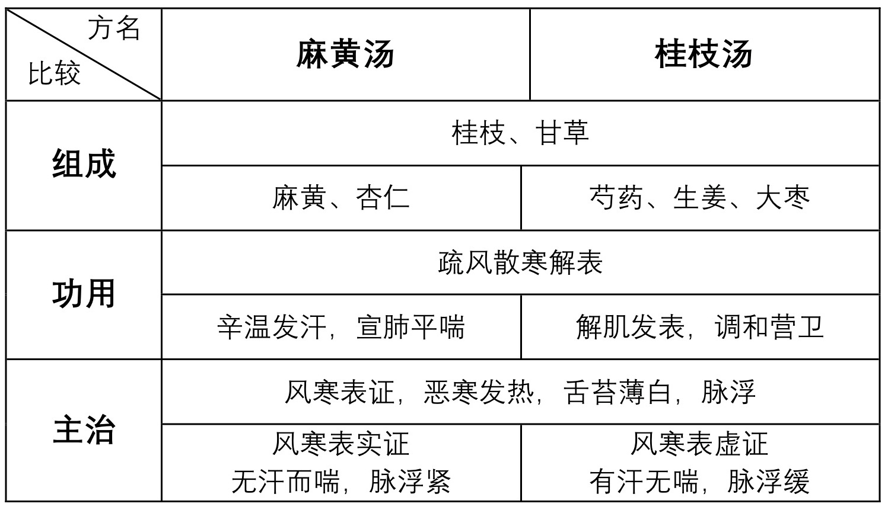
            - **大青龙汤**
            - > 东汉·张仲景《伤寒论》
                - **组成**
                    - **麻黄**
                    - **桂枝**
                    - **杏仁**
                    - **石膏**
                    - **甘草**
                    - **生姜**
                    - **大枣**
                - **用法**
                    - **温粉**
                - **主治**
                    - **外感风寒，内有郁热**
                    - **溢饮**
                - **功用**
                    - **发汗解表，兼清里热**
                    - **麻黄汤**
                        - 开表启闭以散风寒
                        - 发汗使内郁之热随汗而泄
                    - **生石膏**
            - **小青龙汤**
            - > 东汉·张仲景《伤寒论》
                - **组成**
                    - **麻黄**
                    - **芍药**
                    - **细辛**
                    - **干姜**
                    - **甘草**
                    - **桂枝**
                    - **五味子**
                    - **半夏**
                - **用法**
                    - 上八味，以水一斗，先煮麻黄，减二升，去上沫，内诸药，煮取三升，去滓，温服一升
                - **主治**
                    - **风寒束表，寒饮伏肺（表里同病）**
                - **功用**
                    - **解表蠲饮，止咳平喘**
                - **主证病机分析**
                    - 外感风寒——恶寒发热，无汗
                    -       ↓外风引动内饮
                    - 内有水饮
                        - 寒水相搏，阻滞经络——身体疼痛
                        - 壅塞于肺——胸痞喘咳，痰多而稀，或痰饮喘咳，不得平卧
                        - 外溢肌肤——头面四肢浮肿
                    - 舌苔白滑——内有水饮
                    - 脉浮——外有风寒
                    - **病机关键**
                        - 素体水饮内停，复感风寒，外寒引动内饮，寒水相搏，壅塞于肺，肺失肃降所致
                - **方解**
                    - **君：麻黄、桂枝**
                    - > 麻黄利水消肿，桂枝化气利水
                    - **臣：干姜、细辛**
                    - **佐：**
                        - **白芍**
                        - **五味子**
                        - **半夏**
                    - **佐使：甘草**
            - **九味羌活汤**
            - > 张元素《此事难知》，分经论治
                - **组成**
                    - **羌活**
                    - **防风**
                    - **苍术**
                    - **细辛**
                    - **川芎**
                    - **白芷**
                    - **生地黄**
                    - **黄芩**
                    - **甘草**
                - **用法**
                    - 上㕮咀，水煎服。若急汗，热服，以羹粥投之；若缓汗，温服，而不用汤投之
                - **主治**
                    - **外感风寒湿邪，兼有里热**
                - **功用**
                    - **发汗祛湿，兼清里热**
                - **主证病机分析**
                    - **外感风寒湿邪，内有蕴热**
                        - 无汗
                            - **头痛**
                                - *“辛温为主，少佐凉”、“分经论治”* *“视其经络前后左右之不同，从其多少大小轻重之不一，增损用之。”*
                                    - **太阳经：**
                                    - **阳明经：**
                                    - **少阳经：**
                                    - **太阴经：**
                                    - **少阴经：**
                                    - **厥阴经：**
                                    - 防风为风药之卒徒，走十二经
                        - 肢体痠楚困重
                        - **口苦微渴**
                    - 苔白脉浮
                - **方解**
                    - **君：羌活**
                    - **臣：防风、苍术**
                    - **佐：**
                        - **细辛、川芎、白芷**
                        - **黄芩、生地**
                    - **佐使：甘草**
            - **止嗽散**
            - > 清·程钟龄《医学心悟》
                - **组成**
                    - **桔梗**
                    - **荆芥**
                    - **紫菀**
                    - **百部**
                    - **白前**
                    - **甘草**
                    - **陈皮**
                - **用法**
                    - 三钱 **生姜**
                - **主治**
                    - **风邪犯肺之咳嗽**
                - **功用**
                    - **止咳化痰，疏风宣肺**
                - **主证病机分析**
                    - **风（寒）犯肺**
                        - 风寒袭肺，肺失宣降——咽痒，咳嗽
                        - 痰滞气阻——咯痰不爽
                        - 风寒在表——恶风发热（轻）
                    - 苔薄白，脉浮
                - **方解**
                    - **君：紫苑、百部**
                    - **臣：**
                        - **桔梗**
                        - **白前**
                    - **佐：**
                        - **橘红**
                        - **荆芥**
                    - **佐使：甘草**
                - **配伍特点**
                    - 温润平和，不寒不热，重在治肺，兼能解表
                - **辨证要点**
                    - 咳嗽不止，咽痒，咳痰不爽，苔薄，脉不数
                - **使用注意**
                    - 外感初起以表证为主，不宜用
                    - 阴虚劳嗽者，慎用
        - **辛凉解表剂**
            - **适应证**
                - **风热表证** **辛凉解表药**
                - **兼症不同**
            - **临床表现**
                - 咳嗽 苔薄白
                    - 咳嗽——病位在喉
                    - 苔薄白——病情轻
            - **银翘散**
            - > 清·吴鞠通《温病条辨》
                - **组成**
                    - **连翘**
                    - **银花**
                    - **苦桔梗**
                    - **薄荷**
                    - **竹叶**
                    - **生甘草**
                    - **荆芥穗**
                    - **淡豆豉**
                    - **牛蒡子**
                - **用法**
                    - 六钱 **苇根** 即取服，勿过煮
                - **主治**
                    - **温病初起，表热重证**
                - **功用**
                    - **辛凉透表，清热解毒**
                - **主证病机分析**
                    - **风温初起，表热重证**
                        - 温邪犯卫→发热↑恶寒↓，头痛，无汗或有汗不畅，脉浮数
                        - 热蕴成毒→咽痛
                        - 邪犯肺系→咳嗽
                        - 邪热伤津→口渴
                        - 表热趋里→舌尖红，苔薄白或薄黄
                - **方解**
                    - **君：银花、连翘**
                    - **臣：**
                        - **牛蒡子、薄荷**
                        - > **薄荷**
                        - **荆芥、淡豆豉**
                    - **佐：**
                        - **桔梗**
                        - **竹叶、芦根**
                    - **佐使：甘草**
                - **配伍特点**
                    - 清解和疏散并用，清疏兼顾
                    - 配以少量辛温之品
                - **辨证要点**
                    - 发热，微恶风寒，咽痛口渴，脉浮数
                - **使用注意**
                    - 本方多为芳香轻宣之品，不宜久煎
                    - 对于外感风寒及湿热病初起则禁用
            - **桑菊饮**
            - > 清·吴鞠通《温病条辨》
                - **组成**
                    - **桑叶**
                    - **菊花**
                    - **杏仁**
                    - **连翘**
                    - **薄荷**
                    - **苦桔梗**
                    - **生甘草**
                    - **苇根**
                - **用法**
                    - 水二杯，煮取一杯，日二服
                - **主治**
                    - **风温初起**
                - **功用**
                    - **疏风清热，宣肺止咳**
                - **主证病机分析**
                    - **风温初起，受邪较轻**
                        - 邪在卫表→发热，但热不甚
                        - 温邪上受→肺失宣降→咳嗽
                        - 温邪伤津→口微渴
                        - 温邪在表→脉浮数
                - **方解**
                    - **君：**
                    - > 二药同用，既能疏散上焦风热，又能清肺中之热，故有“胶”“清”
                        - **桑叶**
                        - **菊花**
                    - **臣：**
                        - **桔梗**
                        - **杏仁**
                        - > 杏仁配桔梗，一降一升，恢复肺气的肃降与宣发功能，从而止咳
                    - **佐：**
                        - **连翘**
                        - **芦根**
                        - **薄荷**
                    - **佐使：甘草**
                - **配伍特点**
                    - 清疏以解表，辛苦宣肃以止咳
                - **辨证要点**
                    - 咳嗽，发热不甚，微渴，脉浮数
                - **使用注意**
                    - 风寒咳嗽者禁用
                    - 肺热甚者应加味使用本方，否则药轻病重，必不奏效
                    - 本方均为轻清之品，不宜久煎
            - **麻黄杏仁甘草石膏汤**
            - > 东汉·张仲景《伤寒论》
                - **组成**
                    - **麻黄**
                    - **杏仁**
                    - **甘草**
                    - **石膏**
                - **用法**
                    - 上四味，以水七升，煮麻黄，减二升，去上沫，内诸药，煮取二升，去滓。温服一升
                - **主治**
                    - **外感风邪，邪热壅肺**
                - **功用**
                    - **辛凉疏表，清肺平喘**
                - **主证病机分析**
                    - **伤寒**
                        - 由表（太阳）入里（阳明）
                    - **温病**
                        - 由卫（表）及气（里）
                    - **郁而化热**
                    - > 动态症状：有汗或无汗，舌苔薄白或黄
                        - 邪热壅肺
                        - 表邪未尽
                - **方解**
                    - **君：**
                    - > 麻黄、石膏相伍（石膏用量倍于麻黄）
​宣肺而不助热，清肺而不留邪
                        - **麻黄**
                        - **石膏**
                    - **臣：杏仁**
                    - **佐使：甘草**
                - **配伍特点**
                    - 辛温和寒凉并用，宣肺不助热，清肺不凉遏
                - **辨证要点**
                    - **喘咳**
                - **使用注意**
                    - 风寒咳嗽，痰热壅盛者，非本方所宜
                        - 痰热壅盛——另加化痰药
        - **扶正解表剂**
            - **适应证**
                - **扶正、解表药**
                - 用于兼症不同——随证候病机之异配伍相应药
                - **扶正**
                    - **气虚**
                    - **血虚**
                    - **阴虚**
                    - **阳虚**
                - **解表**
                    - 疏散风寒（湿）或风热
            - **临床表现**
                - 风寒/热表证+虚证
            - **败毒散**
            - > 宋《太平惠民和剂局方》
                - **组成**
                    - **柴胡**
                    - **甘草**
                    - **桔梗**
                    - **人参**
                    - **川芎**
                    - **茯苓**
                    - **枳壳**
                    - **前胡**
                    - **羌活**
                    - **独活**
                    - 各三十两（各9g）
                - **用法**
                    - **生姜、薄荷**
                - **主治**
                    - **气虚外感风寒湿邪**
                - **功用**
                    - **散风祛湿，益气解表**
                - **主证病机分析**
                    - **外感风寒湿邪**
                        - 咳嗽有痰，胸膈痞满
                        - > **咳嗽有痰，胸膈痞满：**
                    - **气虚**
                        - 舌淡苔白，脉浮按之无力
                    - 分析
                        - 表——寒湿
                        - 里——气虚+痰湿→咯痰多
                            - 痰湿→泄泻+绞痛、气滞
                            - > 痢疾初起
                - **方解**
                    - **君：羌活、 独活**
                    - **臣：川芎、柴胡**
                    - **佐：**
                        - **枳壳、桔梗、前胡、茯苓**
                        - **人参** 散中有补
                        - > 散邪不伤正，扶正不敛邪
                        - **生姜、薄荷**
                    - **佐使：甘草**
                - **辨证要点**
                    - 恶寒发热，肢体酸楚疼痛，无汗，脉浮按之无力
                        - **若脉无力**
                            - 素体体弱（老人小孩）——原方不变
                            - **荆防败毒散**
                            - > 羌防解表剂​
                - **使用注意**
                    - 非外感风寒湿邪，寒热无汗
                    - 暑温、湿热蒸迫肠中而成痢疾者，禁用
                        - **区别：** **“逆流挽舟”**
                            - 外感湿邪
                            - 泄泻、痰湿在内
    - 泻下剂
        - **定义**
            - **治法：**
            - > 通过泻下、荡涤、攻逐等作用，将宿食、积滞、积水、瘀血、痰结等有形实邪从下窍排出体外的治疗方法
            - **治法依据**
                - “其在下者，引而竭之”“其实者，散而泻之”（素问·阴阳应象大论）
        - **分类** 
            - **热结**
            - **寒结**
            - **燥结**
            - **水结**
            - **积滞＋正虚**
        - **泻下剂为何经常配伍理气药？**
        - **使用注意**
            - 表证未解而里实已成者，或先表后里，或表里双解
            - 年老体弱及病后正虚而有里实者，或先攻后补，或攻补兼施
            - 得效即止，进食易消化食物
            - 孕妇慎用
        - **寒下剂**
            - **适应证**
                - 里热与积滞互结之实证
                - > 燥屎、水饮、气滞、瘀血、宿食等
            - **临床表现**
                - 大便秘结、腹满或胀或痛，甚或潮热，苔黄、脉实等
            - **大承气汤**
            - > 东汉·张仲景《伤寒论》
                - **组成**
                    - **大黄**
                    - **厚朴**
                    - **枳实**
                    - **芒硝**
                - **用法**
                    - 上四味，以水一斗，先煮二物，取五升，去滓，内大黄，更煮取二升，去滓，内芒硝，更上微火一两沸，分温再服，得下，余勿服
                    - 现代用法：水煎服
                    - > 先煎枳实、厚朴，后下大黄，溶服芒硝（“生者气锐而先行，熟者气钝而和缓。”）
                - **主治**
                    - **阳明腑实证**
                    - **热结旁流证**
                    - > 热结为本质，旁流为假象
                    - **里热实证**
                        - **热结旁流**
                            - 肠道津液→气机阻滞→肠道：燥屎＋热邪（热结）
                                - 热深厥深
                                - > 厥，厥逆，热厥逆冷
                                    - 实热阻滞气机，阳气不能达于四肢
                                - 热伤津液
                                    - 筋脉失养而挛急
                                - 热扰神明
                - **功用**
                    - **峻下热结**
                        - **急下存阴**
                        - > 短时间作用，对阴液的煎熬较少，能保存更多的阴液
                - **主证病机分析**
                    - **阳明腑实证→热实互结于胃肠**
                        - **痞：**
                        - **满：**
                        - **燥：**
                        - **实：**
                    - 阳明
                        - 外
                            - 发热——日晡（申时，3～5）
                            - 汗出
                        - 内
                            - 胃
                            - 大肠
                - **方解**
                    - **君：大黄**
                    - **臣：芒硝**
                    - > 二者相须配伍，峻下热结
                    - **佐：厚朴、枳实**
                - **辨证要点**
                    - 痞、满、燥、实，舌、脉
                - **使用注意**
                    - 体虚慎用
                    - 中病即止
                - **随证加减**
                    - **气虚**
                        - 加人参适量
                    - **津亏**
                        - 加玄参、生地
                - **附方**
                    - **小承气汤**
                        - **大黄、枳实、厚朴**
                        - > 同煎，减轻大黄泻下药效
                        - **轻下热结**
                    - **调胃承气汤**
                        - **大黄、芒硝、甘草**
                        - > 同煎，减轻大黄泻下药效；去掉枳实、厚朴，加甘草，使作用和缓
                        - **缓下热结**
        - **温下剂**
            - **适应证**
                - 里寒与积滞互结之实证
            - **临床表现**
                - 大便秘结，脘腹胀满，腹痛喜温，手足不温，甚或厥逆，脉沉紧等
            - **温脾汤**
            - > 唐·孙思邈《备急千金要方》
                - **组成**
                    - **当归、干姜**
                    - **附子、人参、芒硝**
                    - **大黄**
                    - **甘草**
                - **用法**
                    - 上七味，㕮咀，以水七升，煮取三升，分服，日三
                - **主治**
                    - **脾阳不足，冷积内停**
                - **功用**
                    - **温补脾阳，攻下冷积**
                    - > 温药耗气伤阴，故与补法配合
                - **主证病机分析**
                    - **冷积阻于肠道**
                        - 腹痛便秘，脐下绞结，绕脐不止
                    - **脾阳不足**
                        - 手足不温，苔白不渴，脉沉弦而迟
                - **方解**
                    - **附子、干姜**
                    - **大黄、芒硝**
                    - **人参、甘草**
                    - > 人参补气生阴
                    - **当归**
                    - 温、下、补三法兼备
                    - **制性存用**
                    - > 制药性存药用
                        - 如大黄与温里药相伍，其寒性受温药之制而行泻下之用
                - **辨证要点**
                    - 便秘腹痛，手足不温，脉沉弦
        - **润下剂**
            - **适应证**
                - 肠燥便秘之证
                - > 津液亏少导致
                    - ***区别：*** *习惯性便秘*
                    - > 数日不更衣而余无所苦——《伤寒论》
            - **病因病机**
                - 热邪伤津，或素体火盛，肠胃干燥
                - > 属阳证
                - 肾阳不足，或病后肾虚，关门不利
                - > 肾虚使水液不能正常输布
            - **麻子仁丸（又名脾约丸）**
            - > 东汉·张仲景《伤寒论》
                - **组成**
                    - **麻子仁**
                    - **芍药**
                    - **枳实**
                    - **大黄**
                    - **厚朴**
                    - **杏仁**
                - **用法**
                    - **蜜**
                    - 现代用法：药研为末，炼蜜为丸，每次9g，每日1～2次，温开水送服；亦可作汤剂，水煎服
                - **主治**
                    - **肠胃燥热之便秘（脾约便秘）**
                        - **脾约** 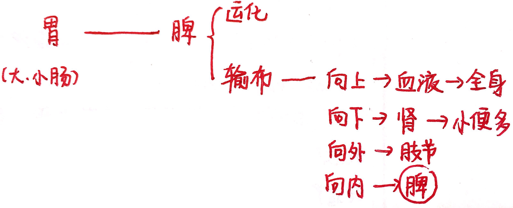
                            - **小便频数**
                            - **大便秘结**
                - **功用**
                    - **润肠泄热，行气通便**
                - **方解**
                    - **君：火麻仁**
                    - > 火麻仁——大麻，胡麻仁——芝麻
                    - **臣：**
                        - **大黄**
                        - **杏仁**
                        - > 调节肺气，通调水道；润肠通下
                        - **白芍**
                        - > 养阴润燥，缓急止痛
                    - **佐：枳实、厚朴**
                    - **佐使：蜂蜜**
                    - > 蜂蜜有粘性
                - **配伍特点**
                    - 小承气汤，加火麻仁、杏仁、白芍、蜂蜜
                - **辨证要点**
                    - 大便秘结，小便频数
            - **济川煎**
            - > 明·张介宾《景岳全书》
                - **组成**
                    - **当归**
                    - **牛膝**
                    - **肉苁蓉**
                    - **泽泻**
                    - **升麻**
                    - **枳壳**
                - **用法**
                    - 水一盅半，煎七分，食前服
                - **主治**
                    - **肾虚便秘**
                    - > 大便秘结，小便清长，腰膝酸冷，舌淡苔白，脉沉迟
                - **功用**
                    - **温肾益精，润肠通便**
                - **主证病机分析**
                    - **肾虚便秘** 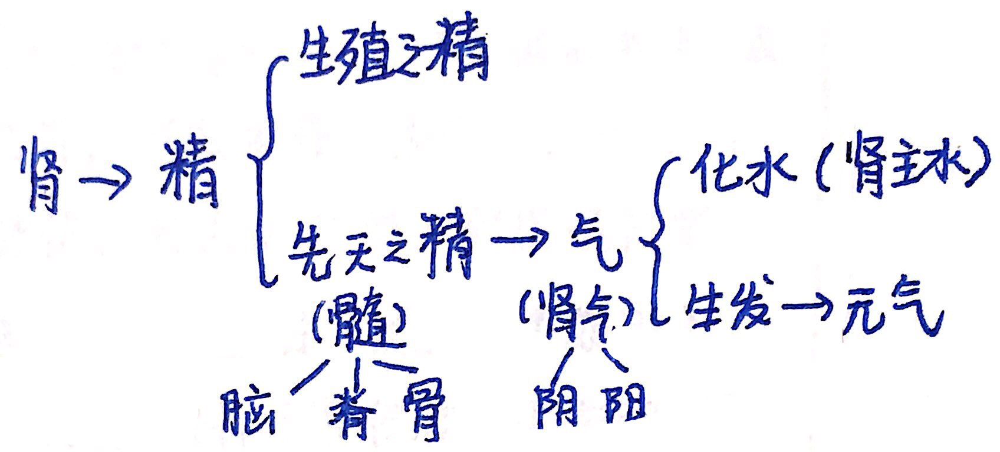
                        - **肾阳不足，气化无力，津液不布，开合失司**
                            - →小便清长，大便秘结，舌淡苔白，脉沉迟
                        - **肾精不足**
                            - →腰膝酸软，头晕目眩
                - **方解**
                    - **君：肉苁蓉**
                    - **臣：**
                        - **当归**
                        - **牛膝** 下行
                    - **佐使：**
                        - **枳壳**
                        - **泽泻** 使补而不滞
                        - > 肉苁蓉、当归等滋补药生湿；少量，避免影响通便效果，同时防止通泄力量过强
                        - **升麻** 少量 使清升而浊降
                        - > 少量。升麻止泻，防止通泄力量过强；升麻生清，与牛膝下行形成平衡（制约、促进）
                - **配伍特点**
                    - 标本兼顾；补中有泻，降中有升
                - **辨证要点**
                    - 大便秘结，小便清长，腰酸膝软，舌淡脉弱
        - **逐水剂**
            - **适应证**
                - 水饮壅盛于里之实证
                - > 水饮积聚于胸胁或胸腹、肢体
            - **使用注意**
                - 方剂组成药物多有毒性，且逐水之力峻猛，故虚人慎用
            - **十枣汤**
            - > 东汉·张仲景《伤寒论》
                - **组成**
                    - **芫花** **甘遂** **大戟**
                - **用法**
                    - **大枣** 平旦服
                    - 现代用法：三药研细末，或装入胶囊，每次服0.5～1g，每日1次，以大枣10枚煎汤送服，清晨空腹服，得快下利后，糜粥自养
                - **主治**
                    - **悬饮**
                    - **实水**
                - **功用**
                    - **攻逐水饮**
                - **方解**
                    - **甘遂**
                    - **大戟**
                    - **芫花**
                    - > 三药合用，峻逐水饮
                    - **大枣** 护胃
                - **使用注意**
                    - **服药方法**
                        - 将甘遂、芫花、大戟各等分为末，装入胶囊；每服0.5～1g，清晨空腹时以大枣10枚煎汤送服
                    - **药后调护**
                        - 药后水饮未尽者，次日渐加再服
                        - 药后水饮未尽者，次日渐加再服
                        - 得快利后，糜粥自养
                        - 体虚邪实者，可与健脾补益剂交替使用，或先攻后补或先补后攻
        - **攻补兼施剂**
            - **黄龙汤**
            - > 明·陶华（节庵）《伤寒六书》
                - **组成**
                    - **大黄**
                    - **芒硝**
                    - **枳实**
                    - **厚朴**
                    - **甘草**
                    - **人参**
                    - **当归**
                - **用法**
                    - 水二盅，姜三片，枣子二枚，煎之后再入桔梗一撮，热沸为度
                - **主治**
                    - **阳明腑实，气血不足**
                - **功用**
                    - **泻热通便，益气养血**
                - **方解**
                    - **大黄、芒硝、枳实、厚朴**
                    - **人参、当归**
                    - > 扶正以利祛邪，使下不伤正
                    - **桔梗**
                    - **生姜、大枣**
                    - **甘草**
    - 和解剂
        - **定义**
            - **和解少阳、调和肝脾、调和寒热** **寒邪在少阳、肝脾不和、寒热错杂**
            - **“和”法**
        - **治法：“和”法**
        - > 是通过和解和调和作用，以达到祛除病邪、调整脏腑功能的治疗方法，亦称“和解法”
        - **特点**
            - 作用和缓，性质平和，照顾全面，内涵丰富，应用广泛，适应症复杂
        - **适应病证**
            - **伤寒少阳证**
            - **肝脾不和证**
            - **寒热互结证**
        - **和解少阳剂**
            - **小柴胡汤**
            - > 东汉·张仲景《伤寒论》
                - **组成**
                    - **柴胡**
                    - > 透邪&gt;24g，疏肝9～12g，升阳&lt;5g
                    - **黄芩**
                    - **人参**
                    - **甘草**
                    - **半夏**
                    - **生姜**
                    - **大枣**
                - **用法**
                    - 上七味，以水一斗二升，煮取六升，去滓，再煎，取三升，温服一升，日三服
                - **主治**
                    - **伤寒少阳证**
                    - **妇人伤寒热入血室**
                        - 妇人：14~49岁之间
                        - 伤寒：受凉
                        - 血室：胞宫
                        - 即女子例假期间受凉发热，例假停止
                    - **疟疾、黄疸** **等病见少阳证**
                - **功用**
                    - **和解少阳**
                - **主证病机分析**
                    - **伤寒少阳证**
                    - > 不局限于少阳，还影响脾胃
                        - **正邪分争**
                        - **气机阻滞**
                        - **胆** **热**
                            - **循经上炎**
                            - **犯** **胃** **失和**
                            - > **胆、** **胃** **肝、** **脾**
                        - **苔薄白，脉弦**
                        - > 弦——气机阻滞
                    - 太阳→多气少血
                    - > 表
                    - 少阳→少气少血
                    - > 枢；传变→阳明（里）/太阴（半表半里），变化不定
                    - 阳明→多气多血
                    - > 里
                    - 通路——三焦
                    - 全身气机运行取决于——胆
                - **方解**
                    - **祛邪**
                        - **君：柴胡**
                        - **臣：黄芩**
                        - > 二者相伍，一散一清，和解少阳
                    - **扶正**
                        - **佐：**
                            - **半夏、** **生姜**
                            - > **胃**
                            - **人参、** **大枣** **、甘草**
                            - > **脾**
                    - **使：甘草**
                - **配伍特点**
                    - 透散清泄以和解，升清降浊兼扶正
                - **辨证要点**
                    - 往来寒热，胸胁苦满，心烦喜呕，脉弦
                - **使用注意**
                    - 去滓，重煎
                    - > 煎药时间长，削弱柴胡作用
                    - 或不汗而解，或汗出而解，或战汗而解
            - **蒿芩清胆汤**
            - > 清·俞根初《通俗伤寒论》
                - **组成**
                    - **青蒿脑**
                    - **淡竹茹**
                    - **仙半夏**
                    - **赤茯苓**
                    - **青子芩**
                    - **生枳壳**
                    - **陈广皮**
                    - **碧玉散（滑石、甘草、青黛）**
                - **用法**
                    - 水煎服
                - **主治**
                    - **少阳湿热痰浊证**
                    - > 症状与小柴胡汤区别
                - **功用**
                    - **清胆利湿，和胃化痰**
                - **主证病机分析**
                    - **少阳湿热痰浊证**
                        - 寒热如疟 **寒轻热重**
                        - 气机阻滞———胸胁苦满
                        - 湿阻三焦——小便短少
                        - 胆郁热省——口苦
                        - 犯胃失和——吐酸苦水，或呕黄涎而粘，甚则干呕
                        - 舌红苔白腻或间现杂色，脉数而右滑左弦
                - **方解**
                    - **君：**
                        - **青蒿**
                        - **黄芩**
                        - > 二者相伍，内清湿热，透邪外出
                    - **臣：**
                        - **半夏**
                        - **竹茹**
                    - **佐使：**
                        - **枳壳、陈皮**
                        - **碧玉散、赤茯苓**
                        - > 引湿热从小便而解
                            - 碧玉散：滑石（36克）甘草（6克） 青黛（10克）
                            - 松树下——茯苓，枫树下——猪苓，竹子下——雷丸（竹苓）
                            - > 茯苓从内向外：白茯苓、赤茯苓、茯苓皮
                - **配伍特点**
                    - 芳香清透以畅少阳之枢机，苦燥降利以化湿郁之痰浊
                - **辨证要点**
                    - 寒轻热重，口苦胸闷，呕吐酸水，小便黄少，舌红苔黄腻，脉弦数
                - **使用注意**
                    - 体虚者慎用
            - **小柴胡汤与蒿芩清胆汤主治及功用比较** 
        - **调和肝脾剂**
            - **用药特点**
                - **理气疏肝** **养血和血药**
                    - 肝用
                    - 肝体
                - 配伍健脾助运药
            - **脏腑** 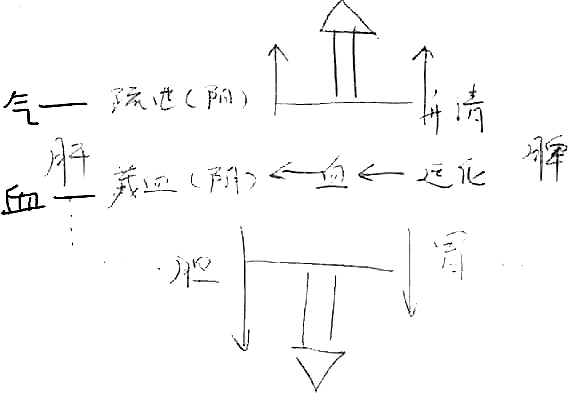
                - **肝——体阴而用阳**
                    - 疏泄（阳）
                    - 藏血（肝体——阴）
                - **脾**
                    - 升清
                    - 运化
            - **四逆散**
            - > 东汉·张仲景《伤寒论》
                - **组成**
                    - **甘草**
                    - **枳实**
                    - **柴胡**
                    - **芍药**
                    - 各十分（各6g）
                - **用法**
                    - 上四味，各十分，捣筛，白饮和，服方寸匕，日三服
                - **主治**
                    - **阳郁厥逆证（热厥轻证）**
                    - **肝脾不和证**
                - **功用**
                    - **透邪解郁，疏肝理脾**
                - **主证病机分析**
                    - **阳郁厥逆证** 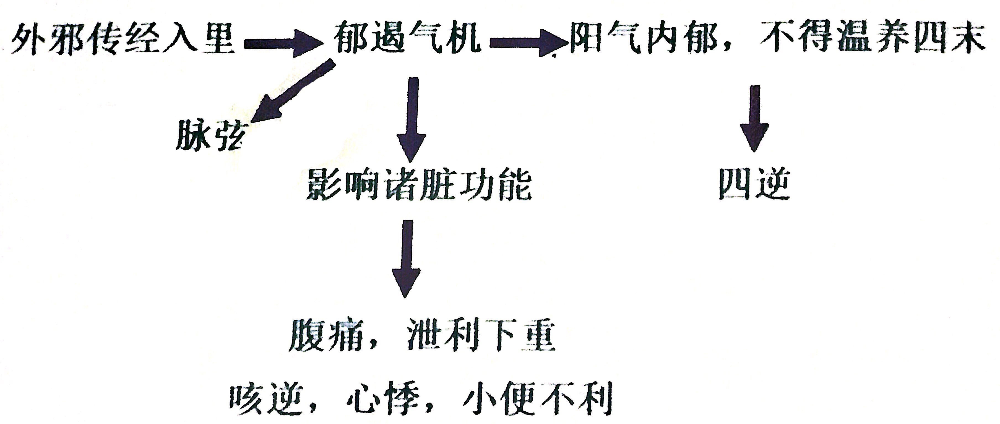
                    - **肝脾不和证**
                        - 肝脾不和（肝脾气郁）
                            - **肝气郁滞**
                                - 胁肋胀闷，脉弦
                            - **脾气郁滞**
                                - 脘腹疼痛或泄利下重
                - **方解**
                    - **君：柴胡**
                    - **臣：芍药**
                    - > 柴胡、芍药合而调肝
                    - **佐：枳实**
                    - > 配柴胡升降气机，配芍药调和气血
                    - **使：甘草**
                    - > 甘草、枳实合而理脾
                - **配伍特点**
                    - 疏柔相合，以适肝性；升降同用，肝脾并调
                - **辨证要点**
                    - 手足不温
                    - > 四逆程度较轻，冷不过肘、膝，或仅指、趾不温
                    - 或胁肋疼痛，脉弦
                - **使用注意**
                    - 阳衰阴盛之寒厥，忌用
            - **逍遥散**
            - > 宋《太平惠民和剂局方》
                - **组成**
                    - **甘草**
                    - **当归**
                    - **茯苓**
                    - **芍药**
                    - **白术**
                    - **柴胡**
                    - 各一两（各9g）
                - **用法**
                    - **生姜** **薄荷**
                    - 现代用法：加生姜3片，薄荷6g，水煎服；丸剂，每服6～9g，日服2次
                - **主治**
                    - **肝郁血虚脾弱证**
                    - > **往来寒热** **月经不调** **乳房胀痛**
                - **功用**
                    - **疏肝解郁，养血健脾**
                - **主证病机分析** 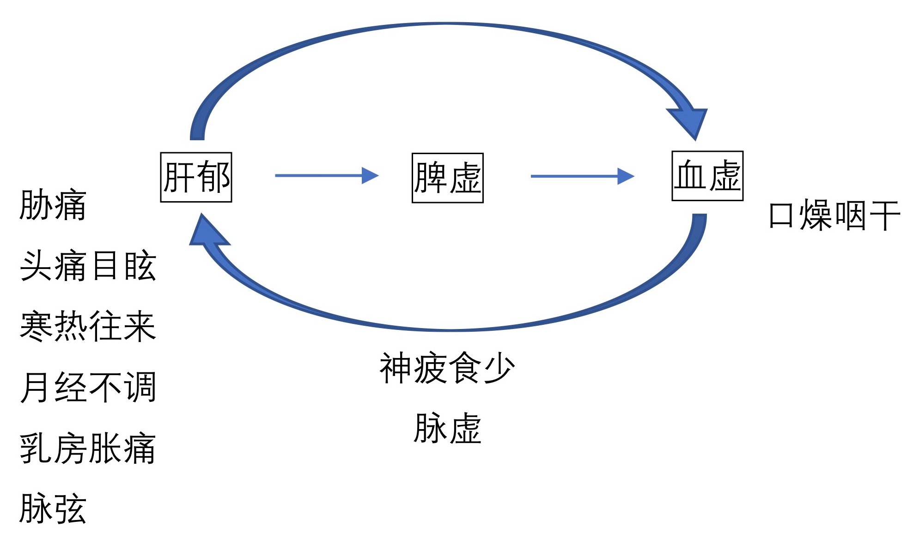
                - **方解**
                    - **君：柴胡**
                    - **臣：**
                        - **白芍**
                        - **当归**
                    - **佐：**
                        - **白术、茯苓、甘草**
                        - **薄荷**
                        - **烧生姜**
                - **配伍特点**
                    - 疏柔相合，肝脾同调，气血兼顾
                - **辨证要点**
                    - **调和肝脾**
                        - 胁肋疼痛，神疲食少，或（和）月经不调，脉弦而虚
                    - **妇科**
                        - **月经不调**
                            - **滞：**
                            - **虚：**
                        - **痛经**
                            - 鸡血藤、香附、川芎、金铃子散
                        - **乳房胀痛、包块**
                            - 橘络、青皮、夏枯草、牡蛎
                        - **更年期综合征（喜怒无常）**
                            - 合补肾药
                - **随证加减**
                    - **加味逍遥散**
                        - 本方加丹皮、栀子
                    - **黑逍遥散**
                        - 本方加熟地或生地
            - **痛泻要方**
            - > 元·朱震亨《丹溪心法》
                - **组成**
                    - **炒白术**
                    - **炒芍药**
                    - **炒陈皮**
                    - **防风**
                - **用法**
                    - 上锉，分八帖，水煎或丸服
                - **主治**
                    - **脾虚肝郁之痛泻**
                    - > 肠鸣腹痛，大便泄泻，泻必腹痛，泻后痛缓，舌苔薄白，脉两关不调，左弦而右缓者
                - **功用**
                    - **补脾柔肝，祛湿止泻**
                - **主证病机分析** 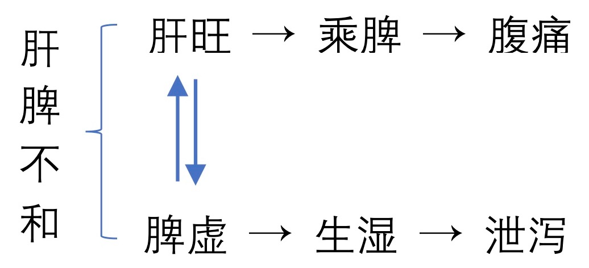
                - **方解**
                    - **君：白术**
                    - **臣：白芍**
                    - **佐：陈皮**
                    - **佐使：防风**
                - **辨证要点**
                    - 肠鸣腹痛，大便泄泻，泻必腹痛，泻后痛缓，脉左弦而右缓
                - **使用注意**
                    - 湿热或热毒引起的腹痛泄泻，禁用
                - **随证加减**
                    - 久泻不止，加升麻
                    - 舌苔黄腻，加黄连、木香
                    - 泄泻呈水样，加茯苓、车前子
                    - 气滞甚者，加厚朴、木香
                    - 脾虚甚者，加党参、山药
                    - 兼食积，加山楂、神曲、麦芽
                    - 中焦虚寒，加干姜、吴茱萸
        - **调和寒热剂**
            - **半夏泻心汤**
            - > 东汉·张仲景《伤寒论》
                - **组成**
                    - **半夏**
                    - **黄芩、干姜、人参**
                    - **黄连**
                    - **大枣**
                    - **甘草炙**
                - **用法**
                    - 上七味，以水一斗，煮取六升，去滓，再煎，取三升，温服一升，日三服
                - **主治**
                    - **寒热互结之痞证**
                        - **小柴胡汤证误下**
                        - 痞者，按之柔软，满而不痛
                - **功用**
                    - **寒热平调，散结除痞**
                - **主证病机分析**
                    - 上热下寒，上实热呕吐，下虚寒泄泻，导致中间寒热互结，脾气壅滞
                - **方解**
                    - **君：半夏** **辛**
                    - **臣：**
                        - **干姜** **辛**
                        - **黄连、黄芩** **苦**
                    - **佐：人参、甘草、大枣** **甘**
                    - **使：甘草**
                - **配伍特点**
                    - 小柴胡汤去柴胡、生姜，加黄连、干姜
                    - > 生姜善止呕，干姜善止沥
                    - 寒热并用，辛开苦降，补泻兼施
                - **辨证要点**
                    - 痞、呕、利，苔腻微黄
                - **使用注意**
                    - 心下痞满因气滞或食积、痰浊，不宜用
    - 清热剂
        - **定义**
            - **清热、泻火、凉血、解毒** **里热证**
            - **“清”法**
        - **分类**
            - 温—热—火—毒
            - 卫（表）—气（里）—营—血
            - 脏腑（经络）
            - 热（邪）——阴（正）
            - **清热剂**
                - 清气分热剂
                - 清营凉血剂
                - 气血两清剂
                - 清热解毒剂
                - 清脏腑热剂
                - 清虚热剂
        - **使用注意**
            - 辨清热证的虚实、病位和真假
            - > 寒之不寒是无水也？
            - 酌情配伍“反佐”药或应用反佐法
            - 防止寒凉败胃或伤阳
        - **临床表现**
            - **表热证**
            - **半表半里**
            - **里热证**
        - **清气分热剂**
            - **适应证** 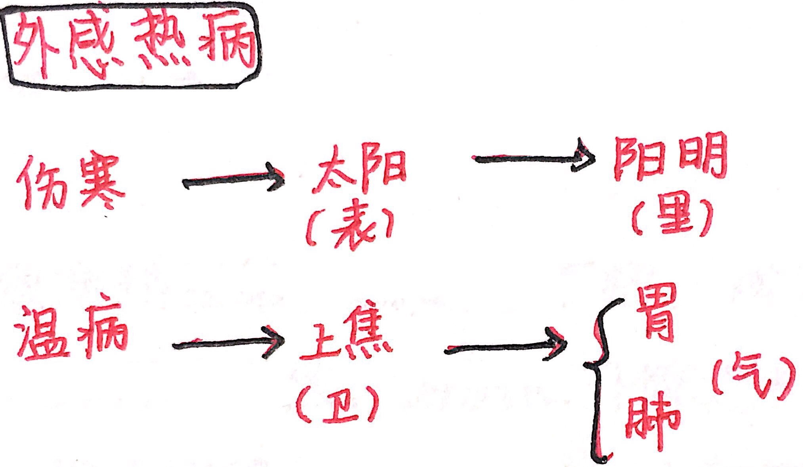
                - 热在气分，热盛津伤，或气阴两伤
            - **临床表现**
                - 壮热烦渴，大汗，恶热，脉洪大
                - 或身热多汗，心胸烦闷，口干舌红
            - **用药**
                - 辛寒药——驱邪外出
                - 入阳明经/肺胃
                - 清热，除烦，生津，止渴（养阴）
                - 如石膏
            - **白虎汤**
            - > 东汉·张仲景《伤寒论》
                - **组成**
                    - **石膏**
                    - **知母**
                    - **甘草**
                    - **粳米**
                - **用法**
                    - 上四味，以水一斗，煮，米熟汤成，去滓，温服一升，日三服
                - **主治**
                    - **阳明气分热盛（津伤）**
                        - 伤寒化热内传阳明，温病邪传气分
                - **功用**
                    - **清热除烦，生津止渴**
                - **主证病机分析**
                    - 清气分热剂—适应证、临床表现、用药
                - **方解**
                    - **君：石膏**
                    - > 石膏，辛甘大寒
                    - **臣：知母**
                    - > 知母，苦寒质润
                    - **佐：粳米、甘草**
                    - > 石膏、知母大寒伤中，可能出现腹泻便溏
                    - **使：甘草**
                - **辨证要点**
                    - **“四大”**
                        - 大热、大汗、大渴、脉洪大（吴鞠通）
                        - > （伤寒考试写：大热、大汗，不写“四大”；温病考试可以写）
                - **使用注意**
                    - 兼表证者，血虚发热者，真寒假热证均不可误用
            - **竹叶石膏汤**
            - > 东汉·张仲景《伤寒论》
                - **组成**
                    - **竹叶**
                    - **石膏**
                    - **半夏**
                    - **麦门冬**
                    - **人参**
                    - **甘草**
                    - **粳米**
                - **用法**
                    - 上七味，以水一斗，煮取六升，去滓，内粳米，煮米熟汤成，去米，温服一升，日三服
                - **主治**
                    - **余热未清，气津两伤**
                    - > **余热未清：**
                - **功用**
                    - **清热生津，益气和胃**
                - **主证病机分析**
                    - **气分热盛后期**
                        - 余热未清——身热多汗，心胸烦闷
                        - 气津两伤——短气神疲，口干喜饮
                        - 胃失和降——气逆欲呕
                        - 舌红少苔，脉虚数
                - **方解**
                    - **君：石膏**
                    - **臣：**
                        - **人参**
                        - **麦冬**
                        - > 石膏矿物类——碍胃，人参麦冬滋腻——碍胃生湿​
                    - **佐：**
                        - **半夏**
                        - > 燥湿，使滋而不腻；防止碍胃；但生热，故少用
                        - **竹叶**
                        - **粳米**
                    - **佐使：甘草**
                - **配伍特点**
                    - 白虎汤去知母，加人参、麦冬、竹叶、半夏
                    - **“以大寒之剂，易为清补之方”**
                    - > 大寒：指白虎汤
                - **辨证要点**
                    - 身热多汗，口干，烦渴喜饮，气逆欲呕，舌红少津，脉虚数
        - **清营凉血剂**
            - **适应证**
                - 邪热传营，热入血分
            - **临床表现**
                - **入营**
                    - 身热夜甚，神烦少寐，时谵语或外布隐隐斑疹
                - **入血**
                    - 出血、发斑、如狂、谵语，舌绛起刺
            - **清营汤**
            - > 清·吴鞠通《温病条辨》
                - **组成**
                    - **犀角**
                    - **生地黄**
                    - **元参**
                    - **竹叶心**
                    - **麦冬**
                    - **丹参**
                    - **黄连**
                    - **银花**
                    - **连翘**
                - **用法**
                    - 上药，水八杯，煮取三杯，日三服
                    - 现代用法：作汤剂，水牛角镑片先煎，后下余药
                - **主治**
                    - **（气分）热入营分**
                        - 气→营→血 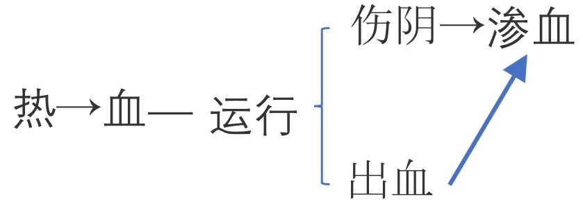
                - **功用**
                    - **清营解毒，透热养阴**
                - **主证病机分析**
                    - **热邪初入营分**
                        - 热初入营——身热夜甚，口不渴
                        - 热扰心神——神烦少寐，时有谵语
                        - 轻伤血络——斑疹隐隐
                        - 气热未尽——口渴
                        - 营热阴伤——舌绛而干，脉细数
                        - 阴阳失和——目常喜开或喜闭
                - **方解**
                    - **君：犀角**
                    - > 凉血止血，活血散瘀，醒神，透邪外出；但滋阴养血之力不足
                    - **臣：生地、玄参、麦冬**
                    - **佐：**
                        - **银花、连翘**
                        - > 透营转气
                        - **竹叶**
                        - **黄连**
                        - > 阴伤（苔少）时不可用
                        - **丹参**
                - **配伍特点**
                    - **透热（营）转气**
                        - 透入营之热邪转出气分而解——银花、连翘
                        - > 原书认为起此作用的为犀角
                - **辨证要点**
                    - 身热夜甚，时有谵语，斑疹隐隐，舌绛而干，脉细数
                    - > 身热夜甚，往往是热入血分的标志症状
                - **使用注意**
                    - 苔白滑者（湿郁之象），禁用
                - **随证加减**
                    - 舌干较甚，去黄连
                    - 热陷心包，配用安宫牛黄丸
                    - 营热动风，配用紫雪，或配加羚羊角，钩藤，地龙
                    - 气分热盛，重用银花、连翘、竹叶、黄连，或更加石膏、知母、大青叶、板兰根、贯众
            - **犀角地黄汤**
            - > 唐·王焘《外台秘要》
                - **组成**
                    - **芍药**
                    - **地黄**
                    - **丹皮**
                    - **犀角屑**
                - **用法**
                    - 上四味切，以水一斗，煮取四升，去滓，温服一升，日二三服
                    - 现代用法：作汤剂，水煎服，水牛角镑片先煎，余药后下
                - **主治**
                    - **热入血分证**
                - **功用**
                    - **清热解毒，凉血散瘀**
                - **主证病机分析**
                    - **血分热盛**
                        - 身热谵语
                        - 吐、衄、便、尿各部出血，斑色紫黑
                        - 喜忘如狂，漱水不欲咽，大便色黑易解
                - **方解**
                    - **君：犀角**
                    - **臣：生地**
                    - **佐使：丹皮、芍药**
                - **配伍特点**
                    - 入血就恐耗血动血，直须凉血散血
                - **辨证要点**
                    - 各种失血，斑色紫黑，神昏谵语，身热烦躁，舌绛
                - **使用注意**
                    - 阳虚失血，脾胃虚弱者忌用
            - **热入血分之各种出血证用药**
                - **吐血：**
                - **衄血：**
                - **便血：**
                - **尿血：**
                - **皮下出血（紫癜）：**
        - **清热解毒剂**
            - **适应证及临床表现**
                - **三焦火热毒邪**
                    - 见烦热、错语、吐衄、发斑、痈疽疔毒
                - **上中二焦邪郁生热**
                    - 见身热面赤、胸膈烦热、口舌生疮、便秘溲赤
                - **风热疫毒发于头面**
                    - 见头面红肿热痛，咽喉不利
            - **热毒证**
                - **热盛——清热**
                    - **直接清热**
                        - **清热解毒药**
                        - > 药效往往在局部
                    - **间接清热**
                    - > 调节气血津液运行（热邪易导致气血津液凝滞不通）
                        - **疏散药**
                            - 气血凝滞——红肿热痛
                            - 热则清之，火郁发之
                            - “三面围城”——降低疾病的剧烈程度
                            - 有利：降低局部气血凝滞症状
                            - 不利：使症状发散到全身
                            - 故火郁症用发散药是禁忌，但可在重用清热解毒药时配伍少量发散药
                        - **利水药**
                        - **泻下药**
                - **阴伤**
                    - **养阴生津药**
                - **壅遏气血，腐蚀血肉**
                    - **行气活血药**
            - **黄连解毒汤**
            - > 唐·王焘《外台秘要》
                - **组成**
                    - **黄连**
                    - **黄芩、黄柏**
                    - **栀子**
                - **用法**
                    - 上四味切，以水六升，煮取二升，分二服
                - **主治**
                    - **三焦火毒热盛证**
                - **功用**
                    - **泻火解毒**
                - **主证病机分析**
                    - 热盛津伤——大热烦燥，口干咽燥
                    - 热扰心神——错语不眠
                    - 血分热毒——吐血、衄血、发斑
                    - 热壅肌肉——痈疡疔毒
                    - 郁热熏蒸外越——黄疸
                    - 热毒（湿热）下迫大肠——湿热痢、疫毒痢
                    - 热毒炽盛——小便短赤，舌红苔黄，脉数有力
                - **方解**
                    - **君：黄连** **中焦** **心**
                    - > 火热证常扰神；清火要兼顾清心火
                    - **臣：黄芩** **上焦**
                    - **佐：黄柏** **下焦**
                    - **佐使：栀子** **三焦**
                    - > 通泻三焦，加强其他药药效，但力量不够，故不作君药；引经药；利二便
                - **配伍特点**
                    - 原方不考虑对脾胃的损伤——病情严重，属急症重症
                - **辨证要点**
                    - 大热烦躁，口燥咽干，舌红苔黄，脉数有力
                - **使用注意**
                    - 大苦大寒，久服易伤脾胃
                        - 长期用时要考虑对脾胃的损伤
            - **凉膈散**
            - > 宋《太平惠民和剂局方》
                - **组成**
                    - **川大黄** **朴硝** **甘草**
                    - **山栀子仁** **薄荷叶** **黄芩**
                    - **连翘**
                - **用法**
                    - **粗末**
                    - **粗末** **汤剂**
                - **主治**
                    - **上中二焦火热证**
                - **功用**
                    - **泻火通便，清上泄下**
                - **主证病机分析**
                    - **上中二焦邪热炽盛**
                        - 热郁胸膈，灼伤阴津——身热口渴，胸膈烦热
                        - 火热上冲——面赤唇焦，口舌生疮，咽痛，吐衄
                        - 燥热内结，不得下泄——便秘溲赤，或大便不畅
                        - 舌红苔黄，脉滑数
                - **方解**
                    - **君：连翘**
                    - **臣：**
                        - **黄芩**
                        - **栀子**
                        - **大黄、芒硝**
                        - > 若无便秘，也可用
                    - **佐：薄荷、竹叶**
                    - **佐使：白蜜、甘草**
                    - > 蜂蜜——散剂；若不加蜂蜜则成寒下剂
                - **配伍特点**
                    - 利小便——竹叶、大黄、芒硝
                    - 黄芩、栀子——清上焦
                    - 大黄、芒硝——清中焦
                    - **清疏、清泄、清利相结合**
                    - **清上泻下并行，以泻代清**
                - **辨证要点**
                    - 胸膈烦热，面赤唇焦，烦躁口渴，舌红苔黄，脉数或滑数
            - **普济消毒饮（原名普济消毒饮子）**
            - > 金·李杲《东垣试效方》
                - **主治**
                    - **大头瘟**
                        - **疫毒**
                - **组成**
                    - **黄芩** **黄连**
                    - **人参**
                    - **橘红** **玄参** **生甘草**
                    - **连翘、鼠黏子、板蓝根、马勃**
                    - **白僵蚕**
                    - **升麻**
                    - **柴胡**
                    - **桔梗**
                - **用法**
                    - 上为细末，㕮咀，如麻豆大，每服五钱（15g），水二盏，煎至一盏，去滓，稍热，时时服之
                - **功用**
                    - **清热解毒，疏风散邪**
                - **主证病机分析**
                    - **大头瘟**
                        - **风热疫毒，壅于上焦，发于头面**
                            - **特征**
                            - **伴见症**
                            - 舌红、苔白兼黄
                            - 脉浮数有力
                - **方解**
                    - **君：黄芩、黄连**
                    - **臣：牛蒡子、连翘、薄荷、僵蚕**
                    - **佐：**
                        - **马勃、板蓝根**
                        - **玄参**
                        - **桔梗、甘草**
                        - **陈皮**
                        - **升麻、柴胡**
                        - > 升麻——阳明经，柴胡——少阳经（阳明少阳受邪）
                - **配伍特点**
                    - **清疏并用，升降同施**
                        - 芩、连得升、柴，上行清头面热毒
                        - 升、柴得芩、连，不至于升发太过
                - **辨证要点**
                    - 红肿焮痛 恶寒发热
                - **随证加减**
                    - 腮腺炎并发睾丸炎——加川楝子、龙胆草
                    - 肿痛明显——加青黛、丹皮、赤芍，并用青黛外敷
                    - 兼便秘——加大黄（热甚，无便秘亦可用）
        - **气血两清剂**
            - **清瘟败毒饮**
            - > 清·余师愚《疫疹一得》
                - **组成**
                    - **生石膏**
                        - 大剂六两至八两（180～240g）
                        - 中剂二两至四两（60～120g）
                        - 小剂八钱至一两二钱（24～36g）
                    - **小生地**
                        - 大剂六钱至一两（18～30g）
                        - 中剂三钱至五钱（9～15g）
                        - 小剂二钱至四钱（6～12g）
                    - **乌犀角（水牛角代）**
                        - 大剂六钱至八钱（18～24g）
                        - 中剂三钱至四钱（9～15g）
                        - 小剂二钱至四钱（6～12g）
                    - **真川连**
                        - 大剂四钱至六钱（18～24g）
                        - 中剂二钱至四钱（6～12g）
                        - 小剂一钱至钱半（3～4.5g）
                    - **生栀子、桔梗、黄芩、知母、赤芍、玄参、连翘、竹叶、甘草、丹皮**
                    - > （以上十味，原著本方无用量）
                - **用法**
                    - 先煮石膏数十沸，后下诸药，犀角（水牛角代）磨汁和服
                - **主治**
                    - **温疫热毒，气血两燔证**
                - **功用**
                    - **清热解毒，凉血泻火**
                - **主证病机分析**
                    - **热毒充斥，气血两燔**
                        - 气分热盛，火毒伤津——大热烦渴，舌绛唇焦
                        - 血分热盛，迫血妄行——吐血，衄血或发斑疹
                        - 热毒上攻清窍，内扰神明，胃失和降——头痛如劈，谵语神昏，干呕狂躁
                        - 热深厥深——厥逆
                        - 脉浮大数（轻）；脉沉数（中）；脉沉细数（中）
                - **方解**
                    - **粳米** **竹叶**
                    - **玄参**
                    - **黄柏** **连翘**
                    - **枯梗**
                - **辨证要点**
                    - 大热渴饮，头痛如劈，干呕狂躁，谵语神昏
                    - 或发斑疹，或吐血、衄血
                    - 四肢或抽搐，或厥逆
                    - 舌绛唇焦脉沉细而数，或沉数，或浮大而数
        - **清脏腑热剂**
            - **适应证**
                - 不同脏腑邪热偏盛，产生不同的火热证候
            - **功用**
                - 清解脏腑（经络）邪热
            - **组方用药特点**
                - **脏腑用药**
                    - **心**
                    - **肝胆**
                    - **肺**
                    - **脾胃**
                    - **大肠**
                - **兼证用药**
                    - **热邪伤阴：**
                    - **兼气虚证：**
                    - **兼挾湿热：**
                    - **气滞血瘀：**
                    - **火热内郁：**
            - **导赤散**
            - > 北宋·钱乙《小儿药证直诀》
                - **组成**
                    - **生地黄、木通、生甘草梢**
                - **用法**
                    - **竹叶**
                - **主治**
                    - **心经热盛**
                        - 心胸烦热，口渴面赤，意欲冷饮，口舌生疮舌红，脉数
                    - **心热下移小肠**
                        - 赤涩刺痛
                        - > 赤，溲赤，颜色深；膀胱湿热证；心与小肠相表里，小肠主液，表现在膀胱上
                - **功用**
                    - **清心养阴，利水通淋**
                    - > 利水药加清心药可加强清心的作用；利水可除湿，伤津，故在无湿的情况下作为配合清心药使用（剂量）
                - **方解**
                    - **君药**
                        - **木通**
                        - **生地**
                    - **臣药**
                        - **竹叶**
                    - **佐使：生甘草梢**
                    - 方义：导心经热邪从小便而解，兼顾阴液
                    - > 本方原为小儿而设，其乃稚阴稚阳、易寒易热、易虚易实之体
                - **配伍特点**
                    - 清心与养阴兼顾，利水并导热下行
                - **辨证要点**
                    - 心胸烦闷，口渴，口舌生疮，或小便赤涩，舌红脉数
                - **随证加减**
                    - 心热盛：加黄连
                    - 阴虚甚：加麦冬
                    - 小便淋沥作痛：加萹蓄、瞿麦、滑石
                    - 血淋：加白茅根、小蓟、旱莲草
                    - 小便不利：加车前子、赤茯苓
            - **龙胆泻肝汤**
            - > 清·汪昂《医方集解》
                - **组成**
                    - **龙胆草**
                    - **黄芩**
                    - **栀子**
                    - **泽泻**
                    - **木通**
                    - **车前子**
                    - **当归**
                    - **生地黄**
                    - **柴胡**
                    - **甘草**
                    - （原著本方无用量）
                - **用法**
                    - 水煎服；亦可制成丸剂，每服6～9g，日二次，温开水送下
                - **主治**
                    - **肝胆实火上炎**
                    - **肝经湿热下注（下焦湿热证）**
                - **功用**
                    - **清肝胆实火，泻下焦湿热**
                - **主证病机分析**
                    - **肝经湿热下注，肝胆实火上炎**
                        - **肝火循经上扰**
                            - 胁痛，头痛目赤，口苦、耳聋
                        - **湿热下注前阴**
                            - 阴肿、痒、汗、筋痿，带下黄臭而稠
                        - **湿热下注膀胱**
                            - 小便淋浊
                        - **肝火或湿热**
                            - 舌红苔黄或黄腻，脉弦数
                - **方解**
                    - **君：龙胆草**
                    - **臣：黄芩、栀子**
                    - > *苦寒，苦以折火、燥湿，寒以清火热*
                    - **佐：**
                        - **泽泻、木通、车前子**
                        - ***生地、当归*** *——滋阴* ***养*** *血（祛邪不伤正）* 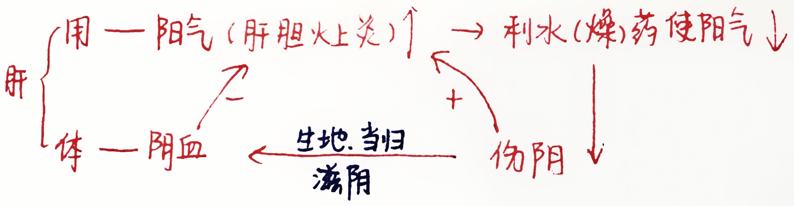
                    - **佐使：**
                        - **柴胡**
                        - **甘草**
                - **配伍特点**
                    - 泻中有补，降中有升
                    - 祛邪不伤正，泻火不伐胃
                    - > 短时间不明显
                - **辨证要点**
                    - 头痛目赤，胁痛口苦
                    - 或阴肿阴癉，或小便淋浊
                    - 或妇女带下色黄臭
                    - 舌红荅黄，脉弦数有力
                - **使用注意**
                    - 中病即止，不宜多服或久服
                    - 脾胃虚寒者慎服
                - **随证加减**
                    - 头痛头晕：加钩藤、菊花、夏枯草（清肝）
                    - 出血：黄芩、生地重用，加针对性止血药（血证宜从肝治）
                    - 目赤肿痛：加菊花、蝉蜕、木贼
                    - 湿盛热轻，去黄芩、生地，加滑石、苡仁
                    - 玉茎生疮，阴囊肿痛，去柴胡，加连翘、黄连、大黄
            - **左金丸**
            - > 元·朱震亨《丹溪心法》
                - **组成**
                    - **黄连**
                    - **吴茱萸**
                - **用法**
                    - 上药为末，水丸或蒸饼为丸，白汤下五十丸（6g）
                - **主治**
                    - **肝火犯胃证（胃失和降）**
                - **功用**
                    - **清肝泄火，降逆止呕**
                - **方解**
                    - **君：** ***黄连***
                    - **佐使：** ***吴茱萸***
                - **配伍特点**
                    - 黄连与吴茱萸的用量比例为6：1
                - **辨证要点**
                    - 呕吐吞酸，胁痛口苦，舌红苔黄，脉弦数
            - **泻白散**
            - > 北宋·钱乙《小儿药证直诀》
                - **组成**
                    - **地骨皮、桑白皮**
                    - **甘草**
                - **用法**
                    - **粳米**
                - **主治**
                    - **肺热喘咳证**
                - **功用**
                    - **清泻肺热，止咳平喘**
                - **主证病机分析**
                    - **肺中伏火渐伤阴分**
                        - 伏火郁结肺失清肃
                        - 肺热外蒸皮毛，热伏阴分
                            - 日晡尤甚
                        - 肺热阴伤
                            - 舌红苔黄，脉细数
                - **方解**
                    - **君：桑白皮**
                    - **臣：地骨皮**
                    - **佐使：甘草、粳米**
                - **配伍特点**
                    - 甘寒清降，泻中寓补，培土生金
                - **辨证要点**
                    - 咳喘气急
                - **泻白散与麻杏甘石汤比较** 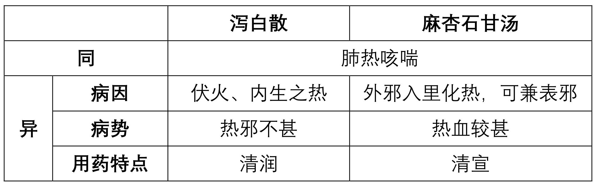
            - **清胃散**
            - > 金·李杲《脾胃论》
                - **组成**
                    - **生地黄、当归身**
                    - **牡丹皮**
                    - **黄连**
                    - **升麻**
                - **用法**
                    - 上药为细末，都作一服，水一盏半，煎至七分，去滓，放冷服之
                - **主治**
                    - **胃火牙痛**
                    - > 胃为多气多血之腑
                - **功用**
                    - **清胃** **凉血**
                - **主证病机分析**
                    - **胃中热盛，循经上攻**
                        - **胃热基本症状**
                            - 口臭、口舌干燥
                        - **胃火循经上炎**
                            - 牙痛牵引头痛，面颊发热，牙齿喜冷恶热
                        - **波及血分**
                            - 热伤血络——牙宣出血
                            - 壅滞气血——颊腮肿痛
                        - **舌红苔黄，脉滑数**
                            - 牙龈溃烂
                - **方解**
                    - **君：黄连**
                    - **臣：**
                        - **升麻**
                        - **生地**
                        - **丹皮**
                    - **佐：当归**
                    - **清胃：** **凉血：**
                - **配伍特点**
                    - **清胃中积热（黄连与升麻之配伍）**
                        - **相辅相成**
                            - 黄连——降上炎之火
                            - 升麻——散内郁之热
                        - **相反相成**
                            - 黄连得升麻，泻火不凉遏
                            - 升麻得黄连，散火不升焰
                    - **石膏**
                - **辨证要点**
                    - 牙痛牵引头脑，口气热臭
                    - 齿龈肿痛或溃烂
                    - 舌红苔黄，脉滑数
                - **使用注意**
                    - 牙痛属风寒或肾虚火炎者，不宜用
            - **玉女煎**
            - > 明·张介宾《景岳全书》
                - **组成**
                    - **石膏**
                    - **熟地**
                    - **麦冬**
                    - **知母、牛膝**
                - **用法**
                    - 上药用水一盅半，煎七分，温服或冷服
                - **主治**
                    - **胃热阴虚证**
                        - 足阳明热有余，足少阴阴不足
                    - ***亦治消渴*** *（消谷善饥）*
                - **功用**
                    - **清胃热，滋肾阴**
                - **主证病机分析**
                    - 阳明有余——头痛，牙痛，牙衄（胃热）
                    - 少阴不足——齿松，烦热干渴（阴虚）
                    - 舌、脉：舌红苔黄且干，脉浮洪滑大，重按无力
                - **方解**
                    - **君：石膏**
                    - **臣：熟地**
                    - **佐：**
                        - **知母** *助膏* *助地*
                        - **麦冬**
                    - **佐使：牛膝**
                - **辨证要点**
                    - 牙痛齿松，烦热干渴
                    - 或牙龈出血
                    - 舌红苔黄而干，脉沉取欠力
                - **使用注意**
                    - 脾虚便溏者，不宜使用
                - **随证加减**
                    - 火盛，加栀子，地骨皮
                    - 齿衄甚，去熟地，加生地、玄参
            - **芍药汤**
            - > 金·刘完素《素问病机气宜保命集》
                - **组成**
                    - **芍药**
                    - **当归、黄连**
                    - **槟榔、木香、甘草**
                    - **大黄**
                    - **黄芩**
                    - **官桂**
                - **用法**
                    - 上㕮咀，每服半两（15g），水二盏，煎至一盏，食后温服
                - **主治**
                    - **湿热痢疾**
                        - 湿热下注大肠，壅滞气机，血运不畅，肠中积滞不化
                - **功用**
                    - **清热燥湿，调气和血**
                - **主证病机分析** 
                - **方解**
                    - **君：黄连、黄芩**
                    - **臣：**
                        - **芍药** 重用
                        - **当归**
                        - **木香、槟榔**
                    - **佐：**
                        - **大黄**
                        - **官桂**
                    - **使：甘草**
                - **配伍特点**
                    - 气血并治，兼以“通因通用”
                    - 寒热并投，侧重“热者寒之”
                - **辨证要点**
                    - 腹痛，里急后重，痢下赤白，肛门灼热，苔黄腻
                - **使用注意**
                    - 痢疾初起及虚寒性下痢者，忌用
                    - > 败毒散
                - **随证加减**
                    - 白多赤少：加厚朴、砂仁、车前、泽泻
                    - 赤多白少：去肉桂、当归，加丹皮、地榆、白头翁
                    - 热盛津伤：去肉桂，加乌梅
                    - 后重明显、积滞较重者，重用大黄
            - **白头翁汤**
            - > 东汉·张仲景《伤寒论》
                - **组成**
                    - **白头翁**
                    - **黄柏**
                    - **黄连**
                    - **秦皮**
                - **用法**
                    - 上药四味，以水七升，煮取二升，去滓，温服一升，不愈，更服一升
                - **主治**
                    - **热毒痢疾**
                        - 疫毒邪热，蕴结肠中，深陷血分，气血与热毒相搏，下迫大肠
                - **功用**
                    - **清热解毒，凉血止痢**
                - **方解**
                    - **君：白头翁**
                    - **臣：黄连、黄柏**
                    - **佐：秦皮**
                    - 清热解毒
                        - 凉血止痢
                        - 燥湿止痢
                        - 收涩止痢
                - **辨证要点**
                    - 腹痛，里急后重，下痢脓血，赤多白少，舌红苔黄，脉弦数
                - **使用注意**
                    - 脾胃虛弱者慎用
                - **随证加减**
                    - 兼有表邪，加葛根、连翘、银花
                    - 里急后重甚者，加木香、槟榔、枳壳
                    - 脓血多者，加赤芍、丹皮、地榆
                    - 夹食滞者，加焦山楂、枳实
                    - 阿米巴痢，合桂园内包鸦胆子同服
        - **清虚热剂**
            - **适应证及临床表现**
                - **热病后期，邪留未尽，阴液已伤**
                    - 见暮热朝凉，舌红少苔
                - **肝肾阴虚**
                    - 致骨蒸潮热或久热不退
                - **阴虚火扰**
                    - 致发热盗汗
            - **青蒿鳖甲汤**
            - > 清·吴鞠通《温病条辨》
                - **组成**
                    - **青蒿**
                    - **鳖甲**
                    - **细生地**
                    - **知母**
                    - **丹皮**
                - **用法**
                    - 上药以水五杯，煮取二杯，日再服
                - **主治**
                    - **温病后期，邪伏阴分证**
                        - 阴液已伤，余热未清，深伏阴分
                - **功用**
                    - **养阴透热**
                - **主证病机分析**
                    - **卫阳之气，日行于表而夜行于里；阴分本有伏热**
                        - 夜晚，两阳相加，阴不制阳——入夜身热
                        - 白昼，卫气行表，阳出于阴——热退身凉
                        - 邪热深伏阴分，不从表解；阴液耗伤，无源作汗——热退无汗
                - **方解**
                    - **君：**
                        - **青蒿**
                        - **鳖甲**
                    - **臣：生地、知母**
                    - **佐：丹皮**
                - **配伍特点**
                    - 滋清兼备，标本兼顾，清中有透，养阴不恋邪，祛邪不伤正
                - **辨证要点**
                    - **发热+阴虚**
                    - 夜热早凉，热退无汗，舌红苔少，脉细数
                - **使用注意**
                    - 阴虚欲作动风者，不宜使用
                    - 方中青蒿，可用热药汁泡服
                - **随证加减**
                    - 暮热早凉，汗解渴饮，去生地，加天花粉
                    - 兼肺阴虚，加沙参、麦冬
                    - 小儿夏季热，加白薇、荷梗
            - **当归六黄汤**
            - > 金·李杲《兰室秘藏》
                - **组成**
                    - **当归、生地黄、黄芩、黄柏、黄连、熟地黄**
                    - **黄芪** 加一倍
                    - > 不是君药——阴虚火旺的人不能但用黄芪（性温燥助火）
                - **用法**
                    - 上药为粗末，每服五钱（15g），水二盏，煎至一盏，食前服，小儿减半服之
                - **主治**
                    - **阴虚火扰之盗汗**
                - **功用**
                    - **滋阴泻火，固表止汗**
                - **主证病机分析**
                    - **里热煎迫阴液出于表→汗出** 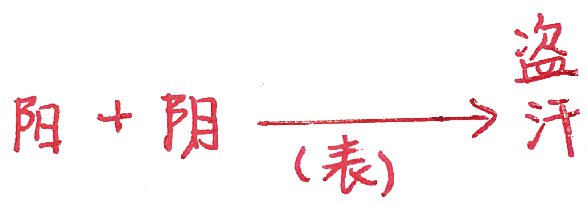
                        - **盗汗**
                            - 阳气煎迫阴液出于表
                            - 阳气不足，不能固表
                        - **治疗思路**
                            - 滋阴为主，辅以清热，兼以固表 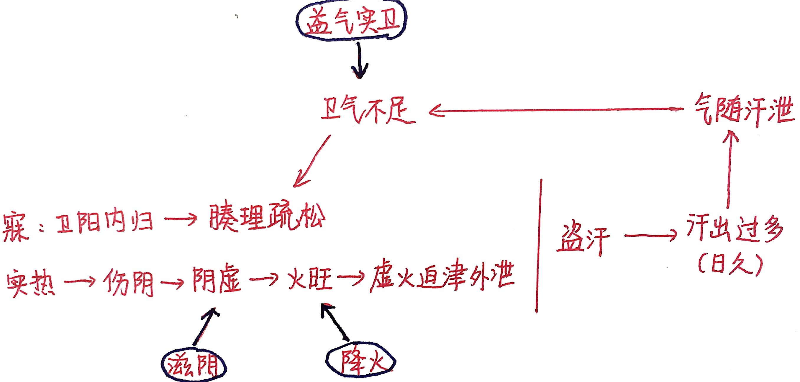
                - **方解**
                    - **君：当归、生地黄、熟地黄**
                    - **臣：黄连、黄芩、黄柏**
                    - **佐：黄芪**
                - **配伍特点**
                    - 黄芪用量倍于他药
                - **辨证要点**
                    - 滋养阴血（本）与泻火除热（标）并进
                    - 育阴泻火（本）与益气固表（标）相配
    - 祛暑剂
        - **定义**
            - **祛暑清热药** **祛暑化湿药** **祛除暑邪** **夏月暑病**
                - **暑邪**
                    - **暑→阳**
                        - 季节：夏至→处暑
                    - **炎上（汗）**
                        - **耗气伤阴明显**
                        - > 暑证首发阳明，暑湿首发太阴
                        - **清热祛暑**
                            - 白虎+人参汤
                    - **湿**
                        - 外湿
                        - 阳气在外，脾胃阳气弱，故生湿
                        - **祛湿**
                - **暑证**
                    - **避暑→阴暑（寒）**
        - **祛暑解表剂**
            - **香薷散**
        - **祛暑利湿剂**
            - **六一散（原名益元散）**
            - **桂苓甘露散**
        - **祛暑益气剂**
            - **清暑益气汤（方歌）**
    - 温里剂
        - **定义**
            - **温热药** **温里助阳、散寒通脉** **里寒证**
        - **概述**
            - **里寒证**
            - > 外寒直中；寒从中生
                - **寒在经脉**
                    - **温经散寒**
                    - > 阳虚兼血虚受寒
                - **寒在脏腑**
                    - **温肺散寒**
                    - **温补心阳**
                    - 中焦虚寒—— **温中祛寒**
                    - **温肝散寒**
                    - **温补肾阳**
                    - 心肾阳衰—— **回阳救逆**
                    - > 阳衰阴虚
        - **使用注意**
            - 辨清寒热真假
            - 素体阴虚，有失血病证者慎用——温燥伤阴
            - > **因热导致出血禁用**
            - 因时、因地制宜
        - **温中祛寒剂**
            - **适应证**
                - **中焦虚寒证**
                - > 吐，利，冷，痛
            - **临床表现**
                - **冷** **吐**
                - **痛** **利** 不渴
                - > 不渴：阴性体征，津液未伤
                    - **脾**
                        - **运化**
                            - 心、肺
                        - **升清**
                        - **统血**
            - **理中丸**
            - > 东汉·张仲景《伤寒论》
                - **组成**
                    - **人参、干姜、甘草** **、白术**
                - **用法**
                    - **丸剂——理中丸**
                        - 上四味，捣筛，蜜和为丸，如鸡子黄许大（9g）。以沸汤数合，和一丸，研碎，温服之，日三四服，夜二服。腹中未热，益至三四丸，然不及汤。
                    - **改为汤剂——人参汤**
                        - 以四物依两数切，用水八升，煮取三升，去滓，温服一升，日三服。服汤后，如食顷，饮热粥一升许，微自温，勿发揭衣被
                - **主治**
                    - **中焦虚寒证**
                    - **阳虚失血**
                    - > 无止血功效
                    - **小儿慢惊** **病后喜唾涎沫** **胸痹**
                    - **（霍乱）**
                - **功用**
                    - **温中祛寒，补气健脾**
                - **主证病机分析**
                    - **中焦虚寒**
                        - 失温——四肢不温
                        - 失运（升降）——不欲食、吐、利、腹痛
                        - 失化（土不荣木）——抽搐（慢惊）
                        - 失摄——出血、喜唾涎沬
                        - 寒邪凝滞、心脉痹阻——胸痛
                        - 舌淡苔白润，脉沉细或沉迟无力
                - **方解**
                    - **君：干姜**
                    - **臣：人参** *（气旺则阳亦复）*
                    - **佐：白术**
                    - > 脾为湿土，喜燥而恶湿
                    - **使：甘草**
                - **配伍特点**
                    - 温补 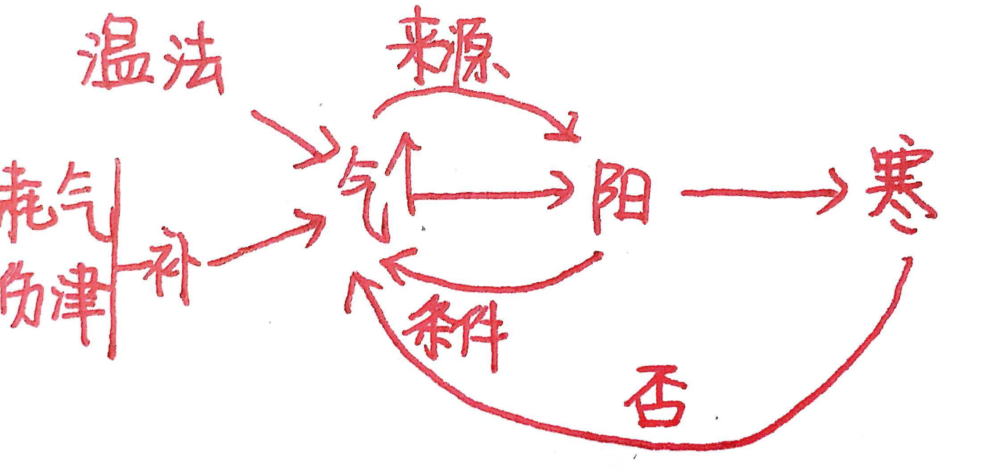
                - **随证加减**
                    - **阳虚甚**
                        - 肢冷、下利清谷——加 附子、肉桂
                        - > （附子理中汤、桂附理中汤）
                    - **纳运升降失常**
                        - **胃不纳谷**
                            - 不思饮食——加山楂、麦芽、神曲
                            - > （楂曲理中汤）
                        - **胃不降浊**
                            - 呕吐——加砂仁、半夏
                            - > （砂半理中汤）
                        - **脾不升清**
                            - 腹泻——加山药、升麻、诃子、茯苓
                        - **脾不运湿，湿聚为痰**
                            - 兼咳嗽吐痰——加茯苓、半夏
                            - > （理中化痰丸）
                    - **阳虚寒凝，气机阻滞**
                        - 脘腹胀满——加积实、茯苓
                        - > （枳实理中汤）
                    - **出血**
                        - 吐血、便血——加黄芪、当归、阿胶、艾叶
                        - > （胶艾理中汤）
                        - 月经延长、漏下——加艾叶、益母草
                        - > （固本止崩汤）
                    - **唾涎沫**
                    - **表兼风寒者**
                    - > （桂枝人参汤）
            - **小建中汤**
            - > 东汉·张仲景《伤寒论》
                - **组成**
                    - **桂枝**
                    - **甘草**
                    - **大枣**
                    - **芍药**
                    - **生姜**
                    - **胶饴**
                - **用法**
                    - 上六味，以水七升，煮取三升，去滓，内饴，更上微火消解。温服一升，日三服
                - **主治**
                    - **虚劳里急**
                    - **虚劳悸烦**
                    - **虚劳发热**
                - **功用**
                    - **温中补虚，和里缓急**
                - **主证病机分析**
                    - **中焦虚寒，肝脾不和** 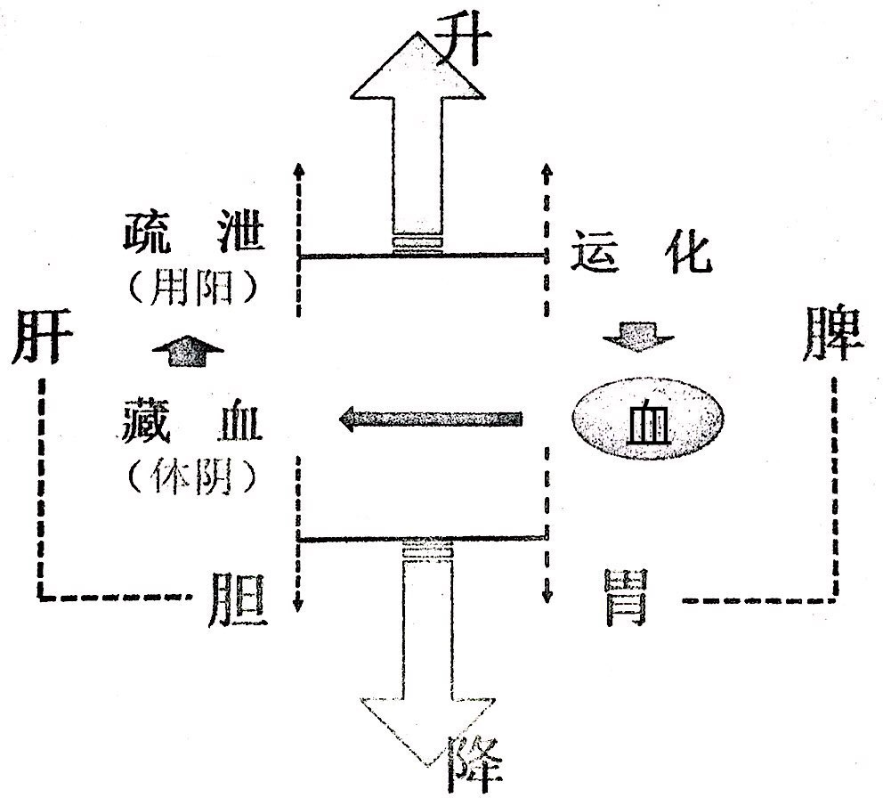
                        - **阳虚寒凝，土虚木乘**
                            - 腹中拘急疼痛，喜温喜按
                            - 舌淡，脉细弦
                        - **化源匮乏，阴血不足**
                            - **血虚失荣**
                                - 心悸，面色无华
                            - **阴虚内热**
                            - > 营卫不和
                                - 心烦，手足烦热
                                - 咽干口燥
                - **方解**
                    - **君：饴糖**
                    - **臣：**
                        - **芍药**
                        - **桂枝**
                    - **佐使：**
                        - **甘草** *酸甘，辛甘*
                        - **生姜、大枣**
                - **配伍特点**
                    - 桂枝汤倍芍药，加饴糖
                - **辨证要点**
                    - 腹痛喜温喜按，心悸，发热，面色无华，舌质淡，脉沉弱或细弦
                - **使用注意**
                    - 阴虚火旺；脾虚停湿；吐蛔，忌用
                    - > 加重吐蛔（乌梅丸）
                - **随证加减**
                    - 寒甚加干姜
                    - 气滞加木香
                    - 便溏加白术
                    - 虚甚加人参、黄芪、当归
            - **吴茱萸汤**
            - > 东汉·张仲景《伤寒论》
                - **组成**
                    - **吴茱萸**
                    - **人参**
                    - 
                    - 
                    - 
                    - **生姜**
                    - **大枣**
                - **用法**
                    - 上四味，以水七升，煮取二升，去滓。温服七合，日三服
                - **主治**
                    - **胃寒呕吐证**
                    - **肝寒上逆证**
                    - **肾寒上逆证**
                        - **阳明**
                            - 胃中虚寒，浊阴上逆
                        - **厥阴**
                            - 头痛
                        - **少阴**
                            - 吐利，手足逆冷
                - **功用**
                    - **温肝暖胃，降逆止呕**
                - **主证病机分析**
                    - **肝胃虚寒，浊阴上逆**
                        - **阳虚失温**
                        - **胃气上逆**
                        - **寒凝气滞**
                        - **阳虚失化，水湿停聚**
                            - 浊阴随胃气上逆——干呕吐涎沫
                            - 阻于胸膈——胸膈满闷
                            - 浊阴循肝经上犯——巅顶头痛
                        - **脾不升清**
                        - **舌、脉**
                - **方解**
                    - **君：吴茱萸**
                    - **臣：生姜** **重用**
                    - **佐：**
                        - **人参**
                        - **大枣**
                - **辨证要点**
                    - 口不渴，手足不温，呕吐，或干呕涎沫，舌淡苔滑，脉细、迟或弦细
                - **使用注意**
                    - 呕吐重者，可用冷服法，以免发生格拒；如药后病人出现胸中不舒、头痛增剧者，多于休息半小时左右自行缓解
                    - 因热胃痛、吐酸及肝阳上亢之头痛，忌用
                - **随证加减**
                    - 呕吐甚者，加半夏、陈皮、砂仁
                    - 头痛剧者，加川芎
                    - 虚寒重者，加干姜、小茴香
        - **回阳救逆剂**
            - **适应证**
                - **（心、肾）**
            - **临床表现**
                - 四肢厥冷，恶寒倦卧，呕吐腹痛，下利清谷，精神萎靡，脉沉细或沉微
            - **四逆汤**
            - > 东汉·张仲景《伤寒论》
                - **组成**
                    - **甘草**
                    - **干姜**
                    - **附子**
                - **用法**
                    - 上三味，以水三升，煮取一升二合，去滓，分温再服。强人可大附子一枚，干姜三两
                - **主治**
                    - **少阴病寒化证**
                    - **太阳病亡阳证**
                - **功用**
                    - **回阳救逆**
                - **主证病机分析**
                    - **心肾阳衰厥证**
                        - 阳衰失温——四肢厥逆，恶寒倦卧
                        - 心阳衰微，神失所养——神衰欲寐
                        - 肾虚及脾，火不生土——下利清谷
                        - 寒凝气滞，升降失常——呕吐，腹中冷痛
                        - 舌、脉——舌淡苔白，脉微细
                - **方解**
                    - **君：附子**
                    - > 温通十二经之阳气，尤温心脾肾 
                    - **臣：干姜**
                    - > 脾
                    - **佐：炙甘草**
                - **辨证要点**
                    - “回阳救逆”的基础方
                    - 四肢厥冷（冷过肘、膝），神衰欲寐，舌淡苔白，脉微
                - **使用注意**
                    - 真热假寒者，忌用
        - **温经散寒剂**
            - **当归四逆汤**
            - > 东汉·张仲景《伤寒论》
                - **组成**
                    - **当归**
                    - **桂枝**
                    - **芍药**
                    - **细辛**
                    - **甘草**
                    - **通草**
                    - **大枣**
                - **用法**
                    - 上七味，以水八升，煮取三升，去滓，温服一升，日三服
                - **主治**
                    - **血虚伴寒凝经脉证**
                - **功用**
                    - **温经散寒，养血通脉**
                - **主证病机分析** 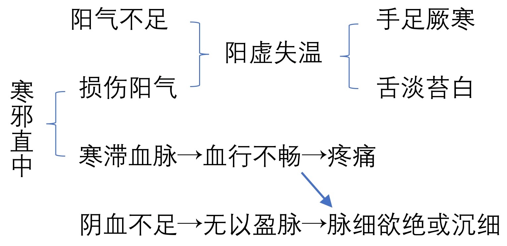
                - **方解**
                    - **当归** **芍药**
                    - **桂枝** **细辛**
                    - **通草（木通）**
                    - **甘草、大枣**
                - **配伍特点**
                    - **生姜** **大枣** **当归、细辛、通草（木通）**
                - **辨证要点**
                    - 手足厥寒，舌淡，脉细欲绝
                - **随证加减**
                    - 胃脘痛——加吴茱萸、生姜、佛手、党参
                    - 头痛——加川芎、玄胡
                    - 腰腿痛——加牛膝、杜仲、狗脊
                    - 冻疮——加丹参、川芎、鸡血藤
                    - 紫斑肢寒（雷诺氏病）——重用白芍，加丹参、川芎、附子
                    - 痛经——加桃仁、红花、川芎、泽兰、香附
                    - 疝痛——加台乌、小茴香
                    - 前阴冷痛——加台乌、川楝、淫羊藿
            - **黄芪桂枝五物汤**
            - > 东汉·张仲景《金匮要略》
                - **组成**
                    - **黄芪**
                    - **芍药**
                    - **桂枝**
                    - **生姜**
                    - **大枣**
                - **用法**
                    - 上五味，以水六升，煮取二升，温服七合，日三服
                - **主治**
                    - **营卫虚弱之血痹**
                        - 腠理疏松，感受风寒
                - **功用**
                    - **益气温经，和血通痹**
                - **主证病机分析** 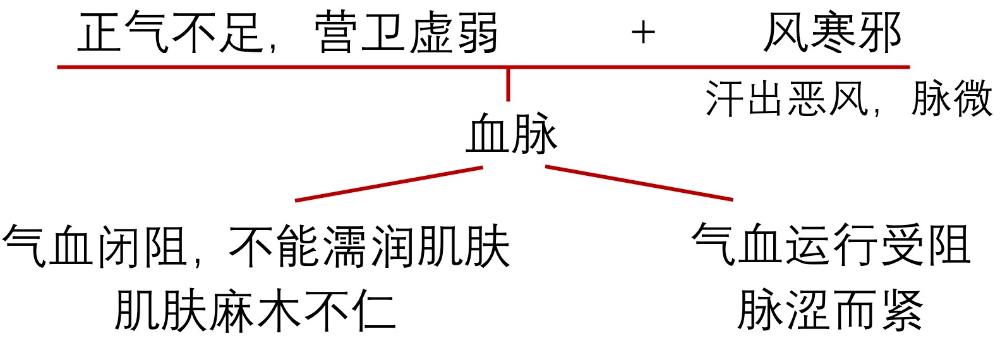
                - **方解**
                    - **君：黄芪**
                    - **臣：**
                        - **桂枝**
                        - **芍药**
                        - > 桂、芍合用，调和营卫
                    - **佐使：**
                        - **生姜**
                        - **大枣**
                        - > 姜、枣升腾脾胃之气，调和营卫
                - **配伍特点**
                    - 桂枝汤去甘草，倍生姜，加黄芪
                - **辨证要点**
                    - 局部肌肤麻木不仁，或肢体疼痛，或汗出恶风，脉微而无力
                - **随证加减**
                    - 气虚甚者，倍黄芪，加党参
                    - 血虚者，加当归、鸡血藤
                    - 阳虚肢冷者，加附子
                    - 筋挛麻痹者，加木瓜、乌梢蛇
                    - 风邪偏重者，加防风、防己
                    - 兼血瘀者，加桃仁、红花
    - 表里双解剂
        - **定义**
            - **解表药** **泻下药** **清热药、温里药** **表里同治** **表里同病**
        - **使用注意**
            - 既有表证，又有里证者方可应用
            - 辨清表证与里证的寒热虚实
            - 根据表、里证主次轻重，酌定表、里用药比例
        - **解表清里剂**
            - **葛根黄芩黄连汤**
            - > 东汉·张仲景《伤寒论》
                - **组成**
                    - **葛根**
                    - **甘草**
                    - **黄芩**
                    - **黄连**
                - **用法**
                    - 上四味，以水八升，先煮葛根，减二升，纳诸药，煮取二升，去滓，分温再服
                - **主治**
                    - **外感表证未解，热邪入里** **热利**
                - **功用**
                    - **解表清热**
                - **主证病机分析**
                    - **邪热入里，表邪未解**
                        - 表里俱热——身热，胸脘烦热，口干作渴，苔黄脉数
                        - 热陷阳明——下利臭秽，肛门灼热
                        - 里热迫肺、逼津——喘而汗出
                - **方解**
                    - **君：葛根** **重用**
                    - **臣：黄芩、黄连**
                    - **使：甘草**
                - **辨证要点**
                    - 身热，下利，肛门灼热，口干渴，喘而汗出苔黄，脉数
                - **使用注意**
                    - 虚寒下痢者，忌用
                - **随证加减**
                    - 腹痛——加芍药
                    - 痢疾里急后重——加木香、槟榔
                    - 呕吐——加半夏
                    - 夹食滞——加山楂
        - **解表温里剂**
            - **五积散**
            - > 唐·蔺道人《仙授理伤续断秘方》
                - **组成**
                    - **苍术、桔梗**
                    - **枳壳、陈皮**
                    - **芍药、白芷、川芎、川归、甘草、肉桂、茯苓**
                    - **半夏**
                    - **厚朴、干姜**
                    - **麻黄**
                - **用法**
                    - 上除枳壳、桂两件外，余细锉，用慢火炒令色变，摊冷，入枳、桂令匀。每服三钱（9g），水一盏，姜三片，煎至中盏热服
                - **主治**
                    - **外感风寒，内伤生冷**
                - **功用**
                    - **发表温里，顺气化痰，活血消积**
        - **解表攻里剂**
            - **适应证**
                - 外有表邪（表寒、表热），里有实积
            - **大柴胡汤**
            - > 东汉·张仲景《金匮要略》
                - **组成**
                    - **柴胡**
                    - **黄芩**
                    - **芍药**
                    - **半夏**
                    - **枳实**
                    - **大黄**
                    - **大枣**
                    - **生姜**
                - **用法**
                    - 上八味，以水一斗二升，煮取六升，去滓，再煎，温服一升，日三服
                - **主治**
                    - **少阳阳明合病**
                - **功用**
                    - **和解少阳，内泻热结**
                - **主证病机分析**
                    - **少阳阳明合病**
                        - **少阳证**
                            - 往来寒热
                            - 胸胁胀满
                            - 呕不止
                            - 心烦
                        - **阳明腑实证**
                            - 心下满痛
                            - 便秘
                        - **苔黄，脉弦数有力**
                - **方解**
                    - **柴胡** **黄芩**
                    - **臣：大黄、枳实**
                    - **佐：**
                        - **芍药**
                        - **半夏、生姜**
                    - **使：大枣**
                - **配伍特点**
                    - 小柴胡汤去人参、甘草
                    - 合小承气汤去厚朴，加芍药
                - **辨证要点**
                    - 少阳禁下
                    - 往来寒热，胸胁苦满或心下满痛，呕吐，脉弦数有力
                - **随证加减**
                    - **胆热型**
                        - **热甚**
                            - 板兰根、银花、连翘
                        - **湿热**
                            - 茵陈、栀子
                    - **气滞型**
                    - **胆阻型**
                        - **结石**
                            - 金钱草，鸡内金
                            - 若痛甚，重用芍药，加玄胡索、郁金
    - 补益剂
        - **定义**
            - **补益药** **滋养、补益人体气、血、阴、阳不足** **虚证**
            - > 气血阴阳为纲，五脏虚候为目
        - **分类**
            - 气虚——补气剂
            - 血虚——补血剂
            - 气血两虚——气血双补剂
            - 阴虚——补阴剂
            - 阳虚——补阳剂
            - 阴阳两虚——阴阳并补剂
            - 气血阴阳俱虚——气血阴阳并补剂
        - **治疗思路**
            - **直接补益法**
                - **气虚补气**
                - **血虚补血**
                - **阴虚补阴**
                - **阳虚补阳**
            - **间接补益法**
                - **血虚补气**
                - **阴虚补阳，阳虚补阴（张景岳）**
                - **虚则补其母**
                - **补益先天或后天**
        - **使用注意**
            - 辨清虚实真假
            - 适当配伍理气消导，健脾和胃药
            - 兼湿阻、痰滞、热扰、瘀血、食积等实邪时，须分清邪实与正虚主次缓急
            - 煎药宜文火久煎，煎煮3次以上
            - 不可滥用
        - **补气剂**
            - **适应证**
                - **（脾、肺）**
            - **临床表现**
                - 肢体倦怠，短气乏力，动则气促，声低懒言，面色萎白，食欲不振，舌淡苔白，脉弱或虚大 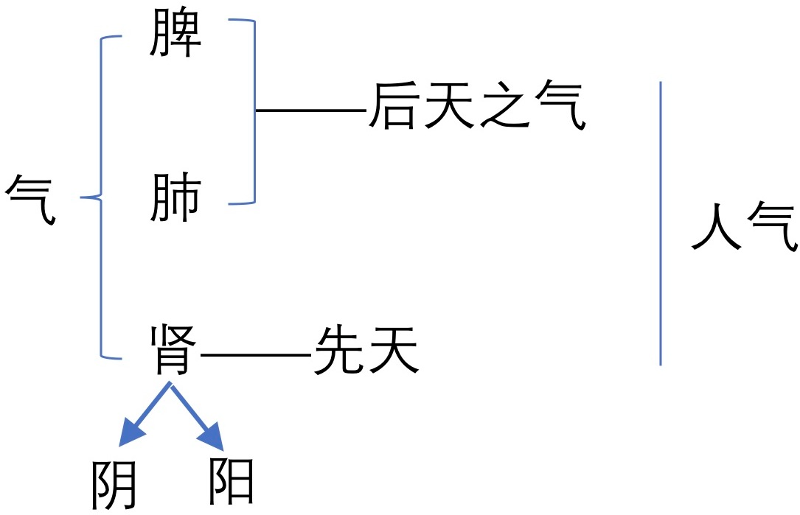
            - **配伍用药**
                - **补气药**
            - **四君子汤**
            - > 宋《太平惠民和剂局方》
                - **组成**
                    - **人参** **白术** **茯苓**
                    - **甘草**
                    - 各等分
                - **用法**
                    - **盐**
                - **主治**
                    - **脾胃气虚证**
                - **功用**
                    - **益气健脾**
                    - > 恢复中焦脾胃运化受纳之功
                - **主证病机分析**
                    - **脾胃气虚**
                        - 失运、失纳——饮食减少，大便溏薄
                        - 胃气血生化不足——面色萎白，语声低微
                        - 肢体失养——四肢倦怠
                        - 舌淡苔白，脉虚弱
                - **方解**
                    - **君：人参**
                    - **臣：白术**
                    - > 苦甘温
                    - **佐：茯苓**
                    - **使：甘草**
                - **组成特点**
                    - 理中丸去干姜，加茯苓
                - **辨证要点**
                    - ***补气之基础方***
                    - 面色萎白，语音低微，四肢无力，食少便溏，舌淡苔白，脉细缓
                - **随证加减**
                    - 呕吐——加半夏
                    - 胸膈痞满——加枳壳、陈皮
                    - 心悸失眠——加酸枣仁
                    - 畏寒肢冷，脘腹疼痛——加干姜、附子
            - **参苓白术散**
            - > 宋《太平惠民和剂局方》
                - **组成**
                    - **莲子肉**
                    - **薏苡仁**
                    - **缩砂仁**
                    - **桔梗**
                    - **白扁豆**
                    - **白茯苓**
                    - **人参**
                    - **甘草**
                    - **白术**
                    - **山药**
                - **用法**
                    - **枣**
                    - **大枣**
                - **主治**
                    - **脾虚夹湿证**
                        - 脾胃虚弱，湿自内生，气机不畅
                    - **肺脾气虚湿痰咳嗽**
                - **功用**
                    - **益气健脾，渗湿止泻**
                - **主证病机分析** 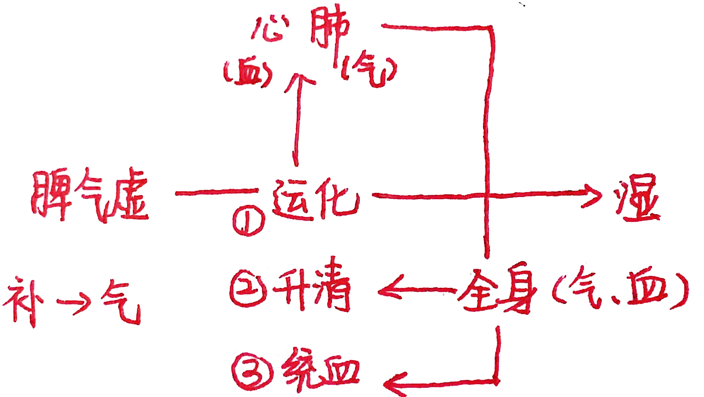
                    - **脾气虚**
                        - 四肢乏力，面色萎黄，形体消瘦
                    - **湿盛**
                        - 肠鸣注泻，胸脘痞闷，饮食不化
                        - 咳嗽痰多色白
                        - > 湿聚成痰，上贮于肺
                    - **佐证**
                        - 舌苔白腻，脉虚缓
                - **方解**
                    - **君：人参、白术、茯苓**
                    - **臣：**
                        - **山药、莲子**
                        - **白扁豆、苡仁**
                    - **佐：**
                        - **砂仁、陈皮**
                        - **桔梗**
                    - **佐使：甘草**
                - **组成特点**
                    - 四君子汤加山药、莲子、白扁豆、苡仁、砂仁、陈皮、桔梗
                - **辨证要点**
                    - 脾胃气虚＋泄泻，舌苔白腻
                    - *培土生金法之代表方*
                - **随证加减**
                    - 久泻兼里虚腹痛者，加干姜、肉桂
                    - 纳差食少者，加炒麦芽、焦山楂、神曲
                    - 白痰多者，加半夏、陈皮
            - **补中益气汤**
            - > 金·李东垣《内外伤辨惑论》
                - **组成**
                    - **黄芪**
                    - **甘草**
                    - **人参**
                    - **当归**
                    - **橘皮**
                    - **升麻**
                    - **柴胡**
                    - **白术**
                - **用法**
                    - 上㕮咀，都作一服，水二盏，煎至一盏，去滓，食远稍热服
                - **主治**
                    - **脾胃气虚证**
                    - > 饮食减少，体倦肢软，少气懒言，面色萎黄，大便稀薄，脉虚软
                    - **气虚下陷证**
                    - > 脱肛，子宫脱垂，久泻，久痢崩漏等，伴气短乏力，舌淡，脉虚
                    - **气虚发热证**
                    - > 身热自汗，渴喜热饮，气短乏力，舌淡，脉虚大无力
                        - 脾主升清，胃主降浊；水谷化生轻清阳气
                - **功用**
                    - **补中益气，升阳举陷**
                - **主证病机分析** 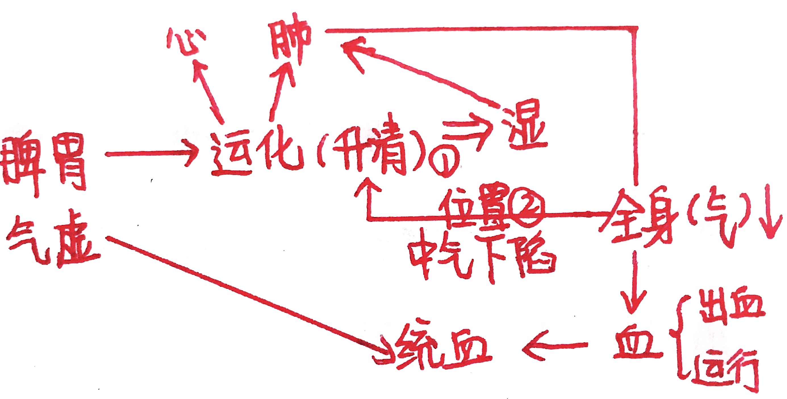
                    - **脾虚**
                        - 食少便溏，少气懒言，体倦肢软，面色萎白
                    - **气陷**
                        - 脱肛，子宫脱垂，久泻久痢，崩漏
                    - **气虚发热**
                        - 清阳下陷，脾湿下流，郁遏阳气，化火上攻
                - **方解**
                    - **君：黄芪**
                    - > 黄芪：益气健脾，升阳固表，脱毒外出
                    - **臣：人参、甘草**
                    - **佐：**
                        - **白术**
                        - **当归**
                        - **陈皮**
                        - **升麻、柴胡**
                    - **佐使：甘草**
                - **配伍特点**
                    - 补气升阳，甘温除热
                - **辨证要点**
                    - 少气懒言，体倦乏力，或脏器下垂，舌淡苔白，脉虚软无力
                - **使用注意**
                    - 方中黄芪宜重用，升麻、柴胡用量宜轻；全方总用量不宜太重
                    - 阴虚发热及内热炽盛者禁用
                - **随证加减**
                    - 头痛加蔓荆子、川芎、藁本、白芷、细辛
                    - 腹痛加白芍
                    - 兼气滞，加木香、枳壳
                    - 虚人感冒，加苏叶少许
                    - 兼贫血，加补血药（四物）、补肾药（枸杞、鹿胶）
                    - 小便不利，加泽泻、车前子
                    - 便秘，重用当归或加适量火麻仁、肉苁蓉
            - **玉屏风散**
            - > 《究原方》，录自〔朝鲜〕金礼蒙《医方类聚》
                - **组成**
                    - **防风**
                    - **黄芪** **白术**
                - **用法**
                    - **大枣**
                    - 现代用法：散剂，每服6～9g；亦可作汤剂，水煎服
                - **主治**
                    - **表虚自汗证**
                        - 卫气虚弱，不能固表，营阴不能内守
                - **功用**
                    - **益气固表止汗**
                - **主证病机分析**
                    - **气→表**
                        - 汗多
                        - 多外感（风）
                        - 温——寒
                - **方解**
                    - **君：黄芪**
                    - **臣：白术**
                    - > 君臣相配，使气旺表实
                    - **佐：防风**
                    - > 黄芪得防风，固表不留邪；防风得黄芪，祛邪不伤正
                - **辨证要点**
                    - **自汗恶风，舌淡脉虚**
                - **随证加减**
                    - 自汗重，加浮小麦、牡蛎、麻黄根
                    - 易感冒
                        - 有表证：合桂枝汤
                        - 无表证：合补中益气汤
                - 玉屏风散与桂枝物均可用于治疗表虚自汗，临床应如何区别应用？
            - **生脉散**
            - > 金·张元素《医学启源》
                - **组成**
                    - **麦冬**
                    - **五味子**
                    - **人参**
                - **用法**
                    - 水煎服
                - **主治**
                    - **气阴两伤证**
                        - 温热、暑热，耗伤气阴
                        - 久咳肺虚，气阴两伤
                        - > 汗多，气阴不足；纯虚无邪
                - **功用**
                    - **益气生津，敛阴止汗**
                - **方解**
                    - **君：人参**
                    - **臣：麦冬**
                    - **佐：五味子**
                - **辨证要点**
                    - 体倦少气或干咳短气，口渴多汗，咽干舌燥，脉虚弱
                - **使用注意**
                    - 外邪未解，或暑病热盛，气津未伤者，不宜使用
                    - 久咳肺虚，气阴两伤，兼有病邪时，慎用
                - **随证加减**
                    - 阴虚有热，以西洋参代人参
                    - 病情急重者，宜加重全方用量
        - **补血剂**
            - **适应证**
                - **（心、肝、脾）**
            - **临床表现**
                - 头晕眼花，面色苍白无泽
                - 唇色淡，爪甲枯瘪
                - 心悸，失眠；大便干燥
                - 妇女经水愆期，量少色淡
                - 舌淡红，苔滑少津，脉细数或细涩
            - **配伍用药**
                - **血虚证**
                    - **补血**
                        - **直接补血**
                            - 补血药
                        - **间接补血**
                            - 补气药：益气生血
                            - 补肾药：肝肾同源
                            - 活血药：祛瘀生新
                    - **行气药：**
            - **四物汤**
            - > 唐·蔺道人《仙授理伤续断秘方》
                - **组成**
                    - **白芍药**
                    - **川当归**
                    - **熟地黄**
                    - **川芎**
                    - 各等分
                - **用法**
                    - 每服三钱，水盏半，煎至七分，空心热服
                - **主治**
                    - **虚滞**
                        - 血虚而又血行不利
                - **功用**
                    - **补血和血**
                - **主证病机分析**
                    - **营血虚滞**
                        - **全身**
                            - **血虚不荣**
                                - 头昏目眩，面色无华，心悸失眠唇淡甲枯，舌淡脉细弦或细涩
                        - **妇科**
                            - **冲任虚损**
                                - 血海空虚，经水亏乏
                                - > 经少或闭经
                                - 冲任不固
                                - > 胎动下血，漏下
                            - **血行不利**
                                - 月经不调，脐腹作痛
                - **方解**
                    - **君：熟地**
                    - **臣：当归**
                    - **佐：**
                        - **白芍**
                        - **川芎**
                - **组成特点**
                    - **芎归胶艾汤**
                - **配伍特点**
                    - 补血而不滞血，和血而不伤血
                - **辨证要点**
                    - *补血之专方，调经之良剂*
                    - 头晕心悸，或妇女月经量少，唇爪面色无华，舌淡，脉细或细涩
                - **使用注意**
                    - 湿盛中满，便溏者，忌用
                    - 大失血者，不宜用
                - **随证加减**
                    - 【灵活运用】“血家百病此方宗”
                        - **血滞：川芎（君）**
                            - 赤芍、当归、熟地
                            - 活血不伤血
                        - **月经不调：当归（君）**
                            - 偏虚：熟地、白芍、川芎
                            - 偏瘀：川芎、赤芍、熟地
                        - **腹痛：白芍（君）**
                            - 偏虚：熟地、当归、川芎
                            - 偏瘀：川芎、当归、熟地
            - **当归补血汤**
            - > 金·李东垣《内外伤辨惑论》
                - **组成**
                    - **黄芪**
                    - **当归**
                - **用法**
                    - 上㕮咀，以水二盏，煎至一盏，去滓温服，空心食前
                - **主治**
                    - **血虚发热证**
                        - 口渴喜温饮，身热而无汗
                        - 脉洪大无力或重按全无
                    - **疮疡溃后，久不愈口**
                - **功用**
                    - **补气生血**
                - **主证病机分析**
                    - **血虚发热** **机理** 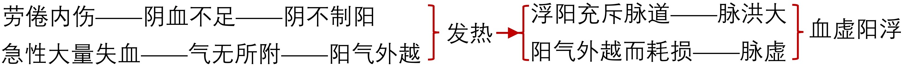
                - **方解**
                    - **黄芪**
                    - > “有形之血不能自生，生于无形之气故尔” 《名医方论》

                    - **当归**
                - **组成特点**
                    - 黄芪与当归用量比为5：1
                - **配伍特点**
                    - 重用补气药配伍少量补血药，以补气生血，固表留阳
                - **辨证要点**
                    - **口渴喜温饮** **脉大而虚**
                - **使用注意**
                    - 阴虚发热者忌用
                - **随证加减**
                    - 妇女经期、产后外感发热头痛者，加葱白、豆豉、生姜、大枣
                    - 疮疡久溃不愈，气血两虚又余毒未尽者，加银花、甘草
                    - 血虚气弱出血不止者，加煅龙骨、阿胶、山茱萸
            - **归脾汤**
            - > 南宋·严用和《济生方》；明·薛己《正体类要》
                - **组成**
                    - **白术** **茯神** **黄芪** **龙眼肉** **酸枣仁**
                    - **人参** **木香**
                    - **甘草**
                    - **当归**
                    - **远志**
                    - （当归、远志从《内科摘要》补入）
                - **用法**
                    - **生姜** **枣**
                - **主治**
                    - **心脾气血两虚证**
                    - **脾不统血证**
                        - 心脾两虚，气血不足
                - **功用**
                    - **益气补血，健脾养心**
                - **主证病机分析**
                    - **脾胃气虚**
                        - **脾失健运**
                            - 食少体倦，面色萎黄，舌淡
                        - **脾不统血**
                            - 出血症
                            - > **月经过多**
                    - **→心血不足**
                        - **心神失养**
                            - 失眠、健忘
                        - **心体失养**
                            - 心悸、怔忡
                - **方解**
                    - **人参、黄芪、白术、甘草、姜、枣**
                    - **当归、龙眼肉**
                    - **茯神、酸枣仁、远志**
                    - **木香**
                - **配伍特点**
                    - 心脾同调，以补脾为主
                    - 气血双补，以补气为主
                    - 少佐理气醒脾药，使补而不滞
                - **辨证要点**
                    - **心悸怔忡** **健忘失眠** **面色萎黄**
                - **随证加减**
                    - 崩漏下血偏寒者，加艾叶炭、炮姜炭
                    - 偏热者，加生地炭、阿胶珠、棕榈炭
                    - 皮下出血，加紫草、仙鹤草，并重用大枣或加花生衣
                    - 胃弱纳差者，加神曲、麦芽、砂仁
                    - 贫血，可加熟地
        - **气血双补剂**
            - **适应证**
                - 气血俱虚证
            - **临床表现**
                - 头晕目眩，心悸气短，肢体倦怠，面色无华，舌质淡，苔薄白，脉虚细
            - **八珍汤（原名八珍散）**
            - > 元·萨迁《瑞竹堂经验方》
                - **组成**
                    - **当归**
                    - **川芎**
                    - **熟地黄**
                    - **白芍药**
                    - **人参**
                    - **甘草**
                    - **茯苓**
                    - **白术**
                    - 各一两（各15g）
                - **用法**
                    - **生姜** **枣**
                - **主治**
                    - **气血两虚证**
                - **功用**
                    - **益气补血**
                - **方解**
                    - **四君子汤（参苓术草）**
                    - **四物汤（当归地芍）**
                    - **生姜、大枣**
            - **泰山磐石散**
            - > 明·徐春甫《古今医统大全》
                - **组成**
                    - **人参**
                    - **黄芪**
                    - **白术**
                    - **炙甘草**
                    - **当归**
                    - **川芎**
                    - **白芍药**
                    - **熟地黄**
                    - **川续断**
                    - **糯米**
                    - **黄芩**
                    - **砂仁**
                - **用法**
                    - 上用水一盅半，煎七分，食远服。但觉有孕，三五日常用一服，四月之后方无虑也
                - **主治**
                    - **堕胎、滑胎**
                        - 胎动不安，或屡有堕胎宿疾，面色萎白，倦怠乏力，不思饮食，舌淡苔薄白，脉滑无力
                    - **气血虚弱，胎元失养证**
                        - 脾胃为气血生化之源
                        - 冲为血海，任主胞胎，冲任隶属于肾
                        - 女子以肝为先天
                - **功用**
                    - **益气健脾，养血安胎**
                - **方解**
                    - **黄芪、人参、白术、炙甘草**
                    - > **安胎**
                    - **熟地、当归、川芎、白芍**
                    - **续断** **安胎**
                    - **黄芩** **安胎**
                    - **砂仁** **安胎**
                    - **糯米**
                - **组成特点**
                    - 八珍汤去茯苓，加黄芪、续断、砂仁、黄芩、糯米
                - **辨证要点**
                    - 倦怠无力，腰酸神疲，舌淡，脉滑无力
                - **使用注意**
                    - 从妊娠第二月起，每周服2剂，连服2～3月
                    - 戒房事恼怒，远辛热之物
                - **随证加减**
                    - 热多者，倍黄芩，少用砂仁
                    - 胃弱者，多用砂仁，少加黄芩
        - **补阴剂**
            - **适应证**
                - **心、肝、脾、肺、肾**
            - **临床表现**
                - 肢体羸瘦，面容憔悴，口燥咽干
                - 虚烦不眠，大便干燥，小便短黄
                - 甚则骨蒸盗汗，呛咳无痰，颧红
                - 梦遗滑精，腰酸背痛
                - 舌红少苔、少津，脉沉细数
            - **配伍用药**
                - **补阴药**
            - **六味地黄丸（原名地黄丸）**
            - > 北宋·钱乙《小儿药证直诀》
                - **组成**
                    - **熟地黄**
                    - **山萸肉、干山药**
                    - **泽泻、牡丹皮、茯苓**
                - **用法**
                    - 上为末，炼蜜为丸，如梧子大，空心温水化下三丸
                - **主治**
                    - **肾阴精不足证**
                - **功用**
                    - **填精滋阴补肾**
                - **主证病机分析**
                    - **肾阴虚**
                        - **精髓不足**
                            - 腰膝酸软，头目眩晕，耳鸣耳聋，足跟痛，牙齿松动，小儿囟门迟闭
                        - **虚热内扰**
                            - 手足心热、口燥咽干，骨蒸潮热、盗汗、遗精滑精、牙痛、消渴
                        - **舌红少苔、脉细数**
                - **方解**
                    - **君：熟地** **肾**
                    - **臣：**
                        - **山茱萸** **肾**
                        - **山药** **肾**
                    - **佐：**
                        - **泽泻**
                        - **丹皮**
                        - **茯苓**
                - **组成特点**
                    - **肾气丸**
                    - 熟地、山茱萸、山药、泽泻、丹皮、茯苓用量比例为8：4：4：3：3：3
                - **配伍特点**
                    - 三补三泻，以补为主
                    - 肝脾肾三阴并补，以补肾阴为主
                - **辨证要点**
                    - 腰膝酸软，头目晕眩，盗汗遗精，口燥咽干，舌红少苔，脉沉细数
                - **使用注意**
                    - 阴盛阳衰者，禁用
                    - 脾虚泄泻，不宜用
                    - 夏季暑热湿气较盛时，慎服
            - **左归丸**
            - > 明·张介宾《景岳全书》
                - **组成**
                    - **大怀熟地**
                    - **山药**
                    - **枸杞**
                    - **山茱萸肉**
                    - **川牛膝**
                    - > 滑精者不用
                    - **菟丝子**
                    - **鹿胶**
                    - **龟胶**
                    - > 无火者不必用
                - **用法**
                    - 上先将熟地蒸烂，杵膏，加炼蜜丸桐子大。每食前用滚汤或淡盐汤送下百余丸
                - **主治**
                    - **真阴不足证**
                - **功用**
                    - **滋阴补肾，填精益髓**
                - **主证病机分析**
                    - **肾阴虚**
                        - **精髓不充，封藏失职**
                            - 腰膝酸软，头目眩晕，遗精滑泄
                        - **虚阳上越，清窍失濡**
                            - 自汗盗汗，口燥咽干
                        - **舌红少苔、脉细**
                - **方解**
                    - **熟地**
                    - **山茱萸**
                    - **山药**
                    - **龟板胶** **阳**
                    - **鹿角胶** **阳** *阳中求阴*
                    - **菟丝子** **阳**
                    - **枸杞子**
                    - **川（怀）牛膝**
                - **组成特点**
                    - **六味地黄丸**
                - **配伍特点**
                    - 纯补无泻
                    - 阳中求阴
                - **辨证要点**
                    - 头目眩晕，腰酸膝软，舌红少苔，脉细
                - **随证加减**
                    - 滑精者，去川牛膝
                    - 虚火上炎者，去鹿角胶，加女贞子、麦冬
                    - 大便燥结者，去菟丝子，加肉苁蓉
                    - 干咳少痰者，加百合
                    - 骨蒸潮热者，加地骨皮
                - **使用注意**
                    - 脾虚便溏者，慎用
                    - 长期服用，宜配健脾助运药
            - **大补阴丸**
            - > 元·朱震亨《丹溪心法》
                - **组成**
                    - **黄柏** **知母**
                    - **熟地** **龟板**
                - **用法**
                    - **猪脊髓蜜**
                - **主治**
                    - **阴虚火旺证**
                - **功用**
                    - **滋阴降火**
                - **主证病机分析**
                    - **肝肾阴虚，虚热内生**
                        - 骨蒸潮热
                        - 盗汗遗精
                        - 足膝疼痛
                    - **火旺**
                        - 虚火上炎
                            - **灼肺**
                            - **扰心**
                        - 舌红少苔，尺脉数而有力
                - **方解**
                    - **熟地**
                    - **龟甲**
                    - **黄柏**
                    - **知母**
                    - **猪脊髓、蜂蜜**
                - **辨证要点**
                    - 骨蒸潮热，舌红少苔，尺脉数而有力
                - **使用注意**
                    - 脾虚便溏，以及火热属实证者，不宜用
                - **随证加减**
                    - 阴虚较重者，加天冬、麦冬
                    - 阴虚盗汗者，加地骨皮
                    - 咯血、吐血者，加仙鹤草、白茅根
                    - 遗精者，加芡实、金樱子、潼蒺藜
            - **一贯煎**
            - > 清·魏之琇《续名医类案》
                - **组成**
                    - **北沙参、麦冬、当归身**
                    - **生地黄**
                    - **枸杞子**
                    - **川楝子**
                - **用法**
                    - 水煎服
                - **主治**
                    - **肝肾阴虚，肝气郁滞证**
                    - **肝肾阴（血）虚；肝气不舒，气郁化火**
                - **功用**
                    - **滋阴疏肝**
                - **主证病机分析**
                    - **阴虚肝郁**
                    - > 佐金平木 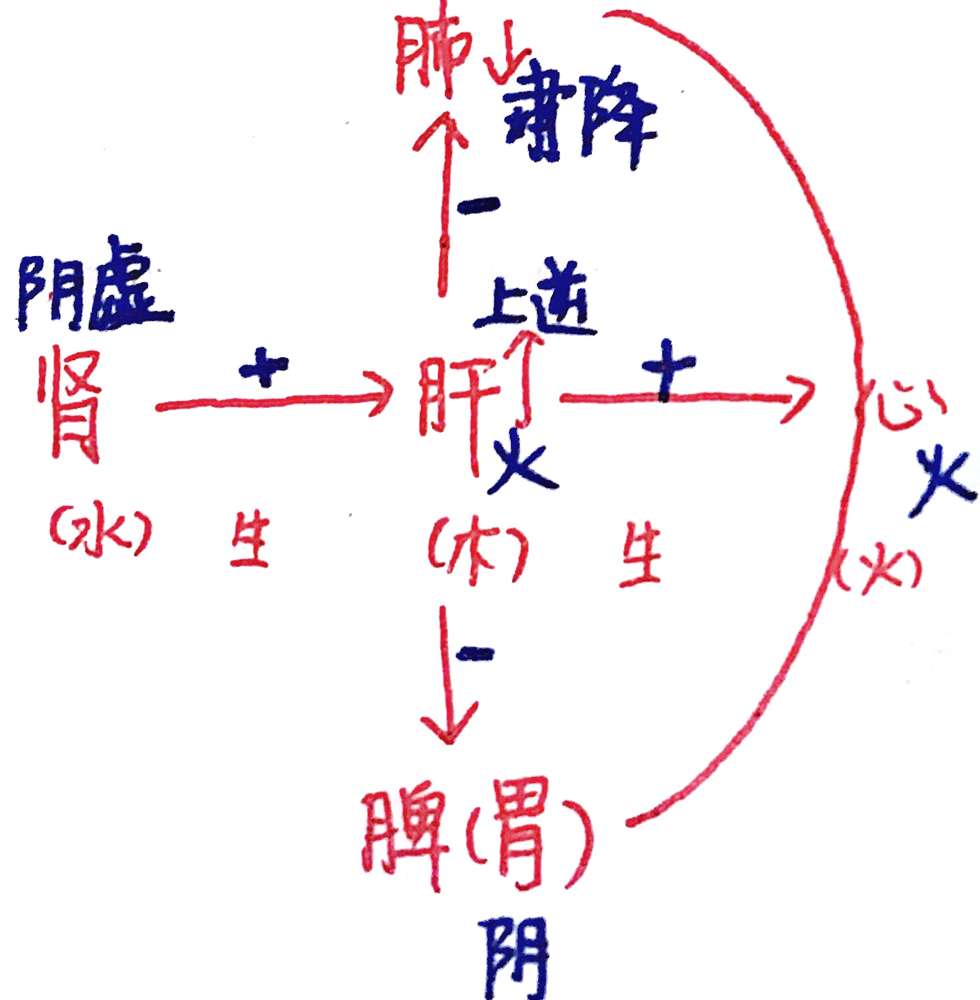
                        - **肝气郁滞**
                            - **胁痛**
                        - **肝郁化火犯胃**
                            - 吞酸吐苦
                        - **阴虚内热**
                            - 咽干口燥，舌红少津
                            - 脉弱或虚弦
                - **方解**
                    - **生地（君），北沙参、麦冬、当归、枸杞子（臣）**
                    - **川楝子（佐）**
                    - > 苦寒
                - **配伍特点**
                    - **滋水涵木，佐金制木，培土益木**
                    - **既体用并调，又补而不滞**
                - **辨证要点**
                    - 胁肋疼痛，吞酸吐苦，舌红少津，脉虚弦
                - **使用注意**
                    - 有停痰积饮而舌白腻脉沉弦者，不宜用
                - **随证加减**
                    - 胁痛甚，加柴胡、佛手、白芍、甘草
                    - 口苦吞酸甚，加左金丸
                    - 包块，痛处固定不移，舌黯而干，加川芎、赤芍、丹参、鳖甲
                    - 便秘（肠道失润），重用生地、当归、麦冬，加润肠通便药
                    - 胃脘痛，加佛手、玄胡、白芍、甘草
                    - 失眠，加枣仁、夜交藤、合欢皮（花）
            - **百合固金汤**
            - > 明·周之千《慎斋遗书》
                - **主治**
                    - **肺肾阴虚，虚火上炎**
                - **功用**
                    - **滋润肺肾，止咳化痰**
                - **主证病机分析**
                    - **肺肾阴虚（金水相生）**
                        - 虚火上炎
                        - 灼伤肺络；炼津生痰
                - **方解**
                    - **君：生地、熟地**
                    - **臣：百合、麦冬、玄参**
                    - **佐：**
                        - **当归**
                        - **白芍**
                        - **贝母**
                        - > 川贝母（润肺化痰）；浙贝母（清热化痰——痰热证）
                        - **桔梗** *（使药，引经药）*
                - **辨证要点**
                    - 少苔，脉细
                    - > 少苔，脉细：阴伤；舌红脉数：有热
                - **使用注意**
                    - 脾胃虚弱者慎用
                - **随证加减**
                    - 白茅根、白及、藕节
                    - > 新咳可用桔梗；久咳不用桔梗
                    - 久咳少痰者，酌加五味子、乌梅、人参
                        - 人参、麦冬五味子——生脉散
        - **补阳剂**
            - **适应证**
                - **心、脾、** **肾**
            - **临床表现**
                - 腰膝酸痛，四肢不温，酸软无力
                - 少腹拘急冷痛
                - 小便不利或小便频数，阳痿早泄
                - 肢体羸瘦，消渴
                - 脉沉细或尺脉沉伏
            - **配伍用药**
                - **补阳温肾药** **补阴药** **利湿药、化痰药**
            - **肾气丸（又名《金匮》肾气丸、崔氏八味丸）**
            - > 东汉·张仲景《金匮要略》
                - **组成**
                    - **干地黄**
                    - **薯蓣（山药）、山茱萸**
                    - **泽泻、茯苓、牡丹皮**
                    - **桂枝、附子**
                - **用法**
                    - **炼蜜** **酒**
                    - **白酒或淡盐汤**
                - **主治**
                    - **肾阳气不足证**
                - **功用**
                    - **补肾助阳，化生肾气**
                - **主证病机分析** 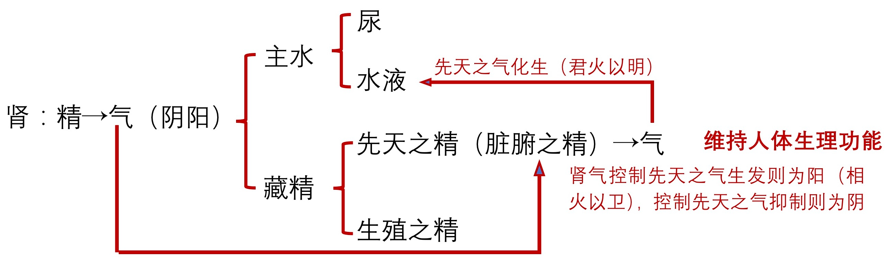
                    - **肾阳不足**
                        - **下焦失于温养**
                        - **不能化气行水**
                        -          ↓
                        - **水湿内停**
                        - **固摄无力**
                        - **舌淡而胖，苔白，脉沉细弱**
                    - **→温补（滋阴益精+温行）+利水**
                - **方解**
                    - **桂枝、附子** *少火生气*
                    - > **少火生气：**
                    - **生地、山茱萸、山药** *阴中求阳*
                    - **泽泻、茯苓**
                    - **丹皮**
                - **组成特点**
                    - 生地、山茱萸、山药、泽泻、丹皮、茯苓、桂枝、附子用量比例为8：4：4：3：3：3：1：1
                - **配伍特点**
                    - **重用滋阴，轻用温阳，以阴中求阳，少火生气**
                    - **补中寓泻，使滋而不腻，补不助邪**
                - **辨证要点**
                    - 腰痛脚软，少腹拘急，下半身冷，小便不利或小便清长，舌质淡胖，脉虚弱尺部沉微
                - **使用注意**
                    - 阴虚火旺、燥热伤津者，不宜用
                    - 肾阳虚而小便正常者，属纯虚无邪，不宜用
                - **随证加减**
                    - 腰酸冷痛，遇劳加剧，卧则减轻，脚底心痛；加补骨脂、杜仲、牛膝、狗脊
                    - 遗尿、尿频，加桑螵蛸、益智仁、乌药、菟丝子
                    - 遗精、滑精，加芡实、金樱子、沙苑子
                    - 小便不利，加车前子、牛膝（济生肾气丸）
                    - 面色黧黑，加五味子、鹿茸（十补丸）；加调肝药：柴胡、白芍
            - **右归丸**
            - > 明·张介宾《景岳全书》
                - **组成**
                    - **熟地黄**
                    - **山药**
                    - **山茱萸**
                    - **枸杞子**
                    - **菟丝子**
                    - **鹿角胶**
                    - **杜仲**
                    - **肉桂**
                    - **当归**
                    - **制附子**
                - **用法**
                    - 将熟地蒸烂杵膏，余为细末，加炼蜜为丸，如弹子大。每嚼服二三丸，以滚白汤送下
                - **主治**
                    - **肾阳不足，命门火衰证**
                - **功用**
                    - **温补肾阳，填精益髓**
                - **主证病机分析**
                    - **肾阳虚**
                        - 精气虚冷，封藏失职——腰膝酸软，阳痿遗精
                        - 失温失养，火不生土——畏寒肢冷，食少神疲，大便不实
                        - 膀胱失约——小便清长或自遗
                        - 舌淡苔白，脉沉而迟
                - **方解**
                    - **肉桂、附子**
                    - **鹿角胶**
                    - **熟地、山茱萸、山药、枸杞子** *阴中求阳*
                    - **菟丝子、杜仲**
                    - **当归**
                - **组成特点**
                    - **肾气丸**
                - **配伍特点**
                    - 纯补无泻
                    - 阴中求阳
                - **辨证要点**
                    - 腰膝酸软，畏寒肢冷，神疲乏力，脉沉迟
                - **使用注意**
                    - 肾虚而有湿浊者，不宜用
                - **随证加减**
                    - 阳衰气虚，加人参
                    - 阳虚精滑，或带浊便溏，加补骨脂
                    - 肾泄不止，加五味子、肉豆蔻
                    - 脾胃虚寒，加干姜
                    - 腹痛不止，加吴茱萸
                    - 腰膝酸痛，加胡桃肉
                    - 便溏或腹泻，去当归
        - **阴阳并补剂**
            - **地黄饮子**
            - > 宋·太医院编《圣济总录》
                - **组成**
                    - **熟干地黄**
                    - **巴戟** **山茱萸** **石斛** **肉苁蓉**
                    - **附子** **五味子** **官桂** **白茯苓** **麦门冬** **菖蒲** **远志**
                - **用法**
                    - **生姜** **枣** **薄荷**
                    - **生姜** **大枣** **薄荷**
                - **主治**
                    - **喑痱**
                - **功用**
                    - **滋肾阴，补肾阳，开窍化痰**
                - **主证病机分析** 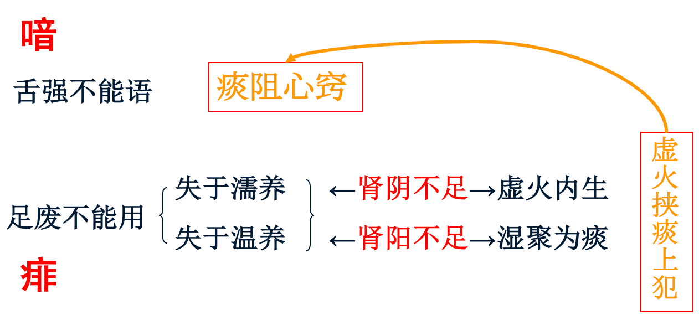
                - **方解**
                    - **肉苁蓉、巴戟天** **附子、肉桂**
                    - **熟地、山茱萸** **石斛、麦冬** **五味子**
                    - **茯苓、远志、石菖蒲**
                    - **生姜、大枣**
                - **辨证要点**
                    - 舌喑不语，足废不用
                - **使用注意**
                    - 兼气火上升，肝阳偏亢者，不宜用
                - **随证加减**
                    - 肾虚痱证为主，宜减石菖蒲、远志
                    - 阴虚为主，痰火盛者，去附子、肉桂，酌加贝母、竹沥、胆南星、天竹黄
                    - 兼气虚，酌加黄芪、人参
        - **气血阴阳并补**
            - **炙甘草汤（复脉汤）**
            - > 东汉·张仲景《伤寒论》
                - **组成**
                    - **甘草**
                    - **生姜**
                    - **人参**
                    - **生地黄**
                    - **桂枝**
                    - **阿胶**
                    - **麦门冬**
                    - **麻仁**
                    - **大枣**
                - **用法**
                    - **清酒**
                    - 烊化
                - **主治**
                    - **阴血不足，阳气虚弱证**
                    - **虚劳肺痿**
                - **功用**
                    - **滋阴养血，益气温阳，复脉定悸**
                - **主证病机分析** 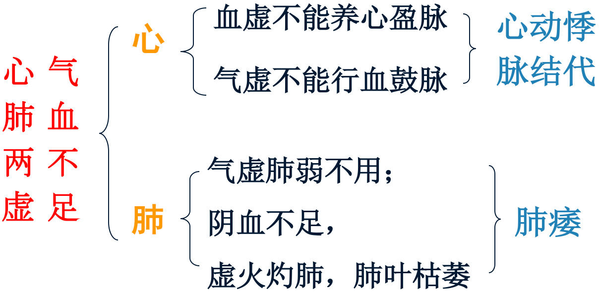
                    - **气血不足；心肺两虚**
                        - **心**
                        - > 心动悸，脉结代

                            - 血虚不能养心盈脉
                            - 气虚不能行血鼓脉
                        - **肺**
                        - > 肺痿

                            - 气虚肺弱不用
                            - 阴血不足
                            - 虚火灼肺，肺叶枯萎
                - **方解**
                    - **炙甘草、人参、大枣**
                    - > 重用甘草：甘缓复脉；配人参、大枣：补血
                    - **生地、阿胶、麦冬、胡麻仁**
                    - > 生地：滋阴；阿胶：养血；麦冬：滋阴润肺；胡麻：养血益津润燥
                    - **桂枝、生姜**
                    - **清酒**
                    - > 汉代清酒：相当于黄酒，辛温
                - **辨证要点**
                    - 气血（阴阳）并补之剂
                        - 脉结代，心动悸，虚羸少气，舌光色淡少苔
                - **使用注意**
                    - 阴虚内热及中虚湿阻便溏者慎用
                    - 复脉定悸者，重用炙甘草
                - **随证加减**
                    - 可加酸枣仁、柏子仁增强养心安神定悸之力，或加龙齿、磁石重镇安神定悸
                    - 偏于心气不足者，重用炙甘草、人参
                    - 偏于阴血虚者，重用生地、麦冬
                    - 心阳偏虚甚者，易桂枝为肉桂，加附子
                    - 阴虚而内热较甚者，易人参为西洋参或南沙参，减去桂、姜、酒，酌加知母、黄柏
    - 固涩剂
        - **定义**
            - **收涩药** **收敛固涩** **气血精津液耗散滑脱**
                - “涩可固脱” 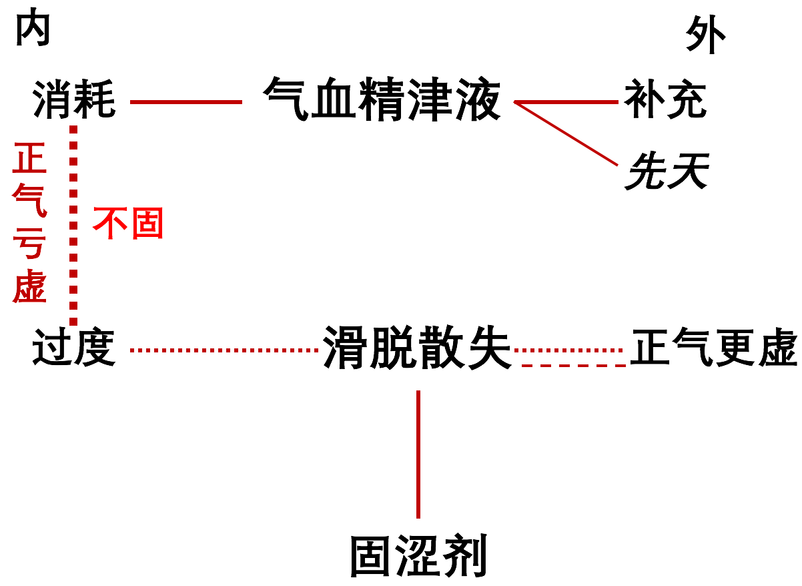
        - **分类**
            - 自汗盗汗——固表止汗剂
            - 久咳不止——敛肺止咳剂
            - 久泻不止——涩肠固脱剂
            - *涩精止遗剂*
            - *涩精止遗剂*
            - 崩漏带下——固崩止带剂
        - **使用注意**
            - 固涩剂与补益剂的区别
            - 元气大虚，亡阳欲脱者，不宜用固涩剂
            - 辨清实邪所致气血精津外泄
        - **固表止汗剂**
            - **卫气不固之自汗；阴虚不守之盗汗**
            - **固表止汗药**
            - **牡蛎散**
            - > 宋《太平惠民和剂局方》
                - **组成**
                    - **黄芪、麻黄根、牡蛎、小麦**
                - **主治**
                    - **体虚自汗、盗汗**
                - **功用**
                    - **敛阴止汗，益气固表**
        - **敛肺止咳剂**
            - **久咳肺虚，气阴耗伤**
            - **敛肺止咳药**
            - **九仙散**
            - > 王子昭方，录自元·罗天益《卫生宝鉴》
                - **组成**
                    - **人参、款冬花、桑白皮、桔梗、五味子、阿胶、乌梅、贝母、罂粟壳**
                - **主治**
                    - **久咳伤肺，气阴两虚证**
                - **功用**
                    - **敛肺止咳，益气养阴**
        - **涩肠固脱剂**
            - **泻痢日久不止，脾肾虚寒，以致大便滑脱不禁**
            - **涩肠止泻药**
            - **真人养脏汤（原名纯阳真人养脏汤）**
            - > 宋《太平惠民和剂局方》
                - **组成**
                    - **人参、当归** **白术**
                    - **肉豆蔻**
                    - **肉桂** **甘草**
                    - **白芍药**
                    - **木香**
                    - **诃子**
                    - **罂粟壳**
                - **用法**
                    - 上锉为粗末。每服二大钱（6g），水一盏半，煎至八分，去滓，食前温服。忌酒、面、生、冷、鱼腥、油腻
                - **主治**
                    - **久泻久痢，脾肾虚寒证（无积滞）**
                - **功用**
                    - **涩肠固脱，温补脾肾**
                - **主证病机分析**
                    - **脾肾虚寒**
                        - 脐腹疼痛，喜温喜按
                        - 倦怠食少
                        - 舌淡苔白，脉迟细
                        - 下痢赤白或便脓血（气血不和）
                    - **阳虚失固**
                        - 泻痢无度，脱肛坠下
                - **方解**
                    - **君：罂粟壳**
                    - **臣：肉豆蔻、诃子**
                    - **佐：**
                        - **肉桂**
                        - **人参、白术**
                        - **当归、白芍**
                        - **木香**
                    - **佐使：炙甘草**
                - **配伍特点**
                    - 标本兼顾，治标为主
                    - 脾肾同治，补脾为主
                    - 涩中寓通，补而不滞
                - **辨证要点**
                    - 大便滑脱不禁，腹痛喜温喜按，食少神疲，舌淡苔白，脉迟细
                - **使用注意**
                    - 若泻痢虽久，湿热积滞未去者，忌用
                    - 不宜久服
                    - 服药期间忌食酒、面、生冷、鱼腥、油腻之品
                - **随证加减**
                    - 脾肾虚寒甚者，加附子、干姜
                    - 脱肛者加升麻、黄芪
            - **四神丸**
            - > 明·薛己《内科摘要》
                - **组成**
                    - **肉豆蔻**
                    - **补骨脂**
                    - **五味子**
                    - **吴茱萸**
                - **用法**
                    - 姜枣同煮，枣肉为丸；临睡时淡盐汤或白开水送下
                - **主治**
                    - **五更泄（肾泄，鸡鸣泄，晨泄）**
                        - 五更即黎明之前，正是阴气盛极，阳气萌发之时
                        - 而肾阳虚衰者，阳气当至而不至，则阴气极而下行
                        - **脾肾阳虚**
                            - 肾为阳气之根，能温煦脾土
                - **功用**
                    - **温肾暖脾，涩肠止泻**
                - **主证病机分析**
                    - **肾阳虚衰**
                        - 五更泄泻，久泻不愈，腰酸肢冷，腹痛喜温，脉沉迟无力
                    - **脾虚失运**
                        - 不思饮食，食不消化，神疲乏力，舌淡，苔薄白
                - **方解**
                    - **君：补骨脂**
                    - **臣：肉豆蔻**
                    - **佐：**
                        - **五味子**
                        - **吴茱萸**
                        - > 温肝，散郁
                    - **佐使：**
                        - **生姜**
                        - **大枣**
                - **组成特点**
                    - 由二神丸与五味子散合方而成
                        - 二神丸：补骨脂、肉豆蔻
                        - 五味子散：五味子、吴茱萸
                - **辨证要点**
                    - 五更泄泻，纳谷不香，肢冷神疲，舌淡苔白，脉沉迟无力
                - **使用注意**
                    - 湿热泄泻者，忌用
                - **随证加减**
                    - 中气下陷者，可加黄芪、升麻
                    - 阳虚甚者，可合理中丸；或加附子、肉桂
                - **真人养脏汤与四神丸比较**
                    - **真人养脏汤**
                        - 重用罂粟壳为君，以固涩为主，兼以温补脾肾
                        - 重在脾虚
                    - **四神丸**
                        - 重用补骨脂为君，以温肾为主，兼以暖脾涩肠
                        - 重在肾虚
        - **涩精止遗剂**
            - **肾虚失藏，精关不固**
            - **肾虚不摄，膀胱失约**
            - **涩精止遗（固精缩尿）药**
            - **金锁固精丸**
            - > 清·汪昂《医方集解》
                - **组成**
                    - **沙苑、蒺藜** **芡实** **莲须**
                    - **龙骨** **牡蛎**
                - **用法**
                    - **莲子粉** 丸 **盐汤**
                    - 现代用法：丸剂，每服9g，日2次，淡盐汤或开水送下；亦可作汤剂，加入莲子肉10g，水煎服
                - **主治**
                    - **肾虚不固之遗精滑泄**
                    - 亦可用于女子带下
                - **功用**
                    - **补肾涩精**
                - **主证病机分析**
                    - 肾失封藏——遗精滑泄
                    - **肾虚**
                    - **肾虚**
                    - 肾精亏虚——舌淡苔白，脉细弱
                - **方解**
                    - **潼蒺藜（君），芡实、莲子（臣）** **肾**
                    - > 潼蒺藜：沙苑子，补肾涩精；芡实：鸡头米；莲子：石莲子
                    - **莲须、煅龙骨、煅牡蛎（佐）**
                    - ***莲子、莲须*** *——交通心肾，养心安神*
                    - ***龙骨*** *——镇心安神*
                    - ***芡实、莲子*** *——补* ***脾*** *气*
                    - ***龙骨、牡蛎*** *——平肝潜阳*
                - **辨证要点**
                    - 亦可用于女子带下
                    - 遗精滑泄，腰痛耳鸣，舌淡苔白，脉细弱
                - **使用注意**
                    - 相火内炽或下焦湿热所致者，禁用
                    - 兼见外感发热者须停用
                    - 服药期间忌食辛辣刺激性食物
                    - 服药期间节制房事
                - **随证加减**
                    - 偏肾阳虚酌加菟丝子、补骨脂、附子
                    - 偏肾阴虚酌加龟板、女贞子、熟地
                    - 兼失眠者酌加酸枣仁、远志、五味子
                    - 腰痛明显者酌加杜仲、桑寄生、续断
                    - 日久不愈者酌加五味子、山茱萸、金樱子
            - **桑螵蛸散**
            - > 北宋·寇宗奭《本草衍义》

                - **组成**
                    - **桑螵蛸、远志、菖蒲、龙骨、人参、茯神、当归、龟甲**
                - **用法**
                    - 上为末，夜卧人参汤调下二钱（6g）
                - **主治**
                    - **心肾两虚之尿频或滑精**
                - **功用**
                    - **调补心肾，涩精止遗**
                - **主证病机分析** 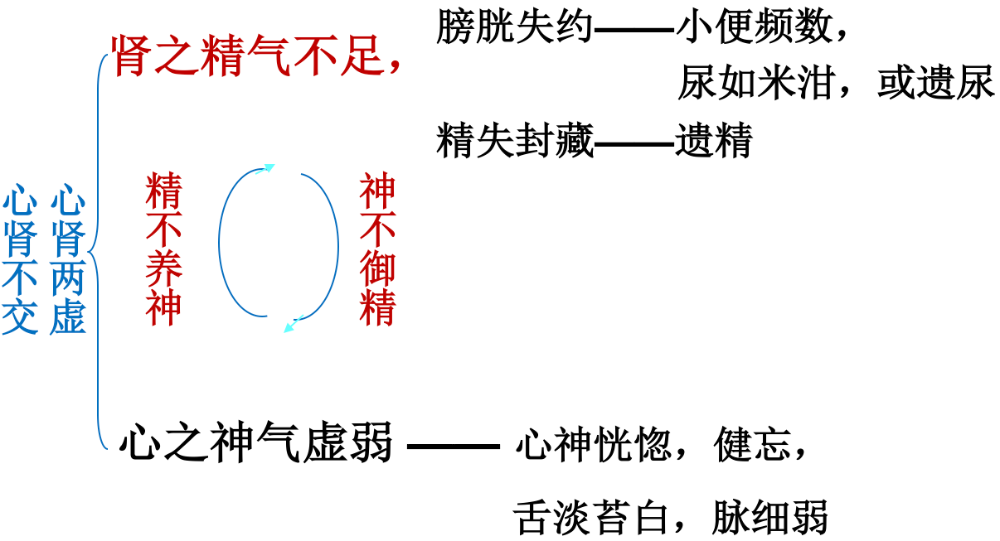
                    - **心肾不交，心肾两虚**
                    - > 精不养神，神不御精
                        - **肾之精气不足**
                            - 膀胱失约——小便频数，尿如米泔，或遗尿
                            - 精失封藏——遗精
                        - **心之神气虚弱**
                - **方解**
                    - **君：桑螵蛸**
                    - **臣：**
                        - **龙骨**
                        - **龟甲**
                    - **佐：**
                        - **人参**
                        - **当归**
                        - **茯神、菖蒲、远志**
                        - > 菖蒲开心窍，远志通肾气上达于心，合菖蒲则交通心肾
                - **辨证要点**
                    - 尿频或遗尿、遗精，心神恍惚，舌淡苔白，脉细弱
                - **使用注意**
                    - 下焦湿热或相火妄动或脾肾阳虚所致的尿频、遗尿或遗精、滑泄，不宜用
                - **随证加减**
                    - 原方可加益智仁、覆盆子，以增强涩精缩尿止遗之力
                    - 若健忘心悸，可加酸枣仁、五味子
                    - 若兼遗精，可加沙苑子、山萸肉
                - **桑螵蛸散与金锁固精丸比较**
                    - **桑螵蛸散**
                        - **交通心肾**
                        - 主治心肾两虚之尿频或遗尿、滑精
                    - **金锁固精丸**
                        - **补肾固精**
                        - 主治肾虚精关不固之遗精滑泄
            - **缩泉丸（原名固真丹）**
            - > 宋·魏岘《魏氏家藏方》
                - **组成**
                    - **天台乌药**
                    - **益智仁**
                    - 各等分（各9g）
                - **用法**
                    - **酒** **山药**
                    - **山药** **山药**
                - **主治**
                    - **下元虚寒之小便频数证**
                - **功用**
                    - **温肾祛寒，缩尿止遗**
                - **主证病机分析**
                    - 膀胱者，与肾相为表里；肾主水，职司二便
                    - **肾气不足，膀胱虚寒，不能约束水液**
                        - 尿频、遗尿、小便清长或尿有余沥
                - **方解**
                    - **君：益智仁**
                    - **臣：乌药**
                    - **佐：山药**
                - **辨证要点**
                    - 尿频或遗尿，舌淡，脉沉弱
                - **使用注意**
                    - 湿热及阴虚之尿频者，不宜用
                    - 服药期间忌辛辣、刺激性食物
                - **随证加减**
                    - 原方可酌加鹿角霜、桑螵蛸、乌贼骨、牡蛎，以加强敛涩之功
                    - 肾精不足，加鹿角胶、菟丝子
                    - 肾阳虚，加仙灵脾、山萸肉
                    - 肾阴虚，加熟地、龟甲
                    - 气虚，加黄芪、白术
                - **桑螵蛸散与缩泉丸比较**
                    - **桑螵蛸散**
                        - 以桑螵蛸配龟甲、龙骨、茯神、远志等
                        - **调补心肾** **心肾两虚证**
                    - **缩泉丸**
                        - 以益智仁配乌药等
                        - **温肾祛寒** **下元虚寒证**
        - **固崩止带剂**
            - **妇女崩中漏下，带下淋漓不尽**
            - **固崩止带药**
            - **固冲汤**
            - > 清·张锡纯《医学衷中参西录》
                - **组成**
                    - **白术**
                    - **生黄芪**
                    - **龙骨**
                    - **牡蛎**
                    - **萸肉**
                    - **生杭芍**
                    - **海螵蛸**
                    - **茜草**
                    - **棕边炭**
                    - **五倍子**
                - **用法**
                    - 水煎服
                - **主治**
                    - **脾肾虚弱，冲脉不固之血崩**
                - **功用**
                    - **益气健脾，固冲摄血**
                - **主证病机分析**
                    - 冲为血海，脾为气血生化之源，主统血摄血
                    - **脾气虚弱，统摄无权，致冲脉不固**
                        - 血崩，月经过多或漏下不止
                    - **气血两虚**
                        - 经血色淡质稀
                        - 心悸气短，神疲乏力
                        - 舌淡，脉微弱
                - **方解**
                    - **君：白术、黄芪**
                    - **臣：山萸肉、白芍**
                    - > 肝司血海，肾主冲任
                    - **佐：**
                        - **煅龙骨、煅牡蛎、棕榈炭、五倍子**
                        - **海螵蛸、茜草**
                - **辨证要点**
                    - 出血量多，色淡质稀，四肢乏力，舌淡，脉微弱
                - **使用注意**
                    - 血热妄行者忌用
                - **随证加减**
                    - 气虚者，加党参或人参
                    - 气虚下陷者，重用黄芪并炙用，加升麻、柴胡
                    - 阳气虚衰欲脱者，重用黄芪，并加附子、人参
    - 安神剂
        - **定义**
            - **安神药** **安神定志** **神志不安疾患**
            - 心、肝、肾
        - **分类**
            - **重镇安神剂**
                - 火热之邪易伤阴血
            - **补养安神剂**
                - 阴血不足易生虚火
        - **使用注意**
            - 不宜多服、久服，以免妨碍脾胃运化功能及蓄积中毒（如朱砂）
            - > 主要指重镇安神剂
            - 调摄精神及生活起居
        - **重镇安神剂**
            - **适应证**
                - **心肝阳亢，火热扰心**
                    - 火热之邪易伤阴血
            - **用药特点**
                - **镇心肝偏亢之阳** **清偏亢之心火**
            - **朱砂安神丸**
            - > 金·李东垣《内外伤辨惑论》
                - **组成**
                    - **朱砂** *水飞*
                    - **甘草**
                    - **黄连**
                    - **当归**
                    - **生地黄**
                - **用法**
                    - **朱砂**
                    - 现代用法：上药研末，炼蜜为丸，每次6～9g，临睡前温开水送服；亦可作汤剂，水煎服，朱砂研细末冲服1g
                - **主治**
                    - **心火亢盛，阴血不足**
                - **功用**
                    - **镇心安神，清热养血**
                - **主证病机分析**
                    - **失眠多梦，心烦，惊悸，怔忡**
                        - **心火亢盛**
                        - **阴血不足**
                    - **阴虚有火**
                - **方解**
                    - **君：朱砂**
                    - **臣：黄连**
                    - > **性寒，入心经**
                    - **佐：生地、当归**
                    - **佐使：炙甘草**
                - **辨证要点**
                    - 心烦，失眠，惊悸，舌红，脉细数
                - **使用注意**
                    - **硫化汞**
                    - > 不溶于水
                    - **医源性肠炎**
                    - 阴虚、脾弱者忌用
                - **随证加减**
                    - 挟痰，加瓜蒌、竹茹、远志、菖蒲
                    - 兼易惊恐，加生龙骨、生牡蛎
                    - 心烦甚，加栀子、连翘、莲子心
                    - 失眠多梦甚者，加酸枣仁、柏子仁
        - **补养安神剂**
            - **适应证**
                - **阴血不足，虚阳偏亢**
            - **临床表现**
                - 虚烦少寐，心悸盗汗，梦遗健忘，舌红苔少
            - **用药特点**
                - **补养安神药**
            - **天王补心丹**
            - > 宋·陈自明《校注妇人良方》
                - **组成**
                    - **人参** **茯苓、玄参、丹参、桔梗、远志**
                    - **当归** **五味、麦门冬** **天门冬、柏子仁、酸枣仁**
                    - **生地黄**
                - **用法**
                    - **竹叶**
                    - **朱砂** **竹叶**
                - **主治**
                    - **（心肾）阴虚血少，神志不安**
                - **功用**
                    - **滋阴养血，补心安神**
                - **主证病机分析**
                    - **心** **肾** **阴虚，虚火内扰**
                        - 神失所养——虚烦少寐
                        - 心体失养——心悸怔忡
                        - 心火上炎——口舌生疮
                        - 健忘
                        - 遗精
                        - 阴亏肠道失润——大便干结
                        - 舌脉：舌红少苔，脉细数
                - **方解**
                    - **生地（君）、** **玄参** **、麦冬、天冬**
                    - **丹参** **、当归**
                    - **人参**
                    - **酸枣仁、柏子仁、五味子、远志、茯苓、朱砂**
                    - **桔梗**
                - **配伍特点**
                    - 滋阴补血治其本，养心安神治其标，滋中寓清，心肾两顾，标本兼顾，治本为主
                - **辨证要点**
                    - 心悸失眠，手足心热，梦遗健忘，舌红少苔，脉细数
                - **使用注意**
                    - 纳差，便溏者慎用
                    - 服药期间忌食辛辣之品
                - **随证加减**
                    - 失眠重者，酌加龙骨、磁石
                    - 心悸怔忡重者，酌加龙眼肉、夜交藤
                    - 遗精者，加煅牡蛎、金樱子
            - **酸枣仁汤**
            - > 东汉·张仲景《金匮要略》
                - **组成**
                    - **酸枣仁**
                    - **甘草**
                    - **知母**
                    - **茯苓**
                    - **川芎**
                - **用法**
                    - **酸枣仁**
                - **主治**
                    - **肝血不足，虚热扰神**
                - **功用**
                    - **养血安神，清热除烦**
                - **主证病机分析**
                    - 心悸、失眠、头目眩晕——血不养心←肝血不足
                    - 心烦、咽干口燥——虚热内扰
                    - 舌红，脉细弦——舌脉
                - **方解**
                    - **君：酸枣仁**
                    - **臣：**
                        - **茯苓**
                        - **知母**
                    - **佐：川芎**
                    - > 与君药相伍，一收一散，养血调肝
                    - **佐使：甘草**
                    - > 酸收，辛散，甘缓
                - **辨证要点**
                    - 虚烦不眠， 咽干口燥，舌红，脉细弦
                - **使用注意**
                    - 方中酸枣仁宜重用，并捣碎先煎
                - **随证加减**
                    - 虚热甚，加生地、麦冬
                    - 盗汗，加五味子，牡蛎
                    - 寐而易惊，加龙齿、珍珠母
                    - 血虚甚，加当归，龙眼肉、白芍、枸杞子
            - **天王补心丹、酸枣仁汤、归脾汤（丸）均可治疗失眠，临床上应如何区别使用？**
                - **天王补心丹——**
                - **酸枣仁汤——**
                - **归脾汤（丸）——**
    - 开窍剂
        - **定义**
            - **开窍药** **开窍醒神** **窍闭神昏证**
        - **分类**
            - **神志昏迷（实证、闭证)**
                - **邪闭心窍**
                    - **热闭** **凉开剂**
                    - **寒闭** **温开剂**
        - **使用注意**
            - 辨清闭证与脱证
            - 阳明腑实兼神昏谵语者，宜寒下；阳明腑实兼邪陷心包者，宜斟酌开窍和寒下
            - 急救用药，中病即止，不可久服
            - 多制成丸散及注射剂，不宜加热煎煮
            - 孕妇慎用
        - **凉开剂**
            - **证候分析**
                - **热闭**
                    - **热闭心窍**
                    - **热扰心神**
                    - **热毒炽盛**
                    - **灼津为痰**
                    - **热盛动风**
                - **凉开**
                    - 热闭证常用治法和药物
                        - **芳香开窍**
                        - **清热解毒、凉血**
                        - **镇心安神**
                        - **清热化痰**
                        - **熄风止痉**
                    - **凉开三宝**
                        - 安宫牛黄丸、紫雪、至宝丹
                        - 均有清热开窍，镇心安神作用
                            - **安宫牛黄丸**
                                - 清热解毒之力最强，适用于热邪较盛，高热、神昏谵语者
                            - **紫雪**
                                - 长于凉肝熄风，适用于兼有肝风内动，痉厥抽搐者
                            - **至宝丹**
                                - 化浊开窍之功为胜，适用于痰浊较盛，神昏较重，舌苔垢腻者
        - **温开剂**
            - **证候分析**
                - **温开**
                    - **突感寒邪**
                    - ↓
                    - **闭阻气机**
                    - ↓
                    - **心窍不通**
                    - ↑
                    - **痰浊、湿浊、秽浊蒙闭**
            - **寒闭证常用治法及药物**
                - **芳香开窍**
                - **温里行气**
            - **苏合香丸（原名吃力伽丸）**
                - **主治**
                    - **寒闭证**
                    - **气滞寒凝之心腹疼痛**
                - **配伍特点**
                    - **方中配伍白术、诃子的意义是**
                        - 补气收敛，防辛香太过耗散正气
    - 理气剂
        - **定义**
            - **理气药** **行气或降气** **气滞或气逆病证**
            - **气的病变**
                - **气不足**
                    - 气脱——固涩剂
                    - 气虚——补益剂
                - **气机运行失常**
                    - 气陷——补益剂
                    - 气逆——理气剂
                    - 气滞——理气剂
        - **分类**
            - **气滞——行气剂**
            - **气逆——降气剂**
        - **使用注意**
            - 辨清虚实及有无兼杂
            - 芳香辛燥之品易伤津耗气，助火生热，慎勿过剂
            - 年老体弱，或素体气虚，内热较甚，孕妇及素有出血倾向者，慎用
        - **行气剂**
            - **适应证**
                - **气机郁滞**
                    - **肝气郁滞**
                        - 胸胁胀痛，或疝气痛，或月经不调，或痛经
                    - **脾胃气滞**
                        - 脘腹胀满，嗳气吞酸，呕恶少食，大便异常
            - **配伍用药**
                - **疏肝理气药** **行气宽中药**
            - **越鞠丸（又名芎术丸）**
            - > 元·朱震亨《丹溪心法》
                - **组成**
                    - **香附、苍术、川芎、栀子、神曲**
                - **用法**
                    - **水泛为丸**
                - **主治**
                    - **六郁证**
                        - 气血火痰湿食
                - **功用**
                    - **行气解郁**
                        - 六郁之中，气郁为先
                - **主证病机分析**
                    - **七情所伤，饮食失节，寒温失宜**
                        - **六郁证**
                            - 气郁——胸膈痞闷
                            - 血郁——脘腹胸胁刺痛、胀痛
                            - 火郁——口苦吞酸
                            - 湿郁、痰郁——胸闷泛恶呕吐
                            - 食郁——纳少、嗳腐
                - **方解**
                    - **肝**
                        - **香附** **气郁（君）**
                        - **川芎** **血郁（气郁）**
                        - **栀子** **火郁**
                    - **脾**
                        - **苍术** **湿郁**
                        - **神曲** **食郁**
                - **配伍特点**
                    - **痰郁**
                        - **气** **湿**
                        - **食**
                        - **火**
                - **组方思想**
                    - 通治六郁，以气郁为主
                    - 行气解郁，示人以大法
                - **辨证要点**
                    - 为治郁证之代表方
                    - 胸膈痞闷，脘腹胀痛，饮食不消
                - **使用注意**
                    - 兼阴液亏损者，慎用
                - **随证加减**
                    - 若偏重于
                        - **气郁** **香附**
                        - **血郁** **川芎**
                        - **湿郁** **苍术**
                        - **火郁** **栀子**
                        - **痰郁**
                        - **食郁** **神曲**
            - **柴胡疏肝散**
            - > 明·叶文龄《医学统旨》
                - **组成**
                    - **陈皮** **柴胡**
                    - **川芎、枳壳** **、芍药**
                    - **甘草**
                    - **香附**
                - **用法**
                    - **食前服**
                - **主治**
                    - **肝气郁滞证**
                - **功用**
                    - **疏肝解郁，行气止痛**
                - **主证病机分析**
                    - **情志不遂，肝失条达**
                        - 肝气郁结，经气不利——胁肋胀痛，脉弦胸脘腹胀闷
                        - 肝失疏泄——情志抑郁或急躁易怒
                        - 肝胃不和——嗳气频作
                - **方解**
                    - **君：柴胡**
                    - **臣：**
                        - **香附**
                        - **川芎**
                    - **佐：**
                        - **陈皮、枳壳**
                        - **芍药、甘草**
                    - **使：甘草**
                - **组成特点**
                    - **四逆散**
                - **辨证要点**
                    - 本方为疏肝解郁的常用方
                    - 胁肋胀痛，脉弦
                - **使用注意**
                    - 用药芳香辛燥，易耗气伤阴，故不宜久服
                    - 孕妇慎用
                - **随证加减**
                    - 疼痛较甚者，酌加当归、郁金、乌药
                    - 肝郁化火者，酌加栀子、黄芩、川楝子
                    - 肝阴不足者，酌加生地、当归、枸杞子
            - **瓜蒌薤白白酒汤**
            - > 东汉·张仲景《金匮要略》
                - **组成**
                    - **瓜蒌实**
                    - **薤白**
                    - **白酒**
                - **用法**
                    - 三味同煮，取二升，分温再服
                - **主治**
                    - **（胸阳不振）痰阻气滞之胸痹**
                - **功用**
                    - **通阳散结，行气祛痰**
                - **主证病机分析**
                    - 胸阳不振，津凝为痰，痰阻气机——胸中闷痛，甚至胸痛彻背
                    - 痰浊内阻，肺失宣降——喘促，短气，咳唾
                - **方解**
                    - **君：瓜蒌实**
                    - > 祛痰结
                    - **臣：薤白**
                    - > 通阳气
                    - **佐：白酒**
                    - > 通阳气
                - **辨证要点**
                    - 为治疗胸痹的基础方
                    - 胸痛，喘息短气，舌苔白腻，脉弦紧
                - **使用注意**
                    - 阳虚气弱之胸痹，不宜单用
                - **随证加减**
                    - 气滞甚者，加厚朴、枳实、桂枝（即枳实薤白桂枝汤）
                    - 痰浊甚者，加半夏（即瓜蒌薤白半夏汤）
                    - 寒邪较重者，可加干姜、附子、桂枝
                    - 兼血瘀者，可加丹参、赤芍、桃仁、红花
            - **半夏厚朴汤**
            - > 东汉·张仲景《金匮要略》
                - **组成**
                    - **半夏**
                    - **厚朴**
                    - **茯苓**
                    - **生姜**
                    - **苏叶**
                - **用法**
                    - 上五味，以水七升，煮取四升，分温四服，日三夜一服
                - **主治**
                    - **气滞痰凝之梅核气**
                - **功用**
                    - **行气散结，降逆化痰**
                - **主证病机分析** 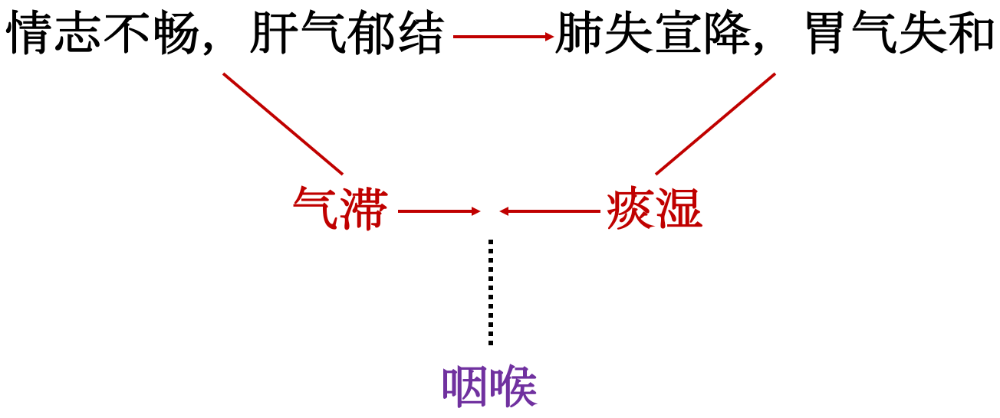
                    - **情志** **肝** **气滞**
                    - **肺** **痰湿**
                    - > 肺：遇风寒而发
                - **方解**
                    - **君：半夏**
                    - **臣：厚朴**
                    - **佐：**
                        - **茯苓**
                        - > 脾为生痰之源，肺为储痰之器
                        - **苏叶** **肝**
                        - > 振奋脾肺之气
                        - **生姜**
                - **辨证要点**
                    - **如**
                - **使用注意**
                    - 宜于痰气互结而无热者
                    - 不宜于气郁化火或阴虚津少者
                - **随证加减**
                    - 气郁甚者，酌加香附、郁金
                    - > 香附，又名雷公头，可制香
                    - 胁肋疼痛者，酌加川楝子、延胡索
                    - 咽痛者，酌加玄参、桔梗
                    - 郁结化热，心烦者，酌加栀子、连翘、黄芩
            - **枳实消痞丸**
            - > 金·李杲《兰室秘藏》
                - **组成**
                    - **干生姜、炙甘草、麦蘖面（麦芽曲）、白茯苓、白术**
                    - **半夏曲、人参**
                    - **厚朴**
                    - **枳实、黄连**
                - **用法**
                    - **食远服**
                    - 现代用法：共为细末，水泛小丸或糊丸，每服6～9g，饭后温开水送下，日2次；亦可作汤剂水煎服
                - **主治**
                    - **脾虚气滞，寒热互结证**
                - **功用**
                    - **行气消痞，健脾和胃**
                - **主证病机分析**
                    - 气机阻滞，寒热互结——心下痞满，脉弦
                    - 脾虚失运，胃纳不振——不欲饮食，食亦难消
                    - 脾虚气血生化不足——倦怠乏力
                    - 食积内停，传导失司——大便不畅
                    - 食积气郁化热——苔腻微黄
                - **方解**
                    - **君：枳实**
                    - **臣：厚朴**
                    - **佐：**
                        - **半夏**
                        - **干姜**
                        - **黄连**
                        - **麦芽曲**
                        - **参、苓、术、草（四君子汤）**
                    - **使：甘草**
                - **方剂组成比较**
                - > “学古而不泥古”
                    - **枳实消痞丸**
                        - 枳实、厚朴、人参、白术、茯苓
                        - 半夏、干姜、黄连、麦芽、甘草
                    - **半夏泻心汤**
                        - 半夏、干姜、黄连、黄芩、人参、甘草、大枣
                    - **枳术汤**
                        - 枳实、白术
                    - **四君子汤**
                        - 人参、白术、茯苓、甘草
                - **配伍特点**
                    - **消补兼施，消重于补**
                        - 枳实、厚朴用量独重
                    - **温清并用，清大于温**
                        - 黄连用量大于干姜
                - **辨证要点**
                    - 本方为行气消痞的常用方
                    - 心下痞满，食少倦怠，苔腻微黄
                - **使用注意**
                    - 痞满属虚多实少者，慎用
                - **随证加减**
                    - 偏寒者，减黄连量，加重干姜或再加高良姜、肉桂
                    - 脾虚甚者，重用人参．白术
                    - 腹胀甚者，酌加陈皮、木香
            - **厚朴温中汤**
            - > 金·李东垣《内外伤辨惑论》
                - **组成**
                    - **厚朴** **橘皮**
                    - **甘草** **草豆蔻仁、茯苓** **木香**
                    - **干姜**
                - **用法**
                    - **生姜** **食前**
                    - 忌一切冷物
                    - **生姜**
                - **主治**
                    - **脾胃气滞寒湿证**
                - **功用**
                    - **行气除满，温中燥湿**
                - **主证病机分析**
                    - 寒湿伤脾，气机不畅——脘腹胀满而痛，四肢倦怠无力，苔白或白腻，脉沉弦
                    - 脾失运化，胃不受纳——食欲不振
                    - *“饮食失常，寒温不适，则脾胃乃伤”——《内外伤辨惑论》*
                - **方解**
                    - **君：厚朴**
                    - **臣：草豆蔻**
                    - **佐：**
                        - **陈皮、木香** **助厚朴**
                        - **干姜、生姜** **助草豆蔻**
                        - **茯苓**
                    - **佐使：甘草**
                - **配伍特点**
                    - 重用行气药为主，兼以温中化湿
                        - **重在“行气”**
                - **辨证要点**
                    - 脘腹胀满或疼痛，舌苔白腻，脉沉弦
                - **使用注意**
                    - 气虚不运或胃阴不足，以及气滞化热者，不宜用
                - **随证加减**
                    - 寒邪重者，酌加高良姜、肉桂
                    - 兼夹食滞者，酌加神曲、山楂
                    - 兼肝气郁滞并吐酸者，酌加香附、乌贼骨
                    - 兼胃气上逆者，酌加半夏、姜竹茹
            - **天台乌药散（原名乌药散）**
            - > 《医药发明》、宋·太医院编《圣济总录》
                - **组成**
                    - **乌药、木香、茴香子** **青橘皮** **高良姜**
                    - **槟榔**
                    - **楝实**
                    - **巴豆**
                - **用法**
                    - **散** **空心，食前温酒** **生姜、热酒**
                - **主治**
                    - **寒凝气滞之小肠疝气**
                        - **疝气（疝）**
                            - **气痛**
                                - 如突出于腹壁、腹股沟，或从腹腔下入阴囊的肠段
                            - **足厥阴肝经**
                - **功用**
                    - **行气疏肝，散寒止痛**
                - **主证病机分析**
                    - **肝经寒凝气滞之寒疝**
                        - 寒凝肝脉——少腹痛引睾丸
                        - 气机郁滞——舌淡苔白，脉沉迟
                - **方解**
                    - **君：乌药**
                    - **臣：木香、青皮、小茴香、高良姜**
                    - **佐使：**
                        - **槟榔**
                        - **川楝子**
                - **配伍特点**
                    - **方中川楝子是如何炮制的？为什么？**
                        - 留川楝子，去巴豆（油入药）
                        - 苦寒之川楝子+ 辛热之巴豆
                            - 抑制川楝子的寒性
                            - 巴豆炒，赋予川楝子一定的通便作用
                            - **行气、攻积、通便**
                - **辨证要点**
                    - 少腹痛引睾丸，舌淡苔白，脉沉弦
                - **使用注意**
                    - 湿热下注或阴虚气滞之疝痛不宜用
                - **随证加减**
                    - 偏坠肿胀，加荔枝核，橘核
                    - 寒甚，加肉桂，吴茱萸
            - **暖肝煎**
            - > 明·张介宾《景岳全书》
                - **主治**
                    - **肝肾虚寒，气机阻滞证**
                - **功用**
                    - **温补肝肾，行气止痛**
                - **主证病机分析**
                    - **肝肾不足→寒客肝脉→气机郁滞**
                        - 睾丸冷痛，小腹疼痛，疝气疼痛
                        - 畏寒喜暖
                        - 舌淡苔白，脉沉弦
                - **方解**
                    - **君：**
                        - **肉桂**
                        - **小茴香**
                    - **臣：**
                        - **当归、枸杞子**
                        - **乌药、沉香**
                    - **佐使：**
                        - **茯苓**
                        - > 阳虚阴盛，水湿不化
                        - **生姜**
                - **辨证要点**
                    - 睾丸或小腹疼痛，畏寒喜温，得温痛减，舌淡苔白，脉沉迟
                - **使用注意**
                    - 疝气而见阴囊红肿热痛者，禁用
                - **随证加减**
                    - 寒甚者，加吴茱萸、干姜、附子
                    - 腹痛甚者，加香附
                    - 睾丸痛甚者，加青皮、橘核
                - **暖肝煎与天台乌药散比较**
                    - **天台乌药散**
                        - **行气散寒**
                        - **寒凝气滞之小肠疝气**
                    - **暖肝煎**
                        - **温补肝肾**
                        - **肝肾阴寒之疝气**
            - **加味乌药汤**
            - > 明·董宿《奇效良方》
                - **主治**
                    - **气滞血郁之痛经**
                        - 情志不舒，肝气郁滞，气机不利，则血行不畅，冲任经脉不利，经血滞于胞中
                - **功用**
                    - **行气活血，调经止痛**
                - **主证病机分析**
                    - 
                - **方解**
                    - **君：香附**
                    - **臣：**
                        - **乌药**
                        - **延胡索**
                    - **佐：**
                        - **木香、砂仁**
                        - **生姜**
                    - **佐使：甘草**
                - **辨证要点**
                    - 肝郁气滞（兼寒）之痛经
                    - 经前少腹胀痛，胀甚于痛
                    - 苔白，脉弦
                - **使用注意**
                    - 经痛绵绵属冲任虚损者，不宜用
                - **随证加减**
                    - 兼血瘀者，酌加蒲黄、五灵脂
                    - 兼寒者，酌加吴茱萸、小茴香
                - **加味乌药汤与逍遥散比较**
                    - **加味乌药汤**
                        - 疏肝行气止痛之力较强
                        - 宜于肝郁气滞，血行不畅之痛经
                    - **逍遥散**
                        - 疏肝行气之力较弱
                        - 兼养血柔肝，健脾助运
                        - 宜于肝郁血虚，脾失健运之痛经
        - **降气剂**
            - **适应证**
                - **气机上逆（降逆气）**
                    - 肺气上逆——咳嗽，气喘
                    - 胃气上逆——呕吐，呃逆，噫气
            - **配伍用药**
                - **降逆下气药**
            - **苏子降气汤**
            - > ​唐·孙思邈《备急千金要方》
                - **组成**
                    - **紫苏子、半夏**
                    - **川当归**
                    - **甘草**
                    - **前胡** **厚朴**
                    - **肉桂**
                - **用法**
                    - **生姜** **枣子** **紫苏**
                - **主治**
                    - **上实下虚之喘咳**
                - **功用**
                    - **降气平喘，祛痰止咳** 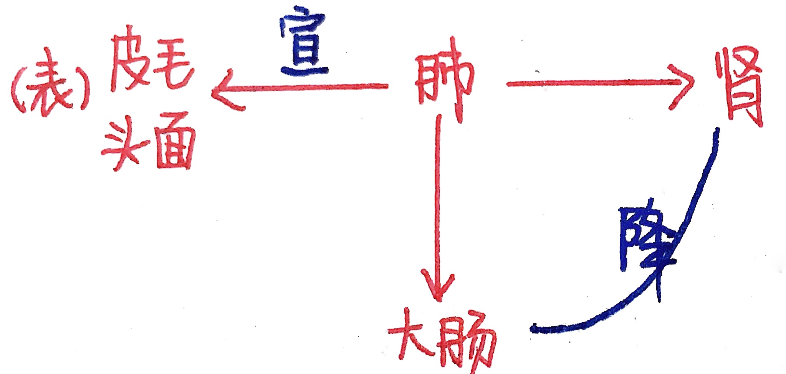
                - **主证病机分析**
                    - **上实下虚**
                        - **上实**
                            - 胸膈满闷，喘咳痰多，苔白滑
                        - **下虚**
                            - **呼多吸少**
                            - > 呼出心与肺，吸入肝与肾
                - **方解**
                    - **君：苏子**
                    - **臣：半夏**
                    - **佐：**
                        - **厚朴、前胡**
                        - **肉桂**
                        - **当归**
                        - **生姜、苏叶**
                    - **使：甘草、大枣**
                - **配伍特点**
                    - **方中如加用陈皮？去肉桂，加沉香？**
                - **辨证要点**
                    - 喘咳气急，痰多稀白，苔白滑或白腻
                    - 兼呼多吸少，腰疼脚弱
                - **使用注意**
                    - 阴虚或肺热或下元虚甚咳喘，不宜用
                - **随证加减**
                    - 痰多喘甚，加泻肺平喘药、葶苈子、桑白皮
                    - 喘不能平卧或动则气短难续，加纳气平喘药（胡桃肉、沉香、诃子）
                    - 肾阳虚明显，加温肾助阳药：附子、补骨脂
                    - 水肿、小便不利，加利尿药
            - **定喘汤**
            - > 明·张时彻《摄生众妙方》
                - **组成**
                    - **白果**
                    - **麻黄**
                    - **苏子**
                    - **甘草**
                    - **款冬花**
                    - **杏仁**
                    - **桑皮**
                    - **黄芩**
                    - **法制半夏**
                - **用法**
                    - 上用水三盅，煎二盅，作二服。每服一盅，不用姜，不拘时候，徐徐服
                - **主治**
                    - **风寒外束，痰热内蕴之哮喘**
                - **功用**
                    - **宣肺降气，清热化痰**
                - **主证病机分析**
                    - **风寒外束**
                        - 微恶风寒
                    - **痰热内蕴，肺失宣降**
                        - **稠而黄 ，量多易咳**
                - **方解**
                    - **君：**
                    - > 辛温
                        - **麻黄**
                        - **白果**
                        - > 一散一敛，既加强平喘之功，又使发散而不耗伤肺气，敛肺而不留邪
                    - **臣：桑白皮、黄芩**
                    - **佐：苏子、杏仁、半夏、款冬花**
                    - > 辛温
                    - **佐使：甘草**
                - **辨证要点**
                    - 咳喘气急，痰多色黄，苔黄腻，脉滑数
                    - 或兼微恶寒
                - **使用注意**
                    - 新感风寒，内无痰热；阴虚咳喘，不宜用
                - **随证加减**
                    - 无表证者，减少麻黄用量
                    - 痰多者，加瓜蒌、胆南星
                    - 肺热重者，酌加生石膏、鱼腥草
                - **苏子降气汤、定喘汤、小青龙汤比较**
                - > 咳喘
                    - **苏子降气汤**
                        - 上实下虚
                        - 痰多质稀
                    - **定喘汤**
                        - 外寒内热
                        - 痰稠而黄 ，量多易咳
                    - **小青龙汤**
                        - 外寒里寒
                        - 痰稀如水
            - **旋覆代赭汤**
            - > 东汉·张仲景《伤寒论》
                - **组成**
                    - **旋覆花**
                    - **人参**
                    - **生姜**
                    - **代赭石**
                    - **甘草**
                    - **半夏**
                    - **大枣**
                - **用法**
                    - 以水一斗，煮取六升，去滓再煎，取三升，温服一升，日三服
                - **主治**
                    - **胃气虚弱，痰浊内阻，气机上逆**
                        - 胃虚痰阻气逆
                - **功用**
                    - **降逆化痰，益气和胃**
                    - **胃癌**
                - **主证病机分析**
                    - **胃气虚弱**
                    - > 汗吐下

                        - **脾不运湿，湿聚为痰** **痰阻气滞**
                        - **胃气上逆** **噫气** **嗳气** **呃逆**
                        - 苔白腻，脉缓或滑
                - **方解**
                    - **君：旋覆花**
                    - > 入肺胃
                    - **臣：代赭石**
                    - > **不宜多用——质重碍胃**
                    - **佐：**
                        - **半夏、生姜**
                        - **人参、炙甘草、大枣**
                    - **使：炙甘草**
                - **辨证要点**
                    - 心下痞硬，噫气（嗳气）频作或呕恶
                        - **噫**
                            - 寒气客于胃，厥逆从下上散，复出于胃
                - **使用注意**
                    - 中焦虚者，不可重用代赭石
                - **随证加减**
                    - 胃气不虚，去人参、大枣，加重代赭石用量
                    - 痰多，加茯苓、陈皮
                - **旋覆代赭汤、半夏泻心汤比较**
                    - **旋覆代赭汤**
                        - 以旋复花、代赭石之降逆下气
                        - 配伍半夏、生姜之和胃散结为主
                        - **降逆和胃，治实顾虚**
                        - **中虚痰阻气滞**
                    - **半夏泻心汤**
                        - 以黄芩、黄连之苦寒泄热
                        - 配伍干姜、半夏之辛温开结为主
                        - **温清并用，辛开苦降**
                        - **寒热互结**
            - **橘皮竹茹汤**
            - > 东汉·张仲景《金匮要略》
                - **组成**
                    - **橘皮**
                    - **竹茹**
                    - **大枣**
                    - **生姜**
                    - **甘草**
                    - **人参**
                - **用法**
                    - 上六味，以水一斗，煮取三升，温服一升，日三服
                - **主治**
                    - **胃虚有热之呃逆**
                - **功用**
                    - **降逆止呃，益气清热**
                - **主证病机分析**
                    - **胃虚有热**
                        - 胃失和降——呃逆或干呕
                        - 胃虚——虚烦少气，纳差
                        - 有热——口干，舌红嫩，脉虚数
                - **方解**
                    - **君：**
                        - **橘皮**
                        - **竹茹**
                    - **臣：**
                        - **生姜**
                        - **人参**
                    - **佐：甘草、大枣**
                    - **使：甘草**
                - **用量特点**
                    - 橘皮、竹茹均须大剂量才能获效
                    - > 15g以上
                - **配伍特点**
                    - 清而不寒；补而不滞
                - **辨证要点**
                    - 呃逆或呕吐，舌红嫩，脉虚数
                - **使用注意**
                    - 呃逆由实热或虚寒所致者不宜使用
                - **随证加减**
                    - 兼气阴两伤，加麦冬、茯苓、半夏、枇杷叶
                    - 气不虚者，去人参、甘草、大枣，可加柿蒂
    - 理血剂
        - **定义**
            - **理血药** **活血祛瘀** **止血** **瘀血** **出血病证**
        - **分类**
            - **血病病证**
                - **血虚**
                - **瘀血、出血**
                    - **瘀血**
                    - **出血**
        - **使用注意**
            - 辨清病因，分清标本缓急（血脱）
            - 活血不破血，瘀去不伤正；中病即止；月经过多及孕妇慎用
            - 血止不留瘀；上部出血忌升提，下部出血忌沉降
        - **活血祛瘀剂**
            - **适应证**
                - **血瘀证（血行不畅；瘀蓄内停）**
                    - **疼痛**
                        - 刺痛、拒按，固定不移
                    - **肿块**
                        - 质坚硬，固定不移，压痛，体表色青紫，体内为癥积
                    - **出血**
                        - 色紫黯，挟血块
                    - **紫绀与失荣**
                        - 舌紫暗，或瘀斑或瘀点，脉涩，唇面指甲青紫，面色黧黑，肌肤甲错
            - **瘀血形成原因**
                - 气滞血瘀、热结血瘀、寒凝血瘀、外伤血瘀、气虚血瘀、痰滞血瘀等
            - **配伍用药**
                - **活血祛瘀药** **理气药**
                - > 逐瘀过猛，易伤正气
                    - 寒、热、虚、实
                - **活血祛瘀剂中为何经常配伍行气药和补气药？**
                    - **配伍行气药**
                        - 血瘀往往夹杂有气滞
                        - 行气有助于活血
                    - **配伍补气药**
                        - 活血化瘀药易耗气（耗血）
                        - 活血化瘀药易引发出血动血
                            - **止血药**
                            - > 活血而不动血，但活血力量减弱
                            - **补气药**
                            - > 防止活血化瘀药耗伤正气；防止活血化瘀药动血；加强活血化瘀药活血作用
            - **桃核承气汤**
            - > 东汉·张仲景《伤寒论》
                - **组成**
                    - **桃仁**
                    - **大黄**
                    - **桂枝**
                    - **甘草**
                    - **芒硝**
                - **用法**
                    - **芒硝**
                - **主治**
                    - **下焦蓄血证**
                        - 瘀热互结下焦
                - **功用**
                    - **逐瘀泻热**
                - **主证病机分析**
                    - **下焦蓄血证**
                    - > **血蓄下焦，瘀热互结**
                        - 少腹急结
                        - 烦渴 至夜发热
                        - 谵语
                        - 小便自利
                        - 舌、脉——舌红，脉沉实或涩
                - **方解**
                    - **君：**
                        - **桃仁**
                        - **大黄**
                    - **臣：**
                        - **桂枝** **通行血脉** *助桃仁*
                        - **芒硝** *助大黄*
                    - **佐使：炙甘**
                - **组成特点**
                    - 由调胃承气汤加桃仁、桂枝而成
                - **辨证要点**
                    - 少腹急结，小便自利，脉沉实或涩
                - **使用注意**
                    - 表证未解，当先解表
                    - 孕妇忌服
                    - 体虚慎用
                - **随证加减**
                    - 兼气滞者，加香附、乌药、枳实、青皮
                    - 跌打损伤者，加当归、赤芍、红花、三七
                    - 血热火旺于上者，加生地、丹皮、栀子、牛膝
                    - 妇科病常合四物汤
            - **血府逐瘀汤**
            - > 清·王清任《医林改错》
                - **组成**
                    - **桃仁**
                    - **红花**
                    - **当归**
                    - **生地**
                    - **川芎**
                    - **赤芍**
                    - **牛膝**
                    - **桔梗**
                    - **柴胡**
                    - **枳壳**
                    - **甘草**
                - **用法**
                    - 水煎服
                - **主治**
                    - **胸中血瘀证**
                        - **病位：**
                        - **病机：**
                - **功用**
                    - **活血祛瘀，行气止痛**
                - **主证病机分析**
                    - **胸中血瘀，兼肝气郁滞** 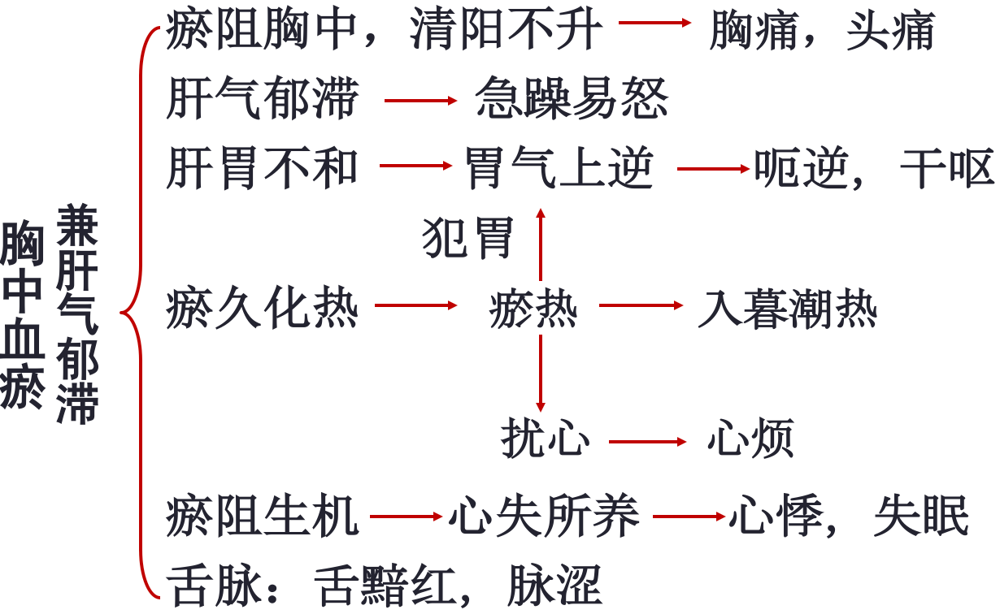
                        - 瘀阻胸中，清阳不升——胸痛，头痛
                        - 肝气郁滞——急躁易怒
                        - 肝胃不和——胃气上逆——呃逆，干呕
                        -                       犯胃↑
                        - 瘀久化热——瘀热——入暮潮热
                        -                                ↓
                        -                             扰心——心烦  
                        - 瘀阻生机——心失所养——心悸，失眠
                        - 舌脉：舌黯红，脉涩
                - **方解**
                    - **桃红四物汤（白芍易赤芍，熟地易生地**
                    - **四逆散（枳实易枳壳）**
                    - > 肝经循行部位
                    - **桔梗**
                    - **牛膝**
                - **配伍特点**
                    - 气血兼顾；活中寓养；升降同用
                - **辨证要点**
                    - 胸痛，痛如针刺和（或）有定处，舌黯红或有瘀斑，脉涩或弦紧
                - **使用注意**
                    - 孕妇忌服
                - **随证加减**
                    - 瘀痛日久入络，加全虫、山甲、地龙、三棱、莪术
                    - 气滞较甚，加川楝子、青皮、香附
                    - 血瘀经闭、痛经，去桔梗，加香附、益母草、泽兰
                    - 胁下有痞块，加丹参、郁金、蛰虫、水蛭
                    - **会厌逐瘀汤**
                        - **治咽喉部瘀血（呛水）**
                        - **桃仁，红花，当归，赤芍，枳壳，甘草，生地，柴胡，桔梗，玄参**
            - **补阳还五汤**
            - > 清·王清任《医林改错》
                - **组成**
                    - **黄芪**
                    - **当归尾**
                    - **赤芍**
                    - **地龙**
                    - **川芎**
                    - **红花**
                    - **桃仁**
                - **用法**
                    - 水煎服
                - **主治**
                    - **气虚血瘀之中风**
                - **功用**
                    - **补气，活血，通络**
                - **主证病机分析**
                    - **中风后遗症**
                        - **中风之后经气大虚，脉络瘀阻**
                        - **气虚不摄**
                - **方解**
                - > 补气为主，重用补气药（黄芪）
                    - **君：黄芪** 气旺以促血行，祛瘀而不伤正
                    - **臣：当归尾**
                    - **佐：**
                        - **桃仁、红花、川芎、赤芍**
                        - **地龙**
                - **配伍特点**
                    - 大量补气药与少量活血药相配，使气旺则血行，活血而不伤正
                - **辨证要点**
                    - 半身不遂，舌淡苔白，脉缓或细弱无力
                - **随证加减**
                    - 上肢加桑枝、桂枝
                    - 下肢加牛膝、杜仲
                    - 久病加水蛭、虻虫
                    - 语音不利，加菖蒲、郁金、远志
                    - 口眼歪斜，合牵正散
                    - 痰多，加半夏、天苎黄
                    - 偏寒，加附子
                    - 脾虚，加党参、白术
                - **是否适合所有中风后遗症**
                - **临床如何服用**
                - > 一次大量病人可能受不了
                - **黄芪适宜用量**
            - **温经汤**
            - > 东汉·张仲景《金匮要略》
                - **组成**
                    - **吴茱萸**
                    - **当归**
                    - **芍药**
                    - **芎䓖**
                    - **人参**
                    - **桂枝**
                    - **阿胶**
                    - **牡丹皮**
                    - **生姜**
                    - **甘草**
                    - **半夏**
                    - **麦冬**
                - **用法**
                    - 上十二味，以水一斗，煮取三升，分温三服
                    - **烊冲**
                - **主治**
                    - **冲任虚寒，瘀血阻滞**
                        - **虚实寒热** **寒实**
                        - *“女子……二七而天癸至，任脉通，太冲脉盛，月事以时下，故有子。”*
                            - 冲脉——为血海（十二经脉气血会聚之要冲）
                            - 任脉——主胞胎
                            - 冲、任皆起于小腹
                            - 冲、任脉与足阳明胃经相通
                - **功用**
                    - **温经散寒，** **养** **血祛瘀**
                - **主证病机分析**
                    - **冲任虚寒**
                        - 寒凝气滞——少腹里急，腹满，月经不调，久不受孕
                        - 寒凝血瘀——痛经，唇口干燥
                        - 瘀阻生机——阴血不足，虚热内生——傍晚发热，手心烦热
                        - 虚寒失固，瘀血阻滞，血不循经——月经先期，或一月再行，崩中漏下
                - **方解**
                    - **君：吴茱萸、桂枝**
                    - **臣：当归、川芎、芍药、丹皮**
                    - **佐：**
                        - **阿胶、麦冬**
                        - **人参、甘草、生姜**
                        - **半夏**
                    - **使：甘草**
                - **辨证要点**
                    - *原治崩漏，现代常用于治疗月经不调，痛经及不孕症等*
                    - 月经不调，小腹冷痛，时发烦热，经有瘀块，色紫而淡，脉迟细
                - **使用注意**
                    - 崩漏者服药后短时出血过多，属正常现象
                    - 月经不调属实热或无瘀血者，忌用
                    - 服药期间忌食生冷
                - **随证加减**
                    - 小腹冷痛甚，去丹皮、麦冬，加艾叶、小茴香，或桂枝易为肉桂
                    - 寒凝气滞，加香附、乌药
                    - 漏下不止，血色暗淡，去丹皮，加炮姜、艾叶
                    - 气虚甚，加黄芪、白术
                    - 傍晚发热甚，加银柴胡、地骨皮
            - **生化汤**
            - > 清·傅山《傅青主女科》
                - **组成**
                    - 全当归八钱（24g）
                    - 川芎三钱（9g）
                    - 桃仁去皮尖，研，十四枚（6g）
                    - 干姜炮黑，五分（2g）
                    - 甘草炙，五分（2g）
                - **用法**
                    - **黄酒、童便**
                    - 现代用法：水煎服，或酌加黄酒同煎
                - **主治**
                    - **产后（血虚受寒）瘀血腹痛**
                - **功用**
                    - **化瘀生新，温经止痛**
                - **主证病机分析**
                    - **产后（虚、瘀）+感受寒邪**
                        - 血虚寒凝——小腹冷痛
                        - 瘀血阻滞——恶露不行
                - **方解**
                    - **君：**
                        - **当归** **重用**
                        - > 脂溶性，故用酒
                        - **川芎、桃仁**
                    - **佐：**
                        - **炮姜**
                        - **黄酒**
                        - > 温通，做溶媒溶当归，滋补
                        - **童便**
                    - **便：炙甘草**
                - **辨证要点**
                    - 产后瘀阻腹痛之名方
                        - ***产后必服方？***
                            - 预防少腹疼痛，促进子宫修复
                            - 不是必服
                                - 血虚受寒后的瘀血腹痛
                                - 血虚受寒发热不宜服
                    - 恶露不行，小腹冷痛
                        - **恶露**
                            - 指产妇分娩后，胞宫内遗留的余血和浊液
                            - 一般在产后二至三周内完全排净
                            - **恶露不行**
                - **随证加减**
                    - 恶露已行，腹微痛，可减桃仁
                    - 瘀滞较甚，痛剧，加菖蒲、五灵脂、元胡、益母草
                    - 冷痛甚，加肉桂
                    - 气滞明显，加木香、香附、乌药
            - **桂枝茯苓丸**
            - > 东汉·张仲景《金匮要略》
                - **组成**
                    - **桂枝、茯苓、丹皮** **、桃仁** **、芍药**
                - **用法**
                    - 上五味，末之，炼蜜和丸，如兔屎大，每日食前服一丸（3g）；不知，加至三丸（9g）
                    - 现代用法：共为末，炼蜜和丸，每日服～5g；亦可作汤剂，水煎服
                - **主治**
                    - **瘀血留阻胞宫证**
                - **功用**
                    - **活血化瘀，缓消癥块**
                        - **有形包块**
                            - 瘀——活血化淤
                            - 痰——化痰散结
                - **主证病机分析**
                    - **瘀阻胞宫**
                        - 阻遏经脉——漏下不止
                        - 胎元不固——胎动不安
                        - 经闭腹痛
                        - 产后恶露不尽，腹痛拒按
                    - **特点**
                        - 腹痛拒按
                - **方解**
                    - **君：**
                        - **桂枝** 温通
                        - **茯苓** 渗湿
                        - > 瘀，痰
                    - **臣：桃仁、丹皮**
                    - **佐：芍药**
                    - **使：白蜜**
                - **配伍特点**
                    - 通因通用；温清同用
                - **辨证要点**
                    - 下血色紫黑晦暗，或腹痛拒按
                - **使用注意**
                    - 严格掌握剂量，以防祛瘀太过而伤正
                - **随证加减**
                    - 瘀阻较重，加丹参、川芎
                    - 痛剧，加元胡、没药、乳香
                    - 出血多，加茜草、蒲黄
                    - 气滞，加香附、陈皮
        - **止血剂**
        - > 组成、应用
            - **适应证**
                - **出血**
                - *辨：寒热虚实，上下内外，轻重缓急*
            - **配伍用药**
                - 止血过急，易致留瘀
                - **止血药** **化瘀药**
                - **止血剂中为何经常配伍活血祛瘀药和清热药？**
                    - **活血祛瘀药**
                        - 止血过急，易致留瘀
                        - 使止血不留瘀
                    - **清热药**
                        - 血得温则行，得寒则涩
            - **十灰散**
            - > 元·葛乾孙《十药神书》
                - **组成**
                    - **大蓟、小蓟、荷叶、侧柏叶、茅根、茜根、山栀、大黄、牡丹皮、棕榈皮**
                - **用法**
                    - **白藕** **萝卜汁** **京墨**
                    - **烧炭**
                - **主治**
                    - **血热妄行之上部出血**
                        - 气火上冲，损伤血络，迫血妄行，上走清窍
                - **功用**
                    - **凉血止血**
                - **方解**
                    - **大蓟、小蓟、荷叶、茜根、侧柏叶、茅根**
                    - **棕榈皮**
                    - **栀子、大黄**
                    - **丹皮**
                    - **藕汁**
                    - **萝卜汁**
                    - **京墨**
                - **组成特点**
                    - **炒炭**
                        - 加强收敛止血作用
                    - **止血而不留瘀**
                        - 大蓟、小蓟、茜根、大黄、丹皮
                - **配伍特点**
                    - 凉血与清降并用；收涩与化瘀兼顾
                - **辨证要点**
                    - 上部出血，来势急暴，血色鲜红，舌红脉数
                - **使用注意**
                    - 不可久服；虚寒性出血忌用
                - **随证加减**
                    - 气火上逆，血热较盛，可加大大黄、栀子用量，作为君药
                    - 或再加牛膝、代赭石，引血下行
            - **咳血方**
            - > 元·朱震亨《丹溪心法》
                - **组成**
                    - 青黛（6g）
                    - 瓜蒌仁（9g）
                    - 诃子（6g）
                    - 海粉（9g）
                    - 山栀（9g）
                    - 原著本方无用量
                - **用法**
                    - **蜜** **姜汁** **噙化**
                    - 现代用法：共研末为丸，每服9g；亦可作汤剂，水煎服
                - **主治**
                    - **肝火犯肺之咳血**
                - **功用**
                    - **清肝宁肺，凉血止血**
                - **主证病机分析**
                    - **肝火犯肺**
                        - 肺失清肃——咳嗽
                        - 灼津为痰——咳痰痰色色黄，咯吐不爽
                        - 灼伤肺络——咳痰带血
                    - 心烦易怒，胸胁作痛，咽干口苦，颊赤便秘，舌红苔黄，脉弦数
                - **方解**
                    - **君：青黛、栀子**
                    - **臣：**
                        - **蒌仁**
                        - **海粉（海浮石）**
                        - > 注：海粉为蓝斑背肛海兔的卵群带
                    - **佐：**
                        - **诃子**
                        - **蜜**
                        - **姜汁**
                - **配伍特点**
                    - 寓止血于清热泻火之中，标本同治
                    - 清化痰热与清肝敛肺并用，肝肺同调
                - **辨证要点**
                    - **木火刑金**
                    - 咳痰黄稠带血，胸胁作痛，舌红苔黄，脉弦数
                - **使用注意**
                    - 肺肾阴虚及脾虚便溏者，不宜使用
                - **随证加减**
                    - 阴伤，加沙参、麦冬
                    - 痰多，加川贝、天竺黄、枇杷叶
            - **小蓟饮子**
            - > 南宋·严用和《济生方》
                - **组成**
                    - **生地黄、小蓟、滑石、木通、蒲黄、藕节、淡竹叶、当归、山栀子、甘草**
                - **用法**
                    - 上㕮咀，每服半两（15g），水煎，空心服
                - **主治**
                    - **热结下焦之血淋、尿血**
                - **功用**
                    - **凉血止血，利尿通淋**
                - **主证病机分析**
                    - **热结下焦**
                        - 热伤血络——尿中见血，或血尿
                        - 膀胱气化失司——小便频数，赤涩热痛
                        - 舌红苔黄，脉数
                - **方解**
                    - **君：小蓟**
                    - **臣：**
                        - **藕节、蒲黄**
                        - **生地**
                    - **佐：**
                        - **当归**
                        - **滑石、竹叶、木通**
                        - **栀子**
                    - **使：甘草**
                - **组成特点**
                    - **导赤散**
                - **配伍特点**
                    - 止血之中寓化瘀，血止而不留瘀
                    - 清利之中寓养阴血，利尿而不伤阴
                - **辨证要点**
                    - 尿中见血，血色鲜红，舌红，脉数
                - **使用注意**
                    - 血淋、尿血属寒证，或阴虚火动、气虚不摄者，不宜使用
                    - 孕妇忌用
                    - 不宜久服
                - **随证加减**
                    - 尿痛，加琥珀末
                    - 有结石，可加金钱草、海金沙、石韦
                    - 日久气阴两伤，减木通、滑石，加太子参、黄芪、阿胶
            - **槐花散**
            - > 宋·许叔微《本事方》
                - **组成**
                    - **槐花炒、柏叶** **荆芥穗、枳壳**
                - **用法**
                    - **清米饮**
                    - **开水或米汤**
                - **主治**
                    - **风热湿毒壅遏大肠之** **下血**
                        - 肠风；脏毒
                - **功用**
                    - **清肠止血，疏风理气**
                - **主证病机分析** 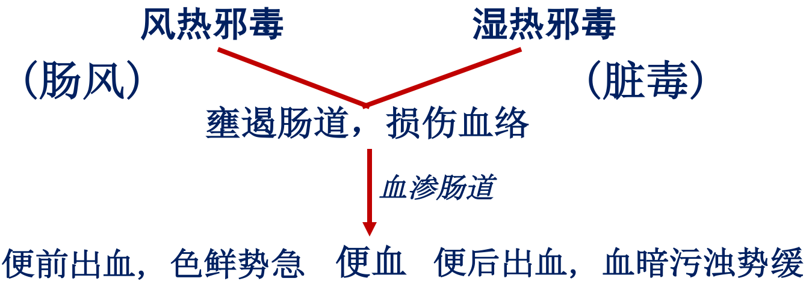
                    - 肠风——风热邪毒；脏毒——湿热邪毒
                    - **→壅遏肠道，损伤血络**
                    - →血渗肠道
                    - →便血
                        - 便前出血，色鲜势急
                        - 便后出血，血暗污浊势缓
                - **方解**
                    - **君：槐花**
                    - **臣：侧柏叶**
                    - **佐使：**
                        - **荆芥穗** **炒黑**
                        - **枳壳** **腑以降为顺）**
                - **配伍特点**
                    - 寓行气于止血之中，寄收涩于清疏之内，相反相成
                - **辨证要点**
                    - 便血，血色鲜红或晦暗污浊，舌红脉数
                - **使用注意**
                    - 不宜久服
                    - 气虚、阴虚、中焦虚寒之便血，不宜使用
                - **随证加减**
                    - 便血量多，荆芥穗改炭，并加黄芩炭、地榆炭、棕榈炭
                    - 大肠热甚，加黄芩、黄连
                    - 脏毒下血，加苍术、茯苓
                    - 便血日久血虚，加熟地、当归
            - **黄土汤**
            - > 东汉·张仲景《金匮要略》
                - **组成**
                    - **甘草、干地黄、白术、附子** **阿胶、黄**
                    - **灶心黄土**
                - **用法**
                    - 上七味，以水八升，煮取三升，分温二服
                    - **水煎取汤** **烊化**
                - **主治**
                    - **脾阳（气）不足，脾不统血证**
                        - 原治便血，后亦治吐衄崩漏
                - **功用**
                    - **温阳健脾，养血止血**
                - **方解**
                    - **君：灶心黄土**
                    - **臣：白术、附子**
                    - **佐：**
                        - **生地、阿胶**
                        - **黄芩**
                        - > 黄芩、生地、阿胶，制约术、附之温燥
                    - **佐使：甘草**
                - **配伍特点**
                    - 寒热并用，刚柔相济，标本兼顾
                    - 温阳不伤阴动血，滋阴而不腻滞碍阳
                - **辨证要点**
                    - 出血量较多，血色黯淡，舌淡苔白，脉沉细无力
                - **使用注意**
                    - 热证出血者忌用
                - **随证加减**
                    - 出血多，加白及、三七
                    - 气虚甚，加人参、黄芪
                    - 中焦虚寒甚，加炮姜炭
                - **黄土汤、归脾汤、理中丸均可治疗脾不统血之便血、崩漏，临床应如何区别使用？**
    - 治风剂
        - **定义**
            - **辛散疏风** **息风止痉药** **疏散外风** **平息内风** **风病**
            - **风有内外之分**
                - **外风**
                    - 为六淫之一
                    - 外感风邪，留于头面、肌表、经络、筋肉、骨节等，其致病偏于肌表
                - **内风**
                    - 为阳气所化，多呈火热炽盛或肝阳偏亢
                    - 内生风邪，多因内脏病变所致，主要责之于肝，致病症状类似外风
        - **分类**
            - **疏散外风剂**
            - **平熄内风剂**
        - **使用注意**
            - 辨清外风、内风
            - 风邪多挟寒、热、湿、痰、瘀等邪
            - 外风可引动内风，内风可兼夹外风
            - 辛散疏风药多温燥，易伤阴津
        - **疏散外风剂**
            - **临床表现**
                - 头痛、恶风、肌肤瘙痒、肢体麻木、筋骨挛痛、关节屈伸不利、鼻塞不闻香臭、口眼歪斜、猝然昏倒而半身不遂等
            - **配伍用药**
                - **辛散祛风药**
            - **川芎茶调散**
            - > 宋《太平惠民和剂局方》
                - **组成**
                    - **薄荷叶**
                    - **川芎、荆芥**
                    - **细辛**
                    - **防风**
                    - **白芷、羌活、甘草**
                - **用法**
                    - 上为细末，每服二钱（6g），食后，茶清调下
                    - 现代用法：共为细末，每服6g，每日2次，饭后清茶调服；亦可作汤剂，水煎服
                - **主治**
                    - **外感风邪头痛**
                    - > 风寒头痛？风热头痛？
                        - **头风**
                            - 风邪留而不去，头痛日久不愈，其痛或偏或正，作止无时
                - **功用**
                    - **疏风止痛**
                - **主证病机分析**
                    - 汗出而腠理开张之际（如沐浴、酒后等）风邪乘虚而入
                    - 头为诸阳之会，清空之府，风为轻扬之邪，风邪外袭，先犯头部
                        - *“伤于风者，上先受之”*
                    - **风邪上扰清空，头部经气不利**
                    - **风邪束表，邪正交争**
                    - **肺气不宣**
                - **方解**
                    - **川芎（君）、白芷、羌活、荆芥、防风、细辛**
                        - **川芎：**
                        - > 头顶或两侧
                        - **白芷**
                        - > 前额或眉棱骨
                        - **羌活：**
                        - > 枕后牵及项部
                    - **薄荷** ***（重用）***
                    - **清茶** ***苦寒***
                    - **甘草**
                - **辨证要点**
                    - 风邪头痛的常用方
                    - 头痛，鼻塞，脉浮
                - **使用注意**
                    - 因气血亏虚，或痰湿阻滞，或肝肾阴亏、肝阳上亢、肝风内动引起的头痛，不宜用
                    - 使用时宜量轻微煎
                - **随证加减**
                    - 属风寒者，重用川芎，酌加生姜、紫苏
                    - 属风热者，去羌活、细辛，加蔓荆子、菊花
                    - 头痛日久不愈，加全蝎、僵蚕、桃仁、红花
            - **大秦艽汤**
            - > 金·刘完素《素问病机气宜保命集》
                - **组成**
                    - **秦艽**
                    - **甘草、川芎、川独活、当归、白芍药、石膏**
                    - **川羌活、防风、吴白芷、黄芩、白术、白茯苓、生地黄、熟地黄**
                    - **细辛**
                - **用法**
                    - 上十六味锉，每服一两（30g），水煎，去滓，温服，无时
                - **主治**
                    - **风邪初中经络证（不伴意识障碍）**
                - **功用**
                    - **祛风清热，养血活血**
                - **主证病机分析**
                    - **正气亏虚，风邪乘虚而入，气血痹阻，络脉不通**
                        - 口眼歪斜，舌强不能言语，手足不能运动
                - **方解**
                    - **君：秦艽**
                    - **臣：羌活、独活、防风、白芷、细辛**
                    - **佐：**
                        - **当归、白芍、熟地**
                        - **川芎、当归**
                        - **白术、茯苓、甘草**
                        - **生地、石膏、黄芩**
                    - **使：甘草**
                - **辨证要点**
                    - *“六经中风轻者之通剂也”*
                    - 口眼歪斜，舌强不能言语，手足不能运动，病程较短，兼有外风证
                - **使用注意**
                    - 中风属内风引动者，不宜用
                - **随证加减**
                    - 天阴，加生姜
                    - 心下痞，加枳实
                    - 无内热，可去黄芩、石膏、生地
                    - 表证不明显，可减细辛、白芷、防风
            - **消风散**
            - > 明·陈实功《外科正宗》
                - **组成**
                    - **当归、生地、防风、蝉蜕、知母、苦参、胡麻、荆芥、苍术、牛蒡子、石膏**
                    - **甘草、木通**
                - **用法**
                    - 水二盅，煎至八分，食远服
                - **主治**
                    - **风疹、湿疹**
                - **功用**
                    - **疏风养血，清热除湿**
                - **主证病机分析**
                    - **浸淫血脉，郁于肌肤腠理**
                        - 风——皮肤瘙痒，皮疹时隐时现
                        - 热——疹出色红
                        - 湿——津水流溢
                - **方解**
                    - **荆芥、防风、牛蒡子、蝉蜕**
                    - **苍术**
                    - **木通、苦参**
                    - **石膏、知母**
                    - **当归、生地、胡麻仁**
                    - **生甘草**
                - **配伍特点**
                    - **当归、生地、胡麻仁配伍意义**
                        - **养血滋阴**
                            - 制祛风除湿药易伤阴血之弊
                            - 补风毒及湿热之邪损伤之阴血
                        - **养血活血**
                            - “治风先治血，血行风自灭”
                        - **疏风、清热、祛湿、养血**
                - **辨证要点**
                    - 本方为治疗皮肤病的效方
                    - 疹出色红，瘙痒，或津水流溢，或遍身云片斑点，脉浮数
                - **使用注意**
                    - 服药期间，不宜服食辛辣、鱼腥、烟酒、浓茶等
                    - 宜配合本方煎液温洗或其他药物外用
                    - 切忌用热水烫洗患处
                - **随证加减**
                    - 风热偏盛，酌加银花、连翘、大黄
                    - 湿热偏盛，酌加地肤子、车前子、栀子
                    - 血分有热，酌加赤芍、丹皮、紫草
                    - 瘙痒尤甚，病久，酌加乌梢蛇、全蝎、僵蚕
            - **牵正散**
            - > 南宋·杨倓（子靖）《杨氏家藏方》
                - **组成**
                    - **白附子、白僵蚕、全蝎**
                - **用法**
                    - 上细为末，每服一钱(3g)，热酒调下不拘时候
                    - 现代用法：共为细末，每次3g，温酒送服，日服2～3次；亦可作汤剂，水煎服
                - **主治**
                    - **风痰阻络之口眼歪斜（无明显全身症状）**
                - **功用**
                    - **祛风化痰，通络止痉**
                - **主证病机分析**
                    - **口眼歪斜**
                - **方解**
                    - **君：白附子**
                    - **臣：**
                        - **全蝎**
                        - **僵蚕**
                    - **佐使：酒**
                - **辨证要点**
                    - 突然口眼歪斜，舌淡苔白
                - **使用注意**
                    - 肝阳化风，肝风内动或气虚血瘀引起口眼歪斜，不宜用
                    - 白附子、全蝎有毒，且方中各药均生用，药性及药力骠悍，故药量不宜过大
                - **随证加减**
                    - 作汤剂时，可酌加天麻、白蒺藜、蜈蚣、地龙
        - **平息内风剂**
            - **临床表现**
                - **肝风内动**
                    - 眩晕，震颤，四肢抽搐，猝然昏倒、不省人事，口眼歪斜，半身不遂
            - **配伍用药**
                - **实证**
                - > **热极动风**
                    - **平肝熄风药**
                - **虚证**
                - > **阴血亏虚，虚风内动**
                    - **滋养阴血药**
            - **羚角钩藤汤**
            - > 清·俞根初《通俗伤寒论》
                - **组成**
                    - **羚角片**
                    - **霜桑叶**
                    - **京川贝**
                    - **鲜生地**
                    - **双钩藤**
                    - **滁菊花**
                    - **茯神木**
                    - **生白芍**
                    - **生甘草**
                    - **淡竹茹**
                - **用法**
                    - 水煎服
                - **主治**
                    - **肝热生风证**
                - **功用**
                    - **凉肝熄风，增液舒筋**
                - **主证病机分析**
                    - **筋束骨，联络关节、肌肉，主司运动，具刚劲柔润相兼之性**
                        - 肝经热盛——高热；脉弦而数
                        - 热扰心神——烦闷躁扰，甚则神昏
                        - 热伤阴津——手足抽搐，发为痉厥；舌绛而干或舌焦起刺
                        - > 抽搐——阳热太盛，耗伤肝阴，筋脉失养，故筋脉痉挛
                - **方解**
                    - **君：羚角、钩藤**
                    - **臣：桑叶、菊花**
                    - **佐：**
                        - **白芍、生地**
                        - **川贝母、竹茹**
                        - **茯神木**
                    - **佐使：生甘草**
                - **配伍特点**
                    - **桑叶、菊花在羚角钩藤汤与桑菊饮中的配伍意义有何不同？**
                        - **羚角钩藤汤**
                            - 清肝平肝，疏散外风
                        - **桑菊饮**
                            - 桑叶——散上焦风热，清宣肺热而止咳
                            - 菊花——散风热， 清利头目而肃肺
                - **辨证要点**
                    - 高热烦躁，手足抽搐，舌绛而干，脉弦数
                - **使用注意**
                    - 虚风内动者，不宜用
                - **随证加减**
                    - 无羚羊角，可用山羊角或珍珠母替代（用量宜大）
                    - 气分热盛，加石膏、知母
                    - 营血分热盛，加水牛角、丹皮、紫草
                    - 兼阳明腑实，加大黄、芒硝
                    - 兼邪闭心包、神昏，加紫雪或安宫牛黄丸
                    - 抽搐不止，加全蝎、僵蚕、蜈蚣
                    - 喉间痰壅，加鲜竹沥、生姜汁、天竺黄
                    - 津伤较甚，加玄参、天冬、麦冬
            - **镇肝熄风汤**
            - > 清·张锡纯《医学衷中参西录》
                - **组成**
                    - **怀牛膝**
                    - **生赭石**
                    - **生龙骨**
                    - **生牡蛎**
                    - **生龟板**
                    - **生杭芍**
                    - **玄参**
                    - **天冬**
                    - **川楝子**
                    - **生麦芽**
                    - **茵陈**
                    - **甘草**
                - **用法**
                    - 水煎服
                - **主治**
                    - **肝阳上亢，气血上逆之类中风**
                - **功用**
                    - **镇肝熄风，滋阴潜阳**
                - **主证病机分析**
                    - **肝肾阴虚，阴不制阳，肝阳偏亢，肝风内动，气血上逆**
                        - 风阳上扰——头目眩晕，脑部热痛，目胀耳鸣，面色如醉
                        - 阴虚阳亢，心肝火炽——心中烦热
                        - 肝失疏泄，肝病犯胃——噫气
                        - 阳亢太过，气血逆乱——轻则肢体不利，口眼歪斜；重则眩晕颠仆，昏不知人
                        - 瘀阻脉络，气血运行不畅——肢体痿废或偏枯
                - **方解**
                    - **君：怀牛膝**
                    - **臣：代赭石、龙骨、牡蛎、龟板、白芍**
                    - **佐：**
                        - **玄参、天冬**
                        - **茵陈、川楝子、生麦芽**
                    - **佐使：生甘草**
                - **配伍特点**
                    - 急则治标
                    - 重镇与潜降相伍
                    - 标本兼顾
                    - 平肝佐以疏肝
                - **辨证要点**
                    - 面色如醉 脉弦长有力
                - **使用注意**
                    - 方中代赭石、龙骨、牡蛎、龟甲生用，意在加强平肝潜阳清热之功
                    - 麦芽生用方有疏肝之效
                        - 大剂量生用——回乳
                        - 小剂量炒用——下乳
                    - 热极动风者，不宜用
                    - 金石介类药碍胃，脾胃虚弱者，慎用
                - **随证加减**
                    - 心中热甚，加石膏
                    - 痰多者，加胆南星
                    - 尺脉重按虚者，加熟地、山茱萸
                    - 风阳亢盛，酌加钩藤、天麻、羚羊角
                    - 肝火较盛，酌加夏枯草、黄芩
                    - 大便秘结，酌加生大黄
                    - 兼瘀血，酌加桃仁、乳香、没药
            - **天麻钩藤饮**
            - > 胡光慈《杂病证治新义》
                - **组成**
                    - **天麻**
                    - **钩藤**
                    - **生决明**
                    - **山栀、黄芩**
                    - **川牛膝**
                    - **杜仲、益母草、桑寄生、夜交藤、朱茯神**
                    - 原著本方无用量
                - **用法**
                    - 水煎服
                - **主治**
                    - **肝阳偏亢，肝风上扰证**
                - **功用**
                    - **平肝熄风，清热活血，补益肝肾**
                - **主证病机分析**
                    - **肝阳偏亢，风阳上扰**
                        - 肝肾不足，阴不制阳——头痛，眩晕
                        - 郁怒忧思，气郁化火——舌红苔黄，脉弦
                    - **肝阳肝火内扰，神魂失于安宁**
                        - 夜寐多梦，甚或失眠
                - **方解**
                    - **天麻、钩藤（君），石决明**
                    - **栀子、黄芩** *（肝经）*
                    - **益母草**
                    - **杜仲、桑寄生、牛膝**
                    - **夜交藤、茯神**
                - **辨证要点**
                    - 头痛，眩晕，失眠，舌红苔黄，脉弦
                - **使用注意**
                    - 肝经实火或湿热所致的头痛，不宜用
                - **随证加减**
                    - 眩晕较甚，唇舌或肢体发麻者，酌加代赭石、龙骨、牡蛎
                    - 肝火偏盛，头痛剧者，酌加龙胆草、夏枯草、丹皮
                    - 便秘者，酌加大黄、芒硝或加服当归龙荟丸
                    - 肝肾阴虚明显者，酌加女贞子、枸杞子、生地、白芍
            - **大定风珠**
            - > 清·吴鞠通《温病条辨》
                - **组成**
                    - **生白芍**
                    - **阿胶**
                    - **生龟板**
                    - **干地黄**
                    - **麻仁**
                    - **五味子**
                    - **生牡蛎**
                    - **麦冬**
                    - **炙甘草**
                    - **鸡子黄**
                    - **鳖甲**
                - **用法**
                    - 水八杯，煮取三杯，去滓，入阿胶烊化，再入鸡子黄，搅令相得，分三次服
                    - **烊化**
                - **主治**
                    - **阴虚风动证**
                - **功用**
                    - **滋阴息风**
                - **主证病机分析**
                    - 阴液耗损，水不涵木，虚风内动，筋脉失养——手足瘛疭
                    - 真阴大亏，精气虚衰，精不养神——精神倦怠
                    - 肝肾阴伤，邪少虚多——舌绛少苔，脉象虚弱
                    - 肾水欲竭，阴不敛阳，阴阳行将离决——脉时时欲脱
                - **方解**
                    - **君：鸡子黄、阿胶**
                    - **臣：白芍、生地黄、麦冬**
                    - **麻仁**
                    - **五味子**
                    - **佐：龟板、鳖甲、牡蛎**
                    - **佐使：炙甘草** *合芍、味酸甘化阴*
                - **组成特点**
                    - **复脉汤** **龟板、鳖甲、牡蛎、鸡子黄、五味子**
                - **辨证要点**
                    - 瘛疭，神疲，舌绛苔少，脉虚弱
                - **使用注意**
                    - 阴液虽亏，但邪热犹盛者，不宜用
                        - 大队滋补之品，误用有恋邪之弊
                - **随证加减**
                    - 气虚者，加人参
                    - 自汗出者，加煅龙骨、浮小麦
                    - 心悸者，加茯神
                    - 兼低热者，酌加地骨皮、知母、丹皮
                    - 有痰者，酌加天竺黄、半夏、贝母
                - **大定风珠与羚角钩藤汤比较？**
    - 治燥剂
        - **定义**
            - **辛散轻宣** **甘凉滋润药** **轻宣外燥** **滋阴润燥** **燥证**
                - 燥证有外燥和内燥之分
                    - **外燥**
                        - **外感燥邪（秋月燥胜）**
                        - **温燥** **凉燥**
                    - **内燥**
                        - **脏腑津亏液耗**
                        - **上燥** **中燥** **下燥**
        - **分类**
            - **轻宣外燥剂**
            - **滋润内燥剂**
        - **使用注意**
            - 分清外燥、内燥
            - 滋腻之品，易助湿生痰碍气
            - 避免使用辛香苦燥或苦寒泻火之品
        - **轻润外燥剂**
            - **适应证**
                - 外感凉燥或温燥之证
                    - **凉燥**
                        - **深秋气凉，感受风寒燥邪，肺气不宣**
                        - 症见恶寒，头痛，咳嗽鼻塞，咽干口燥
                            - **次寒**
                    - **温燥**
                        - **初秋之燥热，或久晴无雨，燥伤肺津**
                        - 症见头痛发热，干咳无痰，或气逆喘急，心烦口渴，舌干无苔
                            - **伴见燥热伤津**
            - **配伍用药**
                - **凉燥**
                    - **辛温解表药**
                - **温燥**
                    - **辛凉解表药**
                - 配伍止咳化痰药；养阴润燥药；清热药
            - **杏苏散**
            - > 清·吴鞠通《温病条辨》
                - **组成**
                    - **苏叶**
                    - **半夏**
                    - **茯苓**
                    - **甘草**
                    - **前胡**
                    - **苦桔梗**
                    - **枳壳**
                    - **生姜**
                    - **橘皮**
                    - **大枣**
                    - **杏仁**
                    - （原著本方无用量）
                - **用法**
                    - 水煎温服
                - **主治**
                    - **外感凉燥**
                        - 凉燥外袭，肺气失宣，津液不布，聚而生痰
                - **功用**
                    - **轻宣凉燥，理肺化痰**
                - **主证病机分析**
                    - **凉燥外袭**
                        - 卫阳被遏——恶寒无汗，头微痛
                        - 肺气失宣——咳嗽 ，鼻塞；咳吐稀痰（津液不布）
                        - 燥伤津液——咽干
                        - 苔白脉弦（兼痰饮）
                - **方解**
                    - **君：**
                        - **苏叶**
                        - **杏仁**
                    - **臣：**
                        - **桔梗、枳壳**
                        - **前胡**
                    - **佐：半夏、橘皮、茯苓**
                    - **佐使：草、姜、枣**
                - **配伍特点**
                    - *“燥淫于内，治以苦温，佐以甘辛”*
                - **辨证要点**
                    - 本方为治疗凉燥证的代表方
                    - 恶寒无汗，咳嗽痰稀，咽干，苔白，脉弦
                - **使用注意**
                    - 外感温燥，不宜用
                - **随证加减**
                    - 无汗，加羌活
                    - 兼泄泻腹满，加苍术、厚朴
                    - 眉棱骨痛，加白芷
            - **桑杏汤**
            - > 清·吴鞠通《温病条辨》
                - **组成**
                    - **桑叶**
                    - **杏仁**
                    - **沙参**
                    - **象贝**
                    - **香豉**
                    - **栀皮**
                    - **梨皮**
                - **用法**
                    - 水二杯，煎取一杯，顿服之，重者再作服
                - **主治**
                    - **外感温燥（温燥袭肺之轻证）**
                        - 温燥外袭，肺失清肃，耗津灼液
                - **功用**
                    - **轻宣温燥，润肺止咳**
                - **方解**
                    - **君：**
                        - **桑叶**
                        - **杏仁**
                    - **臣：**
                        - **豆豉**
                        - **象贝**
                    - **佐：**
                        - **沙参**
                        - **栀皮**
                        - **梨皮**
                - **配伍特点**
                    - *“轻药不得重用，重用必过病所”*
                - **辨证要点**
                    - 身微热，干咳无痰或痰少而粘，舌红苔薄而干
                - **桑杏汤与杏苏散都可以轻宣外燥，治疗秋燥咳嗽，临床应如何区别使用？**
            - **清燥救肺汤**
            - > 清·喻昌（嘉言）《医门法律》
                - **组成**
                    - **桑叶**
                    - **石膏**
                    - **甘草**
                    - **人参**
                    - **胡麻仁**
                    - **真阿胶**
                    - **麦门冬**
                    - **杏仁**
                    - **枇杷叶**
                - **用法**
                    - 水一碗，煎六分，频频二三次，滚热服
                - **主治**
                    - **温燥伤肺重证**
                - **功用**
                    - **清燥润肺，益气养阴**
                - **主证病机分析**
                    - **温燥伤肺重证**
                        - 燥热伤肺，肺合皮毛——身热头痛
                        - 热伤气，燥伤阴，肺失清肃——干咳无痰，咽喉干燥，心烦口渴，脉虚大，气逆而喘，胸胁满痛
                - **方解**
                    - **君：桑叶**
                    - **臣：**
                        - **石膏**
                        - **麦冬**
                    - **佐：**
                        - **杏仁、枇杷叶**
                        - **麻仁、阿胶**
                        - **人参、甘草**
                    - **使：甘草**
                - **辨证要点**
                    - **燥热伤肺之重证**
                        - 身热不退，干咳少痰，气逆而喘，舌红少苔，脉虚大而数
                - **使用注意**
                    - 原书石膏用煅，但现代临床均用生
                    - 方中石膏用量当按病情轻重酌定，须避免过重而伤及肺气
                    - 脾虚痰湿内盛，胸膈满闷者，不宜用
                - **随证加减**
                    - 痰多，加贝母、瓜蒌
                    - 血虚，加生地
                    - 热甚，加水牛角、羚羊角或牛黄
                    - 津伤甚，可将人参易为西洋参
        - **滋润内燥剂**
            - **适应证**
                - 脏腑津液不足之内燥证（上、中、下）
            - **配伍用药**
                - **滋阴润燥药**
                - 配伍益气和中药；清热药
            - **麦门冬汤**
            - > 东汉·张仲景《金匮要略》
                - **组成**
                    - **麦门冬**
                    - **半夏**
                    - **人参**
                    - **甘草**
                    - **粳米**
                    - **大枣**
                - **用法**
                    - 上六味，以水一斗二升，煮取六升，温服一升，日三夜一服
                    - > 古代1升约5两
                - **主治**
                    - **虚热肺痿**
                    - **胃阴不足证**
                - **功用**
                    - **滋养肺胃，降逆下气**
                - **主证病机分析**
                    - **肺阴不足，虚火上炎，肺气上逆，灼津为痰或津聚为痰**
                        - 咳逆上气，咯痰不爽，或咳吐涎沫，口干咽燥，手足心热，舌红少苔，脉虚数
                    - **胃阴不足，气逆不降，津不上承**
                        - 气逆呕吐，口渴咽干，舌红少苔，脉虚数
                - **方解**
                    - **君：麦冬** ***重用***
                    - **臣：半夏** ***小量***
                    - **佐：**
                        - **人参、甘草**
                        - > 西洋参代人参——现代人参多偏温
                        - **大枣、粳米**
                    - **使：甘草**
                - **配伍特点**
                    - 润中有燥，滋而不腻，动静结合
                    - 培土生金，体现“虚则补其母”之法
                - **辨证要点**
                    - 咳吐涎沫，短气喘促或呕吐，伴咽喉干燥，舌红少苔
                - **使用注意**
                    - 虚寒性肺痿禁用
                    - 脾胃虚寒之呕吐禁用
                - **随证加减**
                    - 阴伤甚者，加沙参、玉竹
                    - 咳逆较甚者，加百部、款冬花
                    - 呕吐较甚者，加竹茹、生姜
            - **养阴清肺汤**
            - > 清·郑梅涧（枢扶）《重楼玉钥》
                - **组成**
                    - **大生地**
                    - **麦门冬**
                    - **生甘草**
                    - **元参**
                    - **贝母**
                    - **丹皮**
                    - **薄荷**
                    - **炒白芍**
                - **用法**
                    - 水煎服
                - **主治**
                    - **阴虚肺燥** **白喉**
                - **功用**
                    - **养阴清肺，解毒利咽**
                - **主证病机分析**
                    - **肺肾阴虚，复感疫毒**
                        - **肺肾阴虚，虚火上炎，复加疫毒**
                            - 喉生白膜，咽喉肿痛，鼻干唇燥
                        - **肺失宣肃，气道受阻**
                            - 或咳或不咳，呼吸有声，似喘非喘
                - **方解**
                    - **君：生地** ***重用***
                    - **臣：**
                        - **玄参**
                        - **麦冬**
                    - **佐：**
                        - **白芍** *防木火刑金*
                        - **丹皮**
                        - **贝母**
                        - **薄荷**
                    - **佐使：甘草**
                - **辨证要点**
                    - 喉间起白如腐，不易拭去，咽喉肿痛，鼻干唇燥，脉数
                - **使用注意**
                    - 白喉忌解表，尤忌辛温发汗
                - **随证加减**
                    - 阴虚甚者，加熟地
                    - 热毒盛者，去白芍，加连翘
                    - 燥盛者，加天冬
            - **玉液汤**
            - > 清·张锡纯《医学衷中参西录》
                - **组成**
                    - **生山药**
                    - **生黄芪**
                    - **知母**
                    - **生鸡内金**
                    - **葛根**
                    - **五味子**
                    - **天花粉**
                - **用法**
                    - 水煎服
                - **主治**
                    - **气阴两虚** **消渴**
                        - 日久，气不布津，肾虚胃燥
                - **功用**
                    - **益气滋阴，固肾止渴**
                - **主证病机分析**
                    - **脾虚不能升水谷精微，肺热不能布津，兼肾虚不能固精**
                        - 始口渴多饮，多尿，久而不止，则困倦气短，脉虚无力
                - **方解**
                    - **君：**
                        - **黄芪**
                        - **山药**
                    - **臣：知母、花粉**
                    - **佐：**
                        - **葛根**
                        - **鸡内金**
                        - **五味子**
                - **辨证要点**
                    - 口渴尿多，困倦气短，脉虚细无力
                - **使用注意**
                    - 对于消渴确诊为糖尿病者，需同时控制碳水化合物的摄入
                - **随证加减**
                    - 气虚甚者，加人参或西洋参
                    - 热邪盛、心烦者，加竹叶、石膏
                    - 肾虚较甚者，加熟地、山萸肉
            - **增液汤**
            - > 清·吴鞠通《温病条辨》
                - **组成**
                    - **玄参**
                    - **麦冬**
                    - **细生地**
                - **用法**
                    - 原方以水八杯，煮取三杯，口干则与饮令尽。不便，再作服
                - **主治**
                    - **阳明温病，津亏便秘**
                - **功用**
                    - **增液润燥**
                - **主证病机分析**
                    - **阳明温病，热盛津伤，无水舟停**
                        - 大便秘结，口渴，舌干红，脉细数或脉沉而无力
                - **方解**
                    - **君：玄参** ***重用***
                    - **臣佐：**
                        - **麦冬**
                        - **生地**
                - **辨证要点**
                    - 便秘，口渴，舌干红， 脉细数或脉沉而无力
                - **使用注意**
                    - 使用本方增液通便，方中药物药量宜重
                - **随证加减**
                    - 津亏燥热较甚，可加生大黄、芒硝
                    - 阴虚火旺，虚火上炎者，可加川牛膝
                    - 胃阴不足，舌质光者，可加沙参、石斛
    - 祛湿剂
        - **定义**
            - **祛湿药** **化湿利水，通淋泄浊** **水湿病证**
                - 属八法中“消法”
        - **分类**
            - **燥湿和胃剂——湿浊中阻**
            - **清热祛湿剂**
            - **利水渗湿剂**
            - **温化寒湿剂**
            - **祛湿化浊剂**
            - **祛风胜湿剂**
        - **使用注意**
            - 湿邪为病，有外湿、内湿之分；治湿之法，当结合部位、脏腑、兼挟等因素
                - **水湿**
                    - 湿为水之渐，水为湿之积
                - **水湿与痰饮**
                    - 脾湿生痰，聚水成饮
                - **水、湿、痰、饮：**
                    - 都是水液代谢失常所导致的病理产物
                    - **肾、脾、肺** **三焦、膀胱**
                - **湿有外湿、内湿之分**
                    - **外湿**
                    - **内湿**
                    - 外湿与内湿常相因为见
                - **湿邪**
                    - 湿性重浊、粘腻，易阻滞气机
                    - 湿为阴邪，易伤阳气
            - 湿邪最易阻滞气机，故多配伍理气之品
                - **祛湿剂中为什么经常配伍** **行气药** **？**
                    - 湿邪重浊粘腻，易阻碍气机，而气滞不行，又使湿邪不得运化，故祛湿剂中常配行气药，以求气化则湿化
            - 祛湿剂多由芳化苦燥之品组成，易耗伤阴津，故素体阴虚津亏，病后体虚，以及孕妇应慎用
        - **燥湿和胃剂**
            - **适应证**
                - **湿浊内阻，脾胃失和证**
                    - 症见脘腹痞满，嗳气吞酸，呕吐泄泻，食少体倦等
            - **配伍用药**
                - **苦温燥湿** **芳香化湿药**
                - 配伍行气药；健脾药；解表药
            - **代表方**
                - 平胃散、藿香正气散
            - **平胃散**
            - > 宋《太平惠民和剂局方》
                - **组成**
                    - **苍术**
                    - **厚朴**
                    - **陈橘皮**
                    - **甘草**
                - **用法**
                    - 上为散。每服二钱（6g），水一中盏，加生姜二片，大枣二枚，同煎至六分，去滓，食前温服
                    - 现代用法：共研细末，每服46g，姜枣煎汤送下；亦可作汤剂，加生姜2片、大枣2枚，水煎服
                - **主治**
                    - **湿滞脾胃证**
                - **功用**
                    - **燥湿健脾，行气和胃**
                - **主证病机分析**
                    - **（寒）湿滞脾胃证**
                        - 脾失健运——不思饮食，口淡无味
                        - 升降失常——吐、利、嗳气、吞酸
                        - 湿阻气机——脘腹胀满
                        - 湿困清阳——怠惰嗜卧，肢体沉重
                        - 舌脉——苔白腻而厚，脉缓
                - **方解**
                    - **君：苍术**
                    - > 苦辛温燥湿健脾，降浊和胃
                    - **臣：厚朴**
                    - > 苦辛温行气化湿，消胀除满
                    - **佐：陈皮**
                    - > 行气化滞
                    - **佐使：**
                        - **甘草**
                        - > 调和诸药，甘缓和中
                        - **生姜、大枣**
                    - **芳香醒脾：**
                - **配伍特点**
                    - 苦降辛开以消胀除满
                    - 芳香化浊以醒脾和胃
                    - 温中燥湿以健脾助运
                - **辨证要点**
                    - 口淡无味，脘腹胀满，舌苔白腻而厚
                - **使用注意**
                    - 阴虚气郁，脾胃虚弱者，不宜使用
                    - 阴虚气滞忌用，失血过多、孕妇，不宜用
                - **随证加减**
                    - 证属湿热者，宜加入黄连、黄芩以清热燥湿
                    - 证属寒湿者，加入干姜、草豆蔻以温化寒湿
                    - 兼食滞者，加山楂、神曲、麦芽以消食
                    - 兼气滞者，加木香、砂仁以理气
                    - 呕吐甚者，加藿香、半夏以化湿和胃止呕
                    - 泄泻甚者，加茯苓、泽泻以利湿止泻
                    - **[不换金正气散]**
                        - **组成：**
                        - **功用：**
                        - **主治：**
                        - > 呕吐腹胀，恶寒发热，或霍乱吐泻，或不服水土
            - **藿香正气散**
            - > 宋《太平惠民和剂局方》
                - **组成**
                    - **大腹皮、白芷、紫苏、茯苓**
                    - **半夏曲、白术、陈皮** **厚朴** **苦桔梗**
                    - **藿香**
                    - **甘草**
                - **用法**
                    - **姜** **枣**
                    - **生姜** **大枣** **生姜** **大枣**
                - **主治**
                    - **外感风寒，内伤湿滞证**
                        - 恶寒发热，头痛，胸膈满闷，脘腹疼痛，恶心呕吐，肠鸣泄泻，舌苔白腻，以及山岚瘴疟等
                - **功用**
                    - **解表化湿，理气和中**
                - **主证病机分析**
                    - **外感风寒，内伤湿滞**
                        - 外感风寒——发热恶寒，头痛
                        - > 卫阳被郁
                        - 内伤湿滞
                            - 湿阻气机
                                - 胸膈满闷，脘腹疼痛
                            - 升降失常
                                - 恶心呕吐，肠鸣泄泻
                            - 脉浮，舌苔白腻
                - **方解**
                    - **君：藿香**
                    - > ***重用***
                    - **臣：**
                        - **半夏、陈皮**
                        - > 燥湿和胃，降逆止呕
                        - **白术、茯苓**
                        - > 健脾燥湿，和中止泻
                    - **佐：**
                        - **紫苏、白芷**
                            - **苏叶**
                            - **白芷**
                        - **大腹皮、厚朴**
                        - **桔梗**
                        - > 利于解表与化湿
                        - **生姜、大枣**
                    - **使：甘草**
                - **配伍特点**
                    - 表里双解，治里为主
                    - 升降兼施，以降为主
                    - 标本兼顾，治标为主
                    - 扶正祛邪，祛邪为主
                - **辨证要点**
                    - 恶寒发热，上吐下泻，舌苔白腻
                - **使用注意**
                    - 湿热霍乱之吐泻，非本方所宜
                    - 作汤剂时，须武火急煎
                - **随证加减**
                    - 表邪偏重，寒热无汗者，加香薷以助解表
                    - 气滞脘腹胀痛者，加木香，元胡以行气止痛
                - **能否治疗中暑**
                    - 阳暑——不可
                    - 阴暑（胃肠道感冒）——可
        - **清热祛湿剂**
            - **适用病症**
                - **外感湿热** **湿热内郁** **湿热下注** **湿温、黄疸、霍乱、热淋、痢疾、泄泻、痿痹**
            - **代表方**
                - 茵陈蒿汤、八正散、三仁汤、甘露消毒丹
            - **茵陈蒿汤**
            - > 东汉·张仲景《伤寒论》
                - **组成**
                    - **茵陈**
                    - **栀子**
                    - **大黄**
                - **用法**
                    - **先煮茵陈**
                - **主治**
                    - **湿热黄疸**
                        - 一身面目俱黄，黄色鲜明
                        - 但头汗出
                        - 口渴欲饮，恶心呕吐，腹微满，小便短赤，大便不爽或秘结
                        - 舌红苔黄腻，脉沉数或滑数有力
                - **功用**
                    - **清热、利湿、退黄**
                - **主证病机分析**
                    - 外邪入里化热——热不得外达
                    - 脾胃湿浊内阻——湿不得下泄
                    - **→湿热交蒸**
                        - 熏蒸肝胆——胆汁外溢，黄疸
                        - 郁热炽盛——发热，口渴欲饮，无汗，或但头汗出
                        - 郁滞气机——恶心呕吐，腹微满，大便不爽或秘结，小便短赤
                        - 舌脉——舌红，苔黄腻，脉沉数或滑数
                - **方解**
                    - **君：茵陈**
                    - > 苦寒，苦能燥湿，寒能清热；嫩苗有生发之力
                    - **臣：栀子**
                    - **佐：大黄**
                    - > 苦寒，利大便，活血化瘀
                - **配伍特点**
                    - 利湿与泄热并进
                    - 通利二便，前后分消
                - **随证加减**
                    - 湿重于热者，加茯苓、泽泻、猪苓以利水渗湿
                    - 热重于湿者，加黄柏、龙胆草以清热祛湿
                    - 肋痛明显者，加柴胡、川楝子以疏肝理气
                    - **茵陈蒿汤及其附方比较** 
            - **八正散**
            - > 宋《太平惠民和剂局方》
                - **组成**
                    - **车前子、瞿麦、萹蓄、滑石、山栀子仁、甘草** **、木通、大黄**
                - **用法**
                    - **灯心**
                    - **灯心** **灯心**
                - **主治**
                    - **湿热淋证**
                        - 尿频尿急，溺时涩痛，淋漓不畅，尿色浑赤，甚则癃闭不通
                        - 小腹急满，口燥咽干
                        - 舌苔黄腻，脉滑数
                - **功用**
                    - **清热泻火，利水通淋**
                - **主证病机分析**
                    - **湿热下注膀胱**
                        - 湿热壅滞，水道不利——尿频，尿急，涩痛，淋漓不畅，癃闭
                        - 湿热蕴结——清浊不分，尿色浑赤
                        - 湿热阻滞气机——少腹急痛
                        - 邪热伤津——口燥咽干
                        - 舌脉——苔黄腻、脉滑数
                - **方解**
                    - **君：**
                        - **滑石**
                        - **木通**
                    - **臣：萹蓄、瞿麦、车前子**
                    - **佐：**
                        - **栀子**
                        - **大黄**
                    - **佐使：**
                        - **生甘草**
                        - **灯心**
                - **随证加减**
                    - 血淋者（尿频、尿急、尿痛，尿中带血），加生地、小蓟、白茅根以凉血止血
                    - 石淋者（细小为砂淋），加金钱草、海金砂，石韦等以化石通淋
                    - 膏淋者（清浊不分，小便混浊），加萆薢、菖蒲以分清化浊
            - **三仁汤**
                - **组成**
                    - **杏仁**
                    - **飞滑石**
                    - **白通草**
                    - **白蔻仁**
                    - **竹叶**
                    - **厚朴**
                    - **生薏仁**
                    - **半夏**
                - **用法**
                    - 甘澜水八碗，煮取三碗，每服一碗，日三服
                - **主治**
                    - **湿温初起** **暑温夹湿** **湿重于热证**
                        - 头痛恶寒，身重疼痛，肢体倦怠
                        - 面色淡黄，胸闷不饥，午后身热
                        - 苔白不渴，脉弦细而濡
                - **功用**
                    - **宣畅气机，清利湿热**
                - **主证病机分析**
                    - **湿重于热证**
                        - 湿遏卫阳——头痛恶寒，身重疼痛，肢体倦怠
                        - 湿阻气机——胸闷不饥
                        - 湿热交蒸——午后身热，面色淡黄
                        - 舌脉——苔白不渴，脉弦细而濡
                - **方解**
                    - **君：**
                    - > *三仁？*
                        - **杏仁**
                        - **白蔻仁**
                        - **苡仁**
                    - **臣：**
                        - **滑石**
                        - **通草**
                        - **竹叶**
                    - **佐：**
                        - **半夏**
                        - **厚朴**
                - **配伍特点**
                    - 宣上、畅中、渗下，三焦分消
                - **使用注意**
                    - 舌黄腻，（转向）热重于湿者，不宜使用
                - **随证加减**
                    - 湿温初起，卫分症状明显者，加藿香、香薷以解表化湿
                    - 兼寒热往来者，加青蒿、草果以和解化湿
                    - **[藿朴夏苓汤]**
                        - **组成：**
                        - **功用：**
                        - **主治：**
                        - > 身热恶寒，肢体倦怠，胸闷口腻，舌苔薄白，脉濡缓
            - **甘露消毒丹**
            - > 清·叶桂述，吴金寿校《医效秘传》
                - **组成**
                    - **飞滑石**
                    - **淡黄芩**
                    - **绵茵陈**
                    - **石菖蒲**
                    - **川贝母、木通**
                    - **藿香、连翘、白蔻仁、薄荷、射干**
                - **用法**
                    - 生晒研末，每服三钱，开水调下，或神曲糊丸，如弹子大，开水化服亦可
                    - 现代用法：散剂，每服6～9g；或为丸剂，每服9～12g；亦可作汤剂，水煎服
                - **主治**
                    - **湿热并重证**
                        - 发热倦怠，胸闷腹胀，肢酸咽痛
                        - 身目发黄，颐肿口渴，小便短赤，泄泻淋浊
                        - 舌苔白或厚腻或干黄，脉濡数或滑数
                - **功用**
                    - **利湿化浊，清热解毒**
                - **方解**
                    - **君：**
                        - **滑石**
                        - **茵陈**
                        - **黄芩**
                    - **臣：石菖蒲、藿香、白豆蔻**
                    - **佐 ：**
                        - **木通**
                        - **连翘、射干、薄荷、贝母**
                - **使用注意**
                    - 若湿热入营、谵语舌强者，非本方所宜
                - **随证加减**
                    - 若黄疸明显者，宜加栀子、大黄清泄湿热
                    - 咽颐肿甚者，可加山豆根、板蓝根等以解毒消肿利咽
            - **二妙散**
            - > 元·朱震亨《丹溪心法》
                - **组成**
                    - **黄柏** **苍术**
                - **用法**
                    - **姜汁**
                    - 现代用法：二药等分，研细末和匀，每次3～6g；或制成丸剂，每次6g；亦可作汤剂，水煎服
                - **主治**
                    - **湿热下注证**
                        - 筋骨疼痛，或两足痿软，或足膝红肿疼痛
                        - 或湿热带下，或下部湿疮、湿疹，小便短赤
                        - 舌苔黄腻
                - **功用**
                    - **清热燥湿**
                - **方解**
                    - **君：黄柏**
                    - **臣 ：苍术**
                    - **药引：姜汁**
                - **随证加减**
                    - 湿热痿证，可加豨莶草，木瓜，萆薢等祛湿热，强筋骨
                    - 湿热脚气，宜加薏苡仁、木瓜、槟榔等渗湿降浊
                    - 下部湿疮、湿疹，可以加土茯苓、赤小豆清湿热，解疮毒
                    - **[三妙丸]**
                        - **组成：**
                        - **功用：**
                        - **主治：**
                        - > 两足麻木或肿痛，或如火烙之热，痿软无力
                    - **[四妙丸]**
                        - **组成：**
                        - **功用：**
                        - **主治：**
                        - > 两足麻木，痿软，肿痛
        - **利水渗湿剂**
            - **适用病症**
                - **水湿壅盛** **水肿、泄泻**
            - **代表方**
                - 五苓散、猪苓汤
            - **五苓散**
            - > 东汉·张仲景《伤寒论》
                - **组成**
                    - **猪苓**
                    - **泽泻**
                    - **白术**
                    - **茯苓**
                    - **桂枝**
                - **用法**
                    - 上五味，捣为散，以白饮和，服方寸匕，日三服，多饮暖水，汗出愈，如法将息
                    - 现代用法：散剂，每服6～10g，多饮热水，取微汗；亦可作汤剂，水煎服，温服取微汗
                - **主治**
                    - **膀胱气化不利之蓄水证**
                        - 小便不利，头痛微热，烦渴欲饮，甚则水入即吐
                        - 或脐下动悸，吐涎沫而头目眩晕
                        - 或短气而咳
                        - 或水肿、泄泻，舌苔白，脉浮或浮数
                - **功用**
                    - **利水渗湿，温阳化气**
                - **主证病机分析**
                    - **太阳蓄水证**
                        - 表邪未解——头痛微热
                        - 水蓄膀胱——小便不利
                        - 气化不利——渴欲饮水
                        - 水气上逆——水入即吐
                        - 水邪泛滥——水肿，泄泻，脐下动悸，吐涎末而头眩，短气而咳
                - **方解**
                    - **君：泽泻**
                    - **臣：**
                        - **猪苓**
                        - **茯苓**
                    - **佐：**
                        - **白术**
                        - **桂枝**
                - **随证加减**
                    - 若水肿兼表证者，合越婢汤
                    - 若水湿壅盛者，合五皮散
                    - 泄泻偏于热者，去桂枝，加车前子、木通以利水清热
                    - **[胃苓汤]**
                        - **组成：**
                        - **功用：**
                        - **主治：**
            - **猪苓汤**
            - > 东汉·张仲景《伤寒论》
                - **组成**
                    - **猪苓** **、茯苓、泽泻、阿胶、滑石**
                - **用法**
                    - **阿胶烊消**
                    - **阿胶烊化**
                - **主治**
                    - **水热互结证**
                        - 小便不利，发热，口渴欲饮
                        - 或心烦不寐，或兼有咳嗽、呕恶、下利
                        - 舌红苔白或微黄，脉细数
                        - 又治血淋，小便涩痛，点滴难出，小腹胀满者
                - **功用**
                    - **利水，清热，养阴**
                - **主证病机分析**
                    - **水热互结证**
                        - 气化不利——小便不利
                        - 热灼阴津——发热，口渴欲饮
                        - 热扰心神——心烦不寐
                        - 水邪泛滥——咳嗽、呕恶、下利
                        - 舌脉——舌红苔白或微黄，脉细数
                - **方解**
                    - **君：猪苓**
                    - **臣：泽泻、茯苓**
                    - **佐：**
                        - **滑石**
                        - **阿胶**
                - **配伍特点**
                    - 利水不伤阴，滋阴不碍湿
                - **使用注意**
                    - 内热盛，汗多口渴严重者不宜使用
                - **随证加减**
                    - 治热淋，可加栀子、车前子以清热利水通淋
                    - 治血淋、尿血，可加白茅根、大蓟、小蓟以凉血止血
        - **温化寒湿剂**
            - **适用病症**
                - **阳虚不能化水** **湿从寒化** **痰饮、水肿**
            - **代表方**
                - 苓桂术甘汤、真武汤、实脾散
            - **苓桂术甘汤**
            - > 东汉·张仲景《伤寒论》
                - **组成**
                    - **茯苓**
                    - **桂枝**
                    - **白术**
                    - **甘草**
                - **用法**
                    - 上四味，以水六升，煮取三升，分温三服
                - **主治**
                    - **中阳不足之痰饮**
                        - 胸胁支满，目眩心悸，短气而咳，舌苔白滑，脉弦滑或沉紧
                - **功用**
                    - **温阳健脾，利湿化饮**
                - **方解**
                    - **君：茯苓**
                    - > 茯苓入心脾肺肝肾
                    - **臣：桂枝**
                    - **佐：白术**
                    - **使：甘草**
                    - > 茯苓配甘草——利水而不伤正；甘草配茯苓——补气而不滋满
                - **配伍特点**
                    - 温而不燥，利而不峻，标本兼顾
                - **使用注意**
                    - 饮邪化热，咳痰黏稠者，不宜使用
                - **随证加减**
                    - 咳嗽痰多者，加半夏、陈皮以燥湿化痰
                    - 心下痞或腹中有水声者，加枳实、生姜以消痰散水
            - **真武汤**
            - > 东汉·张仲景《伤寒论》
                - **组成**
                    - **茯苓**
                    - **芍药**
                    - **白术**
                    - **生姜**
                    - **附子**
                - **用法**
                    - 上五味，以水八升，煮取三升，去滓，温服七合，日三服
                - **主治**
                    - **阳虚水泛证**
                        - 畏寒肢厥，小便不利，心下悸动不宁，头目眩晕，身体筋肉瞤动，站立不稳，四肢沉重疼痛浮肿，腰以下为甚
                        - 或腹痛，泄泻
                        - 或咳喘呕逆，舌质淡胖，边有齿痕，舌苔白滑，脉沉细
                - **功用**
                    - **温阳利水**
                - **主证病机分析**
                    - **阳虚水湿泛滥**
                        - 上干清阳——头目眩晕
                        - 水气凌心——心中悸动
                        - 饮邪上逆，迫肺干胃——咳喘呕逆
                        - 寒饮流注肠道——泄泻
                        - 脾肾阳虚，阴寒内停——腹痛
                        - 水泛肌表——水肿
                        - 饮渍筋肉——肌肉瞤动
                        - 饮泛骨节、经络——站立不稳，或四肢沉重疼痛
                        - 舌脉——舌质淡胖嫩，有齿印，苔白滑，脉沉细
                - **方解**
                    - **君：附子**
                    - **臣：**
                        - **白术**
                        - **茯苓**
                    - **佐：**
                        - **生姜**
                        - **白芍药**
                - **随证加减**
                    - 水寒射肺而咳者，加干姜、细辛温肺化饮，五味子敛肺止咳
                    - 阴盛阳衰而下利甚者，去芍药之阴柔，加干姜以助温里散寒
                    - 水寒犯胃而呕者，可加重生姜用量以和胃降逆，可更加吴茱萸、半夏以助温胃止呕
                    - **[附子汤]**
                        - **组成：**
                        - **功用：**
                        - **主治：**
            - **实脾散**
            - > 南宋·严用和《济生方》
                - **组成**
                    - **厚朴** **木瓜** **木香** **草果仁、大腹子、附子** **白茯苓** **干姜**
                    - **甘草**
                - **用法**
                    - **生姜** **大枣**
                    - **生姜** **大枣**
                - **主治**
                    - **脾肾阳虚，水气内停之阴水**
                        - 身半以下肿甚，手足不温，口中不渴
                        - 胸腹胀满，大便溏薄
                        - 舌苔白腻，脉沉弦而迟者
                - **功用**
                    - **温阳健脾，行气利水**
                - **方解**
                    - **君：附子、干姜**
                    - **臣：茯苓、白术**
                    - **佐：**
                        - **木瓜**
                        - **厚朴**
                        - **木香**
                        - **大腹子**
                        - **草果**
                    - **佐使：**
                        - **甘草**
                        - **生姜、大枣**
                - **配伍特点**
                    - 脾肾同治，以温脾阳为主
                    - 行气温利相结合
                - **使用注意**
                    - 阳水实证，非本方所宜
                - **随证加减**
                    - 若气短乏力，倦怠懒言者，可以加黄芪补气以助行水
                    - 小便不利，水肿甚者，可以加猪苓、泽泻以增利水消肿之功
                    - 大便秘结者，酌加牵牛子以通利二便
        - **祛湿化浊剂**
            - **萆薢分清饮**
            - > 南宋·杨倓（子靖）《杨氏家藏方》
                - **组成**
                    - **益智仁、川萆薢、石菖蒲、乌药**
                - **用法**
                    - **盐**
                    - 现代用法：水煎服，加入食盐少许
                - **主治**
                    - **下焦虚寒之** **膏淋** **，白浊**
                        - 小便频数，浑浊不清，白如米泔，凝如膏糊，舌淡苔白，脉沉
                - **功用**
                    - **温肾利湿，分清化浊**
                - **主证病机分析**
                    - **下焦虚寒，湿浊不化**
                        - 肾失封藏——小便频数
                        - 阳虚不化，清浊不分——小便混浊，白如米泔，凝如膏糊
                        - 舌脉——舌淡苔白，脉沉
                - **方解**
                    - **君：萆薢**
                    - > 收小便
                    - **臣：菖蒲**
                    - > 利小便，与萆薢相合增强化湿之力
                    - **佐：**
                        - **益智仁**
                        - **乌药**
                - **使用注意**
                    - 湿热白浊，非本方所宜
                - **随证加减**
                    - 兼虚寒腹痛者，加肉桂、茴香以温中祛寒
                    - 久病气虚者，可加黄芪、白术以益气祛湿
        - **祛风胜湿剂**
            - **适用病证**
                - 适用于风湿在表所致头痛身重，或风湿侵袭痹阻经络所致的腰膝顽麻痛痹等证
            - **代表方**
                - 羌活胜湿汤、独活寄生汤
            - **独活寄生汤**
            - > 唐·孙思邈《备急千金要方》
                - **组成**
                    - **独活**
                    - **桑寄生、杜仲、牛膝、细辛、秦艽、茯苓、肉桂心、防风、川芎、人参、甘草、当归、芍药、干地黄**
                - **用法**
                    - 上㕮咀，以水一斗，煮取三升，分三服，温身勿冷也
                - **主治**
                    - **痹证日久，肝肾两虚，气血不足证**
                        - 腰膝疼痛、痿软，肢节屈伸不利，或麻不不仁，畏寒喜温，心悸气短，舌淡苔白，脉细弱
                - **功用**
                    - **祛风湿，止痹痛，补肝肾，益气血**
                - **主证病机分析**
                    - **久痹**
                        - 痹证日久，肝肾两虚——腰脊疼痛，痿软，肢节屈伸不利，或麻不不仁
                        - 气血不足——畏寒喜温，心悸气短，舌淡苔白，脉细弱
                - **方解**
                    - **君：独活**
                    - **臣：**
                        - **细辛**
                        - **防风**
                        - **秦艽**
                        - **桂心**
                    - **佐使：**
                        - **桑寄生、杜仲、牛膝**
                        - **当归、川芎、地黄、白芍**
                        - **人参、茯苓**
                        - **甘草**
                - **配伍特点**
                    - 邪正兼顾，祛邪不伤正，扶正不恋邪
                - **使用注意**
                    - 痹证属湿热实证者忌用
                - **随证加减**
                    - 痹证疼痛较剧者，加制川乌、制草乌、白花蛇以助搜风通络，活血止痛
                    - 寒邪偏甚者，加附子、干姜以温阳散寒
                    - 湿邪偏盛者，去地黄，加防己、苡仁、苍术以祛湿消肿
                    - 正虚不甚者，可减地黄、人参
    - 祛痰剂
        - **定义**
            - **祛痰药** **祛除痰饮** **各种痰证**
                - **“消法”**
                - **痰饮**
                    - **痰** **饮**
                    - **水湿停聚**
        - **分类**
            - 燥湿化痰——湿痰
            - 清热化痰——热痰
            - 润燥化痰——燥痰
            - 温化寒痰——寒痰
            - 治风化痰——风痰
        - **组方用药**
            - **祛痰药** **健脾祛湿** **理气药、软坚散结药**
                - **祛痰剂为什么经常配伍** **行气药** **和** **健脾药** **、** **软坚散结药** **？**
                    - **行气药：**
                    - **健脾药：**
                    - **软坚散结药：**
        - **使用注意**
            - 辨别痰病的性质（寒热燥湿风）
            - 调治生痰之本，配伍理气药
            - 慎用滋腻药
            - 注意患者体质特征
            - 一般不用蜜丸
        - **燥湿化痰剂**
            - **湿痰证**
                - 痰多，色白易咯，胸脘痞闷，呕恶眩晕，肢体困倦，舌苔白滑或腻，脉缓或弦滑
            - **配伍用药**
                - **燥湿化痰药** **理气药** **健脾渗湿药**
            - **二陈汤**
            - > 宋《太平惠民和剂局方》
                - **组成**
                    - **半夏** **橘红**
                    - **白茯苓**
                    - **甘草**
                - **用法**
                    - **生姜** **乌梅**
                    - **生姜** **乌梅**
                - **主治**
                    - **湿痰证**
                - **功用**
                    - **燥湿化痰，理气和中**
                - **主证病机分析**
                    - **脾失健运，湿聚成痰**
                        - 湿痰犯肺——咳嗽痰多易咯，色白
                        - 胃失和降——恶心呕吐
                        - 痰阻气机——胸膈痞闷
                        - 痰浊困脾——肢体困重
                        - 痰阻清阳——头目眩晕
                        - 痰浊凌心——心悸
                        - 舌、脉——苔白滑或腻，脉滑
                - **方解**
                    - **君：半夏**
                    - **臣：橘红** ***气顺痰消***
                    - **佐：**
                        - **茯苓** ***脾旺湿除，湿去痰消***
                        - **生姜**
                        - **乌梅** *散收结合*
                    - **使：甘草**
                    - **六陈**
                        - **《珍珠囊药性赋》云：**
                            - *“枳壳陈皮半夏齐，麻黄狼毒及吴萸，六般之药宜陈久，入药方知奏效奇。”*
                        - 陈久者，温中而无燥热之患，行气而无峻峭之虞，中州之圣剂
                        - **半夏、陈皮**
                - **辨证要点**
                    - 痰邪为病的基础方
                    - 痰多色白易咯，舌苔白腻，脉滑
                - **使用注意**
                    - **药性偏温燥**
                - **随证加减**
                    - 湿痰，加苍术、厚朴
                    - 热痰，加胆星、瓜蒌
                    - 寒痰，加干姜、细辛
                    - 风痰，加天麻、僵蚕
                    - 食痰，加莱菔子、麦芽
                    - 郁痰，加香附、青皮、郁金
                    - 痰核、瘰疬，加海藻、昆布、牡蛎
            - **温胆汤**
            - > 南宋·陈言《三因极一病证方论》
                - **组成**
                    - **半夏** **竹茹、枳实**
                    - **陈皮**
                    - **甘草**
                    - **茯苓**
                - **用法**
                    - **姜** **枣**
                    - 现代用法：加生姜5片，大枣1枚，水煎服
                - **主治**
                    - **胆胃不和，痰热内扰证**
                - **功用**
                    - **理气化痰，清胆和胃**
                - **主证病机分析**
                    - 胆气不足；情志不遂，气郁生痰
                    - > 身微热
                    - **→胆胃不和**
                        - **胆为邪扰**
                            - 胆怯易惊
                            - 心烦不眠
                        - **痰浊上逆**
                            - 头眩心悸
                            - 呕恶呃逆
                            - 癫痫，苔腻，脉弦滑
                - **方解**
                    - **半夏**
                    - **竹茹**
                    - **枳实、陈皮**
                    - **茯苓**
                    - **生姜**
                    - **甘草、大枣**
                - **辨证要点**
                    - 湿痰微有化热之证
                    - 虚烦不寐，胸闷多痰，苔白腻微黄，脉弦滑
                - **使用注意**
                    - 心肝血虚之虚烦者，不宜用
                - **随证加减**
                    - 心热烦甚，加黄连、栀子、淡豆豉
                    - 失眠，加琥珀粉、远志
                    - 惊悸，加珍珠母、生龙骨、生牡蛎
                    - 呕吐呃逆，加苏叶或梗、枇杷叶、旋覆花
                    - 旋晕，加天麻、钩藤
                    - 癫痫抽搐，加胆星、钩藤、全蝎
        - **清热化痰剂**
            - **热痰证**
                - 咳嗽，痰色黄，粘稠难咯，舌红苔黄腻，脉滑数
            - **配伍用药**
                - **清热化痰药** **健脾渗湿药、清热药、理气药**
            - **清气化痰丸**
            - > 明·吴又可《医方考》
                - **组成**
                    - **陈皮** **杏仁** **枳实** **黄芩** **瓜蒌仁** **茯苓**
                    - **胆南星、制半夏**
                - **用法**
                    - **姜汁**
                    - **生姜汁** **生姜**
                - **主治**
                    - **痰热咳嗽**
                - **功用**
                    - **清热化痰，理气止咳**
                - **主证病机分析**
                    - 痰阻气滞，郁而化火
                    - 外邪化热，炼液为痰
                    - **→痰热壅肺**
                        - 肺失清肃——咳嗽气喘，咯痰黄稠
                        - 痰阻气机——胸膈痞闷
                        - 肺胃气逆——气急呕恶
                        - 痰热扰心——烦躁不宁
                        - 舌质红苔黄腻，脉滑数
                - **方解**
                    - **君：胆南星**
                    - **臣：**
                        - **半夏、瓜蒌仁**
                        - **黄芩**
                    - **佐：**
                        - **枳实、陈皮**
                        - **茯苓**
                        - **杏仁**
                    - **佐使：姜汁**
                - **组成特点**
                    - **二陈汤** **乌梅、甘草** **胆南星、黄芩、瓜蒌仁，枳实、杏仁**
                - **辨证要点**
                    - 咳吐黄痰，咯之不爽，苔黄腻，脉滑数
                - **使用注意**
                    - 脾虚寒痰、湿痰者，不宜用
                - **随证加减**
                    - 痰多气急，加鱼腥草、桑白皮
                    - 痰稠胶粘难咯者，减半夏用量，加青黛、蛤粉
                    - 恶心呕吐明显者，加竹茹
                    - 烦躁不眠，去黄芩，加黄连、山栀，并酌加琥珀粉、远志
            - **小陷胸汤**
            - > 东汉·张仲景《伤寒论》
                - **组成**
                    - **黄连**
                    - **半夏**
                    - **瓜蒌实**
                - **用法**
                    - 上三味，以水六升，先煮瓜蒌，取三升，去滓，内诸药，煮取二升，去滓，分温三服
                - **主治**
                    - **痰热互结** **证**
                - **功用**
                    - **清热化痰，宽胸散结**
                - **主证病机分析**
                    - 痰热互结胸脘——胸脘痞闷，按之则痛，或心胸闷痛
                    - 肺失宣降——咳痰黄稠，舌红苔黄腻，脉滑数
                - **方解**
                    - **君：瓜蒌实**
                    - > **通胸膈之痹**
                    - **臣：黄连**
                    - > **降心下之结**
                    - **佐：半夏**
                    - > **散心下之痞**
                    - ***黄连、半夏辛开苦降***
                - **配伍特点**
                    - 苦降辛开；润燥相得
                - **辨证要点**
                    - 胸脘痞闷，按之则痛，舌苔黄腻，脉滑数
                - **使用注意**
                    - 湿痰、寒痰及中虚痞满者，不宜用
                - **随证加减**
                    - 兼胁肋疼痛者，加郁金、柴胡
                    - 痰稠难咯者，加胆南星、川贝母
                    - 痰热蕴肺，胸闷气急者，加葶苈子、杏仁
            - **滚痰丸**
            - > 明·徐彦纯《玉机微义》
                - **组成**
                    - **大黄** **片黄芩**
                    - **礞石**
                    - **沉香**
                - **用法**
                    - **临卧食后服**
                    - 现代用法：水泛小丸，每服6～9g，日1～2次，温开水送下
                - **主治**
                    - **实热老痰证**
                - **功用**
                    - **泻火逐痰**
                - **主证病机分析**
                    - **实热顽痰**
                        - 上蒙神窍，热扰心神——癫狂昏迷，怔忡惊悸，梦见奇异之状
                        - 内蕴于肺——咳喘痰稠，胸脘痞痛，噎息烦闷
                        - 留于经络关节——口眼蠕动，骨节卒痛，绕颈结核
                        - 大便秘结
                        - 舌苔黄厚，脉滑数有力
                - **方解**
                    - **君：** *硝煅* **礞石**
                    - **臣：大黄** **开痰火下行之路**
                    - **佐：**
                        - **黄芩**
                        - **沉香**
                - **辨证要点**
                    - 癫狂惊悸，咳痰粘稠，胶固难咯，大便秘结，舌苔黄腻，脉滑数有力
                - **使用注意**
                    - 中气不足，脾肾阳虚及孕妇，禁用
                    - 病除即止，切勿久服过用
                - **随证加减**
                    - 大便秘结甚者可加瓜蒌仁或芒硝
                    - 痰浊扰心者可加黄连、胆星、石菖蒲、远志
                    - 小儿急惊风可加羚羊角、钩藤、僵蚕
        - **润燥化痰剂**
            - **燥痰证**
                - 痰色白而粘稠，咯之不爽，咽喉干燥，甚至呛咳，声音嘶哑，舌红苔白而干
            - **配伍用药**
                - **润燥化痰药** **理气宣肺药、清热养阴药**
            - **贝母瓜蒌散**
            - > 清·程钟龄《医学心悟》
                - **组成**
                    - **贝母**
                    - **瓜蒌**
                    - **花粉、茯苓、橘红、桔梗**
                - **用法**
                    - 水煎服
                - **主治**
                    - **燥痰咳嗽**
                - **功用**
                    - **润肺清热，理气化痰**
                - **主证病机分析**
                    - **燥热犯肺，灼津为痰**
                        - 咯痰不爽，涩而难出
                        - 咽喉干燥哽痛
                        - 苔白而干
                - **方解**
                    - **君：川贝母**
                    - **臣：瓜蒌**
                    - **佐：**
                        - **天花粉**
                        - **橘红** **气顺痰消**
                        - **茯苓** **杜生痰之源**
                    - **佐使：桔梗**
                - **辨证要点**
                    - 润燥化痰之代表方
                    - 咳痰粘稠难咯，量少，苔白而干
                - **使用注意**
                    - 湿痰、寒痰者，不宜用
                - **随证加减**
                    - 兼风邪犯肺者，加桑叶、杏仁
                    - 喉中作痒者，加前胡、牛蒡子
                    - 肺火较盛者，加石膏、知母
                    - 热重阴伤者，加沙参、麦冬
                    - 咳痰带血者，去橘红，加玄参、阿胶、仙鹤草
        - **温化寒痰剂**
            - **寒痰证**
                - 咳嗽，痰多，清稀色白，舌苔白滑
            - **配伍用药**
                - **温肺化痰** **温阳药、止咳平喘药、收涩药、消食药**
            - **苓甘五味姜辛汤**
            - > 东汉·张仲景《金匮要略》
                - **组成**
                    - **茯苓**
                    - **甘草**
                    - **干姜**
                    - **细辛**
                    - **五味子**
                - **用法**
                    - 上五味，以水八升，煮取三升，去滓，温服半升，日三服
                - **主治**
                    - **寒痰或寒饮证**
                        - 阳虚阴盛，水饮内停
                - **功用**
                    - **温肺化饮**
                - **主证病机分析**
                    - **脾阳不足**
                        - **→寒从中生**
                        - **→聚湿成痰**
                        - **→寒饮犯肺，肺失宣降**
                - **方解**
                    - **干姜**
                    - **茯苓**
                    - **五味子** **与姜、辛同用，散不伤正，收不留邪**
                    - **甘草**
                - **辨证要点**
                    - 咳嗽痰稀色白，舌苔白滑，脉弦滑
                - **使用注意**
                    - 肺燥有热，阴虚咳嗽，痰中带血，忌用
        - **治风化痰剂**
            - **风痰证**
                - **外风挟痰**
                    - **外感风邪，肺气不宣，痰浊内生**
                    - 恶风发热，咳嗽痰多等
                - **内风挟痰**
                    - **素有痰浊，肝风内动，挟痰上扰**
                    - 眩晕头痛，甚则昏厥，不省人事等
            - **配伍用药**
                - **外风**
                    - **疏风散邪药** **化痰止咳药**
                - **内风**
                    - **平肝熄风药** **化痰药**
            - **半夏白术天麻汤**
            - > 清·程钟龄《医学心悟》
                - **组成**
                    - **半夏**
                    - **天麻、茯苓、橘红**
                    - **白术**
                    - **甘草**
                - **用法**
                    - **生姜** **大枣**
                    - **生姜** **大枣**
                - **主治**
                    - **风痰上扰证**
                - **功用**
                    - **化痰息风，健脾化湿**
                - **主证病机分析**
                    - **脾湿生痰，肝风内动**
                        - 肝风挟痰，上扰清空——眩晕，头痛
                        - 痰阻气机——胸膈痞闷，恶心呕吐
                        - 舌脉——苔白腻，脉弦滑
                - **方解**
                    - **君：**
                        - **半夏**
                        - **天麻**
                    - **臣：**
                        - **白术**
                        - **茯苓**
                    - **佐：橘红**
                    - **使：**
                        - **生姜、大枣**
                        - **甘草**
                - **组成特点**
                    - **二陈汤** 乌梅 白术、天麻、大枣
                - **辨证要点**
                    - 眩晕头痛，胸闷呕恶，舌苔白腻，脉弦滑
                - **使用注意**
                    - 肝肾阴虚，气血不足之眩晕，不宜用
                - **随证加减**
                    - 眩晕重者，加僵蚕、胆南星
                    - 头痛甚者，加蔓荆子、白蒺藜
                    - 呕吐甚者，加代赭石、旋复花
                    - 兼气虚者，加党参、生黄芪
                    - 湿痰偏盛，苔白滑，加泽泻、桂枝
    - 消食剂
        - **定义**
            - **消食药** **消食运脾，化积导滞** **各种食积**
            - **“消”**
        - **分类**
            - **消食化滞**
            - **健脾消食**
        - **使用注意**
            - 与泻下剂相区别
            - 配伍理气药
            - 脾胃虚弱者，应消补兼施
            - 不宜长期或过量服用
        - **消食化滞剂**
            - **适应证**
                - **食积内停**
                    - 胸脘痞闷，嗳腐吞酸，恶食呕逆，腹痛泄泻等
            - **配伍用药**
                - **消食药** **理气、化湿、清热、泻下药**
            - **保和丸**
            - > 元·朱震亨《丹溪心法》
                - **组成**
                    - **山楂**
                    - **神曲**
                    - **半夏、茯苓**
                    - **陈皮、连翘、莱菔子**
                - **用法**
                    - 上为末，炊饼为丸，如梧桐子大，每服七八十丸，食远白汤下
                    - 现代用法：共为末，水泛为丸，每服6～9g，温开水送下；亦可作汤剂，水煎服
                - **主治**
                    - **食积证**
                - **功用**
                    - **消食化滞，理气和胃**
                - **主证病机分析**
                    - **食滞胃脘**
                        - 食滞不化——恶食，嗳腐吞酸
                        - 升降失常——呕逆，大便泄泻，脘腹痞满胀痛
                        - 舌脉——舌苔厚腻，脉滑
                - **方解**
                    - **君：山楂**
                    - **臣：**
                        - **神曲**
                        - **萝卜子**
                    - **佐：**
                        - **半夏、陈皮**
                        - **茯苓**
                        - **连翘**
                - **配伍特点**
                    - **为何用连翘？**
                        - 清食积所生之热
                        - 助诸药散结以消食
                - **辨证要点**
                    - **消食** **轻剂** **，食积不甚，正气不虚**
                        - 脘腹胀满，嗳腐，厌食，苔厚腻，脉滑
                - **使用注意**
                    - 本方属攻伐之剂，不宜久服
                - **随证加减**
                    - 食积较重，加枳实、槟榔
                    - 苔黄脉数，加黄芩、黄连
                    - **便秘** **脾虚**
        - **健脾消食剂**
            - **适应证**
                - 脾虚食积
            - **配伍用药**
                - **健脾益气药**
            - **健脾丸**
            - > 明·王肯堂《证治准绳》
                - **组成**
                    - **白术**
                    - **木香** **黄连** **甘草**
                    - **白茯苓**
                    - **人参**
                    - **神曲** **陈皮** **砂仁** **麦芽** **山楂** **山药** **肉豆蔻**
                - **用法**
                    - 上共为细末，蒸饼为丸，如绿豆大，每服五十丸，空心服，一日二次，陈米汤下(现代用法:共为细末，糊丸或水泛小丸，每服6～9g，温开水送下，日2次;亦可作汤剂，水煎服)
                - **主治**
                    - **脾虚食积证**
                - **功用**
                    - **健脾和胃，消食止泻**
                - **主证病机分析**
                    - 脾胃虚弱——食少难消，大便溏薄
                    - 气血生化乏源——倦怠乏力，脉虚弱
                    - 气机阻滞——脘腹痞满
                    - 食积化热——苔腻微黄
                - **方解**
                    - **四君子汤（参、苓、术、草）**
                    - **山楂、神曲、麦芽**
                    - **山药、肉豆蔻**
                    - **木香、砂仁、陈**
                    - **黄连**
                - **辨证要点**
                    - 脘腹痞闷，食少难消，大便溏薄，苔腻微黄，脉虚弱
                - **使用注意**
                    - 食积属实证者，不宜用
                - **随证加减**
                    - 偏寒者，可加干姜或肉桂
                    - 湿盛腹泻，宜加薏苡仁、白扁豆、泽泻
    - 驱虫剂
        - **定义**
            - **驱虫药** **杀虫、驱虫或安蛔** **人体寄生虫病**
        - **组方用药**
            - **驱虫药** **清热药** **温里药、消导药、补益药**
        - **使用注意**
            - 空腹服药，忌食油腻
            - 控制有毒药物用量
            - 年老体弱及孕妇忌服
            - 药后应调理脾胃
            - 确诊后方可服药
        - **乌梅丸**
        - > 东汉·张仲景《伤寒论》
            - **组成**
                - **乌梅**
                - **细辛**
                - **干姜**
                - **黄连**
                - **当归**
                - **附子**
                - **蜀椒**
                - **桂枝**
                - **人参**
                - **黄柏**
            - **用法**
                - **苦酒** **五斗米** **蜜**
                - **醋** **蜜**
            - **主治**
                - **蛔厥证**
                - **久泻久痢**
                    - 寒热错杂，正气虚弱
            - **功用**
                - **温脏安蛔**
            - **主证病机分析**
                - **胃热肠寒之蛔厥**
                    - 胃受虫扰——烦闷呕吐，得食则吐，甚则吐蛔
                    - 肠寒虫动——脘腹阵痛
                    - 阴阳不相顺接——手足厥冷
                    - 虫动、虫伏——时发时止
            - **方解**
                - **乌梅** **酸**
                - **蜀椒、细辛** **辛**
                - **干姜、桂枝、附子** **辛**
                - **黄连、黄柏** **苦**
                - **人参、当归**
                - **蜂蜜**
            - **配伍特点**
                - 温清并用，补泻兼施；酸苦并进，重用乌梅以味安蛔
            - **辨证要点**
                - 腹痛时作，心烦呕吐，常自吐蛔，手足厥冷；或久泻久痢
            - **随证加减**
                - 本方长于安蛔，杀虫力弱，临证可酌加使君子、苦楝根皮、榧子、槟榔
                - 热重，去附子、干姜；寒重，减黄连、黄柏
                - 口苦，心下疼热甚，重用乌梅、黄连，加白芍
                - 无虚者，去人参、当归
                - 呕吐，加吴茱萸、半夏
                - 大便不通，加大黄、槟榔
    - 治疡剂
        - **定义**
            - **散结消痈、解毒排脓、生肌敛疮** **痈疽疮疡病证**
            - **“消”**
        - **分类**
            - **痈疡**
                - **体表痈疡（外痈）**
                    - 发于体表，有阴证、阳证之分
                    - **消、托、补**
                - **脏腑痈疡（内痈）**
                    - 发于体内脏腑
                    - **逐瘀排脓，散结消肿**
            - **散结消痈**
            - **托里透脓**
            - **补虚敛疮**
        - **使用注意**
            - 辨明痈疡发病部位
            - 痈疡脓已成，不可纯用消法
                - 脓成，注意排脓
                - 排脓不畅，尤宜托里
        - **散结消痈剂**
            - **适应证**
                - 痈疡初起，尚未成脓，邪气盛实之证
                    - 辨清阳证或阴证
                    - 是否兼挟表邪、里实、痰浊、湿毒、气滞、血瘀等
            - **仙方活命饮**
            - > 宋·陈自明《校注妇人良方》
                - **组成**
                    - 白芷、贝母、防风、赤芍药、当归尾、甘草、皂角刺炒、穿山甲炙、天花粉、乳香、没药——各一钱（各6g）
                    - 金银花、陈皮——各三钱（各9g）
                - **用法**
                    - **酒**
                    - **水酒**
                - **主治**
                    - **痈疡肿毒初起（阳证），热毒壅聚，气滞血瘀**
                        - 症见局部红、肿、热、痛，身热恶寒，脉数有力
                - **功用**
                    - **清热解毒，消肿溃坚，活血止痛**
                - **方解**
                    - **金银花（君）**
                    - > *“疮家圣药”（银花、连翘）*
                    - **归尾、赤芍、乳香、没药**
                    - **陈皮**
                    - **防风、白芷**
                    - **贝母、花粉**
                    - **穿山甲、皂角刺**
                    - **甘草**
                    - **酒**
                - **辨证要点**
                    - “疮疡之圣药，外科之首方”
                        - 外科阳证疮疡消法之代表方
                    - 痈疡患处红肿热痛，脉数有力
                - **使用注意**
                    - 阴疽及疮痈溃后，忌用
                    - 本方既可内服，亦可外敷
                        - 临床常煎三剂，服两剂，敷一剂
                        - > 外敷不可过烫
                - **随证加减**
                    - 热毒盛者，加蒲公英、野菊花、紫花地丁
                    - 瘀滞疼痛不甚者，减乳香、没药
                    - **酌加引经药**
                        - 在头部者加川芎
                        - 在颈项者加桔梗
                        - 在胁部者加柴胡
                        - 在腰脊者加秦艽
                        - 在上肢者加姜黄
                        - 在下肢者加牛膝
            - **阳和汤**
            - > 清·王洪绪（维德）《外科证治全生集》（《外科全生集》）
                - **组成**
                    - **熟地黄**
                    - **麻黄**
                    - **鹿角胶**
                    - **白芥子**
                    - **肉桂**
                    - **生甘草**
                    - **炮姜**
                - **用法**
                    - 水煎服
                - **主治**
                    - **阴疽**
                        - 阳虚血弱，寒凝痰滞，痹阻于肌肉、筋骨、血脉、关节
                - **功用**
                    - **温阳补血，散寒通滞**
                - **方解**
                    - **君：**
                        - **熟地**
                        - **鹿角胶**
                    - **臣：炮姜、肉桂**
                    - **佐：**
                        - **麻黄**
                        - **白芥子**
                    - **佐使：甘草**
                - **辨证要点**
                    - 阴证痈疽疮疡之名方
                    - 患处漫肿，皮色不变，酸痛不热，口不渴，舌淡，脉沉弱
                - **使用注意**
                    - 痈疽阳证、阴虚内热及阴疽已溃者忌用
                    - 熟地黄宜重用，麻黄宜轻用
                - **随证加减**
                    - 阳虚寒盛者，酌加附子
            - **苇茎汤**
            - > 唐·孙思邈《备急千金要方》/《外台秘要》引《古今录验方》
                - **组成**
                    - **苇**
                    - **薏苡仁**
                    - **桃仁**
                    - **瓜瓣**
                - **用法**
                    - 上四味，㕮咀，以水一斗，先煮苇令得五升，去滓，悉内诸药，煮取二升，分再服，当吐如脓
                - **主治**
                    - **肺痈**
                        - 热毒壅肺，痰瘀互结
                - **功用**
                    - **清肺化痰，逐瘀排脓**
                - **方解**
                    - **苇茎** **重用**
                    - **冬瓜仁、薏苡仁**
                    - **桃仁**
                - **辨证要点**
                    - 胸痛，咳嗽，吐腥臭痰或吐脓血，舌红苔黄腻，脉数
                - **使用注意**
                    - 不论肺痈之已成脓或未成脓，均可使用
                    - 未成增强清热解毒，已成增强化痰排脓
            - **大黄牡丹汤**
            - > 东汉·张仲景《金匮要略》
                - **组成**
                    - **大黄**
                    - **丹皮**
                    - **桃仁**
                    - **瓜子**
                    - **芒硝**
                - **用法**
                    - **芒硝**
                    - **芒硝溶服**
                - **主治**
                    - **肠痈初起**
                        - 肠道湿热郁蒸，气血凝滞不畅
                - **功用**
                    - **泻热破瘀，散结消肿**
                - **方解**
                    - **大黄**
                    - **桃仁、丹皮**
                    - **芒硝**
                    - **冬瓜子**
                - **辨证要点**
                    - 右下腹疼痛拒按，右足屈而不伸，舌苔薄黄腻，脉滑数
                - **使用注意**
                    - 肠痈溃后，或属寒湿瘀滞者，忌用
                    - 老人、孕妇、产后及体虚者，慎用
                - **随证加减**
                    - 热毒盛者，酌加蒲公英、红藤、败酱草
                    - 肝脾气滞甚者，酌加枳实、青皮、槟榔
                - **大黄牡丹汤** **与** **苇茎汤** **在组成、功用及主治上有何异同？**
- 方歌
    - **解表剂**
        - **辛温解表**
            - **桂枝汤**
                - 桂枝汤治太阳风，芍药甘草姜枣同，解肌发表调营卫，表虚自汗正宜用。
            - **九味羌活汤**
                - 九味羌活用防风，细辛苍芷与川芎，黄芩生地加甘草，发汗祛风力量雄。
            - **小青龙汤**
                - 小青龙汤桂芍麻，干姜辛夏草味加，外束风寒内停饮，散寒蠲饮效堪夸。
            - **止嗽散**
                - 止嗽散用桔草前，紫菀荆陈百部研，镇咳化痰兼解表，姜汤调服不必煎。
        - **辛凉解表**
            - **银翘散**
                - 银翘散主上焦疴，竹叶荆蒡豉薄荷，甘桔芦根凉解法，发热咽痛服之瘥。
            - **桑菊饮**
                - 桑菊饮中桔杏翘，芦根甘草薄荷饶，清疏肺卫轻宣剂，风温咳嗽服之消。
        - **扶正解表**
            - **败毒散**
                - 人参败毒草苓芎，羌独柴前枳桔同，生姜薄荷煎汤服，祛寒除湿功效宏。
            - **加减葳蕤汤**
                - 加减葳蕤用白薇，豆豉生葱桔梗随，草枣薄荷共八味，滋阴发汗此方魁。
    - **泻下剂**
        - **寒下**
            - **大承气汤**
                - 大承气汤用硝黄，配以枳朴泻力强，阳明腑实真阴灼，急下存阴第一方。
            - **大黄牡丹汤**
                - 金匮大黄牡丹桃，又加瓜仁与芒硝，肠痈初起腹按痛，尚未成脓服之消。
        - **温下**
            - **温脾汤**
                - 温脾附子与干姜，参草当归硝大黄，寒热并进补兼泻，温通寒积振脾阳。
        - **润下**
            - **麻子仁丸**
                - 麻子仁丸治脾约，枳朴大黄蜜杏芍，土燥津枯便难解，肠润热泻诸症却。
            - **济川煎**
                - 济川归膝肉苁蓉，泽泻升麻枳壳从，肾虚津亏肠中燥，温润通便法堪宗。
        - **逐水**
            - **十枣汤**
                - 仲景十枣逐水佳，大戟甘遂与芫花，体实悬饮大腹满，平旦温服效堪夸。
    - **和解剂**
        - **和解少阳**
            - **小柴胡汤**
                - 小柴胡汤和解功，半夏人参甘草从，更加黄芩生姜枣，少阳为病此方宗。
            - **蒿芩清胆汤**
                - 蒿芩清胆枳竹茹，陈夏碧玉再加茯，热重寒轻痰挟湿，胸痞呕恶总能除。
        - **调和肝脾**
            - **逍遥散**
                - 逍遥散用当归芍，柴苓术草加姜薄，疏肝养血又理脾，丹栀加入清热着。
        - **调和寒热**
            - **半夏泻心汤**
                - 半夏泻心配连芩，干姜草枣人参行，辛苦甘温消虚痞，治在调阳与和阴。
    - **清热剂**
        - **清气分热**
            - **竹叶石膏汤**
                - 竹叶石膏汤人参，麦冬半夏甘草承，再加粳米同煎服，清热益气津自生。
        - **清营凉血**
            - **清营汤**
                - 清营汤治热传营，身热烦渴眠不宁，犀地银翘玄连竹，丹麦清热更护阴。
        - **气血两清**
            - **清瘟败毒饮**
                - 清瘟败毒地连芩，丹膏栀草竹叶并，犀角玄翘知芍桔，清热解毒亦滋阴。
        - **清热解毒**
            - **凉膈散**
                - 凉膈硝黄栀子翘，黄芩甘草薄荷饶，再加竹叶调蜂蜜，上中郁热服之消。
            - **普济消毒饮**
                - 普济消毒蒡芩连，甘桔蓝根勃翘玄，升柴陈薄僵蚕入，大头瘟毒服之痊。
            - **仙方活命饮**
                - 仙方活命金银花，防芷归陈穿山甲，贝母花粉兼乳没，草芍皂刺酒煎嘉，一切痈疽能溃破，溃后忌服用勿差。
        - **清脏腑热**
            - **导赤散**
                - 导赤生地与木通，草梢竹叶四味同，口糜淋痛小肠火，引热渗入小便中。
            - **龙胆泻肝汤**
                - 龙胆泻肝栀芩柴，生地车前泽泻偕，木通甘草当归合，肝胆实火湿热排。
            - **泻白散**
                - 泻白甘草地骨皮，桑皮再加粳米宜，泻肺清热平咳喘，又可和中与健脾。
            - **苇茎汤**
                - 苇茎汤方千金存，桃仁薏苡冬瓜仁，瘀热在肺成痈毒，热泻脓除新自生。
            - **清胃散**
                - 清胃散中当归连，生地丹皮升麻全，或加石膏泻胃火，能消牙痛与牙宣。
            - **玉女煎**
                - 玉女煎用熟地黄，膏知牛膝麦冬襄，肾虚胃火相为病，牙痛齿衄宜煎尝。
            - **芍药汤**
                - 芍药汤内用槟黄，芩连归桂甘草香，重在调气兼行血，里急便脓自然康。
            - **白头翁汤**
                - 白头翁汤治热痢，黄连黄柏秦皮齐。上方加草与阿胶，产后虚痢称良剂。
    - **祛暑剂**
        - **祛暑利湿**
            - **六一散**
                - 六一散用滑石草，清暑利湿此方饶。加入辰砂名益元，兼能镇心亦有效。
        - **祛暑益气**
            - **清暑益气汤**
                - 清暑益气西洋参，竹叶知草与荷梗，麦冬米斛连瓜翠，暑伤气津此方能。
    - **温里剂**
        - **温中祛寒**
            - **小建中汤**
                - 小建中汤芍药多，桂枝甘草姜枣和，更加饴糖补中气，虚劳腹痛服之瘥。
        - **温经散寒**
            - **阳和汤**
                - 阳和汤方主阴疽，鹿胶桂麻地黄具，姜炭芥草同煎服，温补通滞疮自愈。
            - **暖肝煎**
                - 暖肝煎中杞茯归，茴陈乌药姜肉桂，下焦虚寒疝气痛，温补肝肾此方推。
    - **表里双解剂**
        - **解表攻里**
            - **大柴胡汤**
                - 大柴胡汤用大黄，枳芩夏芍枣生姜，少阳阳明同合病，和解攻里效无双。
            - **防风通圣散**
                - 防风通圣大黄硝，荆芥麻黄栀芍翘，甘桔芎归膏滑石，薄荷芩术力偏饶，表里交攻阳热盛，外疡疮毒总能消。
    - **补益剂**
        - **补气**
            - **参苓白术散**
                - 参苓白术草苡仁，扁豆山药莲砂仁，桔梗上浮兼保肺，枣汤调服益脾神。
            - **补中益气汤**
                - 补中参草术归陈，芪得升柴用更神，劳倦内伤功独擅，气虚下陷亦堪珍。
        - **补血**
            - **归脾汤**
                - 归脾汤用参术芪，归草茯神远志齐，酸枣木香龙眼肉，煎加姜枣益心脾，怔忡健妄俱可却，肠风崩漏总能医。
        - **气血双补**
            - **泰山磐石散**
                - 十全大补减桂苓，更加续断砂糯芩，气血双补安胎好，泰山磐石是方名。
        - **补阴**
            - **六味地黄丸**
                - 六味地黄益肾肝，山药丹泽萸苓掺。再加知柏成八味，阴虚火旺可煎餐。六味再加五味子，丸名都气虚喘安。地黄丸中加麦味，咳喘盗汗皆能挽。六味再加杞与菊，目视昏花治可痊。
            - **百合固金汤**
                - 百合固金二地黄，玄参贝母桔草藏，麦冬芍药当归配，喘咳痰血肺家伤。
        - **补阳**
            - **肾气丸**
                - 肾气丸补肾阳虚，地黄山药及茱萸，苓泽丹皮合桂附，水中生火在温煦。
        - **阴阳并补**
            - **地黄饮子**
                - 地黄饮子山茱斛，麦味菖蒲远志茯，苁蓉桂附巴载天，少入薄荷姜枣服，喑厥风痱能治之，火归水中水生木。
        - **气血阴阳并补**
            - **炙甘草汤**
                - 炙甘草汤参桂姜，麦地胶枣麻仁襄，心动悸兮脉结代，虚劳肺痿俱可尝。
    - **固涩剂**
        - **涩肠固脱**
            - **真人养脏汤**
                - 真人养脏木香诃，粟壳当归与肉蔻，术芍参桂甘草共，脱肛久痢服之瘳。
        - **涩精止遗**
            - **金锁固精丸**
                - 金锁固精芡莲须，龙骨牡蛎潼蒺藜，莲粉糊丸盐汤下，能止无梦夜滑遗。
            - **桑螵蛸散**
                - 桑螵蛸散龟甲龙，参归茯神菖远同，小便频数精不固，补肾宁心水火从。
        - **固崩止带**
            - **固冲汤**
                - 固冲芍萸白术芪，棕炭龙牡五倍齐，茜草海蛸不留瘀，崩中漏下总能医。
    - **安神剂**
        - **重镇安神**
            - **朱砂安神丸**
                - 朱砂安神东垣方，归连甘草合地黄，怔忡不寐心烦乱，清热养阴可复康。
        - **补养安神**
            - **天王补心丹**
                - 补心丹用柏枣仁，二冬生地与归身，三参桔梗朱砂味，远志茯苓共养神，或加菖蒲去五味，心气开通肾气升。
            - **酸枣仁汤**
                - 酸枣仁汤治失眠，川芎知草茯苓煎，养血除烦清虚热，安然入睡梦乡甜。
    - **理气剂**
        - **行气**
            - **柴胡疏肝散**
                - 柴胡疏肝香附芎，枳壳陈皮芍草从，疏肝行气兼活血，胁肋胀痛可收功。
            - **半夏厚朴汤**
                - 半夏厚朴与紫苏，茯苓生姜共煎服，痰凝气聚成梅核，降逆开郁气自舒。
            - **枳实消痞丸**
                - 枳实消痞四君先，麦芽夏曲朴姜连，脾虚痞满结心下，痞消脾健乐天年。
            - **厚朴温中汤**
                - 厚朴温中陈草苓，干姜草蔻木香匀，煎服加姜治腹痛，寒湿胀满用皆灵。
            - **天台乌药散**
                - 天台乌药楝茴香，良姜巴豆与槟榔，青皮木香共研末，寒滞疝痛酒调尝。
        - **降气**
            - **苏子降气汤**
                - 苏子降气草半归，前桂朴苏姜枣随，或加沉香去肉桂，上实下虚痰喘退。
            - **定喘汤**
                - 定喘白果与麻黄，款冬半夏白皮桑，苏子黄芩甘草杏，痰热内蕴喘哮尝。
            - **旋复代赭汤**
                - 仲景旋复代赭汤，半夏参草大枣姜，噫气不除心下痞，降逆化痰益胃良。
    - **理血剂**
        - **活血祛瘀**
            - **桃核承气汤**
                - 桃核承气用硝黄，桂枝甘草合成方，下焦蓄血急煎服，解除夜热烦如狂。
            - **血府逐瘀汤**
                - 血府当归生地桃，红花赤芍枳壳草，柴胡芎桔牛膝等，血化下行不作痨。
            - **补阳还五汤**
                - 补阳还五芪归芎，桃红赤芍加地龙，半身不遂中风证，益气活血经络通。
            - **复元活血汤**
                - 复元活血有柴胡，蒌根归草与甲珠，桃仁红花大黄配，瘀滞胁下酒煎除。
            - **温经汤**
                - 温经汤用萸桂芎，归芍丹皮姜夏冬，参草益脾胶养血，调经重在暖胞宫。
            - **生化汤**
                - 生化汤宜产后尝，归芎桃草加炮姜，恶露不行少腹痛，温经活血最见长。
            - **桂枝茯苓丸**
                - 金匮桂枝茯苓丸，芍药桃仁和牡丹，等分为末蜜丸服，活血化瘀癥块散。
        - **止血**
            - **十灰散**
                - 十灰散用十般灰，柏茜茅荷丹榈随，二蓟栀黄皆炒黑，凉降止血此方推。
            - **小蓟饮子**
                - 小蓟饮子藕蒲黄，木通滑石生地襄，归草黑栀淡竹叶，血淋热结服之康。
            - **槐花散**
                - 槐花散治肠风血，芥穗枳壳侧柏叶，等分为末米汤下，凉血疏风又清热。
            - **黄土汤**
                - 黄土汤中术附芩，阿胶甘草地黄并，便后下血功独擅，吐衄崩中效亦灵。
    - **治风剂**
        - **疏散外风**
            - **川芎茶调散**
                - 川芎茶调有荆防，辛芷薄荷甘草羌，目昏鼻塞风攻上，偏正头痛悉能康
            - **大秦艽汤**
                - 大秦艽汤羌独防，芎芷辛芩二地黄，石膏归芍苓术草，养血祛风通治方。
            - **消风散**
                - 消风散中有荆防，蝉蜕胡麻苦参苍，知膏蒡通归地草，风疹湿疹服之康。
        - **平熄内风**
            - **羚角钩藤汤**
                - 羚角钩藤茯菊桑，贝草竹茹芍地黄，阳邪亢盛成痉厥，肝热生风急煎尝。
            - **镇肝熄风汤**
                - 镇肝熄风芍天冬，玄参龟板赭茵从，龙牡麦芽膝草楝，肝阳上亢能奏功。
            - **天麻钩藤饮**
                - 天麻钩藤石决明，栀杜寄生膝与芩，夜藤茯神益母草，主治眩晕与耳鸣。
            - **大定风珠**
                - 大定风珠鸡子黄，再合加减复脉汤，三甲并同五味子，滋阴熄风是良方。
    - **治燥剂**
        - **轻宣外燥**
            - **杏苏散**
                - 杏苏散内夏陈前，枳桔苓草姜枣研，轻宣温润治凉燥，咳止痰化病自痊。
            - **清燥救肺汤**
                - 清燥救肺参草杷，石膏胶杏麦胡麻，经霜收下冬桑叶，清燥润肺效可嘉。
        - **滋润内燥**
            - **增液汤**
                - 增液汤用玄地冬，无水舟停便不通，或合硝黄作泻剂，补泻兼施妙不同。
    - **祛湿剂**
        - **化湿和胃**
            - **藿香正气散**
                - 藿香正气腹皮苏，甘桔陈苓术朴具，夏曲白芷加姜枣，风寒暑湿岚瘴驱。
        - **清热祛湿**
            - **八正散**
                - 八正木通与车前，扁蓄大黄栀滑研，草梢瞿麦灯心草，湿热诸淋宜汤煎。
            - **三仁汤**
                - 三仁杏蔻薏苡仁，夏朴通草竹叶存，加入滑石渗湿热，身重胸痞属湿温。
            - **甘露消毒丹**
                - 甘露消毒蔻藿香，茵陈滑石木通菖，芩翘贝母射干薄，湿热留连正治方。
            - **连朴饮**
                - 连朴饮用香豆豉，菖蒲半夏焦山栀，芦根厚朴连黄入，湿热霍乱此方施。
        - **温化寒湿**
            - **真武汤**
                - 真武汤壮肾中阳，苓芍术附加生姜，少阴腹痛寒水聚，悸眩瞤惕急煎尝。
            - **实脾散**
                - 实脾苓术与木瓜，甘草木香大腹加，草果姜附兼厚朴，虚寒阴水效堪夸。
        - **祛湿化浊**
            - **萆薢分清饮**
                - 萆薢分清石菖蒲，草梢乌药智仁具，或加茯苓共煎煮，淋浊留连自可除。
        - **祛风胜湿**
            - **独活寄生汤**
                - 独活寄生艽防辛，归芎地芍桂苓均，杜仲牛膝人参草，冷风顽痹屈能伸。
    - **祛痰剂**
        - **燥湿化痰**
            - **温胆汤**
                - 温胆汤中苓半草，枳竹陈皮加姜枣，虚烦不眠证多端，此系胆虚痰上扰。
        - **清热化痰**
            - **清气化痰丸**
                - 清气化痰杏瓜蒌，茯苓枳芩胆星投，陈夏姜汁糊丸服，专治肺热咳痰稠。
        - **润燥化痰**
            - **贝母瓜蒌散**
                - 贝母瓜蒌花粉研，陈皮桔梗茯苓添，呛咳咽干痰难咯，清肺润燥化痰涎。
        - **治风化痰**
            - **半夏白术天麻汤**
                - 半夏白术天麻汤，苓草橘红枣生姜，眩晕头痛风痰盛，痰化风熄复正常。
    - **消食剂**
        - **保和丸**
            - 保和神曲与山楂，陈翘莱菔苓半夏，消食化滞和胃气，煎服亦可加麦芽。
    - **驱虫剂**
        - **乌梅丸**
            - 乌梅丸用细辛桂，黄连黄柏及当归，人参椒姜加附子，温脏泻热又安蛔。
- 检索复习（电脑端） 
    - **出处检索**
        - 清·程钟龄《医学心悟》
        - 清·吴鞠通《温病条辨》
        - 张元素《此事难知》
        - 东汉·张仲景《伤寒论》
        - 明·陶华（节庵）《伤寒六书》
        - 宋《太平惠民和剂局方》
        - 唐·王焘《外台秘要》
        - 唐·孙思邈《备急千金要方》
        - 明·张介宾《景岳全书》
        - 金·张子和《儒门事亲》
        - 清·俞根初《通俗伤寒论》
        - 元·朱震亨《丹溪心法》
        - 清·余师愚《疫疹一得》
        - 金·李杲《东垣试效方》
        - 北宋·钱乙《小儿药证直诀》
        - 清·汪昂《医方集解》
        - 金·李杲《脾胃论》
        - 金·刘完素《素问病机气宜保命集》
        - 金·李杲《兰室秘藏》
        - 东汉·张仲景《金匮要略》
        - 唐·蔺道人《仙授理伤续断秘方》
        - 金·李东垣《内外伤辨惑论》
        - 〔朝鲜〕金礼蒙《医方类聚》
        - 金·张元素《医学启源》
        - 南宋·严用和《济生方》
        - 元·萨迁《瑞竹堂经验方》
        - 明·徐春甫《古今医统大全》
        - 清·魏之琇《续名医类案》
        - 明·薛己《正体类要》
        - 明·周之千《慎斋遗书》
        - 宋·太医院编《圣济总录》
        - 元·罗天益《卫生宝鉴》
        - 明·薛己《内科摘要》
        - 北宋·寇宗奭《本草衍义》
        - 宋·魏岘《魏氏家藏方》
        - 清·张锡纯《医学衷中参西录》
        - 宋·陈自明《校注妇人良方》
        - 明·叶文龄《医学统旨》
        - 明·董宿《奇效良方》
        - 明·张时彻《摄生众妙方》
        - 清·王清任《医林改错》
        - 清·傅山《傅青主女科》
        - 元·葛乾孙《十药神书》
        - 宋·许叔微《本事方》
        - 明·陈实功《外科正宗》
        - 南宋·杨倓（子靖）《杨氏家藏方》
        - 胡光慈《杂病证治新义》
        - 清·喻昌（嘉言）《医门法律》
        - 清·郑梅涧（枢扶）《重楼玉钥》
        - 清·叶桂述，吴金寿校《医效秘传》
        - 南宋·陈言《三因极一病证方论》
        - 明·吴又可《医方考》
        - 明·徐彦纯《玉机微义》
        - 明·王肯堂《证治准绳》
        - 清·王洪绪（维德）《外科证治全生集》（《外科全生集》）
    - **符号检索**
        - ★
        - > 重点
    - **章节检索&要求**
        - **方剂总论**
            - **掌握：**
            - **熟悉：**
            - **了解：**
        - **解表剂**
            - 桂枝汤；九味羌活汤；小青龙汤；止嗽散；银翘散；桑菊饮；败毒散；加减葳蕤汤（方歌）
        - **泻下剂**
            - 大承气汤；温脾汤；麻子仁丸；济川煎；十枣汤
        - **和解剂**
            - 小柴胡汤；蒿芩清胆汤；逍遥散；半夏泻心
        - **清热剂**
            - 竹叶石膏汤；清营汤；凉膈散；普济消毒饮；清瘟败毒饮；导赤散；龙胆泻肝汤；泻白散；清胃散；玉女煎；芍药汤；白头翁汤
        - **祛暑剂**
            - 六一散（及其附方，尤其注意碧玉散与蒿芩清胆汤关系）；清暑益气汤
        - **温里剂**
            - 小建中汤；暖肝煎
        - **表里双解剂**
            - 大柴胡汤；防风通圣散
        - **补益剂**
            - 参苓白术散；补中益气汤；归脾汤；十全大补汤；炙甘草汤；泰山磐石散；六味地黄丸；肾气丸；地黄饮子
        - **固涩剂**
            - 真人养脏汤；金锁固精丸；桑螵蛸散；固冲汤
        - **安神剂**
            - 朱砂安神丸；天王补心丹；酸枣仁汤
        - **开窍剂**
            - 开窍剂使用注意
            - **凉开三宝：**
        - **理气剂**
            - 柴胡疏肝散；半夏厚朴汤；枳实消痞丸；厚朴温中汤；天台乌药散；苏子降气汤；定喘汤；旋覆代赭
        - **理血剂**
            - 桃核承气汤；血府逐瘀汤；补阳还五汤；复元活血汤；温经汤；生化汤；桂枝茯苓丸；十灰散；小蓟饮子；槐花散；黄土汤
        - **治风剂**
            - 川芎茶调散；大秦艽汤；消风散；牵正散（组成、功效、主治；方歌不背）；玉真散（主治）；羚角钩藤汤；镇肝熄风汤；天麻钩藤饮；大定风珠
        - **治燥剂**
            - 杏苏散；清燥救肺汤；百合固金汤；增液
        - **祛湿剂**
            - 藿香正气散；八正散；三仁汤；甘露消毒丹；连朴饮（方歌）；真武汤；实脾散；萆薢分清饮；独活寄生汤
        - **祛痰剂**
            - 温胆汤；清气化痰丸；贝母瓜蒌散；半夏白术天麻汤
        - **消食剂**
            - 保和丸
        - **驱虫剂**
            - 乌梅丸
        - **治痈剂**
            - 仙方活命饮；阳和汤；苇茎汤；大黄牡丹汤