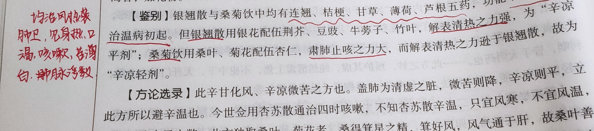
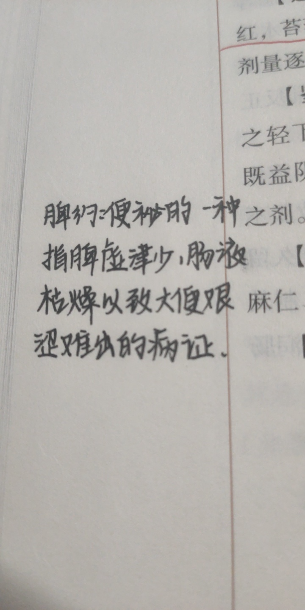
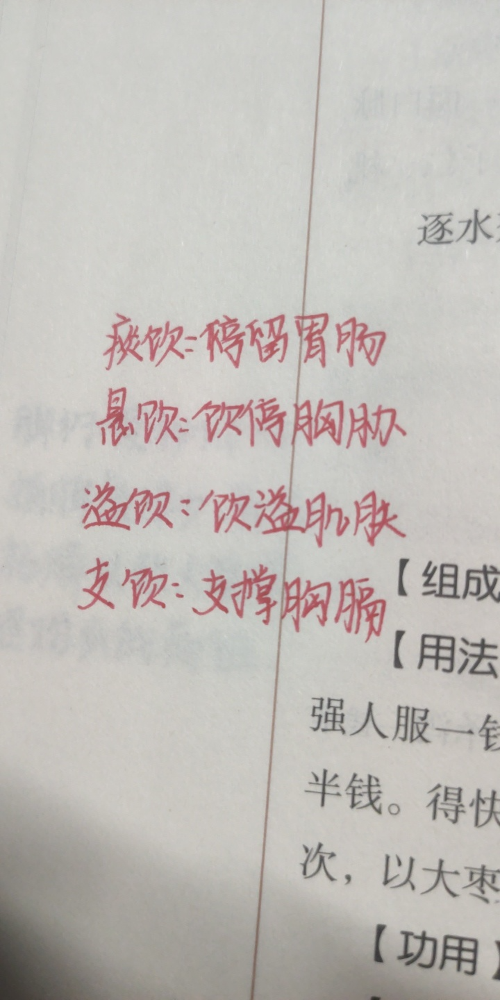
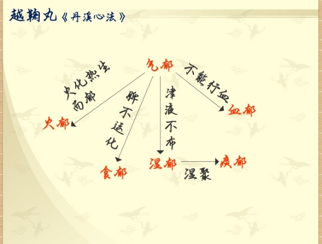
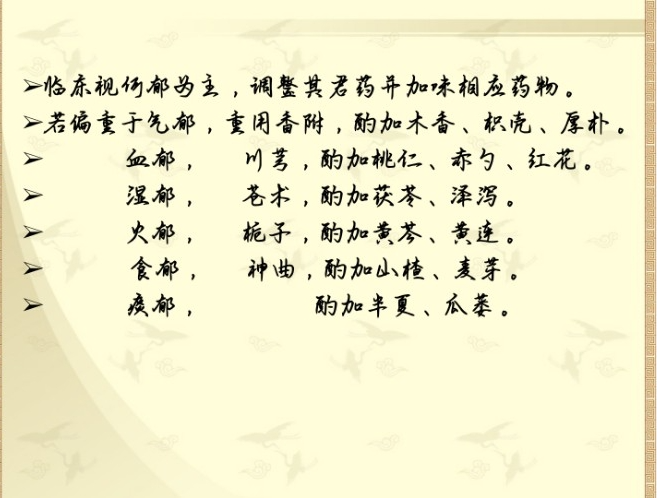
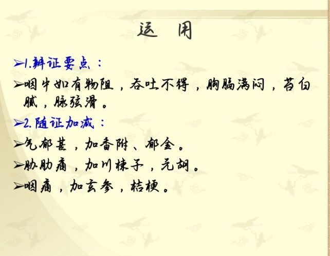
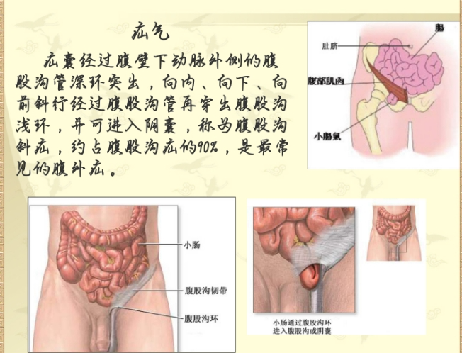
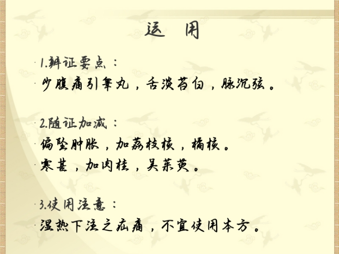

# 方剂学
- **第一章解表剂**
    - *轻* *：麻黄汤*
    - *宣* *：瓜蒂汤，二陈汤*
    - *通* *：五苓散，八正散*
    - *补* *：四君子*
    - *泄* *：十枣汤*
    - *重* *：朱砂安神丸*
    - *涩* *：金锁固精*
    - *滑* *：石韦散*
    - *燥* *：平胃散*
    - *湿* *：琼玉膏*
    - 定义:凡以 发汗 ， 解肌 ， 透疹 等作用为主，用于治疗表证的方剂
    - 适用于六淫外邪侵袭人体肌表，肺卫所致的表证，风寒外感或温病初起，以麻疹，疮疡，水肿，痢疾等初起，症见恶寒发热，头痛身疼，苔薄白，脉浮者
    - **辛温解表剂**
        - 适用于风寒表证
        - **麻黄汤Ⓐ**
        - > ***​（注:君臣佐使颜色顺序为红黄绿蓝）***
            - 方歌: 麻黄 汤中用 桂枝 ， 杏仁 甘草 四般施， 发热恶寒头项痛，伤寒服此汗淋漓
            - > 麻黄【君】:发汗之峻剂 桂枝【臣】:解肌发表调营卫 杏仁【佐】:利肺平喘（与麻黄一宣一降） 甘草【使】:调和药性
            - 功用主治 : 发汗解表，宣肺平喘 。治疗 **外感风寒表** **实** **证**
            - 配伍特点 :麻桂相须，开腠畅营；麻桂相使，宣降相宜
            - 此方为辛温发汗之峻剂，中病即止，不可过服
            - *附方*
                - 三拗汤
                    - 麻，杏，甘
                    - 主治:外感风寒，肺气不宣，症见鼻塞声重，语音不出，咳嗽胸闷
                - 华盖散
                    - 紫苏子，麻，杏，陈皮，桑白皮，赤茯苓，甘
                    - 主治:风寒袭肺证（风寒不重，痰气重）症见咳嗽上气，痰气不利，胸膈痞满，鼻塞声重，苔白，脉浮紧
            - 麻黄汤的衍生方
                - 一、麻黄加术汤(《金匮要略》)
                - 二、麻黄杏仁甘草石膏汤(《伤寒论》)
                - 三、麻黄杏仁薏苡甘草汤(《伤寒论》)
                - 四、麻黄细辛附子汤(《伤寒论》)
                - 五、麻黄附子甘草汤及麻黄附子汤
                - 六、大青龙汤(《伤寒论》)
                - 七、小青龙汤(《伤寒论》)
                - 八、小青龙加石膏汤(《金匮要略》)
                - 九、射干麻黄汤(《金匮要略》)
                - 十、厚朴麻黄汤(《金匮要略》)
                - 十一、越婢汤(《金匮要略》)
                - 十二、越婢加术汤(《金匮要略》)
                - 十三、越婢加半夏汤(《金匮要略》)
                - 十四、甘草麻黄汤(《金匮要略》)
                - 十五、三拗汤(《太平惠民和剂局方》)
                - 十六、华盖散(《太平惠民和剂局方》)
                - 十七、定喘汤(《摄生众妙方》)
                - 十八、续命汤(《金匮要略》)
                - 十九、文蛤汤(<金匮要略》)
                - 二十、桂枝芍药知母汤(《金匮要略》)
                - 二十一、桂枝去芍药加麻黄细辛附子汤(《金匮要略》)
                - 二十二、桂枝麻黄各半汤(《伤寒论》)
                - 二十三、桂枝二麻黄一汤(《伤寒论》)
                - 二十四、桂枝二越婢一汤(《伤寒论》)
                - 二十五、葛根汤(《伤寒论》)
                - 二十六、麻黄连翘赤小豆汤(《伤寒论》)
        - **桂枝汤Ⓐ**
            - 方歌: 桂枝 汤治太阳风， 芍药 甘草 姜枣 同，解肌发表调营卫，汗出恶风此方功
            - 组成:桂枝，芍药，甘草，生姜，大枣
            - > 桂枝【君】:助卫阳，通经络，解肌发表而祛在表之寒 芍药【臣】:益阴敛营 生姜【佐】:散表邪，和胃止呕 大枣【佐】:补营阴，健脾益气 炙甘草【使】:调和药性
            - 功用主治 : 解肌发表调和营卫 ，治疗 **外感风寒表虚证** （ 恶风发热，汗出头痛，鼻鸣干呕，苔白不渴，脉浮缓或浮弱 ）
            - 地位 :仲景群方之冠，乃滋阴和阳，调和营卫，解肌发汗之总方也
            - 病汗常带凉意，药汗则带热意
            - 配伍特点 :散中有收，汗不伤正，助阳与益阴同用
            - *附方*
            - > 桂枝加葛根汤:（桂，芍，姜，草，枣，葛根）解肌发表，升津舒筋。症见桂枝汤证兼项背强而不舒者
            - 随证加减
                - 微喘―加厚朴杏子
                - 寒水凌心之奔豚―加桂枝
                - 土虚木乘之腹痛―加芍药
        - **九味羌活汤Ⓑ**
            - 方歌:九味 羌活 用 防风 ， 细辛 苍 芷 与 川芎 ， 黄芩生地 同 甘草 ，三阳解表益姜葱
            - 组成:羌活，防风，苍术，细辛，川芎，香白芷，生地，黄芩，甘草
            - > 羌活【君】:入太阳经，解表寒，祛风湿，利关节，止痹痛 防风【臣】:祛风，胜湿止痛 苍术【臣】:入太阴经，燥湿，祛风散寒 细辛【佐】:入少阴经，止痛 白芷【佐】:入阳明经，燥湿 川芎【佐】:入少阳，厥阴经，行气活血，宣痹止痛 生地【佐】:清泻里热，泄血分热 ​黄芩【佐】:清泻里热，泄气分热 甘草【使】:调和药性
            - 功用主治 : 发汗祛湿，兼清里热 。治疗 **外感风寒湿邪，内有蕴热证** 。（ 恶寒发热，无汗，头痛项强，肢体酸楚疼痛，口苦微渴，舌苔微黄或白，脉浮紧 ）
            - 配伍特点 :主以辛温，少佐寒凉，六经分治。
        - **小青龙汤Ⓐ**
            - 小青龙汤治水气，喘咳呕哕渴利慰， 姜 桂麻黄 芍药 甘 ， 细辛 半夏 兼 五味
            - 组成:麻黄，芍药，细辛，干姜，甘草，桂枝，五味子，半夏
            - > 麻黄，桂枝【君】:开宣肺气以解咳喘之证，化气利水以利内饮之化 干姜，细辛【臣】:温肺化饮，解表祛邪 半夏【佐】:燥湿化痰，和胃降逆 五味子【佐】:敛肺止咳 芍药【佐】:和营养血， ​炙甘草【使】:益气和中，调和辛散酸收之性
            - 功用主治 :解表散寒，温肺化饮，治疗 **外寒内饮证** 。（ 恶寒发热 ，头身疼痛， 无汗 ， 喘咳，痰涎清稀而量多 ，胸痞，或干呕，或痰饮喘咳，不得平卧，或身体疼重，头面四肢浮肿， 舌苔白滑，脉浮 ）
            - 配伍特点 :散中有收，温化与敛肺相伍，开中有合
        - **止嗽散Ⓒ**
            - 止嗽散中用 白前 ， 陈皮 桔梗 草 荆 添， 紫菀百部 同蒸用，感冒咳嗽此方先
            - 组成:桔梗，荆芥，紫菀，百部，白前，甘草，陈皮
            - > 紫菀，百部【君】:止咳化痰要药，新久咳嗽皆宜 桔梗【臣】:宣肺止咳 白前【臣】:降气化痰 荆芥【佐】:疏风解表，以祛在表之余邪 陈皮【佐】:行气化痰 甘草【使】:合桔梗利咽止咳，调和诸药
            - 功用主治 :宣利肺气，疏风止咳。治疗 **风邪犯肺之咳嗽证** 。（ 咳嗽咽痒，咯痰不爽，或微恶风发热，舌苔薄白，脉浮缓 ）
            - 配伍特点 :温润平和，不寒不热，重在治肺，兼解表邪
    - **辛凉解表剂**
        - **银翘散（辛凉平剂）Ⓐ**
            - 银翘 散主上焦医， 竹叶 荆 牛薄荷 豉 ， 甘 桔芦根 凉解法，风温初感此方宜
            - 组成:连翘，银花，桔梗，薄荷，竹叶，生甘草 ，芥穗，淡豆豉，牛蒡子
            - > 银花，连翘【君】:疏散风热，清热解毒，辟秽化浊 薄荷，牛蒡子【佐】:疏散上焦风热，清利头目，解毒利咽 荆芥穗，淡豆豉【臣】:开皮毛以解表散邪 芦根，竹叶【佐】:清热生津 桔梗+牛蒡子宣肃肺气而止咳利咽 生甘草+桔梗利咽止痛，调和药性
            - 治上焦如羽，非轻莫举
            - 功用主治 : 辛凉透表，清热解毒 。治疗 **温病初起，邪在卫分，卫气被郁，开阖失司** ( 发热，微恶风寒 ，无汗或汗出不畅， 口渴 头疼， 咽痛 咳嗽，舌尖红苔薄白或薄黄， 脉浮数 )
            - 配伍特点 :辛凉与辛温相伍，主以辛凉，疏散与清解相配，疏清兼顾
        - **桑菊饮(辛凉轻剂)Ⓐ**
            - 桑菊 饮中 桔梗 翘 ， 杏仁 甘草 薄荷 饶， 芦根 为引轻清剂，热盛阳明入母膏
            - 组成:桑叶，菊花，杏仁，连翘，薄荷，苦桔梗，生甘草，苇根
            - > 桑叶【君】:善走肺络，疏散风热，清宣肺热而止咳嗽 菊花【君】:疏散风热，清利头目而肃肺 杏仁【臣】:肃降肺气 桔梗【臣】:开宣肺气 #一宣一降以复肺之宣降功能 薄荷【佐】:疏散风热 连翘【佐】:透邪解毒 芦根【佐】:清热生津 甘草【使】:调和诸药
            - 功用主治 : 疏散风热，宣肺止咳 。治疗 **风温初起，邪客肺络证** 。( 但咳，身热不甚，口微渴，脉浮数 )
            - 配伍特点 :轻清疏风以解表，辛苦宣肃以止咳
        -  
        - **麻黄杏仁甘草石膏汤（辛凉重剂）Ⓐ**
            - 仲景 麻 杏 石 甘 汤，辛凉宣肺清热良，邪热壅肺咳喘急，有汗无汗均可尝
            - 组成:麻黄，杏仁，甘草，石膏
            - > 麻黄【君】:宣肺平喘，解表散邪，治外感第一要药 石膏【君】:清泄肺热以生津 杏仁【臣】:宣利肺气以平喘咳 ​炙甘草【佐】:益气和中
            - 功用主治 : 辛凉解表，清肺平喘。 **外感风邪，邪热雍肺证** 。（ 身热不解 ，有汗或无汗， 咳逆气急 ，甚则鼻扇，口渴， 舌苔薄黄或白，脉浮数 ）
            - 配伍特点 :辛温与寒凉并用，宣肺而不助热，清肺而不凉遏
    - **扶正解表剂【适用于正气不足而又感受外邪之证】**
        - **败毒散Ⓐ**
            - 人参 败毒 茯苓 草 ， 枳桔 柴 前 羌独 芎 ， 薄荷 少许 姜 三片，四时感冒有奇功。
            - 组成:柴胡，人参，甘草，桔梗，川芎，茯苓，枳壳，前胡，羌活，独活
            - > 羌活独活【君】:祛风散寒，除湿止痛，通治一身上下之风寒湿邪 柴胡【臣】:发散退热，助君解表 川芎【臣】:行气活血，宣痹止痛 桔梗【佐】:宣肺 枳壳【佐】:降气 前胡【佐】:化痰 茯苓【佐】:渗湿（桔枳前茯） ***升降相合，宽胸利气，化痰止咳*** 。 生姜薄荷【使】:为引，助发散表邪 甘草【使】:调和药性，益气和中
            - 功用主治 : 散寒祛湿，益气解表 。治疗 **气虚外感风寒湿证** 。（ 憎寒壮热 ， 头项强痛 ，肢体酸痛， 无汗 ，鼻塞声重，咳嗽有痰，胸膈痞满，舌苔白腻， 脉浮而重按无力 ）
            - 配伍特点 :主辛温以解表，辅宣肃以止咳，佐益气以祛邪
            - 喻嘉言:用本方治外邪陷里而成痢疾者，使陷里之邪还出表解—— 逆流挽舟 法【通过疏散表邪，表气疏通，里滞亦除，其痢自愈】
        - **参苏饮Ⓒ**
            - 功用主治 : 益气解表，理气化痰。 治疗气虚外感内有痰湿证（ 恶寒发热，无汗，头痛鼻塞，咳嗽痰白，胸脘满闷，倦怠无力，气短懒言，苔白脉弱 ）
            - 组成:陈皮，枳壳，桔梗，甘草，木香，紫苏，干葛，前胡，人参，茯苓。
- 
- **第二章泻下剂**
    - 定义:以通便，泻热，攻积，逐水等作用为主，用于治疗里实证的方剂
    - 燥屎内结，冷积不化，瘀血内停，宿食不消，结痰停饮，虫积之脘腹胀满，腹痛拒按，大便秘结或泻利，苔厚，脉沉实等属里实证者。
    - **寒下剂【适用于里热积滞实证】**
        - **大承气汤Ⓐ**
            - 方歌:大承气汤用 芒硝 ， 枳实 厚朴大黄 饶，救阴泻热功偏擅，急下阳明有数条。
            - 组成:大黄，厚朴，枳实，芒硝
            - > 大黄【君】:苦寒泄热，攻积通便，荡涤肠胃邪热积滞 芒硝【臣】:泻热通便，润燥软坚 厚朴【君】:行乞消胀除满 枳实【臣】:下气开痞散结
            - 功用主治 : 峻下热结 。治疗① **阳明腑实证** 《 釜底抽薪，急下存阴 》（大便不通，频转矢气，脘腹痞满，腹痛拒按，按之硬，甚或潮热谵语，手足汗出，舌苔燥黄起刺，或焦黑燥裂，脉沉实）☞ 痞满燥实 ② **热结旁流证** 《 通因通用 》（下利清水，色纯青，气臭秽）③ **里实热证** 《 寒因寒用 》（热厥，痉病，发狂）
            - 配伍特点 :泻气与行气并重
            - *附方*
                - 小承气汤
                    - 功用主治:轻下热结。治疗阳明腑实证
                - 调胃承气汤
                    - 功用主治:缓下热结。治疗阳明病，胃肠燥热证
    - **温下剂【适用于里寒积滞实证】**
        - **温脾汤Ⓐ**
            - 温脾 参 附 与 干姜 ， 甘草 当归 硝 大黄 ，寒热并行治寒积，脐腹绞结痛非常
            - 组成:当归，干姜，附子，人参，芒硝，大黄，甘草
            - > 附子【君】:温脾阳以散寒凝 大黄【君】:荡涤泻下而除积滞 芒硝【臣】:软坚，助大黄泻下攻积 干姜【臣】:温中助阳 人参，甘草【使】:补益脾气 当归【佐】:养血润燥，泻下不伤正
            - 功用主治 : 攻下冷积，温补脾阳 。治疗 **阳虚冷积证** （ 便秘腹痛，脐周绞痛，手足不温，苔白不渴，脉沉弦而迟 ）
            - 配伍特点 :寓补于攻，温下相成（温通，补益，泻下三法兼备）
    - **润下剂【适用于津枯肠燥所致大便秘结证】**
        - **麻子仁丸Ⓑ**
            - 组成:麻子仁，芍药，枳实，大黄，厚朴，杏仁
            - > 麻子仁【君】:润肠通便 大黄【臣】:泻热通便以通腑 杏仁【臣】:肃降肺气而润肠 白芍【臣】:养阴和里以缓急 枳实厚朴【佐】:行乞破结消积，助腑气下行 蜂蜜:润燥滑肠
            - 方歌： 麻子仁 丸治脾约， 枳朴 大黄 麻 杏芍 ，胃燥津枯便难解 ，润肠泻热功效确。
            - 功用主治 : 润肠泄热，行气通便 。治疗 **脾约证** （ 大便干结，小便频数，脘腹胀痛，舌红苔黄，脉数 ）
            - 配伍特点 :泻而不峻，下不伤正
            -  
        - **济川煎（滋润河川以行舟车）Ⓑ**
            - 济川 归膝 肉苁蓉 ， 泽泻 升麻 枳壳 从，肾虚精亏肠中燥，寓通于补法堪宗。
            - 组成:当归，牛膝，肉苁蓉，泽泻，升麻，枳壳
            - > 肉苁蓉【君】:温补肾精，暖腰润肠。 当归【臣】:养血和血，润肠通便 牛膝【臣】:补肾壮腰，善行于下 ​枳壳【佐】:宽肠下气助通便 泽泻【佐】:渗利泻浊 升麻【使】:升举清阳
            - 功用主治 : 温肾益精，润肠通便 。治疗肾虚便秘（ 大便秘结，小便清长，腰膝酸冷，舌淡苔白，脉沉迟 ）
            - 配伍特点 :补中有泻，降中有升
    - **逐水剂【适用于水饮壅盛于里之实证】**
        - **十枣汤Ⓐ**
            - 十 枣 逐水效堪夸， 大戟甘遂 与 芫花 ，悬饮内停胸胁痛，大腹肿满用无差
            - 组成:芫花，甘遂，大戟大枣十枚煎汤送服
            - > 甘遂【君】:善行经隧之水湿 大戟【君】:善泻脏腑之水邪 芫花【君】:善消胸胁伏饮痰癖
            - 功用主治 : 攻逐水饮 。治疗 **悬饮** （咳唾胸胁引痛)，水肿（以下半身为重）
            - 配伍特点 :主峻下逐水，佐以甘缓补中
            -  
    - **攻补兼施剂【适用于里实正虚证】**
        - **黄龙汤Ⓑ**
            - 功用主治 : 攻下热结，益气养血 。治疗 **阳明腑实**
- **第三章和解剂**
    - 定义:以和解少阳，调和肝脾 调和寒热等作用为主，用于治疗伤寒邪在少阳，肝脾不和，寒热错杂的方剂
    - **和解少阳剂【邪在少阳证者】**
        - **小柴胡汤Ⓐ**
            - 小 柴胡 汤和解供， 半夏人参 甘草 从，更用 黄芩 加 姜枣 ，少阳百病此为宗
            - 组成:柴胡，黄芩，人参，甘草，半夏，生姜，大枣
            - > 柴胡【君】:透泄少阳之邪，疏泄气机之郁滞 黄芩【臣】:清泄少阳之热 半夏生姜【佐】:和胃降逆止呕 人参，大枣【佐】:益气补脾，扶正以祛邪，益气以御邪内传【参枣与夏姜配伍 **利中州气机之升降** 】 炙甘草【使】:调和诸药
            - 功用主治 : 和解少阳 。治疗① **伤寒少阳证** （ 往来寒热，胸胁苦满，默默不欲饮食，心烦喜呕，口苦，咽干，目眩，舌苔薄白，脉弦 ）② **妇人中风** （伤寒），热入血室。经水适断，寒热发作有时③ **疟疾，黄疸** 【阴黄，阳黄】等病而见少阳证者
            - 配伍特点 :透散清泄以和解，升清降浊兼扶正
        - **蒿芩清胆汤Ⓐ**
            - 俞氏 蒿芩 清胆汤， 陈皮半夏竹茹 襄， 赤苓 枳壳 兼 碧玉 ，湿热轻宣此发良
            - 组成:青蒿脑，淡竹茹，仙半夏，赤茯苓，青子芩，生枳壳，陈广皮，碧玉散
            - > 青蒿【君】:清透少阳邪热，又辟秽化浊 黄芩【君】:善清胆热，并能燥湿 竹茹【臣】:清胆胃之热，化痰止呕 枳壳【臣】:下气宽中，除痰消痞 赤茯苓，碧玉散【佐】:清热利湿，导湿热从小便去
            - 功用主治 : 清胆利湿，和胃化痰 。治疗 **少阳湿热痰浊证** 。（ 寒热如疟，寒热轻重 ，口苦膈闷， 吐酸苦水 ，或呕黄涎而黏，甚则干呕呃逆， 胸胁胀痛 ，小便黄少， 舌红苔白腻 ，间现杂色， 脉数而右滑左弦 ）
            - 配伍特点 :芳香清透以畅少阳之枢机，苦燥降利以化湿郁之痰浊
            - 病因病机 :湿遏热郁，阻于少阳胆经与三焦经
    - **调和肝脾剂【适用于肝脾不和之证】**
        - **四逆散Ⓐ☠︎**
            - 四逆散里用 柴胡 ， 芍药 枳实 甘草 须，此是阳邪成郁邪，敛阴泄热平剂扶（透邪解郁和肝脾）
            - 组成:甘草，枳实，柴胡，芍药
            - > 柴胡【君】:升发阳气，疏肝解郁，透邪外出 白芍【臣】:养血柔肝 枳实【佐】:理气解郁，泄热破结 甘草【使】:调和诸药，益脾合中
            - 功用主治 : 透邪解郁，疏肝理脾 。治疗① **阳郁厥逆证** （ 手足不温 或腹痛，或泄利下重，脉弦）② **肝脾不和证** （ 胁肋胀痛，脘腹疼痛 ， 脉弦 ）
            - 配伍特点 :疏柔相合，以适肝性，升降同用，肝脾并调
            - *随证加减*
                - 咳加干姜五味子
                - 悸加桂枝温心阳
                - 小便不利用茯苓
                - 腹痛附子散里寒
                - 泄利薤白能通阳
                - 气郁香附郁金填
                - 有热栀子能清热
        - **逍遥散Ⓐ**
            - 逍遥散用 当归芍 ， 柴 苓朮草 加 姜薄 ，疏肝养血兼理脾，肝郁血虚脾弱宜。
            - 组成:甘草，当归，茯苓，芍药，白术，柴胡
            - > 柴胡【君】:疏肝解郁，肝郁得以调达 当归【臣】:养血和血☞血中气药 白术，茯苓，甘草【佐】:健脾益气 薄荷【佐】:疏散郁遏之气，透达肝经郁热 烧生姜:【佐】降逆和中，辛散达郁 甘草【佐】:调和药性
            - 功用主治 : 疏肝解郁，养血健脾 。治疗 **肝郁血虚脾弱证** （ 两胁作痛 ，头痛目眩，口燥咽干， 神疲食少 ，或往来寒热，或 月经不调 ，乳房胀痛， 脉弦而虚 ）
            - 配伍特点 :疏柔合法，肝脾同调，气血兼顾， 补肝体，助肝用
            - 治疗 肝郁血虚脾弱证 之基础方，也是 妇科调经 常用方
        - **痛泻要方Ⓑ**
            - 组成:白术，芍药，陈皮，防风（防二白皮)
            - > 白术:补脾燥湿以培土 白芍:柔肝缓急以止痛 陈皮:理气燥湿，醒脾和胃 防风:祛湿，助止泻
            - 功用主治 : 补脾柔肝，祛湿止泻。 治疗 **脾虚肝郁之痛泻** 。（ 肠鸣腹痛，大便泄泻，泻必腹痛，泻后痛缓，舌苔薄白，脉两关不调，左弦而右缓者 ）
            - 配伍特点 :补脾柔肝，寓疏于补， ***扶土抑木***
            - 久泻者+升麻（炒）舌苔黄腻者+木香
            - 病因病机 :土虚木乘，肝脾不和，脾运失常所致
    - **调和寒热剂【适用于寒热互结于中焦，升降失常而致心下痞满，恶心呕吐，肠鸣下利等症】**
        - **半夏泻心汤Ⓐ**
            - 半夏 泻心 黄连芩 ， 干姜 甘草 与 人参 ， 大枣 和之治虚痞，法在降阳而和阴
            - 组成:半夏，黄芩，干姜，人参，黄连，大枣，甘草
            - > 半夏【君】:散结除痞，降逆止呕 干姜【臣】:温中散寒 人参，大枣【佐】:甘温益气，以补脾虚 甘草【使】:补脾和中而调诸药
            - 功用主治 : 寒热平调，散结除痞 。治疗 **寒热互结之痞证** （ 心下痞 ，但满而不痛， 或呕吐 ， 肠鸣下利 ， 舌苔腻而微黄 ）
            - 配伍特点 :寒热平调以和阴阳，辛开苦降以调气机，补泻兼施以顾虚实
            - 病因病机 :小柴胡汤证误用攻下，损失中阳，少阳邪热乘虚内陷，以致寒热互结，而成心下痞
- **第四章清热剂**
    - 定义:以清热，泻火，凉血，解毒等作用为主，用于治疗里热证的方剂（热者寒之，温者清之）
    - **清气分热证{适用于热在气分证}**
        - **白虎汤Ⓐ☠︎**
            - 白虎汤用 石膏 偎， 知母 甘草粳米 陪，亦有加入人参者，燥烦热渴舌生苔
            - 组成:石膏，知母，甘草，粳米
            - > 石膏【君】:善清阳明气分大热，清热而不伤阴，并能止渴除烦 ​知母【臣】:清肺胃气分之热，热去则津液不耗，而阴自潜滋暗长矣 粳米，炙甘草【佐】:益胃生津，缓石膏，知母苦寒重降之性{炙甘草:调和药性}
            - 功用主治 : 清热生津 。治疗 **气分热盛证** （ 壮热面赤，烦渴引饮，汗出恶臭，脉洪大有力 ）
            - 配伍特点 :清不伤阴，寒不伤中
            - 病因病机 :伤寒化热内传阳明之经，或温邪由卫及气所致
        - **竹叶石膏汤Ⓑ**
            - 竹叶石膏汤人参，麦冬半夏竹叶灵，甘草生姜兼粳米，暑烦热渴脉虚寻。
            - 组成:竹叶，石膏，半夏，麦门冬，人参，甘草，粳米
            - 功用主治 : 清热生津，益气和胃 。治疗 **伤寒，温病，暑病余热未清，气阴两伤证** 。（ 身热多汗 ，心胸烦闷， 气逆欲呕 ， 口干喜饮 ，虚羸少气，或虚烦不寐， 舌红苔少，脉虚数 ）
            - 病因病机 :热病后期，余热未清，气阴两伤，胃气不和所致
            - 配伍特点 :辛甘大寒与甘寒甘温合为清补之剂，清而不寒，补而不泻
    - **清营凉血剂{适用于邪热传营，或热入血分诸证}**
        - **清营汤Ⓐ☠︎**
            - 清营汤治热传营，脉数舌绛辨分明， 犀 地 银翘 玄 连竹 ， 丹 麦 清热更护阴
            - 组成:犀角，生地黄，元参，竹叶心，麦冬，丹参，黄连，银花，连翘
            - > 犀角【君】:清解营分之热毒 生地黄【臣】:清热凉血养阴 麦冬【臣】:清热养阴生津 玄参【臣】:滋阴降火解毒 银花，连翘【佐】:清热解毒，轻清透泄，促使营分热邪向外从气分透泄而解（ **入营犹可透热转气** ） 竹叶【佐】:清心除烦 黄连【佐】:清心解毒 丹参【佐】:清热凉血，活血散瘀，可防热与血结，深陷血分
            - 功用主治 : 清营解毒，透热养阴 。治疗 **热入营分证** （ 身热夜甚，神烦少寐 ，时有谵语，目常喜开或喜闭，口渴或不渴， 斑疹隐隐，脉细数，舌绛而干 ）
            - 配伍特点 :辛苦甘寒以滋养清解，透热转气以入营清散
            - 病因病机 :邪热内传营分，耗伤营阴所致
        - **犀角地黄汤Ⓐ☠︎**
            - 犀角 地黄 芍药丹 ，血升胃热火邪干，斑黄阳毒皆可治，或益柴芩总伐肝
            - 组成:芍药，地黄，丹皮，犀角
            - 功用主治 : 清热解毒，凉血散瘀 。治疗 **热入血分证** （ 身热谵语，班色紫黑，或吐血，衄血便血，尿血，舌深绛起刺，脉数， 或喜忘如狂，漱水不欲咽，或大便色黑易解）
            - > 犀角【君】:凉血清心而解热毒 生地黄【臣】:清热凉血养阴 芍药，丹皮【佐】:清热凉血，活血散瘀，可收化斑之功
            - 配伍特点 :清中有养，无耗血之弊，凉血散血，无留瘀之患
            - 病因病机 :热毒深入血分，动血耗血所致
    - **清热解毒剂{适用于温疫，温毒，火毒及疮疡疔毒等证}**
        - **黄连解毒汤Ⓐ**
            - 黄连 解毒汤四味， 黄柏黄芩 栀子 备，躁狂大热呕不眠，吐衄斑黄均可使
            - 组成:黄连，黄芩，黄柏，栀子
            - > 黄连【君】:入上焦清泻心火，入中焦，泻中焦之火 黄芩【臣】:清上焦之火 黄柏【臣】:泻下焦之火 ​栀子【佐】:清泻三焦之火，导热下行
            - 功用主治 : 泻火解毒 。治疗 **三焦火毒热盛证** （大热烦躁，口燥咽干，错语不眠，或热病吐血，或热甚发班 或身热下痢，或湿热黄疸，或外科痈疡疔毒，小便黄赤，舌红苔黄，脉数有力）
            - 病因病机 :火毒炽盛，充斥三焦，波及上下内外所致
            - 配伍特点 : 苦寒直折 ，泻火解毒，三焦并清
        - **凉膈散Ⓑ**
            - 功用主治 : 泻火通便，清上泄下 。治疗 **上中二焦火热证** （烦躁口渴，面赤唇焦，胸膈烦热，口舌生疮，睡卧不宁，谵语狂妄，或咽痛吐衄，便秘溲赤，或大便不畅，舌红苔黄，脉滑数）
            - 配伍特点 :清上之中寓泻下之法，以泻代清
        - **普济消毒饮Ⓐ☠︎**
            - 普济消毒 蒡 芩连 ， 甘 桔蓝根勃翘玄 ， 升柴 陈薄僵蚕 入，大头瘟毒服之消
            - 组成:黄芩，黄连，人参，橘红，玄参，生甘草 连翘，鼠黏子，板蓝根，马勃，白僵蚕，升麻，柴胡，桔梗
            - > 黄连，黄芩:清热泻火解毒，祛上焦头面热毒 升麻，柴胡:疏散风热，引药达上（火郁发之） 鼠黏子（牛蒡子），连翘，僵蚕:疏散头面风热，兼清热解毒 玄参，马勃，板蓝根:清热解毒利咽 甘草，桔梗:清利咽喉 陈皮:理气疏壅，以利散邪消肿 人参:补气，扶正以祛邪
            - 功用主治 : 清热解毒，疏风散邪， 治疗 **大头瘟** （ 恶寒发热，头面红肿 ，目不能开，咽喉不利，舌燥口渴， 舌红苔白兼黄，脉浮数有力 ）
            - 病因病机 :感受风热疫毒之邪，壅于上焦，发于头面所致
            - 配伍特点 :清疏并用，药至病所，火郁发之，升降同用
    - **气血两清剂{适用于疫毒或热毒充斥内外，气血两燔证}**
        - **清瘟败毒饮Ⓑ**
            - 功用主治 : 清热解毒，凉血泻火 。治疗 **温疫热毒，气血两燔证**
    - **清脏腑热剂{适用于邪热偏盛于某一脏腑所致之热证}**
        - **导赤散《小儿药证直诀》Ⓐ**
            - 导赤 生地 与 木通 ， 草梢 竹叶 四般攻，口糜淋痛小肠火，引热同归小便中
            - 组成:生地黄，木通，生甘草梢（竹甘通地）
            - > 生地:甘凉而润，凉血滋阴以制心火 木通:上清心火，下导小肠之热 竹叶:清心除烦，淡渗利窍，导心火下行 ​生甘草梢:清热解毒，尚可直达茎中而止淋痛，调和诸药
            - 功用主治 : 清心利水养阴 。治疗 **心经火热证** （ 心胸烦热，口渴面赤，意欲冷饮，以及口舌生疮 ，或心热移于小肠， 小便赤涩刺痛，舌红，脉数 ）
            - 配伍特点 :甘寒与苦寒相合，利水不伤阴
            - 病因病机 :心经热盛或心热移于小肠所致
        - **龙胆泻肝汤Ⓐ☠︎**
            - 龙胆 泻肝 栀芩 柴 ， 生地车前泽泻 偕， 木通 甘草 当归 合，肝经湿热力能排
            - 组成:龙胆草，黄芩，栀子，泽泻，木通，车前子，当归，生地黄，柴胡，甘草
            - > 龙胆草:泻肝胆实火，利肝胆湿热，泻火除湿 黄芩，栀子:苦寒泻火，燥湿清热 泽泻，木通，车前子:渗湿泄热，导肝经湿热从水道而去 ​当归，生地:养血滋阴，使邪去而不伤阴 柴胡:疏畅肝胆之气 甘草:调和诸药，护胃安中
            - 功用主治 : 清泻肝胆实火，清利肝经湿热 。治疗 **肝胆实火上炎证** （头痛目赤，胁痛， 口苦 ，耳聋，耳肿， 舌红苔黄 ， 脉弦数有力 ）肝经湿热下注证（阴肿，阴痒，筋痿，阴汗， 小便淋浊 ，或妇女带下黄臭，舌红苔黄腻，脉弦数有力）
            - 病因病机 :肝胆实火上炎以及肝胆湿热循经下注所致
            - 配伍特点 :苦寒清利，泻中寓补，降中寓升，以适肝性，祛邪不伤正，泻火不伐胃
        - **左金丸Ⓑ**
            - 功用主治 : 清泻肝火，降逆止呕 。治疗 **肝火犯胃证**
        - **泻白散《小儿药证直诀》Ⓐ**
            - 泻白 桑皮 地骨皮 ， 甘草粳米 四般宜，参茯知苓皆可入，肺热喘嗽此方施
            - 组成：地骨皮，桑白皮，甘草
            - > 地骨皮：清降肺中伏火 桑白皮：善清肺热，泻肺气，平喘咳 炙甘草，粳米：养胃和中，培土生金，以扶肺气，兼调药性
            - 功用主治 ： 清泻肺热，止咳平喘 。治疗 **肺热喘咳证** （ 气喘咳嗽 ， 皮肤蒸热 ，日晡尤甚， 舌红苔黄，脉细数 ）
            - 病因病机 ：肺有伏火郁热证
            - 配伍特点 ：甘寒清降，泻中寓补，培土生金
        - **清胃散Ⓐ**
            - 清胃散用 升麻 连 ， 当归生地 牡丹 全，或益石膏平胃热，口疮吐衄及牙宣
            - 组成：生地黄，当归，牡丹皮，黄连，升麻
            - > 黄连：直折胃腑之热 升麻：清热解毒治疗胃火牙痛，轻清升散透发，宣达郁遏之伏火（火郁发之） 丹皮：凉血清热 生地：凉血滋阴 当归：养血活血
            - 功用主治 ： 清胃凉血 。治疗 **胃火牙痛** （ 牙痛牵引头痛 ，面颊发热，牙齿喜冷恶热，或牙宣出血，或牙龈红肿溃烂，或唇舌腮颊肿痛， 口气热臭 ，口干舌燥， 舌红苔黄，脉滑数 ）
            - 病机病因 ：胃有积热，循经上攻所致
            - 配伍特点 ：降中有升，火郁发之
        - **玉女煎Ⓑ**
            - 玉女煎中 地 膝 兼， 石膏 知母麦冬 全，阴虚胃火牙疼效，去膝地生温热痊
            - 组成：石膏，熟地，麦冬，知母，牛膝
            - > 石膏：善清阳明胃热而兼生津止渴 熟地：滋肾水不足，君臣相伍，清火壮水，虚实兼顾 知母：清胃热而止烦渴，滋少阴而壮肾水 麦门冬：清热养阴生津，既可养肺，寓金水相生之意，又能生津而润胃燥 牛膝：引热下行，且补肝肾
            - 功用主治 ： 清胃热，滋肾阴 。治疗 **胃热阴虚证** （头痛，牙疼， 齿松牙衄 ， 烦热干渴，舌红苔黄而干 。也治疗消渴，消谷善饥等）
            - 病因病机 ：少阴不足，阳明有余之证
            - 配伍特点 ：胃肾同治，泻实补虚，引热下行，以治实为主
        - **芍药汤Ⓐ☠︎**
            - 芍药 芩连 与锦纹， 桂 甘 槟木 及 归 身，别名导气除甘桂，枳壳加之效若神
            - 组成：芍药，当归，黄连，木香，甘草，槟榔，大黄，黄芩，官桂
            - > 黄芩，黄连：清热燥湿解毒，以除疾病之因 ​芍药：养血和营，缓急止痛，配当归养血活血（行血则便脓自愈）兼顾湿热邪毒熏灼肠络，耗伤气血之虑 木香，槟榔：行气导滞（调气则后重自除） 大黄：苦寒沉降（通因通用） 肉桂：助归芍行血和营，制芩连苦寒之性 炙甘草：调和药性，缓急止痛 ​
            - 功用主治 ： 清热燥湿，调气和血 。治疗 **湿热痢疾** （ 腹痛 ， 便脓血，赤白相兼 ，里急后重，肛门灼热，小便短赤， 舌苔黄腻，脉弦数）
            - 病因病机 ：湿热壅滞肠中，  气血失调所致
            - 配伍特点 ：气血通调，通因通用
        - **白头翁汤Ⓐ**
            - 白头翁 汤治热痢， 黄连黄柏 佐 秦皮 ，清热解毒并凉血，赤多白少脓血医
            - 组成：白头翁，黄柏，黄连，秦皮
            - > 白头翁：清热解毒，凉血止痢 黄连：泻火解毒，燥湿厚肠，治痢要药 黄柏：清下焦湿热 秦皮：晴热解毒而兼以收涩止痢
            - 功用主治 ： 清热解毒，凉血止痢 。治疗 **热毒痢疾** （ 下痢脓血，赤多白少，腹痛 ，里急后重，肛门灼热，渴欲饮水， 舌红苔黄，脉弦数 ）
            - 病因病机 ：热毒深陷血分，下迫大肠所致
            - 配伍特点 ：苦寒之中寓凉血之功，清燥之内存收涩之义
    - **清虚热剂【适用于热病后期，邪留阴分，阴液已伤之证】**
        - **青蒿鳖甲汤Ⓐ**
            - 组成:青蒿，鳖甲，细生地，知母，丹皮
            - > 鳖甲:直入阴分，滋阴退热 青蒿:清中有透散之力，清热透络，引邪外出 生地:滋阴凉血 知母:滋阴降火 丹皮:泄血中伏火，助青蒿清透阴分伏热
            - 青蒿鳖甲 知地 丹 ，阴分热伏此方攀，夜热早凉无汗者，从里达表服之安
            - 功用主治 : 养阴透热 。治疗 **温病后期，邪伏阴分证** 【 夜热早凉，热退无汗，舌红苔少，脉细数 】
            - 配伍特点 :滋中有清，清中有透，邪正兼顾，先入后出，标本兼顾
            - 病因病机 :温病后期，阴液已伤，余邪深伏阴分
        - **清骨散Ⓑ**
            - 功用主治 : 清虚热，退骨蒸 。治疗 **肝肾阴虚，虚火内扰证** 【 骨蒸潮热 ，或低热日久不退， 形体消瘦 ， 困倦盗汗 ，唇红颧赤，口渴心烦， 舌红少苔，脉细数 】
- **第五章祛暑剂**
    - 定义:以祛除暑邪作用为主，用于治疗暑病的方剂
    - **祛暑解表剂**
        - **香薷散**
            - 三物 香薷 豆 朴 先，散寒化湿功效兼，若益银翘豆益花，新加香薷祛暑煎
            - 组成:香薷，白扁豆，厚朴（入酒少许同煎，温经脉，通阳气）
            - > 香薷:芳香质轻，辛温发散，为夏月祛暑解表要药 厚朴:行乞除满，燥湿运脾 白扁豆:健脾和中，渗湿消暑
            - 功用主治 : 祛暑解表，化湿和中 。治疗 **阴暑** （ 恶寒发热，头疼身痛，无汗，腹痛吐泻，胸脘痞闷，舌苔白腻，脉浮 ）
            - 配伍特点 :辛温芳香以解表，苦温燥化以和中
            - 病因病机 :夏月乘凉饮冷，外感风寒，内伤于湿所致
    - **祛暑利湿剂**
        - **六一散（益元散）**
            - 功用主治 : 清暑利湿 。治疗 **暑湿证** （身热烦渴，小便不利，或泄泻）
        - **桂苓甘露散**
            - 功用主治 : 清暑解热，化气利湿 。治疗 **暑湿证**
    - **祛暑益气剂**
        - **清暑益气汤**
            - 王氏清暑益气汤， 西瓜翠衣 荷梗 襄， 知 麦石斛 西洋参 ， 黄连竹叶 草粳 方
            - 组成:西洋参，石斛，麦冬，黄连，竹叶，荷梗，知母，甘草，粳米，西瓜翠衣
            - > 西瓜翠衣:清解暑热，生津止渴 西洋参:益气生津，养阴清热 荷梗:清热解暑 石斛，麦冬:养阴生津清热 黄连:清热泻火 知母:泻火滋阴 竹叶:清热除烦 粳米，甘草:益胃和中，调和诸药
            - 功用主治 : 清暑益气，养阴益气 。 **暑热气津两伤证** （ 身热汗多，口渴心烦，小便短赤，体倦少气 ，精神不振， 脉虚数 ）
            - 配伍特点 :甘寒苦寒合法，清补并举，气津兼顾
- **第六章温里剂**
    - 定义:以温里助阳，散寒通脉作用为主，用于治疗里寒证
    - **温中祛寒剂【适用于中焦虚寒证】**
        - **理中丸Ⓐ☠︎**
            - 理中丸主理中乡， 甘草 人参 术 黑 姜 ，呕利腹痛阴寒盛，或加附子总扶阳
            - 组成:人参，干姜，甘草，白术
            - > 干姜:温脾暖胃，助阳祛寒 人参:益气健脾，补虚助阳 白术:健脾补虚以助阳，又燥湿运脾以助生化 甘草:益气健脾，补虚助阳，缓急止痛，调和诸药
            - 功用主治 :温中祛寒，补气健脾。治疗① **脾胃虚寒证** 【脘腹疼痛，喜温喜按，呕吐便溏，脘痞食少，畏寒肢冷，口淡不渴，舌质淡，苔白润，脉沉细或沉迟无力】冷痛吐利② **阳虚失血证** 【便血，吐血，衄血，崩漏，血色暗淡，质清稀，面色白，气短神废，脉沉细或虚大无力】③ **中阳不足，阴寒上乘之胸痹** 【脾气虚寒，不能摄津之病后多涎唾，中阳虚损，土不荣木之小儿慢惊，食饮不节，损伤脾胃阳气】
            - 配伍特点 :辛热干苦合方，温补并用，补中寓燥
        - **小建中汤Ⓐ☠︎**
            - 小建中汤 芍药 多， 桂 姜 甘草 大枣 和，更加 饴糖 补中藏，虚劳腹痛服之瘥
            - 组成：桂枝，芍药，甘草，大枣，生姜，胶饴
            - > 饴糖：温中补虚，缓急止痛 桂枝：温助脾阳，温中益气 芍药：滋养营阴，柔缓肝急止腹痛 生姜：温胃散寒 大枣：补益脾虚 炙甘草：益气补虚，缓急止腹痛，助君臣以化阴阳
            - 功用主治 ：温中补虚，和里缓急。治疗 **中焦虚寒，肝脾失调，阴阳不和证** 。（ 脘腹拘急疼痛 ，时发时止， 喜温喜按 ，心中悸动，虚烦不宁，面色无华，兼见手足烦热，咽干口燥， 舌淡苔白，脉细弦 ）
            - 配伍特点 ：辛甘酸甘合化以调和肝脾，重用甘温质润以抑木缓急（阴阳并调以温中为主，肝脾同治以补脾为主）
            - 四建中汤鉴别：1、小：以辛甘为主，佐重剂芍药， 寓酸甘化阴之意，阴阳并补，以温阳为主 。2、大：纯用辛甘之品 温建中阳 ，补虚散寒之力较小建中汤为峻，有 降逆止呕 之功。3、黄：小建中汤+黄芪，偏 甘温益气 。4、当：小建中汤+当归，重在 补血和血
            - 补充：寒甚+干姜。气滞+木香。便溏+白术。面色萎黄，短气神疲+人参，黄芪，当归
        - **吴茱萸汤Ⓑ**
            - 吴茱萸 汤 人参 枣 ，重用 生姜 温胃好，阳明寒呕少阴利，厥阴头痛皆能保
            - 组成：吴茱萸，人参，生姜，大枣
            - > 吴茱萸：上可温胃散寒，下可温暖肝肾，又可降逆止呕（三经并治） 生姜：呕家圣药，温胃散寒，降逆止呕（与吴茱萸相须为用） 人参：补益中焦脾胃之虚 大枣：益气补脾，调和诸药
            - 功用主治 ：温中补虚，降逆止呕。治疗1、 **胃寒呕吐证** （ 食谷欲呕 ，或兼胃脘疼痛，吞酸嘈杂，舌淡，脉沉弦而迟）2、 **肝寒上逆证** （ 干呕吐涎沫 ，头痛， 巅顶痛甚 ，舌淡，脉沉弦）3、 **肾寒上逆证** （呕吐下利， 手足厥冷 ，烦躁欲死， 舌淡，脉沉细 ）
            - 配伍特点 ：肝肾胃三经同治，温降补三法并施，以温降为主
        - **大建中汤**
            - 功用主治 ：温中补虚，缓急止痛。治疗中阳虚衰，阴寒内盛之脘腹疼痛
            - 配伍特点 ：纯用辛甘，温补兼施，以温为主
    - **回阳救逆剂** 【适用于阳气衰微、阴寒内盛、阴盛格阳、戴阳的危重病证】
        - **四逆汤Ⓐ**
            - 四逆汤中 姜 附 草 ，阳衰寒厥急煎尝，腹痛吐泻脉沉细，急投此方可回阳
            - 组成：甘草，干姜，附子
            - > 附子：温壮心肾之阳，回阳破阴以救逆，生用则能迅达内外以温阳逐寒 干姜：温里回阳，温中散寒，助阳通脉 炙甘草：1、益气补中，治虚寒之本2、缓姜、附峻烈之性3、调和药性
            - 功用主治 ：回阳救逆。治疗 **少阴病，心肾阳衰寒厥证** 。（ 四肢厥逆 ，恶寒蜷卧， 神衰欲寐 ， 面色苍白 ，腹痛下利，呕吐不渴， 舌苔白滑，脉微细 ，以及太阳病误汗亡阳者）
            - 配伍特点 ：大辛大热以速挽元阳，少佐甘缓防虚阳复耗
            - 病因病机 ：由少阴心肾阳衰，阴寒内盛所致；亦可是太阳病误汗亡阳所为
        - **回阳救急汤Ⓒ**
            - 功用主治 ：回阳固脱，益气生脉。治疗寒邪直中三阴，真阳衰微证（ 四肢厥冷 ， 神衰欲寐 ，恶寒蜷卧， 吐泻腹痛 ，口不渴，身寒战栗，指甲口唇青紫，口吐涎沫， 舌淡苔白，脉沉微，甚或无脉 ）
            - 配伍特点 ：辛热甘温相配，回阳补中兼顾，辛香酸涩相伍，以防阳气散越
    - **温经散寒剂** 【适用于寒凝经脉证】
        - **当归四逆汤Ⓐ**
            - 当归 四逆 芍 桂枝 ， 细辛 甘草通草 施，血虚寒厥四末冷，温经通脉最相宜
            - 组成：当归、桂枝、芍药、细辛、甘草、通草、 大枣
            - > 当归：养血和血以补虚 桂枝：温经散寒以通脉 细辛：温经散寒 白芍：养血和营 通草：通利经脉以畅血 大枣，甘草：益气健脾，养血补虚
            - 功用主治 ：温经散寒，养血通脉。治疗 **血虚寒厥证** （ 手足厥寒 ，或腰、股、腿、足、肩臂疼痛，口不渴， 舌淡苔白，脉沉细或细而欲绝 ）
            - 配伍特点 ：辛温甘酸并用，温通不燥，补养不滞
            - 病因病机 ：营血虚弱，寒凝经脉，血行不利所致
        - **暖肝煎Ⓑ**
            - 暖肝煎中 杞 茯 归 ， 茴 沉乌药 姜 肉桂 ，下焦虚寒疝气痛，温补肝肾此方推
            - 组成：当归、枸杞子、茯苓、小茴香、肉桂、乌药、沉香
            - > 肉桂：温肾暖肝，祛寒止痛 小茴香：暖肝散寒，理气止痛 当归：养血补肝 枸杞子：补肝益肾 乌药、沉香：辛温散寒，行气止痛 茯苓：渗湿健脾 生姜：散寒和胃，扶脾暖胃，顾护后天
            - 功用主治 ：温补肝肾，行气止痛。治疗 **肝肾不足，寒滞肝脉证** （睾丸冷痛，或 小腹疼痛 ， 疝气痛 【气虚】， 畏寒喜暖，舌淡苔白，脉沉迟 ）
            - 配伍特点 ：辛散甘温合法，纳行散于温补，肝肾兼顾
            - 病因病机 ：由肝肾不足、寒客肝脉，气机郁滞所致
- **第七章表里双解剂**
    - 定义:凡以表里同治，内外分解等作用为主，用于治疗表里同病的方剂
    - **解表清里剂【适用于表邪未解，里热已炽之证】**
        - **葛根芩连汤Ⓐ**
            - 葛根 黄芩黄连 汤， 甘草 四般治二阳，解表清里兼和胃，喘汗自利保平康。
            - 组成:葛根，甘草，黄芩，黄连
            - > 葛根:入阳明经，外解肌表之邪，内清阳明之热，升发脾胃清阳而止泻生津{能升阳明清气，又为治泻圣药} 黄芩、黄连:苦寒清热，厚肠止利 甘草:甘缓和中，调和诸药
            - 功用主治 :解表清里。治疗 **表证未解，邪热入里证** （ 身热 ， 下利臭秽 ，胸脘烦热，口干作渴，或喘而汗出， 舌红苔黄 ， 脉数或促 ）
            - 病因病机 :外感表证，邪在太阳，法当解表，倘误用攻下，伤及正气，脾气不升，以致表邪内陷阳明而现协热下利。此证亦称为太阳未解邪热，陷于阳明之热痢证
            - 配伍特点 :辛凉升散与苦寒清降共施，以成 清热升阳止利 之法
    - **解表温里剂【适用于外有表证，内有里寒之证】**
        - **五积散Ⓒ**
            - 组成:苍术，桔梗，枳壳，陈皮，芍药，白芷，川芎，川归，甘草，肉桂，茯苓，半夏，厚朴，干姜，麻黄
            - 功用主治: 发表温里，顺气化痰，活血消积。治疗 **外感风寒，内伤生冷证** （ 身热无汗 ，头痛身疼，项背拘急， 胸满恶食，呕吐腹痛， 以及妇女血气不和，心腹疼痛，月经不调）
            - 配伍特点 :消温汗补四法并用，表里同治，主以温消
    - **解表攻里剂【适用于外有表邪，里有实积之证】**
        - **大柴胡汤Ⓐ**
            - 大 柴胡 汤用 大黄 ， 枳实芩 夏白芍 将，煎加 姜 枣 表兼里，妙法内攻并外攘
            - 组成:柴胡，黄芩，芍药，半夏，枳实，大黄，大枣，生姜
            - > 柴胡:疏解少阳之邪 黄芩:清泄少阳郁热 大黄，枳实:泻热通腑，行气破结，内泻阳明热结 芍药:缓急止痛，合大黄治腹中实痛，合枳实能调和气血，除心下满痛 半夏:和胃降逆 ​生姜:止呕，解半夏毒 大枣:和中益气，调脾胃，和营卫，调和诸药
            - 功用主治 :和解少阳，内泻热结。治疗 **少阳阳明合病** （ 往来寒热，胸胁苦满，呕不止 ，郁郁微烦， 心下痞硬，或心下急痛 ， 大便不解 或协热下利， 舌苔黄，脉弦数有力 ）
            - 配伍特点 :和下并用，主以和解少阳，辅以内泻热结，佐以缓急降逆
            - 病因病机 :少阳与阳明合病，乃因少阳之邪内传阳明，化热成实而致
        - **疏凿饮子Ⓒ**
            - 功用主治:泻下逐水，疏风消肿。治疗 **阳水** （ 遍身水肿，喘呼气急，烦躁口渴，二便不利，脉沉实 ）
- **第八章补益剂**
    - 定义:凡以补养人体气，血，阴，阳等作用为主，用于治疗各种虚损病证的方剂
    - **补气剂【适用于肺脾气虚证】**
        - **四君子汤Ⓐ**
            - 四君子汤中和义， 参 术 茯苓 甘草 比，益以夏陈名六君，祛痰补气阳虚饵，除却半夏名异功，或加香砂胃寒使。
            - 组成:人参，甘草，白术，茯苓
            - > 人参:大补脾胃之气 白术:健脾燥湿 茯苓:健脾渗湿 炙甘草:益气和中，调和诸药 四药皆为甘温和缓之品，而呈君子中和之气，故以君子为名
            - 功用主治 : 益气健脾 。治疗 **脾胃气虚证** （ 面色萎白，语声低微，气短乏力，食少便溏，舌淡苔白，脉虚缓 ）
            - 配伍特点 :甘温和缓，适脾欲缓喜燥之性
            - 病因病机 :禀赋不足，或由饮食劳倦，损失脾胃之气，使其受纳与运化无力所致
            - *附方*
                - 六君子汤
                    - 四君子汤基础上加入陈皮，半夏
                    - 功用主治:燥湿化痰，益气健脾。治疗脾胃气虚兼痰湿证
                - 香砂六君子汤
                    - 加入砂仁，木香
                    - 功用主治:益气化痰，行气温中。治疗脾胃气虚，痰阻气滞证（胃癌术后可服用）
        - **参苓白术散Ⓐ**
            - 参苓白术 扁豆 陈， 山药 甘 莲 砂 薏仁 ， 桔梗 上浮兼保肺，枣汤调服益脾神
            - 组成:莲子肉，薏苡仁，缩砂仁，桔梗，白扁豆，白茯苓，人参，甘草，白术，山药
            - > 人参:大补脾胃之气 白术，茯苓:健脾渗湿 山药，莲子肉:健脾，涩肠止泻，渗湿止泻 砂仁:芳香醒脾，行气和胃，助除湿之力，又畅达气机 桔梗:宣开肺气，通利水道，载药上行——益肺气，成培土生金之功 炒甘草:健脾合中，调和药性
            - 功用主治 : 益气健脾，渗湿止泻 。治疗 **脾虚湿盛证** （饮食不化，胸脘痞闷， 肠鸣泄泻 ， 四肢乏力 ，形体消瘦，面色萎黄， 舌淡苔白腻，脉虚缓 ）也可治疗肺脾气虚，痰湿咳嗽。
            - 病因病机 :脾胃虚弱，运化失司，湿浊内停
            - 配伍特点 :主以甘温补脾，纳芳化渗湿以助运止泻，佐引药入肺以培土生金
            - *随证加减:*
                - 久泻兼里虚腹痛+干姜，肉桂
                - 纳差食少+炒麦芽，焦山楂
                - 白痰多者+半夏，陈皮
        - **补中益气汤Ⓐ☠︎**
            - 补中益气 芪 术陈 ， 升柴 参草 当归 身，虚劳内伤功独擅，亦治阳虚外感因
            - 组成:黄芪，甘草，人参，当归，橘皮，升麻，柴胡，白术
            - > 黄芪:入脾肺经，补中气，固表气，升阳举陷 人参:大补元气 炙甘草:补脾和中，调和诸药 白术:补气健脾，助脾运化，资气血生化之源 当归:补养营血 陈皮:理气和胃 ，使诸药补而不滞 升麻，柴胡:升阳举陷，助益气之品升提下陷中气——脾胃引经最要药
            - 功用主治 : 补中益气，升阳举陷 。治疗① **脾胃气虚证** （饮食减少，体倦肢软，少气懒言，面色萎黄，大便稀薄， 脉虚软 ）② **气虚下陷证** （脱肛，子宫脱垂，久泻，久痢，崩漏，伴气短乏力，舌淡，脉虚）③ **气虚发热证** （身热自汗，渴喜热饮， 气短乏力 ， 舌淡 ，脉虚大无力）
            - 配伍特点: 主以甘温，补中寓升，共成虚则补之，陷者升之，甘温除热之剂。 补气与升阳并举，重在补气
        - **玉屏风散Ⓑ**
            - 功用主治 : 益气固表止汗 。治疗 **表虚自汗** （ 汗出恶风，面色白，舌淡，苔薄白，脉虚浮 ）治疗虚人腠理不固，易感风邪
            - 组成: 防风 ， 黄芪 ， 白术
            - > 黄芪:内补脾肺之气，外可固表止汗 白术:益气健脾，培土生金 防风:祛风邪，黄芪得防风则固表而不留邪
        - **生脉散Ⓐ**
            - 组成:麦冬，五味子，人参
            - > 人参:大补脾肺之气，生津液 麦冬:养阴清热，泻肺生津 五味子:敛阴止汗，收敛耗散之肺气而止咳
            - 一补一润一敛，汗止阴存，脉气得充，则可复生，故名生脉
            - 功用主治 :益气生津，敛阴止汗。治疗① **温热，暑热，耗气伤阴证** （气虚有热）② **久咳伤肺，气阴两伤证** （初咳在肺，久咳在肾）
            - *随证加减*
                - 阴虚有热，西洋参代替人参
                - 病情急重者，宜加重全方用量
    - **补血剂【适用于血虚之证】**
        - **四物汤Ⓐ**
        - > 《仙授理伤续断秘方》
            - 四物 地 芍 与 归 芎 ，血家百病此方通，经带胎产俱可治，临证之时可变通
            - 组成:白芍，川当归，熟地，川芎
            - > 熟地:甘温味厚，入肝肾，质润滋腻，为滋阴补血要药 当归:补血和血，与熟地配伍增补血之力，行营血之滞 白芍:养血敛阴，柔肝缓急，缓急止痛 ​川芎:活血行气
            - 功用主治 :补血调血。治疗 **营血虚滞证** （ 头晕目眩，心悸失眠，面色无华 ，妇人月经问题，脐腹作痛， 舌淡，脉细弦或涩 ）
            - 病因病机 :营血亏虚，冲任虚损，血行不畅
            - 配伍特点 :补血不滞血，行血不伤血
            - 运用 :本方原治外伤淤血作痛，后用于治疗妇人诸疾，今多作 补血调血之基础方
            - *附方*
                - 胶艾汤
                    - 功用主治:养血止血 调经安胎。治疗妇人冲任虚损，血虚有寒证
                - 桃红四物汤
                    - 四物汤➕桃仁红花
                    - 功用主治:养血活血。治疗血虚兼血瘀证（适用于更年期女性月经问题）
                - 补肝汤
                    - 功用主治:养血柔肝，活血调经。治疗肝血不足
        - **当归补血汤Ⓐ**
        - > 《内外伤辨惑沦》
            - 当归 补血益气先， 黄芪 一两归二钱，血虚发热口烦渴，脉大而虚宜此煎
            - 组成:黄芪，当归
            - > 比例5:1 黄芪:补气固表，以急固浮阳而使热退，且补气又助生血，使阳生阴长，气旺血生 当归:养血合营，使阴血渐充，则浮阳秘敛，虚热自退
            - 功用主治 :补气生血。治疗 **血虚发热证** （ 肌热面赤，烦渴欲饮，脉洪大而虚 ，重按无力。亦治妇人经期，产后血虚发热头痛，或疮疡溃后，久不愈合者）
            - 病因病机 :血虚阳浮所致，误服白虎汤必死
            - 配伍特点 :甘温以补气，阳生阴长以生血
            - 为什么黄芪用量大？有形之血不能速生，无形之气所当急固
            - 运用:补气生血常用方，体现李杲“甘温除热”法
        - **归脾汤Ⓐ☠︎**
        - > 《济生方》
            - 归脾汤用 术参 芪 ， 归 草 茯神远志 随， 酸枣 木香 龙眼肉 ，煎加 姜枣 益心脾，怔忡健忘俱可却，肠风（便血）崩漏总能医
            - 组成:白术，茯神，黄芪，龙眼肉，酸枣仁，人参，木香，甘草，当归，远志
            - > 黄芪:补脾益气 龙眼肉:补脾气，养心血 人参，白术:补脾益气要药 当归:补血养心 酸枣仁:宁心安神 茯神:养心安神 远志:宁神益智 木香:理气醒脾 炙甘草:补益心脾之气，调和诸药 生姜，大枣:调和脾胃，以资化源
            - 功用主治 :益气补血，健脾养心。治疗① **心脾气血两虚证** （ 心悸怔忡，健忘失眠 ，盗热虚汗，食少体倦，面色萎黄， 舌淡，苔薄白，脉细弱 ）② **脾不统血证** （ 便血 ，皮下紫癜， 妇女崩漏 ，月经问题，舌淡，脉细弱）
            - 病因病机 :多因思虑过度，劳伤心脾，气血日耗
            - 配伍特点 :心脾同治，重在补脾，气血并补，重在补气
    - **气血双补剂【适用于气血两虚证】**
        - **八珍汤Ⓑ**
        - > 《瑞竹堂经验方》
            - 组成:四君子汤+四物汤+姜枣
            - 功用主治:益气补血。治疗 **气血两虚证**
            - *附方*
                - 十全大补汤
                    - 功用主治:温补气血。主治气血不足
        - **炙甘草汤（复脉汤）Ⓐ☠︎**
        - > 《伤寒论》
            - 组成:炙甘草，生姜，人参，生地，桂枝，阿胶，麦门冬，麻仁，大枣
            - > 生地:滋阴养血 炙甘草:益气养心 麦门冬:滋养心阴 桂枝:温通心阳 大枣:益气养血 生姜:具有宣通之性，合桂枝以温通阳气，配大枣益脾胃，滋化源，调阴阳，和气血
            - 炙甘草 汤 参姜 桂 ， 麦 地 胶枣麻仁 襄，心动悸兮脉结代，虚劳肺痿效如神
            - 功用主治:滋阴养血，益气温阳，复脉定悸。治疗① **阴血不足，阳气虚弱证** （ 脉结代，心悸动，虚羸少气 ，舌光少苔）② **虚劳肺痿** （咳嗽，涎唾多，形瘦短气，虚烦不眠，自汗盗汗，咽干舌燥，大便干结，脉虚数）
            - 病因病机:阴血不足，阳气虚弱
            - 配伍特点:气血阴阳并补，补中寓通，滋而不腻，温而不燥
    - **补阴剂【适用于阴精不足证】**
        - **六味地黄丸Ⓐ☠︎**
        - > 《小儿药证直诀》
            - 六味地黄益肾肝， 茱薯 丹泽 地 苓 专，肾阴不足虚火炎，滋阴补肾自可痊
            - 组成:熟地，山萸肉，干山药，泽泻，牡丹皮，茯苓【熟地，山萸肉，干山药为三阴并补。泽泻，牡丹皮，茯苓为三泻】
            - > 熟地黄:填精益髓 ，滋补阴精 山萸肉:补养肝肾，涩精 山药:双补脾肾，既补肾固精，补脾以助后天化生之 泽泻:利湿泄浊，防熟地滋腻 牡丹皮:清泄相火，制山萸肉之温涩 茯苓:健脾渗湿
            - 功用主治:填精滋阴补肾。治疗 **肾阴精不足证** （ 腰膝酸软，头晕目眩 ，视物昏花，耳鸣耳聋，盗汗，遗精，消渴，骨蒸潮热，手足心热， 舌燥咽痛 ，牙齿动摇，小儿囟门不合， 舌红少苔，脉沉细数 ）
            - 配伍特点: 三补 与 三泻 相伍，以补为主，肾肝脾三脏兼顾，以滋肾精为主
            - *附方*
                - **知柏地黄丸**
                    - 治疗肝肾阴虚，虚火上炎证，阴虚火旺重于六味地黄丸
                - **杞菊地黄丸**
                    - 功用主治:滋肾养肝明目。治疗肝肾阴虚证，干眼症等目疾
                - **麦味地黄丸**
                    - 功用主治:滋补肺肾。治疗肺肾气虚证（虚劳+慢咳）
        - **左归丸Ⓑ**
        - > 《景岳全书》
            - 组成:左归牛龟鹿，山山地枸菟（ 熟地 ， 山药 ， 枸杞 ， 山茱萸肉 ， 川牛膝 ， 菟丝子 ， 鹿胶 ， 龟胶 ）
            - > 熟地:滋肾阴，益精髓，补真阴之不足 山茱萸:补养肝肾，固秘精气 山药:补脾益阴，滋肾固精 龟板胶:滋阴补髓 鹿角胶:补益精血，温壮肾阳，有阳中求阴之义 枸杞子:补肝肾，益精血 菟丝子:补肝肾，助精髓 川牛膝:益肝肾，强筋骨
            - 功用主治:滋阴补肾，填精益髓。治疗 **真阴不足证** （ 头晕目眩，腰酸腿软 ，遗精滑泄，自汗盗汗，口燥舌干， 舌红少苔，脉细 ）
            - 配伍特点:纯甘补阴，纯补无泻，阳中求阴
        - **大补阴丸Ⓐ**
        - > 《丹溪心法》
            - 大补阴丸 熟地黄 ， 龟板 知柏 合成方，咳嗽咯血骨蒸热，滋阴降火效力强
            - 组成:黄柏，知母，熟地，龟板
            - > 熟地:滋补真阴，填精益髓 龟板:滋阴潜阳，补肾健骨 黄柏:苦寒降泄，专泻肾与膀胱之火 知母:清泄肺，胃，肾三经之火，滋三经之阴 猪脊髓:补髓养阴 蜂蜜补中润燥
            - 功用主治:滋阴降火。治疗 **阴虚火旺证** （骨蒸潮热，盗汗遗精，咳嗽咯血，心烦易怒，足膝疼热或痿软，舌红少苔，尺脉数而有力）
            - 病因病机:肝肾阴虚，相火亢盛所致
            - 配伍特点:滋阴培本为主，降火清源为辅
        - **一贯煎Ⓐ☠︎**
        - > 《续名医类案》
            - 一贯煎中用地黄，沙参枸杞麦冬襄，当归川楝水煎服，阴虚肝郁是妙方
            - 组成: 北沙参 ， 麦冬 ， 当归 ， 生地 ， 枸杞子 ， 川楝子
            - > 生地:滋养肝阴，涵养肝木 枸杞子:滋养肝肾 当归:补血养肝，补中有行 沙参，麦冬:滋养肺胃之阴，养肺阴以清金制木，养胃阴以培土荣木 川楝子:疏肝泄热，理气止痛，顺其调达之性，而无劫阴之弊
            - 功用主治:滋阴疏肝。治疗 **肝肾阴虚，肝气郁滞证** （ 胸脘胁痛，咽干口燥，舌红少津，脉虚弦 ）
            - 病因病机:肝肾阴虚，肝气郁滞所致
            - 配伍特点:补肝与疏肝相结合，以补肝性
    - **补阳剂【适用于阳虚证】**
        - **肾气丸** （金匮肾气丸，崔氏八味丸）Ⓐ
        - > 《金匮要略》
            - 金匮肾气治肾虚， 熟地 怀药 及 山萸 ， 丹皮苓泽 加 桂附 ，引火归原热下趋
            - 组成:干地黄，薯蓣（山药)，山茱萸，泽泻，茯苓，牡丹皮，桂枝，附子
            - > 干地黄（君）:滋补肾阴，益精填髓 山茱萸（臣）:补肝肾，涩精气 薯蓣（臣）:健脾气，固肾精 附子，桂枝（臣）:温肾助阳，生发少火，鼓舞肾气 茯苓（佐）:健脾益肾，渗湿泄浊，通调水道之功 泽泻，丹皮（佐）:降相火而制虚阳浮动
            - 功用主治:补肾助阳，化生肾气。治疗 **肾阳气不足证** （ 腰痛腿软，身半以下常有冷感 ，少腹拘急， 小便不利，或小便反多，入夜尤甚 ，阳痿早泄， 舌淡而胖，脉虚弱，尺部沉细 ，以及痰饮，水肿，消渴，脚气，转胞等）
            - 病因病机:肾阴精不足，肾阳虚弱，气化失常所致
            - 配伍特点:重用 **三补三泻** ，以益精泻浊，少佐温热助阳，以少火生气
            - > 三补:地黄，山茱萸，山药 三泻:泽泻，丹皮，茯苓
        - **右归丸Ⓑ**
        - > 《景岳全书》
            - 组成:熟地，山药，山茱萸，枸杞子，菟丝子，鹿角胶，杜仲，肉桂，当归，附子
            - > 附子，肉桂（君）:温壮元阳 鹿角胶（君）:温肾阳，益精血 熟地黄，山茱萸，枸杞子，山药（臣）:滋阴益肾，填精补髓，养肝补脾 菟丝子，杜仲（佐）:补肝肾，强腰膝 当归（佐）:养血补肝
            - 功用主治:温补肾阳，填精益髓。治疗 **肾阴不足，命门火衰证** （年老或久病气衰 神疲 ， 畏寒肢冷，腰膝软弱 ，阳痿遗精，或阳衰无子，或饮食减少，大便不实，小便自遗，舌淡苔白，脉沉而迟）
            - 配伍特点:补阳补阴相配，阴中求阳， **纯补无泻**
    - **阴阳并补剂【适用于阴阳两虚证】**
        - **地黄饮子Ⓐ**
        - > 《黄帝素问宣明论方》
            - 地黄 饮子 山茱 斛， 麦味 菖蒲远志茯 ， 苁蓉 附桂 巴戟天 ，少入 薄荷姜枣 服
            - 组成:熟干地黄，巴戟，山茱萸，石斛，肉苁蓉，附子，五味子，官桂，白茯苓，麦门冬，菖蒲，远志
            - > 熟地黄，山茱萸（君）:滋补肾阴，填补肾精 肉苁蓉，巴戟天（君）:温养肾阳 附子，肉桂（臣）:温助真元，摄纳浮阳，引火归原 麦冬，五味子，石斛（臣）:滋阴敛液，育阴以配阳 石菖蒲 远志，茯苓（佐）:交通心肾，开窍化痰 薄荷（佐）:借其轻清疏散之性，以助解郁开窍之力 生姜，大枣（佐）:调阴阳，和气血
            - 功用主治:滋肾阴，补肾阳，开窍化痰。治疗 **喑痱** （ 舌强不能言，足废不能用 ，口干不欲饮，足冷面赤，脉沉细弱） 老年痴呆后期易出现喑痱
            - 配伍特点:阴阳并补，上下并治，以补虚治下为主
- **第九章固涩剂**
    - 定义:凡以收敛固涩作用为主，用于治疗气血精津耗散滑脱病证的方剂
    - **固表止汗剂【适用于表虚卫外不固，或阴液不能自守的自汗，盗汗证】**
        - **牡蛎散Ⓑ**
        - > 《太平惠民和剂局方》
            - 组成:牡蛎，黄芪，麻黄根
            - > 煅牡蛎（君）:敛阴潜阳，固涩止汗 生黄芪（臣）:益气实卫，固表止汗 麻黄根（佐）:收涩止汗 小麦（佐使药）:专入心经，养心阴，益心气，并能清心除烦
            - 功用主治:敛阴止汗，益气固表。治疗 **自汗，盗汗证** （ 自汗，盗汗 ，夜卧尤甚，久而不止， 心悸惊惕，短气烦倦，舌淡红，脉细弱 ）
            - 病因病机:卫外不固，阴液损伤，心阳不潜所致
            - 配伍特点:涩补并用，以涩为主，气阴兼顾，以气为主
    - **敛肺止咳剂【适用于久咳肺虚，气阴耗伤证】**
        - **九仙散Ⓒ**
            - 组成:人参，款冬花，桑白皮，桔梗，五味子，阿胶，乌梅，贝母，罂粟壳
            - 功用主治:敛肺止咳，益气养阴。治疗 **久咳伤肺，气阴两伤证** （久咳不已，甚则喘而自汗，脉虚数）
    - **涩肠固脱剂【适用于泻痢日久不止，脾肾虚寒，以致大便滑脱不禁的病证】**
        - **真人养脏汤（纯阳真人养脏汤）Ⓐ**
        - > 《太平惠民和剂局方》
            - 真人养脏 诃 粟壳 ， 肉蔻 当归桂木香 ， 术芍参 甘 为涩剂，脱肛久痢早煎尝
            - 组成:人参，当归，白术，肉豆蔻，肉桂，甘草，白芍，木香，诃子，罂粟壳
            - > 罂粟壳（君）:涩肠固脱止泻 诃子（臣）:涩肠止泻 肉豆蔻（臣）:温中散寒，涩肠止泻 肉桂（佐）:温肾暖脾，兼散阴寒 人参，白术（佐）:益气健脾 当归，白芍（佐）:养血和营，共治其本，白芍治下痢腹痛 木香（佐）:醒脾导滞，行气止痛，使补而不滞 炙甘草（佐使）:调和诸药
            - 功用主治:涩肠固脱，温补脾肾。治疗 **久泻久痢，脾胃虚寒证** （ 大便滑脱不禁 ，甚则脱肛坠下， 腹痛喜温喜按 ，或下痢赤白，或便脓血，里急后重，日夜无度， 不思饮食，舌淡苔白，脉沉迟细 ）
            - 病因病机:泻痢日久，伤及脾肾所致
            - 配伍特点:涩温相伍，涩中寓补，以涩为主，补中有行，重在补脾
        - **四神丸Ⓐ**
        - > 《证治准绳》
            - 四神 故纸 吴茱萸 ， 肉蔻 五味 四般须， 大枣 百枚 姜 八两，五更肾泄火衰扶
            - 组成:肉豆蔻，补骨脂，五味子，吴茱萸
            - > 补骨脂（君）:温补命门之火 肉豆蔻（臣）:温脾暖胃，涩肠止泻 吴茱萸（佐):温暖脾肾以散阴寒 五味子(佐):温敛收涩，固肾益气，涩肠止泻 生姜(佐使):温胃散寒 大枣(佐使):补脾养胃
            - 功用主治:温肾暖脾，固肠止泻。治疗 **脾肾阳虚之五更泻** （ 五更泄泻，不思饮食 ，食不消化，或久泻不愈，腹痛喜温，腰酸肢冷，神疲乏力， 舌淡，苔薄白，脉沉迟无力 ）
            - 病因病机:命门火衰，火不暖土，脾失健运，肠失固涩所致
            - 配伍特点:温涩并用，以温为主，脾肾并补，重在治肾
    - **涩精止遗剂【适合于肾虚封藏失职，精关不固所致的遗精滑精，或肾气不足，膀胱失约所致的尿频遗尿等证】**
        - **金锁固精丸Ⓑ**
            - 功用主治:补肾涩精。治疗肾虚不固之遗精( 遗精滑泄，腰疼耳鸣 ，四肢酸软，神疲乏力， 舌淡苔白，脉细弱 )
        - **桑螵鞘散Ⓑ**
            - 组成:桑螵鞘，远志，菖蒲，龙骨，人参，茯神，当归，龟甲
            - > 桑螵鞘(君):补肾固精止遗 人参(臣):补益心气，安神定志 龙骨(臣):甘平，涩精止遗，镇心安神 龟板(臣):滋阴补肾 当归(佐):调补心血 茯神(佐):宁心安神，使心气下达于肾 远志(佐):安神定志，通肾气上达于心 石菖蒲(佐):开心窍，益心志
            - 功用主治:调补心肾，固精止遗。治疗 **心肾两虚之尿频或遗尿，遗精** 证( 小便频数 ，或尿如米泔色，或 遗尿 ，或滑精， 心神恍惚 ，健忘， 舌淡苔白，脉细弱 )
            - 病因病机:肾虚不固，心虚不宁，心肾两虚，水火不交所致
            - 配伍特点:补涩并用，心肾兼顾，气血并调
        - **缩泉丸** (固真丹)
            - 功用主治:温肾祛寒，缩尿止遗。治疗膀胱虚寒证( 小便频数，或遗尿不禁，舌淡，脉沉弱 )
            - 临床上常用桑螵鞘散+缩泉丸配合使用
    - **固崩止带剂【适用于妇女崩中漏下，或带下日久不止等证】**
        - **固冲汤Ⓐ**
        - > 《医学衷中参西录》
            - 固冲汤中 芪术 龙， 牡蛎海鞘五倍 同， 茜草 山萸 棕炭 芍 ，益气止血治血崩
            - 组成:白术，生黄芪，龙骨，牡蛎，萸肉，生杭芍，海螵鞘，茜草，棕边炭，五倍子
            - > 白术，黄芪(君):补气健脾，使气旺摄血 山茱萸，白芍(臣):补益肝肾以调冲任，养血敛阴 龙骨，牡蛎，棕榈炭，五倍子(佐):收敛固涩，增止血之力 海螵鞘，茜草(佐):化瘀止血，止血而不留瘀
            - 功用主治:益气健脾，固冲摄血。治疗 **脾肾虚弱，冲脉不固证** ( 血崩或月经过多 ，或漏下不止， 色淡质稀 ，心悸气短，神疲乏力， 腰膝酸软，舌淡，脉细弱 )
            - 病因病机:脾肾虚弱，冲脉不固所致
            - 配伍特点:补涩相合，以涩为主，脾肾同调，主补脾气，寄行于收，止不留瘀
        - **固经丸Ⓑ**
        - > 《丹溪心法》
            - 功用主治:滋阴清热，固经止血。治疗阴虚血热之崩漏(月经过多，或崩中漏下， 血色深红或紫黑粘稠 ，手足心热，腰膝酸软， 舌红，脉弦数 )
- **第十章安神剂**
    - 定义:以安神定志为主，用于治疗神志不安病证的方剂
    - **重镇安神剂【适用于心肝阳亢，热扰心神证】**
        - **朱砂安神丸**
        - > 《内外伤辨惑论》
            - 组成:朱砂，甘草，黄连，当归，生地黄
            - > 朱砂(君):专入心经，长于镇心安神，清心火 黄连(臣):泻心火以除烦热 生地黄(佐):清热滋阴 当归(佐):养血 甘草(佐使):防朱砂质重碍胃，调药和中
            - 功用主治:镇心安神，清热养血。治疗 **心火亢盛，阴血不足证** ( 心神烦乱 ， 失眠 多梦， 惊悸怔忡 ，胸中懊恼， 舌尖红，脉细数 )
            - 病因病机:心火亢盛，灼伤阴血，心神失养
            - 配伍特点:质重苦寒，镇清并用，清中兼补，治标为主
        - 珍珠母丸
            - 功用主治:镇心安神，平肝潜阳，滋阴养血。治疗心肝阳亢，阴血不足，神志不宁证(入夜 少寐 ，时而 惊悸 ，头目 眩晕 ， 脉细弦 )
    - **补养安神剂【适用于阴血不足，心神失养证】**
        - **天王补心丹**
            - 组成:人参，茯苓，玄参，丹参，桔梗，远志，当归，五味，麦门冬，天门冬，柏子仁，酸枣仁，生地
            - > 生地(君):滋阴养血，清虚热 天冬，麦冬(臣):滋阴清热 酸枣仁，柏子仁(臣):养心安神 当归(臣):补心血 人参(佐):补气，使气旺而阴血自生，以宁心神 五味子(佐):酸收敛阴，以养心神 茯苓，远志(佐):养心安神，交通心肾 玄参(佐):滋阴降火，以制虚火上炎 ​丹参(佐):养心血而活血 朱砂(佐):镇心安神，兼治其标 桔梗(使):舟楫，载药上行，使药力上入心经
            - 功用主治:滋阴养血，补心安神。治疗 **阴虚血少，神志不安证** ( 心悸 怔忡，虚烦 失眠 ，神疲健忘，或梦遗， 手足心热 ，口舌生疮，大便干结， 舌红少苔，脉细数 )
            - 病因病机:心肾两亏，阴血虚少，虚火内扰
            - 配伍特点:重用甘寒，补中寓清，心肾并治，重在养心
        - **酸枣仁汤**
        - > 《金匮要略》
            - 酸枣仁 汤治失眠， 川芎 知 草 茯苓 煎，养血除烦清虚热，安然入睡梦乡甜
            - 组成:酸枣仁，甘草，知母，茯苓，川芎
            - > 酸枣仁(君):养血补肝，宁心安神 茯苓(臣):宁心安神 知母(臣):滋阴润燥，清热除烦 川芎(佐):调肝血，疏肝气 甘草(佐使):和中缓急，调和诸药
            - 功用主治:养血安神，清热除烦。治疗 **肝血不足，虚弱内扰之虚烦不眠证** ( 虚烦失眠 ，心悸不安，头目眩晕， 咽干口燥 ， 舌红，脉弦细 )
            - 病因病机:肝血不足，虚热内扰所致
            - 配伍特点:心肝同治，重在养肝，补中兼行，以适肝性
        - **甘麦大枣汤**
        - > 《金匮要略》
            - 功用主治:养心安神，和中缓急。治疗 **脏躁** ( 精神恍惚，常悲伤欲哭 ，不能自主，心中烦乱，睡眠不安，甚则言行失常，呵欠频作，舌淡红苔少，脉细略数)
            - 病因病机:心阴不足，肝气失和，心神失宁所致
- **第十一章开窍剂**
    - 定义:以开窍醒神作用为主，用于治疗窍闭神昏证的方剂
    - 热闭 :温热邪毒内陷心包或痰热蒙蔽心窍所致
    - 寒闭 :由寒湿痰浊蒙蔽心窍或秽浊之邪闭阻气机所致
    - 闭证 与 脱证 : 闭 :神志昏迷，牙关紧闭，两手握固，脉实有力。 脱证 :神志昏迷，汗出肢冷，呼吸气微，口开手撒，二便失禁，脉微欲绝
    - **凉开剂(凉开三宝——安宫牛黄丸，紫雪，至宝丹)**
        - **安宫牛黄丸**
        - > 《温病条辨》
            - 组成:牛黄，郁金，犀角，黄连，朱砂，梅片，麝香，真珠，山栀，雄黄，黄芩
            - > 牛黄(君):清心解毒，豁痰开窍 犀角(君):清心凉血解毒 麝香(君):芳香走窜，通达十二经，芳香开窍醒神 黄连，黄芩，山栀(臣)泻火解毒，增牛黄，犀角清解热毒之力 冰片，郁金(佐)芳香辟秽，通窍开闭，增麝香开窍醒神之功 雄黄(佐)助牛黄以劫痰解毒 朱砂，珍珠(佐)清热镇心安神 金箔(佐)为衣，重镇安神 蜂蜜(使)和胃调中
            - 用法:一次一丸，脉虚者人参汤下，脉实者银花，薄荷汤下 ，小儿三岁以内，一次¼丸，4-6岁，一次½，一日三次。昏迷不能口服者，可鼻饲给药
            - 功用主治:清热解毒，豁痰开窍。治疗 **邪热内陷心包证** ( 高热烦躁，神昏谵语，或舌謇肢厥，舌红或绛脉数 ，亦治中风昏迷，小儿惊厥)
            - 病因病机:温热邪毒内陷心包，痰热蒙蔽清窍所致
            - 配伍特点:苦寒清热与芳香开窍合法，主以清心泻火
        - 凉开三宝
            - 共同点:均有清热开窍之功，可治热闭心包证
            - 异: 安宫牛黄丸 最凉， 紫雪 次之， 至宝丹 又次之。 安宫牛黄丸 长于清热解毒，适用于邪热较重，身热为甚者； 紫雪 长于息风止痉，适用于热动肝风而抽搐痉厥者； 至宝丹 长于芳香开窍，化浊辟秽，适用于痰浊偏盛，昏迷较重者
    - **温开剂**
        - **苏合香丸** (吃力伽丸)
        - > 《外台秘要》
            - 组成:吃力伽，光明砂，麝香，诃子，香附子，沉香，青木香，安息香，白檀香，犀角，熏陆香，苏合香，龙脑香，荜茇
            - > 苏合香、麝香、龙脑香、安息香(君)芳香开窍，启闭醒神，辟秽化浊 香附(臣)理气解郁 青木香(臣)行气止痛 沉香(臣)降气温中，温肾纳气 白檀香(臣)行气和胃 熏陆香{乳香}(臣)调气活血定痛 丁香(臣)温中降逆，治心腹冷痛 ​荜茇(佐)配合诸香温中散寒止痛 犀角(佐)清心解毒 朱砂(佐)镇心安神 吃力伽(白术，佐)补气健脾，燥湿化浊 诃子(佐)温涩敛气
            - 功用主治:温通开窍，行气止痛。治疗 **寒闭证** ( 突然昏倒，牙关紧闭，不省人事，苔白，脉迟。 亦治心腹猝痛，甚则昏厥。中风，中气及感受时行瘴疬之气等属寒凝气滞之闭证)
            - 病因病机:寒邪秽浊或气郁闭阻气机，蒙蔽清窍所致
            - 配伍特点:芳香辛温相须，补敛寒镇相佐，温散开窍则无耗气伤正之虞
- **第十二章理气剂**
    - 定义:以行气或降气等作用为主，用于治疗气滞或气逆病证的方剂，统称为理气剂
    - 根据《素问·至真要大论》中“逸者行之”“高者抑之”的原则立法，属于“八法”中的消法
    - 注意:使用理气剂首先应该辨清病证虚实，勿犯虚虚实实之戒
        - **越鞠丸Ⓐ(又名芎术丸)**
        - > 《丹溪心法》
            - 越鞠丸治六般郁，气血痰火湿食因， 芎苍 香附 兼 栀曲 ，气畅郁舒痛闷伸
            - 组成:香附，苍术，川芎，栀子，神曲
            - > 香附(君)行气解郁以治 *气郁* 川芎(臣佐)血中气药，功善行气活血，以解 *血郁* 苍术(臣佐)燥湿运脾，以解 *湿郁* 栀子(臣佐)清热泻火，以解 *火郁* 神曲(臣佐)消食和胃，以解 *食郁*
            - 功用主治:行气解郁。治疗 **六郁证** ( 胸膈痞闷，脘腹胀痛 ，嗳腐吞酸，恶心呕吐， 饮食不消 )
            - 配伍特点:五药治六郁，诸法并举，重在调理气机
            - 病因病机:六郁证以气郁为主，气郁则诸郁随之而起(血郁，痰郁，火郁，湿郁，食郁) 
            - *随证加减* 
        - **柴胡疏肝散Ⓐ**
        - > 《证治准绳》
            - 柴胡 疏肝 芍 川芎 ， 枳壳陈皮 草 香附 ，疏肝行气兼活血，胁肋疼痛立能除
            - 组成:陈皮，柴胡，川芎，枳壳，芍药，甘草，香附
            - > 柴胡(君)功擅条达肝气而疏郁结 香附(臣)长于疏肝行气止痛 川芎(臣)入肝胆经，行气活血，开郁止痛 陈皮(佐)理气行滞而和胃，醋炒以入肝行气 枳壳(佐)行气止痛以疏理肝脾 芍药(佐)养血柔肝，缓急止痛 甘草(佐使)调和药性
            - 功用主治:疏肝解郁，行气止痛。治疗 **肝气郁滞证** ( 胁肋疼痛 ，胸闷喜太息，情志抑郁或易怒，或嗳气，脘腹胀满， 脉弦 )
            - 病因病机:肝主疏泄，喜条达而恶抑郁，其经脉布胁肋，循少腹
            - 配伍特点:辛疏酸敛合法，肝脾气血兼顾，主以辛散疏肝，辅以敛阴柔肝
        - **瓜蒌薤白白酒汤Ⓐ**
            - 组成:瓜蒌实，薤白，白酒
            - 功用主治:通阳散结，行气祛痰。治疗 **胸痹** ， **胸阳不振，痰气互结证** ( 胸部闷痛 ，甚至胸痛彻背， 咳唾喘息，短气，舌苔白腻 ，脉沉弦或紧)
        - **半夏厚朴汤Ⓐ☠︎**
            - 半夏 厚朴 与 紫苏 ， 茯苓生姜 共煎服，痰凝气聚成梅核，降逆开郁气自舒
            - 组成:半夏，厚朴，茯苓，生姜，苏叶
            - > 半夏(君)辛温入肺胃，化痰散结，降逆和胃 ​厚朴(臣)下气除满 茯苓(佐)健脾渗湿，湿去则痰无由生 生姜(佐)辛温散结，和胃止呕，且制半夏毒 苏叶(佐)芳香行气，理肺疏肝，助厚朴以行气宽胸，宣通郁结之气
            - 功用主治:行气散结，降逆化痰。治疗 **梅核气** ( 咽中如有物阻 ，咯吐不出，吞咽不下，或咳或呕， 舌苔白润或白滑，脉弦缓或弦滑 )
            - 病因病机:七情郁结，痰气交阻所致。咽中如有炙脔，吐之不出，咽之不下
            - 配伍特点:辛苦行降，痰气并治，行中有宣，降中有散
            - *随证加减* 
        - **枳实消痞丸Ⓑ**
            - 功用主治:行气消痞，健脾和胃。治疗 **脾虚气滞，寒热互结证** ( 心下痞满，不欲饮食，倦怠乏力，舌苔黄腻，脉弦 )
        - **厚朴温中汤Ⓑ**
            - 功用主治:行气除满，温中燥湿。治疗 **脾胃气滞寒湿证** ( 脘腹胀满或疼痛 ，不思饮食， 舌苔白腻，脉沉弦 )
        - **天台乌药散Ⓐ**
        - > 《圣济总录》
            - 天台 乌药 木茴香 ， 川楝槟榔巴豆 姜 ，再用 青皮 为细末，一钱酒下痛疝尝
            - 组成:乌药，木香，茴香子，青橘皮，高良姜，槟榔，楝实，巴豆
            - > 乌药(君)入肝经，行气疏肝，散寒止痛 青皮(臣)疏肝行气 木香(臣)理气止痛 小茴香(臣)暖干散寒 高良姜(臣)散寒止痛 槟榔(佐使)下气导滞，能直达下焦而破坚 川楝子(佐使)理气止痛 巴豆(佐使)制其苦寒之性，又能增其行气散结之力
            - 功用主治:行气疏肝，散寒止痛。治疗 **寒凝气滞证** (小肠疝气， 少腹痛引睾丸，舌淡，苔白，脉沉弦 。亦治妇女痛经，瘕聚)
            -  
            - 病因病机:寒凝肝脉，气机阻滞所致(诸疝皆归肝经)
            - 配伍特点:辛香温行合法，重在行气疏肝，且寓去性存用之法
            - *随证加减* 
    - **降气剂**
        - **苏子降气汤Ⓐ☠︎**
        - **定喘汤Ⓐ**
        - **旋覆代赭汤Ⓐ**
        - **橘皮竹茹汤Ⓑ**