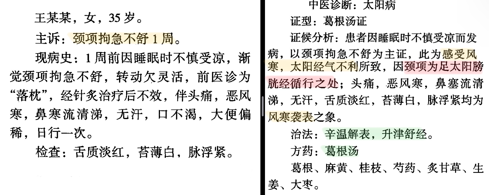
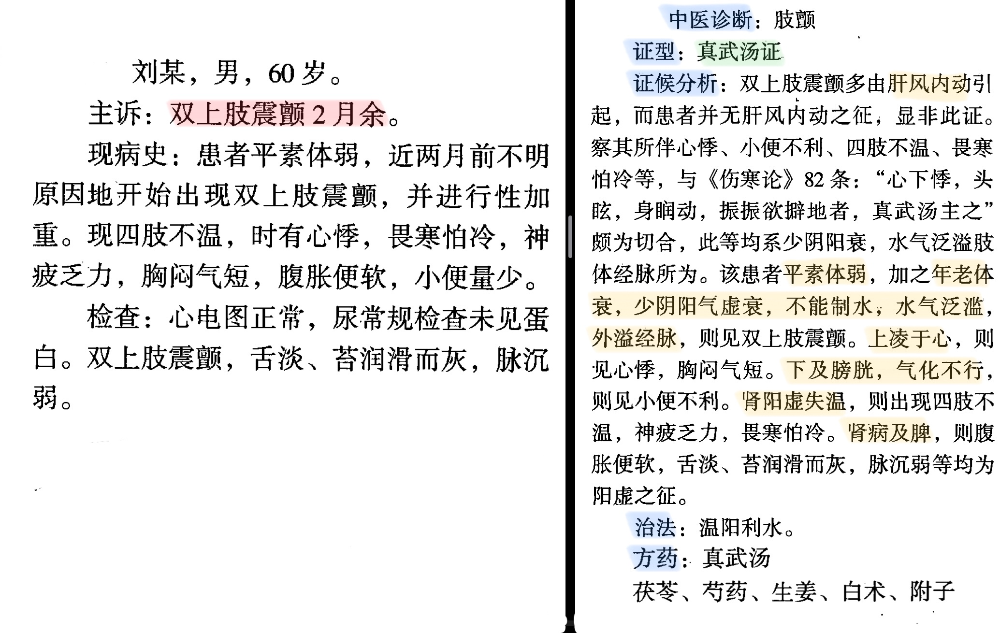
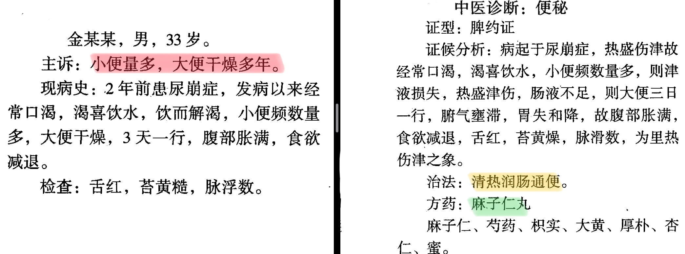

# 《伤寒论》笔记·于淏晴
- **前言**
    - **0、** **更新日期** **：2021.11.23（将于很快的速度于** **12月中旬左右更新完成）**
    - 1、文档中所有原文均以 *黑色斜体* 标注
        - 需要背诵的原文均按照 **天津中医药大学伤寒教研室** 要求应试的 **伤寒必背135条** 编辑，包含 个人笔记
        - *不用背诵的原文均以斜体并完成标注，如贵校要求与本校要求不同，请自行收藏文档编辑*
    - 2、本人将陆续上传其他自己所做笔记， **觉得不错不要忘记顺手点赞并关注哦～**
    - **3、太阳考一半，其次少阴较多，辨证，病机，方药**
    - 单选33 多选5 填空8题10空 名解5 简答3 论述2病例1
- 辩 **太阳病** 脉证并治 11.21～12.11、12.15
- > 病邪侵袭人体，正邪交争于肌表，营卫功能失调而发生的疾病
    - 概说
    - 纲要
        - **提纲**
            - *太阳之为病，脉浮，头项强痛而恶寒。（1）🏁* **易**
            - > 太阳主一身之表，统摄营卫，固护于外，为六经之藩篱，受邪首当其冲 **🏁** 头像强痛：强jiàng：拘紧不柔和。头像强痛拘急，转动不柔顺貌。 🏁恶寒：怕冷。 
        - **分类**
        - > 中风：有汗、脉浮缓（非自汗不为中风） 伤寒：恶寒、脉浮紧（非无汗不为伤寒）
            - *太阳病，* *发热，汗出，恶风，脉缓* *者，名为* ***中风*** *。（2）* **🏁易**
            - > **太阳中风证（太阳表虚证）脉症特点 🏁脉缓** ：脉象松弛、宽缓， 与“脉紧”相对 ，非怠慢迟缓之意 **🏁中风** ：外感风寒之邪引起的一种表证。与内伤杂病突然倒扑，口眼歪斜之中风病不同 
            - *太阳病，* *或已发热，或未发热，* ***必恶寒*** *，体痛，呕逆，脉阴阳俱紧* *者，名为* ***伤寒*** *。（3）🏁* **易**
            - > **太阳伤寒证脉症特点 🏁脉阴阳俱紧** ：寸关尺皆浮紧，“紧”与“缓”相对，脉象绷急，紧张有力 恶寒必见且程度较重，虽身居密室，覆被向火也不能减轻 
            - *太阳病，发热而渴，不恶寒者为🏁* **温病** *。若发汗已，身灼热者，名🏁* **风温** *。风温为病，脉阴阳俱浮，自汗出，身重，多眠睡，鼻息必鼾，语言难出。若被下者，小便不利，直视失溲。若被火者，微发黄色，剧则如惊痫，时瘛（chì）瘲（zòng），若火熏之。一逆尚引日，再逆促命期。（6）* **🏁不考原文**
            - > 🏁温病：太阳温病，非后世温病。为广义伤寒的一种，是感受温热病邪所引起的一种外感病，属太阳病的范畴，早期温病也可见短暂的微恶风寒。 ​🏁失溲：前溲指小便，后溲指大便。失溲指二便失禁。 🏁被火：误用火法治疗。火法：温针、烧针、灸，熏，熨等。 🏁时瘛瘲：瘛，筋急挛缩。瘲，筋缓纵伸。阵发性四肢抽搐痉挛。 🏁若火熏之：（1）形容肤色晦暗像火熏过一样。（2）使用火熏疗法
        - **辩病发于阳发于阴**
            - *病有发热恶寒者，发于阳也；无热恶寒者，发于阴也。发于阳，七日愈，发于阴，六日愈。以阳数七、阴数六故也。（7）* **🏁只掌握三阳病和三阴病。多选全选。**
            - > 外感病初起分辨阴阳的要点及对不同愈期的预测
        - **辩太阳病传遍与否**
            - *伤寒一日，太阳受之，* ***脉若静者，为不传*** *；颇欲吐，若躁烦，* ***脉数急者，为传*** *也。（4）*
            - > 凭脉症判断太阳病穿变于否
            - *伤寒二三日，阳明、少阳证不见者，为不传也。（5）*
            - > ❗️太阳病传变与否当以脉症为凭
            - *太阳病，头痛至七日以上自愈者，以行其经尽故也。若欲作再经者，针足阳明，使经不传则愈。（8）*
            - > 太阳病经尽自愈及预防传经之法
            - *风家，表解而不了了者，十二日愈（10）*
            - > 太阳病表解至痊愈的大致时间
        - **太阳病欲解时**
            - *太阳病欲解时，从巳至未上。（9）*
        - **复习思考题**
            - 论述太阳病提纲证的意义。
            - 太阳病如何分类？请详述之。
            - > 中风、伤寒、温病
            - “若欲作再经者，针足阳明，使经不传则愈”对临床有何指导意义？
    - 太阳病本证
        - **太阳病表证**
            - **中风表虚证**
                -  **#桂枝汤**
                - > 桂枝芍药等量伍，姜枣甘草微火煮；解肌发表调营卫，中风表虚自汗出 **🏁桂枝汤的煎服方法最易考·中** 桂枝（去皮，三两）芍药（三两）甘草（炙，二两）生姜（切，三两）大枣（擘，十二枚）上五味，㕮咀三味，以水七升，微火煮取三升，去滓，适寒温，服一升。服已须臾， **啜热稀粥一升余** ，以助药力，温覆令一时许，遍身漐漐微似有汗者益佳，不可令如水流漓，病必不除。若一服汗出病瘥，停后服，不必尽剂。若不汗，更服依前法。又不汗，后服小促其间，半日许，令三服尽。若病重者，一日一夜服，周时观之。服一剂尽，病证犹在者，更作服。若汗不出，乃服至二、三剂。禁生冷、粘滑、肉面、五辛、酒酪、臭恶等物。  
                    - *太阳中风，阳浮而阴弱，阳浮者，热自发，阴弱者，汗自出，啬啬(sè)恶寒，淅淅(xī)恶风，* *翕翕(xī)发热* *，鼻鸣干呕者，桂枝汤主之。（12）🏁* **填空**
                    - > **太阳中风表虚证的病因病机及证治** 🏁非常重要（必考） （1）阳浮而阴弱：脉轻按（浮取）为阳，重按（沉取）为阴/ **卫阳浮盛，营阴不足** （2）啬啬：畏怯貌，形容畏缩怕冷 （3）淅淅：冷水洒身不禁其寒之状，形容怕风 （4）翕翕：和顺之意 （5）㕮咀：碎成小块 （6）啜：大口喝 （7）漐漐：小雨不辍也。形容微汗，皮肤潮润。  
                    - *太阳病，* ***头痛，发热，汗出，恶风*** *，桂枝汤主之。（13）🏁*
                    - > 桂枝汤的应用指征❗️ **无喘证** 风邪外袭太阳，而致卫强营弱，即为太阳中风证，而为桂枝汤之主要适应证，故可互称为桂枝汤证 
                    - *太阳病，发热汗出者，此为🚩* **荣弱卫强** *，故使汗出，欲救邪风者，宜桂枝汤。（95）*
                    - > 太阳中风的病因病机及证治
                    - *太阳病，初服桂枝汤，反烦不解者，先刺* *风池、风府* *，却与桂枝汤则愈。（24）*
                    - > 太阳中风，邪郁较重者，治宜针药并用 🚩正邪搏击→反烦不解 
                    - *太阳病，* **外证未解，脉浮弱者，当以汗解** *，宜桂枝汤。（42）*
                    - *太阳病，外证未解，不可下也，下之为逆，欲解外者，宜桂枝汤。（44）*
                    - *太阳病，先发汗不解，而复下之，脉浮者不愈。浮为在外，而反下之，故令不愈。今脉浮，故在外，当须解外则愈，宜桂枝汤。（45）*
                    - *太阳病，* **下之后，其气上冲者，可与** *桂枝汤，方用前法。若不上冲者，不得与之。（15）*
                    - *太阳病* **发汗已解，🚩** **半日许复烦** **，脉浮数者，可更发汗** *，宜* *桂枝汤* *。（57）*
                    - *病常自汗出者* *，此为荣气和，荣气和者，外不谐，以* ***卫气不共荣气谐和*** *故尔。以荣行脉中，卫行脉外，🚩* *复发其汗* *，荣卫和则愈，宜桂枝汤。（53）🏁* **内伤杂病8出现营卫失和不是外感病证** 
                    - *病人* *脏无他病，时发热自汗出而不愈者* *，此* ***卫气不和*** *也，先其时发汗则愈，宜桂枝汤。（54）🏁* **内伤杂病出现营卫失和-多选（以下哪些病症使用桂枝汤 53 54易错）**
                - **桂枝汤禁忌**
                    - *桂枝本为解肌，若其人🚩* *脉浮紧，发热汗不出* *者，不可与之也。常须识（zhì）此，勿令误也。（16下）*
                    - > 太阳伤寒禁用桂枝汤
                    - *若* **酒客** *病，不可与桂枝汤，得之则呕，以酒客不喜甘故也。（17）*
                    - > 酒客：嗜酒之人
                    - *凡服桂枝汤吐者，其后必吐脓血也。（19）*
                - **桂枝汤兼证**
                    - **桂枝加葛根汤** 
                        - *太阳病，项背强几几（jǐn），反汗出恶风者，桂枝加葛根汤主之。（14）🏁* **病机，药物加减，名词解释**
                        - > 太阳中风兼经气不利 ​🚩不需饮粥 🏁葛根：起阴气
                    - **桂枝加厚朴杏子汤**
                        - **🚩喘** *家，作桂枝汤，加厚朴杏子佳。（18）🏁* 
                        - *太阳病，下之微🚩* **喘** *者，表未解故也，桂枝加厚朴杏子汤主之。（43）🏁* **选择题区分麻黄汤**
                    - **桂枝加附子汤**
                        - *太阳病发汗，遂漏不止，其人恶风，小便难，四肢微急，难以屈伸者，桂枝加附子汤主之。（20）🏁* **常考。** **只加附子体现伤寒重阳气的思想**
                        - > 太阳病过汗而漏汗不止 🏁症候分析：表不解-仍见汗出恶风（其人恶风-较前加重）。表邪不解➕过汗伤阳腠理不固。遂漏不止-导致阴阳两虚；小便难-阳虚气化无力，阴虚膀胱津少；四肢微急，难以屈伸-阳气虚不能温煦，阴虚膀胱津少。 🚩🏁病机：表证未除，阳气虚弱，阴亦不足，筋脉失养（寒凝筋脉❌）  
                    - **桂枝去芍药汤** 与 **桂枝去芍药加附子汤**
                    - > 表证误下不解，兼胸阳不振甚或胸阳不足的证
                        - *太阳病，* *下之后，脉促胸满* *者，桂枝去芍药汤主之。（21）🏁* **单选**
                        - > 表虚邪陷，胸阳不展-解肌祛风，温通胸阳 🚩芍药阴柔，有碍宣通阳气 
                        - *若* *微寒* *者，桂枝去芍药加附子汤主之。（22）🏁*
                        - > 🚩🏁微寒：脉微，恶寒 表虚邪陷，胸阳不足-解肌祛风，温复胸阳
                    - **（桂枝加芍药生姜各一两人参三两）新加汤**
                        - *发汗后，身疼痛，脉沉迟* *者，桂枝加芍药生姜各一两人参三两新加汤主之。（62）🏁* **疼痛是虚性的，发汗导致虚性疼痛，气阴不足在脉象上也有所体现-脉沉迟**
                        - > 🏁太阳病过汗致气营不足身疼痛 🏁治法：调和营卫，益气和营  
            - **伤寒表实证**
                - **麻黄汤**
                - > 麻黄汤中臣桂枝，杏仁甘草四般施；发汗解表宣肺气，伤寒表实无汗宜  右四味，以水九升， **先煮取麻黄** 减二升， **去上沫** ，内诸药，煮取二升半，去滓，温服八合，覆取微似汗，🚩🏁 **不须啜粥** 。余如桂枝法将息。
                    - *太阳病，头痛发热，身疼腰痛，骨节疼痛，恶风，* *无汗而🚩喘* *者，麻黄汤主之。（35）🏁* **重要，易**
                    - > ​🚩无汗而喘：风寒束表，腠理闭塞，肺气不宣风寒束表，卫强营弱，肺气上逆❌）   
                    - *脉浮者，病在表，可发汗，宜麻黄汤。（51）*
                    - > 太阳伤寒脉浮者可用麻黄汤
                    - *脉浮而数者，可发汗，宜麻黄汤。（52）*
                    - > 太阳伤寒脉浮数者可用麻黄汤
                    - *太阳病，十日已去，* *脉浮细而嗜卧者，外已解也* *。设胸满胁痛者，与* *#小柴胡汤* *。* *脉但浮者，与麻黄汤* *。（37）*
                    - > 太阳病迁延日久的三种转归 非必然十日以上，是言病程较长病情有变化可能 
                    - *太阳病，脉浮紧，无汗，发热，身疼痛，八九日不解，表证仍在，此当发其汗。｜服药已微除，其人发烦目瞑，* *剧者必衄，衄乃解* *。所以然者，阳气重故也。麻黄汤主之。（46）*
                    - > 伤寒邪郁日久的证治及药后的反应 阳气重：阳气郁遏较重。“阳气，阳中之邪气也。”意为阳气因邪闭而郁，日久有化热化邪之势。 🚩衄血：阳郁过甚，损伤阳络
                    - *太阳病，脉浮紧，发热，身无汗，自衄者，愈。（47）*
                    - > 太阳伤寒得衄者病愈
                    - *伤寒脉浮紧，不发汗，因致衄者，麻黄汤主之。（55）*
                    - > 太阳伤寒失汗致衄，仍须汗解
                    - *太阳与阳明合病，喘而胸满者，不可下，宜麻黄汤。（36）*
                - **麻黄汤禁例**
                    - *咽喉干燥者，不可发汗。（83）*
                    - > 阴液不足者禁汗
                    - *淋家* *不可发汗，发汗必便血。（84）*
                    - > 🚩下焦湿热阴伤者禁汗
                    - *疮家* *，虽身疼痛，不可发汗，汗出则痓（chì）。（85）*
                    - *衄家* *，不可发汗，汗出必额上陷，脉急紧，直视不能眴（shùn），不得眠。（86）*
                    - *亡血家* *，不可发汗，发汗则寒慄而振。（87）*
                    - *汗家* *，重发汗，必恍惚心乱，小便已阴疼，与禹余粮丸。（88）*
                    - *病人有寒，复发汗，胃中冷，必吐蚘（huí）。（89）*
                    - > 阳虚有寒者，禁用汗法
                    - *脉浮紧者，法当身疼痛，宜以汗解之。假令尺中迟者，不可发汗。何以知然？以荣气不足，血少故也。（50）*
                    - > 营血不足者，禁用汗法
                    - *脉浮数者，法当汗出而愈。若下之，身重心悸者，不可发汗，当自汗出乃解。所以然者，尺中脉微，此里虚，须表里实，津液自和，便自汗而愈。（49）*
                    - > 误下致里虚者，禁用汗法
                - **麻黄汤兼证**
                    - **葛根汤**
                    - > 葛根（四两）麻黄（去节，三两）桂枝（去皮，二两）生姜（切，三两）甘草（炙，二两）芍药（二两）大枣（擘，十二枚）上七味，以水一斗，先煮麻黄、葛根，减二升，去白沫，内诸药，煮取三升，去滓，温服一升，覆取微似汗，余如桂枝法将息及禁忌。诸汤皆仿此。 速记：葛根加麻桂枝汤 🚩治法：辛温解表， **生津舒经** 。（温阳柔经❌）
                        - *太阳病，项背强几几，* *无汗恶风* *，葛根汤主之。（31）🏁* **与14鉴别 一个有汗一个无汗 一个有麻黄 一个没麻黄**
                        - > 太阳伤寒兼经脉不利 
                        - *太阳与阳明合病者，必自下利，葛根汤主之。（32）* **🏁太阳经气不利可以波及阳明，邪气并没有侵袭阳明→逆流挽舟法**
                    - **葛根加半夏汤**
                        - *太阳与阳明合病，不下利但呕者，葛根加半夏汤主之。（33）*
                    - **大青龙汤**
                    - > 🚩麻黄用量最大
                        - *太阳中风，脉浮紧，发热恶寒，身疼痛，🚩* **不汗出而烦躁者** *，大青龙汤主之。｜若脉微弱，汗出恶风者，不可服之。｜服之则厥逆，筋惕肉瞤，此为逆也。（38）🏁*
                        - > 🏁太阳伤寒兼内热烦躁 🚩二两桂甘三两姜，膏如鸡子六麻黄；枣枚十二五十杏，无汗烦而且躁方 🏁筋惕肉瞤：肌肉跳动 🏁温粉：炒温之米粉。扑在皮肤上，用于止汗。    
                        - *伤寒* *脉浮缓，身不疼但重，乍有轻时，无少阴证* *者，大青龙汤发之。（39）*
                        - > 太阳伤寒兼内热
                    - **小青龙汤**
                    - > 解表蠲饮小青龙，麻桂姜辛夏草从；芍药五味敛气阴， **表寒内饮** 最有功 **🚩病机：风寒束表，水饮内停，表寒内饮**
                        - *伤寒表不解，* *心下有水气* *，干呕发热而咳，或渴，或利，或噎，或小便不利、少腹满，或喘者，小青龙汤主之。（40）* **🏁外寒内饮常考方剂组成五个或然证**
                        - > 太阳伤寒兼水停心下 🏁心下：胃脘部  
                        - *伤寒，* *心下有水气* *，咳而微喘，发热不渴。服汤已渴者，此寒去欲解也。小青龙汤主之。（41）*
                        - > 太阳伤寒兼水停心下的证治及药后转归
            - **表郁轻证**
                - **桂枝麻黄各半汤**
                    - *太阳病，* *得之八九日* *，如虐状，发热恶寒，热多寒少，其人不呕，清便欲自可，一日二三度发。脉微缓者，为欲愈也；脉微而恶寒者，此阴阳俱虚，不可更发汗、更下、更吐也；面色反有热者，未欲解也，以其不能得小汗出，身必痒，宜桂枝麻黄各半汤。（23）*
                    - > 太阳病日久不愈的三种转归及表郁轻证的证治 
                - **桂枝二麻黄一汤**
                    - *服桂枝汤，大汗出，脉洪大者，与桂枝汤如前法。🚩* **若形似虐，一日再发者，汗出必解** *，宜桂枝二麻黄一汤。（25）*
                    - > 服桂枝汤大汗出后两种不同的转归与证治 
                - **桂枝二越婢一汤**
                    - *太阳病，发热恶寒，热多寒少，脉微弱者，此为阳也，不可发汗。宜桂枝二越婢一汤。（27）*
                    - > 太阳表郁内热轻证的证治和禁忌  
            - **复习思考题**
                - 太阳中风表虚证的病机与辨证要点？
                - 桂枝汤的煎服法和禁忌证有哪些？
                - 桂枝汤有哪些兼证？各自的特征？
                - 简述太阳伤寒证的证候、病机、治法及方药
                - 大小青龙汤证的异、同点？
                - 桂枝麻黄各半汤证、桂枝二麻黄一汤证、桂枝二越婢一汤证均为表郁轻证，有何区别？
        - **太阳病里证**
            - **蓄水证**  **#五苓散**
            - > 🏁白饮：白米饮，即米汤。多饮暖水，汗出愈。消渴（非常爱考）：口渴而饮水不解的症状，非病名
                - *太阳病，发汗后，大汗出，胃中干，烦躁不得眠，欲得饮水者，少少与饮之，令胃气和则愈。若脉浮，小便不利，胃热消渴者，五苓散主之。（71）🏁* **两大段**
                - > 🏁治法：通阳化气利水，外散风寒
                - *发汗已，脉浮数，烦渴者，五苓散主之。（72）*
                - *中风发热，六七日不解而烦，有表里证，渴欲饮水，水入则吐者，名曰水逆，五苓散主之。（74）*
                - *伤寒汗出而渴者，五苓散主之；不渴者，茯苓甘草汤主之。（73）*
                - *太阳病，小便利者，以饮水多，必心下悸；小便少者，必苦里急者。（127）*
            - **蓄血证**
                - **桃核承气汤**
                - > 🏁先食，微利
                    - *太阳病不解，热结膀胱，* *其人如狂* *，血自下，下者愈。其外不解者，尚未可攻，当先解其外；外解已，但少腹急结者，乃可攻之，宜桃核承气汤。（106）🏁* **很重要**  
                - **抵挡汤**
                    - *太阳病六七日，表证仍在，脉微而沉，反不结胸，其人发狂者，以热在下焦，少腹当硬痛，小便自利者，下血乃愈。所以然者，以太阳随经，瘀热在里故也，抵挡汤主之。（124）*
                    - *太阳病🚩* *身黄* *，脉沉结，少腹硬，* *小便不利* *者，为无血也。小便自利，其人如狂者，血证谛也，抵挡汤主之。（125）*
                - **抵当丸**
                    - *伤寒有热，少腹满，瘿小便不利，今反利者，为有血也，当下之，不可余药，宜抵挡丸。（126）*
            - **复习思考题**
                - 五苓散证的政治特点、病机及治法
                - 试述五苓散证与茯苓甘草汤证的异同
                - 蓄血证如何分型？试述虚虚血证各型的异同
                - 如何鉴别太阳蓄水证与蓄血证？
                - 蓄血证兼有表证时，如何具体应用表里先后治则？
                - 🚩麻黄汤、桂枝汤、葛根汤、大青龙汤 皆取微似汗
    - 太阳病变证
        - **辩治纲要**
            - 辨证治则
                - *太阳病三日，已发汗，若吐，若下，若温针，仍不解者，此为坏病，桂枝不中与之也。🚩* **观其脉证，知犯何逆，随证治之** *。（16上）*
                - > 🏁坏病：变证。因误治而致病情发生变化，已无六经病证候可循的病证
            - 辨寒热真假
                - *病人身大热，反欲得衣者，热在皮肤，寒在骨髓也；身大寒，反不欲近衣者，寒在皮肤，热在骨髓也。（11）🏁* **以病人的欲望辨析真寒假热**
                - *太阳病，当恶寒发热，今* *自汗出，反不恶寒发热，关上脉细数* *者，以医吐之过也。一二日吐之者，腹中饥，口不能食；三四日吐之者，不喜糜粥，欲食冷食，朝食暮吐。以医吐之所致也，此为小逆。（120）*
                - > 🚩标红病机：表邪已解里气未和
                - *病人脉数，数为热，当消谷引食，而反吐* *者，此以发汗，令🚩* *阳气微，膈气虚* *，脉乃数也。数为客热，不能消谷，以胃中虚冷，故吐也。（122）*
            - 辨虚证实证
                - *发汗后恶寒者，虚故也。不恶寒，但热者，实也，当和胃气，与🚩* *调胃承气汤* *。（70）*
                - **🚩下之后，复发汗，必振寒** *，脉微细。所以然者，以* *内外俱虚* *故也。（60）*
                - > 🚩治法：扶阳益阴
                - *未持脉时，病人手叉自冒心，师因教试令咳，而不咳者，此必* *两耳聋无闻* *也。所以然者，以重发汗，虚故如此。发汗后，饮水多必喘，以水灌之亦喘。（75）*
                - > 🚩标红病机：汗后气液大伤，心阳虚损，甚则伤及肾气
            - 辨汗下先后
                - *本发汗，而复下之，此为逆也；若先发汗，治不为逆。｜本先下之，而反汗之，为逆；若先下之，治不为逆。（90）*
                - > 表里同病，汗下先后的治法 🚩表里同病时，里证不急不重则先表后里｜里证为急为重则先里后表
                - *伤寒不大便六七日，头痛有热者，与承气汤。其小便清者，知不在里，仍在表也，当须发汗。若头痛者，必衄，宜桂枝汤。（56）*
                - > 论据小便清否辨表里证治
            - 辨标本缓急
                - *伤寒，医下之，续得下利清谷不止，身疼痛* *者，急当救里；后身疼痛，清便自调者，急当救表。救里宜🚩*  *#四逆汤* *，救表宜桂枝汤。（91）🏁* **表里同病的治则（指征：清谷不止）**
                - *病发热头痛，脉反沉，若不差，身体疼痛，当救其里。（92）*
        - **辩治示例**
            - **热证**
                - **栀子豉汤、栀子甘草豉汤、栀子生姜豉汤**
                - > 🚩栀子豉汤：栀子十四个、香豉四合🏁得吐者，止后服（但并不是涌吐剂） ​🚩栀子生姜豉汤：栀子、生姜、豆豉
                    - *发汗后，水药不得入口为逆，若更发汗，必吐下不止。🚩* *发汗吐下后，虚烦不得眠* *，若剧者，必反复颠倒，心中懊憹，* *栀子豉汤* *主之；若少气者，栀子甘草豉汤主之；若呕者，栀子生姜豉汤主之。（76）* **🏁热郁胸膈→清宣郁热**
                    - > 🏁虚烦：虚，与有形之邪实相对而言；烦：心烦。心烦指由无形邪热所致。 🏁心中懊憹：心中烦闷殊甚，莫可名状 
                    - *🚩发汗若下之，而烦热胸中窒者，栀子豉汤主之。（77）*
                    - *伤寒五六日，大下之后，身热不去，心中结痛者，未欲解也，栀子豉汤主之。（78）*
                    - *凡用栀子汤，病人旧微溏者，不可与服之。（81）*
                    - > 栀子豉汤禁例
                - **栀子厚朴汤**
                - > 🚩栀子、厚朴、枳实
                    - *伤寒下后，🚩* *心烦腹满，卧起不安* *者，栀子厚朴汤主之。（79）*
                    - > 🚩热扰胸膈兼气滞不满的证治 
                - **栀子干姜汤**
                - > 🚩栀子十四个、干姜二两
                    - *伤寒，医以丸药大下之，身热不去，微烦者，栀子干姜汤主之。（80）*
                    - > 🚩病机：胸膈有热，中焦有寒
                - **麻黄杏仁甘草石膏汤**
                - > 🚩麻黄四两、杏仁五十个、甘草二两、石膏半斤
                    - *发汗后，不可更行桂枝汤，汗出而喘，无大热者，可与麻黄杏仁甘草石膏汤。（63）* **🏁邪热壅肺→清热宣肺（考点麻黄：石膏=1:2）**
                    - > 🚩病机：邪热壅肺，宣降失司 
                    - *下后，不可更行桂枝汤，若汗出而喘，无大热者，可与麻黄杏子甘草石膏汤。（162）*
                - **白虎加人参汤**
                    - *服桂枝汤，大汗出后，大烦渴不解，脉洪大者，白虎加人参汤主之。（26）*
                    - > 🚩病机：服桂枝汤后，热盛津伤，转属阳明，津气两伤
                - **葛根黄芩黄连汤**
                    - *太阳病，桂枝证，医反下之，利遂不止，脉促者，表未解也；喘而汗出者，葛根黄芩黄连汤主之。（34）🏁* **表里两解（里证：下利；表证：发热汗出喘）脉促：正气仍然能抗击邪气（表未解）**
                    - > 🚩🏁病机：热胜于里，邪热下迫大肠 🏁治法：清热止利，兼以解表 ​  
                - **黄芩汤、黄芩加半夏生姜汤**
                - > 🏁千万注意：黄芩芍药甘草大枣
                    - *太阳与少阳合病，自下利者，与黄芩汤；若呕者，黄芩加半夏生姜汤主之。（172）* **🏁太少合病下利黄芩汤鉴别太阳阳明合病下利葛根汤**
                    - > 🏁下利-少阳邪热迫于大肠，传导失职 
            - **心阳虚证**
                - **桂枝甘草汤**
                    - *🚩发汗过多，其人叉手自冒心，心下悸，欲得按* *者，桂枝甘草汤主之。（64）🏁* **与干姜附子汤一起学习 辛甘化阳 顿服** 
                - **桂枝甘草龙骨牡蛎汤**
                    - *🚩火逆下之，因烧针烦躁者* *，桂枝甘草龙骨牡蛎汤主之。（118）*
                    - > 🚩辨证要点：心悸，烦躁，舌淡，苔白
                - **桂枝去芍药加蜀漆牡蛎龙骨救逆汤**
                    - *伤寒脉浮，医以火迫劫之，亡阳必惊狂，卧起不安者，桂枝去芍药加蜀漆牡蛎龙骨救逆汤主之。（112）*
                    - > 🚩心阳虚，心神不敛，复被痰扰→ 心阳虚惊狂证 
                - **桂枝加桂汤**
                    - *烧针令其汗，针处被寒，核起而赤者，必发奔豚。气从少腹上冲心者，灸其核上各一壮，与桂枝加桂汤更加桂二两也。（117）🏁* **奔豚名词解释**
                    - > 病机：心阳虚，下焦阴寒之气乘虚上逆 🚩🏁重用桂枝：通心阳而平冲逆
            - **水气证**
                - **茯苓桂枝甘草大枣汤**
                - > 🏁甘澜水煎煮 茯苓半斤-用量《伤寒论》之最
                    - *🚩发汗后，其人* *脐下悸* *者，* *欲作奔豚* *，茯苓桂枝甘草大枣汤主之。（65）🏁* 
                - **茯苓桂枝白术甘草汤**
                    - *伤寒若吐、若下后，🚩* *心下逆满，气上冲胸，起则头眩，🚩* **脉沉紧** *，发汗则动经，身为振振摇者，茯苓桂枝白术甘草汤主之。（67）🏁* **极重要 背诵-近似单项选择**
                    - > 🚩🏁脾虚水停证 🏁动经：扰动经脉 振振：动摇不定貌 
                - **桂枝去桂加茯苓白术汤**
                    - *服桂枝汤，或下之，仍* *头项强痛，翕翕发热，无汗* *，心下满微痛，小便不利者，桂枝去桂加茯苓白术汤主之。（28）🏁* **难点（内有水饮影响营气运行，类似于太阳病的里证）**
                    - > 🏁水气内停太阳经气不利→健脾利水 
            - **脾虚证**
                - **厚朴生姜半夏甘草人参汤**  
                    - *发汗后，腹胀满者，厚朴生姜半夏甘草人参汤主之。（66）🏁* **虚实夹杂腹胀满-消7补3（腹胀满时间变化：早晨轻晚上重-病例题）**
                    - > 🚩脾虚气滞腹胀证 
                -  **#小建中汤**
                    - *🚩伤寒二三日，心中悸而烦者， 小建中汤* *主之。（102）*
                    - > 🚩中焦虚寒，气血不足，复被邪扰→心中悸而烦 小建中汤君饴糖,桂枝汤方倍芍尝,温中补虚和缓急,虚劳里急腹痛康 
                - **桂枝人参汤**
                - > 🚩人参、甘草、白术、桂枝、干姜 🏁日再夜一服
                    - *太阳病，外证未除，而数下之，遂协热而利，利下不止，心下痞硬，表里不解者，桂枝人参汤主之。（163）🏁* **背诵，难度不大，核心-协热下利。既有表又有里（里是虚寒性，表风寒外袭）注意不要忽略心下痞硬，表里不解-温中解表。鉴别葛根汤（非寒非热腹泻）、葛根芩连汤（热性腹泻）、桂枝人参汤（虚寒性腹泻）**
                    - > 🚩病机：脾虚寒湿兼表邪不解 
            - **肾阳虚证**
                - **干姜附子汤**
                    - *下之后，复发汗，🏁* ***昼日烦躁不得眠，🚩夜而安静*** *，不呕，不渴，无表证，脉沉微，身无大热* *者，干姜附子汤主之。（61）🏁*  
                - **茯苓四逆汤**
                - > 🚩茯苓、人参、附子、干姜、甘草
                    - *🚩发汗，若下之，病仍不解，烦躁* *者，茯苓四逆汤主之。（69）* 
                -  **#真武汤**
                - > 🚩茯苓、芍药、生姜、白术、附子
                    - *太阳病发汗，汗出不解，其人仍发热，🚩* *心下悸，头眩，身瞤动，振振欲擗地* *者，真武汤主之。（82）*
                    - > 肾阳虚水泛的证治 🚩阳虚失于温养，水气浸渍四肢经脉→身瞤动，振振欲擗地   
            - **阴阳两虚证**
                - **甘草干姜汤、芍药甘草汤**
                    - *伤寒脉浮，自汗出，小便数，心烦，微恶寒，脚挛急，反与桂枝欲攻其表，此误也；得之便厥，咽中干，烦躁，吐逆者，作甘草干姜汤与之，以复其阳；若厥愈足温者，更作芍药甘草汤与之，其脚即伸；若胃气不和，谵语者，少与调胃承气汤；若重发汗，复加烧针者，* #四逆汤  *主之。（29）*  
                - **芍药甘草附子汤**
                    - *发汗，病不解，反恶寒者，虚故也，芍药甘草附子汤主之。（68）*
                    - > 🚩辨证要点：恶寒，脚挛急，脉微细
                - **炙甘草汤**
                - > 🚩炙甘草枣参地胶，麻仁麦桂姜酒熬；益气养血温通脉，结代心悸肺痿疗 🏁清酒。 方义：清酒振奋阳气，温通血脉；生地黄滋阴养血
                    - *🚩伤寒脉结代，心动悸* *，炙甘草汤主之。（177）🏁* 
                    - *脉按之来缓，时一止复来者，名曰结。又脉来动而中止，更来小数，中有还者反动，名曰结，阴也。脉来动而中止，不能自还，因而复动者，名曰代，阴也。得此脉者，必难治。（178）*
            - **结胸证**
                - 结胸辨证
                    - *问曰：病有结胸，有藏结，其状何如？答曰：🚩* *按之痛，寸脉浮，关脉沉* *，名曰结胸也。（128）*
                    - *病发于* ***阳*** *，而反下之，热入因作结胸；病发于* ***阴*** *，而反下之，因作痞也。所以成结胸者，以下之太早故也。（131上）*
                    - > 🚩阳：素体有痰水实邪内停之人；阴：素体无痰水内蓄之人
                    - *太阳少阳并病，而反下之，成结胸，心下硬，下利不止，水浆不下，其人心烦。（150）*
                - **热实结胸证**
                    - **大陷胸汤**
                    - > 大陷胸汤用硝黄,甘遂为末共成方,专治水热结胸证,泻热逐水效非常 ​🚩病机：水热互结
                        -  *太阳病，脉浮而动数，浮则为风，数则为热，动则为痛，数则为虚，头痛发热，微盗汗出，而反恶寒者，表未解也。医反下之，动数变迟，膈内拒痛，胃中空虚，客气动膈，🚩* *短气躁烦* *，心中懊憹，阳气内陷，心下因硬，则为结胸，大陷胸汤主之；若不结胸，但头汗出，余处无汗，剂颈而还，小便不利者，身必发黄。（134）*
                        - *伤寒六七日，结胸热实，脉沉而紧，🚩* *心下痛，按之石硬* *者，大陷胸汤主之。（135）🏁* **非常重要**    
                        - *伤寒十余日，热结在里，复往来寒热者，与大柴胡汤；但结胸，无大热者，此为水结在胸肋也，🚩* **但头微汗出** *者，大陷胸汤主之。（136）*
                        - *太阳病，重发汗而复下之，🚩* *不大便* *五六日，* *舌上燥而渴* *，* *日晡所小有潮热* *，🚩* *从心下至少腹，硬满而痛不可近* *者，大陷胸汤主之。（137）*
                    - **大陷胸丸**
                    - > 🚩大陷胸汤➕杏仁、葶苈子、白蜜
                        - *结胸者，* **🚩** **项亦强，如柔痉状** *，下之则和，宜大陷胸丸。（131下）*  
                    - **小陷胸汤**
                    - > **🚩小陷胸汤连半蒌** ,宽胸开结涤痰优；膈上热痰痞满痛,舌苔黄腻服之休。  ​🚩清热涤痰开结
                        - *小陷胸病，🚩* *正在心下，按之则痛* *，🚩* **脉浮滑** *者，小陷胸汤主之。（138）🏁* **在大小柴胡汤的基础上一起学习。一定记清楚原文。大陷胸热邪与水饮相结，小陷胸热邪与痰相结-清热涤痰开结**  
                - **🚩寒实结胸证** **（三物白散）**
                - > 🚩巴豆、桔梗、贝母
                    - *…寒实结胸，无热证者，与三物小白散。（141）*
                    - > 🚩将息法：不利进热粥一杯，利过不止，进冷粥一杯   
                - **结胸证治禁与预后**
                    - *结胸证，其🚩* *脉浮大者，不可下* *，下之则死。（132）*
                    - *🚩结胸证悉具，* *烦躁* *者亦死。（133）*
                    - *太阳与少阳并病，头项强痛，或眩冒，时如结胸，心下痞硬者，当刺大椎第一间、肺俞、肝俞，慎不可发汗；发汗则谵语，脉弦。五日谵语不止，当刺期门。（142）*
                    - *太阳少阳并病，心下硬，颈项强而眩者，当刺大椎、肺俞、肝俞，慎勿下之。（171）*
            - **脏结证**
                - 脏结辨证
                    - *何谓脏结？答曰：🚩* *如结胸状，饮食如故，时时下利，寸脉浮* *，关脉小细沉紧，名曰脏结。舌上白胎滑者，难治。（129）*
                - 脏结证治禁与预后
                    - *藏结无阳证，不往来寒热，其人反静，🚩* *舌上胎滑者，不可攻也* *。（130）*
                    - *病胁下素有痞，连在脐旁，痛引少腹，入阴筋* *者，此名脏结，🚩* *死* *。（167）*
            - **痞证**
                - 痞证的成因及证候特点
                    - *脉浮而紧，而复下之，紧反入里，则作痞。按之自濡，但气痞耳。（151）* 
                - **热痞证**
                    - **大黄黄连泻心汤**
                    - > 🏁煎煮：麻沸汤名词解释
                        - *🚩心下痞，按之濡，其脉关上浮* *者，大黄黄连泻心汤主之。（154）🏁* **原文**    
                    - **附子泻心汤**
                    - > 🚩病机：邪热聚结心下，气机阻滞，兼阳虚不固 🚩煎服法：上四味，切三味，以麻沸汤二升渍汁，须臾，绞去滓，内附子汁，分温再服
                        - *🚩心下痞* *，而复* *恶寒汗出* *者，附子泻心汤主之。（155）* 
                - **寒热错杂痞证**
                    - **半夏泻心汤**
                    - > 🚩半夏泻心配芩连，干姜人参草枣全；辛开苦降除痞满,寒热错杂痞证蠲 🏁去滓再煎（同小柴胡汤） ​病入少阳小柴胡汤误下
                        - *伤寒五六日，呕而发热者，柴胡汤证具，而以他药下之，柴胡证仍在者，复与柴胡汤。此虽已下之，不为逆，必蒸蒸而振，却发热汗出而解。若心下满而硬痛者，此为结胸也，大陷胸汤主之。* **🏁** **但满而不痛者，此为痞，柴胡不中与之，宜半夏泻心汤。** *（149）*
                        - > 🏁蒸蒸而振：高热寒战  
                    - **生姜泻心汤**
                    - > 胃虚水停，气机痞塞
                        - *伤寒汗出解之后，胃中不和，心下痞硬，干噫食臭，胁下有水气，🚩* *腹中雷鸣* *，下利者，生姜泻心汤主之。（157）🏁* **注意水饮食滞。原文背诵可能挖空单选**   
                    - **甘草泻心汤**
                    - > 脾胃气虚，痞利俱甚 🚩半夏泻心汤加重炙甘草用量🏁有人参
                        - *伤寒中风，医反下之，其人🚩* *下利日数十行，谷不化，腹中雷鸣，心下痞硬而满，干呕心烦* *不得安，医见心下痞，谓病不尽，复下之，启痞益甚，此非结热，但以胃中虚，客气上逆，故使硬也，甘草泻心汤主之。（158）🏁不* **背。注意鉴别要点-其人下利日数十行（体现中气受损）** **下利频作！！三个泻心汤比较表格**  
                - **其他痞证**
                    - **🚩痰气痞** **（旋覆代赭汤）**
                    - > 旋覆代赭重用姜,半夏人参甘枣尝,降逆化痰益胃气,胃虚痰阻痞嗳康。🏁组成在半夏泻心汤基础上去黄芩黄连加旋覆花和代赭石
                        - *伤寒发汗，若吐若下，解后心下痞硬，噫气不除者，旋复代赭汤主之。（161）🏁* **胃虚加痰饮痞证。代表性症候（噫气不除代表胃气上逆非常关键辨证要点）非常爱考**
                        - > 🚩噫气：嗳气    
                    - **水痞**  **#五苓散**
                    - > 三焦气化不利，水饮内停心下
                        - *本以下之，故心下痞，与泻心汤。痞不解，其人* *渴而口躁烦，小便不利* *者，五苓散主之。一方云，忍之一日乃愈。（156）* 
                - 痞证误下后下利的辩治 **（赤石脂禹余粮汤）**
                    - *伤寒服汤药，下利不止，心下痞硬服泻心汤已，复以他药下之，利不止，医以理中与之，利益甚。理中者，理中焦，此利在下焦，赤石脂禹余粮汤主之。复不止者，当利其小便。（159）* 
                - **🚩上热下寒证** **（黄连汤）**
                - > 太阳伤寒演化而来，患者胃阳不足，表邪入里致上热下寒，腹痛欲呕（胃中有热，腹中有寒） 🚩🏁半夏泻心汤➖黄芩➕桂枝 清上温下，调和脾胃 🚩不见心下痞
                    - *伤寒胸中有热，* *胃中有邪气，🚩腹中痛* *，欲呕吐* *者，黄连汤主之。（173）* **🏁清上温下和胃降逆**   
            - **火逆证** （自学）
            - **欲愈候**
    - 太阳病类似证
        - **饮停胸胁证** **（十枣汤）**
            - *太阳中风，* *下利呕逆* *，表解者，乃可攻之。｜其人* *漐漐汗出* *，发作有时，* *头痛，心下痞硬满，引胁下痛，干呕短气，汗出不恶寒* *者，此表解里未和也，十枣汤主之。（152）*
            - > 饮停胸胁的证治 芫花(熬)甘遂大戟 ❗️上三味等分，各别 **捣为散** ，以水一升半，先煮大枣肥者十枚，取八合，去滓，内药末。强人服一钱匕，羸人服半钱， ***温服之*** *，* ***平旦服*** *。若下少，病不除者，* ***明日更服*** *，加半钱。得快下利后，* ***糜粥自养*** *。 ①因甘遂等逐饮污水药物的有效成分难溶于水,故三药分别研粉，以散剂冲服疗效最佳。 ②用量因人而异，体质壮实者每次服一钱匕，体弱者每次服半钱匕。 ③要注意服药时间与温度,应清晨温服，使药在胃中停留时间短，减少对胃的刺激,避免发生不良反应,且有利于增强疗效。 ④应中病即止,勿过量服用。若服药后快利者,可让患者服糜粥自养，以补养正气。* 【方义】十枣汤为攻逐水饮之峻剂。 ​芫花：味苦辛温有毒,善消胸胁伏饮痰癖，治膈上之水 ​甘隧：味苦性寒有毒,善行经隧水湿 ​大㦸：味苦寒有毒,善泄脏腑之水 ​肥大枣：固护胃气、攻邪勿伤正气之意 
        - **胸膈痰实证** **（瓜蒂散）**
            - *病如桂枝证，* *头不痛，项不强* *，寸脉微浮，胸中痞硬，气上冲喉咽，不得息者，此为胸中有寒也。当吐之，宜瓜蒂散。（166）*
            - > 痰阻胸膈的证治 ❗️上二味，各别捣筛，为散已，合服之，取一钱匕，以香豉一合，用热汤七合，煮作米粥，去滓，取汁合服，温顿服之，不吐者，少少加，得快利乃止。 **诸亡血虚家，不可与瓜蒂散。**
        - **风湿证** 
            - **桂枝附子汤、白术附子汤**
            - > 风寒湿邪痹着于肌表
                - *伤寒八九日，风湿相搏，身体疼烦，不能自转测，不呕，不渴，脉浮虚而涩者，桂枝附子汤主之。｜若其人大便硬，小便自利者，去桂加白术汤主之。（174）*
                - > 🚩桂枝附子汤是《伤寒论》中附子用量最大的方剂 
            - **甘草附子汤**
            - > 风寒湿邪痹着于关节筋骨-温经散寒，祛湿止痛
                - *风湿相搏，骨节疼痛，掣痛不得屈伸，近之则痛剧，汗出短气，小便不利，恶风不欲去衣，或身微肿者，甘草附子汤主之。（175）*
                - 肩周炎、急慢性风湿性关节炎、强制性脊柱炎、坐骨神经痛等。
- 辩 **阳明病** 脉证并治 12.18
- > 手阳明大肠经、足阳明胃经 ​手太阴肺经、足太阴脾经（相表里） 阳明病是外感病过程中邪入阳明，正邪相争剧烈，邪热盛极的阶段，其性质多属里、热、实证。因热→伤津→化燥→成实
    - 概说
    - 阳明病纲要
        - **提纲**
            - *阳明之为病，胃家实是也。（180）🏁*
            - > 🚩胃家实：胃家：胃肠；实：邪气实 
        - **病因病机**
            - *问曰：病* *有太阳阳明，有正阳阳明，有少阳阳明* *，何谓也？答曰：太阳阳明者，脾约是也；正阳阳明者，胃家实是也；少阳阳明者，发汗利小便已，胃中燥烦实，大便难是也。（179）*
            - > **成因说/分类说 脾约** ：胃肠燥热，损伤津液，脾不能为胃行其津液，以致大便秘结者
                - 太阳阳明：太阳病汗不得法，或误吐、下、利小便等，损伤津液，邪入阳明，胃肠燥热，约束脾的传输过程，而致大便秘结，形成脾约。
                - 正阳阳明：胃肠素有内热/夹有宿食，邪气直犯阳明，化燥成实，腑气不通，形成阳明腑实证。
                - 少阳阳明：少阳病误发汗、吐下、利小便等，耗伤津液，以致邪归阳明，化燥成实，而大便坚涩难解。
                - ⚠️无论太阳误治/少阳误治/燥热直犯阳明，均有形成脾约/胃家实/大便难可能， 并非太阳病误治只形成脾约，燥热发自阳明只形成胃家实，少阳病误治只形成大便难 **（互文）**
            - *问曰：何缘得阳明病？答曰：太阳病，若发汗，若下，若利小便，此亡津液，胃中干燥，因转属阳明。不更衣，内实，大便难者，此名阳明也。（181）*
            - > 太阳病误治伤津，转属阳明的证候
            - *本太阳初得病时，发其汗，汗先出不彻，因转属阳明也。伤寒发热无汗，呕不能食，而反汗出濈濈然者，是转属阳明也。（185）*
            - > 太阳病转属阳明的成因和症状
            - *二阳并病，太阳初得病时，发其哈，汗出先不彻，因转属阳明，续自微汗出，不恶寒。若太阳病证不罢者，不可下，下之为逆，如此可小发汗。设面色缘缘正赤者，阳气怫郁在表，当解之熏之。若发汗不彻，不足言，阳气怫郁不得越，当汗不汗，其人躁烦，不知痛处，乍在腹中，乍在四肢，按之不可得，其人短气，但坐以汗出不彻故也，更发汗则愈。何以知汗出不彻？以脉涩故知也。（48）*
            - > 太阳病发汗不彻的三种转归及其证治
        - **脉症**
            - *问曰：阳明病外证云何？答曰：身热，汗自出，不恶寒，反恶热也。（182）🏁*
            - > 阳明病外证（里热实证反映在外） 🏁外证：阳明病里热实证反映于外的症状  
            - *问曰：病有得知一日，不发热而恶寒者，何也？答曰：虽得之一日，恶寒讲自罢，即自汗出而恶热也。（183）*
            - > 阳明初感的见症与辨证要点
            - *问曰：恶寒何故自罢？答曰：阳明居中，主土也，万物所归，无所复传，始虽恶寒，二日自止，此为阳明病也。（184）*
            - > 阳明病恶寒自罢的原因
            - *伤寒三日，阳明脉大。（186）*
            - *伤寒转系阳明者，其人濈然微汗出也。（188）*
    - 阳明病本证
        - **阳明病热证**
        - > 燥热之邪未与肠中积滞相结，而弥漫于全身-身大热、口大渴、大汗出、不恶寒反恶热、脉洪大
            - **栀子豉汤**
                - *阳明病，脉浮而紧，咽燥口苦，腹满而喘，发热汗出，不恶寒反恶热，身重。若发汗则躁，心愦愦，反谵语；若加温针，必怵惕烦躁，不得眠；若下之，则胃中空虚，客气动膈，心中懊憹，舌上胎者，栀子豉汤主之。（221）*
                - *阳明病，下之，其外有热，手足温，不结胸，心中懊憹，饥不能食，但头汗出者，栀子豉汤主之。（228）*
            -  **#白虎汤**
            - > 🏁米熟汤成
                - *伤寒* *脉浮滑* *，此以* *表有热* *，* *里有寒* *，白虎汤主之。（176）*
                - > 阳明病表里俱热的证治 
                - *三阳合病，腹满身重，难以转侧，口不仁，面垢，谵语遗尿。发汗则谵语。下之则额上生汗，手足逆冷。若自汗出者，白虎汤主之。（219）🏁* **邪热偏重，弥漫全身**
                - > 三阳合病邪热偏重于阳明的证治及禁例 有三阳合病之名而无三阳合病之实，或初为三阳病，目前已成阳明病 🏁口不仁：口中感觉失常，食不知味，语言不利。面垢：面部如蒙油垢，此因阳明热浊之气上熏所致  
            - **白虎加人参汤**
                - *伤寒若吐若下后，七八日不解，热结在里，* *表里俱热* *，时时恶风，大渴，舌上干燥而烦，欲饮水数升者，白虎加人参汤主之。（168）🏁* **原文背诵。注意四大证。人参益气生津。**
                - > 伤寒吐下后 **热结在里** ，热盛津伤的证治 伤寒当用汗解，误用吐下之法后，外邪入里损伤津液，盘桓数日邪从燥化而成阳明热盛津伤证，非里热兼表病不解 ⚠️①立夏后立秋前可服，立秋后不可服② 正月二月三月与之则呕利而腹痛③ 诸亡血虚家与之则腹痛利，温之愈  
                - *伤寒无大热，口燥渴，心烦，背微恶寒者，白虎加人参汤主之。（169）*
                - *伤寒脉浮，发热无汗，其表不解，不可与白虎汤，渴欲饮水，无表证者，白虎加人参汤主之。（170）*
                - *若渴欲饮水，口干舌燥者，白虎加人参汤主之。（222）*
            -  **#猪苓汤**
                - *若脉浮发热，渴欲饮水，小便不利者，猪苓汤主之。（223）🏁* **选择**
                - > 阳明津伤，水热互结的证治    
                - *阳明病，汗出多而渴者，不可与猪苓汤，以汗多胃中燥，猪苓汤复利其小便故也。（224）*
        - **阳明病实证**
        - > 阳明燥热与肠中糟粕相结，形成燥屎而阻于肠道-潮热、谵语、手足濈然汗出、腹胀满疼痛拒按、不大便、脉沉实有力
            - **攻下法**
                - **调胃承气汤🏁** **本方在《伤寒论》中有两种服用方法：温顿服；分服。一个通导大便，一个单纯泄热。多选**
                - > 🏁温顿服之
                    - *阳明病，不吐不下，心烦者，可与调胃承气汤。（207）*
                    - *太阳病三日，发汗不解，* **蒸蒸发热** *者，属胃也，调胃承气汤主之。（248）🏁*
                    - > 太阳病汗后转属阳明形成腑实的证治 🏁（重要的名词解释）蒸蒸发热：形容发热从内达外，如蒸笼中热气蒸腾之状。  
                    - *伤寒吐后，腹胀满者，与调胃承气汤。（249）*
                - **小承气汤**
                    - *阳明病，其人多汗，以津液外出，胃中燥，大便必硬，硬则谵语，小承气汤主之。若一服谵语止者，更莫复服。（213）🏁* **背诵**
                    - > 阳明病汗多津伤，便硬谵语的证治 
                    - *阳明病，谵语* *发潮热* *，脉滑而疾者，小承气汤主之。因与承气汤一升，腹中转气者，更服一升；若不转气者，勿更与之。明日又不大便，脉反微涩者，里虚也，为难治，不可更与承气汤也。（214）*
                    - > 阳明腑实轻证的治法及禁例 
                    - *太阳病，若吐若下若发汗后，微烦，小便数，大便因硬者，与小承气汤和之愈。（250）*
                - **大承气汤**
                    - *二阳并病，太阳证罢，但发潮热，手足漐漐汗出，大便难而谵语者，下之则愈，宜大承气汤。（220）* *链（48）*
                    - > 二阳并病转属阳明腑实的证治（太阳表证已罢，病已完全转属阳明） 
                    - *阳明少阳合病必下利，其脉不负者，为顺也。负者，失也，互相剋贼，名为负也。脉滑而数者，有宿食也，当下之，宜大承气汤。（256）*
                    - *病人不大便五六日，绕脐痛，烦躁，发作有时者，此有燥屎，故使不大便也。（239）*
                    - *阳明病，谵语有潮热，反不能食者，胃中必有燥屎无六枚也；若能食者，但硬耳，宜大承气汤下之。（215）*
                    - *汗出谵语者，以有燥屎在胃中，此为风也。须下者，过经乃可下之。下之若早，语言必乱，以表虚里实故也。下之愈，宜大承气汤。（217）*
                    - *阳明病，下之，心中懊憹而烦，胃中有燥屎者，可攻。腹微满，初头硬，后必溏，不可攻之。若有燥屎者，宜大承气汤。（238）*
                    - *大下后，六七日不大便，烦不解，腹满痛者，此有燥屎也。所以然者，本有宿食故也，宜大承气汤。（241）*
                    - *伤寒，若吐若下后不解，不大便五六日，上至十余日，日晡所发潮热，不恶寒，独语如见鬼状。若剧者，发则不识人，循衣摸床，惕而不安，微喘直视，脉弦者生，涩者死。微者，但发热谵语者，大承气汤主之。若一服利，则止后服。（212）*
                    - *病人小便不利，大便乍难乍易，喘冒不能卧者，有燥屎也，宜大承气汤。（242）*
                    - *伤寒六七日，目中不了了，睛不和，无表里证，大便难，身微热者，此为实也，急下也，宜大承气汤。（252）*
                    - > 论伤寒目中不了了，睛不和，治当急下存阴 
                    - *阳明病，发汗汗多者，急下之，宜大承气汤。（253）*
                    - *发汗不解，腹满痛者，急下之，宜大承气汤。（254）*
                    - *腹满不減，減不足言，当下之，宜大承气汤。（255）*
            - **润导法**
                - **麻子仁丸**
                - > 🏁用量渐加以知为度
                    - *趺阳脉浮而涩，* *浮则胃气强，涩则小便数* *，浮涩相搏，大便则硬，其脾为约，麻子仁丸主之。（247）🏁*
                    - > 脾约的证治 🏁趺阳脉：足背动脉，在冲阳穴处，属足阳明胃经。    
                    - *脉阳微而汗出少者，为自和也；汗出多者，为太过。阳脉实，因发其汗，出多者，亦为太过。太过者，为阳绝于里，亡津液，大便因硬也。（245）*
                    - *脉浮而芤，浮为阳，芤为阴，浮芤相搏，胃气生热，其阳则绝。（246）*
                - **蜜煎方、土瓜根导以及猪胆汁导证**
                    - *阳明病，自汗出，若发汗，小便自利者，此为津液内竭，虽硬不可攻之，当须自欲大便，宜蜜煎导而通之。若土瓜根及大猪胆汁，皆可为导。（233）*
            - **下法辨证**
                - *阳明病，脉迟，虽汗出不恶寒者，其身必重，短气，腹满而喘，有潮热者，此外欲解，可攻里也。手足濈然汗出者，此大便已硬也，大承气汤主之；若汗多，微发热恶寒者，外未解也，其热不潮，未可与承气汤；若腹大满不通者，可与小承气汤，微和胃气，勿令至大泄下。（208）*
                - *阳明病，潮热，大便微硬者，可与大承气汤，不硬者不可与之。若不大便六七日，恐有燥屎，欲知之法，少与小承气汤，汤入腹中，转失气者，此有燥屎也，乃可攻之。若不转失气者，此但初头硬，后必溏，不可攻之，攻之必胀满不能食也。欲饮水者，与水则哕。其后发热者，必大便复硬而少也，以小承气汤和之。不转失气者，慎不可攻也。（209）*
                - *得病二三日，脉弱，无太阳、柴胡证，烦躁，心下硬。至四五日，虽能食，以小承气汤，少少与，微和之，令小安，至六日，与承气汤一升。若不大便六七日，小便少者，虽不受食，但初头硬，后必溏，未定成硬，攻之必溏；须小便利，屎定硬，乃可攻之，宜大承气汤。（251）*
                - *阳明病，本自汗出，医更重发汗，病已差，尚微烦不了了者，此必大便硬故也。以亡津液，胃中干燥，故令大便硬。当问其小便日几行，若本小便日三四行，今日再行，故知大便不久出。今为小便数少，以津液当还入胃中，故知不久必大便也。（203）*
            - **下法禁例**
                - *伤寒呕多，虽有阳明证，不可攻之。（204）*
                - *阳明病，心下硬满者，不可攻之。攻之，利遂不止者死，利止者愈。（205）*
                - *阳明病，面合色赤，不可攻之！必发热。色黄者，小便不利也。（206）*
                - *阳明中风，口苦咽干，腹满微喘，发热恶寒，脉浮而紧，若下之，则腹满小便难也。（189）*
                - *阳明病，不能食，攻其热必哕，所以然者，胃中虚冷故也。以其人本虚，攻其热必哕。（194）*
            - **复习思考题**
                - 阳明篇所论栀子豉汤证与太阳篇所论栀子豉汤证，发病过程有何不同？
                - 试述白虎汤证、白虎加人参汤的证候、病机、治法、方药。
                - 猪苓汤证的证候、病机、治法、方药如何？它与五苓散证的证治有何不同？
                - 简述三承气汤证的证候、病机、治法、方药，三者如何鉴别？
                - 简述脾约证的证候、病机、治法、方药。
    - 阳明病变证
        - **发黄证**
            - **湿热发黄证**
            - > 🚩关键在于：黄色鲜明，口渴，小便不利，大便干结
                - **茵陈蒿汤**
                - > 🏁先煮茵陈（茵陈量大吸水性较强）；小便当利，尿如皂荚汁状；一宿腹减，黄从小便去
                    - *阳明病，发热汗出者，此为热越，不能发黄也。但头汗出，身无汗，剂颈而还，小便不利，渴引水浆者，此为瘀热在里，身必发黄，茵陈蒿汤主之。（236）🏁* **很重要，背原文**
                    - > 🏁水浆：泛指饮料，如水、果汁等。瘀热：邪热郁滞。   
                    - *伤寒七八日，身黄如橘子色，小便不利，腹微满者，茵陈蒿汤主之。（260）*
                    - *阳明病，无汗，小便不利，心中懊憹者，身必发黄。（199）*
                - **栀子柏皮汤**
                    - *伤寒身黄发热，栀子柏皮汤主之。（261）*
                - **麻黄连轺赤小豆散**
                - > 🏁组成。潦水：地面流动的雨水（重要名词解释、单选）
                    - *伤寒瘀热在里，身必黄，麻黄连轺赤小豆汤主之。（262）🏁* **兼有表证的黄疸**  
            - **寒湿发黄证**
                - *阳明病，脉迟，食难用饱，饱则微烦，头眩，必小便难，此欲作谷瘅。虽下之，腹满如故，所以然者，脉迟故也。（195）*
            - **被火发黄证**
                - *阳明病，被火，额上微汗出，而小便不利者，必发黄。（200）*
        - **血热证**
            - **衄血证**
                - *阳明病，口燥，但欲漱水，不欲咽者，此必衄。（202）*
                - *脉浮发热，口干鼻燥，能食者则衄。（227）*
            - **下血证**
                - *阳明病，下血谵语者，此为热入血室，但头汗出者，刺期门，随其实而泻之，濈然汗出则愈。（216）*
                - > 阳明病热入血室的证治 血室：胞宫 期门：肝经募穴，乳头中线直下第六肋间隙 
            - **蓄血证** **（抵挡汤）**
                - *阳明证，其人喜忘者，必有蓄血。所以然者，本有久瘀血，故令* **喜忘** *。屎虽硬，其色必黑者，宜抵挡汤下之。（237）🏁*
                - > 阳明蓄血（阳明邪热与胃肠宿有的瘀血相结而成，血不妄行而成蓄积）的证治 🏁喜忘：健忘。蓄血：瘀血停留。   
                - *病人无表里证，发热七八日，虽脉浮数者，可下之。假令已下，脉数不解，合热则消谷善饥，至六七日不大便者，有瘀血，宜抵当汤。（257）*
                - *若脉数不解，而下不止，必协热便脓血也。（258）*
        - **复习思考题**
            - 简述茵陈蒿汤证的证候、病机、治法、方药
            - 简述寒湿发黄证的证候、病机和治法
            - 简述阳明湿热发黄三证的证候、病机、治方、三者有何异同？
            - 阳明血热证有哪几种证型？其机理如何？
            - 简述阳明蓄血证与太阳蓄血证之异同比较
    - 阳明病中风中寒证
        - 辨治纲要
            - *阳明病，若能食，名中风；不能食，名中寒。（190）*
            - *阳明病，若中寒者，不能食，小便不利，手足濈然汗出，此欲作固瘕，必大便初硬后溏。所以然者，以胃中冷，水谷不别故也。（191）*
            - *阳明病，反无汗，而小便利，二三日呕而咳，手足厥者，必苦头痛；若不咳不呕，手足不厥者，头不痛。（197）*
            - *阳明病，但头眩，不恶寒，故能食而咳，其人咽必痛。若不咳者，咽不痛。（198）*
            - *若胃中寒冷，不能食者，饮水则噦。（226）*
        - **中寒呕逆证**
            -  **#吴茱萸汤**
                - *食谷欲呕，属阳明也，吴茱萸汤主之；得汤反剧者，属上焦也。（243）* **🏁三个，多选。要点：肝胃虚寒，浊阴上逆→温中散寒，和胃降逆**
                - > 论阳明中寒欲呕的证治及其与上焦有热的鉴别 
        - 辩虚证实证
            - *夫实则谵语，虚则郑声。郑声者，重语也。直视谵语，喘满者死，下利者亦死。（210）*
            - *发汗多，若重发汗者，亡其阳，谵语。脉短者死，脉自和者不死。（211）*
            - *阳明病，脉浮而紧者，必潮热，发作有时。但浮者，必盗汗出。（201）*
            - *脉阳微而汗出少者，为自和也，汗出多者，为太过。阳脉实，因发其汗，出多者，亦为太过。太过者，为阳绝于里，亡津液，大便因硬也。（245）*
            - *脉浮而芤，浮为阳，芤为阴，浮芤相搏，胃气生热，其阳则绝。（246）*
            - *阳明病，法多汗，反无汗，其身如虫行皮中状者，此以久虚故也。（196）*
- 辩 **少阳病** 脉证并治 12.18
- > 邪犯少阳，胆火内郁， ***枢机不利*** 所致的疾病，是外感热病发展过程中呈里热不太盛、正气略有不足的阶段
    - 概说
    - 纲要
        - **提纲**
            - *少阳之为病，* *口苦，咽干，目眩* *也。（263）🏁*
            - > 链96:少阳为枢， 🚩 **邪入少阳** ，正邪分争， **枢机不利** ，疏泄失职，胆火横逆，进而影响脾胃 
        - **治禁**
            - *少阳中风，* *两耳无所闻，目赤，胸中满而烦者* *，* *不可吐下* *，吐下则悸而惊。（264）*
            - > 少阳中风的证治、禁忌及误治后的变证 
            - *伤寒，🚩* ***脉弦细*** *，头痛发热者，属少阳。少阳不可发汗，发汗则谵语，此属胃。* *胃和* *则愈，胃不和，烦则悸。（265）*
            - > 少阳病禁汗及误汗后的变证和转归 
    - 少阳病本证
        -  **#小柴胡汤**
        - > 🏁去滓再煎（多选题：小柴胡汤、半夏泻心汤，可全选）
            - *伤寒* *五六日* *中风，* *往来寒热，胸胁苦满，嘿嘿（mò）不欲饮食，心烦喜呕* *，或胸中烦而不呕，或渴，或腹中痛，或胁下痞硬，或心下悸、小便不利，或不渴、身有微热，或咳者，小柴胡汤主之。（96）🏁* **全文背诵（枢机不利-四个主证七个或然证，或然证加减不必复习）**
            - > 🏁治法：和解少阳，调达枢机     
            - *血弱气尽，腠理开，邪气因入，与正气相搏，结于胁下。正邪纷争，往来寒热，休作有时，嘿嘿不欲饮食。脏腑相连，其痛必下，邪高痛下，故使呕也。小柴胡汤主之。服柴胡汤已，渴者，属阳明，以法治之。（97）*
            - *本太阳病不解，转入少阳者，胁下硬满，干呕不能食，往来寒热，尚未吐下，脉沉紧者，与小柴胡汤。（266）*
            - *伤寒中风，有柴胡证，* *但见一证便是* *，不必悉具。｜凡柴胡汤病证而下之，若柴胡证不罢者，复与柴胡汤，必蒸蒸而振，却复发热汗出而解。（101）🏁*
            - > 小柴胡汤的运用原则及误下后再服小柴胡汤战汗而解
            - *伤寒四五日，身热恶风，颈项强，胁下满，手足温而渴者，小柴胡汤主之。（99）*
            - *伤寒，阳脉涩，阴脉弦，法当腹中急痛，先与*  #小建中汤  *，不差者，小柴胡汤主之。（100）🏁* **易（先扶正后驱邪）核心症候具有特征性-不是发热恶寒、往来寒热，无痰，腹中急痛 单选 先与复与 名词解释不考**
            - *阳明病，发潮热，大便溏，小便自可，胸胁满不去者，与小柴胡汤。（229）*
            - > 阳明病柴胡证未罢
            - *阳明病，胁下硬满，不大便而呕，舌上白胎者，可与小柴胡汤，上焦得通，津液得下，胃气因和，身濈然汗出而解。（230）🏁* **通过条达枢机到影响三焦水液的运行出现出汗影响大便通畅。不背，知道小柴胡汤可以条达气水火的运行调畅胃肠的病症。**
            - > 再论少阳阳明并病的证治及治从少阳的作用机理
            - *伤寒五六日，头汗出，微恶寒，手足冷，心下满，口不欲食，大便硬，脉细者，此为* **阳微结** *，必有表，复有里也。脉沉，亦在里也，汗出为阳微，假令* **纯阴结** *，不得复有外证，悉入在里，此为半在里半在外也。脉虽沉紧，不得为少阴病，所以然者，阴不得有汗，今头汗出，故知非少阴也，可与小柴胡汤。设不了了者，得屎而解。（148）*
            - > **🚩** **阳微结** **：热结程度尚不重。热解在里，大便秘结为“阳结”。 🚩** **纯阴结** **：没有兼夹证。脾肾阳虚，阴寒内盛而大便凝结不通为“阴结”**
        - **小柴胡汤禁例**
            - *得病六七日，脉迟浮弱，恶风寒，手足温。医二三下之，不能食，而胁下满痛，面目及身黄，颈项强，小便难者，与柴胡汤，后必下重。本渴饮水而呕者，柴胡汤不中与也，食谷者哕。（98）*
        - **复习思考题**
            - 谈谈你对和法的认识，少阳病为何要用和法？
            - 试述小柴胡汤的配伍意义及加减方法。
            - 小柴胡汤在《伤寒论》中的治疗病证有哪些？其机理为何？
            - 如何理解“有柴胡证，但见一证便是，不必悉具”？
            - 使用小柴胡的临床注意事项有哪些？
    - 少阳病兼变证
        - 变证治则
            - *若已吐下发汗温针，谵语，柴胡汤证罢，此为坏病，知犯何逆，以法治之。（267）*
            - > 太阳病误治后变证的治则
        - **柴胡桂枝汤**
            - *伤寒六七日，发热微恶寒，支节烦疼，｜微呕，心下支结，外证未去者，柴胡桂枝汤主之。（146）🏁* **太阳｜少阳** 
        - **大柴胡汤**
            - *太阳病，过经十余日，反二三下之，后四五日，柴胡证仍在者，先与小柴胡。呕不止，心下急，郁郁微烦者，为未解也，与大柴胡汤，下之则愈。（103）🏁* **前半段不学，考点从呕不止开始-少阳兼阳明里实-和解少阳，通下里实）**
            - > 🏁过经：邪离本经，传入他经。心下急：胃脘部拘急不舒或疼痛。  
            - *伤寒发热，汗出不解，心中痞硬，呕吐而下利者，大柴胡汤主之。（165）*
        - **柴胡加芒硝汤**
            - *伤寒十三日不解，胸胁满而呕，日晡所发潮热，已而微利，此本柴胡证，下之以不得利，今反利者，知医以丸药下之，此非其治也。潮热者，实也。先宜服小柴胡汤以解外，后以柴胡加芒硝汤主之。（104）*
        - **柴胡桂枝干姜汤**
        - > 🏁黄瓜炒牡蛎
            - *伤寒五六日，已发汗而复下之，胸胁满微结，小便不利，渴而不呕，但头汗出，往来寒热，心烦者，此为未解也，柴胡桂枝干姜汤主之。（147）🏁* **掌握核心病机-少阳兼有水饮的内结性病症-和解少阳温化水饮**  
        - **柴胡加龙骨牡蛎汤**
            - *伤寒八九日，下之，胸满烦惊，小便不利，谵语，一身尽重，不可转侧者，柴胡加龙骨牡蛎汤主之。（107）🏁* **方药记忆（注意药物变化性-铅丹、桂枝茯苓 大黄）**
            - > 🏁少阳邪气弥漫，烦惊谵语的证治   
    - 少阳病传变与预后
        - *伤寒六七日，无大热，其人燥烦者，此为阳去入阴故也。（269）*
        - *伤寒三日，三阳为尽，三阴当受邪。其人反能食而不呕，此为三阴不受邪也。（270）*
        - *伤寒三日，少阳脉小者，欲已也。（271）*
        - **复习思考题**
            - 谈谈对269条“阳去入阴”的理解
            - 结合270条，重温4、5条，谈谈临床上应如何判断疾病是否传变
        - **热入血室证**
            - *妇人中风，发热恶寒，经水适来，得之七八日，热除而脉迟身凉，胸胁下满，如结胸状，谵语者，此为热入血室也，当刺期门，随其实而取之。（143）*
            - *妇人中风，七八日续得寒热发作有时。经水适断者，此为热入血室，其血必结，故使如疟状，发作有时，小柴胡汤主之。（144）*
            - *妇人伤寒，发热，经水适来，昼日明了，暮则谵语，如见鬼状者，此为热入血室。无犯胃气，及上二焦，必自愈。（145）*
- 辩 **太阴病** 脉证并治 11.26
- > 中阳不足，寒湿内盛
    - 概说
    - 提纲
    - > 🚩未见脉迟
        - *太阴之为病，🚩* **腹满而吐** **，** **食不下** **，** **自利** **益甚，🚩** **时腹自痛** *。｜若下之，必胸下结硬。（273）🏁*
        - > 太阴病提纲及误下后的变证 🚩胸下结硬：胃脘部痞结胀硬  
        - **复习思考题**
            - 试述太阴病提纲证的意义
            - 试述太阴病的成因、主要脉证、病机
                - **🚩成因**
                    - 先天禀赋不足，脾阳素虚，寒湿之邪直中太阴
                    - 过食生冷/感受外邪/过服苦寒之药/忧思劳倦损伤脾阳
                    - 三阳病误治、失治导致脾阳受损
                - **🚩病机：脏有寒**
            - 太阴病误下后会出现什么变证？机理如何？
    - 本证
        - **太阴虚寒证**
            - *🚩自利* ***不渴*** *者，属太阴，以其* *脏有寒* *故也，当* *温* *之，宜服* *四逆辈* *。（277）🏁* **先确认是阳虚，自利不渴属太阴区分自利而渴属少阴（十分常考）**
            - > 主证、病机（🚩中阳不足，寒湿内盛）和治则 🏁四逆辈：四逆汤、理中汤一类方剂 
        - **复习思考题**
            - 太阴病下利的特点是什么？机理如何？
            - 试述太阴病本证的病机和治疗原则。
    - 兼辨证
        - **太阴病兼表证** **（**  **#桂枝汤** ）
            - *🚩太阴病，* ***脉浮*** *者，* *可发汗* *，宜桂枝汤。（276）*
            - > 太阴兼表的证治
        - **太阴腹痛证** （ **桂枝加芍药汤、桂枝加大黄汤** ）
            - *本太阳病，医反下之，因而🚩* ***腹满时痛*** *者，属太阴也，桂枝加芍药汤主之；🚩* *大实痛* *者，桂枝加大黄汤主之。（279）* **🏁277腹泻279腹痛（脾虚气滞血瘀）**
            - > 太阳病误下邪陷太阴 桂枝加芍药汤方：桂枝三两(去皮)、芍药六两（🚩桂枝汤三两加倍）、甘草二两(炙)、大枣十二枚(擘) 、生姜三两(切)。上五味，以水七升，煮取三升，去滓，温分三服。 桂枝加大黄汤方：桂枝三两(去皮)、大黄二两、芍药六两、生姜三两(切)、甘草二两(炙)、大枣十二枚(擘)。上六味，以水七升，煮取三升，去滓，温服一升，日三服。   
            - *太阴为病，脉弱，其人续自便利，设当行大黄芍药者，宜减之，以其人胃气若，易动故也。（280）*
            - > 太阴病脾胃虚弱，当慎用酸寒之药
        - **太阴发黄证**
            - *伤寒发汗已，身目为黄，所以然者，以* *寒湿在里不解* *故也。以为* *不可下* *也，* ***于寒湿中求之*** *。（259）*
            - > 寒湿发黄的病机与治则（🚩温中散寒，祛湿退黄） 🚩手足自温 茵陈五苓散、茵陈术附汤、茵陈四逆汤etc
            - **复习思考题**
                - 试分析太阴病兼表证用桂枝汤治疗的意义。
                - 试述太阴病腹痛证的病因、病机、治法和方药。
                - 太阴腹痛证“设当行大黄、芍药者，宜减之”，其机理是什么？
                - 🚩 **湿热发黄** 与 **寒湿发黄** 的鉴别点
                    - 前者发热，后者不发热对✅
                    - 前者黄色鲜明，后者黄色晦暗✅
                    - 前者小便不利，后者小便自利❌
                    - > 🚩小便自利则不能发黄
                    - 前者大便硬，后者大便溏✅
                    - 前者口渴，后者口不渴✅
    - 预后
        - **太阴中风欲愈候**
            - *太阴中风，* *四肢烦疼* *，🚩* ***阳微阴涩而长*** *者，为欲愈。（274）*
            - > 太阴中风的主症及欲愈候 🚩四肢烦疼亦可见于少阳兼太阳证 
        - **太阴阳复自愈证**
            - *伤寒脉浮而缓* *，手足自温者，系在太阴；太阴当发身黄，若小便自利者，不能发黄；至七八日，｜🚩* **虽暴烦下利日十余行** *，必自止，以* *脾家实，腐秽当去* *故也。（278）*
            - > 太阴病阳复转愈的临床表现和机理 ⚠️🚩脾家实：实，在此指正气充实。脾家实，即 **脾阳恢复。** ⚠️🚩胃家实：邪热结于阳明、津液受伤所出现的证候。
        - **太阴转属阳明证**
            - *伤寒脉浮而缓* *，手足自温者，是为系在太阴。太阴者，身当发黄，🚩* **若小便自利者，不能发黄** *。至七八日｜🚩* **大便硬者，为阳明病** *也。（187）*
            - > 太阴病转属阳明的临床特征
            - **复习思考题**
                - 太阴欲愈与转愈有哪些具体表现？试述其机理。
                - 太阴病预后转归有哪些？试述其机理。
                    - **🚩转归**
                        - 脾阳恢复，疾病向愈
                        - 过用温燥，或寒湿久愈化热，阳复太过，转出阳明
                        - 失治误治，病邪内传少阴或厥阴
- 辩 **少阴病** 脉证并治 12.18
- > 手少阴心经、足少阴肾经
    - 概说
        - 成因
            - 外邪直中，即素体少阴阳虚或阴虚，复感外邪，邪气直入少阴，内外合邪而发病
            - 他经转属，多由失治、误治，损伤心肾阴阳从而转属少阴
    - 纲要
    - > 目的：掌握少阴病提纲中脉症的意义，明确临床辨治少阴病当禁用汗法、下法。 要点：少阴病提纲证
        - 提纲
            - *少阴之为病，🚩* *脉微细，但欲寐* *也。（281）* **🏁微-阳虚；细-阴虚**
            - > 🚩脉证机理：心肾阳虚、阴血不足，神失所养
        - 治禁
            - *少阴病，* *脉细沉数，病为在里，🚩不可发汗* *。（285）*
            - > 少阴热化证禁用汗法
            - *少阴病，脉微，不可发汗，亡阳故也；阳已虚，尺脉弱涩者，复不可下之。（286）*
            - > 少阴寒化证禁用汗、下法
        - **复习思考题**
            - 试述少阴病提纲证的辩证意义是什么。
            - 少阴病的治禁及机理如何？
    - 本证
    - > 目的：掌握少阴寒化证的辦证要点及分型证治；少阴热化证的分型证治；少阴阳郁证的病因病机、治法方药。 要点：四逆汤证、通脉四逆汤证、白通汤及白通加猪胆汁汤证、真武汤证、附子汤证、吴茱萸汤证、桃花汤证、黄连阿胶汤证、猪苓汤证、四逆散证。
        - **少阴寒化证**
            - 辨证要点
                - *少阴病，* *欲吐不吐，心烦，但欲寐* *。五六日* *自利而渴* *者，属少阴也，虚故引水自救，若* *小便色白* *者，🚩* **少阴病形悉具** *。小便白者，以下焦虚有寒，不能制水，故令色白也。（282）🏁* **强调用小便辨别阳虚（自利而渴在阳虚的基础上鉴别）**
                - > 少阴寒化的病机及辨证要点 
                - *病人脉阴阳俱紧，反汗出者，亡阳也。此属少阴，法当咽痛而复吐利。（283）*
            - **四逆汤**
            - > 🚩甘草、干姜、附子
                - *少阴病，* *脉沉* *者，急温之，宜四逆汤。（323）*
                - > 少阴病治当急救回阳 🚩炙甘草-温补调中 🚩病机-肾阳虚衰，阴寒内盛
                - *少阴病，饮食入口则吐，心中温温欲吐，复不能吐。始得之，手足寒，* *脉弦迟* *者，此胸中实，不可下也，当吐之。若膈上有寒饮，干呕者，不可吐也，当温之，宜四逆汤。（324）*
            - **通脉四逆汤**
            - > 🚩四逆汤加大生附子、干姜用量
                - *少阴病，🚩* *下利清谷，里寒外热，手足厥逆，脉微欲绝* *，🚩* *身反不恶寒，其人面色赤* *，或腹痛，或干呕，或咽痛，或利止脉不出者，通脉四逆汤主之。（317）*
                - > 少阴病阴盛格阳的证治 🚩面色赤者，加葱九茎；腹中痛者， **去葱，加芍药** 二两；呕者，加生姜二两；咽痛者，去芍药，加桔梗一两；利止脉不出者，去桔梗，加人参二两。
            - **白通汤、白通加猪胆汁汤**
            - > 少阴虚阳下陷下利的证治
                - *少阴病，下利，白通汤主之。（314）*
                - > 🚩病机：阴寒内盛，格阳于上
                - *少阴病，下利脉微者，与白通汤。利不止，厥逆无脉，干呕烦者，白通加猪胆汁汤主之。服汤脉暴出者死，微续者生。（315）*
                - > 🚩病机：阳脱阴竭，寒热格拒 ​脉暴出：脉搏陡然浮出 微续：脉搏慢慢浮起，逐渐跳动有力 🚩白通加猪胆汁汤证辨证要点：但欲寐，下利，面赤，手足厥冷，脉沉微 ​🚩人尿、猪胆汁：引阳药入经以防格拒；滋养阴液；益阴和阳；寓“逆者反治”之意
            -  **#真武汤** 
                - *少阴病，二三日不已，至四五日，🚩* *腹痛，小便不利，四肢沉重疼痛，自下利* *者，此为有水气。其人🚩* *或咳，或* ***小便利*** *，或下利，或呕* *者，真武汤主之。（316）🏁* **非常爱考多选（或然证）**
                - > 少阴阳虚水泛的证治 
            - **附子汤🏁** **与真武汤比较（真武汤生姜，附子汤人参-扶正）**
            - > 少阴阳虚，寒湿身痛的证治 🚩🏁附子（二枚）、茯苓、人参、白术、芍药 ​🚩治法：温经散寒，除湿止痛 
                - *少阴病，得之一二日，🚩* *口中和，其背恶寒者* *，当灸之，附子汤主之。（304）*
                - > 口中和：口中不苦、不燥、不渴
                - *少阴病，🚩* *身体痛，手足寒，骨节痛* *，* *脉沉着* *，附子汤主之。（305）🏁* **少阴寒化身痛证（阳虚➕寒湿）**  
            -  **#吴茱萸汤**
                - *少阴病，吐利，手足逆冷，烦躁欲死者，吴茱萸汤主之。（309）*
                - > 寒邪犯胃，浊阴上逆的证治
            - **🚩桃花汤**
            - > 虚寒下利便脓血的证治 🚩脾肾阳虚，寒湿凝滞，滑脱不禁 🏁药物组成非常爱考：赤石脂（温阳治阳虚➕收涩止泻； **一半全用-整体入汤剂温阳止泻，一半筛末-局部直接到肠腑发挥收涩** ）、干姜、粳米
                - *少阴病，* *下利便脓血* *者，桃花汤主之。（306）🏁* **少阴阳虚邪气损伤肠腑**   
                - *少阴病，二三日至四五日，* *腹痛，小便不利，下利不止，便脓血* *者，桃花汤主之。（307）*
            - **正虚气陷证**
                - *少阴病，下利，脉微涩，呕而汗出，必数更衣，反少者，当温其上，灸之。（325）*
                - > 少阴下利，阳虚气陷，阴血不足的证治 数更衣，反少者：大便次数多而量反少
        - **少阴热化证**
            - **黄连阿胶汤**
            - > 🏁黄连阿胶芍鸡芩 🏁黄连、黄芩、芍药先浓煎1次；阿胶溶入煎好的药汁中；药小冷，搅入鸡子黄，分三次服用
                - *少阴病，得之二三日以上，🚩* *心中烦，不得卧* *，黄连阿胶汤主之。（303）*
                - > 少阴病阴虚火旺的证治  
            -  **#猪苓汤**
                - *少阴病，下利六七日，* *咳而呕渴，心烦不得眠* *者，猪苓汤主之。（319）🏁* **链223**
                - > 阴虚水热互结 🚩猪苓汤证与五苓散证共有的表现是：脉浮，小便不利   
        - **少阴阳郁证**
            - **四逆散**
                - *少阴病，四逆，其人或咳，或悸，或小便不利，或腹中痛，或泄利下重者，四逆散主之。（318）🏁* **原文很重要**
                - > 🏁阳郁致厥的证治 
        - **复习思考题**
            - 为什么太阴病“白利不渴”,而少阴病却“自利而渴〞？其意义何在？
            - 真武汤证与附子汤证的病机、证候、治法、方药有何异同？
            - 附子汤证提出“口中和”有何意义？
            - 太阳篇、少阴篇的 #真武汤 证有何区别？🏁 **特别小心症候差别大 阳虚水泛→ 温阳利水**
                - *太阳病发汗，汗出不解，其人仍发热，心下悸，头眩，身瞤动，振振欲擗地者，真武汤主之。（82）*
                    - 太阳病过汗损伤少阴之阳导致肾阳虚水泛，当从太阳与少阴相表里的整体恒动观上理解此证的成因和脉症。
                - *少阴病，二三日不已，至四五日，腹痛，小便不利，四肢沉重疼痛，自下利者，此为有水气。其人或咳，或小便利，或下利，或呕者，真武汤主之。（316）*
                    - 属自然演变，是少阴素体阳虚,经四五日后,肾阳日衰所致。
                - 尽管起因不同，脉症亦有差异，前者心悸、头眩,后者小便不利、四肢肿重，而病机皆属阳虚水泛,故均主以真武汤
            - 真武汤证、猪苓汤证、五苓散证的小便不利如何区别？
            - 🚩少阴病虚阳外越的指征：面红如妆，汗出，烦躁，身反不恶寒（下利清谷❌）
    - 少阴兼变证
        - **少阴兼表证**
            - **麻黄细辛附子汤**
                - *少阴病，始得之，反发热，* *脉沉* *者，麻黄细辛附子汤主之。（301）🏁* **少阴寒化兼表证**  
                - *少阴病，得之二三日，麻黄附子甘草汤微发汗，以二三日无证，故微发汗也。（302）*
        - **少阴急下证**
            - *少阴病，得之二三日，口燥咽干者，急下之，宜大承气汤。（302）*
            - *少阴病，自利清水，色纯青，心下必痛，口干燥者，可下之，宜大承气汤，（321）*
            - *少阴病，六七日，腹胀不大便者，急下之，宜大承气汤。（322）*
        - **热移膀胱证**
            - *少阴病，八九日，一身手足尽热者，以热在膀胱，必便血也。（293）*
        - **伤津动血证**
            - *少阴病，咳而下利谵语者，被火气劫故也，小便必难，以强则少阴汗也。（284）*
            - *少阴病，但厥无汗，而强发之，必动其血，未知从何道出，或从口鼻，或从目出者，是名下厥上竭，为难治。（294）*
        - **复习思考题**
            - 试述少阴兼表证的病机与辨证治疗。
            - 少阴病篇为什么亦设三急下证？其与阳明三急下证对比，有何意义？
            - 少阴病“急温”、“急下”的辨证意义是什么？
            - 移热膀胱的便血与下厥上竭的清窍出血病机有何不同？
    - 咽痛证
    - > 目的：熟悉少阴咽痛证的不同证型及其脉症、病机、治法、方药。 要点：甘草汤证、桔梗汤证、苦酒汤证。
        - **猪肤汤**
            - *少阴病，下利咽痛，胸满心烦，猪肤汤主之。（310）*
        - **甘草汤、桔梗汤**
            - *少阴病二三日，咽痛者，可与甘草汤，不差，与桔梗汤。（311）*
        - **苦酒汤** 
            - *少阴病，咽中伤，生疮，不能语言，声不出者，苦酒汤主之。（312）*
        - **半夏散及汤**
            - *少阴病，咽中痛，半夏散及汤主之。（313）*
        - **复习思考题**
            - 少阴咽痛有几种证候类型？分别简述其主要脉症、病机、治法、方药。
            - 咽痛治以通脉四逆汤加味，半夏散及汤对临床有何指导意义？
    - 预后
    - > 目的：了解少阴病的不同转归，掌握如何通过脉症判断阳气来复。 要点：阳气的存亡是少阴病预后转归的主要决定因素。
        - **正复欲愈证**
            - *少阴病，脉紧，至七八日，自下利，* *脉暴微* *，手足反温，脉紧反去者，为欲解也，虽烦下利，必自愈。（287）*
            - *少阴中风，* *脉阳微阴浮* *者，为欲愈。（290）*
        - **阳回可治证**
            - *少阴病，下利，若利自止，恶寒而蜷卧，手足温者，可治。（288）*
            - *少阴病，无汗而蜷，时自烦，欲去衣被者，可治。（289）*
            - *少阴病，吐利，手足不逆冷，反发热者，不死。脉不至者，灸少阴七壮。（292）*
        - **正衰危重证**
            - *少阴病，恶寒身蜷而利，手足逆冷者，不治。(225）*
            - *少阴病，吐利躁烦，四逆者死。(296)*
            - *少阴病，下利止而头眩，时时自冒者死。(297）*
            - *少阴病，四逆恶寒而身踡，脉不至，不烦而躁者死。(298）*
            - *少阴病，六七日，息高者死。（299）*
            - *少阴病，* *脉微细沉* *，但欲卧，汗出不烦，自欲吐，至五六日自利，复烦躁不得卧寐者死。 (300)*
        - **复习思考题**
            - 判断少阴病预后的主要依据是什么？
            - 为什么少阴病篇多见危重证、死证？
- 辩 **厥阴病** 脉证并治 12.17
- > 肝脏功能失常的疾病，是具有阴尽阳生、寒热错杂、厥热往来特殊病机及症候特征的疾病。 厥阴上热下寒证，以土木两调，清上温下为治疗大法，代表方是乌梅丸
    - 提纲
        - *厥阴之为病，消渴，气上撞心，心中疼热，饥而不欲食，食则吐蛔，下之利不止。（326）* **🏁从寒热错杂角度进行简要的分析（具体病机争议性较大-肝疏泄失常/心包火热/肝火上炎）**   
    - 本证
        - **厥阴寒热错杂证**
            - **乌梅丸**
            - > 🏁药物组成 ***：乌梅丸用细辛桂,黄连黄柏及当归,人参椒姜加附子,温肠清热又安蛔。*** 先食。
                - *伤寒脉微而厥，至七八日肤冷，其人躁无暂安时者，此为藏厥，非为蛔厥也。蛔厥者，其人当吐蛔。今病者静，而复时烦，此为藏寒。蛔上入其膈，故烦，须臾复止，得食而呕，又烦者，蛔闻食臭出，其人当自吐蛔。* **蛔厥者，乌梅丸主之。又主久利** *方。（338）* **🏁不背 （虚实寒热错杂型腹泻）**    
            - **干姜黄芩黄连人参汤**
                - *伤寒本自寒下，医复吐下之，寒格更逆吐下，若食入口即吐，干姜黄芩黄连人参汤主之。（359）*
            - **麻黄升麻汤**
                - *伤寒六七日，大下后，寸脉沉而迟，手足厥逆，下部脉不至，喉咽不利，唾脓血，泄利不止者，为难治，麻黄升麻汤主之。（357）*
        - **厥阴寒证**
            - **当归四逆汤**
            - > ***当归四逆用桂芍,细辛通草甘大枣,养血温经通脉剂,血虚寒厥服之效。***
                - *手足厥寒，脉细欲绝者，当归四逆汤主之。（351）🏁*
                - > 🚩病机   
            - **当归四逆加吴茱萸生姜汤**
                - *若其人内有久寒者，宜当归四逆加吴茱萸生姜汤。（352）*
            -  **#吴茱萸汤**
            - > ***吴茱萸汤重用姜,人参大枣共煎尝,厥阴头痛胃寒呕,温中补虚降逆良。***
                - *干呕* *吐涎沫，头痛* *者，吴茱萸汤主之。（378）🏁*  
        - **厥阴热证**
            - **白头翁汤**
            - > ***白头翁治热毒痢,黄连黄柏佐秦皮,清热解毒并凉血,赤多白少脓血医。*** 
                - *热利下重者，白头翁汤主之。（371）🏁* **厥阴热利 肝热下利**  
                - *下利欲饮水者，以有热故也，白头翁汤主之。（373）*
    - 辨厥热胜复证
        - *伤寒先厥，后发热而利者，必自止，见厥复利。（331）*
        - *伤寒先厥后发热，下利必自止，而反汗出，咽中痛者，其喉为痹。发热无汗，而利必自止，若不止，必便脓血，便脓血者，其喉不痹。（334）*
        - *伤寒病，厥五日，热亦五日，设六日当复厥，不厥者自愈。厥终不过五日，以热五日，故知自愈。（336）*
        - *伤寒发热四日，厥反三日，复热四日，厥少热多者，其病当愈。四日至七日，热不除者，必便脓血。（341）*
        - *伤寒厥四日，热反三日，复厥五日，其病为进。寒多热少，阳气退，故为进也。（342）*
        - *伤寒始发热六日，厥反九日而利。凡厥利者，当不能食，今反能食者，恐为除中。食以索饼，不发热者，知胃气尚在，必愈，恐暴热来出而复去也。后三日脉之，其热续在者，期之旦日夜半愈。所以然者，本发热六日，厥反九日，复发热三日，并前六日，亦为九日，与厥相应，故期之旦日夜半愈。后三日脉之，而脉数，其热不罢者，此为热气有余，必发痈脓也。（332）*
        - *伤寒脉迟六七日，而反与黄芩汤彻其热。脉迟为寒，今与黄芩汤，复除其热，腹中应冷，当不能食，今反能食，此名除中，必死。（333）*
    - 辨厥证
        - 病机与证候特点
            - *凡厥者，阴阳气不相顺接，便为厥。厥者，手足逆冷者是也。（337）🏁* **考原文填空**
        - 辨证
            - **热厥**
                - 特点与禁忌
                    - *伤寒一二日至四五日，厥者必发热，前热者后必厥，厥深者热亦深，厥微者热亦微。厥应下之，而反发汗者，必口伤烂赤。（335）*
                - 轻证
                    - *伤寒热少微厥，指头寒，嘿嘿不欲食，烦躁，数日小便利，色白者，此热除也，欲得食，其病为愈。若厥而呕，胸胁烦满者，其后必便血。（339）*
                - **重证（**  **#白虎汤** **）**
                    - *伤寒脉滑而厥者，里有热，白虎汤主之。（350）🏁* **背诵 白虎汤特殊病证-真寒假热（手脚凉却用清热的方法治疗）多选、单选**
            - **寒厥**
                - 阳虚阴盛厥 **（四逆汤）**
                    - *大汗出，热不去，内拘急，四肢疼，又下利厥逆而恶寒者，四逆汤主之。（353）*
                    - *大汗，若大下利，而厥冷者，四逆汤主之。（354）*
                - 冷结膀胱关元厥
                    - *病者手足厥冷，言我不结胸，小腹满，按之痛者，此冷结在膀胱关元也。（340）*
            - **痰厥** **（瓜蒂散）**
                - *病人手足厥冷，脉乍紧者，邪结在胸中，心下满而烦，饥不能食者，病在胸中，当须吐之，宜瓜蒂散。（355）*
            - **水厥** **（茯苓甘草汤证）**
                - *伤寒厥而心下悸，宜先治水，当服茯苓甘草汤，却治其厥。不尔，水渍入胃，必作利也。 （356）*
        - 厥证治禁与寒厥灸法
            - *诸四逆厥者，不可下之，虚家亦然。（330）*
            - *伤寒五六日，不结胸，腹濡，脉虚复厥者，不可下，此亡血，下之死。（347）*
            - *伤寒脉促，手足厥逆，可灸之。（349）*
        - **复习思考题**
    - 辨呕哕下利证
        - **辨呕证**
            - **阳虚阴盛证**
                - *呕而脉弱，小便复利，身有微热，见厥者难治，四逆汤主之。（377）*
            - **邪传少阳证**
                - *呕而发热者，*  *#小柴胡汤*  *主之。（379）🏁*
            - **痈脓致呕证**
                - *呕家有痈脓者，不可治呕，脓尽自愈。（376）*
        - **辨哕证**
            - **误治胃寒证**
                - *伤寒大吐大下之，极虚，复极汗者，其人外气怫郁，复与之水，以发其汗，因得哕，所以然者，胃中寒冷故也。（380）*
            - **哕而腹满证**
                - *伤寒哕而腹满，视其前后，知何部不利，利之即愈。（381）*
        - **辨下利证**
            - 下利辨证
                - *伤寒四五日，腹中痛，若转气下趣少腹者，此欲自利也。（358）*
                - *下利，脉沉弦者，下重也；脉大者，为未止；脉微弱数者，为欲自止，虽发热，不死。（365）*
            - 实热下利证
                - *下利谵语者，有燥屎也，宜小承气汤。（374）*
            - 虚寒下利证
                - 阳虚阴盛下利证
                    - *下利清谷，里寒外热，汗出而厥者，通脉四逆汤主之。（370）*
                - 虚寒下利兼表证
                    - *下利清谷，不可攻表，汗出必胀满。（364）*
                    - *下利腹胀满，身体疼痛者，先温其里，乃攻其表，温里宜四逆汤，攻表宜* *#桂枝汤* *。（372）*
                - 虚寒下利转归
                    - *下利，有微热而渴，脉弱者，今自愈。（360）*
                    - *下利，脉数，有微热汗出，今自愈，设复紧为未解。（361）*
                    - *下利，寸脉反浮数，尺中自涩者，必清脓血。（363）*
                    - *下利，脉沉而迟，其人面少赤，身有微热，下利清谷者，必郁冒汗出而解，病人必微厥。所以然者，其面戴阳，下虚故也。（366）*
                    - *下利，脉数而渴者，今自愈。设不差，必清脓血，以有热故也。（367）*
                    - *下利后脉绝，手足厥冷，晬时脉还，手足温者生，脉不还者死。（368）*
                    - *伤寒下利，日十余行，脉反实者死。（369）*
        - **复习思考题**
    - 预后
        - **正复可愈证**
            - *厥阴中风，脉微浮为欲愈，不浮为未愈。（327）*
            - *厥陰病，渴欲饮水者，少少与之愈。（329）*
        - **正衰危重证**
            - *伤寒六七日，脉微，手足厥冷，烦躁，灸厥阴，厥不还者，死。（343）*
            - *伤寒发热，下利厥逆，躁不得卧者，死。（344）*
            - *伤寒发热，下利至甚，厥不止者，死。 （345）*
            - *伤寒六七日不利，便发热而利，其人汗出不止者，死。有阴无阳故也。（346）*
            - *下利，手足厥冷，无脉者，灸之不温，若脉不还，反微喘者，死。少阴负趺阳者，为顺也。（362）*
            - *发热而厥，七日下利者，为难治。（348）*
        - **复习思考题**
            - 试分析厥阴病的预后
- 辩 **霍乱病** 脉证并治 12.17
- > 🏁霍乱是以突然呕吐下利为主要临床表现的病证。霍，有急骤、猝然之意；乱，即缭乱、变乱之意。吐泻交作，挥霍缭乱，固曰霍乱。（名解）
    - 概说
    - 脉证
        - *问曰：病有霍乱者何？答曰：呕吐而利，此名霍乱。（382）*
    - 证治
        - 霍乱与伤寒夹杂时的病理转归
        - 霍乱辨治
            - **五苓散、理中丸**
            - > ***五苓散：五苓散治太阳腑,白术泽泻猪苓茯,桂枝化气兼解表,小便通利水饮逐。  理中丸：理中干姜参术甘,温中健脾治虚寒,中阳不足痛呕利,丸汤两用腹中暖。***  ​🏁理中丸：日三四、夜二服，腹中未热，益至三四丸，然不及汤→多吃，频繁吃到肚子可以转热的程度；饮热粥
                - *霍乱，头痛发热，身疼痛，热多饮水者，五苓散主之；寒多不用水者，理中丸主之。（386）* **🏁霍乱可以用五苓散化气利水治上吐下泻也可以用理中丸温脾温中焦阳气**
                - > 霍乱表里同病的辨治      
            - **四逆汤**
            - **四逆加人参汤**
            - **通脉四逆加猪胆汁汤**
            - **桂枝汤**
        - 预后调养
- 辩 **阴阳易差后劳复病** 脉证并治 12.17
- > 🏁阴阳易：病后因房事导致男女之间相互染邪而发生的病证。差后劳复：病后由于饮食起居失常，作劳伤正，疾病复发
    - 辨阴阳易证
    - 差后劳复辨治
        - 辨治
            - **枳实栀子豉汤**
            - **小柴胡汤**
                - *伤寒差以后，更发热，小柴胡汤主之。脉浮者，以汗解之；脉沉实者，以下解之。（394）*
            - **牡蛎泽泻散**
            - **理中丸**
                - *大病差后，喜唾，久不了了，胸上有寒，当以丸药温之，宜理中丸。（396）*
            - **竹叶石膏汤**
            - > ***竹叶石膏参麦冬,半夏粳米甘草从,清补气津又和胃,余热耗伤气津用***
                - *伤寒解后，* **虚羸少气，气逆欲吐** *，竹叶石膏汤主之。（397）* **🏁病后余热未清气津两伤**
                - > 热病后期，气阴两伤，余热未清，胃虚气逆   
        - 差后饮食调养