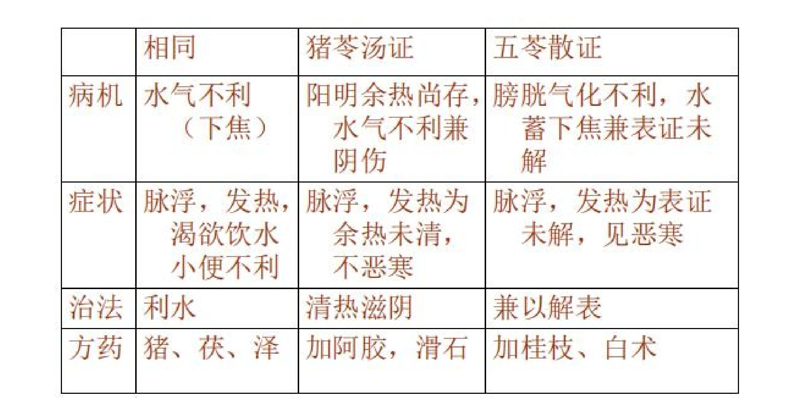
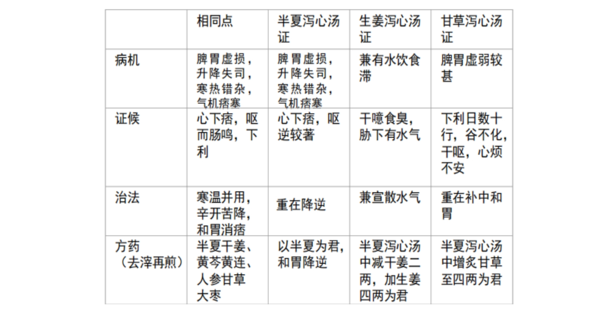
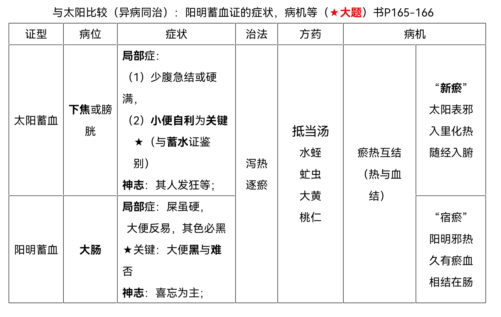

# 伤寒论
- 太阳病
    - 第一节  太阳病纲要（背诵条文 1、2、3 、7）
        - 第一条： **太阳病提纲－－太阳之为病，脉浮，头项强痛而恶寒**
        - 第二、三条：太阳病分类（中风/伤寒）
        - 第六条（熟悉了解）： **太阳温病** 特点，太阳温病用汗、下、火法误治的变证
        - 第四、五条：太阳病传变与否
        - **第七条：辨病发于阳发于阴及预测愈期**
        - 第八、十条：太阳病七日经尽自愈（风家体质较弱十二日愈）， **“治未病”** 针 **足阳明** 预防传经。（太阳气血是表的屏障，阳明气血为人体在里的屏障，针刺鼓动阳明气血防止邪气内传。）
        - 第九条（了解）：太阳病欲解时，从巳至未上。
    - 第二节  太阳病本证
        - 一、太阳病表证
            - **1.中风表虚证（背诵条文** **12** **、13、24、42、53、54、16、** **14、20、21、22、62** **)**
                - 桂枝汤证
                    - 背诵第十二条原文（病因病机及证治）、桂枝汤药物组成及用量、煎服法。
                    - 第十三条：桂枝汤的应用指征－－有相应症状，即可用桂枝汤， 桂枝汤证并非太阳中风一证而已 。
                    - 第二十四条：太阳病病重药轻，针药结合
                    - 第四十二条：太阳病外证未解，正气虚弱（脉浮弱）， **宜** 桂枝汤
                    - 第四十四、四十五条（了解）：太阳病外证未解不宜下，宜桂枝汤
                    - 第15条：太阳病误用下法，气上冲，可与桂枝汤
                    - 第57条：伤寒发汗已解，半日许复烦，脉浮数者－－可更发汗（改变方式发汗），宜桂枝汤
                        - 名解复烦：烦指在表的烦热现象，如发热、恶风寒、头痛、脉浮等。复烦，重复出现上述脉证。
                    - 第53、54条：杂病使用桂枝汤
                        - 53：病常自汗出
                        - 54：病人藏无他病，时 **发热** 自汗出（重在卫郁发热）
                    - 15、42、57－－太阳病表证未解，里证未见，正气不足／受损  －→  当 **微** 汗 ，宜桂枝汤
                - 桂枝汤禁例
                    - 第16条：太阳伤寒证
                    - 第17条：酒客病，湿热内蕴
                    - 第19条：内热壅盛，服桂枝汤吐者
                - 桂枝汤兼证 **（5）－** **病机、治法、方药、词解**
                    - 第14条：桂枝加葛根汤证
                        - 病机：风寒袭表，营卫不和，经输不利
                        - 治法：解肌祛风，生津舒筋
                    - 18、43条：桂枝加厚朴杏子汤证
                        - 病机：风寒袭表，卫强营弱，肺寒气逆
                        - 治法：解肌祛风，降气平喘
                    - 20条：桂枝加附子汤证
                        - 病机：风寒袭表，营卫失调，阳虚不固
                        - 治法：解肌祛风，扶阳固表
                    - 21、22条：桂枝去芍药汤证、桂枝去芍药加附子汤证
                        - 病机：表虚邪陷，胸阳不展或胸阳不足。
                        - 治法：解肌祛风，温通胸阳，或温复胸阳。
                    - 62条：桂枝新加汤证
                        - 发汗后身痛（不荣则痛，“其脉沉者，营气微也”。）
                    - 20、21、22、62：“有表可解表，无表亦可用。”
            - **2.伤寒表实证（麻黄汤证35、51、37、46；麻黄汤兼证31、32）**
                - 麻黄汤证
                    - **35条** ：太阳病伤寒表实证麻黄汤主之
                    - 51条：脉浮， 宜 麻黄汤（前提是无汗）
                    - 52条：脉浮数， 宜 麻黄汤
                    - 37条：太阳病迁延日久的三种转归（十日以去）
                    - 46条：
                        - 太阳病日久（八九日不解）的证治－→此当发其汗
                        - 药后反应及转归： **阳气重** －→服药已微除，其人 发烦目眩 －→剧者必 衄 －→衄乃解
                    - 47条：太阳伤寒得衄自愈
                    - 48条：太阳伤寒不发汗导致衄血的，仍需发汗，麻黄汤 主之
                    - 47、48条对比：衄而病解者，血自然而出，量少流畅，病证随血出而解；衄而病不解者，血点滴而出，出且不畅，病证不随血出而解。
                - 汗法禁例－－ **“5家2”**
                - 麻黄汤兼证
                    - 葛根汤证（31、32条， **一方两治** ）
                    - 葛根半夏汤证（33条）
                    - 大青龙汤证（38、39条）
                        - 服法注意是“取微似汗”“汗出多者，温粉粉之”
                        - 大青龙汤是伤寒论中发汗最强的，麻黄汤倍麻黄（三两变六两，麻桂3：1），加石膏（制约麻黄温燥，直接清热除烦），加姜枣（防过汗伤阴伤阳）
                        - 症状：伤寒表证➕不汗出而烦躁（核心烦躁）
                        - 病机：风寒束表，卫闭营遏，阳郁化热（核心阳郁化热→ 内热扰心→ 烦躁）
                        - 治法：发散风寒，清解郁热
                    - 小青龙汤证（40、41条）
                        - 咳白稀痰，或无痰状的泡沫痰，脉沉弦（主水），肤色黑、庬，或有黑斑，水滑舌（水象）
                        - 主症——呕咳（干呕发热而咳）
                        - 病机：风寒束表，卫闭营郁，寒饮内停
                        - 治法：发汗解表，温化寒饮
                        - **考点：小青龙汤的渴**
                            - 一般不渴——水饮为阴邪，不伤津液
                            - 或渴——饮阻气机
                            - 服汤已渴——发热之后，温解之余，津液一时不足（服汤已渴者，此寒去欲解也）
            - **3.表郁轻证**
                - 概述
                    - 表证：正邪交争于表，发热恶寒
                    - 郁：邪气郁结，闭塞腠理，无汗身痒
                    - 轻症：邪气已微，正气亦不足，正邪交争迟缓－－发热如疟状，一日二三度发or再发
                - 23条：桂枝麻黄各半汤证
                - 25条：桂枝二麻黄一汤证
                - 27条：桂枝二越婢一汤证
                    - 表郁内热轻症（大青龙汤轻证）
        - 二、太阳病里证
            - 蓄水证（五苓散证）
                - 五苓散
                    - 若脉浮，小便不利，微热消渴者，五苓散主之。
                    - 病机：水饮内停，气化不利，兼表证未除
                    - 治法：通阳化气利水，外散风寒
                    - ***与猪苓汤鉴别*** 
                - 蓄水和蓄血鉴别－－小便利否
                    - 126条：伤寒有热，少腹满，应小便不利，今反利者，为有血也。
                    - 125条：小便自利，其人如狂者，血证谛也，抵当汤主之。
                - 下焦（膀胱）蓄水证和中焦蓄水证鉴别－－口渴与否
                    - 73条（苓桂草甘汤证茯苓甘草汤证）－伤寒汗出而渴者，五苓散主之，不渴者，茯苓甘草汤主之。
            - 蓄血证（小便自利，其人如狂者，血证谛也）
                - 概要：
                    - 基本病机：瘀热互结于下焦
                    - 局部表现：少腹急结或硬满
                    - 神志：其人如狂
                    - 小便：小便自利
                - 蓄血证轻－－桃核承气汤（外解已，但少腹急结者，乃可攻之）；
                - 重症－抵当汤（先治里）；
                - 重症中的缓证－抵当丸（先治里， **不发狂是与前两方的区别** ）
                - 比较表证里证的轻重，决定先解表还是先攻逐瘀热
                - ***考点：抵当丸为什么以水煮丸？兼具丸剂和汤剂的优点，药效迅捷而药力轻缓绵长***
    - 太阳病变证
        - 纲要
            - 原则：观其脉症，知犯何逆，随证治之
        - 热证
            - **76** 条：栀子豉汤，栀子甘草豉汤，栀子生姜豉汤
                - 发汗吐下后， 热扰胸膈 的证治
                - 病机：热郁胸膈，气机不畅
                - 治法： 清宣 郁热（栀子清，豆豉宣）；或兼益气和中（栀子甘草豉汤）；或降逆止呕（栀子生姜豉汤）
                - **虚烦：** 吐下后余热所致的烦躁。虚，非正气虚，指无实邪与热结聚。
            - 77条：发汗若下之，烦热胸中窒者，栀子豉汤主之
                - 热邪郁甚，胸中气机不畅
            - 78条：伤寒五六日，大下之后，身热不去，心中结痛者，未欲解也，栀子豉汤主之。
                - 比上两条热郁更甚，心中结痛。
                - 本条心中结痛不同于结胸证。结胸证是邪热与水互结，心下石硬，痛不可近。栀子豉汤证是无形热郁气滞，结塞闷痛。
            - 79条： 栀子厚朴汤
                - 热扰腹部，兼气滞腹满 （伤寒下后，心烦腹满，卧起不安者）
                - 清热除烦，宽中消满
                - 组成：栀子，厚朴，枳实
            - 80条：栀子干姜汤
                - 热郁胸膈，中焦有寒
                - 以方测证－－身热微烦，食少便溏，腹满痛
                - 治法：清上温中
            - 81条：平素便溏，不能用栀子豉汤
            - **63、162** 条：麻杏甘石汤
                - 或汗或下后， 邪热壅肺 （汗出而喘，无大热）
                - 无大热－－指表无大热，而肺热壅盛；汗出而喘－－邪热壅肺，宣降失司，热迫津泄
                - 不恶寒 －－排除桂枝汤
                - 兼症有咳嗽口渴，痰黄稠，苔黄，脉数
                - 病机：邪热雍肺
                - 治法：清宣肺热
            - **26** 条：白虎加人参汤证
                - 服桂枝汤后， 阳明热盛，气阴两伤
                - 清热益气生津
                - 与白虎汤区别：白虎加人参汤是太阳病变证，脉象较无力，滑或浮滑，口渴不得缓解（气伤重，不能输布水气）
            - **34** 条：葛根黄芩黄连汤证
                - 太阳病误下，阳明里热下利兼表未解
                - 治法：清热止利兼解表
                - 喘而汗出的原因：肺与大肠相表里，里热上攻于肺，肺失宣降，肺气上逆而喘；肺合皮毛，热迫津泄。
            - 172条：黄芩汤、黄芩加半夏生姜汤
                - 太阳少阳合病，邪热内迫阳明，胃肠功能失调
                - 下利用黄芩汤，呕用黄芩加半夏生姜汤。
                - 黄芩汤方：黄芩（3），芍药（2），甘草（2），大枣（12枚）
                - 病机：胆火内炽，热迫阳明
                - 治法：清热止利
        - 心阳虚
            - 64 条（轻）：心悸－－桂枝甘草汤
                - 桂枝四两，甘草二两（2:1），只有两味药，顿服
                - 病机：心阳不足；主症：心下悸，欲得按
                - 治法：温通心阳
            - 118 条（中）：烦躁－－桂枝甘草龙骨牡蛎汤
                - 桂枝一两，甘草二两（1:2），龙骨牡蛎各二两
                - 病机：心阳虚损，心神浮越。主症：烦躁心悸，欲得按，怵惕不寐
                - 治法：温补心阳，镇潜安神（桂枝较少防止通散太过引心神浮越）
            - 112条（重）：惊狂－－桂枝去芍药加蜀漆牡蛎龙骨救逆汤
        - 水气病
            - 茯苓桂枝白术甘草汤证
                - 病机：脾失健运，水饮内停。
                    - 心下逆满，气上冲胸，起则头眩，脉沉紧
                    - 沉主水，紧主寒
                - 治法：温阳健脾，利水降冲
            - 桂枝去桂加茯苓甘草汤证
                - 脾虚水停致太阳经气不利
                - 服桂枝汤，或下之，仍头项强痛，翕翕发热， 无汗，心下满，微痛，小便不利 者，桂枝去桂加茯苓甘草汤主之。
                - 治法：健脾利水，调和营卫
        - 脾虚证
            - 厚朴生姜半夏甘草人参汤证
                - 腹胀满
                - 行气补气，重用行气
                - 病机：气机壅滞，脾虚不运
                - 治法：行气宽中，健脾温运
            - 小建中汤
                - 心中悸而烦，为正气不足，心脾两虚所致
                - 温中健脾，调和气血
            - 桂枝人参汤
                - ＝理中加桂枝
                - 恶寒发热＋虚寒利＋虚寒痞
                - 协热而利：协，和也，热指表证发热。协热而利指里虚寒下利兼表证发热
                - 病机：脾阳不足，表邪未解
                - 治法：温阳健脾兼解表
        - 肾阳虚
            - 干姜附子汤
                - 药物：生附子，干姜（四逆汤去甘草，作用更强），急救→顿服（同桂枝甘草汤）
                - 阳虚无力鼓动故脉沉微
                - 阴寒内盛，虚阳外越→身无大热
                - 病机：肾阳暴虚
                - 治法：急救回阳
            - 茯苓四逆汤
                - 药物组成：四逆汤加茯苓人参
                - 治疗阴阳两虚烦躁
                - 回阳益阴
            - 真武汤
                - 太阳病发汗，汗出不解，其人仍发热，心下悸，头眩，身瞤动，振振欲僻地者，真武汤主之。
                - 药物组成： 附子→温阳化气；桂枝通阳化气；茯苓白术（利小便）→健脾制水；生姜→散水（汗法）；芍药养阴（治水注意固护营阴）
                - 病机：肾阳虚衰，水气泛滥
                - 主症：（结合 **316条** ，少阴病，二三日不已，至四五日……）
                    - “泛”→泛滥走窜，表里内外上下
                    - 内（心悸/咳/呕 ）；
                    - 外（身瞤动→筋肉跳动，水气浸渍肢体经脉；四肢沉重疼痛→含有水湿）；
                    - 上（头眩）；
                    - 下（小便不利或小便利，下利：肾阳虚失于固摄，肾司二便/水气下趋胃肠）
                - 治法：温阳利水
                - 名解：振振欲僻地∶擗，同足辟，仆倒之意。身体振颤，站立不稳而欲仆倒之状。
        - 阴阳两虚
            - 29条：甘草干姜汤，芍药甘草汤
                - 伤寒夹里虚误用桂枝汤攻表发汗，先补阳后补阴
            - 68条：芍药甘草附子汤
                - 发汗后，阴阳两虚
                - 以药测证－－恶寒，脚挛急
            - 177条：炙甘草汤证
                - 心阴阳两虚
                - 心动悸脉结代
                    - 滋阴养血，复阳通阳
        - 结胸证：（128、131、）
            - 128条：结胸和脏结比较
                - 结胸为邪气内陷，与有形之痰水结与胸膈脘腹，属于实证
                    - 症状：按之痛（反映结胸邪热与痰水相结，气机阻滞的特点）
                    - 脉象：寸脉浮，关脉沉
                - 分为热实结胸（大结胸/小结胸）和寒实结胸
            - 131条：结胸成因：下之太早
                - 所以成结胸者，以下之太早故也。
            - 134、 **135** 条：大陷胸汤
                - 伤寒表证不经误治，入里化热与水相结（伤寒五六日，结胸热实）
                - **结胸三症－－脉沉紧，心下痛，按之石硬**
                - 病机：水热互结于胸膈脘腹
                - 治法：泻热逐水破结
            - 131条：大陷胸丸证
                - 病位偏上，大陷胸丸加走肺经的葶苈子，杏仁，白蜜
                - 柔痉：痉病的一种，痉病是以项背强急，甚则角弓反张为主的疾病，柔痉有汗，刚痉无汗。说明有“发热汗出的表现”，汗出不透或只有头汗。
                - 水热凝结在高位可能有胸闷气短
                - 病机：水热互结，病位偏上
                - 治法：泻热逐水，峻药缓攻
            - 138条：小陷胸汤证
                - 病位局限，正在心下，大陷胸汤胸膈脘腹
                - 症状轻“按之则痛，不按不痛”
                - 脉浮滑，滑主痰主热，浮主热，病势较清浅，属痰热互结；大陷胸汤脉沉紧，水热互结，病势较重
                - 病机：痰热互结心下
                - 治法：清热化痰开结
                - 黄连，半夏，栝蒌实
            - 寒实结胸
                - 寒实结胸，无热证者，与三物小白散，寒＋水，结于胸膈
                - （不是热，就是寒）三物小白散有巴豆一分，桔梗三分，贝母三分
        - 痞证
            - 气痞
                - 按之自濡，但气痞耳。
                - 无形邪气壅滞心下，按之柔软无物，不硬不痛，与痞证鉴别
            - 热痞证（属于气痞）
                - 大黄黄连泻心汤
                    - 关脉浮
                    - 煎服法：代茶饮。意义？
                    - 病机：中焦有热，痞塞不通
                    - 治法：泻热消痞
                - 附子泻心汤
                    - 热痞兼表阳虚
                    - 病机：中焦有热，气机痞塞，兼卫阳不足
                    - 治法：泻热消痞，扶阳固表
            - 寒痞证
            - 寒热错杂痞证（痞硬证）
                - 半夏泻心汤证
                    - 病机：寒热错杂，中焦痞塞，升降失常
                    - 主症：心下痞满不痛，呕恶，肠鸣下利，苔腻 **（呕利痞）**
                    - 治法：和中降逆，消痞散结
                - 生姜泻心汤汤
                    - 病机：胃虚水停，气机痞塞
                    - 症状：胃中不和，心下痞硬，干嗳食臭（饮食不消，胃气不降），胁下有水气，腹中雷鸣，下利
                        - 胁下有水气既言病机，又言症状，病机提示水饮内停中焦，症状对应腹中雷鸣，漉漉有声
                        - 水气过重，宜宣散水气，半夏泻心汤加生姜四两
                    - 治法：和胃降逆，散水消痞
                - 甘草泻心汤证
                    - 病机：脾胃气虚，痞利俱甚
                    - 主症：下利日数十行，谷不化，腹中雷鸣，心下痞硬而满，干呕心烦不得安
                        - 下利日数十行，谷不化是重点，说明脾胃气虚严重
                        - 干呕心烦不得安，上吐下泻气机逆乱导致心烦不安
                    - 治法：补胃和中，消痞止利
                - ***半夏泻心汤，生姜泻心汤，甘草泻心汤比较*** 
            - 痰气痞证
                - 旋覆代赭汤证（嗳痞）
            - 水痞证
                - 五苓散证
            - 痞证误下后下利
                - 赤石脂禹余粮汤证（利痞）
        - 上热下寒证
            - 黄连汤证
                - 寒自为寒，热自为热，以腹中痛，欲呕吐为主症
    - 太阳病类似证（不考）
        - 饮停胸胁证（十枣汤证）
        - 胸膈痰实证（瓜蒂散证）
- 阳明病
    - 概说
        - 以热证、实证为主，也有寒证（如阳明中寒吴茱萸汤）
        - 病理机制胃家实。胃家，胃肠的总称；实，邪气盛实
        - 成因三方面：太阳阳明、少阳阳明、正阳阳明
    - 第一节  阳明病 纲要
        - 180条：阳明之为病，胃家实是也。阳明病提纲
            - 胃家，胃肠的总称；实，邪气盛实
        - 阳明病病因病机
            - 179条：问曰，病有太阳阳明，有正阳阳明，有少阳阳明，何谓也？答曰：太阳阳明者，脾约是也；正阳阳明者，胃家实是也；少阳阳明者，发汗利小便已，胃中燥烦实，大便难是也。
                - ***名解：脾约：胃肠燥热，损伤津液，脾不能为胃行津液，以致大便秘结。*** （脾的输布水液功能被胃热制约，脾约，小便数，大便干，小承气汤）
                    - *典籍中的脾约证*
                    - 《活人书》有 *脾约证，谓胃强脾弱，约束津液，不得四布，但输膀胱* ，故小便数而大便难，制脾约丸以下脾之结燥，使肠润结化，津流入胃而愈。
                    - 《证治汇补》：有 *平素津液燥结之人．因患伤寒热病．邪热未至于胃．津液先已消烁．故胃强脾弱．水饮不能四布．但输膀胱* ．致小便数而大便难者．用脾约丸以开结．若邪传至阳明腑症而秘结．自有承气汤法．不在此例。
            - 181条：不大便三种情况——不更衣（无所苦）-脾约；内实-胃家实；大便难-大便难
            - **185条：汗出濈~然：形容汗出连绵不断的样子**
            - 病因总结：
                - 1.本经自病（正阳阳明）：素体阳旺，或有宿食，或因燥热所感，病症直从阳明化燥成实
                - 2.它经传病（太阳阳明，少阳阳明）
                    - 太阳阳明：发汗不彻或太过，误用下发，妄利小便
                    - 少阳阳明：误用发汗或误利小便，津伤助热，热入阳明
        - 阳明病脉症
            - 182条：问曰：阳明病外证云何？答曰：发热，汗自出，不恶寒，反恶热也。
                - 阳明病症状：热、汗
                - 早期可能恶寒，很快消失
            - 186：伤寒三日，阳明脉大。
                - 阳明热证脉洪大而滑数，实证多沉实有力
            - 188：阳明病汗出特点：濈然汗出，少量持续，本条指广义伤寒（外感病总称）转属阳明的证候。
    - 阳明病本证
        - 阳明病热证
            - 栀子豉汤证
                - 228条：阳明病，下之，其外有热，手足温，不结胸，心中懊憹，饥不能食，但头汗出者，栀子豉汤主之。
                - 病机：阳明病误用下法，胃中空虚，热扰胸膈（书上没写）
                - 主症：心中懊憹，舌上胎，手足温，不结胸，饥不能食，但头汗出
                - 饥不能食名词解释：胃脘嘈杂，似饥非饥，不能进食（胸隔之热下移）
                - 但头汗出因为邪热蒸腾于上，聚于上焦，且轻。
                - 治法：宣发郁热
                - **与栀子有关的方剂** （参考《张氏医通》）
                    - **栀子豉汤** ： 治汗下不解。虚邪留于膈上。心下结痛。虚烦懊恼不得眠。反复颠倒。卧起不安者。 （或阳明病误用下法，郁热熏蒸但头汗出，胸隔之热下移饥不欲食）
                    - **栀子甘草豉汤** （玉函） 治下后少气。
                    - 栀子豉汤加甘草
                    - **栀子生姜豉汤** （玉函） 治下后呕吐。
                    - 栀子豉汤加生姜。
                    - **栀子浓朴汤** （玉函） 治下后心烦腹满。
                    - 栀子豉汤去豉加枳实、浓朴。
                    - **栀子干姜汤** （玉函） 治丸药大下后。身热不去。微烦。
                    - 栀子豉汤去豉加干姜。上四方服法。如栀子豉汤。
                    - **栀子柏皮汤** （玉函） 治太阳证身黄发热。
                    - 栀子豉汤去豉加柏皮、甘草。水煎。分温再服。
            - 白虎汤证
                - 176条：伤寒脉浮滑，此以表有热，里有寒，白虎汤主之
                - 219条：三阳合病，腹满身重，难以转侧，口不仁，面垢，谵语遗尿。发汗则谵语。下之则额上生汗，手足逆冷。若自汗出者，白虎汤主之。
                - **病机：无形邪热炽盛，充斥内外**
                - 主症：发热，汗出，口渴，脉浮滑（核心：自汗）
                - 治法：辛寒清热
            - 白虎加人参汤证
                - 168条：伤寒若吐若下后，七八日不解，热结在里，表里俱热，时时恶风（汗出后阳气不足），大渴，舌上干燥而烦，欲得饮水数升者（气伤口渴，饮水不得解），白虎加人参汤主之。
                - 169条：伤寒无大热（阳明热盛于里，表无大热），口燥渴，心烦，背微恶寒者（汗出后阳气不足），白虎加人参汤主之。
                - 病机：阳明热盛，津气两伤
                - 治法：辛寒清热，益气生津
            - 猪苓汤证
                - 223条：脉浮发热，渴欲饮水，小便不利者，猪苓汤主之。
                - 224条：阳明病，汗出多而渴者，不可与猪苓汤，以汗多胃中燥，猪苓汤复利其小便故也。
                - 病机：阴伤有热，水热互结
                - 治法：清热利水育阴
        - 阳明病实证
            - （一）攻下法
                - 调胃承气汤
                    - 248条：太阳病三日，发汗不解，蒸蒸发热者，属胃也，调胃承气汤主之。
                        - **名解：蒸蒸发热：发热如热气蒸腾，由内达外。**
                            - 里热蒸腾，由内达外
                        - 属胃：转属阳明的意思
                    - 249条：伤寒吐后，腹胀满者，与调胃承气汤。
                    - 207条：阳明病，不吐不下，心烦者，可与调胃承气汤。
                        - 组成：甘草二两，芒消半升，大黄四两（ **三承气都用四两** ）
                        - 病机： ***燥热*** 内盛， ***腑实*** 初结
                        - **主症：蒸蒸发热，腹胀满，心烦（或谵语），大便不通（或如常）**
                            - 燥热内盛，腑实初结，未到大实大满， **泻热和胃** 即可
                        - 治法：泻热和胃，润燥软坚
                - 小承气汤
                    - 213条：阳明病，其人多汗，以津液外出，胃中燥，大便必硬，硬则谵语，小承气汤主之。若一服谵语止者，更莫复服。
                        - 组成：大黄四两，枳实三枚，厚朴二两。（得大便后停服）
                        - 病机：热实内结，腑气不通
                        - **主症：大便硬，潮热，谵语心烦，腹大满，脉滑而疾**
                            - 汗多或小便数→大便硬
                            - 阳明病，发潮热，大便溏，小便自可，胸胁满不去者，与小柴胡汤。
                        - 治法：泻热通便，行气除满
                    - 214条：阳明病，谵语发潮热，脉滑而疾者，小承气汤主之。因与承气汤一升，腹中转气者，更服一升，若不转气者，勿更与之。明日又不大便，脉反微涩者，里虚也，为难治，不可与承气汤也。
                        - 疾脉属病理脉象（一分钟超过120次），提示阴液将竭，阴不敛阳
                        - 腹中转气，说明燥屎已成，继续攻下。
                        - “若不转矢气者，此但初头硬，后必溏，不可攻之，攻之必胀满不能食也。”
                        - 脉反微涩：脉微无力，往来艰涩。阴液枯竭，可用增液汤，不用承气
                    - 250条：太阳病，若吐若下发汗后，微烦，小便数，大便因硬者，与小承气汤和之。
                - 大承气汤
                    - 220条：二阳并病，太阳证罢，但发潮热，手足 漐漐汗出 ，大便难而谵语者，下之则愈，宜大承气汤。
                    - 病机：阳明腑实，燥屎阻塞，痞满燥实俱重
                    - **大承气汤主症：不大便五六日以上；日晡潮热（潮热/微热）；谵语（烦躁）**
                    - **兼症： 1）腹满痛拒按（或绕脐痛）； 2）反不能食 ；3）手足漐漐汗出（或濈然汗出）； 4）脉沉实有力（推测脉象）**
                    - 治法：峻下燥结，涤荡热实
                    - ***阳明三急下***
                        - **目中不了了，睛不和** ，无表里证，大便难，身微热者
                            - 无表里证：指外无发热恶寒头痛等表证，内无潮热谵语等里证。
                        - **发热汗多** （迅速大量汗出）
                        - 发汗不解， **腹满痛** 者 （肝脓肿，急性胰腺炎等急腹症治疗）
            - （二）润导法
                - 润下：麻子仁丸证
                    - 胃热 + 小便数→局部 **津伤** ，大便则硬
                    - 脾约★名解→ **脾** 转输敷布津液 的功能被胃热所约束，导致津液不能正常到大肠，胃热肠燥津亏便硬（水走小便不走大便）；
                    - 以知为度：有感觉 / 痊愈为度
                    - 病机：胃热肠燥津亏
                    - 主证：不更衣十余日而 ***无所苦（承气汤有所苦）***
                    - 治法：泻热润燥通便
                - 导下：蜜煎方、土瓜根导及猪胆汁导证
                    - 津液内竭，但有便意
                    - **以内谷道** ★名解： 谷道为 肛门 ，以润滑之品，纳入肛内，就近滋润，则硬粪可下；
            - 下法禁例（ 考★ 多选
                - 伤寒 呕多禁下 （胃气上逆为主）
                - **心下** 硬满（ 阳明 **病邪结偏高）**
                - **面合色赤** （ 病邪郁经表）
                - 口苦咽干，腹满微喘，发热恶寒，脉浮而紧（ 阳明病 **兼表邪未解）**
                - 阳明病，不能食，攻其热必哕，所以然者， **胃中虚冷** 故也。 以其人本虚，攻其热必哕。（ **胃中虚冷** 者禁下）
    - 阳明病变证
        - 发黄证
            - 湿热发黄证
                - 茵陈蒿汤证
                    - 阳明病，发热汗出者，此为热越，不能发黄也。 但头汗出 ，身无汗，齐颈而还， 小便不利 ，渴饮水浆者，此为瘀热在里，身必发黄，茵陈蒿汤主之。 **（无汗或汗出不畅，小便不利是发黄主要条件）**
                    - 伤寒七八日，身黄如橘子色，小便不利，腹微满者，茵陈蒿汤主之。
                    - 瘀热：瘀和郁通用，瘀热即邪热郁滞在里
                    - 病机：湿热郁蒸，熏蒸肝胆，兼腑气壅滞
                    - 治法：清热利湿退黄
                    - 茵陈蒿六两，栀子14枚，大黄二两去皮
                - 栀子柏皮汤证
                    - 伤寒身黄发热，栀子柏皮汤主之。
                    - 阳明湿热蕴结，湿轻热重（发热，懊憹，口渴，舌红较突出，外无表证，内无阳明闭结）
                    - 清热利湿退黄
                - 麻黄连轺赤小豆汤证
                    - 伤寒瘀热在里，身必黄，麻黄连轺赤小豆汤证主之。
                    - 组成：麻黄，连翘，赤小豆，杏仁，甘草，生姜，大枣，生姜，生梓白皮
                    - 病机：湿热蕴结，熏蒸肝胆，兼表证未解
                    - 治法：清热利湿，宣散表邪
            - 寒湿发黄证
                - 阳明中寒，欲作谷疸
                - 谷瘅：黄疸的一种。因水谷不化，湿郁而发为黄疸，本证当属寒湿之黄疸。
            - 被火发黄证
        - 血热证
            - 衄血证
            - 下血证
                - 阳明病热入血室的证治
                - **血室：指胞宫**
                - 下血谵语，血热蒸腾于上但头汗出－－随其实而泻之，刺期门。
            - 蓄血证
                -  
    - 阳明病中风中寒证
        - 辨治纲要
            - 能食－－中风；不能食－－中寒
            - 191条：
                - 阳明中寒欲作固瘕。
                - 欲作固瘕★名解：是因胃中虚冷，水谷不消而结积的病证，其特征为大便初硬后溏。 （可用《金匮》的大黄附子汤/后世的温脾汤，吴茱萸汤，理中汤）
        - 中寒呕逆证（吴茱萸汤证）
            - 病机：阳明中寒，浊阴上逆
            - 主症：不能食，食谷欲呕，呕吐清涎冷沫，或肝寒上逆厥阴头痛，舌淡苔白，脉缓弱。
            - 治法：温胃散寒，降逆止呕
        - 虚证
            - 196条：阳明病，法多汗，反无汗，其身如虫行皮中状者，此 **以久虚故** 也。
            - （1）阳明病虚证（久虚之人患阳明病）；（2）本应多汗，但无汗（津伤）；
            - （3）可用【白虎加人参汤】或【竹叶石膏汤】；
- 少阳病
    - 少阳病纲要
        - 少阳病提纲
            - 少阳之为病，口苦，咽干，目眩也。
            - 反映少阳胆气不舒，胆火上炎、经气郁结的基本病机。
        - 少阳病治禁－－“ **少阳三禁要详明，汗谵吐下悸而惊”**
            - 少阳中风（热象突出），不可吐下
                - 少阳中风，两耳无所闻，目赤，胸中满而烦，不可吐下，吐下则悸而惊。
            - 少阳伤寒，不可发汗
                - 伤寒，脉弦细，头痛发热者，属少阳。少阳不可发汗，发汗则谵语，此属胃。胃和则愈，胃不和，烦而悸。
            - 少阳胆火上炎，枢机不利，当以和解为主。
    - 少阳病本证（小柴胡汤证）
        - 小柴胡汤证
            - 伤寒五六日中风，往来寒热，胸胁苦满，嘿嘿不欲饮食，心烦喜呕，或胸中烦而不呕，或渴（邪热伤津），或腹中痛，或胁下痞硬，或心下悸、小便不利，或不渴、身有微热，或咳者，小柴胡汤主之。
            - （或然证，加减药了解）
            - 病机：邪犯少阳，胆火内郁，枢机不利
            - 治法：和解少阳，条达枢机
        - 伤寒，阳脉涩，阴脉弦，法当腹中急痛，先与小建中汤，不差者，小柴胡汤主之
            - 少阳兼里虚寒证，先补后和
            - **说明中焦虚寒，气血不足，不宜先用小柴胡汤，柴胡性凉伤脾胃。**
            - 阳脉涩，脉浮取涩，气血不足；阴脉弦，脉沉取弦，弦主少阳病、痛症
        - 少阳阳明 **并病** ，少阳为主，治从少阳
            - 阳明病，发潮热，大便溏，小便自可，胸胁满不去者，与小柴胡汤。
            - 阳明病，胁下硬满，不大便而呕，舌上白胎者，可与小柴胡汤， ***上焦得通，津液得下，胃气因和，身濈然汗出而解*** 。
        - 小柴胡汤禁例
            - 中焦湿郁，不可用小柴胡汤
            - 脾虚失运，不可用小柴胡汤
    - 少阳病兼变证（其实都是兼证）
        - 柴胡桂枝汤证 ***（二分之一小柴胡，加二分之一桂枝汤）***
            - 伤寒六七日，发热 微 恶寒，支节烦疼， 微 呕，心下支结，外证未去者，柴胡加桂枝汤主之。
            - 支节：四肢关节
            - 心下支结：心下如有物支撑而闷结。
            - 少阳兼太阳表证， **太少并病，不是合病**
            - 病机：少阳枢机不利，太阳营卫不和
            - 治法：和解少阳，调和营卫
        - 大柴胡汤证
            - 少阳兼阳明里实
            - 病机：少阳胆火内郁，阳明燥热里实
            - ***主症：呕利痞＋发热；呕不止，心下急，郁郁微烦***
            - 治法：和解少阳，通下热结
        - 柴胡加芒硝证（三分之一小柴胡加芒硝）
            - 少阳兼阳明里实燥结误下后的证治
            - 病机：少阳兼阳明里实，正气偏弱，燥实较轻
            - 主症：胸胁满而呕，日辅潮热
            - 治法：和解少阳，泻热润燥（先用小柴胡汤和解少阳，扶正祛邪，不愈再加柴胡加芒硝汤）
        - 柴胡加桂枝干姜汤证（小柴胡汤加减）
            - 伤寒五六日，已发汗而复下之，胸胁满微结， *小便不利，渴而不呕，但头汗出* ，往来寒热，心烦者，此为未解也，柴胡桂枝干姜汤主之。
            - 但头汗出：少阳邪热被水饮郁遏蒸腾于上
            - 少阳病兼 **三焦气化不利** ，水饮内结
            - 病机：少阳枢机不利，兼水饮内结
            - 治法：和解少阳， **温化水饮**
            - 药物组成：柴胡、黄芩（和解少阳）  天花粉/瓜蒌根、牡蛎（生津胜热，逐饮散结→津伤口渴；不呕所以去掉小柴胡汤的半夏生姜）  桂枝、干姜（通阳化饮，行三焦水气，制黄芩寒凉→水饮内结的病机；人参大枣有补益作用但壅滞气机，故去掉）
            - 初服微烦，复服汗出便愈（三焦膀胱腠理毫毛其应）
        - 柴胡加龙骨牡蛎汤证 **（二分之一小柴胡加减）**
            - 伤寒八九日，下之， *胸满烦惊* ， 小便不利 ， *谵语* ， 一身尽重，不可转侧者 ，柴胡加龙骨牡蛎汤主之。
            - 病机：病入少阳，邪气弥漫（弥漫 ***三焦*** ）， ***心神逆乱（烦、惊、谵语）***
            - 治法：和解少阳，通阳泻热，重镇安神
            - 药物组成：二分之一小柴胡去甘草，加龙骨牡蛎铅丹（重镇安神），加桂枝（助柴胡通达郁阳，茯苓通利水道）茯苓（通利水道，宁心安神），加大黄（助黄芩清热，解决胆火上炎扰心→惊谵）
            - 烦惊谵机理：少阳胆火上炎，胃热上蒸轻则心烦，重则谵语；少阳枢机不利，胆火内郁，决断失职，心神逆乱，故惊惕恐惧。
        - 黄芩汤
            - 太阳少阳 **合病**
            - 热利（比葛根汤轻）
            - 病机：胆火内炽，内迫阳明
            - 治法：清热止利
    - 少阳病传变预后
        - 热入血室证
            - 妇人中风，经水适来
            - 主症：寒热往来，胸胁下满，谵语或只有夜间谵语
            - 治法：刺期门或服小柴胡汤
            - 勿犯胃气及上二焦
- 太阴病
    - 提纲
        - 太阴之为病，腹满而吐，食不下，自利益甚，时腹自痛。若下之，必胸下结硬。
            - 基本病机：脾阳不振，寒湿内盛
            - 腹满－脏寒生满病，气机阻滞；吐－浊阴上逆犯胃；食不下，自利益甚－脾阳不振；时腹自痛－寒凝脾络，时通时阻
    - 太阴病本证
        - 自利不渴者，属太阴，以其藏有寒故也，当温之，宜服四逆辈。
        - 脾阳虚寒湿弥漫所以不渴
    - 兼证，变证
        - 太阴兼表证
            - 太阴病，脉浮者，可发汗，宜桂枝汤。
            - “太阴病”指脾阳素虚易患太阴病的人，桂枝汤调和营卫，缓发其汗。
        - 太阴腹痛证
            - 本太阳病，医反下之，因而腹满时痛者，属太阴也，桂枝加芍药汤主之；大实痛者，桂枝加大黄汤主之。
                - 桂枝加芍药汤＝桂枝汤倍芍药，桂枝加大黄汤＝桂枝汤倍芍药加二两大黄
                - 病机：
                    - 脾伤气滞络瘀 （腹满时痛的原因）
                    - 脾伤气滞络瘀较重兼腐秽实邪
                - 治法：
                    - 通阳益脾，缓急止痛
                    - 和络止痛，导滞泻实
            - 如果脉弱，自利，提示脾胃虚弱，慎用酸寒药，应减量使用
    - 预后
        - 太阴复自愈
            - 伤寒脉浮缓，手足自温者，系在太阴
            - 太阴当发身黄，若小便自利者，不能发黄
            - 至七八日，虽暴烦下利日十余行，必自止，以脾家实，腐秽当去故也。
                - 脾家实：脾阳恢复之意。
            - 至七八日，大便硬者，为阳明病也。
- 少阴病
    - 提纲：少阴之为病，脉微细，但欲寐也。
        - 但欲寐：似睡非睡，精神萎靡，体力衰惫的状态
        - 阳虚无力鼓动故脉微，阴虚不能充盈故脉细
        - 主要病机：心肾虚衰，水火不交
        - 病机特点：全身性虚衰，因涉及人体阴阳根本，危重证较多
    - 禁忌
        - 汗法，下法，损伤正气
    - 少阴病本证
        - 一、少阴寒化证
            - ***少阴寒化证辨证要点***
                - 少阴病， 欲吐不吐，心烦，但欲寐 。 五六日自利而渴 者，属少阴也，虚故引水自救，若 小便色白 者，以下焦虚有寒，不能制水，故令色白也。
                - 下利：肾阳虚衰，火不化土，水谷不化。      口渴：是与太阴病的鉴别点，阳气虚衰津不上承，加下利耗津所致。
                - 少阴亡阳：脉阴阳俱紧，反汗出
            - 四逆汤证
                - 脉沉，急温之
                - 为什么急温之？少阴病寒化证肾阳虚衰速度快，若待四肢厥逆，下利清谷，脉微欲绝等症状出现则病情危重，预后不良，应见微知著，防微杜渐，体现了既病防变的治未病思想。
                - 病机：肾阳虚衰，阴寒内盛
                - 治法：急温回阳
                - 主症答下利清谷，四肢厥逆，脉微欲绝
            - 通脉四逆汤
                - 少阴病，下利清谷，里寒外热，手足厥逆，脉微欲绝，身反不恶寒， 其人面色赤 ，或腹痛，或干呕，或咽痛，或利止脉不出者，通脉四逆汤主之。
                - 药物组成：附草姜，比四逆汤多二两干姜（一两→三两），附子大者一枚
                - 病机：阴寒内盛，格阳于 外
                - 手足厥逆，下利清谷，脉微欲绝－－少阴阳气大衰，阴寒内盛
                - 身反不恶寒，面色赤－－阴寒盛于内，虚阳格于外
                - 治法：破阴回阳，通达内外
            - 白通汤及白通加猪胆汁汤证
                - 组成：葱白，干姜，生附子
                - 少阴病，下利，猪胆汁汤主之。
                - 利不止，厥逆无脉，白通加猪胆汁汤主之。（阴盛格拒阳药，白通汤加人尿猪胆汁，咸寒，反佐制约白通汤的热，养阴补液）
                - 病机：阴盛格阳于 上
                - 治法：破阴回阳，通达上下
            - 真武汤证
                - 少阴病，二三日不已，至四五日， 腹痛，小便不利，四肢沉重疼痛，自下利 者，此为有水气。其人或咳，或小便利，或下利，或呕者，真武汤主之
                - 病机：肾阳虚衰，水气泛滥
                - 治法：温阳利水
            - 附子汤
                - 病机：肾阳虚衰， **寒湿痹阻肢体关节**
                - **主症：身体痛，骨节痛，手足寒，背恶寒，脉沉**
                - 治法：温经散寒，除湿止痛
                - 药物：炮附子 **两枚，** 茯苓，人参，白术，芍药
                - ***与真武汤比较***
                    - 附子汤术、附倍用，配伍人参，重在温补元气
                    - 真武汤附、术减半，佐生姜重在温散水气
            - 吴茱萸汤证
                - 烦躁欲死，示阳气虚衰不甚，尚能与阴邪相争
            - 桃花汤证
                - 赤石脂，干姜，粳米
        - 二、少阴热化证
            - 黄连阿胶汤证
                - 少阴病，得之二三日以上， 心中烦，不得卧 ，黄连阿胶汤主之。
                - 阴虚火旺，心肾不交
                - 滋阴清热，交通心肾
            - 猪苓汤证
                - 少阴病，下利六七日， 咳而呕渴，心烦不得眠者 ，猪苓汤主之。
                - 病机：少阴热化，水热互结
                - 治法：清热育阴利水
        - 三、少阴阳郁证
            - 少阴病， 四逆 ，其人或咳，或悸，或小便不利，或腹中痛，或泄利下重者，四逆散主之。
            - 病机：少阳阳气郁遏不达
            - 治法：舒畅气机，透达郁阳
    - 少阴兼变证
        - **名解：下厥上竭：阳衰于下，阴竭于上**
    - 咽痛证
        - 猪肤汤证
            - 阴虚咽痛
        - 甘草汤证，桔梗汤证
            - 客热咽痛
        - 苦酒汤证
            - 痰火郁结咽痛
            - 咽中伤生疮
        - 半夏散及汤证
            - 客寒咽痛
    - 少阴病预后
        - **名解：息高：呼吸表浅，呼多吸少**
        - 正衰危重：烦躁，息高，时时自冒
- 厥阴病
    - 提纲：
        - 厥阴之为病，消渴，气上撞心，心中疼热，饥而不欲食，食则吐蛔，下之利不止。
    - 病机：上热下寒，寒热错杂，虚实相因
    - 厥阴病本证
        - 寒热错杂证
            - 乌梅丸证
                - 一方两治：蛔厥＋久利
                - 脏厥：肾脏真阳极虚所致的四肢厥冷
                - 蛔厥：蛔虫窜扰，气机逆乱所致的四肢厥冷 ***（与脏厥区别是脏厥持续，蛔厥阵发，相同点肢冷脉微）***
                - 脏寒：脾、肠虚寒。
                - 蛔虫得酸则静，得辛则伏，得苦则下
                - 病机：上热下寒，蛔虫内扰
                - 治法：清上温下，安蛔止痛
            - 干姜黄芩黄连人参汤证
                - 伤寒本自寒下，医复吐下之，寒格更逆吐下，若食入口即吐，干姜黄芩黄连人参汤主之。
                - 胃热脾寒 ，寒热格拒
                - 寒格：指上热下寒相格拒
            - 麻黄升麻汤证
                - 伤寒六七日，大下后，寸脉沉而迟，手足厥逆，下部脉不至，喉咽不利，唾脓血，泻利不止者，为难治，麻黄升麻汤主之。
                - 手足厥逆→热邪内郁，阴阳之气不相顺接；寸脉沉迟，下部脉不至→热邪内郁
                - 阳气郁闭 ， 肺热脾寒
        - 寒证
            - 当归四逆汤证（经络）
                - 手足厥寒，脉 细 欲绝者，当归四逆汤主之。
                - 血虚寒凝致厥
                - 脉细→血虚；欲绝→寒凝（不通）
                - 临床还治疗痛经，四肢身体疼痛等
                - 病机：血虚寒凝， ***经脉*** 不畅
                - 治法：养血散寒，温通经脉
            - 当归四逆加吴茱萸生姜汤证（内有久寒，脏腑）
                - 内，内脏，肝胃
                - 以药测证，治疗痛经，脘腹冷痛下利，少腹冷痛，疝气等
                - 病机：血虚寒凝，兼 ***肝胃*** 久寒
                - 治法：养血通脉，温肝暖胃
            - 吴茱萸汤证
                - 肝寒犯胃，浊阴上逆
                - 干呕吐涎沫，头痛
        - 热证
            - 白头翁汤
            - 病机：肝经湿热，下迫大肠
            - 治法：清热燥湿，凉肝止利
    - 厥证
        - 提纲
            - 凡厥者，阴阳不相顺接，便为厥。厥者，手足逆冷者是也。
        - 大汗出，热不去，内拘急，四肢疼，又下利厥逆而恶寒者，四逆汤主之。
        - （1）蛔厥：症状以腹部、胃脘部疼痛为主，且时作时止，常在进食后发生疼痛与呕吐，手足厥冷多在剧痛时出现，痛减时消失。病机为上热下寒，蛔虫内扰，气机逆乱。治宜清上温下，安蛔止痛。方用 乌梅丸 。（2）脏厥：症状以手足厥冷不缓解，周身肌肤皆冷，脉微为主要表现。病机为真阳将绝，脏气衰败。治宜急温脾肾，回阳救逆。方用 **四逆汤** 。证候特点是血虚同时，又有寒凝经脉。（3）血虚寒凝致厥：主要症状为手足厥寒，脉细欲绝。病机为营血不足，寒凝经脉。治法为养血通脉，温经散寒。方用 **当归四逆汤** 。（4）热厥：主要症状为手足厥冷，躯干发热，舌红苔黄，脉滑。病机为瘀热于内，阳不外达。治宜辛寒清热。方用 **白虎汤** 。（5）痰厥：主要症状为手足厥冷，心下满烦，舌苔白滑腻，脉乍紧。病机为痰食阻滞胸中，治宜涌吐停痰宿食。方用 **瓜蒂散** 。（6）水厥：主要症状为四肢厥冷，心下悸，被寒冷，舌苔白腻或白滑。病机为阳虚饮停。治宜温化水饮。方用 **茯苓甘草汤** 。（7）气厥：主要症状为四逆，或咳，或心下悸，或小便不利，或腹痛，或泄利下重。病机为肝郁气滞，阳气内郁。治宜疏畅气机，透达郁阳。方用 **四逆散** 。（8）冷结膀胱关元厥：主要症状为四肢厥冷，小腹硬满而凉，恶寒，脉沉紧或弦。病机为沉寒内伏，凝结于小腹。治宜温经散寒，用 **灸关元法或当归四逆加吴茱萸生姜汤** 。
        - 在厥证治法中，“厥不可下”是指虚寒类的厥逆证禁用下法，治当温经回阳。而“厥应下之”是指里实热厥，治宜倾斜为主，若腹实内结则应攻下。