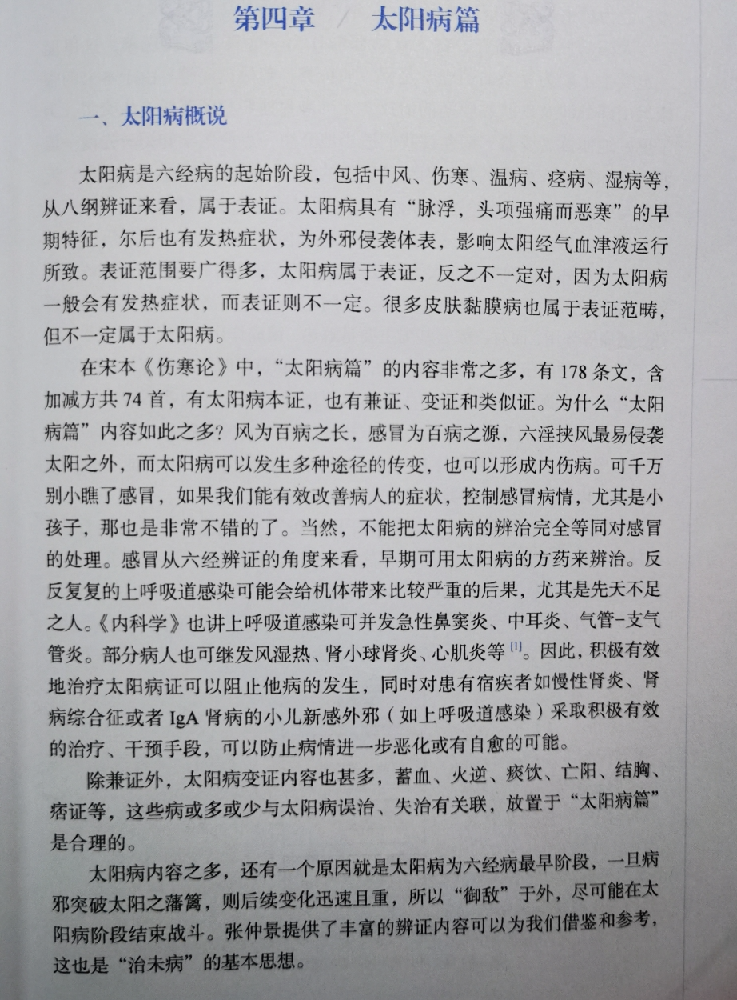
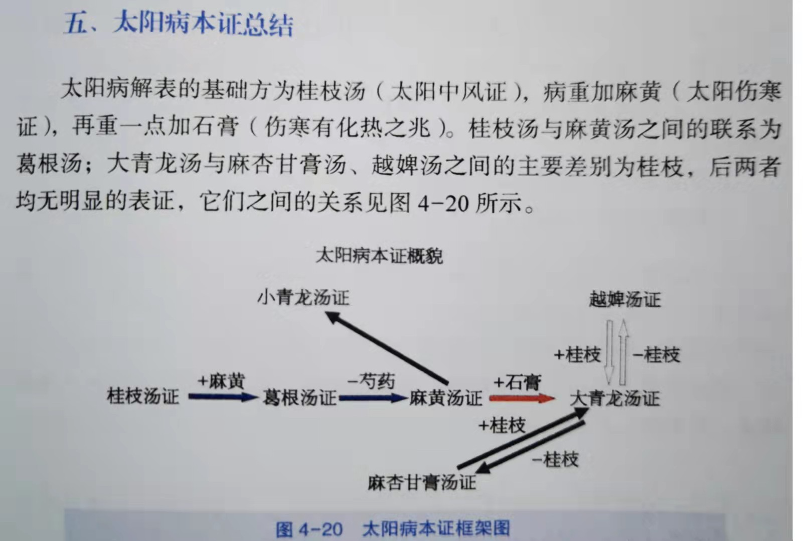

# 伤寒论太阳病
- 治疗原则：“汗而发之” 桂枝汤→麻黄汤→大青龙汤
    -  
        -  
- **桂枝汤 太阳中风证**
    - 【原文】太阳中风，阳浮而阴弱，阳浮者，热自发，阴弱者，汗自出，啬啬恶寒，淅淅恶风，翕翕发热，鼻鸣干呕者，桂枝汤主之。（12）
    - 【方药组成】桂枝三两(去皮)，芍药三两，甘草二两(炙)，生姜三两(切)，大枣十二枚(擘)。
        - 1.仲景说的桂枝当为肉桂
        - 2.芍药当为赤芍药
        - 3.药物要碎化，大枣要掰开
        - 4.桂枝汤宜小火煎煮且时间较长
    - 【服法与禁忌】上五味，收咀三味，以水七升，微火煮取三升，去滓，适寒温，服一升。服己须曳，啜热稀粥一升余，以助药力，温覆令一时许，遍身折折微似有汗者益佳，不可令如水淋漓，病必不除。若一服汗出病差，停后服，不必尽剂。若不汗，更服依前法，又不汗，后服小促其间，半日许令三服尽。若病重者，一日一夜服，周时观之，服一剂尽，病证犹在者，更作服。若不汗出，乃服至二三剂，禁生冷、黏滑、肉面、五辛、酒酪、臭恶等物。
    - 【经方方论】桂枝汤是《伤寒论》方证中的第一方，是太阳中风邪犯营卫的首剂。方中桂枝味辛性温，解肌散风；芍药味酸性寒，敛阴和营，二者相配，一辛一散，解肌发汗；一酸一敛，收守营阴，共司开合，调和营卫。生姜辛温，助桂枝辛散表邪，降逆止呕；大枣甘温，配芍药以和营阴；甘草甘平，调和诸药，共奏散寒驱风，调和营卫之效。
    - 【应用】
        - 1.太阳病，如普通感冒
        - 2.部分身体骨节疼痛类疾病（不宁腿）
        - 3.情志疾病
        - 4.妇科疾病
        - 5.太阴脾胃病
        - 6.皮肤病
- **麻黄汤 太阳伤寒证 烦躁**
    - 【原文】太阳病，头痛发热，身疼腰痛，骨节疼痛，恶风，无汗而喘者，麻黄汤主之。（35）
    - 【方药组成】麻黄三两（去节）桂枝二两（去皮） 甘草一两（炙）杏仁七十个（去皮尖）
    - 【服法与禁忌】上四味，以水九升，先煮麻黄，减二升，去上沫，内诸药，煮取二升半，去滓，温服八合。覆取微似汗，不须啜粥，余如桂枝法将息。
    - 【经方方论】麻黄汤发汗解表，宣肺平喘。方中麻黄味辛微苦性温，擅长发汗解表散寒，兼能宣肺平喘，是为君药；桂枝辛甘温，解肌祛风，温经通脉，以助麻黄解表祛邪，是为臣药；杏仁味苦辛微温，宣肺降气，止咳平喘，既协助麻黄解表，又能增强其平喘之效，故为佐药；炙甘草甘平，补益中焦，化痰止咳，更能调和诸药，防麻黄、桂枝发汗太过，故为使药。四药合用，发汗解表，散寒祛邪，是经方治疗太阳表实无汗之峻剂。本方麻黄用量大于桂枝，凸显了本方的发汗作用。
    - 应用
        - 1.太阳病重症，尤其是流感
        - 2.皮肤病
        - 3.类风湿关节炎(RA)
        - 4.急慢性肾小球肾炎
- **大青龙汤 太阳伤寒证化热入里 高热惊厥**
    - 太阳中风，脉浮紧，发热恶寒，身疼痛，不汗出而烦躁者，大青龙汤主之。若脉微弱，汗出恶风者，不可服。服之则厥逆，筋惕肉瞤，此为逆也。(38)
    - 麻黄六两（去节）　桂枝二两（去皮）　甘草二两（炙）　杏仁四十枚（去皮尖）　生姜三两（切）　大枣十枚（擘）　石膏如鸡子大（碎）
    - 上七味，以水九升，先煮麻黄，减二升，去上沫，内诸药，煮取三升，去滓，温服一升，取微似汗。汗出多者，温粉扑之。一服汗者，停后服。若复服，汗多亡阳，遂虚，恶风烦躁，不得眠也。