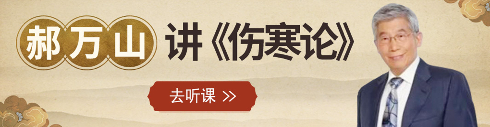

# 郝万山《伤寒论》70讲整理
- **前言**
    -  [https://mubu.com/doc/explore/24814]("https://mubu.com/doc/explore/24814")
    - 本文主要整理了郝万山老先生的《伤寒论》70讲网课，主要用于交流学习，拒绝一切理由的商用，侵删。
    - 正文附上了网课和仲景全书的网盘资源，希望可以帮到同我一样苦苦挣扎的医学生🐶。
    - 第06～70讲内容相对重要，因此我简单总结了前5讲内容，附在了正文里，想要节约时间的话看看总结就可以了。
- **简介**
    - 郝万山，男，1944年11月生，主编有《白话伤寒论》、《中医学问答题题库·伤寒论分册》、《医宗金鉴·伤寒心法要诀白话解》、《21世纪全国高等中医药教学辅导丛书·伤寒论》等8部著作，副主编或合编有《实用经方集成》、《伤寒论校注》、《伤寒论讲解》、《伤寒论诠解》等12部著作，发表《论伤寒学科的确立及其内涵建设》、《伤寒论用方思路》、《伤寒论字词训释札记》、《柴桂温胆定志汤治疗精神抑郁症》、《论少阳腑实证和仲景用大柴胡汤》等论文60余篇。
    - **网课资源** 神黄中医智库 
        -  [**https://pan.baidu.com/s/1hZyqbpw0qbxucGGO3YyxvQ**]("https://pan.baidu.com/s/1hZyqbpw0qbxucGGO3YyxvQ")
- **第01讲 《伤寒杂病论》的作者**
    - 同学们好，我们上课。这次国家中医药管理局和二十一世纪中医药网路教育中心组织的,中医药现代远端教育示范教学，推荐我来讲授《伤寒论》。虽然我学习、研究、讲授《伤寒论》有30多年的历史，但是面对录音、录影这样一个现场，我还是感到心里有压力。前天中午和几位朋友在一起吃饭，其中有一位朋友是电影导演，而且还是一个很有名的电影导演，他拍了许多电影，然后我们就说他的艺术成就是很高的。可是他说电影是一门遗憾的艺术，我就问他，为什么说电影是一门遗憾的艺术呢？他说，我拍每一部电影都要精心地选择剧本，精心地选择演员，精心地编导，认真地拍摄，认真地剪辑，认真地配音。那么当电影完成以后，我重新再看再放映的时候，发现每一部电影都留下了许多许多的遗憾，所以他说电影是一门遗憾的艺术。由此我就联想到我们写书、我们讲课。我们在写书的过程中，对每一部书，我们都是精心地构思，细心地写作，认真地校对。最后书出版了，再拿回来一看，哎呀，这个地方为什么是这么写？这个地方文字还应当可以再精炼。所以每一部著作都是一个遗憾的创作。我们讲课也是这样，我们常常精心地备课，上课的时候认真地讲授，和同学之间进行心灵的交流，进行学术的沟通。我上课的时候，有同学录音，也有少数同学录影。下课以后，我听听他们的录音，我看看他们的录影，我说，哎呀，这个地方我怎么居然发生了口误，哎呀，这个地方我还可以再增加一些鉴别、比较的地方，那么这个地方呢，我还应当再更深一步地分析……，每一节课也都留下了遗憾.所以我常常说，我们上课，恐怕每一节课都是一种遗憾的讲演。所以现在面对录音、录影，我在进行《伤寒论》的教学时，当然会有压力，更何况我们全国范围内，研究《伤寒论》的，在《伤寒论》的教学和研究，以及临床上有精深造诣的，可以说是“山外有山，人外有人”。因此，我在这里讲课，如果说就是随随便便的一堂课，讲过去就讲过去了。可是现在我们要录影，我们要製成光碟，要请全国的同行专家评头品足，我当然会有压力，当然会有紧张。
    - **创立个体化治疗方案** **张仲景**
        - **【笔记】**
            - **创立个体化治疗方案——张仲景**
    - 《伤寒论》的作者，严格地说，张仲景他写的书叫《伤寒杂病论》。《伤寒杂病论》在流传过程中不得已被分为了《伤寒论》和《金匮要略》两部著作，所以我们这里讲的作者张仲景实际上指的是《伤寒杂病论》的作者。张机是他的名，仲景是他的字，他的生活年代大约在西元150年到219年。由于范晔的《后汉书》、陈寿的《三国志》都没有给张仲景做传，我们能够大体了解他的史料的，像王叔和的《脉经》，像王叔和整理的《伤寒论》，像晋朝皇甫谧的《针灸甲乙经序》，像宋代《太平御览》所引的《何顒别传》。那么一直到了宋代国家校正医书局，在校勘刻印《伤寒论》的时候，所写的《伤寒论序》，虽然到了明代的李濂的《医史》，写了《张仲景补传》，还有明代的一些地方志，你比方说，明·嘉靖年间的《南阳府志》，嘉靖年间的《邓州志》，片片断断地记录了张仲景的一些事情。所以我们就根据这些片片断断的历史文献记载来介绍张仲景的一些生平事情。张仲景生活的年代是西元150～219年，这个年代也是推测的。有的人考证其生年是在西元151年，这也是一个推测。那么这是一个什么年代呢？我们举出和他同时代的三位大家都熟知的历史人物。曹操，他的生活年代是西元155～220年，你看张仲景比曹操大约大五岁。刘备，他生于西元161年，死于西元223年，还有一个医学界非常著名的人物华佗，他的生年我们现在没有确切的考证，他的卒年是西元208年。所以张仲景和曹操、刘备、华佗都是同时代的人物，这正是东汉末年。这个社会背景正是战争连年不断，而且天灾连年不断的这样一个社会背景。所以我们了解他的生卒年代，主要是了解他的生活的时代背景、籍贯。
        - **【笔记】**
            - **《伤寒杂病论》→《伤寒论》&《金匮要略》**
            - **史料**
                - 王叔和《脉经》，王叔和整理《伤寒论》
                - 晋朝皇甫谧的《针灸甲乙经序》
                - 宋代《太平御览》所引《何顒别传》
                - 宋代国家校正医书局《伤寒论序》
                - 明代李濂《医史·张仲景补传》
                - 明代的一些地方志
                    - 嘉靖年间《南阳府志》
                    - 嘉靖年间《邓州志》
                - ……
            - **张机（仲景）**
                - 和曹操、刘备、华佗同时代
                - 东汉末年
    - 他是什么地方的人？他是东汉南阳郡涅阳人，这个地方相当于现在的河南省南阳地区邓县。邓县有一个东稂镇，东稂镇的西北1.5公里左右有一个张寨村，这个张寨村在清朝的末年，北门还保存著。这个北门上面有一个石头刻的匾额，上面写著“古涅阳县”。所以由此可以证实，这个河南省南阳地区邓县的张寨村就是古涅阳县的县址。张仲景就是这个地方的人。我们在这里考察他是什么地方的人有什么作用？因为他是什么地方的人，在他所写的著作里就有方言的特征，所以我们知道他是什么地方人，主要是为了读他的书，对他书中方言的准确含义能够仔细的了解。你比方说，在《伤寒论》中有很多地方谈到了“桂枝不中与之也”，“柴胡不中与之也”，这个“中”和“不中”直到今天，仍然是河南地区的方言。“中”就是“可”的意思，“不中”就是不可，“不中与之”就是不可与之，这是典型的河南当地的方言的特点。又比方说，在《伤寒论》中这个“熬”字，我们现代的《词源》说：“小火慢慢煮就是熬”，像我们现代汉语中通常所说的熬粥，熬药都是这个意思。那么在《伤寒论》中有“巴豆，熬，去油”，“虻虫，熬，去翅足”，“白粉熬香”，“杏仁，熬黑”。如果我们用今天的这个“小火慢慢煮”来解释这个“熬”的话，杏仁，小火慢慢煮怎么能煮黑呢？巴豆，小火慢慢煮，怎么能煮去油呢？特别是那个白粉，就是白米粉如果加上水小火慢慢煮的话，那就煮成稀糊了，怎么能煮香呢？
        - **【笔记】**
            - **籍贯**
                - 东汉南阳郡涅阳（河南省南阳地区邓县）
    - 那我们要考察这个字的话，怎么考察？这可能是仲景当时用的一个方言。西汉杨雄写过一本书，它就叫《方言》，他是以当时的普通话来解释地方话的。那么《方言》里对这个“熬”是怎么解释的呢？他说：“凡以火而干五谷之类，自山而东，齐楚以往谓之熬，关西陇冀以往或谓之火备，秦晋之间或谓之炒。”西汉杨雄的这段话，他说：“凡以火而干五谷之类”，没说加水，就是只用火而使五谷杂粮干燥，并把五谷杂粮做熟了。“自山而东”，就是山东这个地方，“齐楚以往”，齐国、楚国这个地方把它叫做“熬”。那么“关西陇冀”这是陝西的一部分，甘肃还有河北的一部分“或谓之火备”，这个火备干的“火备”，这个字火备和这个字（焙）都是一样的。“秦晋之间或谓之炒”，秦是陝西的一部分，晋是山西的一部分，那个地方有的人把它叫做“炒”。可见在汉代，这个“熬”、“备”、“炒”，含义都是一样的。都是用火而使五谷杂粮干燥和做熟，也就是说“熬”字在这里，就是“炒”的意思。张仲景是什么地方人呢，张仲景不是河南南部的人吗？河南南部在古代属于楚国的北部，所以仲景是楚人，那么是楚人的话，他当然就用的是楚地的方言。所以他在《伤寒论》中的这个“熬”字就是指的炒的意思。这样我们就理解了在《伤寒论》中，“杏仁，熬黑”就是杏仁炒黑，“巴豆熬去油”，就是把巴豆炒一炒，炒去油。巴豆的毒，全在这个油里头。所以中医有一句话叫做“巴豆不去油，力大如老牛”，炒一炒就把它的油去掉了。特别是这个白粉，你看这个“粉”字是“米分也”，“研米使分散也”，它的本意就是米的细末，就是米粉。那么什么叫“白”呢？汉代“稻曰白”，你看那个《周礼》注疏，注这个“白”，“稻曰白”，所以白粉就是白米粉。
        - **【笔记】**
            - **方言现象**
                - **熬** **熬** **熬** **熬**
                - **熬，**
    - 我们有一次考试，有一个名词解释，有一个学生大概既没有听老师上课，也没有看书，答“白粉”这个名词解释的时候，他居然写了一个“大烟土”。白粉就是白米粉，白米粉炒一炒就能炒香，熬香就是炒香。我们北京有一道菜叫作米粉肉，它就是拿五花肉放上佐料醃好了以后和这个炒香的米粉混合在一起，上笼屉上蒸，蒸完了香酥可口，不肥不腻，所以这个“白粉熬香”就是炒香。我们知道仲景是楚人，所以在考证这个“熬”在《伤寒论》中的本来的含义的时候，我们就知道，它是指的炒。所以我们了解张仲景是什么地方人，主要是为了读他书，了解他书中方言的一些确切含义。张仲景的心理素质怎么样？作为这样一个名医，他一定有他特殊的心理素质。仲景在年青的时候，曾经找过一个心理学家，叫何顒的先生，请教何顒说：“先生您看看，我长大了我将来适合做什么工作。”何顒这个人是很了不起的一个人物，用我们今天的眼光来看，他是一个很了不起的心理学家。所以那个时候他看曹操，说现在天下大乱，汉朝将要灭亡，治理国家，统一天下的一定是这个人。他说得很准，所以仲景呢也找他来看一看。何顒说：“君用思精而韵不高，后将为良医。”这件事情记载在什么地方呢？记载在《太平御览·何顒别传》里，这本来是说何顒说话说的准确，预测得准确。他说：“仲景先生，你呢‘思精而韵不高’，你是一个善于深思熟虑，性格内向的这样的一个人，而不是那种大喊大叫的喜欢张扬的人，所以如果你今后要做一个医生的话，那你一定是一个高明的医生。”这是张仲景的素质。
    - **张伯祖**
    - 在明代的崇祯五年，也就是西元1632年，在南阳城东，农民在挖井的过程中，挖出一个石碑来，这个石碑上写著十一个字：“汉长沙太守医圣张仲景墓”。那么这个石碑出土以后，这个石碑现在保存在南阳医圣祠，专家们考证，它的石刻的风格、碑框的花纹，还有碑框的配画，还有图式都和晋末南北朝的石窟造像和当时的那些古墓的一些彩画的风格都相类似，都相仿佛。1981年在整修医圣祠的过程中，人们把这个墓碑往下挖一挖，在这个墓碑的根基的基础下面发现了一个碑座，碑座的侧面刻著4个字，叫“咸和五年”。咸和是晋成帝司马衍的年号，咸和五年相当于西元330年。“咸和五年”这4个字是刻在碑座的一侧的，字体也很不规范，歪歪扭扭的，看起来就像刻碑的这个刀工试他这个刀的时候，试他这个铁笔的时候随意刻上的。如果说这个碑体和碑座是同一年代的东西的话，那么，也就是说这个碑如果是立在西元330年的话，那离仲景去世也就是100年多一点，那这个墓碑对考证张仲景做长沙太守就有重要的文物价值。非常遗憾的是，这个碑座是汉白玉的，碑体却是青石的，而碑座的这个字体呢和碑体的“汉长沙太守医圣张仲景墓”这11个字的字体又完全不同，所以人们就觉得呢，这个碑座可能是比较早，而碑体呢可能就晚一些。当然从花纹来看，也像晋末南北朝时候的作品，所以说它对考证张仲景作为长沙太守有重要的价值。可是后来我冷静一想，在这个墓碑上，有两个要素，一个是“长沙太守”，一个是“医圣”，如果我们考证长沙太守得不出结论的话，那么我们就看一看医学界是什么时候把张仲景称作医圣的。医学界还没有把张仲景称作医圣的话，这个墓碑是不会这样刻的。首先我们想一想，在汉代当时没有人把张仲景叫医圣，如果把张仲景叫医圣的话，那么《后汉书》《三国志》肯定会给张仲景作传，但是这两部史书都没有给他作传，所以当时没有人把他叫做医圣。稍后王叔和在整理《伤寒杂病论》的过程中，他只提到了说“今收采仲景旧论，对病真方”，收集张仲景的过去的这些著作和对病的真方，在这里直接称仲景，肯定没有把他称做医圣。那么再后来晋朝的皇甫谧在《针灸甲乙经序》里头，他有这样一段话，说“伊尹以亚圣之才，撰用《神农本草》，以为《汤液》，仲景论广伊尹《汤液》为数十卷，用之多验”，这段话是什么意思呢？说伊尹这个人，以他仅次于大圣人的才能，你看“亚圣之才”，仅次于大圣人的才能，“撰用《神农本草》”就是参考了《神农本草经》，“以为《汤液》”，写成了《汤液经》。“仲景论”，而仲景的著作“广伊尹《汤液》”，就是补充、扩展了伊尹的《汤液经》。“为数十卷，用之多验”，在临床上用起来多有效验。晋朝的皇甫谧把伊尹这样一个古代著名的医生才叫做“亚圣”，所以那个仲景呢，只不过在亚圣的基础上，补充、扩展了《汤液经》的一些内容，继承了《汤液经》的内容，然后写了一部著作，而这部著作在临床上应用的是很有效验的。可见在晋朝的皇甫谧的时代，根本没有把张仲景叫做医圣，他才把伊尹叫做亚圣。到了唐代，孙思邈写《千金要方》说“江南诸师秘仲景要方不传”，直接就称“仲景要方”，直接就称“仲景”，也没有丝毫谈到仲景是“圣”，是“亚圣”，和“圣”没有贴边。在《外台秘要》里，也引用了什么张仲景方、仲景方，也是直接称呼“仲景”。要是一个圣人的话，那么还直接称名字吗？所以在唐代也没有人把他称圣。宋代国家校正医书局，校勘刻印《伤寒论》的时候，这是西元1065年，在《伤寒论序》里头，它说“仲景本伊尹之法，伊尹本神农之经”，实际上这段话是根据晋朝皇甫谧的那个《针灸甲乙经序》的那段话而来的，说张仲景他是根据伊尹的《汤液经》的法则，而伊尹呢，是根据《神农本草经》的内容来写的著作。那么底下他说“得不谓祖述大圣人之意乎”，说这难道不是继承了大圣人的意思吗？所以宋朝的林亿、孙奇、高保衡，国家校正医书局的这些官员，在《伤寒论》序里头非常明确地说张仲景只不过是继承了古代大圣人的意志，并没有把张仲景本人称为医圣。那么其后在西元1144年，成无己写成了《注解伤寒论》，再后一些成无己写成了《伤寒明理论》。在这两部著作里，成无己仍然是遵循了宋代国家校正医书局的这个口径，说张仲景所做的工作是类似于圣人的工作，是继承了圣人的工作，仍然没有把他称作“圣”。
    - 在1182年，金人刘完素他所写的《素问玄机原病失》这本书里头，他明确提到了“仲景者，亚圣也”，这才和“圣”沾了边，但是没有直接称“医圣”，而是次于圣人，“亚圣”嘛，次于圣人。再往后，到了1526年，李濂写成了《医史》，他说仲景被“论者推为医中亚圣”，这已经到了明代1526年，仍然没有把仲景称作“医圣”，那么直接称张仲景为“医圣”的是西元1589年，方有执，研究伤寒的大家，错简派的创导人，写成了《伤寒论条辨》。在《伤寒论条辨》这部著作里，方有执说：“……称仲景曰圣”，那么这以后，在医家的著作中，把仲景称为“圣”的才多了起来。而张仲景的那个墓碑是什么时候发现的呢，我们刚才说了是1632年被发现的，应当说，认真的说，什么时候医学界才把张仲景称为圣的，应当是1589年方有执的《伤寒论条辨》开始才把仲景叫做圣。而这个墓碑是1632年发现的，是在方有执的《伤寒论条辨》刊行以后所发现的。非常有意思的是仲景墓碑发现的这个过程也非常蹊跷，在清朝的康熙年间徐中可写过一本书，叫《金匮要略论注》，在《金匮要略论注》里有一篇文章叫“张仲景灵异记”，在“张仲景灵异记”这篇文章里头，他写了一段非常蹊跷的故事，说明代有一个读书人叫冯应鳌，冯应鳌得了发热恶寒的病，奄奄一息，眼看就要活不下去了，夜里做梦，梦见来了一个神人，穿著黄衣服，戴著金帽子，这个神人呢，就拿手摸了他的全身，然后顿时他感到全身骨节舒畅，然后冯应鳌在梦中就问：“你是什么人呢？”那个神人说：“我是南阳汉长沙太守张仲景”。你看他自己没有说医圣，说我今天治好了你的病，我也有比较尴尬的事情要请你帮忙，或者说我也有困难的事情要请你帮忙，在这个南阳城东四里的地方有一个祠，祠后面七十七步有我的墓，过几年以后会有人在我的墓上打井，能够制止这件事情的只有你，说你到时候到那里制止他们继续在我的墓上打井，然后给我重新整修一下这个墓，冯应鳌一觉醒来，出了一身大汗，怕冷发烧就退了。
    - 后来他一直记著张仲景在梦中的託付，几年以后，实际上4年以后，他就来到了南阳城东，到那儿果然看见那个菜园子的农民正在打井，而且正好挖出一个石碑，这个石碑就是“汉长沙太守医圣张仲景墓”，所以我觉得，这个墓碑就是明代人给他建立的，只不过神乎其神的编了一个故事罢了。因为“医圣”在晋、在唐、在宋都没有人直接称医圣，只有到了明末了，1589年方有执的《伤寒论条辨》才开始称仲景曰医圣。而这个墓碑就直接说“汉长沙太守医圣张仲景墓”的话，那应当是明朝末年的人给他立的。可是为什么墓碑的周围的图式呀，花纹呀，刻得像晋末南北朝的这个风格呢？现在的人给古人立墓碑的时候，或者是给他建纪念堂的时候，总要模仿这个人当时代的一些东西。你像我们北中医药大学图书馆门前，有张仲景的塑像，张仲景塑像那周围，有汉白玉的栏杆，汉白玉的栏杆上就有许多的画，这个画呢，就是选自于汉代古墓的一些图式和一些画。那过上几千年以后，人们再到我们中医学院的这个旧址上去考查的话，哎哟，一看，这有个张仲景的像，一看这个像的周围的栏杆上刻的这些花纹都和汉代的哪个时候的古墓的花纹相仿佛，那你就能说明这个塑像是汉代人建的吗？所以后人给前人、给古人造像也罢，立墓碑也罢，在墓碑的这个装饰花纹上，模仿他当时代的一些东西，那是可以完全做得到的。那个碑座上写的“咸和五年”是怎么回事呢？那没准是后人在立碑的时候，找到了古代的一个碑座，所以就把它代替来做碑座了。这个都是我的推测了。当然，我今天讲这件事情，是说我们评价仲景对医学的贡献，并不在于他做过没做过长沙太守，而在于他的医学贡献。不过我想提醒大家的是，自从宋代国家校正医书局在《伤寒论序》中引用了唐代甘伯宗的仲景“举孝廉，官至长沙太守”的话之后，那么在医学界就以“长沙”作为仲景著作，或者仲景其人的一种代称。你比方元代吕履有一本书，叫做《长沙用药十释》，那么《长沙用药十释》一提“长沙”，我们就知道是张仲景用药，是吕履对张仲景用药规律的一种解释。清代的黄元御有一本书叫《长沙药解》，那也是解释张仲景用药规律的一本书。
        - **【笔记】**
            - **明末方有执《伤寒论条辨》**
                - **张仲景** **医圣**
    - **以“长沙”作为仲景著作的指代，或者仲景其人的指代** **《伤寒卒病论》**
        - **【笔记】**
            - **以“长沙”** **仲景著作** **，** **仲景其人**
    - 那么是怎么沿革的？怎么分成两部书的？我们下面会有专题讨论。但是对《伤寒论》，对仲景的著作，历史上的史书上，像《晋书》、《唐书》，它的记载也是不一样的。有的写成是《张仲景要方》，“仲景要方”，这个重要的“要”，有的写成《仲景药方》，是中药的“药”，还有的写成《张仲景伤寒论》，为什么书名不一样呢？因为那个时候，没有出版物，都是传抄。所以既然是传抄的话，你叫它什么名字都可以。不像我们今天，有出版物，这个署名就是固定的。哪个时候没有出版物，都是抄本，所以写什么书名都是可以的。
    - **中医学术发展的一个非常重要的奠基人**
        - **【笔记】**
            - **学生**
                - 杜度、卫汛、王叔和
            - **地位**
                - 中医学术发展的奠基人
- **第02讲 《伤寒论》成书背景和流传**
    - 现在我们讲概论的第二个问题，就是《伤寒杂病论》的成书背景。任何一部能够在历史上流传千古，对这个学科做出过巨大贡献的著作，它的出现都是有一定的社会背景和学术背景。所以我们也从社会背景和学术背景来谈谈在这样一个时代为什么会出现《伤寒杂病论》这样流传千古而不朽的著作。从社会背景的角度来看，我们刚才在谈张仲景的生活时代的时候，我们已经知道，张仲景生活在东汉末年。东汉末年是个什么样的社会呢？是一个战争连年，天灾不断的社会。我查了一下史书，从自然灾害来说，在史书上有记载的，在张仲景的存世的这几十年之中，在史书上有记载的大的自然灾害就有22起之多。像自然界中的旱灾、水灾、海水倒灌、河堤决口、地震、台风蝗虫、泥石流。我查了史书之后，能够想像到的自然界的灾害在张仲景的存世的年代都有。而且在史书上能够记载的，这不是局部的、小的灾害。那么这样的灾害造成了什么样的结果呢？造成了生产力被破坏，生产水准下降，人们的生活水准下降，抵抗力降低，这就造成了大量的、长期的传染病的大面积流行。所以历史上有句话，叫做“大灾之后，必有大疫”，这从自然灾害来讲的。从战争的角度来讲，大家想一想，东汉末年，三国纷争，战争连年不断，所以中国历史上又有一句话，叫做“大兵之后，必有大疫”，正是这战争的连绵不断和自然灾害的连绵不断，导致了传染病的大面积流行。所以在《东汉会要》记载历史大事件的这本书里头说“中原大地，白骨委积，人相食啖”。“白骨委积，人相食啖”就已经是人吃人的这样的一种社会背景了。所以在《东汉会要》的描述，当时的百姓“不死于兵，即死于病”。这个建安文学，建安七子之一的王璨，他有一首诗叫《七哀》。《七哀》里有这样一段话，说“出门无所见，白骨蔽平原。路有饥妇人，抱子弃草间。顾闻号啼声，挥泪独不还。未知身所往，何能两相完”。那么这是一段什么样的话呢？他说他在路上走著就看到有一个饿得面黄肌瘦的这样一个妇人，抱著孩子就扔到大路边的草丛中，回头听见孩子的哭泣声，自个擦擦眼泪，不再回来了。为什么会这样呢？因为“未知身所往”，自己吃了今天的饭，不知道明天自己要到哪里去。自己的性命都不能保，“何能两相完？”怎么能够使我和孩子都能够生存下来呢？所以她忍痛把孩子扔掉了。
        - **【笔记】**
            - **成书背景**
                - **社会背景**
                    - 东汉末年，天灾和战争导致了传染病的大面积流行
                    - > 实践基础——死于伤寒者众
                - **自然背景**
                    - 自然灾害频繁
                    - 大量的、长期的传染病的大面积流行
                        - *“大灾之后，必有大疫”*
                        - *“大兵之后，必有大疫”*
    - 那么这样一个社会，自然是传染病大面积地流行，所以，张仲景的《伤寒杂病论序》里头，我们大家在座的都学过《医古文》，学过《伤寒杂病论序》。他说：“余宗族素多，向余二百”，说我的家族是很大的家族，曾经有过二百多口人，建安纪年以来，犹未十稔，其死亡者，三分有二，伤寒十居其七。建安纪年，就是西元196年。那么建安元年以来，不到十年的时间，我这二百多口的家族，死了三分之二，这三分之二有十分之七的人是死于伤寒病，伤寒病就是指的外感病的总称，下面我们会提到它的含义的。就死于传染病、死于外感病，所以他本人作为一个医生，看到这种情况，又没有更多的办法来防治这些传染病来挽救这些亲人和百姓的生命，才激励他勤求古训，博采众方，那么撰用了《素问》、《九卷》、《阴阳大论》、《胎胪药录》，并自己平脉辨证，这样才写成了《伤寒杂病论》合十六卷。所以这样的一个社会背景，对张仲景的探索防治传染病的这种路子，是一种激励，是一种督促。另外使他也有机会有大量的临床实践体会和实践经验，也使他有机会来收集防治传染病的这些经验和方法。大家说了，你今天是伤寒教研室的，你能不能够写一个治疗传染病的一个新的东西？我说我要抄书是可以的，你要让我谈实践经验我是没有的，因为传染病现在很少，即便有的话他们也到佑安医院和北京地坛医院住院去了，在我们的普通内科门诊几乎见不到。所以我不能写出像张仲景这样的著作来，因为没有这样的社会背景和实践条件。你看不到那么多传染病，而张仲景当时天天看到的就是这些病，所以他才能够有机会积累经验，收集当时的医家和百姓和传染病做斗争的经验和教训。
    - 从学术背景的角度来说，在汉代以前，医学著作分了两大门类，一类是“医经”，就是基础理论著作；一类是“经方”，这里所说的经方就是经验用方。在班固所写的《汉书·艺文志》里，记载了东汉以前的医学著作。有医经7家，有经方11家。那么医经7家包括了《黄帝内经》、《黄帝外经》、《扁鹊内经》、《扁鹊外经》、《白氏内经》、《白氏外经》、还有《（白氏）旁经》。从流传到今天的《黄帝内经》这一部书来看，那么它完全是阐述人体的生理，病理，人和自然的关系，基本的治疗原则，基本的治疗大法的这样一个中医学基础理论的著作。所以“医经”是基础理论。那么“经方”，班固《汉书·艺文志》里所说的“经方”不是我们今天所说的“经方”，而是指的古代医生凭自己的经验给病人开的方，而且在经过验证是有效的。其实古代的医生在看病的时候，有些类似于我们现在的农村的一些基层医生。你让他讲理论他说不出来。我曾经在一个很偏僻的农村，看一个医生，这个医生呢他给别人看病的时候，他的疗效还不错，就是凭一种感觉。病人来了之后，头疼，身上疼，发烧，没有汗，他就给你写上麻黄呀，杏仁啊等等一些药。有些药就是当地的一些药，既不见于药典，也不见于中药书。我说老先生，你为什么开这些药呀？他说我的感觉开这些药它就可以，他开的方子留下来了，那么过几天这个病人来了，病人说哎呀，大夫，吃了您的药，汗一出好了，然后他就把这个方子放在这，方子是经过临床检验而有效的。又如来一个病人，水肿，憋气，心慌心跳，头晕头痛，然后他又开个方子，开个利尿的方子，过了几天，家属来告诉他，说“大夫呀，吃了您的药，一点也没有好，病人后来死了”，这时他这个方子就不留著拉，他就塞到这。过了几天这边攒得多了，他就都烧掉了。这边攒得多了，他就订成本，留传到后来就是经验用方。所以经验用方是古人凭自己的一种感觉开的一些方，有没有理论指导？没有更多的理论指导。从今天我们看到的甘肃出土的《五十二病方》和马王堆汉墓出土的《治百病方》来看，那都是西汉早期，或者西汉的一些东西。那些就是“经方”，就是经验用方，什么症状用什么方，或者什么病用什么方，谈不上理论指导，又谈不上系统。那么这些经验用方，有11家，其中在这11家中包括了伊尹的《汤液经》。那么张仲景就把这两家结合起来，他熔“经方”和“医经”两家为一炉，创立了理法方药相结合的，有理论、有治则治法、有方子、有药物组成辨证论治体系。这就是他的学术背景。张仲景把汉代以前的“医经”和“经方”两家熔为一炉，创立了理法方药相结合的辨证论治体系，从而就为中医临床医学的发展奠定了基础。医经它只不过是基础理论的著作，谈不上临床医学，经方它只不过是经验用方，也谈不上一个医学体系，只有从张仲景的《伤寒杂病论》开始，才开始出现了理法方药相结合的辨证论治体系。所以中医的临床医学，奠基人是张仲景。个体化的治疗方案，辨证论治这种治疗方案的奠基人也是张仲景。这就是张仲景在中医学的发展史上起著承前启后的重要作用。这是我们讲的第二个问题，《伤寒杂病论》成书的历史背景。非常简单，有它的社会背景，是由于天灾和战争导致了传染病的大面积流行。这就为张仲景收集当时医家防治传染病的经验创造了条件，为张仲景提供了临床时间的客观环境，在学术上，由于“医经”著作的大量问世，和“经方”著作的大量流传，那么就给张仲景把“医经”和“经方”两家结合起来提供了学术背景，提供了学术条件，才使张仲景能够把握理法方药，创立理法方药相结合的辨证论治体系成为临床医学的奠基人。
        - **【笔记】**
            - **成书背景**
                - **学术背景**
                    - 东汉以前医学著作
                    - > 据班固《汉书·艺文志》
                        - **“医经”7家——基础理论著作**
                            - 《黄帝内经》《黄帝外经》
                            - 《扁鹊内经》《扁鹊外经》
                            - 《白氏内经》《白氏外经》《白氏旁经》
                        - **“经方”11家——经验用方**
                        - > 古代医生凭自己的经验给病人开的、而且在经过验证是有效的方
                            - 《五十二病方》
                            - 《治百病方》
                            - 伊尹《汤液经》
                    - **理法方药相结合的辨证论治体系** **临床医学**
    - 第三个问题，《伤寒杂病论》是怎么流传到今天的？这就是关于《伤寒杂病论》的沿革和主要版本。在西元200年前后，张仲景写成了《伤寒杂病论》，那么从《伤寒杂病论》自序的这个话来看，说《伤寒杂病论》十六卷，我们为什么说它的成书年代在西元200年前后呢？这是根据《伤寒杂病论》，即我们今天的《伤寒杂病论》自序，是根据它自序里头的一段话，这段话我们刚才也说过，就是“建安纪年以来，犹未十稔，其死亡者，三分有二，伤寒十居其七。”那么他既然说建安纪年以来，不到十年的功夫，建安元年，是西元196年，那不到十年的功夫呢？那就是说要是十年的话，那就是西元206年，是以我们推测，他写这个序的时候，应当一般来说书已经写成的时候，是以推测他的写书的这个时间就在西元200年前后。他写的书叫《伤寒杂病论》，这就是我们刚才所说哪个时候，并没有印刷技术，至于造纸在西汉的蔡伦虽然总结了民间的造纸技术，那么纸张已经有了，但是一般民间写东西的时候，仍然是应用竹本或者木本，所以这才造成《伤寒论》和《金匮要略》。它是一条一条的表述形式，所以张仲景在世的时候，他这书肯定是保存得不错的。张仲景一去世，再加上战乱，再加上天灾，再加上你说那个竹本或木本是拿绳子穿著的，那时候用的绳子或者是棉线，或者是麻绳，你说过上十几年、几十年，那这绳子早就自然断了。所以他的学生王叔和收集他老师的《伤寒杂病论》的残卷，然后进行整理，进行编次，因为绳子断了，不知道那个竹本在哪个位置，所以重新编次。那么这个时间是在西晋，这个人物叫太医令王叔和。这个王叔和也是张仲景的学生之一，这是依嘉溪先生最近考证的，是张仲景的学生之一。收集、整理、编次，他收集的结果发现他没有能够把十六卷全部整理出来，他只整理出十卷来，而且他所整理的十卷内容大多数是以伤寒病的辨证论治为中心，所以他给他改了个名字，叫《伤寒论》10卷22篇，把《伤寒杂病论》的一部分内容，应该是一大部分内容，收集整理以后，改名为《伤寒论》。张仲景自己不知道，他不可能征求张仲景的意见，是王叔和自己给他改的。所以《伤寒论》这个名字从此就有了。王叔和所整理的书，当然那个时候仍然没有出版，王叔和还做了另外一项工作，他自己有一本书叫《脉经》，在《脉经》里把张仲景《伤寒论》的许多内容都收集齐了，只不过他没有保留方药而已。所以《脉经》本也是我们今天在校勘《伤寒论》原文的时候，可以参考的一部书。这是王叔和对《伤寒杂病论》，在流传上，他是第一大功臣。如果没有王叔和的收集整理，我们今天很可能看不到中医临床学的奠基著作。尽管他收集的不是完整的，但他是《伤寒杂病论》流传到今天的第一大功臣。在唐代，孙思邈写过《千金要方》，在《千金要方》里收入了《伤寒论》中的一些内容，但是没有收入全。他曾经在《千金要方》里说过这样一段话，说“江南驻师，密仲景要方不传”。他这段话，说明什么意思呢？过去人认为就说，孙思邈没有收集到，他作为这么大和一个医家，他没有看到过《伤寒论》。那么今天我们可以这样的理解，江南的这些医生们都把张仲景的《伤寒论》和张仲景的要方都看成是非常重要的东西，不轻易给人。这说明当时医生对《伤寒论》的重视，这也说明当时有许多医生有《伤寒论》的内容。特别是唐代的这个进行医官考试，就是我们今天要进行的执业医师资格考试，在唐代要进行医官考试，《伤寒论》考试占的分数很高。
        - **【笔记】**
            - **沿革和主要版本**
                - **太医令王叔和《脉经**
                - **唐代孙思邈《千金要方》**
    - 你看我这里有一个资料，在唐代，所设的医官考试制度中，《唐汇要·见八十二医术》，它记载了这样一段话，说：“从医学界选拔人才，和选拔官吏一样，都要进行考试，自今以后，至西元759年，各试医经方术，测十道，要考医学理论，要考方术，有十道题。《本草》二道，就是考中药了，有两道题。这个《脉经》二道就是考诊断了，有两道题。《素问》十道，就是考《黄帝内经》了，有十道题。张仲景《伤寒论》十道。你看《伤寒论》和《内经》是相等的，它有十道题。诸杂经方医二道，后世的一些杂方有两道题。那么上述这些，显然《伤寒论》占了很重要的比例。通七以上六，你考七十分，我就选拔你做医官，以下放，你不够七十分，那么你就别当医官拉。看起来古代的考试的及格分数比我们今天要高十分。我们今天六十分就算合格，你看，唐代七十分才算合格。那么既然在唐代医官考试制度中就有《伤寒论》的话，所以唐代《伤寒论》本子流传得很多，但是人们都是抄的，你看，今天我们在日本看到的手抄本，唐代的一些手抄本，都是那个时候医官考试的时候，你看，现在在日本看到的那个康制本吧，他那个《伤寒论》，那么就是一个摘录，有65条，那就是《伤寒论》非常重要的条文。那是唐代人开的，抄的书，那显然是为了应付当时的考试。所以在唐代，既然考试有《伤寒论》的话，所以在唐代的《伤寒论》的这种流传是非常广的。所以孙思邈在《千金要方》里没有收入《伤寒论》，是他没有？并不是他没有看到《伤寒论》的内容，而他看到了，认为这本书很重要，在他的《千金翼方》里收入了《伤寒论》的全部内容。这个我们北京中医药大学医古文的教研室钱超尘老师前几年把《千金翼方》中的《伤寒论》的内容一条一条的摘出来，单独地印了一个小册子，把它叫做《唐本伤寒论》。这本书在外面书店有卖。那么，唐代还有一个大的医家叫王焘，他写过《外台秘要》，我们在这里简称《外台》，那么《外台》呢也收入了《伤寒论》的内容。但是除了《伤寒论》的内容，还有许多是我们今天看到的《金匮要略》中的内容。因此我们觉得王焘所看到的本子不是来自于王叔和，可能是《伤寒杂病论》的另外一个传本。如果说《千金》本《伤寒论》是和王叔和整理的《伤寒论》10卷22篇有关的话，那么王焘《外台秘要》里所收录的《伤寒论》的内容，它也有我们今天看到的《金匮要略》里的内容，它很可能是《伤寒杂病论》的另外一个传本。所以在唐代的两部著作，一部是孙思邈的《千金翼方》，一部是王焘的《外台秘要》，都是我们今天校订《伤寒论》的非常重要的参考书。而且我刚才说了，在唐代的医官考试制度中，就有十道题是出自《伤寒论》，所以《伤寒论》在唐代流传是非常广泛的。但是，《伤寒论》真正有固定的本子，而且又刻板运行的，那应该是在宋代。在宋代成立了校正医书局。宋代国家校正医书局主要有林亿、孙奇、高保衡这些官员，他们认为百病之急，这些病，哪个最急呢？伤寒。所以最先校订《伤寒论》10卷22篇，从此《伤寒论》才有了定本，固定的本子。你看以前《脉经》收集的也罢，那是收集在《脉经》里，他不是个单独的本子。孙思邈的《千金翼方》和王焘的《外台秘要》，它也是收集在他的书这个里面，也不是个单独的本子。只有宋代国家校正医书局林亿、孙奇、高保衡他们校订，刻印了《伤寒论》，开始刻的是大字本，纸张也比较贵，造价也比较高，老百姓买不起，过了几年以后，他们又给皇上打报告，皇上批说你们印成了小字本，卖的时候只收工本费，不要赚钱，这样让老百姓能够买得起。你看宋朝皇帝对中国传统文化的传播和弘扬，他是做过许多许多的工作的。而在宋代的时候，不仅在医学上成立了校正医书局，而且在各个经、史、子、集，各个门类都进行了系统的整理。皇帝对中国传统文化的继承和弘扬做出了巨大的贡献。而宋版书纸张精良、校刊精细、字体漂亮、价值连城，所以今天哪位家里要是有一本宋版书的话，你别在家里放著，拿到故宫博物院，或者拿到国家图书馆去。那是非常非常珍贵的东西。
        - **【笔记】**
            - **沿革和主要版本**
                - 唐代医官考试《伤寒论》占的分数很高→《伤寒论》手抄本流传
                - **唐代王焘《外台秘要》**
                - **宋代校正医书局**
    - 我想在座的不少是书香门第，你们可以到家里去看看，看看自己家里有没有线装书。当然宋代书《伤寒论》是找不到啦，其他的宋版书，那也棒啊，它也是价值连城的啊。山东有个小学老师，有一天到邻居家串门，发现邻居老太太拿著抄写的本子，在那里剪鞋样，说：“大妈，你这是什么东西啊？”“我在这剪鞋样啊！”他拿过来一看，他大吃一惊，居然是《永乐大典》。他说“大妈，大妈，你这东西怎么来的啊？”她说：“我们祖上流传下来的，我们世世代代拿著剪鞋样啊！”他说：“你们祖上干什么的啊？”她说：“我们祖上义和团的啊！”大概义和团进北京的时候，在北京圆明园不是藏著《永乐大典》吗？进北京的时候，八国联军也抢，义和团也抢，义和团他抢完他不知道干什么，回家后给他媳妇剪鞋样，所以祖祖辈辈留著这个书，那纸也很好啊，剪鞋样用。所以这个小学老师说：“大妈，你可别拿著它剪鞋样，我想看看这本书。你要多少纸，要什么样的纸，我给你剪鞋样用，把这本书给我吧！”她就把这本书给他拉。她不知道它干什么用啊。好，这就是我们，像一个小小的故事一样发现的一个《永乐大典》的手抄本的一个残缺。所以还有我们清代的陆心源，他是一个藏书大家，他的藏书称号称“皕宋楼”，你看这个皕字是两个百，那就他为什么取这么一个藏书楼的名字啊？说明他自称藏了200部宋版书。我说一本宋版书就价值连程，那200部宋版书，那相当相当地贵啊。陆心源在临终的时候给他儿子说“这次可是咱们中国文化的瑰宝，你捨得身家性命也要保护好。”其实人各有志，不能强勉，他儿子喜欢钱，不喜欢书。在陆心源去世不多久，他就以一定的钱卖给了日本人。现在陆心源皕宋楼的藏书全在日本的一个寺院的藏经楼上，所好的是目前保全完好。所以有人说陆心源的儿子是个卖国贼，可是从我们另外一个角度来说呢，他没准为中日文化的交流作出了一点成绩。或者说，为保存这些书，你说咱们中国后来经常战争，而且人们对传统文化又不怎么重视，没准拿到日本，到现在还保存得很好，是吧。不过咱们中国的学者要求要看这些书的时候要花钱啦。现在据说看这些书的时候花的钱比当年陆心源的儿子得到的钱要多得多啦。所以有时候散落在民间的一些古典的东西就不要太轻视它。
    - 非常遗憾的是，无论是日本还是中国大陆，还是台湾的故宫博物院。我去年和前年都上台湾去，特意的向故宫博物院了解有没有宋版《伤寒论》，都没有啦。没有宋版《伤寒论》我们怎么知道在宋代有一本宋版书呢？这就仰赖于明代的赵开美。宋代国家校正医书局校勘刻印的《伤寒论》的时间在宋治平二年，也就是西元1065年，到现在是一千年，一千年这书就找不到了。所以我们在版本史上把它叫做什么呢？把它叫做宋版，宋版《伤寒论》，或者叫做治平本《伤寒论》。宋版也罢，治平版也罢，找不到。我们今天能够看到的是明代的赵开美在万曆27年，也就是西元1599年。你看从1065年到1599年也不就是500年左右的历史吗？到赵开美的时候这个宋版《伤寒论》已经几乎找不到了，所以赵开美他才刻，他是一个刻书家，又是一个医学家，又是一个出版商。那么他最先刻的是什么呢？刻的是《注解伤寒论》，《注解&lt;伤寒论&gt;》是成无己，一会我会谈到，成无己在《伤寒论》的基础上加了注解，给他叫《注解伤寒论》。然后又刻了宋英公的《伤寒类证》，《伤寒类证》是宋英公这个人研究《伤寒论》的过程中，把《伤寒论》以证候进行了归类，便于人们学习。又刻了《金匮要略》。刻完这三本书以后，有一个朋友拿来一本书，给他看，说赵先生啊，你看我这是什么东西呀？他一看是宋版的《伤寒论》。我刚才说了，宋朝皇帝为了让老百姓能够买得起《伤寒论》这本书，刻了大字，又刻了小字，大量的刻印发行，他看到的是小字本《伤寒论》，总而言之是宋版《伤寒论》。一看这《伤寒论》，他知道成无己的注解，不是宋版《伤寒论》的原貌，而是他有些内容给删节了。才知道成无己的注解不是全的。于是乎他又刻了宋版《伤寒论》。他叫什么呢，叫《翻刻宋版伤寒论》。
        - **【笔记】**
            - **沿革和主要版本**
                - **明代赵开美** **《翻刻宋版伤寒论》** **《仲景全书》**
                    - **仲景全书影印本** [**https://pan.baidu.com/s/1OjjWl1l7-1VJmgZcLM5o0A**]("https://pan.baidu.com/s/1OjjWl1l7-1VJmgZcLM5o0A")
    - 这四部书刻好了以后，一、二、三、四，他给他父亲看，说老爸你看，我把张仲景的这四部书刻好啦，您给取个书名吧，叫个什么书名好呀？他爸爸说叫《仲景全书》吧。这个儿子很 孝顺，说：“好好好，您取的名字太好啦”。所以我们今天看到的，是赵开美在万曆27年，也就是西元1599年所刻的《仲景全书》中的《翻刻宋版伤寒论》。但是哪个时候没有照相技术，也没有复印，他是临摹著宋版《伤寒论》来刻的，每一页有多少行，每一行有多少字，他都摹仿下来。甚至字的笔划的走向，他都在摹仿宋版，所以他逼真于宋版。正由于赵开美所刻的《仲景全书》的第一部著作《翻刻宋版伤寒论》能够流传到今天，才使我们能够大体了解宋版《伤寒论》的原貌。所以这样的话，赵开美也是《伤寒论》的流传过程中功不可没的一位医家。今天在世的，保存著的，我们知道的赵开美所刻的《仲景全书》还有几部呢？只有五部，北京图书馆有一部。我去看的时候他不让我看，说这是善本书，我们已经封存起来了，你只能看作为胶卷的。那么中医研究院图书馆有一部，我去看的时候，要开上我们大学的介绍信，然后看的时候让我戴著口罩，不让我带钢笔，怕钢笔水给滴在上面。这是我想是十年前吧，我去看过这本书。后来，范行准先生家藏一部《仲景全书》，他也捐献给中医研究院图书馆了。那么后来我知道这个消息以后，我又第二次去中医研究院图书馆，我说我要看看范行准先生捐献给你们的那本书。当我拿出来一看，一比较，范行准先生捐给中医研究院图书馆的那本书和中医研究院图书馆原来藏的那本书是同版刊本，就是同一个版的刊本，那么中医研究院就有两部了。还有一部是在渖阳，再有一部是在南方，是在广州还是什么地方。那渖阳那一部和南方那一部我都没有看到，我只看到了北京这三部。北京这三部是同一个版的刊本。我想我明天，我今天忘了带，明天我把北京图书馆的那个胶卷，作为胶卷给拷贝以后，然后，因为它是翻转片，它是让你在缩微阅读器上看的，然后我把它放大成照片，再用影印机复印，然后我把复印的材料拿来给大家看看。把那个照的照片拿来给大家看看，就知道赵开美所刻的《仲景全书》的《伤寒杂病论》原来是什么样子。这个《伤寒论》原来是什么样子的，从宋代国家医校正书局到今天，又有了八百多年或者一千年的历史。
    - 我们国家在1982年，国务院成立了古籍整理领导小组，由方颖副总理做领导小组组长，所以对中国的各个行业的古代的书籍都进行了整理，医书当然也不例外。所以整理《伤寒论》的任务就交给了我们学校。那个时候任应秋在世，刘渡舟也在世。没想到这个工作还没有开始的时候，任应秋老师就生病了，很快就去世了。那么主要由刘渡舟老师来主持这件事情，当然我也来参加了。后来呢，又把钱超尘老师也吸收进来。所以我对这个版本进行了系列的考证，我为什么有机会能够看北京图书馆的书，又能够拷贝下来，又能够去中医研究院图书馆来看这部书呢，那么就是为了完成我们这一项《伤寒论》的整理研究这项工作。我们就在赵开美《翻刻宋版伤寒论》的基础上进行了汉语、校勘、注释，在1991年出版了《伤寒论校注》。如果说我们的一版教材、二版教材、四版教材、五版教材，底本用的是赵开美的《翻刻宋版伤寒论》的话，我们现在的六版教材，都是用刘渡舟老师主编的《伤寒论校注》。现在我们的五版教材，因为他们看不到赵开美的《翻刻宋版伤寒论》原貌，那么用什么底本呢，是现在国家认可的《伤寒论校注》，是当代《伤寒论》的最好的底本，它是1991年出版的，是最好的底本。所以如果再过500年，赵开美的《仲景全书》中的《翻刻宋版伤寒论》大家已经看不到的话，哪个时候会说刘本。这样的话，我们回忆一下，在《伤寒论》的流传过程中，有哪些医家是我们必须要记住的呢？首先是作者，张仲景，在西元200年前后，他写了《伤寒杂病论》十六卷。那么随后，他的学生王叔和在他去世以后，也就是二三十年之后，把他老师张仲景的《伤寒杂病论》十六卷遗留下来的残卷收集、整理、编次，由于内容不全，把它改名为《伤寒论》十卷二十二篇。尽管在唐代国家考试医官的时候，已经广泛的考试《伤寒论》，但是在唐代没有一个单独的《伤寒论》的本子，不过我们很高兴的是孙思邈的《千金翼方》《千金要方》和王焘的《外台秘要》都收入了《伤寒论》的内容。最重要的是宋代国家校正医书局林亿、孙奇、高保衡他们在宋治平二年，也就是西元1065年，正式刻、校勘、发行、刊印了《伤寒论》十卷二十二篇。从此《伤寒论》才有了定本，使宋版能够流传到今天的，仰仗于明代赵开美在万曆27年，也就是西元1599年，在他刻《仲景全书》的时候，第一部著作就是《翻刻宋版伤寒论》。而我们当代又有以刘渡舟教授为首的所写成的《伤寒论校注》，可能就是后世的《伤寒论》所依据的底本。当然我们考试题库的时候还没有涉及到刘本，而只涉及到赵开美的这个本子。
    - **《金匮玉函经》**
        - **【笔记】**
            - **沿革和主要版本**
                - **宋代校正医书局《金匮玉函经》**
                    - “条论于前，会方于后”
    - 宋代国家校正医书局既然刻了《伤寒论》十卷二十二篇，为什么又要刻《金匮玉函经》呢？这是因为他们在整理古书的时候发现有许多书在史书上有书名的记载，而实际这个书丢了，他们感到非常的可惜。所以他们只要见到有价值的书，宁可多刻，宁可重复，也不让它轻易丢掉，说今后万一《伤寒论》十卷二十二篇丢掉的话，我还有《金匮玉函经》八卷，仍然是《伤寒论》的内容，不过，由于《伤寒论》十卷二十二篇后来在广泛的流传，所以知道《金匮玉函经》或者读《金匮玉函经》的人，逐渐就少了。但是流传到今天，我们拿它作为校勘《伤寒论》的一部著作，有它非常重要的意义和价值。宋代国家校正医书局在工作期间还做了一件和《伤寒论》有关的工作，就是有一个翰林学士叫汪诸，他在国家图书馆收集、整理这些古书的时候发现一堆蠹简，就是虫子吃过的、残破的竹简，竹简上写著《金匮玉函要略方论三卷》，他拿来一看，不知道是何年何月什么人抄的，上卷是论伤寒病、外感病的，和已经出版的《伤寒论》十卷二十二篇相比较，它的上卷是一个《伤寒论》的摘录，由此可以推测中卷下卷是杂病部分的摘录和妇人病方面的摘录。汪诸就把这个残简给了林亿、孙奇、高保衡，国家校正医书局，他们看完了之后，把上卷的伤寒内容摘录的这部分删掉了，把中卷、下卷这两部分内容重新分上中下三卷，也就是包括了杂病的部分和治疗妇人病的部分，也包括了它的方剂，仍然把它叫做《金匮玉函要略方论》，简称《金匮要略》刻板发行，流传到今天就是《金匮要略》。所以宋代国家校正医书局在《伤寒杂病论》流传过程中起了非常重要的作用。从宋代国家校正医书局工作以后，《伤寒杂病论》才被真正分成了《伤寒论》十卷二十二篇和《金匮要略》三卷。关于《伤寒论》流传过程的大概情况，我们就介绍这么多了，我们要求大家特别记住的是王叔和把《伤寒杂病论》整理成《伤寒论》。那么宋代国家校正医书局第一次校勘刻印《伤寒论》十卷二十二篇，从此《伤寒论》有了定本。明代赵开美的《翻刻宋版伤寒论》收入了他的《仲景全书》，使我们今天能够看到宋版《伤寒论》的大体的原貌。这些人在《伤寒论》的流传过程中都是功不可没的，我们都应当记住他们，而我们的题库里都有他们的名字。今天的课就到这里，谢谢大家。
        - **【笔记】**
            - **沿革和主要版本**
                - 宋代国家校正医书局整理《金匮玉函要略方论》，简称《金匮要略》
                - > 宋代国家校正医书局工作以后，《伤寒杂病论》才被真正分成了《伤寒论》十卷二十二篇和《金匮要略》三卷
- **第03讲 《伤寒论》的内容和贡献**
    - 大家好，我们开始上课。上次课我们在《伤寒论》的“概论”中谈到了《伤寒论》的作者和成书的历史背景，也谈到了《伤寒杂病论》在流传过程中怎么变成了《伤寒论》和《金匮要略》两部书。我们应当知道《伤寒论》主要的版本是什么。这是我们上次课谈到的内容。今天我们接著讲《伤寒论》“概论”的第四个问题，《伤寒论》的内容和贡献。我们首先应当从书名开始讲，现在叫《伤寒论》，过去叫《伤寒杂病论》。我们应当首先明确“伤寒”的含义是什么。
    - “伤寒”的含义在古代有广义和狭义的区别，广义“伤寒”的含义是指一切外感病的总称。这里所说的外感病是指风、寒、暑、湿、燥、火，乃至包括疫疠之气等。外来的邪气伤人以后所发生的疾病统称叫做外感病。外感病有一个共同的特点，就是有发热，所以我们常常要把这个概念写成是“一切外感热病的总称”。这个“热”字不是指邪气的性质，而是指这类病证是以发热为主要特征。一切由于外来邪气所导致的以发热为主要特征的证候在古代都叫做“伤寒”。大家说了，“寒”不就是寒冷吗？为什么“寒”可以代替风、寒、暑、湿、燥、火疫疠之气等所有的邪气呢？因为“寒”字在古代有一个广义的含义就是泛指邪气。日本有一个医生叫中西惟忠，他写过一本书叫《伤寒之研究》，在《伤寒之研究》里他说过这样的一句话：“谓邪而为寒，盖古义也”，也就是说把这个“邪”字叫做“寒”这是古代原有的意思。所以“伤寒”之所以有广义的含义是指一切外感病的总称是因为“寒”字本身就可以泛指邪气。不仅在医学上是这样，在文学上也是这样。大家可能有的读过《孟子》的，《孟子·告子》篇有一段话，说现在的皇上执行的政策不怎么英明，大家就给孟子说，你能够经常见到皇上，你见到皇上就给他提一些合理的建议，让他执行宽厚的政策，利国利民。孟子就说了一段话：吾见也罕矣（我见皇上的这种机会和时间也是很少），吾退而寒之者至矣。这里所说的“寒之者”是指，我走了，这些献异端邪说的，给他出坏主意、馊主意的那些人就都去了。所以这个“寒”就是泛指异端邪说、馊主意、不良主意的这些人。所以这个“寒”字决不是说别人拿著冰块去冻皇上。所以在汉代，在古代这个“寒”字泛指“邪气”。因此“伤寒”它自然就可以代表人体感受一切邪气所造成的疾病的这样一个广义的概念。狭义的概念是人体感受风寒邪气，人体感受寒邪就可以叫做狭义的伤寒。为什么加个风呢？因为风为百病之长，如果只有寒邪没有风邪带领的话，寒邪不能单独伤人。（因为风邪是善行而硕变的，只有风邪带领寒邪才能够伤人。）所以我们在讲伤寒的狭义概念的时候，要将风、寒邪气并称。人体感受风寒邪气，而且还要加一个“感而即发”，感邪以后马上发病，这是为了除外伏气温病。冬伤于寒，邪气潜伏体内，没有发病，春必病温，这是《黄帝内经》的话。你说是不是感受了寒邪了，是！可是到春天才发病，它就不叫狭义的伤寒了，它属于广义的伤寒范畴。所以我们在给狭义伤寒下定义的时候，是“指人体感受风寒邪气，感而即发的病证”。这个概念或者说是这个含义是我们要学《伤寒论》的时候必须知道的，我们的题库里是以名词解释的方式，或者是以选择题的方式，经常出现“伤寒的含义是什么”这样的题。
        - **【笔记】**
            - **伤寒的含义**
            - > 名词解释/选择题
                - **广义**
                    - **外感病**
                    - > 一切由于外来邪气所导致的以发热为主要特征的证候在古代都叫做“伤寒”
                        - **外感病**
                            - **外感病**
                                - 风、寒、暑、湿、燥、火，疫疠之气等
                            - **特点**
                                - 发热
                - **狭义**
                    - 指人体感受风寒邪气，感而即发的病证
    - 《黄帝内经·素问·热论》说“今夫热病者，皆伤寒之类也”，大家琢磨琢磨这个伤寒是什么概念？是广义的概念。《难经》里说到“伤寒有五，有中风，有伤寒，有湿温，有热病，有温病”，在这段话里头，它既有广义的含义又有狭义的含义。“伤寒有五”的“伤寒”是广义的。其中“有中风，有伤寒”的这个“伤寒”是狭义的。所以古代关于伤寒的广义和狭义的概念经常在书里用得到。另外，在《千金要方》引《小品方》里的一句话说：“伤寒，雅士之词，云天行、瘟疫，乃田舍间号耳”。这些病，知识份子、医学家把它叫做“伤寒”，可是田舍间，那些种地的百姓们把它叫做天行病、瘟疫病。《肘后方》里说：“贵胜雅言，总名伤寒，世俗因号为时行”。凡是那些达官贵人，那些知识份子，医学家说文雅的话，把这些病叫做“伤寒”，而民间的百姓把它叫做“时行”。“天行”也罢，“瘟疫”也罢，“时行”也罢，这都是指的外感病，都是指的具有传染性、流行性的一类疾病。而知识份子们，医学家们都把它叫做伤寒，由此可见，伤寒的广义概念和伤寒的狭义概念，在古代的医学著作中广泛存在的。
        - **【笔记】**
            - **伤寒的含义**
            - > 名词解释/选择题
                - **举例**
                    - 伤寒
                    - 伤寒
                        - “伤寒有五”的“伤寒”是广义的
                        - “有中风，有伤寒”的这个“伤寒”是狭义的
    - 现代医学传入中国以后，要把西医的术语翻译成中文，翻译的时候自然就要寻找汉语中固有的一些辞汇来翻译西医的术语。由伤寒杆菌、副伤寒杆菌引起的那种肠伤寒和副伤寒，在翻译的过程中怎么办呢？找来找去，这些伤寒是以发热为主要特征的肠伤寒和副伤寒，就从中医的术语里选了一个词，就选了“伤寒”。应当说，西医所说的那个“伤寒”是专指伤寒杆菌和副伤寒杆菌引起的一种劣性传染病，它和中医所说的有广义含义和狭义含义的“伤寒”含义是不一样的。当然中医用治疗伤寒病的这种辨证论治的方法去治疗西医所说的那个伤寒病，那个伤寒病在一定的阶段用中医中药的手段去治疗，还是有一定的疗效的。所以说这两个概念是不一样的。
        - **【笔记】**
            - **伤寒的含义**
            - > 名词解释/选择题
                - **区分**
                    - 西医所说的“伤寒”——专指伤寒杆菌和副伤寒杆菌引起的一种劣性传染病
    - 《伤寒杂病论》的“杂病”除了外感病之外的其他的一切疾病。“论”是什么意思？我在这里引用了刘勰《文心雕龙》的一句话：“论也者，弥伦群言，而研一理者也。”“弥”就是广泛的意思，“论”是收集的意思，“群”就是众，广泛的收集众多的医家的观点，去研究、去探讨一个问题。因此《伤寒论》应当是众多医家治疗伤寒病经验的一个综述、总结。《伤寒论》是西元2世纪前中国医药学成就的总结。为什么说它是总结啊？因为它的体裁，《伤寒论》，《伤寒杂病论》，“论”的体裁就是一种综述，收集了众多医家探讨治疗外感病和治疗杂病的这种经验的一个集合。
        - **【笔记】**
            - **杂病的含义**
                - 除了外感病之外的其他的一切疾病
    - 第一个问题我们就谈完了，第二个问题我们具体谈谈《伤寒论》的内容和贡献。内容我们从两个角度来谈，一个从它10卷22篇各篇都大体是什么内容，从这个角度来谈。另外，从理、法、方、药的角度来谈。首先我们看10卷2篇的内容。这22篇，第一篇简单地写是辨脉篇，第二篇，平脉篇。辨脉，主要是辨别病脉，平脉，“平”，正常的意思，平脉有一大部分内容是讲平人的、正常人的脉象。当然，“平”也有辨的意思，在平脉篇里头也有一部分内容是讲病脉的。这两篇内容属于仲景脉学的精华。仲景脉学在中医脉学的发展史上介于《黄帝内经》和王叔和的《脉经》以至李濒湖的《脉学》之间的过渡阶段。中国脉学的发展，《黄帝内经》是奠基，张仲景是进一步发展，而到王叔和的《脉经》，特别是到李时珍的《濒湖脉学》，使脉诊走向完善。我们今天讲《诊断学》的时候，用的主要是王叔和的《脉经》和李时珍的《濒湖脉学》的内容。而从《黄帝内经》到李濒湖的《脉学》之间的过渡就是张仲景的辨脉篇和平脉篇。因此许多它的脉象主病和我们今天所学的有不一样的地方。
        - **【笔记】**
            - **《伤寒论》的内容**
                - **10卷2篇的内容**
                    - **前四篇**
                        - 第一篇，辨脉篇，主要是辨别病脉
                        - 第二篇，平脉篇，平人的、正常人的脉象
    - **痉病** 是角弓反张、四肢抽搐、牙关紧急的抽风一类病； **湿病** 是感受外来的湿邪所导致的病； **暍病** 就是中暑。 **广义伤寒**
        - **【笔记】**
            - **《伤寒论》的内容**
                - **10卷2篇的内容**
                    - **前四篇**
                        - 第三篇，伤寒例，张仲景对外感热病的认识的总论
                        - 第四篇，痉湿暍，主要是和后面的狭义的伤寒、中风相鉴别、相比较
    - 这四篇内容我们的教材里是没有的，我们把它叫做前四篇。如果大家作为一个专门的研究学者，像一个温病学的研究学者，他一定要研究《伤寒论》中的《伤寒例》。要专门作为一个诊断教师、诊断教授，要研究脉学发展历史的话，一定要研究《伤寒论》中的“辨脉”、“平脉”。中间有10篇内容是“辨太阳病脉证并治上第五”、“辨太阳病脉证并治中第六”、“辨太阳病脉证并治下第七”。太阳病篇分了上中下三篇，然后就是辨阳明病、辨少阳病、辨太阴病、辨少阴病、辨厥阴病，然后“辨霍乱病脉证并治第十三”、“辨阴阳易差后劳复病脉证并治第十四”。从第五开始到第十四中间有10篇内容。这10篇内容我们把它叫做“六经病证篇”。尽管其中有一些内容，比方说“辨霍乱病脉证并治”和“辨阴阳易差后劳复病脉证并治”，它不属于六经病的内容，但是它放在后面，一个是和伤寒病相鉴别的，一个是对于六经病病后遗留下来的种种问题。比方说劳复的问题、食复的问题、痰饮水湿等等这些问题，怎么进行治疗，怎么进行护理。这10篇内容一共398条，涉及到的方剂是112方。有的书上说是113方，那是因为有一个方子叫禹余粮丸，只有方名而没有药物，所以我们通常说它112方。当然这个统计也不是特别精确的，因为有的加减方他统计了，有的没有统计，当然我们习惯这么说，大家也就这么认可。所谓398条，112方并不是《伤寒论》的全部内容，只是中间这10篇的内容。而我们在大学里的《伤寒论》五版教材的原文就选自于这398条之中，大概选了300多条。而我们在本科阶段要求大家特别熟悉、特别掌握，甚至要求大家能够背会的条文也就是100多条，我给大家选了112条。前4篇加上中间10篇才14篇，还有8篇我们把它叫做后8篇。后8篇是什么内容呢？第十五篇是“辨可发汗证脉证并治篇”，哪些病可以发汗，也就是说哪些病适合发汗，所有可以发汗的病证都在这一篇。第十六篇是“不可汗篇”，所有禁用发汗的条文都在这里头。第十七是“汗后”，所有发汗以后造成的各种坏病，造成的各种变证，怎么样进行救治，都在第十七篇。这些原文绝大多数出自中间的“六经病证篇”的条文，也有一部分条文不见于“六经病证篇”。
        - **【笔记】**
            - **《伤寒论》的内容**
                - **10卷2篇的内容**
                    - **六经病证篇**
                        - 辨太阳病（上中下）、辨阳明病、辨少阳病、辨太阴病、辨少阴病、辨厥阴病
                        - 辨霍乱病，和伤寒病相鉴别
                        - 辨阴阳易差后劳复病，对于六经病病后遗留下来的种种问题
                    - **“可与不可”诸篇**
                        - 第十五篇，辨可发汗证，哪些病适合发汗
                        - 第十六篇，不可汗篇，禁用发汗
                        - 第十七篇，汗后，发汗以后造成的各种坏病
    - 所以从总体来看，后面的内容是前面的“六经病证篇”按照治法重新进行归类和编排的一种东西。但是有一些很重要的条文，并不见于“六经病证篇”。我们作为《伤寒论》的研究者，后面这8篇内容也一定要去了解。你比方说，在桂枝汤方后关于发汗的要求，要求“遍身漐漐微似有汗者益佳，不可令如水流漓，病必不除”，遍身漐漐，漐漐就是小汗出的样子。遍身，什么叫遍身？是不是说心口窝、后背见到汗就叫遍身，在前面都没有交代。在“辨可发汗证脉证并治篇”里说得很清楚，说“凡发汗，欲令手足俱周”。什么叫遍身呢？就要手脚都见到汗。“凡发汗，欲令手足俱周”是对“周遍”的注释。漐漐然就是小汗出的样子，就像细雨濛濛一样。出多长时间呢？“令一时间许”，要出一个时辰的汗，出两个小时。在古代，把昼夜分成十二个时段，我们把它叫做一个时辰。现在我们和国际接轨，把一昼夜划分为二十四个时段，为了和中国传统的计时能够区别开，所以我们把它叫做“小时”。它说“凡发汗，欲令手足俱周，漐漐然，令一时间许”，你只有持续盖被子保温两个小时，这样才能达到汗出透了，才能够达到汗出邪退，脉静身凉的效果。所以“辨可发汗证脉证并治篇”等后面八篇还有重要的参考意义。另外我们在文字校勘上，也有重要的参考意义。如太阳病篇有一条原文说，这个病，病程已经很长了，说其人不呕，是除了少阳病，邪没有传少阳，说“清便欲自可”。清，是指便、排、拉，清便就是拉的大便，为什么这样解释，我后面会说。拉的大便，“欲自可”，“可”犹宜也，就是正常，大便是正常的。这个“欲”自可，如果当作“欲”字讲的话，那肯定是现在还不正常。实际上我们在后面的“清便欲自可”作“清便续自可”，由此我们知道，在太阳病篇的“清便欲自可”，这个“欲”字应当是“续“字的通假。为什么可以是通假呢？因为“欲”和“续”在古代是同一个韵部的字，同一个韵部的字就可以通假。但是同一个韵部的字的字有很多，你必须有证据才能够说是通假。什么证据呢？“同本以互见”或者是“别本以见例”或者是“同本以互证”。就是有两本书，这本书是“清便欲自可”，那本书是“清便续自可”。像王叔和的《脉经》所收集的《伤寒论》里，就作“清便续自可”。这叫什么呢？“别本以见例”、“同本以互证”，在太阳病篇是“清便欲自可”，在“不可发汗病脉证并治篇”是“清便续自可”，由此就证实“欲”通“续”。这就像我们在座的大夫，你写一本书，在这本书里头，你开你的经验方，是个“钩藤”，结果你开处方呢，你开了个“勾丁”，两千年以后这个著作是当时人们学习的一种规范，两千年以后人们还发现了你开处方的手稿，哎呀这个处方上写的“勾丁”，而书上写的“钩藤”，他们就考证在西元2002年前后“藤”和“丁”是同一韵部的字，而且又有同一个医生，在书上是这个“藤”在方子上是这个“丁”，“丁”通“藤”，所以通假字就是这样来的。所以我们在读张仲景的书的时候，“可下”篇是“清便续自可”，在太阳病篇的“清便欲自可”，于是我们就知道了这个“欲”通“续”。那么他排的大便持续是正常的，那就提示病没有传入阳明。我们接著讲后8篇。后8篇无论在文字的校勘上，还是对前面的内容补充上，我们要深入研究《伤寒论》的话，都应该有所了解。第十八篇是“可吐”，第十九篇是“不可吐”，第二十是“可下”，第二十一是“不可下”，第二十二是“汗吐下后”。二十二篇的内容就是这么多。后面这8篇，可发汗、不可发汗、汗后、可吐、不可吐、可下、不可下、汗吐下后，我们把它叫作“可与不可”诸篇。这就是《伤寒论》10卷22篇的全部内容。我们既然要学《伤寒》，不能光看一看讲义，起码应当知道《伤寒论》原书10卷22篇，每篇大体是什么东西。
        - **【笔记】**
            - **《伤寒论》的内容**
                - **10卷2篇的内容**
                    - **“可与不可”诸篇**
                        - 第十八篇，可吐
                        - 第十九篇，不可吐
                        - 第二十篇，可下
                        - 第二十一篇，不可下
                        - 第二十二篇，汗吐下后
    - 我们从另外一个角度，从理、法、方、药的角度来谈《伤寒论》的内容。在《伤寒论》中，它涉及到了外感病的辨证论治，也涉及到了杂病的辨证论治。但是无论是外感病的辨证论治也罢，还是杂病的辨证论治也罢，它都贯穿了理、法、方、药相结合的这种方式，在理论上他主要创立了六经辨证体系。在张仲景之前，中医学的著作分了两大类，一类是基础理论的著作，班固的《汉书·艺文志》，把它叫做“医经”。另外一类是经验用方的著作，《汉书·艺文志》把它叫做“经方”。基础理论的《医经》缺乏临床的实际治疗，《黄帝内经》只有十三方，今天看起来实用的也不多。经验用方呢？像出土的《五十二病方》和《治百病方》，缺少理论的指导。而只有到了张仲景的《伤寒杂病论》，他用六经辨证的方法来辨外感病，在《金匮要略》里用脏腑经络辨证的方法来辨杂病，而这种辨证方法是在理论指导下，辨出证来之后，据证立法，然后方随法出，这样一个辨证论治的诊疗体系，才落实到临床上。六经辨证体系的具体内容，我们下面讲第五个问题的时候，还会专门谈到。这个“法”，包括治则和治法。从治则来看，伤寒是一个外感病，外感病就涉及到正气和邪气之间的关系，《伤寒论》从头至尾贯穿了扶正祛邪的原则。扶正是为了祛邪，祛邪是为了扶正。后世医家把它总结为“扶阳气、保卫气、存津液”，像陈修园他总结的《伤寒论》贯穿始终的是“保卫气、存津液”。四版教材、五版教材提到它最重要的治疗原则是“扶阳气”，其实这些都是从扶正的角度来谈的，而《伤寒论》最多的是用了汗、吐、下等等祛邪的方法，因此，我们的远端教育课件上把《伤寒论》的治则写得很多，实际上归纳起来就是扶正、祛邪两大方面。扶正是为了祛邪，祛邪是为了扶正，祛邪的时候不忘扶正。《伤寒论》在1800年以前就强调了扶正祛邪这个治疗原则，这个治疗原则在今天还是有非常重要的临床意义的。
        - **【笔记】**
            - **《伤寒论》的内容**
                - **理、法、方、药的角度**
                    - **理**
                        - 用六经辨证的方法来辨外感病，在《金匮要略》里用脏腑经络辨证的方法来辨杂病，而这种辨证方法是在理论指导下，辨出证来之后，据证立法，然后方随法出
                    - **法**
                        - **治则**
                            - **扶正祛邪**
                                - *“扶阳气、保卫气、存津液”*
                                - 汗、吐、下等祛邪的方法
                        - **治法**
    - **汗法** 麻黄汤、桂枝汤、小青龙汤、大青龙汤、葛根汤 **吐法** 瓜蒂散 **下法** 三承气汤 桃核承气汤 抵挡汤 茵陈蒿汤 麻子仁丸 蜜煎方、土瓜根方 大陷胸汤 **和法** 柴胡剂、小柴胡汤、大柴胡汤、柴胡桂枝干姜汤 半夏泻心汤、生姜泻心汤 甘草泻心汤 **温法** 理中汤、四逆汤、通脉四逆汤 **清法** 栀子豉汤 白虎汤 黄芩汤 **补法** 炙甘草汤 小建中汤 **消法** 抵当丸
        - **【笔记】**
            - **《伤寒论》的内容**
                - **理、法、方、药的角度**
                    - **法**
                        - **治法**
                            - **八法**
                                - **汗法**
                                - > 麻黄汤、桂枝汤、小青龙汤、大青龙汤、葛根汤
                                - **吐法**
                                - > 瓜蒂散
                                - **下法**
                                - > 三承气汤、抵挡汤、茵陈蒿汤、麻子仁丸、蜜煎方、土瓜根方、大陷胸汤
                                - **和法**
                                    - 主要治疗枢机不利的证候
                                        - 人体的枢机
                                            - 少阳半表半里——调气的升降出入
                                            - > 柴胡剂、小柴胡汤、大柴胡汤、柴胡桂枝干姜汤
                                            - 中焦半上半下——调气的升和降
                                            - > 半夏泻心汤、生姜泻心汤、甘草泻心汤
                                    - 区别：调和
                                - **温法**
                                - > 理中汤、四逆汤、通脉四逆汤
                                - **清法**
                                - > 栀子豉汤、白虎汤、黄芩汤
                                - **补法**
                                - > 炙甘草汤、小建中汤
                                - **消法**
                                - > 抵当丸
    - **涩法** 赤石禹余粮汤 桃花汤
        - **【笔记】**
            - **《伤寒论》的内容**
                - **理、法、方、药的角度**
                    - **法**
                        - **治法**
                            - **针和灸并用**
                            - **药物和食疗并用**
                    - **方**
                    - > 《伤寒论》记述了112方
                        - 组方严谨，剂量准确
                        - 剂量准确，疗效可靠
    - 在药物学上，《伤寒论》用药不多，一共才76味。不过我要说明的是统计的方法，或者说统计的标准不一样。有的人把开水、清浆水、雨水，这些煮药的水都算了进去，那么，他算的药数就多。我这里说的是76味药，不包括特殊的水。当然包括了清酒，清酒作为溶媒，我也把它包括进去了。这些药在炮製上都非常严格，比如，麻黄要去节。昨天有个老师问我，麻黄为什么要去节呀？我说麻黄节和麻黄根是敛汗的，而麻黄是发汗的。麻黄汤用麻黄要取的是发汗的作用，当然要把麻黄节去掉。那么桂枝要去皮，桂枝本身就是桂树的细枝，它有什么皮可去呀？实际上，桂在汉代桂枝和肉桂是不分的，所谓桂枝去皮，是说你采来这么大堆桂，要把带有粗皮的粗的枝子去掉，因为带有粗皮的那个东西不是走表的，它是走里的，有温里的作用，那就是我们后世的肉桂了。所以要把有温里作用的这些粗的枝子去掉。杏仁要去皮尖，附子要是回阳就逆的话，它总是生用，要是温里散寒的话，它总是炮用，从来没有发现一次是该生用的他用了炮附子，该炮用的他用了生附子，从来没有发现一次这样的差误，所以在药物学上也是有巨大贡献的。我们从理、法、方、药的角度讨论了《伤寒论》的巨大贡献，除此之外，它在药剂技术上也有很大的贡献。什么叫药剂技术呢？中药的剂型涉及到汤剂、丸剂、散剂，在《伤寒论》里还涉及到灌肠剂，涉及到含剂。你看我们今天的含片，在《伤寒论》里虽然不是含片，但它都有含剂。还涉及到肛门栓剂，在《金匮要略》里还有吹鼻剂、滴耳剂、阴道坐药，剂型就更多了，这是药剂技术。直到今天许多药剂技术还是根据《伤寒论》和《金匮要略》的基本内容。除此之外，还涉及到护理知识，吃了药以后哪些饮食是要禁忌的，怎么样去发汗，这都涉及到护理知识。所以《伤寒论》不仅是中医临床医学的奠基，它还是药剂技术发展的基础，也是中医护理学的奠基。你像《护理学》的讲义，一开始讲中医护理基础的时候，首先提到的就是《黄帝内经》，随后提到的就是《伤寒论》。就《伤寒论》的内容和贡献，做这样一个小结：《伤寒论》是中国医学史上，现存最早的一部完整系统的临床医学著作，它是西元二世纪前中国医药学成就的总结。这两句话是讲《伤寒论》在中医学发展史上的地位，底下就讲它的内容，它以理、法、方、药相结合的形式论述了多种外感病的辨证论治，并且涉及到中医的药剂技术和护理知识。这是我们讲它的内容，下面要归纳总结的是它的贡献。它创立了六经辨证方法，并将其应用于临床，这就使辨证论治的诊疗原则在中医临床医学上确立下来，并且作为中医的特色之一，一直沿用到今天。它的第二大贡献是在方剂学上，它所记述的大量复方选药精当，组方严谨，药量精确，疗效可靠，是方剂学发展的基础，被后世医家誉为“众方之祖”。因此，《伤寒论》的问世就为中医临证医学的发展树立了里程碑，并且也是《中医药剂学》、《中医方剂学》、《中医护理学》等等，多学科发展的基础。好，这节课我们就上到这。
        - **【笔记】**
            - **《伤寒论》的内容**
                - **理、法、方、药的角度**
                    - **药**
                    - > 76味
                        - 炮制
                            - 麻黄去节、桂枝去皮、杏仁去皮尖、附子生用/炮用
                    - **药剂**
                        - 汤剂、丸剂、散剂、灌肠剂、含剂、肛门栓剂、吹鼻剂、滴耳剂、阴道坐药
                    - **护理知识**
                        - 禁忌、怎么样去发汗
            - **总结**
                - **中医学发展史上的地位**
                    - 《伤寒论》是中国医学史上，现存最早的一部完整系统的临床医学著作，它是西元二世纪前中国医药学成就的总结。
                - **内容**
                    - 它以理、法、方、药相结合的形式论述了多种外感病的辨证论治，并且涉及到中医的药剂技术和护理知识。
                - **贡献**
                    - 它创立了六经辨证方法，并将其应用于临床，这就使辨证论治的诊疗原则在中医临床医学上确立下来。
                    - 方剂学上，它所记述的大量复方选药精当，组方严谨，药量精确，疗效可靠，是方剂学发展的基础，被后世医家誉为“众方之祖”。
- **第04讲 关于六经辨证的若干问题**
    - 大家好，我们上课。我们现在要讲的内容，主要是关于六经辩证的一些问题。那么我们首先要谈一谈，六经指的是什么？我们一直说，贯穿《伤寒论》始终的，是六经辩证。但是在《伤寒论》的文字表述上，从头到尾，没有出现过六经这个词。所以，六经辩证是后世医家对《伤寒论》中三阴三阳辩证的一个简称。那么三阴三阳这是大家都非常熟悉的，就是指的太阳、阳明、少阳、太阴、少阴、厥阴。那么下面我们要接著谈的一个问题，三阴三阳本来的意思是什么。
        - **【笔记】**
            - **六经辩证**
                - 后世医家对《伤寒论》中三阴三阳辩证的一个简称
            - **三阴三阳**
                - 太阳、阳明、少阳、太阴、少阴、厥阴
    - 应当说，三阴三阳这个概念是来自阴阳学说，阴阳学说是中医理论中的一个很重要的学说。这里我可能要适当地多说一下。其实在这个世界上，我们人类是最高等的动物，人类具有发达的大脑，在地球上最具有聪明才智，所以人类就要利用自己的聪明才智，对许多未知事物进行探索。比如说，生命是怎么来的？人的起源是什么？19世纪末，恩格斯在他的《自然辩证法》里，他总结了现代自然科学的成果以后，他得出了一个结论：生命是整个自然的结果。可是在2500年前，就已经陆续出现的《黄帝内经》等一些（主要的）内容，已经明确地谈到了生命的起源。比方说《黄帝内经》说，“人生于地，悬命于天；天地合气，命之曰人。人能应四时者，天地为之父母。”（宝命全形论篇第二十五）。什么意思呢，人，就是天地之间所化生的一种生灵。天地是人类的父母，人类就是大自然的子女。黄帝内经接著说，“生之本，本于阴阳。”为什么地球上可以有生命，这就源本于阴阳二气。我想，我们过去想过没想过，为什么生之人类。实际上，这是古人观察所得来的。那么中国的古人，他对生命是一个好奇的探索，他仰观天文，俯察地理，中知人事，这是中医学研究问题的一个最基本的思路。我们刚才说，那么人类是大自然的子女，天地是人类的父母。我们日常生活都有这样的一种认识：“龙生龙，凤生凤，老鼠的儿子会打洞”。这是遗传信息所造成的，我们人类既然作为大自然的子女的话，我们人类有哪些资讯是大自然给我们的遗传呢？
    - 现代自然科学家认为，构成宇宙的是三个要素，一个是物质、一个是能量、一个是资讯。我们从这三个要素来谈人和自然的关系，我们人体是由各种元素构成的，其实构成人体的各种元素的含量比例和地球地壳的各种元素的含量比例是一致的，这就证明我们是地球人。我们血液中有各种电解质，我们血液中各种电解质的含量比例和大海海水中各种电解质的含量比例是接近的，这就是说明我们就是地球人。我在欧洲的一次讲课，我讲到这里的时候，欧洲讲课的时候，不像我们中国同学，老老实实坐在这里听，他们随时提问，马上就站起来一个人，当然他讲的是西方语言了，经过翻译告诉我，他说的什么呢，他说他明白了，上帝就是拿地球上的泥捏的人，拿海水和的泥儿，所以人类当然他的各种元素的含量比例和地壳的各种元素的比例是一样的，因为他拿海水和的泥，所以人类血液中各种电解质的含量比例和大海海水中的含量比例是一样的。哎，我的这个论据倒成了他“上帝造人”的一个论据了。当然我没有再和他纠缠，我就接著往下讲。这是我们从物质构成的角度来说，我们完全是地球人。从能量来源的角度，我们吃的饮食物，我们呼吸的空气，我们的能量代谢，都在和大自然随时地交换能量。从资讯活动的角度来说，我们人体的血压、呼吸、脉搏、内分泌活动、心律等等，有一个时间节律。比方说24小时一个节律，7天一个节律，一个月一个节律，像女性的卵巢活动就是一个月一个节律。我们脉象的春弦、夏洪、秋毛、冬石，四季节律，四季节律的叠加是年节律，这是我们人体的资讯活动，完全是和大自然密切相关的。地球自转一周，使我们人体的各种生理活动才有了昼夜节律，那么月球绕地球一周，使我们人体的生理活动才有了月节律，地球绕太阳一周，使我们人体的生理活动才有了年节律和四季节律。所以从物质构成、从能量来源、从资讯活动，这三个要素来讲，我们就是大自然的子女。所以当我们选拔一个运动员，看看这个孩子适合不适合培养（成）运动员，或者适合不适合培养（成）舞蹈演员的时候，运动教练和舞蹈教练都要去进行家访，看看他家长的身体素质。如果你看到一个小女孩，身材很好，弹跳力很好，又机灵，一看到她的妈妈，身高一米五，腰围一米二的话，你想想这个孩子还有培养前途吗？他绝对不会再培养她去做体操运动员。
    - 所以我们中医学也是这样的，在研究人体的生理和病理的时候，也要看一看化育人类的父母，那就是天，那就是地。所以《黄帝内经》才说，仰观天文，俯察地理，中知人事，这是中医研究问题的最基本的思路，我们也要学会这一点。那么仰观天文，谁都知道天空有太阳；俯察地理，谁都知道地面有昼夜。白天是明亮的、是温暖的，这就是阳；夜间是寒冷的、是黑暗的，这就是阴。那么阴阳二气的的更替，是平衡的，稳定的，这种阴阳二气的变化是不亢不烈的。白天它的温度，也顶多是30度，不超过40度吧？超过40度，我们每个人都热得受不了了吧。夜间尽管寒冷，它也不会到零下100多度吧？所以正是这种阴阳二气的变化，平衡稳定，不亢不烈，地球经过38亿年的氤氲演化，才化来了万紫千红的生命世界。大家想想，如果地球上没有阴阳二气的变化，换句话来说，没有太阳光和热的辐射，或者说，没有地球的自转，或者说地球离太阳的距离再近上1%，地球上所以的东西都会烧焦，或者再远上1%，地球上所有的东西都会全部冻成冰，都不可能化育生命，所以生之本，本于阴阳，是千真万却的大自然的现像。因此，阴阳二气的这种运动变化，给所有的生命，都打上阴阳的烙印。所以我们从这个角度再去探索生命，那么阴阳不是一个简单的一个哲学的学说，而是大自然界化育生命的一个规律。等再过上20亿年，太阳发生了严重的变化之后，地球上的生命，那个时候，阴阳二气就没有这样平衡稳定了，阴阳二气发生剧烈的变化，或者说没有阴阳二气的区别了，地球就会消亡，地球的生命就将截止。所以生之本，本于阴阳。这是千真万确的。当我们理解了这一点的时候，我们再回忆一下《黄帝内经》所说的，阴阳者，天地之道也，就是大自然的规律，万物之纲纪，变化之父母，生杀之本始，神明之府也。接著说，生之本，本于阴阳，这就是生命的本源。所以阴阳学说既然是生命的本源，但是古人觉得，把一切事物分为阴和阳两个方面还不够，不能说明阴阳量的变化，只能说明阴阳气质的变化，所以又把阴阳又各分为三，这就是三阴三阳。所以三阴三阳，它的本意是什么呢？就指的是阴阳气量的多少。
    - 太阳，太者，大也，所以太阳阳气的量是三阳。我们这个摄像机是数码摄像机，现在我们搞数位资讯、数位技术，实际上，古人早就动用了数字来描述一个事物的量的变化。所以太阳：太就是大的意思，它的阳气的量是三份，在《黄帝内经》里把它叫做三阳。阳明：明是什么意思呢，明，著也，显著的意思，阳明，阳气的量是多少呢，是两份，它不如太阳阳气的量大，但是它的阳气也是充足的。少阳：少，小也，少年就是小孩吗，所以少阳阳气的量最少，它是一阳。太阴：太者，大也，是指阴气强大，它的阴气的量是三阴，阴气的量有三份，它是三阴。少阴：阴气的量是二阴。厥阴：它的阴气的量是一阴。
        - **【笔记】**
            - **三阴三阳本意**
                - 指的是阴阳气量的多少
                    - 太阳：太，大；它的阳气的量是三份，在《黄帝内经》里把它叫做三阳
                    - 阳明：明，著也，显著；阳明阳气的量是两份
                    - 少阳：少，小也；少阳阳气的量最少，是一阳
                    - 太阴：太者，大也，是指阴气强大；阴气的量是三阴
                    - 少阴：阴气的量是二阴
                    - 厥阴：厥者，尽也，极也，是阴气少到了极点；阴气的量是一阴
    - 那么有的同学可能会说，这里的少阳是一阳，这里的少阴怎么会是二阴，而不是一阴呢？这是一个外国同学提的问题，实际上这里呢，多和少是相对的。那么“少”和“厥”相比，厥就更少了。厥者，尽也，极也，是阴气少到了极点，阴气少到了尽头。那么这么少的阴气，当然比少一点的阴气，量还要少。所以少阴和太阴相比，那么少阴的阴气量不如太阴大；那么少阴与厥阴相比，厥阴是阴气少到了极点，阴气少到了尽头，阴气浓缩到精华的地步，所以厥阴就是一阴。这是从三阴三阳的本意讲阴阳气量的多少。三阴三阳在《黄帝内经》中它是干什么的呢？《黄帝内经》有这么一个基本观点，就是“人生于地，悬命于天；天地合气，命之曰人。”所以大自然有什么，人就有什么。所以天有四季，人有四肢；天有日月，人有二目；甚至天有365天，人有365节。那么这样来比喻，地有江河，人有经络。这样比喻呢，尽管有些地方，显然从我们今天的现代科技的角度来说，有些可笑，人也不是365根、365节骨头，有些太机械，但是这种精神，这种思想，这种人和自然相适应的思想，是值得我们学习的。自然界既然有阴阳二气的变化，也有阴阳气多少这种量的变化，所以它就拿阴阳气三阴三阳来命名人体的脏府经络，所以三阴三阳在《黄帝内经》里它是什么意思呢，来命名人体的脏府经络。为什么胃经和胃府，把它叫做阳明，膀胱叫把它太阳，这应当是《黄帝内经》解决的问题。那是根据脏府的生理功能，根据脏府和经络阴阳气的多少，也根据人体体表接受阳光照射的多少，来命名和划分的，用三阴三阳来命名脏府和命名经络的，那么这个问题应当在《黄帝内经》里解决，我们这里不多说。
    - 我们下面重点讲的是三阴三阳在《伤寒论》中的含义。应当说三阴三阳，在《伤寒论》中，它的含义，不是生理的，而是病理的。如果说在《黄帝内经》里，我们把它叫做足阳明胃经，足阳明胃府，那是一个生理概念的话。在《伤寒论》中，我们说阳明就是阳明病，说太阳就是太阳病，它是个病理的概念。既然它是病理的概念，它就涉及到病变部位，它就涉及到病变性质，它就涉及到病变发展的趋势。
        - **【笔记】**
            - **三阴三阳在《伤寒论》中的含义**
                - **病理的概念**
                    - →病变部位
                    - →病变性质
                    - →病变发展的趋势
    - **体表的阳气的量最大，他认为体表的阳气根源于下焦膀胱，根源于下焦肾，所以就把体表被风寒邪气所伤这种证候归属于太阳病**
        - **【笔记】**
            - **三阴三阳在《伤寒论》中的含义**
                - **太阳病**
                    - **病变部位**
                        - 足太阳府，足太阳经，膀胱，体表
                        - > 体表的阳气被外来的风寒邪气所伤
                    - **病变性质**
                        - 阳证
                    - **病变发展的趋势**
                        -  阳证的初起
    - **阳明的阳气比较大，** **但是邪入阳明就化热了，所以阳邪就成了热邪，两阳相加，正邪斗争激烈，所以表现了大热大实的证候**
        - **【笔记】**
            - **三阴三阳在《伤寒论》中的含义**
                - **阳明病**
                    - **病变部位**
                        - 手足阳明经府
                            - 手阳明大肠经，足阳明胃，大肠经，胃经
                    - **病变性质**
                        - 阳证
                    - **病变发展的趋势**
                        - 阳证的极期
    - **进入少阳的邪气，可以是寒邪，也可以是热邪。如果邪气在少阳经的话，那是寒邪，因为它有往来寒热这个症状** **邪在经的时候，是寒邪，邪入府的时候它化热** **阳气不亢不烈，所以它抗邪的能力并不强，所以它是阳证的后期**
        - **【笔记】**
            - **三阴三阳在《伤寒论》中的含义**
                - **少阳病**
                    - **病变部位**
                        - 胆经，胆府和三焦，手少阳三焦，足少阳胆
                    - **病变性质**
                        - 阳证
                    - **病变发展的趋势**
                        - 阳证的后期
                        - 少阳阳气抗邪不利→邪气内传三阴而→太阴病
    - **太阳主表，肺主皮毛，当太阳体表的阳气被风寒邪气所伤的时候，常常会影响肺气的宣发失调而出现咳嗽、喘，所以手太阴肺的病变在太阳病的阶段就常常表现出来了** **脾阳虚**
        - **【笔记】**
            - **三阴三阳在《伤寒论》中的含义**
                - **太阴病**
                    - **病变部位**
                        - 脾经，脾脏
                    - **病变性质**
                        - 阴证
                    - **病变发展的趋势**
                        - 阴证的初期
    - **心是五脏六腑之大主，肾主水，肾又是人体元阴元阳之根本。当寒邪进入少阴，导致心肾阴阳两衰，而又以肾阳虚衰为主的证候的时候，那么这就是阴证的进一步加重，** **自愈** **心肾真阳不衰，而且寒胜伤阳为主的这种证候，甚至阳气恢复之后，它会自愈。**
        - **【笔记】**
            - **三阴三阳在《伤寒论》中的含义**
                - **少阴病**
                    - **病变部位**
                        - 心肾，肾经
                    - **病变性质**
                        - 阴证
                    - **病变发展的趋势**
                        - 阴证的危重期
    - **由少阴传来** **少阴心肾真阳虚衰，又导致了厥阴相火，肝和心包的相火衰竭，那确实是阴证的末期，最后阳亡而死，所以厥阴病就有死证** **外来的阴寒邪气郁扼了厥阴的相火** **阴寒邪气特别盛，盛到了极点的时候，而相火被郁到了极点的时候，相火爆发，阳气来复，所以厥阴病就可以有阳气恢复的这种机转。如果阳气恢复之后，阳复阴退，病就可以自愈；如果阳气恢复太过呢，又可以转成热证，转成阳证，所以厥阴病篇又存在著阴尽阳生的这种变化，所以你说它既是阴证的末期，又是阴尽阳生的阶段**
        - **【笔记】**
            - **三阴三阳在《伤寒论》中的含义**
                - **厥阴病**
                    - **病变部位**
                        - 肝，心包
                    - **病变性质**
                        - 阴证
                    - **病变发展的趋势**
                        - 阴证的末期
                        - 阴尽阳生
    - 这样的话，我们讲到了三阴三阳在《伤寒论》中的含义，它是一种病理的（含义）。三阴三阳的这种命名，它包含有病位的意义、包含有病性的意义、也包含病势的意义，它实际上是一种病证的概括。六经病，它们之间是有相互有联系的，这种联系就叫传经。具体来说，一经的邪气传到另一经，相应的临床症状就发生了新的变化，这就叫传经。那么从《伤寒论》原文所描述的传经规律来看，太阳病作为一个表证，太阳的邪气可以传其他任何一经，太阳可以传阳明，太阳可以传少阳，太阳可以传太阴，可以传少阴，也可以传厥阴。因为体表的阳气属太阳所管，体表的阳气被外来的风寒邪气所伤以后，就等于人体的防御外邪的第一道防线出现了缺口，所以邪气就可以传其他五经。从《伤寒论》原文来看，少阳可以传阳明，而邪入阳明一般就不再传其他经了。就这个问题，《伤寒论》专门有一条说“阳明者土也，万物所归，无所复传”。什么意思呢？阳明是属土的，就像地球一样，树高千杖，叶落归根。那么地球上的各种动植物是地球所化生的，最后死亡以后，都回归大地。所以邪气入阳明以后，就像万物识途，大地所化生，最后都回归大地一样，你想再传其他经，是不可能的。阳明的里热，尤其是阳明的里实证，你不通过泻下，就在阳明本经解决的话，你说阳明的燥热湿邪，能传太阴吗？不可能。能传少阴吗？也不可能。能又回到太阳吗？都不可能。所以说阳明病一般来说，它的邪气不传其他经。少阳之邪可以传太阴，太阴之邪可以传少阴，少阴之邪可以传厥阴，我现在画的这个白色的箭头，显然是邪气由表入里，由浅入深，病情由轻到重的过程。我们讲，一脏一腑，它们经常是脏腑相连，经脉相互络属。比如说，太阳和少阴，脏腑相连，膀胱和肾脏腑相连，经脉相互络属，它们相表里，所以太阳之邪有飞度少阴的时候，这种情况很多。那么少阴阳气回复以后，有没有脏邪还腑、引病出阳的这种变化呢？有，少阴可以外出太阳。什么情况下少阴病可以外出太阳呢？就是当寒邪胜的少阴病，而不是真阳衰的少阴病。寒邪胜的少阴病，少阴阳气逐渐逐渐恢复以后，然后呢，驱邪达表，使少阴脏邪还腑、引病出阳，可以外出太阳。少阳和厥阴相表里，少阳之邪不解，可以内传厥阴。厥阴阳气恢复以后，邪气可以外出少阳。这在《伤寒论》里有原文做支持。在厥阴病篇，有“偶尔发热者，小柴胡汤主之”这条原文，这就提示了厥阴阳气恢复以后，驱邪达外，厥阴之邪外出少阳。那么还有一段，是阳明和太阴相表里，在《伤寒论》原文里，“伤寒，脉浮而缓，手足自温者，是为系在太阴；太阴者，身当发黄，若小便自利者，不能发黄；至七八日，大便硬者，此为阳明病也。”这就是一个太阴湿浊不化，那么在太阴郁久了之后，从阳明燥化，外出阳明的一个例子，太阴可以外出阳明。阳明有没有内传太阴的？在《伤寒论》没有这个条文。可是我们在临床上，医生见到阳明病以后，用泻下的药物太过头了，结果导致脾阳损伤，而转成下利不止的太阴病，这在临床上有，《伤寒论》由于没有原文做支持，所以我在这里画一个虚线。这就是我们以《伤寒论》原文为依据，谈到的六经之间传经的基本模式。
        - **【笔记】**
            - **六经的传经**
                - **传经**
                    - **太阳**
                    - **阳明**
                        - *“阳明者土也，万物所归，无所复传”*
                        - 阳明的里热，尤其里实证→泻下，在阳明本经解决
                    - **少阳** **太阴** **少阴**
                        - 邪气由表入里，由浅入深，病情由轻到重的过程
                - 一脏一腑，脏腑相连，经脉相互络属
                    - **太阳和少阴**
                        - 寒邪胜的少阴病，少阴阳气逐渐逐渐恢复以后，驱邪达表，使少阴脏邪还腑、引病出阳，可以外出太阳
                    - **少阳和厥阴**
                        - *“偶尔发热者，小柴胡汤主之”*
                        - > 厥阴阳气恢复以后，驱邪达外，厥阴之邪外出少阳
                    - **阳明和太阴**
                        - “伤寒，脉浮而缓，手足自温者，是为系在太阴；太阴者，身当发黄，若小便自利者，不能发黄；至七八日，大便硬者，此为阳明病也。”
                        - 太阴湿浊不化，太阴郁久之后，从阳明燥化，外出阳明。
    - **不是按照这个经气流注次序**
        - **【笔记】**
            - **六经的传经**
                - 《伤寒论》：太阳病、阳明病、少阳病、太阴病、少阴病、厥阴病（了解）
                    - 循经传
                    - > 如太阳病→阳明病、阳明病→少阳病
                    - 越经传
                    - > 如太阳→厥阴、太阳→少阴
                    - 表里传
                    - > 双向的，如太阳→少阴、少阴→太阳，太阳和阳明之间的邪气的相互传就叫做表里传
                    - 夫妻传
                    - > 极个别的人把表里传叫做夫妻传
    - 这是我们讲的六经的传经，下面我们谈谈六经的变证。六经的变证，只是给一个这样的概念，六经病，失治或误治以后，什么叫失治呢？就是没有及时的治疗。还有误治，什么叫误治呢？就是用的治疗方法不对，该用汗法的，你错误地用了下法。指六经病失治或误治以后，使临床症状发生了变化，而新变化以后的病证，不能够用六经病来命名的，后世医家把它叫做变证。新变化以后的病证，不能够用六经病来命名的，后世医家把它叫做变证。那么也就是说，一个病失治或误治以后，如果它发生的新的证候，能够属于阳明病的，那你就叫它阳明病，如果属于少阳病的，那你就叫它少阳病，不能把它叫做变证。只有这个新的证候不属于六经病，不能用六经的名字来命名的，后世医家统统把它叫做变证。在《伤寒论》里头，也把它叫作坏病。也就是说典型的六经病，你不适当的治疗或没有及时的治疗，这个疾病发生了变化，或者说你给它治坏了，再次治疗这个坏病的时候，就比较费劲，所以仲景就把它叫做坏病。这个变证也罢，坏病也罢，或寒或热，或虚或实，或者在脏，或者在腑，或者在胸腹腔，可以说变化多端，促杂。张仲景在治疗变证和坏病的时候，给了个基本原则，这基本原则就是“观其脉证，知犯何逆，随证治之。”观其脉证”是看看现有脉象表现，证候特征，“知犯何逆”，这个“逆”字在这里做什么解释呢？逆者，错也，误也。你看《广雅书正》解释这个逆的时候，不是把它解释为不顺，而是逆者，错也，误也。“知犯何逆”就是了解他过去用过什么样的、错误的治疗方法，“随证治之”，然后你根据他的具体情况，来采取具体的、有针对性的治疗措施。
        - **【笔记】**
            - **六经的变证**
                - **失治**
                    - 没有及时的治疗
                - **误治**
                    - 用的治疗方法不对
                - **失治** **误治** **不能够用六经病来命名的** **变证（** **坏病）**
                    - **张仲景在治疗变证和坏病的基本原则**
                        - ***“观其脉证，知犯何逆，随证治之。”***
                        - > 《伤寒论》中集中体现辩证论治
                            - “观其脉证”——看看现有脉象表现，证候特征
                            - “知犯何逆”——了解过去用过什么样的错误的治疗方法
                            - “随证治之”——根据具体情况，采取具体的、有针对性的治疗措施
    - 我们说《伤寒论》是一部辩证论治的著作，但是辩证论治这四个字，从《伤寒论》自始自终没有出现过，在文字上最能集中体现这个辩证论治这个精神的，就是“观其脉证，知犯何逆，随证治之”这12个字，见于第16条原文。它既是治疗变证和坏病基本原则，那么也是中医辩证论治精神在《伤寒论》中的、文字描述上的集中体现。所以每次我讲到这里的时候，都要求我们的同学把“观其脉证，知犯何逆，随证治之”这12个字背下来。
    - 第7个问题，我们谈谈六经病发病的特殊形式。那么这里发病的特殊形式，我们实际上是几个名字的解释，一个是合病，一个是并病，一个是直中。那么所谓合病和并病，这两个词，在《伤寒论》中只用于阳经，三阳经，在三阴经里面没有用过这个词。所以我们给合病下的这个定义，是什么呢？是两个以上阳经同时发病就叫合病。为什么两个以上阳经能够同时会发病呢？这一般是邪气太盛，一旦伤人，就使多个经感受了邪气而发病，这是合病的概念。什么叫并病呢，并病是一经证候未罢，又出现了另一经的证候，发病有先后次第之分的，我们把就它叫做并病。可是并病这个词，在《伤寒论》中，也是仅限于三阳经在用，三阴经没有。可是后世医家，有的把合病和并病这两个字，用的就给广泛化了，他把阴阳经，一个阴经，一个阳经同时发病的，也有人把它叫做合病，他把三阴经中，两个阴经同时发病的，或者一个阴经的证候未罢又出现了另一个阴经证候的，也叫做并病，那么这应当说，不符合《伤寒论》中原来用这两个词的惯例，我们应该注意这一点就是了。什么叫直中呢？直中是外邪不经过三阳，直接侵犯三阴而发病。比方说夏天，天气比较热，有的人特别贪凉，把房间的空调开得温度低低的，再睡上竹子的凉席，往那里一躺，冰凉冰凉的，再痛饮冰镇的冷饮。好，这一宿觉，晚上也不盖东西，第二天早上起来，捂著肚子就拉屎凉泻，找我来看病来了：“大夫我拉肚子。”我问他：“你吃了什么？”“我没吃什么，就是喝了两瓶冰镇的矿泉水，然后晚上开著空调，温度17度，然后睡著麻将的凉席，这一宿起来就拉成这个样子”，这就叫太阴直中。所以《黄帝内经》说，春夏养阳、秋冬养阴，这什么意思？春天夏天自然界阳气盛，人们都容易贪凉、容易饮冷，这个时候你要特别注意不要多贪凉，不要多饮冷，要保护自己的阳气。秋冬养阴是什么意思？秋冬气候比较寒冷，人们多易吃一些辛辣的、温燥的食物，你吃了辛辣的温燥的食物之后呢，容易耗自己的阴液，所以秋冬呢一定要保护自己的阴液，它是指的这意思。那么少阴直中就更加严重了。这个西方国家特别怕流感，一发流感的时候，有许多老年人起病就表现了四肢发凉，血压下降，精神萎靡不振，类似于我们少阴病所说的“脉微细，但欲寐，四肢厥冷”的这种证候。所以遇到这种情况以后，它的死亡率是很高的，特别是西方每年流感都有许多年老体弱的死亡，那么他们都是死于少阴直中，从中医学的角度来看，是死于少阴直中。所以中医有句话说，“老怕伤寒少怕痨”。“老怕伤寒”老年人肾阳虚衰，就怕外来的寒邪直中少阴，“少怕痨”，说少年人怕结核病、怕痨病。当然现在由于抗结核药的广泛应用，少年人营养的逐渐提高，结核病的这个问题基本上可以解决。但是老怕伤寒的这个问题还没有解决。那么还有伤寒专司下虚人，下阳虚损、肾阳不足的，这种人一得外感，一得伤寒，就能表现了少阴直中的这种特征，所以少阴直中，病情比较危重。
        - **【笔记】**
            - **六经病发病的特殊形式**
                - **合病**
                    - 两个以上阳经同时发病
                    - > 一般是邪气太盛，一旦伤人，就使多个经感受了邪气而发病
                - **并病**
                    - 一经证候未罢，又出现了另一经的证候，发病有先后次第之分的，叫做并病
                - **直中**
                    - 外邪不经过三阳，直接侵犯三阴而发病
                        - ***春夏养阳、秋冬养阴***
                            - 春天夏天自然界阳气盛，要注意不要多贪凉，不要多饮冷，要保护自己的阳气
                            - 秋冬气候比较寒冷，人们多易吃一些辛辣的、温燥的食物，容易耗自己的阴液，所以秋冬要保护自己的阴液
                        - ***流感***
                        - ***“老怕伤寒少怕痨”***
                            - 老年人肾阳虚衰，就怕外来的寒邪直中少阴
                            - 少年人怕结核病、怕痨病
    - 关于六经辩证，我们谈最后一个问题，六经辩证和其他辩证的其他关系。中医学发展到今天，它的辩证方法很多，八纲辩证、脏腑经络辩证、气血津液辩证、病因辩证、卫气营血辩证、三焦辩证等等，那么六经辩证和这些辩证方法是什么关系呢？应当说八纲辩证是辩证的一个大的纲领，它是从六经辩证中归纳提取出来的一种辩证的方法和思路。那么从六经辩证中来说，太阳病多表证，阳明病和三阴病多里证，所以这就有了表里的分证问题。从六经辩证来说，三阳病多阳证，三阴病多阴证，这就有了阴阳的分类。从六经辩证的角度，三阳病多实证，比方说太阳膀胱，蓄血蓄水是实证，阳明腑实是实证；那么三阴病，太阴病、少阴病多虚寒证，这就有了实和虚的问题，也有了寒与热的问题，所以八纲辩证是后世医家从六经辩证中提取出来的一种分证的大的纲领。八纲辩证它的缺点是不能用于指导临床用方。你说我辨它是个表证，辨它是个里证，你用什么方？你是表寒呢，还是表热，你是中风呢，还是伤寒？所以八纲辩证不能直接指导用方。我们刘渡舟老师有一个非常有意思的比喻，说就像一个邮递员在送信，八纲辩证只是告诉你去哪个街道，哪个门牌号码呢，它没有告诉你。你要想把这封信直接送给收信人，你还必须要知道门牌号码，而六经辩证就指明了门牌号码，指明了这是一个太阳伤寒表实证，你就可以用麻黄汤来治疗。这是一个阳明腑实证的，以热胜为主，而腑气不畅、未复的证候，那么你就会用调味承气汤来治疗。所以八纲辩证只是一个分纲，在临床上不能够具体的指导用方。脏腑经络辩证是后世医家归纳总结出来的一种辩证方法，他把每一个脏腑和每一个经络可能出现的寒热虚实，都给你列出来。所以后世医家所归纳的经络辩证中，有一些内容就来自《伤寒论》的经证，比如说太阳经受邪之后，表现了头项强痛，或者项背强几几。这是在后世经络辩证中，就是太阳经的证候。《伤寒论》中提到的阳明经受邪，可以表现为额头疼痛，翕翕面赤，目痛鼻干，夜卧不宁，这在后世的经络辩证中，就可能变为阳明经脉的证候。那么《伤寒论》所提到的少阳病，有目赤耳聋，胸胁烦闷，偏头痛，这在后世的经络辩证中，就可能作为少阳经的证候的表现之一。那么《伤寒论》中出现的厥阴经受邪，表现了干呕吐涎沫，头痛者，吴茱萸汤主之，那么是肝家虚寒，浊阴不化，浊阴循经上挠清窍，出现了颠顶痛，那么这在后世的经络辩证中，这个颠顶疼痛就可能作为厥阴经的经脉辩证的一个项目。
        - **【笔记】**
            - **六经辩证和其他辩证的关系**
                - **八纲辩证**
                    - 辩证的一个大的纲领，它是从六经辩证中归纳提取出来的一种辩证的方法和思路
                    - 缺点——不能用于指导临床用方
                - **脏腑经络辩证**
                    - 是后世医家归纳总结出来的一种辩证方法
    - 后世的脏腑辩证，把脏腑可能出现的寒热虚实，种种证候都罗列来，当然，《伤寒论》中涉及到脏腑病证的，也可以归属于脏腑辩证中的一项内容，比方说膀胱的病证，膀胱气化不利的，表现了小便不利、小便少，少腹苦里急，可以引水消渴等等。那么在后世医家，他就把膀胱气化不利的气分证，就可能包括了太阳膀胱的蓄水证。又比方说，表寒化热，循经入里，和血结于膀胱，表现了少腹硬满，或者少腹急结，其人如狂，或者其人发狂，那么这在《伤寒论》中，叫做太阳蓄血证，那么这在膀胱脏腑经络辩证的膀胱腑证中也有可能把膀胱蓄血证列属于脏腑辩证中的膀胱病证的一个血热互结。所以脏腑辩证和六经辩证之间是这样一个关系，六经辩证的经络辩证为后世的经络辩证提供了资料；六经辩证中的脏腑辩证为后世的脏腑辩证提供了基本的资料，但是两者不能够完全代替。我特别想提醒大家的是，《伤寒论》中的六经辩证，是张仲景根据临床客观实际，一条一条把病例摆在这儿之后分类的，他所写的内容，都见于临床；而后世医家，他的脏腑经络辩证，他不一定来自临床实际，是坐在屋子里，分析了大量资料以后，在他的脑子里想像的某一个脏腑，应当有寒，应当有热，应当有虚，应当有实，他们的寒热虚实都用什么方子，这么罗列出来的。所以我们今天在临床上，那么常用到脏腑经络辩证，里头的一部分内容，实际上和六经辩证有关的。随著时代的发展，随著疾病谱的变化，我们现在得温热病就比较多了。所以到明清以后，人们发现固守《伤寒论》中一些方子，对临床上的一些外感病，在治疗上效果不好，于是逐渐就产生了卫气营血辩证和三焦辩证。就我们今天来说，卫气营血辩证主要是辨温热病的，而三焦辩证主要是辨湿热病的，那么六经辩证主要是辨风寒邪气伤人阳气病变的。把这三种辩证方法综合起来，就涵盖了所有外感病的辩证方法。好，关于六经辩证的若干问题，我们就介绍这么多。实际上许多内容呢，我们会在具体讲原文的时候，还会详细地作讲解，那么我们的今天的课就到这儿。好，谢谢大家。
        - **【笔记】**
            - **六经辩证和其他辩证的关系**
                - **脏腑经络辩证**
                    - 是后世医家归纳总结出来的一种辩证方法
                    - 《伤寒论》中涉及到脏腑病证的，也可以归属于脏腑辩证中的一项内容
                    - **经络辩证** **经络辩证** **脏腑辩证** **脏腑辩证**
                - **卫气营血辩证** **三焦辩证**
                    - 卫气营血辩证——辨温热病
                    - 三种辩证方法综合，涵盖了所有外感病的辩证方法
                    - 六经辩证——辨风寒邪气伤人阳气病变
- **第05讲 学习《伤寒论》的方法和要求**
    - 同学们好，我们上课。前一段的课程，我们对《伤寒论》的概论部分谈了五个问题。第一个问题是关于《伤寒杂病论》的作者，张机字仲景，生于东汉末年。由于在历史上，有他关于做过长沙太守的传说，所以，后世医家用“长沙”作为张仲景的代称，或者是张仲景著作的代称。他是东汉末年的南阳郡人，所以在他的著作里常常出现当地的一些方言，这是我们在学习《伤寒论》和《金匮要略》的时候应当注意的问题。那么，第二个问题，我们谈了《伤寒杂病论》成书的历史背景。那么这个历史背景，我们是从两个方面来谈的。一个是从社会背景来谈的，一个是从它的学术背景来谈的。那么，从社会背景，我们大体知道，在张仲景的有生之年，中国的社会是一个天灾不断、战争连绵的状态。由于这样的一个社会背景造成了传染病长期的大面积的流行，这就为张仲景在防治传染病上提供了一个实践条件，也为张仲景收集广大医家和广大人民在防治传染病的经验和教训上，收集这些资料的时候提供了一个客观条件。但是，最主要的是，我们谈到了《伤寒杂病论》成书的学术背景。那么，这个学术背景，我们是从两个方面来谈的。一个是基础理论的著作，在《汉书·艺文志》里把它叫做“医经”；一个是经方的著作，就是经验用方的著作，在《汉书·艺文志》里头把它叫做“经方”。
    - 在张仲景之前，讲基础理论的医经著作和讲经验用方的经方著作它们是分开的，是两大体系。张仲景在他的《伤寒杂病论》的自序里头谈到了撰用《素问》、《九卷》、《阴阳大论》。《素问》就是《黄帝内经·素问》，《九卷》就是《灵枢经》，《灵枢经》一共有九卷，《阴阳大论》是我们现在看不到的一部关于中医基础理论的著作。这就说明张仲景勤求古训，求的是古代的关于基础理论的著作。从经方的著作来看，我们今天已经看不到《汉书·艺文志》所记载的十一家的经方的著作。但是晋朝的皇甫谧在写《针灸甲乙经》序的时候有这样一段话，说：“伊尹以亚圣之才，撰用神农本草，以为《汤液》”。说伊尹这个人，以他仅次于大圣人的才能，参考了《神农本草经》写成了《汤液经》，而《汤液经》正是班固的《汉书·艺文志》里头所记载的经方十一家之一。皇甫谧的《针灸甲乙经》序接著说：“仲景论广伊尹《汤液》为数十卷，用之多验。”就是说，张仲景的《伤寒杂病论》补充、拓宽了、补充了这个伊尹的《汤液经》为数十卷，临床用起来都有很好的效验。这就说明张仲景的书中所记载的这些方剂大多数来自于《汤液经》。因为《汤液经》我们今天看不到了，所以我们今天学习了《伤寒论》就等于学习了《汤液经》的非常重要的、临床行之有效的、许多方剂的内容。因此，我们说《伤寒论》的学术背景也就是我们讲义上经常所写的学术渊源，那么来自于古代的医经著作，来自于古代的经方著作。具体经方著作来说，那就是指的《汤液经》。这个，随后，我们谈到的第三个问题，就是《伤寒杂病论》的流传、沿革和《伤寒论》的主要版本。那么，在这个过程中我们应当记住以下几个人。
    - 那么第一个把《伤寒杂病论》整理成《伤寒论》十卷二十二篇的是晋朝的太医令王叔和。那么第一次校定、刻印、刊行《伤寒论》十卷二十二篇的是宋代国家校正医书局的林亿、孙奇、高保衡。能够使我们今天看到宋版《伤寒论》那就归功于明代的赵开美，他在万曆二十七年也就是西元1599年刻了《仲景全书》，《仲景全书》里包含了有四部著作，第一部就是翻刻宋版《伤寒论》，第二部是成无己的《注解伤寒论》，那么第三部是宋云公的《伤寒类证》，第四部是《金匮要略》。所以在《伤寒论》流传沿革的过程中，王叔和是第一功臣。宋代国家校正医书局由于刊印了《伤寒论》，是《伤寒论》得以广泛流传一直到今天。那么宋代的这个本子我们把它叫作治平本，把它叫作宋本。今天宋版看不到了，我们看到的是《仲景全书》本，也可以把它叫作赵刻本。所以赵开美也是《伤寒论》在流传过程中发挥过重要作用的人物之一。这些人我们都应当把他记住。那么，随后，我们谈了《伤寒论》的内容和他的主要贡献。在谈这个问题的时候，我们首先谈了伤寒的含义。伤寒的含义在古代有广义和狭义的区别。广义的含义是指一切外感热病的总称。狭义的含义是指人体感受风寒之邪，感而即发的病证。这个基本概念我们一定要清楚。它和现代医学所说的伤寒杆菌和副伤寒杆菌引起的肠伤寒或者副伤寒，它的概念是不同的。
    - 那么作为《伤寒论》，这个“论”作为一个著作的体裁，我们引用了刘勰《文心雕龙》里的一句话，说：“论也者，弥纶群言，而研（精）一理者也。”那么《伤寒论》的“论”是什么意思呢？就是综述了各家关于治疗伤寒病、治疗外感病的经验，然后把它集合在一起。所以《伤寒论》也罢，《伤寒杂病论》也罢，是仲景对西元二世纪前中国医药学成就的一种总结，是一种综述。所以，从《伤寒杂病论》问世以后，就把医经和经方两家结合起来，然后为中医临床医学的发展树立了里程碑，奠定了基础。因此，我们在谈到《伤寒论》对中国医学的贡献和《伤寒论》的内容的时候，那么最后我们有一段小结，这段小结我们不妨再回忆一下。我们说《伤寒论》是中国医学史上现存的最早的一部完整系统的临床医学著作，它是西元二世纪前中国医药学成就的总结，这是说它在中医学史上的地位；它以理、法、方、药相结合的方式，记述了多种外感病和许多杂病的辨证论治，它也记述了药剂技术和护理知识，那么这是它的内容。那么，这就使它成为中医多学科发展的基础。后面我们接著谈了它的主要的两大贡献，一大贡献是在辨证论治上，一大贡献是在方剂学上。那么在辨证论治上，他所创立的六经辨证体系并把它用于临床，这就使辨证论治的诊疗原则在中医临床医学上确立下来，并且作为中医的特色之一，一直沿用到今天。
    - 我们说中医的特色之一就是辨证论治，辨证论治就是一种个体化的治疗方案，而个体化的治疗方案在当代的医学上仍然是优化的，仍然是最先进的治疗方案。那么这个方案最初的创立就起始于六经辨证，因此这是它的一大贡献。那么第二大贡献是《伤寒论》记述了大量复方。从医学的发展来看，由单味药的应用发展到复方多味药的应用是医学的一种进步。那么《伤寒论》记述了大量的复方，而这些方剂呢，选药精当，组方严谨，药量精确，疗效可靠。它不仅经得起几千年的中医临床实践的检验，也经得起现代试验的，实验室的这种检验。所以它的组方成就是很高的。因此，这就为中医方剂学的发展奠定了基础。后人就把《伤寒论》尊称为“方书之祖”、“众方之祖”。那么正由于《伤寒论》的上述贡献，它就为中医临床医学的发展树立了里程碑。这是我们关于《伤寒论》内容和它的贡献的，这个一段总结。随后，第五个问题，我们专门谈了六经辨证。因为贯穿《伤寒论》始终的不管是对外感病的治疗也罢，还是对杂病的治疗也罢，贯穿《伤寒论》始终的就是六经辨证。那么，六经辨证，是后世医家对《伤寒论》中三阴三阳分证的一种简称。
    - 我们从《伤寒论》原文中，从始至终找不到六经辨证这个词。所以我们今天所说的六经辨证，就是对《伤寒论》中三阴三阳分证的一种简称。所以不要把六经的“经”理解成就是单纯指经络。那么，三阴三阳就是指的太阳、阳明、少阳、太阴、少阴、厥阴，三阴三阳本身来自于阴阳学说，是指阴阳气量的多少。在《黄帝内经》里，用三阴三阳来命名脏腑、经络。因为阴阳二气是大自然，是天地间气的运动、变化的一种规律、一种特征，所以，《黄帝内经》说：“阴阳者，天地之道也。”那么，古人在研究人体的生理和病理的时候，要“仰观天文，俯察地理，中知人事”，自然界既然有阴阳二气的变化，又有三阴三阳之气的量的变化。所以他想人体也一定有这种变化。所以在《黄帝内经》里，就用阴阳，特别是用三阴三阳来命名人体的脏腑、经络，所以在《黄帝内经》里的三阴三阳实际上是一个生理概念。一说足太阳就是指的膀胱经和膀胱腑。一说足阳明就是指的阳明胃腑和阳明大肠经，它是个生理的概念。但是到了《伤寒论》中就不同了，《伤寒论》中的三阴三阳，它是一个病证的概念，是一个病理的概念。它包括了病位的含义，病性的含义，以至病势的含义。那么随后我们谈到了六经病的传经。邪气由一经进入另一经，临床证候发生了相应的变化，我们就把它叫做传经。那么根据《伤寒论》原文，我们在黑板上归纳了一个六经传经的一般的规律。我们应当提醒大家的是，说的是规律，实际上在临床上没有一个病人是由太阳到少阳到阳明到太阴到少阴到厥阴，从头传到尾的，没有一个病人是这样。我们在临床上看病的时候，那么还要根据具体的临床病人的证候脉象表现来判断是不是传经，已经传到了哪一经，要以证候为准，而不能按照固定的规律去套临床现像。至于六经病发病的一些特殊形式，合病、并病和直中这都是一些概念问题。至于六经辨证和其他辨证方法的关系，我们讲义上写了不少，大家去复习就可以了。
    - 今天我们谈概念的最后一个问题，就是谈一谈学习《伤寒论》的方法和要求。那么我们对于这个问题从两个方面来说，首先说学什么，第二个说怎么学。那么学什么呢？首先，我们要学习《伤寒论》中的基本知识和基本内容。什么基本知识呢？理、法、方、药的基本知识，理、法、方、药的基本内容。比方说，太阳中风证它的临床表现是什么？这就是基本知识，它的基本病因、病机是什么？这也是基本知识，它的治法，它的用方，它的方药组成，它的这个方剂的煮服方法，这都是基本知识和基本内容，所以这是我们要学习的。我们在本科阶段，学这些基本知识和基本内容，是我们的最最基本的要求。那么，第二个要求是学习辨证用方的思路和方法。那么学习思路和方法，这就是比这个学基本知识和学基本内容要稍稍高出一点。我们从它的字里行间来分析它，辨证鉴别的方法来分析它用方的思路。比方说第63条：“发汗后，不可更行桂枝汤，汗出而喘，无大热者，可与麻黄杏仁甘草石膏汤”。那么第162条呢，说：“下后，不可更行桂枝汤，汗出而喘，无大热者，可与麻黄杏仁甘草石膏汤”。那么这两条大家读起来有时候可能觉得莫明其妙，不就是汗出而喘，用麻杏石甘汤吗？为什么又说不可更行桂枝汤，为什么又说无大热。
        - **【笔记】**
            - **学什么**
                - **《伤寒论》中的基本知识和基本内容**
                    - 理、法、方、药的基本知识、基本内容
                        - 临床表现、基本病因病机、治法、用方、方药组成、煮服方法
                - **辨证用方的思路和方法**
                    - 证候鉴别
                        - 抓病机的用方思路
                        - 抓副证，兼求病本
    - 实际上在这一条里，它把《伤寒论》中涉及到所有喘的证候都进行了鉴别。我们知道，在《伤寒论》中，出现喘的证候大体有五个方证，主要的。首先是麻黄汤证，寒邪闭表，肺失宣降的无汗而喘；那么再个就是小青龙汤证，外有表寒，内有水饮，外寒和内饮相合，水寒涉肺出现的咳喘。而麻黄汤证的咳喘也罢，小青龙汤证的咳喘也罢，它们都是无汗的，因为外有表寒嘛。而63条和162条，它说汗出而喘，汗出而喘即是这两条的主证，同时也是鉴别诊断。它就排除了麻黄汤证的无汗而喘，排除了小青龙汤证的无汗，外有表寒的无汗，里有水饮涉肺的咳喘。哎，无汗出而喘，即是主证，也是鉴别诊断。那么在《伤寒论》中还有一个证候，可以见到喘，那就是桂枝加厚朴杏子汤证。那是外感风邪或者引发了宿喘，或者是外感风邪，风邪壅肺，引发了新喘。这两种情况都用桂枝加厚朴杏子汤来治疗。但是，原文中说：“不可更行桂枝汤”，就告诉了这个证候，虽然有汗出，虽然有喘，但是它不能够再用桂枝汤，也暗示，不能够再用桂枝加厚朴杏子汤，它不是中风见喘，所以，不可更行桂枝汤，也是个鉴别诊断。在《伤寒论》中，还有一个证候，就是阳明腑实证，由于肺和大肠相表里，当阳明里实的时候，阳明之热迫肺，可以出现喘。所以在大承气汤适应证中有“喘冒不得卧”，有“微喘直视”等等。而阳明病本身是多汗的，阳明病是里热里实的证候，里热里实逼迫津液外越，总是会多汗的，所以《伤寒论》原文中有一条说：“阳明病，法多汗”。阳明病理应当多汗，所以你见到一个汗出而喘的病人，那么，会不会是阳明里热，阳明里实，然后迫肺所造成的证候呢？63条和162条，原文说“无大热”，这个“无大热”是个鉴别诊断，告诉你，没有阳明里大热，没有阳明里大实。
    - 所以你看，我们在学63条和162条的时候，就这个短短两条原文，把《伤寒论》中可能见到喘的其他四个方证全排除在外。最后，汗出是邪热壅肺，然后肺热逼迫津液外越，所以有汗出。那么，邪热在肺，肺气宣发肃降失司，肺气上逆，所以有喘，所以出现了喘。所以这样的话，只限定在通过鉴别这个喘证。那么就是个邪热壅肺的喘，你看这种鉴别诊断的思路，鉴别诊断的方法，难道不值得我们学习吗？我的这个侄子有一天给我打电话，说，叔叔，叔叔，说我们这里县委书记的媳妇是美尼尔氏综合证，你给她开一个方子吧！我说，你这么打电话，我也没见过这个人，也没见过舌苔、脉象，我怎么能够给她开方子啊！他说，你这个县的办公室主任，他的媳妇以前美尼尔氏综合证，吃了你两副药就好了。我说，啊，是有这么回事。那一年是她来北京，我看了她舌苔脉象，又问了她情况，我给她开了两副药，那可能就好了。我说，你这个县委书记的媳妇，我也没见过啊。我说，你说美尼尔氏综合证，从中医辨证的角度来说，是可以肝阳上亢，可以是肝火上扰，可以是清阳不升，可以浊阴不降，可以血虚不能上养清窍，可以是阳虚水泛。你给我说说她属于哪个类型？他说，哦，原来不是说，一说美尼尔氏综合证你就能给开方子啊？我说，我必须把这些都鉴别清楚了，才能够给她开方。我说，你去给我鉴别鉴别，然后你把结论告诉我，我给你开方子，然后我等你的电话。等了两周了，他还没给我来电话。那肯定是他鉴别不了啊！所以，我们在临床上，要学习《伤寒论》中的这种鉴别诊断的思路，我们还要学习《伤寒论》中的这个用方的思路，灵活用方的思路。
    - **抓病机的用方思路**
    - 三十年前，我在东直门做住院医生，东直门医院做住院医生。那么，我总觉著我开的方子疗效不好，我就给领导说，我自己不看病了，我要给老大夫们抄方。所以那个时候，东直门医院的老前辈，我都给他们抄过方。那个时候，我有一天给宋孝志老师抄方。那么，有一天，来一个病人，这个病人是过敏性哮喘。他的哮喘每年的五一节开始发作，国庆日结束不再发了。冬天不发作，夏天发作。那么，五一到十一这一段，急性发作的时候，就用一些西医西药来控制，用中药，急性发作呢也可以控制，但是始终不能够让他不发作。所以这样反复发作大概有两、三年的历史。那么，找我们宋老看的时候，宋老说，你这个病怎么得的。他说，嗨，别提了。三年前，五一劳动节游行的时候，他是通县农民。那么，一大早，那个时候的游行，你像三十年前的游行是不坐车的呀，是从通县就步行到天安门广场。那么，一大早，没准，头天晚上十一点就开始集合，然后零点就开始走，走到天安门广场的时候，五一节有时候北京的天气是很热的，他走得又热又累又渴。那么，一到大游行的时候呢，长安街两侧和天安门广场呢就临时装许多自来水管子。他又热又渴，作为一个年轻人，咕咚咕咚喝的自来水是管子的凉水啊，喝了很多，他自己怀里揣著那个油饼呢，又吃了好多。结果，游行没有结束他就开始喘了。从那以后，每年五一节开始喘，喘到国庆日为止。
    - 宋老问完病情之后，看了舌象，看了脉象，给他开了个方，两个药，栀子15克，焦山栀15克，淡豆豉15克。病人拿到这个方子之后，他说，大夫，我在你们医院看了两、三年病了，从来没有大夫给我开这么少的药，这行吗？我可喘得很厉害。我们宋老说话从来不过头，说，你去试试吧，你去试试吧。开了七付。过了不多会，病人又上来了，拿著两个手指提著一串，每一包都这么小吧，说大夫，这七包茶叶能治我的病吗？给我的印像特别特别的深刻。宋老也不动声色的说，试试吧，试试吧。病人又下去了。我可发生了疑惑，我说宋老，栀子豉汤在《伤寒论》里是治疗热扰胸膈证的，它是治疗心烦的，这两个药它不能够治喘。宋老也不回答是与不是。一周后，病人来了，说大夫，吃了您这个药呢，喘呢还是喘，但是，我觉著心里痛快了。他原来也没说心烦，只说胸闷憋气。他说，我觉得心里痛快一点了，好像那憋气的程度呢比较轻了，而且喘的那个程度呢，你要过去我每次喘呢都要喷那个药，现在可以不喷，忍一会儿也就过去了。好，第二周又吃，第三周又吃。后来这个病人不再来了。到底效果怎么样，我也不清楚。大概又隔了一年多，我在这个走廊里呢碰见了这个病人，因为我对这个这两个药来治疗喘，特别的觉著好奇，那到底这个病人好不好，我想，因为病人后来不再来了，我想他肯定是没有好，我就碰上他了。哎，我说你是不是那年那个喘的那个病人。他说是呀。我说，这次你来看什么来了。他说，我这次来看什么什么。他又有别的病了，我记不清他什么病了。我说，你的喘怎么样了。他说，我的喘好了。我说，谁给你治好的。他说，就是就是你呀，你不是跟著那个宋老师一块儿抄方，就那七包茶叶。我说你吃了多长时间。他说，我后来没再找你们看，我觉著吃这个药很好，就没有进城，就在我们当地抄方，就是这个方子，我前前后后吃了两个半月，从此就不再喘了。你看今年又过了一个夏天，我今年又没有喘。好，我得到这个消息之后，我就跟宋老说，我说，宋老，记得咱们俩三年前看的那个哮喘的病人吗？你用的栀子豉汤怎么治疗哮喘呀？你给我讲一讲这是怎么回事？要让我绝对用许多宣肺平喘的药，你怎么就用一个栀子和豆豉来清宣胸中的郁热呀？宋老这个时候给我说了，他说，确实是栀子豉汤没有治疗喘的记载，可是，栀子豉汤它是治疗什么呢，它是治疗郁热留扰胸膈的，郁热留扰胸膈可以见到热扰心神的心烦，那么如果郁热留扰胸膈，郁热扰肺的话，可以不可以见到喘啊？我说，那也许可以吧。他说，你记得那个病人他是怎么造成的这个病吗？原来他本身不喘，他走得又热又累又渴的时候喝了大量的凉水，吃了大量的冷的食物，那么就把热郁在胸膈了，不过对他说来，表现不是烦而是喘。那么，我们要想把胸膈中的郁热得到清除，得到宣泄只能用栀子豉汤。你看，这就是抓病机用方。所以，使你起到一个什么呢？柳暗花明、峰回路转的感觉。所以，这些思路从哪来的。我说，宋老您的这个思路从哪来的呢？“从《伤寒论》啊！”从那以后，我就注意从《伤寒论》中的字里行间来探索《伤寒论》中的用方的思路。
    - **抓副证，兼求病本**
    - 有时候，在《伤寒论》中的一个方证的副证在具体一个病人的身上可能会上升到主证的地位。有一次呢，一个医院，一个西医大夫，因为他过去参加过西学中班，听我的课嘛。他说，郝老师，我收了一个病人，我实在没辙了，向您求援。我说，她是什么病啊？他说，她是神经性呕吐，喝水吐水，吃饭吐饭，喝药吐药。最奇怪的是，我们给她输液，如果今天输的液体是超过三瓶，啊，就是超过两瓶，她都要变成粘液给吐出来。输两瓶她不吐，输的液体多了，你要输四瓶，她非得吐出来，都吐的是粘液。说，我们从来没有见过这种病人。我说，她吐了多长时间？说，吐了三个月了。我说，你们做了什么检查？我们考虑到的能够造成呕吐的这种病证我们都排除了，所以现在可以诊断为神经性呕吐。那么这种病人我必须去看一看，我就来到了这医院。我就问这个病人怎么得的病。她说和她丈夫吵架。我说，为什么和你丈夫吵架？她说她丈夫再外面找小蜜。那么这是可以理解的，嗯，那么，当然她很生气了。我一看前面也有过中药方，也是和胃降逆止呕的。丁香、柿蒂、旋覆、黛赭兼与理中，寒的、热的。那么全用了，补的、攻的都用了。那么，都是喝了药就吐药。舌光红无苔，脉细弦而数，一派阴虚的现像。我说，你睡得著觉吗？她说，哎呀，我一夜一夜睡不著觉。我说，你是从呕吐以后才睡不著觉呢，你以前就有啊？她说，我以前就经常有神经衰弱，经常睡不著觉。那么这种阴伤是剧烈呕吐导致的伤阴呢还是原来就有阴伤呢？我就必须问她。我说，你在得这次神经性呕吐之前，有什么病啊？她说：“过去有慢性的泌尿性感染，那么，经常反复发作，小便不利，尿道涩痛，这次又有犯。”好，上面有口渴有心烦，有心烦不得眠，下面有小便不利，有尿少，这不是猪苓汤证吗？你看猪苓汤适应证，它的病机是阴虚水热互结。由于水热互结，膀胱气化不利，有小便不利，有小便少，甚至有尿道涩痛，小便短赤。那么水热互结又有阴伤，津液不能输布，所以有口渴有烦渴，有渴欲饮水。那么肾阴虚于下，心火亢于上，心肾不交，所以有心烦不得眠，这三组主证都有，当然对她说来这三组症状都不突出，而突出的是个呕吐。在《伤寒论》中的猪苓汤证中，由于水邪是流动的，水邪犯肺可以出现咳嗽，水邪犯胃可以出现呕吐，水犯浸渍肠道可以出现下利。所以咳嗽、呕吐、下利是猪苓汤证的三个副证。那么我很怀疑这个病人就是阴虚，水热互结证，水邪犯胃所造成的剧烈呕吐。
    - 好，不管我辨证对不对，那么我只能去检验一下。我就开了猪苓汤。我给她丈夫说，我说：“你必须每天陪著她，我煮完这些药呢，你一个小时给她喝一勺，一个小时给她喝一勺，这个一次不能多喝。”我这样做有两个目的，一个目的呢，因为她本身喝药吐药，喝水吐水，如果喝的这个药要再吐出来的话，它就不能够发挥作用，哎，所以要每次少量的，让她慢慢的适应。第二个，是她丈夫每天守在她的身边，过了一个小时喂她一口药，过一个小时喂她一口药，就是以这种实际行动来赎罪，以这种实际行动来求得她妻子的这种理解、谅解和宽容。两天以后，那个大夫给我打电话，说“郝老师，神了！”我说怎么了？他说“就是一勺一勺的喂，后来她嫌每次喝一勺少，她不吐，她说这个药非常对口，嗯，这个药非常对口。”我说，那既然对口的话，就再给她吃。他说：“还是一勺一勺喂吗？”我说：“她要喜欢她丈夫一勺一勺喂，你就让他一勺一勺喂，她要说嫌麻烦她丈夫，她自己端起碗来喝，那就随她的便啊。”那这样又一个礼拜之后她可以进流食了。又一个礼拜，不用输液了。后来她一高兴，就吃了个凉的番茄，当然这吃了这凉的番茄又吐出来了。然后那个大夫又给我打电话：“她吃了个凉的番茄又吐出来了。”说，没关系，还是这个方子继续用，三个礼拜以后，这个人出院了。神经性呕吐这种证候是经常容易反复发作的，所以这个病人呢，我就让那个大夫接著随访。后来，我也知道这个病人的电话，哎，随访，随访了五六年，那么，她也再没有复发。这个有一天呢，我在门诊，她去了。她说：“郝大夫，你还认识我吗？”我怎么认都认不出来，一个大胖子在我面前。她说：“我那个时候就是瘦到70斤的那个神经性呕吐在某个某个医院住院的病人。”因为我到医院会诊的时候，只见过她一次，后来随访也就是电话。她说：“你现在能不能给我减肥呀？”那么这个病例也是抓副证，我们为什么用猪苓汤？猪苓汤的主证里头没有呕吐，只有水邪犯胃的时候，那么它可能才出现呕吐。但对这个病人来说，她入院的最痛苦的症状，最重要的主诉症状就是呕吐。可是对猪苓汤证来说，它却是个副证。那么这种思路也是我们从《伤寒论》中来的。所以我们在这《伤寒论》的过程中，不仅要学它的基本知识和基本内容，还要学它辨证的思路和方法，用方的思路和方法。而这些思路和方法我都会在我们教学过程中给大家作具体分析。
    - **训词、释句、弄通本意**
        - **【笔记】**
            - **怎样学**
                - 训词、释句、弄通本意
                - 熟读默记，娴熟于心
                - 分析病机，加深理解
                - 和《金匮要略》相互参照
                - 归纳总结、鉴别对比
                - 学以致用，验于临证
                - 汲取众长，不断进取
    - **熟读默记，娴熟于心**
- **第06讲 学习《伤寒论》的方法和要求（下）、太阳病概说**
    - **分析病机，加深理解**
    - **和《金匮要略》要经常相互参照** **归纳总结、鉴别对比**
    - **学以致用，验于临证**
    - 有一年，我和刘渡舟老师，带著我们的工农兵学员，在北京京西门头沟矿区开门办学。我说开门办学的这句话，现在的同学可能不太明白这是怎么回事，那个时候，我们上课就是到乡下去上，到基层去上，是这么一种形式。我们经常送医送药到矿工的家里，有一家矿工的年青的媳妇坐月子，生完小孩二十天，发烧十天，身上疼痛十天，我们到家里给她看病，当然我们就想到是气血两虚，肌肤失养，所以开始我给她用八珍汤，吃了三付，没效果，还是疼，后来又用人参养荣汤，还是没效果。我和刘渡舟老师住一个房间，我说，刘老，我遇到一个产后身痛的病人，我用补气养血的方法，怎么没有效啊，她又没有感冒的症状。他说，你用的什么方子，我说，八珍汤我用过了，人参养荣汤我也用过了。他说，你应当用《伤寒论》中的方子桂枝加芍药生姜各一两人参三两新加汤，这张方子是在桂枝汤里加重芍药的用量来养血柔筋止痛，加重生姜的用量来引药达表，另外加人参来益气。那么我在开这个方子的时候，产妇在产后出汗很多，一动就冒汗，我心想生姜不能多用，更何况生姜很辣，因为我吃饭的时候特别讨厌生姜，我就想到别人也讨厌，所以生姜我用了三小片，其他的药还是正常的，吃了三付，还没效果。
    - 我说，老师，您告诉我的那个新加汤，我给病人用了，我给人家看了九天了，人家身疼已经十天，现在又是九天，都二十天了，身痛不能缓解，吃了您的那个方还没效。（他说）你把方子拿来我看看，我就把方子给他看。老师说，生姜三片，多大三片，我说，三小片。他说，为什么这么少。我说，她产后出汗这么多，我不敢给她用辛散的，更何况生姜太辣。老师说，你知道新加汤中用生姜的意义吗？我说，它还是引药达表吗？（他说）你用这么点药怎么能够引药达表。我说，她还出汗呢。他说，你现在不是在用补气养血的药吗？（生姜）引药达表（但量小），她就不会发汗，它是补益肌表的气血来营养肌肤，治疗身痛的。我说，那生姜用多少，他说，用15克，你直接写清楚15克，称完了让她切片。我说，老师，会不会太辣？（他说）你是给她做饭呢，还是给她配药？所以老师经常批评我，因为我每次开药的时候都会考虑到这药的口味如何，药的口感如何。不过到今天还是这个观念，总觉得给病人吃得这个药不能太难吃，本来得病就是一种痛苦，尽管说“良药苦口利于病”，但是我们还是要注意它的品味和口感。所以有一个药我从来不用，那就是五灵脂。你说它的疗效有多少，我说“难以肯定”，你给他煮出来的药汤又臊又臭，让病人喝一种动物的粪便，我在心里面接受不了。好，我们还回来说这件事情，用完15克生姜以后，病人吃完了，汗并没有多，吃了二付身痛减轻，吃了三付身痛好了。回来我说，刘老，那个病人好了。他说，是啊，你看这个方子，你就是把生姜按照原来的剂量比例用它就有疗效。我说，老师，我用人参养荣汤，八珍汤并没有错啊。他说，你养内脏的气血是没有错的，她现在是气血不足，肌肤失养，它不能引药达表，所以治不了身痛。所以“纸上得来终觉浅，绝知此事要躬行”。从那之后我再用新加汤治疗，营血不足，肌肤失养的身疼痛的时候，就知道这个生姜的量是不能够少的。你没有这次临床的体会，你怎么能够把它变成自己的知识，怎么能够深刻体会仲景为什么原方中生姜还要加量。
    - **继续地阅读诸家的著作**
    - **汲取众长，不断进取**
        - **【笔记】**
            - **怎样学**
                - 训词、释句、弄通本意
                - 熟读默记，娴熟于心
                - 分析病机，加深理解
                - 和《金匮要略》相互参照
                - 归纳总结、鉴别对比
                - 学以致用，验于临证
                - 汲取众长，不断进取
    - 好，关于《伤寒论》的概论，我们讲了六个问题，我们都谈完了。下面我们就讲六经病证的第一篇，辨太阳病脉证并治，也是我们讲义的第一章的内容。《伤寒论》是一个原文课，那么在讲原文之前，我们每一篇在讲原文之前，都给大家把这一篇的基本内容作一个概括的介绍，这个介绍，我们把它叫做“概说”。概说中的第一个问题，我们谈太阳病的成因。太阳病的成因比较简单，常见的是风寒外袭，风寒之邪侵袭肌表，于是导致了太阳病的发生，这是常见的（情况）。另外还有一种少见的情况，是少阴病，寒盛伤阳，正气抗邪，阳气就有恢复的这种倾向，阳气恢复后，祛邪达表，于是乎出现了脏邪还腑，阴病出阳的情况，那么这个情况在临床上比较少见。首先说少阴病（的寒化证）有两类证候，一个是以真阳衰微为主的，正气虚衰为主的它不大可能出现脏邪还腑的问题，另外一类是以寒盛伤阳为主，这个病证的主要矛盾方面是寒邪太盛伤了少阴的阳气。当机体阳气来抗邪的时候，阳气恢复以后，可以把一部分邪气驱逐到太阳，让它回到太阳，就叫驱邪达表，这个表不是指的体表，是指的太阳，因为太阳和少阴相表里，太阳为表，少阴为里，驱邪达表的“表”是指的太阳膀胱，然后再现脏邪阴病出阳的情况，出现了膀胱有热的尿血。这种情况虽然少见，但是对于太阳病的成因来说，它是太阳病的成因之一，所以我们在这里作介绍，等后面到少阴病篇，我们遇到这个原文的时候，再给大家把它的病机和临床表现作详细的讲解。第二个问题，我们谈谈太阳病的病位，太阳病的病位主要涉及到足太阳膀胱经，足太阳膀胱腑，没有涉及到手太阳小肠经和手太阳小肠腑的病变。在《黄帝内经》里，虽然用太阳来命名足太阳膀胱经、足太阳膀胱腑，用太阳来命名手太阳小肠经、手太阳小肠腑。但是在《伤寒论》里，它的六经分证是根据临床实际情况来的，那么临床上它所看到的外感风寒邪气的初起阶段，邪气侵犯的主要是足太阳膀胱经、足太阳膀胱腑，没有涉及到小肠，所以太阳病里头没有小肠的病变。另外肺主皮毛，太阳主表，在太阳表证阶段，寒邪伤表以后，常常引发肺气的宣发肃降失调，所以在太阳病篇涉及到了许多肺部的病变，像我们刚才提到的麻黄汤有喘，小青龙汤证有喘，麻杏石甘汤证有喘，桂枝另厚朴杏子汤有喘，这些证候都是在太阳病篇出现的，因为这是外感病的客观情况，太阳主表，肺主皮毛，太阳表阳受寒，表气不利，常常可以导致肺气宣发肃降的失调，所以肺部的病变在太阳病就都表现出来了，《伤寒论》中的太阳病包含了肺部的病变，而《伤寒论》中的太阴病变，只不过是足太阴脾经，足太阴脾脏的病变而已。
    - 为了使大家更好的理解太阳病的病机，所以我们这里要复习一下有关太阳的生理，我们从经络，从脏腑、从阳气这三个角度来回忆足太阳这个系统的生理。从经络循行的角度来看，足太阳膀胱经从头到脚，它行于人体的头、项、后背，它是人体最长的、穴位最多的经脉，这是它的循行特点。那么第二个要点我们要掌握的是，其脉上连风府，和督脉相通，下络腰肾，和肾相连，这是在循行特点上我们要把握的第二个特点。那么和督脉通，督脉是阳经的总督，它主管一身阳经的阳气，调节全身阳经的阳气，所以太阳膀胱经和督脉相通，它就可以借助督脉的阳气，来主管一身的表阳，这是它为什么它可以主表的一个生理基础。另外，它和肾相连，肾内藏元阴元阳，它是五脏六腑阴阳之气的根本，它可以借助肾中的阳气来主管一身的表阳，这个问题我们后面还会讲到。这是经脉循行特点上，从头到脚，行于头、项、后背，上连风府，和督脉相通，下络腰肾，和肾相连，所以它可以借助督脉和肾中的阳气来主管一身的表阳。我们还应当知道的是，足太阳膀胱的经别，（经别是）十二经都别别出的一个分支，（足太阳）经别散佈于心，太阳膀胱经和心有关系，所以当太阳表邪循经入里化热，和血结于下焦，和血结于膀胱的时候，下焦瘀热循经上扰心神，就可以出现如狂，或发狂这样的精神症状。按理说，一个膀胱的病变怎么会出现精神症状呢，这就是因为足太阳膀胱经的经别上行散佈于心的缘故，关于它的经络的循行特点，我们就介绍这么多。
    - 膀胱腑，它是司气化的，它位于下焦，和肾相连，它有气化的功能，那么它的气化功能包括了两个方面，一个是化生阳气，它怎么化生阳气呢？它是在肾阳的温煦作用下，通过膀胱的气化产生阳气，那么这个阳气就叫做“太阳之气”，那么这种阳气通过太阳膀胱经，通过三焦，通过这两个通道，向体表输布，有温养体表，调节体温，防御外邪的作用，这个功能，太阳阳气的功能，我们到第三点“阳气”，这个地方再讲。所以它有化生阳气的作用，膀胱在肾阳的温煦作用下，通过气化化生太阳的阳气，通过三焦，通过膀胱经向体表输布，因此《黄帝内经》才有“三焦膀胱者，腠理毫毛其应”这样的话，这个话我们讲义上也引用了，“三焦膀胱者，腠理毫毛其应”，什么意思呢？腠理毫毛的正常的生理功能，是和三焦膀胱的正常生理功能是密切相关的。这句话我们要记住，膀胱主表和三焦有关，所以当我们讲到少阳病的时候，少阳病涉及到胆，涉及到胆经，涉及到三焦，少阳病三焦气机不畅可以导致太阳表气不和，为什么？因为太阳的阳气在输布的过程中，因为三焦这个水、火、气机的通道，这是太阳膀胱腑气化机能的第一点——化生阳气。那么太阳膀胱腑气化功能表现的第二点是参与水液代谢。那么在参与水液代谢上，它也有两个表现，一个是排除废水，这个功能大家都非常容易理解，人体多余的水液，通过膀胱的气化，膀胱者，州都之官，气化则能出，有排除废水的功能。但是还有个功能不被人们所重视，就是化生津液，通过气化，化生津液，并且使津液输布上承。所以当太阳膀胱受邪，膀胱气化不利的时候，排除废水的功能发生了障碍，出现了小便不利，小便少，化生津液的功能，输布津液的功能发生了障碍，出现了上面津液缺乏的口渴、消渴、渴欲饮水、烦渴，这是膀胱腑在水液代谢方面功能失调的一种表现，这就是我们以后要提到的，太阳膀胱腑证气化不利的五苓散证。从这个角度来看，我们这里所说的膀胱，它绝不是解剖学上所说的那个只有贮藏尿液（功能）的那个器官，而应该是指的整个泌尿系统的一组功能，所以我们说中医的脏腑的概念是以功能为边界，而不是以解剖学的结构为边界的。
    - 太阳的阳气，这个阳气的量是多少，是三阳，阳气的量是三阳，这个我们在讲三阴三阳的时候就提到了，“太者，大也”，所以后世把太阳也叫做“大阳”也叫做“巨阳”，其阳气巨大，阳气的量充足，是三份。阳气的生成和布达，太阳的阳气化生于下焦，这个刚才我们已经说过了，是在肾阳的温煦作用下，通过膀胱的气化机能产生阳气，然后通过三焦和膀胱向体表输布，所以说它是化生于下焦的，那么阳气还需要补充于中焦，阳气输布到体表以后，在体表不断消耗，所以太阳阳气在体表的不断消耗，需要借助中焦脾胃所摄入的水谷精微，来不断的补充能量。比方说，我们冬天的时候，出来上班或者上课，早晨突然起得晚了，根本就来不及吃早饭，匆匆的赶车就到了单位或者学校，到了中午你正要吃饭的时候，你外地来了个老同学，他说他吃过饭了，他非得拽著跟你说话，结果你中午饭也没吃，到了晚上这个老师拖堂，到了7点钟了他也不下课，你琢磨琢磨你会不会很冷，然后，好，好不容易下了课了，赶紧往家赶，到门口等车，一个小时车子不来，堵车了，你琢磨琢磨你身上是什么感觉，是腹中?38：49——39：10（视频档有问题）太阳阳气在体表的不断消耗，需要借助中焦脾胃所摄入的水谷精微来不断的补充能量，就是这样一个意思，太阳的阳气还要宣发于上焦，太阳阳气虽然要借助太阳膀胱经，借助三焦向体表输布，但是要想均匀地布达到体表，还必须要借助肺气的宣发，因为肺是主皮毛的，肺是主宣发的，所以把津液输布到体表，也把阳气输布到体表，所以从这个角度来看，说太阳主表的功能是由众多脏器协同完成的，光一个膀胱经脉，光一个膀胱腑完不成这个功能，所以太阳主表的功能，是由众多脏器来协同完成的。那么当太阳体表的阳气，被风寒邪气所伤以后，也就容易影响和太阳主表有关的这些脏器的这些脏器的功能失调。你看，表阳被寒邪所伤，很可能出现肺气的宣发肃降，也很可能影响中焦接气机的升降失调。
    - 一旦感冒了，首先我们许多人食欲不振，吃得少了，不像过去那么有食欲，还有的人出现胃气上逆的噁心呕吐，还有的人再现脾气下陷的（症状），就是拉上几泡稀，也有的人呢，一得感冒好几天不大便，那都是体表阳气被风寒邪气所伤以后，影响了脾胃之气升降功能的失调。至于一些老年人，肾阳虚衰，一旦得了感冒，可能就会寒邪飞渡少阴，起病就表现了一派手脚发凉，精神不振，这就是“但欲寐”这样一个证候。所以我们还是重复那句话，太阳主表的功能是由众多脏器协同完成的，当太阳表阳被风寒邪气所伤之后，也可以影响和太阳主表的功能相关的脏器而出现功能的失调，所以太阳病篇合併证、併发证、变证最多，这也是和它的生理有关。那么为什么说太阳主表呢？换句话来说，太阳的阳气输布到体表它有什么功能？的功能主要有三点，第一点是温养肌表，我们一个正常的人，有正常的体温，是靠太阳的阳气来提供能量的，所以当太阳体表的阳气，被风寒邪气所伤之后，温煦失司，我们就出现了怕冷，一怕冷我们就知道阳气被寒邪所伤了，这就是给我们人的一个信号，你感受了寒邪发病了，温养体表是它的功能的第一点。第二点是管理汗孔阖，调节体温。天气热的时候，或者我们运动了，或者吃了热的饭的时候，体内代谢旺盛，产热增多，我们的汗孔就打开，以出汗的方式来散一些热。天气冷的时候，为了减少身体的散热，汗孔就关上，这是谁所主管的呢，是太阳的阳气所主管的，关于汗孔开阖调节体温。所以太阳的阳气一旦受邪，这种管理汗孔开阖的功能失调，要么就像太阳伤寒证那样，汗孔关著不能开，无汗，要么就像太阳中风证那样，汗孔开著不能合，出现了汗出，汗出不断，这是管理汗孔开阖（的功能）失调的表现。太阳阳气在体表的功能的第三点是防御外邪。
    - 那么归纳起来是温养肌表，调节体温，防御外邪，用古人的话来说就是“肥腠理，司开阖，卫外而为固”。“肥腠理”就是温养肌表，“司开阖”就是管理汗孔开阖调节体温，“卫外而为固”就是防御外邪。因此我们说太阳为什么主表啊，是因为太阳的阳气输布于体表，体表的防御功能，保持体表正常体温功能，保持我们正常的人一个恒温的功能，就都是太阳阳气所主管的，所以说太阳主表，那么外来的风寒邪气，侵犯了太阳的阳气，当然我们就可以把它叫“太阳病”了。风寒邪气是阴邪，它容易伤阳气，温热邪气是阳邪，它容易伤阴液，体表的阳气是太阳所主，体表的阴液主要靠肺来输布，大家琢磨琢磨是不是这样，体表的阳气是靠太阳所输布，体表的阴液是靠肺来宣发，所以风寒邪气伤阳气，起于足太阳，而温热邪气伤阴液起于手太阴。所以温病的卫气营血辨证，开始就是手太阴温病，温邪上受，首先犯肺。而六经辨证，是风寒邪气伤阳气为主，所以开始起于足太阳，因为体表的阳气是由足太阳所化生，然后进一步输布的。这就是伤寒和温病在起病之初，它们表现了病位不同（的原因）所在。那么太阳病“概说”，我们讲了太阳病的成因，太阳病的病位，讲了太阳病的生理，这里的生理只不过是为了，对我们以下解释太阳病的证候、症状的病机来复习的，下面要谈到的是太阳病的证候和分类、太阳病的治法，我们下次课再讲。好，今天的课就讲到这里，谢谢大家！
- **第07讲 太阳病概说（上）、太阳病提纲**
    - 大家好，我们上课。我们上次课给太阳病篇作了个开头，就是讲的太阳病的大概的情况，我们把它叫做太阳病的“概说”，我们说太阳病的成因，主要是风寒邪气侵袭人体的体表，当然太阳病的成因还有一种少数情况，就是少阴病阳气恢复以后，脏邪还腑，阴病出阳。这种情况虽然非常少见，但在《伤寒论》中，讨论太阳和少阴关系的时候，少阴病阴病出阳，是太、少之间邪气相互转换的很重要的依据。随后我们讨论了太阳病的病位，太阳病的病位涉及到足太阳膀胱经，涉及到足太阳膀胱腑。从太阳病篇的原文来看，也涉及到手太阴肺的病变，因此说《伤寒论》中的太阳病就是从临床实践来的，是根据风寒之邪侵袭人体的肌表以后，它主要表现是什么证候，从这种临床实践中来的太阳的生理。为了让大家能够更好地理解太阳病的病机，我们复习、回忆了太阳的有关生理，生理部分包括了经络，包括了脏腑，包括了脏腑的功能、脏腑的气化。从足太阳膀胱经的循行特点来看，从头到脚，行于人体的头项、后背，是人体最长的、穴位最多的一条经脉，特别是它上连风府和督脉相通，下络腰肾，和肾相连。这样的话，它就可以借助督脉和肾中的阳气来主管一身的阳气。我们还提到了足太阳经的经别散佈于心，这就沟通了太阳和心的关系。关于太阳膀胱腑，它是主气化的，膀胱腑的气化。我们是从两个方便来谈的，一方面是说它可以化生太阳的阳气，那么膀胱它作为一个水腑，怎么样可以化生阳气呢？它是在肾阳的温煦作用下，通过气化，化生阳气。这个阳气呢，通过足太阳膀胱经脉，经脉是气血之通道。同时也通过三焦这个气机水火的通道向体表输布。膀胱气化机能的另一个方面就是参与水液代谢，参与水液代谢，一方面可以把体内的废水排出体外，另一个方面，它也可以把一部分水气化成津液，然后把津液向全身的各个器官输布，使津液输布上承。膀胱气化机能的这两个方面在太阳病中都可以出现一种病理性的变化。我在讲太阳病的时候具体都会谈到。关于气，也就是太阳的阳气。我们说它的阳气的量，是三阳中量最大的，这种阳气它是输布于体表的，它的功能是温养肌肤、调节体温、防御外邪，因为人体体表的面积最大，所以这种阳气如果不强大的话，它就不可能“司开阖，肥腠理，卫外而为固”，是从一种生理角度来讲的，太阳阳气的量是最强大的，医家把它叫做“巨阳”，把它叫做“大阳”，这个阳气化生于下焦。我们刚才说过的，膀胱在肾阳的温煦作用下，通过气化化生阳气，通过太阳膀胱经和三焦向体表输布，所以《黄帝内经》才有“三焦者，膀胱也，腠理毫毛其应”的话。太阳的阳气化生于下焦，阳气在体表的不断消耗还需要借助中焦脾胃摄入的水谷精微来不断的补充能量，所以我们说太阳的阳气补充于中焦，太阳阳气向体表输布的过程中还需要借助肺气的宣发，才能够均匀的布达于体表，完成它在体表的这种温养，这种调节体温，这种防御外邪的功能，所以我们又说太阳的阳气宣发于上焦，我们上次课就讲到了这里。我们可能在《中医基础》里或者在《黄帝内经》学过这样的一段话，“卫出下焦，卫出中焦，卫出上焦。”我们现在说太阳的阳气化生于下焦，补充于中焦，宣发于上焦。太阳的阳气和我们在《中医基础》里说的那个卫气是什么关系？应当说，太阳阳气输布于体表就是卫气，所以古代医家说“太阳主表而统营卫”。它的阳气输布于体表，在体表的阳气又叫卫气，所以说太阳主表而统营卫，当体表的阳气被风寒邪气所伤，那你当然把它叫做太阳病。这是我们上次课所讲的内容。
    - 下面在太阳概说的第四个问题，我们谈一谈太阳病的证候分类和治法。从太阳病的证候分类来说，总体上我们分了三大类，一类是本证，一类是变证，一类是类证。所谓本证是发生在太阳经脉，发生在太阳所主的体表，发生在太阳膀胱腑的本经、本腑的病变，我们把它叫做本证。当然这个本证这个词，也不是张仲景的命名，而是后代医家给它说的。变证是太阳病误治或者失治以后，使临床证候发生了异常变化，而新变化的证候又不属于六经病的，不能用六经的名称来命名的，就把它叫做变证，这人变证是由于太阳病失治或者误治而来的，我们把它叫做太阳病的变证。还有类证，它属于杂病，是在这种病的病程中，有些症状类似于太阳病，所以也列在太阳病篇，便于和太阳的本证相鉴别。就太阳本证来说，有邪气偏于浅表的，有邪气偏于内脏的。邪气偏于浅表的我们习惯把它叫做太阳表证，又因经脉循行于浅表，所以医家也把它叫做太阳经证。这里所说的“经”不是专门指经脉，而是指浅表的意思，和这个脏、这个腑相对而言的。对于说是太阳表证也罢，后世医家把它叫做太阳经证也罢，基本上可以分两大类，一类是有汗的，一类是无汗的。因为太阳主表而统营卫，它是管理汗孔开合、调节体温的，所以太阳被风寒邪气所伤，它管理汗孔开合这种功能受到了影响，有的时候汗孔开而不合就表现为有汗，有的时候汗孔闭而不开，就表现为无汗。有汗的把它叫做太阳中风证，无汗的把它叫做太阳伤寒证。太阳中风在治疗上用桂枝汤，桂枝汤这张方子我们在学《中药学》的时候，学《方剂学》的时候，都学到过。那么无汗的就用麻黄汤，太阳表证就是这么简单。可是在《伤寒论》原文中还涉及到和桂枝汤、和麻黄汤有关的许多东西，这些东西就是与这两个方子有关的其他适应证。这两张方子除了治疗太阳伤寒以外，其他还可以治疗什么证候。在太阳病篇有许多这样的其他适应证的条文。除此之外还有这两个方子的使用禁忌证，在什么情况下不可以用，还有这两个方子的加减应用举例，就是加减方证。这样的话就把文章给铺开了，所以它由简单的两个证候引出了两个方子，由这两个方子引出了这两个方子的其他适应证、使用禁忌证和加减应用举例，文章就展开了。有汗的用桂枝汤，不可以用麻黄汤。有汗不可用麻黄，无汗用麻黄汤，不可以用桂枝汤，无汗不可用桂枝，似乎中风和伤寒之间，桂枝汤和麻黄汤之间有明显的界限可分，而不可以混淆。可是当我们在临床上遇到另外一种情况，这个病的病程时间已经很长了，营卫之气已经有所不足，而在表又有轻度的寒邪闭郁，你说这个时候用麻黄汤吧，营卫之气已经有所不足，而闭郁的这种邪气又不太重，用麻黄汤觉得发汗太过头。用桂枝汤吧，桂枝汤是个辛甘温的方剂，发汗力弱，又怕不能够把在表的闭郁的寒邪发越出去，所以单用桂枝汤也不合适，单用麻黄汤也不合适，因此张仲景就创立了麻桂合方，像桂枝麻黄各半汤，桂枝二麻黄一汤，桂枝二越婢一汤这三张方子，前两个纯粹是麻黄汤和桂枝汤的合方，用于表有小寒不解，营卫之气已经有所不足，而后一个方子是表有小寒不解，内有阳郁化热，证候又不如大青龙汤证那样严重。这三张方子我们后世医家把它叫做小汗方。这都属于太阳表证的范畴。
    - 当太阳表邪不解，邪气循经入里的时候，就可以出现膀胱的腑证，因为经脉和脏腑都是相联系的，经脉既是气血运行的通道，也是病邪传播的通道，还是治疗资讯传达的通道，所以当太阳经表有邪，邪气不解，就可以循经入里，邪气进入膀胱之后，可以出现气分证，也可以出现血分证，出现气分证就是气化不利，就形成了太阳蓄水证。太阳蓄水，膀胱气化失司，废水的排出功能发生了障碍，就可以出现小便不利、小便少津液不能够化生，津液不能够输布上承，在上面就出现了口渴、消渴、渴欲饮水这样的津液缺乏的证候。水蓄下焦，阻遏下焦气机，病人就有少腹苦里急的这种感觉，同时，这种证候是从太阳表证邪气循经入里而来的，如果还有太阳表邪不解的话，还可以有脉浮，或者说脉浮数，身微热这样的一个表证，这种证候叫做太阳蓄水证，治疗用五苓散，外疏内利，表里两解。这是太阳腑证的第一个证候。太阳腑证的第二个证候是血分证，是太阳表邪循经入腑化热，热和血结于下焦，大家说了，膀胱是水府，哪有什么血？膀胱壁不是有血液的回圈吗，整个泌尿系统不是有血液的供应吗，所以蓄血证它是整个泌尿系统的血液回圈、微循环的障碍。所以血和热结于下焦，病人就在少腹部表现了或者少腹急结或者少腹硬满这样一组证候。又由于太阳膀胱经的经别散佈于心，所以当下焦血热瘀结，瘀热邪气循经上扰心神的时候，可以出现心主神志的功能失常，出现如狂，或者发狂这样的精神症状。治疗就根据瘀血的轻和重来分别选用桃核承气汤、抵当汤或者抵当丸。比方说，热重的，热势也比较急的，瘀血也刚刚形成的，在治疗上应当以泻热为主，化瘀为辅，那就用桃核承气汤，以泻热为主，如果瘀血凝结的程度比较重，瘀血的病势也比较急，而热邪已经收敛，这个时候就用抵当汤，以破血逐瘀为主。如果瘀热互结，瘀血虽然已经成形，但是瘀血的病势去非常和缓，热邪虽然有，但是热势却非常轻微，这个时候我们就用抵当丸化瘀缓消。所以上述我们讲的表证有腑证，它的病位都在太阳经和腑，或者说在太阳所主的肌表，因此都属于本证的范畴。至于太阳病篇的变证，我们刚才提到过了，太阳失治或者误治以后，证候发生了变化，而新变化的证候又不属于六经病的，我们把它叫做太阳变证。太阳变证的类型或寒、或热、或虚、或实、或者在脏、或者在腑，或者在胸腹腔，变化多端，对于这类的证候怎么治疗？那就是寒者热之，热者寒之，虚者补之，实者泻之，并没有什么具体的、确定的、固定的治法。所以在《伤寒论》的第16条里，对变证的治则提出了“观其脉证，知犯何逆，随证治之”的基本原则。这个原则我们在讲原文的时候都会给大家讲。
    - 至于太阳病篇的太阳类证，它举了什么悬饮的例子，痰浊郁阻胸膈的例子，在这些病的病程中，有些表现类似于太阳表证，放在这里便于和太阳病作鉴别。这样的话，我们把太阳病的大概情况就介绍完了，下面我们讲具体的原文。我们这次用的教材是五版教材，我们虽然是用五版教材，但是我们主要是用五版教材中的原文，我们并不是讲教材中后面的讲解。打开讲义第9页，我们首先看太阳病的纲要，第9页第一行，“太阳之为病，脉浮，头项强痛，而恶寒。（1）”后面有个小括弧写了个“1”，那么小括弧写这个“1”是个什么样的序列号呢？是按照赵开美《翻刻宋版伤寒论》“辨太阳病脉并治上”的第一个条文，不过我应当说明的是赵开美《翻刻宋版伤寒论》原书上并没有序列号，后人为了学习方便，把赵开美《翻刻宋版伤寒论》的条文按照原来的那个序列，编了1、2、3、……，一直编到398条。我们的讲义是打乱原文的次序，重新归类编排的，为了使大家知道这个条文在赵开美《翻刻宋版伤寒论》原书中的次序，所以后再用个小括弧标上它的号码，这号码就是这么来的。“太阳之为病，脉浮，头项强痛而恶寒”作为太阳病篇的第一条，它以“某某之为病”这样的句式来描述，其实“太阳为病”这就是一个完整的主谓词组，指太阳这个系统发生了疾病，把这个“之”字加在这里，它有什么意思，什么作用呢，取消了句子的独立性，这不引起了下文，必须要说太阳为病以后，得了病以后，它会有什么要的表现呢？有脉浮，有头项强痛，有恶寒这样的临床症状，所以以后每一经的病，我们遇到“某某之为病”的时候，那就提示我们这就是这一经病的提纲。所谓提纲，它需要具备两个条件，一个条件，作为一个提纲，说明这经病它的主要证候、主要内容是什么。比方说太阳病，它的主要证候、主要内容是表证，因此它应当以一个表证的条文作它的提纲，这是一个条件，就是作为一经病的提纲，应当提示这经病的主要证候、主要内容。作为一经病的提纲它应当表述出来主要证候的或者是临床表现，或者是病机的本质，或者是病变特点。这是不固定的。我们现在还没有学后面的内容，比方说太阳病，脉浮，头项强痛而恶寒作为提纲，它就说明了这是一个表证的临床特征，它说明太阳病主要是表证。而作为表证来说，它的主要症状应当有脉浮，头项强痛而恶寒，这两条就够了，它就可以作为一个提纲。以后我们讲到其他病的提纲的时候，我们就检验检验它够不够这一经病提纲证的条件。
    - 下面我们就具体谈谈“脉浮”。我们在学《诊断》的时候都知道“轻取即得，举之有余，按之少力，如水漂木”，这就是脉浮。它体现了一个什么样的病理变化呢？它体现了体表受邪，正气抗邪于表，气血浮盛于外。因为脉象是反映人体气血运行状态的，当血气浮盛于外时，这个脉必然应之而浮。所以浮脉主表，在临床上具有很重要的意义。后世医家就有一种说法：“有一分浮脉就有一分表”。不过我们应当注意的是这个脉的浮与不浮，应当和这个人的基础脉象相对照的。比如说有的人他比较胖，皮下脂肪比较厚，平素他的脉，一个很胖的人的脉，你要使劲往下按才能摸得著，他得了表证，正邪抗争于表，你轻轻地按照摸一般人的摸脉的方法，轻轻一摸，你摸不到，因为他的脂肪太厚了，再往下按的时候摸到了，你不能说他的脉不浮，因为和他生理的脉象相比较，他可能已经浮出来了。而对于一个很瘦的人，皮下脂肪很少的人，你甚至把胳膊放在这，能够看得见动脉搏动的这种人，他既没有表证的表现，你一摸他有脉，轻取既得，你就说他是表证，这个就不一定，不一定能够作为一个诊断依据了，所以脉的浮和不浮，这主要是以他本人的基础脉象作为参照。相对来说脉浮可以主表，这是一个我们要注意的。另外，浮脉主表，那么必须是“举之有余”，“有余”就是有力，他提示了正气能够抗邪于表，而不是轻取既得，那么一按呢，就是中空，那就是芤脉那种脉象。或者是呢，轻轻地一摸有，稍稍地一按，一点力量都没有，那有可能是虚阳外浮，我们都不能把它当作主表的浮脉。另外，这个浮脉主表，在临床上具有比较广泛的意义。过去我总觉得就是我年轻的时候，我觉得感冒了之后，脉经取既得这才叫浮脉，实际上表证的意义是非常广泛的。
    - 1976年，唐山地震前夕，当然我们那个时候，并不知道7月份要发笑生地震了，我们那个时候是4月份吧，我和刘渡舟老师带著我们74级的同学，75级的同学到唐山地区开门办学，那里在唐山地区的抚宁县，然后呢，有一个同学得的是荨麻疹。荨麻疹我们现在好多人都读荨（xún）麻疹，所以现在国家规定的读音呢，后来我就问国家的管理语言机构，我说这个字应该读荨（qián）麻疹，你们为什么改成荨（xún）麻疹？他们说了一句话，地上本来没有路，走的人多了，就有了路了。这个字原来应当读成荨（qián）麻疹，可是现在你听我们医生都读荨（xún）麻疹，而且病人也都读荨（xún）麻疹，那么既然这么多人都来走这条路，所以我们就规定读荨（xún）麻疹是对的，读荨（qián）麻疹倒有点心虚了。我们这个同学得的是荨麻疹，每天晚上痒得一夜一夜睡不著觉，开始找我看，我就用一般的凉血的、燥湿的、袪风的、止痒的，吃了三天药，这小伙子还是一夜一夜睡不著觉，到了晚上就痒。因为我和刘老师住一个房间，然后这个小伙子又去找我了，说老师，吃了您三付药了还是不好。我说让老师给看看。让刘老师给他摸脉，刘老师给他摸脉，摸完脉之后问我说，你说这是什么脉象呀？我说，这小伙子瘦，这个脉轻轻地一摸就摸到了。他说，什么轻轻地一摸就摸到了，你说它是不是浮脉？我说老师，他没得感冒，能说他是浮脉吗？脉轻轻地一摸就摸到了。他说，没有得感冒就没有浮脉了？这个小伙子什么地方痒呀？我说皮肤痒呀。他说皮肤是表还是里呀。我说皮肤当然是表啊，不是里啊。既然皮肤痒这是表，你承认，脉又轻取既得，当然是表证呀。我说老师这是表证呀？他说是呀。我说，那怎么办呀？表证就该发汗啊。我说这个病要发汗呀？他说是啊。我说那用什么方子呀？用麻黄连翘赤小豆汤。《伤寒论》的方子，湿热在表。好，开了麻黄连轺（yáo）赤小豆汤以后，我写方子问老师药量，你把药拿过来之后，白天不用吃的，每天晚上临睡觉之前，你吃上之后多喝一点热水，盖上被子发汗，连发三天汗。治荨麻疹我还没有采取这种方法。连发了三天汗，这小伙子荨麻疹不起了，那个地方洗澡也困难，后来我发现他身上脱了好多屑，荨麻疹就好了，这个小伙子现在在一个部队医院工作，因为他当时就是军人。唐山地震以后，我们回到了北京。有一天，协和医院的一个我们中医学院的毕业生给我打电话说郝老师，我们儿科住著一个小儿肾炎的病人，这个化验的尿的指标总是不能改善，时间也比较长，我们用西医的手段，似乎看不到很快见效的希望，能不能找中医来看看。我说你们协和医院咱们祝老就是你们医院的啊，他说祝老现在在日本。我说你们想找谁看。他说我们想找刘老师看看。那我就陪著刘老去了。孩子呢，头面水肿，尿的化验很糟糕。老师摸脉，摸完了，我也摸，老师问我什么脉。我说，他的脉轻轻地一摸就摸到了。他说轻取既得，就是浮脉。我说老师，浮脉怎么办？浮脉发汗呀。我说他没有感冒呀。他说你看看他，头面肿，脉轻取既得，头面不是表吗，上半身肿者发其汗嘛，浮又肿。我说老师用什么方子？麻黄连轺赤小豆汤啊。我说发几天汗？他那个时间发长点，发七天汗。你看，这个人发七天汗。后来，我听协和医院的大夫给我打电话说，从发了这七天汗以后，这个孩子头面水肿逐渐逐渐消了，那么化验呢，也逐渐逐渐改善了。
    - 我记得十几年前，我在中医学院院里走著，突然来了一个女孩，很年轻也很漂亮走过来说，郝大夫，你还认识我吗？我说我从来没有见过你呀。她说你忘了，我就是在协和医院住院的那个得肾炎的那个小孩，那个时候脸肿得我根本就不认识，是那个样子，我怎么也不可能和她现在那种苗条的漂亮的身材联合起来。我说我怎么记得住呢。她说您给我的印像太深刻了，你和刘教授，我现在在中医学院参加一个培训班，我总是想拜访你们两个，结果在马路上就碰到了。我说你现在怎么样呀？她说从那回好了之后，我的肾就一直没有再犯过了，现在我在中国银行工作。你看，这就是作为一个转机。又过了一些日子，地坛医院我的同学给我打电话说，我们这里有一个黄疸的病人，已经好几个月了，黄疸不能退。按说不应当这么长时间。我说你想怎么办呀？他说要请刘老来看一看，那我就跟著刘老就去了。这个病人是阳黄，急性黄疸性肝炎，又是大夏天，敞著胸，那个黄的颜色，鲜黄如橘子色，你只要看上一次你会终生不忘，那种黄就是黄如蜡染。对于一个传染病我总是胆怯。刘老师说你摸摸脉，摸摸脉。我就大著胆子摸摸脉。膜完脉了，回到医生办公室，老师说脉怎么样啊。我说这脉有点浮，那脉浮怎么办呀？我说他现在是黄疸性肝炎，湿热在里，没有表证，你说他身上痒不痒呀。我说他身上痒。他说身痒、脉浮，这就是表证，我想他是黄疸性肝炎，胆盐沉积在皮肤，刺激那个神经末梢，他当然身上痒了。可老师就把这种身上痒就把这种脉浮当作了表证来看待。那么我说老师怎么治疗？他说你会治疗啊。我说我会了，用麻黄连翘赤小豆汤。老师说，啊，这才学会，所以我学会用麻黄连轺赤小豆汤用三遍，老师经常说，你的悟性够差的。其实这么个人，也就是用这张方子发了7天汗，从此黄疸指数一天比一天低，一天比一天低。当时那个病人是北京园林局的一个干部，据说这个人前几年还在世。所以脉浮主表在临床上具有普遍的指导意义，我们不要认为只是感冒才叫表。皮肤病、皮肤的过敏、身上瘙痒，甚至包括一些牛皮癣，我们都可以，只要脉浮，都可以用解表的方法来治疗。所以脉浮主表是泛指表证而言，并不能够限定在它就是太阳表证。光是脉浮，那可能是太阳表证。它是表证，它都是脉浮的。所以要想诊断为太阳表证比较有第二个症状，头项强痛。那么头项强痛就是“头痛项强”的意思。“头痛”主要是后头部疼痛。“项强”主要是后项部拘紧不柔和。后头和后项部是太阳经脉所过，那么这是太阳经脉受邪，经气不利的一种表现。因此，这个症状，才是诊断太阳病的一个定位性症状。没有头项项痛，你不能够诊断为太阳证。比如说这个人有脉浮，有偏头疼，有耳聋，有目赤，脉轻取即得，带有弦像，这个时候你可能诊断为少阳经脉受邪，诊断为少阳头痛。如果这个人是脑门疼，目痛鼻干，满脸通红，脉轻取就得，那是阳明经受邪。那是阳明经的表证。所以只有头项强痛兼有脉浮的，我们才知道是太阳经脉受邪，这才可以诊断为太阳表证。
    - 最后一个症状“而恶寒”。这个“而”是一个连词，但它不是一个表并列的，而是表层进的，它是一个进层连词。我们在翻译成现在汉语的时候，就应当这样翻译：太阳之为病，脉浮，头痛项强，而且一定会见到恶寒。它有“而且一定”的意思，而且一定会见到恶寒。因为太阳表证是风寒邪气伤人体阳气的证候，那么体表阳气被风寒邪气所伤，阳气不足，温煦肌肤的功能失司，所以他自然就感到怕冷。太阳阳气有什么功能呀？温养肌肤，现在太阳的阳气被风寒邪气所伤，温养肌肤的功能不足了，当然，第一个信号，人体的第一个感觉，就是怕冷，恶寒就是怕冷，所以后世医家认为：“有一分恶寒就有一分表”。但是当肾阳不足，表阳失助的时候，那个时候真正的是表阳虚，他也可以有恶寒，所以这个恶寒是外寒伤表阳呢，还是里阳虚导致的表阳不足呢？那一定要结合脉象来看，脉浮的这肯定是外寒伤表阳，所以只有这三个证结合起来。“浮”提示邪在表，“头项强痛”提示邪在太阳经，“恶寒”提示了外来风寒邪气伤了太阳的阳气，只有这三个症状结合起来，我们才可以判断这就是太阳表证。因此作为太阳表证来说，这三个症状都应该具备，缺一不可。单独一个都不能够诊断为太阳表证。之所以把它作为提纲，首先，它体现了太阳病的主要证候是表证其次，它体现了太阳病的表证应当以脉浮，头项强痛和恶寒为主要临床特征，符合这两个条件，所以可以把它作为太阳病的提纲。我们应当特别提醒大家的是，作为一经病的提纲，它只是说这一经病的主要证候，你比方说，太阳病它还有腑证，还有变证，还有类证，这个提纲就不能够包括它的非主要证候，像腑证，像变证。它主要是代表了、包括了它的主要证候——表证。当然对于太阳病来说，寒邪伤表以后人体的阳气奋起抗邪，阳气出现病理性的亢奋，病证呢会出现发热，所以对于太阳病，在它的整个病程中，它一定会有发热的。后世医家说，作为太阳病的提纲还缺少发热，没有发热怎么能说是太阳病呢？实际上因为太阳病的发热有的可以先出现。因此在提纲里头就不再提它了。有这三个症状，只要脉浮，也提示正气可以抗邪于表，这就可以作为太阳病的提纲了。由于人体的体质有不同，也由于感受邪气的性质有差别，所以太阳病就可以有不同的分类，下面我们就看太阳病的分类提纲。
    - 第9页的第2条，“太阳病，发热，汗出，恶风，脉缓者，名为中风。”“太阳病”，首先确定了病位在太阳这个太阳病，那么这个发热，他把“发热”放在前面，说明这个证候——发热是先出现的，病机是风阳伤卫阳，风邪和阳邪相比较，风为阳邪，引发卫阳出现了病理性的亢奋。阳气是什么呀？阳气是含有热能的，能够释放出热量的细微物质。那么卫阳出现了病理性的亢奋，人当然就要发热。风阳伤卫阳，两阳相争，引发卫阳出现了病理性的亢奋，就发热，所以就出现了发热的这个症状。张仲景又把卫阳因为抗邪而出现这个病理性的亢奋，叫做卫强。我们应当注意的是这个卫强，并不是卫气的真正的强盛，而是指的卫气的一种病理性的亢奋。第二种症状就是汗出，为什么会有汗出呀？是因为风阳伤卫阳，卫外失司，再加上风性主疏泄，疏泄就是疏通排泄。我们洗衣服的时候，如果这个衣服没有拿洗衣机来甩干，我们挂在房间里，如果房间的窗户开著，有对流，那么空气是流通的，这个衣服干得就快一些。如果这个房间的门窗是紧闭的，没有空气的对流，这个衣服就干得慢一些。所以，所谓风主疏泄，就是说风主疏通排泄，容易使物体，包括人体的津液蒸发。风邪伤卫阳，卫外失司，再加上风邪有蒸发津液的作用，使津液蒸发于体表，这就变为汗，所以这就是汗出的病机。汗出的病机应当从两个方面来说，一个是风阳伤卫阳，卫外失司；第二个是风主疏泄，使营阴外泄面为汗。我们说，在前面讲《伤寒论》的学习方法的时候，要对第一个症状的病机都能够了解，理解它的病机，那么在治疗上就可以做到心中有数。对于太阳中风来说，具有特征性的症状就是这个汗出，所以我们对汗出的这个病机要特别的关注。第三个症状是“恶风”。其实恶风秋恶寒，病人的感觉都
    - 是怕冷。那么怕冷到什么程度我们在病历上写恶寒，怕冷到什么程度我们写恶风呢？深居密室，把门窗都关起来，加衣覆被，穿很厚的衣服，盖很厚的被子，仍然怕冷不减的，我们一般都写恶寒。所以恶寒是怕冷的重证。那么“当风则恶，无风则缓的，我们一般就认为这就是恶风。有空气的流动，他就感到冷，没有空气的流动，他就不感到冷的我们就把它叫做恶风。所以恶风和恶寒都是怕冷。病人主诉都是怕冷，只不过是怕冷轻和重的差别、程度的差别。我们今天在写病历的时候，区分比较严格。但是我们应当提醒大家的是，在《伤寒论》里，恶风和恶寒这两个词常常混著用的，它区别不是太严格的。对于太阳伤寒表实证来说，该用恶寒的，他有时候也用恶风。对于桂枝汤的适应证，该用恶风的，他有的时候也用恶寒，所以我们在学习的时候应当注意。
    - 为什么会有恶风寒这样的临床症状？我们前面已经提到了，这主要是风寒邪气伤人表阳，表阳被伤，温煦失司所造成的，所以它有怕冷的这个特征。最后一个症状，“脉缓”。这一条是在“太阳病”这三个字的前提下讲的脉缓，它应当包括第一条“脉浮，头项强痛而恶寒”这三个症状。因此，这里的脉缓应当是脉浮缓。脉浮主主邪在表，主正邪相争于体表，气血浮盛于外。这个缓，不是指的脉搏的节律快和慢，而是指的脉博的形态鬆弛柔软，指的柔软。这是和和太阳伤寒表实证那个寒主收引，血管紧张度高，所出现的紧脉相对而言的。因为太阳中风证它有发热，有发热脉搏就快，所以这个缓不是指的脉搏的节律的快慢，指的是血管鬆弛、柔软。为什么鬆弛柔软，一个是说明它没有寒邪，再一个说明它汗出伤营。因为汗是阴血所化，汗出伤营，伤了阴血中的津液，那么营气不足，所以这个血管按下去就是鬆弛的，就是柔软的。所以张仲景呢就把有汗出，营气被伤，脉搏鬆弛柔软叫营弱。所以卫强营弱，营卫失和，我们可以看成是太阳中风证的基本病机。风邪袭表、卫强营弱、营卫失和，这就是太阳中风证的基本病机，所以仲景就把它命名为中风。“太阳病，发热，汗出，恶风，脉缓者，名为中风。”这就叫中风，那么这个中风的证候当然和后世医家所说的那么脑血管意外所导致的突然出现的偏瘫那个中风是两回事。这个中风指的是一种表证。好，我们这节课讲了太阳病的提纲，讲了太阳中风的提纲。我们休息一会儿再接著讲。
- **第08讲 太阳病的分类提纲**
    - 大家好，我们上课。上节课我们谈了太阳病的提纲，谈了太阳病分类提纲的太阳中风证。那么“太阳之为病，脉浮，头项强痛而恶寒”，我们把它作为整个太阳病的提纲，因为这三个症状同时出现，它提示了太阳肌表受邪所表现的临床特征，它提示了太阳病主要是表证，所以我们把它作为太阳病的提纲。以后只要见到“太阳病”这三个字，它都应该包括脉浮，头项强痛和恶寒这三个临床症状。由于人体的体质有不同，也由于感受邪气的性质有差异，所以对于太阳病来说就可能出现了不同的类型。我们上次课谈到了太阳病发热、汗出、恶风、脉缓者名为中风，我们分析了它的每一个症状的病机，最后得出的结论是：太阳中风证的病因、病机是风邪袭表，卫强营弱，营卫失和。我们今天接著讲太阳病的分类的第二个证候－太阳伤寒。原文第3条：“太阳病，或已发热，或未发热，必恶寒，体痛，呕逆，脉阴阳俱紧者名为伤寒。”太阳伤寒是寒邪伤表阳的证候。寒是阴邪，它最容易伤阳气，所以寒伤阳气伤得最重，肌表阳气――太阳的阳气被伤，温煦失司，所以恶寒这个症状必然最先出现，而且也最重，所以原文说“或已发热，或未发热，必恶寒”，强调了恶寒这个症状先出现。那么什么叫“或已发热，或未发热”？就是有的病人，“或”就是“有的”，有的病人找你看病的时候，已经出现了发热，有的病人找你看病的时候，还没有出现发热，这是怎么回事儿？这是因为太阳伤寒的发热是寒邪闭郁阳气，阳气郁积到一定程度之后才能够表现为发热。它不像中风，中风呢，风为阳邪，善行而数变，风邪伤卫阳，很快就引发卫阳出现了一种病理性的亢奋，这就像我们洗热水澡、温水澡，一洗我们身上就暖和了，你要洗冷水澡时候，常常赶紧冲啊，冲完了之后把身上擦了一大遍，过了一会儿才觉得身上暖和。所以太阳伤寒寒邪伤表以后，阳气郁积到一定程度后才可以表现为发热，因此这个发热出现的时间有的人就早一些，有的人就晚一些。但是对于太阳伤寒证来说，迟早是要出现发热的。如果自始至终这个病就不出现发热的话，那就不能够诊断为太阳伤寒，那就要考虑这可能是少阴伤寒。
    - 下面这个症状“体痛”，这个体痛在第35条描述的更多，“头痛，身痛，腰痛，骨节疼痛”，也就是说全身肌肉，全身关节还有包括太阳经脉循行的部位都出现了疼痛的表现，这是太阳伤寒证的一个特征性的症状。这主要提示了寒邪伤表，因为寒是主收引的，寒是主疼痛的，那么寒邪伤表使肌肤的气血涩滞，不通它就痛，另外使肌肤、骨节的筋脉拘挛，拘挛它也痛。寒伤肌表使肌肤的气血涩滞，筋脉拘挛，所有就出现了那么多疼痛的症状。我们说太阳中风证的特征性症状之一是汗出，我们要掌握太阳中风证汗出的病机，那么太阳伤寒证突出的症状之一是身体痛，我们要掌握太阳伤寒体痛的病机。下一个症状“呕逆”。“呕逆”是胃气上逆的表现，那么这个“呕逆”是不是寒邪伤胃胃气上逆呢？如果是寒邪伤胃的话，我们在治疗太阳伤寒的过程中，应当不应当加温胃降逆止呕的药呢？应当说这不是寒邪伤胃，那么这是怎么回事呢？因为我们人是一个有机的整体，当体表受邪后，正气就要抗邪于表，然后它就不能顾护于里，这个时候常常会出现里气升降失调，从临床表现来看可以是最轻的（出现）食欲不振，一般得了感冒后，吃饭不像平常那么有味道，那么有滋味，吃的少了，这是正气抗邪于表，在里的消化机能低下的一种表现。也有可能出现呕逆，还有可能出现下利，还有可能出现不大便，这是不同体质的人他的表现不一样。容易导致胃气上逆的，它就出现呕逆，容易导致脾气不能升清的就可以出现下利。有的人得了表证后，正气抗邪于表，整个胃肠机能薄弱，胃肠不蠕动，那可能二天、三天、四天，得了感冒之后三天四天不大便，这也是可能的。所以从食欲不振到不大便，从呕逆到下利，这都可能是在外感病的病程中所导致的里气升降失调的一种反应，但是它们绝不是邪气已经内入胃肠。
    - 有一次一个年轻的妈妈带著她的三岁的儿子找我看病，这个孩子发烧一个礼拜，高烧不退，是在冬天，给孩子包得很多，进到诊室之后，就把包著（孩子）的布包一打开，唉呦，这孩子放的屁特臭，在冬天我们屋子里窗户关得很严实，学生在那儿直煽（臭气），（凭这个）我就知道这孩子肯定是有停食了。我说你这孩子怎么回事啊，她说大夫我这孩子感冒了，开始高烧。然后我就想这个孩子感冒了发高烧，一定要增强抵抗力啊，才能使孩子恢复得快啊，我就给他炖元鱼汤，炖乌鸡汤，没想到越喝烧越高，吃了好多西药也不好，您来看看他是怎么回事？高烧不退，舌红苔黄腻，而且还怕冷包那么厚，我就给他在病历上写“著凉停食”，方子呢，外散表寒，内化食滞，我说就开两付药，吃完了大体烧就能退，回去之后果然是这样，吃了一付药后烧就退了。过了三个月后这个妈妈又带著这个孩子来了，这已经是春天了，她说我们孩子又发烧了，这一次呢幼稚园其他孩子都没有感冒，就我们孩子感冒，又是发高烧不退，我说这次是怎么回事啊？她说，大夫，我为什么来找你啊，上次就是吃了你那两付药后，我这孩子不仅发烧退了，（而且）食欲还特别好。你想我用了内化食滞的药（食欲当然会好转），感冒好了之后，这孩子的胃肠功能恢复很快，然后他的食欲特别好，他吃的特别多，我就每天给他吃，所以妈妈总希望自己的孩子多吃点。没想到现在我们幼稚园其他孩子都还没有感冒，就是那天温度稍稍降了一点点，我给他穿得少了一点点，结果我们的孩子就高烧不退。我就给他写病历，“停食著凉”，方药呢还是开外散表寒，内化食滞的药，这个妈妈拿著这个方子就走了。过了一会儿，她怎么又回来了，还没有去拿药呢？她说，大夫啊，我看了您写的这个病历和您开的这个方子，三个月前您写的是“著凉停食”，那（用的）也是这几个药，那么现在呢，您写的是“停食著凉”，用的也是这几个药，您两次的诊断不一样。我说怎么不一样，（她说）一个“著凉停食”，一个“停食著凉”，可不诊断不一样，怎么用的药都是一样的啊？我说你还适合学医啊，你怎么这么细心。我这个时候就给她讲了，我说，人体是一个有机的整体，我说第一次你知道你那孩子为什么感冒了高烧不退呢？感冒了以后，正气抗邪于表，里气相对的就不足，消化能力它就低下，这个时候应当饮食清淡，（你不能这样想）你想要增加抵抗力，你又是炖元鱼汤，又是炖乌鸡汤，这样的话，孩子就消化不良，这人体的正气是顾得著在表抗表邪啊，还是顾得著在里消化饮食啊？所以两头顾不著，著凉导致的停食，内外把正气都牵扯住了，所以这孩子就高烧不退，我说第一次是不是这样？她说，对，第一次是这样。我说你第二次呢，孩子食欲好，你应当保证他三分饥，七分饱就可以了，孩子要多少你就给他多少，你先导致他的停食，停食了之后，正气趋向于体内来消化这些饮食，他的表气就不足，所以还没有什么风吹草动，幼稚园的孩子其他都没有得感冒，你的孩子最先得。她说，对对对，我觉得给他吃得很好，孩子的体重也长得很快，个子长得也很快，他怎么倒先感冒了啊。我说先饮食停滞，正气趋向于体内来消化这些饮食，体表的正气就不足，所以这叫停食而后著凉。她一听（觉得）挺有道理，说那我今后带孩子怎么办啊？我说，今后你要保证这孩子三分寒，七分暖，三分饥，七分饱，这样养的孩子就少得病。所以我们这里的呕逆，不是风寒邪气直接侵犯胃肠，而是正气抗邪于表，不能顾护于里得一种表现。在临床上可以有这么四种情况（食欲不振、呕逆、下利、不大便），都属于这种病机，因此呕逆不是太阳伤寒的一个主证，而是一个副证或者说一个兼证。
    - “脉阴阳俱紧”，这个阳脉指的是寸脉，这个阴脉指的是尺脉。实际上阴阳指的是寸关尺三部脉，它在太阳病的前提下讲紧，那就应当是说寸关尺三部脉都浮紧。紧主寒邪盛，因为寒是主收引的，寒伤肌表，使肌肤的气血涩滞、筋脉拘挛，血管也属于筋脉之一啊，那么血管拘挛，紧张度增高，所以脉摸起来就是紧张度很高的，所以紧主寒邪盛，浮主邪在表。以后我们学习了（后面的内容）之后就会知道，在《伤寒论》中出现脉阴阳俱紧的有两个证候，一个是太阳病，太阳伤寒，一个是少阴病，少阴伤寒。当寒邪盛伤少阴里阳的时候，也可以出现脉阴阳俱紧，只不过少阴病的脉阴阳俱紧是寸关尺三部脉都沉紧，而太阳病的脉阴阳俱紧是寸关尺三部脉都浮紧。为什么特别强调寸关尺三部脉都浮紧呢？如果只是寸脉浮紧、关脉浮紧，而尺脉不浮紧的话，比方说尺脉沉，那可能伴有少阴的里阳虚，所以如果要想诊断为单纯的、典型的太阳伤寒表实证的话，一定是寸关尺三部脉都浮紧。上述的证候我们可以得出一个结论，这是个寒邪闭表、卫闭营郁的证候。卫闭，卫阳被闭郁，它的临床特征，一个是卫郁以后出现的发热，一个是卫闭以后表现的无汗。在这一条里没有提无汗这个症状，而在第35条里提到了“无汗而喘”，这叫详于后而略于前，在《伤寒论》中经常有这种情况，或者详于前而略于后，或者详于后而略于前。所以我们在读《伤寒论》的时候，常常要前后对比，相互补充，甚至还要从无字句处来探求它的含义。以后我会提到的从无字句处，它文字表面并没有写出这个主证来，但是从它的字里行间，从它的鉴别比较，你可以体会出它的主证。它在这里并没有用文字直接写出来，我们以后会学到桂枝二越婢一汤，它的主证有心烦，它的原文里并没有，但是在它在字里行间里，它和少阴病相鉴别，我们就知道它的主证有心烦，所以这一条虽然没有提到无汗，但是它有卫阳闭郁的特征，所以他是无汗的，发热无汗时卫闭，身痛是营郁的表现，所以太阳伤寒的病机是卫闭营郁。当然这个无汗既是卫闭的表现也是营郁的特征，营阴郁滞的特征。
    - 我们以上讲了太阳病的中风和伤寒两个主要证候，那么从病机分析的角度我们是从风邪、寒邪的性质来分析它的病机的。但是中医对病因的认识，中医有这么一段名言，说“外邪感人，受本难知”，它没有发病时候，你不知道感受的什么邪气，“因发知受，发则可辨”，西医对病因的认识，比方说他所说的结核杆菌，他在实验室里可以找得到，可以培养它，它所说的大肠杆菌、链球菌在没有感染人而发病的时候，它都可以在实验室里找到。中医不行，说你拿风邪来给我看看，自然界的风就是风邪吗？这是正常的气候，所以人不感受邪气，或者是人不发病的时候，我们很难判断他受的是什么邪气，这就是“外邪感人，受本难知”，“因发知受，发则可辨”，但事实上人一旦发病出现症状之后，他说表现的这组症状就不仅仅是致病因素所决定的，最主要的是（由）机体的反应能力、机体的反应状态来决定的，所以我们所说的风也罢，寒也罢，中风也罢，伤寒也罢，主要是这个人平素体质偏于卫阳不足的他得病就容易多汗，容易得中风。如果这个病人平素体质卫阳偏盛的，相对来说偏盛的，他得了病之后就容易寒邪闭表，就容易得伤寒，体质因素不一样。
    - 有一年，我记得是前年还是大前年得冬天，北京流感流行，流感流行呢，我们东直门医院根据流感的特征做了协定处方，然后在一楼大厅里排了一排桌子，因为流感病人非常多，我们预先加班加点地把这个协定处方的药煮好了，病人一来，每个人就给几袋子煮好的药，所以我们一个月的利润大概就超过了半年的利润。有一天，也就是在那次流感流行的时候，一对年轻夫妇找我看病，发烧大概接近一个星期了。这两个人也是得的流感，开始吃了两天西药不退烧，然后就到我们东直门医院拿那个协定处方吃了，还是不退烧。找我看病的时候，这个女的快言快语，她说，大夫我是可以报销的，他是不可以报销的，你开中药的话你就开我一个人的名字，把计量加的大大的，然后我们回去呢省事，两个人的药一锅煮，我喝一碗，他喝一碗。我这个时候并没有理她，我在问这两个人的具体症状，看这两个人（具体的）脉象。看完了以后，我说，你得的是风热外感，你的丈夫得的是风寒外感。她说，不对大夫，不瞒你说，我们俩刚结婚二十天，我们同住一间房，同睡一张床，同吃一锅饭，他怎么受的是风寒，我怎么受的是风热呀？我们有一些年轻的同学也很奇怪，他们俩所处的环境一样，怎么会一个风寒外感，一个风热外感呢？我给这个女的说，我说你呀，平素是个阴虚火旺的体质，做事风风火火，容易心烦急躁，你的丈夫呢是一个性格内向的，比较沉稳沉静的人，他平素是一个阳虚寒盛的，经常手脚凉凉的，不好说、不好动的这样一个性格，这样一个体质。这个女的说，大夫，你会算命，我说我不是会算命，你看你一进来，只是听你一个人在说话，你丈夫到现在一句话还没有说呢，是吧，这一看不就看出来了吗？所以我说你丈夫平素是一个阳虚的体质，所以得了外邪后呢它就容易化寒，因此，他只要一得感冒，就容易全身疼痛，鼻流清涕，容易没有汗，他丈夫直点头。我说你呢，一得感冒就容易温邪上受，首先犯肺，咽喉肿痛，她说是，我从小就爱得扁桃腺炎，几乎每个月都发一次烧。而她的丈夫得的是风寒外感。我说你们俩个体质不一样，现在的症状也不一样，你看，你是咽喉肿痛，咳嗽吐黄痰，你的丈夫呢是全身疼痛，鼻流清涕，发热怕冷比你要严重得多，我说你们俩个能吃一样的药吗？她说，这样说来就不能吃一样的药了。我说他需要用辛温解表药，你需要用辛凉的清解药，我给你们一人开一副药，咱们也不要多喝，你们俩个恐怕吃上个一两次烧就可能退了。我说要是这一付药退不了烧的话，那么我明天晚上还有门诊，你们找我时候不要挂号。我也是想让同学看看这个病例，第二天晚上这俩个人高高兴兴来了，她说，大夫我们这次可不是看病，吃了你的药一次我们全出了汗，退了烧了。所以我就是说，我们辨风寒，辨风热并不是根据气候环境，而是根据这个人的临床症状，而这个人的临床症状实际上包含了他的体质因素，包含了机体对邪气的反映状况、反映能力在内，所以中医的辨证论治，不仅仅是针对外来致病因素，也针对人体内的反应状况在内，所以它是一种个体化的治疗方案，而不是群体化的治疗方案。这两口子同时用一样的西药，这就是群体化的治疗方案，同时用一样的中药这也是群体化的治疗方案，要根据每个人的具体临床表现不同，通过辨证开出的方子，这就叫个体化的治疗方案。它的疗效最好，应当说它是一种优化的选择，好，第三条我们就讲这么多。
    - 下面我们看第六条，第六条原文比较长，“太阳病，发热而渴，不恶寒者，为温病”。温热邪气和风寒邪气是不同性质的邪气，温热邪气最容易伤人阴液，所以温热邪气伤人的开始就出现了阴液不足的口渴。温热邪气是阳邪，阳邪伤表，引发卫阳出现病理性的亢奋，所以发热最先出现，因此这个发热和太阳中风的发热病机基本是一样的，温热邪气伤肌表，人体的阳气起而抗邪，而导致了卫阳的病理性亢奋，所以发热这个症状最先出现。恶寒这个症状是寒邪伤人阳气，阳气被伤，温煦失司的表现。对温热邪气伤人体表的阴液来说，一般不存在阳气被伤的问题，所以它不恶寒。当然温热邪气常常伴有风邪，温热邪气伤人体表的初起阶段，如果夹有风邪的话，也许病人有短暂的、轻度的怕风的感觉。所以这里说，“发热而渴，不恶寒，为温病”，现在我们就提出了这样一个问题，太阳病的提纲说：“太阳之为病，头项强痛而恶寒”，而且我们还说以后凡是遇到“太阳病”这三个字，都应当包含有这三个症状。可是现在遇到了“太阳病”这三个字，却是不恶寒，我们怎么解释这个问题？应当说《伤寒论》重点讨论的是风寒邪气伤人阳气的病变。张仲景尽管看到了温热邪气伤人阴液的证候，比方说“发热而渴，不恶寒，为温病”，他看到了这种证候，但对这种证候到底伤得是什么？应当怎样去进行辨证分析、辨证论治？那个时候限于时代的缘故还没有能够认识清楚，所以他暂时用“太阳病”这个名词来命名。从今天的角度来看，这完全是一个温邪上受、首先犯肺的手太阴温病，用太阳病这三个字就是不合适的。因为体表的阳气是太阳所主，而体表和上焦的阴液是靠肺来输布，风寒邪气伤表阳，把它叫太阳病，完全可以理解，温热邪气上受，伤了肌表的阴液，伤了上焦的阴液，我们就不能把它再叫太阳病，而应当把它叫做肺卫的证候，把它叫做手太阴温病。这是我们对这段话的解释，对太阳病这三个字的解释。
    - 下面接著看，“若发汗已，身灼热者，名风温”。如果直接从原文来看，我们的讲义把风温看成是温病误用辛温发汗药以后的变证，但是《伤寒论》的“伤寒例”里，风温、温疟、瘟疫这些病名都是相互并列的，因此我倒觉得风温就是一个独立的病名，它不一定是温病误用辛温发汗以后造成的变证，因为风温它本身就是一个独立的病名。风温它本身就是一个独立的病名的话，我们怎么理解“若发汗已，身灼热”呢？也就是说高热、汗出而热不退的这种证候，我们就可以把它叫做风温。如果遇到一个汗后而仍然身灼热的这种证候就叫风温。我们可以这样来理解这句话，既然风温是一个独立的病证，所以底下才说“风温为病”，它的临床表现是什么呢？“脉阴阳俱浮”，寸、关、尺三部脉都浮数，这个浮是主热的。主热的浮脉和主表的浮脉有什么不同？主表的浮脉它的病机是肌表有邪，正气抗邪于表，气血浮盛于外，在里是相对气血不足的。我们刚才不是说，正气抗邪于表，不能顾护于里吗？在里的气血是相对不足的，所以它的脉象是轻取即得，重按少力，举之有余，按之不足，如水飘木，这是主表的浮脉。那么主热的浮脉呢？是热盛鼓动气血，气血壅盛，血管扩张，所以脉轻轻一摸就摸到了，但是重按滑数有力，这是主热的浮脉。主热的这种脉象后世不再把它叫浮，但在《伤寒论》里仍然叫浮。这里的“脉阴阳俱浮”是里热盛，鼓动气血，气盛血壅，血管扩张而导致的脉轻取即得的一种表现，它应当“阴阳”（即）寸、关、尺三部脉都浮而滑数。自汗出是里热逼迫津液外越的表现，里有热机体就要散热，散热常常是以汗出的形式，所以这个“自汗出”就是里热逼迫津液外越。“身重”是热邪壅滞气机，人之所以有轻巧灵活的运动，这仰仗于人体的气机流畅，所以热邪盛，壅滞气机，病人翻身都翻不动。你看我们见到一些高热的病人，非常疲劳地躺在床上，翻身都翻不动，这就是热邪壅滞气机的表现。在《伤寒论》中有多处身重的病机，都是热邪壅滞气机，底下“多眠睡，鼻息必鼾，语言难出”，这是热扰心神，热盛神昏的主要表现。温病在传变过程中，温邪上受，首先犯肺，逆传心包，实际上这里的“多眠睡，鼻息必鼾，语言难出”为后世温病学家提出“逆传心包”（规律）的一个依据。这里虽然讲的是《伤寒论》，实际上揭示了逆传心包这种温病传变途径的一个特征症状。这样一个证候，你一看脉又滑又数，又有热盛神昏，你以为是里实热已成，“若被下者”――如果用泻下的方法的话，结果出现“小便不利”。这里的“小便不利”是因为误下以后，下焦阴伤，化源不足。津液不足，化源不足，当然就小便少。这个小便不利，当然不是指的尿道涩痛，而是指的是尿少。“直视”指的是两个眼睛呆滞凝滞无神，这是下焦肝肾阴伤的表现。小便不利，小便少是津伤、阴伤，直视是下焦真阴已经耗伤，肝肾阴伤、目睛失养，才出现了两隻眼睛呆滞凝视无神。“失溲”这个“溲”字就是指的小便，“溲”字在什么情况下指大便呢？前面必须加一个修饰词，比方说“后溲”可以指大便，“大溲”可以指大便。如果前面不加“后”字，不加这个“大”字，单说这个“溲”字的话，它就是指的小便。所以这里的“失溲”，没有说失大溲，失后溲，它不能包括大便失禁，它只是指的小便失禁。为什么有的教材，包括我们的五版教材，要把这个溲说成是大小便，就是觉得怎么前面有小便不利，后面又有小便失禁，这不是矛盾吗？他想不通。事实上前面的“小便不利”是指的尿少，后面的“失溲”是指的小便失禁，尿尽管很少，只有一点点，也失禁，小便失禁是热盛神昏，膀胱失约的缘故。这个病在这个程度还达不到大便失禁的这种症状，出现不了大便失禁的这种症状。所以这一点我们应当把“小便不利”和“失溲”分清楚，“小便不利”是指的尿少，阴液不足，化源枯竭，（虽然）只有这么一点点尿，也可能出现尿失禁，热盛神昏嘛。所以这个“溲”绝不是指的大便，我们今天要特别注意，大便失禁常常是临终的一种表现。
    - “若被火者”，“被火”指的是误用火疗。火疗包括哪些疗法呢？包括火灸，火针，火熨，火熏，这是伤寒论中涉及到的火疗法。火针，古代没有酒精灯，就拿这个针裹上棉花，棉花蘸上棉油，点燃烧令通赤，再刺到穴位里。汉代的火针从出土文物来看，有的针是很粗的，好像比我们二六自行车辐条细不了多少，你说拿这么一个针扎人的话，烧令通赤，你说这个人连紧张带害怕（加上）针刺的这种刺激，他会不会吓一身汗啊？这一身汗一出，就退了烧了。所以这种火针就具有一种威慑作用，所以张仲景治疗诈病怎么治啊，你比方说家里有什么人得了重病了，大夫你去看看吧，结果一到家里，病人一听大夫来了，面壁而卧，不理大夫，张仲景就知道，不用问一定是诈病，如果是真病的话，大夫一来，他肯定要跟大夫说话，（不理大夫）这就是诈病。他摸摸脉就说了，这个病很重，非得用火针扎上几百处，艾灸烧上几百处就好了。病人一听，“我没病！我没病！”你看用火针也是治疗诈病的一种方法。《伤寒论》原文就要这一条，这是火针。火灸，在汉代的灸，常常指的是瘢痕灸，瘢痕灸就是用艾绒，我不知道在座的会不会做，艾叶里头有许多纤维素，然后把一大堆艾叶放在木板上捣，捣完以后把艾绒拿过来，把渣滓扔掉，再捣，反复捣上多遍以后，把艾叶中的纤维素完全去掉了，这个艾绒是软绵绵的，你捏成什么形状就是什么形状，就可以把它做成小麦粒那么大，绿豆粒那么大的小小的艾炷，不要太大，然后把它放在要灸的穴位上，用（点燃的）香轻轻一碰就把它点著了。你会发现著到一定程度的时候，被灸的人喊疼，一压就灭了。没关系，烧不著手的，把灰轻轻的吹掉，然后再放一个小艾炷，再点，他有嚷疼，快烧到皮肤的时候，你再给他一压就灭了，那么再放上第三炷，你会惊奇地发现等它烧完了，病人也没嚷疼，怎么回事呢？神经末梢已经烧焦了，他只是感到热，他不感到疼了，你再放上一个艾炷，再灸。即使是保健灸，也需要灸上七壮，灸上七壮后，局部恐怕是二度以上，或者三度的烫伤，然后留一个大焦痂，这个时候你让病人吃生葱、生蒜、生辣椒，吃羊肉、海鲜，让他发，使焦痂下有许多渗出物，千万不要把痂给抠掉，不要让他洗澡，这样的话，局部有这样一个创伤，机体就调动全身的力量来修复这个创伤，那么机体的免疫能力就提高了，也许就借著这个机会治好了其他许多疾病。这个灸法很有意思的，提高免疫机能。大体上这种灸疗，可以保证有两个星期左右的疗效，而且有些很疑难的病证，没准儿就通过几次瘢痕灸就可以得到彻底的治癒。比方说一些过敏性的疾病，但是这种灸的方法要留下一个终身的瘢痕，所以不要在面部灸，喜欢穿裙子的女孩子也不要在人家的腿部灸，在不暴露的地方灸。我发现现在暴露的地方越来越多，原来你说灸丹田吧，问题不大，可是在大马路上，你就看得到把丹田都露出来的人。当然我们现在隔物灸，和其他许多灸法的改进，不要再有这种瘢痕了，但是古代这种瘢痕灸也却是是一种比较好的治疗方法。日本有一个长寿村，那个村的村民，到十八岁以后，每年的立春这一天，都在足三里上做瘢痕灸，他们那个村的平均寿命在九十多岁以上，接近100岁，当然这个村的长寿可能和其他许多因素有关，但是用瘢痕灸法，年年都灸一次足三里对提高免疫机能是很有疗效的。至于火熏法，从文献记载来看，有的在地里挖一个大坑，然后放许多木柴，燃烧之后，把大坑周围的地都烤的很热，然后铺上一些植物的叶子，芳香药物的叶子，再洒上一些水，人躺在上面，上面盖上被子，这不类似于我们今天的桑拿吗？还有的拿一个大锅，（锅里）放上一些芳香的药物，烧开了之后，放上结实的木板，然后把人放上去，一定要结实，不要让他漏到锅里头，再盖上被子。我们今天的发展，桑拿就是火熏方法的进一步发展，这些火疗方法对于沉寒痼冷的疾病，在治疗上是有疗效的，但是对一个温热病来说，那就等于火上加油，以火治火。
    - “微发黄色”，轻的就会出现发黄，这个发黄的病机是热伤营血，营气不布。我们正常的人，面色红润，而不是那种苍黄，不是那种萎黄，这是我们的营血能够输布的一种表现。火热内伤营血以后，正常的营气不能输布就导致了发黄，所以近来有些人说，这种发黄是溶血性的黄疸，是毒热破坏了红血球之后，造成了血红蛋白释放入血液中的一种溶血性黄疸，这个只供大家参考，但是我们说这是热伤营血，营气不布所造成的发黄。“剧则如惊痫，时瘛疭”，“疭”是肢体的伸展，“瘛”是肢体的收引，瘛疭就是肢体一收一伸，这不就是抽搐吗？这是热盛动风的表现，热盛动风出现了抽搐，就像惊证和痫证一样，小儿抽搐的病就叫惊证，成年人的抽搐的病叫痫证，抽风的病，小儿曰惊，成人曰痫，就是癫痫，所以严重的就出现了热盛动风，出现了一阵一阵的抽搐，就像儿童的惊风证，成年人的癫痫病一样，这体现了温热邪气伤人容易发黄，容易动风的特征。“若火熏之，一逆尚引日，再逆促命期”，我把““若火熏之”断到下一句，如果再用火熏的方法，“一逆”，逆者，错也，误也，逆字在这里当错字，当误字讲。如果一次错误，两次错误病人还可以多活几天，“再逆”，一而再，再而三的去进行错误的治疗，“促命期”，你只能缩短病人的生命。也就是你一而再，再而三的错误的治疗，那就能促进病人的死亡。这一条，在风温病的一系列错误治疗的基础上，出现了温邪上受，首先犯肺，逆传心包的问题，出现了温热邪气容易下伤肝肾之阴的问题，出现了温热病容易发黄的问题，容易动风的问题。因此为后世温病学家来研究探讨温病学的发病规律，温病的传变规律的时候，给予了很多的启示，所以这第六条就把温热病的一些特征都给描述出来了。我们学伤寒，第六条并不重要，但是学温病，第六条倒是很重要的，所以我们研究生入学考试，温病专业的研究生入学考试，常常把《伤寒论》作为它的专业基础课。我们出题时常常出《伤寒论》中的和温病学有关的题目，像第六条这个题在温病学研究生入学的专业基础题中就常常出现。
    - 上述我们讲了太阳病的分类，有太阳中风，太阳伤寒，有太阳温病，有风温，我们现在不把它叫太阳温病，就把它叫温病和风温，这是四个证候。这四个证候又有一个共同特征，都是以发热为主要特征的，发热、汗出、恶风、脉浮缓的这是太阳中风；恶寒为主，恶寒、发热、无汗、身疼痛的这是太阳伤寒；发热而渴不恶寒的这是太阳温病；高热、汗出而热不退者，这是风温。这四个证候都属于外感病的初起阶段，前两个属于风寒外感，后两个属于温热外感。张仲景把广义伤寒的风寒和温热这两大类（病证）的临床表现分得清清楚楚，我们把它看成是太阳病的分类提纲。我们这堂课就讲到这里，谢谢大家，再见！
- **第09讲 太阳病病程的时间规律**
    - 大家好，我们上课。我们上次课的内容，讲了太阳病的提纲，讲了太阳病的分类。太阳病的提纲原文是说：“太阳病，脉浮，头项强痛而恶寒”，这一条列了三个症状，其实这三个症状，脉浮对诊断表证具有广泛的临床意义，头项强痛是太阳经脉受邪、太阳经气不利的（表现），是诊断太阳病的定位性症状。恶寒呢，可以是表证的共同特征，也可以是里阳虚的表现。因此要想诊断为太阳风寒表证，这三个条件必须具备，也就是这三个要素的集合，也就是说这三个条件同时符合、同时具备的，我们才可以诊断为太阳风寒表证。这就是提纲证的意义。所以以后，凡是说太阳病，特别是指太阳风寒表证的话，它都应当具备脉浮、头项强痛和恶寒这样的临床特征。由于人体的体质有不同，感邪的性质有差异，所以在临床上就出现了外邪伤人的表证阶段的不同类型。随后，《伤寒论》在第2条、第3条、第6条提到了太阳中风、太阳伤寒、太阳温病和风温的问题，这四个证候都是表证初起阶段的临床表现，其中中风和伤寒是典型的风寒邪气伤人阳气的病变，可以说，它们都属于六经辨证的太阳病的范围。至于温病和风温，是温热邪气侵袭人体的病变，张仲景在《伤寒论》里把它仍然叫做太阳病。不过第6条的那个太阳病，仲景那个时候是这样说。后世医家认为是温热邪气伤人体表的阴液，它就不是风寒邪气伤人体表的阳气，（风寒）伤体表阳气的我们可以把它叫做太阳病，（温热）伤体表阴液的就不应该叫做太阳病了，而应该叫做手太阴温病。只不过仲景那个时代，对温热病伤人阴液的病变的辨证论治还没有形成一个系统的认识。或者说，《伤寒论》现存的本子里头还没有形成系统的认识，所以那个时候呢，他仍然用太阳病这三个字来说明这一个外感温热邪气的初起的证候。中风、伤寒、温病、风温这四个证候都以发热为主要特征，都是因为外邪所造成的，发热、汗出、恶风、脉浮缓，这是太阳中风；恶寒、发热、无汗、身疼痛的，这是太阳伤寒；发热而渴、不恶寒的，这是太阳温病，我们今天就直接把它叫做温病就可以了；高热、汗出而热不退的，这叫做风温。这四类证候的特征，我们应当学会区别。
    - 今天我们接著讲新课。请大家打开讲义，第11页第7条：“病有发热恶寒者，发于阳也；无热恶寒者，发于阴也。发于阳，七日愈，发于阴，六日愈。以阳数七、阴数六故也。”这条的前半段是讲病发于阴、病发于阳的问题，这里的阴和阳，我们归纳一下注家的认识，“病发于阳”有一部分注家认为是三阳，病发于三阳，是阳证，说“发热恶寒者，发于阳也”，也就是说，以发热为主要特征的证候应当是阳证，应当是三阳病。确实是太阳病，发热恶寒同时出现；阳明病，是但热不寒，或者是热结在里，表里俱热，或者是蒸蒸发热，或者是日晡所发潮热，阳明病也是以发热为主要特征的；对于少阳病来说，或者是往来寒热，或者是头痛发热，或者是呕吐而发热，也是以发热为主要特征的。所以以发热为主要特征的是阳证，是三阳的病。那么阴呢？就是指的三阴，指的阴证。以恶寒为主要特征而不发热的，一般来说是三阴的病，是阴证。这样解释，这样理解病发于阴，病发于阳，符合不符合临床实际情况呢？应当说，临床确实是这样。因为发热和恶寒，是外感病病程中最常见的两种证候，所以以发热为主要特征的是阳证，以恶寒为主要特征的是阴证。你把握了，辨别出阴阳就把握了辩证的大方向。这个认识，可以说有指导临床的意义和价值。因此在有的书里，就把这一条在编排归类的时候，放到了太阳病篇的最前面，把它作为第一条，就是说六经辩证，分三阴三阳，三阴三阳分证实际就是阴阳分证，因此把“发热恶寒者，发于阳也；无热恶寒者，发于阴也。”放为第一条，是辨阴阳的总纲。《金匮玉函经》也是把它放在第一条的，可是问题是这个认识和后面这句话结合起来的话，“发于阳者，七日愈，发于阴者，六日愈”，发于阳，是阳证，要七天才能好，如果是阴证的话，六天就可以好，这和临床的实际不相符合，因为阴证是真阳衰微的证候居多，常常是不去治疗的话，它很难自愈，怎么发于阴六天就可以好呢？所以如果和后面的话结合起来的话，那么人们就对刚才的认识产生了动摇，于是乎就出现了第二种认识：“发于阳是发于太阳，发于阴是发于少阴”。“发热恶寒者，发于阳也”，太阳病确实是发热恶寒同见，发于阳就是发于太阳，符合临床实际，符合《伤寒论》对于太阳病的认识；“无热恶寒者，发于阴也”，少阴病，特别是少阴寒化证，在它的早期阶段，没有发热，只有畏寒踡卧，手足逆冷，下利清谷，脉微欲绝，还有但欲寐这样的真阳衰微的证候。所以说发热恶寒是太阳病，无热恶寒是少阴病，也符合临床实际，但是如果和后面的话结合起来，说“发于阳者，七日愈”，太阳病确实它的自然病程是七天，一会儿我们将会提到，而少阴病，特别是对于真阳衰微的这种少阴寒化证，它六天绝对不能自己好，如果不积极救治的话，肾阳越来越虚，最后可能会导致亡阳而死的这种不良后果。所以少阴病，它六天不能自己好，这种解释和后面的七日愈、六日愈的问题又不相符，于是又有人想出了第三种解释方法，说“发于阳”是发于太阳中风，因为风为阳邪，太阳中风证是风阳之邪伤卫阳，这就叫做发于阳，所以它起病之初，“发热恶寒者，发于阳也”，就见到了发热、恶风寒，这是风阳之邪伤卫阳，就叫做太阳中风证；“无热恶寒者，发于阴也”，阴是指的太阳伤寒，原文第3条说“太阳病，或已发热，或未发热，必恶寒，体痛，呕逆，脉阴阳俱紧者，名为伤寒”，在它的起病之初，对于太阳伤寒来说，它就是无热恶寒，所以说发热恶寒是太阳中风的初起阶段，无热恶寒是太阳伤寒的初起阶段，和临床实际情况也相符合。如果我们结合后面的话，“发于阳者，七日愈”，太阳中风证七天可以好，它的自然病程一般来说是七天，“发于阴者，六日愈”，对于太阳伤寒来说，别看它寒邪闭表，无汗高热，这个病，它的病程要比那个自汗出的那个病的病程要短，它倒容易好，如果结合后面的这两句话，我觉得发于阳是发于太阳中风，发于阴是发于太阳伤寒，更符合整个原文的意思。因此说，“发热恶寒者，发于阳也；无热恶寒者，发于阴也”很可能就是专门辨太阳伤寒和太阳中风初起的一个条文，只不过这样解释，好像把这个条文的指导意义给降低了，因为有的人把它作为指导辨阴阳的、把它上升到辨阴证阳证的总纲，这个纲领就比较高一些，所以这三种观点都供大家参考。
    - 下面我们就要谈一谈什么叫“阳数七”、什么叫“阴数六”，对于这个问题，历代医家的注释和说法都不太一致，我在这里引用了唐代孔颖达《尚书正义》中的一段话。这段话是怎么说的呢？这段话实际上它的主要核心内容来自《易经·系辞》中的意思，他认为自然界的一切事物都是从无到有，无中生有的嘛，从无到有，从有到大，从小到大，逐渐发展而来的。孔颖达自己说，五行为什么把水放到了第一位呢？从五行这个词来说，它和五材的概念是不同的。五行和五材都是指的木、火、土、金、水，这五个字在五材中是指看得见、摸得著的具体的事物，所以《左转》就有“天生五材，民并用之”这样的话。在五行中，“行”是什么意思？《说文解字》在写这个“行”的时候是这样写的，说“人之步趋也”，就是人向前迈步走，这就是行的意思。行字的这个含义，直到现代汉语里还是这样，像我们通常所说的人行道、自行车，这个行，就是运动的意思，所以木、火、土、金、水在五行中，它的含义不是指的具体的、看得见、摸得著的、形而下的木头、哗哗的流水、熊熊的火焰、广大的土壤和坚固的金属，而是指的气的运动、气的运动特征、气的运动方式，所以汉代的《白虎通》说了这样的话，“言行者，欲言为天行气之义也”，为什么用这个行呢？之所以用这个行字，而不用这个材字呢？“欲言”，是想说；木、火、土、金、水在这里代表的是天，天就是大自然，大自然气的运动特征，所以张仲景的《伤寒杂病论序》里自己说“天布五行，以运万类；人禀五常，以有五脏”，大自然敷布了五行之气，才有了万事万物的生生不息；人体禀受了五种常规的气的运动方式，才化生了以五脏为核心的脏腑经络系统，这是《伤寒论》中对五行的认识。在《黄帝内经》里，常常把五行又叫做五运，说“五运阴阳者，天地之道也，万物之纲纪，变化之父母，生杀之本始，神明之府也。”所以它把五行又叫五运，五行和五运、阴阳并列起来，认为这是化生大自然万紫千红生命世界的本源。关于五行的问题，我们在后面还会提到。这里孔颖达所说的“五行之体”就是五行落实到“在天为气，在地成形”，落实到在地上能够看得见形状的这就叫体，“五行之体”。看得见的“水最微为一”，它是最微细的，所以它是一，也就是说，大自然要化育生命的话，最先必须有水，至于它的生数是一，就是最先有了它。“火渐著为二”，熊熊的火焰，你能看得到它的形状，它代表著热能、它代表著热量，如果大自然只有这种水，而没有热能的话，是不能够化育生命的，所以火的生数就是二。“木形实为三”，到了树木，它就有了一定的形状了，就有了具体的形状了，所以它就是三。有了水，有了阳气，有了热能，就有了树木。“金体固为四”，金属比木器更加坚固，所以它是四。而所有的这些，都是在广博的大地上所化生的，所以说“土质大为五”。这就是五行的生数。
    - 在《易经·系辞》里，天代表阳，地代表阴，奇数是阳数，偶数是阴数，所以说“天一生水”，是说阳数一，是水的生数；地二生火，是说阴数二是火的生数，以此类推，三是木的生数，四是金的生数，五是土的生数，所以说“此其生数也”。这就是五行作为五体的话，它的生数分别是一、二、三、四、五，水、火、木、金、土的生数分别是一、二、三、四、五，但是有了生数之后，物质并不是稳定的，“如此则阳无匹阴无偶”，它没有阴阳的匹配，由气化成形是不稳定的，那怎么办呢？必须要有阴阳相配合，所以“地六成水”，也就是一加五，加上土的生数合起来就是六，六是阴数，“天一生水”是阳数，“地六成水”是阴数，这样阴阳相匹配，水就形成了固定的、看得到摸得著的、形而下的物质，以此类推，“天七成火，地八成木，天九成金，地十成土，于是阴阳各有匹偶，而物得成焉”，由气就化成了具体的形状，“在天为气，在地成形”，形而下的木、火、土、金、水五种具体材料就算化成了，所以“故谓之成数”。
    - 我引用这段话，是想得出这么两个结论，一个是七是火的成数，八是水的成数，六是成水的，七是成火的，《黄帝内经》有一句话说“左右者，阴阳之道路也，水火者，阴阳之征兆也”大家还记得这句话吧？“水火者，阴阳之征兆也”，所以水和火最能代表阴阳的特性，因此《伤寒论》就以水的成数六来代表阴数，火的成数七来代表阳数，这就是我们第七条所说的“阳数七，阴数六”的来源，为什么说“阳数七，（阴数六）”呀，因为七是火的成数，而火是代表阳的，六是水的成数，而水是代表阴的，这就像《黄帝内经》所说“水火者，阴阳之征兆也”。我们现在明白了什么是“阳数七，阴数六”，现在再来探讨一下中风病大体七天好，病发于阳，阳数足了，病就好了；（伤寒病）病发于阴，阴数六，阴数足了，够六天了，病就好了。这是古人对外感病自然病程为什么是六天、七天可以自愈的一个理论的认识。在事实上，是不是这样，我们接著再往下看。我们现在看13页的第8条，“太阳病，头痛至七日以上自愈者，以行其经尽故也。若欲作再经者，针足阳明，使经不传则愈”，这里所说的太阳病，或者是中风，或者是伤寒，它有头痛、身痛、发热、恶寒，这里是以头痛代表太阳表证的所有的症状，没有经过治疗，也没有发生合併证和併发证，到第七天的时候，太阳病自己好了，这是怎么回事呢？“以行其经尽故也”。什么叫“行其经尽”，就是说这个病的自然病程结束了。有许多疾病，它属于自限性疾病，比如说病毒感染，它就属于自限性疾病，你不用去治疗，只要没有发生合併证和併发证，而机体的康复和抗邪能力发挥了很好的作用，到了一定的时间，它可以自己好。比如说病毒性肝炎就是这样，特别是甲肝，你不用去治疗，你就是喝凉开水，只要护理好，没有发生严重的合併证和併发证，一定的时间它自己会好。病毒性感冒也是这样，所以在汉代，在自然界没有人类污染的情况下，许多（疾病）的病程有明显的自然节律，张仲景这一条就是记载的太阳病的七日节律。
    - 这个七日节律存在不存在？美国有一个医生叫哈尔贝克，我算他的年龄现在大概有80岁左右，1982年他到中国来讲学，就在我们北京中医药大学留学生小院，听他讲课的也就是十几个人，当时我在场，哈尔贝克教授他讲他的一个什么样的一个实验呢？他从20多岁步入医学研究开始，就和他的一个朋友就在研究人体的生理节律，他对他的那个朋友说：“你能不能配合我作这个实验”，他朋友说：“我怎么配合你呢？”他就说：“你把你每天的尿、每次的尿都留下，我要化验尿中激素的含量有没有时间节律”，他朋友一听很高兴，说：“那你给我报酬吗？”他说：“当然给。”什么都不干，就是留尿，还给好多好多钱，他朋友很高兴，“但是有一个条件，为了使你的饮食物和生活作息不影响你激素的分泌，你必须按我规定的作息时间去工作、生活，必须按我规定的饮食物去吃，你不能随便吃东西”，他朋友一想这也没有什么问题，反正你哈尔贝克教授作为我的朋友，你不会让我饿死，不会让我困死吧？于是就答应了，没想到这个实验一做，他的这个朋友才发现这不是一个很简单的事情。我们想什么时候睡就什么时候睡，想什么时候醒就什么时候醒，而他不行，必须“日出而作，日落而息。”我们想吃什么就吃什么，想喝什么就喝什么，他也不行，吃什么都得按照哈尔贝克教授给他规定的食谱。这个实验一做就做了三十年，他的尿冻了两大冰库，这个小伙子后悔也不行，他和哈尔贝克教授签了合同，报酬也很丰厚，他还有他自己的工作就是留尿，别人一听，“那我也来参加这个实验”，实际上这个小伙子是很辛苦的。一直到五十多岁的时候，哈尔贝克教授就从这两大冰库的尿样中检测出他的内分泌活动、尿中激素的含量，有特别明显的昼夜节律，就是24小时一个变化週期，同时也特别有明确的7日节律。当哈尔贝克教授五十多岁的时候，这个实验还在继续。哈尔贝克教授突然发现大体从什么时间起，他的朋友尿中激素含量（变化的）七日节律再也找不到了，他就把他的这个朋友找来，说“你能不能给我说说你最近的生活发生了什么样的变化，为什么你的尿中激素含量的七日节律没有了？”这个朋友那时也五十岁左右，脸一下子就红了，“哎呀，教授，实在不好意思，我为了跟你做这个实验，我好多女朋友都离我远去了，所以我结婚很晚，现在我的妻子三十来岁，她总是说我的性机能不足，所以我没有征得你的同意，我就用了一片性激素，我并没有敢口服，我只是塞在肛门里让它慢慢释放。”哈尔贝克教授就问“你什么时候用的这片性激素？”，“教授，我不瞒你，这是个科学实验，这有我的日记，您自己看吧”，教授一看，正是他放上这一片性激素以后不久，七日节律就完全消失了。应当说，他的朋友在过去接近三十年他的尿中激素的含量有那么准确的昼夜节律和七日节律，是在完全按照哈尔贝克教授给他所规定的作息、所规定的饮食的前提下，才有的这种七日节律，就用了一片性激素，昼夜节律有，而七日节律就没有了。哈尔贝克教授就说：“哎呀，这几十年来非常辛苦了，我们的实验就到此结束吧。”
    - 哈尔贝克教授就凭这一项实验创立了时间生理学，随后提出了时间病理学、时间药理学、时间治疗学、时间医学，哈尔贝克教授于是创办了《时间医学》杂志，号称为“世界时间医学之父”。实验结束了，他就到世界各地到处讲学，讲他的这一段实验，1982年就到了我们中国。他讲完之后我就站起来了，我就问他问题，我说“中国在二千五百年前有一本书叫《黄帝内经》，《黄帝内经》描述了人体生理、病理的昼夜节律、七日节律、四季节律、年节律、六十年节律、三百六十年节律；大约在一千七百年前，中国有一本书叫《伤寒论》，《伤寒论》中有一条是说“太阳病头疼至七日以上而自愈者，以行其经尽故也”，明显提出了病的七日节律。”哈尔贝克教授听完了后非常吃惊，我说“请问教授，您除了七日节律和昼夜节律之外，您还发现了人体生理的其他节律吗？”他说“更长的节律我们没有发现”，我说“教授，您认为控制人体内分泌活动的七日节律的因素是什么？”他就非常兴奋地站起来说，说“这个问题正是我一直在考虑的问题，而且我们也做了许多许多实验，我们试图在人体内找到生物钟所在地。我们在动物实验的过程中，发现动物松果体的分泌具有七日节律，可是我们把动物的松果体摘除掉之后，这个动物的其他内分泌腺活动仍然具有七日节律，所以我们认为松果体不是控制生物体七日节律的唯一因素。我们发现肾上腺皮质的分泌具有明显的七日节律，可是我们在做动物试验的时候，把动物的肾上腺皮质切掉，而动物的其他内分泌腺仍然具有七日节律的这种活动，因此我们认为肾上腺皮质也不是控制人体七日节律的因素。所以，到目前为止，我只能非常遗憾地告诉你我不知道。”然后他就反问我，“既然中国医学在几千年前就发现了人体的那么多的生理的、病理的自然节律，那么你认为控制人体的这些节律的因素是什么？”我站起来说了四个字“天人相应”。
    - 1982年，中美文化交流刚刚开始，特别是中医的交流刚刚开始，那个英文翻译从来没有听说过“天人相应”这句话，因为翻译完了之后，那个教授摇了摇脑袋，瞪了瞪眼，张了张嘴，耸了耸肩，他表示不理解。其实，什么意思呢？我们人是地球人，是地球上所化生的，我们的呼吸，我们的血压，我们的心率，我们的脉搏，我们的内分泌活动，我们的胃肠蠕动，它具有昼夜节律。控制昼夜节律的因素是什么？不就是我们地球母亲自转一周的结果吗？女性的卵巢活动，排卵、月经有月节律，那么月节律的根源是什么？那不就是月球绕地球一周所造成的吗？一个朔望月和一个恒星月，平均的天数是二十八天，有人说，月球对人的万有引力微乎其微，它的引力还不如我们眼前的这本书对我们的引力大，所以月球对人的影响可以忽略不计，可是大家不要忘掉，一个月球对人的影响确实是微乎其微，可是我们人类是地球上所化育的生命，那么月球对地球上水的影响我们看得见，满月的时候，黑月的时候，江河湖海的涨潮退潮，那是显然而见的，而生命就是由水所化生的，任何一个生命体都留存了它整个进化过程中的全部资讯。所以月球对人，一个单个的人它的影响确实是微乎其微，但是月球对整个生命形成过程中的影响，那么我们就不可能去忽略不计，所以人的卵巢活动之所以有月节律，完全是和月球运动一周有关。那么大家说了为什么不都是满月的时候来月经或者是黑月的时候来月经呢？你一旦形成一个个体之后，你就有了自己的节律，也不一定都是二十八天，有的可以是二十五天，有的可以是三十多天，三十五天，那是由于一旦形成一个个体，那么它就不一定能够和大自然完全同步，他就有了个人的节律了。所以哈尔贝克教授在人体内找生物钟，其实我们中医学仰观天文，俯察地理，中知人事，这些人体的生理节律和病理节律就存在养育我们的大自然。我们脉象的春弦、夏洪、秋毛、冬实，这叫四季节律；四季节律的叠加就是年节律。之所以有四季节律和年节律，这不就是地球绕太阳一周运动的结果吗？我们在人体内找什么样的生物钟呀？
    - 那么现在我们要谈谈七日节律是怎么来的，七日节律是月节律的四分之一，黑月的时候和满月的时候江河湖海的涨潮退潮是不一样的，因此对生命形成过程的影响也是不一样的，上弦月的时候就是初七，下弦月的时候就是二十三，对地球上水的影响是不同的，因此对生命形成过程的影响也是不一样的，这样就把一个月分成了黑月、满月、上弦月、下弦月，二十八天分成了四份，一份正好是七天，所以七日节律就是月节律的四分之一，正像四季节律是年节律的四分之一一样，七日节律就是这么来的。那么七日节律在我们日常生活中，我们能不能够看得见、摸得著呀？可以的，我们看看那猫怀孕以后多少天生小猫？它的预产期六十三天，几个七天？九个七天。鸡蛋、受精卵，放在暖箱里或者放到抱窝的母鸡的肚子低下，不多不少，三个七天毛茸茸的小鸡就破壳而出，那就是自然的生命节律，以七为週期。老虎怀孕多少天，一百零五天，十五周，十五个七天；兔子怀孕多少天？二十八天，四周，不多一天不少一天。人体的一个受精卵（直径）不到一个毫米，肉眼能够看得到，我们在座的眼睛好，不到一个毫米肉眼能够看得到，那么人体的受精卵从受精的那天开始，进行细胞的有丝分裂，不多不少，四十周，二百八十天，一个活泼的婴儿顺利产出，在这四十个七天中，胚胎发育的过程，重演了人类出现以前几十万年的动物进化史，我们在座的学过组织胚胎学吧，你看，人类胚胎的早期，它和鱼的胚胎的早期能够分得开吗？不大容易分得开，它有腮，肺的呼吸还没出现，再以后，和那个爬行动物的胚胎有些类似，再以后才像一个脊椎动物，再以后尾巴脱落消失，才像一个人的胚胎，所以说，“腹中虽一日，世上已千年”，就是这四十个七天，人类胚胎在发育的过程中，重演了人类出现以前几十万年的动物进化史。有人说神仙好，天上虽一日，地上已千年，我说，腹中好，腹中虽一日，地上已万年。所以经过这样的长期的演化，七日节律、周节律是明显存在的，许多外感病有明显的七日节律，以后我们学传染病的时候，你看那个肠伤寒，一般病程就是三週四周，都是以周为节律的，所以北京在二十年代、三十年代肠伤寒流行，那个时候治疗肠伤寒没有像今天特效的抗生素——氯霉素，所以肠伤寒常常是导致肠穿孔、肠出血，可以常常导致死人的。
    - 一得肠伤寒人们都非常紧张，那个时候北京有个医生叫汪逢春汪先生，病人来了以后，他问问你发烧几天了，现在的情况怎么样，然后告诉他说，“你一天吃我一付药，到几月几号就会退烧，病就会好，你在饮食上，每天只能吃三顿粳米粥，或者是熬得稀烂的大米粥，吃点咸菜末，不许吃任何纤维素的东西，绝对不许吃肉。”要死人的这个病，家属带著病人找到汪先生，汪先生这样胸有成竹的告诉他几月几号退烧，大家就说这大夫可真神，那么这些病人也罢，病人家属也罢，就记著这个日子，盼著这一天的到来，许多病人就前后不差一两天，果然到了这一天都汗出、热退、脉静、身凉。今天我们拿了汪先生当年的病例来看，说这个方子也能够治肠伤寒吗？平正轻灵，疏通气机，芳香化浊，拿西医的观点来看，怎么能够对抗那个伤寒杆菌呢？怎么能够治肠伤寒呢？实际上，汪先生只不过用这种办法防止了这个病的併发证和合併证的发生，然后保护正气，保护脾胃，只要不发生严重的併发证和合併证，它的自然病程不是三周就是四周。那么到三周结束的时候，到第四周结束的时候，自然病程一结束，他的病自然就好了。所以汪先生一时名声大振，在解放初就成了我们北京四大名医之一，这个大家知道，在座的没准还有汪先生的后人呢！所以生理的病理的七日节律是普遍存在的。我举这样的例子，想说明一个什么问题呢？中医和西医在研究问题上的思路是不一样的，哈尔贝克教授他作为世界时间医学之父，他在人体内来找生物钟的所在位置，而我们中医学是把人放在养育人类养育大自然万紫千红生命世界的这个整个自然中来研究人体的生理、病理问题的，这就是“仰观天文，俯察地理，中知人事”的这种思路。这种思路看起来很简单，昼夜节律、七日节律、月节律、年节律这不是很简单吗？大自然有这样的节律，人体就有这样的节律，植物就有这样的节律，细菌病毒、其他动物也有这样的节律，这不就是很简单吗？你在人体内找什么生物钟呀！这就是说两种医学不同的研究思路。当我给哈尔贝克教授说中国的医学在两千五百年前、在一千七八百年前就有了明确的人体的这种自然节律的时候，我心里就在想，我说你是世界时间医学之父，那我们的张仲景、我们的《黄帝内经》的作者是世界时间医学的什么呢？老祖宗。所以《伤寒论》中在这里说“头痛至七日以上而自愈者，以行其经尽故也”，这就是他在临床确确实实观察到的一个病毒性感染到了七天时就好了，“行其经尽”就是自然病程结束了。我们说一个病有它的自然病程，但是我们作为医生遇到这种病人的时候不要等待观望，应当及时的辨证、合理的治疗，这样可以截断病程，减少病人的痛苦。
    - 有一次，我在学校讲课，讲到了外感病的自然病程是七天，过了几天呢，我上医务室办别的事，我听隔壁的一个大夫在和一个学生对话，他说“你感冒多长时间了？”“我感冒三四个星期了。”“这么长时间，你怎么不来看？”学生说：“我们《伤寒》老师说了一个感冒七天能自己好，我就等了七天没有好就变成嗓子痛了，我想再等七天吧，结果又等了七天，嗓子痛没有好，有转成咳嗽了，我想再等七天能不能好呢？实在忍受不了了，我就来看了。”医务室大夫说：“是哪个老师跟你们这么讲的？”结果他就把我给“出卖”了，说“是我们《伤寒》教研室的郝万山老师。”我正好在隔壁，和医务室主任在谈另外一件事情，我一听背后在说我的名字，我就过去了，一看，就是我正上课的那个班的同学，那个女同学一看见我，脸刷就红了，我说“你说的话我都听见了。”我讲完这段话之后，我下面还有一段话，我说医生的责任不是等待、观望，而是及时治疗，截断病程，减少病人的痛苦。我说我说这段话的时候你听见了吗？她说：“老师，我睡著了。”所以我常常怕学生听完前面忘了或者没有听见后面，因此呢，我在每次讲这个问题的时候都要强调外感病的自然病程，特别是病毒感染是七天，如果七天高烧不退，你看那婴幼儿常常是这样，七天高烧不退，那你就等第十三天，等他十四天，如果第十三天、十四天还是无名高热不退，那差不多到二十天、二十一天才能够退。所以不是有个医院就报导吗，他们用中西医结合的方法，治疗了无名高热，持续高热二十一天，这一报导，我们就明白，不是他们治好的，是人体的自然病程结束了。所以你要及时（合理的）用中医中药治疗，它就能够截断病程，减少病人痛苦。
    - 接著张仲景在第八条说：“若欲作再经者，针足阳明，使经不传则愈。”“若欲作再经”，我们讲义上是说如果太阳之邪不解，将传于阳明经，我觉得这个解释，它的含义有些局限。我们前面说七天叫“行期经尽”，则“欲作再经”可以理解成这个病将要进入第二个病程。七天是一个自然病程，结果七天没有好，就要进入第二个七天，这是可以理解成“欲作再经”的广泛含义。那么进入第二个七天病邪是在太阳呢还是传其他经了呢？病邪可以在太阳，没有传经，在太阳可以进入第二个七天，病邪也可以传阳明，传少阳，传太阴，传少阴，传厥阴，可以传任何其他一经，因此进入了第二个七天。但是，不管病邪在太阳也罢，还是病邪已经传其他经，其他任何一经也罢，我们都可以针足阳明，足阳明对于截断病程有普遍的意义，并不局限于邪入阳明经。为什么这样说呀？针足阳明，主要讲的是针足三里穴，足三里穴是一个很好的强壮穴，它有很好的提高免疫机能的效果。我记得在十几年前，我们学校的生化教研室在给一批离退休的老干部体检，主要检查他们的免疫机能。在这一二百名老干部中，通过化验，通过体检，发现有二三十名老同志免疫机能低下，因为我们生化老师预先跟他们讲，免疫机能低下的话，容易得病，容易得肿瘤等等。这二三十名老同志一看自己的免疫机能低下都非常紧张，就来找做实验的老师，说你们既然给我们测出了我们免疫机能低下，你们就得帮我们治疗。你想作为一个教研室，它有什么经费来给他们吃那些价格很贵的提高免疫机能的药啊？他们想了半天，就每人发给他们两大把艾条，让他们去灸足三里，告诉他们每天灸两次，每次灸半个钟头，两根艾条一块烤。这帮老干部们可真执著，要是我们，熏一天，屋子里怪味的就坚持不住了，他们整整坚持了三个月，三个月以后又来复查，免疫机能全部恢复正常。所以足三里穴是一个提高机体免疫机能的非常非常好的穴，我那次讲，前几次讲课我举到日本的一个长寿村，他们那个村十八岁以后在立春这一天都用瘢痕灸足三里，恐怕这也是他们那个村庄这个人的免疫机能比较好长寿的原因之一，所以足三里穴是提高免疫机能的一个非常非常好的穴位。既然免疫机能能够提高的话，所以（无论）哪一经的病，不管邪气传于哪一经，它都可以起到治疗和预防的作用，这就是我们讲的太阳病的自然病程。
    - 到了第七天要好的时候，什么时间太阳病容易好呢？我们打开讲义的第13页，看第九条，
    - “太阳病，欲解时，从巳至未上。”六经病都有“欲解时”，所谓欲解时，就是这一经的病，如果要在这一天好的话，那么什么时间容易好，这就叫做“欲解时”。在这里我们顺便谈一下六经病的欲解时。少阳病的欲解时是从凌晨三点到上午九点，这段时间正是自然界阳气开始生髮的时候，少阳的阳气呢，在这个时候也是最旺的时候，所以少阳病的加重在这个时间也是比较重。你看少阳病的病人，清晨的时候自然界的阳气开始生髮，少阳的阳气呢，也开始壮盛，这个时候正邪斗争激烈，所以口苦、咽干、头晕也加重。如果少阳有邪气的话，你比方说，特别是一些少阳气虚的人，早晨阳气该升的时候升不起来，所以情绪低落，精神忧郁，也是在早晨加重，但是对于一个少阳病来说，什么时间容易好？比方说七天以后，到了第七天的时候它该好了，那么在清晨自然界阳气生髮、少阳的阳气也开始生髮，少阳阳气旺盛，正邪斗争激烈，在这个时间，要该好的话，就为正气驱邪外出创造了有利的时机，所以少阳病的欲解时就在清晨，少阳病正邪斗争最激烈的时间也是在清晨。中午自然界阳气最旺盛是三阳，所以人体太阳的阳气也在中午最旺盛，对于太阳病来说，当第七天要自己好的时候，什么时间容易出现汗出、热退呢？就在中午这段时间里，在中午前后这段时间，太阳病容易出现汗出、热退；阳明病，大家都知道它的加重的时间是在下午，日晡所发潮热，从下午三点到晚上九点，这段时间阳明经的阳气最旺盛，如果这个病今天不该好，不到好的这个时间，那么今天到了下午会高热，这就是日晡所发潮热，会谵语，会腹满痛，会绕脐痛。如果这个阳明病，你用过泻下药，什么时间容易好呢？那就是在下午这段当阳明经气旺盛的时候，再配合上你的药物，最容易发生正气驱邪外出的这种机转，所以阳明经的欲解时是在下午；三阴病都是阴证，三阴病大都是阳气虚衰的证候，阴证也罢，血分证也罢，都是在夜里加重，夜里当阴尽阳生的时候，特别是子时以后，阴盛到了极点，特别是子时以后，阴盛到了极点，就意味著阴气要转衰，阳气虚到了极点，就意味著阳气要转复，所以三阴证，在夜间最重。同时在夜间伴随著阳气的开始生髮，三阴病要该好的时候它是夜间好。比方说一个拉肚子的太阴病的病人夜里可能拉得很厉害，而到了这一天夜里了，他不拉了，那就意味著阳气恢复了，阴寒退却了，这个病就好了。六经病的欲解时，实际上和六经病加重的时间是一致的。
    - 道理就是说，在这个时间这个经的阳气旺盛，正邪斗争激烈，病要不好的时候，那么症状就加重，病要好的时候，当它这一经的阳气旺盛的时候，就为它驱邪外出创造了有利的条件。这个东西对我们今天有什么用呢？我们想一想，少阳病我们就早晨多用一些药，你看我们治疗忧郁证的病人，有些抗忧郁药，我们就建议他早晨来用，太阳病中午好的话，我们就让他上午九、十点钟吃药，这就便于他中午汗出热退；而对阳明病来说，我们在中午稍稍过后给他用药，这就便于清热，便于泻下；对于三阴病来说，我们晚上、傍晚的时候用一些温里散寒的药，这就是时间治疗学。但是，话又说回来，那么这种时间节律，人体的时间生理节律也罢，时间病理节律也罢，这是基于这个人和大自然的节律处于同步的状态，可是我们现代的人呢？常常和大自然不同步，常常有夜生活，什么跳舞，一宿两宿不困，喝酒三天四天不醉，打牌五宿六宿不累等等。你说这样的生活，他和大自然的节律不同步了，你还按照这个固有的节律去给他治疗，那就可能出现疗效并不理想的情况。所以有的同学搞子午流注，他观察了两三年之后，把观察报告拿来给我，他说“老师啊，我发现子午流注在临床上的疗效还不如辨证用体针疗效好，你能不能给我解释这是什么道理，是子午流注这个学说不好吗？”我说“不是这样的，子午流注这个学说是好的，它是按照大自然的时间节律来计算的，问题是这个人，他的时间节律和大自然的不同步，这样的话，你还按照固定的节律去开穴，这个人已经和大自然不同步了，当然它的疗效就差。”这里我们讲到了时间医学的问题，这个问题，我们还没有谈完，休息一会以后，我们接著再谈。
- **第10讲 太阳中风证治**
    - 刚才我们谈了，“发热恶寒者，发于阳也，无热恶寒者，发于阴也。发于阳者七日愈，发愈阴者六日愈”。谈到了7日愈和6日愈的问题，一个外感病是不是会7日愈、或者6日愈呢？随后我们谈了第八条“太阳病头痛至7日以上而自愈者，以行其经尽故也。”所谓行其经尽，是指一个外感病的自然病程将要结束了，而且我们上次课用了大量的例子说明，人体的七日节律，病理的7日节律是客观存在的。有的注家说，《伤寒论》中的日期，就是那么机械的一说，不要去拘泥它，实际上，我们觉得这是在汉代，在大自然没有污染的时候，张仲景观察到的实际的具体情况。这就像我们今天写病例的时候，比方你写一个病例，第一句话“尿频尿急尿痛伴有寒战发热一天，来诊，你写现病史的时候，病人有慢性的泌尿系感染三年，前天因下雨淋雨，夜里没有休息好，从昨天开始出现了寒战、发热、尿频、尿急、尿痛，如果三十年以后，或者是三百年以后，两千年以后，你成为医学界非常有名的人物，那个时候（后人）拿出你的病历说“他写的这个时间，都是随便估算的，不要拘泥”，后人这么说你，你认可吗？你可能说，我就是写的具体的病例啊，你怎么能还说不要去理它呢？所以《伤寒论》中的些个时间都是仲景在临床病例中实际观察而来的。前面我们讲了，一个太阳病的自愈时间是六、七天，一个太阳病要好的话，“欲解时”时在中午前后，这是讲的一般情况，有没有特殊体质的人，特殊的情况呢？有，所以我们就看第十条。
    - “风家表解不了了者，十二日愈。”所谓“风家”，是特别容易患太阳中风病的人，这类的人，大多表阳平素就比较虚，所以一有风吹草动他就容易患中风。这种病人，他的自然病程和一般病人的自然病程相比较就会长一些，一般病人的病程是七天，邪气解除，在这里说，容易患太阳中风证的人，表证解除了，表证解除需要几天呢？需要七天。而“不了了”，什么叫“不了了”？方言说“南楚疾愈，或谓之差，或谓之了”，楚国那个地方，对于病好了，有的人把它叫做差，你看伤寒论中多处有“若不差”，多处用这个“差”，差就是病癒的意思。“或谓之了”，有的人就把它叫做“了”。在《伤寒论》中这个病癒呢，既用过“差”，也用过“了”，在这里“不了了”就是没有完全好，身上还觉得不爽快，身上还觉得不舒服。表邪已经解了，发烧已经退了，头项强痛也已经缓解了，但是身上还觉得不舒服，这是怎么回事情呢？这是一个虚人外感，天病邪退了，但人体正气还没有恢复，正气恢复需要几天呢？需要五天，因为人有五脏系统，五天是一候，调养五天以后，加上前面的七天，合起来是12天。所以这是指体质比较虚弱的人，发烧退了之后，正气的恢复还需要五天，加上前面的七天就是十二天，才能够完全康复。第7条、第8条、第9条、第10条讲的问题就是一个太阳病不管中风还是伤寒，它的自然病程就是六、七天，它要好的时间，它的“欲解时”就是在中午前后，而对于体质比较弱的人，得了太阳病以后，它的自然病程应当是十二天，七天表邪解除了，还需要五天正气恢复，这样才能完全康复。
    - 太阳病如果不能自愈，可能邪气就要传其他经，邪气传经，辨传经和不传经，依据是什么呢？在第4条和第5条谈的就是这个问题，我们把讲义翻回到前面的第12页，看原文第4条和第5条，原文的4条说“伤寒一日，太阳受之，脉若静者，为不传，颇欲吐，若燥烦，脉数急者，为传也”。第5条“伤寒二三日，阳明少阳证不见者，为不传也”。“伤寒一日”是指外感病的第一天，太阳感受了邪气，如果脉静，脉静是什么意思呢？（是指）脉没有什么特殊的变化，指中风见到了浮缓脉，伤寒见到了浮紧脉，脉没有什么特殊的变化，表示脉证相符，脉证相应，脉没有什么变化，那就提示邪气不会传其他经。“颇欲吐”，这个“颇”字，它从皮从页，什么意思呢？《说文解字》说是“偏头”头往一边偏，所以颇字在古代，就具有相反的两个意思，一个意思是“很，甚”另外一个相反的意思是“少，稍微”，在《伤寒论》中，颇字所具有的相反的两个意思的这种用法，在《伤寒论》中都有，我们这里所说的“颇欲吐”，就是很想吐，在“霍乱病篇”中有一条，它是讲述一个胃家虚寒的病人，当卫阳逐渐恢复的时候，在胃阳逐渐恢复的过程中，它由不能食，胃阳不足，不能受纳，腐熟无权，所以不能食，伴随著胃阳的恢复，出现了“颇能食”，最后胃阳完全恢复了，就变成了“能食”，胃阳由虚衰到恢复的过程中，他的饮食情况由“不能食”到“颇能食”到“能食”，大家想一想这个“颇”当怎么讲，当稍微来讲。这里的“颇欲吐”就是很想吐的意思，很想吐它标志著邪气传入那一经呢？标志著邪气传入少阳，因为少阳病是一个胆热气郁的证候，胆热气郁，胆火内郁最容易范胃，所以少阳病的临床特征由心烦喜呕，这个喜呕不是喜欢（呕吐），而是多呕、善呕，因此在《伤寒论》中常常以呕吐的存在和不存在来提示少阳病的存在和不存在，这个以后我们会遇到多条，（如）以后会遇到第61条，“夏之候，复发汗，昼日烦躁不得眠，夜而安静”这样一个肢体躁动不甯的病人，“不呕、不渴、无表证，脉沉微，身无大热者，干姜附子汤主之”，这样一个肢体躁动不甯的病人会不会是少阳病的心烦，会不会是阳明病的心烦，会不会是太阳寒邪闭表以后阳郁化热的心烦呢？张仲景在第61条里以“不呕”除外了少阳病，以“不渴”除外了阳明病，以“无表证”除外了寒邪闭表、阳郁化热、郁热扰心，不汗出烦躁的大青龙汤证，所以在《伤寒论》中常常以呕吐的存在和不存在来提示少阳病的存在和不存在。这里的“颇欲吐”就提示了邪传少阳。“若燥烦”，如果从字面上讲，燥烦强调了肢体躁动不宁，这是三阴证，三阴重证的一种临床表现，可是如果我们和第5条结合看，“阳明、少阳证不见者”，如果说“颇欲吐”是少阳证电话，我们就可以把“若躁烦”中的躁烦理解成烦躁，那就可以把它当成阳明病来看待，阳明里热、里实、上扰心神，出现了烦躁，大承气汤适应证有，“烦不解，腹满痛”，甚至可以有“心中懊恼”、心中烦郁到无可奈何的地步，所以“若燥烦”在这里如果和第5条相结合来看的话，它指的阳明病，里热、里实，上扰心神的烦躁。
    - “脉数急“是和前面的“脉静”相对而言的。“脉静是说太阳中风，见浮缓脉，太阳伤寒见浮紧脉，脉证相应，脉象没有什么特别特殊的变化。这里的“脉数急“是指的脉象变快了，又数又急，这提示著脉象已经发生了变化，因此“颇欲吐”，“若燥烦”“脉数急“提示了临床症状、临床脉证发生了变化，这就意味著邪气就要传经。第4条，伤寒一日，只要脉证发生了变化，邪气就会传经。第5条，“伤寒二三日，阳明少阳证不见者，为不传也“。尽管一个外感病已经过了二三天，没有出现少阳病，没有出现阳明病，那就是邪气不传经，由此提示一个什么问题呢？辨传经不传经的依据不在于病程天数的多少，而在于临床脉证是不是有所变化，第一天有传的，第二、三天也有不传的，不是病程天数的多少，而在于临床脉证是不是发生了变化，好，以上是张仲景为太阳病篇所写的总论。我们不妨再回忆一下，第1条讲的太阳病的总纲，“太阳之为病，脉浮。头项强痛而恶寒”。第2.3.6条，讲的是太阳病的分类提纲，有中风、有伤寒、有温病，有风温。随后讲了太阳病的自然病程，中风7天，伤寒6天。也讲了为什么会是这个样子？这是因为6、7天就行其经尽。它的自然病程病就结束了。如果这个病程要进入第二个7天的话，那么，不管是病在太阳，还是病传其他经，统统的针刺足阳明的足三里穴，就有截断病程，预防邪气传经，或者说预防病程进入第二个病程的这种效果。当然对于一个虚人所得的外感，它的自愈的时间可能更长一些。另外，病人的欲解时是指对太阳病来说，一般在中午前后，容易汗出热退，这就提示我们如果在用药的时候，尽可能在中午前给他吃解表药，这就有利于借助太阳阳气在中午前后正旺盛的时候达到去邪外出的效果。太阳有邪，如果不能自愈，常常容易传其他经。辨传经和不传经，主要是观察临床脉证是否有变化，如果有变化就是要传，没变化就是不传，而不在于病程天数的多少。这就是张仲景在太阳篇所写的概说。
    - 下面我们谈具体的，打开讲义第14页，太阳本证的第一个证候是中风表虚证，首先我们看桂枝汤证，原文第12条，“太阳中风，阳浮而阴弱，阳浮者热自发，阴弱者汗自出，啬啬恶寒，淅淅恶风，翕翕发热，鼻鸣，干呕者，桂枝汤主之。”太阳是辨病，中风是辨证。太阳病中风证。我们说，中医学，它不仅辨证论治，它也辨病。在辨病的前提下去辨证。这条是非常典型的条文。而且六经病的标题，辨太阳病脉证并治也提示了既辨病也辨证。那么根据什么来辨太阳病中风证呢？根据下面的临床表现。阳浮而阴弱，它既说的是脉象，也说的是病机。从脉象的角度来说，阳就是轻取，轻取脉见浮像。这实际上就是脉浮，轻取即得。阴是沉取，脉弱。也就是重按的时候，脉象鬆弛柔软。这就是浮缓脉的的另外一种说法。从脉的角度来说，阳浮而阴弱，是指脉轻取而见浮像。重按出现鬆弛柔软，没有力量的表现。这样的脉提示什么样的病机呢？为什么脉轻取见浮像呢？这是因为风阳伤卫阳，两阳相争引发了卫阳病理性的亢奋。这句话，我们在讲第二条太阳中风证发热的时候，提到过卫阳病理性的亢奋，阳气是什么啊？阳气是含有热能的能够放出热量的细微物质。所以当卫阳出现病理性的亢奋的时候，当然它就会发热。所以“阳浮者，热自发。”这个“阳浮”是一个病机的术语。卫阳因抗邪而浮盛于外。卫阳因抗邪而出现了病理性的亢奋，所以它就出现了发热。“阴弱者，汗自出”。它的意思不是说由于阴弱而导致了汗出。而是说因为汗出而导致了阴弱。它们是排比句式，意义是颠倒的。“阳浮者热自发”，是因为卫阳浮盛于外，才导致了发热。“阴弱者，汗自出”，是说汗出而导致了营阴内弱。汗出的病机是什么？我们在第二条说过，是卫阳被风邪所伤，卫外失司，加上风主疏泄，使营阴外越而为汗。汗为营阴所化，汗出伤营。所以，出现了阴弱。阴弱是个病机术语。当然也指脉象，沉取脉弱。底下的啬啬恶寒，淅淅恶风，翕翕发热，用了三个连绵词。《伤寒论》中应用连绵词的情况很对，我们在解释连绵词的时候，我们一般按照连绵词无定字，连绵词没有固定的字，取其声不取其义。例如“马虎”就是一个连绵词，我们说：“小张比较马虎。”你写出马虎来，小张这个人和马和虎有什么关系呢？你说解释马虎这个词能和这个字的字意相联系吗？不能，所以连绵词多时取其声而不取其意的。你不能把啬啬当成吝啬鬼，你说吝啬鬼抱头缩肩怕冷这个样子，这么解释是不对的。
    - 我们怎么解释呢？“啬啬恶寒，淅淅恶风”就是微恶风寒的样子。到这个地步就可以了，这是风阳伤表阳，卫外失司，温煦失司的结果。“翕翕发热”是热势表浅的样子。这是卫阳浮盛于外，出现病理性兴奋的结果。上述这些症状，我们可以得出一个辨证的结论：就是风邪袭表，卫强营弱，营卫失和。这就是太阳中风证的基本病机。底下有一个“鼻鸣，干呕”，两个症状是太阳中风证的兼证。鼻卫肺窍，肺主皮毛。太阳主表，当太阳的表阳，被风寒邪气所伤之后，常常影响肺气的宣发肃降。对太阳中风证来说，主要是风邪上壅，使肺窍不利。鼻鸣指的什么？是指的鼻塞，呼吸不畅，也包括大喷嚏，鼻流清涕。这些症状，都是风邪袭表后，风邪上壅，肺窍不利的表现。这些都是太阳中风证的兼证。至于干呕，不是风邪犯胃，而是体表有邪，正气抗邪于表，不能顾护于里。导致里气升降失调的一种表现。第三条，太阳伤寒证有呕逆，第12条，太阳中风证有干呕，病机都是一样。太阳伤寒证出现呕逆也罢，太阳中风证出现干呕也罢，都是它们的兼证，不是主证。既然12条我们已经有了辨证的结论，所以在治疗上叫作法随证出。辨证正确了，就可以列出治法来。既然是风邪袭表，卫强营弱，营卫失和，我们在治法上，就是解肌去风，调和营卫。法随证出，法以方传。有法，就有方——《桂枝汤》。《桂枝汤》这张方子正是实现解肌去风，调和营卫这样治疗目的的一张方子。《桂枝汤》是大家非常熟悉的一张方子，它有5种药，我们仔细分析它，实际上它的配伍有两组，一组是辛甘化阳的药，一组是酸甘化阴的药，辛味的桂枝、生姜，配合甜味的甘草、大枣辛甘化阳；它有助卫阳的作用。桂枝、生姜又是辛温解表药，它有祛风散寒的效果。一那么酸甘化阴的那组呢，芍药是酸味的，甘草、大枣是甜味的，它们合起来有酸甘化阴的作用。它可以养营阴，来针对太阳中风证的营阴外泄的自汗出。养营阴，敛汗液。具有双向调节作用。可以助卫阳散风寒，养营阴，敛汗液。发汗祛邪而不伤正，敛汗养营而不留邪，具有双向调节作用。实际上药物的性味配伍，和食疗的性味配伍是一样的。像夏天天热的时候，我们回到家里想吃一点酸甜的东西；如酸梅汤等等。冬天天很冷时候回到屋子里总想弄点羊肉啊，喝一杯二锅头，喝完了，暖和暖和。二锅头，酒，它就是辛甘化阳的；酸梅汤，酸甘化阴的。没大热天跑得又热又渴的，回到家叫老太太，说，老婆子，快给我拿一瓶二锅头。二锅头是解不了暑热生不了津的。既然我们在饮食上是知道酸甘是生津的养阴的，辛甘是助阳，所以在药物调配上也是这样。
    - 方子，就是辛甘化阳和酸甘化阴两组药物并用，既可以助卫阳，又可以养营阴。既可以祛邪气，又可以保正气。我们再仔细琢磨琢磨这张方子，桂枝，是桂树的枝。而桂皮，是我们经常用来做调味品的。作菜的佐料。生姜更是我们作菜的佐料之一。“要得香，葱蒜姜。”厨房天天必备啊。大枣，更是我们常吃的食品。甘草，有时候我们做某些特殊饮料的时候，作为特殊的调味品。你看，桂枝汤一共5个药，有四个来自食品。芍药我们虽然不直接把它作为一个食疗的东西，但是我们在饭店吃饭的时候，厨师常常用萝卜雕成芍药花的样子，看著赏心悦目，增进食欲。所以，这5个药都与食疗有关。所以它有开胃气，和胃气的作用。而脾胃是气血生化之源。是营卫化生之源。因此，桂枝汤通过适当的加减，它就有通过调和中洲，调和脾胃进一步来达到调和阴阳、调和气血、调和营卫的作用。桂枝汤它不是一个简单的解肌祛风、调和营卫的方子。它是通过调和脾胃来进一步达到调和气血。你看，芍药加倍再加饴糖，就是小建中汤，温中补虚，调和气血，和里缓急。这就是调和气血。调和阴阳，在《金匮要略》里面，有桂枝加龙骨牡蛎汤，它治疗女子梦交，男子失精。那不就是男女阴阳失调的一组证侯吗？而这里，我们用它来治疗营卫。为什么它有这么多作用呢？是因为它有调和中洲，调和脾胃的效果。但是，桂枝汤这张方子，它辛甘助卫阳，酸甘养营阴。它养正力大，发汗力弱，所以我们要想达到发汗的目的，在药后的护理方法上，就应当有特殊的要求。现在我们看桂枝汤方方后的话：“上五味，畉咀三味，”畉咀本来的意思是咀嚼，用牙来咀嚼，然后食品味，实际上在这里是用畉咀这两个词表示把药捣碎的意思。汉代没有切片机，把哪几个药捣碎呢？把桂枝、芍药、甘草这三味药捣碎。生姜为什么不能捣，一捣的话，那液汁就丧失了，所以生姜要切。大枣十二枚，“擘”。擘这个字有两个读音，一个读音读（bo），当大拇指讲。比方说，齐白石是国画巨擘，也就是国画界的老大。我们在这里不能读（（bo），要读（bai）掰。为什么要掰？如果我们用大枣煮粥，千万不要掰开。一掰开，粥特别甜，大枣没有味道。可是我们现在用枣煮药，我们这里不是为了吃枣，是为了提取枣中的有效成分，所以要掰开，有利于有效成分的提取。如果皮是完整的化，就不利于有效成分的提取，你看，张仲景在药物的製作上，多么细緻。桂枝去皮，什么叫去皮？桂枝那么细的枝哪有皮啊？在汉代，粗枝细枝一块儿采，带有粗皮的那个是肉桂。采完以后，把带有粗皮的都去掉，只留细嫩的枝，这就是桂枝去皮。
    - 好，上五个药，桂枝，芍药，甘草三个药捣碎，生姜要切，大枣要掰开。“以水7升”，汉代的一升等于现在的200ml，我会有一次专门讲汉代的度量衡制和中药计量的折算，我们在这里顺便提一下，汉代的一升等于现在的200ml以水7升，就是1400ml水。来煮上述的药，“微火煮取3升”，小火来煮。“去滓”，就是把药渣去掉。“适寒温”，就是使这个药液不冷不热。“服一升”，一次只吃一升。上诉的药量，是三次治疗量。“服已须萸，啜热粥一升余，以助药力”。服药以后，很短的时间，就要喝热稀粥来助药力。为什么要喝热稀粥来助药力？因为桂枝汤这张方子，养正力大，发汗力弱。要想发汗就要配合热稀粥，喝热稀粥意义有两个：一个是借谷气来补充汗源。太阳中风证有自汗出，你想要他发汗，给他补充点津液是必须的，营弱，补津液。大家问了，喝凉粥行不行？你喝冰镇的凉粥，喝下去透心凉，你还想发汗？不可能，所以喝热稀粥的另外一个作用就是借热能（热粥的热能）来鼓舞胃阳。喝完热粥后，整个肚子暖暖和和的，因为胃是出中焦的，太阳的阳气是补充于中焦的。鼓舞胃阳进而振奋卫阳！汉字同音字太多，不注意就要闹笑话。有一次我给一次据说是全国的类风湿病的学习班讲课，我说这个热痹啊在立时上用犀角汤。下课我一看一个同学的笔记吓我一跳，他写的是什么呢？他写“洗脚汤。”我说“你说医生吗？”他说“是”，我说“你自己有诊所吗？”他说“有”，我说“你的病人多吗？”他说“多”，我说“你遇到热病的病人，你会给他喝洗脚汤吗？”他说“老师，您刚才说的呀”他的笔记的第一篇写的就是讲课人郝万山，我说“这要拿出去的话……”，哎呀，真是。还有一次我讲课说“遇到腹泻不止的病人，有一种治疗方法就是利小便，这叫利小便而实大便，课间我看到一个同学的笔记居然写著“利小便实大便”，实在使我让我哭笑不得。
    - 喝热粥的作用有两个，一个是借粥来补充津液，补充汗源；一个是借热能来鼓舞胃阳进而振奋卫阳！来助桂枝汤发汗，这就是粥、药并用的方法，也是药疗和食疗相结合的方法，也是药后护理的方法。喝了热粥后，还要干什么？“温覆令一时许”就是盖上被子保温，盖被子保温多长时间？一个时辰。古代把一昼夜划分为12个时段，一个时段叫一个时辰。我们现在把一昼夜划分为二十四个时段，二十四分之一就是一个小时，为什么把它叫小时，就是和古代的时辰相对而言就叫小时，所以盖被子保温要盖两个小时。接著看看发汗的要求。“遍身辄辄微似有汗者益佳，不可令如水流漓，病必不除”。这是汗法的要求。这个要求很重要，首先，这个汗出要周遍，要遍身，不能鼻子尖见到一点汗，好，出汗了就把被子一掀，那达不到汗出热退的效果，也不能心口窝见到一点汗就算出了汗了，这也不行，要遍身。什么叫遍身？辨可发汗病脉证篇，《伤寒论》的后八篇之一，有这样一段话，说“凡发汗，欲令手足具周，zhezhe然，一时间许”。凡是用发汗的方法，要使手脚都要见到汗，这就是“凡发汗，欲令手足具周”，欲令手足具周也就是对第12条桂枝汤后的那个“遍身”的注释，什么叫“遍身”，“遍身“是手脚都有一点汗，才叫汗出周遍。这是发汗的第一个要求。发汗的第二个要求是：出小汗、出微汗，而不能出大汗淋漓。Zhezhe然和我们第12条方后所说的“辄辄微似有汗者”都是指的出小汗、出微汗，这是发汗的第二个要求。
    - 第三个要求是要持续出一段时间的汗，“温覆令一时许”2个小时的样子。有了这3个要求，才能达到汗出热退脉静身凉的效果。这就是发汗在护理上的要求。“不可令如水流漓，”流漓，也是个连绵词，写成淋漓也可以。不可以让他出汗太多，像流水意义淋漓的大汗粗，为什么？因为中医治病是靠正气来发挥作用的。这个发汗药也是靠正气来发挥作用的，汗出太多，或者伤阴，或者损阳，损伤了正气就不可能把邪气祛除出去，所以他一再强调，“不可令如水流漓，病必不除”，病就不会好的。接著看，“若一服汗出病差”，差就是病癒，吃了这一次药，就是一升，喝了热粥，盖了被子，汗出了，病好了，停后服，后面那两次（药）已经煮好了，后面那两升就不要再吃了。“不必尽剂”，一剂就是指的是上述的药，煮完了，分了三升，叫一剂，一次就叫一服，一服就吃一升，“不必尽剂”，不必再吃剩下的药。所以一剂的药实际上是三次的治疗量，“若不汗”，吃完一次药以后，如果不出汗的话，“更服依前法”，更就是再，就是第二次吃药的时候，还按照原来的方法，喝药、喝热稀粥、盖被子保温。“又不汗”，吃了第二次药还不出汗，“后服小促其间”，就是第三次吃药的时候，缩短两次吃药间隔的时间。“半日许令三服尽”。半天的样子，你看看，盖被子保温2个小时不出汗，接著吃药、喝粥，又不出汗，干脆不要等两个小时了，缩短两次吃药间隔的时间再喝药、喝粥、盖被子。半天的样子，要三次的要都吃完，你看，我们今天服药，就不是这样连续作战。不是这样的一鼓作气。而是告诉病人，早一次，晚一次。管你汗出不出。
    - “若病重者，一日一夜服。”，病重的要连续给药。“周时观之”，周时，就是指二十四小时。比如今天早晨8点给药，就是要一直给药到第二天早晨8点。“服一剂尽，病证犹在者”，上述的药连续服用三次，病证还在，更作服”。再给他一剂药。“若不汗出，乃服至二、三剂。”这种治疗外感病连续作战的一鼓作气的服药方法，值得我们今天学习。下面的“禁生冷、（生冷食物容易伤胃阳的），“粘滑肉食”。“粘滑”，就是不好消化的，肉面，仲景在河南南方一带行医，那个地方的人吃大米比较多，也许吃肉比较少，那个地方的人可能对肉食、面食他们认为是不好消化的。但是对于有些民族，他以吃肉为主，那么肉食对他们来说就是好消化的，所以我们在这里对肉面是不是好消化，是不是要禁忌，主要看这个地人的饮食习惯。我们家养猫，有一次猫得了感冒了，我对我爱人开玩笑，我说“猫得了感冒了，可不能给它吃肉了，吃肉不好消化，影响正气趋向于体表，影响解表”，她呵呵笑了，说“猫就是天生吃肉的东西，吃肉对它来说，是最好消化的，你给它吃大米饭，它从来不爱吃。”所以肉对猫来说是不禁忌的。许多欧洲人，主食就是肉，人家不怎么吃粮食，你说人家得了感冒了，让人家吃平素不吃的粮食，别吃肉了，那就不现实。所以肉面在这里是指不好消化的食物。这要因人而异。“五辛”就是凡是有刺激味的蔬菜。葱蒜香菜等等。“酒酪”，酒是对胃子有刺激的，鮥是乳製品。这些都要因人而异。“臭恶”，臭是气味。《说文解字》说“臭”是后犬可以追踪前犬之所至。后面的狗凭什么可以找到前面的狗呢？凭气味。臭就是气味。臭恶，就是气味不良的食物。比如臭豆腐。气味臭，但很多人都爱吃。但是，我们得了外感病的时候，这些食物，或者是生冷的，容易伤害卫阳；或者是不好消化的，容易把正气撤向体内的，这样不利于解表。所以，我们要求得了外感病，对于一切生冷的，对于不好消化的，妨碍胃气的都应当禁忌。桂枝汤方后的这段话，提示了药后的一种护理方法。或者说护理技术。对以后其他方子都是适用的。所以以后有许多方子说服药以后它的护理方法，就是像桂枝汤后一样。因此桂枝汤方后这一段话，在用药上，在服药上具有普遍的指导意义，所以我们用了比较多的时间来谈这个问题。
    - 今天，我们把张仲景对太阳病机的概说述谈完了之外，还谈了太阳中风证中最重要的一条——第12条。也谈了桂枝汤的方义和桂枝汤的服用方法和药后的护理技术。这些都是很重要的。我们在学习第12条的时候，也一定要和太阳病篇前面的前面的第二条太阳中风证的那个条文结合起来学。
- **第11讲 桂枝汤的适应证**
    - 大家好，我们上课。我们上一次课主要讲了太阳中风的临床表现、病因病机、治法用方。太阳中风证主要是风邪袭表、卫强营弱、营卫失和的证候。它的临床表现，我们归纳第2条、第12条的内容，它有发热、汗出、恶风寒、脉浮缓、鼻鸣、干呕等等。既然是风邪袭表、卫强营弱、营卫失和，所以我们在治疗上就用桂枝汤，解肌袪风，调和营卫。在上一节课讲到了桂枝汤的药物组成，讲到了桂枝汤的方义，也讲了服桂枝汤以后在护理上的具体要求。桂枝汤这张方子，养正力大，发汗力弱，如果我们要想用它达到发汗的效果，一定要配合喝热稀粥，而且要盖被子保温。太阳病主要是表证，我们学太阳病的治疗，主要要学习汗法。因此发汗的方法，发汗的要求，我们就必须应该掌握。在这个问题上，第12条桂枝汤方后的那段注文，是非常重要的。12条要求发汗的时候，要“遍身蛰蛰微似有汗者益佳，不可令如水流漓”。我们把这句话和“辨可发汗病脉并治篇”中的“凡发汗，欲令手足俱周，挚挚然一时间许”这句话结合起来看，对发汗的要求，主要有这么三点：第一点，汗出要周遍，发汗的时候要使手脚都见到汗；第二点，要出小汗，出微汗，也就是我们书上所说的“挚挚微似有汗者益佳”，千万不要汗出淋漓不止，因为出汗太多，不是伤阴就是损阳。因为阴阳两伤之后，用中药解表，它是靠正气来发挥作用的，如果是发汗太多，阴阳两伤，正气先虚，就没有能力来发汗解表。所以《伤寒论》原文中说“不可令如水流漓，病必不除”，这是第二个要求，要发小汗，发微汗。第三个要求是，要持续出一段汗，那么要持续多长时间，就是温覆令一时许，盖被子保温大体保持两个小时，就是一个时辰的样子。
    - 这些服药以后的护理方法，都是我们中医临床上应当学习和掌握的。桂枝汤除了可以治疗太阳中风证之外，还有一些其他的适应证，我们在这里提出了桂枝汤的“适应证”这个概念，我们学习《伤寒论》、《金匮要略》的时候，后世的医家经常说某某汤证，比方说小青龙汤证，真武汤证，小青龙汤证就是指的外有表寒，内有水饮，外寒和内里的水饮相合，水寒射肺引起的以咳喘为主要证候的这样一组临床表现，我们可以把它叫做小青龙汤证，也可以经叫做外寒内饮证。这样的话，这个方子和它的适应证之间，就能够相对应。我们刘渡舟老师把这种情况叫做方证相对。可是有些方子它的适应证比较广泛，比方说桂枝汤，它除了可以治疗太阳中风证之外，它还比较广泛地适应治疗其他一些证候，我们就提出了某个汤（方）的“适应证”这个概念，也就是说某某汤的适应证，和某某汤证。这两个辞汇相比较，某某汤证比较局限，某某汤的适应证比较广泛。因为桂枝汤在临床上应用比较广泛，不仅当代临床是如此，《伤寒论》也是如此。我们在这里讲到了太阳中风证的主治汤剂是桂枝汤，顺便就把《伤寒论》中在太阳病上、中、下三篇的关于桂枝汤的其他适应证也列出来。桂枝汤的第一个适应证，太阳中风证，我们刚才已经说过了，第2条、第12条，还有第95条，我们一会儿再提。桂枝汤的第二个适应证就是指，凡是太阳病，不管是已经治疗过，还是没有治疗过，只要是见到了头痛，发热，汗出，恶风寒的，你就统统的用桂枝汤。那么大家说了，这些症状不就是太阳中风证吗？我们看13条，描述的就是这样的一个证候，打开讲义的第16页，原文第13条，“太阳病，头痛，发热，汗出，恶风，桂枝汤主之”。一般在解释这一条的时候是说，张仲景又重新补充了太阳中风证的临床表现，强调了太阳中风证应当用桂枝汤来治疗。每当我们读到这里的时候，我总在想一个问题，想一个什么问题呢？张仲景那个时候写书所用的工具，是竹板、木板，他写书所用的工具，不像我们现在这样方便，所以他常常惜墨如金，用的文字是越简练越好，那么第12条刚刚写完了，太阳中风证主治用桂枝汤，第13条再重复一个太阳中风证，他会这样做吗？我就常常这样想。
    - 有一天，我在门诊，来了一个小伙子感冒发烧看病，正好我带的同学呢，都是我们本科班二年级正在学《伤寒论》的同学。这个小伙子说，昨天晚上下雨，我从单位回家的时候也没有带雨衣，就淋湿了，我想我身体挺壮的，不怕雨淋吧。没想到回到家里就自己洗了洗就开始睡觉了。睡到半夜的样子，全身冷啊，冷得直打哆嗦，然后打喷嚏，鼻流清鼻涕，身上痛，头痛，随后就发烧，一试表（体温）39.5°，这已经是后半夜了，自己从抽屉找了一片解热镇痛药，他也没说清楚是什么药，反正是解热的退烧的西药，吃了一片也没有出汗，又吃了一片，出了一些汗。第二天早上一起来，头还是痛，身上还是痛，活动活动，喝了一些热粥，身上还是出了一些汗，但是体温呢，38°左右，一上班就到你们这儿来了。他把这个病（情）讲完之后，我们有的同学说，这是典型的太阳伤寒表实证，因为什么呢？昨天晚上起病之初，先有的寒战，直打哆嗦，后有的发热，而且在寒战发热之后，身上一点儿汗也没有，一直吃了两片退烧药，稍稍出了点汗，这是个太阳寒证，到现在他还有头痛，他还有全身的疼痛。另外一部分同学说，你今天早上怎么来的？小伙子说，我挤公共汽车来的，那你出汗了没有？他说我早上喝热粥的时候出了点汗，这一挤公共汽车又出汗了，现在身上又没汗了。这一拔同学说，你看看，他现在有头痛，有发烧，有汗出，是太阳中风证。这两组同学就争持不休。争持不下的时候，我这个时候突然想到了第13条，张仲景说，“太阳病，头痛，发热，汗出，恶风，桂枝汤主之”。那么这个小伙子呢，有没有头痛呢？有；有没有发烧呢？有；有没有汗出呢？稍稍动一动有汗出；有没有怕冷呢？他现在还是在怕冷。正好符合第13条的这个症状嘛，所以我突然觉得第13条是不必要去辨具体是中风还是伤寒。你说这个小伙子，你给他辨成中风证吗？他起病之初确实先有寒战，而以后见到发热，一点汗都没有，头痛，全身疼痛，就是个比较典型的太阳伤寒证候。可是，现在呢，他吃了西药退烧药以后，你再说他是典型的太阳伤寒表实证，那就不大合适了。因为他一活动就有汗出，可是你要诊断是太阳中风证吗？他起病又不是典型的太阳中风，所以对于这种情况，就适合第13条的这种状况，就是对症状用方。凡是太阳病，不管经过治疗还是没有经过治疗，不管原来是中风还是伤寒，只要现在症状见到了头痛，发热，汗出，怕冷的，见到这四个症状，你对著这个症状用桂枝汤就可以了。这不是对第12条太阳中风证的重复，而实际上是扩大了桂枝汤的适应范围。它和第12条一样吗？不一样。第12条就是典型的太阳病的中风证，用桂枝汤，那是桂枝汤的适应证之一。而第13条，它扩大了桂枝汤的使用范围。不管这个病原来是中风还是伤寒，经过治疗还是没有经过治疗，现在不大好确诊是中风还是伤寒，只要对著这四个症状，头痛，发热，汗出，怕冷，你就用桂枝汤。这叫“抓主证，对证用方”。我写的不是证候的证而是症状的证。第12条太阳中风，那是既辨病又辨证。第13条只是说太阳病，辨病了没有辨证，你对头这四个症状用方就可以了。
    - 七十年代初，我们有些老师在河北少的东北部的一个城市，给当地的西医学习中医班来办班。当地有个工厂发生了火灾，火灾在燃烧的过程中，有许多化学的有毒的物质，弥漫在空气中。救火的、还有这个工厂的工人，有60多个人，吸入了这种有毒的物质，出现了中毒的症状，这种有毒的物质很厉害，出现了呼吸道的、出现了肺水肿、呼吸道粘膜的水肿，出现食道粘膜、胃粘膜的水肿，发烧，严重的病人昏迷，胸闷、胸痛、憋气。北京协和医院，天津大的医院，还有唐山地区的医院，那些西医大夫，都到那儿去集中抢救。在抢救的过程中，他们非常清楚，这是什么毒物引起的中毒。但是这种毒物没有特效解毒药，只好对证治疗，呼吸困难的就给氧，呕吐不能吃饭的那就输液。只能对证治疗，治疗了二三天，所有的病人发热不退，胸闷、胸痛、憋气不缓解。后来他们听说，北京中医学院有中医的老师在这里给西学中班讲课，就开了一辆非常破的吉普车去找我们去了。路上就说，我们这次工厂失火，是一种什么什么毒物，很长的化学名字。中毒，你们中医书上有没有记载，这种毒用什么中药来解毒。这个名字我哪里听说过呀，书目哪里有这种记载呀，我心想，这怎么办？给他们喝点甘草水？给他们喝点绿豆汤？我心想，这还不让人家西医抢救的专家们笑话：原来你们中医大夫，就用这种方法来解毒啊？我们刘渡舟老师坐在旁边一言不发。到那里之后，因为这个工厂是一个保密工厂，所以它的病人都没有向远处医院转，也许来不及转，搭了个大大的棚子，几个棚子，几乎所有的病人就在当地抢救。我们看了三、四个病人以后，症状都是一样的。然后刘老师在我耳边说了两句话，“呕而发热者，小柴胡汤主之”，“正在心下，按之则痛，小陷胸汤主之”。我一下子就明白了。老师不就是提示用小柴胡汤和小陷胸汤合起来治疗吗？那么我马上就开方：柴胡2000克，为什么呀，60个病人，2000克并不多吧，黄芩1000克，底下就是小柴胡汤和小陷胸汤的合方。拿什么来锅煮药？拿大铁锅，民工做饭的大铁锅。煮完了之后，那些家属不是都在那儿吗，清醒的人都拿大碗灌；不清醒的人，就拿大的注射器往胃管里灌。轻的病人，当天呕吐停止了，发烧退了；那个昏迷最重的病人，第四天早晨清醒了，给我印像极其深刻。那个小伙子他就在火灾的中心，所以他中毒最厉害。这批病人，就这么干淨利索的抢救完了之后，那个西医的负责人问我说，你们中医看病是有咒语啊，还是有口诀呀？听了他这句话之后，我就觉得他有点不大怀好意。我说您说得是什么意思？他说那天开方的时候，那个刘老师在你耳边口中念念有词，你们也没有进行更多的商量，你就把药写下来了，他口里念得什么呀？啊哈！他念得是《伤寒论》。他说你能不能给我再念两遍？我说，好。“呕而发热者，小柴胡汤主之”、“正在心下，按之则痛，小陷胸汤主之”。他说，你给我写下来，我就给他写下来。他说，这怎么能够体现这两个方子能够治疗这种化学毒物的中毒呢？这说，这是不能，因为你们的病人都有这些症状，都有发热、呕吐，他说是；都有胸脘的疼痛而且有压痛，他说是；正在心下，按之则痛，而且我们都看了他们的舌苔是黄厚而腻的，舌质是红的，所以这是个痰热阻滞胸中，阻滞胸脘。那你们中医老说我们西医大夫是头痛医头，脚痛医脚，对证治疗，你看你不也是对著几个症状吗？我说是啊，我们中医有时候也是对证治疗，所以我们不要笑西医头痛医头，脚痛医脚。有时候我们实在辨病困难，辨证候困难的时候，你就抓主证用方就可以了。
    - 这个思路是从哪儿来的呀，从我们的医圣张仲景《伤寒论》第13条来。它是太阳病，重点是他辨病了，只要对著这四个症状，头痛，发热，汗出，恶风寒，不管原来是中风还是伤寒，不管经过治疗还是没有经过治疗，只要有这四个症状，对上症状，用桂枝汤就行了，不必要一定是太阳中风。这个事情过去好些年，那个中毒最重的、昏迷时间最长的、在火灾中心的那位小伙子，几乎每年的春节，都还来北京看刘老师，说刘老是他的再生父母。我们老师在世的时候，有时候半天能看六七十个病人，老师怎么看啊，他经验多了，实际上不怎么辨病，也不怎么辨证，就对著症状来治疗，这是经验的积累。他有三个学生给他抄方，这儿一个学生摆著一个凳子，一个病人来了，说大夫我乙肝，大三阳。老师说，你口渴吗？渴。大便怎么样？经常稀，吃得不合适就经常稀，那么肝区痛吗？有时候痛，有时候不痛。老师说柴胡桂枝干姜汤，这个学生就给他开柴胡桂枝干姜汤。为什么？因为柴胡桂枝干姜汤，它的适应证是肝胆有热，脾阳虚衰，津液不足，所以他抓住口渴，便溏，这不是脾阳不足吗，然后再抓个肝胆有湿热未尽，好，柴胡桂枝干姜汤。那么这个学生就在那儿开方了。你看，几句对话用得了一分钟吗？这个病人就说了，大夫，我慢性结肠炎，大概有二十年的历史了，伸出舌头来看看，舌上很干。你口干吗，口干；经常拉肚子吗？经常拉肚子；一摸脉，脉沉弦，那你心情好吗？大夫，我心情不好，经常高兴不起来，这不有肝郁吗，好，柴胡桂枝干姜汤，第二个学生也给开柴胡桂枝干姜汤，因为他有三个主证呀。好，这个病人一看，中间这个病人看完了，马上说，大夫，我糖尿病，口渴吗？渴。大便怎么样？稍吃点凉的就拉肚子，唉，陴阳虚，这个症状又有了，心情怎么样？不高兴，说糖尿病是终身疾病，我这一辈子就要陪著这个药进棺材了，我怎么能高兴起来。好，柴胡桂枝干姜汤。为什么？三个主证全有了，口渴、便溏、肝气不舒，所以老师有时候就是这样对著症状，或者有时候就对著病机这么用方，疗效好，看病也快。
    - 所以“抓主证，对证用方”，也是我们一种治疗思路。不过我应当提醒大家的是，我们在座的如果是本科学生的话，你到医院做住院医生的时候，那你在写病历的时候，一定要辨病又要辨证，然后立法，然后用方，应当非常规范的用。但是我同时应当告诉大家的是，在中医界，确实有不太规范的用方，而对症状用方的这种现像。这种现像，越是年高的大夫就越多，有时候还能起到意想不到的疗效。就像我们那一次，在河北的东北部的那个城市，抢救那批中毒的病人。你看我们没有去仔细地辨病，什么病？毒邪内闭，你要辨出来也可以写上去，我们没有去做。辩证，什么证？你要硬写的话，少阳不各，痰热内阻也可以写，但是我们也没有写，就念了两句《伤寒论》的原文。
    - 所以我在学习《伤寒论》的方法的时候，曾经提到我们要读一些、背一些《伤寒论》的原文。目的呢？书读百遍，其义自见，能够很好地理解它的精神，还有一个目的就是，临到用时信手拈来。看完原文我们看看哪些原文是属于我在这里说的桂枝汤的适应证。先看95条，“太阳病，发热，汗出者，此为营弱卫强，故使汗出，欲救邪风者，宜桂枝汤。”太阳病发热，是卫阳因抗邪而浮盛于外的表现；汗出，是风阳伤卫阳，卫外失司，加上风主疏泄，使营阴外越的表现。所以发热、汗出，正提示了太阳中风证卫强营弱的病理特征。我们应当特别提醒大家的是，这个“卫强”，不是指的卫阳真正的强盛，而是指的卫阳因抗邪而出现的一种病理性的亢奋。“欲救邪风”，这个“救”字，我们教材引用了《周礼·地官》的一段话，但是它的引文我怎么找都没有找见。我翻了《周礼》，《周礼》有《地官》这篇文章，但是没有《地官司》这篇文章。《周礼·地官》前面有一段小小的序言，在这段小小的序言里有“司救”这么一个词。那么谁注的《周礼》呢，是汉代的郑玄。郑玄对“司救”作了一个注，怎么注的呢，说“救，犹禁也”。这是我查《周礼》原书，是这样的意思。而《说文解字》说，我们讲义讲得很好，《说文解字》说“止也”，救又是止的意思。所以我们通常所说的救火，就是禁火，就是止火，就是灭火；我们通常所说的救灾，就是禁灾，就是止灾，就是减灾。这是一个古汉语的一个辞汇，由于你救灾、灭火、禁灾，就可以助人，所以这个“救”字，犹禁，犹止，又可以引申为“帮助”。我们今天所说的治病救人，这个“救”就是帮助的意思，这就叫做一词具有相反的两义，这种现像在《伤寒论》中是很多见的。我们前面讲到的“颇”，“颇”本来是偏头的意思，所以它即可以当“很”和“甚”来讲，又可以当“稍微”和“稍稍”来讲。我们前面讲到这个“臭”字，它的本义是气味，气味浓烈都叫臭，所以它也可以往相反的两个方面引申。气味秽浊的可以叫臭，气味芳香的也可以叫臭，这个“臭”字，当秽浊讲，当芳香讲，在《伤寒论》中都存在。比方说在“厥阴病篇”说，“蛔闻食臭出”，就是说蛔虫闻到了偏偏的香味，开始扰动，也就开始心烦，我们到“厥阴病篇”会提到的。在“太阳病篇”后面提到的生姜泻心汤证，有干噫食臭。那么“干噫食臭”这个“臭”，有时候就是嗳气有饮食的味道，嗳气有饮食的馊腐的味道，馊腐的味道就是秽浊的味道，那个臭可以当作秽浊的臭味，就是我们今天所说的臭味。所以这种一词具有相反的两义的现像，我们在解释的时候要特别注意。
    - 前些年在现代汉语学界，流传著一种话，说汉语嘛，语言这种东西，有时候人们就是一种习惯，习惯这么说了，它甚至有时候不合逻辑，大家习惯了，也就没有人去追究它的逻辑性。它举例子，举什么呢，就是举“救火”这个词。“救火”这个词呢，人们千遍百遍的去说它，也没有人想到这是不合逻辑的。为什么不合逻辑呢，救火（的本义）就是让火燃烧得更快，说这个话的人很多，在报纸上经常可以看到。后来我就忍不住了，在报纸上发表了一篇文章，我说救火这个词是从古汉语沉淀到现代汉语的一个词，在处理这样一类词的时候，一定要看在古汉语中这个词的本意是什么。我就引了许多的文献来说明，“救”的本意是禁、是止，“救火”这个词是禁火、是止火，只不过是向相反的方面引申，引出来一个救灾、止灾就可以助人，这么一个助字，所以我们在解释“救火”这个词的时候，不应当把“救”当“助”字来讲，而仍然应当用古代汉语“救”字的原来意思，所以“救火”这个词是合逻辑的。这篇文章在报纸上发表了之后，有一些专门研究语言的杂志都在转载，从此以后再没有人说汉语不合逻辑了。我们这里的“欲救邪风”，就是欲解邪风、欲禁邪风、欲止邪风，也就是你要想袪风邪的话，“宜桂枝汤”，就是适合用桂枝汤。所以这一条就是我在这里归纳的第2条、第12条、第95条，它们所说的桂枝汤的适应证就是纯粹的太阳中风证。
    - 下面我们看第24条。“太阳病，初服桂枝汤，反烦不解者，先刺风池、风府，却与桂枝汤则愈。”一个太阳病，它是桂枝汤的适应证，所以才用桂枝汤。服桂枝汤的时候，不是说一剂药，煮了三升，每次要服一升吗。第一次吃了一升，喝热粥，盖被子，保温发汗，这叫初服桂枝汤，吃了药以后没有出汗，反而出现了“反烦不解”，这个“烦”当什么讲？《说文解字》说：“热头痛也”。这个“烦”字从“火”，代表有热，从“页”，页代表头。所以《说文解字》说：“烦，热头痛也”。你说，热性的头痛，头又热又痛，这个人心烦不烦。所以它的引申义就是心烦。一个心烦的人，他学习也罢，工作也罢，还能那么安静、安宁吗？他就不能够，他又难免要躁动，所以又引申为心烦、烦躁。那么当你正在专心致志地做一件工作的时候，旁边的人老和你说和你的工作没有关系的话，所以你心里就感到特别麻烦，或者你正在专心致志工作的时候，旁边的人让你去帮他干别的事，你心里也很麻烦。不过旁边那个人呢还很客气，麻烦你帮我把那杯水拿来，你看又是麻烦。这一个“烦”字的引申意义，在汉代全有了，可是我们这里的“烦”，“反烦不解”的烦是另外一个意思，它是“烦热”。因为烦字本身是热头痛，它有热的问题，所以在这里是“烦热”，或者说就是“发热”。“初服桂枝汤，反烦不解者”，吃完桂枝汤，喝完热粥，盖上被子，本来应当遍身蛰蛰微似有汗，结果反而出现了烦热增加，病人来找你来了，说大夫，吃了你的药，我更难受了，发烧更厉害了，没有出汗，是不是你的药开错了？所以医生这个时候要有定见，绝对认为自己的药没有错。没有错为什么出现了反而烦热、发热更加重的现像呢？这主要是病重药轻，不足以驱除邪气，反而激惹了邪气的势力，这种情况也叫“激惹现像”。实际上这种激惹现像在临床上是常常见得到的。用西医西药也有这种情况，你看那个肺结核的病人，在用结核药的时候，首次用药，要联合用药，加倍用，为什么？如果你用单味的一种抗结核药，用量又不够，常常能够激惹，使这个结核反而播散，所以这是西医特别慎重的一个问题。抗结核治疗的开始用药，用就够用足够量的，多种抗结核药联合运用，防止这种激惹现像、防止结核的播散。还有在农村，许多小孩子肠道有寄生虫，最常见的是蛔虫，过去家长一看孩子经常肚子痛，随便就上医院里买上两片驱蛔虫的药，给孩子吃上一片。结果蛔虫太多了，驱蛔虫的药剂量太少，没有把蛔虫驱出去，反而激惹了蛔虫，上窜下跳，搅打成团，形成了蛔虫团性肠梗阻；上窜到胆道，就形成了急性胆道蛔虫证。所以农村常常有孩子，就是吃了一片驱蛔药，造成了急腹证的发生，然后送到当地的医院治疗。
    - 我大学毕业实习的时候，有几个月在河北的一个县医院，在外科实习的时候，我们几乎每天都能够遇到蛔虫团性肠梗阻，胆道蛔虫急性发作的小孩子。我们常常给他们做手术，有一次在手术台上，我们都作为旁观者看手术，打开这个小肠之后，从小肠里拿卵圆钳夹蛔虫，夹出来上百条，夹到那卵圆盆里，都在那儿蠕动。我们正在聚精会神地看大夫做手术的时候，只听到后面咣当一声，我们一个同学看到这么多蛔虫，就晕过去摔倒了，所以我们要抽出一部分人来抢救她。你想想为什么出现这种现像？那么多蛔虫，你用上这么一片驱蛔药，那可不激惹了它，绞转成团了嘛。还有胆道蛔虫证的病人也是这样啊。所以激惹现像是普遍存在的。在这个病人来说，也许他身高马大，体重太多了，你吃上普通人剂量的桂枝汤，他不行，药轻病重，由于他邪气偏盛，你用上普通剂量的桂枝汤，他也不行，吃完了反而烦热不解，汗出不去，这个时候仲景采取的是什么方法呢，针药并用法。先刺风池、风府。针刺的方法可以疏通经脉，可以驱除邪气，可以调动正气。风府穴是督脉的穴，由于足太阳膀胱经和督脉连于风府，刺风府穴等于既能疏通督脉，也能疏通太阳膀胱经的经气。先给他把邪气泄出去一部分，风池穴是足少阳胆经的穴，它虽然不是太阳膀胱经的穴位，但是它在脖子后面，刺这个穴位，对局部来说，有利于缓解颈项拘紧不柔和的太阳病的这种症状，有利于缓解颈部的肌肉的痉挛，那么用过针刺以后，调动了一部分正气，疏通了经脉，驱除了邪气，再给他用桂枝汤，“却与桂枝汤则愈”，“却”就是“再”的意思。你再给他吃桂枝汤，这个时候，你就可以达到汗出病退的效果。这就是针药并用法。
    - 我们前面讲服桂枝汤喝热稀粥，那是药食并用法；我们现在讲吃桂枝汤配合针刺，这是针药并用法。我们今天治疗感冒，选择刺风府的这种情况不太多了，我们经常选用大椎。大椎穴是督脉的一个非常关键的一个穴位，大椎穴有很好的退热作用。对于发烧的病人，我们用什么方法针刺呢？局部消毒以后，我们经常用三棱针放血的方式，三棱针点刺，挤出血来。如果出血还不畅快的话，再拔上一个火罐，再拔出一点血来，有很好的退热效果。用风府来针刺的现在不多见。大家说了，大椎穴不是也不和足太阳膀胱经通吗？足太阳膀胱经虽然在风府穴这个地方和督脉相连，那么你既然和督脉连上了，你就可以再选择一个督脉的一个具有很好解热作用的穴位。当然风池穴我们治疗感冒也还是经常用的，我们还可以加上曲池、合谷，都有很好的退热作用。这就是第24条，讲的还是一个桂枝汤的适应证。只不过吃药以后，没有达到汗出、症状缓解的目的，反而出现了激惹现像，出现了发热更高，这个时候医生要有定见，配合针药并用法，就可能达到很好的疗效。
    - 下面我们看第42条，“太阳病，外证未解，脉浮弱者，当以汗解，宜桂枝汤”。这里笼统说太阳病，没有具体说中风，也没有具体说伤寒，就是或者是中风或者是伤寒，外证就是表证，只要表证没有解除。可是有一点，脉浮，提示了正气还能抗邪于表，但浮而弱，提示了正气已经有轻度的不足，所以这一条适应证，就是我在这儿给大家归纳的表证见轻度里虚者。为什么说是轻度里虚呢？如果是完全里虚的话，得了表证脉浮不起来，那就根本不能用桂枝汤。脉能够浮起来，说明里气还能够抗邪于表，但是它是浮弱，说明里气已经有所虚衰。因此它属于表证兼轻度里虚。这是第42条。那么这个时候的表证，不管你是有汗的还是无汗的，在解表的时候即使是无汗的表证，也不能够用麻黄汤，而统统的用桂枝汤，因为它有了里虚的苗头，它的脉是弱的，所以这个时候也统统用桂枝汤。所以这里我所说的，表证兼轻度里虚者，这个表证不管是中风还是伤寒，为什么在这个时候，即使无汗也不能用麻黄汤呢，因为麻黄汤毕竟是一个纯辛温的方剂，它发汗力强。发汗多它就容易伤正气。现在已经有了正虚的苗头，所以我们就选择养正力大，发汗力弱，驱邪而不伤正，养营血而不留邪的桂枝汤来治疗。
    - 下面我们看第57条，“伤寒发汗已解”，这是个太阳伤寒表实证，发了汗以后，风寒表实证已经解除了，“半日许复烦”，过了半天的样子又出现了烦热。这个“烦”和我们刚才提到过的“反烦不解”的烦是一回事，又出现了烦热，又出现了发热，这显然是余邪未尽，又重新聚集起来所造成的一种证候，汗后，病证没有完全解除，这个时候怎么治疗？看看脉，“脉浮”主邪气在表，也主正气能够抗邪于表；“脉数”主发热，因为病人有反烦，有复烦，有发热，主正气还能抗邪于表，“可更发汗”，那就可以再发汗。这个时候的发汗，就不能够用麻黄汤了，那么只适合用桂枝汤，因为它毕竟有过一次发汗，发过一次汗以后，正气轻度受挫，再汗的时候，就不能用麻黄汤了。所以第57条，符合我们这里所说的哪一个内容呢？第4个。表证，汗、下后，正气受挫，表邪未解者。我们接著往下看原文，“太阳病，外证未解，不可下也，下之为逆，欲解外者，宜桂枝汤。”在这里它明确提出了它有太阳病，可是为什么又提出了不可下呢？言外之意是太阳病兼有里实热。外有表证，里有实热，按照《伤寒论》的表里同病的治疗原则来说，应当先解表后攻里。那么为什么不可以先攻里呢？因为攻里的过程中，是使正气趋向于体内的，攻里的药物是向体内走的，是向下走，你用泻下药使正气也趋向于体内，这个时候，用泻下药的过程中正气趋向于体内，所以在表的邪气呢必然随著泻下而内陷，在里的实热邪气有可能被驱除出体外，可是在表的邪气随后内陷，就使病情复杂化。所以对于《伤寒论》来说，表证兼里实的，它一定要求先解表后攻里，这是一个很重要的原则，所以它说“下之为逆”，“逆”者，错也，误也，如果表证兼里实，你先用泻法，下法，这就是错的。那么这个时候要解表，解表要用什么方子呢，不管是有汗的表证，还是无汗的表证，统统的用桂枝汤。为什么不可以用麻黄汤呢，这就是因为麻黄汤是纯辛温的方剂，发汗力强，表证可以解除了，由于它汗出比较多，就容易伤津液助里热，伤津化燥助里热，使里实热更重。所以表证兼里实，先解表用桂枝汤，这是桂枝汤的又一个适应证，就是我们这里所说的第3个，表证兼里实，先解表，宜桂枝汤，第44条。
    - **六七天不大便，有头痛，有发热** **表实证** **里实证** **阳明里实，燥热阻结** **阳明燥热内盛** **日晡所发潮热** **阳明燥热循径上扰清窍，可以有头痛** **脑门痛，额头疼** **风邪在表，太阳经气不利** **后头部疼痛** **伴有劲项部拘紧不柔和。** **风阳伤卫阳，两阳相争** **卫阳出现病理性的亢奋** **寒邪闭表，阳郁而发热** **正气抗邪于表不能顾护于里，里气升降常常会失调。** **脾气不能升清而出现了下利** **脾气下陷的下利** **鉴别** **观察小便** **燥热内盛的话，必然伤津耗液，化源不足，而出现小便短赤。** **承气汤** **小便清者** **发汗宜桂枝汤**
- **第12讲 桂枝汤的禁忌证、桂枝汤的加减应用（上）**
    - 大家好，时间到了，我们上课。上一次课，我们一直在讲桂枝汤的适应证。我们讲义上把桂枝汤在太阳病篇的适应证的条文都罗列起来了，我按照它的适应范围，大体作了这么一些归类。我们刚才读原文的时候，读完第44条以后就读到56条，中间有一条原文我们没有读，就是第45条，现在回头来看看45条。讲义的第18页，“太阳病，先发汗不解，而复下之，脉浮者不愈，浮为在外，而反下之，故令不愈。今脉浮，故在外，当须解外则愈，宜桂枝汤。”太阳病应当汗解，如果先用了发汗的方法，（表邪）没有解除的话，也许是病重药轻，也许是这个人的特殊的体质，一汗不解，你可以再汗。结果你一看一汗不解就著急了，“而复下之”，这个“复”字当“反”字来讲。反复反复是个同义词，你怎么知道当“反”字来讲？因为后面说“而反下之”，你就知道原来这个“复”当“反”字来讲。你反而用了下法，所以他强调了“脉浮者不愈”，这个脉浮病不好是病在表的缘故，浮为在外，你反而用了下法，当然这个病就不会好了。在这种情况下，脉浮，病在外，要解表的话，还能用麻黄汤吗？不能用麻黄汤了。所以这一条，45条，就属于我们这里所说的表证汗、下后，正气受挫，表证仍在这个范围。
    - 56条我们刚才谈过了，下面我们看第15条，“太阳病，下之后，其气上冲者，可与桂枝汤，方如前法，若不上冲者，不得与之”。这一条注家比较困惑的是，“其气上冲”是什么意思。有人说，是肺气的上逆，肺气的上逆不就是咳嗽和喘吗，咳嗽和喘单用桂枝汤可以吗？不可以。有人说是胃气的上逆，胃气的上逆不就是噁心、呕吐吗？噁心、呕吐单用桂枝汤行吗？也不行。所以我们讲的“其”是代表太阳，“气”是代表太阳的阳气，“上冲”不是一个病证的表现，可以理解为一种病机，什么样的病机呢？就是太阳病误下以后，太阳的阳气还可以向上向外，抗邪于表，上冲是和下陷是相对而言的，所以我们姑且把“其气上冲”理解为太阳阳气能够向上向外抗邪于表的病机的概念。它的临床表现是什么呢？那就是在表的邪气没有解除，表证仍然存在，这就是它的临床表现。当然可以用桂枝汤，这也是正气下陷受挫，而表邪未解，仍然可以用桂枝汤的一个例子。第15条。“若不上冲者，不得与之”，如果误下以后，太阳的阳气不能向上向外，抗邪于表，言外之意，表邪就会乘虚内陷，证候就会发生变化，当然就不能再用桂枝汤。
    - 以上我们讲的这些桂枝汤的适应证，基本上我们这里原前5条都概括了，这前5条的内容都是由于外邪所引起的病证在表的一些证候。至于第6条，是非外邪所致的营卫不和，这就是我们下面要谈到的第53条和第54条。先看53条，“病常自汗出者，此为荣气和，荣气和者，外不谐，以卫气不共荣气谐和故尔，以荣行脉中，卫行脉外，复发其汗，荣卫和则愈，宜桂枝汤。”53条没有说太阳病，更没有说伤寒、中风，它笼统的说病，它的临床表现就是一个“常自汗出”，这就是它的临床特征，临床症状，没有脉浮，没有恶风寒，没有头项强痛，所以它不是外邪所造成的。营和卫是运行于体表的气血，在体表运行的气，就是卫气、太阳之气；在体表运行的血，就是营。气血之间，营卫之间有相互协调，相互资助、相互制约的关系。当我们生理机能失调的时候，尽管没有外邪，它也可能导致营卫之间的失和、气血之间的失和。53条、54条就是讲的营卫气血之间失和造成的这种失调的证候。这个“病常自汗出”，是卫阳不足，没有卫外的功能，或者卫外功能失司，卫阳不足，卫外功能失司，结果营卫失调，卫阳不能固护营阴，营阴外越，结果导致了病人经常自汗。仲景对它的病机解释说这是矛盾的主要方面，在卫气而不在营气，主要是卫气和营气不能够相协调，怎么协调它们二者之间的关系呢？那就是用桂枝汤稍稍的发一点汗，让卫气感觉到还需要营阴来制约我，还需要我承担保护营阴的作用，就是这么一个意思。卫气和营气之间的关系已经脱节了，现在用桂枝汤调和一下营卫，发一下汗，使卫气感觉到它和营气之间还应当有保护营阴的责任，还应当有接受营阴资助的这种权力，这样就能够达到调和营卫的效果。
    - 接著我们看54条，“病人脏无他病，时发热、自汗出而不愈者，此卫气不和也。先其时发汗则愈，宜桂枝汤。”这里也没有说太阳病，也没有说中风，也没有说伤寒，没有头项强痛，没有脉浮，所以它不是外邪所造成的。“病人脏无他病”，就是内脏没有什么特别的病，患者饮食正常，睡眼很好，二便正常，它的临床特征呢，只是时时，“时”就是时时，就是常常。一阵发热，随著发热之后就出现了自汗，“而不愈者”，反复发作，经久不愈，就这么一个证候，一阵发热，随后汗出，反复发作，经久不愈，能吃，能喝，能睡，二便正常，内脏没有毛病，没有外感。这种发热，从临床的角度来看，实际试体温表的时候，常常体温是正常的，只不过是病人自己觉得热罢了。仲景还强调这是卫气不和，怎么治疗呢？“先其时发汗则愈”，应当在发热汗出之前，先给他用桂枝汤发汗。这样先把营卫调和好了，到它该发作的时候就不发作了。你不要在他汗正出得正多的时候给他喝桂枝汤，给他喝粥，给他盖被子，这时候可能汗出的过多。所以这就涉及到了一个时间治疗的问题，对于发作性疾病，在它发作之前用药。有的病人呢，他把握不住自己发作的时间；有的病人，他的病情发作时间常常是有规律的，可以在发病前一个小时，一个半小时左右吃药，这个时间是我们从临床中来的。发作没有规律的，只有在他的发作间歇期间用药，不要在正出汗的时候用药。
    - 我在东直门医院做住院医生的时候，在门诊有一天来了一个病人，我想起来那个病人当时是56岁，南方人，说的一口南方话。我似懂非懂，听他的话，非得听好几遍。我印像很深刻，56岁。他说，大夫，我这个病不太好治，在你们医院治了三个月了，我说你是什么表现啊，我就是每天下午一到三点钟，身上一阵热，热完了要出一身大汗，汗要出到什么程度呢，一件棉毛衫湿透了，一件衬衣湿透了，把这两件衣服连裤子都换掉以后，我下午才能继续工作，这个烘热汗出的持续时间，从三点钟开始，到四点钟汗就出完了，换了衣服还能够继续工作。我就看看他前面看过的病历，有养阴敛汗的，有益气固表的，有清里热的，在我能想到的治疗多汗的方法，前面的医生都用到了。特别是我上次看病的那个医生，他用了敛汗固表的方法。我记得药味用得多，药量用得大，如麻黄根30克，浮小麦50克，煅牡蛎50克，分心木（就是核桃的隔膜）20克，金樱子30克，在我能够想到的所有收敛的药，所有的敛汗固表的药，全用上了，我心想，这恐怕得有效，这要没有效的话，我绝对没有办法。我说，老先生，你吃了上次这个方子怎么样啊，他说，这个方子吃了一回我不敢再吃了。我问为什么不敢再吃了，他说我上午吃完这个药以后，下午三点钟我还是热，这么一热呢，过去我热完了，汗出完了，换了衣服还能工作，那天下午，确实不出汗了，但热了我一下午，一直到下班身上还是热，热得我心烦体躁，汗是没有出，衣服也没有换，但是我不敢再吃了。我一听这话，我说老先生，既然止汗不行的话，我给你发发汗。他愣住了，他说大夫，我看了这么长时间的病，没有一个大夫说要给我发汗的，他说这发汗行吗，他看著我太年轻，对我不太信任。他说要是吃了你的药没有效果怎么办？我说吃了我的药没有效，我带你去找我的老师。因为那个时候，有些老大夫不出普通门诊，所以有的病人要找老大夫看病是很困难的。他一听这个很高兴，他说，那你给我开方吧。我开了三付桂枝汤，我那时候不太会用这个方子，我也没有告诉病人怎么吃。好，拿了三付药之后，第三天他来了，他说大夫，吃了你的药什么感觉都没有，还是那样。我就带著他去找胡希恕老师，胡希恕老师是当年我们东直门医院特别善用经方的老前辈，那时候他不出普通的门诊，他只在特殊的门诊，给我们的一些高级干部看病。我说胡老，我给您带来了一个很疑难的病人，这个病人呢，每天下午到了三点钟就开始烘热，然后开始出汗，出汗出到换两件衣服的地步。以前的医生益气固表，敛汗收涩都不行，我给他用了桂枝汤想发汗。然后他就开始问病人，这个方子你怎么吃的。我发现这个病人吞吞吐吐的说，我早一次，晚一次。后来回想起来，他根本就没有吃我开的药，他就等著我带他去找老大夫看病，他不信任我，更不相信出汗那么多还能够发汗，所以他根本没有吃我开的药，第三天就来了，要我带他去找老大夫，胡老说你的方子开的好，你怎么给他吃的？我说我也没有怎么说呢，病人也吞吞吐吐啊。胡老说，你这样，每天就吃一回药，你不是下午三点钟有烘热，有出汗吗，那你就在一点半钟左右就吃一次药，吃完之后，你不是在办公室吗？多喝一些热水。我记得那时候好像是秋天吧，多喝一些热水，然后在办公室的沙发上稍稍坐一坐，穿的衣服稍稍厚一些，能不能先潮潮的出一点汗，到了二三点钟看他热得起来还是热不起来。好，就开三付试试，这个老头很高兴的走了。第四天来了，特别高兴，他说，大夫，这发汗的方法还真不错，他说我头一天中午吃完这个药以后，喝了点水，身上潮潮的出了一点汗，根本就不用换衣服，到了三点钟该发热的时候，我就等著它发热，结果热不起来，或者是热的劲不大，随后出的汗不多，我只把最里面的衣服换了。到了第二天，比头一天的热更轻了，我觉得衣服不换就可以了。到了第三天呢，就热得更轻了，根本就不用再换衣服了，所以这方子是有效的。我就说再开三付，他说要不要再找老大夫，我说不用了，老师很忙。好，又开三付。后来就好长时间没有再来，过了三个月以后，我从门诊调到病房。有一天他来说，上次呢你带我去找胡老看了病以后，前前后后吃了六付药，从此以后不再有烘热，不再有出汗了。可是最近又有一点汗，你看看这个方子还能不能再用？我说可以。我再给他开桂枝汤，原方6付。他说郝大夫，看来你们的工作经常变动，我吃完这个药以后不再复发，我就不再找你；再复发的话，不管你走到哪里，我总会找到你的。你想想工作的调动总会有轨迹的吧，总会有人知道吧。现在三十年过去了，他没再来找我。
    - 这是一个男性更年期综合证前后的一种植物神经功能失调的一种表现。其实这种情况，在临床上很常见，我们不一定都用桂枝汤。有的需要用清热的，有的需要用滋阴清热的，有的需要用益气固表的。但是调和营卫法，桂枝汤法，在治疗这类病的过程中，在其他方法都不好用的时候，别忘了用桂枝汤先其时发汗，这也是一种很好的治疗途径。以上我们讲的都是桂枝汤在太阳病篇的适应证，桂枝汤在其他病篇，还有不少的适应证的条文，这些呢，我们到后面的各篇再具体谈。归纳起来，我把它归纳为这6条，我想通过我们这次来学习《伤寒论》，我们就可以认识到桂枝汤不是一个单纯治疗太阳中风证的一张方子。它在治疗表证的过程中有广泛的应用范围，所以我们应当学会它的使用。
    - 上面我们谈到了桂枝汤的适应证，那是讲的桂枝汤可以用，下面我们就谈谈桂枝汤的使用禁忌证，是讲桂枝汤不可以用。看第16条，“桂枝本为解肌，若其人脉浮紧，发热汗不出者，不可与之也，常需识此，勿令误也。”这个“识”就是铭记的意思，你要经常的牢牢的铭记在心，千万不要发生错误。桂枝汤本来是解肌袪风、调和营卫的，这里的“解肌”主要是和麻黄汤治法中的“发汗”散寒相区别。麻黄汤发汗散寒，桂枝汤解肌袪风，主要是在文字上相区别，说明桂枝汤的发汗和麻黄汤的发汗不同，应当说没有更深刻的意义。后人把它解释得非常复杂，弄得我们是无可适从，实际上是在文字上把桂枝汤的发汗和麻黄汤的发汗区别开来，说桂枝汤解肌袪风，麻黄汤发汗散寒，这就是为了区别这两个方子，治法上文字的不同。我们要理解的话，那就是桂枝汤发汗力弱，麻黄汤发汗力强。“若其人脉浮紧”，浮主邪气在表，紧主寒邪盛，发热汗不出，这正是寒邪闭表，阳气被郁的一种表现。这是一个典型的、单纯的太阳伤寒表实证，它不兼有里虚，它不兼有里实，没有经过汗、下，所以它是单纯的。两个定语，典型的、单纯的太阳伤寒表实证，这个时候不能用桂枝汤，一个典型的、单纯的太阳伤寒表实证，我们这里提出一个表实的概念，这个表实寒邪闭表，卫闭营郁，它没有汗，所以把它叫做表实。因此相对来说，太阳中风证是卫强营弱，营卫失和，它有汗出，有营气不足，把它叫做表虚。这个表实和表虚，都是后世医家所说的，而不是《伤寒论》所说的。太阳伤寒，无汗、表闭，把它叫做表实；太阳中风，有汗，营阴不足，所以把它叫做表虚。这个表虚，并不是我们《黄帝内经》所说的“精气夺则虚”的虚证。如果是虚证的话，应当用玉屏风散。桂枝汤的适应证之一，太阳中风证之所以说表虚，是为了和麻黄汤适应证的表实相对而言，并不是真正的表气虚的证候。一个典型的太阳伤寒表实证，应当用纯辛温的方剂来开表、发汗，不能够用辛、甘、温的桂枝汤。从治疗效果来说，桂枝汤发汗力弱，对典型的、单纯的太阳伤寒表实证，它达不到发汗的目的，达不到发汗的效果，不仅达不到发汗的效果，特别是它有芍药这个药，酸敛阴柔，容易使表寒闭郁更加严重，这就常常导致寒邪闭表，阳气内郁，进一步化热，郁热扰心，很可能就发展成了不汗出而烦躁的大青龙汤证。
    - 所以我想，张仲景可能看到别人或者自己对一个典型的、单纯的太阳伤寒表实证用了桂枝汤以后使病情更加严重了，导致了不汗出而烦躁同，仲景才写上这么一条“常需识此，勿令误也”，你要牢牢地记住，千万不要发生错误。这是在太阳病篇谈到的桂枝汤的使用禁忌证的第一点，就是典型的、单纯的太阳伤寒表实证禁用桂枝汤。不过话又说回来，如果一个太阳伤寒表实证兼有里实的，要先解表的话，我们还不能贸然使用麻黄汤，还要考虑麻黄汤发汗会伤阴、助热。要首先考虑用桂枝汤，它不是一个典型的、单纯的太阳伤寒表实证。如果表证是发热无汗的，脉是弱的，脉是浮弱的，而不是脉浮紧，那也不能够贸然使用麻黄汤，这刚才我们都谈到了。
    - 桂枝汤使用禁忌证的第二点，是原文的第17条，“若酒客病，不可与桂枝汤，得之则呕，以酒客不喜甘故也。”酒客就是嗜酒之人，早晨喝，中午喝，晚上喝，天天喝酒，这才称得上是酒客。那么酒客病是一个什么概念？注家有两种认识，一个是酒客这种人得了太阳中风病，酒客病中风；另外一种认识，酒客病就是一种病，是因为过度饮酒所造成的。这两种认识，它的临床表现是怎么回事？按照第一种认识，就是长期的、大量的饮酒的人，身体就有一个湿热内盛的素质，由于酒湿内留，湿郁化热，湿热内盛，一个湿热内盛的人得了太阳中风证，你不能单独的给他用桂枝汤，因为桂枝汤这张方子是辛甘温的，辛味的，甘味的，温性的。甘可以增湿，温可以助热，体内有湿热，用完它之后，容易增加体内的湿热而出现湿热上逆的呕吐，所以对湿热内盛的这种病人得了太阳中风，我们也要先解表，解表用桂枝汤的时候，有人就主张把大枣、甘草这些甜味的药去掉，然后加上一些芳香的、化湿的、醒酒的这类的药，比方有人主张加葛花，就是葛藤的花，有解酒的作用；加枳椇子，这是一个南方药，有醒脾的作用。这是对酒客病的第一种认识。第二种认识，认为酒客病就是一个病名，这是由于过度饮酒所造成的证候。这种病人由于长期的、大量的饮酒导致了湿热内盛的体质。湿热内盛，阻遏营卫气血，常常见到一阵阵的烦热。你看喝酒的人喝完酒身上能不热吗？全身血管扩张，烘热，一阵一阵的烦热，然后汗出，你看喝完酒，好多人都出汗，身上一热就出汗。所以你要和他们比酒的话，你看到他一边喝酒一边出汗，那你就别和这种人比，他一边就把酒精代谢掉了，从汗里头出去了。喝酒的人湿热内盛，喝完酒头痛，血管扩张啊，就找你看病了，身上酸懒，他说大夫我头痛，你就写个病历头痛，身上酸懒疼痛，周身酸楚不适。你发烧吗？他说我热，喝完酒当然热了，脸也热，身上也热。那你在病历上就写一个身热。你有汗吗？有汗，喝完酒当然出汗了，写个汗出；你怕冷吗？出完汗了，汗孔开著，一吹空调肯定冷吗，你再写个怕冷。你看看如果你抛开这个病人，看你写的这个病历，头痛、周身酸楚、发热、汗出、怕冷，多么像一个太阳中风证啊。所以这种酒客病，由于过饮所造成的这种证候，湿热内盛，阻遏营卫气血，在某些临床表现上类似于太阳中风证。但是他明显有长期饮酒的历史，伸出舌头来看，舌红、苔黄厚而腻，这是湿热中阻，湿热内盛的表现。脉也绝对不是表证的脉象，而是脉滑而数。脉滑主有痰湿，脉数，主有热。另外，他特别应当还有胸脘痞闷、饮食减少，都喝酒了，就没有食欲了，大便粘腻不爽，这些湿热中阻、湿热内盛的表现，所以你千万不要把这种证候错误地当成太阳中风证去治疗，而应当清热利湿，调和中州。如果误用桂枝汤，还是我们刚才那句话，甘可以增湿，温可以助热，必然加重中焦湿热，所以得之则呕。湿热内盛，胃气上逆，可能就会出现呕吐。它底下做了一个解释，“以酒客不喜甘故也”。凡是喝酒的人，我这里说的喝酒不是偶尔喝酒的人，常常喝酒的人，一般都是湿热中阻，凡是湿热中阻的人都不喜欢吃甜食。为什么呢？因为甜味的饮食可以增加体内的湿，吃完了他不舒服。这是桂枝汤禁忌证的第二点。实际上这一条是以酒客病为例，来提示湿热内盛的人禁用桂枝汤。
    - 桂枝汤使用禁忌的第三点，也就是我们下面提到的第19条。“凡服桂枝汤吐者，其后必吐脓血也。”一个人呕吐能吐出脓血，那么他必然原先体内有化脓性的病灶，如果没有化脓性的病灶的话，他再呕吐也吐不出脓血来，所以这是有内痈的病人。内痈是怎么形成的，体内毒热内盛，腐破血络,才使体内产生了化脓性的病灶。毒热内盛，这个病人会不会发热？毒热内盛，体内有化脓性的、感染性的病灶，当然会发热。毒热内盛，毒热逼迫津液外越，会有汗出，有发热，有汗出，也会有头痛,也会有周身的酸懒,一发烧，病人就会有头痛，就会有周身的酸懒，你看看，这些症状也很类似于太阳表证。所以毒热内盛,阻遏营卫气血而出现发热，汗出，头痛，周身酸懒，类似于太阳中风证，它也是一个太阳类证，在这种情况下,一定要禁用桂枝汤。它是毒热内盛造成的这些证候，还有舌红,口渴这些里热盛的表现，大便秘结,小便短赤这些里热证的表现，可以鉴别。应该用清热解毒、化脓破腐的方法来治疗，而不能够用桂枝汤。用桂枝汤就意味著你用热药来治疗火毒，火上浇油。我们综合17条、19条，提示无论是湿热内盛，还是毒热内盛都应当禁用桂枝汤，因为桂枝汤毕竟是一个辛温的方剂。所以《伤寒论》的“伤寒例”里有一句话说得非常精僻，它说：“桂枝下嚥，阳盛则毙；承气入胃，阴盛以亡。”“桂枝下嚥，阳盛则毙”是说阳热盛的疾病，如果用桂枝汤的话,就可能造成不良的后果；“承气入胃，阴盛以亡”是说阴寒内盛的疾病，如果用承气汤的话，就可能导致不良的后果。所以这两句精闢的论述，实际上是讲了桂枝汤的使用禁忌证和承气汤的使用禁忌证。因此我们今天在临床上凡是看到舌红、口渴、咽痛、咽喉红肿的表证兼有这一类表现的，兼有里热的，兼有里湿热的，我们都应当禁用桂枝汤或者慎用桂枝汤。我们临床上，桂枝汤的应用范围非常广，但是主要是看看舌象，舌红的，在用桂枝汤的时候就要小心一点。
    - 上面我们谈到了桂枝汤的使用禁忌证。桂枝汤的适应证是讲它可用，桂枝汤的禁忌证是讲它不可用。同样在《伤寒论》中也谈到了桂枝汤的加减应用，底下的兼证就是桂枝汤的加减应用。我们加减应用先看第一张方子，讲义的第21页，第14条，“太阳病，项背强几几，反汗出恶风者，桂枝加葛根汤主之。”我想我们同学过去读《伤寒论》的时候，按照传统的读法，应当是读为项背强｛shushu｝，而且这个字呢是没有勾，把这个字写成没勾的字，把它读｛shushu｝，这是怎么来的，它对不对？应当说在汉字里，不存在没有勾的这个字。大家看经、史、子、集的各个门类的文献,从来没有出现过没勾的这个字。把它读｛shu｝是怎么来的呢？主要是成无已在写《注解伤寒论》的时候，他引用了《说文解字》中的一段话，《说文解字》有这样一个字，类似于“几”，他写的是篆字,这个字读｛shu｝，《说文解字》说“短尾鸟也。”是个短尾巴的鸟，然后成无已就根据《说文解字》这个说法加以附会了,他说这个短尾巴的鸟,并不是指品种，而是小鸟羽毛未丰。小鸟羽毛未丰，鸟有什么特性啊，鸟总是想飞的，所以它要练习飞，练习飞呢，就摇著翅膀，晃著脖子，他说，太阳病颈项拘紧不舒服的这个人总是愿意晃著脖子，就像那羽毛未丰的小鸟,练习飞又飞不起来的那种，展著翅膀，晃著脖子的那种样子，所以成无已就用来解释这个字。
    - 到了清代有一个医学家姓程的，说有勾的是“几”，没有勾的是“shu”。从这个医家说完这句话之后，一直到今天，我们在写《金匮要略》里的“身体强几几然”和《伤寒论》的“项背强几几”，都把勾给去掉了。过去出版社都是用铅字来排版，没有这个字啊，就把几字的勾拿小刀去掉了，然后排字。现在在电脑里造这个字也很难。实际上汉字没有这个字，这个字读｛shu｝，改成楷书，它也是有勾的，因为尽管它是短尾巴鸟，它也有尾巴。在《说文解字》里，这个字“∩”读什么啊？这就是茶几的“几”,改成楷书以后呢，茶几的“几”也是有勾的。所以清代的那位程先生,说没有勾的是“shu”字，是不对的。我刚才说过，不管尾巴长尾巴短，都还是有尾巴的，要改成楷书呢,它也应当是有勾的，所以几也有勾,它也有勾，只是在汉字中,这个｛shu｝字没有当作一个单独的字存在，它只是作为一个字的部件,没有作为一个单独的字来存在。因此这句话的“项背强几几”，这个字应当写作什么呢？应当写成有勾的这个“几”字。你怎么知道的啊？我亲自看了赵开美的《翻刻宋版伤寒论》。《翻刻宋版伤寒论》是模拟的宋版原貌，每页几行，每行几个字，每个字的字形特征，他都是照著原样临摹的，那个字就是明明有勾的，是有勾的字。《金匮要略》的“身体强几几然”也是有勾的。所以这个字应当改成有勾的这个“几”字。这是我们先正字形，而不应当出现没勾的、在汉字里不存在的这个字。这是正字形,然后我们就要正字音了,它不应当读｛shushu｝,不应当做短尾巴鸟来讲，因为这个字是通假字，通什么呢？通“掔掔”。这两个字在古代读｛jinjin｝，我们今天读它是｛qianqian｝,一声之转，读｛jinjin｝，它和这个“紧”字读音是一样的。你凭什么说“几几”通“掔掔”呢？我们的依据主要是《说文解字》。《说文解字》引用了《诗经》的一句话，“赤舄（xi）几几”，这句话是在《说文解字》的一处引的,在另一处引这句话的时候它就写成“赤舄掔掔”。在同一本书城，引用《诗经》的同一句话，一处写成“几几”，一处写成“掔掔”。这个“舄”是什么呢？复底鞋，就是那个双层底的鞋，是贵族的鞋，那个鞋的前面有一个装饰品，拿个带子系上,在我们舞台上可能还看得到这种东西。红色的复层底的鞋前面系的那个装饰品，是系的非常紧的，也就是说有一处《说文解字》在引《诗经》的话写成“几几”，另一处引《诗经》的同一句话写成“掔掔”，所以我们说“几几”通“掔掔”。既然相通的话,我们这里就要读项背强掔掔。如果我们把这两个字改成今天的“紧”字的话，就是项背拘紧不柔和,这不是一个非常通俗的话嘛？所以按照成无已的注解，再加上清代那位程先生的注解，把勾去掉弄得这个字简直是谁都不懂，所以我们正本清源，给它恢复原来的样子，就是写成“几几”，读“紧紧”。
    - “项背强几几”就是项背部肌肉拘紧不柔和，项背部肌肉拘紧、疼痛、不柔和的一种感觉。所以在《金匮要略》的“身体强几几然”就是全身的肌肉都紧张，都拘紧不柔和。太阳病本身有头项强痛，头痛、后项部拘紧不柔和，“项背强几几”，后项部连及后背的拘紧不柔和，这提示了在经的邪气比较重，因为太阳经脉行于头项后背嘛。什么样的邪气使项背部的肌肉拘紧呢？寒邪。如果是寒邪在经的话，他的全身症状应当是无汗的，可是这个病人“反汗出恶风”，他是有汗的，所以他用了个“反”。就是说和通常见到的寒邪不一样，这个病人有汗，这提示了风邪在经，经气不利。正因为外有风邪，风主疏泄，卫阳被伤，卫外失司，所以有汗出。外有风邪，卫阳被伤，伤的比较轻一些，所以有恶风。当风则恶，无风则缓，是怕冷比较轻的一个症状。因此在治疗上只用桂枝汤的话，只能解肌袪风，调和营卫，它对驱除经脉中的邪气力量不够，所以要加一味葛根。
    - 这就是桂枝加葛根汤，桂枝加葛根汤这张方子是解肌袪风、疏通经脉的，这是它的治法。葛根这味药在这张方子里有三个作用。第一个作用升阳发表，助桂枝汤解肌袪风，这样就增强了桂枝汤的发汗力量。我们前面说桂枝汤发汗力弱，养正力大，所以要想用桂枝汤发汗，必须喝热粥盖被子来助药力。现在用上葛根以后，增强了桂枝汤的发汗力量，我们就不用再喝热粥了，但是仍然要求盖被子，这是葛根的第一个作用。葛根的第二个作用是疏通经脉，袪除经脉中的邪气，葛根这个药，它的地面部分就是葛藤，可以爬得很远，它是藤本植物。我们一看到藤本植物，我们就想到人体的经络，所有的藤本植物几乎都有疏通经络的作用。一种植物的外观常常可以使我们联想到它的作用，藤类的植物使我们联想到疏通经络的效果。有一天我在家，有一个西医搞营养的大夫上我家玩，我正在那儿咂核桃吃，他说郝老师这个核桃有什么作用？我信口一说，补脑益肾。他说你凭什么说它是补脑啊？我说你看看表面多像大脑啊，所以它就补脑。他说你凭什么说它是益肾呢？我说你看砸开以后成两半，这边一块像左肾，这边一块像右肾,所以它补肾。我本来是说著玩的,他就觉得这更可笑了，他说你们中医的理论就这样吗。我说就这样，你说它有什么功效？他说这个它的营养成分是含有大量的脑磷脂和卵磷脂。我说卵磷脂和脑磷脂是干什么用的？他说是脑细胞代谢过程中必不可少的营养物质。我说那它有什么作用？对啊,补脑益肾。可是我们西医大夫通过很复杂的实验和研究才得出的一个结论，你们中医大夫怎么一看外观就知道啊？我说这就是大自然的造化，外观的雷同和记忆体的素质就有相关联的地方。那天他正好带著他儿子，我说这孩子,一看就是你的孩子，不用做DNA的检测，他长得像啊，这就是大自然的造化。所以我们一旦看到这类的藤本植物，那么我们就会想到就有疏通经络的作用。就此又想到了另外一个事情，1996年，我们学校派我去韩国暻圆大学做交换教授，学校同时还给我派一个翻译。翻译比我大十岁,我站著讲课，他也站起来，我坐下,他也坐下。我特别不好意思。翻译比咱小一点,有时候就心安理得，比我大十岁，我的老前辈，是不好意思。我们在那里合作了一个星期,他说郝老师，我想回北京。我说你怎么在这里呆不住了？他说我在这里一宿一宿睡不著觉。我心想，我也不好意思说出来，想家？这么大年龄想家？我说为什么睡不著啊，他说我夜里老撒尿，撒四次,撒五次,撒完一次尿就要一个小时才睡著,刚睡著,又有尿,又去撒,所以我就一宿一宿睡不著觉，照这样下去，我可不能在这工作了。我说怎么来这儿刚一个礼拜，你就肾阳虚，阳不摄阴。后来我转念一想，不可能是这个样子。第二天我就观察他吃饭，早晨,韩国呀，我们在那个医院的食堂吃饭，一大碗米饭，没有多少菜，就是那个辣白菜，早晨，那个老师饭量比我大多了,一大碗米饭，中午又是一大碗米饭,晚上又是一大碗米饭。我呢，不习惯这么吃，早上，面包、牛奶在宿舍吃；中午到食堂吃点米饭，但是我尽可能多吃菜；晚上在宿舍里煮面条,煮方便饺子。我说我明白了，为什么你夜尿频，你一天三大碗米饭，你知道吗，吃稻米尿（sui）多，烧稻草灰多。他说吃稻米怎么会尿多呢。我说稻米在水田里长著，它不腐烂,天生的抗水，所以你一天吃三大碗米饭，就得利尿。你看中药的利尿药，哪个不是生长在沼泽潮湿的地方啊，因为它天生的练就了抗水的能力，当我们人体不能抗水，水多余的时候，你就吃那些长在水里能够耐水的植物，它就有利水的作用。鲫鱼汤为什么是治疗肝硬化腹水的一个偏方，煮鲫鱼汤喝呀，鲫鱼在水里头，抗水，它不烂掉，它活得好好的，它就抗水，它就能利尿。
    - 所以我常常说，大自然化育千姿百态的生命世界，也化育了我们最高等的生物人类，给我们人类，给动物提供了生命延续的必须条件，饮食、阳光、雨露、空气，同时也给我们健康的失调提供了植物、动物，矿物这种药物。这些天然的动物、植物和矿物由于它们的生态环境不同，由于它们的品种不同，它们就各有偏性。我们人类健康失调以后，正是利用大自然给我们提供的这些具有偏性的植物、动物和矿物来纠正身体的健康的失调，这种偏性，这就是大自然的恩赐。而我们中医学就是研究和利用大自然的恩赐来调整我们健康失调的一种学问。这就是我们怎么利用大自然给我们的恩赐。所以当我们看到葛根这个药在地面长著那么长的藤本的时候，我们知道葛根一定是疏通经络的。葛根在桂枝加葛根汤中还有一个作用,那就是升津液，起阴气，滋润经脉。升津液,它把津液提起来；起阴气，你看这葛根在山上长著，山上多旱啊，下的雨也都流走了,它可以穿山破石，无坚不摧，把地下的那些水和营养提升起来,一直营养它那么长的枝条，所以说它升津液、起阴气，来滋润经脉。因为凡是经脉拘挛的这种病证，都有津液不能滋润的因素，所以在治疗经脉拘挛这种证候的时候，要特别注意保护津液，当然能够用滋润经脉的药就更好了，所以葛根在这个方子里头还有滋润经脉的作用。
    - 对缓解经脉的拘挛，对治疗项背强几几的这种证候，它有特殊的作用。桂枝加葛根汤中，葛根这个药是非常重要的。离开这个药，没有任何一个药能代替它的作用。好，我们这节课就讲到这，至于桂枝加葛根汤的临床应用，我们休息一会儿再讲。
- **第13讲 桂枝汤的加减应用（下）**
    - 大家好，我们接著上课。我们上次课的最后谈到了桂枝汤的加减应用举例。我们谈的第一个方证是桂枝加葛根汤证。桂枝加葛根汤的适应证主要是治疗风邪在经，太阳经气不利，它的临床表现是太阳病项背强几几，反汗出、恶风这样一个证候。由于风邪在太阳经脉，太阳经气不利，它的临床表现就以太阳病的头项强痛、头疼，项强,一直连及后背拘紧不柔和。使用桂枝汤解肌袪风，调和营卫，加葛根以后，葛根在这个方子里作用有三，一是助桂枝汤解肌袪风，解表，这样就增强了桂枝汤的发汗力量，所以服桂枝加葛根汤的时候就不用喝热稀粥了，当然还要盖被子保温；葛根的第二个作用是疏通经脉,驱除经脉中的邪气；葛根的第三个作用是升津液、起阴气来滋润经脉，因为凡是经脉拘挛的证候，都有津液不能滋润的因素。因此治疗经脉拘挛这种证候的时候，一定要注意保护阴液，而且必要的时候要加滋津、润燥、解痉这样的药物。所以葛根在桂枝加葛根汤中是一个非常主要的药物.这张方子，我们看它的药物组成和煎服方法。
    - 打开讲义第22页，葛根四两,桂枝二两,芍药二两,生姜三两,甘草二两,大枣十二枚（擘）,麻黄三两。应当说，桂枝加葛根汤中没有麻黄。那么原书为什么有麻黄呢？这也许是传抄的错误。宋臣在校勘《伤寒论》的时候，就在这条后面加了一段按语,如果要有麻黄的话,它就是葛根汤的药物组成，而不是桂枝加葛根汤的药物，这个方子是没有麻黄的。“上七味，以水一斗,先煮麻黄、葛根,减二升”，为什么先煮麻黄、葛根，减二升,去上沫？因为这两个药都是辛散的,它采的都是新鲜的药,辛温燥烈，容易伤阴，所以在煮麻黄、葛根的时候，要求先煮，减少它的辛温燥烈的这种特性，当然这个方子没有麻黄,所以就不存在先煮麻黄的问题了。在今天也不用先煮葛根，葛根在药房里,不知道存放了多长的时间，辛温燥烈的特性也没有那么严重，所以今天和其他的药一块儿煮。“内诸药，煮取三升，去滓”，因此上面这个量也是三次治疗量,“温服一升”，一次吃一升。“覆取微似汗”，覆就是盖被子，盖被子来取微汗，“不需啜粥”，特别强调这个方子的发汗力量，由于加了葛根也比较强了，不需要借热粥来助药力了。“余如桂枝法将息及禁忌”，剩下的就像桂枝汤方后所要求的那样，你看，桂枝汤法,余如桂枝法，就是像桂枝汤方后所要求的那样。我们上几次课用了那么多的时间来强调桂枝汤方后那种护理的、服药的方法，一般具有普遍的意义。在这里可以体现到，喝桂枝加葛根汤的时候，药后的护理方法，就像桂枝汤方后那样。“将息”是什么意思？将者养也，将就是养的意思，息就是休息，“将息”就是养息，就是调养，像桂枝汤方后那样进行调养,还有禁忌，那些饮食禁忌。因为桂枝加葛根汤的适应证，毕竟也是表证，所以也要禁忌生冷的,不好消化的，对胃有刺激的这些饮食物，防止由于饮食不当而把正气调向体内。你吃了生冷的，不好消化的，对胃有刺激的,人体的正气就趋向于体内来消化这些食物，表气就不足，降低了人体的抗邪能力。所以在患表证期间，要对这些饮食要进行禁忌。桂枝加葛根汤，是由桂枝加葛根所组成的，我们今天在临床上用它治什么病呢？首先在外感病，比方说病毒性感染而引起了项背部的肌肉痉挛的,用这个方子疗效特别好，当然这种病临床上不太多见。
    - 我记得可能是1984年，我带著我们82级的同学在怀柔中医院实习。一天晚上11点多，到病房实习的同学回到宿舍里，我已经睡觉了,把我叫起来，“老师，今天下午病房新收了个病人,现在病情很重，院长希望你去看看。”我把衣服穿好就又到病房去了,我大体了解了他的病情，这个病人从上午开始又发冷又发烧，然后一侧胸锁乳突肌痉挛,这一侧胸锁乳突肌一抽筋，病人的头就往这边歪,把她送到医院，我们同学在门诊就给她做按摩。这一按摩呢，这边不痉挛了,又往这边歪，然后就把院长找去了，院长是神经内科的，是一个比较年轻的专家,做了神经系统的检查，怀疑她有脑血栓形成的可疑，就以“脑血栓形成的早期”打一个问号，就收住院了。收住院以后,我们实习的同学对病人特别关心,一看她这么歪对脖子，又给她做按摩,一做按摩又往这边歪。反反复复歪来歪去的,后来医院在她入院以后,给她输上清开灵，没想到清开灵输了一个多小时以后，双侧胸锁乳突肌都痉挛，项背部的肌肉也痉挛,然后同学就按摩后脖子，按摩了半天还是不行,这样折腾来折腾去就到了11点了，又发高烧，一试表到四十多度,这么痉挛著,眼睛也往上看。院长年轻,也开始有点紧张。他说去叫郝老师吧，我不知道下午收了这么一个人。我到病房一看,病人是一个四十多岁的女性。这个年龄得脑血栓的不多,她的症状最明显的就是颈肩的肌肉痉挛,而且有发烧、有怕冷这些表证的现像。颅压不高，没有呕吐,有头痛，但没有剧烈的头疼，我就觉得这不是一个太严重的病,我就给她开了桂枝加葛根汤。葛根用的是40克，桂枝用的是15克，白芍用的是30克，实际上是桂枝加葛根汤,把芍药的量给加重了,我主要是为了缓解肌肉痉挛，还有一些什么其他的药,当然桂枝汤的所有药我都用到了,其他的可能也加了什么鸡血藤呀，可能也用到了这些药，我现在记不太清楚。我说现在你就想办法把这药煮上,煮上就给她吃了,现在不是输的清开灵吗，我倒建议你把清开灵撤掉，因为她舌谈而不红，鼻流清涕，没有热像，清开灵就是安宫牛黄丸注射液而逐渐通过製剂的改造，改造而来的，它对于热证，痰热内阴的证候有效，它是安宫牛黄丸的一种注射液,所以用上这个药一个多小时以后，整个颈部出现了肌肉的痉挛，我觉得用药太凉了,我就建议把它撤掉。那院长一听，就把输液器给拔掉了。开完方子，我就回宿舍休息去了。第二天早上八点钟一上班,我就到病房去了,这个病人盘著腿坐在床上，穿著高领衫就在那里呆著，脖子也不转,但是不抽了。我说你怎么样了？她看见我居然笑了,说大夫，吃了你的药,大概也就是30多分钟，40分钟左右,我那后背就像火烧的那么热,随后出了一身大汗，衬衣全湿了，背心都湿透了,脖子不抽筋了。我说脖子不抽筋了,你怎么还这样待著呀。她说我的脖子还疼。我说为什么疼呀。她把那领子一打开，这一条皮下出血,这一条皮下出血，然后我从她那后领子一看，后面整个都是皮下出血。我说，这是怎么回事呀？她说您的学生昨天给我按摩按的。我们那个时候是二年级的学生，按摩手法大概也不太到家,可是治病心切,你一痉挛我就使劲捏，弄得皮下出血。其实就这一付药,就吃了这么一次,汗出热退，痉挛缓解。后来又在医院住了三四天院，为什么再住这三四天？你得让她皮下出血消退、吸收几天,不能一退烧就让病人走。后来院长问我,郝老师,你看这病人出院诊断怎么诊断,不能诊断脑血栓,人家胳膊活动很好。我就说你就写病毒性感染性项肌痉挛吧。
    - 所以它治疗病毒性感染性项肌痉挛可以说是立竿见影，效如桴鼓。实际上这种病在临床上很少见，我这么多年来，也就见到了这么典型的一例,它很难遇到。我们常常遇到的是什么呢？颈肩肌肉紧张综合证、颈椎病，这是知识份子常见的一个证候,尤其是现在搞电脑的人,每天坐在电脑面前干这个，姿势不动,这个姿势很固定，所以颈肩肌肉紧张导致的头疼，颈椎病导致的颈肩疼痛,造成头痛,造成后头部疼痛，桂枝加葛根汤就是一个很好很好的方子。我们怎么用呢？我一般是这样,葛根30克，看情况，有时候用的少一点就20克，不能低于20克，桂枝10克，白芍30克,白芍的量加大了，实际上就是桂枝加芍药汤，再加葛根，主要是白芍和甘草配合起来，酸甘化阴，缓解颈肩部肌肉的痉挛,用上这么几个药以后，炙甘草6-10克，生姜、大枣一般在治疗颈椎病、颈肩部肌肉紧张综合证时不太用，而且我们还观察到一个什么问题呢，这些人坐在那里不动,肌肉紧张，气血活动不流畅，特别容易受风、受寒，尤其是在夏天的时候,那个电脑的房间都是开著冷气，凉风在吹著，所以都有一种风湿的问题，活动活动就舒服了，所以我就常常加一点袪风湿的药。加哪两味药呢？威灵仙加上10克，秦艽加上10克，气血失和以后，常常有津液不能滋润，血液运行有点不畅的感觉，所以我就又加上鸡血藤30克，养血疏络。在一般情况下就用这个方子,你要是愿意的话，再加上一点大枣,或者加上一点生姜，这就是典型的桂枝加葛根汤再加威灵仙、秦艽、鸡血藤这么一个方子,缓解颈肩部肌肉的紧张、痉挛,有比较好的疗效。有很多人吃了这个方子之后呢，就出现颈项部的肌肉痉挛缓解了。
    - 桂枝汤加减举例的第二个方子,是桂枝加厚朴杏子汤。原文第18条，“喘家,作桂枝汤，加厚朴、杏子佳。”这一条的断句,我的建议是“喘家”，逗点，而不是“喘家作”，逗点。“喘家作”那是喘病发作，喘病发作那不一定用桂枝汤。“喘家，作桂枝汤”是什么意思呢？是医生给病人开的桂枝汤。“作”是一个谓语，这里把主语省掉了。在《伤寒论》里经常说“作汤，作什么什么汤”，经常有这样的话，作桂枝汤是医生给病人开桂枝汤。为什么要给病人开桂枝汤？因为病人新得了太阳中风。新得太阳中风叫“新感”，病人原来有多年的喘这叫“宿喘”，喘家就是平素有多年喘病的人，你看他哮喘都成专家了，这才叫做喘家，喘家就是有多年喘病史的病人。这种病人新感中风以后，就容易引发肺气宣发肃降的失调，然后引发宿喘的发作，所以这条讲的是新感引发宿喘。这个时候你是治新感呢还是治老喘？这个老喘，喘了十几、二十年了,你能够立竿见影的有效吗？所以你必须治疗新感，治新感用桂枝汤。可是他毕竟有肺气不利的这种喘呀，所以要加厚朴、杏子，比不加厚朴、杏子要好,为什么加厚朴、杏子佳呀？这样的一个新感引发宿喘的病人,你再给他用桂枝汤治疗的时候,加厚朴、杏子兼以宽胸、利气、降肺、平喘，比不加厚朴、杏子要好,是这样一个意思。这是加厚朴杏子汤的第一个适应证。
    - 接著看第43条，“太阳病,下之微喘者，表未解故也，桂枝加厚朴杏子汤主之。”太阳病应当发汗，泻下是一种错误的治疗。泻下以后，邪气陷于胸中，肺气不利，出现了轻微的喘，这是个什么证候呢,是个新感新喘。新感用桂枝汤解肌袪风、调和营卫,由于中风误下,风邪陷于胸中，使肺气不利，出现了新喘。肺气不利，你用厚朴和杏子宽胸、降肺、利气,同时也能治这个新喘。所以它才说，“桂枝加厚朴杏子汤主之”。所谓“主之”，就是这个病用这个方子是最恰当的,主者,当也。主和当在古汉语音是接近的。我们现代汉语读起来，主和当声音完全没有关系,在古音里它的音是相近的,主就是当的意思,就是应当。这个证候,新感而导致新喘，风邪壅肺所造成的这个喘，用桂枝加厚朴杏子汤，新感可以得到治癒，新的喘也可以得到治癒,所以它才说，最适当用桂枝加厚朴杏子汤,所以才说，桂枝加厚朴杏子汤主之。可见两条，第18条和第43条，它的症状不一样,新感引发宿喘的，用桂枝汤加上厚朴杏子,比不加厚朴、杏子要好，所以说，加厚朴、杏子佳；而第43条，桂枝加厚朴杏子汤既可治新感,也可以治新喘，所以它说“主之”。可见仲景在用文字上是很严谨的。
    - 应当说，桂枝加厚朴杏子汤今天在临床上用的不是太多。我们学校有个体育老师，这个体育老师的孩子小的时候经常感冒咳嗽，喘。到了儿童医院后就说是肺炎,每一次去都说是肺炎,反复发作。儿童医院总是给清肺1号、清肺2号，那就是麻杏石甘汤的加减方，总是按肺热来治。确实，用完这个方子之后，发烧退了，喘暂时缓解,过几天她又发。那个时候任应秋老师在世,我说请任老师看看吧。任老师一看，说你用的什么方子呢，我说用的儿童医院的清肺1号、清肺2号。他说清肺1号、清肺2号由什么药物组成啊？我说麻杏石甘汤为基本方,加银花、连翘、芦根、白茅根、黛葛散组成。他说你看这孩子脸色这么淡白，舌象这么淡白，不能再用清热的药了,用桂枝加厚朴杏子汤。这个孩子就吃了一个星期的桂枝加厚朴杏子汤，说来也怪,从此，她的咳喘发烧没有再犯过了。这个给我很深刻的印像，所以当我们遇到一个发烧、喘的病人的时候,如果他的舌是淡的，没有更多里热的征像，我们不一定就想到了那个麻杏石甘汤，我们要想到桂枝加厚朴杏子汤。好,这是第二个加减方，桂枝加厚朴杏子汤。在太阳病篇有四个治喘的方子,这是我们遇到的第一个。后面我们遇到后三个的时候，一定还会回来和我们现在遇到的桂枝加厚朴杏子汤的适应证相鉴别。
    - 下面看第20条，“太阳病，发汗，遂漏不止，其人恶风，小便难，四肢微急，难以屈伸者，桂枝加附子汤主之。”太阳病应当发汗，或者汗不得法，药量太重了，该用桂枝汤的或者用了麻黄汤，结果造成了“遂漏不止”。这个漏是什么意思，漏就是淋漓不止的意思，结果就造成了汗出淋漓不止。汗生于阴而出于阳，汗是阴液所化，出汗太多，就会导致阴阳两伤。有的同学可能会说，老师,出汗不是流出的水吗，造成伤阴、伤津我能理解，它怎么能伤阳气？其实出汗可以带走许多热量，热量不就是阳气吗？出汗的时候有许多热量外泄了，那不就会伤阳吗？但是具体到每一个病人,是伤阴为主,还是伤阳为主，还是阴阳两伤，和他的身体素质是有关系的。如果这个病人平素是阴虚的话,那可能是以伤阴为主；如果这个病人平素是阳虚的话,那么汗出太多，伤阳的症状对他来说，就可能最突出。而我们现在讲的这一条，是汗出太多，导致了阴阳两伤。你怎么知道是阴阳两伤？我们是根据他的临床症状表现。“其人恶风”，一个因素是表邪未解，仍然有恶风寒，再有一个因素是因为汗出太多，阳气被伤，温煦失司。下面一个症状：“小便难”。什么叫难？求之不得谓之难。想尿,有小便的意思，结果尿不出来，尿少，这一方面是阴液被伤,化源不足，另一方面是阳气被伤，气化失司，所以才导致了小便难。小便难这个症状,提示了阴阳两伤。下面讲“四肢微急，难以屈伸”，四肢轻度的拘急,活动不太利索，这是阴伤呢还是阳伤呢？应当说，这仍然是阴阳两伤，因为阴液被伤，筋脉不能够滋润,阴液被伤,筋脉失濡，失去了濡润，所以筋脉出现了轻度的拘急痉挛。其实,阳气被伤，经脉失温的时候也可以出现拘急痉挛。我想我们北京在冬天是寒冷的，当你穿著很少的衣服,为了漂亮，结果在外面等车等了很长时间，好不容易回到了家了,你坐的车又不是空调车，车上又是很冷，回到家里之后，家里给你来了电话,你拿起笔来啊，把电话号码记一记。结果你拿起笔之后，手不会写字了,北京人叫“冻拘挛儿”,有这句话吧，你说那是不是寒冷邪气伤了阳气，阳气被伤，温煦失司，经脉失去了温煦而造成的拘挛啊，所以这里的原文“四肢微急，难以屈伸”，既可以是被阴液所伤，经脉失濡的表现，也可以是阳气被伤，经脉失温的特征。因此我们分析这一条，它的基本病机是什么呢？太阳病，出汗太多,阴阳两伤,表未解。在这种情况下，表未解我们要解表。阴阳两伤，按照我们常规的思路，应当阴阳双补，但是张仲景用的是桂枝加附子汤，他只用了补阳的药，没有用补阴的药，这是一种什么样的治疗思路呢，这是固阳以摄阴的思路。我引用后世的一句话，来阐述它的机理。后世有一句话说“有形之血不能速生，无形之气所当急固”。这是针对大失血的病人,气随血脱的时候,先用大剂量的独参汤来益气固脱。我用这个道理来解释仲景在这里固阳以摄阴，有形之阴液不能速生，无形之阳气所当急固。所以仲景没有用沙参、玉竹、麦冬这些滋阴补液的药去补它的津液，而先用了附子助阳气，固阳以摄阴，先让他不出汗了,阴津和阳气不再继续丢失，这就是桂枝加附子汤的用意。这种重视固护阳气的思想，这种固阳以摄阴的治疗思路和方法，特别值得我们学习和借鉴。
    - 有一年修三环路的时候，我们北京中医药大学门前修和平东桥、和平西桥，那些工人为了赶进度，真的是24小时施工啊，有一个水泥工,他的工作就是把水泥装到模具里之后，然后就拿那个电动的工具把水泥杵实，那个东西很重的，我是拿不动的，这么一个工人他感冒了,那个队里的医生就给他用发汗药，感冒发烧还在工地上工作，老吃著发汗药,出汗烧就退，然后继续拿著那个工具杵水泥。后来，这个东西拿不动了,出了汗烧暂时退，一上班又发烧起来，再吃发汗药，出了汗烧退了，再去工作。后来不动也出汗,那个东西拿不动了。施工队里的人说，你看都成这个样子了,真的是没劲了，你这个棒小伙子,那学校旁边有个中医学院国医堂，你到那里看看，正好我在那儿。小伙子说我感冒一星期了，然后就是发烧，出汗，出完汗就干活，现在别说拿那个东西，我连走路都走不动了,一会儿一身汗，一量体温还发烧，舌头淡淡的，我用的就是桂枝加附子汤，炮附子用了15克，让他煮的时间长一些，桂枝用的是15克，赤、白芍各10克,剩下的是生姜用了大概10克吧。这药吃了两回，烧就退了，汗就止了,很快体力就恢复了,所以固阳以摄阴的方法非常值得我们学习，在外感病的病程中，汗出太多造成的这种阴阳两伤而表邪还在的时候，这是一个很好的方法。
    - 下一个方证是桂枝去芍药汤证和桂枝去芍药加附子汤证。“太阳病,下之后，脉促胸满（men4）者，桂枝去芍药汤主之。”这是第21条。“若微寒者，桂枝去芍药加附子汤主之。”这是第22条。大家可能注意到了，我在读第21条的时候说“太阳病,下之后，脉促胸满（men）者”，把这个满字读成（men4）。这个满字在汉代有两个读音，有两个意思，第一个是如果一个容器盛满了水,水满，这个时候读（man3），水满谓之（man3）；如果这个容器不是盛水的,而是盛气的，气满你就不能读（man3）了，气满谓之满（men4），这个满字，后来写成懑，再后来，就改成了门字下面一个心，再简化就成了“闷”。闷是胸闷的闷，但是最古的时候，不是这么写，而是写成满，所以我们在这里读“太阳病，下之后，脉促胸满（men4）者，桂枝去芍药汤主之。”为什么读（men4）呢，因为胸为气海，所以当气机不利,出现胸闷的时候，它写这个满字我们当然读（men4）了。在《伤寒论》里，凡是这个满字和胸相联系的，和胁相联系的，我们都读（men4）。但是在习惯上，和腹相联系的、腹部的我们就读（man3），腹部不是胃肠系统吗，胃肠系统是盛水谷的，盛水谷的,盛水的，盛饮食物的,我们就可以说腹胀满（man3），而不读腹胀（men4）。太阳病，不应当泻下,泻下以后,造成了胸闷，这是表邪内陷胸中，因为表离胸是最近的,所以表邪内陷胸中，使胸中气机不畅快，出现了胸闷。脉促就是脉快,那么这个脉快是邪陷胸中，胸中阳气抗邪的一种表现。它为什么快？在这里还没有完全化热，因为胸阳不足，胸阳不振，奋力抗邪，它就是以这种增快心率的方式,来勉强抗邪的一种表现。我这句话没有说得太清楚，比方说,我们一个人平常扛上30斤的大米走路,什么事都没有,心率不会加快，现在让你扛上100斤的大米，你恐怕走上一段路以后，你就开始心率加快了，你说这个心率加快是热吗？它不是热，它是一个虚性的代偿。现在邪气陷于胸中，胸中阳气不足，所以奋力抗邪,它以一种脉搏加快的方式来提高抗邪的能力，在这个证候里这种脉快、脉促是无力的，所以我们说是胸阳不振，邪陷胸中,也就是胸中阳气不足,治疗的方法是用桂枝去芍药汤，温振胸阳，袪邪达表。
    - 桂枝去芍药汤这张方子，桂枝汤把芍药去掉了，剩下了桂枝、生姜、甘草、大枣，是纯辛温、纯辛甘的方子，纯辛甘的药物，这就符合辛甘合化为阳，因此是补心阳、补卫阳的，再加上桂枝和生姜的发散，它就可能把陷到胸中的邪气来袪邪达表，可能起到这种作用。为什么不用芍药，芍药这个药，是酸敛阴柔的，在桂枝汤里面用它，是为了养营剑汗，现在邪陷胸中，体表的自汗出的症状还没有呢，没有了，邪气陷于胸中了，体表没有邪气了，那种自汗出，营阴外泄的症状没有了，它就失去了治疗目标,芍药本来是敛汗的，养营的，现在没有汗出的问题，只是脉促、胸闷，没有它的治疗目的。不仅没有它的治疗目的，芍药这个药酸敛阴柔，还不利于胸中阳气的畅达，它是收的，不利于胸中阳气的畅达。它对桂枝、生姜、甘草、大枣这个纯辛甘的、温补心阳的这些药物有制约的作用，所以要把芍药去掉。张仲景用药有一个规律,凡是胸闷的，他都不用芍药，因为胸闷，胸中气机不畅，用一种酸敛的，阴柔的药物，他认为不利于胸中阳气的畅达，这是他的一个用药规律。由此引发我们一个想法,现在许多冠心病的病人常常有胸闷，可是我们医生一想到是冠心病就想到是冠状动脉堵塞，就有血瘀，就会想到活血化瘀，想到活血化瘀就想到了赤芍，冠心病的病人常常用到赤芍，我想用赤芍问题一般还不大，但是不应当用白芍，用白芍肯定对胸闷不利。仲景凡是见到有胸闷的都不用芍药。凡是见到脐下悸或脐上悸的，都不用白术，这是后话，我们以后会谈到。桂枝去芍药汤是治疗胸阳不振的。22条，“若微寒者，桂枝去芍药加附子汤主之。”这个“微寒”就是脉微、恶寒。为什么把这个微寒解释成脉微、恶寒，而不把它说成微恶寒呢，这主要是以方测证，以药测证，测是推测的“测”。因为作为一个经典，它用了附子，那一定存在著肾阳虚，表阳不固这样的病变，这样的病机。既然肾阳虚，它就应当有脉微，脉微是里阳虚的表现，里阳不足，肾阳不足，自然它表阳就不固。表阳不固，温煦失司，这种恶寒就属于里阳虚的一种病证，所以这就叫以方测证，以药测证。不过我们要提醒大家的是，以方测证、以药测证的这种思路是建立在我们对张仲景充分信任的基础上。不信的话，我们在座的同学随便写一个病例，随便开一个方子，结果你写的病例中丢了好几个最关键的症状，另外一个人在分析你的方子的时候说，使用的方子里头用了附子和干姜，所以这个病人一定有肾阳虚衰，所以还应该有什么什么症状。别的大夫就说，哎呀，他是个年青大夫，他用药有没有权威性呀？你采取以方测证、以药测证啊。所以一般认为，我们不能采取以方测证、以药测证的研究方法，只有对这医圣张仲景，研究《伤寒论》、研究《金匮要略》的时候可以采取这种方法。在这里把“微寒”解释成脉微、恶寒，脉微是里阳虚，恶寒是表阳不足，温煦失司，所以在桂枝去芍药汤的基础上加附子来温肾阳，固表阳。桂枝去芍药汤和桂枝去芍药加附子汤，我们今天常常用于心肾阳虚而导致的各种疾病，比方说冠心病，常常夜间发作，受寒冷发作，那就是心肾阳虚的一种表现，单纯的心阳虚的，用桂枝去芍药汤，如果兼有年龄大，肾阳虚的，那你就用桂枝加附子汤，治疗冠心病心阳虚，遇寒就发，夜间发作，很有疗效。我们学校有一个老师，过去正好和我住邻居，那个时候回想起来，他顶多也就50来岁吧，几乎每天夜里发生心绞痛，胸闷、憋气。因为和我住邻居吗，她一发作起来就害怕，她家只有一个小女孩，没有别人，那是一个女老师。那个老师把我叫起来，我怎么办呢，就给她吸氧气，扎人中，扎内关,有时候给她含硝酸甘油就能缓解，后来我说你不能老这样啊，每天夜里吵得我也不能睡觉，那个时候我也年轻，这个老师比我大20岁，我说咱们请刘渡舟老师看看，刘老师开始给他开的就是桂枝去芍药汤。吃了一段时间，她就夜间发作次数明显减少，因为叫我的次数少了。
    - 桂枝汤的加减方，在这里举最后一个例子，是新加汤证。原文第62条，“发汗后身疼痛，脉沉迟者，桂枝加芍药生姜各一两，人参三两，新加汤主之。”这是《伤寒论》中方名最长的一个方子，我这个教材，把方名中间点的那个逗号，你们的教材有吗？你说一个方名中间能点逗号吗，所以把那个逗号去掉。由于方名太长，我们干脆就把它叫做桂枝新加汤，或者再简称新加汤。在《伤寒论》中，有新加汤这张方子，这说明其他绝大多数方子，张仲景是对古代文献的一种继承。前面我曾经引用了晋朝皇甫谧《针灸甲乙经·序》中的一段话，说“伊尹以亚圣之才，撰用《神农本草》，以为汤液……。仲景论，广伊尹《汤液》为数十卷，用之多验。”《汤液经》是古经方的著作，所以张仲景的《伤寒杂病论》大量的继承了《汤液经》中复方的成就，而这张方子把它叫做新加汤，所以我们刘渡舟老师说这是张仲景自己加的一个方子。他在古《汤液经》的桂枝汤的基础上把芍药生姜的量各加上一两，现加上人参，因为它是自己新创的方子，所以叫做新加汤。发汗后仍然有身疼痛，这是表邪没解呢，还是病情发生了新的变化，这个时候张仲景就要凭脉辨证。如果脉浮，那肯定表示表邪未解，现在是脉沉，脉沉提示这不是表邪未解的身疼痛，病在里。脉迟主什么？我们今天的脉学是脉迟主阳虚，可是仲景在这里的脉迟却是主营血不足。你怎么知道主营血不足？我们打开讲义第32页，看原文第50条，“脉浮紧者，法当身疼痛，宜以汗解之，假令尺中迟者，不可发汗，何以知然，以营气不足，血少故尔。”所以仲景的迟脉主营气不足，主血少，是他自己的话，我们以仲景言释仲景义，用张仲景的话解释张仲景的意思。所以这里脉沉主病在里，脉迟主营气不足，主血少，因此这个肌肤的疼痛就是营血不足，肌肤失养，不荣则痛，当然有的书说“虚则痛”，还有的书说“失养则痛”，意思都是一样的。
    - 关于疼痛的病机，我们都非常熟悉的是“不通则痛，通则不疼”，我们在这里又引进了虚则痛，失养则痛，不荣则痛。任应秋老师在世的时候，我就和他讨论过一次，有个医院治疗冠心病，几乎都用活血化瘀的药，有些病人吃完活血化瘀的药之后，疗效确实不错，心绞痛的发生频率少了，发作的程度轻了，可是有的病人吃完了之后，心绞痛不缓解，甚至越吃越没劲儿，这些病人呢就跑到我们中医药大学找任老师看。任老师就不同意冠心病是瘀血造成的这种观点，他认为是失养则痛，虚则痛，就用补气养血的药来治疗，用补气养血的药以后，这些病人身上有劲了，心绞痛发作的次数也减少了，发作程度减轻了，所以这些病人很高兴。可是，也有的病人，初诊就找任老师看，任老师用补法，越补越胸闷，他们就跑到医院里治，用活血化瘀的药，逐渐逐渐缓解。任老师认为，之所以有心绞痛是因为心肌供血不足，失养则痛，不荣则痛，有的医院之所以用活血化瘀的药是认为冠状动脉硬化而导致的供血不足，不通了。根据这种临床现像，我就有一次和任老师专门讨论。我说心绞痛，任老，你说是失养则痛还是不通则痛？他说真真确确，缺氧就是失养所致。我说那个血管堵住了，不就不通了吗？他说是血管堵的那个地方痛啊还是心肌痛啊？这让我弄得不知道怎么回答好。实际上，不通则痛和失养则痛是同时发生的，是一个问题的两个侧面，就拿冠心病来说，这个病人以不通为主的，那你就要活血化瘀，这个病人呢是以心肌失养为主的，那你就用益气养血。对我们医生来说，这两种技术，这两种思路都应当掌握，都应当学习。就像痛经一样，有的人用活血化瘀的药治疗，有的人用补气养血的药治疗痛经。用活血化瘀的，那里基于她气滞血瘀，而用补气养血的，那是基于她血虚，胞宫失养。临床上去看我们怎么去辨证。
    - 所以现在讲的这个身疼痛，它是个营血不足，肌肤失养的证候，它属于虚则痛，失养则痛。因此在桂枝汤中，加重芍药的量来养血柔筋，缓痉解痛，加生姜的量是引药达表，加人参是为了益气养血。这张方子治疗营血不足，肌肤失养的身疼痛有很好的疗效。我们说气血不足也罢，营血不足也罢，内脏失养的，我们用八珍汤，用人参养荣汤是可以的，肌肤失养而见身疼痛的，我们用八珍，用人参养荣常常效果不理想，而新加汤是很好的方子。我前面曾经举过这个病例，还记得吧，我说纸上得来终觉线，绝知此事要躬行。我治疗产后身疼痛的时候，用了人参养荣，用了八珍效果不好，刘老师提醒我用新加汤，结果我用生姜的量少了，它疗效还是不好，加重了生姜的量，有了疗效了。所以我们用了这张方子治疗营血不足而肌肤失养的身疼痛的时候，一定要按照方中剂量的比例要求来用药。
    - 这样的话，我们就把桂枝汤的加减方的例子都谈完了。在这里，有的是表证的兼证，有的不是表证的兼证，比方说新加汤证就不是表证，它是营血不足，肌肤失养，还没有表邪，所以用桂枝、生姜在这里不是解表的。可见，桂枝汤在临床应用的时候，可以加药,了可以减药，仲景在这里只是举例示范来提示桂枝汤在临床上可以灵活加减，灵活运用。桂枝汤的适应证，桂枝汤的使用禁忌证和桂枝汤的加减运用举例都谈完了。太阳病的表证有两大类,一类中风,一类伤寒。中风由桂枝汤为主方，由桂枝汤这张方子引出了桂枝汤的其他适应证，桂枝汤的使用禁忌证和桂枝汤的加减运用举例，这组证候我们就全部讲完了。下次课，我们将讲伤寒表实证和麻黄汤有关的若干问题。好，今天的课就到这儿，下课，谢谢大家。
- **第14讲 太阳伤寒与麻黄汤的适应证**
    - 大家好，我们上课。我们上次课主要讲的是桂枝汤加减运用的举例。我们大体回忆一下，我们讲了哪些方证呢？我们首先谈到了桂枝加葛根汤的适应证，它是治疗中风，尤其是风邪在太阳经脉，太阳经气不利的证候。它的临床表现就由太阳病的一般情况下的头项强痛，发展成了项背强几几，整个后头部、后项部连及后背，肌肉经脉拘紧不柔和。这种证候一般是由于寒邪伤经脉所造成的。但是我们在讲这条原文的时候，它说“反汗出恶风”，这里用一个“反”字，就是说和常规的寒邪伤人经脉不一样，这主要是风邪伤人经脉，所以我们可以诊断为风邪在经，太阳经气不利，治疗用桂枝汤解肌袪风，调和营卫，加上葛根这个药，一可以助桂枝汤解表，二可以疏通经脉，袪除经脉中的邪气，三可以升津液、起阴气来滋润经脉，以缓解经脉的拘挛。这就是桂枝加葛根汤的适应证。我们今天广泛的用它来治病毒感染而引起的，以项背肌肉痉挛为主的一些疾病。在内科杂病方面我们治疗颈肩肌肉紧张综合证，治疗颈椎病等等，都是可以加减应用的。但是使用的时候，这张方子毕竟是一个偏于温的一个方子，如果有里热的，我们用的时候，桂枝的量不要太大。第二个方子，我们讲的是桂枝加厚朴杏子汤的适应证。桂枝加厚朴杏子汤的适应证在《伤寒论》中有两条，一条是指的素有喘病的人新感中风以后，由于太阳表气不和，影响了肺气的宣发、肃降失调，而引发了原有的喘病的发作，在这种情况下，我们应当以治新感为主。这叫急者先治，治新感为主，用桂枝汤解肌袪风，调和营卫，加上厚朴杏子，兼以宽胸、利气、宣肺、定喘，比不加厚朴、杏子要好。因此说“喘家，作桂枝汤，加厚朴、杏子佳。”桂枝加厚朴杏子汤另外一个适应证是新感由于误下以后导致邪气陷于胸中，使胸中气机不利、肺气不利，出现了微喘，这就是新感新喘。用桂枝汤来治新感，同时加厚朴、杏子来治疗肺气不利的新喘。在这种情况下，用桂枝加厚朴杏子汤，新感和新喘都可以得到治疗，因此他说桂枝加厚朴杏子汤主之。
    - 随后我们谈到的桂枝汤的第三个加减方，那就是桂枝加附子汤。桂枝加附子汤的适应证，是治疗太阳病汗不得法，导致了汗出淋漓不止，进而造成了阴阳两伤，所以它是治疗阴阳两伤表未解的证候。阴阳两伤表现了小便难、四肢微急、难以屈伸。上次课我们已经作过过分析，小便难，既可以是阴气被伤，化源不足，也可以是阳气被伤，气化失司。四肢微急、难以屈伸既可以是阴液不足，经脉失濡，也可以是阳气虚衰，经脉失温。这样一个阴阳两伤，表未解的证候，仲景采取的是用桂枝汤解肌袪风，调和营卫，加一味附子固阳以摄阴，他没有用滋阴的、补水的那些药物。这是一种什么样的思路呢？我们借用后世的一句话来说它，那就是“有形的阴液不能速生，无形的阳气所当急固”，这就是桂枝加附子汤它的组方的意义。所以在学这个方子组方意义的时候，我们就要特别注意，特别重视学习张仲景的注意固护阳气的这种思路。随后，桂枝汤的加减方，我们谈到了桂枝去芍药汤和桂枝去芍药加附子汤。桂枝汤去掉芍药以后，我们在讲桂枝汤方义的时候，谈到桂枝汤是由两种药物组成的，一组是辛甘化阳的药物，一组是酸甘化阴的药物。把芍药去掉以后就等于只剩下了辛甘化阳的药物，这样它就有温振胸阳、温补心阳的效果。它的适应证是太阳病误下以后，邪陷胸中，胸中阳气不振，出现了胸闷，出现了脉数而无力，用桂枝去芍药，这个纯辛甘化阳的方剂来温振胸阳、袪邪达表。胸阳不振，心阳不振，如果再兼有肾阳不足的话，会见到脉微，会见到肾阳不足，表阳虚衰，然后温煦失司的恶寒，在这种情况下再加附子温肾阳以固表阳，这就是桂枝去芍药加附子汤。
    - 桂枝去芍药汤和桂枝去芍药加附子汤，我们今天在内科杂病方面的临床治疗上，经常用于胸阳不足，心阳不振的某些心脏病的病人，比方说冠心病的病人，如果他心阳不足的话，他常常表现在夜间心绞痛，胸闷发作比较重。天气寒冷以后，心绞痛、胸闷发作比较常见，再加上舌淡，这种情况下，我们常常可以用到桂枝去芍药汤和桂枝去芍药加附子汤。桂枝汤的加减方举例的最后一个是桂枝新加汤，它是治疗病后营气不足，肌肤失养而出现的身疼痛的。它的脉象脉沉迟，脉沉主病在里，脉迟主营血不足。为什么说脉迟主营血不足，我们后世的迟脉是主阳虚，主有寒的，这是根据张仲景原文所说的，“尺中迟者”，这是“营气不足，血少故尔”。所以这里的脉沉主病在里，脉迟主营血不足，因此这个身疼痛是营血不足，肌肤失养，不荣则痛，失养则痛，虚则痛，而桂枝新加汤这张方子是在桂枝汤中加重芍药的量，增强了它养血、解痉、治身痛的效果，增加生姜的用量是引药达表，再加用人参，是益气生津，来补气血之不足，这就是新加汤。好，我们上次课讲的桂枝汤的加减方的举例，我们重点就复习这么多。以上我们讲了桂枝汤的适应证，讲了桂枝汤的适用禁忌证，讲了桂枝汤的加减运用举例，这样的话，我们就在中风这个题目之下，把有关桂枝汤的这个方子的一些问题都谈完了。
    - 下面我们就讲太阳病的第二个类型，太阳伤寒。太阳伤寒表实证，我们在前面第3条曾经遇到过，那就是“太阳病，或已发热，或未发热，必恶寒，体痛，呕逆，脉阴阳俱紧者，名为伤寒。”当时我们谈到，太阳伤寒证的基本病机是寒邪闭表，卫闭营郁，我们今天接著继续讲太阳伤寒的这种临床表现和它的具体治疗用方。请大家打开讲义第26页，原文第35条，“太阳病，头痛，发热，身疼，腰痛，骨节疼痛，恶风，无汗而喘者，麻黄汤主之。”在第35条，写了8个症状，后世医家把它叫做“麻黄八证”。这8个症状，如果我们仔细分析的话，实际上只有三组。第一组是发热、恶寒，这是表证的共同特征。无论是第3条，还是第35条，都谈到了太阳伤寒表实证，有发热恶寒这样的特征。对于太阳伤寒表实证来说，恶寒这个特征最先出现，而且怕冷最重，所以第3条才说“或已发热，或未发热，必恶寒”。为什么恶寒最先出现而且最重呢？这是因为寒为阴邪，最易伤人阳气，阳气被伤，温煦失司，所以恶寒最先出现而且比较重。太阳伤寒表实证最先出现的症状就是特别明显的怕冷。对于太阳伤寒证来说，它的发热的病机是寒邪闭表以后，阳气郁积到一定程度，寒闭阳郁，才见发热。所以对于太阳伤寒表实证来说，发热这个证候是后出现，因此第3条才有“或已发热，或未发热”。有的病人找你看病的时候，已经有了发热了，有的病人找你看病的时候，还没有出现发热。也就是说，阳气郁积的程度要达到发热这样的症状需要一定的时间。平素阳气比较旺盛的，体质比较壮实的，阳气抗邪的反应能力好，所以郁积的比较快，它可能发热就出现得比较早；平素阳气稍稍不足一些的，抗邪的反应能力差一些的，他可能发热出现得比较晚。
    - 但是对于太阳伤寒表实证来说，它毕竟是表证，尽管发热的出现有迟有早，最终都会出现发热的，如果自始自终不会出现发热的话，那就不诊断为太阳伤寒，而可以考虑为少阴伤寒了。当然对于少阴伤寒来说，它的脉绝对不是浮的，而应当是沉的，这是第一组症状，是发热恶寒。第二组症状，是诸痛。在第3条说是体痛，那是笼统的说，第35条就说得更明确一些，“头痛，身疼，腰痛，骨节疼痛”，包括了全身肌肉的，全身关节的，也包括了太阳经循行部位的，头项部和腰部。这么多疼痛，它的病机是什么？这主要是和寒邪有关，因为寒主收引，寒主痛，寒伤肌表以后，使肌肤气血涩滞，筋脉拘挛。气血涩滞，不通则痛，筋脉拘挛，他也会疼痛，因此出现了从肌肉到骨节到太阳经循行部位的、这么多疼痛的症状。所以全身的疼痛，也是太阳伤寒表实证的一组特征性的症状。我们说太阳中风证“自汗出”的病机，是我们必须要掌握的，而太阳伤寒证“身疼痛”的症状，也是必须要掌握的。在《伤寒论中》，治疗身疼痛为主证的方子，主要有三个，一个是新加汤，一个是麻黄汤，还有一个是少阴病篇的附子汤。新加汤所治疗的身疼痛，是气血不足，肌肤失养；麻黄汤所治疗的身疼痛，是寒邪闭表，使肌肤的气血涩滞，筋脉拘挛，它们的病机是不同的；至于附子汤所治疗的身疼痛，我们到太阴病篇的时候，再具体和大家谈。
    - 麻黄八证的第三组症状是无汗而喘，无汗是寒邪在表，腠理闭塞的一种表现。我们说太阳阳气的功能第一个是温煦肌表，第二个是管理汗孔开阖，调节体温，外来的邪气伤了太阳的阳气之后，如果汗孔开而不阖的，那就是自汗出，那就是太阳中风证；外来的邪气伤了肌表以后，如果汗孔阖而不开，腠理闭塞，汗孔闭郁，那就是太阳伤寒，因此就出现了无汗。所以无汗是寒邪闭表，腠理闭塞所造成的。由于无汗表闭，就导致了肺气不能宣发，肺气不能肃降。其实全身的皮肤，全身的汗孔和肺气的宣发肃降功能有密切的关系。国外有过这样的报导，生产指甲油的工厂的工人开玩笑，就把指甲油给另外一个伙伴抺满了全身，没想到那个伙伴就窒息而死。医院作鉴定的时候，他对指甲油并不是因为过敏而引起的呼吸功能的衰竭，而认为是指甲油那个东西把全身的汗孔堵死了，使皮肤的呼吸功能丧失了，才导致窒息而死。又过了一些年，又有一个报导，是个油漆厂，两个人开玩笑，这个朋友给那个朋友全身涂满了油漆，结果他也窒息而死。这虽然是极个别的例子，也许这两个人的皮肤的呼吸功能对肺的这种呼吸功能，它们之间的联系就特别的密切，或者说这两个有什么特别特殊的体质，但是可以提示，皮肤汗孔的这种呼吸功能和肺的宣发肃降功能，或者说和肺的呼吸功能有密切的关系。那么当寒邪闭表，人的毛孔闭塞的时候，必然也影响肺气的宣发、肃降的失调，肺气就上逆而作喘。所以无汗而喘的这个而是一个什么连词呢，是一个表因果的连词，因为无汗而导致的喘，也就是说无汗是喘的原因，喘是无汗的结果。在治疗这种喘的时候，发汗开腠理，是治疗这种喘的关键。
    - 上述这麻黄八证，我们实际上把它归纳了了三组症状。第一组是表证共同的特征，恶寒，发热；第二组是诸多的疼痛的临床表现，这提示了寒邪在表的特征；第三组症状是无汗而喘。因此我们可以得出一个辨证的结论是寒邪闭表，卫闭营郁。法随证出，我们辨证有了结论了，就可立法了。既然是寒邪闭表，我们就应当发汗散寒，宣肺平喘，因为它有无汗而喘这样的临床表现，发汗散寒，宣肺平喘，这就是麻黄汤的治法。麻黄汤这张方子，我想我们在学中药的时候，讲到麻黄，讲到桂枝，讲到杏仁，都可能会提到麻黄汤。我们在讲方剂的时候，讲方剂的配伍君臣佐使的时候，也都可以拿麻黄汤来做例子，所以它的方义，它的药物组成，大家都已经娴熟于胸中，我在这里不再多进行它的方义的分析。这张方子，从今天的角度来看在临床上用得不多。北京地区典型的麻黄汤的病证，遇到的机会很少。十几年前，有同学就给我说，西药淘汰得很快，它的疗效不好就都淘汰了，你看这个中医中药呢，它就不是很快的发展，麻黄汤这张方子，有了1800年的历史了，现在在临床上说，他跟老师看了那么多病，没见一个老师用过。根据用进废退的原则，麻黄汤不用了，那就应当淘汰。可是，讲中药开始讲麻黄就要讲它，讲方剂解表剂也要讲它麻黄，讲《伤寒论》要讲它，讲《内科》还要讲它，中医这个东西太陈旧。有同学提出了这样的观点，我当时也有同感，我说，是啊，科技是在发展的，有些东西不用的就可以不讲。
    - 有一年江西中医学院的万友生老师，到我们北京中医大学做讲座。他讲的什么问题呢，他讲了麻黄剂的临床应用。我就很专注的听，结果他也提出来这么一个问题，说有同学说，麻黄汤临床应用很少，就应该淘汰它，不用再讲了。接著万友生老师说，结果事实并不是这样。说有一年江西有一个矿区，流感流行。这批流感流行厉害，有一多半的工人不能上工，严重影响了这个矿的生产状况。有江西中医学院分配到那里的两个老毕业生先用西药，抗感冒药没有效果，然后用银翘散、桑菊饭，用完了之后这些病人的症状都加重，也没有效果。然后他们两个就想，哎呀，我们怎么看怎么像个麻黄汤证，恶寒、发热，全身疼痛，鼻流清鼻涕，可是在南方江西咱们这个地方，能用麻黄汤吗？上学的时候没见老师用过麻黄汤。其中一个大夫他不敢给别人用，他说开了一付麻黄汤，煮完了之后给他老婆吃，他老婆正发著高烧。他说，唉呀，我先在我老婆身上试试，万一要有什么问题的话……，这种奉献精神很值得我们学习，万一有什么问题的话，咱们再说。麻黄用了10克，桂枝用了10克，然后甘草用了5克，杏仁用了9克左右，就是这么一个方子。没想到他老婆吃完一付，汗出热退，脉静身凉，全身不疼了。他特别高兴，因为整个矿区这次得流感的人相当相当多，全吃麻黄汤，就在他的医务室里面煮完了之后，每人就给一瓶，每人就给一瓶，很快这个流感就得到了控制，然后这两个学生就把这组病例的观察报告，写了篇文章寄回江西中医院。那个时候正是文化大革命，许多杂志都停刊了，他们学校的内部刊物上发表过。万友生老师在给我们讲这件事情的时候，使我很受启发。我后来把万老师讲课的内容作了记录，又整理成文章，发表在我们北京中医学院的学报上。
    - 有一年我到黑龙江去讲课，那是在听万老师的课之前。在那里讲课的时候，我说麻黄汤这张方子，在北京用得很少，所以我们在北京中医学院有些同学提出来，这个方子可以淘汰，我不知道黑龙江地区用得多不多。下课以后，因为听课的学员大多数是临床医生，这些临床医生几乎都是师带徒出身，而且有多年临床，我记得在那里讲课的时候，学员多比我年龄大，我想是70年代还是80年代，他们在当地都是名医了。为什么黑龙江省卫生厅组织这次学习班呢，就是他们在晋升主治医师的时候，都被卡下来了，因为晋主治医师要参加考试，考试考的是统编的教材，他们跟老师学习的时候，背的是《医宗金鉴》，因此他们临床疗效很好，晋升主治医师就是晋升不了，所以省卫生厅决心要把这批人，进行一种培训，然后让他们在考主治医师的时候，能够通过。在讲《伤寒论》的时候，就把我给找去了，我给他们上课。我头一天上课的时候，教室是平房，外面就有好多人，我说这些人来干什么来了，是找北京远来的和尚看病来了呢，还是怎么回事呢。原来一下课，那些人都是找我们学员的，那些病人好像一天都离不开那些学员，这些学员在当地都是名医，所以我在那个班，给他们上课的时候，就作了许多许多的交流，也使我很长见识。下课以后，这帮同学说，哎呀，郝老师，我们这个地方，麻黄汤用的机会有很多很多。比方说小儿肺炎，那个地方几十年前，二十年前的气温，比现在似乎还要低一些，现在黑龙江有时候气温也很高，那时候气温很低，小儿肺炎特别多，死于小儿肺炎的也是很多，可是在我们中医诊所，我们常常及早治疗，截断病程，使这个病不进一步发展了。我说，你们怎么截断病程，小儿肺炎的早期，先有寒战，后有高热，然后无汗而喘，这正是麻黄汤证，所以我们一用麻黄汤，汗一出就行了。我说你们用麻黄汤，麻黄用多少，我们对小孩最少都用15克，他们那里的1钱等于5克，所以我们用3钱的话就等于15克，我们最少都用15克，麻黄15克，桂枝10克，甘草5到6克，杏仁10克，这是最少最少的，儿童用量，至于成年人，我们20克、30克都用过。
    - 上次我不是给大家说过吗，我给他们开药方之后，他们笑话我，你们南方大夫不敢开，我说我不是南方大夫，我是北京的。他们说，北京就是南方。在他们那，北京都成了南方了。我说那你们怎么开药，我们从来没有什么3克呀，6克呀，9克呀，我们最少10克，15克，20克，25克，30克，你看我们开白茅根以100克，200克，300克，500克来计算，黄芪也是这样，50克，100克，150克，你上我们药房去看看吧。然后他们就带我去药房看，有的药还没有拿走，放在那柜檯，我一看，我傻眼了，这么大包子的一包药，7包药摞起来这么高，我就问那药房的师傅，我说你们这是给人吃的吗？药房的师傅很不高兴，我们这就是人的医院，不是兽医院，因为他很明白，我在北京只是见到过兽医院，给马吃的药是这么大的包子。我说那你们这个药怎么煮，拿锅煮，我说没这么大的砂锅，拿大铝锅，他们用大铝锅、大蒸锅来煮药，这药量就是这么大，所以在他们那边，麻黄汤是常用的一张方子。因此我现在举南方的、江西的例子可以用麻黄汤，我又举东北的例子麻黄汤更常用，所以这个方子不能淘汰。临床上典型的太阳伤寒表实证还是存在的，你要遇到这种证候，就用麻黄汤，没有问题。至于用量问题，要根据当地的气候情况，根据这个人的具体体质，但是我们应当把握一个要点，麻黄，《伤寒论》原文说是三两，桂枝是二两，甘草是一两，杏仁是70粒，麻黄、桂枝、甘草的剂量比例是3：2：1，大体把握这样一个比例就行了。当然我们在临床用的时候，常常麻桂的量相等，但是麻黄和甘草的量你不能倒过来，你如果把麻黄、桂枝、甘草的剂量比例改成1：2：3，那就发不了汗，只是注意这么一个问题.杏仁70粒去皮尖是多重，我们在药房，选上100粒杏仁，去掉皮尖，称重，实际上就是选200个中等大小的杏仁半粒，一个杏仁不是两瓣吗，选200个中等大小的杏仁半粒，一称是40克，那也就是说10个杏仁是4克，70个杏仁是四七28克。
    - 不要忘了张仲景开的这个量是几次治疗量，上四味，以水九升，先煮麻黄，减二升，那个时候他老师用新采的麻黄，它的辛温燥烈的之性比较强烈，所以要先煮，去上沫，减少它辛温燥烈的副作用，因为辛温燥烈太盛的话，它容易动阳气，吃完了心率容易快，容易心慌心跳，减二升，去上沫，内诸药。把其他的药再放进去，煮取二升半，你看你二升半怎么吃，温服八合，一次只吃八合，汉代的一合等于20毫升，汉代的一升等于200毫升，一次吃八合的话就是160毫升，和我们今天喝药的量是差不多的。大家有工夫去天安门广场的东侧历史博物馆看，历史博物馆有许多汉代的铜合，汉代的铜升，汉代的铜斗，甚至还有一个大斛。合、升、斗、斛，这都是汉代的容量，你看那个合小到什么程度呀，小到没法让手拿，所以它有一个长长的把，我第一次去看的时候，我只是以为那是汉代的一个勺，后来才发现它旁边写著，这是汉代的合，因为它太小了，20毫升是多么少呀，它没法拿，所以它要有一个长长的把，像我们今天的小勺一样。汉代的升，就是这么小，也就是盛200毫升，等我以后会专门讲一次汉代的度量衡和中国古方的剂量换算的问题。
    - 接著看方后，“覆取微似汗”，覆就是盖被子，尽管麻黄汤，它是个纯辛温的发汗的方剂，但是在发汗的要求上，还是要发小汗，发微汗。因为麻黄汤发汗力比较强，所以不需要配合喝热稀粥，“不须啜粥”，底下还有句话，“余如桂枝法将息”，剩下的，就像桂枝汤方后所要求的那样进行调养，甚至包括饮食的禁忌和护理。麻黄汤的适应证，第一个是治疗太阳伤寒表实证，第3条我们以前讲过了，第35条我们刚刚讲过。下面51条，52条，看51条，“脉浮者，病在表，可发汗，宜麻黄汤”，52条是，“脉浮而数者，可发汗，宜麻黄汤”，这两条强调一个什么问题呢，你要用麻黄汤的话，你辨证是太阳伤寒表实证，你要决定用麻黄汤的话，一定要确实审查他的脉一定是浮的，脉不浮,不能用麻黄汤，这两条的意思就是这样，强调了要用麻黄汤必须脉浮，因为脉浮提示了正气能够抗邪于表，气血能够浮盛于外，它提示了里气不虚。因为太阳伤寒表实证本身有发热，发热心率就快，所以他本身脉是快的，所以浮数，这个“数”不是里有热的“数”，而是病本身有发热，它就脉数，所以脉快点没有关系，只要是太阳伤寒表实证，脉浮的你就可以用麻黄汤。51条，52条就强调了脉浮，实际上第37条也强调了要用麻黄汤的话，脉也一定是浮的。“太阳病，十日以去，脉浮细而嗜卧者，外已解也；设胸满胁痛都，与小柴胡汤，脉但浮者，与麻黄汤”，太阳病的自然病程是7天，这像我们前边曾经提到的，“太阳病，头痛至七日以上自愈者，以行其经尽故也”。但是，那是一般情况，也有一些情况比较特殊，也有一些人，由于体质因素，他比较例外。这一条就是，仲景看到的这个病人,一个太阳病，10天已经过去了，10天过去以后，他可能会有什么样的结果呢，一种是病将要自己好了,将要自己好了，他的临床表现是脉浮细而嗜卧。
    - 太阳伤寒表实证，脉是浮紧的，那么现在由紧而变细，提示了什么呢？提示了邪气退，由紧而变细，也就是说由大而变小，这是个动态观察的脉象，由紧而变细，由大而变小，细者小也，细脉是一种小脉，这提示了邪气退。《黄帝内经》关于脉象曾经有这样的两句话，说“大则病进，小则平”，是说在一个病的发展过程中，脉由大而变小，由浮紧，变得没那么紧了，这提示了邪气衰退。所以不要一看到脉，怎么现在没有那么多力量了，这提示了邪气衰退。“大则病进，小则平”，在临床上很有意义，我年轻的时候作大夫是体会不到的。有一年，有一个肿瘤晚期的病人，家属说，郝大夫，你来给我们看看，我们这个病人还能活多少天，因为都知道这个病人要死，如果说他还有一两周的话，我们在外地的亲戚朋友可以回去，到时我们再来，他们工作都很忙，外地的亲戚朋友都来了北京。我摸了摸脉，脉很有力量，我说，这么有力量的脉，能死人吗？我说恐怕没什么事吧，你们都回去吧。这是我头一天晚上我看的。第二天一大早，我的电话就响了，那个家属打来电话说，郝大夫，我们那个病人刚才死了。哎呀，我这下好没面子，我说你们这些亲戚怎么样？他说他们亲戚还没来得及买票呢，当然也就没有回去了。那一次给我很深很深的印像，就觉得很没面子，我说我让你们亲戚都回去，我就心想我昨天摸的这个脉怎么那么有力量，第二天早晨病人就没了呢？我突然意识到这就是“大则病进”。本来他是一个肿瘤晚期的病人，极度消瘦，脉象应当很弱，可是他的脉很有力量，这提示了什么呢，提示了邪气盛。所以这就是“大则病进”。一个知识份子，一个经常没有更多体力活动的人，他的脉应当小，如果你摸他有脉，突然很大，和他的工作的经历，和他的身体素质不相符的话，就要提高警惕了。
    - 有一年我和一个老师去北郊，给一个兄弟院校上课，坐到车上，她就坐我旁边。她说郝老师，这些日子我老觉得特别特别的累，你摸摸脉看能不能知道是什么病。我一摸她的脉，又大又有力，还快。我说你血压高吧，她说不高。我说你有糖尿病吧，她说没有。我说你甲状腺机能有亢进吗，她说没有。我说要不您系统查一查身体，这是5月份的事情。她说咱们3月份刚做了体检，我没有任何问题。我说那您注意不要太劳累。我就觉得她作为一个女同志，当老师，不应当有这么大的脉，我就担心她身体有什么问题，当时我没有更多的经验，我又不能再说什么。6月、7月，然后放暑假以后，我就到外地去了。暑假回来，有个老师告诉我，某某老师住院了。我说什么问题，他说是肝癌，我一下就想到，我5月份摸她的脉为什么那么大，实际上这种大脉已经提示了她体内有一种代谢旺盛的病灶，只不过我没有更多的经验，我不敢给她断定，我只是让她注意一下健康。后来这个老师很快地就去世了，这又给我留下一个很深刻的印像。又有一年，我外地的一个同学来北京，他先在外地给我电话，说我这些日子躺在床上，就觉得我的心脏咚咚地跳，我的体内就好像有一个代谢旺盛的病灶在活动。他一打这个电话，我说你还有什么不舒服。他说我累。我说还有什么不舒服。他说原来我很胖，现在一摸，肉都没有了，体重两个月掉了10公斤，20斤。我说你赶快来北京，查的结果也是肝癌。当然我们用中西医结合治疗的方法，他活了一年零两个月。他一来的时候，他本来是个知识份子，我的同学，那应当身体比较弱，脉应当比较细，一摸脉，脉那么大，结合前面那个经验，“大则病进”，我就担心，结果一系统检查，查到了这么个结果。
    - 所以我们在这里脉由浮紧，浮而有力，变得浮细了，这倒是一件好事，这提示了邪气退。嗜卧，没有那种烦热，只不过大邪已退，所以病人就躺在那里安静的休息，这提示了“外已解也”，这提示了表邪已经解除了，“设胸满胁痛者”，如果太阳病过了10多天以后，出现了胸闷胁痛，胸胁是少阳经所过的部位，那提示邪已经传入少阳。胸满胁痛是少阳经受邪，少阳经气不利的表现，当然有是证就用是方，就给他用小柴胡汤。第三个情况，“脉但浮者，与麻黄汤”。太阳病，过了10多天，脉仍然只是浮紧的，但浮是浮紧的，那说明证候没有变，尽管病程时间比较长了，那仍然用麻黄汤，“有是证就用是方”，仍然用麻黄汤。所以51、52、和37条，它所强调的是，你要用麻黄汤的话，在麻黄汤这些主证都具备的前提下，一定是脉浮的，可以是浮数，这是麻黄汤的第一个适应证。麻黄汤的第二个适应证，是太阳与阳明合病，喘而胸满者。第36条，打开讲义第29页，看原文36条，“太阳与阳明合病，喘而胸满者，不可下，宜麻黄汤。”太阳病，当然是太阳伤寒表实证了，以方测证，因为它用了麻黄汤。这个阳明病是什么？有的注家说，是阳明里实证，如果太阳表证兼有阳明里热，兼有阳明里实，按照惯例，张仲景是用麻黄汤还是用桂枝汤，记得吗？我们在讲桂枝汤适应证的时候，曾经提到，表证兼有里热，表证兼有里实的，不管这个表证是有汗，还是无汗，在解表的时候要用桂枝汤，而不用麻黄汤，为什么呢？麻黄汤是个纯辛温的发法方子，在发汗的过程中，容易伤津液，容易助里热，容易促进里燥实的形成，所以太阳兼里热，兼里实，要发汗的话，仲景是不用麻黄汤而用桂枝汤。可是这一条，太阳与阳明合病，仲景却用了麻黄汤，那就提示这个阳明病，不是里热，不是里实。那是什么呢？我们下次课再讲。
- **第15讲 麻黄汤的适应证与禁忌证**
    - 大家好，我们上课。我们上次课讲到了麻黄汤适应证的第一个证候，就是太阳伤寒表实证。太阳伤寒表实证它的主要内容见第3条，第35条。第3条、第35条在临床症状上，强调了太阳伤寒有恶寒，有发热，病机我们在这里不再重复了，强调了太阳伤寒有身疼痛，身疼痛的病机主要是由寒邪的性质所决定的。寒是主收引的，寒是主凝滞的，所以寒伤肌表以后，就可以使肌肤的气血凝滞，肌肤的气血涩滞，不通则痛。寒伤经表以后，使肌肤的筋脉痉挛，拘急它就疼。所以疼痛是太阳伤寒表实证的一个特征性的症状。第三组症状是无汗而喘，无汗是表闭，喘是肺失宣降，由于无汗表闭而导致肺失宣降，结果导致了喘，那么喘的原因是无汗所造成的。当然第3条还提出了呕逆，那是正气抗邪于表，不能顾护于里，里气升降失调所造成的，所以证候属于寒邪闭表，卫闭营郁，治疗用麻黄汤，发汗散寒，宣肺平喘。随后我们谈到了第51条，第52条，第37条，这三条就是强调要用麻黄汤的话，在太阳伤寒表实证都具备的前提下，一定是脉浮的，脉浮提示了正气不衰，，正气能够抗邪于表，这才能使用纯辛温的发汗的方剂。
    - 我们在上次课的最后，谈到了麻黄汤的第二个适应证，也就是第36条的，“太阳与阳明合病，喘而胸满（mèn）者，不可下，宜麻黄汤。”这里的太阳病，我们上次课说，那就是太阳伤寒表实证，这里的阳明病是什么？它不是阳明里热，也不是阳明里实，因为里热、里实兼有表的话，仲景是不会用麻黄汤的。那是阳明的什么证候呢，我们说，那是阳明的经脉被寒邪所伤的证候，阳明经脉被寒邪所伤。阳明经脉运行于什么部位呢，头面，胸腹，也是从头到脚的。经脉运行于体表，外来的风寒邪气当然可以伤阳明的经表，阳明经表受邪，它的临床表现是什么？在伤寒论中，没有一个单独的条文全面的把阳明经脉被寒邪所伤，阳明经的阳气被郁的这种证候来描述清楚。它没有一个单独的条文把它系统描述清楚，而是散在许多条文之中，后世的医家对它的临床表现进行了归纳、总结。到《医宗金鉴·伤寒心法要诀》，对阳明经表证的临床表现，治法、用方，归纳了这样一个的歌决，我把歌决写在这里：“葛根浮长表阳明”，说阳明经表受邪，在一般情况下用葛根汤。阳明经表受邪它的脉象是浮脉，而且端直以长，因为阳明经是多气多血之经，阳明经脉被邪气所伤以后，阳明经的阳气抗邪于表，使脉端直以长，“表阳明”就是阳明表证。
    - “缘缘面赤额头痛”，缘缘面赤就是满脸通红，这是阳明经脉中的阳气被郁的表现。因阳明经脉行于面部，“额头痛”，因为阳明经脉它是行于头额部，它不像太阳经行于后头部，后项，后背部，所以太阳经脉受邪，是头项强痛，进一步可以发展为项背强几几，阳明经脉受邪是脑门疼。“发热恶寒身无汗”，阳明经表证它也是表证，因此它也具备发热、恶寒、无汗这样表证的共同特点，那么发热、恶寒、无汗，如果伴有头项强痛的是太阳表证，如果伴有额头痛的，那是阳明经脉受邪，是阳明表证。“目痛鼻干卧不甯”，阳明经脉起于鼻子的两侧，向上绕过眼睛，然后向额头部，目和鼻都是阳明经脉所过的部位，阳明经脉受邪，阳明经气被郁，就在阳明经气循行部位，眼睛、鼻子就出现了相关的症状，就是眼睛疼，脑门疼，鼻子发干，满脸通红，这都是阳明经脉循行部位的症状。“卧不甯”，《黄帝内经》有句话，叫做“胃不和则卧不安，凡是阳明经脉，阳明胃腑气机失调的时候，都会影响睡眠。这见于《医宗金鉴·伤寒心法要诀》。
    - 《医宗金鉴·伤寒心法要诀》是清代吴谦等人编的，学习《伤寒论》的一个辅助读物，它对《伤寒论》中的主要证候、主要方剂，以歌决的形式给它编排出来，使学习这《伤寒论》的人便于背诵，便于打好学习《伤寒论》的基本功。在五十年代，我们伤寒教研组对《医宗金鉴·伤寒心法要诀》进行了白话解。20年后，到70年代，我们伤寒教研组又对它进行了一点修订，出了第二版，到现在，又是20多年，再回来看这个书的话，有些内容需要更新，有些文字需要修改，于是人民卫生出版社又委託我们做了第三版的修订。我上个月把这个书稿，已经交给人民卫生出版社了，《医宗金鉴·伤寒心法要诀》是学习伤寒论的一个辅助读物，它有许多歌决。过去师带徒的时候，都在教《伤寒论》这门课的时候，都要求学生背歌决中的许多东西。我们这次在修订的时候，补充了它的临床应用，补充了方义，补充了它的临床意义，就是加了按语，在过去的版本里是没有的，把原来10万字的一本小册子，结果扩充成20多万字。这里头它把阳明经表受邪的证候，进行了归纳总结。我们这里的太阳与阳明合病，这个阳明病是什么病呢，不是里热证不是里实证，是阳明经表受邪的证候。所以太阳与阳明合病，就是太阳与阳明两经的表证同时存在，我们引入这个概念，就是让大家知道，不独太阳主表。就是说，主表的不仅仅是太阳，阳明也有表证，少阳也有经表证，阳明也有经表证。以后我们在讲到太阴病，“太阴病，四肢烦疼，脉阳微阴涩而长者，为欲愈。”“太阴病，脉浮者，可发汗，宜桂枝汤。”我们会提出另外一个概念，就是太阴也可以有表证，它是指的风寒邪气侵袭四肢，由于脾主四肢，就把这种风寒邪气侵袭四肢的证候，也可以叫做太阴表证，也可以用桂枝汤来治疗。所以表证的含义是广泛的，而不局限于太阳经表。太阳和阳明两经气经表，被风寒邪气所伤，又出现了一个什么样的兼证呢，喘而胸满，这是肺气不利的表现，肺气宣发肃降失调的表现。大家想一想，肺和太阳的关系密切，还是和阳明的关系密切？应当说，从表证的，从外感病的发病过程来看，胸肺是离太阳最近的，所以太阳伤寒就有无汗而喘，寒邪只要一闭表，就有肺的宣发肃降失调的喘证。这提示什么问题呢，这提示太阳表邪偏重。在这种情况下，这不用葛根汤来治疗，而用麻黄汤来治疗。麻黄汤散在表的寒邪，以解太阳表邪为主，也可以兼解阳明经表邪气，因为这是太阳表邪为主，更何况麻黄汤有宣肺平喘的作用，可以治疗二阳合病兼有胸满而喘，这就是麻黄汤的第二个适应证。治疗太阳和阳明经表同时受邪，太阳经表邪气偏重，兼有胸满而喘的。
    - 在讲麻黄汤的适应证的过程中，我们必须谈到第三个问题，就是太阳伤寒与衄（nǜ）解。太阳病，它的自然病程是7天，如果你不用药，当这个自然病程结束的时候，它将要好的时候，它用一种什么样的方式来达到退热的效果呢？从《伤寒论》提供的资料来看，太阳自解有这么几种情况：一种是自汗。当它的病程将要结束的时候，它自己出一身的汗，热退了，身上不疼了，病好了。还有一种情况是自衄。头痛发烧，全身疼痛，没有汗，到了第6、7天的时候，鼻子突然一出血，随著鼻子出血，他的心也不烦了，头也不疼了，心里也痛快了，随后烧也退了，这就叫自衄作解。那就是说，自汗和自衄都可以排除体表的邪气，这是为什么？是因为汗血同源。汗血同源，汗是血中津液所化，在营分的这种邪气，可以通过出汗的方式排出体外，在营分的这种邪气也可以直接通过出血的方式排出体外。当然这种出血，其他地方的出血不可能排出太阳体表的邪气，而只有肺窍离太阳最近，所以通过鼻衄的方式利于解除太阳的邪气。比方说便血能不能排除体表的邪气，不可能，那里是里热，里热可以通过便血。我们讲的那个太阳病的腑证，蓄血证的时候，讲那个桃核承气汤适应证的时候，会提到当血热初结的时候，如果有热迫血行的这种变化，血自下，下者愈，就是下面出血，热随血泄，可以出现这种情况。但是对于太阳表证来说，只能是自衄出血，自衄和自汗是一样的。还有一种情况是战汗而解。战汗是病人在汗出之前，先有寒战，原来一直发热、头疼、身疼，突然出现了寒战，这是邪气和正气相争的表现。随著寒战之后，又出现了发热，这次的发热，是正气奋力袪邪的一种表现。随著发热之后，就出现了汗出，汗出热退病就好了，这叫战汗作解，我们以后还会有多次提到，它的机理我们还要具体谈到。所以太阳病自解，有这么三种情况。
    - 好，太阳伤寒与衄解，第一种情况是，伤寒日久，可自衄而解。第二种情况是，伤寒日久，不愈，用麻黄汤发汗，结果汗不出而出现衄解。吃了麻黄汤以后没有出汗，结果鼻子出血了，随著鼻子出血，头疼、身疼缓解了，发烧也退了，这就叫衄解。因此后世的医家把这种情况，吃了麻黄汤以后没有出汗，结果鼻子出血了，叫红汗。对于这种情况，又叫以衄代汗。这个衄字过去在字典上读（nǜ），可是医学界和一般的人都读niù，读的时间长了，所以国家文字改革委员会也承认了这个字就可以读niù了。这就叫以衄代汗，鼻子出血了，烧也退了，你就不要再用麻黄汤了。我们在用麻黄汤的过程中，病人鼻子出血了，你不要紧张，这很可能是红汗，汗血同源，邪气可以通过汗这条路排出体外，也可以通过鼻衄这条路排出体外。第三种情况，伤寒日久，见衄，出现了鼻衄，出现了鼻子出血，但衄血点滴不畅，半天滴一滴，衄血点滴不畅，这就什么呢？这就像汗出不透，汗出不彻，它就不足以解除邪气，鼻子是出血了，但是半天滴一滴，似有似无。你说它没有吧，用纸擦一擦，还有一点红，你说它有吧，又很不畅快，虽然见到一点血，但是头痛、身疼仍然存在，发烧仍然不退，这就像汗出不透，汗出不彻，不足以解除邪气一样。遇到这种情况怎么办，用麻黄汤发汗。因为血分这条路走不通了，然后就改汗的这条路，这叫什么？这叫以汗代衄。这是在伤寒的病程中，可能出现衄血的三种情况。第四种情况，伤寒论原文没有提到，那就是衄血不止，高热不退，这是怎么回事？这就不是伤寒衄解了，这常常是寒邪入里化热，热邪内入营血，热迫血妄行的这样一种表现。在讲“风温病”的时候，高热汗出而热不退的是风温。高热鼻衄而热不退的，是热入营血，热迫血妄行。这时候怎么办，我们决不能再用麻黄汤，那应当用犀角地黄汤一类的，来凉血止血。在伤寒病的病程中，出现衄血的情况，大体就有这么多，我们现在看看讲义，是不是像我们所归纳总结的这样。
    - 请大家打开讲义第28页，看原文第46条，“太阳病，脉浮紧，无汗，发热，身疼痛，”这是典型的太阳伤寒表实证的临床特征，“八九日不解”，病程已经超过7天了，超过了它的自然病程，所以说“伤寒日久”，我们这里不是说伤寒日久吗，“表证仍在，此当发其汗”，此当发其汗，后面“麻黄汤主之”。发汗用什么方，最后这句话，麻黄汤主之。我们不是说在《伤寒论》中，有许多条文它是把方名放在最后，便于底下接著写方药组成，所以中间就有一段话是来解释的，“此当发其汗，麻黄汤主之”，中间这句话，“服药已微除”，是吃了麻黄汤以后，表邪、表证似乎有一点轻度的解除，可是“其人发烦”，这个烦又是烦热，“目瞑”，瞑是什么意思呢，瞑就是闭目，闭眼睛。为什么闭眼睛？是因为他有头晕目眩，头晕的人一般是不敢睁著眼睛，睁著眼睛就更晕。所以这里的目瞑，是指的头晕目眩。这个烦热、目瞑是正邪相争的表现，是正气袪邪外出，正邪相争的表现，“剧者必衄”，如果烦热，头晕进一步加重的话，就会出现衄血。这是正邪相争，正气想袪邪外出，来不及变成汗，就直接从营分，血分通过衄血的方式而排出体外。能够变成汗的就出来，现在你看正邪相争，正气上冲，正气上涌，表现了头晕，表现了烦热，没有来得及变成汗，就直接通过鼻衄的方式，把营分中的寒邪，营分中的邪气排出体外。“剧者必衄，衄乃解，所以然者，阳气重故也。”为什么会出现这样的情况呢？是因为阳气被寒邪闭郁太重的缘故。中间这段话，完全是张仲景自己关于病机的解释和分析。这就是我们这里所说的第二种情况，伤寒日久不愈，用麻黄汤发汗，结果没有出汗，汗不出而出现衄解，鼻子出血了，表证解除了，再也不用发汗的方法了，这就叫以衄代汗。
    - 我小时候曾经在农村生活过一段时间，那个农村当年是很贫穷的，我父亲有时候在城里下乡，来看我们的时候，有些农民就找我父亲看病，感冒了，发烧，头疼。我父亲给他开完药之后，说郝大夫，我没有钱买药。没有钱买怎么办，病得给他治呀，我就见父亲从筷笼子里边，拿一根竹筷子，拿刀把它削尖了，放在这鼻孔里轻轻地一弹，鼻子就出血了，滴答滴答，出好多血，然后病人就说，心里好痛快，也不烦热了，烧也就退了。因为我那个时候很小，我说怎么会有这么一种疗法呢，等我长大了我明白了，开方子是发汗使表邪从汗而解，他既然不能吃药的话，那就放血，使邪气直接通过营分，通过血分而解，这实际上是放血疗法的一种。以后我长大了，我明白了一些医学的道理，我就问我父亲，我记得小时候，谁感冒头疼发烧没有汗，你拿筷子给人扎鼻子出血，他说，那就是他没钱买药，我就给他刺内迎香，用鼻粘膜出血的方式来，所以至今我留下了很深刻的印像，因为那个病人跑到我们的院子里，那个院子有一个下水道，那个下水道用来给他鼻子出血。你说我们现在在城里就不能采取这种治疗方法，病人也不太容易接受。在农村这确实是行之有效我方法，汗血同源，你用发汗只可以，放血可以。但是这种放血必须是鼻粘膜，必须从肺窍来走，这才利于，你说我这肘窝静脉放血，膕窝静脉放血，能不能解除表邪啊，高热的时候也能，但是还是鼻粘膜为好。
    - 下面看第47条，“太阳病，脉浮紧，发热，身无汗，自衄者愈。”一个太阳表证，出现了脉浮紧，发热，无汗，这也是典型的太阳伤寒表实证，没有去治疗，结果自己出现了鼻衄，自衄者愈，这正是我们讲的第一种情况，你看，伤寒日久，可自衄而解，这是我们讲的第一种情况。下面看第55条，“伤寒脉浮紧，不发汗，因致衄者，麻黄汤主之。”第55条，这正是我们所说的第三种情况，伤寒日久，不发汗，一个是指的病人自己本身没有能够出现自汗作解，第二个是指的，医生没有用过发汗的方子，或者用过发汗的方子，而病人没有出汗，不管怎么说，邪气没有通过汗而排出体外，这个时候出现了衄血。“不发汗，因致衄者”，既然出现了衄血，为什么还用麻黄汤？这必须有一个前提，这衄血是点滴不畅，虽然有出血，但是不足以排除邪气，就像那个汗出不彻，发汗不是要求“遍身漐漐微似有汗者益佳”，不是要求“凡发汗，欲令手足俱周，漐漐然令一时间许”吗，达到这样的要求，汗才算出透了，表邪才能解除。如果是鼻子尖见到一点汗，心口窝见到一点汗，你马上把被子掀掉了，汗不再继续出了，这就叫汗出不透，就不能退热，不能解除表邪。现在见到了衄血，如果这个衄血半天滴一滴，半天滴一滴，点滴不畅，这就像汗出不透，汗出不彻，不足以解除邪气一样，表证就仍然存在，这个时候你是放血呢还是发汗呢？仲景没有用放血的方法。我说的放血，那是在民间不得已的情况下，仲景用的是什么呢，是用麻黄汤在发汗。因为出血这条路走，我就走汗这条路，用麻黄汤发汗，这就叫做以汗代衄。好，关于麻黄汤的适应证，我们就谈这么多。今天在临床上，这个衄解的现像不太多见了，为什么，没有人得了伤寒表实证在家里要忍著七八天，头疼、身疼，他不忍七八天，就很快到医院看病了，所以提早截断了病程，使病程缩短了，出现自衄而解的情况也就不多见了，因此它病程很短，用了药以后一般来说都是汗解，出现衄解的情况也就不多见了。但是，张仲景那个时候，缺医少药，这种情况仲景肯定见到了，所以他写在《伤寒论》上，我们学《伤寒论》的时候，对它的机理，对它的这种现像，应当能够了解。
    - 以上我们是谈到了麻黄汤的适应证。下面我们就看麻黄汤的使用禁忌。我应当客观的说，下面的条文有9条，后世医家把它叫做“麻黄九禁”。实际上，这个麻黄九禁，应该说是泛指辛温的发汗的方剂，包括麻黄汤，大青龙汤，小青龙汤，甚至包括桂枝汤，葛根汤这类的方剂，都应当适合这九禁。这九禁是泛指辛温的发汗的而言的，所有的辛温发汗的方子，都应当注意这9条，遇到这9条情况的时候，都应当忌用或慎用。下面我们看麻黄九禁的第一条。第83条，“咽喉干燥者，不可发汗”。咽喉是肺胃的门户，同时又是足少阴肾经所过的部位，因为足少阴肾经它的分支，“循喉咙，挟舌本”，所以，咽喉干燥的病人，常常提示了他的肺阴虚，胃阴虚、肾阴虚。阴虚的病人，你如果单纯的用辛温发汗的方法，就容易更伤阴，因为辛温发汗的方子，像麻黄汤，大青龙汤这类的方子都是辛温燥烈，容易伤阴，容易动血的，在这里以咽喉干燥为例子，提示凡是肺、胃、肾阴虚的病人，都应当慎用纯辛温的发汗的方法。第84条，“淋家，不可发汗，发汗必便血。”淋家是素患淋病的人。什么叫淋病呢？那就是小便短赤，小便淋漓不畅，也就是今天我们所说的有尿频、尿急、尿痛这样泌尿道刺激的症状，这类的疾病，中医都把它叫做淋病。当然如果再细分的话，像现在泌尿系感染，泌尿道结石，凡是有泌尿道刺激症状的这些病证，中医都可以把它叫做淋病。所谓淋家，就是久患淋病的人，久患淋病的人，他是一个什么样的身体素质呢，首先下焦湿热居多，久患淋病，湿热内盛，下焦阴伤。阴伤就有虚热，所以湿热、阴虚、虚热都可能存在。这种病人，你用纯辛温的方剂来发汗，就容易伤阴，就容易助热。伤阴、助热，结果导致了有可能出现尿血，他说，“汗出必便血”，便血应当是指的小便血，由于你伤阴、助热，用辛温发汗的方剂以后，热迫血妄行，就有可能导致尿血的变证。所以淋家不可以单独的使用辛温发汗的方法。
    - 第85条，“疮家，虽身疼痛，不可发汗，汗出则痓”。这个字“痓”，它应当读zhì，但是在医学里，在这里确实应当写成“痉“字，痉是指以抽搐为主要临床表现的证候，“痉”，“痓”，在写隶书的时候，这两个字形形似，是相近似的。张仲景那个时候写书，是汉代，常常是用隶书来写，后人在抄书的时候，把“痉”字误抄成“痓”字是完全有可能的，后世为什么不再改呢，王叔和没有改，宋朝国家校书医书局没有改，这是为了保持古籍的原貌，这种精神是很可贵的，这才是古迹原貌的特征。所以真正的文物，真正的古籍，人们不要在上面改动，一改动那就是假的了。既然是古籍的话，古人就写著一个“痓”字，后世都不再改这个字，但是我们读这个字的时候都读“痉”，我们要自己在底下作注解的话，都直接写成这个痉字。“痉”是什么病？是一种抽风的病，角弓反张，口噤不开，四肢抽搐，古人描述这个抽风，角弓反张，卧不著席，平躺著后背不能挨著这个床，因为肌肉痉挛，角弓反张，项背部的肌肉痉挛，角弓反张，卧不著席。在《金匮要略》里，专门有痉病的治疗，刚痉、柔痉，专门有痉湿暍病脉并治这一篇，谈到了痉病的治疗。“疮家”，是久患疮的病人，疮疡就是指皮肤有感染性的疾病。它既然能够成疮家的话，一个是时间长，一个是这种皮肤感染性的病灶，是非常广泛的。我们虽然不能说头上长疮，脚下流脓，既然能够成得了疮家，那就是全身有多处的化脓性的感染性这种病灶，这种病他的身体素质怎么样呢？它的身体状况怎么样呢？一个是毒热盛，一个是营血伤，或者说是气血伤，毒热盛，气血伤。这个疼痛，它就不是由表证引起的，是由于气血被伤，肌肤失养引起的，你不要把这个疼痛，当作太阳伤寒表实证而用辛温发汗的方子去治疗，“疮家，虽身疼痛，不可以发汗”，汗出就容易更助毒热，更伤营血。这就容易导致营血被伤，经脉失养的痉病。这里以疮家为例，来提示毒热内盛、气血两伤的不可以用辛温发汗。我们讲义只是说到了气血两伤，我在这里补充了毒热内盛、气血两伤。
    - 第86条，“衄家，不可发汗，汗出必额上陷，脉急紧，直视不能眴（xùn），不得眠。”这里所说的衄家，是指的平素经常有鼻衄的人，而不是指的我们刚才所说的，太阳伤寒表实证，日久，自衄而解，或者用药以后，出现衄解的人。这里能够称作衄家的，是平素经常鼻子出血的人。这种人经常鼻子出血，常常有阴血不足，这里是举衄家为例提示阴血亏虚，阴血不足的禁用辛温发汗。“汗出必额上陷，脉急紧”。额上陷，脉急紧，注家的解释可以说是众说纷纭，我们在这里把额上陷解释成亡阴，亡阴失水之后，额头的皮肤弹性消失，眼眶塌陷，这不是亡阴失水，脱水的一种表现吗？一个阴血虚的病人本来就阴血不足，你再强用辛温发汗，额头的皮肤弹性消失，两个眼窝深陷，这是亡阴脱水，亡阴失水的一种表现。“脉急紧”，因为他阴伤，而又用了辛温的药，所以脉出现了拘急的这种表现，“直视不能眴”，两个眼睛瞪得圆圆的，不能够转眼，不能够眨眼。“不得眠”，这个眠通瞑，不是睡觉的意思，瞑就是闭目，这个不得眠就是不能够闭目。这是和“直视不能眴”，眴是眨眼睛，相同的一个症状，这是一种阴虚火旺的一种表现，阴虚火旺，虚火上扰的一种表现。也就是说，衄家，一个经常有鼻出血的病人，他阴血不足，误用了辛温发汗以后，伤阴助热，亡阴失水，虚火上扰，就出现了两目直视，不能眴，不得闭目静息。第87条，“亡血家，不可发汗，发汗则寒慄而振。”亡血家，是指平素经常有出血病的人，或者月经过多，或者便血，或者尿血，或者皮下出血，甚至包括鼻衄，平素就经常患有出血疾病的人，这种病人，不仅血虚，气也虚，阳也虚，“气随血脱”嘛，气血阴阳都虚，如果对这样的病人，误用了辛温发汗，他下面所表现的症状，“寒慄而振”，慄和振都是颤动的意思，振者，动也，是肢体的颤动；慄是内心的寒慄，是竖心旁，内心的寒慄。所以对于慢性失血，气血阴阳都虚的人，误用了辛温发汗以后，就在这里表现了以阳虚为出的，出现了寒战。在这里以亡血家的禁用汗法，提示血虚气衰的禁用汗法。
    - 下面看第88条，“汗家，重（chóng）发汗，必恍惚心乱，小便已阴疼，与禹余粮丸。”汗家是指平素或者自汗或者盗汗的人。自汗也罢，盗汗也罢，他一定是阳虚，气虚或者阴虚，他本来就自汗盗汗，你再去用发汗的方法，重发汗，再用发汗的方法，就会更伤阴阳。这个“恍惚心乱”，是指的心神不能自主，注意力不能集中，这是阴阳两伤，心神失养的一种特征。我们一个正常的人，注意力能够集中，精神能够振作，这是靠能量来充养的。我们在通常的情况下，并没有意识到这个问题，我最近遇到几个减肥的女孩子，小的大概15岁，大的是22岁，我最近遇到三四个吧，还在减肥，减肥减到什么程度呀，脂肪消退，肌肉消退，体重降低，确实苗条了，胳膊和腿就这么细，然后闭经。我们进一步看到了她们心理上出现了障碍，胆子小，顾虑特别特别的多，注意力不能集中，学习能力下降，社会交往能力下降，精神上出现了障碍，心理上出现了障碍，出现了困惑。
    - 为什么会这个样子，过去她不是这种样子。这就是因为机体的能量太少了，不仅脏腑不能充养，精神也不能充养。所以要有健康的体魄，你有了健康的身体，才能有健康的思维，才能有充沛的精力去学习，去工作。所以我在给这几个孩子讲这几个问题的时候，我说体重不能减得太低，减得太低，能量不仅不能供应你生理上的需求，月经都闭经了，卵巢都不能活动了，而且也不能供应你的思维、学习、日常生活、日常对待社会的这种精神活动，它也需要参量。我给她讲这个问题。为什么你出现了精神上的障碍，出现了焦虑，出现了恐惧，出现了胆小，出现了交往困难，是因为你的能量太少了。这样的话劝她们慢慢回复了吃饭，其中有两个现在已经恢复好了，是两个大学生，她们可以开始上学了。这一条之所以出现“恍惚心乱”，是因为阴阳气血两虚，心脏失养所造成的，底下“小便已阴疼”，撒完尿以后，尿道疼痛，我们一般解释这是由于阴液不足，尿道涩滞的一种表现。为什么一般这么解释呢？主要就是说，我们不能确切说它是怎么回事，主要是禹余粮丸这张方子给丢了，如果我们能看看这张方子，是养阴的呢，还是助阳的呢，还是清热的呢，我们就可以推测这个“小便已阴疼”的病机是怎么回事了。有人说伤寒论中是113方，而我们又说它是112方，这是怎么回事？说113方的，包括了禹余粮丸，说112方的不包括了禹余粮丸。禹余粮丸这张方子有方名而没有方药的组成，所以对这一条，我们读上一遍就可以了。
    - 第89条，“病人有寒，复发汗，胃中冷，必吐蚘。”病人有寒，寒在什么地方，后边说胃中冷，因此这是胃中寒，中阳不足，中阳不足你用辛温，发汗太多，汗出伤阳，阳气就更虚了，就有可能造成吐蛔的这种变化。这个蚘字，是蛔虫的蛔的古体字，这个字不读yóu，读huí。为什么我们今天在印行伤寒讲义的时候，还保留这个古体字呢？这就提示了它是原本的古籍，就像那个“痓”字，明明知道不应当写成“痓”字，我们每一次把它印成“痓”字，读的时候呢，不管它写什么，都读“痉”。这个蛔虫有一个特性：喜温避寒。蛔虫是寄生在小肠的，即使是呕吐，也不会把它吐出来。只要能够发生吐蛔，那一定是下有寒，蛔虫是喜温避寒的，它感到那个生活环境，不适合它生活，蛔虫比人要敏感得多，只要有下寒，在小肠生活的那个温度发生了变化，它就会往上跑，因为上面的温度总是高的。这么一跑，蛔虫不会预测，它并不知道跑到胃里，环境变成酸性的了，并不适合它的生活。一跑到胃里必然吐出来，所以吐蛔这种症状就提示了病人下焦就是脾有寒，下部有寒，这里的胃有寒就是泛指胃肠有寒。人们开玩笑，饭店里吃饭，菜里吃出个虫子，老闆说，这说明我们菜里没有农药的污染。
    - 有一年，我们东直门医院，还是30年前吧，急诊室收了这么个病人，两个小孩打架，其中一个孩子拿这么长的一个三棱刮刀，给另一个孩子的左胁扎进去了，这扎进去后把脾脏刺穿了，把左肾刺穿了，肺刺穿了有气胸，胃和肠子都穿了洞，送到医院里，因为事情就在东直门医院门口，马上就送到外科手术室打开肚子，左肾切除，脾脏切除，气胸开放了引流，然后胃修补，肠子修补，可是不能关肚子，因为肚子里不断在流血，不知道什么地方在出血，然后这边在不断的输血，血压一直没有。到了第二天，呼吸、心跳都还是有，血压还是升不到正常水准，就请董建华老师去会诊。那个时候我正跟董老抄方，董老走到哪里，我就跟著他走到哪里。第二天的时候，我跟著董老上病房看这个病人的时候，董老就大体上摸了摸脉，说这孩子有没有大便，有没有小便。护士长说有小便，有一次大便。大便是什么样的？大便黑的，当然是出血所造成的，然后护士长随后又补充了一句，大便里有一条蛔虫，董老说是死的是活的，护士长说是死的。董老说，我不用开方了。老前辈说不用开方了，那就说明这个人没有救了。可是我当时不明白，为什么董老不开方了，然后我就给董老讲了，说，老师，您为什么说不用开方了。他说，你看，他连一个蛔虫都养不活，他还能养活自己吗？当时我听完了想笑，但是越想越觉得对，一个人肠道寄生一个蛔虫，蛔虫能正常地生活，说明这个人生机未灭。如果这个人连一个蛔虫都养不活的话，他生机已经没有了。他自己也就活不了了。果然第三天，也就是我们会诊的第二天，这个小孩子死了，当时他18岁。这个病例给我的印像，寄生虫在体内的异常变化，常常提示了人体内部的内环境的改变。所以这个证候出现了吐蛔，本身就是脾胃虚寒的一种表现，这种中阳不足，脾胃虚寒的，禁用辛温发汗，因为辛温发汗既伤阳又耗液，是我们应当特别注意的。
    - 下面还有两条，一条是第50条，“脉浮紧，法当身疼痛”，脉浮紧当然就是寒邪在表了，“法”是什么意思呢，“法”犹“理”也。法字和理字，我们通常情况下，不能把这个“法”解释成“理”，但是在特殊的语言环境下，这个“法”可以当“理”讲。在这种情况下，叫做“义隔而通”，这两个字，在字面意思上不一样，但是在特殊的语言环境下，它的意思又是一样的，这叫做“义隔而通”。义隔而通的时候，我们在训诂的时候，我们用“某犹某也”这样的句式，所以“某犹某也”这样的句式不能随便用，只有义隔而通的时候可以。法犹理也，法字在这里当理来讲。脉浮紧是寒邪在表的脉象，理应当出现身疼痛，宜以汗解之，没有错，应当发汗，“假令尺中迟者”，尺脉是迟，而不是脉阴阳俱紧，我们在前面强调脉阴阳俱浮紧的，那应当是典型的单纯的太阳伤寒表实证，这才可以用麻黄汤。现在尺脉迟的，不可发汗。迟主什么呢？何以之然？你怎么知道呢，“以营气不足，血少故尔”。迟主营血不足，营气不足，血少，脉行迟滞。这条提示了营血不足的禁用汗法。关于麻黄九禁的最后一条，也就是我们讲义的第32页的第49条。原文说，“脉浮数者，法当汗出而愈，若下之，身重心悸者，不可发汗，当自汗出乃解，所以然者，尺中脉微，此里虚，须表里实，津液自和，便自汗出愈。”脉浮而数，脉浮主邪在表，脉数主病人有发热，这个是表证，法当汗出而愈，既然是表证的话，理应当通过发汗的方法，表邪得到解散，这个病就可以好。“若下之”，如果误用下法，出现了什么情况呢，身重、心悸、脉微、尺中脉微。
    - 在伤寒论中，身重有属于邪气盛，也有属于正气虚的时候。属于邪气盛的，我们在第6条曾经说到，“风温为病，脉阴阳俱紧的，身重，多眠睡，鼻息必鼾”，那是邪热壅滞气机，全身气机不畅，所以病人身体沉重，翻身都翻不动，那是属于邪气盛。而我们这里，身重没有和那些阳热证同时出现，而是和心悸，尺中脉微同时出现，所以这个身重就不是邪热壅滞气机，是什么呢，而是正气虚。我们人体的活动灵活轻巧，这是依靠人体的正气，人体的能量充足，才有轻巧的、灵活的活动。现在正气虚，什么气虚呢，从尺中脉微来看，微是主阳虚的，脉微，轻轻摸的时候摸不到，重重按的时候还是摸不到，为什么，微脉搏动的幅度非常微弱，轻轻一摸的时候，你还是感觉不到它的搏动；你往下一按呢，把它压住了，仍然还是摸不到他的搏动，只有在浮和沉之间仔细去琢磨，能微微的感觉一点脉的搏动，这就叫微脉。微脉主阳气虚，鼓动无力，所以在《伤寒论》中的微脉，一般是主阳气虚。这里的心悸呢，它是由于阳气不足，心脏失养，心脏的正常功能，既需要有心阴心血的充养，也需要心阳来提供能量。以后我们在讲到心阳虚的时候，心阳虚，心脏失养，能量不足，就出现了心悸，以后我们会提到的。所以这里的脉微和心悸，两个症状提示了阳虚，因此这个身重也提示了，他不是一个邪热壅滞气机的身重，而是个心阳阳气不足、能量不足，然后身体失去了、轻巧的这种运动情况，因此就表现了身重、倦怠、无力、翻身都翻不动。这样一个证候，里虚又兼有表证，就不能够直接用辛温发汗，仲景这里，在这个条文里是说“当自汗出乃解”，在什么情况下这种里虚又兼有表证能达到自汗出呢？就是通过机体的适当的调养，通过机体的康复能力发挥作用，正气恢复了，如果能够袪邪外出的话，这就是须表里实，表里是指的里外的正气，这个实不是指的邪气盛，是指正气的充实，表气的充实，里气的充实，表里之气都充实了，机体发挥袪邪的能力，津液也恢复了，便自汗出而解，是指的这样的一种情况。这里所说的不可发汗，是指阳虚的人不可以用辛温发汗，因此这属于麻黄九禁。当自汗出乃解，我们临床也不应当是等待观望的，而应当是及时的用扶正袪邪的方法来治疗。麻黄九禁，这9条原文我们就谈完了，这9条提示了一个什么样的精神，我们下次课再讲。
- **第16讲 伤寒兼证（上）**
    - 大家好，我们开始上课。上节课的最后，我们讲到了麻黄九禁的最后一条，还没有给它作小结。所谓麻黄九禁是《伤寒论》中禁用辛温发汗的9条原文，我们把这9条原文，每一条用一个字来概括，这就是我们写在这里的，咽、淋、疮、衄、血、汗、寒，剩下的两条，我们分别用三个字来概括，尺脉迟和尺脉微。这里所说的“咽”，是咽喉干燥者不可发汗，这里所说的“淋”是淋家不可发汗，“疮”是疮家，“衄”是衄家，这里说的“血”是亡血家，所以的“汗”是汗家，自汗或者盗汗的人，这里所说的“寒”是胃中寒，中阳不足，这里所说的“尺脉迟”提示了阴血不足，而“尺脉微”提示了阳气不足。这9条原文提示了一个什么精神呢？我们在这归纳了这么两句话，从正气的角度来说，是阴阳气血俱不足，或者阴，或者阳，或者气，或者血，虚衰不足的，从邪气的角度来讲，或者是湿热，或者是毒热，或者是阴虚而热盛，虚热内盛的，都应该慎用，严格的说是禁用麻黄汤。我们这里推而广之，慎用或者禁用辛温发汗。为什么呢？因为辛味的药耗散人体的津液，辛味的药都比较燥，性燥，容易伤人体的阴液。温性的药都容易助里热，另外辛温发汗以后，汗出伤阳损液，容易损害人体的正气，所以有这两大类的情况，都应当禁用或者慎用辛温发汗。
    - 上次课我们除了讲了麻黄九禁之外，也谈到了麻黄汤的第二个适应证。第一个适应证，是典型的太阳伤寒表实证，我们是上上次课谈到的。我们上次课的开头呢，谈了麻黄汤的适应证，还有太阳与阳明合病，喘而胸满者，麻黄汤主之。我们谈到了太阳与阳明合病的阳明病，指的是阳明经脉被风寒邪气所伤，我们把它叫做阳明经表的证候。这个证候在《伤寒论》里头，没有一条原文，把它从头到尾讲得很清楚，所以后世医家就不怎么重视它。《医宗金鉴》把《伤寒论》中散见于许多条文中的阳明经表的症状归纳为一个歌诀，上次课我写在这里，就是“葛根浮长表阳明，缘缘面赤额头痛，发热恶寒身无汗，目痛鼻干卧不宁。”这是阳明经脉受邪，阳明经脉被寒邪所伤，阳明经的阳气被郁的证候。这个证候在临床上持续的时间非常短暂，因为阳明是多气多血之经，邪入阳明经表之后，很容易循经入里化热，出现阳明热证，出现阳明实证。所以临床上阳明经表的证候，因为医生能够见到的非常少，持续的时间非常短，就不被后世医家所重视。在《伤寒论》的阳明病篇有描述，以后我们会提到的。当然治疗阳明经表的证候，有汗的可以用桂枝汤，无汗的用麻黄汤，主要是经气不利的可以用葛根汤，那是后面，我们讲阳明病的时候会提到的。在我们讲的“太阳与阳明合病，喘而胸满者，不可下，宜麻黄汤。”是指的二阳经表受邪。因为有“喘而胸满”这样肺气不利的证候，提示了太阳经的邪气偏盛。因为太阳主表，肺主皮毛，肺和太阳的关系最密切，特别是在外感热病的病程中是这样的，更何况，麻黄汤本身还有宣肺平喘的作用。所以二阳经表受邪，二阳合病，见到“喘而胸满”的用麻黄汤，这是麻黄汤的第二个适应证。上次课的随后我们还谈到了伤寒和衄解，衄就是鼻衄，解就是邪气解除，通过鼻衄来达到解除邪气的效果，叫做衄解。
    - 在《伤寒论》中提供了三种情况：一种情况是伤寒日久，正气袪邪外出，没有通过汗，没有自汗作解，而自己鼻子出血，随著鼻子出血症状缓解，这叫做伤寒日久，自衄作解。第二种情况是，伤寒日久，没有经过发汗，邪气闭郁不解，用麻黄汤以后正气在麻黄汤的药力鼓动下，奋力袪邪外出，有时候来不及变成汗，就直接通过营分，通过鼻子出血的方式达到衄解的效果，这种情况下，用了麻黄汤就不再出汗了，而鼻子出血把邪气排出体外，所以我们把这种情况叫做红汗，叫做以衄代汗。因此在临床上，过去有的医生，就用鼻子放血的方法，刺鼻粘膜内迎香放血的方法，来治疗感冒发烧，治疗头疼身疼，这是有效的。当然我们前几次课，也提到了针药并用法，在用桂枝汤的时候，如果吃了桂枝汤，邪气没有解除，“先刺风池、风府，却与桂枝汤则愈。”我们也提出了针刺大椎穴，因为风府这个穴我领今天不常用。针刺大椎穴呢，我们那次也提到了，局部消毒以后，用放血的方式，有很好的解热、退热的作用。所以鼻粘膜的放血，大椎穴的放血，都可以治疗感冒发热。关于伤寒衄解，我们还提到了一种情况，就是伤寒日久出现鼻衄。当然这个衄血，点滴不畅，半天滴一滴，似有似无，虽然出现了衄血。但是头痛、身热这些表证没有缓解，这就像汗出不透，汗出不彻，不足以解除邪气一样，这时候怎么办呢，用麻黄汤来发汗，因为血这条路走不通，那就走汗这条路子。用麻黄汤发汗以后，鼻衄也止了，发热也退了，这叫以汗代衄。这就是伤寒论中提到的伤寒和衄解之间的关系，当然我补充了一条，如果一个高热的病人，你发现他鼻衄不解，高热不退的话，恐怕不是衄解的问题，这恐怕是，表寒入里化热，热入营血，热迫血妄行的时候，不要把它当作伤寒衄解来对待，而把它看成是病情发生了新的变化，是热迫营血，应当用凉血止血的药来治疗上次课我们的主要内容就复习完了。
    - 这样的话，我们讲了麻黄汤的适应证，也讲了麻黄汤的使用禁忌证，下面我们就看麻黄汤的加减应用。当然我说这话有些绝对，因为下面要讲的一些方子，有的不是麻黄汤的加减，所以我们在这里，说是伤寒兼证更合适一些。我们就看伤寒兼证的治疗。伤寒兼证的第一个方证，我们讲义的第32页的第31条，“太阳病，项背强几几，无汗，恶风，葛根汤主之。”这个条文读起来似曾相识，我们前面谈到“太阳病，项背强几几，反汗恶风者，桂枝加葛根汤主之。”和这个条文差什么呢，一个是汗出，一个是无汗。有汗出的，当时我们怎么讲他的病机呢，那是风邪在经，太阳经气不利，现在是无汗，恶风寒。我前面说过，恶风和恶寒，病人的自我感觉，都是怕冷，怕冷轻的，当风则恶，无风则缓的。我们今天写病历写恶风，怕冷重的，重到深居密室，加衣覆被而怕冷不减的，我们今天写病历就写恶寒。但是在伤寒论中，恶风和恶寒常常用起来不是那么严格的。在这一条，第31条，应当写恶寒，他就写了一个恶风，所以我们这里，就可以把恶风当作恶寒的互词，仲景恶风、恶寒这两个词，分得不太严格，中风的时候，有时候写恶寒，伤寒的时候写恶风。对第31条来说，是寒邪在经，太阳经气不利，所以和桂枝加葛根汤的适应证正好相对应。对偶统一在方剂上，在证候上，对偶统一的思维规律是《伤寒论》的特色之一，就表证来说，有偏于风寒的中风、伤寒，有偏于风热的温病、风温，那是对偶统一。就风寒表证来说，有汗的桂枝汤证、太阳中风证；无汗的麻黄汤证、太阳伤寒证，也是对偶统一。都是表证，一个偏于风阳邪气，一个偏于阴寒邪气，是对偶统一的。桂枝汤和麻黄汤是对偶统一的方子。同样桂枝加葛根汤和葛根汤也是对偶统一的方子。一个治疗风邪在经，太阳经气不利，另一个治疗寒邪在经，太阳经气不利。我们现在提这么一个问题，风邪在经，太阳经气不利的，张仲景用桂枝加葛根汤来治疗。现在寒邪在经，太阳经气不利，按照我们一般的思维规律，是不是要用麻黄汤加葛根来治疗啊？按照我的水准肯定会这样做啊。用麻黄汤发汗散寒，加一味葛根疏通经脉，袪除经脉中的邪气，肯定会这样做。
    - 张仲景用的葛根汤，是不是麻黄汤加葛根组成的呢？我们现在看看葛根汤的药物组成，它有葛根，有麻黄，有桂枝，接著往下看怎么没有杏仁啊，麻黄汤有杏仁啊，它却有生姜、甘草，更有意思的是它有芍药，还有大枣，这不是桂枝汤为底方吗？又加了一味葛根，是桂枝加葛根汤，但毕竟是寒邪在表，所以必须用麻黄。它是桂枝加葛根汤，再加麻黄所组成的，而不是麻黄汤加葛根。这样就使我们深入思考这样的一个病证，仲景为什么不用麻黄汤加葛根，而用桂枝汤加葛根，再加麻黄呢？这是因为凡是经脉痉挛的证候，都有津液不能滋润的因素，因此是在治疗这类病证的时候，在用药上一定要防止它伤津液，而麻黄汤是一张纯辛温的容易耗散阴液的方子，所以仲景不用它作底方，而用了养正力大，发汗力弱，又有养血护营功能的桂枝汤作底方。邪在经，当然要用葛根，但是毕竟是寒邪，所以要用麻黄，这就是葛根汤的方义。可见仲景在治疗邪在经脉，经脉拘挛不柔和，用药是多么谨慎小心。看葛根汤方后这段话，“上七味，以水一斗，先煮麻黄、葛根，减二升。”为什么要先煮呢，也是要减少它的辛温燥烈，容易伤阴耗阳的副作用。“减二升，去白沫，内诸药，煮取三升，去滓，温服一升。”因此，上述的方药剂量，是三次治疗量，“覆取微似汗”，仍然要盖被子，保温发汗。“余如桂枝法将息及禁忌，诸汤皆仿此。”他这就说了，以后我的方子的后面，就不那么多说了，所以其他的方子，都按照桂枝汤方后那种调养方法，那种饮食禁忌的方法来处理，可见桂枝汤后的那段护理和饮食禁忌是具有普遍指导意义的。这是葛根汤的第一个适应证。葛根这个药，是一个疏通经脉很好的药。
    - 好些年前，一位领导同志有高血压，有动脉硬化，尤其表现了颈项部肌肉拘紧不柔和，后头部脖子总是那么难受。他找了一个老中医，这个老中医给他用的就是葛根汤，葛根用的量很多。领导同志拿了这个方子之后，他的治病要通过他的保健医生，就给他的保健医生看。这个保健医生是个西医学习中医的大夫，这个保健医生看完之后，说首长葛根这个药，有升阳发表的作用，您还有高血压，不适合用这张方子。首长一看，我找的一个很著名的医生开的这张方子，我的保健医生说不适合，不适合就不吃吧，放在一边了。过了两天，这个首长实在觉得后脖梗子难受，碰上这个老中医，说我给你开的方子吃了没有？首长又不好意思说保健医生不给吃，说我吃，你的脖子就应当软，怎么还是这个梗梗的。后来首长想了想，既然他是很有名气的老中医，吃了试试看，结果吃了一天，两天，三天，脖子逐渐逐渐变软了，后头部逐渐逐渐不痛了，一量血压不仅没有升高，还和原来的相比，反而降得正常了。好，他就吃了大概七付药，症状缓解了很多。他就找他的保健医生，二话不说，你再给我量量血压怎么样，一量血压，首长的血压怎么正常了？他说我告诉你，我吃的就是你不让我吃的那张方子。他说，不对呀，这个方子里面有升阳发表的药物，怎么能够使你的血压降下来。这个西医的思路认为升阳发表就是升高血压，把这两个概念给混淆起来了。后来这个保健医生，非常虚心的找这个老中医讨教，葛根这个药呢，有很好的疏通经脉的作用，特别是通阳明经的经脉，通太阳经的经脉，都有很好的作用。那么这个人就进一步研究葛根的成分，发现它有扩张血管、改善微循环呀，再后来有人把葛根的提取物做了片剂，这就是今天，我们今天市场上的愈风宁心片。愈风宁心片做为一个药的话，它广泛应用于动脉硬化，用于心脑血管病，用于血管病引起的耳鸣、耳聋，应用很广泛。可是一旦它做成一个单味药，应用于临床的话，许多人就没有明显的疗效。什么人有疗效呢？只有后脖梗子特别拘紧不柔和的人，有高血压、有动脉硬化，有耳鸣、耳聋，又伴有后项部拘紧不柔和，用上愈风宁心片有效，如果后脖梗子没有症状，你用愈风宁心片，治高血压，治动脉硬化、耳鸣耳聋没有效果，可见还是需要辨证。
    - 我们国家两年一次科学院院士的会，我们也有些院士是国外的，像李政道就在美国工作，开院士会的时候，他每次都来。三年前，一次院士会，美国国籍的中国科学院院士黎念之先生，他是世界化学界的一个学科领头人，他这个化学物的提取是非常领先的，他想用这种方法，来中国寻找和中药研究相结合的这么一个结合点。来到中国以后，在开院士会期间，通过一个人找到了我，和我谈了一天的话，说我用这种最先进的，最现代化的提取方法来研究中药，有没有发展前途？我说中药是一个多种成分的复合体，一味中药就是这样，更何况一个方剂，它的成分就非常非常复杂。1958年，中国大陆，痢疾流行，非常厉害。中药治疗痢疾，黄连是一味非常有效的药物。可是黄连这个药，它的生产週期需要六年，一时全国黄连脱销，国务院就提出来，要从其他的植物中提取黄连的有效成分。很快就有人研究出了从三棵针这种植物中提取小檗碱，就是我们今天所说的黄连素。黄连当时用于临床，58年年末，59年一年，60年这一年疗效极好，对治疗痢疾疗效很好，因此有关部门受到国务院的表彰。可是从61年以后，再用黄连素治疗痢疾，没有效了。这些痢疾杆菌产生了耐药，对黄连素耐药的菌株，再用黄连来治疗仍然有效。我们国家好些单位联合攻关用了好多年，从青蒿中提取了青蒿素，进一步研究它的分子结构，然后用人工合成的方法，製成了青蒿素，这是一个单品，也是一个新药。有一项科研成果是“青蒿素抗疟原虫的研究”获得了国家的科技奖。大概是三年还是四年后，我也记不清楚，又有人有一项科研成果获得了奖，那么后面那个成果的名字是什么呢？“抗青蒿素原虫的研究”，也就是说，第一项科研成果是青蒿素原虫的研究，几年后，又有一项成果，抗青蒿素疟原虫的研究。我没有把话说颠倒吧，也就是说，青蒿素到临床上没有几年，疟原虫就产生了耐药，而且耐青蒿素的这些疟原虫对已知的抗疟药都耐药，但是再用青蒿煮水，又有效。
    - 我讲了这两个例子，我接著又说了一个例子。有一年我到一个农药厂去采访，那个农药厂生产杀苍蝇，杀蚊子的药。结果我在厂里的招待所里被一个蚊子叮了之后，肿得那么大，后来留下的痕迹三年、四年，十几年了还看得到。当时我就给他们的厂长说，我说厂长啊，你们农药厂，是专门生产杀苍蝇、杀蚊子药的，居然在厂区我被蚊子叮了，还这么大，这么痒，这么痛，我是没有经历过的事情。他说郝老师，不瞒您说，我们厂刚投产五年之内，方圆二十里路没有苍蝇和蚊子，够厉害的吧，可是五年之后，我们厂区居然有了苍蝇，有了蚊子，而且这个蚊子个子特别大，苍蝇个子特别大。这个蚊子要叮人一口，这个包啊就别想一年下去。果然，我这包就留了好几年，痕迹现在还有呀。为什么？蚊子对这种药耐药，耐药以后，那就是毒蚊子。不是有人报导吗，有个人被毒蛇叮了一口，他非常紧张，被毒蛇咬了会要命的，结果他自己没事，回头找那条蛇，那条蛇一翻肚死了，怎么回事？这个人本身长期在氢氰酸这种工厂里工作，他慢性的接触，如呼吸啊，他血液里的毒比毒蛇的毒还要厉害。我讲完这几件事情之后，黎念之院士明白了，他说中药之所以几千年以来不被淘汰，就是因为他是复合成分，你把它提纯了，当时效果可能很好，但是它很快就会被淘汰，就像打拳一样。黎念之教授的例子举得非常生动，你总是这一招，对方就防住你了，如果是无招无式，迷宗拳无招无式，对方很难防，单味中药就是一个复合成分，多味中药组成的复方，那更是复合的成分，这种复杂性，我们现代的科技还研究不了，就连我们世界上化学界的学科领头人黎念之教授，他对一个复方的成分在研究上，他都感到非常头痛。他听完我的这一段解说之后，回去完全放弃了用他的最先进的提纯手段研究中药的计画。今年春天他又来了，又是一次科学院院士的会，他这次来主要是找我看病，不再提用那种方法，研究中药的事情了。所以葛根这个药，如果你去辨证用的话，那有很好的疗效，如果你把它作为单独的扩张血管药去使用，许多人就没有疗效。我们说中药製成的这种新药，在应用上也仍然需要结合辨证论治，把辨证论治作为前提。
    - 现在我们看葛根汤的第二个适应证，第32条，“太阳与阳明合病，必自下利，葛根汤主之。”我们讲麻黄汤的时候，提到“太阳与阳明合病，喘而胸满者，不可下，宜麻黄汤。”已经把太阳和阳明合病是怎么回事讲清楚了，所以这一条我们一看就知道，太阳与阳明合病，太阳病是太阳风寒表证，阳明病是阳明经脉被寒邪所伤的阳明经表证，二阳的经表同时受寒，现在出现了“必自下利”，必自下利是怎么回事？是寒邪直入胃肠吗？如果是寒邪直入胃肠，我们就应当用理中汤这类的温中散寒止泻的药来治疗了，实际上这不是寒邪直入胃肠，而是正气抗邪于表，不能顾护于里，里气升降失常的表现。对这种里气失常，我们遇到了多次。前面我们遇到的桂枝汤适应证的干呕，麻黄汤适应证的呕逆，还有，不大便，头痛有热，如果小便清长的，知不在里，仍在表也。有不大便，里气升降失常的表现，可以有干呕，可以有呕逆，可以有不大便，可以有下利。所以这个“必自下利”这个阳明病，显然不是阳明里实，这个时候怎么办？自下利是阳明里气升降失调的表现，它提示了什么问题呢，提示了阳明的阳气抗邪于表，佔据了优势，因此也就提示了阳明表证，阳明经表证偏重。这段话大家再琢磨琢磨，太阳阳明合病兼有喘而胸满的，肺气不利，提示了太阳表邪偏重。太阳阳明合病，合併有自下利的，提示了胃肠里气升降失调，提示了阳明经表邪气偏重，所以这时候不再用麻黄汤，而用葛根汤来治疗。葛根这个药，本身就是一个走阳明经的药，用葛根汤来治疗。
    - 接著往下看，33条，“太阳与阳明合病，不下利，但呕者”，这个“但呕”里气升降失调，里气上逆的就是呕，里气下降的就是利，或者利或者呕，病机都是一样的，都是正气抗邪于表，不能顾护于里，里气升降失常，这时候用葛根汤解二阳经表之邪，加半夏，兼以和胃降逆止呕。为什么下利的不加药，有呕吐的要加一个半夏？当然原方里还有一个生姜。这是因为葛根也有升阳止泻的作用，所以二阳经表受邪，里气升降紊乱出现自下利的，直接用葛根汤，不用加药。不下利，但呕者，那是胃气的上逆比较明显，方子里原有生姜，再加半夏，这就是葛根加半夏汤。我们学完这段之后，要注意几个方证之间的雷同。首先是葛根汤和桂枝加葛根汤之间的相似的地方，都有项背强几几，都有恶风寒，只不过一个是有汗的，我们用桂枝加葛根汤；一个是无汗的，我们用葛根汤来治疗。这是注意这两个方子的鉴别。第二个要注意的是，葛根汤治疗二阳合病和麻黄汤治疗二阳合病之间的区别。太阳与阳明合病，喘而胸满的用麻黄汤；太阳与阳明合病，自下利的用葛根汤。所以我们不能把葛根汤看作是麻黄汤的加减方，我们只能说是伤寒兼证。伤寒兼证的第一个方证，是葛根汤证和葛根加半夏汤证，我们就谈完了。
    - 下面我们看第二个方证，大青龙汤证。大青龙汤的适应证在《伤寒论》中见于第38条和39条。先看第38条，“太阳中风，脉浮紧，发热，恶寒，身疼痛，不汗出而烦躁者，大青龙汤主之。若脉微弱，汗出恶风者，不可服之，服之则厥逆，筋惕肉瞤，此为逆也。”这里的厥逆就是指手足厥冷，《伤寒论》中的厥逆，作为一种症状，就是指手脚发凉，手足厥冷。这里的筋惕肉瞤，惕是动的意思，瞤也是动的意思。瞤的本来意思是眼睑跳动，《说文解字》，“瞤，目动也”，就是眼睑跳动。在这里，“筋惕肉瞤”，引申为全身肌肉的不自主的跳动，“此为逆也”，逆者，错也，误也。你看这条有两个逆，前面的厥逆是手脚发凉，后面的“此为逆也”，逆是错的意思，误的意思。这是38条。39条，“伤寒脉浮缓，身不疼，但重，乍有轻时，无少阴证者，大青龙汤主之。”我们为什么把这两条联合起来看呢，就是这两条的开头，太阳中风，脉浮紧，中风应当浮缓吗，它却是脉浮紧，39条原文的开头，“伤寒脉浮缓”伤寒应当脉浮紧，它却是脉浮缓。怎么解释这个问题，历来是伤寒学者争论的一个焦点。明代的方有执，他根据《伤寒例》中的话，根据孙思邈所说的话，提出了这样的观点，《伤寒例》说过这样的话，“风则伤卫，寒则伤营”，孙思邈对这一段话，又进一步加以引申发挥，到了方有执呢，则说风则伤卫，是桂枝汤证；寒则伤营，是麻黄汤证；风寒同伤营卫是大青龙汤证。
    - 也就是说，“风伤卫，寒伤营，风寒同病大青龙。”这是后世医家把这话都习惯了，“风伤卫，寒伤营，风寒同病大青龙，”成了顺口溜了，意思是说，风为阳邪，卫为阳气，同气相求，风邪容易伤卫阳；寒为阴邪，营为阴气，同气相求，寒邪容易伤营；如果既有风伤卫的表现，这就是风寒同伤营卫，也就是大青龙汤的适应证。如果用这个观点来解释38条和39条开头的那段话，太阳中风是风伤卫，脉浮紧是寒伤营，39条伤寒是寒伤营，脉浮缓是风伤卫，似乎是天衣无缝，恰如其分。而且方有执打乱了《伤寒论》原书太阳病上中下三篇的原文次序，他把所有的风伤卫和桂枝汤，以及桂枝汤的加减方相关的这些方证，叫做太阳上篇；把和麻黄汤、麻黄汤的加减应用和伤寒有关的方证，归纳为一篇叫做太阳中篇；把和大青龙相关的这些方证，归纳为一篇叫做太阳下篇，所以方有执不仅把风伤卫、寒伤营，风寒同病大青龙这种学术观点明确地提出来，而且用这种观点重新整理，划分太阳病三篇的原文。这就是在《伤寒论》的学术史上有名的三纲鼎立学说。方有执宣导于前，喻嘉言附和于后，然后有一大群学者跟著支持这种学派。
    - 可是我们今天来看，这种说法和临床实际，是不是相符合。我们在讲太阳中风证的时候，我们说风阳伤卫阳，卫外失司，风主疏泄，使营阴外越而为汗，汗出伤营，怎么能说风阳之邪只伤卫而不伤营呢？说它是卫强营弱，营怎么弱的啊，风邪伤营阴造成的，汗出伤营造成的，所以太阳中风证不仅仅是风伤卫，风邪也不单纯是伤卫，也伤营。对太阳伤寒来说，我们说寒为阴邪，最容易伤阳气，怎么能不伤卫阳呢？寒为阴邪，寒邪闭表，卫闭营郁，外闭卫阳，内郁营血，外闭卫阳导致了无汗、发热，内郁营血，寒主凝滞，寒主收引，使气血涩滞，经脉拘挛，而出现了全身的疼痛，所以寒既伤卫阳，也伤营阴，因此我们今天不再提倡“风伤卫，寒伤营”的这个学说了。那我们怎么解释38条、39条的伤寒脉浮缓，中风脉浮紧的呢？我们刘老师是这么说的，说第38条太阳中风，你把这中风看成是伤寒的互词。我们也不说是张仲景写错了，或者是别人抄错了，它就是这样子，你就不要去纠缠它是中风还是伤寒了，看成是伤寒的互词就可以了。互词，中风是伤寒，伤寒是中风，这就是互词，你就把它看成是伤寒就行了，重点是看它的症状表现，“脉浮紧，发热，恶寒，身疼痛，不汗出”，这是典型的太阳伤寒表实证的临床特征，所以它就是伤寒。下面一个最关键的症状，“不汗出而烦躁”，不汗出是寒邪闭表的特征，烦躁是寒邪闭表，阳郁化热，郁热扰心。所以“不汗出而烦躁”的，这个“而”是表因果的，和麻黄汤证的那个“无汗而喘”的而意思是一样的，因为不汗出才导致了阳气内郁，阳郁的结果，郁而化热，郁热扰心，才出现了烦躁。
    - 所以，大青龙汤适应证的最主要的特点就是不汗出而烦躁。这个热在什么地方？如果热在胃的话会出现口渴，现在它没有提口渴的事情，热不在胃；热在肺的话它会出现喘，现在没有出现咳喘，所以热不在肺。应该说热弥散在体内，还没有固定到一个脏器。如果说影响了脏器的话，主要是郁热扰心，所以热弥散在体内。这正像一个房间，把门窗紧闭著，房间有许多人，甚至还开头暖气，温度就会逐渐逐渐升高，你说人个热在什么地方？整个房间都是热的，这种情况怎么降温呢？开窗户通风。所以不汗出而烦躁，阳气郁在体内化热，热邪弥散周身，所以治疗这种热只能是发汗，用大青龙汤来治疗。大青龙汤这张方子，是《伤寒论》中发汗力量最强的，麻黄用了六两，是麻黄汤中麻黄剂量的一倍。因为这个证候，寒邪闭郁比较严重，不重用麻黄就不足以开表发汗，所以要重用麻黄。可是在里已经有了里热，所以要加石膏。我在这里顺便要说，汉代一两等于多少克？等于15.625克，汉代的一两等于现在的15.625克，汉代的一斤等于现在的250克，怎么知道的，看文物啊。我们北京历史博物馆就藏著一个汉代的铜权，那是张仲景在世的时候，当时汉代的国家的农业部叫做司农铜权，按照当时的权的系列，它应当是重12斤，我们今天拿了一约，除以12，等于250克，所以汉代的一斤就是250克，汉代的斤和两的进位是16进制，16两等于1斤，所以它的一两等于15.625克，我们为了换算方便，就是汉代的一两是15克。
    - 对大青龙汤来说，它的剂量是几次的治疗量呢？我们看服法，“煮取三升，去滓，温服一升，取微似汗”，是三次治疗量，吃了一次以后，出了汗，后面的药就不要吃了，这样的话，麻黄用了六两，一次的量是多少呢？30克，麻黄一次的量是30克，桂枝用了二两，一次的量是10克，甘草二两，一次的量是10克，杏仁40枚，我上午说了10枚杏仁大约是4克，现在40枚大约是16克，16除以3，5克的杏仁，生姜3两，一次15克，一次治疗量是15克，大枣10枚，这是三次量，一次量大概是3枚吧，“石膏如鸡子大”。我们今天的杂交鸡的鸡蛋很大，有的大的鸡蛋有60克左右，汉代没有杂交鸡，鸡蛋都是那小小的笨蛋，苯鸡的蛋，土鸡的蛋，在台湾叫土鸡，在我们大陆叫笨鸡，笨鸡下的蛋就叫笨蛋。这个笨蛋很小，一个也就30克左右，所以这里的石膏用的量并不大，那么大一块儿石膏，也就是三四十克吧，分三次来吃，那一次就10克左右，石膏用的量不多，麻黄的量远远大于石膏的量，所以它是以寒邪闭郁肌表为主，寒大于热，加一点石膏来清里热。这个方子的特点就是重用麻黄，启闭发汗；轻用石膏，兼清里热，这是它的特点，治疗不汗出而烦躁。我们看大青龙汤方后这段话，“上七味，以水九升，先煮麻黄，减二升，内诸药，去滓，取微似汗。”即使这样大剂量的麻黄，也还是要求“取微似汗”，是发汗的一个基本要求。“汗出多者，温粉扑之。”如果出的汗太多的话，用温粉扑在身上止汗。
    - 温粉是什么东西？首先我们谈“粉”是什么东西。西汉刘熙有一本书叫《释名》，他怎么解释这个粉字呢？“粉，分也，研米使分散也”。这个粉字，本身就是米字多了一个分字，本身就是米字多了一个分字，就是把米研散了，分开了，这就叫粉，这就是粉字的意义。所以明朝的梅膺祚，著有一个《字汇》，他说，“粉，米细末”。但是我研究《伤寒论》文字的时候，我从来不引晋朝以后的字书。一个汉代的著作，引后人的字书、工具书，那是不行的，你不能说《伤寒论》里的字怎么讲，我去查《新华字典》，那绝对是不准确的。所以我们，你看我过去引过《说文》，就是《说文解字》，是东汉许慎的，我引过《方言》，《方言》是西汉杨雄的，我这里引《释名》，是西汉刘熙的，都是引汉代或以前的字书，来解释张仲景的东西，不能引后世的。所以明代的梅膺祚的《字汇》，虽然解释得很好，“粉，米细末”，这是明代梅膺祚的《字汇》，但是我不以它为据，我以西汉刘熙的《释名》为依据，所以这个粉字就是米细末。我们再看看《说文解字》怎么说的，《说文解字》是东汉许慎的，他说“粉，所以傅面者也。”他写完这句话之后，我们确实感到了莫名其妙，“傅”和“敷”是一个意思，就是外敷的“敷”。粉，用之来敷面，往脸上抹，很容易我们读完这句话会这么理解。清代的段玉裁有一段注，“小俆曰古敷面亦用米粉”，这就清楚了用的是米粉。古代没有什么化妆品，为了漂亮拿米面往脸上抹，我们看完许慎的这句话，很容易这么理解，接著段玉裁引了小俆，就是宋朝初年的俆铉校《说文》，俆锴作传中的俆锴，叫小俆，段玉裁引的是小俆的话，说古敷面亦用米粉，这是小俆的话，段玉裁接著说了，“许所云面者”，许慎所说的面，“凡外曰面”，这我们就明白了，许慎说的敷面不是指的敷脸，面是指体表，就是说古代有这样的习惯，用米粉抹在体表起爽身止汗的作用，有这样的习惯，那么还有没有书证呢？有，《后汉书》和《三国志》都有“华佗传”，“华佗传”就有这样的话，说“体有不适”，身体有不舒服的时候，“起作一禽之戏”，华佗不是宣导“五禽戏”吗，身体不舒服，起作一禽之戏，“怡而汗出”，心情非常轻鬆的，非常愉快的出了汗，“因以著粉”，然后呢在他的身上抹一点米面，起爽身止汗的作用。所以这个粉没有别的，就是米粉，后面我们还会提到这个问题。为什么叫温粉呢？炒热的米粉。你想想，这是一个寒邪闭表，阳郁化热的证候，用了辛温发汗的药以后，出了大量的汗，你这时候怕出汗太多，古代又没有输液的技术，出汗太多，或伤阳、或耗液、或亡阴失水啊，那个时候怎么办呢，得止汗呢，汗出不止，古人就想到了用炒热的米粉敷在体表，把汗孔一堵，起到爽身止汗的作用，这是没有办法的一种办法。为什么不用凉米粉，冰凉的米粉，本来是寒邪闭表，刚出了一身的热汗，冰凉的米粉一抹，冰凉的米粉就把余寒给闭住了，所以他用炒热的米粉，想的非常周到。
    - 接著往下看，“一服汗者，停后服”，只要吃了一次药就出了汗了，后面一定不要再吃了。“若复服”，如果要再吃的话，“汗多亡阳”，出汗太多就会亡阳，《伤寒论》的“亡”字就是伤的意思，和我们现在所说的在中医基础中学的“亡阳”的含义不一样。《伤寒论》中的“亡”，就是失的意思，亡羊补牢，就是把羊给丢了，这个亡阳，阳气的阳，就是指阳气的丢失，阳气的损失。所以阳气损伤以后，“遂虚”“恶风”，是表阳不足，温煦失司的表现。“烦躁不得眠”不是热扰心神所造成的，而是真阳虚衰，弱阳和盛阴勉强相争，争而不胜的一种表现。严格的说，这里的烦躁指的是肢体躁动不宁，这种躁动不宁是由于弱阳勉强和阴寒相争，因为人体的阳气虚了之后，阴寒自然就盛，弱阳勉强和阴寒相争，争而不胜，它战胜不阴寒邪气，争而不胜时人体就会出现躁动不宁。像我们见到的那个休克前期的躁动，我们在座的有的在临床上干了好多年，休克前期，血压下降，人就会躁动不安，像肝昏迷早期的躁动，像肺心脑病昏迷的躁动，像糖尿病酮中毒昏迷前期的那种躁动，多属于阴盛则躁的范畴，甚至发展到撮空理线，循衣摸床。你问他在找什么，他不自知，不能回答你的问话。大青龙汤适应证的本证，是阳郁化热，郁热扰心，因烦而躁。因为他心烦才肢体躁动，他知道，而这种情况是真阳衰微，弱阳勉强和阴寒相争，争而不胜的时候，人体出现的这种躁动不宁而不自知。问他为什么这么躁动，他不知道。他也不知道心烦，就是一种躁动。所以后人说，“阴盛则躁，阳胜则烦”，这里的阴和阳都是指的邪气，阳盛，阳热盛就烦。大青龙汤就是这样，阳热内盛，郁热扰心，因烦而躁。阴盛则躁是阳气衰亡了，阴寒邪气盛了，正邪相争，正不胜邪的时候，出现了这种肢体躁动不宁而不自知，这两种情况在临床上必须鉴别清楚。大青龙汤适应证这条就提示了鉴别大青龙汤是《伤寒论》中发汗力量最强的一张方子，在临床上应用的时候，一定要得汗后止服，如果说出了一次汗，发现烧退了一点，过了一段时间以后呢，又出现了发热、烦躁，即使这样，你也不要再用。如果再用，就会有不良的后果。不良的后果是什么？我们休息以后接著讲。
- **第17讲 伤寒兼证（下）**
    - 大家好，我们上课。我们上次课的最后，谈到了大青龙汤这张方子是发汗力量最强的一张方子，一旦吃了第一次以后，如果已经出了汗了，即使病情有轻度的反复也不要再用。我们学校有一位老前辈，在好些年前就跟我说，你是讲《伤寒论》的，在讲《伤寒论》中的大青龙汤证的时候，一定要提醒大家只要出了一次汗了，就不要再给他用大青龙汤。他说他年轻的时候在南方行医。他的一个远房亲戚，发烧、身痛、胸闷、烦躁，请他去看病，他觉得这是一个典型的大青龙汤证，就开了一会大青龙汤，而且特别告诉他，吃完了出了汗就不要再吃了。这是上午看的病，下午，因为那时候个体行医总是要出诊嘛，出诊回来以后，路过那个亲戚的家门口，看到那个亲戚坐著籐椅，在房子外面乘凉，说你怎么样啊，烧退了没有？他说你了你的药真好，出了一大身汗，现在胸也不怎么闷了，心也不那么烦了，好像也不怎么发烧了，你放心吧。他说，那你就不要再吃第二次了，说我已经把药渣倒掉了，这是正午的事，到了半夜的时候，这个医生听到了急促的敲门声，把他吵醒了。开门一看，是那个病人的妻子，那个病人的妻子非常的惊慌，说你快去看看吧。怎么回事啊？他到了晚上又有点发烧，又有点心烦，特别可惜把那个药倒掉了。然后他非得让我拿著这个药方到镇上去抓药，我到那个药店抓药，那个药店的人说，你瞧，这不是上午王先生的方子，已经抓了吗，王先生只说一付，没有他的签字，那我不能给你抓药。那时候，药店是对病人负责，没有医生的签字，就不能再给它抓药，不像现在，想办法让你多抓。后来她没有办法，托一个亲戚走后门，到另外一个药店抓了一付药，回去煮上吃，吃完了就没有想到大汗淋漓不止，到现在手脚也凉了，眼睛也不睁了，话也不能说了，快去看看。我们这位年轻的大夫，心里知道大事不好。那个时候大概是30年代，输液的技术传入中国没多久，他自己还不会，他自己的一个朋友是学西医的，会输液，赶快把那个朋友半夜又把他叫起来，两人一起带著输液瓶子，到病人家里。到那里一看，脉也摸不到了，然后输液，血管也全瘪了，亡阴脱水啊，血压下降啊，流体就没输进去。他们两个也不会静脉血管切开，那个时候也不知道静脉血管切开这个技术，病人就这样死掉了。所以我们这位老前辈就以这个例子告诉我，真正的是大青龙汤证，吃了一次，出了汗了，即使病情有所反复，也不要再用大青龙汤。
    - 有一年夏天，北京太热，我就到外地一个非常凉快的地方，就是我们北京今年夏天都说是桑拿天的时候，我就是在那个地方，晚上还得盖被子，非常的凉快。那个地方在建桥，修桥就挖一个桥基，桥基挖得很深很大。没想到一下雨，桥基下灌满了水，工地管理不严，暑假小学生放假，好多孩子就在工地上玩，下了雨路特别滑，一个小孩就滑到坑里了，滑到坑里就给淹死了。所以那些修桥的工人，纷纷潜水捞这个孩子，其中有一个年轻的工人多次潜水，他潜水技术好，最终把这个孩子的尸体捞上来了。没想到这个工人到了夜里，就寒战，上牙咬下牙，全身颤慄，几个工人摁都摁不住，摁得那个床就颤，是他们给我说的，随后就烦躁，就发烧、烦躁，赶快送到县医院，送到县医院的时候，他都把胸抓破了。到县医院以后，县医院又不知道是怎么回事，这已经是后半夜的时候了，怎么来这么一个病人呢？年轻的工人都没有更多的文化，心里都有一种非常害怕的感觉，说白天的时候淹死一个小弟弟，这恐怕是小弟弟嫌路上寂寞，一定要拉大哥哥走，就给医生这么说，这些医生呢也给弄得很紧张，怎么这么烦躁，就给他输液，一输液他就拔掉、喊叫，就是这么一个状况。我就住在医院旁边的招待所里，那医院的院长和我很熟，也就是凌晨三点了，他把我叫起来，说北京来的大夫，你经历多、见得广，你看看是怎么回事。这时候发烧是40度左右，脉搏非常快，你摸脉他身上还在哆嗦，他们又给我复述了白天的情况，我心里觉得，这可能是一个大叶性肺炎的早期，这是一个典型的大青龙汤证，身上一点儿汗也没有，高热、胸闷、烦躁“不汗出而烦躁，大青龙汤主之。”那是我用麻黄最多的一次，30克，好不容易逮住了这么一个症状，为什么不怕他出汗太多呀，他在医院里头，可以输液呀，你怕什么？我也不用准备炒热的米粉。我说你们现在准备输液啊，我给他弄这个方子。麻黄30克，桂枝10克，其他药都是一般的量，石膏20克，很快熬好了药，熬了20多分钟吧，就给他喝上，我在旁边看他喝药，喝完药就拿热水来喝，因为那个药水很苦嘛，热水喝完了大半杯，脑袋就就开始冒汗，随后大汗淋漓，所以你看大青龙汤方后，它说没说温覆？“取微似汗，汗出多者，温粉扑之。”说没有说温覆，没有说，不用盖被子，汗就出来了。所以说经方用之得当，效如桴鼓，就是像鼓锤打一下就有声，覆杯而愈，杯子还没有扣下，汗就出来了，就不烦了，就能够躺在那儿了。我给那西医大夫说，赶快输液，马上扎上就输液了。这就安静下来了，接著输液，接著用抗菌素，这个肺炎要继续发展下去的话，肯定有肺实变的体征，就这样及时的治疗，截断了病程，这个人住了五、六天院就出院了。最后什么也没有诊断，如果不及时治疗的话，发展就肯定是大叶性肺炎，就是这样截断了病程。我们今天真正遇到这种证候的时候，你就可以用大青龙汤来治疗，并不是那么特别令人害怕的。
    - 我们现在接著看38条的后半条，我们刚才讲的是38条的前半条，讲了大青龙汤的临床应用。后半条，“脉微弱，汗出恶风者，不可服之，服之则厥逆，筋惕肉瞤，此为逆也。”脉微，微我们已经提到了，“微者，薄也。”因为阳气虚，鼓动无力，脉搏搏动的幅度很弱，幅度很小，所以摸起来脉非常薄，就是我们上次提到的，轻轻摸的时候摸不到，稍稍的用力一按，把血管摁瘪了，它没有力量搏动，还是摸不著，所以这种微脉，在浮和沉之间仔细去琢磨，能够微微的摸到一点搏动。有一次，我在东直门医院急诊室，一个病人血压偏低，有休克的倾向，所以我就让实习的同学随时观察他的脉搏，我们有一个同学，不知道出去干什么去了，回来匆匆忙忙的一摸，没摸到，往下一按，还没有，他就大喊“老师！没脉了！”那个家属就“腾”的一下站起来，我也一下子就站起来了，没脉就没有血压了吗，我到跟前一摸，还是有。我说你再仔细摸。所以，这微脉，轻轻的一摸，摸不到就著急，一著急，往下一摁还是摸不到，对年轻的孩子指学生，对急躁的大夫来说，会说这没有脉了，会喊出这样的话了。微脉就是这样子摸，在浮和沉之间仔细去琢磨它，用劲多了，把血管摁住了，他也摸不到，用力轻了，没有那么大的力量，脉搏没有那么大的搏动力量，还是摸不著，这是阳虚的一种表现。所以古人说“微者，薄也。”脉既微且弱，是真阳虚衰。汗出是阳不摄阴，阳气不能摄阴，恶风、怕冷，是表阳不足，温煦失司。这样的一组证候，为什么还要和大青龙汤的适应证的不汗出而烦躁相区别，那不是有天壤之别吗？怎么会误用大青龙汤呢？
    - 问题是，肾阳虚衰的证候，阴寒必内胜，弱阳勉强和阴寒相争，争而不胜的时候，会有躁烦，这叫阳虚则躁烦，一个肢体躁动不宁的人，很容易和寒邪闭表、阳郁化热、郁热扰心、不汗出而烦躁的证候相混淆。我们上次说过，真阳虚衰，弱阳勉强和阴寒相争，但是争而不胜，在这种情况下，他就表现了肢体躁动不宁，不是因为心烦而躁动，而是机体的一种阳气和阴寒争而不胜的病理反应，这种躁动和阳盛的烦躁，在临床表面现像上相类似，所以在大青龙汤适应证的条文里头，要和阳虚的躁动不宁的证候相鉴别，这两个证候可是完全不一样，尽管一个有烦躁，一个有躁动，如果一个肾阳虚衰的躁动不宁的证候误用了大青龙汤，你想想会是什么结果，就会出汗太多，伤阳耗液，阴阳两伤，肌肉失温失养，那就出现了筋惕肉瞤，出现了四肢厥逆，肌肉跳动。四肢厥逆是真阳进一步虚衰造成的，肌肉跳动是肌肉失去了阴液的濡润，失去了阳气的温养所造成的，“此为逆也”，这就是非常错误的治疗，这就是38条所要讲的内容。对于39条来说，“伤寒脉浮缓，身不疼，但重，乍有轻时，无少阴证者，大青龙汤发之。”“伤寒脉浮”是邪在表，“脉缓”主湿邪，这个缓是中风的那个缓呢还是湿盛的那个缓呢，从后再的症状来看，“身不疼，但重”，是湿邪重的一种表现。这是湿郁肌表，为什么身重偶尔有轻的时候，这是湿邪欲向里的一种倾向，湿欲向里，体表没有湿了，身重可以减轻，但是湿邪没有持续入里，仍然在肌表，这是一个湿郁肌表的证候。湿郁肌表可以用发汗的方法来治疗，发汗为什么要用大青龙汤？那一定是湿郁肌表，阳郁化热，郁热扰心，有烦躁。不过这个条文里面在，没有直接把烦躁点出来，但是他又说了什么呢？“无少阴证者”，让你和少阴病相鉴别。为什么要和少阴病相鉴别，我们刚才说了少阴病有躁烦，少阴真阳虚衰，弱阳勉强和阴寒相争，争而不胜的时候，可以有躁烦。少阴病有躁烦，这里讲的有湿郁肌表，要和它鉴别的话，言外之意它的适应证应当是有不汗出而烦躁，不汗出是湿郁肌表造成的，烦躁是阳郁化热、郁热扰心所造成的。所以伤寒界的前辈经常说，读《伤寒论》的时候，要于无字句处读之。这里并没有说烦躁，但是它提出了和少阴病相鉴别，那就提示主证一定有烦躁，而且是不汗出而烦躁，只不过这个不汗出是湿郁肌表所造成的，用大青龙汤发之。这就是大青龙汤的第二个适应证。当然对39条的解释，注家认识也不一样，我的解释作为一家之言，供大家参考。
    - 伤寒兼证的第三个方证，是小青龙汤证。小青龙汤适应证的原文，见于第40条，第41条。打开讲义36页，看原文第40条，“伤寒表不解，心下有水气，”这是这一条病机所在。“伤寒表不解”是指的有寒邪闭表，“心下有水气”是指心下胃脘部平素就有水饮邪气内留。这一条开头两句话，就是基本病机所在，外有表寒，内有水饮。底下有三个主证，“干呕、发热而渴”，最后“或喘”，这是三个主证。干呕是水邪犯胃，胃气上逆所造成的，这是它的第一个主证，里有水邪犯胃，胃气上逆；发热是外有表邪所造成的，这是第二个主证；渴，或喘，是小青龙汤适应证中的最最主要的主证，其病机，是外寒引动内饮，内外合邪，内外合邪这种话是注家经常说的话，就是内里的邪气和外来的邪气相合，内里是水邪，外来的是寒邪，合起来就是水寒，水寒射肺都是用的传统的注家的语言，水寒射肺就导致肺失宣降而出现了咳喘，我们在临床上，遇到的咳喘的病人，怎么判断这个咳喘是水寒射肺、痰热阻肺、邪热壅肺、风寒闭肺？我们常常以观察痰来判断，水寒射肺的咳喘常常是咳、吐大量的白色泡沫痰，吐到痰盂里以后全化成了水，落盂成水，痰吐，落到痰盂里几乎全是水，所以不论是在病房，还是在家里，医生都要观察痰，看他的痰是黄痰还是白痰，如果看到的是半桶水样物，上面有泡沫，问病人痰盂里原来有水吗，他说原来就是一点点水，又问这些痰是多少时间吐的呢，就是一早晨，看到这样的痰，就可以判断是寒饮射肺，水寒射肺的一种现像。这是从观察痰来说符合这样特征的是水寒射肺，为什么要特别强调大量的白色泡沫痰呢？秋燥的咳嗽有时候也吐白色泡沫痰，但秋燥的咳嗽吐的那个白色泡沫痰，量特别少，甚至就是嘴里有点儿白色泡沫，吐不出来，即使能够吐出来，落地就蒸发，吐到痰盂里，一看没了，挥发得很快，那是燥痰，那就是清燥救肺。而吐大量白色泡沫痰，落到痰盂里成了大量水的，这是水寒射肺、寒饮犯肺的一种表现，从望诊的角度来说，这种病人常常可以面部庞肿，特别是眼睑浮肿，脸上虚庞，看到这种情况我们可以把它叫做水气。老年人咳嗽喘，一遇寒冷就发作，吐大量的白色泡沫痰，一进屋坐下，眼睛肿得就剩下一条缝了，脸上是庞肿的状态，这是水气盛的一种表现。有的病人面色黧黑，就是黑黄黑黄的一种颜色，这属于水色，在五行中颜色是分属于五行的，这是大家都知道的，当我们看到这种颜色的时候，提示了这个人体内水邪盛，水气盛，有的人可以看到面部色素增多，脸上一块一块的都是色素，或者叫做色素沉著，我们可以叫做水斑。碰到上述情况的任何一种，我们都可以把它当作水饮内盛的望诊依据之一。而这种病，遇到寒冷，遇到感冒就发作，我们就可以基本断定这是一个寒饮射肺的病变。
    - 这是它的三个主证。由于水饮邪气是变动不居的，水是流的，所以体内有水邪，就随著人体三焦气机的升降出入而随处为患，因此小青龙汤的适应证里除了干呕，发热而喘这三个主证之外，常常因为水邪所到的地方而出现许多或见证。或见证就是有的人可能见到这个症状，有的人可能见到那个症状。“或渴”这是因为水饮内停，津液不化，不能把水液正常的代谢为津液，所以就津液不足，就有口渴。“或利”，这是水寒邪气浸渍肠道，就会出现下利。“或噎”这是水寒邪气阻滞胸中气机，噎是病人的一个自觉症状，感到胸部滞塞不利的一种表现，这是水寒邪气阻滞胸中气机所致。或小便不利，少腹满，这是水邪下流膀胱，导致膀胱气化的失司，膀胱气化的不利就出现了小便不利，小便少，出现了少腹满。这样的一个证候，归纳它的病机就是开关那两句话，外有表寒，内有水饮，治疗用小青龙汤外散表寒，内散水饮。
    - 小青龙汤这张方子在药物组成上，我们要特别注意，有三个药的联合应用，这三个药就是干姜、细辛、五味子，这三个药联合应用，细辛是散的，五味子是收的，干姜是温化胸中寒饮的。对于肺家有寒饮的咳喘，仲景经常用到它。我们用小青龙汤的时候要注意这三个药的联合应用，肺本来有宣发和肃降的功能，宣发是一种散的运动，肃降是一种收和降的运动，肃就是收，和宣是相对应的，在用药上用散的细辛，用收的五味子是为了调整肺的功能，再加上用干姜，温化太阴的寒饮来治本，所以仲景对凡是肺家寒饮的这种咳喘都特别注意用这三个药，这是我们在学经方的时候，应当注意的。小青龙汤这张方子，麻黄、细辛、干姜、桂枝、半夏同用，应当说辛温燥烈有余，虽然用了芍药、五味子可以敛肺、护营，但是这个方子，不能够常吃，为什么？常吃容易伤阴，容易动血，所以只有在寒饮射肺，咳喘急性发作的时候，才用上2付、3付或者5付，咳喘急性发作缓解了，就不要再用了。但是体内的寒饮之邪不是用了三、四付药以后就没了，咳喘的急性发作缓解了，这种寒饮应当继续用什么方子来治疗呢，应当继续用苓桂剂来善后，苓桂剂就是以茯苓、桂枝为主要药物的一类方剂，像苓桂术甘汤、苓桂姜甘汤、苓桂枣甘汤这类的方剂。所以在临床上对水寒射肺的咳喘急性发作，小青龙汤不能用得太多，不能一开就给病人开14付。我们临床上有的人，不太注意这个问题，病人吃了，咳喘是好多了，结果出现了鼻衄，这个鼻衄就不是衄解的问题，而是辛温燥烈的药物用的时间太长，造成了伤阴动血的问题，这是在用小青龙汤的时候要注意的问题。小青龙汤方后，根据或见证的不同进行了加减，这些加减我们在课堂上不详细的讲，因为作为一个本科生来说，应当有一定的自学能力，大家要把小青龙汤方后根据或见证的不同进行适当加减的这一小段话仔细看看，进一步了解和熟悉张仲景怎样灵活加减使用小青龙汤的技巧。
    - 以上我们在太阳病篇一共讲了几个发汗的方子，麻黄汤、桂枝汤、葛根汤、大青龙汤、小青龙汤，讲了五个发汗的方子，这五个发汗的方子都有发汗的作用，但是他们的治法，同中有异。比如麻黄汤在发表之中兼有宣肺平喘的功效，这是麻黄汤的特点；桂枝汤在发汗解表之中兼有养阴敛营的作用；而葛根汤在发表之中兼有升津舒经的效果，升是升起来的升，升津液，舒是舒通的舒，舒经，升津舒经。这是葛根汤在发表之中兼有升津舒经的效果；大青龙汤在发表之中兼有清热除烦的作用；小青龙汤在发表之中兼有温化水饮的功效。这是这5个解表发汗方的不同的地方。是需要我们注意的，另外大青龙汤和小青龙汤是对偶统一的一对方子，都以青龙来命名。大青龙汤的适应证是外有表寒，里有郁热，也就是外有寒里有火；小青龙汤的适应证呢，是外有表寒，里有水饮，也就是说，外有寒，里有水。水和火是相对的，所以大小青龙都以青龙来命名，大青龙汤治疗外有寒里有火，小青龙汤治疗外有寒里有水，水火是相对的。但是用大青龙汤病人必须有寒邪闭表，或者湿郁闭表，必须有表闭，用大青龙汤主要的目的是发汗，没有表闭就不能用大青龙汤；而小青龙汤就不同了，小青龙汤的主要作用是化饮，没有表证也可以用。我们学完这一段，既应当注意5个发汗方之间的同中有异，也要注意大小青龙汤的适应证和病机之间的同中有异。小青龙汤的适应证还有一条，41条“伤寒，心下有水气，咳而微喘，发热不渴、服汤已，渴者，此寒欲去解也，小青龙汤主之。”小青龙汤主之这句话应当接在“发热不渴”的后面，这就是我们几次遇到的特殊的现像，张仲景总是把方子名放在条文的后面，便于接下去写方药组成，因此要把喝了药以后的情况，或者病机的补充说明放在句子的中间，这种情况我们在读的时候要特别注意。这一条，伤寒是外有表寒，心下有水气是内有水饮，一开头也点明了外有表寒，内有水饮这种病机，咳而微喘是寒邪射肺，肺失宣降而造成的，这个我们在第40条已经讲得很清楚了，“发热”是外有表邪，表邪不解的表现，“不渴”，前面的第40条说是“或渴”，这条说是“不渴”，“不渴”的病机是什么，是寒饮内盛，阳气不运，不能消水，人体不能消水的话，口不渴，口淡不渴。实际上人体口渴、饥饿都是在人体缺津液、缺食以后的一种本能反应，当机体不能运化水的时候，就没有口渴的欲望，口渴就是这么一个意思。用小青龙汤来治疗，吃了小青龙汤以后，“服汤已，口渴”是怎么回事呢，寒饮得以温化，津液一时不足，因为用了阳热药，阳热药本身有伤津耗液的副作用，所以有口渴的感觉，但是见到这种情况，提示了寒饮去，邪气将解的一种情况。所以渴、不渴和服汤已渴，我们是动态的观察，而不是固定的教条的来讨论一个症状的病机。我们动态的观察，前面有口渴，那是津液不化，脏腑失润的表现，吃了小青龙汤以后，水饮能够化了，津液能够输布了，口渴就会缓解。对于原来口淡不渴的，这是阳气不能温运，不能消水的一种表现，吃了小青龙汤以后，寒饮化了，阳气通达，能够温运了，加上一时用上辛温，津液也有点不足，所以有口渴，这都是病情好转的一种表现。所以说，“此寒去欲解也”。
    - 小青龙汤的适应证这两条我们都谈完了，我们应当特别注意40条的“或渴”，41条的“不渴”和“服汤已渴”这三个症状之间的病机的区别，我们考试的题库里就有这一道题。小青龙汤是我们今天临床上是经常用的温化寒饮的方剂，对于老年性慢性支气管哮喘，老年性慢性支气管炎，在急性发作期里热不是很明显而是纯寒饮射肺的时候，用之有很好的疗效。还是我们刚才所谈到的，急性期发作的时候，用上3付5付，咳喘急性发作平息了，就不要持续用，这是我们说的一个临床应用。另外我们还要讨论一个问题，小青龙汤里有细辛，细辛用了多少？用了三两。一两15克，三两就是45克，这是几次的治疗量？“煮取三升，去滓，温服一升。”这是三次治疗量，因此细辛的一次治疗量是15克。
    - 可是我们今天的药房有一个陈旧的观点说“细辛不过钱”，如果细辛超过了3克，非得让你重新签字不可，这个问题我们今天怎么认识？应当说细辛不过钱，在最早的时候，是说的细辛作为散剂吃不可过钱。这句话出自于南宋的陈承的《本草别说》，但是这部书已经丢失了。我们现在能看到《证类本草》，它引别说的话，说“《别说》云，细辛若单用末，不可过半钱匕。”还不是说的不过钱，“多则气闷塞不通者死”，《本草纲目》引用陈承的话说，“细辛若单用末，不可过一钱”，《本草纲目》就把它改了，不知道《本草纲目》看的是哪个本子，“细辛若单用末，不可过钱，多则气闷塞不通者死。”所以细辛不过钱大概就出自明代，李时珍的《本草纲目》，细辛不过钱之说，就是这么来的。但是现在我们的汤剂，要是说小青龙汤证用上3克的细辛，没有效，麻黄附子细辛汤证用上3克的细辛，也没有效，用量太少，特别是作为汤剂，用量太少。小青龙汤证就是用10克，15克的医生有的是。我们的阜外医院是一个心脏病的专科医院，有的心脏病病人窦房结功能低下，出现了心动过缓，叫做病态窦房结综合证。心动过缓，西医大夫说就要给病人装心脏起搏器，当然是一个很好的办法。总题是有的人不适合，比方说严重的糖尿病，容易併发感染，只要有一个创口，就不容易癒合，因为严重的糖尿病人的血液回圈很差，创口不容易癒合，所以给这种病人做手术，装起搏器，医生就很胆怯，不能做。我们阜外医院的中医科，就用麻黄附子细辛汤这类助阳、温阳、散寒的这些药物来治疗病窦房结综合证，他们用细辛用到多少呢？做汤剂细辛应该在10克以上、30克以下，这要看具体的体质了，如果用的没有把握的话，可以先从小剂量开始。太阳病篇，中风部分讲了桂枝汤的适应证、使用禁忌证和加减应用举例。伤寒部分我们讲了麻黄汤的适应证、使用禁忌证和伤寒兼证的治疗。应当说太阳表证这部分我们就基本谈完了，可是在临床上我们以前讲的这些内容，中风有汗禁用麻黄汤这是可想而知的，典型的伤寒表实证禁用桂枝汤，这是当时仲景提出来“常须识此、不得误也”，这是非常严格的，似乎中风和伤寒之间，有汗和无汗之间是一道不可逾越的分水岭。可是在临床上，我们可以遇到另外一种早间情况，表有寒邪闭郁，寒邪重不重呢，寒邪不生，病程的时间已经很长了，营卫之气有所不足，这种情况，如果用桂枝汤，在表有寒邪闭郁，没有汗，怎么办？用桂枝汤不合适。若用麻黄汤，而营卫之气有所不足，敢用麻黄汤纯辛温去发汗吗？又不敢，所以这对医生来说是进退两难，这就一种“难治”的病。但是张仲景给我们提出了新的方法，桂枝汤、麻黄汤两个方子合起来，只不过减少它们的剂量，就可以解决这种疑难。他是怎么解决的呢，我们下次课再讲。
- **第18讲 汉代的度量衡制和经方药量换算**
    - 大家好，我们上课。这个，我们上一次主要讨论了关于伤寒兼证的三个方证，一个是葛根汤的适应证，一个是大青龙汤的适应证，一个是小青龙汤的适应证。那么应当说葛根汤的适应证，我们把我们以前所学过的内容归纳起来的话，葛根汤的适应证主要有三种情况。那么第一种情况，是我们《伤寒论》讲义上没有仔细描述过的，就是那个阳明经脉受邪的，阳明经表证。我们引用《医宗金鉴·伤寒心法要诀》中的一段歌诀，那就是，“葛根浮长表阳明，缘缘面赤额头痛，发热恶寒身无汗，目痛鼻干卧不宁。”那么这个证候是葛根汤的适应证之一。那么葛根汤的适应证之二，那么就是“太阳病，项背强几几，无汗恶风，葛根汤主之。”这是讲的寒邪在太阳经脉，所以用葛根汤发热散寒，疏通经脉，这是葛根汤的第二个适应证。那么可见葛根汤这个方子，即可以治疗阳明经表受邪，也可以治疗太阳经表受邪，太阳经气不利，因此呢，它就也完全可以治疗太阳和阳明合病。那么太阳和阳明合病在什么情况下可以用葛根汤治疗呢？那就是太阳和阳明合病，必自下利。在《伤寒论》中，关于太阳和阳明合病，有兼见喘而汗出的，有兼见下利的。兼见喘而汗出的，我们用麻黄汤来治疗，因为麻黄汤本身就有宣肺平喘的作用。如果太阳和阳明合病，兼自下利的，我们用葛根汤来治疗。一方面因为下利是中焦里气升降失调的表现，那么中焦里气升降失调，提示了阳明的阳气抗邪于表，而不能布敷于里的这个症状比较突出，所以我们用葛根汤解阳明经表之邪为主。另一方面，葛根这个药，又有升阳止泻的作用。所以太阳与阳明合病自下利的，我们当然要选用葛根汤了。当然，太阳与阳明合病，正气抗邪于表，不能布敷于里，出现胃气上逆，不下利而呕吐的，那我们就在葛根汤里头加半夏，来和胃降逆止呕，这就是葛根加半夏汤。那么以上我们所讲的葛根汤的适应证就是这么三个方面，其中第一种情况，阳明经表受邪，是我们根据后世医家的研究给它补充的。
    - 关于大青龙汤的适应证，我们讲得已经很清楚了，那就是寒邪闭表，阳郁化热，不汗出而烦燥，这是第38条的内容。至于第39条，我讲的是湿邪郁表，阳郁化热，郁热挠心。但是这两种证候，无论是寒邪郁表也罢、还是湿邪郁表也罢，那么都有阳郁化热，郁热挠心的心烦，在外面呢都有不汗出而烦燥，都有不汗出这个症状，那么这是大家应当需要注意的。大青龙汤是《伤寒论》中发汗力量最强的一张方子。要用大青龙汤的话，它一定要有表证，没有表证，不能够用大青龙汤。所以在大青龙汤适应证的第38条，第39条，都提到了和少阴病相鉴别，为什么？因为少阴病本身当真阳衰弱的时候，弱阳勉强和阴寒相争，争而不胜的时候，它可以有肢体燥动不宁的燥烦。而大青龙汤的适应证呢，它是烦燥。烦燥和躁烦在临床上有时候症状容易混淆。所以你千万不要把一个真阳衰微躁烦证误认为是阳郁化热的烦躁证。如果误用大青龙汤的话，那么后果将是不甚设想的。当然，对大青龙汤适应证的第39条，“伤寒，脉浮缓，身不疼，但重，乍有轻时”，也有人把它解释成在表的寒邪有一种化热的倾向，所以身就由身痛而变成了身重，身重是热邪壅塞气机的表现。但是这种在表的寒邪有化热的倾向，变成了由身痛而变成了身重，但是邪气仍然在表闭郁，所以仍然是无汗的。像我们的讲义还有许多医家就是这么解释的，那么这个观点呢，也是提供大家参考。关于小青龙汤的适应证，大家也非常熟悉，它是治疗寒邪闭表、里有水饮、外寒饮入内阴，内外合邪，水寒射肺而见到的咳喘。那么这种咳喘，我们上次课也谈到了，以咳出大量的白色泡沫痰为特征，这才提示了是个水寒内胜，水饮犯肺，由于水饮之邪内盛，水饮之邪又是变动不拘的，所以他常常可以随著三焦气机的升降出入而随处为患，因此呢，小青龙汤的适应证有许多或见的症状，就是有的人可以见到这样的症状，有的人可以见到那样的症状，像或渴，或噎，或小便不利少腹，这都属于水邪浸渍不同的部位所造成的或见证。
    - 这个小青龙汤这张方子以温化水饮为主；大青龙汤这张方子，以解表发汗为主，那么大青龙汤用到了石膏。小青龙汤在临床上应用的时候，如果寒邪闭表，水饮内阻，阳气郁扼，兼有心烦的话，也可以在小青龙汤中加石膏，这就是后世所说的小青龙加石膏汤。小青龙这张方子呢，桂枝、麻黄、细辛，我上次说过还有干姜等等并用，辛温燥烈有余，尽管它用了五味子，用了芍药这些养营，这些保护阴液的药物，但是毕竟辛温燥烈有余，所以在临床使用的时候，对于水寒射肺的，咳喘急性发作，那么用上三付五付，咳喘急性发作缓解了，就不要继续用了。因为这些辛温燥烈的药，有伤阴动血的弊病。其中的细辛，我上次说，细辛作散剂不过钱，也见于《本草纲目》，也用宋朝人的《本草书》，那是作为散剂不过钱，因为如果量太大的话，可以引起一些中毒的反应。所以我们在临床上，如果必要的时候，细辛也可以适当的用量大一些，10克20克，你看临床报导，有用10克的，20克的，也有用30克的等等，治疗寒饮射肺的咳喘，还有人治疗心阳不足，心动过缓，西医诊断为病窦综合证的，这些都有报导。但是我应当补充强调的一点是，细辛这个药里头，含有黄樟醚，黄樟醚是一个已经公认的一种致癌的成分。所以用细辛的时候，必要的时候，确实是寒邪闭表，疼痛等等，你量可以超过钱，做汤剂，量可以超过钱，但是还是不能常用，不能久用，这是我们应当补充的。下面是文中谈到的度量衡与当今的关系，原文不再整理。（已删除）
- **第19讲 表郁轻证、太阳蓄水证（上）**
    - 大家好，我们上课。我们前面讨论了太阳表证、风寒表证有汗的用桂枝而禁用麻黄，无汗的用麻黄汤而禁用桂枝汤。那么似乎有汗和无汗之间，有截然不同的、那当然是截然不同的了，桂枝汤和麻黄汤之间是不能混用的，可是在临床上我们却会遇到这样一种情况：表有寒邪闭郁，寒邪并不重，病证的时间已经长了，营卫之气已经有所不足，在这种情况下，用桂枝汤不能够宣散体表的寒邪，用麻黄汤又怕更伤营卫之气，用桂枝也不合适，用麻黄也不合适，所以张仲景就把两个方子结合起来，减小它的剂量，这就是我们下面要讲到的桂枝麻黄合半汤和桂枝二麻黄一汤。
    - 我们打开讲义，看原文的23条，“太阳病得之八九日，你看，病程已经长了，现在得症状表现是什么呢？“如疟状，发热恶寒，热多寒少”，疟疾有两个特点，一个是寒热交错，一个是阵发发作，那么这里得如疟状是“寒热交错如疟装”还是“阵发发作如疟状”呢？我们往下看原文就可以知道，从发热的特征来看是发热恶寒热多寒少，发热恶寒同时并见发热比较明显而恶寒比较轻，他没说寒热交错，那是什么如疟状呢？隔过“其人不呕，清便欲自可”，下面有一日二三度发，一天发作两三次，因此我们就知道这个证候的特点是“发热恶寒，阵发发作如疟状”，一天发作两三次。那么这是不是邪气入少阳的表现，是不是邪气传阳明的表现？他下面说了两段话，“其人不呕，清便欲自可”，其人不呕说明邪没有入少阳。我们前面曾经说过，少阳病是胆热气郁的证，那么邪入少阳，胆火最容易犯胃而容易出现起呕、多呕的临床表现，因此在《伤寒论》里常常以呕吐的存在和不存在来提示少阳病的存在和不存在。所以我们前面讲第四条的时候，那么说“伤寒一日，太阳受之，脉若静者，为不传。颇欲吐，若躁烦，脉数急者，为传也。”那个“颇欲吐”就提示邪入少阳。我们这里的“其人不呕”就提示这是邪气没有入少阳，没有出现少阳症状。那么底下一句话“清便欲自可”，这个清字是什么意思？《说文解字》说：厕，清也，厕所在古代叫做清。那么段玉裁注《说文解字》说：厕，清也，厕所叫做清。清代的写《说文解字》的段玉裁他说：圊，清，古今字，什么意思呢？就是说这个清字可以当作厕所来讲，清字当厕所讲的时候，后来就写作有方口框的这个圊，因为厕所是要加围牆的。那么为什么可以把厕所叫做圊，西汉刘熙《释名》说的很有意思，他说“言至秽之处，宜常修治，使洁清也。”就是说最脏的地方或者说容易受到污染的地方应该经常打扫它，使它干淨，因此就把厕所叫做圊。所以直到后来还把马桶叫做淨桶，你看西游记里把马桶叫做淨桶，本来是盛很脏的排泄物的桶他就叫淨桶，你看中国古人在说话上非常有意思，所以这个清在这里就是厕所。名词厕所“清便欲自可”的这个清是名词活用为动词，当什么来讲呢？当便、排、拉。清便就是排的大便，拉的大便。在伤寒论中有“清脓血”，还有“清血”，还有“清谷”，你比方说“下利清谷”，清脓血就是便脓血，厕清的清，名词活用为动词，当便、排、拉来讲，清脓血就是便脓血，清血就是便血，下利清谷，下就是拉，利就是稀，清就是便、排，谷就是不消化的食物，下利清谷就是两个并列的动宾片语，它的意思是说拉的是稀，拉的是不消化的食物，所以那个下利清谷的清字不是形容词，不是修饰这个谷字是清的，不是这样的，而是名词活用为动词，当拉讲，谷是不消化的食物，拉的是不消化的食物。
    - 有一年，我们自学考试，考伤寒名词解释“清血”，有一个学生，怎么解释呢？说，清血，疑为血清之物，他以为出题出错了，应该是血清，那么他怀疑是血清之物。血清者，血液中清新之物质也，那你说我们能给他分吗？所以，清血的清字，清脓血的清字，都是厕清的清，名词活用为动词，当便、排、拉来讲，清便就是排的大便。欲自可，这个可犹宜也，可在这里就是合适、合宜就是当宜讲，那么现在这个欲字当什么讲？欲通续，为什么说欲通续？首先，欲和续在古音韵中是同一韵部的字，同一韵部的字就可以通假。但是必须有一个前提，你要有书证，首先在《脉经》里，王叔和写的脉经，他引用了伤寒论中的内容，他引用了伤寒论中的条文，只不过在脉经本子里头他引用的这个伤寒论的条文，是引条文而没有引用方药组成，他引这句话的时候，他是欲做续，说轻便欲自可，他写的是清便续自可，另外就伤寒论本身，还有一个“不可发汗病脉证并治篇”，不可发汗病，不可汗，也有这段话，这段话也是欲做续，那么这两种情况在文字训诂上叫什么呢？《脉经》欲做续，这叫“别本以见例”，其他本子有这个例子，你这是清便欲自可，脉经是清便续自可，那就是欲通续，这叫别本以见例，就是同一本书，张仲景的《伤寒论》，在“辨太阳病脉证病治”上，他作“清便欲自可”，在“辨不可发汗脉证病治篇”，他作“清便续自可”，这叫同本以互证。所以我在这里顺便介绍一些训诂的常用的辞汇，也许对大家有一些好处，这叫同本以互证，那么这两个例子充分证明，清便欲自可的欲就是清便续自可，也就是拉的大便、排的的大便持续著正常的，说明什么呢？这是个鉴别诊断，说明邪气没有穿阳明，所以这里的其人不呕说明邪气没有传少阳，排的大便持续著正常的，说明邪气没有传阳明，因此邪气仍然还在太阳。那么这种情况，如果病情继续发展，可能有两种不同的变化，一种变化，脉微缓者，为欲愈也，就是脉微微的由浮，它不是寒邪蔽表吗？由浮紧慢慢的变成微微的缓和了，这提示了寒邪退，由紧变得和缓了，变得鬆弛柔软了，提示了寒邪退，“小则平”嘛，提示了寒邪退，所以为欲愈也。还有一种情况，脉微而恶寒者，是里阳虚，微脉我们已经讲过几次了，微者薄也，轻取摸不到，重按就把血管压扁了，那是提示了阳气虚，鼓动无力的一种表现，脉搏的搏动幅度非常弱，那么脉微是里阳虚，恶寒呢是表阳不足，温煦失司，所以仲景接著说“脉微而恶寒者，此阴阳俱虚”，这里的阴阳不是指的阴精阳气，阴是指的里，阳是指的表，阴阳俱虚是指的在里的阳气和在表的阳气都虚，因为是根据前面的症状来的，脉微是里阳虚，恶寒是表阳虚，所以这里是表里阳气都虚的表现，不可以更发汗，更下更吐也，那就不能再用发汗的方法，再用催吐的方法，再用泻下的方法，这是太阳病表邪闭郁日久以后的第二种情况，第一种情况可以自己好，第二种情况肾阳更加虚衰了，那就不可以用攻邪的药了，第三种情况，面色反有热色者，未欲解也，什么是热色呢？就是发热的脸色，也就是面色发红，这提示了表有小寒闭郁，人体阳气被郁，所以这时邪气还没有解除，同时还有另外一个症状，“以其不能得小汗出”，因为他没有能得到出汗，“身必痒”，所以身痒也是这个方证的症状。
    - 这样的话我们把它归纳起来，这个证候临床表现，有发热恶寒，热多寒少，一天发作两三次，这是一个症状，第二个症状是面赤，第三个症状是身痒，寒邪重则身痛，寒邪闭郁的重了，寒主凝滞，寒主收隐，使肌肤的气血涩滞，不通则痛，使肌肤的经脉拘挛，拘挛则痛，所以寒邪重则身痛，寒邪轻则身痒，它没有达到痛的程度，它仍然是闭郁于表，但是闭郁得不重，经脉气血似通非通，这个时候就出现了一个身痒的状态，这个时候用桂枝汤不合适，因为它毕竟是没有汗，以其不能得小汗出，它没有汗。用麻黄汤，又嫌它发汗力量太强，它不是身疼痛，而是身痒，所以这个时候用桂枝麻黄各半汤。那么所谓桂枝麻黄各半汤，如果我们严格按照它的剂量来看，是桂枝汤和麻黄汤各取三分之一量，合起来为一剂，煮了以后呢，再分三次吃，因此呢，它的每次治疗量，仅仅是麻黄汤原方量的九分之一，和桂枝汤原方量的九分之一相和。我们按照刚才上次课我们谈到的汉代的度量衡制，确切地折合成今天得剂量，这个方子一次量它用的到底是多少，用的桂枝是5克，芍药是8克，生姜是5克，甘草5克，麻黄5克，大枣一又三分之一枚，你看，一又三分之一枚，我们精确一点，就说他用了多少，你用一枚就行了吧，杏仁70个，哦，不是70个，杏仁24个，2克，因为他是分了三次吃，杏仁2克，你看这个方子药量是不是很小，所以一看经方药量以两来记认为都很大，它实际的一次治疗量，你看桂麻各半汤一次治疗量就是这么小，当时仲景就是用了这么小的剂量，来发散在表的寒邪，同时又有调和营卫的作用。好，我们接著看25条，“服桂枝汤，大汗出，脉洪大者，与桂枝汤，如前法。若形似疟，一日再发者，汗出必解，宜桂枝二麻黄一汤”，这一条的前半段，它所讲的，是服桂枝汤以后的一种特别情况，那么，服桂枝汤，出了汗了，为什么还要再用桂枝汤，主要是出了汗了，邪气没有解除，因为，要求“汗出濈濈zhezhe，微似有汗者益佳，不可令如水流漓，病必不除”，现在你的大汗出就是令如水流漓，正气先伤，所以，它病情没有解除，那么这个脉洪大，为什么不说它是里热呢？因为它没有伴见渴欲饮水，所以以后我们在讲第26条的时候，就会提到，服桂枝汤大汗出，脉洪大，大烦渴不解者，白虎加人参汤主之，如果只有脉洪大，而不见大烦渴的话，在解表发汗药的时候，鼓动了人体的气血，所以脉一时出现了洪大的现像，用发汗解表药，特别是辛温的解表药，吃完了之后，鼓动了人体的气血，脉一时出现了洪大，只要它不见口渴，那就是邪气还在太阳，没有入阳明，入阳明特点，就是要见到洪脉。所以，既然如此，邪气还没有解除，当然还用桂枝汤，像以前那样，喝热粥、盖被子、保温、发汗，这叫服桂枝汤如前法，所以这段话作为一个鉴别诊断的话，出现脉洪大，什么情况用白虎加人参汤，什么情况可以继续用桂枝汤，主要看它有没有口渴的这个症状。后面这句话，服桂枝汤，大汗出以后，若形似疟，一日再发者，这个形似疟，它不是寒热交错形似疟，而是像前面那样，发热恶寒，热多寒少，一天阵发发作形似疟，那么这个是发作几次呢？一日再发，只是发作两次，那提示了再表的寒邪更轻一些。这个证候和刚才我们讲的桂枝麻黄各半汤，也应该有面赤和身痒，症状是23条，和25条，症状是一样的，都有发热恶寒，热多寒少，都有面赤身痒，这三个症状完全一样，都是寒邪闭表，不同的是第23条是一天发作两三次，而第25条只是一天发作两次，那么提示了邪气更轻微，所以在用方的时候就用桂枝二麻黄一汤，麻黄汤的剂量再小一些，桂枝汤的剂量稍稍大一些，那么实际上，我们分析它的这个方药组成，是用了桂枝汤原量的十二分之五，麻黄汤原量的九分之二，这样合起来的话，就是二比一的比例，这就叫桂枝二麻黄一汤，它发汗的力量就更弱一些。
    - 那么这两张方子，我们今天在临床上，常常用于治疗，一些过敏性疾病，因为它的主证有身痒，莫名其妙地一天发作一两次，身热，身痒，过敏，这是经常用到的。治疗感冒，治疗外感病，用的机会并是太不多。在文字上的区别，这两个方证的临床症状完全一样，面赤身痒，发热恶寒，热多寒少，所不同的就是，一天发作两三次的是桂麻各半汤证，一天只发作两次的是桂二麻一汤证，就是这样一个区别。因为它发汗力量很小，所以后世又把它叫做小汗方。我觉得这两个方子，还有一个重要意义就是，麻黄汤、桂枝汤，一个用于有汗，一个用于无汗，两者似乎界限分明，不可混淆，但是在特殊情况下，两个方子两个方子又可以统一起来，合在一起用，这就叫合方治疑难，你说这个病，有小寒闭郁，可是营卫之气又不足，单用桂枝汤，单用麻黄汤，都不行，合起来就能解决这个疑难，你把剂量减小一些就可以了，所以这个思路，给我们在临床用方的时候，那是有很多启发的。我们在前面讲到的时候讲到大青龙汤的时候，它是治疗外有表寒，内有阳郁发热，郁热扰心，不汗出而烦躁，可是我们在讲大青龙汤的时候，大家还记得吧，它用了麻黄量是伤寒论中所有的方剂中的麻黄量最多的，它的发汗力量非常强，如果我们遇到一个病人是表有小寒闭郁，而不是严重的寒邪，下里又有阳郁化热，这个阳郁化热出现的热扰心神的症状又不是特别严重，就是大青龙汤适用证的轻证，这个时候，你说再用大青龙汤显然是过头的，张仲景同样为我们想了一个方子，这就是我们下面要谈到的，桂枝二越婢一汤。
    - 看原文27条，“太阳病，发热恶寒，热多寒少”，在这里划一个句号，“脉微弱者，无阳也，不可发汗”，在这里也划一个句号，“宜桂枝二越婢一汤”，实际上这个条文应当这样来读，“太阳病，发热恶寒，热多寒少，桂枝二越婢一汤”，中间加了一个注解，如果是脉微弱的话，这是阳气虚衰，不可以发汗，意思就是这样。那么太阳病发热恶寒，热多寒少，我们用桂枝麻黄各半汤，桂枝二麻黄一汤，不就是可以了吗？为什么要用桂枝二越婢一汤，我们以方测证，桂枝二越婢一汤是桂枝汤和越婢汤的合法，桂枝汤有解肌驱风的作用，越婢汤它有清理热，发散风水的作用，这两个方子合起来，它就有解表，清热这样的效果，所以，这个方子，应当有心烦，用当有小寒闭表，阳郁化热，郁热扰心的心烦，只不过这个寒邪闭表并不重，热扰心神的症状也不重，在表呢，它有发热恶寒，热多寒少，不是持续存在，也应当是一天发作一两次，两三次，同时也应当有身痒，也应当有面赤，桂枝二越婢一汤证，小寒蔽表的症状全存在，发热恶寒，热多寒少，一天或者发作两三次，或者发作两次，这些症状应该存在，而且也有面赤身痒，在里有心烦，你凭什么说他有心烦呢？一方面，我们以方测证，方中用到了石膏，来清热除烦，最出要的是，第27条原文，它谈到了和少阴病的鉴别，脉微弱者，此无阳也，不可发汗，为什么要提到和少阴病的鉴别，就是因为少阴病真阳衰微，弱阳勉强和阴寒相争，争而不胜的时候，有肢体躁动不宁，在这里提出和少阴病相鉴别，少阴病有躁动，显然是桂枝二越婢一汤方适应证有心烦，因烦而躁，它会有烦躁。我们在讲大青龙汤适用证的时候，第38条，要和少阴病相鉴别，第39条，还是要和少阴病相鉴别，现在讲桂枝二越婢一汤还是要和少阴病相鉴别，这就提示了阳胜则烦造成的烦躁一定要和阴胜则躁造成的躁烦要区别开，所以当我们读27条的时候，它的适应证虽然没有直接提到了烦躁，因为它提出和少阴阳衰证相区别，言外之意这个证候是有烦躁的。这个桂枝二越婢一汤，是大青龙汤这个方子的轻剂，可以看成是解表清里的一个很好的方子，所以后世医家认为，伤寒论中不是没有治疗温热邪气在表的方剂，说是应当有的，说是辛凉清解的方子桂枝二越婢一汤可以算是一个，甚至把大青龙汤也可以看成是解表清里的，可以用于温病的方子。当然这个观点有许多医家不同意，但是桂枝二越婢一汤把它当成一个辛凉清解的方子还是有一定道理的。
    - 那么到此为止，我们就把太阳表证部分全部谈完了，我们前面归纳了就是中风一类的就是伤寒一类证候，我想，我们今天在这里就不再总结，我们刚刚讲过的三个小汗方，我想，也不再进行重新归纳了。太阳本证，分经证和腑证两大类，那么当太阳表邪不解，邪气循经入府的时候，就可以出现太阳的腑证，腑证有可以分气分和血分两大类，那么气分不利的叫太阳蓄水证，血分不和的叫太阳蓄血证，只不过我们的五版教材，把太阳腑证蓄水和蓄血编入到太阳辨证范畴，所以我今天把它当作太阳本证提前来学习它。我们现在打开讲义，65页，看原文的71条，“太阳病，发汗后，大汗出，胃中干，烦躁不得眠，欲得饮水者，少少与饮之，令胃气和则愈。若脉浮，小便不利，微热消渴者，五苓散主之。”这一条它的目的本来是讲太阳蓄水证的证治的，但是太阳蓄水证有一个主证是口渴，所以它在这一条得前半条首先提出了胃中津液不足得口渴，来和太阳蓄水证得口渴相鉴别。太阳病发汗后大汗出，这就容易伤津液，那么是伤那个脏腑得津液，这主要和人体的素体体质有关，如果素体是胃阴虚的，那就容易伤胃家的津液，如果素体是肺阴虚，那就容易伤肺的津液，对于这也条来说，出现了胃中干，就是胃中津液不足，胃中津液不足，就会导致虚火内升，虚火上扰，就会出现烦躁不得眠。对于人体来说，内有所缺，必外有所求，体内缺少什么，它就要在外界索取什么，这叫内有所缺，必外有所求。其实，好多动物也是这样，内有所缺，必外有所求，那么津液不足了，缺水了，它就要喝水，肚子饿了，缺少能量了，它就要吃饭，这是动物的一个生存本能。这个有一个朋友，在药房工作，他说：郝老师，这个药房的青葙子，你无论放到什么地方，老鼠都会给你偷吃了，我放到一个密封的大木头盒子里，我想这次它不会偷吃了吧，没想到它居然把盒子给咬一个大窟窿去吃这个青葙子，说青葙子有什么作用？他是搞药的，它不知道这个药有什么作用，我说青葙子有明目的作用，老鼠经常夜里活动，它觉得夜里视力差，所以它就吃你的青葙子。
    - 实际上，这个动物它的许多的本能，比我们人还要高明一些。在热带雨林的猴子，得了疟疾以后，你说得了疟疾以后，它也是一阵冷，一阵热，也是很痛苦的，冷起来直打哆嗦，没有些人给它治疗，野生的猴子呀，它自己爬到金鸡纳树上啃树皮吃，吃上一段时间它不冷不热了。人类从金鸡纳树的树皮中提取出奎宁来治疗疟疾，也不久是100多年吗？在非洲丛林中的大像，有一群外国人，有医生、记者，有动物学家，就观察这群大像的生活，他们发现有一隻母像怀孕了，他们就天天跟著这头母像，反正这个母像每天走的路也不多，也不少，差不多都是五公里，吃的植物都是固定的，他说大像的食物太单调了，他就跟著，每天都跟著，有一天发现这个大像离群，走了很远很远的路，一量28公里，走到一个小河边上，发现一棵树，然后就把这个说的叶子全吃了，然后这个像就慢慢回来了。这几个人很奇怪，说这个大像吃的什么东西呀，就采了个被大像几乎把叶子吃光了的残枝子，做一个标本拿回来了，想遇到当地的土著居民的时候问一问这到底是什么植物，从来没见大像吃这个，没想到大像第二天生了一个胖胖的小像。后来，他们拿了小树枝去找当地的居民，还没有开口，当地居民就说，先生，你要生孩子吗？这个人很奇怪，说你怎么说我要生孩子？说你要不生孩子为什么书包里有一个催生树的树枝？说这叫催生树，是啊，我们这里的人在生小孩前都要用催生树的树叶来煮水喝，这个东西可以促进子宫收缩，使小孩生得顺利，这个记者才真奇怪，我说这头母像为什么走这么远来找这颗树来吃，原来觉得第二天要生小孩了，它本能地感觉它的子宫收缩没有力量，所以它要在自然界找这种能促进子宫收缩的植物的叶子来吃。
    - 在南美洲丛林里生长的大猩猩，美国的医生用麻醉枪把它麻醉后，给它脖子上戴上项圈，然后这个项圈可以测大猩猩的呼吸、体温、脉搏、心率等等，它发现有的大猩猩发烧，呼吸急促，拿望远镜远远地看，甚至声音传过来，还听到它的咳嗽和喘的声音，它就怀疑大猩猩得了肺炎了，得了肺炎的大猩猩在森林里找一种它平常不作为食物的树的叶子，把叶子撸下来，挑那个不老不嫩的叶子，不嚼，咕咚咕咚就咽下去了，过上一两个星期，发回来的资讯，烧就退了，呼吸也平稳了，那么，当然就很奇怪了，这是什么叶子，回去拿回实验室里研究，发现这个东西有很好的抗菌作用，进一步研究它的成分，然后研究它的结构，然后合成新药，这就已经投放市场硫胺红迪霉素，就是靠大猩猩发现的。所以美国的医生说，我们现在应该根据动物的习性，来寻找新的药。还有一些动物，一种自我治疗的本能，比如有一种水鸟，它的腿太长，如果它站的地方环境很杂乱，突然来一个东西要追它，它要突然跑，它的腿很容易骨折，骨折了怎么办，一条腿骨折了，它单腿跳到河边，这种水鸟就在河边生活，然后它从河边的湿泥再弄上一些杂草绊起来，然后用很硬的嘴把骨折的腿对和起来，然后外边糊上一层缠有草的泥，然后就不再下水了，然后慢慢缠上草的泥干燥以后，整整地打上一个石膏，就把腿固定起来，过上些日子之后，它大概觉得长好了，又到水里一泡，石膏就自己脱落了，腿就好了，这些动物的知识跟谁学的，没有学，是一种本能。所以我们人体现在遗留下来的本能，渴了知道喝水，饿了知道吃饭，到了一定的年龄知道交朋友搞物件，可是我们人类是从动物进化来的，在远古的时候，我们作为人类来说，许多接近动物的原始本能功能还是明显存在的，所以那个时候的人觉得我这儿不舒服，他就不会再吃正常的食物，他就可能到森林中或原野上去寻找那些可能调整我健康失调的植物或动物来吃，所以我想这可能就是药物的最早的起源，当然我们人类是最聪明的，我们人类有大脑皮层，会思维，会思考，把积累起来的经验，会告诉别人，用文字记录下来，以后由单味药的应用，发展到复方的应用，这就更高档了。所以中医的最早的起源，我说和远古人类的本能功能有关，而我们在动物身上今天也看到了这个影子，这是我们插的一段话。
    - 所以，我们现看第71条，“胃中烦躁不得眠，欲得饮水”，那么，胃中津液不足，人的本能就是要喝水，这个时候喝水，仲景采取了饮水疗法，少少与饮之，什么叫少少与饮之，少少就是渐渐的慢慢的，每次给他喝少量的温水，千万不要一次给他喝大量的冷饮，为什么？因为胃中津液不足的时候，整个胃的机能地下，你如果一次喝大量的冷饮，它就会导致伤水，就会导致水准中焦，水准胃脘，所以不可以一次给他喝大量的冷水。你看农村在养牲口的时候，牵著牲口干活去了，走之前总要从井水里打一桶水，晒上半天，等骡马回来喝温水，如果有时候没有晒的话，骡马回来又热又渴，喝水的时候，农民常常在水面上撒上一层小麦皮，让驴和马喝的时候一边吹著一边喝，不能喝得太快，喝的太快，农村的人都知道会伤水。所以我们这里的饮水疗法，其实我们在临床上也是，对一个胃中津液不足的病人，你给他喝水的时候，千万不要让他喝大量的冰水，大量的冷饮。我们现在有许多中学生，有时候找我看病，我说小孩胃的机能应该很好，为什么闹这个毛病呢？一放学，渴，到冰箱里抓上冷饮就灌下去了，这是最伤胃的一件事情了。所以我讲这一条，之所以用了这么多话，讲到了人的本能欲望，内有所缺，必外有所求，讲到了饮水疗法，张仲景提倡的少少与饮之，就是特别强调在胃阴不足，胃中津液缺乏的时候，这个饮水的方法在日常生活中的重要性。所以令胃气和则愈，胃中的津液恢复了，胃气就调和了。当然这个病，如果胃中津液缺乏比较严重，胃也有热的话，你当然也可以用轻微热，生胃津的方法一些方剂来治疗。
    - 那么下面讲到的“若脉浮，小便不利，微热消渴者，五苓散主之。”这才是太阳蓄水证的主证和治法，那么这个脉浮是外有表邪，正气抗邪于表，气血浮盛于外，所以才有脉浮。那么这个小便不利，从症状上来看，不是尿道涩痛，不是小便点滴不畅，而是尿少，他就是尿少，他是怎么回事呢？他是邪入膀胱，膀胱气化不利的表现，邪入膀胱，膀胱气化不利，排除废水的功能发生了障碍，所以出现了小便不利，小便少，就是尿少。微热，是表邪未解，消渴，这里所说的消渴，是指的口渴，多饮，饮不解渴的症状，消耗了大量的水，口渴还不能缓解，所以把它叫消渴病。后世有一个消渴病，我们今天笼统地说它是指糖尿病，严格的说，消渴病，除了糖尿病以外，尿崩证也可以归属于消渴病的范畴，神经性多饮多尿病也可以归属于消渴病的范畴，所以消渴病的范围比较广泛。但是我们这里说的消渴它是一个症状，这个症状的特征是口渴，多饮，饮不解渴，消耗了大量的水，而口渴仍然不解，是指的这么一个症状，那么这个症状的病机，在这里是什么呢？他是膀胱气化不利，津液不能化生，同时津液不能输布上承，这就使我们回忆起，我们在讲太阴概说的时候，讲到膀胱功能的时候，我们谈到膀胱有司气化的作用，那么膀胱司气化它主要表现在，在生理功能上表现在两个方面，一个是在肾阳的温煦作用下通过气化化生太阳的阳气，这个阳气通过三焦和太阳膀胱经脉向体表输布，输布到体表以后起到温养体表，管理汗孔开合调节体温和防御外邪的作用，所以体表的阳气是太阳所敷布的，是太阳所主管的，所以我们说太阳主表，那么外来的风寒邪气伤了太阳的表阳，我们把它叫做太阳病，确切地说把它叫做太阳表证。
    - 前面这一段，我们把太阳表证的症状都已经讲完了，现在我们讲到了太阳膀胱府的气化功能的第二个方面，一个是排除废水，一个是化生津液，使津液敷布上乘，而膀胱腑证、太阳蓄水证正是膀胱的气化功能失司，在水液代谢方面失调的一组证候。小便不利是气化功能失司，废水排除发生了障碍的表现，消渴是膀胱气化失司津液不能化生，津液不能敷布上承的一种表现，治疗用五苓散外舒内利，表里两解，外疏是疏解表邪，疏解表邪，外疏内利，表里两解，看这个方子大家是非常熟悉的，“猪苓十八铢，泽泻一两六铢，白术十八铢，茯苓十八铢，桂枝半两”，半两是多少，半两是十二铢，从剂量比例来看，这个泽泻一两六铢就是我们都把它换算成铢，就是三十铢，所以泽泻最大量是三十，猪苓是十八，白朮是十八，茯苓是十八，桂枝是十二，所以泽泻量最多，桂枝量最少，其他三个药剂量居中，上五味，捣为散，以白饮和，白是什么？你查《周礼》，它有注，说“稻曰白”，在汉代，人们一说白，在一般情况下，就是指的稻米，白饮就是稻米汤。实际上我们做米饭的时候，大的食堂，他做米饭先把大米放在锅里煮一煮，煮到七成还是六成熟的时候，把大米捞出来放到笼屉上再蒸，这种米是比较鬆散的，然后再卖饭的时候非常好舀，大的食堂都这把做，我们家里当然不这样做了，所以把大米煮到七八成熟之后往后一捞，剩的这个米汤就叫白米汤，这就叫白饮。那么我们今天实际上就用白米粥的那个清汤就可以了。
    - 用白饮和服方寸匕，所谓方寸匕，我们刚才说过了，是边长一寸的正方形的小药勺，这个药勺是平的，边长一寸的正方形的小药勺，它没有深度，它就是个平的，这个是一寸，一寸是2.3釐米，取这个五苓散，取起来晃一晃不再掉了，就这么多，这个五苓散为什么要用白饮和服？有的注家说为了保胃气，和桂枝汤方后喝热粥的意义是一样的，实际上这么一点米汤你说能保多少胃气，主要的目的是把干燥的药材调成糊状以后便于吞服，大家要是不信的化，比如说这个干燥的药散你放到嘴里头再拿杯子喝水，你送不下去，你别说拿药散，你回去拿奶粉，你放到嘴里头，然后你拿杯子放到嘴里送一送看一看，所以这种干燥的散剂直接放到嘴里头是很难拿水冲服的，只有调成糊状才便于吞咽，因此说这里用白饮和服方寸匕主要的目的是便于吞咽，一天吃三次，你看，日三服，多饮暖水，汗出愈，吃了五苓散以后，要多喝一些热水，五苓散既有发汗的作用，又有利尿的效果，所以外疏内利，表里两解，“如法将息”，像桂枝汤方后所说的那样来调养。五苓散这张方子，在临床上是是一个促进膀胱气化利尿的一个很好的方子，那么我们也是经常用到的。五苓散方证下面还有若干条文，我们没有谈完，等谈完以后我们在给这个方证做小节。这节课就到这里，下课。
- **第20讲 太阳蓄水证（下）太阳蓄水证概说**
    - 大家好，我们接著上次课，来谈五苓散的适应证，也就是太阳蓄水证的原文。我们现在打开讲义第66页，看原文的第72条，“发汗已，脉浮数，烦渴者，五苓散主之”。这是太阳表证，发汗后，也许是汗不得法，余邪未尽，导致了邪气循经入里，影响了膀胱的气化，膀胱气化不利，津液不能输布上承，因此出现了烦渴。因为它口渴，上面津液缺乏，所以它就相应的就出现了心烦，同时脉浮而数，这是表邪没有完全解除的表现，外有表邪，内有蓄水，因此用五苓散来治疗。下面看第74条，“中风发热，六七日不解而烦”。太阳中风证有发热，到了六七天没有好，出现了心烦这样的里证，“有表里证”。表证就是太阳表证，它的临床表现有前面的发热。里证呢？除了刚才提到的烦之外，还有“渴欲饮水，水入则吐，名曰水逆”。之所以有渴欲饮水的这种里证，是因为膀胱气化不利，津液不能化生，津液不能输布上承。口渴就要喝水，但是这里有个什么特点呢？喝完水就吐水，仲景把这个证候叫作“水逆”。命名它为水逆，从病机来说，是水邪上逆，因为下窍不利小便少，水邪上逆，使胃气上逆，结果导致了渴欲饮水，水入则吐。这个证候是因为水结所引起的，因此把它叫作水逆。另外，从临床来看，这个证候呢，它是喝水时吐水，吃饭它不吐饭。正因为它是喝水吐水，所以从症状来说，也把它叫作水逆。这是五苓散证水邪上逆的时候，可以出现的一个临床表现，可以出现的一个症状。外有表邪，内有蓄水，所以治疗用五苓散，外疏内利，这也是非常好理解的。
    - 下面看73条和127条。73条说“伤寒，汗出而渴者，五苓散主之，不渴者，茯苓甘草汤主之”。127条说，“太阳病，小便利者，以饮水多，必心下悸，小便少者，必苦里急也”。这两条原文，如果我们不通读《伤寒论》不了解茯苓甘草汤证的话，那么就不知道它这是怎么回事。什么汗出而渴的用五苓散，不渴的用茯苓甘草汤，什么小便利的是喝水多，心下悸，小便少的是苦里急。所以不大容易理解。为了使大家能够很好的理解这两条原文，我们再引进一个新的病证，叫作胃虚水停证。这具胃虚水停证，是由于胃气虚，水停胃中，这是它的病机。它的成因是饮水过多，饮水过多所造成的。在什么情况下，饮水过多呢？是在患太阳表证期间。我们说人得了表证，得了感冒，适当多喝一些水，利于体内毒素的排泄，这是有好处的。但是什么东西都不能过头。本来得了太阳表证以后，正气抗邪于表，里气就相对的不足。这个时候，如果饮水太多，胃不能够很好地受纳和转输的话，就可能导致水停胃脘，成因就是这样。这也是127条所说，“太阳病，小便利者，以饮水多，必心下悸”。这是喝水太多所造成的。那么它的主证是什么？一个是心下悸，这是水停胃脘以后，水停胃中以后，胃阳，胃中的阳气，和水邪相搏的一种表现。胃脘部悸动不宁。
    - 我曾经遇到过这种病人，她就主诉她的胃这个地方跳，实际上呢，和心的跳动节律是一样的，是腹主动脉的搏动，或是心搏的传导。可是平常情况下，她就没有这个感觉，当她胃中有停水的时候，她就有这个感觉。我觉得好像是，胃中有水液潴留以后，它对腹主动脉的搏动对心脏的搏动，传导的敏感性增强的一种表现，但是谁也没有这么说过，我这么说只是供大家参考。这就是心下悸，我们在传统上解释，是胃阳和水邪相搏的一种表现。另外，这个病人常常有主诉，说：“大夫，我这个胃啊，好像是塑胶口袋中装著半口袋水，我走路的时候一颠动，胃里咣当咣当响，坐汽车的时候，我要是坐在汽车的后面，汽车过一个坎儿，一咕隆（颠簸一下），我胃里也咣当咣当”。这就像我们刚吃了饭，喝了好多好多汤有时候下个台阶，胃里咣当咣当，我们正常的人呢，很快这种声音就消失了，而这种病人呢，胃脘部常常有振水声。我们就把这种咣当咣当响，如囊裹水的这种症状，叫上腹部有振水声。水停胃脘，水阻中阳，还可以出现手足厥冷。心下悸是一个症状，手足厥冷又是一个症状。造成水足厥冷的病机是水阻中阳，使阳气不能外达。下焦蓄水是停水，中焦蓄水也是停水。因此，张仲景就要把中焦停水和下焦停水相鉴别。我们把鉴别写在这儿。和下焦蓄水相鉴别的话，第一个是口不渴，这是中焦停水的一个表现。它为什么口不渴呢，它没有影响到膀胱的气化机能，膀胱仍然可以气化，仍然可以使津液输布上承，所以它口不渴。而这种病人不仅口不渴，他常常因为胃里有水，他不敢喝水。说大夫啊，我喝了以后，胃里头更胀得厉害，胃里头水就更多了，他不敢喝水。所以“口不渴”在这里，是鉴别水停下焦，还是水停中焦的一个鉴别诊断。鉴别症状还有一个“小便利”，这个小便利就是小便正常，并不是小便清长。因为水停中焦胃脘，它也没有影响到膀胱的气化机能，膀胱气化机能是正常的，所以体内代谢的废水的排除功能是正常的，因此小便也是正常的。
    - 这样的一个证候，用什么方子来治疗呢，用茯苓甘草汤。现在我们看茯苓甘草汤的药物组成，茯苓甘草汤，有温中化饮，通阳利水的功效。它的药物组成就在第67页，有苓、桂、姜、甘四个药。苓桂姜甘汤有温胃化饮的功效，其中生姜用量，是这个方子里头最多的。生姜是一个温胃的，化饮的，消水的药。后世呢，五皮饮里头，有生姜皮，有姜皮。今天，我们的药房生姜和姜皮，都不分开了。生姜在这里，用它的作用主要是温胃化饮消水，桂枝和甘草相配，是辛甘化阳的，主要是温通心阳。因为心阳不足的时候，可以导致水邪的内生。茯苓这个药健脾利水，这是大家都知道的，而茯苓和桂枝相配，可以畅达三焦，促进气化，畅三焦，促气化，增强利水的功效。茯苓甘草汤由苓、桂、姜、甘组成，它是苓桂剂，这一群方子里头的一个方。苓桂剂我们下面讲水气病的时候，会专门提到，到时候我们会和苓桂姜甘汤相联系、相鉴别。那么现在，我们再读73条和127条，看看能不能读懂，“伤寒，汗出而渴者”，汗出是外有中风，风邪袭表，口渴是里有蓄水，膀胱气化不利，津液不能输布上承。“五苓散主之”，当然要用五苓散了，这是讲的下焦停水。“不渴者，茯苓甘草汤主之”，那是指的如果水停胃脘的话，就不会见到口渴，寻就用苓桂姜甘汤，也就是茯苓甘草汤来治疗，现在我们读这条原文就读懂了。
    - 127条，“太阳病，小便利者，以饮水多，必心下悸”。在串太阳表证期间，喝水太多，来不及气化，如果体内是胃气平时就虚，在患太阳表证的时候正气抗邪于表，胃气更虚，喝水太多，就可能水停在中焦，造成了水停胃脘、水停中焦的证候。如果在患太阳表证期间，膀胱气化的机能比较低下，喝水太多，就可能造成水停膀胱的表现。所以这里的饮水多，既是中焦停水的成因，也是膀胱蓄水的成因之一。如果属于小便利的，那是中焦停水，而不是下焦停水，所以必心下悸。因为是中焦停水，胃阳和水邪相搏，所以就会出现心下悸动不宁。如果是小便少的，那就是患太阳表证期间喝水太多，导致了膀胱来不及气化，水停在下焦，进一步影响了膀胱气化功能。膀胱气化不利，就造成了小便不利，小便少。所以我说太阳蓄水证的小便不利是指的什么呢？是指的小便少，尿少，就是这一条直接提出来的，“小便少者，必苦里急也”。水蓄下焦，使下焦的气机不畅，所以有少腹苦里急的感觉。什么叫苦里急呢？少腹部拘急，不舒服，拘急不适而感到痛苦。这是因为水停下焦，阻滞下焦气机，下焦气机壅滞的一种表现。涉及到太阳蓄水证，还有一条条文，请大家打开讲义第86页，看原文156条，“本以下之，故心下痞，与泻心汤，痞不解，其人渴而口燥，烦，小便不利者，五苓散主之”。本就是原来，原来用过下法，结果出现了心下胀满、堵塞不通的这样一个自觉症状，这个自觉症状就叫心下痞。心下胀满，堵塞不通，这样的症状就叫心下痞。出现心下痞，按照常规就应当用泻心汤来治疗，半夏泻心汤，生姜泻心汤，甘草泻心汤，它们的适应证的主证，都是心下痞。可是用了泻心汤以后，心下痞的症状不能缓解，“痞不解”。这就要进一步寻求，这个心下痞的根本病机是什么。要想寻求它的根本病机的话，那你就应当去看一看，它还有一些什么症状表现，“其人渴而口燥，烦，小便不利”，这正是膀胱气化不利、下焦蓄水的两组症状都表现出来了。膀胱气化不利，津液不能输布上承，所以上面有口渴，口燥。口渴，口燥，津液缺乏，所以就有心烦，下面排除废水的功能发生了障碍，所以它有小便不利，有小便少。水蓄下焦怎么造成了心下痞，那就是水邪上逆，阻滞中焦气机，结果就导致了心下痞。后世医家，有人把这种心下痞叫作“水痞”，是因为水邪上逆所造成的心下痞。前面在讲74条的时候说，“渴欲饮水，水入则吐，名曰水逆”，那个叫水逆证。我们在讲156条的时候，谈到了五苓散证中有心下痞，是因为水邪上逆，阻滞中焦气机所造成的，把它叫作水痞。这两个证候不要混淆，它都是五苓散的适应证。
    - 这样的话，我们把涉及到五苓散的适应证的主要原文就谈完了，当然后面，像霍乱病篇，也会提到五苓散的适应证，那是用五苓散来治疗呕吐和下利的，我们后面再谈。我们现在对五苓散证做一个小结，也就是对太阳蓄水证做一个小结。太阳蓄水证的成因可以有两个，一个是太阳表证，太阳表邪不解，邪气循经入腑，经脉和脏腑是紧密联系的。而经脉呢，又是生理资讯、病理资讯的通道。《黄帝内经》说，“经脉有行血气，营阴阳，调虚实，决死生，处百病”的功效，所以无论是在生理功能上，还是中医在诊断治疗上，都是离不开经脉的。经脉是既是生理资讯，阴阳气血运行的通道，也邪气传播的通道。当太阳表邪不解，邪气循经入腑的时候，这样就使膀胱气化失司，这是它的成因的第一点。这种情况，非常常见。第二种情况，是在患太阳表证期间，膀胱气化机能低下的情况下，饮水过多，不及气化，或者说不能气化，水液内留，阻遏膀胱气化机能。也就是说，膀胱蓄水证，可以是因为外邪直接入膀胱，也可以是因为在外感病期间，喝水太多水邪停滞以后，反过来又阻遏了膀胱的气化，不管哪一个原因，最后所造成的结果，都是膀胱气化不利。下面我们就谈它的主证了。膀胱气化不利出现了两组症状。一组是津液不能输布上承，它就出现了口渴、消渴、烦渴、渴欲饮水。我们把《伤寒论》原文中，所涉及到口渴的症状都归纳在这里，是想让大家知道，太阳膀胱蓄水证口渴的症状，是比较严重的。膀胱气化不利以后，废水不能外排。它所表现的症状，就是小便不利，小便少。我们把这两个症状都罗列在这里，大家就知道这个小便不利，不是那个有热的，尿道涩痛，小便点滴不畅，尿路中断等等，而就是尿少。从这个角度来看，实际上是肾功能的一种异常，特别是在外感热病的病程中，由于病毒或者是细菌的毒素的剌激，一时导致的肾功能的异常。水蓄下焦，气机壅遏，在局部表现了一个什么症状呢？少腹苦里急，在局部表现了少腹苦里急，少腹因拘急、胀满、疼痛，而感到痛苦。水邪上逆，下窍不通，上面喝著水，下面小便少，那么水邪就会上逆，水邪上逆，阻滞中焦气机，可兼见心下痞，后世称之为水痞。是由于水邪上逆，阻滞中焦气机所造成的痞，所以把它叫作水痞。水邪上逆，使胃失和降，那就见到了什么呢？渴欲饮水，水入则吐。这个证候，仲景把它叫作水逆，名曰水逆。
    - 我们把膀胱蓄水证的主要症状，全归纳进去了，但是还少一个什么呢？此外，还应当见到什么呢？还有身热、脉浮或浮数等表证。这样的话，我们就把刚才涉及到五苓散适应证中的全部内容，都归纳到了这里。那么就谈辩证了？证属外有表邪，内有蓄水。治疗呢？用五苓散，外疏内利，表里两解。在我们刚才所学的这些条文之中，五苓散证和哪些方证相鉴别呢？一个是和中焦停水的茯苓甘草汤证相鉴别。下焦蓄水，中焦停水都是水病为患，都是水结，都是水停。那么中焦停水呢？它的临床表现是，心下悸，手足厥冷。它和五苓散证的鉴别是，口不渴，小便正常，口不渴，小便利。这是和中焦停水相鉴别。因为五苓散证有口渴，所以在《伤寒论》的原文中又要和胃中津液缺乏的渴欲饮水相区别。中焦胃津缺乏的渴欲饮水，那么就少少与饮之，用饮水疗法治疗就可以了，所以我们不要把胃中津液缺乏的那种渴欲饮水的证候，和五苓散证混淆起来。胃中津液缺乏的渴欲饮水证候不能利尿，利尿就更伤津液，所以这两个证候一定要区别。有多次考试，涉及到五苓散证的时候，许多同学都把胃中津液缺乏的口渴，也当作五苓散证。这种误会，这种误解，我们这里千万不要发生。仲景在这里列出，中焦胃中津液缺乏的口渴，是和五苓散证的气化失司，津液不能输布的口渴、消渴、烦渴渴欲饮水相鉴别的。好，太阳腑证的气分证，蓄水证我们就谈完了。五苓散的这张方子是一个利尿的、去水的一个很好的方子。
    - 今天我们在临床上，凡是有水邪内结的，不管它的水邪结在什么部位，都可以考虑用五苓散来治疗。比方说脑积水，有些小孩是先天性的脑积水，严重的脑积水的孩子，由于它颅压高，影响大脑的发育，它可能在智力上，在整个发育上，不能像正常的孩子，一般要手术治疗。有时候比较轻的证候，手术呢，似乎也不值得，用五苓散来治疗，对于脑积水的轻的证候，常常可以使这个孩子逐渐成年，然后脑积水的症状渐缓解。我就曾经用过两个孩子，给他做成散剂常年地的吃，有一个吃了三年，他小时候是大脑袋，现在已经上中学了，智力发育呢，在那个班上虽然不是前几名，是中等偏下，但是能够跟得上学习，能像一个正常的孩子一样，他的小时候脑积水比较轻，他就吃五苓散，断断续续的吃了三年。一般的情况下，我们用五苓散治疗，体内组织间隙有水液停留的证候，是有很好疗效的。太阳腑证的第二个证候是血分证。血分证是表邪入里化热，和血结于下焦所造成的。我们现在打开讲义的第68页，看文的第106条。“太阳病不解，热结膀胱，其人如狂，血自下，下者愈，其外不解者，尚未可攻，当先解其外，外解已，但少腹急结者，乃可攻之，宜桃核承气汤”。太阳病不解，热结膀胱，这就是太阳蓄血证的成因。太阳表邪循经入里化热，热和血结于膀胱。大家可能会问，膀胱是水腑，膀胱哪有血啊。实际上任何一个器官，既有气分，也有血分。膀胱这个泌尿系统，它的生理活动既靠气来提供能量，它也靠阴血来滋养。整个泌尿系统它有血液回圈吧，所以血分，就是泌尿系统的血液循环系统。膀胱是个水腑，它也有血液回圈。热结膀胱就是邪气入里化热以后和血结于膀胱。“其人如狂”，一个膀胱血热互结的证候，为什么可以出现如狂这样的精神症状？如狂和发狂只不过是程度上的差别。中医经常形容发狂的这个症状，是登高而歌，弃衣而走。这种病人呢，他的思维活动不能和外界相适应。比如我们在这里上课，来一个病人，他自己认为他进了游泳池了，没准儿他就开始换衣服，他就做游泳的动作。我们在大厅吃饭，进来一个人，他以为他进了歌厅了，不管周围的环境，他没准儿拿起一个饭勺，就当麦克风，张开嘴就唱。所以我们说登高而歌，弃衣而走的这种人，他完全把他自己的行为，限定在他自己脑子中，所想的那个环境中，他的思维和外界是割裂的，和外界是脱离的，和外界是不相适应的。登高而歌，弃衣而走，这叫发狂。那么如狂呢，从我们正常人来看，他和我们正常人不一样，兴奋、狂躁，说话不著边际，但是他没有完全达到那种，理智不能控制感情的地步，我们把他叫作如狂。如狂也罢，发狂也罢，只不过是程度轻重的差别，在太阳蓄血证中都可以见得到，它是心主神志功能失常的一种表现。
    - 太阳蓄血，血热结于太阳膀胱，血热结于下焦，为什么可以出现，心主神志功能的失常呢？这就是我们在讲太阳病概说的时候，曾经提到过一句话，太阳的经别散佈于心。十二经脉都有经别，是经脉分出的一个别支，这个经别有加强脏腑和脏腑之间的联系的作用。太阳的经别散佈于心，这就沟通了太阳和心的关系。心是主血脉的，心也是主神志的，所以血脉的病变容易影响心，更何况太阳的经别直接散佈于心，当太阳膀胱血热互结的时候，血分郁热循经上扰心神，可以出现精神症状。其人如狂，或者发狂，后面条文提到了或者发狂。这个病证这个时候，是热和瘀血刚刚开始凝结。“血自下，下者愈”是什么意思呢？如果这个病人，当时正处于来月经的时候，或者他原来有痔疮，正是痔疮出血的时候，或者他的膀胱可能在个小结石，如果出现了尿血的时候。月经是一种生理的，痔疮是一种病理的，膀胱有小结石，然后结石剌破了膀胱壁，出现尿血是病理的，这本可能是一种生理的，或者病理的情况。但是就在这个时候，热和血相结，那么随著这种出血，或者月经的出血，或者便血，或者尿血，这就像我们放血一样，血自下，下者愈，热随血减，热随血泄，没准儿这个膀胱蓄血证就形不成。由于一出血，这个郁热随著出血排出体外了，这就是血自下，下者愈的道理。这只有在血热初结，热盛，热迫血妄行，使出血增多，这个出血倒把热邪给排泄出去了，这个病就不再继续发展下去了。可是在一般的情况下，一般的人并没有这样的机会，不能够出现血自下，下者愈，怎么办？那你只能用泻热逐瘀的方法了。
    - 接著往下看，要用泻热逐瘀的方法的话。由于这个病是由表证发展而来的，这叫表证兼里实。我们前面讲治则的时候，表证兼里实要先解表后攻里，这个治疗原则，在《伤寒论》中是特别强调的。“其外不解，尚未可攻，当先解外”。你要攻里话，你要泻热逐瘀的话，你要看看表邪解除了没有，如果表邪没有解除，应当先解表，“外解已，但少腹急结者”。这里又补充了太阳蓄血证的另外一个主证，就是少腹急结，少腹急迫不适，少腹疼痛，急迫不适。用这个急字，少腹拘急疼痛，急迫不适，提示了热势重。凡是热重的证候都有急的表现，而没有说少腹硬，没有说少腹满。硬是医生摸著硬，满是病人自觉胀满。那说明有形的瘀血刚刚开始凝结，而说少腹急结，提示了热邪重而且热势比较急。“乃可攻之，宜桃核承气汤”。大家想一想，这个证候是太阳蓄血证的初起阶段。热势重而且急，瘀血刚刚形成。在表邪解除以后，那么要专门治疗瘀热互结的话，是泻热为主呢，还是化瘀为主？泻热为主。因此在治法上应当是泻热化瘀。如果把活血化瘀放在前面，那就不大合适了，应当是泻热化瘀，以泻热为主，兼以化瘀，方子用桃核承气汤。我现在问大家一个问题，我们在学方剂的时候，遇到过三个承气汤，这就是调胃承气汤、小承气汤和大承气汤。这三个方子，哪个是泻热为主的，哪个是能便为主的，哪个是既泻热又通便的。毫无疑问，大家都会回答，大承气汤是既泻热又通便的。现在我们就来区别调胃承气汤和小承气汤。调胃承气汤是由大黄，芒硝和甘草组成的，小承气汤是由大黄，枳实。厚朴所组成的。都是三个药，哪个方子以泻热为主？调胃承气汤泻热为主，显然小承气汤就是通便为主了。在《伤寒论》中桃核承气汤，是泻热为主兼有化瘀，应当用哪个方子做底方呢？当然用调胃承气汤作底方，因为调胃承气汤是泻热的。后面在阳明病篇，我们会提到一个麻子仁丸，麻子仁丸，我们在方剂中也学过。麻子仁丸是干什么用的呢？是治疗小便多，大便干燥，大便秘结的。那么用麻子仁丸，主要的目的在于通便。大家还能记得吗。这样的话，我们按照道理来推测，麻子仁丸应当是以小承气汤为底方，还是应当以调胃承气汤为底方？当然是以小承气汤为底方，所以麻子仁丸的药物组成，就是“二仁一勺小承气”。两个人喝一勺小承气，方子就记住了吧。二仁是麻子仁和杏仁，“一勺”是一个芍药，小承气就是小承气汤，这就是麻子仁丸。从仲景桃核承气汤以泻热为主，用调胃承气作底方，麻子仁丸以通便为主，用小承气汤作底方来看，仲景心里非常清楚，泻热要用调胃承气，通便要用小承气。
    - 桃核承气汤的药物组成，它是调胃承气汤，加桃仁活血化瘀，加桂枝在这里是干什么的，桂枝是温通的，它开血热之凝结。一般来说，要想开结的话，应当用温通的药。桂枝在这里开血热之凝结。它有开结气的功能，后世医家把它叫作“开结气”。证候虽然是一派的血热互结的临床表现，但是它是血热凝结，在用了一派寒凉药的同时，你加一个温通的、通阳化气的桂枝，利于血热凝结的，这种气机的疏导和开达，利于血热凝结的开达，所以后世医家把它叫作“开结气”。桃核承气汤是一个泻热化瘀的方子，我们知道它是以泻热为主的，用于太阳蓄血证，血热初结阶段，热重而瘀血刚刚形成，是一个很好的方子。我们抓住这个病机以后，在临床上，用桃核承气汤，并不限于太阳蓄血证，只要是血热互结，热重而瘀血比较轻的，我们都可以应用。我们休息一会儿以后，就讲一讲，我在临床上，用桃核承气汤的一些病例。好，休息一会儿。
- **第21讲 太阳蓄血证（上）**
    - 大家好，我们接著上课。上节课谈了太阳蓄水证，也谈了太阳蓄血证的第一个证候，桃核承气汤证候。对太阳蓄血证来说，我们不妨作一下回忆，它的成因可以是太阳表邪循经入里，影响了膀胱的气化机能，也可以是在患太阳表证期间，饮水过多。因为在患太阳表证期间，膀胱气化机能比较低下，饮水过多，膀胱来不及气化水停下焦，反过来又影响了膀胱的气化，这两种成因都可以导致膀胱气化不利。气化不利就会使废水排除不利，出现小便不利，小便少；膀胱气化不利以后，津液不能够化生，不能输布上承，所以上面表现了口渴、消渴、渴欲饮水、烦渴这些津液缺乏的这种证候。面喝水，下面尿少，水液就停聚在体内，下窍不利，水邪上逆，就可以阻滞中焦气机，而兼见心下痞的症状，后世医家叫它水痞。下窍不利，水邪上逆，使胃失和降，出现渴欲饮水，水入则吐，这个症状仲景把它叫做水逆。由于水蓄下焦，阻遏了下焦的气机，出现少腹部苦里急的这种特征。除此之外，还应当见有脉浮或脉浮数，身微热的这样的表证，这个证侯属于外有表邪，内有蓄水，治疗用五苓散。外疏内利，表里两解。五苓散这张方子，既可以发汗，又可以利尿，而且是以利尿为主，所以说它是外疏内利、开鬼门、洁淨府、表里同治的一张方子。
    - 太阳腑证的第二类是血分的证候，是太阳表邪不解，邪气入里化热。是邪气入里化热呢，还是化热入里，历代医家就有两种不同的说法，特别是搞温病的人，他就习惯说是化热入里，说在表的寒邪先化热了才入里；而讲伤寒的人呢，常常习惯说在表的寒邪入里了以后，里有阳热，里有阳气，然后从阳化热，所以是讲入里化热。我们按照传统的习惯还是讲表邪入里化热和血结于下焦，这就形成了太阳蓄血证。我们上次课的最后，讲到了太阳蓄血证的第一个证候，血热初结，热势重而且热势急，瘀血刚刚开始形成。它的临床表现：一个是精神症状，其人如狂，这是因为血分瘀热循经上扰心神，使心主神志的功能失调所做造成的；另外一个症状是少腹急结，这是由于瘀热结于少腹、瘀热结于下焦，使下腹部的气滞血结所造成的。应当说，太阳膀胱蓄血证的第一个征候就这么两个主证。既然是血热初结，热势重而且急，瘀血刚刚开始形成，所以在治疗上用桃核承气汤，泻热为主，兼以化瘀。桃核承气汤这张方子是以调胃承气汤作底方，以泻热为主，加桃仁活血化瘀，加桂枝来开结气，在一派寒凉的药物中用一个温通的药，很有画龙点睛的作用。太阳蓄血证在临床上，在外感热病的病程中到底属于一个什么证候？有的人利用双盲这种临床观察方法，就是说，一个外感病，一个传染病，比方说流行性出血热的病人，在他出现精神狂躁，少腹急迫不适这种症状的时候，那么西医认为这是泌尿系统的微循环发生了问题，老中医大夫认为是太阳蓄血证。而中医大夫、西医大夫之间并不沟通，然后中医大夫用上桃核承气汤或者用上抵当汤以后，那么精神症状得到了改善，少腹部的症状得到了缓解，中医大夫说，太阳蓄血证的病证缓解了。西医大夫发现用上中药以后，泌尿系统的微循环障碍得到缓解了。所以有的人就认为，《伤寒论》中所描述的太阳蓄血证，很可能就是在外感热病的病程中，由于细菌和病毒毒素的刺激，导致了泌尿系统的微循环的障碍，它并没有影响肾脏的功能，而是泌尿系统的微循环的障碍，因此他有特别不舒服的感觉。
    - 桃核承气汤在临床上经常用。在20多年前，有一个22岁的女孩儿，她的母亲带著她来找我看病。她是什么病呢？每到月经期，她就烦躁不宁，甚至不能够在家里头呆著。不能控制自己的情绪，找我看病的时候她22岁。我说你这个病多长时间了？她说她14岁来的月经，从第一次来月经她就心烦意乱，急躁，以后每次月经前就坐卧不宁，然后来月经期间，她就不能控制自己的情绪，或者大吵大闹，或者乱跑乱跳，甚至光著脚丫马路上去跑这些情况都有的。我说，你月经一过和正常人一样吗？她说一样，能够上学，能够工作。我说，那医院给你诊断什么病呀？怎么治疗呀？她说北京市所有看精神病的医院我都去了，除了电休克我没用过以外，抗精神分裂证的这些药我都用过了，就是没有什么疗效。我说那你的月经准不准？她说我的月经不准。就是说，或来或不来，不定期。我说那你能不能知道什么时候来月经？她说我能知道，我只要心烦意乱，大便干燥，嘴里头不是味儿，我就知道快来月经了，我也知道我的病就快犯了。我说那你这个病西医怎么诊断的？她说西医医院把我诊断为週期性精神性分裂证。大家知道，精神分裂证这个病是很不好治的，一旦诊断为精神分裂证的话，这个人就意味著她的一生不能像我们正常人一样，来过一个普通人的生活。它常常遗留有社会能力的缺损。我对精神性分裂证这种病，也是感到非常非常头痛的。我说我治精神病应当没有更多的经验，20几年前我没有更多的经验啊，我想先从给你调月经开始，我说你的月经血块多不多？她说多。来之前有什么表现呢？来之前就肚子痛，腰痛，来的时候月经也不畅快，心烦意乱，心烦气噪，然后大便干燥。她说嘴里头不是味儿。我仔细问她，就是一种口苦的感觉。我说这样，你来月经之前，有这个正症状之前，你就吃我3付药。开的什么方，桃核承气汤。因为她大便有干燥，（所以用）桃核承气汤，就吃3付药。如果说3付药（服到）第2付药月经来了，那么月经来的第一天，你还可以把这付药（第3付药）吃完。如果说吃了3付药，月经还没来，或者将要来了，你就再抓1付，一直吃到月经来的那一天为止。药没有吃完，月经来的那一天，药还可以吃。第二天以后就不要再吃了。好，第一个月经週期抓了3付药，吃了3付的第二天，她说药没了，没想到第二天月经就来了，吃这个药的时候大便特别通。头一天她的药吃完了，她大便一天就泻了3、4次，然后第二天呢2、3次，第三天呢1、2次，她就觉得那一次来月经之前的心烦、躁狂这些症状就比过去要好多了，能够自己控制自己。月经过后，这一个週期就算是没有大发作。下一个週期她感到快要来的时候，又开始吃药，也是吃了3付，那么症状比第一个週期就更轻。治疗三个週期后，她基本觉得就不怎么发作了。但是月经过后，，她觉得特别特别累，她又找我去了，我按照你的嘱託连著吃了3个週期，确实这个精神症状控制住了，但是我月经过后，就是比过去要累多了，特别特别的累。我想这可能是活血化瘀药、泄热药，再加上月经前用的这些药，再加上月经过后气血不足所造成的，然后呢，月经过后我就给她用了一些养血的、益气的、化痰的药，为什么要化痰，因为怪病多由痰作祟。这样化痰的和调和脾胃的方子，那么也吃上一个星期，吃上一个星期就不再吃了。这样的话，在月经之前用桃核承气汤，在月经之后用养血、调气、化痰、调补脾胃的方子，一共治了大概是6个週期，半年多，从此，她这个週期性精神分裂证的症状就缓解了，西药也再没用。1977年，我们恢复高考，她考到经贸大学，对外经济贸易大学，入学的考分是很高的，说明她当时的智力发育很好。因为她有这个病，所以她结婚很晚，后来她结婚的时候，就把我请到她的婚礼上，我就特别留意观察她的说话、行动，还有没有如狂的这种表现，我发现她在婚礼上彬彬有礼，做什么事情都恰如其分，我就偷偷地对她说，你过去的那些表现现在完全没有了。她说，郝大夫，在这个场合知道我过去的人，只有您一个人，您千万给我保密。你想想得过精神分裂证的人，再要找物件，再要结婚的话，人家心里总是有所顾忌的，我说我会给你保密的。后来她生了一个儿子，这个儿子今年十四、五岁吧，这个人在美国的一家公司工作。那边的工作压力很大，这么多年来她也没有复发过，月经现在也是正常的。所以我们用桃核承气汤来治疗痛经，来治疗妇女经期的经期的精神躁狂，是有很好的疗效的。
    - 一个学生，吃饭的时侯别的同学跟他开玩笑，他就笑起来了，这么一笑他就感到胃特别痛，端著饭碗就在食堂里蹲下了，大家就说他，你怎么回事？刚才有说有笑的，你现在装什么蒜呢？过了一会儿仔细一看，不对头，他的脸色苍白，大汗珠子也冒下来了，大家赶紧就架著他到急诊室，到急诊室以后呢，就是肚子痛，大家也诊断不了什么病，内科大夫、外科大夫都在作诊断，那就观察吧，过了几个小时以后，发现肚子痛得更加厉害了，而且腹部压痛、反跳痛、肌紧张似乎都存在。这是怎么回事呢？这是什么地方出了什么问题了呢？说就是吃饭时这么一笑，平常又没有胃病的历史。去了一个外科医生，给他按压肚子，满肚子都痛，然后从肚脐上划了一条横线说，上面痛得厉害还是下面痛得厉害？他想了想，他说好像是下面痛的厉害，然后又划了一条竖线，左边痛得厉害还是右边痛得厉害？他说你再按一按，好像是右边痛得厉害。那外科大夫就认为是阑尾穿孔。好，就在手术室里把肚子打开了，打开一看阑尾好好的，但有腹腔有渗出物，而且腹腔还有不少血液，这肯定是有什么地方穿孔，而且穿孔处还有小血管的断裂，那这个穿孔在哪儿啊？这个刀口太小了，就挨著往上找吧，就挨著扩充，那个时候的手术也很落后，这也是几十年前，后来发现是胃的穿孔。穿孔那个地方，原来有个胃的溃疡，穿孔那个地方有小血管的断裂，所以腹腔也有血，消化道里也有血。当然这个手术是很简单的问题，把胃给做了修补。因为他当时做手术做的腰麻，后来发现不是阑尾穿孔，又加强了麻醉，麻醉可能有点过头，所以这个胃肠蠕动，它排气也排得慢，胃肠蠕动也慢，手术之后的一个星期排了气就一直没有大便，手术刀口癒合得不错，这个腹膜炎的体征也消失得不错，一个星期以后，线也拆了，到了晚上这个学生狂躁，睡不著觉，骂老师。因为他是我们学院的学生呀，外科大夫就是他老师，你们是什么外科大夫，诊断不清楚，我明明是胃的穿孔，你们从这儿开始拉，如果我上面会有问题的话，会不会从下面一直拉到上头？就是晚上狂躁不宁，就骂大夫，突然他就骂我，郝万山给我讲《伤寒论》的时候，还是和我不错，我做了这么大的手术，不知道他知道不知道，他也不来看我。同学一听他提我的名字，第二天就跑到学校，那个时候电话也不方便，就找我来了，说我们班谁做了一个手术，他晚上骂人的时候他还骂您呢，我说怎么骂我？他说我不去看他，我说我不知道呀。那我就去看看他吧，那么西医大夫怎么办呢？知道这是怎么回事啊？知道他是在穿孔以后有一些出血，这些血液在肠道里瘀积著，再加上在手术过程中由于麻醉，这些东西都没有排出体外，这些血液分解以后，产生大量的氨进入血液回圈，氨对大脑的刺激，导致了他的这种精神的狂躁，他们就用什么新霉素。那个时候不像现在，有这么多的抗菌素，用新霉素来抑制肠道的细菌，也没有管用。灌肠解下来几个粪球，也没有怎么管用，在小肠内瘀积的那些东西，用灌肠的方法是排不出来的。我去看了之后，白天他很清楚，哎呦，郝老师，怎么劳动您的大驾啊。我说你白天还是人，晚上就骂人，他说他没骂人，然后学生说，那你昨天晚上骂郝老师，他说那我也不知道。他知道不知道反正晚上狂躁，这就是肠道血液分解以后的氨，进入血液回圈刺激大脑，造成的一种精神症状，其人如狂。我看看这种情况，我说好办，这是手术以后肠道内残存的血液，灌肠不行，我们就用桃核承气汤，你就吃1付药吧。我是上午去的，上午学生们去拿了药，也没有让药方煎，就在宿舍煎，煎好了中午吃上，到了晚上这个小子到厕所里泻，那个厕所不是那个蹲坑嘛，据他说，一拉就是半坑污浊的粪便，奇臭无比，当天晚上鼾睡如雷啊，再也不骂人了。桃核承气汤在这种情况下用，清泄肠道内的瘀热、瘀血，是一个很好的方子，真是就吃了一次，效果就很好。当然桃核承气汤，你要看报导的话，精神分裂证也用，胞宫蓄血也用。小肠的瘀血、瘀热积在小肠也用，临床应用非常广泛的。它是一个很好的泄热、化瘀的方子。
    - 我们看太阳蓄血证的第二个证候，124条“太阳病六七日表证仍在”，太阳病到六七天的时候，表邪仍然存在，底下的脉证发生了变化，“脉微而沉”脉沉提示邪气已经入里了，这个脉微是阳气虚呢？还是有形邪气阻滞了脉道，脉气不畅，脉气不利呢？脉微在《伤寒论》里可以主阳虚，也可以主有形邪气阻滞脉道，导致脉气不利。这个时候也可以出现脉微。那么我们只好结合（其他）症状，结合兼见的症状来判断，它是阳虚还是有形邪气阻滞脉道。“反不结胸”，结胸是《伤寒论》中的一个证候名称，它是邪气和痰水结于胸膈、脘腹（胃脘和腹部）的证候，后面我们还会提到，它有热实结胸、寒实结胸的区别，热实结胸又有大结胸和小结胸的却别。所以表邪入里，邪气和胸膈间的痰水互结，可以形成结胸证。当然这一条，表邪入里，怎么知道入里？脉沉了，脉不浮，脉由浮变沉了，提示邪气入里，邪气入里常常容易形成结胸，这里所说“反不结胸”就是说邪气没有和痰水相结，没有形成结胸，“其人发狂”，主证之一是发狂，仲景就对发狂的病机进行解释，“以热在下焦”。这是因为热邪入下焦，和瘀血相合，瘀热上扰心神，使心主神志的功能失常的缘故。仲景虽然是一句话，我们应当把他这句话的意思补充完善。之所以出现发狂，是因为热和瘀血结于下焦，下焦瘀热上扰心神，使心主神志的功能失常所造成的。如果这个病机的推断是正确的话，“少腹当硬满”。你不是说病机的推断是瘀热结于下焦，瘀热上扰心神吗？如果这个推断是正确的话，在少腹部还应当见到硬满的表现，这个“硬”是医生按著硬，说明有形瘀血已经形成。这个“满”是病人自觉满，说明瘀热阻滞气机，少腹气机不畅，主证就两个，上面的精神神志症状，有“其人如狂”，下面局部症状有“少腹硬满”，那么从“硬满”来看，有形瘀血已经形成，瘀血比较重，热邪怎么样呢？不是少腹急结，而是硬满，说明热邪已经收敛，所以这是瘀热互结，瘀血重，热邪已经收敛，以瘀血为主。下面就要进行鉴别诊断了，首先说太阳蓄水，和太阳蓄血，都是膀胱腑的病变，一个在气分，一个在血分。太阳蓄血证有少腹硬满，太阳蓄水证有少腹苦里急，所以说少腹部都有症状就需要鉴别嘛，“小便利者，下血乃愈”这里所说的小便利是指的小便正常，小便正常说明病不在气分，那么言外之意，病就在血分，因为这是下焦膀胱的病，小便大体是正常的，说明病不在气分，要在气分的话，应当小便不利，小便少。现在小便大体正常，那就是病在血分，这就可以确定为太阳膀胱蓄血证，“下血乃愈”那你就用下血的，泻下瘀血的方法来治疗，用什么方子呢？最后一句话，“抵当汤主之”。抵当汤是是破血逐瘀的一张方子，“抵当汤主之”这句话应当接在“下血乃愈”这句话后面。“而所以然者，以太阳随经，瘀热在里故也”是补充解释太阳蓄血证的成因的，之所以出现这样的情况，“然”就是这样，是因为太阳表邪随经入里化热，为什么化热，体内阳气盛。所以邪气入里就随著阳气而转化为热。热和瘀血结于膀胱，结于下焦，在《伤寒论》里既用膀胱这个词，也说下焦这个词，因此就造成了瘀热互结的太阳蓄血证。治疗的方法是破血逐瘀。因为这个证候是瘀热互结，瘀血重而热势已经收敛，所以以破血逐瘀为主，而不以泻热为主。用的是抵当汤。抵当汤这张方子，你看它的药物组成，水蛭，熬；虻虫去翅足，熬；熬是炒的意思。我们在前面讲张仲景的生平的时候，谈到了张仲景是河南南部人，是古代的楚国人，在这里用这个熬是楚地的方言，所以我们举到了西汉的杨雄《方言》所说的一句话，“熬，火干也，凡以火而干五谷之类，自山而东齐楚以往谓之熬，关西陇冀以往谓之焙，秦晋之间或谓之炒”。因为这句话我们以前给大家写过，所有我在这里一念就过去了。仲景是河南南部（也就是）古代楚国北部的人，所有他在写他的书的时候，用了楚国的方言，这个熬就是炒，就是焙的意思。所以虻虫炒一炒就把那个翅膀，就把那个脚炒糊了，当然一下子就去掉了。
    - 你看看这个方子非常有意思，水蛭就是稻田里，水田里头，那个最能够吸血的蚂蟥；过去下稻田都是光著脚丫，那个东西它的口那个地方有一个吸盘，吸到你的皮肤上，它瘪瘪的一个身子，从它的口腔里吐出一种溶血素，使你的血液不凝固，一会儿就把它的身子吸得圆圆的，鼓鼓的，你要想拔下来的时候千万别这么拽，这么拽它会越拽越紧，你就拍，一拍它就掉下来了。所以水蛭是水生动物中最善于吸血的。第二个药是虻虫，虻虫是飞的动物中最善于吸血的，虻虫最善于叮牛马，你看牛和马那么厚的皮被它一叮，还能把血给吸走。所以我们人类在露天游泳场游泳的时候，特别怕这个东西。现在这个东西很少见了，过去我们到农展馆东边，都是天然的大水坑，我们到那个地方游泳的时候，特别怕这个东西，这个东西一叮就是一个大包，比（其他）什么东西叮的大包都厉害，这是飞的昆虫中最善于吸血的动物。桃仁是树上结的果实中的种仁中，最善于活血化瘀的，而大黄这个药是本草植物中，最善于破血逐瘀的。这四个药，有“海军”，“空军”，大黄算“陆军”，桃仁算空军的陆战队，还是陆军的空战队？这四个药选自不同的生态环境，所以说它集活血化瘀药之大成，真是立体作战，八面包围，海陆空协同作战。我说这个话大家不要一笑了之。这一个药的生态环境，和它的性味归经功效有密切关系，我们用药，选活血化瘀药如果都是选的同类的草木这类的活血化瘀药，那他的力量很单薄，如果在不用的生态环境中，选择活血化瘀药，力量集合起来方方面面都照顾得到。所以这个组方思路，非常值得我们学习。一方水土养一方人，一方水土生一方药材，西瓜在夏天天气最热的时候，在太阳的直射下它成熟了，阳光越强烈，今年的西瓜越甜，问瓜农，如果今年老是阴雨连绵的，西瓜个儿也长，但是西瓜不甜。有一年我到西瓜地里去，我就站在西瓜秧子旁边，站在大西瓜的旁边，我说大西瓜啊，我到底体验体验你怎么接受阳光的照射？我站5分钟，满身都开始冒汗，那个瓜农过来说：“你要干什么啊？”我说我要体验体验西瓜的生活，我要体验它是怎样在阳光的照射下锻炼自己耐热的能力的。这个瓜农就笑了，说从来没有遇见过这种人，要和大西瓜比比耐热的能力。其实那时候我就想，大西瓜啊，你在阳光的直射下，练就了耐热的能力，所以当我们人体不能耐热的时候，当我们人体烦渴、口渴缺乏津液的时候，我们拿你来吃就能够达到清热解暑、生津止渴的效果。
    - 可是在冬季的时候，我曾接诊过几个中学生，胃痛。我说你胃痛是怎么回事啊？他说前几天有人送个西瓜，我爸爸妈妈都不吃，我想夏天我可以吃半个或一个西瓜，我就切开吃了两条，没想到吃了两条以后就胃痛了。什么季节？三九天，外面下著大雪，吃了两条西瓜胃痛了。我说你夏天吃不吃？他说夏天我吃饱了都没事啊！我说就是时令，在这个时令大自然化育了西瓜，在这个时令吃对你的身体就有好处，反时令吃对身体就有伤害。少吃一点没关系，吃多了就出毛病。有一年，那还是我上大学的时候，老师们带我们去采药，上河北省兴隆的那个山里，长城北边去采药，在向阳的坡上我发现太阳照射著石头烫得不敢坐，那些植物大多是抗热的，所以大部分是清热药；在背阴的山坡，背阴的山坡，山的上面，在早晨和傍晚还能够看到太阳，大多是生长的是养阴的药，我就好奇，这深山沟里到底会长什么东西啊？我自己就一声不吭地往山沟下，下到山沟里植物很少，偶尔有些蕨类植物，其他植物很少，我发现有的地方还有冰雪，夏天冰雪都没化，可是就在冰雪没有化的（地方的）旁边有一些长著高高的，有一人高，比我还高一点的植物，一堆堆的植物，绿色的叶子，紫色的花朵，我从来没见过这种东西，就拿一个小镐刨啊刨，我发现它的根像小红薯一样，然后我就连根带著枝叶抗到山顶，老师从大老远就看到了，你从哪挖的附子啊？我心里一激灵，原来附子长在这样的地方，夏天都冰雪不化的地方，生长的却是附子，它就经年累月在这种寒冷的地方生长著，生活著，一代代的练就了自己耐寒的能力。所以当我们人体不能够耐寒的时候，我们拿自然界中这种耐寒的植物来吃。我们中药说它是大辛大热的，是温阳散寒的，是止痛的。这就是大自然给我们人类提供的恩赐，这就是大自然给我们人类提供的调整我们健康失调的天然的药物。所以雪莲花生长在海拔4000米以上，大家琢磨琢磨它什么性质的？它的花是白色的，实际上它是热性的，如果它不是热性的话，在那里早就冻死了，不能生存，所以它是温阳的。后来我看到一本药物栽培的小册子，说附子种在向阳的、温暖的、肥沃的土地上，产量会高，那确实是，附子在那么艰苦的地方都可以活著，你把它种在肥沃的、温暖的土地上，当然产量会高了。我就问药物栽培的老农，我说附子您种在这个地方，产量高不高？他说产量高。我说效果怎么样？他说我从山里移到这儿，头一年生长的东西，第一代生长的东西很好、不错；然后用我自己生产的种子，种到第二代，也还凑合；用我自己的种子种到第三代的时候，我曾经试过，前面所说的吃完了会上火，到了第三代的时候，我拿高压锅把它煮熟了，沾上白糖当白薯吃，都快吃饱了，不上火。这时候我感到很吃惊。我们今天无论怎么精心的辩证，怎么精心的用药，有时候你胸有成竹，觉得用完这个药病就会好，结果病人再来的时候，没有达到预期的疗效，是我们辩证不好吗？是我们用方不对吗？后来我想到很可能是药物的性质，由于人工栽培没有能够类比自然生态的那种环境，而使它的药性发生了改变，药效不如以前好了，所以中药一定要讲道地药材，或说地道药材。
    - 韩国种人参，高丽参很有名，高丽参的力量确实不小，我在韩国的时候，就参观过好多种人参的地，发现土壤的成分，一定要化验，和山里生长人参的地方的土壤的成分、微量元素一致。光照要模拟自然环境下的这种光照。我们的东北也有人在种人参，我的一个学生他就大面积的种人参，有一年，他给我拿了小萝卜一样的人参，这么一大堆，我开始觉得这东西很厉害，我没有气虚，甚至有时候还偶尔有点高血压，不敢吃它，我就拿根人参须嚼了嚼，没事，没反应，也不是吃完人参觉得有精神，也不觉得上火，然后我就吃上小半枝，还没反应，嚼上一枝，还没反应，最后煮上两枝吃完了还没有反应。我说他种的人参不知道多少代了，已经接近小萝卜了，那一大捆我吃完了，既没有感到有补气的效果，也没有感到有上火的副作用。所以我们由这个方子联想到中医、中药要想提高疗效，把好药材生产这个关多么的重要。
    - 抵当汤这张方子，是中医方剂中破血逐瘀力量最强的，所以在临床上，在一般情况下用的机会并不多，可是对顽固性的瘀血，我们用它有时候还能起到比较好的疗效。30年前，我跟著宋孝志老师抄方，有一个病人是从宣武医院转去的，她的临床症状，是剧烈的头痛伴有偏盲。宣武医院当时做脑血管造影，诊断为脑血管瘤压迫了视神经的通路，那个时候这个区域进行手术，是很困难的。所以那个西医大夫说，我们没有更多的办法，手术很具有危险性，要不干脆找中医去试一试。我们中国的西医大夫很好，当他们没有办法的时候，就会推荐病人去找中医大夫试试，那个病人呢当然抱著一线希望，来找中医大夫，到东直门找了我们宋老，宋老沉思良久，这个病人给我的印像很深，头痛、眼睛睁不开、有偏盲，她感到很痛苦很绝望，给我很深的印像，是个女同志，40岁左右。宋老沉思良久，开的是破血逐瘀的抵当汤，只是不让她做汤剂，而是选这几个药让她做散剂，装在胶囊里吃，一个胶囊装0.3克左右，开始是让她早一粒，晚一粒，吃吃看。如果大便还是一天一次，没有一点稀软的表现的话，再增加1粒，早1粒，午1粒，晚1粒，如果还不行的话，主要观察大便，保持一天大便有1次比较稀软的就行了。超过两次就减量，1～2次就不要减量，就这个量，就让她长期的吃，这个病人吃了一个月症状没有改善，宋老说再接著吃；吃到两个月的时候，头痛减轻许多了，视野开始恢复；吃了三个月的时候，几乎头不痛了，她前后吃了半年，视野完全恢复，头也不痛了。半年以后她去复诊，因为症状全没有了。我就觉得很奇怪，这个血管瘤难道能够化掉吗？我就劝她再作一次脑血管造影，大家知道那个时候没有核磁共振，没有CT，连B超都没有，30年前那时候能够诊断脑血管瘤的唯一方法就是脑血管造影，而脑血管造影又有一定危险性，有一定的痛苦，所以病人不愿意做。但是我总想看看这个病人症状为什么改善，脑血管瘤到底还有没有。有有一天，我背著宋老，我不敢让宋老听见，说你必须去做检查，没准这个瘤子跑到别的地方，更要害的地方，现在藏在那个地方，哪一天突然破裂出血的话，就可能有生命危险，所以必须做一个脑血管造影，证实一下，我说这东西是很难消掉的。她听我这么一说，后来她告诉我，一晚上没睡著觉，我后来想起来，我太年轻，不应当这么说。她第二天就到宣武医院拍片子去了，拍完片子以后拿片子的时候，她和放射科拍片子的那个人说，你跟我对照一下，这两个片子有什么不同？对照完以后医生说，这个片子是你的吧？这个片子不是你的。她问这个片子怎么不是我的呢？他说这个片子上有脑血管瘤，这个没有。她说这个片子就是我的，当初检查做报告的也是你，他说不可能，宣武医院说不可能，原来有血管瘤，现在怎么没有呢？所以那个人当然对照起来前后差了半年，就是没有了。他就问怎么治疗的？她说我就是找一个中医大夫，一直吃一种胶囊治好的，但是从那（时候）到现在，用抵当汤做成散剂治疗脑血管瘤有这么好的效果的我只遇到这么一例。后来我遇到类似的病人，也用过，也许是病人在坚持吃药方面，有些困难，也许是现代手术技术的提高，病人坚持了一段时间以后，觉得症状缓解的太慢，后来就做手术了，所以没有像这个病人，能够坚持用半年，而使脑血管瘤完全消失，所有的临床表现都消失了，这个病人，我非常遗憾的是当时一直记著她的名字，她的地址，后来几次搬家，我就找不到这个资料了，这一直是个遗憾，如果我现在还能够随访她，当时她40岁的话，现在30年过去了，她应当是70岁，到底她的远期疗效怎么样？很可惜，这个远期的随访资料找不到了。
    - 太阳蓄血证，抵当汤的适应证，还有一条就是125条，我们现在再看一下，讲义的70页，“太阳病，身黄，脉沉结，少腹硬，小便不利者，为无血也，小便自利，其人如狂者，血证谛也，抵当汤主之。”这是第125条，“太阳病身黄”，这个身黄，可以见于太阳蓄水，也可以见于太阳蓄血，太阳蓄血，血热互结，阻滞气机，而全身的气机是靠肝胆来疏泄的，血热互结，阻滞气机以后，就反过来容易影响肝胆疏泄，肝胆疏泄失调就可能导致发黄，所以太阳蓄血可以发黄，太阳蓄水，也是同样的道理，水邪内蓄阻滞气机，然后反过来影响肝胆的疏泄，肝胆疏泄不利，也会导致发黄，关于发黄的具体病机，我们在阳明病篇还会谈到，在这里，或者是血热互结阻遏气机，或者是水邪内留阻滞气机，影响了肝胆的疏泄而导致发黄，血热互结阻遏气机，影响了肝胆的疏泄而导致发黄，叫做蓄血发黄；水邪内留阻滞气机，影响了肝胆的疏泄而导致发黄的，我们把它叫做叫蓄水发黄。所以这一条，太阳病身黄，是蓄水发黄呢，还是蓄血发黄呢？看看下面的症状。这条“脉沉结”沉主病在里，这个结是脉结代，脉搏不齐，脉搏结代，这是有形瘀血阻滞的缘故，有形瘀血阻滞，脉搏不能够接续的缘故，少腹硬，这个是瘀血存留下焦的表现，但是蓄水也可以有少腹苦里急，也可以有发黄，怎么鉴别是蓄水还是蓄血呢？看看小便，小便不利的，这就不是蓄血，小便自利的，再加上精神症状“其人如狂，血证谛也”，这就可以确切的诊断为蓄血了。所以判断蓄水、蓄血的关键就看小便利还是不利，小便不利，小便少，有少腹硬，有脉沉结，有身黄，这是蓄水，小便正常，其人如狂，加个精神症状其人如狂，脉沉结，身黄，少腹硬，这就是蓄血，是蓄血的，你可以用抵当汤来治疗。所以在这一条特别强调了蓄水和蓄血的区别，存于小便利和小便不利。
    - 下边第126条，“伤寒有热，少腹满，应小便不利，今反利者，为有血也，当下之，不可余药，宜抵当丸。”这是瘀热互结，瘀血虽然有，但是瘀血病势非常和缓，仅仅见到少腹满，它没说少腹急结，也没说少腹硬满，瘀热互结，瘀血虽然有，但是，病势和缓，仅见少腹满，热邪重不重呢？热邪也不重，仅是说有热，有些热像，这个热像也许是见到一点舌红，也许可以见到一点脉数，这就是有热的表现，所以这是瘀热互结，瘀虽有而病势和缓，热虽有而热势很轻微，在这种情况下就用抵当丸来化瘀缓消。这是消法的代表方，用抵当丸化瘀缓消。在这里也仍然和太阳蓄水证相鉴别，小便不利的这是有蓄水，如果小便利那就是蓄血，你就放心用抵当丸来治疗。
    - 这样的话，我们把太阳蓄血证的三个方证都谈完了，我们简单给太阳蓄水证做一个小结。1、太阳蓄血证是瘀热互结的证侯，太阳蓄血证是瘀热互结于下焦的证候，太阳表邪循经入里，和血结于下焦，于是就形成了太阳蓄血证。如果血热初结，热是刚开始的意思，热重势急，热邪重而且热势也比较急，瘀初成而较轻浅，瘀血刚刚形成，但瘀血比较轻浅。证见少腹急结，其人如狂，而表邪已解者，用桃核承气汤，泻热化瘀。2、若血热瘀结，血和热瘀结在一起，瘀成形而势重，瘀血已经成形了，瘀血的病势也比较重；热已敛，收敛的敛，而势缓，热邪已经收敛了，热势比较和缓；热和瘀血相结，瘀血已经成形了，热势已经收敛了，热已敛而势缓，热势比较和缓；证见，证侯见什么呢？少腹硬满，证见少腹硬满，如狂或发狂，或身黄，脉沉微，这个微是有形邪气阻滞，脉气不利的表现；或沉结，这个结也是有形邪气阻滞，脉气不利的表现，沉都是病在里，小便自利，这是鉴别诊断，用抵当汤破血逐瘀。这是太阳蓄血证的第二个类型。3、第三种情况，血热互结，瘀成形而势缓，热虽有而势微，热势比较微弱，证仅见，证侯仅见什么呢，有热，少腹满，小便自利者，这又是和太阳蓄水证相鉴别，小便自利者，用抵当丸化瘀缓消。我们刚才提到的太阳蓄血证的最后一个方证，抵当丸证的时候，126条有一句话叫“不可余药”严格地来说，“不可余药”这句话既不合现代汉语的语法，也不合古代汉语的语法，但是作为医圣的书上有了这么一句话，后人就要解释它，有的人说，这种瘀热互结，瘀热都比较和缓的证候，不要用药力有余（病轻药重）的抵当汤，而应用抵当丸化瘀缓消。这是一种说法，另外一种说法呢？“不可余药”是因为抵当丸这张方子，上四味，捣分四丸，以水一升煮一丸，它是煮丸，然后取七合服之，它不去药渣子，就是说吃抵当丸的时候，你要连渣子一块吃，不要把药渣子剩下来，所以叫“不可余药”。其实这两种解释都有些牵强，但是有注家的这两种说法，我们把这两种说法都介绍给大家。丸者缓也，抵当丸有化瘀缓消的作用，所以吃完丸药以后，（日卒）时当下血，“（日卒）时”就是周时，比方说，头一天早晨8点钟吃的药，第二天早晨8点钟才大便泻下一些污浊的东西，这叫对头24小时，“若不下，更服”所以抵当丸属化瘀缓消作用和缓的一张方子，它治疗瘀热互结，瘀成形而势缓，热虽有而势微的这种太阳蓄血证，这样的话，我们把太阳蓄水盛和太阳蓄血证，这个太阳腑证就都谈完了。今天的课就到这里，谢谢大家，下课。
- **第22讲 太阳蓄血证（下）太阳变证及其治则**
    - 大家好，我们上课。我们上一次课讲到了太阳病腑证的血分证候——太阳蓄血证。太阳蓄血证的成因是太阳表邪不解，邪气循经入里化热，热邪和血结于下焦所造成的。在《伤寒论》中，关于太阳蓄血的病位，谈到了下焦，也谈到了膀胱。下焦也罢，膀胱也罢，实际上都是指的一回事。那么当血热初结，热势重，而且热势比较急，瘀血刚刚开始形成的时候，他的临床表现是少腹急结。病人的自觉症状比较重，其人如狂，出现了血热上扰心神的精神症状。那么这个时候，是热重而瘀血刚刚开始形成，所以在治疗上要泄热为主，兼以化瘀，用桃核承气汤。不过用桃核承气汤泻热化瘀之前，如果表邪还没有解除的话，应当先解表。“表解已，但少腹急结者，乃可攻之，宜桃核承气汤”。这是我们上次课讲到的太阳蓄血证的第一个类型。太阳蓄血证的第二个类型，是血热瘀结，瘀已经成形，而且瘀血的病势比较重，热邪已经收敛，热势比较和缓，所以在临床表现上是少腹硬满。硬是医生按著硬，少腹硬满，满是病人自觉满，其人如狂或者发狂，也可以有血热瘀结影响气机的疏泄，导致肝胆疏泄失常，而伴见发黄。脉可以是沉微，也可以是沉结，在治疗上用抵当汤破血逐瘀。
    - 抵当汤这张方子是《伤寒论》中破血逐瘀力量最强的一张方子，它用了水蛭、虻虫、桃仁、大黄，集活血化瘀药之大成，也可以说是中医方剂中破血逐瘀力量最强的一张方子。它可以治疗顽固的瘀热互结，治疗瘀血重的这种证候。当瘀热互结，热虽有但热势非常轻微，瘀血已经形成了，但是它的病势比较和缓，所以症状仅仅见到有热、少腹满。在这种情况下就用抵当丸化瘀缓消。这是我们上次课谈到的太阳蓄血证的三个证候类型和它的治法。在讲太阳蓄血证的时候，多次提到了要注意和太阳蓄水证相鉴别。太阳蓄水证是膀胱的气分证，太阳蓄血证是膀胱的血分证。气分证就涉及到气化不利，突出的一个症状之一就是小便不利。蓄血证只是血热互结，血不和，它没有影响到气化。《伤寒论》在鉴别太阳蓄水和太阳蓄血的时候，多次提到了小便自利的为有血也，小便不利的是太阳蓄水，所以小便的利与不利就成了辨太阳蓄水和太阳蓄血的一个分水岭。可是我们在临床上也能够遇到既有蓄血证的表现也有小便不利，遇到这种情况怎么办？
    - 有一年在北京联合大学，在兴化路的校址办了一个北京市西医学习中医班，晚上上课我去讲《伤寒论》。有一天晚上，我就是讲到太阳蓄血证的时候，到了下课的时间，下课的时候我说了一句话，我说小便的利和小便的不利是辨太阳蓄水和太阳蓄血的分水岭，临床一定要鉴别清楚。第二天早上，一上班就有人往我办公室打电话，郝老师我就某某医院的某某医生，昨天晚上听了你的课以后我就联想起我最近治的这个病人，我不知道他是太阳蓄水还是太阳蓄血。我说你说说这个病人是怎么回事，这个病人是个老太太。他说，二周前她有寒战，随后发热、尿频、尿急、尿痛、肉眼血尿，然后到医院做化验，尿中红白血球满视野，就诊断为急性膀胱炎收入住院。这是个西医的综合医院，住院以后就用了抗菌素来治疗，很快，大概两、三天以后，发烧就退了，一个星期以后尿的化验就正常了，尿中就检查不出红白血球了。然后继续治疗，从尿中的化验完全正常的，可是这个病人还是自觉症状不见缓解，小便还是一会解一会儿解。你化验尿什么都没有，原来尿的培养结果出来的是大肠杆菌，但是再给她做尿的培养的时候，尿培养是阴性的，这医生说你的病我已经给你治好了，可是这个老太太出现了什么情况呢？晚上狂躁，心烦，睡不著觉，骂大夫说我这病是怎么回事，刚开始的时候我还没这么难受，怎么你们治得越来越难受了？晚上睡觉的时候，即使给她用镇静药她睡著了，这个手还是在摸著这个小肚子。所以这个医生就不知道，她是属于蓄水还是蓄血，少腹不舒服，你看睡觉的时候她还在摸著肚子，还有小便频数。另外，晚上烦躁，睡不著觉，说话很不礼貌，对大夫说话很不礼貌，这不就是一种如狂的表现吗？这个医生结合我头一天晚上上课讲的内容给我打电话，说老师，你说她是蓄水还是蓄血？我说她大便怎么样。他说，好几天没有大便了。我说你看看她的舌象。他放下电话就看舌象，回来后他说，舌红，舌苔又厚又黄，舌面又干燥，这是上午。我说这样，既然如此的话，蓄血和蓄水这两个症状同时存在，因为她既有其人如狂又有少腹不舒服，还有小便不利，那你就用五苓散和桃核承气汤联合应用。他说，老师，我从来没有开过中药，你给我说药名和药量，他是个西医大夫，然后我就在电话里说药名、说药量，就给她开了这么一个方子。三天以后，因为那课大概只是週末上一次，三天以后他就给我打电话，他说郝老师，你那个方子很神。我说怎么神啊？他说那一天你开了方子，她下午吃的药，吃了药以后，小便量也多了，大便拉了两次，当天晚上睡得非常塌实，不再狂躁，第二天早上起来，小肚子也舒服了。她说我刚入院的时候，你们要早给我吃这个药，我不早就出院了吗？她说给我办出院手续吧。
    - 我们现在回想这是一个什么证候呢？这是个急性膀胱炎的证候。用西药是把细菌给她杀灭了，毫无疑问这种治疗方法是正确的，但是她的膀胱的功能没有恢复，中医所说的气化功能，中医所说的膀胱的微循环功能，就是血液回圈的功能没有完全恢复，所以她的自觉症状还没有缓解。后来我注意到有许多膀胱炎的病人，当他化验尿正常了之后，仍然遗留了一些症状，像尿频尿急，可是你化验他的尿，做尿培养都是阴性的。所以这实际上是膀胱泌尿系统的功能没有恢复的一种表现。所以我就在电话里跟那个大夫说，我说你去告诉她，比方说，你吃两个馒头吃饱了，吃了第一个馒头没有饱，又吃了第二个馒头，你不能说我吃完第二个馒头就饱了，我早知道，我就吃这一个馒头就得了，何必吃前面那个馒头呢？我说你前面的治疗是完全有效的，也完全是应当的，是针对细菌的，但是差一步的就是膀胱。这个生理机能没有完全恢复，你稍后用中药的促进气化，促进微循环的这种药物，只要用上一次，这些症状就可以缓解。所以我们今天在临床上，见到不少膀胱炎的病人，泌尿系感染的病人，化验是阴性的，尿是阴性，尿是正常的，就是有些症状的时候，你就不妨用一用促气化，然后活血化瘀的药试一试，对改善这种症状是很有好处的。有人就把这种症状叫做神经性膀胱，或者叫做膀胱官能证。看起来蓄水是病在气分，蓄血是病在血分，两者是以小便不利和小便利作为分水岭，好像分得非常严格，但是实际上在临床上常常有两种证候併发的时候。两种证候併发，你在用药上就把两张方子结合起来，这就叫合方治难证。个难证并不是说这个病多么疑难多么不好治，就是中医在开药方的时候，既有气分不和又有血分不和。单独用一个方子来解决这个问题就比较困难，这就像我们前面说的，桂枝麻黄各半汤证、桂枝二麻黄一汤证一样，这种证候既有寒邪闭表，寒邪又不重，又有营卫之气不足，所以单用麻黄汤、桂枝汤都不太行的时候，把两个方子合起来。我们现在讲的治疗蓄水方子和治疗蓄血的方子合起来用，也属于这种思路。这种思路今天在临床上用的是非常多。
    - **太阳本证部分分了两大类，一类是在经脉在浅表的，我们或者把它叫做表证，或者把它叫做经证，那就是中风类和伤寒类。一类是在太阳膀胱腑的或者是气分的病或者是血分的病，气分的病是蓄水，血分的病是蓄血** **变证就是六经病失治（没有及时的治疗，失去了治疗的机会）或者误治（错误的治疗）以后，结果使六经病的临床症状发生了变化，新的证候又不能用六经正名来命名的**
    - **坏病就是变证中由于多次误治或者用了多种方法的误治，导致了病情的复杂化，这就叫坏病** **基本原则** **观其脉证，知犯何逆，随证治之** **了解他现有的脉象和证候表现** **了解他过去用过什么样的错误的治疗方法** **根据现有的脉证，根据过去他用过什么样的错误的治疗方法，根据病人的具体情况，采取具有针对性的治疗方法** **最能够体现辨证论治精神**
    - 我们的讲义在编排的时候，就把变证、坏病可能出现的情况做了一个总体的描述。
    - **“发汗后，恶寒者，虚故也，不恶寒，但热者，实也，当和胃气，宜调胃承气汤”，** **第70条** **里阳虚** **里实热** **它是实热的，你就清泻实热，它是虚寒的，你就温里散寒** **发汗的误治** **体质因素** **如果这个病人是素体阳气偏虚，误治以后可能就导致了阳气更衰而阴寒内盛；如果这个病人素体阴虚而阳亢，误治以后就使阴液更加受损，阳气更亢，就可能使邪气从阳化热，化燥成实。所以外因是变化的条件，内因是变化的根据。**
    - 我们接著往下看，“下之后，复发汗，必振寒，脉微细，所以然者，以内外俱虚故也”，他举这条例子就是说误下以后，也可以造成表里阴阳俱虚的一种表现。“下之后，复发汗”，误下，伤了里阴，发汗，伤了表阳，严格地说，如果既有表证又有里证的话，应该先解表，后攻下，现在先下后汗，治疗次序颠倒，所以先下伤了在里的阴液，后汗伤了在表的阳气。底下的两个症状，“振寒”是阳气被伤的表现，是病人出现了寒战，脉微细，微是阳虚，细是阴虚（微主阳虚，细主阴虚），所以这是阴阳两伤。仲景自己怎么解释的呢？所以然者，之所以造成这样的情况，以就是因为，这是因为内外就是表里，俱虚，就是表里阴阳之气都虚的缘故。这个证候应该用四逆加人参汤来治疗，用四逆汤补阳气，用人参来益气生津补阴液。误治以后造成的变证或者造成的坏病不是固定的，可虚，可实，可寒，可热，治疗的时候就“随证治之”。
    - **以发热为主要特征的是阳证，以恶寒为主要特征而不发热的是阴证** **真寒假热证** **阴盛格阳证**
    - 我上大学，刚入学的时候，老师带我们到病房参观。病房有个小伙子，和我们上大学的时候同龄，18岁，他得的是再生障碍性贫血，在医院住院。我为什么对这个小伙子有印像呢？就是你看我们是同龄人，我们在上大学，他在病床上，得了这么重的病，等我毕业了（我们上学的时候是6年制），到医院做住院医生的时候，发现这个小伙子还在那儿住院。我想他中间可能是断断续续的出院，又断断续续的入院。这个时候他的病已经到了晚期，你想那个时候，在30年前治疗这类病的方法和现在相比要落后很多。这个病已经到了晚期，他的全血减少，血红素只有几克，白血球只有几百个，出血现像特别明显，不敢刷牙。即使不刷牙，他的牙龈也是经常有血痂，因为他血小板也少啊。面色苍白，唇爪不华，畏寒蜷卧，那时候已经天气很热了，我记得是春天接近夏天了，别的病人都只是盖一个毛毯，他盖著毛毯，盖著棉被还盖著一个棉大衣。因为他白血球很低又合併了感染，合併了感染就发烧，38度，39度，甚至39度以上。我的上级医师中医、西医都很精通，既然合併了感染，当然要用抗菌素。各种抗菌素都在用，发烧就是不退。我们用中药呢，用辛凉清解的，用甘寒的，用苦寒解毒的，烧都不能退。这个时候，我的上级医师就说，要不咱们请老中医大夫会诊。我说，老师你说请谁吧。他说还请宋老吧，宋孝志老师。宋孝志老师当年是我们东直门医院出奇方治奇病的一个很有名的老专家。以前我们曾经提到过，一个过敏性哮喘的病人，每年的五一以后到十一之间哮喘，我们宋老师就用了栀子豉汤两味药，每味药都是15克，治疗那么一段时间后，这个人哮喘不再发作了。所以他是一个出奇方治奇病的前辈，我们就把他请去了。我陪著宋老到了病房之后，宋老说，小伙子，伸出手来我摸摸脉吧。小伙子蜷在被窝里，慢慢的把手伸出来。宋老摸了摸脉，过了一会说，小伙子你想喝水吗？他说我总口是干的，我想喝水。宋老说你想喝凉的呢还是想喝热的？他犹豫了半天也没说出到底想喝凉的还是热的。宋老师一看他没有确切的回答，就叫我给他倒半杯热水，半杯凉水，然后我就倒了，把两个杯子拿到床头柜上。你一看就知道哪个是热水，哪个是凉水。小伙子慢慢伸手过去之后，一碰到凉水杯马上就缩回来了，然后再去够那个热水杯，端过来慢慢的喝了一口，也没有咽，就把杯子放在那，过了半天才咽下去。宋老师说，我看完了。回到办公室，宋老师也不理我，随便拿了一张纸就在那写，第一个药，炮附子10克。我一看愣住了，我们用的银花、连翘、公英、地丁、石膏、知母，宋老师开头就是炮附子。第二个药，干姜10克，第三个药，红参10克。这个时候我发话了，我说，宋老，这个病人是再障的病人，由于他血小板特别低，他合併了感染以后发高烧，现在体温是39度。宋老回头看了我，你是中医大夫还是西医大夫。我以为老头糊涂了，忘了我了，半年前还和他抄方。我说宋老，您不认识我拉？我说我是谁谁谁，宋老不理我。其实我后来想，宋老嫌我说的这个话不符合中医辨证的特色。因为我给他说的是这个病人是再障的病人，是合并感染才发烧，我用的完全是西医的术语，请一个老中医来会诊。宋老第四个药是炙甘草6克，这不就是四逆加人参汤吗？他把纸放在那说，你要敢用呢就给他用，你要不敢用就不要给他用，扬长而去。等我的主管医师来了，我给他看这个方，主管医师看了也一愣，想了半天他说，既然我们请宋老了，既然老前辈用这个方子，我们就慢慢的用。当然你不要下长期医嘱，一天一付药，第二天看情况再给他开一付药。
    - 第一天，我们为什么不敢用热药啊？在我们的心目中，出血倾向非常明显，动不动鼻子就出血，牙龈经常有血痂，再加上他发高烧，你说能用热药吗？我们心里转不过这个弯来。好，第一天用完药后很平静，既没有出血倾向，体温也没有升高，但是也没有下降。第二天用完了，通常情况下到下午，他应当是39度左右，第二天下午居然是38度五左右。第三天用完了还很平静，体温成了38度了，有下降的倾向。用了几付以后体温逐渐下降，体温正常了。一个星期以后完全不烧了。我们主管医师也很奇怪，说咱们再去问问宋老，为什么他用了热药居然体温能降下来。我就去问宋老。宋老当口就跟我说“身大热，反欲得衣者，热在皮肤，寒在骨髓也”，你学过这句话吗？我说我好像上大学本科的时候《伤寒论》中有这么一句话。说实在的，我们本科同学上学的时候认真听讲，仔细按照老师要求来背诵《伤寒论》原文。可是这是在本科二年级的时候学的，以后学了内科，学了临床各科，再加上烦琐的临床实习，就把低年级的时候所学的这些功课早忘到九霄云外了。所以当老师捻到这条原文的时候，我隐隐约约记得《伤寒论》里边有这么一条原文。你看这个病人盖了那么厚的被子，这不就是虽然他发高烧，身大热反欲得衣吗？我一想是啊，可是我天天查房，天天见到这种情况，并没有把这种情况当作一个辨证的重要依据。你看他心里觉得烦热，所以才去够那个凉水杯，当他摸到这个凉水杯的时候他觉得冷，马上就缩回来了，这不就是真寒吗？所以他有些虚热，因此他为什么不能说清楚他想喝热的还是想喝凉的，他心理有些虚烦，他觉得想喝凉的，可是他觉得又冷，不敢喝凉的，所以他犹犹豫豫说不出想喝什么水。我让你弄两个半杯的热水和凉水，就是想试试他到底是想喝热的还是想喝凉的。你看他去够那凉水杯，马上就缩回来了，凉水都不敢碰，你再给他用银花、连翘，公英、地丁、石膏、知母，你是想害他还是想救他呀？宋老就是这么非常严厉的在说我。这就是“身大热，反欲得衣者”，这就是阴盛阳浮。阴盛阳浮这个词，宋老没有说阴盛格阳，说阴盛阳浮，书上没有，老前辈说的这么一句话，虚阳浮于外可以有持续的发热，这就是虚阳浮于外的一种表现。这个小伙子这次用了人参四逆汤以后，烧退了，以后再也没有发烧，一直到死。当然有许多疾病，只能是治了病救不了命。三个月后，这个小伙子死于脑溢血。当然这个死于脑溢血是他疾病本身的发展，血小板太少了，这种出血倾向必然发生的，所以给我留下了深刻的印像。
    - **“身大寒”不是全身冰凉，应该有胸腹灼热，应该有口渴心烦，应该有舌红苔黄，还应当有大便干燥，小便短赤，或者说便秘溲赤，便秘尿赤等等。** **热邪内伏使阳气内郁而不能外达所造成的热厥证** **真热假寒证**
    - 如果我们把第11条和前面所学的第7条，“病有发热恶寒者，发于阳也，无热恶寒者，发于阴也”联合起来看的话，第7条是讲的常规现像，以发热为主要特征的是阳证，是热证，以恶寒为主要特征的是阴证，是虚寒证，这是讲的常规现像。而第11条“身大热，反欲得衣者，热在皮肤，寒在骨髓也；身大寒，反不欲近衣者，寒在皮肤，热在骨髓也”是讲的非常规情况。知常达变这就使我们在临床上才能够立于不败之地。下面举两个小小的例子，就是看起来有热像，实际上是虚寒证。这两个例子在我们的教学大纲里，并不是重点条文。我们再这里顺便给大家做一个简单的介绍。一个是120条，一个是122条。先谈120条，“太阳病，当恶寒发热，今自汗出，反不恶寒、发热，关上脉细数者，以医吐之过也。一二日吐之者，腹中饥，口不能食；三四日吐之者，不喜糜粥，欲食冷食，朝食暮吐，以医吐之所致也，此为小逆。”“太阳病，当恶寒发热”这是太阳表证的表现，可是现在这个病人出现了“自汗出”，按照后面的证候的推测，这个“自汗出”是阳虚，阳不摄阴的表现。“反不恶寒发热”，这个“自汗出”因为不是表证，不是中风证，所以没有恶寒发热。“关上脉细数”，这个细数看起来很可能让你诊断为阴虚，实际上是胃阳不足，它是阳虚。细数脉在通常情况下是主阴虚，可是在这里和临床症状结合起来看，它却是阳虚，是一种虚性的代偿。就和我们讲“太阳病，下之后，脉促胸闷者，桂枝去芍药汤主之”一样。那个脉促不是主热，而是胸阳不振。这个细数的数不主热，不主阴虚，确实也是一种阳虚的表现。怎么知道的？结合症状，之所以出现这种情况是医生用过了催吐的方法，在这个病一两天的时候，病比较浅的时候用过吐法，出现了“腹中饥，口不能食”。腹中饥是个假像，好像是有热，有热则消谷善饥，但是真正让他吃，却是他不能吃，因为他是胃阳被伤，胃阳不足，受纳腐熟无权。所以他有一个饿的感觉，好像是一个虚热，是虚阳躁动的一种表现，但是真正的他是胃阳已伤，不能够受纳，不能够腐熟，所以他不能吃。这样的话，脉细数是假像。“三四日吐之者”就是说太阳病过了三四天，误用了吐法以后，“不喜糜粥，欲食冷食，朝食暮吐”，“不喜糜粥”和“朝食暮吐”这是胃寒的表现。稀粥是阴性的，是水液，他胃阳不足，不愿意多喝这种稀的东西。“朝食暮吐”就是早晨吃的东西晚上吐出来，还有一句话叫做“暮食朝吐”，晚上吃的东西早上吐出来。这种情况“朝食暮吐”、“暮食朝吐”是胃家虚寒，腐熟无权的一种表现。这本来是疾病的真正本质的表现，早晨吃的油条到了晚上吐出一口，还是早晨吃的油条的残渣，第二天吐出一口还是昨天晚上吃的那个羊肉大葱包子的味道，这肯定是胃家虚寒所造成的。如果是胃热的话，它的表现是随吃随吐谓之热。当时吃完了马上就吐出来，这就是热。朝食暮吐，暮食朝吐，这就是寒。所以“不喜糜粥”和“朝食暮吐”，这就是寒，胃阳不足，中焦虚寒。这个“欲食冷食”就是一个假像，这是虚阳浮躁的一种表现。所以在辨这种错综复杂，真假症状都出现的时候，一定要抓住疾病的本质，不要把这种虚阳浮躁的欲食冷食当成胃热。
    - “以医吐之所致也，此为小逆”，这些病证还不是太严重的，就是一般的胃中阳气被伤，所以这算小错不算大错。下面122条，他讲的是脉数可以主胃寒。你看脉数我们应当说是主热，脉数也可以主胃寒。“病人脉数，数为热，当消谷引食”，指一般的规律，数是主热的，有热则消谷善饥。可是结合症状来看，“而反吐者，此为发汗，令阳气微，膈气虚，脉乃数也，数为客热，不能消谷，以胃中虚冷，故吐也”。这个病人脉数并没有消谷引食，反而出现了呕吐，仲景说这是由于用了汗法以后，使阳气虚，使膈气虚，而导致的一种虚性的亢奋现像，这种阳虚的虚性的亢奋现像和我们刚才提到的“太阳病下之后脉促胸满者，桂枝去芍药汤主之”，那个脉促的病机一样，它虽然数但是虚数而无力，这是阳虚以后阳气奋力和阴寒相争的一种代偿性反应。结合症状来看，他不能够消谷引食，这是胃中虚冷所造成的。不能够消谷，所以吃了饭就吐出来。这个数，仲景说是客热，所以客热也就是假热，是虚性的亢奋，所以这种热是一种假像。120条和122条就举出了在临床上不论是脉象还是临床症状，比方说临床症状“欲食冷食”是一种假像，脉象出现了“虚数无力”是一种假像。对于这种真假都应当进行很好的鉴别。我们刚才讲的辨寒热真假列举的这三条，第11条是重点，后两条只是举例子。在临床上无论是脉象还是证候都有真假的问题，我们在临床辨证的时候，也一定要抓住本质，这才能够在治疗上不发生错误。好，我们刚才谈了什么叫变证，什么叫坏病，谈了变证的治则，也谈了变证是变化多端的，形成的变证是或寒或热或虚或实，临床辨别的时候，你就根据具体的脉证来辨别就可以了。在临床辨证中，也有的症状是假的，我们遇到这些真假寒热，虚实难辨的症状，一定要全面收集它的临床表现，然后仔细分析它的根本病机，分析它病机的本质，在某些情况下，不要被症状表面现像所迷惑。这样知常达变，在临床辨证论治的时候，才能够立于不败之地。这节课我们就讲到这里，现在下课休息。
- **第23讲 表里先后治则、虚烦证**
    - 大家好，我们上课。我们上一节课的最后谈到了辩证的概念，那么谈到了辩证的治疗原则，也谈到了“病有寒热”的真假。那么今天呢，我们接著往下谈，就是对一些病证来说，它有表证和里证，表、里、先、后，把握什么样的原则什么样的方法来处理。这是我们下面要讲的，就是表、里、先、后、缓、急的治疗方法。第一种情况是表证兼里时，那么表证兼里时，在一般情况下，应当先解表后攻里。这是我们在前面已经强调过的。为什么要这样做呢，因为表证兼里时，如果你去先攻里的话，那么人体的正气趋向于体内，那么邪气呢，虽然在里的湿邪虽然有可能被驱除出去体外，但在表的这种表邪随后乘机内陷，就使病情复杂化。如果是先解表后攻里的话，把表邪解除了，在解表的过程中，在里的湿邪它会原地不动，你不能说在解表的过程中，里邪往外走，这不可能的，在里的湿邪，它是原地不动的，在把表邪解除的时候，你再去攻里的时候，就没有后顾之忧，一攻里，这个病证就全好了。对在表证兼里时，在原则上是应该先解表后攻里。当然后世医家，也有表里同治的这些方子，那是后世的发展，解表和攻里同用的那是后世的做法，但《伤寒论》中，表证和里证是分开的。只有在特别特殊的情况下，表里同病，里证重而且是比较急的时候，这就本著“急则先治，缓则后治”的原则，可以考虑先攻里，但是有一个先决条件：里证重而且比较急，表证较轻。这个时候可以考虑先攻里，这就是急者先治的原则。但这种情况在《伤寒论》里是比较少见的，那么这个原则叫什么呢，叫“湿人伤寒发其汗”。
    - 我们前面在学“桃核承气汤”适应证的时候原文不是说吗，“其表不解，尚未可攻，外解矣，但少腹肌结者，乃可攻之，宜桃核承气汤也”。我们上上次课学的，大家还记不记得，那就是表证兼里时，应当先解表后攻里，那就是“实人伤寒发其汗”的原则，只有里证重而且急，表证轻的时候才可以先下后汗，有没有这样的例子呢？我们现在翻到讲义的第69页，看124条：“太阳病六七日，表证仍在，脉微而沉，反不结胸，其人发狂者，以热在下焦，少腹当硬满，小便自利者，下血乃愈，抵当汤主之。”这一条，就是里有蓄血的重证，瘀热互结，病情比较急比较重，所以虽然有表证仍在，他也没有在意，先用抵当汤来治疗，所以这个就是后世医家所认为的，只有这一条，可以是一个表里同病，里证重而且急，先用抵当汤来破血逐瘀。由于表证比较轻，所以以后再来考虑表证，只有这一条，以后诸家认为是先攻里的一个例子，当然也有的诸家认为现在脉微而沉，脉已经沉了，表证也就不存在了。所以后种情况在《伤寒论》中是比较少见的。
    - 第二种情况是表证兼里虚，要先补里后解表，因为中药发汗，是通过人体的正气才能够运药，才能够驱邪外出，所以如果里气虚，它不能够运药，它不能够振奋力量，在药力的作用的帮助下来袪邪的话，你就是用解表药它也发不出汗来。因此《伤寒论》的第十二条“桂枝汤方”里才说“不可令如水流离，病必不除”，所以对表证兼里虚的，张仲景要求是先扶里后解表，这个原则后世医家给他总结为“虚人伤寒建其中”。“实人伤寒发其汗，虚人伤寒建其中”，这是对“表里同病，先后缓急”治疗原则的两句概括性的话。表证兼里实的要先解表后攻下，表证兼里虚的要先扶里后解表。里气充实了，有时候呢，津液自和便“自汗出而解”，如果说里气充实以后，里气恢复以后，那么表邪还没有解除，那么你再来解表也不迟。那么我们现在就提出一个问题：表证兼里实，要先解表用什么方子呢？这个表证可能是有汗的，也可能是无汗的，解表通通用桂枝汤，即使无汗也不能用麻黄汤。因为用麻黄汤是纯辛温的方子，发力能力比较强，容易伤津液，容易助里热，容易增里实。我们接著要提的第二个问题是：“虚人伤寒建其中”，里气补了之后，里气充实了之后，如果表邪仍然存在，这个时候解表要用什么方子呢？也仍然只能选择桂枝汤，不能选择麻黄汤。因为里气刚刚恢复，如果你又重新用辛温的发汗力量比较强的麻黄汤的话。那么他的正气是不能够支持的，所以也是用桂枝汤，所以可见桂枝汤的使用范围是非常广泛的。好，第三种情况表里同病，但是一种病情况是表里证的病机关系密切，还有一种情况这个里证不是大虚大实证，这两个条件都具备了，那么我们就可以表里同治。
    - 大家想一想，我们讲过的方证中，哪些方证符合这两个条件，而且又是是表里同治的？大青龙汤。大青龙汤的方证是外有表寒，寒气被表，阳郁化热，郁热扰心，那当然也是里证了，出现了不汗出而烦躁，不汗出而寒邪被表的表现，烦躁是里热扰心的表现，是不是表里同病呀？但是这个表里证的病机关系非常密切，因为寒邪闭表才导致了阳郁化热，符合第一个条件，这个里证呢，是大实大虚证吗？它不需要用承气汤、用大黄这个的药来泻下，所以里证只是一个里热，不是一个大实证，所以这个大青龙汤外散表寒，内清郁热，是表里同冶的。紧接著我们又想到了第二个方子：小青龙汤证。是外有表寒，内有水饮。在它疾病发作的时候是外寒引动了内饮，导致了水寒涉肺，所以表里证病机关系密切，而且呢这个里证也不是大实大虚证，所以用小青龙汤外散表寒，内化水饮，表里同治。苓散证表邪循经入里，影响了膀胱的气化机能，表里证的病机关系密切，那么这个里证呢，它不是虚证，水邪内郁它也不是要用承气、要用大黄来泻下的这个实证，所以符合这两个条件，五苓散，外疏内利，表里同解，所以也是表里同治的。这是我们已经讲过的三个方证。
    - 我们还没有讲过方证呢，但是我们在这里可能做一个提示，当然教学呢，应该忌讳讲前面的联系后面的，但是对我们在座的同学来说，实际上在上《伤寒论》之前，大家对后面的内容都做过预习，所以不妨呢，我在前面就把后面的内容给大家简单做一个提示，这也是可以的。比方说我们后面会讲到“葛根岑连汤”证，实际上“葛根岑连汤”我们在《方剂学》里已经讲过，也不算大家没有学过的。“葛根岑连汤”证是外有表邪，里有里热的下利，而用“葛根岑连汤”呢，外散表邪，内清里热来治疗下利，它是表里同病，里证不是大实大虚证。还有“桂枝人参汤”证，是外有表证，里面呢，有里虚寒的下利，但是这个里虚寒呢，仅仅是里阳的不足，痞家的虚寒，没有涉及到少阴肾阳的虚衰，所以这个里证不是很重的，所以它也是表里同治的我们再举个方子，这个方子我们在《方剂学》中学过，那就是“麻黄细辛附子汤”。“麻黄细辛附子汤”从方子组成上看，麻黄是散表寒的，附子呢是温少阴里阳、散少阴里寒的，而细辛呢，这个药既可以散太阳表寒又可以散少阴里寒，所以它是一个太阳和少阴同治的方子，是从药物上来分析。它的临床适应证呢，实际上是有轻度的少阴里阳虚，仅仅是轻度的，又兼有太阳表证，这是太少两感，太阳和少阴同时感受到了寒邪而发病，少阴兼有阳虚的程度呢，仅仅是见到了一点脉沉，没有出现“下利清谷，四肢厥逆、脉微细，但欲寐”这些严重的里阳虚衰的证候，所以它也符合表里证病机关系密切的条件，为什么表里病机密切呢？太阳和少阳脏腑相相连，经脉相络属，它们是相表里的。所以同时感受到了邪气，这等于表里两经同时感受到了邪气，所以它们的病机关系还是很密切的，里证呢，又不是大虚证，没有“下利清谷，畏寒蜷卧，四肢厥逆、脉微细，但欲寐”，仅仅是一点脉沉。所以在这种情况下，可以用“麻黄附子细辛汤”温经发汗，这是表里同治的例子。
    - 在《伤寒论》中提示的“表里同病，先后缓急”之则大体不外这三大方面，那么前两个方面我们归纳了“实人伤寒发其汗，虚人伤寒建其中”这样的一个原则，这是需要大家记住的。不过这个“建其中”的“中”，不是局限于指体阳体气，它是泛指里的，比方肾阳虚的，又兼有表证的，下利清谷，微寒厥，四肢厥逆，又兼有太阳表证的，也要先补里用四逆汤，所以这个“中”不是局限于中焦，不是指的体阳，而是指整个体内。我们现在看看《伤寒论》原文，是不是我们归纳的内容能够概括进去。打开讲义第44页，看原文第九十条：“本发汗，而复下之，此为逆也；若先发汗，治不为逆。本先下之，而反汗之为逆；若先下之，治不为逆。”这条讲的是表证兼里实，在治疗上有两种情况：“本”就是原应当发汗，而复下之，复就是反的意思，复反，反复，是同意词，那么这个复你怎么不当“又”讲而当“反”讲啊？这个条文里头，后面“本先下之而反汗之”“用了“反”，在这个条文里头“复”和“反”同用，在同一个位置，那么这个“复”就是“反”的意思，表里同病，表证兼里实，本应当先发汗的，你反而用了下法，这就是错的。所以文字非常通顺非常明白，“若先发汗，治不为逆”，如果你先去发汗，这就不算错。
    - 下面这一条讲的是表证兼里实，里证重而且急，表证比较和缓，那么就应该先泻下，“本先下之”就是原本应该先泻下，“而反汗之”，你反而用了汗法，这个逆，就是算是错，“若先下之，治不为逆”，如果你先玫下的话那就不会错。所以第90条正是我们在黑板上归纳的第一种情况。第91条“伤寒医下之”这个外感病医生用了下法，“续得下利，清谷不止”，下是个动词，利是指的稀，‘下利’就是拉的是稀，清是个名词，厕清的清，活用为动词，当拉的来讲，谷是指的是不消化的食物，所以“下利”、“清谷”是两个并列的动宾片语，拉的是稀，排泻的是不消化的食物，这个“清”不是一个形容词，不要把它当成是“清晰的谷子”，什么是“清晰的谷子”？它是个动词，拉的是不消化的食物。所以后世医家，怕大家不明白，所以才补充上一句话说“下利清谷，完谷不化”。为什么会出现这种情况呢？中医把中焦比作锅，把下焦比作火，那么当下焦火衰的时候，这就是“肾阳虚衰，腐熟无权”，就像你把锅放在火上，放上米放上水，你底上没有开火，你中午回家你以为已经把饭温好了，打开锅一看，米还是生的。那么下焦肾阳虚衰，火不暖土，我们把这句话加在中间，“肾阳虚衰，火不暖土，腐熟无权”，饭又做不熟，所以吃的是粮食，拉出来的还是粮食。吃的是小米粥，拉出来的粪便里头还有一粒一粒的小米，这就是“完谷不化”的表现。只见到下利清谷，这就不是单纯的脾阳虚了，脾阳虚就是大便稀溏，只有肾阳虚才能够见到“下利清谷，完谷不化。”这里的“下利清谷不止”，里虚的程度已经很重了，“身疼痛”就是有表证，这就是我们所说的第二种情况：表证兼里虚。“急当救里”，“救”就是治的意思，这种表证兼里虚应该本著“虚人伤寒建其中”的原则，积极地、当机立断地去治理。“后身疼痛”，等里阳恢复以后，还留下“身疼痛”这种表证，“清便自调者”这个“清”又是名词澈清的清，活用作动词，当便、排、拉来讲，这个便就是大便，拉了大便，自调，就是正常了。拉了大便正常了，这说明里阳已经恢复了。“急当救表”，这个时候赶快救表，为什么不能等待观望，因为里阳刚刚恢复，如果你不去积极地去救表的话，表邪可能流连不解，没准表邪还能够内陷造成里证的复发。在这一条里用了两个清字，一个是“清谷”，一个是“清便”。有的书上把这个清便当成小便，这是错误的，这个清就是澈清的清，名词活用为动词，当便、排、拉来讲。清谷就是拉的不消化的食物，清便就是排的大便，清便自调指的是排的大便正常了，不是指的是大小便正常，因为这一条里讲的就是“下利清谷”，讲的就是肾阳虚，火不暖土，腐熟无权的这种表现，所以讲排的大便正常了，就是里阳恢复了，这个时候再去治表，救里宜四逆汤，治表宜桂枝汤，救里呢用用四逆汤回阳救逆，解表呢用桂枝汤，为什么不用麻黄汤？我们刚刚说了，因为里阳刚刚恢复，这种表证即使是无汗的，你也不能贸然用纯辛温的，发汗力量比较强的麻黄汤，以免发汗太多，再伤阳气。
    - 92条“并发热头疼”，这是表证，“脉反沉”，为什么用个“反”字呀，发热头疼，太阳表证，脉应当浮，这个病人见到了沉，当然就是异常现像，反常现像，所以他说“脉反沉”，“若不瘥”，这个加病头的瘥实际是多余的，《伤寒论》原书是没有这个病字旁，不加病字旁的，所以我们把它改回来。“差”是什么意思呢，我们引《方言》的话，《方言》说，“差，间，知，愈也”，这三个字都是病癒的意思。“若不差”，就是病没有好，在《伤寒论》里有一句“若不间”，那就是说如果病没有好，实际上非常简单，结果有一个地方他把《伤寒论》翻译成白话文的时候，他把这个“间”翻译成间断，说“如果这个病不间断的话”，那就是说没有明白这个“间”就是可以当病癒来讲，实际上你直接翻译成“如果病不愈”，那就对了。这个知，你看吃完麻子仁丸以后，开始吃多少粒，然后逐渐加，“以知为度”，有的人在翻译这句话的时候说你如果有了感觉了就行了，不用再吃了。什么感觉呀，不知道。所以这个知不是感觉，就是病癒，差，间，知，都是病癒的意思。有些医生把这个字念成chuo（搓），我在上学的时候也念“搓”，我记不起是哪一年，中央人民广播电台组织中医讲座，我在这个讲座上讲《伤寒论》，当我讲到“辨明阳应瘥后劳复病脉证并治”篇的时候，我就按照传统的读法，说“阴阳易[cuo]后病脉并治”，当时陪著我的这个播音员就把机子给关了，说老师，你这个字怎么念“搓”呀，我说我的老师就是念“搓”，瘥是什么意思呀，搓是病癒。他马上拿出《新华字典》，说你看，这个字：“瘥”字当“病癒”讲的时候读“chai”，说你再考虑考虑读什么好？他说我呀，不敢违反这个字典，我就读“菜”，因为他前面有段解说呀，我说那你要读“菜”的话我就不能读“搓”了，然后我就回去问问我的老师，他读[cuo]的根据是什么。回来以后我说问刘老，我说老师，这个字为什么读“搓”呀，他说我的老师就读“搓”，我说您问过你的老师为什么读“搓”吗，他说：“我问过，他说他的老师就读‘搓’”。所以上实际上是中医一代传一代，代代都读“搓”，现在恐怕你们的老师，别的老师也有读“搓”的吧？有没有？也有。后来我就把这个字按照我们播音员的要求改成“菜”，因为这个是规范的呀。再后来，我说这个衄（音腻）字怎么你们现在都可以读niu呀，他说那是读的人太多了，所以国家就改在现在这个读音。我说那个荨（xún）麻疹本来应该读“荨（xún）（音欠）麻疹”怎么你们现在都读“荨（xún）（音寻）麻疹呀，他说那也是因为读的人多了，所以国家把这个读音改了，说“地上本来没有路，走的人多了便成了路”，这个本来应当读“荨（xún）（音欠）麻诊”的荨（xún），读“寻”的人多了所以就改成了荨（xún）（音寻）麻疹，还有那个衄血，本来应该读“衄（音腻）血”，现在读的人多了所以都改成了衄（音niu）血.我说这个字咱们都读成“搓”，读的人多了，你们都改一改，他说现在国家还没有改，现在这个字还没有改，所以我现在翻过来，按照字典上的读音，读“菜”。
    - “若不差“就是病没有好，这个“若不差”中间省略了一段话，省略了一段什么话呢，为什么他说如果不差呢，那就省略了中间一段治疗。我们刚才在这里谈到过，当太少两感，少阴病并不重，只是见到脉沉的时候，而没有见到“下利清谷，手足厥逆，畏寒蜷卧”的时候，那么这个时候可以考虑表里两解。那么表里两解用什么方证呢？刚才也提到过，用麻黄细辛附子汤。第一天用麻黄细辛附子汤，那么第二天，考虑到用了麻黄细辛附子汤，这个病还没有好，怕用了麻黄细辛附子汤这个肾进一步有所虚衰，所以细辛就不敢用了，所以就用麻黄附子甘草汤，这样更加温和，用麻黄来发太阳之汗，来解太阳表邪，用附子来温少阴里阳，散少阳里寒，然后加上一味甘草，使药物作用和缓，怕的是使肾阳更虚，但是用上这两个方子以后，并“发热，头疼，脉沉”，这就是太少两感，里阳虚的程度不重，用上麻黄细辛附子汤、麻黄附子甘草汤以后如果不好，所以这个“若不差”中间省略了一句话，省略了一句什么话呢？如果用上用上麻黄细辛附子汤、麻黄附子甘草汤温经发汗还不好的话，省略了这么一句话。身体疼痛，强调了有表证的存在，但是也当“先救其里”，这里用什么呢？“宜四逆汤”。这就提示了表证兼里虚的人，即使这个里虚不重，你用了表里同治的方法，以后不好，也要补里。强调了张仲景重视正气，尤其是重视人体阳气的这种学术思想。所以治疗表证兼里虚的时候，他是非常小心翼翼的，这个里虚程度很轻，仅仅是见到了脉沉，首先考虑用麻黄细辛附子汤，第二天用麻黄附子甘草汤，用了这两个方子不行，那这两个方子不能再吃了，直接用四逆汤补里，所以用表证兼轻度里虚就这么小心翼翼，所以见到了表证兼重度里虚，已经见到了“下利清谷，四肢厥逆”，那就是我们刚才91条所说的“急当救之，宜四逆汤”。这就是表里同病，表证兼里虚的重证的治疗思路。
    - **有形的病理产物相结** **痰、水、饮、食积、瘀血、虫积** **邪气和有形的病理产物相结的，仲景习惯用“实”字** **无形的病理产物，无形的邪气** **用的是“虚”** **是太阳病误治以后使无形邪热蕴郁胸膈，留扰心胸，郁热扰心** **眠** **闭目** **心中懊恼** **胃脘部的一种噪杂** **似饥非饥、似热非热，似胀非胀，似痛非痛**
    - 我上学的时候，我们班有个同学，对学习特别、特别的认真，凡事都要打破沙锅问到底，当老师讲到“反复颠倒，心中懊恼”的时候，那个时候我们伤寒教研室的第一任主任是陈慎吾先生，他就追著陈老，说陈老师你告诉我什么是“心中懊恼”，我们在东直门的那个大院里，陈老的办公室是在白六楼，那个教室是在教学楼，他就是从教学楼一直追到陈老的办公室，陈老没辙了，说就像吃了生乌头的那个感觉，他说“老师你能不能找生乌头我尝尝看看？”老师哪敢给他尝生乌头？这生乌头里头有乌头碱，吃完不就毒死了吗？老师没辙了，说就那就这样吧，你要真想体会心中懊心恼，那你就准备一头紫皮蒜，你空腹的时候你就吃下去看感觉怎么样。有一天中午我正想去吃饭，他把我叫住了，说你先别去吃饭，我想体会一下什么是心中懊恼，我说你怎么体会？他说陈老告诉我了，让我吃一头紫皮蒜，嗨，他从口袋里就掏出一头紫皮蒜，过了一会就吃，刚吃了两小瓣，哎呀，鼻涕也出来了，眼泪也出来了，哈拉子（口水）也出来了，哎呀，拍著这（指胸口），想拿又拿不出来，你想一想胃中那种火辣辣的感觉。他说：“你这有什么吃的没有？”我说：“我这里空空如也，什么吃的都没有。”“那赶快上食堂。”我说“你怎么不把这头蒜都吃完？”他说“我已经体会到什么是心中懊恼了。”
    - 这个同学现在在临床上有很好的造就，所以他要体会体会什么感觉嘛。所以这种“心中懊恼”的感觉就是那种骚杂，似热非热，似胀非胀，似痛非痛，我用了这么多的语言来描述也没有说清楚，我们那个同学空腹吃了两瓣紫皮蒜，就感受清楚了。所以这是郁热扰心，只有郁热扰心才能出现这样的心烦，用桅子豉汤来主之，用桅子豉汤来清宣郁热。大家都知道，桅子是一个清理三焦之热的药，豆豉是一个宣散的药，两个药结合起来，有清有宣，有一个清宣郁热的作用。上焦的热因为上焦离表很近，所以要清宣，把热散出去。“若少气者”，这是火热伤气，这个火热邪气是容易伤人体的正气的，这就是古人所说的“少火生气，壮火食气”，少火是指的人体的阳气，人体的阳气有温煦的作用，有气化的作用，那就可以化生人体的正气，壮火是指的实热，指的人体的邪气，壮火是邪气，他有消耗人体正气的作用，壮火食气，他指的是少气，少气和短气不是一个概念，短气是指的无形邪气的阻滞，气不畅的一种感觉，少气是气不足的一种感觉，用桅子甘草豉汤主之，在桅子豉汤上加上一味甘草，它的作用是清宣郁热，兼以益气。甘草是补气的，用的是灸甘草，为什么不用人参呢，因为人参它是热证，用人参怕助热，所以用甘草来补气。“若呕者，桅子生姜豉汤主之。”这个呕吐，是火热扰胃，导致了胃气上逆，所以加一味生姜，兼以和胃降逆止呕。所以在桅子豉汤清宣郁热的基础上加一味生姜，兼以和胃降逆止呕。现在我们往后翻看这个桅子豉汤、桅子甘草豉汤、桅子生姜豉汤。桅子豉汤，我们在讲中药的时候讲过，在讲方剂学的时候肯定也讲过，我们现在又遇到过，你看“上二味，以水四升，先煮桅子，得二升半，内豉，煮取一升半，去滓，分为二服。”所以桅子豉汤用十四个桅子，四合豆豉，二四得八，八十毫升的豆豉，这是两次的治疗量。“温进一服。得吐者，止后服”。这个“得吐者止后服”其实就是《伤寒论》的原文，其实不应该加逗号。后面的桅子甘草豉汤，在桅子豉汤中加上甘草二两，也是分两服，所以甘草也是一次用的一两，也是十五克。桅子生姜豉汤是在桅子豉汤上加上生姜五两，生姜加的量比较多的，也是两次服，那么一次就是二两半，也是三十多毫升的量。方后还有一个“得吐者止后服。”所以如果我们按照发汗方“得汗者止后服”，按照泻下方“得下者止后服”这样的逻辑来推测的话，当我们看到桅子豉汤后面有“得吐者止后服”的话，很容易让我们误解为桅子豉汤有催吐作用。会不会这样误解呢？你看得汗者止后服，那说明那是发汗的方子，“得下者止后服”那说明那个药是泻下用的，用这个逻辑很容易推断出来“得吐者止后服”是指桅子豉汤有催吐作用，事实上桅子、豆豉并没有催吐作用。为什么吃完这个方子会呕吐呢？这主要是热郁胸膈的时候，用了桅子豆豉这类的方子宣散了心中的郁热，使这个郁热得了一定的松解，然后正气驱邪外出的时候，常常有一鼓作气，一吐而把邪热驱逐出体外的这种机转，这是正气的一种作用，而不是药物的作用。
    - 这个中医是一个很仁慈的医学，邪气在体表的时候，我们用皮肤这个半透膜来通过发汗的方式把体表的邪气、体表的毒素排出体外，什么叫半透膜？我们的皮肤能够呼吸，排出二氧化碳，吸收氧气，我们的皮肤能够出汗，能够排泄代谢产物，但是我们人体内的营养物质、我们人体内的血液不会通过皮肤透出体外，所以这个就叫半透膜。保留了人体有用的东西，排泄了人体代谢的产物，这就叫半透膜。如果邪气在体一表、毒素在体表，我们就因势利导，对邪气出路是用发汗的方式，是利用皮肤这个半透膜把邪气排出体外。所以当郁热流扰胸膈的时候，吃了药了，这个郁热得到松解，这个正气要驱邪外出，它也得有一种方式，什么方式？它就把胃内容物排出体外，然后就把胸膈中的毒素、胸膈中的这种热邪带出体外，所以这个就是吃了桅子豉汤可能会出现呕吐的原因，是机体排除毒素的一种反应。因为的胸膈中，你要在想通过胸膈中的哪一个半透膜才能够和外界相通呀？食道的粘膜，胃的粘膜这是偏于上部的，通过食道的粘膜，胃的粘膜来分泌一些代谢的产物，然后把胸膈中的郁热给带出去了。一吐它不带走一些热量吗？像我们有一些小伙子，他告诉我说“老师，我为什么撒完尿以后，全身有一个寒颤？”我说“你的尿里面它带走一些热量，所以你的阳气一时有点不足，所以你会打一个机灵，有一个寒颤的过程”。所以胸膈中的郁热，靠什么方式能够一下子排泄出去？就是靠的是把胃中的内容物给吐除出来，这样就把热量、把邪气、把毒素给带走了，所以这里的“得吐者止后服”，是吃药以后的一种反应，热郁得越严重，出现呕吐机转越多，心烦越严重，出现呕吐的情况也越多见，当然这个热郁得不严重，吃完药以后也就是平平静静的。不会出现呕吐，所以尽管是吃了桅子生姜豉汤，生姜是止吐的，和胃降逆止呕的，但是毕竟吃完这个方子以后，它调动了人体的正气，如果驱邪以外出的话，它仍然有呕吐的这种机转。吃完桅子生姜豉汤，这个呕吐是驱邪外出的表现，在吃药之前的这个呕吐，是火热扰胃的表现。所以这一点大家应当分清楚，桅子豉汤本身没有治疗的时候，兼有呕吐的，那是火热扰胃，这个呕吐是病理性的，它不能把毒邪、热邪带出体外。吃完桅子生姜豉汤，正气驱邪外出，一鼓作气出现的这个呕吐是驱邪外出的表现，它是把邪气带出了体外，所以吐出来以后，原来的那个心烦的证候，原来的那个呕吐的证候就会得到缓解。这就和桂枝汤证本身用药之前它就有“自汗出”，这个“自汗出“它是病理性的，有吃了桂枝汤以后，喝上热稀粥，盖上被子保温发汗，那么使它发汗，这种发汗叫药汗，是驱邪外出的。病理性的自汗出和用药之以后的汗出，它的作用是不一样的。同样的道理，在桅子生姜豉汤中原来的这个这个呕吐是病理性的，吃了这个药后，正气驱邪外出，一鼓作气的这个呕吐是驱邪外出的表现，它和原来那个呕吐是不同的。
    - **用过汗法，用过下法** **余热留扰胸膈，出现了烦热，心烦** **余热扰心** **胸中窒** **火郁胸中** **郁热内陷的表证** **火郁心中气机，由气及血，** **血脉不和或者说血络不和，** **桅子** **清热、止痛**
    - **“心烦”是余热流扰胸膈，郁热扰心** **“腹满”是火热下扰，使腹部气机不畅** **桅子来清心中的郁热，用厚朴和枳实来行气消满** **为什么没有用豆豉？豆豉是宣散的，是走上的。现在火热已经下扰，使腹部气机不畅了，所以他不用上行的，宣散的豆豉，用桅子来清热，用厚朴、枳实来行气消满。**
- **第24讲 邪热壅肺证、协热下利证**
    - 大家好，我们上课。上次课的最后，我们谈到了栀子豉汤和栀子豉这一类方子的适应证，我们把这个证候叫虚烦证。之所以说它是虚烦，是说它是无形的热邪，留扰胸膈，蕴郁心胸。在《伤寒论》中，凡是邪气和有形的病理产物，像痰、水、瘀血、食积、虫积等等，这些有形的病理产物相结的时候，仲景习惯用实字。当邪气没有和有形病理产物相结的时候，仲景一般不用实字。不仅不用实字，有时还用虚字。这里所说的虚烦，就是指的无形的热邪留扰胸膈。我们在上次课最后谈到胸中郁热下扰，出现了腹部气机不畅，病证上有虚烦、下有腹满，导致了病人卧起不安，治疗用栀子厚朴汤。这是第79条。我们下面接著往下看原文，等把栀子豉汤这类的方证谈完之后，我们再给它做小结。
    - **甘遂** **巴豆** **一类是泻下逐水为主的，一类是辛热荡除寒积为主的**
    - 过去有一次给本科班的同学上课，课间的时候一个同学走到我跟前，他拿著两个半杯的水，一杯显然是热的，一杯显然是凉的，你看哪杯是热的，哪杯是凉的？他这话没说完，我就知道他要干什么。因为那天下课的时候正好讲到了栀子干姜汤，你是不是想把这两杯水倒在一块，问我这水是凉的还是热的。他说是。结果这一倒显然是温的。他说”干姜是热的，栀子是凉的”煮在一个锅里，那就温了，清热的药也不清了，温里的也不温里了。我说中药在人体内的作用，和简单的冷水热水相混合的物理作用是不一样的。中药它有性味，它有归经。可以说，大路朝天，各走半边。栀子是清三焦之热的，干姜专门是温脾阳散脾寒的，它们并行不悖。它和单纯的冷热相均衡成温水的物理效应完全不是一回事，它在体内各发挥各的作用。一个病人明显的是热证，你给他开寒凉的，清热的药，这种大夫容易当。明显的是寒证，你给它开温里的清寒的药，这医生的方子也好开。问题是在临床实际上，有许多病人常常是寒热并见，虚实兼有，你根据他的具体的实际情况，开一个寒热并用，攻补兼施，特别符合这个病人情况的方子，这才算一个高明的医生。在《伤寒论》中，寒热并用，攻补兼施的这种组方成就是很高的，所以我们要特别注意学习它，这种组方的思路，组方的方法，继承它这种组方的成就。干姜和栀子同用，一个清上热，一个温下寒。这是我们遇到的寒热并用的第一张方子。
    - **清热、寒凉** **脾阳虚，脾气虚，而大便稀溏** **平素就有脾阳虚的便溏，但是现在呢，他又正在患了余热留扰胸膈的虚烦证** **栀子甘姜汤**
    - 首先讲它的成因，太阳病汗吐下后，余热留扰胸膈，余热蕴郁心胸，就形成热郁胸膈证，这是讲它的成因。那么以下呢就是讲它的主证和主证具体的病机。郁热扰心，轻的就见到心烦不得眠，重的就会见到反复颠倒，心中懊恼。这在我们前面的原文中都提到了。它的病机，它的临床表现，大家都已经很清楚了。火郁气机，则兼见胸中窒，因为胸为气海，郁热留扰胸膈的话，它会影响胸中的气机，胸中气机不能畅达。那就会出现胸中室闷不通的一种感觉。气郁及血，因为气行则血行，气为血帅，所以气郁以后，可能会影响血液的运行。气郁及血，血络不和。那就可以兼见胸中结痛。心中实际上还是胸中，心中有一种结滞的、凝滞的、疼痛的感觉。余热留扰胸膈，余热未退，会伴见身热不去。刚才我们提到的就有身热不去，或者烦热，这是有热的征兆。为什么把这个证候叫做虚烦呢？名以虚烦。是说邪热没有和有形的病理产物相结，所以这个虚不是正气虚，它是热邪和有形的病理相结，仲景把它叫做实。它（虚烦）是和那个虚烦相对的。因此它的症状，“故其证当按之心下濡（ruan）”，通那个柔软的软。以后我们再遇这个字时再进一步讲，在这里不读ru，它通软，读音和词义和柔软的软一样。因为它是热邪没有和有形的病理产物相结，所以这个地方按上去是柔软的，治以栀子豉汤，清宣郁热。这是虚烦证最主要的证候。那么我们接著谈它的兼证。若火热伤气，而兼见少气者，这时候用什么方子呢？用栀子甘草豉汤，清宣郁热，兼以益气，这是一个加减方。若火热扰胃，这时候可以兼见呕吐者，用栀子生姜豉汤，清宣郁热，兼以和胃降逆，这又是一个加减方。若火热下扰，使腹部气机不畅，而见心烦腹满，卧起不安者，这个时候使用栀子厚朴汤，清热行气，宽中消满。最后还有一个加减方，若虚烦兼脾虚便溏者，这时候用栀子甘姜汤，清上温下。这样的话在太阳病篇，我们把涉及到的虚烦证的证治，包括它的加减方证就归纳这么多。当然最后还有一句话，栀子豉汤的使用禁忌，凡是素体脾阳虚，中焦有寒而大便溏薄的，应当禁用或者慎用栀子豉汤一类的方剂。栀子豉汤的适应证，我们到阳明病篇的时候还会谈到。到时候我们还会和太阳病篇的栀子豉汤的适应证的临床表现相联系。关于太阳辩证热证中的第一组证候我们就谈完了。
    - **汗后** **下后** **主证是汗出而喘** **麻黄汤适应证的无汗而喘** **小青龙汤适应证的水寒射肺的喘** **桂枝加厚朴杏子汤证，那是中风兼喘** **阳明里热里实迫肺所造成的喘**
    - **石膏量大，麻黄量小，所以以清热为主** **发汗的作用就弱** **主要发挥它的宣肺平喘的作用** **一是发汗散寒，一个是宣肺平喘，一个是利尿。要想充分发挥它发汗散寒的作用，就需要和桂枝相配，那就是麻黄汤。要想充分发挥它的宣肺平喘的作用，那就和石膏相配，这就是麻杏石甘汤。要想充分发挥它利尿的作用，那就要和白术相配。** **肺部的各种感染，大叶肺炎、小叶肺炎、病毒性肺炎、支气管炎，它伴有咳喘，又伴有高热、舌红，也可能见到口渴、舌苔黄，这都是邪热壅肺的表现**
    - **清肺一号** **麻黄、杏仁、石膏、甘草，麻杏石甘汤** **银花、连翘、茅根、芦根** **急性气管炎** **肺炎的初期，咳喘身热，咳嗽喘，又有发烧的** **清肺二号** **麻杏石甘汤** **银花、连翘、前胡、黛蛤散** **青黛和海蛤壳** **治疗肝热犯肺咳喘** **生寒水石** **肺炎高热，咳喘比较重** **咳热合剂** **麻杏石甘汤** **苏子、黄芩、葶苈子、大青叶** **气管炎、轻度肺炎的咳嗽、喘、发烧**
    - 我们还应当讨论的一个问题就是麻黄汤、大青龙汤、麻杏石甘汤，还有白虎汤，我们看看这四个方证之间，它们是什么关系？对于麻黄汤证来说是纯表寒，它没有里热。对于白虎汤适应证来说，是纯里热，它没有表寒。而大青龙汤证，是外有表寒，内有郁热，是表寒重呢还是里热重呢，对大青龙汤证来说，我们在这里都应当在后面加一个证字。我们以方名来代表它的证候。所以底下就谈它的证候了，麻黄汤证是纯表寒的证候，大青龙汤证既有表寒又有里热的证候，但是它是表寒大于里热，麻杏石甘汤证它是肺热，里热，但是如果说它有一点表的话，它的表寒是非常轻的，以里热为主，邪热壅肺嘛。我们讲伤寒论没有说它有表寒，但是我们在这个证候发展序列过程中，我们还说它有一点轻微的表寒。白虎汤证是纯里热。纯表寒的证候中，麻黄汤中只用麻黄，我们这是里是麻黄和石膏相比，大青龙汤证是表寒重而里热轻，所以它的麻黄和石膏同用。麻黄的量大于石膏，对于麻杏石甘汤证来说，表寒轻里热重，所以麻黄的量小于石膏。对于纯里热来说，只用石膏。只要我们遇到一个病人，在他的病程中，比如说大叶性肺炎的病人，他起病之初，没有发热，先有寒战（颤），这就是《伤寒论》中说的”或已发热，或未发热，必恶寒”，先有了寒战，随后出现了发热。出现了无汗而喘。这很可能就是一个大叶性肺炎极早期的阶段，那个时候肺实变的体征，肺的炎变性还没有出现，所以你只能诊断为风寒外感，你可能用麻黄石甘汤，吃上一回，汗出热退，脉静身凉，这个病程就截断了。结果你没有及时的用麻黄汤，或者病人没有及时的找大夫来看病，那么过了两三个小时，那个病人就胸闷、憋气、烦躁，就像我在讲大青龙汤的适应证的时候，给大家提到的，我曾经治疗的那个小伙子，因为他潜水下水受寒，到晚上发作，那个寒战、高热、无汗、胸闷、憋气，然后烦躁，这就已经进入第二个阶段了。这个情况你用大青龙汤治疗就可以了。其实这个证候持续时间也很短，随后邪气就几乎完全入肺化热，然后形成了邪热壅肺的证候，一旦形成了汗出而喘，邪热壅肺的证候，这个病程持续时间就比较长。三四五六七天。所以麻杏石甘汤，在这个病证发展过程中，用的机会就很多，几乎每个医生都能看到这种证候的临床表现。如果这个病再进一步发展，出现了口渴、心烦、多汗，那麻杏石甘汤中的麻黄，恐怕就不能再用了，用白虎汤。你看那个报导，白虎汤在它的许多适应证中，白虎汤的临床应用中，常用于什么脑炎啦、肺炎啦的中后期，出现身热、汗出、口渴、心烦的，所以就一个大叶性肺炎的病人，在他的发病由初期到后期的这个阶段，这四个方证都可能出现。
    - 这样的话，我们把由纯表寒到纯里热发展过程中的这四个方证，都列在这里，大家琢磨琢磨，你所遇到的这个病人他在哪个阶段，你是该用麻杏石甘汤呢，还是该用大青龙，还是已经该用白虎汤了。当然如果进一步发展，这种里热和阳明的糟粕相结，出现了日晡所发潮热，为什么平常不发潮热了呀？热邪和糟粕相结，热邪已经内收内敛，平常发不出来，只有到日晡前后，阳明经的阳气旺盛的时候，正邪斗争激烈的时候，然后才表现出来，日晡所发潮热，然后谵语，腹满痛，绕脐痛,那个时候可能用承气汤来治疗，所以我们在临床上也有用承气汤治疗大叶性肺炎的报导，那是大叶性肺炎发展到了后期，里热和糟粕相结，表现了阳明里实证的特征，这个时候才可以用它一下，热也退了，也不喘了。关于邪热壅肺的麻杏石甘汤证，我们就介绍这么多。变证中的热证，还有一个是白虎加人参汤证。这是胃热弥漫，津气两伤的证候。原本是在太阳病篇，为了使这个证候讲起来更完整，我想把它放到阳明病篇的时候，我们再学这一条。但是我现在要提醒大家的是，第26条：“服桂枝汤，大汗出后，大烦渴不解，脉洪大者，白虎加人参汤主之。”和前面第39页所学的第25条：“服桂枝汤，大汗出后，脉洪大者，与桂枝汤，如前法。”这两句话要注意区别，都是脉洪大，为什么一个用桂枝汤如前法，一个就可以用白虎汤加人参汤呢？这主要是因为看看它有没有渴，有大烦渴不解的，提示了邪气已入阳明，已经有了邪热伤津。内有所缺，必有外求，津液被伤，所以他就引水自救，出现了大烦渴不解，这种情况下，就要用白虎加人参汤来益气生津了。而第25条，只有脉洪大，没有口渴，这个脉洪大，不是热邪盛，鼓动气血所造成的，而是用这种温热的发汗解表药之后，辛温的药物鼓动了气血，振奋了阳气，要祛邪气，这个时候出现了一时性的脉洪大，这种脉洪大，只要它不伴见大烦渴不解，我们就不把它当作邪气已经入里，已经变成了胃热弥漫证来看待。注意这两个区别。至于第26条，它的每一个症状的病机。我们后面放到阳明病篇讨论。
    - **苦寒的泻下法** **应当虚寒性的下利** **素体阴虚而阳盛** **邪气入里** **从阳化热** **虚寒性的还是实热性的，它后面有“脉促”，脉促就是脉快，这是热盛的表现。**
- **第25讲 心阳虚证**
    - 大家好，我们上课。太阳变证的第一组证候——热证，我们上次课讲了热扰胸膈证，讲了邪热壅肺证，讲了协热利的葛根芩连汤证，下面我们接著讲第四个证候。讲义的第51页，原文的172条：“太阳与少阳合病，自下利者，与黄芩汤①；若呕者，黄芩加半夏生姜汤主之。”这里所说的太阳与少阳合病，指得是太阳和少阳病同时出现，它的临床表现，除了太阳病的特征、少阳病的特征以外，最突出的是有一个自下利。那么这个自下利它的病机是什么？应当是少阳胆热内迫阳明胃肠。少阳病涉及到少阳经和少阳胆腑以及三焦，少阳受邪以后，它有个特点——常常是经腑同病，这点我们到少阳病篇的时候，讲少阳病的特点，第一个就是经腑同病。太阳病经表受邪和太阳病的腑证是分开的。阳明病，以后我们讲阳明病的时候，阳明病的经证、热证和阳明病的里实证、腑证也是分开的。少阳病比较特殊，常常经腑同病，所以这里的172条的“太阳与少阳合病”是有太阳表证，同时又有少阳经腑同病的临床特征。少阳腑就是少阳胆，胆热就特别容易内迫阳明胃肠，如果胆热犯胃的话，那就是我们通常所说的少阳病喜呕多呕的问题；如果胆热下迫肠道的话，就是这里所说的自下利。对于少阳病来说是禁用汗法的，因为少阳是个小阳，是个弱阳，如果用汗法、用吐法、用下法，对于少阳的邪气不能起到驱除的作用，只能白白的耗伤少阳的正气。所以当我们讲少阳病的时候，大家就知道少阳有三禁——禁汗、禁吐、禁下。现在，太阳和少阳合病，明显的是少阳邪气重，胆热内迫而出现了下利，言外之意，太阳邪气比较轻，那你单独用汗法解太阳表邪就违犯了少阳的禁汗。所以在治疗上，仲景用黄芩汤，以清胆热为主，清胆热，治热利为主。这就是他用黄芩汤的道理。
    - 刚才我们说，胆热内迫胃肠，胆热迫肠的话可以下利，胆热迫胃的话可以出现呕吐。所以，“若呕者，黄芩加半夏生姜汤主之”。如果胆热迫胃，胃气上逆见到呕吐的，那么就在黄芩汤的基础上加上半夏和生姜和胃、降逆、止呕，这就是黄芩加半夏生姜汤的方义。应当说，黄芩汤这张方子，我们今天用得不是太多，因为它的药物组成，只有黄芩、芍药、甘草、大枣。黄芩清胆热，芍药缓急解痉止腹痛，再加甘草和大枣甘缓和中，调和诸药。所以这个方子呢，药少力弱，今天用得很少，但是用黄芩，用芍药，特别是用芍药，在治疗热利，这是仲景给我们提供的一个很重要的经验，所以后世张洁古有一个芍药汤，他以芍药汤来命名，言外之意就是以芍药为主要药物来治疗热利，我们在方剂里学过芍药汤啊，来治疗热利，那是有很好的效果的。以上我们讲了太阳变证中的热证，其中栀子豉汤这类的证候，其中麻杏石甘汤这类的证候，在临床上都是非常常见的，还有葛根芩连汤，治疗痢疾，或者肠炎的初起，里热下利兼有表证，这个证候也是非常常见的，应当是我们学习的重点。
    - 太阳变证，或寒或热，或虚或实，或在脏或在腑，变化多端，错综复杂，所以举完热证的例子以后，下面就举虚寒证的例子。虚寒证，我们先从上焦的心阳虚的证候谈起，请大家打开讲义第52页，看原文64条：“发汗过多，其人叉手自冒心，心下悸，欲得按者，桂枝甘草汤主之。”这个“冒”字，大家要查《词源》，要查《康熙字典》，应当查什么部首？“冒”字查什么部首啊？有人说查“目”部，“目”部的话，《康熙字典》里没有“冒”字，在《词源》里也没有“冒”字，它查什么部？有查“曰”部，“曰”部的话，《康熙字典》和《词源》里也没有“冒”字。想想还能查什么部首啊？啊？应当查“冖”部，《说文解字》里这个字怎么写的呢？是这样写的，这个“冒”字是这么写的。所以呢，《说文解字》它怎么解释这个字呢，《说文》：“冒，蒙而前也。”就是头上盖一个头巾，连眼睛都蒙上，摸著黑儿，像我们小时侯捉迷藏一样，摸著黑儿向前找东西，“蒙而前”，蒙上头，蒙上眼睛，摸著黑儿往前走，因此呢，它就可以引申为蒙蔽，引申为遮盖，引申为按压，这个都是从“蒙而前也”的这个本义引申而来的，引申为蒙蔽，引申为遮盖，引申为按压。在《伤寒论》中，“其人苦眩冒”，“冒，眩冒，”就是头晕目眩，因为头晕目眩而感到痛苦，这个就是指得脑袋上像盖著个东西一样，遮盖著一个东西一样，蒙蔽著一个东西一样，你蒙上脑袋让你去转圈，让你摸著往前走，有的人一会就头晕了，因为他平衡感失调以后他就会头晕。所以这个“冒”就是当头晕目眩来讲。那么在这里，“其人叉手自冒心”，就是两个手交叉按护、按压在心前区，所以这个“冒”呢，就是按护、按压的意思。发汗出太多，伤了心阳，为什么不伤脾阳，不伤肾阳啊？这和他的身体素质有关，这个病人平素就心阳不足，所以汗多呢就伤了心阳，心阳不足，动力不足，心脏失充，心脏失去了动力的充盈。一个心脏的正常功能，既需要心阴滋养，也需要心阳来充养。动力不充，他就出现了心跳心慌的症状。正因为这是一个虚性的症状，所以这个病人两个手交叉按压在心前区，动都不敢动。所以“其人叉手自冒心，心下悸，欲得按……”，这描述的是一个心脏病心慌心跳忽然发作的一个被动的症状。
    - 我们经常看到一些老年人，一看到公共汽车来了，他就追车，追著追著，还没有走到车站呢，往那儿一站，手就按压在这，这就是个被动体位，所以是个心脏病的突然发作。虚则喜按，实则拒按，那么现在两个手交叉按压在心前区，这也提示了是个虚证，用桂枝甘草汤来治疗。桂枝甘草汤只有两个药，它的药物组成是：桂枝四两60g，甘草二两是30g，要注意这个方子，“上二味，以水三升，煮取一升，去滓，顿服”一次吃下去。这个量用得是够足的，够猛的，为什么用这么大的量一次吃？他是为了急救心阳，是救急的，救急的方子，药少力专，量大力猛。为什么不能常吃呢？你老给他吃这么大的量行吗？不行。先让他的心脏，唉，给他跳起来，然后后面慢慢的减量应用，给他善后。辛甘化阳是我们在讲桂枝汤的时候，已经引用了《黄帝内经》的话，说辛甘合化为阳，所以桂枝甘草汤这两个药组合起来在这里，它不是解表，不是用桂枝解表的功能，而是用的补心阳，温通心阳，用它的这个功能。我们补心阳，用桂枝甘草；补脾阳，用甘草干姜；补肾阳，用附子干姜，如果肝胃两寒，散肝胃的寒邪，用什么？肝胃两寒，散肝胃的寒邪用什么？用吴茱萸和生姜。所以不同脏腑的阳虚寒盛，我们用药是不同的。桂枝甘草汤，两个药相合，这是补心阳的最基本的方剂。这是我们第一次遇到顿服的方子，以后我们要特别注意，还有哪个方子是顿服。我们看看仲景顿服是在什么情况下，这个方子煮完了一次吃下去，然后我们来找出他的规律。
    - 下面我们看53页的，这个，还有52页的最后一行：“火逆下之，因烧针烦躁者，桂枝甘草龙骨牡蛎汤主之”。“火逆”就是误火，这个“逆”字我们曾经几次讲过，引用了《广雅疏正》的话，说“逆，错也，乱也”。所以这个“逆”字是当错误的意思，“火逆”就是误用火疗，火疗我们在第六条曾经提到过，是指的像火针、火熨、火熏、火灸这类的，用火热的疗法，那么这类火热的疗法，治疗沉寒痼冷的疾患，治疗顽固性的寒虚痹证，那应当说是有疗效的，但对于一个外感病来说，有时候用火疗，特别是有热的时候，用火疗的方法，来强迫发汗，那么就会造成不良的后果。“下之”是病人经历过泻下的方法，“因烧针”，烧针是火疗的方法之一，就是火针，结果经过错综复杂的治疗，导致了心阳被伤，心主血脉是它的一个功能，心也主神志，那么心的这种神志，是靠心阳，靠心阴，靠心气来充养的。《黄帝内经》就说过一句话，说“阳气者，精则养神，柔则养筋”，所以人的精神状况，须要由阴阳气血来充养。现在阴阳不足，那么心神就不能够潜敛，潜水艇的潜，收敛的敛，心阳不足，心神不能潜敛，于是乎导致心神浮越而出现了烦躁，这种烦躁就是心里头一种空虚的，就是我们通常所说的，好像是“没著没落”的一种感觉，心神浮越的一种表现，这是心阳虚，心神失养，心神浮越，心神不能潜敛所造成的，所以用桂枝甘草龙骨牡蛎汤。这张方子里头，用桂枝甘草两个药辛甘化阳来补益心阳，再加龙骨牡蛎这两个药来潜镇安神，所以它的功能是：补益心阳，潜镇安神。你看这个方子的用量，桂枝用了一两，甘草用了二两，牡蛎用了二两，熬，实际上在这里用的是煅牡蛎，牡蛎熬不是炒吗，用的是煅牡蛎，龙骨用了二两，“上四味，以水五升”，就是1000ml，“煮取二升半”，那就是煮取500ml，“去滓，温服八合”这是几次治疗量啊？三次治疗量。所以折合成今天的量的话，桂枝一次才用了5g，甘草一次用了10g，牡蛎一次才用了10g，龙骨一次才用了10g，所以这个证候是一个很轻的证候，只是心阳虚，心神不能潜敛，有点没著没落的，一种这个注意力不能集中的，这么一种现像，或者说他是一个神经衰弱。这样来看，那个桂枝甘草汤证和桂枝龙骨牡蛎汤适应证，这两个证候，哪个心阳虚损的程度严重呢？当然桂枝甘草汤证，虚损程度更严重一些，如果我们从今天的角度来看，这是两个不同的什么病呢？那个桂枝甘草汤证是心脏病的急性发作，是心阳虚，心主血脉功能的失常，它是个心脏病的急性发作。这个桂枝甘草龙骨牡蛎汤证呢，它是一个心主神志功能失调的一种表现，或者说是一个轻度的神经衰弱，你看这个病你给他治也行，不治也没大碍。所以一轻一重，一个是心主神志功能的失常，一个是心主血脉功能的失常，就把他区分得很清楚了。
    - 我们接著看下边的112条：“伤寒脉浮，医以火迫劫之”，因为病人有脉浮，那是有表证啊，有表证就会有发热，所以医生呢，就用火疗的方法来强迫病人出汗，他认为一出了汗那，这个病证，热就可以退，病情就可以缓解，由于用火疗的方法强迫病人发汗，结果就导致了亡阳。亡者，伤也，失也。就造成了阳气的损伤，心阳损伤以后，出现了什么症状呢？惊狂，卧起不安。什么叫惊狂，因为他卧起不安，在睡觉的过程中，突然大叫一声，或者是一个噩梦，突然大叫一声就坐起来了，就是因惊而似狂，什么叫惊狂啊，因惊而似狂。经常是处于一个在睡眠状态下，精神惊怍不宁，“惊”，竖心过来一个北京的京，“怍”，竖心过来一个昨天的“昨”去掉日字旁，惊怍不宁，精神惊怍不宁，睡著睡著觉，似睡非睡的时候，突然大喊一声，大叫一声“噔”一下起来了，没准儿开开门还跑出去，等他清醒了过来，你问他干吗呢，他说哎哟，我刚才做了个噩梦，所以因惊而似狂，实际上他不是狂，所以就把这种证候叫做惊狂。正因为他有惊狂，下面才说“卧起不安”，哎，睡在那，刚刚似睡非睡的时候就给惊醒了，他有卧起不安的证候。他的病机是什么，是心阳被伤，心神失养，这段话我们刚才桂枝甘草龙骨牡蛎汤适应证的内容，烦躁的病机是一样的——心神被伤，心神失养。但是，阳不足者，阴必乘之。当阳气虚的时候，就容易生痰、生水、生饮，所以痰水饮这些阴邪都是乘人体阳气虚的时候，气化机能低下的时候，水液代谢就容易失调，或者生痰，或者生水，或者生饮。对于这一条来说，是心阳虚，而导致了痰浊内生，痰浊扰心，就进而出现了精神症状，出现了惊怍不宁的这种临床特征。所以他不仅仅是心阳虚，心脏失养，心神不能潜敛，更有心阳虚之后，生痰，痰浊扰心，出现了精神惊怍不宁，所以在治疗上，单用桂枝甘草龙骨牡蛎汤就会感到力不从心，所以就用了桂枝去芍药加蜀漆牡蛎龙骨救逆汤。那么桂枝去芍药汤，我们前边说过，去掉了酸敛阴柔的芍药，剩下的这四个药，就是纯辛甘化阳的，温补心阳的基础方。加龙骨牡蛎，潜镇安神，和桂枝甘草龙骨牡蛎汤中的龙骨牡蛎的作用是一样的。很有意思的是，在这张方子里加了一个蜀漆，蜀漆是什么？蜀漆是常山的幼苗，常山是治疗疟疾的一个药，但常山又有除痰、化痰、涤痰的作用，由于现在我们在药房没有用常山幼苗入药，药房里找不到蜀漆，所以这个方子，如果确实要用蜀漆的话，我们就用常山就是了。问题在于，蜀漆也罢，常山也罢，吃完了容易使人噁心，容易使人呕吐，所以我们要选择化痰药的时候，今天也大多不再用它，不再用常山。那么遇到心阳虚，心神失养，心神浮越，进一步导致痰浊内生，痰浊扰心，惊狂，卧起不安的证候，我们用这个方子的时候，不用常山用什么，我们经常配合温胆汤⑥来治疗，陈皮、半夏、茯苓，方子里就有甘草，如果你还觉得不够的话，你可以加瓜蒌这一类的药。这是治疗一个精神症状，精神惊怍不宁常用的一个方子。
    - 上述我们谈到的桂枝去芍药加蜀漆牡蛎龙骨救逆汤，我们看看它的药量：“上七味，以水一斗二升，先煮蜀漆，减二升，内诸药，煮取三升，去滓，温服一升”可见他上述他开的药量是三次治疗量，那么一次治疗量是多少？桂枝是15g，甘草是10g，生姜是15g，大枣是四枚，牡蛎是25g，蜀漆是15g，龙骨是20g，这个量和我们今天的常用量，一副药的常用量大体是相近的。上述我们所讲的三个治疗心阳虚的方证，最重的是桂枝甘草汤证，它是心阳虚，心脏失充，出现了心慌心跳的急性发作，是心主血脉功能的失调，所以它用桂枝甘草，量重、急煎、顿服。后面两个方证，是心主神志功能的失调，一个就是一般的注意力不能集中，坐卧不宁，烦躁，这种在临床上经常见得到。后面那个呢，就是睡觉的时候，精神惊怍不宁，应当说，桂枝甘草龙骨牡蛎汤证和桂枝去芍药加蜀漆龙骨牡蛎救逆汤证，这两个都属于精神神经系统的疾病，它都属于心主神志功能的失常，而桂枝甘草龙骨牡蛎汤证更轻一些，桂枝去芍药加蜀漆龙骨牡蛎救逆汤证它的心阳虚的情况更重一些，更何况还兼有痰浊扰心，这样我们就容易区别了。
    - 关于心阳虚，还有一个方证，这就是117条，打开讲义的54页，“烧针令其汗，针处被寒，核起而赤者，必发奔豚。气从少腹上冲心者，灸其核上各一壮，与桂枝加桂汤更加桂二两也。”⑦烧针就是火针，我们前边曾经说到过，古代用金属针，缠上棉花，棉花蘸上这个棉油，点燃以后，烧令通赤，把这个针烧得通红。有的书上特别说，如果针烧得不红的话，那会害人，真的，烧得红的话，那它刺进去，那么扎得也快，拔得也快，这个它局部不会感染，如果烧得不红的话，那简直是上刑，你想想是不是这样，那简直是上刑，所以它会害人，也容易导致感染。“烧针令其汗”，你一看这个病人有发烧，不出汗，用火针，连针刺的这个刺激，再加上让人一看见这个针以后就害怕，所以，人连精神上的恐摄，带针的这个作用，病人就出了汗了，结果造成了两个併发证，一个併发证是每一个扎针孔的地方都被感染了，“针处被寒”，我们在前边说过“谓邪而为寒，盖古义也”还记得吧？所以寒就是代表邪，“针处被寒”就是针处被邪毒所感染，针处被邪毒所感染。它这个火针烧得不够红，表现是什么呢，“核起而赤”，核起就是肿起来了，有个硬结儿，“赤”，这不就是红肿热痛的表现吗？扎了多少针？从后边的治疗来看，“灸其核上各一壮”，那说明他扎了好几针，每一针都给感染了，所以才讲“灸其核上各一壮”，他不是扎了一个部位。所以对于这种针处被感染，出现红肿热痛的现像，仲景怎么处理的呢？他用灸法，“灸其核上各一壮”，把这个小艾柱放在这里，点著了就得了，既然是用火针导致的红肿热痛，再用灸法，是不是违背常理啊？我们前面呢讲灸法的时候曾经给大家提到，古代的灸法，即使是保健灸，最少也得灸七壮啊，因为一直要把皮肤烧成一个焦痂，使焦痂下面有增生，有渗出，有我们今天所说的炎性反应，这样才能够刺激机体的免疫机能，调动机体的免疫能力，调整机体的健康状况，即使保健灸也需要灸七壮，如果是治病灸的话，会灸得，二七一十四，三七二十一，四七二十八得那么多，现在仅仅是灸一壮，所以这个灸法，充其量是一个热敷而已，啊，充其量是个热敷，这是仲景处理局部被感染以后出现红肿热痛的一种方法——用热敷。我们今天遇到这种情况，不有时候也用热敷的方法吗？热敷利于红肿热痛的消散，因为改善了周围的血液回圈，利于炎证的吸收，利于消散。所以这个在临床上大家要注意，有时候他实在局部太热了，太疼了，我们临时用一点冷敷是可以的，但是不能常用冷敷，冷敷常常导致这个炎证，这个包块不能吸收，不容易消散，而用热敷呢倒容易吸收，容易消散，容易消退，这是第一个併发证，每一个针孔处都被感染了，仲景采取了热敷的一种方法。那么第二个併发证，由于用火针强迫病人出汗，再加上火针本身带有一种精神的恐吓和威胁，所以，汗多就容易伤心阳，心阳被伤，下焦寒气上冲，就引发了奔豚。奔豚是古代的一个病名，豚是什么？豚是专指小猪。你在解释这个“豚”的时候，必须注释成小猪，大猪不能叫豚，大猪叫“彘”，你注释的时候必须是小猪，有一个书上说“豚”就是猪，那注释是不对的，“豚”是专指小猪。这是病人的一个自觉症状，“病人自觉有气从少腹上冲咽喉，发作欲死，复还止”，这是奔豚这个病的临床表现，病人自觉有气从少腹上冲咽喉，气从少腹向上冲，冲到胃脘部，胃脘部有胀满，有噁心的感觉；冲到胸部的时候，他会胸闷，憋气，心慌，心跳；冲到咽喉部的时候，他会感到窒息欲死，就好像有人掐住了他的脖子，窒息欲死；还有极个别的病人，冲到头部的时候，那么他就出现了突然的昏厥，不省人事，但这种情况不是太多，所以每次发作的时候，人就非常恐怖。可是发作时间不长，这个气又回归本位，他什么感觉都没有了，“复还止”，好如常人。到医院去做各种检查，没有任何异常发现，所以西医认为这就是一种神经官能证，中医就把它叫做奔豚。
    - 中医为什么把它叫做奔豚？我想了很长时间。在《伤寒论》和《金匮要略》里，导致奔豚的病机，一个是下焦寒气上冲，心阳被伤，下焦寒气上冲；还有一个，我们后面会提到，是心阳不足，水邪上冲；再了，是在《金匮要略》里提到的肝气郁结，郁火上冲。寒气上冲，水邪上冲，郁火上冲，这是《伤寒论》和《金匮要略》里头关于奔豚的成因或者病机的分类。其中呢，水邪上冲而导致奔豚的最多见，水邪上冲的用苓桂剂；郁火上冲的用奔豚汤；而寒气上冲的用我们现在讲到的桂枝加桂汤。由于水邪上冲导致的奔豚在临床上最多见，而在五行的归类中，为什么他用豚来命名这种证候呢？而在五行的归类中，豚属于水畜，不是有五种动物吗？五畜吗？五行就把自然界中所有的事物都分为五大类，就是这些家禽，家畜也分为五大类，其中这个豚在五行中属于水，因为奔豚这种证候，水邪上冲最多见，所以把他命名为奔豚，我想这是从病机的角度来命名的。
    - 另外他用这个豚，小猪奔跑的时候常常是一跳一跳的，大猪走路的时候，常常是一步一步的走，走一步，哼三哼。所以我在农村遇到一个奔豚的病人，他说他有气从少腹向上冲，冲到咽喉，他就觉得他活不了啦，过上一会气下去了，他又好啦。我说你这个气儿往上冲的时候，是匀速直线运动啊，还是不匀速啊？他说那我明白你的意思，你是说这个气儿往上冲的时候是不是走的均匀？他说不均匀，一拱一拱一拱……我心想，这正像小猪奔跑的时候，一跳一跳，一起一伏的这种状态。所以，这恐怕也是把它叫做奔豚的一个原因。我后来又想，我说你这个气的感觉是细细的一条线啊，还是占满了整个肚子啊？他说气不是细细的一条线，也没有占满了整个肚子，那么就像这么粗吧，他说，比了这么粗（比划），你看，这么粗的话，不就像我们茶杯那么粗吗？一股气恩恩恩拱上来了，我这憋得就不得了，拱到这呢我就觉得我停止了呼吸，停止了心跳，实际上他心率加快了，拱到咽喉就觉得把我给憋死了，他就这么个感觉。我想想那个小猪的肚子也就是这么粗吧。所以他用豚来命名，你不能用大猪来命名，它的肚子盛不下。我想正是因为在病机上，水邪上冲居多，他用豚属于水一类的水畜，用奔豚来命名，另外，它上冲的这个节律像小猪奔跑的形态，另外，这个气的宽度像小猪腰部那么粗，因此，综合起来，这是我的推测，古人没有说把他叫做奔豚。奔豚这种病，今天西医不知道它是什么病，所以把它叫做神经官能证。在这里治疗奔豚怎么治呢？以桂枝加桂汤，在桂枝汤中把桂枝的量由三两加到五两，加重桂枝在这里有两个作用，一个是加强温补心阳的效果，有时候我们也说温通心阳，另外桂枝本身也有降逆平冲的作用，所以桂枝加桂汤里头桂枝的作用不是解表，而是温通心阳，降逆平冲。
    - 这样，桂枝在伤寒论中有几种用法呢？首先是解表邪，在桂枝汤里，在麻黄汤里，在大小青龙汤里，在葛根汤里用桂枝都是解表邪的。那么其次是补心阳，在桂枝甘草汤里，桂枝甘草龙骨牡蛎汤里，桂枝去芍药加蜀漆龙骨牡蛎救逆汤里，还有桂枝去芍药汤里，以及桂枝加桂汤里，都用它来补心阳。再一个是用它来降冲气，桂枝加桂汤里，除了用桂枝补心阳外，还用它平冲降逆来降冲气。桂枝还有一个作用就是开结气，哪一个方子用桂枝开结气呢？就是我们前几次讲到的那个桃核承气汤，桃核承气汤是治疗太阳表邪入里化热，和血结于下焦的太阳蓄血证，它的这个证候是热邪和下焦的热邪初结，热邪重而且急，瘀血刚刚形成，瘀热互结。所以桃核承气汤它以调胃承气汤为底方，以邪热为先导，加桃仁来化瘀，但是它毕竟是血热互结，在一派寒凉药之中，用了一个温通的桂枝来开血热凝结之气，利于活血化瘀.这是我们已经讲到的方剂中，桂枝就有这么一个作用，解表邪，补心阳，降冲气，开结气。以上我们谈完了关于心阳虚的临床证治实际上涉及到了四个方证，桂枝甘草汤的适应证，桂枝甘草龙骨牡蛎汤证，桂枝去芍药加蜀漆龙骨牡蛎救逆汤证和桂枝加桂汤证。那么这四个方证都是心阳虚的，只不过桂枝甘草汤证它治疗的那个心阳虚是一个心脏病，是一个心主血脉功能的失调，而后边的这三个方证，它所治疗的这个心阳虚，它所涉及到的是心主神志功能的失调，都属于神经官能证，神经衰弱一类，这我们在临床上应当能够区别清楚。心阳虚的证候我们就谈完了。
    - 下面我们就谈一谈阳虚兼水气的证候，我们先给阳虚兼水气的证候开一个头。在生理情况下，下焦是一个水液代谢的重要场所，所以要肾阳的温煦功能正常，肾阳的温煦功能正常，那么下焦的水液就能够正常的气化，正常的参与水液代谢，它就不至于产生水邪，所以呢，水液的代谢呢需要肾阳的温煦功能正常，还需要有脾阳的运化功能正常，脾主运化，既运化水谷精微也运化水湿，所以脾在水液代谢过程中，中焦的脾阳也是具有重要作用的。所以古人把脾比作拦河的大坝，只要脾阳不虚，下焦就不会有水邪，即使有水邪，脾阳这个拦河的大坝的阻拦也不会导致水邪的上冲。在《伤寒论》中，关于水液代谢失调的，还涉及到心，强调心阳的镇摄功能。下焦是水液代谢的重要场所，水液要参与正常的代谢，需要心阳心火在上焦的镇摄，这是在《中医基础》里没有提到的，也就是说心阳不虚，对水液代谢起到一种镇摄的作用，下焦的水邪就不能够上冲。一旦心阳虚，镇摄不力，下焦就会有水邪上冲；一旦脾阳虚，运化无力，下焦的水邪也会上逆；一旦肾阳虚，温煦功能失调，下焦也会产生水邪，然后水邪就会氾滥。所以我们以下要讲的水气病，涉及到了，从正气的角度，涉及到了心阳虚的，脾阳虚的和肾阳虚的。那么心脾肾三脏阳气虚衰造成的水气病，我们在临床治疗上，用方是不一样的，各有其方，那么这些具体内容我们下次课再讲。
    - **【附】**
        - ①
            - 黄芩汤方
                - 黄芩三两，芍药二两，甘草二两，炙，大枣十二枚，擘，右四味，以水一斗，煮取三升，去滓，温服一升，日再夜一服。
            - 黄芩加半夏生姜汤方
                - 黄芩三两，芍药二两，甘草二两，炙，大枣十二枚，擘，半夏半升，洗，生姜一两半，一方三两，切，右六味，以水一斗，煮取三升，去滓，温服一升，日再夜一服。
        - ②芍药汤方
        - > 《保命集》
            - 芍药一两，当归、黄连各半两，槟榔、木香、甘草炒，各二钱，大黄三钱，黄芩半两，官桂二钱半，上药哺咀，每服半两，水二盏，煎至一盏，食后温服。清如血痢，则渐加大黄。
        - ③桂枝甘草汤方
            - 桂枝四两，去皮，甘草二两，炙，右二味，以水三升，煮取一升，去滓，顿服
        - ④查《说文解字》，“冒”归于“冃”部，非“冖”部。
        - ⑤桂枝甘草龙骨牡蛎汤方
            - 桂枝一两，去皮，甘草二两，炙，龙骨二两，牡蛎二两，熬，右四味，以水五升，煮取二升半，去滓，温服八合，日三服。
        - ⑥温胆汤
        - > 《三因极一病证方论》
            - 半夏、竹茹、枳实面炒，各二两，陈皮三两，甘草一两，炙，茯苓一两半，上锉散，每服四大钱，水一盏半，姜五片，枣一枚，煎七分，去滓，食前服。
        - ⑦桂枝加桂汤方
            - 桂枝五两，去皮，芍药三两，生姜三两，切，甘草二两，炙，大枣十二枚，擘，右五味，以水七升，煮取三升，去滓，温服一升。
- **第26讲 水气病**
    - 大家好，我们上课。我们上次课，在太阳变证中主要讲了心阳虚的一组证候，心阳虚，心脏失养，动力不足，如果出现“其人叉手自冒心，心下悸，欲得按……”的，那么治疗用桂枝甘草汤，急煎，顿服来急救心阳；如果心阳虚，是心神不能够潜敛，精神浮越而见到烦躁的，治疗用桂枝甘草龙骨牡蛎汤，温补心阳兼以潜镇安神；如果心阳虚，又有痰浊内扰，出现惊狂卧起不安的，那就用桂枝去芍药加蜀漆龙骨牡蛎救逆汤，温补心阳，潜镇安神，兼以化痰浊，宁神志；如果心阳虚，下焦寒气上冲而出现奔豚的，治疗用桂枝加桂汤温补心阳，降逆平冲。这是我们上次课谈到的，关于心阳虚的一组证候。那么这组证候，从心阳虚的角度来说，桂枝甘草汤证应当是最重的，为什么呢？因为它讲的是心主血脉功能的失调，出现了心慌心跳的急性发作，“其人叉手自冒心，心下悸，欲得按……”。后面这三个方证，从我们今天的角度来看，尤其是心阳虚出现烦躁的，心阳虚出现惊狂卧起不安的，都是心主神志功能的失常，所以在用桂枝甘草的用量的时候，远远要比桂枝甘草汤那个急温心阳的那个剂量要轻得多。桂枝加桂汤适应证，它是治疗奔豚的，奔豚证呢，从现代医学角度来说，把它归属于神经官能证一类的证候，因此从这个角度来看，那么也是心主神志功能的失常。
    - 我们在上次课的最后，谈到了水气病的问题，水气也罢，水邪也罢，它们都属于阴邪，凡是人体阳气虚的时候就容易产生水气病或者水邪内生，哪一脏的阳气不足，容易导致水气病的发生呢？我们曾经谈到，下焦是水液代谢的重要场所，当肾阳虚，温煦失司的时候，就会产生水邪；脾阳对水液有运化作用，所以当脾阳虚，运化失司的时候，下焦的水邪就容易乘虚上冲；心阳对水液有镇摄作用，所以当心阳虚，镇摄无力的时候，下焦的水气，下焦的水邪也会乘虚上冲。所以我们下面要讲到的内容就涉及到或者是心阳虚，或者是心脾阳虚，或者是脾阳虚，或者是肾阳虚而导致的水邪内生，水邪上泛的一组证候，我们统称为水气病我们现在打开讲义第55页,看原文的第65条：“发汗后，其人脐下悸者，欲作奔豚，茯苓桂枝甘草大枣汤主之。”①我们以方测证，他用到了茯苓桂枝甘草大枣汤，这张方子，桂枝、甘草是温补心阳的。茯苓这个药,有强心、利水、淡渗去湿的作用，因此我们以方测证，这个证候应当是心阳不足，下焦水邪欲乘虚上冲的证候。但是它没有真正的发生水邪上冲，他的临床表现只是脐下悸动不宁，这是水气初动，水气刚开始发动，阳气和水邪相搏的一种表现。
    - 我过去很好奇，我想我遇到这种病人的话，我到底想看看他这种悸动是什么问题。在城里这种病人不多，在几十年前，我们做医生的经常下乡，在乡下偶尔能够遇到这种病人，当我在第一次遇到一个病人他在主诉脐下悸动不宁的时候，他说；“大夫，我这个肚脐这个地方跳动”，我说你是自己感觉到跳动啊，还是能摸到跳动啊？他说我自己能感觉到跳动也能摸到跳动，跳得我心烦意乱。那么我就摸一摸，这个人比较瘦，我一摸呢，摸到的是腹主动脉的搏动。我说，这个腹主动脉都在搏动啊，只不过你比较瘦，一摸就摸到了，他说，“大夫，不是，我有时候会跳有时候不跳。”因为他有脐下悸动，再加上舌淡，苔水滑，所以我就给他用了苓桂枣甘汤来治疗。吃了几天药以后，他告诉我，“大夫，吃了你的药效果很好，我这不跳了”。他自己已经没有跳动的感觉了，他说吃了药以后，小便也多，身上也不那么疲劳了，他也觉得肚脐儿不跳啦，可是我一摸呢，仍然能够摸到腹主动脉的搏动，我说这不是你的腹主动脉还能摸到跳动吗？他说可是我感觉不到跳动了啊，他自己也摸了，也能摸到跳动，但他已经感觉不到脐下悸动了。所以，我遇到这个病例以后，我就认为，这个脐下悸动是人的组织间隙有了水液以后，它对腹主动脉传导增强的一种表现。你看，我一开始得出这么一个结论。可是又过了一段时间，我又遇到了一个病人，他说：“大夫，我肚脐下跳动”，我说你这个跳动有节律吗？我摸了摸看，他说我这个跳动有时候快有时候慢，有时候发作有时候不发作，而且也没有什么节律，这个人比较胖，我也摸不到腹主动脉的搏动，有一次他在跳动的时候就找我，说我这个肚脐正在跳动，结果我一摸我发现我也能摸到跳动，这个跳动只是腹直肌的不自主的跳动，可是他也是舌胖，苔水滑，小便也少，有时候下肢还肿，我也用了苓桂枣甘汤，用了一段时间呢这个症状又缓解了。所以到目前为止我真的不知道这种脐下悸动是腹腔水液多了之后，对腹主动脉搏动的这种传导敏感的一种表现呢，还是腹部的肌肉或者内脏不自主的一种跳动不宁的现像，所以我现在反而得不出结论来了，所以我们就仍然按照《伤寒论》原文里边说的：“其人脐下悸”，它是个自觉症状。《伤寒论》原文所说这是一个什么证候呢？这是“欲作奔豚”，这是奔豚发作的前兆症状，治疗用苓桂枣甘汤，温通心阳，化气行水。
    - 我们在这里，需要说明的是，奔豚证它可以由心阳虚下焦寒气上冲而造成，也可以由心阳虚或者心脾阳虚，下焦水邪上冲而造成。我们现在所讲的苓桂枣甘汤的适应证，如果这个证候，奔豚已经发作的话，他应该是心阳虚下焦水邪上冲的奔豚，治疗这种奔豚，大家琢磨琢磨，能用桂枝加桂汤吗？不能用桂枝加桂汤，因为桂枝加桂汤它所治疗的奔豚心阳虚下焦寒气上冲，而我们现在所讲的苓桂枣甘汤证的这个奔豚，如果他已经发作过，那么这个发作是心阳虚下焦水邪上冲。所以这个病人来找你看病的时候，如果他从来没有发作过奔豚，只是脐下悸动，那你就说这是欲作奔豚证。如果他已经发作过奔豚，在奔豚发作之前有脐下悸动不宁，随后气从少腹上冲咽喉，发作欲死复还止，典型的奔豚症状有表现，那么这个时候，你给他用什么方子治疗呢，仍然用苓桂枣甘汤。就是奔豚发作前兆症状用苓桂枣甘汤，奔豚已经发作过，但是他找你看病的时候，不一定是正在发作，他已经发作过，只要病机是心阳虚水气上冲的，仍然可以用苓桂枣甘汤。也就是说苓桂枣甘汤既可以治奔豚发作的前兆症状，也可以治奔豚已经发作，但是有一个条件，这个已经发作的奔豚，在他的发作前，一定应当有脐下悸动的这种前兆症状，这就可以用苓桂枣甘汤。为什么强调这一点呢？实际上，心阳虚，心脾阳虚，下焦的水邪上冲的这种奔豚，可以用苓桂术甘汤来治疗，苓桂术甘汤就是我们下面将要讲到的一个方子，苓桂术甘汤里头有桂枝和甘草温补心阳，有茯苓和白术健脾、利水、燥湿、降冲，治疗心阳虚，心脾阳虚下焦水邪上冲的奔豚，有很好的疗效。但张仲景有一个用药习惯，就是凡是见到脐下悸动的，或者脐上悸动的，他都不用白术。我们现在这条，第65条，因为有脐下悸，所以他不用苓桂术甘汤，而把苓桂术甘汤中的白术去掉，换成了大枣，用苓桂枣甘汤。他就是因为有脐下悸动，他回避用白术。我们现在打开讲义《霍乱病篇》，讲义的216页，理中丸②这张方子的方后，理中丸方后的注文，第三行，“若脐上筑者，肾气动也，去术加桂四两。”脐上筑，就是肚脐上跳动，好像有东西在捣一样，“筑”就是捶、捣，所以这就是脐上悸。本来理中汤这张方子是有白术的，一见到脐上悸动，仲景说“肾气动也”，肾气在这里是指水，这是水气将要发动，水气将要上冲的表现，去术，所以要把白术去掉，加桂，要加桂枝，温补心阳，利水降冲。
    - 通过这两个例子，我们可以说明，张仲景凡是见到脐下悸动的或者脐上悸动的，都不用白术，这和我们前面所提到的，张仲景凡是见到胸满的都不用芍药，是同一类的问题。见到胸满的不用芍药，是因为芍药酸敛阴柔，不利于胸中气机的畅达。见到脐下悸动不用白术，注家认为，白术有补气的作用，补气呢容易导致腹满，也容易壅滞气机，而且白术还有升提的作用，甚至可以引发奔豚的发生，所以凡是脐上悸的和脐下悸的，仲景都不用白术。但是我觉得，这两种解释，说补气可以壅滞气机而引发腹满，说它有升阳的作用可以引发奔豚的发作，这两种解释，我自己感觉都不太理想，可是我自己又没有找到更理想的解释方法，但是这是张仲景用药的习惯或者说是用药的规律，我们知道就可以了。
    - 苓桂枣甘汤在服用方法上有特殊的要求，“上四味，以甘澜水一斗，先煮茯苓减二升，内诸药，煮取三升，去滓。温服一升，日三服”。所以上述开的茯苓半斤，桂枝四两，甘草二两，大枣十五枚，他是三次治疗量，那么实际治疗量折合成今天的克的话，茯苓用了40g，桂枝用了20g，甘草用了10g，大枣用了五枚，这就是苓桂枣甘汤，张仲景当时所用的一次治疗量。“上四味，以甘澜水一斗”，那个作甘澜水法，往下看，作甘澜水法：“取水二斗”你们的讲义上是什么？把那个“升”字改成斗，这是排版的时候误排，“取水二斗，置大盆内，以杓扬之，水上有珠子五六千颗相逐，取用之”，所以甘澜水也叫“劳水”，就是把水打来放到大盆里，拿勺舀起来倒下去，舀起来倒下去，经过搅拌以后，使水面上有许多小气泡，所以就把他叫做“甘澜水”。为什么要用这种水煮药，古人是这样解释的，说：这是一个水气病，你在煮药的过程中用了水，水是阴性物质啊，他怕水来助水邪，助阴邪，所以要把这个水搅拌搅拌，让他多得一点天阳之气，然后再用这个水来煮这个药，所以今天就有人来试图来解释用这种煮药有没有科学根据。有人说，通过搅拌以后，可以把聚成团状的水的分子给打开，打开以后呢，利于有效成分的提取。实际上我认为这是一种无用的功，因为什么？因为水在煮沸的过程中，它那个聚成团的水分子团都给自然离散，所以你搅拌半天还不如加一加温，因为煮药毕竟要加温吧，所以水一开，那个水分子团全就打开了，你何必搅拌半天呢。所以我觉得这个解释靠不住。第二个解释，他说这样搅拌以后可以多溶解一些空气，多溶解一些氧气，这样的话可能有利于药物中某些药物成分的提取，其实这也是无用功，一加热一煮，所有溶解到水中的氧气空气都挥发了。你要是养鱼，你搅拌搅拌还可以，问题是你要加热，你要煮药。所以到目前为止，用这种水来煮药到底有什么样的科学根据，我们现在还不大知道。如果大家有什么新的方法研究的话，大家可以去研究研究，但今天在临床上人们很少再用甘澜水来煮药，就用普通的水来煮这个方子就可以了。
    - 这是我们讲到的苓桂枣甘汤的适应证，《伤寒论》原文是说，它是治疗心阳虚水气欲乘虚上冲的欲作奔豚证，主证见到脐下悸动，我们在临床上用于治疗心阳虚水气上冲的欲作奔豚，也用于治疗心阳虚水气上冲已发奔豚，但是这个奔豚在发作前有脐下悸动，我们就用苓桂枣甘汤，我们应当特别注意的是，并不是说奔豚发作的前兆症状脐下悸用苓桂枣甘汤，奔豚已经发作，那就用桂枝加桂汤，不是这个意思。桂枝加桂汤它所治疗的奔豚是心阳虚下焦寒气上冲，病机和苓桂枣甘汤所治疗的奔豚的病机是不同的。
    - 下面我们看67条，67条是苓桂术甘汤证，这条原文很重要，因为苓桂剂是《伤寒论》中一组方剂，它包括了苓桂术甘汤，苓桂枣甘汤，苓桂姜甘汤等等，这组方剂的代表方就是苓桂术甘汤，所以67条讲的就是苓桂术甘汤的适应证。看原文：“伤寒，若吐若下后，心下逆满，气上冲胸，起则头眩，脉沉紧。这应当画句号。茯苓桂枝白术甘草汤主之。”中间加的那句话“发汗则动经，身为振振摇者”这指的是苓桂术甘汤证误用汗法后出现的变证。所以“身为振振摇”不是苓桂术甘汤适应证的本证，而是苓桂术甘汤证误用汗法以后的变证。这是讲的心脾阳虚、下焦水邪上逆的一个证侯。为什么说它是心脾阳虚，同样，和我们刚才讲苓桂枣甘汤证一样，我们还是用以方测证，因为他用了桂枝和甘草，所以他有心阳虚的因素，他用了茯苓和白术，这两个药是健脾的，是燥湿的，是利湿的，所以我们说他有脾阳虚，脾气虚的因素，因此是心脾阳虚、下焦水邪上逆。下焦水邪上逆，水邪上逆的第一站是中焦，所以他第一个症状是心下逆满，心下就是胃脘部，总有一种胀满的感觉，并且有气上逆的感觉，我在这里用了水邪上逆而没有用水邪上冲的话，心下胃脘部有胀满而且有气上逆的感觉，这是水邪从下焦上逆到中焦的第一个症状。第二个症状，气上冲胸，气上冲胸严格的来说它是一个病机的术语，气上冲胸它应当见到什么症状呢？应当见到胸闷、心悸，水气继续向上冲于胸部，病人感到有胸闷，有心悸。这是水邪使胸中气机不畅所导致的一种症状。“起则头眩”，起则头眩病机是双重的，一方面是水邪上冒清阳，另一方面是因为水邪内盛，心脾阳虚。水邪内盛，心脾阳虚，清阳不升，头目失养。所以头晕目眩这个证候在这里它是双重的，既有水邪上蒙清窍，上冒清阳的因素在内，也有清阳不升，头目失养的因素在内。
    - 头晕的病人，他总是躺在那里，连眼睛都不敢睁，连动都不敢动，因为他一活动头晕更严重，所以他说“起则头眩”，“起”就是起床，就是活动，一活动他头晕就更会加重。“脉沉紧”，沉主病在里，这里的“紧”就是弦，弦脉，紧脉和絃脉我们在临床上是不大容易区分的，血管紧张度都是比较高，弦在这里主什么呢？主水饮。所以这样一个证候，是心脾阳虚，下焦水邪上逆所造成的，在治疗上用苓桂术甘汤温补心脾，利水降逆，温补心脾，利水降逆。这个证候我们为什么不把它叫做奔豚？这是因为这个证候是持续存在的，胃脘部胀满，有气上逆的感觉，胸闷，心慌心跳，头晕目眩，这个症状是持续存在的，它不具备奔豚发作的“气从少腹上冲咽喉，发作欲死，复还止”的那种发作性的特征，既然不具有发作性的特征的话，那么我们当然就不把它叫做奔豚，而把它叫做水邪上逆。当然我们把它叫做水邪上冲也未尝不可，我们讲义就把它叫做水邪上冲，但是不能把它叫做奔豚。这个证候是心脾阳虚，水邪上逆造成的，所以不能用辛温发汗，“发汗则动经”，“动”是什么意思？动者，伤也。两个小孩吵架，说你敢动我一下？什么意思啊？这个动就是你敢伤害我一下吗。所以“动”就可以引申为伤害，发汗就容易伤害经络中的阳气，再加上水邪侵渍经络，于是呢，人体就出现了肢体震颤，行路摇摆不稳的临床表现，肢体震颤，行路摇摆不稳的临床表现。因为中医认为，主持人体准确、有力、灵活的运动的，是依靠经络气机的畅达，现在经络阳气被伤，经络又被水邪所侵渍，它就不能够主持准确的、灵活的、稳定的运动，所以就出现了肢体震颤，行路摇摆不稳的临床表现，这就是原文中所说的“身为振振摇”。所以“身为振振摇”它不属于苓桂术甘汤适应证的本证，而属于苓桂术甘汤证误汗以后的变证，这点我们应当特别清楚。我们考试题的题库里有这样一道题，是K型题啦，啊，是A型题啦，说下述证候哪一个不属于苓桂术甘汤适应证的症状表现，我们列了心下逆满一个，气上冲胸一个，起则头眩一个，脉沉紧一个，身为振振摇一个。考试的时候，我在监考，一个同学就说：“老师，这个题有问题”，我说有什么问题啊？“你看，这里头所列的这五个症状都见于苓桂术甘汤适应证的那个原文。”我说是。他说那就肯定有问题，他问的是哪个不属于苓桂术甘汤的适应证，这都属于苓桂术甘汤的适应证，所以没有正确答案，我说你再好好把那个原文念一遍，他真的写出来，他念了一遍，他还告诉我，他说都是苓桂术甘汤的适应证啊，我说你再念一遍，他还是不明白，他就没有注意到“发汗则动经，身为振振摇”，后来他不知道怎么回事突然开窍了，噢，说发汗则动经。所以我们在断标点的时候，“脉沉紧”后面画个句号，“身为振振摇者”后面画个句号，如果这样断句的话，它就能够区别清楚了。
    - 苓桂术甘汤是一个苓桂剂的牵头方，代表方，是一个温化水饮的效果很好的方子。《金匮要略》里面有一句话叫做“病痰饮者，当以温药和之”，这个温药就是指的苓桂剂这一类的方子。我们在前边讲小青龙汤适应证的时候，曾经谈到小青龙汤这张方子，麻黄，桂枝，干姜，细辛这些辛温燥烈的药并用，尽管有芍药，五味子养阴敛肺，护人体的阴液，但是这张方子毕竟辛温燥烈有余，在治疗水寒射肺，咳喘急性发作的时候，我们也就是用三副五副，不要超过七副，等急性发作咳喘停息了，人体内的水饮邪气不可能都化掉，这个时候怎么办呢？我们就用苓桂剂来善后，大家还记得吧，我们在讲小青龙汤的时候，曾经提到这个问题。那么苓桂剂就是以苓桂术甘汤为牵头的一组方剂，它有温化水饮的很好的效果。有许多年龄大的人，年龄一大，心阳也虚，脾阳也不足，所以一到了秋末冬初的时候，季节变换的时候，就容易发生气管炎，发生咳喘，发生心功能的不全，心功能不好的话，肺通气功能也差，也会导致咳喘多痰，对于这种情况，我们在入秋以后，接近冬季的时候，给他提早吃一些苓桂术甘汤，那就有很好的预防作用。我们刘渡舟老师体重很多，身体很胖，心脏负担很重，所以几乎在他去世前十几年开始，几乎每年的秋冬，都要有心功能轻度的不全，或者都会有气管炎的发作，所以每年到入秋的时候，他就开始吃苓桂术甘汤，如果今年是吃得比较好的，吃得比较及时的，他到了入冬的时候，这些心功能不全的症状，这个肺部的气管炎的症状，多痰的这些症状，他就很轻，如果说没有注意到，那么这个病犯得就比较重。所以它是预防一些老年人从秋入冬的，心功能差的，或者气管炎的一个很好的方子。
    - 下面我们看第28条，桂枝去桂加茯苓白术汤，讲义的57页，“服桂枝汤，或下之，仍头项强痛，翕翕发热，无汗，心下满微痛，小便不利者，桂枝去桂加茯苓白术汤主之”。这条讲的是一个什么问题呢？它讲的是脾虚水停。太阳经腑之气，太阳经腑被水邪所遏，讲的是这样一个证候啊，脾虚水停、水邪停聚以后，太阳经气、太阳腑气被水邪所遏的证候。服桂枝汤，为什么要服桂枝汤呢？因为他有“头项强痛，翕翕发热”这样的类似于桂枝汤适应证的临床表现，可是服了桂枝汤以后，这个症状缓解了没有呢？没有。“仍头项强痛，翕翕发热”，说明这个证候不是表证，不是桂枝汤证，“或下之”，为什么要下之呢？因为它有“心下满微痛”这样类似里实证的表现，可是泻下以后，“心下满微痛”的症状缓解了没有呢？没有缓解，心下满微痛仍然存在，所以这个症状不是由于里实所造成的，这个时候就要进一步寻求它的病机，寻求它真正的病因，“小便不利”是这条辨证最关键的地方。有小便不利，我们就可以推测，他体内有了水液的内停，有了水邪的内留，水邪内停、水液内留是留在什么部位，张仲景并没有提出更多的症状，在这种情况下，我们只好以方测证。他用了桂枝去桂加茯苓白术汤，关键是茯苓白术这两个药是健脾的，燥湿的，淡渗利水的，因此推测这是脾虚水停，脾虚水停以后，阻遏太阳经气，使太阳经的阳气被郁，水邪阻遏太阳经气，使太阳经的阳气被郁，所以就出现了太阳经气不利的“头项强痛”，所以就出现了太阳经阳气被郁的“翕翕发热”，这样类似于太阳中风表证，实际上不是外邪所造成的这样一个证候。这个“无汗”也提示了太阳经的阳气被水邪所郁，所以才导致无汗，无汗也是太阳经气被郁的一种表现，至于这个“小便不利”，那显然是水邪内留，阻遏太阳腑气，使膀胱腑气化不利，所以才表现了小便不利，小便少，尿少，当然这个小便不利绝对不是有热的那种尿道涩痛、小便短赤，而就是尿少，和五苓散证的尿少是一个意思。“心下满微痛”，显然是水邪阻滞中焦气机所造成的，“心下满微痛”是水邪阻滞中焦气机。由此我们就可以知道，这个证候是由于脾虚水停，水邪阻遏了太阳经气，水邪阻遏了膀胱腑气，水邪又阻滞了中焦气机而出现了类似太阳表证，类似太阳里证，类似里实证的一系列的临床症状。既然已经找到了这个病的病机所在，所以用桂枝去桂加茯苓白术汤来治疗。这个方子《医宗金鉴》把它改为桂枝去芍药加茯苓白术汤，他认为，桂枝与茯苓相配，有通阳化气，畅利三焦的作用，为什么要去掉桂枝呢，认为白芍在治疗水气病的时候，没有更多的意义和价值，所以这是《医宗金鉴》的更改。可是，我们认为，还有许多医家认为，这是一个脾虚水停，水停在内部，水停在内里，去掉桂枝是为了不使这个药走表，而专门使这个药走里，来健脾，来利水，来去湿；而保留芍药呢，《神农本草经》说，芍药有利膀胱利小便的作用，正是用它来利尿利小便，我们刘渡舟老师认为芍药为什么有利小便的作用呢？芍药是养肝血的，具有柔肝养血的功效，养肝血就可以助疏泄，助疏泄就可以畅三焦，畅三焦就可以利小便，所以养肝血、助疏泄、畅三焦、利小便，这是芍药的功效。因此《神农本草经》说芍药利小便，利膀胱，而且桂枝去桂加茯苓白术汤在临床上确实有明显的利尿效果。
    - 我记得陈慎吾老师在世的时候，那个时候我是做学生，有一次我问到陈老，我说，过去的注家，像《医宗金鉴》，对桂枝去桂加茯苓白术汤，认为应该是桂枝去芍药加茯苓白术汤，你怎么看？陈老也同样认为，这个方子就是去桂加茯苓白术汤。他说他曾经治疗过一个低烧的女病人，这个低烧的女病人这个低热已经好长时间了，所以用养阴清热的方法，用益气，就是用治疗这个气虚发热的方法，几乎治疗低烧的方法都用到了，就是一直不好。后来他偶尔注意到她的小便少，下肢有点轻度的水肿，所以就用了桂枝去桂加茯苓白术汤，用了三副之后这个低热就退了，所以陈老呢对这个病例就留下了很深刻的印像，后来我在写《伤寒论诠解》的时候，就把这个病例写了进去，再后来我发现好多人，你看，我们的讲义上，“参考资料”医案就引用这句话：“陈慎吾先生曾治一发低热患者，而有翕翕发热，小便不利等证。陈辨为蓄水之发热，用本方仅两剂，便热退病癒。”后来就好多地方在引用这个，引用这个话。所以这张方子，我们就把它看做是桂枝去桂加茯苓白术汤。
    - 我们上述讲的水气病的方子，谈到了苓桂术甘汤，苓桂枣甘汤，桂枝去桂加茯苓白术汤，苓桂剂的方子，我们想一想，我们学过几个呢？以苓桂术甘汤为代表，又涉及到了苓桂枣甘汤，还有个方子叫茯苓甘草汤，这三个方子是苓桂剂。苓桂术甘汤治疗的是心脾阳虚，下焦水邪上逆，它的适应证是心下逆满，气上冲胸，起则头眩，脉沉紧，这是苓桂术甘汤证；苓桂枣甘汤证呢，它所治疗的是心阳虚，下焦水邪欲乘虚上冲，下焦水邪欲乘虚上冲，出现了脐下悸，欲作奔豚，这是《伤寒论》原文所说的。但是，无论是苓桂术甘汤还是苓桂枣甘汤，在临床上我们都可以用于治疗阳虚水气上冲的奔豚，都可以用于治疗阳虚水气上冲的奔豚，阳虚水气上冲的奔豚，在什么情况下用苓桂枣甘汤，在发作之前，有脐下悸动的，用苓桂枣甘汤。阳虚水气上冲的奔豚，在发作之前没有脐下悸动的，我们用苓桂术甘汤，也就是苓桂术甘汤在《伤寒论》原文中，它不是奔豚，但是我们临床可以用它来治疗奔豚，治疗阳虚，水气上冲的奔豚，只要它发作之前没有脐下悸动的这种表现，一发就是“气从少腹上冲咽喉，发作欲死，复还止”，我们就可以直接用苓桂术甘汤来治疗。苓桂剂还有一张方子就是苓桂姜甘汤，《伤寒论》把它叫作茯苓甘草汤。茯苓甘草汤我们在讲太阳蓄水证的时候，作为一个鉴别的方证曾经提到过，它是胃虚水停中焦，水停中焦，所以它的第一个表现的症状，就是心下悸，是胃阳和水邪相搏的表现，第二个症状是由于水邪阻遏中阳，使阳气不能外达，它可以见到四肢厥冷，手足厥冷，它可以见到手足厥冷。另外我们补充了一个症状，说这种病人，由于水停胃脘，在上腹部可以有振水声，他就感到他的胃里始终有水，排不空，走路一颠颠，就好像有半塑胶口袋水咣当咣当有响声，医生推一下他的上腹部的话，也可以听到这种振水的声音，所以这是胃虚水停中焦的证候，治疗用茯苓甘草汤，也就是苓桂姜甘汤。
    - 这样的话，我们在《伤寒论》中讲到的苓桂剂有三个方子，苓桂术甘汤，苓桂枣甘汤，苓桂姜甘汤，也就是茯苓甘草汤。《伤寒论》无论在证候上还是用方上，都有一种对偶统一的这种思维规律，对偶统一。比方说，太阳中风和太阳伤寒这两个证候，一个有汗，一个无汗，就是对偶统一，都是表证，所以麻黄汤和桂枝汤就是对偶统一的一对方子；大青龙汤和小青龙汤，一个是外有表寒里有火，一个是外有表寒里有水，水火相对，这又是对偶统一的一对方子。我们现在讲的苓桂术甘汤，就是苓桂剂，桂枝和芍药是对偶统一的，那有没有苓芍术甘汤呢？应当说，在《伤寒论》中并没有苓芍术甘汤这个名字，可是我们仔细看一看，我们现在讲的桂枝去桂加茯苓白术汤，你看它的药物是什么组成的，茯苓，芍药，白术，再加甘草，再加生姜和大枣，这就是桂枝去桂加茯苓白术汤，苓芍术甘加姜枣，这就是桂枝去桂加茯苓白术汤，桂和芍是一个对偶统一的药，一个是散的，一个是收的，一个是助卫阳的，一个是养营阴的。所以既有苓桂术甘汤，就应当有苓芍术甘汤，所以按照这个道理来推测，桂枝去桂加茯苓白术汤它绝对是去桂留芍药，而不是去芍药而留桂。还有一个去水的方子，我们在方剂里学过，我们在《伤寒论》后面会提到，那就是真武汤，真武汤是什么药物组成的呢？它也是苓芍术，只不过它没有用甘草，它用了生姜，还用了附子，芍姜苓术附，把甘草去掉了，所以真武汤是温阳利水，治疗肾阳虚，水邪氾滥的，它也是以苓芍术甘为基础的。这样的话我们就明白了，这个桂枝去桂加茯苓白术汤和真武汤，实际上是苓桂剂一组对偶统一的方子，什么地方对偶呢？桂枝和芍药对偶。尽管《伤寒论》中没有苓芍术甘汤这个名字，但是桂枝去桂加茯苓白术汤和真武汤这两个温阳利水的方子里头，都含有苓芍术甘的药物组成。
    - 关于水气病，还有一个方子是真武汤的适应证，但是真武汤的适应证呢，我们的讲义把它放到肾阳虚的证候去讨论去了，如果我要把它归类的话，我也就把它归类为水气病，因为我们在讲水气病开始的时候，说导致水气病的可以是心阳虚镇摄无力，可以是脾阳虚运化无力，也可以是肾阳虚温煦无力。现在心阳虚镇摄无力的用苓桂枣甘汤，心脾阳虚、运化和镇摄无力的用苓桂术甘汤，只差肾阳虚温煦无力的应当用真武汤，我们还没有讲真武汤，那么真武汤等我们后面讲到肾阳虚的时候再讲，所以，等于说我们的水气病还没有讲完。好，这节课就讲到这里，下课休息一会。
- **第27讲 脾虚证**
    - 大家好，我们上课。我们上次课主要讲到的是水气病，由于水气病，我们还有一个方证没有讲完，所以我们水气病的最后小结，我们等谈到肾阳虚，阳虚水泛证的真武汤证的时候，我们再给大家做归纳、作总结。下面我们就谈一组脾虚的证侯。先看第66条“发汗后，腹胀满者，厚朴生姜半夏甘草人参汤主之”这条讲的是什么证侯呢？讲的是脾虚气滞腹满证。这个证侯，它本身最初的时候，是由于脾气脾阳不足，那当然它就运化失司，运化失司以后导致水湿内留，湿聚为痰，已经产生了有形的痰湿之邪，所以痰湿阻滞，气机不畅，这样就导致了腹满。
    - **虚证** **喜温喜按，得温得按则缓解** **实证** **“腹满不减，减不足言”** **“腹满按之痛为实，按之不痛为虚”**
    - **舌比较胖，边有齿痕** **舌也比较淡，苔比较厚腻**
    - 以前我在我们附属医院做住院医生的时候，我管的一个病人，这个病本身是比较少见的病，它叫阵发性睡眠性血红蛋白尿，这种病人本身红细胞的细胞膜有生理缺陷，到了一定年龄发病的时候，这个细胞膜在血液内酸度增高的时候，它就自然破坏，红细胞的细胞膜破坏以后，这个红细胞中的血红蛋白，就释放入血液中，所以第二天早晨起来一看，这个病人她自己看到眼睛怎么黄了，脸也黄了，撒出的尿像酱油汤子一样，所以她就认为是得了急性黄疸型肝炎。首先到我们医院急诊室看，我们急诊室的医生一看说；“老太太，你是肝炎，你不用在我们这看，你赶快到第一传染病医院。”就是我们现在的地坛医院，她就到地坛医院去了，地坛医院的急诊科也是年轻医生，一看她是黄疸，说你先住院吧，住完院以后咱们再化验，没想到住了院，第二天化验结果出来了，她不是黄疸性肝炎，肝功能正常，而是个溶血性黄疸，就把她诊断成阵发性睡眠性血红蛋白尿。他的机理我刚才说过了，这种人天生的红细胞的细胞膜有生理缺陷，在血液内酸度增高的时候，到了一定的年龄就会发病，在血液内酸度增高的时候，红细胞的细胞膜破坏，血红素释放入血液，就出现这种溶血性黄疸的表现，什么情况下血液内的酸度会高呢？特别在睡眠状态下，血液的二氧化碳增高，当然她的酸度就会增高，所以她睡觉以后第二天早晨起来，发现全身黄染，尿像酱油汤子一样。等化验结果出来了，这个人当时有四十多岁，不到50岁，一个女同志，她特别热心，因为她觉的别的黄疸性肝炎的病人或者呕吐，或者噁心，或者乏力，躺在床上就好像没有精神动，她觉得她还有精神，又是给这个病人端水，又是给那个病人倒茶，又是给这个病人送饭，这都是同病相怜，都是同室的病友。但第二天傍晚医生告诉她，说你不是黄疸肝炎，你这个病没有传染性，她一听觉得原来我不传染别人，那别人传染我怎么办？所有的东西一概不收拾，就又跑到我们医院去了，那天晚上就是到我们医院以后，到我们急诊室，我们又是一个年轻的大夫，但不是头两天那个了，一看她这么黄染，说你别来我们这儿，我们这是普通的医院，你应该到传染病医院。她说小伙子,别害怕。我不是传染性肝炎，就往我们的大夫跟前凑，大夫就直往后退，那个大夫给我讲得很有意思，说你看看我这是什么病？我这是阵发性睡眠性血红蛋白尿,能不能在你们这里住院？这个大夫一看，第一传染病医院的诊断，正好我那天晚上在病房值班，所以给我打电话,说：郝老师，你看你们那里能不能收这个病人？我下急诊室里一看，我说：好，这个病很少见,我们就收，就把她收近来了,其实叫人家老太太——人家那时还不到50岁，就把她收到医院了。
    - 这个病，因为她有溶血，她就有贫血，但是我们给她输血，又不能够一次大量的输，你想想给她输血之后，用了别人的血液，用了别人的血清，更容易引发溶血，所以每次少量的输一点儿，过几天再输一点，这是一种输血的治疗。然后我们用了中药的治疗，也用了西药的一些治疗，试图改变她体内的酸硷度。治疗了一个阶段以后，溶血控制了，血色素也上去了，精神也不错了，我早晨查房的时候，她说都挺好，我说那你是不是准备出院？每天我到了下午下班的时候，总要到病房巡视一遍，等我下午下班，再巡视的时候，走到她床跟前，她又把衣服掀起来，拍这个肚子，鼓的圆圆的，说：“郝大夫，一敲梆梆的响，你什么时候把我这个肚子胀再给我治治，然后我肚子不胀了，我就出院了。”我说行呀，我给你治治，她说我这个肚子胀是怎么回事？我说我早晨查房你怎么不说呢？我的医嘱都开出去了，她说我早晨不胀，上午也不胀，就到了傍晚的前后会胀，我说那我知道了，你是脾虚，你看她有贫血吧，伸出来的舌头胖胖的，淡淡的，舌苔厚厚的，我说你是脾虚，运化机能低下，所以那痰湿内生，湿邪阻滞，气机不畅，因此就出现了这种肚子胀，我说你是个虚中夹实，我还真有办法治疗你这个虚中夹实。她说那你给我开方子吧，治好了我的肚子胀，我就出院了，那个时候我们要求病房有周转率，所以我盼著她快一点出院，我回去之后就开厚姜半甘参汤，可是那个时候的厚朴这个药特别缺，如果向我们年轻大夫，你要开上10克，再开上7付药，药房的老师傅就说，别让年轻大夫把厚朴给浪费掉，咱有钢用在刀刃上，老大夫开厚朴，你开多少我都有，年轻大夫要开每付药10g的话，他就觉地你要吃7付药，你就浪费了70克厚朴，药房里的老师傅特别心痛，那他就会说没有，所以我只能开6克，开6克每回都有，开10克他就把方子给打回来说没有，6克厚朴，生姜我不是不爱吃姜嘛，怪辣的，所以我也考虑到这个药的口感，生姜3片半夏大概是写了10克，这是个常用量，因为我考虑到她过去是一个溶血性黄疸，脾虚是明显存在的，党参用了20克，甘草大概用了6-10克，我现在记不清楚。
    - 这个方子开出去以后，一两天没什么反应，到了第三天上午，早晨我去查房去，（她）说郝大夫，你开的那个药，我已经吃上了，你开的那个药真厉害！我心里很高兴，以为疗效很好，可原来每天晚上还能吃一小碗粥，自从吃了你那个药以后，我昨天晚上连这一碗粥也给节约了，我说你再说一遍，她说“我昨天晚上胀得更厉害了，吃了你的药，原来我还能吃一碗粥，结果昨天晚上连这一碗粥也不能吃了，你说的挺好，说我是什么虚中夹实，怎么用起方来不是这么一回事？我说我用方没有问题，怎么会症状更加重呢？我说我去问问我的老师吧？那个时候刚毕业很年轻，也不怕别人笑话，她说你快请教请教老大夫，看这是怎么回事？我就拿著这个病历，拿著我开的方子，去请教胡希恕老师。胡老那个时候也是我们东直门医院特别善于用经方的一个老前辈，我想在坐的有好多人都知道他，胡希恕老师，我去问他的时候，他一看我这个病历介绍，他呵呵笑了，他说你的辨证很对，可你的药方子，药也很对，但药量没有把握好，我说：老师，我怎么药量没有把握好呀？他说你还记得《伤寒论》原来的那个厚姜半甘参汤的药物的药量吗？我说老师我不记得了，能记住药物的组成，我自己觉得很满足了，老师说：厚朴半斤姜半斤，一参二草也须分，半夏半升善除满，脾虚腹胀此方真，”其实在这之前我根本不会背这个方歌。我说老师你说慢点，我记下来，从那儿我就把这个方歌记下来了。厚朴半斤，姜半斤，量很重，一参二草也须分，人参只有一份，而厚朴、生姜却是8份，剂量比例不是显而易见吗？我把剂量比例给颠倒过来了，补气的药党参用了20克，甘草用了6克，而厚朴、生姜只用了6克。胡老说你怎么用这么少的生姜、厚朴？我说，老师呀，我如果开厚朴10克，开上10克药，药房的老师傅特心疼这个厚朴，怕我不会用，所以他说没有，不给我拿药。他说，来，我给你签字，咱们厚朴用到20克，胡老签字药房的师傅就给。那真是这样，那个时候我可知道，药房的师傅怕年轻人不会用这个药，给浪费掉，当然也可以说他有点势利眼。我说生姜用多少？胡老说生姜用15克，我说会不会太辣？胡老也是这么说，你是给她做饭，你是给她配药？所以生姜用15克，党参改成6克，把甘草改成6克，半夏用了15克，就这么一个方子。我说我现在请教了胡老师了，给这个病人说，还是我这5个药，剂量调了调，这个病人将信将疑，那就吃吧，第一天没有明显的效果，第二天、第三天肚子越来越不胀，肚子胀的程度越来越来轻，吃了7付药，晚上肚子就不胀了，她特别高兴，她说我肚子不胀了，那我要出院了。她那个时候是四五十岁，我那个时候二十来岁，她把我当成小孩儿，她说郝大夫，还要好好向胡大夫学习。所以这个剂量的比例给我极深的印像，而这个病人也给我极深的印像，我现在还记得她的名字，记的她的样子，所以厚姜半甘参汤是治疗脾虚痰湿阻滞，虚中夹实腹满的一张很好的方子。我们在使用它的时候，要特别注意它的剂量比例，因此后世医家说：这张方子是补三消七之法，而用于治疗什么呢？治疗虚三实七之证。
    - 有一天一个同学说，“郝老师，我听了你这个讲课之后，我用厚姜半甘参汤治疗肚子胀，结果用了好常时间多没有效，你说是怎么回事？我说这个人是谁？这个人是我（学生），我说你是什么地方胀？他说这胀，我说这是肚子吗？这是胃呀！他把胃当肚子胀，我说治胃不应用厚姜半甘参汤，应当用《金贵要略》的橘枳姜汤，我说你现在没有用治胃胀的药，你用的是治肚子胀的药，当然没有效了，所以我们要区别清楚，胃脘胀满，厚姜半甘参汤效果不好，厚姜半甘参汤治疗的就是脐周胀满，大腹胀满，因为脾主大腹吗，所以他治疗的是脾虚腹胀，而不是胃虚腹胀，这个我们要区别清楚。
    - 脾虚证的第二个证侯是气血两虚，心脏失养证，也就是我们下面将要谈到的，第102条小建中汤的适应证，“伤寒二三日，心中悸而烦者，小建中汤主之”。一个外感病，病程已经两三天，在这里没有提到用过什么误治，没有误治，结果就出现了心中悸而烦，这是怎么回事？这是这个病人平素气血两虚，在平常情况下，没有明显的表现出，突出的不舒服的症状。我们经常有这种情况，平素气血不足，就是说体力、精力和正常的别的人相比有点不足，但是没有什么特别的症状，可是一旦得了外感病以后，得了伤寒病以后，由于正气抗邪于表，里气就更加虚衰，所以心脏失养的这个症状，就在得外感病两三天以后突出的表现出来了。心脏失养就心悸，心神失养就心烦，气血两虚，心脏失养则心悸，心神失养则心烦，所以就出现了心中悸而烦，这就是一个典型的虚人外感，是气血阴阳两虚，气血阴阳两虚。虚人外感我们在治疗上是怎么样的原则呢？前几次课我们曾经提到，“实人伤寒发其汗，虚人伤寒建其中”这种虚人外感只能用小建中汤，温中补虚、益气养血，温中补虚、益气养血。小建中汤这张方子，是桂枝汤倍用芍药再加饴糖所组成，桂枝汤倍用芍药再加饴糖所组成，“上六味，以水七升，煮取三升去滓，内饴，更上微火消解，温服一升，日三服”所以他所开的这个量是三次治疗量，我们有折合成今天的量的话，一次治疗量应当怎么开？桂枝15克甘草10克大枣4枚芍药30克生姜15克饴糖（50）65克，方后还有一句话说，“呕家不可用建中汤，以甜故也”。
    - 我们在前面讲桂枝汤的禁忌证的时候提到，酒客病，不可与桂枝汤，因为酒客病不喜欢甜，大家还记的那句话吧？“得之则呕，以酒客不喜甘故也”。所谓酒客病是内有湿热的人，内有湿热的人常常会有呕吐，所以这里所说的呕家，经常有呕吐的人，也常常是湿热内盛，胃气上逆的一种表现，湿热内盛，你用甜味的药，甜可以增湿，所以湿热内盛，经常有呕吐的那不能够用小建中汤，因为小建中汤这张方子里头，有大量的饴糖。饴糖是什么？饴糖就是麦芽糖，不见有不少饭馆做早点，有那种糖油饼，糖油饼上面那层甜甜的，黄黄的东西，那就是用饴糖做的。饴糖这个东西，有补气养血的作用，有甘缓止痛的作用，这里我们应当注意的是，饴糖不能够随便用其他东西代，用蔗糖代是不行的，用蜂蜜代也是不行的。小建中汤温中补虚，和里缓急，补益气血，除了治疗心中悸而烦之外，后面我们讲少阳篇的时候会提到，它特别能够治疗气血不足，腹部肌肉失养的腹中拘急疼痛，治疗虚证的这种疼痛，是有很好的效果的。这一方面是因为它重用芍药，有养血柔筋的作用，而且它又重用饴糖，它有甘缓解痉的作用。所以后世医家把这个方子，广泛用于治疗什么胃痛、腹痛等等。有一个空军的干部，因为他有肥大性脊柱炎，脊柱的疼痛，关节的疼痛，还有慢性溃疡病，有胃脘的疼痛，他就是全身都是难受，我在东直门医院的时候，他来找我看病，我一看完全是气血两虚的一种表现，我就给他开了小建中汤，我们东直门医院的药房是有饴糖的。在我们东直门医院拿药以后，吃了一个星期，效果很好，不仅胃痛缓解了，而且后背（脊柱的）的疼痛，其他关节的疼痛也缓解了，他特别高兴，他就给我打电话“郝大夫，吃了你这个药之后，还真是所有的疼痛都缓解了。”我当时说，肥大性脊柱炎，我没有什么办法，我只能给你治疗胃痛，没想到对脊柱的这种疼痛，和关节的疼痛也起到了一定的效果。可是又过了两周之后，他又来找我来了，我一看脸也肿了，皮肤面色和我第一次看病的时候，也不大对头了，我说你怎么回事呀？他说你看，我在东直门医院拿的药是有饴糖，我在空军医院拿的要没有饴糖，没有饴糖我就自作主张用了蜂蜜，没想到这个蜂蜜，可能是特殊的地方生产的，我对这种蜂蜜还过敏，现在你看我，还能够看出个人样来，我当初过敏严重的时候，整个脸全肿了，全身全是起风疹瘙痒，我是在医院住了一段医院之后，现在稍稍缓解了我才来找你。饴糖也是甜的，蜂蜜也是甜的，为什么不能够代替？我说这两种东西的性质是完全不同的，我讲这个病例是告诉大家，饴糖就是饴糖，不能够用蜂蜜或者其他的东西来代替。代替的话不仅达不到它的治疗效果，有时候可能还有不良反应。
    - 下面我们谈谈163条，163条是协热下利证。“太阳病，外证未除，而数下之，遂协热而利，利下不止，心下痞鞕，表里不解者，桂枝人参汤主之。”一个太阳病，外证未除，就是表证没有解除，医生多次的用了泻下的方法，结果导致了脾阳虚、脾气虚，运化失司，升降紊乱，寒湿下注，于是就出现了下利，利下不止。为什么仲景把他“叫做协热而利”，其实这个下利本身是虚寒性的，为什么把它叫做“协热而利”呢？这个“热”指的是什么呢？协是协同的意思，这个热是指的表证的发热，就是下利而伴随著、协同著表证的发热，就把它叫做协热利，也就是外有表证的发热，里有虚寒的下利，这就是我们这一条，桂枝人参汤适应证的基本病机。下利又伴随著表证发热，就叫协热利，而不是指的下利的寒热属性。心下痞鞕是有于脾阳虚、脾气虚，运化失司，寒湿凝滞所造成的，心下痞鞕，升降紊乱，寒湿下注，就会导致下利不止，所以这两个在里的主证，病机是相同的，都是脾阳虚、脾气虚，运化失司，如果寒湿凝滞就导致心下痞鞕，如果升降紊乱，寒湿下注，就会导致下利不止。这是一个表里同病，里虚是脾阳虚、脾气虚，而没有涉及到肾阳虚。脾虚的证侯相对来说是里虚比较轻的，所以仲景用理中汤来健脾祛湿止泻，温中健脾止泻，加上一味桂枝兼以解表，在温中补虚止泻的基础上，加一味桂枝兼以解表，这就是桂枝人参汤。我们应当特别注意的是，记住这个桂枝人参汤的药物组成，是理中汤加桂枝，而不是桂枝汤加人参，我们多次考试，考这个桂枝人参汤的药物组成，有许多同学就答成了桂枝汤加人参，理中汤的别名叫人参汤，也就是说人参汤是理中汤的别名，所以所谓桂枝人参汤，就是理中汤加人参，这个一定要记住，以温中补虚、止泻为主，加一个桂枝兼以解表。看它的药量，桂枝四两，甘草四两，白术三两，人参三两，干姜三两，“上五味，以水九升，先煮四味，取五升，内桂”“内（纳）桂”就是桂枝是后下的，为了解表，“更煮起三升，去滓，温服一升，日再夜一服”白天吃两次，夜间吃一次，所以这是三次治疗量。那么桂枝一次量是20克，甘草一次量是20克，白术一次量15克，人参15克，干姜是15克。我们今天在用这张方子的时候，可以参考它的一次治疗量。
    - 我们学习这一条，应当注意两个问题，一个问题“协热利”协热下利，我们在前面讲过一个葛根芩连汤，葛根芩连汤证，后世医家把它也叫做“协热利”，但是葛根芩连汤证协热下利证，是里热下利，兼有表证的发热。我们现在讲的桂枝人参汤证，张仲景把它叫做协热下利，实际上协热下利这个名词，就源于张仲景，桂枝人参汤证，也属于协热下利，但是它是里虚寒下利，兼有表证之发热，这样的话我们对“协热下利”这个概念中的协热就明白了。这个热不是指的下利的性质，而是指的它伴有表证的发热。葛根芩连汤治疗表证的发热，兼有里热的下利，桂枝人参汤治疗表证的发热，兼有里虚寒的下利，因此这又是一个对偶统一的一组方剂，这是我们需要注意的问题。
    - 《在伤寒论》中，有十个方证出现心下痞鞕，或者心中痞鞕，或者心下痞这样的症状，这10个方证，我们现在遇到的桂枝人参汤证，这是第一个。桂枝人参汤证之所以出现心下痞鞕，是由于脾阳虚、脾气虚，运化失司，寒湿凝滞中焦所造成的，所以用桂枝人参汤，理中汤加桂枝，只要脾阳、脾气得以恢复，寒湿得以温化，心下痞鞕的这个症状就会缓解，以后我们再遇到其他心下痞鞕，心中痞鞕，或者心下痞方证的时候，还会提到桂枝人参汤，这是我们要注意的第二个问题。
    - 以上我们讲了脾虚的证侯，实际上只涉及到三个，一个是厚姜半甘参汤，他的适应证是脾阳虚、脾气虚，运化失司，痰湿内生，痰湿阻滞气机导致了腹胀满，这种腹胀满是虚中夹实的证侯。它的临床特征是上午轻，下午重。等它胀满严重的时候，不喜温按，甚至有按之痛的类似于实证的特征，所以治疗用厚姜半甘参汤，以行气化痰、燥湿为主，祛邪气为主，用小剂量的人参和甘草，健脾补中来治本，所以它是一个补三消七的方剂，这是我们治疗脾虚证的第一个方子。治疗脾虚证的第二个方子，是小建中汤，小建中汤本身是桂枝汤加重芍药的用量，增强了它的养血效果，然后再加饴糖，有益气的作用，所以小建中汤是一张补气养血，和里缓急，温中补虚的方子。尽管它是桂枝汤的加减，它和解肌祛风，调和营卫的作用似乎没有什么关系。小建中汤在这里是温中补虚，和里缓急，气血双补的，它可以治疗一个病人平素气血两虚，在平常情况下，没有什么临床表现，一旦得外感病以后，正气抗邪于表，里气就更加不足，这个时候心脏失养的症状，就表现出来了。心脏失养、气血两虚就出现了心悸，气血两虚，心神失养就出现了心烦，所以原文说“伤寒二三日，心中悸而烦者，小建中汤主之”，这是我们讲的脾虚的第二个方证。脾虚的第三个方证，那就是我们刚刚谈到的，桂枝人参汤证，桂枝人参汤是治疗外有表证的发热，里有脾虚寒的下利，由于脾阳虚、脾气虚，运化失司，寒湿内盛，寒湿下注，升降紊乱，就会出现下利不止，寒湿内盛阻滞中焦气机，就会出现心下痞鞕，这个证侯虽然是虚人外感，里虚兼表，但是这种虚仅仅是一个脾阳的虚，它没有涉及到肾阳虚那么重的证侯，所以我们仍然可以采取表里同治，温中解表的方法，用桂枝人参汤。人参汤是理中汤的别名，桂枝人参汤就是桂枝这个药和里中汤合起来，也就是理中汤加桂枝所组成的。张仲景把它叫做“协热下利”，后世医家把葛根芩连汤的适应证，也叫做“协热下利’可见协热利的这个协热，是里证伴随著表证的发热。协热利可以有两种情况，一种情况是里热的下利兼表证，用葛根芩连汤；一种情况是里虚寒下利兼有表证，用桂枝人参汤。关于脾虚的证侯我们就讲这么多，下次我们将要讲肾阳虚的证侯。今天的课就到这里，下课！谢谢大家。
- **第28讲 肾阳虚证**
    - 大家好，时间到了，我们上课。太阳变证，是指的大阳病失治或者误治以后，使临床证候发生了新变化，而新的证候，又不能够用六经正名来命名的，我们就把它叫做太阳变证。我们前面学了，太阳变证的一部分证候，我们首先谈到了变证的治则是“观其脉证，知犯何逆，随证治之”，由于变证或寒或热，或虚或实，或在脏，或在腑，变化多端，错综复杂，所以在《伤寒论》中就举出了热证的例子、虚寒证的例子。热证的例子我们前面举了虚烦证的例子，举了葛根芩连汤证里热又兼有表证发热的例子，举了麻杏石甘汤证邪热壅肺的例子。虚寒证的例子，我们首先谈到了心阳虚的一组证候，那就是桂枝甘草汤证，桂枝甘草龙骨牡蛎汤证，桂枝去芍药加蜀漆龙骨牡蛎救逆汤证，还有桂枝加桂汤证。随后我们讲了水气病的例子，心阳虚，下焦水邪欲乘虚上冲而出现脐下悸动，奔豚发作前兆的症状，用苓桂枣甘汤。心脾阳虚，水邪上逆，出现心下逆满，气上冲胸，起则头眩，脉沉紧，用苓桂术甘汤。水气病还涉及到脾阳虚，脾虚水停，水邪停滞以后，阻遏大阳经气，阻遏太阳腑气，阻遏中焦气机，而出现头项强痛、翕翕发热，无汗、心下满微痛、小便不利等等，用桂枝去桂加茯苓白术汤治疗。这是我们上次课提到的关于水气病的证治。随后我们又提到了一组脾虚证，其中有脾虚运化失司、痰湿阻滞，然后出现腹满的厚姜半甘参汤证，又有脾虚气血不足，心脏失养，出现心中悸而烦的小建中汤证。还有脾阳虚，运化失司，寒湿内盛，寒湿下注，里虚寒的下利，又兼有表证的桂枝人参汤证。
    - 现在我们接著往下讲新课，就谈一组肾阳虚的证候。肾阳虚的证候，我们先谈61条，“下之后，复发汗，昼日烦躁不得眠，夜而安静，不呕、不渴、无表证，脉沉微，身无大热者，干姜附子汤主之”。这一条的主证，《伤寒论》的原文说，是“昼日烦躁不得眠”。这是一个什么样的证候呢？应当确切地说这是一个肢体躁动不宁而不自知的躁烦证。躁烦证它的临床特征是肢体躁动不宁而不自知，它和烦躁不同，烦躁是因烦而躁，因为他有心烦才坐卧不宁，才辗转反侧出现了肢体的躁动。而这这种病人，他是肢体躁动不宁而不自知，严重的时候撮空理线，循衣摸床，这是我们中医大家都熟悉的两个词，肢体躁动不宁，问他找什么？要干什么？也不会回答，他也不会回答心烦不心烦。是什么样的病机导致这样的症状？主要是肾阳虚衰。虚弱的阳气，其实这个病我们在前面曾经提到过，在讲大青龙汤适应证的时候，和少阴阳虚的躁烦证相鉴别的时候，提到过，弱阳勉强和盛阴相争，但是争而不胜，在这种情况下他就出现了，肢体躁动不宁的一种躁扰的症状。
    - 为什么说是“昼日烦躁不得眠”呢？白天自然界阳气盛，所以肾阳在自然界的阳气资助下，还能够勉强和阴寒相争，所以白天出现躁动不宁，“夜而安静”，不是说夜间病好了，而是夜间自然界中的阴气盛，肾阳得不到阳气的资助，得不到自然界阳气的资助，就更加虚衰，夜间就无力和阴寒相争，不争则静，完全是阴寒邪气佔据了优势，阳气没有力量和阴寒相争，不争则静，所以“夜而安静”不是病情减轻了，而是病情更加沉重了。虚弱的阳气连和阴寒邪气相争的能力都没有了，当然就不躁动了。这样的一个证候，见到了肢体躁动不宁，那必须进行鉴别。
    - 下面第一个症状“不呕”，病人没有呕吐，除外了少阳病胆热扰心的心烦。少阳病是胆热气郁的证候，由于足少阳胆经的经别过于心，所以当少阳胆腑之热循经上扰心神的时候，可以出现心烦。少阳病的主证之一就有心烦喜呕嘛，所以这里的不呕，就告诉你这不是少阳病，言外之意，这里的躁动不宁的证候，不是少阳病的胆热扰心的心烦。“不渴”就除外了阳明里热里实上扰心神的烦躁，阳明的经别上通于心，所以当阳明里热里实，循经上扰心神的时候，常常有烦躁，严重的时候还有心中懊恼，现在有烦躁的证候，肢体躁动不宁，会不会是阳明里热里实上扰心神所造成的烦躁呢？所以他在这里说不渴，那就说这不是阳明病，不是阳明之热、阳明之实热上扰心神所造成的心烦。其实下面这个症状我不用讲，大家也知道这是鉴别诊断，「无表证」是除外了哪一个方证的烦躁呢？除外了太阳病大青龙汤证的“不汗出而烦躁”。大家看，我们在学《伤寒论》的过程中，既要学它理法方药的基本知识、基本内容，也要从它的条文之中学习它辨证的方法和思路，这里的不呕、不渴、无表证，除外了三阳证可能出现的烦躁，这就告诉你，这不是三阳病的烦躁，底下“脉沉微”，一锤定音，脉沉主病在里，脉微主阳气虚，这是里阳虚衰所造成的。里阳虚衰，虚衰到什么程度？有没有出现“身大热，反欲得衣者，热在皮肤，寒在骨髓也”，所有的这些种阴盛格阳、真寒假热的证候呢？他底下的“无大热”，是指尚未出现阴盛格阳的现像。你看张仲景在辨证上，把证候限定在什么阶段：首先它不是三阳证，不呕不喝无表证，除外了三阳的烦躁，脉沉微一锤定音，这是真阳衰微，弱阳勉强和阴寒相争的肢体躁动不宁，但是还没有发展到“身大热，反欲得衣者，热在皮肤，寒在骨髓也”的这种程度，“无大热”提示了还没有出现阴盛格阳，所以这是一个肾阳突然虚衰，而出现的肢体躁动不宁的证候。用什么方子治疗，用干姜附子汤，干姜附子汤只有两个药，干姜一两，附子一枚，“上二味以水三升，煮取一升，去滓，顿服”，一次吃下去，那么一次用了多少量？干姜一两是15克，附子一枚，在天然状态下，一枚附子顶多就是20克。这样一个肾阳暴衰的病人，肢体躁动不甯的病人，从我们今天用药的角度来看，这个量实在是不大。我们现在要对这种证候，附子甚至可以用到30克。附子一枚在天然状态下生长的附子，最大也就是20克，一般就10克多一点。所以这个量对这样一种病人，应该说量并不大，我们特别要注意的是，它是顿服，就吃一次。我们要思考一个问题，为什么在这儿要顿服？还有一个干姜附子汤和四逆汤相比较，少了一味甘草，加上甘草的，和不用甘草的这两个方子有什么区别？
    - 为了说明加甘草和不加甘草之间的差别，也就是说为了说明干姜附子汤和四逆汤的作用的不同，我们给大家引一个动物实验的例子，离体的蛙心。我们把青蛙的心脏离体之后，它还在搏动，用一个闭路的林格氏液的管道，支持心脏的营养，心脏在搏动，林格氏液在闭路的管道里回圈，然后给他用干姜附子汤，注射到闭路的、回圈的林格氏液的管道中，然后记录青蛙心脏搏动的频率，我们发现用上干姜附子汤以后，很快使青蛙心脏的搏动幅度增强、频率增强，但是持续时间并不长，随后出现的却是青蛙离体的心脏功能衰竭的表现。这就是干姜附子汤。然后换四逆汤，用上四逆汤以后我们发现它产生药效的时间后延，用干姜附子汤作用很迅速，注射进去很快心率就加快，心脏的搏动幅度增强。可是用上四逆汤以后，药效发挥的时间后延，然后慢慢的使青蛙的心脏心肌收缩有力，频率增强，但是持续时间很长，其后并不伴有心脏机能的衰竭。这就是加甘草和不加甘草的区别。
    - 我们通过这个实验，可以作这样一个归纳，所谓中药在方剂配伍中的甘缓，它有两个作用：一个使药效温和，就是使它〔药物〕的作用温和一些，还有一个〔作用就是〕使药效持久。它的弱点是什么？发挥作用较慢。从这儿来看，用上干姜附子汤，很快使青蛙心脏搏动幅度增强、频率增强，产生效应的时间，用药以后很快就会产生，而加上甘草以后产生效应的时间后延，这就是发挥作用比较慢。那么当我们急救的时候，大家想一想，是需要用发挥作用快的这种药物吧，所以当急救的时候不能用甘草，可是为什么药只用一次呢？大家想一想，干姜附子汤这种药能老吃吗？好，噔噔噔，跳起来了，很快心力衰竭了，再给他来一付，噔噔噔又跳起来了，又心力衰竭，再给他来一付……这不像抽风一样吗？所以很快心肌储备力就完全没有了，最后就让你给治死了，所以急救药不能老用，张仲景也是这样，急煎顿服，决不再吃二次。剩下的怎么办呢？用什么方子善后啊？用四逆汤善后。这就使我们联想到前面的桂枝甘草汤，那么大的剂量，急煎顿服，他是治疗心阳的突然虚衰，那个方子能老吃吗？不能老吃。剩下怎么办呢？用小剂量的桂枝甘草汤。大家可能会说了，那个方子用甘草，是不是〔使〕药效作用缓慢，〔甘草〕也不具备有急救心阳的作用啊，在那个方子里用甘草，不是使药物作用缓慢，主要是配桂枝，这两个药合起来，辛甘化阳、补心阳，所以那个甘草主要是和辛温的桂枝配合起来，强调补心阳、急救心阳，所以那么大的剂量，就吃一次，等〔病人〕心悸的症状迅速缓解了，才用小剂量的桂枝甘草汤来调补心阳。
    - 我们学到的顿服的方子已经有两个，一个是桂枝甘草汤，是急温心阳；一个是干姜附子汤，是急温肾阳，来治疗这种肢体躁动不宁，昼日烦躁不得眠，夜而安静，这样的话甘缓和不用甘缓，在临床上的意义我们就都明白了。这是我们讲的肾阳虚的第一个方证。肾阳虚的第二个方证，还是阴阳两虚烦躁证，这就是第69条，茯苓四逆汤证，“发汗，若下之，病仍不解，烦躁者茯苓四逆汤主之”，这个茯苓四逆汤，以方测证，它是在四逆汤方子中，加了茯苓和人参两味药。茯苓有补心气的作用，所以有人认为这个方证，是少阴阳虚而出现了躁动，阳虚阴盛而有躁动，阴盛是指的阴寒邪气盛，少阴肾阳虚衰，阴寒内盛而有躁动，同时又有少阴心阴不足，少阴心阴不足，而有虚热上扰出现了心烦，所以我们说阴阳两虚，阴〔虚〕是指的心阴虚，阳〔虚〕指的肾阳虚，人参在这里有很好的补津液的作用。所以《伤寒论》中的白虎加人参汤，用人参主要是补津液的，养心阴、补津液来治疗心阴虚，虚火上扰的这种心烦。而四逆汤，主要是治肾阳虚的这种躁动，所以说这张方子，具有回阳益阴、阴阳双补的作用。茯苓四逆汤今天在临床上用得不多，所以临床报导也不多，我们把这个方子放在这，供大家参考就是了。
    - 肾阳虚证的第三个证候是阳虚水泛证，这就是第82条的真武汤证，“大阳病，发汗，汗出不解，其人仍发热，心下悸，头眩，身瞤动，振振欲僻地者，真武汤主之”。它的成因是太阳病汗不得法，然后导致肾阳被伤，不能制水，结果导致了水邪上泛。我们前面谈到过，下焦是水液代谢的重要场所，下焦的水液参与正常的水液代谢，需要肾阳的温煦，需要脾阳的运化，需要心阳的镇摄。我们前面心阳衰镇摄无力造成的水气病讲过了，脾阳虚运化无力造成的水气病也讲过了，我们现在就要谈到肾阳虚，不能制水，不能化水，不能温煦水液，而导致的水邪内盛的水气病，所以它的成因是太阳病汗不得法，导致了肾阳被伤。为什么是伤肾阳？伤肾阳，肯定是这个〔病〕人的身体素质是肾阳不足的，所以弱者先伤。素体肾阳不足的，汗多以后就容易伤肾阳，肾阳被伤，不能制水，导致了水邪的上泛，底下的临床表现，“其人仍发热”，对“仍发热”的病机注家有两种说法：一种说法，表邪仍在；另外一种说法是虚阳外浮，其实这两种说法都有道理。表邪仍在的时候，这是一个里虚，肾阳虚衰，水邪氾滥，兼有表证，里虚兼有表证，也应当先补里，先温里，所以也不影响先去治水，先去温里。对虚阳外外浮来说，似乎这个证候还不一定能够达到虚阳外浮这么严重的程度。尽管有许多注家都认为，真武汤证的发热是虚阳外浮。但是从我们临床来看，真武汤的适应证，常常达不到这么严重的程度，所以我写在这里，也是供大家参考，至于你所看到的真武汤证的病人，如果伴有发热的话，是表证的发热还是虚阳外浮的发热，根据病人的全身症状，和舌苔、脉象去综合分析、综合观察，我们这里只是在理论上进行讲解。
    - 下面的症状“心下悸”，实际上是心悸，这是水气凌心的表现，“头眩”就是头晕目眩，这是水邪上冒清阳的特征。还有一个症状是“身瞤动，振振欲僻地”，所谓“身瞤动”，这个“瞤”字，它的本义是眼皮跳动，所以《说文解字》说，“瞤，目动也。”我们在这里引申为肌肉的跳动，“身瞤动”就是全身肌肉的跳动，“振振欲僻地”，振者，动也，振动振动，是同义词。振振就是走路颤颤悠悠晃晃动动，肢体颤动不稳，“欲僻地”，僻者，僕也，这个“僕”，走路颤颤动动、摇摇晃晃，就好像要倒地的样子。我们在这里用“身瞤动”来代表，“身瞤动，振振欲僻地”这组症状。这组症状的病机是什么？是阳虚经脉失温，同时又有水邪浸渍经脉。我们在前次课讲到苓桂术甘汤适应证的时候，说苓桂术甘汤证是心脾阳虚，水邪上逆，它见到，“心下逆满，气上冲胸，起则头眩，发汗则动经，身为振振摇”，和真武汤适应证所说的“身瞤动，振振欲僻地”症状，应当是相类似的，我们在解释苓桂术甘汤证，误用汗法以后导致的“身为振振摇”，解释它的病机的时候，我们怎么说的呢，我们说那是发汗伤了经脉中的阳气，再加上水邪浸渍经脉，结果使经脉不能主持正常的、稳定的、准确的运动。实际上，实武汤适应证中的“身瞤动，振振欲僻地”，它的病机也是这样：一个是肾阳虚，经脉失去了温养，经脉失温；一个是水邪浸渍经脉，使经脉不能主持准确的、穏定的运动，所以走路摇摇晃晃，肢体振振颤颤，肌肉跳动，走路的时候就好像要倒地的样子，这是我们这里所谈到的三个主证，“心下悸，头眩，身瞤动”，“振振欲僻地”。既然辨证的结论是阳虚水泛，所以我们在治疗上就用真武汤扶阳镇水，或者说是温阳利水，是一样的。
    - 真武汤在临床上，是一个非常常用的方子，我们在临床上怎么用真武汤，我们抓主证结合抓病机来用。比方说82条主证中有“心下悸”，这个“心下悸”我刚刚说了，实际上就是心悸，我们在临床上对心脏疾患，甚至包括功能不全，有心慌、心跳、有水肿，甚至有夜里憋醒不能平卧，这不是心功能不全的表吗？对心功能不全的轻证，如困辨证属于阳虚水泛的，用它有比较好的疗效，还有对心功能不全的重证，特别是多年的心脏病，过去风湿性心脏病很多，多年的心脏病，长期的心功能不全而失去了代偿，常常用洋地黄这类的药物来治疗，像地高辛，等到最后它的心脏的储备能力己经很差了，这时候用地高辛，我们发现一个什么问题呢，按照平常的用量控制不住心衰，如果稍稍加上一点点，就是加下四分之一片，就发从心电图上看，出现了中毒的症状，去掉了这四分之一片，心功能纠正得很差，所以这时候医生就感到很为难。加一点儿就出现中毒的症状，去掉了这一点儿，心功能就控制得不好，心衰的症状就加重，就是用洋地黄的时候，治疗量和中毒量之间的距离太小了，说明心脏的储备力太差了，这己经到了心脏病的晚期。在这个时候，无论是什么大夫都感到很头痛，这个时候怎么辨？如果我们辨证明显的是，阳虚而水气凌心的话，中药用上真武汤，我们会发现什么问题呢？用上两三天以后，洋地黄没有加量，心功能纠正得比较好，或者试著再多加上四分之一片，甚至多加上半片，结果发现也没有中毒的心电图的变化，就是增强了心肌的储备力。在这种情况下，中西药物结合用有很好的协同效果。
    - 还有过去我们在抢救休克病人的时候，无论是感染中毒性休克，还是心源性休克，还是其他原因〔所致〕的休克，我们点升压药，西药的升压药，这是急救必须要用的，用上升压药以后，发现滴速快了，血压就往上升，升得很高，滴速慢了，血压就往下掉，所以随时随地要注意，调整升压药输液的滴速，一天是这样，两天是这样，三天是这样，结果发现手脚湿冷，末梢紫绀，微循环很差，尽管血压维持在一定的水准，实际上周围回圈还很差，休克并没有完全纠正过来，升压药撤不掉，如果你再持续的点升压药，最后升压药始终撤不掉，滴速慢一点，血压就往下掉，这时候也非常头痛的，如果再拖下几天就会出现，弥漫性血管内凝血，那常常是不可逆的。这个时候怎么辨呢？我们用上一些温阳的药，比方说四逆汤、人参四逆汤，不见得就是真武汤，或者有时候用上真武汤，四逆汤，人参四逆汤、真武汤，或者是给他喝，而且现在就有参附注射液，在输液的过程中，给他加上参附注射液，结果发现升压药的滴速慢一点，血压继续能够保持稳定，然后继续用中药，慢慢的升压药的滴速越来越慢，〔最后〕就可以把升压药撤掉，血压保持了稳定。所以在这个时候，中西药结合应用也有一定的好处，这叫优势互补。所以真武汤在什么情况下用呢？对心功能不全的，辨证属于阳虚水泛的比较的证候，单用真武汤就可以在一定范围内，使这种心功能不全得到纠正。而在心衰的晚期，洋地黄类的药物量少一点，洋地黄〔这类〕药物纠正心衰的用量，和中毒量之间距离特别近的时候，心肌的储备力特别差的时候，用真武汤，然后就能提高心肌的储备力。这是我们抓“心下悸”这个主证，把真武汤用于治疗心脏系统的疾病，治疗心脏病。“头眩”是一个神经系统的疾病，或者是五官科的疾病，比如美尼尔氏综合证，这算五官科的疾病，还〔是〕算神经系统的疾病？美尼尔氏综合证这种证候，有时候我们辨证的时候，说它是肝阳上亢，说它是风阳上扰，有时候说它是痰浊上蒙，可是也有属于阳虚水泛的。
    - 有一年夏天，天气最热的时候，丰台区体育馆的一个武术教练、30多岁的一个女同志，得了美尼尔氏综合证。她是一个武术教练，平常情况下栽跟斗、打把式、平衡机能应当是很好的，结果她得了美尼尔氏综合证，别说去做教练，她就是走路也走不了，躺在那里，这个病是非常痛苦的一个病。在用中药用西药治疗了，大概两三个星期没有缓解，后来她的父亲认识我，她的父亲就带她来找我看病，己经是非常非常热的夏天，我一见到她，她头上竟然包著个头巾，我问她怕什么？她说怕风，头特别怕风，整个脸就是那种虚胖的、白白的，伸出舌头来是淡嫩淡嫩的。季节是在夏季，穿得比别人都要厚，就这样也没有汗。我说，尿少不少？她说尿少。口渴不渴？她说口虽然干，但是不想喝水。根据她的舌胖而淡嫩，面部轻度的肿，小便少，腿也有点轻度的肿，我就给她用了真武汤。开始用药的时候，炮附子用的是15克，其他药都是常规的量，当然茯苓用得多一些，用了30克，我说这么热的天，我给用的是热药，你回去每吃一付你就体会体会，如果要〔是〕上火，症状不缓解的话，你就给我打电话。回去之后五六天都没有给我打电话，到了第七天复诊，我每一个星期，在冶金医院只出一次门诊，到了下一个星期五的上午，她又去了，是自己去的，不用她父亲跟著了，她说吃了您的药以后，我逐渐逐渐就不怕冷了，然后我的头巾就可以拿掉了，头晕减轻了，小便也增多了。所以，这是一个什么样的眩晕呢？是阳虚水邪上泛，水邪上冒清阳导致的眩晕，所以用真武汤，来治疗阳虚水泛所导致的眩晕，所形成的美尼尔氏综合证。这个人后来又吃了一个礼拜的药，就恢复了她的武术教练的工作，到现在大概有四五年了，也没有再复发过。这是我们抓一个头眩的主证，抓住一个病机阳虚水泛，来治疗头晕的证候。
    - “身瞤动，振振欲僻地”，肌肉跳动、肢体颤动，哪些病证可以见到这样的症状呢？像风湿性舞蹈病，像帕金森氏综合证，像一些其他的振颤，可以见到这样的临东表现。所以有人报导用真武汤加减化裁，来治疗风湿性舞蹈病，来治疗帕金森氏综合证，辨证属于阳虚水泛的，但是我没有用过，我只是看到了一些报导。这也就是抓住了一个主证“身瞤动，振振欲僻地”，再抓了一个病机就是阳虚水泛，那就可以用于神经系统的这类的疾病，那就可以用于神经系统的这类的疾病。到此为止，关于水气病我们涉及到的方证，大体谈完了。我们在这里再回忆一下，我们治疗水气病的方剂，有苓桂剂一组方子，有苓芍剂一组方子。应当说苓芍剂这个名字，在《伤寒论》里没有，后世医家也没有说到过，苓桂剂以苓桂术甘汤为代表方，治疗心脾阳虚，水邪上逆。它的临床表现，我们前次课己经说过了，“心下逆满，气上冲胸，起则头眩，脉沉紧”。苓桂剂的第二个方子是苓桂枣甘汤，把白术换成大枣，它的适应证是心阳虚，下焦水邪欲乘虚上冲，而见到脐下悸。因为脐下悸也罢、脐上悸也罢，仲景回避用白术，所以他把苓桂术甘汤中的白术换成了大枣，用大枣来扶脾，巩固中焦的堤坝，脾不是属土吗？土就像河堤、堤坝一样，巩固中焦的堤坝，防止水邪由下焦上逆，由下焦上冲，这是苓桂剂的第二个方子。苓桂剂的第三个方子是苓桂姜甘汤，在《伤寒论》中不把它叫苓桂姜甘汤，而把它叫茯苓甘草汤，它是治疗胃虚，水停胃中，它的临床表现是心下悸，手足厥冷。水停中焦在《伤寒论》中，特别强掉和太阳蓄水证相鉴别，和太阳蓄水证相鉴别，它的特别是，对中焦停水证来说，具备有口不渴，小便正常，也就是小便利这样的特征，这是苓桂剂的第三个方子苓桂姜甘汤。它的特点是重用生姜温胃化饮消水。五苓散，想一想它有哪些药物组成呢？它有茯苓、桂枝、白术，苓桂术三味药都有了，它没有用甘草，另外用了泽泻和猪苓，是苓、桂、术、泽泻、猪苓，所以也可以把它看成是苓桂剂的一张方子。它有什么作用，它有外解表邪、内化水气、表里两解、外疏内利的作用，它治疗太阳膀胱蓄水证。
    - 在《伤寒论》中，涉及到苓桂剂的主要是这四个方证，尽管它们的主要药物茯苓、桂枝，都是一样的，但是其他药物不同，它们所治疗的也都是水邪为患，水气为病，但是它们的病变的部位涉及到的脏器都不一样，我们在临床〔上〕应当能够会区别。桂枝和芍药是相对的一组药，桂枝是辛温发散的，芍药是酸敛阴柔的，有苓桂术甘就应当有苓芍术甘，当然《伤寒论》并没有苓芍术甘汤这张方子，但是从桂枝加茯苓白术汤来看，我们可以看到苓、芍，就是茯苓和芍药相配这样的一个影子，茯苓、芍药、白术、甘草，再加姜、枣，这就是桂枝去桂加茯苓白术汤，也可以看成是苓芍术甘加姜、枣，它的适应证是脾虚水停，然后水邪阻遏太阳经腑之气，使太阳经气不利就出现了“头项强痛，翕翕发热，无汗”，使太阳腑气不利，就出现了“小便不利”。当然水邪内停中焦，出现了“心下满微痛”，这样中焦气机壅滞的证候，而桂枝去桂加茯苓白术汤，正是健脾利水来解太阳经腑之危的。水邪去掉了，太阳经腑之气气机就畅达了。我们刚才谈到的真武汤，也可以看成是芩芍术甘演化而来的一张方剂，因为真武汤的药物组成，是茯苓、芍药、白术，你看苓芍甘〔中〕的三个药都有了，就是没有甘草，苓、芍、术，再加生姜和附子，因为加了附子，所以它是治疗肾阳虚、水邪上泛的一个很重要的方子。这样的话，在太阳病篇，我们谈到的水气病的方证就是这么多，希望大家下去之后，能够复习，能够鉴别，能够对比，然后便于在临床上很好的选用。我们这节课的内容就讲到这里，休息一会，再接著上课。
- **第29讲 阴阳两虚证**
    - **风阳伤卫阳，卫外失司，风主疏泄，使营阴外越**
    - 下面一个症状，“脚挛急”。脚是什么？《说文解字》说，“脚，胫也”，所以它是指的小腿，“脚挛急”就是小腿肌肉痉挛，也就是我们今天，通常意义所说的腓肠肌痉挛。上述证候是一个阴阳两虚、表未解的证候。我们以前在讲表里同病的时候，曾经提到过，“虚人伤寒建其中”，在这种情况下，你起码应当用补阴补阳的药，或者可以兼以解表，或者可以先补里，但是不能够单独用桂枝汤，所以“反与桂枝欲攻其表，此误也”，单独用解表的药物来治疗，这是不对的。结果单用解表药以后，出现了什么情况呢？“得之便厥”，这是阳虚的进一步加重，阳气更虚，四末失温，就出现了手足厥冷。在《伤寒论》的这个厥，如果作为症状的话，它主要指手足厥冷，它不包括神志突然丧失的昏厥。“咽中干”，这是阴液更加损伤，本来原来是阴阳两虚，表未解，现在单独的用了发汗药，便阳气更虚，就出现了手足厥冷，便阴液更不足，就出现了“咽中干”。“烦躁吐逆”，对于这个烦躁，有人解释为阴虚虚火上扰，就出现了心烦。阳虚，弱阳和阴寒相争，就出现了躁动，把这个烦和躁是分开解释的。那么解释就跟茯苓四逆汤证一样，阳虚则躁，阴虚则烦。作为一种理论上的解释是可以的，具体到临床上，我们再根据病人的具体情况，来判断他那个烦躁是以烦为主呢，还是以躁为主。如果以烦为主的，那是阴虚火旺，虚热扰心。如果是以躁为主的，那是阳虚阴盛，弱阳和阴寒勉强相争，争而不胜，到临床再具体判断。
    - “吐逆”是阳虚，寒邪上逆的表现。阴阳两虚表未解的证候，单独用解表药以后，导致的阴精和阳气更加虚衰。这个时候在治疗上，更应当“虚人伤寒建其中”，不能够再用解表药了。而仲景在治疗的时候，他先补阳后补阴。接著我们看仲景的治疗程式，“作甘草干姜汤与之”，先用甘草干姜汤温复中阳。这体现了《伤寒论》中以扶助阳气为主的这样的一个思路，我们在前面曾经提到过，太阳病，汗不得法，结果造成了汗出淋漓不止，阴阳两伤未解。张仲景用的是桂枝加附子汤，解表固阳以摄阴，就体现了《伤寒论》中，重视固护阳气的思想。在第29条，阴阳两虚而有表证，误用发汗药以后，阴阳更虚，仲景先补的是阳，实际上也包含有，固阳以摄阴的意思在内。阳气补好了，也许阳气充足了，气化机能恢复了，阴液可以自己恢复。如果阴液没有恢复，再接著用补阴药，这样的话，由于阳气的存在，它能够运药，使补阴药才能够很好的发挥作用，这种重视补阳，重视固护阳气的思想，是我们在临床治疗中应当学习的。底下我们接著往下看，“若厥愈足温者”，手脚发凉，用上甘草干姜汤以后，手脚发凉缓解了，脚也暖和了，在这个条文里，用到了“脚挛急”，用到了足温，可见“脚”和“足”不是同一个概念，这里的“足温”，就是指的我们今天穿鞋穿袜子的那个脚，不要混淆。“若厥愈足温者”，这是阳气己经恢复了，“更作芍药甘草汤与之，其脚即伸”〔你看又用到脚〕。再给他用芍药甘草汤，养血柔筋，缓急解痉，芍药甘草汤酸甘化阴，养血柔筋，缓急解痉，他的小腿痉挛就会缓解，脚就会伸开，小腿就会伸开。
    - 下面所说的是另外一种情况，“若胃气不和，谵语者”，这是指的阴阳两虚表未解，如果误用汗法以后，结果伤津伤得很严重，邪气从阳化热而转成胃燥。由于阳明经别上通于心，所以当胃中燥热内盛的时候，燥热循经上扰心神，使心主言的功能失调，就可以出现谵语。心主神志，心主言，言为心声，当阳明燥热内盛的时候，由于阳明经别上通于心，所以阳明燥热循经上扰心神，就可以见到心烦、烦躁，严重的可以见到心中懊恼，还可以见到“心主言”的功能失调的谵语。胃气不和，谵语，这是一个阴伤，邪气化燥的表现，但是没有更多的什么腹满痛，绕脐痛，日晡所发潮热等这些症状，所以“少与调承气汤”，给他少量的调胃承气汤，来清胃热，和胃燥，治疗谵语，这是往热的方面转化，“若重发汗复加烧针者，四逆汤主之”，这是往阳虚的方面转化。如果这个病人阴阳两虚表未解，用了解表药以后，出现了阴阳更虚，然后医生看到这个病证没有好，又用了发汗的方法，又用了烧针的方法，结果就更导致了真阳的衰微。真阳衰微，见到了手足厥冷，脉微欲绝等等，那就用四逆汤来治疗。所以后面的或者用调胃承气汤，这是化热成燥，或者用四逆汤，这是化寒，成为阴证，这都是临床疾病发展的过程中可能出现的现像。出现这种现像的根本原因，在于人体的素质，人体的体质因素。我们学习这一条，主要注意这个芍药甘草汤，和甘草干姜汤这两张方子，芍药甘草汤是酸甘化阴的典型的方子，它有养血柔筋，缓急解痉的这种效果。有一本书叫《朱氏集验方》，它把芍药甘草汤叫去杖汤，怎么能够把它叫做去杖汤呢？那一定是腿疼，用完这张方子以后腿不疼了，然后不用拐杖了，那就把它叫做去杖汤吧，我觉得他有点太夸张了。
    - 有一年我到外地到一个同学那里，我那个同学在当地当地方官，他说：我的舅舅好多年都是腿疼，你是学医的，你看能不能够给他治一治，他就把他舅舅找来了。这老头拄著个拐杖，真是拄著个拐杖，我说，您这腿是怎么疼啊，他说，我从这个臀部到腿到下部的肌肉一直是痉挛的，受凉也痉挛、也抽筋，稍微用点力气也痉挛、也抽筋，吃了好多好多的药，也按摩、也针灸，就是没有什么效果。我心想这么重的这种病，这么长时间，那我也肯定没有什么特别的效果。然后我就想到，既然是肌肉痉挛为主，那我就用芍药甘草汤吧，用了白芍30克，用了炙甘草10克，既然他是肌肉的痉挛拘紧，那我就用伸筋草10克，为什么呢？他的肌肉不是痉挛吗，我就用伸筋草，既然是在下肢，我就加了木瓜10克，既然受凉了加重，我就加了炮附子10克，另外老头儿经常心情不愉快，经常有胸闷，我就加了苏梗6克还是10克，我记不太清楚，就这么个小方。你想我只能看一次，然后我就走了，我不能开太霸道的药，我心里觉得我这个方子绝对对他没有坏处，有没有好处我不知道。我说，你先吃吃看看，如果觉得舒服的话，你就多吃几付。如果说吃上几付之后没有缓解，你再另找其他医生治。
    - 又过了四五年，我又到那个地方去了，那个地方自来水管子，就像咱们老北京一样是装在街里，对面有自来水管子的地方，有一个人挑著一桶水过过来。那是一个老年人，一看见我之后，他把水桶放下，说，郝医生，你来了。我说，您是谁啊？他说，您忘了，我是XX的舅舅，说我那个同学的小名。他说，你忘了那一年我腿疼拄著拐杖，我十几年不能挑水了，后来就能挑水了，现在我拐杖也不用了。我说，谁给你治好的呀？他说，就是你呀！我说，我怎么给你治的呀？他说，你就开了个方子，一共有五、六味药，我说，我开的什么方子？因为我几年过去之后，根本就把这个方子给忘了。我说，你还留著这个方子吗？他说，留著呢，留著呢。我就跟著到他家里一看，他拿出一个小纸板。为什么是个纸板呢？他把我的那个方子底下糊了一层又一层，所有腿疼的人都找他，都知道他过去拄著拐杖，有腿疼，然后北京来了个医生给看好了，所以所有腿疼的人都找他要这个方子。看的人多了，方子自然快给揉烂了，他就糊一层再糊一层，然后他就给别人抄。我说，你这个方子吃了多少付啊？他说，我吃了60付。我开始给他开的是6付，他吃了60付。他说，后来慢慢我的腿就不抽筋了，慢慢我的腿就热了，慢慢我的腿就不用再拄拐杖了。过去一走路就抽筋，现在我就可以走路了，现在我居然可以挑水了。吃了60付。我说，你给其他人吃药的时候，别的人腿疼管用吗？他说，管用的人不多，不管用的人多，为什么？这个方子只是治疗经脉拘挛的疼痛的，其他人许多腿痛，或者是风湿，或者是类风湿，这个方子是没有用的。所以他说不管用的人多，管用的人少。结果通过这个病人以后，我才感觉到，这个《朱氏集验方》里头，把它叫做“去杖汤”看起来它是有临床依据的。
    - **芍药甘草汤** **治腹痛如神** **腹中挛急疼痛** **小儿夜啼不止**
    - **干姜附子汤** **温补脾阳** **温化寒饮**
    - **调胃承气汤** **单纯的清胃热和胃燥的话，就吃少量的调胃承气汤，如果真正的治疗阳明腑实证的时候，就吃比较大量的调胃承气汤，那叫“一方二法”。**
    - 阴阳两虚的第二个方证是68条的芍药甘草附子汤证，“发汗，病不解，反恶寒者，虚故也，芍药甘草附子汤主之。”实际上这个条文省略了一些症状，以方测证，芍药甘草附子汤是三个药，芍药、甘草和附子，芍药甘草相合，这正是芍药甘草汤，它的适应证应当有脚挛急，就是小腿腓肠肌的痉挛，再一个附子和甘草相配，这是辛甘化阳，补肾阳的，所以它的临床症状应当有恶寒，应当有脚挛急，两组症状同时出现，这个恶寒是肾阳虚，表阳不固，温煦失司的表现，再加上小腿的肌肉痉挛，这是阴血虚，筋脉失养的表现，所以用芍药甘草附子汤阴阳双补，这是非常符合这个证侯的病机的，这种组方，既然是阴阳两虚，我们既用酸甘化阴的药物，也用辛甘助阳的药物，就是阴阳双补，这种组方的思路非常值得我们学习，当然我们今天，这张方子用的人也不多，因为它药物太少了，但这个组方思路，阴阳两虚就阴阳双补的组方思路，是非常值得我们学习的。
    - 下面我们看177条的炙甘草汤证。177条，“伤寒，脉结代，心动悸，炙甘草汤主之。”这个条文非常重要，甚至许多从来没有学过中医的西医大夫，当他谈到心率失常的时候，他就和中医大夫对话，他也会背这条原文，说“脉结代，心动悸，炙甘草汤主之”。这个证侯，它的基本病机是什么？是气血两虚，脉道不充，脉道不能够充盈，就出现了脉结代，气血两虚，心脏失养，则心动悸。我们以前讲心下悸，讲心悸，从来没用过心动悸这样的话，这里所说的心动悸，可见心悸的严重程度，炙甘草汤这张方子，它是阴阳双补，具有通阳复脉，滋阴养血的作用，你看它滋阴，用了生地，生地用了一斤，就是250克，当然这张方子，“先煮八味，取三升，去滓，内胶烊消尽，温服一升”，所以这是三次治疗量。一次治疗量生地用了80克，滋阴养血的药物用得这么重，桂枝用15克，阿胶用了10克，人参用的是10克，往前面看，生姜用的是15克，甘草用的是20克，麦冬用的是15克，它用的是半升，我们按照100毫升的半夏折合，麻仁用的是15克，大枣用的是10枚，一次量用的是10枚，其中的地黄、阿胶、麦冬、麻仁滋阴养血，人参也益气也滋阴，通阳复脉的，用的是桂枝、生姜，用辛通的药物来通阳复脉。非常有意思的是，它在煮药的过程中，用到了清酒，“上九味，以清酒七升”二七1400毫升清酒，“水八升”，二八1600毫升水。
    - 清酒是什么？在《周礼·天官·酒正》这篇文章里，记载得非常清楚，它记载了当时有三酒，三种酒，这三种酒都是用米加上酒麴酿造的，也就是说，都是米酒。一种叫事酒，事酒是怎么做的呢？它是随酿随吃，就是我们今天所说的醪糟，酿上了一天两天酿好了，就拿出来用，它是给办事的人饮用的。什么叫办事的人啊？吹喇叭的、抬轿子的、抬棺材的这些办事的人喝的就是这个酒，随酿随吃的醪糟酒，所以把它叫做事酒。第二种酒叫白酒，白酒是冬酿春成，冬天酿好了，放到罎子里，密封起来，继续发酵，到春天拿出来，这就成了，为什么把它叫做白酒呢？因为它更加清醇，不像醪糟酒那样混浊，透明度高了一些，所以把它叫做白酒，正因为酿的时间比较长，你看米酒哪有放这么长时间的，正因为放的时间比较长，所以也叫久白酒。在《金匮要略》里有瓜蒌桂枝半夏汤，瓜蒌桂枝白酒汤，用的就是这种白酒。这种酒是干什么用的？招待宾客的。第三种酒叫清酒，《周礼·天官·酒正》不是有三酒吗？三酒都是米酒，只不过是酿造以后，存放的时间的长和短，它就叫不同的名字，清酒是冬酿夏成，原书是说冬酿接夏而成，冬天酿好了，放到罎子里密封起来保存，继续去醇化，到夏天拿出来，这种酒就叫做清酒。你看它比久白酒存放的时间，有多了一个季节，所以它是更加清醇。因此我们在名词解释中，要求大家注清酒的时候，就可以写成“清醇的陈米酒”。这个酒在汉代是干什么用的呢？是祭祀天地和祖先的，当然祭祀完了之后，人还可以喝，而且还可以用来煮药。在炙甘草汤里头，用这么大量的清酒，它的酒精的浓度高不高呢？应当说并不低，并不是一两度，我好像觉得它10来度左右，用这么大量的清酒来煮这个药，所以一定要和药一块煮，这实际上是用（乙）醇来提取药物中有效成分的最早的运用。这个当然不是蒸馏酒了，这里所说的白酒，绝不是我们今天的蒸馏酒、二锅头这类的白酒，而是米酒，只不过放的时间长一些。你要像《金匮要略》里，用那个白酒那么大的量，你把它误认为是今天的那种白酒的话，你让病人喝完了，那绝对是烂醉如泥。所以这就是米酒，而且还要和药一起煮，在煮沸的过程中，有些药物中以乙醇为溶媒的成分就溶解出来了，但是同时，在煮沸的过程中，他的酒精也就给挥发了。
    - 清酒在这个方子里，它有什么作用？它有两个作用，一个是养血通经，或者说养血通脉，这个米酒，它有很好的养血通脉的作用，所以南方产妇在调养的过程中，都用那个醪糟酒，用事酒，用米酒来加热，窝鸡蛋来吃，它有养血、化瘀、通经的效果，促进恶露的外排，及时的补养气血。南方多有这种习惯，因为在北方做这种醪糟酒不太多，所以好多人没有这个习惯。所以它有养血通脉的作用，这是一个作用。另外一个作用是行药滞，这张方子地黄用了那么多，又有阿胶、麦冬、麻子仁，所以药物滋腻有余，这样吃完了容易腻膈伤胃，吃完药以后不想吃饭了，因此用清酒来煮这个药，吃完了它可以行药滞，不至于使胃脘呆滞，食欲不振，这是用清酒的第二个作用。在《伤寒论》中，用清酒和水一块儿来煮药的，一共有两个方子，这是我们遇到的第一张，另一张方子，我们将在厥阴病篇遇到，那就是当归四逆加吴茱萸生姜汤，当归四逆加吴茱萸生姜汤，也是用水和清酒共同来煮药，而在当归四逆加吴茱萸生姜汤中，用清酒的主要目的，就是养血通脉。当然我们讲当归四逆加吴茱萸生姜汤的时候，到时候谈到清酒，还会和炙甘草汤用清酒相联系的。炙甘草汤这张方子，在药物组成上，用了麻子仁，有人就觉得麻子仁在这里好像用处不大，实际上心脏病的病人，应当说，这个病，炙甘草汤证，脉结代，心动悸，就是一个心率失常的证侯，脉搏出现了间歇，出现了不匀，这不就是心率失常吗？这实际上应当看成是个心脏病的病人，心脏病的病人，尤其特别严重的心脏病的病人，最怕大便秘结。有不少医院就有过这样的病例，急性心肌梗塞，急性期恢复以后，可以下地活动了，可以自己去解大便了，结果由于大便干燥，用力解大便导致心跳骤停，而突然死亡的这种病例，几乎各个大医院都有，所以张仲景在治疗这样一个心率失常较严重的心脏病病人的过程中，用了比较大剂量的麻子仁，客观上起到了润肠通便的作用，以减轻心脏的负担，以减少这种病人的危险性，我想这是有深刻的、有确切的临床意义的。心率失常，是心脏病的一个很严重的併发证之一，现代医学关于抗心率失常的药物很多，而且现在的检测手段，对心率失常能够早发现，早治疗，应当说这是个好事，但是事实上，对于严重的心率失常，现代的一些药物，西医的一些药物，有时候效果也很差，而且副作用也不少。所以中药的第一个治疗心率失常的炙甘草汤，今天在临床上仍然还有用武之地，在许多情况下，只要辨证属于气血两虚的，这张方子有很好的疗效。大家翻一翻杂志就可以看到，不少人用炙甘草汤治疗非器质性的心脏病的心率失常，器质性的心脏病的心率失常，都有一定的疗效。当然特别严重的心率失常，中医西医在治疗上，效果都是比较差的。所以这一条，是中医治疗心率失常一个最早的方子，那么大家应当掌握它的药量，掌握它的药物组成，注意它的药量，会用这张方子。这张方子又是以滋阴为主，兼以通阳，所以就为后世《温病学》在温病学的治疗方法中，提供了一个很好的方剂，以后《温病学》会讲到，这张方子如何加减成一甲复脉汤，二甲复脉汤，三甲复脉汤，治疗温病后期真阴大伤，怎么去花裁，怎么样在临床上发挥作用，《温病学》里会解决这个问题。所以张仲景给我们，提供了这么好的一个方子，我们应当继承和借鉴。
    - 178条，讲了什么叫结脉，什么叫代脉，看原文：“脉按之来缓，时一止复来者，名为结，又脉来动而中止，更来小数，中有还者反动（反动就是复动）名曰结。”结脉是一个什么样的特征？动而中止，跳著跳著不跳了，以后又出现了跳动，但是跳得很快，然后又恢复了正常的跳动，这把它叫做结脉，为什么把它叫做结脉呢？就像这挂著一条绳子拉得很紧，绳子中间系著个结，绳子上穿著个小环，你拿著环匀速地往前推著走，碰著这个结的时候，它自然就阻住了，可是你还要往前用力，这个往前一用力，过了这个结以后肯定速度加快，然后再匀速，所以就好像有邪气阻滞，到这个地方脉气不利，再跳的时候，有加速补偿，有加速补偿现像，就把这种现像叫做结脉。这是由于有形邪气阻滞所造成的，所以“结主邪盛”。代脉就不同了，我们看原文：“脉来动而中止，不能自还，因而复动者〔复就是又，仍然在跳〕名曰代，阴也，得此脉者，必难治。”这两种脉都属于阴脉。“动而中止”，中止，然后就复动，再跳的时候，中间没有加速补偿，就好像气血不足，脉搏不续，它没有力量跳动，就寄希望借助其他的力量来代替它搏动一样，气血不足，脉搏不续，心脏失养，无力跳动，就好像要借助其他的力量来代替它搏动一样，这是主正虚。所以古人有结生代死的说法。结脉是有形邪气阻滞，而正气并不怎么虚，把邪气驱除了，病人预后很好。代脉是正气虚，预后不良。这一条和我们刚才谈的177条的脉结代显然讲的不是一回事，因为177条的脉结代，是结脉和代脉笼统地谈，就是泛指脉搏不匀，脉搏不齐，并没有具体的把结和代分开，而178条把结和代分得这么清楚，因此后世医家认为，这178条不是张仲景的原文，而是后世医家给它加进去的，所以178条，我们也不作为重点学习的条文，而177条它是我们学习的重点。177条所说的脉结代，就是泛指脉搏不匀，不分结也不分代。我们今天在临床上，还分结脉、代脉吗？也不怎么分，对一个心率失常的病人，我们看心电图作诊断就行了，不再仔细去区分结脉和代脉，而在治疗上呢，我们综合全身的症状，去辨证论治就行了，而也不再去分结脉和代脉。
    - 这样的话，关于阴阳两虚的芍药甘草汤证和甘草干姜汤证，芍药甘草附子汤证和炙甘草汤证，我们就都谈完了。这几个方证中，芍药甘草汤是临床经常用的一组药，我们不说它是一个方子，是一组药，你可以在辨证论治的基础上把这组药加进去。你看上次我在讲桂枝加葛根汤来治疗颈椎病、颈项肌肉紧张综合征的时候，就强调了芍药甘草这组药，在这个方子中的作用，是我们应当特别关注的，重点掌握的。炙甘草汤阴阳两补，气血两补，不仅在《伤寒论》里用它治疗心动悸，脉结代，而且在治疗温病的过程中，经过加减化裁，它的应用也是非常广泛的。我们还应当注意的一个问题，177条说：“伤寒，脉结代，心动悸，炙甘草汤主之”伤寒是一个外来邪气所造成的病，发展到最后出现了心脏的病变，这像不像一个风湿热，最后导致了心脏瓣膜的受损，而出现了心脏病心率失常的表现呢？所以在太阳病篇，靠后的部位，出现了心脏病心率失常的证侯，仲景肯定是看到了风湿热的全过程，风湿热的早期，有发热，有恶寒，有肢节的疼痛，这不也可以是个表证吗？有时候也可以用辛温的解表药，发展到最后出现了心率失常，出现了心脏病的表现，这是仲景当时观察到的，疾病的发展规律。在这种情况下，尽管他还有表证，在这里张仲景并没有直接去治表证，而用了大队的滋阴的、养血的、通阳的、复脉的药物去治疗里证，这还是“虚人伤寒建其中”的一种原则的具体应用。今天的课我们就讲到这儿，下次我们就要讲太阳变证中有病名的结胸、脏结、心下痞，还有心下痞的类证，如果大家有时间的话，把它预习一下。好，今天的课就到这里吧！下课！
- **第30讲 结胸证**
    - 大家好，我们上课。我们前几次课讲的是太阳变证的辨证论治举例。所谓太阳变证我们已经说过多次，就是太阳病失治或者误治以后，使临床证候发生了变化，而新变化的证候，又不能够用六经正名来命名的，我们通通地把它叫做太阳变证。从我们学过的内容来看，学到了热证、虚证、寒证。虚寒证中从心阳虚，到脾虚，到肾阳虚，我们都学过了，最后到阴阳两虚。从我们所学的这些变证的治疗来看，我们发现其中许多就是杂病。比方说脾虚运化失司，痰湿阻滞的腹胀满，“发汗后，腹胀满者，厚朴生姜半夏甘草人参汤主之”，这就是杂病；又比方说“伤寒二三日，心中悸而烦者，小建中汤主之”，这个小建中汤治疗心中悸而烦，它也是杂病；至于“伤寒，脉结代，心动悸，炙甘草汤主之”，这实际上是一个心脏病、心律失常的发作，它也应当属于杂病；至于真武汤的适应证阳虚水泛，它的临床表现“心下悸，头眩，身瞤动，振振欲擗地”，也是杂病。因此仲景就用变证，或者误治的写作手法，把外感病和杂病联系起来，所以我们说《伤寒论》中讨论的是外感病为主，但是它也涉及到了多种杂病的辨证论治。我们学变证的辨证论治的过程中，实际上是从《伤寒论》中，学习它治疗杂病的这种方法和思路。我们前面所讲的变证，都是一个一个的方证，我们下面将要提到的结胸、脏结、心下痞，这是太阳变证中有病名的证候，我们先谈结胸证。
    - 什么叫结胸证呢？结胸是邪气和痰水结于胸膈脘腹的证候。尽管我们在这里把病位说得非常广泛，胸、膈、脘、腹…，但是实际上这个胸字，在最古代的时候是包括胸和腹的，胸字最原始的时候是包括胸和腹的，因为它是个像形（字），这半是像形…，就是整个胸腹部都属于胸的范畴。因此结胸这个字的本义，这个胸就应当包括，胸膈脘腹的含义在内。是什么样的邪气和和痰水相结呢？根据结胸证的不同类型，邪气的性质是不同的。根据邪气的性质的不同，在《伤寒论》中把结胸证分为，热实结胸和寒实结胸两大类。既然是寒实结胸，当然就是寒邪；讲热实结胸，当然就是热邪。热实结胸中，又分大结胸和小结胸两大类，大结胸是邪热和水饮邪气，这个邪气已经确定了，对于大结胸证来说，就是邪热和水饮邪气相结，热、水结于什么地方呢，结的范围非常广泛，胸、膈、脘、腹。这个胸膈脘腹，是用我们现在所说的病位，在古代笼统都可以总称为胸，邪热和和痰水结于胸膈脘腹；对于小结胸证来说，它病势和缓，病位局限，仅仅是痰和热结于心下，病位比较局限，正在心下，它是痰热结于心下；对于寒实结胸来说，就不是热邪了，是寒邪和痰水和结于胸膈脘腹的证候，这是我们从成因的角度，来对结胸证进行分类。仲景在这里，无论是热实也罢、寒实也罢，都用到了实字。我前面曾经说过，在《伤寒论》中对于邪气，仲景在什么情况下用实字呢？是在有了有形的病理产物的时候，用这个实字。对结胸证来说，无论热实结胸还是寒实结胸，都存在著有形的痰水邪气，所以他叫热实、寒实。
    - 关于结胸证的具体的临床表现和治疗，我们看《伤寒论》原文，打开讲义第71页，看原文第128条，“问曰：病有结胸、有脏结，其状何如？”有结胸这个病、又有脏结这个病，它的临床表现是什么呢？在这里结胸的基本概念我们已经知道了。脏结是指的什么？我们在这里简单谈一谈脏结的基本概念。脏结是指内脏阳虚，阴寒内凝，正衰邪实的证候。为什么结胸要和脏结一块儿讨论？因为它们有一个共同的特征，都有邪气盛，是从病机的角度来说，都有邪气盛，但是结胸证邪气盛而正不衰，脏结证邪气盛而正气衰，这是不一样的。还有一个共同的特征，它们都以疼痛为主证，有胸膈脘腹的疼痛为主证，所以在《伤寒论》中，要把结胸和脏结一起讨论。接著我们往下看，“答曰：按之痛，寸脉浮，关脉沉，名曰结胸也。”下面只是回答了结胸是怎么回事，这是我们在选取条文的时候，主要选择了结胸，因为我们下面主要讲结胸。结胸的特点是按之痛，因为结胸证是邪气和痰水相结的实证，既然是实证，有形之邪壅遏气血，不通则痛，所以它有胸膈脘腹的疼痛，这是它的主证。这里所说的按之痛，一方面强调这是实证，因为实证是拒按的，虚证是喜按的，我们前面讲心阳虚，说“其人叉手自冒心，心下悸，欲得按者”，那就是心阳虚，能量不足，空虚无主，所以当病人心慌心跳发作的时候，他用手按压在心前区，好像要借助外力来帮助心脏一样，所以那是个虚证，虚证喜按。我们在这里说按之痛，实际上这个病人不按他也痛，只不过按压更痛，这提示了它是一个有形邪气留滞的实证。其实按压病证加剧或者减轻，是临床判断虚实的一个很重要的客观指标。如果一个头疼的病人，他是这样两个手按著太阳穴来的，或者是拿手顶著脑袋来的，那你看到这种情况，他肯定是一个虚证的头疼、或者是血虚不能上养清窍、或者是清阳不升。如果你一看这个病人，他把这儿揪出一条血印来，这儿也揪出一条血印来，这儿也揪出一条血印来，他说头疼，那么这个头痛或者是肝阳上亢、或者是肝火上炎、或者是痰浊上蒙，这一般是实证。
    - 我上大学的时候，我们一个同班同学，胃疼得简直吃不了饭，睡不了觉，尤其是夜间经常疼醒，然后医务室就认为，这是一个虚寒性的胃疼，就用黄芪建中汤、当归建中汤，胃疼并没有怎么缓解，血压开始升高。因为用了温中补虚的药，血压就开始升高。有一天我发现，他的手老是在衣服里头，我说你这手在这干什么？他说我胃里难受，我开始以为他胃中虚寒，喜温喜按，我就把他衣服掀开，（他）是个男生，我就发现他的手在里边揪肚皮，这儿揪一条血印，这儿揪一条血印，这儿揪一条血印，我说你为什么揪呀？他说我就是揪得舒服。我说我明白了！你这个胃不能再吃黄芪建中（汤）、当归建中了，因为你是个热，因为热才喜揪呀！然后后来改用一些清胃热的药，逐渐逐渐病证有所缓解，血压也逐渐逐渐下降。所以从这儿我就觉得虚证是喜按的，热证实证是喜提拉的，这在临床上有很重要的意义。我上大学以后呢，我父亲是一个中医大夫，我有时候假期回家，我就看父亲给别人扎针。有一个老头儿胃疼，胃里凉凉的，我父亲就给他扎足三里穴，提插捻转，提插捻转，一会儿这个老头儿就说话了，郝大夫！有一股热流慢慢的从腿上上来了，一到了胃里头，胃暖和了，胃好舒服呀！我说您是用了什么手法，能够让病人有热流，你是心里暗示吧！他说不是不是，我用的是烧山火的手法。我说什么是烧山火的手法呀？他说烧山火的手法就是，把针扎到皮下以后，进三，一、二、三，退一，然后再一、二、三，进三，然后再进三，再退一，反复操作，说这样的话，病人的效应就是热的。
    - 又一天，有一个女同志，她腹股沟长了个疖子，红肿热痛，打了好几天的青霉素，红肿热痛既没有消散也没有破溃，处于个持续状态，病人就说这地方又热又痛非常难受。我父亲是在胳膊上选了一个穴，我到现在也不知道他选的是什么穴？我好像觉得他选的是个经外奇穴，又在这提插捻转，提插捻转。过了一会儿，病人说大夫！我那个疖子那个地方，有一股凉凉的气，感觉特别舒服，疼痛就减轻了，我说那您用的这是什么手法呀？他说是透天凉，我说透天凉的手法怎么操作呀？和烧山火相反，是退三进一，先把针扎到深肌层，然后提一、提二、提三，然后迅速的又按压下去，退一、退二、退三，迅速的再按压下去，这样反复操作，这就有清热的作用、泄火的作用，敏感的人就有一种凉的感觉。我说是不是所有的人，都有这种冷热的感觉呢？他说这主要看病人自己对经脉，感应的敏感程度，大体有3%的人可以明显的感觉到这种冷热的效果，剩下的97%的人在初次接触针灸，或者接触针灸治疗时间比较短的时候，他没有这种感觉；如果经常接受针灸治疗，那97%的人还会有一部分人，能够有比较敏感的这种反应。我说为什么，你看操作程式，不就是一个是进三退一、一个是退三进一吗？我说这个操作程式，为什么可以引发血管扩张的效应？为什么热呀？是毛细血管扩张了、血液回圈改善了、代谢旺盛了、产热就多了，所以敏感的人就感到热；为什么感到凉呀？那是血管收缩了、血液回圈减少了、代谢降低了、产热降低了，所以他有凉的感觉。当我们害臊的时候，面部的毛细血管一扩张，脸红了，那我们会觉得热。当我们特别紧张的时候，手脚发凉，你看晋升考试的时候，特别是面试的时候，有时候我在场，我就摸摸我们这些小同学的手，一个一个都是冰凉的，你还没有碰著他的时候，手一靠近他，寒气逼人，我就知道他们紧张了，为什么紧张呀？一紧张血液郁在体内，心律加速，唾液分泌减少，周围血管收缩，他就是凉的。
    - 我就一直不明白，为什么进三退一，能够引发毛细血管的扩张，而退三进一，能够引发毛细血管的收缩？我父亲没有给我回答这个问题。后来有一次，中山医科大学的侯灿教授，是侯灿、不是曹灿，曹灿是一个话剧演员。侯灿教授到我们中医药大学讲课，他讲到了针灸的烧山火和透天凉的问题。他说用一个生理容积仪，生理容积仪也就是一个水桶，然后放上水，把胳膊放到生理容积仪里头，密封起来，胳膊的血液回圈量的增加或减少，你可以观察它旁边有个小管子，这个水柱，如果血管扩张的话，胳膊的容积增加，水柱自然就要升高，如果血管收缩的话，胳膊的容积减少，水柱就会下降，以此来观察胳膊的毛细血管的扩张和收缩的状况，也就是这个上肢的容积的增加和减少的状况，然后找有经验的医生，用烧山火来扎另外一个胳膊，结果发现水柱慢慢的升起来。说明用烧山火的手法，能够诱发毛细血管的扩张，因此用烧山火，病人能够感觉到有热流在经脉中传导，这不是心理暗示，这是客观的对针刺的一种生理效应。同样还是这个医生，改用另外一种手法，透天凉的手法，然后发现水柱慢慢的降下来了。所以侯灿教授认为，烧山火和透天凉手法的不同，确实能够改变毛细血管收缩和舒张的状态，因此烧山火和透天凉是有临床依据、是有实验依据的。那么为什么有的人感觉不敏感呢？就是毛细血管轻度的扩张、轻度的收缩，产生的热量（变化）是微乎其微的，因此一般情况下，迟钝的人是感觉不出来的。我接著问侯灿教授，我说侯老师，为什么进三退一，可以引发毛细血管的扩张；为什么退三进一，可以引发毛细血管的收缩。他说这就是一个提拉和按压的问题。进三退一是以按压为主，针往下走，一、二、三，迅速的提，一、二、三，迅速的提，机体对这种缓慢的反复持续的按压，反应佔优势；而透天凉就不是了，是以提拉为主，提、提、提，迅速的压下去，提、提、提，迅速的压下去，这就是一种提拉的反应。
    - 这一下子就使我豁然开朗，所以虚证为什么喜按，什么叫虚证？虚证大凡是毛细血管收缩的、血液回圈差的、代谢减低的、产热降低的。我在消化内科待过一段时间，当我们给病人作胃镜的时候，比方说病人主诉是胃疼，常常是吃冷的饮食，受凉以后胃疼发作，夜间发作。我们作胃镜的时候，当然让病人首先张开嘴，胃镜才能够往下走，张开嘴一看，舌就是淡的，胃镜随著往下走，食道粘膜也是苍白的，胃粘膜也是偏于苍白的，那就说明整个消化系统的粘膜、上消化道的粘膜，都是毛细血管处于收缩痉挛的状态，供血是减少的，产热是降低的，这就是虚寒证。虚寒证的病人按压以后，可以促进毛细血管的扩张、可以改善血液回圈，提高代谢，那么这就缓解了虚寒证。有些胃疼的病人，伸出舌头一看，红绦红绦的舌头，那你接著往下下胃镜，胃粘膜一般就是红的，毛细血管是扩张的、毛细血管是充血的，那么中医辨证这就是热证的胃痛。而这种热证的胃痛，病人总是揪著，像我那同学，总是揪著皮肤，为什么提拉呢？提拉以后就可以使毛细血管收缩，可以减轻胃中的灼热，这种热性的疼痛。当我们在临床上观察一个病人，他自己当某一个部位有疼痛的时候，他是喜按压的呢，还是喜提拉的，喜按压的那一定是虚寒证，喜揪的喜提拉的那一定是实热证，所以它们都是相通的。这是由按之痛我们顺便提到的，还是我刚才那段话，一个头疼的病人，我们看到头痛的病人这样揉著进来，这么压著进来，这或者是清阳不升、或者是血虚不能上养清窍，这是虚证。经常看到有的病人这儿揪一个印，甚至拔一个罐子，这儿揪出血印来了，这一定是热证、实证，或者是肝阳上亢，或者是肝火上炎，或者是痰浊上扰，这样的话我们在临床辨证上，就有一定的根据。所以这里的结胸证，按之痛，这是一个典型的实证的表现。
    - 下面所讲的“寸脉浮，关脉沉，名曰结胸也。”实际上，这里是以脉来说明病因、病机，并不是指的结胸的实际的脉象，结胸证的实际的脉象后面会提到。在《伤寒论》和《金匮要略》里，尤其是《金匮要略》，常常以脉来说明证候的病因病机，而实际上，这个证候并不是这样的脉象，这一点我们在学习的时候要特别注意。所谓寸脉是候外，所谓尺脉是候里。“寸脉浮”是说邪由外来，浮是主表邪呀！”寸脉浮”是说这个病的成因之一是邪由外来；“关脉沉”，关是候里的，沉是候水饮的，水饮邪气内生会有沉脉。所以关脉沉是说水饮、痰饮邪气内生。把这两个因素结合起来，说结胸证的成因就是外来的邪气，和内里的痰饮邪气相合，这就形成了结胸。我们说结胸证分热实结胸和寒实结胸两大类，我们先看热实结胸。在热实结胸中，根据水热结滞的部位不同，我们分了部位偏上的、部位偏中的、部位偏下的不同的类型。先看131条，这是大结胸证病位偏上的一种治法。“病发于阳，而反下之，热入因作结胸；病发于阴，而反下之，因作痞也。”在这里用结胸证和痞证，进行相比较、进行相鉴别。为什么结胸证和痞证要相鉴别呢？这里所说的痞证，是指的心下，也就是胃脘部，胀满堵塞不通的一个自觉症状，痞是指心下，堵塞胀满不通的一个自觉症状。因为结胸证在某些类型中，有心下痛，按之石硬，它也有胸下胀满堵塞不通的感觉，所以结胸证和心下痞要进行鉴别。但是痞证只是无形气机的壅滞，可是结胸却是有形邪气的阻结，尽管它们在症状上，有些相类似的表现，可是在病因病机上是完全不同的，所以要进行鉴别。病发于阳和病发于阴，对这个问题，我们在第7条曾经谈到过，“发热恶寒者，发于阳也；无热恶寒者，发于阴也。”在中医学中的阴和阳，它的含义常常是不固定的，根据语言环境的不同有不同的含义，这就导致后人，在解释发于阴、发于阳时，就产生了许多不同的见解，我们在讲第7条，“发热恶寒者，发于阳也；无热恶寒者，发于阴也”的时候，我们把后世医家的三种观点，都给大家罗列出来了，说发于阳是阳证、发于阴是阴证，这是一种观点；说发于阳是发于太阳、发于阴是发于少阴，这也是一种观点；还有发于阳是发于风阳之邪，伤人体表的中风证；发于阴是发于阴寒邪气，伤人体表的伤寒证，这是我们第7条谈到的，发于阴发于阳的问题。
    - 因此在现在的131条，病发于阴、病发于阳，也有许多不同的见解，我们在这里只提供两个。一个是说发于阳是发于太阳表证，太阳表证应当发汗，用下法是错误的，所以他说“而反下之”，邪气入里化热，和水相结，这就形成了结胸。病发于太阳不应当下，泻下以后邪气入里化热，所以叫热入。邪气入里化热，和胸膈间的水饮邪气相结，就形成了水热互结的结胸证。病发于阴，是指的病发于里，除了太阳之外，其他都属于里证。但是里证有可以泻下的热证实证，像阳明里实证，就可以泻下，这里所说的病发于阴，是指的病发于里，但是这个里证，不是可以泻下的热证实证，而是里虚寒证，所以阴又代表虚寒，里虚寒证用了下法就更伤中焦之气，中焦气虚，无力斡旋。斡旋这个词，我们后面会专门讲它是什么含义，中焦气虚无力斡旋，结果导致了中焦这个半上半下枢机的气机不利。我们说少阳主半表半里，少阳为枢，它是调整半表半里的枢机的；中焦也是枢，它是调整半上半下枢机的，后面我们讲泻心汤证，专门讲心下痞的时候，我们会详细谈到。
    - 病发于里，误下以后，伤了里气，使中焦气虚、斡旋失司，结果就形成了心下痞，所以说”病发于阴，而反下之，则作痞也。”所以我们把阳解释成太阳，把阴解释成除了太阳之外的里证，但是是指的里虚证、里寒证。“所以成结胸者，以下之太早故也”。结胸证形成以后，你想想，结胸证本身是水热互结，在治疗上应当泻热逐水，结胸证形成以后，应当泻下。在这里说之所以造成结胸证，因为你下得太早，这是什么意思呀！结胸证还没有形成，你就过早的用了下法，也就是说邪气在太阳表证阶段，并没有形成结胸，结果你用了下法之后，反而造成了结胸证的形成，因此他说“所以成结胸者，以下之太早故也”，言外之意是说，结胸证本身是需要泻热逐水、是需要泻下的。他为什么不说，所以成心下痞者，以下之太早故也呢？因为治疗心下痞不能用下法，所以他不能说下之太早这样的话。这个意思就明白了，说”以下之太早故也”提示，结胸证形成以后应当用下法，可是在结胸证没有形成的时候，你用了下法，结果就导致了结胸证的形成。前面这段讲的是结胸证的成因，顺便和心下痞证的成因作了鉴别，下面就讲具体的症状表现了，“结胸者，项亦强，如柔痉状，下之则和，宜大陷胸丸。”这个证候是结胸证病位偏高，或者说病位偏上，水热邪气主要结于胸腔。由于水热邪气阻结的部位偏高，水热互结，凝滞气机，使上部的经脉气血不利，所以就出现了颈项拘急，像痉病一样的临床表现。
    - 关于痉病，我们在讲麻黄汤九禁的时候，曾经提到过。它的临床表现是角弓反张，卧不著席，牙关紧闭，四肢抽搐，这就叫痉病，就是我们今天所说的，抽搐这类的病证。对于痉病来说，在古代，也就是说在《金匮要略》有一个分类，痉病伴有汗出的，把它叫做柔痉；痉病伴有无汗的，把它叫做刚痉。在这一条文里，他说“项亦强，如柔痉状”，提示了一个什么问题呢？提示了这个病人有汗出，颈项拘紧不柔和，“如柔痉状”，第一个症状颈项拘紧不柔和，这是水热互结于高位，病人脖子感到筋脉拘急，转动不灵，同时也提示这个病人有汗出，这是热邪逼迫津液外越的一种表现。除了这两个症状，如柔痉状和汗出之外，还应当有什么症状呢？有胸痛，为什么有疼痛，原文为什么不说？首先说结胸证按之痛，只要把它叫做结胸，就以疼痛为主证。这里既然水结在高位，当然会以疼痛为主证，高位是胸部呀，所以会有胸痛。还应当有个症状，短气，胸为气海，肺是在胸中的，如果胸中有水热邪气互结，有形邪气阻滞，影响胸中气机的畅达，所以它就应当有短气。还应当有一个症状就是烦躁，为什么他可以有烦躁呢？它有热，热又在胸中，热和水结，这个热就是个郁热，所以郁热扰心他有烦躁。这样的话，我们根据病因病机，把大结胸证病位偏上的临床表现，就归纳出这样一些症状：项亦强，如柔痉状，伴有汗出、伴有胸痛、伴有短气、伴有烦躁。辨证的结论就出来了，水热互结于高位。这种颈项不柔和的症状，怎么才能够缓解呢？张仲景说“下之则和，宜大陷胸丸”，用下法、用泄热逐水的方法，这种颈项拘紧不柔和的证候，就可以得到缓解。
    - 大陷胸丸的治法是逐水破结，峻药缓攻。它的药物组成，有大黄、有葶苈子、有芒硝、有杏仁。大黄和芒硝，它没有用甘草，这不就是调胃承气汤吗？我们说调胃承气、小承气、大承气这三个方子相比较，调胃承气偏于泄热、小承气偏于通便、大承气是既泄热又通便，现在我们要泄热逐水，所以要用大黄、芒硝，以泄热为主。它用了葶苈子、用了杏仁，这是泻肺的，因为是水热阻结在胸腔，当然要用泻肺的药，“杏仁半升（去皮尖，熬黑）”，熬是什么意思？是炒。“葶苈子半升（熬）”，也是炒。不加水，就是干炒。“上四味，捣筛二味”，除了杏仁和芒硝以外，大黄、葶苈子要捣要筛，“捣筛二味，内杏仁、芒硝合研如脂、和散，其如弹丸一枚”，这个弹丸就是古代的弹弓，打的那个小球球，也就是4到6克吧，4到5克吧！一个弹丸就是4到5克。它要煮水，就需要有甘遂，“别捣甘遂末一钱匕”。这个一钱匕甘遂末有多少？我们今天很难考查，我到现在也没有能够找到一篇，一钱匕到底是指的是什么东西，一钱匕的甘遂末确切的应当等于多少（的文献），但是我们可以根据临床，今天在临床上，用甘遂末的客观用量来推测。比方说北京的第六医院，它的甘遂末一天的量，可以用0.9克到1.5克，根据病的轻和病的重，后面我会提到，从0.9克到1.5克，这是一天的量，所以别捣甘遂末一钱匕，我们就把这一钱匕限定在1克就行了！这样一些药物，大黄、芒硝、葶苈、杏仁、甘遂末，泻下逐水，泻下力很强，它使水液通过肠道、通过大便、通过小便排出体外。
    - 大家想一想，现在是热和水结在胸膈，你要想把水热邪气通过大小便排出体外的话，这个路漫漫，多远的路呀，是吧！你用大黄、芒硝、杏仁、葶苈再加上甘遂，它是直下肠胃，吃完了不用半个小时，胃肠就开始咕噜咕噜响，很快就会上厕所，你说胸膈间的水饮邪气，能够走完这漫漫的长路吗？它走不完的。如果不加甘缓的药，这些药物会直下肠胃，不可能把胸膈间的水饮邪气排出体外，所以必须加甘缓的药，使药效时间延长、使药物作用温和。那么这个时候加甘缓加什么？甘草行不行？用甘草行不行？用甘草行吗？我们以前用甘缓的药都是用甘草啊！像调胃承气汤为什么能泻热呀！大黄芒硝直下肠胃，吃完就拉出去了，可是要想泻热的话，加上甘草使药效持续时间延长、药物作用温和，才能把体内的热邪排泄出去。所以现在必须加甘缓的药，使峻烈的药变成缓攻，这就是我们讲义上所说的在治法中，逐水破结，峻药缓攻的意思。
    - 甘缓不能用甘草，为什么？这里头有甘遂，藻戟遂芫俱战草，是十八反，不能用甘草，不能用甘草用什么？甘缓…，接著往下看，“白蜜二合”40毫升的蜂蜜，一合是20毫升，用蜂蜜来甘缓，“水二升，煮取一升，温顿服之”，用蜂蜜40毫升、用200毫升水，然后加上上述的药在一起煮。所以这里用蜂蜜使药效时间延长、使药力作用温和，而不至于直下肠胃，才能够把胸膈间的水热邪气，缓缓的通过二便排出体外，这种甘缓的思路，特别值得我们在临床组方用药的时候学习。“煮取一升，温顿服之”，你看尽管上述的方剂大黄用了半斤、葶苈子用了半升、芒硝用了半升，量都比较大、杏仁还用了半升，尽管这些药的剂量比较大，但他每次只吃一个弹丸，4到5克，再冲服甘遂末，1克左右，“温顿服之”，只是一次吃下去。为什么不要分几次呢？因为它是用的一个小丸，这一个小丸当然一次吃了，然后你观察它的效果，如果大小便都通利了，结胸证缓解了，那就不要再吃，没有缓解的话再吃。所以这又是一个顿服的方剂。我们前面所学过的顿服的方剂，一个是“发汗后，其人叉手自冒心，心下悸，欲得按者，桂枝甘草汤主之”，那是一个心阳突然的虚衰、心慌心跳的突然的发作，你看病人叉手自冒心，虚证才喜按，用桂枝甘草汤重剂量急煎顿服，一次吃下去以救急。第二个顿服的方子是61条，“下之后，复发汗，昼日烦躁不得眠，夜而安静，不呕、不渴，无表证，脉沉微，身无大热者，干姜附子汤主之”，那是一个肾阳突然的虚衰，白天肢体躁动不宁，而不自知，到了夜间，肾阳就更加虚衰，所以在白天的时候要积极救治，用干姜附子汤急煎顿服，以救肾阳的这种急性衰竭，也是救急的。所以这两个方子，桂枝甘草汤是急救心阳的，干姜附子汤是急救肾阳的，都是顿服。
    - 当然对现在的大陷胸丸来说，因为它有泄热逐水的作用，这个药也不能够连续吃，救急的药不能连续吃，泄热逐水这种攻邪的药也不能连续吃，所以吃上一丸，一次吃下去这一丸，然后观察观察效果，“一宿乃下”，到了第二天大便才能够泻下、小便才能够通利，“如不下，更服，取下为效”，只要是说大便通了，水邪排出去了，那就可以了，不要再吃了，“禁如药法”，饮食、禁忌、护理，所谓如药法，就是指的像桂枝汤方后所说的那样。这就是我们所说的，结胸证的第一个证候，水热互结于高位。这个证候今天在临床上，我们在什么样的病证中能够见到呢？比方说急性胸膜炎的病人、急性肺水肿的病人，可能会出现类似于《伤寒论》中所说的，这种热实结胸，病位偏高。我们现在在用这个方子的时候，一般是做成胶囊来服。我们学大陷胸丸，还是我强调的这一点，用泄热逐水的药，泄胸膈间的水饮，而不是直接泻肠道中的，有形的燥热互结，所以一定要加甘缓的药，因为用了甘遂，在选择甘缓药的时候，不能选甘草，所以要用白蜜。所以甘缓的这种配伍思路、峻药缓攻的组方成就，是特别值得我们学习的。这个问题我们以后讲调胃承气汤的时候还会谈到。好，现在的课就到这，我们休息一会儿以后讲下面的内容。
- **第31讲 结胸证（中）**
    - 大家好，我们上课。我们上次课给结胸证开了一个头。结胸证笼统的说，是邪气和痰水结于胸膈脘腹的证候。具体的说，它可以分为热实结胸和寒实结胸两大类，对于热实结胸来说，又有大结胸和小结胸的区别。大结胸证是热邪和水饮结于胸膈脘腹的证候，它的病位比较广泛，我们上次课的最后谈到了大结胸证病位偏上的是水热邪气结于胸膈的大陷胸丸证，它的临床表现，《伤寒论》原文只是说“项亦强，如柔痉状”。既然“如柔痉”状，就应当有汗出，柔痉是痉病的一个类型，所谓痉病是角弓反张，项背部的肌肉拘急痉挛，角弓反张，卧不著席，牙关紧闭，四肢抽搐。有汗的叫柔痉，无汗的叫刚痉。既然如柔痉状，因此应当有汗。小热邪气阻滞胸膈，胸为气海，所以必然影响呼吸，有胸膈，有短气，水热互结，郁热扰心，应当有心烦。因此对大结胸证病位偏上的，我们上次课归纳了，应当见到胸痛、短气、汗出，项亦强如柔痉状和烦躁的临床表现，治疗用大陷胸丸泻热逐水，峻药缓攻。我们应当注意大陷胸丸这张方子药物的组成，有大黄、葶苈子、芒硝、杏仁、甘遂末，还有白蜜，不要把白蜜丢掉，不要认为方子上写的这四个药，就是它的药物组成，在方后注里头，还有甘遂末、白蜜，一共有六个药。所以我们本科考试的时候，多次让写大陷胸丸的药物组成，好多同学就把方后所说的甘遂末、白蜜忘写了，这样的话这个方子是不完整的，而非常关键的是甘遂泻热逐水，又非常重要的是用白蜜使这个方子，起到峻药缓攻的效果。
    - 下面我们接著讲新课，看大结胸证病位偏中的治法。打开讲义第73页，看原文134条“太阳病，脉浮而动数”。在太阳病病程期间，出现了浮而动数的脉象，这些脉象主什么呢？张仲景都写出了结论，“浮者为风”，浮主风邪在表；“数则为热”，数主有热，这是里有热了，里有热所以出现了数脉。“动则为痛”，体内有疼痛的表现，所以脉不稳，动是指的脉跳动不稳，或强或弱，脉跳动不稳这是有疼痛的表现。“数则为虚”，脉数主热。如果热和有形的病理产物相结合的话，就不叫虚。数则为虚，不是指的正气虚，而是指的现在的热邪还没有和有形的病理产物相结，仅仅是是无形的热邪，所以这个数脉是无形的热邪。邪气还没有和有形的病理产物相结。“头痛，发热”这是表证未解，“微盗汗出”，这是里热，特别是阴分有热，这个热刚才说了，是数则为热，数则为虚。这个热还没有和有形的病理产物相结。热在什么部位呢？热在里，热在阴分，所以才有盗汗出。阴分有热，当睡觉的时候，阳入于阴谓之寐，阳气进入阴分，阴分本来有热，热和阳气相加，就逼迫阴液外越而表现了盗汗，所以盗汗提示了阴分有热。“而反恶寒者，表未解也”，阴分有热，有盗汗，可是还有恶寒，说明这不是单纯的里热，而还有表证，这就是表证未解，表邪未解，而里热已生，这个热还没有和有形的病理产物相结。可是这种热是无形之热，不应当泻下，“医反下之”，医生反而用了下法，“动数变迟”，就是有疼痛的这种动脉，脉搏不稳定的状态，还有这种有热的数脉变迟，这是已经有了有形邪气相结，脉气不利的表现。为什么它不数而变迟了呢？这个迟指的和数相比较，这是有形邪气相结而脉气不利的表现。它不主寒。既然有形邪气相结，脉气不利，就会有气血阻结的这种临床特征。“膈内拒痛”就是胸膈内出现了疼痛。用一个拒字，虽然医家把它解释成疼痛拒按，但是胸腔，它和腹腔不同，胸部的疼痛拒按不太好理解，不像腹部是柔软的，疼痛的时候按一下痛得更厉害，胸部就没法按压到里头，所以膈内拒痛，我们就可以理解为这是气血阻结的实证疼痛。
    - 为什么会导致热邪和有形的邪气阻结？这是因为误下以后，胃中空虚。胃中空虚是因为误下以后伤了里气，胃泛指里，误下以后伤了里气。由于里气虚，这才导致客气动隔，就是外来的热邪，动者伤也，伤犯了胸膈。由于误下伤了里气，这才导致外来的邪气伤犯了胸膈，和胸膈间素有的水饮邪气相结，既然是水热互结，必然阻滞胸中气机，而出现短气躁烦，短气是水热邪气阻滞胸中气机，这里所说的躁烦，严格的说应当是烦躁，烦躁是因心烦而躁，躁烦是肢体躁动不宁而不自知。这个问题我们在前面曾多次谈到过。烦躁是阳热盛，阳热扰心的表现；躁烦是阳气衰，弱阳勉强和阴寒邪气争，争而不胜的结果。所以前人有“阳盛则烦，阴盛则躁”的说法。在这里是热邪和胸膈间的水饮邪气相结，郁热扰心，所以它应当出现的是烦躁。可见张仲景的《伤寒论》中，躁烦和烦躁是混用的，分得并不清楚。但是我们必须结合临床来考虑它，它是因烦而躁呢？还是就是肢体躁动不宁而不自知，应当把两者分清楚。由于水热互结，郁热扰心，于是就出现了心中懊恼。心中懊恼是心中烦闷无奈，是心烦的重证。我们在前面讲栀子豉汤适应证时候，曾经谈到栀子豉汤适应证是无形邪热留扰胸膈，蕴郁心胸，郁热扰心。轻的见到心烦不得眠，重的会见到反复颠倒，心中懊恼，那是我们第一次遇到可以出现心中懊恼的证候。那是无形郁热扰心，所以把它叫做虚烦。我们现在是第二次遇到心中懊恼的证候。这是因为水热互结，水热互结的热也是郁的，所以郁热扰心，因此也出现了心烦的重证，心中懊恼。
    - 接著往下看原文“阳气内陷，心下因硬，则为结胸”。仲景这段原文，一会儿说成因，一会儿说临床表现，读起来觉得它有点囉嗦，这里的阳气内陷，仍然是指的它的成因，阳气指的是太阳的阳气，因误下以后，太阳的阳气不能上冲，不能向上向外抗邪于表，这个内陷和我们前面所提到的“太阳病下之后，其气上冲者可以桂枝汤，如前法”，那个其气上冲是相对应而说的，其气上冲是指的太阳的阳气能够向上向外抗邪于表，这里的阳气内陷是指的太阳的阳气不能向上向外抗邪于表，结果就导致了表邪的内陷，表邪内陷化热和胸膈的水饮邪气相结，有形邪气阻滞，因此出现了“心下因硬”，心下就出现了硬满疼痛的临床表现。“则为结胸”，这就是结胸证。这是病位有心下，所以这是大结胸证病位偏中的临床表现。归纳起来它的成因是表证兼里热，里热没有成实，然后误用下法导致了表邪内陷，热邪和胸膈中的水饮相结而形成的结胸，这是归纳它的成因。归纳它主证有短气、烦躁、心中懊恼、心下硬，当然现在它的主证还没有谈完，我们后面还有条文进一步谈它的主证。短气、烦躁、心中懊恼、心下硬，既然是结胸证，病位是偏于中，而不是偏于上，因为是膈内拒痛，心下因硬，特别强调了心下因硬，是病位偏于中而不偏于上，所以我们在治疗上是用大陷胸汤泻热逐水，这就是大结胸证病位偏中的，过一会儿我们给它做总结。下面“若不结胸，但头汗出，余处无汗，剂颈而还，小便不利，身必发黄”这讲话讲的是湿热发黄证，具体来说是阳明湿热发黄证。阳明湿热发黄证为什么和大结胸证放在一个条文里进行讨论，主要是两者之间有些症状相类似，所以要进行鉴别。首先从病因病机来说，结胸证是水热互结，发黄证是湿热互结，有没有相类似的地主？湿热、水热、水和湿是同一类的，难道不需要进行鉴别吗？所以从病机来说需要鉴别，从症状来说，湿热发黄证的病人，常常有胸胁的疼痛。《伤寒论》中所说的湿热发黄证，非常多见于急性黄疸性肝炎。急性黄疸性肝炎常常有胁痛。有胁痛，那是结胸证的胸胁疼痛还是湿热发黄的胸胁疼痛，那不需要鉴别吗？这是从疼痛的角度来说，湿热发黄和水热互结的结胸需要鉴别。另外湿热发黄证也可以有心中懊恼，而大结胸证也有心中懊恼，这也需要鉴别。
    - 下面我们谈谈湿热发黄证是怎么回事。湿热发黄证是热邪和湿邪相结的证候。湿热互结，如油入面，“如油入面”是后世温病学家的话，湿热互结，如油入面，难解难分。油和面混在一起，再想分开是非常困难的。热欲外越而为汗，里有热就要逼迫津液外越，就要出汗，出汗本身也是散热的一种方式，所以热欲外越而为汗，因受湿邪的牵制而不得汗，湿邪是重著粘滞的，它牵制著热邪不让它往出走，所以身上没有汗，因此见到“但头汗出”，身无汗，余处无汗，身上没有汗，可是为什么头上还可以看到出汗呢？“头为诸阳之会”，我想我们在座的同学都明白，“头为诸阳之会”是什么意思，就是所有的阳经都走头，头部的阳气最旺盛。可是我在一个学校给同学上课的时候，课间我看同学的笔记，他写“头为猪羊之会”，问他是什么意思？他说老师您上课是说的猪羊之会，我一直在想这个问题，我不明白，我想是不是猪羊都从头部的口吃进去啊，然后人才能有能量。我说你过去听没听过中医的课？他说听是听过，可是好多地方我都不能理解，所以我在这个班上课的时候，很难找到一种共鸣，很难找到一种沟通。其实在许多情况下上课，实际上不仅仅是一种知识的传播，而是一种心灵的沟通，思想的一种交流，可是在这个班上课时候，我就觉得就是对牛弹琴，根本就没有反应，讲到最关键、最核心的地方，就没有反应。我就担心，这些人将来也能当医生吗？我就很担心病人要找这些大夫看病的话，我觉得实在不敢去服他们开的方子。
    - “头为诸阳之会”，所有的阳经都到头，头是阳气最旺盛的，所以湿热互结，头部的阳气旺盛，只有在头部湿气牵制不住这种阳热，阳热上蒸可以见到头部出汗，湿邪在头部牵制不住这种热邪，所以原文说“但头汗出”。在古语里“但”不表转折，是只是，仅仅，只是见到头部出汗，“余处无汗”，身上没有汗，“剂颈而还”，剂是齐的古字，拿刀一切就齐了，剂字原本就应当这么写，可是到后来不要刀的东西倒齐了，有刀的倒变成剂字了，我到现在也不清楚，这是怎么演变过来的。所以“剂颈而还”的剂，我们不读JI，应当读QI，就是齐的古字，汗就出到脖子这里，身上一点汗也没有。身上为什么没有汗呢？因为热邪受到湿邪的牵制，发不出来，所以身上没有汗，头上为什么有汗呢？因为“头为诸阳之会”，湿邪是往下走的，阳热上蒸，在头部牵制不住阳气，牵制不住阳热，所以只有头部出汗。
    - 下面一个证结，”小便不利”，就是尿少，小便短赤，这是湿热下泄，机体体内有湿，机体的抗邪能力，就要通过小便把湿邪排出体外，所以湿欲下泄，因受热邪的牵制，受到热邪之牵制而不得泄，因此就出现了小便不利，小便短赤，大家想一想，这样的话，热不得外越，湿不得下泄，湿热郁在体内，迫使脾之本色外露（则发身黄），在传统的，最古老的中医的认识，五行和五色是分别对应的，木火土金水，在五色上分别对应青赤黄白黑，黄色是脾之本色，所以《伤寒论》里，讲湿热发黄的时候，一个是在阳明病篇有，一个是在太阴病篇有，始终没有离开脾胃，始终没有离开中土，所以湿热内郁，迫使脾之本色外露，因而发黄，这个说法叫脾黄说，《伤寒论》和《金匮要略》里，谈到发黄的时候，重点是在脾胃，所以脾黄说，更符合中医本来的面貌，而我们现代呢，常常结合一些现代医学的理解，所以接著又有一种说法，湿热内郁，影响肝胆疏泄，因为肝胆本身是主管疏通全身气机的，现在有形的湿热之邪内郁，影响肝胆疏泄，肝胆疏泄不畅，使胆汁不循常道，甚至接著说，逆流入血，入血分了，逆流入血，泛溢肌肤，因此出现身目黄染，这个说法我们把它叫做胆黄说。其实这两种说法都可以，由于湿热内郁，影响肝胆疏泄，使胆汁不循常道，常是正常的常，胆汁不能顺著正常的道路来排泄，逆流入血，泛溢肌肤而出现身目黄染，这个说法叫胆黄说。这两个说法我们今天都可以，但是根本的原因是一样的，就是湿热互结，湿热内郁。在讲大结胸证的同时，提出了湿热发黄，主要是结胸证和湿热发黄相鉴别，所以我们在学134条的时候，重点不是讲湿热发黄。
    - 下面我们看135条，继续讨论大结胸证病位在中的这种证治，我们讨论完135条以后，再看大陷胸汤的药物组成。135条”伤寒六七日，结胸热实”。结胸是辨病，这是结胸病，热实是辨证，这是热实证。脉主病在里，紧主疼痛，疼痛的病人肾上腺素（分泌）偏高，血管紧张度高，这是我用西医的说法来解释，所以中医说紧主痛。什么地方痛呢？心下痛、上腹部、胃脘部，”心下痛，按之石硬”，按上去像石头一样硬。”脉沉而紧，心下痛，按之石硬”，这叫大结胸三证，这一定要记住。这是水热邪气阻滞中焦，阻滞心下所造成的。因为它是有形之邪阻滞，所以按之石硬，应当说压痛存在，反跳痛存在。这个石硬并不是内脏的肿瘤，内脏的肿大，而就是腹肌的痉挛，就是我们说的腹膜炎（出现）的腹膜刺激征的肌张力高，压痛、反跳痛、肌紧张都存在，所以这是一个局限性腹膜炎的体征，或者是急腹证，出现了腹膜刺激征的表现。压痛、反跳痛、肌紧张都存在。这一条是要求大家背的一个条文，”脉沉而紧，心下痛，按之石硬”，这是大结胸三证，大结胸证用大陷胸汤来治疗，大陷胸汤由大黄、芒硝、甘遂三个药组成，有泄热逐水破结的功效，在临床上主要用于治疗急腹证，像上消化道穿孔，引起的弥漫性腹膜炎等等。由于甘遂末这个药是不溶于水的，它的有效成份不溶于水，所以甘遂末一定要冲服。讲义的第74页，”大黄六两，芒硝一升甘遂末一钱匕，上三味，以水六升，先煮大黄，取二升，去滓，内芒硝，煮一两沸，内甘遂末，温服一升，得快利，止后服”，我们有一道试题说大陷胸汤中大黄是先煮？后下？和其他药一块煮？还是以上都不是？这么一道题，好多同学都想到了大黄要后下，他觉得是大黄要有很好的泻下作用，煮的时间不能太长。问题是大陷胸汤这张方子里，芒硝是不用煮的，溶到水里以后，开到一两开就可以了。甘遂末更不要煮，冲服就可以了。所以只有煮大黄，不煮大黄煮谁啊。所以有的同学就不想一想，大黄后下是和谁比，那两个不需要煮的药，和它比的话还需要后下吗？所以有时候大家不太动脑子，考完以后我就问他们说，大陷胸汤是什么组成啊？大黄、芒硝、甘遂，记得很清楚，我说芒硝要煮吗？冲进去就行了。甘遂末要煮吗？不用煮，我说不煮大黄煮谁？可不是先煮大黄，先煮并不意味著要久煮，所以我们看问题要全面看，全面把握，不要教条。
    - 这是泻热逐水作用最强的一张方子。临床怎么用，我们把下面的条文谈完了，现在看136条”伤寒十余日，热结在里，复往来寒热者，与大柴胡汤，但大结胸，无大热者，此为水结在胸胁也，但头微汗出者，大陷胸汤主之”。一个外感病十多天，”热结在里”是指的热结在阳明，”复往来寒热者”是指的少阳有邪，少阳有邪兼有阳明不和，这用什么方子治疗呢？当然要用大柴胡汤，所以在这里是结胸证和大柴胡汤证相鉴别，为什么要和大柴胡汤证相鉴别，其实大柴胡汤证，常常也有胸胁的疼痛，少阳病当然会有胸胁胀满疼痛，那么和结胸证的胸膈脘腹的疼痛，显然需要鉴别，更何况大柴胡汤证的适应证，后面我们会提到心下痛、心下急、呕不止，郁郁微烦，有心下拘急疼痛的临床表现，很和大结胸证相类似，所以需要鉴别，鉴别的关键是但结胸，如果只是结胸证的话，”无大热”，既没有阳明的日晡所发潮热，这种临床表现，也没有少阳的往来寒热的临床特征。这个无大热是没有往来寒热，没有日晡潮热，”此为水结在胸胁也”，这是热邪和水邪结在胸胁的表现，这是仲景对结胸证的病因病机所说的一句话，所做的一个概括，这是水热结在胸胁的表现，而且又补充了一个症状，大结胸证有”但头微汗出”，所以结胸证也有“但头微汗出”，为什么？因为它是水热互结，有时候热邪被水邪牵制而不得外越，身上没有汗，阳热上蒸，可以见到但头汗出，我们把这三条归纳起来，“脉沉紧，心下痛，按之石硬，但头汗出，短气，烦燥。心中懊（心中农）”这就是大结胸证病位偏中的临床表现，正因为大结胸证也有但头汗出，湿热发黄证也有但头汗出。所以我们上一条才把湿热发黄证和结胸证相鉴别。接著看137条，大结胸证病位偏下的临床表现，”太阳病，重发汗而复下之，不大便五六日，舌上燥而渴，日晡所小有潮热，从心下至少腹硬满而痛不可近者，大陷胸汤主之”。”从心下至少腹硬满而痛不可近”这是大结胸证病位偏下的表现，也就是整个腹部压痛、反跳痛、肌紧张都存在，这实际上是一个弥漫性腹膜炎的体征。张仲景的描述非常形像，”从心下至少腹硬满而痛不可近”，实证是拒按的，这种病人特别害怕别人碰他的肚子，所以别人一到跟前，他就两手护著，硬满而痛不可近，别说按他，就是别人靠近他都害怕，我们的教学医院经常能够收到上消化道穿孔引起的弥漫性腹膜炎的病人，这种病人在现在一般为了稳妥起见，住外科病房，然后进行手术，对穿孔进行修补，所以当病人进入病房以后，我们外科实习的同学就都知道了，哪个病房来了一个腹膜炎的病人，同学都想感觉感觉压痛、反跳痛、肌紧张是怎么回事情，在外科实习的同学都纷纷的去摸病人的肚子，然后一到屋子里头，比如这个病房是个大病房，躺著六个人，这个病人赶尽盯著门，一听门响赶紧看，一看年轻的学生吓得“哎呀，你们可别靠近我啊”，别靠近你，大家就是冲著你去的，到了之后没有办法，毕竟住在医院里，大夫来给你检查，你能不让吗？同学小手往肚子上一放，病人赶紧求著大夫，“大夫，您可轻点、轻点”，一压下去就是看看你感觉的疼痛怎么样，病人大叫说：”你慢点放，慢点放”，腾的一抬，病人又叫一声，好，外科的同学看完了，然后告诉内科的同学说我们病房来了一个胃穿孔引起腹膜炎的病人，你去看看压痛、反跳痛、肌紧张是怎么回事，内科的同学也就挨著去，吓得病人一听开门就冒一向身冷汗，所以仲景说“从心下到少腹，硬满而痛不可近”，真是亲自见到这种病人，这种病人确实是一看有大夫靠近，吓得“你们快离我远点！”
    - 其实大夫就是冲著他去的。这是一个弥漫性腹膜炎的体征。但是它可以伴有什么呢？前面的“不大便五六日，舌上燥而渴，日晡所小有潮热”。这是一个阳明腑实证的特征，”舌上燥而渴”是阳明燥热伤津的表现，阳明燥热内盛，所以可以有不大便，“日晡所”，日晡是申时的别称，申时是指下午三到五点，“日晡所”，“所”是不定指代词，意思是前后左右，下午三到五点前后左右，申时前后左右。这个时候，阳明经的阳气旺盛，如果阳明有热，阳明有燥热，正邪相争在这个时候最激烈，所以热势就表现得明显增高，每天到这个时间热度都增高，就像江河湖海的涨潮退潮一样，那么有规律，所以把它叫做”日晡所发潮热”。对这条来说，”日晡所发潮热”的热高不高呢？不高，日晡所小有潮热，所以这里的阳明腑实证并不是太重。”不大便五六日，舌上燥而渴，日晡所小有潮热”，这里的阳明腑实证并不是太重，但是”从心下至少腹硬满而痛不可近”的大结胸证却是从心下一直到少腹，病变范围广，临床证候重，却是一个比较重的结胸证，所以这是一个结胸的重证，结胸证又伴有阳明腑实证，是用承气汤还是用陷胸汤？当然要用大陷胸汤，因为大陷胸汤既可以泻热逐水，而且热邪是通过肠道来排的，它同样也可以达到清泻阳明里实热的效果，而用承气汤就不行了，承气汤只能清泻阳明而不能够泻热逐水，不能解决结胸重证的问题，更何况现在结胸证重而且急，所以用大陷胸汤来治疗。
    - 我们归纳这两条，提示一个什么问题呢？结胸证要和大柴胡汤证相鉴别，结胸证还要和阳明腑实证相鉴别，和大柴胡汤证相鉴别的是它没有往来寒热，或者说它可以没有“日晡所潮热”，但是当它伴有阳明腑实证的时候，可以出现“日晡所发潮热”，不过阳明腑实证，没有反跳痛和肌紧张的临床表现，这是要注意的。阳明腑实证可以有绕脐痛，有腹满痛，腹部可以有压痛，按之痛，这提示了它是实证，但是绝对没有反跳痛和肌紧张，阳明腑实证的病位在肠道，在消化道，结胸证的病位在腹膜，在腹腔，这两个证候要分别清楚。海南岛有个医生，是个外科主任，他在学习中医，他想用中西医结合的方法来解决一些急腹证，他看到一个小册子说，痞、满、燥、实、坚皆具备的是大承气汤的适应证，然后就在临床上找这些证候，他发现消化道穿孔引起腹膜炎的病人，自觉上下胀满不通，符合痞的特征，有胀满的问题，满有燥，大便常常燥结，有燥的问题，这是实证，而且肚子坚硬，他就认为这是大承气汤证，结果用完大承气汤以后，病情恶化，甚至有的迅速发生了感染中毒性休克的倾向，然后他赶快中转手术，他是外科主任，结果救治五个人，用大承气汤以后，最后全中转手术，还死了两个，所以他就写了一篇报导，这是二十年前，写了一篇报导说，痞、满、燥、实、坚具备的是大承气汤的适应征是错误的，他不仅不是大承气汤的适应证，而且应当是大承气汤的禁忌证，就寄到南方的某一个杂志，因为在这篇文章中，他点了写“痞、满、燥、实、坚具备的是大承气汤的适应证”的老师的名字，而这个老师就是我们学校的，所以这个杂志没有敢轻易的发表，因为这个老师当时在全国很有名的，就寄给这位老师了，可惜的是，这位老师当时在日本，师母看到这个信之后，比较紧张，批判老师，就给他的学生看怎么处理？学生就把这个信拿来给我看，我说这不是老师的错，是外科医生他学《伤寒论》学得不透，他把大陷胸汤证误认为是大承气汤证，应当用大陷胸汤而误用了大承气汤，那当然病就坏了，我把我的话给他说完之后，就按照这个给杂志社写信，杂志社后来当然就没有发表这篇文章了，我想可能是冤家路窄，或者是机缘未断，这个人过了几年以后，又把这个内容写了一篇文章，寄到中医杂志社，没想到中医杂志社又把这篇文章送给我，由于我是讲《伤寒》的，他写的是《伤寒论》里面的东西，我说看起来我们需要对阳明腑实证进行讨论，所以我记不清是七十年代还是八十年代，说他的文章我同意发表，随后我们要进行一次讨论，让大家分清楚什么是阳明腑实证，什么是结胸证，随后发表了我的文章，发表了李克绍的文章，发表了西苑医院时振声老师的文章，发表了南京的陈亦人老师的文章，都在讨论“胃家实”，我记不清楚是哪一年，连著发表了六七篇文章，基本讨论清楚了，可是到现在为止，我也不知道我们海南岛的那位外科主任能不能够分清楚，怎样分清楚这两个方子的适应证，很关键的就是有腹膜刺激征的人压痛、反跳痛、腹肌紧张的，这是大陷胸汤证，这是结胸证。没有腹膜刺激征，只有腹满腹痛，有压痛的，当然加是日晡所发潮热、谵语、不大便这些症状，这是阳明腑实证。
    - 有一个医生叫王季寅，他是清末的一个医生，平素就有慢性的胃痛，然后有一天出诊，可能吃得不合适吧，在回来路上，胃痛突然发作，这次的发作他感觉和过去的发作不同，痛如刀割，难以忍受，勉强回到家里，就把邻居的针灸医生请来，说我这肚子痛得实在受不了了，你给我扎针吧，扎针后针留了四个小时，腹痛也没有缓解，这个针炙医生说：”王大夫你这个肚子坚硬如石，恐怕用针炙是解决不了问题的，你是内科大夫，自己开点药吧”，他心想有两天没有大便了，痛得成这个样子，肚子又很硬，要不用用大承气汤，他就自己开了大承气汤，他又有药房，他是自己开业的一个医生啊，然后自己配了大承气汤以后，煮完了，喝完了，喝完了然后是排出一点大便来，可是肚子还是痛得那么厉害，没有缓解，他说看起来我需要再吃，然后又吃了一付大承气汤，没想到吃完第二付大承气汤以后，大汗淋漓，辗转反恻，心慌心跳，就要虚脱，然后急进独参汤一杯，好，正气恢复了，虚脱的症状缓解了，可是腹痛如故，这时候他就想，我这个病攻又不可，攻就要虚脱，补又不成，因为用完独参汤以后汗不出了，心慌心跳暂缓解了，肚子痛得又不能忍受，又在满床上打滚儿，补又不可，攻又不行，吾命至此，难道休矣？就完了吗？这时候突然想到学医的时候，曾经背过《伤寒论》，“从心下到少腹硬满而痛不可近者，大陷胸汤主之”，一碰肚子，真是不可近，从心下至少腹硬满，说难道这就是大结胸证吗？难道这就可以用大陷胸汤吗？他当了半辈子大夫了，纸上得来终觉浅，还没有经过这个事情，他也不会辨证，他想反正是我，既然大承气汤不行，那我就用大陷胸汤试试吧，决计死马当作活马医，可是大承气汤不就是大黄、芒硝、枳实、厚朴吗？难道我把枳实、厚朴去掉，换成甘遂就能治我这个病吗？不管三七二十一，自己试试吧，然后就用大黄、芒硝，冲服甘遂末，他喝了这个药以后，发现这个药的作用，和大承气汤完全不同，大承气汤是喝完了，直抵少腹，不到半小时就拉了，吃了这个药，药力盘旋于胸膈之间，久久乃下，半日许，过了半天的样子，才泻下如棉油汁状碗许，显然上消化道有穿孔，有出血，所以大便有潜血，棉油是一种很黑的油，顿觉胸膈间宽畅疼痛缓解了，但是没有完全缓解，就觉得宽畅多了，（他想）这才是找到了治我这个病的方子，过了半天再吃一回，胸膈间的疼痛再进一步缓解，第二天再吃，第三天再吃，最后发现肚皮软了，发现压痛、反跳痛消失了，而且能够吃饭了，（他想）这个药真好，最后他觉得肚子还有点不畅快，说我千万不能留根，再吃一回吧，没想到最后吃下这回药，刚咽下去就觉得心如掀，肺如捣，五脏鼎沸，五脏像开锅一样，随后心慌心跳，全身无力，大汁淋漓，又要虚脱，又急进独参汤一杯，总算正气又恢复了，肚子也软了，也不痛了，治好了这个病。我们要说的是大陷胸汤泻热逐水破结，治疗结胸证，治疗消化道穿孔引起的腹膜炎，这确实有效的，可是大毒治病，十去其六，常毒治病，十去其七，小毒治病，十去其八，无毒治病，十去其九，剩下的骨肉果菜，食养尽之，勿使过之，以伤正也，我们这个王先生开始用药，用大承气是不对的，所以他要虚脱，后来用大陷胸汤，用对了，但是中病即止，不可再用，没想到他要追穷寇，除恶务尽，要除根，所以最后这次吃完了（药），就伤了正气，幸亏他家有独参汤，他是大夫，否则的话，这不会导致不良后果吗？所以用这类方子，要中病即止，那么现在在临床上，怎么用大陷胸汤呢？我们下次课再讲。
- **第32讲 结胸证（下）、脏结证**
    - 大家好！我们上课。我们仍然接著上一次谈到的结胸证来讲。我们上一次课的最后，讲到了大结胸证，病位偏中和偏下，或者见到“心下痛，按之石硬，脉沉紧”，伴有隔内拒痛，心下因硬，短气烦燥，心中懊恼，或者见有“从心下至少腹硬满而痛不可近”，也可以伴有“不大便五六日，舌上燥而渴，日晡所小有潮热”这样的阳明腑实证，治疗用大陷胸汤泻热、逐水、破结，这是大结胸证病位偏中和偏下的治疗。关于大陷胸汤，现在在临床上怎么用，主要用于哪些证候，从近年来临床报导来看，主要用于一些急腹证，比方说用于肠梗阻，用于消化道穿孔引起的弥漫性腹膜炎，尤其是消化道穿孔引起的弥漫性腹膜炎在临床疗效上，还是比较确切、比较可靠的。
    - 我们北京第六医院和北京海淀医院，在前些年都做过这方面的临床观察。我举北京第六医院的例子，他观察了40例，胃穿孔引起的弥漫性腹膜炎的病人，对重证的病人，他用大陷胸汤来治疗，他的用量是大黄9克，芒硝9克，芒硝是分两次冲服的，甘遂末3克，是分两次冲服的，所以他的一次量甘遂末是1.5克，他是作为汤剂，每天吃一付，分两次吃。治疗上消化道穿孔引起的弥漫性腹膜炎的病人病情比较重的，对于病情比较和缓的，他是做成散剂吃的。做散剂的剂量是这样的：甘遂末0.9克，大黄末，就是大黄粉0.6克，芒硝0.3克，一个0.9，一个0.6，一个0.3，剂量比例：甘遂、大黄、芒硝是3：2：1，所以他对外它叫“321胶囊”，它治疗消化道穿孔引起的弥漫性腹膜炎的病人，病情比较轻一些的，或者说病人刚入院的时候，病情比较重的时候用汤剂，过上两三天以后，病情基本稳定了，改成散剂，刚才我所说的剂量，甘遂末0.9，大黄0.6，芒硝0.3，他是装在胶囊里头吞服，就这个量是一天的量，分两次吃，大概一个胶囊装0.3~0.4克，所以0.9、0.6、0.3，9（+）6（=）15合起来不到2克，只1.8克，那么可能会装4~5个胶囊，那分两次吃就可以了。他们第一批观察的40例上消化道穿孔引起的腹膜炎的病人，用上这些药物以后，穿孔全部闭合，腹膜炎的体征全部消失，没有手术，其中有两例病人，怀疑他这个穿孔可能有胃癌的存在，怀疑他可能是癌性的穿孔，所以在他的腹膜炎体征消失、全身状况比较好的情况下择期手术，打开一看，果然是胃癌，穿孔非常大，有一个1.5×2.0釐米，这就是巨大穿孔，即使这么大的一个穿孔，用上大陷胸汤或者大陷胸汤这三个药做成的散剂以后，那个穿孔也被大网膜所包裹，穿孔也闭合了，可见这张方子治疗消化道穿孔引起的这种腹膜炎，只要它没有合併严重的，像感染中毒性休克这样的併发证的话，用它还是比较安全，疗效也是比较可靠的。
    - 这就使我们联想到我们上次课所说的那个清代末期的那个王季寅先生，他应当说是一个消化道，具体地说就是胃穿孔引起的腹膜炎，所以他用大承气汤，用完了就虚脱，他用了大陷胸汤，逐渐逐渐穿孔闭合，腹膜炎的体征逐渐逐渐消失。就大承气汤和大陷胸汤来说，这两个方子在药物组成上都有大黄和芒硝，用枳实、厚朴结合大黄、芒硝的是大承气汤，用甘遂结合大黄、芒硝的是大陷胸汤。大承气汤用上枳实、厚朴以后促进肠蠕动，提高肠道的张力，也提高肠内的这种压力，所以很有可能就由于胃肠道的压力增加，就可能会把胃肠道的内容物重新压入腹腔，这个我没有做过动物实验，这是我们在想像，重新压入腹腔，这样很可能就会加重腹膜炎的这种症状，所以海南岛的那位医生，那位外科医生为什么对消化道穿孔导致的弥漫性腹膜炎病人，用完大承气汤以后，用一个重一个，期间还有两个导致死亡的。这就是因为用大承气汤它不能够治疗腹膜炎，不能够促进上消化道穿孔的闭合，反而有可能把消化道的内容物给压入腹腔，加重了腹膜炎的这种病情，所以遇到这种证候，我们一定不要用承气汤，而可以选用大陷胸汤。但是消化道穿孔引起的弥漫性腹膜炎毕竟是一个重证，是一个急腹证，所以张仲景也充分注意到这一点，因此下面就要谈到的是大陷胸汤的使用禁忌证。
    - 下面看讲义的75页、原文的132条，“结胸证，其脉浮大者，不可下，下之则死”，（那么）这个“脉浮大”有不少注家把它解释成是有表邪，表邪未解。结胸证是一个里实热证，表证兼里实应当先解表，后攻里，但是，如果是表证兼里实的话，没有先解表而先攻里了，难道就可能会导致死亡吗？顶多是导致病情复杂化，表邪入里，病情复杂化，不一定会导致死亡。所以我认为132条的这个“脉浮大”不是表证，而是正气散乱，虚阳外脱的一种表现，它必然是浮大中空、按之无力的正气散乱、虚阳外脱，所以浮大中空、按之无力，这样一个正气不能够支持的证候，你冒然地用大陷胸汤泻下，那肯定会造成不良的后果，因为大结胸证病位弥漫的这种证候，毕竟是一个危重证，所以脉浮大，按之无力，正气有外脱的表现，所以这个时候不要下，那怎么办？我们今天当然有好多办法了，中西结合，全力抢救，不行就做手术。下面看133条，“结胸证悉具”，就是大结胸证的证候都已经具备，“烦燥者亦死”。这个“烦燥”，因为结胸证本身水热互结、郁热扰心，就有烦燥，甚至有心中懊恼。这个烦燥怎么能是死证呢，所以这个烦燥它不是结胸证原有的郁热扰心的那个烦燥，而应当是什么呢？应当是正衰邪实、正不胜邪，或者说正气勉强和邪气相争，争而不胜，这叫正不胜邪，这种情况下所出现的肢体躁动不甯，正气勉强和邪气相争，争而不胜的时候所出现的肢体躁动不宁，像撮空理线、循衣摸床。从今天临床角度来看，这实际上，比方说消化道穿孔引起的腹膜炎它就具有感染嘛，感染就可能出现感染中毒性休克，感染中毒性休克的前期的病人，就是肢体躁动不宁。我们在临床上观察到过这种病人，出现躁动的这是病情非常危重的一种表现，你如果还冒然地用大陷胸汤泻下，那必然导致死亡。大结胸证，本证有烦燥，有心中懊恼，这是郁热扰心的表现，等大结胸证发展到肢体躁动不宁而不自知的时候，我们把它叫做躁烦，就是正不胜邪的危重的表现，这个时候不要冒然地用大陷胸汤泻下。
    - 好，关于大结胸证的情况我们就都谈完了，关于对大结胸证的小结呢，我们后面讲完小结胸证和寒实结胸证以后，我们一块儿再给它做总结。现在我们打开讲义76页，看原文138条，“小结胸证，正在心下，按之则痛，脉浮滑者，小陷胸汤主之”，小结胸病是仲景对病的诊断，它的病位正在心下，这提示了小结胸病的病位和大结胸证相比较病位是局限的，只局限在上腹部，正在心下，局限在上腹部，病势怎么样呢？病势和缓，“按之则痛”，就是上腹部有压痛的感觉，实际上对小结胸证来说，它描述的是“按之则痛”，提示了不像大结胸证那样压痛、反跳痛、肌紧张都存在，这里头没有“按之石硬”的问题，而有压痛，提示了它是实证，反跳痛不存在，肌紧张不存在，“脉浮滑”，这个“浮”是主热的，浮主有热，滑主有痰，主热的浮脉它的特征是什么？（是）轻取即得，重按滑数有力，这是由于里热胜，鼓动气血，气盛血涌，血管扩张，因此你摸上去之后轻取即得，轻轻地一摸就可以摸到脉搏的搏动，所以说它是浮。这种浮和主表的浮脉是不同的，我们前面曾经谈到过，主表的浮脉是轻取即得，重按少力，举之有余，按之不足，如水漂木，而主热的浮脉呢是轻取即得，按之滑数有力，它提示了里热盛，血管扩张，气盛血涌。在后面我们还可以多次提到脉浮主热的问题，但是这种主热的这种浮脉在后世的脉学里不再提了，它以滑，它以数来主热。脉浮主有热，浮滑主有痰，因此小结胸病的基本病机，就是痰热结于心下，治疗用小陷胸汤清热、除痰、开结。大陷胸汤（证）的治法是泄热、逐水、破结。一个“泄”，一个“逐”，一个“破”，这三组动词，清和泄相比，除和逐相比，开和破相比，一个和缓，一个峻烈，所以就区别出来大小。小陷胸汤由哪几个药所组成的呢？由半、黄、栝所组成，半是半夏，黄是黄连，栝是栝娄，你看半夏的除痰作用和大陷胸汤中甘遂的逐水作用相比较，半夏当然是和缓的，甘遂当然是峻烈的，一峻一缓。小陷胸汤中的黄连的清热和大陷胸汤中的大黄的泄热相比较，一个和缓，一个峻烈，一个小一个大，小陷胸汤的栝娄润下除痰和大陷胸汤中的芒硝软坚泻下相比较，一个和缓，一个峻烈，所以这就体现了方名有大小，药物作用有强弱，所以证候叫小结胸证，用方叫小陷胸汤，都是三个药。小陷胸汤在临床上运用的范围非常非常的广，凡是胸脘部各个脏器的、各个器官的病变，只要有痰热阻滞而导致的疼痛都可以使用，比方说胸腔的心绞痛、肺部疾患引起的疼痛，胸腔疾患，比方说胸膜炎、肋间肌肉的损伤、类软骨炎（等）胸壁的这些疼痛，那么再往外急性乳腺炎、乳腺增生引起的胸胁部的疼痛，这是胸部的，那么膈肌以下的胃病、胆囊的疾病、胰腺的疾病、十二指肠的疾病引起的胸脘部的疼痛，只要是舌红而胎黄腻、脉滑或者脉滑数，你判断为痰热阻滞、气机不畅的，都可以用小陷胸汤加减化裁，所以你看治疗心脏病也用，治疗胃病也用，治疗胆囊病也用，治疗胰腺病还用，治疗乳腺炎还用，所以它临床应用非常广泛，这个小结胸证我们就谈完了。
    - 下面我们看寒实结胸，讲义的141条，77页。“寒实结胸，无热证者，与三物小白散”。结胸是病名，寒实是病性，所谓寒实是寒邪和痰水相结的实证，因为寒邪和寒水相结，它既然是结胸，所以它有胸膈脘腹的疼痛，和热实结胸是一样的，它不同的是没有热证，言外之意，没有热像，那必然就有寒像，它当然有寒像，像舌淡胖，苔白厚而腻这些寒像，治疗与三物小白散。三物小白散有温寒逐水、涤痰破结的功效，它的方药组成，有桔梗三分，这个“分”字不是指的重量，而是指的剂量的比例，因为在汉代，还没有用分计量的，还没有用分作为衡重计量单位，在晋朝以后，我上次曾经说过，在铢和两之间加了一个分，那就是六铢是一分，四分是一两，所以晋朝以后，唐代以前，在方剂中出现分，如果是作为衡重单位的话，你千万不要和宋以后的那个钱、两、分、厘、毫相混淆，宋代以前的书中如果以分作为衡重单位的话，它是指的六铢为一分。我们现在的三物白散“桔梗三分、巴豆一分、贝母三分”，这个“分”字不是衡重单位，而是指的剂量的比例，它作为散剂呢，把剂量比例列出来就可以了。“巴豆一分，去皮心”，皮心中含的毒素浓度比较高，所以要把它去掉。“熬黑”就是炒黑，炒黑是为了去掉巴豆的油，巴豆的油的毒性也高，所以我前几次不是曾经说过一句话吗，“巴豆不去油，力大如老牛”，泻下力太强，所以要把它炒黑了，把巴豆油去掉，“研如脂”，“上三味，为散，纳巴豆更于臼中杵之以白饮和服”，稻曰白，白饮，饮就是汤，白饮就是稻米汤，也就是我们今天所说的米汤，因为散剂，干燥的药粉不好喝，不容易吞咽，所以用白米汤把它调成糊状，利于吞咽，每次吃多少呢？“强人半钱匕”，这里所说的强人是指的身高比较高、体重比较多的人，并不像武侠小说所说的某一天行到一个小树林之中，突然从树林深处，跳出几个强人，不是指的这个强人，小说中所说的那个强人，是指的强盗、抢劫犯，而我们《伤寒论》中所说的这个强人，是指的身高比较高，体重比较多的人，并不是指的正气盛的人，正气盛的人，他怎么还能够得病啊，是指的身高比较高，体重比较多的人，所以在用药剂量上按照体重来计算的话，他应当服“半钱匕”，我们说一钱匕大约是1克，那么半钱匕呢就是0.5克，或者再稍稍多一点。“赢者减之”，瘦弱的再减一点，再减少一点，可见这个方子是非常厉害的。
    - 我一个学生呢，在外地，他在药房管这个药库，这个剧毒药都是他管，他看到巴豆这么一个小小的玩意，他说这有多大的作用啊，他就想自己尝一尝，他把巴豆掰开一半，拿了拿，掂量了掂量，不要吃一半，把这一半又掰成二分之一，这就成了四分之一了吧，他说我还是不要吃这四分之一，把这四分之一又掰成一半，就这么一小粒，吃完了泻了一宿，水样泻，可见它的作用之厉害。你说那个一块，一块小小的巴豆的八分之一，泻了一夜，这是个棒小伙子，他说郝老师，巴豆泻下力量很好。但是他觉得呢，这种泻下作用它不像平常拉肚子，那个拉肚子越拉拉得没劲，这个拉完了就饿，晚上就吃东西，吃完了就拉，拉完了就吃，所以他不觉得没劲。“病在膈上必吐，在膈下必利”，其实从临床运用来看，用上三物白散以后，既吐且利，又吐又拉，所以就使体内寒痰留饮，通过催吐和泻下排出了体外。接著往下看这段话，比较有意思，“不利，进热粥一杯”，有的人是体质比较特殊，吃完了之后呢，没有拉肚子，没有拉，本来是想通过大便，把体内的寒痰留饮排出体外，结果吃完了他不拉，你是不是接著给他吃药呢？慎重一点，不要接著给他吃药，“进热粥一杯”，要先喝一杯热粥，一方面用这个粥来给他增加一些津液，最主要的是，喝了热粥以后，增加药物的辛热之性，促进药物的吸收，因为喝完热粥，胃部的毛细血管扩张了，那么胃肠的吸收能力提高了，促进药物的吸收，来助药物的辛热之性的，这个药是辛热的，巴豆不是大辛大热吗，来助药物的辛热之性。你看这就又是以粥来助药力的一个例子，我们前面在讲桂枝汤的时候，说桂枝汤这张方子，养正力大，发汗力弱，单用它的时候常常发不了汗，所以喝完桂枝汤以后，要喝热稀粥一升余，然后盖被子，用热粥的这个热能来鼓舞中阳，进一步通过中阳的振奋来鼓舞卫阳，然后达到祛邪外出而发汗的效果。那就是以热粥助药力以外散，桂枝汤用热粥助药力以外散。以后在霍乱病篇我们会提到理中汤，理中汤它所治疗的是脾阳虚、脾气虚、运化失司、寒湿内盛、升降紊乱的下利，在服理中汤的时候，它也要求喝热粥，但是那是要求喝热粥助药力以内温，桂枝汤喝热粥助药力以外散，理中汤喝热粥助药力以内温，现在用三物白散如果不吐不利，那就喝热粥，助药物的辛热之性。如果利过不止，这个人吃完了三物白散以后，唉呀，下利止不住，这个时候怎么办？“进冷粥一杯”，进冷粥，实际上是制约药物的辛热毒性，客观上它使胃肠粘膜收缩，减少了药物的吸收，或者减缓了药物的吸收，我们说是用冷粥制约了药物的辛热毒性。所以这种药食并用的方法，值得我们今天借鉴和学习。
    - 这样的话，我们就把结胸证的热实结胸和寒实结胸这三个证候就都谈完了，我想这个小结还需要我给大家做吗？是不是练习练习让同学大家自己来做啊。那这样吧，我就现在大体给它做一个小结，结胸因邪与痰水结于胸膈脘腹而命名，结胸，为什么把它叫做结胸呢，因邪与痰水结于胸膈脘腹而命名，这是我们对结胸证一个基本的概念，分热实和寒实两类，热实结胸又有大、小结胸之分，这是我们讲的结胸的分类，下面我们具体说它的证治。大结胸证，为热互结于胸膈脘腹的热实证，这个话我们都在黑板上写过，大结胸证，为水热互结于胸膈脘腹的热实证，可因太阳病或少阳病误下而致，大家说了，我们前面讲的这些条文都是太阳病误下而致的，还没有涉及到少阳病误下而致啊，那么后面我们会提到，等我们以后讲心下痞证的时候，提到和结胸证相鉴别，就有一条，是少阳病误下以后导致了结胸证，我把小结一块写在这里，可因太阳或少阳病误下而致，也可因太阳表邪入里化热，热与水结而成。有的是误治，有的是自然发展而来，也可因太阳表邪入里化热与水相结而成。这个表邪入里化热，是化热入里呢还是入里化热呢，温病学家强调的是先化热后入里，伤寒学者强调的是先入里后化热，我想这个没有关系，这个主要是邪气入里以后，由于体内有阳气，阳气盛，然后从阳化热，这个热和水结，这就形成了结胸证。水热阻遏气血，以胸膈脘腹的疼痛为主证，所以的所有的结胸证，都是以胸膈脘腹的疼痛为主证，所有的结胸证都有疼痛，其病位较高者，这是说的大结胸，其病位较高者，证见，出现什么症状呢，证见胸痛、短气，汗出，烦躁，项亦强，如柔痉状，治用大陷胸丸，治疗使用大陷胸丸泄热逐水破结，峻药缓攻，泄热逐水破结，但是一定要加一句话，峻药缓攻，药虽然峻烈，但是它加了白密两合，使药物作用和缓，使药效持续时间延长，这就叫峻药缓攻。这是大结胸证的第一个类型，病位偏高的。其病位居中者，证见心下痛，按之石硬，脉沉紧，或者伴有膈内拒痛，短气烦躁，心中懊恼，但头微汗出，这些症状的病机我们在讲原文的时候都已经讲清楚了。病位偏下者，病位偏中和病位偏下用的都是一个方子，所以在症状上我们一块谈，病位偏下者，证见从心下至少腹硬满而痛不可近，并且可以伴见不大便，舌上燥而渴，日晡所小有潮热等阳明腑实证，应当说不大便，舌上燥而渴，日晡所小有潮热这本身不是结胸证的临床表现，它是伴有阳明腑实证，可是这个证候因为结胸证重而且急，所以治疗选用大陷胸汤泄热逐水破结，病位无论是偏中的还是偏下的，即使是它伴有阳明腑实证，也仍然是用大陷胸汤泄热逐水破结。热实结胸证的大结胸证，我们就把它归纳了这么三类，但是大结胸证兼表者，应先解表后攻下，这是“其脉浮大，不可下”那一条，我们从条文中归纳出来的，正气散乱而见脉浮大无力者，慎不可下，你应当非常慎重的不可以泻下，以防虚脱，结胸证悉具而见躁动不宁者，为正不胜邪，预后不良，在汉代那种条件下，已经出现了感染中毒性休克的，前期的临床表现，这个病是很危重的，所以仲景说结胸证悉具而见躁动不宁的，这是正不胜邪，预后不良，当然我们今天要中西结合，全力抢救。大结胸证，它的临床表现、它的分类用方，以及大陷胸汤的使用禁忌，我们就都谈完了。小结胸病，为痰热结于心下的证候，病位局限，正在心下，病势和缓，按之则痛，脉浮滑，当然这个浮滑也是和大结胸证的那种脉沉紧相对而言的，大结胸证的脉沉主病在里主邪结比较深，那个紧呢，紧就是弦，紧呢是主水饮。小结胸病脉浮滑是邪结的比较浅，当然这个浮又主热，滑主痰，是痰热结滞，病邪相对来说比较浅，浮主热，滑主痰，所以治用小陷胸汤清热除痰开结。我们讲义上说的是清热涤痰开结，我觉得用这个“涤”字呢有点稍稍的太过了点。所以我们改成清热除痰开结。
    - 上述的大结胸和小结胸，合起来叫热实结胸，如果寒邪和痰水结于胸膈脘腹就是寒实结胸，它有胸脘疼痛的结胸证的特征，但是没有热像，治疗用三物白散温下寒实。结胸证我们就都谈完了，我想我们通过上次课和这次课的讲解，大家对结胸证应当有个概要的了解了。北京第六医院还用大陷胸汤治疗肠梗阻，但是这不是辨证用，肠梗阻不能诊断为结胸，因为一般情况下的肠梗阻它不伴有腹膜刺激征，这是把这个方子扩大应用了，我在这里要特别说清楚的是，《伤寒论》所说的方证它是特指的，但是我们把一个方子在临床上的扩大运用，实际上这个方子临床运用的范围远远超过了《伤寒论》中所说的这个证候的范围。我们上次谈到了五苓散，可以治疗太阳蓄水证，在泌尿系统，在下焦，但是我们用五苓散可以广泛地用于全身多处的组织间隙的水液的内留，包括甚至治疗脑部的脑积水，这是五苓散的临床的扩大运用，并不是说脑积水就是太阳膀胱蓄水证，所以这个概念我们应当能够分别清楚。《伤寒论》中的大结胸证尤其是病位偏中的，心下痛，按之石硬，或者病位偏下，从心下至少腹硬满而痛不可近，从今天的角度来看，它是局限性腹膜炎或者弥漫性腹膜炎，或者某些急变腹证引起的腹膜刺激证，它是这样的一个证候，但是大陷胸汤我们如果扩大运用的话，比方说第六医院用于治疗肠梗阻，肠梗阻中医辨证不是结胸证，它是杂病的实证的腹满，这个概念应当清楚，不要认为肠梗阻是结胸证，只要它是个单纯性的肠梗阻，什么叫单纯性的肠梗阻呢，比方说，食物团的梗阻、蛔虫团的梗阻，它不伴有肠壁的血液回圈障碍，不伴有肠坏死，他就不可能有腹膜刺激征，甚至他也不可能有全身的发热，所以他没有腹膜刺激征，只有腹满、腹痛、呕吐，没有全身的发热，这我们只能诊断是“腹满不减，减不足言”的杂病实证，所以大陷胸汤，也可以治疗杂病中的实证，杂病腹满实证，这是大陷胸汤在临床上的扩大运用，并不等于说肠梗阻就是大结胸证，所以这个概念应当清楚。像我们在前面讲太阳蓄血证的时候，提到桃核承气汤治疗太阳蓄血临床见到它的适应证是少腹急结，其人如狂，可是我后来举了病例，用桃核承气汤来治疗月经失调，每到月经期出现精神狂躁，那这个病你不能把它叫做太阳蓄血证，用桃核承气汤治疗这个病，只是桃核承气汤在临床上的扩大运用。我们用桃核承气汤治疗，由于特殊原因造成的肠道积血，肠道有瘀血内留，然后血液通过细菌分解代谢以后，产生了大量的氨进入血液，刺激大脑，出现了这个病人晚上说胡话，晚上狂躁不宁，我们用桃核承气汤以泻下，把肠道的瘀热排出体外，精神安定了，那么这也是桃核承气汤的扩大运用，并不等于说肠道有血液内留，这就是太阳蓄血证，所以这两组概念，我们一定要分得清楚。
    - 结胸证我们就谈完了。下面我们看脏结证，关于脏结，我们上次课曾经对它的基本概念说过一句话说什么叫脏结呢？脏结是内脏阳虚，阴寒内凝，内凝就是凝结呀，内脏阳虚，阴寒凝结的证候，我们在这里只说是脏结证不说脏结证治，因为《伤寒论》里对脏结没有提出过有效的治疗方法。它是内脏阳虚，阴寒内凝的证候，所以它是个正衰邪实，有正虚，有邪盛，而结胸证呢是一个纯实证它没有正气虚，所以这是不一样的。我们看原文129条，“何谓脏结？”，什么叫脏结呢？答曰：如结胸状，脏结在哪些方面像结胸证，就是胸膈脘腹的疼痛拒按，像结胸一样，疼痛这个症状像结胸，但是“饮食如故”，饮食大体是正常的，因为什么因为邪在脏而不在腑，没有影响到腑气，腑气还是通畅的，所以饮食大体正常，但是“时时下利”，这是由于内脏阳虚，运化失司，阴寒不化，所以它有时时下利，那么言外之意呢，结胸证常常饮食不如故，结胸证常常饮食不正常，你想一个消化道穿孔导致的弥漫性腹膜炎的病人，我们中医可以辨为结胸证，你说这种病人，他的饮食还能够正常吗？所以这里的“饮食如故”说明脏结证病位在脏而不在腑，因此脏结证饮食大体正常，言外之意是说结胸证饮食不正常，不能食，“时时下利”，这是脏结的临床表现，是内脏阳虚，阴寒不化的特征，言外之意是说结胸证不会有下利，结胸证没有时时下利。下面讲“寸脉浮，关脉小细沉紧”这又是以脉象来代表脏结证的成因，“寸脉浮”，是指的寒由外来，浮是指表邪呀，寸是候外的，寒由外来，不是阴寒凝结吗？这个阴寒凝结，从什么地方来的阴寒，是从外来，“寸脉浮”代表寒由外来，关脉是候里的，小细，是阴虚，小脉、细脉是一回事，是阴虚，沉是阳虚，阳气虚，后面我们讲少阴病就可以提到“少阴病，脉沉者，急温之，四逆汤主之”，沉是阳虚，由于阳气虚，鼓动无力，脉就沉，沉在体内，所以这是阴阳两虚，紧主里寒盛，也主疼痛，所以“名曰脏结”，以这样的脉提示了内脏虚衰，不仅有阳虚，也有阴虚，内脏虚衰，阴寒内凝，“舌上白胎滑者，难治”舌上有白滑苔的，其实舌苔的“苔”字原本应当用肉月旁过来一个台字，因为它是长在人体的舌面上，不知道后来怎么变成了草字头的“苔”，结果现在草字头的“苔”倒成了正字了，肉月旁的胎人们倒不知道是指的什么，原本应当是肉月旁的这个“胎”。“舌上白苔滑”，就是舌上有白滑苔这是阳虚寒凝的表现，“难治”，为什么难治呀？正衰邪实，攻补两难，你攻邪容易耗伤正气，你补正容易助邪气，所以说难治。130条，“脏结无阳证，不往来寒热，其人反静，舌上胎滑者，不可攻也”，脏结证由于有胸膈脘腹的疼痛，所以它需要和少阳病相鉴别，需要和阳明病相鉴别，因为少阳病可能会有胁痛，阳明病可能会有腹痛，“不往来寒热”说明这不是少阳病，它有胸胁的疼痛，但是它不往来寒热，说明不是少阳病，“其有反静”这是和什么病相鉴别呢，和阳明病相鉴别，阳明病，阳明里热，阳明实热扰心，常常有烦躁，甚至阳明病也有心中懊恼，所以现在“其人反静”说明不是阳明病，当然，也不是太阳病啦，太阳病寒邪闭表，阳郁化热，也有烦躁，现在病人安静，所以说它不是太阳病，因此“不往来寒热”和“其人反静”就除外了少阳、除外了阳明，除外了太阳，“舌上胎滑者”和上面的“舌上白胎滑者”是一个意思，它提示了阴寒内凝，所以这样一个正衰邪实的证候，他说“不可攻也”，不可以用苦寒攻下，这节课的时间到了，脏结证还有一条，我们休息一会儿，下节课讲。
- **第33讲 心下痞证（上）**
    - 大家好，我们接著上课。我们上次课的最后，关于脏结证没有讲完。我们说脏结症是内脏阳虚，阴寒内凝，正衰邪实的一种征候，脏结症还有一条原文，这就是167条。打开讲义79页，看167条，“病胁下素有痞，连在脐旁，痛引少腹入筋者，此名脏结，死。”病人平素胁下有痞块。《伤寒论》里所说的这个痞，在许多情况下，它是指的一个自觉症状，就像我黑板上所写的，是指的心下，也就是谓脘部自觉涨满堵塞不通的一个自觉症状。但是在167条所说的这个痞，不是一个自觉症状，而是指的一个肿块，要注意呀，这个“胁下素有痞”是指的什么呢？是指的一个肿块，是指的肿大的肝脾，肿大的肝脏和脾脏，连在脐旁。我们在城里很难见到这种病，特别是在寄生虫病发生的地方，有时候，那个脾大到什么程度呢？脾不是在左侧么？脾能大过脐中线，跑到脐中线的右侧来了，巨大的肝脾肿大，所以这里所说的“病胁下素有痞，连在脐旁”，这就是那个巨大的肝脾肿大，这是病程日久，寒积内聚，气血壅结所造成的。脏结辨证嘛，病程日久，寒积内聚，气血壅结所造成的。“连在脐旁”，肿块连在脐旁，当病症发作的时候，这个肿块疼痛“痛引少腹”。就是肿块疼痛，一直连及少腹部也痛。疼痛向少腹部放散，连及到少腹部疼痛。“入阴筋”，阴筋大家看注解，是指外生殖器，所谓“入阴筋”是指的使阴筋挛缩。因为叫阴筋，所以这个征候也叫“缩阴证”，因为这种证呢，多见于男性，男性的睾丸，男性的阴筋，缩到腹部，这是由于腹部筋脉的剧烈痉挛，给牵引进去的，所以叫“痛引少腹入阴筋”，使阴筋入，而男性的外生殖器呢，又叫阳具，所以有的书上又把它叫做“缩阳证”。“缩阳证”也罢，“缩阴证”也罢，都是指的使阴筋挛缩，“此名脏结，死”，说这就是脏结，他的预后不良。这个征候是内脏阳衰，阴寒凝结，气血壅滞，气滞血瘀，最后寒邪很盛，使三阴经寒凝、痉挛、疼痛，出现了这种情况。
    - 在古代应当说这是一个由肝脾巨大肿大的一个病证，病程晚期以后所出现的一种症状，血瘀，阴血枯竭，真阳衰微，经脉拘孪这些症状，所以它的预后是不良的。可是，就是因为《伤寒论》提到了“痛引少腹入阴筋者死”，今天我们在临床上，看到某些缩阴证或者缩阳证之后，无论是病人自身还是病人的家属都惊惶失措，以为这东西一缩回去就没有命了。我们前几年遇到过好几例这种病人，然后病人的家属和病人自己都惊惶失措，可是我们前几年遇到的这些病呢，他都没有胁下素有痞，他都是新得的病，那么新得的病是什么原因引起的呢？有的是下河捕鱼著凉，有的是房事过度，有的是房事过度之后，又马上是游泳呀等等的著凉所造成的，引起的一时的肌肉痉挛造成的这种征候，对这种征候我们医生心里应当有底数，他还不是死症。我们遇到的那几例病人，用什么样的方法救治呢？实际上点三根艾条，四根艾条一块点燃，然后让他的家属灸会阴穴，灸少腹部关元、气海穴，灸上它三四十分钟，慢慢地肌肉痉挛就缓解了，用药的时候呢，就用一些助阳的、散寒的（药），有的人舌苔很后腻，加上一些化湿的药。脏结证仲景没有提出具体的治法，我方才所说的大剂量的就是多条艾条来灸，也不是指的脏结证，那是指单纯的缩阴证或者叫做缩阳证。对于脏结证来说，特别是167条，这是个巨大的肝脾或者是肝脾的肿瘤，都可能导致这种情况，那么病一般是比较重的，所以仲景一条说难治，一条说不可攻，一条说死，可见脏结证是一个比较重的征候。脏结证放在这里主要和结胸证相鉴别，和心下痞证相鉴别的，脏结证我们就学完了。
    - **心下痞证**
    - **“濡”** **“软”** **“按之自濡，但气痞耳”，心下痞它只是一个气机的壅滞，它不是有形之邪的阻滞，所以它和结胸证不同，结胸证是心下痛，按之石硬，在这儿是说按之自濡，气机的壅滞罢了，这是讲心下痞的特征和结胸证相比较的。**
    - **太阳伤寒表实证**
    - **中焦** **半上半下之枢纽** **调节半上半下之枢的主要是依赖胃气** **胃气降浊** **对全身气的升降都有调节和促进作用** **，当胃气虚或受邪气的干扰，或者是单独的胃气虚，或者是单独的受邪气的干扰，或者是两个因素都存在，使中焦斡旋失司，枢机不利，则气壅滞中焦，而成心下痞** **心下痞硬、心下痞满** **按之是柔软** **气机的壅滞** **病机“其脉关上浮”** **关脉是候中焦** **浮，没有恶寒，没有发热，没有头项强痛，所以它不是主表而是主热** **轻取即得，重按滑数有力，是因为热盛鼓动气血，气盛血壅，血管扩张所造成的** **关上浮，寸脉、尺脉都不浮，提示热在中焦，这是无形泻热，留扰中焦** **虚烦证，无形泻热，留扰中焦，使中焦斡旋失司，枢机不利，而形成了心下痞**
    - **心** **心下** **胃脘部** **大黄黄连泻心汤** **大黄二两、黄连一两** **大黄是清热泻实** **麻沸汤** **滚开的沸水** **正开的的水** **沸腾的水水面上有许多小气泡，所以就把它叫做麻沸汤** **须臾** **泡5－10分钟** **两次治疗量** **取大黄的寒凉之气，来清中焦无形之热，我们是取大黄清热的作用，大黄气寒、苦泻、味苦，苦是泻下的，寒是清热的，取其寒凉之气，来清中焦无形之热，薄其苦泄之味（不取它这个厚味）以防直下肠胃，这就是虽然用了大黄，但是用大黄目的在于清热而不在于泻下，在服用方法上就用开水泡一泡就可以了。**
    - 确实有人做过这样的实验，用开水浸泡5分钟，你再泡的时间长了，那也还是这样，（泡）5分钟、10分钟就可以了，你再泡15分钟，水温降低了，它的其他泻下成份也提取不出来了，它有很好的清胃热的作用，还有很好的解酒的作用。我们学校有许多韩国同学，韩国同学特别特别的爱喝酒，在韩国呢，它那个酒里头都兑上水，因为怕喝酒多了之后呢就会醉了，醉了就容易惹事，所以韩国通行的那个酒，就在白酒里面兑上水，你喝韩国这种白酒是一点一点都不好喝，尽管我不喝酒，我喝它那个兑水的酒也不好喝。所以韩国同学来了中国之后，又不兑水的酒那简直他觉得太好喝了，中国的酒太好了，所以每一次都喝醉了，喝醉了同学们怎么办呢？泡大黄喝，解酒，这是他们的一个发明。大黄这个药煮10到15分钟，泻下作用最好，持续加温在100度左右，你如果持续加温煮到半小时以上，泻下作用不仅不提高，大黄中的鞣酸被提取出来了，鞣酸它是止泻的，泻下作用就很差。
    - 过去我治疗一个胆道结石的病人，我那个方子没有写大黄后下，药房也没有（给）单（独）包开，他胆道结石发作，我用了大柴胡汤加减，大黄开始用10克，他平素就大便干燥，他说我这个大便没有反应，没有泻下，我就用到15克，他说还没有反应，我就用到20克，他说我这次呢大便就拉了一次，后来还是干的，我就用到30克，居然还没有攻动他的大便。我突然意识到，我就问他我说你这个药是药房煮的还是你自己煮的，他说我自己煮的，我说你怎么煮的呢？（他说）药在一块儿煮，我说你煮多长时间？（他说）他们说了这个药煮的时间越长效果越好，我每付药第一次都煮一个小时，第二次都煮半个小时，我说怨不得怎么30克大黄还不泻下？因为鞣酸都提取出来了，他反而涩肠了。所以我后来告诉他，你这个药绝对不能煮这么长时间，我说其他药煮半个小时，当煮到15分钟和20分钟的时候，大黄后下。这次我用的是10克大黄就让他拉了一天，可见大黄中的有效成分你想让它干什么，煮药的时间上要区别开来。所以我很奇怪用了30克大黄怎么能不泻下呢？原来他第一遍就煮一个小时。这是大黄黄连泻心汤。
    - **心下痞是热痞，恶寒是有表证，我们说** **表证兼里实，应当先解表后攻里** **，** **不算一个里实** **攻里的药，用了大黄就把正气撤向于体内** **解表** **桂枝汤** **攻痞** **大黄黄连泻心汤** **热痞，无形热邪留扰中焦，干扰了中焦的斡旋作用，使气机壅滞在中焦** **恶寒和汗出，是肾阳虚，表阳不固** **恶寒汗出不是表证？它没有发热。它也没有脉浮，肾阳虚，表阳不固，则阳不摄阴，而出现了汗出，表阳不足，温煦失司，就出现了怕冷** *中焦有无形之热，下边有肾阳虚，外边有表阳不固，寒热错杂，仲景用了附子泻心汤，寒热同治。*
    - **大黄、黄连、黄芩三个药，是清中焦无形之热** **别煮** **三黄泻心汤** **附子** **温阳散寒** *乌头碱* *炮附子用10克* *煮半个小时*
    - 原来我们在东直门医院有一个老大夫，他特别善于用附子，他是（以）治痹症为特长，治疗痹症呢他常常用乌头、用附子，附子一般都是用30克，有时还用60克，他过去用药的时候，我跟他抄方，用30克的时候，他让病人一定要煮一个小时，要用60克的时候，他让病人一定要煮两个小时。病人就说了，大夫那我们煮著煮著药汤都给煮干了，你想这两个小时，要耗好多水呀？那我们是加凉水呀还是加热水呀？我们这位老师特别小心谨慎，他说，要一加凉水的话，温度一低，持续的破坏乌头碱的这种效果，就达不到，你这边要坐上一壶热水，要加水的话一定是加热水，怕这个水液的温度降低，所以他特别小心谨慎。后来我突然想到一个问题，你说这个饺子，那个大锅煮饺子，要煮上一斤饺子呢，5分钟煮熟了，要煮上两斤饺子难道我们要煮10分钟吗？好像也是5分钟就煮熟了，但是有个前提，这个锅要足够大。我就觉得老师（用）60克的附子，不需要煮两个钟头，我觉得一个钟头也就可以了，30克的附子你在锅里头煮，能够达到把乌头碱破坏的作用，60克的不一个小时也能破坏吗？可是我们这个老师脾气很怪，我不敢直接这么说。有一天。我们一起看病，还有一个师兄和我一起实习，然后我就给师兄出了个题，我说，师兄呀，你看咱一大锅水煮饺子，如果是一斤饺子煮（的话）你一般用几分钟呀？师兄认真地说（他说）哎呀，我煮饺子一般5分钟，咱们捏的饺子，5分钟就煮熟了。我说这个锅要足够能够盛下两斤饺子的话你几分钟煮熟呀？他说，两斤饺子我也5分钟煮熟，那位师兄也以为我在谘询煮饺子的事情。我们的老师很聪明，听完了之后，眨巴眨巴眼，二话没说，第二天开始，他开60克附子的时候也让病人煮一个小时。所以我想乌头碱的破坏煮附子的话，不管你用多少但是一定要有足够的水，煮一个小时就可以了。（在）日本日本人他用高压锅来煮附子，高压高温，20分钟，不管有多少都可以了，把乌头碱就都给破坏掉了。所以附子要专煮取汁，防止乌头碱中毒。大黄、黄连、黄芩要另外浸泡，不可以提取大黄中的那个泻下的那些苦味而只取它寒凉之性，来中焦有无形之热，附子泻心汤在煮药方法上是一个特殊的一个方子。这点我们一定药掌握。应当说附子泻心汤它所治的这个痞证，仍然是热痞，而不是寒热痞，它只不过是热痞兼有阳虚，所以在治疗上才寒热并用。
    - **病机相雷同，都是胃气虚，又伴有邪气的干扰** **半夏泻心汤证是伴有痰邪的干扰，生姜泻心汤证是伴有水邪的干扰，甘草泻心汤证是伴有外来客热邪的干扰。他们的临床证候都有中焦气机壅滞的心下痞为主证，同时又有胃热气逆、胃气上逆的表现，或者呕吐，或者干噫食臭，或者干呕心烦不得安，同时又有脾寒气陷的表现，肠鸣下利，症状表现雷同，病机相接近。**
- **第34讲 心下痞证（下）**
    - 大家好，我们上课了。我们上次课讲的是心下痞证。所谓心下痞证是指以心下痞这个症状为主证的一组证候，心下痞是一个自觉症状，它是指病人自觉心下，也就是上腹部，也就是胃脘部自觉堵塞胀满不通的一个自觉症状，如果这个证候是以心下痞为主要临床表现，这样的证候我们就把它叫做心下痞证。中焦是人体的半上半下之枢，心火的下交，肾水的上奉，肺气的肃降，肝气的生髮，胃气的降浊，脾气的升清，都要通过中焦，而且中焦胃气对人体的阴阳、气血、水火、气机的升降，有主动的调节和控制作用。我们上次课把这种中焦对人体的阴阳、气血、水火、气机的升降的主动的调节和控制作用叫做中焦的斡旋作用。当胃气虚，或者由于邪气的干扰或者既有胃气虚又又邪气的干扰，导致中焦斡旋失司的时候，中焦就会出现枢机不利、气机壅滞，因此就出现了心下痞这样的一个主证。我们上次课谈到了热痞、谈到了热痞兼阳虚。所谓热痞是无形热邪留扰中焦，干扰了中焦的斡旋机能，使中焦斡旋失司，枢机不利。它的临床表现是“心下痞，按之濡，其脉关上浮”，关脉是候中焦，浮是主热的，这我们在上次课都谈到过了，说明这个心下痞是无形热邪留扰中焦所导致的。它胃虚的情况并不明显。
    - 为什么说心下痞按之濡呢？这是和结胸证，水热互结的热实证相比较、相鉴别的。大结胸证，心下痛，按之石硬而心下痞证是热邪没有和有形的病理产物相结，所以上腹部按之柔软这是和结胸证相鉴别的一个很关键的证候。无形热邪留扰中焦，干扰了中焦的斡旋机能，出现了心下痞，在治疗上用大黄黄连泻心汤。《伤寒论》中的大黄黄连泻心汤只有大黄和黄连两味药，大黄这个药本来是泻热的，有泻下的作用的，但是在这里要清中焦无形之热的话所以大黄和黄连用开水浸泡，取其寒凉之气来清中焦无形之热，不取其苦涩之味，防止它直下肠胃，这是我们上次课曾经提到的。这个大黄黄连泻心汤，以及后面我们提到的附子泻心汤中的大黄、黄连、黄芩三个药同用，后世医家就把大黄、黄连、黄芩三个药同用的叫三黄泻心汤。三黄泻心汤在后世应用的时候治疗胃热的证候，它是比较广范的。比方说胃热引起的口臭，大便干燥、牙龈肿痛、吐血、衄血。如果仅仅是无形热邪留扰中焦的话那用大黄、黄连或者再加黄芩开水浸泡，就可以了，如果伴有大便秘结、口臭、牙龈出血甚至鼻衄等等，你看唐容川的《血证论》里头止血的第一个方子治胃热盛的吐血、衄血的第一个方子就是大黄黄连泻心汤，只不过这个热比较盛，所以他不再用开水浸泡而是水煮以后增强它泻热、凉血、止血的作用。所以凡是胃热盛的还有有的人胃热盛由于阳明经通过面部总是嘴唇干干的、脸红红的脸总是烘热的，也有人用大黄黄连泻心汤或者用三黄泻心汤，这是我们上次课谈到的第一个证候热痞。
    - **只用清热的药可能就会伤肾阳，只用补肾阳的药可能就会助中焦的热邪** **附子泻心汤** **三黄泻心汤加附子，附子要专门煮取汁来温肾阳以助表阳，三黄开水浸泡取它寒凉之气来清中焦无形之热** **痰气痞** **呕吐** **胆热犯胃** **少阳病存在著胆热气郁** **少阳胆腑有热，胆腑属木，脾胃属土，木病最容易** *克* **（乘）** **土** **胆热最容易犯胃，肝病最容易犯脾，当然胆病它也会犯脾，胆热最容易犯胃，胃气上逆就会出现呕吐**
    - 常常以呕吐的存在和不存在来提示少阳病的存在和不存在 **发热** **热郁胆腑** **持续的发热** **往来寒热** **恶寒的时候，它总是有寒邪伤阳气的问题，因为少阳是个小阳，是个弱阳，它抗邪的能力不能够持续，所以寒在少阳经的时候，正邪相争，互有进退，正气佔优势的时候它就发热，邪气佔优势的时候它就恶寒，所以少阳邪在经的时候是往来寒热。** **热郁胆腑的时候邪气就完全化热了，这个时候它就应当是持续的发热，** **小柴胡汤的适应证** **少阳抗邪的能力是不足的，用汗法不能解决少阳的邪气，用下法也不能驱除少阳的邪气，用吐法还不能驱除少阳的邪气，这些攻邪的治法不能驱除少阳的邪气，只能白白的耗伤少阳的正气，而使病情恶化，所以少阳病要禁汗、禁吐、禁下。**
    - **汗谵吐下悸而惊”，** **甚则吐下利不止** **水浆不入命难生**
    - **战汗作解** **寒战，这是邪气与正气相争的表现**
    - **却发热** **发热是正与邪争** **正气欲驱邪外出的时候的一种亢奋的表现，随后汗出，是正胜邪却** **战汗的三个阶段是寒战、发热、汗出，寒战是正邪相争，邪气佔优势** **正气在药力的作用下，蓄积力量奋起抗邪，能够与邪相争的时候，就出现了明显的发热** **汗出，这正是正胜邪却的表现**
    - 刘渡舟老师年轻的时候，他是辽宁营口人，在当地行医，有一个大夏天的，虽然那是东北，夏天有时候也很热，一家请他去给一个发热的产妇看病，到家里以后，大夏天的，门窗紧闭，产妇穿著棉袄棉裤坐在炕上，东北不都是热炕头嘛。啊呀，刘老一看这怎么能不发烧呀，正常人捂在这屋子里头也会发烧呀，就问这个产妇，说你热吗，她说热，那为什么不开窗户呀，婆婆不让，怕产妇受风，这个婆婆管得可严了，不像我们现在得年轻人，自己想干什么就干什么，她们可严了，就是大厚被捂著，刘老说开开窗户，开开窗户这婆婆吓得说，刘大夫，行吗？说热成这样，高烧不退，你不开窗户让她散热，怎么行呀。大夫来了，这婆婆只好把窗户开开，就问这产妇，你渴吗？她说渴，想喝凉的还是想喝热的，我就想喝凉水，特别是从井里刚打出来的，因为刘老一看，脉洪而大，大汗出，大烦渴不解，舌红。东北的房子呀，一明两暗，我不知道大家去过没有，一进门这个明厅那个时候就放著水缸，刘老那个时候年轻，擓了一瓢凉水给产妇喝了，产妇咕咚咕咚喝了。然后她婆婆在旁边脸色就变了，说产后还没出满月的哪能喝这个凉水呀，可是刘老想的呢，她是个白虎汤证，他就想用这个凉水来代替白虎汤，这个产妇喝了半瓢凉水，摸摸嘴，好痛快，把瓢放在那了。刘老坐在那儿仔细琢磨，我要开个什么方，量怎么把握，这个时候产妇开始哆嗦，那婆婆一看，说刘大夫，你先别走，就把他的手给抓住了。刘老那个时候年轻，心里也没有底数，真是我这半瓢凉水给喝坏了吗，过了大概有20多分钟，开始发热，刘老只好在那儿陪著，大概发热有半个小时开始出汗，汗出了之后，刘老又在那儿呆了一个小时，体温逐渐逐渐下降，所以喝凉水也能战汗作解，这是在特别特殊的情况下。
    - 我们国内在过去有一个很有名的气功师，许多气功杂志的封面都登过他的照片。他有一年到新加坡，我所说的气功师不是我们报纸上点名的那些人，到新加坡讲学，到马来西亚讲学，在那边得了高烧，当地怎么治烧就不退，然后赶快把他送回北京，住在一个部队医院。这个部队医院做了各项检查，没有发现，不能够诊断是任何病，就特别怀疑他是在外面得了一种咱们中国没有的病，所以就把他的病房隔离起来了，因为弄不清楚啊，在医院也是住了比较长的时间，一直高烧不退。后来有许多记者去看他，然后他就给那个记者说，中医界我只认识郝万山老师，你们能不能打听到他在什么地方，请他来给我看看。然后新华社的那个记者，过去和我打过交道，他说我知道，然后给我打电话，找我去看看，我到那儿去看，一看舌质你根本就看不见，舌面上佈满了厚厚的白腻的舌苔，我说你把舌头翘起来看看，舌底下是红的，寒湿瘀滞，阳气内郁，阳热内郁，所以导致高热不退。我开了个很简单的方子，三仁汤（加减）。那我想我是下午去的吧，我说你今天下午煮上以后，你晚上吃这个药看一看，到了夜里11点钟，他的妻子给我打电话，说郝大夫，情况有点不妙，他现在全身寒战，全身哆嗦，几个小伙子按都按不住，你说这是怎么回事？我一听我说你再过20分钟再给我打电话，过了20分钟以后，她说他现在不寒战了，他现在在发热，我说现在有汗么？她说现在没汗，我说您再过20分钟给我打电话，20分钟以后她打来电话，她说现在他出汗了，我说那烧就开始退了，就这么一次治疗，用了一回三仁汤，宣通了气机，化了湿浊，烧逐渐逐渐就退了下来，第二天下午体温就正常了。所以战汗作解不一定是说一定用小柴胡汤才可以出现战汗，它常常是在外感热病的病程中由于各种各样的原因，正气受到了挫伤，用了一些宣通气机，芳香化浊，调和枢机，和解少阳，甚至连喝一瓢凉水都能够引发战汗，遇到这种情况我们不要惊慌。
    - 有一回，我们刚讲完战汗，学生下午就到东直门医院去见习，在急诊室见习，有一个小孩拉痢疾，发高烧，输上液以后，没多一会儿，这个小孩哆嗦，小孩的姥姥陪著，说大夫大夫你看这是怎么回事，我们这个同学说，没关系没关系，这是战汗作解，不要动。一会儿他就会发烧，一会儿他就会汗出，就像我上课讲的一样。这个姥姥不放心呀，当时这个屋子里既没有正规的护士，也没有正规的大夫，就是我们一帮实习生，她赶紧就把护士长叫来了，说护士长你看这孩子怎么回事，护士长一看，哎哟，输液反应，赶快撤掉液体，然后紧急处理，输液反应，开始也是寒战，随后也是发烧，但是随后的这个汗出却可以引发虚脱，引发休克，引发血压下降，甚至于你不去处理的话可能导致死亡，所以这是必须紧急处理的证候，我们一定要把战汗作解和输液反应区别清楚。所以我每次讲到战汗作解的时候，都要举这个例子，让大家能够把二者区别清楚，千万不要发生类似的笑话或者错误。“若心下满而硬痛者，此为结胸也，大陷胸汤主之。”如果“呕而发热”，这样的少阳病误以他药下之，柴胡证没有了，而出现心下满而硬痛，这提示了少阳之邪和胸膈间的水邪相结，形成了结胸。结胸证就出现了心下满而硬痛，我们在前面讲大结胸三证的时候，说“心下痛，按之石硬者，大陷胸汤主之”，这里的心下满而硬痛就是指的这种证候。
    - **半夏泻心汤** **半夏泻心汤证和大结胸证相鉴别，和少阳病相鉴别。** **中焦半上半下的枢机不利** **少阳半表半里的枢机不利**
    - **痰扰，胃虚痰扰，中焦斡旋失司，枢机不利，** **上热不得下达，下寒不得上奉** **胃热气逆** **呕吐** **下面脾寒气陷，于是乎就出现了下利** **痰浊** **舌苔厚腻**
    - **半夏和干姜** **辛味** **散** **苦味的药：黄连、黄芩** **泄** **辛开散其结，苦泄除其满，** **人参、甘草、大枣这三个药调补中焦之虚** **以恢复中焦的斡旋机能。** **甘味** **半个理中汤** **半个四君子汤** **辛开、苦降、甘调，** **半夏有化痰** **黄芩、黄连有清上热** **干姜和甘草** **温下寒** **慢性的胃肠炎**
    - **煮是药物加水以后在火上加热的过程** **煎** **把液汁状的物质，加热浓缩**
    - 这个我不知道大家见过没有，饴糖拿筷子一挑，拿一根筷子挑上来这么一转，这就有一个小糖墩儿，像在台湾，几乎村村都有熬饴糖的。你到那儿以后，他招待你的第一件事情就是拿一根筷子，从那个饴糖锅里头卷上这么一条，这么一卷就是个小糖墩，让你吃，这就是凝如饴状。蜂蜜加热蒸发把水分蒸发到拿筷子能挑起来，这就行了，然后“并手捻作梃”两个手把浓缩的蜂蜜搓成梃，搓成一个像手指这么粗的，四、五釐米这么长的一个小梃儿，这不就是今后做肛门坐药嘛，它有软化粪便的作用，我们到阳明病再讲。它为什么不叫蜜煮方而叫蜜煎方呢，就是因为把蜂蜜加热浓缩这个过程就是煎。极个别情况下，张仲景也把煎叫做空煮。到了《辨阴阳易差后劳复病脉证并治》篇有一个枳实栀子豉汤，它用清浆水煮这个药。在用清浆水煮这个药之前，它要先空煮，为了使清浆水能够达到杀菌更洁淨的作用，空煮是什么意思呀，就是不放药加热浓缩，所以这也就是煎，以此来区别煮和煎的不同。在《伤寒论》中有7个方子是要求煮后去滓再煎的，哪7个方子呢，我们现在讲的半夏泻心汤，后面要提到的生姜泻心汤、甘草泻心汤和旋覆代赭汤。这4个方子显然是和解中焦半上半下之枢机的，这四个方子也都是和解剂，和解半上半下之枢机。还有3个方子是要求煮后去滓再煎的，那就是小柴胡汤、大柴胡汤和柴胡桂枝干姜汤。那3个方子是和解半表半里少阳之枢机的。
    - **为了使方剂中的药物寒热并行，攻补同施，更好的起到和解的作用。**
- **第35讲 痞证及其类证**
    - 大家好，我们上课。上次课主要讲了半夏泻心汤证。半夏泻心汤证，是胃气虚，又受痰邪的干扰，然后使中焦斡旋失司，气机壅滞于中焦，而见到了心下痞这样的主证。同时又有胃热气逆的呕吐，又有脾寒气陷的下利，治疗用半夏泻心汤，辛开苦降，和中降逆，消痞。半夏泻心汤这张方子，由七个药所组成，在组方上很有特色，它既有辛开、苦降、甘调并用，也有黄芩、黄连来清上热，干姜、甘草来温下寒，半夏化痰而降逆止呕，还有人参、甘草、大枣来调和中州，可以说是一个非常典型的寒热并用、攻补兼施的方子。今天我们在临床上广泛的用于治疗各种慢性的胃肠炎。这张方子属于和解剂之一，所以张仲景要求煮后去滓再煎。那么煮后去滓再煎，到底它有什么样的科学意义和价值？现在在临床上还研究得不够，因为没有更多的人去对照，比方说，这组病人，我是用煮后去滓再煎的方法来服药，那组病人，我是用一般的煮服方法来服药，然后进行对照。由于这个对照组的设计和临床操作起来比较难，因为它疾病的轻和重不同，所以就难以统计。但是有人就柴胡汤中的柴胡作了试验观察，小柴胡汤是要求煮后去滓再煎的，小柴胡汤中的柴胡，具有解热作用的主要是柴胡皂甙。柴胡皂甙具有A、B、C、D四种皂甙，其中有两种解热作用好，有两种解热作用差。这种含量哪个多，哪个少，是可以在药液中测定的。研究人员发现，如果在煮了一遍后，把药渣滓去掉，测定一下它具有解热作用的柴胡皂甙的含量；然后把药汤加热浓缩以后，再去测定具有解热作用的柴胡皂甙的含量，发现解热作用差的那两种柴胡皂甙，就转化成了解热作用好的那两种柴胡皂甙，也就是说煮后去滓再煎，对小柴胡汤中的柴胡来说，可以提高它的解热作用。这仅仅是实验研究证实了煮后去滓再煎的一个侧面，一个药物中的几种成分，说明它是有依据的，有科学道理的。所以我们今天在临床上，如果病人的条件许可的话，对和解剂采取传统的煮后去滓再煎的话，可能对疗效有所帮助。
    - 我们说，在伤寒论中，煮、渍、煎、熬、烊，烊化的烊，阿胶不是烊化吗，他用的都很严格，尤其是煮和煎，用的很严格。但是在《金匮要略》里，用的就不严格了，加上药，加上水，该用煮字的时候，结果有多处他改成了煎字。这是怎么回事？因为到了晋朝以后，煮和煎的含义就逐渐混淆起来了。在《金匮要略》把煮改成煎字，这绝不是张仲景的本来面貌，那一定是晋朝的人在抄书的时候，觉得煮和煎没有什么差别，因此就把许多煮字换成了煎字。所以我们在读《金匮要略》的时候，就不能对所有的《金匮要略》中的煎字，按照西汉杨雄《方言》中的“凡有汁而干谓之煎”这样来解释。这是我提醒大家要注意的。所以一本书的语言特色，不仅提示了作者是什么地方的人，具有地方特色，也提示了这本书是什么时代的人抄写，或什么时代的人整理的。因为语言也有它的时代特色。
    - **生姜泻心汤证** **水气痞** **外感病** **汗法不太得当，伤了里气，伤了胃气，结果就导致了胃中不和** **胃气虚** **胁下有水气** **水邪的干扰** **中焦斡旋失司，枢机不利** **硬** **自觉** **干噫食臭** **打嗝有饮食的气味，饮食味** **饮食的馊腐味** **胃热气逆**
    - **脾寒气陷，又兼水邪，所以他就出现了肠鸣，下利** **脾寒气陷，又兼有水邪浸渍胃肠的表现。** **轻度水肿** **和胃降逆，散水消痞** **半夏泻心汤的基础上，把干姜由三两变成一两** **另外又加了生姜四两** **生姜** **化饮消水** **舌胖、舌苔水滑、小便少、水肿这些兼有水邪的征兆** **常常要加茯苓**
    - **胃气虚，又有客热上扰** **中焦斡旋失司，枢机不利** **胃热气逆** **干呕心烦** **干呕是胃热上逆，心烦是客热上扰，不得安。** **脾虚最重，脾寒气陷** **下利** **肠蠕动得太快，食物还没有来得及消化就排出去了** **谷不化** *甘草泻心汤证* *四逆汤证，通脉四逆汤证，白通汤证* *肾阳虚衰，火不暖土，腐熟无权* *益火培土* **健脾益气**
    - **这个心下痞硬而满，不是热邪结在中焦，** **仅是胃中虚** **客热上扰** **使气机壅滞在中焦。** **不是一个实证，而只是无形气机的壅滞** **甘草是补气的，有和胃补中，消痞止利的作用** **甘草** **四两，来提高它补中气的作用。**
    - 在四五十年前，有个老药工还曾经在长治的某个山上的某个洞前见到过两颗。当地的老药工，我曾经访问过，他说我们过去的时候，把这个党参和人参挖下来，经过炮製，你从表面看这个根的话有时候不容易区别。我们怎么去鉴别呢，就找两个年龄相同，体质差不多的小伙子，比方说，这是一种参，那是一种参，哪个是党参，哪个是人参，分不清楚的话，就让这两个体质差不多的小伙子，一人从这个地方拿根参含上，另一个从那个地方拿根参含上，然后这两个小伙子去长跑，长跑一万米或五千米，跑完之后，哪个小伙子口不渴，心不跳，不疲劳的，那他含的就是上党人参。哪个小伙子又累又渴、口干舌燥的，他含的就是上党的党参。说明上党的人参，有很好的益气生津的效果。这当然是一种传说的故事，实际上从外观上就很容易鉴别。非常可惜，这个品种现在没有了。我们根据这一结论，连白虎加人参汤中，那么重的热还要用人参，仲景怕它助热吗？不怕它助热。所以对于甘草泻心汤适应证来说，中虚最严重，下利最严重，应当用人参。当然我们今天要用的话，要根据情况，可以不必用真正的东北的人参，可以用党参来补中气之虚。这是我们讲的胃虚客热上扰痞。
    - **胃虚痰阻痞** **胃气虚又加上痰浊阻滞** **中焦斡旋失司，枢机不利** **心下痞硬** **只有胃气上逆** 无形气机的壅滞 **有形的痰浊邪气的阻滞** 噫气不除 一个是噫气频繁发作，一个是心下痞硬这个症状，不因噫气而缓解 **没有脾寒气陷的下利** **和胃降逆，化痰下气** **旋覆花、代赭石** **化痰镇逆消痞** **半夏和生姜** **化痰燥湿降逆和胃** **胃虚** **人参，甘草，大枣**
    - **旋覆花用了15克，代赭石只用了5克** **代赭石的量比旋覆花的量要轻** **它所治疗的是胃虚，痰阻胃脘，代赭石不能重用，重用会伤胃气。代赭石还可以入肝，镇用还可直抵下焦，镇肝气之逆，要想作用于胃的话，用量就不能用太多，这是代赭石。在用量上如果是治疗噫气不除的话，我们应当注意，旋覆花量重，代赭石量轻，只治疗噫气不除。** 。 **呃逆和噫气** 膈肌痉挛
    - **代赭石用的量是30克，旋覆花用10克** **不是噫气不除，而是呃逆不止**
    - 旋覆代赭汤是治疗噫气不除，呃逆不除的一个非常好的方子，所以这一条是我们学习的重点。上述我们把6个治疗心下痞的方证都谈完了。我想我们之所以这样来命名，后世注家对这六个方证的命名，并不都是一样的。我这样的命名，我已经作了解释，只是供大家参考。所谓“热痞”是无形热邪留扰中焦，造成中焦斡旋失司的心下痞；所谓“热痞兼阳虚”是中焦有热痞，又兼有肾阳不足，表阳不固的“恶寒汗出”；所谓“痰气痞”是胃气虚又夹有痰邪，治疗用半夏泻心汤；所谓“水气痞”是胃气虚，斡旋失司，又兼有水邪的干扰，所以我们把它叫做水气痞；所谓“胃虚客热上扰痞”那就是甘草泻心汤证，它胃虚比较严重，下利比较严重。实际上我们这里所说的胃虚，就是指的中虚，中气虚，下利比较严重，又伴有外来的客热上扰，所以上面有“心烦，干呕不得眠”，下面有“下利日数十行，谷不化，腹中雷鸣。”所谓“胃虚痰阻痞”，和上面的5个泻心汤证都不一样，尤其是和半夏泻心、生姜泻心、甘草泻心这三个泻心汤证不一样。它主要是胃气上逆的噫气不除，而没有脾气下陷的下利不止，以此来作区别。我们的讲义或者说是《伤寒论》，在谈完心下痞证之后，就必然要和某些相类似的证候鉴别。大家想想，这三个泻心汤证都有下利，那就需要和有下利的方证相鉴别。
    - 所以我们现在看159条，讲义的85页，“伤寒，服汤药，下利不止，心下痞硬，肠泻心汤巳。复以他药下之，利不止，医以理中与之，利益甚。理中者，理中焦，此利在下焦，赤石脂禹余粮汤主之。复不止者，当利其小便。”当我们读到这一条原文的时候，会有人说，张仲景怎么辨证不准确，一会儿用泻心汤，一会儿用理中汤，一会儿用赤石脂禹余粮汤，一看不行，再去利小便。所以过去就有人写文章，说仲景辨证水准不高，他常常以药试人，因此他书中所说的误治太多了。你看一个下利的症状，他就辨不准确，试了四个方子，最后还不知道效果，他就举的这一条。实际上这一条我们不应当把它看成是以药试人，应当把它看成是论述治利四法，他把治疗下利的四种方法，四个方子都罗列在这里，让你进行鉴别，让你进行比较，以便你在临床上不要发生错误。
    - **赤石脂禹余粮汤** **涩肠固脱法** **下利滑脱，关门不固的下利** **赤石脂，禹余粮** **涩肠固脱** **吸附作用，吸附肠道的毒素，吸附肠道的水液**
    - **利小便实大便法** **水走后阴，大便稀溏，不能制止** **利小便的方法使水走前阴，然后使大便逐渐干燥**
- **第36讲 痞证类证、火逆证、太阳病欲愈候**
    - 大家好，我们上课。太阳病篇已经接近了尾声。我们上次课主要讲的心下痞证，特别是上次课重点讲了半夏泻心汤证、生姜泻心汤证和甘草泻心汤证。作为这三个泻心汤证，它的主证是中焦气机壅滞，表现了心下痞，或者心下痞硬而满，或者心下痞硬为主要症状。向上有胃热气逆的呕吐，干噫食臭，或者干呕心烦不得安。向下有脾寒气陷的下利，肠鸣，腹中雷鸣，下利如数十行，谷不化等等，这样一组证候。《伤寒论》作为一个辨证论治的书的话，就需要和心下痞证相类似的一些证候进行鉴别。我们上次课的最后谈到了治利四法，为什么在这里要讲治利四法呢？因为半夏泻心汤、生姜泻心和甘草泻心这三个汤证都有下利的表现，所以需要把下利的证候在这里做鉴别。
    - 我们谈到的治利四法，也就是上次课谈到的第159条，泻心汤可以用于治疗下利，什么样的下利呢？中焦气机升降失调，脾寒气陷的下利。理中汤可以治疗下利，治疗什么下利呢？脾阳虚，脾气虚，运化失司，升降紊乱，寒湿下注的下利。泻心汤治疗下利是通过燮理升降来达到治利的目的的；理中汤一类的方子治疗下利是通过温中补虚来达到治利的目的的；赤石脂禹粮汤可以治疗下利，治疗的是下焦滑脱，关门不固的下利，是通过涩肠固脱来达到治疗下利的目的的；最后谈到了用利尿的方法来治疗下利，这主要是水走大肠而出现了下利不止，在这种情况下通过利小便的方式，使水走前阴，下利的证候就可能得到治癒。我们上次课最后所举的治利四法（中的后三法）实际上是和泻心汤证相鉴别的，我们把它们归属于心下痞证的类似证。心下痞证是以心下痞为主证的。还有一些方证在它的病程中，可以兼见心下痞，这个时候我们也要和心下痞证相鉴别。这就是我们今天要接著往下讲的条文。
    - **原来** **因为** **病发于阴而反下之** **中焦胃气被伤，斡旋失司，枢机不利的心下痞证** **有小便不利** **膀胱气化失司**
    - **下窍不利，水邪就会上逆，** **阻滞中焦气机** **心下痞** 并不是主证 **根本的病机在于下焦蓄水**
    - 我们在前面讲的桂枝人参汤证，是理中汤加桂枝组成的，它治疗脾虚寒的下利又兼有太阳表证的发热，张仲景把它叫做协热而利，利下不止，表里不解，同时也有心下痞硬。桂枝人参汤适应证的这种心下痞硬是由于寒湿凝滞中焦气机所造成的，因此我们也可以把桂枝人参汤的适应证看成是心下痞证的类似证。除此之外还有两个汤证我们没有讲到，既然我们是在讲心下痞证的类似证，我们就不妨一块儿在这里鉴别。更何况那两个方证我们在讲方剂的时候都谈到过。一个是十枣汤证，十枣汤是治疗悬饮的。由于水停胸胁，阻滞中焦气机，就可以兼见心中痞硬。当然对于十枣汤证来说，它并不是以心中痞硬为主证，所以我们也不把它归属于心下痞证的范畴，只不过把它归属于心下痞证的类似证。还有一个方证是大柴胡汤证，它是少阳不和又兼有实邪内阻，大柴胡汤适应证，我们在讲少阳病篇的时候会提到它可以兼见心中痞硬，那是由于实邪中阻。我为什么在这里笼统的提实邪中阻，是阳明之实，还是其他的什么实，我们在讲大柴胡汤适应证的时候再谈。我在这里笼统的说实邪中阻，也可以出现心中痞硬。这样的话关于心下痞证的类似证就有4个，就是说有心下痞这个症状，但是它没有归属于心下痞证的有4个，一个是五苓散证，一个是桂枝人参汤证，一个是十枣汤证，一个是大柴胡汤证，这4个方证在它们的病程中都可以见到心下痞硬或者心中痞硬这样的临床症状。但是因为心下痞这个症状在这4个方证中，它不是主证，所以我们没有把这4个方证归属于心下痞证的范畴，这一点我们应当知道。
    - 这样的话，在《伤寒论》中可以出现心下痞，或者心中痞硬的方证一共有几个呢？一共有10个。这就是大黄黄连泻心汤证、附子泻心汤证、半夏泻心汤证、甘草泻心汤证、生姜泻心汤证、旋覆代赭汤证、五苓散证、十枣汤证、桂枝人参汤证和大柴胡汤证。因为心下痞证，特别是半夏、生姜、甘草三个泻心汤证，有下利，所以我们才和治疗下利的一些方证相鉴别。因为它主证有心下痞，所以我们才和其他的有心下痞的这些证候相鉴别。还由于这个心下痞证本身有上热下寒，我们上午谈到了半夏、生姜、甘草三个泻心汤证，由于气机壅滞于中焦，使上热不得下达，使下寒不得上奉，结果就出现了上热下寒，寒热错杂的临床表现。所以在半夏、生姜、甘草这三个泻心汤里头，在用药上都是寒热并用的，都是清上温下的。正因为它有上热下寒的特征，所以上热下寒证也属于心下痞的类似证。
    - **上热下寒证** **胸是指的上，胃是指的下** **“腹中痛”，脾主大腹** **脾气壅滞** **脾寒气滞** **“欲呕吐”** **胃气上逆** **胸中** **指的是胃** **胃中有邪气** **指的是脾** **黄连汤证，有胃热、有脾寒** **胃热的气逆的欲呕吐** **脾寒气滞的腹中痛** **没有心下痞** **清上温下、和胃降逆** **黄连来清上** **干姜甘草来温下** **半夏来和胃降逆止呕** **人参、大枣、甘草** **调补中气之虚** **桂枝** **交通上下之阳气** **通过疏调气机，它就可以交通上下之阳气，协调上下之寒热**
    - 好了，我们回忆一下桂枝在《伤寒论》中的应用。在桂枝汤、麻黄汤、大小青龙汤、葛根汤里桂枝是干什么？用它解表邪。在桂枝甘草汤、桂枝甘草龙骨牡蛎汤、桂枝去芍勺加蜀漆牡蛎龙骨救逆汤、桂枝加桂汤里，用它是温补心阳。在桂枝加桂汤里，除了用它温补心阳之外，还有一个平冲降逆的作用，也叫降冲气。解表邪、补心阳、降冲气。在桃核承气汤里用它是开结气，开血热之凝结。在黄连汤里用它交通上下、协调寒热。可见桂枝这个要在《伤寒论》中的应用范围是多方面的。北京中医药大学第一任伤寒教研室主任陈慎吾先生，他通常情况下在用逍遥散的时候，逍遥散不是有一个薄荷吗？一般情况下逍遥散中配薄荷，是靠薄荷的辛散之力来助肝的疏泄。但是陈老认为，既然是肝气郁结它就怕凉，所以陈老在开逍遥散的时候一般不用薄荷，他用桂枝来代替，说桂枝有通阳的作用，由温通的作用，又有辛散的作用，它来助整个方子的疏肝解郁他认为比用薄荷要好，这个经验非常值得我们学习和借鉴。所以我现在在临床上治疗一些精神抑郁证常常用到桂枝。用它不仅疏肝，还可以通阳，还可以助心阳。关于用桂枝来治疗精神抑郁证，到了少阳病篇讲柴胡桂枝汤的时候，我会谈到桂枝在精神抑郁证方面的应用和它的道理。
    - 这样的话，我们前面讲到的结胸、脏结、心下痞这个单元的内容就全部谈完了。结胸、脏结、心下痞都是太阳病误用汗、吐、下以后所造成的变证，或者是坏病。只不过这些病证仲景专门给他取了个名字，结胸病、脏结病、心下痞证。这些证候的病因病机、临床表现、治法用方，我想我们在座的都已经是历历在目，如数家珍，这里我们就不再做总结复习了。下面我们谈火逆证。火是指的火疗，逆是指的错误，火逆证就是错误用了火疗而导致的变证或者坏病，变是变化的变。火疗都包括哪些方法呢？我在讲第6条的时候曾经谈到过，包括火针、火灸、火熏、火熨。我在讲第6条的时候，讲到了火针，由于这种针的刺激，再加上对病人有一种精神的威慑。病人一看（烧红的针）扎了几针他就冒出了全身的汗，所以古人就想到用这种方式来发汗，达到退热的效果，这是火针。当然火针对沉寒痼冷的顽固性的痹证的疼痛那应当是有疗效的。我在上大学的时候，我们东直门医院针灸科的肖友山老师专门用火针来治疗关节炎，我跟他实习我就跟著他学扎火针。他这个火针就是用的普通的毫针，然后在酒精灯上烧红了之后，直接扎到穴位的地方，一般是扎膝眼，两个膝眼。我就问病人你扎火针疼吗？他说不疼，就好像蚊子轻轻叮了一下，有点想挠的感觉。当然他知道在扎针，他不敢去挠。
    - 火灸，我上次曾经讲过，在古代所说的灸几壮，一般都是瘢痕灸，所以瘢痕灸之后留下的焦痂，留下焦痂下的渗出，它可以持续调动机体的这种抗病能力和免疫能力以及它的修复能力，大概它的疗效能够持续保持1到2周的时间，所以对于一些比较顽固的疾病，它有很好的疗效，这是火灸。还有一种方法是火熏。张仲景时候火熏的具体方法是什么，我们现在不知道，因为文献已经失传了。但是从《千金要方》、《千金翼方》、《外台秘要》所记载的火熏方法来看，我上次也说过，用一个大锅放上一些芳香的药物，放上水，煮沸以后，锅上放上比较结实的木杠子，然后人坐在上面，拿被子裹上。实际上我们今天发展的桑拿浴就是古代的火熏方法之一。火熏的方法也适合治疗沉寒痼冷疼痛性的疾病。
    - 还是在60年前那个时候农村非常穷，有个小伙子当时也就是20岁左右，他听说他的朋友要结婚。那个地方的结婚呢，请客人吃什么呢？吃炸糕。我们今天想结婚请人吃炸糕，但是在那个地方是最好的食品了。这个小伙子知道第二天要参加朋友的婚礼，头一天中午就没有吃饭，头一天晚上还没有吃饭，第二天早上还没有吃饭，你想想他饿著肚子干什么，要饱饱的吃一次炸糕。我们现在想起来，这个炸糕有什么好吃的，我们不能理解。第二天中午办事办得很晚，炸糕炸了好多又都凉了，到了下午两三点钟才吃。我问他吃了多少。后来这个病人（已经是个老头子了）。他给我回忆说“我也记不清吃了几十个，然后到了晚上肚子胀，上下不通气，不能排气不能大便不能打嗝，弄得辗转反侧，坐卧不宁，一夜没有睡觉。肚子冰凉，拧著疼，碰都不敢碰。”第二天找到我父亲，我父亲怎么办呢？他一说到这个病情之后，正好结婚那一家用的那个大锅，炸油糕那个大锅还没有撤，我父亲机灵一动，就让加上水，加上青蒿，加上艾叶，他不是在农村吗。这些东西都是现成的，是春天，这些东西现场都能够找得到。水开了之后，拿上大木头杠子给它架上去，然后把小伙子放上去，当然底下的火都撒掉，不撤掉吧小伙子不就蒸熟了吗？然后上边盖上被子，他给我说，我在上面熏啊熏，开始全身冒汗，后来肚子咕噜咕噜响，最后就听到肚子想倒了一面牆一样，咕隆咕隆咕隆，随后头一天吃的东西原封没动的又还到这个大锅里了，从下面全排出来了。至于火熨法，在汉代就是用瓦，吸热材料，烤热了之后当然要垫上毛巾，你不能把瓦烧得通赤，直接放到后背去熨，那不等于上刑吗。要把瓦这种吸热材料，烧热了之后垫上毛巾，放到后背。像我们今天的各种理疗，什么红外、超短波、透热都应当属于火熨法的进一步发展。这些火疗法对于沉寒痼冷的证候是适合的，但是对于一个热病就不一定能够适合。因此我们下面要讲的，误用了火疗以后所造成的伤阴的、动血的、伤津的、动风的、发黄的这种证候，客观上提示了温热邪气伤人容易导致的、容易造成的病证。
    - 下面我们谈到这些火疗的内容客观上提示了温热邪气伤人以后容易造成的各种证候。这部分内容对于学习《伤寒论》来说，不是重要内容，它只是了解的内容，所以每一个条文我并不具体地讲，我只是把这些条文中它的最关键的词给大家提出来，然后理解它的基本精神就可以了。现在我们打开讲义88页的第110条：“太阳病二日，反躁，凡熨其背”，这是用的扫描什么治疗方法呢？用了火熨得方法。“熨其背而大汗出，大热入胃，胃中水竭”，这就是大汗出以后上了津液，这正提示了温热邪气容易伤津液。胃中水竭，烦躁，必发谵语。好了，我们学到这就可以了，就是火熨大热入胃，胃中水竭，可以见到烦躁，谵语。这里写躁烦，应当是烦躁，这是阳盛则烦的证候，知道这个就可以了。这不正是温热邪气容易伤人阴液，容易顺传阳明，容易引发谵语的临床表现吗？或者说是逆传心包，顺传阳明出现了胃中水竭，逆喘心包出现了热盛神昏的谵语，这是110条。111条，“太阳病中风，以火劫发汗”，就是用火疗的方法来发汗，底下说“邪风被火热”，就是风邪被医生用了火热的疗法来治疗。“血气流溢，失其常度”，这提示了火热邪气容易伤阴、伤血，也提示了温热邪气容易伤阴、伤血。“两阳相熏灼，其身则发黄”，所谓“两阳相熏灼”是里面有风热邪气，外面又用了火热疗法，两阳相合，热伤营血，营气不布。我们正常人有红润的面色，这是由于营气能够输布的表现。当热伤营血，营气不布的时候，正常的红润面色就没有了，就出现了全身发黄的颜色。现在有的人说，这种火热伤营血的发黄时溶血性黄疸。我想这种说法我们可以理解，但是我们不能够把热伤营血的发黄，局限在溶血性黄疸。这提示了火热邪气容易发黄的临床特征。
    - 下面我们隔过中间的一段话，“但头汗出，剂项而还”，这是一个火邪伤阴内热证。我们为什么在这一条里要把这个症状提出来请大家注意呢？因为在《伤寒论》中出现“但头汗出，身无汗”的，我们前面讲过湿热发黄证，可以有“但头汗出，剂项而还”，身上没有汗。我们在前面还有讲大陷胸汤证，水热互结，热不得外越，阳热上蒸，可以见到“但头微汗出”。有两个方证了，一个是湿热发黄证，一个是大结胸证。我们现在遇到的第三个证候是火邪伤阴内热证。为什么可以有但头汗出？这是因为热欲外越而为汗，因为阴伤而汗出无源，所以身上没有汗，这不是热郁，而是因为阴伤，汗出无源，所以身上没有汗，残留的一点津液，被热上蒸，仅仅能够见到头上出汗。因此火邪伤阴内热证在症状上虽然有“但头汗出，身无汗”，它和湿热发黄的热郁，水热互结的结胸证的热郁出现的“但头汗出，身无汗”的病机是不一样的。这就提示我们在临床辩证的时候，如果来了一个病人，主诉主要是头部出汗，那你要判断这是热郁呢，还是津液不足，热不能够向外发越。关于但头汗出的问题，我们以后还会遇到好几个方证，到时候我们还会和这111条来联系。下面看113条，113条第一行中间：“被火必谵语”，这一条我们就抓这一句，关键的一句话就可以了。就是误用火疗以后，伤阴助热，火热上扰心神可以出现谵语。114条，“太阳病，以火熏之，不得汗，其人必躁，到经不解”，所谓“到经”是指的太阳病的自然病程十七天，到七天，到了七天了，太阳病的自然病程应当结束了，但是病邪没有解。“必清血”，什么叫清血？清是名词厕清的清，活用如动词，当便、排、拉来讲，所以清血就是便血，这是热迫血妄行。用火熏之后，火热内攻，热迫血妄行而导致了便血。这是火热动血的表现。名为火邪，这就是火邪所造成的。
    - 下面看115条，“脉浮，热甚”，这个浮是主热的。“而反灸之”，反用火灸。“此为实”，这原来是里实热证，你用了灸法，“实以虚治”，实证你用了治虚证的方法来治疗。“因火而动”，动什么呢？动血。“必咽燥，吐血”，所以“动”是伤阴动血，伤阴就出现了咽燥，动血就出现了吐血，这是火灸以后造成的火热伤阴动血的证候。这个116条他讲的内容实际上是对上述内容的重复，他用了许多修饰的词来修饰，误用火疗以后的这种变化。“微数之脉，慎不可灸，因火为邪”，就是因为你用了火灸的方法，对人来说就成为一种邪气。“则为烦逆”，这个烦就是热，热就是火，烦逆就是火逆。“追虚逐实，血散脉中，火气虽微，内攻有力，焦骨伤筋，血难复也”，这段话提示了火热邪气内攻导致伤阴、耗血、“焦骨伤筋”的这种病变。
    - 以上火逆证的条文提示了火热邪气容易伤阴、容易动血、容易发黄、容易上扰心神等等这种病变特征，为后世温病学家在创立温病学说的过程中提供了许多辩证的思路。到底温热邪气容易伤什么，在《伤寒论》中都有提示，只不过《伤寒论》中没有提出更多的治法。是这些治法给丢了呢，还是张仲景本身就没有写，还是汉代对治疗温热病的这种经验就不够丰富，到今天我们也没有办法考证。所好的是近200多年以来，中医界有许多有志之士认真地读了《伤寒论》之后，在《伤寒论》的启发下创立了辨温病的一系列的卫气营血辨证、三焦辩证等等方法，为治疗外感热病提供了更丰富更全面的方药和辨证论治的思路，这应该是我们非常高兴的事情。
    - 好，火逆证我们就这样讲过去了，下面看太阳病篇的欲愈候。你判断一个病人是不是将要好，它的根据是什么？我们先看58条，讲义的92页。“凡病，若发汗，若吐，若下，若亡血，亡津液，阴阳自和者，必自愈。”凡是一个外感病，或者发汗，或者催吐，或者泻下，前三个若是表并列的，第四个若是表因果的。结果就造成了大邪已去，津血已伤，“若亡血，亡津液”，是指大邪已去，津血已伤。这个时候怎么办？在许多情况下，不必用药去干扰病人人体的自我康复机能，只要节饮食，慎起居，很好的进行饮食调理，机体能的自我康复机能发挥作用以后，使阴阳之气达到了新的平衡协调的状态，病就会自己好。这就是58条所说的“阴阳自和者，必自愈”。这给我们提供了一个思路，就是要特别重视机体的自我康复机能。对于一个外感病来说，发烧已经退了，大邪已去，病程又比较长，肯定正气有所损伤，尤其是在治疗过程中，用过汗、吐、下等等祛邪的方法，所以当大邪已去正气没有恢复，机体没有恢复的时候，你如果这个时候匆匆忙忙的用滋阴的，用助阳的药，可能更会伤害他的脾胃，反倒不利于他的恢复。所以，“阴阳自和者，必自愈”，是强调要重视人体的自我康复机能，在病后，不一定要用药物去干扰人体的正气。仲景怕你不明白他所说的“阴阳自和者，必自愈”是什么意思，所以59条就举了一个例子。“大下之后，复发汗”，你看又经过泻下，又经过发汗，这个时候表证没有了，他没再说发热，其表不解等等。“小便不利者”，出现了尿少，这个小便不利就是尿少，这是什么原因呢？“亡津液故也”，是因为津液被伤的缘故。“勿治之，得小便利，必自愈”，你不要用利尿的药去治他。因为他的主证是小便不利，这里“勿治之”是说你不要去用利尿的方法来治疗他。“得小便利”，通过饮食调理，小便正常了，“必自愈”，津液自然就恢复了。举这个例子就说明“阴阳自和者，必自愈”是什么意思呀，是大邪已去，正气未复，出现了津血不足的表现，通过机体的自我康复机能，通过饮食调理和生活的调节，阴阳可以自和，病可以自己好。同时也提示我们凡病都是阴阳失和，因此治病应当和阴阳，只要阴阳调和了，这个病就好了。这是从治疗的角度来说。
    - 《伤寒论》六经辨证是以阴阳为纲的，正因为它以阴阳为纲，才分了三阳病和三阴病。在《伤寒论》中，以阴阳作为辨证的条文是哪条呢？就是我们前面所说的“发热恶寒者发于阳也，无热恶寒者发于阴也”，是以阴阳来辩证。以阴阳来判断预后的条文是哪一条呢？就是58条“凡病，若发汗，若吐，若下，若亡血，亡津液，阴阳自和者，必自愈”，是以阴阳来判断预后的。有没有用阴阳来归属脉象的呢？在我们的398条中没有，在《伤寒论》的第一篇辨脉篇，说：“凡脉大、浮、数、动、滑者，此名阳也，沉、涩、弱、弦、微者，此名阴也”，这就是以阴阳来分脉。可见仲景以阴阳来分脉，以阴阳来分证，以阴阳来判断预后，所以阴阳学说是贯穿仲景的诊断、辩证、治疗、预后的自始至终的。正因为58条，他是用阴阳这样的辩证的总纲来判断预后，所以58条我们觉得是个很重要的条文。大家对这一条应当不是一般的了解，应当把它记住。判断预后的剩下两条，一个讲的是自汗作解，93条讲的是自汗作解，94条讲的是战汗作解。我在前面讲麻黄汤适应证的时候，曾经谈到，太阳病自愈的方式有自汗作解的，有战汗作解的，有自衄作解的。自衄作解我们在前面的麻黄汤的适应证中曾经提到过。自汗作解是93条，战汗作解是94条，这两条原文我不想在课堂上讲，主要是觉得我们已经把太阳病篇就要学完了。通过这段学习，大家已经掌握了读《伤寒论》原文的一种基本能力，所以我只是给大家留这么一个作业，你们下去自己学一学这两条原文，参照讲义给它做个注释，看看能不能懂，并且要记住，太阳病的自愈可以是自汗，也可以是战汗。这样的话，关于太阳病的欲愈候我们就谈完了。太阳病的最后一节是太阳病的类似证，所谓太阳病的类似证，就是它本身不是外感病而是杂病，只不过它的病程中有类似于太阳病的表现，放在太阳病篇里来和太阳病相鉴别的。这里所列的两个方证，一个是十枣汤证，一个是瓜蒂散证。严格地说十枣汤证和瓜蒂散证在《伤寒论》中不是重点内容，应当放在《金匮要略》里面讲。《金匮要略》里同样有这两个方证，但是我们在这里既然要和太阳病相鉴别、相比较，我们还是要讲一下。这两个方证的具体内容是什么，我们下次课讲。
- **第37讲 太阳病类证、太阳病篇小结**
    - **十枣汤证** **太阳表证，又有水饮内停** **发热、恶风、汗出、脉浮** **下利，呕逆** **水饮内停** **水饮犯胃** **表证兼水饮内停，应当先解表后攻水** **饮邪外渗** **头痛** **饮邪上攻** **心下痞硬满** **水饮邪气阻滞中焦气机** **引胁下痛** **水饮邪气阻滞气机，气滞血结，气不利则满，血不和则痛** **干呕** **饮邪犯胃** **短气** **饮邪阻遏肺气**
    - **少气是正气虚，短气是有形之邪阻滞，是饮邪阻遏肺气，所以就短气** **汗出不恶寒** **没有表证** **是表邪已经解除了，只不过是在里的水饮邪气还没有排出体外** **攻逐水饮** **有芫花，熬，就是炒，甘遂、大戟** **泻下逐水** **平旦服** **明日更服加半钱** **糜粥自养** **不是助药力，而是药后补正气**
    - 从临床报导来看，有用于胸腔积液的，有用于结核性渗出性胸膜炎的，有用于肝硬化腹水的，有用于肺炎、肺水肿的。胸腔积液、结核性渗出性胸膜炎、肝硬化腹水、肺炎、肺水肿，还有用于肾病综合证导致的胸水、腹水的。我刚才所举的这些证候，大家会不会想到为什么不用大陷胸丸泻热逐水、峻药缓攻呢？我们说如果热像明显，水热互结的，胸严重的，我们可以诊断为结胸，可以用大陷胸丸；如果热像不明显，而以水湿为主的，水邪为主的，我们就诊断为悬饮。我们再来分析十枣汤中芫花、甘遂、大戟这三个药泻下逐水，就像将军一样，攻城陷阵，攻无不克，战无不胜。可是十枣汤它的适应证是悬饮，是饮停在胸胁，若要使胸胁中的水饮邪气通过大便、通过小便排出体外的话，胸胁中的水饮邪气要经过漫长的路线才能够由小便、由大便排出体外。而芫花、甘遂、大戟这三个药泻下逐水，它的作用非常猛烈，因此需要用甘缓的药物来驾驭它，使它药效变得温和一些，使它药效的持续时间延长一些，这才能够把胸膈中的水饮邪气缓缓地排出体外。所以这种用甘缓的药物来驾驭峻猛的药，这种组方的思路，配伍的方法是特别值得我们学习的。当然，说十枣汤中的十枣是君药，和我们后世拟说的“主病者为君”这种认识并不完全一样，但是我们应当学会用甘缓的药物来驾驭峻猛的药，使它作用于某些特殊部位的这种方法。
    - 由此我们又联想到了调胃承气汤，调胃承气汤是大黄和芒硝并用，这两个药一个是泻热通便，一个是软坚泻下。应当说，这两个药同用的话就可以直下肠胃。可是我们用调胃承气汤，在《伤寒论》里主要是为了泻热，要想泻热，实际上是用了芒硝以后刺激了肠壁的分泌，通过肠壁分泌大量的液体，把体内的毒素，体内的毒热泻出体外。如果这两个药并用，直下肠胃，它使肠壁分泌不了多少液体，药的作用就都排泄出去了，所以要想达到很好的泻热效果，必须加甘草，用甘草来驾驭这两个药，使毒热邪气缓缓地通过肠壁分泌大量的液体来排出体外。关于甘缓的思路，又使我们想到了大陷胸丸。大陷胸丸这张方子，大黄、芒硝、甘遂、葶苈子、杏仁并用，可以说，它有比较猛烈的泻下逐水的功效。可是我们用大陷胸丸治疗什么证候呢，治疗水热互结于胸胁的，大结胸证病位偏高的证候，这个证候它的临床表现上有胸痛，有短气，有汗出，有项亦强如柔痉状，由于水热邪气结的部位偏高，所以你要用大黄、芒硝、甘遂、葶苈子、杏仁来泻热逐水的话，使这个水饮邪气通过大便、通过小便排出体外，那你必须要想办法使这个药物作用和缓，使药效时间延长，这就必须用甘缓。可是在大陷胸丸里头，用甘草作甘缓的药可以不可以呢？显然不可以，因为它里头有甘遂，“藻戟遂芫俱战草”，你违反了十八反，所以这个时候他用了白蜜二合和这个药一起来服，用白蜜的甘缓，来驾驭这些泻热逐水破结的药，这就叫“泻下逐水，峻药缓攻”。十枣汤中的这个大枣也是这个意思。为什么在这种情况他不用甘草作甘缓，因为在十枣汤里同样有芜花、甘遂、大戟是反甘草的，不能用甘草。这样的话在《伤寒论》中，甘缓药物和峻烈的药物的这种配伍规律，就非常值得我们学习。
    - 我们前面也提到了干姜附子汤和四逆汤之间的区别，干姜附子汤它治疗肾阳突然的虚衰。昼日烦躁不得眠，这是弱阳和盛阴相争，争而不胜的时候，肢体表现出了一种躁动不宁而不自知的这种阴盛则躁的证候，这样一个证候需要急救肾阳，用干姜、附子两个药急煎顿服来挽救肾阳的消亡，这个时候不用甘草。而对于四逆汤来说，它用甘草是想使它回阳救逆的作用，持续时间比较长。我们以前曾经举过动物实验的例子，用离体的蛙心，给它灌注干姜附子汤的时候发现很快的使离休的蛙心心脏搏动的幅度增强，频率增强，但是很快伴随的是离体的蛙心搏动功能的衰竭，而用上四逆汤以后，也就是在干姜附子汤中加了甘草以后，它药效发生的作用时间后延，药效温和，使离休蛙心的搏动频率增强，收缩有力，但是持续时间很长，而且随后不伴有心力的衰竭。这就是加甘缓和不加甘缓不同的地方。
    - **瓜蒂散证** **有发热，有汗出** **不是外邪伤表，而是有形之邪郁遏阳气，郁遏阳气以后，阳气被郁** **有形之邪阻滞胸中膈上，然后机体为了抗邪，表现了一种漐漐汗出的倾向** **“头不痛，项不强”，这更不是太阳表证的表现** **寸脉微浮** **不是阳浮而阴弱，寸脉是候上焦的，微浮提示了人体的正气，趋向于上焦来抗邪，说明邪气在上焦** **胸中痞硬** **自觉症状** **有形痰浊阻滞胸中，胸中气机不畅** **气上冲咽喉不得息** **有形邪气阻滞，正气欲袪邪外出** **又无力把这种有形邪气袪除体外** **寒** **痰** **胸有寒** **有形的痰浊邪气的阻滞**
    - 瓜蒂散这张方子是吐法的代表方，它的药物组成有瓜蒂一分，注意我们这里的分字不是衡重的剂量单位，而是剂量的比例，“瓜蒂一分，熬黄”，“熬”是什么意思，我们前面讲过，熬就是炒的意思，用瓜蒂把它炒黄了，赤小豆一分。除了这两个药以外，我们看方后所作的说明，“上二味，各别捣筛”，就是把它们分开捣，筛成细末，“为散已，合治之”，做成散的以后再混合，“取一钱匕”。我们根据古今的一些方药的实际用量，一钱匕我们在这里把它定到1克左右就可以了，不要太多，“以香豉一合”，就是豆豉，一合就是20毫升，以20毫升的豆豉，“用热汤七合”，那就是140毫升的热水，“煮作稀糜”，煮是煮豆豉。这样的话，瓜蒂散这张方子涉及到的药物是瓜蒂、赤小豆、豆豉，其中赤小豆和豆豉都是粮食做的，这个豆豉是用大豆做的，赤小豆本身就是红小豆，所以真正起到催吐作用的是瓜蒂这味药，用煮豆豉的汤，“煮作稀糜，去滓，取汁合散”，取这个煮豆豉的汤来合这个瓜蒂散，“温，顿服之”，这个量，一次吃下，“不吐者，少少加”，少少就是渐渐的意思，如果吃了一次没有吐，第二次吃的时候，瓜蒂散用量再稍稍加一点，“得快，吐乃止。”，那么只有很痛快的吐了，那你不要再吃了。后面谈到了瓜蒂散的使用禁忌，“诸亡血、虚家，不要与瓜蒂散”，失血的病人，其他的虚证的病人当然不可以用瓜蒂散来涌吐。因为涌吐的这个方法，它是通过胃的粘膜来排泄体内的毒素，排泄体内的毒热，只有胸中膈上的痰浊、食积、留饮，你才可以用这种方法。
    - 从动物试验的观察来说，这个甜瓜素，我这是不是说甜瓜蒂，甜瓜素每公斤用0.02克给这个狗来口服的话就会造成剧烈的呕吐，最终可以导致呼吸中枢的麻痹而死亡。因此我们在临床上如果要用瓜蒂散催吐的话要注意这几个问题，第一个量不可乙太大，我们说，每次吃上一钱匕，再加上赤小豆，瓜蒂一次的量，也就是0.5克左右。第二个，不要空腹吃，空著肚子不能吐，起码要吃一些东西。再一个，不要久用，不要长期的用瓜蒂散，还有一个，如果他有上消化道某些疾病，比方说胃溃疡、十二指肠溃疡，或者有肝硬化，怀疑他有食道静脉曲张的都不可以用吐法。有报导用瓜蒂散涌吐而导致食道静脉破裂出血，大吐血而死的，也有报导消化道溃疡用瓜蒂散以后，导致了严重的上消化道出血的。当然也有报导，用瓜蒂的量比较大，30克，吃了之后中毒，呼吸麻痹而导致死亡的。还有一个要特别注意的是不要和具有止吐作用的西药一块用。那么催吐的方子，难道还会有人用止吐的药物和瓜蒂散同用吗？
    - 我就曾经碰到过这样的一个病人，这样的一个病例，病人是一个12岁的男孩子，他有癫痫，这是个农村的男孩，他癫痫怎么治疗呢？当地邻村有一个老中医，他专治癫痫，他妈妈知道这个消息，就到这个邻村找这个老中医去买药，这个老中医药也卖得很贵，就一小包，研末的药。回来之后就给她儿子吃上，吃了之后这个孩子就剧烈的呕吐，吐了大量的粘液，包括胃的内泌物，好，三个月癫痫不发作，三个月以后，癫痫又发作了，大发作。他妈妈想，既然吃这个药有效的话，我再找他去买个这药。第二天就去买药，买回来之后也是同样的方法，吃完了就吐。吃完了又是有三个月没有发作，第三次还是得买药。她妈妈就给她大儿子说，她大儿子是农村医生，说你看看你的弟弟吃了这老头儿的药，每吃完之后马上就吐出来，吐出来之后呢能管三个月，你说他吃完了就吐出来，它的药效吸收得太少了，只管三个月，如果让这个药能在胃里头多呆一会儿，多吸收一点，能不能管得更长一点时间啊，药又这么贵。她大儿子说要是这样的话，我可以想个办法，我可以先给他打一针爱茂尔，大家知道爱茂尔有镇吐的作用，他妈妈说，你打这爱茂尔，多长时间发挥作用啊，等它快发挥作用提时候，我们再给你弟弟吃这个药。好，第三次买回来药之后，他哥哥提前半个小时给他弟弟打了一针止吐的药，然后他弟弟吃完这个药之后，欲吐不得吐，辗转反侧，坐卧不宁，过了一会儿就出现了冷汗直出，呼吸急促，面色苍白。他妈妈和他哥哥一看，唉哟，大事不好。非常偏僻的农村，根本没有汽车，拉著个小平车，就往城里拉，走到半路，这孩子就死了。为什么？瓜蒂的毒素中毒，呼吸麻痹，呼吸停止了。
    - 有一年我到这个地方去的时候，这个哥哥是个农村医生，他就给我讲他非常懊悔的一件事情就是他弟弟的这个事情。他问我这是为什么？我想他用了催吐的药，除了瓜蒂散没有别的，他怀疑这老大夫用了什么毒药。我说，催吐的药除了瓜蒂散没有别的，用催吐的方法就是因势利导，就是让他吐，这个药不能吸收，吸收了之后就会导致中毒的，就是让它刺激胃粘膜，通过胃粘膜分泌大量的粘液，把体内的毒素、病理产物排泄出体外。中医是个很仁慈的医学，它都是给邪气出路的。病在体表的话，用发汗的方法，把在体表的这些毒素、这些代谢产物通过汗排出体外。你看，使邪气排出体外的时候，人们要付出些津液。汗不是津液所化吗，毒热、毒素在体内的时候，通过通大便的方式来排出体外，这都是给邪气出路的方法，湿热在体内的时候通过利尿的方式，通过泌尿系统把毒邪排出体外。而有形的邪气或者毒邪在上焦的时候，我们就通过胃粘膜的分泌，通过刺激胃粘膜让它分泌大量的粘液，然后把体内的毒素排出体外。这都叫给出路的政策，所以中医特别忌闭门留寇的方法。我说这个农村医生，你呀，本来是催吐，是给邪气以出路，你先打了针爱茂尔来镇吐，所以闭门留寇，导致了瓜蒂毒素的吸收中毒，导致了呼吸的麻痹。所以这个教训我们是应当汲取的。后来我说，我们在国内也从来没有见到过催吐药和镇吐的西药并用的这种中西结合的方法，你说的这个病例从来没有见过报导，我可以不可以把它写成一个报导，报导出来呀？他说不好，不好，因为那是我把我弟弟给治死了，你最好不要报导。但是我要讲课的时候，我要讲这些，使我们每一个人都要汲取一些教训。
    - 这样的话，太阳病篇涉及到太阳本证，涉及到太阳变证，涉及到太阳类证，我们就全部谈完了。我们现在给太阳病篇作一个小结。从太阳本证来看，涉及到太阳表证。太阳表证是邪气侵袭了人体肌表的阳气，由于太阳的阳气敷布于肌表，它有温养肌肤的作用，还有管理汗孔开合、调节体温的作用，它也有防御外邪的作用。当体表的阳气被外邪所伤之后，他首先就出现了恶寒，因为阳气被伤，温煦失司，所以太阳表证都有恶寒的这种临床表现。太阳表证分为两大类，一类是调节汗孔开合的功能失调以后，只能开不能合，这就出现了有汗，这就是《伤寒论》所说的太阳中风证，后世把它叫做太阳中风表虚证，因为他汗出以后就伤了营阴，营阴不足，相对来说，这就是表虚。但是这个表虚和玉屏风散的那个表气虚完全是两码事，这仍然是因为有邪气所造成的。如果汗孔只关不开，这是寒邪闭表，《伤寒论》就把它叫做太阳伤寒证，后世医家就把它叫做太阳伤寒表实证，它的病机是寒邪闭表，卫闭营郁，表虚的用桂枝汤，表实的用麻黄汤。随后，《伤寒论》又引出了，桂枝汤的其他适应证，桂枝汤的使用禁忌证，桂枝汤的加减应用举例。麻黄汤呢是治疗太阳伤寒表实证的主方，随后又引出了麻黄汤的其他适应证，麻黄汤的使用禁忌证和麻黄汤的加减应用举例。这样的话，由太阳表证就扩展到了那么很大的一个范围。这是我们太阳表证谈的主要内容。对于太阳表证这两大类证候，有汗的用桂枝汤而不能用麻黄汤，无汗的用麻黄汤而不能用桂枝汤，“有汗不可用麻黄，无汗不可用桂枝”，这在我们前面讲课的过程中都谈到了为什么。
    - 可是我们在临床上就可能遇到另外一个情况，有寒邪闭表，但是这个寒邪很轻，病程已经很长了，营卫之气已经有所不足。你说他无汗吧，又不能够胜任麻黄汤的这种峻汗，你说用桂枝汤吧，它又不能够发越在表的闭郁的小寒，这在治疗上真是进退两难。在这种情况下，仲景想出了一个新的方法，就把桂枝汤和麻黄汤这两具方子合起来，但是要减少它的药物的剂量，合起来以后用小剂量的麻黄汤来发散在表的小的寒邪的闭郁，而用小剂量的桂枝汤呢，来调和营卫，来保护营卫之气。这样组成的一个方子就是桂枝麻黄各半汤，桂枝二麻黄一汤，也包括桂枝二越婢一汤，我们把它们叫做小汗方。这两方相合的方法我们就叫做合方。这种合方的思路是我们今天在临床广泛使用的，不仅经方可以和后世的合用，经方可以和经方合用，而且多个经方，或者说多个经方和多个后世时方合用，这我们在临床上应用起来就要灵活得多。当然太阳表邪不解，邪气循经入里，就可能出现膀胱的腑证，膀胱的腑证分了气分的证候和血分的证候。气分的证候呢是膀胱气化不利，气化不利，排出废水的功能发生了障碍就出现小便不利、小便少。膀胱气化不利，津液不能够化生，津液不能够输布上承就出现了口渴、消渴、渴欲饮水。下焦不利，水邪上逆就可以出现水邪逆于胃脘，出现胃脘胀满，也就是兼见心下痞。如果水邪上逆面造成了胃气上逆的话，那就是渴欲饮水、水入则吐。张仲景把这个证候叫做水逆。
    - 太阳蓄水证，水蓄在下焦，膀胱气化不利，在下焦出现了少腹苦里急的一个局部的自觉症状，就是因少腹部拘急不舒服而感到痛苦，这个证候是由太阳表证发展而来的，所以它还应当伴有脉浮或者脉浮数，身微热这样的一个表证。治疗大家都知道了，用五苓散外疏内利，表里两解。当太阳表邪循经入里化热，和血结于下焦的时候，这就形成了太阳蓄血证，这是太阳腑证的血分的证候，如果热和血刚刚开始凝结，热势重而且急的话，瘀血刚刚开始形成，这个时候我们在治疗上就应当以泻热为主，泻热为主的方子是桃核承气汤。如果瘀热互结，热邪已经收敛，热势不是那么急而有形的瘀血已经成形，瘀血的病势比较急的话，这个时候，我们就用抵当汤来破血逐瘀。所以抵当汤不是以泻热为主的，而是破血逐瘀为主的。如果瘀热互结，热虽然有，但是热势非常轻微，瘀血已经成形，但是瘀血的病势非常和缓，正像《伤寒论》原文所说的“有热少腹满”，治疗用抵当丸，化瘀缓消。我们说在《伤寒论》中的消法就应当是以抵当丸为代表了。
    - 以上我们复习的太阳的表证，太阳的腑证。对太阳表证来说，后世医家又有人把它叫做太阳经证。这个经的概念，不是专指经络，它包括经络，也包括浅表，所以这个经的概念是比较宽泛的。当太阳病失治或者误治以后，使临床证候发生了变化。新变化的证候，又不属于六经病证，或者说不能够用六经正名来命名的，我们通通的把它们叫做变证。在变证之中，如果是用错综复杂的治疗方法所造成的这种变证，张仲景又把它叫做坏病。坏病也罢，变证也罢，或寒或热，或虚或实，或寒热错杂，或在脏或在腑，可以说变化多端、错综复杂。张仲景治疗变证或坏病的一个总原则就是“观其脉证，知犯何逆，随证治之”，这叫12字方针，它的意思我们在上课的时候已经提到过了。我们说《伤寒论》它体现了辨证论治的中医的这种诊疗原则，但是辩证论治这四个字在《伤寒论》中，从头到尾，从来没有出现过，最能够体现辨证论治精神的，用文字表述出来的，就是“观其脉证，知犯何逆，随证治之”这12个字，所以我请大家把这12个字背下来。随后在太阳病篇举了具体的寒、热、虚、实这些变证的例子以及它们的治疗，以举例示范的方式来说明怎么样随证治之。
    - 在变证里我们举了热扰胸膈的栀子豉汤证，举了心阳虚的证候，举了水气病的例子，举了脾气虚的例子，脾阳虚的例子，肾阳虚的例子，阴阳两虚的例子，结胸病，脏结病，和心下痞病等等，这些都属于太阳病的变证。其实呢，其中有许多病它属于杂病。比方说，我们举脾虚的例子的时候曾经谈到“发汗后，腹胀满者，厚朴生姜半夏甘草人参汤主之。”这显然是一个杂病的脾虚，运化失司，痰湿阻滞，气机不畅，它属于一个杂病的虚中夹实的腹满。小建中汤所治疗的那个“伤寒二三日，心中悸而烦者，小建中汤主之”那是一个气血两虚，心脏失养，那也应当是一个杂病的范畴。平常就气血两虚，得了外感以后，正气抗邪于表，里气就更加虚衰，心脏失养，心神失养的症状就突出表现出来了，所以应当也属于杂病的范畴。像我们提到的那个肾阳虚的真武汤证，在临床的杂病中经常能够见得到。像我们现在“伤寒，脉结代，心动悸，炙甘草汤主之。”那个炙甘草汤证今天看来，那就是一个心脏病的心率失常。所以治疗太阳变证的这些方子在临床上，在今天临床上广泛地用于治疗杂病。这个结胸病，它应当属于外感病的范畴。结胸证分大结胸、小结胸和寒实结胸，而大结胸证呢，这是有热，所以又把它叫做热实结胸；小结胸呢，它也有热，它也属于热实结胸的范畴。大结胸证是水热结于胸膈脘腹的证候，病位比较广泛。我们在上课的时候都给大家作了详细分析。病位偏高的，用大陷胸丸，病位偏中的和病位偏下的，用大陷胸汤。对于小结胸病来说，外感病也可以见到，更多的是见于杂病。而对于寒实结胸来说，外感病可以见得到，更多的也见于杂病。至于心下痞证，那纯粹是一个属于杂病的范畴。我们在讲完心下痞证以后，又谈到了和心下痞相鉴别的下利的证候，上热下寒的证候等等。在太阳变证中，结胸、脏结、心下痞是有病名的，而其他的那些变证，只是有证候的名称或者方证的名称没有特别的病名。这就是太阳病篇的主要内容。至于太阳病的类证，是因为在它的病程中，有某些症状类似于太阳病，放到了太阳病篇，以便于和太阳病相鉴别，而太阳类证的内容，我们这节课刚刚谈过。这样的话，我们大体就把太阳病篇的主要内容作了一个梗概的复习，可以说历历在目，如数家珍，我想大家都能够记得住。太阳病篇的内容我们就全部讲完了，下次课我们讲阳明病篇，如果大家有时间的话，就适当的作一个预习。好，今天的课就到这里，谢谢大家。
- **第38讲 阳明病概说**
    - 大家好，我们上课。前一个阶段，我们讲的是太阳病脉证并治，按照《伤寒论》原书的次序，那就应当是讲阳明病脉证并治，所以我们从今天开始讲辨阳明病脉证并治。我们每讲一病的原文，要先对这一病篇的主要内容，作一个大概情况的介绍。我们还是先介绍阳明病的概说。首先，从阳明病的成因来看。阳明经脉是运行于体表的，体表可以直接感受外邪，所以阳明病的成因的第一点，是阳明经脉直接感邪。这种情况在《伤寒论》中把它叫做“正阳阳明”。阳明经脉直接被风寒邪气所伤，阳明经的阳气被郁，但是阳明是主里的，也就是说阳明的阳气，它的作用部位是在人体的内部，所以阳明经脉受邪以后它这个病程持续时间很短，因为阳明的阳气，它不走表，它走里。它不像太阳，太阳的阳气是作用于体表的，所以太阳经表受邪，正气抗邪于表，它这个病程持续时间很长，而阳明经脉受邪呢，由于阳明的阳气不作用于体表，所以阳明经脉受邪以后，邪气可以迅速循经入里化热、成实，而形成阳明的热证和腑实证。所以阳明经证，在临床上持续的时间很短。
    - 但是在《伤寒论》中也提到了，这种由于阳明本经直接感邪而发生的阳明病，叫做“正阳阳明”。邪由它经传来，哪经的邪气容易传入阳明呢？首先是太阳，太阳之邪不解，邪传阳明，或者是太阳误治，邪传阳明，太阳病应当发汗，结果误用了下法、吐法，或者火疗，导致津液耗伤，邪气就势入里化热、成燥而传阳明。这种情况在《伤寒论》中把它叫做“太阳阳明”，邪由太阳传入阳明，叫“太阳阳明”。还有一种情况，少阳病误治，导致了邪传阳明，少阳病误治以后伤了津液，然后少阳邪气传入阳明化热、成燥，这种情况在《伤寒论》中把它叫做“少阳阳明”。除此之外，阳明和太阴相表里，当太阴病阳气恢复，就可以出现阴病出阳，脏邪还腑。这个时候出现的阳明病，是病证由里出表，由阴转阳的，一种好转的现像。太阴病阳气恢复以后，阴病出阳，脏邪还腑而出现了阳明病的表现，这是病证由里出表，由阴转阳，病情向好的方面转化的一种表现。而本经受邪，邪气循经入里化热、成燥，太阳之邪不解，少阳之邪不解，或者太阳、少阳误治以后传入阳明，这是邪气由表入里，由浅入深的过程。
    - 关于阳明病的成因，我们就介绍这么多。阳明病的病变部位，涉及到哪些脏腑，哪些经络，这是我们在概说里要谈到的第二个问题。首先，阳明病的病变部位，从经络的角度来讲，它涉及到足阳明经，那就是足阳明胃经了。从脏腑的角度来讲，它涉及到足阳明胃腑和手阳明大肠腑。但是《灵枢·本输》篇说过这样一段话，说“大肠、小肠皆属于胃”。这句话原本是讲经络的连属关系的，对于伤寒注家经常引用这句话，说明阳明病的病变部位还应当包括小肠。你想，小肠上接胃，下连大肠，对于阳明病来说，上面的胃有问题，下面的大肠有问题，难道中间的小肠就没有问题吗？因此阳明病的确切的部位，从外感病的病情来看应当包括胃、大肠和小肠。小肠尽管不能把它叫做阳明，而它属于手太阳，但是小肠腑的病变就当包括在《伤寒论》中的阳明病的范围之内。所以我们这里加个括弧。这就像太阳病篇，它没有包括手太阳小肠的病，但是根据外感病的发病规律，它却涉及了手太阴肺的病变，像麻黄汤证的喘，像桂枝加厚朴杏子汤的中风兼喘，像小青龙汤证的外寒内饮，水寒射肺的喘，还有像麻杏石甘汤的邪热壅肺的喘，它们常常是在太阳体表的阳气被寒邪所伤以后，容易引发这些疾病，所以手太阴肺的病变，在《伤寒论》中大多数是在太阳病篇出现的。而手太阳小肠的病变，在太阳病篇没有出现过，它应当在什么地方呢？在阳明病篇出现。这是根据临床实际情况和它们之间的密切的生理关系来谈的，所以阳明病应当从脏腑的角度来讲。所以阳明病应当从脏腑的角度来讲，包括了胃、大肠和小肠。在《伤寒论》中，把它们统统地叫做“胃家”。所以“胃家”，就是代表了整个胃肠系统。
    - 下面我们就谈一谈关于阳明的生理。我们这里讲生理，不是在讲中医基础，也不是在谈《黄帝内经》，只是为了解释阳明病所出现的症状、证候的基本病机。我们复习一下有关阳明的生理，我们也从经脉的循行、脏腑的功能、阳明阳气的作用部位和阳气的功能，这三个方面来谈阳明的生理。足阳明的经脉我们把握这个要点，行于头、面、胸、腹，它也是从头至足，足经影响范围广。从头至足，贯穿全身，所以外来的风寒邪气伤人，六经辩证，为什么常常以足经的证候为主呢？这主要是因为它们的循行部位长，影响的面积大，所以接受的外来的邪气的这种可能性就多得多。而手经呢，或者从胸走手，或者从手走头，它的循行部位短，影响面积小，即使感受寒邪，症状也不突出，也不明显，所以从客观实际的情况来看似乎六经辩证涉及到经络的证候以足经的症状为明显，这主要是因为它们的循行部位长，影响范围大所导致的。足阳明胃经络脾属胃，脾和胃一膜相连，经脉相互络属，这样就沟通了脾和胃的表里关系，所以在经络循行上，我们应当知道它络脾属胃。
    - 很有意思，中医在两千多年以前的《黄帝内经》里就把经络的循行部位描述得非常清楚，把经络的行血气、营阴阳、调虚实、处百病、决死生的功能写得清清楚楚。可是伴随著现代自然科学发展起来的解剖学、发展起来的生理学，对经络毫无记述，没有记载，似乎人体没有经络的话，生理学照样可以讲，解剖学照样可以讲，人体的生理机能继续在进行。所以这两个医学之间的这这种明显的反差常常给我们思考。你看，中医的辩证要靠经络，用药要讲归经，也要靠经络，针灸的取穴要循经取穴，推拿按摩要循经点穴，导引行气要循经行气。中医学处处离不开经络。经络到底是存在的还是不存在的？到今天，甚至中医界的人，还有人说经络只不过是古代中医头脑中假想的一种通道，大家琢磨琢磨，如果是一种假像的的通道的话，那我们的药物的性味归经是假想的，针灸的取穴是假想的，子乌虚有的，那中医还要它存在吗？几十年前，我们什么事情都是一窝蜂，搞针灸麻醉，针灸麻醉，如果是膈肌以上部位的手术，包括颅脑的手术、甲状腺的手术、心肺的手术，常常有许多人可以达到到一级镇痛的效果。病人在神志非常清楚的情况下，通过针刺以后，诱导上一段时间，就可以顺利地完成手术。有许多人是这样。当然，对膈肌以下的腹部的手术效果就不好了，那么即使使膈肌以上的这些手术有一定的效果的话，这就应当研究。你绝对不是扎在一个子乌虚有的头脑中假想的东西吧？如果是一个头脑中假想的东西的话，那么病人客观上他怎么能达到镇痛的效果呢？甚至有许多病人能够达到一级的镇痛的效果呢？
    - 所以那个时候国务院周恩来总理就主张找一些搞生物物理学的、搞现代自然科学的人去研究经络，你靠中医大夫去研究经络的话，他还是那种传统的思路。当时有一个生物物理学家叫祝总骧，我上课很少说老师们的名字，这个祝老师当时他是个生理学教授，也是个生物物理学家，他是中国科学院生物物理研究所工作的一个人。总理就说，你能不能够来研究经络。他当时心想，经络哪有啊，我教的生物学没有，我教的生理学也没有，既然你让我来研究的话，那我就证伪。我交的答卷，就是用我现在的科技手段证明经络不存在就可以了。他当初是那么想，可是他说怎么证伪啊？我得用生物物理学的手段，用生物化学的手段，用物理学的手段，不就是声、光、热、电、磁、核吗？用声学的方法他怎么测啊？拿一个听诊器，随便放在胳膊上哪个部位，拿小锤敲这个胳膊，看看有经络的地方和没经络的地方声音一样不一样。你说这个实验是不是非常非常的简单啊。经络是纵行的，他横著敲，沿著经络循行线的运行方向垂直来挨著敲，拿听诊器听，闭著眼睛，让另外一个人敲，敲到一个地方呢，他觉得声音和其他地方声音不一样，就在那个地方点一点，再换个地方敲，又有个地方的声音不一样，再点一个点，然后再换个地方敲，睁开眼睛一看，惊奇地发现声音不一样的地方，这些点居然能够连成一条线，这条线就是经络的循行线，他说这是偶然的吗？他每条经络都做，结果每条经络都能够敲出高振动的音的点来。然后他说是不是这个助手有意识地知道这个地方有经络循行线，他敲这个地方，把叩诊锤敲得力量重一些呢？然后他就设计了一个用电脑控制的小气锤，当、当、当、当，敲到经络循行线的时候，确实可以听到一个高振动音，拿那个声谱仪来分析的时候，那么也确实是一个高振动音，就证实经络循行线有高振动音的特性。用经络测定仪，是他自己设计的经络测定仪来测，被测试者手攥上一个参考电极，然后测试者拿著一个测试电极，沿著经络循行线的方向来垂直地画线，等一画到经络循行线这个点的时候，电流计的指标偏移，说明局部的电阻降低，电流增大，电流强度增强，再换个地方又找出一个低电阻点。结果发现，低电阻点的连线和刚才那个高振动音的连线是重叠的，都是经脉循行线。所以这样简单的一个声学的、电学的方法，测得了经络循行线具有高振动音的特性、具有低电阻的特性。当然，他们的实验已经做了30年了，试验继续在做，那么越做发现经络越存在，越发现经络存在，越能够用现代的手段给它标定清楚。
    - 有一次，我到他那里参观，他说，郝老师，你说中医书上所记载的东西，是古代的准确呢还是现代的准确？我当时想，科技是在发展的，应当是现代更准确。他说不对，他说宋朝王维一所做的针灸铜人，足三里穴往下，足阳明胃经是一条线，足阳明胃经走到足三里的时候，拐了一个弯，一条线下来了。可是《灵枢经》记载的胃阳明胃经的循行线，是在足三里穴这个地方分了两叉下来了，郝老师你说哪个对啊？我说这只能利用你的实验来验证哪个对，哪个不对啊。他说我试验验证的结果，《黄帝内经·灵枢经》的记载是正确的，而宋朝王维一省略了一条支脉。因此他得出一个结论，中医的著作，是越古越准确，越古越好，这和一般的科学的发展规律是不一样的。我们这个实验小组用声学的方法、用光学的方法测得了十二经脉，包括督脉、任脉的客观存在，而且，测完了之后，这个人是终生不变的。你30年测的，比方说20年前测的这个人，足阳明胃经就在这个地方，20年后测还是这个地方，不仅用这两种方法可以测得所有的人的十四经脉的准确的循行部位，而且呢，在动物身上也可以测得动物的经脉线的准确的循行部位。所以他的最初以证伪为目的的这项研究，其结果没有证伪，经络确确实实是客观存在的。所以他现在成了拥护经络学说的一个最坚定的生物物理学家。
    - 所以我们这里所说的经络，那应当是客观存在的。就像《黄帝内经》所说，它是有行气血、调阴阳、决死生、处百病、调虚实的作用。它对人体的生理有重要影响，它是人体最大的调控系统。我们在这里讲了足阳明胃经从头到脚、行于头、面、胸、腹，络脾属胃，它就沟通了脾和胃之间的表里关系。另外我们还要谈一下它的经别。足阳明胃经的经别上通于心，阳明里热内盛，阳明实热内盛的时候，为什么可以出现谵语，出现烦躁，出现心中懊恼，这就是阳明经别上通于心。经络作为一个病理资讯的传导途径，就使阳明的浊热循经上扰心神，而出现了心主神明功能失常的一些症状。这是我们讲的经络。关于阳明的腑涉及到了胃肠，我们这里笼统地说胃肠，应当包括胃、大肠和小肠。当然我们讲生理的时候，重点讲胃和肠。胃的功能主要是受纳、腐熟水谷。肠道的作用主要是传输、排泄糟粕。受纳、腐熟水谷，传输、排泄糟粕，这就是整个胃肠的功能，我们用这样的话来概括。它的气有一个特点，以降为顺，阳明的气以降为顺，以通为用，六腑都是以通为用。这是我们非常概括地来谈论胃肠的功能。脾和胃相表里，都属于中州。既然谈到了阳明，就要和太阴脾联系，把它们的功能结合起来谈，脾和胃纳化相依，什么叫纳化相依？胃是主受纳的，脾是主运化的，只有胃能够受纳，脾才能够运化，脾能够运化，胃才可以继续受纳，这叫纳化相依，谁也离不开谁，升降相因。
    - 胃是主降浊的，脾是主升清的，胃能够降浊，脾才能够升清；脾能够升清，胃才能够降浊，所以叫升降相因，升和降谁也离不开谁。燥湿相济，这里所说的燥是生理的，是说胃是靠它的阳热之气来腐熟水谷，这叫胃主燥；脾是靠它所吸收、所输布的津液来滋润胃肠的，脾靠它所吸收的水谷精微和津液来滋润全身，来滋润胃肠，这叫脾主湿，所以这里的燥和湿不是病理的，而是指的一种生理功能。胃靠它的阳热之气来腐熟水谷，脾靠它所吸收的水谷精微和津液来滋润胃肠、这两者之间，燥和湿之间，应当相互制约，相互滋助，使胃的阳热不太亢盛，使脾的津液能够正常输布而不是变成水湿，这叫燥湿相济。因此脾和胃，它们的共同的生理功能完成了人体饮食物的受纳、腐熟、消化、吸收、传输、排泄的功能，是气血化生之源，是人体的后天之本。所以阳明病如果治疗不得当，过度地泻下，就会导致脾阳损伤。而太阴脾的病，当阳气恢复，太阴脾的湿浊、浊邪不化的时候，脾阳恢复以后，邪气就可以从阳明燥化而外出阳明，所以后世医家就有“实则阳明，虚则太阴”的说法，这就表明了阳明病和太阴病之间的密切关系。
    - 生理中的腑我们就谈完了。生理中的阳气，阳明的阳气，从它阳气的量来说，它是二阳，阳气的量不如太阳三阳那么强大，太阳阳气的量是最大的，是三阳，后世的人把它叫做巨阳，把它叫做大阳，因为人体的体表面积最大，如果阳气的量要不够大的话，就不足以肥腠理，司开合，卫外而为固，所以从生理的角度来说，太阳阳气的量是最大的。阳明的阳气的量次于太阳，它的作用部位是在胃肠道，阳明的阳气的作用部位是在胃肠道，太阳阳气的作用部位是体表，这是不一样的。阳明的阳气有什么功能呢，也就是我们刚才所谈到的腐熟水谷的功能。我们有时候喝凉水，有时候吃生的饮食、有时候我们吃生牛肉、生猪肉，醃过以后就那么吃，吃生鱼片，看看我们在炖牛肉的时候，放到高压锅里头，高温高压20分钟，30分钟，40分钟，还要那么炖。有时候我们吃那个新鲜的小牛肉，那么一泡一醃就吃，也一样能够消化，所以我们胃肠中的这种阳热的能量不比我们那种高压锅的那种阳热的能量低多少。我是个比喻啊，所以这个阳气是强大的，腐熟水谷它是需要热能的。另外，传输、排泄糟粕它也需要阳气，也需要热能，所以阳明阳气的作用部位是在消化道，是在胃肠。它的功能呢，主要是腐熟水谷靠热能，变化糟粕靠热能。你把饮食物怎么能够变化成糟粕？脾把营养物吸收走了，这个食物的渣滓，怎么能够变化成糟粕，没有热能是不行的，所以变化糟粕靠热能，这就是阳明阳气的功能。
    - 太阳主表，是因为太阳的阳气输布于体表，有温养体表，调节体温和防御外邪的作用，所以我们说太阳主表，当体表的阳气被风寒邪气所伤以后，自然而然地我们就把它叫做太阳病。阳明主里，我们说是阳明的阳气作用于消化道，作用于胃肠道，胃肠道是人体的最内部的器官，当然我们说它主里了。它有腐熟水谷的作用，有变化糟粕的作用，它和太阳主表这个功能，完全是不同的，一个是在体表，一个是在体内，所以说太阳主表，阳明主里的。当太阳的阳气被热邪所伤，两阳相争，出现大热、大实的证候的时候，我们就把它叫做阳明病，就叫做里证，这是显而易见的，这是完全可以理解的。
    - 下面我们谈谈概说的第四个问题，阳明病的证候分类和治法。在一般情况下，根据注家将六经的分类，可以把它分为本证和变证两大类。所谓本证呢，就是涉及到这个系统的经脉、这个系统的脏腑的这种证候。所谓变证呢，就是误治或者失治以后，病情发生了变化，它可能和本系统有关，但是主要是和本系统的关系不是特别密切的关系，这叫变证。当然这种分类，也有不注家持不同的想法，但是我们五版教材就是这么分的，我们还是按照这样的分类来讲。从本证来讲，有邪在经的时候。邪在经脉，阳明邪在经脉的时候，我们在讲太阳病篇的“太阳与阳明合病，喘而胸满者不可下，麻黄汤主之”的时候提到过。我们在讲“太阳与阳明合病，必自下利，葛根汤主之”的时候，也提到过。我们在讲“太阳与阳明合病，不下利但呕者，葛根加半夏汤主之”的时候，也谈到过。我们那里所说的阳明病，就是指的阳明经脉受邪的证候。比较遗憾的是在《伤寒论》中，没有一条原文是完整系统地来谈阳明经脉受邪的临床表现，因为阳明经脉受邪的证候在临床上持续时间很短，原因就是我刚才说的阳明的阳气它不作用于体表，它作用在消化道，它作用于内里，所以阳明经脉一受邪，这个邪气呢非常容易循经入里化热，所以阳明经脉的证候在临床上持续时间，一会儿我们讲原文的时候就可以知道非常短，至多只有一天时间，到第二天它就变了。正因为它持续时间短，医生常常见不到它，所以不被后世人们所注意。但是我们应当知道有这种证候，它的临床表现就是前面在太阳病篇我给大家写的《医宗金鉴》的那个歌诀，大家也许还记得，“葛根浮长主阳明，缘缘面赤额头痛，发热恶寒身无汗，目痛鼻干卧不宁。”它所描述的证候是既有发热、恶寒，这种风寒邪气侵袭体表的，初起阶段的这种临床表现，但是它没有头项强痛，你不能够诊断是太阳病，它出现的却是额头疼痛，目痛鼻干，缘缘面赤，就是满面通红，这是阳明经脉循行路线上阳明阳气被风寒邪气所郁的一种表现，所以它是阳明经表受邪，我们把它叫做阳明经表病，也可以把它叫做阳明经证，本来在治疗上可以用葛根汤，特别是头面部症状经脉气血不和的症状明显的可以用葛根汤，因为葛根这个药本身就是入阳明经的。也可以用桂枝汤，在什么情况下用桂枝汤呢？在缘缘面赤、额头疼痛，目痛鼻干这些经脉阳气郁滞的症状不特别明显，而有一点儿，就是说不是特别严重，经脉受邪的症状不是特别严重，但是在全身症状上表现为有汗的，这个时候用桂枝汤，所以桂枝汤也可以治疗阳明表证。如果全身的表现是无汗的，那还可以用麻黄汤，完全是寒邪闭郁了阳明经表的阳气，全身表现为无汗，而额头疼痛，缘缘面赤，目痛鼻干，这种症状又不特别突出，那就用麻黄汤；如果面部的症状特别突出，额头头痛的症状特别突出，那就用葛根汤。
    - 所以阳明经表的证候，也是用这三个方子。不过我们五版的教材没有选这些条文，所以这些内容，我只是在概说里这么简单的一谈，这个大家知道就可以了。第二个证候是阳明热证。按照我们教材的分类，有热在上焦的，有热在中焦的，还有热在下焦的，为什么可以把热在上、中、下三焦的都归属于阳明呢，都可以把它叫做阳明热证呢？这就是因为阳明经脉行于头面胸腹，我们刚才所说的，缘缘面赤、额头疼痛，那是阳明经脉行于头面这一段经气被阻的表现；如果热郁胸中，热郁胸膈呢，那就是上焦的阳明经脉被热所郁的表现。当然，如果热进入中焦，因为中焦也是阳明经所过啊，热注入下焦，下焦也是阳明经所过啊，都可以把它叫做阳明的热证。当然，对于热在上和热在下的也有的注家认为不应当归属于阳明，那我们讲具体条文的时候再谈。热在上焦就可以出现热郁胸膈。关于热郁胸膈的证候，我们在太阳病篇讲过了，那是太阳病误治以后造成的。而阳明热郁胸膈，是阳明经脉的热证，阳明经脉有热，误治以后造成的，所以治疗也用栀子豉汤清宣郁热。也就是说，邪气由太阳而来的，那属于太阳病的热郁胸膈证；邪气由阳明而来的，那属于阳明经的热郁胸膈证，都属于热郁胸膈证，治疗当然用同样一个方子。热在中焦，胃热弥漫，或者胃热弥漫，胃热很盛，损伤气津，或胃热弥漫，津气两伤，热已经进入中焦了，你说这个时候，再用宣的方法合适吗？不合适，所以这个时候就用辛寒折热，我给它中和了，把那个热辛寒折热，或者辛寒折热兼益气生津，这是热在中焦的。热在下焦，下焦是水液代谢重要的场所，所以热在下焦很容易出现水热互结，又伴阴伤，病入下焦，下焦有热，很容易伤阴，所以就形成一个阴伤水热互结的证候，阳明热在下焦的时候，下焦是水液代谢重要的场所，邪一入下焦，只要是在气分，那肯定容易造成水结，水热互结又伴有阴伤，下焦又是真阴所化生的场所，肾在下焦吗，这个时候怎么办？清热利尿育阴。
    - 从治法来看，热在上焦的用清宣法，给邪气于出路，使邪气从上面走，从外面走；热在下焦的用清利法，清热利尿育阴，使热从下走，只有热在中焦，上不著天，下不著地，宣也宣不走，利也利不走，那我就在中焦中和掉它，这叫辛寒折热。这就为后世医家治疗上、中、下三焦的热证，提供了思路、提供了方法，也提供了方药。提供了哪些方药呢？热在上焦的，清宣郁热，用栀子豉汤；热在中焦的辛寒折热，或者辛寒折热兼益气生津，用什么？用白虎汤，或者白虎加人参汤；热在下焦的用什么？清热利尿育阴，用哪个方子？用猪苓汤。他所提供的这三组方子，在临床上好用，尤其是他提供的热在上、中、下三焦的这种治疗思路，上面的清宣，下面的清利，中间的就辛寒折热来中和它，这个治疗思路，非常非常值得我们学习。
    - 这是阳明的热证。第三个是阳明的实证。那么说到实证，我们把它分为两大类，一类是气分的实证，一类是血分的实证。五版教材并没有分气分和血分，我为什么分呢，因为太阳腑证，就有气分和血分的分别。太阳的气分证是气化的不利，那就是太阳膀胱蓄水证，治疗用五苓散，外疏内利，促进气化；太阳腑证的血分证呢，那就是热和血结的蓄血证，治疗分别用桃核承气、抵当汤和抵当丸。实际上阳明病也是这样，有病在气分的，有病在血分的。病在气分的是邪热伤津，津伤化燥，因燥成实而造成的实证，所以阳明病腑证的气分证，主要是实证。在实证里头有阳明腑实证，对于阳明腑实证大家都非常熟悉，也就是三承气汤证。阳明的实证除了阳明腑实证之外，还有什么呢？还有脾约证，胃阳亢盛，脾阴不足，脾只能够把津液给输布走，而不能够把津液还入胃肠道，结果出现了小便量多，大便干燥，这叫脾约证。脾约证也属于实证啊。脾约证用什么来治疗？用麻子仁丸。还有津亏便结证，这也属于实证，由于外感热病，热盛伤津，到了后期，邪气已经去了，津液被伤了，或者在疾病的过程中用了多种治疗方法，伤了人体的津液，津液伤了，大便干燥，最后粪便阻结在肛门那个地方，想解解不出来，这个证候我把它叫做津亏便结证，治疗用蜜煎方来导便，或者用猪胆汁来灌肠。导便法和灌肠法，这恐怕是有文献记载的在世界医学史上最早的。治疗的方药是蜜煎方和猪胆汁汤，蜜煎方是一个肛门坐药，是导便的，猪胆汁汤是灌肠的，就是用猪的胆汁来灌肠。
    - 仲景非常高明，猪胆汁是硷性的。你说接触到肠粘膜以后，这种硷性的东西会刺激肠粘膜，所以他要加醋，中和这个碱，使它直到润肠通便的作用，而对肠粘膜没有刺激作用。我现在不明白的是张仲景那个时候，是用什么东西在灌肠，大家帮我想一想那个时候没有胶管，没有现在我们灌肠用的胶管，你说自然界中有什么东西可以灌肠？大葱叶子吗？竹管可以吗？哎，竹管可以，不过那个头一定要弄得非常光滑，免得刺破肠粘膜。气分证主要就是这三类，一类是阳明腑实证，一类是脾约证，一类是津亏便结证。血分证主要是阳明蓄血，阳明蓄血是阳明之热和阳明久有的瘀血相结。也就是说这个病人，原来消化道就有瘀血，热和瘀血相结以后这就形成了阳明蓄血证。当然它的临床特点和太阳蓄血不一样了，它的特点是其人喜忘，健忘，是因为他久病有瘀血啊，新血不生，精神失养的表现，还有一个就是屎虽硬，大便硬，因为它有热，其色必黑，因为它有瘀血，反易解，容易解，不像那个阳明腑实证一样，大便解不出来。屎虽硬，其色黑，反而易解，因为它是热和血相结，血液毕竟是阴性的物质，它能够润滑，所以大便虽然是硬的，但是它容易解出来，这是阳明蓄血证，《伤寒论》中提供的方子是抵当汤，不过我们在临床用的时候，要根据情况来决定。
    - 阳明实证有气分和血分之分。气分证有腑实证，有脾约证，有津亏便结证，这是它的主要证候。血分呢，是阳明蓄血证，是血分之热和阳明久有的瘀血相结，治疗用抵当汤。除此之外，阳明还有一些虚寒证。其实，在外感热病的病程中，本身出现阳明虚寒证的机会不多，阳明虚寒证应当看成是属于杂病。平常的胃家虚寒，它应当看成杂病放在这里，主要和外感热病的病程中所出现的阳明的热证、实证相鉴别、相比较的，提示医生，你不要以为阳明只有热证，只有实证，它还有虚证，它还有寒证，所以在辨证治疗的时候，你应当仔细鉴别，不要用错药，所以阳明虚寒证的条文放在阳明实证的条文之中，是给大家提高鉴别诊断的意识。阳明病的变证，主要是阳明湿热发黄证。所谓阳明湿热发黄，是阳明之热和太阴之湿相合。这我们在讲大结胸证的时候，和湿热发黄相鉴别，曾经提到过。湿热相合以后，热欲外越，因为受到湿邪的牵制而不得越，结果出现了身无汗，但头汗出，剂颈而还；湿欲下泄，因为受到了热邪的牵制而不得泄，结果出现了小便不利，小便不利是湿不得泄，身上没有汗是热不得越，然后湿热郁蒸体内，阻遏气机疏泄，影响了肝胆的疏泄，使胆汁不能按照常规的途径排入肠道，逆流入血，泛溢肌肤，而发为身黄，这就是阳明湿热发黄。对于阳明湿热发黄，我们在治疗上基本是用茵陈蒿汤，清热利湿退黄。如果在治疗的过程中伴有中气不足，湿热未退，黄疸未消，又伴有中气不足，茵陈蒿汤里面有大黄就不大好用，我们就改用栀子柏皮汤，清利三焦，利湿退黄，兼以保护中焦脾胃。如果在湿热发黄的病程中发生了外感，这个时候就用麻黄连轺赤小豆汤，清热利湿退黄，同时兼以解表。这就是阳明病篇的治疗湿热发黄的三个方证。关于阳明病篇的情况就介绍这么多。我们休息一会儿之后，给大家讲具体的原文。好，这节课就讲到这，谢谢大家。
- **第39讲 阳明病纲要**
    - 大家好，时间到了，我们上课。我们上次课，给阳明病篇作了一个大概的介绍。阳明病的成因可以是阳明经脉直接感受外邪，也可以是邪由其他经传来。阳明经脉直接感受外邪，我们前面说叫正阳阳明，邪由其他经传来的，比方说由太阳传来，在《伤寒论》中把它叫做太阳阳明；由少阳传来的，在《伤寒论》中把它叫做少阳阳明；还有邪气由太阴外出阳明的。阳明病的病位主要涉及到足阳明胃腑、手阳明大肠腑、足阳明胃经，实际上也涉及到了手太阳小肠。所以阳明病应当是包括了整个胃肠系统，而在《伤寒论》中用“胃家”来概括阳明病的病位。
    - 阳明的生理主要是指的胃和肠的生理功能，它们有受纳腐熟水谷，转输糟粕的作用。其气以降为顺，以通为用。阳明和太阴在组织结构上一膜相连，它们在经络上相互络属，所以相表里。一个主受纳，一个主运化，纳化相依；一个主燥，一个主湿，燥湿相济；一个主降，一个主升，升降相因。共同完成了水谷的受纳、腐熟、吸收、消化转输、排泄的作用，后世医家把它们叫做后天之本，是人体的气血化生之源。这是我们讲的阳明的胃腑。至于阳明经行于头、面、胸、腹，络脾属胃，沟通了脾和胃的表里关系，而它的经别上通于心，因此阳明病的病程中出现阳明实热或者阳明邪热循经上扰心神的时候，有心烦，有心中懊恼，甚至使心主语言的功能失常，而出现谵语。阳明的阳气作用于胃肠道，胃肠道是人体的最内部的器官，所以我们说阳明主里，因为阳明阳气的功能实际上就是腐熟水谷的功能和变化糟粕的功能。这个阳气的量在生理上是二阳，这个阳气也是非常充沛的，后世医家把它叫做盛阳。
    - 关于阳明病的证候分类和治法，我们上一次课谈到它的本证分了阳明经脉的证候，阳明的热证、阳明的实证。经脉的证候在《伤寒论》原文中表述得不特别明确，热证是它的主要证候之一，包括热在上焦的，热在中焦的和热在下焦、水热互结而伴有阴伤的这三类证候，热在上焦的用清宣郁热法，热在中焦的用辛寒折热法，热在下焦的用清热利水育阴法。这为后世医家治疗上、中、下三焦的热证提供了思路、提供了方法。阳明实证包括阳明的腑实证、脾约证和津亏便结证。应当说，这是阳明腑证中的气分证候。阳明腑证中也有血分证候，那就是阳明之热和阳明久有的瘀血相结，形成了阳明蓄血证，它们具体的治疗，我们在后面的原文中都可以提到，下面我们就看《伤寒论》的原文。
    - 张仲景为阳明病所写的概说，先看第180条，讲义的99页。“阳明之为病，胃家实是也。”这是阳明病的提纲。我们在讲“太阳之为病，脉浮，头项强痛而恶寒”的时候曾经提到，作为一经病的提纲，应当提示两个问题：一个是提示这经病的主要证候是什么，第二个是提示这经病的主要证候或者是临床特点，或者是病机本质，或者是临床表现是什么。我们说太阳病以“太阳之为病，脉浮，头项强痛而恶寒”作为提纲，提示太阳病的主要证候是表证，而表证的主要临床特征是脉浮，头项强痛而恶寒。我们按照这个思路来看阳明病的提纲，“阳明之为病，胃家实是也”，那就是说胃家实是阳明病的主要证候，但是胃家实不是一个病的临床表现，而是一个病机的术语，胃家是指病位元在胃肠系统，这就是我们在上次课概说中所提到的包括胃、大肠和小肠整个胃肠系统。这个“实”字在一般情况下，一般的教材都根据《素问·通评虚实论》里头所以的“邪气盛则实，精气夺则虚”，把这个实字解释成凡是邪在阳明、邪气盛的证候都叫实，把胃热弥漫的证候，把胃热弥漫津气两伤的证候，这是邪气盛，也叫实。把阳明腑实证、脾约证和津亏便结证，这当然也是实了，因为它不仅有热盛而且还有有形邪气像肠道的糟粕这样有形邪气的存在，所以当然属于实证了。这是我们一般的理解“实”是按照《素问·通评虚实论》中的这个“实”字的含义来理解的。
    - 我想，我们读一本书，读一个人的著作，我们以这本书里用的这个词的词例，用来解释它的含义，这是一种方法。我们在读《伤寒论》的时候，我们以仲景用“实”字的词例来看看它，到底在什么情况下用“实”字，我们是否看到他用“实”字的本来含义呢？我想这应当是一个读书的方法。这样的话我们就把《伤寒论》中398条所有涉及到所有见到“实”字的这个词例都拿出来看一看。首先是脉象，比方说第240条说“脉实”，第245条说“阳脉实”，第369条说“脉反实”，这个“实”字它不是指的邪气，它是指的脉象坚实有力，按上它就有力量，那么它具体主什么病？你再具体看原文，起码这个“实”字是指脉象的特征，是坚实按之有力的。用这样的一个含义来解释胃家实的实，显然是不合适的。
    - 第二种情况，在《伤寒论》中这个实字有时候当正气充沛、正气充实来讲，比方说第49条“须表里实，津液自和，便自汗出愈”，这个“表里实”是指的表里之气充沛，表里之气充实，是指正气的充实，不是指邪气。第278条，说“虽暴烦下利日十余行，必自止，此脾家实，腐秽当去故也。”这是一个什么证候呢？这是一个湿浊内盛的证候，它原本没有下利，当脾阳、脾气恢复以后，驱除体内的湿浊邪气外出的时候，出现了下利日数十行，其结果呢，把体内的湿浊邪气排出去以后，“必自止”，这个下利就自然停止了。仲景解释它的原因的时候说“此脾家实”，说这是脾阳、脾气充沛，脾阳、脾气恢复以后，脾阳、脾气充实以后，驱除体内的腐秽邪气的一种表现，这个“实”字它也不是指的邪气，是指的正气的充沛、正气的恢复。第三种情况，仲景用“实”字是专指有形邪气，有形的病理产物，像痰、水、饮、食积、瘀血，甚至包括虫积，这些有形的病理产物存在的时候，张仲景常常用到实。比方说217条，252条，这都是大承气汤的适应证，大承气汤的适应证是阳明之热和消化道的糟粕相结的热实证。仲景说“里实”、“此为实”，用到过“实”字。第70条，第105条，调胃承气汤的适应证也是邪热和阳明糟粕相结的证候，仲景也用到了“实也”，“此为内实”，第70条说“实也”，第105条说“此为内实”。但是在白虎加人参汤适应证的条文中和白虎汤适应证的条文中，从来没有用到过“实”字，因为这两个方证有热邪，但是热邪还没有和消化道有形的糟粕相结，在这种情况下仲景不用实。
    - 我们在太阳病篇学过“结胸热实”，第135条，为什么把它叫做热实呢，因为它是热邪，和胸膈间的水饮邪气相结，已经有了有形病理产物的存在，所以它叫实。“寒实结胸”，143条，为什么用个实呢，因为那是寒邪和胸膈脘腹的痰水相结，也有有形的产物，所以他也用个实。热入血室证我们还没有提到，那是热和血相结的证候，热和血相结也有有形的病理产物，所以在治疗热入血室证的时候，张仲景说“刺期门，随其实而取之”。之所以在这里用个实，是因为它有有形的瘀血存在，瓜蒂散证。我们在太阳病篇的最后提到的，说“此为胸中实”，也用个实字，这显然也是指的有形的痰浊留饮，存留胸中膈上的证候，已经有了有形的病理产物，所以他也用了实，由此可见，张仲景用“实”字指邪气的时候，他是指的有形的病理产物的存在。如果没有有形的病理产物存在，张仲景不用实，不仅不用实，甚至有时候还要用虚字，像我们在讲栀子豉汤适应证的时候，它是无形邪热留扰胸隔，蕴郁心胸，轻的郁热扰心，见心烦不得眠，重的心烦不得眠，出现反复颠倒，心中懊恼，张仲景把这个烦叫做什么烦呢，叫做虚烦，所以“虚烦不得眠”，并不是指的正气虚，而是指热邪没有和有形的病理产物相结。我举这么多例子，只是给大家提供一种看书的研究方法和思路，我们以仲景言释仲景义，就是用张仲景的话解释张仲景用这个词的含义，说明什么，仲景用实就是指有形的病理产物。因此，“胃家实”我自己觉得就是指的阳明腑实证、脾约证、津亏便结证，甚至包括阳明蓄血证，指的是有有形的病理产物存在的这种阳明病。
    - 作为一个提纲，我们不能要求它概括这一经的全部内容，因为提纲只要求它概括这一经病的主要内容就可以了，而阳明腑实证、脾约证和津亏便结证、阳明蓄血证，这正是阳明病的主要证候。所以张仲景用胃家实这三个字来说明阳明病的主要证候，也说明了阳明病主要证候的根本病机，它完全可以作为阳明病篇的提纲，关于阳明病的总纲我们就谈这么多。下面我们看阳明病的病因病机，讲义第100页原文第179条。“问曰：病有太阳阳明，有正阳阳明，有少阳阳明，何谓也？答曰：太阳阳明者，脾约是也；正阳阳明者，胃家实是也；少阳阳明者，发汗、利小便已、胃中燥、烦、实，大便难是也。”这条讲了阳明病的三种不同来路，也谈了形成阳明病以后，所出现的各种结果。他问什么叫太阳阳明，什么叫正阳阳明，什么叫少阳阳明，实际上他回答问题的时候没有直接回答这些问题，而是回答的形成阳明病后的三个结果。什么叫正阳阳明呢，原文没有回答。也就是阳明本经直接感受邪气而形成的阳明病就叫正阳阳明。由少阳之邪不解，传入阳明，而形成的阳明病就叫少阳阳明。由太阳表证不解，邪气传入阳明而形成的阳明病就叫太阳阳明。应当是这样来回答。形成阳明病以后，可以有胃家实，也就是我们前面所说的三个承气汤的适应证。也可以有脾约，也就是阳明有热，太阴脾阴不足，脾不能把津液还入胃肠道，使津液偏渗，出现了小便多，大便干燥，这也是阳明病的类型之一。还可以有胃中燥、烦、实、大便难。什么叫大便难，求之不得谓之难，就是想解又解不出来。我想这应当指的是津亏便结证，大便阻结在肛门，想解又解不出来，这就是阳明津伤大便燥结的一种表现，所以形成阳明病以后可以有脾约，可以有胃家实，可以有大便难，这是阳明病的三种类型。
    - 我们学这一条知道这三点就可以了，也就是阳明病的来路有三，阳明病的结果也有三。但是不要理解成什么呢，太阳阳明者脾约是也，也就是说由太阳邪气传来的阳明病就一定是脾约，不要这么理解。由太阳传来而形成的阳明病，可以是脾约，可以是胃家实，可以是大便难；正阳阳明也可以是脾约，也可以是胃家实，也可以是大便难；同样少阳阳明也可以是脾约，也可以是胃家实，也可以是大便难。我们应当这样来理解这个条文。这条条文不是重点，因为我们今天在临床上不再用太阳阳明、正阳阳明、少阳阳明这样的辞汇来命名阳明病，而这样命名也没有临床辨证意义。我们知道《伤寒论》有这么一条就可以了，这是一个很一般了解的条文。下面181条，“问曰：何缘得阳明病。”什么缘故得的阳明病呢？“答曰：太阳病，若发汗，若下，若利小便，此亡津液，胃中干燥，因转属阳明，不更衣，内实，大便难者，此名阳明也。”这一条是讲的太阳病或者用了发汗、或者用了泻下、或者用了利小便，结果就造成了津液被伤。“此亡津液”，亡者伤也，这就造成了津液被伤。津液被伤导致了胃中干燥，为什么不导致其他脏器干燥呢？这个病人的身体素质，肯定是胃阴不足，所以误治以后伤津液，哪个脏器原来津液不足的话，胃中津伤，邪气就会化燥，邪气化燥就会成实，因转属阳明，于是乎就使病证转属阳明。转属阳明有什么样的表现呢，“不更衣”就是不大便。我们通常说话常常对某些事物用一些委婉的词语，话不直接说，那么更衣是什么呢，古人登厕，上厕所，因为古人穿的是长袍子，长长的，拖著地，他觉得不方便，就把外衣脱了，换换衣服，然后再上厕所，出来以后再换衣服，所以以后“更衣”应当作一个去大便的婉词，这种委婉的说法显得比较文明。
    - 96年我在韩国，一个韩国医生去找我问问题，说，郝老师，在中国如果遇到一个人经常不换衣服，不洗脸，不洗澡，你们也给他用大承气汤吗？我说你是在哪里看到的这种报导？他说我在《伤寒论》里看到的，我说我看看，我学《伤寒论》，我怎么没有注意到这个问题呢？不换衣服，不洗澡，不讲卫生用大承气汤，我要能够找到这一条的话，那不就是对《伤寒论》的一个补充吗。我还满心欢地：韩国流行的《伤寒论》，可能有这么一条，拿来一看，是中文的《伤寒论》，他就指出了181条“不更衣”，我说这个不更衣是不大便的婉词，我说中国人说话非常委婉，回避一些认为粗俗的话，在台湾小孩撒尿不叫撒尿，叫唱歌。我在台湾旅游的时候，那个导游小姐说，郝教授，前面有个歌厅，你去唱歌吗？我说我不去唱歌，她说那我去。我很奇怪，作为一个导游你在这儿去唱什么歌呀？我就在后面跟著她，跟著她发现她进了洗手间。我说这怎么能是歌厅呢？然后我就回来。回来之后，我就大惑不解，问一个朋友，这个朋友哈哈大笑，他说现在的年轻人有许多新的辞汇，上厕所不是就要有声音吗，所以我们就叫唱歌，那是问你上不上厕所，你说你不唱歌。我说老年人听得懂吗？他说老年人不一定懂，我们现在年轻人唱歌不唱歌都是指的上不上厕所。有一个妈妈带一个小孩二、三岁，那个妈妈突然出差，就把这个小男孩放在他外婆家。然后这个小男孩就和他外公在一块睡觉，睡了一会儿，这个小男孩说，外公外公，我要唱歌，他的外公说三更半夜的你喝什么歌呀。他外公不懂这个话，年轻人的话，他说我要唱，我不行，我要唱，我憋不住了，我要唱。要明白的话，知道他憋不住。他外公心想，这孩子对歌曲这么喜欢，半夜都憋不住要唱歌，他说你就唱吧。那外公我在哪里唱呀，你就在外公的耳边唱吧。
    - 我的朋友给我讲了这个事情以后，有时候这些委婉的辞汇也容易造成误会。所以这个不更衣，我们韩国的医生，他认识中国字，他就认为这个不更衣要用大承气汤，这肯定是精神分裂证病人不换衣裳，不洗澡，不换衣服，不洗澡，不讲卫生，在中国你看要用大承气汤来治疗，所以我给他讲了之后，他自己笑得都前仰后合。“不更衣”是脾约证，“内实”呢，那就是我们前面所说的胃家实，就指的阳明腑实证，大便难就是那个津亏便结证，需要用蜜煎方，需要用猪胆汁来灌肠的这一类的方子，这些都属于阳明病。这个181条是说太阳病误治以后，可以形成阳明病，形成阳明病以后，这三种情况可能出现，或者就是不大便，或者就是大便难，或者就是胃家实，这三种情况都可能出现。因此我在解释179条的时候，我说阳明病有三种成因，不管哪一种成因形成的阳明病，都可能有三种结果，依据就是下面这一条，因为太阳病邪气传入阳明之后，就可以有三种结果，这两条一般了解，不用去背原文，知道就可以了。185条，“本太阳，初得病时，发其汗，汗先出不彻，因转属阳明也，伤寒发热，无汗，呕不能食，而反汗出濈濈然者，是转属阳明也。”“本”就是原来，原来是一个太阳病，开始得病的时候用发汗的方法，我们发汗要求“遍身漐漐微似有汗者益佳”，而且要求能够持续出一段时间的汗，那就是我曾经引用的“可发汗病脉并治篇”所说的“凡发汗，欲令手足俱周，漐漐然，一时间许。”发汗的这种要求都能够达到了，这叫汗出透了，这叫汗出彻底了，才能实现脉静、身凉、汗出、热退的这种效果。汗出不彻，没有按照这个要求去发汗，出了一点点汗，没有出遍，没有出透，或者出汗的时间太短，结果就导致邪气留连不解，“因”就是“就”，就转属阳明。
    - 什么叫转属？邪气就完全传入阳明，传而已尽曰转属，所以邪气就完全传入阳明。那么传入阳明临床表现是什么，下面就谈这个问题。伤寒是发热无汗的，它可能伴有正气抗邪于表，不能顾护于里而出现里气上争的呕吐，不能食。一个外感病可能会出现这种情况，接著而反汗出濈濈然者，反而出现了汗出如流水连绵不断，什么叫濈濈然？就是汗出连绵不断的样子就叫汗出濈濈然，反而出现了汗出如流水连绵不断，由伤寒的无汗变成了汗出连绵不断，而且仍然有发热，这提示邪气已经完全转属阳明，因为阳明病是里热里实的证候。里热逼迫津液外越，必然要有汗出，因此在《伤寒论》的原文里，有一句话叫做“阳明病，法多汗”。也就是说，阳明病理应当多汗。“法犹理也”，道理我们刚才说了。阳明是里热里实证，里有热里有实必然要逼迫津液外越，因此它理应当是多汗的，而且多汗的本身，也是机体散热的一种表现方式。
    - 所以一个伤寒发热，由无汗转成汗出如流水连绵不断的话，我们就可以完全判断这是转属阳明，这一条我们要掌握它这个辨证要点，由无汗变成了汗出如流水连绵不断，这就是转入阳明，这就是辩证要点。所以我们把“汗出濈濈然者，是转属阳明也”这句话，给它划一条横线标志，这是我们应当会背的，它是在临床上辨证的关键。188条，“伤寒转系阳明者，其人濈然微汗出也。”这里用了个转系，转属和转系是一样还是不一样？注家说法不一，有的说是一样的，我说是不一样的。传而已尽曰转属，邪气完全属于阳明了；传而未尽曰转系，太阳邪气并没有完全传入阳明，太阳还有表邪，但是阳明里热已盛，这种情况把它叫做转系。伤寒转系阳明的临床表现是什么，其人濈然微汗出，邪入阳明的话就会汗出不断，但它不是汗出如流水而不断，而是什么呢？汗出虽然不断，但它是微汗出。为什么是微汗出？提示了表有邪气，表气不畅，汗出不断是热已经入里，而这个汗出是微汗出，它提示了表气不畅，表还有邪，所以这是转系阳明的特征。这个条文也需要我们记住，虽然汗出不断，但这个汗是小汗、是微汗，而不是阳明在一般情况下的那个汗出如流水连绵不断。小汗、微汗提示了太阳表气不畅，表还有邪，所以这才叫转系阳明。下面182条，阳明病脉证，“问曰：阳明病外证云何？答曰：身热，汗自出，不恶寒，反恶热也。”这条原文和第180条的提纲原文一样、是一个非常重点的条文。我们本科班要求有100多条原文是要求背诵的，这就是在背诵的条文之一。阳明病的外证，指的是里热里实，表现于外的临床特征。“身热”这是里热盛的表现，阳明胃热弥漫的白虎汤证和白虎加人参汤证，它的热型是热结在里，表里俱热；调胃承气汤的适应证的热型是蒸蒸发热，就是里热炽盛的样子；大承气汤适应证的热型是日晡所发潮热，无论是里热还是里实，都以身热为主要特征。因此阳明的外证就以身热为第一个症状，第二个症状汗自出。我们刚才在这里写过，说“阳明病，法多汗”，是里热里实逼迫津液外越的表现。
    - 每一经病都有它的一个症状特征，像少阳病它容易多呕，喜呕，善呕，这是少阳病的特征。阳明病它的特征就是多汗，所以外证的第二个症状就是汗自出，不恶寒反恶热说明它不存在寒伤表阳的病理变化，它存在的是里热盛，在里有热邪所伤，内有所伤必外有所恶，里热盛，所以他就怕热，所以身热，汗自出，不恶寒，反恶热。这既是阳明热证的外在的表现，也是阳明实证的外在的表现，把它作为阳明病的外证，这一条很重要，和“阳明之为病，胃家实是也”同样具有提纲的价值。下面我们看183条、184条。“问曰：病有得之一日，不发热而恶寒者，何也？答曰：虽得之一日，恶寒将自罢，即自汗出而恶热也。”这个183条是紧接著上面的182条说的，182条不是说“阳明病外证云何？”他说，“身热，汗自出，不恶寒，反恶热。”随后就问，“病有得之一日”，什么病？他接著182条说，那就指的阳明病。阳明病有的病人得病的第一天，你不是说不恶寒反恶热吗，可是得病的第一天他不发热而恶寒者，这是怎么回事？张仲景仍然没有正面回答这个问题，我在这里替他回答，就是阳明病得的第一天，是外来的风寒邪气伤了阳明经表，阳气还没有来得及聚集起来抗邪，还没有表现为发热，阳气被伤，温煦失司，所以阳明经表证的初期阶段，和太阳经表证的初期阶段一样，也是先见恶寒，所以不发热而恶寒，也是先见恶寒。阳明经表证的初期阶段，是风寒邪气伤阳明经脉的阳气，最早的时候阳气被伤，温煦失司，恶寒先见，所以这里说不发热而恶寒，这也是阳明病，但是这种阳明病，因为阳明的阳气主要作用于人体内部，它不在体表抗邪，所以邪气只要一沾阳明经的边，它必然循经入里化热，一化热就出现了但热不寒的临床表现，所以仲景接著回答“虽得之一日，恶寒将自罢。”你别看他开始有恶寒，但是第一天恶寒就会消失，“即自汗出而恶热也”，邪气就会循经入里化热，热迫津液外越就出现了汗出，里热盛就出现了恶热，所以这是讲的阳明经表之证，和刚才我们讲的阳明外证有不同的地方。阳明经表的初期有恶寒，而外证所说的不恶寒反恶热，是指的里热里实表现于外的特征。
    - 接著又问了，184条，“问曰：恶寒何故自罢？”阳明经表受邪，没有去治疗，这个恶寒为什么就自己好了呢？“答曰：阳明居中，主土也，万物所归，无所复传，此为阳明病也。”首先说，经表受寒，不用治疗，恶寒一天就自己缓解了，就不恶寒而变成反恶热了，说“此为阳明病也”。这是阳明病的特征，阳明为什么会有这样的特征？“阳明居中，主土也”，阳明在人体最内部，它是居中的，它和广博的大地是同类的性质，主土也，大地上的事物，树高千杖，叶落归根，大地化育了万紫千红的生命世界，所有的生命死亡以后都和大地融化在一起，所以仲景正是以这样的比喻来说“阳明居中，主土也”，它就和地球一样“万物所归，无所复传”。所有的事物在地球所化生，最后仍然和地球融合在一起，无所复传，你说地球上的东西，能跑到其他星球上吗，当然我们现在人类有了火箭，可以跑到月球上，可以跑到其他地方，可是按照我们一般传统的思维，地球上的生命最后终究要和地球化在一起，所以仲景那个时候就是说邪入阳明，它就不可能再传其他经，阳明经表被寒邪所伤，这个寒邪就会迅速地入里，因为阳明的阳气它不抗邪于表。他只作用于人体内部，所以只要一沾阳明经的边，邪气就会迅速地入里，它不像太阳，太阳的阳气是抗邪于表的，它有防御外邪的作用，所以太阳病表证阶段，持续时间可以是7天，而阳明表证的阶段非常非常短暂，这是和阳明的生理相关的。“万物所归，无所复传”，所以“始虽恶寒”，开始可以见到怕冷，“二日自止”，你不用治疗，到第二天它一传里，在表没有阳气被寒邪所伤的病机了，所以就不恶寒了，说“此为阳明病也”，这正是阳明病的特征。
    - 我们五版教材对阳明经表的证候，在治疗上的条文都没有选择，所以183和184条，我们都不作为一个重点条文来描述，但是大家知道，仲景已经清醒的看到阳明有经表证。186条，“伤寒三日，阳明脉大。”外感病的第三天，如果邪气是在阳明的话，它的特征是脉出现了大脉，大脉后世医家把它解释成洪大脉，这是由于里热盛，鼓动气血，气盛血涌的缘故，也就是我们前面曾经多次提到的里热盛，鼓动气血，气盛血涌，血管扩张，所以脉摸上去滑、大而数。以上是张仲景为《伤寒论》中的阳明病篇所做的概说。以上的条文重要的是“阳明之为病，胃家实是也”，“阳明病外证云何，答曰：身热，汗自出，不恶寒，反恶热也”，还有“伤寒三日，阳明脉大”，洪大脉或者说大脉是阳明病的主脉，这是我们必须掌握的条文。下面我们看阳明病本证，原文221条，“阳明病，脉浮而紧，咽燥，口苦，腹满而喘，发热汗出，不恶寒，反恶热，身重。”这是什么证候，仲景直接点出了是“阳明病”。脉浮主热，也就是我们前面多次提到的，主热的那个浮脉，轻取即得，重按滑数有力。紧主邪气盛。咽燥、口苦是阳明经脉有热邪上扰清窍的表现，咽喉和口都是清窍。腹满是阳明经有热。热邪壅滞气机的表现。喘是阳明之热迫肺的表现。发热汗出，发热是阳明经有热，汗出是热迫津液外越。不恶寒，反恶热，正提示了阳明经脉有热而没有寒伤阳气的因素。身重是热邪壅塞气机。
    - 我们在第6条曾经谈到“风温为病，脉阴阳俱紧，身重，多眠睡，鼻息必鼾。”那个身重就是热邪壅塞经脉的气机，经脉经气不畅，它就出现了身体沉重的这种反应。“寒邪盛身身痛，寒邪轻则身痒，热邪重则身重”，这是在《伤寒论》中辨身体的这种痛、痒、重的时候，三个辨证的基本依据，身疼痛的那是有寒，身上痒的那是寒邪轻，身上重的大都是热邪壅塞气机。这样一个阳明经热，看下面的治疗，“若发汗则燥”，如果误用辛温发汗，那就会更伤津助热，“心愦愦，反谵语”，伤津助热，胃中燥，胃中燥热循经上扰心神，就可以出现心中烦乱，使心主语言的功能失常，就可以出现谵语，谵语就是说胡话，发高烧的时候说胡话。“若加温针，必憷惕，烦燥不得眠”，如果误用火针，就会伤心神，因为火针本身，对病人有一种威慑的力量，拿著烧的那么红的针给病人扎，病人是很恐惧的，会伤心神，再加上用火针伤阴助热，所以病人就出现了恐惧不安，同时阴虚火旺就出现了烦躁不得眠。前面这一段我们一般了解就可以了。有人说这里的咽燥、口苦是少阳病，脉浮而紧是太阳病，腹满而喘，发热汗出，不恶寒，反恶热是阳明病，说这个病的开始阶段是三阳同病，可是张仲景没有说三阳同病，他只是说阳明病。阳明病可以有脉浮、可以有咽燥、口苦。
    - 一个口苦的病人，你怎么知道是胃热还是胆热，那你根据其他症状来看，他有胃热的其他见证，那他就是胃热；他有少阳胆热的其他见证，那他就是少阳有火。有时候我们也根据口苦发作的时间来判断他是病在少阳还是病在阳明。比方说这个病人睡到后半夜，到黎明的时候口苦、口干特别明显，这多半是肝胆有热；如果是午休起来，口苦、口干特别明显，我们中国人有午休的习惯，这常常是胃火。中午人们一般吃得比较多，吃完了马上躺在那儿，午休起来之后嘴特别的干特别的苦，这常常是胃热。苦为火之味，凡是脏腑有热都可以见到口苦，尽管胆火上炎口苦最多见，也最严重，但是我们在临床上没有办法区别，你说这个人口苦至多少度是胆火，口苦到多少度是胃火，我们不能这么区别，所以我们一个是结合其他症状来判断，一个是结合口苦发作的时间来判断。因此我觉得，仲景既然把上面的证候叫做阳明病，所以咽燥、口苦是阳明经有热，腹满而喘是阳明经有热而气机不利，所以我们都把它看成是阳明经热，误汗、误用温针都是不行了，最后“若下之，则胃中空虚，客气动膈，心中懊恼，舌上胎者，栀子豉汤主之。”阳明热在经，里未成实，不能泻下，结果泻下以后就造成了一系列的证候的变化，第一个证候是导致邪气内陷胸膈，无形邪热蕴郁心胸，留扰胸隔，就出现了虚烦证，它的临床表现和用方是什么？我们休息一会儿再讲。
- **第40讲 阳明热证**
    - 大家好，我们上课了。我们上次课，把张仲景对阳明病篇的概说作了介绍，其实那些条文之中，比较重要的是阳明病的提纲证，“阳明之为病，胃家实是也”，阳明病的外证也就是阳明里热里实证，表现于外的证候，那就是“阳明病外证云何？答曰：身热，汗自出，不恶寒，反恶热也。”还有一条比较重要的就是阳明病的主要脉象“伤寒三日，阳明脉大”。这三条是仲景为阳明病所写的概说中的比较重要的三条，其他的作一般了解就可以了。
    - 我们上次课的最后谈到了阳明本证中的阳明热证，其中的221条，是讲的原本是阳明经脉有热的一个证候，不能用汗法，不能用温针，提到了汗后的变证，提到了用火针后的变证，温针就是火针，最后提到阳明经热“若下之，则胃中空虚，客气动膈，心中懊恼，舌上胎者，栀子豉汤主之。”这就引出了阳明热证的第一个证候，热在上焦。它的成因，我们刚才已经说清楚了，是阳明经脉有热，在里并没有实邪，误用下法就导致了胃中空虚，这时所说的胃就是里，里气空虚，于是乎在阳明经的邪气就趁虚内陷胸膈，客气就是外来的邪气，趁虚内陷胸膈，动者伤也。由于误下，里气空虚，使阳明经的热邪趁虚内陷胸膈。热陷胸膈，郁热扰心就出现了心中懊恼，所谓“舌上胎”，是指的舌上有薄黄苔，提示了里有热。这样的特征治疗用栀子豉汤清宣郁热。
    - 大家可能要问到，说太阳病篇就有一组栀子豉汤的适应证，在阳明病篇热证又有栀子豉汤证，这算太阳病的变证呢，还算是阳明病的热证呢？实际上如果病是由太阳来的，那可以看成是太阳病误治以后的变证之一，如果病是由阳明经脉有热而来的，那可以看成是阳明的热证就可以了。当然也有人认为，这是阳明经热误治以后的变证，不能归属于阳明热证，这个说法也可以，问题是它是写在阳明病篇的，我们把它归属于阳明热也未尝不可。既然热在上焦，当然在治法上和治疗太阳病变证中的热郁胸膈证是一样的，用栀子豉汤来清宣郁热。接著看228条，“阳明病，下之，其外有热，手足温。”这里所说的阳明病，还是221条所以的阳明经脉有热，下之是误下，其外有热，就是外面有身热，这个身热是太阳病呢还是其他病呢？没有头项强痛，所以不是太阳病，有手足温，因为阳明主四肢，脾也主四肢，所以邪在阳明可以见手足温，后面我们还会提到手足温而渴者是邪在阳明，在太阴病篇也可以提到。“手足自温者，是为系在太阴。”所以见到手足四肢的证候，常常归属于阳明或者太阴。但是在这里，这个手足温是阳明呢还是太阴呢？其外有热，伴有身热，知道这是阳明，因为太阴病不发热。手足温，伴有身热的是病属阳明，手足温伴见口渴的是病属阳明。“不结胸”，就是没有形成结胸证，言外之意，邪气没有和有形的病理产物相结，而出现了郁热扰心的心中懊恼。同时还有饥不能食，饥不能食是一个什么症状呢？就是有饥饿感但是不能够进食，胃有热则消谷善饥，这是大家都知道的一句话，所以要是胃热盛，它真是消谷善饥，像甲亢的病人，像某些糖尿病的病人，表现为多食，有的时候吃得多得让你非常害怕，当然，还有的病人既不属于糖尿病，也不属于甲亢，也有多食。
    - 有一个女孩，22岁，她一次能吃一胳膊馒头。我不明白她说的一胳膊馒头是什么意思，她的家长陪著她，一胳膊，我们东北那地方，蒸的馒头都是方的，她从食堂买馒头，拿一个胳膊摞著这么一摞馒头，走回宿舍一会儿就吃完了，所以这叫吃一胳膊馒头。我说可能吗？她说真是可能，在当地检查没有查出毛病来，到哈尔滨检查也没有查出毛病来，所以就来北京了，到协和医院检查，协和医院透视有个巨大的囊状的胃，没有内分泌的问题，后来就住院检查，就看著她吃两斤肉、两斤米饭，可是体重也不多。这个护士长特别有经验，说体重也不多，不见她排泄的很多，吃的东西到哪儿去了，就发现她每次吃完饭半个小时左右，总要上一趟卫生间。有一天护士长中午没有走，听见她在卫生间既不是大便，也不是小便，而是一种呕吐的声音，当然这个声音也不重，她就是吃完饭以后就全倒出来了，护士长就使劲敲这个卫生间门，把她给拽出来了，说你给我说说，你到底是怎么回事，消化不了，你为什么还吃这么多？这个小女孩的脸一下子通地红到了脖子根。她说，护士长我跟你说，我实在是没有病。没有病你为什么吃这么多来看病？说就是她们让我来看病的，我起先到兵团的时候，就觉得兵团的馒头特别好吃，开始我吃两个就吃饱了，第二天我觉得两个不饱，就加半个，第三天我觉得吃3个才能饱，后来我感觉人生最大的享受，就是吃饱肚子。然后我有了这个心理，我总是想把这胃吃得饱饱的，我就觉得心里特满足，后来从3个加到4个，从4个加到5个，最后只能吃一胳膊馒头，我才觉得心理上那种满足，我根本消化不了这么多饭，吃完了我再偷偷找一个厕所，再把它倒出来，所以她完全是一个心理因素，这就叫神经性多食证，协和医院就把它诊断为神经性多食证，西医大夫没有办法，你限制她饮食她辗转反侧，坐卧不宁，一宿根本就睡不著觉，不能限制她饮食，后来就找中医大夫看。
    - 协和医院有我不少同学，不少学生，他们给我打电话，我说胃有热则消谷善饥，你给她用大剂量的白虎汤，大剂量的苦寒药，让她再吃。果然用了大剂量的白虎汤，大剂量的苦寒药，没有出一个礼拜，她什么都吃不下去了，所以清胃热呀。以后这个病人的胃就慢慢慢慢地缩回去了，很平安地出院了。所以胃有热则消谷善饥。但是这里为什么饥不能食呀？这个热不是胃中阳气真正的亢盛，像这个女孩是一种阳热的亢盛，舌红红的，口还臭，你想她吃那么多口能不臭，跟她对话的时候，口臭喷人，一个22岁的女孩像这个样子，她就吃得太多，所以就给她清胃热，那么我们现在讲义上所说的，这一条“饥不能食”，这个饥是有一种饿的感觉，是胃有热的表现。但是这种热不是胃阳的亢盛，这种邪热不能够消化饮食，所以不能食，所以病人就有一种嘈杂的感觉，“但头汗出者”，是热郁胸膈中，热不得外越，所以身上没有汗，但是阳热上蒸，可以见到头部出汗。我们在这里已经学过的方证中，有哪些方的证候是可以见到“但头汗出”的呢，我们回忆回忆，一个是湿热发黄证，湿热相合，热不得外越，阳热上蒸，见到但头汗出，身无汗，剂颈而还。还有一个大陷胸汤证，也就是大结胸证，是水热互结，热不得外越，阳热上蒸，可以见到但头汗出，再呢，我们在太阳病篇的火逆证中谈到，火邪伤阴内热证，里有热要逼迫津液外越而为汗，但是因为阴已经伤了，化源不足，所以身上没有汗，残存的津液，被邪热上蒸，而见到头汗出。现在我们遇到的热郁胸膈证，或者说热在上焦证，由于热郁胸中不得外越，身上没有汗，阳热上蒸，见到头汗出。
    - 所以我们遇到一个头汗出的病人，我们就要想一想了，我们学习《伤寒论》的时候，《伤寒论》的这种但头汗出见于哪个方证呢，而我面前的病人符合哪个呢？符合哪个你就按照哪个证候去辨证，去用方。如果都不符合的话，你看后世有没有专门论述但头汗出的这种证候的这种书呢，他们是怎么治疗的呢？所以我们就是这样来学习《伤寒论》中的内容的。这样的话，关于阳明病热在上焦的证候，我们就谈完了。把第221条和第228条的症状综合起来，热在上焦，距热很近，所以用清热的方法，用宣透的方法，这叫清宣郁热法。下面我们看第二组证候，热在中焦，胃热弥漫证。原文第176条，“伤寒，脉浮滑，此以表有热，里有寒，白虎汤主之。”用的既然是白虎汤，白虎汤又是辛寒折热的一张方子，所以这里的脉浮滑的浮，就不是主表的浮脉，而是主热的浮脉。在《伤寒论》中主热的浮脉，我们学过“心下痞，按之濡，其脉关上浮者，大黄黄连泻心汤主之。”我们学过“小结胸病，正在心下，按之则痛，脉浮滑者，小陷胸汤主之。”应当说确切的方证，我们现在遇到的是第三次。浮主里热，而且这个里热没有和有形邪气相结，里热是弥散的，所以它才能鼓动气血，使血管扩张，使气盛血涌，而表现了一个轻取即得的脉象，但是重按滑数有力，仲景就把这种脉叫做浮滑，也提示了里有热，所以脉浮滑提示热邪弥散周身、充斥内外的，或者叫做弥漫周身，充斥内外，所以我们把这种证候叫做胃热弥漫证。接著下面两个证候，“表有热，里有寒”，这显然是错简，里有寒不应当用白虎，而且表有热，在《伤寒论》中只有表有寒的时候，也没有表有热。明明知道这是错简，但是我们在写《伤寒论讲义》的时候，还要根据它的原文照模样给它画下来，但是我们后人要给做一些解释。
    - 有一个叫张绍祖的人，自称他是张仲景第46代孙，他自称自己保存著一本书，是张仲景修改过第12稿的《伤寒杂病论》，也是十六卷。一个自称自己是张仲景第46代孙子的人，叫张绍祖，他保留著张仲景亲自修改过第12稿的《伤寒杂病论》，怎么流传到今天的，咱们也不知道，然后他就把这种书传给一个叫左盛杰的，左盛杰又传给一个叫罗哲初的，然后就刻印发行，这就是我们今天看到的桂林古本《伤寒杂病论》十六卷，这本书有一个最大的特点是，凡是在《伤寒论》中，像刚才这一条不能够解释的，或者怀疑有错简的，在那本书里都修改得天衣无缝。那本书里怎么说的呢，它说“伤寒，脉浮滑，此表无寒，里有热，白虎汤主之。”这么一修改，表无寒，表有寒是白虎汤使用禁忌证呀，表无寒就是没有白虎汤使用的禁忌证，里有热是白虎汤使用的适应证呀，所以只有适应证而没有禁忌证，当然要用白虎汤了，这个修改多么严丝合缝呀。可是为什么当代的校刊家并不看重这个本子呢？一个是，这个故事编得稍稍的有点离奇一点，第46代孙保存著张仲景亲自修改过的第12稿《伤寒杂病论》，再有一个，作为一个古籍的话，总有难以尽如人意的地方，可是在这本书里，凡是在《伤寒论》中难以尽如人意、难以解释的地方，它都改得特别好，所以这就觉得是后人经过精心学习之后修改的，所以在校刊上，没有人把它当作一个真正的本子。
    - 不过我说这句话的时候，可能会得罪特别推崇这本书的一些医生。我们还是这个意思，一个古籍，一个文物总有一点缺陷，有缺陷才是真的，完美无缺的东西就太新了。你看在古玩巿场，我们不说这东西是假的，拿起这个杯子，说是清朝康熙年间的东西，看了半天，我只能说这是新了一些，意思是说这是假的，只能说新了。所以我们说张绍祖的这本书是新了。“伤寒，脉浮滑，此以表无寒，里有热。”这正是白虎汤的适应证，用白虎汤辛寒折热，在《伤寒论》中，白虎汤适应证的脉象，一共出现过两种，一个是脉浮滑，见于176条，还有一个是“伤寒，脉滑而厥者，里有热，白虎汤主之。”这个见于《伤寒论·厥阴病篇》第350条。这是涉及到白虎汤适应证脉象的两条原文，一个是脉浮滑，一个是脉滑，你看脉滑是里有热，没有提到白虎汤的适应证是脉洪大，没有提到。我们今天讲方剂的时候说白虎汤的适应证是身大热，口大渴,汗大出，脉洪大，白虎汤这张方子原出《伤寒论》，在《伤寒论》中没有这么说，这是我要提醒大家的。有一年中南5省5个中医院校《伤寒论》考试比赛，有的学校，为了参加这次考试停课3个月，让学生们专门学《伤寒论》，那学的是不错的，据说考试考得成绩很好。这次考试有一道题是K型题。题目是，在《伤寒论》中白虎汤适应证的脉象是什么？底下有4个备选答案让你去组合，第一个备选答案是脉浮滑，第二个备选答案是脉洪大，第三个备选答案是脉滑，第四个备选答案是脉沉实。好多同学都选了1，2，3。这个答案是错的，应当选脉浮滑和脉滑，而不应当选脉洪大。脉洪大在《伤寒论》中，不见于白虎汤的适应证，而见于白虎加人参汤的适应证。我在这里讲这些事情，就是让大家注意，你要学习《伤寒论》，《伤寒论》原文没有谈到白虎汤的适应证的脉象是脉洪大。那么什么地方提到脉洪大呢？下面我要讲白虎加人参汤证的时候，我会详细给大家谈。好，176条我们就谈这么多。
    - 白虎汤是辛寒折热的，是辛寒清热的一个代表方，这是大家都非常熟悉的一张方子，药物由知母、石膏、甘草、粳米组成。其中的粳米，我们在座的都知道念jing。有一次我到一个地方上课，我说粳米，学生都不知道什么是粳米，我把这字写在黑板上之后，全班的同学都说“哦，原来是geng米呀”。我说谁告诉你们这个字念geng米的？说我们中药老师呀，学生都把错的当成正确的了。我念了个粳米，他们反而不知道这什么意思了。河北省的遵化县，有个叫粳子峪的地方，粳子峪就专门种粳米而出名。粳米是什么东西？是旱稻子，它在水田里不能生长，是在旱地里生长的，它和稻子是一样的，只不过它的产量很低，一亩地也就打一百来斤吧，现在人们觉得经济效益太差了，所以种的人就少了，因此许多药房就没有这种东西。要用白虎汤的时候，大夫们怎么办呢？他就告诉你，抓一把大米吧，说粳米有养胃的作用，大米也有养胃的作用，应当说它又是同一科属的植物，代替它应当说大体上是不错的，可是问题是稻米是水里生长的，粳米是陆地上生长的，水里生长的东西，不管用量多还是用量少，从性味和作用来讲，这有一点利尿的作用，你在一个热盛津伤的证候下，再用一点利尿作用的药，在理论上是不合适的，当然在实践上，天天吃大米，每天虽说不是三顿吃，吃一顿你也得吃一小碗，所以利尿作用对于这个病人、对于这个具体的人来说，可能微乎其微了，实际上可以这么代替，但是理论上不应当这么代替。现在我们看白虎汤的适应证，另外一条，219条，“三阳合病，腹满，身重，难以转侧，口不仁，面垢，谵语，遗尿，发汗则谵语，下之则额上生汗，手足逆冷，若自汗出者，白虎汤主之。”
    - 这条原文以三阳合病开头，实际上它的临床表现主要是阳明热盛。虽然是三阳合病，但是主要是阳明热盛，没有太阳表证的症状表现，或者他没写、也没有少阳半表半里证的症状特征，而主要是阳明有热的一种表现，阳明热盛的特征，腹满是阳明有热，热壅气机，所以不一定见到腹满就判定是里实，气机不利的时候，壅塞气机的时候，也可以出现腹满，身重是热邪壅滞经脉的气机，热邪壅滞经脉的气机而出现身重的我们前面已经遇到过多次了。“身重，难以转侧”，经脉气机壅滞，所以翻身都翻不动。“口不仁”就是口中发木，食不知味，嘴里头髮木，饮食不知道味道，吃东西像吃木头渣子一样，有的病人就是这样描述。“面垢”就是面部没有光泽，如蒙油垢，像脸很脏一样。这两个症状，是阳明之热循经上扰的表现。“谵语”，因为阳明经的经别上通于心，所以当阳明之热循经上扰心神的时候，可以出现心主语言的功能失常，于是乎就导致了谵语。“遗尿”是热盛神昏的表现。有人说遗尿是太阳病的表现，可是我们在学太阳病腑证的时候，只有小便不利、小便少，也没有遗尿呀，所以我在这里把遗尿解释成热盛神昏，和第6条那个“失溲”是一个意思。这个证候怎么治疗呢，三阳合病，阳明热盛，看最后一句话，“若自汗出者，白虎汤主之。”如果又有里热逼迫津液外越的自汗出，那么阳明胃热弥漫的临床特征，明显是偏重的，所以就用白虎汤来治疗，也就是说白虎汤，可以用于治疗三阳合病、阳明热盛的证候。
    - 由这一条我们就想到另外一个问题，我们有一道A型题是这样问的，阳明热证和阳明腑实证是阳明病的两种不同类型，区别这两者的关键，就是区别阳明热证和阳明腑实证这两个证候的关键是，底下有5个备选答案，我想听听大家选哪个，第一个备选答案是发热的高低，是不是区别阳明热证和阳明腑实证的关键呀，不是；第二个备选答案是谵语的有无，也不是，因为阳明热证也可以有谵语，阳明实证也可以有谵语；第三个是汗出的多少，也不是；第四个是腹满的有无，有同学说腹满的有无，是，可是他就忘了刚刚学过的这一条说“三阳合病，腹满，身重，难以转侧”，这也是白虎汤的适应证呀，也不是区别阳明热证和阳明腑实证的关键；该第五个备选答案了吧，以上都不是，那我们就选以上都是吧。所以学这一条要注意这个问题，发热的高低，谵语的有无，腹满的有无，这些都不是区别阳明热证和阳明腑实证的关键。这样一个三阳合病阳明热证的证候，“发汗则谵语”，原来就有谵语，怎么说用辛温发汗后又有谵语呢？这里又丢了一个字，不是我们的讲义丢了，是赵开美翻刻宋版《伤寒论》，宋版依据的底本就没这个字，哪一个字呢，概括《金匮玉函经》这个伤寒论的别本，“发汗则谵语”下面有一个“甚”字，应当“发汗则谵语甚”。热盛的证候，误辛温发汗，那就会更伤津助热，谵语就会加重，所以说“发汗则谵语甚”，“下之则额上生汗，手足逆冷”，热盛的证候，里无实邪，如果误下的话，就可以下面伤阴，上面阳脱，也就是阴竭于下，阳脱于上。为什么说阳脱于上呢？主要是额上生汗这句话，非常有意思。什么叫额上生汗呢，就是额头部汗出如油，凝而不流，这是阳气上脱的一种表现。
    - 我想我们在座的同学，有的可能在医院的急诊室或者病房呆过，你看到临终的病人，有一些病人如果属于阳气脱的时候，脑门上一粒一粒的汗珠，流不下来，就好像生根一样，我们正常的人或者发烧的人在出汗的时候，汗都往下流的，这种病人阳气上脱的时候，一个珠一个珠的小汗珠在脑门上搁著，不往下流，这正是阳气上脱的一种表现，我们把它叫做脱汗，所以，张仲景一定是亲自看到了这种病人，他才说额上生汗，就好像生根一样，流不下来，这正是阳气上脱的一种表现。“手足逆冷”是阳气虚衰，四末失温的表现，所以“发汗则谵语，下之则额上生汗，手足逆冷”，是指的三阳合病、阳明热盛的时候，不能用辛温发汗，不能用苦寒攻下，只能用白虎汤来清热。好，白虎汤的适应证我们就谈这么多，下面我们看白虎加人参汤的适应证。白虎加人参汤的适应证，我们把它叫做胃热弥漫，津气两伤证。
    - 在《伤寒论》中，白虎加人参汤的适应证一共有五条。我们把这五条归纳起来，看它都有哪些临床特征，我们先不一条一条的读，我们在黑板上归纳。首先是热的问题，他说热结在里，表里俱热，说明热的热源不在表，而在体内。但是这个热源是弥散周身的，充斥内外的。热的热源虽然在体内，热邪是弥散的，充斥内外的，因此他说表里俱热。这句话见于168条，他还有一条说无大热，但是有心烦，这是169条。无大热主要是因为汗出太多，汗出以后把肌肤的热给散出去了所以摸上去似乎表面上没有多少热，可是在内里有心烦，所以这就提示了里热盛，因此我们在用白虎加人参汤的时候，有时候不一定说病人有多么高的体温，只要有心烦、烦燥这种里热盛，有舌红，大烦渴不解的这种特征，我们就认为这是里热盛的表现，这是在《伤寒论》原文中，谈到了热结在里，表里俱热，但是也谈到了无大热，有心烦里热这样的特征。第二个证候，汗的问题，在第26条，我们的讲义是把它放到太阳病篇变证的热证里头，它说“大汗出后”，第26条提到了大汗出，这是热迫津液外越的表现，这是第二组证候，第三组证候是渴的问题，第26条说“大烦渴不解”，第168条说“大渴舌上干燥而烦，欲饮水数升者”，《伤寒论》里从来没有一个条文描述口渴是这么严重的，第169条说“口燥渴”，第170条说“渴欲饮水”，还有第220条说“渴欲饮水，口干舌燥者”，在《伤寒论》中涉及到白虎加人参汤适应证的条文，这398条之中一共有5条，条条提到了口渴。这说明口渴这个症状真可以叫是大烦渴不解，可以叫是口大渴，为什么白虎加人参汤的适应证口渴这么严重？一是热盛伤津，引水自救，一个人体，内有所缺，必外有所求，这是一种生理需要，热盛伤津之后，它就中引水自救，可是喝完水又不解渴呢，这是热盛耗气，气不化化津，所以喝完水，由于气被伤，不能够把水液变成人体所需要的津液，所以仍然是大烦渴不解，这就是白虎加人参汤证。之所以出现大烦渴不解的病机所在。
    - 第四组症状，脉洪大，脉洪大见原文第26条，什么叫洪大脉，我们大家都知道来盛去衰，来的时候汹涌澎湃，势不可挡，可是退的时候退得很快，就是脉既宽又大，但是退的时候很快，来的时候汹涌澎湃，那是热邪盛，热盛鼓动气血的一种表现，邪气盛的表现，退的时候为什么那么快呢？那已经是气阴不足，所以洪大脉实际上不是邪气的鼎盛，而是邪气盛的同时，已经伴有了气血衰的表现，所以它都是去衰，没有根底。因此真正的洪大脉，不应当见于白虎汤的适应证，而当见于白虎加人参汤的适应证，因为白虎加人参汤的适应证才是热盛而津气两伤，符合邪盛而正气已经有所虚衰的病机。
    - 除了上述的这四大症状，你看，我们后世医家把白虎汤证叫做四大，主要是在《方剂学》中这么认为，所以我们每一个同学，大体都有这样一个基础概念，实际上我们学了《伤寒论》就知道在《伤寒论》中真正见到四大的是白虎加人参汤证，而不是白虎汤证。除此之外还有什么其他症状呢？我们写在这里，一个是时时恶风，还有一个是背微恶风寒，这两个症状，时时恶风见于168条，背微恶风寒见于169条，在这么一个热盛的证候之中，怎么出现了一种虚像呢？时时恶风是因为白虎加人参汤证热迫津液外越有大汗出，汗出肌腠疏鬆，不胜风袭，你想汗了都开头，风一吹，它当然怕风了，它禁不起外来风邪的吹袭，咱们出了一身汗，你马上吹电扇，你肯定觉得怕风，汗出，肌腠疏鬆，不胜风袭。背微恶风寒是怎么回事呢？当然也存在著汗出，肌腠疏鬆，不胜风袭的因素，可是也同时有热盛耗气，气不固表。后背是人体的表，后背和手脚是反映人体阳气是不是虚衰的最敏感的部位。所以后背时时恶风，反映了气伤，气不固表的一个特征，当然也有汗出肌腠疏鬆，禁不起风吹的因素在内。这就是《伤寒论》中涉及到5条的白虎加人参汤证的全部临床表现，以及它的病机，我们都介绍在这里了。
    - 我们现在看看原文。先看看太阳病篇的第26条，打开讲义的第49页，“服桂枝汤，大汗出后，大烦渴不解，脉洪大者，白虎加人参汤主之。”这里头有三大，大汗出，大烦渴不解，脉洪大，所以它是白虎加人参汤的适应证。现在我们翻到讲义的105页，原文170条，“伤寒，脉浮，发热，无汗，其表不解，不可与白虎汤。”这是讲的白虎汤和白虎加人参汤的使用禁忌，表寒未解不可以过早用白虎。如果我们用一句话归纳的话就是“无汗不可用白虎”，当然底下还可以配下一句话，“有汗不可用麻黄”。这里所说的白虎汤的使用禁忌证，为什么无汗不可用白虎呢？无汗是寒邪闭表，过早的用石膏来清里热，就容易冰伏在表的寒邪，冰伏这个词，冰冻的冰，潜伏的伏，就容易冰伏在表的寒邪，使寒邪更加闭郁，使阳气更加内郁，使病情发生复杂化或者发生恶化。“有汗不可用麻黄，无汗不可用白虎”是古人归纳的一个使用禁忌。“渴欲饮水，无表证者，白虎加人参汤主之。”渴欲饮水，强调了白虎加人参汤适应证中必须有渴欲饮水这个症状。下面看169条，“伤寒无大热”，这就是我们刚才解释的，由于汗出太多，肌表的热被散掉，所以摸上去的话，好像没有大热，但是它有口燥渴，有心烦，这就提示了里热盛。“背微恶寒”，这是热盛耗气，气不固表，又有汗出，肌腠疏鬆，所以用白虎加人参汤来辛寒折热，兼益气生津。168条，“伤寒若吐、若下后，七八日不解，热结在里，表里俱热”，这是白虎加人参汤证，甚至白虎汤证的热型，热结在内，当然这个热是弥漫周身的，充斥内外的，所以它是表里俱热。“时时恶风”是汗出肌腠疏鬆不胜风袭。“大渴，舌上干燥而烦，欲饮水数升”，一是津伤，内有所缺，必外有所求，要引水自救，第二个是气伤，气不化津，用白虎加人参汤来治疗。
    - 第222条，“若渴欲饮水，口干舌燥者，白虎加人参汤主之。”开头就用个“若”它是接在什么地方呢？它是接在刚才我们所讲的栀子豉汤证中第221条这里。打开讲义看103页，103页的第221条，说的是一个阳明经脉有热，若下之，则胃中空虚，客气动膈，心中懊恼，舌上胎者，栀子豉汤主之，这是热在上焦。然后翻到现在的106页，第222条“若渴，口干舌燥者，白虎加人参汤主之。”这是阳明经热误下以后，使热入中焦，这两条原文是连在一起的，阳明经热，误下以后，热入中焦，并且热邪弥漫，津气两伤，而出现了口渴饮水，口干舌燥这样的证候，白虎加人参汤，就是白虎汤加一味人参所组成。汉代所用的人参，我上次说过，是上党地区的古代的一种五加科植物，它的作用介于我们今天的所用的西洋参和东北人参这两者之间，它既有养阴生津的作用，又有益气的作用，所以白虎加人参汤在这么热的情况下，用人参不会助热，只会益气生津，所以说它的功效是清热，辛寒折热而益气生津，这根据古代的人参的功效。非常遗憾的是这种人参现在没有了。那我们临床上怎么用呢？那你就根据情况，气伤明显的，你就用现代的人参；津伤明显的，你就可以用西洋参，甚至可以既想用点补气的，又想用点生津的，那你两个参可以同时用，都是可以的，我们今天要灵活对待。
    - 白虎加人参汤这张方子，在我们讲义上第50页，太阳病篇第50页，大家看看它的服用方法就可以了。另外白虎汤，在《伤寒论》中他主张是夏天用比较合适，立夏后立秋前用，这个时候自然界气候很热，那你用白虎汤，不怕它伤中焦的阳气，说立秋以后到立春以前，特别是冬天特别寒冷的时候，用白虎汤要慎重一些，因为季节寒冷，你用这么大凉的药要慎重一些。这个比喻就好像我们夏天吃西瓜的时候，吃多点吃少点没有关系，就是吃饱肚子也不会闹什么问题，冬天吃西瓜的时候，吃上两条就会有胃疼，道理是一样。所以我们夏天用白虎加人参汤，剂量大一些没有什么关系，冬天用它呢，就可能要在辨证上要准确，在用量上不要太多。白虎加人参汤在《伤寒论》中这么多条文中都提到了，“大烦渴不解”。我上学的时候，就觉得这个方子是大辛大寒，如果不是大热证的话，我们不要轻易用，甚至有人认为它是虎狼之药的这么一个认识。所以我毕业以后，在一般的内科临床上很少用到这个方子。有一段时间，我和一个老大夫在对面桌上班。有一天就看见对面那个老先生给病人开了白虎加人参汤，并和六味地黄丸合方。然后我就问病人，我一看老师用了白虎加人参汤，我想他肯定有四大症状吧，我说你发烧吗？这个病人莫明其妙，我不发烧。我说你出汗吗？我不出汗，脉也不洪大。我说你口渴吗？他说，我是糖尿病，我有点口渴。病人拿著老师的方子走了以后，我就问老师，四大缺三大，何以用白虎？老师就愣住了，说什么四大缺三大。我说咱们用白虎加人参汤，不是要四大症状都具备才能用吗，他只有一个口渴您怎么给他用呀？老师说，我用它是因为这个病人具有胃热而津气两伤的临床表现，他没有力量，他喝那么多的水，所以我没有观察他的四大症状是不是都具备，我是抓病机用方。
    - 我就看老师给这个人用这方子，几乎每次来都不怎么换药，吃了两三个月以后，这个人把所有的其他的降糖药都停了，血糖正常了，尿糖阴性了。我说老师我跟您学了一招儿，他说学了什么，我说用白虎加人参汤和六味地黄丸治疗糖尿病，这个老师很严肃的说，我没有这么教你。我那个时候心想这个老师真保守呀。过了些日子，我看到了日本的一个报导，就是用糖尿病动物模型，用白虎加人参汤按照原来的药物组成，对糖尿病的动物模型有很好的降血糖效果，我就拿这个报导给老师看。我说，老师，您怎么说您不是用白虎加人参汤治疗糖尿病呀，你看日本都做了动物实验了，白虎加人参汤就是可以治疗糖尿病，老师摇摇头，我没有这么教你。我那个时候还是觉得这个老师很保守，我说他有病例，我这儿有别人的动物实验，怎么白虎加人参汤就不能治疗糖尿病呀。又过了几天，我在叫号，叫完号之后，因为我的左后侧是门，我觉得进来的不是一个人，回一看，吓我一跳，一个特别消瘦的病人，两人搀著她，慢慢地走进来了。我之所以吓一跳的原因，这个病人两眼沉陷，鼻骨高耸，嘴唇菲薄，露著两排白白的牙，两个腮帮子的肉全没有了。最让我可怕的是，她不是那种苍白的面色，苍白的面色咱们知道是重病，她那面色像古铜色一样。所以我的感觉是，我们解剖室的那个东西站起来了。所以我当时就想站起来，我有点毛骨悚然，可是我又坐下了，我想我是大夫呀，怎么这么沉不住气呀，我又坐下了，她坐在我旁边。我说你怎么不舒服？嘴唇都是薄薄的，都干裂了。我渴。第一句话。旁边那个人提著那么大暖壶，比我们这个暖壶还要大，我没有见过那么大的暖壶，给她倒了一杯子水，咕咚咕咚喝完了，我还没有来得及问第二句。我渴。你看，主诉就是渴。我那个时候的知识，三十年前吧，我就想到糖尿病。我说你尿糖是阳性还是阴性，血糖怎么样？我不是糖尿病，你看，我查过了，我不是糖尿病。我说那你查过内分泌吗？我不是尿崩证，我刚从反帝医院来。反帝医院是哪个医院呀？是文化大革命中给协和医院取的名字。协和的名字不是美国给取的吗，文化大革命中你们不知道协和医院叫反帝医院，说我刚从反帝医院来，我不是尿崩证，你看她清楚得很。我说哪你是什么病呀？她说反帝医院说我是神经性多尿证，让我不喝就行了，说著她眼圈就红了，但是流不下眼泪，伸出舌头来是光红无苔，而且舌面是光光的。我说那你这个病怎么得的？哎，别提了，去年我们那个地方把所有的机关干部都调到一个地方，垒一个大坝，要修一个水库，满山遍野都是人，我是个女同志，平常在机关就喜欢喝水，没有想到我们到那儿之后，带去的水全喝光了，后勤跟不上，根本没有别的地方有水喝，我就忍这个渴，又憋了一泡尿。满山遍野都是人，又没有厕所，男同志转过身就可以，我实在不好意思，我就忍著渴，憋著尿。回到家里我不知道先喝水好还是先撒尿好，我端著杯子就上茅房，上边喝下边撒，一边喝一边撒，我就完全离不开那个地方。
    - 我想我们完全可以想像得到这种状况下这个人是什么样子。这一夜就一点儿也没有睡觉，一边喝水，一边撒尿。从此以后，饭就吃不下去了，就靠喝水活著，体重就由164斤，找我看病的时候剩下70斤了，你想想她消瘦到什么地步。这么重的一个病，我想到了白虎加人参汤，可是那个动物实验呢，白虎加人参汤能够降血糖，降动物血糖。我想人家血糖本来正常，吃完这个方子血糖低了怎么办？这个时候，我就向我对面的老大夫求救。对面老师早就看出来我开不出方子来了，老师毕竟是老师，他已经在那儿写药了，写完我一看，白虎加人参汤，再加桑螵蛸、益智仁，再加麦冬和五味子。这不就是白虎加人参汤、生脉饮，还有桑螵蛸、益智仁，缩泉丸那两个药嘛。我开不出方，老师开出来了，我当然很恭敬的把老师的方子给病人了，我说，你看我们的老大夫给您开的方子，你吃吃这个方子吧。病人下楼之后，我就给对面那个老大夫说，我说老师呀，动物实验说白虎加人参汤能够降血糖，这个病人吃了，她已经这么瘦了，不会使她血糖降低吧？又是瞪了我一眼，你是中医大夫还是西医大夫？我这个时候我听出来老师是对我说的话不满意，可是我又不敢多说。我自个沉不住气，我下楼了，我们的药房在一楼，我看病人在凳子上坐著，她那些家属在排队买药，我就坐在病人旁边，我说你口袋晨时常预备几块糖，吃了我们的药呢，有心慌心跳，有出冷汗的时候，您就拿了出块糖吃。她说大夫我口特别渴，从来不想吃糖。我说尽管如此，你要预备著几块，她还真听我的话，买了几块水果糖，那个时候只有水果糖，她揣在兜里。七天以后，病人来了，还是那两人陪著，往那儿一坐，那天老大夫没在。她说大夫呀，我在我们那个地方，大概吃药吃了两麻袋了也忍不住渴，现在吃了你们这个药之后，能够忍20分钟不喝水，说这就是进步，对我来说。我说有效的话，那我们再继续吃吧，我就原文照抄，我说你这一个星期，有没有出现心慌心跳、出冷汗、手脚发颤的现像？她突然想起来我那天说过这个话，她说没有，从来没有。这个病人，就这样在北京住了三个月，基本上就这方子，没有什么特别的变化，中间偶尔有感冒的时候，我稍稍的给她调调方，后来陪著她的人走了，这个人的面色逐渐转得红润，舌逐渐有点苔，吃饭也逐渐增多了，喝水也逐渐减少了，她非常高兴就走了。等后来我们那位老大夫再来的时候，我告诉她，我说那个病人不是糖尿病，我们用白虎加人参汤治好了。他说我从来没有告诉你白虎加人参汤可以治糖尿病，我之所以可以用于那个神经性多尿证，之所以可以用于糖尿病，是因为病人有胃热而津气两伤的病机。这个时候，我才明白，老师为什么不说他教我用白虎加人参汤治疗糖尿病。所以我们应当注意，在临床上用方的时候要抓病机，用中医辨证论治的思路来用经方。好，休息。
- **第41讲 阳明腑实证（上）**
    - 大家好，时间到了，我们上课。我们上节课主要讲的是阳明的热证。阳明的热证包括了热在上焦，热在中焦和热在下焦，这些证候的成因都是阳明经脉有热，误下以后使余热入里所造成的。如果余热留扰上焦，出现心中懊恼，出现心烦，出现但头汗出，那就是热郁胸膈证，我们治疗用栀子豉汤清宣郁热。如果热在中焦，胃热弥漫的，就是我们上次课所谈到的“伤寒，脉浮滑，此表无寒，里有热，白虎汤主之。”这叫胃热弥漫证。同时我们又在上次课介绍到了白虎汤的另外一个适应证，就是治疗三阳合病、阳明热盛，出现腹满身重、难以转侧、谵语、遗尿等等这些临床表现。对于三阳合病来说，阳明热盛当然就可以清解阳明之热为主，也是白虎汤的适应证。如果热在中焦，胃热弥漫，热盛耗气，热盛伤津而造成胃热弥漫、津气两伤的，这是我们上次课所谈到的。
    - 在《伤寒论》中涉及到胃热弥漫、津气两伤的证候，一共有5条，这5条原文提示了四大症状。首先是身大热，原文说“热结在里，表里俱热”，提示了热邪处于一种弥散周身，充斥内外的的状态。大汗出，是在第26条提出的“大汗出后”，脉洪大，也是在第26条提出来的“脉洪大”。这5条中最突出的一个症状是大烦渴不解，舌上干燥而烦，欲得饮水数升，渴欲饮水，口干舌燥，特别突出了一个口渴的证候。所以我们要特别注意白虎加人参汤适应证中，出现大烦渴不解的病机是什么，一方面是因为热盛伤津，内有所缺，必外有所求，津液不足了，人的本能就要引水自救，所以有口渴，可是热盛耗气，气不化津，渴了水之后又不能气化成津液，所以仍然不能够解渴，所以《伤寒论》中才提出来“大烦渴不解，欲饮水数升”的这样突出的口渴的症状。除了上述的这四大症状之外，在《伤寒论》的原文中关于胃热弥漫、津气两伤的证候还提到了两个类似于虚像的证候，这就是“时时恶风，或者背微恶风寒”。这一方面是由于大汗出的过程中，腠理开泄，汗孔开张，经受不起外来风寒邪气的吹袭，这叫不胜风袭，同时也是因为热盛耗气、气不固表的表现，治疗用白虎加人参汤，辛寒折热兼以益气生津，这是我们上次课讲到的最后的内容。我们说白虎加人参汤这张方子，在临床上，在外感热病的病程中，凡是病程进入胃热弥漫、津气两伤的时候，可以经常用得到它。就是在杂病中，或者是糖尿病，或者是尿崩证，或者是神经性多饮多尿证，或者是甲状腺机能亢进，或者是高血压等等，这些病证只要见到病机是阳明胃热盛而津气两伤的，我们都可以用白虎加人参汤来治疗。我们把它加减化裁治疗过糖尿病，改善某些症状，降低血糖有一定的疗效。但是辩证一定有个前提，是胃热胜的津气两伤，用它治疗神经性多饮多尿证，我们上次课的最后谈到了那个病例，用它治疗过神经性多食证。
    - 现在有些小女孩减肥，减著减著就越来越瘦，然后瘦到闭经的程度，她的能量不能够支援她的精神状态，产生了生理上的障碍，注意力不能够集中，学习能力下降，胆子小，然后心理上出现了种种的多疑，甚至精神忧郁。这些精神症状怎么产生的，就是她的能量不足，连她的形体都养不过来，“阳气者精则养神，柔则养筋”，形体不能养，精神也不能养。所以我常常给这些减肥减得过度，造成了体重下降、闭经的这些孩子说，我说有体才能有魄，体魄体魄，你有健康的体魄，你才能有健康的精神状态。你之所以出现这样精神、心理上的障碍，是因为你的身体体质太差了，不能够提供身体基本的需要，更不能够营养你的精神。然后给她治疗了一段时间以后呢，就出现了神经性多食证，吃得很多很多的，当然要迅速胖起来也是不行，这个时候也需要治疗，我一看是胃火太盛了，舌红口渴，吃得很多，她叫暴食，这种孩子说我过去是厌食，现在成了暴食了，两个极端。对于这些暴食的孩子，有时候她确实是舌红、口渴、舌上有小红点，我就开始给她用白虎加人参汤了，这是有效的。我也用过它治疗尿崩证，应当说治疗尿崩证在某一个阶段，可能暂时的稍稍的改善一点症状，但是不能够达到理想的疗效。所以有些病证，有时候中药也不能够完全解决问题，这个也是我们应当客观注意的。
    - 这是我们谈到的阳明热证热在中焦的。下面我们谈阳明热证热在下焦的证候，讲义的第107页，原文的223条，“若脉浮，发热，渴欲饮水，小便不利者，猪芩汤主之。”223条是接著222条来的，“若渴欲饮水，口干舌燥者，白虎加人参汤主之。”而222条是接著我们103页的221条来的，连如三个“若”字，221条大家还记得，“阳明病，脉浮而紧，咽燥，口苦，腹满而喘，发热汗出，不恶寒,反恶热，身重。”这样一个阳明经脉有热的证候，若下之，第一个症状是“胃中空虚，客气动膈，心中懊恼，舌上胎者，栀子豉汤主之。”第二个就是222条，“若渴欲饮水，口干舌燥者，白虎加人参汤主之”，第三个就是223条的“若脉浮发热，渴欲饮水，小便不利者，猪芩汤主之”。连用了三个“若”字，提示了阳明经脉有热，误下以后，造成的上中下三焦的热证。上焦的讲完了，中焦的讲完了，我们就谈下焦。这里的脉浮发热，不是主表，而是主里热，里有热，这是阳明经热误下以后，使热邪进入下焦，这个脉浮主热，我们已经是多次遇到了，“小结胸病，正在心下，按之则痛，脉浮滑者，小陷胸汤主之。”那个浮脉主热；“伤寒，脉浮滑，此表无寒，里有热，白虎加人参汤主之。”那个浮脉主热；“心下痞，按之濡，其脉关上浮者，大黄黄连泻心汤主之”，那个浮脉主热；我们现在谈到的“脉浮，发热”，这正是热入下焦里有热的表现。下焦是水液代谢重要的场所，热入下焦必然要和水邪相结，因此形成了水热互结的证候，水热互结,津液不化,津液不能化生，水液不能变成津液，结果就出现了渴欲饮水。渴欲饮水除了水热互结,津液不能化生的因素之外，也有误下伤阴的这种因素在内。因为这个病的来路，是个阳明经脉有热，误下容易伤下焦的阴液，误下伤阴，阴液被伤，津液不足也会有口渴，所以这个口渴的病机是双重的，既是水热互结，津液不化所造成的，也是误下以后下焦阴伤，津液不足的反应。小便不利，这是水热互结，气化失司，排除废水的功能发生了障碍。但是我们应当特别注意的是，猪苓汤适应证中的小便不利和五苓散适应证的小便不利是不一样的，五苓散证的小便不利就是尿少，而猪苓汤证的小便不利，因为它是水热互结，所以它是小便短赤、尿道涩痛，甚至有尿频、尿急、尿痛这样的泌尿道刺激症状，这是因为它有热的缘故。猪苓汤的适应证，在少阴病篇还有一条，在少阴病的那条，除了提供了“渴欲饮水，小便不利”，这两大主证之外，还提到一个主证，就是“心烦不得眠”，我们把少阴病篇那一条和我们现在所学的223条结合起来，猪苓汤适应证的主证是三大主证，水热互结，气化不利，主出现小便不利；水热互结，津液不化，又有阴伤津液不足，所以就出现了渴欲饮水；有阴虚就有火旺，阴虚火旺，心肾不交，所以就出现了心烦不得眠，治疗用猪苓汤，育阴清热利水。
    - 猪苓汤这张方子，用了猪苓、茯苓、泽泻来淡渗利水，用了滑石来滑窍清热袪湿，它特别有改善泌尿道刺激症状的功效，滑窍清热袪湿，它有利窍的作用，阿胶来养阴，养肾中之水，养肾中之阴，所以针对阴虚而水热互结的证候，应当有很好的疗效，我到少阴病篇的时候，还会提到猪苓汤的适应证，到时候关于猪苓汤的临床应用，我们和少阴病篇的那条相结合起来，再综合讨论它的主证、副证、临床应用，在这里我们只是这样简单提一提就可以了。下面224条谈的是猪苓汤的使用禁忌证以及和中焦胃阴不足，胃中津液不足的口渴相鉴别。“阳明病，汗出而渴者，不可与猪苓汤。”汗出多是里热盛，逼迫津液外越的表现，所以这个热是胃热弥漫，这个口渴是胃热津伤，应当用白虎汤或者是白虎加人参汤来治疗，这是热在中焦。热在中焦当然不可与猪苓汤。为什么？“以汗多胃中燥”，汗多以后，伤了津液，胃中津液就不足，这就叫胃中燥，“猪苓汤复利其小便故也”而猪苓汤是利小便的一个方子，如果热在下焦，热和水相结的话，用猪苓汤是可以的。热在中焦，而热伤津液的口渴，它没有水结，而只有热结，那是不能够用猪苓汤的，你用猪苓汤再一利小便，就更伤津液。所以这一条，一方面提示中焦胃热津伤的口渴要和下焦水热互结的口渴相区别，另一方面提示猪苓汤是个利尿的药。这样的话关于阳明热证的三个证候，我们就谈完了。热在上焦的用清宣郁热法，热在中焦的用辛寒折热法，热在下焦的用清热利水育阴法。柯韵柏把这个方法叫做阳明病的“起手三法”，就是治疗阳明病最开头开始入手的时候就有三种方法。这个问题我在前面多次提到过，上焦的离表近，所以用清宣法，让它从上走，中焦的离上面也不近，离下面也不近，只能用辛寒折热法，直接在体内给它清除掉，而在下焦的用利尿清热法，使热从小便走。这就是中医给出路的方法，也是中医因势利导的方法，所以这种方法非常值得我们学习。
    - 关于阳明热证，我们就谈完了，下面我们就谈阳明的实证。阳明实证的第一组证候是阳明腑实证，阳明腑实证的成因是什么？它是热盛伤津，津伤化燥，因燥成实，邪热和阳明糟粕相结，这样就形成了阳明腑实证。因为有热，它就要伤损津液，这叫热盛伤津，津伤了之后，当然就容易化燥了，津液不足当然就干燥了，这叫津伤化燥，因燥成实，你想消化道的内容物已经非常干燥了，就容易形成有形邪气的留滞，这就叫因燥成实，所以邪热和阳明糟粕相结，就造成了阳明腑实证。它的证候特征必须有两个条件，要诊断阳明腑实证的话必须具备这两个特征。一个是全身毒热内盛的证候，没有这个条件，没有里热盛，你不能诊断阳明腑实证；再一个条件是腹部的实证表现，腹部的实证表现包括腹满痛，绕脐痛，腹大满不通，腹胀满疼痛拒按，也包括了不大便这样一组证候，所以这两组证候必须同时存在，你才能够诊断阳明腑实证。如果只有第一组证候，全身毒热内盛，或者说全身热盛，我在这里用了一个毒，也可以不用这个毒字，或者说全身热盛，如果只有全身热盛，而没有腹部的实证表现，那充其量你只能诊断为阳明胃热弥漫证，不能诊断为阳明腑实证；如果没有第一组证候，没有潮热、谵语、大汗出，没有这些症状，而只有腹部的实证表现，肚子胀，按之疼痛，那你只能诊断是杂病的腹满，而且这种杂病的腹满属于实证，所以只有这两组症状同时存在，才可以诊断为阳明腑实证，就阳明腑实证来说我们用的是谓胃承气，小承气和大承气汤。调胃承气汤是偏于泻热的，小承气汤是通腹部的实邪的阻滞的，而大承气汤是两者兼备的，既可以泻热，又可以通腹部的实邪的阻滞，以此我们来区别三个承气汤。在讲方剂的时候，大家都说，痞满燥实兼具备的是大承气汤的适应证，以痞满为主的是小承气汤的适应证，以燥实为主的是调胃承气汤的适应证。可是到了临床上许多新毕业的同学还是不会区分，还是不会运用。所以我就想，我们应当怎么区分它呢，我们应当知道，它的证候特点是两组证候，一组是热盛的，一组是实盛的，单有热盛，充其量用白虎汤，单纯腹部的实证表现就不是外感病，更不是阳明病，那是杂病的腹满，可以用承气汤，但不能诊断为阳明腑实证，可以说这是杂病的腹满的实证，这个概念要清楚。只有这两者同时存在，才可以诊断为阳明腑实证，既然是由两个因素构成的阳明腑实证，那我们区别这三个方子就非常容易了。以热为主的那就用调胃承气汤，以实为主的那就用小承气汤，热和实兼具备的那就用大承气。
    - 我把《伤寒论》中所涉及到的三个承气汤的这种症状表现列了一张表，我们来讲这张表。（已删除）首先，我们说第一组症状。在《伤寒论》的原文中说“阳明病外证云何，答曰：身热，汗自出，不恶寒，反恶热也。”实际上这个外证就是阳明里热里实表现于外的征兆，它所讲的正是我们刚才所谈到的阳明腑实证的第一组症状，全身热盛的症状，我这里写的是全身热盛的症状，所以我们也以发热、汗自出，不恶寒，反恶热来谈它的外证，我们现从发热的角度来谈调胃承气汤的适应证，《伤寒论》的原文说是“蒸蒸发热”。蒸蒸是什么意思，蒸蒸者，盛也，蒸蒸是兴盛的意思，如果蒸蒸是形容发热的话，那就是形容里热炽盛的样子。如果蒸蒸是修饰寒战的话，蒸蒸而振，那就是寒战兴盛的样子。如果蒸蒸是形容我们的建设事业，说我们的建设事业蒸蒸向上，也就是说我们的建设事业兴旺发达的样子，所以这个蒸蒸就是兴也，而不要把它理解成蒸笼。大承气汤中适应证的热型，是典型的日晡所发潮热。日晡就是申时，日晡所，“所”是一个不定代词，它的意思是前后左右，每天下午3点到5点，就是申时前后左右，定时发热，或者定时发热偏高，这正是阳明腑实的表现，因为阳明经的阳气旺于日晡所，当阳明有实邪的时候，在阳明经的阳气最旺盛的时候，正邪斗争激烈，因此表现的热势比较高。我们把白虎汤的适应证、调胃承气汤的适应证和大承气汤的适应证这几个方证的热型作一个比较，我们会发现一个什么问题呢？白虎汤的适应证的热型是热结在里、表里俱热，具体地来说，在《伤寒论》的原文说见于白虎加人参汤的适应证，热结在里、表里俱热，它的热型是弥散周身的，充斥内外的。调胃承气汤的适应证的热型是蒸蒸发热，24小时发热，里热炽盛的样子。大承气汤的适应证平时热势不高，到了日晡前后就热度明显增高，大家想一想，这反映了热邪由弥散到内剑的过程。由白虎加人参汤证，到调胃承气汤证，到大承气汤证，它的热型由热结在里、表里俱热，到蒸蒸发热，到日晡所发潮热，是热邪由弥散周身，充斥内外，到热邪完全和阳明的糟粕相结，内收、内敛、内聚，就这样的一个症状，所以你不要觉得大承气的适应证怎么平时热势不高，或者平常不发热，只到了日晡所发潮热，是不是大承气汤的适应证热不盛呀，不是这个意思，而是说热邪内收、内敛、内聚、内闭，它向里收缩了，所以在外，平常情况下它发不出来。
    - 我们并没有强调，小承气汤适应证的热型，因为小承气汤本身不是用于泄热，它主要用于通便，所以小承气汤适应证的热型，可以是发热，像调胃承气汤适应证一样，也可以是接近于大承气汤的适应证，发潮热，这是我们从热型的角度来区别。从汗出的角度来讲，《伤寒论》原文有“阳明病，法多汗”，都谈到了多汗，不过调胃承气汤适应证的原文中没有提到过汗出的问题，那是仲景省略了，实际仲景有一句话叫做“阳明病，法多汗”，“阳明病外证云何？答曰：身热，汗自出，不恶寒，反恶热也”，只要是阳明病，热证也罢，腑实证也罢，都有多汗的问题，这是里热盛逼迫津液外越的表现，可是等病机发展到大承气汤适应证的时候，热邪内收、内敛、内闭、内郁，和糟粕相结，全身的津液已经耗伤了，所以常常也可以表现身上没有汗，身上汗少，这不是因为里热不盛，而是因为津液缺乏，化源不足的缘故，但是明显地可以感觉到手足濈然汗出，手脚汗出如流水不断或者手足漐漐然汗出，也就是手脚出小汗，出微汗。阳明主四肢，脾主四肢，所以当阳明里热内收内敛的时候，它逼迫津液外越，可以表现出手脚出汗。遇到一个手脚出汗的证候，你就要想到脾胃有异常，手脚出热汗，汗出连绵不断，这是阳明胃家有热，手脚出冷汗，汗出漐漐，这是脾阳虚而不能摄阴。
    - 但是我们应当特别注意，就是有些人是一种生理性的手脚的汗腺分泌旺盛，一拿笔就手脚都是汗，有时候你按阳明胃热辨，按脾阳虚而不能摄阴来辨，然后给他用药以后并没有什么效果，实际上这本身就是一种生理范围内的汗腺分泌的异常。当然这种证候，也可以用一种方法来治疗，比方说用枯矾洗手，枯矾煮水洗手，那么就使他汗腺分泌减少，但是有个后遗证，到了中老年以后，两手干干的，那还不如出点汗好。所以遇到这种情况，我们不一定去治疗，所以到了大承气汤的适应证的时候，它所表现由于全身津液不足了，全身汗出就减少了，但是我们看到手脚汗出连续不断如流水，或者手脚小汗出，这提示了阳明里实已成。阳明腑实证外表无寒，所以它不恶寒，而里有实热，所以它恶热。内有所伤必外有所恶嘛，所以在调胃承气汤适应证的原文中说“不恶寒，但热”，在大承气汤的适应证的原文中提到了不恶寒。全身症状还可以包括精神神志症状和其他的一些症状，正由于阳明经别上通于心，当阳明燥热内盛的时候，燥热邪气循经上扰心神，就出现了心烦、谵语，调胃承气汤有谵语、有心烦、有郁郁微烦，因为热已经和糟粕相结了，热郁在体内，所以有郁郁微烦的这种表现，小承气汤的适应证同样也有谵语、有心烦，也有烦燥。大承气汤的适应证精神神志症状最重，有谵语、有烦躁，有心中懊恼而烦，有烦不解，严重的时候热胜神昏，独语如见鬼状，以致使人循衣摸床，惕而不安，这已经接近了热盛神昏的这种阶段，所以大承气汤的适应证精神神志症状最重。那么这样的话，心中懊恼，这个症状作为一个心烦的重证，我们在哪些方证中曾经见到过呢，我们在栀子豉汤适应证中曾经见到过。我们在大陷胸汤的适应证中曾经见到过，现在在大承气汤的适应证中见到过。
    - 栀子豉汤证是无形热邪留扰胸膈，蕴郁心胸，郁热扰心，因为是郁热，所以才心中那么烦。大陷胸汤的适应证是水热互结于胸膈脘腹，水热互结，这个热也是郁热，郁热扰心，所以才出现了心烦的重证，心中懊恼。大承气汤的适应证，是热邪和阳明的糟粕相结，热邪和有形的邪气相结以后，这个热也是郁热，郁热扰心，所以才出现了心烦的重证，心中懊恼。等我们讲到阳明病篇的最后，谈到阳明湿热发黄的时候，阳明湿热发黄是湿热互结，郁热扰心，同样也可以出现心烦的重证，心中懊恼。所以在《伤寒论》中，出现心中懊恼的一共有4个方证，这就是栀子豉汤证、大陷胸汤证、大承气汤证和阳明湿热发黄证。因此在临床上，当你遇到一个心烦的重证，反复颠倒，心中懊恼的这种病人的时候，就可以考虑到它是属于栀子豉汤证呢，还属于大陷胸汤证呢，还是大承气汤证，还是属于湿热发黄证，那你要辨证区别。其他症状，在《伤寒论》原文中，调胃承气汤的适应证中没有提到，小承气汤的适应证也没有提到，大承气汤的适应证提到了不少，这主要是阳明燥热内结，影响了其他脏器功能的失调，阳明燥热内盛，肺和大肠相表里，所以阳明实热迫肺，可以出现微喘。
    - 这里你看，短气而喘，微喘直视，喘冒，出现了喘，那是阳明燥热迫肺所造成的，迫是压迫的迫，阳明燥热迫肺所造成的。那么出现了头晕目眩，冒就是喘冒的冒，这个冒是怎么回事呢？这是阳明燥热循径上扰清窍的表现，这个冒就是头晕目眩，冒字我们在前面曾经讲过，引《说文解字》：“冒，蒙而前也”，就是头上戴一个头巾，把眼睛都蒙上，摸著黑往前走，那摸著摸著，转上两圈他不就头晕了嘛，所以在这里引申为头晕。这个头晕，是阳明浊热循经上扰清窍所造成的。直视，目中不了了，睛不和，这是下焦肝肾阴精被伤，目睛失养的表现，这个直视，目中不了了，睛不和是一个什么样的症状表现呢？一会儿我们还要学习这个原文，在学习原文的时候我详细给大家谈，就是这个人眼睛没有神，两个眼睛呆滞凝视而无神，那是下焦肝肾阴伤，阴精不能上养清窍的表现。可见大承气汤适应证中的这些其他症状都是阳明燥热损伤，或者影响到其他脏器功能失调的一种表现，迫肺造成喘，浊热上扰清窍见到头晕，燥热下伤肝肾之阴，目睛失养，见到直视，目中不了了，睛不和，而不是阳明的热邪传到了其他经了，只是阳明燥热影响到其他脏腑功能的失调。
    - 以上这组症状，我们充其量说它是阳明里热盛，我们不能够断然的使用下法，所以只有结合腹部的实证表现我们才可以判断这是里实证，才可以用下法。下面的腹部的实证表现，包括腹部症状，包括大便，包括小便，包括饮食，这些都属于腹部实证的表现。从腹胀满的角度来说，调胃承气汤的适应证腹满的程度最轻，原文说它“腹微满、腹胀满”。三个承气汤证，阳明腑实证之所以出现腹满，那是燥热阻滞，腑气不畅的一种表现，调胃承气汤讲的是“腹微满、腹胀满”，小承气汤的适应证呢，“腹大满不通”，显然它提出的腹满的程度要比调胃承气汤适应证的腹满的程度要重得多，而大承气汤适应证它不仅有气滞的问题，它也有血脉不和的问题，所以它说“腹胀，腹满”。气不利则满，血不和则痛，所以下面谈到了“绕脐痛、腹满痛”。它有了腹痛，更有“腹满不减，减不足言”，这样明显的实证表现，肚子胀，二十四小时持续存在。即使有减轻的话，这种减轻也是微不足道的。这是典型的阳明腑气壅滞的一种实证的特征，所以我们用腹满、腹痛这一组相比较，最重的腹部的实证表现是大承气汤证，其次腹胀满的程度比较重的，是小承气汤证，腹胀满的程度最轻的，是调胃承气汤证。可是从热的角度来看呢，调胃承气汤适应证蒸蒸发热，24小时持续发热，里热炽盛的状态，而小承气汤适应证的状态并不是特别重的，或者是可以是发热，或者可以是接近于大承气汤适应证的日晡所发潮热。所以根据这些症状，我们就可以推断出来调胃承气汤的适应证是以热为主，小承气汤的适应证是以腑气不畅为主。
    - 大便的情况，调胃承气汤提到了“不吐不下”，不吐，是没有承气汤使用的禁忌证，以后我们会尝到“阳明病，其人呕多不可下，下之则死”，阳明病呕多的不可以下，那言外之意阳明病本身没有呕吐，这一点我以后会强调，阳明腑实证本身没有呕吐，如果有呕吐的话，你不能够冒然用承气汤泻下，所以不吐是没有承气汤的禁忌证,不下是说它没有大便。小承气汤的适应证，它的大便情况提到了大便硬，这是燥热阻结所造成的，也有的地方提到了下利，这是燥热下迫所造成的，关于下利一会儿我还要专门谈燥热下迫的问题。大承气汤的适应证提到了大便难，大便硬，有燥屎，最多的条文中提到的是有燥屎，还提到了不大便，大便乍难乍易，还提到了自利清水、色纯青。自利清水、色纯青，古人把它叫做热结旁流，我觉得叫热结旁流不好理解，容易让人误解为这是个肠梗阻，实际上阳明腑实证不是个肠梗阻。为什么会有出现这种下利清水、色纯青呢？是燥热太盛。
    - 阳明热燥伤津有三种途径，一种途径是逼迫津液外越，逼迫津液外越，我们所熟知的多汗，阳明燥热，逼迫津液外越，大家都知道这是多汗，这是阳明燥热伤津的第一种途径，也是最常见的一种途径。阳明燥热内盛还可以逼迫津液下泄，就是我们这里所说的下利清水、色纯青。下是个动词，就是拉，利得就是稀，拉的是稀；清就是便、排，排的是什么呢？水，排的是水，所以这个清字不是个形容词。这个水是什么颜色呢，色纯青，是一种青绿色的，所以我觉得这个病人，或者是肠液的大量的丢失，或者是胆汁排到肠道以后，和肠液混和起来排出体外，所以这不应当是燥屎阻结在肠管，旁边有个小孔，从旁边流下来的水，而是体内燥热内盛，机体就要逼迫津液外越，逼迫津液外越就表现为多汗，逼迫肠液下泄就表现为下利清水、色纯青。我以前曾经提到过半透膜这个概念，发汗的方法就是利用我们皮肤这个半透膜，通过发汗把肌肤的毒素排出体外，其实肠壁也是个半透膜，人体自身就有一种排除邪气的功能。当毒热、燥热内盛的时候，通过肠壁分泌大量的肠液，把一些毒热带出体外，所以下利清水、色纯青，是机体排热的一种表现，和那个自汗出是一样的，和多汗是一样的，只不过这种下利清水、色纯青丢失了大量的肠液，特别容易导致电解质的紊乱，因此它的预后，亡阴失水是显然易见的。所以在《伤寒论》中，把它当作一个下焦阴伤、亡阴失水的重证，后世医家把它叫做热结旁流，有的老师把它叫做上结下流。我想这个结字我们不用，而是燥热内盛，逼迫津液下泄，它就会表现了下利清水、色纯青，或者表现了下利，像小承气汤这个下利，也是燥热逼迫津液下泄，迫使肠液分泌增加把这些东西排出去，那么这就是下利。有的人说调胃承气汤适应证就是没有大便，小承气汤适应证就是大便成硬条，大承气汤的适应证就是大便成屎球。你粗的一听，好像有道理，从大便的性状来描述，三个承气汤适应证中燥结的不同程度，可是仔细一想，大便没有排出来的时候，你怎么知道是屡屎条呀还是屎球呀，你用了承气汤泻下，排出来之后，那干稀夹杂一块下来了，病人拉的全是稀的东西，你怎么判断它是屎球还是屎条呀？所以这个方法，不是鉴别临床使用三个承气汤的方法，而仲景这里提到不大便也罢，大便硬也罢，有燥屎也罢，不应当是批是具体的大便的性状，而应当是指的燥热的程度，燥结的程度，我们就是根据全身的症状来判断它。《伤寒论》中的大便硬，有燥屎，不大便，只是讲它燥结的程度，有轻重的差别。三承气汤的鉴别，我们还没有讲完，我们休息一会儿继续讲。
- **第42讲 阳明腑实证（中）**
    - 大家好，我们上课。我们上次课讲到了阳明实证，阳明实证中的阳明腑实证，也就是三承气汤证。构成三承气汤一定有两组证候，一组是全身毒热内盛的证候，一组是腹部的实证体征。如果只有热盛，而没有腹部的实证表现，那我们充其量只能诊断为阳明热证，如果只有腹部的实证表现，而没有全身热毒内盛这样的证候，我们充其量只能诊断为杂病的实证的腹满，而不能说它是阳明腑实证。所以要诊断为阳明腑实证的话，必须热盛的症状和腹部的实证表现，两组症状都存在。三承气汤的适应证在《伤寒论》的书中条文非常散乱，涉及到的条文也非常多，我们学习的时候不便于归纳总结，所以我在这里给大家列了一张表。
    - 上次课我们从全身热盛的证候和腹部的实证表现，一一把三个承气汤的适应证作了对照。全身热盛的证候，包括身热，汗自出，不恶寒反恶热，还有精神神志症状以及一些其他的症状。从发热来讲，由白虎汤适应证的，或者说白虎加人参汤适应证的热结在里、表里俱热，到调胃承气汤适应证的蒸蒸发热，到大承气汤适应证的日晡所发潮热，这是热邪由弥散到内剑的不同阶段。所以你看到一个高热的病人，那你就琢磨琢磨他的热邪是弥散的呢还是内敛的，是弥散到内剑的中间阶段呢，还是完全已经内收内敛，已经出现了典型的大承气汤适应证的日晡所发潮热，然后你再决定用白虎汤清热，还是用调胃承气汤泻热，还是用大承气汤泻热通腑。这是从热的角度来说。从汗出的角度来说，三个承气汤的适应证都有多汗，只不过是大承气汤的适应证已经到了阳明腑实证的后期，全身津液有所耗伤，化源不足，所以他全身的多汗的症状可能表现得不特别突出，但是有明显的手足漐漐然汗出，或者手足濈然汗出。这是阳明燥热逼迫津液外越的一种特别的表现。
    - 三个承气汤证都是里有热而表无寒，所以它们都是但热而不寒的。三个承气汤的适应证都有精神神志症状，这是由于阳明经别上通于心，当阳明实热内盛的时候，阳明浊热循经上扰心神就可以出现心烦和心中懊恼，使心主神志的功能失常，心主语言的功能失常，就可以出现谵语。而在大承气汤的适应证中，精神神志症状最重，以致到了独语如见鬼状、不识人、循衣摸床、惕而不安，这已经是热盛神昏的一种表现了。至于其他症状，大承气汤的适应证包含的其他症状还比较多，那是阳明燥热迫肺可以见到喘，阳明燥热循径上扰清窍，可以出现头晕目眩，阳明燥热下伤肝肾之阴，肝肾阴精不足，目睛失养可以出现目中不了了，睛不和，直视。上述的症状我们在上次课说了，这只是全身热盛的证候，如果要用承气汤的话，必须结合腹部的实证表现。从腹部的实证表现来说，调胃承气汤适应证是最轻的，大承气汤的适应证是最重的，而小承气汤的适应证是腑气不畅、腑气不通的症状，要比调胃承气汤适应证要明显得多。因此我们觉得调胃承气汤的适应证是以热胜为主，而小承气汤的适应证是以腑气不畅为主，而大承气汤的适应证既有热盛又有腑气不畅，两者都重。这样我们在临床上用这三个方子，就容易区别得比较清楚，是泻热的就用调胃承气汤，是通便的就用小承气汤，是既泻热又通便的就用大承气汤。
    - 张仲景非常清楚这三个方子的区别，所以我们在太阳病篇讲到桃核承气汤的适应证，它是治疗太阳蓄血证，血和热刚刚开始凝结，热重而且热势比较急，瘀血刚刚形成的证候，那我们用的治疗原则是什么呢？泻热为主，兼以化瘀。你看张仲景泻热用的什么方子啊？桃核承气汤里头的基础方是调味承气汤，加桃仁来化瘀，加桂枝来开结，所以仲景非常清楚桃核承气汤是泻热为主，兼以化瘀，必须用调胃承气汤泻热为主。后面我们会提到一个麻子仁丸，实际上这个方子，大家在中药和方剂里都学过，麻子仁丸是通便的，那是治疗小便多，大便干燥的，全身的毒热症状非常不明显。通便为主的麻子仁丸它是什么药物组成的呢，二仁一芍小承气，麻子仁、杏仁两个仁，一个芍就是一个芍药，养血滋阴，再配合小承气，所以麻子仁丸是通便的。由此我们可以清楚的知道，张仲景用了调胃承气汤重在泻热，而小承气汤重在通便。后世温病学家在调胃承气汤的基础上，有不少加减方，像增液承气、导赤承气等等，而温病学里用谓胃承气不在于通便，而在于泻热，泻毒热，所以温病学里用谓胃承气的机会是非常非常多的。
    - 下面我们谈到了阳明腑实证三个承气汤证的大便的情况。调胃承气汤适应证提到了不大便，就是不下，小承气汤适应证提到了大便硬，大承气汤适应证提到了有燥屎。不大便、大便硬、有燥屎，应当说它不是指的大便的性状，因为大便没有排出体外的时候，我们不知道它是什么样的性状，而应当是指的燥结的程度。大承气汤有燥屎，大承气汤证有燥屎，它当然燥结的程度最重。小承气汤适应证中大便硬，代表燥结的程度已经不轻了，但是不如大承气汤适应证重，而调胃承气汤它只是说不吐、不下，没大便，它并没有说有燥屎啊，大便硬啊，说明它主要是热盛大便燥结的程度还不明显，所以以此来提示这个病的病性，而不要把它理解成具体的大便的性状。过去有一位老师讲课，说大承气汤适应证的屎球啊，张仲景说五六枚，张仲景原文中确实有燥屎五六枚这样的话，到时我们看原文的时候再谈怎么理解它，说大承气汤适应证的大便就像屎球一样，就像粪球一样，粪蛋儿一样，解到便盆里叭叭有声，拿脚都踩不破的。我想他是一种想像，他不可能去踩粪球能不能踩破，实际上用了大承气汤以后，不管是屎球还是屎条，都是干稀夹杂排出来了，你怎么能找得著屎球呢。因此这里我强调它不是指的大便的性状，而是指的燥热阻结的程度。
    - 在小承气汤适应证中有下利，在大承气汤适应证中有自利清水、色纯青，或者大便乍难乍易。这个大便乍难乍易是什么回事呢？这个下利是怎么回事？前代的医家说这叫热结旁流，现在有人说这叫上结下流，我过去讲课的时候就讲到过上结下流，我今天不用这样的辞汇，我只是觉得燥热逼迫津液可以外越，使皮肤这个半透膜通过出汗的方式，来散热来排毒，燥热逼迫津液也可以通过下泄，利用肠道的半透膜分泌大量的肠液，来达到排热，来达到泄毒的效果，应当说这是机体自己排泄毒热的一种方式。我们热了,吃刷羊肉，吃水煮鱼，又热又辣，那是体内热量增多了，那你这个热怎么散呀，我们每个人自个会出汗，出汗本身就是散热，就知道他体内代谢旺盛了，产热增多了。同样的道理，体内热盛的时候它就可能使肠壁的半透膜来通过分泌大量的肠液排泄体内的毒热，因此排出来以后，就是下利清水、色纯青。但是这种伤津耗液的程度比出汗更严重，因为肠液含有大量的电解质啊，很快会导致亡阴失水，导致电解质的紊乱，所以到了少阴病篇，由下利清水、色纯青，心下必痛，急下之，要大承气汤，要急下阳明以救少阴。所以下利清水、色纯青的这种证候是伤阴最严重的。
    - 好，我们接著往下谈。阳明燥热伤津，逼迫津液外越，逼迫津液下泄是下利，它还可以逼迫津液偏渗。逼迫津液偏渗它表现是什么呢？表现了多尿。这是我们通常想不到的事情，我们通常说阳明里热里实，当然是小便短赤了，我们在太阳病篇还提到了头痛有热，小便清者，知不在里，仍在表也。我们提出了一个发烧的病人，一个头痛的病人，一个不大便的病人，你知道这是阳明里热所造成的呢，还是太阳表邪所造成的呢，所以要看看小便。小便短赤的，这是阳明里实热，如果小便清长的，那就是太阳有表邪，太阳有表邪，有头痛，有发热。太阳有表邪，正气抗邪，阳明里气升降失调了，胃肠蠕动缓慢了，所以有好几天不大便，有的人得了感冒经常好几天不大便，这个时候阳明里有热结呢，还是太阳有表邪啊？看看小便，小便清者，知不在里，仍在表也。所以给我们通常的印像是，阳明腑实证应当是小便短赤，我们在临床上看到的也确实如此，可是在《伤寒论》原文中，调胃承气汤适应证中提到了小便利，就是小便还要多，小承气汤适应证中居然提到了小便数，大承气汤适应证中提到了小便利或小便不利，这是怎么回事？大承气汤适应证中提到了小便不利，就是尿少，就是小便短赤，这显然是内热盛，全身津液已经损伤，化源不足的表现，我们完全可以理解。为什么可以出现尿多呢，小便利呢？这是因为燥热逼迫津液偏渗所造成的。体内有热，机体就要给热寻找一种出路，逼迫津液下渗的是下利清水、色纯青，它也可以逼迫津液偏渗，然后就导致小便多，短赤，所以尿多也罢，汗多也罢，下利清水、色纯青也罢，都是机体排泄毒热的一种自我排毒方式。
    - 什么样的人表现为多汗，什么样的人表现为多尿，什么样的人表现为下利清水、色纯青，这可能和他的身体素质有关。当然热盛的时候，如果这种人热一盛，他就表现了周围血管扩张为主，汗腺分泌旺盛为主，那就是多汗。多汗的人一般不多尿，多汗的人肯定不多尿。《伤寒论》原文里没有把多汗和多尿写在一个条文里的。有的人里热盛的时候，他表现为内脏血管扩张为主，也就是他热在里，内脏血管扩张为主，这就使肾的灌流量增加，肾的灌流量增加，他就可以表现为多尿。多汗也罢，多尿也罢，都是阳明燥热，损伤津液的一种方式，一种途径，而我们通过多汗知道里热盛，通过多尿也知道在里的燥热盛，所以多尿和多汗的诊断是一样的。所以《医宗金鉴》里有一句话，“小便数多知便硬”，这个从没有其他特别特殊的证候，好几天不大便，这个大便是不是已经结硬了呢，你就观察观察他的小便，如果小便多，那就知道他的大便已经结硬了。我们讲原文的时候还会讲大便和小便之间的关系。关于饮食，在《伤寒论》原文中，小承气汤适应证和大承气汤适应证相比较，因为这两个适应证都有腑气不畅的比较重的证候。那在什么情况下选小承气汤，什么时候下选大承气汤呢？那就是说大承气汤汤适应证腑气不畅更严重一些，由于腑气不畅，胃气难降，不能受纳，因此他不能食，小承气汤的适应证相对来说虽然也是腑气不畅为主的，但是相对来说，胃气不能受纳的这种功能的损失还不太严重，所以他能食。调胃承气汤适应证为什么不说饮食呢？因为腑气不畅的症状并不严重，所以调胃承气汤适应证并不影响饮食，它主要是热盛。关于脉象都提出了里实的证候，这个我们一看就知道。
    - 关于舌象，我们这个表上没有写，而给大家列印的表上有了，舌象，伤寒论》里没有提到，但是我们根据临床观察，给大家补充进去的。这样的话，我们实际上已经把三个承气汤的适应证的病机都谈过了。调胃承气汤适应证，强调了燥热内盛，里实初成，它必须有实，没有实的话，不能泻下。小承气汤的适应证强调了实邪痞结、腑气不畅，没有强调热。大承气汤适应证既强调了燥热内盛，又强调了腑气壅滞，热和腑气不利两者俱重，两者都比较重。这样的话，病机都辨出来了，实际上辨证也就辨出来了。治法，调胃承气汤是泻热为主，辅以调畅胃气；小承气汤是破滞除满、通便泻热，就是强调了通便，而把泻热放到了次要的地位。大承气汤是攻下实热、荡涤燥结，两个功能兼备。药物组成大家都非常清楚，调胃承气汤只用大黄、芒硝和甘草。芒硝这个药是咸寒软坚润下的，我们在中药学里头都学过；大黄是泻热通便的，它有化瘀、凉血、止血等等功能。大黄和芒硝相配，确实泻下力量很强，既泻下又通便，直下肠胃，作用很迅速，可是我们用这个方子的作用是什么，芒硝这个药，它是溶于水而不被肠壁所吸收的，冲服以后，它在肠道之内形成一个高渗状态，形成高渗状态以后就促使我们的肠壁大量的分泌肠液，于是就在肠壁分泌肠液的过程中，把体内的热邪，体内的毒素，通过肠壁这个半透膜排入肠道，通过大便排出体外，这就是用芒硝的目的。所以我们在上课的时候，我曾经说，中医是一个很仁慈的医学，它从来都是给邪气以出路的。邪气在体表，我用发汗的方式把你带出去，还要给发点路费。路费是什么啊，我们要出汗的话，不是要损伤一点津液吗，汗是津液变的吗，所以我们付出一点津液的代价，把邪气给你送出去，用发汗的方式。那么热毒在体内，我们又通过肠壁的分泌，我说芒硝是发肠管的“汗”，这个话大家不要写在书上，也不要写在笔记上，这个意思大家能够明白，我们用是通过肠壁的半透膜，通过肠壁发汗，这个话能够明白意思，千万别笑话我说这句话，然后使体内的扫毒就近的通过肠壁分泌出去，排出体外。用芒硝的作用在于泻热，就是这个意思。
    - 可是大黄、芒硝一块儿用，直下肠胃，半个小时就拉出去了，那肠壁还没有分泌多少液体，就拉出去了，它不能够把体内的毒热排出体外，怎么办？加一个甘草，使药效温和，使药物作用持续时间延长，所以调胃承气汤妙就妙在甘草这味药，不用甘草驾驭这两个药，大黄是将军，它攻城陷阵，泻下逐热有很好的作用，作用猛烈，你要不用甘草来驾驭它，那就大黄、芒硝两个药同用，直下肠胃，它不能把体内的毒热邪气缓缓地渗入肠胃排出体外，所以调胃承气汤之所以泻热，就是这三个药的很巧妙的配合。小承气汤就不同了，它有的枳实、厚朴配大黄，它不加芒硝，为什么。它不需要发肠管的“汗”来清泻体内的毒热，我跟你们好像可以这么说，可以发肠管的“汗”，可这话都录在盘上了是不是，那么多人就都知道了，我想能够看到盘的朋友，你们理解我的意思，不要笑话，怎么中医学院的郝老师，居然说发肠管的“汗”，实际上就是用芒硝，在肠道形成高渗状态，使肠壁分泌增多以后，把体内的毒热、毒素渗入肠道，这个意思不是发肠管的“汗”，就这么个意思。而小承气汤呢，它显然不是要排泄毒热，不必要用芒硝，它只是通便，所以用枳实、厚朴来促进肠蠕动，来增加肠道的张力，加上大黄，也是起一点泻热的作用，这样的话就很好的起到了通腑、通便的效果。大承气汤既泻热又通便，把大黄、芒硝同用，再加上枳实、厚朴来促进肠蠕动，增加肠道的张力，所以泻热通便同用。那么大家又说了，我想提高大承气汤的泻热的力量，体内的毒热很盛，我想提高大承气汤的泻热的力量，能不能加甘草让它作用慢一些，然后使体内的毒热邪气缓缓地通过肠道排出体外，能不能加甘草？完全能！这就是后世温病学家的三一承气汤，就是大承气汤枳实、厚朴、大黄、芒硝，再加一味甘草，这就更好的起到了泻热的作用。你不要以为加上一味甘草甘缓了，这个甘缓，却是使它的药物作用时间延长，药效温和，能更好的起到了泻热的作用。温病学中为什么要用三一承气汤，把三个承气汤合在一起了，三个承气汤不就一共用了五个药吗，合在一起，不就叫三一承气汤吗？它就是为了泻热为主。
    - 好，三个承气汤的适应证，我们用画表的方式，跟大家归纳完了。通过归纳的结果，我想我们今后在临床上，再用这三个承气汤的时候，就可以不必要用痞满的用小承气，燥实的用调胃承气，痞、满、燥、实、坚俱重的用大承气，可以不用这样的话来描述了。那就是热盛的我要泄热，用调胃承气汤，大便不通为主的，我要通腑，用小承气汤。而热盛和腑气不畅两者都重的，我要用大承气汤。如果是在温病病程中既有热盛又有大便不畅，而你又特别想增强这个方子的泻热效果的，那你用三一承气汤。这样的话，我们看看讲义的原文。278条，讲义的108页，“太阳病三日，发汗不解，蒸蒸发热者，属胃也，调胃承气汤主之。”在太阳病的病程中，这个病人过了三天之后，用过发汗的方法，病情没有解除，这个时候热型发生了变化，蒸蒸发热，就是里热盛炽的样子，我们讲义上把它解释为“发热如热气蒸腾，从内外达之像”，这是没有脱离蒸蒸这个词的这个字义。其实蒸蒸这个字，怎么写都可以，联绵字无定字，你也可以写成这个字，不加草字头。蒸蒸发热是里热炽盛的样子，这么解释就可以了，这正是热邪由弥散到内剑的的过程中，由热结在里、表里俱热的白虎加人参汤证发展到热邪和阳明的糟粕相结之后，热邪已经收敛的一种热型，但是里热还是很盛的，叫做里热炽盛，24小时都在发热，所以这个时候他说“属胃也，调胃承气汤主之”，强调了调胃承气汤适应证的热。249条，“伤寒吐后，腹胀满者，与调胃承气汤。”这个强调了调胃承气汤适应证中应当有腹满这样腑气不畅的症状，尽管它腑气不畅的证候在三承气汤中比较，不是最严重的，但是你要用调胃承气汤的话，也一定要有腹满。
    - 207条，“阳明病，不吐，不下，心烦者，可与调胃承气汤。”不吐是说明没有泻下的禁忌证，因为我们后面会提到“阳明病，其人呕多不可下”，有呕吐的禁用承气汤泻下，现在不吐，就是没有使用承气汤的禁忌证。不下，就是没有大便，提示了阳明腑气不畅。心烦提示了里热。这三条综合起来，蒸蒸发热、心烦是里热盛的表现，不大便、腹胀满是腑气不畅的特征，我们在这个表里头把这些情况都包括进去了，辨证的结论是阳明燥热内盛，所以以调胃承气汤，泻热为主，兼以通腑。调胃承气汤在这里我们就谈完了，下面我们看小承气汤的适应证。213条，“阳明病，其人多汗，以津液外出，胃中燥，大便必硬，硬则谵语，小承气汤主之。若一服谵语止者，更莫复服。”这一条所描述的过程，就是热盛伤津，津伤化燥的过程，阳明病是指的里有热的阳明病，其人多汗，是热迫津液外越，所以仲景说，“以”就是因为，为什么多汗呢，是因为津液被热邪逼迫外越，所以他多汗，津液外越就导致了胃中燥，这就是汗出伤津，或者说是热盛伤津。胃中燥，热与胃肠中糟粕相结，大便必硬，大便硬。阳明燥热循经上扰心神，使心主言的功能失常，硬则谵语，这就出现了谵语的证候，所以大便硬、燥热内结是谵语的原因。“小承气汤主之”，用小承气汤来治疗阳明燥热阻结的大便硬。“若一服谵语止者，更莫复服”，吃了一次药，谵语已经消失了，就不要再吃了。214条，“阳明病，谵语，发潮热，脉滑而疾者，小承气汤主之。”谵语发潮热应当是典型的大承气汤的适应证，因为发潮热本身提示了阳明热邪和糟粕相结，热邪内收、内敛、内聚，所以它才日晡所发潮热，但是大承气汤的适应证，应该是脉沉实，现在脉滑而疾，脉滑而疾说明热邪敛结的程度并不重，因此这一条症状像大承气汤的适应证，但脉不像，仲景为了慎重起见，就用小承气汤来试试，“因与承气汤一升”，“因”就是“就”，就给他用一升小承气汤，为什么在这里提出一升呢，我们看看前面小承气汤一次量吃多少。
    - 讲义的109页，原文213条的小承气汤方下“上三味，以水四升，煮取一升二合，去滓，分温二服。”那一升二合，分两次吃，一次是多少呢，是六合，所以通常情况下一次只吃六合，“初服当更衣”，吃了第一次应当有大便，“不尔者尽饮之”，如果吃了第一次没有大便的话，就把剩下的吃完，“若更衣者，勿服之”，如果已经大便了，那就不要再吃第二次了。所以通常情况下小承气汤一次只喝六合，可是我们接著说214条，它却说“小承气汤主之，因与承气汤一升”。吃多少呢？一次要吃一升小承气汤，比通常的那个六合要接近多一倍，这叫一方二法。一个方子在服用量上有多少的区别，为什么要增加这个量呢，因为这个病，谵语发潮热像大承气汤证，只不过因为它脉滑而疾，而不是沉实的，就是脉象不像，仲景为了慎重起见，不用大承气汤，而用小承气汤，但是毕竟病情比较严重，就把小承气汤的量给增加了。我们这次研究生入学考试，不知道谁出的题，其中有一道题是谈谈小承气汤一方二法的方法，好多考试的人就不知道说的是什么意思，根本就没有理解这道题。所谓一方二法，就是小承气汤的一个方子在服用是有两种方法，一种是通常的剂量，一次服六合，一种是特殊的剂量，一次服一升。
    - 我们接著看，“因与承气汤一升，腹中转气者，更服一升。”那么吃完这个药以后，听到肚子有咕噜咕噜响，甚至有排气，大便没有下来，那你再给他吃一升。“明日又不大便，脉反微涩者，里虚也，为难治，不要更与承气汤也。”如果大便通了以后，第二天又出现了不大便，这时候脉象出现了一些涩像，提示了这个继发性的不大便，它不是燥热阻结，而是阴液不足，所以张仲景说这是里虚。那么这种不大便，用通腑的方法是不能够解决问题的，用通腑的方法是比较难以解决问题的，“不可更与承气汤”，更就是再，不能够再给他用承气汤来攻下了。中间说的一句话，“若不转气者，勿更与之”，如果吃完小承气汤，什么动静也没有，那你不要再给他了。吃完小承气汤胃肠什么反应也没有，没有转气，那么古人或者说前代的注家是怎么解释这个问题的呢。前代的注家是这样说的，说吃完小承气汤以后，肠道得以运转，燥屎得以鬆动，他认为有燥屎，燥屎得以鬆动，所以旁边就有气下去了，有转气就说明有燥屎，有燥屎就可以有郁气，只不过呢，这个症状比较重，用上小承气汤以后呢，把燥屎推动，郁气得以排泻，出现了排气，如果燥屎没有下来的话，你接著再给他吃小承气汤，说不转屎气就说明他没有燥屎，说明他没有郁气，没有燥屎，那就当然不要用下法了。可是我在想我们一个正常的人，吃完小承气汤会怎么样？会不会转气？肯定是连气带粪便一块下来了。一个正常的人有燥屎吗？因为它的前提是说有燥屎的才转气，没燥屎的不转气，我们正常的人没有燥屎，照样可以转气。所以我对这一点的解释一直感到不能够理解。
    - 我在想仲景遇到的是一个什么样的病人呢？很可能他遇到的是一个肠麻痹的病人，只有肠麻痹的病人对泻下药才没有反应。肠麻痹很可能是各种各样的因素造成的，或者是在外感病的病程中，由于毒素，细菌毒素或者病毒毒素的刺激导致的肠麻痹，或者就是一个麻痹性肠梗阻，这个时候你用承气汤，当然他没有反应。如果你再硬性的攻下的话，也有可能造成肠穿孔，所以仲景可能遇到过这样的不转气，没有反应，然后硬攻造成了肠穿孔的严重后果，所以他才写下这么一条。我的这个意思只供大家参考，所以大家今后结合临床看看，因为我觉得一个正常的人并没有燥屎，吃了小承气汤以后同样可以转气。250条，“太阳病，若吐、若下、若发汗后，微烦，小便数，大便因硬者，与小承气汤，和之则愈。”这就是，这个病是个太阳病，在治疗的过程中伤了津液，津伤化燥，邪气入里，燥热相结出现了阳明腑实证，里热盛不盛呢？不是特别盛，微烦，提示了有里热，但是这个热并不盛，只不过里热逼迫津液偏渗，导致了小便数，小便次数多，量也多，结果就造成了大便硬，所以“大便因硬者”，大便就造成了硬结，这个时候以通便为主，用小承气汤。好了，小承气汤适应证的原文，我们在这里也就谈完了。大承气汤适应证的原文比较多，先看222条，“二阳并病，太阳证罢”，他说得很清楚，什么叫并病呢，一经证候未罢又出现了另一个阴经证候，现在是太阳的证候未罢，又出现了阳明的证候，它叫二阳并病，但是他看到这个病人太阳证已经罢了，太阳证已经消失了，“但发潮热”，只是发潮热，这是阳明里实热邪内敛之后，发热的特征，阳明里实，邪热和糟粕相结，热邪内收、内敛，所以它就不像白虎加人参汤的适应证热邪弥散，24小时处于一个热结在里、表里俱热的状态；它也不像调胃承气汤适应证热邪刚刚和糟粕相结，那个热呢还是比较弥散的，所以24小时里热炽盛，蒸蒸发热；而大承气汤适应证是热邪内收、内敛，所以只是出现了日晡所发潮热，“手足漐漐然汗出”就是手脚出微汗，出小汗，漐漐然汗出是小汗出，这是因为热盛伤津、津液不足，汗源不足，所以全身的汗出就减少，只不过阳明主四肢，阳明里热逼迫津液外越而见到了手脚出小汗，出微汗。“大便难而谵语者”，大便难是大便燥结的表现，求之不得谓之难，解不出来，谵语是阳明燥热上扰心神的表现。
    - 这样一个证候，热和实都具备，“下之则愈，宜大承气汤”，可以考虑用大承气汤。大承气汤这张方子，“上四味，以水一斗，先煮二物”，枳实、厚朴先煮，“去滓，内大黄”，大黄后下，“更煮取二升”，再去掉药渣滓，“内芒硝，更上微火一两沸”，芒硝很容易溶解于水，不用多煮，放上去之后，在火上开上一两开就可以了。“分温再服”，就是分两次吃，“得下，余勿服”，如果大便通了，就不要再吃了。所以这张方子，大黄是后下的，起到泻热通便的作用。大承气汤适应证的原文，我们这节课讲不完了，由于时间已经到了，我们这节课就到这里。下课以后，大家结合三承气汤适应证鉴别比较表，再回去复习一下有关三承气汤适应证的原文，看看能不能够把这三个承气汤应用的关键问题抓住，今后学会使用它。今天的课就到这儿，谢谢大家。
- **第43讲 阳明腑实证（下）、脾约证**
    - 大家好，我们上课。我们上次课以表解的方式跟大家作了三承气汤的鉴别比较，随后呢我们又跟大家学习了调胃承气汤适应证的原文，小承气汤适应证的原文，最后谈到了大承气汤适应证的一条原文，我们接著上次课往下看大承气汤适应证的原文。请大家打开讲义111页，看倒数第二行，“伤寒，若吐若下后，不解，不大便五六日，上至十余日，日晡所发潮热，不恶寒，独语如见鬼状，若剧者，发则不识人，循衣摸床、惕而不安，微喘直视，脉弦者生，涩者死，微者，但发潮热、谵语者，大承气汤主之，若一服利，则止后服。”这是第212条的内容。伤寒是一个外感病，或者用过吐法，或者用过下法以后，病没有好。这个“不解”不是指的太阳表证没解，而是指的这个病没有好。
    - 下面见到一些什么样的症状呢，“不大便五六日，上至十余日”，这就提示了有阳明里实的症状之一。“日晡所发潮热”，这个症状我们已经多次解释过了，这是阳明燥热内盛，热邪内敛，在平常情况下不能够发出来，所以平常可能不发热或者发烧比较低，在下午3点到5点的时候，古人把它叫作日晡，“所”呢是指前后左右，在日晡前后也就是申时前后，定时的发热，像江河湖海的涨潮退潮一样，所以把它叫做潮热。就因为这个时候，阳明经的阳气最旺盛，正邪斗争最激烈，所以发烧就比较高，因为这是里热证，不存在著寒邪伤表阳，温煦失司的问题，所以它不恶寒，不仅不恶寒，还可能反恶热。“独语如见鬼状”，这就是谵语。“若剧者，发则不识人”，这正是热盛神昏的表现，或者后世温病学家所说的热陷心包的特征。“发则不识人”是热盛神昏。“循衣摸床、惕而不安”，“循衣摸床”是热盛伤津，津竭正衰，津液耗伤之后正气虚衰的一种表现，出现了一种热盛躁扰不宁的特征。“惕而不安”是精神失养。“微喘”是阳明里实迫肺，肺气上逆。“直视”是指的两个眼睛呆滞凝视而没有神采，这是阳明燥热下伤肝肾之阴，肝肾阴精被伤，目睛失养的表现。下面呢“脉弦者生，涩者死”，这个弦和涩是相对应的，涩脉提示了真阴已经耗竭，所以预后不良，脉还能够弦而不是涩，那提示了真阴还没有耗伤，所以它的预后还可能会好。“微者”就是证候轻一些的，“但发热谵语者”，只是有发潮热有谵语的，那就用大承气汤来治疗，严重的他认为用大承气汤治疗，它的疗效就可能把握不大，所以严重的，他没有说用大承气汤来治疗，他只是说阳明腑实证轻一些的，只是发潮热和谵语的用大承气汤来治疗。“若一服利，则止后服”，只要吃了一次，大便通了，那就是中病即止不可泻下过头。
    - 我们讲义上在这个条文里头附了一个参考资料，参考资料有一个医案记录2，就是112页，我们读一下这段原文，“江××，男，28岁，农民，于1961年9月16日初诊，突发腹痛腹胀，呕吐已一天，不发热，不恶寒，不能食，腹胀痛拒按，西医协助会诊，肠鸣音亢进，可闻到气过水声，腹部透视，中腹有两处较大液平，结肠充气，白细胞12000/mm3，中性70%，印像：肠梗阻，建议先服中药，舌苔黄厚，脉沉滑有力，二日未解大便，小便短赤，阳明腑气不通，可下之。下面用的这个方子，基本上是大柴胡汤加味，我正在想问大家，这个病例放在这里，这个病例能诊断为阳明腑实证不能？我们有同学说了，不能诊断为阳明腑实证，为什么？它没有全身热盛的证候，所以这个单纯性肠梗阻，充其量你只能诊断为它是个杂病的实证的腹满，所以要举典型的阳明腑实证的病例的话，你不能举它，这只能是大承气汤另外的适应证。这是大承气汤可以用于治疗单纯性肠梗阻，单纯性肠梗阻它属于杂病，它不属于热证，所以不能够诊断为阳明腑实证。这之所以读这个病例就是提醒大家，不要把肠梗阻当成阳明腑实证，因为它没有全身毒热的症状。当然另外一种情况例外，就是那个绞窄性肠梗阻，伴有肠壁血液回圈障碍的，甚至伴有肠壁坏死，已经有了全身中毒症状了，那个时候你可以诊断为阳明腑实证，当然那个时候已经不能够用下法了，肠壁已经坏死了，泻下就会导致肠穿孔，那就会导致死亡，后面张仲景会说，肠梗阻都是以呕吐为主要表现的一个症状，除了腹满、腹痛以外，以呕吐为主要表现的，所以后面张仲景会说，“其人呕多，虽有阳明病，不可下”，那就是指的刚才这种绞窄性肠梗阻，肠壁回圈障碍，甚至伴有肠壁坏死，已经有了发烧，可以诊断为阳明腑实证，但是因为它有明显的呕吐，不能够用下法。这是后话，我们以后再谈。
    - 下面看第241条，“大下后，六七日不大便”，不大便，这是一个症状，“烦不解”，这是有里热，“腹满痛”这是有里实热，“此有燥屎也”，这就是有燥屎。可见张仲景诊断有燥屎，他的根据是什么？他的根据是症状，有不大便、有烦不解、有腹满痛，这就是有燥屎，因此燥屎这个词，看起来它不是指的说，张仲景有透视功能，直接看到了这个人肠管里有屎球，不是这个意思，而是他通过症状判断，这就是燥热阻结的比较重了。为什么下后还有燥屎，这是因为，“所以然者，本有宿食故也”，之所以有这样的情况，是因为病人原来有食积内停，现在又得了阳明腑实证，泻了一次之后，它的实邪没有完全排泄干淨，所以下后不解可以再下。前面说“若一服利，则止后服”，这是常规的情况，吃了一次药，大便通了，症状都缓解了，当然后面就不要再吃了。这里说下后可以再下，是因为它症状没有缓解，下后仍然有不大便，仍然有烦不解、仍然有腹满痛。汗后可以再汗，下后可以再下，和那个“得汗后，止后服”和这个“得下后，止后服”完全是根据具体情况下具体处理的，所以我们学习的时候，我们在临床应用的时候，也应当灵活对待。我们在太阳病篇不是学过嘛，伤寒发汗已解，半日许复烦（脉浮数者），那么可以再发汗，宜桂枝汤吗，那是汗后可以再汗。我们学241条是下后可以再下，这样就提示我们在临床上，应当灵活对待。治疗以后，根据随后的临床现像，来确立新的处理方法。
    - 242条“病人小便不利”，这是津液被伤了。“大便乍难乍易”，大便难是燥热阻滞，大便易是燥热下迫。这个燥热下迫的概念我们上次课在讲那个表的时候已经提到。阳明燥热损伤津液的途径有三个，一个烦热逼迫津液外越表现为汗，第二个燥热逼迫津液偏渗表现为多尿，第三个烦热逼迫津液下泄表现为下利，这个下利拉的不是粪便而是肠液，肠液分泌多，也是机体排除邪气的一种表现方式，所以这里的大便难呢，是燥热阻结，这里的大便易呢，是燥热下迫，是津液下泄，所以它解大便就比较容易了，还没有达到那个下利清水、色纯青的地步，因此大便乍难也是燥热，大便乍易也是燥热，这真是成也萧何，败也萧何。“时有微热”就是微有潮热，时就是定时，定时有微热，那不就是微有潮热吗？它潮热不严重。“喘冒不能卧”，这是燥热上攻，肺气上逆，就可以出现喘，冒呢是头晕目眩，那是燥热上攻，清阳被扰。所以仲景就凭上述的小便不利，大便乍难乍易，时有微热，喘冒不能卧，这些症状来判断是“此有燥屎也”，说这是有燥屎，用大承气汤来治疗。这又证明，它判断燥屎是根据病人的临床症状。下面我们看第252条，“伤寒六七日，目中不了了，睛不和，无表里证，大便难，身微热者，此为实也，急下之，宜大承气汤。”一个外感病，六七天的时候，病情当然就容易发生变化了，“目中不了了，睛不和”，有的注家说目中不了了是视物不清楚，那就应当是病人的一个主诉症状，病人说大夫我看东西不清楚，你看看书上这五号字，我怎么看不见。现在这个病人已经发展到眼睛都呆滞凝视无神的状态了，他还能够主诉说大夫我看东西不清楚这样的话吗？所以我觉得，目中不了了不是病人的一个主诉症状，而是医生看到的一个客观现像，是他两目呆滞凝视无神，目中不了了就是目睛昏暗，不清爽，没有光泽。你看这个小孩眼睛黑白分明，亮亮的，闪著光。看年轻人的目光，炯炯有神，这是精、气、神充足的一种表现。而我们看到的这个病人，眼睛昏暗无神，没有神采，两个眼睛呆滞凝视，像那个羊的眼睛一样，这不正是阳明燥热内盛下伤肝肾之阴，肝肾阴精被伤，目睛失养的表现吗？这实际上也是一种失神的表现，肝肾阴精被伤，目睛失养，实际上也是失神的表现。所以我觉得“目中不了了，睛不和”是医生望诊所看到的现像，而不是病人主诉看东西不清楚。“无表里证”并没有明显的潮热，“心中懊恼，大汗出”，从外表上可以看得到的热证。也没有明显的绕脐痛、腹满痛，腹大满不通这些里证，只要有大便难，只要有身微热，这就是实！不仅是实，你还要用大承气汤来急下阳明燥热。后世医家就觉得，前面呢有谵语，有潮热，只是因为脉滑而疾，症状像大承气汤的适应证而脉象不像，张仲景还小心翼翼的用小承气汤，先试探试探它是不是转气？转气以后呢他还是继续用小承气汤，而不用大承气汤，那么小心翼翼。可是到了252条呢，大便难，身微热者，无表里证，只是目中不了了，睛不和，他就冒然用大承气汤，还要急下，所以觉得不大好理解，因此就给它补充上，要想急下的话，一定有潮热谵语，要想急下的话，一定有绕脐痛，腹满痛、腹胀满不通。实际上这个补充是画蛇添足，为什么这么说，病人到了失神的地步，到了正气大衰的地步，到了肝肾阴精被伤的地步，他的机体的反映能力，他对邪气的抗病能力就大大下降了，所以那个正邪相争很激烈的临床症状，它就表现不出来。
    - 前些日子我看一个肝移植的病人，这个病人本来要选为我们国家的科学院院士的，结果他得了肝病，一检查是肝癌，在天津做的肝移植，因为他是我们国家很难得的人才。这个人原来的性格和脾气，特别特别的好，特别宽怀，特别大度，在家中是个长子，上面孝顺父母，下面关爱自己的弟弟妹妹，在单位也是一个非常出类拔萃的工作优秀，待人接物都是非常宽厚的，一个长者风度的人。做完肝的移植以后，这个移植效果还不错，他活下来了，从此性情大变，变的暴躁，变的自私，变得无情。
    - 他妈妈去看他的时候说，儿子呀，你还有什么事情给妈妈交待啊？回去回去回去，我什么都没有交代的了。他妈妈说，你怎么变成这个样子？我就这个样子。所以让别人觉得丝毫不能理解，怎么这个样子，六亲不认。他还有更多绝情的话，六亲不认。他的妹妹曾经是我的学生，就跟我说这件事情，我说你知道给他提供肝移植的是什么人吗？她说“我知道，是在石家庄抢银行枪毙的人，你想抢银行的人他能去认六亲吗？他能对别人宽厚吗？就这么一个肝脏给移植到他身上，他的性格大变。随著现代自然科学的发展，现代医学确实取得了许多举世瞩目的成绩，器官的移植也挽救了成千上万的生命。但是许多情况下，一些重要器官的移植，心脏的移植，肝脏的移植，成功了以后，肾脏的移植问题不大，对心理性格的影响问题不大，心脏的移植和肝脏的移植，成功以后，人存活下来以后，心理和性格多发生了变异。
    - 英国的一位女士，40多岁，她原来性格是内向的，和丈夫的关系特别好，深居简出，那么一个彬彬有礼的人，由于她得了急性扩张性心肌病，医生给她做了心脏的移植。心脏的移植成功以后，她康复以后，性情大变，吃辣椒，抽烟，泡迪斯可舞厅，还傍上几个吉普赛男孩，还喝酒，她丈夫忍受不了她的这种特殊的变化，说你怎么变成这个样子了，她说我也不知道，就好像另外一个灵魂活在我的躯壳里一样，莫名其妙。其实医生明白，因为给她提供心脏的是一个18岁的男孩子，这个男孩子是个不良青年，好飞车，好喝酒，好吃辣椒，他有好多女朋友，天天泡迪斯可舞厅。搞器官移植的医生们，也注意到了这个问题，但是他们西医不承认心理情志是五脏所主，他认为是在手术的过程中，由于大脑缺氧时间长，引起了心理的变态。但是我们学中医的清楚的知道，心理情志和情感和五脏的健康状况，是密切相关的。我还说这个病人，肝脏移植以后，也许是用免疫抑制剂，也许是因为其他什么原因，他每天心烦急噪，烦躁易怒，睡不著觉，然后全身疼痛，后来知道全身疼痛是肿瘤细胞的转移。
    - 为什么给他做肝的移植呢，他是肝癌，后来知道，天天给他用杜冷丁，最后用到最高级的麻醉药，国家给他花了150万元，有一天他突然全身不痛了，也不暴躁了，也不心烦了，医生问他，你还有什么不舒服的吗？我没有什么不舒服的了，医生很奇怪，你还有什么事情需要我们帮忙的吗？我没有什么事情需要你们帮忙的了，你们都走吧，12个小时以后他去世了。这正是去世之前，人体的正气对邪气完全没有反映能力，就连那个疼痛的感觉都没有了，所以症状就隐匿不见了。而我们现在这一条，252这一条，它是正气大衰，神气已失，正邪斗争，正气抗邪的能力已经没有了，正邪斗争的趋势已经和缓了，所以你要给他补充上潮热，谵语，腹满痛，绕脐痛，这些正邪斗争激烈的症状，那等于画蛇添足，不符合实际病人的情况。
    - 在18世纪英国有一个医生，他提倡对抗疗法。什么叫对抗疗法呢？你这个病人不是送到我这个诊所里头，在发高烧吗？你这个病人不是狂躁不宁吗，四个小伙子都摁不住吗？我给放血，放到你失血性休克的时候你还狂不狂，不狂了，你还烧不烧？不烧了，哎，你看看这个病人不狂了吧，老实了吧，躺下了吧，你把他拉走吧，有些病人拉到半路上就死了。他是不狂了，都快到失血性休克了，他还狂吗？他是不烧了，都快到失血性休克的地步，他还能够烧得起来吗？所以这叫对抗疗法。不放血的话，他就用泻下疗法，要下，拉到使病人产生虚脱的地步，所以很大一部分病人因为失血性休克，因为虚脱，就使那些症状隐匿不见了，而随后就可能诱发死亡。所以他这种对抗疗法，在18世纪末，就是这个医生用，不久就再也没有人用了，这个医生发现这个（太危险），他也不在用了。所以我们对阳明急下的这一条原文，不要去给他补充那么多的，阳明腑实证的临床特征，仅从身微热，大便难，就应当判断这种肝肾阴精大伤而失神的症状，就是阳明燥热造成的，当然对于临床来说，我们还可以根据病程来判断。253条，”阳明病，发热，汗多者，急下之，宜大承气汤。”这主要是因为汗太多，伤阴，化燥的发展趋势比较快，所以要当头泻下。254条也是讲的病情发展比较“发汗不解，腹满痛者，急下之，宜大承气汤。”一个太阳表证，发汗病没有好，很快出现了腹满痛，就说明邪气入里伤阴，化燥，成实的这种发展趋势也非常急，所以要用大承气汤积极的泻下。这三条都用了“急下之”这三个字，后世医家把它叫做“阳明急下三证”。
    - 阳明病之所以要急下，就是因为它已经损伤了下焦的阴液，所以是急下阳明来救少阴，以后我们讲到少阴病篇的时候，还有少阴急下三证，我们到时候再和阳明病这三条，来一起讨论。下面我们看255条，“腹满不减，减不足言，当下之，宜大承气汤。”这一条没说伤寒，也没说太阳病，也没说阳明病，它只是说腹胀满，持续不消退，即使偶尔有减轻的时候，这种减轻也是微不足道的。我们再结合《金匮要略》“腹满寒疝宿食病脉证并治”它那个里头提到了腹满不减，减不足言，当下之，宜大承气汤，也提到了腹满按之痛为实，按之不痛者为虚，因此我们可以判断，第255条讲的不是阳明腑实证，讲的是大承气汤的另外一个适应证，那就是杂病的实证的腹满。我们前面谈到的大承气汤的适应证，都是指的阳明腑实证，我们现在谈到的是大承气汤，可以治疗杂病，杂病的腹满属于实证的，可以用大承气汤来进行治疗。
    - 这就是我们今天，为什么可以用大承气汤，来治疗单纯性肠梗阻的依据所在。单纯性肠梗阻它的一个特点之一就是腹满不减，减不足言，按之痛，因为它没有全身的热毒的症状，所以我们准确的说它不是阳明腑实证。下面看256条，“阳明、少阳合病”，阳明是有热的，少阳是有胆热的，所以这种阳热下迫“必下利”，因此这个下利呢，是阳明和胆热下迫肠道所造成的下利，应当属于热利。“其脉不负者，为顺也，负者，失也，互相克贼，名为负也。”阳明的脉是滑数实大，阳明有热的脉象，应当是滑、数、实、大，少阳有热的脉象应当是弦。阳明是属土的，少阳是属木的。这是我们涉及到的条文中，直接涉及到五行生克的问题，木是克土的，“其脉不负者，为顺也”，阳明和少阳同病，如果脉象表现为滑、大、数、实、提示了阳明脉盛，那么木气不能克土，这就叫做“顺”，这就叫做“不负”。少阳和阳明同病，脉象表现的是阳明病的脉象，这就提示了木不能克土，这就叫做“顺”，它的预后就好。如果脉象表现的是少阳弦脉为主，这就叫木气盛，土气虚，木就容易克土，这就叫“负”这就叫“失”预后它就不好，“互相克贼，名为负也”，为什么把它叫做“负”啊？木旺而土虚，木气能够克土，这就叫“负”，这就是“逆”，这就是“不顺”。这段话呢临床意义不是太大，我们就把它放在这。下面“脉滑而数者，有宿食也当下之，宜大承气汤。”这是讲的大承气汤的第三个适应证，可以治疗食积内停。所以这里没有说阳明病，也没有说潮热、谵语，这些全身毒热的症状，只是脉滑而数，仲景又说有宿食，就是食积内停，食积内停，也可以泻下啊。
    - 这样的话大承气汤的适应证，我们已经谈了三个了，一个是阳明腑实证，一个是杂病的实证的腹满，就是那个“腹满不减，减不足言，当下之，宜大承气汤。”再了就是食积内停而见到滑数脉的，那当然有食积内停热化热的倾向，而不是寒积内凝，滑主食积，数主里有热，所以是食积化热的一个特征，而不应当是寒积内凝。239条，“病人不大便五六日，绕脐痛”，就说明燥热内结，不仅气机壅滞，腑气不畅，而且又血脉不和，出现了疼痛。“烦躁，发作有时”，怎么叫烦躁发作有时呢？就是在日晡前后出现了烦躁，烦躁在日晡前后发作，实际上这和那个日晡潮热的病机是一样的。阳明有燥热，在日晡前后，阳明经气旺盛，正邪相争激烈，就出现了烦躁，那么仲景就凭这样三点，不大便一点，绕脐痛一点，再加上日晡前后发烦躁，这就证明“此与燥屎也”，你们（讲义上）那个“燥”是足字边的，是火字边的，火字边是对的，我这个版本是足字边的，是错的。“此有燥屎，故使不大便也”，那么既然有燥屎的话，当然可以用大承气汤来泻下了。
    - 下面看215条，“阳明病，谵语，有潮热”，典型的大承气汤适应证已经存在了，“反不能食”那为什么用个“反”字呢？应当说阳明有热应当消谷善饥，现在呢不是消谷善饥而是不能食，所以它用个“反”，为什么会这样呢？“胃中必有燥屎五六枚也”我们说胃代表整个胃肠系统，燥屎它不可能在我们解剖学的这个胃中，如果解剖学的这个胃里有燥屎的话，那打嗝的气味是相当不好的，所以这个胃是指整个胃肠道。有燥屎五六枚，所以有人提出来大承气汤适应证，就是干结的粪球，仲景曾经说过用数枚来数，实际上我的理解是，这个五六枚是既不多也不少，它在这里实际是提示阳明燥结的程度不轻，也不是特别重的，特别重的它要急下，不轻也不重，这就导致了燥热阻结，阳明胃受纳功能受到影响，所以它就不能食。“胃中必有燥屎五六枚也”，下面应当接“宜大承气汤下之”，那这个时候应当用大承气汤来泻下，“若能食者，但硬耳”如果吃饭还可以的话，进食还可以的话，这只不过是大便硬结罢了，所以这里的燥屎和大便硬，只不过是来说明阳明燥结的程度的轻和重，217条讲的是里实兼有表的时候怎么办？“汗出，谵语者，以有燥屎在胃中。”汗出是热迫津液外越，谵语是燥热循经上扰心神，所以仲景说这是有燥屎在胃中，也就是这是阳明燥热内盛。“此为风也”，他同时说，这是还兼有太阳表邪，这个风是太阳风邪在表。“须下者，过经乃可下之”因为里有燥热，外有表邪，如果需要用泻下的话，“过经”是指的太阳经的邪气，已经离开了太阳经，完全过度到了阳明，这个时候你才可以下。“下之若早，语言必乱，以表虚里实故也。”如果泻下太早的话，那么你就会伤表气，因为泻下药是使人体的正气趋向于体内的，表气就趋向于体内，所以他说表虚，原来就有里实，结果导致了谵语，语言必乱就是谵语啊，由于表气被伤，表气虚，邪气入里，加重了阳明里实，所以就导致了谵语这种变化，这种证侯“下之愈，宜大承气汤”，就是过经，邪气完全过渡到阳明的时候，你才可以下，泻下的话就应当用大承气汤来治疗，所以“下之愈，宜大承气汤。”它的意思是接在“过经乃可下之”这句话的后面。238条“阳明病，下之，心中懊恼而烦，胃中有燥屎，可攻。”这就是一下不解，可以再下，这条我们就注意一个“心中懊恼而烦”是判断阳明有燥结的一个症状特征，邪热和阳明糟粕相结，导致了热郁，郁热扰心就出现了心烦的重证。
    - 我们在《伤寒论》中，出现心中懊恼的证侯曾经做过归纳，栀子豉汤适应证是无形郁热，大结胸证是水热互结，热郁胸膈，大承气汤证是燥热互结，热邪和阳明糟粕相结，然后郁热扰心，都可以出现心中懊恼，可见心中懊恼，出现这个症状都是郁热扰心。“胃中有燥屎者，可攻”，最后一句话，“若有燥屎者，宜大承气汤”，中间指的是什么呢？“腹微满，初头硬，后必溏，不可攻也”。你要用大承气汤的话，一定是腹胀的，腹胀满、绕脐痛，腹满痛，如果是肚子轻度的胀满，大便是初头硬，后必溏，这不是燥热而是太阴脾虚。太阴脾虚为什么会出现初硬后溏，这样的临床表现呢？当然太阴脾虚，运化失司，寒湿下注，升降紊乱，经常可以有下利。其实也有的时候，太阴脾虚，运化无力，腐浊不化，肠道不运。也就是说我们通常情况下脾虚的，脾虚腐浊不化，肠道不运，肠道内的这些饮食物呢，存留的时间太长，所以日久初头从阳明燥化而成硬，这就造成了初头硬，可它毕竟是太阴脾虚啊，运化机能差，水湿运不走，所以后必溏，又因脾虚，水湿不运而后必溏。所以大便初硬后溏，是一个脾虚的很典型的表现。脾虚水湿不能运走，大便本应当是溏的，为什么初头硬呢？因为肠蠕动太慢了，这些湿浊，这些腐浊在肠道停留的时间太长了，太阴和阳明相表里，所以那个初头就从阳明燥化，而变的干燥，把这个干燥的初头排出来之后，随后还是稀的，初硬后溏是典型的一个太阴脾虚的证侯。你不要把这种太阴脾虚的初硬后溏，当作阳明腑实证，更不能够用攻下的方法治疗。
    - 好，关于大承气汤适应证的条文，我们就谈这么多，如果我们一开头就讲条文的话，大家会觉得这些条文非常散乱，难以把握它的全局，所以我们一开始用表解的方式，大家基本抓住它的病机。阳明腑实证两组证侯，一组是毒热盛的证侯，一组是腹部的实证表现，以热盛为主的用调胃承气汤，以腑气不畅为主的用小承气，热既盛而腑气壅滞又重的，我们用大承气汤，在临床上就这样区别就可以了。阳明实证的三个承气汤证，我们就谈完了。三个承气汤在临床上，一般的内科临床用得不是太多，但是在传染病，传染病病房，在外科急腹证方面应用的机会很多，有许多高热的传染病发展到后期，不用承气常常不能够解决问题。也许我们在座的有的人接触过临床，因为我们是一般的内科门诊，觉得用它的机会不多，但是我们把握了这个方法，今后在许多情况下，都可能会有用它的机会。
    - 实证的下一个证侯是脾约证。脾约证看原文247条，“趺阳脉浮而涩，浮则胃气强，涩则小便数，浮涩相搏，大便则硬，其脾为约，麻子仁丸主之。”趺阳脉就是足背动脉，足背动脉搏动的地方，正好是足阳明胃经冲阳穴所在的部位，所以在《伤寒论》中，就以摸这个趺阳脉，也就是摸足背动脉，来判断脾胃之气的盛衰。趺阳脉浮主胃有热，趺阳脉涩主脾阴虚，你看又一次是浮主热，第五次了吧？趺阳脉浮主胃有热，趺阳脉涩主脾阴虚，所以脉搏才涩滞不利，仲景自己说“浮则胃气强”就是胃有热，胃气盛的表现，当然这个胃气盛是指邪热了。“涩则小便数”是因为胃阳盛，脾呢它能够把津液向全身输布，但是脾阴不足，它不能够把津液还入胃肠道。脾为胃行其津液的功能包括两个方面，一个是把胃肠的水谷精微和水液吸收，向全身输布，还有一个，就是把已经气化好的津液还入胃肠道，使食物的渣滓，使粪便能够滋润地通顺地下行，也就是说我们今天所谈到的，肠道的吸收机能和分泌机能，都属于中医所说的脾的机能。现在胃阳盛而脾阴不足，脾只能把津液吸收走，没有力量把津液还入胃肠，这样的话津液就都从小便偏渗，所以涩则小便数，涩不是主脾阴虚吗？脾阴虚无力把津液还入胃肠，结果津液、水液都从小便偏渗了，所以造成了小便数多。“浮涩相搏”，这个相搏呢不是相争、相斗，而是相合。在《伤寒论》中这个“搏”有时候是指的相搏结、相斗争，有的时候是指的两个因素相结合。“浮”在这里代表胃阳盛，“涩”在这里代表脾阴虚，胃阳盛和脾阴虚这两个因素相结合，结果就导致了大便硬，胃阳盛当然就要伤津液了，脾阴虚，脾不能够把津液还入胃肠道，结果就造成了大便硬，“其脾为约”，所以这是脾为胃输布津液的功能受到了制约，不能够把津液还入胃肠道。这就像我们生炉子，你说你在炉子外面撒一点水，这个水能进到炉子里头去吗？因为里头有火，哗...就给蒸发掉了，不能够把津液还入胃肠道，这个脾输布津液的功能，受到了胃的阳气的制约和约束，所以简称它是“脾约证”，治疗用麻子仁丸。
    - 麻子仁丸大家都知道，是一个润肠通便的一张方子，它的药物组成那，我们前面说过三次了吧，因为是为了通便，所以用小承气汤作底方，为了润肠加了麻子仁，加了杏仁，这两个都是含油脂的药，为了养血滋阴，加了一个芍药，所以我们说“二人（仁）一勺（芍）小承气”。“上六味，蜜和为丸，如梧桐子大”，梧桐子就是相当于我们今天看到的黄豆那么大，“饮服十丸，日三服”，一天吃三次，“渐加”就是慢慢的加，“以知为度”什么叫“知”？《方言》说“差、间、之、愈也。”就是以愈为度，大便通了这就行了。所以这个量，它的加减是根据用药以后，病人的反映来决定的。今天市场上的麻仁润肠丸和麻仁滋脾丸，它的药物组成都是在《伤寒论》麻子仁丸的基础上加减化裁而来的，它们都有润肠通便的作用。显而易见，虽然说润肠通便但是它毕竟用了大黄，偏于寒凉，所以我们在临床上用麻子滋脾丸，和麻仁润肠丸的时候，真正的高年体弱的这种便秘的人用的时候呢，还要稍稍当心一些。我用这个药来治疗习惯性便秘，治疗老年人便秘，治疗产后便秘，我有个习惯，习惯是什么呢？就是让病人晚上吃一次药，先吃一丸看看，如果不行呢，吃一丸半，还不行呢，一次吃两丸，看看第二天早晨有没有大便，我一般不习惯早一丸晚一丸这样吃，这是一个润下通便的方子。现在我们在临床上什么通便灵啊，还有芦荟的那些药啊，都很多，它们的功能都和麻仁润肠丸有些接近，用于习惯性便秘有一定的疗效。阳明实证，我们讲了腑实证，讲了脾约证，这样的话，阳明实证的两个证侯我们就谈完了，关于津亏便结证，关于阳明蓄血证，这都属于阳明的实证，那我们就留在下次课来上。今天的课就到这，下课，谢谢大家！
- **第44讲 津亏便结证、下法辨证和禁例**
    - 大家好，我们上课。我们上次课谈到了阳明实证的腑实证的部分和脾约证的部分。阳明腑实证我们已经做过多次的复习和总结。关于脾约证，主要是胃阳盛而脾阴虚。脾有为胃输布津液的功能。所谓为胃输布津液的功能，一方面是把胃肠道的水谷精微和水液通过吸收向全身输布。另一方面呢是把津液还入胃肠道，使糟粕能够滋润下行。可是当胃阳盛而脾阴虚的时候，脾只能把津液吸收走，而不能够把津液还入胃肠道，也就是说脾为胃行津液的这种功能受到了一定的制约，这样的话水液就偏渗于膀胱，出现了小便数多，大便就出现了干燥。这个症状，在伤寒论中叫“其脾为约”，后世医家把他叫脾约证，治疗用麻子仁丸来润肠通便。这就是我们后世所说的“润下法”。这就是我们上次课讲到的最后的内容。
    - 关于阳明实证的第三个证候，叫津亏便结证，也就是我们下面要讲的新课。讲大家打开讲义的118页。看原文的233条，“阳明病，自汗出，若发汗，小便自利者，此为津液内竭，虽硬不可攻之，当须自欲大便，宜蜜煎导而通之。若土瓜根及大猪胆汁皆可为导。”阳明病本身就有自汗出，假如果你再去发汗，而病人呢，小便又多，小便自利，这样的话，津液就从汗，从尿排泄出体外，就导致了津液的耗伤。所以我们把他叫做津亏。津液耗伤以后大便就会干结，因此把它叫津亏便结证。这种证候呢，没有全身的毒热症状，只是因为津液不足，使大便干燥。所以张仲景说，虽然大便结硬，但是没有全身的毒热症状，你也不可以用苦寒攻下的方法来治疗。应当怎么办呢？当病人有便意的时候，就是须自欲大便的时候，宜蜜煎，蜜煎是个方名，“导而通之”，是再个并列的动词，用蜜煎方导便通便。所以这个导不是方名，而是一种治法，叫做导便法，用导便的方法来通便。叫“导而通之”。方子叫什么，方子就叫“蜜煎”，也可以把它叫做蜜煎方，有的人把它叫做蜜煎导，是把那个导的治法和方名混淆起来了，我想这应当提醒大家的注意。“若土瓜根”，或者用土瓜根，“及大猪胆汁”，或者用猪胆汁，“皆可为导”，都可以作为导便的手段和方法。这里所说的导便法，实际上就是肛门坐药。
    - 我们看蜜煎方：“食蜜7合”，食蜜就是蜂蜜，7合，在这里他用了二七一百四十毫升的蜂蜜。“上一味，于铜器内，微火煎”，放在铜制的器具里头，微火就是小火，煎是什么意思？我们在讲半夏泻心汤、生姜泻心汤和甘草泻心汤的时候，曾经提到过：“凡有汁而干之谓之煎”，蜂蜜它本身是一种液状的物质，放在火上，用小火加热、浓缩，这就叫做煎，因此这个方名他就叫做蜜煎方，而不叫蜜煮方，所以应当特别注意在《伤寒论》中，煎的含义和煮的含义是不同的。浓缩到什么程度呢？“当须凝如饴状”，饴糖就是麦芽糖，我们在前面小建中汤方药组成中提到过它，饴糖的粘稠度比较高，拿筷子可以挑起来，蜂蜜呢，新鲜的蜂蜜，拿筷子是挑不起来的，把蜂蜜加热到拿筷子一挑可以挑起来，这么一转能够在筷子头上形成那么一个圆坨状的时候，这就可以了。“搅之勿令焦著”，一边加热浓缩一边拿筷子搅，不要让它焦锅，在这儿应当划一个句号，搅之勿令焦著，划一个句号，“欲可丸”，加热到什么程度呢？要可，就是适宜，丸就是团，就是加热到适合做成团的时候，你能够团成团的时候。“并手捻作挺”，两个手合併起来把它搓成一个挺状的东西，“令头锐，大如指，长二寸许。”要一头尖一些，搓成多么大的挺呢，要手指那么粗。当然我们现在临床用的时候，像小指这么粗就可以了，不要像大拇指这么粗，这太粗了，像小指这么粗。“长二寸许”，一寸是2.3釐米，二寸左右呢，是4.6釐米，也就是4-5釐米，实际上4釐米就可以了，当然你要看给小孩用呢，还是给成年人用，给小孩用的话，你把蜂蜜栓或者蜂蜜条再作得小一些。给成年人用呢，就像张仲景书上描述的，像小手指这么粗，有4-5公分这么长，一头是比较尖的。“当热时急作，冷则硬”，这个冷则硬后面应当划一个句号，一放凉了它就硬了，你就团不成这种条状的东西，所以要趁热的时候做，实际上趁热的时候你不急做的话，它烫手，所以人们手上沫上一点油，得赶快搓，倒来倒去的这个手，你要不赶快做的话，它非常烫。你想刚做的蜂蜜，它温度是很高的。
    - 我做过这种东西，我才体会到在《伤寒论》中所写的真是要趁热做，放凉了它就硬了，你不动作快一点的话，它可以烫手。为什么“冷则硬”划一个句号呢？下面讲的是它的用法，“以内谷道中”，这是讲的它的用法，所以有的同学看这划上个逗号就说“老师，是趁热的时候放到肛门里吗？”我说拿手搓的时候还很烫，你趁热的时候放到肛门里，那还不把病人烫得哇哇叫吗？所以我就把这儿改成个句号。“以内谷道中，以手急抱”，是放凉以后，用的时候，放到肛门里头。可是用的时候放凉了这个东西还是比较硬的，所以我们一般在放的时候，稍稍蘸上一点温水，在头上蘸上一点温水，把那个蜂蜜表面稍微溶化，它就比较润滑了，容易往肛门里边放，“以手急抱”，这也不用以手急抱，就是告诉病人稍稍憋一会，“欲大便时及去之”，其实你也不要再拔出来了，等他大便的时候，这个栓基本上都已经溶化了，没有溶化的那部分，就随著大便一块儿排出来了。我们现在在临床上给儿童、给老年人出现的便秘，经常用开塞露，那确实可以起到软化结粪，对津亏便结的证候，当大便阻结在肛门那个地方而排不出来的时候，用开塞露是有效果的。但是我发现一个什么问题呢，用开塞露几乎每次大便都要用，改成用蜂蜜栓之后呢，除了润大便之外，它还有很好的调整结肠功能的作用，用上几次蜂蜜栓之后，它就有很好的远期疗效，用上几次，这次大便解出来了，下次大便解出来了，以后你再不用它，仍然可以自己排大便。
    - 去年的一个夏天，有一个大学的教授，这个教授很有名气，他的老妈妈快有90岁了，长期卧床，肠蠕动缓慢，当然就大便干燥了，她的孩子们，他的姐妹们在她每次大便的时候都放上开塞露，有的时候还要拿手指来抠，老人自己也痛苦，孩子们也感到这妈妈解大便真是个问题。后来我让孩子们去按照《伤寒论》中的方法作蜂蜜栓，他作了好多，其实就用了三个还是四个，以后，老人说你们不用给我放蜂蜜栓了，我自己可以解大便了。她果然自己能够解大便了。半年以来每次解大便的时候都要用开塞露，自从用了三四粒蜂蜜栓以后就自己可以排便了，所以这种方法,和开塞露相比较，还有调整结肠的功能，远期疗效比较好。我的小孩小时候吃牛奶，吃许多人工的添加剂，他也有大便干，每次解大便的时候脸都憋得通红，孩子都哭，有时候还有轻度的肛裂。开始呢，我为了方便也是用的开塞露，后来我哥说这个用开塞露每次都得用，咱们作一次蜂蜜栓吧。我哥特别细心,就作了蜂蜜栓，其实就用了两次，当时大概搓了10来条，用了两次以后，从此他的大便就不再用开塞露了，还是这些饭食物，所以用蜂蜜栓对于儿童、老年的津亏便结这种证候要比开塞露的远期疗效要好。
    - 我觉得很可惜，我们巿场现在还没有人开发这种製剂，如果开发的话，做成很好的包装，不用每个人家里自己熬这种东西，直接买来就可以用，我觉得这是一件很好的事情。土瓜根这个方子，已经丢失了，我们不知道它是什么东西。猪胆汁方是大猪胆一枚。“泻汁”就是把猪胆汁挤出来。猪胆汁是硷性的，它对肛门的粘膜、结肠的粘膜有一定的刺激。肛门的粘膜神经末梢相对来说比较丰富，它是有感觉的，所以当我们吃辣椒太多的时候，排大便的时候就会肛门有火辣辣的疼，现在用一个强硷性的猪胆汁，直接从肛门注入的话，它会有刺激，会有不舒服的感觉，所以在《伤寒论》中，“和少许法醋”，法醋就是我们食用的醋，在《伤寒论》中把醋也叫做苦酒，醋和胆汁一调和，就把它的硷性给中和了，“以内谷道中”，然后灌入谷道中，这是最早的灌肠的方法，因为它是流体的。我前面曾经说过，我现在一直不清楚张仲景是用什么方法灌肠，是竹管还是其他的什么，因为那个时候，不可能有我们今天的胶管，人工製造的这种管子。灌肠以后，“如一食顷”，像吃一顿饭的功夫，“当大便出宿食恶物，甚效”。
    - 今天在大的城市里，猪胆汁，新鲜的猪胆汁不太容易找，但是用猪胆汁来灌肠，这应当说在世界医学史上有文字记载的灌肠疗法的最早的记录。这个方法今天我们听起来是非常简单的一件事情，但是在那个时候就用这种灌肠技术应当说还是了不起的。我们现在清洁灌肠经常用肥皂水。医学上的东西，该用什么就用什么，不能够随便找替代品。不是有一家医院嘛，这个医生开了医嘱，让小护士给一个病人灌肠，因为这个病人好几天没有大便，灌肠也是一个通便的很好的方法。这个小护士一看呢，灌肠用的肥皂水没有了，而肥皂也没有，她一想，肥皂可以洗衣服，洗衣粉可以洗衣服，旁边放著一大堆洗衣粉，她说那肥皂可以灌肠，，肥皂水也可以灌肠，洗衣粉也可以灌肠，所以她就创造发明，把洗衣粉倒到水里一混就给病人灌了肠。没想到这个病人就出现了肠粘膜的损伤，出现了肠出血。这作为一个医疗事故，就问她，她就是这么解释的，她说你看肥皂可以灌肠，肥皂可以洗衣服，洗衣粉可以洗衣服，洗衣粉也可以灌肠。所以我们医学和日常生活来说，那是不一回事，因此我们在运用医学手段的时候，不要随便想当然。阳明实证的内容，我们前面讲的阳明腑实证、脾约证、津亏便结证，都属于阳明实证中的气分证。阳明实证中也有血分证，那就是阳明蓄血证。
    - 我们打开讲义的128页，看237条，“阳明病，其人喜忘者，必有畜血，所以然者，本有久瘀血，故令喜忘，屎虽硬，大便反易，其色必黑，宜抵挡汤下之。”阳明蓄血证是阳明之热和阳明久有的瘀血相结而形成的一个病证。由于瘀血久留，新血不生。这就导致了心神失养，出现了喜忘这个症状。所谓喜忘，就是健忘、好忘、就是容易忘，所以这个喜不是喜欢的意思。以后我们讲到少阳病的心烦喜呕那个症状，有的人说少阳是一个气郁的证候，气郁呢，他要吐的话，会感到郁气得到疏通，所以他喜欢吐，这个解释是不对的，这个喜不是喜欢，呕吐是一个很痛苦的症状，哪有一个病人喜欢吐呢？所以这个喜呕也罢，喜忘也罢，是指的什么呢，都是指的善。少阳病是多呕、善呕；阳明蓄血证精神失养，多忘、善忘，也就是我们今天所说的健忘。
    - 瘀热互结，这就出现了大便干燥，屎虽硬，为什么反易解呢？这是因为瘀血毕竟是阴性物质，它有濡润的作用，所以虽然干燥反而容易解。因为有瘀血，所以大便是黑的，所以从这个角度来看，这个病人是原来有上消化道慢性出血、慢性渗血。为什么说它不是急性的呢，急性的可能有更多的併发证，而且急性的呢，出血量比较大，大便是柏油便，比较稀的便。也不会出现大便硬结的这种情况，所以它是少量的。由一个慢性的少量的渗血，血液积在肠道，再加上有热，热和血相结，就造成了大便硬结。一个慢性的上消化道出血的人，可能伴有贫血；心神失养，所以他有脑供血不足、供氧不足的这种表现——健忘。这个证候，张仲景把它叫做阳明蓄血，他用了抵当汤来治疗。
    - 我们在临床上对这种病能不能用抵当汤来治疗呢？这主要观察他出血是不是停止了，如果出血在继续，血色素呢，或者说还有下降的这种趋势，我们想还是用止血为主，比方我们通常所用的三七粉和人参粉混和起来，三七，白芨，和少量的人参粉合起来，然后让他吞服，对胃的出血有比较好的效果。如果出血已经停止了，血色素不再下降而有上升的趋势，肠道的这种积血，由于阳明有热，瘀热互结，又没有及时的排出体外，这种情况下，我们可以考虑用活血化瘀的药，但不一定要用抵挡汤，《伤寒论》中说的抵当汤，我们要根据情况，如果是热证的话，我们可以适当的使用桃核承气汤，如果是瘀血特别明显而热像不特别重的话，那么抵当汤的剂量我们要减轻一点来用。所以对阳明蓄血证来说，真正的用破血逐瘀的机会不是特别多，主要看他上消化道出血的情况怎么样。这样的话，关于阳明实证的内容，我们就谈完了。
    - 下面我们翻回119页，看下法的辩证。下法的辩证一共有4条原文，这4条原文呢，实际上是讨论了两个问题，一个是讨论大小承气怎么区别，一个是讨论大便和小便的关系。我们先看208条，“阳明病，脉迟，虽汗出不恶寒者，其身必重，短气，腹满而喘。”这是讲的一个阳明实热壅滞的证。这个脉迟不是主阳虚，也不是主阴血不足，而是实热壅滞，脉道不利，因此他的迟应当是迟而有力。汗出是热迫津液外越的表现，不恶寒是在外没有风寒表证；身重是实热邪气壅滞气机，经气不利，热重则身重。我们在第6条还是火邪伤阴内热证那些地方都提到过；短气是阳明腑气不得通降，阳明浊热迫肺，不仅有短气而且有喘；这个腹满是实热壅滞腹部气机的表机。上述的证候是个阳明实热内盛的证候，“有潮热者，此外欲解，可攻里也。”阳明实热这些症状都具备了，能不能攻里，潮热是一个辩证的关键。所以只要有潮热，这就提示了表邪已经解除了，你就可以攻里。下面一段话是另外一个意思，“手足濈然汗出者，此大便已鞕也，大承气汤主之。”有实热壅滞的症状，是不是大便已经结硬，就用大承气汤攻下呢，如果有手足濈然汗出的，手足汗出如流水连绵不断的这个症状，那就提示了燥热邪气逼迫津液处越的一种特殊形式，这就可以用大承气汤。
    - 仲景所描述的手足濈然汗出，这我在临床上遇到过一次。这是在20多年前，有一个老太太，黄疸、消瘦，高热，在我们北京的某个医院住院，那个时候我们还没有引进B超，更没有引进CT这些现代的检查设备，医院看到她顽固性的黄疸，重度的消瘦，而且确诊为阻塞性黄疸，怀疑她是胰头癌，另外这个病人现在神志也不太清楚，医生说基本没有什么希望，你们是愿意在医院还是接回家？她家的孩子呢就找我去，希望给她妈妈看一看。我说你妈妈过去有什么病？他说我妈妈过去经常感冒，我说多长时间感冒一次，他说前几个月每一星期都感冒一次。我一听，很奇怪，怎么能每个星期感冒一次呢，我就再问他，我说每星期几感冒呢，他说每星期五的晚上感冒，我说很规律吗？他说大体都是这样，每星期五的晚上感冒。我说感冒是什么症状，他说先是发冷，冷得打哆嗦，随后就发高烧，我们常常就给她吃一片退烧药，然后烧就退了，有时候不吃退烧药呢，到了后半夜烧也就退了。我说第二天会出现什么情况，他说第二天我们给她倒痰盂的的尿的时候，她的尿就特别特别的黄。我们那么你们第二天有没有注意她的眼睛、脸发黄啊，他说我们不注意，没有注意过，因为我们也不是医生，不懂这个。我说她感冒发烧的时候，有没有肚子疼，他说有，感冒发烧她肯定就肚子疼。我一听这个症状的描述，这叫週期性的寒战高热，又伴有上腹疼，又伴有他说的尿黄，我估计肯定有轻度的黄疸，这样的话病人不就符合夏科氏三联综合证的临床特征吗？典型的週期性的寒战高热，伴有上腹痛，伴有黄疸，这正是胆道结石的一种临床特征，这叫夏科氏综合证。由此她这次出现了梗阻性黄疸，而且出现了高烧不退，我觉得她很像是一个结石的梗阻，如果是结石的梗阻，而不诊断为胰头癌的梗阻的话，那在治疗上还是有希望的，所以我就决定去看一看。等我到病房的时候，我看到她另外一个女儿坐在她妈妈的旁边，她妈妈神志不清楚，高热，在不断地给她擦手上的汗。我一看，大吃一惊，这个手非常非常的瘦，手背的汗毛孔都开著，就像那个筛子的窟窿眼儿一样，晶莹的汗就不断往外渗，那个小女儿就不断地擦，一看这个我就想到了《伤寒论》中所说的“手足濈然汗出”，这不就是手脚汗出如流水不断的样子吗？这肯定是阳明里实，但是我又想到她的病史，那我们肯定不能单独的用大承气汤来治疗，于是乎我就用大柴胡汤来治疗，当然又加上海金砂和金钱草，我只开了一付药，我说咱们现在只能死马当作活马医，医院不是说了吗，她是胰头癌，你们想给她吃点什么就吃点什么，不是让你们准备后事吗，我现在就给她开一付药，就吃这一次，如果成就成，不成就别再找我。
    - 没想到吃完这付药以后，当天下午没有什么动静，到了晚上神志有些清醒，夜里就开始拉，结果一拉大便，她神志清醒了，然后她闺女就给我打电话，说我妈妈拉了。我说你现在淘洗大便，如果大便能够淘洗出结石，我们就判断她是结石的梗阻而不是胰头癌的梗阻，你妈妈以后会没有什么大的问题。头一次大便没有淘出来，第二次的大便也没淘出来，到了第二天的晚上，第三次的大便淘出来了，像玉米粒那么大的，还有黄豆那么大的，大概淘出二十多块来。从此以后，老太太烧就退了，黄疸逐渐逐渐的消退了，那付药不是让她只吃一次吗，这个药渣子也没有继续让她吃，就好了。那个老太太说，我如果以后再犯了怎么办？我说你再犯了，我再给你开一个方子，你留著，如果犯了再去抓药。
    - 所以有时候胆道结石，如果它不发作的时候，你硬是用攻石的方法，当时不一定有疗效，只要是胆道结石在急性发作的时候，你用攻石的方法，这叫因势利导，常常有很好的疗效。这个老太太呢一直到现在还活著，80多岁了，去年我上老太太家看她，一见我就哭了，说郝大夫，你二十多年前救了我一命，我想了想，实际上那个时候死了就好了，现在我的小女儿也死了，她告诉我她的小女儿因突发中风就死了，所以我白髮人送黑髮人，我心里难过呀，那个时候死了的话，我现在不是没有那么多伤心的事情了吗？这个病人手足濈然汗出就是那么明显，所以我们在临床上见到手、脚汗出如流水连绵不断的话，这一般是有阳明腑实证的存在，张仲景以此作为一个辨证的指标，那他是从临床得来的。
    - “若汗多”，这个汗多是阳明里热，“微发热恶寒者，外末解也”。这个的微发热恶寒，显然不是刚才所说的有潮热。因为有潮热你才可以攻里，现在不是潮热而是微发热恶寒，这是外未解也，因此特别强调“其热不潮，末可与承气汤”，如果这个发热不是潮热的话，那你不要给他用大承气汤。“若腹大满不通者，可与小承气汤，微和胃气，勿令大泄下。”没有潮热这个症状，但又有腹大满不通的这种临床实证的特征，这个时候怎么办呢？不要用大承气，用小承气汤来通便就可以了。所以潮热提示了毒热盛，腹大满不通提示了腑气壅滞比较明显。有潮热的用大承气，大承气既泻热又通腑。没有潮热的，只是腹大满不通的，用小承气汤，以通便为主，不以泻热为主。这样的话，大、小承气汤的区别就非常明确了。
    - 第209条，“阳明病，潮热，大便微鞕者，可与大承气汤。”这个大便微鞕的“微”字，后世医家很多认为是衍文，衍文就是说是多出来的文字。应当大便硬才可以用大承气汤，为什么微鞕就可以用大承气汤呢？所以这个“微”字可能是多出来的，我们也这样来解释。“不鞕者，不可与之。”如果大便不硬的话，尽管有潮热也不可以用。我们到少阳病篇会提到，就是前面虽然强调了有潮热才可以用大承气汤，那是在大便硬，再有腹部实证体征的这种前提下，见到潮热，那你用大承气就比较放心。如果单有潮热而没有大便硬，那还是不能用大承气。我们到少阳病篇就会提到，说“阳明病，有潮热，大便溏，小便自可，胸胁满不去者，小柴胡汤主之。”那个阳明病，为什么说他是阳明病呢？他有潮热。可看他大便，大便是溏薄的，他没有大便硬，没有阳明燥结，没有那种腑气不畅的表现。看看小便呢，也没有小便数多，而是小便自可，小便正常，又有胸胁满不去这样的少阳病的特征，所以这种潮热充其量仅是阳明的郁热，我们的讲义把它放到少阳病篇里了，就用小柴胡通过和解少阳，畅达枢机的方法，来疏解阳明的这种郁热所造成的潮热。所以虽然我们像208条强调了“其热不潮，不可与承气汤”，那是在大便硬，有腹部实证表现的前提下说的。209就进一步补充说，虽然有潮热，大便不硬的话，你还是不可用大承气。下面接著说“若不大便六七日，恐有燥屎，欲知之法，少与小承气汤。”如果有六七天不大便，怕有燥屎的话，你又觉得心中无数，这个时候怎么办？不要贸然使用大承气汤而先给他用小承气汤。吃完小承气汤以后，有转矢气的，也就是有排气的，“此有燥屎，乃可攻之。不转矢气，此但初头硬，后必溏，不可攻之，攻之必胀满不能食也。欲饮水者，与水则哕（yǔe）。”所以后世医家就认为，能够转矢气，说明阳明有郁气；阳明有郁气，说明有燥屎阻滞，只要用小承气汤了，推动了这个燥屎，然后郁气得到了排泄，然后转矢气，如果燥屎不下，你接著用小承气汤来攻就可以了，后世医家是这样认识的。
    - 我上次在讲这个问题的时候，我说一个正常的人是没有燥屎的，也没有郁气，吃完小承气汤，难道就不转矢气吗？我看吃完小承气汤连大便带气体都能够排的出来，所以我们对这个解释就要仔细地想一想。仲景是怎么解释不转矢气的呢，仲景说这是“初头硬，后必溏”。“初头硬，后必溏”的人如果按照我们今天所说的一般的脾虚解释的话，难道用完小承气汤以后，他的大便能不下来吗，只是排个气，大便不下来吗？一个脾虚，“初头硬，后必溏”的人用完小承气汤以后，那肯定是大便全拉下来了。所以我觉得，单纯从脾虚的角度来解释也不是太完善的。我想这个病人可能是麻痹性肠梗阻，用小承气根本就没有反应，等以后这种肠麻痹恢复了，大便才会出现初头硬，后必溏的这种表现。所以在临床上，如果有麻痹性肠梗阻这种特征的，我们要特别慎用下法。“欲饮水者，与水则哕（yǔe）”，只有麻痹性肠梗阻腑气不畅，你给他喝水之后，由于水饮的刺激，才能够导致膈肌的痉挛。麻痹性肠梗阻的病人好多都有呃逆啊。在《伤寒论》中的这个“哕（yǔe）“字，是指的呃逆，呃逆在中医的书上也叫呃忒（te），就是我们今天所说的膈肌痉挛。这个呃字到宋代以后，它的词义发生了变化，宋以后这是指干呕，所以我们现代汉语中的干哕（yǔe），是指干呕，不是指膈肌痉挛。当我们读《伤寒论》的时候，读《脉经》的时候，读《千金要方》的时候，读《外台秘要》的时候，遇到这个“哕（yǔe）”字都是指的膈肌痉挛。但我们读宋代以后的书看到这个哕（yǔe）字，大多是指的干呕。词义的这种变化，我们应当特别留意，“其后发热者，必大便复硬而少也，以小承气汤和之，不转矢气者，慎不可攻也。”如果吃完泻下药，胃肠没有任何动静，你就千万不要再攻了。“其后发热”是指的大便通后，又出现了发热，又出现了大便硬。当然，泻后，余热未尽，津液已伤，大便可以再硬。当然这种大便硬，因为他已经用过一次下法了，余留的邪气不是特别重，那你就用小承气汤，小剂量的来通一下大便就可以了，千万不能够再用大承气汤。所以这两条实际上都是在讲大、小承气汤的鉴别应用，下去以后大家再好好看看这两条原文，再看看注家的说法，我总觉得这两条在有些地方，特别是转矢气、不转矢气的问题，注家的解释总是不特别理想的，我们应当结合临床来看，而我讲的这个看法呢，我自己也不是很满意的。我在我们的教学开头就说过，每一次教学呢都留下了一些遗憾，所以有些解释不理想的地方，我总是觉得遗憾。
    - 下面看251和203条，这二条讲的是大便和小便的关系。先看251，“得病二三日，脉弱”是正虚，“无太阳柴胡证”是说没有太阳表证，没有少阳半表半里证。“烦燥，心下硬”这是有里热的一种表现，但不是一个典型的阳明腑实证的病位。因为阳明腑实证的病位在绕脐痛。腹满痛，腹胀满，腹大满不通，这里的心下硬不是一个典型的阳明腑实证的病位。因为阳明腑实证的病位是腹满痛，腹胀满，腹大满不通，这里有心下硬，这是一个典型的阳明腑实证的病位。“至四五日，虽能食”，大承气的适应证是不能食的，这里能食就不是大承气证，“以小承气少少与，微和之，令小安”，他有烦燥，他有里实的一个表现，你这个时候症状不典型，不要贸然使用大承气汤，所以用小剂量的小承气试试看。“至六日，与承气汤一升”，发现用完小承气汤以后，病情没有什么特殊的恶化或者新的变化，但是大便还没有下来，那到了第六天的时候，你再给他把小承气汤的量加到一升，前面的“少少与”是小剂量的，现在加到一升，是大剂量的。
    - 下面是讲小便和大便的关系，“若不大便六七日，小便少者，虽不受食，但初头硬，后必溏，未定成硬，攻之必溏。”这是说明什么呢？如果有五六天不大便，小便不是量多，而是量少。说明这是运化失司，水谷不分。小便量少，那水在什么地方？肯定在肠道。既然在肠道，为什么不大便溏反而出现不大便呢？那就是初头硬，后必溏。所以这种情况，尿少而不大便。又没有其他伤津液的途径。这个时候千万不要盲目的去攻下。“须小便利，屎定硬，乃可攻之，宜大承气。”所以你只要看到小便是多的，这就提示了津液偏渗，津液不能还入胃肠道，再加上有全身的那些毒热症状，再加上有腹部的实证表现，这就可以用下法。
    - 我们前面提到了手足濈然汗出的可用大承气。这里提到小便利，小便量多的可用大承气。这都提示了阳明腑实证逼迫津液或者外越、或者偏渗的两种表现。因此《医宗金鉴·伤寒心法要诀》有这样一句话说“小便数多知便硬”。有阳明腑实的症状，是不是大便已经成硬了？小便量多那就知道大便已经硬了，那就可以用大承气。有阳明腑实的其他症状，看到了手足濈然汗出了，那也提示了阳明燥热已成，那就可以用大承气。接著我们看203条，“阳明病，本自汗出，医更重发汗。”阳明病，反多汗，原本它是自汗出的，医生呢，“更”就是“又”，又用了发汗的方法，当然发烧已经退了，所以说“病已差”，发烧已经退了，“尚微烦不了了者，此必大便硬故也。”这个时候还有些身上不爽快，身上不清爽的一种症状特征，这一定是大便干燥的缘故，他已经没有发烧了，为什么大便干燥呢？“以亡津液，胃中干燥，故令大便硬。”这是因为原来就有汗出，你又用了发汗这些方法，烧虽然退了，这时津液已经伤了，才造成了胃肠道的干燥，所以大便才硬结。这个时候你是用下法呢还是等他机体的自我康复机能恢复，大便自行外排呢？“当问其小便日几行”，这个时候你就观察他的小便的次数，“若本小便日三四行”，原来小便一天三四次，“今日再行”，今天呢只有两次，“故知大使不久出”，你就不要用泻下药了，这个大便不久会自己排出。“今为小便数少，以津液当还入胃中，故知不久必大便也。”凭什么知道大便它自己会排出来呢，因为小便次数由三四次减少到两次，这一二天也没有继续伤津液的途径，烧已经退了，也没有用发汗，也没有用泻下，没有伤津液的途径，凭空小便由三四次减少到两次呢？那是机体的自我调节，把津液都还入胃肠道了，所以尿就少了。因此《医宗金鉴·伤寒心法要诀》在“小便数多知便硬”的后面，又有一句话，叫做“无苦数少是津还”。没有腹满痛，绕脐痛，没有潮热、腹胀满的痛苦，小便次数由多减少，“无苦数少”，没有疾病的痛苦，小便次数逐渐减少，这是津液能够还入胃肠道，故知大便不久即出，这种情况下你就不要再用泻下药了。所以“小便数多知便硬，无苦数少是津还”很经典的概括了第251条和第203条所以的两种情况。这对我们在临床上辨阳明燥热是不是可以下有一定的参考意义。
    - 下面我们看下法的禁例。204条，“伤寒，呕多，虽有阳明证，不可攻之。”这条很重要，从注家解释来看，有阳明病的病人，又有呕多，那可能是什么呢？有人说这是热在胸膈。阳明病，热在胸膈用栀子豉汤清宣郁热。如果胸膈的无形这热上扰胃脘，可以出现呕吐，那我们可以用栀子生姜鼓汤来治疗。你把这种病当成阳明里实证来泻下的话，那就更伤里气，会造成病情的恶化，所以这种阳明病是不可以攻下的，这是一种说法。第二种说法，呕多是少阳的特征。少阳病有心烦喜呕，少阳是个胆热气郁的证候，胆火内郁最容易犯胃，因此少阳病常常出现喜呕、多呕、善呕。在《伤寒论》中常常以哆嗦的存在和不存在来提示少阳病的存在和不存在。这里的阳明病兼有呕多，说明阳明病兼少阳病。而少阳病本身，应当禁吐、禁汗、禁下。少阳是个是小阳，是弱阳，抗邪的能力不足，汗法、吐法、下法，对少阳的邪气起不到社除作用。只能损伤少阳的正气。所以《伤寒论》特别强调要禁汗、吐、下。在外感热病的病程中，只要见到了少阳病，在治疗上都要为少阳让路。如果现在少阳和阳明同病，那你只能和解为主，或者在和解的基础上兼以用下法，而决不能单独的用下法。这是我们的第二种解释。
    - 阳明病是阳明里热实证，呕多是少阳病，在治疗上应当以和解为主，在和解的基础上兼以用下法是可以的，单独的用三承气汤是不可以的。中医也罢，西医也罢，研究的物件都是病人，研究的物件都是临床疾病，我们如果把这一条放到临床上来看，什么样的病人会既有阳明病的特征，又有呕多的表现？我观察到的，绞窄性肠梗阻，在城市里病情发展到这么严重程度的很少见，因为治疗都很及时，在农村偶尔能够见到。所以绞窄性肠梗阻就是肠梗阻伴有肠壁的血液回圈障碍，甚至伴有肠壁的环死，病情发展到这个地步的时候，腑气不通的临床表现，没有大便、不排气，必然是存在的，绕脐痛、腹满痛、腹大满不通的症状也是必然存在的，而病情发展到这个地步，全身毒热内盛的症状也出现了，有潮热，有谵语，甚至有热盛神昏的表现，所以这个阳明病具备了，可是大家不要忘记，这是个肠梗阻，肠梗阻的特征之一就是呕吐。梗阻的部位偏高，呕吐出现得早，梗阻的部位偏低，呕吐出现得晚，但是最突出的症状就是呕吐，所以我想也行是张仲景遇到的是一个绞窄性肠梗阻的病人，从全身的毒热症状看，从腹部的实证表现看，可以诊断为阳明病。但是他有呕多，用上承气汤泻下导致肠穿孔，导致感染中毒性休克而死亡，所以他才写下这么一条，这是我们结合临床来看，所以这就特别提醒我们在临床上遇到一个绞窄性肠梗阻的病人，尽管他具有阳明腑实证的所有的症状特征，因为他有呕多那绝对禁下，一下病人准死亡。
    - 下面我们看205条：“阳明病，心下硬满者不可攻。攻之，利遂不止者死，利止者愈。”应当说心下这个部位，因阳明经脉从胸到腹，上、中、下三焦都属于阳明。心下这个部位也是胃所主啊，心下硬满，实际上就是我们《解剖学》中所学的这个胃。阳明腑实证指的是腹部的实证表现。是在腹部有绕脐痛、有腹满痛、有腹大满不通，它不是心下硬满。所以这种阳明病提示邪气还没有入腑，邪结部位太高，中医治疗应当要因势利导，现在邪结部位偏高而没有完全入于腑，过早的泻下就可能造成病情恶化，所以心下硬满的不可以攻。另一个，心下硬满也可能是心下痞证，心下痞证是胃虚又受到了邪气的干扰所造成的，你把一个心下痞的证候当成是一个阳明里实去攻下，那必然更伤胃气，造成不良后果。所以对205条注意就有两种认识，一种认识是阳明邪气结的部位偏高，没有完全入于腑，在治疗上不要过早泻下；一种认为是一个心下痞证，这种心下痞证是胃虚又有邪气的干扰，如果误下的话，就更伤踹气，导致下利不止，如果下利不止的话，那预后不好，下利能自止的话，预后还可以好。尤其是这条提示了什么呢？提示阳明腑实证的病位不在心下，而是腹满痛，绕脐痛，和腹大满不通。206条，“阳明病，面合色赤，不可攻之，必发热，色黄者，小便不利也。”阳明经脉行于头面部。“面合色赤”，合者通也，面合色赤就是满脸通红。这是阳明经脉有邪，阳明经的阳气被郁的表现。这也是我们前面曾经引用过的那个《伤寒心法要诀》中的阳明经表证，不是曾经谈到“葛根浮长表阳明，缘缘面赤额头痛，发热恶寒身无汗，目痛鼻干卧不宁。”这就是那个满脸通红，虽然它是阳明病，但是邪在经，没有入腑，当然不能攻。如果攻的话，攻会伤脾胃之气，脾胃之气被伤，在经的邪气入里，脾胃之气被伤，运化失司，湿邪内留，湿热相合，就有可能形成发黄，尤其是湿热相合又见有小便不利的，那说明湿邪没有出路，然后湿热瘀结在体内，会可能导致发黄。所以206条提示了邪在阳明经不可以泻下。189条的情况比较复杂，注家的认识也不尽一样，“阳明中风”，应当是阳明经被风邪所伤。“口苦咽干”注家认为是少阳不和，“腹满微喘”注家认为这是阳明经气不畅。“发热恶寒，脉浮而紧”注家认为这是太阳有表邪。所以就把这个证候看成是三阳同病，邪气都偏于经脉。既然是邪气在经脉的话，“若下之，则腹满，小便难也”，它里面有实邪，误用下法，必然伤脾胃之气，脾胃气虚，运化失司，气机壅滞，就会出现小便难，会出现腹满。运气失司，水湿不能外排，就会出现小便难。外来的邪在经的不可以下。他和206的意思是相接近的。
    - 下面看194条，“阳明病，不能食，攻其热，必哕（yǔe）。所以然者，胃中虚冷故也。以其人本虚，攻其热必哕（yǔe）”。这里的“阳明病，不能食”，是胃家虚寒，受纳无权的表现。而不是阳明腑实的那种实邪阻滞，不能受纳。所以这种不能食，你要误认为是实邪阻滞，用承气汤来攻热泻实的话，那么就更伤里气，于是就造成了虚气上逆的呃逆不止。仲景自己解释它的病机，“所以然者”，之所以出现这样的情况，“胃中虚冷”是因为阳明胃家虚寒，“以其人本虚，攻其热必哕（yǔe）”，原本就是个虚寒证，你去攻它的热，也就是说用苦寒药，那就会导致呃逆不止的不良后果。上述阳明的禁下证我们简单归纳的话，不外是：邪在经不可以下，心下硬满不可以下，呕多的不可以下，胃家虚寒的不可以下。这是我们在临床上使用承气汤的时候都应当注意的问题，今天的课就讲到这里。好，下课。
- **第45讲 阳明湿热发黄证**
    - 大家好，我们上课。阳明病篇，我们把热证讲过了，实证讲过了，这样的话阳明病的本证我们就都谈完了，我们下面要谈的是阳明病的变证，在我们的教材里，把湿热发黄证归属于阳明病的变证范畴，我们下面具体谈阳明湿热发黄证的证治。
    - 阳明湿热发黄，它的成因是什么？我们在讲阳明病概说的时候曾经谈到，阳明和太阴，一个胃，一个脾，两个脏器一膜相连，脾和胃经脉相互络属，所以他们在生理上纳化相依、升降相因，燥湿相济，有著密切的关系，共同完成饮食物的受纳、腐熟、吸收，以及传输、排泄糟粕这样整个消化系统的功能。因此，脾胃是人体的气血生化之源，是人体的后天之本，所以在外感病的病程中，阳明和太阳常常有著密切的关系。我们现在要讲的湿热发黄证，从他的成因的角度来说，就是阳明的热，没有从阳明燥化，而是从太阴湿化。阳明不是主燥、太阴不是主湿吗？如果进入阳明的热邪，热盛伤津、津伤化燥、因燥成实，这就形成了阳明的腑实证。如果进入阳明的热邪，没有从阳明燥化，而从太阴湿化的话，这当然需要人体素质的条件，这就是素体脾气不足，水湿内盛，这个时候就有可能阳明之热和太阴之湿相合，湿热相合就形成了，阳明的湿热发黄的证侯。
    - 形成湿热发黄证以后，它的主要临床表现，也就是说，湿热发黄证的主证是什么，我们在这里根据《伤寒论》原文所提到的，主证中提到了“小便不利”，提到了“但头汗出，身无热，剂颈而还”，提到了“身黄如橘子色”，也提到了“腹满”，也提到了“渴饮水浆”和“心中懊恼”。我们分别把湿热发黄证中，出现的这些主证，它们的病机做一个介绍。小便不利，是湿热互结，湿邪受热邪的牵制而不得下泄，所以就表现了小便不利的症状。我们人体体内有湿邪，机体本身应当有驱湿邪从小便而外出的这种机能，但是湿和热相结合以后，就像我们以前曾经说到的，“湿热相合，如油入面，难解难分”，湿由于受到热邪的这种牵制，就不能够从小便外排，所以它表现了小便不利。“但头汗出，身无汗”，我们前面也提到了这个症状，就是热欲外越，因受湿邪的牵制而不得越，所以表现了身无汗，但是头部毕竟是“诸阳之会”，头部的阳热之气比较旺盛，所以阳热上蒸，可以见到但头汗出。《伤寒论》中的“但头汗出”的“但”字，它不是表转折的，它的意思是“仅仅”、“只是”，只是见到头上出汗。原文还说“剂颈而还”汗出到脖子这个地方就回来了，脖子下面没有汗，这正是体现了热欲外越而为汗，受到湿邪的牵制而不得外越，所以身上没有汗。这样的话，湿不得泄，热不得越，湿热郁蒸体内，一个是迫使脾之本色外露，脾之本色是黄色，所以就出现了发黄。在《伤寒论》里，发黄放在了阳明病篇和太阴病篇，都和中焦脾胃有关。所以我认为古人关于发黄，之所以放到阳明和太阴病篇来讨论，是把发黄的这种黄的颜色，和中焦脾土联系起来的结果，并没有特别的提到肝和胆。
    - 五色归属于五行，这显然是属于五行学说的概念。关于五行学说，我们应当说，在《中医基础》里，在《诊断学》里，在《黄帝内经》里都学到过。不过我觉得，我们现在对中医的五行学说，可能没有太了解到它的本来的意思。我前面曾经说过，五行的“行”是指气的五种运动方式，而我们一般情况下呢，把“五行”和“五材”混淆起来了，认为木、火、土、金、水，是指的具体的五种元素、五种物质，认为构成大自然的是这五种物质，实际上一旦形成物质以后，它就是“形而下’的东西，它不能够再化育生命。《黄帝内经》有一句话，叫做“在天为气，在地成形”。五行是讲的“在天为气”的气的运动，五材是讲的“在地成形”。我们看得见，摸得著的木材、火焰、金属、水和广博的大地，那么看的见的、摸的著的这些东西，充其量就是五材。古代《左传》就有“天生五材，民并用之”的话，它是“形而下”的东西，它不能够再化育生命，只有“形而上”的气的运动，才能够化育生命。所以张仲景所写的《伤寒卒病论集》也就是我们通常说的，《伤寒卒病论》的自序，说“天布五行，以运万类，人禀五常，以有五脏”，这显然是指的大自然界气的运动状态，正因为天有五行，五类气的运动状态，才化育了生命，所以所有的生命，无不被打上五行的烙印。
    - 我在前面曾经说过，中医在研究，人体的生理和病理的时候，所采取的方法是仰观天文，俯察地理，中知人事。实际五行学说也是仰观天文，俯察地理，中知人事得来的。仰观天文，白天是看太阳，其实不用看，都知道有太阳。俯察地理，地面上有昼夜之分，这就有了阴阳。这个问题我们在前面已经说过了，如果没有太阳的光和热的辐射，没有地球的自转，地球上没有阴阳之分，就不会化育生命。如果这种阴阳二气的变化，是不稳定的，是特别激烈的、剧烈的，那也不会化育生命，这是我们前面已经讲过的问题。晚上看天像，看什么，看北斗七星，当北斗七星的斗柄，指著东方的时候，晚上看，不要早晨看，我们晚上看北斗七星的斗柄指著东方的时候，地面上的季节是什么？俯察地理，地面上的季节是春天，春天我们观察到了什么样的动、植物的生长状况？树木的根须向下迅速地生长，树木的枝条向上迅速地生长，种子生根发芽，所以古人是观察到了气的一种展放的运动，向四周展放的运动。动物怎么样？冬天在山洞里冬眠的狗熊，冬眠的时候，它是把身体团成一个团儿，以减少体表面积，减少热量的消耗和散发。到了春天的时候，春风唤醒了狗熊，然后狗熊就爬出山洞，伸个懒腰，打个哈欠，这是一派舒张的气像，支配著它的这种生命活动。它感觉到它的胃肠气机还有些呆滞，食欲不振，所以它就本能的到森林中寻找一种，具有轻度泻下作用的果子吃，吃完了，把一冬天的存积在胃肠的积垢排出体外，好！唾液分泌多了，食欲旺盛了，开始了一年的新生活。冬天在山洞里冬眠的蛇，也是把身体团成一团儿，一种收的现像，然后春天呢，它就把身体打开，爬出了山洞，开始一年的新生活。古人正是仰观天像，北斗斗柄指东，俯察地理，看到了动物和植物的这种展放的状态，就认为在春季，是一种展放的气的运动，支配著自然界一切生物的生命运动。这种展放的气的运动，我们如果用箭头来表示的话（四个指向四面的箭头），就是这样的，用一个什么样的字来表述这种展放的气的运动呢，古人用了“木”字，所以“木”字在五行中，它指的不是具体的木头，而是代表著气的一种展放的运动。
    - 当北斗七星的斗柄指著南方的时候，地面上是夏季，这个时候，植物的地面部分繁茂地生长，动物也非常活跃，交朋友，搞对像，垒窝，非常活跃，那么古人观察到，夏季的这种地面上欣欣向荣，一派繁茂的景像，认为是一种上升的气的运动，支配著自然界一切生物的生命运动，我们用这样一个箭头“↑”表示，表示夏季气的运动特征。用一个什么样的字来表述这种气的运动特征呢？当然用一个“火”字，火性炎上。我们在坐的都做过饭，做饭的时候都把锅放到火焰的上面，没有人把锅放到火焰的旁边，靠热辐射来做饭，更没有人把锅放到火苗的下边，所以实际上你就在利用著火性炎上的道理。我想我们大家都看过，《西游记》这本小说，小说里描述著，唐僧师徒被妖魔给抓到洞里边去了，然后一个小妖精对师傅说，“师傅，咱们把他们都蒸吃了，猪八戒皮糙肉厚，放在笼屉的最下层，唐僧皮肉比较嫩，放在笼屉的最上层，这样离火近一点呢，猪八戒他就烂得快一点儿，所以这样的话，一锅都熟了。”孙悟空听完了之后，对猪八戒说，师弟，他们是外行，他们不懂得火性炎上的道理，说，你在底下倒挺舒服，笼屉是上面温度最高，所以师傅可受不了，我必须采取办法。虽然是小说，但是我们发现，孙悟空毕竟修炼过500年，他懂得火性炎上的道理。而那个小妖呢，刚刚由动物变成人形，他想到离火近，就会热一些，实际上他不了解火性炎上的道理。所以古人用一个火字，在五行中，不是指的具体的熊熊燃烧的火焰，而是指的气的一种上升的运动。
    - 当北斗七星的斗柄指著西方的时候，地面是秋季，我们看到了什么现像呢，植物的枝叶末梢干枯了，植物的根的末梢也干枯了，营养也向收，营养向种子贮藏。动物怎么样呢，我们有一句话说“秋后的兔子怕鸟枪”，为什么呀，秋后的兔子拼命地吃，往体内积聚脂肪，秋后的狗熊也往体内积聚脂肪，古人观察到了这种现像就认为在秋季是一种内收的气的运动，支配著自然界一切生物的生命活动。内收的气的运动我们用这样的箭头来表示，用一个什么样的字来表现这种气的内收运动啊，用金属的“金”，因为金属是人们已知的自然界中密度最大的一种物质，所以用金属的这个“金”标志著气的内收运动，标志著收敛，标志著内聚，所以“金”字在五行中它指的不是具体的金属，而是气的内收运动。当北斗七星的斗柄指著北方的时候，地面上是寒冷的冬季，万物深藏，叶子千万不要长出来，长出来就会冻死了，种子要藏在土里头，千万不能露头，露出头就冻死了。蛇也冬眠了，狗熊也冬眠了。古人观察到这样的自然界的物候，就认为在冬季是一种下降的、是一种潜藏的运动支配著自然界一切生物的生命活动。用一个什么样的字来代表这种气的运动、潜藏运动呢，当然我们会想到是用一个“水”字，“人往高处走、水往低处流”这是我们经常所说的一句话，气的下降运动用“水”代表最合适。所以五行中最早只是四行，它分别代表了木气的展放、火气的上升、金气的内收、水气的下降。如果说木气的展放和火气的上升是气的阳性运动的话，那么金气的内收和水气的潜降就是气的一种阴性的运动。气的运动由阳性转为阴性的时候，中间要有一个过渡阶段，因此，在古人就在夏季的末尾加了一个长夏这样的季节，这个季节暑热未退，气候潮湿，气的运动处于一个什么状态呢，似乎没有特别的舒展，也没有特别的内收，既没有特别的上升，也没有特别的下降，就处于一个展放和内收、上升和下降的一种相对均衡的状态，大家想一想这个季节多么闷热啊，自然界的一切东西都在这种闷热之中逐渐逐渐地变化，动物在孕育胎儿，植物在孕育果实，这就是一个变化的这种状态。这种气的运动，相对来说，和升和降相均衡，展放和内收相均衡。用一个什么样的字来代表呢，用一个“土”字，所以“土”字在五行中不是指的具体的土壤，而是指的气的一种相对稳定的一种运动。这也是一种运动，只不过是相对稳定的一种运动。
    - 一年四季，气由展放到上升，到暂时的相对平衡，到内收，到下降，这就构成了一年四季。正因为一年之中，有木、火、土、金、水这五种气的运动，才使植物有了生、长、化、收、藏这样五个生命节律。年复一年、日复一日，五行像阴阳一样给自然界所有的事物无不被打上五行的烙印。大家说了，五行的烙印在哪里呢？你看我们这儿的桌子是木头做的，木头上有年轮，年轮就是五行打上的烙印。在春季的时候，气开始展放，植物的细胞开始增大。夏季的时候，气的上升运动支配著自然界一切生物的生命活动，所以它的细胞长得最大。秋季气内收，细胞开始缩小，冬季气潜降，细胞不长了，留下一圈年轮。事实上树木上有年轮，南极洲的冰层上有年轮，大鱼的鳞片上有年轮，乌龟的背壳上有年轮，马牛羊的牙齿上有年轮，所以世界上的一切生命，无论是动物还是植物，甚至自然界，南极洲的冰层都被打上了五行的烙印。我又说到《西游记》了，这个孙悟空总想跳出三界外，不在五行中，那个如来佛呢，开始拿手把他抓住了，一个肉红的柱子，撑著一股清气，那是如来佛告诉孙悟空，你无论多大的本事，也得受大自然的支配。五个手指代表什么？代表五行，你得受大自然的支配，你想跳出三界外，不在五行中，谈何容易啊。可是孙悟空执迷不悟，如来佛怎么继续教育他的呢，把他扣在五行山下，要你再去思考五行对你的支配，也就是大自然对你的支配。所以五行是化育生命的气的运动变化规律。
    - 因此我认为阴阳五行是大自然界的一种规律，只有这样的规律周而复始的、平衡稳定的运动才能够化育生命。因此《黄帝内经》才说“五运阴阳者，天地之道也，万物之纲纪，变化之父母，生杀之本始，神明之府也。”它不光是阴阳，而且把五行（《内经》也叫五运）也加进去了，这是大自然的规律。天有五行，人有五脏，所以古人就是这么认为的。既然自然界有五行这种气的规律，人就化育了五脏系统，五脏系统的相互协调，这就构成了整个人体。所以我们按照气的一种运动方式来理解五行的话，我们就想到了一个问题，有的书上说，肝通于木气，这完全对的，肝是要疏泄的，肝是要展放的，但是肝气的正常生理功能，你写成“生髮”是可以的，这个生是生根、发芽，你要写成“升发”是不对的，因为这个“升”不是肝木的正常生理运动，而是火气的运动状况。所以讲肝能用这个生髮，生根、发芽是气的一种展放，我们疏肝可以利尿，疏肝可以通便，疏肝可以调经，疏肝可以治疗由于情志、情绪不稳定引起的心绞痛的发作，引起的胸闷憋气。
    - 你看，通过疏肝，气是向四周运动的，所以肝的正常的生理功能是生髮而不是向上升。如果肝主升的话，那就错误的理解了木气的正常的运动规律。我们讲到肺气的肃降，有的书上把这个肃当成清肃的肃，认为呼吸道可以排出吸入的异物，实际上是理解错了。肃者缩也，肃就是缩，这两个字声音相近，可以通假，所谓肃降就是收和降，和那个肺主的宣和发正好是相对的，肺既可以呼气，也可以吸气，最主要的是肃降，它把自然界是的清气，也就是氧气吸入体内。自然界一切东西都在不断的振动中，那么这种振动就是一种气的运动，都会有影响。你比方说音乐，音乐是乐器所发出的声波，通过空气的传导，我们耳朵接受了之后，这是我们听到的音乐的声音，那么音乐作为一种声波它对我们人体气的运动就会有影响。不仅对人体气的运动有影响，对动物、对植物、对自然界的一切生物都有影响。日本有一个先锋音响公司用蔬菜做实验，它用三个种番茄的大棚，给一个大棚放迪斯可和摇滚乐，给另外一个大棚放古典音乐，给中间的这个大棚不放音乐，最后在收穫的季节发现放迪斯可、摇滚乐和不放音乐的相比，减产10%；放古典音乐的和不放音乐的相比增产15%。那番茄有耳朵吗？没有。它怎么能听得懂音乐啊？它不是听，是音乐声波作为一种气的运动的一种能量，对植物的细胞的一种按摩。美国有个农场主，他种老玉米，它的玉米比别人的产量都要高，许多农场主到他那个地方参观，发现他的种子，他的耕作和别人没有什么区别，那么为什么他的产量总是高呢？所以好多农场主就观察他，后来发现这个农场主特别喜欢听古典音乐，而且在他那么大面积的耕地里，只要有电线杆子的地方他都放著音箱，他工作到什么地方，这种古典音乐就伴随他到什么地方，所以他的老玉米也在音乐声波的沐浴中茁壮成长。
    - 既然植物的细胞能够感受音乐声波的能量，那动物就别说了，所以那些奶牛听著轻鬆柔缓的古典音乐，奶牛产量增多，那些奶羊听著轻鬆柔缓的古典音乐可以产奶量增多，这完全是客观的事实。音乐的声波对动物和植物的一种物理效应的影响，对我们人来说，音乐的旋律所表达的感情可以对人引起一种心理效应，那么这种心理效应又可以进一步产生生理效应，而达到调整健康的这种效果和目的，所以我们讲音乐治疗常常可以利用五行之间的规律，五行和人体内脏的关系来设计音乐治疗的方案。前些年，我和八一电影製版厂的作曲家合作，製作过一套五行音乐。在五行中，角、征、宫、商、羽分别对应著木、火、土、金、水这五行，所谓角、征、宫、商、羽，是古代五声音阶中的五个唱名，如果它要对应我们现在的阶音的话，角、征、宫、商、羽相当于mi、so、do、lai、la。如果我们以为mi主音，这就是以角，mi就是角，以为主音作成一个旋律，作成一个乐曲，再加上适当的配器，注意适当的节奏，那就是角调式音乐，听完了之后呢，就容易使人体气进行展放，所以如果气轻度的不够展放的，我们就让他听角调式音乐。如果这人太兴奋，不能够安静下来，或者失眠，那我们就用商调式音乐或者羽调式音乐，商调式是以lai为主音的音乐，羽调式是以la为主音的音乐，这样的音乐呢促进气的内收，促进气的下降，就利于催眠。许多催眠曲是商调的，是羽调的。所以那个喜庆音乐，或者是角调的，或者是征调的，是使气展放，是使气上升，这都是一种喜庆音乐，如果你作成商调式音乐，那就利于气的内收。
    - 我们再说说颜色，我们为什么要讲这段话呢？主要是讲什么使“迫使脾之本色外露”。颜色是什么？颜色是物体发出的不同波长的电磁波在我们视觉器官中的反映，既然是一种电磁波，它就是一种波动，它就能够干扰和影响人体气的运动。有一次我到一个同学家去，那个同学妻子我从来没有见过，一到他们家，我发现牆是一种淡黄色的，窗帘是一种米黄色的，床罩是一种杏黄色的，沙发布和木地板全是黄色的。我心想，怎么进了你们家像进了皇宫一样。过了一会儿，那个嫂夫人端著果盘出来了，我一看，上衣是土黄色的，裙子是一种鹅黄色的，我心里若有所动，我想这个嫂子一定有消化系统的毛病，因为这个颜色的佈置是她佈置的，她一定有消化系统的毛病。然后我就说，我从来没有见过大嫂，我想大嫂可能会有些消化系统的毛病。那个大嫂瞪著眼睛，非常奇怪，你怎么一看我就知道，告诉你吧，我有胃溃疡、有十二指肠溃疡、有溃疡性结肠炎，还有胃下垂。我说这个房间的佈置一定不是大哥佈置的而是你佈置的，为什么你都弄成黄色的，她说我就觉得黄色舒服，为什么？正因为她脾土太虚了，她就需要这样波长的电磁波来帮助她。
    - 有人在精神病院做过这样的实验，给精神分裂证狂躁型的病人把房间佈置得像洞房一样，全是红的，结果发现这个病人就狂躁的不能抑制下来，就给他用镇静药，是平常的一倍，病人才稍稍地睡下来，你说这不是红色的作用吗，红色不是使气上升吗，使人兴奋吗？你说外周的环境对这个病人能没有影响吗？有一个记者，也是一个作家，写了在巿场上流行的不少书，是一个女的。有一段时间她老上我们家去，我以为她想了解医生的生活起居，医生的一些观点，可是每次去的时候呢，不是黑裙子、白上衣，就是白上衣、黑裙子，然后白帽子、黑带子，或者黑帽子、白带子。有一次我爱人就说，唉呀，你这个帽子不好看。她说为什么不好看啊。“要是白帽子、黑带子的话，就好像是……”，不好意思往下说‘丧服’，没有说这两字。她说我就喜欢这两个颜色。这个时候我就说了，根据你这种偏爱颜色，我觉得你不是有呼吸系统的问题，就是有泌尿系统肾的问题。她一下子就站起来了，不瞒您说，我多次来您家，我就没好意思开口，我有肾小球肾炎，现在肾功能不太好。所以肾病的病人，她就希望有黑色来补她的肾，用这种波长来补她的肾。为什么她又喜欢白色啊，白色入肺，金生水呀。
    - 所以五行的这些基本知识，我想我们应该从气的运动这个角度来看。有些地方说五行，不理解为什么用个“行”字，他就把这个行字说成五行（hang），为什么说成五行（hang），是古人把自然界的一切事物分成五大类，一类就是一行（hang），所以把它叫做五行（hang），还在大学课堂上给同学们讲，说念五行（xing）是不对的，应该念五行（hang）。我想这个说法我们也琢磨琢磨，也许会有他的道理，但是我觉得没有道理。五行就是讲气的五种运动方式，是古人仰观天像、俯察地理、中知人事得出来的自然界的一种气的运动规律。这样的话，我们再返回来讲这里的问题，湿热郁蒸体内，迫使脾之本色外露，按照古人的思维，当然脾之本色就是黄色，所以把发黄归属于太阴病，把发黄归属于阳明病，我想我们就可以完全理解了。现代人们一看到发黄就想到了肝胆，就想到了肝炎，所以在我们书上关于发黄的病机就有了另外一种说法，说湿热郁蒸体内，阻遏气机，使肝胆疏泄失司，胆汁不循常道，逆流入血，泛溢肌肤，发为身黄。那么这个发黄说，叫做“胆黄说”，而关于迫使脾之本色外露这个学说，我们把它叫做“脾黄说”，这就是关于湿热发黄的机理，古代和现代有两种不同的解释，我觉得这是无关紧要的。
    - 为什么身黄如橘子色呢，橘子的颜色像我们喝的橘汁，如果染在白衬衫上的话，就是一种非常鲜亮的黄色，这提示了热大于湿，因为热是阳邪，湿为阴邪，湿热发黄，湿热相合导致的这种发黄，你是判断为阳证呢还是判断为阴证呢，主要看看热和湿谁轻谁重。如果是热大于湿的，这肯定是阳邪大于阴邪，那就是阳黄；如果是湿大于热的，那就是阴邪大于阳邪，这就是阴黄，所以阴黄不一定是寒湿，但是寒湿肯定是阴黄了，但是对于这种湿大于热的发黄，因为湿邪是阴邪，湿大于热，那就是阴邪大于阳邪，那也是阴黄。所以对阳明湿热发黄来说，它之所以归属为阳明病篇来讲，那都是热大于湿的，腹满是湿热阻滞气机，湿热阻滞，气机不利，它在阳明、在太阴嘛，而脾主大腹，湿热阻滞腹部气机，当然它可以有腹满这个症状。“渴饮水浆”是湿热互结，津液不化，同时也有热盛伤津的问题，两个因素都有，其中以湿热互结，津液不化这个因素为主。至于心中懊恼是湿热互结、郁热扰心。心中懊恼这个症状是心烦的重证，什么情况下才可以见到心烦的重证呢，只有郁热扰心，热郁在体内而不能向外发越的时候，上扰心神才出现了心烦的重证——心中懊恼。
    - 在《伤寒论》中一共有四个方证可以出现心中懊恼：第一个方证是栀子豉汤证，它是无形邪热蕴郁心胸，留扰胸膈，所以它是郁热，郁热扰心，轻的心烦不得眠，生的反复颠倒，心中懊恼。第二个方证是水热互结的大结胸证，水热互结，这也是热郁，郁热扰心也可以出现心中懊恼。第三个方证是我们上两次课提到的大承气汤适应证，大承气汤的适应证是邪热和阳明糟粕相，邪热和有形的糟粕相结，这个热也是郁的，所以郁热扰心可以见到心中懊恼。至于阳明湿热发黄证，湿热互结，这绝对是郁热，郁热扰心可以有心中懊恼。所以当我们遇到一个心烦的重证的病人的时候，你要考虑到这是无形的热郁呢，还是热邪和有形的病理产物相结，造成的郁热扰心呢。如果是热邪和有形的病理产物相结的话，你再分析这个有形的病理产物是痰、是水、是饮、还是湿、还是阳明的糟粕，然后再仔细地分析它。以上的证候，就是在阳明病篇所涉及到的湿热发黄证的全部的临床表现，那么治法显然是清热利湿退黄，用什么方子？《伤寒论》中提供了三个方子，这就是茵陈蒿汤、栀子柏皮汤和麻黄连轺赤小豆汤。
    - 这三个方子倒底怎么用，我们讲原文的时候再具体谈。现在呢我们就看一看《伤寒论》中的原文，请大家打开讲义123页，看原文199条，“阳明病，无汗，小便不利，心中懊恼者，身必发黄。”这个阳明病是阳明有热的证候，阳明有热，热迫津液外越，理应当多出汗，当然这个“无汗”是因为湿热相合，热不得外越的表现，所以身无汗，有的见到但头汗出，有的不一定，就是身上没有法，“小便不利”是湿热相合，湿不得下泄的表现。“心中懊恼”，我们刚刚讲过，正是湿热相合，郁热扰心的表现，这样的话，热不得外越，湿不得泄，郁蒸体内，其结果必然会导致发黄，所以199条是讲的阳明湿热发黄的主证，或者说是阳明湿热发黄的成因。看第200条，“阳明病，被火，额上微汗出，而小便不利者，必发黄。”这个发黄是阳明病误用火疗之后热伤营血的发黄，不是湿热发黄，指热伤营血的发黄，放在这里，和湿热发黄相鉴别。阳明病是热证、是实证，“被火”是误用火攻，“额上微汗出”和那个“但头汗出”是类似的，但病机不同。这个“额上微汗出”是因为热病用火疗，热盛伤阴，汗出无源，因为汗是人体的阴液所化，热证用火疗，它必然是火上加火，就会伤阴液，阴液被伤，汗出无源，所以身上没有汗，只是脑门上有微微的汗出，当然这个“微汗出”和我们前面所谈到的“额上生汗”的阳气上脱的汗是不同的，这里头没说“额上生汗”，只是“额上微汗出”，因为化源不足了，不能表现为全身出汗。“小便不利”，这个小便不利也是阴液亏乏的一种表现，阴液亏乏，化源不足，所以尿少，热伤营血，营气不布，所以身必发黄。这和火邪伤阴内热证的发黄，还有我们的第6条提到的风温误火之后的发黄病机都是一样的。热伤营血的发黄放在这里和湿热发黄相鉴别。
    - 下面看236条，“阳明病，发热，汗出者，此为热越，不能发黄也，但从汗出，身无汗，剂颈而还，小便不利，渴引水浆者，此类瘀热在里，身必发黄，茵陈蒿汤主之。”阳明病是指的里热的证候，有发热、有汗出这是热邪能够向外发越，阳明病就应当有发热，就应当有汗出，这是热迫津液外越的表现，热能够外越，它就不能够发黄。“身无汗，剂颈而还”，这是热邪被湿邪牵制而不得外越的表现，“小便不利”这是湿邪被热邪牵制而不得下泄的表现，“渴引水浆”我们刚刚谈到过，这是湿热互结，津液不化又有热盛伤津的表现，所以原文说“此类瘀热在里”，这里的瘀，他用了一个瘀血的瘀，提示了湿热瘀结于血分，所以我们在治疗湿热发黄的时候要加血分药。“身必发黄，茵陈蒿汤主之”，茵陈蒿汤是治疗湿热发黄的一个最基本的方子，它的药物组成有茵陈蒿、栀子、大黄三味药。
    - 我们打开讲义124页，“茵陈蒿六两，栀子二四枚（擘），大黄二两（去皮）”，今天茵陈蒿汤我们做成注射液，就叫茵栀黄注射液，是治疗湿热发黄的一个最基本的方子。有人做动物实验观察到这三个药，用的时候，联合用、同用，利胆、退黄、催胆的效果最好，你感到大黄太苦寒，你不用大黄，光用茵陈和栀子，利胆、催胆的这个作用就比较差，所以大黄这个药在这个方子里能起一个动药的作用，加上这个药，这个方子就活了，就好像桃核承气汤里头加一个温通的桂枝，这个方子就活了；像补中益气汤里头加一个薄荷，加一个升麻，这个方子它也就活了，而不是说一大堆很死的益气的、养血的、养阴的药，在一大堆这种益气的、养血的、养阴的药中，加上一点具有推动作用的药，促使气的活跃，就使这个方子活了。茵陈蒿汤中的大黄，这本身有催胆、利胆的这个作用，而在整个方子里加上它，这个方子就有很好的效果，做动物实验的时候，不用它，效果就很差，我们对湿热发黄的重证的病人用茵陈蒿汤，要一天吃两付药，也就是吃四次药；如果轻证的病人，你一天吃一付药，吃两次药就可以了，要一直吃到黄疸消退，不要中途停药，中途停药就容易造成反跳，这一反跳，在治疗效果上就会比较差。好时间到了，我们这节课就讲到这里。茵陈蒿汤的其他适应证和在临床上怎么用，我们休息一会儿再讲。
- **第46讲 阳明发黄证、血热证、阳明病辨证**
    - 大家好，我们上课。我们上次课主要讲的是阳明湿热发黄证。阳明湿热发黄证是阳明之热和太阴之湿相合，郁结在体内以后所造成的发黄。上节课的最后我们谈到了治疗阳明湿热发黄所用的基本方是茵陈蒿汤，我们也提到了茵陈蒿汤这张方子在临床使用的时候，首先要注意这三个药要同时用。如果说不用大黄，它的利胆、催胆、退黄的效果就会比较差。我们也提到了要用茵陈蒿汤治疗湿热发黄的话，应当连续用药，一直用到黄疸消退。如果说黄疸没有完全消退你就中途停药的话，容易造成病情的反复，黄疸的反跳。
    - 我们接著往下看第260条，“伤寒七八日，身黄如橘子色，小便不利，腹微满者，茵陈蒿汤主之。”外感病七八天的时候，出现了身黄如橘子色，病情发生的新的变化，“小便不利”是湿不得泄，“腹微满”是湿热壅滞气机，腹部气机不畅，所以这些症状的病机，我们上次课都谈到了。我们刚才说，湿热发黄用茵陈蒿汤来治疗。这三个药，茵陈、栀子、大黄必须联合用，如果在治疗的过程中，湿热黄疸没有完全消退干淨，可是毕竟因为你作大黄嘛，病人一天大便在三次以上，是要一次，要是两次，还可以忍受，要是三次以上，他不能忍受，说大夫，我吃你的药老拉稀，拉得我都没有劲了，可是湿热发黄的治疗又不能够间断，你把这个茵陈蒿汤中的大黄去掉以后，就影响利胆、催胆、退黄的效果，这个时候怎么办？也就是说，湿热黄疸未退，中气已经有所不足，大便一天三次以上，这个时候再用茵陈蒿汤这张方子就感到有点不太合适了。仲景给我们提供了另外一个方子，这就是栀子柏皮汤。原文261条，“伤寒，身黄，发热者，栀子柏皮汤主之。”从原文来看，有身黄有发热，这就是湿热发黄的两个主要症状，没有进一步提出栀子柏皮汤在什么情况下用。在什么情况下用？我的体会是湿热未退，中气已虚，再用茵陈蒿汤不太合适了，因为茵陈蒿汤中有大黄，那你换用栀子柏皮汤就可以了。
    - 栀子柏皮汤这张方子有栀子和黄柏这两个药清热利湿退黄，很有意思的是，它加了一味甘草来和中护正，来治疗湿热未退、中气不足的大便偏溏薄的这种证候，这样就保证了清热利湿退黄的这个治法继续进行，也保证了保护中气的、而使腹泻、便溏能够减轻的这样一个效果。如果湿热发黄的病程中病人得感冒了，我们前面说过，治疗湿热发黄，中途不能够停药，湿热没有退，病人又感冒了，你说这个时候再用茵陈蒿汤吧，茵陈蒿汤中有大黄，不是表证兼里证不能够先攻里吗，所以这个时候也是不好办，张仲景也为我们提供了一张方子，那就是麻黄连轺赤小豆汤。它是治疗湿热未退，又兼有表证，不适合用栀子豉汤，该用麻黄连轺赤小豆汤。看原文262条，“伤寒，瘀热在里，身必黄”，这个病机和茵陈蒿汤适应证中的湿热发黄的病机是完全一样的，为什么要用麻黄连轺赤小豆汤呢，因为它兼有表证。连轺就是连翘的根，现在连翘根不入药，在药房中找不到连翘根，所以我们就用连翘来代替，因此这个方我们可以叫做麻黄连翘赤小豆汤。这张方子是解表散邪，清热袪湿，以退黄的一张很有名的方子，治疗里有湿热，外有表证，在治疗湿热发黄的过程中兼有表邪，就换用麻黄连翘赤小豆汤，它既不中断湿热发黄的治疗，同时又能解表，用上一付，用上两付，用上三付，表证解除了，那你翻回头来接著用茵陈蒿汤，或接著用栀子柏皮汤继续治疗黄疸，所以张仲景为我们在临床上用方想得非常周到。麻黄连翘赤小豆汤有麻黄，有连翘，有杏仁，有赤小豆，有大枣，其中的生梓白皮是梓树的皮，现在梓树非常少，药房也找不到生梓白皮，那我们临床用这个方子的时候，我们用什么药来代替呢？如果表证明显的话，我们用桑白皮来代替生梓白皮。如果相对来说，表证不特别突出，那么我们强调治疗湿热发黄，那我们用茵陈蒿汤来代替生梓白皮，因为生梓白皮这个药，既有宣肺的作用，又有利湿的作用。“上八味，以潦水一斗，先煮麻黄再沸，去上沫内诸药，煮取三升，去滓，分温三服，半日服尽。”潦水是什么，潦水就是地面上下雨以后，地面上的积水。既然用的是雨水，所以就取它的得天阳之气比较多，而不能助湿邪、不助水邪，是这个意思。但是想一想，我们现在还能用雨水来煮这个药吗？空气的污染，雨水它是酸性的，地面上，各种农药和重金属离子的污染，地面上流动的雨水根本就不能用了，所以我们今天就用普通的自来水煮药就可以了，但是潦水主个东西是什么我们应当知道，我们注释的时候就注雨水就可以了。
    - 关于湿热发黄证我们就谈完了，我们不妨再回忆一下：湿热发黄证是阳明之热和太阴之湿相合而形成的证候，湿热互结，热不得越，所以见到但头汗出，身无汗，剂颈而还；湿热互结，湿不得泄，所以见到小便不利，小便少；湿热郁阻气机，见到腹满；湿热互结，津液不化，见到渴引水浆；湿热互结，郁热扰心，见到心中懊恼；最主要的是，湿热互结，壅遏气机，影响了肝胆的疏泄，使胆汁不能按照常规的道路来排泄，逆流入血，泛溢肌肤而发为身黄，或者说，湿热中阻，迫使脾色外露而发于肌肤。由于这种发黄，是热大于湿，热为阳邪，湿为阴邪，热大于湿，它就属于阳黄。是阳黄，它就是阳证，因此它的黄色是鲜亮的，是鲜明的，如橘子色。在一般情况下，我们用茵陈蒿汤来治疗，茵陈蒿汤这三个药，联合应用有很好的利胆、催胆、退黄、清热、利湿的效果，用它来治疗身热发黄，要连续给药，一直到黄疸消退，不要中途停药。对于重病的黄疸病人我们一天要吃四次药，也就是两付药。如果在用茵陈蒿汤治疗湿热发黄的过程中，因为茵陈、栀子、大黄必须联合用，可能有的病人出现中气虚的表现，大便溏薄，一天三次、四次以上，这个时候，我们就改用栀子柏皮汤清热利湿退黄，兼以保护中气。如果在治疗湿热发黄的过程中，兼有表证，我们就改用麻黄连轺赤小豆汤清热利湿退黄，兼以解表。麻黄连轺赤小豆汤今天在临床上应用比较广泛，比如说治疗荨（xún）麻疹，治疗小儿肾炎等等就是一个比较好用的方子。
    - 阳明病的湿热发黄证我们就谈完了，在湿热发黄的后面，有一些和发黄相鉴别的证候。我们打开126页，看259条，“伤寒发汗已，身目发黄，所以然者，以寒湿在里不解故也，以为不可下也，于寒湿中求之。”这是寒湿发黄，寒湿发黄属于阴黄，因为寒为阴邪，湿为阴邪，寒邪与湿邪相合，更属于阴邪了，所以它属于阴黄，阴黄为什么放到了阳明病篇来讨论？这主要是和湿热发黄相鉴别的，因为都有发黄。阴黄的基本病机是寒湿阻遏气机，下面就和湿热发黄一样，湿热发黄是湿热郁阻气机，或者迫使脾之本色外露，或者阻遏肝胆的疏泄，下面的结果都是一样的，只不过它的原因不一样，对于寒湿发黄来说，它的颜色应当是晦暗的，没有光泽的，和湿热发黄的身黄如橘子色相比较，由于这种晦暗没有光泽，属于阴性的颜色，所以后世医家就把它叫做阴黄。治疗阴黄，张仲景259条没有提出具体的用方，但他提出了一个原则，就是“于寒湿中求之”，就是在治疗寒湿病的这些方剂中来寻求治疗寒湿发黄的方法和方药。既然是发黄，我们就要用茵陈，如果这个证候是湿大的，湿大于寒，那我们就用茵陈五苓散，以利湿为主，加一味茵陈来退黄。茵陈五苓散治疗湿热发黄的湿大于寒的证候，利湿要用五苓散，有黄的要加治疗黄疸的圣药茵陈，这就是茵陈五苓散。如果寒大于湿，这个时候我们考虑用茵陈理中汤或者茵陈四逆汤，仲景所说的“于寒湿中求之”，那就是治疗寒证，治疗湿证的这种证候所用的方子，在这些方子中来寻找它。195条，“阳明病，脉迟”，这个脉迟结合后面的症状来看，它是中阳不足，它是主阳虚有寒。在《伤寒论》中的脉迟，可主阴血不足。我们前面曾经谈到过，“尺中迟者，以营气不足血少故也”，可以主阳气不足，我们这里谈的就是“阳明病，脉迟，食难用饱，饱则微烦头眩，必小便难，此欲作谷阐，虽下之，腹满如故，所以然者，脉迟故也”，因为他中阳不足，“食难用饱”，就是吃饱不能吃饭，“饱则微烦头眩”，因为中阳不足，水谷不化，这就导致了湿邪内郁，饮食停滞。水谷之湿郁，上扰心神，就出现了心烦。湿郁食滞，阻滞气机，就出现了腹满。上扰清阳，就出现了头眩。脾虚，水谷不别，湿邪不能够从小便排泄出去，就出现了小便难。那么湿郁食滞以后，同样的道理，阻遏气机，或者迫使脾之本色外露，或者迫使胆汁外溢，那当然就可以出现黄疸。但是这个黄疸，是由于湿郁食滞所造成的，所以把它叫做谷疸，我们讲义上那个，病字旁底下一个单纯孤单（瘅）和这个疸字是相通的，所以把它叫做谷疸就是因为饮食停滞，阻遏气机，所造成的这种黄疸叫做谷疸。谷疸放在这里，它也是和湿热发黄相鉴别的。这种饮食停滞是由于中阳不足，运化无力所造成的，所以它也属于阴黄。在治疗上，也应当用温中的方法、化食导滞的方法和袪湿的方法来治疗，温中、化食、导滞、袪湿。这样的话，关于阳明病的发黄证我们就谈完了。我们主要所学的是湿热发黄的证治，后面提到了寒湿发黄这种阴黄和谷疸发黄的这种阴黄放在这里，是和阳明湿热发黄相鉴别的。
    - 下面看阳明的血热证。“阳明病，口燥，但欲漱水，不欲咽者，此必衄。”这是阳明经脉血分有热，阳明气分有热的话，热迫津液外越就可以出现渴而能饮。我们在讲白虎加人参汤的适应证的时候，提到“大烦渴不解”，“舌上干燥而烦，欲饮水数升者”，那里气分有热的，伤津耗液特别明显，热迫津越，有大汗出，所以他口渴而能饮，可是现在热在血分，热在阴分，热一旦入血分，一旦入阴分，这热邪就是内收内敛，它伤津就不重了，所以他仅仅是口干燥，并不想喝水，“但欲漱水不欲咽”，仅仅是口干燥，更何况热在阴分，热在血分，热蒸阴分的津液，他甚至是根本就一点也不想喝水。由于热在血分，热迫血妄行，就可能会出现鼻衄，为什么出现鼻衄呢？因为阳明经起于鼻子的两旁，所以阳明经热，迫血妄行的话，可能也会出现鼻衄。227条，“脉浮，发热”，是邪在表，“口干，鼻燥”是邪在阳明经，把“脉浮和发热”与“口干和鼻燥”联合起来看，这是邪在阳明经表，这是邪在阳明经脉，邪在阳明经表同样可以有脉浮，同样可以有发热，这就是我们以前曾经提到过的那个葛根汤的适应证之一。阳明经表受邪，“能食”提示阳明之腑没有燥结，这是阳明经脉有热，热迫血妄行，那就可能出现鼻衄。太阳有表邪，可以通过鼻衄而作解，阳明有热，它不是鼻衄作解，而是热迫血妄行的一个症状表现，这点我们应当区别。太阳有表邪，出现鼻衄，这很有可能是自衄作解的一种变化，随著衄血，头痛身痛减轻了，发烧退了，然后这个衄血随之解除，而阳明经有热出现的鼻衄是热迫血妄行的一种病理表现，它不是自衄作解。216条的热入血室证，我们放到少阳病篇最后那个附热入血室证的时候一块讨论。237条的阳明蓄血证，我们已经在阳明实证里头讨论过了。257条，是一个自学的条文，这个条文本身并不太重要。还有258条也是个自学的条文，这样的话，关于阳明辩证的这部分内容我们就谈完了。
    - 下面我们看阳明病的辩证论治的辩证。看阳明病的辩证，辨中风、辨中寒。“阳明病，若能食，名中风，不能食，名中寒。”太阳是主表的，所以太阳中风和太阳伤寒是以有汗和无汗来区分，阳明胃是主里的，阳明胃也有受纳腐熟水谷的作用，所以阳明中风和阳明中寒是以能食和不能食来分。所谓中风和伤寒，后世医家认为这里的中风是阳邪伤阳明，这里的伤寒是中阳不足，寒邪伤中焦。当然阳邪伤于中焦的话，那是有热，有热则消谷善饥，所以他能食，就把它叫做中风；中阳不足，受纳腐熟无权，寒邪伤中焦，他不能食，就把它叫做中寒。不过今天在临床上，阳明中风，阳明中寒在临床辩证的时候，这两个名词已经不怎么用了，所以临床意义并不是太多，我们读过这一条也就可以了。191条，“阳明病，若中寒者，不能食”，这是中阳不运，受纳无权的表现；“小便不利”这是中阳不足，清浊不分的表现，能够分清浊，浊者归大肠，清者归膀胱，小便就畅通，现在小便不利就是尿少，这是清浊不分的表现；“手足濈然汗出”，这个濈然汗出，不是热迫津液外越，而是中阳不足，阳不摄阴。中阳不足，阳不摄阴，可以见到手足汗出如流水不断。阳明胃热盛，逼迫津液外越，也可以见到手足汗出如流水不断，这两者在临床症状上就汗出是，手足汗出来说，怎么鉴别？手足汗出是热汗，我们就那是阳明燥热盛，手脚出汗是出冷汗的，那我们说这是中阳不足，阳不摄阴，出冷汗的你摸上去汗都是凉的，出热汗的你摸上去手是热的。“此欲固瘕[jia3]”，固瘕[jia3]是个证候名称，我们讲义上的注释，固瘕[jia3]是因胃中虚冷，水谷不消而结积的病患，其特征为大便初硬后溏，所以大便初硬后溏就叫固瘕[jia3]，而现在小便不利，手脚出冷汗，还有不能食，这是将要做固瘕[jia3]的前驱症状，“必大便初硬后溏”。大便初硬后溏的病机我们以前谈到过，因为中阳不足，水湿不运，大便本应当是稀溏的，中阳不足，水湿不运，清浊不分，那大便肯定是稀溏的。可是呢，中阳不足，运化无力，湿浊在肠道停滞过久，初头从阳明燥化，因此它是初头硬，所以初硬后溏正是中阳不足的一种表现。张仲景进一步解释，出现大便初硬后溏的这种病机是“所以然者，以胃中虚冷，水谷不别故也”，之所以出现这种情况是因为胃中虚寒，然后水谷不运，水谷不别，这就造成了这种大便初硬后溏的现像。197条大家自己学，226条，也属于自学的条文，因为我们作为一个本科的同学应当留一些条文让大家自己看。243条是一个一级重点，所谓一级重点就是我们要求背诵的112条原文之一，“食谷欲呕，属阳明也，吴茱萸汤主之，得汤反剧者，属上焦也。”阳明是主受纳水谷的，“食谷欲呕”，当然属于阳明，它属于阳明的什么证候呢？属于阳明胃家虚寒，受纳无权，可是我们以前曾经谈到过“随吃随吐谓之热”，“朝食暮吐，暮食朝吐谓之寒”，为什么说“随吃随吃谓之热”啊？因为火性急，凡是有火热的证候，症状都比较急迫。你看那个火热的下利，里急，突然有便意的时候，不管你是在上课还是在听课，赶快就放下手头的任何活动，必须去卫生间，这是里急的一种表现，这就是火呀，火性急嘛。所以如果是胃热的呕吐，常常是随吃随吐，谓之热。是朝食暮吐，暮食朝吐，早晨吃的油饼晚上吐一口来，还是那个早晨吃的油饼，并没有向下消化；晚上吃的包子，第二天早晨吐出一口来，还是那个包子，当然是嚼碎的包子，还没有消化，这就属于胃寒。可是现在，是食谷欲呕，那你说是寒还是热啊，那是不是随吃随吐的胃热的表现啊？应当注意，这是食谷想吐而没有吐出来，这是胃家虚寒，受纳无权的表现，所以用吴茱萸汤来温胃降逆止呕。
    - 吴茱萸汤这张方子是温胃降逆止呕的很好的一张方子，它的药物组成是吴、姜、大、人。我们学校就有一位同学叫吴江，我给一个班同学上课的时候，我说吴姜大人，全班哄堂大笑，我不知道他们在笑什么。他们说，老师，我们这一笑就把这方子给记住了，我们班就有一个同学叫吴江，吴是吴茱萸，姜是生姜，不过我们那个同学是江河的江，大是大枣，人是人参，吴茱萸和生姜正是温胃散寒降逆止呕的一对药，大枣和人参是补中气的，它是治疗胃寒，受纳无权，食谷欲呕的一张很好的方子。“得汤反剧者，属上焦也”，因为它毕竟是食谷欲呕啊，没有准儿是那个随吃随吐胃之热呢，所以给他用完汤药后，有时候怕辩证不准确，结果他吃完吴茱萸汤以后，症状反而加重了，这说明你辨证没有太准确，他也有可能是上焦有热，所以用上吴茱萸汤这样温热的药，他反而症状加重了。所以对于食谷欲呕这个症状，它不是典型的朝食暮吐，暮食朝吐的胃寒，也不是典型的随吃随吐谓之热胃热，所以你判断的时候，应当综合全身的证候，综合脉象，综合舌苔来辨证准确。所以这一条，为什么要和胃热相鉴别呢，就是因为它有食谷欲呕的这个表现，也可能是上焦有热。关于吴茱萸汤，我们在少阴病篇还会提到，在厥阴病篇也会提到，到时候我们会和阳明病篇的243条联系起来学习。
    - 下面看第四节的第二部分内容，辨虚证和实证，“夫实则谵语，虚则郑声，郑声者，重语也，直视，谵语，喘满者死，下利者亦死。”这里是讲实证容易见到谵语，或者说，谵语多见于实证。而郑声呢，多见于虚证。“郑声者，重语也”是他的自注句，郑重（chong）郑重（chong），我们今天念郑重（zhong）郑重（zhong）意思是一样的，所以郑声，是指的这个人语言重复，声音低微，反反复复就是那么一句话，这是一个正气虚衰、心神失养的一种表现，所以郑声属于虚证。“直视，谵语，喘满者死，下利者亦死”，直视是肝肾阴精被伤，目精失养的表现。我们在前面已经提到过这个症状，肝肾阴精被伤，目精失养的表现。谵语是阳明燥热内盛，喘满是肺气上脱，这样一个证候。直视是肝肾阴精被伤，喘满是肺气上脱，又有谵语这样一个邪气盛，正衰邪实，所以预后不良。如果出现了下利，这是中气衰败，当然预后不良，所以说“下利者亦死”。这一条告诉我们应当记住的是郑声见于虚证，谵语见于实证。下面看211条，“发汗多，若重发汗者，亡其阳，谵语，脉短者死，脉自和者不死。”这里所说的谵语有的注家认为是个虚证，看原文的释义，阳明病属里热实证，证见谵语多由邪热炽盛扰乱心神所致，本条谵语则属于虚证，由于汗为心之液，必得阳气蒸腾施化而始出，故发汗过多，阴液走泄，阳气外亡，导致心气散乱，神明无主，故发谵语，所以这是谵语属虚证的表现，对于这样的虚证，预后怎么样呢，所谓脉短是上不及寸，下不达关，这是真阴耗伤，脉道不能充盈的表现，所以预后不良。“脉自和”提示了病情仍有生机，所以预后还好，当然对于这条呢，注家也有不同的看法。有的人认为这是正衰邪实，认为这个谵语也属于实证。这两种不同的意见，我们讲义上都提到了，供大家参考。后面三条原文，201，245，246都属于自学的原文，大家结合讲义上的注释看一看就可以了。
    - 我们讲义阳明病篇的最后一条，196条，“阳明病，法多汗”，这句话我在前面曾经重复过多少次，我们在这里才遇到，阳明病，理应当多出汗，因为阳明病主要是里热里实的证候，阳明里热里实逼迫津液外越，当然就是多汗的了，所以阳明里热里实证，以多汗为主要特征，“反无汗，其身如虫行皮中状者，此以久虚故也。”为什么阳明热证、阳明实证反而没有汗呢？这是因为津液已伤，化源不足，汗出无源，所以才导致没有汗。出汗本身是为了散热，现在没有汗，热就散不出去，热郁在肌肤，就出现了“如虫行皮中状”，实际上就是皮下有蚁走感，蚂蚁的蚁，这是由于热郁肌肤所造成的一种异常感觉，遇到这种情况，这种情况没有汗，你千万不要再发汗，你应当用养阴、生津、清热的方法来治疗。这给我们提供了在临床上遇到皮肤有蚁走感的时候，我们看一看他是不是阴虚，是不是有热郁肌肤而不得外达。阳明病是应当多汗的，那么阳明无汗见于什么证候呢？一个是阳明无汗，见于寒邪闭于阳明经表，还记得吗？“葛根浮长主阳明，缘缘面赤额头痛，发热恶寒身无汗，目痛鼻干卧不宁”。所以对于阳明病来说，阳明经表被寒邪所伤，阳明经的阳气被郁，可以是无汗的。阳明无汗，可以见于阳明的湿热发黄证，那是湿热互结，热不得外越，是阳明病，但是湿热互结，热不得外越，可以无汗，有的可以见到但头汗出，有的呢,头上也没有汗。阳明无汗的第三个症状就是热盛伤津，汗出无源，也就是我们现在讲的196条，热盛伤津，汗出无源，所以热郁于肌肤见到身上痒，或者说身如虫行皮中状。这是阳明无汗的三种情况，我们在临床应当注意，这样的话，阳明病篇的内容我们就谈完了，我们学习阳明病，主要学它热证和实证。热证热在上焦的，我们用栀子豉汤清宣郁热；热在中焦的，我们用白虎汤来辛寒折热，或者用白虎加人参汤辛寒折热兼以益气生津；热在下焦的，和水相结，又伴有下焦阴伤的，我们用猪苓汤来清热利水育阴。
    - 当阳明热盛伤津，津伤化燥，因燥成实而出现阳明腑实证的时候，如果阳明腑实证是以热盛为主的，我们用调胃承气汤；阳明腑实证以腑气不通为主的，我们用小承气汤；阳明腑实证热也盛，腑气也不通的，我们就用大承气汤。当阳明胃热盛而脾阴虚，脾不能把津液还入胃肠道，出现了小便数多，大便硬结，我们把它叫做脾约证，治疗用麻子仁丸滋津润燥，润下。如果是在一个外感病的病程中，在治疗的过程中伤了人体的津液，津枯便结，在这种情况下，没有全身的毒热症状，只是大便到肛门，想解而解不出来的时候，我们就用蜜煎方来导便，来通便，也可以用猪胆汁来灌肠。当阳明之热和阳明久有的瘀血相结的时候，我们把它叫做阳明蓄血证，这也属于阳明实证的范畴，它的临床特征是，其人喜忘，屎虽硬，反易解，其色必黑，我们可以根据具体情况，在《伤寒论》中用了抵当汤，我们根据情况也可以用抵当汤。阳明实证也是我们学习的重点。阳明变证我们主要重点学的是湿热发黄，阳明之热和太阴之湿相合，湿热郁阻体内不得外越，不得下泄，阻遏肝胆的疏泄，导致了发黄，在一般情况下我们用茵陈蒿汤。如果在治疗湿热发黄的过程中，湿热未退而中气已经不足的时候，我们改用栀子柏皮汤，如果在湿热发黄的过程中兼有表证，我们又改用麻黄连轺赤小豆汤，当然表证解除了之后，湿热发黄还没有完全好，我们再改回来用茵陈蒿汤或者栀子柏皮汤。这样的话，阳明病的核心内容就是那么多，似乎又是那句话，历历在目，如数家珍。好了，阳明病我们就讲完了，我们下次课讲少阳病，今天的课就讲到这里，谢谢大家。
- **第47讲 少阳病概说**
    - 大家好，我们上课。前些时间我们把三阳病的太阳病和阳明病都谈完了，我们今天接著讲三阳病的最后一经病少阳病。我们在讲少阳病的原文之前，仍然要把少阳病的大概情况作一个介绍，这就是我们要谈到的少阳病的概说。第一，我们谈少阳病的病变部位。从《伤寒论》的原文来看，少阳病涉及到了足少阳胆经，涉及到了足少阳胆腑，涉及到了手少阳三焦。从少阳病的原文主要涉及到三焦腑的病变而没有明显的三焦经脉受邪、经气不利的这种临床特征。所以我们说，少阳病的病位涉及到足少阳胆经、足少阳胆腑和手少阳三焦腑。从少阳病的成因来看，不外是两大方面，一大方面是少阳本经受邪，因为经脉是循行于人体的体表的，它直接和外界接触，所以它直接感受外来的风寒邪气而发病，然后邪气循经入腑，这就形成了少阳病。少阳病成因的第二个方面是邪由它经传来，哪经的邪气容易传少阳呢？首先是太阳，因为太阳是主表的，体表防御外邪的第一道防线被邪气突破以后形成了太阳病。如果太阳病失治或者误治，邪气就可以传其他五经。所以少阳病的成因之一是邪由太阳传来。少阳病的成因之二，由于少阳和厥阴相表里，当厥阴的阳气恢复之后，可以出现厥阴之邪外出少阳，我们把它叫做脏邪还腑，阴病出阳。我们在讲太阳病的时候，谈到太阳的成因，可以是少阴阳气恢复以后，少阴的脏邪还腑，阴病出阳，由少阴外出太阳。我们谈到阳明病的时候，说阳明和太阴相表里，所以阳明病的成因也可以是太阴之邪脏邪还腑，阴病出阳。但是少阴传太阳的原文，太阴传阳明的原文，我们都要在三阴病篇谈到，要分别在太阴病篇谈到，在少阴病篇谈到，少阳病成因之一是厥阴之邪外出少阳，使脏邪还腑，阴病出阳，这个成因我们也要在厥阴病篇来谈。
    - 为了使大家能够很好的理解少阳病证的基本病机，所以我们有必要复习少阳的有关生理。我们也是从经脉、从脏腑、从阳气这三个角度来谈少阳的基本生理。从经脉的角度来讲，我们主要讲的是足少阳胆经，足少阳胆经循于人体的头身两侧，凡是一侧，头的一侧，身的一侧，胸胁部，这都是少阳所主。太阳经脉行于后头部、颈项部、后背部，头项、后背，所以头项、后背部的肌肉痉挛的这种征候，我们认为是太阳经脉受邪，头项强痛，项背强几几，这都是太阳经的病。阳明经脉行于头面胸腹，所以当额头疼痛、满脸通红、目痛鼻干、夜卧不宁，以致热郁上焦的栀子豉汤证，热在中焦胃热弥漫的白虎汤适应证，热在下焦、阴虚水热互结证，我们都把它看成是阳明经循行部位的一些征候，那都是属于阳明病。如果是偏头痛，胸胁疼痛，这就属于少阳所过的部位，那是少阳经脉受邪。我们在了解少阳经受邪部位的时候，还应该注意少阳的经脉络肝属胆，这就沟通了肝和胆的关系，肝和胆，脏腑相连，经脉相互络属，在生理上它们有密切的关系，我们把它叫做肝胆相表里，在病证上它们会相互影响。少阳之邪不解可以传厥阴，厥阴阳气恢复，可以脏邪还腑，阴病出阳。我们还应当注意的是足少阳的经别，经别我们以前都谈到过，是十二经脉别出的一个分支，它的循行特点是入季胁，布胸腔，过心脏，有季胁、有胸腔、有心脏，所以少阳病才有心烦喜呕、胸胁苦满，入季胁，布胸腔，少阳经气不利的时候，少阳经脉受邪，经气不利的时候可以有胸胁苦满。少阳病有心烦喜呕，有心烦正是由于足少阳经别过心脏的缘故。
    - 在30多年以前，我在医院做住院医生，我们医院是一个中医的医院，协和医院是一个西医的医院，协和医院的心内科和我们医院的心内科相互协作，我们治疗一些冠心病的病人用协和医院的西药的治疗方案，当然我们也用我们中药的治疗方案，中西医结合。协和医院的心内科用他们医院的西医治疗方案，我们用中医中药的治疗方案，这样来搞协作，来观察病人。我们在观察病人的过程中，发现有一些冠心病的病人用我们中西药物的治疗方案，这种常规的治疗方案，或者说叫群体化的治疗方案，有一部分冠心病的病人心绞痛疗效不好，然后我们再仔细研究这些病人为什么疗效不好，发现他们或者有慢性的肝病，或者有慢性的胆道疾患，比方说胆囊炎、胆道结石、胆囊息肉等等，而这些病人当他们肝胆疾病比较重的时候，心脏症状也明显加重，当他们肝胆证候比较轻的时候，胸闷、心绞痛的症状发生的次数或者程度也明显减轻，于是乎我们想到了对这类的病人是不是应当转头去治疗他的肝胆疾患，结果我们发现肝胆疾患经过治疗有明显好转以后，这些冠心病心绞痛的病人心绞痛的发作几乎非常非常少，或者说基本缓解了，而再去用心电图作检查的话，心电图都有所改善。所以那个时候协和医院的心内科主任说，看起来这些心脏病的病人或者说冠心病的病人，我们可以不可以把他叫做“胆心病”啊。你看从心脏病的角度来说，我们听说过肺心病、先心病、风心病、冠状动脉硬化性心脏病、高血压性心脏病，没有听说过胆心病，是我们协和医院的专家，那个西医科专家看到很多病人他是慢性肝胆疾患，结果出现了心脏的心绞痛的症状，而肝胆疾患治好了之后，心绞痛的症状也缓解了，他就提出了一个胆心病的概念。实际上从中医学的角度来说，早就有胆和心的概念，而且心和胆是通过什么来联系的呢？通过经脉来联系的，所以这就给我们在临床上治疗某些心脏病提供了另外一条思路：从肝胆来论治。这是我们从经脉的角度来讲，我们要注意它的经别和胁和胸有联系，和心脏有联系，下面我们谈谈胆腑。
    - 胆腑的生理功能我们用四句话来概括，这就是藏精汁，喜疏泄，主决断，寄相火。胆腑所藏的精汁是肝之余气所化，胆汁是在肝脏里头生成的，胆囊只不过起到了一个贮藏胆汁，然后排泄胆汁的这样的一个作用，所以它是藏精汁。藏精汁和喜疏泄的功能相合，它的精汁排放有规律，该排的就排，不该排的就贮存著。比方说我们吃过饭以后，胆囊收缩，胆汁排入十二指肠来促进消化，我们不吃饭的时候，胆汁就贮存起来，等到下次吃饭的时候再集中使用，这就叫精汁排放有规律，该排的排，该贮存的就贮存，这个是靠胆腑藏精汁，主疏泄的功能来实现的。所以我经常提倡要吃早饭，好多中学生不吃早饭，有许多成年人也不吃早饭，我曾经追访过大约20例胆道结石的病人，这20例之中，有十几例是长期的不吃早饭。你想想，这一夜胆汁的贮存，早晨不吃饭，甚至连一口水也不喝就匆匆忙忙的上班，所以胆汁贮存在胆囊中，没有机会排泄，要吃饭胆汁才能够排泄啊，就瘀积在胆囊，瘀积的时候长了，胆盐沉积，那就有可能形成胆结石。所以不吃早餐，我认为是诱发胆囊结石的可能的一个原因。精汁排放有规律，它对哪个脏器有影响呢？这个时候则阳明之气可降，太阴之气可升，也就是说少阳胆腑藏精汁和主疏泄的功能关系到阳明之气的降浊，太阴之气的升清，也关系到阳明的受纳和太阴的运化，和消化系统有密切的关系。阳明属于里，太阴也属于里，你看少阳胆腑的正常和里气的升降，和阳明太阴的受纳和运化有密切的关系。胆是主决断的，肝是主谋略的，而胆和肝喜疏泄的功能除了有促进消化系统的功能外，还有调畅情志的作用。肝胆能够正常的疏泄，胆气不虚，这对人的情绪、心情和思维有著重要的影响。
    - 首先从精神来说，精神愉悦而少抑郁，肝胆能够正常的疏泄，少阳胆气不虚，它能够正常的主决断，他的精神就愉快而少抑郁，所以我们看到的一些忧郁证的病人，他们大多是在先天的心胆阳虚、气虚的基础上，稍稍受到一点外来的刺激，他就不能够疏泄，于是乎导致了精神的抑郁。从心情的角度来说，少阳疏泄功能是正常的，主决断的功能是正常的，那么他的精神就轻鬆而少焦虑。有许多人天生的心胆阳虚，心胆气虚，胆小，容易紧张，容易焦虑，一到考试的时候，手脚发凉，心慌心跳变快。在日常的生活中、工作中，没有更多的魄力，唯唯诺诺，裹足不前，为什么老是这个样子？心胆阳虚、气虚，疏泄无力，决断无力。胆主疏泄的功能正常，他就思维果断而少犹豫。就是有许多的人，他可以对一件事情想出许多处理的方法，但是他就是决定不了采取哪种方法最合适。有一个学生上本科，她毕业的时候来找我，说老师我们班有两个男同学喜欢我，您说我是和哪个同学好是好啊。我说我不了解你们班上的具体情况。她说老师您从头到尾给我们班上课，那您应当对我们同学更了解一些。我说你天天和同学接触，我只是上完课就走了，我给你决定不了这个事情。之后毕业之后，走之前又去看我。我说你最后怎么决定的呢。我实在犹豫，两个各有长处，最后一个也没要。毕业两年后，考的另外一个老师的硕士研究生，上硕士研究生的时候她又来找我，说老师啊，我新交了两个朋友，我说你怎么两个啊，一个就够你忙的了。她说老师他们找的我啊，一个美国人，一个是中国人。我说那你怎么选择啊？她说我把他们的资料都带来了，有照片，有简历，这好像是搞政治审查一样，您看能不能够帮我决定一下选哪个。我说这个我可不能决定。好，硕士毕业以后还是她一个人走了，现在晃呀晃，45岁了还是她自个儿，她就是这样的胆气虚。
    - 有一天，她看了我一篇文章，我那篇文章是写精神抑郁证的，拿著这篇文章来找我，说老师我现在觉得我都40多了，业没立，家没成，平时做什么事情都胆小害怕，现在思维迟钝，动作迟缓，正像您这篇文章所说的，我是不是得了精神抑郁证啊。我说你现在还不是精神抑郁证，你只不过是有精神抑郁的倾向，你最主要的是天生的心胆阳虚，气虚，所以做任何事情都是优柔寡断。这种情况就属于她先天的主决断的功能差所造成的。所以少阳病涉及到精神情志方面的证候，因此我们讲治疗少阳病的主要方剂柴胡剂常常在临床上治疗一些精神神志方面失调的证候，这主要是和胆喜疏泄、胆主决断，具有调畅情场的作用的生理功能密切相关的。胆所寄的相火，我们说五脏六腑的阳气都叫火，除了心中的阳气我们叫君火之外，其他脏器的阳气我们都叫相火。这个相火是不亢不烈的，因为它的阳气是一阳，是小阳，胆所寄的相火就是阳气，不亢不烈，它的作用部位是全身的，对五脏六腑的新陈代谢有温煦长养的作用，也就是说五脏六腑的新陈代谢要想旺盛、要想活泼的话，它依赖少阳相火、少阳一阳之气的这种促进，所以《黄帝内经》里有一句话叫做“凡十一脏，取决于胆也”，五脏加六腑合起来是十一，十一脏实际上指的就是五脏六腑，当然五脏六腑各有各的功能，但是这种功能要活泼起来，要活跃起来，靠少阳一阳之气的促进。
    - 下面我们谈谈手少阳三焦。三焦的焦字，《六书》怎么说的呢？《六书》这本书说“焦，燔[fan2]之近炭也”，用火来烤，烤到接近炭化的程度，这就叫焦。我们所说的焦炭不就是把煤隔绝空气后加热，使它燃烧到最好的程度，杂质都去掉，如果继续燃烧的话，能够放出最高的能量，所以焦就是燃烧的意思。人体内的燃烧实际上就是能量代谢，能量转换，三就是多的意思，人体全身多处的具有能量转换，具有能量代谢的这种场所都叫三焦，所以古人用三焦这个词，用得非常有意思。每一个细胞都有能量代谢和能量转换，每一个组织都有能量代谢和能量转换，每一个器官都有能量代谢和能量转换，凡是有能量代谢和能量转换的，都是三焦，所以全身无处不三焦，全身处处是三焦。后世有的医家要找三焦具体的形态，这是对中医古代著作的一种误解，实际上它是指的一组功能，全身各个细胞、各个组织、各个器官的具有能量代谢的功能，能量代谢的场所都叫三焦。《黄帝内经》说得非常明白，三焦是“元气之别使”，元气是什么啊，元气就是能量啊，能量代谢的场所就叫三焦。三焦既是能量代谢的场所，也是能量转输的途径，而我们中医不用能量这个词，用气用水用火，水火气机的通道，所以三焦是水火气机的通道。我们太阳病篇曾经引过一句话说，“三焦膀胱者，腠里毫毛其应”，大家还记得这句话吧。所谓“三焦膀胱者，腠里毫毛其应”，是说三焦和太阳主表的关系，太阳的阳气化生于下焦，在肾阳的温煦作用下通过膀胱的气化，化生太阳的阳气，太阳阳气通过膀胱经脉，也通过三焦向体表输布，输布到体表以后，起到温养肌表、调节体温和防御外邪的作用，因此《黄帝内经》说“三焦膀胱者”，三焦腑和膀胱腑，“腠里毫毛其应”，和腠里毫毛的正常生理功能，腠里毫毛的正常卫外功能是密切相关的，所以当三焦气机调畅的时候，太阳表气就会调和。
    - 可见从少阳腑来说，胆腑精汁排放有规律，阳明之气可降，太阴之气可升，阳明可以受纳，太阴可以运化，少阳三焦气机调畅，太阳表气调和，你看看这个少阳，它不主表，它也不主里，但是少阳气机调畅和表也有关，和里也有关。我们接著看少阳的阳气。少阳的阳气就是我们刚才谈到的相火，它的量怎么样？它的量不多，在三阳中它的阳气的量最小、最弱，叫一阳，叫小阳，后世医家把它叫幼阳、稚阳、嫩阳，凡是稚嫩的、幼小的这些词，都用来形容少阳阳气的量，说它不亢不烈，如日初出，但是却是蒸蒸日上，这就是少阳阳气的特点，是个弱阳，是个小阳，就像小孩一样，活泼好动，你说它有多大的参量，没有多大的能量，它不亢不烈，就像初升的太阳一样蒸蒸日上，它作用部位却是全身的。我们刚才说过少阳所寄的相火对五脏六腑的新陈代谢都有促进和调节的作用，所以说它的作用部位是全身的，它对全身有很好的温煦和长养的作用，对全身五脏六腑的生理功能都有温煦、长养和促进的作用。
    - 这样的话我们回忆一下，为什么说太阳主表呢？是因为太阳的阳气运行于体表，它起到了一个温煦肌表、调节体温和防御外邪的作用，所以我们说太阳主表，主就是管理的意思呀，而体表的阳气被风寒邪气所伤，我们理所当然把它叫做太阳病。我们为什么说阳明主里呢？因为阳明的阳气作用于胃肠道，胃肠道的阳气我们把它叫做阳明的阳气，它有腐熟水谷的作用，腐熟水谷你需要热能吧？它有变化糟粕的作用，水谷的渣滓变成糟粕它需要热能吧？所以说阳明主里，因为胃肠道是人体最内部的器官，大家想想少阳的经脉在人体的一侧，少阳的胆腑在人体的一侧，可是少阳阳气的作用部位是哪里呢，少阳阳气的作用部位是全身的，三焦气机调畅通达，三焦有阳气，三焦有相火，三焦相火通达，则太阳表气调和，和主表有关，胆腑气机的调畅，胆腑相火的旺盛，藏精汁功能的正常，和脾胃之气的升和降，脾胃的受纳和运化有密切的关系，所以它和主里有关，因此少阳既不单独主表，也不单独主里，但是和主表也有关，和主里也有关，后世为了区别和主表主里的不同，就把它叫做少阳主半表半里。那么这个半表半里，是不是一半表一半里？如果是一半表一半里的话，表证我们用桂枝汤，里证我们用白虎汤，用桂枝汤和白虎汤的合方能治少阳病吗？不能，所以半表半里不是一半表一半里，也不是表里之间的夹界，表里之间的夹层。有的书上说了，少阳外近太阳，内临阳明，属于表里的夹界，表里的夹层，所以有的人就说了太阳主表，皮毛为表，阳明主里，肌肉为里，那么少阳是什么地方呢？皮里肉外的脂膜就是少阳，那就是那层大肥肉受邪了，那就是少阳病，对吗？显然不对。有人说太阳主表，躯窍为表，阳明主里，胃肠为里，那么少阳在哪里呀，躯窍之里，胃肠之外，那就是胸腹腔，胸腹腔就是少阳所主的部位，这个理解对吗？显然也不对，是吧。我们说少阳经脉虽然在人体的一侧，少阳胆腑虽然在人体的一侧，但是少阳阳气的功能，少阳相火的功能是作用于全身的，外可以和太阳，内可以和阳明、和太阴，这就像我们的门，门的轴是装在一侧的，门的外面我们可以比喻为太阳来抵御外来的风寒，门的里面我们可以比喻作阳明来保护房内的温度，而少阳经和脏就像门的轴一样，是装在门的一侧，但是一侧的门合页的灵活运转，却关系到整个门的开和合，所以我们不如把它叫做少阳主枢。少阳就像门一边的门轴一样，门轴能够运转，它的运转调畅通达，门在外可以开，在里可以合，我们人体的少阳经和少阳胆腑虽然在人体的一侧，但是它的气机畅达，也包括三焦气机的畅达，就表气调和，里气调和，这就是少阳。这样的话，我们应当正确理解这个半表半里，所谓半表半里是区别于表、里，但是和表里都有关。半表半里者，非表非里也，不表不里也，不是一半表一半里，更不是表里之间的夹层。关于少阳的生理我们就介绍这么多。
    - 第四个我们谈谈少阳病的特点和证候分类。先谈它的特点。少阳病，可以有经证，可以有腑证。邪在经脉的，那就是经证；邪在脏腑的，那就是脏证或者腑证。当然对于少阳病来说，常常是经腑同病，少阳病的特点是经腑同病。你看太阳病经表证，中风、伤寒是独立的证候，蓄水、蓄血是腑证，也是独立的证候；阳明病，胃热弥漫的白虎汤证，胃热弥漫、津气两伤的白虎加人参汤，前代医家有把它叫做阳明热证，也有人把它叫做阳明经证，这里所说的经是泛指证候，都可以笼统的叫做经，它是和腑证相对而言的。而阳明腑证呢，有腑实证，有脾约证，有津亏便结证，有阳明蓄血证，经证和脏证都是分开的。对少阳病来说，经脉受邪的时候和胆腑三焦受邪的证候常常同时发生，在治疗上，也使用小柴胡汤一个方子来治疗。这是第一个特点，我们在第一个特点上应当加一个容易经腑同病。第二个特点，容易气郁，易化火。为什么它容易气郁？因为少阳本身是主疏泄的，它一旦得病，就必然疏泄不利，所以我们治疗少阳病要抓一个郁字，一定要疏郁。为什么易化火，因为少阳内藏相火，它所藏的阳气不亢不烈，但是蒸蒸日上，一旦邪气郁遏了少阳相火，它就特别容易化火，所以我们治疗少阳病要抓一个郁，要抓一个火。第三个特点，易生痰、生饮、生水。少阳病为什么容易生痰、生饮、生水？这和手少阳三焦腑受邪之后气机失调是密切相关的，三焦是水火气机的通道，特别是三焦是水道，三焦为水道，所以一旦少阳受邪，三焦水道不利，水邪内留，它必然要生痰、生饮、生水。当体内水湿内盛的时候，反过来又阻滞三焦气机，阻滞少阳气机，加重了少阳阳气郁的证候，加重了少阳郁火内盛的证候，所以我们在治疗少阳病的时候不要光想到了气，还要想到痰、饮、水、湿的问题。少阳病的第四个特点是易伴发太阳、阳明、太阴之气不和，这个非常好理解，因为我们刚才说了“三焦膀胱者，腠里毫毛其应”，三焦气机畅达，则太阳表气调和，现在少阳受邪，三焦不畅，很容易引起太阳之气的输布失调，那就可以伴发太阳表气不和的证候。我们刚才也说了，胆腑是藏精汁的，是喜疏泄的，主疏泄的功能正常，藏精汁的功能正常，精汁的排放是有规律的，那么太阴之气可升，阳明之气可降，阳明可以受纳，太阴可以运化。现在当少阳胆腑受邪，气机郁遏而化火的时候必然也容易引起阳明和太阴之气不和。所以这就是少阳病的四大特点，在治疗的时候，这四在特点应当紧紧的抓住，应当都考虑在内。
    - 少阳病的分类，一个是经证，一个是腑证。对于经证来说，就是足少阳经脉受邪之后，少阳经的阳气被郁的一组证候，它的主要表现可以是目赤、耳聋，这都是少阳经脉所过的部位，胸胁苦满、往来寒热。为什么往来寒热，我们把它归属于少阳的经证？我们在讲往来寒热这个证候的时候再具体的谈。你看这都是少阳经脉所过的部位。腑证来说，像口苦，这是胆火上炎的表现；像咽干，这是少阳郁火伤津的表现；像目眩，这是少阳郁火上扰清窍的表现；心烦，这是少阳郁火扰心；喜呕，这是胆腑郁火犯胃；嘿嘿不欲饮食，这个嘿嘿是精神抑郁，心情不爽的一种感觉，这是少阳胆火内郁，情志不爽铁特征；不欲饮食，那更是胆火犯胃，胃气不和的表现。但是对少阳病来说，经证和腑证往往同病，所以在治疗上都用小柴胡汤，用小柴胡汤统一治疗。除此之外少阳还可以有兼证。本来少阳本证中就可以有兼证，比方说兼轻度的太阳不和，兼轻度的阳明不和，兼轻度的太阴不和，当然有时候兼证特别突出，我们在这里可以说有兼太阳的，有兼太阳表证的，光用小柴胡汤在治疗上就可能有些困难，那我们就要用柴胡汤来配合解表的方子、治疗太阳病的方子来治疗，可以兼太阳表证。可以兼阳明里实，那光用小柴胡汤也不行，那就配合承气汤类来治疗，像大柴胡汤它就是小柴胡汤去掉补的药人参和甘草，然后加上半个承气汤，那就是兼阳明里实。还可以兼太阴脾虚，像柴胡桂枝干姜汤，它就是少阳不和，兼有太阴脾虚，又兼有津液不足。还可以兼心神不宁，由于少阳经别是过心脏的，所以当少阳郁火上扰心神的时候，出现了突出的心神不宁的证候，光用小柴胡汤也是不行的，那就应当加镇心安神的药治疗。这是我们谈到的少阳的兼证，少阳证主要证候的分类，我们就介绍这么多。
    - 第五点我们谈谈少阳病的治法和禁忌。我们说太阳主表，太阳的阳气向体表输布。太阳的阳气怕什么？它就怕寒邪闭表，其气畏闭，寒邪一闭表，这就形成了太阳病，所以治疗太阳病应当发汗以启闭。阳明主里，阳明的阳气怕什么？因为阳明的阳气是以降为顺，以通为用，所以阳明的阳气怕的就是亢盛，它怕亢盛，所以在治疗阳明病的时候，就用清下以平其亢，用清法、用下法来平阳明邪热的亢盛。少阳主枢，我们在这里不用半表半里这个词，免得人们误会，理解为一半表一半里，或者把它当成表里之间的夹层，夹层这个词不好理解，所以有人就讲了门的外面像太阳，门的里面是阳明，门中间夹著的空的地方是少阳，这个理解是错的。我们说经络，少阳的经络、少阳的脏腑虽然在人体的一侧，就像门的合页、门的轴，在门的一侧一样，但是少阳枢机的畅达却是关系到表里内外气机的畅达，就像门的轴运转灵活的时候，却关系到整个门开合的灵活一样，所以少阳主枢，它的气怕什么？就怕郁啊，门轴不转了，其气畏郁。那么治疗少阳病应当用什么方法呢，那就应当和枢机、解郁结。把和枢机、解郁结这两个词开头这两个字连起来，这就是“和解”，所以这叫和解以疏郁，这就是少阳病的治法。关于少阳病的禁忌，主要是禁汗、吐、下，后世医家又给它加了一个禁利小便。为什么少阳病禁汗、吐、下呢？这主要是因为少阳是个小阳，是个弱阳，是个幼阳，是个稚阳，是个嫩阳，少阳阳气抗邪的能力不足，而你用汗法，吐法、下法，对少阳的邪气起不到袪除作用，起不到治疗作用，只能白白的损伤少阳的正气。少阳阳气本来就是弱小的，你用的治法不能帮它袪除邪气而损伤了它的正气，就会使病情恶化而出现种种变证或者坏病，所以少阳要禁汗、吐、下。《医宗金鉴》用了一个歌诀来概括了少阳病禁汗、吐、下的这个内容，我把它写在这里。“少阳三禁要详明”，少阳病有三种禁忌你一定要知道，“汗谵吐下悸而惊”，误用发汗伤了胃中的津液就会导致谵语，误用了吐下法，伤了心胆之气，心气虚就会出现心悸，胆气虚就会出现惊惕不宁；严重的，“甚则吐下利不止”，严重的误用吐法，误用下法以后，就会导致下利不止，不仅会导致下利不止，还可以导致“水浆不入”，底下有下利不止，上面连水都喝不下去，“命难生”。所以在《伤寒论》里和后世医家都特别强调少阳禁用汗吐下这种攻邪的方法。这是我们讲的治疗少阳病的常规的禁忌。但是当少阳兼太阳表证的时候，我们可以在和解的基础上兼以发汗；当少阳兼有里实的时候，我们可以在和解的基础上兼以泻下，这叫变法。少阳禁汗吐下，这是常法，兼表兼里的时候可以在和解少阳的基础上兼用汗法，兼用下法，这叫变法。知常达变才能立于不败之地。关于少阳的概说，我们就谈完了。下次课，我们具体讲少阳病篇的原文。好，下课，谢谢大家。
- **第48讲 少阳病纲要、小柴胡汤的适应证（上）**
    - 大家好，我们上课。我们上次给大家做了一个大概的情况的介绍，我们说少阳病的病位涉及到足少阳胆经、足少阳胆腑和和手少阳三焦腑。少阳病的成因可以由外邪直接侵犯少阳经而发病，也可以由太阳邪气传入少阳，还可以由厥阴脏邪还腑，阴病出阳而形成。我们上节课著重回忆了少阳的有关生理，我们说少阳经脉行于头身的两侧，络肝属胆，沟通了肝胆的表里关系，也说少阳的经别入季胁、布胸腔、过心脏，这样的话，季胁、胸腔都属于少阳所主，又沟通了心胆相关的联系。至于少阳胆腑，我们归纳了四项功能，藏精汁、喜疏泄、主决断、寄相火。少阳胆腑的功能正常和和脾胃的升降、脾胃的纳化功能有密切的关系。少阳胆腑的这种疏泄功能正常对全身五脏六腑的新陈代谢具有促进和调节的作用，对情志也具有调畅作用。我们上次课讲得比较详细了，大家应当能够理解少阳病它所关乎的是全身脏腑的、精神情志的这些正常的功能的发挥。
    - 少阳三焦是水火气机的通道，又是能量代谢的场所，也是水液代谢的通道。而太阳阳气向体表输布的时候要通过三焦腑，所以《黄帝内经》说“三焦膀胱者，腠里毫毛其应”，可见少阳气机的调达，在外可以调和太阳，在里可以调和阳明、太阴，所以后世医家把少阳说成是主半表半里，我们理解的半表半里应当指的是不表不里，但是少阳的正常生理功能和表有关，和里也有关，所以我们说它是少阳主枢。少阳病的特点和分类，我们讲了它四大特点，一个是经腑同病的特点，一个是容易化火、容易气郁的特点；一个是容易生痰生饮生水的特点；一个是容易合併有太阳、阳明和太阴之气不和的特点。这四大特点是在治疗少阳病中，经常应当关注的问题。少阳病的分类，有经证、有腑证，但是经腑常常同病。少阳可以兼太阳不和，可以兼阳明里实，可以兼太阴脾虚，可以兼心神不宁，所以在小柴胡汤的基础上适当的加减，都可以用于治疗这些证候。少阳病要禁汗、吐、下，因为汗吐下不能够驱除少阳的邪气，而少阳是个小阳，是个弱阳，用汗吐下的方法不能帮助它驱除邪气，只能损伤它的正气，容易使少阳病发生变证，或者发生恶化，所以少阳要禁汗、吐、下，后世医家又给它加了一个禁利小便。
    - 这就是我们上次课谈到的关于少阳病的治疗方法来说，大家都是知道的，那就是和解，以柴胡剂为基本方。下面我们看少阳病的原文，263条，“少阳之为病，口苦，咽干，目眩也。”这是少阳病的提纲。“口苦”，苦为火之味，应当说五脏六腑有火都可能引起口苦，但是从临床情况来看，最容易引起口苦的，一个是少阳胆热，一个是胃中有火，因为少阳胆腑是内藏精汁的，其味极苦，少阳胆有郁火，火性是炎上的，它最容易炎上，因此少阳病出现口苦的这种机率是最多的，而且口苦也是最明显的。当然阳明胃火盛，胃火也上炎，苦为火之味，只要有火，它就会口苦，胃火盛也会口苦，所以我们在阳明病篇讲阳明经热的时候，也提到过阳明经有热的时候，可以出现口苦，可以出现咽干。遇到一个口苦的病人，怎么鉴别是少阳胆腑上炎的口苦呢还是胃火盛的口苦呢？一个情况是结合其他症状，如果伴有其他的少阳不和，少阳经气不利的症状，可以判断为少阳的口苦；如果伴有其他的胃脘胀满、牙龈肿痛、口臭喷人这样的胃火盛的症状，甚至于可以有牙龈出血这样胃火盛的症状，那这种口苦可以判断为胃火。另外，我们发现少阳病的口苦常常在清晨，起床前后口干口苦得非常厉害，这一般是肝胆有热的表现；而阳明病的口苦，大都是在午休以后。
    - 我们中国人常常有午睡的习惯，中午吃完饭了，睡个午觉，醒了之后，口怎么这么苦呀，这一般是胃火。这是因为少阳的经气在清晨比较旺盛，所以当少阳有郁热的时候，在清晨少阳经的阳气开始旺盛的时候，正邪斗争最激烈，清晨口苦就明显。而阳明的经气旺盛于下午，所以午休起来以后口苦最明显的，这一般是胃有火。对于咽干，这是津液被伤的表现，这是少阳郁火伤津的表现，其实其他病津液不足，也可以有咽干，像阳明病，所以它应当伴有少阳病的其他证候，才可以说这种咽干属于少阳有火，而不是胃有火，因此判断这种咽干是少阳还是阳明，也应当结合全身的其他症状来判断。至于目眩是少阳郁火循经上扰清窍的表现，因为少阳经脉起于眼睛的外角，所以当少阳胆腑有火，循经上扰清窍的时候，可以出现头晕目眩这样的临床表现。在《伤寒论》中，把口苦、咽干、目眩作为少阳病的提纲，后世医家有人认为少阳病最突出、最常见的症状是往来寒热、胸胁苦满、默默不欲饮食、心烦喜呕，说只以口苦、咽干、目眩作为少阳病的提纲，似乎不能够概括少阳病的主要的临床表现。我们怎么来理解这个问题？我们说，作为一经病的提纲，它主要是指的这经病的主要证候，另外，作为一经病的提纲，它在描述的手段上，可以是这一经病主要证候的病机，可以是这一经病主要证候的临床表现，也可以是这一经病主要证候的病变特点。一个是表现，一个是病机，一个是特点。我们想一想太阳病的提纲，它是以表证的临床表现来作为提纲的，“太阳之为病，脉浮，头项强痛而恶寒，”那是表证的临床表现。“阳明之为病，胃家实是也”作为阳明病的提纲，讲的是阳明病的主要证候的基本病机，胃家实属于一个病机，它不是一个症状表现。而对于少阳病的提纲来说，它以“口苦、咽干、目眩”提示少阳病容易气郁、容易化火的这样的一个特点，就够了。
    - 由此我们可以看出来三阳病的提纲在描述的思路上，一个是讲症状表现的，一个是讲病机的，一个是讲特点的，如果推而广之的话，我们学习任何一条原文，都应当达到通过临床表现进一步抓病机，抓住病机以后进而把握它的特点，通过表现抓病机，进而把握其特点，这就给我们提示了学习《伤寒论》的任何一条条文，我们都应当这样作。所以从这个角度来说，“口苦、咽干、目眩”它能够反应少阳病容易化火、容易气郁的特点作为少阳病的提纲就可以了。三阴病篇我们还没有讲，实际上三阴病篇的提纲讲的也是这个问题。三阴病的提纲，“太阴之为病，腹满而吐，食不下，自利益甚，时腹自痛，若下之，必胸下结硬。”这是讲的太阴病的主要证候，太阴脾虚寒证的症状表现。“少阴之为病，脉微细，但欲寐也”，少阴病有那么多的症状，下利清谷、四肢厥逆、畏寒啳卧、冷汗自出、它却以“脉微细，但欲寐”这样简单的两个症状，提示了少阴病心肾阴阳俱衰，而又以肾阳虚衰为主的、具有全身性的正气虚衰的这样一个证候。可是到了厥阴病，他就说“厥阴之为病，消渴，气上撞心，心中疼热，饥而不欲食，食则吐蛔，下之利不止”，因为厥阴病是或寒或热、或虚或实，或自愈或死亡，或厥热进退、或寒热错杂，变化多端、两极转化，这样的一个证候，用一个热证不能代表它，用一个寒证不能代表它，用一个自愈证也不能代表它，用一个死证更不能代表它，正因为厥阴病具有一个或寒或热、或死或活，或厥热进退、或虚实夹杂的这样一个两极转化的特征，所以张仲景在厥阴病篇他所用的提纲就是一个寒热错杂，以一个寒热错杂证的条文来代表厥阴这种错综复杂、两极转化的特点。
    - 所以六经病的提纲，从三阳是讲表现、讲病机、讲特点，从三阴还是讲表现、讲病机、讲特点，由此我们知道，我们学任何一条条文的时候，都要通过临床表现进一步抓病机，最后要掌握它的病变特点。这就是我们学习《伤寒论》六条提纲证，仲景给我们的提示。从这个角度来看，263条，作为少阳病的提纲是完全可以的，我们不必要给它补充症状，因为它代表了少阳病气郁化火的特点。下面看原文第264条，“少阳中风，两耳无所闻，目赤，胸中满而烦者，不可吐下，吐下则悸而惊。”“少阳中风”就是少阳经脉被风邪所伤；“两耳无所闻”就是耳聋，这是少阳经脉受邪，经气不利的表现；这个“目赤”既可以是少阳经气被郁，也可以是胆腑郁火上扰，所以这个“目赤”，你说它是经证，还是腑证都可以；“胸中满[men4]”我为什么在这里把满[man3]字读成字[men4]？我们在讲太阳病篇“太阳病，下之后，脉促胸满者，桂枝去芍药汤主之”的时候，我已经谈到过，这个满字在古代有两个读音，气满谓之[men4]，水满谓之[man3]，因为胸是气海，在《伤寒论》中凡是满字和胸相连的，我们都把它读[men4]。胸中满[men4]，这是少阳经脉受邪，少阳经气不利的表现；这个“烦”就是我们后面要提到的心烦，指的是少阳郁火循经上扰心神的表现，这属于少阳腑热。你看短短的条文，既有经脉受邪的证候，也有胆腑郁火循经上扰心神的证候，体现了少阳病经腑同病的特点。这样的一个少阳病，“不可吐下”，道理我们讲过了，用吐法、用下法都不能驱除少阳经腑中的邪气，只能损伤它的正气。“吐下则悸而惊”，如果误用吐下的方法，可能发生什么样的变证呢？吐下以后，伤心气，心虚则悸；伤胆气，胆虚则惊。没有胆的，胆小的人，一有个声音，就吓一跳，所以心胆相关，一个少阳病误用吐下以后，伤了胆气，也就伤了心气，心胆相关，心虚则悸，胆虚则惊，因此就出现了惊悸不宁的证候。
    - 下面看265条，“伤寒，脉迟弦细，头痛发热者，属少阳，少阳不可发汗，发汗则谵语，此属胃，胃和则愈，胃不和，烦而悸。”这一条的重点之一是少阳病的主脉“脉弦细”，弦是主少阳气郁，实际上弦脉本身是由于血管壁紧张度增高，它本身就细，它不会是鬆弛而宽缓的，所以弦细强调了脉弦，这是少阳气郁的表现，这是我们遇到的少阳主脉的第一个——脉弦细。“头痛”是偏头痛，这是邪在经，因为少阳经脉行于头身的两侧，少阳经脉受邪，经气不利，就在少阳经循行的部位上出现了筋脉拘挛、气血失和的临床表现，当然他的头痛就是偏头痛。这个“发热”，是胆腑郁热，少阳病的热型有两个，当寒邪在经的时候，正邪分争，互有进退，这是大家所熟悉的往来寒热，但是当邪郁胆腑的时候，这个邪气就完全化热，因为少阳是藏相火，邪入胆腑，邪气从阳化热，所以它就不是往来寒热了，它就是持续的发热。我们对少阳病的热型应当清楚，邪在经是往来寒热，邪在腑是持续发热。你看这一条，头痛是邪在经，发热是热郁胆腑，经脉同病，所以仲景说属少阳。“少阳不可发汗，发汗则谵语，此属胃，胃和则愈，胃不和，烦而悸”，对于少阳病来说，发汗不能驱除少阳经脉中的邪气，只能伤少阳的正气，或者伤了人体的阴液，津液被伤，邪气化燥就会成实，于是乎就使少阳之邪内入阳明，出现了谵语，谵语是胃中燥热盛的表现，所以仲景说是这属于胃，如果通过饮食调节，通过自身的康复机能的调节，胃气调和了，这个病就好，如果胃不和的话，下面出现的症状“烦而悸”，悸显然是发汗以后，伤了心气的表现，心气被伤，心神不宁，就出现了心慌、心跳。这个烦既有胆热扰心，又有胃热扰心。胆热扰心、胃热扰心就出现了烦。
    - 我们在讲《伤寒论》概论的时候曾经谈到少阳邪气可以传阳明，还记得吧，我们在这里画了一张表，太阳可以传其他五经，阳明不能传少阳，而少阳可以传阳明。少阳传阳明的例子就是265条，少阳病误治以后出现了谵语，指的是少阳之邪内入阳明的表现。我们学习这一条，重点把握两个症状，一个是少阳的主脉，脉弦细，一个是少阳的主证，可以有偏头痛和发热这就可以了。前面三条，我们可以看成是张仲景为少阳病所写的概说，强调了少阳禁汗吐下，下面我们看少阳本证，看小柴胡汤的适应证96条，96条是我们要求大家背诵的一级重点条文。“伤寒五六日，中风，往来寒热，胸胁苦满[men4]，嘿嘿不欲饮食、心烦喜呕，或胸中烦而不呕，或渴，或腹中痛，或胁下痞硬，或心下悸、小便不利，或不渴、身有微热，或咳者，小柴胡汤主之。”这一条所描述的小柴胡汤证，正是少阳经腑受邪，枢机不利的主要临床表现。“伤寒五六日，中风”，这是什么意思？是说伤寒或者中风五六天，五六天就接近七天了，就接近太阳病的自然病程，将要结束的时间了，但是病邪没有自己解除，当太阳病的病程结束的时候，邪气传入其他经了。传到哪里了呢？我们就以证判断。
    - 第一个症状“往来寒热”，这是大家非常熟悉的一个症状，是病人他自觉冷的时候不发热，热的时候不发冷。对于这个症状，历代注家的解释都不尽一样。有的注家说，少阳主枢，少阳介于表里之间，当少阳之邪外出太阳之表的时候，他就恶寒，太阳病不是有恶寒吗。当少阳之邪内入阳明的时候，他就发热，阳明不是但热不寒吗，有的注家就是这么解释。还有的注家说，三阳有发热，三阴没有发热，说少阳是阴阳之枢，是阳证转入阴证的阶段，当邪气外出三阳的时候就发热，当邪气内入三阴的时候就恶寒，所以出现了往来寒热。你看，这两种解释正好是相反的，正好是矛盾的。前面一种解释说，是邪气出表就恶寒，入里就发热，后一种解释是出表就发热，入里就恶寒，所以使后世的学者无所适从。我这里怎么解释往来寒热呢，我认为寒邪在少阳经，而少阳为小阳，其抗邪的能力较弱，这就出现了正邪分争、互有进退。它不像太阳的阳气强大，是持续能够抗邪的，它也不像阳明的阳气比较盛，也是能够持续抗邪的，而少阳的阳气比较弱小，所以它和邪气相争的时候，互有进退，就像拉锯一样，一会儿邪气佔优势，一会儿正气佔优势，这叫正邪分争、互有进退，于是乎邪胜则寒，胜我们用胜利的胜，正胜则热，这就出现了往来寒热的临床特征。所以我们不和邪气出表、邪气入里相混淆，邪气就是在少阳本经，没有出表，也没有入里，只是正邪分争、互有进退的问题。
    - 第二个症状“胸胁苦满”，我们刚才说少阳经是布胸胁的，少阳经别也是布胸胁的，这正是少阳经脉受邪，少阳经气不利的表现，这两个症状都是少阳经证。“嘿嘿不欲饮食”，这个嘿嘿（mò）（mò），我们不能读成（hēi）（hēi），这是个联绵词，联绵词无定字，怎么写都可以，也可以写成这个“墨”，也可以写成沉默的“默”，怎么写都可以，黑墨的墨也可以，沉默的默也可以，因为我们以前多次强调过联绵词无定字。一般注解都认为这种病人表情沉默，一看就是一种精神抑郁的状态。因为我接触这种病人很多，我说你为什么问题满脸不高兴的样子呢？他说大夫，我老觉得心里不痛快。因为他心里不痛快，心里高兴不起来，表情才没有那种喜形于色的表现，因此我在解释这个“嘿嘿”的时候，把它解释成心中不爽快的一种感觉，这比解释成表现沉默好像更接近于病人本身的内心的感觉。有的病人见了大夫，当然他是有求于医生，他问题满脸堆笑的在和你说话，可有的病人，家属陪著，往这儿一坐，满脸不高兴。你摸摸脉，或者是脉沉，或者是脉弦。你问他，你高兴不起来是吗？他说是，我总是高兴不起来。遇到高兴的事情也高兴不起来是吗？他说是，遇到高兴的事情也高兴不起来。那你觉得生活有兴趣吗？他说，我对什么事情都没有兴趣，看电视、跳舞、观光旅游，我什么兴趣都没有。那你觉得活著还有意思吗？我觉得活著没有意思。那你想到过自杀吗？我想到过。那你有行动吗？我曾经准备过绳子，但是没有使用。第一组症状出来了：情绪低落、精神抑郁，郁郁寡欢、兴趣减少。你体重下降了吗？下降了。下降了多少？两个月下降10公斤。那你吃饭有兴趣吗？没有兴趣，吃饭像嚼木头渣子一样，没有食欲。那你有劲吗？全身重度的乏力，胳膊、腿都拉不动。这是一组症状：情绪低落、精神抑郁，食欲减少，对许多事情都丧失兴趣，就是觉得活著没有意思，有自杀想法，这是一组症状。那你接著问：你思维有迟钝的表现吗？他说别人说话，我都听不明白了，人家说好几遍，我才能听得明白。思维迟钝，这是第三组证候。那你动作慢吗？动作慢了。动作迟缓，是第四组症状。这四组症状都具备了，你就可以诊断为精神抑郁证。
    - 所以《伤寒论》中小柴胡汤适应证中的“嘿嘿”实际上是情绪低落、精神抑郁的一种表现。精神抑郁证的病人，常常有自杀的倾向，而自杀的成功率也很高。台湾的著名作家三毛是精神抑郁证自杀死的，我们北京老作家俆迟，写过多少好的文章，他是老年精神抑郁证自杀死的，最近的香港的陈宝莲也是精神抑郁证自杀死的，所以精神抑郁证自杀的这种机率很多。精神抑郁证和精神分裂证不同，精神抑郁证是可以完全治好的，治好了是不留后遗证的，如果治疗得当的话，而且可以同样发挥他的聪明才智。我临床观察到的精神抑郁证的病人都比较聪明，傻子一般不得精神抑郁证。所以我们挽救这样一些人，给他们解决痛苦，那应当说是很有意义、很有临床价值的。
    - 在《伤寒论》的第96条，小柴胡汤的适应证，“嘿嘿”实际上是一种心中不爽快、情绪低落、精神抑郁的一种反应，这就给我们提示，我们用柴胡剂来治疗精神抑郁证是有可能的。“不欲饮食”同样也是少阳受邪，疏泄失司，胃气失和的一种表现。我们刚才描述了这么多的精神抑郁证的临床表现，是抑郁，那就是少阳受邪，疏泄失司，情志不爽。“不欲饮食”是少阳受邪、疏泄失司、胃气失和。“心烦喜呕”，心烦是胆腑郁火上扰心神，因为足少阳经别和心相通，所以胆腑郁火上扰心神，可以有心烦。喜呕的喜不是喜欢的意思。有人解释说，少阳气郁，他喜欢吐，一吐就能够疏通气郁，这个解释是不对的。喜者，多也，善也，是多呕，善呕，这是胆火犯胃。胆火最容易犯胃，肝气最容易犯脾，胃气上逆的表现。这样的话少阳病的四大主证，寒来寒热、胸胁苦满、嘿嘿不欲饮食、心烦喜呕，我们就都谈完了。所以要讲少阳经腑受邪，它的主证都有哪些，我们要和提纲证结合起来。它的主证有口苦、咽干、目眩、寒来寒热、胸胁苦满、嘿嘿不欲饮食、心烦喜呕这七个主要症状。我们都要背会，都要记住，指少阳经腑受邪，枢机不利的主要临床表现。
    - 脉呢？我们先记住脉弦细。我们在少阳概说里面说了，说少阳是主枢的，少阳不和，常常兼有太阳、阳明和太阴之气的不和。少阳不和也常常兼有三焦水道的失调而生痰生饮生水。所以96条下面的这些或见证，就是少阳病容易兼夹的太阳、阳明，少阳不和，和三焦水道的失调，“或胸中烦而不呕”，胸中烦和心烦的病机是一样的，这是胆热上扰；不呕是胆热没有犯胃。“或渴”和咽干的病机是一样的，是胆腑郁火伤津；“或腹中痛”这是木郁土壅，为什么出现肚子痛？这是木郁土壅、脾络不和，因为脾主大腹，肚子痛我们要责之于脾，脾络不和，气滞血结，所以才出现了腹中痛；“或胁下痞硬”，胁下是少阳经所过的部位，胸胁苦满是少阳经的气机不利，这个胁下痞硬是气血郁结，比单纯的气机不利又进一步，它不仅是胸胁苦满，而且有一种结滞、堵塞、硬满的这种感觉，还没有发展成疼，再进一步发展就是疼了，胸胁痛了，是气郁的症状，有一种结滞、堵塞、不通的这么一种感觉。“或心下悸、小便不利”，小便不利是三焦水道不调，三焦水道不调就容易生水、生饮，于是乎水饮凌心就出现了心下悸，所以心下悸这个症状是由于三焦水道不调，生饮生水，水气凌心所造成的；“或不渴”是没有明显的伤津液，“身有微热”是有太阳表证。所以它可以兼有太阳表气不和，“或咳”，咳嗽的咳，“或咳者”是水邪犯肺。三焦失调，小便不利以后就有水饮邪气内生，水邪犯肺就可以出现咳嗽，水气凌心就可以出现心下悸。可见这些症状就具体的体现了，我们在少阳病概说中所说的少阳受邪，枢机不利，可以兼夹太阳表气不和。96条有没有身微热就是太阳表气不和，可以兼夹太阴里气不和，腹中痛就是太阴里气不和；可以兼有阳明胃气不和，心烦喜呕的这个呕吐就是阳明胃气不和，嘿嘿不欲饮食的这个不欲饮食，也是阳明胃气不和，可以兼有三焦水道的失调而生痰生饮生水，而那个心下悸就是生水之后，水气凌心，而那个咳，主是生水之后水邪犯肺，所以它的这些或见证的临床表现都体现了我们在少阳病概说中所说的少阳病每多兼夹证的这个论点。
    - 综上所述第96条所讲的证候是一个少阳经腑受邪、枢机不利的证候，所以在治疗上我们用小柴胡汤和解少阳。我们学习《伤寒论》，应当说学它的方药组成，学它的方药临床应用，这是我们必须学的内容。当然在讲《伤寒论》的过程中，我们讲方剂的方义，应当说它不是《伤寒论》中重点内容，因为方义应当在方剂里头讲。但是《伤寒论》中小柴胡汤这张方子在临床上应用比较广泛，所以我在这里特别的讲一讲它的方义。第一组药是柴胡和黄芩。柴胡是解经邪的，因为柴胡这个药是个解表药，我们在学中药的时候是在解表药里面学的它，所以它有解经邪的作用。黄芩是清热药，可以清腑热，我们这里所说的经，所说的腑都是指的少阳胆经和胆腑。柴胡解经邪，黄芩清腑热，这不正是针对了少阳病经腑同病的第一个特点吗？柴胡又是个解郁的药，黄芩是清火的药，这不又是针对了少阳病的容易气郁、容易化为的特点吗？因此，小柴胡汤中柴胡和黄芩这两个主要药针对了少阳病中的经腑同病和容易气郁、容易化火的两大特点，当然它应当是主要药物了。小柴胡汤中柴胡用了半斤，半斤就是八两，它是三次治疗量，一次治疗量是40克，这个量是够大的，黄芩一次用了15克，人参用了15克，半夏用了15克，甘草15克，生姜15克，大枣一次用了四枚。现在有些医生说柴胡这个药容易劫肝阴，容易伤肝阴，尤其是我们南方一些医生用柴胡的量非常少，说它伤肝阴。柴胡这个药伤不伤肝阴，这主要看这个人的身体素质。如果他身体平素就是阴虚的，肝肾阴虚，肺阴虚，那你用柴胡的时候应当适当的量少一些，或者适当，用一些其他的方法来保护肝肾之阴。
    - 大家都看过《红楼梦》，《红楼梦》里有一个人物叫林黛玉，你想林黛玉从小父母双亡，寄居在她姥姥家，一方面她交朋友上面不顺利、情场失意；另一方面她待业在家，你说她心情能好吗，所以她每天就是以泪洗面，肝气抑郁的这种情况是明显存在的，你看看那些小说里所描述的一些症状，明显有肝气抑郁的这种表现，有肝气的郁结。另外她还有肺结核，还有月经失调，有盆腔结核，结核病的病人大多是肝肾阴虚，对林黛玉来说她还有肺阴虚，经常咳血，所以王太医在给林黛玉开方子的时候要疏肝就要用柴胡，可是她又有肝肾肺阴虚不足，怎么办？王太医用的是鳖血拌柴胡，就是防止柴胡这个药来伤肝肾之阴的。鳖血是个很好的保护阴液的一种东西。当然我们今天不用鳖血，还是用其他的来保护肝肾之阴的药物呢，我们临床可以灵活对待。这说明写《红楼梦》小说的曹雪芹是个很高明的医生，他很懂得药性，很懂得药和药之间的相互制约、相互辅助的这种配伍作用。
    - 柴胡如果是为了解热，那20克以上，真正的是往来寒热的证候，发烧的时候到39度以上，或者持续是偏头痛，持续发热的证候，20克，30克，量太少了不行。柴胡要疏肝，10克就够了。逍遥散里的柴胡不要用20克、30克，要疏肝的话，10克就够了。你要用柴胡升阳，5克、6克就够了。像补中益气汤里的用升麻、用柴胡，那个柴胡量就不能大，3克、4克、5克、6克，不要再多了，只是用它蜻蜓点水，在补气的基础上升一升阳气。这是我们在临床上应用的时候需要注意的。第一组药谈完了。第二组药是半夏和生姜。这两个药都是辛散的，凡是辛散的药都可以疏通气郁，半夏和生姜助柴胡以解郁，这是半夏和生姜的第一个功能。柴胡疏肝解郁，在配伍上半夏和生姜这两个辛味的药，它就提高了疏肝解郁的、疏理少阳气郁的这种作用。半夏和生姜的第二个作用提化痰、消饮、去水，生姜有利水的作用，有消饮的作用，这就针对了少阳病三焦不畅以后容易生痰生饮生水的这种病变特点.把痰饮水湿袪除掉之后，也利于少阳气机的畅达。你看半夏和生姜这两个药能不用吗？半夏和生姜的第三个作用是和胃降逆止呕，针对了少阳病喜呕的这个临床特点。对少阳病来说，如果没有呕吐，你看96条说“或不呕”吗，那我们还用不用半夏和生姜呢？当然用，为什么呢？因为它还有两个作用，一个疏气郁，一个是化痰、消饮、去水。所以用半夏和生姜，不单纯是为了针对那个呕，它们还有其他的更多的作用。第三组药是人参、甘草、大枣，我们把它简称为参草枣，在治疗外感发热性疾病的过程中，用了三个补正气的药，把它看成是半个理中汤也可以，把它看成是半个四君子汤也行。用在这里有什么作用？有两个作用，一个是助少阳正气以袪邪，这三个补气的药在柴胡的带领下，它可以助少阳的正气，少阳是个小阳，是个弱阳，抗邪能力不足。在柴胡的带领下，可以助少阳的正气来袪邪，这是第一个作用。第二个作用是补太阴脾气，防止少阳之邪内传太阴。在《金匮要略》、《难经》里都有类似的话，说“见肝之病，知肝传脾，当先实脾”，少阳病虽然不是肝病，但是肝胆相表里，少阳受邪，少阳阳气抗邪不力的话，邪气容易从阳入阴，从少阳内传太阴，所以在小柴胡汤里用了人参、甘草、大枣这三个补太阴脾气的药，还有治中防传，有预防邪气内传太阴的效果。
    - 可见，小柴胡汤中这7个药配伍严密、思路清楚，针对了少阳病的主要病变特点，所以它在临床上是一个应用非常广泛的方子。我们再看看这张方子，寒热并用、攻补兼施、寒而不凝、温而不燥、补而不腻，在临床上加解表药可以治疗外感，加活血药可以治疗血分病，加补气药可以扶正袪邪，加化痰药可以化浊以畅达气机，无论男女老少、气血阴阳各种病变，使用它可以达到左右逢源，左宜右有的效果。这个左右逢源，左宜右有并不是我说的话，而是陈修园所说的话。所以我们学习《伤寒论》其他方子大家没有记住我好像还不太觉得怎么样，如果说学了《伤寒论》了，你连个小柴胡汤都记不住，小柴胡汤的方义都记不住，小柴胡汤不会用的话，我觉得我这个教学是失败的。小柴胡汤作为和解剂，我们在服药方法上应当注意什么事项，小柴胡汤的话，除了治疗少阳经腑受邪、枢机不利的证候之外，还有哪些适应证，或者说少阳病还有哪些临床表现，这是我们下次课要讲的内容，我们这次课就讲到这里。好，谢谢大家，下课。
- **第49讲 小柴胡汤的适应证（中）**
    - 大家好，我们上课。我们上一次课主要讲了小柴胡汤的适应证之一，第96条。第96条讲得是少阳经腑受邪、枢机不利而出现的一组证候，它以往来寒热、胸胁苦满、嘿嘿不欲饮食、心烦喜呕为主证。如果我们要把在少阳病篇提纲证所说的口苦、咽干、目眩结合起来的话，这就是少阳病的七个主证：口苦、咽干、目眩、往来寒热、胸胁苦满、嘿嘿不欲饮食、心烦喜呕，再加上我们前面提到的脉弦细，它是少阳病的主脉。这七个主要症状和一个主脉，我们应当把它的症状表现,它的每个症状的病机都应当娴熟于胸中，都应当很好的掌握。
    - 少阳枢机不利使用的治疗方剂是小柴胡汤，小柴胡汤这张方子是七个药所组成的，柴胡和黄芩，柴胡解经邪，黄芩清腑热，针对了少阳病经腑同病的第一个特点。柴胡疏气郁，黄芩清胆热，针对了少阳病容易气郁、容易化火的第二个特点，所以柴胡和黄芩这两个药是小柴胡汤中的最主要的一组配伍。至于半夏和生姜，它们的作用有三点，第一点这两个药都是辛味的，辛可以散，助柴胡以疏通少阳气机的郁结。第二个功能，这两个药都是化痰、消饮、去水的，针对了少阳病三焦水道失调以后容易化饮、生痰、生水的这样病理的特点。然后半夏和生姜还有和胃降逆止呕的作用，针对少阳病胆热最容易犯胃，胆热犯胃，胃气上逆就出现了喜呕、多呕、善呕这样的症状。可见第二组药在治疗少阳病的过程中也是非常重要的。第三组药是人参、甘草、大枣，说它是半个理中汤也可以，说是半个四君子汤也行，在治疗发热性疾病的时候，用上三个补气的药，它的作用，一是助少阳正气以袪邪，因为我们说了少阳是个小阳，是不弱阳，少阳阳气抗邪的能力不足，所以在三个补气的药在柴胡的带领下可以助少阳正气以袪邪。另外在《金匮要略》里、《难经》里都有“见肝之病，知肝传脾，当先实脾”这样的话。少阳之邪不解，少阳阳气又比较弱小，邪气很可能由阳入阴，而少阳传入太阴，所以在小柴胡汤这张方子之中用了三个补气的药，也有补太阴脾气，防止邪气内传太阴的这种预防作用。所以小柴胡汤是一个寒热并用、攻补兼施，是一个典型的，具有和解作用的方剂，和枢机、解郁结、行气机、畅三焦、化痰浊。既然是和解剂，所以在服药方法上它就有特殊的要求。我们打开讲义看138页，小柴胡汤后，“上七味，以水一斗二升，煮取六升，去滓，再煎取三升”，这就叫煮后去滓再煎的方法，煮是什么意思？我们在太阳病篇提到过了，就是药物加水以后，在火上共同加热的过程，叫煮。煎是什么意思？我们前面也说过，引用了西汉杨雄《方言》的话说，“凡有汁而干谓之煎”。用现代汉语说，就是把液汁状的东西加热浓缩的过程。小柴胡汤煮了以后，把药渣子去掉，剩下药液再加热浓缩。这样做，从现代药理实验来看，有提高柴胡解热作用的效果。传统的注家说，这样做的目的，有利于药物的寒热并用、攻补兼施，更好的起到和解作用。
    - 在《伤寒论》里，凡是和解剂，无论是和解中焦半上半下枢机的半夏泻心汤、生姜泻心汤、甘草泻心汤和旋复代赭汤也罢，还是和解少阳半表半里枢机的小柴胡汤、大柴胡汤、柴胡桂枝干姜汤也罢，这七个方子，都属于和解剂，都要求煮后去滓再煎。这种服药方法仍然值得我们今天去研究它、去应用它。在小柴胡汤方后，附了加减应用，正因为少阳病或者兼有太阳、或者兼有阳明、或者兼有太阴、或者兼有三焦不畅的痰饮水湿内生。痰饮水湿内生以后，水气凌心，或者有心悸，水邪犯肺，或者有咳嗽，这样的话，或见症状多，张仲景常常随证加减。所以小柴胡汤方后附了加减的举例示范。这些内容我佈置给大家，是大家下去自己学的内容，我在课堂上就不多讲了。在《伤寒论》中，有多少方子后面附有加减化裁呢？一共有七个方子，这七个方子就是二小，小青龙汤、小柴胡汤；四逆散，我们将在少阴病篇讲；通脉四逆汤，也会在少阴病篇讲；真武汤在太阳病篇提到，在少阴病篇还会讲到；理中汤，我们在太阴病篇会提到，但是理中汤这张方子我们将在霍乱病篇遇到；枳实栀子豉汤，我们会在阴阳易差后劳复病脉证并治篇里遇到。以上七个方子张仲景在方后都附有加减举例，小青龙汤、小柴胡汤、四逆散、通脉四逆汤、真武汤、理中汤以及枳实栀子豉汤，其中枳实栀子豉汤只有加一味药，就是加大黄，而前6个方子的后面的加减，从中我们可以体会张仲景在什么情况下习惯用什么药，在什么情况下习惯去什么药。这些内容我们不在课堂上讲，所以希望大家课下自己去学习学习，从中来学习张仲景用药的一些规律。
    - 下面我们接著谈小柴胡汤的适应证，讲义的139页，原文的97条，“血弱气尽，腠理开，邪气因入，与正气相搏，结于胁下，正邪分争，往来寒热，休作有时，嘿嘿不欲饮食，藏府相连，其痛必下，邪高痛下，故使呕也，小柴胡汤主之。服柴胡汤已，渴者属阳明，以法治之。”这条原文开头所说的“血弱气尽，腠理开，邪气因入”是指的正气不足，气血虚弱，抗邪能力差，就容易感受外邪，所以这既是少阳病的成因，实际上也是其他六经病的成因。“邪之所凑，其气必虚”，气血虚弱，抗邪能力差，邪气于是就侵入了人体，侵入到哪一经呢，要根据临床症状来分析。“与正气相搏，结于胁下”，胁下是少阳所过的部位，就提示这是少阳本经直接感受外邪而发病。我们不是说少阳病的成因可以是少阳经脉直接感受外邪吗？依据就是这一条，正气不足，外来邪气直接侵犯少阳经，和正气相争，结于胁下，这是和正气相争的部位，是在少阳经的部位。邪入少阳会出现什么样的表现呢？正邪分争、往来寒热、休作有时，这正是寒邪伤少阳经的表现，所以我上次课在解释往来寒热的时候，我说往来寒热是寒来而热往，热来而寒往，既然有恶寒的这个症状，它一定有寒邪的存在，有寒伤阳气、温煦失司的因素，它才可以恶寒。而对于少阳病寒邪在经的这种情况来说，当然寒在经、正邪相争，寒邪佔优势的时候，就会感到恶寒，当少阳阳气蓄积力量奋起抗邪，阳气佔优势的时候，就不恶寒而发热，正气时进时退，所以临床表现就是寒来热往、热来寒往。所谓“休作有时”就是有时候发作，有时候不发作，期间可以有一定的间歇，这正是寒邪在经的一种表现。“嘿嘿不欲饮食”我们在96条已经谈到过了，“嘿嘿”是胆腑受邪、少阳气郁、情志不爽的一种表现，因此病人主诉心中不痛快，高兴不起来。医生看到病人的表情，精神忧郁、沉默寡言，这就是“嘿嘿”的意思。“不欲饮食”我们上次课也说过，指少阳气郁、胃气不和的表现，没有食欲。下面的“藏府相连，其痛必下，邪高痛下，故使呕也”是解释少阳喜呕的病机。所谓藏府相连是指肝和胆一脏一腑相连，脾和胃一脏一腑相连；所谓“其痛必下，邪高痛下”这个下，这个高不是指的解剖学的部位，而是指的在五行相克的次序中，克我者为高，我克者为下。木和土的关系，木为高，土为下，因为是木克土。肝胆相连，肝胆木脏有病，它必然影响到脾胃这样的土脏，这就叫“其痛必下，邪高痛下”。直接地说，少阳胆腑有病，最容易影响胃气，横逆犯胃，胃气上逆，“故使呕也”。绕了这么一个大圈子，实际上就是一句话，胆热最容易犯胃，胃气上逆就容易出现呕吐。上述的证候已经提示了这是少阳经腑受邪而枢机不利，所以用小柴胡汤来治疗，“小柴胡汤主之”。“服柴胡汤已，渴者属阳明，以法治之”，如果吃了小柴胡汤以后，少阳邪气已经解除了，结果仍然有口渴，这说明有一部分少阳的邪气已经传入阳明，阳明热盛伤津，就出现了口渴，对阳明热盛伤津的口渴怎么治疗呢？那就按照治疗阳明热盛的方法去治疗，这就叫以法治之。这又提示了少阳之邪可以传阳明。
    - 所以我们在讲《伤寒论》整个的总论的时候，我们谈到六经病的传经，提到少阳可以传阳明，少阳可以传太阴，这都是以《伤寒论》原文为依据的。下面我们看讲义140页，第266条，“本太阳病不解，转入少阳者，胁下硬满，干呕不能食，往来寒热，尚未吐下，脉沉紧者，与小柴胡汤”，这一条讲的仍然是小柴胡汤用于治疗少阳经腑受邪、枢机不利的证候。不过这一条，少阳病的成因不是直接感受外邪，也不是太阳病误治而导致邪传少阳，是太阳之邪自然传入少阳。“本”就是原来，原来是太阳病，太阳病没有解除，“转入少阳者”，没有经过误治，自然内传少阳。传入少阳以后出现的临床症状“胁下硬满”，这是邪在少阳经，少阳经气不利的表现。“干呕”和96条所说的“心烦喜呕”的喜呕病机的一样的，都是胆热犯胃，胃气上逆都是胆热犯胃，胃气上逆，至于“不能食”和96条的“嘿嘿不欲饮食”的病机也是一样的，都是胆气内郁、胃气失和。“干呕不能食”是胆腑有热，“往来寒热”，是寒邪在少阳经。这里所列的三个症状，胁下硬满、往来寒热是邪在经，干呕不能食提示了邪在腑，又是经腑同病的特征。“尚未吐下”，如果没有经过误治的话，“脉沉紧”，我们学这一条就要特别注意少阳的主脉还可以是沉，沉也主气郁，紧是什么意思呢？紧和絃脉不大好区别，紧脉是血管紧张度增高，弦脉也是血管紧张度增高，所以这里的沉紧实际上就是沉弦。从我们临床观察来看，如果气郁是个新病，新得的病，脉常常是以弦为主，而不是以沉为主；如果是多年的由于情志因素造成的气郁，脉常常是沉，因为气郁在体内而不能向体表疏泄，脉常常表现了沉弦，你摸到这样的脉，一看他的面色，是一种苍黄，没有光泽的，他的手经常是凉的，你把手搭在他有脉上，你会感觉到他的手寒气逼人，那么他必然常常有心烦，常常有急躁，常常许多事情不顺心，容易紧张、容易焦虑。所以你见到这样的沉脉，就提示他的气郁时间已经比较长了。弦也是气郁，也是肝郁、胆郁，沉也是气郁。
    - 有许多年青人来找我，让我用中药给她美容，我说我不会美容。她说我们单位的谁谁谁地，过去的脸色苍黄苍黄的，你给她吃了一段药以后，现在脸色可好看了，所以都说你会美容。我说我不记得这件事情，我从来没有用中药给人美过容，你什么时候把她叫来，我看看我到底给她用的什么方子。后来她带著这个病人一块来了，是北城的百货公司的年青的售货员，我一看她的病历，她过去就是心烦、失眠、焦虑紧张、手脚冰凉，睡到后半夜，膝盖以下还是凉的，容易激惹，脉是沉的。我就是用的四逆散、小柴胡汤合方，再配合二陈汤，调理一段时间以后，手脚转暖了，心里头不烦了。她现在觉得人世间的任何事情都不足以引起她著急生气了，她心态就发生了一种变化，能够放鬆了，不焦虑了，不紧张了，周围的血液回圈了，她手脚不凉，面部的血液回圈也改善了，所以就面色红润，容光焕发。她就跟别人说，哎，你看我原来脸色多难看，现在吃了郝大夫的药以后，我现在的脸色多红润。所以她们这一大帮售货员都要找我来美容。实际上是通过调整内脏的气血，使肝气得以舒达，使胆气得以疏泄，周围回圈好了，面部就自然光泽红润了。我们在临床遇到沉脉、沉弦脉，也主气郁。所以我们学习266条就特别强调少阳病的脉象可以见到沉弦。这样的话少阳病的主脉我们遇到两个了，一个是脉弦细，一个是脉沉紧。
    - 以上我们谈的是小柴胡汤的第一个适应证，就是少阳经腑受邪、枢机不利的证候，下面我们谈小柴胡汤的第二个适应证，小柴胡汤可以治疗三阳同病。看原文99条，“伤寒四五日”，一个外感病四五天的时候，“身热，恶风”，这是不是太阳表证？这应当是太阳表证。“颈项强”颈是脖子的两侧，项是脖子的后部，后项部拘紧不柔和是太阳经脉有邪，太阳经气不利。颈部是脖子的两侧，既是少阳所过的部位，也是阳明经所过的部位，脖子两侧拘紧不柔和提示了少阳经脉和阳明经脉有邪，少阳经和阳明经经气不利。“胁下满”，胁下是少阳所过的部位，胁下胀满提示了少阳经有邪，少阳经脉不利。“手足温而渴”，阳明主四肢，太阴也主四肢，手足温而不渴的，属于太阴有邪；手足温而渴的，属于热在阳明。这个渴当然属于阳明热盛伤津的表现。“手足温而渴”是热在阳明。所以我们在这里说这是三阳同病，为什么有用三阳合病，或者并病这样的话呢？因为张仲景没有用并病和合病，只不过我们分析了它的临床表现，三阳经的症状都存在，所以我们才用了同病的词，以避免和《伤寒论》原书中所说的合病和并病相混淆。这里的三阳同病，哪一经的邪气偏盛呢？还是少阳经的邪气偏盛。太阳病应当发汗，阳明病应当清下，而发汗是少阳应当禁用的，清下特别是下法，少阳也应当是禁用的，所以当三阳同病，少阳邪盛的时候，最好的办法是和解少阳，治取少阳，用小柴胡汤，通过和解少阳、畅达枢机，在外可以调和太阳经气，在里可以疏达阳明郁热。小柴胡汤在外可以调达太阳经气，在里可以疏达阳明郁热的这个功能，我们后面还会专门提到一句话，那就是吃了小柴胡汤以后，“上焦得通，津液得下，胃气因和，身濈然汗出而解”，等我们讲到那一条的时候，我们再具体分析。所以这是小柴胡汤的第二个适应证，治疗三阳同病，少阳邪气偏重的。下面我们看第100条，“伤寒，阳脉涩，阴脉弦，法当腹中急痛，先与小建中汤，不差者，小柴胡汤主之。”这里所说的伤寒是泛指外感病。一个外感病，出现了“阳脉涩”，阳脉是轻取，轻取脉涩，提示了气血不足，脉气不能充盈，所以出现了涩滞不流畅的现像。“阴脉弦”，就是脉沉取有弦像，这实际上就是我们刚才谈到的第266条的脉沉紧，也就是脉沉弦的另外一种说法。阴脉就是沉取，弦，这正是少阳气郁，也就是沉弦，提示了有少阳气郁。气血不足，这是脾虚所造成的，因为脾为后天之本，气血化生之源，气血不足，就提示了脾虚。脉沉弦提示了少阳木郁，这就容易导致木郁乘土的这种病机变化。木郁乘土，再加上气血不足，经脉失养，于是乎“法当腹中急痛”，这样的病机，理应当出现腹部拘急疼痛这样的临床症状。“法当”就是理应当，理应当出现腹部拘急疼痛这种症状。为什么腹部拘急疼痛呢？我们刚才说了，气血不足、经脉失养，再加上木旺土虚，木来乘土，这是一个虚人外感。
    - 我们在讲太阳变证提到表里同病的先后缓急治疗原则的时候，曾经提到“实人伤寒发其汗，虚人伤寒建其中”。这是一个虚人外感，尽管这个外感不是太阳病而是一个少阳病，少阳病也是外感，我们在治疗上也仍然应当遵循“虚人伤寒建其中”的原则，先补里气之虚。所以第100条原文说“先与小建中汤”，温中补虚、和里缓急，中气补足以后，腹中疼痛缓解了，如果仍然有少阳邪气不解，这就是所说的“不差者”，“不差者”不是说的腹中疼痛不差，而指的少阳邪气不解，再给他用小柴胡汤来和解少阳。这一条提示了少阳病兼有太阴里虚的，应当先补太阴，后和少阳，从而也提示小柴胡汤尽管有人参、甘草、大枣这三个补脾的药，但是它毕竟是以柴胡、黄芩、半夏、生姜这些驱邪的药为主，它还是一个驱邪为主的方子，而不是扶正为主的方子，因此对虚人又兼有少阳不和的话，还是应当先补里，先建中的。我们在太阳病篇第102条曾经谈到了小建中汤的适应证，那条是说“伤寒二三日，心中悸而烦者，小建中汤主之”，它是平素病人气血两虚，但是平素没有更多的自觉症状，一旦得了外感病以后，正气抗邪于表，里气就相对更加虚衰，因此心脏失养的症状就突出的表现出来，出现了“心中悸而烦”，心脏失养则心中悸，心神失养则心中烦。当然这个心中烦和火热扰心的心中烦是不一样的，这种烦是注意力不能集中，精神恍惚的一种感觉。用小建中汤温中补虚、补益气血来养心神、来养心脏。而我们现在第100条用小建中汤是治疗腹中拘急疼痛，和第102条的主证完全不同。为什么主证完全不同，都可以用小建中汤呢？这个问题我们在前面曾经提到过，这就是抓病机，活用经方的例子。不同的症状表现、不同的病证，只要病机相同，我们就可以用相同的方子，这种用方的思路，就源自于《伤寒论》。小建中汤既可以治疗心中悸而烦，又可以治疗腹中拘急疼痛，这两个症状病位不在一个地方，临床表现也完全不同，之所以可以都用小建中汤，就是因为它们两者之间的病机是一样的，气血两虚。
    - 在《伤寒论》中，我们到厥阴病篇会提到一个乌梅丸，乌梅丸既可以治疗蛔厥，又可以治疗久利，蛔厥的证候就是寒热错杂、虚实兼见的证候，而久利，或者慢性腹泄也常常是寒热错杂、虚实兼见的证候。而乌梅丸这张方子正是寒热并用、攻补兼施的，所以它既可以用于治疗蛔厥证，也可以治疗久利证。这也是抓病机，活用经方的例子。关于经方的概念，我们在讲《伤寒论》概论的时候说，是指的经验用方，我们在第二次课已经说得很清楚了。像我们今天看到的甘肃武威出土的《五十二病方》，长沙马王堆汉墓出土的《治病百方》都是古人的经验用方。可是我们今天所说的经方，活用经方，我这里所说的经方，不是指的经验用方，而是指的中医的经典方剂。所谓经典方剂就是指的《伤寒论》中的中医的经典这部书里的方剂，《金匮要略》这部中医经典中的方剂，这是我们今天所指的经方的含义。以上我们谈了小柴胡汤可以治疗少阳经腑受邪、枢机不利的证候，谈了小柴胡汤可以治疗三阳同病。
    - 下面我们看小柴胡汤可以治疗少阳兼太阳病。原文101条，“伤寒中风，有柴胡证，但见一证便是，不必悉具。凡柴胡汤病证而下之，若柴胡证不罢者，复与柴胡汤，必蒸蒸而振，却复发热汗出而解。”这里所说的“伤寒中风”是指的太阳伤寒或者太阳中风。太阳伤寒应当用麻黄汤来治疗，太阳中风应当用桂枝汤来治疗。在什么情况下可以用小柴胡汤来治疗呢？就是“有柴胡证”。所谓柴胡证，就是我们上次课曾经提到的口苦、咽干、目眩、往来寒热、胸胁苦满、嘿嘿不欲饮食、心烦喜呕、脉弦细、脉沉紧，这就是柴胡证。这么多症状表现，是不是都具备了才可以用小柴胡汤呢，张仲景在这里说不必要都具备，“但见一证便是，不必悉具”。对于“但见一证”，后世争论不休，有的说但见口苦、咽干就可以，但见往来寒热就可以，实际上我觉得我们不要把它局限在某一个症状上，而应当体会它的精神，只要见到一二个症状，而这一二个症状能够提示邪入少阳经腑，少阳经腑气机不利的这样病机的，我们就可以用小柴胡汤。我认为还是通过一二个症状来抓它的病机确实属于少阳不和的就可以用小柴胡汤来治疗这种伤寒、这种中风。为什么我这样说？比方说我在这里讲课，由于说话多，所以咽喉就有些干燥，课间的时候，同学可能说了，老师，你嗓子干吗？我说有一点。好，咽干，但见一证便是，我这儿准备了小柴胡汤，你喝吧。我们不能这么用方，所以见到一二个症状，必须从这一二个症状之中能够判断出来是邪入少阳经腑、少阳枢机不利的这样一个病机，你才能够用小柴胡汤，所以我们不必要去争论“但见一证”，这一证指的是什么。少阳兼太阳病，它不用治疗太阳病的药，只用小柴胡汤来和解少阳，因为少阳枢机畅达以后，在外可以调和太阳之气，下面我们会提到它是通过什么方式来调和太阳之气的。
    - 现在我们看101条的后半段，“凡柴胡汤证而下之”，凡是小柴胡汤的适应证误用了下法之后，“若柴胡证不罢者”，少阳病是禁用下法的，所好的是这个病人造化不错，没有因为你误用下法而导致病情的恶化，柴胡证仍然存在，“有是证就用是方”这是老大夫们经常所说的一句话，“是”当这样讲。有这样的证候，就用这样的方子，不管是经过误治，还是没有经过误治，现在有柴胡证，那就接著用柴胡汤，但是毕竟因为误下以后，正气受挫，用了小柴胡汤以后，就不像通常情况那样，没有什么特殊的动静，邪气解除了，发烧就退了。而101条出现了什么情况呢，出现了战汗作解，“复与柴胡汤，必蒸蒸而振”，这个蒸蒸，是形容寒战盛的样子，我们前面已经说过了。可是有的人一见到了蒸蒸，就想起了蒸笼，非得把它说成发热。我们社会主义建设事业蒸蒸日上，你能说我们的建设事业是发热吗？所以蒸蒸就是一个联绵词，它就是修饰这个事务兴盛的样子。蒸蒸而振是寒战盛的意思，蒸蒸而热是指发热盛的意思，建设事业蒸蒸日上是说建设事业兴旺发达的意思，不要把它当成蒸笼来解释。“蒸蒸而振”是邪与正争，用上药以后，邪气一看，你敢调动正气来驱除我，所以就激惹了邪气的势力，邪与正争，就出现了寒战。“却复发热”，就是又出现了发热。原来有发热，等寒战的时候，就没有发热了，随著寒战之后，又出现了发热，这个发热是正与邪争的表现。见到发热，随后汗出热退，病就好了，这个汗是正气驱邪外出的表现。关于战汗作解的机理，我们在太阳病篇已经做过详细的介绍，在这里就不多说了，指的是用小柴胡汤的过程中，特别是一个少阳病在治疗过程中，有过正气受挫的这种病史，再用小柴胡汤的时候，可能会有战汗作解的这种情况，遇到这种情况，大家不要惊慌。不过我在这里还要提醒大家的是，不要把输液反应，有寒战、有高热、当做战汗作解。对于输液反应，应当紧急处理。
    - 这是讲的小柴胡汤，可以治疗少阳不和兼有太阳病。下面讲的是少阳兼阳明病，就是229条和230条的内容。看229条，“阳明病，发潮热，大便溏，小便自可，胸胁满不去者，与小柴胡汤。”这里所说的阳明病，它的表现是什么？就是发潮热，因为有潮热，才说它是阳明病。我们在阳明病篇曾经说“其热不潮，未可与承气汤”，言外之意说，见到潮热，很可能是大承气汤的适应证。那么是不是大承气汤的适应证呢，我们一定要观察大便，观察小便。“大便溏”，首先它不是大便燥结；那么是不是热结旁流呢，热结旁流应当是下利清水、色纯青，而这里不是下利清水、色纯青，只是大便溏。所以这儿并没有出现阳明燥结、大便秘结的，或者有燥屎的这种特征。如果还怕辩证不准确，那就看看小便，我们在阳明病篇怎么说的呢，说“小便数多知便硬，无苦数少是津还”，小便次数偏多的、量偏多的，这是阳明燥热逼迫津液偏渗，所以通过看到病人的小便量增多，就知道阳明燥结已成。但是这一条里“小便自可，可犹宜也”，小便还算正常，不多不少，无论是从大便来看，还是小便来看，都不能判断阳明已经有燥结，所以这个发潮热，充其量只是阳明郁热，典型的大承气汤证。为什么是日晡所发潮热，而不像白虎加人参汤那样热结在里，表里俱热，也不像调胃承气汤的适应证那样是蒸蒸发热，24小时持续处一个高热状态呢？正是因为大承气汤适应证它是热和糟粕相结，热郁在里面而不能外发，热邪内收、内敛、内闭而不外发，平常发不出来，所以它都有日晡所发潮热的这种现像。如果热邪没有和阳明糟粕相结，但是热邪热要郁在体内，平常不能外发的话，它同样也会出现发潮热，所以这里的阳明病发潮热充其量是一个热郁体内，而里实没有形成。热可以郁，栀子豉汤适应证本身是热郁胸膈，而这里的发潮热是阳明热郁中焦，都是可以的。“胸胁满不去”这正是太阳经气不利，少阳经脉有邪的表现，而且强调了胸胁满闷而不能缓解，“不去”就是不能缓解，强调了少阳枢机不利的证候，经气不利的证候偏重。所以从这个角度来看，我们用和解少阳、畅达枢机的方法就可以疏达阳明郁热，因此用小柴胡汤就可以了，所以小柴胡汤是一个解热的很好的方子。
    - 到此为止，我们学习小柴胡汤它可以治疗哪些发热呢？它可以治疗邪在少阳经的往来寒热，可以治疗邪在少阳腑的头痛发热，还有在太阳病篇我们提到一句话说“呕而发热者，柴胡汤证俱”，所以还可以治疗呕而发热。在这里又提到了小柴胡汤可以治疗阳明热郁的发潮热，往来寒热、头痛发热、呕而发热、发潮热。这是我们已经学到的小柴胡汤所治疗的发热。等到了辨阴阳易差后劳复病脉证并治篇里头我们会提到，小柴胡汤还可以治疗差后复发热，在辨阴阳易差后劳复病脉证并治篇里头，它所处理的是大病以后遗留下的一些症状，大病以后遗留下的发热，这叫差后复发热。出现差后复发热，在差后病篇说，脉明显的浮的，用发汗的方法；脉明显的沉实的，用泻下的方法。脉既不浮也不沉，通通的用小柴胡汤，可见，小柴胡汤在外感病的后期，病人有发热而脉也不浮，脉也不沉实。那就是它的适应证。从贯穿《伤寒论》始终的可以看出，小柴胡汤是一个很好的解热的方剂。下面我们看230条，“阳明病，胁下硬满，不大便而呕，舌上白苔者，可与小柴胡汤，上焦得通，津液得下，胃气因和，身濈然汗出而解。”这条还是讲的小柴胡汤可以治疗少阳不和兼有阳明不调。这里所说的阳明病是指的哪个症状呢？就是指的不大便，不大便应当属于阳明。哪些症状是少阳病的特征呢？“胁下硬满”这是少阳经中有邪、少阳经气不利。“不大便而呕”，那个呕吐，是少阳病，是胆热犯胃。你看看，又是经腑同病。胁下硬满是少阳经有邪，呕吐是胆热犯胃，是少阳腑有热，这是少阳病的特点，就是经腑同病。这个时候出现了不大便，这是兼有阳明燥热呢，还是由于少阳三焦气机不畅、津液不能够输布下达造成的肠道失润呢？在少阳病的病程中出现了不大便有两种情况，一种情况是少阳兼有阳明燥热，一种情况是由于少阳三焦失畅、津液不能够输布下达，肠道失润，也可以造成大便干燥、大便秘结。一旦出现大便干燥、大便秘结，我们就可以把它叫做阳明病。如果确实是少阳不和兼有阳明里实的话，那我们应当用大柴胡汤来治疗。如果只是少阳三焦失畅，津液不能够输布下达，肠道失润的不大便，我们用小柴胡汤就可以了。这两者怎么鉴别，主要看舌象，“舌上白苔者”说明这不是阳明燥结，只是三焦失畅，津液不能够输布下达，肠道失润，在这种情况下用小柴胡汤和少阳、畅三焦，实际上畅三焦也是和少阳，津液能够输布，阳明病的这种不大便就可以缓解。所以这条原文中说了一句很重要的话，这就是“上焦得通，津液得下，胃气因和，身濈然汗出而解”用小柴胡汤为什么可以通大便？因为小柴胡汤有畅达三焦的作用，上焦通达了，上焦为水之上源，津液就能够得以向下输布，胃肠就能够得以滋润，所以说“胃气因和”，胃肠之气就达到了调和的状态，大便当然就解出来了，这就是小柴胡汤可以通大便的道理。小柴胡汤为什么可以解太阳表邪呢？这就是上焦得通，上焦是营卫之气宣发的场所，上焦得通、营卫得布，营卫得以输布，营卫和，然后自然就会达到汗出表邪排出体外的效果，这就是小柴胡汤之所以可以通便，之所以可以解表，之所以可以和里，之所以可以和表道理和原因所在。因此“上焦得通，津液得下，胃气因和，身濈然汗出而解”。这段话是希望大家背会的。关于小柴胡汤的适应证，我们还有一条就是治疗阳微结。阳微结是什么概念，我们休息一会儿再讲。
- **第50讲 小柴胡汤的适应证（下）、少阳兼证（上）**
    - 大家好，我们上课。我们上次课主要讨论的是小柴胡汤的适应证。小柴胡汤的适应证首先是少阳经腑受邪、经气不利，这部分内容我们已经讲了很多了。小柴胡汤的适应证的第二个方面是讲的少阳病兼有太阳表气的不和。第三个方面是讲的少阳病兼有阳明里气的不和。兼有阳明里气的不和可以是兼有阳明不大便的，也可以是兼有阳明热郁而见到发潮热的。小柴胡汤为什么可以在和解少阳的基础上达到外解太阳、内和阳明的效果呢？这主要是小柴胡汤有畅达三焦的作用，用过之后就可以使上焦得通、津液得下、胃气因和、身濈然汗出而解。当然小柴胡汤同样也可以治疗三阳同病而病变的重点在少阳的，因为它既然可以治疗少阳不和兼有阳明不和，又可以少阳不和兼有太阳不和，它当然可以用于治疗三阳同病而少阳邪气偏重的。这是我们上次课所谈的内容。
    - 下面我们谈小柴胡汤的下一个适应证，是治疗阳微结。见于原文第148条，讲义的142页，“伤寒五六日，微汗出，微恶寒，手足冷，心下满，口不欲食，大便鞕，脉细者，此为阳微结。”什么叫阳微结呢？从症状的描述来看，就是三阳气机的轻度郁结。“微”就是轻的意思，“结”就是郁结的意思，“阳”就是三阳，三阳气机的轻度郁结，“必有表，复有里也，脉沉亦在里也，汗出，为阳微，假令纯阴结。”在这里又提出一个病证的名词来叫做纯阴结。什么叫纯阴结呢？就是三阴气机的郁结。“假令纯阴结，不得复有外证，悉入在里，此为半在里半在外也，脉虽沉紧，不得为少阴病，所以然者，阴不得有汗，今头汗出，故知非少阴也。”在这儿应当划一个句号，“可与小柴胡汤，设不了了者，得屎而解。”这个“可与小柴胡汤”它的意思应当接在第二行“必有表，复有里也”之后。中间这段话是阳微结和纯阴结的鉴别。我们从开头分析这个条文。“伤寒五六日”，一个外感病或者说太阳伤寒病到五六天的时候，病情发生了新的变化。“头汗出”是三焦热郁、郁热上蒸的表现，为什么说这个“头汗出”是三焦热郁，我们后面还有一条，三焦热郁可以见到但头汗出，这个头汗出是三焦热郁，热郁在体内，它就不得向外发越，因此身上就没有汗。郁热上蒸，见到了但头汗出。“微恶寒”这显然是太阳表证，“手足冷”是阳郁于里，阳气郁于体内而不能外达于四末，这在以后的少阴病篇把这叫做阳郁致厥，阳气郁于体内而不能达于四周，所以手脚是发凉的。“心下满，口不欲食”这是少阳气郁。心下这个部位是少阳经的一个分支所过的部位，所以少阳气郁的时候可以有心下满，后面我们还可以提到“心下支结”，那都是少阳经气郁的表现。“口不欲食”呢，它正是胆腑疏泄失调，胃气失和的表现。所以“心下满”是邪在少阳经，“口不欲食”是热郁少阳腑。“大便硬”是阳明热结。既然叫阳微结，应当是指的三阳气机的郁结，同时也指的大便的干结，所以这里的“大便硬”是阳明有热结。“脉细”在这里的脉细应当是沉细，这个沉细的并不主阴虚，它是主阳气内郁，气血内伏，所以血管细而不扩张，阳气内郁，气血内伏，伏是潜伏的伏。“此为阳微结”说这就是阳微结证的临床特征。既然是阳微结的话，“必有表，复有里也”，既然有太阳表的微恶寒，又有阳明里的大便硬。当然中间少阳枢机不利、少阳气郁的这些症状，像头汗出，像心下满，像口不欲食，这是最为突出的临床表现。这样的阳微结的证候，“可与小柴胡汤”，应当用小柴胡汤通过和解少阳的方式来外和太阳，内调阳明阳明。这和我们前面提到的三阳同病是一回事，只不过这一条所说的三阳气机的郁结是一个轻证而不是个重证，所以把它叫做阳微结。吃了小柴胡汤以后，气机得以畅达。如果身上还不爽快的，这个时候不要再用药了。“设不了了者”，不了了就是不爽快，吃了小柴胡汤以后，身上还不爽快的，那就等著，因为上焦得通、津液得下、胃气因和，需要一定的时间，津液向肠道的输布需要一定的时间，身上还不爽快，暂时不要用药，等到津液能够输布了，肠道能够滋润了，“得屎而解”，大便通了，这个阳微结的证候就会缓解。所以吃了药以后，需要等待一段时间，不是说立竿见影就会好的。
    - 下面就是作鉴别诊断了。“脉沉，也在里也”，由此我们提示前面的第一行后边“大便硬”后边“脉细”应当是脉沉细，沉是主气郁啊，阳气郁在体内，脉就沉。“阳微结”有脉沉，作鉴别的话，脉沉这也可以主里啊，所以他提出来“也在里也”。他有汗出，头汗出，能不能把这个汗出不解释成三焦热郁而解释成阳虚呢？汗出为阳微，把这个汗出解释成阳虚，如果是沉脉主里阳虚，汗出是阳不摄阴，你把前面的那个脉沉细解释成阳虚，把那个头汗出解释成阳虚、阳不摄阴可以不可以呢？那不就是纯阴结了吗？这个纯阴结就是三阴气机的凝结，其中特别是少阴气机的凝结为主。“假令纯阴结”，假若你把上面的头汗出和脉沉看成是纯阴结的话，“不得复有外证”，那就不应当有外证，不应当有太阳病，“悉入在里”应当全是里证，“此为半在里半在外也”，可是上面的证候呢去是有一部分是表证，有一部分是里证。这个半在里半在外，是在《伤寒论》中唯一提到了半在里半在外的一处，《伤寒论》并没有把少阳叫做半表半里，把少阳叫做半表半里的来自于成无已的《注解伤寒论》，他是不是根据了148条半在里半在外的这句话，我们不知道。不过这里所说的半在里半在外是指的这个证候有一部分是太阳表证，有一部分是阳明里证，而不全部是里阴寒证，所以说它不是纯阴结。因此，“虽脉沉紧”，为什么虽然有沉紧的这种脉象或者沉细的这种脉象，“不得为少阴病”，它不是少阴的纯阴结，它不是少阴病，“所以然者，阴不得有汗”，为什么这样呢？之所以这样，阴证是没有汗出的。“今头汗出”，现在呢，有头汗出，“故知非少阴也”，所以少阴病不见但头汗出，只有少阳三焦热郁的时候才可以见到但头汗出。后面我们随文释义，说明后面这段话主要是把纯阴结和阳微结相鉴别的。
    - 对于纯阴结来说，有人解释成纯少阴的气机的郁结，也有人解释成它属于三阴气机的郁结，以便和前面的三阳气机的轻度郁结，把它叫做阳微结相对应。其实这两种解释都没有关系，因为纯阴结就是阳虚为主，阳微结是三阳的气机郁结为主。这一条提示了小柴胡汤可以治疗阳微结，阳微结实际上是三阳同病的一种轻度的证候，其中以大便硬为一个突出的表现，这又提示了小柴胡汤可以通大便。我们在临床上遇到少阳不和又兼有大便不通的，你是用小柴胡汤还是用大柴胡汤，一定要辨舌象。如果舌红苔黄燥，舌面干，那你就用大柴胡汤；如果舌苔白，甚至水滑，那你不能够用大柴胡汤，只能够用小柴胡汤。因此小柴胡汤的适应证，在舌象上，我们就补充一个舌苔白，但是这个舌苔白是和大柴胡汤的那个黄燥而干的舌苔相对而言的，因为少阳病毕竟是个胆热气郁的证候，它绝对不像寒湿凝滞的那种白厚苔是不同的，这是我们需要注意的。这里的白苔是和大柴胡汤适应证中的那个黄燥苔相比较、相鉴别，它不够黄，不够燥，而绝不是寒湿凝滞的那种白腻苔。这样的话，小柴胡汤适应证我们就把舌象也补充进去了。其他主证，口苦、咽干、目眩、往来寒热、胸胁苦满、嘿嘿不欲饮食、心烦喜呕，或者脉沉紧，或者脉弦细，舌苔白，这就是少阳经腑受邪，枢机不利的最主要的临床表现，主证、脉象、舌象都有了。
    - 以上我们谈了小柴胡汤的适应证，在这里小柴胡汤还可以治疗热入血室。热入血室是个很特殊的病，在热入血室这个证候中，它也可以分成不同的类型，在治法上也不都是用小柴胡汤，因为我们少阳病的后面还附有关于热入血室的专篇讨论，所以小柴胡汤的最后一个适应证，治疗热入血室的问题，我们在这里暂时不讨论，等我们把少阳病的其他内容讲完之后，专门讨论热入血室证的时候，我们再谈小柴胡汤在治疗热入血室中的应用。这样的话，小柴胡汤适应证我们就基本谈完了。下面98条是小柴胡汤的使用禁忌。这一条它有的症状类似于少阳病，像胁下满而痛，像颈项强，但是它不是少阳受邪，而是脾虚湿盛，湿邪阻滞气机，或者说脾虚饮盛，饮邪阻滞气机。湿盛也罢，饮盛也罢，这都不是用小柴胡汤能解决的问题。因为小柴胡汤它毕竟是一个解热的方子，它有黄芩，苦寒的，对于脾虚湿盛、饮盛的，用了之后不仅没有疗效，可能会导致一些变证的发生，所以这是小柴胡汤的使用禁忌。至于原文，我们大家自己学，又给大家留一个作业，小柴胡汤的使用禁忌的98条原文怎么解释，自己看释义就可以了。这样的话关于少阳经腑受邪、枢机不利的证候我们就谈完了。这个证候用小柴胡汤治疗，我们随后把小柴胡汤的其他适应证也作了介绍，小柴胡汤的使用禁忌证也作了介绍。
    - 下面我们看少阳病的另外一部分内容，我们讲义上把它叫做少阳病的兼变证。我的感觉，它只是少阳病的兼证而没有变证，下面都是少阳病的兼证，都是以小柴胡汤为基础方。我们现在还应当补充一个内容是，现在在临床上，小柴胡汤治疗什么病证？一个是治疗发热性的疾病，在《伤寒论》里，小柴胡汤治往来寒热、发潮热、头痛而发热、呕吐而发热、差后复发热，是个解热的很好的方子。因此我们现在在临床上治疗各类型发热性的疾病，都有用到过小柴胡汤的，而且疗效很好。我们学校不少的毕业生毕业后一两年、两三年、三四年回到学校来看我，说郝老师，小柴胡汤真是个解热的很好的方子，在临床上遇到多种的发热的病人，不管是高热还是低热，只要用的合适，它都有效果。这是一类。第二类用于治疗消化系统疾病，这个消化系统疾病包括了肝、胆、胰、胃、肠，整个消化系统。慢性肝炎有用小柴胡汤的，像我们刘渡舟老师在小柴胡汤的基础上，他当然主要用黄芩、柴胡，再加一些清热解毒的药像草河车、凤尾草、土茯苓、垂盆草、叶下珠，这是人们认为对乙型肝炎病毒具有抑制作用的一些药物，再加一些血分药物，像茜草、土鼈虫，抗肝纤维化。这样组成的方子治疗乙型肝炎，刘老师长期用这种柴胡解毒汤治疗乙型肝炎有很好的效果，这是肝病。慢性胆囊炎、胆道结石、胆囊息肉经常用小柴胡汤。比方说胆道结石、胆囊炎的，经常在小柴胡汤的基础上加金钱草，加海金砂，加郁金，加鸡内金，这不就四金吗，金钱草、海金砂、郁金、鸡内金，这不就四金吗，它有利胆、催胆的作用，有消石化石的作用，甚至也有排石的作用。慢性胰腺炎也经常用到小柴胡汤，通过疏肝解郁，利胆和胃的方法，来达到缓解慢性胰腺炎的症状，改善胰腺功能的效果。各种慢性胃肠炎，你看小柴胡汤适应证或见证中可以有腹痛，甚至可以有下利，而它常常见到不欲饮食，它的适应证还见到喜呕，这都是胃肠系统的病。在消化系统的这些器官的疾病，小柴胡汤用的机会很多。第三个用于精神、神经系统的疾病。因为柴胡这个药它有疏肝解郁的作用，通过疏肝解郁，通过疏利肝胆就可以调畅气机，气机调畅就可以调畅情志，所以用小柴胡汤治疗神经官能证，治疗精神抑郁证，治疗各种神经证，像神经性多食证、神经性多食证厌食证、神经衰弱、神经官能证都有一定的疗效。
    - 我想归纳起来小柴胡汤在临床使用的时候主要用于这三大类疾病，一类是发热性的疾病，一类是消化系统的疾病，一类是精神神经系统方面的疾病。我们在讲小柴胡汤加减应用之前，先看看少阳变证的成因和少阳变证的治疗原则。原文267条，“若已吐、下、发汗、温针，谵语，柴胡汤证罢，此为坏病，知犯何逆，以法治之。”它没有说是什么病，因为它放到少阳病篇，所以大家就认为这是少阳病，用过吐法，用过下法，用过发汗，用过火针。对于少阳病来说，汗、吐、下、火针，这都是误治，误治以后出现了谵语，而柴胡汤的适应证没有了，“柴胡汤证罢”这就提示原来它就是少阳病，或者说是小柴胡汤证，所以“此为坏病”，这个病你给治坏了。这个病是由少阳病误治而来的，所以把它叫做少阳变证或者少阳坏病，怎么去处理它呢？“知犯何逆”，你了解他用过什么样的错误的方法，“以法治之”，然后根据具体情况，按照一般的治疗规律和法则去处理它，“知犯何逆，以法治之”是太阳病篇第16条，“观其脉证，知犯何逆，随证治之”者说缩写。
    - 应当说把267条放在这里，我觉得搁的地方不对，因为下面的这些证候呢，都还是少阳病，只不过是少阳兼证而已，没有少阳的坏病。但是我们放在这儿了，那我们就在这儿讲就是了。第一个方证柴胡桂枝汤证。146条“伤寒六七日，发热，微恶寒，支节烦疼，微呕，心下支结，外证未去者，柴胡桂枝汤主之。”太阳伤寒六七日的时候，正好是太阳病的自然病程结束了，邪气就会传经，传到哪一经呢，从临床症状来看，“发热、微恶寒”是邪气还在表，表邪生重不重呢，不重，只是微恶寒。“支节烦疼”，支是四肢，节是关节，烦是什么意思？心烦，四肢关节心烦，这话通吗？烦是什么意思？支节疼这个好理解。“烦犹剧也”，这个话不是我说的，而是《周礼》郑玄注，郑玄注的是《周礼》，郑玄注这个烦字的时候说“烦犹剧也”，烦在这种特殊的语言环境中，它不当心烦讲也不当发热讲，而当剧烈，当“很”“甚”来讲，所以“支节烦疼”呢就是四肢关节剧烈的疼痛，这提示了风寒邪气侵袭四肢。风寒邪气侵袭四肢这个证候我们会在什么地方遇到呢，会在太阴病篇遇到，在太阴病篇有“太阴中风，四肢烦疼，脉阳微阴涩而长者，为欲愈”。什么叫太阴中风啊？是太阴系统被风邪所伤，伤到哪个部位呢，四肢烦疼，四肢剧烈的疼痛，四肢和脏腑相比，它属于表还是属于里呢？当然属于表，所以脉应当是浮的，因为四肢是表啊。正气抗邪于表，气血浮盛于外，脉应当是浮。“脉阳微阴涩而长者，为欲愈”，轻取，脉由浮而转微了，提示了邪气退。阴涩，沉取，阴脉是沉取，沉取由涩脉而转长，阴涩而长，沉取由涩而转长，提示了里气的恢复。脉由浮而转微，由沉取由涩而转长，提示了邪气退而正气复，所以这种四肢烦疼可以自愈，这是在太阴病篇的一条。我们到太阴病篇还要详细的谈，你们在这里没有听太明白没有关系的。太阴病篇还有一条说：“太阴病，脉浮者，可发汗，宜桂枝汤。”太阴里虚寒能够发汗吗？太阴里虚寒它能够脉浮吗？所以他这里所说的太阴病就是指的风邪侵袭四肢的那种四肢烦疼这个证候，它叫太阴病，它叫太阴中风。也就是说太阴中风，四肢烦疼，脉浮者，可以发汗，用桂枝汤。由太阴病的这两条，我们来体会146条的“支节烦疼”，应当说这是风寒邪气侵袭四肢所造成的一种证候。这样的话，我们把发热微恶寒可以看成太阳表证，我们把支节烦疼可以看作是太阴中风，这两个都需要用桂枝汤来治疗。“微呕”这是胆热犯胃，少阳热邪重不重？不重，只是轻度的呕吐，“心下支结”这是胆气内郁，因为少阳经的分支布于心下的，所以胆气内郁，气机不利，又是经腑同病。少阳邪气重不重？不重。所以这一条少阳邪气不重，太阳邪气不重，但它有一个很引起人们注意的四肢关节剧烈的疼痛，在《伤寒论》中把它叫做太阴中风，这个症状倒明显，所以这种情况下你光用小柴胡汤能解决少阳不和的问题，也可以解决上焦得通，津液得下，胃气因和，身濈然汗出而解，也可以解决太阳的问题，但它不能够解决支节烦疼的问题，所以必须用小柴胡汤和桂枝汤合方，这就是柴胡桂枝汤。
    - 我讲的和我们传统的说法有些不一样。我们传统的说法，忽略了支节烦疼这个症状，只是说发热，微恶寒，支节烦疼，是太阳表证，说太阳表证不重，可是我们在太阳病篇讲太阳表证的时候，从来没有提到过四肢关节剧烈的疼痛，这个症状呀，这个症状甚至作为一个病人的主诉症状，你能把它忽略成太阳表证轻的一种现像吗，所以不行。如果是太阳表证很轻的话，那我们通过和解少阳就可以解决这种太阳表证啊。我们前面还说了“伤寒中风有柴胡证，但见一证便是，不必悉具”，你在这里为什么要配合桂枝汤用呀。所以这一条，太阳、少阳的邪气都不重，只是因为有支节烦疼这个症状，光用小柴胡汤不能解决问题，所以必须要配合桂枝汤，因为桂枝汤它有疏通经络，缓急止痛的作用。它有桂枝、甘草疏通经脉，它有芍药和甘草缓急止痛。柴胡桂枝汤这张方子是桂枝汤和小柴胡汤两个方子相合，并且减少药量。桂枝一两半，这个方子是三次治疗量，一次是用了8克，黄芩用了8克，人参一次用了8克，甘草一次用了5克，半夏在一次用了8克，芍药一次用了8克，大枣一次用了两枚，生姜一次用了8克，柴胡一次用了20克。所以柴胡还是个主要药，尽管它没有写在第一位。要求以水七升，煮取三升，去滓，温服一升，这是三次治疗量，不过我刚才念的剂量是一次治疗量，《伤寒论》开的这个方子是三次治疗量。注意到没有，没有要求去滓再煎，所以它的主要目的不在于和解，凡是和解剂，都要求去滓再煎，这里的没有要求去滓再煎，它的主要目的不是和解，显然是通络止痛。柴胡桂枝汤我们在今天临床上用于治疗什么证候呢？首先说，和小柴胡汤一样，各类发热性的疾病，伴有四肢关节剧烈疼痛的，光用小柴胡汤不行，要和桂枝汤一起用。各类消化系统的疾病，又伴有痹证的，伴有关节疼的，用柴胡桂枝汤很好，这是第二类。第三类，精神神经系统的疾病。
    - 在过去，门诊经常见到一些老年妇女全身窜痛。我作为一个医生，什么地方疼呢，我就要去摸一摸。大夫，我这个疼你是摸不到的，一会儿胸疼，捶著捶著它就跑到肚子这里了，你按一按呢，它又跑到退上了。捏一捏呢，没准放个屁就不疼了。我说，那你这个病叫什么呀。她说大夫，我就是肝气窜的，肝气窜。这个病当然中医书的没有，西医书上也没有，是北京的老太太们自己起的名字。所以我一生气，这个疼就满身乱窜。开始用逍遥散没有效果，又用柴胡疏肝散，还没有效果。既然是肝气窜，我用疏肝的怎么能没有效呢？以后我就问刘老（刘渡舟），刘老说，嗨，这个方子最好的就是柴胡桂枝汤，因为已经有了疼痛了，就涉及到血脉不和的问题，不光是在气分，不光是气郁，所以你光疏气，效果并不好，你应当加一些活络脉的药，那就是柴胡桂枝汤，很好。用柴胡桂枝汤以后，这些肝气窜的老太太们都觉得吃这个方子很好，然后然后疼痛就减轻很多的。后来我看刘老师也经常用这个方子治疗肝气郁结，又伴有周身窜痛的证候。我们再分析柴胡桂枝汤这张方子，它里头有桂枝、甘草这一组药，这一组药是补心阳的，以柴胡为首的，加上辛温的生姜、半夏，它们有疏肝解郁的作用。而我在临床上观察到精神抑郁证的病人，我上上次课曾经提到过，他们的临床表现有三组症状，一组是情绪低落、精神抑郁，对许多事情丧失兴趣，活得没意思，自责内疚，食欲不振，体重下降，这是一大组症状，他也可以表现为全身重度的乏力，周身窜痛，莫名其妙的疼痛，思维迟钝，动作迟缓，或者多睡或者少睡，或者思维迟钝，或者思维激越。什么叫思维激越呀，脑子想起一件事情就浮想联翩，不能控制，直到想得心疼脑胀，仍然不能控制。有些精神抑郁证的病人是这种思维状态，而且这种病人还有个共同的特点，是晨重夜轻。早晨一醒来，全身重度的乏力，心情特别不好。他自己就说，我怎么一睁眼又来到了这个“苦难”的世界，我怎么没有睡死过去？到了傍晚的时候，病人身上轻快了，这种痛苦难耐的症状没有了。精神抑郁证的病人自己非常痛苦，痛不欲生，可是到医院一检查，CT、B超、心电图，各种现代化的理化检查都没有发现，所以有的家属就特别恨他：你有病看病，你到底是什么病，医生都不知道你是什么病。可是病人痛苦难耐，痛不欲生。
    - 我观察到这些病人，他们常常有晨重夜轻的感觉，我想这是怎么回事，这些病人胆子还小。早晨正是少阳阳气开始生髮的时候，如果这个病人少阳胆气比较虚，无力生髮，而早晨呢，又是五脏六腑的新陈代谢，开始由衰退转旺的时候，所以它依靠少阳阳气支持的力量也比较大。当少阳一阳之气不足的时候，而在清晨五脏六腑都需要它支援的时候，它无力支持，所以该生髮的生髮不起来，该疏达的疏达不起来，无力疏达，因此清晨就重，这就是精神抑郁证晨重的一个原因吧。到了傍晚为什么就轻了呢，五脏六腑新陈代谢转衰落了，对少阳阳气的这种要求，少阳阳气支持的力度降低了，所以这个时候他倒觉得身上轻巧了。根据这样的一个规律，我就用柴胡桂枝汤来治疗精神抑郁证，主要取桂枝和甘草这两个药来温补心阳，来助胆阳，助少阳的一阳之气。桂枝有生髮阳气的作用，桂枝、甘草本来是补心阳的，在柴胡的带领下它可以助胆阳，助胆阳阳气的生髮。但是精神抑郁证的病人由于气机的郁结，由于少阳一阳之气不足，就导致了三焦气机的失调，痰饮水湿内生，特别是痰浊内生，上蒙神窍，这就是造成他思维迟钝、记忆力减退的原因，因此光用柴胡桂枝汤我感觉还不行，所以才配合上温胆汤，就把它叫做柴桂温胆汤。孙思邈在《千金要方》里有一个方子叫作定志小丸，定志小丸治疗什么呢，治疗忽忽喜忘，说这个人就是忘事，记忆力减退，忽忽喜忘。它还治疗什么呢，说朝发暮差，早晨发了，晚上好了；暮发朝差，晚上发了，早晨好了。这不就是典型的精神抑郁证的晨重夜轻的这种证候吗？我在临床上观察到也有极个别的病人他不是晨重夜轻，而是夜重晨轻，我就纳闷，为什么我分析时，少阳胆阳不足，该生髮的时候生髮不起来，应当是晨重夜轻，他这个病人为什么是晨轻夜重呢。原来这个病人多年来是开电梯，夜班电梯，他就阴阳颠倒，所以他发病也和别人不一样。所以我们遇到这种情况，就把定志小丸也拿来，定志小丸由什么药物的组成的呢？人参、茯苓、菖蒲、远志。组合起来我把它叫做柴桂温胆定志汤，用柴胡桂枝汤来振奋心胆阳气，用定志小丸，有党参、有人参、有茯苓，重证的病人我用人参，轻的病人我用党参，人参、茯苓这两个药是补气养心的药，茯苓有强心的作用，菖蒲、远志有除痰，宁神的作用，用温胆汤化痰浊，醒神窍。当然对一些失眠的病人，抑郁证失眠的病人也常常加炒枣仁，再加龙骨、牡蛎。这个方子就把它叫做柴桂温胆定志汤的加减吧。这些年来，我用这个方子大概用了二十多年，治疗精神抑郁证的病人大概上百例，重证的病人我也配合一些西药，抗抑郁药，这些病人现在绝大多数都完全康复而且恢复工作。西北电业局有一个科长得了精神抑郁证，那简直工作不能工作，他的领导不能理解，说你有病你就到医院看病，你给我说出你是什么病来，你要没病就好好工作。他自己痛苦难耐，他痛苦呢又不能给领导说清楚，工作也做不下去，思维迟钝、动作迟缓。他听说我治这个病，然后就坐著飞机从西安来北京。坐在飞机上他想飞机掉下去，飞机掉下去，我就一了百了，一死一切都完了。他突然又想，我这个傢伙太坏了，我一掉下去，这一飞机上的人都会倒楣。于是又自责内疚、痛不欲生，就是这么一个心态。我见了他之后说，这种病只有聪明的人才得，治好了之后不留后遗证，不留价格缺损，你将来还有飞黄腾达的时候，还有发挥你聪明才智的余地。他说不可能，你在安慰我吧。我说咱们拉钩，今后你要是飞黄腾达，你不要忘掉我。然后我给他吃柴桂温胆定志汤，现时也给他用抗抑郁的西药。他说，那你多长时间给我治好，我说三个月。三个月以后他上班了，但是三个月以后还得继续吃药，中药不再吃了，西药继续吃。一年以后他提升处长。去年他来北京开会，到我那里说，郝大夫您还记得当年我痛不欲生的时候您给我拉钩吗。我说我当然记得。他说我当时只认为您是安慰我，我根本不可能想像到我还能像过去那样那么敏捷，那么能够胜任工作，现在我真的达到了这个地步了，我真的非常感谢您，您是我的真正的救命恩人。那我用的是什么方子呢，就是柴胡桂枝汤为基础方，再结合温胆汤，再结合孙思邈的定志小丸。
    - 精神抑郁证的病人我们在治疗的过程中，有少数的可能转化为狂躁。精神躁狂证和精神分裂证不是一回事，精神躁狂证它的特点是情绪高涨，盲目乐观，每天高兴得不得了，思维敏捷、动作迅速。上课的时候，一句话在这边写，另一句话就跑到那边去了，动作特别迅速，自认为能力很强，盲目乐观，每天高兴得不得了，精力充沛，性欲旺盛，二十四小时不睡觉，那一样是精力充沛。这些人我们常常以为是我们正常人中的强者，也是精神躁狂证，精神躁狂抑郁证中的躁狂型，一旦遇到挫折情绪必然低落，然后就转为抑郁。所好的是我们中国人之中躁狂和抑郁交替发生的非常少。如果你在治疗抑郁证的过程中，这个病人突然睡觉少，精神亢奋，盲目乐观，狂妄自大，说起话来天下他最行，说我要当总理怎么样，我要当主席怎么样，那你就要小心，这可能是精神躁狂证的病人。这个时候，这些治疗抑郁证的药马上停掉。我们今天的课就到这里，下课。
- **第51讲 少阳兼证（中）**
    - 同学们好，我们上课。我们前两次课谈到了治疗少阳病的主方小柴胡汤，小柴胡汤这张方子是柴胡剂的牵头的方子，它有和枢机、解郁结、行气机、畅三焦、化痰浊的作用，是和解剂中和解少阳半表半里的基础方。这张方子攻补兼施，寒热同调，它温而不燥，寒而不凝，而且我们在讲少阳概说的时候曾经谈到，胆腑气机调畅，阳明胃可以降浊，太阴脾可以升清，三焦气机通达，水升火降，气通津布，太阳表气就可以调和。所以凡是表里寒热虚实，气血津液各种病证，都可以用小柴胡汤加减使用。热病用它可以解热；郁证用它可以解郁；配合补药，可以扶正袪邪；配合血分药，可以行气而活血；配合生津药，可以解热而生津；配合利水药，可以行气以利水；配合助阳的药，可以调气以通阳；配合袪寒的药，可以行气以袪寒；配合养阴的药呢，又可以行气以育阴。上次课我曾经说过，只要加减得当，不管表里寒热虚实，还是男女老少，各种病证可以是左右逢源，左宜右有。就《伤寒论》来说，小柴胡汤的适应证除了治疗少阳胆腑、少阳经腑受邪，枢机不利的证候以外，还可以治疗少阳兼有太阳的不和，可以治疗少阳兼有阳明的郁热，或者兼有阳明的不大便，也可以治疗三阳同病，还可以治疗阳微结等等。由于小柴胡汤这张方子它的适应证，我们在后面的一些篇章里还会涉及到，所以我们在这里不再作更多的总结和复习。
    - 关于柴胡桂枝汤，是小柴胡汤和桂枝汤两个方子合在一起以后，把它的剂量减少的一张合方。从《伤寒论》的原文来看，它治疗太阳表证又兼有少阳不和，太阳表证也不重，少阳不和也不重，所以是太少两证都轻的证候。所以他把桂枝汤和小柴胡汤合起来，减少剂量，来治疗这种证候。可是我们在学小柴胡汤适应证的时候曾经提到过，说“伤寒中风，有柴胡证，但见一证便是，不必悉具”，这样一个少阳和太阳同病的证候，专用小柴胡汤不就可以了吗，为什么要小柴胡汤和桂枝汤合起来用呢？最主要的是它有一个支节烦疼这个症状，支节烦疼就是四肢关节剧烈的疼痛，“烦犹剧也”，我上次课曾经提到过这个问题四肢剧痛的原因，这是一个什么证候呢？这个证候不见于太阳表证而见于太阴中风。在太阴病篇有太阴中风，四肢烦疼。这个证候如果正气恢复、邪气衰退以后，它可以自愈。但是如果不能自愈的话，在太阴病篇，是用桂枝汤来治疗的。正由于柴胡桂枝汤适应证的这条条文中虽然说是太阳和少阳两证都轻，但是它有一个四肢剧烈疼痛的这种太阴中风的临床表现，所以必须加上桂枝汤。因此，柴胡桂枝汤就有疏解少阳郁热、解肌袪风、调和营卫、疏络止痛的效果。
    - 那我们在临床上柴胡桂枝汤主要用于哪些方面呢？我们上次课曾经提到了它可以治外感兼有四肢疼痛的，既有外感，又有明显的四肢疼痛的。在临床治疗杂病的时候，治疗整个消化系统的病，小柴胡汤不是可以治疗整个消化系统的病吗，整个消化系统的病，像肝、胆、胰、胃、肠、胰脏这些消化系统的病变用小柴胡汤。如果又伴有四肢关节肌肉的疼痛的这种证候，比方说兼有痹证的，我们用柴胡桂枝汤，也是非常全适的。治疗痹证又伴有肝气郁结的，比方说我们治疗风湿性关节炎，类风湿性关节炎这种痹证，或者甚至痛风又兼有气郁的，也可以用柴胡桂枝汤。我们上次课还提到了用柴胡桂枝汤治疗精神方面的病变。比方说经常见到老年妇女情绪不稳定的时候见到全身窜痛，我们可以用柴胡桂枝汤。治疗精神抑郁证，我们可以用柴胡桂枝汤加减应用。另外还有报导用柴胡桂枝汤治疗脂膜炎，脂膜炎这种病以皮肤泛红，皮下有结节，伴有发热、怕冷、乏力，甚至是肢节酸疼，四肢关节酸疼。这个病我只遇到过两例，第一例病人呢，我是无意识的用了柴胡桂枝汤，因为她有明显的气机郁结的情况，而肚子、腹部皮下一个疙瘩一个块，一个疙瘩一个块，她又有一阵冷一阵热的少阳病的表现，又有四肢关节的剧烈疼痛。那个时候我不认识这个病，她也没有到西医的医院做具体的诊断。给她治疗之后，发烧退了，四肢关节疼痛缓解了，腹部皮下的疙瘩块就都消失了。后来我就请教一个西医大夫，她说这很可能就是一个脂膜炎。那么我就用柴胡桂枝汤治疗脂膜炎还是很有效的。再有一个病人，他是西医明确诊断的，用柴胡桂枝汤也是有效的。
    - 除此之外我还用柴胡桂枝汤治疗过不安腿综合证。不安腿综合证这个证候，我们前面曾经提到过在讲芍药甘草汤的时候，这种病人是四肢酸疼，其中尤其是两下肢酸痛，没地方待，没有地方搁，坐著不合适，躺著也不合适，甚至夜间彻夜不眠，中方把它叫做不安腿综合证，也有人把它叫做不宁腿综合证。如果是辩证为阴血不足、筋脉失养的，你可以用芍药甘草汤。如果又有轻度的阳气不足，或者阳气不能通达的，你只可以用桂枝汤。如果既有阳气不能通达，血虚失养，又有肝气郁结的，你就可以用柴胡桂枝汤。我观察到的不安腿综合证的病人常常见于年轻的女性，没干什么活，腿就是酸懒疼痛，怎么待著都不合适。我用过芍药甘草汤，用过桂枝汤，用过柴胡桂枝汤，主要根据辨证情况来用，都有一定的效果。但是这个病过上一个阶段，它容易反复，反复你再用这些方子还是有一定的效果。关于柴胡桂枝汤，我们就介绍这么多。
    - 少阳病的第三个方子是大柴胡汤证，我们学习大柴胡汤的适应证，我想换一种方法，先看方解，然后再看它的适应证。大柴胡汤是由什么药物组成的呢？打开讲义145页，柴胡、黄芩、半夏、生姜、大枣，这就是小柴胡汤去掉了人参和甘草，把两个补气的药去掉了，它加了芍药，加了枳实四枚。在方子里面没有说大黄，实际上大柴胡汤这张方子应当是有大黄的。这就是说，原书它就是这样，但是其他地方的大柴胡汤都是有大黄的，但是《翻刻宋版伤寒论》在这地方，宋版原书就没有大黄，所以后面有一句话说，“一方，加大黄二两，若不加，恐不为大柴胡汤”。既然是叫大柴胡汤证，它一定要用大黄。大黄和枳实是半个承气汤，或者说是半个大承气汤吧，再加芒硝和厚朴，这不就是大承气汤吗？加芍药，养血柔筋，缓急解痉，所以从方药组成来看，它以小柴胡汤为基础，它肯定有和解少阳的作用，它又加了半个大承气汤，那它肯定有清泄阳明的效果，因此大柴胡汤和第一个适应证就是少阳不和兼有阳明里实。这样的条文在《伤寒论》中，哪一条是呢？一个是104条，147页，104条“伤寒十三日不解，胸胁满而呕，日晡所发潮热。”胸胁满，这是少阳经气不利；呕吐是胆热犯胃；这显然是少阳经腑受邪、经气不利的证候表现，经腑同病。日晡所发潮热这是典型的阳明里实证的热型，我们在阳明病篇不是有那么一句话吗，“其热不潮，未可与承气汤”吗，所以有潮热这是典型的阳明里实证的热型，这就是少阳不和兼有阳明里实。如果要用大柴胡汤来和解少阳、清泄阳明的话，还需要有一个症状，那就是大便秘结，大便不通。所以这104条的前半条“胸胁满而呕，日晡所发潮热”，再加上“不大便”，这就是大柴胡汤的适应证之一，是少阳不和兼有阳明里实，我想大家没有疑义吧。“胸胁满而呕”肯定是少阳病，“日晡所发潮热”肯定是阳明病，再加止一个不大便。如果再结合我们前面所讲的那个阳明病不大便那一条，兼有少阳不和，舌上白苔者用小柴胡汤那句话，如果结合那条来看的话，我们给这个证候再补充一个症状，就是舌苔黄燥。好，四个症状：胸胁满而呕，日晡所发潮热，不大便，舌苔黄燥，这就是大柴胡汤的适应证。
    - 非常遗憾的是，这样一个大柴胡汤的适应证，别的医生用过辛热的泻下剂，用过泻下剂以后，大便通了，病人有轻度的下利，可是邪热没有去，所以这个时候就不再用大柴胡汤了，而用柴胡加芒硝汤。关于柴胡加芒硝汤的适应证，我们下面讲104条的时候具体再讲。我们现在要说的，104条的前半条，这个病最开始的阶段是一个大柴胡汤的适应证，是指的少阳不和，兼有阳明里实。好，就是这一条。还有一个是74页的136条，倒数第5行，“伤寒十余日，热结在里，复往来寒热者，与大柴胡汤。”我们在这里是用大柴胡汤证和大结胸证相鉴别的。这个热结在里，我们讲这一条的时候，已经说过了，是热结在阳明。复往来寒热，这显然是少阳经有寒邪，正邪交争，互有进退，才出现了往来寒热，因此这里的证候也是一个少阳不和兼有阳明里实，当然要用大柴胡汤来治疗了。所以《伤寒论》中大柴胡汤的适应证之一是少阳不和兼有阳明里实，见于104条，见于136条。大柴胡汤的适应证之二是少阳胆腑热实证。应当说，少阳胆腑热实证这个名词，我们的教材并没有提出来过，见于103条，请看讲义的145页，“太阳病，过经十余日，反二三下之，后四五日，柴胡证仍在者，先与小柴胡汤。”这一段是讲这个病人的一个简单的病史。所谓“太阳病，过经十余日”，也就是说一个太阳病，邪气已经离开太阳经十多天了，医生反而用了两三次的泻下的方法，又过了四五天，病程虽然拖得很长，但是，如果柴胡汤证仍然存在的话，有是证就用是方，你还可以继续给他用小柴胡汤，这个就没有什么问题了。下面就讲，病情发生了新的变化，“呕不止，心下急，郁郁微烦者，为未解也。”这个时候，就不是用小柴胡汤能够解决的问题了，“与大柴胡汤下之则愈”。不少人认为这里的“呕不止，心下急”和“郁郁微烦”是少阳兼有阳明里实。就“呕不止”这个症状来说，我认为是少阳病小柴胡汤证，“心烦喜呕”，喜呕这个症状的加重，它不是阳明腑实证的临床特征。我们在讲阳明腑实证时候，阳明腑实证的临床表现中有呕吐吗？有没有？阳明腑实证的临床表现中有呕吐吗？没有吧！不仅没有，还有一句话说，阳明病，其人呕多，不可下，所以呕吐这个证候，不仅不是阳明病本证，而且在阳明病的过程中见到呕吐的，你还应当禁用承气汤泻下，所以你不能把呕不止当成阳明病，那绝不是阳明病的临床表现。“心下急”是阳明病吗？我们在学阳明病的时候，三个承气汤证，腹部的实证表现是腹满，腹胀满，腹大满不通，绕脐痛、腹满痛，哪一个提到心下了呢？都没有。所以阳明腑实证的病位在腹部，不在心下。阳明腑实证的病位不仅不在心下，而且还有一条说“阳明病，心下鞕满者，不可下”，还记得吧？所以绝对不能把心下急，也就是心下拘急疼痛的这个症状当作阳明腑实证。心下急这个症状，应当是小柴胡汤适应证的那个心下支结的这个症状的加重。我们讲柴胡桂枝汤适应证的时候不是有一个心下支结吗，你看146条，“伤寒六七日，发热微恶寒，支节烦疼，微呕，心下支结”，就是胃脘部有一种支撑的、结滞的感觉。心下拘急疼痛应当是小柴胡汤证心下支结，这个症状的加重。所以“呕不止，心下急”，从病位来说，没有离开少阳，“呕不止”是喜呕的加重，心下拘急疼痛不能忍受是心下支结的加重，病位没有离开少阳，显然也没有入阳明。那么为什么症状加重了呢，这是由于少阳胆热伤津，津伤化燥，因躁成实。这个话似曾相识。邪热与胆腑精汁相合而形成少阳胆腑热实证。阳明胃肠属于六腑之一，少阳胆腑也属于六腑之一。邪在阳明，因热伤津，津伤化燥，热和阳明的糟粕相结，我们把它叫做阳明腑实证。热在胆腑，热盛伤津，津伤化燥，因燥成实，那是热邪和胆腑的精汁相结，胆汁浓缩，这就形成了少阳胆腑的热实证。
    - 这个概念我们过去可能没有听过，这基本上是我提出来的，这相当于现在的什么病呢？就是我们今天见到的急性胆囊炎、胆道结石的急性发作，以致急性胰腺炎。大家想一想，急性胆囊炎也罢、胆道结石的急性发作也罢、急性胰腺炎也罢，你能把它诊断为阳明腑实证吗？不能把它诊断为阳明腑实证.另外，这些证候都有一个特点，它的病变部位在心下而不在腹部，你看都是上腹部的疼痛，心下拘急疼痛而不能忍受，你看胆绞痛的病人，胰腺炎的病人，那病变的部位不都是在心下吗？另外急性胆囊炎、胆道结石的急性发作和胰腺炎的病人不都有呕吐不止吗？都有呕吐不止。所以这里所说的呕不止，心下急，病位不在阳明而仍然在胆腑，只不过小柴胡汤的适应证那是一个胆腑的郁热证，而大柴胡汤的适应证是一个胆腑的热实证。阳明有热证，那就是白虎汤证、白虎加人参汤证，阳明也有腑实证，那就是三承气汤证，少阳病有热证，那就是小柴胡汤证。其实，少阳病也应当有腑实证，胆也属于六腑之一啊，只不过我们以前的医生没有提出过少阳胆腑热实证这个话，因为确实我们不能把心下急和呕不止这两个症状归属阳明。所以我把它看成是大柴胡汤的第二个适应证，叫做少阳胆腑热实证。
    - 大柴胡汤用小柴胡汤来清解少阳的热，但毕竟是热已经和胆腑中的精汁相结而出现了实像，所以才加了大黄，加上枳实使胆腑的实热邪气通过肠道排出体外，你要给邪气以出路啊，胆汁它就是排入肠道的啊，排入十二指肠的啊，所以胆腑的实热邪气也用大黄、枳实，通过消化道来排出体外。这种病你不用管它大便如何，它病不在阳明。用芍药显然是养血柔筋，缓急止痛，来治疗这种胆绞痛，治疗胰腺炎的这种上腹痛。至于这里的“郁郁微烦”，这是邪热和胆腑的精汁相合，邪热就内收、内敛、内聚，因此通常情况下，他表现不了更多的烦。热邪内郁、内聚，和胆腑的精汁相结，从表面现像来看，心烦的症状反而不太重了，所以他就郁郁微烦。“为未解也，与大柴胡汤下之则愈”，下什么呢？不是下阳明的里实，而是下少阳胆腑的实热邪气。少阳胆腑热实证，第165条讲的还是这个问题，第165条讲的还是大柴胡汤的适应证之一，少阳胆腑热实证。打开讲义146页，看165条，“伤寒发热，汗出不解，心中痞鞕，呕吐而下利者，大柴胡汤主之。”首先一个外感病，有发热，出了汗之后，发热并没有缓解。“心中痞鞕”这是少阳实热邪气郁结于胆腑的表现，呕吐是胆热犯胃，也就是我们刚才103条的那个呕不止，胆腑实火犯胃，胃气上逆，必然呕吐。这个下利是胆腑实火下迫肠道就出现了下利。你看急性胆囊炎的病人，胆道结石急性发的病人，没有不呕吐、下利的，急性胰腺炎的病人也没有不呕吐、下利的，所以这里描述的不是阳明腑实证，而就是一个胆腑的热证、胆腑的实证。这是大柴胡汤的第二个适应证，治疗胆腑热实证。
    - 大柴胡汤的第三个适应证代承气汤用以治疗阳明腑实证和杂病的腹满，杂病腹满之实证。大柴胡汤的这个适应证不见于六经病证篇，六经病证篇里没有，少阳病篇里也没有，而在什么地方呢，在我们《伤寒论》后八篇的那个“辨可下病脉证并治篇”里。“辨可下病脉证并治篇”里头说“阳明病同，发热汗多者，急下之。”在六经病证篇不是说“宜大承气汤”吗，在“可下病脉证并治篇”说“宜大柴胡汤”，“阳明病，发汗汗多者，急下之，宜大柴胡汤”，“病腹中满痛者，此为实也，当下之，宜大承气、大柴胡汤”，这说明什么，说明大柴胡汤可以代替大承气汤来用。“腹满不减，减不足言，当下之”，在我们的阳明病篇说，“宜服大承气汤”，可是在“可下病脉证并治篇”说“腹满不减，减不足言，当下之，宜大承气、大柴胡汤。”所以我们在临床上不要光把大柴胡汤当成治疗少阳不和兼有阳明里实的一个方子，而且也可以想到它可以代替大承气汤来用，还可以代替调胃承气汤来用。在“辨可下病脉证并治篇”里头原文我在这里不再引用了，用它来代替调胃承气汤，因为它既有泻热导实的作用，又有宣通气机的作用。第四点，治疗差后复发热而脉沉实者。大病好了之后，由于种种原因造成病情的复发，又出现了发热，这个时候，仲景用了一个非常简单的方法来治疗病后的复发热。怎么简单呀？脉浮者，就用发汗的方法，脉沉实者，就用泻下的方法，脉不浮不沉的，通通的用小柴胡汤。这个内容我上次在讲小柴胡汤适应证的时候已经谈到过，但是在六经病证当中，没有提到发汗用什么方子，泻下用什么方子，仍然是后八篇中的“辨可汗病脉并治篇”里头说病后复发热，脉浮的，发汗用桂枝汤，在“辨可下病脉证并治篇”里头说病后复发热，脉沉实的应当用下法，用什么方子呢？用大柴胡汤，不用承气汤，而用大柴胡汤。大柴胡汤和枢机、解郁结、泻里实，对病后复发热，脉沉实，兼有里实的，用大柴胡汤，既兼有小柴胡汤的解热效果，又兼有承气汤的泻实作用，所以用大柴胡汤是非常合适的。第五个，治热厥属于里热实证者。这也不见于六经病证篇，在六经病证的厥阴病篇提到了热厥，热厥是什么证候呢？我们在讲太阳病篇的“身大热，反欲得衣者，热在皮肤，寒在骨髓也，身大寒，反不欲近衣者，寒在皮肤，热在骨髓也”的时候曾经提到过，所以热厥，是阳热邪气内伏，阳热邪气内闭、内郁，然后使阳气不能外达，于是乎表现了手脚发凉。一摸，手脚是凉的，这就是身大寒。可是，病人胸腹灼热，舌红口渴，便干尿赤，反不欲近衣，这就提示了是个真热假寒证，这是个热邪内闭，热邪内伏，使阳气不能外达的的一个证候。这种证候，在厥阴病篇把它叫做热厥。对于热厥病的治疗，如果里热没有成实的，用清法，用白虎汤。
    - 我们在讲阳明病篇的白虎汤适应证的时候曾经提到过一句话，说是“伤寒，脉滑而厥者，里有热，白虎汤主之。”，那就是热厥，里热没有成实的，我们用清法。热厥，里热已经成实的，我们用哪个方子治疗呢？大柴胡汤是最好的，因为大柴胡汤不仅是泻在里的实热，而且它还可以和枢机、畅气机，解决热邪内闭、内郁，而使阳气内郁不能外达这种气机疏泄不利的问题。这是我们从《伤寒论》中学到的大柴胡汤的适应证，因为以后我们就不再遇到大柴胡汤了，所以我就说得多一些，这绝不是我们《伤寒论》讲义教材中在这儿所列的简单的两条能够概括的问题。我们在学103条的时候要特别注意“呕不止”不是阳明病，“心下急”不是阳明病。如果把呕不止和心下拘急疼痛当作阳明病的话，那么我们对阳明病的基本症状表现，对阳明病的基本概念就会发生严重的混淆。特别注意阳明病，其人呕多，不可下；也特别注意阳明病，心下硬满者，不可下，所以我们绝不能把呕不止、心下拘急疼痛当成阳明腑实证的临床表现。我们在学165条的时候，注意到这里头有一个“心中痞鞕”，“心中痞鞕”这个症状很容易使我们和我们以前所学过的心下痞的证候（相混淆），这里又有呕吐，又有下利，把这一条单独列出来的话，你很可能会用泻心汤。你看“心中痞鞕，呕吐而下利者”，让你填空填原文的话，你很可能填半夏泻心汤主之。我们题库就有这样的题啊，把这道题列出来，让你去选择，好多同学看到这个都造成半夏泻心汤来治疗。这就需要我们把这个原文特别熟悉。“伤寒，发热，汗出不解，心中痞鞕，呕吐而下利者，大柴胡汤主之。”
    - 到此为止，在《伤寒论》中，一共10个方子，10个方证出现过心下痞，或者心中痞鞕。我们回忆回忆，都是哪些方证。首先是5个泻心汤证，那就是大黄黄连泻心汤证、附子泻心汤证、半夏泻心汤证、生姜泻心汤证、甘草泻心汤证，还有旋覆代赭汤证是以心下痞或者心下痞硬为主证的。除此之外，还有4个方证，它们虽然不是以心下痞为主证，但是在它们的病程中都可能兼见心下痞，或者心下痞硬，或者心中痞鞕，这4个方证是什么呢？首先是桂枝人参汤证，那是一个里虚寒的下利又伴随有表证的发热，张仲景把它叫做协热而利。在桂枝人参汤证适应证中出现的那个心下痞是由于脾阳虚，脾气虚，运化失司，寒湿凝滞于中焦所造成的。这个不是桂枝人参汤适应证的最主要的症状，最主要的症状是里虚寒的下利又兼有表证的发热。另外我们在学太阳病篇类证的时候学到过十枣汤证，十枣汤的适应证是水停胸胁，在《金匮要略》里把它叫做悬饮，由于水邪阻滞中焦气机，可以兼见心中痞鞕，因此心中痞硬这个症状对于十枣汤来说它也是个兼证，或者是或见证，也不是主证。我们在学太阳蓄水证的时候，曾经提到过太阳蓄水，下窍不利，小便不利，小便少，水邪就上逆，水邪上逆阻滞中焦气机，可以兼见心下痞。所以五苓散证中，可以出现心下痞。再有一个方证，就是我们现在学到的大柴胡汤的适应证，由于胆腑实热邪气阻滞，我们在这个热字前面一定要加个实，实热邪气阻滞胆腑气机，就出现了心下气机壅遏而见到心中痞硬。我们后面提到的这4个方证，应当说，心下痞硬也罢，心中痞硬也罢，也不它们关键的症状，所以我们后面4个方证没有归属于心下痞的范围来讨论，这是应当提醒大家所注意的。
    - 大柴胡汤在现代临床上怎么用？首先，治疗急性胆囊炎、急性胰腺炎和胆道结石的急性发作。应当说，对于胆囊结石排石效果比较差。对于胆道结石，尤其是胆道结石在急性发作的时候，像我上次曾经给大家提到的寒战高热、胆绞痛、黄疸这三联综合证週期性发作的时候，这叫夏科氏综合证，我用中文的话，是这两个字。这是典型的胆道结石，它包括肝内胆管的，胆管的，胆总管的结石，我们都叫胆道结石，这是胆道结石急性发作的一种表现。胆绞痛急性发作的时候，我们用大柴胡汤加芒硝、金钱草、海金砂、郁金、鸡内金，四金汤，金钱草、海金砂、郁金、鸡内金，它有很好的治疗效果。如果疼痛重的，胆绞痛重的，我们可以加元胡，加川栋子。不过川栋子这个药我有点不太喜欢它，川栋子里头有川栋子素，如果他胃里有小的溃疡的话，能够引发胃痛，所以对于一些胃溃疡的病人有胃痛，你想止痛的话，用元胡可以，千万不要用川栋子，用上川栋子他疼痛会加重。所以在这里，胆绞痛虽然可以考虑用金铃子散，就是元胡和川栋子，不是金铃子散吗，如果他有胃的毛病的话，川栋子这个药慎用。蒲黄五灵脂也是一个止痛的小方，但是五灵脂这个药，煮在药汤里头又臊又臭，而且五灵脂到底能起到多大的作用，我也表示怀疑，所以五灵脂我也不用，川栋子我也很少用，木通这个药我现在也不用。
    - 某个医院有一个老大夫，他有个学术观点，认为人的肝火常盛。你看北京市公共汽车上、大马路上常有人吵架，所以北京人肝火常盛，要保健怎么办呢？常吃龙胆泻肝汤（丸）。结果我们北方好多药厂生产的这种龙胆泻肝汤（丸）里头用的都是关木通，关木通是马兜铃科的植物，结果长期做保健品来吃的话，导致了肾功能的衰竭，这叫马兜铃酸性肾病。这位老大夫家里头（大概孩子辈的）儿子、闺女辈的有两个尿毒证，孙子、外孙辈的也有两个尿毒证，其中一个死亡，其中两个在作透析。这种教训我们应当吸取。其实，对于马兜铃酸，有的人对它并不敏感，你即使吃了，它也不会引起马兜铃性肾病，可是有的人对它就非常敏感。什么样的人对它敏感，什么样的人对它不敏感，我们现在还没有能够找到甄别的这种方法。要是这样的话，这类的药，我们宁可不用，也不要给病人带来不应有的损害。大柴胡汤用于治疗急性胆囊炎、急性胰腺炎和胆道结石的急性发作，用它加四金、加芒硝，疼痛重的，加元胡、川栋子。大柴胡汤也用于重证急性肝炎的治疗。重证急性肝炎在治疗的过程中我们常常加茵陈，茵陈可以用30克、50克、100克，这是一天的量，比张仲景那个时候用的量要多，大多了。大柴胡汤还可以治疗急性阑尾炎，加冬瓜子、桃仁、苡仁。当然大柴胡汤也可以治疗单纯性肠梗阻。我在这里说了，大承气汤用于治疗阳明腑实证，这是热病，治疗杂病的腹满属于实证的，这就是单纯性的肠梗阻。“腹满不减，减不足言，按之则痛”，这就是杂病腹满的实证，用大柴胡汤来治疗。它和承气汤来比较有什么优势呢？因为它有疏通气机的药，又有通腑泻浊的药，这样结合起来，它比单纯用承气汤的这种通腑泻浊导热似乎更加稳妥。我非常建议今后遇到单纯性的肠梗阻你首选大柴胡汤。
    - 天津南开医院有一个清胰汤，这是很著名的治疗急腹证的一个方子。它治疗急性胰腺炎400余例，当然在急性期，包括配合输液和相应的西医的保守疗法，效果显著。这个清胰汤是什么药物组成的呢？它有柴胡、黄芩、芍药、大黄，你看大柴胡汤的关键药它都有了。柴胡、黄芩是小柴胡汤，芍药、大黄，再加枳实那不就是大柴胡汤的另外三个关键药吗。柴胡、黄芩、芍药、大黄、黄连、木香、元胡、芒硝，这就是天津南开医院的清胰汤。它在临床上随机选择400余例的急性胰腺炎的病人，它有报导的，疗效很好。所以你看大柴胡汤的主要的适应证我觉得不是第一个而是第二个，那就是少阳胆腑的热实证。大柴胡汤的适应证我们就谈完了。我们说少阳病应当禁吐、汗、下，这是少阳病在治疗上应当特别注意的问题，因为汗吐下对于少阳的邪气起不到袪除作用，只能损伤它的正气，少阳又是个小阳，又是个弱阳，经不起打击，所以少阳病要禁汗、吐、下。但是当少阳兼有表证，光用小柴胡汤不能够达到疏解表邪效果的时候，可以在和解的基础上，配合发汗。当少阳兼有里实证，光用小柴胡汤不能够达到通里实的目的的时候，你可以配合通下的药，只是在以和解的基础上兼以发汗，兼以解表，兼以泻下，兼以通里，这不算违犯少阳三禁，但是有一个前提，一定要以和解为先导，一定要以治疗少阳为基础，为治疗少阳来让路，而不能单独的用汗、用下，这是我们应当特别注意的问题。少阳病可以兼有太阳表证，可以兼有阳明里实证，也可以兼有太阴脾虚证。如果兼有太阴脾虚证的话，我们用什么呢？我们下次课再谈。
- **第52讲 少阳兼证（下）**
    - 同学们好，我们上课。我们上次课，实际上主要讲的是大柴胡汤的适应证，大柴胡汤这张方子，它是小柴胡汤去掉人参和甘草两个补的药，加了芍药、大黄和枳实所组成的。因此方药组成来看，它毫无疑问可以治疗少阳不和兼有阳明里实，但是从《伤寒论》原文来看大柴胡汤适应证的一个很主要的临床特征，它有呕不止，心下急，郁郁微烦。我们在上次课分析到了，这呕不止不是阳明腑实的特征，而是少阳病胆腑郁热、胆热犯胃的喜呕这个症状的加重。心下急就是心下拘急疼痛，它也不是阳明腑实证的特征，因为阳明腑实证它的特征是腹满，腹大满不通，绕脐痛，腹满痛，它的病位在腹部，而不在心下。不仅不在心下，阳明病篇还有“阳明病，心下硬满者，不可下”这样的话，所以这里的心下拘急疼痛，我们应当看成是少阳病的小柴胡汤证的心下支结这个症状的加重。因此我们分析它的病机是胆热伤津，津伤化燥，因燥成实，邪热和胆腑中的精汁相结，而形成的胆腑热实证。阳明病有腑实证，那是热和阳明的糟粕相结，少阳病也有腑实证，那是热邪和胆腑的精汁相结。阳明腑实证我们用承气汤来治疗，少阳胆腑的腑实证，我们用大柴胡汤来治疗。这是大柴胡汤的第二个适应证。
    - 少阳腑实证相当于我们今天在临床上大量看到的急性胆囊炎，胆道结石的急性发作，急性胰腺炎等等，而用大柴胡汤常常有很好的疗效。除此之外，大柴胡汤还可以代替大承气汤、调胃承气汤，来治疗阳明腑实证，来治疗杂病的，属于实证的腹满。大柴胡汤还可以治疗病后发热，脉沉实的。大柴胡汤还可以用于治疗热厥，里热已经成实的。所以大柴胡汤在临床治疗急腹证，是一个经常用到的方子，我们上次课就谈到了。在《伤寒论》的第104条谈到了大柴胡汤的适应证，误用辛热的泻下药后，大便虽然通了，热邪没有去，对于这种证候呢，仲景提出来用柴胡加芒硝汤来善后。这就是我们讲义第147页，第104条的内容。我们看看这条原文怎么讲，“伤寒十三日不解，胸胁满而呕，日晡所发潮热”，“胸胁满”是少阳经气不利，呕吐是少阳胆火犯胃，“日晡所发潮热”这绝不是少阳病，而是阳明有实热的特征，这应当是大柴胡汤的适应证之一。少阳不和兼有阳明里实，还应当见到不大便，舌苔黄燥，可是这个条文所描述的这个病人，“已而微利”，过了一段时间以后，有轻度的下利，所以仲景说：此本柴胡证，下之以不得利。这原本是大柴胡汤的适应证之一，之所以可以用大柴胡汤泻下，是因为他没有大便。“今反利者”，现在这个病人反而有轻度的下利，“知医以丸药下之”，知道别的医生用过泻下的丸药。汉代泻下的丸药，我以前提到过，一个是巴豆製剂，一个是甘遂製剂。甘遂製剂用于治疗腹水，寄生虫病造成的肝硬化，肝硬化造成的腹水，一泻大小便一通，腹胀就缓解，所以它在汉代形成一个能够流行的成药。巴豆製剂是治疗寒积阻滞肠道，腹胀，腹痛用于辛热的泻下剂温下寒实，一通，大便通了，腹胀缓解了。在这个证候里头，104条这个证候里头，可能是医生误用了巴豆製剂，辛热的泻下药，大便自然通了，邪热没有去。
    - 你看，发汗有辛热解表，辛凉清解，它是不一样得。泻下有苦寒攻下，有辛热泻下，它也是不一样的。并不是说大便一通，热邪就可以排出体外，所以一个热实证，用了辛热的泻下剂以后，大便虽然通了，邪热、毒热没有排出体外，“此非其治也”，这就不是正确的治疗方法。仲景接著说“潮热者，实也，先宜服小柴胡汤以解外，后以柴胡加芒硝汤主之。”因为前面有日晡所发潮热的这个症状，所以潮热这个症状是里实证的表现。具体的说，就是阳明里实证的特征。现在大便通了，阳明实热没有去，仲景怎么办呢，是先泻下，还是先解表。我们前面在讲表里先后缓急治则的时候，不是提到“实人伤寒发其汗”吗？这个发汗也是广义的。少阳和阳明相比哪一个偏里，哪一个偏听偏信表呢？少阳偏听偏表。现在阳明有里实热，又有少阳邪气，所以先解外。因此“先宜服小柴胡汤。”先和解一下少阳，如果阳明郁热得以清解，那就不用再治了。和解完少阳以后，仍然有潮热，后以“柴胡加芒硝汤主之”，就在小柴胡汤的方子里头，加上一味芒硝来泄热。加芒硝为什么可以泄热？我们在讲调胃承气汤的时候，已经谈到了，因为芒硝这个药，它是一个盐类，它溶于水，但是不被肠壁所吸收。冲服进入胃肠道以后，它在胃肠道形成了高渗状态，就促使胃肠道的粘膜分泌大量的液体进入肠道，这样在分泌液体的过程中，就把体内的毒热，体内的毒素，缓缓的渗入肠道排出体外，这就是芒硝泄毒热的作用所在。而104条充分的展现了，仲景用芒硝的目的，不在于通便而在于泄热。这就提示调胃承气汤，用大黄，芒硝加甘草。它的主要宗旨是泄热的。所以调胃承气汤在温热病中，用的机会是那么多。
    - 我们说张仲景的组方也罢，辩证也罢。常常具有对偶统一的规律。什么叫对偶统一呢？就太阳表证来说，中风有汗和伤寒无汗，就是对偶统一的，就太阳经气不利来说，桂枝加葛根汤证的，项背强几几伴有汗出恶风寒，和葛根汤对应证的，项背强几几伴无汗出恶风寒，那就是对偶统一的，大青龙汤适应证的外有表寒里有火，小青龙汤适应证外有表寒里有水，水火就是对偶统一的。我们现在学了少阳病，谈到了大柴胡汤的适应证之一是少阳不和兼有阳明里实。那必然应当有一个方子，涉及到了少阳不和兼有太阴脾虚。这是哪一外方子呢？就是下面我们要提到的，柴胡桂枝干姜汤。看原文147条，“伤寒五六日，已发汗而复下之”，一个外感病五六天的时候，又用了发汗的方法，又用了泻下的方法，这就有了一个伤脾阳的过程，他很可能就出现了便溏，所以底下脾阳虚便溏的症状，他不再说了，又汗又下它不伤脾阳吗，下面的症状，“胸胁满微结”这是少阳经气不利，少阳经有邪，少阳经气不利，“小便不利”这是三焦气机失调，也是少阳气郁的表现吧，三焦气机失调。“渴而不呕”口渴是津液耗伤的结果，有津伤；“不呕”说明这个少阳的热邪没有犯胃，“但头汗出”这是三焦热郁。由于热郁三焦，热不得外越，所以身上没有汗。阳热上蒸而见到头部出汗，这是我们又遇到一个但头汗出的证候。我们就此回忆一下，我们已经所学过得，但头汗出，身无汗的症状，在哪些证候中可以出现呢？无形热邪蕴郁心胸留扰胸膈的栀子豉汤的适应证。在阳明病篇的开头，湿热发黄证，热邪内郁，不能外越。水热互结的大结胸证，太阳病篇最后谈到的火邪伤阴内热证，里有热要逼迫津液外越，结果呢，津液不足，汗出无源。身上没有汗，火邪伤阴内热证。我们现在提到的是少阳三焦热郁证。
    - 因此我们在临床上，要遇到一个病人，他主诉“大夫，我就是头上冒汗，身上没有汗”的时候，那你学过《伤寒论》了，你就用《伤寒论》中所学过的这些证候，对头对照他看他属于哪一类型，然后选择《伤寒论》中的方子来治疗。“往来寒热”是邪在少阳经，正邪相争，互有进退，所以见到寒来热往，热来寒往。“心烦”是胆热循经上扰心神，同样体现了少阳受邪，经腑同病的临床表现。“为未解也”这是病没有好。这样的话，我们归纳一下它的基本病机是少阳不和，三焦失畅。实际上“三焦失畅”这句话严格的说是多余的，为什么？少阳不和就包括了三焦失畅，只不过我在这里再强调一下，少阳不和，三焦失畅，津液不足，中阳受伤。中阳受伤在这个原文中，没有具体的症状表现。我们是根据又汗、又下来推测出来的，也根据在柴胡桂枝干姜中，它用了甘草干姜汤温补脾阳，以药测证，推测出来的。如果要补充临床症状的话，它应当有便溏。所以我们用柴胡桂枝干姜汤这张方子，这里头有柴胡和黄芩，它是清解少阳的。看讲义的148页，柴胡桂枝干姜汤，柴胡、黄芩是小柴胡汤的两个最主要得药物，清解少阳、解经邪、清腑热、畅气机、清郁火，针对了少阳病的两大主要特征。第二组是干姜二两，甘草二两，这不就是甘草干姜汤吗，它是温补脾阳的，和解少阳，温补脾阳。它用了桂枝来畅达三焦。桂枝有通阳化气的作用。我们在黄连汤中，黄连汤的适应证是什么？大家可能性忘记了吧，上有热而下有寒，“胸中有热，胃中有邪气，腹中痛，欲呕吐者，黄连汤主之。”他用了清上温下的药，中间加了个桂枝，来协调上下阴阳，协调上下寒热。实际上就是畅达三焦。而在柴胡桂枝干姜汤中的这个桂枝，就是通阳化气，调畅、畅达三焦的。用了天花粉来生津止渴；用了牡蛎，牡蛎是软坚散结的。软什么坚，散什么结？在这个证候中是散气机之凝结，治疗胁痛的。胁痛这一条这个症状没有提出来，实际上他有胁痛。气滞于少阳经脉。少阳经脉布两胁，还有两胁的胀满，疼痛，所以用牡蛎来散气机之凝结。就这样一个方剂，寒温并用，温补同施，补是补津液，治疗少阳不和，太阴脾虚，津液不足，三焦失畅，有很好的疗效，它和大柴胡汤正好是对偶统一的一张方子。
    - 我们现代怎么用这个柴胡桂枝干姜汤。我们临床用的时候就抓住三个症状，或者说抓三个方面的问题：第一个抓肝胆有湿热，肝胆有气郁。像胁痛，要抓症状的话就抓胁痛，胸胁胀满。第二个抓脾阳不足、脾气虚。那就是有便溏，大便溏薄。第三个就抓津液不足的口渴，有口干，口渴。抓这三个就可以用这张方子。你看，我们遇到肝病的病人，特别是慢性肝炎的病人，病程长久，一般的情况下我们都常常用苦寒的药，来清解肝经的毒热。用著用著，肝经湿热未退，脾阳脾气已伤，病人大便溏薄，一天三次，四次，肝功能还不正常，所以这个时候又有口干口渴，那你就用柴胡桂枝干姜汤这张方子，有很好的疗效。关于柴胡剂治疗肝病，小柴胡汤的加减和柴胡桂枝干姜汤的加减，在临床上常常用得到。我们北京中医大学国医堂有个肝胆病会诊中心。我们刘渡舟老师在世的时候，用柴胡剂治疗肝胆病，特别是乙肝，就有丰富的经验。刘老去世以后，我们肝胆病会诊中心，每天病人还是很多。我们所用的治疗方法，仍然是沿用刘渡舟老师在临床上多年摸索出来的，小柴胡汤加减化裁而是来的，治疗肝病的方子和柴胡桂枝干姜汤治疗肝病的思路。借著这个机会我给大家作一个简单的介绍，乙型肝炎的病人，病程比较长久，就是我指得是慢性肝炎，病程比较长久。中医常常辩为湿热毒邪内郁，所用的基础方是柴胡12克，黄岑12克，这不是小柴胡汤的两个打头的药吗，土茯苓10到15克，茵陈12到15克，我常常用的量比较多一些，而用20克，风尾草12到15克，草河车10到15克，叶下珠10到12克，叶下珠这个药是南方的药。在众多的中草药中，从实验室的实验来看，叶下珠对乙肝病毒的比较好的抑制作用。但是在北京很难卖到，这个药如果有的话，我们就可以在土茯苓，风尾草，草河车中去掉一个药可以不用，因为这些药它的性味大体相仿，都是苦寒的，都是清热利湿的，叶下珠用到10到15克，垂盆草，这也是一个草药，也是在实验室的实验中，发现它对乙肝的病毒有一定的抑制作用。如果说说这个药方没有风尾草和草河车的时候，你可以用垂盆草，没有垂盆草的时候，用风尾草，草河车都可以，炙甘草，加上炙甘草之后来保护中焦，保护胃气，清热利湿，疏郁解毒，这是个基础方。如果兼有血瘀，你怎么知道兼有血瘀呢？一个是胁部刺痛，具体地说是肝区刺痛，或者说没有什么更多的自觉症状，但是化验指标呢，γ球蛋白升高，这也提示了有血瘀的指征，如果兼的血瘀的，就在前面的基础方里，加红花10克，茜草10克，当归10克，白芍10克。如果有早期肝硬化的倾向，做B超大体可以知道得早期肝硬化的倾向，那就再加土鼈虫，土鼈虫又叫土元，加10克，泽兰10克，泽兰利水又化瘀，生牡蛎30克，鳖甲30克，或者配著服用鳖甲煎丸，来增强化瘀软坚消症的效果。有早期肝硬化的时候，我自己在上述基础上还加莪术，白术两个药。莪术这个药大家都知道是破血逐瘀的，它有一定的抗肝肿瘤的作用。如果兼有湿毒凝结，你怎么知道是湿毒凝结，比方说面色黧黑而有油垢，这个病人一到，你就觉得他的脸好像没有洗干淨，那种黑的颜色，没有光泽，这是湿毒，肢体腰背酸胀，苔腻不脱，舌苔那么厚腻，你用一般的药都脱不下来，这种病人在临床试验上比较少见，所以见到这种情况，刘渡舟老师的经验，在基础工业方上加生石膏10克，量不重，寒水石10克，量也不重，滑石12克，竹叶12克，银花10克，是个甘寒的、清热的、行湿的、化浊的这样一组药。如果兼有脾虚便溏，当然这个脾虚便溏是轻度的，肝胆湿热未退，兼有轻度的脾虚便溏，那就在前面的基础方上，加茯苓15克，白术10克。如果兼有脾寒泄泻，一天拉二次，三次，四次，这叫脾寒泄泻了。拉肚子轻一些的，基础方和柴胡桂枝干姜汤交替服用。如果拉得比较重的，那就过渡到我们刚刚讲过的这个柴胡桂枝干姜汤，就直接用柴胡桂枝干姜汤来治疗。
    - 我们又回到柴胡桂枝干姜汤上了，他治疗慢性肝炎，肝胆湿热未退，脾慢脾气已伤，经常有轻度的慢性腹泻，这个问题方子不寒不热。肝病的病程又比较长，用它比较稳妥，而且也有比较好的疗效。我记得三十年前在东直门医院做住院医生的时候，老医生遇到肝炎的病人，开肝炎二号，我很奇怪、很好奇。肝炎二号是什么东西，我就到药房看，我以为是做成的一个製剂，做成了一个什么时候药呢，一看肝炎二号呢，药房师傅居然就拿协定处方来抓汤药，抓草药。我再一查它的处方组成，原来就是柴胡桂枝干姜汤，就治疗慢性肝炎，甲肝也罢，乙肝也罢，兼有脾虚的，肝胆湿热未退，津液已经有不足，又兼有脾虚的。可见柴胡桂枝干姜汤，在治疗肝热脾虚的，这种类型的肝炎过程中，应当是有比较好的疗效的。关于柴胡剂治疗肝病，我们就说这么些多。那么些柴胡桂枝干姜汤，除了治疗肝病以外，还可以治疗什么证候呢？治疗糖尿病。它不是有一个主证是口干、口渴、津液不足吗，而糖尿病有一部分病人，他得临床表现就是：口干，口渴，多饮，津液不足，所以当糖尿病的病人主证见到口渴，见到便溏，见到情绪低落，精神抑郁的时候，我们可以用柴胡桂枝干姜汤，但是要加味，加什么？增强养阴生津药的份量，加生地，玉竹，麦冬，甚至可以养肾阴，加山萸肉，养肺阴加沙参，五味子等等，也可以加人参，气阴双补，这是用柴胡桂枝干姜汤治疗糖尿病。
    - 用柴胡桂枝干姜汤，还可以治疗慢性结肠炎。慢性结肠炎以腹泻为主要特征，伴有口干，津液不足的这种临床表现，又可以伴有胸脘痞闷，腹痛。腹痛是脾虚，脾络不和，胸脘脾闷是少阳气郁，用柴胡桂枝干姜汤加白术加山药。如果这种慢性结肠炎有过敏现像，甚至把它诊断为过敏性结肠炎，或者叫做结肠炎过激综合证，有这个词吗？结肠过激综合证，我们用用柴胡桂枝干姜汤合痛泻要方，就是陈皮、白芍，防风白术，这不是大家所熟悉的痛泻要方吗，再加乌梅，或者加藁本，藁本这个药不是个解表药治头痛的吗，其实藁本可以头目的风邪，也可以治肠道的风邪，所以痛泻要方里头用防风，防风不是个解表药吗，它可以治外在的风邪，也可以治肠道的说拉就拉，说痛就痛的肠道的风邪，所以防风和藁本都可以用于结肠过激综合证，过敏性结肠炎等等，但是药量不要大，药量一大就走表，顶多用6克。柴胡桂枝干姜汤，还可以治疗乳腺增生、肋软骨炎，我们不是说临床用它的时候抓三大主证吗，胁痛、口干、便溏。我们前面讲的是肝炎有胁痛，糖尿病有口干，结肠炎有便溏。现在所说的乳腺增生，肋软骨炎，都有胸胁的疼痛，这不是内脏的病，而是胸壁之外的病，同样可以用柴胡桂枝干姜汤。乳腺增生，肋软骨炎胸胁的疼痛，伴有口干，便溏的，你可以用柴胡桂枝干姜汤。但是要加软坚散结的药物，比方说夏枯草、昆布、海藻，还要加重牡蛎的用量。
    - 除此之外，柴胡桂枝干姜汤它本来是治疗少慢不和兼的太阴脾虚又有津液不足的，少阳病本来就有热，发热，所以柴胡桂枝干姜汤也可以治疗热病。比方说治疗疟疾，寒多热少的。因为它有甘草干姜汤在里头，治疗疟疾，疟疾不是寒热交作，发有定时吗？那个寒多热少的这种情况下，你用柴胡桂枝干姜汤的时候，黄岑的量不重要，甚至可以取掉黄岑。治疗疟疾发热恶寒，寒多热少，加重干姜的量，斟酌去掉黄岑。也可以治疗热入血室。关于热入血室证，我们在少慢病篇的最后会具体的讲，它本来是应当用小柴胡汤来治疗的。对于有些热入血室证的病人，它在寒热交作的基础上又胖有太阴脾虚的，我们也可以用柴胡桂枝干姜汤来治疗。还可以治疗胸膜炎，胆囊炎，有发热但要伴有便溏，伴有口干。对于发热性的疾病，感冒是最常见的。柴胡桂枝干姜汤也可以治疗感冒，感冒发热，什么时候情况用它呢？感冒发热兼心脾慢虚的，为什么在这里加了心？因为它有桂枝和甘草是补心慢的，而甘草和干姜是补脾阳的。所以感冒发热兼有心脾慢虚的，用柴胡桂枝干姜汤，疗效很好。柴胡桂枝干姜汤的适应证，我们就介绍这么多。最后一个方子是柴胡加龙骨牡蛎汤证，原文107条，“伤寒八九日”，一个外感病人，病程已经超过了七天，一个自然病程已经结束，所以病证将会发生新的变化。“下之”，医生误用了下法，现在的症状是“胸满烦惊”，胸满是少阳经有邪，少阳经气不利。这个“烦”是郁火扰心，胃热上蒸。这个郁火当然是少阳的郁火，为什么要说胃热上蒸呢？因为到后面有“谵语”，谵语提示了阳明有热，所以我在这里说这个烦既有胆腑郁火扰心的问题，也有胃热上蒸的问题。这个“惊”就是惊悸不宁，这是心神被扰，胆气被除数伤的表现，所以它就容易出现惊悸不宁的临床表现。“小便不利”是三焦不畅，“谵语”是阳明有热，“谵语”和前面的“烦”是阳明有热。“一身尽重”提示了热邪弥漫三阳经，三阳经气机不利，所以才出现了“一身尽重”，“不可转侧”的这种临床特征。热壅气机就可以出现身重嘛，我们已经多次遇到过了。由此我们推测它的这个病机，是比较复杂的，邪气弥漫三阳，而以少阳郁热为主，又兼有心神被扰的“烦惊”，这样一个比较错综复杂的病机，所以在治疗上就用和解少阳，通阳泄热，重镇安神的方法。你看治法，我们讲义上写得很准确，方子是柴胡加龙骨牡蛎汤，它用柴胡、黄芩、生姜、半夏、人参、大枣，没有用甘草，是小柴胡汤去掉了甘草，来和解少阳，畅利三焦是用的桂枝和茯苓，它不是有小便不利，这样三焦气化不利的表现吗，它用了苓桂术甘汤的两个主要药，就是桂枝和茯苓，来畅利三焦。桂枝通阳化气，茯苓畅利三焦、利水，用大黄来清泄阳明，因为它毕竟有谵语，有胃热，用大黄来清泄阳明。用龙骨，牡蛎和铅丹这三个药来重镇安神。共同组成的这个方子，就具有和解少阳、畅利三焦、清泄阳明、重镇安神的作用。它在精神方面涉及到心胆不宁，有心烦，有惊悸，这是心胆不宁。
    - 你看少阳病的兼证，我们说少阳枢机的畅利，在外可以和太阳，在里可以调阳明、调太阴，而少阳经别和心脏又有密切的关系，所以看少阳病的兼证，有兼太阳表的，有兼阳明里的，有兼太阴脾虚的，那剩下的一个就是兼心胆不宁的，所以这一条就是讲的少阳不和兼有心胆不宁。把少阳周边涉及到的这些器官的，功能的失调，都联系到了，柴胡加龙骨牡蛎汤这张方子里头，铅丹这个药，是铅的氧化物，它的主要成分是四氧化三铅，我们用这个药的时候，一定要用布包煎，量不要超过10克，不要让药粉直接入口，也不要久服，为什么？药粉直入口可以引起急性铅中毒，如果用药用的时间太长，可以张起慢性蓄积性铅中毒。30年前，我做住院医生，我和一个老先生在一个诊室，来了一个精神分裂证的病人，那个时候，我们北京的精神病医院的条件不好，有许多病人不能住院，四个小伙子陪著这个病人来的，因为他狂躁，大喊大叫。老先生就给他开了柴胡加龙骨牡蛎汤，铅丹用的是15克，没说布包煎，病人回家病人的家属回家煮完药之后，倒出来有些糊涂，你想它（铅丹）是粉末状的，沉淀在下面。因为家属看到病人这么狂躁，恨病吃药，把这糊涂全给（病人）灌进去了。灌进去之后，这个病人二三天以后是安定了。一个星期以后，病人感家属来跟这个老大夫说，吃了你的药效果很好。老大夫说效不更方，又开了七付。又过了两个星期，病人家属来了，她说我们把这外药糊涂都灌给他了，结果造成了急性铅中毒。大家知道，急性铅中毒，是个非常非常麻烦的事情。所以以后我就琢磨，铅丹这个药我们最好不用。我回到家以后，这跟我父亲谈起这件事，我说我们医院用铅丹造成了急性铅中毒，我父亲呵呵笑了，说我从来不用铅丹，我经常用柴胡加龙骨牡蛎汤，我不用铅丹。我说你用什么来代替啊。他说我用生铁落来代替，它同样有镇肝的效果，它是铁的氧化物。我说生铁落我也见到过有报导，有人把生铁落的药渣子吃到胃里头之后，结果导致了胃出血，上消化道出血。我哥在旁边“拍案而起”，生铁落我也不用，我用磨刀水来煮药，我说磨刀水什么时候东西，他说你就告诉病人家属，拿一个干淨的磨石，拿一大盆把家的刀啊剪子都拿来磨，等刀和剪子都磨快了，这水里头也就有了许多铁的氧化物，你就用这个问题水沉淀了去煮药，同样可以镇压心安神，镇胆。所以我强调要是用铅丹的话，要用布包煎。不要超过10克，不要久用。如果胆小，你就用生铁落来代替，就用磨刀水来代替。我现在觉得生铁落也不安全，磨刀水也不方便，那我干脆冲服琥珀粉，琥珀粉也有镇压肝的效果，也有宁神的效果，都可以用。
    - 对于什么时候样的证候，我们用柴胡加龙骨牡蛎汤呢？我上上次课的最后，提到那个精神狂躁证，自高自大，目空一切，天下他为老大，思维敏捷，动作迅速。其实这些精神躁狂证的病人，常常不知道自己有病，别人也不觉得他有病，没准儿都认为他是一个强者。甚至这些人还能够做出成绩。有一个西方的哲学家，他（原本）也不是个哲学家，他本来是坐火车去旅游，突然在火车上就有了一个意念，啊，我一定要完成一本哲学著作，然后中途下车，租了一间房，在那呆了一个月，写了一本哲学著作，这本哲学著作，在唯心主义哲学方面，还佔有一定的席位。所以有一次我在欧洲讲课的时候，有一个中国的留学生，他是搞精神病的，他说郝老师，我的博士论文，导师老是嫌我字少不够，我实在进入不了状态，我写不了那么些多字，你能不能找一个药给我吃一吃，让我进入一种轻躁狂的状态，大家知道轻躁狂的状态，思维敏捷，动作迅速，精力充沛，那是出活啊。我说我现在还没有找到这个药。如果找到了的话，我先吃吃看看，这样我可以创造点成绩嘛。但是如果太躁狂了，目空一切，说大话，那我们就给他用柴胡加龙骨牡蛎汤来治疗。而对精神分裂证的病人，应当说（对）精神分裂证的病人，我是很害怕的，害怕什么？这个病人只要住上两次院，三次院，他一辈子很难过正常人的生活，他留有人格缺损，对精神分裂证的病人，我们同样也可以用柴胡加龙骨牡蛎汤来治疗。关于少阳病以及少阳兼证的，主要治疗方剂我们就谈完了。我们讲义上后边的少阳病的传变与预后，我几个条文我不准备讲，那是留给大家自学的。少阳病篇的最后还留有热入血室，热入血室是怎么回事？我们在临床试验上怎么处理？我们下次课再讲，今天的课就到这，谢谢大家。
- **第53讲 热入血室证、少阳病篇小结**
    - 同学们好，我们上课。在我们讲义的少阳病篇的最后，附了热入血室证。热入血室，血室是指的什么？历代医家都有不同的认识，有人说就是指的子宫、胞宫，有人说是指的肝，有人说是指的少阳，等等。我们今天一般的认为血室指的就是胞宫。关于热入血室证，从《伤寒论》的原文来看，我们把它的精神先作一个大概的介绍。热入血室证的成因是在患外感病期间，或者是太阳病，或者是阳明病，这个时候经水适来，就是正好来月经，在患外感病的时候正好来月经，或者是经水适断，就是月经刚刚干淨，得了外感病。经水刚来也好，月经刚断也好，血室比较空虚，这个时候就容易使外邪趁虚内入，化热和血相结，这样就形成了热入血室证。这是我们讲它的成因。外邪，从《伤寒论》原文来看，可以是太阳的表邪，可以是阳明的邪气。这个证候应当是女性特有的一个病证。形成热入血室证以后，它的临床表现是什么？从《伤寒论》原文来看，并没有特别的描述出胞宫的症状，比方说月经突然中止，少腹疼痛，并没有描述出这样的症状，它所表现的却是涉及到肝经的、涉及到少阳胆经的一些临床特征。所以从证候分类和治法的角度来看，一种情况是涉及到肝经的气滞血结，一种情况是涉及到少阳枢机的不利。为什么热入血室会影响肝胆功能的失调呢？这是因为血室这个特殊的器官，它的正常生理功能和肝胆疏泄功能的正常有密切的关系。所以不少妇科病，像月经的失调，像不孕证等等。有很大一部分和肝胆疏泄失调有关，也就是说和心理因素有关。因为肝胆疏泄可以调畅情志，心理情志失调之后，容易导致月经的失调，甚至影响到不孕。
    - 我在某一个医院出门诊，有一个30多岁，后来我知道确切的年龄，她是36岁的一个妇女找我看病，说大夫，我这个年龄不至于绝经吧？她说，我已经有三个月没来月经了，我一摸她脉，脉非常滑，一摸中冲脉，中冲脉非常盛。我说，你不是绝经，你是怀孕了，她一拍桌子，她说不可能，她说我22岁结婚到现在，从来就没能够怀过孕，说后来不得已就要了个小女孩。我说那是怎么回事呀，她说：我这个丈夫呀，是八代单传，到他这里之后，他跟我搞物件的时候就说，你一定要跟我生一个儿子，你要跟我结婚，你要不能给我生孩子的话，我们家就断子绝孙了。所以她心理压力非常大，再加上这个女的自己本身是一个心里比较脆弱的一个人，容易焦虑，容易紧张，所以当她有这个压力，她又特别喜欢她丈夫，她丈夫又特别喜欢她，两人还是结婚了。只要她们两人在一起同房的时候，她丈夫就说你一定要给我生个儿子，她就紧张，焦虑，所以根本她就不能体会。这是她后来跟我说的，不能够体会男女之间这种情况是怎么回事，她这一紧张，这么一焦虑，她说不能够排卵，所以她说这么多年她就不曾怀过孕，当然这个道理她不知道，所以她说吃了好多好多药也不能怀孕。最后怎么办，不能让人家“断子绝孙”呀，就同意抱了一个小女孩。现在这个女孩已经5岁了，31岁要的，她现在36岁了，她说我怎么能够怀孕呢，我不可能怀孕，而且人家怀孕了都有噁心、呕吐，我什么感觉都没有，我照常上班。我说不信的话给你开个单子，你上妇科去检查。检查完了，回来一看，妊娠实验阳性，她马上给她老公打电话，你开车来接我吧，因为她来的时候是骑自行车来的。这个电话打完了之后，我那个诊室旁边有个水池，她就在那个水池那里“啊、啊”在吐。所以我才感觉到那个妇科病和情绪、和心理因素关系非常密切。当这个妇女要了小孩之后，她就把这个心理压力给淡忘了，慢慢通过肝气的疏调，胞宫功能正常了，她自觉不自觉就怀孕了。
    - 作为一个男生，你们将来要交朋友要搞物件，你要想让你的妻子生男孩，或者你要想让你的妻子生孩子的话，你千万不要给她压力，你让她放鬆就是了。所以许多月经功能的失调，甚至包括一部分不孕证，它和肝胆的疏泄功能有关。那么反过来，现在血热结于胞宫，它又回馈性的影响了肝的疏泄，影响了胆的疏泄。那么首先血热互结，阻遏肝经气机，导致了肝经气滞血结，气滞血结以后出现了什么症状呢，出现了胸胁下满痛，如结胸状。结胸病我们已经学过了，它以胸胁疼痛为主要临床特征，而肝经是循行于胸胁部的，当血热结于胞宫的时候，热入血室，血热互结，它就回馈性的影响了肝经的气机的失调，那么导致瘀热阻遏肝经气机，导致肝经气滞血结，于是乎出现了一个症状叫做胸胁下满痛，如结胸状。结胸这个证候我们在太阳病篇谈到过，像大结胸，那是热邪和水邪结于胸胁的证候，它经胸胁脘腹的剧烈疼痛，疼痛拒按为主要临床特征。这里的胸胁下满，如结胸状，那一定是胸胁下满痛，像结胸证那个胸胁疼痛那么厉害，所以后世有医家，像《医宗金鉴》就把这个证候叫做血结胸，就是在肝结循行部位上，表现的气滞血结的一个症状。另外肝是主藏魂的，当血热、血室的瘀热上扰，就出现了肝不藏魂的临床症状。肝不藏魂它的表现是什么呢？暮则谵语，如见鬼状，说胡话。在什么时间？不是日晡前后，如果日晡前后有谵语的话，那是阳明腑实证。她现在是暮则谵语，到了夜里说胡话，你眼睁睁的看著（她）瞪著眼睛说胡话。你看促景说如见鬼状，到了深更半夜的，这么一个人坐在那儿，瞪著眼睛说胡话，好像跟一个我们看不见的东西，在讲话一样，那这一家子人是很紧张，很害怕的，尤其是在偏僻的农村，再有一点不懂科学知识的话，遇到这种病人都非常紧张。
    - 这是热入血室证第一个证候，血热互结，影响到了肝经和肝脏的机能。这个证候怎么治疗，在《伤寒论》中提出了，“刺期门，随其实而取之”，期门穴是肝经的募穴，怎么刺《在伤寒论》里没有说，后世医家也没有谈到。这个穴位在什么地方，在锁骨中线，第六肋间，锁骨中线和第六肋间的相交处。大家想一想作为肝经的募穴，这个部位，如果你拿毫针直接扎进去两寸，三寸的话，这边可能是肝脏或者是肺脏，如果心脏扩大的话那就是心脏，你再行一行针，随著膈肌的上下移动，那内脏都给你划成小口子，能这么刺吗？不能这么刺，到底刺期门怎么刺？我一直是不大明白的。有一年，是巡回医疗，我到了一个非常非常偏僻的农村，然后农村的赤脚医生就跟我说，那个时候叫赤脚医生，是农村医生，说郝大夫，我们这儿有一个怪病，这个人过一段时间就犯，过一段时间就犯，犯了病之后呢，就是晚上说胡话，好像对著一个我们看不见的人，在说话一样，说的话还有条理，我说那们们怎么给她治的？我们让她到城里作检查，城里也没有给她诊断为什么精神分裂证，也没有诊断的白天还好好的，能够正常下地干活，她们家里人找我们看，我们就给她点镇静药，用点安定，也不管用，过几天她又自己好，过几天她自己犯，说这个病人已经反反复复有半年的病史了。他说，您能不能给看看，赤脚医生就带著我去了，我到病人家，那个农村嘛都是盘的土炕，我就先坐在炕的一个边上，我往那一坐，农村那个炕上都是放著一个席子，我觉得席子底下好像有个东西硬硬的，我一下子就站起来了，我说这是什么东西呀，掀开席子一看，底下放著把切菜刀。我说们你们怎么把切菜刀放在这儿了，然后她的丈夫跟我说，他说这是有一个人给我们出的主意，因为我媳妇晚上说胡话，好像有东西在和她对话，所以我们就在炕的四个角放了四把切菜刀。我说管用了吗？他说没管用，我说没管用怎么还放著呀，他说可是我我们觉得拿走了这四把切菜刀我们心里更不踏实，也许把刀放这儿，可能我们心里更踏实一些。我就问他媳妇，我说你这病怎么得的呀，她说，半年前我刚来月经第二天就感冒发高烧，然后晚上就说胡话，从那以后，月经过了，烧也退了，我的病也好了。没想到下次来月经的时候，到了晚上，我老是迷昏，迷昏是当地的一个土话，我想就是一种糊涂吧，所以到了晚上，我说的什么话我都不知道，这不就是暮谵语嘛。这样半年来，一到月经期就有这种现像，一到月经期就有这么一种现像，因为她正是经期得了外感病，随后出现的这种症状，我觉得这可能就是个热入血室。我说你除了说胡话还有什么表现？她说：“我两肋疼、胀疼胀疼的”，这一胀疼，我晚上就迷昏，迷昏就开始说胡话，我说你现在有没有这个症状，她说，现在没有，因为不到月经期，我到了月经期呢，我这两边疼，然后晚上就会说胡话，我说你下次月经什么时候有，她说快了，也就是十几天。我正好可以在那个地方呆三个月，我可以观察好她。有一天晚上她丈夫来叫我了，我不是给他说嘛，下次患病的时候叫上我，不患病的时候我不知道怎么回事呀，下次患病叫我去了，这个女的，捶著两肋，而且说胡话，看见我了之后，她好像就不认识我，把我叫另外一个人的名字，这使我也毛骨悚然，据说叫的那个人的名字，他们村里的人谁都不认识，谁都不知道。她捶这个地方，我自然就把她衣服掀起来看一看，刺期门，期门穴周围有什么反应呢？我一看，两侧的期门穴（区域）毛细血管皮下的静脉血管平常是看不见的，那天她这儿看得见，静脉血管处于一个怒张状态，我灵机一动，因为我看我父亲给别人放血的时候，放血疗法常常找瘀滞的这种静脉血管，局部消毒以后，然后放血，我一想，刺期门会不会是放血的方法呢？然后我只选择了一侧，右侧，局部碘酒消毒，酒精消毒我拿三棱针轻轻的一点，这个放血疗法要刺破静脉，要让它血流成行，不是说滴出一滴就可以的，我预先准备了卫生纸在那儿接著，然后血流成行，流了好多血，当时她这边就不疼了，而且她也就清醒了，放完血之后，这儿再扣一个小火罐，轻轻的的一拔，把皮下的瘀血拔出来，她这边就轻鬆多了，她就清醒了。“哎哟！您是郝医生，从北京来的”，说：“您再给我放放这边吧”，我因为没有经验，我不敢再放了，第二天晚上她病就好了，我在那边呆三个月，第二个月经週期她也不再说胡话了，这边偶尔还有点胀痛，但是也不至于疼得不能忍受，也不必要再捶它了。再后来她不患病的时候，我上去她家去，我看她还有没有瘀滞的静脉团，没有了。
    - 所以刺期门，我只有一个病例来说明，就是在它发作的时候用放血的方法，来泄血分的瘀热，这是因势利导的一种方法。不过因为我只是见到这么一个病例，我不敢报导。因为一个人的认识毕竟是有限的，我在这里把它讲出来供大家参考，如果大家今后在临床上也遇到类似的情况，你也遇到他在发作的时候，看到了胸胁下静脉瘀滞，能够放血的话，那你告诉我，这们我们就可以总结更多的病例。第二种情况是血热互结，阻遏少阳气机，正邪分争就出现了寒热交作，如疟状。这是第二种情况，瘀热互结，阻遏少阳气机，正邪分争，出现了寒热交作，如疟状的临床表现。那么这个恶寒不是寒邪伤人的阳气，而是瘀血阻遏少阳的阳气，使阳气不能温煦长养，所以才有一种冷的感觉。少阳阳气不是有温煦长养的作用吗，现在少阳阳气不能向四周布达，因为受到了瘀血的阻滞，所以就见到恶寒，少阳阳气起而抗邪。因为抗邪少阳的阳气就出现了一种病理性的亢奋，于是乎就出现了发热这种情况。后世医家也把它叫做瘀血发热，瘀血发热的特点就是寒热交作。有许多产后的妇女，当恶露排泄不畅的时候，她身上一阵冷一阵热，这实际上就是瘀在胞宫，进而阻遏了少阳的阳气，阳气不能够温煦长养就冷。随后发热呢是阳气抗邪，阳气占了优势，就出现了热，所以这种寒热交作如疟状，是瘀血发热的特征之一。它不是外来的寒邪入少阳经，正邪分争的结果。这种证候正因为它有寒热交作如疟状的这种临床特征，所以我们可以用小柴胡汤来治疗。但是只用小柴胡汤和枢机、解郁结是不行的，必须加凉血活血药，或者说凉血化瘀药，比如说加赤芍、丹皮、茜草等等。
    - 这就是《伤寒论》中所涉及到的热入血室证的全部的临床表现和病机以及它的治法。应当说这是两种治法，一个是影响了肝的用刺期门的方法，一个是影响到了少阳胆经的用小柴用汤，这两种方法不要混淆。非常遗憾的是后世医家把这两种类型混淆起来，认为那个暮则谵语、胸下硬满如结胸状的也可用小柴胡汤，那么这个认识是不大对头的。好，现在我们看看讲义，看一看我们刚才的这种归纳总结，能够不能够把讲义中原文所涉及到的热入血室证都概括在内。打开讲义第150页，看原文的143条，“妇人中风”，你看这是个太阳病，“发热恶寒”，这是太阳中风的临床表现，“经水适来”是月经刚刚来，就得了太阳中风证，“得之七八日，热除而脉迟”，热除是表邪没有了，表证的发热消退了；“脉迟，身凉”身凉不就是表证的发热消退了吗？脉由原来的浮而数现在变迟了，这说明在表的邪气入里了，发热退了，脉也就变慢了。发热退，在表邪气入里。“胸胁下满，如结胸状”，我在黑板上加了个痛，加了个痛的根据是什么？就是根据如结胸状，那就不是光满的问题，而是必须有痛，胸胁下满痛如结胸状，这是热入血室，血热互结以后阻遏了肝经的气血，使肝经气滞血结，所以出现了胸胁下胀满疼痛，像结胸这样刚才我们说过了，后世医家把这种证候叫做血结胸。“谵语者”，这个谵语，是血热上扰，肝不藏魂的表现，它的临床特征是暮则谵语，如见鬼状，后面有一条会详细的讲，此为热入血室，当刺期门，随其实而取之，仲景在这里用一个实字，为什么用一个实呀？因为这里头是邪热和有形的瘀血相结，瘀血是有形的病理产物，仲景要用实字了。143条它所讲的热入血室证是影响到肝经的气滞血结。144条，“妇人中风，七八日续得寒热，发作有时，经水适断者，此为热入血室。”这个中风病在什么时候得呢？是月经刚断，月经刚干淨，这个时候血室还是空虚的。这个时候得了中风证，过了七八天，它的热型发生了变化，寒热交作，一会儿发作，一会儿不发作，这叫发作有时，就是时作时不作。这是热入血室，瘀热相结，影响了少阳经经气的畅达，瘀热阻遏了少阳经气，使少阳阳气不能够温煦长养，就出现恶寒，少阳阳气奋起抗邪，就出现了发热，因此就出现了寒热交作的情况。“其血必结，故使如疟状”，这是血结以后导致的寒热如疟；“发作有时，小柴用汤主之”，这就是我们讲的第二种情况。刚才我们说过了，这种情况光用小柴胡汤调和气分是不行的要加血分药，丹皮、赤芍、茜草，这是常用的。
    - 下面看了看145条，“妇人伤寒，发热，经水适来”，得了外感病，什么时候得的外感病呢？正好是月经刚来的时候得的外感病，这就趁血室之空虚，外邪入里，形成了热入血室证。它的临床表现“昼日明了，暮则谵语，如见鬼状”，这就补充了血热互结，影响肝经气滞血结并且血热上扰，肝不藏魂，而出现了这样的症状，“此为热入血室”，这也叫热入血室证。怎么治疗？前面已经说过了，刺期门。底下他说了一句话，“无犯胃气及上二焦，必自愈”。为什么要提出来无犯胃气？因为阳明腑实证有谵语，这个谵语不是日晡所发潮热的时候谵语，而是暮则谵语。所以你不要把它当成阳明腑实证的谵语，你不要用苦寒泻下药从阳明胃来治。为什么叫无犯上焦呢？上焦的什么证候可以出现谵语呢？当热陷心包的时候，也就是我们第6条讲风温为病的时候，提到的“鼻息必鼾，语言难出，多眠睡”，那个时候他可能会在高热的状态下，由于热陷心包，热盛神昏而说胡话，你不要以为这里的暮则谵语是心包热盛，而用清心开窍的方法来治疗，所以这叫无犯上焦。胃是中焦，心包是上焦，因此合起来就是二焦，也就是无犯胃中焦和心包上焦这两焦，你不要把它当成心包上焦的证候，中焦的胃燥的证候。“必自愈”，当然有的可以自己好，月经一过它就自己好了呀，不能自己好的，在发作的时候用刺期门穴的方法来治疗。
    - 热入血室证还有一条，就是我们讲义上的127页216条，“阳明病，下血，谵语者，此类热入血室，但头汗出者，刺期门，随其实而泻之，然汗出则愈。”这里所说的热入血室，它邪气的来路，和我们刚才讲的那三条不同，刚才讲的那三条邪气都来自于太阳，而现在讲的是热入血室证，邪气来自于阳明，是阳明之热趁血室空虚的时候，内入血室，和血相结。那么和血相结以后，血热上扰，肝不藏魂，出现了暮则谵语。在这里他没有具体的说，那么这个下血应当是指的热迫胞宫之血妄行，月经量增多。热迫血行，经量增多。当然又有人说是便血，但是我觉得便血没有依据，因为病已经离开了阳明，是热邪内陷入胞宫，它不应当再见便血。“但头汗出”，我们又一次遇到了但头汗出，这是血热互结，热不得越。怎么治疗？刺期门。因为这是影响了肝经气滞血结的问题，当然也还应当有胸胁下硬满疼痛如结胸状这样的临床表现，用刺期门穴的方法随其实而泻之，它是个实证，所以我们就用放血的方法来泻实，放血以后还可以出现濈然汗出则愈。那个热呢还可以从表而散，汗出了以后，热邪还可以从表而散，所以我们归纳热入血室证的这四条，看起来我们在这里所描述的热入血室证基本能够概括《伤寒论》原文中所说的热入血室的临床表现和治法。在这里提醒大家的是，热入血室证应当说邪气的来路或者是阳明或者是太阳，邪气的来路没有少阳。之所以附在了少阳病篇来讨论热入血室证，是因为血热切期望互结于胞宫以后，它反过来影响了少阳，或者厥阴肝的气机的疏泄，更何况治疗热入血室证用到了小柴胡汤，所以把它附在少阳病篇，严格来说它不是少阳病。
    - 这样的话少阳病篇的内容我们就全部讲完了，我们现在给少阳病篇作一个总结。少阳病的病位涉及到足少阳胆经，足少阳胆腑和手少阳三焦腑，它是少阳经腑受邪枢机不利的证候。我们这所以说少阳主枢，又说少阳主半表半里，是因为少阳胆腑疏泄功能正常，阳明之气可降，太阴之气可升，对里气的调和有重要作用。手少阳三焦腑气调畅，那么太阳阳气的布达就正常，对太阳的主表有著很重要的作用。所以少阳经脉虽然在人体的一侧，脏腑虽然在人体的一侧，但是少阳阳气的作用部位却是在内影响了阳明、太阴，在外影响了太阳，表里内外都相关，所以我们就把这种特殊的脏腑特殊的经络，特殊的功能叫做半表半里，半表半里不是一半表一半里，而是既和表有关，也和里有关，因此我们不如直接把它叫做少阳主枢。另外我们也谈到了少阳经别过心脏，和心脏相联系，因此少阳病枢机不利，除了会影响阳明胃、太阴脾、太阳表之外，还会影响心，常常出现心胆不宁的证候。少阳受邪以后，它的临床特点主要有四个：一个是经腑同病，这是和太阳病、阳明病不同的地方，经脉受邪和胆腑郁热同时存在；一个是容易气郁，容易化火，这和少阳主疏泄、少阳内寄相火有关；一个是容易化痰、化水、生饮，这是和三焦气机失调以后水道失调容易生痰生饮、生水有关，而痰饮水湿内生以后，反过来又会影响少阳气机的疏泄；第四个特点，容易伴发阳明、太阴、太阳之气的不和，也容易伴发心胆之气的不宁，你看看影响是全身的。
    - 治疗少阳病用和解的方法，所谓和解就是和枢机、解郁结。所以在一般情况下，我们用小柴胡汤这一个方子，解经邪、清腑热、畅气机、化痰浊又兼有补正气。小柴胡汤我们已经谈得很多了，攻补兼施，寒热同调，是一个极其好用的方子，所以在和解的基础上，如果兼有轻度的太阳表气不和，轻度的阳明里气不和，像心烦、喜呕、那就是胃气不和呀。轻度的脾络不和，像腹中痛、那就是脾络不和呀。轻度的心胆不宁，出现了心烦，我们都用小柴胡汤这一个方子来统一治疗就可以了。所以小柴胡汤可以治疗少阳经腑受邪，枢机不利的证候，可以治疗三阳同病，以少阳病为主的证候，可以治疗少阳病兼有轻度的太阳表证，可以治疗少阳兼有轻度的阳明郁热，或者阳明的不大便，但是一旦阳明燥热盛，太阴脾虚寒，心胆不宁，精神不安的时候，我们单独用小柴胡汤就不行了，或者兼有太阳表邪，邪气比较重的时候，单用小柴胡汤也就不行了，因此少阳病兼有太阳、阳明、太阴和心胆不宁的时候，张仲景又给我们提供了许多，提供了不少在临床上很好用的方子，这些方都属于合方，柴胡桂枝汤是治疗少阳不和，兼有太阳表证，又兼有太阴四肢末梢被风寒邪气所伤的四肢烦疼证，光用小柴胡汤，这个时候不行，要和桂枝汤合用，和枢机、解郁结，解肌祛风，调和营卫，疏通经脉，缓急止痛。这是柴胡剂的第一个加减方，柴胡汤和桂枝汤同用。
    - 当它兼有阳明里实的时候，那么光用小柴用汤也就不行了，所以要和枳实、大黄，再加芍药合用，这就是大柴胡汤，当然大柴胡汤还要把小柴胡汤中的甘草和人参去掉，它有和解少阳，清泄阳明的作用，治疗少阳和阳明同病。但就大柴胡汤这张方子来说，在《伤寒论》中除了治疗少阳不和兼有阳明里实之外，它还治疗一个临床非常常见又非常重要的病证，那就是少阳胆腑的热实证，所谓少阳胆腑的热实证，过去的医家很少有人提到，它的临床表现就是呕不止，心下急，郁郁微烦，我之所以不说它是阳明腑实证，因为病位不在腹部，阳阳腑实证是腹满痛，绕脐痛，腹大满不通，腹满，腹胀满，病位不在心下。现在心下拘急疼痛，就是上腹部拘急疼痛，正相当于我们今天所看的胆绞痛，胰腺炎的上腹痛，甚至包括某些胃病的胃痉挛的疼痛，同样也可以用大柴胡汤。所以它的病位不在阳明，而仍然在少阳，是少阳病的心下支结的症状的加重。而呕不止这也不是阳明病的临床表现。因为阳明病的本证没有呕吐，不仅仅没有呕吐，在阳明病篇，关于阳明的禁下证中还提到，阳明病其人呕多不可下，所以呕不止绝对不是阳明腑实的表现，那应当是少阳枢机不利，胆热犯胃那个喜呕、多呕、善呕这个病情加重，所以我们说少阳腑实证应当是指胆热伤津，津伤化燥，因燥成实，胆热和胆中的精汁相结，而形成的胆腑的热实证，这个时候用大柴胡汤，清泄胆腑的实热邪气，让实热邪气从肠道外排，应当说是理所当然的一种合理的治疗。因此大柴胡汤我们今天在临床上非常常用，用于治疗胆道结石的急性发作、急性胆囊炎、急性胰腺炎，甚至我在讲课时没有提到的那种急性的胃绞痛、胃痉挛，都是有效的，因为它的病位在上腹部。至于大柴胡汤的其他适应证，我们《伤寒论》的少阳病篇没有选到，我曾经在讲课的时候，提到了它可以代大承气汤用，它可以代调胃承气汤用，它可以治疗热厥里热偏实的、里热已经成实的，它还可以治疗病后复发热而脉沉实有力的。有少阳不和兼有阳明里实用大柴胡汤，就应当有少阳不和兼有太阴脾虚，那就是用柴胡桂枝干姜汤。柴胡桂枝干姜汤的适应证，我们在上一次课的讲课的过程中，已经作了详细的讲解和介绍，它不仅有少阳不和兼有太阴脾虚，它也兼有津液不足和三焦失畅，我们临床用这个方子的时候，抓三个主证，一个胁痛，一个是口渴，一个便溏，在临床应用也非常广泛。当然还有少阳不和，兼有心胆不宁的问题，那就是柴胡加龙骨牡蛎汤证。它有少阳不和，阳明有热，邪热弥漫三阳，心胆不宁，所以用柴胡加龙骨牡蛎汤和解少阳，畅利三焦，清泄阳明，镇惊安神。在柴胡加龙骨牡蛎汤这张方子中，其他的药都比较稳妥，有一个铅丹是铅的氧化物，我上次课特意的提到它是有毒的，我们用的时候量不要超过10克，要布包煎，不要让药粉直接入口，而且不要长期的用，它有很好的镇惊安神的效果，为了稳妥起见，我们可以用生铁落来代替，可以用磨刀水澄清以后，煮这个药来代替它，这是用铁或者铁的氧化物吧，镇静安神，我们也可以用琥珀粉来代替它。柴胡加龙骨牡蛎汤和少阳，镇心胆，对于心胆不宁的证候有比较好的疗效。今天我们有用于治疗精神分裂证的，有用于治疗精神躁狂抑郁证的那个躁狂型的，也有用于治疗癫痫的，都有一定的疗效。
    - 少阳病篇所涉及到的方子，使用比较少的就是那个柴胡加芒硝汤，因为那个证候今天临床上很难看到，大便通了热没有去，这促证候很难看到。但是在小柴胡汤这张方子的基础上，加一味芒硝来泄热的这种治疗思路，特别值得我们学习。用芒硝，中医虽然说它是软坚润下，实际上在甘缓药物的帮助作用下，用芒硝的目的主要在于泄热，泄热的机理我们在课堂中都已经谈过了。关于少阳病篇的主要内容就是这么多，我这么一复习的话，我想大家也是历历在目，如数家珍。少阳病篇我们就谈完了，下一节课我们就谈太阴病脉证并治。好，现在下课，谢谢大家。
- **第54讲 辩太阴病证并治（上）**
    - 前一段时间我们讲完了三阳病的辨证论治，我们在讲少阳病的时候曾经提到过，少阳是个小阳，是个弱阳，如果少阳抗邪不利，邪气就有可能从阳入阴，从少阳而传入太阴，所以下面我们就讲太阴病。太阴病是阴证的初期阶段，我们在讲原文之前，我们先对太阴病的大概情况做一个介绍，我们把它叫做概说。太阴病的病变部位，主要涉及到了脾经，就是足太阴脾经，涉及到了脾脏。我们说三阳病涉及到脏腑的时候，我们讲的是太阳膀胱腑，阳明胃肠腑，少阳胆腑、三焦腑，三阳病涉及到的内脏都是腑证。三阴病涉及到内脏的病都叫脏证。因为三阴经脉和五脏相联系，另外在太阴病篇，还涉及到四肢被风寒邪气所伤的证候，《伤寒论》把它称为太阴中风。由于脾主四肢，所以我们在太阴病的病位上把四肢也列进太阴病，可见太阴病涉及到脾经、涉及到脾脏、涉及到四肢，这就是太阴病的病变部位。
    - 关于太阴病的成因，也有两个方面。一个方面是外寒直中太阴，直中这个词，我们在讲伤寒概论的时候曾经提到过，就是外邪不经过三阳，直接侵犯三阴之脏，你看，还不是经，直接侵犯三阴之脏而发病的，我们把它叫做直中。之所以发生直中，是和内脏阳气素虚有关，由于内脏阳气虚，所以外邪就可以直接侵犯三阴，而这种证候，我们也说过，病情一般比较重，尤其是少阴直中，那就更重一些。对于太阴直中来说，它只不过涉及到，外寒直接伤脾阳，出现了腹痛、腹满和腹泻的这种临床表现。这是太阴病成因的一个方面，外寒直中太阴。第二种情况是邪由他经传来。哪一经的邪气容易传太阴，首先是太阳病，太阳之邪可传太阴，当然有的是自然传经入里的，也有的是误治以后，伤了太阴的脾阳，伤了太阴的脾气，然后太阳表邪入里。像我们一会儿要提到的太阴病篇，说本太阳病，医反下之，因而腹满时痛者，属太阴也。那就是一个原本是个太阳病，误用下法之后，出现了腹满时痛，这就是太阳之邪误治之后，邪传太阴的例子。第二种情况是少阳之邪可传太阴，我们说少阳是个小阳，是个弱阳，少阳阳气抗邪不利，邪气就有可能由阳入阴，由少阳而传入太阴。在《难经》里面，在《金匮要略》里面，都有这样的话，也是大家非常熟悉的，“见肝之病，知肝传脾，当先实脾”，我们这里虽然不是肝病，而是少阳胆病，同样胆病也容易影响脾，虽然在伤寒论的原文中，没有一条直接表述少阳之邪不解，内传太阴的这样的例子，但是治疗少阳病的主方小柴胡汤里，有人参、甘草、大枣三个补气的药，三个健脾的药，就提示了少阳病容易传太阴。所以在治疗少阳病的时候，要先补太阴脾气，防止少阳之邪内传。邪由他经传来的，主要是这么两种情况。当然还有一种情况，那就是阳明泻下过度。阳明里热里实证，本应当用泻下的方法，如果泻下过度，结果导致脾阳脾气被伤，阳明的湿热邪气排出了体外，随后表现了一个下利不止、腹胀满的太阴脾虚的证候，这虽然在《伤寒论》中没有原文做支持，但是在临床上是存在的。我们在讲概论的关于六经辨证的问题的时候，我们讲到关于太阴和阳明之间关系的时候，就曾经讲到过这个问题，说太阴之邪，当太阴阳气恢复以后，脏邪还腑，阴病出阳，太阴病可以出阳明，而阳明过用下法以后，阳明燥热虽去，伤了脾阳脾气，那就可以转成为太阴病，但是这种情况在伤寒论原文里头没有具体的条文，所以我用一个虚线来表示。
    - 太阴的生理，首先我们谈一谈足太阴脾经。从足走腹，正因为它从足走腹，所以我们说脾主大腹，凡是腹部的疼痛、胀满的证候，如果不属于阳明病的话，那就都归属于太阴。为什么归属于太阴呢？因为太阴经脉行于腹部，当太阴经脉有邪的时候，气不利则满，血不利则痛，所以腹满腹痛不属于阳明病，那就属于太阴病。足阳明胃经络脾属胃，足太阴脾经络胃属脾，由于经络的相互联络，加上脏腑的衣膜相连，就沟通了阳明和太阴的表里关系。我们在讲阳明病的时候，提到了阳明主受纳，太阴主运化，二者纳化相依；提到了阳明主燥，太阴主湿，二者燥湿相济；提到了阳明主降，太阴主升，提到了二者升降相依。我们在讲太阴病的时候，也同样要谈一谈，太阴和阳明的关系。第二点，我们要谈一谈脏，太阴脾脏，它主运化，运化什么，一个是运化水谷精微，一个是运化水湿，这是在伤寒论中涉及到太阴病的很重要的一个生理功能。当脾阳虚脾气虚的时候，运化失司，它就导致了水湿不运，寒湿内盛。太阴脾主升清，所乙太阴病也出现了升清功能的失调，不能够升清，于是乎脾气下陷，出现了下利的证候。脾还主统血，但是在《伤寒论》中，《伤寒》论中的太阴病篇没有涉及到脾主统血的证候，所以我们在这里就不再复习关于脾主统血的生理功能。
    - 生理我们就介绍这么多，我们在这里不再谈阳气的问题，那么要不要谈阴气呢？从生理的角度来说，太阴是主运化的，运化水谷精微，运化水液，所以它所主管的阴液的量是最大的，你想想所有的水谷精微、所有的水液都要靠脾所来运化，所以它所主管的阴液的量是最大的，因此《黄帝内经》把它叫做三阴。而少阴呢它是主水的，你看少阴它是主水的，它也主藏精，但是水液的量是仅次于脾所主的水谷精微和水湿，少阴它所管的阴液的量属于二等，因此它是二阴。厥阴是主藏血的，血是人体阴液中最精华的部分，所以厥阴是一阴。三阴、二阴、一阴，是根据五脏中它主管阴液的量的多少来划分的。但是我们这里的讲的是伤寒病，伤寒病是寒邪伤人阳气为主的，所以我们在三阳病中强调了阳气和邪气作斗争的这种状况。因为它不是伤阴液为主，所以我们在三阴病中不强调阴液和邪气之间的关系，所以我们不再谈它的阳气或阴气的问题了。对于三阴病来说，都是阳气偏虚，而阴寒内盛的证候，不过太阴病是仅仅脾阳的虚衰，而少阴病呢涉及到心肾真阳的虚衰，阳虚就更加严重，至于厥阴病的情况更为特殊一些，我们到厥阴病篇再谈。
    - 太阴病的证候特点与分类，如果我们用一句话来概括太阴病的证候特点的话，我们可以说太阴病是脾阳虚，脾气虚，运化失司，升降紊乱，邪从寒化，寒湿下注的证候，这是我们讲它的主要证候。太阴病是脾阳虚，脾气虚，运化失司，升降紊乱，邪从寒化，因为他本身阳虚，外来的邪气它不会化热，邪从寒化，寒湿下注的证候，这是我们从总体角度来讲太阴病的特点。所乙太阴病的证候第一点就是太阴脏虚寒证，太阴脏虚寒证的基本病机也就是我们上面写的这句话：脾阳虚，脾气虚，运化失司，升降紊乱，邪从寒化，寒湿下注。见于我们伤寒论的原文273条，277条。273条，也就是太阴病的提纲证，277条是讲到了太阴脏虚寒证的具体治疗原则。因为它是脾阳虚，脾气虚，对于太阴脏虚寒证来说，那我们在治疗上，就像277条所说，“当温之”，应当用温补的方法，用什么方子呢？宜服“四逆辈”，用四逆汤一类的方子，也就是说四逆辈应当包括哪些方子呢？一会我们讲原文时再讲。第二组证候，是太阴经脉受邪。经脉是行血气，营阴阳的，这是《黄帝内经》的话，行血气，营阴阳。所以当太阴经脉受邪的时候，经脉气血失和，就会出现腹满时痛，肚子胀，肚子一阵阵疼，因为气不利则满，血不和则痛，肚子胀，肚子疼，这个时候用桂枝加芍药汤，用桂枝加芍药汤来疏通经脉，和里缓急。你看邪在经脉，他不再用理中四逆这类的方子，而是用桂枝加芍药汤来疏通经脉，和里缓急。如果气血不和，进一步发展到气滞血瘀的程度，那就在桂枝芍药汤疏通经脉和里缓急的基础上，再加一味大黄，大黄的量不要用的太多，加大黄在这里干什么呢？是为了化瘀止痛。也就是说，太阴经脉受邪之后，经脉气血失和的用桂枝加芍药汤，太阴经脉气滞血瘀的用桂枝加大黄汤，桂枝加大黄汤就是枝加芍药汤再加一味大黄。
    - 第三个证候，是四肢烦疼证，这个证候在伤寒论中也叫太阴中风证，它指的是四肢被风寒邪气所伤，表现了四肢剧烈的疼痛。这个证候没有全身性的发热，你不能把它归结为阳证。它没有发烧，你不能把它归属为阳证，没有头项强痛，你不能说是为太阳病，没有额头疼，你不能说是阳明病，没有头疼、目赤、偏头疼，你不能说是少阳病。四肢谁所主啊，太阴所主，又没有全身的发热，所以张仲景把四肢为风寒邪气所伤表现的剧烈疼痛归属为太阴中风，应当是最合理的一种分类。这种情况用什么方子来治疗啊？用桂枝汤来治疗。太阴病就这三种证候，其中乙太阴脏虚寒证为太阴病的主证。概说的第五个问题，我们谈谈太阴病的预后。太阴病的预后有这么三种情况：第一种情况，邪传少阴，太阴脾虚寒，下利越来越重，因为越拉，脾阳越虚，脾气越虚。最后由单纯的脾阳虚导致了肾阳的虚衰，最后发展到脾肾两虚，就由太阴病发展成少阴病，这是一种情况。第二种情况，是外薄阳明，什么样的证候可以外薄阳明呢？“薄”用的是厚薄的“薄”，这里“薄”字在这里作“迫”字来讲，就是少阴之邪可以外迫阳明。什么情况下可以外薄阳明呢？并不是太阴脏虚寒证，开始是腹满时痛，下利越来越重，过了几天就成了不大便了，不是这个情况。而是太阴湿浊不化，湿浊在肠道郁积过久以后，太阴脾阳也逐渐逐渐恢复了，然后湿浊不运，日久从阳明燥化出现了大便干燥，这就叫太阴外薄阳明证，不是脏虚寒证外薄阳明，而是太阴湿浊不化外薄阳明。这个问题如果我们现在没有理解的话，我讲原文的时候我们再进一步讲解。第三种情况是太阴病的自愈证。什么情况可以自愈？两种情况，一个是邪在四肢末梢的四肢烦疼证，一种是邪在四肢末梢，仲景把它叫做太阴中风。这个病可以自愈，因为邪伤的比较表浅，人体的阳气驱邪外出的时候，把四肢末梢的风寒邪气驱除出体外，可以自愈。还有一种是太阴湿浊内盛，当人体脾阳脾气恢复的时候，驱除湿浊之邪，湿浊之邪外泻可以自愈。而这种太阴脏虚寒证是不能自愈的，必须治疗。
    - 我们在讲三阳病的时候，没有专门讲预后这一项，而讲到三阴证的时候，就开始讲预后了。因为三阴证，特别是少阴病，它有预后不良的问题，我们就要讲它的预后了。这样的话，我们就把太阴病的大概情况就谈完了。现在我们就看伤寒论的原文。先看273条，打开讲义第154页，273条是太阴病的提纲。“太阴之为病，腹满而吐，食不下，自利益甚，时腹自痛，若下之，必胸下结硬。”这条作为太阴病的提纲，它乙太阴脏虚寒证的临床表现来说明太阴病的主要证候是太阴脏虚寒证。症状虽多，我们可以分成两类，一类是腹满，食不下，和时腹自痛，这组症状它提示了脾阳脾气虚，运化失司。运化失司以后，就会导致寒湿阻滞，气机不畅，所以，它既可以有肚子胀，也可以有肚子痛。但是这种腹满和腹痛，它的特点是时轻时重，隐隐作痛。疼痛也罢，胀满也罢，有时候轻，有时候重，这种疼痛呢，只是隐隐作痛，绵绵作痛。喜温喜按，这证明它是寒证，是虚证。得温得按以后，胀满和疼痛可以得到缓解，得温得按则缓解。我们前面学过厚姜半甘参汤证，原文是说“发汗后，腹胀满者，厚朴干姜半夏甘草人参汤主之。”那是一个虚中夹实的腹满。我们在阳明病篇，也学过“腹满不减，减不足言，当下之，宜服大承气汤”，那是一个纯实证的腹满。这三种腹满，严格的说，它都可以看成是杂病的范畴。太阴病也可以看成是杂病的范畴，它以脾阳虚，脾气虚为主，这不就是个杂病吗？这三种腹满在鉴别上，我们前面曾经提到过，对于实证的腹满，二十四小时持续存在这种腹满腹痛，而且呢是拒按的。“腹满不减，减不足言”，伴有腹痛，拒按的。上午轻，下午重，这符合时轻时重的特点。等他下午腹满重的时候，不喜温按，你按压他他更疼，你用热水袋去捂他，他也不能够缓解，那是虚中夹实，那就是我们在厚姜半甘参汤中所提到的脾气虚，运化失司，水湿内留，湿聚为痰，痰湿阻滞，已经有了有形的痰邪阻滞。而在这里仅仅是个寒湿之气，寒湿阻滞仅仅是个寒湿之气。得温得按以后，寒湿之气得以温运，腹胀腹痛减轻了。因此这是以虚为本，以虚为主的一个证候。这是273条的第一组证候。
    - 第二组证候：吐和自利益甚。呕吐和下利是升降紊乱，这是由于脾阳虚，脾气虚，运化失司，升降紊乱所造成的。我们应当特别注意的是“自利益甚”这四个字，它包括了一些什么意思？首先说，它是下利越来越重，如果你不去治疗的话，它会越来越重，这是自利益甚的第一个意思。因为越拉，脾阳越虚，脾气越虚，脾阳脾气越虚呢，它就会越拉，所以你不去治疗的话，它会越拉越重。这是太阴自利益甚的第一个意思。第二个意思是说吐和利相比较，呕吐更重呢，还是下利更重呢？以下利为重，因为它毕竟是太阴病，下利责之于脾，呕吐责之于胃，如果是吴茱萸汤证，你看到等到少阴病的后面有吴茱萸汤证，它可以有吐，也有下利。吴茱萸汤证这种下利是以呕吐为主，它以胃寒为主，当然是吐了。而太阴病的吐利是以下利为主，因此它说自利益甚。呕吐和下利相比较，以下利更为严重一些，这正体现了这是太阴病的特点。另外“自利益甚”还有一层意思，其他症状包括“腹满而吐，食不下，时腹自痛”，这些其他症状，都伴随著下利的加重而加重。“腹满而吐，食不下，时腹自痛”，随著下利的加重脾阳脾气越虚，当然这些症状也随著加重。我讲到这儿的时候，以往班的同学就问我了，说老师当初张仲景就随意的写了一个自利益甚，他想到了这么多深刻的意思吗？我说，他想到没想到，我们今天研究的人尽可能想的宽一些。实际上，张仲景想到没想到这么多，我们也真的不知道。但是我写了一篇文章，有好多同学看完了之后，他分析那个意思，原来我根本没想到，所以这种情况是有的。这个在古代，有一个郢国的人给燕国的宰相写了一封信，写信的过程中，天逐渐逐渐黑了，他就喊那个书童，举烛，说你把灯给点上，举起来。他说这句话的同时呢，他就在这信里头就把这两个字也写进去了。燕国的宰相接到这封信以后，读到这里，哎呀这里一个举烛什么意思啊？举烛那就把灯高高的举起来，高灯则下明，这就暗示我执行良好的爱民的政策，然后好好的治理国家。于是乎，他就改变了自己治国的方针，治国的策略，从此燕国就兴旺发达起来了。
    - 所以我们在研究古人的著作内容的时候，我把自利益甚分析了这么多的内容，很有可能我们是分析的太多了，但是我们分析是符合这个病病机的特点，也符合它的临床特征的。确实是太阴脏虚寒的下利它是越来越重的，也确实是对太阴脾病来说，呕吐和下利相比较，它这个下利是比呕吐更重的，也确实是随著下利的加重，脾阳虚，脾气虚的加重，其他症状包括腹满而吐，食不下，腹满时痛的症状也是越来越重的，因为这个证候是纯虚寒的，你不要看到它有腹满和时腹自痛，把它当作一个实证的来治疗。如果把它当作一个实证，用了苦寒泻下的话，必胸下结硬。大家想一想，胸下结硬这个证候，类似于我们过去所学过的什么证候啊？内脏阳衰，阴寒内凝，不就是类似于我们过去所学过的脏结吗？脏结这个病，正衰邪实，攻补两难。我们在太阳病篇，学邪胸脏结心下痞的时候，不是提到过吗？内脏阳衰，阴寒内凝，胸肋下结硬疼痛，和结胸证相类似。正衰邪实，攻补两难，预后不良。所以对太阴脾虚证来说，绝对禁用下法。太阴的提纲证，我们就谈完了。
    - 从提纲证这一条我们可以体会到，太阴病是以脏虚寒为主的一组证候。那么脏虚寒证怎么治
    - 疗，我们看第277条：“自利不渴者，属太阴，以其脏有寒故也，当温之，宜服四逆辈。”这个自利，我们刚才已经解释了它的病机，是脾阳虚，脾气虚，运化失司，升降紊乱，我们再加一句寒湿下注所造成的。这个自利的病机就是脾阳虚，脾气虚，运化失司，升降紊乱，寒湿下注所造成的。对于脾阳虚这种自利的大便性状是什么呢？大便稀溏。它没有发展到下利清谷，完谷不化的地步，它是大便稀溏，因为它命火不衰，肾阳不衰。“自利不渴”这个不渴是个鉴别症状，第一个除外了热证的下利，除外了热利。热利，热甚伤津，下利伴有口渴。现在不渴，说明他不是个热性的下利。第二个它除外了少阴的下利，少阴肾阳虚衰，火不暖土，腐熟无权，可有下利。这种下利呢它是下利清谷，完谷不化，这是少阴下利。这里所说的火不暖土，不是指的是心火，而是指少阴的肾火，指的命火，火不暖土。中医把下焦肾的阳气比喻做火，把中焦呢比做是锅，你把粮食和水放进去，底下不开火，那当然是做不成饭了，所以拉出来的还是不消化的食物。少阴下利是下利清谷，完谷不化。这种下利大便的性状和太阴下利大便稀溏它是不同的。少阴下利还有一个表现，就是自利而渴。这个少阴下利，他也是虚寒证，他怎么会有口渴呢？那是因为肾阳虚，气化失司。整个水液代谢是靠肾阳的蒸腾和气化，这个肾阳虚，就气化失司，津液不能正常的化生和输布。肾阳虚，气化失司，津液不能化生和输布，因此就表现了口渴，但是这种口渴毕竟是虚寒证，它是喜热饮，不多饮。所以就三阴病来说，自利不渴者，属太阴，自利而渴者，属少阴。因此277条，开头所说的自利不渴，既除外了热利，也除外了虚寒下利的少阴下利。这样的话，仲景就可以确定属太阴。为什么有下利呢？以其脏有寒故也，因为脾阳虚，脾气虚，太阴有寒，所以就出现了寒湿下注的下利。那么治疗这种证候怎么办？仲景说，当温之，用温补的方法，当温之讲的是治法，用温补的方法，宜服四逆辈。四逆辈应当包括哪些方子，从《伤寒论》的原书来看，我们很难理解，是不是四逆汤，通脉四逆汤、白通汤这类的方子啊？因为太阴脾病，应当用理中汤啊，所以后世的医家说，四逆辈应当包括理中汤附子理中汤，四逆汤这类的方子。
    - 我们在前面曾经提到过一本书，叫《桂林古本伤寒杂病论》，我们说那是自称是张仲景第46代的孙子张韶祖，他保留著说是张仲景亲自修改过的第十二稿的《伤寒杂病论》十六卷，然后他把它传给左盛杰，左圣杰又传给罗哲初，我这个凭记忆来说，是左盛杰在先啊还是罗哲初在先，我现在就也许把他们颠倒了，然后刻版印行，就是我们所谓的《桂林古本伤寒杂病论》。因为这个书，它还是十几年以前印的，如果去书店里头或是古书店去找，也许还能找的出来。《桂林古本伤寒杂病论》这一条是怎么改的呢？“当温之，宜服理中四逆辈”。那么这么一改，那改的非常好，那就知道四逆辈包括了理中汤。单纯的脾阳虚，脾气虚，运化失司，寒湿下注的下利用理中汤就可以了。你一看自利益甚，拉著拉著肾阳就有点不足了，那理中汤就压不住了，最后简直是不仅是大便溏薄，大便稀溏，而且又完谷不化了，那完全是脾肾两虚，已经由太阴病发展到少阴病了。那就直接用四逆汤，严重的用通脉四逆汤。所以宜服理中四逆辈，那就是这样一个意思。在其他许多条文中，仲景都是说某某汤主之，从来没说用一类方子，为什么他这里说宜服理中四逆辈呢？这是因为太阴下利，自利益甚，拉著拉著就发展到了脾肾两虚，所以在用方子上让你根据情况来灵活变通，而不直接固定用某某汤主之这样的话。所以这就提示太阴病容易传少阴，也提示你在治疗上应当随证治之。好，关于太阴病的概说、太阴病的提纲证以及太阴脏虚寒证的临床表现和治法用方，我们就谈完了。
- **第55讲 辨太阴病证并治（中）**
    - 同学们好，我们上课。我们上次课谈到了辨太阴病脉证并治的一部分内容。对于太阴病来说，它的病变部位涉及到了足太阴脾脏，足太阴脾经，以及太阴所主的四肢。太阴病的主要证候，是脾阳虚，脾气虚，运化失司，寒湿内盛，升降紊乱，这样一组以消化系统机能低下的证候为主，我们把它叫做太阴脏虚寒证。关于太阴脏虚寒证，我们上次讲了273条，277条。273条呢，也是太阴病篇的提纲，“太阴之为病，腹满而吐，食不下，自利益甚，时腹自痛，若下之，必胸下结鞕”。如果再结合277条“自利不渴者，属太阴，以其脏有寒故也，当温之，宜服四逆辈”。如果这样的话，关于太阴脏虚寒证的临床表现，在这两条里讲得非常清楚了。由于脾阳虚，脾气虚，寒湿内盛，外邪也从阴化寒，所以就出现了消化系统的一组寒湿内盛，机能低下的证候，并且伴有升降紊乱。太阴病的这种腹满和时腹自痛，这是寒湿壅滞气机的表现，但是它的病机本身是个虚证，因此这种腹满腹痛是喜温喜按，得温得按则减，它和实证的，它和虚中夹实的那种腹满的临床表现是不同的。
    - 太阴病的这种吐利，是以下利为主，这种下利是越重，因为越拉脾阳越虚，脾阳越虚，下利就越严重。对于太阴的下利来说，大便的特征是大便稀溏，而且伴有口不渴，自利不渴属太阴，这是辨太阴下利的一个很关键的地方。不渴，这就排除了阳热性的下利。自利不渴，也可以区别少阴病的“自利而渴者，属少阴”。少阴下利，是肾阳虚衰，火不暖土，腐熟无权。它的下利的特征，是下利清谷，完谷不化，自利而渴。少阴是个虚寒证候，为什么口渴呢，我们上次课提到，那是因为少阴阳虚，气化失司，津液不能化生，津液不能输布所造成的，但这种口渴，和热盛伤津的口渴是不同的，这种少阴虚寒的口渴，是喜热饮而不多饮的，所乙太阴下利以大便溏稀，自利不渴为主要特征，可以伴有腹满，腹中隐隐作痛，绵绵作痛，喜温喜按，得温得按则解，这样的一些临床特征。在治疗上，用理中、四逆辈来温中补虚。为什么不说某某汤主之，而说理中、四逆辈？这是因为太阴下利，自利益甚，随著下利的加重，就由单纯的脾阳虚发展到脾肾两虚，最后就转为了少阴下利。所以在临床治疗的时候，仲景用“宜服理中、四逆辈”这样的话，来提示治疗太阴病的时候，你应当根据具体的临床表现，也许是先用理中汤，从脾来著手，进一步就需要在理中汤加附子，如果真正已经发展到肾阳虚了，那就恐怕要用四逆汤，通脉四逆汤，甚至真武汤、附子汤，这一类的以附子为主要药物的方剂来治疗。这是我们上次讲到的关于太阴病的主要内容。
    - 下面我们讲太阴病证治的第二个问题，太阴经脉气血失和证。这个证候，见于原文279条和280条。279条说，“本太阳病，医反下之，因而腹满时痛者，属太阴也，桂枝加芍药汤主之，大实痛者，桂枝加大黄汤主之。”这个病的来路是太阳，“本太阳病”就是原本是个太阳病。太阳病应当发汗解表，医生误用了下法，这是错误的治疗，因此原文说，“医反下之”。用这个反字，是指的一种反常的、不适当的治疗方法，结果导致太阳表邪内陷，陷到什么地方了呢？“因而腹满实痛者”，肚子胀，肚子痛，脾主大腹啊，所以这是进入太阴脾的这个系统。是进入脾脏呢还是进入脾经呢，那只能看他的临床表现。如果是进入脾脏的话，它应当有下利，有自利不渴。在这个条文里，只有腹满时痛而没有下利，说明邪不在脏，只在经。这是太阳病误下以后，邪陷太阴脾经，邪气在太阴脾经，脾经的气血失和。气不利则满，血不和则痛，因此出现了腹满时痛的这种临床表现。出现腹满时痛是邪在经还是邪在脏，区别的关键就在于看它有没有呕吐和下利。有吐利的那是邪在脏，那是太阴脏虚寒证，没有吐利而只有腹满时痛，那是邪在经，那是经气不利，气不利则满，血不和则痛。这种情况下，我们还能在治疗上用温中补虚的理中、四逆辈吗？那就没有必要了，所以治疗用桂枝加芍药汤来疏通经脉，和里缓急。桂枝加芍药汤这张方子，是在桂枝汤的基础上，把芍药的用量加倍，由原来的三两加到六两，因此桂枝加芍药汤这张方子，它就不是解肌祛风，调和营卫的，而是疏通经脉，和里缓急。用来治疗太阴脾经受邪，经脉气血失和的腹满时痛。这个证候，如果往虚的方面发展，怎么往虚的方面发展呢？气血两虚，筋脉失养，那么就可以导致什么呢？腹中急痛，腹部的经脉由于气血不足，经脉失养以后，出现了腹中经脉的拘急，痉挛，出现了腹中急痛。
    - 我想问大家，出现这种情况的时候用什么方子治疗？用小建中汤！大家回答得很正确，小建中汤是什么药物组成的呢？不就是桂枝加芍药汤再加饴糖吗，所以小建中汤证，实际上是桂枝加芍药汤证往虚的方面发展，明显出现了气血两虚，腹部经脉的失养而导致的腹部经脉的拘挛性的疼痛，那么就在桂枝加芍药汤的基础上，加一味饴糖，就可以解决这个问题。如果这个证候往实的方向发展，怎么往实的方向发展呢？它不在腑，也不在脏，在经络的这种实证，只有血瘀，那就是气滞血瘀，因为经脉是运行气血的，经脉的实证只有瘀血内留的时候，这才是经脉的实证，往实的方面发展，由气血不和，而发展到气滞血瘀，出现什么情况呢？大实痛。就是腹痛，而且疼痛拒按，这和虚有什么不同？小建中汤的适应证，虽然有腹中拘急疼痛，可是你用温的方法，用轻缓的按压的方法，它可能使疼痛得到缓解，而经脉气滞血瘀的时候，出现了大实痛，那就是疼痛有拒按，这个时候，治疗用什么方子？治疗用桂枝加大黄汤，这就是我们讲义的第279条所说的，“大实痛者，桂枝加大黄汤主之”。桂枝加大黄汤是什么样的药物组成的呢，它就是桂枝加芍药汤，再加一味大黄，加大黄在这里不是为了通腑，不是为了导浊，而是活血化瘀。大黄是个很好的活血药，而是为了活血化瘀，为了化瘀止痛。当然用了大黄之后肯定会促进肠蠕动，由于肠蠕动的增加，也肯定会改善肠壁周围的血液回圈，那实际上在客观上，就改善了太阴脾经的血液回圈，因此就可以对这种太阴脾经受邪，气血失和，气滞血瘀的大实痛的这种证候，能够得到治疗。这就是太阴经脉受邪之后的三种不同情况。
    - 我们太阴病篇，只提到了桂枝加芍药的汤证，和桂枝加大黄汤证，我把我们在太阳病篇又提到的小建中汤的适应证也罗列到这里。你看，太阴经脉受邪有几种情况呢，一种是一般的气血失和，我们就用桂枝加芍药汤，一种是偏虚的，我们用小建中汤，一种是偏实的，气滞血瘀，我们用桂枝加大黄汤。虚实是对偶统一的，而桂枝加芍药汤属于一种中间状态，没有严重的实像，也没有明显的虚像，只是经脉气血失和而已，所以在加减上只是一味药之差，加上饴糖治虚证，加上大黄治实证。太阴经证和太阴脏证最大的区别是有没有下利。可是当我们遇到太阴经脉气血不和的这种证候的时候，这个病人又有点中气偏虚，脾胃不足，那你在用芍药的时候，在用大黄的时候，会不会是不太放心呢？不放心怎么办？所以张仲景在280条就谈到了这个问题，我们现在看280条。“太阴为病，脉弱”这个“太阴为病”是接著279条说的，就是那个太阴经脉受邪，太阴经脉气血失和的证候，一摸脉，脉比较弱，那这提示了一个什么问题呢？“其人续自便利”，这个人如果病情发展下去的话，因为他脉弱，提示了中气虚，他就可能出现下利，他现在还没有出现下利，因为他脉弱，提示了中气虚，病情继续发展，就可能会出现下利，这叫“其人续自便利”，他现在还没有出现下利，而且呢，又有太阴经脉气血失和的腹满时痛，或者大实痛，所以“设当行大黄、芍药者”假如果你对这个病人，还想用桂枝加大黄汤，或者桂枝加芍药汤来疏通经脉，治疗经脉气血失和的这种腹满时痛，或者大实痛的话，“宜减之”，要适当的减少芍药和大黄的用量。为什么呢？“以其人胃气虚，易动故也”，因为这个人的脉弱，他的中气，你看在这里，为了使大家不要，和那个太阴脏寒虚证相混淆，他在这里没有用脾虚，而用了一个“胃气虚”说这个中气有点虚，脉弱，你用芍药这样酸敛阴柔的药，你用大黄这样的苦寒通里的药，它容易伤动胃气，因此在用量上，适当的减少。那么用量上适当的减少，首先我们说，不是把这两个药去掉，去掉的话，成了桂枝去芍药汤了，它不治肚子痛，它治胸满的，是吗？不是去掉这两个药，量减少到什么程度，首先是芍药的量不能减少到三两以下，减少到三两以下你还是不能把它叫做桂枝加芍药汤，就是适当的减少一点，在三两以上，在六两以下。而大黄呢，你也不能够把它去掉，去掉大黄的话，它就不叫桂枝加大黄汤，那也只能是减少它的用量。这样的话，279条和280条结合起来，就谈了太阴经脉受邪的临床特征，治疗方法和在治疗过程中的注意事项。
    - 如果我们今天结合临床的话，这像一个什么证候，或者说，我们在临床遇到什么样的病可以考虑用桂枝加芍药汤或桂枝加大黄汤？比方说肠痉挛的病人，比方说肠系膜淋巴结炎的病人，有腹痛，有腹胀，肠系膜淋巴结核的病人，有腹痛，有腹胀，但是他一定不应当有下利，辩证是邪在经而不在脏，当然后世医家也有用它来治疗什么大便偏干燥的呀，或者大便偏稀，大便失调的呀，那是后世的运用，《伤寒论》的原文经证和脏证区别的得很清楚，经证的特点就是没有下利。太阴病的第二个证候，我们就谈完了。太阴病的第三个证候，叫做太阴四肢烦疼证。我的分类和我们讲义上的说法有些不一样，太阴四肢烦疼证，由于脾主四肢，所以在《伤寒论》就把四肢被风寒邪气所伤而出现的四肢烦疼叫做太阴中风，所乙太阴四肢烦疼证也叫太阴中风证，太阴中风的条文，见274条和276条。我们先看274条，打开讲义的155页，“太阴中风，四肢烦疼，脉阳微阴涩而长者，为欲愈。”这条实际上讲的太阴中风可以自愈的一个证候。什么叫太阴中风？就是太阴这个系统被风邪所伤。太阴这个系统包括哪些组织结构呢？包括太阴脾脏，包括太阴经脉，包括脾所主的四肢。首先他没有吐利，不是太阴脏证，其次他没有腹满时痛和大实痛，他不是太阴经证，他的临床表现，只是四肢烦疼，“烦犹剧也”，四肢剧烈的疼痛，由于脾主四肢，因此张仲景就把四肢被风寒邪气所伤，而表现的四肢气血失和，所出现的剧烈疼痛的这种症状，叫做太阴中风。为什么不说是太阳呢？因为它没有头项强痛，没有全身的发热恶寒，为什么不说是阳明病呢？阳明也主四肢，因为他没有额头疼痛，缘缘面赤，目痛鼻干，夜卧不宁，他也没有全身的发热，所以这不是阳明病。为什么不说他是少阳病？因为他没有偏头痛，没有目赤耳聋，胸胁烦闷这样少阳经脉受邪的证候，更何况少阳和太阳都不主四肢，主四肢的只有阳明和太阴。我们在讲阳明病的时候，提到手足温而渴的属阳明，在讲少阳病三阳同病的时候，也提到手足温而渴的属阳。现在出现了四肢的症状，没有全身的发热，只能属于阴证，那就把它叫做太阴中风。四肢毕竟是表，偏于外，当四肢被风寒邪气所伤的时候，正气抗邪于外，气血浮盛于外，因此脉象应当是浮的，“阳微”是指的轻取，脉由浮而变微，那提示了邪气退，“阴涩”是沉取脉涩，这提示了里气不足，正气不足，“而长”，这个而是表转折的，由涩脉转成长脉，这提示了正气的充实，正气的恢复，脉由浮而不浮了转微了，这提示了邪气退，由沉取涩而转长了，这提示了正气复，所以这种太阴表证，这种太阴中风，它可以自愈。这是太阴病，太阴四肢烦疼它的临床表现，凭脉可以判断正复邪退这个病将要好了，不用治疗。
    - 下面我们看276条，讲义的156页，“太阴病，脉浮者，可发汗，宜桂枝汤。”这条原文有许多注家是说，这是太阴里虚寒证又兼有太阳表证，如果是太阴里虚寒证兼有太阳表证的话，按照我们过去讲的原则，按照张仲景的惯例，应当“虚人伤寒建其中”，先补里后解表，可是在这里为什么直接用桂枝汤呢？如果说里虚不严重，脉象还能够浮得起来的话，那应当用桂枝人参汤，温中补虚，兼以解表，而不应当直接用桂枝汤，所以这里所讲的太阴病，不是太阴脏虚寒证，而应当是什么呢？应当是274条所说的太阴中风，所以这条原文，我们要把它补充完全的话，应当这样来说“太阴中风，四肢烦疼，脉浮者，可发汗，宜桂枝汤”。因为脉持续在浮，提示了四肢末梢的风寒邪气没有解除的迹像，当然要用药物来治疗。用什么方子好，用桂枝汤来祛除四肢末梢的风寒邪气，这就使桂枝汤的适应证又得到了扩充，它可以治疗太阴中风，四肢烦疼，自己不能好，我们就用桂枝汤。
    - 上次课我曾经提到了，用芍药干草汤治疗不安腿综合征，用桂枝汤来治疗不安腿综合征，用柴胡桂枝汤来治疗不安腿综合征，其依据之一就是276条和274条两条原文合起来看。我们在讲柴胡桂枝汤的时候，讲义上说，柴胡桂枝的适应证是小柴胡汤和桂枝汤合方，剂量又减少，所以它的适应证，是太阳病也轻，少阳病也轻。但是我在讲的时候，特别强调了柴胡桂枝汤的适应证中有一个“支节烦疼”，这个“支节烦疼”它不属于太阳病而属于太阴中风，当时我提了吧？所以柴胡桂枝汤的适应证，实际上是应当太阳有表邪，少阳有邪气，但是这两个证候都不重，唯独太阴中风，“支节烦疼”这个症状是比较重的，在这种情况下，你光用小柴胡汤和解少阳，想通过上焦得通，津液得下，胃气因和，身濈汗出而解的这种方式，来解除太阳表邪是不行的，必须配合桂枝汤。桂枝汤在柴胡桂枝汤适应证的这个证候中，它不单纯是解太阳表邪，最主要的是它祛除太阴四肢的风寒邪气来治疗那个“支节烦疼”，所以桂枝汤我们也可以单独的用于治疗不安腿综合征。
    - 上述这三个证候，太阴四肢烦疼证是风邪侵袭四肢末梢，是太阴病最浅的，可以把它叫做太阴表证。有人说，三阴病都是里证，哪能有表证，其实表和里是相对而言的，四肢末梢对脾脏来说，那不就是外吗？是外我们就可以把它叫做表，所以我们可以把四肢末梢被风寒邪气所伤而表现为四肢烦疼，脉浮的，看成是太阴表证，太阴经脉气血失和，而出现腹满时痛的我们把它叫做太阴经证，是在经脉受邪，经脉循行部位所表现的一组证候，我们当然可以把它叫做太阴经证。而把那个“胀满而吐，食不下，自利益甚，时腹自痛”和“自利不渴者，属太阴”叫做太阴脏证，脏虚寒证。大家看看，太阴病这三个层次，由四肢末梢到经脉到内脏，非常清楚，这就是太阴病的三个层次。
    - 最后一个问题，我们看看太阴病的预后，不同的证候，它的预后是不同的。太阴中风，可以自愈，那274条我们不是刚刚讲过吗，“太阴中风，四肢烦疼，脉阳微阴涩而长者，为欲愈”，太阴中风证可以自愈。人体的正气充实了，四肢末梢的邪气可以自然的祛除出体外。怎么知道他要好呢？从脉象观察，脉由浮而变得弱了，提示了邪气退，脉由沉涩而变得端直以长，提示了正气复，那就是可以自愈的表现，不用再用桂枝汤治疗。第二情况，太阴下利自愈证。原文见于278条，我们打开讲义，278条，“伤寒，脉浮而缓，手足自温者，系在太阴，太阴当发身黄，若小便自利者，不能发黄，至七八日，虽暴烦下利，日十余行，必自止，以脾家实，腐秽当去故也。”伤寒是人体体表感受的寒邪，或者说，就是太阳伤寒，太阳伤寒应当脉浮紧，现在脉浮而缓，说明表邪已经有入里的倾向，邪在表，那是脉紧，现在由紧而变得鬆弛柔软了，那提示了在表的寒邪已经入里了。入哪经了呢？“手足自温者，系在太阴”，出现了手脚的症状，提示了邪气内传太阴，为什么说邪气内传太阴？脾也主四肢，阳明也主四肢，怎么不说邪气内传阳明呢？因为它没有口渴的症状，没有全身的发热。太阴阳气抗邪的能力比较低下，不能够表现全身的发热，充其量只能表现了手脚发热，所以手足温而渴的，手中温而全身发热的，那是阳明。手足温而不渴的，手足温而没有全身发热的，这就是病太阴。为什么在表的寒邪入里可以入太阴，那一定是太阴原来阳气就不足，太阴阳气不足，运化失司，体内肯定有湿邪不化。这是他的身体素质，太阴阳气不足，运化失司，体内可能就有湿邪不化，进入体内的寒邪和太阴的湿邪相合，寒湿郁滞气机，这就可能会造成发黄，所以原文说“太阴当发身黄”，寒邪入太阴，和湿相合，寒湿郁阻气机，影响肝胆疏泄，或者说迫使脾之本色外露，这就可能发黄，“若小便自利者，则不能发黄”，但是所好的是，这个人的祛除湿邪的机能发挥了作用，小便多，小便量多，这是湿有出路的表现，小便自利就是小便里量多，这是湿有出路的表现。湿有出路，当然就不会形成寒湿郁滞于体内，影响肝胆疏泄，或者迫使脾之本色，外露造成发黄，他就不会形成这样的结果，所以小便自利者，则不能发黄。然后病情再拖延七八天，这个七八天，又是一个外感病的自然病程，一般是七天，又是一个七天的週期，这个时候病证又要发生变化，你看湿邪祛除体外了，寒湿的浊邪还存留在体内，“到七八日，虽暴烦下利，日十余行”。突然，暴就是突然，突然出现了心烦下利，甚至一天有十多次的下利，这是怎么回事呢？这不是脾阳虚，脾气虚，运化失司，升降紊乱，寒湿下注的表现，而是脾家实，而是脾阳脾气恢复，祛除体内的腐秽邪气的一种表现，所以说“是脾家实，腐秽当去故也”。我过去读这条原文的时候，我说这样一个寒湿浊邪，没有出现发黄，原来也没有下利，突然出现了下利，这是正气祛除寒湿邪气的一种表现，这种情况临床什么样的病证，我们会遇到这种情况呢？我就不太能够理解。
    - 1976年，唐山地震3个月，我们中医学院，那个时候叫做中医学院，有8个班的同学分赴唐山地区的周围各个县医院，那个时候叫“开门办学”。当然我们那个时候并不知道3个月以后会发生唐山的著名的、震惊世界的大地震，我和刘渡舟老师带著一个班的学生，我们在河北省的抚宁县医院，我头一天先走，到天津下车，看看我们孩子的姥姥，天津的人有个特点，特别会说话，待人也特别热情，给我做了好多好吃的东西，热情嘛，我心想，不吃白不吃，我就拼命地吃，吃得很撑很撑，吃完了还带著。我这个人有个毛病，坐火车也罢，坐汽车也罢，只要一颠簸，我这胃肠就不蠕动，结果吃了那么多东西，上了火车到了唐山以后，又换了汽车，我们到了抚宁，你想想，这一路的颠簸，外界颠，身体颠簸了，胃肠它不动了。到了抚宁，我们住在一个县医院，它是刚刚盖好，房间的里面的牆还没抹，你想是不是很潮很湿呀，我们就住在这样的一个地方。第二天早上我就发烧，整个从胸部到腹部满满的不动，舌苔白白的，厚厚的佈满了舌面，一试（体温）表，38度左右，身上特别的难受。刘老师说，你瞧瞧，你来主要是带学生实习来的，你这一来自己先病了。我说，老师您看看，您给我开付药怎么样呀？吐吗？不吐，噁心吗？不噁心，拉肚子吗？不拉，我说上下不通气，老师开了一付三仁汤。然后我就让学生到中药房，熬好药给我拿来了，我晚上就先喝了一瓶，喝了一瓶就腹泻不止，拉了二三次，我把这个同学找来，我以为同学给我放了泻药了，恶作剧，我那个时候是怕学生有恶作剧啊。我说是你去送的方子吗？他说是，我说是照著方抓药的吗？他说我看药房的师傅，我在旁边看著就是照方抓药，我说，谁给熬的药啊？他说，就是药房熬的药。我说，他们没有往里加泻药吗？他说没有，当然这事我也不敢告诉刘老师。第二天早晨，我就把第二天的药倒了，我不敢喝了，我怕别人给我加泻药。可是第二天上午没有拉，身上还是上下不通气，一点劲儿都没有，体温还是在38度左右，第二付药晚上同学又拿来两瓶，我想还是喝吧，没想到晚上喝完了又去拉，这时我沉不住气了，拉了三四次以后，我说老师，您昨天给我开的方子不就是三仁汤吗？怎么我吃完就拉，我今天早晨吓得没敢吃，你说药房可能恶作剧给我往里加泻药吗？刘老师一听，说“此脾家实，腐秽当去故也”，这是好事啊，你拉完了觉得没劲吗？我说，这倒和过去的肠炎腹泻不一样，拉完了不觉得没劲，他说，拉完了不觉得没劲，他说，拉完了你觉得肚子有点鬆快吗？我说，倒是觉得有点鬆快。他说再接著吃，好，第二天早晨，我又吃，拉了两次，第二天下午又吃，拉了一次，第三天再吃的时候，不拉了，发烧也退了，上下也通畅了，又有了食欲了，舌苔也退了，我这才体会这是怎么回事。寒湿浊邪郁在肠道，它原本没有腹泻，等机体祛除这种寒湿浊气的时候，脾阳脾气振作恢复的时候，这个邪气怎么祛除啊，不能通过汗，不能通过尿，水邪湿邪能通过尿，肠道的这种腐浊邪气，只有通过下利才能够排出体外。
    - 再返回头看《伤寒论》第278条所说的，“至七八日，虽暴烦下利，日十余行，必自止，以脾家实，腐秽当去故也。”那我就明白了，这个脾病，这个太阴病，它不是以正虚为主，而是以邪盛为主。所以邪盛为主，当正气恢复以后，祛除体内的湿浊腐秽邪气外出，它就以下利的这种方式，来达到自愈的结果，这就是太阴下利自愈证，这个下利是指的排出邪气的方式，而不是说原来这个病就有下利。能理解第278条了吧？下面我们看太阴外薄阳明证，187条，“伤寒脉浮而缓，手足自温者，是为系在太阴，太阴者，身当发黄，若小便自利者，则不能发黄，至七八日，大便鞭者，为阳明病也。”这个187条和278条的前半段症状描述几乎是一样的，邪气的来路相同，是伤寒邪气入里，出现了手足自温，是入太阴，太阴如果有湿，寒湿相合，就容易出现寒湿发黄，如果机体能够祛除湿邪外出，小便多，这个时候呢，他就不能发黄，但是毕竟寒浊存留体内，如果像278条能够把寒浊腐秽邪气通过下利的方式祛除出体外的话，这个病就好了，如果这些寒浊湿浊邪气，腐秽邪气没有排除出体外，存留肠道，日久从阳明燥化，于是乎就出现了大便硬。就像我76年的那次，如果说，没有用三仁汤这样畅达气机，调动人体正气祛邪外出的治疗过程的话，过上几天我想发烧也会退，这些东西排不去，最后肯定是大便干燥，那只好最后还得用一次泻下的药，这就叫做太阴外薄阳明证。太阴外薄阳明证是在什么情况下，才能够由太阴外出阳明啊，那绝不是太阴脏虚寒证，最后就变成阳明腑实证了，这是不可能的，只有那种以邪气盛为主的，以湿浊邪气盛为主的这种太阴病，湿浊、腐秽邪气没有排出体外，日久从阳明燥化，出现了大便硬，一旦从阳明燥化，出现了大便硬，那你就可以按照治疗阳明病的方法来治疗。阳明和太阴脏腑相连，经脉相互络属，相为表里，当阳明病过用泻下，伤了脾阳伤了脾气，病证可以由阳明转入太阴，当太阴邪气盛，腐浊不化，在肠道存留日久，从阳明燥化，就可以出现太阴外薄阳明证。这种证候，我们把它叫做阴病出阳，脏邪还腑，是病情向好的方面转化的一种临床表现。
    - 除此之外，关于太阴病的预后，还有第四点，那就是邪传少阴。哪一条提示了太阴病的邪气可以传少阴呢？实际上，就是273条和277条。273条和277条从文字的表面上来看，没有说太阴病可以传少阴啊，但是，273条有自利益甚的话，你想想，越拉，脾阳越虚，腹泻也越严重，最后不就由脾阳虚影响到了肾阳吗。277条在治疗太阴病的时候，“自利不渴者，属太阴，以其脏有寒故也，当温之，宜服四逆辈”，他这里说的四逆辈，我们给它解释成理中、四逆辈，这就包含著太阴脾阳虚的脏虚寒证，随著它的进一步的发展和加重，可以传入少阴，最后出现脾肾两虚的少阴病，这就是我们讲的太阴病的预后。太阴病篇，原文不多，通过我们这样的讲解，我想，无论是在辩证分型上，还是在它的预后判断上，我们都已经很清楚了。我想我不用再给太阴病篇做小结了吧。好，太阴病篇讲完了，那我们这节课到这里结束，谢谢大家，下课！
- **第56讲 少阴病概要、少阴病纲要**
    - 同学们好，我们上课了。三阴病我们已经讲完了太阴病，现在我们讲少阴病。少阴病的病变部位涉及到手少阴心、足少阴肾，以及足少阴肾的经脉。这是我们根据《伤寒论》所涉及到的脏腑和经络来归纳的。少阴病的成因，有两种情况，一种情况是外寒直中少阴。直中这个词，我们已经说过多次了，是外邪不经过三阳，直接侵入三阴之脏而发病的，我们就把它叫做直中。为什么可以发生直中呢？这主要是和素体阳虚有关。对于少阴病来说，主要是平素少阴肾阳虚，一发病，外邪就可以直渡少阴。起病之初，就表现了手脚发凉，血压下降，精神不振这样一个周围回圈衰竭，从中医的角度来看，就叫少阴伤寒。而少阴伤寒病情比较沉重，治疗比较困难。西方国家每年流感都有一批人死亡，哪些人死亡呢？年龄大的，肾阳平素比较虚的，一得流感就是血压偏低，手脚发凉，周围回圈不好，很难治疗。所以西方国家，特别是白种人，一有流感流行的时候，他们都比较害怕。中医有一句话叫做“老怕伤寒少怕痨，伤寒专死下虚人”，这主要是指的少阴直中。对于少阴病的成因来说，也有邪气由其他经传来的，一种是表里传，一种是循经传，这两种情况最多见。
    - 表里传是指的哪经的邪气传入少阴呢？太阳之邪传少阴。对于太阳邪气传少阴来说，有的是自然传经入里的，有的是误治以后，伤了少阴阳气而太阳之邪传里的。比方说我们在太阳病篇就学过这样一条，“下之后，复发汗，昼日烦躁不得眠，夜而安静，不呕、不渴、无表证，脉沉微，身无大热者，干姜附子汤主之。”干姜附子汤它所治疗的是一个肾阳的突然虚衰，它应当属于少阴病的范畴，这个少阴病，就是太阳病误治以后，导致肾阳被伤，太阳之邪趁虚内传少阴的例子。以后，我们在讲少阴病的时候，也有不少条文提到它的邪气的来路，是由太阳而来的。由于太阳和少阴相表里，所以我们把这种情况叫做表里传。第二种情况是循经传，所谓循经传，是哪一经的邪气传少阴我们把它叫做循经传呢？哪一经的邪气传少阴？对！如果我们讲到这儿，连这个问题都回答不出来，我就很灰心了，原来是大家没好意思说。太阴之邪传少阴，因为在《伤寒论》的写作次序中，写完太阴就写少阴，写完少阴就写厥阴，按照这样的次序来传的，后世医家把它叫做循经传。我们在最开始讲“六经辩证的若干问题”的时候我们说，这里的循经传，不是按照子午流注的次序，也不是按照经脉经气流注的次序，而就是按照《伤寒论》中的写作次序，所以这个名词在临床实际没有更多的意义，我们今天不再用这些名词了，但是我们读《伤寒论》的注家的这些著作的时候，遇到这些词，所以我们今天偶尔也用一用，使大家在读注家的书的时候，能够明白它说的是什么意思。
    - 太阴之邪传少阴的例子，我们在太阴篇实际上已经涉及到了，那个273条的“自利益甚”和277条的“宜服四逆辈”，都隐含著太阴虚寒下利，越拉越重，就由单纯的脾阳虚发展到脾肾两虚，最后直接就形成了少阴病，这个我们也不用再多作介绍。为了很好的理解少阴病出现的症状，出现的症状的病机，我们仍然要复习一下少阴的有关生理。少阴的经脉，我们这里主要说的是足少阴肾经，从足入腹，三阴经都是从足走腹到胸，络膀胱属肾。这是我们要记住的，这就沟通了少阴和太阳的表里关系，太阳经络肾属膀胱，肾经络膀胱属肾，而且肾和膀胱脏腑相连，经脉相互络属，这就沟通了它们的表里关系，这是在经络循行上我们应当掌握的第一点。足少阴肾经到腹部以后，继续穿膈过肺，循喉咙挟舌本，这个循行部位涉及到了肺脏，涉及到了咽喉，所以咽痛的证候，就放到了少阴病篇来讨论。少阴病篇专门有一节，是讨论咽喉疼痛的，我们也可以把咽喉疼痛的这组证候，或者是因为少阴阴虚，虚火循经上挠所造成的。或是因为外寒闭塞少阴经脉所造成的，或者是毒热客于少阴经脉所造成的，或者是痰热阻于少阴经脉所造成的。这种咽痛我们可以不可以把看成是少阴病的经证啊，当然可以。少阴经脉的分支，“其支者”就是的它的分支，从肺出，络心，注胸中，这就沟通了心肾的水火交济的关系。
    - 我们说心火在上，肾水在下，心火要下交于肾，助肾中的阳气来温暖肾水，使肾水不寒，肾水也就是肾阴，要上奉于心，助心阴来制约心火，使心火不亢，这叫什么，这叫水火既济，心肾相交。水火既济这个名词来自《易经》的八卦，如果用卦像来表示的话，这是坎卦，代表水，这是离卦，代表火，这个卦像就是水火既济之卦，那么水火既济，心肾相交，在生理上是什么样的表现，那就是兴奋和抑制交替发生，觉醒和睡眠交替发生。睡眠的时候，睡眠香甜，睡眠安定，睡眠平稳，能够得到充分的休息；觉醒的时候，精力充沛，精神振作，精力集中，有充沛的精力来工作和学习。一个人处于这样的精神状态，那就是水火既济，心肾相交的表现。如果一个人该睡觉的时候睡不著，心烦不得眠，该清醒工作和学习的时候，昏昏欲睡，思维迟钝，那叫火水未济。注意，我们在说未济的时候，不能再说水火，那叫火水未济，这叫心肾不交。为什么我们不能说水火未济，而一定要说火水未济呢，因为未济卦是反过来的，上面是离卦，离中虚，下面是坎卦，坎中满，这个卦像叫水火未济卦。有不少书上，把心肾不交叫做水火未济，那是不对的，所以我们这一点要注意，你既然是引用《易经》卦像的这种术语，那你就应当说火水未济，我说的意思大家明白了吗。心和肾之间的相交的关系，是通过经脉来实现的，心和肾之间的资讯交通，是通过经脉来实现的，所以我们说其支者，从肺出，络心，这就沟通了心和肾的相交的关系，因此它们是有线联系，而不是无线遥控。人体脏腑和脏腑之间的这种联络，都是通过经络来实现的，这是中医强调的，人本生理的一个重要的问题。
    - 少阴病涉及到心脏，涉及到肾脏。在生理上我们回忆一下心的主要生理功能，心为火脏，在五行中它是属火的，所以有人比喻，人体就像大自然，人体是个小宇宙，膈肌是地的表面，膈肌之上的心脏，你看它的外观，多像一个燃烧的火把，燃烧的火焰，这个火把的燃烧给周围以光和热，心脏的不断的跳动，给人以良好的血液回圈，给人以充沛的能量。所以《黄帝内经》说心为火脏，是阳中之太阳，通于夏气，夏气不是火气旺盛嘛，主血脉，主神志，这都是我在《黄帝内经》里《中医基础》里学过的。心阳旺，心血充，任何一个脏器都需要阴阳两个方面的功能，心阳旺，心血充，气血循环不息，精神为之振作，所以我们说，心为五脏六腑之大主，《黄帝内经》把它叫做君主之官嘛。肾是主水的，所以我们说肾为水脏，主水液，藏精气，内寄元阴元阳，是五脏六腑阴阳之气的根本。所以大家看，心是五脏六腑之大主，肾是元阴元阳之根本。肾阳旺盛，肾精充足，人体就会生化不息，所以肾是人本生命活动的根本。
    - 2000年的时候，夏天，我到台湾长庚大学去做教学工作。星期六、星期天的时候，过去的台湾的一些老朋友找我，我们就到那个地震死人最多的地方，在那儿住了一夜。住在一个什么地方呢？住在一个很有钱的人在山里盖的木头的别墅，是上下两层，然后那个房东跟我说，郝教授你看，我们这个鸡，是去年地震前一个半月买的，长了一个半月的鸡还是小鸡的样子。地震以后呢，到现在已经一年多了，这个鸡既不长个，也不下蛋。我说，哎哟，恐伤肾。肾主生长发育，你看这些鸡，肾气伤得太厉害，它不能长个，不能下蛋，不能生育。从西医的角度也可以解释啊，剧烈的情志刺激，剧烈的惊恐，导致了垂体的，肾上腺的，性腺的分泌的失调，个子也不长了，也不下蛋了，停止了发育。肾是五脏六腑，阴阳之气的根本，肾对一个生命的生长发育的过程，生长壮老已的过程有著重要的作用。当然，对于少阴病来说，还没有涉及到那么大的范围，只是肾阳虚，外寒侵袭肾阳，而造成了人体全身机能的低下。少阴心肾一个是五脏六腑之大主，一个是元阴元阳之根本，所以病及少阴，就涉及到人体根本的阴阳之气的动摇，所以你看少阴是不是比太阴重多了，太阴病没有涉及到死的问题，而到少阴病，就可能涉及到生死的存亡。
    - 第四个问题，我们谈谈少阴病的证候特点和分类，如果用一句话来概括少阴病的话，少阴病应当是一组什么证候呢？少阴病应当是一组心肾阴阳俱衰，而又以肾阳虚衰为主的具有全身性正气衰弱的证候。我们把这句话再重复一遍，少阴病应当是一组心肾阴阳俱衰，而又以肾阳虚衰为主的具有全身性正气衰弱的证候，这就是少阴病的基本特点，或者说基本特征。因为心为五脏六腑之大主，肾为元阴元阳之根本，当心肾的阴阳都虚衰的时候，当然全身的正气就虚衰了。少阴病的证候分类：首先对脏证来说，它可以有寒化和热化两大类。为什么少阴脏证它不像太阴病一样，就是个脏虚寒证，它没有提到热证，而少阴病有寒化，有热化两类。这主要是因为，心是主火的，肾是主水的，水和火就是阴阳相对的两种变化。更何况肾又内藏元阴元阳。这句话我们再重复一遍，心为火脏，肾为水脏，肾又内藏元阴元阳，这是它的生理基础。当素体阳虚而阴盛的时候，外邪从阴化寒，这就出现少阴的寒化证。少阴寒化证在我们的少阴病篇，涉及到阳衰阴盛证，治疗用四逆汤；涉及到阴盛戴阳证，治疗用白通汤；涉及到阴盛格阳证，治疗用通脉四逆汤；还涉及到阳虚身痛证，治疗用附子汤；还有阳虚水泛证，治疗用真武汤。除此之外，少阴寒化证，在我们的讲义上还列了下利滑脱证，胃寒剧烈的呕吐证，因为它不是特别典型的少阴寒化证，所以我们不在这里给大家列出来。，我们讲原文的时候再具体谈。少阴热化证是怎么回事，还是这个道理，心是主火的，肾是主水的，肾中又内藏元阴元阳，这是它的生理基础，当素体少阴阴虚而阳亢的时候，有的人天生的少阴阴虚，阴虚它阳气就相对偏亢。当素体少阴阴虚而阳亢的时候，外邪从阳化热，这就出现了少阴的热化证。少阴热化证在《伤寒论》中有两个方证，一个是阴虚火旺，心肾不交证，它的表现是心中烦不得卧，越要睡觉他越烦，他不仅睡不著觉而且辗转反侧，坐卧不宁，所以《伤寒论》形容它是“心中烦，不得卧”，那么治疗它用什么方子？黄连阿胶汤。少阴热化证的另外一个证是阴虚水热互结证，治疗用猪苓汤。
    - 少阴脏证主要是这两类证候。少阴有没有经证？我们讲义没这么叫，但是我觉得应当有，少阴经证一个是咽痛证，我刚才说了，或者是少阴虚火循经上挠，或者是外来风寒客于经脉，或者是痰热闭阻咽喉，或者是毒热侵袭少阴经脉，都可以导致咽痛，由于足少阴循喉咙挟舌本，我们当然可以把咽痛证看作是少阴经证的一个类型。少阴病有没有兼证？当然有！对于少阴病的兼证来说，第一个是兼太阳，少阴和太阳相表里，少阴病兼有太阳病的话，我们可以把它叫做太少两感。太阳和少阴同时感受寒邪而发病，我们把它叫做太少两感。治疗太少两感所用的方子，我们在讲表里先后缓急治则的时候曾经提到过，那就是麻黄细辛附子汤，麻黄附子甘草汤，等等。当然治疗少阴咽痛证的方子多了，什么甘草汤，桔梗汤，猪肤汤呀，半夏散及汤呀，我们讲原文的时候再说。还有少阴兼阳明，太少两感我们容易理解，一个少阴病怎么能够兼有阳明病呢？这主要是原来是个阳明病，阳明燥热内盛，下伤肝肾之阴，少阴真阴耗伤。病人来了之后，你一看是个亡阴失水的病人，是个少阴真阴耗伤的病人，那你当然可以把它叫做少阴病了。我们不是说，少阴病的总体特征是心肾阴阳俱衰，而又以肾阳虚衰为主的，具有全身性正气虚衰的证候吗，所以阳虚为主的，可以叫少阴病，阴虚为主的，也可以叫少阴病。来一个病人，是少阴真阴耗伤，亡阴失水。你寻找它病因的时候，通过病史和现有的症状发现，造成少阴亡阴失水的这种少阴病，它是由于阳明炽热燥盛所造成的，所以少阴兼阳明证就是这么回事。为了救少阴的阴液，你是给它补水啊，你是给它清泻阳明啊？张仲景用的是急下阳明，以救少阴的方法，这叫釜底抽薪。除此之外，还有其他的证候，我写在上面，这仍然是我们讲的证候分类。有一个少阴阳郁证，它的主证是四肢发凉，四肢觉冷，但是它不是肾阳虚衰所造成的，而是少阴阳气内郁，不能外达所造成的，我们把它叫做少阴阳郁证，治疗用四逆散。这个证候你把它归属少阴寒化证，热化证，咽痛证、兼证都不合适，所以我们单独列出来，叫一个其他的证候。少阴病的主要证候就这么多，当然还有什么动血证呀，伤津动血证啊，等等，那些我们讲原文的时候再具体谈。
    - 第五个我们谈少阴病的治疗禁忌。少阴病的治疗禁忌，那应当禁汗，禁吐，禁下。因为少阴病毕竟是以虚证为主，汗吐下都不能够祛除少阴的邪气，而只能白白的损伤少阴的正气，导致病情的恶化，所以少阴要忌汗吐下，禁攻邪的方法。还禁火劫。虽然它是个寒证，但用火疗的方法强迫发汗，也会伤阴损液，也是不行的。第六个我们谈谈少阴病的预后。少阴病的预后，对于寒化证来说，主要看阳气的存亡，少阴寒化证主要是真阳虚衰，或者是寒盛伤阳，只要阳气能够恢复，病的预后就会好，阳气不能够恢复，阴阳离绝，病人就会死，因此对少阴寒化证来说，在判断预后，主要观察阳气的盛衰，留得一分阳气在，便留得一线生机。对少阴热化证来说，主要看阴液的存亡，但是《伤寒论》主要是讲寒邪伤人阳气的病变，对于寒盛伤阳的证候描述的比较多，而于热盛伤阴的证候描述的很少，所以对于少阴热化证的预后，在《伤寒论》原文中几乎没有涉及到，后世的温病学家就给它作了充分的补充。
    - 关于少阴的概说，我们就谈这么多，下面我们看少阴病的具体原文。281条，是少阴病的提纲，“少阴之为病，脉微细，但欲寐也”。什么叫微脉？我们前面曾经说过，“微者薄也”，指脉搏搏动的幅度非常非常的弱，轻轻的一摸，摸不到，重重的一按，还是摸不到，怎么回事？轻轻的一摸，因为它搏动得很微弱，你还没摸到呢，重重的一按，你把他的血管压瘪了，还是摸不到，在这浮和沉之间仔细去琢磨，才能够摸到微微的搏动。出现这样的脉象，它提示了阳气虚，鼓动无力。细是什么意思？“细者小也”，细如发丝，脉搏很窄，它提示了阴液虚，阴血虚，脉道不能充盈。所以既微且细，它提示了什么问题呢？提示了阴阳俱虚，把微脉放在前面，那提示了什么呢，阴阳俱虚，而又以阳虚为主。我们给少阴病，在给它的基本特点作归纳的时候，我们说少阴病是阴阳俱虚，而又以肾阳虚衰为主的，依据是什么，依据就是提纲证中的脉微细，微主阳虚，细主阴虚，微在前而细在后，所以它是以阳虚为主，这样的一个脉象，我们还用描述那么症状吗？什么畏寒踡卧，下利清谷，自利而渴，四肢厥逆，冷汗自出，腹中疼痛。不用描述那么多症状，一看到这样的脉象，我们就知道了，它的机体处于一种机能衰竭的状态。“但欲寐”，这个但不是表转折，它的意思是仅仅、只是，欲是要，只是要睡。那到了晚上了我们特别的困，只是想睡，电视也看不进去，这是正常的现像。上课老师讲得没意思，哎呀，我只是困得不得了，眼睛都睁不开，这是生理的需要，这不叫但欲寐。但欲寐指的是这个人的精神萎靡不振，对外界事物的反应能力下降，他睡的时候也并不是真正的睡，似睡非睡，睡不实。他醒的时候也不像我们在坐的同学清醒的时候，注意力集中，在专心的听课，他似醒非醒醒不清。所以似睡非睡，睡不实，似醒非醒醒不清，横批“但欲寐”。这样一个精神状态，那不就是心肾真阳衰微，人的觉醒和睡眠，兴奋和抑制完全失调的一种表现吗？该觉醒的不觉醒，该抑制的不抑制，该睡著的睡不著，该清醒的不清醒。为什么出现这样的精神萎靡不振，精神不能振作的状况呢？这就是阴精阳气大虚，精神失养的表现。我们人有一个健康的体魄，你有体，你才能够有魄，精神活动是靠能量来维持的，他现在阴精阳气大虚，人本能量不足，精神失养，所以就出现了这么严重的精神萎靡不振的，意识朦胧的状态，甚至我们可以说是意识朦胧的状态。我想我们在座的不少是看著日本电视剧，那个日本动画片阿童木长大的，看过吧，你看那个阿童木在能量充足的时候上可九天揽月，下可五洋捉鳖，多么大的能耐，多么大的精神，在天上飞著飞著，能量没有了，眼睛闭上了，四肢也萎软了，从天空中摔下来了，那就是但欲寐，能量不足了。
    - 少阴病的提纲，以脉微细这样的脉象，以但欲寐这样的精神症状来提示少阴病是心肾阴阳俱衰，而又以肾阳虚衰为主的这样一个证候的病机，这样的提纲是非常恰当的，是恰如其分的。这个原文，我们应当背会了，非常简单。现在看282条，而在就具体的谈，少阴寒化证的临床表现了，“少阴病，欲吐不吐，心烦，但欲寐，五六日自利而渴者，属少阴也，虚故引水自救，若小便色白者，少阴病形悉具，小便白者，以下焦虚有寒，不能制水，故令色白也”。这是讲的一个少阴寒化证形成过程，少阴寒化证一旦形成以后，它的主要临床特征。“欲吐不吐，心烦”，这是真阳被阴寒所郁，阳气欲受不甘，欲却不能，真阳被阴寒所郁之后，人体的阳气它并不甘心外来的邪气的侵袭，它要抗邪，但是真阳欲受不甘，你说我就接受这外来的邪气吧，它又不甘心，欲却不能，那我把阴寒邪气祛除体外吧，它也不能，这正像我们以前所谈到的那个弱阳勉强和阴寒相争，争而不胜的道理有点接近，所以想吐又吐不出来，这个时候出现了心里头难受。“但欲寐”，这不就阴精阳气已经虚衰了吗？精神失养了，所以精神出现了萎靡不振，甚至意识朦胧的状态，这是在疾病形成的过程中，首先有一种心里头难受的感觉，欲吐不吐，心烦。“五六日自利而渴者，属少阴也”，下面才是少阴寒化证的典型症状，“自利而渴”，这个自利，在临床表现上，应当是下利清谷，少阴病的下利，它的大便的性状，下是个动词，下就是指的拉，利就是指的稀，拉的是稀，清是动词，名词活用如动词，厕清的清，在这里当作便、排、拉来讲，谷是不消化的食物，拉的是稀，拉的是不消化的食物。后世医家怕大家不明白，所以在下利清谷后面，常常加上另外一个词，叫做完谷不化。对于少阴病来说，它的下利为什么是泻下的是不消化的食物呢，病机我们以前说过，这主要是肾阳虚衰，火不暖土，腐熟无权。肾阳虚衰，肾中火不足了，就像我们做饭的时候，底下的炉子没有火了，或者说我们没有开煤气，那你把米和水放到锅里，你想中午回去吃饭，结果到家里一看，米还是米，水还是水，为什么，你忘了开火了，或者你那个电锅，你忘了插电源了，这就是火不暖土的表现，腐熟无权，当然拉出来的还是不消化的食物。
    - 太阴病下利的特点充其量就是大便稀溏，一旦拉的是不消化的食物，那就是病已经涉及到少阴了。“自利而渴”，这个口渴是肾阳虚衰，气化失司，津液不化的表现，当然，这种虚寒性的口渴，它是喜热饮，不多饮，它绝对和阳明胃热弥漫，津气两伤的那个白虎加人参汤证的大烦渴不解，舌上干燥而烦，欲得饮水数升者的那种症状是完全不同的，太阴下利，自利不渴者，属太阴；少阴下利，自利而渴者，属少阴，这是我们鉴别太阴和少阴下利的要点和关键。接著往下看原文，为什么有口渴呢？“虚故引水自救”，你看它没说热而说虚，肾阳虚，气化失司，津液不能化生，津液也不足，所以内有所缺，必外有所求，人的生理需要，津液不能够化生，出现了口渴，他就要“引水自救”，所以他要喝水。上边又有心烦，又有口喝，那会不会是热证啊，在原文里进一步来辨证分析，“若小便色白者，少阴病形悉具”。那要看看小便，如果是小便短赤的，没准儿还是个热证，所以小便清长，小便色白，这才判定是少阴病的证候全具备了，为什么呢？“小便白者，以下焦虚有寒，不能制水，故令色白“。为什么出现了小便清长，这是因为肾阳虚，不能够制约水饮，不能够温化水饮，所以渴的是白水，排出来的还是白水。当然肾阳虚，在小便的表现上，可以是小便清长，也可以是小便不利，小便少。小便清长的，那是阳不制水，或者说阳不摄阴，阳不化水，阳不摄阴，那就会出现小便清长。出现小便不利的，那是阳虚气化失司，使水液不能外排，它就会出现尿少。就少阴病的阴虚来说，在小便表现上，可以是小便清长，也可能是小便不利，小便少，后面我们会提到的。对于肾阳虚衰，阳不摄阴的小便清长，小便量多，尤其是表现在夜间明显，老年人为什么夜尿频呢，那是因为老年人肾阳虚了，阳不摄阴了。
    - 有一年，我们中医学院的领导，让我去农场劳动三个月，和我住同一个房间是我们医院的药房的老主任，这个老主任和我住了两天以后，他说，哎呀，小郝，我有个问题你帮我解决解决。我说，什么问题，他说，我一宿一宿睡不好觉，夜尿频。他很知道，说这是肾阳虚的表现，他姓路，我说路师傅，要不我星期天我进城的时候，他不进城，我星期天进城的时候给您带一点金匮肾气丸。他说，行。我第一周回城里，就给他带了四盒金匮肾气丸，到了晚上他就吃了4粒，我这个睡觉睡得特别好，一夜睡得什么都不知道，昏天黑地的。第二天醒了，我说师傅，昨天晚上小便怎么样啊，他说，原来我晚上起来两次，我昨天晚上起来4次。我说，你吃了金匮肾气丸了吗。他说，吃了啊，我晚上吃了4丸，起来4次。我突然想到金匮肾气丸里是由地黄丸加上附子、肉桂所组成的，地黄丸里三补三泻，那些助肾阳的药还没发挥作用，那个泽泻，那个茯苓，先发挥了利尿作用，所以他当天就起来4次。因此我们今后治疗肾阳虚，阳不摄阴的这种夜尿频繁的时候，你不要让他晚上吃药，早晨吃，中午吃就可以了。因为补肾阳的药发挥作用很慢，而利尿的药几乎是立竿见影。关于少阴病的情况，少阴病的原文呢，我们只能讲到这儿了，因为时间到了，下去大家复习复习我讲到少阴病的概说。我们思考一个问题，少阴病为什么会有寒化和热化的不同？以前我上课的时候，都没有给大家留复习题，因为我们在课件后面都留有复习题，是让大家课下做的，我在这里就让大家思考一下，少阴病为什么会有寒化和分化的不同？好，现在的课就到这里，下课，谢谢大家！
- **第57讲 少阴寒化证（上）**
    - 同学们好，时间到了，我们上课。我们上一节课给少阴病开了一个头，少因病的病变设计到手足少阴心肾和肾经。由于少阴心是主火的，肾是主水的，而少阴肾呢又是人体的元阳元阴之根本，所以病变涉及到心肾的时候常常会涉及到人体根本之气的动摇，所以我们说少阴病从总体上来说是一组心肾阴阳俱衰，而又以肾阳虚衰为主的，具有全身性正气虚衰的证候。从少阴病的分类来说，我们上次谈到了少阴病的主要征候是少阴脏病，当素体少阴阳虚阴盛的时候，邪气从阴化寒就容易出现少阴寒化证，而素体少阴阴虚阳亢的时候，邪气从阳化热，就容易出现少阴的热化证，所以少阴的证候就有少阴的寒化和热化两类的不同。我们上次课说道少阴病是以“脉微细，但欲寐”为提纲的。脉微主阳虚，脉细主阴虚，这样的脉象体现了少阴病阴阳俱虚，而又以肾阳虚衰为主的这样一个病变本质。所谓但欲寐就是精神萎靡不振，严重一些的就是病人精神不振，意识朦胧对外界的反应能力下降，似睡非睡，似醒非醒。这样的一个精神状态正提示了人的阴精阳气不足，精神失养，这是少阴病的提纲证。
    - 随后我们谈到了少阴寒化证的临床特征是以自利而渴小便清长为主要临床表现。这个自利我们强调了它大便特征是下利清谷，完谷不化，我们强调了它的病机是肾阳虚衰火不暖土，腐熟无权；这个口渴提示了少阴阳虚气化失司，津液不化；小便白小便清长提示了少阴阳不制水，阳不摄阴。这是以真阳虚衰为主的少阴寒化证，以正气为主。有没有以邪盛为主的少阴寒化证呢？有。下面我们接著看原文283条，请大家打开讲义第163页，看原文283条。“病人脉阴阳俱紧，反汗出者，亡阳也，此属少阴，法当咽痛而复吐利。”少阴病的脉象不是脉微细吗？这次怎么又出现了脉阴阳俱紧呢？我们说对少阴阳衰阴盛来说，有的是以正虚为主的。正虚为主的征候就是应该是脉微细，但欲寐的，自利而渴小便白。还又一种情况是以寒盛为主，这叫寒盛伤阳，尽管你的身体可能还是比较棒，棒小伙子，结果你跑到零下20度，30度，40度的地方，又遇到雪崩把你埋了半截，你琢摩琢摩你的少阴阳气再旺，这个阴寒邪气也太盛了，这就造成你手脚冰凉，全身僵硬，这是什么证候呢？是寒盛伤阳的证候，以邪气盛为主。所以它的脉象不是脉微细的而是脉阴阳俱紧。
    - 在《伤寒论》中出现脉阴阳俱紧的脉象见于太阳病和少阴病，当寒邪伤表的时候，因为寒是阴邪，寒是主收引的，寒邪伤表就容易使肌肤的筋脉拘挛，这个时候脉摸上去寸关尺三部脉都紧。寒伤太阳之表，脉阴阳俱紧是脉阴阳俱浮紧，寒伤少阴之里，脉阴阳俱紧是脉阴阳俱沉紧。所以太阳病和少阴病都有阴阳俱紧的脉象，浮紧的属太阳，沉紧的属少阴。为什么不是脉微细呢？因为这是寒盛伤阳而不是真阳衰微，寒盛伤阳，阳不摄阴所以出现了“反汗出”，为何用个“反”字呢，这是和太阳寒伤表相比较而言的。寒盛伤阳气如果是伤表阳的话，那就会寒邪闭表，不汗出，现在反汗出，这是寒伤里阳，阳不摄阴，所以出现了汗出。在此判断出是亡阳也，亡者伤也，这里的亡阳，也就是《伤寒论》中的亡阳与后世所说的亡阳的概念不同，亡者伤也，失也，丢失的失，亡阳是指伤阳，寒盛伤了阳气，而不是正虚为主。“此属少阴”说这个也属于少阴病，那当然属于少阴病了，因为是寒邪伤了少阴的阳气嘛，“法当咽痛而复吐利”，理应当出现什么症状呢？咽痛，这是寒伤少阴之经，因为少阴的经脉循喉咙挟舌本，当寒邪伤少阴经脉的时候，经脉拘挛所以就出现了咽喉的疼痛，寒伤太阳经出现头项强痛，寒伤阳明经出现额头疼痛，寒伤少阳经就出现了偏头痛，寒伤少阴经就出现了咽痛。“而复吐利”这是寒伤少阴之脏，少阴肾阳被寒邪所伤，不能够温暖脾胃，所以导致脾胃升降失调，于是乎出现了寒邪上逆的呕吐，寒邪下迫的下利。这种寒盛伤阳，和真正的少阴阳衰阴盛有什么本质上的不同呢？寒盛伤阳以邪盛为主，一旦通过治疗，阳气恢复了，驱除寒邪外出，它的预后良好。就像我们在零下30度、40度的这种环境下出现了四肢冰凉，肢体僵硬，只要心跳没有停止，放到一个温暖的房间，经过紧急治疗，人一样可以活得很好。所以寒盛伤阳，病情预后比较好，而对于真阳衰微的少阴病，病情就比较严重了，因为人体的阳气，真阳大衰，生机已经接近泯灭，所以对于真阳衰微的证候我们不能等閒视之，对于寒盛伤阳的证候预后相对来说是比较好的。
    - 我们讲太阴病的时候，“太阴之为病，腹满而吐，食不下，自利益甚”，那是以脾阳虚，脾气虚为主，运发失司，升降紊乱，寒湿内盛，寒湿下注的证候，那是以正气为主，我们在讲太阳病的时候还提到了一个“脉浮而缓，手足自温者，此为系在太阴，太阴者，身当发黄，若小便自利者，则不能发黄，至七八日，遂燥烦下利十余行，必自止，此脾家实，腐秽当去故也”，这个太阴病为什么会自愈呢？那是以邪盛为主而不是以正虚为主。而太阴提纲证273条那个太阴证，太阴脏虚寒证，以正虚为主，它就自利益甚，如果不去治疗，它就会发展到脾肾两虚，最后发展到真正的少阴病。所以在伤寒论三阴病中要判断它的预后的话，看它是以正虚为主还是以邪盛为主，正虚为主的预后较差，邪盛为主的预后较好，甚至邪盛为主的还可以自愈。
    - 下面我们看一下少阴病的治疗禁忌，285条，286条这两条都是我们学习的特别的重点，我们大体解释一下就可以了，“少阴病，脉细沉数，病位在里，不可发汗”，这是个寒化证还是个热化证呢？脉细，我们一般情况下主阴伤，脉沉主病在里，脉数主有热，那完全把它看成是个阴虚有热的少阴热化证。少阴热化病在里当然不可发汗，发汗是治疗表证的。当然也有的注家说脉沉主阳虚，阳气虚鼓动无力，脉就沉伏不出，脉细主阴虚，阴阳两虚，脉数是正虚之后，一个虚性的代偿。这个脉数不主热，是正气虚了之后，一个虚性的代偿，像我们在太阳病篇所学的，“太阳病，下之后，脉促胸闷者，桂枝去芍药汤主之”，那个脉促，它就是脉快，它是胸阳不振，心阳不足，奋力袪邪的一个虚性的兴奋，虚性的代偿。如果要按这样解释的话，这个病又可以是一个少阴寒化证。那少阴寒化证也是病在里啊，那也不可以发汗。当然这两个观点我觉得都可以并存了，无论是热化还是寒化都应当禁汗。286条，“少阴病，脉微”，这个没有争议，这绝对是真阳衰微，鼓动无力的脉象，“不可发汗”，仲景自己就说了，“亡阳故也”，因为脉微提示了人体的阳气已伤，“阳已虚，尺脉若涩者”，那在阳虚的基础上伴有了阴虚，弱是阳虚，涩是阴血不足，阴阳两虚，“复不可下”，又不可以泻下，那当然了，阴阳两虚你还泻下，那这个大夫应该撤掉他执业医师资格的执照，阴阳两虚当然不能泻下。好，前面我们学的这5条可以看成是仲景为少阴病所写的概说，下面我们具体来谈少阴病的证治。
    - 我们刚才说过心是火脏，肾是水脏，肾又内藏原阴元阳，当病人素体阳虚而阴盛的时候，外邪从阴化寒而出现少阴的寒化证，所以我们先谈少阴寒化证的证治。少阴寒化证的证候比较多，首先我们要先谈谈阳衰阴盛证。我们讲义所收录的少阴阳衰阴盛的原文太少，所以我这里呢把《伤寒论》中涉及到的少阴阳衰阴盛证的全部的症状在这里给大家做一个归纳，然后我们再看原文。对于少阴阳衰阴盛证来说，从全身的症状的表现上是畏寒蜷卧。你一走进病房，就看见这个病人鑽在被窝里，盖很多的被子，手脚都蜷曲在被窝里，当你走到病床前的时候你发现他脑门上冒冷汗，冷汗自出，随后你摸摸他的脉，摸摸他的手脚，手脚冰凉，手足厥冷，你说你的手怎么这么凉啊，他说我不仅手脚凉，我还四肢疼呢，所以四肢痛，这是一组症状。那么造成这种症状的病机是什么呢？肾阳虚衰，肌肤四末失温，为什么有冷汗自出呢？是阳不摄阴。肾阳虚衰，肌肤四末失温就会出现冷汗自出，这是第一组症状。第二组症状表现在消化系统上，这就是我们多次提到的下利清谷，完谷不化，泻下不消化的食物。它的病机是什么呢？都会说肾阳虚衰，火不暖土，腐熟无权，在这里我们就不多说了。从泌尿系统的表现来看，小便清长这是阳不摄阴的表现，或者小便少，小便不利，当肾阳虚衰、气化失司的表现，因为人体的水液代谢要靠阳气的温煦和推动，当肾阳虚衰的时候，温煦的功能，推动的功能失调，于是乎人体的水液代谢失调，废水不能及时的通过代谢排出体外，就出现了小便不利，小便少。同样都是肾阳虚衰，在临床症状上发生了相反的两种情况，一种是小便清长，小便白，一种是小便不利，小便少。精神症状，但欲寐，他的病机我们不必再讲，上次已经讲过，那是阴精阳气虚衰，精神失养。不是肾阳虚衰吗？怎么又涉及到阴精了呢？因为阴阳是互根的，当真阳衰微的时候，人体的阴精也不能够化生，所以我们才说少阴病是阴阳俱衰而又以肾阳虚衰为主。我们所说的阴阳俱衰的阴不是指的阴寒邪气，而是指的人体的真阴，人体的阴精。阳气虚衰以后不能够化生真阴，不能够化生阴精，于是乎也就导致了阴阳两衰。阴经阳气虚衰，精神失养，所以就出现了精神萎靡不振，这个人对周围的反映能力下降的这样一个精神证候。脉象，少阴阳虚最轻的是脉沉，阳气虚不能够温通四周，所以阳气闭在体内，所以最轻的是脉沉，其次是脉微细，再重的是脉微欲绝。最重的是脉沉伏不出，或者说脉不出，摸不到脉，这是阳气虚，鼓动无力的表现。通过上述全身的症状，消化系统的症状，泌尿系统的症状，精神症状和这样的脉象，我们就把它叫做少阴阳衰阴盛证。那这种证候怎么治疗呢？治用四逆汤，回阳救逆。不是阳气衰吗？我用四逆汤回阳，使阳气回来。你不是有手脚发冷吗？我就用四逆汤，手脚发冷在《伤寒论》中叫厥逆，那我就用四逆汤来回阳，驱寒，救逆。四逆汤呢，因为他有干姜，附子，甘草，它可以治疗四肢厥逆，因此它就叫四逆汤。这就是我们所讲的少阳寒化证中的第一个证候叫阳衰阴盛证。
    - 第二个证候是阴盛格阳证。阴盛格阳证的临床表现是在少阴阳衰阴盛的基础上加上身热反不恶寒，上述的症状全具备，那个症状没有呢？畏寒蜷卧没有了，因为它身热反不恶寒，所以畏寒蜷卧没有了，因为它身热反不恶寒，所以它畏寒蜷卧没有了，其他的冷汗自出，四肢厥冷，下利清谷完谷不化，或小便清长，或小便不利，但欲寐，脉微欲绝，这些症状都存在，这个身热是阴盛于内，格阳于外的表现。阳气是什么，阳气是含有热能的，能够放出热量的细微的物质，当阴寒邪气盛于内而把人体的阳气格于体表的时候，相对来说人体的体表的阳气密度接比较大，既然体表的阳气密度比较大，所以就出现身热，这种身热有可能用体温表可以测得出体温。大家也许可以记得我们讲太阳病的时候曾经提到过“身大热，反欲得衣者，热在皮肤，寒在骨髓也”，这句话讲得就是阴盛格阳证，在治疗上用通脉四逆汤，迫阴回阳，交通内外。阴寒太盛，所以要破阴，阳气衰亡，所以要回阳。阴盛于内格阳于外，阴阳不协调，阴阳相阻隔，所以要交通内外，通脉四逆汤的药物组成和四逆汤的组成是一样的，也是干姜、生附子和甘草。只不过是把干姜和生附子的量加大了，所以它叫通脉四逆汤。
    - 少阴寒化证的第三个证候是阴盛戴阳证，阴盛戴阳证是在阴盛阳衰这一系列证候的基础上加上一个其人面色赤。这是阴盛于内，戴阳于上的表现。这种面色赤主要表现在人体的颧骨出现一种浮红，就像喝醉酒的那个样子，面红如妆，就像涂了一种化妆用的颜料一样，它和那个阳明经脉受邪，缘缘面赤相比较，那个缘缘面赤从里到外都红，而阴盛戴阳的面赤是一种浮红。你再结合全身的症状来判断这是一个阳明经热的缘缘面赤呢还是一个阴盛戴阳的其人面色赤呢，这就容易区别了，这种证候怎么治疗呢？用白通汤，迫阴回阳，交通上下。好，关于少阴寒化证的三个症状，阳衰阴盛证，阴盛格阳证，阴盛戴阳证的主要临床表现及治法和用方我们就谈完了。我们看看伤寒论中少阴病的原文，讲义164页原文323条，“少阴病，脉沉者，急温之，宜四逆汤”，这个少阴病讲到了脉沉，就是少阴肾阳轻度的虚衰，还没有发展到脉微欲绝，脉沉伏不出的严重程度，这只是少阴阳虚的一个苗头，也没有发展到手足逆冷，下利清谷，畏寒蜷卧的严重程度。尽管如此，仲景还是要“急温之”，要积极的救治，这叫见微知著，防患于未然，为什么呢？少阴病是一个心肾阴阳俱衰而以肾阳虚衰为主的全身性正气衰弱的证候，这个病见到苗头就要积极的救治，如果等它少阴证的全部症状都出现了，人体的正气已经衰亡，你再救治就困难的多。所以只要见到少阴肾阳衰的苗头，脉沉，这叫见微知著，防患于未然，那就“急温之”，所以后世医家总结少阴病要急温，阳明要急下的时候有这样一句话，“少温急温如救逆然，阳明急下如救焚然”，少阴病见到阳虚的苗头就要积极主动的及时地用温法，就像去救一个被水淹的人一样，你看到一个人掉到水里，他不会游泳，你说你等著啊，我去拿游泳衣去，你这样等你拿泳衣回来，这个人不早就淹死了吗？所以古人用这样一句话非常形像地比喻阳明燥热内盛容易下灼肝肾之阴，轻泻阳明就像救火，要果断，要迅速，要超前。而少阴阳衰，真阳衰微，所以治疗少阴阳虚的证候，也要积极的及时的去治疗。
    - 四逆汤这张方子，甘草2两，干姜1两半，附子一枚，生用去皮破八片，上三味以水3升，煮取1升2合，去滓，分温再服。这个方子开的是几次的量啊，2次。那一次甘草用了15g，干姜用12g，附子一枚20g左右，就相当于1次用10g，用的都是生附子。在《伤寒论》中凡是与干姜同用的都是用生附子。在什么情况下用生附子，在什么情况下用炮附子呢？在回阳救逆的时候用生附子，在温里散寒的情况下用炮附子。在药物配伍上，凡是与干姜同用的就一定是生附子，有附子没有干姜就是炮附子。比如我们在太阳病篇提到过一个真武汤，真武汤是芍、姜、苓、术、附，这个姜是生姜不是干姜，所以附子就是炮附子。不过有一方子是例外，大家要记住，我们到厥阴篇的时候会学到一个乌梅丸，这个乌梅丸里既有干姜又有附子，但这个附子是炮附子而不是生附子，这点是个例外的。我再强调一遍，《伤寒论》中的方子，凡干姜与附子同用的是生附子，只有乌梅丸是个例外，乌梅丸这方子中虽然干姜与附子同用，但它用的是炮附子。
    - 下面看324条，是四逆汤的另外一个适应证，“少阴病，饮食入口则吐，心中温温欲吐，复不能吐，始得之，手足寒，脉弦迟者，此胸中实，不可下也，当吐之。”这里所说的证候不是真正的少阴病，而是少阴病的类似证。在《伤寒论》中把某些病的类似证，有时候也用这个病的名字来命名。为什么说它是一个少阴病的类似证呢？他有手脚发凉，有欲吐不吐。你看我们上次课学到282条的那个“少阴病欲吐不吐，心烦但欲寐”不就是有欲吐不吐吗？我们现在学的324条也有欲吐不吐，还有手足寒，手脚发凉，这不是类似少阴病的证候吗？有时候一个类证仲景也用这个证候来命名，类似于少阴病也用少阴病来命名。好，让我们来分析一下原文，饮食入口即吐，这使我们想到了两种情况，一种是胃热，我们前面不是说过吗，随食随吐谓之热，朝食幕吐，暮食朝吐谓之寒。现在入口即吐，可能是胃热，还有可能是有形邪气的阻滞，因为你胃里头堵著东西呢，他吃下去不能受纳啊，所以他马上就吐，有有形邪气的阻滞。我们现在得出的结论这是胃热呢还是有形邪气的阻滞啊，这里的症状提示了有形邪气的阻滞，而且仲景自己说了，此胸中实，这是第一组症状。平常的情况怎样呢？心中温温欲吐，复不能吐，这是指平常，温温同愠愠，就是心中郁闷不舒服，这是有形邪气阻滞胸中气机的表现。因为有气机的郁闷，正气就想驱邪外出，人就想吐，但实邪阻遏，气机不畅，正气又无力驱邪外出，所以又吐不出来，这就是平常总觉得胸口心下郁闷，想吐又吐不出来。“始得之，手足寒”，刚开始得的时候手足手脚发冷，这个时候手脚发冷不是阳虚四末失温而是寒阻胸阳，阳气不能外达。脉弦主饮主痰，迟主阳虚有寒，伤寒论中的脉迟可以主阴血虚也可以主阳虚有寒。仲景怎么认识这个病机呢？此胸中实，我们在讲阳明胃家实的时候，提到这个实的概念，我们说从伤寒论中用实字的词例来看，凡是有有形病理产物的仲景都用实，结胸热实，寒实结胸，三承气汤的适应证都提到了“此为实”，热入血室证提到了“刺期门，随其实而泻之”等等，这里用了实字那就提示了胸中有有形邪的阻滞，什么邪气呢？痰浊邪气，有痰浊邪气的阻滞。因为这是痰浊阻在胸中膈上，在治疗的时候应该因势利导，所以不能下，胸中膈上，用吐的方法这就叫因势利导，“当吐之，宜瓜蒂散”，我们在太阳病的类证的时候谈过了，这里就不多讲了。这一条主要是想描述的下面的一句话，讲四逆汤的另外的适应证，“若膈上有寒饮”，因为我们前面讲的瓜蒂散证是治疗膈上有痰浊，后面讲的是有寒饮。寒饮犯胃，可见干呕，这个寒饮和有形的痰浊邪气不同，这是饮气，也就是水气，这是少阴阳虚，气化失司，寒饮之气上逆的一种表现，少阴阳虚气化失司，寒饮之气上逆的一种表现，没有温化的功能，寒饮内生，寒饮之气上逆见干呕，这种情况下用温通的方法就可以了，不可吐也。当温之，宜四逆汤。胸中膈上有寒饮的时候可以用四逆汤来温，也可以用理中汤来温，也可以中吴茱萸汤来温，后面我们会陆陆续续提到，那主要看造成胸中膈上有寒饮的原因是什么？是肾阳虚呢，脾阳虚呢还是胃中阳气不足。因为无论是胃阳，脾阳还是肾阳的不足中，都可导致胸中膈上有寒饮之气的上逆，那你结合其他症状而判断是胃阳的问题，脾阳的问题，还是肾阳的问题，然后分别选取吴茱萸汤，四逆汤，理中汤来治疗。关于理中汤和吴茱萸汤治疗寒饮的问题我们后面还会提到，那个时候我们再和324条四逆汤的适应证之一，可以温化胸中寒饮的这一条加以鉴别。
    - 学了这两条我们知道四逆汤的适应证之一是少阴寒化证的阳衰阴盛证，之二是温化由于肾阳虚造成的胸中膈上有寒饮。但是对于少阴阳虚阴盛的总体表现，这两条不能解决，所以我在黑板上给大家做了归纳和总结。下面我们看看通脉四逆汤证，也就是阴盛戴阳证，讲义165页最后一条，“少阴病，下利清谷，里寒外热”，这个里寒外热是这条的证机所在，里有真寒外有假热也就是阴盛格阳，里有真寒的表现是什么？下利清谷是一个，手足厥逆是一个，脉微欲绝是一个，这是阳衰阴盛证的临床表现，它的病机我们就不用再谈了。“身热反不恶寒”，这里没有热啊，你怎么给加了个身热啊，只是说“身反不恶寒”吗？因为前面有一个里寒外热，把这个外热和身反不恶寒结合起来，这就是“身热反不恶寒”，这是阴寒盛于内，把虚阳格于体表的表现，“其人面色赤”，这是再阴盛格阳证中经常出现的伴有戴阳，所以格阳可以伴有戴阳，“或腹痛，或干呕，或咽痛”，这个腹痛和咽痛，腹部和咽部都是足少阴肾经所通过的部位，足少阴肾经从足走喉吗，足少阴肾经循喉咙挟舌本，这是由于肾阳虚衰，阴寒凝滞于经脉，于是出现腹痛，出现了咽痛。肾阳虚衰，寒邪上逆犯胃，所以出现干呕。“或利止、脉不出者”，这样一个下利清谷的证候，下利停止了，如果脉微欲绝恢复了正常的脉象，那我们知道这是阳气恢复，下利自止。现在下利停止了，脉都摸不到了，这是怎么回事？这是下利伤阴，利无可利，真阴的耗竭。拉到最后没有东西可拉了，当然不拉了，肠道了没有内容物了，死人是不拉肚子的，所以“或利止、脉不出者”不是病好了，而是利无可利，下利没有东西可拉了，当然他不拉了。“通脉四逆汤主之”，用通脉四逆汤来治疗。通脉四逆汤是迫阴回阳，通达内外的一张方子。你看药物组成，甘草二两（炙），附子大者一枚（生用，去皮，破八片），我们刚才所说的那个四逆汤呢没有说附子大者一枚，干姜三两（强人可四两）我们刚才所说的那个四逆汤呢干姜1两半，因此通脉四逆汤就是加重附子和干姜的用量，干姜三两（强人可四两），强人是指身高比较高，体重较重的人，你不能解释为正气强盛的人，正气强盛的人怎么会得少阴病呢？更不能解释为绿林强盗，“上三味，以水三升，煮取一升二合，去滓，分温再服”，也是两次得量，服药后“其脉即出者愈”，吃完药后脉恢复了，病就好了。“面色赤者，加葱9茎”，这就兼有戴阳证的，我想汉代的葱不像今天的山东大葱，1根有二三斤那么重，要加上9根，那人受不了。我想是比较细一点的葱白。用大葱来干什么呢？通达阳气交通上下。“腹中痛者，去葱，加芍药二两”，腹中痛那是寒凝肾经，经脉拘挛，所以要加芍药养血柔筋，缓急止痛。“呕者，加生姜二两”，这不是明显的是温胃散寒，降逆止呕吗？“咽痛者，去芍药，加桔梗一两”，我们说这个咽痛是寒伤少阴经脉，“少阴经循喉咙挟舌本”，所以这个时候加个桔梗来开喉痹，去咽痛，“利止脉不出者，去桔梗，加人参二两”，利止脉不出是真阴耗伤。我们说汉代的人参和我们现代的人参是不同的，它的养阴作用非常好，既然是真阴耗伤，它加人参和白虎加人参汤中加人参的目的是一样的，是养真阴的。“病皆与方相应者，乃服之”是方药的加减和和临床的实际证候相对应这才管用。
    - 《伤寒论》中有7张方子后面附有加减，小青龙汤，小柴胡汤，通脉四逆汤，四逆散，真武汤，理中汤和枳实栀子汤。其中前6个方子加减比较重要，能够看出仲景的用药规律，如果有时间我们下去自己学学这些方子加减。这节课我们谈了阳衰证，阴盛格阳证，休息一会后我们具体来谈阴盛戴阳证的原文。
- **第58讲 少阴寒化证（中）**
    - 同学们好，我们上次课主要讲了少阴寒化证的阳衰阴盛证、阴盛格阳证。现在我们看原文中的阴盛戴阳证，这就是讲义314条和315条，314条说，“少阴病，下利，白通汤主之”，315条说“少阴病，下利，脉微者，与白通汤”。如果光看原文所描述的临床症状，那我们很难判断这是个阴盛戴阳证，充其量我们把它看成是少阴的阳衰阴盛证，有下利清谷，又有脉微，但是仲景用了白通汤，我们在研究这两条的时候，我们就采取了以方测证，以药测证的方法，来寻找它的病机的所在。
    - 白通汤的药物组成是以葱白为主药，葱白四茎，干姜一两，附子一枚。葱白，张仲景在什么情况下用呢？我们上次课说，是在“其人面色赤”的时候用，仲景在通脉四逆汤的加减中提到“面色赤者加葱九茎”，由此提示仲景用葱白主要是治疗阴盛戴阳证的。既然白通汤这张方子是以葱白放在第一位，由此我们知道，白通汤应当是治疗阴盛戴阳的。所以314条和315条，它的主证除了下利和脉微之外，还应当有其人面色赤。葱白有通阳的作用，用在阴盛戴阳证中，它在干姜、附子为主，温阳驱寒、破阴回阳的基础上，它有交通上下的效果，所以来治疗阴盛戴阳证。现在来看315条的后半段，用上白通汤以后，出现了“利不止，厥逆无脉，干呕，烦者，白通加猪胆汁汤主之，服汤，脉暴出者死，微续者生”。阴盛戴阳证，用白通汤，是正治之法，用方是正确的。如果有个别病人吃了药以后，症状反而加重，由原来的下利出现了利不止，由原来的脉微，出现了厥逆无脉，这是病重药轻，激惹了邪气的势力，这个激惹的现像我们在前面曾提到过，也就后世医家所说的“格拒”现像。一个大热证，你用了大寒药，人体就会拒而不受，一个大寒证，用了大热药，人体也会拒而不受，这就是格拒。通常情况下，我们为了防止“格拒”怎么办呢？热药凉服，冷药热服。这是防止格拒的方法之一，当然也可以加反佐的药。这里的“利不止，厥逆无脉”，是正邪相争，邪气占优势的一种表现，这里的“干呕，烦”，是正气抗邪的一种特征。出现了“格拒”现像，在这里，在白通汤这张方子里，加了猪胆汁和人尿，这就叫白通加猪胆汁汤。
    - 我们打开讲义168页，看白通加猪胆汁汤方药组成：葱白四茎，干姜一两，附子一枚（生，去皮，破八片）这正是白通汤，人尿五合，这里所说的人尿，后世医家用童便，用吃母奶的男孩的尿，把它叫做童便。童便有什么作用？在这里，人尿是咸寒的，猪胆汁是苦寒的，在大热药中，加上两个偏寒的药，这就是起到一个反佐的效果。“引阳药入阴，从其性而治之”。本来是一个阴寒的证候，你用了大的热药来治疗，这个阴寒的邪气它不接受这个药，所以和药力、和正气相争，就使症状加重了，现在你在这个热药中，加了两个寒凉的药，这个阴寒邪气它识别不出来，它说，哦，原来和我的性质是一样的，没想到用两个偏寒的药，把这些热药带入阴寒的阵地之中以后，阴寒邪气一看，唉哟！上当了，我以为是我的同伴呢，原来它带进来的是我和作用相反的热药，这就叫“引阳药入阴”。实际上是一种间谍战，或者说是化妆战术。“引阳药入阴，从其性而治之”。这是用人尿和猪胆汁的一个作用。第二个作用，人尿和猪胆汁都是血肉有情之品，这个证候下利到这种程度，真阳衰微，真阴也耗伤，亡阴失水、电解质紊乱的症状，必然是存在的，当代没有输液的方法，没有纠正电解质紊乱的方法，所以给他喝点人尿、喝点猪胆汁。所以，我们刘渡舟老师说过一句话，人尿是天然的生理盐水。我第一次听他说的时候，当时就想笑出声来，我就忍住了，当著老师不敢笑，就这句话，我想起来就笑，笑了三天。可是我今天想起来，唉呀，老师说的不算错啊，那个时候我觉得尿是代谢产物，那和我们输液的生理盐水，相关何止十万八千里啊，现在想一想，可不是嘛，汉代那个时候，没有生理盐水来输液，补液喝点尿也不错呀。在偏僻的农村，产妇大失血，怎么治？输血没有条件，输液没有设备。偏僻农村的这个接生婆，赶快让周围的邻居们，都去找小男孩的尿，接来给产妇灌上两碗，抗失血性休克，补充血容量，有立竿见影的效果。过去，有的人到大森林里打猎，那个时候，许多动物不被保护。碰上狗熊，他就想打，一枪没打著，那狗熊生气了，跑过来照著你的胸脯拍了一下子，好，肺腑拍碎了，失血性休克，狗熊跑了。得，我把他打倒了我就走了，这狗熊很仁义，不一定致你于死地。那同伴怎么救他啊，离山下还有这么远，赶紧撒一泡尿给他灌。活血，化瘀，止痛，抗休克，一些老药农，老猎人，都给我说过这种话。上深山采药，采那个我最不喜欢用的五灵脂，上到那大悬崖上，五灵脂采著了，一高兴，一不小心就“匡当”摔下来了，内出血，失血性休克，同伴怎么治哪？给他撒尿，灌上一大壶尿，精神恢复了，赶快运到山下进行抢救。所以救急用人尿。
    - 我们今天说起这些事情来，好像都是一种笑话，用人的代谢产物去治病，可是童便在过去用得很多，又叫回龙酒，多好听的名字。猪胆汁，血肉有情之品，猪胆囊中的胆汁，它含有丰富的电解质，纠正这种下利，水电失调，在客观上应当是有效的。所以我们说这两个药，以有情补有情，在客观上直到了育阴增液，滋阴以和阳的作用。这件事情我没有核实，据说在50年前，上海有一起吃这个河豚鱼，集体中毒的事件，病人大概涉及到几十个，河豚鱼中毒死亡率是很高的呀，当时就组织了上海市的各家医院进行抢救，也请了中医做会诊。上海中医药大学第一任校长程门雪到场参加治疗。有一部分病人，是真阳衰微，然后他用的通脉四逆汤，加人尿、加猪胆汁。上海这么个大城市，药房不可能准备有猪胆汁，所以医院就让家属去找。有的家属找到了新鲜的猪胆汁，有的家属没有找到。后来这批病人是死了一批，活了一批，在病例总结的时候发现，死的和活的之间，唯一在用药上有差异的，就是用了猪胆汁的全活了，没有用猪胆汁的全死了。所以从这组病例来看，我是听我们刘老师讲的。我想查这个报导，没有查著，如果这个情况属实的话，如果猪胆汁抢救这种危重病人，除了我们按照上述两个途径，来解释的原因之外，一个是反佐，引阳入阴，一个是滋阴以和阳，育阴增液。除了我们上述解释的这两个作用之外，可能对抢救危重病人，还有另外的，我们未知的机理在内，所以我们不要小看它，这是白通加猪胆汁汤。它有破阴回阳，交通上下，咸苦反佐的作用。
    - 吃了白通加猪胆汁汤以后，会是什么样的反应呢？我们再看315条“服汤，脉暴出者死，微续者生”。吃了汤药以后注意观察他的脉象，如果发现他的脉突然跳了那么两下，这不是好事，原来是摸不到脉，不是“利止，脉不出”吗？“厥逆无脉”吗？吃完白通加猪胆汁汤以后，脉突然出来了，你千万别高兴。这常常是人体残存的能量髮露无遗、回光返归的现像，所以“暴出者死”，这必然要死亡的。“微续者生”，慢慢的脉出来了，这是真阳恢复的表现，那他的生命就可以得到挽救。我做住院医生的时候，我们病房住有一个老太太，年龄很高，她得的肺炎伴有感染中毒性休克，我们一边用抗菌素，一边用西药的升血压药，也用了中药的参附汤，人参四逆汤这类的方子，或者说用参附注射液来静脉点滴，血压就是回不来，已经处于一个脉就根本摸不著，四末湿冷，末梢青紫，一个弥漫性血管内凝血的这种表现。星期五上午医院大查房，我们的大主任、老主任廖老师，带著我们几个年轻医生查到这的时候，我说：“廖主任，我看过一个报导，对于顽固性的休克，可用针刺内关的方法，利于升高血压”。廖主任说，来、来，你拿一根针来扎这个内关，那边一个年轻大夫来扎那个内关，我们俩同时就把针扎上了，扎上没有一分钟，我就摸到脉了，然后我说，廖主任，快摸，有脉了，廖主任一摸，摸了两下，就拿膀子扛我，我说这要干吗啊，廖主任从来没有拿膀子扛过我，我看他眼睛示意要我看病人，我一看病人呼吸停了，我再一摸脉，没有了，这个病人本来是要死的，可是就我们这么一刺激，把她唯一残存的能量，髮露无遗，本来一直没有脉，“脉暴出者死”，这个真是这样，一个病人临终的时候，把唯一的残存的能量爆发出来，这就是我们所说的回光返照。好了，少阴寒化证的阳衰阴盛证的阴盛格阳证、阴盛戴阳证，我们就都谈完了，这三个证候，基本症状是一致的，畏寒踡卧，四肢厥冷，冷汗自出，四肢痛，下利清谷，自利而渴，小便清长或小便不利，脉微细，但欲寐，脉沉，或者脉沉伏不出，基本证候是一致的，兼有身热反不恶寒的，是阴盛格阳，兼有其人面色赤的是阴盛戴阳，在治疗上分别用四逆汤，通脉四逆汤和白通汤。
    - 下面我们讲少阴寒化证的第四个证候，就是阳虚水泛证。阳虚水泛证也就是真武汤的适应证。对于真武汤的适应证，我们大家在“太阳病篇”，学太阳辩证的肾阳虚的证候的时候，曾经遇到过，那就是第82条，原文是说“太阳病，发汗，汗出不解，其人仍发热，心下悸，头眩，身瞤动，振振欲擗地者，真武汤主之”。我们现在看原文第316条：“少阴病，二三日不已，至四五日，腹痛，小便不利，四肢沉重疼痛，自下利者，此为有水气，其人或咳，或小便利，或下利，或呕者，真武汤主之”。我们把这两条结合起来看，阳虚水泛证的成因可以有两个：一是太阳病治不得法，使肾阳损伤，阳虚不能制水，这是它的成因之一。成因之二来自于少阴，使素体少阴阳虚阴盛，外邪从阴化寒，肾阳更加虚衰，结果导致不能制水。因此，不管这个病是来自太阳的治不得法，还是来自少阴受邪，殊途同归，最终造成的基本的病理变化，是阳虚水泛。水邪是变动不居的，所以古人比喻也很形像，你把一碗水泼在地下，哪点低它就往哪边流，所以，水邪是变动不居的，它并不固定在一个位置，所以它常常随著三焦气机的升降出入而随处为患，因此真武汤适应证中，它所出现的临床表现就比较多，我们把这些临床表现综合起来看，原文第82条和316条，这两条原文所描述的真武汤适应证，把它综合起来来，一个是四肢沉重疼痛，四肢沉重疼痛，我们可以理解为水肿。这是水邪浸渍四肢的表现，当然四肢沉重疼痛了，它有水邪流溢嘛。第二个症状，心下悸，这是水气凌心的表现。第三个症状，咳，这是水邪犯肺的特征。第四组，或吐，或利，这是水邪浸渍胃肠。第五组症状，是太阳病篇提到的“头眩，身瞤动，振振欲擗地”，我这用“眩动”这两个字来代表。这是水邪上冒清阳，水邪浸渍经脉所造成的临床表现。头眩，头晕目眩，那就是水邪上冒清阳。“身瞤动，振振欲擗地”不能够有准确的、有力的、稳定的运动，走起路来颤颤巍巍，拿起筷子哆哆嗦嗦，像美尼尔氏综合证，像小脑共济失调，他的这些表现，都可以看成是，“身瞤动，振振欲擗地”。第六个症状：小便不利或小便利。小便不利是阳虚气化失司，小便利就是我们刚才所说的小便清长，特别是夜尿频繁，这是阳虚不能摄阴。这样归纳两条，我们把真武汤的主要适应证，归纳为肿、悸、咳、吐、利、眩、动，尿不利。这就记住了吧。你看它涉及到了多个系统的病变，四肢沉重疼痛，我们在这把它叫做水肿。我们临床所见到的心源性水肿，肾源性水肿、肝病的消损等等，还有不明原因的水肿。如果你对一个水肿的病人，辩证属于肾阳虚、水邪氾滥的，那你就可以用真武汤来治疗，真武汤治疗水肿。心下悸，这是以心脏的症状为主的证候，那各类心脏病、有心慌心跳。特别是各类心脏病有心功能不全的，当然我们习惯用非常简单的方法，用西药、洋地黄这类的药物来治疗，这是可以的。但有很轻的病人，那适当的用一点真武汤，也是很好的。
    - 我们上次在讲太阳病篇的时候还提到过，当我们对心功能不全的病人，用洋地黄这类药的时候，当他的心脏、他的心肌储备能力很差的时候，你用洋地黄这个药，稍稍过一点头，就会出现洋地黄中毒表现，稍稍有点不足，心功能就纠正不好，治疗量和中毒量之间的距离太近，这个时候用药非常难。如果是阳虚水泛的话，你配合上真武汤，结果就发现，洋地黄的用量，稍稍不够一点也没有关系，稍稍过头一点也不会中毒，有明显的提高心肌储备力的这种作用，这是治疗心脏病。治疗呼吸系统病，咳嗽，痰多。治疗呼吸系统病，同样可以用真武汤，适当的加减，治疗消化系统病，你看用真武汤来治疗各类慢性胃肠炎，辩证属于阳虚而水邪浸渍胃肠的。此外，我以前曾经举到过，治疗美尼尔氏综合证，你辩证属于阳虚水泛的。小便不利或者夜尿频，夜尿频难道也能用真武汤吗？这要看具体情况，如果真是肾阳虚，其实也可以用真武汤来治疗，但是不要晚上吃药，不过对于夜尿频繁，阳不摄阴的这种证候，我还是主张用《金匮》肾气丸来治疗，只是早晨吃药、中午吃药，晚上不要吃药。可见真武汤在临床上，我们抓一个主证，再配合上抓病机，就可以用于治疗多个系统的病证，还可以治疗妇科的阳虚水泛、寒湿下注的白带量多，妇科病也可以用。这叫什么思路？这叫抓主证，兼辩病机，活用经方。少阴寒化证的第四个证候，阳虚水泛证，我们就谈完了。我们在谈阳虚水泛证的时候，又结合了太阳病篇所谈到的真武汤证。第五个，阳虚身痛证。阳虚身痛证，就是附子汤证。它看涉及的原文，看讲义的170页和171页，305条和304条，“少阴病，身体痛，手足寒，骨节痛，脉沉者，附子汤主之”“少阴病，得之一二日，口中和其背恶寒者，当灸之，附子汤主之”。这两条原文它提到的症状主证有两个痛，有两个寒。这两个痛，一个是身体痛，一是骨节痛，这两个寒，一个是手足寒，一个是背恶寒。这两个痛，它的病机是什么，是肾阳虚衰，肌肤失温，寒湿凝滞于肌肤骨节。这样就导致了身体痛，骨节痛。手足寒和背恶寒呢，这是肾阳虚衰，四末失温，督阳不充，督脉中的阳气不能充盈，所以就表现了背恶寒。手足和后背是反映阳气盛衰，最敏感的两个部位。所以说“四肢为诸阳之本”，“背为阳之府”，中医早就有这样的话。我在大学那个时候上六年，毕业实习的时候，我们有一段时间，是河北省的一个县医院。那个县医院，给我留下了很深刻的印像，病种特别特别的多。像上次我谈到的那个激惹现像，那个蛔虫团性肠梗阻，胆道蛔虫证做手术，都是在那个医院遇到的，在城里就很少遇到这个情况。
    - 那个时候，有一个月的时间，我有妇科实习，实际上是产科，那个妇产科门诊是里外间，外屋是我在那给（病人）摸脉，因为农村的妇女要是怀疑自己怀孕了，月经不来了，她要到医院做个检查，我在外屋摸脉，我就积累我摸脉诊断早孕的经验，同时我也问症状。好多早孕的妇女都是说后背发凉，后脊樑骨好像冒凉水一样，大便干燥，头晕头疼。我一摸脉，那种滑像，那和我们一般情况的滑像是不一样的，再加上这个脉（天突处）也特别明显，再加上这个脉象（中指两侧脉）也特别明显，那我说，你怀孕了，到里屋我们女同学做内诊，一摸就知道，多大，几个月，然后正好暑假就结束了，我回到家里，问我妈妈，我说我在门诊上看到那些早孕的妇女，好多人都有后背发凉，大便干燥头晕头疼的症状，您说这是一个病理性的反应呢，还是怀孕以后的一个正常现像啊，我妈妈说：“头不疼，儿不成”，早孕的人都有头晕头疼的症状，我说，那为什么大便干燥，后背发凉啊，我妈妈说，这个我不会解释了，你去问你爸爸，我爸爸说，哎呀，这是很简单的一件事情嘛，当胞宫孕育胎儿的时候，人体就调动了全身的阴精和阳气，来营养这个胎儿，所以阴精和阳气的这种输布，一时就表现了失调，后背是反映阳气盛衰最敏感的部位，所以好多早孕的病人，特别平素阳气不足的病人，她都有一段时间后背发凉，这就提示怀孕了，我说，为什么大便干燥啊，我爸爸说，阴精去濡养胎儿去了，不能濡润大肠了，所以她有很短的一段时间会大便干燥。所以大便干燥，后背发凉，头晕头疼，这是早孕，甚至是早早孕，脉象还没有找到的时候，就有这个表现，就有这个症状。有一年我到黑龙江讲课，我不是说过吗，听课的学员好多都比我大，都是当地的名医，我讲完我的这个经历之后，一帮女学员，一帮女大夫把我围住了，说，郝老师，您说得的太对了，我怀我们老大的时候，她们都是过来人，怀上后就后脊樑骨发凉，那个时候我不明白是怎么因事，现在我明白了，原来我的阳气全去营养那小子去了，我自己后背的阳气就不能充盈，所以她特有体会。因此后背发凉，大便干燥，头晕头疼，常常是早孕的一个先兆的症状。这里的手足寒和背恶寒，是肾阳虚衰，四末失温，督阳不充的表现。
    - 我们遇到这样的身体痛，骨节痛，这样的手中寒，背恶寒，我们想一想，这会不会是太阳伤寒表实证啊，主脉，脉沉，脉沉提示这不是表证而里证，不是太阳受寒，而是肾阳虚衰，沉主病在里，沉主阳虚嘛，所以它既是诊断所必须参考的一个指标，脉沉。它又是鉴别诊断，除外了太阳伤寒表实证。我们过去在学哪一个方证的时候，提到过背恶寒啊。在学阳明胃热弥漫，津气两伤的那个白虎加人参汤适应证的时候，除了四大症状之外：身大热，口大渴，汗大出，脉洪大之外，还有一个时时恶风和背微恶风寒。现在这个病人有背恶寒，那会不会是阳明胃热弥漫、津气两伤的证候呢？所以原文怎么说？“口中和”，是个鉴别诊断。为什么在这儿凭空冒出个“口中和”，什么叫“口中和”？口不苦，口不渴，口不燥，那就除外了阳明胃热弥漫、津气两伤证的背微恶风寒。你看，短短的两个条文，304、305，既讲了附子汤适应证的主要临床表现，也对太阳伤寒表实证的身疼痛，作了鉴别，也对阳明胃热弥漫津气两伤证的背微恶风寒作了鉴别。多么严密，多么严谨。
    - 肾阳虚造成的寒湿凝滞于肌肤的身疼痛，我们把它叫做阳虚身痛证，治疗用附子汤。附子汤这张方子，在药物组成上，和真武汤在药物组成上特别相近。芍、姜、苓、猪、附是真武汤，芍、参、苓、猪、附是附子汤。附子汤，人参和附子同用，这很有参附汤的意思，助元阳、益元气，再加上白术、芍药、茯苓燥湿，利湿，祛肌表的寒湿邪气，用芍药缓急止痛，所以我们应当注意，附子汤的药物组成，和真武汤的药物组成，要区别开，实际上附子汤和真武汤，又是对偶统一的一对方子。它们都治疗阳虚，都治疗肾阳虚，一个是阳虚里有寒水，一个是阳虚外有寒湿。这样就容易区别开了。这样的话，附子汤的适应证，既要和太阳伤寒表实证相鉴别，又要和真武汤适应证相鉴别，就“身疼痛”这个证候来说，我们学过，哪些方面有身疼痛呢？附子汤证有，我们刚刚说过。麻黄汤证有，在太阳伤寒表实证中说过，那是因为寒邪闭表，寒主收引，寒主痛，寒主凝滞，寒伤肌表以后，它便肌肤的气血凝滞，气血涩滞，筋脉拘挛，因此造成了身疼痛。用麻黄汤发汗散寒，寒邪祛除出去了，然后身痛就缓解了。附子汤证的身疼痛，我们刚刚说过，肾阳虚衰，肌肤失温，寒湿凝滞于肌肤骨节，所以治疗的时候，用温阳散寒湿的方法，祛寒湿的方法。还有哪个方证有身疼痛呢？那就是我们在太阳病篇曾经学过的，“发汗后，身疼痛，脉沉迟者，桂枝加芍药生姜各一两，人参三两新加汤主之”。那是一个什么证候呢？那是一个营气不足，肌肤失养，不荣则痛，失养则痛，虚则痛的证候。在《伤寒论》中，治疗身疼痛的主要方子，就这三个，麻黄汤、附子汤、新加汤，应当学会区别使用。
    - 我们返回头再回忆一下真武汤证，真武汤是治疗阳虚水泛的，它有利尿的作用，我们已经学过的利尿的方子，一个是五苓散，一个是猪苓汤，是吧。五苓散，我们在太阳篇学的，猪苓汤我们是在阳明热证中学的，当然猪苓汤的适应证，我们下面讲少阴热化证的时候还要提到。我们现在把这三个方证，作一个简单的鉴别，这三个方子都有利水的作用。猪苓汤治疗阴虚有热，水热互结，它治疗的是热水，热水这个词，应当说它不是一个医学术语，我只是这么比喻，它治疗的是热水，水热互结，所以它的这个小便是不利呢，伴有尿道涩痛，小便短赤，甚至有尿频、尿急、尿痛。这是猪苓汤证。真武汤的适应证，它所治疗的是冷水，我只是个比喻，像我以前所说的，芒硝可以发肠管的汗，那也不能写在你的笔记本上，也不能写在卷子里，你理解就可以了，所以真武汤治疗的是阳虚水泛。它是寒水。而五苓散所治疗的这个“水”，它只是气化不利，它的这个“水”既不偏寒也不偏热。你看，真武汤和猪苓汤是对偶统一的，一个治水热互结，一个治阳虚寒水，那中间状态那就是五苓散证。
    - 就像我们讲太阴经脉受邪，气血失和，出现了腹满时痛，用桂枝加芍药汤，疏通经脉、和里缓急，你说它虚吗？它也不虚，你说它实吗？它也不实。这个证候往虚的方面发展，气血两虚，筋脉失养，腹中急痛，那就再加饴糖，是小建中汤，这证候往实的方面发展，气滞血瘀，大实痛，那就在这个方子里加大黄，那就是桂枝加大黄汤。小建中汤治疗太阴脾经的虚证，桂枝加大黄汤治疗太阴脾经的实证，不偏虚了也不偏实的中间状态的，那就是桂枝加芍药汤。可见，《伤寒论》中，对偶统一的这种思维规律，我们在临床治病的时候，你也应当注意应用。
    - 关于少阴寒化证的主要方证，主要证候就是这五个，当然其中还有一个白通加猪胆汁汤，它是作为白通汤的一个加减方，我仍然把它归属于阴盛戴阳证的范畴。我没有单独列出一个证候来。少阴寒化证的主要证候就是这五个。当然在我们的讲义上，又列了剧吐，类似于少阴病的吴茱萸汤证，又列了肾气虚，关门不固，下利滑脱，脾气虚，不能摄血，大便脓血的桃花汤证，这些内容，留待我们下次课来讲。
- **第59讲 少阴寒化证（下）**
    - 我们上次课主要讲的是少阴的寒化证，因为少阴病涉及到心和肾，心是火脏，肾是水脏，而肾中又内藏元阴、元阳，所以当素体少阴阳虚而阴盛的时候，外邪就从阴化寒，出现少阴的寒化证。我们已经学了少阴寒化证的阳衰阴盛证，治疗用四逆汤，破阴回阳，或者说回阳救逆，在阳衰阴盛证的基础上，如果又兼有身热反不恶寒的，那就叫阴盛格阳证，也就是我们在太阳病篇所提到的“身大热，反欲得衣者，热在皮肤，寒在骨髓也”的真寒假热证，治疗用通脉四逆汤，破阴回阳，交通内外。如果在阳衰阴盛证的基础上，又兼有“其人面色赤”的，这是阴盛于内，戴阳于上，那么我们就用白通汤，破阴回阳，交通上下。阳衰阴盛证、阴盛戴阳证、阴盛格阳证，它们的基本证候都是一样的，都是在阳衰阴盛证的基础上，病情进一步发展而来的。而阳衰阴盛证的基本的临床表现，在我们少阴病篇，四逆汤适应证所引用的原文中，它并没有把它描述全面，所以我上上次的课，曾经给大家归纳了，它应当见有，畏寒踡卧，冷汗自出，手足逆冷。它应当见有，下利清谷，自利不渴，小便清长，小便白或者小便不利。它应当见有但欲寐、脉沉、脉微细、或者脉微欲绝等等。这是少阴阳衰阴盛证的最基本的证候。
    - 少阴寒化证的第四个证候，阳虚水泛证，也就是真武汤的适应证。真武汤的适应证，我们在太阳病篇的第82条，少阴病篇的第316条，这两条原文我们都学过。它的基本成因，或者是太阳病治疗不得法伤了肾阳，或者是素体少阴阳虚阴盛，外邪从阴化寒。这两个结果都导致了肾阳虚，不能化水，水邪氾滥，所以我们把它叫做阳虚水泛证。由于水邪它是流动的，它是变动不居的，水邪内生以后，它常常随著三焦气机的升降出入，逆流横溢，随处为患，所以阳虚水泛证的临床症状、临床表现，常常是错综复杂、变化多端。我们把82条和316条归纳起来，我们上次课给大家归纳了几个字，肿、悸、咳、吐、利、眩、动、小便不利、或者小便利。那个肿不见于《伤寒论》原文，是指的四肢沉重疼痛，为了便于记忆，我把它说成了水肿。这样一组证候，正是阳虚水邪氾滥，水邪侵犯了不同脏器之后的临床表现，我们在临床上抓上一二个主证，判断它的病机是属于阳虚水泛的，我们都可以用真武汤来治疗，都可以取得很好的效果，所以真武汤是临床极其常用的方子。
    - 我们在讲完真武汤的适应证以后，又提到了五苓散证，又提到了猪苓汤证。这三个方子都是治水的，真武汤治疗的是阳虚里有水，五苓散治疗的是气化失司，这个水邪没有明显的寒，也没有明显的热。我们在阳明病篇提到的猪苓汤的适应证，那是阴虚有热、水热互结，所以猪苓汤它所治疗的这个水，是有热的，水热互结。这三个方证我们在临床上都应当区别清楚。随后少阴寒化证，我们谈到了附子汤的适应证，附子汤适应证的基本病机，是肾阳虚衰，肌肤失温，寒湿凝滞于肌肤骨节，所以它表现了身体痛、四肢痛这样的症状。肾阳虚衰，督阳不充，四末失温，它表现了手足寒、背恶寒，这两个阳虚的症状。这样的一个证候，张仲景在《伤寒论》的原文中，就要进行鉴别了，因为它有身体痛、骨节痛，所以这要和太阳伤寒表实证相鉴别。对于阳虚身痛证来说，它的脉是沉的。脉沉提示了里阳虚。而不是太阳伤寒表实证，所以脉沉既是阳虚身痛证的主脉，也是一个鉴别诊断。它有手足寒、有背恶寒，尤其是背恶寒，当阳明胃热弥漫，津气两伤的时候，由于气不回表，再加上汗出，腠理开泄，经不起外来风邪的吹袭，所以白虎加人参汤证，也是阳明胃热弥漫、津气两伤证，它可以有背微恶风寒和时时恶风的症状。现在遇到这个背恶寒，会不会是白虎加人参汤的适应证呢，所以它又有个鉴别诊断，“口中和”。所谓“口中和”，就是口不渴、口不苦、口不燥，那就除外了阳明胃热弥漫、津气两伤的白虎加人参汤证。所以在阳虚身痛这两条短短的原文中，把《伤寒论》中，可能涉及到的身痛的证候，可能涉及到背恶寒的证候，都进行了清楚的鉴别。治疗用附子汤，益元气、助肾阳、治身痛。同时在附子汤适应证的原文中，还提到了配合灸法。第304条，“少阴病，得之一二日，口中和，其背恶寒者，当灸之，附子汤主之”。那这就是灸和药物并用的方法，我们前面曾经几次提到，针剌和药物并用的方法，这叫针药并用法。在这里是灸药并用法，这在临床上可以提高疗效。至于灸哪个经，少阴经的穴位可以灸，你比如说灸太溪、涌泉，这都是可以的。任脉的穴位可以灸，比如说灸关元、灸气海，都可以助元阳，益元气。如果实在是背恶寒特别明显，那我们也可以灸督脉的穴位。尽管大椎穴我们通常情况下，灸大椎的机会很少。如果这个病人真的是背恶寒明显。那你可以灸大椎，也可以灸命门，这都是可以的。灸药并用法，可以提高疗效。
    - 好，我们今天接著讲少阴寒化证。我们讲义上所讲的是少阴寒化证的第七个证候和第八个证候。第七个证候是寒逆剧吐证，见于原文309条。原文说，“少阴病，吐利，手足逆冷烦躁欲死者，吴茱萸汤主之”。这个吐利，四逆汤的适应证中也有吐利，我们现在所学的309条也有吐利。这个吐利是少阴寒邪上逆于胃所造成的呢？还是本身是胃寒所造成的呢？我们光凭原文来说，很难判断，我们只好采取以方测证、以药测证的这种方法，来判断它吐利的病机所在。有人说，这一条以“少阴病”三个字为开头，因此它是少阴寒邪上逆于胃。如果真的是少阴寒邪上逆于胃的话，那么张仲景应该用四逆汤来治疗，而不应当用温胃散寒的吴茱萸汤来治疗。我们在前面曾经提到，胸中膈上有寒饮的时候，为了温化这种寒饮，而病人又属于肾阳虚所造成的寒饮不化，那个时候也仍然用四逆汤。由于肾阳虚，胸中膈上的寒饮不化，用四逆汤来温化寒饮，这是四逆汤的适应证之一。现在如果真是少阴寒邪上逆于胃的话，理应当用四逆汤。仲景这里不用四逆汤，而用吴茱萸汤，因此提示这个吐利，就是胃寒气逆出现了剧烈的呕吐，胃寒气逆、升降逆乱。升降逆乱以后，胃气不能降浊，脾气就不能升清，所以以呕吐为主，才导致的下利。我们说理中汤证有吐利，吴茱萸汤证有吐利，但是理中汤的适应证，它的病变主要责之于脾，脾阳虚，运化失司，寒湿内盛，升降紊乱，所以理中汤适应证的那种吐利，在《伤寒论》原文第273条说“自利益甚”，呕吐和下利相比较，而以下利为重，因为病重点在脾。我们现在学习的这一条，吐利，病变重点责之于胃，因此吴茱萸汤适应证的吐利，是以呕吐为主，这样一个胃寒剧烈呕吐的证候，又伴有下利，为什么会出现手足厥冷呢？这也是因为胃寒气逆、升降逆乱，使人体阴阳气不相顺接。
    - “阴阳气不相顺接”这句话，出自于厥阴病。厥阴病篇有这样一条说，“凡厥者，阴阳气不相顺接为厥，厥者，手足逆冷是也”。说《伤寒论》中所说的厥，作为一个临床症状的话，它是指手脚发凉。导致手脚发凉的原因可以是多种多样，或者是阳虚四末失温，或者是阴血不足，四末失养，或者是病理产物的阻滞，像痰、饮、水、湿等等，或者是病理产物的阻滞使阴阳气不能运行于四末，或者是由于气机的郁遏，使阴阳气不达四末。尽管病因是多种多样，最根本的病机是阴阳气不相顺接，也就是说阴精或者阳气不能顺接于手足。我们人体正常情况下，阴精、阳气外养四肢，内养脏腑，这就叫阴阳气相顺接。阴精、阳气回圈周身，如环无端，就像个铁环，你没有头，“运行周身，如环无端”，这就叫阴阳气相顺接。由于各种因素造成的阴精、阳气不能运行于手足的时候，这就叫阴阳气不相顺接。所以导致厥冷的原因可以是多种多样，便归根结底它们的基本病机，就是阴阳气不相顺接。现在由于体内气机的紊乱，胃寒气逆、升降逆乱，整个体内气的疏泄就失调了，气的运动就失调了，这就使人体的阴阳气不能相顺接于手足，所以就表现了手足发凉。但这种手足发凉，只是在他剧烈呕吐的时候出现。你比方说一个小孩，得急性胃炎，他在剧烈呕吐的时候，他妈妈一摸孩子的手，冰凉冰凉的，一摸脑门，脑门上也流著冷汗，哎，妈妈就很著急了，说，我的孩子都里弄得手脚凉了，一会儿这个孩子暂时不吐了，你再摸摸手脚，又转暖了，所以这里的手足逆冷,在剧烈呕吐的同时，由于人体气机的逆乱，使阴精和阳气一时不能顺接于手足，所造成的一种临床表现，它和少阴真阳衰微，四末失温，持续厥冷，是不一样的。而少阴真阳衰微，四肢厥冷严重的时候，在上可以冷过肘，肘以下就持续的是一种冰冷的状态，甚至末稍青紫，周围回圈不良。在下可以冷过膝，不仅手脚发凉，小腿冰凉,直到膝盖以上，可能还是凉的。这才是少阴真阳衰微，四末失温的表现。而我们现在学的这309条，它的手足逆冷，只是在剧烈呕吐的时候，人当时气的升降逆乱，造成的阴精阳气一时不能顺接于手足，所以一时出现的手脚发凉，呕吐停止了，手脚马上就转暖了。
    - 下面的一个症状，“烦躁欲死”。呕吐这个症状，本来就使人很痛苦。胃寒气逆，当剧烈呕吐的时候，你想想，我们看到那个小孩，得急性胃肠炎的时候，那妈妈总是在旁边护理，一会给他拍拍后背，一会儿给擦擦嘴呀，你看她孩子在呕吐的时候，哪一个有坐在那儿安安静静地，“哇”吐出一口？没有，总是辗转反侧，哇哇的那么吐，那么痛苦。所以这里所说的“烦躁欲死”就是指的剧烈呕吐，升降逆乱，病人痛苦难耐的一种表现。这样返回头来，张仲景为什么把它叫做少阴病，我说叫作少阴病，因为它是类似于少阴病，应当属于少阴类证，而不是属于少阴自身的病。为什么说它属于少阴类证呢？少阴病有吐利，而吴茱萸汤适应证突出的症状是吐利，吐利类似于少阴病，手足厥冷，类似于少阴病，我们刚才已经做了鉴别，从病机上来说，从它的临床特征来说，已经做了鉴别，所以它类似于少阴病，还有那个“烦躁欲死”也类似于少阴病。我们在讲大青龙汤适应证的时候，我们在讲桂枝二越婢一汤，都提到要和少阴病相鉴别，为什么？因为大青龙汤适应证有烦躁，桂枝二越婢一汤适应证也有烦躁，而少阴阳衰，弱阳和盛阴相争，争而不胜的时候，病人表现了一组什么证候？躁动不宁的临床表现。我们在太阳病篇第61条提到的干姜附子汤证，有没有躁动？有，所以少阴病有躁烦，有肢体躁动不宁的证候，而现在讲的309条，吴茱萸的适应证，又有烦躁欲死。吐利也像少阴病，手足逆冷也像少阴病，烦躁欲死也像少阴病，所以仲景把它命名为少阴病，我自已认为这是少阴类似证，是个少阴类似证。吴茱萸这张方子，是由吴姜大人所组成的，它是温胃散寒，降逆止呕的一张很好用的方子。这张方子我们在阳明病篇，已经提到过了吧。在阳明病篇说，“食谷欲呕，属阳明也，吴茱萸汤主之，得汤反剧者，属上焦也”。这两条我们结合起来看，它治疗的都是胃寒气逆，剧烈呕吐。吴茱萸汤适应证，我们在厥阴病篇还会遇到，到时候我们再联系这两条。
    - 我们讲义所列的少阴寒化证的第七个证候是下利滑脱证。下利滑脱证见于原文306条和307条。306条说“少阴病，下利，便脓血者、桃花汤主之”。307条说，“少阴病，二三日至四五日，腹痛，小便不利，下利不止，便脓血者，桃花汤主之”。那么这两条讲的是一个什么问题呢？首先它讲的是肾气虚、关门不固、下利滑脱，同时又有脾气虚，脾阳虚，不能摄血，于是出现了大便脓血。这是桃花适应证的两个最突出的症状。肾司二便，大便和小便之所以能够在人的意识的控制下该排就排，该储存就储存。中医认为，这是肾气充沛，关门能够受人控制的一种生理现像。当肾气虚关门不固的时候，那就是该关它关不住，就出现了下利滑脱。下利滑脱是一个什么样的症状呢？就是病人控制不住自己的大便，甚至他那个粪便就从肛门往外流，根本就不能控制，这是下利滑脱。这个症状和哪个症状正相反呢？和那个里急后重。里急后重，一有便意，就控制不住，必须要去解大便，不管你在干什么？这是里急。这是怎么回事呢？这是有热的表现，火性急，暴注下迫，所以里急，等真到了卫生间，坐在马桶上，让你好好的解大便了，他又解的不痛快，有下重难通，攒著拳头，憋著气，静坐努责，你不是要解吗，怎么到这这儿你就解不出来了？你看中医临床的描述，静坐努责，解不出来。为什么下重难通？这是因为有湿邪的存在，湿邪为阴邪，它重浊粘滞，所以真正让他拉的时候，他就下重难通。里急后重是湿热盛的表现，而下利滑脱是关门不固的表现，他绝没有里急，绝没有后重，这一点我们要特别注意。
    - “有一分里急，就有一分热”、“有一分后重，就有一分湿”。而下利滑脱呢？既没有热，又没有湿，就是关门不固，所以它绝对没有里急后重。我们在《伤寒论》的题库里，有一道题说，桃花汤适应证，我们现在讲的适应证，用的是桃花汤。桃花汤适应证不应当见什么，底下我们列了5个备选条案，其中有一个是里急后重。那就说不应当有里急后重，所以在临床上我们用的是涩法，这个证候我们用的是涩法，只有是里急后重，你就不能轻易的涩，一涩就容易闭门留寇。这个大便脓血，严格的说，这是脾阳虚、脾气虚、气不摄血、阳不摄血，而导致的大便出血，但是这种出血，可能伴有粘液，所以古人就把它叫成脓血，它和温热下注的下利，温热腐破血络的那种大便脓血，从大便的性状来看，是不一样的。这种大便脓血是晦暗的、没有光泽的，气味是腥冷不臭的，带有一种腥味，而湿热下注的那种下利，常常是脓血颜色比较鲜亮，气味比较臭秽，这是不一样的。下利日久，阴液耗伤，化源不足，会出现小便不利。这里的小便不利就是尿量少。因为下利滑脱，水液都从大肠走了，尿当然就少了。还有一个症状就是腹痛，阴寒内凝，所以可以见到腹痛。这四个症状，我们正好把《伤寒论》原文306条“少阴病，下利，便脓血者，桃花汤主之”和307条“腹痛，小便不利，下利不止，便脓血者，桃花汤主之”这两条描述的主证就都概括进去了，就是这四个症状，下利滑脱、大便脓血、小便不利、腹中疼痛。这是个纯虚无邪的证候。
    - 那么仲景用了什么方法来治疗呢？用了涩法，用了温涩固脱法，方子是用桃花汤。桃花汤由赤石脂、干姜和粳米所组成，用赤石脂来涩肠固脱。赤石脂是高岭土，就是我们做陶器的那个陶土，它是涩肠的。用这个药的时候，赤石脂一斤，一半全用，一半筛末，那个一半全用是放到锅里来煮，那个末呢？你看，“上三味，以水七升，煮米令熟都去滓，温服七合，内赤石脂末方寸匕”。那就拿药汤来冲服这个赤石脂末，你想想赤石脂末就是陶土，做陶器的那个土，就是我们通常所说的，学名把它叫做高岭土。那种东西，直接冲末，冲入胃肠道，在胃肠道粘膜表面形成了一层保护膜，所以这叫被覆作用。对于胃肠道的小小的溃疡、小小的出血点，就把表面给它盖住了，对胃肠道粘膜起到一个保护作用。所以要有肠道的这种出血、渗血的话，那么它就可以达到止血的效果。另外还有个吸附作用，吸附肠道过多的水液，吸附肠道的毒素，所以它就可以治疗下利。对这种下利滑脱，纯虚无邪的证候，有很好的疗效。古人，有些医生，在他写的医案中记载，他直接让病人用赤石脂末，和米饭拌著一起来吃，来治疗顽固性的下利滑脱的证候。当然赤石脂很不好吃，不是为了治病嘛。我想直接吃这个赤石脂末，那肯定是受了《伤寒论》中桃花汤的影响。毕竟还有脾阳虚、脾气虚，不能摄血的这种因素在内，所以他用干姜和粳米这两个药，温中固脱。为什么把这个方子叫做桃花汤，因为赤石脂这个药的别名叫桃花石。我想我们在座的同学，可能到药房看过赤石脂，它本身就是一种桃红色的，煮出的药汤也是桃红色的，在宋代的那个《太平圣惠方》也收录了《伤寒论》的内容。我很怀疑《太平圣惠方》所收录的《伤寒论》的内容，它的依据就是那个荆南国国主高继冲他家藏的这本《伤寒论》。
    - 宋朝统一以后，还有小的地方武装割据的这些诸侯国，这些小国，逐渐逐渐的投降了宋朝，其中荆南国是长江流域的一个很小很小的国，最后的那个国君叫高继冲。高继冲他占的那个地方就在长江流域，过往船隻他都要拦截，名义是上税，人家过往船隻所载的金银珠宝也罢，钱财粮米也罢，他都要抢一部分，特别是在那个地方有些书籍，高继冲这个人，这么贪，他还喜欢书，书他都要抢，所以他就像一个河霸一样，抢了不少东西，最后他投降了宋朝，所以我们把他叫做荆南国末主高继冲。他为了讨好宋朝皇帝，就把自己抢来的金银珠宝、钱财粮米，逐渐逐渐的送给宋朝皇帝，就是进贡，最后他把半路抢的《伤寒论》送给了国家了。所以宋朝国家校正医书局，林亿、孙奇、高保衡他们在校订《伤寒论》的时候写了个序。说《伤寒论》一直在民间流传，荆南国末主高继冲曾编录进上，重整理了以后，送给皇上，但是也历代藏之书府，缺于校雠。就是荆南国末主高继冲，他所送的这本书，虽然送给了皇帝了，但是皇帝也把它藏在国家的图书馆，你看，皇帝并没有放到自己的案头，他藏在了国家的图书馆，而没有人去校刊它。宋朝校正医书局林亿、孙奇、高保衡在《伤寒论序》的这段话，说明一个什么问题呢？说明高继冲曾经献过这么一本书，这本书没有进行校勘，所以后人就说宋朝的校正医书局，它校勘的底本是根据高继冲的本子。大家都这么说，可是我在讲开头的时候，就没提这码事，为什么？因为林亿说的很清楚，历来藏之书府，缺于校雠，没有人校它。因为唐代就进行医官考试，在唐代，许多医生要考试《伤寒论》的话，你想想，那个手抄本它不是一本、两本，就有很多很多，高继冲献的这个本子，文武大臣都知道，上下都知道，所以作为林亿的话，必须把这话说一说，这本书没有校刊，而我的校刊用的是什么呢，用的是考试的标准本。虽然他没有说这个话，他怕别的大臣说，那有高继冲的本子，你怎么不用，他说了那个时候藏在书库里头，错误太多，也缺于校勘，所以我就没有用他这个底本。因此我在讲宋朝所用底本的时候，我就没有提高继冲的这个本子。而《太平圣惠方》它所收录的这个《伤寒论》就应当是高继冲的本子。因为我们是本科班的教学，没有更多的时间给大家讲这个过程的考证。《太平圣惠方》这本书里头，所收录的《伤寒论》内容的桃花汤，方药组成中的赤石脂，它就改名为桃花石。不过《太平圣惠方》所收录的《伤寒论》的内容，它把方药的药物剂量，都改成了宋代的用量，而不是继承汉代的用量，这一点我们应当提醒大家。关于少阴寒化证的主要证候，我们就谈完了。应当说前五个证候，是典型的少阴寒化证，第六个证候寒逆剧吐证，这是一个胃寒气逆证候。由于它有吐利、有手足厥冷、有烦躁欲死，类似于少阴病，我说它不是少阴病，而少阴类证。至于下利滑脱证，它也不是典型的少阴寒化证，它是只是肾气虚，关门不固，中阳、中气不足，不能摄血，导致的下利滑脱，大便脓血。在《伤寒论》中把它叫做少阴病，我们也可以把它看成是一个少阴的类似证，附在少阴寒化证中，以便和真正的少阴寒化证相鉴别。
    - 少阴寒化证的主要方证我们就谈完了。剩下的一些条文就比较零散，有的自学就可以了。像308条提到了“少阴，下利，便脓血者，可剌”。这个注家说法不一样，有的说是个热证，有的说是寒证，那可以用针灸的方法来治疗。这个我想我们在今天在临床上，遇到下利的证候，无论是寒证，还是热证，都可以用针剌。你比方说一个急性痢疾的病人，那你就可以用针灸的方法来剌足三里，来剌脐三针。肚脐两边的两个穴位叫天枢，肚脐下一寸五那个穴位叫什么？气海。这样的话就叫脐三针，治疗急性痢疾腹痛，止泻、止腹痛有很好的疗效，再配合足三里，那是热证。至于脾胃虚寒的这个证候，从《伤寒论》的角度来说，虚寒证多用灸而少用剌。可是我们今天呢？扎上一根针，比方说关元、气海，加上一点温灸，在针柄上插上一个艾团，然后给它点著了，加一个温灸，针剌足三里，也可以治疗虚寒证，尽管《伤寒论》中虚寒证多灸，实热证多剌，我们今天针剌也可以用于实热证，也可以用于虚寒证，比《伤寒论》那个时代要扩充一些。
    - 292条，“少阴病，吐利，手足不逆冷，反发热者，不死”。原来有吐利，现在手脚转暖了，而且又有发热了，这说明阳气的恢复，所以它预后好。如果“脉不至”，这就是吐利之后，真阴耗伤，脉搏一时不能接续。吐利以后，真阴不足，他有亡阴脱水，脉搏一时不续的话，“灸少阴七壮”你用灸少阴经穴位的这种方法。比方说我们讲义上提到了灸太溪，其实太溪穴也罢、涌泉穴也罢，都可以灸，以通阳气，以复阴液。这就是说下利既可以用灸，也可以用剌。325条，“少阴病，下利，脉微”是阳虚，“脉涩”是血少，指阴阳两虚，“呕而汗出”，呕吐是寒邪上逆，汗出是阳不摄阴。我们学到这个地步，大家一看这些症状，就能够分析它的病机。“必数更衣”，这是阳虚气陷，大便次数多。“反少者”，每次他拉的很少，总有便意，每次拉的很少，总有便意是阳虚气陷。“反少者”这是阴血不足，无物可下，没有东西可下，所以这是个阳虚气陷的证候。“当温其上，灸之”，应当用灸法，灸什么部位呢？灸上面的穴位，这当然是百会了。百会有升阳举陷的效果，所以对于下利滑脱，对于脱肛，对于子宫脱垂，我们都可以用针剌百会的方法，或者艾灸百会的方法来治疗。
    - 这个我记得我上高中的时候，我们家的附近有一个幼稚园，两三岁的小孩，到幼稚园不出几个月，都有脱肛，许多家长抱著孩子就找我父亲来看，我父亲很奇怪，说这个幼稚园的孩子怎么都有脱肛啊，后来家里人好奇，就到这个幼稚园就参观。发现早晨家长把孩子送到幼稚园，家长一走，幼稚园老师就让所有的孩子，牆根儿排了一排小痰桶，让小孩子坐这个痰桶排大便，意思是训练孩子定时排便的规律，那么没有大便怎么办，老师就教给孩子，坐好啦，攒上拳头憋气，结果把好多小孩子憋了个脱肛。有一次，有位家长就抱著他那个孩子也就两岁左右吧，到我们家去了，说郝医生，给我父亲说，“你看，我们的孩子上幼稚园，没多少天就脱肛，这个幼稚园的孩子都脱肛，我们不知道怎么回事”。实际上我父亲清楚，当然也不能说呀，否则的话，这个幼稚园的生意就不好。然后我父亲跟我说，“你看，下病上取”。我说什么叫下病上取呀，你看，孩子脱肛，你看一下他这个肛门，我给他点百会穴，就拿手指给他点百会穴，那个孩子只是吭吭，也不哭，看起来用劲儿也不大，孩子也不会太疼，大概点了一两分钟之后，肛门周围肌肉一缩一缩，一会儿肛门就缩回去了。我说就这么灵呀，他说是，上病下取，下病上取，两极对应，我说成年人行吗？他说成年人不行。小孩脏器清灵，一拨就灵，一点就成，说成年人反应没有这么好。所以我们对子宫脱垂也罢，痔疮疼痛也罢，脱肛也罢，用针剌百会和灸百会穴的方法，可以得到治疗。而对于头部的病变，像癫痫，像精神分裂证，像顽固性脱髮，这叫上病，我们可从那头来治疗，那头是什么地方？会阴穴。针剌会阴穴，可以治疗癫痫，可以治疗精神躁狂，可以治疗顽固性的脱髮，一根毛都没有，连眉毛都没有，但是会阴穴这个地方用起来太不方便，那我们就把那头沿长，沿长到涌泉穴。所以涌泉穴可以治疗神昏，可以治疗癫痫的大发作，可以治精神分裂证的躁狂，登高而歌，弃衣而走，骂詈不避亲疏，这叫两极对应。后来我就进一步发展，上下对应，什么叫上下对应？左肩关节周围炎的时候，肩关节和髋关节对应，是不是上下对应？所以有好多人得了肩关节周围炎以后，说，“大夫，我这些日子睡这床，老觉得硌的慌，我过去也是睡这个床没感觉，现在怎么老硌的慌，我加了一床褥子还是不行，其实不是床硌，而他自己的髋关节周围，有了压痛点了，你在髋关节周围把这压痛点找清楚了，用一根长长的针给他扎一针，一边扎，一边让他活动肩膀，就利于松解肩关节肌肉的，紧张、痉挛、疼痛。同样的道理，如果我们踝关节的急性扭伤，你说局部急性扭伤疼痛，疼得不能动，来找你来了，你说你能给他按摩扭伤的局部吗，当时小血管正在断裂，内出血可能还没有停止，你一按摩，他当天晚上会肿得更厉害，所以局部不能按摩，可是他疼得厉害，你怎么办呀，你拔伸他的腕关节。腕关节和踝关节是对应的呀，哎，你把他两个腕关节拔伸拔伸，周围捏一捏，哎，他不嚷嚷了，他说”我疼痛缓解了”。
    - 我们这个手背和脊柱是对应的，所以手背中指的这边，第三掌骨吧，这两侧就相当于腰，就相当于腰肌。急性腰扭伤的病人，腰肌痉挛，腰肌疼痛，甚至走路都不能走，是小伙子们抬著他来的。那你在这儿扎上两隻针，然后让他慢慢地活动腰，慢慢地活动腰，过上大概有二三十分钟他能够站起来，他能够走著出去，我们的同学掌握了这个方法以后，就用这种方法治疗腰扭伤，特别是我们三环路门口，修那个东桥西桥的时候，经常有工人，因为他们都是重体力活，扭伤腰，到我们国医堂，我们国医堂的大夫就用这种方法，来治疗腰扭伤效果很好。突然有一天，一个同学给我打电话，老师，我们这有一个腰扭伤的病人。可是我们用那个方法是没法儿用，你来看看吧。我说这怎么没法儿用？我到那一看，确实是没法儿用，这是个残疾人，两个手都没有了。他坐这个轮椅，从轮椅上摔下来，把腰给扭伤了，别人把他救起来，送到我们这儿。学生就学了这一招，那这一招没有了，你说他怎么治疗这个急性腰扭伤，我说我不是讲过道理吗？上病下取，上下对应吗？他一看这个病人有脚丫子，马上醒悟过来了，然后把病人这个鞋子、袜子脱了，在脚背这个地方找压痛点。好，他就挨著找吧，找到压痛点后，两个脚都给他扎上针，过了一会儿，这个病人的腰活动活动，慢慢的疼痛缓解了，所以这叫上病下取。同样的道理，我们要是得网球肘呢？50岁左右的人，40岁左右的人，得网球肘的人很多，那你可以在膝关节的周围找压痛点，像阳陵泉，阴陵泉，足三里，这些地方找压痛点，你针刺它就有利于肘关节的这种疼痛的缓解。这叫上病下取，还有左病右取。左侧肩关节周围炎，你在作按摩的时候，在左侧关节病变的部位压痛点，做了按摩，你也一定要在右侧相对应的部位，进行按摩，这样有利于他的恢复。同样的道理，右侧的网球肘，你在做按摩的时候，做完了之后，那么在没有病变那一侧，你也要点一点，你也要给他做一做疏通，这叫作左右对应。所以过去我在讲“全息”的时候，提到了上下对应，左右对应，两极对应。口腔和肛门是对应的，消化系统的两头这是两极对应呀。你如果看到这个人嘴唇上佈满了上黑点，张开口，口腔粘膜佈满了小黑点，就像那痦子一样，这叫口腔黑子，那么这个人一定会有多发性结肠息肉，这就叫口腔黑子结肠息肉综合征，因此他会有便血。所以一个人他看病的时候，他主诉他便血，经常便血，你一看，他口唇上有小黑子，有许多小痦子，口腔粘膜有不少小黑子你不用做任何检查，这就可以判定这是一种先天性的疾病，叫口腔黑子结肠息肉综合征。你的朋友找你聊天，你看他坐卧不宁的样子，你也不用问他，把他的嘴唇的上唇提起来，看看他的上唇系带，你发现他的上唇系带，有一个红红的小疙瘩，正在充血。啊，你的痔疮发作了吧，你正在疼吧，看你坐立不安的样子，两极对应呀。那么你拿一个三棱针，把他的上唇系带，这个小的红疙瘩剌破。很快疼痛就会缓解。但是要解决痔疮的问题，你该作手术还是要做手术，该用药还是要用药，不能只是通过刺激上唇系带的小红疙瘩来解决问题，这只是止痛的。所以张仲景在这里讲的“温其上，灸之”正是用的两极对应的原理来治疗阳虚气陷的大便次数多。我们由这条引申了这么多，只是提供大家临床上参考。少阴寒化证的适应证我们就谈完了，关于少阴寒化证的预后，我们休息一会儿再讲。
- **第60讲 少阴寒化证预后、少阴热化证、太少两化证**
    - 大家好，我们上课。少阴寒化证我们讲完了之后，就应当讲一讲少阴寒化证的预后。下面我们打开讲义174页，看287条。“少阴病，脉紧，至七八日，自下利，脉暴微，手足反温，脉紧反去者，为欲解也。虽烦，下利必自愈”。这个少阴病是真阳衰微的少阴病呢，还是寒盛伤阳的少阴病？我问大家，是真阳衰微的少阴病还是寒盛伤阳的少阴病。真阳衰微的少阴病应当是脉微细，但欲寐，现在脉紧，和我们前面所学的脉阴阳俱紧的那个少阴病不是一样的吗？所以这是寒盛伤阳，以邪气盛为主。以邪气盛为主的这种少阴病，它就可能自愈。真阳衰微的少阴病是不能够自愈的。所以“至七八日，自下利”，这个“自下利”是怎么回事呢？这不是真阳虚衰，火不暖土，而是肾阳恢复以后驱除体内的寒浊邪气外出的表现。
    - “脉暴微”，脉由紧（这是邪气盛）突然转得不紧了。这个“微”是和“紧”相对的。突然转得不紧了，这提示了寒邪退，所以下利是寒邪排出体外的表现。脉由紧突然转得不紧了，转得弱了，这正是“小则平”，《黄帝内经》所说的“大则病进”，脉大病就有发展，“小则平”，脉由大而变小，这是邪气退的表现。“手足反温”，那是寒邪退，阳气得以伸张，所以手足就转暖了。“脉紧反去”这不正是提示了邪气退吗？“为欲解也，虽烦”，正邪相争有一点烦，但是这个“下利必自愈”，你把寒湿邪气驱除出体外了，这个下利自个儿就好了，阳气也得以伸张就完全恢复了。这是少阴寒化的一种自愈证。这个证候它不是以正虚为主，而是以邪盛为主。我们在太阴病篇中学过一条，说“伤寒，脉浮而缓，手足自温者，系在太阴，太阴当发身黄，若小便自利者，不能发黄，至七八日，虽暴烦下利，日十余行，必自止，以脾家实，腐秽当去故也”。还记得吗？那是寒湿腐浊气阻滞于太阴，当太阴阳气恢复以后，驱逐邪气外出，表现了下利自愈，通过大便排出体外，然后这种下利必自止。而少阴病篇的第287条，也是寒浊在少阴，在体内，那么这种病通过什么途径把邪气排出体外，也通过下利的方式。所以太阳病自愈是自汗、自衄、战汗，使邪从外解。三阴病属于里证，它要自愈的话，它不能通过汗解，它通过自利。287条我们就讲这么多。之所以可以自愈，它不是真阳衰微的少阴寒化证，它是寒盛伤阳的少阴寒化证。
    - 288条：“少阴病，下利，若利自止，恶寒而踡卧，手足温者，可治”。这一条我们应当这么读：“少阴病，下利，恶寒而踡卧”，这是个寒盛的表现。“若利自止，手足温”，这是阳气恢复的表现，当然这个病是可以治疗的。因为阳气没有衰竭，还有恢复的苗头。而下利自止了，这是寒邪已经排出体外的表现。289条：“少阴病，恶寒而踡卧”，这是寒邪盛的表现。“时自烦”，一阵一阵的感到烦热。“欲去衣被者”，这是阳气恢复的表现。所以能够有这种情况，它也是个寒盛伤阳。寒盛伤阳，所以他躺在被窝里，“恶寒而踡卧”，等阳气恢复了，一阵一阵有烦热，“欲去衣被”这种情况预后比较好。以上这三条，应当说都是寒盛伤阳，病证的矛盾主要方面在于寒邪盛。下面讲的阳不回不治证都是以真阳衰微为主。295条：“少阴病，恶寒，身踡而利，手足逆冷者，不治”，一派阴寒内盛的表现，而没有阳气恢复的征兆。所以我们讲义上把它叫做纯阴无阳的危候。张仲景看到这种情况，他就说没有办法了，他就走了，不予开方了。那我们今天不是这样子啊，在今天急诊室要全力的中西医结合抢救。如不去抢救的话，那病人的家属会按照医师法去告你的状。296条：“少阴病，吐、利、躁烦，四逆者，死”，这一条原文，这个“吐，利”是肾阳虚衰，火不暖土所造成的，这里是“躁烦”，“上阴病，吐、利、躁烦”，就是我们以前多次所说过的阴盛则躁，弱阳勉强和阴寒相争，争而不胜的时候肢体出现的躁扰不甯，甚至正气衰亡之前那种撮空理线，循衣摸床，这种躁动是不自知的。再加上四肢逆冷，上过肘而下过膝，一派阴寒内盛，阳不盛阴的表现，当然预后不良。296条要特别注意和我们上节课所学的，吴茱萸汤适应证相区别。吴茱萸汤适应证那条原文是说：“少阴病，吐利，手足逆冷，烦躁欲死者，吴茱萸汤主之”，你看都有吐、利，都有四肢厥冷，都有烦躁，不过296条讲的是躁烦，所以呢你要注意鉴别。我们题库里有一道题，是K型题，它说吴茱萸汤的适应证是什么？底下列了4条，一个是食谷欲呕，属阳明也；一个是干呕，吐涎沫，头痛者；一个是少阴病，吐利，手足逆冷，烦躁欲死者；一个是少阴病，吐利，躁烦，四逆者，列了这4条。那么第3条和第4条，你一定要特别区分开。因为一个是吴茱萸汤的适应证，一个是少阴阳不盛阴的死证。所以我们才说吴茱萸汤证是个少阴病的类似证。
    - 297条：“少阴病，下利止而头眩，时时自冒者，死”，这个“下利”指的是阴竭于下，没有东西可拉了，所以它下利止。“头眩”是阳脱于上，为什么头晕呢？虚阳上脱，一阵一阵头晕，所以时时自冒。“冒”字以前我们讲过，《说文解字》说，冒，蒙而前也。就是把脑袋，把眼睛都蒙上，摸著黑往前走，走上一会儿你就头晕了，所以“冒”字可以引申为头晕。“冒”字也可以引申为遮盖，像我们太阳病篇所说的“发汗后，其人叉手自冒，心下悸，欲得按者”，那个“冒”字就是遮盖，两个手交叉，按护在心前区。而我们现在这里讲的“时时自冒”，这个“冒”字就是指的头晕目眩。那头晕目眩，这里是虚阳上越，阳脱于上的表现，所以297条所描述的这个证候，使阴竭于下，阳脱于上，阴阳离决，当然预后极差。仲景说“死”。298条：“少阴病，四逆，恶寒而身踡，脉不至，不烦而躁者，死”，这一条显然是正不胜邪，阳绝神亡，“不烦而躁”嘛，肢体躁动不宁，我们刚才说过了，正不胜邪，阳绝神亡。阳气也绝了，人的精神、神气也亡了，所以预后不良。299条：“少阴病，六七日，息高者，死。”“息”就是呼吸，“高”就是表浅，呼吸表浅，这部正是肾气虚于下，肺气脱于上的表现吗？是一个呼吸功能衰竭的表现。中医认为肺是主吸气的，肾是主纳气的。我们一个正常的人都应当有良好的腹式呼吸，有良好的腹式呼吸这叫能够纳气归根，它的呼吸是有一定深度的，这叫纳气归根。而当呼吸功能衰竭的时候，它就呼吸表浅，气不归根，中医把它叫做肾气绝于下。不能够纳气，肾气绝于下，气不归根，呼吸表浅，那就是肺气脱于上，所以这是预后不良的。第300条：“少阴病，脉微”，这是阳虚，“细”，这是阴虚，“沉”主病在里，当然“沉”也主阳虚，所以阴阳两虚，这是真阳衰微，阴阳两虚。“但欲卧”和那个“但欲寐”差不多，阴精阳气虚衰，精神失养，意识朦胧，意识淡漠。“汗出”是阳不摄阴，“不烦，自欲吐”，这个“不烦”是真阳衰微，无力和阴相争，不争则静嘛，就像我们在61条所说的“昼日烦躁不得眠，夜而安静”，这个“不烦”实际上就是不躁，夜而安静的那个不躁。“自欲吐”是阴邪上逆的一种表现。“至五六日，自利，复烦躁不得卧寐者，死”，又过了几天以后出现了虚寒的下利，这个烦躁实际上就是躁烦，又出现了“烦躁不得卧寐”，这正是正不胜邪，病人临终前的一种表现。
    - 上述这6条，后世医家把它叫做少阴六死证。我们北京市主治医生的晋升考试，不知道哪个老前辈出的题，说少阴六死证是什么，结果没有一个大夫能回答。你想想我们大夫学《伤寒论》的时候，主要是学它的理、法、方、药，谁去背它的少阴六死证啊。更何况我们今天判断预后，常常是全面考虑，总体把握，中西医结合来诊断，所以对少阴六死证来说，今天在临床上的意义和价值就不是太大。更何况仲景所说的死证，有时候我们今天采取中西医结合的方法来治疗，病人也不一定会死亡，所以这些东西，我们供大家参考就是了，不作为重点要求大家学习的对像。好，少阴寒化证的主要内容和少阴寒化证的预后，我们就谈完了。少阴脏证有两大类证候，寒化证谈完了我们就该谈热化证。形成少阴热化证的原因，我们已经说过多次，那就是当病人素体少阴阴虚而阳盛的时候，外邪从阳化热，这就容易出现少阴的热化证。
    - 少阴热化证的第一个证候，303条，黄连阿胶汤证，看原文：“少阴病，得之二三日以上，心中烦，不得卧，黄连阿胶汤主之”，这个证候，它的主证只有一个：“心中烦，不得卧”，这主要是阴虚火旺，心肾不交，他之所以说“少阴病，得之二三日以上”，是他所看的这个病人得了少阴病两三天以后就出现了精神神志症状。《伤寒论》中许多条文都写了日期，后世医家在研究这些时间的时候，有的人就说不大好理解，就说这些时间都是约略之词，你不要去拘泥它，这个想法是好的。但是张仲景他所写的这个时间就像我们今天写病历一样，你比方来一个急性膀胱炎的病人或者急性大叶性肺炎的病人，我们就举大叶性肺炎的病人吧，那你在写病历的时候，你第一句话就会写，高热，咳喘三天，这是主诉；那么第二句就写，三天前这个病人偶感风寒，然后恶寒发热，随后咳喘，然后持续发热，用过什么样的方法，效果不好，然后来住院治疗。如果两千年以后，别人看到你这个病历，也许两千年以后你就成了亚圣了，医中亚圣了。看到你这个病历说，唉，他写的这个两三天，这个发热咳喘三天你不要拘泥它，临床不一定是那么回事，你生气不生气啊。所以张仲景所记录的这个时间，人家就是客观的病人，就是个病程的记录，所以我们不要往这个上面说，只是个约略之词。他干嘛说约略之词呢？他这个病人就是这样。我说这段话，我想大家听明白这个意思了。所以《伤寒论》中许多这个日期和时间是张仲景观察病人的实际病程。我们在讲少阴概论的时候，曾经提到过一段话，说少阴经的一个分支和心相连，这就沟通了心和肾的相交的关系。在生理情况下心阳下交于肾，我们也把它叫做心火下交于肾，助肾阳以温暖肾水，使肾水不寒。肾水就是肾阴，上奉于心。助心阴以制约心火，使心火不亢，这就叫心肾相交，水火既济，在生理上是一种什么样的表现呢？那就是人的觉醒和睡眠交替发生，兴奋和抑制有规律地交替发生，觉醒的时候精神振作，注意力集中，精力充沛。睡眠的时候，睡眠香甜，能够得到充分的休息，一个这样的人，就是心肾相交的，就是水火既济的。而我们303条讲的是一个病例的状态，他是肾阴虚于下，心火亢于上，阳入于阴谓之寐。该睡觉的时候，该阳入于阴的时候，由于阴虚不能敛阳，由于阳亢不入于阴，这个时候，该睡觉的时候他就睡不著觉。不仅睡不著觉，他还越睡不著越烦，越烦越睡不著。为什么呢？他睡不著觉，他还不是说安静地躺在那眯著眼睛躺著，他一听和他一个床睡的人在打呼噜，狠狠拧他一下，我让你睡，你的呼噜吵得我睡不著。实际上不是人家吵他，而是他自己，他就心烦，越烦越睡不著，越睡不著越烦，所以就辗转反侧，坐卧不宁。因此仲景才说：“心中烦，不得卧”，不是说不得眠，不得寐，而是不得卧。典型的阴虚火旺，心肾不交的表现，治疗用黄连阿胶汤。黄连阿胶汤有滋阴清火，泻南补北的作用。泻南补北是什么意思呢？南代表火，北代表水，为什么南可以代表火北可以代表水啊？我以前讲五行的时候曾经说过，当北斗七星的斗柄指著南方的时候，地面上是夏天，这个时候火气当令；当北斗七星的斗柄指著北方的时候，地面上是冬天，这个时候水气当令，所以南和北就代表火和水。当我们看到泻南补北的时候，你就会知道这是泻心火滋肾阴，黄连阿胶汤这个方子，黄连和黄芩这是清心火的，鸡子黄是养心阴、养心血的，阿胶是滋肾阴、滋肾水的。鸡子黄和阿胶都是血肉有情之品，因为阿胶是驴皮熬制的，而鸡子黄是老母鸡下的蛋，那当然是血肉有情之品。它们都是动物药，以有情补有情，比那些草木的沙参、玉竹、麦冬这一些草木滋阴、生津的药效果直接、效果迅速。芍药在这里头干什么用？芍药是养阴的酸味的药，它和鸡子黄这个甘味的药相配，酸甘化阴，可以更好的养心阴、养心血。芍药和阿胶这样的甘味药相配，可以养肾阴，更好地养肾中的津液，这样就构成了一个泻南补北、滋阴泻火的一张方子。“上五味，以水六升，先煮三物，取二升，去滓，内胶烊尽”，烊是什么意思啊？把胶状的药物在热药液中溶解的过程。阿胶、鹿角胶、龟板胶都属于这种服用的方法。烊，把胶状的药物或者胶质的药物在热药液中溶解的过程，就叫烊。你买了这个阿胶在面板上给它砸碎了，放在热药液中很容易溶解，这是上等的，你不要拿大块的，砸碎了放在热药液里面，如果化不掉的，你在火上蒸一蒸，如果还像那个胶一样，能够拿筷子挑起来还化不掉，那是假的，或者说是劣质的。“小冷”把阿胶化了之后，稍稍凉一点。“内鸡子黄”，再把鸡子黄放进去，这里所用的鸡子黄是生的新鲜的鸡蛋的蛋黄。所以把蛋黄放进去之后，“搅令相得”，这么一搅，大家琢磨琢磨，这个药液把阿胶溶解以后，还要稍微凉一凉再放生蛋黄，这个蛋黄它并不能够熟，所以蛋黄处于一个半生不熟的状态，药液就处于一个混悬状态。不是说再加热把蛋黄都蒸熟了，不是这样的。“温服七合，日三服”，所以黄连阿胶汤的服药方法就是比较特殊一些，也比较繁琐一些。这个黄连阿胶汤在什么情况下用？慢性的神经衰弱用它没有效。你说他十年、二十年，每天晚上睡不好觉，或者是入睡困难，或者是早醒，用上效果并不好。如果这个神经衰弱的病人，得了一次感冒，感冒以后他失眠更加厉害了，而且心烦，烦得厉害，那你用它就有效。
    - 我在冶金医院出门诊，有一个他们的医生的宿舍楼，宿舍里头有一个过去好像是一个艺术家的老太太，她到门诊找我看病，说“郝大夫呀，我已经有20多年的神经衰弱的历史了，可我过去呢，虽然睡不著，也不至于这么烦，这次得了一次感冒发烧之后，我实在是烦得睡不著觉。”我知道神经衰弱这种证候是很难治的，别看它不是什么大病，你要想用中药让她睡得很好，这不容易的。我说：“大妈，我就给您试一试吧。您舌也光红无苔，您脉也细数，我觉得是阴虚火旺，您不要怕药麻烦。”就是黄连阿胶汤的原方，吃了一个礼拜，老太太特别高兴，再来找我的时候带来好几个病人。她说：“郝大夫，这次不是我看病，我把我们这些神经衰弱的老姐妹，都给你带来了。”我说：“大妈啊，您这个情况是很特殊，您过去有神经衰弱，就是因为得了一次发烧之后，引发了阴虚火旺，心肾不交的证候，用黄连阿胶汤有效，可是对这些神经衰弱，我真是说用黄连阿胶汤没有效。”那个老太太说“我过去那么多年都睡不好觉，经常用安定，吃了你这个药以后，吃到第四天就睡得特别好，安定我都不要了，所以我想你治这个病很好”。当然对于那几个人来说，我也用黄连阿胶汤，后来回馈我的消息说是有的有一点效，有的一点效果都没有。所以黄连阿胶汤怎么用，我们就是对于感冒以后发烧性的疾病以后出现的阴虚火旺、心肾不交的证候，这个时候的心烦不得卧我们可以用。黄连阿胶汤的适应证有心中烦，不得卧。栀子豉汤的适应证有虚烦不得眠，若剧者，必反复颠倒，心中懊恼。这两个证候，我们在临床上应当注意区别。栀子豉汤的适应证只有火，它是热郁胸膈，郁热扰心，它只有火没有阴虚。而黄连阿胶汤的适应证，它是阴虚火旺，既有火，又有阴虚。这是不同的。
    - 少阴化热的第二个方证是阴虚水热互结证，也是我们讲义上的第319条的猪苓汤证。猪苓汤的适应证我们在阳明病篇第223条学过，现在少阴病篇的第319条又要学。这个证候它的成因可以有两个：一个是阳明经热误下伤阴，热与水结，这是在阳明病篇第223条学到的。猪苓汤适应证的成因第二个就是少阴阴虚阳亢，外邪从阳化热，然后水热互结。所以不管是病来自于阳明还是来自于少阴，最终的结果都导致了阴虚水热互结这样一个病机，它的主证和病机首先是小便不利，这种小便不利是由于水热互结、气化不利所造成的，所以它的临床特征是尿道涩痛，小便短赤，甚至可以有典型的尿频、尿急、尿痛这样泌尿道的刺激症状。当然中医的书上没有这么说，它就是小便短赤，尿道涩痛，中医的话是这么来讲的。第二个主证是渴欲饮水。这是由于水热互结，津液不化，同时又有阴伤，津液的缺乏，又有阴伤津乏。我这没有说津亏，津液的缺乏，所以有渴欲饮水的临床表现。第三个症状是心烦不得眠。这正是阴虚火旺，心肾不交所造成的，应当说猪苓汤适应证的三大主证，小便不利、渴欲饮水、心烦不得眠，这是它的三大主证。除此之外还可以见到一些或见证。因为它是一个水证，水热互结，那么水邪逆流横溢，无处不到。水邪犯肺可以出现咳，咳嗽是水邪犯肺所造成的。可以出现吐利，这是由于水邪浸渍胃肠所造成的。这些症状我们就把它看成是或见证。我们过去所学过的这些涉及到水、饮的这种证候的时候，你看小青龙汤适应证，它是水饮犯肺，出现了咳喘，而水邪是变动不居的，所以它可以或渴、或噎、或利、或小便不利、或少腹满。你看我们在学真武汤适应证的时候，阳虚水泛，水邪逆流横溢，无处不到，它可以有咳嗽、有吐利、肿、悸、咳、吐、利、眩、动、小便不利。而猪苓汤的适应证呢，它也是水，这个水是水热邪气，它可以逆流横溢，犯肺就出现咳，犯肠胃就可以出现吐利。除此之外我们在阳明病篇还提到了它可以有脉浮、发热这样的临床特征，这是阳明篇里提到的而不是在少阴病篇提到的。这个脉浮是主热的，提示了热邪偏盛。而少因病篇319条说：“少阴病，下利六七日”这个下利就是水邪浸渍胃肠所造成的。“咳而呕渴”，这个咳嗽就是水邪犯肺，呕吐就是水邪犯胃，渴就是水热互结，气化失司，津液不能输布。“心烦不得眠”是阴虚火旺，心肾不交，这是猪苓汤适应证的主证之一。
    - 那么治疗用猪苓汤滋阴、利水、清热，这个方子我们在阳明病篇已经提到过。我们学完猪苓汤以后，我们就要注意猪苓汤的适应证和五苓散的适应证和真武汤的适应证相鉴别。这个鉴别呢，我们在前面讲真武汤的适应证的时候已经提到过了。猪苓汤我们今天经常用于治疗泌尿系统的感染，当然尤其是慢性的泌尿系统的感染比较常用。如果尿的化验红血球多甚至是肉眼血尿，我们加凉血止血的药，像白茅根，用30克到50克都可以，像仙鹤草，像三七粉，这是以尿的化验红血球为主的。尿的化验以脓球为主的，我们常常加一些蒲公英、紫花地丁。蒲公英这个药很好，你比方说，我们用它治疗泌尿系统的这种感染，用上30克，用上50克，量比较大，它对于胃没有什么伤害。有些其他的苦寒药，下面的感染没有治好，吃完了，胃痛上了，蒲公英呢没有这个副作用。有一次我到一个农村去，有一个人，农村的人，他有很严重的胃病，胃溃疡，胃痛，我给他开上普通的治胃溃疡的中药和西药呢，他又没有钱买药，他说：“郝大夫，你能不能给我提供一种方法，不花钱就可以治我的病。”他有胃痛，他媳妇有胃痛，他孩子有胃痛，这一家子我估计都是那个幽门螺杆菌感染所造成的。我说：“你这样吧，你看现在已经是春天了，地里的蒲公英都长出来了，你去挖这个蒲公英，开水焯完了，你愿意喝这个水，这个水比较苦，你就喝，不愿意喝这个水的话，把那个菜，焯（炒意）完了这个，焯熟了的东西，你放上各种佐料，什么蒜末、姜葱末，加上醋、糖、盐，你就拌这个菜来吃。”好，他挺听话，不花钱啊，自己采啊，他采来了，头一顿饭，没想到让他的女儿给他抢吃了，那说明他女儿她也胃痛，她也需要这种东西。他女儿比较小啊，他们有个什么习惯呢？这个家长喂孩子吃饭的时候，用自己嚼完的东西喂孩子，我说你这孩子能不胃痛吗？后来他就天天去采这个蒲公英，结果半年之后，他们全家的胃全好了。所以蒲公英治疗幽门螺杆菌的这种感染，我觉得是一个很好的方法。当然他采的是新鲜的，我们药房的那个东西到底有多少疗效，我就说不好了。所以猪苓汤经常用于治疗慢性泌尿系统的感染，如果是脓球多的，我们就加清热解毒药，像蒲公英，像紫花地丁等等。少阴脏证中的寒化证和热化证我们就谈完了。
    - 下面按照我们的讲义，我们就来谈一谈少阴病的兼变证。第一个是太少两感。讲义179页，原文301条、原文302条，这两条讲的都是太少两感。什么叫太少两感？就是太阳和少阴同时感寒而发病。301条说：“少阴病，始得之，反发热，脉沉者，麻黄细辛附子汤主之。”这里的少阴病的表现是什么啊？就是脉沉，这是里阳虚无力鼓动气血，所以脉表现了一种沉像。这是阳虚最轻的表现。少阴病不应当出现发热，尤其是少阴病刚开始得的时候。当然少阴病发展到最后出现阴盛格阳的时候，它可以有身热反不恶寒，但是少阴病是始得之，出现发热就是反常现像。所以他说“反发热”，这个发热既然不属于少阴病，那么它属于什么呢？它属于太阳表证。所以这里他所提供的症状，太阳表证有发热，少阴里阳虚有脉沉，它并没有手足厥冷、畏寒踡卧、下利清谷、但欲寐。这个时候就属于我们在讲表里同病的时候，表里证病机关系密切，而里证非大实大虚证，这个时候可以表里同治。表里同治用什么方子呢？麻黄细辛附子汤，温经发汗。这个方子在药物组成上非常精炼，用麻黄一味解太阳表寒，用附子一味温少阴里阳，加上细辛，细辛辛温，散少阴寒，止痛开窍，镇咳祛痰。所以细辛这个药既可以散少阴里寒，也可以解太阳表寒，所以它是温经发汗的，很有典型性的一张方子。这张方子对于流感的过程中表现了脉沉，有少阴阳虚的苗头，就用这个方子。我们现在在临床上，有人用它来治疗低血压，其实在书上没有低血压这个病，你看西医的《内科学》里，只有高血压这个病，没有低血压，我们在临床上见到有一些病人血压偏低，但是他没有任何自觉症状，你不要把它当成一个病来对待，只有他血压偏低，一动就乏力，一动就头晕，这个时候出现症状了，那你可以来治疗。这种情况常常是肾阳不足的一种表现，麻黄量不要太多，附子是可以多用的。麻黄细辛附子汤用于治疗低血压，麻黄细辛附子汤在我们阜外医院的中医科，就用它来治疗病窦综合证。我好像上次在讲细辛这个药的时候提到过冠心病窦房结那个区域供血差，窦房结的功能差，因此心动过缓，50次、40次、30次，要装起搏器。可是这个病人如果有一些其他的病证，比方说严重的糖尿病，你装起搏器就担心他这个手术过程中的伤口不能癒合，这个时候怎么办？先保守治疗，可以用麻黄细辛附子汤。当然上次我也说过，要治疗这种病的话，细辛用量太少是不行的，你说我用3克作汤剂疗效比较差，我也说过，细辛这个药有黄樟醚，黄樟醚又是公认的一种致癌物质，所以你必须用细辛的话，也不要特别长期的给他用。所以把握要放开用，又不可长期用。
    - 接著，我们看302条：“少阴病，得之二三日”，这里所说的少阴病就是301条的那个太少两感，有脉沉，又有太阳表证的发热，两三天以后这个病没有好，这个时候仲景就不敢再用麻黄细辛附子汤了，而用麻黄附子甘草汤微发汗。把细辛去掉，怕它辛温燥烈，容易动阳，容易伤阴。“以二三日无证”，“无证”这个话是不通的，通过校勘，“无证”应当是什么呢？在《金匮玉函经》《伤寒论》的别本和成无己的《注解伤寒论》中都作“无里证”。成无己的《注解伤寒论》他依据的是宋版《伤寒论》，在宋版《伤寒论》的基础上给他做了注解，那么既然成无己的《注解伤寒论》是依据的是宋版《伤寒论》的话，所以这个“无证”两个字，我们怀疑是赵开美翻刻宋版《伤寒论》的时候，把这个“里”字给丢了，根据呢，就是这么个根据。你看成无己的《注解伤寒论》它有“无里证”嘛，他们用的都是一个本子嘛。赵开美所刻的翻刻宋版《伤寒论》怎么没有这个“里”字啊，所以是怀疑他给丢了。“以二三日无里证”，“无里证”时指的什么啊？是指的那个下利清谷、四肢厥逆，那些少阴阳虚的重证，所以也就是说太少两感过了两三天，如果还没有出现下利清谷、四肢厥逆的话，还可以表里同治，还可以温经发汗，用什么？用麻黄附子甘草汤，把细辛去掉，加一味甘草，使药物作用更加温和，可见仲景对于虚人外感在治疗上是多么小心翼翼，怕伤正气。
    - 翻过讲义，179页，看第301条的这个释义的第二自然段。本条与92条“病发热头痛，脉反沉，若不差，身体疼痛者，当救其里，宜四逆汤”，这个原文我们在太阳病篇学过。“病发热头痛”是太阳表证，“脉反沉”对于太阳表证来说不应当见到沉脉，所以见到沉脉就是反常现像，这提示了现有里阳虚。“若不差”为什么在这儿莫名其妙的加个“若”呢？这前面省略了一段话，如果用了麻黄细辛附子汤，或者麻黄附子甘草汤来温经发汗还不好的话，所以“若”字前面省略了这么一句话。这个时候虽然症状上仍然是发热、脉沉这个症状，但是你就不要再用这两张方子了。“若不差”，不要再用这两个方子了。尽管有明显的身体疼痛这样的表证，也应当先治里，用四逆汤。这样的话对太少两感，我们就可以下这样的结论了。太少两感是太阳和少阴同时感受寒邪而发病，它的临床表现可以有发热、头痛，但是脉是沉的，就这么两组症状，绝没有四肢厥逆、下利清谷。它发病的第一天、发病的第二天用麻黄细辛附子汤治疗，如果没有好，到第三天，用麻黄附子甘草汤治疗，如果还没有好，这两个方子都不能用，直接用四逆汤来治疗。如果少阴里阳虚已经出现了手足厥冷，出现了下利清谷，那么麻黄细辛附子汤、麻黄附子甘草汤根本就不要考虑，直接用四逆汤先救其里。这就是太少两感的治疗步骤。太少两感证在临床上，多见于年高体弱的老年人，对于这些人的疾病，上次我曾经说过，欧洲西方白种人，每年得流感，许多年高体弱的老年人，常常因为流感而死亡，其中很有一部分人就是太少两感。如果我们能够及时用温经发汗的方法，或者先温里阳的方法，那么很可能他们的死亡率会降低。所以欧洲有的国家已经非常重视这几个方子在抗流感方面的应用。少阴病的寒化证、热化证我们谈完了，少阴兼证中的太少两感证我们也谈完了，今天的课就到这里。
- **第61讲 少阴急下证、阴郁证、伤津动血证、少阴咽痛证（上）**
    - 关于少阴病的兼变证，我们上次课谈到了太少两感，也就是少阴兼有太阳病。所谓太少两感，是太阳和少阴同时感受外寒，它的临床证候有太阳病的发热，头疼，身疼，有少阴阳虚的脉沉。我们特别要划定一个界限，就是这个少阴病仅仅是脉沉，如果这个少阴病出现了“下利清谷，完谷不化，四肢厥冷，脉微细”的话，那我们不能够按照太少两感温经发汗的方法来治疗，那就必须先用四逆汤来回阳救逆，等里阳恢复以后，如果表邪还没有解除的话，那就再解表。所以对于太少两感这个证候，里阳虚的程度应当是很轻很轻，只有脉沉，这个时候可以用温经发汗的方法。
    - 《伤寒论》提供了两个方子，如果是太少两感的初期，那就用麻黄细辛附子汤温经发汗，表里同治。如果两三天以后，这个症状还是持续存在，那就用麻黄附子甘草汤温经微发汗，把细辛去掉，加上甘草，使药物作用更加温和。如果用上这两个方子，这个病还是没好，这个时候尽管里虚寒的证候还没有进一步加重，但是那就不要再用温经发汗的方法了，那就直接用四逆汤，先温里，后解表。因此，仲景在治疗太少两感的过程中是非常小心翼翼的，这是关于太少两感的复习。少阴兼证的第二组证候是“少阴急下三证”。一看这个题目我们就会想，少阴病我们学过的不就是寒化和热化两大类么？寒化证可以有“真阳衰微”，临床表现“畏寒蜷卧，四肢厥冷，冷汗自出，下利清谷，自利而渴，小便清长，小便不利，但欲寐，脉微细，脉微欲绝”，这个证候能下么？绝对禁下，少阴寒化证不能下。少阴热化证，“阴虚火旺”，心肾不交的心烦不得卧，能下么？也绝对不能下；少阴热化证中的阴虚水热互结的“猪苓汤证”能下么？也不能下。所以少阴急下证是什么样的少阴病才可以急下？这是历代医家一直争议不休，到现在仍然是在争论的一个问题。
    - 我们看原文320条，“少阴病得之二三日，口燥咽干者，急下之，宜大承气汤。”既然“少阴寒化”、“少阴热化”都没有可下的道理，那这个少阴病，我们就把它看成是“少阴亡阴失水证”。来一个脱水的病人，他有精神萎靡不振的表现，有脉细数的表现，两眼深陷，亡阴失水，口燥咽干，这样一个亡阴失水的证候，我们是给他补液呢？还是进一步寻找这种亡阴失水证候的原因呢？从病史上看，这个病人可能前几天，你看现在亡阴失水刚得了两三天，可能前些日子有“阳明腑实”的特征，“因阳明燥热内盛，下伤真阴所致”。所以这种少阴病实际上是一个阳明病发展到后期，而伤了少阴真阴的一个证候。“因阳明燥热内盛，下伤真阴”造成的这种少阴病。那么这种少阴病，我们是扬汤止沸，给他加点水？还是釜底抽薪，把阳明的火撤掉啊？仲景当然采取的是“急下阳明以救少阴”的方法，把火撤掉，釜底抽薪，来制止津液的继续耗竭。从今天的角度来说，我们遇到这种病人，是双管齐下，既釜底抽薪，也要增液补水，增液补水的方法除了用药物外，直接输液效果最快。所以今天我们在临床上，很少遇到“少阴急下证”的原因就是我们有很好的增液补水的方法，更何况我们也不等到病人的“燥热内盛，下伤肝肾之阴”的严重程度的时候，就及早采取了措施，这就是今天“少阴急下证”比较少见的原因。那有人说了，光凭口燥咽干那你就敢贸然泻下么？这还是我以前曾经说过的，当一个人亡阴失水正气大耗的时候，它对邪气的反应能力就下降了，因此正邪斗争的激烈程度就不明显，所以临床的这种证候，特别是邪热、燥热内盛的这种证候，它就表现不突出，甚至表现不出来了。
    - 我不是举过例子么，我上次曾经说过的肝移植的那位，做了肝移植以后，全身一直在剧烈的疼痛，用进口的实际上就是麻醉药来止痛。在临终前两天，不再用麻醉药了，全身不疼了，为什么不疼了？没有反应能力了，痛觉下降了，机体反应不上来了，所以对一个“少阴亡阴失水证”，为什么没有“绕脐痛，腹满痛，日晡所发潮热、谵语”这些阳明燥热内盛的表现，仲景就当机立断急用大承气汤来泻下呢？因为这种病人在这种情况下，正邪斗争的趋势已经缓和，正气无力抗邪，那些实热的症状表现不出来了，但是仲景心里有把握，一看舌红苔黄燥，甚至舌上起芒刺，再加上病史的判断，那在汉代那种社会条件下，只有“急下阳明来救少阴”。“阳明急下三证”和“少阴急下三证”应当是同一个病，我的理解。从邪气的角度来讲这是阳明病，“阳明急下”是因为看到了阳明病有下伤肝肾之阴的危险，所以要“急下阳明来救少阴”。之所以把它叫做阳明病是从正气的角度来讲，“亡阴失水”这是少阴病。但是治疗这种“亡阴失水”的少阴病，是从祛除病因的角度来处理的，那就是因为它有阳明的燥热，所以“阳明急下三证”和“少阴急下三证”是同一个证候的两个阶段，或者说同一个证候从邪气的角度而言是阳明病，从正气的角度来说是少阴病。这是320条。321条我们待会儿再说，现在我们谈322条，“少阴病，六七日，腹胀，不大便者，急下之，宜大承气汤。”这仍然指的是“少阴亡阴失水”的证候，追溯他的病史，观察他目前的临床症状，除了“少阴亡阴失水”的证候之外，还有“腹胀满，腑气不畅”的表现，还有不大便这种“阳明腑实”的特征，所以“急下阳明以救少阴”。
    - 322条和320条一样，虽然症状表现有所不同，都是阳明燥热已伤肝肾之阴。只有321条讲起来比较困难。“少阴病，自利清水，色纯青，心下必痛，口干燥者，可下之，宜大承气汤”。他说：“少阴病，自利清水”，这个清字我们已经解释过多次了，厕清的清，活用如动词，当便、排、拉来讲，“自利清水”就是自发的下利，清就是便、排。排的是什么，拉的是什么？拉的是水样便，拉的这个水。它的颜色怎么样？“色纯青”。青色是什么颜色？是青绿色，拉的是青绿色的东西。在现代汉语中，青指的是黑色，所以有人说，这是“黑水泻”。如果是黑水泻，那是上消化道出血，对这个病人来说好像不是，要是黑水泻，要是上消化道出血，你还敢用大承气汤么？所以这个青应当是青绿色的水。在什么情况下能够见到青绿色的水啊？胆道疾病，有胆道梗阻的时候，发著高烧，底下一个症状，“心下必痛”这正是胆道梗阻、胆绞痛的一个部位，“心下”就是上腹部，虽然确切地说，胆绞痛的病人在右上腹有明显的压痛，叫莫菲氏征阳性，但是当病人疼起来的时候，它不可能确切地指我是右上腹，而是整个上腹部疼痛，所以“心下必痛”不应当是“阳明病”的病位，而应当是“胆腑热实证”。“胆腑热实证”的问题，我过去谈过，因少阳胆腑实热邪气，下伤少阴真阴，所以我不把它叫做“急下阳明以救少阴”，而把它看成是“急下胆腑实热以救少阴”，呵呵，这个从来没有有人说过啊，我这里给大家说，就是我是结合临床来的。
    - 我曾经遇到过梗阻性化脓性胆管炎（西医诊断）的病人，用过一次大承气汤，暂时通了，第二天病人拉下来的全是青绿色的，把他白色的内裤染成那种黄绿色的东西了，可是烧还是没有退，心下还是疼痛，为什么？暂时通了一次之后，排出一些郁积的胆汁，最后还是没有完全通，症状还存在。是不是张仲景看到的病人就是这样的一个病人呢？那么，这样一个病人是用大承气汤好还是用大柴胡汤好啊？当然还是用大柴胡汤好！所以在“可下病脉证辨治篇”这条就是说：“可下之”，或者说“急下之”，“宜大承气汤或大柴胡汤”。这里的口干燥是“少阴真阴耗伤”的表现，在治疗上，用大柴胡汤。这样的话，导致少阴急下三证的一个是“阳明燥热下伤肝肾之阴”，一个是“少阳胆腑燥热下伤少阴肾阴”，这两种情况都有。按理说，我遇到这样的临床观察，这个病人确实拉的是青绿色的水，把白色的内裤都给染成黄绿色，好像就可以定论了吧？又有一次我到外地，在我哥哥的门口乘凉，然后有一个中年妇女，她一看见我就说：“你回来了？”。我说：“您是哪位？”她说：“你不认识我？我是这个县的副县长。”我说：“哎呀，不好意思，您干嘛？”她说：“我找你哥哥商量给我女儿转院的事情（我哥就是那个医院的院长），我女儿就在你哥哥的那个医院住院，发烧，肚子疼，大便有脓血，内科看了说是急性痢疾，治了一个星期烧不退，请外科会诊说是阑尾炎，做了手术一个星期，然后输液，大量的抗菌素，现在不输液了，又烧了，还是肚子疼，大便还有脓血，你说内科也看完了，外科也看完了，烧就是不退，我来找你哥哥商量商量，是转省城还是转北京？”她突然想到我是学医的，她说：“你来了，那你去给孩子看看去。”
    - 我一听是当地的父母官，那我就跟著他走吧。病房是一个很漂亮的单间。我一进到病房里头，我就觉得好像有一股生屎味，我就四处寻摸是不是她孩子排的大便，盆还没有拿走，后来我又不好意思四处找，等我走到这个病孩子跟前的时候，我一闻，孩子一跟我说话，口臭喷人。看护她的是她的妹妹，她说：“我姐姐一到了下午就说胡话，吓得我都不敢陪著她”，然后给我学了两段她的胡话，真是令人毛骨悚然，说：“你瞧，窗户上下来个人，哎呀，她辫子在地上拖著。”就像瞪著眼睛说瞎话，就像是真的一样，那可不是“独语如见鬼状么”。她妹妹吓得直往门后头缩，她手老在衣服里摸著，肚子难受，那我自然要做检查了。我一看，把她衣服打开，一摸肚子平平的，肚脐周围有一点儿压痛，我说：“你想大便么”，她说：“老想大便，就是没有大便。”这时她妈妈从她裤子里头拿出一团纸来，卫生纸，那纸就染成黄黄的微微带一点儿绿色的，我说：“这是尿出来的还是大变出来的？”她说：“肛门老流这种东西，这种水。”我作为一个医生，因为看到书上所描述的“下利清水、色纯青”，这种色纯青的大便必然是臭秽难闻的，我就轻轻的靠近一点儿，你还不能说，拿到跟前闻闻，让人笑话，靠近一点儿并没有什么气味，口臭喷人，浊热在上，下面流出来的东西倒没有多少气味。看起来，下午高热，有绕脐痛，自己觉得是肚子胀，实际上并不是腹胀如鼓，腹肌是柔软的，有压痛，没有反跳痛，所以她没有腹膜刺激征，我想这是不是古人说的：“热结旁流”？是不是属于“下利清水、色纯青”？我怕她因为有手术的过程，会不会有肛周脓肿这类的，她老有便意嘛，我说：“你把一个妇科医生找来，给她做一个肛诊，除外一下肛周脓肿。”马上妇科医生就来了，查完了告诉我，“郝大夫，没有问题，肛周没有脓肿，都非常好”，那我这就明白了，我用什么？调胃承气汤加公英、地丁，因为她热盛啊。
    - 公英、地丁我就觉得药房里的那个效果不好，我说：您去找几个人，到地里（因为那个地方是一个县城）采点蒲公英，采一点儿紫花地丁，那个地方盛产药材，当地的人们都知道。好，小筐给采回来一筐，我说：“这个方子，你把这个药抓上两大把煮，煮完了就喝。”这是上午的事。然后我就想看看她排出的是什么大便。我想了想这还是十几年前的事情，因为那个时候我听有的人讲课，说大承气汤的适应证大便是屎球，小承气汤的适应证大便是硬条，调胃承气汤的适应证就是没有大便，所以我想看看到底拉出来的是什么，另外排出大便以后我也想让它化验化验。我跟她妈妈说：“等她吃完这个药以后，就吃一次药，大便通了，排出的大便你都留著，我要做化验。”到了下午3、4点钟，我正睡的舒服的时候，咚咚敲门，我一看是她，她说：“郝医生，拉了，东西都还给你留著呢。”你说这个副县长就是这么泼辣，当时我哭笑不得。那我就赶紧跟著去吧，哎呀，我一看，那半痰桶脓一样的粪便，那真是稀稀的脓样粪便，当天下午，就4、5点钟吧，体温就降到36度左右，这个孩子眼睛也不睁，她说：“郝大夫，烧是不烧了，胡话也不说了，你看看这个小红（女儿叫小红），这是不是又发生了什么变化呀，怎么一点儿精神也没有啊？”然后她就喊她闺女，“小红，睁开眼睛看看妈妈，给妈妈说句话”，又和我商量，“郝大夫，咱们是不是转院啊，你看怎么成这个样子了。”我说，“你不要动她，大邪已去，正气未复，”她说：“正气没有恢复，我给她用点什么补的，我家既有元鱼，又有乌鸡，”我说：“你现在什么东西都不可以给她吃，你现在只许给她吃小米或者大米粥，一天吃上三次、四次，一次也不要吃多，就吃一碗，顶多吃点咸菜末，什么纤维素的东西都不吃。”为什么我这样强调，因为她大便大多是脓，肠道有感染，有局部感染性的病灶，所以我想这种情况为什么出现大便老流水，那就是“毒热内盛，逼迫津液下泄”的一种表现。我不是上次在《阳明病篇》讲过吗，“毒热内盛，逼迫津液外越”，可以表现为“多汗”；“毒热内盛，逼迫津液下泄”，可以表现为“下利清水色纯青”；“毒热内盛，逼迫津液偏渗”，就表现为“小便数多”。
    - 我看完这个病，这个孩子自从这次一泻下，她就不再烧了，吃了三天稀粥，第四天到我住的地方找我去了，我一看是她，提著两盒点心，说“叔叔，我是小红，我躺在床上，你可能没有认清我，我可认清您了”我说：“你怎么样啊？”她说：“我这几天您让我吃粥，我吃到什么时候啊，我现在是食欲特别好，光想吃其他的东西，可是你就让我吃三天粥，我想我现在能吃其他的东西了。”我说：“那你回去吧，想吃什么就吃什么吧。”这个病就这样好了。通过这样一个病人，给我们一个什么体会啊，对于“下利清水、色纯青”，我们也不能够断然判定她就见于“少阳胆腑实热邪气下迫”，也可能是“阳明有局灶性的毒热，逼迫津液下泄”所造成的。仲景这三条都用大承气汤，从我们今天的医疗水准和角度来看，我们觉得应当攻补兼施，比方说用增液承气，比方说中西医结合，配合西医的输液和纠正水电失调，那疗效可能比单用大承气汤效果好一些。比方说我们有的时候改用大柴胡汤，可能更稳妥一些，“调畅气机，兼以清泄里实热”。这是我们对少阴急下三证所作的讨论。应当说，少阴急下三证，从古到今一直争论不休，我讲的观点不一定正确，只供大家作参考。
    - 下一个证候是少阴阳郁证。原文第318条，“少阴病，四逆，其人或咳，或悸，或小便不利，或腹中痛，或泄利下重者，四逆散主之”。这里的“少阴病，四逆”没有提到“脉微细”，没有提到“下利清谷，畏寒蜷卧，冷汗自出，四肢厥”，也没有提到“但欲寐”，所以他不是“真阳衰微”所造成的四肢厥冷，而是一个“少阴阳气内郁，不能外达四末”，因此表现了手脚发凉，所以我们把它叫做“少阴阳郁证”，而不是把它叫做“少阴阳虚证”。阳气郁在体内，在体内它会有什么变化呢？会有心烦，会有急躁，气有余便是火，阳郁也会化火，所以里边烦，外面凉。有人把它比作灯笼，里边热，有人把它比作暖水瓶，这种情况在我们平常日常生活中，非常多见。
    - 我们现在经常在临床上遇到我以前说过的，病人以看病，一摸脉，脉既沉，又弦又细，你的手虽然是摸在寸关尺三部脉上，但是你能感觉到病人的手冷气逼人，（病人）容易焦虑，容易急躁，容易激惹，一点事儿就不能控制自己的情绪，理智不能控制感情，那这肯定是“阳气内郁”的一种表现，这就是四逆散证，正因为“阳气内郁”，所以就可能出现各种各样的“或见证”。“或咳”，就是咳嗽，这是阳郁气滞以后，气行则血行，气行则水行，气郁以后，水液代谢就会失调，就容易生痰，容易生饮，寒饮犯肺，就可能出现咳嗽。所以气郁怎么造成的咳嗽呢？气郁，水液代谢就容易失调，饮邪就内生，饮邪就犯肺，就容易出现咳嗽。所以在遇到咳嗽的时候，张仲景要加五味子和干姜这两个药，温肺化饮，敛肺气；“或悸”，心慌心跳，这正是饮气凌心所造成的。所以遇到有心慌心跳的时候，仲景加桂枝来温通心阳。“或小便不利”，这是阳郁气滞，水道不调的表现，所以要加茯苓来利水，畅达三焦。“或腹中痛”，这是阳郁寒凝，阳气郁，脾气就失去了肾阳的这种协助，就导致了阴寒凝滞于腹部，阳郁寒凝，筋脉拘挛，所以就出现了腹中疼痛，那这个时候仲景加了炮附子，来温里祛寒，这个腹痛他没有用芍药，因为是阳郁寒凝，所以他用炮附子来温里祛寒。“或泄利下重”，这个泄利从加五味子和干姜来看，这个下利应当是寒饮下注，五味子和干姜是治疗寒饮常用的一对儿药，见到下利，他用五味子、干姜这是寒饮下注所造成的。这个下重，他加薤白，薤白是通阳的，是宣痹的，这个下重不是湿邪凝滞，而应当是阳气不能通达，是气郁的表现，阳气不能通达，是气机不畅的表现。
    - “或见症状”虽然多，但都不外乎是气郁所造成的，治疗的基本方是四逆散。四逆散的药物组成是：柴胡、芍药、枳实，甘草——枳，甘，柴，芍，这个方子是疏肝的祖方。后世的柴胡疏肝散，是在这个方子的基础上，加减化裁而来的。王清任的少腹逐瘀汤，也是以这个方子为底方，加了活血化瘀药，现在我们市场上有血腑逐瘀冲剂来治疗胸痹，来治疗冠心病，应用非常广泛。少阴阳郁，为什么用疏肝的药，四逆散是疏肝的祖方，为什么要用疏肝的药？这是因为肝是主疏泄的，全身气机的调畅，全仰赖肝的疏泄的功能，所以每个脏的阳气内郁都要疏肝，所以“少阴阳郁”也要疏肝。后世医家把这一条，有的人主张这就是肝气郁结，你把它放到厥阴病篇更合适一些，但是张仲景在《伤寒论》中就把它叫做少阴病，这是治疗“少阴阳郁”的。四逆散确实是一个很好用的方子。在现代社会，人们的压力大，工作紧张，所以经常有肝气郁结的临床表现，从幼稚园的小孩到70、80岁的老人都有精神情志不爽，肝气内郁的这种可能，所以四逆散在临床上用的机会就非常多。
    - 有一年我到外地，带著学生实习。当地的医生中有一个老医生，他的病人特别特别的多，我每次出去都是和刘渡舟老师一起，刘渡舟老师就说：“你呀，就穿上白大衣，今天也不要带学生，你看我们北京的来了呢，还不如人家当地的一个老唐大夫的病人多，你去看看这个老唐大夫有什么绝招。”那个时候我和学生的年龄差不多，我也穿上白大衣当作学生，那个唐大夫也给我们带学生嘛，我就跟同学们在一起看唐大夫去开方，结果我发现他半天要看40个病人当中，有25到30个病人，他开的是同一张方子。这个方子什么药物组成的呢？柴胡、黄芩、陈皮、赤白芍、枳壳、甘草、还有生、熟山楂，我们一般用生山楂就是生山楂，用焦山楂就是用焦山楂，他用生熟山楂，就这么一组药。初诊病人也是这个，复诊病人也是这个，肾病也是这个，肝病也是这个。可是病人复诊的时候，“哎呀，唐大夫，吃了您的这个药真痛快，心里也不烦了，睡觉也睡得好了，也能吃点儿饭了，您再接著看吧，我不再找别人了，我就靠您了。”看的时间长了，我就问唐大夫，我说：“唐大夫，怎么不管什么病您都是这个方啊？”他说：“你说说人得了慢性病的话，你比方说支气管哮喘，一喘喘了20年了，你一开头就用大剂量的治支气管哮喘的药，能给他解决问题么？”我说：“不能。”“你看我们这个地方都穷，你给他开三付药他还拿，你给他开七付药他就不拿，他想这七付药太贵，你要是三付药没有一点效果的话，人家就不来找你看了，所以我开头就拿这个方子开道，所有的慢性病的病人都有心情不愉快的问题，都有食欲不振的问题，你吃完这个方子，心里很痛快，食欲一增加，他就对你建立了一种信任的感觉，以后他就靠著你来看病，等他对你完全有信任感的时候，你再给他发挥治他本身的病，那你吃十付、二十付、三十付、四十付他心里头也能接受。”原来唐大夫是这样的思路。而这个方子你分析分析，是什么组成的呀？小柴胡汤两个主要药，四逆散的三个主要药，再加上陈皮，和生、熟山楂，这就像二陈汤，二陈汤用到陈皮么，那不是疏肝、调胃清胆、畅气、导滞的吗。对这种慢性病的病人，精神不爽，食欲不振，用完他之后，精神爽快，心中痛快，那是，病就好了一半，所以四逆散在临床上应用是非常广泛的。
    - 我们的讲义上写了一大段这个方子的临床应用，看讲义的183页，中间“本方是治疗肝胃（脾）气滞的基本方剂，运用范围极广，慢性肝炎、胰腺炎、胆囊炎、肥厚性胃炎、十二指肠溃疡、溃疡性结肠炎、痢疾、阑尾炎、胆道蛔虫证、胆石证、食道痉挛、胃肠神经官能证，肋间神经痛”等等。你看看他的应用范围多广泛，所以我们要学疏肝的方法的话，这个方子是个很好的方子。好了，少阴病的兼证，太少两感，少阴急下，少阴阳郁，我们就谈完了。
    - 下面看热移膀胱证。“少阴病，八九日，一身手足尽热者，以热在膀胱，必便血也。”少阴能够出现热移膀胱，这是寒化证不能够做到的，“少阴寒化证”如果不用药物治疗，尤其是那个阳衰、真阳不足的那种寒化证，不去用温热的药物治疗，他很难自愈。所以这里的少阴病，能够外出膀胱，应当是一个“少阴热化证”。少阴阴虚有热，当少阴的正气恢复的时候，就移热于膀胱，出现了尿血，热在膀胱，热迫血行，出现了尿血。膀胱是一个太阳，大阳，如果热在膀胱的话，他可以见到一身手足尽热，就出现了“阳热证”的表现，这正是“阴病出阳，脏邪还腑”的临床特征。我们在学太阴病篇的时候，曾经谈到：“伤寒脉浮而缓，手足自温者，是为系在太阴，太阴者，身当发黄，若小便自利者，不能发黄，至七八日，大便硬者，为阳明病也”，那是“太阴病”的“脏邪还腑，阴病出阳”。我们现在学的293条，“一身手足尽热者，以热在膀胱，必便血。”这是“少阴病”的“脏邪还腑，阴病出阳”，既然出现了热在膀胱，热迫血妄行的尿血，那我们临床怎么治疗呢，还仍然用治疗“少阴热化证”的那个猪苓汤，用猪苓汤加凉血止血的药：白茅根、仙鹤草、三七粉就可以了。
    - 太阳和少阴相表里，所以当我们研究生入学考试也罢，或者我们研究生做小论文，考试的时候做小论文，我们经常问到：试论太阳与少阴相表里。那一定要以《伤寒论》的原文为依据了。要回答这个问题的话，那么首先说：太阳和少阴脏腑相连，肾和膀胱是相连的，经脉相互络属。在生理上，膀胱气化机能是靠肾中阳气的温煦，而肾主水的这种功能，是靠膀胱来实现的；在病理上，太阳和少阴可以同时感受邪气而发病，叫太少两感，那你就可以举上“少阴病，始得之，反发热，脉沉者，麻黄细辛附子汤主之。”你可以举上“少阴病，得之二三日，麻黄附子甘草汤微发汗，以二三日无里证，故微发汗也。”这就提示了太少两感，它可以同时发病；你也可以举上太阳误治或者失治以后邪传少阴的例子，比如说“太阳病下之后复发汗，昼日烦躁不得眠，夜而安静”等等，干姜附子汤主之，也可以举上“太阳病，发汗不解，其人仍发热，心下悸，头眩，身瞤动（听抄者注：瞤shùn，掣动；颤动。如：瞤动（肌肉掣chè动）），振振欲擗地者，真武汤主之。”这提示了太阳之邪可能内传少阴；那么，少阴之邪可以外出太阳，那你就举293条的例子，“少阴病，八九日，一身手足尽热者，以热在膀胱，必便血。”这样的话，就以《伤寒论》原文为依据，把太阳和少阴之间的在病理上的相互影响就都谈得很清楚了。
    - 如果说前面我们谈到的是少阴病的“气分证”的话，其实少阴病也有“血分证”。看少阴的伤津动血证，284条：“少阴病，咳而下利，谵语者，被火气劫故也，小便必难，以强责少阴汗也。”有咳嗽，有下利，这可以是“寒化证”的真武汤证；阳虚水泛，水邪犯肺就咳嗽，水邪侵渍肠道就下利，也可以是“少阴热化证”的猪苓汤证，水热互结，水邪犯肺，水热邪气犯肺就可以出现咳嗽，水热邪气下侵肠道可以有下利。但是这两个证候，无论是“寒化”或“热化”，都不可能出现“谵语”，那么现在为什么出现了谵语了呢？“被火气劫故也”，是被医生误用火疗，强迫发汗所造成的，然后火热入内，伤津化燥，燥热上饶心神，而出现了“谵语”，在这个病程中，它必然出现了小便难，小便难就是没有尿，尿少。这是因为误用火疗，伤津耗液，化源不足，当然尿少。所以仲景解释它的原因，“以强责少阴汗也”，这是因为你用火疗的方法，来强迫这个少阴病来发汗，不管是少阴寒化还是热化，你都不能用汗法，因为他本身阴液不足，你用了汗法强迫发汗，汗血同源，发不出汗来就要伤阴，这是伤津证。下面看动血证：“少阴病，但厥，无汗，而强发之，必动其血。”这个“但厥”是阳虚，这个“无汗”是阴亏，别的医生看到病人没有汗，而用发汗的方法，本来他津亏，化源不足，就没有汗，这样就必动其血，就容易动血，那么动血的话这个血从什么地方出来呢？“未知从何道出，或从口鼻，或从目出，是名下厥上竭，为难治。”这个出血呢，从上部来出血，或者是结膜出血，眼结膜出血，或者是口鼻出血，这叫什么证候？这叫“下厥上竭”，阳气虚下而见到厥冷，阴血脱于上而见到阴血的枯竭。把这个证候，张仲景把他叫做“下厥上竭”，下厥上竭这个名词我们讲义上有注，我们的题库里的名词解释中，也经常出现这个词，所以我们学习这一条就知道，对一个少阴病来说，应当禁用发汗，发汗就容易伤津，或者容易动血，上面这一条是伤津，下面这一条是动血，好，这个问题我们就讨论完了。我们说少阴经脉循喉咙，挟舌本，所以当少阴经有邪气的时候，他就可能出现咽喉疼痛的证候，下面一组咽痛证，我们可以把它看成是少阴经证。先看310条，“少阴病，下利，咽痛，胸满，心烦，猪肤汤主之。”这里的“下利”，没有提到“脉微细”，也没有见到“但欲寐”，还没有伴有“手足厥冷”，这就是一个一般的下利。“下利日久，真阴耗伤”，真阴耗伤就会生虚火，虚火上炎，于是乎就出现了咽痛的证候。
    - 有一年北京儿童秋季腹泻流行的很多，秋季腹泻对儿童来说，是常发的一种病，有好多小孩儿拉肚子。我那个时候在门诊，一般的中医门诊呢，儿科也看，妇科也看，内科也看，有个老太太抱著孙子就去了，说：“我们这个孩子拉了好长时间了，都拉出火来了。”拉出火来了？我们的同学在旁边说：“拉出火来了？这叫什么话？怎么能拉出火来呢？”我说：“他这是怎么回事儿啊？他这种下利时间长了，然后就伤阴了，虚火就上炎了，所以他一定是有口腔溃疡，舌上有溃疡。”我说：“你这个孙子是不是有口腔溃疡啊？”她说：“是啊”，“你张开嘴看看。”张开嘴一看，舌面上有溃疡，颊粘膜有溃疡，所以老太太说这就拉出火来了，你看下利，拉著拉著就伤阴，然后病机就发生了转折，就有了虚火上炎。我们的310条正是讲的这种证候。所以，“少阴虚火循经上扰”，我们不是说“少阴经的支脉”过胸部嘛，他的一个分支还和心相联系嘛，沟通了心和肾的这种“水火既济，心肾相交”的关系嘛，可是在病理上他们也相互影响，所以少阴浮火循经上扰，出现了胸满、心烦，出现了咽喉疼痛，什么东西都不能太过头。有一年夏天，那还是我两个孩子小的时候，暑假我妻子出差，她一出差呢我做饭就没有什么兴趣，平常我也不做。到了中午了，我们没有什么事，早晨起床很晚，到中午了，我说孩子们，你们是想吃饭呢，还是想吃西瓜？俩孩子小，吃西瓜。好，我切开西瓜，我们都吃得滚溜圆，吃完了之后肚子都饱饱的了，我说，孩子们还想吃饭么？他们说不吃了。我说，那咱们睡觉，午睡，到了晚上了，（天很热）我说你们是吃饭还是吃西瓜，他们说吃西瓜。就这样我们吃了三天西瓜，但对孩子们来说，我也偶尔给他们吃点什么面包啊牛奶啊。结果我这个上齶，我发现了一个奇怪的现像，我上齶一侧特别干燥，这一侧正常，我这么一摸，没感觉，你要知道，当一个粘膜局部没有感觉的时候你要小心点，我马上就到东直门医院去做检查，我们那个口腔科的主任，就是我们现在国家中医药管理局的副局长叫李振吉，他在口腔科，我们是同学了，他一测也是这边没感觉，他拿棉签擦这边我不知道，擦这边知道，他很紧张，说：“赶快做（那时候没有CT）头颅的照片”，拍完了请耳鼻喉科会诊，报告是：未见骨质破坏。什么情况才能有骨质破坏啊？上颌窦的肿瘤。什么情况出现一侧感觉缺失？肿瘤压迫神经啊。
    - 然后我就很紧张的回到学校，碰到一个从外地新调来的老师，说：“你怎么了？这么没精打采。”我告诉她这个症状，她说：“哎呀，我们单位也有这么个情况，三个月以后就死了。”我回到家里看到这两个孩子都这么小，我心里暗暗的盘算，这可怎么办，我不能再给孩子吃西瓜了，我就留下这三个月的时间好好给孩子们做饭吧，我就好好给孩子们做饭。我在想我还有哪些工作没做完。第二天我就去找刘老师，我说：“刘老师，我可能身体有些问题，我一侧感觉缺失。”刘老师给我开了清肝的药，我对中药也不怎么喜欢吃，别看我是学中医讲中医的，回去之后我抓了药了，其实我也没吃，然后我们就吃了这二、三天的饭，我一摸，感觉有了。下楼后我挺高兴，又碰著那个老师，她问我：“您怎么样啊？”我说：“我现在感觉又恢复了。”她说：“这个病就是锯齿状的发展，阶梯样的走。”那我心里一听，哎呀，要真是这样，还是很糟糕，我说，得了，我带著孩子们去看看我妈妈去吧，我就带著孩子们坐火车了上外地去了。上车坐在我旁边的是一个老大爷，拿著一大卷画，看起来是退休以后画画的，我们就聊起来了，他说：“我吃西瓜上火。”我说：“嗯？您再说一遍。”他说：“我不能吃西瓜，我吃西瓜上火，我只要一吃西瓜就长口腔溃疡。”我突然意识到，我不吃西瓜，这感觉好了，正经吃饭了，我再吃西瓜，这儿又没有感觉了。原来是吃西瓜利尿，利尿就容易伤阴，伤阴就虚火上炎，上齶反而干了，所以我就得到一个结论就是，什么事情都要适可而止。西瓜确实有生津止渴的作用，但它还有个作用就是利尿，利尿的你吃得太多了，利尿就要伤阴，伤阴他就干燥。到现在不是过了3个月，我好像觉得快过了20年了吧，也没有什么大问题。所以我们这里的虚火上炎是怎么来的，怎么由一个“下利”就转成了“虚火上炎”呢？就是“下利伤阴”，阴伤以后，就有虚火内生，虚火循经上扰，就出现了胸满、心烦。
    - 你看仲景是怎么治疗的呢？他用的是猪肤汤。猪肤就是猪皮，我们用这个猪肤汤的时候，一定要告诉病人把猪皮里面的那个脂肪那个肥肉一定要刮干淨，本来这个病人就有下利，你给他吃上猪油的汤，那他拉得更厉害了。另外还要问问是什么族的，对回族来说，我们这个方子最好不用。“猪肤一斤，上一味，以水一斗，煮取五升，去滓，加白蜜一升（蜂蜜），白粉五合，熬香”，白粉是什么？粉，我过去讲过，米分也，你看这个“粉”字，就是“研米使米分散也”。粉字本身就是米粉，为什么叫做白粉呢？“稻曰白”，这是《周礼》郑玄注的话。在汉代，一说白，都是指的稻米，所以白粉就是稻米粉，就是我们普通的大米粉。有一次我们考试，名词解释白粉，有一个同学居然注成大烟土。熬香就是炒香，我们北京有一个菜叫做米粉肉，不就是把米粉放在锅上小火炒，炒到焦黄就炒出香味来了么，炒熟了。所以你看看这个方子，猪皮煮的水，把猪皮去掉，再加上蜂蜜，在加上炒香的米粉，和令相得，温分六服，在口腔中满满的含化，起到“清浮火，润喉咙，利咽喉”的作用。在50年代，我们国家的火车司机，都是用蒸汽机车，那个司炉就是拿铁锹往蒸汽机车里的煤桶里铲煤，劳动强度大，特别是夏天，围著个大火炉，你想那个大锅炉多么热啊，许多司炉包括火车司机在内，都得咽喉疼痛，口腔溃疡。到我们中医学院，那个时候刘渡舟在世，说你们看看有什么方子，刘老就给他们出的是猪肤汤的方子。所以这些工人每人上班的时候都带上一瓶猪皮煮的水，加上蜂蜜，再加上炒香的米粉，还真是有效。后来那些司炉工都说“哎呀，这是好东西”。我想这个方子我们还没有开发，如果有人想用食疗的方法，来清浮火，润咽喉的话，可否可把这个方子开发开发，放在易开罐里，或者放在罐头盒里头，恐怕也是不错的。你看我们开发了什么乌鸡精，桂圆精，什么人参精啊，也可以开发狐狸精吗，你看狐狸是一种聪明的动物，不过动物保护协会该找我了。猪肤汤是一个很好的方子，这是我们讲的治疗咽痛的一个方子。
    - 治疗咽痛的第二个方子，311条，“少阴病，二三日，咽痛者，可以甘草汤，不差者，与桔梗汤。”甘草汤这个方子只有一味甘草，一味生甘草，在伤寒论中，其他方子用的都是炙甘草，只有甘草汤和我们下面所说的桔梗汤用的是生甘草。生甘草有什么作用？它有清热解毒的作用，它是“清解阴经毒热”，少阴经被毒热所伤，出现了咽喉疼痛，用一位生甘草煮水喝就可以了。“不差者，与桔梗汤。”如果吃了一味生甘草，咽痛没有缓解，再加一味桔梗来开喉痹，这叫桔梗汤。现在用生甘草，用桔梗治疗慢性咽炎，是我们临床上经常用的。我们东直门医院有个清咽饮，它的药物组成就是：麦冬、元参，桔梗，甘草，根据情况你可以适当的加膨大海，如果有肝热的话你可以适当的加菊花，菊花茶吗，开水冲泡，代茶喝，治疗慢性咽炎、咽喉干燥有一定的效果。如果要泡茶的话，每一味药用3克就可以了，不要太多。如果没有糖尿病，又喜欢稍稍的甜一点儿，拿你加一点儿冰糖，润肺，生津，利咽，喝水的时候就这样泡，治疗慢性咽炎。我经常用这个方子，有很好的效果。关于少阴咽痛证我们还没有谈完，稍作休息再来讲。
- **第62讲 少阴咽痛证（下）、少阴病篇小结、辨厥阴病证并治概说**
    - 同学们好，我们上课。我们上一次课的最后谈到了少阴咽痛证，少阴咽痛证的第一个证候是猪肤汤证，这个证候的基本成因和病机是由于一个慢性的下利，下利日久真阴耗伤，虚火循经上扰，因此出现了胸满，心烦，咽痛，用猪肤汤“清浮热，润喉咙”，治疗咽喉疼痛。咽痛证的第二个证候是：“甘草汤证”和“桔梗汤证”。在《伤寒论》中用甘草，其他方剂中用的都是炙甘草，而只有甘草汤和桔梗汤用的是生甘草。生甘草有清解阴经毒热的功效。从其他书中来看，凡是“毒热聚于阴经”的，差不多都会用到生甘草。比方说：会阴部的脓肿，会阴部是诸多阴经所过的部位，这个部位的脓肿，中医把它叫做“海底发”，用一味生甘草浓缩、熬膏，叫“国老膏”，用“国老膏”治疗“海底发”，就是取一味生甘草，“清解阴经毒热”的功效。又比方说，有人用李东垣的升阳散火汤，来治疗牙髓炎，中医把牙髓炎叫作“骨槽风”，升阳散火汤里头是生甘草和炙甘草都在用，他用炙甘草来“调和诸药，保护中焦”，他用生甘草来“清解阴分的毒热，阴经的毒热”。所以《伤寒论》中的甘草汤，用一味生甘草来清解少阴阴经中的毒热，如果用生甘草，咽痛没有缓解的话，再加桔梗来开喉痹，止咽痛。
    - 好，我们接著往下，看看张仲景治疗咽痛还用什么方子。312条，苦酒汤，“苦酒汤证”“少阴病，咽中伤，生疮，不能语言，声不出者，苦酒汤主之”这是一个咽喉有溃疡，有溃烂，所以他才说“咽中伤，生疮”，有溃疡，有溃烂；而且又出现了不能语言，“声不出”，所以这是咽和喉都出现了病变，都出现了问题，只有声带受到影响，他才会出现不能语言，“声不出”。它的病机是什么，我们以药测证。苦酒汤用了米醋，用了半夏，用了鸡子白，所以它有清热涤痰，敛疮消肿的作用，因此我们以药测证，它是一个“痰热闭阻少阴经脉”的证候，鸡子白有清热的作用，半夏有化痰的作用，苦酒也有清热的作用，那就是“痰热闭阻少阴经脉”而造成的，“咽中伤，生疮”造成了咽喉疼痛。苦酒汤这张方子，在服用方法上非常特殊。“半夏，洗”你看他那个时候用的是生半夏，要洗一洗，要洗多次，“破如枣核，十四枚”，这个枣核是指的那个硬核呢？还是指的枣仁？我想是指的那个小小的枣仁，否则的话那个蛋壳是装不下的，“鸡子一枚”，就是鸡蛋一枚，把蛋黄去掉，蛋黄不是在黄连阿胶汤中用了么？“内上苦酒”，苦酒就是米醋，再放上米醋，“著鸡子壳中”，你看这个鸡蛋壳，作为一个容器，里面放著蛋清，又放上一些半夏的细粒儿，再放上一点米醋，“上二味，内半夏苦酒中”，就是把半夏和苦酒放到鸡蛋壳中，“以鸡子壳置刀环中，安火上”，为什么要放到刀环上啊？你手拿著放到火上烧那个鸡蛋壳，不是太烫吗，古人那个大刀刀柄上有一个铁环，把鸡蛋壳放到铁环上，支在火上，“令三沸”，开上三开，“去滓”，把半夏去掉，“少少含咽之”，少少就是慢慢，慢慢含在嘴里头，“不差，更作三剂”。半夏这个药，能不能这样吃？我觉著存在一些问题，什么问题呢？它对咽喉的粘膜、舌头的粘膜、口腔的粘膜有刺激作用，吃完了整个口腔舌头都麻了，所以今天这个方子我没有看到有人临床报导使用。但是用蛋清来治疗咽痛，这是过去的梨园传统用的一种方法，就是旧社会的时候，戏剧演员咽喉疼痛，就是喝一些鸡蛋清。
    - 我小学一个同学，她小学毕业就去唱戏去了，以后还成了名角儿，四五十岁的时候她的嗓子还是那么好，我就问她，你用什么方法保护嗓子？她说，我年轻的时候就是喝蛋清，我说现在这鸡蛋污染得这么厉害，你还敢喝么？她说现在不喝了，我说那你喝什么呢？她说我什么饮料都不喝，只喝白开水，所以过去的蛋清利咽喉止疼痛应当说是有效的。好，这个方子我们就讲这么多。最后一个方子，313条，“少阴病，咽中痛，半夏散及汤主之”。这个方子用了半夏是化痰的，用了桂枝是散风寒的，用了甘草，还是炙甘草，是调和这两味药的，保护中气的，因此应当说这是一个“风寒引动痰涎”，外有风寒，内有痰涎，风寒引动痰涎，客于咽喉的，或者说是“客于少阴经脉”的证候，风寒引动痰涎，客于少阴经脉而造成的咽痛。所以才用了散寒的、通阳的、涤痰的这些药物。这个方子，“上三味，等分，各别捣筛已，合治之”，分别捣，捣碎了以后，和在一起，“白饮和，服方寸匕”，用白米汤来调服这个药散，便于吞咽，“日三服。若不能散服者，以水一升，煎七沸；内散两方寸匕，更煮三沸，下火令小冷，少少含咽之。”这又是煮好了的汤剂，慢慢的含咽的一种方法。我们说，现在治疗咽喉病有含剂，实际上，含剂，从猪肤汤开始就有了，在汉代就有了。“半夏有毒，不当散服。”不知道这是谁加的注解，所以半夏做散剂吃，对口腔粘膜有刺激作用，所以不应当作散。这个方子只有个别人报导，用于风寒外感引起的咽痛，我没有用过，所以后面两个方子只是供大家参考。
    - 少阴病篇的主要内容就谈完了。我们仔细回忆一下，少阴病的内容还是比较整齐的。首先我们说，“少阴脏证”主要是寒化和热化两大类。那个寒化证，“阳衰阴盛证，阴盛格阳证，阴盛戴阳证，阳虚身痛证，阳虚水泛证”，这都是我们在临床上经常见得到，而且这几个方子在临床上都是经常用得到的。至于那个“胃寒剧吐”，所出现的吐利，四肢厥冷和烦躁欲死的“吴茱萸汤证”，那充其量它是一个少阴的类证，因为它的病本身是胃寒导致的剧烈呕吐，至于那个“肾气虚，关门不固，下利滑托，脾阳虚，脾气虚，不能摄血”所导致的大便脓血，又伴有腹痛，又伴有小便不利的“桃花汤证”，那也不应当是一个典型的少阴病，尽管它涉及到“肾气虚，关门不固”，可是在治疗的时候，还只是温中阳，只不过它用了固涩止脱的这种药物。在《伤寒论》中，作为一个涩法，它是一个代表方。我们在介绍太阳病篇，谈到的那个赤石脂余粮汤，所以在《伤寒论》中，有收敛固脱涩肠的作用，来治疗大便滑脱的这种方剂，就有两个，一个是赤石脂余粮汤，一个是桃花汤，这是我们应当知道的。至于少阴的热化证，那就是“阴虚火旺，心肾不交”的“黄连阿胶汤证”；还有“阴虚火旺，水热互结”的“猪苓汤证”。“猪苓汤证”有心烦不得眠，“黄连阿胶汤证”有心烦不得卧，“栀子豉汤”适应证有心中烦，心烦不得眠，所以这三个方证在“心烦不得眠”上，容易相混淆，应当注意鉴别。“栀子豉汤证”的心烦不得眠，是只有火，没有水；“猪苓汤证”的心烦不得眠，是既有水又有火；“黄连阿胶汤证”的心烦不得眠，有火又有阴虚，这是不一样的。以上我们讲的少阴寒化、热化，是少阴病的主要证候。我们在上次课讲到了“少阴病的兼证”，“太少两感”，我们刚刚复习过，可以说记忆犹新。“少阴急下证”是因为阳明燥热，或者是少阳燥热，应当说提少阳燥热的这句话的别的书上没有，我的这个想法对不对，仅供大家参考。阳明燥热或者少阳燥热，下伤肝肾之阴，这种亡阴失水的少阴病，你怎么去治疗？在张仲景的时代采取了急下阳明，来救少阴的方法。我们今天可以采取攻补兼施的方法。一边滋水，一边泄热，像后世的增液承气汤就是这个样子。“少阴阳郁证”临床很多见，四逆散用的也很多。
    - 在《伤寒论》中用四逆来命名的方子，我们不妨回忆一下：四逆汤，通脉四逆汤，茯苓四逆汤，四逆散，我们将在厥阴病篇，谈到一个当归四逆汤。这五个用“四逆”来命名的方子，在药物组成上，有的有关系，有的没有关系。四逆汤和通脉四逆汤，在药物组成上是一样的，都是附子、干姜、甘草，只不过通脉四逆汤中的干姜和附子的用量要比四逆汤中的干姜和附子的用量要大。茯苓四逆汤是在四逆汤的基础上，加了两个药，哪两个药？茯苓和人参，这三个方子在药物组成上有关联。四逆散和四逆汤在药物组成上毫无关联，它用的是枳、甘、柴、芍，疏肝和脾解郁。当归四逆汤我们后面的厥阴病篇会提到。它的药物组成是桂枝汤的加减，和四逆汤毫无关系。随后我们谈到了少阴的“伤津证”，“动血证”，还有少阴病的“热移膀胱证”，这都不是主要的。最后谈到了“少阴咽痛证”，因为少阴经脉循喉咙挟舌本，所以当邪气侵袭少阴经脉的时候，出现了各种不同的咽痛，分别用四个方子来治疗，其中有的方子常用，有的方子不常用。这样的话，少阴病篇就这么多内容，我们就谈完了。
    - 下面我们谈到“厥阴病篇”的内容。厥阴病的病变部位自然涉及到肝与心包，因为足厥阴肝，手厥阴心包。它也涉及到了肝经。但是，在赵开美翻刻宋版《伤寒论》，“辨厥阴病脉证并治”这个题目下，他附了一句话，“厥利呕哕（yǔe）附”。什么意思呢？那就是说，在厥阴病篇附入一部分内容，附入一部分关于杂病的“厥证、下利证、呕吐证、哕（yǔe）逆证”等这样一部分内容，附入到厥阴病篇，所以厥阴病篇56条。如果我们去读《伤寒论》的话，我们发现直接谈厥阴病这三个字的，也就是那么4条，剩下的那些证候，“或寒、或热，或虚，或实，或寒热错杂，虚实兼见”，似乎有的根本和厥阴病沾不著边，这是怎么回事？就是因为，不知道是王叔和还是后人在整理《伤寒论》的时候，把“厥利呕哕（yǔe）”另外一篇的内容，附于厥阴病篇，所以就使厥阴病篇的内容看起来错综复杂，甚至路渊雷就曾经说过一句话，说厥阴病篇，错综复杂，竟为“千古疑案”，说厥阴病篇问题太多了，竟为“千古疑案，无可研究”，没办法研究。应当说，厥阴病篇先天不足，虽然我们这里谈到他的病变部位，提到了肝和心包，提到了肝经，实际上它后面附的“厥利呕哕（yǔe）”的这些证候，有的根本和厥阴肝、厥阴心包没有关系。厥阴病的成因：外邪直接侵犯厥阴经脏，这是它的成因之一；成因之二，邪由它经传来，哪一经的邪气可以传厥阴？太阳之邪可以传厥阴，少阴之邪可以传厥阴。至于厥阴的生理，我想我们就简单的知道，“厥阴肝经从足走腹到胸”，然后“上巅顶和督脉相交”，而肝经是络胆属肝，沟通了肝胆的表里关系。至于厥阴肝脏，“藏血，主疏泄，寄相火”，知道这三个要点就行了。心包呢，也“内藏相火”。
    - 下面我们谈谈厥阴病的证候分类和治法。第一种情况，“邪由少阴传来”。大家想一想，由少阴发展到厥阴，那是在心肾真阳衰微的基础上，又进一步出现了“厥阴肝和心包的相火衰竭”。这不等于五脏六腑的真阳都耗竭了么？这个证候在厥阴病篇把它叫做什么？把它叫做“脏厥”，所谓“脏厥”就是内脏，五脏六腑，内脏真阳相火都是衰竭而造成的厥冷，不仅手足厥冷，而且全身皮肤都发凉了，这个证候它的预后会好吗？预后不好。预后不良，人的生机就要衰竭，心肾真阳虚衰，厥阴肝和心包的相火衰竭，生机泯灭，这是一种情况。第二种情况，“外寒伤厥阴之经”。我们这里所说得经，不仅仅是指经脉，实际上是指表浅，是在血虚情况下，我们也可以把它叫做“血虚经寒”。为什么说是在厥阴？因为它有血虚的表现，肝不是藏血吗？我们也可以把它叫做“血虚经寒证”，他的临床表现就是“手足厥寒，脉细欲绝”。如果“手足厥寒，脉微欲绝”的话，那是“少阴病”，那是“少阴真阳衰微，四末失温”。现在是“手足厥寒”，就手脚发凉，“脉细欲绝”，细者小也，它主血虚，那是肝血不足，“四末失温”，又受寒邪的侵袭，治疗用什么呢？当归四逆汤。
    - 如果“外寒伤厥阴之脏”，这个时候就会出现“干呕，吐涎沫，头疼”，当然这个头疼是“肝寒循经上扰巅顶”，和经脉也有关系，治疗用什么方子？吴茱萸汤。“暖肝胃，降浊阴”。大家可能想到一个问题，前面多次提到，“老怕伤寒少怕痨，伤寒专死下虚人”，“少阴直中，病情沉重”。说过吧，可是现在谈到了厥阴了，你看厥阴的传经之邪，由“少阴传来”的这种厥阴病，哎呀，预后不良。而“外寒直接侵犯”厥阴经的，那没问题啊，就是手脚发汗，脉细。“外寒直接侵犯”厥阴脏的，也不就是“干呕，吐涎沫，头疼”，用吴茱萸汤就可以了吗。所以“厥阴直中病不重”，因为他“心肾真阳没有衰”，尤其是“外寒直接侵犯”厥阴脏的，它心肾真阳并没有衰，人体的生机没有泯灭，只不过是寒邪郁遏了厥阴的相火，肝寒。所以我们也不能笼统地说是，三阴直中，病情都沉重，沉重的是指的少阴病。当然好多人也没有这么直说了，我这个直说厥阴直中病不重，没有人这么说，实际上我们看到的就是这样，它就是不重。如果是“经脏两寒”呢？既有血虚经寒，又有厥阴脏寒，这个时候怎么办？我问大家，我们《伤寒论》快学完了，“合方治疑难”，经寒用当归四逆汤，脏寒用吴茱萸汤，干脆把这两个方子合起来就是了嘛。那就是当归四逆汤加吴茱萸生姜汤。以上这两个证候，都是厥阴的寒证，由少阴传来的寒证预后不良，厥阴经脏直接感寒的寒证，治疗之后完全可以恢复。第三种情况，“寒邪郁遏厥阴相火”。这个“寒盛伤阳”的证候在“太阴病”里头有，在“少阴病”里头有，你看少阴病“脉阴阳俱紧，咽痛吐利”，那个不就是“寒盛伤阳”吗。在“厥阴”也有，“寒邪郁遏厥阴相火”，“相火郁极乃发”，这就出现了阳气的恢复，相火爆发，阳气来复，这就使病证发生了转折，出现什么情况了呢？
    - 第一种情况，“阳复阴退，自愈”。过去当讲到厥阴病有自愈证的时候，有的同学就说了，那我们看到一个外感病就不用治，由太阳传到阳明，由阳明传到少阳，由少阳传到太阴，由太阴传到少阴，最后传到厥阴，阳气来复自愈了，实际上不可能。为什么不可能啊？我们这里所说的自愈证，不是由少阴传到厥阴的厥阴病，而是“外寒郁遏”厥阴相火，在人体心肾阴阳不衰的基础上，只不过是厥阴相火它也不衰，它被寒邪所郁遏。人体的正气是要抗邪的，所以阳气恢复，相火爆发，阳气来复，祛邪外出，可以有自愈。这种“厥阴被郁遏的相火”，有人也把它叫做“雷火”。
    - 我上学的时候是刘渡舟老师给我讲《伤寒论》，讲了一大部分，他讲到厥阴的时候，他说，满天乌云，一派阴气，在乌云中孕育著雷电之火，然后一打雷，相火爆发，阳气来复，云开雾散，天空晴朗，病自愈了，它用这个自然现像来比喻。所以一派阴证怎么阳气来复啊？是在真阳不衰的基础上，可以有这种情况，可是人体的生理活动，或者机能活动常常有一种惯性。第二种情况，“阳复太过”。这个阳气来复已经恢复到正常水准了，它还继续沿著这个轨迹走，就表现了阳复太过的临床表现，阳复太过，“阳有余便是火”啊！结果就导致了“热证，阳热上伤阳络”，这就可能出现“汗出，喉痹，热迫津液外越”，就出现了汗出，“阳热闭塞咽喉”就出现了咽喉疼痛，吞咽呼吸不畅，“闭”就是疼痛而不畅的意思。“阳热下伤阴络”，这就可能出现了便脓血。这里所说的阳络和阴络，是伤寒注家习惯的一种说法，上部的经络就叫阳络，下部的经络就叫阴络。如果这种阳热上伤阳络，出现汗出、喉痹的，它就不会出现便脓血，如果出现便脓血的，那是阳热往下走了，它就不会出现汗出喉痹，《伤寒论》的原文就有这种话。还有“阳热泛溢肌肤”，这个时候就出现了“发痈脓”，全身多处出现了皮肤感染性的化脓性的病灶，头上长疮，脚下流脓。这是阳复太过，阳热泛溢肌肤所造成的。阳复太过，还可以导致“发热不止”，和“热不罢”。怎么由寒证变成阳热证的？就是“寒极，物极必反”，就意味著要衰退，阳郁到极点，意味著阳气要爆发，阳气要恢复，就是这样“由阴转阳”的。
    - 第三种情况，如果“阳气时进时退”，人体的阳气恢复的机能，有时候没有力量那么持续的发展，过几天阳气恢复佔优势，过几天阳气又衰退了，阴寒邪气又佔优势，这个时候就出现了“厥热胜复”。有几天是手足厥冷，下利，阴寒证；又有几天是发热，手足也不凉了，下利也停止了；又有几天下利厥冷；再有几天持续发热，这叫“厥热胜负证”。有时候这个阳气的恢复，它不是整体的，而是局部的，“局部阳复太过”，那就出现了热证，而“阴寒未尽退却”，下部的阴寒并没有退干淨。你看在一个人身上就出现了“寒热错杂，上热下寒”。这么错综复杂，变化多端的证候，都是因为厥阴相火，被阴寒邪气所郁以后，相火爆发，阳气来复所诱发的。大家看，厥阴病是不是错综复杂，变化多端，或死或活，或热或寒，或寒热错杂，或厥热进退。所以路渊雷说：“厥阴病篇竟是千古疑案。”
    - 除此之外，在厥阴病篇，涉及到许多“厥证”。我们刚才说了，在我们今天所看到的，赵开美翻刻宋版《伤寒论》的“辨厥阴病脉证并治”这个题目之下，有“厥利呕哕（yǔe）附”这样一句话，因此我们知道这个厥证呢，它不一定全是厥阴病，它是“厥利呕哕（yǔe）病脉证并治”这一篇的内容，附到厥阴病篇里了，但是我们也把它当作厥阴病篇的一个内容来讨论，就厥阴病篇涉及到的厥证来说，有“蛔厥”，有“脏厥”，脏厥这个词我们刚才已经谈到了，有“寒厥”，我们在讲少阴病手足厥冷，下利清谷的时候，那讲的就是寒厥，有“热厥”，在太阳病篇所讲的“身大寒，反不欲近衣者，寒在皮肤，热在骨髓也。”那么就是讲的一个热厥，“热邪内闭，热邪内郁，使阳气不能外达”，那讲的就是热厥，还有“水饮致厥”，有“痰阻胸阳致厥”，有“血虚寒厥”，就是我们刚才所说的那个当归四逆汤证，它也属于厥证之一，如果我们把少阴病篇谈到的那个四逆散证也结合起来学的话，那不就是“气郁作厥”吗？因此这些厥证的病机，这些厥证的治疗，在厥阴病篇来说，也是我们应当学习的内容。
    - 除此之外，厥阴病篇还有“呕哕（yǔe）下利”的证候.。厥阴的厥是什么意思？厥者，尽也，极也。它意味著阴寒盛到了极点，或者意味著阳气衰到了极点，物极必反，这是个自然现像，黎明最黑暗的时候，就意味著黎明即将到来，中午最热的时候就意味著太阳要偏西了，那么天气就要变得凉爽了，所以阴寒极盛的时候，就意味著阳气要恢复，阴寒要退却，你看，寒邪郁遏厥阴相火嘛，因此厥阴病就表现了一种什么情况呢？“两极转化”。这个思想，我们刚才已经提到了，或寒或热，或死或活，或厥热进退，或寒热错杂，这不就是两极转化的特征吗。因此厥阴病篇就常常有这种两极转化的特征。所以厥阴病所附入的“呕哕（yǔe）下利”：“呕证”有寒有热，有虚有实；“哕（yǔe）证”有寒有热，有虚有实；“下利”的证候也有寒有热，有虚有实，应当说这就是厥阴病篇的大体的内容。我们说，“太阳病”，主要证候是表证，在治法上是汗法，我们学太阳病的时候，要重点学汗法的应用，学麻黄汤的发汗散寒，兼宣肺平喘；学桂枝汤的解肌祛风，调和营卫；学小青龙汤的发汗散寒，兼以化饮定喘，温化水饮以平喘；学大青龙汤的发汗散寒，兼以清热除烦；学葛根汤的发汗散寒，兼以疏通经脉，学汗法。“阳明病”，主要是里热里实证，在治法上，它是清法和下法，我们学阳明病篇的时候，就要学清法的应用，下法的应用。清法，上焦的热怎么清？清宣。中焦的热怎么清？辛寒折热。下焦的热怎么办？清利，利小便，给邪气以出路。下法，有泻热法，有通便法，有泻热通便并重法，有润下法，有导下法，有泻热逐瘀法，这是学阳明病的下法。
    - 对于“少阳病”来说，它是少阳经腑受邪，半表半里枢机不利的证候。我们学少阳病的治法，重点在学和解法。在和解的基础上，兼以解表，在和解的基础上，兼以清里，和解的基础上，兼以补脾，和解的基础上，兼以宁神。“太阴病”重点是脾阳虚，脾气虚，运化失司，寒湿内盛，升降紊乱的证候，我们学太阴病，重点学温补法，也就是《伤寒论》第277条所说的“自利不渴者，属太阴，以其脏又寒故也，当温之，宜服四逆辈”，用四逆辈来温中补虚。对于“少阴病”来说，有寒化，有热化。对于寒化证，我们就以扶阳气为主。对热化证，我们或者滋阴清火，或者滋阴、利尿、清热。因此，前五经病在治疗上都有它的特色，可是到了“厥阴病”，什么是它的治疗特色？在治法上没有。或寒或热，或死或活，或寒热错杂，或厥热进退，而这个寒是真寒，热是真热，所以要看厥阴病的治法的话，那就是寒者热之，热者寒之，寒热错杂者，则寒热兼治，常常是随证施治，并无定法。这就是厥阴病篇的治法，随证施治，并无定法。所以厥阴病篇虽然错综复杂，那我们把握了随证施治，并无定法，那就可以做到兵来将挡，水来土囤，立于不败之地。厥阴病的大概情况我们就介绍这么多。问题在于“太阳病”（主要）是表证，所以我们可以用“脉浮，头项强痛而恶寒”作为它的提纲；“阳明病”是以里实证为主，我们可以用“胃家实”来作它的提纲；“少阳病”是胆热气郁的证候，我们可以用“口苦，咽干，目眩”来作它的提纲；“太阴病”是脏虚寒证，脾阳虚，脾气虚，脏虚寒证为主，我们就可以用“腹满而吐，食不下，自利益甚，时腹自痛”作它的提纲；至于“少阴病”，以心肾阴阳虚衰，而又以肾阳虚衰为主的，具有全身性正气衰微的证候，我们就可以以“脉微细，但欲寐”作它的提纲；那么“厥阴病”篇，用什么条文作为它的提纲？用寒证的条文行么？要是你们写《伤寒论》用寒证的条文行不行？它代表不了厥阴病的特点。用热证的条文行不行？行吗？也不行，那怎么才行啊？怎么才能够代表厥阴病这种两极转化，错综复杂的特点呢？只有用一个寒热错杂证的条文，才能够代表厥阴病错综复杂，两极转化的临床特点。那么厥阴病的提纲到底是什么内容，我们下次课再讲。今天的课就到这儿，谢谢大家。
- **第63讲 厥阴病提纲、上热下寒证（上）**
    - 同学们好，我们上课。我们上次课对厥阴病篇的大概情况作了一个介绍，六经病篇最后一篇是厥阴病。厥阴病原文一共有56条。这56条从我们现在看到的《伤寒论》的原书来看，证候错综复杂，变化多端，或寒或热，或虚或实，有许多根本就不是病在厥阴肝和心包的证候，所以经方大家路渊雷曾经有过一句话叫做“厥阴病篇竟是千古疑案，无可研索”。在赵开美翻刻宋版《伤寒论》辨厥阴病脉证并治这个题目下，有几个小字，“厥利呕哕（yǔe）附”，所以我们现在基本可以认定，王叔和在收集、整理张仲景《伤寒杂病论》的时候，等编到厥阴病篇的时候，他发现厥阴病篇的原文太少，它和其他病篇似乎不能够匹配，于是乎他就把厥、利、呕、哕（yǔe）另外一篇治疗杂病的内容，附到了厥阴病篇。
    - 为什么“厥利呕哕（yǔe）”可以附到厥阴病篇？除了我们刚才所说的，王叔和所见到的厥阴病篇的条文比较少之外，另外，厥证尽管可以是各种各样的原因所造成的，可是厥证本身无论是阴阳气的不足，还是有形病理产物的阻滞，还是气机的郁遏，之所以造成手脚发凉，那都和阴阳气不能顺结于手足有关。那么阴阳气不能顺结于手足，这和肝的疏泄机能也有一定的关系，所以把厥证附在了厥阴病篇有它一定的道理。肝是主疏泄的，肝的疏泄功能正常，那么六腑气机就调畅，该升的升，该降的降，而呕、哕（yǔe）、下利这些证候，都是人体气机升降紊乱的一些表现。气机升降紊乱自然也应当和肝的疏泄功能不调有一定的关系，所以把呕、哕（yǔe）、下利这些证候，附在了厥阴病篇也可以沾的上边儿。那么厥阴病呢，涉及到肝和心包，肝是主藏血的，所以厥阴病篇也涉及到血证，像出血的证候，像血虚的证候等等。厥阴病从六经病来看，它是六经病发展到最后阶段的证候，如果厥阴病是由少阴病发展而来的，那就是我们上次课所说的，在心肾真阳衰微的基础上，又出现了厥阴相火的衰竭。在这种情况下，人体五脏六腑的真阳都虚衰，《伤寒论》中把它叫做脏厥，这个病的预后是很差的，进一步发展就是死证，所以厥阴有死证。如果厥阴病不是在心肾真阳衰微的基础上发展而来的，而是厥阴经、厥阴脏直接感受了外寒，这个情况就不同了。当血虚经寒的时候，那就出现“手足厥寒，脉细欲绝”，我们上次在概说提到的，用当归四逆汤来治疗；当寒邪伤厥阴之脏的时候，出现“干呕，吐涎沫，头痛”，那就用吴茱萸汤来治疗；当“经脏两寒”的时候就用当归四逆汤加吴茱萸生姜汤来治疗。这是厥阴的寒证。
    - 当“外寒郁遏厥阴相火”，相火郁到一定程度，“郁极乃发，相火爆发，阳气来复”，如果阳复而阴寒邪气退却了，人体出现了阴阳和调，病就可以自愈，所以厥阴病有自愈证；如果“相火爆发，阳复太过，阳盛则热”，这就出现了热证。对于厥阴相火爆发，阳盛则热的这种热证，在厥阴病篇，提到了“阳热上伤阳络”的汗出喉痹证，“阳热下伤阴络”的大便脓血证，“阳热泛溢肌肤”的身发痈脓证。既然是阳复太过，阳有余便是火，所以它可以出现“身热不罢，热不罢，热不止，热不退”这样的临床表现。所以这四个证候，或者汗出喉痹，或者大便脓血，或者身发痈脓，或者热不罢，热不止，热不退，这都属于厥阴阳复太过而形成的热证，因此厥阴病有热证。在阳气的恢复过程中，“阳气的时进时退”，阳气进就发热，阳气退就厥冷和下利，于是乎就出现了发热、厥冷下利交替发生的情况，这叫厥热进退证。如果“局部阳复太过”，出现了热像，常常是阳复太过以后火热上扰，出现了上热的证候，而阴寒没有完全退却，常常是下寒，这就造成了上热下寒，寒热错杂的临床表现。这样来看，厥阴病真是“或寒或热，或死或愈，或寒热错杂，或厥热进退”，可以说是变化多端，错综复杂。我们在上次课已经提到了，前五经病每一经病都有它的特色。太阳病主要是表证，阳明病主要是里热、里实证，少阳病主要是少阳经腑受邪，枢机不利的证候，太阴病主要是脏虚寒证，而少阴病主要是心肾阴阳俱衰，而又以肾阳虚衰为主的，具有全身性正气衰弱的证候，可是到了厥阴病，它没有特色。有特色的前五经的证候都有具有特色的治法，太阳病用汗法，阳明病用清法和下法，少阳病用和解法，太阴病用温补法，少阴病的寒化证用温补法，热化证用滋阴清热法，而厥阴病，或寒或热，或寒热错杂，或厥热进退，这个寒是真寒，这个热是真热，所以对厥阴病来说，我们在上次课就提到了，它没有特色的证候，也没有特色的治疗方法，那么就采取了“寒者热之，热著寒之，虚者补之，实者泻之，寒热错杂者则寒热兼治”，常常是“随证施治，并无定法”。厥阴病既然具有或寒或热，或虚或实，或死或活，这样两极转化的特征，那么我们用一个什么样的条文来作为它的提纲呢？用单纯的热证不行，用单纯的寒证也不行，所以只有用“寒热错杂”的这样一个条文作为厥阴病的提纲，才能够代表厥阴病这种两极转化、错综复杂的特点。
    - 下面我们就看厥阴病的原文，326条，“厥阴病的提纲证”。“厥阴之为病，消渴，气上撞心，心中疼热，饥而不欲食，食则吐蚘（音：蛔），下之，利不止。”那么这个证候的成因是什么？它的成因是“寒邪郁遏厥阴相火”。它不是由于少阴病发展而来的，心肾真阳没有衰微，只是外来的寒邪郁遏了厥阴的相火，“相火郁极乃发”，这个时候出现了“郁火上冲”。我们现在是讲它的成因。它的主证和病机：“心中疼热”，“气上撞心”，这是厥阴郁火上冲的表现，病人感到心中有一种灼痛样的感觉，而且有气上冲，这叫“气上撞心”，“心中疼热”。从中医的病机解释来说，这是“厥阴郁火上冲”的表现。那么“消渴”呢？这里所说的消渴是一个症状，就是口渴能饮，消耗了大量的水液而不解渴，这种“消渴”的病机是因为“厥阴郁火消灼津液”。少阳病有口苦咽干，那个咽干是“少阳郁火伤津”的表现。而到了厥阴呢，它有“消渴”，实际上是少阳病咽干的加重，它是厥阴相火消灼津液。
    - 还有个“饥而不欲食”的“饥”，这个饥饿是“厥阴郁火犯胃”，“胃有热则消谷善饥”。可是他为什么不欲食呢？这是“厥阴寒邪未退”，这个“热”是“厥阴郁火暴发”而来的，这个“寒”是原来有“寒邪郁遏厥阴相火”，原来就有寒邪，他为什么不欲食？这是厥阴寒邪未退，寒邪犯脾。脾是主运化的，脾的运化功能好，胃才能够很好的受纳，现在寒邪犯脾，脾寒不运，所以不欲食，就是有一种嘈杂烦饿的感觉。这就是觉得饿，但是不能吃。所以这就体现了，他是一个“上热下寒”的特征，这个“上热”是“厥阴相火暴发”所造成的，这个“下寒”是原本的“外来的寒邪”没有完全退却所遗留下来的。如果勉强给他进食，他不是不欲食吗？如果勉强给他进食，“食则吐蚘”。“虫”字右边加一个“尤”字，是蛔虫的“蛔”的古体字，注意这个字不能读“尤”，我在这里就写通用的简化字“蛔”，即“吐蛔”。蛔虫有一个特性，它是“喜温避寒”的，这是一个特性，还有一个特性是“喜欢鑽孔”。当病人体内的内环境发生变化的时候，比方说，现在厥阴郁火上冲，出现了上热，而阴寒没有完全退却，表现了下寒，蛔虫就感觉到它原来所生活的那个环境不太适合它，它就容易往上跑，它不是喜温避寒吗？原来它在小肠寄生，由于人体的内环境发生了上热下寒的变化，蛔虫就喜温避寒而上行，往上走，就离开了小肠，一旦离开小肠，上行跑到胃的时候，那么只要一吃饭就会呕吐，一呕吐就把蛔虫给吐出来了，所以“吐蛔”这个症状本身就是“上热下寒”的表现。当然如果他能吐蛔的话，这个人必须有寄生虫，有蛔虫他才能够吐蛔虫，如果这个人没有蛔虫的寄生，他即使是发生上热下寒也不会发生吐蛔这个现像。一个寄生虫在体内的生活状况，提示了这个人的体内内环境的状况。
    - 我好像是不是给大家举过这个例子啊，两个小孩打架，其中一个小男孩用一个三棱刮刀，把那个小男孩从左胁下给他扎进去了，我举过这个例子吧？然后穿透了肺，穿透了脾，穿透了左肾，穿透了肠和胃。在我们东直门医院的外科手术室里头，开腹之后把脾和左肾切除，然后胃肠修补，气胸引流，那么这样的话呢，不断的输血，血压还是零，测不到。请董建华老师会诊的时候，那是第二天了，董老说：“这个孩子有没有大便？有没有小便？”护士长说：“小便量很少，大便有一次，是柏油样便，消化道有血，还拉出一条蛔虫。”董老说：“这个蛔虫是活的还是死的？”那个护士长说：“我看了，这个蛔虫是死的。”然后董老说：“那我就不开方儿了。”我陪著董老下楼的时候，就问董老，“您为什么不给他开方啊？”他说，“他连一条蛔虫都养不活，他人自己还能活吗？”我们会诊完的第二天，这个小伙子18岁，就死了。所以这就给我们很大的一个启发。有时候我们去买菜的时候，一看洋白菜上有虫子眼儿，我就不要这棵菜，结果那个小贩儿说：“这说明没有农药的污染，虫子都能活著，这叫什么菜？这叫环保菜。”一个蛔虫在小肠正常的寄生，说明这个人没有“上热下寒”的这种病理状态，它只要不能够在小肠正常的寄生，它被吐出来了，说明这个病人本身就有“上热下寒”。因为蛔虫它非常非常敏感，它是喜温避寒的，我们人自己还不知道，已经出现了“上热下寒”的这种病理变化的时候，它就已经感觉到了。所以在临床上，只要看到吐蛔的，这绝对是“上热下寒”。所以见到吐蛔，我们也可以把它作为一个判断“上热下寒”的一个客观症状。
    - 那么这样一个证候，热是真热，寒是真寒，应当清上温下，寒热同治，而不能够把它当成实热邪气，虚实的“实”，不能用下法。如果用苦寒攻下，必然就会更助下寒而造成下利不止。原文我们做了这么多分析。那么到底仲景描述的是个什么证候啊？神乎其神，“气上撞心。心中疼热”。原文是“气上撞心”在前头，“心中疼热”在后头，我现在把它反过来了，因为病人持续有胃脘部的，上腹部的一种火辣辣的热痛的感觉，发作性的出现“气上撞心”，这是个什么证候？我觉得我们在临床上所看到的胆道蛔虫证，胆绞痛发作的时候，它有“鑽顶样疼痛”，疼得让你辗转反侧。我遇到一个胆道蛔虫证的病人，他说：“大夫，我这个胃这个地方、胸口这个地方，火热火热的。”这不就是“心中疼热”吗？疼痛而伴有热感。一阵一阵的，像个大木头棍子一样往上杵，这不就是“气上撞心”吗？西医把它描述成“鑽顶样疼痛”，是个胆道蛔虫证的胆绞痛。那么大家捉摸捉摸，这种病人他开始就有“上热下寒”的病理基础，因此蛔虫不安其处，不能够非常安静的生活在它原来生活的地方，它才上窜。蛔虫第二个特点是喜欢鑽孔，所以鑽到胆道里头，从胆总管奥迪氏括约肌那个地方鑽进去，那就形成了胆道蛔虫证。一旦形成胆道蛔虫以后，蛔虫把肠道的细菌带入胆道，那从西医的角度来说，这不是就合併了感染吗，合併了感染从中医的角度来说，不就出现了明显的上热的现像吗？所以就加重了上热。而胆绞痛的病人，在胆绞痛发作的时候，常常有口干口渴，胆绞痛发作缓解了，口渴的症状就减轻一些。胆绞痛发作的时候，常常有口干口渴。当然有时候有胆绞痛，常常给他用一些阿托品这类的药，这就更加重了那种口感口渴的这种临床症状。所以张仲景所描述的“消渴，气上撞心，心中疼热，饥而不欲食。”如果我们在临床观察的话，很像是个胆绞痛病人，当然，除了很像是个胆道蛔虫证，胆绞痛的病人、那么除了这个病，其他的什么证候，还能够见到这种临床表现呢？我现在在临床上还没有观察到，因此我也不能说除了胆道蛔虫证之外，其他证候没有，这需要大家今后在临床继续观察。这样的一个证候，用什么方子治疗？用我们下面要提到的“乌梅丸”,适当的加上一些驱蛔虫的药，比方说加使君子，加苦楝根皮。用“乌梅丸”来治疗胆道蛔虫证，这在临床上报导很多，而且我们自己也在临床上用过。
    - 不过这些年来，在城里蛔虫病几乎见不到，这也许是人们注意了卫生，也许是由于农药的大量应用，蛔虫也活不成了，但是在农村，蛔虫病还可以见得到。“厥阴病”的提纲我们就介绍这么多。可见，在《伤寒论》中，张仲景是以一个“上热下寒”的证候来作为厥阴病的提纲的，以“上热下寒”来代表厥阴病，寒热错杂、两极转化这样一个病理特点。那么我们来回忆一下三阴病的提纲。对于太阴病来说，他是用“腹满而吐，食不下，自利益甚，时腹自痛。”这样一个太阴脏虚寒的证候，来说明太阴病的主要证候是脾脏虚寒，它的临床表现就是这个原文中所说的临床表现，所乙太阴病的提纲讲的是临床表现。少阴病的提纲呢？是“脉微细，但欲寐”，你看起来它也是个临床症状，临床表现，但是少阴病主要是寒化证啊，寒化证的众多的临床特征，像“下利清谷，自利而渴，手足厥寒”等等，这些症状他都没有去描述，他用了个“脉微细”，用了个“但欲寐”，一个脉象，一个精神症状，就结识了这个病人阴阳两虚，而又以阳虚为主，这样一个全身性正气虚衰的证候。阴经阳气虚衰，连正常的精神活动都出现了障碍，出现了精神萎靡不振，所以“脉微细，但欲寐”实际上是揭示少阴病的病机的。而厥阴病呢，它的提纲只不过是用一个“寒热错杂”的这种证候，来提示厥阴病具有什么样的特点呢，“两极转化，错综复杂”的这样一个特点。所以三阴病提纲在写作方法上，也是一个讲现像，一个讲病机、本质，一个讲特点。而和三阳病提纲写作方式也是一样的，太阳病讲表证的现像；阳明病讲阳明病里热实证的基本病机“胃家实”；少阳病以口苦、咽干、目眩来揭示少阳病容易气郁，容易化火的特点。从这个角度来看，刚才这一条作为厥阴病的提纲是完全可以的。我为什么这么说呢？是因为后世医家说厥阴病的提纲称不上是提纲，要给它补充许多症状。我之所以在这里说了这么多话，是仲景在写六经病的提纲的时候，他有意的写表像，写病机，写特点，这就提示我们在学《伤寒论》每一个条文的时候都要透过临床的表面现像，进一步抓住它的疾病的病机本质，再把握它病变的特点，透过现像看本质，进而把握其特点，这是我们在临床上对任何一个病应当所做到的。
    - 下面我们看厥阴病的“上热下寒证”，第338条，“伤寒，脉微而厥，至七八日肤冷，其人躁无暂安时者，此为藏厥，非蚘厥也。”这一条本来是讲“蛔厥”，在讲蛔厥之前先讲了“脏厥”，以便和蛔厥相鉴别。脏厥这个证候我们在概说曾经提到过，它是由“少阴心肾，阴阳俱衰，真阳衰竭”的证候进一步发展到厥阴，造成了肝和心包的相火也衰竭，所以“脉微而厥”，“微”主阳虚，内脏阳虚。这个厥冷是“真阳虚衰，四末失温”。进一步发展，“至七八日”，到七、八天的时候，又是一个自然病程，不仅手脚发凉没有恢复，全身皮肤都凉了，“肤冷”，全身皮肤都凉了。“其人躁无暂安时者”，正是我们以前曾经提到过的，那个弱阳勉强和阴寒相争，争而不胜，或者说正不胜邪的那种躁动不宁的临床表现。“躁无暂安时”，那种躁动不宁的临床表现。所以，“此为藏厥”，这就叫脏厥。我们讲义上在注释脏厥的时候他说“因肾脏真阳极虚，而致的四肢厥冷”。如果把“脏厥”和“肾脏真阳极虚”所造成的“厥冷”等同起来的话，那还叫“厥阴病”吗？所以这个脏厥是放在厥阴病篇来讨论的，因此这个“肾脏”应当改成“内脏”。就是整个内脏的，五脏六腑的真阳都衰竭，这才叫“脏厥”。如果光是“肾阳虚”的话，那时“少阴病”，而不是“厥阴病”。所以“脏厥”是整个内脏的真阳和相火都衰竭所造成的厥冷，因此这种厥冷不仅是四肢厥冷，全身皮肤都凉了。“非蛔厥也”，这不是蛔厥。仲景对于“脏厥”没有提出治法，后世医家有的主张用大剂量的通脉四逆汤，破阴回阳。事实上这种五脏六腑内脏的真阳衰竭的证候，常常提示了生机的泯灭，预后不良，进一步发展就是“厥阴死证”。所以仲景不提治法，那是明智的。
    - 下面我们就具体谈“蛔厥”，蛔厥具备什么样的临床特点？“蚘厥者，其人当吐蚘。今病者静，而复时烦者，此为藏寒。蚘上入其膈，故烦，须臾复止，得食而呕，又烦者，蚘闻食臭出。其人常自吐蚘。蚘厥者，乌梅丸主之。又主久利。”“蚘厥者，其人当吐蚘。”我们诊断蛔厥的时候，第一个指标：“吐蛔史”。也就是他有蛔虫寄生，没有蛔虫寄生，不能够把他诊断成蛔厥，这是第一个诊断指标。而且有吐蛔的这个病史的话，就说明他体内有了上热下寒的内环境的异常变化。第二个指标：“时烦时止”，“脏厥证”不是“躁无暂安时”吗，持续的处于一种肢体躁动不宁的状态。蛔厥呢？它也有烦躁，它这个烦躁的特点是什么？“今病者静，而复时烦”，病人现在是安静的，过上一会儿他就又会烦。什么时候静，什么时候烦呢？他说，“得食而呕，又烦”，仲景怎么解释这种情况的？我们把原文再读一遍，“今病者静，而复时烦者，此为藏寒”，为什么烦？说，他内脏有寒。“蚘上入其膈”，蛔虫是喜温避寒的，下面有寒，他就要往上跑，蛔虫扰动，“故烦”。“须臾复止”，过一会儿呢，就不烦了，“得食而呕，又烦者，蚘闻食臭出。其人常自吐蚘。蚘厥者，乌梅丸主之，又主久利。”所以我们归纳他的第二个主证，应当是“时烦时止，得食而烦，须臾复止”，这是它的第二个诊断指标，具备这两个特征，就可以诊断为蛔厥。那么既然诊断为蛔厥的话，它应当有手足厥冷吧？所以第三个诊断指标，为什么把它叫做“厥”呢？应当有手足厥冷。对于“时烦时止，得食而烦，须臾复止”的这种临床表现，张仲景是怎么解释的呢？张仲景是说，当人一吃饭的时候，蛔虫闻到了饮食的香味，这个“臭”在这里是作“香味”来解释的。这个“臭”字本身是从自从犬，犬不就是狗吗？自是鼻子，就是狗的鼻子，所以你看《说文解字》的时候，他怎么注这个“臭”字呢？说后面这个狗，可以追踪“前犬之所至”，前面那个狗走到什么地方，后面这个狗就是看不见它，也能够找得到它，它凭的是什么呢？凭的是气味，凭的是嗅觉来找前面那个狗。“臭”字的本义就是这么个意思，所以“臭”字本身就有了气味的意思，气味浓烈的在古代都叫臭，气味芳香的也叫臭，气味秽浊的也叫臭。
    - 我以前曾经举过古书的例子，“其臭如兰”，说它的味道像兰花一样香，你看，在古代，“臭”就有香味的意思。有一个人叫申生，是古代的一个人，这个人做了许多坏事，所以他死了以后，别的人随便就把他埋了一个地方，后来申生的这些亲戚回来之后，“改葬申生”，又把他的尸体挖出来，然后再重新隆重的安葬，结果“臭彻于外”，尸体的臭味从那个房间里一直飘到外头，那个“臭”字呢，就当臭味来讲。所以“臭”字，一个词在古代就有相反的两个意思。这在《伤寒论》中像那个“颇”，有时候当“很、甚”来讲，有时候又当“稍微，稍稍”来讲，也是一词具有相反两义。我好像觉得在20多年前吧，我曾经把《伤寒论》中的具有相反两义的这种现像写过几篇文章，然后在一个杂志上发表，我在这几篇文章的最后说，一词具有相反两义的现像，在现代汉语中基本消失了，可是过了不久呢，我又有点后悔，我觉得说这句话不大对头，因为我发现在现代汉语中，一词具有相反两义的现像仍然存在。
    - 有一回，一个俄罗斯的一个留学生，他跟著我既学中文也学中医，我们经常在一起。我和他一起逛马路，前面有一对年轻的男孩女孩，这个女孩儿，啪，拍了这个男孩儿屁股一巴掌，“该死的”，他（留学生）说“老师，该死的，他们两个那么好，为什么还骂他该死的？”我说“‘该死的’在这种情况下，就好像是小宝贝儿的意思。”他说，“这怎么能和小宝贝儿联系起来呢？”我说，“这就是在特殊情况下，这个‘该死的’就是‘亲爱的’的意思。”他说“那老师，我能叫你该死的吗？”我说，“不可以”。后来我带他看戏，看《白蛇传》，这个许仙被法海和尚给关起来进行许多的教育，白娘子呢，好长时间没看见许仙，非常想念他，也非常惦记他，后来一见面的时候就喊了一句话“冤家”，这个留学生就很奇怪，“冤家”，他马上把这两个字写出来，冤家不是仇敌吗？他们俩不是情人吗？怎么能是仇敌啊？我说，“冤家在这里，也是那个是‘亲爱的’的意思。”他说，“那老师，我能叫你‘冤家’吗？”我说，“不可以。”他说，哎呀，汉语很难学。所以在现代汉语里，似乎一词具有相反两义的现像仍然存在。有一次我，和他一起看球，本来那个球该进的它没有进去，底下的人还喊好，他说，“老师，这踢球没踢好，底下的人为什么喊好啊？”我说，“这个好在这儿就是坏。”他还是不能理解，所以他说汉语太难学了，因此一词具有相反两义的现像在现代汉语中，在特殊情况下仍然存在，这恐怕是中国传统语言中的一个特色。
    - 张仲景说在吃饭的时候，人为什么会烦呢？这是蛔虫闻到了饮食的香味，在扰动，所以就烦。我觉得蛔虫有没有嗅觉，我没有细心去查寄生虫病那个书，我觉得好像蛔虫也不是直接吃我们人吃的饭，而是它把口器、吸盘吸在小肠系膜上，吸小肠内膜的营养，他并不是直接吃我们人吃的饭。但是张仲景这么解释了，我们不管他。我今天是怎么理解这个蛔虫“扰动”，这个人“得食而烦，须臾复止”的呢？我觉得这是这个人“上热下寒”之后，胃肠蠕动功能失调的一种表现。我们一个正常人，当坐在饭桌旁，看到桌子上摆著丰盛的菜的时候，我们的唾液就开始分泌，我们的胃肠就开始蠕动，我们的消化液就开始分泌，那么这一系列的自动化的活动，我们每个人并没有注意到它。我在饭馆儿里不能点菜谱，当我一念这个菜谱的名字的时候，我的唾液就开始分泌了，如果不小心呢，唾液就可能滴出口来，那么我就知道我的消化液在分泌，胃肠也在蠕动，甚至可以隐隐地听到了胃肠蠕动的“哎呀，我要吃饭了”，咕噜咕噜响的声音。而这种“上热下寒”的病人，他一看到饮食，他这种条件反射发生之后，他和我们正常人不一样，胃肠蠕动失调，或者太激烈，所以人就感到心里有些难受。因此我觉得这种“得食而烦，须臾复止”是在外感病之后，所出现的胃肠功能失调的一种表现。由于他看到饭以后，出现了这种条件反射。关于“蛔厥证”，其实一直是个谜。
    - 有一次开全国的仲景学说研究会，有四川的一个老医生，姓江叫江尔逊。江先生在这次学术交流会上，发表了一篇文章，专门谈“蛔厥”的。他说有一年他遇到一个病人，这个病人是一个五、六岁的儿童，得麻疹併发肺炎高烧住院，住院好了之后呢就一阵一阵的烦躁，西医大夫说，这是高热以后遗留下来的脑病，用镇静药没有效。医院的中医大夫说，这是高热以后伤了阴液，伤了肝肾阴伤，阴虚动风的表现。用益阴、潜阳、镇惊的药没有效果。家长一看，孩子发烧也退了，吃饭也可以，在医院住著也没有什么意义，而这种一阵一阵地烦躁，又不能治好，就接回家了。这个江老先生和这个病孩住得不是太远，所以他妈妈说咱们回来了，就请江爷爷给看看吧。江先生到病孩的院子里，他们住的是平房四合院嘛，这个孩子正在院子里玩得非常专心，他妈妈说。“哎，回来回来，江爷爷给你看看。”这小孩有时候他不听话，他妈妈就只好拿出一片桃片糕来哄这个孩子，这孩子一看有吃的东西，过来就抢这个桃片糕，刚刚拿起这个桃片糕呢，这个孩子就烦躁，又拍胸脯，又拍肚子，躺在地下打滚，桃片糕也就扔在地上了，哎，过了一会儿又爬起来，检起这个桃片糕又要吃。你想，四、五岁的小男孩儿嘛，他妈妈说，已经脏了，再换一片吧，再换一片它就可以吃了，不烦躁了。
    - 江先生一看这种情况，“得食而烦，须臾复止，此非蛔厥乎？”说这难道不是蛔厥吗？他没有见到过这种病人啊，他对《伤寒论》原文很熟，“得食而烦，须臾复止，此非蛔厥乎？”好，就给他开了乌梅丸，当然开的乌梅汤了，又加了一些驱蛔虫的药。第二天泻下蛔虫无数，或死或活，从此烦躁不再发作，哎呀，江先生心里特别的高兴，原来这就是蛔厥啊？你看，一看到桃片糕，唾液就开始分泌，胃肠就开始蠕动，这个孩子这种蠕动失调他受不了，就开始烦，过了一会儿，这种特殊的蠕动状况缓解了，这就是仲景所看到的蛔厥病人，然后再接著就可以吃饭了。又过了几年，江先生被一个医院请去会诊，所看到的这个病孩也是个儿童，十二、三岁，也是麻疹併发肺炎，烧退了之后一阵一阵烦躁。这个孩子烦躁的特点是咬手，手上缠著一块一块的纱布，因为咬破了就化脓，就感染，所以家长有时候一看他烦躁，咬手，家长就用手抓著这个孩子的手。你想十二三岁的小男孩儿，有时候不小心就把她妈妈的手给咬了，所以他妈妈手上也经常是伤。就在医院住著，中药西药都没有什么办法。请江先生去会诊，江先生说，“这个孩子什么时候烦躁？”他妈妈说，“每到吃饭的时候烦躁”，江先生一看这种情况就是“得食而烦，须臾复止，此蛔厥也”，肯定了，然后“乌梅汤”适当地加减化裁。第二天、第三天连续两天泻下蛔虫无数，或死或活，从此烦躁不再发作。所以江先生在那次学术交流会上，深有感情地说，张仲景如果不是亲自看到这种病人，怎么能够写得这么形像，这么准确，这么生动呢？当然后世医家说，既然是有蛔虫病，那还一定会有腹痛啊，所以还有人给他补充腹痛的这个症状，我在这不补充了，有的病人虽然有蛔虫，他不一定有腹痛，而《伤寒论》原文也没有说。因此我们诊断“蛔厥证”，最主要的是两个特点：一个是有吐蛔史，一个是时烦时止，得食而烦，须臾复止。在他烦的时候可能会有手足厥寒，凭这两点我们就可以诊断为“蛔厥”。
    - 可是，现在在临床上，有些病人并不一定有“蛔厥”，可是在热病之后，他胃肠功能失调，他也有可能一见到饭就出现一阵一阵心烦的这种表现，那我们可以不可用“乌梅丸”来治疗呢？我就遇到一个高烧好些日子之后，烧退了的病人，一见到饭，他就一阵儿的噪杂，一阵儿的难受，过上一会儿，他歇一会儿，他能够吃饭了。所以有一次我们在一起吃饭，大家都开始动筷子吃的时候，他就捂著这个地方难受起来了，我说你怎么回事儿？他说，“我这个毛病有一段时间了，就是那一次重感冒以后，发烧以后，等我再一见到饭，我就有这种难受的感觉”。好在他是个成人，没有在地上打滚，也没有咬自己的手。哎，我说，在城里的这种成年人，他不可能有蛔虫的寄生，没有蛔虫的寄生他只要有“得食而烦，须臾复止”的话，你也可以按照上热下寒给他治疗，我后来就给他开了一付乌梅汤，也就吃了三付，从此以后这种嘈杂的感觉就没有了。所以我想，用乌梅汤来治疗“得食而烦，须臾复止”这个证候，有蛔虫的你把它叫做“蛔厥”，没有蛔虫的，你就把它看成是“上热下寒”就是了。
    - “乌梅丸”这张方子，有“滋阴泻热，温阳通降，安蛔止痛”的效果。它的药物组成：“乌梅300枚，细辛6两，干姜10两，黄连16两，附子6两”。你看在这里头，干姜和附子同用，但是附子用的是炮附子。我们前面说过，在《伤寒论》中，凡是干姜和附子同用的方子，一般情况下都是为了“回阳救逆”的，它的附子用的是生附子，但是只有一个方子例外，那就是乌梅丸，干姜和附子同用，但是这里用干姜，用附子，是为了“温里散寒”，而不是为了“回阳救逆”，所以附子是炮用。“当归4两”，前面五经病都没有用到过当归，而在治疗厥阴病的“乌梅丸”，他用到了当归，这提示了肝主藏血，所以用到了养肝血的当归。“黄柏6两，桂枝6两，人参6两，蜀椒（4两）”，蜀椒就是川椒，就是花椒，“上十味，异捣筛”，这10个药分别捣细，过筛。“合治之，以苦酒渍乌梅一宿”，苦酒是什么东西？是米醋，名词解释如果有苦酒的话，那你就写一个字：“醋”，就可以了，用醋来浸泡乌梅一宿。乌梅本来就是酸的，再加上醋来浸泡，酸上加酸。“去核，蒸之五斗米下”，所以“乌梅丸”呢，还要用米，“饭熟捣成泥”，就是连米饭和丸药混合在一起，“和药令相得，内臼中，与蜜杵二千下，丸如梧桐子大。”“先食……”是指的饭前，不要把它理解成先吃饭后吃药，“先食”是先于食进，在饭前，“饮服十丸，日三服，稍加至二十丸。”“稍”是什么意思？《说文解字》说“出物有渐也”，这个“稍”字，是指的小苗出土，慢慢的往上出，“稍”是这么一个意思，《说文解字》说“稍，出物有渐也”，因此，“稍加至二十丸”是指的慢慢，渐渐加到20丸，你比方说，第一次吃10丸，第二次吃12丸，第三次吃14丸，这就叫“稍”，渐渐的加。“稍加至二十丸，禁生冷、滑物、臭食”。“生冷”是伤害胃阳的，伤害脾阳的。本来他已经是上热下寒，下面有脾寒，所以“禁生冷”。“滑物”是不好消化的，本来他是个胃肠的疾患，就是“上热下寒，蛔虫上扰”，一见到吃饭，就引发了这种肠胃蠕动的严重失调，就见到了“烦”。所以在这种情况下，对于不好消化的食物，增加胃肠负担的食物要禁用。“臭食”，这个“臭”是指的香味浓烈的饮食，和桂枝汤方后的那个“臭恶”，就是气味不良的饮食不同。这是指的煎、炸、烹、烤，香味浓烈的油腻饮食。
    - 为什么要禁这些饮食呢？因为仲景有一个认识是：蛔虫闻到了饮食的香味，它才扰动，所以人就烦，因此仲景就想到，你不要给他吃香味的饮食，不要引诱蛔虫，这是他当时的思路。那我们今天来看，既然是一个胃肠功能失调的话，那我们就不要用太油腻的这种饮食，以免增加胃肠的负担。所以直到今天，给农村有蛔虫的儿童吃驱虫药的时候，在吃药这几天，还要禁忌油腻饮食，这个禁忌就是从《伤寒论》中来的。“乌梅丸”这张方子，既可以治“蛔厥”，又可以治提纲证中所说的那个“上热下寒，蛔虫中阻”的证候，还可以治“久痢”，为什么这个方子有这么多的作用？我们休息一会儿再讲。
- **第64讲 厥阴上热下寒证（下）、厥热胜复证**
    - 大家好，我们开始上课。我们上次课主要讲到了厥阴病的提纲证。“厥阴之为病，消渴，气上撞心，心中疼热，饥而不欲食，食则吐蚘，下之利不止。”这个证候，是“寒邪郁遏厥阴相火，厥阴相火郁极乃发，相火上冲”，因此就出现了“心中疼热，气上撞心”的临床表现；“消渴”，是厥阴郁火伤津的表现；那个“饥”是厥阴郁火横逆犯胃，所以他有一种烦饿的感觉，不是胃有热则消谷善饥吗？那个“不欲食”呢？是厥阴阴寒未退，阴寒犯脾，脾寒，运化失司，所以不欲食。这个证候，热是真热，寒是真寒，所以不能看到他有“消渴，气上撞心，心中疼热”，而当作一个实热症状，用苦寒泻下药，用苦寒泻下药以后，必然更助下寒，更伤脾阳，而出现“下利不止”的变证。对于厥阴病来说，因为它是“错综复杂，变化多端，或寒或热、或虚或实、或寒热错杂、或厥热进退”，他具有“两极转化”的特点，因此用一个“上热下寒”作为厥阴病的提纲，能够代表厥阴病这种两极转化、错综复杂的特征，这就可以了。我们对一个提纲证不能求其全。我们上一节课的后半节课，讲了“脏厥”和“蛔厥”，那么“脏厥”和“蛔厥”它们都有烦躁，既然是“厥”的话，也都有“手足厥冷”，所以要进行鉴别。对于“脏厥”来说，它的成因是由于“心肾真阳衰微”，在少阴病的基础上，邪气进一步传厥阴，而厥阴心包和厥阴肝的相火也衰竭，也就是人体五脏六腑的真阳都虚衰，而造成的厥冷，这才叫厥冷，脏厥是“内脏真阳衰微”造成的厥冷。因此它的临床症状除了手足厥冷之外还有全身皮肤的发凉，这应当是一个外感病“寒邪伤阳”或者“真阳衰微”的证候，发展到终末期的一种表现，预后不良。所以仲景并没有提出他的治法，正因为真阳衰微，正不胜邪，所以有“躁无暂安时”这种肢体躁动不宁的危重证的临床特征。仲景在这里讲“脏厥”，主要是和“蛔厥”相鉴别的。所谓“蛔厥”，在诊断上，一个是有“吐蛔史”，第二个是“时烦时止，得食而烦，须臾复止”，以便和“脏厥”的那个“躁无暂安时”相鉴别。对于蛔厥证来说，病人首先有“上热下寒”，所以蛔虫才上扰，按照张仲景的解释，人在吃饭的时候，蛔虫闻到了饮食的香味就扰动，所以人就烦，随后蛔虫安静了，人就不烦了，按照我的分析，这是病人在热病后，体内寒热失调，胃肠蠕动的这种机能发生了紊乱，或者异常，当见到饭之后，唾液开始分泌，胃肠开始蠕动，消化液开始分泌，但是因为胃肠蠕动机能有些失调，所以见到饮食后的这种条件反射就有些紊乱，人就感到一种嘈杂、一种心烦，这么一种感觉，治疗用“乌梅丸”，或者“乌梅汤”，清上温下，对调整这种胃肠功能的失调，有很好的疗效。
    - 乌梅丸既可治“蛔厥”，又可以治我们刚才所提到的326条的厥阴病提纲所谈到的消渴，“气上撞心，心中疼热，饥而不欲食”的证候，又可以治“久利”，所以我们现在就来分析分析“乌梅丸”这张方子。讲义的191页，“乌梅丸”的方义，从长期的临床实践中，体察到蛔虫有“得酸则静，得苦则下，得辛则伏”的特性，所以治疗蛔虫病，酸味的药，苦味的药，辛味的药，要并用。农村有些小孩肚子疼，家长认为肯定是蛔虫，就给孩子热上一碗醋来喝，把那醋热温了，给孩子喝上一碗醋，特别是山西人，家家都备有醋，各种各样的醋，喝上半碗醋，肚子不疼了，那就是蛔得酸则静，有的时候呢，小孩有蛔虫肚子疼，家长就给他煮上一碗花椒水喝，当然麻麻的也不好喝，喝完了肚子不疼了，这就是蛔得辛则伏，当然没有人用苦药来给孩子治蛔虫病，孩子不爱喝，所以用醋的是取它的酸，用花椒来煮水喝的是取它的辛。“乌梅丸”这张方子，乌梅和醋，你看是酸的，醋泡乌梅，川椒，桂枝，干姜，附子，细辛，这几个药是辣的，辛味的。而黄连和黄柏是苦味的，几乎涵盖了治疗蛔虫病的所有的味：酸、苦、辛，他再配合上当归、人参，这是气血双补，米饭，你看他用的那个蒸之五斗米下，最后做这个药丸的时候，把米饭也和药混合在一起，作为一个赋形剂，是药的成分之一，还有蜂蜜，这几个药是补养气血的，从祛蛔的角度来说，它实际上是给蛔虫一个诱饵，像我们的刘渡舟老师说的，你既然要给他祛蛔的话，你给它个诱饵，就像我们钓鱼一样，你给他个诱饵，才能把鱼给钓上来。有蛔虫病，就会有气血两虚，所以我觉得用这些药是在补益气血，是扶正的，扶正以祛邪，这是我们从祛蛔的角度来说。
    - “乌梅丸、乌梅汤”这张方子又可以治“久利”，久利是什么情况呢？就是长期的慢性的腹泻，这种证候，你觉得他有一点轻度的里急，你用一点清热药，结果发现一用清热药，他拉得更厉害了，你觉得他是虚寒，你用温补药，结果发现一用温补药，结果他下重得更厉害，光用凉药不行，光用热药不行，人比较消瘦，你用补药，他整个肚子都胀，光用补药不行，你说给他用行气药，用行气药他也拉，也不行，所以这就提示了这种久利是虚实兼见，寒热混杂的。而“乌梅丸”这张方子，他正是“寒热同调，攻补兼施”，它用黄连、黄柏清热，是针对热像；它用干姜、附子、细辛、川椒，还有桂枝来散寒，来祛寒，而且这些药里头，大多是辛味的，辛还可以疏通气郁，因为那个慢性腹泻的病人，常常伴有肝气的疏泄失调，而肝气疏泄失调，肝气郁结，也最容易犯脾，也最容易出现下利，有的人就是一生气就拉肚子，你说这种腹泻是寒是热？其实寒热都有，虚实都有，在这里头，他用了疏气的药，舒肝的药，实际上也是防止肝郁克脾土。这慢性腹泻，寒热错杂，虚实兼见，又有气郁，所以要用一些疏肝解郁的药，当归养肝血，人参补阴、补气，这是针对气血不足的，乌梅酸收，以养肝之体，实际上许多慢性腹泻，都有一种过敏的成分，这是我从另外一个角度，而不是从中医传统的角度来谈，这种过敏性结肠炎，你在用乌梅，用防风，用藁本这类的祛风药，防风和藁本是散的，是祛风的，你光用祛风药，耗散得太厉害，你要用乌梅的酸收，有收有散，在客观上它可以对过敏性结肠炎有很好的调整作用。在这里是用乌梅酸收来养肝之体，所以对于寒热错杂，气血两虚，肝郁气滞所造成的“久利”，用“乌梅丸”常常可以取得疗效，当然我们今天没有“乌梅丸”，就用“乌梅汤”了，用“乌梅汤”常常可以取得疗效。当然我们在用的时候，这些药并不是全用。你可以根据具体的病人的情况来选择应用。
    - 如果我们用于治疗“蛔厥”，或者治疗胆道蛔虫证，我们在用“乌梅丸”的时候，要加使君子、苦楝根皮这些祛蛔的药；而治“久利”的时候呢，就不需要用这些药。“乌梅丸”既可以治蛔厥，又可以治久利，久利也罢，蛔厥也罢，他们的临床表现完全不同。为什么都可以用乌梅丸、乌梅汤来治疗呢？就是因为他们的病机是一样的，这就是抓病机，活用经方，这个用方的思路，我以前曾经多次提到，我们从讲“小建中汤”适应证的时候就提到，“小建中汤”的适应证：“伤寒二三日，心中悸而烦者，小建中汤主之”，“伤寒，阳脉涩，法当腹中急痛，先与小建中汤，不差者，小柴胡汤主之。”一个是腹中拘急疼痛，一个是心中悸而烦都可以用“小建中汤”，是因为他们病机是一样的，都是气血两虚，所以用小建中汤就可以益气养血，温中补虚，这就是抓病机用方。我们现在讲的“乌梅丸”，既治蛔厥，又治胆道蛔虫证，又治久利，也是因为他们在病机上是寒热错杂、虚实兼见，所以这个用方思路是我们特别应当注意学习的，有许多老大夫，他高明就高明在他会抓病机，把这个古方应用的范围大大的扩大了。寒热错杂证（上热下寒证）的第2条是359条，讲义的192页，“伤寒本自寒下，医复吐下之，寒格，更逆吐下，若食入口即吐，干姜黄芩黄连人参汤主之。”
    - “伤寒”，一个外感病。“本”，是原来，原来这是个什么证候呢？是个虚寒性的下利，这个病原本来自一个虚寒性的下利。“医复吐下之”，医生反而用了催吐和泻下的方法，这就造成了“寒格”，就是寒邪的阻隔，“寒邪”阻隔于中焦，所以上面有呕吐，下面有下利，“更逆吐下”，就是使吐下更逆，也就使吐下更加严重，那么这个时候我们首先想到的是，“下利”肯定是虚寒性的，而这个“呕吐”呢，也很可能是胃寒的呕吐，如果是虚寒性的下利，又伴有胃寒的呕吐的话，那么呕吐的临床表现应当是什么呢？应当是“朝食暮吐”，“暮食朝吐”，这就是脾胃皆寒，上下皆寒的证候，这个时候我们用什么方子治疗啊？下寒的下利，脾寒的下利，我们用“理中汤”，上面胃寒的呕吐，我们加丁香和吴茱萸，温胃散寒，降逆止呕，这个方子叫什么？叫“丁萸理中汤”，这是《医宗金鉴》的一张名方，“丁萸理中汤”，用于治疗脾胃两寒的呕吐和下利。“朝食暮吐，暮食朝吐”我们以前多次提到过，这是“胃家虚寒，腐熟无权”的一种表现。可是我们现在看到的这个病人，他是“若食入口即吐”，他是随吃随吐，因此这就不是胃寒，而是胃热，火性急，热性的下利，“火性急，暴注下迫”，所以就有里急，胃热气逆的呕吐，火性急，火性上炎，所以随吃随吐。所以现在看到的359条，张仲景所描述的这个病例，下面是虚寒性的下利，毫无问题，由于“寒邪阻隔在中焦”，“上热不得下达”而出现了“胃热气逆”的“呕吐”，这就形成了上热下寒证，就不能够用“丁萸理中汤”了，那就用“干姜黄芩黄连人参汤”来治疗，“干姜黄芩黄连人参汤”是用黄芩、黄连来清胃热，这两个药也是苦的，苦可以降，清胃热降胃气，治呕吐，用干姜和人参，这正是半个“理中汤”，或者说是半个“四君子汤”，不过四君子汤是后世的方子，它益脾气，温脾阳，散下寒，是个很好的清胃温脾，清上温下的一张方子，这又是寒热并用，攻补兼施的代表方。
    - 我们说，在《伤寒论》中，寒热并用，攻补兼施的方剂不少，在这方面张仲景的组方成就也很高，我们回忆一下，我们已经学过的寒热并用，攻补兼施的方子，他们都有什么特点？首先是“泻心汤类”，“半夏泻心汤，生姜泻心汤，甘草泻心汤”，他们是“寒热并用，攻补兼施”，但是“偏于和中消痞”，那么多方子都是寒热并用，攻补兼施，你得把握它的一个特点啊，我们就从这些方子中的特点来学习他的组方思路。“乌梅丸”，我们刚刚学过的，它是“寒热并用，攻补兼施”，偏于什么呢？“偏于酸收祛蛔”。它有“偏于和”的，有“偏于收”的，实际上是在调整气的运动。“干姜黄芩黄连人参汤”，也就是我们现在正讲的这个方子，它是“寒热并用，攻补兼施”，“偏于苦降止呕”，因为它的特点是食入口即吐，随吃随吐，所以用它来止呕，它是“偏于降”。下面有一个方子叫“麻黄升麻汤，”麻黄升麻汤这张方子，药物比较杂，证候比较奇特，现在临床应用极少，所以我不准备具体讲这条原文，但是它的组方上，有它的特色。麻黄升麻汤“寒热并用，攻补兼施”，它“偏于辛散祛邪”。“寒热并用，攻补兼施”，是这类方子的共同特点，但是在这个前提下，这个方子的作用倾向，都有特点，这是偏于和，这是偏于收，这是偏于降，这是偏于散，你看他的组方，他注重调整全身的气机，那你就根据你的具体病人，是气逆的，你就寒热并用；攻补兼之，偏于降；是气郁的，那你就寒热并用，攻补兼之，偏于散；是气耗散而不能内收的，那寒热并用，攻补兼施，你要偏于收；如果清阳不升的，《伤寒论》中没有这种方子，如果是清阳不升的，那你就寒热并用，攻补兼施，那你就应当偏于升阳，李东垣的“升阳散火汤”，可不可以属于这一类啊？大家可以琢磨琢磨。
    - 我们刚才提到了“麻黄升麻汤”，这个原文，我们下去自己看一看，这个证候呢，看看原文解释就可以了，但这个证候在临床上很少见，这个方子应用的报导也很少。麻黄升麻汤在治法上，它有“发越郁阳，清上温下”的作用，所以它是“偏于散”的；在药物组成上，我们要注意，他这里用了“分”作衡重单位，麻黄二两半，去节，升麻一两一分，当归一两一分，知母十八铢，这个“分”在汉代，作为计量单位的话，没有，所以张仲景写书绝对不会在他的方中用“分”来作为衡重单位的。在晋朝以后，在铢和两之间，加了一个“分”，怎么加的呢？是6铢等于1分，4分等于1两，24铢等于1两，是这么加的。我们以前曾经提到过，根据班固《汉书·律曆制》的记载，也根据出土文物的实际考察，汉代的1斤等于250克，斤和两之间是16进制，1两等于15.625克，铢和两之间是24进制，那就是1铢等于0.65克，铢和分之间是6进制，6铢为1分，因此1分等于3.9克。所以我们看《伤寒论》和《金匮要略》以“分”作为剂量的时候，千万不要把它当成是宋朝以后那个斤、两、钱、分、厘的那个分，这两个概念不是一回事，我们看到唐代以前的著作中，以“分”来作为衡重单位的计量的时候，千万不要和宋代以后的那个斤、两、钱、分、厘的那个分相混淆，因为我已经遇到这个事情了，有一个资讯中心，它统计古代用药药量的规律，就把唐代以前书中的这个“分”，当作后世的那个钱、分、厘的“分”来统计，结果说怎么古人用药的药量怪怪的？不适合实际应用。我一看原因，是他把两个分给混淆了。所以这里的分等于3.9克，这个我在这里特殊的提一下，显而易见，仲景是不会把“分”作为衡重单位的，在《金匮要略》里，有不少方子出现了以“分”作为衡重单位，那显然是经过晋朝以后的人给改的。
    - 关于厥阴病的“寒热错杂证”，我们就谈这么多，重点是“乌梅丸证”和“干姜黄芩黄连人参汤”。我现在想问大家一个问题，“黄连汤”是不是“寒热并用，攻补兼施”的？还记得吗？“黄连汤”。“黄芩汤”是不是寒热并用，攻补兼施的？“黄芩汤”，温病学家很重视它的组方成就，尽管“黄芩汤”，就是黄芩、芍药两个主要药，“黄芩汤”它不是寒热并用，它是清热的，“黄连汤”是寒热并用，攻补兼施，它治疗胸中有热，胃中有邪气，腹中痛，欲呕吐，那是我们在太阳病篇讲了“泻心汤”的适应证以后，为了和“泻心汤”适应证的上热下寒相鉴别的时候提到的，所以要把“黄芩汤”和“黄连汤”分别开。下面我们看厥阴篇的第三节：辨厥热胜复证。我们在讲厥阴病概说的时候，曾经提到一段话，“厥阴病，寒邪郁遏厥阴相火，相火郁极乃发，相火爆发，阳有余便是火”，于是乎就出现了“阳复太过”的一些热证；我们也提到了当厥阴阳气的恢复，如果是时进时退的话，那就出现了“厥热胜复证”，或者叫做“厥热进退证”，阳气恢复佔优势，也就是说相火爆发佔优势，病人就出现了发热，阳气衰退，病人又出现了厥冷和下利，因为什么呢？阳气衰退的话，阴寒邪气就占了优势，所以病人又出现了厥冷和下利，我们下面讲的这些条文就是以厥冷、下利和发热天数的多少来鉴别这个病人是阳气恢复佔优势呢？还是阳气衰退佔优势？以此来判断他的预后。看原文331条：“伤寒，先厥，后发热而利者，必自止，见厥复利。”这个条文我们应当这样读，“伤寒，先厥而利者”，这是寒邪胜，阳气退的表现，所以有厥而下利；“后发热”，后来出现了发热，见到发热以后，手脚就不凉了，这和少阴病阴盛格阳是不同的，这个发热是厥阴阳气恢复，阳热佔优势，所以见到发热他手脚就不凉了，手脚不凉了，这种虚寒下利必自止，“见厥复利”，见厥，那是阳气退，阳气一退，虚寒下利又出现了，这条就提示了仲景将要用厥利和发热之间时间的长短的比较，来谈阳气的进和退的问题。下面看336条，“伤寒病，厥五日，热亦五日。设六日，当复厥，不厥者自愈。厥终不过五日，以热五日，故知自愈。”“伤寒病，厥五日，热亦五日”，天数是相等的，“设六日，当复厥，不厥者自愈。”到第六天手脚不发凉，那提示了这个阳气的恢复佔优势，阳复保持住了，阳气的恢复保持住了，这个病就可以自己好了，“厥终不过五日，以热五日，故知自愈。”厥冷没有超过五天，而这个发热，阳气恢复呢，保持了五天以上，所以这个病就好了。
    - 342条，“伤寒厥四日，热反三日，复厥五日，其病为进。寒多热少，阳气退，故为进也。”“伤寒厥四日，热反三日，复厥五日”，这显然阳气的恢复不佔优势，而阴寒邪气佔优势，“其病为进”，这个病是加重了，是发展了，为什么？“寒多热少，阳气退，故为进也。”阳气衰退了，病情当然加重了，所以文字写得非常通顺，一读就明白。334条，“伤寒先厥后发热，下利必自止，而反汗出，咽中痛者，其喉为痹。发热无汗，而利必自止，若不止，必便脓血，便脓血者，其喉不痹。”“伤寒，先厥后发热，下利必自止”，一个外感病，先有厥冷和下利，这是阳气虚，阴寒盛，随后出现了发热，这是阳气复，所以阳气恢复以后，这种虚寒性的下利就会停止，这种厥冷也会消失，“而反汗出，咽中痛者，其喉为痹”，下利停止以后，出现了发热，伴随著发热又出现了汗出，又出现了咽痛，仲景把它叫做“喉痹”，痹是什么意思？痹是疼痛又伴有不通的证候。在古代，这个痹的含义比较广泛，比方说，咽喉疼痛，呼吸不利，吞咽困难的，叫喉痹；胸痛、呼吸困难的叫胸痹；心前区疼、心慌心跳、有憋气的，叫心痹；胁痛，胁痛气机不畅的，叫肝痹；胃脘胀满疼痛、肚子胀满疼痛，可以叫做肠痹；少腹疼痛，小便不利的可以叫做胞痹；关节疼痛，关节活动不利的，那叫风寒湿痹。所以“痹”字就是疼痛又伴有气血不利，气机不畅的证候，那么这里的喉痹呢，就是指的咽喉疼痛，呼吸和吞咽不畅。
    - 这个汗出、咽痛形成的喉痹，是怎么回事呢？这是阳复太过，阳盛则热，阳热上伤阳络的表现，这是我们在概说中已经提到过的。我们人体的机能活动常常有个惯性，本来寒邪郁遏厥阴相火，厥阴相火祛寒邪外出，厥阴相火爆发，阳气来复，阳气恢复到适可而止的地步，阴寒退却了，阳气恢复到适可而止的地步，这个病就好了，问题是恢复到适可而止的地步之后，它阳气的恢复又继续往前发展，按照这个惯性继续往前发展，这样的话就导致了阳热有余，阳有余便是火，反而形成了热证，这就由一个寒证转成了热证，当然由寒能够转热，这必须是在心肾真阳不衰的基础上，仅仅是“寒邪郁遏厥阴相火”，才能够由寒转热，由阴转阳，如果这个病是由少阴心肾真阳虚衰而传来的话，那是没有这种阳复的机转的。机体的这种阳复的惯性，就像我们一个运动员，在参加比赛之前，运动量很大，积极参加训练，所以机体代谢旺盛，饭量也多，吃得也多，吃的品质也好，增强体能，比赛完了拿到冠军了，让他就休息一个月，好，这一休息，不运动了，可是食欲还是那么好，吸收机能还是那么好，这一个月体重一下增加20公斤的有的是，为什么，你说他不运动了，可是他消化机能还是个惯性（的旺盛），消化机能还是那么好，所以现在，我们这个病阳气恢复了，恢复到适可而止的地步，它按照它的惯性发展，它继续恢复的太过头了，太过头就出现了阳热盛的证候。接著往下看，“发热无汗，而利必自止”，这个发热是阳气恢复，这个无汗，它是指的没有出现阳复太过，阳热逼迫津液外越的汗出，和上面的“反汗出”来对照的。而这种虚寒性的下利，它就会停止，“若不止，”如果说已经出现了发热，下利还在下利，这个下利的性质就发生了变化，原来是虚寒的下利，现在发热以后，阳气已经恢复了，还在下利，那么这个下利就已经是热伤阴络，热迫血行，于是乎就出现了大便脓血，这是阳热下伤阴络的表现，阳复太过，阳热下伤阴络的表现，“便脓血者，其喉不痹。”如果阳热下伤阴络，出现了大便脓血，那就不会出现汗出和喉痹，为什么呢？这个热它伤了阴络的话，伤了络脉的话，它总是有一个趋向，它不能既伤上又伤下，伤了上面不伤下面，伤了下面不伤上面，这是厥阴阳复太过的第二个证候，第一个是汗出喉痹，第二个是大便脓血。
    - 现在看341条“伤寒发热四日，厥反三日，复热四日，厥少热多者，其病当愈，四日至七日，热不除者，必便脓血。”“伤寒发热四日，厥反三日，复热四日”，这明显的是厥少热多，阳气的恢复佔优势，“其病当愈”，这个病当然会好，“四日至七日，热不除者”，没想到从第四天开始到第七天，热不除，这就是阳复太过的表现，于是乎，“必便脓血”，这还是阳热下伤阴络，这是阳复太过所出现的第二个证候。好，现在我们看332条，“伤寒，始发热六日，厥反九日而利。凡厥利者。当不能食。今反能食者，恐为除中。食以索饼，不发热者，知胃气尚在，必愈。恐暴热来出而复去也，后三日脉之，其热续在者，期之旦日夜半愈。所以然者，本发热六日，厥反九日，复发热三日，并前六日，亦为九日，与厥相应。故期之旦日夜半愈。后三日脉之而脉数，其热不罢者，此为热气有余，必发痈脓也。”“伤寒，始发热六日”，记住，开始有六天是发热，这是阳气的恢复佔优势，“厥反九日而利”，厥冷和下利九天，那说明阴寒邪气盛，“凡厥利者，当不能食”，凡是见到厥冷和下利的，这是真阳衰微，阴寒内盛，那应当不能够消化饮食，不能食，“今反能食者”，结果病人现在呢，本来是有厥冷有下利的虚寒现像，反而有食欲，还能够吃，“恐为除中”，怕就是怕的是“除中”，“除中”是什么证候？我们讲义的词解说，指胃气垂绝，而反能食的反常现像，除就是消除，中就是中气，除中这个症状，是指的“中气败绝前，引食自救的回光返照现像”，其实一个生命将要终结的时候，他残存的能量常常会髮露无疑，我们上次讲吃了白通加猪胆汁汤以后，脉暴出者死，那就是病人临终前的回光返照现像，我们现在讲的这个“除中”，本来是一派虚寒证的前提下，应当食欲低下，吃得很少，结果他反而出现了能吃，甚至还吃得比较多，这要特别提高警惕，会不会是中气消除之前回光返照的一种现像，有些情况下，病人吃上一碗米饭，吃上一碗饺子，几个小时以后病人就死了。
    - 我小时候给我一个极深的印像，我三舅妈，那个时候才二十八、九岁，在我小不点儿的时候，我觉得我三舅妈特漂亮，结果她的了肺结核，空洞性肺结核大咳血，人逐渐逐渐消瘦，长期卧床不起，“老怕伤寒少怕痨”，你想那是五十年前的事情，那个时候“少怕痨”的问题没有解决，今天抗结核药当然广泛的应用，“少怕痨”的问题基本问题不大了，那个时候就不行。我三舅就是我妈妈的三弟，有一天突然跑到我家给我妈妈说，“姐姐，她要好了”，我妈妈说：“你凭什么说她要好了啊？”因为我妈妈心里有数，知道这个弟媳妇生命时间不太长了，说：“她一直都不能够吃饭”，因为她一直长期卧床，褥疮都好几块，都好不了，她一直不能吃饭，“她现在要吃饺子，要吃羊肉饺子”，我妈妈说，老三你给她包饺子吃了吗？他说：“吃了，包了。”（我妈妈说）：“她吃了多少？”，（三舅说）：“她吃了一碗。”我妈妈说：“你赶快给她准备后事。”我那个三舅当时目瞪口呆，给我的印像特别深刻，他说：“她已经能坐起来了，又说话了，又能吃饭了，怎么要准备后事啊？”我妈妈当时说了一句话，这句话我怎么也想不起来，她是说得当地的一种民间的话，实际上就是“除中”，第二天的晚上，我三舅妈就去世了，当时才二十九岁，留下两个小男孩，给我的印像极其深刻。
    - 等我后来学医，学到“除中”这个词的时候，我一下就想到了那个非常典型的病例，其实我们在病房看到的临终的病人，不管哪个病人临终前都有回光返照的现像，这个现像有的是多言多语，有的是食欲突然旺盛，有的是一直卧床不起，突然有了精神了，能够下地了，遇到这种情况，在全身症状没有明显好转的情况下，突然有一些多言多语，有了食欲，我们要提高警惕，不要说你看病人好了，你们外地的家属走吧，外地的家属刚离开北京，病人就没有了，所以这种情况我们要特别注意，这样一个虚寒性的厥冷和下利的病人，你怕他是“除中”，怎么办呢？“食以索饼”，食就是给他吃，索就是条索，饼是什么意思呢？饼的意思，“饼，并也，溲面使合併也。”饼是从饣从并，合併的意思，溲就是把那个面粉，鬆散的面粉和在一起，所以溲面使合併也，就是把鬆散的面粉加上水以后，揉成面团，这就叫饼。我们今天，饼成了一个专指的把面食做成片状的食品叫饼，什么饼干、烙饼，实际上古代不是，你只要把面合成面团，这就叫饼，合成面团以后怎么吃呢？蒸著吃的叫蒸饼，那不就是我们的馒头吗？馒头古代叫蒸饼，煮著吃的叫汤饼，那是煮在汤里面，那不就是我们今天的面片汤吗？古代叫汤饼，索饼是什么意思？那就是做成条索状的面食，那不就是面条吗？有一本书上说，像今天的北方的炒饼，这样一个危重病人，你怕他是“除中”，你给他吃今天北方的炒饼，炒饼不好消化啊，那病人一吃完马上就死了，那人家病人家属还不找你算账，所以这里的索饼是稀软的面条汤，给他吃完稀软的面条汤后，看看他的反应怎么样？你千万不要给他吃不好消化的食物，所以我那个三舅就犯了个大错误，我那个三舅妈临终前回光返照，出现了“除中”，你不要给他吃羊肉饺子，吃碗羊肉饺子她绝对不能消化，唯一的一点正气，来消化那点羊肉饺子，那肯定是促进她死亡，所以我妈妈说赶快给她准备后事，你要是给她吃一点稀稀的面条汤，也许给她调养调养胃气还能多活半天，所以“食以索饼”，给他吃一点儿稀软的面条汤，看看他的反应，“不发热者，知胃气尚在”，这个不发热是指的没有出现突然的发热，而是慢慢慢慢的发热，这提示了这个能食是胃气在的反应，而不是“除中”，是阳气恢复的反应，“必愈。”这就会好了，在一派阴寒证的前提下，出现了能食，给他稍稍的吃一点稀面条汤，这给病人没有出现暴热，而是热慢慢慢慢的出现了，这提示了这个能食是胃阳的恢复，是阳气的恢复，那这个病就会好。“恐暴热来出而复去也”，怕的是吃完这碗面条汤以后，突然发热，这个热也突然退掉，那正是真阳髮露无疑，真阳在消亡之前的回光返照的反应，这就像我们在讲白通加猪胆汁汤的时候提到，“脉暴出者死”，意思是一样的，“后三日脉之”，吃完这碗稀面条汤以后，又过了三天，你去检查他，这个“脉之”是指的检查病人，“其热续在者”，你看这个热呢，吃完这碗稀面条汤以后，不是指的那个暴热来而复去，而是慢慢慢慢出现这种热，持续又存在了三天，“期之旦日夜半愈”就寄希望于第二天的夜半，到了半夜，这个病人就好了，为什么这样呢？“所以然者”，之所以是这样，“然”就是这样，“本发热六日”，本就是原来，原来有六天发热，“厥反九日”，结果后来厥冷和下利有九天，现在吃完这碗稀面条汤以后，“复发热三日”，这三天，“并前六日”，合起来也是九天，“与厥相应”，发热的天数和厥冷的天数是一样的，“故期之旦日夜半愈”，就是这个发热持续到第九天结束的时候，没有再出现厥冷，没有再出现下利，那这就是阴阳相平衡了，阳复而阴退了，病就会好了。“后三日脉之而脉数”，结果吃完这碗稀面条汤以后，又过了三天，你去检查他，不仅脉数，“其热不罢”，我们在讲阳复太过的时候，不是提到第四个证候，有热不罢，热不止吗？这就是这个“其热不罢”，持续高热，持续热不退，“此为热气有余，必发痈脓也。”这正是阳复太过，热气有余的表现，“必发痈脓”，阳热泛溢肌肤，而导致了身发痈脓。
    - 到此为止，关于“厥阴阳复太过”的四种表现，我们都谈到了。阳热上伤阳络，出现汗出，咽中痛，喉痹；阳热下伤阴络，出现了大便脓血；阳热泛溢肌肤，而出现身发痈脓，全身皮肤有多处化脓性的感染病灶；阳热太过，就出现了其热不罢。对“厥阴阳热太过”出现这四种情况，我们都应当按照热证来治疗，而且是真正的热证来治疗，“热利”的我们可以用“白头翁汤治疗”；“热证的咽喉疼痛”，那我们可以参考“甘草汤，桔梗汤”来治疗；“身发痈脓”的《伤寒论》没有方子，用后世的“真人活命饮”来治疗；其“热不罢”的，那我们用了这些清热的方剂以后，来看看他的热退不退。仲景怕读者不知道“除中”是什么，所以在333条举了一个除中的例子，“伤寒脉迟六七日，而反与黄芩汤彻其热。脉迟为寒，今与黄芩汤复除其热，腹中应冷，当不能食，今反能食，此名除中。必死。”“伤寒脉迟，六七日，而反与黄芩汤彻其热。脉迟为寒”，你看这里的“脉迟”是主寒，“今与黄芩汤复除其热，腹中应冷，当不能食，今反能食，此名除中。必死。”本来脉迟是寒盛的证候，用了“黄芩汤”来清热，这就是寒上加寒，一派阴寒内盛的证候，他不能够消谷饮食，所以当不能食，结果他反常的出现了能食，这正是胃气败绝之前回光返照的一种现像，那这个病绝对预后不好，所以他举了这么个例子，来说明了除中的预后之差，同时也提示对伤寒病来说，用寒凉的药，一定要特别特别的谨慎，也反过来对温热病来说，用温热的药一定要特别特别的谨慎。我们现在要讨论的是《伤寒论》中，神乎其神地讲到了厥热胜复，热几天，冷几天，这是仲景客观观察到的证候呢？还是仲景只不过举热和厥的天数的对比来说明阳气时进时退呢？到现在没有定论。因为我们现在在临床上看不到什么样的病能够是发烧几天，厥冷下利几天，又发烧几天，又厥冷下利几天，我们今天在临床上看不到，所以有人说这是在古代存在的，今天已经消亡的一种传染病，但是我们没有更多的依据，有人就说，这是仲景在理论上，用厥热天数的对比，来描述人体阳气的时进时退，可是我们有一个习惯（认识），就是仲景这些事情都来自于临床，它不是假设的东西，而是一个真实的东西，所以对于厥阴病的厥热胜复证，厥热进退证到底是怎么回事，还有待于我们在座的今后去继续研究和探讨。
    - 六经病都有发热。太阳病的发热，是发热恶寒同时并见，它的热性特征是什么呢？“翕翕发热恶风寒”，这是太阳病的发热的特征；阳明病的发热，是“但热不寒”，这是个前提，一旦邪入阳明，但热不寒，这是阳明病的发热，如果是“胃热弥漫”的话，它是热结在里，表里俱热，这是阳明病的热型，但热不寒，胃热弥漫者，“调胃承气汤”的适应证是蒸蒸发热，“大承气汤”的是应证是日晡所发潮热；少阳病，也以发热为主要特征，它的热型有两个，“邪在经，则往来寒热”，“邪在腑，就是发热”，或者是呕吐而发热，或者是偏头疼而发热；对于太阴病来说，太阴，中阳不足，邪入太阴，不能出现全身的发热，充其量只能出现手足自温，所以才有“伤寒，脉浮而缓，手足自温者，此为系在太阴”这样的话，所乙太阴病没有全身的发热，因为中阳不足，抗邪无力，他表现不了全身的发热；对于少阴病来说，他是心肾阴阳俱衰，而又以肾阳虚衰为主的，具有全身性正气衰微的证候，在一般情况下，他没有发热，一旦发展到真阳衰微，阴盛格阳的时候，他在一派阳衰阴盛证前提下，出现身热反不恶寒，因此这个发热是“真寒假热，里寒外热”，原文是里寒外热，我们后世说真寒假热，这是少阴发热的特征；厥阴病，它的热型是“厥热进退证，厥热胜复”。六经病是辨外感病的，外感病就以“发热”为主要特征，这就是我们归纳的六经病的发热的特点。今天的课就讲到这，谢谢大家！
- **第65讲 厥逆证**
    - 同学们好，我们上课。厥阴病篇我们上次谈了厥阴病的寒热错杂正，其中乌梅丸的适应证、干姜黄芩黄连人参汤的适应证是我们应当掌握的重点。我们也谈了厥阴的厥热胜复证。所谓厥热胜复证从临床症状上来看，发热和厥冷、下利交替发生。发热提示了阳气佔优势，厥冷和下利提示了阳气衰退.在厥阴病篇，就以厥利和发热天数多少的对比来判断这个病人是阳气佔优势呢，还是阳气衰退佔优势，以此来判断病是往好的方面转化还是往坏的方面转化。我们上次课的最后也谈到了，这到底是一个什么病证。到今天还没有一个定论，留给大家今后去做研究。
    - 下面我们讲新课，厥逆证的证治。我们在厥阴病的开头曾经说过，赵开美翻刻宋版《伤寒论》辨厥阴病脉证并治这个题目下，曾经附了厥利呕哕（yǔe）附，因此在厥阴病前就有，以手脚发凉为主的这样一组证候。“厥”字在《伤寒论》中如果是指症状的话，它就是指手足厥冷。造成手足厥冷的原因可以是多种多样，或者是阴精、或者是阳气的不足，四末失温、四末失养可以造成手足厥冷，或者是病理产物的组滞，使阴阳气不能运行于手足，也可以造成手足厥冷，或者气机疏泄的失调，阳气被郁在体内而不能外达，也可以造成手足厥冷。所以厥阴病篇的第337条说，“凡厥者，阴阳气不能顺接，便为厥，厥者手足逆冷是也。”我们可以把这句话看成是厥证的提纲。大家打开将以197页，原文337条。所谓阴阳气不相顺接，它应当是一种病理的异常的变化，正常的情况下，就应当是阴阳气相顺接。这么说一个笼统的话，朱家有许多不同的解释，实际上是一个非常简单的概念。人体的阴血和阳气运行周身，在外温养和营养四肢末梢，在里温养和营养五脏六腑。阴精和阳气运行周身，如环无端，这就叫阴阳气相顺接。阴精和阳气运行周身，如环无端，就像一个圆环，哪个是开始，哪个是终结，区别不出来。阳气也是这样运行，阴血阴精也是这样运行，这样的正常运行就叫阴阳气相顺接。那么什么叫阴阳气不相顺接呢，实际上刚才我们已经做了解释，不管是什么样的原因，或者是阴精阳气的不足，或者是病理产物的阻滞，或者是气机的郁遏，使阴精、阴血或者阳气不能外达手足，就会造成手脚发凉，这就形成了厥证。所以阴阳气不相顺接可以看作是导致厥证的总的病机。作为一个厥，他的症状表现是什么？在《伤寒论》中的这个厥，作为一个临床症状，就是指手脚发凉。“手足厥冷是也”就是指的手脚发凉。在《黄帝内经》里，这个厥有时候是指手足厥冷，有时候是指晕厥，像气厥、煎厥、薄厥，那就是一时的意识的丧失、晕厥，而《伤寒论》里的厥就是专指手足厥冷，不包括晕厥在内。所以我们可以把337条，或者把它当成厥证的提纲，这条条文是我们要求大家背诵一百多条文之一。
    - 下面就具体地讨论常见的厥证。首先是热厥。热厥的基本病机是什么？是热邪内伏，使阳气内郁而不能外达，因为是热邪内付，使阳气内郁而不能外达，它的病因是因为热邪，所以把它叫做热厥。怎么判断这个厥冷是热厥？335条，“伤寒，一二日至四五日，厥者比发热，前热者后必厥，厥深者热亦深，厥微者热亦微，厥应下之，而反发汗者，必口伤烂赤。”这一条就提供了诊断热厥的依据。要诊断热厥的话，应当先热后厥，见厥而热不退。这个病先有发热，提示了这是个热证，随后热邪内闭，热邪内郁，使阳气内郁而不能外达，出现了手脚发凉。但这个时候发热仍然是持续存在，从病史上来看，这种厥才是热厥。为什么要这样来分析呢，大家想一想，那个阴盛格阳证，有没有手足厥冷呀？有吧。下里清谷，自利而渴，畏寒踡卧，四肢厥逆，这是阳衰阴盛证。等发展到阴盛格阳的时候，有身热反不恶寒，有身热，这个时候畏寒踡卧虽然没有了，但是下里清谷，自利而渴，手足厥冷的症状仍然存在，这个厥我们把它叫做什么呢？叫做寒厥，所以寒厥发展到最后，出现阴盛格阳的时候，病人有厥冷、有发热，而热厥有寒冷有发热，那这两个你在临床上判断它是寒厥呢，判断它是热厥呢？这必须从病史上来判断，如果这个人是先厥后热，我们反过来，见热而下利清谷不止，这是什么？这是寒厥的阴盛格阳，所以判断热厥和寒厥这两个证候，一个是真寒，一个是真热，那你要判断错的话，用药那是南辕北辙，必然造成不良后果。所以我们诊断热厥的时候，它应当先有热证，随后发展到邪热内闭而见到厥，虽然见到厥冷了，但是仍然是高热不退，这才是诊断热厥的指征，而且也是和寒厥相鉴别的。这是诊断热厥的第一个指标。第二个指标呢，是“厥深者热亦深，厥微者热亦微”，也就是说，对于热厥来说，热厥内闭、热厥内伏的程度是成正比的。热厥，手脚越凉，说明它热邪内闭的程度也越重。
    - 热厥证今天我们临床上见于什么证候，儿童比较多见，因为儿童的这种神经调节功能比较差，一发热就容易导致热邪内郁，热邪内闭，出现手脚发凉。对于成年人来说，出现热厥，病情常常比较重，比方说感染中毒性休克早期的病人，休克的病人，周围回圈不良，手脚必然是冷的、凉的。原来有一个感染、有发热，后来出现了手脚发凉，作为一个临床医生来说，就要高度警惕感染中毒性休克的发生。所以对成年人见到热厥，病情相对来说就比较重一些。热厥，里热没有成实的，在治疗上用清法。热厥，里热已经成实的，当然是用下法。用清法用那个方子？下面我们学习350条的时候会提到。现在335条说“厥应下之”指的是热厥里热已经成实的，可以泻下。我想请问大家，泻下用那个方子合适一些？有说承气汤的，有说大柴胡汤的，哪个更合适？应当说热厥有热邪内闭，气机失调的问题，又有实热阻滞于体内的问题，所以大柴胡汤相对来说更为合适，因为大柴胡汤既可以清泄在里的湿热邪气，又有柴胡汤疏通气郁，因此对于热厥用大柴胡汤是最合适的、最恰当的。所以有人遇到感染中毒性休克（前期）的病人，有高烧、有周围回圈不良的倾向，就是还没有发生休克，休克前期的一些表现时，就及早的用大柴胡汤，所以有人居然说，大柴胡汤有抗感染中毒性休克的作用，我们今天虽然不能这么说，但是他对热邪有内闭的倾向，已经出现手脚发凉的时候，用大柴胡汤，特别是里热已经成实的用大柴胡汤应当有良好的疗效。“而反发汗者，必口伤烂赤”，一个热厥的病人，你见到发热，不要想到只有发汗才能退热，如果你见到发热，想用发汗的方式来退这种热，而误用辛温发汗法的话，那么不就是“以热助热”吗，特别是里热已经成实的，你有用辛散的药要伤津液，用辛温的药助里热，里热上攻，就出现了口伤烂赤、口腔溃疡等等这样的火热上炎的病变。这一条提示了诊断热厥的两条指征，先热后厥，见厥而热不退，另外厥和热的程度是成正比的，手脚越凉、热邪内闭也越严重。对于热厥的治疗，提出来里热成实的，可以用下法，而禁用发汗。看339条“伤寒热少厥微”，这是个热厥得非常轻的证候，只是一个热郁在体内，热也不多，厥也不重，“指头寒”，“指头寒”就是手脚末梢，稍稍凉一凉。“默默不欲饮食”这是气机郁结的表现，既然这一条是放在厥阴病篇来讲，这显然是肝气内郁，情志不爽。“嘿嘿不欲饮食”这个症状我们在少阳病前遇到过，肝和胆都是主疏泄的，肝胆疏泄的功能，能调畅人的情志，能促进脾胃的消化。现在热郁厥阴，肝气内郁，情志不爽，所以有心中不爽快的感觉，嘿嘿是心中不爽快的一种感觉，病人主诉：“大夫，我老高兴不起来，心里头不痛快，或者心里有种委屈的感觉”，这正是厥阴肝气郁结，情志不爽的表现。那个“不欲饮食”呢，在这里是肝气郁结，胃气失和的表现。
    - 人的情志对消化系统机能的影响，是非常明显的。甚至是立竿见影的，把饭都摆在桌子上，从菜来看，色香味俱全，正要吃的时候，突然有人送来一封信，说你最喜欢的人他出了车祸，琢磨琢磨，你这这顿饭还吃不吃了。所以精神情志对饮食的影响，肝胆之气郁结对脾胃的影响，都是立竿见影，都是非常明显的。少阳病有“嘿嘿不欲饮食”，厥阴气郁、阳郁也有“嘿嘿不欲饮食”，可见厥阴和少阳，在某些证候上是非常类似的。少阳有邪，可以有往来寒热，厥阴有邪，可以有厥阴胜复。往来寒热是寒时不热，热时不寒，寒热交作，发无定时，在一天之中反复发作多少次。而厥阴的厥阴胜复呢是热几天、冷几天，冷几天、热几天，仍然是寒热交替，只不过它是以几天为一个週期，所以厥阴和少阳在许多地方的临床表现有相类似的地方。这个烦燥是郁热扰心的表现，因此这是一个热郁体内、肝失疏泄，阳气不能外达造成的一个热厥，只不过这是个热厥的轻证，仅仅是手指头凉一点。这个轻证，它可以自愈，也可以发生新的变化。“数日”，用不了几天，“小便利，色白者，刺热除也。欲得食，其病为愈”。“小便利，色白”来看，原来应当是小便短赤，因为它有热郁呀，里有热郁，热伤津液，他有小便短赤，现在由小便短赤的热像变成小便白，小便正常了，那这是热邪已经得到疏达。已经得到排泄的一种表现，已经得到解除的一种表现，由“嘿嘿不欲饮食”变成了“欲得食”，这是肝气已经疏达，胃气已经调和的一种特征，所以这时病也好了，那你就不要用药物来治疗了。热厥而呕，厥是阳气内郁加重的表现，因为由“指头寒”，变成手足厥冷，厥冷的程度加重了，这个呕是热郁，肝热犯胃的表现，由“嘿嘿不欲饮食”，食欲不好，现在干脆变成了肝热犯胃，胃气上逆的呕吐，是热郁更加严重的表现。“胸胁烦闷”，这是肝经气郁的特征，因为肝经也是通过胸胁的。你看少阳经有邪，有“胸胁苦满”；足厥阴肝经有邪，有“胸胁烦满”，“其后必便脓血”，由于热郁体内，肝经郁热下迫大肠，就可能出现大便脓血的临床表现。一旦出现大便脓血，那我们用什么方子来治疗呢，可以考虑用白头翁汤来治疗，我们后面将会提到白头翁汤。
    - 这是热厥轻证的两种转归，一种是自己好了，一种是加重了。下面看350条，“伤寒脉滑而厥者，里有热，白虎汤主之”。一个外感病，“脉滑”这时里热的表现，有里热又出现了手足厥冷，这正是热厥的特征，是热邪内伏，热邪内郁，使阳气不能外达。从脉滑来看，这个热还没有和有形的病理产物相结，也就是说里热没有成实。我们说这个“实”，不是指的《内经》所说的“邪气盛则实”的实，而是指的有形的病理产物，痰、饮、水、湿、瘀血、食积、虫积等等，这些有形的病理产物，在伤寒论中把它叫做实。这个脉滑提示了，热邪没有和有形的病理产物相结，因为它不是脉沉实。既然是里热，就用白虎汤来辛寒折热、来清热，这是用白虎汤来治疗热厥。我们学这一条，要注意和阳明病篇的白虎汤适应证的另外一条相联系，在阳明病篇曾经提到，“伤寒、脉浮滑，此表无寒，里有热、白虎汤主之。”这个“表无寒，里有热”是我们根据张绍祖的桂林古本《伤寒杂病论》改的伤寒、脉浮滑”，此表无寒，里有热、白虎汤主之。在《伤寒论》中的白虎汤适应证，它的脉象就在这两条中，一个是脉浮滑，一个是脉滑。所以伤寒论中，白虎汤适应证的脉象，没有脉洪大，这是我们在讲扬名病篇的时候就已经提到的。好了，热厥我们就已经谈完了。从原文涉及到的热厥的症状来看，热邪内郁、热邪内闭，显然也涉及到了肝气的内郁，因为他有嘿嘿不欲饮食，有胸胁烦满，有厥而呕，显然也涉及到了肝气的内郁，肝气内郁也涉及到肝气的犯胃，也涉及到气郁之后的情志不爽，这也体现了厥阴病在情志上的联系，厥阴病影响了消化系统的机能的临床特征。
    - 下面看寒厥，寒厥的证候实际上我们在少阴病篇都谈了，应当说寒厥它不是厥阴病，这是少阴病，是少阴阳衰，四末失温。353条，“大汗出，热不去，内拘急，四肢疼，又下利厥逆而恶寒者，四逆汤主之。”“大汗出”是肾阳虚，阳不摄阴。“热不去”是阴盛格阳。“内拘急”是腹中疼痛。“四肢疼”这个都明白，是四肢疼。里面有肚子疼，外面有四肢疼，这是阳虚寒凝所造成的，阳虚寒凝，寒主凝滞，气血涩滞不利，它就出现疼痛，在里面有腹中拘急疼痛，在外面有四肢疼痛。“双下利厥逆而恶寒者”，这个下利是我们多次说过的下利清谷，它的病机就是肾阳虚衰，火不暖土，腐熟无权，这个厥逆显然就是我们刚才所说的少阴阳衰，四末失温，正因为它是阳衰寒盛所造成的厥冷，所以我们把它叫做寒厥，用四逆汤来治疗。这些症状我们在讲少阴病的阳衰阴盛证给大家归纳的时候，都归纳进去了。354条，“大汗，若大下利而厥冷者，四逆汤主之。”这个“大汗”还是阳不摄阴，“大下利”这还是肾阳虚衰，火不暖土，出现了下利清谷、完谷不化的临床表现，这个“厥冷”其实都知道，是肾阳虚衰，四末失温，当然于四逆汤来治疗了。所以353、354，这都是寒厥。往下看寒厥的条文。严格的说，下面的351条，我们把它叫做血虚寒厥。讲义第200页，“手足厥寒，脉细欲绝者，当归四逆汤主之。”所谓“手足厥寒”就是手脚偏凉。那么这个手脚凉是属于阳虚呢，还是属于血虚呢？看脉象，“脉细欲绝”，细者，小也，细如发丝，这提示了阴血不足，脉道不能充盈。肝是藏血的，这一条放到了厥阴病篇来讨论，所以一般认为这是肝血不足、四末失养。我们在讨论厥的总病机的时候，谈到阴阳气不相顺接便为厥。阴是包括阴精，包括阴血，阳是指的阳气，阳气不能运行于四末，也会手脚发凉，阴血不能运行于四末，也会手脚发凉。血虚的病人，四末失养的病人，也会手脚发凉。既然是血虚寒厥，在治疗上就应当养血散寒、温通经脉，用当归四逆汤。
    - 我们在临床用当归四逆汤的时候，要抓三个主证。一个是血虚，这是个病机了，以病机代症状，让血虚的那些主证，唇爪不华、面色苍白、目涩头晕等等这些都应当存在。第二个抓一个冷的症状，凉。第三个抓痛的症状，只要是有凉、有冷、有痛、又有血虚，那你可以用当归四逆汤来治疗。当归四逆汤这是什么药物组成的呢？它是桂枝汤去掉生姜，加上通草、细辛、当归三个药。桂枝汤本身是一个疏通经脉的，加上当归来养血，加上通草来通络，加上细辛来散寒。我在这里需要特别说明通草这个药它实际上是木通。《伤寒论》中的通草，汉代所说的通草指的是木通。但是我们今天在这样一个血虚有寒，末梢发凉的这种证候中，我们用木通显然是不合适的，更何况北方药店中的木通都是关木通，那我们更在使用上要有所忌讳，所以我们在用当归四逆汤的时候都不用木通，要取养血通经的效果，我们选什么呢？选鸡血藤，不用木通，我的习惯是用鸡血藤，既养血又通经，而且量不要太少，一般用都用30克。我们抓住血虚，冷，痛这样三个关键，比方说冻疮，手脚到深秋就开始长冻疮，你用当归四逆汤口服，用药渣子煮水给他泡洗手脚，只要冻疮没有破溃，那就改善微循环的这个机能非常好。许多人吃完以后，他就觉得身上暖烘烘的，手脚自己就转热了，对改善周围末梢回圈的这种疗效是非常明显的。我后来用这个方子治疗雷诺氏综合证，雷诺氏综合证是肢端动脉痉挛证，一受凉风吹，一沾凉水，末梢动脉痉挛，末梢青紫疼痛。冷、痛有了，如果病人再有血虚的指征，那你用当归四逆汤，有一定的疗效，这个病很难治啊，我只是说有一定的疗效，不像治疗冻疮效果那么好，治疗痛经，少腹冷痛。你看，少腹部是肝经所过的部位，痛经少腹冷痛，如果又伴有血虚，当归四逆汤和其他的养血通经的药物合用，也有一定的疗效，治疗男性的疝气痛，少腹部坠痛，受寒了加重，或者少腹冷痛，少腹部这也是肝经所过的部位，也可以用当归四逆汤配合天台乌散这类的方子，也有一定的疗效，所以当归四逆汤治疗血虚经寒在临床症状你抓三点，有冷、有痛、又有血虚，你就可以用，是肝经循行部位的也可以用，不是肝经循行部位的也可以用，是个很好的方子。
    - 352条，“若其人内有久寒者，宜当归四逆汤加吴茱萸生姜汤。”这里所说的“内”应当是我们刚才拟谈到的351条的“外”相对而言，因此我们把血虚寒厥，351条，因为它是在厥阴病篇里叫做血虚经寒。哪一经有寒呢？肝经有寒。“内有久寒”是指的肝脏有久寒，肝脏有沉寒痼冷。肝有寒，肝寒就会犯胃，肝寒犯胃就会出现呕吐。那么肝寒的临床表现是什么？后面我们讲吴茱萸汤适应证的时候就会提到，我们在这里不多做介绍。就是说内有久寒，在经寒的基础上，脏有寒，这就是经脏两寒。厥阴经脏两寒，那我们用什么方子来治疗啊？经寒的用当归四逆汤，脏寒的用吴茱萸汤，经脏两寒我们就把两个方子结合起来，这就叫当归四逆加吴茱萸生姜汤，就是在当归四逆汤的基础上加吴茱萸和生姜两味药，这就可以了，就能够起到经脏同温的作用。当归四逆加吴茱萸生姜汤在服药的方法上有一点特别，“上九味，以水六升，清酒六升和，煮取五升，温分五服。”首先说这个方子要分五次吃，我们以前的方子不是分三次吃就是分两次吃，很少有分五次的，你看这个方子分了五次吃，所以每次的量就显然不是太多。其次要注意这个方子需要用清酒，就是清纯的陈米酒，和水每样者六长，1200毫升，共同来煮这个药，以增强温经通阳复脉的效果。在《伤寒论》中，有两个方子用到了清酒来煮这个药，一个是炙甘草汤，也叫复脉汤，一个是当归四逆加吴茱萸生姜汤，它们用清酒来煮药，共同的一个作用益气血、通阳气、通经脉，这是共同的作用。而在炙甘草汤里头，用清酒还有行药滞的作用，因为炙甘草汤里头，用了那么多养阴的、滋腻的药，熟地、麦冬、阿胶等等，所以用清酒除了通阳续脉之外，还有行药滞，以免这些养阴药滞腻脾胃。我们今天没有清酒，其实在煮药的时候，可以用少量的黄酒来代替，或者就直接用醪糟那个清水，醪糟那个液体，不要放米来代替这个清酒，可以提高疗效，血虚寒厥和经脉两寒的，当归四逆加吴茱萸生姜汤证，我们就谈完了，下面还有340条是冷结膀胱关元致厥，这一条也应当归属于寒厥的范畴，“病者手足厥冷，言我不结胸”，你看这个病人还非常懂得医学，说我不是结胸证，手脚发凉，病人告诉你大夫，我不是结胸证，也就是说我这个疼痛不在胸胁，胸腔不疼、上腹部不疼，而是小腹满痛，“小腹满，按之痛”，不是上面的问题，而是小腹部，是肝经所过的部位，小腹部胀满，小腹部按之疼，所以张仲景说“此冷结在膀胱关元也”。这是寒邪凝结在膀胱关元，就指的下焦，指的肝脉，指寒邪凝结在肝脉。膀胱关元是泛指的一个部位，这个证候我们可以用灸法，比方说灸关元，灸气海，灸中极都是可以的。要用药的话，当归四逆汤是可以的，因为它是肝经循经部位上所出现的冷，所出现的疼，可以用当归四逆汤。这一条不是重要的，我们就把它放到这儿，可以看成是厥阴经中寒凝，厥阴经中寒凝。关于厥证的349条，“伤寒脉促，手足厥逆，可灸之。”因为在《伤寒论》上灸法常常用于虚寒证，而这个证候又有手足厥逆，所以对这个脉促来说，注家一般认为这是个虚数无力的脉象。就是快啊，是个虚数无力的脉象，它主阳虚，促脉主阳虚。我们在太阳病篇曾经提到“太阳病，下之后，脉促胸满者，桂枝去芍药汤主之。”因为他是胸满，那提示了胸阳不振，心阳不足，所以在治疗上用桂枝汤去掉芍药，留下纯辛甘化阳的药物来温振胸阳，温振胸阳，袪邪达表，所以那个脉促就是脉快而无力的、阳虚的，一种虚性的、代偿性的脉促。我们在这里遇到这个脉促那就可以看成是一个阳虚的一个虚性的代偿。当然对阳虚的寒厥，可以用灸法。好，这一条也不是重点，我们了解就可以了。
    - 其他的厥证，355条，是痰阻胸阳致厥，这是瓜蒂散证，由于痰浊有形邪气阻滞胸中，使胸阳不能外达，出现了手足厥冷，所以在治疗上就用涌吐痰实的方法，用瓜蒂散。这个条文在《金匮要略》里还会详细谈到，所以原文的每一个症状的病机，我就不在这里多说了，我们讲义上的释义也写得非常清楚，留给大家自学。356条讲的是水阻胃阳致厥，原文说：“伤寒，厥而心下悸，宜先治水，当服茯苓甘草汤，去治其厥，不尔，水渍入胃，必作利也。”这是由于胃虚水停胃脘，中阳被阻不能外达，其实人体的阳气是回圈周身、贯通一气的，任何一个局部受到了阻滞，都会造成整体的阳气运行失调。痰阻胸阳的，胸中阳气不能外达，也就影响了周身阳气的运行，可以出现手脚发凉，水停胃脘，中阳被阻，整个阳气的回圈受到影响，它也会造成手脚发凉。所以我们把这种证候叫做水阻胃阳致厥。那么水阻胃阳致厥的这个证候，它的临床表现主要有这么几个特征，一个是有心下悸，“伤寒厥而心下悸”嘛，有心下悸。这是胃阳，胃中的阳气，和水邪相搏的表现，病人自己觉得上腹部在跳动，如果医生推按他的上腹部的话，可以听到振水声。这个问题我在讲五苓散的时候，曾经提到过五苓散证是太阳蓄水，水蓄下焦，而胃虚水停中焦的证候，你推按他的上腹部，可以听到振水声，就好像一个塑胶口袋裹著一口袋水一样，手脚发凉、心下悸、上腹部有振水声，对水停胃脘的证候来说，这是它的三个主证。五苓散证是下焦蓄水，现在我们讲的是中焦停水，在《伤寒论》中，就要把中焦停水和下焦停水进行鉴别，那么鉴别的关键是口不渴这是中焦停水，小便利这是中焦停水，言外之意是说五苓散证它有口渴，有消渴、有渴欲饮水，五苓散证它有小便不利。所以356条应当和太阳病篇的73条、127条结合起来看。73条说“伤寒，汗出而渴者，五苓散主之，不渴者，茯苓甘草汤主之。”那就是以渴和不渴来区别中焦停水还是下焦停水。127条说“太阳病，小便利者，以饮水多，必心下悸，小便少者，必苦里急也。”这就是以小便的利和小便的不利来区别中焦停水和下焦停水。因为水停中焦呢，它没有影响全身的气化，膀胱气化机能正常，所以废水的排出功能不受影响。小便正常，膀胱气化机能正常，津液能够输布上承，所以它不会有口渴。中焦停水，不仅不会有口渴，而且还因为水停胃脘，病人不敢喝水，喝完水，他就觉得胃脘更加胀满。对于中焦停水的证候，治疗用茯苓甘草汤。如果不及时治疗这个胃中的水的话，水邪浸入肠道就会造成下利。治疗中焦停水，用茯苓甘草汤，这张方子我们在太阳病篇已经学过了，这是苓桂姜甘汤，它是苓桂剂的一张方子。这个方子重用生姜来温胃化饮消水，这种病容易反复发作，其实我们这个胃负担很重，我们每个人都有各种欲望，一会想吃点冷的，一会想吃点热的，一会想吃点辣的，一会想吃点甜的，除了正顿饭之外，还吃许多零食，增加它的负担，所以胃虚停水的证候治疗好了之后，常常容易复发，为什么？就是控制不住我们这个嘴，所以我们治疗这种病人，你就要告诉他，吃药的同时，你要注意节制饮食，不要使胃负担增加太多，这样才能够巩固疗效。
    - 关于厥阴病篇谈到的厥证，主要涉及到热厥、寒厥、血虚寒厥、痰阻胸阳致厥和水阻胃阳致厥，下面有一个厥证的治疗禁忌。330条，“诸四逆厥者，不可下之，虚家亦然。”这里所说的“诸四逆厥者”是那些诸多的虚寒厥证，那些众多的虚寒厥证，不可以泻下。“虚家”，对于虚证的病人，也是同样的不可以泻下。347条，“伤寒五六日，不结胸，腹濡，脉虚复厥者，不可下，此亡血，下之死。”现在一个外感病五六天，没有出现结胸证，肚子是软的，“脉虚”，按之没有力量，又出现了手脚发凉，这是怎么回事？仲景说“此亡血”，说这是血虚所造成的，所以这里描述的是个血虚的寒厥。血虚寒厥，当然阳虚的寒厥不可下，血虚的寒厥也不可以下。血虚寒厥怎么治疗？那就用当归四逆汤来治疗。这样的话我们把厥证就谈完了。厥证可以有多种原因所造成，但是不管由什么原因，不外乎是阴阳气不相顺接。前面我们提到了脏厥，那是内脏真阳衰微，四末失温所造成的，那种厥冷有其人躁无暂安时者，预后不良。我们前面也提到了蛔厥，那里上热下寒，蛔虫中阻，阴阳气不相顺接造成的厥冷，治疗用乌梅汤、乌梅丸。热厥是热邪内闭，阳气内郁而不能外达造成的厥冷，治疗应当治病求本，或者用清法清里热，或者用下法下里实热。寒厥就是少阴阳衰，四末失温的证候，用四逆汤、通腑四逆汤来治疗。血虚寒厥我们就用当归四逆汤来治疗。痰阻胸阳致厥，用瓜蒂散来治疗。水阻胃阳致厥，用茯苓甘草汤来治疗。还有一个厥，我们应当注意到，这就是气郁作厥。关于气郁作厥，我们是在少阴病篇的靠后的部分谈到的，那就是那个四逆散证，少阴阳郁而不能外达，治疗用四逆散，通过疏通气机的方法，来疏达少阴的阳郁。上述的厥证，热厥、寒厥、血虚寒厥、水阻胃阳致厥、气郁作厥是我们必须掌握的，再加上厥证的提纲，这是我们必须掌握的，这些情况临床多见。痰阻胸阳致厥，现在几乎看不到，所以其他的都是我们必须掌握的。厥阴病篇附入的厥证有的和肝有关，有的和肝关系不大，但是既然造成了厥，那么它总有气机疏泄失司的因素在内，所以后人把这个厥证附入到厥阴病篇，应当说有一定的道理。关于厥证我们就谈完了。我们就讲到这里。好，下课。
- **第66讲 辨下利、辨呕吐**
    - 同学们好，我们上课。我们上次课重点讲的是“厥阴病篇”的厥证。厥作为一个症状来讲，指的是手足厥冷。那么导致手足厥冷的，可以是多种原因，但在《伤寒论》中，它说“凡厥者，阴阳气不相顺接，便为厥”来概括所有厥证的病机。那么所谓阴阳气不顺接，是指的人体的阴精、阳气，不管是由于什么原因而不能够营养四肢末梢，这就叫阴阳气不相顺接。或者是阴津阳气的不足，或者是病理产物的阻滞，或者是气机的郁遏，使阴精、阴血或者阳气不能外达于四末，这就叫阴阳气不顺相接，这就是造成手足厥冷的基本病机。在《伤寒论》中我们学过的厥证，主要有热厥、寒厥。热厥是热邪内闭，使阳气内郁而不能外达造成的手足厥冷，它以先热后厥，见厥而热不退，厥深者热亦深，厥微者热亦微为特点。对热厥的治疗，里热未成实的，我们用清法，里热已成实的，我们用下法。清法用白虎汤，下法《伤寒论》没有提供方子，我们主张用大柴胡汤。
    - 寒厥实际上是少阴病，是少阴真阳衰微，四末失温，我们可以用四逆汤、通脉四逆汤等等，白通汤也是治疗寒厥的。血虚寒厥是指的肝血不足，复受外寒，“手足厥寒，脉细欲绝者，当归四逆汤主之”，治疗用当归四逆汤，养血通经散寒。水阻胃阳致厥，是胃虚水停中焦，水邪阻遏中阳所造成的厥冷，治疗用茯苓甘草汤，温胃化饮消水。痰阻胸阳致厥，是有形痰浊阻遏胸中阳气，使阳气不能外达，治疗用瓜蒂散涌吐痰实。气郁作厥，见于少阴病篇，那是少阴阳气内郁而不能外达，治疗用四逆散，疏肝解郁，疏达郁阳。除此之外，我们也提到了脏厥和蛔厥。脏厥证是五脏六腑的真阳相火衰竭，不仅手足厥冷，而且全身皮肤都凉，其人躁无暂安时，出现了一派阳衰阴盛，真阳亡绝，正不胜邪的表现，愈后不良。至于蛔厥，是上热下寒，蛔虫中阻，阴阳气不相顺接，它的临床表现以时烦时止，得食而烦，须臾复止（为特征）。在烦的时候可能会见到手足厥冷，治疗用乌梅丸或者乌梅汤。这是《伤寒论》中以厥阴篇为主，涉及到少阴病篇，谈到的厥证的治疗，这些厥证在临床上都可能见的到，要把这些厥证的证治的内容，能够掌握。我们说厥阴篇附入了厥利呕哕（yǔe）这么多内容，（其中）厥证我们讲完了，下面我们看下利。请大家打开讲义的204页，看原文的358条，“伤寒四五日，腹中痛，若转气下趣少腹者，此欲自利也”。这个趣味的趣同趋，趋势的趋，其实这就是下利的先兆。我们讲义上的提要说，欲作自利的先兆，不如把这个欲作去掉，就是自利的先兆，其实这就是描述要拉肚子之前的一个自我感觉。一感到肚子痛，同时感到肚子咕噜咕噜响有气往下走，那可不得赶快上卫生间吗，就这么简单的一个条文。虚寒下利也是这样，其实是湿热下注的下利也是这样。肚子一痛，咕噜咕噜气往下走，湿热下注的下利它也是这样，就是所有的下利的先兆表现，都有气下趋少腹。这一条简单了解就可以了。下面看371条和373条，厥阴湿热下利。“热利下重者，白头翁汤主之”，“下利欲饮水者，以有热故也，白头翁汤主之。”这两条原文提到了白头翁汤。其实白头翁汤的适应证，放到了厥阴病篇来讨论，注家一般认为，这是一个肝经湿热下迫大肠，那么既然有湿热下迫大肠，所以它的特点就是里急后重、大便脓血、腹中疼痛、渴欲饮水这4个症状。其中里急后重是典型的湿热下注的表现。
    - 这个症状我们前面已经说过几次。火性急，暴注下迫，所以有里急。一有便意，他就控制不住，这叫里急。由于它是湿热下迫大肠，湿为阴邪，重浊粘滞，所以它又下重难通，困难的难，更何况湿邪容易壅遏气机，气机不畅也是造成下重的一个原因，为什么后世治湿热下利，加上木香这些行气的药呢，所以湿邪本身重浊粘滞造成了下重。湿邪壅滞气机，气机不畅也是下重的原因。“有一分里急就有一分热，有一分下重就有一分湿”，这是后世医家的认识。湿热腐破血络，为什么有大便脓血啊，湿热腐破血络，所以他有大便脓血。湿热凝滞气机，所以他可以有腹中疼痛。
    - 《伤寒论》371条、373条都没有提到腹中疼痛这个症状，但实际上湿热下利都有腹痛，这是湿热凝滞气机所造成的。还有个症状，就是欲饮水。我在这里为了把它变成4个字，写了渴欲饮水，《伤寒论》的原文上是“欲饮水”。这个欲饮水的病机，一个是因为湿热互结，津液不化，再一个因为有热，热盛伤津，所以他有口渴。这样的话，三阴都有下利，我们不妨回顾一下，三阴下利它们的特点和区别。大便稀溏，自利不渴的属太阴，你看它大便的性状是大便稀溏，它伴随的症状是不渴，我们是用大便的性状和渴与不渴来区别三阴下利。大便稀溏，自利不渴的属太阴，治疗用理中汤、附子理中汤、四逆汤一类的方子。下利清谷，自利而渴的，大便的性状是下利清谷，伴随的渴和不渴的问题是自利而渴。下利清谷，自利而渴的属少阴，治疗用四逆汤，补命火、补肾阳来暖脾土。厥阴下利的特点，是里急后重大便脓血，他大便的性状是脓血便，是里急后重便脓血，渴欲饮水，这个渴欲饮水，和少阴病的自利而渴相比较，这个口渴就会严重得多，不像少阴病的口渴，是喜热饮，不多饮，那毕竟是阳虚，气化失司，津液不生嘛，津液不化，湿热下注的下利渴欲饮水，甚至可以喜冷饮，它有热。肝经湿热下迫大肠的这个下利，注家之所以强调，这是肝经湿热下迫大肠，是因为这两条放在了厥阴病篇来讨论，实际上这两条，我们在临床上所见的它就是个大肠湿热，不一定涉及到肝。所以当我们临床上遇到急性细菌性痢疾，或者急慢性的阿米巴性痢疾，有里急后重、大便脓血，你就直接可以用白头翁汤来清利大肠的湿热，不一定要和肝经来联系。这是我们临床上用白头翁汤的时候，只要是大肠湿热，大便脓血，有里急后重的你就可以用，它是急慢性的细菌性痢疾也罢，它是阿米巴性痢疾也罢，它还是溃疡性结肠炎也罢，只要有里急后重、大便脓血、腹中疼痛、渴欲饮水这4个主证，你就可以用它。临床用的时候可以口服，把汤药做成煎剂来口服，也可以做成煎剂过滤以后，温度合适的时候来灌肠。你比方有的人不愿意口服，或者一些特殊的小孩，他硬是拒绝吃药，那你把他按在那儿灌肠，也是一种方法。或者病情比较重，上面口服，下面灌肠，都有很好的疗效。
    - 白头翁汤是治疗湿热下利的一张名方。它由4个药所组成，白头翁是治疗湿热下利的要药，重要的要。下面的黄连、黄柏，清热燥湿，也是治疗热利的重要的药。秦皮苦寒入肝，有清湿热、凉血的功效。秦皮略有一点涩性。我在临床用这个方子治疗湿热下利的时候，常常要加马齿苋（xiàn）。这个马齿苋也罢，还有我以前上课提到的蒲公英也罢，清热解毒、清热利湿，它不伤胃。这个马齿苋我们可以让病人采了新鲜的，开水焯完了，伴上坐作料当菜吃。治疗慢性痢疾，光有马齿苋一味就有很好的效果。有外地的一位县委书记，每年到了夏季，他这个慢性痢疾就复发，反反复复有五六年的历史。后来他来北京说，你看能不能给我弄个东西，让我很方便的长期的吃一段，让那痢疾不要再发。我说很简单，到了春天、夏天的时候，你就发动一些人去给你采马齿苋，放在背阴通风的地方阴干了，你把它做成粗粉。这个东西很难打成细粉，因为它纤维素比较多。做成粗粉以后，你到了秋天、冬天，从秋天开始吃，就吃这个粉子，一次用上3-5克，一直吃到第二年夏天看怎么样。这么吃了半年多以后，痢疾从此不再发作。这个马齿苋是一个治疗痢疾的很好的药。我在用白头翁汤治疗痢疾的时候，总要加马齿苋。药房的马齿苋是干的了，我们最少用30克。如果是急性痢疾的话，可以用到50克。我们综合查了一下，关于白头翁汤临床应用的文献，我们发现一个什么问题呢，有人用白头翁汤来治疗目赤肿痛。你说目赤肿痛和湿热下利那差到哪去了？治疗眼睛的病，有人用他来治疗颈淋巴结核或者颈淋巴结炎，有的用它来治疗急性乳腺炎，有人用它治疗肋软骨炎，还有人用它治疗带状疱疹，也有人用它治疗肝炎，还有人用它治疗泌尿系感染、急性盆腔炎、急性前列腺炎。这是对白头翁汤临床的扩大应用。
    - 这些证侯没有一个是里急后重、便脓血的。它是通过什么途径、什么思路可以用于这些证侯呢？这就是肝经或者肝脏的问题。这些部位都是肝经所过，肝经连目系，肝经过颈部，肝经布胸肋，肝经抵少腹络阴器。这些病证，你只要辨证属于肝经湿热的，都可以用白头翁汤来治疗。这又是抓病机，扩大经方应用范围的这个思路的临床应用。当然治疗这些病证的时候，你比方说目赤肿痛，急性结膜炎，那你要适当的加上一些治疗眼科的专药。急性颈淋巴结炎，你也要适当的加上一些软坚散结的药，要适当的加减。所以这个思路是我们临床常用的扩大古方临床使用范围的一种临床思路和方法，是非常值得我们学习的。下面看374条，“下利谵语者，有燥屎也，宜小承气汤”。这个下利是燥热下迫所造成的，燥热阻结可以有不大便，燥热下迫可以有下利。就是燥热内盛，逼迫肠液大量的分泌，这就出现了下利。燥热下迫所造成的。既然是有燥屎，那就用小承气汤来泻下，来通便。我们题库里有一道题是说，下述哪个方子可以治下利。作为一个K型题，我们列了小承气汤，有的同学呢就没有算小承气汤的，可以治疗下利。他说小承气是通便的，怎么能治疗下利呢？实际上小承气汤治疗下利是指的燥热逼迫肠液下泄的这种下利。谵语是阳明燥热内盛，阳明燥热循经上扰心神，使心主言的功能失常所造成的，这个我们在阳明病篇已经讲了很多了。也就是小承气汤的适应证，也可以有下利。关于湿热利和热利我们就谈完了。下面的虚寒利实际上就是少阴阳虚，火不暖土，腐熟无权的那种下利清谷。这个366条，你看中间的“身有微热，下利清谷”，这个下利清谷，就是火不暖土造成的。而这个病人有点阴盛格阳，阴盛戴阳的表现。这一条大家自己看看就可以了。370条，“下利清谷，里寒外热，汗出而厥著，通脉四逆汤主之”。这也是个阴盛格阳证。这个下利显然也是一个火不暖土的下利。翻过来372条，“下利，腹胀满，身体疼痛者，先温其里，乃攻其表，温里宣四逆汤，攻表宜桂枝汤。”这是一个里虚寒的下利，又兼有太阳表证。表证的特点是身疼痛。我们本著虚人伤寒建其中的原则，应当先补里，后解表，这是很重要的。这一条一看大家就都明白了。364条，“下利清谷，不可攻表，汗出必胀满”。这实际上是说，里有下利清谷的虚寒证，外又有表证，你不能够先解表，强调不能先解表。我们了解到这个程度就可以了。这样的话，我们发现下利有热利，有寒利，有实证的下利，有虚证的下利，是两极转化。或寒或热，或虚或实，这正符合厥阴的特点。不是两极转化吗？
    - 下面我们看辩呕哕（yǔe）。原文378条，“干呕，吐涎沫，头痛者，吴茱萸汤主之。”这里讲的是肝寒犯胃、浊阴上逆的证治。这一条也是一个要求背的一级重点条文。这个干呕是肝寒犯胃，肝胃两寒，胃气上逆。这个吐涎沫是肝胃两寒，饮邪不化，水饮的饮。这个涎沫不是从胃里吐出来的，而是从口腔中自己生的。所以有的人说，他既然干呕怎么还能吐出涎呢？这个涎沫不是从胃里吐出来的，而是他口腔中大量的分泌清稀的唾液。有一次，我的一个小学同学，在301医院作完食道癌的手术之后，他出院了来找我。他就手头拿了一个喝水的杯子，但是他不是喝水，一会儿就吐唾沫，一会儿就吐唾沫，杯子里有半杯子的唾沫，就是清稀的唾沫不断的吐。我说，唾液在中医里把它叫做神池水，神仙的神，水池子的池。神池水、上池水，上下的上。把它叫做金津，把它叫做玉液，是多么珍贵的东西，你怎么全吐掉，太浪费了，说这是人体的津液所化。当时我这么给他说。他说那怎么办。我说我告诉你，在古代的传统的养阴的功夫里头，有叩齿、搅舌、咽津液，长期练这个吞津的功夫，这是一个养阴的功夫，真是灌溉脏腑，濡润四肢，清神补脑，面色红润。所以想美容，你就练这个功夫。后来我发现一个很重要的问题，一个人在焦虑紧张的时候，他唾液分泌减少。一个人在讲课，表演的时候，说两句话就要端起杯子喝一口水，说两句话就要端起杯子喝一口水。说明什么问题，说明他没有放鬆，身心没有放鬆，唾液分泌减少。所以他并不承认他（紧张），说我放鬆了啊，其实他老是喝水，就说明他唾液分泌减少，只有在情绪紧张的时候，唾液分泌才减少的。所以我常常把唾液分泌的多和少看成是这个人是不是真正做到心身放鬆的一个客观指标。我们有时侯自己不知道，是不是放鬆，那你就看看你是不是常口干。
    - 像我们一念菜谱就哈拉子满口，一讲课弄不好就唾沫星子乱飞，那这个老师是放鬆了。我给我的同学谈完了金津、玉液的好处之后，他说这么珍贵的东西啊，那我别吐出来，回去咽吧。两天以后他来找我了。他说你说的这个方法不行啊。我说怎么了，他说我咽了一天前后心冰冰凉，前后心就像一个大冰砣子一样。这时候我恍然大悟，对于我这个同学，食道癌手术之后的这个同学，他分泌大量的清稀的唾液，这不是金津，不是玉液，不是神池水，不是上池水，而是什么呢？是寒饮不化，是病理产物，是肝胃两寒，饮邪不化，他才分泌了这样的（东西）。阳不摄阴，他才分泌了这样的大量的寒饮。你看看有时侯你不遇到这种事情，你真以为所有的唾液都是好的。我说既然这样的话就别咽了。既然这样的话，我就给你吃药吧。开什么药？吴茱萸汤。吃了一个星期，唾液分泌减少，不用再随身带这个碗吐唾沫。吃了两个星期不吐唾沫了。当然治得了病，救不了命，他这个饮邪不化的证侯虽然缓解了，他毕竟是食道的肿瘤啊，又大概过了半年，我这位小学的同学，因为肿瘤的多处的转移，就大行西去了。所以我们在临床上，遇到一个吐涎沫的人，那可以判断，他是肝胃两寒、饮邪不化。实际上吐涎沫，可以是少阴肾阳饮邪不化，可以是脾阳虚饮邪不化，可以是肝胃两寒饮邪不化。就吐清稀的涎沫来说。这在《伤寒论》都有描述。我们在前面少阴病篇，讲到四逆汤的适应证的时候，曾经提到四逆汤的另外一个适应证，可以温化胸中的寒饮。你怎么知道胸中有寒饮呢。那个病人也可以经常吐清稀的唾液，那你怎么知道吐唾液是肾阳虚啊？从全身症状来看。
    - 而我们378条，这种吐涎沫，你怎么知道是肝胃两寒呢？也是从其他症状来看，特别其中有一个头痛的症状。厥阴肝经头痛，它的疼痛的部位是在颠顶。为什么是颠顶痛啊？因为是足厥阴肝经和督脉交于颠顶。后头部疼痛的是太阳经受邪，前额疼痛的是阳明经受邪，偏头痛的是少阳经受邪，其他阴经都不到头。所乙太阴病没有头痛，少阴病没有头痛。在诸多的阴经中，足阴经中，只有足厥阴肝经和督脉交于颠顶，所以当足厥阴肝经的寒邪、浊阴邪气循经上扰清窍的时候，可以出现头痛。头痛的部位是在颠顶，头痛的发作时间常常在深夜。因为这肝寒、阴寒的证侯，常常夜间发作，血分的证侯常常夜间加重。这是我们要注意的。我们在座的，有北京宣武中医院的同学，宣武中医院有一个很有特色的科室，那就是脉管炎科。所谓脉管炎，是动脉血栓形成以后，造成的末端的坏死，这种证侯疼痛。这个病房收了这样一个病人，夜里其他病人就别想睡觉，夜里痛得他叫，打杜冷丁来止痛。到了白天他倒是睡得呼噜呼噜的。为什么夜间重，就是因为病变在血分，病变在阴分。我们现在谈到的吴茱萸汤的适应证，它是肝胃两寒，浊阴邪气循经上扰清窍。自然界阴气最盛的时候，他最容易发病，所以夜间疼。
    - 我遇到一个病人，他的床头放著一个木头箱子，那个箱子上一大片漆没有。他的孩子告诉我，这是他爸爸夜里头痛，拿脑袋撞这个箱子，这一大片漆都给撞得脱落了，那个箱子就给撞了一个坑。头痛了那么多年，十来年的头痛。用吴茱萸汤，也就前前后后吃了一个月，他这个头痛就好了。所以上述三个症状，单有干呕可以用吴茱萸汤，单有吐涎沫可以用吴茱萸汤，单有颠顶痛、夜间重，可以用吴茱萸汤。见到其中任何一个症状，我们就可以用吴茱萸汤来治疗。吴茱萸汤的适应证，我们在《伤寒论》里头遇到过三次，我们不妨回忆一下。第一次是在阳明病篇遇到的，说“食谷欲呕，属阳明也，吴茱萸汤主之。得汤反剧者，属上焦也。”大家还记得吧？那是阳明胃家虚寒，受纳无权。受纳无权，他一吃下就想吐，但是他没有吐出来，如果他要随口就吐出来的话，那是胃热了。所以受纳无权，食谷欲呕。第二次是我们在少阴病篇遇到的，说“少阴病，吐利，手足逆冷，烦躁欲死者，吴茱萸汤主之。”我们在讲它的病机的时候，说它是胃家虚寒，胃寒气逆，剧烈呕吐造成的人体升降逆乱。升降逆乱以后，就导致了阴阳气不相顺接，而一时的出现了手脚发凉。在剧烈呕吐的同时，出现了手脚发凉。由于剧烈呕吐，气机逆乱，所以这个人痛苦难耐，表现了烦躁欲死。你看那个小孩子，得了急性胃肠炎的时候，在呕吐的时候，那不是在辗转反侧，坐卧不宁吗？家长拿手拍一拍后背，一方面告诉（他）家长在旁边，你不要紧张，不要害怕，实际上是对他这种痛苦难耐进行一种安慰。
    - 现在厥阴病篇的378条，“干呕，吐涎沫，头痛者，吴茱萸汤主之。”这是肝胃两寒，浊阴上逆，所以说吴茱萸汤的适应证，病位主要在肝胃，病性主要是虚寒。对于寒性的呕吐，这是肝寒犯胃，也有少阴寒邪犯胃的，那就是377条，“呕而脉弱”，这个脉弱是正虚。“小便复利”，这是阳不摄阴，“身有微热”，如果这个“身有微热”是阳气来复的话，应当出现手脚转温，而现在“身有微热”反而见到“厥冷”这不是阳气恢复，而是虚阳外浮，或者是阴盛格阳。因此张仲景说“难治”。那么这个呕吐，显然就是少阴寒邪上逆，胃失和降所造成的，治疗用四逆汤。肝寒犯胃可以吐，少阴寒邪犯胃可以吐。下面我们看379条。“呕而发热者，小柴胡汤主之”。呕吐又伴有发热的，用小柴胡汤来治疗。这一条曾似相识，在什么地方遇到过，在“太阳篇”遇到过。说“呕而发热者，柴胡汤证俱，而以他药下之，柴胡证仍在者，复与柴胡汤……必蒸蒸而振，却发热汗出而解。”大家可能还记得这一条，我背得可能也不是太准确的。见到呕吐和发热，一般公认这是少阳病，胆热犯胃就出现喜呕、多呕、善呕，而这个发热呢是胆腑郁热。少阳病的热型有两个，邪在经的时候，正邪相争，互有进退，表现是往来寒热。热郁胆腑的时候，它就表现的是持续发热。当然胆腑郁热，胆热犯胃，用小柴胡汤是正治之法。这一条放到了劂阴病篇。怎么把一个少阳的病证，放到了厥阴病篇呢，所以后世医家就认为，这正是厥阴脏邪还腑，阴病出阳的表现。因为在太阴病篇，有这样的条文，说“伤寒，脉浮而缓，手足自温者是为系在太阴，太阴者，身当发黄，若小便自利者，不能发黄，至七八日，大便硬者，为阳明病也。”大家还记得这一条吧？这是太阴湿浊不化，日久从阳明燥化而外出阳明，我们把它叫做太阴外薄阳明证，也把它叫做太阴病脏邪还腑，阴病出阳。在少阴病篇，我们曾经谈到，“少阴病八九日，一身手足尽热者，以热在膀胱，必便血也”。这条还记得吧，一个少阴病过了八九天，少阴病不应当有一身手足尽热，结果他却出现了一身手足尽热，因为少阴病要发热的话，它是发热的同时伴有手足厥冷，那是阴盛格阳啊，现在出现一身手足尽热，而不是手足厥冷，那就不是阴证，而是阳证。这是少阴外薄太阳，少阴外出太阳，不是太阳经，而是太阳腑。太阳腑有热，热迫血妄行，就可能出现尿血，“便血”就是尿血。
    - 所以少阴病有外出太阳的，太阴病有外出阳明的，难道厥阴病就没有外出少阳的吗？所以就把“呕而发热者，小柴胡汤主之”看成是厥阴脏邪还腑，阴病出阳，以此来体现三阴三阳之间病证的相互转化。三阴三阳之间，相表里两经之间在发病和病理上的联系。这是我们从阴阳两经之间关系的角度，来讲379条。我们从另外一个角度来讲379条。我们说厥阴病，不管哪一个证侯，它都是两极转化，下利，有寒有热，有虚有实。呕吐也应当有寒有热有虚有实。我们刚才讲的吴茱萸汤证，是肝寒犯胃，这是寒；讲的四逆汤证是少阴寒邪犯胃，也是寒；那么我们现在讲379条，“呕而发热者，小柴胡汤主之”可不可以把它当成肝热犯胃，胃气上逆啊。肝有热，它也发热啊，肝热犯胃它也会呕吐啊。肝热犯胃，胃气上逆，同样也可以用小柴胡汤啊。所以“呕而发热者”我们既可以把它当作厥阴脏邪还腑，阴病出阳，也可以把它当作肝热犯胃，这样就使厥阴病篇呕吐的证侯，有寒有热，有虚有实，体现了厥阴病两极转化的这种特点。下面看376条，“呕家有痈脓者，不可治呕，脓尽自愈”。所谓呕家，就是平素就经常有呕吐病的这个人，“有痈脓者”痈脓就是体内有化脓性的病灶，这显然是毒热内盛所造成的。当它出现吐脓血的时候，提示了痈脓破溃。痈脓破溃的吐脓血实际是机体排脓，给脓毒以出路的一种方式。内脏的化脓性的感染性的病灶化脓了，破溃了，通过呕吐排出体外，这是排脓、排毒的一种方式，这种呕吐，你不要用和胃降逆止呕的药，这就是说不可治呕，你不要用和胃降逆止呕的药来制止他吐脓。“脓尽自愈”把这个痈脓中的脓血吐干淨了，它就不再吐了。这一条是告诉你，有时侯呕吐是机体排邪的一种表现，你不要强行的止吐。就像太阴病、少阴病，当他们自愈的时候，像太阴病，“虽暴烦下利，日十余行，必自止，此脾家实，腐秽当去故也”，那个下利，你不要去止下利，那是机体阳气恢复以后，排泄体内的湿浊邪气的一种表现，是给邪气以出路的一种表现，你不要用止泻的方法治疗。
    - 少阴病也有自利而愈的那个条文，那种自利也是少阴阳气恢复以后，排泄体内的寒湿邪气的一种表现，那种下利，也不要用止泻的方法来治疗。关于厥阴病篇所附的下利的证侯，所附的呕吐的证侯，我们就都谈完了。无论下利也罢，无论呕吐也罢，都体现了或寒或热或虚或实这样两极转化的特点。而在这里头非常重点的方证，有白头翁汤证，有吴茱萸汤证，这都是我们必须掌握的。厥阴病还剩下一点点内容，我们只好留待下次课来上。今天的课就到这里，谢谢大家。
- **第67讲 辨呕吐、辨预后、厥阴病篇小结**
    - 大家好，我们上课。我们上一次课，讲的是厥阴病篇的一部分内容。我们厥阴病篇呢，还剩一点点，我想，我们把剩下的这一点内容讲完了之后，再把厥阴病篇作一个系统的小结。所以我们在这里呢，就不对上次课所讲的内容作归纳作总结了。上次课的最后，我们谈到了厥阴病篇所附的“下利”的证侯和“呕吐”的证候，无论是“下利”的证候也罢，还是“呕吐”的证候也罢，都是“或寒或热，或虚或实”，都具有“两极转化”的特点，我还应当说明的是，这些证候，它有的根本就没有涉及到肝，没有涉及到心包，没有涉及到厥阴经，它不应当是厥阴病。不是厥阴病为什么附到厥阴病篇呢？这就是后世的人，或者是王叔和在整理《伤寒杂病论》的时候，他看到厥阴病篇的原文比较少，所以他就把“厥利呕哕”一篇的内容附到了“厥阴病篇”。但是我们惊奇的看到，他附到厥阴病篇的这些“厥利呕哕”的证候，同样具有“或寒或热，或虚或实”，这种两极转化的特征，因此呢，它和厥阴病的特点有相吻合的地方，所以附在厥阴病篇，也有它的一定的内在的联系。
    - 我们上次讲完“下利”，讲完“呕吐”，我们现在讲“哕”。请大家打开讲义，208页，看原文380条：“伤寒大吐大下之，极虚，复极汗者，其人外气怫[fei4]郁，复与之水，以发其汗，因得哕，所以然者，胃中寒冷故也”。“哕”这个字我们以前遇到过，“哕”在宋代以前得中医书籍中，它作为一个症状，指的是“呃逆、呃忒[te4]”，也就是我们今天所说的膈肌痉挛。所以你看《伤寒论》也罢，《脉经》也罢，《诸病源候论》也罢，《千金翼方》、《千金要方》也罢，《外台秘要》也罢，见得到这个“哕”，它就是指的“膈肌痉挛”，“呃逆、呃忒”，也可以把它叫做“吃逆”，实际上就是我们今天所说的膈肌痉挛。宋朝以后，这个词义发生了变化，“哕”字就变成了“干呕”，所以在现代汉语里有“干哕”这个词，“干哕”这个词就是指的“干呕”。我们《伤寒论》是汉代的著作，所以《伤寒论》中所出现的“哕”是“膈肌痉挛”，“膈肌痉挛”有胃气上逆的因素，也有肝气上逆的因素，也有膈气上逆的因素情况就比较复杂。它不仅仅是一个胃气上逆。我们现在所谈到的380条是讲的一个“胃中虚寒”所造成的呃逆，因为仲景说，“所以然者，胃中寒冷故也”。这个胃中寒冷就是胃家虚寒，这个病是怎么造成的呢？从他写的这个病历来看，伤寒一个外感病，医生用了剧烈的吐法，又用了剧烈的下法，这就造成了中气的极度虚衰，所以说“极虚”。这么虚的病人，医生还要给他用强烈的汗法，“复”就是又，用了强烈的汗法。为什么用强烈的汗法呢？“其人外气怫郁”，结果发现这个人还有些脸红，身上轻度的发热，好像是表气闭郁的一种现像，所以又用了强烈的发汗的方法，那么发汗用的什么方法呢？用的“水疗”法，“复与之水，以发其汗”，用的“水疗”法。“火疗”我们以前介绍过，有火针，有火薰，有火熨，有火灸，它完全是治疗“沉汗痼冷”的“虚寒证”的。“水疗”我们以前没有（特别）提到过。所谓“水疗”，一个是饮水疗法，一个是用水来洗浴的方法。那么饮水疗法，我们在讲“五苓散适应证”的时候提到过，但是没有直接用“水疗”这个词，我们只是讲的饮水疗法，它治疗“胃中津液不足”的口渴，要“少少与饮之，令胃气和则愈”。因为当胃中津伤的情况下，胃的这种受纳的功能，脾的这种运化的功能都比较低下，胃中津伤，津液不足，机体的本能的生理反映，就要引水自救，这就是我们多次说过的，内有所缺必外有所求，引水自救，特别是“胃中津液不足”的时候，就想大量的喝冷水，实际上大量的喝冷水常常造成“水停中焦”。所以仲景所提倡的饮水疗法，就是“少少与饮之”，慢慢地每次给他喝少量的温水，因为它胃中津液不足的时候，胃的这种受纳、运化功能都低下啊，这是“水疗”的一种方法，使胃中津液慢慢恢复了，这种胃津被伤的口渴就得到缓解；还有一条“水疗”，就是用水来浇浴，用水来浇浴达到什么效果呢？退热的效果。或者用水来浇浴让他出汗，有类似于今天我们通过洗澡的方式来出汗，来退热。这也属于水疗，那么现在这个病人，用了大催吐、大泻下，正气大虚，虽然有一点表气的怫郁，那也应当本著“虚人伤寒建其中”的原则，先补里后解表。也常常有时候当里气恢复了，表邪自然解除，因为里气恢复了，营卫畅达了，正气自我祛邪，人体自我康复的机能发挥作用，常常表邪就解除了，如果还有表邪不解除的话，那你再解表不迟。现在一个“里气极虚”的证候，你就用水浇浴的方法来洗澡，这就更会伤里气，所以仲景说了“中焦虚寒，虚气上逆”，就出现了呃逆不止。
    - 那么这个证候我们用什么方子来治疗？“中焦虚寒，虚气上逆”出现的是“呃逆”，我们抓病机，想一想我们学过的方子，哪个可以治疗“胃家虚寒”？吴茱萸汤？对了。吴茱萸汤，我们学过的三条原文中，阳明病篇的是“食谷欲呕，属阳明”，那是“胃家虚寒，受纳无权”；在少阴病篇所学的“少阴病，吐利，手足逆冷，烦躁欲死者，吴茱萸汤主之”那是一个“胃寒气逆，剧烈呕吐”，结果造成阴阳气一时的不能相顺接于手足，出现了“手脚发凉，剧烈呕吐，升降逆乱”，病人痛苦难耐，所以出现了“烦躁欲死”，这些症状非常类似于少阴的“阳衰阴盛证”，它叫少阴病，应当说它不是少阴病，而是少阴病的类似证，用吴茱萸汤“温胃散寒，降逆止呕”；而在厥阴病篇，它治疗“干呕，吐涎沫，吴茱萸汤主之”，那是一个“肝寒犯胃”，又有“肝胃两寒，饮邪不化”，又有“肝胃两寒，浊阴上逆巅顶”，也用吴茱萸汤“暖肝胃，降浊阴”。这三条方证都以“呕吐”为主，它们的病机是“胃家虚寒”。我们讲的它的主证，380条，它的主证是“呃逆不止”，对于一个“呃逆”的证候，我们也应当辨证。在太阳病篇曾经提到过旋复代赭汤，它所治疗的不是呃逆，在《伤寒论》中它所治疗的不是呃逆，而是“噫[ai4]气”。这个证候是“胃虚痰浊中阻”，痰浊中阻，用旋复代赭汤“化痰，镇逆，补中”，来治疗噫气不除。可是我们说，旋复代赭汤这张方子，在现代临床上又常常用于“胃虚痰阻”的“呃逆不止”，还记得吧？那是旋复代赭汤在临床上扩大应用范围，可以治疗呃逆不止。这个呃逆，只要是“胃虚而痰浊中阻，胃气和膈气上逆”的，我们就可以用旋复代赭汤来治疗。而治呃逆不止的时候，代赭石要适当的重用。我们现在遇到的一个呃逆，为什么不用旋复代赭汤呢？因为它的病机不是“胃虚痰阻”，而是“胃家虚寒，无力以降”，没有力量降，所以虚气上逆，导致的一个“呃逆不止”，导致的一个“膈气上逆”。那么既然抓病机，它是属于“胃家虚寒，虚气上逆”的话，那我们用吴茱萸汤“暖胃降逆”，完全是可以的，尽管吴茱萸汤的适应证在《伤寒论》的有三条讲的都不是呃逆，而讲的是呕吐，抓病机我们就可以用它来治疗胃家虚寒的呃逆不止。好，这一条，380条，我们就作这么多的讲解。
    - 下面看381条，“伤寒，哕而腹满，视其前后，知何部不利，利之则愈。”“伤寒”是泛指一个外感病，“哕而腹满，视其前后，知何部不利，利之即愈”。这是一个实证造成的呃逆。那么实证呢，常常是“有形邪气”的阻滞使“膈气不降，膈气上逆”而出现了呃逆。有形邪气阻滞于腹部，那么这个邪气是属于水湿类的邪气呢？还是属于燥热类的邪气？水湿类的邪气阻滞气机可以有腹满，燥热类的有形邪气阻滞气机，也可以有腹满，怎么鉴别是水湿还是燥热？那就看看大小便。所以叫“视其前后”，看看他的小便和大便，“知何部不利，利之即愈”。如果是小便不利的，那就是水邪阻滞，水湿留滞，腹部气机不畅就出现了腹满，然后膈气不能降而膈气上逆，就出现了呃逆不止，这个时候就用利尿的方法。利尿用什么方子，在通常情况下，没有明显的寒，没有明显的热，我们就用五苓散，如果有明显的寒的，大家想一想用哪个方子合适呀？真武汤，它有利尿的作用，它也有温阳散寒的作用，如果明显有热的，大家都知道了按照这个思路，那就可以用猪苓汤，所以五苓散、真武汤、猪苓汤又可以治疗“水邪阻滞，水结”所造成的膈气上逆的“呃逆”；如果大便干结，大便不通，病人又有腹胀满，又有呃逆不止，这显然是燥实内结，虚实的实，是燥实内结，那么燥实内结我们选什么方子为好哪？小承气汤，因为它没有全身的那么多的毒热症状，就是一个肚子胀，我们选小承气汤通便，调畅腹部气机，膈气可以降了，呃逆就可以停止了。我们在阳明病篇的末尾，谈到了“实则谵语，虚则郑声”，谈到过吧，可是在阳明病篇，“实则谵语，虚则郑声”下面，又有一条谈到了“阳虚，心神失充，心神失养”也可以有谵语，所以谵语有实证、有虚证，但是我们在讲郑声的时候，说“郑声也，重语也”，那是“正气虚衰，精神失养”所造成的，所以郑声的临床表现，是语言反复重复一句话，而且声低息微，所以郑声只有虚证而没有实证，我们现在讲到了呃逆，膈肌痉挛，在前几天所讲到的膈肌痉挛多是虚证，而在这里讲到的膈肌痉挛也有实证，就实证来说，有水的也有火的，有水结的也有火结的，这个燥实内结实际上是火结，所以就呃逆这个证候来说，也体现了“或寒或热，或虚或实”，这种“两极转化”的特征。好，关于厥阴病篇所附的厥、利、呕、哕的证候，我们就谈完了。
    - 其实厥阴病的预后这一点内容，应当说我们学校上课的时候，都是给大家自学的，我们在这里呢，和大家一起来把原文看一看，都是非常好理解的，先看329条，“厥阴病，渴欲饮水者，少少与之愈”，厥阴病渴欲饮水，我们在厥阴病的提纲那一条里曾经遇到过，说：“厥阴之为病，消渴，气上撞心，心中疼热，饥而不欲食，食则吐蛔”，那个“消渴”是大渴，饮水而不能解渴，消耗了大量的水仍然不能解渴，所以它和后世所说的消渴病概念不是一回事，《伤寒论》中的消渴，只是一个“渴而能饮”，消耗了大量的水，而“口渴不解”的一个临床症状，现在渴欲饮水而不是消渴，脱水不严重，而且并没有“心中疼热，饥而不欲食，气上撞心”，这一些阳热症状。所以这个渴欲饮水它应当是在一个寒盛伤阳证的基础上，寒邪伤厥阴阳气这个证候的基础上，出现了邪退阳复，寒邪退了，阳气恢复了，所以阳气通达，阳气恢复以后，机体就需要水液的滋润，这样的一个气化恢复正常的现像，他想喝水，同样的道理，和我们在太阳病篇讲的那个阳明胃中津液不足的时候，引水自救，在引水自救的情况下，我们所用的饮水疗法是“少少与饮之”，是一样的。所以329条，对于一个厥阴阴寒退却，阳气恢复，他叫水了，阳气通达，他叫水了，这个时候你给他慢慢的喝少量的温水，以恢复体内的阴液，这也属于饮水疗法。
    - 360条和361条两条应当合起来读，“下利，有微热而渴，脉弱者，今自愈”，对于这个“脉弱”我们怎么理解，只能借著361条来理解，“下利脉数，有微热汗出，今自愈，设复紧为未解”，由此知道，这个“下利”开始的阶段，它所伴有的脉象不是脉微弱而是“脉紧”。“脉紧”提示了寒邪盛，因此这是个“寒盛伤阳”的证候。所以360条的这个“下利”，应当是阳气恢复以后，祛除寒湿浊邪外排的一种表现，这在少阴病篇，这在太阴病篇都遇到过这种情况。你看太阴病篇的那个“伤寒，脉浮而缓，手足自温者，系在太阴，太阴者身当发黄，若小便自利者，不能发黄，至七八日，虽暴烦下利日十余行，必自止，以脾家实，腐秽当去故也“，所以那个“下利”呢，它不是太阴脾虚寒的下利，而是脾阳、脾气恢复以后，祛除体内的湿浊、秽浊邪气的一种表现；在少阴病篇，有“少阴病，八九日”，随后出现了这种下利，那也是少阴病的一个祛除寒湿浊邪的给邪气出路的一种自愈的表现，所以我们360条、361条的“下利”，都应当这样来理解，它不是个虚寒下利。所以下利有“微热而渴”，这个“微热”显然它不是阴盛格阳，而是阳气恢复。阳气恢复，阳气通达以后，它就需要补充人体的津液，它就会有轻度的口渴，那么这个“脉弱”，是动态观察它的脉象，脉由紧而转弱，这不正好提示了邪气退吗？这是动态观察脉象的变化，“紧主寒邪盛”，由“紧”转“弱”提示了寒邪退，这就是《皇帝内经》所说的“大则病进，小则平”，因此360条说，“今自愈”，就是将要好了。361条，“下利”我们刚才说了，这不是“真阳衰微，火不暖土”的下利，更不是“肝寒内迫胃肠”的下利，而是阳气恢复以后，祛除体内寒湿浊邪的表现，这个“脉数”是阳气恢复，脉由“紧”变“数”是阳气的恢复，有“微热”也是阳复，有“汗出”是营卫通达，它既不是阳不摄阴，又不是里热逼迫津液外越，而是阳气通达，“身濈[ji2]然汗出而解”，所以“今自愈”.我们这三条谈的都是放到厥阴病篇的“阳复寒退”的自愈证，所以在自愈的过程中，有阳气恢复的征兆，或者有口渴，或者有微热，或者有脉数，在一个阴寒证候中见到这些征兆，而这些征兆是慢慢慢慢出现的，这都是好的兆头，这就是阴病见阳证的，或者是阴病见阳脉，“阴病见阳脉者生，阴病见阳证者生”。
    - 下面几条原文讲的是预后不良的证候，（校对者补充343条：“伤寒六七日，脉微，手足厥冷，烦躁，灸厥阴，厥不还者，死。”）“伤寒六七日，脉微”，这是真阳衰微，“手足逆冷”，手足厥冷，这是阳衰四末失温，“烦躁”，严格的说，应该是燥烦，肢体躁动不宁，这是我们多次说过的真阳衰微，弱阳勉强和阴寒相争，争而不胜的时候，在临床症状上表现了一种肢体躁动不宁而不自知的一种表现。它和那个热胜，热扰心神的烦躁不同，那种烦躁是自己心里烦才躁动。就像有时候，我们老师讲课讲得不好的时候，学生心里听著烦，烦他就不安宁，不安宁一会儿看看书本，一会看看有什么吃得东西，我不是说我们这个班的同学，我是说我们中医药大学经常有这种情况，所以因为他烦他才动，而我们现在看到的这种真阳衰微的证候，你问他要干什么，他心里已经没有那个能力来感觉了，他就是肢体躁动不宁，再严重的，正不胜邪，出现了“撮空理线、循衣摸床”，那常常是极其危重的一种表现。那么343条这样一个证候，仲景用的什么方法来治疗呢，“灸厥阴”，因为这条是在厥阴病篇，所以灸厥阴经的穴位。我们临床如果用灸法的话，少阴、厥阴都应当灸，因为少阴是人体阴阳之根本，真阳衰微的证候，特别是发展到厥阴病的时候，还一定伴有心肾真阳的虚衰，所以临床我们可以灸厥阴，灸少阴。至于灸哪一个穴位，那我们根据临床常用的末段的穴位，有的人主张灸章门，其实章门这个穴不好灸，正在两肋，古人又用的是瘢痕灸，所以我们还是灸末端的穴位效果较好。植物的生长有顶端优势，我们人在针灸治疗上有末端优势，实际上末端穴位的疗效比靠中心的穴位的疗效要好多了，为什么是这个样子？主要是末端神经末梢丰富，机体反映敏感，所以经络所接受的这个资讯也强烈，因此无论是针或灸，我们多采取针刺肘膝以下的穴位，疗效相对来说要好。
    - 344条，“伤寒发热，下利厥逆，燥不得卧者，死”。一个外感病有发热，那么这个发热是热证呢？还是寒证？还是阳气恢复啊？三种情况，热证可以有发热，寒证的阴盛格阳可以有发热，寒证的阳气逐渐逐渐恢复也可以有发热，就看它伴随的什么症状，这个发热伴随的却是“下利厥逆”，而“燥不得卧”，肢体躁动不宁，这是“真阳衰微，阴盛格阳”的表现，甚至“虚阳外亡”的特征，所以这个预后不好，这实际上就是我们厥阴病篇开头所讲的“脏厥”，内脏真阳虚衰，燥不得卧寐，手足发冷，皮肤发凉。345条，“伤寒发热，下利至甚，厥不止者，死。”一个外感病的发热，它伴随著特别严重的下利，又伴随著厥逆不回，厥逆不止，这显然是“阴盛格阳”，这样的“下利至甚”就会伤阴，就会导致阴竭，阴脱，阴竭，这样的“厥不止”提示了阳绝，所以我们讲义上的提要说，是“阴竭阳绝”的危证，当然预后不良。下面看346条，“伤寒六七日不利，便发热而利，其人汗出不止者，死，有阴无阳故也。”一个外感病发展到六七天的时候，病情突然发生了新的变化，发热伴随著下利，那么这个有可能是阳气的恢复，祛除湿浊邪气，也有可能是阳气的衰退，那就要看看其他症状。“其人汗出不止”，这是个阳不摄阴，真阳外亡的表现。因此推测，前面的发热是“阳气外亡，阴盛格阳”，这个“下利”是个“寒湿下注”，所以“有阴无阳故也”，就是有阴寒邪气，阴寒邪气重而没有阳气了。一个纯阴无阳的人，那就不是阳世间的人，那就应当是阴世间的人，阴世间的人不就是死人吗，所以他的预后不良。362条，“下利，手足厥冷，无脉者，灸之。不温，若脉不还，反微喘者，死；少阴负趺阳者为顺也。”在下利的过程中伴有手足厥冷，又伴有没有脉，那这可能是阴阳两伤所造成的，特别是下利以后，阴液大伤，一直脉搏摸不到，这都是可能的。这样一个证候，存在阴阳两伤，“不温”，什么叫不温呀？是指的手足不温，因为前面写的“手足厥冷”嘛，这个不温就是手足不温，这样一个手足厥冷没有脉的病人，用过灸法以后，如果手脚还不转暖，如果脉还不能够出现，反而出现了“微喘”，这是“肾气虚于下，肺气脱于上”的表现，预后不好。下面讲了另外一个问题，“少阴负趺阳者，为顺也”，一个虚寒下利的证候，要判断它的预后的话，要特别注意它的中气是不是已经消亡。少阴脉是指的太溪脉，也就是足跟动脉，我们能摸得到的，在太溪穴那个地方，是足少阴肾经所过的部位，它是候少阴正气的强弱的。趺阳脉就是足背动脉，我们在足背摸到的那个动脉的搏动点，相当于足阳明胃经冲阳穴的部位，它是候脾胃之气的盛衰的，对于一个下利，阴阳两伤的病人，他还有没有生机，我们就看看当时这个寸、关、尺三部脉摸不到的时候，我们要判断他有没有生机，重点是看胃气。后世特别强调，“有胃气则生，无胃气则死”，我们在诊断的时候就特别强调这一点。尽管其他脏器的正气已经虚衰了，只要胃气不衰，后天化源没有枯竭，这个人还有一线希望，所以在362条，寸、关、尺三部脉摸不到的时候，他强调了趺阳脉，对判断这个人的生死预后的重要性，所谓“少阴负趺阳者”，就是说，太溪脉不如趺阳脉强，也就是说，趺阳脉有力量，而太溪脉没有力量，趺阳脉大于太溪脉。那就提示了胃气没有衰，胃气尚存，留得胃气在，就留得一线生机，这也体现了张仲景保胃气的思想。
    - 368条，“下利后脉绝，手足厥冷，晬[zui4,一昼夜]时脉还，手足温者生，脉不还者死。”这里所说的“晬时”和我们前面所说的“周时”的含义是一样的‘晬时就是周时，就是对头儿24小时。这个晬字的本义是指小儿周岁，小孩满一周了，那叫晬日，我们在这里不是用的“晬日”这个词，而是用的晬时，就是指的对头儿12时辰，或者对头儿24小时。下利以后摸不到脉，这既是阳脱，也是阴伤，阳脱阴伤，手足当然会厥冷，他的预后怎么样？你在积极治疗的过程中，助阳滋阴，积极治疗的过程中，观察他24小时，24小时以后，脉渐渐的恢复了，这是真阴已经恢复的表现，手足温，这是阳气已经恢复了，阴阳二气逐渐恢复，那这个病人还可以好。“脉不还者死”，观察24小时，仍然是没有脉，那这个预后就很差了。下面我们看369条，“伤寒，下利，日十余行，脉反实者，死。”这样一个虚寒下利，胃气应当比较虚衰，结果脉反而摸上去是沉实有力，弹指有力，那这提示了邪气盛，或者是真脏脉见，应当说在这里主要是真脏脉出现了一种表现，它没有那种柔和的现像，仲景说这种情况预后不良。最后还有厥阴虚寒下利转归的辨别，这样一个小小的问题，看363条，“下利，寸脉反浮数，尺中自涩者，必清脓血。”这是一个阳复太过的表现，寸脉浮数是阳热上扰，阳复太过。“尺中自涩，”这是阴血被伤，所以这种下利，它不是个虚寒的下利，是阳复太过以后，阳热下伤阴络的下利，要是虚寒下利的话，它不应当是“寸脉浮数，尺脉自涩”，既然是一个阳复太过以后热邪下注的下利，因此“必清脓血”，清脓血就是便脓血，进一步发展，它会导致便脓血的，那么出现便脓血了，我们就可以用白头翁汤来治疗。
    - 365条，“下利，脉沉弦者，下重也；脉大者，为未止；脉微弱数者，为欲自止，虽发热，不死。”沉主病在里，弦主气郁，这一条放在厥阴病篇，肝气郁。病在里，肝气郁，气机不畅，肝气郁结之后，可以导致五脏六腑的气机失畅，那么导致大肠气机不畅的话，就会出现下重，所以下重有的是湿邪阻滞，有的就是气机不畅，实际上湿邪阻滞出现下重，本身也是湿邪重浊粘滞，最容易阻滞气机所造成的，所以为什么治疗里急后重的时候，都要加一个有行气作用的木香呢。这样一个证候怎么判断它的预后呢，“脉大者，为未止”，这就是“大则病进”，“大则邪至”，“脉微弱数者”，脉微弱是邪退了，脉数是阳气的恢复，阳气恢复了，而邪气也退了，这个病就要好，“虽发热不死”，虽然它有一点发热，这是阳气恢复的发热呀，而不是“阴盛格阳，虚阳外越”的发热，所以虽然见到这种发热的话，因为它是阳气恢复的发热，不会有亡阳的死证。这样的话，我们把厥阴病篇的内容就都谈完了。厥阴病篇一共56条，你要看《伤寒论》原书的文字的话，真是错综复杂，变化多端，后世医家对厥阴病实质的争议，到现在也没有终止，所以我在给本科班做教学的时候，关于后世医家对厥阴病篇的研究的这个争议呢，我们没有更多的时间来做介绍，如果大家以后专门研究《伤寒论》的话，你可以去看这些后世的研究者的一些说法。
    - 我们现在把厥阴病篇的一些大概情况，再做一个回忆，再做一个总结。我们说厥阴病的预后的好坏，主要和邪气的来路，和全身的状况有关，厥阴应当有寒证，因为它叫厥阴嘛，就有阴寒证，当外来的寒邪侵犯了厥阴之经，这个经是指的浅表，而厥阴肝脏又有血虚的时候，我们把它叫做血虚经寒，它的临床表现可以出现手足厥寒，脉细欲绝，这就用当归四逆汤就可以了，所以后世医家，有人把当归四逆汤证叫做厥阴的经证，我首先强调这个经是广义的，是指的邪伤比较浅，而不是专指厥阴的经脉。寒伤厥阴之脏，肝寒就容易犯胃，那么厥阴脏寒，或者说肝胃两寒，它的临床表现就是，“干呕，吐涎沫，头痛者”，用吴茱萸汤来治疗，这是厥阴寒证的第二个证候，在临床上也常常有经脏两寒的，既然经寒用当归四逆，脏寒用吴茱萸汤，所以经脏两寒的，我们就把这两个方子合起来，这就是临床根据证候，有是证用是方，灵活用方的具体体现，那就是当归四逆加吴茱萸生姜汤，治疗经脏两寒，经脏同温，这是厥阴寒证，这个寒证是由外来的邪气直接侵犯厥阴之经，直接侵犯厥阴之脏而来的，因为它不是在心肾真阳虚衰的基础上发展而来的，心肾真阳没有泯灭，所以这个证候预后比较好。如果厥阴病是由少阴传来的，在心肾真阳虚衰的基础上，又导致了厥阴肝和心包的阳气的衰竭，那么五脏六腑的真阳都衰竭了，《伤寒论》中把它叫脏厥，不仅见到手足厥冷，也有皮肤发凉，还有阳不胜阴，正不胜邪的“其人躁无暂安时”，《伤寒论》把它叫做脏厥，没有提出具体的治法，后世医家虽然提到了用大剂的通脉四逆汤来治疗，那从我们今天的角度来看，对这样一个全身功能衰竭的证候，那是相当危重的，治疗不及时，就会导致死亡，所以传经之邪倒是最重的。另外一种情况，外来的寒邪郁遏厥阴的相火，我们在少阴病篇曾提到，少阴病的寒化证有两种情况，一种是以真阳衰微为主的，这个证候预后不好，一种是寒盛伤阳为主的，出现那个脉阴阳俱紧，又有咽痛，又有吐利的，那个病的预后好，等阳气恢复之后，寒邪退却了，预后倒是不错的，而厥阴病，我刚才所说的外寒郁遏厥阴相火，这属于寒盛伤阳，相火被郁，郁极乃发，阳气恢复，阳气恢复，它本身就有驱除阴寒邪气外出的这种机能，当阳复阴退的时候，重新出现了阴阳自和，那这个厥阴病可以自愈，可是人体的许多机能活动，都是具有惯性的，惯性这个词，在《伤寒论》注家里也没有用过，我在这里用，那么常常阳气沿著恢复的这个路子，就出现了阳复太过的这种倾向，阳复太过，阳有余就是热，所以厥阴病阳复太过以后，造成的热症，有4种临床表现，一种是阳热上伤阳络，出现了汗出，咽中痛而喉痹，一种是阳热下伤阴络，出现便脓血，一种是阳热泛溢肌肤，出现了身发痈脓，一种是阳复太过以后，它可以表现了热不退，热不止，热不罢，这是厥阴的热证。阳气时进时退，这就出现了厥热的进退证，厥热进退证我们在前两次的课中已经都提到了，我们在这里不再做小结了，张仲景以发热的天数的多少，和厥冷下利天数的多少进行对比，发热天数多，是阳气进，发冷和下利天数多，是阳气退，以此来判断这个病的预后如何，这叫厥热胜复证，也叫厥热进退证，这个证候，临床我们今天没有见到，到底是怎么回事，还有待于进一步深入研究。如果阳气局部的恢复是太过的，而阴寒没有完全退却，这就出现了厥阴的寒热错杂证，对寒热错杂证来说，我们讲了上热下寒蛔虫中阻的蛔厥证，上热下寒、寒热错杂的那个提纲证，这都是上热下寒，那么大家说了，我们那个蛔厥证不就是时烦时止，得食而烦，须臾复止吗？什么地方表现了上热下寒的临床特征呀，因为他有吐蛔史，吐蛔本身就提示了这个病人的体内已经发生了失调，已经发生了上热下寒，蛔虫不安其处，才上逆出现了吐蛔，所以吐蛔这个特征，就是上热下寒的一个表现，这个问题我在讲蛔厥证的时候已经提到过了，提纲证我说今天我们在胆道蛔虫症中曾经见到过，所以厥阴病提纲证所说的，“消渴，气上撞心，心中疼热，饥而不欲食，食则吐蛔”，这个证候也是由于上热下寒之后，蛔虫才上扰的，这两个证候治疗都用乌梅汤。在厥阴病篇所附的上热下寒证，还有一个干姜黄芩黄连人参汤证，那是一个胃热脾寒，上面有食入口即吐，下面有虚寒的下利，治疗用黄芩黄连干姜人参汤，清上温下。在厥阴病篇，附入了厥、利、呕、哕的证候，厥证我们上次课做过小结，“阴阳气不相顺接便为厥，凡厥者，手足逆冷是也”，可以看成厥证的提纲，其中热厥，其中的寒厥，其中的蛔厥，其中的血虚寒厥，其中的痰阻胸阳致厥，水阻胃阳致厥，我们把以前讲过的气郁作厥，这七个厥都是我们应当掌握的，掌握它的临床表现，掌握导致厥冷的基本病机，掌握治法和用方。至于呕、哕、下、利的证候，它们有寒有热，有虚有实，治疗的时候，观其脉证，知犯何逆，随证治之。这样的话，厥阴病篇56条，仔细想起来，还是有条理的。尽管它错综复杂，但体现了两极转化，错综复杂的特点。本来六经病到最后，就应当阴极而阳生，由阴而转阳，在阴极而阳生，由阴而转阳的过程中，当然就会出现各种错综复杂的情况，所以这正是厥阴病的特点。好，六经病证的最后一经病是厥阴病，我们到此就谈完了，下课。
- **第68讲 辨霍乱病证并治**
    - 同学们好，我们上课。前一段我们六经病篇讲完了。在我们讲义里的六经病篇之后，附了两篇内容。一篇是辨霍乱病脉证并治，另外一篇是辨阴阳易差后劳复病脉证并治。为什么把霍乱病放到了六经病篇之后，因为霍乱病在起病之初，它也有表证。正因为它起病之初有表证，放到了六经病篇之后，来和伤寒病相鉴别。
    - 我们先看霍乱病篇，讲义的213页，霍乱这个名字是怎么来得？霍是什么意思呢？霍，忽也。唐代有一个大学问家，他也是个和尚，叫慧琳，写过一本书叫《一切经音义》。他说，“忽转为霍，急疾之貌也”。所以霍乱的霍，就是突然发生的。乱是什么呢？是指的升降逆乱。也就是说起病之初，发病突然，突然出现的以吐泻为主要临床表现的这个证候，古代就把它叫做霍乱。本来应当是用那个忽然的“忽”的，但“忽”和“霍”一声之转，古人就用了这个“霍”字。霍乱的名字就是这么来的。当然又有另外一种说法，《左传》里面曾经记载了这样一段故事，说晋献公把他的军队分成了两大队，献公自己带领这个上军，太子申生带领了下军，然后去打耿国和霍国，在攻打霍国的时候，那个军队好多人都得了急性的呕吐和腹泻的这种证候，因为这正是在攻打霍国的时候得的病，所以当时的人就叫做霍乱，霍国之乱，我想这个说法恐怕可能是牵强附会，因此霍乱还应该理解为突然发生的升降逆乱，以吐泻为主要特征的，这个概念应当是准确的。我们讲义上霍乱病篇开头有一段话，霍乱是以卒然发作、上吐下泻为主要临床表现的病症，霍，有迅速、急骤、卒然的意思。意思是说的对的，但是这个字为什么会有这个意思呢？它没有说出来，所以我引用了唐*慧琳《一切经音义》的话，来证实这个霍就是忽然的意思。乱，即变乱。因其病起于顷刻之间，吐泻交作，挥霍撩乱，把这个“霍”在这说成是挥霍，这又错了，这就是多余的。什么叫挥霍撩乱，说是升降紊乱就可以了，不能把这个霍当成挥霍来讲。一个人没事了浪费自己的阴精阳气，又吐又泻，所以这个挥霍的解释是不对的。突然发生的升降逆乱就叫霍乱，就是这个意思。霍乱病多发于夏秋季节，因其病与感受外邪有关，感受什么邪气呢？感受或者寒邪，或者暑邪，或者湿邪，寒、湿、暑。也和内伤饮食生冷不洁有关。外伤寒邪、湿邪、暑邪，内伤饮食生冷不洁，洁是洁淨的洁。由于饮食生冷，饮食不洁淨，因为它起病之初常常可以伴有头痛、发热、恶寒、身疼痛这些表证，所以放在六经病篇之后，和伤寒证相鉴别。霍乱病可以看成是伤寒的类证，关于霍乱的基本概念我们就作这么多的介绍。
    - 看382条，“问曰：病有霍乱者何？答曰：呕吐而利，此名霍乱。”说什么叫霍乱病呢？有呕吐，有下利这就叫霍乱。对于伤寒病来说，在太阳表证阶段，在起病之初，是没有吐利的，尽管桂枝汤证有干呕，麻黄汤证可以有呕逆，但是这仅仅是一个轻度的胃气上逆，尽管葛根汤的适应证可以有自下利，这仅仅是得了外感病以后，正气抗邪于表，不能顾护于里，里气升降失调得一种兼证，它不是以吐利为主证，而霍乱病不同，它起病就以剧烈的呕吐和下利为主要特征，为主要临床表现，那么从我们今天得角度来看，它就类似于我们今天的急性胃肠道疾病，像急性胃肠炎，像沙门氏菌属感染的那种急性胃肠炎，现代医学传入中国以后，有一个特殊的细菌，我们现在翻译成中文的时候，把它叫做霍乱弧菌，为什么叫个霍乱呢？因为这个细菌所引起的这个证候，也是以吐泻为主要特征，剧烈吐泻，水样便，迅速的导致亡阴失水，人体亡阴失水之后，肌肉痉挛，所以叫霍乱转筋，腓肠肌痉挛，病人可能迅速死亡，在24小时内死亡的都有可能。而料理病死人的后事的这些小伙子们，比方北京在二十年代、三十年代曾经有过一次霍乱流行，这个胡同的老大爷抵抗力差，感染了霍乱，上吐下泻，第二天就死掉了。那个时候没有汽车，把他的尸体往东郊火葬场抬，是胡同里四个小伙子去的，小伙子把老爷子送到火葬场回来，下午就吐泻，第二天、第三天别人就得送这个小伙子，这个病就这么厉害，所以它叫烈性传染病。西医的这个病名传入中国之后，要找中医的这种固有的辞汇来翻译的话，那什么病是既吐有泻呀，中医的霍乱病是呕吐而利，他就用了霍乱这个词。所以现代医学所说的霍乱弧菌引起的烈性传染病霍乱病和中医传统医学种所说的霍乱这个词的本来的意思是不一样的。你别说，霍乱病这么厉害，怎么张仲景就用点儿五苓散呀，用点儿理中汤呀，用点儿四逆汤就可以治疗，中医所说的霍乱病实际上就是胃肠炎，或者包括沙门氏菌属这类的感染引起的以吐泻为主要特征的证候，而不是指的那个烈性传染病霍乱病，正因为由于翻译的原因，中医和西医都在中文中用相同的名词，造成了许多概念的混乱。有一次一个西医大夫读了一本中医的书，说：“脾为后天之本”，他说郝老师，我觉得中医好多地方说得不对，我说你给我举个例子。“脾为后天之本”就明显不对，你看那个小伙子他脾机能亢进，他是个外科医生，我把他的脾给切了，他活的好好的，我说你所说的那个脾呀，不就是淋巴系统那个最大的淋巴结吗，切了没事，我们中医所说的脾，就是整个消化系统的吸收机能，从消化机能来说，脾主运化水湿，脾主运化水谷精微，它是说的一大组的功能，如果要从解剖上套的话，整个胃肠系统的吸收机能，我认为这就是脾的系统，要是那样的话，我不能切掉中医的脾，我说你要想切中医的脾怎么办，我把整个胃肠全切掉，那人是活不了了。所以名词用的都是同一个名词，都是一个脾，你西医在翻译中文的时候，借用了我中医的术语，你不能把我中医原来脾的含义，套到你翻译以后的名字中去，所以我们在学中医的时候，要特别注意这两个概念，我们在给留学生就是给国外的朋友讲课的时候，人家国外又把中医的术语翻译成外语的时候，人家不再翻译解剖学的那个含义了。脾，人家就翻译拼音脾系统，这一系统的功能是什么，主运化，主升清，主统血，那人家不再和解剖学的那个淋巴系统的大淋巴结相对应了。
    - 下面我们看383条，“问曰：病发热头痛，身疼恶寒，吐利者，此属何病，答曰：此名霍乱，霍乱自吐下，又利止，复更发热也”。这仍然强调霍乱病起病之初的临床表现，起病之处有表证，有头痛，有发热，有身疼恶寒，但是起病之初他有严重的吐利，这就叫霍乱而不诊断为伤寒。我刚才说太阳病起病初期，没有严重的吐利，只有发展到邪气入里的时候，或者邪气入里化热，他有吐利，或者邪入三阴有吐利，太阴病有吐利，少阴病有吐利，厥阴病有吐利，那是邪气已经传入三阴了。而起病之初就以吐利为主要特征的，此属何病，说这就叫霍乱。霍乱自吐下，霍乱这个病本身开始就自发性的呕吐，自发性的泻下，这个自利也罢，自吐下也罢，是指的没有用过药，不是因为药物所造成的吐和利，而这个病本身自发性的出现了吐利，就叫自利，自利不渴者属太阴，自利而渴者属少阴，那就是这个病本身自发性的下利，这里所说的“自吐利”，是指的霍乱本身的特点，“又利止，复更发热也”这个“利止”是指里气和了，霍乱这个病就是一般的胃肠炎，也许拉上二、三天，不拉了，里气和了，“复更发热也”这是表邪还没有解，这个384条，是一个非常混乱的条文，一会儿讲表证，一会儿讲霍乱，一会儿讲阳明，这一条临床意义也不是太大，所以我们就不通读条文，我们只说最后一句话，“今反不能食，到后经中，颇能食，复过一经能食，过之一日当愈，不愈者，不属阳明也。这是一个霍乱病，属于阳气虚衰，升降紊乱造成的吐利，那么中阳不足，他当然不能食，说“今反不食”。中阳不足，当然他不能食，通过治疗，阳气在逐渐逐渐的恢复，“到后经中”什么意思呢，7天叫一个经，这个后经不是指的邪气传其他经，而是指的一个自然病程，一个时间的阶段。为什么我们这样来理解这个“经”呀，因为在太阳病篇有这样的话，说“太阳病，头痛至七日以上而自愈者，以行其经尽故也。”“行其经尽”就是太阳病的自然病程结束了，所以“经”就是一个自然病程，过经，到经，就是过了7天，到了7天，所以我们在这里理解病人不能食是中阳不足，受纳腐熟无权的一种表现，“到后经中”是指的过了一个7天，到了第二个7天，“颇能食”就是稍稍的能够吃，这是胃阳到了第二个7天，有所恢复的表现。这个“颇”的本义我们在前面说过，《说文解字》说它是从皮从页，是偏头，把头偏向一边，进一步引申，它可以往多的这一边偏，可以往少的这一边偏，往多的这一边偏就是很、甚、多，往少的这一边偏，就是稍微、稍稍、少，那么这里的“颇能食”就是稍微能吃一点儿，这是中阳恢复，第二个7天，胃气有点儿恢复，中阳有点恢复的表现，“复过一经能食”就是再过7天，到第三个7天了，就能够正常进食了，能正常进食完全提示了胃阳的恢复，“过一日当愈”就是过了三个7天，21天，然后到第22天的时候，这个病就全好了。正气恢复了，邪气退了，如果不愈的话，不属阳明。如果过了21天病还没有好，那这不是单纯的阳明胃家虚寒的问题，所以这个阳明不是指的阳明里实，而指的胃家虚寒。因为在阳明病篇曾经提到吴茱萸汤适应证的时候，说“食谷欲吐，属阳明也”。这个阳明就是一个病位，就是指的胃家虚寒，在这里如果说过了三七二十一天，饮食大体正常，可是还有一些证侯没有好，那就不是单纯的属于胃的问题，那还有其他问题。这一条原文写得比较混乱，我们就解释这么一段。知道在《伤寒论》中这个“颇”字一词具有相反两义就可以了。
    - 对于霍乱病怎么治疗，张仲景是辨证治疗的，是阳虚就是温阳，是湿盛就是行水，下面看385条，“恶寒，脉微而复利，利止，亡血也。四逆加人参汤主之。”“恶寒，”是外有表证，脉微是里阳虚衰，又有下利，那么这种下利我们可以用少阴下利的这种病机来解释，是阳虚，火不暖土，腐熟无权，拉著拉著不拉了，这不是阳气的恢复，而是津液被伤，利无可利，没东西可拉，肠道的东西都被拉干淨了。因此仲景说“亡血也”，这里所说的“亡”就是伤，“血”就是阴液，阴血阴液，这就是霍乱下利而导致了阴阳两伤，仲景用四逆加人参汤，用四逆汤来回阳救逆，加人参来补阴液，人参我们现在讲人参是把它放在益气药里补气药里讲，而现在我们的人参也确实是补气为主的，养阴作用并不明显，西洋参是养阴为主，而益气作用不明显，可是《伤寒论》中所用的人参，张仲景所用的人参，不是我们现在的人参，也不是西洋参，而是我以前曾经说过的是山西上党地区现在已经绝种的属于五加科的上党人参，这个人参的作用，有很好的养阴生津的效果，也有补气的效果，但是它没有明显的助热作用，所以白虎加人参汤中用人参，主要是用它生津的、补液的，而我们现在385条四逆汤中加人参，用四逆汤来补阳，用这个上党的五加科的人参来补阴，是阴阳双补，那我们今天上党人参绝种了怎么办？那你就根据情况吧，也可以用西洋参吧，阴伤的用西洋参，也可以西洋参和人参同用吧，根据情况。
    - 下面看386条，386条是霍乱病篇的一个重点条文，“霍乱，头痛发热，身疼痛，热多欲饮水者，五苓散主之，寒多不用水者，理中丸主之。”“霍乱、头痛、发热、身疼痛”这是表证，既然讲霍乱就是以吐利为主要特征，所以他不再写吐利这个症状了，我已经命名为霍乱了，它就以呕吐和下利，升降逆乱为主要特征，怎么治疗，“热多欲饮水者”，发热明显，又有口渴的，这说明内有水结，这个发热是太阳表证，这个渴欲饮水是内有水结，津液不化，然后水液浸渍胃肠，就造成了呕吐和下利。所以这个霍乱是因为水结所造成的，水液浸渍在什么部位，随便什么部位都可以浸渍胃肠，那么治疗这种吐泻用什么方法？利小便实大便的方法，把水邪驱除出去了，水邪不能浸渍胃肠了，呕吐也就自然停止了，“热多“是表证的发热，渴欲饮水是里有水结，用五苓散外疏内利，表里两解，水邪去，肠道没有水邪浸渍，所以吐利就会缓解。第二种情况，“寒多不用水者，理中丸主之”，“寒多”是提示了表邪不重，而里阳虚重，他不是有发热，恶寒吗，恶寒多，而发热轻说明表邪不重，而里阳虚偏重，所以这种吐利呢，从他用理中丸来看，这就是中阳不足，运化失司，升降紊乱，寒湿下注，造成的霍乱，既然是中阳不足，他当然不用水，他口不渴，这就使我们想到了我们在太阴病篇曾经提到过的277条，说“自利不渴者，属太阴，以其脏有寒故也”，和现在所说的，“寒多不用水”，它的临床表现是一样的，那个“自利不渴者，属太阴”，277条的用的是“当温之，宜服四逆辈”，现在的“寒多不用水”用的是理中汤，实际上治疗也是一样的，这是用理中汤来治疗吐泻，来治疗霍乱，五苓散这张方子，我们在太阳病篇遇到过了，理中汤这张方子我们在太阴病篇提到过，但是始终没有遇到过，它的方药组成，它的服药方法，我们在霍乱病篇可以有。
    - 现在我们打开讲义216页，看理中丸方，理中丸药物组成有“人参、干姜、甘草、白术各三两，上四味，捣筛，蜜和为丸如鸡子黄许大”那也就是我们今天的6克的蜜丸吧。像蛋黄那么大，“以沸汤数合，和一丸”，你看他吃这个丸药的时候，用数合开水把这个药丸研碎了，“温服之”，既不煮，也不煎，也不熬，也不是开水送服，所以这个服法很有意思。接著往下看，“日三四，夜二服”，白天要吃3、4丸，夜间还要吃2丸，“腹中未热，益至三四丸”如果吃了药以后肚子没有热的感觉，这言外之意，这个征候原来是腹中冷痛，肚子发凉，呕吐下利还应当伴有肚子发凉，还应当伴有腹胀满，还应当伴有腹中隐隐作痛，绵绵作痛，而这种腹满、腹痛，应该是喜温喜按的，这样吃上5丸药，6丸药，你看，白天3、4丸，夜里两次，不就5、6丸药吗，肚子还没有热感的话，你要再加上3、4丸的话，那不就是8到10丸了吗，你看看那个时候蜜丸的大小，和我们今天的蜜丸大小是差不多的，都像蛋黄那么大，他一天要吃到8到10丸，我们今天早1丸晚1丸，过上一些日子，病人来了，说大夫吃了你开的这个理中丸、附子理中丸我还是拉肚子，没有效，那是因为我们用量太少了，张仲景一天用到6到10丸，“然不及汤”，尽管如此，吃这么大的量，还是不如汤药效果好，理中汤怎么做呢？“汤法，以四物依两数切”，按照上述各三两，把生药切好了，“用水八升，煮取三升，去滓，温服一升”，所以如果做汤剂的话，上述各三两，他是3次治疗量，一次用的是一两。
    - 按我以前给大家所讲的剂量的换算，那就是人参15克、干姜15克、甘草15克、白术15克，底下看他的加减，“若脐上筑者”，“筑”本来是一种乐器，这个乐器类似于我们今天的扬琴，是用东西来敲的，所以在这里引申为捣、敲或打，“脐上筑”肚脐上就好像有个东西在敲，在捣一样，实际上就是脐上悸动，肚脐上面有跳动的这种感觉.见到肚脐上跳动，仲景怎么认为的呢？“肾气动也”，“肾”在这里代表水，肾主水，在《伤寒论》中有时候这个肾，并不是指的肾脏，而是水的一个代名词，“肾气动”就是水气欲乘虚上冲的表现，中阳不足，脾土作为一个拦河的堤坝，我们把中焦脾，脾阳有运化水液的作用，下焦是水液代谢的重要的场所，脾不仅能够运化水湿，运化水液，它也可以阻拦下焦的水邪不至于上冲，不至于上逆，所以有人把中焦脾土，又比作一种拦河的大坝，或者把它说成是一个拦河的堤坝，现在中焦阳虚，下焦水气有乘虚上冲的这种倾向，就出现了肚脐上的跳动，我们在太阳病篇曾经学过一条，说“发汗后，其人脐下悸者，欲作奔豚，茯苓桂枝甘草大枣汤主之”还记得吧，那么现在张仲景对于一个中阳不足的征候出现脐上悸动，水气欲乘虚上冲的临床表现，他怎么加减的呢，他说“去术加桂四两”，去掉了白术，加用了桂枝，一个是温补心阳，一个是降逆平冲，当然在这里主要是降逆平冲，我们和刚才所说的太阳病篇的那个苓桂枣甘汤证相比较，苓桂枣甘汤证是心阳虚，下焦水气欲乘虚上冲而出现了脐下悸动，为什么不用苓桂术甘汤，有脐下悸他不用白术，所以把白术去掉，把苓桂术甘汤方子中的白术去掉，换成了大枣来健脾，大枣有补脾的作用，补土以制水，土是克水的呀，健脾补土以制水，而我们这一条的加减，出现了脐上悸动，是水气上冲的一种表现，仲景也去掉术，加桂来降逆平冲，由此我们推测，凡是脐下悸，凡是脐上悸的，张仲景都不用白术，后世医家对这种现像有过一些解释，我以前曾经说过，说白术是补气的，它有雍滞气机的作用，可能使腹部更加胀满，这个说法似乎觉得不大理想，它还是健脾的呢，它还是燥湿的呢，还有一种说法，说白术有升阳的作用，在这种脐下悸动、脐上悸动水气欲乘虚上冲的时候，由于白术有升阳的作用，容易引发气的上冲，这个说法也不够理想，白术起码是健脾燥湿，我觉得还能够巩固这个堤坝，因此到现在为止，对仲景脐上悸、脐下悸不用白术的机理的解释我们还没有能够找到一个非常容易让大家理解和接受的解释的方法，所以这也是希望大家今后去琢磨的，看看为什么仲景不用，肯定是有他的道理，前人有解释，这些解释我们觉得不理想。由于《伤寒论》的问世，奠定了中医临床医学的基础，由于《伤寒论》的问世，奠定了治疗外感病的一些基础，可是《伤寒论》中缺少对温热病的辨证和治疗的方法，这才为明清广大医家创立温病学派留下了空间，其实《伤寒论》有许多问题我们今天还是没有解决，也就为我们进一步发展中医学留下了空间，像这白术到底在这种情况下，为什么不用，用上会有什么不良的后果，这个问题我们还没有研究清楚，也给大家留下了研究的空间。
    - “吐多者，去术加生姜”，吐也是胃气上逆的一种表现呀，他也是不用白术的，所以更有人说白术有升阳的作用，凡是气上逆的，无论是水气上逆也罢，还是胃气上逆也罢，都不用白术，这个说法其实我们也还是不大能够理解和接受，加生姜当然是和胃降逆了，“下多者还用术”，你看如果是脾虚气陷的这还用白术，白术治下利好，“悸者，加茯苓二两”，这个“悸”是因为阳虚有水，水气凌心出现了心慌心跳，所以加茯苓强心行水、强心利水，“渴欲得水者，加术，足前成四两半，口渴的要加重白术的量，说白术通过健脾有输布津液的作用，”“腹中痛者，加人参，足前成四两半，这一点和仲景见到腹中痛用白芍的惯例是不一样的，我们讲义上解释，腹中痛是由于中气虚的，应当加重人参的用量来补中气，这个只供大家作参考吧，其实仲景用人参的目的，不在于补气而在于补津，“寒者加干姜，足前成四两半”，这个可以理解，温中散寒，“腹满者，去术，加附子一枚”，这个好像是怕白术补气雍滞气机，容易引起腹满，所以就把白术去掉，加附子辛通温阳，散寒消阴，大家想想这种情况加附子，是加生附子还是加炮附子？加炮附子就对了，附子理中汤就出在这儿，理中加附子，实际上就是附子理中汤，附子理中汤的出处就在这里，“服汤后，如食顷”吃了理中汤以后像一顿饭的工夫，一顿饭的工夫不是指的我们在饭店几个亲戚好友相聚，有的是时间，一边吃一边喝，两个钟头、三个钟头就过去了，没有这么长时间，一般的吃一顿饭也就是20分钟左右。
    - “饮热粥一升许”，要喝热粥，“微自温者”还要盖上被子来保温，为什么要“微自温”呢？就是说不要盖得特别厚，但是要盖被子保温，“勿发揭衣被“，在保温得过程中，不要很快的把被子掀开，这又提到了药食并用的方法，药食并用，在《伤寒论》中一共有四个方子，桂枝汤喝热粥助药力以外散，理中汤喝热粥助药力以内温，因为理中汤是温里的，桂枝汤是解表的，桂枝汤这张方子发汗力弱，养正力大，要想让它发汗的话，我们必须采取一些辅助措施，所以《伤寒论》说服桂枝汤已，须臾，啜热稀粥一升许，然后再盖被子才能够发汗，所以桂枝汤喝热粥助药力以外散，理中汤喝热粥助药力以内温，这样一个吐利的征候，津液也不足，所以要喝点粥，那你喝冷粥是绝对不行的，喝上热粥，用热粥的那个热量来温里，三物白散，由巴豆、贝母、桔梗所组成，是个辛热的泻下剂，它是治疗寒实结胸的，寒邪和水饮邪气相结形成的结胸证，吃完三物白散以后，使寒实邪气通过大便排出体外，如果吃完三物白散不吐不利的，《伤寒论》要求，饮热粥来增进药物的辛热之性，实际上喝了热粥以后，胃部的毛细血管扩张，血液回圈改善，促进了药物的吸收，所以就可以增进吐利，而我们解释呢，就说饮热粥可以助药物的辛热之性，以促进吐利，而利过不止的，拉得太厉害，怎么止这个利那，那就饮冷粥来制约药物的辛热毒性，实际上喝完冷粥以后，整个胃肠道的毛细血管收缩，减少了毒素的吸收，巴豆是有毒的呀，就是用这种辛热的毒素，来促进下利，所以可见我们吃冷、吃热对消化道的血液回圈的影响是非常明显的。
    - 幼稚园有许多小孩子，经常闹嗓子（痛），怎么回事呢，幼稚园小孩子中午都睡觉，老师给盖的热热的，孩子们也睡的热热的，醒了之后，老师就给孩子们喝一杯凉水，这一杯凉水使血管一收缩，局部黏膜的抵抗力就下降，孩子尽闹嗓子，还有这小学生在学校里唱歌呀，喊呀，跳呀，读书呀，嗓子的毛细血管都是扩张的，回到家里，从冰箱里拿出冰镇的冷饮就喝，这么一喝，咽喉部的毛细血管一收缩，常常闹扁桃腺炎，所以为什么讲课的老师下课以后不要喝冰镇的水，但也不要喝烫的水。所以许多小孩子经常闹扁桃腺炎，我给这个家长谈完了这两件事以后，一个是孩子醒了别给他吃冰棍，别给他吃雪糕，别给他喝冷饮，一个是孩子放学回来了，又热又渴又累，喝热水，一定要给孩子说清楚，否则的话经常会有扁桃腺炎的发生，咽炎的发生，所以这里头冷粥和热粥都是粥，作用就是不一样，这是药食并用的第三个方子。药食并用的第四个方子，实际上不是用粥来助药力了，而是用粥来补正气了，那就是吃完十枣汤以后，要糜粥自养，十枣汤是治疗悬饮的，用完它大小便都利，把体内的水邪排出体外了，正气就受到了损伤，所以要糜粥来养中气，养胃气。《伤寒论》中药食并用的方法，给我们提供一种思路，我们在临床上，在给病人开方用药的时候，还应当注意指导病人的饮食。
    - 387条，“吐利止而身痛不休者，当消息和解其外，宜桂枝汤小和之。”霍乱是以吐利为主要特征，现在吐利止了，说明里气已经调和，我刚才说过，中医所说的霍乱病就是胃肠炎，胃肠炎就叫霍乱病，有些胃肠炎通过治疗或不通过治疗，自己也能好，可是“身痛不休”，它是表邪未淨，这是里和表未解的一种表现，这个时候怎么办呢，“当消息和解其外”，“消息”不是今天的这个消息，“消息”的意思是指的斟酌，这也是词义发生了变化，我们现在说消息、资讯是一个含义。有什么消息吗？没有，这是现代汉语的话，古代汉语的消息在这里是斟酌的意思，应当斟酌和解其外，因为什么斟酌呀？因为里气刚刚恢复呀，你解表的话，即使这个表证没有汗，你也不能够用麻黄汤。即使这个表证表现了严重的身体疼痛，你也不能用麻黄汤。为什么？里气刚刚恢复，用纯辛温的，发汗力量比较强的麻黄汤，那是不行的，所以要斟酌来解表的话，“宜桂枝汤小和之”，即使用桂枝汤，剂量还不能大，这提示了对于虚症，里气刚刚恢复兼有表证的情况下，仲景在治疗的时候是特别小心翼翼，特别小心谨慎的。防止你发汗的过程中伤里气。
    - 这样的话在《伤寒论》中，有几个方证会有身体的疼痛呀？麻黄汤证有身体的疼痛，那是寒邪闭表，寒主凝滞，寒主痛，使肌肤的气血涩滞，筋脉拘挛。我们学的第二个治疗身痛的方证是新加汤，它是营气不足，肌肤失养，不荣则痛，失养则痛，虚则痛，那就是我们在太阳病篇所提到的，“发汗后，身疼痛，脉沉迟者，桂枝加芍药生姜各一两，人参三两新加汤主之”，我们简称它是新加汤证，大家还记得，那是治疗身痛的第二个方子。治疗身痛的第三个方子是我们在少阴病篇讲的附子汤证，附子汤证它是由于肾阳虚衰，肌肤骨节失温，然后导致了寒湿凝滞于肌肤骨节，因此出现了身体痛，骨节痛，治疗用附子汤，温肾阳益元气，祛寒湿以止身痛，这是我们在《伤寒论》中学到的第三个治疗身痛的方子，当然在《伤寒论》中还有三个治身痛的方子，我们的讲义没有收录，那就是治疗风湿身痛的三个方子，因为在《金匮要略》里，要重点学它，所以我们就不提它了。我们应当提的是现在桂枝汤的适应证中，也可以有身痛不休，这身痛不休，那这不是个轻度的身痛，身痛比较重，而且持续时间比较长，桂枝汤也可以治疗身疼痛，这是虚人所遗留下来的身疼痛，虚人兼表的身疼痛，用桂枝汤。
    - 下面的388条，389条，还有390条，这都是讲的阳衰所造成的吐利。我们看388条，“吐利，汗出，发热，恶寒，四肢拘急，手足厥冷者，四逆汤主之。”这不就是个少阴病吗？“吐利”是肾阳虚衰，火不暖土，“汗出”是阳不摄阴，“发热“是阴盛格阳，”恶寒“是肾阳虚衰，表阳不足，“四肢拘急”那是阳虚四肢失温，造成的寒凝，经脉拘挛，“手足厥冷”是真阳虚衰，四末失温，用四逆汤来治疗。所以这是用四逆汤来治疗这种真阳虚衰的吐利，有吐利就叫霍乱，那么为什么不把它叫做少阴病呀？就因为他一开始就有这个症状，如果是由太阳慢慢、慢慢发展到吐利的，就把它叫做少阴病，现在这一条里，起病就出现了真阳衰微，阴寒内盛的吐利，不把它叫做少阴病，而把它叫做霍乱。所以四逆汤既可以治疗少阴病，也可以治疗阳衰阴寒盛的霍乱。就是这么一个意思。389条，“既吐且利，小便复利而大汗出，下利清谷，内寒外热，脉微欲绝者，四逆汤主之。”“既吐且利”，起病之初就有吐利，“小便复利而大汗出”，“复”就是反的意思。本来有吐利，小便应当量少，因为阴液都从呕吐和下利排出体外了，所以小便量多这是反常现像，这是怎么回事，这是阳不摄阴，小便多和大汗出，这都是阳不摄阴的表现，阳气不能固摄阴液，“下利清谷”是阳虚火不暖土，“内寒外热”，“内寒”是内真寒，“外热”是外假热，这是阴盛格阳，“脉微欲绝”，这也是真阳衰微的表现，用四逆汤来治疗。其实如果看这一条的描述的话，它已经出现了阴盛格阳，恐怕用通脉四逆汤更合适一些，实际上通脉四逆汤和四逆汤还是一个方子，药物组成是一样的，只不过干姜、附子量大一些罢了。390条，“吐已，下断，汗出而厥，四肢拘急不解，脉微欲绝者，通脉四逆加猪胆汤主之。”“吐已下断”，霍乱病吐也不吐了，拉也不拉了，是不是病好了？但是“汗出而厥”，“汗出”是真阳衰微，阳不摄阴，“厥冷”是真阳衰微，四末失温，正因为四末失温，才出现了，“四肢拘急不解”，这个“四肢拘急不解”既有阳虚失温的问题，也有阴液被伤，四末失濡的问题，“脉微欲绝”，“脉微”是阳虚，“脉微欲绝”既有阳虚也有阴虚，这个厥也有阴虚的问题，所以他用通脉四逆加猪胆汁汤来治疗，通脉四逆是温阳的，加上猪胆汁它就有滋阴和阳的效果。它和我们在少阴病篇讲的那个白通加猪胆汁汤，用猪胆汁的意义是一样的，既可以有反佐作用，又可以引阳入阴。
    - 好，霍乱病篇的最后一条，391条，“吐利，发汗，脉平，小烦者，以新虚不胜谷气故也。”
    - 霍乱吐利又有表证，用过发汗，最后脉正常了，吐利也不吐利了，表证也解除了，脉也正常了，可是有一点轻度的心烦，这是怎么回事呢？这是因为霍乱吐利伤了里气，造成了正气不足，因为把它叫做新虚。新得的这种虚证，病好了之后，家属说你病了这么多天，也没有好好吃饭，好好补一补吧。所以就给他吃许多好吃的东西，结果吃完了他不能消化，因为他在患病的过程中，正气受到了损伤，里气不足，新虚，所以他不能够消化这些饮食，这叫新虚不胜谷气，所以饮食停滞在胃肠，然后就出现了心中不安的心烦的症状，这就提示了病后要节饮食，节制饮食。霍乱病篇的最后一条，强调了病后节制饮食的这种护理方法，实际上也是“保胃气”这种治疗原则的一种体现，这样的话，霍乱病篇的内容我们就谈完了。我们大体回忆一下，所谓霍乱病，或者感受外来的暑邪、湿邪、寒邪，或者内伤饮食生冷不洁，或者内外合邪而造成了这种病。之所以把它叫做霍乱，起病之初就突然出现了剧烈的吐泻，因为它常常兼有表证，所以放到六经病篇之后，和伤寒病相鉴别，对于霍乱病的治疗，由于水结的用五苓散，由于中阳不足的用理中汤、理中丸，由于真阳衰微，甚至说脾肾两衰的，用四逆辈，你看涉及到四逆汤、通脉四逆汤，通脉四逆加猪胆汁汤等等，霍乱吐利好了之后表邪未去，身痛不休的，不能够用麻黄汤，而用桂枝汤，吐利止，表邪也解了，还要节饮食慎起居，吃得太多了容易消化不良，引起轻度的心烦，减少饮食就可以解决这个问题，《伤寒论》中所说的霍乱病，就是这么多，其实霍乱病，作为一个古代的常见病来说，后世有许多研究，又有许多治疗霍乱的专书、专著问世，而霍乱病的分类又有什么干霍乱、湿霍乱等等，那是后世的发展。《伤寒论》中只给霍乱病的治疗，作一个开头，作一个启发。好了，霍乱病就谈完了。我们这节课就到这里，下课。
- **第69讲 辨阴阳易差后劳复病证并治（上）**
    - 同学们好，时间到了我们上课。我们前面讲了六经病证篇，也谈了六经病证后面所附的霍乱病脉证病治篇，《伤寒论》10卷22篇，我们通常所说的398条、112方是指的从“辨太阳病脉证病治上第五”到“辨阴阳易差后劳复病脉证病治第十四”，这10篇内容，这10篇内容，注家们把它叫做洁本，清洁的“洁”。因为从明朝以后，《伤寒论》10卷22篇前面4篇是辨脉、平脉、伤寒例、痉湿暍，后面8篇是“可与不可”。从明朝方有执以后认为前面的4篇是王叔和编的，后面这8篇又是王叔和重新给整理，用另外一种形式来表述六经病证的，他只不过是用治法“可与不可”来表述六经病证，所以就认为中间这10篇才是真正的《伤寒论》的核心内容，当然，方有执、俞嘉言、程应旄这些人，他（们）的这个观点，我们今天呢也要另外看。从历史上来看许多注家对方（有执）、俞（嘉言）诸家的这种认识也是有不同见解的。但是从此之后，人们就把中间这10篇内容当作学习《伤寒论》的重点，这倒是事实，直到我们今天仍然是取这10篇的原文进行选择、进行注释，作为我们大学中的教材。也做为我们执业医师资格考试主要是主治医师的考试，作为考试的范围。
    - 因此，我们所说的《伤寒论》最后一篇，不是那个“辨发汗吐下后病”脉证并治第二十二，而是指的“辨阴阳易差后劳复病脉证并治第十四”，我们今天就讲最后一篇。它的篇名叫“辨阴阳易差后劳复病脉证并治”，我们就需要先解释一下什么叫“阴阳易”，什么叫“劳复”？所谓“阴阳易”就是大病初愈，阴阳气血没有完全恢复，大病刚刚好，从正气的角度来说阴精阳气，气和血没有完全恢复，而脏腑的余热也没有完全消尽，脏腑余热未了，这个时候，在护理上应当特别注意“节饮食，慎起居”，节制饮食，所谓“节饮食”慎起居，是要节制饮食，选择饮食，不能吃那些不好消化的、辛辣刺激性的呀等等，生冷油腻的呀。所谓“慎起居”，就是要特别注意生活作息，不要劳累，不要辛苦等等，这样才能够使余邪消退，正气慢慢地恢复，如果不注意“节饮食”，不注意“慎起居”，就可能造成病情的复发。我们这里所说的“阴阳易”是指的一个大病刚刚好，大邪已去，但是正气没有完全恢复，余邪没有完全消退，这个时候如果和人行房事的话，原来有病这个人可能就使没有病的那个人被感染邪气，如果是女病传于男的，这就叫“阴易”，如果原来是个男病人，现在传给了女的，这就叫男病传于女，这叫“阳易”，合起来就叫“阴阳易”。那么“阴阳易”这个证候到底是什么病呢？以前有人开玩笑说是爱滋病，我说汉代还没有发现爱滋病，而且爱滋病它有很长的潜伏期，而这个病是现世现报，所以长期以来人们对“阴阳易”这个病就感到非常困惑，不知道它是个什么病，直到今天仍然是这样。去年有一个美国医学杂志，它有几期请我做编审，有些稿子呢，我看，结果我看到有一篇稿子是一个在美国工作的一个中国医生写的，他说他发现国外一种性病，它的临床表现、它的感染途径和《伤寒》论中所说的“阴阳易”十分接近。因此他认为《伤寒论》中所说的“阴阳易”是一种性病。“阴阳易”这个证候在我们五版教材没有把它作为一个正规条文编进去，它是作为一个附篇，备考原文，那么考虑到我们在座的今后很可能出国，所以我们把“阴阳易”这个证候介绍给大家。现在我们打开讲义223页看备考原文中所附的392条阴阳易这个条文：“伤寒阴阳易之为病”下面的临床表现，“其人身体重、少气”，这是精气大伤，正气虚衰的表现。“少气”这个词我们以前遇到过，那个栀子豉汤适应证，当胸中郁热扰心，可以见到心烦不得眠，反复颠倒、心中懊恼，用栀子豉汤清宣郁热，如果郁火伤气，那么就可以兼见少气，治疗用什么方子呢？用栀子甘草豉汤清宣郁热，兼以益气。所以“少气”是正气不足，正气被伤的表现，正气少的表现。
    - 那么“身体重”这是正气被伤，身体就感到极度的疲倦、倦怠、沉重，翻身都翻不动，所以这个“身重”不是邪热盛，而是正气衰，我们说是房事以后，精气大伤，正气虚衰。第二组证候“少腹里急，或引阴中拘挛”，隔过几个证候，然后“膝胫拘急”，两组拘急的证候，一个是少腹拘急疼痛，而且这个拘急疼痛呢向阴部放散，“引”，就是牵引，也就是我们今天所说的向阴腹放散，少腹部拘急疼痛，向阴部放散，这是少腹部的肌肉筋脉痉挛的表现。那个“膝胫拘急”呢就是小腿的肌肉痉挛拘急。这两组证候都是阴经被耗，筋脉失养所造成的。“身体重，少气”是精气大伤，少腹拘急疼痛，向阴部放散，又加上小腿肌肉痉挛，是阴精被耗，筋脉失养，这是正虚。既然被感染了毒热，有没有毒邪的表现呢？有没有毒热的表现呢？“热上冲胸，头痛不欲举，眼中生花”，这就是邪气盛，毒热盛的表现，是毒热上冲所造成的，所以这样一个“阴阳易”的证候，显然是一个毒热内盛，毒热上冲，又有阴精和精气大伤，虚实夹杂，或者说正衰邪实，张仲景用什么方子来治疗的呢？烧褌散，“褌”就是裤子。那么“烧褌散”怎么做？“妇人中褌”，“褌”就是裤子，中就是“内”，内裤，内裤的什么地方，“近隐处”这个东西都是败浊之物所污染的地方，不能够直接喝，要“取烧作灰”，“上一味，水服方寸匕”，要水调和起来，光喝这个干的布灰的话，容易呛嗓子，不便于吞咽。“日三服，小便即利”，吃了这个东西小便就会利，“阴头微肿，此为愈矣。妇人病取男子裤烧服”。实际上这个方法，是取原来那个病人一些分泌的败浊之物烧灰以后来服。那从我们今天的角度来看，这个东西能给人吃吗？这个东西能有什么疗效吗？可是古人为什么想出这么一招儿来呢？那就存疑待考吧，不要轻易否定它。牛痘不就是有病的人的一些分泌物给没有病的人接种上之后增强了免疫机能的吗？关于“阴阳易”我们就谈这么多。首先要特别明确的是“阴阳易”不是房劳复，什么叫房劳复呀，一个外感热病，一个大病刚刚好，脏腑余热未了，阴阳气血未复，这个时候如果因房事不当，因房事而使病情复发的，就是这个病人本身病情复发的，这就叫房劳复。所以房劳复是病人本身复发，“阴阳易”呢是没有病的那个人新得的病，所以这两个是两码事。
    - 有人报导，他把房劳复当作“阴阳易”，我看到这种报导，实际上他所描述的是一个房劳复，因房事使病情复发，又出现了发热的一个病人，他把这个病叫作“阴阳易”，那是张冠李戴。“阴阳易差后劳复病”，下面我们谈谈劳复。什么叫劳复呢？大病初愈，脏腑余热未了，阴阳气血未复，这个时候过劳，这个“过劳”是指的什么呢？并不是说让你干多么重的力气活，而是指的多思、多虑伤神，多言、多动伤力，或者说坐的时间长了一些。大病刚刚好，亲戚朋友们都来看你来了，说话多了一些，坐的时间长了一些，又出现了发热，使病情又有反复，这就叫“劳复”。所以在“阴阳易差后劳复病篇”涉及到这些证候的治疗。那么“食复”呢？也是病人在这种情况下，大病初愈的时候，因饮食不当，尤其是家属，觉得病人这么多天发高烧，也消瘦，正气也耗，所以病人一好，家属就迫不及待地给病人做许多富含营养物质的饮食，希望他能够补一补，没想到适得其反，因为吃了补的这些食物，导致了病情复发。我们学校有个老师，她不是学医的，她的母亲，原来在我在东直门医院的时候，做住院医，她的母亲在我那病房住院，是脑血管病，我们治疗以后，（病人）已能够下地了，可是在这治疗期间，这个病人体力也比较弱，也比较消瘦，这个女儿、儿子都非常孝顺，（病人）症状缓解以后，就给她妈妈炖牛肉汤、炖元鱼汤，没想到吃完了，老太太引发了急性胃肠炎，吐泻不止而导致死亡。所以有时候，不紧紧是外感热病怕食复，就是一些内科杂病饮食不当，也可能造成不良后果。所以对热病的食复，我们也在特别警惕，所以在病后，才要求“节饮食、慎起居”。“阴阳易差后劳复病脉证并治篇”里头有“劳复”这个词，没有“食复”和“房劳复”这两个词。食复和房劳复呢见于后世的著作，但是实际上在《伤寒论》的“差后病篇”里涉及到食复的问题，所以有人就说，《伤寒论》的“劳复”包含了食复在内，这个“劳复”含义是广义的，这个说法供大家参考。
    - “差后病”是指的什么，除了劳复、除了食复，除了房劳复、除了阴阳易之外，那么差后遗留下来的一些问题，也要在这一篇讨论。比方说遗留下来的余热未退，遗留下来的余寒未了，遗留下来的水湿未尽，这都属于遗留问题，都会在“差后病脉证并治篇”里头讨论。那么现在我们就看，仲景怎么治疗劳复和食复的，393条，“大病差后劳复者枳实栀子豉汤主之”，这个“大病”就是“伤寒病”刚好了以后，因多思多虑劳神，多言多动劳力，使病情复发，又出现了发热，治疗用枳实栀子豉汤，他只说了劳复，没有说这个劳复的病人有什么症状，枳实栀豉汤，由枳实、栀子和豆豉所组成，栀子和豆豉它显然是清宣郁热，热在胸膈要用它，那么枳实呢，是行气宽中的，所以这个方子应当有清热除烦、宽中行气的这种作用，所以它应当治疗病后劳复出现了热，余热在胸膈，又有腹部气机不畅的轻度的腹满，下面有腹满，上面有心烦，所以和我们在太阳病篇所学的那个栀子厚朴汤的适应证相类似，但是栀子厚朴汤适应证的那个热已经完全下扰。所以上有心烦，下有腹满，心烦腹满，卧起不安，而枳实栀子豉汤的适应证呢，它没有用厚朴，只是用了枳实，它还继续用了豆豉，说明这个热还偏于胸膈。“上三味，以清浆水七升”，“清浆水”是什么东西？历代医家说法不一样，我们讲义引用了吴仪洛的说“一名酸浆水，炊粟米熟”，“粟”就是小米，就是煮这个小米煮熟了的时候，“投冷水中浸五六日”，把这个煮熟的小米投到凉水中来泡五六天，“味酸生花，色类浆，故名。若浸至败者害人，其性凉善走，能调中宣气，通关开胃，解烦渴，化滞物”。这种说法，我觉得比较可靠，为什么比较可靠，在山西、在河北、在河南，百姓们都吃一种酸菜，这种酸菜和我们北京的酸菜不同，它那做法，是把白菜也好、芥菜的叶子也好洗干淨之后，切碎了，开水焯，焯上一遍，不像我们北京就用生的菜，焯完了之后呢，要绝对注意不能被杂菌所污染，然后到邻居家也做酸菜呀，到邻居家呢，擓一点酸菜汤，实际上里边是乳酸杆菌，自己家里弄一大锅水，放上几粒米粒，放的米很少很少，然后水煮，煮成特别清稀的米汤，就是看不见米的这种米汤，然后把水（米汤）放凉了之后，把邻居家的那个酸菜汤倒进去，让它发酵，这实际上是依靠乳酸杆菌，把这个清稀的米汤通过发酵，和我们做优酪乳一样，通过发酵这个过程，等这个水酸了，然后浸泡这个菜，这个菜泡的时间长了，也就酸酸的，这就叫“清浆水”。
    - 在河北、在山西、在河南都知道这种东西，那么浆水有什么作用呢？它是酸味的，它是甜味的，它有生津止渴，消热解署，消食化滞的作用，清热生津止渴，消食化滞，所以山西、河北、河南农村的农民，当他们夏天受一些署热、烦渴，都知道擓一点这个清浆水，擓一点浆水，泡酸菜的这个水来喝，所以我觉得吴仪洛说的和我们现在见到的，农村做酸菜这个清浆水，做法接近的。那么对一个病后劳复的人，余热未尽，又可能会有食滞内留，用清浆水来煮这个药是非常合适的。下面徐灵胎认为米泔水放酸即为清浆水，这个不大对头。这个米泔水就是淘米水，常常盛淘米水的这个容器不洁淨，所以它放一放常常会受杂菌污染，是酸是臭的，所以不能喝它。“上三味，以清浆水七升”（即1400毫升），“空煮取四升”，什么药都不放，前面叫“煎”还记得吧，“凡有汁而干谓之煎”，在这呢它没有用“煎”字，却用了个“空煮”，用空煮是说，只是把清浆水再加热浓缩，为什么要加个“空”呢，这就告诉你，煮的意思是一定要加药才叫煮，现在没有加药，我就在火上加热，所以我就要用这个“空煮”，所以空煮就是煎，煎就是空煮，就是把液汁状的物质加热浓缩的过程，清浆水七升加热浓缩到四升，为什么要这么做呢？我想他是为了，万一这个清浆水被杂菌所污染的话，这样通过煮沸，那么就可以杀灭杂菌。“纳枳实、栀子煮取二升，下豉”，最后下豆豉，“更煮五六沸”，你看，一加上一个药之后，就用“煮”了，“更煮五六沸”，煮五六个开，“去滓，分再服”，也是，这是两次的量。“覆令微似汗”，因为有豆豉，可以使胸膈中的郁热从表而透，所以要轻轻地发汗，要盖被子保温“覆令微似汗”，稍稍地、潮潮地出一点汗。
    - “若有宿食者，纳大黄如博棋子大五六枚服之愈”。这里所说的“若有宿食”实际上是指的食积内停，也包括病后的食复，饮食不当，饮食停滞，结果导致了发热，那么就在枳实栀子豉汤的基础上加一味大黄。“博棋子”就是围棋子，五六块围棋子那么大（的大黄），要知道这是两次量，所以一次呢也就是用两三块，量是可以的，有著清肠道余热，化食积的内停这样的作用，我们的注解“博棋子大：即围棋子大小”，这个（解释）还行，结果后面引用了《千金方》中的一句话说：洋脂煎方后注云“棋子大如方寸匕”，一方寸匕是边长为2.3釐米正方形的这么个东西，如果要是这么大块大黄的话，恐怕这人有点受不了，再用上它五六枚，你想，一寸，汉代的一寸不就是2.3釐米吗，边长为2.3釐米的正方形就叫一方寸匕，这么大一块大黄，那肯定这个大黄不能像纸一样薄吧，它总是块吧，要五六块这么大的大黄，那恐怕这个人受不了。所以引《千金方》的这个说法不大合适，底下，引这个（《服食门》）“博棋子长二寸，方一寸”，这是另外一种棋，不是围棋，另外一种棋也叫“博棋”，这个棋更大，“长二寸”，4.3釐米，“方一寸”那就是宽和厚都是2.3釐米，那么这么大一块大黄五六块的话，什么人都得洞泄无度，所以有时候我们引注家呀，有时候引完了，引完了不大合适的话，反而让人更不懂了，你就到此（《千金方》之前）为止，像围棋那么大小，人们还能够接受，就那么小块的大黄，一次也就吃两三块吧，这还凑合。所以这个方子实际上既治劳复，加上大黄，也治食复，也治兼有食积内停。栀子豉汤类方，我们在太阳病篇，阳明病篇谈到过栀子豉汤、栀子生姜豉汤、栀子甘草豉汤、栀子厚朴汤、栀子干姜汤，现在我们再加上枳实栀子豉汤，一共6个方了，它们都属于栀子豉汤类，我们在复习栀子豉汤类的时候，应当把它们放在一起，共同地来鉴别、来比较、来对照。我们说《伤寒论》中有7个方子，后面附有加减。这7个方子我们曾经说过小青龙、小柴胡、四逆散、通脉四逆汤、真武汤、理中汤，最后一个就是枳实栀子豉汤，枳实栀子豉汤的加减实际上就是加大黄，简单得很，所以前6个方子的加减，如果我们细心研究《伤寒论》的话，那么应当从它的加减中，来体会、来学习仲景随证化裁的用药思路和用药方法。
    - 现在看394条“伤寒差以后，更发热”小柴胡汤主之，“脉浮者，以汗解之，脉沉实者，以下解之”。大病好了以后，原来他就是一个发热性的外感病，那么大病好了以后，原来他就是一个发热性的外感病。那么大病好了以后，又出现了发热，这个时候怎么办？仲景采取了一个执简驭繁的方法，用非常简单的一个分类方法去指导复杂的病情的辨证论治，他怎么简单呢？他就把病后出现的“又发热”分了三类，如果脉明显的浮的，用汗法，如果脉明显的沉实的用下法，如果脉既不浮又不沉，没有明显的浮，也没有明显的沉，不管他是什么临床表现，只要是病后又出现了发热，通通用小柴胡汤，这就叫做执简驭繁。病后出现了病情的复发，又出现了发热，应当说事情很复杂，可是张仲景呢，就用一个很简单的分类方法来驾驭繁琐的事情。在一般情况下，就用小柴胡汤来治疗差后复发热，小柴胡汤是个很好的解热的方剂，我们前面曾经谈到了，它可以治疗哪些类型的发热呢？治疗往来寒热可以吧，治疗呕吐而发热可以吧，治疗头疼发热可以吧，“头疼发热者属少阳”，治疗阳明病发潮热，大便溏，小便自可是可以的吧，“阳明病发潮热，大便溏，小便自可，胸胁满不去者小柴胡汤主之”还记得吧，现在我们讲的是它治疗差后复发热，可见，小柴胡汤是治疗发热的一个极好的方剂，当然前面几种热型，我们在讲小柴胡汤适应证时候都讲得很详细，我们在这只是大体地归纳一下，在《伤寒论》中小柴胡汤都可以治疗哪些发热。“脉浮者，以汗解之，脉沉实者，以下解之”，394条并没有提出用什么方子，那大家很可能想到那“脉浮者，以汗解之”，这大病刚好，那就不能用麻黄汤，对，不能用麻黄汤。
    - “脉沉实者，以下解之”，用什么方子好，大家想一想，用什么方子好，泻下的，诶，大家提出了大柴胡，对！那么张仲景有没有提出具体的方子呢，在那个“可下病脉证并治篇”它说：“伤寒差以后，更发热，脉沉实者，下之解，宜大柴胡、大承气汤”，首选大柴胡，你看“可下病脉证并治篇”里头是后8篇的，说“伤寒差以后，更发热，脉沉实者，下之解，宜大柴胡汤、大承气汤”，那么这一条就补充了394条“脉沉实者，以下解之”，用什么方？可下病篇补充了用大柴胡或者大承气，当然我们首先大柴胡。“脉浮者，以汗解之”在这里也没有提方，我们同学说用桂枝汤，这完全是正确的，在张仲景的《伤寒论》的“可发汗病脉并治篇”里头，有一条说是“伤寒差以后，更发热，脉浮者，以汗解之，宜桂枝汤”，所以学到这儿，我们同学基本上已经掌握了仲景用方的规律了。394条是一个重要的条文，这对我们处理病后出现了复发热有很重要的指导意义。
    - 下面看395条“大病差后，从腰以下有水气者，牡蛎泽泻散主之”，这是病后余留下的水湿的问题没有解决，我们不是说病后的若干问题吗？有的是食复，有的是劳复，有的是余留下的余寒，有的是余留下的余热，有的是余留下来的水湿，那么这一条，就是病后遗留下来的水湿，大病差以后，由于气化不利，致使湿热壅滞，水气不行，停聚腰下，我们讲义释义上写得很准确，可见腰以下肿满，既然有水肿，那一定有大小便不利，而水热邪气，水湿邪气，壅滞在腰以下，包括了腿肿，腰以下肿，这脉就不应当是浮，而应当是脉沉。《金匮要略》关于水气病的治疗说“腰以上肿者，发其汗，腰以下肿者，利小便”这是它的精神了，腰以上肿的因势利导，用发汗的方法，使水邪从表而走，而腰以下肿的，因势利导，使水邪从小便、从大便而走，那么现在水热邪气，留滞腰以下，腰以下出现了水肿，仲景用了牡蛎泽泻散，牡蛎泽泻散这张方子，是逐水清热、软坚散结的，你看他所用的药，“牡蛎，熬”，“熬”就是炒呀，这里用的是煅牡蛎，“泽泻，蜀漆”，“蜀漆”就是常山的苗，我们今天药房里没有，如果要用的话，那就用常山来代替“（暖水洗去腥）”，就是用温水把那个（蜀漆）的腥味洗一洗，减少它对食道和胃粘膜的刺激。
    - “葶苈子（熬）”实际上就是炒葶苈，“商陆根（熬）”，炒商陆根，“海藻（洗去咸）”，因为海藻是海里的东西，表面上有一层盐，所以要把它洗掉，“栝楼根”就是天花粉，“各等份”。“上七味，异捣，下筛为散，更于臼中治之”，做成散剂了，“白饮和服方寸匕”，用白米汤一次调服一方寸匕，因为这些药大多数都是植物药，我测过五苓散，一方寸匕五苓散，大约是5~6克，而这个方子呢，可能比五苓散的品质稍稍重一些，因为它有牡蛎，那可能是，一方寸匕的话大概在6克或者6克多一点，一次就吃这么多，一天吃三次，“小便利，止后服”，小便通了就行了。泻水的方子，我们在《伤寒论》中学过几个，十枣汤有泻水的作用，大陷胸汤、大陷胸丸有泻水的作用，牡蛎泽泻散有泻水的作用。这三个方子，应当说他们用的这个药，都是比较峻烈的，我们今天这些药都当作有毒药来对待，轻易的不怎么用，像甘遂呀、芫花呀大戟呀、商陆呀，这些药在通常情况下不怎么用，所以十枣汤、大陷胸汤、大陷胸丸、牡蛎泽泻散，今天在临床用的不多，但是我们应当会区别它，十枣汤主要是泻胸水，治悬饮，治疗饮停胸胁，证候类似于我们今天的胸腔积液等等，大陷胸汤或者大陷胸丸，它是治疗的结胸，它是热和水饮邪气相结，如果水热互结，结的病位偏高的，出现胸痛、汗出、短气、心中懊恼和项亦强，如柔痉状用大陷胸丸，泻热逐水，峻药缓攻。
    - 至于大陷胸汤的适应证，我们在太阳病篇结胸证曾经谈到它既适合于水热结于中焦的心下痛，按之石硬，短气烦燥，心中懊恼，膈内拒痛，也适应于治疗水热互结病位偏下的，从心下至少腹硬满而痛不可近，那是个泻热逐水的，它的水的部位呢，在胸腹腔，以疼痛为主，胸痛、腹痛为主。十枣汤适应证，它的水的部位，在胸腔，没有涉及到腹腔，但是十枣汤证，热像不明显，而大陷胸汤证和大陷胸丸证热像明显，这是两者的区别。十枣汤证、大陷胸汤、大陷胸丸证都没有水肿，而牡蛎泽泻散是治疗水肿的，是水热邪气滞留下焦，出现了腰以下，当然包括腿了，水肿，这个方子也是很峻烈的，所以这三个泻水的方子，我们应当学会鉴别。那么大家说了，你为什么不拿真武汤、五苓散和猪苓汤和这三个方子相鉴别呢呀？真武汤、五苓散和猪苓汤它们不是泻水而是利水，利水主要是使水邪从小便而走，泻水呢，主要是水湿、水邪从大便而通，从大便外排，这是不一样的，所以我们要把利水和泻水区别开来。利水的那三个方子，真武汤、五苓散、猪苓汤，药都比较平和，重点是利尿，或者它们治疗阳虚水泛，或者它们治疗水热互结又有阴虚，或者它们治疗太阳膀胱气化失司，水液代谢失调，和刚才我们讲的三个泻水方，它所治疗的适应证完全不一样，牡蛎泽泻散证我们就谈这么多。这个差后病篇，下面有396条“大病差后，喜唾，久不了了，胸上有寒，当以丸药温之，宜理中丸”，这里的“喜唾”就是常常地吐涎沫，就是口腔中分泌大量的清稀的唾液，这是两太阴虚寒，饮邪不化的表现，两太阴是指的什么呢？足太阴脾脏和手太阴肺脏，这两个太阴虚寒，所以饮邪不化。那么为什么你不单纯讲脾而要联系上肺呢，因为张仲景说“胸上有寒”，我以前曾经说过，古代没有“痰”这个词，如果出现“痰”了，出现饮他有时候就用“寒”字来代替，所以这是两太阴虚寒。胸是肺所在的部位呀，手太阴肺和足太阴脾虚寒，饮邪不化，所以他就吐大量的清稀的唾液，这实际上也是阳不摄阴的一种表现，饮邪不化，阳不摄阴，治疗用理中丸来温两太阴，来化寒饮。
    - 我们学到这，就使我们联想起过去我们所讲过的内容，那个吴茱萸汤适应证，有干呕、吐涎沫、头疼者吴茱萸汤主之，唉呀，吴茱萸汤也治吐大量的清稀的痰涎，我们在少阴病篇324条提到，若膈上有寒饮，膈上也是胸中呀，膈上有寒饮，干呕者不可吐也，当温之，宜四逆汤。这三个方子，四逆汤、吴茱萸汤和理中丸都可以温化寒饮，或者说都可以温化胸中膈上的寒饮，而这三个方，三个刚才我们谈到的是三个适应证，理中丸的适应证之一，有喜唾，久不了了，吴茱萸汤的适应证之一，有明显的吐涎沫，那个四逆汤的适应证之一，虽然没有说吐涎沫，只是说到干呕，但是它明确说“膈上有寒饮”，有寒饮也很可能出现吐涎沫，这就给我们提供了一个什么问题呢？就是见到饮邪不化，吐清稀痰涎的这种证候，我们要考虑，这是由于脾肺阳虚的缘故呢，还是由于胃寒邪饮不化的缘故，还是由于肾阳虚衰饮邪不化的缘故，这也就给我们治疗流清稀的涎水，也就是流清稀的哈拉子，你是用理中汤呀，你是用吴茱萸汤呀，你还是用四逆汤来治疗，所以我们也要把这三个方证所涉及到的喜唾，吐涎沫和胸上有寒饮联系起来看。由于时间关系，“阴阳易差后劳复病脉证并治篇”的内容，下面我们不一定能够讲完，所以我想我们这节课就到这里。我们下节课呢，上课的时候把差后病篇讲完，把《伤寒论》的全书的内容做一个贯穿总结，今天的课就到这里，谢谢大家！
- **第70讲 辨阴阳易差后劳复病证并治（下）、伤寒六经病证治总结**
    - 同学们好，我们上课。上次课讲到了《伤寒论》讲义的最后一篇，“辨阴阳易差后劳复病证并治”，这篇的内容还没讲完，我们把剩下的讲完后再给这篇做小结。还剩下的两个条文一个是397条，“伤寒解后，虚羸[lei2]少气，气逆欲吐，竹叶石膏汤主之。”这条描述了一个什么证候呢？描述了一个外感热病，病后高热已退，但余热未尽，形气两伤。为什么说它余热未尽？这个“余热”在什么地方？我们是根据“气郁欲吐”的证状来的，这是“余热在卫，卫气失和”而出现胃气上逆的临床表现，那么这种病人在临床上我们观察到的是，不仅有“气逆欲吐”的症状，而且食欲不振或者根本没食欲，恶闻荤腥，他讨厌闻油腻的味道，甚至炒菜的味道他都讨厌，他在家里会说，“你们不要炝锅，不要炒菜，这个油烟子的味道我受不了，一闻我就噁心”，这正是“余热在卫，胃气上逆”的表现。为什么说是形气两伤？这里所说的“虚羸少气”这四个字把一个大病初愈、形体消瘦、弱不禁风、正气不足的病人非常形像给我们的呈现在眼前，大家想一想，发高烧之后，这个人虽然站起来，病好了，烧退了，（但）消瘦，弱不禁风，这不就是“虚羸”吗？所以我说他是形伤。为什么说他是气伤呢？他少气，上气不接下气，动则感到气就不够用，这是气伤的表现。在《伤寒论》中，有少气和短气。那么短气呢是有形邪气阻滞，使胸中气机无力，在讲大结胸证的时候提到大结胸证是水热互结于胸膈、脘腹的证侯，当水热邪气相结的部位偏高的时候，出现胸痛、短气、烦燥、心中懊恼[nao2]等等。这里的短气是实证，是有形邪气阻滞气机所致。少气在《伤寒论》里是指正气虚、气不够吸，这就像上面讲的栀子豉汤适应证的时候提到，那是无形邪热留绕胸膈、蕴郁心胸，轻者见到心烦不宁，重则反复颠倒，心中懊恼[nao2]，如果火热伤气而兼见少气的，那么就用栀子甘草豉汤轻宣郁热，兼以益气。所以那个地方，我们提到了少气，那个少气是火热伤气所造成的，所以用甘草来补气。我们在这里提到的“虚羸少气”，也是热病耗伤了人体的正气，因此这个证候的基本病机就是“余热未尽，形气两伤”。有的医家说它是气阴两伤或者气津两伤，或者气液两伤，这些说法都可以，不过我觉得用“形气两伤”来描述这种，来揭示这种“虚羸少气”的，这样弱不禁风，形体消瘦（的现像）似乎更准确一些。
    - 治疗用竹叶石膏汤，“清余热，益气阴”。竹叶石膏汤这张方子，由竹叶、石膏、半夏、麦冬、人参、甘草和粳米组成。它的药物组成与白虎加人参汤的药物组成，应当说是同一类的方子。白虎加人参汤是知母与石膏相配，而竹叶石膏汤不用知母而用了竹叶，竹叶与石膏相配。知母和石膏相配清热力量大，又有养阴的作用，而竹叶和石膏相配，相对来说清热力量较弱，但它有清心除烦的效果，这是一组药。人参、粳米、甘草这是白虎加人参汤和竹叶石膏汤共同有的药物，它有著益气生津的作用，不同的是竹叶石膏汤用了麦冬，增强了补肺阴、补胃阴的作用，而白虎加人参汤没有用麦冬。还有一个不同的是竹叶石膏汤用了半夏，半夏是个辛温的药，有和胃降逆止呕的作用。由于半夏的应用就使竹叶石膏汤这张方子的整个的寒凉的特性低于白虎加人参汤，而又有兼有很好的和胃降逆止呕的作用。所以竹叶石膏汤经常用于热病后期，“形气两伤，而余热在胃，胃气不和”的证状，是热病后期需善后的一个很好的方子。伤寒病后期也在用，温病后期也在用，尤其是温病的后期，是个经常用到的方子。差后病辨的最后一条是398条，我们说《伤寒论》原文是398条，112方，讲到这里我们终于涉及到了第398条的内容。“病人脉已解，而日暮微烦，以病新差[chai4]，人强与谷，脾胃气尚弱，不能消谷，故令微烦。损谷则愈。”这个条文和“霍乱病篇”最后那个条文的意思是一样的。一个热性病的病人“脉已解”，从脉象上看来邪气已经完全解除了，“而日暮微烦”，到了傍晚的时候，有点儿轻度心烦，或轻度烦热。这是怎么回事？这是因为病人大病刚好，“新差[chai4]”，“差”就是病癒，应当说，赵开美翻刻宋版《伤寒论》中，所写的这个“差”就是这个字，是不加疒（病字旁）的，我们的讲义呢，给它加了个疒，这不是底本原来的字，病人刚刚好，正气还没有恢复，“人强与谷”，也就是说家属是好心吧，说，你看你病了这么长时间了，肯定是一点儿劲儿都没有，你应当多吃一点好的，多吃一点富含营养的东西来补一补，这种心理是许多家属都存在的一种心理状态，结果适得其反，“人强与谷”，就是哄著他（病人），让他多吃一点儿好的，吃得多一点儿，因为他“脾胃气尚弱”，脾胃气还没有恢复，他就不能够消化这些饮食，不能够消化这些饮食，导致了这些饮食积聚合在胃肠道，食郁化热，郁热扰心，就出现了轻度的烦，这种情况怎么办？一般情况下不用药物治疗，“损谷则愈”，减少一点儿饮食，吃得少一点儿，他就好了。所以在“差后病篇”的最后一条强调了病后应当节饮食的重要性，这在临床上有非常重要的指导意义。所以我们对一个大病后期的病人，一定要提醒他的饮食禁忌，像一个腹泄病人，拉了几天，这是我们经常遇到的，拉了几天，形体也消瘦了，身上也没有劲儿了，现在不拉（肚子）了，他自己觉得应当多吃一点好的东西，家属也觉得应当多吃一点好的东西，结果鱼肉蛋虾全吃，结果最后就造成了一个慢性腹泻，这个腹泻就是肠炎，痢疾更是这样，刚刚病好了以后，要忌食鱼肉蛋，应当忌一个星期。所以病后不要急著用食补，而等机体的机能完全恢复以后，再去适当的食补，这点是非常重要的。《伤寒论》的最后一条，强调了节饮食的重要性，所以贯穿《伤寒论》始终的是，保胃气、存津液，我们说在“太阳病篇”的第一个方子桂枝汤，这张方子里头4个药是来自于食疗，而且服了药以后，要喝热稀粥，要特别注意饮食禁忌，体现了保胃气的精神。最后一条，398条，病后要节饮食，要慎起居，体现了保胃气的精神。所以后世医家说保胃气，存津液是贯穿《伤寒论》自始至终的一个精神，一个治则，一个原则，这就是强调了保护人体正气的重要性。
    - 好了，到此为止，我们把“差后病篇”讲完了，实际上“差后病篇”的内容比较概括，比较简单，那么病后存在著什么问题呢？首先存在著“阴阳易”的问题，因为“阴阳易”这个病现在在我们中国的大陆见不到，就像我上次讲课所说，据说在国外有一种性病，它的临床表现很类似于我们所说的“阴阳易”，这留待于我们今后进一步研究。剩下的食复的问题、劳复的问题，这是在临床上我们常能够见到的问题，那么具体处理，我想我们并不限于使用枳实栀子豉汤，而应当根据病人的具体情况，“观其脉证，知犯何逆，随证治之”，仲景只不过是举枳实栀子豉汤来治疗病后复发，然后余热未尽，至于房劳复的问题，在我们的“差后病篇”没有提到，但事后世医家有许多关于房劳复的论述，而且认为房劳复是这些复发的病证中最重的，甚至有时候可以导致生命的危险。这些在我们学习后世的著作的时候，应当引起注意。病后遗留下来的这些问题，比方说病后又出现了发热，仲景提出了一个执简驭繁的一个非常好，也非常实用的方法，那就是看他的脉，脉明显浮的，就用发汗的方法，用桂枝汤；脉明显沉实有力的，用泻下的方法，用大柴胡汤；脉既不浮又不沉的，这个范围较为广泛，那你就通通的用小柴胡汤。
    - 所以小柴胡汤是解热的一个极好的方子，它治疗往来寒热，治疗头痛发热，治疗呕而发热，治疗发潮热、治疗差后复发热，所以小柴胡汤在临床上是经常用于解热，解热时要注意柴胡的量要在15克以上，疏肝时柴胡10克就可以了，升阳的时候柴胡用5-6克就行了，甚至3克就可以了。至于病后遗留下来的一些水热邪气，留滞下焦，出现了腰以下水肿的，《伤寒论》提供了牡蛎泽泻散来清热利水。牡蛎泽泻散是一个泄下逐水的方剂，我们应当注意它和十枣汤、大陷胸丸、大陷胸汤相鉴别，遗留下来寒饮的问题，像396条所提到的“大病差后，喜唾，久不了了，胸上有寒，当以丸药温之，宜理中丸”。这提到了两太阴虚寒、饮邪不化、寒饮邪气留滞胸中隔上的问题，在这里用理中丸主要是温两太阴、温脾阳、温肺、化痰饮。对于吐咸沫，对于喜唾，我们归纳前面所讲内容，吴茱萸汤可用于治疗干呕、吐涎沫；四逆汤可治疗胸中膈上有寒饮，胸中膈上有寒饮也可见吐涎沫，吐大量的清稀的唾液。因此当我们见到一个吐大量的吐清稀的唾液病人时，根据《伤寒论》的治疗思路，我们就要进一步区别：他是是脾阳不足，寒饮内生，我们就用理中丸；他是胃中寒胜、寒饮上逆或者肝胃两寒、寒饮不化我们就用吴茱萸汤；他是脾肾两虚或者是以肾阳虚为主或者是脾肾两虚，饮邪不化，胸中膈上有寒饮，那我们就用四逆汤。至于病后形气两伤，余热未尽用竹叶石膏汤，这是我们刚刚讲过的。最后一条，病后节饮食、慎起居，这是应当在病后的护理上特别要注意重视的。这样才能够使病情减少复发，使病人尽快完全康复。“差后病篇”就提供了这么多内容。
    - 到此为止，《伤寒论》10篇的内容，我们把它叫做“洁本”，398条，112方子，其中的主要的内容我们就算谈完了，我们大体也就是讲了300多条左右的条文，其中有100多条是一级重点，必须掌握的，剩下的内容呢，就是一般的了解的或者一般的熟悉的，我们整个回忆一下，整体回忆一下《伤寒论》的主要内容。
    - 《伤寒论》以六经分症为纲领，把错综复杂的外感病分为六大类：首先是太阳病，因为《伤寒论》作者张仲景认为输布于体表的阳气是由太阳所疏布的，所以体表的阳气被寒邪所伤，而发生的浅表的证候叫做太阳病。太阳病涉及到了表证，涉及到了太阳经脉气血不利的症候，涉及到膀胱腑的证候。从太阳表证来讲，风寒邪气伤人体体表的阳气，体表的阳气被伤，它的温煦肌表的功能，它的调节汗孔开合的功能，它的防御外邪的功能失调，因此在它的临床症候上就出现了两大类：一类是汗风只开不合的，有汗的，我们把它叫做中风证。一类是汗汗孔只关而不能开的，无汗的，我们把它叫做伤寒。由于中风本身这个证候有汗出，汗出就要伤营，所以我们把它叫做“太阳中风表虚证”；而伤寒这个证候呢，没有汗出，不存在营阴外泄的问题，所以我们把它叫做“太阳中风表实证”。表虚、表实是相对而言的，并不是说太阳中风表虚证，后世医家把它叫做表虚证，不是说它是一个虚证，在治疗上我们不是以补正为主，而是祛邪为主。治疗“太阳中风表虚证”的，我们用用桂枝汤；治疗“太阳中风表实证”我们用麻黄汤。
    - 随后《伤寒论》中又谈到桂枝汤的其他适应证，桂枝汤的使用禁忌证，桂枝汤的加减应用举例；谈到了麻黄汤的其他适应证，麻黄汤的使用禁忌证，和麻黄汤的加减运用举例，这一大部分内容是太阳表证这部分的主要内容。太阳病有汗的应当用桂枝汤，禁用麻黄汤；太阳病无汗的应用麻黄汤，禁用桂枝汤。可是我们在临床上，却会遇到一种中间的状态：病人是没有汗，但是寒邪闭表，这个寒邪并不重，病程已经长了，营卫之气已经不足，你说这个时候用桂枝汤，它不能够发越在表的闭郁的寒邪，用麻黄汤呢，又怕它发汗太过，更伤营卫之气，在这种情况下，张仲景就把两个方子合起来，这就是我们在太阳表证最后谈到的那三个小汗方：桂麻各半汤、桂二麻一汤、和桂二越一汤，别看这三个方子我们今天在临床上用的机会并不多，但是这种合起来，合方治疗疑难的这种思路，特别值得我们今天学习。所以今天在临床上常常不是单独用一个方子，经方和后世的时方相混合、两个经方或者三个以上经方相混用，这些思路都来于《伤寒论》，他可以提高临床疗效。当太阳表邪不解、邪气循经入里的时候，就可出现膀胱的腑证。太阳腑证有气化不利的，我们把它叫做太阳蓄水证；太阳腑证有血热互结的，我们把它叫做太阳蓄血证；太阳蓄水证，我们大家都非常清楚了，膀胱气化无力，排出废水的功能发生障碍，出现小便不利、小便少。膀胱气化不利、津液不能输布上承，出现口渴、消渴，渴欲饮水；膀胱气化不利、下焦气机壅遏，出现了少腹苦里急，同时它可以兼有脉浮、脉浮数、身微热这样的表证。这是典型的一组太阳膀胱蓄水证。小便少、下窍不利、水邪上逆，可以阻滞中焦气机而兼见心下痞；水邪上逆使胃失和降，可兼见渴欲饮水，水入则吐，仲景把它叫做“水逆”。这在治疗上都用五苓散，外疏内利、表里两解。而对太阳腑证的血分证来看那是血热互结于下焦，这时如果是血热初结，热势重而且急，瘀血刚刚形成的话，症状见到了少腹急结，其人如狂，我们就用桃核承气汤，泄热为主，兼以化瘀。如果是血热瘀结、瘀血重，而瘀血病势比较急，热邪已经收敛了，临床症状见到了其人如狂或者发狂、少腹硬满，那我们就用抵当汤来破血逐瘀；如果瘀热互结，热虽有，但热势非常轻微，瘀血虽成形，但是瘀血的病势非常和缓，症状仅仅见到有热少腹满，用抵当丸化瘀缓消。抵当丸这个方子在《伤寒论》中可看作是消法的代表方，太阳本证就这么多内容，当太阳病或者失治、或者误治后，使临床证候发生了新的变化，这个新的症状又不能用六经正名来命名的，我们通通的把它叫做“变证”。而张仲景把“变证”中的，因为多次误治以后所造成病情复杂化的这种“变证”叫做“坏病”。变证也好，坏病也好，或寒或热、或虚或实、或在脏，或在腑，变化多端、错综复杂。张仲景提出“观其脉证、知犯何逆，随证治之”12个字的治疗原则，那么这十二个字也是《伤寒论》辨证论治精神在文字的表述上最集中的体现。所以我们特别强调大家，能够背会这12个字，能够领会它的精神。
    - “太阳病篇”随后列了或热、或寒、或虚、或实种种变证，这些变证的治疗，为我们临床许多杂病的辨证论治，提供了思路，提供了方药，所以太阳病篇的这个变证的内容，有许多方子是我们在治疗杂病中经常运用的，你比方说，桂枝甘草汤我们就经常用于治疗心阳虚的心慌心跳，桂枝甘草龙骨牡蛎汤，桂枝去芍药加蜀漆龙骨牡蛎救逆汤，桂枝加桂汤，我们常常用于治疗神经官能症而辩证属于心阳不足的。治疗脾虚的那几个方子，像厚姜半甘参汤、小建中汤，这在临床上都非常常用。厚姜半甘参汤治疗腹胀满，小建中汤或者是治疗腹痛、或者是治疗心中悸而烦，在临床都非常常用。治疗水气病的苓桂术甘汤、苓桂姜甘汤、苓桂枣甘汤，在临床上更常用。治疗肾阳虚的干姜附子汤不怎么常用，但是治疗肾阳虚，而阳虚水泛的真武汤确是非常常用的一张方子。治疗阴阳两虚的炙甘草汤它治疗脉结代，心中悸，那更是中医治疗心律失常的一个最古老的方子，而且用起来还是有效的。所以太阳病篇的变证的这些内容也是临床经常用到的内容，我们应当很好的掌握它。
    - 邪入阳明，从阳明病的角度来看，它也有两大类，那么一类呢是邪偏于浅表的，我们把它叫做阳明热证，前世医家也有人把它叫做阳明经证。这里的经证也罢，热证也罢，主要是指胃热弥漫的白虎汤证和胃热弥漫、气津两伤的白虎加人参汤证。但是在《伤寒论》的原文中，阳明的热证是怎么来的呢？是阳明经脉有热，误下以后所造成的。阳明经脉有热，误下以后的221条，首先出现了余热留扰胸膈的栀子豉汤证，所以后世医家把阳明经热误下，余热留扰胸膈出现心烦、心中懊恼，但头汗出，饥而不欲食的这个证候，叫阳明热证的第一个证候，是热在胸膈。尽管有的医家说这是阳明经热误治以后的变证，但是因为阳明经脉行于头面、胸腹，胸中也是阳明经脉所过的部位，所以我们把热在上焦的证候，说它是阳明热证，也没什么大的错误。上焦有热用栀子豉汤清宣郁热；中焦有热用白虎汤，白虎加人参汤辛寒折热，而中焦有热的证候重点是白虎加人参汤证，所以我们在讲白虎加人参汤证时，用了比较多时间来分析它身大热的问题、汗大出的问题，特别是口大渴的问题，还有脉洪大的问题。除此之外它还有热盛耗气，气不固表，还有大汗出，腠理开泄，经不起外来风寒的吹袭，而兼见时时恶风，或者背微恶风寒的虚像，治疗用白虎加人参汤辛寒折热、益气生津。而白虎加人参汤从今天来看，无论是外感热病的病程中，还是治疗杂病，都有很多使用的机会。阳明经热误下之后，伤了下焦阴液，而余热和水结于下焦，这就形成了阴虚水热互结证，这就是“阳明病篇”热证热在下焦的一个证候。它的临床表现有心烦不得眠，有小便不利、有渴欲饮水，治疗用猪苓汤，来清热利尿育阴。所以阳明热证上焦的清宣法、中焦的折热法、下焦的清利法，为后世医家治疗热证上、中、下三焦不同热证提供了思路，提供了方法，提供了方药，这是我们特别值得学习的。
    - 当阳明燥热、阳明糟粕相结以后就形成了阳明的实证。就阳明实证来说，阳明腑实证是主要的，构成阳明腑实证的基本证候特点有两类，一类是全身独热、内盛的证候，一类是腹部实证的临床表现，这两种证候同时具备，我们才可以把它诊断为阳明腑实证，如果只有第一类证候，阳明毒热内盛的证候，那我们只能用清法，只能把它看成是阳明热证而不能把它看成是阳明腑实证；如果只有第二组证候，也就是说只有腹部的实证表现，没有全身的热盛的症状，那它不是外感病，不是阳明病，只是杂病，是杂病中的腹满的实证，当然杂病中腹满的实证可以用大承气汤、小承气汤来治疗，但不能把它叫做阳明病，只能把它叫做承气汤的适应证之一。既然阳明俯实证是由全身独热内盛的证候和腹部的实证表现，两组证候叠加而成的，这就便于我们选择在什么情况下用调胃承气汤，在什么情况下用小承气汤，在什么情况下用大承气汤。如果以毒热内盛为主的，我们用调胃承气汤，调胃承气重在泻热；如果以腹部的实证表现为主的，我们用小承气汤，小承气汤重在通腑，重在导滞；如果毒热内盛的证候和腹部的实证表现两者都重的，那自然是用大承气汤，既泻热，又通腑。阳明实证还涉及到脾约证，那是由于胃阳亢盛，脾阴不足，脾不能把津液还入胃肠道。医家把它叫作“脾不能为胃行其津液”，这时出现津液偏盛、小便数多、大肠湿润、大便干燥，这就叫脾约，治疗用麻子仁丸，起润下的作用。因为麻子仁丸是为了通便，所以他以小承气汤为底方，二仁一芍小承气，它是润肠通便的一张方子。在外感热病的病程中，由于热盛伤津，也由于治疗时或用了发汗，或者用了利尿等等药伤了津液，津亏。这时大便干结，病人想解大便的时候，大便阻结在肛门那个地方排不出，这叫津亏便结证。张仲景采取了蜜煎方来导便，来通便，或者用猪胆汁来灌肠，导便法和灌肠法在世界上最早的应用，有文字记载的应当属《伤寒论》了。
    - 阳明实证，上面我们谈到的腑实证也罢，脾约证也罢，津亏便结也罢，病都在气分，阳明腑实证也有病在血分的，那是阳明之热和阳明久有的瘀血相结而形成的阳明蓄血证，由于瘀血久留，新血不生，心神失养，还有喜忘，注意他的精神证状，应当和太阳蓄血证的如狂、发狂这样的精神症状相区别。由于血热互结，大便虽然干燥，其色必黑，反易解。“黑”提示了有瘀血，“反易解”，因为毕竟是瘀热互结，瘀血是阴性物质，它有濡润肠道的作用，所以它容易解出来，对于这种证候，《伤寒论》虽然提出了用抵当汤来治疗，那我们临床上应当是一个根据病人的全身情况来决定，不一定用抵当汤，因为这像一个上消化道慢性出血的病人，没准儿有的时候，你还需要用凉血、止血、润便的方药来治疗，这是我们应当注意的。至于阳明的变证，主要是指阳明之热和太阴之湿相和，湿热互结，湿不得泻，出现小便不利、热不得越就出现了但头汗出，身无汗，齐颈而还，湿热互结于体内，阻遏了气机，影响了肝胆疏泄；或者迫使脾之本色外露而出现了发黄，这就是阳明湿热发黄证。这种发黄证热是大于湿的，热为阳邪、湿为阴邪，当热大于湿的这种湿热发黄证显然应当归属于阳热证的范畴。所以把他叫做阳明湿热发黄。一般情况下，治疗这种证候用茵陈蒿汤，茵、栀、黄三个药连续用、同时用。可是当湿热未退、黄疸未退、而中气已经有不足的时候，这该怎么办？改用栀子柏皮汤，清热利湿退黄，又兼有保护中气；而湿热发黄的病程中，他有感冒，而治疗湿热发黄又不能够间断，这个时候改用麻黄连轺赤小豆汤，清热、利湿、退黄兼于解表。阳明病的主要内容就这么多。
    - 少阳病，从病位来说，它涉及到足少阳胆经、足少阳胆经腑和手少阳三焦腑，少阳的阳气虽然是比较弱小，不亢不烈，但是它对全身五脏六腑的新陈代谢有促进和调节作用。少阳胆腑主疏泄，藏精汁，寄相火，主决断，它对人的情绪的调节、心情的调节，它的胆汁的排泄和贮藏的正常功能，对胃气的降浊、脾气的升清都有著重要的作用。而手少阳三焦腑作为一个水火气机的通道，作为一个气化的场所，作为一个能量代谢的场所，它对太阳阳气的疏布，有著调节作用。所以《黄帝内经》曾经说过“三焦膀胱者，腠理毫毛其应”。因此，足少阳胆经虽然在人体的一侧，足少阳胆腑经虽然在人体的一侧，但是胆也罢，三焦也罢，他的功能却是作用于全身的。如果说太阳主表，阳明主里的话，那么少阳它既不主表，也不主里。但是和主表、主里都有关系，后世医家就把这种特殊的功能称作“少阳主半表半里”。所谓“半表半里”就是“不表不里、非表非里”，但是它绝不是一半表、一半里，更不是表里之间的夹层、表里之间的夹界，所以我们说，如果理解不好“半表半里”这个词的话，不如你就干脆理解成少阳主枢。少阳枢机的畅达，能使人体的五脏六腑的气机畅达，表里内外的气机畅达。还有足少阳胆经的经别和心胆相连，这就沟通了心胆相关的联系。正因为如此，少阳病常兼有太阳不和，兼有阳明不和，兼有太阴不和，兼有精神神志不宁。在一般情况下，如果只是一个轻微兼证的话，用小柴胡汤这一个方子就可以了。如果它的兼证特别明显的话，那就需要加减了，所以在小柴胡汤的基础上配合桂枝汤，那就是和解少阳，兼于解表，配合半个承气汤，那就是大柴胡汤和解少阳，兼以清里，配合甘草干姜汤，那就是柴胡桂枝干姜汤，和解少阳，兼以温补太阴，当然这个方子里，也有生津止渴的天花粉，而那个柴胡加龙骨牡蛎汤，那就是针对少阳不和、心胆不宁，出现胸闷烦惊的证候的。你看这几个加减方，或者涉及到太阳，或者涉及到阳明，或者涉及到太阴，或者涉及到心主神志功能的失调，这正体现了少阳病作为一个枢机，它表里内外的影响范围是非常广泛的，所以我们说少阳病有四大特点：经腑同病的特点；容易气郁，容易化火的特点；容易兼夹太阳、阳明、太阴不和的特点；容易化痰、生饮、生水的特点。这是我们在治疗少阳病的过程中，都应当特别注意的。
    - 在少阳病的后面附了一个热入血室证，其实热入血室证不是少阳病，而是妇女在月经期患外感，或者月经刚断患外感，那么这个外感可以是太阳病，可以是阳明病。然后血室空虚，邪气趁虚内入血室化热，和水相结，由于胞宫的正常生理功能和肝胆的正常疏泄功能有著密切的关系，一旦瘀热结于胞宫，它就回馈性的影响了肝胆疏泄的失调。影响了肝经疏泄失调的可见胸胁下满痛，如结胸状，并且出现瘀热上扰、肝不藏魂的暮则谵语，仲景用刺期门穴的方法来泄肝经之瘀热。如果血热结于胞宫，影响少阳经气不利的，那可能就出现了寒热交错如疟状的临床表现，仲景用小柴胡汤。好了，小柴胡汤可以治疗发热，又可治疗热入血室的寒热交错如疟状。我们再总结一下小柴胡汤治疗发热。往来寒热、头疼发热、呕吐而发热、发潮热、差后复发热，还有热入血室的寒热交错如疟状。但是治疗热入血室的寒热交错如疟状，我们必须在小柴胡汤的基础上，加活血化瘀的药，丹皮、赤芍、茜草等等，这样才能够有比较好的疗效。因为小柴胡汤毕竟是治疗气分的一个方，既然病入血分，所以一定要加入血分药。少阳病就这么多内容。
    - 至于太阴病，非常清楚，它是一组脾阳虚、脾气虚、运化失司、寒湿下注、升降紊乱的证候，这是它的主要症候——脏虚寒证。那么治疗呢？用四逆辈，它包括了理中汤、附子理中汤、四逆汤等，来温中散寒、止泻。太阴病下利的主要特征是“自利不渴、大便稀溏”，这点我们必须掌握，当然太阴经脉受邪，出现腹满时痛或者大实痛，治疗用桂枝加芍药汤疏通经脉、和里缓积。如果太阴经气血失和，进一步发展成气滞血瘀，那我们就用桂枝加大黄汤，疏通经脉、和里缓积、兼以化瘀止痛。如果是气血两虚，腹部经脉失养出现的腹中拘急疼痛，那就用小建中汤，温中补虚、和理缓急。而小建中汤、桂枝加芍药汤、桂枝加大黄汤这三个方都是以桂枝加芍药汤为基础的，虚的加饴糖，实的加大黄。所以要学会这三张方子治疗腹满、腹痛的临实用。这三个方子治疗的证候，不在脾脏，而在脾经，这要区别清楚了。
    - 关于少阴病，病变的部位涉及到心、肾，从总体情况来看，它是以心肾阴阳俱衰，而又以肾阳虚衰为主的具有全身性正气衰弱的证候。心为五脏六腑之大主，肾为元阴、元阳之根本，所以病变涉及到心、肾那就出现了人体根本之气的动摇，所以少阴病应当说是比较重的。因为心主火，肾主水，而肾中又内藏元阴、元阳，所以就少阴本证、少阴脏证来说，它就可能出现寒化和热化两大类。当素体少阴阳虚而阴盛的时候，外邪从阴化寒就出现了少阴的寒化症，少阴寒化证我们主要讲了阳衰阴盛的四逆汤证，阴盛格阳的通脉四逆汤证，阴盛戴阳的白通汤证，阳虚水泛的真武汤证和阳虚身痛的附子汤证。当然在我们的讲义上，把胃寒剧吐的吴茱萸汤证，把肾气虚，关门不固，脾气虚不能摄血而出现了下利滑脱，大便脓血的桃花汤证，都属于少阴寒化证中。但是我说这两个方证不是典型的少阴寒化证，像吴茱萸汤证可以把它看作是少阴病的类证；而桃花汤证呢，勉强可以说那是肾气虚、脾阳虚的一个证候，勉强可以把它说成是一个少阴寒化证，当然桃花汤适应证有大便脓血，在“厥阴病篇”的白头翁汤的适应症有大便浓血，我们应当注意这两个方证的鉴别。当素体少阴阴虚而阳亢，外邪就容易从阳化热，而出现少阴的热化证。少阴热化证的一个证候是，因肾水虚于下、心火亢于上，出现的心中烦，不得卧，治疗用黄连阿胶汤。黄连阿胶汤也是温病后期常用到的一个方子，有滋阴清热、泻南补北的作用。当少阴阴虚阳亢，外邪从阳化热、热与水结，这就形成了阴虚水热互结的猪苓汤证，所以猪苓汤的适应证，可以是由阳明经热误下而来，也可以是由少阴热化证而来。形成阴虚水热互结证以后，它的临床表现：一组是小便不利；一组是可以饮水；一组是心烦不得眠。这是它的三大组证，既然有水邪，而水邪是逆流横溢的、无处不到的、变动不居的，所以水邪犯肺可以有咳嗽，水邪犯肺可以有呕吐，水邪浸渍肠道可以有下利，当然对于猪苓汤适应证来说，特别是它由阳明来的，它还有些热，像脉浮呀、像身热呀，治疗用猪苓汤育阴清热利水。应当特别注意的是：真武汤、猪苓汤、五苓散都有利尿的作用，又都是特别常用的三张方子，应当注意区别这三张方子的适应证。对于少阴病来说，还涉及到太少两感证，涉及到少阴兼阳明里实的证候，也涉及到少阴咽痛证，这些证候在临床上都可能遇得到，大家在复习的时候注意区别清楚就可以了。
    - 六经病的最后一经病是厥阴病，关于厥阴病，我们刚刚讲完，厥者，尽也，极也。就单从厥阴这个词来说是阳气衰竭到极点，或者说是阴寒邪气盛到极点，物极必反，穷则思变。所以病到厥阴，当阳气衰到极点的时候，那也许就死亡，也许像厥阴相火被阴寒邪气郁遏到极点的时候，那相火可能就要爆发，爆发，阳气就来复，这就可能由阴转阳。所以“厥阴病篇”它的证候常常是或寒或热，或虚或实，或寒热错杂，或厥热进退，或死或自愈，变化多端、错综复杂，具有两极转化的特点。由于“厥阴病篇”我们刚刚讲完，我想这一部分内容呢，我们在这里就不再给大家作更多的总结。但是厥阴病两极转化的这种特点，我们应当能够掌握。在“厥阴病篇”提到一些方子，在临床也是特别好用的，像治疗湿热下注下利的白头翁汤，像治疗血虚寒厥的当归四逆汤，和当归四逆加吴茱萸生姜汤，像治疗肝胃两寒，浊阴上逆的吴茱萸汤，像治疗回厥，治疗久利的乌梅丸，还有“呕而发热者，小柴胡主之”，这些条文，这些方剂，都是我们应当重点掌握的。
    - 应当说学习《伤寒论》，讲解《伤寒论》真是仁者见仁，智者见智，众说纷纭，这是因为学习《伤寒论》的人他是根据自己的学识，根据自己的经历，站在自己的观点上来看待问题的，有一个很著名的摄影师拿一张照片个大家看，说：“你们看我拍的什么呀？”一个小姑娘说，“这是我的花衬衫”，一个老太太说：“这是我做的屁股垫”，一个大厨师说：“这是我烤糊的饼干上面的花纹”，一个建筑师说，这是我拼装的新的地板的花纹，最后摄像师公布了答案，“这是我拍的放大了一千倍的一张少女的脸。”为什么不同的人对同样一个事有不同的结论？这主要是根据他个人的学识，个人的见解、个人的经历（决定的），我和大家一起学习《伤寒论》算起来我们学了70个学时，我讲的这些东西是根据我自己的认识，并不一定能够被大家所公认，但是作为我们本科作为我们一个《伤寒论》入门的一种教学，我觉得这就可以把大家引入门，所以今后大家在继续学习和深造的时候不要特别局限于我所说的观点，那你可以读更多的书，了解更多的知识，或者你借助更多的临床来重新好好地阅读《伤寒论》，我只是把大家引入门，当然这里头肯定是有我的偏见，就像那个面包师把这么个少女的放大了一千倍的脸的照片当成饼干一样，我可能也有这种情况。好，和大家在一起学习了这么长时间，非常感谢大家对我教学工作的支持，我们的课就到这里全部结束，谢谢大家！