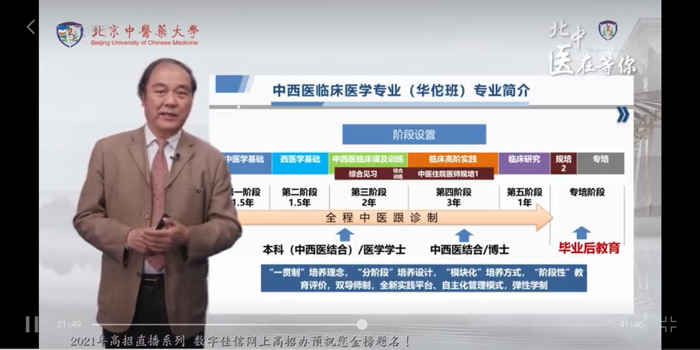

# 劝人学中医，凭啥天打雷劈？（本科实用版1.4）
- 行医逆天改命，怎么不天打雷劈！
- 中医大类区别
    - 中医大类的定义
        - 一种说法，中医大类就是执业医师执照发的是中医执照的（ ）个人倾向此类分法。中医类别(包括中医、民族医、 *中西医结合* ) [医师资格证_百度百科]("https://baike.baidu.com/item/%E5%8C%BB%E5%B8%88%E8%B5%84%E6%A0%BC%E8%AF%81/4254696?fr=aladdin") 
        - 另一种说法，中医大类是学科分类属于中医的。即以下所有，除了中西医临床
    - 细分专业
        - 中医（狭义）
            - 经典又稳妥的选择
        - 中西医临床
            - 现状：普遍分数不比中医专业低，本科与中医无本质区别，但培训体系不健全，难度略高 
            - 理想和现实的差距：中西医结合 对大佬来说是一条大有可为的路子。但是对学渣来说，更多是学习时，想要中西医都学精，结果是两不精。考研与工作爹不疼娘不爱。
            - 在真正临床时，都是学得越多越周全，只是需要时间沉淀 
            - 特殊性：不同学校的中西医结合差异较大。南中医为例：我校中西临有一个好处就是师资比较好。尤其基础学科。因为我们学院以前是基础医学院，老师多，又只有中西临一个独苗，亲儿子师资好。
            - 小结：本科阶段就是个投入多点的中医，相当于绕点路，不至于掉悬崖，备选无妨
        - 中医骨科
            - 骨科课程方向性强，虽然考研能考别的方向但不建议，（力气小的）女生慎报
        - 针灸推拿
            - **实用** 的， **体力** 有一定要求
            - 两个里选针灸的比较多，尤其女生
        - 中医养生、中医康复
            - 较新的专业，其实都差不多
        - 中医儿科、中医妇科
            - 只是本科分科，有侧重，（基本）不限制研究生的选择
    - 注意事项
        - 康复治疗学（老年康复）等等 **不属** 中医学类。 **4年制的** ，授予学位都是理学学士，各学校课程特色也不尽相同，在此不予介绍。
- 中医学制区别
    - 9年制本博连读（参考南中医专业培养计划）
        - 该专业学生前 5 年完成本科阶段的课程学习与临床实习，后 4 年进行临床各科轮转，并师承名医进行专科学习。期间，完成住院医师规范化培训及博士学位的课程，优秀学生将有机会赴海外研习。
        - 毕业后除获得本科毕业证、学士学位证及博士研究生毕业证、博士学位证外，同时获得执业医师资格证和住院医师规范化培训合格证。
        - 学 历：研究生  学制： 9 年
        - 授予学位：医学学士、医学博士
        - 额外参考：北中医的中西临9，仅此一家（2022南中医也有了） 
    - 5+3本硕连读（参考南中医专业培养计划）
        - 按照 “ 整体优化、分段培养 ” 原则，制定和实施本专业人才培养方案。学制前 5 年为本科阶段，后 3 年为住院医师规范化培训及 **专业型硕士研究生** 培养阶段。顺利完成学业并通过相关考核后，将取得本科毕业证、学士学位证、执业医师资格证、住院医师规范化培训合格证、硕士研究生毕业证和硕士学位证。
        - 学 历：研究生  学 制： 5+3 年
        - 授予学位：医学学士、中医硕士专业学位
    - 5年制（参考南中医专业培养计划）
        - 主要课程（代表）
            - 中医基础理论、中医诊断学、中药学、方剂学、针灸学、中医内科学、中医外科学、中医妇科学、中医儿科学、中医骨科伤科学、中医眼科学、中医耳鼻喉科学、正常人体解剖学、生理学、病理学、药理学、诊断学、西医内科学、西医外科学、组织学与胚胎学、医学免疫学与病原生物学、分子生物学、影像诊断学、金匮要略、伤寒论、各家学说、温病学、内经选读、名医医案选、卫生统计学、医学心理学、社会医学、全科医学、预防医学、中西医结合神经病学、急诊医学、中医养生学、医患沟通学、创伤急救学等
        - **为什么要学很多西医内容**
            - 中、西医的比例，各专业在73到55开
            - 公立医院对西医的 **现实需要**
            - 设置西医课程目的是首先成为现代的及格医生，避免特殊疾病的误诊误治——人贵有自知之明，敢说“我不行，另请高明”也是本事
        - 五年制在中医大类考研时基本没有跨考限制。如中西医临床考到针灸，中医儿科考到中医内科
    - 注意事项
        - **现代中医中药专业的天壤之别，医药已分家**
        - 历史的尘埃中，尚有6年制、7年制等各种学制，但目前已经不复存在，无需考虑，只是提醒下查找到古老资料时不要迷惑。本科没有4年制，专科不了解。中医还有“确有专长的师承”路子，供社会人士学习，不了解。
- 转专业与考研工作问题
    - 转专业注意事项
        - **留级** 问题：因为医学的专业性，非医学专业转医学专业一般需要留级。
        - **难度** 与 **限制** ：各学校不尽相同。但因为多是中医药大学之类专业性强的院校，强势专业突出，竞争压力较大。有些专业有转入限制，如南京中医药大学的中医、中西医、临床三专业不能转入（2020年起），但针推、中儿等等不受影响。（22年后又开放了）
    - 考研注意
        - 五年制在中医大类考研时基本没有跨考限制。如中西医临床考到针灸，中医儿科考中医妇科
        - 从2016年起，中医包括中西临 无法考 西医的专业型硕士研究生
        - 考研题目分科主要分为中医综合和西医综合，包括中西医临床的都主要考中医综合，有例外  
        - 专硕就是（侧重）搞临床的意思，学硕就是（侧重）搞研究的意思
        - 医学类考研，专业型硕士比较热门，因为四证合一，自带规培。而学术型则需要额外规培
        - 关键名词：  [临床，四证合一是什么意思? - 知乎]("https://www.zhihu.com/question/423031582") [住院医师规范化培训_百度百科]("https://baike.baidu.com/item/%E4%BD%8F%E9%99%A2%E5%8C%BB%E5%B8%88%E8%A7%84%E8%8C%83%E5%8C%96%E5%9F%B9%E8%AE%AD/1244334?fromtitle=%E8%A7%84%E5%9F%B9&fromid=16610746&fr=aladdin")
    - 学历与工作
        - 最简单最直白的方式：在公众号或官网搜索医院的招聘公告，可直观展示需求。省会大三甲博士起步，二三线城市三甲硕士......
        - 中医医院岗位的确比西医少。
        - 中医学得好，在体制外有出路，墙内开花墙外香。
        - 中医对自身和家人的健康
- 中医药大学浅估
    - 第一梯队
        - 拥有9年制的学校：北上广天南成
        - 双一流：北上广天南成
        - 老四校，老五所：北上广成(南)，都很老
        - 此外学科评估很猛的学校(未来可能是双一流)：黑龙江（据悉管理不佳）
        - 各类排行榜，在此不赘述
    - 一些学校特色 **（纯主观）**
        - 北京：唯一211，综合第一，各种长学制玩的很花，附属医院们似乎不够突出
        - 上海：中医药现代化出名，研究比临床出名，某些专业有复旦借读一年？学校面积小，本科招生少，类精英化培养
        - 广州：中医氛围浓厚，拥有全国综合第一（数据源艾力彼）的广东省中医院
        - 南京：较为均衡，仙林校区设计很有特色，拥有全国综合第二的江苏省中医院。江苏中医氛围也不错
        - 天津：针灸专业强大，院士作镇，甚至想把针推升级成一级学科。
        - 成都：火神派著名，据说宿舍较差，管理相对混乱（略有落寞）
        - 江西：江中牌健胃消食片，研究生岐黄书院有特色
        - 黑龙江：性价比比较高，学校比你还努力，医学顶流up兔八哥母校。据说管理相对混乱
    - 个人认为学科实力（主要科研）最能参考的资料——第四轮学科评估（第五轮年底出（然而并没出））
        - 主观内容请自行分析 [(99+ 封私信) 全国中医药大学排名如何？ - 知乎 (zhihu.com)]("https://www.zhihu.com/question/310669219/answer/1911042699") 
    -  [想学中医药，分数线多少？高考志愿怎么填？这份报考指南请收下]("https://mp.weixin.qq.com/s?__biz=Mzg2ODI1MDEwMA==&mid=2247561023&idx=2&sn=cd048c645660fdfaef7759dc14a9347d&chksm=ceac97a4f9db1eb259ff3cf7d05275586d09ea04aa7f1b0e5960696206fa15dfb72b6fcc92f5&mpshare=1&scene=23&srcid=0628xW38ID0MOYYd38vMPvcw&sharer_sharetime=1656494911377&sharer_shareid=296c763e1e3cd8a11d1651b98bca8ea0#rd")
    - **医学就业的地域性**
    - 学中医，老师＞学校
- 优质视频参考（综述）
    - “同学，来学医吗？”——劝人学医（bushi，医学入坑不完全指南，分享临床...BV1Gr4y137Nu深圳卫健委制作， **有很多高质量中医相关评论**
        -      
    - 给高考完想要报中医专业的孩子们一些意见（我没有别的平台，欢迎转发...BV1n3411w77Y 非常实诚的29岁中医up
        - 强调地域性
        - 不要妖魔化中西医，考研不影响就行
        - 中医的本科教育的确存在问题，但总得从这扇门里面经过
        - **讲了中医本科学习的思路**
        - 中医首先是治病救人的技术，其次才是艺术、文化
    - 你一定要学医的13个理由BV1JW4y1r7Hw 南中医研究生，非常可爱的学姐，做了很多硕士相关的内容
        - 当然是反讽
        - 还有其他系列很不错 
    - 北中医研究生大帅哥 [郑则道道道道道的个人空间_哔哩哔哩_bilibili]("https://space.bilibili.com/14954184") 
        - BV1h7411m7k6中医都学什么？（所有中国）大学的本科教育问题。北中医的校区问题、校园活动。兼听则明。“中医科学吗”这类口水仗浪费时间和生命。 
        - BV1rz4y1D73z中医绝对是 **有效的** 。中医的技术性极强。中医仍然正在发展，研究空间不小。 **需要冷静而持久的热情** 。可惜很多人死读书。（弹幕很多妖魔鬼怪）
        - BV1oq4y1s7oD心路历程：1技能是硬道理；2病人永远存在；3治病救人的情怀。中医的个体性比较强，各人差异大，不一定越老越吃香。没有临床条件， **自学容易被人骗。**
        - BV1664y1Q7Yf劝退：学习辛苦，和电视剧不一样， **西医学的都要学，西医不学的的也要学** 。努力可能也学不好，必须有实践。中医药大学的氛围，唯论文论。     
    - 985院校毕业，软件工程师任性改行学中医，历经磨难成功上岸BV1B54y1o7o1 讲述非院校的学中医方法
    - 【看完这些，再去报考医学院】最现实的临床医学报考指南
        - 供给和需求错位。top高学历人才扎堆内卷，基层无人问。
        - 学医的沉默成本：时间成本，经济成本。补充：其他才能丧失的成本。
- 劝退篇（待完善）
    - （中）医学的现状
        - 人体黑箱
        - 人类渺小，专精一个小方向都难
        - 中医的经验，精华与糟粕
        - 明明白白死，糊糊涂涂活
    - 课本、考试和临床的差距——只会考试（背），不会做事。 **按部就班** ，可以成为三甲医院的好医生，但很难成为一名好中医。这是 院校学中医的最大问题——需要主观能动性 ，需要自学，需要主动找老师跟诊，需要主动寻找锻炼机会
    - 统编教材的问题—— [为什么高质量计算机书籍几乎都是外国人写的？ - 知乎 (zhihu.com)]("https://www.zhihu.com/question/26731218")
    - 医学生的死亡期末构成——疯狂背书
    - 医学大后期问题——学制本来就长，平均还要读到硕士，读书时没啥赚钱的活计，工作薪水也要爬阶梯。后期的确待遇可观且持久，但前期依赖家庭支持，因此不建议家境困难到需要着急工作变现的同学报考。
    - 以下都是存在一定现象，但不绝对——前途光明，道路曲折
        - 医学生就业情况概览：中医穷没人要？硕士博士遍地走？
        - 医生的理想和现实：看好病做好手术没用？科研（造假是捷径）才行？专硕和学硕都被找茬？医院小社会？
        - 中医的院校和民间之争：对立统一、（中）医学生出来不会看病？西化中医？
    - 结论： 光从就业考虑，同等条件学中医并不如学西医。但学出来都是 **救死扶伤** 的。鉴于中医学习的特殊性，没有一定的兴趣和理想是难以坚持下去的，言尽于此。
- 附赠的
    - 我想学中医，有什么推荐的
        - **个人定制自学流程**
            - 1中医基础理论（学80%后可进阶
            - 2中医诊断、伤寒论（同时学，学60%后可进阶）抽空看中药
            - 3方剂学、内经选读、中医内科
            - 中药随学随查，可以下一个 **大家中医** app
            - 书买中国中医药出版社或者上海科技出版社或人民卫生出版社，个人认为版本影响不大
            - 建议伴着视频学习 尤其基础理论和伤寒论
            - *进阶就是这门课上了？%的内容并且觉得差不多听懂了，就可以和下一阶段的课程一起听。不然总上一个老师一门课，也会容易乏味或钻牛角尖*
        - B站 广中医 **潘毅** 教授——《中医基础理论》
        - B站 北中医 **郝万山** 教授——《伤寒论70讲》
            - 有人问，伤寒论不是大三才学吗，需要基础打底。其实伤寒论 **理法方药** 兼备，是自成体系而沟通万有的桥梁，完全可以先从伤寒论学起，临床医案与基础理论结合，避免只学理论造成的虚无缥缈感。
            - 当然，有前提，就是要有个师傅领进门。因此我推荐郝万山老师的视频课。普通话标准，内容翔实有趣，听课如同享受，“为有源头活水来”。解决畏难情绪。
            - 之后可以看胡希恕
            - 《医宗金鉴》一本可成医。（图为国医大师熊继柏的书） 
        - B站 成中医邓中甲《方剂学》
        - 张廷模中药学讲稿
        - （唐）孙思邈《大医精诚》
        - 黄煌：《张仲景50味药证》《中医十大类方》 ​ ​黄煌的书最容易入门，且与其他诸家不矛盾 [张仲景50味药证&中医十大类方摘抄（更新中）]("https://mubu.com/doc6f0hEWRQPcC")
        - b站up：中医界张三（自卖自夸）
        - 《名老中医之路》——老中医们的学成之路，后学自学方法论，高山仰止，景行行止
            -  
        - 此系列习题集，题量合适，答案详实。 
        - 中医界《平凡的世界》——娄绍昆的《中医人生》（大部头，前¼不错，非常适合自学引路
        - 黄煌老师的《我的大学》，启迪思考！文中所著，非一人之经历，实时代之洪流。多少思索的问题，其实前人已经想过了。大道小道，终究要新人去走。（尤其适合院校学生
        - 一个app——微信读书，有许多高低质量中医兴趣专业书籍
        - 一本中医小说——《中医许阳》
        - 西医嘛，b站慕课各显神通。解剖，生理病理，内科比较实际。非要推荐就推荐刘忠保，有大医精诚风范
    - 中医西医特点简单区别 
    - 精挑细选的一个大咖讲专业，特点是全面而不限于中西临专业，都很受用（也可以搜其他专业的，都有） 