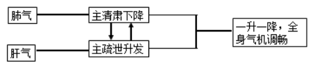

# 中医基础理论
- 理论体系特点
    - 整体观念
        - 概念
            - 关于人体自身完整性，人与自然社会环境统一性的认识
        - 内容
            - 人是一个有机的整体
                - 五脏一体观：构成人体的各个组成部分在结构和功能上是完整统一的
                - 形神一体观：人的形体与精神是相互依附、不可分割的
                - **心** **五脏**
            - 人与自然环境具有统一性
            - 人与社会环境具有统一性
    - 辨证论治
        - 病、证、症的关系
            - **病：** **总过程**
            - **证：** **阶段** **类型** **病理概括**
            - **症：症状** **体征**
        - 概念
            - 辩证：在认识疾病的过程中确立证候，即将四诊所收集到的有关疾病的所有资料，包括症状和体征，运用中医学理论进行分析综合，判断为某种证候的过程（辨明疾病从发生到转归的总体病机）
            - 论治：在通过辩证思维得出证候诊断的基础上，确立相应的治疗原则方法和手段来处理疾病的过程（因证立法、随法立方、据方施治）
        - 同病异治：同一种病，因....证候不同，因而治疗也不同
        - 异病同治：不同的病，因....证候相同，因而治疗也相同
- 精气学说
    - 精的概念
        - **构成宇宙万物的本原** **精源于“水地说”，气源于“云气说”**
    - 精的内容
        - **本原**
        - 精气的运动与变化
        - **中介**
        - **人**
    - 精的应用
        - 构建精气生命理论
        - 构建整体观念
- 阴阳学说
    - 阴阳的概念
        - 含义：哲学范畴，对自然界相互关联的某些事物或现象对立双方属性的概括
        - **“水火者，阴阳之征兆也”“左右者，阴阳之道路也”**
        - **绝对性** **相对性**
        - **昼夜阴阳：上午，阳中之阳；下午，阳中之阴；前半夜，阴中之阴；后半夜，阴中之阳**
        - **心（夏），阳中之阳；肺（秋），阳中之阴；脾，阴中之至（到）阴；肝（春），阴中之阳；肾（冬），阴中之阴**
    - 阴阳的内容
        - 阴阳一体观
            - 阴阳双方在一个统一体中，协调共济
            - 阴阳对立统一、阴阳互根互用、阴阳互藏
        - 阴阳对立制约
            - 阴阳双方在一个统一体中的相互斗争、互相制约和相互排斥
            - **“阴平阳秘，精神乃治”**
        - 阴阳互根互用
            - **“孤阴不生，独阳不长”“阴阳离决，精气乃绝”**
            - **“阴在内，阳之守也；阳在外，阴之使也”“阴中求阳，阳中求阴”**
        - 阴阳交感互藏
            - **内在依据**
            - 阴阳交感：阴阳二气在运动中相互感应而交合，是万物赖以生成和变化的根源
            - 阴阳互藏：相互对立的阴阳双方中的任何一方都包含另一方，阴中有阳，阳中有阴
        - 阴阳消长
            - **对立制约与互根互用**
            - > 四季温度变化
                - 对立制约：阴长阳消、阳消阴长、阳长阴消、阴消阳长
                - 互根互用：阴随阳消、阳随阴消、阳随阴长、阴随阳长
        - 阴阳转化
            - **一定条件** **“寒极生热，热极生寒”“重阳必阴，重阴必阳”**
        - 阴阳的自和与平衡
            - **阴阳自和** **自和是阴阳本性，是阴阳双方自动向最佳目标的发展和运动，是维持事物或现象协调发展的内在机制**
            - **阴阳平衡** **是动态的常阈平衡 “阴平阳秘”（对立、平衡）**
    - 阴阳的应用
        - 在组织结构和生理功能方面的应用
            - 脏腑及形体组织的阴阳属性
                - 上部为阳，下部为阴；体表属阳，体内属阴；背为阳，腹为阴；四肢外侧为阳，四肢内侧为阴；
                - 五脏属里，为阴；六腑属表，为阳；
                - 皮肉为阳中之阳，筋骨为阳中之阴；皮肤为阳中之阳，肌肉为阳中之阴；筋为阴中之阳，骨为阴中之阴
            - 经络系统的阴阳属性：
                - 属腑而行于肢体外侧面的为阳经，一阳分为三阳，因行于上肢与下肢的不同而分称为手足阳明、少阳、太阳经；属脏而行于肢体内侧面的为阴经，一阴化为三阴，分称为手足太阴、厥阴、少阴经；
                - 跷脉与维脉，行于身之内侧者，称阴跷、阴维；行于身体之外侧者，称阳跷、阳维。
                - 督脉行于背，有总督一身之阳经的作用，称为“阳脉之海”。
                - 任脉行于腹，有总任一身之阴经的作用，称为“阴脉之海”。
                - 络脉中分布于体表及身体上部的称为阳络；分布于内脏、肢体深层及身体下部的称为阴络。
        - 在病理方面的应用
            - 六淫属阳邪，饮食居处、情志失调等属阴邪；六淫之中，风邪、暑邪、火（热）邪属阳，寒邪、湿邪属阴
            - “阳胜则热，阴胜则寒”，“阳胜则阴病，阴胜则阳病”，“阳虚则寒，阴虚则热”，是寒热性疾病的病理总纲
        - 在疾病诊断方面的应用
            - 四诊： 色泽分阴阳，色泽鲜明为病属于阳；色泽晦暗为病属于阴
            - 动静喜恶：语声高亢洪亮、多言而躁动者，多属实、属热，为阳；语声低微无力、少言而沉静者，多属虚、属寒，为阴
            - 脉象：以部位分，寸为阳，尺为阴；以动态分，则至者为阳，去者为阴；以至数分，则数者为阳，迟者为阴；以形状分，则浮大洪滑为阳，沉涩细小为阴
            - 八纲辨证中，表证、热证、实证属阳；里证、寒证、虚证属阴。阴阳是八纲辨证的总纲
        - 在疾病预防和治疗方面的应用
            - 养生：“法于阴阳”，“春夏养阳，秋冬养阴”
            - 确定治疗原则 
                - **实则泻之**
                    - **热者寒之**
                    - **寒者热之**
                    - 若在阳盛或阴盛的同时，出现阴虚或阳虚时，于“实者泻之”之中配以滋阴或助阳之品
                - **虚则补之**
                    - **阳病治阴** **“壮水之主，以制阳光”**
                    - **阴病治阳** **“益火之源，以消阴翳”**
                - 阴阳互损导致阴阳两虚应采用阴阳双补的治疗原则　　
                    - 对阳损及阴导致的以阳虚为主的阴阳两虚证，当补阳为主，兼以补阴
                    - 对阴损及阳导致的以阴虚为主的阴阳两虚证，当补阴为主，兼以补阳
            - 分析和归纳药物性能
                - 药性，主要是寒、热、温、凉四种药性，又称“四气”，其中寒凉属阴，温热属阳　　
                - 五味，就是酸、苦、甘、辛、咸五种滋味，辛、甘、淡三味属阳，酸、苦、咸三味属阴　　
                - 升降浮沉，是指药物在体内发挥作用的趋向。升浮之药，其性多具有上升发散的特点，故属阳。沉降之药，其性多具有收涩、泻下、重镇的特点，故属阴
- 五行学说
    - 五行的概念
        - 含义：木、火、土、金、水五种物质及其运动变化，用来归纳宇宙万物并且阐释其相互关系的五种基本属性。
        - 特性
            - 木的特性：木曰曲直　　引申义：具有生长、升发、条达、舒畅等作用或性质的事物和现象。
            - 金的特性：金曰从革　　引申义：具有沉降、肃杀、收敛等性质或作用的事物和现象，归属于金。　　
            - 火的特性：火曰炎上　　引申义：具有温热、上升、光明等性质或作用的事物和现象，归属于火。
            - 土的特性：土爰稼穑　　引申义：具有承载、生化、受纳等作用或性质的事物和现象。　　
            - 水的特性：水曰润下　　引申义：具有滋润、下行、寒凉、闭藏等性质或作用的事物和现象，归属于水。
        - 五行的归类
            - 取象比类法、推演络绎法
            -  五行     五色	五音	五味	五化	五气	五方	五季
            - **角**
            - **徵**
            - **宫**
            - **商**
            - **羽**
            - 
            -  五行      五脏 	五腑 	五官 	形体 	情志 	五声 	变动
            - **怒** **呼   	握**
            - **喜** **笑   	忧**
            - **思** **歌   	哕**
            - **悲** **哭   	咳**
            - **恐** **呻   	栗**
        - 
    - 五行的内容
        - 五行相生与相克
            - 五行相生 指木、火、土、金、水之间存在着有序的递相资生、助长和促进的关系　　
            - 顺序：木→火→土→金→水→木（相邻为相生关系）
            - 五行相克 指木、火、土、金、水之间存在着有序的递相克制、制约的关系
            - 顺序：木→土→水→火→金→木（间隔的为相克关系）　
        - 五行制化
            - 五行之间既相互资生，又相互制约，维持平衡协调，推动事物间稳定有序的变化与发展
            - 五行制化的规律是：五行中一行亢盛时，必然随之有制约，以防止亢而为害。即在相生中有克制，在克制中求发展
        - 五行相乘与相侮（相克）
            - 过度制约或克制
                - 导致五行相乘的原因有两种情况
                - 一是指五行中的某一行过于亢盛，对其所胜行进行超过正常限度的克制，产生相乘，如木亢乘土；
                - 二是五行中某一行过于虚弱，难以抵御其所不胜的正常限度的克制，产生相乘，如土虚木乘等　　
                - 相乘次序：木→土→水→火→金→木
            - 反向制约和克制
                - 导致五行相侮的原因有二　
                - **强盛**
                - **虚弱**
                - 相侮次序：木→金→火→水→土→木。
        - 五行的母子相及（相生）
            - **母病及子**
            - **子病及母**
                - **“子病犯母”**
                - 二是子行虚弱，上累母行，引起母行亦不足，终致子母俱虚　　
                - **“子盗母气”**
    - 五行的应用
        - 在生理方面的应用　　
            - 说明五脏的生理特点 如木有生长、升发、舒畅、条达的特性，肝喜条达而恶抑郁，有疏通气血，调畅情志的功能，故以肝属木。　　
            - 构建天人一体的五脏系统 　　
            - 说明五脏之间的生理联系 　　
        - 在病理方面的应用 　　
            - 五脏病变的相互影响，可用五行的乘侮和母子相及规律来阐释
        - 在疾病诊断方面的应用 　　
            - 五行学说将人体五脏与自然界的五色、五音、五味等都作了相应联系，构成了天人一体的五脏系统，因而观察分析望、闻、问、切四诊所搜集的外在表现，依据事物属性的五行归类和五行生克乘侮规律，可确定五脏病变的部位，推断病情进展和判断疾病的预后。即所谓“视其外应，以知其内脏”。
        - 在疾病治疗方面的应用　　
            - 指导脏腑用药 　　
            - 控制疾病的传变 　
            - 确定治则治法　　
                - 五行相生规律治疗疾病，其基本治疗原则是补母和泻子，即“虚则补其母，实则泻其子”
                - 五行相克规律治疗疾病，其基本治疗原则是抑强扶弱
            - 指导针灸取穴　
            - 指导情志疾病的治疗　　
                - 怒伤肝，悲胜怒
                - 悲伤肺，喜胜悲
                - 喜伤心，恐胜喜
                - 恐伤肾，思胜恐
                - 思伤脾，怒胜思
        - 重点：治则治法 
            - 相生治法
                - 滋水涵木（滋肾阴养肝阴）
                    - 肝阳上亢
                - **益火补土** **肾**
                - > 命门之火
                    - 脾肾阳虚
                - 培土生金（健脾气补肺气）
                    - 肺脾气虚
                - 金水相生（养肺阴滋肾阴）
                    - 肺肾阴虚
            - 相克治法
                - 抑木扶土（疏肝健脾）
                    - 肝脾不和
                - **培土制水**
                - > 邪气
                    - 脾虚湿盛
                - 佐金平木（泻肝清肺）
                    - 肝火犯肺
                - 泻南补北（泻心火滋肾阴）
                    - 心肾不交
            - 方剂
                - 麦门冬汤
                    - 培土生金
                - 一贯煎
                    - 滋水涵木
                    - 抑木扶土
                    - 佐金平木
                - 参苓白术散
                    - 培土生金
                - 百合固金汤
                    - 金水相生
- 藏象学说
    - 藏象的概念与特点
        - 藏象，指藏于体内的内脏及其表现于外的生理病理征象及与自然界相通应的事物和现象　　
        - 藏象学说的主要特点是以五脏为中心的整体观，主要体现在以五脏为中心的人体自身的整体性及五脏与自然环境的统一性两个方面
    - 五脏、六腑、奇恒之腑的生理特点及临床意义
        - 脏有五，即心、肺、脾、肝、肾，合称五脏（在经络学说中，心包亦作为脏，故又称“六脏”）　　
        - 腑有六，即胆、胃、小肠、大肠、膀胱、三焦，合称六腑　　
        - 奇恒之腑亦有六，即脑、髓、骨、脉、胆、女子胞
        - 五脏 化生和贮藏精气
        - 六腑 受盛和传化水谷
        - **五脏** **藏精气而不泻也** **满而不能实** **六腑** **传化物而不藏** **实而不能满也**
        - 奇恒之腑在形态上中空有腔与六腑相类，功能上贮藏精气与五脏相同，与五脏和六腑都有明显区别，故称之
        - **脏病多虚”，“腑病多实**
    - 脏腑精气阴阳的概念和关系
        - 各脏腑之精：是人的一身之精分藏于各脏腑的部分，是支撑各脏腑功能活动的液态精华物质　　
        - 各脏腑之气：是人的一身之气分布于各脏腑的部分，是由脏腑之精化生的。具有推动各脏腑生理功能的作用　　
        - 各脏腑之阴：是一身之阴分布于各个脏腑的部分，具有凉润、抑制、宁静的作用　　
        - 各脏腑之阳：是一身阳气分布于各脏腑的部分，也是各脏腑之气中具有温煦、推动、兴奋等特性的部分　　
        - 关系：脏腑之精化生为脏腑之气，脏腑之气又分为脏腑之阴气和脏腑之阳气
- 五脏
- > **五本： 心——生之本 肺——气之本 脾——仓禀之本 肝——罴极之本 肾——封藏之本​​​​​ 气机升降： 心 ↓ 肾 ↑ 肺 ↓ 肝 ↑ 胃 ↓ 脾 ↑** 
    - 五脏的生理功能与特性
        - 心
        - > 君主之官、生之本、五脏六腑之大主、阳脏、火脏
            - 心的功能
                - 心主血脉&nbsp;
                    - 推动和调控血液在脉道中运行
                    - 心主血
                        - 心行血----指心具有推动血液循行的功能 　　
                        - 心生血----指心具有化生血液的作用“奉心化赤”
                    - 心主脉，
                        - 是指心气推动和调控心脏的搏动和脉的舒缩，使脉道通利，血流通畅
                    - **心气充沛，血液充盈，脉道通利** **心脏的正常搏动**
                - 心藏神 
                    - 统帅全身生理活动和主司精神活动
                    - 人体之神，有广义与狭义之分　　
                    - 广义之神，是整个人体生命活动的主宰和总体现　　
                    - 狭义之神，是指人的意识、思维、情感、性格等精神活动　　
                    - 心所藏之神，既是主宰人体生命活动的广义之神，又包括意识、思维、情感等狭义之神。“心者，君主之官也，神明出焉。”“心者，生之本，神之变也”
            - 心的特性
                - **阳脏**
                    - 生理上心脏必须保持强大的阳气，才能温运血脉，振奋精神，温煦周身　　
                - 心气下降　　
                    - 心火在心阴的牵制下合化为心气下行以温肾，维持人体上下协调
        - 肺
        - > 气之本、气之主、娇脏、水之上源、相傅之官
            - 肺的功能
                - 肺主气司呼吸 
                    - 肺主呼吸之气
                    - 肺主一身之气
                        - 宗气的生成
                        - > 宗气：谷气与自然界清气相结合而积聚于胸中的气，宗气在胸中积聚之处，称为“气海”，又名为膻中
                        - 对全身气机的调节作用
                - 肺主行水 
                    - 宣发肃降运动推动和调节全身水液的输布和排泄
                    - 宣发——将脾气转输的水液和水谷之精中的轻清部分，向上向外布散，上至头面诸窍，外达全身皮毛肌腠；输送到皮毛肌腠的水液在卫气的推动作用下化为汗液，并在卫气的调节作用下有节制地排出体外　　
                    - 肃降——将脾气转输的水液和水谷精微中的稠厚部分，向内向下输送到其他脏腑，并将脏腑代谢所产生的浊液下输至膀胱，成为尿液生成之源　　
                    - **肺为水之上源** 尿少、痰饮、水肿 宣肺利水或降气利水 提壶揭盖
                - 肺朝百脉，主治节　　
                    - 肺朝百脉
                        - 全身的血液都通过百脉流经于肺，经肺的呼吸，进行体内外清浊之气的交换，然后再通过肺气宣降作用，将富有清气的血液通过百脉输送到全身。
                        - **助心行血**
                    - 肺主治节　　
                        - 呼吸 气机 血液 津液
                        - “肺者，相傅之官，治节出焉”
            - 肺的特性
                - 肺为华盖　
                    - 位置最高，覆盖于其他脏腑之上
                - **娇脏**
                    - 肺为清虚之体，性喜清润，不耐寒热，不容异物。　　
                    - 肺主皮毛，通过口鼻与外界相通，寒热燥湿等邪气常易侵犯，人体的痰液水湿也易于停聚：他脏病变也常易影响肺脏。
                - 肺气宣降
                    -  
        - 脾
        - > 后天之本、气血生化之源、孤脏
            - 脾的功能 
                - 脾主运化
                    - 运化食物
                        - 食物经胃的受纳腐熟，被初步消化后，变为食糜，下送于小肠作进一步消化，经脾气的作用，则分为清浊两部分。其精微部分，经脾气的激发作用由小肠吸收，再由脾气的转输作用输送到其他四脏，内养五脏六腑，外养四肢百骸
                    - 运化水液
                        - 指脾对水液的吸收、转输和布散功能，是脾主运化的重要组成部分　　
                            - 上输于肺，通过肺气宣降输布全身　　
                            - 向四周布散，“以灌四傍”，发挥其滋养濡润脏腑的作用　　
                            - 将胃、小肠、大肠中的部分水液经过三焦下输膀胱，成为尿液生成之源　　
                            - 居中枢转津液，使全身津液随脾胃之气的升降而上腾下达，肺之上源之水下降，膀胱水府之津液上升。脾气健运，津液化生充足，输布正常，脏腑形体官窍得养 
                    - 后天之本
                - 脾主统血　　
                    - 是指脾能统摄、控制血液正常地循行于脉内，而不溢出于脉外的功能 　　
                    - 生理意义——是血液正常循行的重要条件之一　　
                    - 表现——血行脉内而不外溢
            - 脾的特性
                - 脾气上升 　　
                    - 脾气具有向上运动以维持水谷精微的上输和内脏位置相对稳定的生理特性　　
                    - 升清
                        - 指脾气的升动转输作用，将胃肠道吸收的水谷精微和水液上输于心、肺等脏，通过心、肺的作用化生气血，以营养濡润全身。若脾气虚衰或为湿浊所困，不得升清，可见“清气在下，则生飧泄” 　　
                    - 升举内脏
                        - 指脾气上升能起到维持内脏位置的相对稳定，防止其下垂的作用。若脾气虚弱，无力升举，可见胃下垂、肾下垂、子宫脱垂、脱肛等
                - 脾喜燥而恶湿 　　
                    - 脾气升动，才能将水液布散全身，而脾气升运的条件之一就是脾体干燥而不被痰饮水湿所困
                    - 脾为 **孤脏** 三焦为 **孤腑**
        - 肝
            - 肝的功能
                - 肝主疏泄　
                    - 疏通、畅达全身气机
                    - ①促进血液与津液的运行输布　　
                    - ②促进脾胃运化和胆汁分泌排泄　　
                    - ③调畅情志　　
                    - **促进男子排精与女子排卵行经**
                    - 肝失疏泄病机
                        - 肝气郁结，疏泄失职
                            - 多因情志抑郁，郁怒伤肝而致。
                            - 临床表现，闷闷不乐，悲忧欲哭，胸胁、两乳或少腹等部位胀痛不舒等症　　
                        - 肝气亢逆，疏泄太过
                            - 多困暴怒伤肝，或气郁日久化火，导致肝气亢逆，升发太过
                            - 临床表现，急躁易怒，失眠头痛，面红目赤，胸胁乳房走窜胀痛，或血随气逆而吐血、咯血，甚则突然昏厥
                            - “血之与气并走于上，则为大厥，厥则暴死，气复反（返）则生，不反则死”　　
                        - 肝气虚弱，疏泄不及，升发无力
                            - 因虚而郁滞
                            - 临床表现，忧郁胆怯、懈怠乏力、头晕目眩、两胁虚闷、时常太息、脉弱等
                            - “肝气虚则恐”
                - 肝主藏血 　　
                    - 贮藏血液、调节血量及防止出血
                    - 肝血涵养肝气：
                        - 肝贮藏充足的血液，化生和涵养肝气，使之冲和畅达，发挥其正常的疏泄功能　　
                    - 肝调节血量：
                        - 在正常情况下，人体各部分的血量，是相对恒定的。但是随着机体活动量的增减、情绪的变化、外界气候的变化等因素，人体各部分的血量也随之有所变化　　
                    - 肝血濡养肝及筋目：
                        - 肝贮藏充足的血液，可濡养肝脏及其形体官窍，使其发挥正常的生理功能　　
                    - 肝血化生和濡养魂，
                        - 维持正常神志及睡眠“肝藏血、血舍魂”　　
                    - 肝为经血之源：
                        - **血海**
                    - 肝防止出血：
                        - 肝主凝血以防止出血。肝气充足，则能固摄肝血而不致出血；肝阴充足，肝阳被涵，则能发挥凝血功能而防止出血　　
            - 肝的特性
                - **刚脏**
                    - 指肝气主升主动，具有刚强躁急的生理特性而言　
                - 肝主升发　　
                    - 指肝气的向上升动和向外发散以调畅气机的生理特性
        - 肾
        - > 封藏之本、五脏阴阳之本、水火之宅、气之根
            - 肾的功能
                - 肾藏精
                    - 生长发育生殖与脏腑气化
                    - 先天之精和后天之精 **肾者，主蛰封藏之本，精之处也** 
                    - ②主生长发育与生殖，指肾精、肾气促进机体生长发育与生殖功能成熟的作用　
                        - 女子七岁，肾气盛，齿更，发长；
                        - 二七而天癸至，任脉通，太冲脉盛，月事以时下，故有子；
                        - 三七，肾气平均，故真牙生而长极；
                        - 四七，筋骨坚，发长极，身体盛壮；
                        - 五七，阳明脉衰，面始焦，发始堕；
                        - 六七，三阳脉衰于上，面皆焦，发始白；
                        - 七七，任脉虚，太冲脉衰少，天癸竭，地道不通，故形坏而无子也　　
                        - 丈夫八岁，肾气实，发长齿更；
                        - 二八，肾气盛，天癸至，精气溢泻，阴阳和，故能有子；
                        - 三八，肾气平均，筋骨劲强，故真牙生而长极；
                        - 四八，筋骨隆盛，肌肉满壮；
                        - 五八，肾气衰，发堕齿槁；
                        - 六八，阳气衰竭于上，面焦，发鬓颁白；
                        - 七八，肝气衰，筋不能动，天癸竭，精少，肾藏衰，形体皆极；
                        - 八八，则齿发去　
                        - **一来齿发长，二来天癸至，三来真牙生，四来筋骨盛，五来发始堕，六来阳气衰，七来天癸竭，八来齿发去**
                    - **五脏阴阳之本** **水火之宅**
                        - 生理上，肾之精、气、阴、阳与他脏之精、气、阴、阳之间，存在着相互资助和相互为用的动态关系。　　
                        - 病理上，两者也相互影响。各脏之精、气、阴、阳不足，最终必然会累及到肾“久病及肾”
                        - 久病入洛，久病入肾
                - 肾主水　　
                    - 主持和调节水液代谢
                    - ①肾气对参与水液代谢脏腑的促进作用
                    - ②肾气的生尿和排尿作用，水液代谢在肾气的蒸化作用下，分为清浊，其清者重新输布周身，其浊者下注膀胱，化成尿液，排出体外
                - 肾主纳气　　
                    - 防止呼吸表浅
                    - 人体的呼吸功能，由肺所主，但吸入的清气，由肺气的肃降下达于肾，必须再经肾气的摄纳潜藏，使其维持一定的深度，以利于气体的交换
                    - **“呼出心与肺，吸入肾与肝” “肺为气之主，肾为气之根”**
            - 肾的特性
                - 肾主蛰守位　　
                    - 藏精、主纳气、主生殖、主二便
                    - 肾中相火（肾阳）涵于肾中，潜藏不露
                        - 君火 相火
                        - “少火”
                        - 壮火
                        - 雷火 龙火
                - 肾气上升
                    - 肾阳鼓动肾阴，合化为肾气上升以济心，维持人体上下协调
                    - **呼出心与肺、吸入肾与肝**
            - 命门
                - 《灵枢·根结》指眼睛　　
                - 《难经》指右肾 　　
                - 功用：有主火、水火共主、非水非火为肾间动气之不同
    - 五脏间的关系
        - 心与肺：
            - 血液运行与呼吸吐纳之间的协同关系 
        - 心与脾：
            - 血液生成方面的相互为用，血液运行方面的相互协调 
        - 心与肝：
            - 行血与藏血以及精神调节 
        - 心与肾：
            - 水火既济、精神互用、君相安位 
        - 肺与脾：
            - 气的生成和水液代谢 
        - 肺与肝：
            - 气机升降 
        - 肺与肾：
            - 水液代谢、呼吸运动、阴阳互资 
        - 肝与脾：
            - 疏泄与运化的相互为用，藏血与统血的相互协调 
        - 肝与肾：
            - 精血同源、藏泄互用、阴阳互资互制 
        - 脾与肾：
            - 先天与后天的互促互助、水液代谢 
    - 五脏与其他的关系
- 六腑
- > 传化物而不藏，实而不能满 “六腑以通为用”
    - 胆
        - **“中精之府”“中正之官”** **奇恒之腑**
        - 胆的功能
            - 贮藏和排泄胆汁，参与饮食物的消化 　　
            - **决断**
    - 胃
        - 胃分为上脘（包括贲门）、中脘（即胃体）和下脘（包括幽门）
        - 胃的功能
            - **受纳** **“太仓”、“水谷之海”**
            - **腐熟** **“水谷气血之海”**
        - 胃的特性
            - 胃气下降：指胃有通利下降的生理功能及特性，以通降为正常 　　
            - 喜润恶燥：胃为阳土，喜润而恶燥，故其病易成燥热之害，可致胃中津液每多受损
        - 胃津、胃气、胃阴、胃阳的生理作用
            - 胃津，即胃中津液。含义有二：一指胃中分泌的津液及摄入的水饮，有滋润胃腑、促进胃气向下运动，助于饮食物受纳和腐熟等作用。二是泛指水谷精微。 　　
            - 胃气的含义，主要有以下四点： 　　
                - 一指推动胃的运动以发挥受纳腐熟水谷功能的一类精微物质。 　　
                - 二指脾气与胃气的合称，又称为“中气”。 　　
                - 三指水谷之气，即水谷之精化生的气，简称谷气。 　　
                - 四是指代一身之气或正气。 　　
            - 胃阴：胃气中具有凉润、抑制作用的部分。不足可出现胃脘嘈杂、隐隐灼痛，干呕，呃逆，舌红少苔，脉细数。 　　
            - 胃阳：胃气中具有温煦、推动作用的部分。不足可出现脘腹胀痛，喜食热饮，食欲减退，呕逆，舌淡苔白，脉沉缓。
    - 小肠
        - 小肠的功能
            - **受盛、化物**
                - 受盛：小肠接受由胃初步消化的饮食物，故小肠是接受胃内容物的盛器 　　
                - 化物：小肠的化物功能是将胃初步消化的饮食物进一步消化，化为精微和糟粕两部分 　　
            - 泌别清浊 　　
                - 所谓“清”，即水谷精微和津液，由小肠吸收，经脾气转输全身
                - 所谓“浊”，即指饮食物经消化后剩余的残渣和部分水液，经胃和小肠之气的作用通过阑门输送到大肠 　　
            - **小肠主液**
                - 概念：指小肠在吸收谷精的同时，吸收了大量津液的生理功能　
                - **利小便所以实大便**
    - 大肠
        - 大肠的功能
            - **传化糟粕**
                - 将由小肠而来的食物残渣，再吸收其中多余的水液，形成粪便，经肛门排出体外 “大肠者，传导之官，变化出焉” 　　
            - **大肠主津**
                - 大肠在传化糟粕过程中，再吸收其中多余的水液，使之形成粪便
    - 膀胱
        - 膀胱的功能
            - **津液之府**
            - **州都之官**
    - 三焦
        - **“孤府”“决渎之官”**
        - 六腑三焦：三焦作为六腑之一，有着特定形态结构与生理机能 　　
            - 生理功能：疏通水道，运行津液——决渎之官。“三焦者，中渎之府也，水道出焉，属膀胱” 　　
        - 部位三焦：作为人体上中下部位的划分　　
            - 上焦——横膈以上的部位，包括心、肺两脏，以及头面部　　
            - 中焦——横膈以下至脐的部位，包括脾胃、肝、胆等　　
            - 下焦——脐以下的部位，包括肾、膀胱、大肠、小肠、女子胞、精室等脏腑以及两下肢　　
            - 生理功能： 　　
            - **元气**
            - **“上焦如雾，中焦如沤，下焦如渎”**
        - 辨证三焦：既非六腑三焦，亦非部位三焦，而是温病发生发展过程中由浅及深的三个不同病理阶段
    - 五脏六腑间的关系
    - > 心：君主之官，神明出焉
肺：相傅之官，治节出焉
肝：将军之官，谋虑出焉
胆：中正之官，决断出焉
膻中：臣使之官，喜乐出焉
脾胃：仓廪之官，五味出焉
大肠：传导之官，变化出焉
小肠：受盛之官，化物出焉
肾者：作强之官，技巧出焉
三焦：决渎之官，水道出焉
膀胱：州都之官，津液藏焉
​

        - 心与小肠 
        - 肺与大肠 
        - 脾与胃 
        - 肝与胆 
        - 肾与膀胱 
- 奇恒之府
    - 六腑与奇恒之府区别 
    - 脑
        - 脑的功能
            - **元神之府**
            - 主司感觉运动 　　
            - 主司精神活动 　
            - **脑为髓海**
        - 脑与五脏精气的关系
            - 脑的生理病理统归于心而分属于五脏，心是君主之官，五脏六腑之大主，神明之所出，故将人的意识、思维及情志活动统归于心，称之曰“心藏神”　　
            - **神又分为“神、魂、魄、意、志”，分别由心、肝、肺、脾、肾五脏主司，即所谓“五神脏”**
            - 脑的功能与五脏密切相关，五脏之精充盈，五脏之气畅达，才能化养五神并发挥其生理机能
    - 女子胞
        - 女子胞的功能
            - 主持月经
            - 孕育胎儿
        - 女子胞与脏腑经脉的关系
            - 女子胞与天癸的关系
                - 天癸，是肾精肾气充盈到一定程度时体内出现的一种精微物质，有促进生殖器官发育成熟、女子月经来潮及排卵、男子精气溢泻，因而具备生殖能力的作用。肾精肾气的盛衰，对女子生殖器官的发育和生殖功能的维持，具有决定性的作用 　　
            - 女子胞与经脉的关系 
                - **冲脉和任脉**
            - 女子胞与脏腑的关系 
                - **心、肝、脾、肾**
- 精、气、血、津液、神
    - 精
        - 精的概念
            - 禀受于父母的生命物质与后天水谷精微相互融合形成的一种精华物质。是人体生命的本原，是构成人体和维持人体生命活动的最基本物质。
        - 精的功能
            - 1.繁衍生命 　　
            - 2.濡养作用　　
            - 3.化血作用 　　
            - 4.化气作用 　　
            - 5.化神作用
    - 气
        - 人气的概念
            - 气是不断运动着的具有很强活力的精微物质，气是构成人体和维持人体生命活动的基本物质之一
        - 人气的生成
            - 气的来源 　　
                - **元气** **宗气**
            - 气的生成 　　
                - 生气之根
                - 生气之源
                - 生气之主
        - 气的运动与气化
            - 1.气机气的运动，称作“气机”　
                - 气的运动形式可归纳为“升、降、出、入”四种形式　　
                - 脏腑之气的运动规律具体而言：　　
                - 心肺在上，在上者宜降　　
                - 肝肾在下，在下者宜升　　
                - 脾胃居中，为升降之枢纽　　
                - 六腑气机是降中寓升
                - 一般规律：　　
                - 升已而降、降已而升、升中有降、降中有升　　
                - 气的升降出入运动失常称“气机失调”。　　
                - 气的运行受阻而不畅通，称作“气机不畅”；
                - 受阻较甚，局部阻滞不通，称作“气滞”； 　　
                - 气的上升太过或下降不及，称作“气逆”； 　　
                - 气的上升不及或下降太过，称作“气陷”； 　　
                - 气的外出太过而不能内守，称作“气脱”； 　　
                - 气不能外达而郁结闭塞于内，称作“气闭”。 　　
            - 气化
                - 概念
                    - **气的运动而产生的各种变化称为气化** **新陈代谢过程**
                - 形式 　　
                    - 精的生成、精化为气、精化为髓、精血同源互化、津液与血同源互化；血的化生与其化气生神、津液的化生与其汗化尿、气的生成与代谢等
        - 气的功能
            - 推动与调控作用 　　
                - 推动作用：气中属阳部分（阳气）的激发、兴奋、促进等作用。
                    - **生长发育** **元气**
                    - ②激发和促进各脏腑经络的生理功能； 　　
                    - ③激发和促进精血津液的生成及运行输布； 　　
                    - ④激发和兴奋精神活动。　 　
                - 调控作用，指气中属阴部分（阴气）的减缓、抑制、宁静等作用
                    - ①抑制和减缓人体的生长发育及生殖功能； 　　
                    - ②抑制和宁静各脏腑经络的生理功能； 　　
                    - ③抑制和减缓精血津液的生成及运行输布； 　　
                    - ④抑制和宁静精神活动。 　　
            - 温煦与凉润作用 　　
            - 防御作用 　　
            - 固摄作用 　　
            - 中介作用
        - 气的分类
            - 一身之气 　　
                - 含义：是活力很强、运行于全身的极细微物质，简称“人气”或“气”　　
                - 生成：先天之精化生为元气，水谷之精化生为谷气　　
                - 分布：行于脉中为营气，行于脉外为卫气；谷气与自然界清气相聚于胸中者为宗气；分布于脏腑、经络者为脏腑之气、经络之气  
            -  
            - 脏腑之气、经络之气 　　
                - 含义：一身之气分布到某一脏腑或某一经络，即成为某一脏腑或经络之气　　
                - 生成：先天元气和后天宗气构成　
                - 分布：脏腑之气分布在各脏腑；经络之气分布在经络系统中　　
                - 生理功能： 经络之气：感应、负载和传导各种刺激、信息达到病所
    - 血
        - 血的生成
            - 1.血液生化之源 　　
                - （1）水谷之精化血　　
                - （2）肾精化血　　
            - **五脏无肝**
                - （1）脾胃 脾胃是气血的化生之源 　　
                - （2）心肺 脾胃运化水谷精微所化生的营气和津液，与肺吸入的清气相结合，贯注心脉，在心气的作用下变化而成为红色血液 　　
                - （3）肾精和血之间还存在着相互资生和转化的关系，故有“精血同源”肾精化血之说 
        - 血的运行
            - 心主血脉——心气推动血液在脉中运行 　　
            - 肝主疏泄——调节血量，维持血液循环及流量的平衡 　　
            - 肝藏血——防止血溢脉外 　　
            - 脾主统血——控制血在脉中运行，防止血溢脉外 　　
            - 肺朝百脉——肺气宣发肃降，调节气机   
        - 血的功能
            - 濡养作用  ：反映在面色的红润、肌肉的丰满与健壮、皮肤和毛发的润泽有华、感觉和运动的灵活自如等方面 　　
            - 化神作用  ：血是机体精神活动的主要物质基础　
    - 津液
        - 津液的概念
            - **津液** 
        - 津液的生成、输布、排泄
            - 津液的生成 
                - 脾胃的运化；
                - 小肠泌别清浊；
                - 大肠主津。 　　
            - 津液的输布
                - **脾、肺、肾、肝和三焦**
                - ①脾气转输布散津液； 　　
                - ②肺气宣降以行水； 　　
                - ③肾气蒸腾气化水液； 　　
                - ④肝气疏泄促水行； 　　
                - ⑤三焦决渎利水道
            - 排泄 
                - 汗液和呼气；尿液；粪便 
        - 津液的功能
            - 1.滋润、濡养全身
            - 2.充养血脉——“津血同源”之说 　　
            - 3.维持人体体温相对恒定
    - 神
        - 神的概念
            - 人体之神，指人体生命活动的主宰及其外在总体表现的统称
            - 广义之神：指人体生命活动的主宰或其总体现，包括形色、眼神、言谈、表情、应答、举止、精神、情志、声息、脉象等方面；
            - 狭义之神：指人的意识、思维、情感等精神活动 　　
        - 神的生成
            - 精气血津液是化神、养神的物质基础 　　
            - 脏腑精气对外界刺激的应答 
        - 神的分类
            - （1）五神：神、魂、魄、意、志 　　
            - （2）情志：七情、五志　　
            - （3）思维：思维活动，意、志、思、虑、智
        - 神的作用
            - （1）调节精气血津液的代谢 　　
            - （2）调节脏腑的生理功能 　　
            - （3）主宰人体的生命活动
    - 关系
        - 气与血的关系 
        - 气与津液的关系 
        - 精血津液的关系 
        - 精气神的关系
            - 1.气能生精、气能摄精； 　　
            - 2.精能化气； 
            - 3.精气化神； 　　
            - 4.神驭精气
- 经络
    - 经络的概述
        - 经络是运行全身气血，联络脏腑形体官窍、沟通上下内外的通道，感应传导信息的通路系统，是人体结构的重要组成部分 
    - 十二经脉
        - 十二经脉走向规律
            - 手三阴经，起于胸中走向手指端，与手三阳经交会；
            - 手三阳经，起于手指端走向头面部，与足三阳经交会；
            - 足三阳经，起于头面部走向足趾端，与足三阴经交会；
            - 足三阴经，起于足趾端走向腹部和胸部，在胸中与手三阴经交会。
            - “手之三阴，从脏走手；手之三阳，从手走头；足之三阳，从头走足；足之三阴，从足走腹。”手三阳经从手走头，足三阳经从头走足，手足六阳经均行经头面部，故称“头为诸阳之会” 
        - 十二经脉交接规律
            - 阴经与阳经在四肢末端交接
                - **食指端**
                - **无名指端**
                - **小指端**
                - **足大趾**
                - **足大趾爪甲后**
                - **足小趾**
            - 阳经在头面部交接
                - **鼻翼旁**
                - **目外眦**
                - **目内眦**
            - 阴经在胸部交接
                - **心**
                - **肺**
                - **胸**
        - 十二经脉分布（阳明少阳太阳，太阴厥阴少阴）
            - 头面部的分布 
                - **额**
                - **侧头**
                - **面颊** **头顶和头后**
            - 四肢部的分布 
                - 上肢内侧为太阴在前，厥阴在中，少阴在后；
                - 上肢外侧为阳明在前，少阳在中，太阳在后；
                - 下肢内侧，内踝尖上八寸以下为厥阴在前，太阴在中，少阴在后；内踝尖上八寸以上则太阴在前，厥阴在中，少阴在后；
                - 下肢外侧为阳明在前，少阳在中，太阳在后 　　
            - 躯干部的分布 
                - **胸部行于腋下** **肩部和肩胛**
                - **胸腹面** **侧面，** **背面**
                - **腹胸面** 足少阴肾经、足阳明胃经、足太阴脾经、足厥阴肝经
        - 十二经脉表里关系
            - 手阳明与太阴为表里，少阳与心主为表里，太阳与少阴为表里，为手阴阳
            - 足阳明与太阴为表里，少阳与厥阴为表里，太阳与少阴为表里，为足阴阳
        - 十二经脉流注次序
            -  
    - 奇经八脉
        - 奇经八脉的特点
            - 任脉、督脉、冲脉、带脉、阴跷脉、阳跷脉、阴维脉、阳维脉
            - 上肢无奇经分布；除带脉外，余者皆由下而上循行；奇经八脉同脏腑没有直接的相互络属关系；相互间又无表里配合关系
        - 奇经八脉的功能
            - 密切十二经脉之间的联系
            - 调节十二经脉气血：十二经脉气血有余时，则流注于奇经八脉，蓄以备用，十二经脉气血不足时，则由奇经“溢出”及时给予补充
            - 与女子胞、脑、髓及肾脏等关系较为密切
        - 奇经八脉的具体功能
            - 督脉：督，有总管、统率的含义
                - **“阳脉之海”**
                - 与脑、髓、肾的功能有关：督脉属脑，络肾。肾生髓，脑为髓海。督脉与脑、肾及脊髓的关系十分密切　
            - 任脉：任，有担任、妊养之意。　　
                - **“阴脉之海”**
                - 任主胞胎：与女子月经、生殖功能有关
            - 冲脉：冲，有要冲、要道的含义　　
                - **“十二经脉之海”、“五脏六腑之海”**
                - **“血海”**
            - 带脉：带，有束带之意，指带脉循行绕身一周，“束带而前垂”的特点　
                - 约束纵行诸经
                - 固护胞胎
                - 主司带下
            - 跷脉：跷有轻健敏捷的意思
                - 主司眼睑开合　
                - 主司下肢运动
            - 维脉：维有维系连接之意
                - 阳维脉维系联络全身阳经；
                - 阴维脉维系联络全身阴经
    - 经别、别络、经筋、皮部
        - 经别    	  
            - 概念    	  
                - 经别，就是从十二经脉别行分出的重要支脉
            - 特点    	  
                - **离、合、出、入**
            - 生理功能    	  
                - **体内**
                - 加强体表与体内、四肢与躯干的向心性联系；
                - **头面**
                - 扩大十二经脉的主治范围；
                - 加强足三阴、足三阳经脉与心脏的联系
        - 别络    	  
            - 概念    	  
                - 从经脉分出的支脉，大多分布于体表。
                - **任脉、督脉** **脾之大络**
            - 特点    	  
                - 别络是络脉中比较主要的部分，对全身无数细小的络脉起着主导作用
            - 生理功能    	  
                - **体表**
                - 别络对其他络脉有统率作用，加强人体前、后、侧面的统一联系；
                - 灌渗气血以濡养全身
        - 经筋    	  
            - 概念    	  
                - 是十二经脉连属于筋肉的体系，其功能活动有赖于经络气血的濡养，并受十二经脉的调节
            - 生理功能    	 
                - **约束骨骼，主司关节运动，保护作用**
        - 皮部    	  
            - 概念    	  
                - 是十二经脉及其所属络脉在皮表的分区，称为十二皮部
            - 功能    	  
                - **保卫机体，抗御外邪**
    - 经络的生理功能
        - 沟通联系作用 联络脏腑器官，沟通上下内外
        - 运输渗灌作用 运行全身气血，营养脏腑组织
        - 感应传导作用 感应传导信息，调节功能平衡
            - 对经穴刺激引起的感应及传导，通常称为“得气”，即局部有酸、麻、胀的感觉及沿经脉走向传导，就是经络感应传导作用的体现
        - 调节作用
    - 应用
        - 阐释病理变化及其传变：
            - 在正常生理情况下，经络有运行气血，感应传导的作用。所以在发生病变时，经络就可能成为传递病邪和反映病变的途径
        - 指导疾病的诊断：
            - 由于经络有一定的循行路线和络属脏腑，它可以反映所属脏腑的病证，故可作为疾病诊断的依据
        - 指导疾病的治疗： 　　
            - 针灸和按摩：
                - 针灸与按摩疗法主要是根据某一经或某一脏腑的病变，在病变的邻近部位或经络循行的远端部位上取穴，通过针灸或按摩，以调整经络气血的功能活动，达到治疗的目的
            - 用药： 　　
                - “药物归经”——某种药对某脏、某经有特殊治疗作用，即将该药引入该经。 　　
                - “引经报使”——某种药物能引导其他药物选择性的治疗某脏、某经的病变。
- 体质
    - 体质概念
        - **形态结构、生理功能和心理状态**
    - 体质构成
        - **形态结构、生理功能、心理状态**
    - 体质特点
        - 先天遗传性 
            - 遗传因素维持着个体的体质特征的相对稳定，是决定体质形成和发展的基础　　
        - 差异多样性 
            - 它通过人体形态、功能和心理活动的差异现象表现出来，因此个体多样性差异现象是体质学说研究的核心问题
        - 形神一体性 
            - “形神合一”是中医学体质概念的基本特征之一
        - 群类趋同性 
            - 同一种族或者聚居在同一地域的人，因为生存环境和生活习惯相同，遗传背景和生存环境具有同一性和一致性，形成了地域人群的不同的体质特征，使特定人群的体质呈现类似的特征，因此，体质具有群类趋同性
        - 相对稳定性 
            - 个体禀赋于父母的遗传信息，使其在生命过程中遵循某种既定的内在规律，呈现出与亲代类似的特征，这些特征一旦形成，不会轻易改变，在生命过程某个阶段的体质状态具有相对的稳定性
        - 动态可变性 
            - 先天禀赋决定着个体体质的相对稳定性和个体体质的特异性，后天各种环境因素，营养状况，饮食习惯、精神因素、年龄变化、疾病损害、针药治疗等，又使得体质具有可变性
        - 连续可测性 
            - 体质的连续性体现在不同个体体质的存在和演变时间的不间断性，体质的特征伴随着生命从始至终的全过程，具有循着某种类型体质固有的发展演变规律缓慢演化的趋势，这使得体质具有可预测性，为治未病提供了可能
        - 后天可调性 
            - 体质既是相对稳定的，又是动态可变和连续可测的，这就为改善体质的偏倾，防病治病提供了可能。
    - 体质与脏腑精气血津液关系
        - 体质与脏腑经络的关系
            - 体质的差异必然 **以脏腑为中心**
        - 体质与精、气、血、津液的关系
            - **精的多少优劣是体质差异的根本**
    - 体质影响因素
        - 1.先天禀赋 　　2.年龄因素 　　3.性别差异 　　4.饮食因素 　　5.劳逸所伤 　　6.情志因素 　　7.地理因素 　　8.疾病针药及其他影响
    - 体质应用
        - 一、体质与发病　　
            - **正气之盛衰**
        - 二、体质与病因病机　　
            - 1.决定个体对某些病因的易感性 
                - 体质反映了机体自身生理范围内阴阳寒热的盛衰偏倾，这种偏倾性决定了个体的功能状态的不同，因此，体质因素决定着个体对某些病邪的易感性、耐受性。　　
            - 2.决定病变的从化
                - 从化，即病情随体质而变化。这种病势依附于质势，从体质而发生的转化，称之为“质化”，亦即从化。　　
            - 3.决定病变的传变 
                - 传变是说疾病的变化和发展趋势，是指病变部位在脏腑经络等之间的传递转移，以及疾病性质的转化和改变疾病传变与否，虽然与邪之盛衰，治疗得当与否有关，但主要还是取决于体质因素。
        - 三、体质与诊治　　
            - 1.指导辨证 
                - 体质是辨证的基础，体质决定疾病的证的类型。
                - 感受相同的致病因素或患同一种疾病，因个体体质的差异可表现出不同的证的类型，即同病异证。
                - 感受不同的病因或患不同的疾病，而体质具有共同点可表现为相同或类似的证，即异病同证。　　
            - 2.指导治疗　　
                - 区别体质特征而治
                    - 在治疗中，常以患者的体质状态作为立法处方用药的重要依据
                - 根据体质特征注意针药宜忌　　
                    - 体质偏阳者宜甘寒、酸寒、咸寒、清润，忌辛热温散；　　
                    - 体质偏阴者宜温补益火，忌苦寒泻火；素体气虚者宜补气培元，忌耗散克伐；　　
                    - 阴阳平和质者宜视病情权衡寒热补泻，忌妄攻蛮补；　　
                    - 痰湿质者宜健脾芳香化湿，忌阴柔滋补；
                    - 湿热质者宜清热利湿，忌滋补厚味；　　
                    - 瘀血质者，宜疏利气血，忌固涩收敛等。　　
                    - 体质强者——耐受性强——剂量宜大　　
                    - 体质弱者——耐受性差——剂量宜小　　
                    - 肥胖体质者——多气血迟涩，对针刺反应迟钝——进针宜深，刺激量宜大，多用温针艾灸　　
                    - 瘦长体型者——气血滑利，对针刺反应敏感——进针宜浅，刺激量相应较小，少用温灸　　
                - 兼顾体质特征重视善后调理 
                    - 疾病初愈或趋向恢复时，调理时皆须兼顾患者的体质特征
        - 四、体质与养生　　
            - 善于养生者，就要修身养性，形神共养，以增强体质，预防疾病，增进身心健康。调摄时就要根据各自不同的体质特征，选择相应的措施和方法。
- 病因
    - 六淫
        - 六淫的概念
            - 六气指风、寒、暑、湿、燥、火六种正常的气候变化，是万物生长变化和人类赖以生存的必要条件 　　
            - 六淫即风、寒、暑、湿、燥、火（热）六种外感病邪的统称，又称为六邪。 　　
            - 六气变为六淫的条件：当自然界气候变化异常，超过了人体的适应能力，或人体正气不足，抗病能力下降，不能适应自然界气候变化而导致发病时，六气则成为六淫
        - 六淫共同的致病特点
            - **外感性**
                - 多从肌表、口鼻而入，或两者同时受邪
            - **季节性**
                - 春季多风病，夏季多暑病，长夏多湿病，秋季多燥病，冬季多寒病
            - **地域性**
                - 西北多燥病，东北多寒病，江南多湿热为病；久居潮湿环境多湿病
            - **相兼性**
                - 六淫邪气两种或两种以上一起侵袭人体致病，称为相兼性。如风寒湿三气杂至，合而为痹也
        - 六淫各自的致病特点
            - 风邪
                - 风邪的性质和致病特点　　
                - **轻扬开泄**
                    - 伤及人体的上部（头、面）和肌表 头痛、汗出、恶风、咽痒咳嗽
                - 风性善行而数变　　
                    - **善行** 病位游走、行无定处 游走性关节疼痛，痛无定处
                    - **数变** 发病迅速 瘙痒时作，疹块发无定处，此起彼伏，时隐时现 发病急，传变也较快
                - 风性主动　　
                    - **主动** 动摇不定 颜面肌肉抽掣，或眩晕、震颤、抽搐、颈项强直、角弓反张、两目上视
                - 风为百病之长　　
                    - 风邪为六淫病邪中的主要致病因素，凡寒、湿、热诸邪多依附于风而侵袭人体，如风寒、风湿、风热等
            - 寒邪
                - **阴邪，易伤阳气**
                    - 恶寒、发热、无汗、鼻塞、流清涕
                    - 脘腹冷痛、呕吐、腹泻
                    - 恶寒蜷卧、手足厥冷、下利清谷、小便清长、精神萎靡、脉微细
                - **凝滞**
                    - 疼痛症状
                - **收引**
                    - 筋脉挛急收缩
                    - 无汗
                    - 头身疼痛，脉紧
            - 暑邪
                - **阳邪，其性炎热**
                    - 暑邪为夏季火热之邪，火热属阳，故暑邪为阳邪　　
                    - 壮热、面赤、脉象洪大
                - **易** **扰神** **，易** **伤津耗气** 
                - **夹湿**
            - 湿邪
                - **阴邪，易伤阳气**
                    - 湿性类水，故属阴邪 　“湿胜则阳微。” 　　
                - **重浊**
                    - 沉重感及附着难移 头身困重、四肢酸楚沉重
                    - 分泌物和排泄物秽浊不清
                - **黏滞，易阻气机**
                    - “黏”即黏腻，滞即停滞、阻滞。湿性黏滞表现为三个方面： 
                    - **黏滞** 分泌物和排泄物黏滞不爽
                    - **缠绵** 病程长，缠绵难愈，反复发作
                    - 三是易阻气机　　
                - **趋下，易袭阴位**
                    - 伤于湿者，下先受之
            - 燥邪
                - **易伤津液**
                - **易伤肺**
            - 火邪
                - **燔灼趋上**
                - 火热易扰心神 　
                - 火热易伤津耗气 　
                - **生风动血**
                - **疮痈**
    - 疠气
        - 疠气概念
            - **传染性**
        - 致病特点
            - 发病急骤，病情危笃
            - 传染性强，易于流行
            - 一气一病，症状相似
    - 七情内伤
        - 七情概念
            - 喜、怒、忧、思、悲、恐、惊
        - 七情与脏腑精气关系
            - 情志活动以五脏精气为基础，各种刺激作用于相应的内脏，表现出不同的情志反应
            - 情志过激又伤五脏精气 ：大喜大惊伤心，大怒郁怒伤肝，过度思虑伤脾，过度悲忧伤肺，过度恐惧伤肾
        - 七情致病特点
            - 1.直接伤及内脏 　
                - 损伤相应之脏
                    - **心、肝、脾** 三脏和 **气血失调**
                - 影响心神
                - 数情交织，易伤心肝脾 
                - 易损伤潜病之脏腑：
                    - 致潜病发作或反复发作
            - 影响脏腑气机 　　
                - **怒则气上、喜则气缓、悲则气消、恐则气下、惊则气乱、思则气结**
            - 多发为情志病 　　
            - 影响病情变化
    - 饮食失宜
        - 饮食不节　　
            - 饮食不节即饥饱失常或饮食规律失常。过饥则营养不良；过饱则损伤肠胃
            - 过饥，指摄食不足，如饥而不得食，或有意识限制饮食，或因脾胃功能虚弱而纳少，或因七情强烈波动而不思饮食，或不能按时饮食等。过饥，一方面因气血亏虚而脏腑组织失养，功能衰退，全身虚弱；另一方面因正气不足，抗病力弱，易感邪而发病。　　
            - 过饱，即饮食过量，或暴饮暴食，或中气虚弱而强食，以致脾胃难以运化而致病。轻则饮食积滞不化，以致“宿食”内停，可见脘腹胀满疼痛，嗳腐泛酸，呕吐、泄泻、厌食等。重则食滞日久，可致脾胃大伤，或可聚湿、化热、生痰而变生他病。
        - 饮食不洁　　
            - 进食不洁净的食物，导致疾病的发生。饮食不洁可以引起各种肠胃疾病、食物中毒和寄生虫病。　　　　
        - 饮食偏嗜　　
            - 多食寒凉损伤脾胃阳气，导致寒湿内生
            - 多食辛热，可使胃肠积热
            - 酸入肝、苦入心、甘入脾、辛入肺、咸入肾，长期偏嗜可损伤内脏　　
            - **多食咸，则脉凝泣而变色**
            - **多食苦，则皮槁而毛拔**
            - **多食辛，则筋急而爪枯**
            - **多食酸，则肉胝而唇揭**
            - **多食甘，则骨痛而发落**
            - 味过于酸，肝气以津，脾气乃绝；　　
            - 味过于咸，大骨气劳，短肌，心气抑；　　
            - 味过于甘，心气喘满，色黑，肾气不衡；　　
            - 味过于苦，脾气不濡，胃气乃厚；　　
            - 味过于辛，筋脉沮弛，精神乃央
    - 劳逸适度
        - 过度劳累 　　
        - **久立伤骨，久行伤筋**
        - 劳神过度　长期用脑过度，思虑劳神而积劳成疾。易耗伤心血，损伤脾气
        - 房劳过度　是指性生活不节，房事过度，耗伤肾精肾气，损及心神
        - **久卧伤气，久坐伤肉**
    - 痰饮
        - 一、痰饮的概念　　
            - 痰和饮都是水液代谢障碍所形成的病理产物
            - 较稠浊的称为痰，清稀的称为饮。
            - 咳吐出的痰液，即“有形之痰”
            - 瘰疬，痰核和停滞在脏腑经络等组织中未被排出的痰液，即“无形之痰”
            - 饮即水液，停留于人体局部者，因部位及症状不同分为“痰饮”“悬饮”“溢饮”“支饮”。　　　　
        - 二、痰饮的形成　　
            - **肺、脾、肾及三焦**
        - 三、痰饮的致病特点　　
            - 阻滞气血运行　　
                - 痰阻经络：肢体麻木、屈伸不利、半身不遂、瘰疬痰核、阴疽流注。　　
                - 痰饮阻肺：胸闷气喘、咳嗽吐痰等　　
                - 痰饮停胃：恶心呕吐等　　
                - 痰阻心脉：胸闷心痛等　　
                - 痰结咽喉形成“梅核气”
            - 影响水液代谢　　
                - 痰湿困脾，脾气不升，可致水湿不运；　　
                - 痰饮阻肺，肺失宣降，可致水液不行；　　
                - 痰饮停滞下焦，影响肾的气化。
            - 易于蒙蔽心神　　
            - 致病广泛，变幻多端　　
                - 由于痰饮随气流行，内可五脏六腑，外可四肢百骸、肌肤腠理。故其致病面广，发病部位不一，且又易于兼邪致病，故有“百病多由痰作祟”之说
    - 淤血
        - 瘀血的概念 　　
            - 体内有血液停滞，包括离经之血积存体内，或血运行不畅，阻滞于经脉及脏腑内的血液均称之为瘀血。 　　
            - 既是病理产物，又有致病作用 　　
            - “瘀血”与“血瘀”的概念不同，血瘀是指血液运行不畅或血液瘀滞不通的病理状态，属于病机学概念；瘀血是指具有致病性的病理产物，属于病因学概念
        - 瘀血的形成 　　
            - **虚、气滞、血寒、血热**
            - 血出致瘀，由于内外伤、气虚失摄或血热妄行等原因造成血离经脉，积存于体内而形成瘀血
        - 瘀血的致病特点 　　
            - 阻滞气机、影响血脉运行、影响新血生成、病位固定，病证繁多
        - 瘀血致病的症状特点 　　
            - 1.疼痛　多表现刺痛，固定不移，夜间尤甚，拒按 　　
            - 2.肿块　体表的瘀血多表现为局部的淤青，而体内的瘀血多为癥块或积块 　　
            - 3.出血　瘀血的出血为紫暗色，夹有血块 　　
            - 4.色紫黯：一是面色紫黯，口唇、爪甲青紫等；二是舌质紫黯，或舌有瘀斑、瘀点等 　　
            - 5.可出现肌肤甲错，脉涩或脉结代等
- 发病
    - 发病的基本原理
        - 正气与邪气的概念　　
            - 正气指人体内具有抗病、驱邪、调节、修复等作用的一类细微物质。　　
            - 邪气泛指各种致病因素，包括六淫、疫疠邪气、七情内伤、劳逸损伤及各种病理产物（如痰饮、水湿、瘀血、结石等）。　　　　
        - **内在因素**
            - 正气是决定发病的关键因素。“正气存内，邪不可干”“邪之所凑，其气必虚”　
            - 1.正虚感邪而发病　正气不足，抗邪无力，邪气乘虚而入，因而发病。　　
            - 2.正虚生“邪”而发病　如内生五邪，气虚生痰、生瘀。　　
            - 3.正气的强弱可决定发病的证候性质　　
                - 邪气盛而正气足——实证；
                - 正气衰而邪气不盛——虚证；
                - 邪气盛而正不抗邪——危证。
        - **重要条件**
            - 1.邪气是导致发病的原因　　
            - 2.影响发病的性质、类型和特点　　
            - 3.影响病情和病位　　
            - 4.某些情况下主导疾病的发生　　　　
        - 邪正相搏的胜负与发病　
            - ①邪气伤人，若正胜邪退则不发病
            - ②若邪胜正负则发病
    - 发病的影响因素
        - 环境与发病 　　
            - 气候因素。 　　
            - 地域因素。 　　
            - 工作、生活环境。 　　
            - 社会环境。 　　 　　
        - 体质与发病 　　
            - 决定发病的倾向性。 　　
            - 产生对某种病邪的易感性。 　　
            - 决定某些疾病发生的证候类型。 　　 　　
        - 精神状态与发病 　　
            - 突然强烈的情志刺激可扰乱气机、伤及内脏而致疾病突发。长期持续性的精神刺激，如悲哀、忧愁、思虑过度易致气机郁滞或逆乱而缓慢发病
    - 发病的类型
        - 感邪即发　　
            - 感邪后立即发病，称为感邪即发，发病迅速。在临床上为常见的发病类型。　　
            - ①新感外邪较盛—风寒、风热、温热　　
            - ②情志剧变—暴怒、过悲—气机逆乱、气血失调　　
            - ③毒物所伤—有毒食品、药物中毒　　
            - ④外伤—伤人即病　　
            - ⑤感受疠气。　　　　
        - 徐发　　
            - 徐发，指徐缓起病，感邪后缓慢发病。徐发，主要与相应的致病因素、体质因素相关。　　
            - 内伤病—思虑、房事、嗜酒—积久成疾　　
            - 外感湿邪—起病缓慢
        - 伏而后发　　
            - 伏而后发，系与感邪即发相对而言。感受邪气后，病邪在体内潜伏一段时间，或在诱因的作用下，过时而发病。多见于外感疾病及某些外伤。　　
            - **外感病—春伤于风，夏必飧泻**
            - **外伤病—破伤风、狂犬病**
        - 继发　　
            - 继发就是在原发疾病的基础上，继而发生新的疾病。　　
            - 继发，系与原发相对而言，且二者间有着十分密切的病理联系：原发病是继发病的前提和依据，继发病是在原发病的基础上产生的新的病证。　　
            - **中风、黄疸、积聚**
            - **小儿食积—疳积**
        - 合病
            - 两经同病
        - 并病
            - 一病未愈，又患新病
- 病机
    - 邪正盛衰
        - 邪正盛衰与虚实变化
            - “邪气盛则实，精气夺则虚”，指出虚实两种不同病理状态的实质。
            - 壮热、狂躁、声高气粗、腹痛拒按、二便不通、脉实有力、舌苔厚腻 外感六淫和疠气致病的初期和中期 内伤病变
            - 神疲体倦、面色无华、气短、自汗、盗汗，或五心烦热，或畏寒肢冷，脉虚无力 素体虚弱 外感病的后期 慢性病证 暴病吐利、大汗、亡血
            - 虚实错杂　　
                - 虚中夹实：
                    - 以正虚为主，又兼有实邪为患的病理状态。如 **脾虚湿滞** 病变，即是由于脾气亏损，运化无力，而致湿自内生，阻滞中焦所致。临床上既有脾气虚弱的神疲肢倦、食少、食后腹胀、大便稀等症状，又兼见湿滞的口黏、舌苔厚腻等。
                - 实中夹虚：
                    - 以邪实为主，又兼有正气虚损的病理变化。如外感热病发展过程中，由于热邪耗伤津液，可形成 **邪热炽盛兼津液损伤** 之证。临床表现既有高热气粗、心烦不安、面红目赤、尿赤便秘、苔黄脉数等实热，又兼见口渴引饮、舌燥少津等津液不足之症。
            - 虚实真假：　　
                - **真实假虚**
                    - 因邪气亢盛，结聚于内，阻滞经络，气血不能外达所 **脉实，通因通用**
                    - **热结旁流；瘀血崩漏；食积腹泻**
                - **真虚假实**
                    - 因正气虚弱，脏腑经络之气不足，推动无力所致 **脉虚，塞因塞用**
                    - **血虚闭经；脾虚腹胀**
        - 邪正盛衰与疾病转归　　
            - 正胜邪退　
                - 疾病可以较快地趋于好转、痊愈
            - 邪去正虚　
                - 指在疾病过程中，正气抗御邪气，邪气退却而正气大伤的病理变化。邪去正虚多见于重病的恢复期，其最终的转归一般仍然是趋向好转、痊愈
            - 邪胜正衰　
                - 指邪气亢盛，正气虚弱，机体抗邪无力，疾病趋于恶化、危重，甚至向死亡转归的一种病理变化
            - **邪正相持**
                - 指在疾病过程中，机体正气不甚虚弱，而邪气亦不亢盛，则邪正双方势均力敌，相持不下，病势处于 **迁延** 状态的一种病理变化
            - **正虚邪恋**
                - **缠绵难愈** **后遗症**
    - 阴阳失调
        - 阴阳偏盛　　
            - 是指人体阴阳双方中的某一方的病理性亢盛状态，属“邪气盛则实”的实证病机　　
            - 病机的主要特点：阴阳中的一方偏盛，而另一方不虚。阴阳具有相互制约的变化规律。即阳长则阴消，阴长则阳消。体现在：　　
            - 阳偏盛必然会耗阴，导致阴不足——“阳盛则阴病”　　
            - 阴偏盛必然会损阳，导致阳气虚损——“阴盛则阳病”
            - 阴偏盛　机体在疾病过程中所出现的一种阴气偏盛、功能障碍或减退、产热不足，以及病理性代谢产物积聚的病理状态，多表现为阴胜而阳未虚的实寒证
            - 阳偏盛　机体在疾病过程中出现的一种阳气偏盛、功能亢奋、热量过剩的病理状态，多表现为阳热亢盛而阴液未亏的实热证
        - 阴阳偏衰　　
            - 指人体阴阳双方中的一方虚衰不足的病理状态，属“精气夺则虚”的虚证
        - 阴阳互损　　
            - 阴阳互损是指在阴或阳任何一方虚损的前提下，病变发展影响到相对的一方，形成阴阳两虚的病理变化。　
            - 无论阴虚或阳虚，多在损及肾阴肾阳而致肾阴阳失调的情况下，发生阴阳互损。阴阳互损是阴阳的互根互用关系失调而出现的病理变化，一般有两种情况，即阴损及阳和阳损及阴。　　
            - 阴损及阳，以阴虚为主的阴阳两虚的病理状态。　　
            - 阳损及阴，以阳虚为主的阴阳两虚的病理状态
        - 阴阳格拒　　
            - 是在阴阳偏盛至极的基础上由阴阳双方相互排斥而出现寒热真假病变的一类病机，包括阴盛格阳和阳盛格阴两方面
            - **真寒假热** **热因热用**
            - **真热假寒** **寒因寒用**
        - 阴阳亡失　　
            - 是指机体阴液或阳气突然大量亡失，导致生命垂危的一种病理状态。包括亡阴和亡阳两类
            - **亡阴**
            - **亡阳**
    - 精气血失常
        - 精的失常　　
            - 精虚　　
                - 指由于先天禀赋不足或后天脾胃虚弱而致的肾精或水谷精微不足而产生的病理变化
            - 精施泄失常　
                - 失精：
                    - 指男子生殖之精排泄过度，导致肾精和水谷之精大量丢失的病理状态。临床表现：精液排泄过多，或兼有滑精、梦遗、早泄等症，并兼有精力不支、思维迟钝、失眠健忘、少气乏力、耳鸣目眩等症　　
                - 精瘀：
                    - 是指男子精滞精道，排精障碍而言。临床表现：排精不畅或排精不能，可伴精道疼痛、睾丸小腹重坠、精索小核硬结如串珠、腰痛、头晕等症状
        - 气的失常　　
            - 气虚　
                - 系指一身之气耗损、功能失调、脏腑功能衰退、抗病能力下降的病理状态　
                - 表现：气虚常见精神萎顿、头晕耳鸣、倦怠乏力、自汗、易于感冒、面白、舌淡、脉虚无力或微细等症状
            - 气机失调　
                - 气滞　
                    - 指气的流通不畅，郁滞不通的病理状态。
                    - **肺、脾、胃、肝**
                    - ①情志抑郁；
                    - ②痰、湿、食积、瘀血等的阻滞；
                    - ③肝失疏泄、大肠失于传导等。　　
                    - 气滞的共同特点是闷、胀、痛
                - 气逆　
                    - 指气升之太过，或降之不及，以脏腑之气逆上为特征的一种病理状态　
                    - **肺、胃、肝**
                    - 临床特征：气逆最常见于肺、胃和肝等脏腑。肺气上逆，发为咳逆上气；胃气上逆，发为恶心、呕吐、嗳气、呃逆；肝气上逆，发为头痛头胀、面红目赤、易怒等症。
                - 气陷　
                    - 指气的上升不足或下降太过，以气虚升举无力而下陷为特征的一种病理状态。
                    - 原因：气陷多由气虚病变发展而来，尤与脾气的关系最为密切。
                    - 临床特征：①上气不足，头目失养，出现头晕、眼花、耳鸣；②中气下陷，指脾气虚损，升举无力，气机趋下，内脏位置维系无力，而发生某些内脏的位置下移，形成胃下垂、肾下垂、子宫脱垂、脱肛等病变
                - 气闭　
                    - 即气机闭阻，外出严重障碍，以致清窍闭塞，出现昏厥的一种病理状态。临床特征：以突然昏厥，不省人事为特点。阳气内郁，不能外达，致四肢欠温，四肢拘挛
                - 气脱　
                    - 即气不内守，大量向外亡失，以致功能突然衰竭的一种病理状态
                    - 原因：①正不敌邪；②慢性病中正气长期消耗而衰竭，以致气不内守而外脱；③因大出血、大汗等气随血脱或气随津泄而致气脱
                    - 临床特征：面色苍白、汗出不止、目闭口开、全身瘫软、手撒、二便失禁、脉微欲绝或虚大无根等症状
        - 三、血的失常　　
            - 血的失常，主要表现在两个方面：一是血的生化不足或者耗伤太过，或血的濡养功能减弱而形成血虚的病理状态。二为血的运行失常，或为血行迟缓，或血行逆乱，从而导致血瘀、出血等病理变化。
        - 精、气、血关系失调　　
            - 精与气血关系的失调　　
                - 精气两虚　　精血不足　　气滞精瘀和血瘀精阻
            - 气血关系的失调　　
                - 气滞血瘀　
                    - 指因气的运行不畅，导致血液运行障碍，继而出现血瘀的病理状态　　
                    - **肝、心、肺**
                - 气虚血瘀　
                    - 指因气对血的推动无力而致血行（心）不畅，甚至瘀阻不行的病理状态
                - 气不摄血　
                    - **脾、肝**
                - 气随血脱　
                    - 是指在大量出血的同时，气也随血液的流失而脱散的病理变化
                - 气血两虚　
                    - 即气虚和血虚同时存在，组织器官失养而致人体功能衰退的病理状态
    - 津液代谢失常
        - 津液不足　　
            - 津液不足，
                - 是指津液亏损，脏腑组织失于濡养，表现一系列干燥枯涩特征的病理状态。　　
                - 导致津液不足的原因：一是热邪伤津，二是耗失过多，三是生成不足。　　　　
        - 津液输布、排泄障碍　　
            - 津液输布障碍　
                - 是指津液得不到正常输布，导致津液在体内环流迟缓，或在体内某一局部发生滞留，形成内生水湿或痰饮。津液输布障碍跟肺失宣发和肃降，津液不得正常布散；脾失健运，运化水液功能减退，可致水饮不化；肝失疏泄，气机不畅，气滞津停；三焦的水道不利等有关。　　
            - 津液的排泄障碍　
                - 主要是指津液转化为汗液（有赖肺气的宣发功能）和尿液（有赖肾气的蒸化功能）的功能减退，而致水液潴留，溢于肌肤为水肿。
        - 津液与气血关系失调　　
            - 水停气阻　
                - 指津液代谢障碍，水湿痰饮停留导致气机阻滞的病理状态。　　
            - 气随津脱　
                - 指津液大量丢失，气失其依附而随津液外泄，从而导致阳气暴脱亡失的病理状态。　　
            - 津枯血燥　
                - 主要是指津液亏乏，甚则枯竭，从而导致血燥虚热内生或血燥生风的病理状态。　　
            - 津亏血瘀　
                - 指津液耗损而导致血行瘀滞不畅（血液黏稠度增加，脉道不滑利）的病理状态。　　
            - 血瘀水停　
                - 是指因血脉瘀阻，血行不畅导致津液输布障碍而水液停聚的病理变化。血瘀则津液不行，从而导致津停为水湿痰饮
    - 内生“五邪”
        - 内生“五邪”的概念　　
            - 内风”“内寒”“内湿”“内燥”和“内火
            - 病机 病因
        - 风气内动　　
            - 内风，是体内阳气亢逆变动而形成一种以动摇、眩晕、抽搐、震颤为临床特征的各种病理状态。
            - **肝**
            - 根据其形成原因可分为以下四类：　　
                - **热极生风**
                - **肝阳化风**
                - **阴虚风动**
                - **血虚生风**
        - 寒从中生　　
            - 定义　
                - 指机体阳气虚衰，温煦气化功能减退，虚寒内生，或阴寒之邪弥漫的病理状态。　　
            - 形成原因　
                - 内寒形成多见于心脾肾阳气虚衰。　　
            - 临床表现　
                - 主要因阳虚阴盛所致的阳热不足、温煦失职、血脉收缩、血流减慢的“收引”症状，面色苍白，畏寒喜热，四肢不温，舌质淡胖，苔白滑润，脉沉迟弱或筋脉拘挛，肢节痹痛等。临床特点：冷、白、静、稀、润。
        - 湿浊内生　　
            - 定义　
                - “内湿”，指由于脾的运化功能和输布津液的功能障碍，从而引起水湿痰浊停滞的病理状态　
            - 形成原因　
                - 脾的运化失职是湿浊内生的关键，但脾主运化有赖肾阳的温煦气化，故肾阳虚亦易导致湿浊内生　　
            - 临床表现　　
                - 主要有湿邪重浊黏滞，阻遏气机的症状，如头闷重如裹、肢体重着或屈伸不利。湿犯上焦，见胸闷咳嗽；湿阻中焦，见脘腹痞满，食欲不振，口腻或口甜，舌苔厚腻；湿滞下焦，见腹胀便溏，小便不利；水犯肌肤，则发为水肿
        - 津伤化燥　　
            - 定义　
                - “内燥”。指机体津液不足，人体各组织器官和孔窍失其濡润而出现干燥枯涩的病理状态　
                - **肺、胃、大肠**
            - 形成原因　
                - 久病耗伤阴津，大汗、大吐、大下或亡血、失精，实热伤津及湿邪化燥等　　
            - 临床表现　　
                - 内燥病变可发生于各脏腑组织，但以肺、胃及大肠为多见　　
                - 津液枯涸的阴虚内热之症，如肌肤干燥不泽、起皮脱屑，甚则皲裂、口燥、咽干、唇焦、舌上无津甚或光红皲裂、鼻干目涩、大便燥结、小便短赤等。在肺则干咳无痰、甚则咯血；以胃燥为主时，可见食少、舌光红无苔；若系肠燥，则兼见便秘等症
        - 火热内生　　
            - 实火　
                - 阳气过盛化火的“壮火”，又称为“气有余便是火”
                - 外感六淫病邪，郁而从阳化火
                - 病理性代谢产物（如痰、瘀血、结石等）和食积、虫积等邪郁化火
                - 因情志刺激，气机郁结，气郁日久化火等。临床多表现为壮热、烦渴、尿赤、便结、舌苔黄、脉数有力等　　
            - 虚火　
                - 阴气亏虚，不能制阳，阳气相对亢盛而阳亢化热化火，虚热虚火内生。一般说来，阴虚内热多见全身性的虚热征象，如五心烦热、骨蒸潮热、面部烘热、消瘦、盗汗、舌红少苔、脉细数无力等；阴虚火旺，多见集中于机体某一部位的火热征象，如虚火上炎所致的牙痛、齿衄、咽痛、升火颧红等。此外，气虚无力推动机体的精血津液的代谢，可致代谢迟缓或郁滞而虚火内生　　
            - 临床特点：热、赤、动、稠、燥
    - 疾病传变
- 防治原则
    - 预防
        - 预防与治未病的概念 　　
            - 未病先防和既病防变
        - 未病先防 　　
            - 养生以增强正气。
                - 其措施主要有：①顺应自然，②养性调神，③护肾保精，④形体锻炼，⑤调理饮食，⑥针灸、推拿、药物调养等。 　　
            - 防止病邪侵害
                - ①避其邪气，“虚邪贼风，避之有时。”②药物预防以防止病邪伤害
        - 既病防变 　　
            - 既病防变是指在疾病发生之后，力求做到：
            - “故邪风之至，疾如风雨，故善治者治皮毛，其次治肌肤，其次治筋脉，其次治六腑，其次治五脏。治五脏者，半死半生也” 　
            - 防止疾病的传变：①阻截病传途径；②先安未受邪之地
    - 治则
        - 治病求本、治则、治法的概念　　
            - 治病求本：就是指在治疗疾病时，通过辨析其病因病机，抓住疾病的本质，并针对疾病的本质进行治疗　　
            - 扶正祛邪、调整阴阳、正治反治、治标治本、三因制宜
            - 汗、吐、下、和、温、清、补、消
        - 正治与反治　　
            - 正治（逆治）
                - 逆其证候性质而治的一种常用治疗法则，适用于疾病征象与疾病本质一致的病证　　
                - 寒者热之、热者寒之、虚则补之、实则泻之
                    - 寒者热之是指寒性病证出现寒象，用温热方药来治疗。即以热药治寒证。　　
                    - 热者寒之是指热性病证出现热象，用寒凉方药来治疗。即以寒药治热证。　　
                    - 虚则补之是指虚损性病证出现虚象，用具有补益作用的方药来治疗。即以补益药治虚证。　　
                    - 实则泻之是指实性病证出现实象，用攻逐邪实的方药来治疗。即以攻邪泻实药治实证。
            - 反治（从治）
                - 是指采用方药或施术的性质顺从疾病的假象而治的一种治疗原则。适用于疾病的征象与其本质不完全吻合的病证　　
                - 热因热用、寒因寒用、塞因塞用、通因通用
                    - 热因热用即以热治热，是指用热性药物来治疗具有假热征象的真寒假热证　　
                    - 寒因寒用即以寒治寒，是指用寒性药物来治疗具有假寒征象的真热假寒证　　
                    - 塞因塞用即以补开塞，是指用补益药物来治疗具有闭塞不通症状的真虚假实证　　
                    - 通因通用即以通治通，是指用通利的药物来治疗具有通泻症状的真实假虚证
        - 治标与治本　　
            - 定义　在中医学中常用来概括病变过程中矛盾的主次先后关系。治疗疾病时，要根据病情的标本主次不同，灵活掌握治疗的先后缓急。　　
            - 方法　　
                - 缓则治本　
                    - 多用在病情缓和、病势迁延、暂无急重病状的情况下，此时必须着眼于疾病本质的治疗。如痨病肺肾阴虚之咳嗽，肺肾阴虚是本，咳嗽、潮热、盗汗是标，采滋补肺肾之阴以治其本，本病得以恢复，咳嗽盗汗等诸症也自然会消除　　
                - 急则治标
                    - 适用于病情严重，在疾病过程中又出现某些急重症状的情况。这时则应当先治或急治。如病因明确的剧痛，频繁呕吐，二便不通等，可分别采用缓急止痛、降逆止呕、通利二便等治标之法缓解危机。又如水臌病人肝血瘀阻为本，腹水为标，先治标病之腹水，待腹水减退，病情稳定后，再治其肝病。又如大出血病人，应采用“急则治其标”紧急止血，待血止，病情缓和后再治其本　　
                - 标本兼治　
                    - 病变过程中标本错杂并重时，当标本兼治。如素体气虚，抗病力低下，反复感冒，如单补气则易留邪，只解表则易伤正，当标本兼顾，治宜益气解表等
        - 扶正与祛邪　　
            - 扶正祛邪的概念　　
                - 扶正，即扶助正气以提高机体的抗病能力。适用于各种虚性病变，即“虚则补之”　　
                - 祛邪，即祛除邪气以安正气。适用于各种实性病变，即所谓“实则泻之”　　
            - 方法与运用　　
                - 扶正多用补虚的方法，祛邪多用泻实的方法
                - 以正虚为主要矛盾，邪气不盛的虚性病证，采用补虚法　
                - 以邪实为主要矛盾，正气未衰的实性病证，采用祛邪法
                - 正虚邪实病证，而且扶正不致留邪，祛邪不会伤正者，采用扶正祛邪兼用的方法
                - 虽邪盛正虚，但正气尚能耐攻，若兼顾扶正反会助邪的病证，采用先祛邪后扶正的方法
                - 正虚邪实，正气过于虚弱，若兼以攻邪，则反而更伤正气者，应采用先扶正后祛邪的方法
        - 调整阴阳　　
            - 方法　　
                - 损其有余　适用于阴阳中任何一方偏盛有余的实证。包括两个方面：　　
                    - 泻其阳盛：适用于“阳胜则热”的实热证，即“热者寒之”　　
                    - 损其阴盛：适用于“阴胜则寒”的实寒证，即“寒者热之”　　
                - 补其不足（阴阳偏虚）也包括两个方面：　　
                    - 阴阳互制之调补阴阳：阴虚则热的虚热证，治宜滋阴以抑阳。阳虚则寒的虚寒证，治宜扶阳以抑阴。　　
                    - 阴阳互济之调补阴阳：对于虚热证与虚寒证，可用阴中求阳与阳中求阴的治法。此即阴阳互济的方法。阴中求阳：即补阳时适当佐以补阴药；阳中求阴：即补阴时适当佐以补阳药。　　
                - 阴阳两补（阴阳互损）对阴阳两虚则可采用阴阳并补之法治疗。但须分清主次而用：
                    - 阳损及阴，出现以阳虚为主的阴阳两虚，则应在补阳的基础上辅以滋阴之品。
                    - 阴损及阳，出现以阴虚为主的阴阳两虚，则应在滋阴的基础上辅以补阳之品
        - 调理精、气、血、津液　　
            - （1）调理气与血的关系　　（2）调理气与津液的关系　　（3）调理气与精的关系　　（4）调理精血津液的关系
        - 三因制宜　　
            - 因时、因地、因人制宜，是指治疗疾病要根据季节、地区以及人的体质、性别、年龄等不同而制定适宜的治疗方法。　　
            - “用寒远寒，用凉远凉”
            - 因地制宜　根据不同地区的地理特点，来考虑治疗用药的一个原则。　　
            - 因人制宜　根据病人的年龄、性别、体质等不同特点，来制订适宜的治疗原则，称为“因人制宜”
- 养生与寿夭
    - 养生
        - 养生的原则　
            - 养生，又称道生、摄生、保生。
            - **①顺应自然。②形神兼养。③调养脾肾。④因人而异。**
        - 养生的方法　
            - ①适应自然，避其邪气。②调摄精神，内养真气。③饮食有节，谨和五味。④劳逸结合，不可过劳。⑤和于术数，适当调补。
    - 寿夭
        - 脏腑精气的充盛及其功能的协调是生命进程的基础； 　　
        - 形神合一是生命的保证； 　　
        - 肾精、肾气是构成生命、维持生命活动的根本
        - 人体生命活动的进程和发展变化规律
            - 十岁，五脏始定，血气已通，其气在下，故好走。
            - 二十岁，血气始盛，肌肉方长，故好趋。
            - 三十岁，五脏大定，肌肉坚固，血气盛满，故好步。
            - 四十岁，五脏六腑十二经络皆大盛以平定，腠理始疏，荣华颓落，发颇斑白，平盛不摇，故好坐。
            - 五十岁，肝气始衰，肝叶始薄，胆汁始灭，目始不明。
            - 六十岁，心气始衰，苦忧悲，血气懈惰，故好卧。
            - 七十岁，脾气虚，皮肤枯。
            - 八十岁，肺气衰，魄离，故言善误。
            - 九十岁，肾气焦，四脏经脉空虚。百岁，五脏皆虚，神皆去，形骸独居而终矣
        - 决定寿夭的基本因素
            - 脏腑功能协调者寿。
                - “人之寿夭各不同，或夭寿，或卒死，或病久，愿闻其道……五脏坚固，血脉和调，肌肉解利，皮肤致密，营卫之行不失其常，呼吸微徐，气以度行，六腑化谷，津液布扬，各如其常，故能长久”
            - 肾精精气充盛者寿。
                - “有其年已老而有子者，何也？……此其天寿过度，气脉常通，而肾气有余也” 
            - 与天地融为一体者寿。
                - “夫四时阴阳者，万物之根本也，所以圣人春夏养阳，秋冬养阴，以从其根，故与万物沉浮于生长之门”
- 