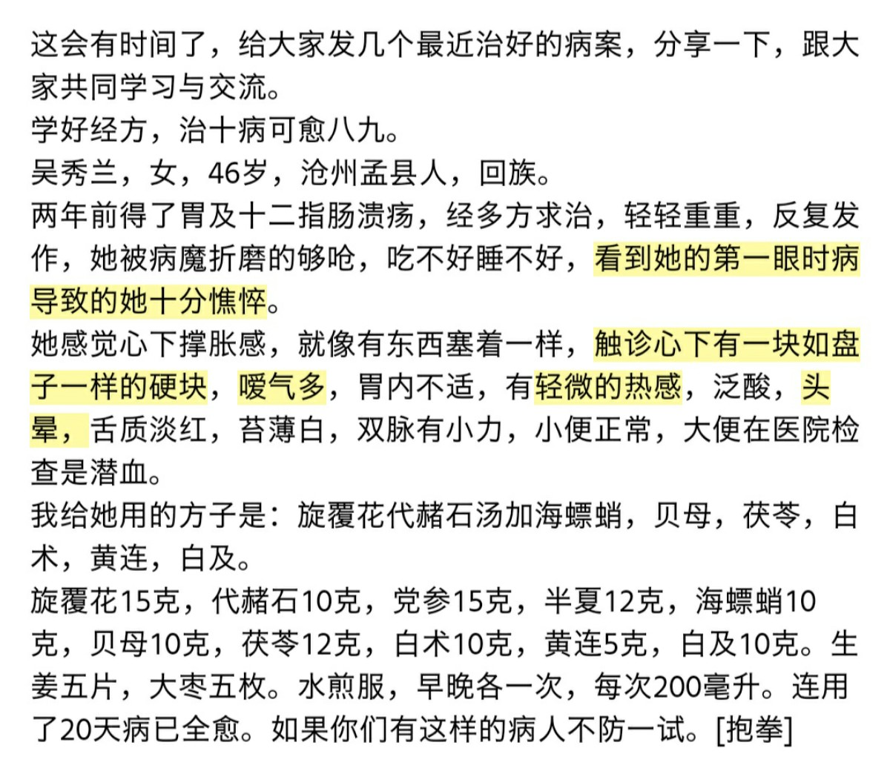

# 中医妇科学
- 女性生殖解剖与生理
    - 胞宫
        - 首见于北宋«活人书»。
        - 包括子宫、子管（输卵管）、子核（卵巢）、胞脉、胞络。→女性最重要的生殖器官。
        - 子宫口称为子门。
    - 女性外阴→阴户
    - 女性阴道口→玉门。（未嫁属玉门，未产属龙门，已产属胞门。）
    - 女性的生理
        - 月经
            - 子宫定期出血的生理现象。
            - 月经周期：月经出血的第一天为月经周期的开始，至下一次月经出血的第一天，为一个月经周期。约28天左右。
            - 经期：每次月经的持续时间。3-7天为正常。
            - 绝经：妇女到49岁月经自然停止，称为绝经。
            - **特殊名词**
                - 月经定期两月一至：并月
                - 月经定期三月一至：居经、季经
                - 月经一年一至：避年
                - 终身不行经而能受孕：暗经
                - 孕妇在月经早期仍按照月经周期定期少量出血而无损于胎儿：激经、盛胎、垢苔
- 绪论
    - 黄帝内经✔✔✔
        - 最早描述了女性的生殖器官→女子胞。
        - 记载了妇科学第一张药方：四乌贼骨一芦茹丸。
    - 难经✔✔✔
        - 最早提出左肾右命门之说。
    - 神农本草经✔✔✔
        - 紫石英条下首见“子宫”之说。
    - 晋代※王叔和※脉经✔✔
        - 首次提出了特殊的月经现象，居经、避年、激经。
    - 隋代※巢元方※诸病源候论✔✔✔
        - 首次提出冲任损伤是妇科发病的主要病机。
    - 宋代✔✔✔
        - 妇产科最早独立分科。
        - **首次提出女子以血为根本**
    - 唐代※昝殷※经效产宝✔✔
        - 第一部理法方药完备的产科专著。
    - 明代※万全※广嗣纪要✔✔✔
        - 提出“五不女” ：螺、纹、鼓、角、脉
    - 傅山※傅青主女科✔✔
- 女性的生理与解剖
    - 胞宫✔✔
        - 胞宫的组成✔
            - **子宫**
        - 胞宫的位置✔
            - 小腹正中，带脉之下，前为膀胱，后为直肠，下接阴道。✔
        - 胞宫的形态✔✔
            - 其形如合钵，上有两歧，下为子门。
        - 胞宫的功能✔✔
            - 排出月经，孕育胎儿。
    - 玉门✔✔✔
        - 指阴道口，包括处女膜的部位。
    - 月经✔
        - **月经出血的第一天为一个月经周期的开始，两个月经第一天的间隔的时间为一个月经周期。✔✔**
        - 特殊月经现象✔✔
            - **并月**
            - **居经、季经。**
            - **避年。**
            - **暗经**
            - **仍按照月经周期** **激经、盛胎、垢胎**
        - 月经产生的机制与调节
            - **“经水出诸肾”**
                - 肾为封藏之脏，藏精，主生殖。月经的产生与生殖机能密切相关，肾主生殖而司月经。
                - 肾藏精，化气，主管天癸的至与竭。天癸的至与竭与经水的来潮、消退密切相关，肾主管天癸，因此与月经密切相关。
                - 肾为冲任二脉之本。冲为血海，任主胞胎，都与月经的产生密切相关，而肾为冲任之本，故“经水出诸肾”。
                - 肾为气血之根。血为月经的物质基础，气为血之帅，血为气之母，肾与月经密切相关。
                - 肾系胞宫。肾主冲、任、督三脉，而冲任督三脉起于胞中。
                - 肾上通脑髓。脑为元神之府，机体生理活动依赖于脑的调节，月经亦依赖于脑的调节，故肾主月经。
                - 肾为五脏阴阳之本，主管人的五脏阴阳生理机能，故对经水的来去有主管作用。
            - 天癸的至与竭与月经的来潮与消退有密切联系。✔
            - 天癸源于先天，属阴精，具有促进人体生长发育、生殖的作用。
        - **月经的周期节律✔**
            - 月经期 重阳必阴，由阳转阴的转化期。
            - 经后期 阴长阳消。
            - **排卵期，真机期，氤氲期，的候期**
            - 经前期  阳长阴消。
    - 带下✔
        - 正常带下：无色透明，黏而不稠，无特殊气味。排卵期可拉丝。
        - 在排卵期、经前期，妊娠早期少量增加。
    - 妊娠
        - 妊娠脉象✔
            - 六脉平和，滑疾流利，尺脉按之不绝。
        - **预产期的计算★必考✔**
            - **以末次月经的第一天为基数※月数加9※日数加7（按照每月三十天计算，阴历的话加14），得出的年月日即为预产期。在预产期前后十四天内生育皆是正常现象。**
        - 临产的生理现象✔
            - 妊娠八九月，出现腹痛可自行缓解者，称为试胎（不足月）；
            - 妊娠足月，出现腹痛或作或止而腰不坠痛者，称为弄胎。
        - 产褥期✔
            - **产妇分娩后，新产妇人的全身脏腑、气血以及胞宫逐渐恢复至未孕状态的一段时间，称为产褥期。一般在六周左右。产后一周成为新产后，产后一个月称为小满月，产后百日为大满月。✔**
- 妇科疾病的病因病机
    - **常见病因：寒热湿、怒思恐。→考一个。**
    - 冲任失调是妇科最主要的病机。
    - **妇人之生，有余于气，不足于血，以其数脱血故也。**
- 妇科疾病的问诊与辨证
    - **月经情况（初潮年龄、经期持续时间、月经周期、绝经年龄、末次月经时间（末次月经时间还可补充上距离末次月经多长时间、倒数第二次月经时间）、月经量色质味、月经伴随症状如乳房胀痛腹痛腹泻外感等）** **＋带下情况（色质量味伴随症）＋胎产情况（怀孕情况、生育情况、流产情况、存活情况）。**
    - 辨证
        - **产后病三审✔**
            - 一审小腹痛与不痛，以辨有无恶露停滞；
            - 二审大便通与不通，以辨津液盛衰；
            - 三审乳汁行与不行和饮食多少，以查胃气强弱。
- 妇科疾病的治法概要
    - 滋肾补肾✔
        - 滋补肾阴
            - 女贞子、旱莲草、龟板胶、阿胶、黄精、熟地、紫河车、枸杞子
            - 六味地黄丸、左归丸、左归饮、大补阴丸、归肾丸（气阴双补）
        - 温补肾阳
            - 桂、附子、鹿茸、仙茅、仙灵脾、鹿角霜、菟丝子、巴戟天、补骨脂、骨碎补、蛇床子、覆盆子
            - 右归丸、右归饮、温中汤、桂枝附子汤、甘草附子汤
        - 补益肾气
            - 金樱子、莲子肉、芡实、桑寄生、川续断、菟丝子
            - **固阴煎**
    - 疏肝养肝✔
        - 疏肝理气
            - 柴胡、青皮、香附、郁金、元胡、川楝子、绿萼梅。
            - 张老禅院丸：柴胡、醋郁金、大黄、神曲
            - 四逆散、柴胡疏肝散、越鞠丸
        - 养血柔肝
            - 女贞子、枸杞子、旱莲草、阿胶、白芍、当归、沙参、玉竹、麦冬、熟地
            - 杞菊地黄丸、养精种玉汤、一贯煎。
    - 健脾和胃✔
        - 补益脾气
            - **举元煎**
        - 和胃降逆
            - 橘皮竹茹汤、丁香柿蒂汤、干姜人参半夏丸、香砂六君子、旋覆代赭汤。
            -  
    - **★调理月经的周期疗法✔✔**
        - 经后期为血海相对空虚，阴精逐渐增长，阴长阳消的阶段，此时应当滋阴益肾养血，常用药为熟地、山药、白芍、山萸肉、菟丝子、枸杞子、女贞子、旱莲草、当归等；
        - 经间期为重阴必阳的转化期，阴精增长，由阴转阳，此时应当促进阴阳转化，并疏通调理冲任气血。常用药为桂、附子、仙茅、仙灵脾、巴戟天、川芎、当归、赤芍、丹参等。
        - 经前期为阳长阴消的阶段，此时应当平补肾气，维持肾阴肾阳的相对平衡。常用药为菟丝子、桑寄生、川续断、杜仲、熟地等。常用方为寿胎丸、定经汤等。
        - 月经期为由阳转阴的转化期，阴精充盛，血海满盈而溢下，此时应当活血调经，促进气血畅通，使行经正常。常用药为桃仁、红花、熟地、白芍、赤芍、丹参、川芎、枳壳、香附、泽兰等。
- **月经病**
    - **治疗原则：月经病的主要治疗原则是治本调经。✔✔✔✔**
        - **治本调经的主要思路是：✔✔✔✔**
            - 一是辨病之先后。如崩漏导致血痨，应当先治其崩漏，崩漏止则血痨自然好转；
            - 二是辨病之缓急。急则治其标，缓则治其本，如对于崩漏出血不止者，应当先止其出血，待出血控制后，再综合调治崩漏；
            - 三是辨妇女不同的年龄阶段；
                - 青春期生长发育旺盛，应当以固护肾气为主；
                - 育龄期，孕胎产乳都与血有关，气有余而血不足，应当以养血滋阴和血，疏肝调畅气机为主；
                - **补养肝肾精血**
                - **调和阴阳、调和气血以养后天；**
            - 四是辨不同的生理阶段；
                - 经前期阳长阴消，应当辨虚实，虚则补之，实则泻之，同时平补肾气，维持肾之阴阳之相对平衡；
                - 经间期为重阴必阳的转化期，应当以助阳、活血、促进阴阳转化；
                - 经后期血海空虚，阴长阳消，应当以补肾滋阴养血为主；
                - 月经期血海充盈而溢下，应当以活血调经为主，出血量多者稍加固涩，量少者稍加活血。
        - 调经之法，重在补肾调肝健脾和胃。✔✔✔
            - 肾藏精，主生殖，为冲任之本，气血之根，主天癸之至竭，故调经首先要补肾。
            - 肝藏血，主疏泄，体阴而用阳，调经要疏肝理气，养血柔肝。
            - 脾为后天之本，气血生化之源，主固摄，故调经应当运脾除湿，固气摄血。
            - **重在补脾胃以资血之源，补肾气以安血之室。**
    - 月经不调✔✔✔✔✔✔✔
        - 
            - 月经先期✔（虚热）✔✔✔（补中）✔✔✔✔
                - 月经先期指月经周期明显缩短，提前七天以上，甚至二十日左右一行，连续两个周期以上者；✔✔
                - 月经先期的治疗，主要与血热与气虚失于固摄有关。✔✔
                - 辨证论治✔✔
                    - 血热
                        - **阳盛血热**
                            - 实热＋月经先期，色紫红，稠，量多。
                            - 清经散去熟地，茯苓，加栀子黄芩生地。
                                - 清经苓柏与地芍，青蒿丹皮地骨皮。
                        - **阴虚血热**
                            - 虚热＋月经先期，量少，色红稠。
                            - 两地汤合二至丸。
                                - 两地汤：生地、地骨皮、玄参、麦冬、阿胶、白芍→增液汤
                                - 二至丸：女贞子、旱莲草
                        - 肝郁血热
                            - 肝郁表现＋月经提前，量或多或少，色红稠有小血块
                            - 丹栀逍遥散加减。
                                - 去烧生姜、当归，加行气之品。
                    - 气虚
                        - 脾气虚（之所以不用安冲汤或举元煎，是因为二方药有固涩止血的因素，月经先期，经量不一定多。）
                            - 乏力纳差＋月经提前，量少色淡质稀
                            - 补中益气汤
                            - 若有心悸失眠怔忡，可用归脾汤。
                        - 肾气虚
                            - 腰膝酸软，面色晦暗，耳鸣聋＋量或多或少，提前，色淡质稀
                            - 固阴煎
                                - 平补肾气之药。
                                - 固阴地山山，菟人五远甘。
            - **月经后期✔✔✔（当归地黄）✔✔✔✔**
                - 月经后期指月经周期明显延长，延后七天以上，甚至3-5月一行者；✔
                - 辨证论治
                    - 虚
                        - **阳**
                            - 肾虚表现（腰膝酸软）＋色淡质稀量少经期延后
                            - 当归地黄饮
                                - 地山山，归炙牛杜
                        - **血** **虚证**
                            - 血虚表现（面唇爪甲淡白无华，头晕目眩，脉细弱）＋量少色淡质稀
                            - 大补元煎
                                - 地山山，归参炙枸杜
                    - **寒（血寒证）**
                        - **实寒**
                            - **色黑紫暗有血块**
                            - 温经汤（妇人大全良方）
                                - 参芍归芎＋丹（丹皮）牛桂（桂心）莪。
                        - **虚寒**
                            - **色淡质稀**
                            - 温经汤（金匮要略方）
                    - 瘀（气滞证）
                        - 乌药汤（以乌药香附木香之类组方。）
            - 月经先后无定期✔✔✔✔✔✔
                - 指月经周期或延长，或缩短，达七日以上，二者往往交替出现，达三个周期以上者。
                - 辨证论治：往往从肾虚、肝郁论治。
                    - 肝郁逍遥散
                    - 肾虚固阴煎
            - 月经过多（虚热瘀）✔✔✔✔✔（举元保阴）✔✔✔
                - **月经过多指月经期间行经血量较以往正常时明显增多，往往多出正常一倍以上，或一次行经血量达到80ml以上，但能自然停止，持续两个周期以上者。可引起继发性贫血。**
                - 辨证论治
                    - **气虚证**
                        - 量多色淡质稀＋气虚（神疲乏力，声低少气懒言，纳差，舌淡，脉弱无力）。
                        - **举元煎：参芪术麻（升麻）草**
                        - 或用安冲汤：安冲术芪生地芍，龙牧续断海螵蛸，更用茜草水煎服。
                        - →私以为，固冲汤，安冲汤，固冲汤主血崩，安冲汤主月经过多。
                        - 张锡纯：妇女经水行时多而且久，过期不止或不时漏下。→安冲汤；妇女血崩→固冲汤。
                    - 血瘀证
                        - 血瘀表现（面色晦暗，舌紫暗瘀斑，肌肤甲错，爪甲紫暗，月经量多色紫暗有血块，小腹刺痛等）
                        - 失笑散加减。可合茜草、坤草、三七
                    - 血热证
                        - 实热表现＋月经量多，色红稠
                        - 保阴煎→固阴煎是补肾气的，保阴煎是清热的。
                            - 二地二黄，白芍山药，续断甘草。
                            - 可去掉熟地，加坤草茜草地榆侧柏炭栀子等。
            - 月经过少✔✔✔✔✔✔
                - 指月经行经血量较正常时明显减少，少于正常时二分之一以上，或一次行经血量少于30ml，或行经持续时间仅1-2日，甚至点滴即净，持续两个周期以上。
            - 经期延长✔✔✔✔✔✔
                - **指每次月经行经时间达七日以上，一般不超过两周停止，可伴见月经过多或过少。**
                - 一般考虑虚（气虚）、热（虚热）、瘀。
    - 经间期出血✔✔✔✔✔✔✔
        - **定义：经间期出血是指发生于两次月经中间的周期性阴道出血的现象。其特点为，发生在经间期，即氤氲之时，且出血量甚少，持续1-2天即自止。✔**
        - 其基本病因病机✔
            - 虚（阴虚、阳虚），热（湿热），瘀（血瘀）。
        - 鉴别诊断
            - **月经出现于体温由高温向低温转变时** **且体温由低温向高温转变**
            - **每次月经血量均明显减少**
        - 辨证论治✔
            - 以肾阴虚最为多见。用两地汤和二至丸。
    - **崩漏✔✔✔✔✔✔**
        - **定义：崩漏是指经血非时暴下或淋漓不尽，前者称崩中，后者称漏下，二者常常相互转化，故合称崩漏。是经期、月经周期、经量严重紊乱的月经病。**
        - 病因病机
            - 虚：肾虚、脾虚
            - 热：阳盛、阴虚
            - 瘀：气滞血淤
        - **治疗原则**
            - 急则治其标，缓则治其本。
            - 治疗大法：塞流、澄源、复旧。
            - **塞流**
                - 即暴崩之际，急当补气摄血，防止血脱。如用生脉饮，大补元气，固涩复脉，可加炮姜炭等。可用参附汤，必要时针药并用，加以输血。
            - **澄源**
                - 即正本清源，辨证论治，根据患者不同之证以对证下药。切忌不可只用固涩之品，犯虚虚实实之戒。
            - **复旧**
                - 即固本善后，调养气血。不仅仅要采用补血的办法，还应加以补肾调肝养肝，健脾和胃之法，以资血之源，安血之室。
            - 总之，塞流、澄源、复旧三者既有区别，又有联系。临床应灵活运用。
        - 辨证论治
            - 虚
                - 肾虚
                    - 肾阴虚：阴虚＋腰膝酸软耳鸣聋＋淋漓不尽色红质稠→左归丸去牛膝加减（地山山，枸胶菟牛龟板
                        - 山萸肉治崩漏效果好，我早年在中医杂志上看到一方：乌梅肉30克山萸肉20克茜草15克乌贼骨30克女贞子15克旱莲草30克荆芥炭10克薄荷炭10克艾叶炭10克，临床多次用该方，效果好，其中山萸肉也是一味主药，各位同仁，可以辨证使用。
                    - 肾阳虚：阳虚＋腰膝酸冷耳鸣聋＋淋漓不尽色淡质稀→右归丸去肉桂加减
                - 脾虚
                    - 色淡质稀淋漓不尽＋气虚、脾虚→举元煎合安冲汤
            - 热
                - 实热
                    - 实热＋量多色红质稠→清经散（清热固经汤）
                - 虚热
                    - 阴虚＋淋漓不尽色红质稠
                    - 加减一阴煎和生脉散
                        - 加减一阴二地黄，白芍知母麦冬襄，甘草骨皮同煎用。
            - 瘀
                - 淋漓不尽色黯血块＋舌质紫暗瘀斑面色晦暗
                - 桃红四物汤＋蒲黄三七茜草（化瘀止血）
    - 闭经✔✔✔✔✔
        - **定义（必考）**
            - **指患者年满十六周岁尚未月经来潮；或已经建立月经周期规律后，又因病停经六个月以上；或根据自身计算出的月经周期停经三个周期以上。前者称原发性闭经，占5%左右，后者称继发性闭经，占95%左右。**
            - 四乌贼骨一芦茹丸为治疗血枯经闭之方药。
            - 闭经的分类
                - 垂体性闭经（FSH卵泡生成素，LH黄体生成素，PRL催乳素）、下丘脑性闭经、卵巢性闭经（P孕酮，T睾酮，E2雌二醇）、子宫性闭经、其他内分泌因素（甲状腺等因素）导致的闭经。
            - 早孕导致的闭经应检查的项目：血清hcg，尿妊娠试验，子宫B超。
            - 辨证论治
                - 闭经的辨证论治要辨虚实，而后采取不同的方药论治。
                - 虚证
                    - 肝肾亏虚
                        - 月经不下，闭经，腰膝酸软，耳鸣耳聋，头晕眼花
                        - 加减苁蓉菟丝子丸
                            - 苁蓉远志，熟地当归，枸艾寄生（桑寄生）菟覆盆（覆盆子）。
                    - 气血不足
                        - 经水量少色淡质稀，直至经闭，面色少华，面唇爪甲色淡白，头晕眼花，脉细弱无力。
                        - 人参养荣汤
                            - 即十全大补汤去川芎，加五味子，陈皮，远志。
                    - 阴虚血燥
                        - 经闭，阴虚表现。
                        - 加减一阴煎。可加茺蔚子，菟丝子等。（两地汤合二至丸也可以）。
                - 实证
                    - 气滞血淤
                        - 经闭，舌紫暗瘀斑，情志抑郁，胁肋胀痛。
                        - 血府逐瘀汤，可加莪术等。
                    - 痰湿阻滞
                        - 重闷呆腻濡
                        - 苍附导痰丸
                            - 二陈去甘草加南星枳壳为导痰汤，加苍术、香附、生姜神曲为苍附导痰丸。
    - 绝经前后诸证✔✔✔✔
        - **肾衰天癸竭为绝经前后诸证发病之基础，肾阴阳失衡为病机关键。**
    - 痛经✔✔✔✔✔✔
        - 指妇女月经期间或月经前后出现周期性的小腹疼痛，痛引腰骶，甚至痛甚昏厥，称为痛经。也称经行腹痛。
        - **辨证（时间、性质、位置、气血、寒热）**
            - 要根据患者疼痛的性质、位置、时间，结合患者的月经量色质与患者的全身情况来判断痛经的寒热虚实、在气在血。
            - 一般来说，月经前，和月经期前中期疼痛为实证，月经将尽，月经后期疼痛为虚证。
            - 掣痛、胀痛、刺痛多为实证，疼痛喜按，坠痛、空痛多为虚证。
            - 痛甚于胀，排出血块疼痛减轻或刺痛持续腹痛者，多为血瘀；胀甚于痛，时痛时止，多为气滞；
            - 疼痛剧烈，喜温，得热痛减，多为寒凝；灼痛，疼痛得热痛剧，多属热。
            - 痛在少腹，多为气滞，属肝，痛在小腹正中，多为血滞，痛在腰际，多属肾。
        - 分型
            - **气滞血淤→膈下逐淤汤**
                - 膈下桃红（桃红四物去熟地）灵元丹，香附乌药枳壳甘。
            - **寒凝血瘀→少腹逐瘀汤**
                - 少腹逐瘀小茴香，元胡没药芎归姜。官桂赤芍蒲黄脂，腹痛经暗急煎尝。
            - 湿热阻滞→清热调血汤（桃红四五＋黄连丹皮＋元胡香附莪术）＋败酱草、红藤、薏苡仁。
- 带下病
    - 带下病的主要病因病机：主要为任带二脉受损，导致带脉失约或失养。湿邪所伤，任脉不固，带脉失约，则带下过多；精亏血少，任带失养，则带下过少。✔✔✔
    - 带下过多
        - 病因：主要病因以湿邪为主，包括内湿与外湿。湿邪损伤任带二脉，【任脉不固，带脉失约】（主要病机），则带下过多。内湿主要是脏腑功能失调，不能运化水湿，导致湿邪损伤任带；外湿主要为外感湿邪，特别是经期与产后，导致湿邪损伤任带二脉。✔✔
        - 带下过多的治疗方法主要以除湿为主。
            - 脾虚带下
                - 带下量多，色白或黄，质清稀，无异味，伴有神疲乏力，声低少气懒言，食少腹胀便溏，脉无力，舌淡。
                - **完带汤**
- **妊娠病**
    - **主要病机✔✔✔✔✔✔**
        - 妊娠病的主要病机有三：
            - 素体阴血不足，妊娠期间，阴血下聚养胎，加重阴血不足，易导致阳气偏亢甚至气机逆乱的病理状态；
            - 随着胎儿的生长，胎体上升，影响气机的升降，导致气滞、气逆、痰阻；
            - 若先天脾胃不足，生化之源不足，则导致胎失所养；或先天肾气不足，胞失所系，导致胎元不固。
    - 妊娠病的主要治疗原则为治病与安胎并举。✔✔✔✔✔
        - 首先要分辨是母病还是胎病。若因母病导致胎动不安者，则应当先治疗母病，病去则胎自安；若因胎动不安导致母病者，则应当安胎。
        - 其次，安胎治疗大法有三，补肾，健脾，清热养血。补肾以固胎之本，健脾以资血之源，清热养血使血能循经，以养其胎。
        - 治疗过程中，应当动态观察母体与胎元情况，若胎元不健，胎死不下、堕胎而威胁母体生命时，则应当下胎益母。
    - 妊娠恶阻✔✔✔✔✔✔
        - **严重的**
        - 主要病机：冲气上逆，胃失和降。
        - 主要病因：脾胃虚弱，肝胃不和。
        - 辨证论治
            - 脾胃虚弱证
                - **呕吐清涎**
                - **健脾和胃，降逆止呕。**
                - 香砂六君子汤
                    - 木香、砂仁、陈皮、半夏、人参、白术、茯苓、甘草、生姜、大枣。
            - 肝胃不和证
                - **妊娠呕吐不止，** **呕吐酸水苦水，胸胁满闷，嗳气叹息（肝郁）**
                - **清肝和胃，降逆止呕。**
                - 加味温胆汤
                    - 陈皮半夏茯苓，枳实甘草竹茹。芦根麦冬（养胃阴），黄连黄芩（清热）生姜。
    - 妊娠腹痛✔✔✔✔✔✔
        - **胞阻**
        - 辨证论治
            - 虚
                - 血虚证用当归芍药散
                - 虚寒症胶艾汤（去川芎，加补骨脂，杜仲），
            - 实
                - **气滞证逍遥散**
                - 血瘀证寿胎丸加人参白术橘核丹参。
    - **异位妊娠✔✔✔✔**
        - **异位妊娠包括腹腔妊娠，阔韧带妊娠，卵巢妊娠，输卵管妊娠，子宫颈妊娠，子宫残角妊娠。宫外孕不包括子宫残角妊娠、宫颈妊娠。**
        - 少腹血瘀实证是病机本质。
        - **手术治疗指征**
            - 生命体征不稳定，或有腹腔内出血者。
            - β-hcg水平较高（大于3000U/L），或持续升高，或附件包块大，或有胎心搏动者；
            - 诊断不明确，或疑有输卵管间质妊娠，或子宫残角妊娠者；
            - 药物治疗无明显效果者；
            - 药物治疗禁忌症者。
            - 腹腔镜下手术是手术的主要手段。
        - 辨证论治
            - 未破损
                - 胎元阻络（hcg阳性，无血瘀表现）
                    - **宫外孕一号方：桃仁、赤芍、丹参，加蜈蚣去头足，紫草，三七，天花粉。**
                - 胎瘀阻滞（hcg曾经阳性，现转为阴性，有血瘀表现）
                    - **宫外孕二号方：桃仁、赤芍、丹参、三棱、莪术加水蛭、三七**
    - **胎漏、胎动不安✔✔✔✔**
        - 定义✔
            - 胎漏：妊娠期间出现阴道少量出血，或作或止，或淋漓不尽，而不伴有腹痛、腰酸、小腹坠胀者，称为胎漏，又称漏胎、胞漏。
            - 胎动不安：妊娠期间出现腹痛、腰酸、小腹坠胀，或伴有阴道少量出血者，称为胎动不安。
        - 主要病机✔
            - 冲任损伤，胎元不固。
            - 妊娠恶阻的病机：冲气上逆，胃失和降。
            - 异位妊娠的根本病机：少腹血瘀实证。
            - 带下病的主要病机：任带二脉受损，带脉失约或失养。
        - **与异位妊娠的鉴别✔✔**
            - 定义：异位妊娠指受精卵在子宫体腔以外着床者，称为异位妊娠。包括腹腔妊娠，阔韧带妊娠，输卵管妊娠，卵巢妊娠，子宫残角妊娠，子宫颈妊娠。胎动不安指妊娠期间出现小腹坠胀、腰酸、腹痛，或伴有阴道少量出血者；
            - 相同点：二者都伴有腰痛酸、腹痛、小腹坠胀、阴道出血等症状；
            - 异位妊娠子宫B超往往显示宫内无孕囊，宫外有包块或胚胎结构且胚胎发育状况较差；胎动不安子宫内有孕囊，且胚胎发育状况较好。
        - 辨证论治
            - 虚
                - 气血虚弱（可能有腰酸，但无耳鸣耳聋）
                    - 胎元饮（八珍汤去川芎茯苓，加陈皮杜仲），去当归，加黄芪阿胶
                - **肾虚（腰膝酸软耳鸣聋）**
                    - 寿胎丸：菟丝子桑寄生川续断阿胶。
            - 实
                - **血瘀**
                    - 寿胎丸加党参白术丹参橘核
                - 血热
                    - **苎麻根**
    - 堕胎、小产✔✔✔✔
        - **凡妊娠12周内，胚胎自然殒堕者，称为堕胎；妊娠12-28周内，胎儿已成形，而自然殒堕者，称为小产，又称半产。西医称为早期流产，晚期流产。✔**
        - 基本病机：冲任损伤，胎元不固。✔
        - **病因（多选）**
            - 气血虚弱
            - 肾气不充
            - 热病伤胎
            - 跌扑损伤
        - 诊断要点（所有的病都这么写）
            - 病史：停经史，胎漏、胎动不安史，或感受热病、跌扑损伤史。
            - 症状：阴道流血增多，腹痛加剧，或可见妊娠样物排出，随着妊娠样物排出，流血可减少，腹痛可减轻。若阴道出血过多，可出现冷汗出，头晕心慌等表现。
            - 检查
                - 阴道出血，子宫口开大，可有羊水、妊娠样物排出；或可见妊娠样物卡在子宫口；子宫大小与停经时间相符；待妊娠物完全排出后，子宫可小于停经时间或接近正常。
        - 治疗大法：下胎益母
        - 方药（不重要）：气滞血淤证，可用脱花煎（脱花当归川芎煎，红牛肉桂与车前）；气虚血瘀证，生化汤
    - **滑胎✔✔✔✔**
        - **凡堕胎、小产连续发生三次及三次以上者，称为滑胎，又称数堕胎、屡孕屡堕。西医称为习惯性流产、复发性流产。**
        - **基本病机：冲任损伤，胎元不固。**
        - 治疗方法★（预培其损）
            - 治疗分为孕前与孕后两个阶段。
            - **预培其损的第一个阶段：下次妊娠之前，应当明确病因，辨病与辨证相结合，加以补益调理脾肾气血以固本，经不调者，当先调其经，患有他病导致滑胎者，当先治其他病。**
            - **预培其损的第二个阶段：待调理3-6个月后，月经正常，身体症候改善，方可再次妊娠。怀孕之后立即给予保胎治疗。治疗的时候应动态观察母体与胎元之情况，时间应当长于上次堕胎小产发生的孕周数。若因胎元不健导致滑胎，则非药物治疗可以治愈。**
- 产后病
    - 产后病的基本病机
        - 亡血伤津
        - 淤血内阻
        - 脏腑虚弱，腠理疏松。
    - **产后病三冲、三急、三病：✔✔✔**
        - **三病：病痉、郁冒、大便难**
        - **三冲：冲心、冲肺、冲胃**
        - **三急：呕吐、泄泻、盗汗**
    - 产后三审：一审少腹痛与不痛，以查有无恶露停滞；二审大便通与不通，以判断津液的盛衰；三审乳汁行与不行与饮食多少，以查胃气强弱。✔✔✔
    - **产后病的治疗原则：一，勿忘于产后，勿拘于产后。根据患者的综合情况加以辨证论治。二，用药应当时刻顾护气血。行气勿过耗散，消导必兼扶脾，祛寒慎用温燥，疗热谨防冰伏。 三，用药三禁：禁大汗，以防亡阳；禁峻下，以防亡阴；禁通利小便，以防亡津液。✔✔✔**
    - 产后发热✔✔
        - 病因：感受邪毒、外感、血虚、血瘀✔✔
        - 感染邪毒证，五味消毒饮加减。（高热寒战）✔
    - **产后腹痛由淤血引起者，称为儿枕痛。✔✔✔✔**
    - **产后恶露不绝✔✔✔**
        - **产后血性恶露持续十天以上者，称为产后恶露不尽，又称产后恶露不止，产后恶露不绝。✔**
        - 病因：血瘀、血热（实热、虚热）、气虚✔
        - 辨证论治
            - **血瘀→生化汤**
            - 血热
                - **保阴煎**
                - 虚热两地汤合二至丸
            - 气虚补中益气汤
                - 同样，之所以不用举元煎与安冲汤是因为恶露属邪气，若滥用固涩，恐留邪。
    - 产后乳汁异常✔✔
        - **主要病机有二，一为化源不足，二为瘀滞不行。**
        - 化源不足→通乳丹：参芪冬归通梗猪（七孔猪蹄）
        - **芷**
- 妇科杂病
    - **癥痂：妇人下腹胞宫结块，或胀，或满，或痛，或阴道异常出血者，成为癥痂。癥者，坚硬成块，固定不移，推揉不散，痛处固定，病属血分；痂者，痞满无形，时聚时散，推揉转动，痛无定处，病属气分。✔✔**
    - 病因：气滞血淤、痰湿瘀阻、湿热瘀结、肾虚血瘀。✔
    - 盆腔炎性疾病✔
        - 急性湿热郁结→仙方活命饮加冬瓜仁薏苡仁
        - 慢性湿热郁结→银甲丸
    - **不孕症✔**
        - **定义：女子与配偶同居一年，性生活正常，未避孕而未孕者；或曾经有过妊娠，未避孕而又一年未孕者。前者称原发性不孕，后者称继发性不孕。✔**
        - **病机：肾气不充，冲任气血失调✔**
        - 病因：✔
            - 肾虚（包括气虚、阴虚、阳虚）
            - 肝郁
            - 痰湿阻滞
            - 淤滞胞宫
        - **辨证论治✔**
            - 肾气虚
                - **神疲乏力）**
                - 毓麟珠（毓麟八珍鹿角霜，杜仲菟丝川椒藏）。
            - 肾阴虚
                - 阴虚＋腰膝酸软耳鸣聋
                - 养精种玉汤（地芍归萸）（山茱萸）加减。
            - 肾阳虚
                - **性欲低下**
                - 右归丸（地山山桂附，枸胶菟仲当归）（鹿角胶、杜仲）
            - 肝郁
                - 情志因素，可有一定血瘀表现，但主要是情志）
                - 开郁种玉汤（苓术归芍丹香粉）
            - 痰湿阻滞
                - 重、闷、呆、腻、濡
                - 苍附导痰丸合佛手散（当归川芎）
            - 淤滞胞宫
                - 血瘀
                - 少腹逐瘀汤