# 执业药师考试大纲（中药学）
- 中药学专业知识（一）
    - 第1章中药与方剂5
        - 第一节　历代本草代表作简介
            - 神农本草经。上中下三品分类法。
            - 本草经集注。按自然属性分类。
            - 新修本草。世界第1部药典。
            - 证类本草。保存最完整。
            - 本草纲目。古代载药数最多。
            - 本草纲目拾遗。新增最多7百一十六种。
            - 中华本草。载药最多。
        - 第二节　中药的性能
            - 一、概述
                - 重要的性能包括四气五味。浮沉，归经，有毒无毒等。
            - 二、四气（定性）
                - 寒凉治疗热症。伤阳助寒。
                - 温热治疗寒症。伤阴助火。
            - 三、五味（定能）
                - 辛味。能散能行。具有发散，行气活血。耗气伤阴。
                - 甘味，能补能缓能和。具有补虚，缓急，和中，调和药性。腻膈碍胃。
                - 酸味，能收涩。具有收敛，固涩，生津，安蛔。收敛邪气。
                - 苦味。能泄，燥，坚。具有三泄，清泄通泄降泄。一燥。两坚，坚阴坚厚肠胃。伤津，伐胃。
                - 咸能软，下。具有软坚散结，泻下通便。脾虚便溏，高血压慎入。
                - 涩。收，敛。收敛固涩。敛邪。
                - 淡。能渗，利。具有渗湿利水。伤津。
            - 四、升降浮沉（作用趋向）
                - 升幅上行向外。
                - 沉降下行向内。
            - 五、归经（定位）
            - 六、有毒与无毒（偏性）
        - 第三节　中药的功效与主治病证
            - 一、功效
            - 二、主治病证
            - 三、功效与主治的相互关系
                - 消除病理产物。消食，利水，祛痰，化瘀，排石，排脓。
                - 对症功效，带止，平喘，涩肠。
                - 对病症的功效。截疟，蚀疣，祛风湿，通鼻窍，利胆退黄，消肿排脓，杀虫。
        - 第四节　中药的配伍
            - 一、中药配伍的目的
            - 二、单味药配伍（七情）
                - 单行，独参汤
                - 相恶，人参恶莱菔子。减效。
                - 相反。乌头反半夏。增毒
                - 相需相使。增效
                - 相畏相杀，生姜畏半夏，减毒
            - 三、中成药配伍
        - 第五节　方剂与治法
            - 一、方剂与治法的关系
            - 二、常用的治法
                - 汗，吐，下，和（透达膜原，表里双解），温，清，补，消
            - 三、方剂的组成
                - 君药，主证或主病。主攻方向。
                - 臣药，辅助君药，兼病和兼证。
                - 佐药，佐助药，辅助君臣药，次要兼证。佐制药，消除或减缓君臣药毒性。反佐药，药性与君药相反。
                - 使药。引经。调和诸药。
    - 第2章中药材生产与品质4
        - 第一节　中药材的品种与栽培
            - 一、品种对药材质量的影响
            - 二、栽培对药材质量的影响
        - 第二节　中药材的产地
            - 一、产地对药材质量的影响
            - 二、道地药材
                - 东北药。人参，鹿茸，蛤蟆油，辽五味子，辽细辛，关防风。升嘛。龙胆。桔梗。少。公主。红旗。甘草。
                - 北药。河北黄芩，柴胡，板蓝根，大青叶，清淡。阿胶金银花。山西。党参
                - 还要。牛膝，山药，菊花，地黄，天花粉。白芷辛夷。
                - 西北药，青海大黄，甘肃当归，新疆软紫草，宁夏枸杞，陕西秦皮秦椒，猪苓。
                - 娄贝母，冬虫夏草，藏红花，雪莲花。
                - 以川字开头的药物，黄连黄板父子，金钱草单身。
                - 贵阳天冬天嘛，吴茱萸5倍子，朱砂，黄金，杜仲。
                - 华南药，福建泽泻，安徽牡丹皮木瓜，江苏薄荷，江西只是枳壳。帮助南沙参。
                - 这样行菊花，麦冬，白术，白芍，延胡索，全身山茱萸，科贝母。
                - 广药广藿香，广金钱草，槟榔，穿心莲，桂枝，肉桂，广西葛健，广东阳春砂仁。
                - 木香茯苓，三七重楼马钱子，鸡血藤。
                - 防己来源于粉房记。
        - 第三节　中药材的采收
            - 一、采收对药材质量的影响
            - 二、药材的适宜采收期
                - 人生。六年生者为佳。
                - 牡丹皮三年生者为佳。
            - 三、各类药材的一般采收原则
                - 疲累，春末夏初采收。
                - 根及根茎类秋冬两季采收，春初发芽前或刚露苗时采收。硬木类秋冬两季采收。果实种子一般成熟时采收。只是采收又过枳壳采收未成熟果实。
                - 全草类就业茂盛时采收。陈春系华英城秋季
                - 花蕾不易，在完全盛开时采收，花盛开时采收的有菊花西红花，花初开时采收为杨金花。再放石材收尾，金银花款冬花，辛夷丁香槐米。
            - 四、采收中的注意事项
        - 第四节　中药材的产地加工
            - 一、产地加工的目的
            - 二、常用的产地加工方法
                - 白芍去皮煮至透心。天麻红参汁透心。太子参略烫。桑螵蛸5倍子蒸之杀死虫卵和蚜虫。发汗。杜仲，茯苓，续断厚朴全身。
                - 揉搓的玉竹党参37。
    - 第3章中药化学成分与药效物质基础34
        - 第一节　绪论
            - 一、中药化学成分的结构类型
            - 二、中药化学成分的理化性质
            - 三、中药化学成分的提取分离方法
            - 四、中药化学成分的结构鉴定方法
            - 五、中药化学成分与药效物质基础研究的作用和意义
        - 第二节　生物碱
            - 一、基本内容
            - 二、生物碱的理化性质
            - 三、含生物碱类化合物的常用中药
        - 第三节　糖和苷
            - 一、糖及其分类
            - 二、苷及其分类
            - 三、糖和苷的化学性质
            - 四、含氰苷类化合物的常用中药
        - 第四节　醌类化合物
            - 一、结构与分类
            - 二、理化性质
            - 三、含醌类化合物的常用中药
        - 第五节　香豆素和木脂素
            - 一、结构与分类
            - 二、理化性质
            - 三、含香豆素类化合物的常用中药
            - 四、含木脂素类化合物的常用中药
        - 第六节　黄酮类
            - 一、结构与分类
            - 二、理化性质
            - 三、含黄酮类化合物的常用中药
        - 第七节　萜类和挥发油
            - 一、萜类
            - 二、挥发油
            - 三、含萜类化合物的常用中药
            - 四、含挥发油的常用中药
        - 第八节　皂苷类
            - 一、结构与分类
            - 二、理化性质
            - 三、含三萜皂苷类化合物的常用中药
            - 四、含甾体皂苷类化合物的常用中药
        - 第九节　强心苷
            - 一、强心苷元部分的结构与分类
            - 二、糖部分的结构特征及其与苷元的连接方式
            - 三、理化性质
            - 四、含强心苷类化合物的常用中药
        - 第十节　主要动物药化学成分
            - 一、胆汁酸类及含该类成分的重要中药
            - 二、含强心苷元成分的常用动物药
            - 三、含其他成分的常用动物药
        - 第十一节　其他成分
            - 一、有机酸
            - 二、鞣质
            - 三、蛋白质和酶
            - 四、多糖
            - 五、蜕皮激素
    - 第4章中药炮制与饮片质量12
        - 第一节　炮制目的与药物成分
            - 一、炮制的目的
            - 二、炮制与药物成分
        - 第二节　炮制的辅料及饮片的质量
            - 一、炮制常用辅料及作用
            - 二、常用饮片的质量控制
        - 第三节　常用饮片的炮制方法及作用
            - 一、炒法
            - 二、炙法
            - 三、煅法
            - 四、蒸、煮、燀法
            - 五、其他制法
    - 第5章中药质量标准和鉴定1
        - 第一节　中药的质量标准
        - 第二节　中药鉴定的内容和方法
    - 第6章中药制剂与剂型29
    - > 考点：​
（1）​常用剂型的特点、分类、质量要求。
​（2）新技术与新型给药系统。
​（3）常用辅料的类型及其主要品种的性质、特点及应用。
​（4）药物体内过程。
​（5）基本概念、基本知识和基本理论、剂型分类与选择、中药制剂卫生与稳定性。
​常见剂型（散剂、颗粒剂、片剂、丸剂、浸出制剂、液体制剂、注射、眼用、外用、栓剂、胶囊、气雾）
其他（其他剂型新剂型新技术、药物体内过程）​
基本理论（剂型选择、制剂卫生与稳定性）​
        - 第一节　中药制剂的剂型分类与选择
            - 一 有关术语
                - **配制理论、生产技术、质量控制与合理应用**
                - **制品**
                - **给药形式**
                - 4 中药材：来源于动物、矿物、植物、经简单加工或未经加工取得的生药材---城乡集贸市场。
                - **处方药品**
                - **功能主治、用法用量和规格的药品**
                - 7 中药提取物：从植物、动物、矿物中提取获取（1）挥发油、油脂；（2）浸膏、流浸膏、干浸膏；（3）有效成分；（4）有效部位（结构明确的成分含量&gt;=50%）
            - 二 剂型的不同分类方法及涉及的剂型
                - 中药制剂的剂型分类：
                    - 按物态分类（液体、固体、半固体、气体）
                    - 按分散系统（真溶液、胶体溶液、乳浊液、混悬液）
                    - **注射、滴眼**
                    - 按给药途径和方法：
                        - **首过效应**
                        - 不经胃肠道经药：
                            - 注射（静脉、肌内、皮下、皮内、穴位）；
                            - 呼吸道（气雾剂、喷雾剂、粉雾剂）；
                            - 皮肤（洗、搽、软膏、涂膜、凝胶）；
                            - **舌下片**
            - 三 剂型选择的基本原则
                - 剂型影响药物作用的快慢、强弱及药物毒副作用、刺激性，决定给药途径。
                - 1 根据药物性质
                - > 不宜口服：不稳定、有刺激、不吸收、首过失效。
                - 2 根据临床治疗的需要（病有缓急、证有表里）
                - > **注射** **气雾**
                - **用、带、产、运、 贮**
                - 练习：治疗争症宜首先用的药物剂型（注射剂）
        - 第二节　中药制剂卫生与稳定性
        - 第三节　散剂
        - > 原料药材+辅料--&gt;粉碎、混合---&gt;干燥粉末
            - 一 特点：
                - 1 比表面积较大，易分散--&gt;吸收，起效迅速；
                - 2 制备简单---&gt;医院制剂；
                - 3 对疮面有机械性保护作用；、
                - 4 口腔、耳鼻喉、伤科、外科、小儿；
                - 5 易吸湿、易氧化变质。
            - **湿痒刺激灰大**
                - 1 易吸湿
                - 2 易氧化变质
                - 3 刺激性大
                - 4 含挥发性成分多且剂量大
            - 三 散剂的分类
                - 1 按医疗用途：内、局部（撒布/调/吹入）、内外
                - 2 按药物组成：单味药、复方
                - 3 按药物性质：普通、特殊（含毒性、含液体、含低共熔）
                - > **薄荷脑+樟脑  ​薄荷脑+冰片​**
                - **分剂量**
            - 四 散剂生产、贮藏的有关规定
            - > 粉剂分六等：最粗粉、粗粉、中粉、细粉、最细粉、极细粉
                - **内服：细粉** **儿科、局部：最细粉**
                - 2 配研发：制备毒性药、贵重药、小剂量药物；
                - 3 多剂量包装：附分剂量用具；
                - **单剂量包装：含有毒性药**
                - 5 防止胃酸对生物制品散剂中活性成分的破坏，稀释剂中可调配中和胃酸的成分；
                - **用于烧伤：非无菌制剂**
            - 五 散剂的质量检查项目与要求
                - 1 粒度
                - > **儿科，最六七**
                - 2 水分：9.0%
                - 3 无菌：烧伤、严重创伤、临床必需。
            - 练习：关于散剂特点的说法：
            - > **应制备低共熔组分** **用固体组分吸收液体组分** **细粉** **最细粉（最六、七）** **最细粉**
        - 第四节　浸出制剂（喝汤太酸加点蜜，煎膏不溶也加蜜，酒变固体定流醇，避糖遮住浸膏腚）
        - > **​流浸膏剂浓度1ml--->1g 浸膏剂的浓度为1g---->2-5g 普通药材酊剂的浓度为每100ml相当于原药材20g ​​​含毒性药酊剂的浓度为每100ml相当于原药材10g** 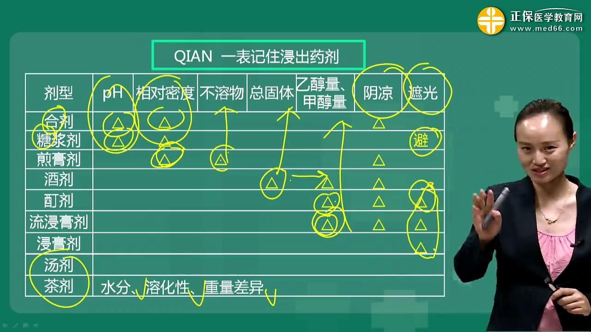
            - 一  特点与分类
                - 1 水浸出：汤剂、合剂
                - 2 含醇：药酒、酊剂、流浸膏剂
                - 3 含糖：煎膏剂、糖浆剂
                - 4 无菌：注射剂、滴眼剂
                - 5 颗粒剂、片剂、软膏剂、丸剂
            - 二 汤剂与合剂
            - > 饮片粗颗粒+水---&gt;煎煮---去渣取汁---煮散
饮片+水-----沸水浸泡----不定时不定量饮 用----饮
饮片---提取-----口服----无需临用制备---合剂
用途：内服、含漱、洗浴、熏蒸​​​​
                - 1 特点：
                - > 汤剂：组方灵活，随症加减//味苦量大，服用不便//不宜久置，临时制备，多有不便//挥发性及难溶性成分提取率或保留率低，可能影响疗效。
合剂：​组方固定，不能随证加减//浓度高，剂量小//克服汤剂临用制备的麻烦，可工业化大生产//。质量相对稳定。（若加蔗糖，含糖量&lt;=20g/ml）
                - 2 汤剂制备要点
                - > 坚硬有毒（先煎）
芳香怕热（后下）
细粉绒毛（包煎）
贵重参茸（另煎）
阿胶饴糖（烊化）​​​​
                    - 煎煮法
                    - 药料特殊处理
                - 3 影响汤剂质量的主要因素
                - > 原则：有效成分利于溶出，防止损失，方便，汤液体积适中。
                    - （1）饮片质量
                    - （2）煎药器具：传统陶器，搪、不锈钢，医院自动煎药机。
                    - （3）煎药溶剂：自来水/制药纯水
                    - （4）加水量：头煎5-8倍，或浸过饮片面2-10cm。
                    - （5）煎药火候：沸前武 火，沸后文火
                    - （6）煎煮时间：先冷水浸泡，头煎45-60min，二煎20-30min。
                    - （7）煎煮次数：2-3次。
            - 三 糖浆剂与煎膏剂
            - > **含糖量高（45%）** **不超过清膏的3倍**
            - 四 酒剂与酊剂
            - > 酒剂：【原料】饮片/                      /【溶剂】蒸馏酒（糖、蜂蜜）//【制法】浸渍、渗漉/                              /【贮存】密封，阴凉处/         /【质检】总固体、甲醇量、乙醇量//【浓度】
酊​剂：【原料】饮片、流浸膏//【溶剂】乙醇/                                   /【制法】渗漉、浸渍、溶解、稀释//【贮存】密封，阴凉，遮光//【质检】甲醇量、乙醇量/                     /【浓度】毒性药：100ml---&gt;10g；其他：100ml-----&gt;20g
            - 五 流浸膏剂与浸膏剂
            - > 流浸膏剂：【外观】产生沉淀符合规定可滤除/          /【浓度】1ml----1g（蒸去部分溶剂）/                                  /【质检】乙醇量、甲醇量
浸膏剂：​【外观】稠浸膏为半固体，干浸膏为粉末//【浓度】1g----2-5g（蒸去全部溶剂，或加稀释剂）//
            - 六 茶剂(水分&lt;=12.0%)
            - > 饮片或提取物（液）与茶叶或其他辅料混合制成的内服制剂。

                - 块状茶剂​：分不含糖和含糖（&lt;=3.0%），使用压制法。
                - 袋装茶剂（混合法）
                - 煎煮茶剂（混合法）
        - 第五节　液体制剂
            - 一 液体制剂特点与分类
                - 优点：（1）分散度大、吸收快、作用较迅速；（2）易控制药物浓度，可减少固体药物口服后由于局部浓度过高而引起胃肠道刺激性；（3）便于分剂量和服用，适用于儿童、老年。
                - 缺点：（1）稳定性较差；（2）贮藏、运输不方便
            - 二 液体药剂的分类
                - 按分散系统------药物粒子大小不同
                - 溶液剂、高分子溶液------------均相，无界面
                - 溶胶剂、乳浊液、混悬剂------非均相（多相），有界面
            - 三 表面活性剂
                - 1 表面活性剂的结构
                    - 表面活性：明显降低表面（界面）张力
                    - **极性亲水** **非极性亲油**
                - 2 表面活性剂的分类
                    - **肥皂**
                    - **灭** **外用消毒**
                    - **卵磷脂**
                    - **聚山梨酯**
                - 3 表面活性剂的毒性
                    - 毒性
                        - 阳&gt;阴&gt;非
                        - 静脉&gt;口服&gt;外用
                    - 溶血性：聚山梨酯（吐温）溶血性最小。
                - 4 表面活性剂的应用----HLB值
                    - 亲水----------------------亲油
                    - > 18-------15----------12-------------9-------------6------------3----------0
起泡剂 增溶剂    去污剂    油/水乳化剂      润湿剂       水/油乳化剂    消泡剂​ 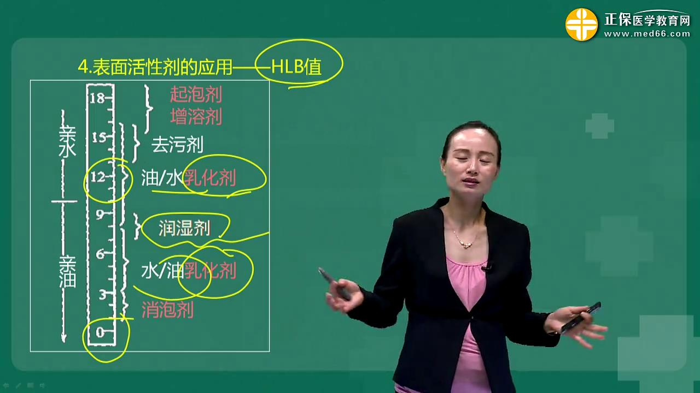
            - 四 真溶液
                - 特点：粒径＜１nm，真溶液，分子/离子，澄明，热力学稳定，扩散快，滤纸，半透膜
                - 分类：溶液剂、芳香水剂、醑剂、甘油剂
            - 五 胶体溶液
                - 1 分类和特点 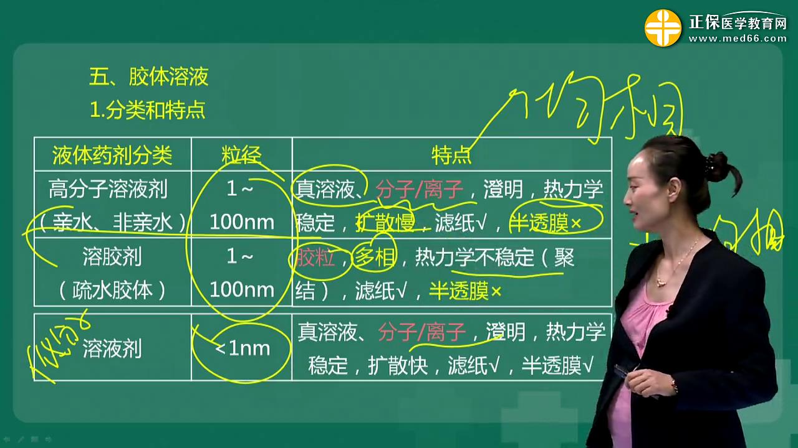
                - 2 胶体溶液主要考点总结
                    - （1）高分子溶液
                        - **水化膜---**
                        - 亲水性：蛋白质、酶、纤维素衍生物
                        - 非亲水性：玉米朊乙醇溶液
                    - （2）溶胶剂
                        - **双电层/Z电位是主要因素，其次是水化膜**
            - 六 乳浊液/乳剂（两种互不相溶的液体，经乳化制成的一种液体以液滴状态分散于另一相液体中形成的非均相分散体系。）
            - > 分散相----内相、非连续相
分散介质----外相、连续相​
                - 特点：粒径&gt;100nm，小液滴，多相，热力学/动力学不稳定，扩散很慢或不扩散，显微镜下可见
                - 1 乳剂的组成、分类
                - > 油相：O
水相：W​
乳化剂：乳化膜​
                    - （1）按分散系统的组成分类：单乳、复乳
                        - O/W型（水包油）：油分散在水中，导电
                        - W/O型（油包水）：水分散在油中，不导电
                        - 复乳：W/O/W，O/W/O
                    - （2）按乳滴大小分类：普通乳、亚微乳、纳米乳
                - 2 乳剂的特点：
                    - （1）分散度大，吸收快，生物利用度高；
                    - （2）油性药物制成乳剂能保证剂量准确，使用方便；
                    - **O/W型掩盖药物不良臭味；**
                    - **外用性状对皮肤、黏膜的渗透性，减少刺激性；**
                    - **静脉注射（靶向、营养输液）**
                - 3 决定乳剂类型因素
                    - 主要因素：乳化剂性质-----转相
                    - 其他：乳化膜的牢固性、油水相容积比、温度、制备方法等。
                - 4 乳剂的不稳定现象
                    - （1）分层（乳析）：密度差（可逆）
                    - （2）絮凝：电解质、离子型乳化剂---降低Z电位（可逆）
                    - （3）转相（转型）：乳化剂性质转变
                    - （4）合并与破裂：不可逆
                    - （5）酸败：油相、乳化剂变质
                - 5 乳剂稳定性影响因素及稳定化措施 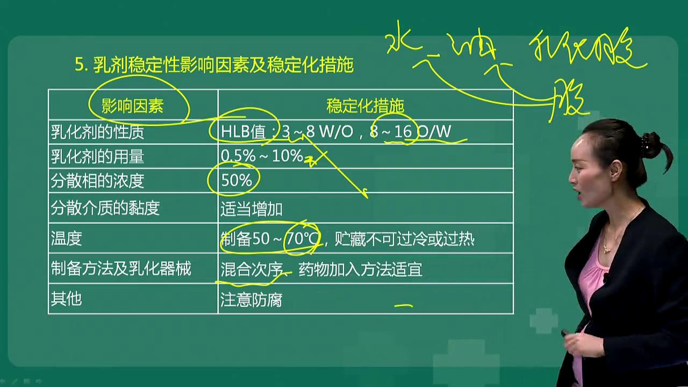
            - 七 混悬液
                - 特点：粒径&gt;500nm，固体微粒，多相，热力学/动力学不稳定，扩散很慢或不扩散，在显微镜下可见。
                - 1 适宜制备混悬液的药物
                    - 适宜药物：难溶性药物需要制成液体药剂；长效；提高稳定性。
                    - 不适药物：剧毒药；剂量小。
                - 2 混悬剂常用稳定剂
                    - （1）润湿剂-=---吐湿、司盘
                    - （2）助悬剂：提高N，降低微粒沉降，形成保护膜防止微粒聚集或晶型转变，使之具有触变性。
                    - > 低分子：甘油、糖浆
高分子：阿黄白果琼，MC、CMC-Na
硅酸类：二氧化硅、硅皂土​​
                    - （3）絮凝剂与反絮凝剂----电解质用量不同
                    - > 絮凝：降低Z电位，微粒聚集；反絮凝：升高Z电位，阻碍聚集。
                - 3 混悬液稳定性影响因素及稳定化措施 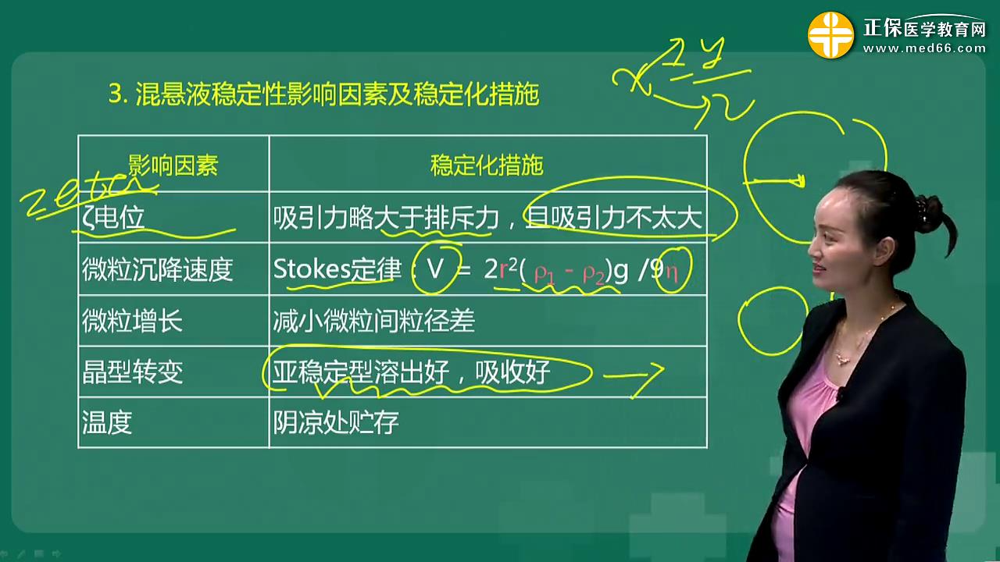
                - 4 混悬液的两个数值考点
                    - （1）干混悬剂：干燥失重&lt;=2.0%
                    - （2）口服混悬剂：沉降容积比（沉降后与沉降前的体积比）&gt;=0.90
            - 八 重点回顾 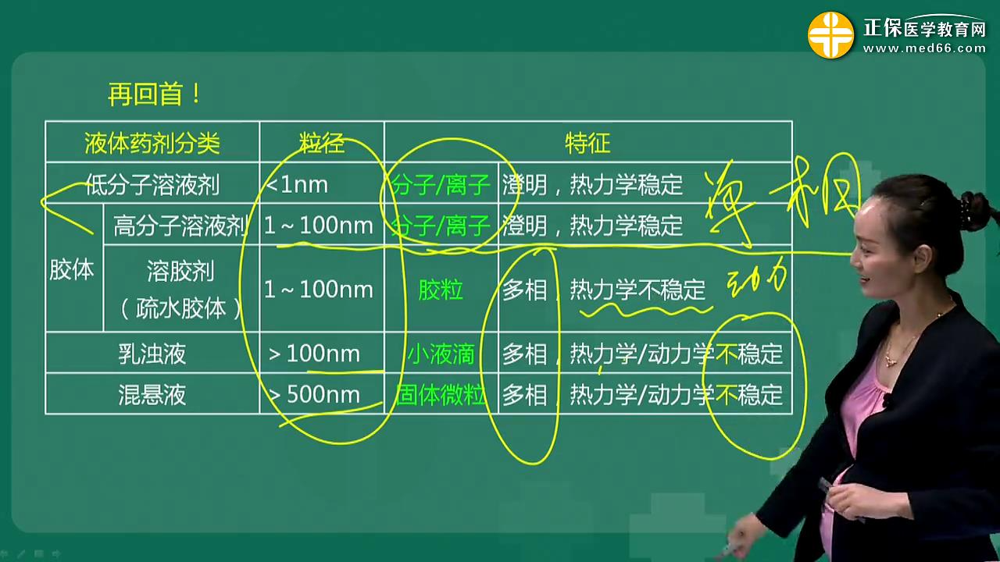
                - 练习：
                    - **絮凝**
                    - **分层**
                    - **酸败**
                    - **合并**
                    - **转相**
                - 根据stokes定律，提高混悬剂稳定性的措施 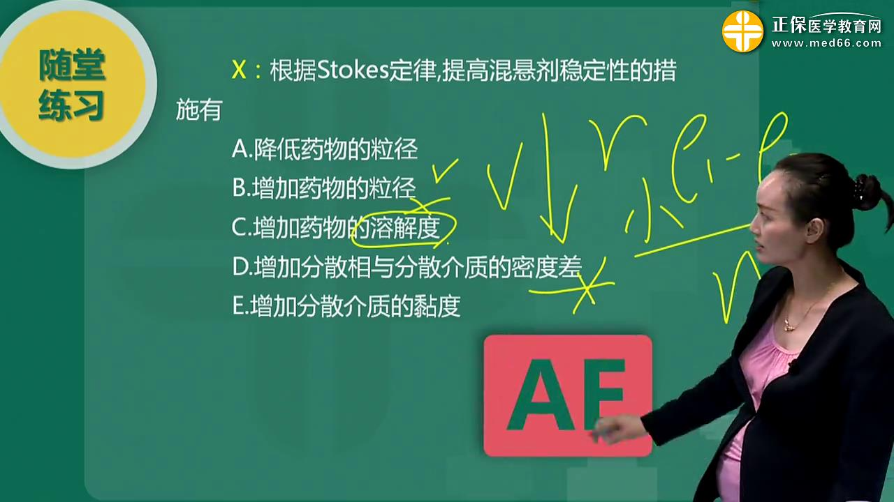
        - 第六节　注射剂
            - 一 注射剂特点
                - **延长药效** **可用于疾病论断**
                - **射疼痛** **发生危险**
            - 二 注射剂的分类
                - 注射液：皮内，皮下，肌内；静脉注射、静脉滴注（大输液）；鞘内、椎管内、脑池内。 
                - 注射用无菌粉末：临用前配制成溶液 
                - 注射用浓溶液：临用前稀释​​
            - 三 热原
                - 1 来源：
                    - 广义---细菌性、内源性、化学性
                    - 药剂学---细菌性热原（微生物代谢产物或尸体）
                - 2 内毒素---产生热原的最主要的致热物质
                    - 磷脂
                    - **脂多糖（LPS）**
                    - 蛋白质
                - 3 污染热原的途径
                    - **溶剂：主要途径**
                    - 原辅料 
                    - 容器、用具、管道和设备 
                    - 制备过程和生产环境 
                    - **临床应用过程：​​​​注射器具**
                - 4 热原性质及去除方法 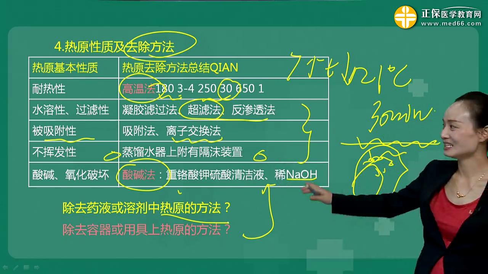
            - 四 注射剂的溶剂
            - > 天然水---饮用水---纯化水---注射用水-----灭菌注射用水
                - 注射用水：注射、滴眼：配制溶剂或稀释剂、容器精洗
                - 灭菌注射用水：注射用灭菌粉末溶剂、注射剂的稀释剂
                - 注射用油：大豆油、茶油、麻油、酸值、碘值、皂化值
                - 其他：乙醇、丙二醉、PEG
            - 五 注射剂的附加剂
            - > 青椒爱酸（氢焦爱酸）
抑菌剂：三叔笨你公（三叔、苯、尼、汞）​
止痛剂：三叔、卡因​ 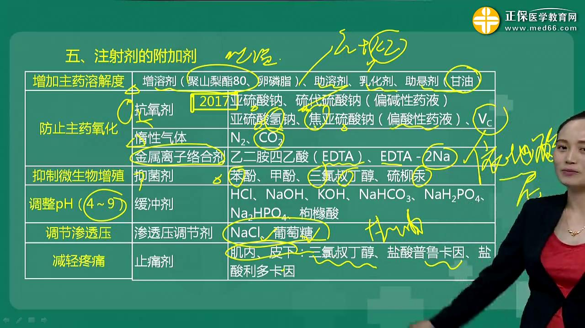
                - 重要考点总结：
                    - **不得添加**
                    - **不得添加**
                    - 惰性气体：作为处方混合成分，需在标签中注明。
            -  渗透压的调节：
                - 1 等渗溶液、等张溶液
                    - （1）凡与血浆、泪液渗透压相同的溶液称为等渗溶液：0.9%氯化钠溶液、5%葡萄糖溶液
                    - （2）溶血法测得的等渗溶液即为等张溶液：0.9%氯化钠溶液。
                    - （3）大量注入低渗溶液会导致溶血，应调节其渗透压。
                - 2 计算方法：冰点降低数据法、氯化钠等渗当量法。
            - 六 中药注射剂的半成品
                - 基本要求
                - **有效成分：纯度>=90%**
                - **多成分 主药>总固体量80%**
                - 3 控制重金属、有害元素限量
                - 4 配制投料
                - 总提取物：按提取物中指标成分含量限/幅度计算
                - 有效成分/部位：按规定浓度或限/幅度计算。
            - 七 输液剂
                - 1 特点：（1）静滴；（2）大容量（&gt;=100ml，生物制品&gt;=50ml）；（3）起效迅速，多用于救治危重、急症；（4）质量要求高。
                - 2 输液剂的分类和作用
                    - 电解质输液（+酸碱平衡输液）：氯化钠、乳酸钠
                    - 营养输液：葡萄糖、氨基酸、脂肪乳
                    - 胶体输液：右旋糖酐，PVP、明胶
                    - 含药输液：左氧氟沙星+NaCl
            - 八 静脉注射乳剂（乳状液型注射剂）
            - > 乳浊液：粒径&gt;100nm，小液滴，多相，热力学/动力学不稳定，扩散很慢或不扩散，显微镜下可见。
                - 1 乳滴粒径：90%&lt;1um， 不大于5um
                - 2 具有靶向性，用于抗癌药物
                - 3 不得有相分离现象：合并、破裂
                - 4 不得用于椎管注射
            - 九 粉针剂
                - 1 分类：冻干（块状物）、喷干（粉末）
                - 2 临用前用无菌溶液配制成溶液
                - **湿热敏感** **水中不稳定**
            - 十 注射剂生产与贮藏有的关规定
                - 1 溶液型：澄明
                    - 混悬型：90%&lt;15um，不得用于静脉，椎管内
                    - 乳状液型：90%&lt;1um，不得用于椎管内。
                - 2 灌装：可适当增加装量，多剂量不超过10次。
                - 3 灭菌后检漏
                - 4 漏光。
                - 5 标签或说明书中应标明：辅料、抑菌剂及其浓度、无菌粉末配制溶剂及溶剂量、惰性气体。
            - 十一 注射剂质量检查项目
                - 1 参透压摩尔浓度：静脉输液及椎管注射。
                - 2 可见异物
                - 3 有关物质：蛋白质/鞣质/树脂，静脉+草酸盐/K+
                - 4 重金属及其有害元素残留量：汞2镉3砷6铅12铜150（每日最大使用量，ug）
                - 5 无菌
                - 6 细菌内毒素或热原。
        - 第七节　眼用制剂
            - 一 眼用制剂的特点
                - 1 直接用于眼部
                - 2 无菌制剂
                - 3 滴入、冲洗、涂布、插入、注射、置于眼局部
                - 4 作用：清洁、保护、治疗
            - 二 眼用制剂的分类
                - 液体：滴眼剂、洗眼剂、眼内注射溶剂 可另配溶液，临用配置
                - 半固体：眼膏剂、眼用乳膏剂、眼用凝胶剂
                - 固体：眼膜剂、眼丸剂、眼内插入剂
            - 三 眼用制剂中药的吸收途径
                - a 角膜---房水---前房---虹膜、睫状肌---局部作用
                - b 结膜---巩膜---眼球后部----全身作用
            - 四 眼用制剂影响药物吸收的因素（眼皮外表面黏个刺）
                - 眼睑缝隙损失、外周血管消除、PH、Pka、刺激性、表面张力、黏度。
            - 五眼用制剂的附加剂 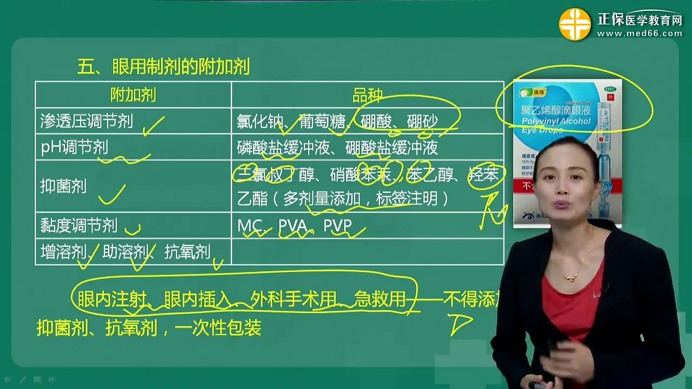
                - 眼内注射、眼内插入、外科手术用、急救用---不得添加抑菌剂、抗氧剂，一次性包装。
            - 六 眼用制剂生产与贮藏的有关规定
                - 1 装量  滴眼不大于10ml；洗眼剂不大于200ml；半固体不大于5g
                - 2 4周
                - 3 极细粉 
            - 七 眼用制剂质检
                - 1 无菌
                - 2 渗透压摩尔浓度
                - 3 可见异物-滴眼剂、眼内注射溶液
                - 4 粒度-含饮片原粉、混悬型
                - 5 金属性异物--眼用半固体
                - 6 沉降体积比-混悬型。
        - 第八节　外用膏剂
            - 一 外用膏剂特点
                - （1）药物+基质————主要供外用（半固体、近似固体）
                - （2）局部任用：保护、润滑、治疗
                - （3）全身作用：经皮给药系统
                    - 药物透过皮肤或黏膜进入体循环
                    - 避免肝脏首过效应，避免药物在在胃肠道的破坏
                    - 减少血药浓度的峰、谷变化
                    - 降低药物的副作用。
            - 二 外用膏剂的分类
                - 软膏剂、乳膏剂
                - 贴膏剂（橡胶膏剂、凝胶膏剂）、贴剂
                - 膏药：黑膏药、白膏药
            - 三 药物吸收
                - 1 途径：释放（皮肤、黏膜）---&gt;穿透（真皮、皮下）---&gt;吸收（体循环）         完整表皮、皮肤的附属器；毛囊、皮脂腺和汗腺。
                - 2 药物透皮吸收的影响因素
                    - （1）皮肤条件
                    - （2）药物性质：油、水分配系数适宜（既有一定脂溶性又有一定水溶性），分子质量较小、药理作用强
                    - （3）基质
                        - 类型：乳剂型》吸水性》烃类
                        - **PH：弱酸性药物Pka》基质PH》弱碱性药物Pka（分子型）**
                        - 附加剂：表面活性剂、透皮促进剂（氮酮）
                        - 水合作用：油脂性基质封闭性强，显著增加水合作用
                    - （4）其他：药物浓度、应用面积，应用次数、与皮肤接触时间
            - 四 软膏剂、乳膏剂
                - 1 特点
                    - （１）软膏剂：油脂性或水溶性基质
                    - （２）乳膏剂：乳剂型基质　　　　Ｏ／W　　　W／O　　　不得冷冻
                    - （３）半固体、慢性皮肤病
                - 2 不同基质的代表品种
                    - （1）油脂性基质（油类挺贵） 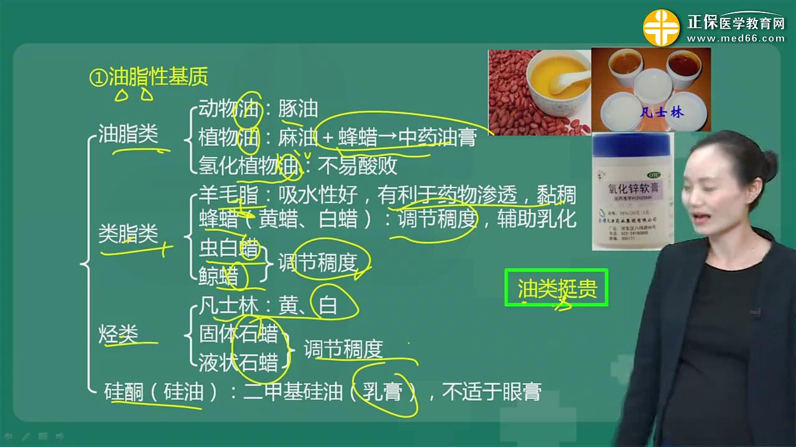
                    - （2）乳剂型基质（水多拿伞举，油多单养肝） 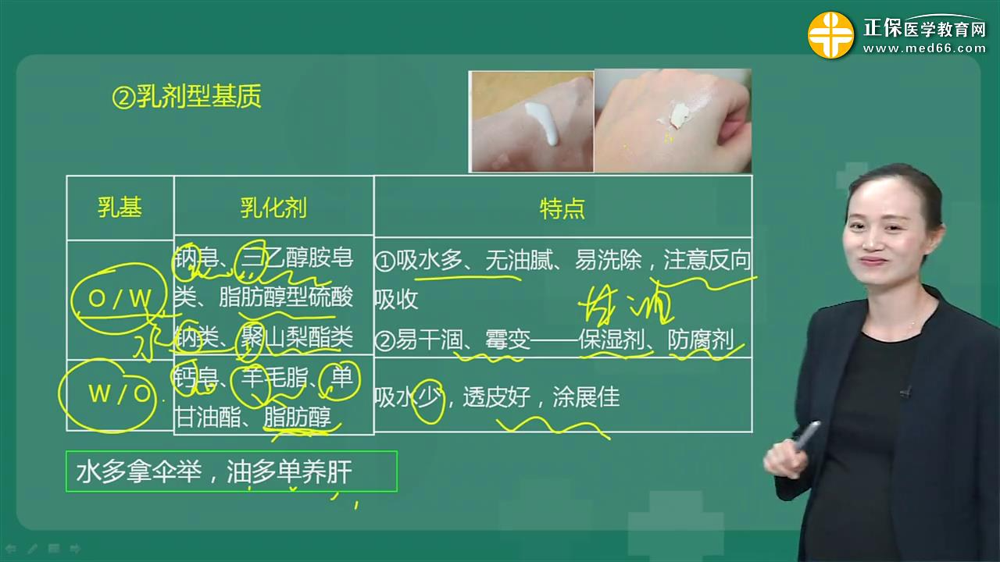
                    - （3）水溶性基质
                        - 纤维素衍生物：MC、CMC-Na
                        - 聚乙二醇（PEG）
                - 4 不同基质的特点对比 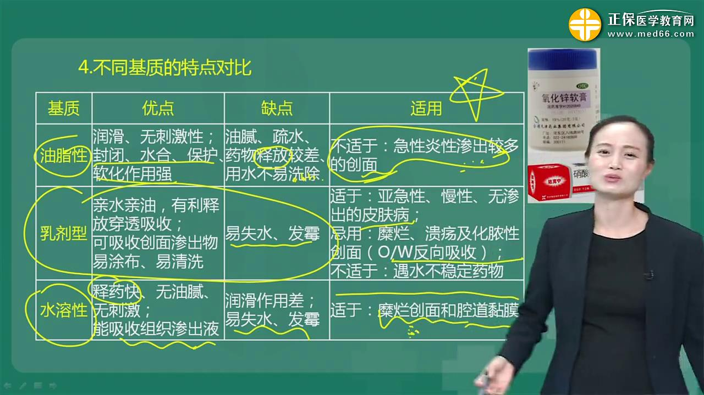
            - 五 膏药
            - > 药料提取（药料炸枯）---炼油----下丹成膏------去“火毒”----摊涂于裱背材料------皮肤贴敷（油润固体，用前烘软）

                - 1 种类
                    - 黑膏药：饮片+植物油+红丹/铅丹（Pb3O4&gt;95%）---炼制
                    - 白膏药：饮片+植物油+官粉/（碱式碳酸铅）----炼制
                - 2 基质主要成分：高级脂肪酸的铅盐
                - 3 质检：软化点
            - *六 贴膏剂VS贴剂*
                -  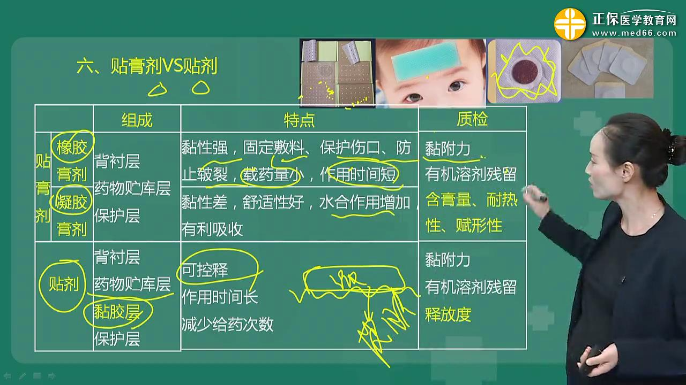
        - 第九节　栓剂
            - 一 栓剂的分类
            - > 药物+基质----供腔道给药（固体）
                - 直肠栓：鱼雷形、圆锥形、圆柱形
                - 阴道栓：鸭嘴形、球形、卵形
                - 尿道栓：棒状
            - 二 栓剂的作用特点
                - 1 可局部治疗；
                - 2 经腔道吸收，全身治疗；
                - **不受胃肠道PH值或酶**
                - **大部分药**
                - 5 适用于不能、不愿口服给药的患者。
            - 三 直肠给药栓剂中药物的吸收途径
                - 1 直肠上静脉----&gt;门静脉----&gt;肝脏----&gt;大循环
                - 2 直肠下静脉+肛门静脉----&gt;髂内静脉（绕过肝脏）----&gt;下腔大静脉----&gt;大循环
                - 3 直肠淋巴系统
            - 四 影响直肠给药栓剂中药物吸收的因素
                - 1 生理因素
                    - 塞入直肠深度（2cm）
                    - 粪便、腹泻及组织脱水
                    - 直肠液PH值7.4
                - 2 药物因素
                    - 溶解度
                    - 脂溶性、非解离型易吸收
                    - 粒径：难溶减小粒径
                - 3 基质因素：水溶性药物+油脂性基质-----释放吸收较快
            - 五 栓剂的基质
                -  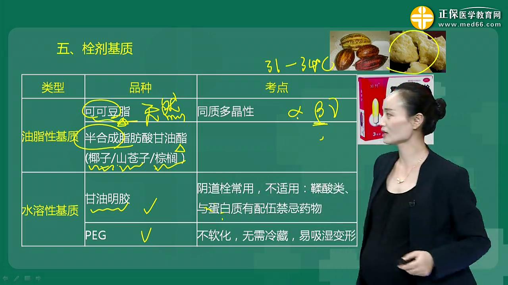
            - 六 栓剂的质量要求
                - 1 塞入腔道后应无刺激性应能融化、软化或溶化能与分泌液混合，逐渐释药。
                - 2 固体原料药物：细粉或最细粉
                - 3 融变时限
                    - 脂肪性基质30min
                    - 水溶性基质60min
                - 4 贮藏，运输&lt;30度，生物制品2-8度。
        - 第十节　胶囊剂
            - 一 胶囊剂的分类
            - > 药物+辅料---&gt;充填于空心硬质胶囊中或密封于弹性软质胶囊中​
                - 1 硬胶囊（胶囊）
                - 2 软胶囊（胶丸）：滴制法、压制法
                - 3 缓释胶囊
                - 4 控释胶囊
                - 5 肠溶胶囊
            - 二 胶囊剂的特点
                - 1 掩盖不良气味，减小刺激性；
                - 2 便于服用；
                - **相对片丸，崩解溶出快，吸收好，生物利用度高；**
                - 4 隔绝光氧湿，提高稳定性；
                - 5 可定时定位释放药物；
                - 6 硬胶囊内容物------固体、半固体、液体
                - 密封贮存，&lt;=30度。
            - 三 胶囊囊材组成
                - 1 主要囊材
                    - 硬胶囊（空心胶囊）：水溶性明胶
                    - 软胶囊：明胶+增塑剂+水=1：（0.4-0.6）：（1-1.6）   制备软胶囊可使用的分散介质是聚乙二醇400 
                - 2 附加剂
                    - **增塑剂：甘油**
                    - 增稠剂：琼脂
                    - 遮光剂：二氧化钛
                    - 增光剂：十二烷基磺酸钠
                - 3 不宜制成胶囊剂的药物
                    - 囊材：水溶性明胶，与以下反应（风湿犬，怕的多，醇刺激，酸碱水） 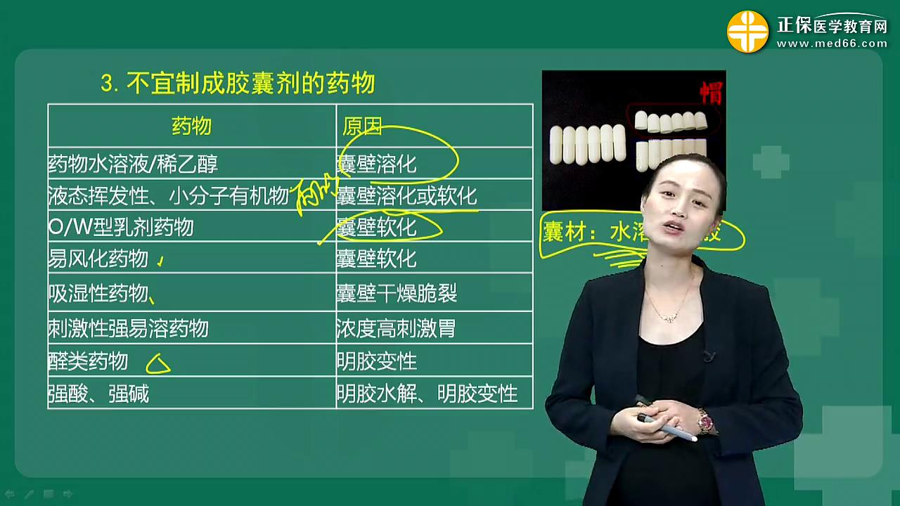
            - 四 质量要求
                - 质量要求 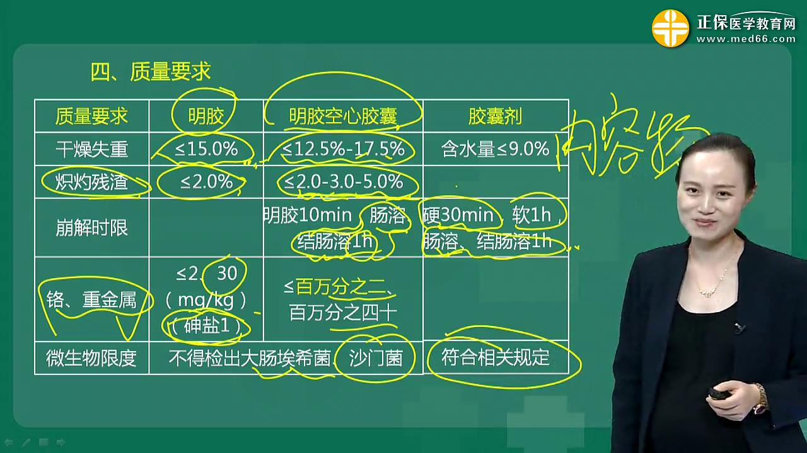
            - 三 空心胶囊与质量要求
            - 四 胶囊剂的质量要求
        - 第十一节　丸剂
            - 一 丸剂的特点
                - 优点：
                    - 1 释药速度不同，按需选用。
                        - 传统：缓释、长效（慢性病、调和气血）；
                        - **水基滴丸速释急救**
                    - 2 适用药物范围广
                    - **稳定性高，刺激性低**
                    - **（糊丸、蜡丸）**
                    - 5 制法简便
                - 缺点：
                    - 1 某些剂量大，服用不便，不宜儿童
                    - **溶散迟缓**
                    - **原粉入药，微生产易超标**
            - 二 分类
                - **水蜜丸、浓缩丸、糊丸**
                - **水蜜丸、浓缩丸、糊丸**
                - **滴丸**
            - 三 水丸
                - 水丸 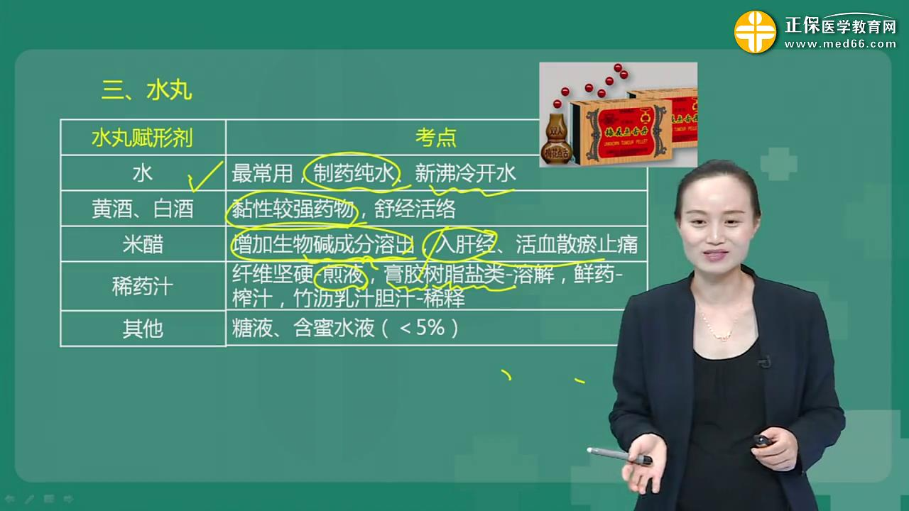
            - 四 蜜丸和水蜜丸
                - 蜜丸：细粉+炼蜜------塑制法---大蜜丸&gt;=0.5g；小蜜丸&lt;0.5g
                - 水蜜丸：细粉+蜜水----泛制
                - 蜂蜜相关考点：
                    - 1 还原糖&gt;=64.0%
                    - 2 炼制目的：除杂、破坏酶类、杀死微生物、降低水分含量、增加黏性。
                    - 炼蜜规格
                        - 嫩蜜：色泽无变化，稍黏---黏性强（适用于）
                        - 中蜜：黄色、鱼眼泡、黏性、无长白丝
                        - 老蜜：红棕色、牛眼泡、黏性强、打白丝、滴水成珠---黏性差
                        -  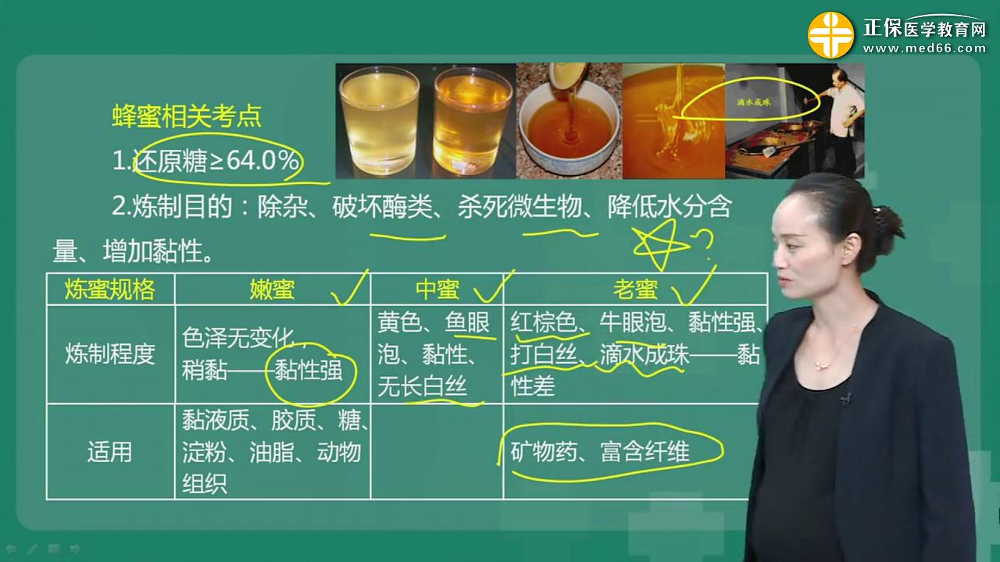
            - 五 浓缩丸（药膏丸、浸膏丸）
                - 1 饮片或部分饮片提取浓缩后，与适宜的辅料或其余饮片细粉，以水、炼蜜或炼蜜和水为黏合剂制成的丸剂。
                - 2 分类：浓缩水丸、浓缩蜜丸、浓缩水蜜丸
                - 3 特点：体积小、剂量小、易于吸收，用、携、贮方便
            - 六 糊丸
                - 1 饮片细粉+糯米粉糊（黏性最强）、面粉（使用最广）
                - 2 特点：溶散迟缓、释药缓慢，可延长药效，减少药物对胃肠的刺激性。
                - 3 适用：含毒性饮片、刺激性饮片、需延缓释放。
                - 练习：
                    - 只能用塑制法制备的是大蜜丸
                    - 只能用泛制法制备的是水丸
                    - 只能用滴制法制备的是滴丸
                    - 既可用塑制法又可用泛制法制备的是浓缩丸
                    - 既可用压制法也可用滴制法制备的是胶丸（软胶囊）
            - 七 蜡丸
                - 1 黏合剂：蜂蜡
                - 2 毒性或刺激性强的药物：减毒
                - 3 缓、控释制剂 
                - 4 塑制法
            - 八 滴丸
            - > 药物+基质----加热熔融混匀---滴入不相混溶的冷凝介质---球形或类球形 
                - 1 特点：
                    - （1）缓释、控释、速释（水溶性基质、急症、固体分散技术）
                    - （2）剂量准确，药物分散均匀；
                    - （3） 液体药物固体化
                    - （4）载药量较小，理想基质和冷凝剂较少，发展受限
                - 2 滴丸基质
                    - 要求：熔点较低，60度以上能熔化，遇骤冷又能凝成固体，药--基混合物室温下呈稳定均匀的固体状态。
                    - 种类：
                        - （1）水溶性：聚乙二醇（4000，6000），泊洛沙姆、硬脂酸聚烃氧（40）酯（S-40）、明胶、甘油明胶、硬脂酸钠
                        - （2）非水溶性：硬脂酸、单硬脂酸甘油枉费、氢化植物油、虫蜡、蜂蜡、十八醇。
                    - 总结：主要油基、水基对比记忆！ 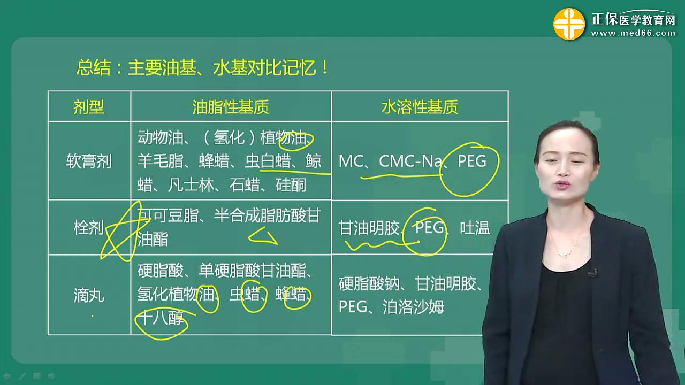
            - 九 糖丸
                - **糖粒或基丸为核心** **糖粉** **糖丸中而制成**
                - **儿童用药** **疫苗制剂**
            - 十 丸剂的包衣
                - 1 目的 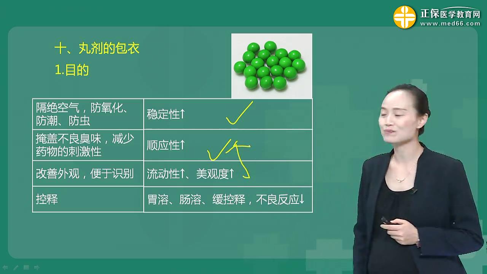
                - 2 包衣种类与包衣材料
                    - （1）药物衣
                        - 朱砂：镇静、安神、补心
                        - 黄柏：利湿、渗水、清下焦湿
                        - 雄黄：解毒、杀虫
                        - 青黛：清热解毒
                        - 百草霜：清热解毒
                    - （2）保护衣
                        - 薄膜衣
                        - 糖衣
                        - 有色糖衣
                        - 明胶衣
                    - （3）肠溶衣
                        - 聚丙烯酸树脂 1 2 3 
                        - 邻苯二甲酸醋酸纤维互
            - 十一 丸剂的质量要求
                - 1 水分（蜜丸含水多，3*543，蜡滴无水分）
                    - 蜜丸、浓缩蜜丸：15.0%
                    - 水蜜丸、浓缩水蜜丸：12.0%
                    - 水丸、浓缩水丸、糊丸：9.0% -----------散剂、胶囊剂
                    - 蜡丸、滴丸：不检查
                - 2 溶散时限（小水滴穿蜡衣一小时，浓缩成糊犯了2，大蜜碎了不检查 ）
                    - 滴丸：30min
                    - 滴丸（包衣）：1h
                    - 小蜜丸、水蜜丸、水丸：1h
                    - 浓缩丸和糊丸:2h
                    - 蜡丸：1h
                    - 大蜜丸、研碎/分散后服用者：不检查
        - 第十二节　颗粒剂
            - 一 颗粒剂的特点
                - 1 剂量较小
                - 2 五方便；
                - 3 色、香、味俱佳
                - **4 包衣防潮、缓释、肠溶；**
                - 5 具吸湿性，易吸湿结块；
                - 6 颗粒松散，细粉较多。
            - 二 颗粒剂的分类
                - 可溶颗粒（通称为颗粒）、混悬颗粒、泡腾颗粒、肠溶颗粒、缓释颗粒、控释颗粒、块状颗粒剂（块状冲剂）
            - 三 颗粒剂的质量要求与检查
                - 1 溶化性
                    - 可溶颗粒：全部溶化，允许有轻微混浊
                    - 泡腾颗粒：5min
                    - **检查溶出度/释放度**
                - 2 水分：8.0%
                - 3 粒度，不能通过一号筛+能通过五号筛不大于15%
        - 第十三节　片剂
            - 一 片剂的特点
                - 优点：（1）按片服用，剂量准确；（2）质量稳定（包衣、包合）；（3）五方便；（4）品种丰富
                - **溶出不及胶囊剂及散剂，影响其生物利用度**
            - 二 片剂的分类
                - 片剂分类 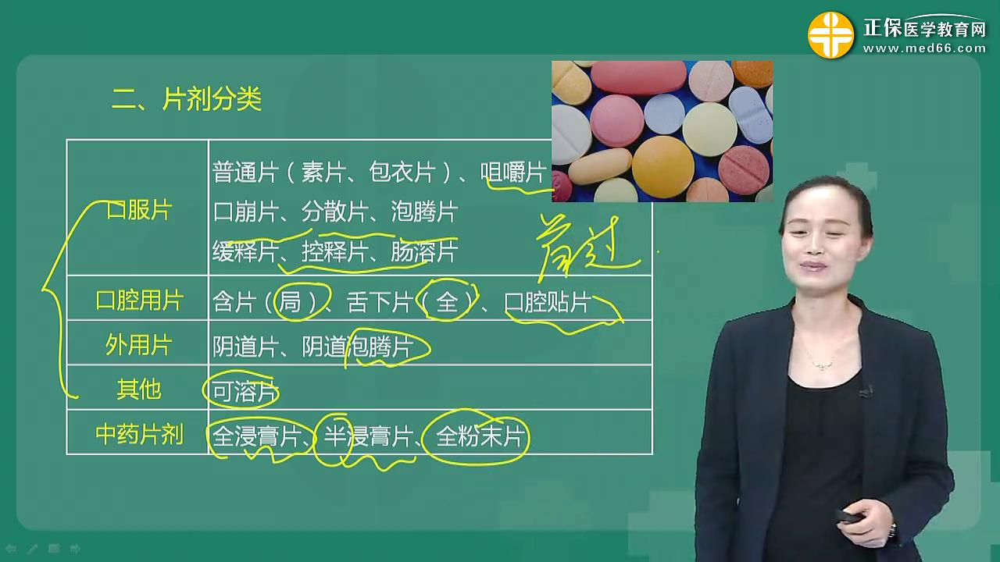
                - 小总结：有关片剂分类的常见考点
                    - **甘露醇、山梨醇、蔗糖**
                    - **难溶性药物**
                    - **润滑剂PEG。**
                    - 4 口崩片：口腔中可快速崩解或溶解的，适用于小剂量原料药物，常用于吞咽困难或不配合服药的患者。
                    - 5 舌下片：避免肝脏首过效应、急症。
            - 三 片剂辅料（赋形剂）
            - > 除主药以外的一切附加物料的总称
填充剂（稀释剂、吸收剂）--助成型
​​​润湿剂、黏合剂-----黏结
崩解剂----碎裂
​​​润滑剂----润滑
                - **填充吃饱靠淀粉，糖精乳盐也得补**
                    - 填充剂
                        - 稀释剂：主药剂量&lt;0.1g；浸膏量多；浸膏黏性太大
                        - 吸收剂：含较多挥发油、脂肪油；含较多液体。
                    -  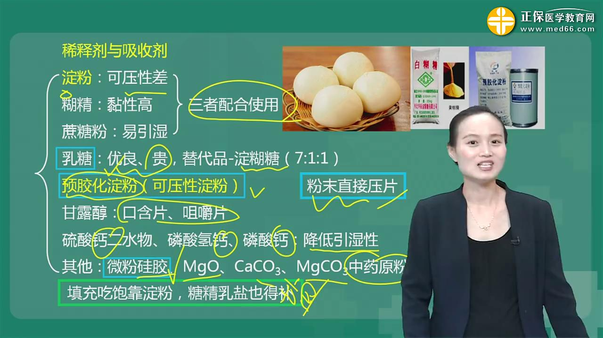
                - 2 润湿剂与黏合剂---黏结
                    - 润湿剂---黏性药料
                        -  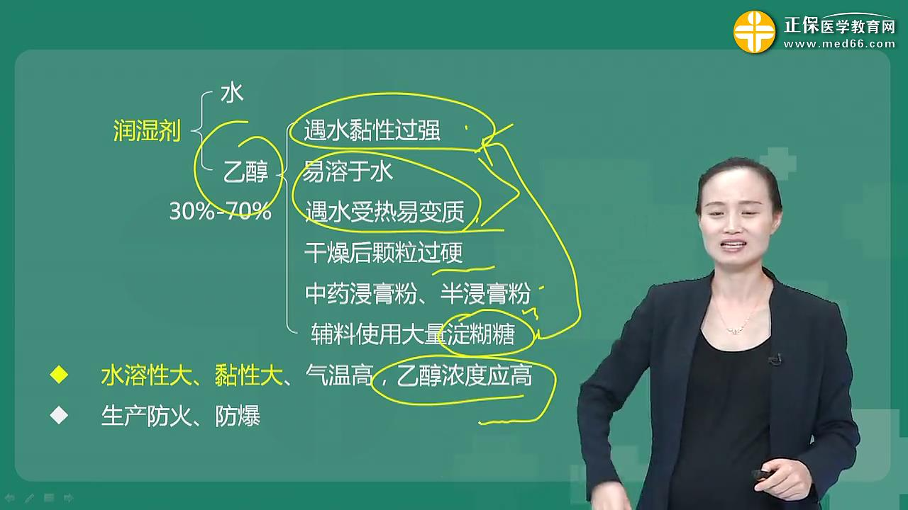
                    - **水醇润湿浆黏合，聚胶纤维少不了**
                        - 液体：黏性大
                        - 固体：兼稀释剂
                        -  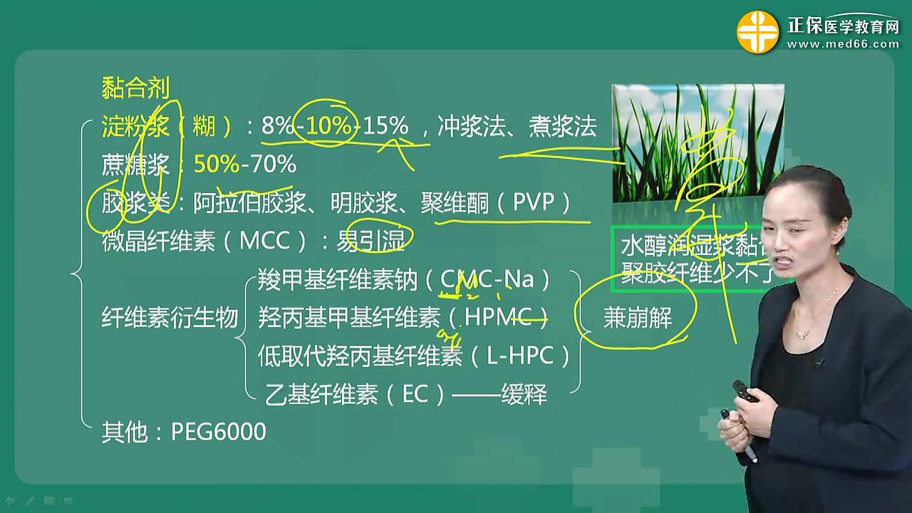
                - 3 崩解剂
                    - （1）不加崩解剂的片剂：口含片；舌下片；长效片；咀嚼片；中药半浸膏片（长舌妇，嚼含片，半浸膏，无崩解剂）
                    - **崩解破坏干淀粉，辅助泡腾低取代**
                        - 干淀粉：不溶性/微溶性药物
                        - 羧甲基淀粉钠（CMS-Na）：高效崩解
                        - 低取代羟丙基纤维素（L-HPC）
                        - 泡腾崩解剂：碳酸氢钠/碳酸钠+酒石酸/枸橼酸
                        - 崩解辅助剂：聚山梨酯、月桂醇硫酸钠
                    - （3）片剂的崩解机制
                        - 毛细管作用：淀粉及其衍生物、纤维素衍生物
                        - 膨胀作用：羧甲基淀粉钠
                        - 产气作用：泡腾崩解剂；碳酸氢钠/碳酸钠+酒石酸/枸橼酸---产生CO2
                        - 其他作用：
                            - 崩解、蚀解：可溶原、辅料
                            - 改善颗粒润湿性：表面活性剂
                            - 酶解：淀粉+淀粉酶；纤维素+纤维素酶
                - 4 润滑剂----压片前加入（润滑得擦镁和粉，聚乙二醇多面手）
                    - 助流剂：降低颗粒/粉粒间摩擦力
                    - 抗黏剂：防止物料黏冲
                    - 润滑剂：降低颗粒/药片与冲、模的摩擦
                    - 硬脂酸镁、滑石粉、微粉硅胶、聚乙二醇、十二烷基硫酸钠
                    -  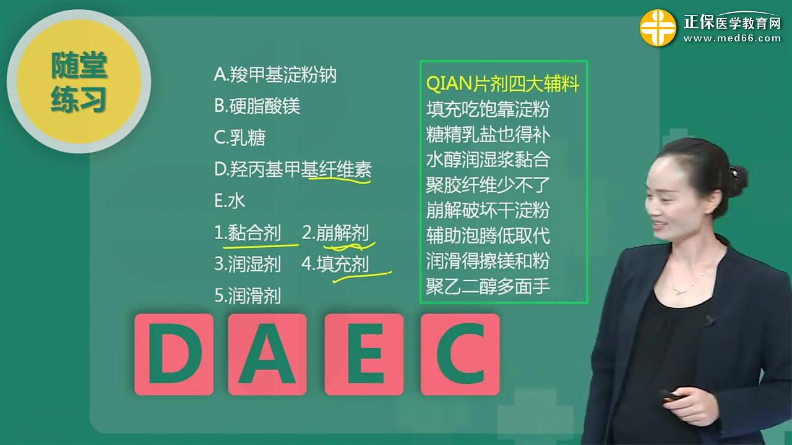
            - 四 片剂包衣
                - 1 片剂包衣的目的
                    -  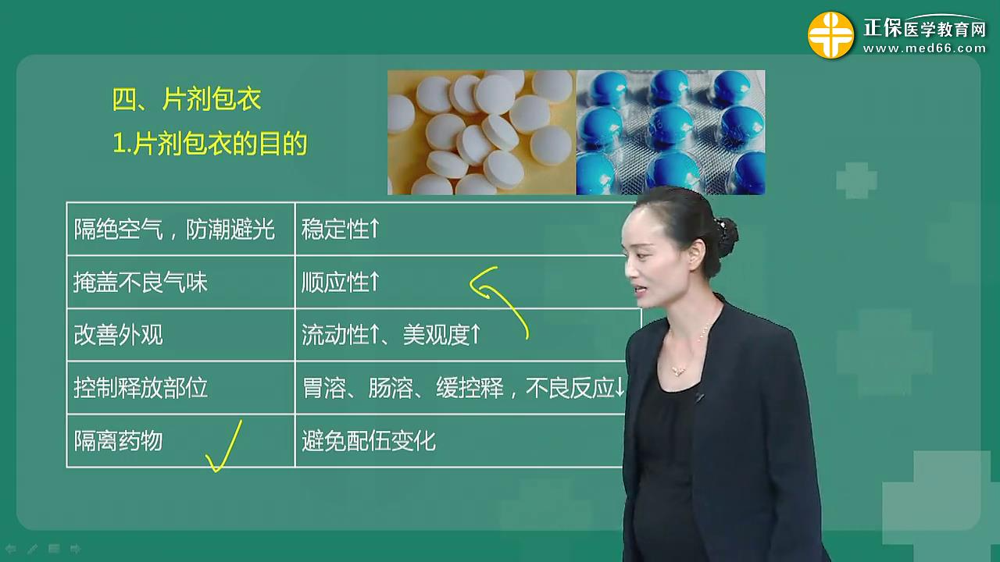
                - 2 包衣片的种类
                    - 糖衣片、薄膜衣片、半薄膜包衣片、肠溶衣片、结肠定位肠溶衣片、缓/控释衣片。
            - 五 片剂质量检查项目与要求
                -  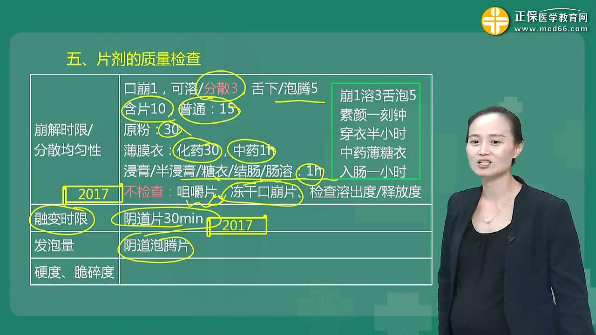
            - 六 片剂制备贮存过程中的觉问题
                - 裂片、松片、黏冲、崩解迟缓、溶出超限、含量不均匀。
        - 第十四节　气雾剂与喷雾剂
            - 一 构成
                - **抛射剂**
                - 喷雾剂：药物、附加剂、容器、手动泵
            - 二  气雾剂的分类
                - 按分散系统：溶液型、混悬型、乳剂型（O/W：喷出泡沫；W/O：喷出液流）
                - 按处方组成：二相、三相
                - 按给药途径：吸入、非吸入  （肺部、口腔、鼻腔、阴道）
                - 按定量与否：定量（MDIs）、非定量
            - 三 气雾剂和喷雾剂的特点
                - 优点：（1）速效、定位；（2）稳定性高；（3）给药剂量准确，副作用较小；（4）局部用药的刺激性小。
                - 缺点：（1）设备特殊成本高；（2）封装不严泄露无法喷射；（3）有内压受撞击易爆炸；（4）抛射剂挥发制冷多次使用可引起不适。
            - 四 药物与附加剂
                - 药物：总提取物；有效部位、有效成分；微粉（吸入气剂一般不使用饮片细粉）
                - 附加剂：
                    - 溶剂：部分抛射剂兼溶剂
                    - 潜溶剂：乙醇、丙二醇
                    - 抗氧剂：VC、亚硫酸钠
                    - 防腐剂：尼泊金乙酯
                    - 乳化剂：聚山梨酯
                    - 助悬剂：
            - 五 抛射剂
                - 1 喷射的动力，兼溶剂、稀释剂
                - 2 多为低沸点液化气体，在常压下沸点低于室温，加压状态下才为液体。
                - 3 阀门开启时，抛射剂急剧气化产生压力，克服了液体分子间的引力，将药物分散成雾状微粒或泡沫状、干粉状喷出。
                -  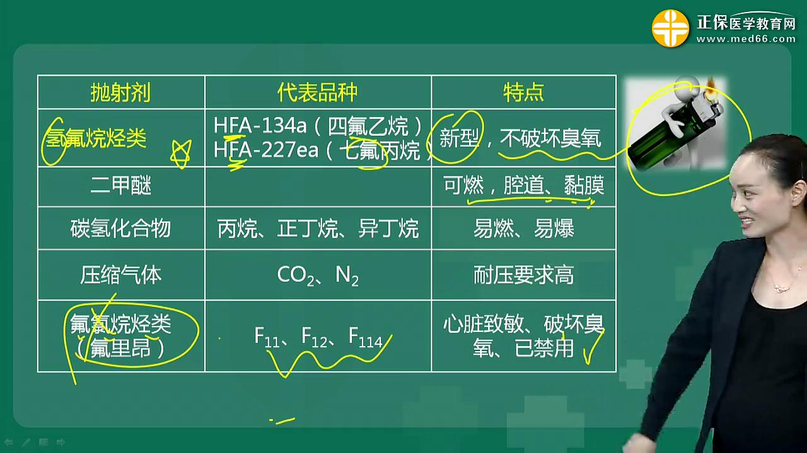
            - 六 吸入气雾剂/喷雾剂的吸收及影响因素
                - 1 可以直接作用于支气管平滑肌
                - 2 主要吸收部位------肺泡
                - 3 影响因素
                    - （1）药物性质：脂溶性、小分子易吸收
                    - （2）粒径：多数&lt;5um  (不大于10um)
            - 七 气雾剂、喷雾剂的质量要求
                - 1 非定量阀门：喷射速率、喷出总量
                - 2 定量阀门：每瓶总揿/喷次、每揿/喷主药含量、每揿/喷喷量、递送剂量均一性
                - 3 吸入气雾剂：微细粒子剂量、递送速率和递送总量、粒度（混悬型）
        - 第十五节　胶剂、膜剂、涂膜剂及其他传统剂型
            - 一 胶剂
                - 1 特点及种类-----滋补强壮
                    - 皮胶：补血（驴皮阿胶，猪新牛黄）
                    - 骨胶
                    - 甲胶：滋阴，活血祛风
                    - 角胶：温阳
                - 2 胶剂的辅料
                    - 明矾：除杂，增加透明度
                    - 冰糖/白糖：增加透明度、硬度、矫味
                    - 油类：降低黏度，便于切胶，收胶时利于气泡逸散
                    - 酒类：矫味、矫臭，收胶时利于气泡逸散
                - 制作方法：原辅料处理---&gt;煎取胶液---&gt;滤过澄清（明矾）---&gt;浓缩收胶（糖油酒）---&gt;胶凝与切胶----&gt;干燥与包装
            - 二 膜剂与涂膜剂
                -  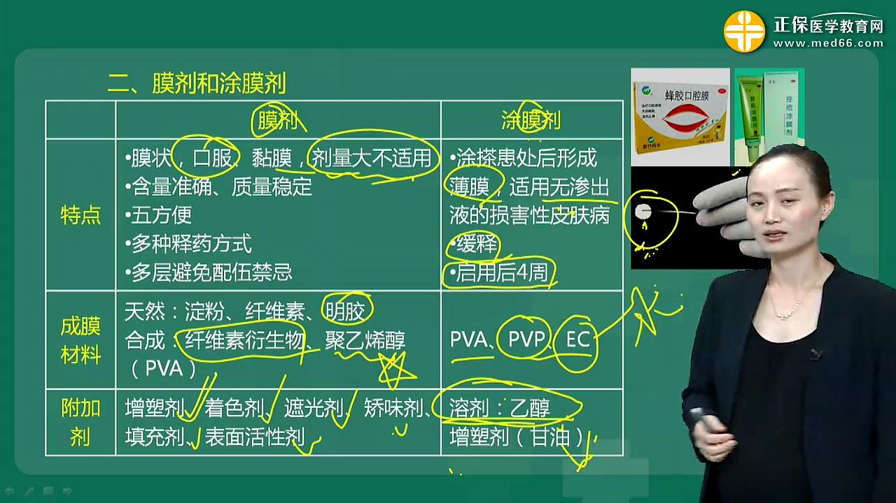
            - 三 其他传统剂型
            - > 锭剂、炙剂、线剂、熨剂、糕剂、丹剂、条剂、钉剂、棒剂的应用特点。
                - 1 锭剂：细粉+符合剂
                    - 应用：
                        - 内服：吞服或研细以水或黄酒化服
                        - 外用：研细用醋或油调敷
                        - 嗅入
                        - 外搽
                - 2 灸剂：将艾叶捣、碾成绒状，或另加其他药料捻制成卷烟状或其他形状，供熏灼穴位或其他患部，外用。借助燃烧产生产温热性刺激及药物的局部透皮吸收，达到预防或治疗疾病的目的。
                - 3 线剂：丝线/棉线置药液中先浸后煮，干燥制成，外用。线剂结扎，辅以药物----治疗肿瘤，止血抗炎。
                - 4 熨剂：细粉/提取液+煅制铁砂，外用
                    - 用时拌醋生热---热刺激及药物蒸气透入熨贴的部位---&gt;活血通络，发散风寒。
                - 5 糕剂：细粉+米粉/蔗糖----&gt;蒸制成块
                    - 含糖味甜可口，治疗小儿脾胃虚弱、面黄肌瘦等慢性消化不良性疾病。
                - 6 丹剂：汞以及某些矿物药，在高温条件下烧炼制成的不同结晶形状的汞的无机化合物
                - > 毒性大仅外用，注意剂量和部位，以免中毒。
散剂、钉剂、药线、药条、外用膏剂
红升丹（HgO）
白降丹(HgCl2)
轻粉（Hg2Cl2）
红丹​​​​​（Pb3O4）---------黑膏药
                - 7 条剂：用桑皮纸粘药膏后搓捻成细条，粘面糊，再粘药粉制成。外用----插入疮口或瘘管，引流脓液，拔毒去腐，生肌
                - 8 钉剂：细粉+糯米粉----&gt;搓成细长尖锐（或锥形）  外用-----插入，治疗痔、瘘管及溃疡性疮疡
                - 9 棒剂：皮肤、黏膜（眼科）----腐蚀、收敛。
        - 第十六节　药物新型给药系统与制剂新技术
            - 一 缓控释制剂
                - 1 特点
                    - （1）缓释，任用持久 ；
                    - （2）用药次数显著减少；
                    - （3）增加患者用药的顺应性；
                    - （4）缓释制剂释药先多后少，控释制剂恒速零级释药；
                    - （5）血药浓度的“峰谷”波动小，保持疗效，减少毒副。
                - 2 不宜制成缓控释制剂的药物
                    - **衰期很短** **很长**
                    - **剂量**
                    - **吸收**
                    - **特定**
                - 3 缓控释制剂的释药原理（溶散蚀渗离）
                    -   
            - 的特点及类型
            - 二 不宜制成缓释、控释
            - 三 靶向制剂的特点及分类
            - 四 环糊精包合技术
            - 五 微型包技术的特点与应用
            - 六 固体分散
        - 第十七节　药物体内过程
    - 第7章中药药理与毒理3
        - 第一节　中药药理
        - 第二节　中药毒理
    - 第8章常用中药的鉴别32
        - 第一节　常用植物类中药的鉴别
            - 一、根及根茎类中药
            - 二、茎木类中药
            - 三、皮类中药
            - 四、叶类中药
            - 五、花类中药
            - 六、果实及种子类中药
            - 七、全草类中药　麻黄　鱼腥草　紫花地丁　金钱草　广金钱草　广藿香　荆芥　益母草　薄荷　半枝莲　香薷　肉苁蓉　穿心莲　车前草　茵陈　青蒿　大蓟　蒲公英　淡竹叶
            - 八、藻、菌、地衣类中药　海藻　冬虫夏草　灵芝　茯苓　猪苓
            - 九、树脂类中药　乳香　没药　血竭
            - 十、其他类中药　海金沙　青黛　儿茶　冰片　天然冰片　五倍子
        - 第二节　常用动物类中药的鉴别
            - 一、常用动物类中药的药用部位
            - 二、动物类中药的性状鉴定
            - 三、常用动物类中药
                - 地龙　水蛭　石决明　珍珠　牡蛎　海螵蛸　全蝎　蜈蚣　土鳖虫　桑螵蛸　斑蝥　僵蚕　蜂蜜　海马　蟾酥　龟甲　鳖甲　蛤蚧　金钱白花蛇　蕲蛇　乌梢蛇　鸡内金　麝香　鹿茸　牛黄　人工牛黄　体外培育牛黄　羚羊角
        - 第三节　常用矿物类中药的鉴定
            - 一、矿物的性质
            - 二、矿物类中药的分类
            - 三、矿物类中药的性状鉴定
            - 四、常用矿物类中药
                - 朱砂　雄黄　自然铜　赭石　炉甘石　滑石　石膏　芒硝　硫黄
- 中药学专业知识（二）
    - 第一部份 单味药
        - 第1章 解表药4
        - > 1、出现恶寒，发热，是为表证。凡以发散表邪，解除表证为主要功效的药物，称为解表药。
2、​多辛，主入肺与膀胱经，性善发散，能使肌表之邪外散或从汗而解。主具发散解表功效。
​例1 【解表药的药味及归经（辛入肺）】
3、本类药主要适用于外感风寒或风热所致的恶寒、发热  ​、头痛等。
解释：风寒（恶寒重，发热轻）；风热（发热重，怕冷轻）。  ​​
4、按性能功效及临床应用，常将本类药分为辛温解表药与辛凉解表药。
5、注意：（1）用量，中病即止，不可过汗，以免操作阳气和津液；（2）体虚多汗及热病后期津液亏损耗忌服；（3）久患疮痈、淋病及失血患者；（4）入汤剂不宜久煎。
不属于解表药使用注意的是（疮疡初起兼表证者忌服）​​​​

            - 辛温解表药
                - **宣肺平喘，利水消肿**
                - > **化湿和中**
                - **温通经脉，助阳化气**
                - > （1）风寒表虚有汗，风寒表实无汗；
​（2）风寒湿痹，经寒血滞之月经不调、痛经、经闭、癥瘕（血致肿块、气致结块 ，使用桂枝茯苓丸3公分以下肿块）；
​（3）胸痹作痛，阳虚心悸；
​（4）虚寒腹痛；（阳虚）
​（5）阳虚水肿，痰饮证。（苓桂术甘汤 ）（另外干姜、细辛有温肺化饮的功效，可合用） 
联系​记忆：肉桂（老皮，助火）；桂枝（嫩芽，易发汗） 
桂枝，好女人，助男人。彭妈妈和习大大。
走表发汗，走里温经的药是（桂枝）
桂枝不适宜的病证（血热出血证）​​​
                - **行气宽中，安胎**
                - > （1）风寒感冒，咳嗽胸闷；
（2）脾胃气滞证；
（3）气滞胎动证；
（4）食鱼蟹中毒引起的腹痛吐泻。
故事：华佗，中国外科医祖。去喝酒发现水塔吃鱼后又吃了紫色叶子。同住的富家子弟吃海鲜拉肚子，吃了紫苏好了。
联系记忆：气滞安胎（紫苏、砂仁）；除热安胎（黄芩、竹茹、苎麻根）；补肝肾安胎（杜仲、莬丝子、桑寄生）​；气虚（白术）。

                - **温肺止咳**
                - > **胃寒呕吐；（胃热呕吐可用竹茹、芦根、枇杷叶）** **​​​解鱼蟹、半夏及天南星毒。**
                -  荆芥：散风解表，透疹止痒，止血
                - > （1）风寒表证，风热表证；
（2）麻疹透发不畅，风疹瘙痒；
（3）疮疡初起有表证者；
（4）​​​（荆芥炭）衄血，吐血，便血，崩漏等证。
对药：荆芥/防风，荆芥走血（营），内部，属女；​防风走气（卫），主外，属男。​
记忆：荆芥，女混身带刺，皮痒痒。​血，钱。放放血，就是花钱。在家混身带刺的管着钱。
联系：透疹止痒的还有蝉蜕。
练习：解表散风通用药（荆芥）​​​
                - 防风：祛风解表，胜湿，止痛，解痉
                - > **防御一切风邪**
                - 羌活：解表散寒，祛风胜湿，止痛（太阳经）
                - > **太阳经**
                - 藁本：发表散寒，祛风胜湿，止痛（颠顶头痛）
                - 白芷：发散风寒，通窍止痛，燥湿止带，消肿排脓
                -  细辛：祛风散寒，通窍，止痛，温肺化饮
                - 香薷：发汗解表，和中化湿，利水消肿
                - 辛夷：散风寒，通鼻窍
                - 苍耳子：散风寒，通鼻窍，除湿止痛，止痒
                - 西河柳：发表透疹，祛风除湿
            - 辛凉解表药
                - 主治外感风热表证、兼治风热咳嗽、麻疹不透、目赤多泪。
                    - 薄荷：宣散风热，清利头目，利咽，透疹，疏肝（不喝，咽真干）
                    - 牛蒡子：疏散风热，宣肺利咽，解毒透疹，消肿疗疮
                    - 蝉蜕：疏散风热，透疹止痒，明目退翳，息风止痉（）
                    - 桑叶：疏散风热，清肺润燥，平肝明目，凉血止血（风干两只肺）
                    - 菊花：疏散风热，平肝明目，清热解毒（清明，死人）
                    - 柴胡：解表退热，疏肝解郁，升举阳气
                    - 升麻：发表透疹，清热解毒，升举阳气（鬼脸，死）
                    - 葛根：解肌退热，透疹，生津，升阳止泻（葛员外家小孩，出疹，口渴，发热，泻下）
                    - 蔓荆子：疏散风热，清利头目，祛风止痛（镜子，疯子梳头）
                    - 淡豆豉：解表，除烦（表姐烦）
                    - 木贼：疏散风热，明目退翳，止血（贼眉鼠眼来偷钱）
                    - 浮萍：发汗解表，透疹止痒，利水消肿
        - 第2章 清热药9
            - 清热泻火
                - 石膏：清热泻火，除烦止渴（生用）；收湿敛疮，生肌止血（煅用）
                - 知母：清热泻火，滋阴润燥（知道母亲）
                - 芦根：清热生津，除烦止呕，利尿（露根，利尿，恶心呕）
                - 天花粉：清热生津，清肺润燥，消肿排脓（洁白如雪花，得天花有脓）
                - 竹叶：清热除烦，生津，利尿
                - 淡竹叶：清热除烦，利尿
                - 栀子：泻火除烦，清热利尿，凉血解毒，消肿止痛
                - 夏枯草：清肝明目，散结消肿
                - 决明子：清肝明目，润肠通便
                - 密蒙花：清热养肝，明目退翳
                - 谷精草：疏散风热，明目退翳
                - 青葙子：清肝泻火，明目退翳
            - 清热燥湿
                - 黄芩：清热燥湿，泻火解毒，止血，安胎
                - 黄连：清热燥湿，泻火解毒
                - 黄柏：清热燥湿，泻火解毒，退虚热
                - 龙胆：清热燥湿，泻肝胆火
                - 苦参：清热燥湿，杀虫止痒，利尿
            - 清热凉血
                - 生地黄：清热凉血，养阴生津，润肠
                - 玄参：清热凉血，滋阴降火，解毒散结，润肠
                - 牡丹皮：清热凉血，活血散瘀，退虚热
                - 赤芍：清热凉血，散瘀止痛，清肝火
                - 紫草：凉血活血，解毒透疹
                - 水牛角：清热凉血，泻火解毒，定惊
            - 清热解毒
                - 金银花：清热解毒，疏散风热
                - 连翘：清热解毒，疏散风热，消肿散结，利尿
                - 紫花地丁：清热解毒，凉血，利咽
                - 蒲公英：清热解毒，消痈散结，利湿通淋
                - 大青叶：
                - 板蓝根：
                - 青黛：
                - 牛黄：
                - 鱼腥草：
                - 射干：
                - 白头翁：
                - 败酱草：
                - 重楼：
                - 穿心莲：
                - 白鲜皮：
                - 半边莲：
                - 土茯苓：
                - 山豆根：
                - 马齿苋：
                - 大血藤：
                - 白花蛇舌草：
                - 野菊花：
                - 熊胆：
                - 金荞麦：
                - 鸦胆子：
                - 垂盆草：
                - 秦皮：
                - 马勃：
                - 木蝴蝶：
                - 半枝莲：
            - 清虚热
                - 青蒿
                - 地骨皮
                - 白薇
                - 胡黄连
                - 银柴胡
        - 第3章 泻下药2
            - 攻下药
                - 大黄
                - 芒硝
                - 芦荟
                - 番泻叶
            - 润下药
                - 火麻仁
                - 郁李仁
            - 峻下逐水药
                - 甘遂
                - 巴豆
                - 京大戟
                - 红大戟
                - 牵牛子
                - 芫花
                - 千金子
        - 第4章 祛风湿药4
            - 独活
            - 防已
            - 徐长卿
            - 桑寄生
            - 蕲蛇
            - 络石藤
            - 海风藤
            - 威灵仙
            - 秦艽
            - 木瓜
            - 五加皮
            - 豨莶草
            - 桑枝
            - 川乌
            - 雷公藤
            - 千年健
            - 青风藤
            - 伸筋草
            - 乌梢蛇
            - 穿山龙
            - 香加皮
            - 臭梧桐
            - 丝瓜络
            - 鹿衔草
            - 路路通
        - 第6章 利水渗湿药2
            - 茯苓
            - 泽泻
            - 滑石
            - 金钱草
            - 猪苓
            - 薏苡仁
            - 车前子
            - 木通
            - 茵陈
            - 通草
            - 萆薢
            - 海金沙
            - 萹蓄
            - 灯心草
            - 广金钱草
            - 石韦
            - 瞿麦
            - 地肤子
            - 冬葵子
            - 连钱草
        - 第7章 温里药1
            - 附子
            - 肉桂
            - 花椒
            - 干姜
            - 吴茱萸
            - 丁香
            - 小茴香
            - 荜茇
            - 高良姜
        - 第8章 理气药2
            - 陈皮
            - 木香
            - 沉香
            - 薤白
            - 青皮
            - 枳实
            - 香附
            - 川楝子
            - 化橘红
            - 佛手
            - 乌药
            - 甘松
            - 枳壳
            - 青木香
            - 玫瑰花
            - 荔枝核
            - 橘红
            - 柿蒂
            - 香橼
            - 梅花
        - 第9章 消食药1
            - 山楂
            - 莱菔子
            - 麦芽
            - 鸡内金
            - 神曲
            - 稻芽
        - 第10章 驱虫药1
            - 使君子
            - 苦楝皮
            - 槟榔
            - 贯众
            - 雷丸
            - 南瓜子
            - 鹤草芽
            - 榧子
        - 第11章 止血药4
            - 大蓟
            - 地榆
            - 白及
            - 茜草
            - 艾叶
            - 小蓟
            - 白茅根
            - 三七
            - 蒲黄
            - 槐花
            - 侧柏叶
            - 仙鹤草
            - 棕榈炭
            - 藕节
            - 血余炭
            - 苎麻根
            - 炮姜
            - 紫珠叶
            - 景天三七
            - 鸡冠花
        - 第12章 活血祛瘀药4
            - 川芎
            - 郁金
            - 丹参
            - 益母草
            - 红花
            - 水蛭
            - 没药
            - 三棱
            - 延胡索
            - 莪术
            - 虎杖
            - 桃仁
            - 牛膝
            - 乳香
            - 姜黄
            - 鸡血藤
            - 川牛膝
            - 西红花
            - 土鳖虫
            - 刘寄奴
            - 穿山甲
            - 月季花
            - 自然铜
            - 苏木
            - 五灵脂
            - 血竭
            - 北刘寄奴
            - 王不留行
            - 干漆
        - 第13章 化痰止咳平喘药6
            - 第一节
                - 半夏
                - 芥子
                - 旋覆花
                - 川贝母
                - 竹茹
                - 竹沥
                - 前胡
                - 海藻
                - 黄药子
                - 天南星
                - 桔梗
                - 瓜蒌
                - 浙贝母
                - 白附子
                - 白前
                - 昆布
                - 天竺黄
                - 瓦楞子
                - 海蛤壳
                - 礞石
                - 海浮石
            - 第二节 止咳平喘药
                - 苦杏仁
                - 紫苏子
                - 葶苈子
                - 款冬花
                - 马兜铃
                - 胖大海
                - 百部
                - 桑白皮
                - 紫菀
                - 枇杷叶
                - 白果
                - 洋金花
        - 第14章 安神药1
            - 第一节 重镇安神药
                - 朱砂
                - 龙骨
                - 珍珠
                - 磁石
                - 琥珀
            - 第二节 养心安神药
                - 酸枣仁
                - 柏子仁
                - 合欢皮
                - 远志
                - 夜交藤
        - 第15章 平肝息风药1
            - 第一节 平抑肝阳药
                - 石决明
                - 赭石
                - 蒺藜
                - 牡蛎
                - 珍珠母
                - 罗布麻叶
            - 第二节 息风止痉药
                - 羚羊角
                - 天麻
                - 蜈蚣
                - 僵蚕
                - 钩藤
                - 全蝎
                - 地龙
        - 第16章 开窍药1
            - 麝香
            - 石菖蒲
            - 冰片
            - 苏合香
            - 安息香
        - 第17章 补虚药9
            - 第一节 补气药
                - 人参
                - 黄芪
                - 山药
                - 西洋参
                - 刺五加
                - 白扁豆
                - 党参
                - 白术
                - 甘草
                - 太子参
                - 大枣
                - 蜂蜜
                - 饴糖
                - 绞股蓝
                - 红景天
            - 第二节 补阳药
                - 鹿茸
                - 淫羊藿
                - 续断
                - 益智仁
                - 肉苁蓉
                - 仁仲
                - 补骨脂
                - 蛤蚧
                - 菟丝子
                - 锁阳
                - 冬虫夏草
                - 紫河车
                - 仙茅
                - 海马
                - 巴戟天
                - 骨碎补
                - 核桃仁
                - 沙苑子
                - 狗脊
            - 第三节 补血药
                - 当归
                - 何首乌
                - 阿胶
                - 熟地黄
                - 白芍
                - 龙眼肉
            - 第四节 补阴药
                - 南沙参
                - 麦冬
                - 黄精
                - 龟甲
                - 天冬
                - 百合
                - 女贞子
                - 哈蟆油
                - 北沙参
                - 石斛
                - 枸杞子
                - 鳖甲
                - 玉竹
                - 墨旱莲
                - 桑椹
                - 楮实子
        - 第18章 收涩药2
            - 五味子
            - 椿皮
            - 莲子肉
            - 桑螵蛸
            - 诃子
            - 乌梅
            - 赤石脂
            - 山茱萸
            - 海螵蛸
            - 肉豆蔻
            - 芡实
            - 浮小麦
            - 五倍子
            - 糯稻根
            - 石榴皮
            - 覆盆子
            - 金樱子
            - 麻黄根
            - 罂粟壳
        - 第19章 涌吐药1
            - 常山
            - 瓜蒂
            - 藜芦
        - 第20章 杀虫燥湿止痒药
            - 雄黄
            - 轻粉
            - 硫黄
            - 白矾
            - 蛇床子
            - 铅丹
            - 露蜂房
            - 土荆皮
        - 第21章 拔毒消肿敛疮药1
            - 斑蝥
            - 蟾酥
            - 马钱子
    - 第二部分常用中成药
        - 第1章内科常用中成药41
        - 
        - 第2章外科、 皮肤科常用中成药5
        - 第3章妇科常用中成药5
        - 第4章儿科常用中成药4
        - 第5章眼科常用中成药2
        - 第6章耳鼻喉、口腔科常用中成药3
        - 第7章骨伤科常用中成药1
- 药事管理与法规
    - 第1章执业药师与药品安全7
    - 第2章医药卫生体制改革与国家基本药物制度6
    - 第3章药品监督管理体制与法律体系9
    - 第4章药品研制与生产管理12
    - 第5章药品经营与使用管理37
    - 第6章中药管理8
    - 第7章特殊管理的药品管理17
    - 第8章药品标准与药品质量监督检验7
    - 第9章药品广告管理与消费者权益保护7
    - 第10章药品安全法律责任6
    - 第11章医疗器械、保健食品和化妆品的管理10
- 中药学综合知识与技能
    - 第1章中医基础理论12
        - 第一节　中医学的基本特点
            - 一、整体观念
                - 1 人是一个有机的整体
                    - （1）五脏一体观，以五脏为中心。
                    - （2）形神一体观
                    - （3）物质与功能一体观 脏腑、经络、精气血津液与其相关的生理功能活动密切相关、协调统一。
                - 2 人与自然环境的统一性
                - 3 人与社会环境的统一性
                    - 每个人与政治、经济、文件、宗教、法律、人际关系、婚姻等社会因素密切相关。
            - 二、辨证论治
                - （一）症、证、病的概念（爷爷儿子孙子）
                    - 症，指疾病的外在表现，即症状。
                    - 病，即疾病的简称，指有特定的致病因素、发病规律和病理演变的异常病变过程，具有特定的症状和体征。如感冒、
                    - 证，是机体在疾病发展过程中某一阶段的病理概括。，包括病变的部位、原因、性质以及邪正关系，能够反映出疾病发展过程中某一阶段的病理变化的本质。（病因+动词+脏腑；脏腑+虚）
                - （二）辨证与诊治的概念
                    - 2 “同病异治”与“异病同治”
                        - 同病异治：
                        - 异病同治：
        - 第二节　阴阳学说
            - 一、阴阳的属性
                - 阴阳，是对自然界相互关联的某些事物和现象对立双方属性的概括，即含有对立统一的概念。
                - 上午为阳中之阳，下午为阳中之阴；夜晚的前半夜为阴中之阴，后半夜为阴中之阳。
            - 二、阴阳的相互关系
                - 1 阴阳的对立制约
                - 2 阴阳的互根互用
                    - 阴阳的互根互用，是阴阳转化的内在根据。
                - 3 阴阳的消长平衡
                    - 从冬至春及夏，气候从寒冷逐渐转暖变热，即是“阴消阳长”的过程。
                - 4 阴阳的相互转化
                    - 重阳必阴，重阴必阳
            - 三、阴阳学说的临床应用
                - （一）在诊断中的应用
                    - 阳：
                    - 阴：
                - （二）在疾病治疗中的应用
                    - 1 确定治疗原则：
                        - 壮水之主，以制阳光（阳病治阴）
                        - 益火之源，以消阴翳（阴病治阳）
                        - 阴中求阳，阳中求阴
                    - 2 归纳药物的性能：
                        - （1）药性，即寒热温凉，又称“四气”
                        - **辛、甘、淡属阳，酸苦咸属阴。**
                        - **升阳、发表、祛风、散寒、涌吐、开窍**
        - **第三节五行学说**
            - 一、五行与五行学说
                - 五行，即木、火、土、金、水
                - （一）五行的特性
                    - （1）木：木曰曲直，引申为具有生长、升发、条达舒畅等作用。
                    - （2）火：火曰炎上，引申为具有温热、升腾等使用的事物。
                    - （3）土：土爰稼穑，引申为具有生化、承载、受纳等作用的事物。土为万物之母。
                    - （4）金：金曰从革，引申为具有清洁、肃降、收敛等作用的事物。 
                    - （5）水：水曰润下，引申为具有寒凉、滋润、向下运行等作用的事物。
                - （二）五行的分类
                    - 1 取像类比法
                    - 2 推演络绎法
                    - 五行系统归类表 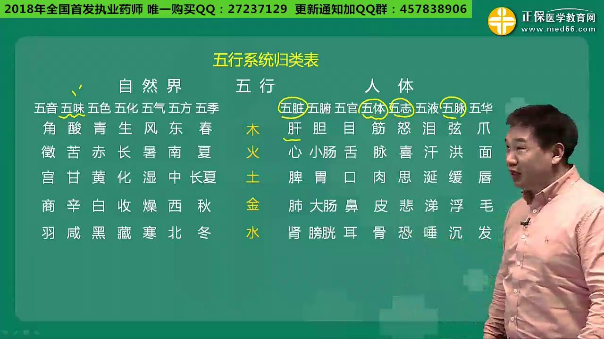
            - 二、五行的生克乘侮
                - （一）五行的相生相克
                    - 1 五行相生：指五行之间存在着有序的资生、助长和促进的作用。
                        - 相生的次序：木、火、土、金、水
                    - 2 五行相克：指五行之间存在着有序的克制、制约的作用。
                        - 相克的次序，克我与我克的联系
                        -  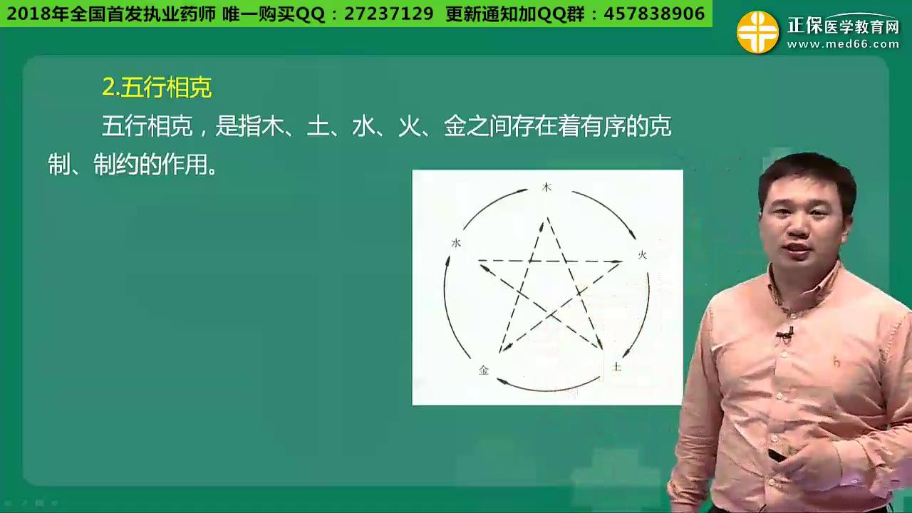
                - （二）五行的相乘相侮
                    - 1 五行相乘：指五行某一行对所胜一行克制太过，引起异常。
                    - 2 五行相侮：五行的某一行对所不胜一行进行反向克制，又称反侮或反克。
                    -  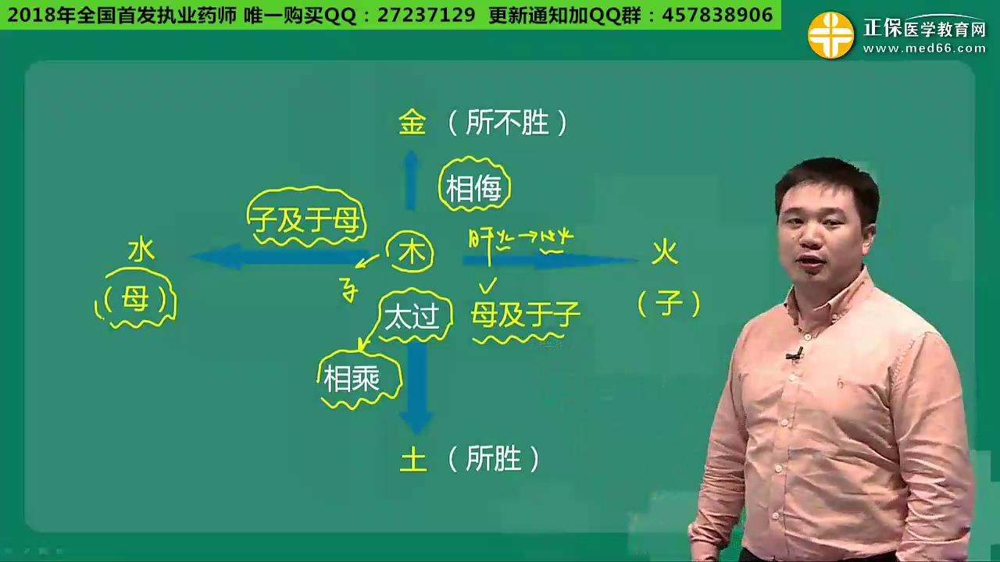
            - 三、五行学说的临床应用
                - （一）在诊断疾病中的应用
                    - 1 阐释疾病传变
                        - （1）相生关系的传变，“母病及子”与“子病及母”
                        - （2）相克关系的传变
                - （二）在疾病治疗中的应用、
                    - 1 根据相生规律确定的治则治法：
                        - 滋水涵木、金水相生、培土生金、益火补土
                        - （水木年华、金水桥、土豪金、火葬土葬）
                    - 2 根据相克规律确定的治则治法
                        - 抑木扶土法、培土制水法、佐金平木法、泻南补北
        - **第四节藏象**
        - > 藏象，指藏于体内脏腑及其表现于外的生理病理征象及与外界环境相侧翼的事物和现象​​

            - 特点： 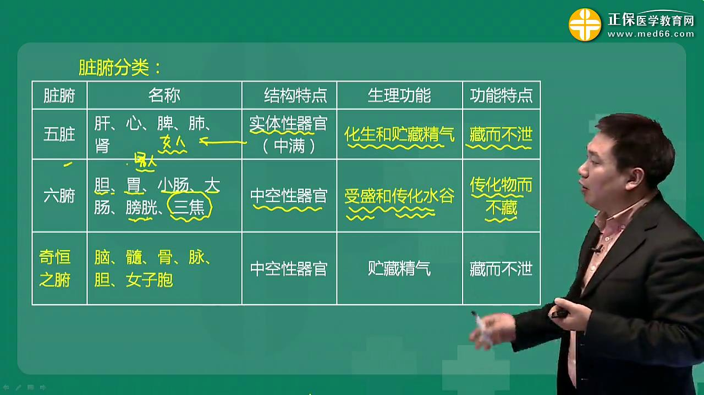
            - 藏象学说的特点：
                - （一）以五脏为中心的人体自身的整体性
                    -  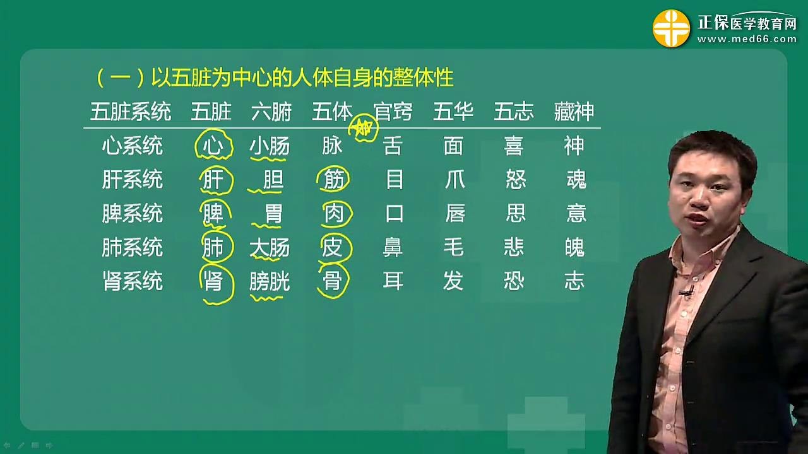
                - （二）五脏与自然环境的统一性
                    -  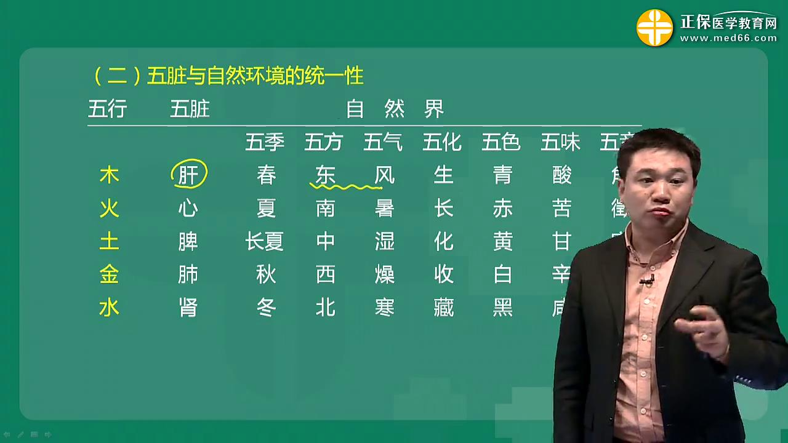
            - 一、五脏的生理功能
                - （一）心的生理功能（心主血脉，主神志，君主之官）
                - > 心悸，怔忡，心烦，失眠，神昏。上焦
                    - 心在志为喜，在体为脉，其华在面，开窍于舌，在液为汗，与夏气相通应。心与小肠相表里，手少阴经属心而络于小肠。
                    - 1 心主血脉
                        - （1）心有推动血液在脉管内运行的作用。
                            - 结构：心------脉-----血（密闭的循环系统）
                        - （2）心对血液的生成也有一定的作用。
                            - 脾胃----（水谷精微）----心阳（火）的温煦-----（化赤）-----血液
                    - 2 心主神明（心藏神）
                        - （1）心主宰人体生命活动
                        - （2）心主宰精神意识思维活动
                    - 【附】心包络：外感热病出现神昏、谵语等病症，称为“热入心包”
                - （二）肺的主要生理功能（华盖，娇脏）
                    - 肺在志为悲，在体为皮，其华在毛，开窍于鼻，在液为涕，与秋气相通应。
                    - 1 主气，司呼吸
                        - 肺主气：主呼吸之气，主一身之气（对全身气机的调节，气的生成--宗气）。
                    - 2 主宣发与肃降
                        - 宣发：
                            - （1）呼出浊气；
                            - （2）脾所转输的津液和水谷精微布散周身，外达皮毛；
                            - （3）宣散卫气，将津液化为汗液，并调节其排泄。（玉屏风散）
                        - 肃降：
                        - （1）吸入自然办清气
                        - （2）排除异物，呼吸通道畅通
                        - （3）将津液向下布散，代谢后生成尿液。
                    - 3 通调水道，促进水液输布与排泄
                    - > 指肺气的宣发肃降作用推动和调节全身水液的输布和排泄。
                        - 肺主行水、肺为水之上源
                    - 4 肺朝百脉，主治节
                        - 全身-----肺的呼吸---全身
                - （三）脾的生理功能（主运化、主统血、主升清、化生气血）
                - > 脾位于中焦，横膈之下。脾为后天之本，气血生化之源
                    - 在志为思，在体为肉，主四肢，开窍于口，其华在唇，在液为涎，与长夏之气相通应。“脾寄旺于四时”足太阴经属脾而络于胃。（不想吃饭与脾有关，吃完不消化与胃有关）
                    - 1 脾主运化（把水谷化为精微；精微物质吸收、传输至全身的生理功能。）
                        - （1）运化食物
                        - （2）运化水液：又称为运化水湿，指脾对水液代谢的调节作用。
                    - 2 脾主统血，指脾能统摄、控制血液、使之正常地循行于脉内，而不逸出于脉外。
                - （四）肝的主要生理功能（刚脏）
                    - 在志为怒，在体为筋，开窍于目，在液为泪，其华在爪，与春气相通应。肝与胆相表里。
                    - 1 主疏泄--气血正常运行----情志活动正常
                        - （1）调畅情志
                            - 促进脾胃运化和胆汁分泌
                            - 促进血液与津液的运行输布。
                            - 肝失疏泄（情志活动异常）
                                - 疏泄不及：肝郁、郁郁寡欢，性情抑郁，沉默寡言，喜太息
                                - 疏泄太过：急躁易怒。
                        - （2） 促进消化吸收
                        - （3）促进血液的运行和津液的代谢
                    - 2 主藏血
                - （五）肾的主要生理功能（腰为肾之府，肾为先天之本，脏腑阴阳之本）
                    - 肾在志为恐，在体为骨，齿为骨之余，其华在发，开窍于耳及前后二阴，在液为唾，与冬气相通应。肾与膀胱相表里，足少阴经属肾络膀胱。（耳呜声音小，用手按后可以缓解，是为虚；如果声音大，跟打雷一样，肝火旺）
                    - 1 肾藏精，主生长、发育与生殖
                        - 先天之精：禀受于父母的
                        - 后天之精：从饮食中摄取的营养和脏腑代谢生化的精微物质
                        - （1）肾藏精的生理效应
                            - 1&gt;主生长、发育
                                -  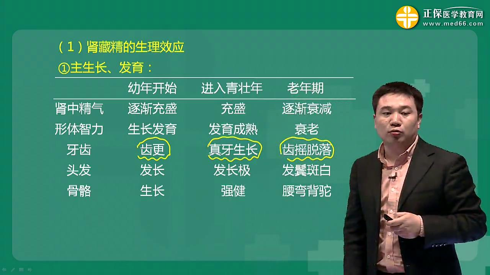
                            - 2&gt;主生殖
                        - （2）肾中阴阳为各脏阴阳之根本
                            - 肾精----肾气
                                - 肾阴、真阴、元阴：滋润、濡养全身脏腑
                                - 肾阳、元阳、真阳：温煦、推动全身脏腑
                    - 2 肾主水
                        - 肾中精气的蒸腾气化，主宰整个水液代谢。
                    - 3 肾主纳气
                        - 肺为气之主------肺主出气
                        - 肾为气之根------肾主纳气
            - 二、五脏之间的关系
                - （一）心与肺
                    - 心血载气并维持肺之呼吸
                    - 肺气助心行血
                - （二）心与脾
                    - 心血滋养维持脾运
                    - 脾运化水谷精微化生心血
                - （三）心与肝
                    - 血液运行正常
                    - 维持精神情志活动正常
                - （四）心与肾
                    - 心肾水火相济
                    - 心肾相交
                - （五）肺与脾
                - （六）肺和肝
                - （七）肺与肾
            - 三、五脏与志、液、体、华、窍的关系
            - 四、六腑的生理功能
            - 五、奇恒之腑
            - 六、五脏与六腑的关系
        - 第五节　生命活动的基本物质
            - 一、气
            - 二、血
            - 三、津液
        - 第六节　经络
            - 一、经络与经络系统
            - 二、十二经脉
            - 三、奇经八脉
            - 四、经络的生理功能
        - 第七节　体质
            - 一、体质的构成要素与分类
            - 二、体质学说的应用
        - **第八节　病因**
            - 一、六淫及疫疠邪气
            - 二、七情内伤
            - 三、饮食与劳逸失常
            - 四、痰饮
            - 五、瘀血
        - **第九节　发病与病机**
            - 一、发病
            - 二、邪正盛衰病机
            - 三、阴阳失调病机
            - 四、气血津液失调病机
        - 第十节　预防与康复
            - 一、预防
            - 二、康复
    - 第2章中医诊断基础11
        - 第一节　中医诊断学概述
            - 一、主要内容
            - 二、基本原则
        - 第二节　四诊
            - 一、望诊
            - 二、闻诊
            - 三、问诊
            - 四、切诊
        - 第三节　辩证
            - 一、八纲辩证
            - 二、脏腑辩证
            - 三、气血津液辩证
    - 第3章常见病辨证论治34
        - 第一节　治则与治法
            - 一‘、治病求本
            - 二、扶正祛邪
            - 三、调整阴阳
            - 四、三因制宜
        - 第二节　中医内科病证的辩证诊治
            - 一、感冒
            - 二、咳嗽
            - 三、喘证
            - 四、胸痹
            - 五、不寐
            - 六、胃痛
            - 七、泄泻
            - 八、便秘
            - 九、中风
            - 十、头痛
            - 十一、眩晕
            - 十二、消渴
            - 十三、淋证
            - 十四、癃闭
            - 十五、阳痿
            - 十六、郁证
            - 十七、虚劳
            - 十八、痹证
            - 十九、中暑
        - 第三节　中医外科病证的辩证诊治
            - 一、疮疖
            - 二、乳癖
            - 三、痤疮
            - 四、瘾疹
            - 五、痔疮
            - 六、跌打损伤
        - 第四节　中医妇科病证的辩证诊治
            - 一、月经不调
            - 二、痛经
            - 三、崩漏
            - 四、带下过多
            - 五、绝经前后诸症
        - 第五节　中医儿科病证的辩证诊治
            - 一、积滞
            - 二、厌食
        - 第六节　中医耳鼻咽喉科病证的辩证诊治
            - 一、鼻渊
            - 二、口疮
            - 三、咽喉肿痛
    - 第4章民族医药基础知识2
        - 第一节　藏医药基本知识
            - 一、藏药的概念
            - 二、藏医基础知识
            - 三、藏药基础知识
        - 第二节　蒙医药基础知识
            - 一蒙药的概念
            - 二蒙医基础知识
            - 三蒙药基础知识
        - 第三节　维吾尔医药基本知识
            - 一维吾尔药概念
            - 二维吾尔医基础知识
            - 三维吾尔药基础知识
    - 第5章常用医学检查指标及其临床意义2
        - 第一节 血常规检查
            - 一、白细胞计数WBC
            - 二、白细胞分类计数DC
            - 三、红细胞计数RBC
            - 四、血红蛋白Hb
            - 五、血小板计数PLT
            - 六、红细胞沉降率ESR
        - 第二节 尿常规检查
            - 一、尿液酸碱度pH
            - 二、尿比重SG
            - 三、尿蛋白PRO
            - 四、尿葡萄糖GLU
            - 五、尿胆红素BIL
            - 六、尿隐血BLD
            - 七、尿中白细胞LEU
            - 八、尿沉渣管型
            - 九、尿沉渣结晶
            - 十、尿酮体KET
            - 十一、尿淀粉酶UAMY
        - 第三节 粪常规检查
            - 一、粪外观
            - 二、粪隐血
            - 三、粪胆原
            - 四、粪便细胞显微镜检查
        - 第四节 肝功能检查
            - 一、血清丙氨酸氨基转移酶ALT
            - 二、血清天门冬氨酸氨基转移酶AST
            - 三、血清γ-谷氨酰转移酶γ-GT
            - 四、血清碱性磷酸酶ALP
            - 五、血清总蛋白、白蛋白和球蛋白
            - 六、血清总胆红素、非结合胆红素、结合胆红素
        - 第五节 肾功能检查
            - 一、血清尿素氮BUN
            - 二、血清肌酐Cr
        - 第六节 血液生化检查
            - 一、淀粉酶ＡＭＳ
            - 二、血清肌酸激酶及其同工酶
            - 三、心肌肌钙蛋白ＩcＴnＩ
            - 四‘、血尿酸ＵＡ
        - 第七节 糖、脂代谢检查
            - 糖代谢检查
                - 一、空腹血糖ＦＢＧ和口服葡萄糖耐量试验ＯＧＴＴ
                - 二、糖化血红蛋白ＨbAlc
            - 脂代谢检查
                - 一、总胆固醇ＴＣ
                - 二、三酰甘油ＴＧ
                - 三、高密度脂蛋白ＨＤＬ
                - 四、低密度脂蛋白ＬＤＬ
        - 第八节 乙型肝炎病毒标志物检测
            - 一、乙肝病毒标志物六项
            - 二、乙肝病毒ＤＮＡ
    - 第6章中医药文献信息与咨询服务2
        - 第一节 中医药信息
            - 一、特点与来源
            - 二、传统文献
            - 三、现代信息
        - 第二节 咨询服务和用药指导
            - 一、咨询服务方法
            - 二、咨询服务的对象和内容
            - 三、咨询技巧
            - 四、应用药品的特殊提示
    - 第7章中药调剂操作的基本技能知识21
        - 第一节　中药处方
            - 一、处方的意义
            - 二、处方的格式
            - 三、处方的常用术语
            - 四、处方调剂的流程
        - 第二节　处方审核
            - 一、处方审核的原则和要求
            - 二、处方审核的主要内容
        - 第三节　处方调配与复核
            - 一、饮片处方调配
            - 二、中成药处方调配
            - 三、调配复核
        - 第四节　发药
            - 一、中药发药流程与要求
            - 二、中药饮片用药指导内容与要点
            - 三、中成药用药指导内容与要点
        - 第五节　中药汤剂
            - 一、中药汤剂沿革
            - 二、中药汤剂的煎煮
        - 第六节　特殊中药处方的调剂
            - 一、特殊管理的中药
            - 二、有毒、小毒中药的用法用量及调剂
    - 第8章中药的贮藏与养护6
        - 第一节　中药的质量变异现象
            - 一、中药饮片贮存中常见的质量变异现象
            - 二、中成药贮存中常见的质量变异现象
        - 第二节　引起中药质量变异的因素
            - 一、自身因素对中药质量变异的影响
            - 二、环境因素对中药质量变异的影响
        - 第三节　中药贮藏
            - 一、中药贮藏的环境要求
            - 二、中药饮片的贮藏要求
            - 三、中成药剂型与贮藏要求
        - 第四节　中药养护
            - 一、传统养护技术
            - 二、现代养护技术
    - 第9章中药的合理应用15
        - 第一节　合理用药概述
            - 一、基本概念
            - 二、目的与意义
            - 三、基本原则
            - 四、执业药师的作用
            - 五、不合理用药的主要表现
            - 六、不合理用药的后果
            - 七、保证合理用药的主要措施
        - 第二节　中成药的联合应用
            - 一、中成药的合理联用
            - 二、中成药联用的配伍禁忌
        - 第三节　中西药的联合应用
            - 一、中西药联用的特点
            - 二、中西药的药物相互作用
            - 三、中西药联用的例举
            - 四、含西药组分的中成药品种及使用注意事项
    - 第10章特殊人群的中药应用7
        - 第一节　老年人的中药应用
            - 一、老年人合理应用中药的原则
            - 二、老年人合理服用滋补药的注意事项
        - 第二节　妊娠期患者和哺乳期患者的中药应用
            - 一、妊娠期患者的中药应用
            - 二、哺乳期患者的中药应用
        - 第三节　婴幼儿患者的中药应用
            - 一、婴幼儿患者合理应用中药的原则
            - 二、婴幼儿患者应用中药的注意事项
        - 第四节　肾功能不全者的中药应用
            - 一、肾功能不全者用药基本原则和注意事项
            - 二、常见对肾功能有影响的中药
            - 三、中药引起肾损伤的防治原则
        - 第五节　肝功能不全者的中药应用
            - 一、肝功能不全者用药基本原则和注意事项
            - 二、引起肝损伤的中药及其主要化学物质
    - 第11章中药不良反应8
        - 第一节　药物不良反应概述
            - 一、药物不良反应概念
            - 二、不良反应分类
        - 第二节　中药不良反应常见的临床表现
            - 一、皮肤症状
            - 二、全身症状
        - 第三节　引起中药不良反应发生的因素
            - 一、药材和使用的因素
            - 二、机体因素
        - 第四节　医疗用毒性中药的中毒反应和基本救治原则
            - 一、乌头类药物
            - 二、马钱子及含马钱子的中成药
            - 三、蟾酥及含蟾酥的中成药
            - 四、雄黄及含雄黄的中成药
            - 五、含朱砂、轻粉、红粉的中成药
        - 第五节　常见中药品种的不良反应
            - 一、中药饮片的不良反应
            - 二、中成药的不良反应
            - 三、中药注射剂的不良反应
        - 第六节　中药不良反应监测和报告
            - 一、药品不良反应监测方法
            - 二、药品不良反应监测报告监管系统
            - 三、药品不良反应的监测报告范围
            - 四、药品不良反应的报告程序
            - 五、药品不良反应/事件报告表