# 针灸学
- **绪论**
    - **针灸学**
        - **定义**
            - 中医基本理论——-指导
            - 经络腧穴理论——基础
            - **针刺** **艾灸**
            - **防治疾病**
        - **中医十问歌**
            - 一问寒热二问汗，三问头身四问便
            - 五问饮食六胸腹，七聋八渴俱当辨
            - 九问旧病十问因，再兼服药参机变
            - 妇女尤必问经期，迟速闭崩皆可见
            - 再添片语告儿科，天花麻疹全占验
        - **地位**
            - 针灸是中华民族的一项重大发明，最初它只是古代的一种重要医疗手段，后来逐渐发展成为一门专门学科
            - 它是我国人民和医学家在长期与疾病作斗争中的经验结晶
    - **针灸学发展简史**
        - **针灸的起源**
            - **起源** **氏族公社制度时期**
                - 针灸疗法大约产生于距今 7000～8000 年到 4000 年的新石器时代
            - **砭石** **砭刺**
                - **金属针具的产生**
                    - *砭石→骨针、竹针→金属针*
                - **针刺特殊部位疗法**
                    - **耳针疗法** 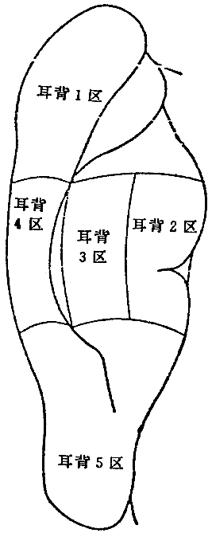
                        - 美军称之为战地针灸，或者战场针灸 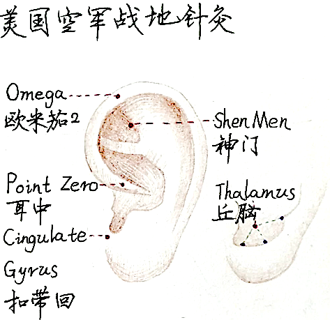
                            - 运用于战场急救
                            - 扣带回、丘脑、耳中、神门、和欧米茄2
                                - 下针的顺序：从下往上，一步一针，扣带回是第一针，欧咪茄2是最后一针
                                - 止痛，抗感染，抗过敏
                    - **头针疗法**
                    - **眼针疗法**
                    - **腹针神龟图**
                    - **脐针**
                    - **腕踝针法**
                    - **舌针疗法**
                    - **手针疗法**
                    - **董氏奇穴**
            - **灸法** **学会用火以后**
                - 拔罐，古称角法
                - 人们在用火的过程中，逐渐认识到了温热的治疗作用，通过长期的实践，形成了灸法
                - **灸法**
                - > 定义
                    - 通过刺激人体的一定部位（腧穴），以起到疏通经络、行气活血、协调脏腑阴阳等作用，从而达到扶正祛邪、治疗疾病的目的
                - *艾绒纯度说明*
                - > 艾灸的主要材料是艾绒，艾绒的纯度越高效果越好艾绒是由艾叶经过反复晒杵、捶打、粉碎，筛除杂质、粉尘而得到的软细如棉的物品。艾条的纯度比例，就是指用多少艾叶提取艾绒，纯度越高的艾绒筛除杂质提纯的次数越多杂质越少，比如 20:1 的艾绒就是用 20 斤艾叶提取一斤艾绒，如果是 1:1 的艾绒等于是把艾叶粉碎无任何筛除杂质。
                - **艾炷灸、艾卷灸、温针灸、温灸器灸**
        - **起始时期**
        - > 《内经》成书以前
        - **建立时期**
        - > 战国到秦汉，以《内经》成书为标志
            - **《黄帝内经》** **针灸理论体系的基本形成**
                - **《灵枢》又称为《针经》**
                - > 150+个穴位
                - 较为完整地论述了经络腧穴理论、刺灸方法和临床治疗等
                - **针灸史上第一次对针灸学作了比较系统的总结**
                - 为后世针灸学说的发展奠定了基础
            - **《黄帝八十一难经》（简称《难经》）**
                - 大约成书于汉代
                - **奇经八脉** **原气**
                - **八会穴**
                - **五行学说** **五输穴**
            - **华佗&张仲景**
                - **“华佗夹脊穴”**
                - **六经辨证** **针药并用，辨证论治**
                - 这些成就都丰富了针灸学的理论体系
        - **发展时期**
            - **魏晋时代**
                - **《针灸甲乙经》** **349个** 名称、定位和刺灸法 **又一次总结**
            - **两晋和南北朝时期**
                - **《肘后备急方》**
            - **隋唐时代**
                - 针灸学有了长足的发展
                - 唐初时针灸已成为专门的学科，设“针师”、“灸师”等专业称号
                - 唐代是国家针灸教育体系形成的开端，唐太医署负责医学教育，内设针灸专业，有“针博士一人，针助教一人，针师十人，针工二十人，针生二十人”（《旧唐书志第24职官3》），为针灸学的规范教育奠定了基础
                - **《备急千金要方》** **最早的彩色经络腧穴图** **“阿是穴”和“指寸法”**
                - **《外台秘要》** **《骨蒸病灸方》**
                - 《新集备急灸经》是我国最早雕版印刷的医书
            - **北宋**
                - **《铜人腧穴针灸图经》**
            - **南宋**
                - **《备急灸法》**
                - **《针灸资生经》**
            - **金代**
                - 何若愚创立的子午流注针法，提倡按时取穴法，建立于针灸时间医学
                - 马丹阳善用“天星十二穴”
                - 窦汉卿擅长应用“八脉交会穴”
            - **元代**
                - **《十四经发挥》，首次把任、督二脉和十二经脉并称为“十四经”**
            - **明代**
                - 针灸学发展史上较为活跃的时期
                    - **陈会《神应经》**
                    - **徐凤《针灸大全》**
                    - **高武《针灸聚英》**
                    - **杨继洲的《针灸大成》**
                        - **第三次总结**
                        - > 炙法、灸法
                        - 该书是在杨继洲家传的《卫生针灸玄机秘要》基础上，汇编历代诸家针灸学术观点、实践经验编撰而成，是后世学习、研究针灸的重要参考文献
                    - **吴崑的《针方六集》**
                    - **汪机的《针灸问对》**
                    - **张介宾的《类经图翼》**
                    - **李时珍的《奇经八脉考》**
        - **衰退时期**
            - 清代针灸学开始走向衰退，当时医者多重药轻针，尤其是清代统治者竟以“针刺火灸，究非奉君所宜”的荒诞理由，于公元1822年废除了太医院的针灸科
            - 这一时期针灸著作
                - **《医宗金鉴·刺灸心法要诀》**
                - **《针灸集成》**
                - **《针灸逢源》**
                    - 强调辨证取穴，针药并重。增加中枢、急脉两穴，列出361个经穴
            - **承淡安**
        - **繁荣时期**
            - **“针刺麻醉”**
            - 20世纪50年代后期到20世纪60年代，研究古代针灸文献，针灸临床疗效总结，及实验研究，观察针灸对各系统器官功能的影响，揭示针灸的基本作用；在针刺镇痛的基础上开展了针刺麻醉的研究与实践
            - 20世纪70年代以来，应用神经生理学、解剖学、组织化学、生物化学、免疫学、分子生物学及声、光、电、磁等先进的现代科学技术手段，对针灸学的相关问题进行了深入的研究，尤其对于针灸治病机理和镇痛原理都有了更深刻的认识
            - 针灸治疗病种也不断扩大，临床实践表明，针灸对内、外、妇、儿、五官、骨伤等科300多种病证有一定的治疗效果，对其中100种左右的病证有较好或很好的疗效。不少学者对针刺手法也开展了研究
        - **★考点**
            - 最早的针灸学文献：《足臂十一脉灸经》和《阴阳十一脉灸经》
            - 标志着针灸学理论体系的形成：《内经》
            - 又称《针经》的是：《灵枢》
            - 起承前启后作用的是：《针灸甲乙经》
            - 最早的彩色经络腧穴图：唐代孙思邈绘制的《明堂三人图》
            - **杨继洲的《针灸大成》** **第三次总结**
            - 首次把任、督二脉和十二静脉并称十四经：元代滑寿编撰的《十四经发挥》
    - **针灸学的对外传播**
        - **朝鲜、日本**
        - **日本**
        - **东南亚** **印度** **越南**
        - **欧洲** **法国** **德国、美国、英国**
        - **世界卫生组织**
            - 为适应针灸医学的国际化发展要求，我国成立了多个针灸国际培训中心，为许多国家培养了针灸人才，目前在全世界有120多个国家和地区应用针灸治病
            - 日本、朝鲜、加拿大、美国、德国
    - **针灸学的基本内容和特点**
        - **内容**
            - 经络腧穴
            - 刺灸方法
            - 临床治疗
        - **特点**
            - 适应症广
            - 疗效明显
            - 操作方便
            - 经济安全
- **第一章 经络总论**
    - 经络的发现
        - **经络的发现**
            - **针刺等感传的观察**
                - **针感**
                - > ★名词解释
                    - **患者**
                        - **得气感：**
                            - **得气**
                            - 这种针感产生的程度及其持续时间的长短，往往和疗效有密切的关系，特别是与镇痛效果的好坏有关，得气与否也是针刺麻醉成功的一个关键性问题
                        - **针感：**
                    - 这种“针感”常沿着一定路线向远部传导
                        - *《灵枢·邪气脏腑病形》指出：“中气穴，则针游于巷。”*
                            - *无法“中气穴”*
                            - 气穴：可以感传的穴位
                            - *针游于巷”*
            - **腧穴功效的总结**
                - 新石器时代：砭石——切开排脓
                - 为避免感染：砭石→针
                - 没病的位置→有病的位置——经络的来源
            - **气功“行气”感的反复出现**
            - **体表病理现象的总结**
                - 古代医家在医疗实践中发现，当体内某一脏腑发生疾病时，在体表相应部位可出现一些病理现象，如压痛、结节、皮疹、皮肤色泽改变等异常反应
            - **解剖、生理知识的启发**
        - **经络的含义**
            - 联络脏腑肢节，沟通上下内外，运行气血，协调阴阳，调节人体各部的通路
                - **经脉**
                    - 经——路径
                - **络脉**
                    - 络——网络
            - **经络**
                - **经脉**
                    - **含义：**
                    - **地位：**
                    - **走行方向：**
                    - **分布形式：**
                    - **深浅分布：**
                - **络脉**
                    - **含义：**
                    - **地位：**
                    - **走行方向：**
                    - **分布形式：**
                    - **深浅分布：**
        - **经络学说的含义**
            - **循行分布、生理功能、病理变化、与脏腑相互关系**
        - **经络学说在中医学中的地位**
            - 它是祖国医学理论体系的重要组成部分，贯穿于中医学的生理、病理、诊断和治疗等各个方面，几千年来一直指导着中医各科的临床实践，其与针灸学科的关系最为密切
                - *《灵枢·经脉》：“经脉者，所以决死生，处百病，调虚实，不可不通”*
                - *李梴《医学入门》：“医而不知经络，犹人夜行无烛，业者不可不熟”*
    - 经络系统的组成
        - **经络系统的组成** 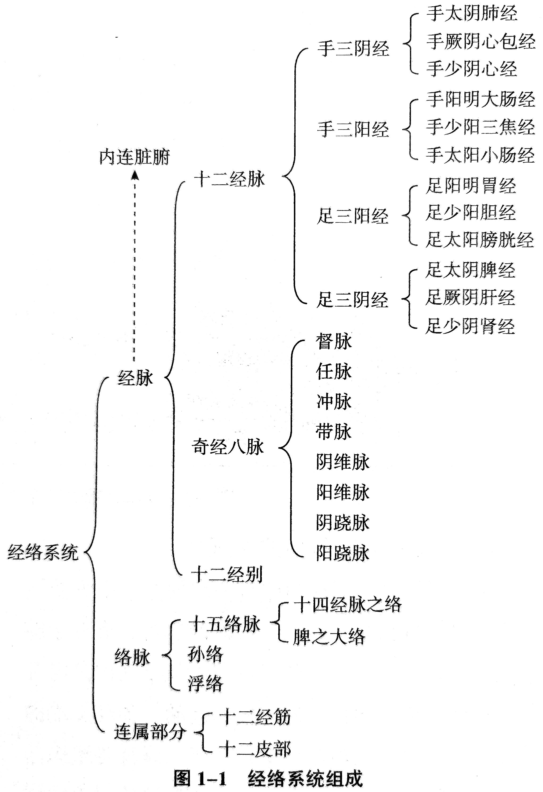
        - **经脉**
            - **十二经脉**
                - **含义**
                - > **“正经”** **名词解释​**
                    - 手三阴经（肺、心包、心）
                    - 手三阳经（大肠、三焦、小肠）
                    - 足三阳经（胃、胆、膀胱）
                    - 足三阴经（脾、肝、肾）
                - **命名** 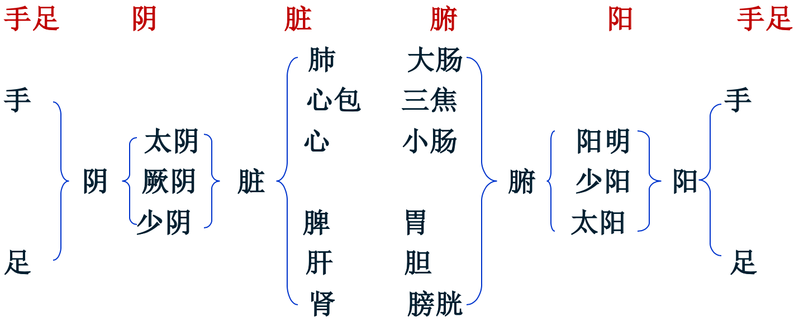
                - **体表分布规律**
                - > ★简答
                    - 左右对称，四肢、头面、躯干部，纵贯全身
                        - **阴经**
                        - > 特例：足阳明胃经——胸腹部唯一阳经
                        - **阳经**
                    - **排列顺序**
                    - > 三阴：内侧；三阳：外侧、头面 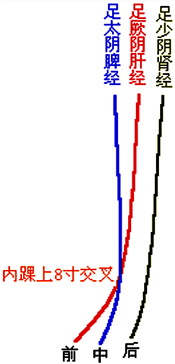
                        - 太阴——前——阳明　
                        - 厥阴——中（侧）——少阳
                        - 少阴——后——太阳&nbsp;
                        - 特殊点：内踝上8寸处
                - **十二经脉表里属络** 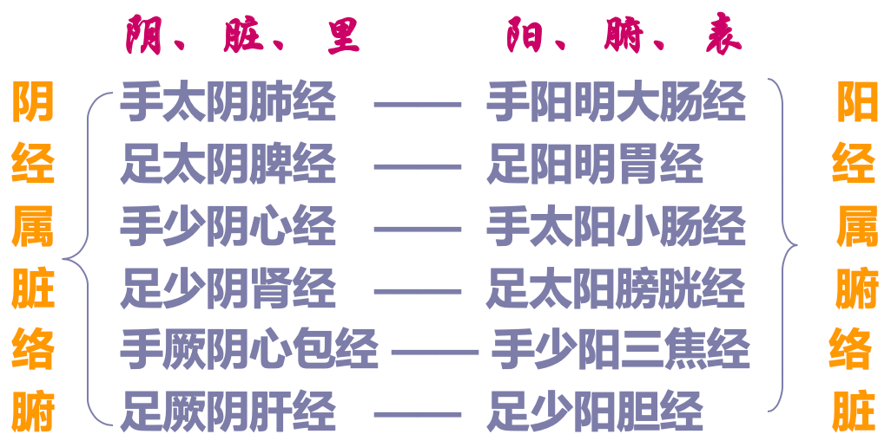
                    - **十二经脉与脏腑器官的联络** 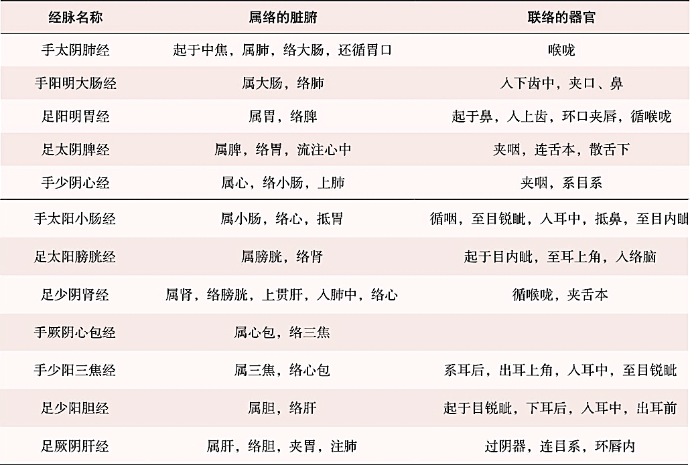
                - **十二经脉走向** 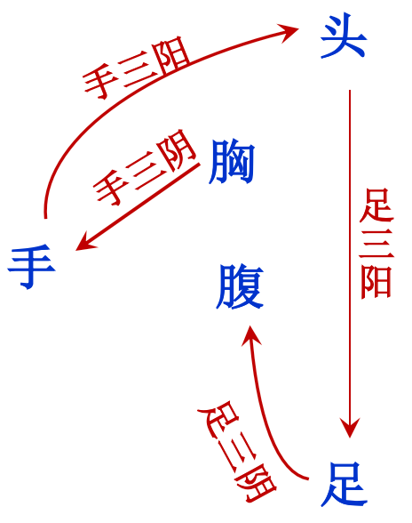
                    - 手之三阴胸内手
                    - 手之三阳手外头
                    - 足之三阳头外足
                    - 足之三阴足内腹（胸）
                - **十二经脉交接、流注** 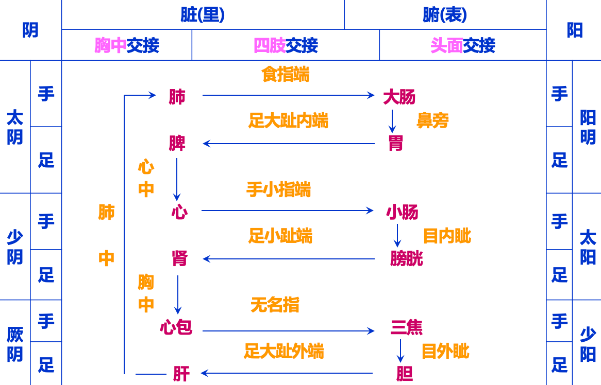 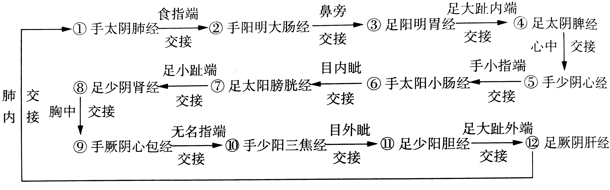
                    - **交接规律**
                        - 表里阴阳经——四肢末端交接
                        - 同名阳经——头面部交接
                        - 阴经与阴经——胸部交接
                    - **流注次序** 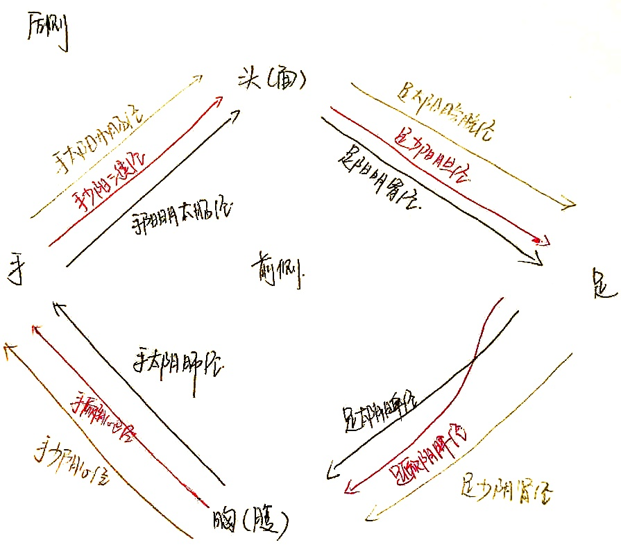
                        - 肺大胃脾心，小胱肾包焦，胆肝十二经，循环不停息 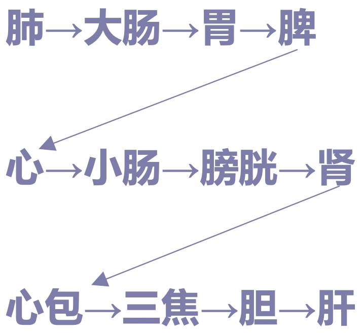
                        - **小周天&大周天** 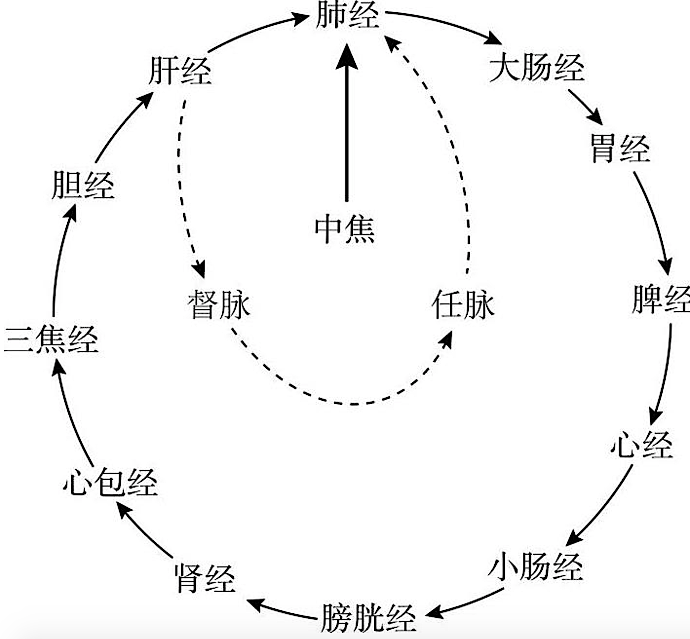
            - **十二经别**
                - **概念**
                    - 经别，是从十二经脉分出，深入躯干联络脏腑器官，沟通表里两经的支脉，是别道而行的正经
                - **命名**
                    - 以所别出的经脉名称为名
                - **分布规律** 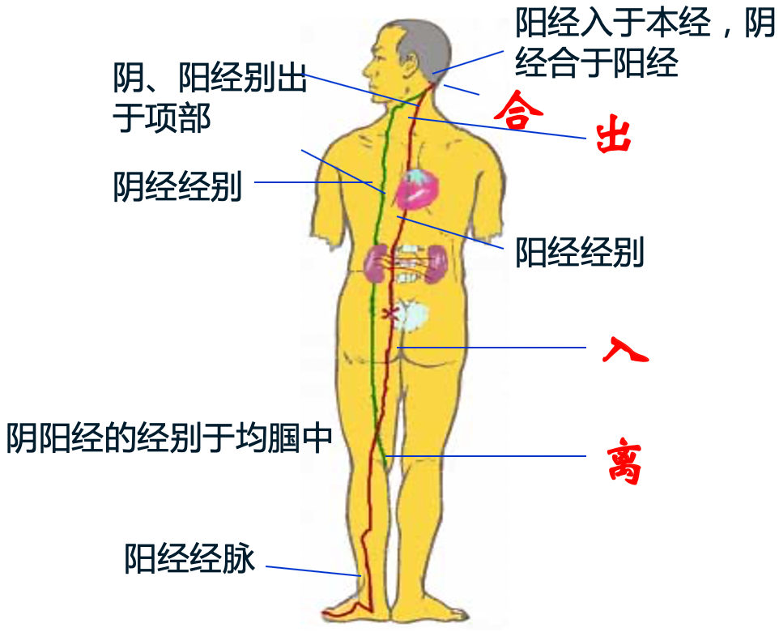 
                    - **离：**
                        - 四肢→头身（脏腑）
                        - > 向心性
                    - **入：**
                    - **出：**
                    - **合：**
                        - **六合**
                        - > 上达头面

                            - **名词解释​**
                                - **“六合”**
                            - 阴经经别合于相表里的阳经
                            - 阳经经别合于本经
                - **功能作用**
                    - **加强经脉表里联系，特别是加强了经脉与表里脏腑之间的联系**
                    - **补充经脉循行之不足——扩大经穴主治范围**
                        - 足六经的经别多联系到“心”&nbsp;——主治神志病
                        - 阴经经别合入于阳经而上达头面——治疗头面
                        - 加强阴经与头面部的联系——五官病变
                    - **其他**
                        - 手阳明经别过“喉咙”——治咽喉痛
                        - 足太阳“入肛下尻”——主治痔疾
                - **络脉与经别的关系** 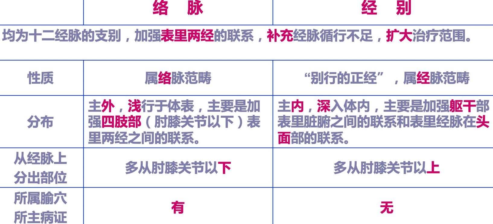
            - **十二经筋**
                - **概念**
                    - **筋肉关节**
                - **命名**
                    - 以所辖经脉之名为名
                - **分布规律**
                    - **与其所辖之经脉的体表投影基本一致（尤四肢）**
                    - **起于四肢末端，走向头面、胸腹（向心性）**
                    - **行于体表，不入内脏**
                    - **结、聚**
                        - 结聚多在关节、骨节突出及肌肉丰厚处，并与邻近他经相联结 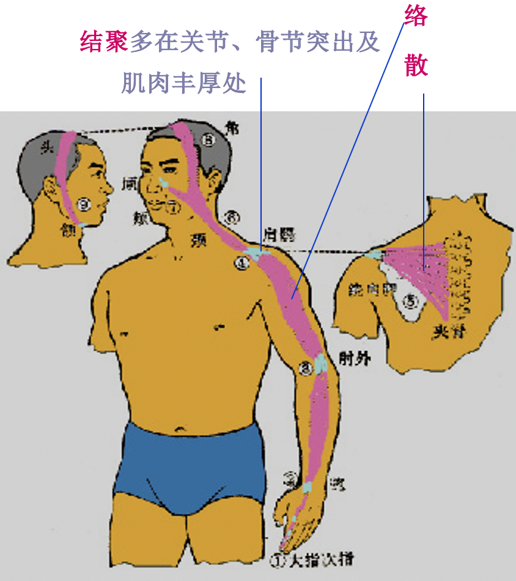
                        - 手足三阴三阳分组结聚于头面、胸腹 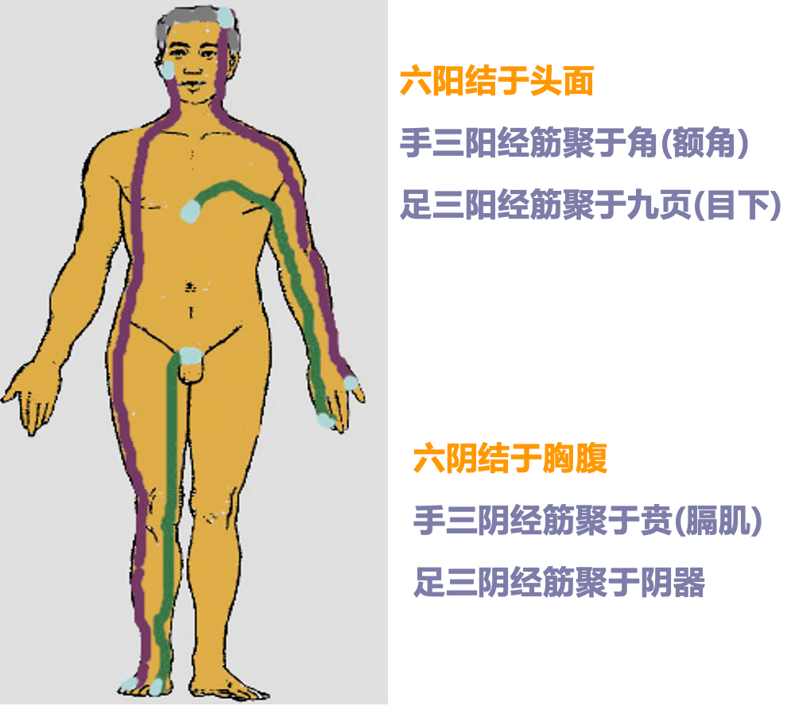
                    - **散：**
                    - **络：**
                - **功能作用**
                    - 联结、约束、濡养、支配筋肉关节——运动正常
                - **经筋与经别之异同** 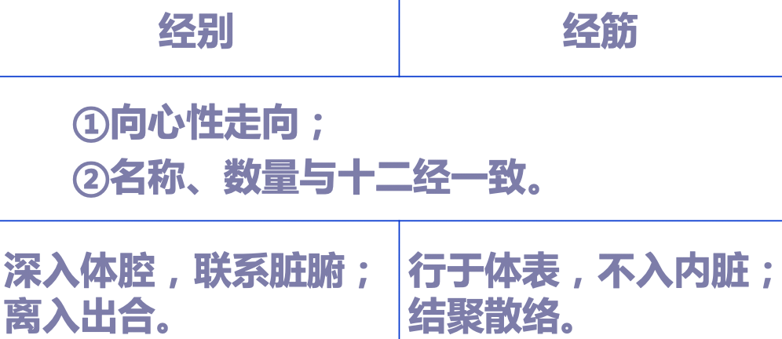
                - **临床意义**
                    - 经筋为病，多有转筋、筋痛、弛纵等表现，针灸治疗多局部取穴，且多用燔针劫刺
                        - *《灵枢经筋》云：“治在燔针劫刺，以知为数，以痛为输。”*
            - **十二皮部**
                - **概念**
                    - 十二皮部是十二经脉功能活动反映于体表的部位，也是络脉之气在皮肤所散布的部位
                    - > *《素问·皮部论》：“凡十二经络脉者，皮之部也”*
                - **特点**
                    - 与经络气血相通
                - **分布规律**
                    - “以经脉为纪” 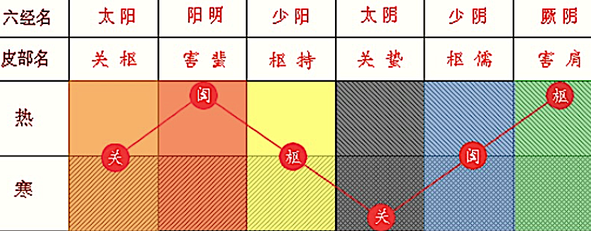
                    - 面状分布；布于体表，不入内脏，与络脉（浮络）关系密切
                - **功能作用**
                    - 卫外——保护机体，抗御外邪（卫气），反应病证
            - **奇经八脉**
                - **概念**
                    - 督脉、任脉、冲脉、带脉、阴维脉、阳维脉、阴跷脉、阳跷脉的总称
                    - **十四经**
                        - **十二经脉** **任督二脉**
                - **奇经八脉&十二经脉** 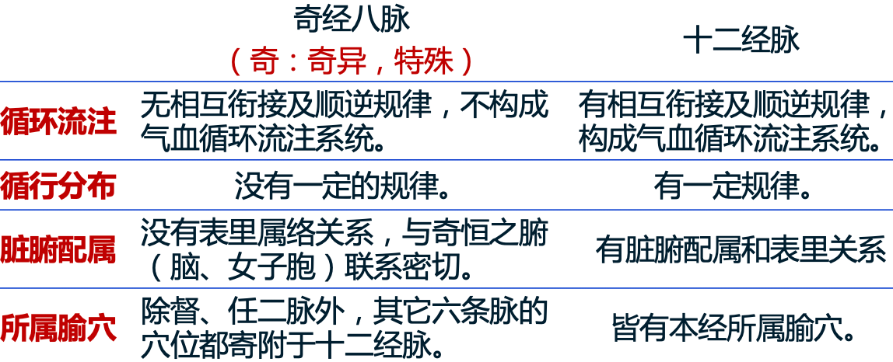
                - **循行概况**
                    - **一源三歧（起于胞中）**
                        - **督脉：** 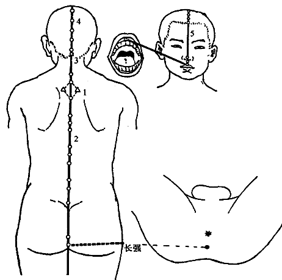
                        - **任脉：** 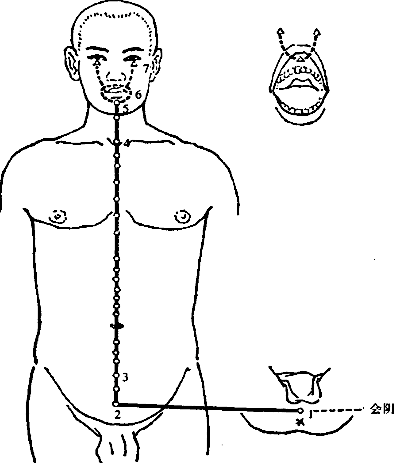
                        - **冲脉：** 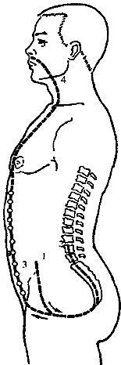
                        - **带脉：** 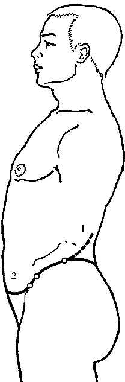
                        - **维脉**
                            - **阴维：** 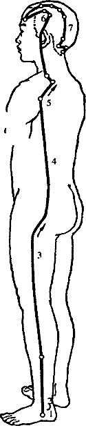
                            - **阳维：** 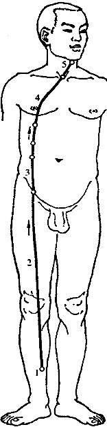
                        - **跷脉**
                            - **阴跷：** 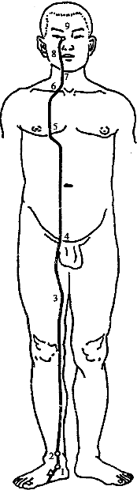
                            - **阳跷：** 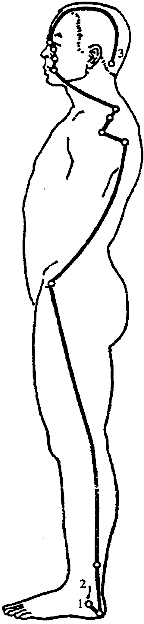
                - **功能作用**
                    - **沟通、联络十二经脉——统摄协调**
                        - **督脉：**
                            - 总督诸阳
                        - **任脉：**
                            - 总督诸阴
                        - **冲脉：**
                            - 涵蓄十二经气血
                        - **带脉：**
                        - **维脉：**
                            - **阴维脉：**
                            - **阳维脉：**
                        - **阴跷脉、阳跷脉：**
                    - **蓄积、渗灌十二经气血——调节**
                        - **蓄积：**
                        - **渗灌：**
        - **络脉**
        - > 皮肤表面、可见，青黑紫——瘀血，刺——血热，白——虚
            - **十五络脉**
                - **概念**
                    - 十二经脉和任、督二脉（十四经）各自别出一络，加上脾之大络，共计十五条，称为十五络
                - **命名**
                    - 以所别出的经脉、腧穴名称为名
                - **分布** 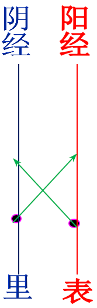
                    - **四肢：**
                    - **躯干**
                        - **前：**
                        - **后：**
                        - **侧：**
                    - **孙络、浮络：**
                        - 行于外者——“阳络”
                        - 行于内者——“阴络”
                - **作用**
                    - 加强表里经，渗灌气血
                        - **四肢：**
                        - **躯干**
                            - **前：**
                            - **后：**
                            - **侧：**
                    - **孙络、浮络：**
            - **孙络**
                - 络脉最细小的分支称为“孙络”，遍布全身，难以计数
            - **浮络**
                - 络脉中浮行于浅表部位的称为“浮络”
    - 经络的标本、根结和气街、四海
        - **《内经》** **根结、标本、气街、四海**
        - > 重点：名词解释
        - **根结与标本**
            - **根结** 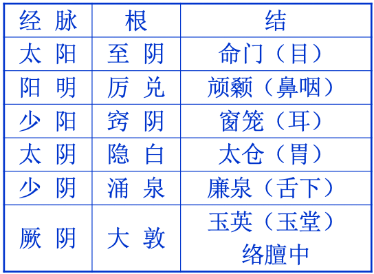
                - 根——根本，开始
                - 结——结聚，归结
                - **向心性** **四肢末端流向头、胸、腹**
                - **“四根”、 “三结”** **四肢** **头、胸、腹**
                    - *马莳：“脉气所起为根，所归为结。”*
                    - **四肢未端井穴** **头胸腹的一定部位**
                - 根结的理论，阐述了人体四肢与头面躯干的有机联系和腧穴之间的配合作用
            - **标本**
                - **经脉腧穴分布的上下** **标** **上** **本** **下**
                    - **四肢为本，头面躯干为标**
                    - > **《灵枢·卫气》** **腕踝关节** **头面** **躯干** 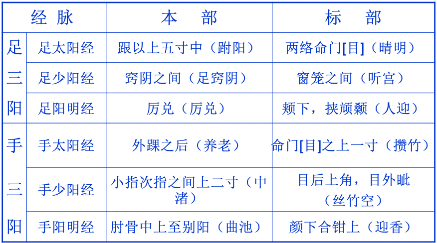 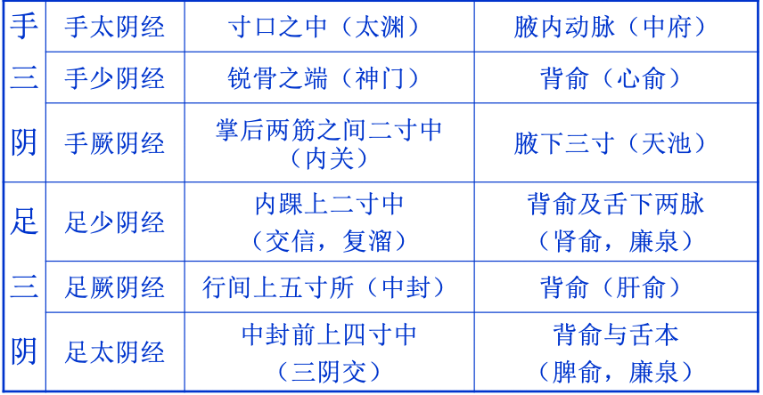
            - **标本与根结之间的关系**
                - 根之上再有本，结之外又有标
                - **根结** **经气循行两极间的关系** **经脉分布上下部位的相应关系**
                - 它们相互贯通，共同阐明脉气上下、内外相应的原理
                - **标本&根结：十二经脉的“根”与“本”、“结”与“标”位置相近或相同，意义也相似**
                    - 根、本——部位在下，皆经气始生始发之地，为经气之所出
                    - 结、标——部位在上，皆为经气归结之所
                    - 反映的是十二经脉的向心性的经气输注，强调了肘膝以下诸穴的重要作用，为五输穴等特定穴的应用提供了理论依据
        - **气街与四海**
            - **气街**
                - *《类经》：“街，犹道路也。”*
                - 气街是经气汇聚通行的共同道路
                - > 双向性（向心性、离心性）
                    - 气街，可以说是对经脉结、标部位的总结
                    - 气街是指经气聚集通行的共同道路
                    - 气街理论从另ー个角度阐述了经气运行的规律
                - **人体从上至下横分为** **头、胸、腹、胫** **四气街**
                - > 《灵枢・卫气》 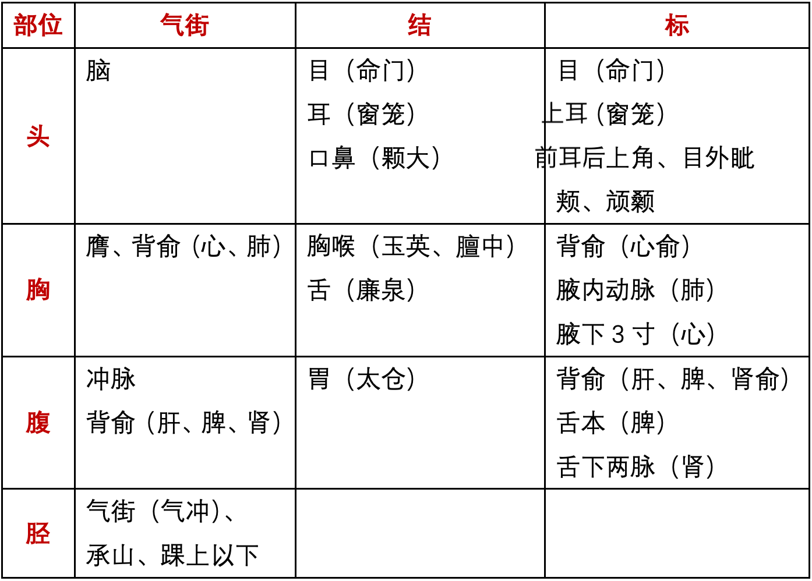
                    - **胸**
                    - **腹**
                    - **头**
                    - **胫**
                - **命门的定义**
                    - 人身的命门——肾
                    - 目
                    - 督脉命门穴
                        - 足太阳经之结
            - **四海**
                - 海，是水流归聚之所，十二经气血象百川归海一样汇集到一定部位，由此形成了“海”的概念
                - > 向心性，逐渐变粗
                    - “四海”始见于《灵枢・海论》
                    - 是髓海、血海、气海、水谷之海的总称
                    - 是人体气血精髓等精微物质汇聚之所
                - **水谷、气、血、髓**
                - > *《灵枢·海论》：“* *气海有余者，气满胸中，悗息面赤；气海不足，则气少不足以言。血海有余，则常想其身大，怫然不知其所病；血海不足，亦常想其身小，狭然不知其所病。水谷之海有余，则腹满；水谷之海不足，则饥不受谷食。髓海有余，则轻劲多力，处过其度；髓海不足，则脑转耳鸣，胫酸眩冒，目无所见，懈怠安卧。”&nbsp;* 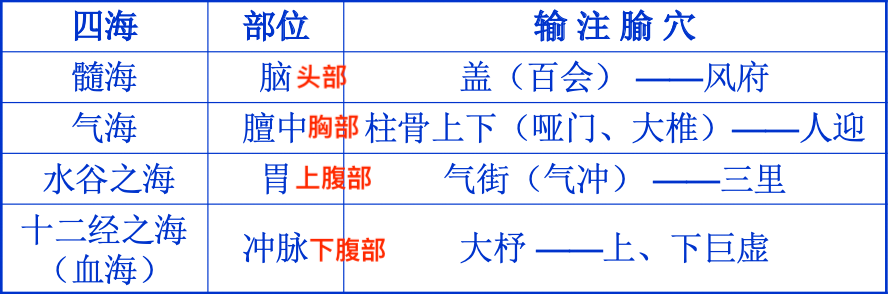 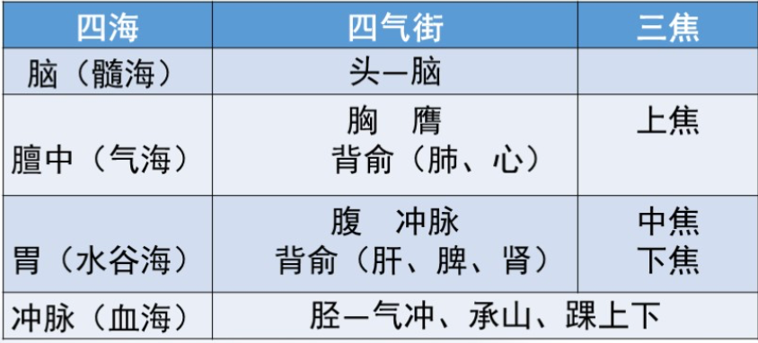
                    - **胃** 水谷
                    - **冲脉** 十二经
                    - **膻中** 气
                    - **脑** 髓
                - **四海的功能与临床应用**
                    - **四海主持全身的气血、津液**
                        - **脑部**
                        - **胸部**
                        - **胃**
                        - **冲脉**
                        - > 起于胞宫，伴足少阴经上行
                    - **四海病变**
                        - **有余** **不足** **“审守其输，而调其虚实，无犯其害，顺者得复”**
                        - > 如水谷之海——纳欠佳/纳多；气海——吸气多呼气少（气满胸中）/吸气少呼气多（乏力少气懒言）​​
                        - **病案：血崩症**
                        - > *《傅青主女科》*
                            - 胞宫——学海——冲脉有热（血沸）
                            - 凉血活血
    - 经络的作用和经络学说的临床应用
        - **经络的作用**
        - > 问答/简答
            - 联系内外，网络全身
            - > 《灵枢・海论》：“夫十二经脉者，内属于腑脏，外络于肢节。”
            - 运行气血，协调阴阳
            - > 《灵枢・本脏》：“经脉者，所以行血气而营阴阳，濡筋骨，利关节者也。”
            - 抗御病邪，反映病症
            - > 《素问・气穴论》认为孙络“以溢奇邪，以通营卫”，当疾病侵犯时，孙络和卫气发挥了重要的抗御作用
            - 传导感应，调整虚实
            - > 针刺中的得气和气行现象都是经络传导感应的功能表现
        - **经络学说的临床应用**
            - **诊断方面**
                - **说明病理变化**
                - **指导辨证归经**
                    - **经络辨证**
                        - 以经络学说为理论依据
                        - 对患者的症状、体征进行综合分析
                        - 判断病属何经，并进而确定发病原因、病变性质及病机
                    - **经络望诊**
                        - 是通过观察经络所过部位皮表所发生的各种异常改变来诊断疾病的方法
                        - 经络望诊主要观察全身经络穴位的色泽、形态变化，如皮肤的皱缩、隆陷、松弛，以及颜色的变异、光泽的明晦色素的沉着和斑疹的有无等
                    - **经络腧穴按诊**
                        - 在经络腧穴部位上运用按压、触摸等方法
                        - 寻找异常变化，如压痛、麻木、硬结、索条状物、肿胀、凹陷等
                        - 借以诊断疾病的方法
                    - **经络腧穴电测定**
                        - 利用经络穴位测定仪
                        - 检測经络腧穴部位的电参量借
                        - 以判断各经气血之盛衰
                        - 测定内容主要包括：经络穴位皮肤的电阻或电位
            - **治疗方面**
                - **指导针灸治疗**
                    - **指导针灸临床选穴**
                        - *《四总穴歌》：肚腹三里留， 腰背委中求，头项寻列缺，面口合谷收*
                        - > 选择
                    - **指导刺灸方法的选用**
                        - 如根据皮部与经络脏腑的密切联系，临床上可用皮肤针叩刺皮肤、皮内针埋藏皮内来治疗脏腑经脉的病证
                - **其他：辨证归经；药物归经等**
- **第二章 腧穴总论**
    - 腧穴的分类和命名
        - **定义**
            - 腧穴是人体脏腑经络气血输注于体表的特殊部位
                - **“腧”**
                    - **腧穴、输穴和俞穴三者在现代具体应用中的区别**
                        - **腧穴**
                        - **输穴**
                        - **俞穴**
                - **“穴”**
            - **不同名称**
                - “砭灸处”、“节”、“会”、“骨空”、“气穴”、“气府”、“孔穴”、“穴道”、“穴位”
            - **《内经》描述腧穴**
            - > 发、 出入、&nbsp; 渗灌
                - *《素问·气府论》 “脉气所* ***发*** *”*
                - *《灵枢·九针十二原》：“节之交，三百六十五会……所言节者，神气之所游行* ***出入*** *也，非皮肉筋骨也”*
                    - **如何理解“所言节者，神气之所游行出入也，非皮肉筋骨也”？**
                        - *《九针十二原》：黄帝曰：愿闻五脏六腑所出之处。岐伯曰：五脏五俞，五五二十五俞，六腑六俞，六六三十六俞，经脉十二，络脉十五，凡二十七气，以上下。所出为井，所溜为荥，所注为俞，所行为经，所入为合，二十七气所行，皆在五俞也。*
                        - ***节*** ***之交，三百六十五会，知其要者，一言而终，不知其要，流散无穷。*** *所言节者，神气之所游行出入也。非皮肉筋骨也。*
                            - **节：**
                        - *观其色，察其目，知其散复。一其形，听其动静，知其邪正，右主推之，左持而御之，气至而去之。*
                        - **即解剖不可见——死人无神气**
                - *《灵枢·小针解》：“节之交，三百六十五会者，络脉之* ***渗灌*** *诸节者也”*
            - **经络与腧穴的密切关系**
                - 腧穴不是孤立于体表的点，而是与体内脏腑组织器官有一定的内在联系，互相输通的特殊部位
                - **经络腧穴与脏腑相关，内外相应**
                - > 有诸于内，必行之于外
 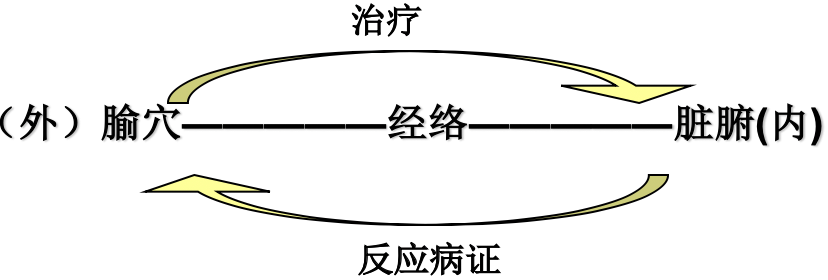
                    - 如：
                        - 胆囊绞痛——阳陵泉压痛
                        - 心绞痛——心俞、厥阴俞压痛
        - **发展**
            - 以痛为输→定位、定名→定位、定名、归经
            - **数目**
                - 《针灸甲乙经：349个
                - 《铜人腧穴针灸图经》：354个
                - 《针灸逢源》：361个——沿用至今
        - **分类**
            - **十四经穴**
                - **归属于十四经脉系统** 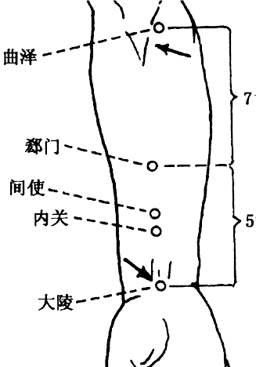
                    - **“经穴”**
                    - **是腧穴体系统的主体**
                    - **治疗本经和相应脏腑病证**
            - **经外奇穴**
                - 指既有一定的名称，又有明确位置，但尚未归入或不便归入十四经脉系统的腧穴，又称“经外奇穴” 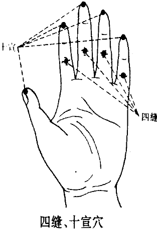
                    - **有固定穴名**
                    - **有明确位置**
                    - **未归入十四经**
                    - **“奇穴”、“经外穴”——对某些病证有特殊疗效**
                    - **经验有效穴**
            - **阿是穴**
                - **压痛点** **反应点**
                - > *《备急千金要方》：“有阿是之法，言人有病痛，即令捏其上，若里当其处，不问孔穴，即得便快成痛处，即云阿是，灸刺皆验，故曰阿是穴也。”*
                    - **压痛点、或反应点**
                    - **随病而定，没有固定位置和具体穴名**
                    - > 无一定数目
                    - **“不定穴”、“天应穴”“压痛点”**
        - **命名**
        - > 取类比象法
            - 部位、 治疗作用、天体地貌、动植物、建筑物、中医学理论
    - 腧穴的主治特点和规律
        - **腧穴的主治特点**
            - **近治作用——腧穴所在，主治所在**
                - 一切腧穴主治作用所具有的共同特点
                - > 如胃脘部周围的中脘、建里、梁门等经穴均能治疗胃痛
            - **远治作用——经脉所通，主治所及**
                - **十四经腧穴**
                - **十二经脉在四肢肘、膝关节以下的腧穴**
                - > 如合谷穴不仅能治疗手部的局部病证，还能治疗本经所过处的颈部和头面部病证
                - **可以只用腧穴的远治作用可以用来作为治疗远处脏腑病症吗？**
                    - 可以，如合谷治疗压痛
            - **特殊作用**
                - 双向调整作用、特异作用
                - > 内关可治心动过缓，又可治心动过速；大椎退热、至阴矫正胎位等
        - **主治规律**
        - > “经脉所通，主治所及”

            - 经脉循行分布所过之处，就是该经脉所属腧穴主治的范围
            - > 如手太阴肺经
            - **分经主治规律**
                - **概述**
                    - 指某一经脉所属经穴均可治疗该经循行部位及其相应脏腑的病证
                - **意义**
                    - 十四经腧穴的主治以分经为基础，凡是属于同一经脉的腧穴，其主治均有其共同之处
                    - 十四经经穴既有各自的分经主治规律，又在某些主治上有共同点
                - **分经主治规律** 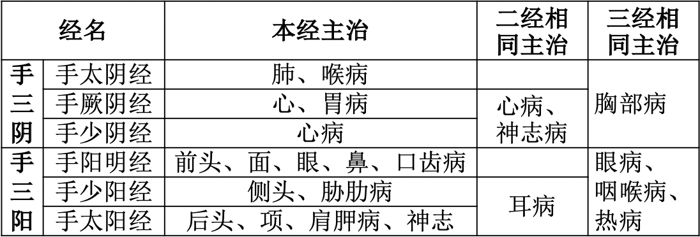 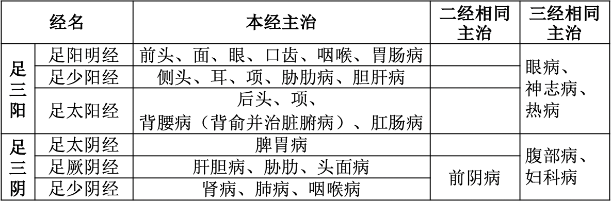 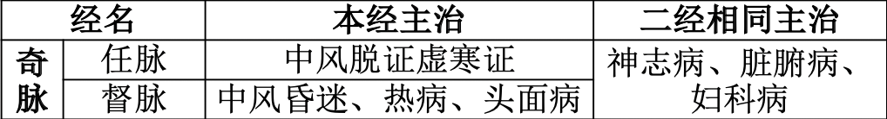
                - **如何理解** ***“宁失其穴，勿失其经”*** **？**
                - > 明·杨继洲的《针灸大成·卷二》
                    - *“言能识本经之病，又要认交经正经之理，则针之功必速矣。”*
                    - *“宁失其穴，勿失其经；宁失其时，勿失其气。”*
                        - **既要能辨识本经经脉的病变，又要认清交经、正经方面的理论才能收到迅速的疗效**
                        - **经络辨证——分经主治规律的核心思想**
                - *《灵枢·杂病》：齿痛，不恶清饮，取足阳明；恶清饮，取手阳明。*
                    - 清饮——冷水
            - **分部主治规律**
                - 腧穴分布部位不同，其主治作用的范围也有差异
                - > 主治作用与部位密切相关
                    - **头面躯干部**
                        - 除任、督某些腧穴具有特殊的或全身性的主治作用外，绝大部分腧穴一般只能主治腧穴所在部位及邻近的脏腑组织器官的病症
                        - 如关元、气海、百会
                    - **四肢部**
                        - **四肢肘膝关节以下的腧穴**
                    - **越是远离躯干部的腧穴，其主治范围越广——越远越远**
    - 特定穴
        - 特定穴是指十四经中具有特殊治疗作用，并以特定称号概括的腧穴
        - **五输穴** 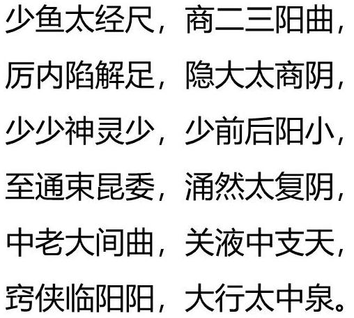
            - **概念**
                - 五输穴是指十二经穴分布于肘膝关节以下的井、荥、输、经、合五类腧穴的简称，又称“五行输”
                    - **井穴**
                    - **荥穴**
                    - **输穴**
                    - **经穴**
                    - **合穴**
            - **分布**
                - 肘膝关节以下
            - **临床应用**
                - **按五输穴主病 ：“荥输治外经，合治内腑”**
                    - *“井主心下满，荥主身热，输主体重节痛，经主喘咳寒热，合主逆气而泄。”*
                    - 鱼际、内庭、行间、侠溪、劳宫穴、少府穴
                - **配属五行 ：虚则补其母，实则泻其子**
                    - **本经补母泻子法，异经补母泻子法**
                    - **五行属性** 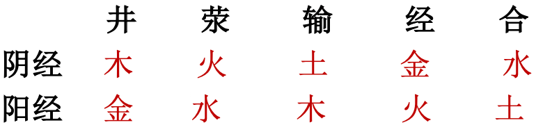
                        - *“* ***阴井乙木，阳井庚金*** *，阳井庚，庚者，乙之刚也，阴井乙，乙者，庚之柔也”*
                        - *《灵枢·九针十二原》：“所出为井，所溜为荥，所注为输，所行为经，所入为合”*
                        - *杨继洲《针灸大成·卷五》：“肺寅大卯胃辰宫，脾巳心午小未中，申胱酉肾心包戌，亥焦子胆丑肝通”*
                - **按时选用**
                    - **子午流注针法**
                        - 天干地支配合脏腑，按时取穴的方法
                    - **季节**
        - **原穴、络穴**
            - **概念**
                - **原穴** 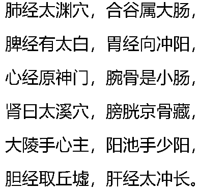
                    - **原穴是脏腑原气输注、经过和留止于十二经脉四肢部的腧穴，又称“十二原”**
                        - “原”——本原、原气之意
                        - 原穴是脏腑原气输注、经过和留止的部位
                        - 十二经脉在四肢各有一个原穴，共12个
                    - **十二原穴多分布于腕踝关节附近**
                        - **阴经“以输为原”**
                            - 阴经上的原穴与五输穴中的输穴同穴名、同部位，实为ー穴
                        - **阳经于输穴之后另有原穴**
                - **络穴** 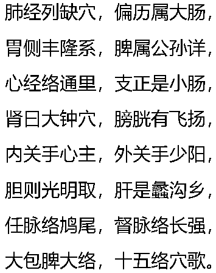
                    - **络脉从经脉分出的部位个有一个腧穴，叫做“络穴”**
                        - “络”——联络
                        - 共15个 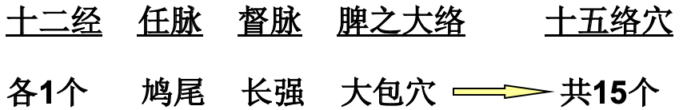
                    - **分布**
                        - 十二经脉的络穴——四肢肘膝关节以下
                        - 任脉络穴鸠尾——上腹部
                        - 督脉络穴长强——尾骶部
                        - 脾之大络大包穴——于胸胁部
            - **临床应用**
                - **原穴**
                    - 诊断、治疗相应的脏腑疾病
                - **络穴**
                - > 血证
                    - **十二络穴**
                        - 主治络脉病证
                        - 治疗表里两经病证
                    - **长强、鸠尾、大包**
                        - 治疗络脉病证
                        - 此外以治疗患部及内脏病为主
                - **原络配穴法或主客原络配穴法** 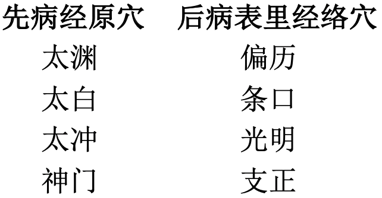
        - **俞穴、募穴**
            - **俞穴** 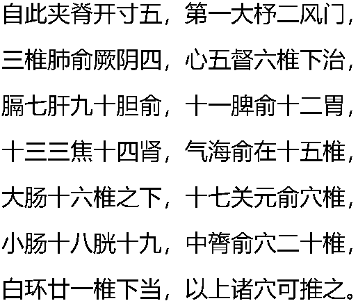
                - 是脏腑之气输注于背腰部的腧穴，又称“背俞穴”，共12个
                - **分布**
                    - 六脏六腑各有一背俞穴，均分布在足太阳膀胱经第1侧线上，其位置大体与相关脏腑所在部位相接近
            - **募穴** 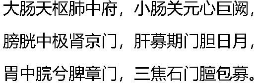
                - 是脏腑之气汇聚于胸腹部的腧穴，又称“腹募穴”，共12个
                - **分布**
                    - 六脏六腑各有1个募穴，分布于胸腹部，一半募穴分布于任脉上，其位置也与其相关脏腑所处部位相接近
            - **人体躯干部** **脏腑一前一后相对应**
            - **俞募穴临床应用**
                - **俞募穴**
                    - 是俞穴和募穴的合称
                - **临床应用**
                    - 相应的脏腑病证,及与脏腑相关的五官九窍、皮肉筋骨等病证
                - **俞募配穴法** 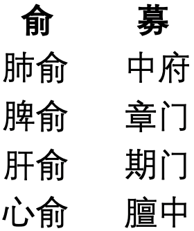
        - **下合穴** 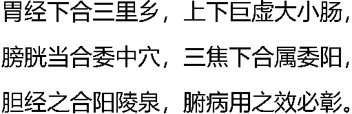
            - **概念**
                - 下合穴是指六腑之气下合于足三阳经的6个腧穴，又称“六腑下合穴”
            - **分布**
                - 主要在下肢膝关节附近，共6个 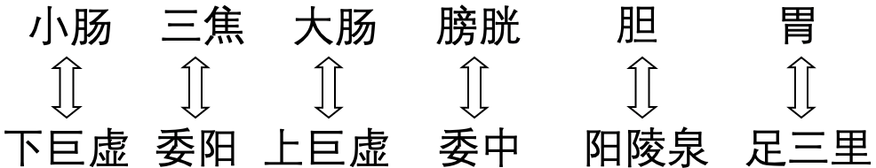
                    - 胃、胆、膀胱下合穴——本经
                    - 大肠、小肠下合穴——胃经
                    - 三焦下合穴——膀胱经
            - **临床应用**
                - *《灵枢·邪气脏腑病形》：“合治内腑”*
                - 治疗相应的六腑病证
        - **郄穴** 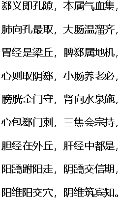
            - **概念**
                - “郄”有空隙之意
            - **分布**
                - 郄穴是各经经气深聚的部位 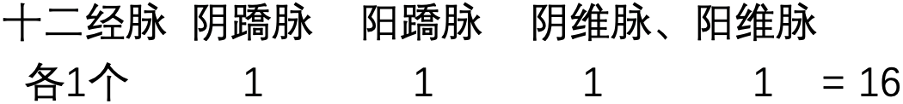
                - 多分布于四肢肘膝关节以下
            - **治疗**
                - 本经循行部位及所属脏腑的急性病痛
                - **阴经——多治血证**
                    - 孔最——手太阴肺经——咯血、咳嗽
                    - 郄门穴——手厥阴心包经——咯血、咳嗽
                    - 地机——足太阴脾经
                - **阳经——多治急性痛证**
                    - 梁丘穴——足阳明胃经——胃痛
                    - 温溜穴——手阳明大肠经——急性腹痛
        - **八会穴** 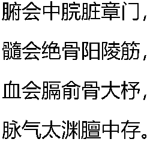
            - **概念**
                - 指脏、腑、气、血、筋、脉、骨、髓的精气聚会的8个腧穴
            - **分布**
                - 躯干和四肢部
                    - 脏、腑、气、血、骨之会穴——躯干部
                    - 筋、脉、髓之会穴——四肢部
            - **临床应用**
                - 相应的脏腑组织器官的病证 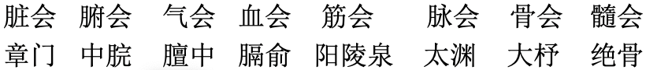
        - **八脉交会穴** 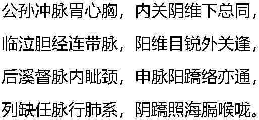
            - **概念**
                - 八脉交会穴是指十二经脉与奇经八脉脉气相通的8个腧穴，又称交经八穴
            - **分布**
                - 四肢部腕踝关节的上下
            - **临床应用** 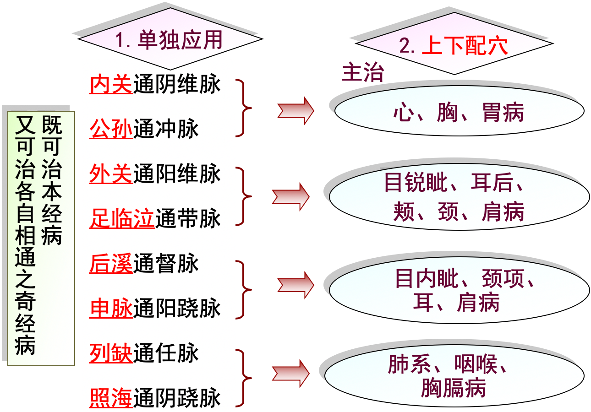
                - 治疗各自相通的奇经病证
                - 主治本经脉循行所过的四肢躯干、头面五官病症
                - 上下配穴应用
        - **交会穴**
            - **定义**
                - 两经或数经相交会的腧穴
                    - 四肢交会穴能治疗两经或两经以上经脉的病证（√）
                    - 奇经八脉与十二经脉之气相交会的腧穴称“交会穴”（X）
                    - > 八脉交会穴
            - **分布**
                - 多分布于头面、躯干部
                    - 例：关元， 三阴交，大椎
            - **主治**
                - **“经脉所通，主治所及”**
                - > 能治本经病，兼治所交会经脉的疾病

                    - **关元、中极**
                        - 任脉穴——治任脉的疾患
                        - 与足三阴交会——可治肝、脾、肾疾患
                    - **大椎**
                        - 督脉穴——治督脉病
                        - 与手足三阳交会——治诸阳经的全身性疾患
                    - **三阴交**
                        - 脾经——治脾经病
                        - 与少阴肾、厥阴肝经相交——治肝、肾两经病
    - 腧穴的定位方法
        - **体表解剖标志定位法**
            - **人体解剖学的各种体表标志**
                - **固定标志**
                    - **自然姿势**
                    - **骨节** **肌肉** **凹陷、五官轮廓、发际、指（趾）甲、乳头、肚脐**
                    - 素髎、膻中、阳陵泉、三阴交、攒竹、天枢等
                        - **素髎穴**
                        - **膻中穴**
                        - **阳陵泉**
                - **活动标志**
                    - **活动姿势**
                    - **关节、肌肉、肌腱、皮肤随着活动而出现的空隙** **凹陷、皱纹**
                    - 听宫、下关、阳溪、颊车、曲池等
                        - **听宫**
                        - **下关**
                        - **阳溪**
                    - *《灵枢·邪气脏腑病形》：“取之三里者，低跗；取之巨虚者，举足；取之委阳者，屈伸而索之；委中者，屈而取之；阳陵泉者，正立竖膝，予之齐下，至委阳之阳取之；取诸外经者，揄伸而从之。”*
            - **常用定穴解剖标志的体表定位方法**
                - **第2肋：**
                - **第4肋间隙：**
                - **第7颈椎棘突：**
                - **第2胸椎棘突：**
                - **第3胸椎棘突：**
                - **第7胸椎棘突：**
                - **第12胸椎棘突：**
                - **第4腰椎棘突：**
                - **第2骶椎：**
                - **骶管裂孔：**
                - **肘横纹：**
                - **腕掌侧远端横纹：**
                - **腕背侧远端横纹：**
        - **“骨度”折量定位法**
            - **定义**
                - **体表骨节**
                - 两骨节点或皮肤横纹之间的长度折量为等分
                - **《灵枢·骨度》**
                    - **寸：将设定的两骨节点之间的长度折量为一定的等分，每1等分为1寸，10等分为1尺**
                    - *《黄帝内经·太素》：“今以中人为法，则大人小人皆以为定，何者？取一合七尺五寸人身量之，合有七十五分（份），则七尺六寸以上大人，亦准为七十五分（份）；七尺四寸以下乃至婴儿，亦准七十五分（份），以此为定，分立经脉长短，并取空穴。”*
            - **全身主要骨度折量寸**
            - > 直寸：纵向；横寸：横向 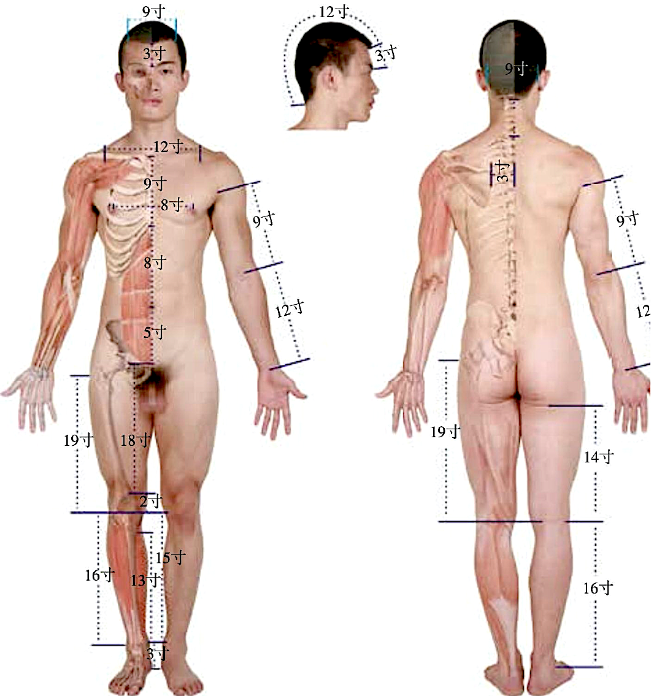 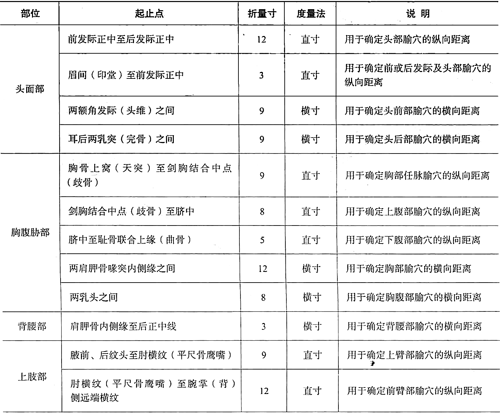 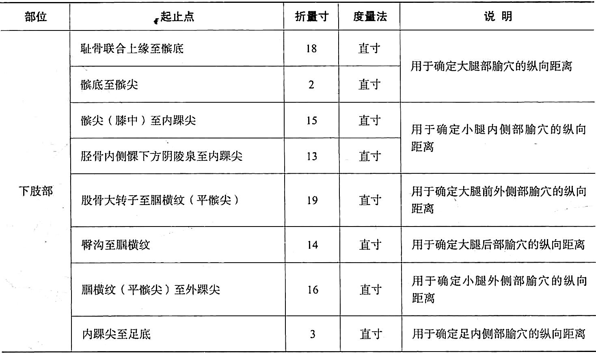
                - **头部直寸、头部横寸** 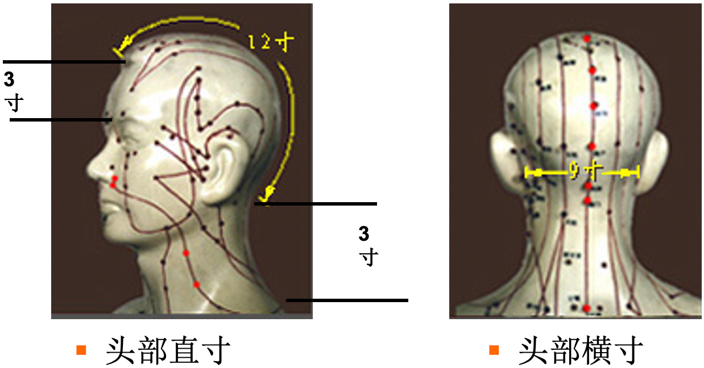
                - **胸腹部分寸** 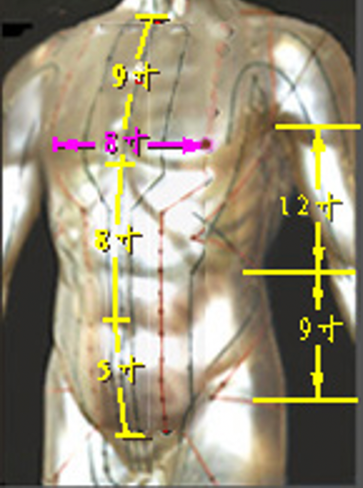
                    - **标志：**
                - **背部分寸** 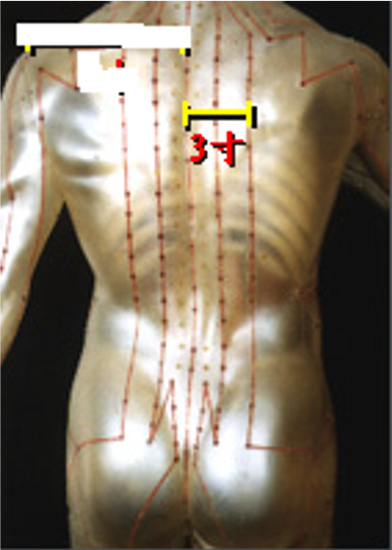
                    - **横寸**
                        - 两肩胛骨内侧缘——6寸
                    - **直寸**
                        - 第七颈椎
                        - 两肩胛骨下角连线——平第七胸椎
                        - 两髂嵴高点连线——平第四腰椎棘突下
                - **上肢直寸、下肢直寸** 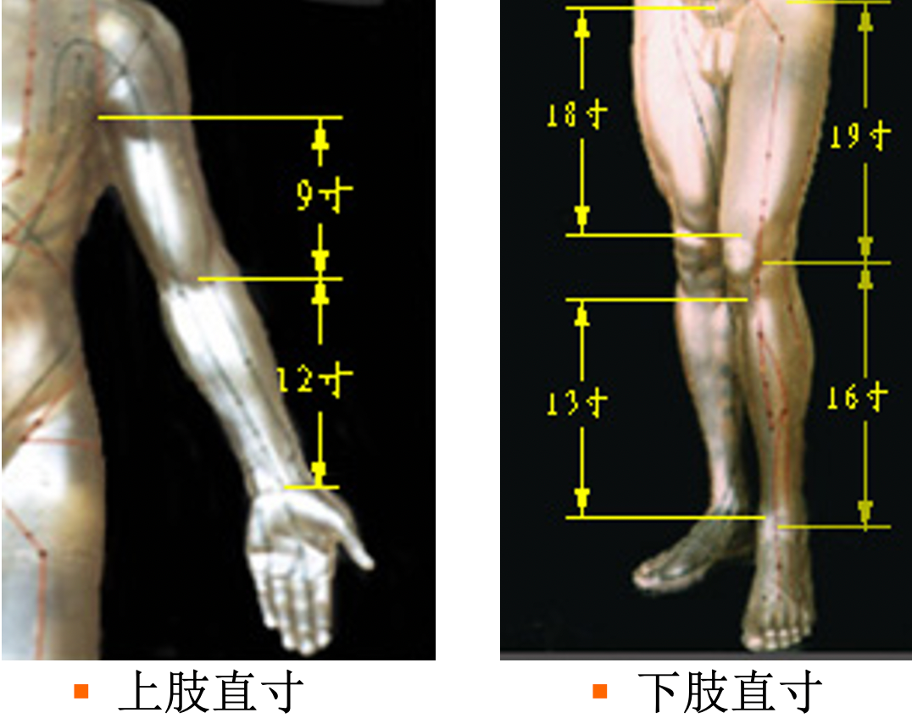
        - **指寸定位法**
            - **患者** **本人手指** **“指寸法”**
            - 主要用于下肢部
            - 常用的有以下3种 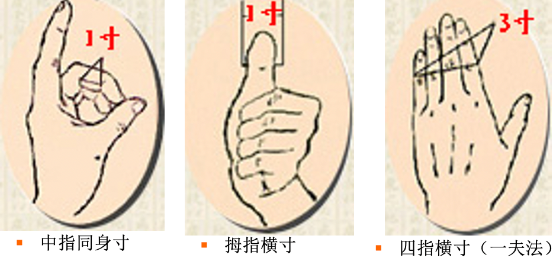
                - **中指同身寸**
                - > 纵向
                    - **中指中节桡侧两端纹头**
                - **拇指同身寸**
                - > 横向
                    - **拇指的指间关节的宽度**
                - **横指同身寸（又名一夫法）**
                    - **中指中节横纹**
        - **简便取穴法**
            - 简便定位法是临床中一种简便易行的腧穴定位方法
                - **合谷穴**
                - **风市**
                - **列缺**
- **第三章 经络腧穴各论**
    - 督脉
        - **督脉病候的古代界定和现代范畴**
            - *《难经·二十八难》：督脉者，起于下极之输，并于脊里，上至风府，入属于脑。*
                - 督，管理、监控
                - 督脉
                    - **脊柱力**
                        - *“四两拨千斤”*
                        - 源于古人对脊柱的认识
                    - （现代）人体核心
                    - > 依从古代
                        - 脊柱包括脊髓，脊神经发出的地方
                        - **脊神经支配**
        - **经脉循行**
        - > *《难经·二十八难》：督脉者，起于下极之输，并于脊里，上至风府，入属于脑。*
            - **起于小腹内** **止于上唇系带处** 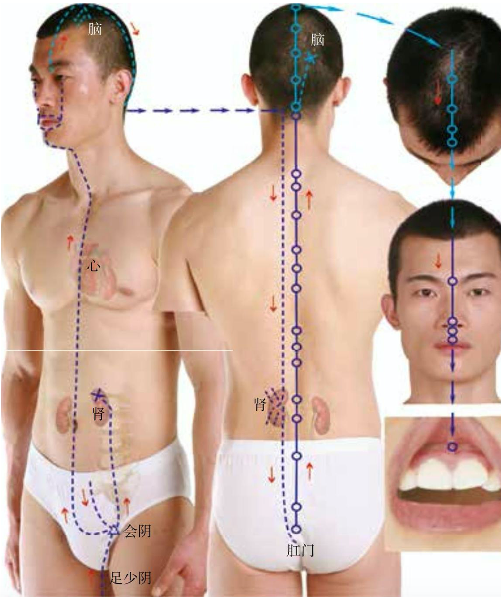
                - **督脉有两条分支**
                    - 一条贯脊络肾
                    - 另一条从小腹内分出→直上贯脐中央→上贯心→到喉部→向上到下颌部→环绕口唇→再向上到两眼下部中央
            - **体表路线（起于胞中→下出会阴）**
                - 从长强穴开始→循腰、背、项、头顶正中→沿前额下行→至鼻柱→经人中穴→止于上齿龈的龈交穴 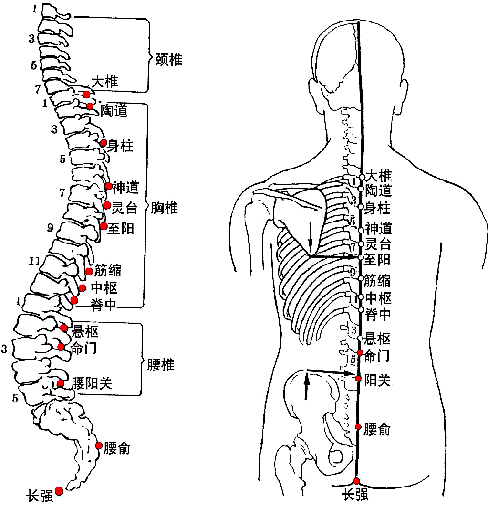 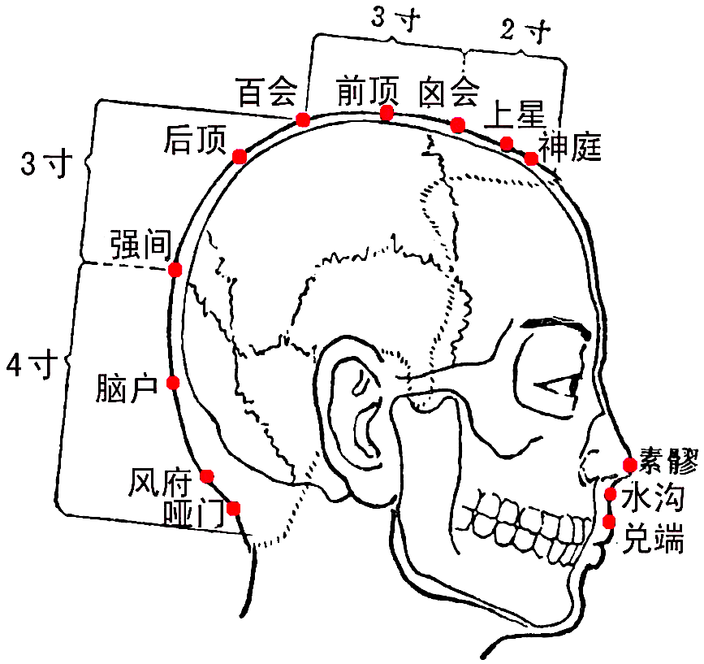
        - **联系脏器**
            - 脑，脊髓
            - 肾
        - **主要病候**
            - 脊柱强痛，角弓反张
        - **主治概要**
            - **脏腑病：**
            - **神志病**
            - > 部分腧穴，神经、精神病
                - 失眠、健忘、癫痫、昏迷、发热、中暑、惊厥等
                - 抑郁症、焦虑症、精神分裂症
            - **热病**
            - > 部分腧穴
                - 发热、中暑等
            - **头面五官病：**
            - **经脉病：**
            - **本经经穴主治表** 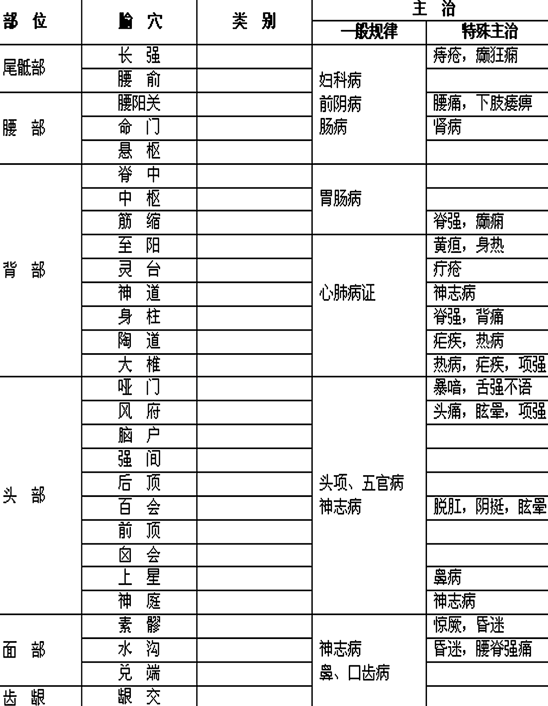
                - **长强**
                - > 骶骨与直肠之间
                    - **特定穴**
                        - 络穴
                    - **主治特点**
                        - **近治作用**
                            - 腹泻、痢疾、便血、便秘、痔疮、脱肛等肠腑病证
                            - 腰脊和尾骶部疼痛
                        - **远治作用**
                            - 癫狂痫
                        - **特殊作用**
                            - 退热
                    - **主治规律**
                        - **分经主治规律**
                            - 腹泻、痢疾、便血、便秘、痔疮、脱肛等肠腑病证
                            - 癫狂痫
                        - **分部主治规律**
                            - 腰脊和尾骶部疼痛
                    - **禁忌、特殊刺法**
                        - 紧靠尾骨前面斜刺0.8～1寸
                        - > 1寸=25mm
                        - 不宜直刺，以免伤及直肠
                    - **督脉阳气盛而强，故将督脉初始之处名为长强。其主治特点与其阳气强盛的特征有什么联系？**
                        - 先天阳气不足——从督脉补
                        - 先天阳气极盛——从督脉泻
                        - > 癫狂痫
                        - 从初始部位补/泻
                            - 灸法补
                            - 运动补（提肛运动——产后、老年）
                - **腰阳关**
                    - **主治特点**
                        - **近治作用**
                            - 腰骶疼痛，月经不调，赤白带下，遗精阳痿 
                        - **远治作用**
                            - 下肢痿痹
                    - **主治规律**
                        - **分经主治规律**
                            - 妇科病，月经不调，带下 
                            - 男科病，遗精阳痿
                        - **分部主治规律**
                            - 腰骶疼痛，下肢痿痹
                    - **禁忌、特殊刺法**
                        - 直刺或向上斜刺0.5～1寸
                        - 多用灸法
                - **命门**
                    - **主治特点**
                        - **近治作用**
                            - 腰脊强痛
                            - 月经不调，赤白带下，痛经，经闭，不孕等妇科病证
                            - 遗精，阳痿，精冷不育，小便频数等男子肾阳不足病证
                            - 小腹冷痛，腹泻
                        - **远治作用**
                            - 下肢痿痹
                    - **主治规律**
                        - **分经主治规律**
                            - 月经不调，赤白带下，痛经，经闭，不孕等妇科病证
                            - 遗精，阳痿，精冷不育，小便频数等男子肾阳不足病证
                        - **分部主治规律**
                            - 腰脊强痛，下肢痿痹
                            - 小腹冷痛，腹泻
                    - **禁忌、特殊刺法**
                        - 直刺或向上斜刺0.5～1寸
                        - 多用灸法
                - **至阳**
                    - **主治特点**
                        - **近治作用**
                            - 黄疸、胸胁胀满等肝胆疾病
                            - 咳嗽，气喘
                            - 腰背疼痛，脊强
                    - **主治规律**
                        - **分经主治规律**
                            - 本穴为阳之极，可助脾阳除湿热，治疗黄疸、胁肋疼痛、四肢重痛
                            - 咳嗽，气喘
                        - **分部主治规律**
                            - 位于背部，可治疗腰背疼痛，脊强
                    - **禁忌、特殊刺法**
                        - 向上斜刺0.5～1寸
                    - **至阳穴可以治疗肝胆疾病，那么这里面最主要的功效是啥？**
                        - 平7～9椎——治疗肝胆疾病
                        - 黄疸
                - **身柱**
                    - **主治特点**
                        - **近治作用**
                            - 腰脊强痛
                            - 疔疮发背
                        - **远治作用**
                            - 惊厥、癫狂痫等神志病
                            - 身热、头痛、咳嗽、气喘等外感病证
                    - **主治规律**
                        - **分经主治规律**
                            - 惊厥、癫狂痫等神志病
                            - 身热、头痛、咳嗽、气喘等外感病证
                        - **分部主治规律**
                            - 腰脊强痛
                            - 疔疮发背
                    - **禁忌、特殊刺法**
                        - 向上斜刺0.5～1寸
                - **大椎**
                    - **主治特点**
                        - **近治作用**
                            - 项强、脊痛
                        - **远治作用**
                            - 热病、疟疾、恶寒发热、咳嗽、气喘等
                            - 骨蒸潮热
                            - 癫狂痫证、小儿惊风等神志病
                            - 风疹，痤疮
                    - **主治规律**
                        - **分经主治规律**
                            - 热病、疟疾、恶寒发热、咳嗽、气喘等
                            - 骨蒸潮热
                            - 癫狂痫证、小儿惊风等神志病
                            - 风疹，痤疮
                        - **分部主治规律**
                            - 位于项部，可治疗项强、脊痛
                    - **禁忌、特殊刺法**
                        - 向上斜刺0.5～1寸
                        - > 下颌方向
                        - 癫狂痫证、小儿惊风等神志病深刺——触及脊髓
                - **哑门**
                    - **主治特点**
                        - **近治作用**
                            - 头痛，颈项强痛
                        - **远治作用**
                            - 癫狂痫，癔症等神志病
                        - **特殊作用**
                            - 暴喑，舌缓不语
                    - **主治规律**
                        - **分经主治规律**
                            - 暴喑，舌缓不语
                            - 癫狂痫、癔症等神志病
                        - **分部主治规律**
                            - 头痛，颈项强痛
                    - **禁忌、特殊刺法**
                        - **向下颌方向**
                        - 不可向上深刺，以免刺入枕骨大孔，伤及延髓
                - **风府**
                    - **主治特点**
                        - **近治作用**
                            - 头痛、眩晕、颈项强痛等头颈病证
                        - **远治作用**
                            - 咽喉肿痛、失音、目痛、鼻衄等五官病证
                            - 中风、癫狂痫、癔症等内风为患的神志病证
                    - **主治规律**
                        - **分经主治规律**
                            - 咽喉肿痛、失音、目痛、鼻衄等五官病证
                            - 中风、癫狂痫、癔症等内风为患的神志病证
                        - **分部主治规律**
                            - 头痛、眩晕、颈项强痛等头颈病证
                    - **禁忌、特殊刺法**
                        - 正坐位，头微前倾，项部放松，向下颌方向缓慢刺入0.5～1寸
                        - 不可向上深刺，以免刺入枕骨大孔伤及延髓
                - **百会**
                    - **主治特点**
                        - **近治作用**
                            - 头痛，眩晕，耳鸣
                        - **远治作用**
                            - 痴呆、中风、失语、瘛疭、失眠、健忘、癫狂等神志病
                            - 脱肛、阴挺、胃下垂等气失固摄而致的下陷性病症
                    - **主治规律**
                        - **分经主治规律**
                            - 痴呆、中风、失语、瘛疭、失眠、健忘、癫狂等神志病
                            - 脱肛、阴挺、胃下垂等气失固摄而致的下陷性病症
                        - **分部主治规律**
                            - 头痛，眩晕，耳鸣
                    - **禁忌、特殊刺法**
                        - 平刺0.5～0.8寸
                        - 升阳举陷可用灸法
                    - **针刺百会能够治疗的头痛眩晕耳鸣应属何种证型？或应属何种病因病机所致？**
                        - 针灸——八纲辨证
                        - 虚寒症、实寒证、实热证
                    - **灸百会治下陷证的作用机理为？**
                        - 升阳
                - **上星**
                - > 额头上方
                    - **主治特点**
                        - **近治作用**
                            - 鼻渊、鼻衄、头痛、目痛等头面部病
                        - **远治作用**
                            - 热病，疟疾
                            - 癫狂
                    - **主治规律**
                        - **分经主治规律**
                            - 热病，疟疾
                            - 癫狂
                        - **分部主治规律**
                            - 鼻渊、鼻衄、头痛、目痛等头面部病
                    - **禁忌、特殊刺法**
                        - 平刺0.5～0.8寸
                - **神庭**
                    - **主治特点**
                        - **近治作用**
                            - 头疼，目眩，目赤，目翳，鼻渊，鼻衄等头五官病
                        - **远治作用**
                            - 癫狂痫，失眠，惊悸等神志病
                    - **主治规律**
                        - **分经主治规律**
                            - 癫狂痫，失眠，惊悸等神志病
                        - **分部主治规律**
                            - 头疼，目眩，目赤，目翳，鼻渊，鼻衄等头五官病
                    - **禁忌、特殊刺法**
                        - 平刺0.5～0.8寸
                - **素髎**
                - > 鼻尖
                    - **主治特点**
                        - **近治作用**
                            - 鼻渊、鼻衄等鼻病
                        - **远治作用**
                            - 昏迷、惊厥、新生儿窒息、休克、呼吸衰竭等急危重症
                    - **主治规律**
                        - **分经主治规律**
                            - 昏迷、惊厥、新生儿窒息、休克、呼吸衰竭等急危重症
                        - **分部主治规律**
                            - 鼻渊、鼻衄等鼻病
                            - > 兴奋呼吸
                    - **禁忌、特殊刺法**
                        - 向上斜刺0.3～0.5寸，或点刺出血
                - **水沟**
                    - **主治特点**
                        - **近治作用**
                            - 鼻塞、鼻衄、面肿、口歪、齿痛、牙关紧闭等面鼻口部病症
                        - **远治作用**
                            - 癔症、癫狂病、急慢惊风等神志病
                            - 闪挫腰痛
                        - **特殊作用**
                            - 昏迷、晕厥、中风、中暑、休克、呼吸衰竭等急危重症
                            - > 为急救要穴之一
                    - **主治规律**
                        - **分经主治规律**
                            - 昏迷、晕厥、中风、中暑、休克、呼吸衰竭等急危重症
                            - 癔症、癫狂病、中暑、昏迷等神志病
                            - 闪挫腰痛
                        - **分部主治规律**
                            - 鼻塞、鼻衄、面肿、口歪、齿痛、牙关紧闭等头面五官病
                    - **禁忌、特殊刺法**
                        - 向上斜刺0.3～0.5寸，强刺激，或指甲按
                        - > 强刺激——人中→印堂
                    - **水沟穴位于人中沟内，近鼻孔处，为水液排布的通道，《针灸大成》卷七：“水面肿，针刺一穴，出水尽即愈。”水沟排出的水作何解释？**
                        - 水——鼻水——肺
                        - 粗针
                        - 鼻炎
                        - 麻黄汤证——提壶揭盖法
                - **印堂**
                - > 两眉间
                    - **主治特点**
                        - **近治作用**
                            - 头痛，眩晕
                        - **远治作用**
                            - 痴呆、痫证、失眠、健忘等神志病证
                            - 鼻衄，鼻渊
                        - **特殊作用**
                            - 小儿惊风，产后血晕，子痫
                    - **主治规律**
                        - **分经主治规律**
                            - 痴呆、失眠、健忘等神志病证
                            - 小儿惊风，产后血晕，子痫
                            - 鼻衄，鼻渊等鼻病
                        - **分部主治规律**
                            - 头痛，眩晕
                    - **禁忌、特殊刺法**
                        - 提捏局部皮肤，平刺0.3～0.5寸
                        - 或用三棱针点刺出血
    - 任脉
        - **经脉循行**
            - **起于小腹内**
                - **任脉的别络**
                    - 从鸠尾发出后，散部于腹部
            - **体表路线**
                - **止于颏唇沟（承浆）** 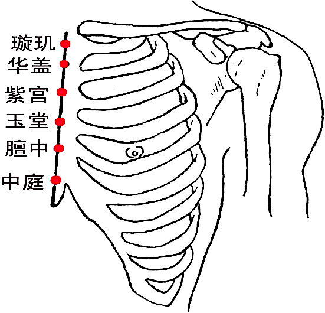 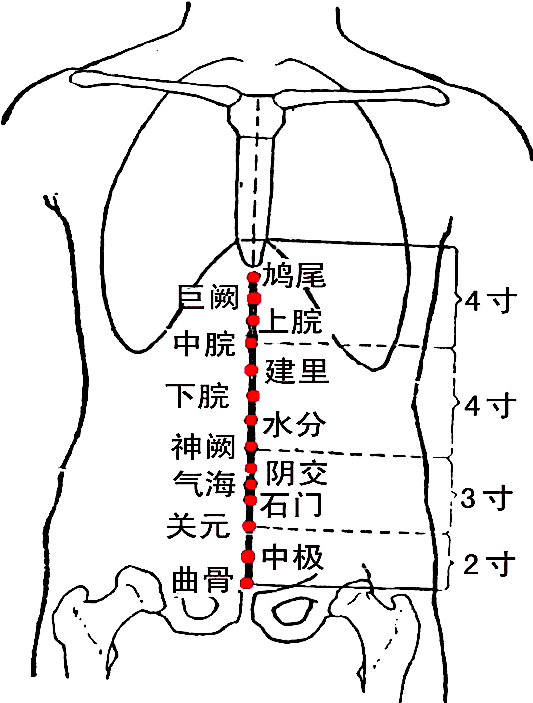
        - **联系脏腑、器官**
            - 胞宫、口唇、咽喉、眼
        - **主要病候**
            - 疝气，带下，腹中痞块等
        - **主治概要**
            - **腹、胸、颈、头面**
                - **颈部穴：**
                - **胸部穴：**
                - **上腹穴：**
                - **下腹穴：**
                    - **妇科病、前阴病：**
            - **神志病：**
            - > 少数穴
            - **虚症：**
            - **本经经穴主治表** 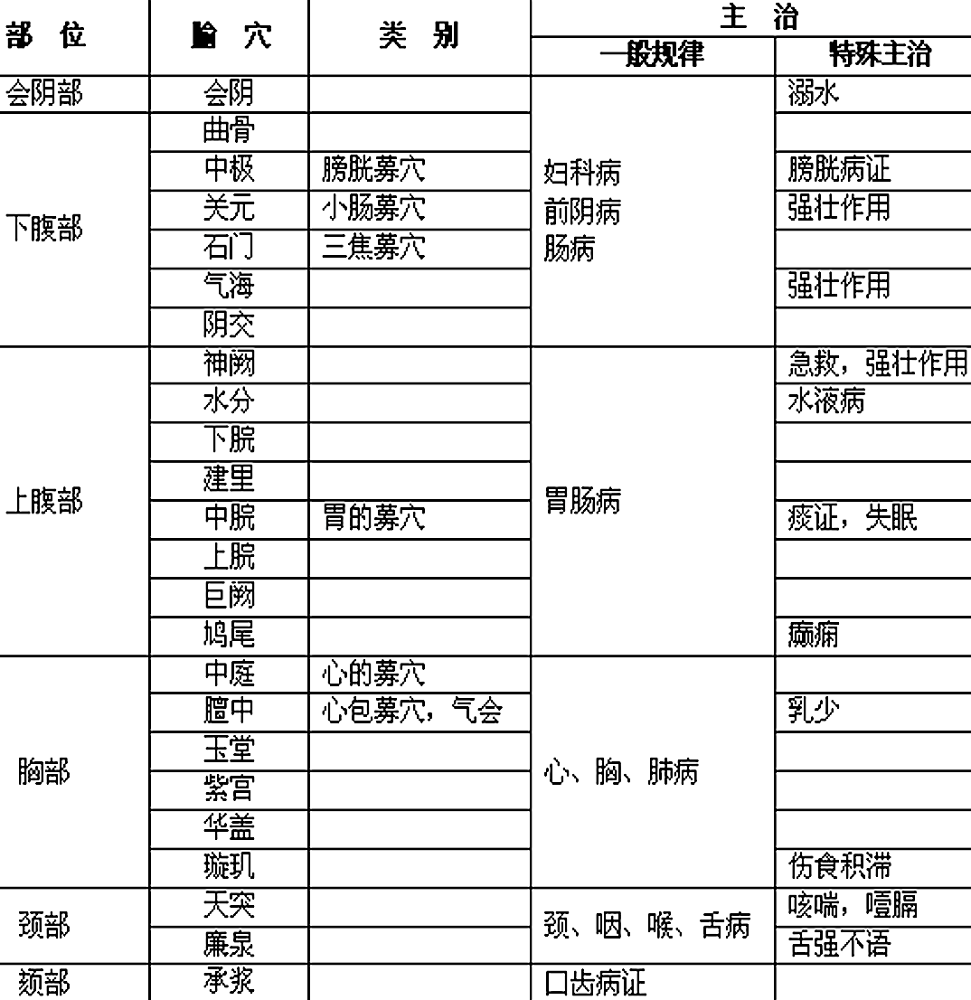
                - **中极**
                - > 盆腔——消化道末端病(督脉)、泌尿病、生殖病
                    - **特定穴**
                        - 膀胱之募穴
                    - **主治特点**
                        - **近治作用**
                            - 遗尿、小便不利、癃闭等前阴病
                            - 遗精、阳痿、不育等男科病证
                            - 月经不调、崩漏、阴挺、阴痒
                            - 产后恶露不尽、带下妇科病
                    - **主治规律**
                        - **分部主治规律**
                            - 遗尿、小便不利、癃闭等前阴病
                            - 遗精、阳痿、不育等男科病证
                            - 月经不调、崩漏、阴挺、阴痒
                            - 不孕、产后恶露不尽、带下妇科病
                    - **禁忌、特殊刺法**
                        - **排尿后**
                            - 癃闭——膀胱膨胀时针刺膀胱壁
                        - 孕妇慎用
                - **关元**
                    - **特定穴**
                        - 小肠之募穴
                    - **主治特点**
                        - **近治作用**
                            - 少腹疼痛，疝气
                            - 腹泻、痢疾、脱肛、便血等肠腑病证
                            - 五淋、尿血、尿闭、尿频等前阴病
                            - 遗精、阳痿、早泄、白浊等男科病
                            - 月经不调、痛经、经闭、崩漏、带下、阴挺、恶露不尽、胞衣不下等妇科病
                        - **远治作用**
                            - 中风脱证、虚劳冷惫、羸瘦无力等元气虚损病证
                        - **特殊作用**
                            - 保健灸常用穴
                    - **主治规律**
                        - **分经主治规律**
                            - 中风脱证、虚劳冷惫、羸瘦无力等元气虚损病证
                        - **分部主治规律**
                            - 少腹疼痛，疝气
                            - 腹泻、痢疾、脱肛、便血等肠腑病证
                            - 五淋、尿血、尿闭、尿频等前阴病
                            - 遗精、阳痿、早泄、白浊等男科病
                            - 月经不调、痛经、经闭、崩漏、带下、阴挺、恶露不尽、胞衣不下等妇科病
                    - **禁忌、特殊刺法**
                        - 直刺1～1.5寸，针前排尿，多用灸法
                        - **孕妇慎用**
                - **气海**
                    - **主治特点**
                        - **近治作用**
                            - 水谷不化、绕脐腹痛、腹泻、痢疾、便秘等肠腑病证
                            - 疝气，少腹痛
                        - **远治作用**
                            - 小便不利、遗尿等前阴病
                            - 遗精，阳痿
                            - 月经不调、痛经、经闭、崩漏、带下、阴挺、产后恶露不尽、胞衣不下等妇科病
                        - **特殊作用**
                            - 虚脱、形体羸瘦乏力等气虚病证
                            - 保健灸常用穴
                    - **主治规律**
                        - **分经主治规律**
                            - 虚脱、形体羸瘦乏力等气虚病证
                            - 小便不利、遗尿等前阴病
                            - 遗精，阳痿
                            - 月经不调、痛经、经闭、崩漏、带下、阴挺、产后恶露不尽、胞衣不下等妇科病
                        - **分部主治规律**
                            - 水谷不化、绕脐腹痛、腹泻、痢疾、便秘等肠腑病证
                            - 疝气，少腹痛
                    - **禁忌、特殊刺法**
                        - 直刺1～1.5寸，多用灸法
                        - **孕妇慎用**
                - **神阙**
                - > 肚脐、后为空肠
                    - **主治特点**
                        - **近治作用**
                            - 腹痛、腹胀、腹泻、痢疾、便秘、脱肛等肠腑病症
                            - 水肿，小便不利
                        - **远治作用**
                            - 虚脱、中风脱证等元阳暴脱
                        - **特殊作用**
                            - 保健针灸常用穴
                    - **主治规律**
                        - **分经主治规律**
                            - 虚脱、中风脱证等元阳暴脱
                        - **分部主治规律**
                            - 腹痛、腹胀、腹泻、痢疾、便秘、脱肛等肠腑病症
                            - 水肿，小便不利
                    - **禁忌、特殊刺法**
                        - 一般不针，多用艾条灸或艾柱隔盐灸法
                        - > 易感染
                - **下脘**
                    - **主治特点**
                        - **近治作用**
                            - 腹痛、腹胀、腹泻、呕吐、完谷不化、小儿疳积等脾胃病
                            - 痞块
                    - **主治规律**
                        - **分经主治规律**
                            - 神志病、脏腑病、妇科病
                            - > 回阳、固脱、有强壮作用
                        - **分部主治规律**
                            - 腹痛、腹胀、腹泻、呕吐、完谷不化、小儿疳积等脾胃病
                            - 痞块
                    - **禁忌、特殊刺法**
                        - 直刺1～1.5寸
                - **建里**
                    - **主治特点**
                        - **近治作用**
                            - 胃痛、呕吐、食欲不振、腹胀、腹痛等脾胃病
                        - **远治作用**
                            - 水肿
                    - **主治规律**
                        - **分部主治规律**
                            - 胃痛、呕吐、食欲不振、腹胀、腹痛（中焦病）
                            - 水肿（肺、脾、肾三焦病）
                    - **禁忌、特殊刺法**
                        - 直刺1～1.5寸
                - **中脘**
                    - **特定穴**
                        - 胃之募穴，八会穴之腑会
                    - **主治特点**
                        - **近治作用**
                            - 胃痛、腹胀、纳呆、呕吐、吞酸、呃逆、小儿疳积等脾胃病
                        - **远治作用**
                            - 黄疸
                            - 癫狂，脏躁
                    - **主治规律**
                        - **分经主治规律**
                            - 癫狂，脏躁（神志病）
                            - 脾胃病，黄疸（脏腑病）
                        - **分部主治规律**
                            - 胃痛、腹胀、纳呆、呕吐、吞酸、呃逆、小儿疳积等脾胃病
                            - 黄疸
                    - **禁忌、特殊刺法**
                        - 直刺1～1.5寸
                    - **针刺中脘既可以加强胃运动，又可以使原来处于紧张或收缩亢进状态的胃运动减弱，具有双向调整作用**
                        - 需要根据手法的不同来达到不同的目的
                - **上脘**
                    - **主治特点**
                        - **近治作用**
                            - 胃痛、呕吐、呃逆、腹胀等胃腑病证
                        - **远治作用**
                            - 癫痫
                    - **主治规律**
                        - **分经主治规律**
                            - 癫痫（神志病）
                        - **分部主治规律**
                            - 胃痛、呕吐、呃逆、腹胀等胃腑病证（中焦病）
                    - **禁忌、特殊刺法**
                        - 直刺1～1.5寸
                - **膻中**
                - > 上气海
                    - **特定穴**
                        - 心包之募穴，八会穴之气会
                    - **主治特点**
                        - **近治作用**
                            - 咳嗽、气喘、胸闷、心痛、噎膈、呃逆等胸中气机不畅病证
                        - **特殊作用**
                            - 产后乳少、乳痈、乳癖等胸乳病证
                    - **主治规律**
                        - **分部主治规律**
                            - 咳嗽、气喘、胸闷、心痛、噎膈、呃逆等胸中气机不畅病证（上、中焦病）
                            - 产后乳少、乳痈、乳癖等胸乳病证（妇科病）
                    - **禁忌、特殊刺法**
                        - 平刺0.3～0.5寸
                - **天突**
                    - **特定穴**
                        - 任脉、阴维脉的交会穴
                    - **主治特点**
                        - **近治作用**
                            - 咳嗽、哮喘、胸痛、咽喉肿痛、暴喑等肺系病症
                        - **特殊作用**
                            - 瘿气、梅核气、噎膈等气机不畅病证
                    - **主治规律**
                        - **分部主治规律**
                            - 咳嗽、哮喘、胸痛、咽喉肿痛、暴喑等肺系病症
                            - 瘿气、梅核气、噎膈等气机不畅病证
                    - **禁忌、特殊刺法**
                        - 先直刺0.2～0.3寸，然后将针尖向下，紧靠胸骨柄后方刺入1～1.5寸
                        - 必须严格掌握针刺的角度和深度，以防刺伤肺和有关动、静脉
                            - 本穴针刺不能过深，也不宜向左右刺，以防刺伤锁骨下动脉及肺尖
                            - 如刺中气管壁，针下可有硬而轻度弹性的感觉，病人出现喉痒欲咳等现象
                            - 若刺破气管壁，可引起剧烈的咳嗽及血痰等现象
                            - 如刺中无名静脉或主动脉弓时，针下可有柔软而有弹力的阻力或病人有疼痛感觉，应即退针
                - **廉泉**
                    - **主治特点**
                        - **近治作用**
                            - 中风失语、暴喑、吞咽困难、舌缓流涎、舌下肿痛、口舌生疮、喉痹等咽喉口舌之病
                    - **主治规律**
                        - **分部主治规律**
                            - 中风失语、暴喑、吞咽困难、舌缓流涎、舌下肿痛、口舌生疮、喉痹等咽喉口舌之病
                    - **禁忌、特殊刺法**
                        - 向舌根斜刺0.5～0.8寸
                    - **翳风为手足少阳经交会之处，也有治疗暴喑的功效，这两者在临床使用上有何异同**
                        - **两种刺法**
                            - 直接刺舌根
                            - 下颌往上刺
                            - 侧面进针
                    - **中风失语为中风之后遗症，还有什么其他穴位配合廉泉使用吗**
                        - 失语
                            - 舌头运动不利
                            - 咽部运动不利
                - **承浆**
                    - **主治特点**
                        - **近治作用**
                            - 口歪、齿痕肿痛、流涎等口部病症
                        - **远治作用**
                            - 癫狂
                            - 暴喑
                    - **主治规律**
                        - **分经主治规律**
                            - 癫狂
                            - 暴喑（神志病）
                        - **分部主治规律**
                            - 口歪、齿痕肿痛、流涎等口部病症
                    - **禁忌、特殊刺法**
                        - 斜刺0.3～0.5寸
        - **治疗**
            - **脐疗**
    - 手太阴肺经
        - **经脉循行**
        - > *《灵枢·经脉》：肺手太阴之脉，起于中焦，下络大肠，还循胃口，上膈属肺。从肺系，横出腋下，下循臑内，行少阴、心主之前，下肘中，循臂内上骨下廉，入寸口，上鱼，循鱼际，出大指之端。其支者：从腕后，直出次指内廉，出其端。*
            - **起于中焦** 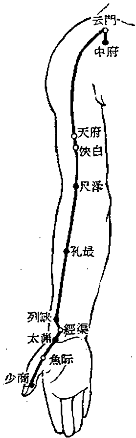
                - **支脉**
                    - **沿着食指桡侧直达食指末端**
        - **联系脏腑、器官**
            - **联系脏腑**
                - 肺、大肠、胃、中焦
            - **联系器官**
                - 气管、喉咙
                - > 肺系
        - **主要病候**
            - **脏腑、器官病**
                - **本脏病**
                    - 咳嗽、气喘
                    - 少气不足以息
                    - 咳血
                    - 伤风
                - **器官病——咽喉肿痛**
            - **经脉病**
            - > 本经循行所过病症
                - 胸部胀满
                - 缺盆部及手臂内侧前缘痛
                - 肩背寒冷、疼痛
        - **主治概要**
            - **脏器病：呼吸系统**
                - 胸——胸满、胸痛
                - 肺——咳喘&nbsp;&nbsp;&nbsp;&nbsp;&nbsp;
                - 喉——咽喉肿痛、咯血
            - **经脉病：臑臂**
            - > 经循部位
                - 上臂、前臂、手——内侧前缘痛、厥冷、掌中热
                - > 肩背痛、肘臂挛痛、手腕痛
            - **本经经穴主治表** 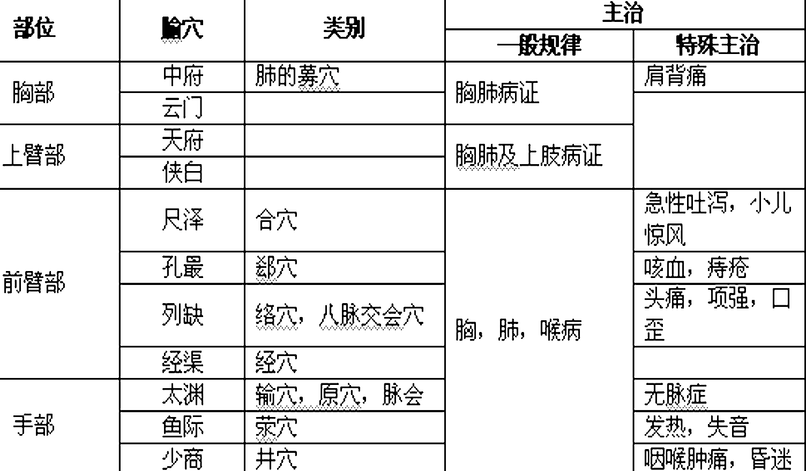
                - 尺泽、孔最——治疗咳嗽气短
                - 太渊——补益肺气
                - 孔最、鱼际、少商——宣肺清热
                - 咽喉肿痛——少商穴点刺放血
                - **中府**
                    - **特定穴**
                        - 肺之募穴
                    - **主治特点**
                        - **近治作用**
                            - 咳嗽、气喘、胸痛等胸肺病证
                        - **远治作用**
                            - 肩背痛
                    - **主治规律**
                        - **分经主治规律**
                            - 咳嗽、气喘、胸痛等胸肺病证
                        - **分部主治规律**
                            - 肩背痛
                    - **禁忌、特殊刺法**
                        - 向外斜刺或平刺0.5～0.8寸
                        - 不可向内下深刺，以免伤及肺脏，引起气胸
                - **尺泽**
                    - **特定穴**
                        - 合穴
                    - **主治特点**
                        - **近治作用**
                            - 肘臂挛痛
                        - **远治作用**
                            - 咳嗽、气喘、咯血、咽喉肿痛等肺系实热病证
                        - **特殊作用**
                            - 急性吐泻、中暑、小儿惊风等急症
                    - **主治规律**
                        - **分经主治规律**
                            - 咳嗽、气喘、咯血、咽喉肿痛等肺系实热病症
                            - 急性吐泻、中暑、小儿惊风等急症
                        - **分部主治规律**
                            - 肘臂挛痛
                    - **禁忌、特殊刺法**
                        - 直刺0.8～1.2寸，或点刺出血
                - **孔最**
                    - **特定穴**
                        - 郄穴
                    - **主治特点**
                        - **近治作用**
                            - 肘臂挛痛
                        - **远治作用**
                            - 鼻衄、咯血、咳嗽、气喘、咽喉肿痛等肺系病证
                    - **主治规律**
                        - **分经主治规律**
                            - 鼻衄、咯血、咳嗽、气喘、咽喉肿痛等肺系病症
                        - **分部主治规律**
                            - 肘臂挛痛
                    - **禁忌、特殊刺法**
                        - 直刺0.5～1寸
                    - **简述孔最穴为什么既能治咯血又能治痔血？**
                    - > 书上只有治咯血
                        - **郄穴**
                            - **阴经——多治血证**
                                - **孔最**
                            - **阳经——多治急性痛证**
                - **列缺**
                    - **特定穴**
                        - 手太阴肺经之络穴
                        - 手太阴肺经与任脉之交会穴
                    - **主治特点**
                        - **近治作用**
                            - 手腕痛
                        - **远治作用**
                            - 咳嗽、气喘、咽喉肿痛等肺系病症
                            - 偏正头痛、齿痛、项强痛、口眼歪斜等头面部病证
                    - **主治规律**
                        - **分经主治规律**
                            - 咳嗽、气喘、咽喉肿痛等肺系病症
                            - 偏正头痛、齿痛、项强痛、口眼歪斜等头面部病证
                        - **分部主治规律**
                            - 手腕痛
                    - **禁忌、特殊刺法**
                        - 向上斜刺0.5～0.8寸
                        - 直刺法——过皮一点，刺骨面
                - **太渊**
                    - **特定穴**
                        - 输穴
                        - 原穴
                        - 八会穴之脉会
                    - **主治特点**
                        - **近治作用**
                            - 腕臂痛
                        - **远治作用**
                            - 咳嗽、气喘等肺系病证
                        - **特殊作用**
                            - **无脉症**
                            - > 一段的脉气不通（血管不通）
                    - **主治规律**
                        - **分经主治规律**
                            - 咳嗽、气喘等肺系病证
                        - **分部主治规律**
                            - 腕臂痛
                            - 无脉症
                    - **禁忌、特殊刺法**
                        - 避开桡动脉，直刺0.3～0.5寸
                - **鱼际**
                    - **特定穴**
                        - 荥穴
                    - **主治特点**
                        - **近治作用**
                            - 掌中热
                        - **远治作用**
                            - 咳嗽、咯血、咽干、咽喉肿痛、失音等肺系实热病症
                        - **特殊作用**
                            - **小儿疳积**
                            - > 脾胃太弱/身体太强（吃多了）
                    - **主治规律**
                        - **分经主治规律**
                            - 咳嗽、咯血、咽干、咽喉肿痛、失音等肺系实热病症
                            - 小儿疳积
                        - **分部主治规律**
                            - 掌中热
                            - > 荥主身热
                    - **禁忌、特殊刺法**
                        - 直刺0.5～0.8寸
                        - **割治法**
                - **少商**
                    - **特定穴**
                        - 井穴
                    - **主治特点**
                        - **远治作用**
                            - 咽喉肿痛、鼻衄、高热等肺系实热病证
                            - 昏迷、癫狂等急症
                    - **主治规律**
                        - **分经主治规律**
                            - 咽喉肿痛、鼻衄、高热等肺系实热病证
                            - 昏迷、癫狂等急症
                    - **禁忌、特殊刺法**
                        - 浅刺0.1寸，或点刺出血
    - 手少阴心经
        - **经脉循行**
        - > 起于心中，止于小指桡侧末端
            - **起于心中，出属心系，向下通过横膈，联络小肠**
                - **上行支脉**
                    - 从心系向上→沿咽喉至目系
                - **直行主干**
                    - 从心系上行至肺→再向下浅出腋下→沿上臂内侧后缘到达肘窝→沿前臂内侧后缘至掌后腕豆骨部→进入掌内→沿小指桡侧至末端→与手太阳小肠经相接
            - **循行分布特点**
                - **走向：**
                - **体内：**
                - **体表路线**
                    - 起于腋窝下（极泉）→沿上肢内侧后缘下行→止于小指桡侧端（少冲）（交于手太阳小肠经）
                - **分布：** 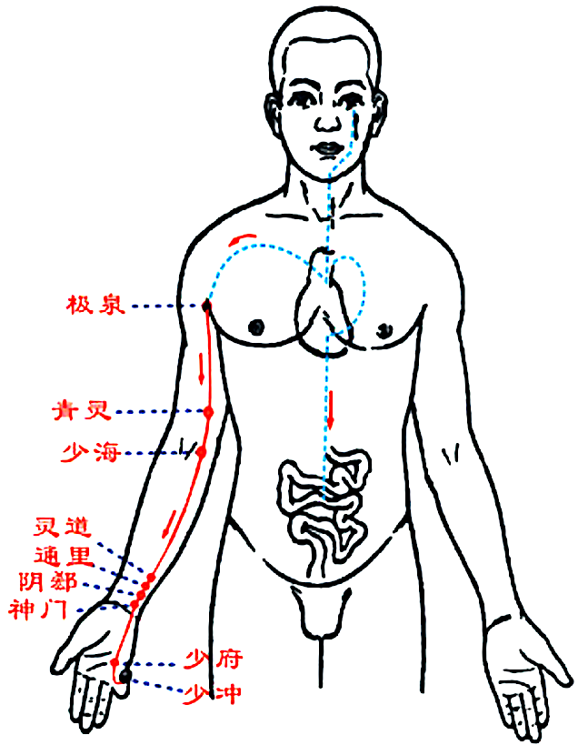 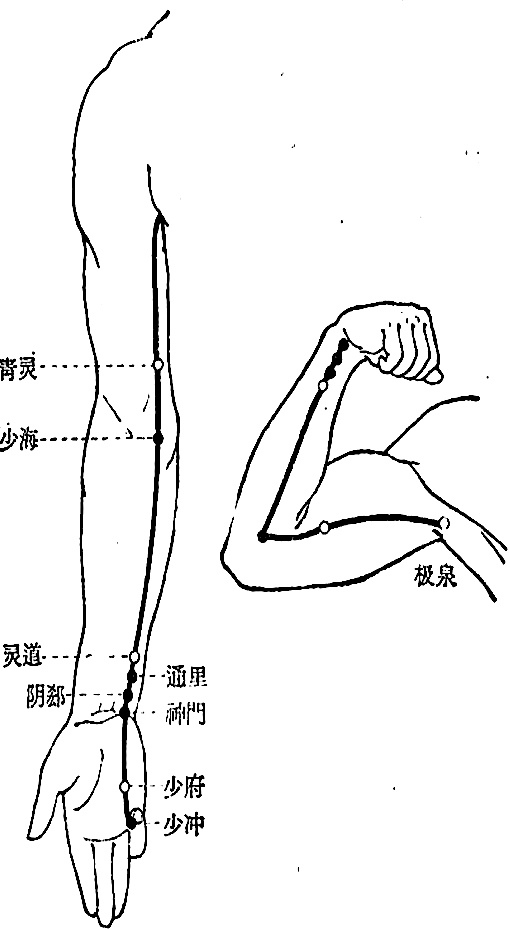
        - **联系脏腑、器官**
            - **联系脏腑：**
            - **联系器官：**
            - **络脉：**
        - **主要病候**
            - **脏腑病：**
            - **器官病：**
            - **经脉病：**
        - **主治概要**
            - **心胸病：**
                - 心动过速、过缓、不齐、心痛，心悸等
            - **神志病：**
                - 神经衰弱、癫狂痫、癔病等
            - **经脉病：**
            - **本经经穴主治表** 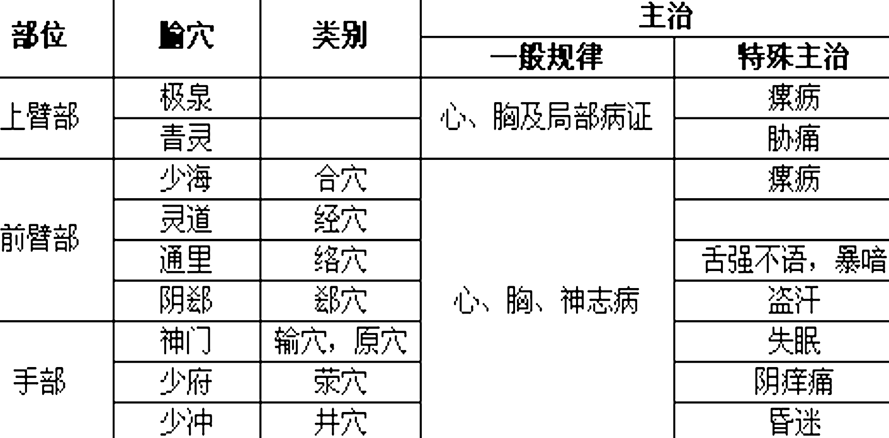
                - 神门+三阴交——失眠
                - 通里+亚门+廉泉——失语
                - 阴㕁——盗汗经验穴
                - 少府——清心火
                - **极泉**
                    - **主治特点**
                        - **近治作用**
                            - 肩部疼痛、胁肋疼痛、臂丛神经损伤等痛症
                            - 腋臭
                            - 上肢痿痹
                        - **远治作用**
                            - 心痛、心悸等心系病症
                        - **特殊作用**
                            - 瘰疬
                            - 上肢针刺麻醉用穴
                    - **主治规律**
                        - **分经主治规律**
                            - 心痛、心悸等心系病症
                            - 瘰疬
                        - **分部主治规律**
                            - 肩部疼痛、胁肋疼痛、臂丛神经损伤等痛症
                            - 腋臭
                            - 上肢痿痹
                    - **禁忌、特殊刺法**
                        - 避开腋动脉，直刺或斜刺0.3～0.5寸
                    - **针麻用穴还有哪些**
                        - 神经所在的位置
                        - 合谷、足三里、内关
                - **少海**
                    - **特定穴**
                        - 合穴
                    - **主治特点**
                        - **近治作用**
                            - 肘臂挛痛，臂麻手颤
                        - **远治作用**
                            - 心痛、癔症等心病、神志病
                            - 头项痛，腋胁部痛
                        - **特殊作用**
                            - 瘰疬
                    - **主治规律**
                        - **分经主治规律**
                            - 心痛、癔症等心病、神志病
                            - 头项痛，腋胁部痛
                        - **分部主治规律**
                            - 肘臂挛痛，臂麻手颤
                            - 瘰疬
                    - **禁忌、特殊刺法**
                        - 直刺0.5～1寸
                    - **少海之“海”字如何理解（如何理解心经之水在此汇合？）**
                        - 合穴——从这个地方往深处走
                        - 海——入海口
                        - > 从这个地方往躯干走
                - **通里**
                    - **特定穴**
                        - 络穴
                            - 通里为手少阴之别络，从此别走手太阳经，经气由此通达表里二经
                                - 通，通达、通畅
                                - 里，邻里之意
                    - **主治特点**
                        - **近治作用**
                            - 腕臂痛
                        - **远治作用**
                            - 心悸、怔忡等心系病证
                            - 舌强不语，暴喑
                    - **主治规律**
                        - **分经主治规律**
                            - 心悸、怔忡等心系病证
                            - 舌强不语，暴喑
                        - **分部主治规律**
                            - 腕臂痛
                    - **禁忌、特殊刺法**
                        - 直刺0.3～0.5寸
                        - 不宜深刺，以免伤及血管和神经
                    - **通里也是一种治法，又名攻下、下法，有类似作用的穴位还有哪些？主要在哪些经络上？**
                - **阴郄**
                    - **特定穴**
                        - 郄穴
                    - **主治特点**
                        - **远治作用**
                            - 心痛、惊悸等心系病证
                            - 吐血，衄血
                        - **特殊作用**
                            - 骨蒸盗汗
                    - **主治规律**
                        - **分经主治规律**
                            - 心痛、惊悸等心系病证
                            - 吐血，衄血
                            - 骨蒸盗汗
                    - **禁忌、特殊刺法**
                        - 直刺0.3～0.5寸
                        - 不宜深刺，以免伤及血管和神经
                    - **“一泻阴郄，止盗汗”中“泻”的含义**
                        - 针刺补泻手法
                        - 心阴虚盗汗
                            - *《标幽赋》：“盗汗，小儿骨蒸。”*
                            - *《百症赋》：“寒栗恶塞，二间疏通阴郄暗。且如肓俞、横骨，泻五淋之久积；阴郄、后溪，治盗汗之多出。”*
                - **神门**
                    - **特定穴**
                        - 输穴；原穴
                    - **主治特点**
                        - **远治作用**
                            - 胸胁痛
                            - 心痛、心烦、惊悸、怔忡、健忘、失眠、痴呆、癫狂痫等心与神志病症
                        - **特殊作用**
                            - 高血压
                    - **主治规律**
                        - **分经主治规律**
                            - 心痛、心烦、惊悸、怔忡、健忘、失眠、痴呆、癫狂痫等心与神志病症
                            - 胸胁痛
                            - 高血压
                    - **禁忌、特殊刺法**
                        - 直刺0.3～0.5寸
                    - **神门是心经原穴，为什么《针灸甲乙经》记载“遗尿，关门及神门、委中主之”**
                        - 神志病表现
                        - *《百症赋》：“发狂奔走，上脘同起于神门。”*
                        - *《玉龙歌》：“痴呆一症少精神，不识尊卑最苦人；神门独治痴呆病，转手骨开得穴真。”*
                - **少府**
                    - **特定穴**
                        - 荥穴
                    - **主治特点**
                        - **近治作用**
                            - 小指挛痛
                        - **远治作用**
                            - 心悸、胸痛等心胸病
                        - **特殊作用**
                            - 阴痒，阴痛
                            - 痈疡
                    - **主治规律**
                        - **分经主治规律**
                            - 心悸、胸痛等心胸病
                            - 阴痒，阴痛
                            - 痈疡
                        - **分部主治规律**
                            - 小指挛痛
                    - **禁忌、特殊刺法**
                        - 直刺0.3～0.5寸
                    - **少府和蠡沟治阴跳、腰痛？**
                        - *《针灸甲乙经》卷九：“阴跳、腰痛；实则挺长，寒热，挛，阴暴痛，遗溺，偏大；虚则暴痒；气逆，睾肿，卒疝，小便不利如癃状；数噫，恐悸，气不足；腹中悒悒，少腹痛；嗌中有热（气），如有息肉状，如著欲出；背挛，不可俯仰——蠡沟主之。”*
                        - 少府——热症
                        - 蠡沟——中筋病
                            - 足厥阴肝经，络穴
                            - 络阴气——拘急、筋挛
                - **少冲**
                    - **特定穴**
                        - 井穴
                    - **主治特点**
                        - **远治作用**
                            - 心悸、心痛、癫狂、昏迷等心与神志病证
                            - 胸胁痛
                        - **特殊作用**
                            - 热病
                    - **主治规律**
                        - **分经主治规律**
                            - 心悸、心痛、癫狂、昏迷等心与神志病证
                            - 胸胁痛
                            - 热病
                    - **禁忌、特殊刺法**
                        - 浅刺0.1寸，或点刺出血
    - 手厥阴心包经
        - **经脉循行**
            - **经脉循行**
            - > 起于胸中，止于中指的末端
                - **内行：起于胸中→出属心包→下膈→络三焦**
                    - 起于胸中→出属心包络→向下通过横膈→从胸至腹依次联络上、中、下三焦
                - **外行——胸中支脉**
                    - 从胸出胁→出腋（下三寸，天池）→上臂内侧（行于手太阴和手少阴之间，入肘中）→ 下行于前臂两筋（掌长肌腱与桡侧腕屈肌腱）之间→入掌中→中指端（中冲）
                        - 沿着胸内出于胁部→当腋下3寸处向上到腋下→沿上臂内侧→行于手太阴和手少阴之间→进入肘窝中→向下行于前臂两筋之间→进入掌中→沿着中指到指端
                - **别行——掌中支脉**
                    - 别掌中（劳宫）→无名指（交手少阳经）
            - **循行分布特点**
                - **走向：**
                - **体内：**
                - **体表路线** 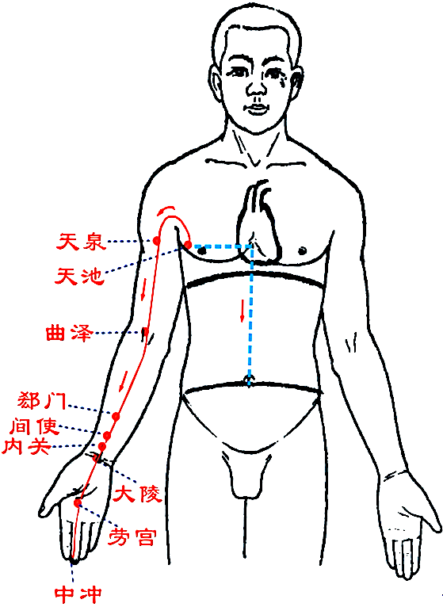
                    - 起于乳头外侧（天池）→&nbsp;&nbsp;沿上肢内侧正中下行→止于中指尖端（中冲）
                    - **支脉**
                        - 从掌心（劳宫）→无名指尺侧端→（关冲）（交手少阳三焦经）
        - **联系脏腑**
            - 心包，三焦
            - **络脉：**
            - **经别：**
        - **主要病候**
            - **脏腑病**
                - 心胸神志——心痛、胸闷、心悸、心烦、癫狂
            - **经脉病**
                - 腋肿、肘臂挛急、掌心发热
        - **主治概要**
            - **心、胸、神志病：**
                - 心痛，心悸，心烦，胸闷，癫狂痫等
            - **胃腹病证：**
            - **经脉病：**
            - **本经经穴主治表** 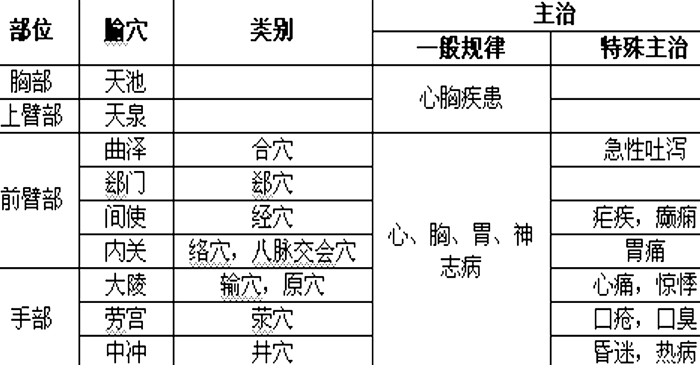
                - **天池**
                    - **定位**
                        - 在胸部，第4肋间隙，前正中线旁开5寸
                        - 乳头外侧
                    - **特定穴**
                        - 手厥阴心包经与足少阳胆经的交会穴
                    - **主治特点**
                        - **近治作用**
                            - 咳嗽、痰多、胸闷、气喘、胸痛等心肺疾病
                            - 腋肿、乳痈、乳少
                            - 瘰疬
                    - **主治规律**
                        - **分部主治规律**
                            - 咳嗽、痰多、胸闷、气喘、胸痛等心肺疾病
                            - 腋肿、乳痈、乳少
                            - 瘰疬
                    - **禁忌、特殊刺法**
                        - 斜刺或平刺0.3～0.5寸，不可深刺，以免伤及心肺
                - **曲泽**
                    - **特定穴**
                        - 合穴
                    - **主治特点**
                        - **近治作用**
                            - 肘臂挛痛，上肢颤动
                        - **远治作用**
                            - 心痛、心悸、善惊等心系病症
                            - 胃痛、呕血、呕吐等胃系病症
                            - 暑热病
                    - **主治规律**
                        - **分经主治规律**
                            - 心痛、心悸、善惊等心系病症
                            - 胃痛、呕血、呕吐等胃系病症
                            - 暑热症
                        - **分部主治规律**
                            - 肘臂挛痛，上肢颤动
                    - **禁忌、特殊刺法**
                        - 直刺1～1.5寸，或点刺出血
                - **郄门**
                    - **特定穴**
                        - 郄穴
                    - **主治特点**
                        - **近治作用**
                            - 肘臂痛
                        - **远治作用**
                            - 急性心痛、心悸、心烦、胸痛等心胸病症
                            - 咯血、呕血、衄血等热性出血证
                            - 疔疮
                            - 癫痫
                    - **主治规律**
                        - **分经主治规律**
                            - 急性心痛、心悸、心烦、胸痛等心胸病症
                            - 咯血、呕血、衄血等热性出血证
                            - 疔疮
                            - 癫痫
                        - **分部主治规律**
                            - 肘臂痛
                    - **禁忌、特殊刺法**
                        - 直刺0.5～1寸
                - **间使**
                    - **特定穴**
                        - 输穴；经穴
                    - **主治特点**
                        - **近治作用**
                            - 腋肿，肘、臂、腕挛痛
                        - **远治作用**
                            - 心痛、心悸等心系病证
                            - 胃痛、呕吐等胃热病证
                            - 热病，疟疾
                            - 癫狂痫
                    - **主治规律**
                        - **分经主治规律**
                            - 心痛、心悸等心系病证
                            - 胃痛、呕吐等胃热病证
                            - 热病，疟疾
                            - 癫狂痫
                        - **分部主治规律**
                            - 腋肿，肘、臂、腕挛痛
                    - **禁忌、特殊刺法**
                        - 直刺0.5～1寸
                - **内关**
                    - **特定穴**
                        - 络穴，八脉交会穴
                    - **主治特点**
                        - **近治作用**
                            - 肘、臂、腕挛痛
                        - **远治作用**
                            - 心痛、胸闷，心动过速/缓等心系病证
                            - 胃痛、呕吐、呃逆等胃腑病证
                            - 中风，偏瘫，眩晕，偏头痛
                            - 失眠、郁证、癫狂痫等神志病证
                    - **主治规律**
                        - **分经主治规律**
                            - 心痛、胸闷、心动过速/缓等心系病症
                            - 胃痛、呕吐、呃逆等胃腑病症
                            - 中风，偏瘫，眩晕，偏头痛
                            - 失眠、郁证、癫狂痫等神志病证
                        - **分部主治规律**
                            - 肘、臂、腕挛痛
                    - **内关—宽胸里气，和胃止呕，疏经止痛，宁心安神**
                        - 内关+足三里——理气和胃
                        - 内关+公孙——胃痛
                        - 内关+厥阴俞+心俞——冠心病
                    - **禁忌、特殊刺法**
                        - 直刺0.5～1寸
                - **大陵**
                    - **特定穴**
                        - 输穴；原穴
                    - **主治特点**
                        - **近治作用**
                            - 臂、手挛痛
                        - **远治作用**
                            - 心痛，心悸，胸胁满痛
                            - 胃痛、呕吐、口臭等胃腑病证
                            - 喜笑悲恐、癫狂痫等神志疾病
                    - **主治规律**
                        - **分经主治规律**
                            - 心痛，心悸，胸胁满痛
                            - 胃痛、呕吐、口臭等胃腑病证
                            - 喜笑悲恐、癫狂痫等神志疾病
                        - **分部主治规律**
                            - 臂、手挛痛
                    - **禁忌、特殊刺法**
                        - 直刺0.3～0.5寸
                - **劳宫**
                    - **特定穴**
                        - 荥穴
                    - **主治特点**
                        - **近治作用**
                            - 鹅掌风
                        - **远治作用**
                            - 中风昏迷、中暑等急症
                            - 心痛、烦闷、癫狂痫等心与神志病证
                        - **特殊作用**
                            - 口疮，口臭
                    - **主治规律**
                        - **分经主治规律**
                            - 中风昏迷、中暑等急症
                            - 心痛、烦闷、癫狂痫等心与神志病证
                            - 口疮，口臭
                        - **分部主治规律**
                            - 鹅掌风
                    - **禁忌、特殊刺法**
                        - 直刺0.3～0.5寸
                - **中冲**
                    - **特定穴**
                        - 输穴（井穴）
                    - **主治特点**
                        - **远治作用**
                            - 中风昏迷、舌强不语、中暑、昏厥、小儿惊风等急症
                            - 热病，舌下肿痛
                            - 小儿夜啼
                    - **主治规律**
                        - **分经主治规律**
                            - 中风昏迷、舌强不语、中暑、昏厥、小儿惊风等急症
                            - 热病，舌下肿痛
                            - 小儿夜啼
                    - **禁忌、特殊刺法**
                        - 浅刺0.1寸，或点刺出血
    - 手阳明大肠经
        - **经脉循行**
            - **经脉循行**
            - > 起于食指之尖端（桡侧），止于鼻旁
                - 起于食指末端→沿着食指桡侧缘向上→通过第一、第二掌骨之间→进入两筋（拇长伸肌腱和拇短伸肌腱）之间→沿前臂桡侧→进入肘外侧→再沿上臂外侧前缘→上走肩端→沿肩峰前缘→向上交会到第七颈椎棘突下→再向前下行到锁骨上窝→络于肺→通过膈肌→属于大肠
                - **颈部支脉**
                - > *缺盆上颈，贯颊，入下齿中，还出夹口，交人中——左之右，右之左，上夹鼻孔*
                    - 从锁骨上窝分出→上行颈部→通过面颊→进入下齿中→回绕至上唇→交叉于人中→左脉向右，右脉向左→上行挟着鼻孔到鼻翼两旁，与足阳明胃经相接
            - **循行分布特点**
                - **走向：**
                - **体内：**
                - **体表路线**
                    - 起于食指桡侧端（商阳）→沿上肢外侧前缘上行→经肩峰、颈部、面颊→于人中穴交叉→止于对侧鼻翼旁（迎香）
                - **分布：**
        - **联系脏腑、器官**
            - **联系脏腑**
                - 属大肠，络肺
            - **联系器官**
                - 口、下齿、鼻
                    - 咽喉——经别
                    - 耳——络脉
        - **主要病候**
            - **脏腑、器官病**
                - **本腑病——肠胃病**
                    - 腹痛、肠鸣、泄泻、便秘、痢疾
                - **器官病——头面、五官、咽喉病**
                    - 咽喉肿痛、齿病、鼻流清涕或出血
            - **经脉病**
                - 疼痛、热肿、寒冷等
        - **主治概要**
            - **器官病：**
                - 目病，齿痛，咽喉肿痛，鼻衄，口眼歪斜，耳聋等
            - **热病、神志病：**
            - **肠腑病证：**
            - **经脉病：**
            - **本经经穴主治表** 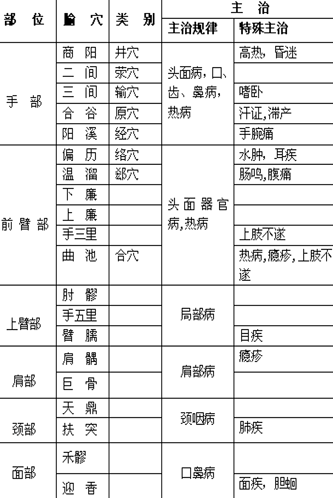
                - **商阳**
                    - **特定穴**
                        - 井穴
                    - **主治特点**
                        - **远治作用**
                            - 齿痛、咽喉肿痛等五官病
                            - 热病、昏迷等热证、急症
                    - **主治规律**
                        - **分经主治规律**
                            - 齿痛、咽喉肿痛等五官病
                            - 热病、昏迷等热证、急症
                    - **禁忌、特殊刺法**
                        - 浅刺0.1寸，或点刺出血
                - **合谷**
                    - **特定穴**
                        - 原穴
                    - **主治特点**
                        - **远治作用**
                            - 头痛、目赤肿痛、齿痛、鼻衄、口眼歪斜、耳聋等头面五官诸疾
                            - 诸痛症
                                - **针麻常用穴**
                            - 发热恶寒等外感病证
                        - **特殊作用**
                            - 热病无汗或多汗
                            - > 麻黄汤证、桂枝汤证、大承气汤证
                            - 痛经、经闭、滞产等妇产科病证
                            - > 催产
                    - **主治规律**
                        - **分经主治规律**
                            - 头痛、目赤肿痛、齿痛、鼻衄、口眼歪斜、耳聋等头面五官诸疾
                            - 痛经、经闭、滞产等妇产科病证
                            - > 催产
                            - 发热恶寒等外感病证
                            - 热病无汗或多汗
                            - > 麻黄汤证、桂枝汤证、大承气汤证
                            - 诸痛症
                    - **合谷**
                        - **+外关、列缺、风池——外感方**
                        - > 祛风解表
                        - **+三阴交——行气活血**
                            - **皮肤病方**
                            - > 清热凉血，行凉血
                            - **调气血基础方**
                            - **安神方**
                            - > 调气安神
                        - **+太冲——疑难病症方**
                        - > 四关穴，开四关，调气
                    - **禁忌、特殊刺法**
                        - 直刺0.5～1寸，针刺时手呈半握拳状
                        - 孕妇不宜针
                - **阳溪**
                    - **特定穴**
                        - 经穴
                    - **主治特点**
                        - **近治作用**
                            - 手腕痛
                        - **远治作用**
                            - 头痛、目赤肿痛、耳聋等头面五官病证
                    - **主治规律**
                        - **分经主治规律**
                            - 头痛、目赤肿痛、耳聋等头面五官病证
                        - **分部主治规律**
                            - 手腕痛
                    - **禁忌、特殊刺法**
                        - 直刺或斜刺0.5～0.8寸
                - **偏历**
                    - **特定穴**
                        - 络穴
                    - **主治特点**
                        - **近治作用**
                            - 手臂酸痛
                        - **远治作用**
                            - 耳鸣，鼻衄
                            - 腹部胀满
                        - **特殊作用**
                            - 水肿
                    - **主治规律**
                        - **分经主治规律**
                            - 耳鸣、鼻衄
                            - 腹部胀满
                            - 水肿
                        - **分部主治规律**
                            - 手臂酸痛
                    - **禁忌、特殊刺法**
                        - 直刺或斜刺0.5～0.8寸
                - **手三里**
                    - **主治特点**
                        - **近治作用**
                            - 手臂无力，上肢不遂
                        - **远治作用**
                            - 腹痛，腹泻
                            - 齿痛，颊肿
                    - **主治规律**
                        - **分经主治规律**
                            - 腹痛，腹泻
                            - 齿痛，颊肿
                        - **分部主治规律**
                            - 手臂无力，上肢不遂
                    - **禁忌、特殊刺法**
                        - 直刺1～1.5寸
                        - > 浅刺，1.5寸过深了
                - **曲池**
                    - **特定穴**
                        - 合穴
                    - **主治特点**
                        - **近治作用**
                            - 手臂痹痛，上肢不遂
                        - **远治作用**
                            - 热病
                            - 眩晕
                            - 腹痛、吐泻等肠胃病症
                            - 咽喉肿痛、齿痛、目赤肿痛等五官热性病证
                            - 隐疹、湿疹、瘰疬等皮外病证
                            - 癫狂
                    - **主治规律**
                        - **分经主治规律**
                            - 热病
                            - 眩晕
                            - 腹痛、吐泻等肠胃病症
                            - 咽喉肿痛、齿痛、目赤肿痛等五官热性病证
                            - 隐疹、湿疹、瘰疬等皮外病证
                            - 癫狂
                        - **分部主治规律**
                            - 手臂痹痛，上肢不遂
                    - **禁忌、特殊刺法**
                        - 直刺1～1.5寸
                - **臂臑**
                    - **主治特点**
                        - **近治作用**
                            - 肩臂疼痛不遂，颈项拘挛等痹症
                        - **远治作用**
                            - 瘰疬
                            - > 消淋巴水肿
                            - 目疾
                        - **特殊作用**
                            - 目疾
                    - **主治规律**
                        - **分经主治规律**
                            - 瘰疬
                            - 目疾
                        - **分部主治规律**
                            - 肩臂疼痛不遂，颈项拘挛等痹症
                    - **禁忌、特殊刺法**
                        - 直刺或向上斜刺0.8～1.5寸
                - **肩髃**
                    - **主治特点**
                        - **近治作用**
                            - 肩臂挛痛，上肢不遂
                        - **特殊作用**
                            - 隐疹
                    - **主治规律**
                        - **分经主治规律**
                            - 隐疹
                        - **分部主治规律**
                            - 肩臂挛痛，上肢不遂
                    - **禁忌、特殊刺法**
                        - 直刺或向下斜刺0.8～1.5寸
                        - 肩周炎——向肩关节方向直刺
                        - 上肢不遂——向三角肌方向斜刺
                - **扶突**
                    - **主治特点**
                        - **近治作用**
                            - 咽喉肿痛、暴喑、吞咽困难等咽喉病证
                            - 瘿气、瘰疬
                            - 呃逆
                        - **特殊作用**
                            - 咳嗽、气喘
                            - 颈部手术针麻用穴
                    - **主治规律**
                        - **分部主治规律**
                            - 咽喉肿痛、暴喑、吞咽困难等咽喉病证
                            - 瘿气、瘰疬
                            - 呃逆
                            - 咳嗽、气喘
                    - **禁忌、特殊刺法**
                        - 直刺0.5～0.8寸
                        - 注意避开颈动脉，不可过深
                        - 一般不用电针，以免引起迷走神经中枢反应
                - **迎香**
                    - **主治特点**
                        - **近治作用**
                            - 鼻塞、鼻衄等鼻病
                            - 口歪、面痒等口面部病
                        - **远治作用**
                            - 胆道蛔虫症
                        - **特殊作用**
                            - 胆道蛔虫症
                    - **主治规律**
                        - **分经主治规律**
                            - 胆道蛔虫症
                        - **分部主治规律**
                            - 鼻塞、鼻衄等鼻病
                            - 口歪、面痒等口面部病
                    - **禁忌、特殊刺法**
                        - 略向内上方斜刺或平刺0.3～0.5寸
                        - 鼻炎——向鼻软骨
    - 手少阳三焦经
        - **经脉循行**
            - **经脉循行**
                - 起于无名指末端→向上出于第四、五掌骨间→沿着腕臂上行前臂外侧桡骨尺骨之间→通过肘尖→沿上臂外侧上达颈部→交出足少阳胆经的后面→向前进入锁骨上窝→分布于膻中，联络心包→向下通过横膈→从胸至腹，属于上、中、下三焦
                - **胸中支脉**
                    - 从膻中向上→出于锁骨上窝→上走颈外侧→沿耳后直上→出于耳上方→再屈曲向下至面颊→到达眶下部
                - **耳部支脉**
                    - 从耳后进入耳中→出走耳前→经过上关交叉于面颊部→到达目外眦→与足少阳相接
            - **循行分布特点**
                - **走向：**
                - **体内：**
                - **体表路线**
                    - **起于无名指尺侧端（关冲）** **止于眉毛外侧端（丝竹空）**
                    - **分支**
                        - 从耳后→耳前→布于面颊部→达眼外角（瞳子髎）(交于足少阳胆经)
                - **分布：**
        - **联系脏腑、器官**
            - **联系脏腑**
                - **三焦** **心包**
                - > 不治心脏病
            - **联系器官**
                - 耳，目
        - **主要病候**
            - **脏腑、器官病**
                - **脏腑病**
                    - 腹胀、水肿、遗尿、小便不利
                - **器官病**
                    - 耳（聋、鸣）
                    - 目（目赤肿痛）
                    - 咽喉（肿痛）
            - **经脉病**
                - 颊肿，耳后、肩臂肘部外侧疼痛
        - **主治概要**
            - **头面五官病：**
            - **热病：**
            - **胸胁及经脉所过处病痛：**
            - **本经经穴主治表** 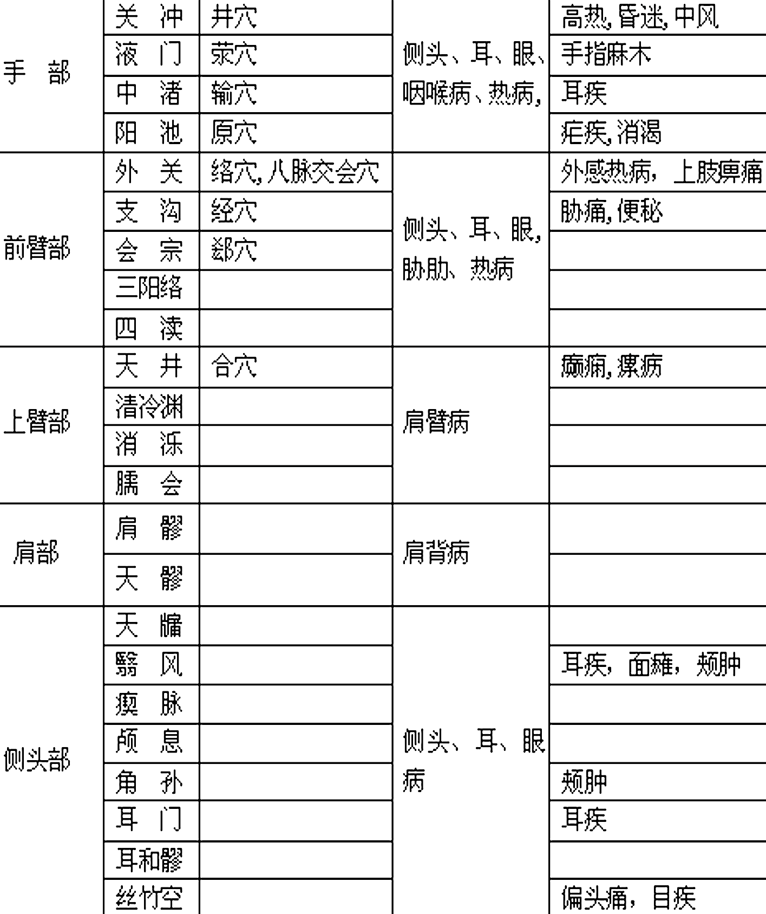
                - **关冲**
                    - **特定穴**
                        - 井穴
                    - **主治特点**
                        - **远治作用**
                            - 头痛、目赤、耳聋、耳鸣、喉痹、舌强等头面五官病证
                            - 热病，中暑
                    - **主治规律**
                        - **分经主治规律**
                            - 头痛、目赤、耳聋、耳鸣、喉痹、舌强等头面五官病证
                            - 热病，中暑
                    - **禁忌、特殊刺法**
                        - 浅刺0.1寸或点刺出血
                - **中渚**
                    - **特定穴**
                        - 输穴
                    - **主治特点**
                        - **近治作用**
                            - 肩背肘臂酸痛，手指不能屈伸
                        - **远治作用**
                            - 头痛、目赤、耳聋、耳鸣、喉痹等头面五官病症
                            - 热病，疟疾
                        - **特殊作用**
                            - 耳疾
                    - **主治规律**
                        - **分经主治规律**
                            - 肩背肘臂酸痛等
                            - 头痛、目赤、耳聋、耳鸣、喉痹等头面五官病症
                            - 热病，疟疾
                        - **分部主治规律**
                            - 手指不能屈伸
                    - **禁忌、特殊刺法**
                        - 直刺0.3～0.5寸
                - **阳池**
                    - **特定穴**
                        - 原穴
                    - **主治特点**
                        - **近治作用**
                            - 腕痛
                        - **远治作用**
                            - 目赤肿痛、耳聋、喉痹等五官病症
                            - 消渴，口干
                            - 肩臂痛
                        - **特殊作用**
                            - 疟疾，消渴
                    - **主治规律**
                        - **分经主治规律**
                            - 目赤肿痛，耳聋，喉痹等五官病症
                            - 消渴，口干
                            - 腕痛，肩臂痛
                        - **分部主治规律**
                            - 腕痛
                    - **禁忌、特殊刺法**
                        - 直刺0.3～0.5寸
                - **外关**
                    - **特定穴**
                        - 络穴
                        - 八脉交会穴（通于阳维脉）
                    - **主治特点**
                        - **近治作用**
                            - 上肢痿痹不遂
                        - **远治作用**
                            - 热病
                            - 头痛、目赤肿痛、耳聋、耳鸣等头面五官病证
                            - 瘰疬
                            - 胁肋痛
                    - **主治规律**
                        - **分经主治规律**
                            - 热病
                            - 头痛、目赤肿痛、耳聋、耳鸣等头面五官病证
                            - 瘰疬
                            - 胁肋痛
                        - **分部主治规律**
                            - 上肢痿痹不遂
                    - **禁忌、特殊刺法**
                        - 直刺0.5～1寸
                - **支沟**
                    - **特定穴**
                        - 经穴
                    - **主治特点**
                        - **远治作用**
                            - 耳聋，耳鸣，暴喑
                            - 瘰疬
                            - 热病
                        - **特殊作用**
                            - 胁肋痛
                            - 便秘
                    - **主治规律**
                        - **分经主治规律**
                            - 耳聋，耳鸣，暴喑
                            - 胁肋痛
                            - 便秘
                            - 瘰疬
                            - 热病
                    - **支沟治疗便秘的理论基础**
                        - **便秘（热证）经验穴——支沟**
                        - > 支沟+天枢
                            - **热秘**
                            - **阴虚**
                            - **气秘**
                        - *“凡三焦相火炽盛及大便不通，具宜泻支沟。 ”*
                        - *《针灸聚英·玉龙赋》曰：“支沟，通大便之秘。”*
                        - 支沟穴为手少阳三焦经之经穴，三焦主持诸气，总司全身的气机和气化，针刺支沟 穴能通调三焦气机，疏通经络，使经气宣上导下，气机顺则腑气通，故便秘之疾得愈
                    - **禁忌、特殊刺法**
                        - 直刺0.5～1寸
                - **肩髎**
                    - **主治特点**
                        - **近治作用**
                            - 臂痛，肩重不能举
                    - **主治规律**
                        - **分部主治规律**
                            - 臂痛，肩重不能举
                    - **禁忌、特殊刺法**
                        - 向肩关节直刺1～1.5寸
                - **翳风**
                    - **主治特点**
                        - **近治作用**
                            - 耳鸣、耳聋等耳疾
                            - 口眼歪斜、面痛、牙关紧闭、颊肿等面、口病证
                            - 瘰疬
                        - **特殊作用**
                            - 耳疾，面瘫，颊肿
                    - **主治规律**
                        - **分经主治规律**
                            - 耳鸣、耳聋等耳疾
                            - 口眼歪斜、面痛、牙关紧闭、颊肿等面、口病证
                            - 瘰疬
                    - **禁忌、特殊刺法**
                        - 直刺0.5～1寸
                - **角孙**
                    - **主治特点**
                        - **近治作用**
                            - 头痛，项强
                            - 痄腮，齿痛
                            - 目翳，目赤肿痛
                        - **特殊作用**
                            - 痄腮
                    - **主治规律**
                        - **分经主治规律**
                            - 头痛，项强
                            - 痄腮，齿痛
                            - 目翳，目赤肿痛
                    - **禁忌、特殊刺法**
                        - 平刺0.3～0.5寸
                - **耳门**
                    - **主治特点**
                        - **近治作用**
                            - 耳鸣、耳聋、聤耳等耳疾
                        - **远治作用**
                            - 齿痛，颈颔痛
                    - **主治规律**
                        - **分经主治规律**
                            - 耳鸣、耳聋、聤耳等耳疾
                            - 齿痛，颈颔痛
                    - **禁忌、特殊刺法**
                        - 微张口，平刺0.3～0.5寸
                - **丝竹空**
                    - **主治特点**
                        - **近治作用**
                            - 癫痫
                            - 头痛，目眩，目赤肿痛，眼睑动等头目病证
                            - 齿痛
                        - **特殊作用**
                            - 偏头痛，目疾
                    - **主治规律**
                        - **分经主治规律**
                            - 癫痫
                            - 头痛，目眩，目赤肿痛，眼睑动等头目病证
                            - 齿痛
                    - **禁忌、特殊刺法**
                        - 平刺0.3～0.5寸
    - 手太阳小肠经
        - **经脉循行**
            - **经脉循行**
                - **起于手小指外侧端** **到达胃部**
                - **颈部支脉**
                    - 从缺盆上行→沿着颈部→上经面颊至目外眦→弯向后进入耳中
                - **面颊部支脉**
                    - 从面颊部分出→上向颧骨抵于鼻旁→至目内眦→与足太阳膀胱经相接
            - **循行分布特点**
                - **走向：**
                - **体内：**
                - **体表路线**
                    - 起于手小指尺侧端（少泽）→沿上肢外侧后缘上行→绕肩胛→经颈、面部→止于耳前（听宫）
                    - 从面颊分支到眼内角（交足太阳膀胱经）
                - **分布：**
        - **联系脏腑、器官**
            - **联系脏腑**
                - 属小肠，络心，抵胃
            - **联系器官**
                - **咽** **目** **耳** **鼻** **目**
        - **主要病候**
            - **脏腑、器官病**
                - **本腑病**
                    - 少腹痛
                    - 腰脊痛引睾丸（小肠气痛）
                    - > 后溪
                - **器官病：头面五官病**
                    - 耳聋
                    - 目黄
                    - 咽喉肿痛
            - **经脉病**
                - 颊肿
                - 肩臂外侧后缘痛
        - **主治概要**
            - **头项、五官病：**
                - 头痛，目翳，咽喉肿痛等
            - **热病、神志病：**
            - **经脉病：**
            - **本经经穴主治表** 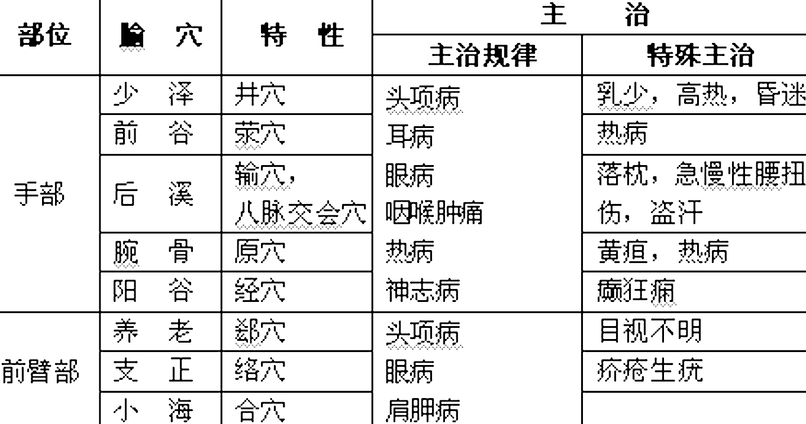 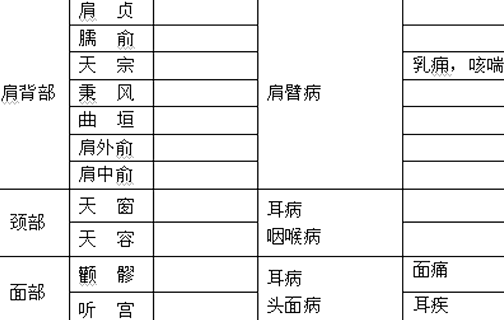
                - **少泽**
                    - **特定穴**
                        - 井穴
                    - **主治特点**
                        - **远治作用**
                            - 乳痈、乳少等乳疾
                            - 昏迷、热病等急症、热证
                            - 头痛、目翳、咽喉肿痛等头面五官病证
                        - **特殊作用**
                            - 乳少，高热，昏迷
                    - **主治规律**
                        - **分经主治规律**
                            - 乳少，高热，昏迷
                            - 昏迷、热病等急症、热证
                            - 头痛、目翳、咽喉肿痛等头面五官病证
                    - **禁忌、特殊刺法**
                        - 浅刺0.1寸或点刺出血
                        - 孕妇慎用
                        - > 催乳——产后可用
                - **后溪**
                    - **特定穴**
                        - 输穴
                        - 八脉交会穴（通于督脉）
                    - **主治特点**
                        - **近治作用**
                            - 手指及肘臂痉挛痛等痛证
                        - **远治作用**
                            - 头项强痛、腰背痛
                            - 耳聋，目赤
                            - 癫狂痫
                            - 疟疾
                        - **特殊作用**
                            - 急性腰扭伤，落枕低头后仰受限
                            - 颈椎病，项强枕痛
                            - 盗汗
                    - **主治规律**
                        - **分经主治规律**
                            - 头项强痛、腰背痛
                            - 耳聋，目赤
                            - 癫狂痫
                            - 疟疾
                        - **分部主治规律**
                            - 手指及肘臂痉挛痛等痛证
                    - **禁忌、特殊刺法**
                        - 直刺0.5～1寸
                        - 治疗手指挛痛可透刺合谷穴
                - **腕骨**
                    - **特定穴**
                        - 原穴
                    - **主治特点**
                        - **近治作用**
                            - 指挛腕痛
                        - **远治作用**
                            - 头项强痛
                            - 目翳
                            - 热病，疟疾
                        - **特殊作用**
                            - 黄疸
                            - 热病，疟疾
                    - **主治规律**
                        - **分经主治规律**
                            - 头项强痛
                            - 目翳
                            - 黄疸
                            - 热病，疟疾
                        - **分部主治规律**
                            - 指挛腕痛
                    - **禁忌、特殊刺法**
                        - 直刺0.3～0.5寸
                - **养老**
                    - **特定穴**
                        - 郄穴
                    - **主治特点**
                        - **近治作用**
                            - 肘臂酸痛
                        - **远治作用**
                            - 目视不明
                            - 肩背酸痛
                        - **特殊作用**
                            - 目视不明
                    - **主治规律**
                        - **分经主治规律**
                            - 目视不明
                            - 肩背酸痛
                        - **分部主治规律**
                            - 肘臂酸痛
                    - **禁忌、特殊刺法**
                        - 直刺或者斜刺0.5～0.8寸
                        - 强身保健可以温和灸
                - **支正**
                    - **特定穴**
                        - 络穴
                    - **主治特点**
                        - **近治作用**
                            - 肘臂酸痛
                        - **远治作用**
                            - 头痛，项强
                            - 热病
                            - 癫狂
                            - 疣症
                        - **特殊作用**
                            - 疣症
                    - **主治规律**
                        - **分经主治规律**
                            - 头痛，项强
                            - 热病
                            - 癫狂
                            - 疣症
                        - **分部主治规律**
                            - 肘臂酸痛
                    - **禁忌、特殊刺法**
                        - 直刺或斜刺0.5～0.8寸
                - **小海**
                    - **特定穴**
                        - 合穴
                    - **主治特点**
                        - **近治作用**
                            - 肘臂疼痛，麻木
                        - **远治作用**
                            - 癫痫
                            - > 关节僵直症状
                    - **主治规律**
                        - **分经主治规律**
                            - 肘臂疼痛
                        - **分部主治规律**
                            - 癫痫
                    - **禁忌、特殊刺法**
                        - 直刺0.3～0.5寸
                - **肩贞**
                    - **主治特点**
                        - **近治作用**
                            - 肩臂疼痛，上肢不遂
                            - 瘰疬
                    - **主治规律**
                        - **分部主治规律**
                            - 肩臂疼痛，上肢不遂
                            - 瘰疬
                    - **禁忌、特殊刺法**
                        - 直刺1～1.5寸
                        - 不宜向胸侧深刺
                - **天宗**
                    - **主治特点**
                        - **近治作用**
                            - 肩胛疼痛，肩背部损伤等局部病症
                        - **远治作用**
                            - 气喘
                        - **特殊作用**
                            - 乳痈，气喘
                    - **主治规律**
                        - **分经主治规律**
                            - 气喘
                        - **分部主治规律**
                            - 肩胛疼痛，肩背部损伤等局部病症
                    - **禁忌、特殊刺法**
                        - 直刺或斜刺0.5～1寸
                        - **遇到阻力不可强行进针**
                            - 肩胛下方→肋骨（越0.5cm）→肺→气胸
                            - 特殊生理：天宗处肩胛天生有洞——0.5～1寸
                - **颧髎**
                    - **主治特点**
                        - **近治作用**
                            - 口眼歪斜、眼睑动、齿痛、面痛
                        - **特殊作用**
                            - 面痛
                    - **主治规律**
                        - **分部主治规律**
                            - 口眼歪斜、眼睑动、齿痛、面痛
                    - **禁忌、特殊刺法**
                        - 直刺0.3～0.5寸
                        - 斜刺或平刺0.5~1寸
                - **听宫**
                    - **主治特点**
                        - **近治作用**
                            - 耳鸣、耳聋、聤耳等耳疾
                        - **远治作用**
                            - 齿痛
                        - **特殊作用**
                            - 耳疾
                    - **主治规律**
                        - **分经主治规律**
                            - 齿痛
                        - **分部主治规律**
                            - 耳鸣、耳聋、聤耳、齿痛
                    - **禁忌、特殊刺法**
                        - 张口，直刺1～1.5寸
                        - 留针时要保持一定的张口姿势
    - 足阳明胃经
        - **经脉循行**
            - **经脉循行**
                - 起于鼻翼旁→上行到鼻根部→与旁侧足太阳经交会→向下沿着鼻柱外侧→进入上齿龈内→回出环绕口唇→向下交会于颏唇沟处→再向后沿着口腮后下方→出于下颌大迎处→沿着下颌角上行耳前→经过颧弓→沿着发际到达前额
                - **颈部支脉**
                    - 从大迎前下走人迎→沿着喉咙→进入锁骨上窝部→向下通过横膈→属于胃，络于脾
                - **胸腹部直行支脉**
                    - 从锁骨上窝向下→经乳头向下挟脐旁→进入少腹两侧气冲
                - **胃下口的支脉**
                    - 沿着腹里向下到气冲会合→再由此下行经大腿前侧直抵伏兔部→下至膝盖→沿胫骨外侧前缘→下经足跗→进入第二足趾外侧端
                - **小腿部的支脉**
                    - 从膝下三寸处分出→进入足中趾外侧
                - **足部支脉**
                    - 从跗上分出→进入足大趾内侧端→与足太阴脾经相接
            - **循行分布特点**
                - **走向：**
                - **体表路线**
                    - 本经起于眼眶下缘（承泣）→先行于面→耳前面至前额角的头维穴→后从面颊大迎穴至缺盆向下→经胸、腹部→再沿下肢外侧前缘下行→止于足第二趾外侧端（厉况）
                    - **支脉**
                        - 从足背（冲阳）→至足大趾内侧端（隐白）（交于足太阴脾经）
                - **分布**
                    - 头面部——行于面、耳的前面
                    - 胸部循——行于任脉旁开4寸（经乳头）
                    - 腹部循——行于任脉旁开2寸
                    - 下肢行于下肢外侧前缘
                - **交接：** **手阳明大肠经** **足太阴脾经**
        - **联系脏腑、器官**
            - **联系脏腑**
                - 属胃，络脾
            - **联系器官**
                - 鼻、眼、口、（上）齿、喉、乳房
            - **联系官窍**
                - 耳目、脾胃
        - **主要病候**
            - **脏腑、器官病**
                - **脏腑病**
                    - **脾胃肠，消化系统：**
                - **器官病**
                    - **头面五官病：**
            - **经脉病**
                - 胸部及膝膑等本经循行部位病痛
            - **其他**
                - 热病、发狂
                    - 属阳明本腑病，阳明热盛
                    - 神志病——经别通心
        - **主治概要**
            - **胃肠病：**
                - 食欲不振，胃痛，呕吐，噎嗝，腹胀，泄泻，痢疾，便秘等
            - **头面五官病：**
                - 目赤痛痒，目翳，眼睑瞤动，鼻衄，齿痛，耳病
            - **神志病：**
            - **热病：**
            - **其他：**
            - **经脉病**
            - **本经经穴主治表** 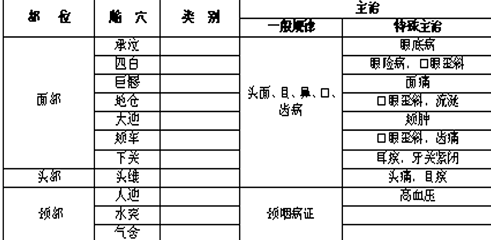 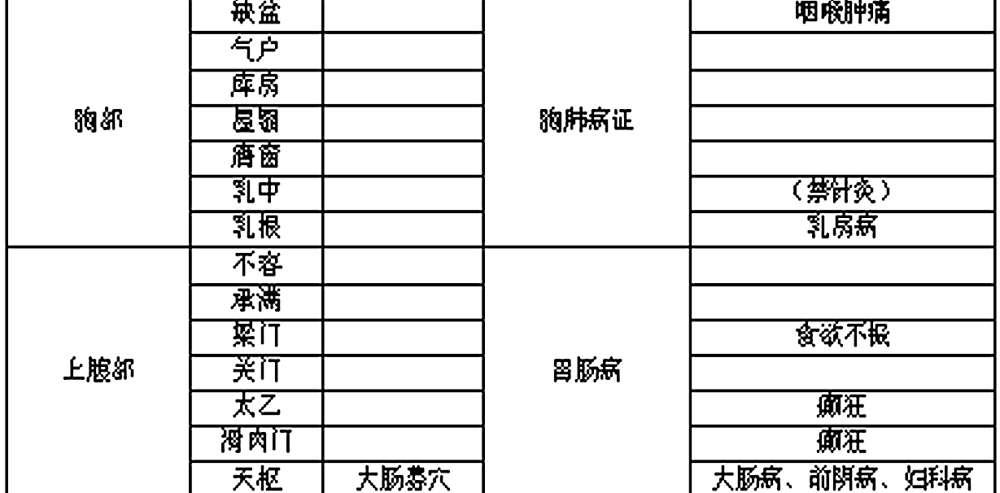 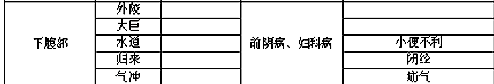 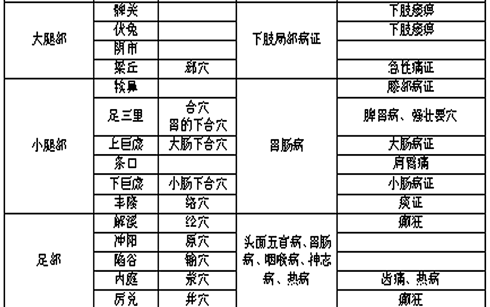
                - **足三里**
                - **条口透承山**
                - **丰隆**
                - **内庭**
                - **天枢**
                - **承泣**
                    - **主治特点**
                        - **近治作用**
                            - 眼睑动、迎风流泪、夜盲、近视等目疾
                        - **远治作用**
                            - 口眼歪斜，面肌痉挛
                        - **特殊作用**
                            - 眼底病
                    - **主治规律**
                        - **分经主治规律**
                            - 口眼歪斜，面肌痉挛
                        - **分部主治规律**
                            - 眼睑动、迎风流泪、夜盲、近视等目疾
                    - **禁忌、特殊刺法**
                        - 左手拇指向上轻推眼球，紧靠眼眶缘缓慢直刺0.5～1.5寸
                        - 不宜提插捻转，出针时按压针孔片刻
                - **四白**
                    - **主治特点**
                        - **近治作用**
                            - 目赤痛痒、眼睑动、目翳等眼部病证
                        - **远治作用**
                            - 头痛，眩晕
                            - 口眼歪斜、面痛、面肌痉挛等面部病证
                    - **主治规律**
                        - **分经主治规律**
                            - 头痛，眩晕
                            - 口眼歪斜、面痛、面肌痉挛等面部病证
                        - **分部主治规律**
                            - 目赤痒痛、眼睑动、目翳等眼部病证
                    - **禁忌、特殊刺法**
                        - 直刺或微向上斜刺0.3～0.5寸，以免伤及眼球，不可过度提插捻转
                - **地仓**
                    - **主治特点**
                        - **近治作用**
                            - 口角歪斜、流涎、面痛、齿痛
                    - **主治规律**
                        - **分部主治规律**
                            - 口角歪斜、流涎、面痛、齿痛
                    - **禁忌、特殊刺法**
                        - 可向颊车穴透刺
                - **颊车**
                    - **主治特点**
                        - **近治作用**
                            - 齿痛、牙关不利、颊肿、口角歪斜
                    - **主治规律**
                        - **分部主治规律**
                            - 齿痛、牙关不利、颊肿、口角歪斜
                    - **禁忌、特殊刺法**
                        - 可向地仓穴透刺
                - **下关**
                    - **主治特点**
                        - **近治作用**
                            - 耳聋、耳鸣、聤耳等耳疾
                        - **远治作用**
                            - 牙关不利、面痛、齿痛、口眼歪斜等面口病证
                    - **主治规律**
                        - **分经主治规律**
                            - 牙关不利、面痛、齿痛、口眼歪斜等面口病证
                        - **分部主治规律**
                            - 耳聋、耳鸣、聤耳等耳疾
                    - **禁忌、特殊刺法**
                        - 直刺0.5～1寸
                        - 留针时不可做张口动作，以免弯针、折针
                - **头维**
                    - **主治特点**
                        - **近治作用**
                            - 头痛
                        - **远治作用**
                            - 目眩、目痛
                    - **主治规律**
                        - **分经主治规律**
                            - 目眩、目痛
                        - **分部主治规律**
                            - 头痛
                    - **禁忌、特殊刺法**
                        - 平刺0.5～1寸
                - **人迎**
                    - **特定穴**
                        - 足阳明、少阳之会
                    - **主治特点**
                        - **近治作用**
                            - 瘿气、瘰疬
                            - 咽喉肿痛
                            - 气喘
                        - **特殊作用**
                            - 高血压
                    - **主治规律**
                        - **分经主治规律**
                            - 高血压
                        - **分部主治规律**
                            - 瘿气、瘰疬
                            - 咽喉肿痛
                            - 气喘
                    - **禁忌、特殊刺法**
                        - 避开颈总动脉，直刺0.3～0.8寸
                - **梁门**
                - > 下为小肠
                    - **主治特点**
                        - **近治作用**
                            - 腹胀、纳少、胃痛、呕吐等胃疾
                        - **特殊作用**
                            - 食欲不振
                    - **主治规律**
                        - **分部主治规律**
                            - 腹胀、纳少、胃痛、呕吐等胃疾
                    - **禁忌、特殊刺法**
                        - 直刺0.8～1.2寸
                        - 过饱者禁针
                        - 肝大者右侧慎针或禁针
                        - 不宜做大幅度提插
                - **天枢**
                - > （左）天枢——小肠&amp;乙状结肠相接处
                    - **特定穴**
                        - 大肠之募穴
                    - **主治特点**
                        - **近治作用**
                            - 腹痛、腹胀
                        - **远治作用**
                            - 便秘、腹泻、痢疾等胃肠病症
                            - 月经不调，痛经等妇科病症
                        - **特殊作用**
                            - 大肠病：腹泻时针可止泻，便秘时针可通便
                            - 前阴病、妇科病
                    - **主治规律**
                        - **分经主治规律**
                            - 便秘、腹泻、痢疾等胃肠病症
                        - **分部主治规律**
                            - 腹痛、腹胀
                            - 月经不调，痛经等妇科病症
                    - **禁忌、特殊刺法**
                        - 直刺1～1.5寸
                - **水道**
                    - **主治特点**
                        - **近治作用**
                            - 小腹胀满
                            - 小便不利等水液排泄输布失常性疾患
                            - 疝气（多右水道）
                            - 痛经、不孕等妇科疾患
                    - **主治规律**
                        - **分部主治规律**
                            - 小腹胀满
                            - 小便不利等水液排泄输布失常性疾患
                            - 疝气（多右水道）
                            - 痛经、不孕等妇科疾患
                    - **禁忌、特殊刺法**
                        - 直刺1～1.5寸
                - **归来**
                    - **主治特点**
                        - **近治作用**
                            - 小腹痛，疝气
                            - 月经不调、带下、阴挺等妇科病
                        - **特殊作用**
                            - 闭经
                    - **主治规律**
                        - **分部主治规律**
                            - 小腹痛，疝气
                            - 月经不调、带下、阴挺等妇科病
                    - **禁忌、特殊刺法**
                        - 直刺1～1.5寸
                - **伏兔**
                    - **主治特点**
                        - **近治作用**
                            - 下肢痿痹、膝冷等下肢病症
                        - **远治作用**
                            - 腰痛等腰部病症
                            - 疝气
                            - 脚气
                    - **主治规律**
                        - **分经主治规律**
                            - 腰痛等腰部病症
                            - 疝气
                            - 脚气
                        - **分部主治规律**
                            - 下肢痿痹、膝冷等下肢病症
                    - **禁忌、特殊刺法**
                        - 直刺1～2寸
                - **梁丘**
                    - **特定穴**
                        - 郄穴
                    - **主治特点**
                        - **近治作用**
                            - 膝肿痛、下肢不遂等下肢疾病
                        - **远治作用**
                            - 急性胃痛
                            - 乳痈、乳痛等乳疾
                        - **特殊作用**
                            - 急性痛证
                    - **主治规律**
                        - **分经主治规律**
                            - 急性胃痛
                            - 乳痈、乳痛等乳疾
                        - **分部主治规律**
                            - 膝肿痛、下肢不遂等下肢疾病
                    - **禁忌、特殊刺法**
                        - 直刺1～1.5寸
                - **足三里**
                    - **特定穴**
                        - 合穴，胃下合穴
                    - **主治特点**
                        - **近治作用**
                            - 下肢痿痹
                        - **远治作用**
                            - 胃痛、呕吐、噎膈、腹胀、腹泻、痢疾、便秘等胃肠病证
                            - 癫狂等神志病
                            - 乳痈、肠痈等外科疾患
                            - 虚劳诸证
                        - **特殊作用**
                            - 为强壮保健要穴
                    - **主治规律**
                        - **分经主治规律**
                            - 胃痛、呕吐、噎膈、腹胀、腹泻、痢疾、便秘等胃肠病证
                            - 癫狂等神志病
                            - 乳痈、肠痈等外科疾患
                            - 虚劳诸证
                        - **分部主治规律**
                            - 下肢痿痹
                    - **禁忌、特殊刺法**
                        - 直刺1～2寸
                        - 强壮保健常用温灸法
                            - 所有人都可以温灸以强壮保健
                            - *《类经图翼》：“小儿忌灸三里，三十外方可灸，不尔反生疾”*
                                - （直接灸）副作用：产生瘢痕→由于小儿发育→瘢痕长大→影响肌肉
                        - 促进胃肠道蠕动
                - **上巨虚**
                    - **特定穴**
                        - 大肠下合穴
                    - **主治特点**
                        - **近治作用**
                            - 下肢痿痹
                        - **远治作用**
                            - 肠鸣、腹痛、腹泻、便秘、肠痈、痢疾等胃肠病证
                    - **主治规律**
                        - **分经主治规律**
                            - 肠鸣、腹痛、腹泻、便秘、肠痈、痢疾等胃肠病证
                        - **分部主治规律**
                            - 下肢痿痹
                    - **禁忌、特殊刺法**
                        - 直刺1～2寸
                - **条口**
                    - **主治特点**
                        - **近治作用**
                            - 下肢痿痹，转筋
                        - **远治作用**
                            - 肩臂痛
                            - 脘腹疼痛
                    - **主治规律**
                        - **分经主治规律**
                            - 肩臂痛
                            - 脘腹疼痛
                        - **分部主治规律**
                            - 下肢痿痹，转筋
                    - **禁忌、特殊刺法**
                        - 直刺1～1.5寸
                        - 用法如：左肩用右条口，右肩用左条口
                - **下巨虚**
                    - **特定穴**
                        - 小肠下合穴
                    - **主治特点**
                        - **近治作用**
                            - 下肢痿痹
                        - **远治作用**
                            - 腹泻、痢疾、小腹痛等胃肠病证
                            - 乳痈
                    - **主治规律**
                        - **分经主治规律**
                            - 腹泻、痢疾、小腹痛等胃肠病证
                            - 乳痈
                        - **分部主治规律**
                            - 下肢痿痹
                    - **禁忌、特殊刺法**
                        - 直刺1～1.5寸
                - **丰隆**
                    - **特定穴**
                        - 络穴
                    - **主治特点**
                        - **近治作用**
                            - 下肢痿痹
                        - **远治作用**
                            - 头痛，眩晕
                            - 癫狂
                            - 咳嗽、痰多等痰饮病症
                            - 腹胀，便秘
                        - **特殊作用**
                            - 痰证
                    - **主治规律**
                        - **分经主治规律**
                            - 头痛，眩晕
                            - 癫狂
                            - 咳嗽、痰多等痰饮病症
                            - 腹胀，便秘
                        - **分部主治规律**
                            - 下肢痿痹
                    - **禁忌、特殊刺法**
                        - 直刺1～1.5寸
                - **解溪**
                    - **特定穴**
                        - 经穴
                    - **主治特点**
                        - **近治作用**
                            - 下肢痿痹、踝关节病、足下垂等下肢、踝关节疾患
                        - **远治作用**
                            - 头痛，眩晕
                            - 癫狂
                            - 腹胀，便秘
                    - **主治规律**
                        - **分经主治规律**
                            - 头痛，眩晕
                            - 癫狂
                            - 腹胀，便秘
                        - **分部主治规律**
                            - 下肢痿痹、踝关节病、足下垂等下肢、踝关节疾患
                    - **禁忌、特殊刺法**
                        - 直刺0.5～1寸
                - **内庭**
                    - **特定穴**
                        - 荥穴
                    - **主治特点**
                        - **近治作用**
                            - 足背肿痛，跖趾关节痛
                        - **远治作用**
                            - 齿痛、咽喉肿痛、鼻衄等五官热性病症
                            - 热病
                            - 吐酸、腹泻、痢疾、便秘等胃肠疾病
                    - **主治规律**
                        - **分经主治规律**
                            - 齿痛、咽喉肿痛、鼻衄等五官热性病症
                            - 热病
                            - 吐酸、腹泻、痢疾、便秘等胃肠疾病
                        - **分部主治规律**
                            - 足背肿痛，跖趾关节痛
                    - **禁忌、特殊刺法**
                        - 直刺或斜刺0.5～0.8寸
                - **厉兑**
                    - **特定穴**
                        - 井穴
                    - **主治特点**
                        - **远治作用**
                            - 鼻衄、齿痛、咽喉肿痛等实热性五官病证
                            - 热病
                            - 多梦、癫狂等神志病
                    - **主治规律**
                        - **分经主治规律**
                            - 鼻衄、齿痛、咽喉肿痛等实热性五官病证
                            - 热病
                            - 多梦、癫狂等神志病
                    - **禁忌、特殊刺法**
                        - 浅刺0.1寸，或点刺出血
    - 足太阳膀胱经
        - **经脉循行**
            - **经脉循行**
                - **起于目内眦→上额交会于巅顶**
                - **头顶部的支脉**
                    - 从头顶分出到耳上方
                - **巅顶部直行的支脉**
                    - 从头顶入里联络于脑→回出项部分开下行
                    - **一支脉**
                        - 沿着肩胛部内侧，挟着脊柱→到达腰部→从脊柱旁肌肉进入体腔→联络肾脏，属于膀胱
                            - 腰部的支脉
                                - 向下通过臀部→进入腘窝中
                    - **另一支脉**
                        - 通过肩胛骨内缘直下→经过臀部下行→沿着大腿后外侧，与腰部下来的支脉会合于腘窝中→由此向下通过腓肠肌→出于外踝的后面→沿着第五跖骨粗隆→至小趾外侧端→与足少阴肾经相接
            - **循行分布特点**
                - **走向：**
                - **体表路线**
                    - 起于眼睛目内眦（睛明）→沿上额到头顶，出项后分为两支
                        - **一支**
                            - 由项挟脊两旁下行→经腰→股后进入→腘中→经小腿后、外踝后下
                        - **另一支**
                            - 由项经肩胛下行→臀部→下行→止于足小趾外侧端（至阴）（交足少阴肾经）
                - **分布（本经分布）**
                    - **头部**
                    - **背部**
                    - **下肢部**
                    - **足部**
        - **联系脏腑、器官**
            - **联系脏腑**
                - 属膀胱，络肾、脑
            - **联系官窍**
                - 鼻、目
            - **联系器官**
                - 脑、眼、耳
                - 经别：入肛下尻，当心入散
        - **主要病候**
            - **脏腑、器官病**
                - **本腑病**
                    - 小便不通，遗尿
                - **器官病**
                    - 脑（癫狂）
                    - 目（痛、见风流泪）
                    - 鼻（塞、鼻衄）
            - **经脉病**
                - 头痛，项、背、腰、臀及下肢后侧痛
                - 疟疾（足太阳疟）
        - **主治概要**
            - **脏器病**
                - 呼吸系统、心血管——上焦
                - 消化——中焦
                - 泌尿生殖——下焦
            - **神志病：**
                - 癫、狂、痫等
            - **头面五官病：**
            - **其他经脉病：**
            - **本经经穴主治表** 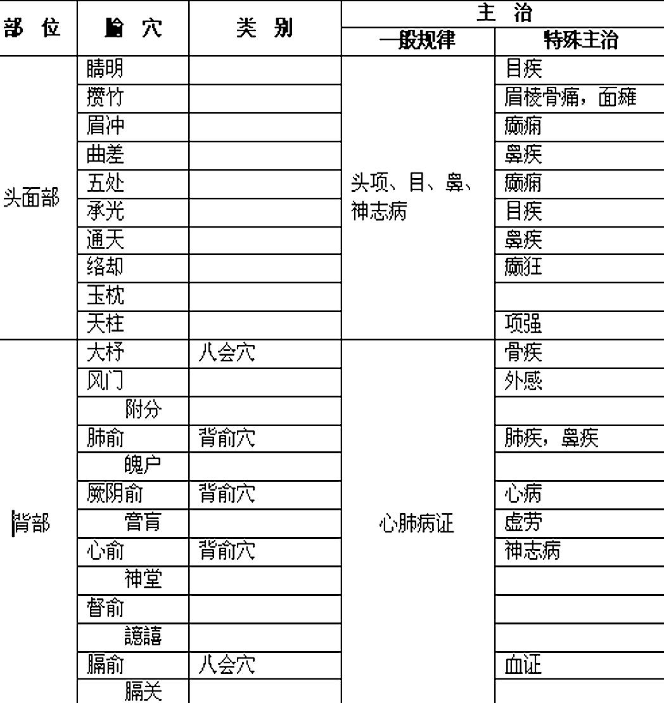 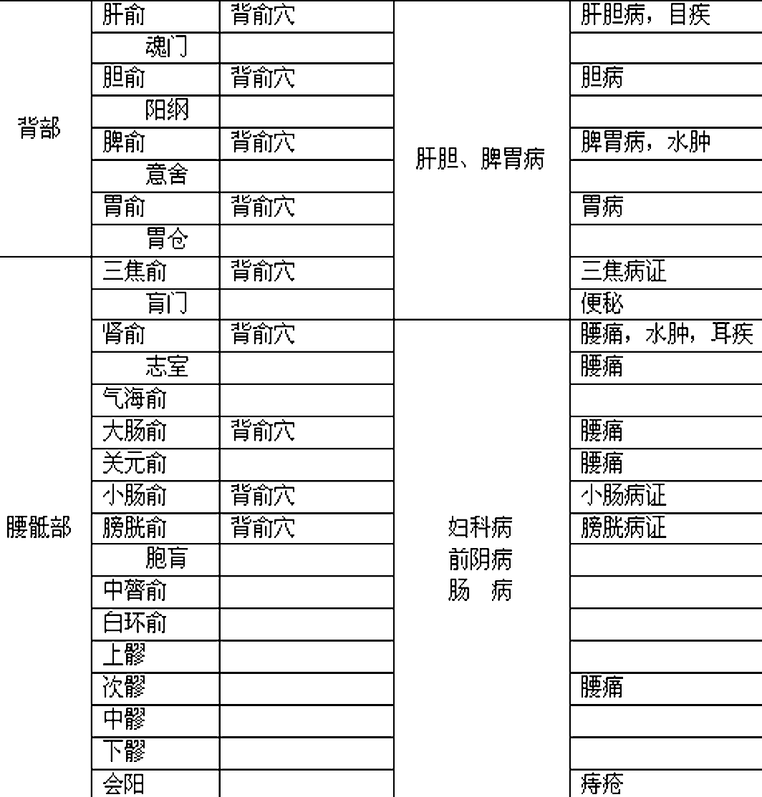 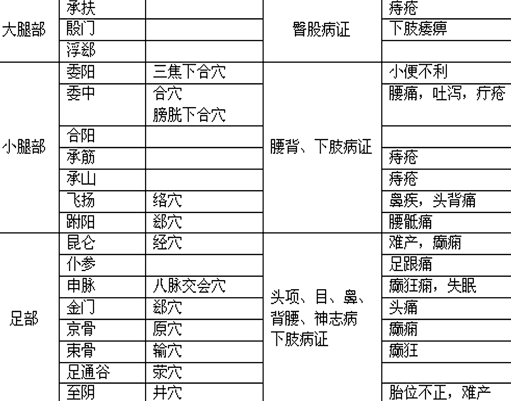
                - **睛明**
                    - **主治特点**
                        - **近治作用**
                            - 目赤肿痛、流泪、视物不明、目眩、近视、夜盲、色盲、干眼症等目疾
                        - **远治作用**
                            - 急性腰扭伤，坐骨神经痛
                            - 心悸，怔忡
                    - **主治规律**
                        - **分经主治规律**
                            - 急性腰扭伤，坐骨神经痛
                            - 心悸，怔忡
                        - **分部主治规律**
                            - 目赤肿痛、视物不明、流泪、目眩、近视、夜盲、色盲、干眼症等目疾
                    - **禁忌、特殊刺法**
                        - 嘱患者闭目，医者押手轻推眼球向外侧固定，刺手缓慢进针，紧靠眶缘直刺0.5～1寸
                        - 遇到阻力时，不宜强行进针，应改变进针方向或退针
                        - 不捻转，不提插（或只轻微地捻转和提插）
                        - 出针后按压针孔片刻，以防出血
                        - 针具宜细，消毒宜严
                        - 禁直接灸
                - **攒竹**
                    - **主治特点**
                        - **近治作用**
                            - 头痛，眉棱骨痛
                            - 眼睑动、眼睑下垂、口眼歪斜、目视不明、流泪、目赤肿痛等目疾
                        - **远治作用**
                            - 呃逆
                        - **特殊作用**
                            - 眉棱骨痛
                            - 面瘫
                    - **主治规律**
                        - **分经主治规律**
                            - 呃逆
                        - **分部主治规律**
                            - 头痛，眉棱骨痛
                            - 眼睑动、眼睑下垂、口眼歪斜、目视不明、流泪、目赤肿痛等目疾
                    - **禁忌、特殊刺法**
                        - 可向眉中或眼眶内缘平刺或斜刺0.3～0.5寸，或直刺0.2～0.3寸
                        - 禁直接灸
                - **天柱**
                    - **主治特点**
                        - **近治作用**
                            - 后头痛、项强、肩背腰痛
                        - **远治作用**
                            - 鼻塞
                            - 目痛
                            - 癫狂痫
                            - 热病
                    - **主治规律**
                        - **分经主治规律**
                            - 鼻塞
                            - 目痛
                            - 癫狂痫
                            - 热病
                        - **分部主治规律**
                            - 后头痛、项强、肩背腰痛
                    - **禁忌、特殊刺法**
                        - 直刺或斜刺0.5～0.8寸，不可向内，上方深刺，以免伤及延髓
                - **大杼**
                    - **特定穴**
                        - 八会穴之骨会
                    - **主治特点**
                        - **近治作用**
                            - 咳嗽，发热
                            - 项强，肩背痛
                        - **特殊作用**
                            - 骨疾
                    - **主治规律**
                        - **分部主治规律**
                            - 咳嗽，发热
                            - 项强，肩背痛
                    - **禁忌、特殊刺法**
                        - 斜刺0.5～0.8寸
                        - 不宜深刺，以免伤及内部重要脏器
                - **风门**
                    - **主治特点**
                        - **近治作用**
                            - 项强，胸背痛
                            - 咳嗽
                        - **远治作用**
                            - 感冒、发热、头痛等外感病证
                    - **主治规律**
                        - **分经主治规律**
                            - 感冒、咳嗽、发热、头痛等外感病证
                        - **分部主治规律**
                            - 项强，胸背痛
                    - **禁忌、特殊刺法**
                        - 斜刺0.5～0.8寸
                        - 热证宜点刺放血
                - **肺俞**
                    - **特定穴**
                        - 肺之背俞穴
                    - **主治特点**
                        - **近治作用**
                            - 咳嗽、气喘、咯血等肺系病证
                        - **远治作用**
                            - 骨蒸潮热、盗汗等阴虚病证
                            - 瘙痒、隐疹等皮肤病
                    - **主治规律**
                        - **分经主治规律**
                            - 骨蒸潮热、盗汗等阴虚病证
                            - 瘙痒、隐疹等皮肤病
                        - **分部主治规律**
                            - 咳嗽、气喘、咯血等肺系病证
                    - **禁忌、特殊刺法**
                        - 斜刺0.5～0.8寸
                        - 热证宜点刺放血
                - **心俞**
                    - **特定穴**
                        - 心之背俞穴
                    - **主治特点**
                        - **近治作用**
                            - 心痛、惊悸、失眠、健忘、癫痫等心与神志病
                            - 咳嗽、咯血等肺系病症
                        - **远治作用**
                            - 盗汗，遗精
                    - **主治规律**
                        - **分经主治规律**
                            - 盗汗，遗精
                        - **分部主治规律**
                            - 心痛、惊悸、失眠、健忘、癫痫等心与神志病
                            - 咳嗽、咯血等肺系病症
                    - **禁忌、特殊刺法**
                        - 斜刺0.5～0.8寸
                - **膈俞**
                    - **特定穴**
                        - 八会穴之血会
                        - 解剖位置&amp;膈肌活动→牵扯管道→胸腹腔脏器得到锻炼
                    - **主治特点**
                        - **近治作用**
                            - 血瘀诸证
                            - 呕吐、呃逆、气喘、吐血等上逆之证
                        - **远治作用**
                            - 隐疹，皮肤瘙痒
                            - 贫血
                            - 潮热，盗汗
                        - **特殊作用**
                            - 血证
                    - **主治规律**
                        - **分经主治规律**
                            - 隐疹，皮肤瘙痒
                            - 贫血
                            - 潮热，盗汗
                        - **分部主治规律**
                            - 血瘀诸证
                            - 呕吐、呃逆、气喘、吐血等上逆之证
                    - **禁忌、特殊刺法**
                        - 斜刺0.5～0.8寸
                - **肝俞**
                    - **特定穴**
                        - 肝之背俞穴
                    - **主治特点**
                        - **近治作用**
                            - 胁痛、黄疸等肝胆病症
                            - 脊背痛
                        - **远治作用**
                            - 目赤、目视不明、目眩、夜盲、迎风流泪等目疾
                            - 癫狂痫
                    - **主治规律**
                        - **分经主治规律**
                            - 目赤、目视不明、目眩、夜盲、迎风流泪等目疾
                            - 癫狂痫
                        - **分部主治规律**
                            - 胁痛、黄疸等肝胆病症
                            - 脊背痛
                    - **禁忌、特殊刺法**
                        - 斜刺0.5～0.8寸
                - **胆俞**
                    - **特定穴**
                        - 胆之背俞穴
                    - **主治特点**
                        - **近治作用**
                            - 黄疸、口苦、胁痛等肝胆病症 
                        - **远治作用**
                            - 肺痨，潮热
                    - **主治规律**
                        - **分经主治规律**
                            - 肺痨，潮热
                        - **分部主治规律**
                            - 黄疸、口苦、胁痛等肝胆病症 
                    - **禁忌、特殊刺法**
                        - 斜刺0.5～0.8寸
                - **脾俞**
                    - **特定穴**
                        - 脾之背俞穴
                    - **主治特点**
                        - **近治作用**
                            - 腹胀、纳呆、呕吐、腹泻、痢疾、便血、水肿等脾胃肠腑病证
                            - 多食善饥，身体消瘦
                            - 背痛
                        - **特殊作用**
                            - 水肿
                    - **主治规律**
                        - **分部主治规律**
                            - 腹胀、纳呆、呕吐、腹泻、痢疾、便血、水肿等脾胃肠腑病证
                            - 多食善饥，身体消瘦
                            - 背痛
                    - **禁忌、特殊刺法**
                        - 斜刺0.5～0.8寸
                - **胃俞**
                    - **特定穴**
                        - 胃之背俞穴
                    - **主治特点**
                        - **近治作用**
                            - 胃脘痛、呕吐、腹胀、肠鸣等胃肠病证
                            - 多食善饥，身体消瘦
                    - **主治规律**
                        - **分部主治规律**
                            - 胃脘痛、呕吐、腹胀、肠鸣等胃肠病证
                            - 多食善饥，身体消瘦
                    - **禁忌、特殊刺法**
                        - 斜刺0.5～0.8寸
                - **三焦俞**
                    - **特定穴**
                        - 三焦之背俞穴
                    - **主治特点**
                        - **近治作用**
                            - 肠鸣、腹胀、呕吐、腹泻、痢疾等脾胃肠腑病证
                            - 腰背强痛
                            - 小便不利、水肿等三焦气化不利病证
                    - **主治规律**
                        - **分部主治规律**
                            - 肠鸣、腹胀、呕吐、腹泻、痢疾等脾胃肠腑病证
                            - 腰背强痛
                            - 小便不利、水肿等三焦气化不利病证
                    - **禁忌、特殊刺法**
                        - 斜刺0.5～1寸
                - **肾俞**
                    - **特定穴**
                        - 肾之背俞穴
                    - **主治特点**
                        - **近治作用**
                            - 头晕、耳鸣、耳聋、水肿、腰酸痛等肾虚病证
                            - 遗尿、遗精、阳痿、早泄、不育等生殖泌尿系疾患
                            - 月经不调、带下、不孕等妇科病证
                        - **特殊作用**
                            - 消渴
                    - **主治规律**
                        - **分部主治规律**
                            - 头晕、耳鸣、耳聋、水肿、腰酸痛等肾虚病证
                            - 遗尿、遗精、阳痿、早泄、不育等生殖泌尿系疾患
                            - 月经不调、带下、不孕等妇科病证
                            - 消渴
                    - **禁忌、特殊刺法**
                        - 斜刺0.5～1寸
                - **大肠俞**
                    - **特定穴**
                        - 大肠之背俞穴
                    - **主治特点**
                        - **近治作用**
                            - 腹胀、腹泻、便秘等胃肠病证
                            - 腰痛
                        - **远治作用**
                            - 腿痛
                    - **主治规律**
                        - **分经主治规律**
                            - 腿痛
                        - **分部主治规律**
                            - 腹胀、腹泻、便秘等胃肠病证
                            - 腰痛
                    - **禁忌、特殊刺法**
                        - 直刺0.8～1.2寸
                - **小肠俞**
                    - **特定穴**
                        - 小肠之背俞穴
                    - **主治特点**
                        - **近治作用**
                            - 遗精、遗尿、尿血、尿痛、带下等泌尿生殖系统疾患
                            - 腹泻，痢疾
                            - 疝气
                            - 腰骶痛
                    - **主治规律**
                        - **分部主治规律**
                            - 遗精、遗尿、尿血、尿痛、带下等泌尿生殖系统疾患
                            - 腹泻，痢疾
                            - 疝气
                            - 腰骶痛
                    - **禁忌、特殊刺法**
                        - 直刺或斜刺0.8～1.2寸
                - **膀胱俞**
                    - **特定穴**
                        - 膀胱之背俞穴
                    - **主治特点**
                        - **近治作用**
                            - 小便不利、遗尿等膀胱气化功能失调病证
                            - 腹泻，便秘
                            - 腰脊强痛
                    - **主治规律**
                        - **分部主治规律**
                            - 小便不利、遗尿等膀胱气化功能失调病证
                            - 腹泻，便秘
                            - 腰脊强痛
                    - **禁忌、特殊刺法**
                        - 直刺或斜刺0.8～1.2寸
                - **次髎**
                    - **主治特点**
                        - **近治作用**
                            - 月经不调、痛经、带下等妇科病证
                            - 小便不利、遗精、阳痿等
                            - 疝气
                            - 腰骶痛，下肢痿痹
                        - **特殊作用**
                            - 腰痛
                    - **主治规律**
                        - **分部主治规律**
                            - 月经不调、痛经、带下等妇科病证
                            - 小便不利、遗精、阳痿等
                            - 疝气
                            - 腰骶痛，下肢痿痹
                    - **禁忌、特殊刺法**
                        - 直刺1～1.5寸
                        - 斜刺入骶骨孔
                - **承扶**
                    - **主治特点**
                        - **近治作用**
                            - 痔疾
                        - **远治作用**
                            - 腰骶部疼痛
                        - **特殊作用**
                            - 痔疮
                    - **主治规律**
                        - **分经主治规律**
                            - 腰骶部疼痛
                        - **分部主治规律**
                            - 臀股部疼痛
                            - 痔疾
                    - **禁忌、特殊刺法**
                        - 直刺1～2寸
                - **委阳**
                    - **特定穴**
                        - 三焦之下合穴
                    - **主治特点**
                        - **近治作用**
                            - 腿足挛痛
                        - **远治作用**
                            - 腹满，小便不利
                            - 腰脊强痛
                        - **特殊作用**
                            - 小便不利
                    - **主治规律**
                        - **分经主治规律**
                            - 腿足挛痛
                        - **分部主治规律**
                            - 腹满，小便不利
                            - 腰脊强痛
                    - **禁忌、特殊刺法**
                        - 直刺1～1.5寸
                - **委中**
                    - **特定穴**
                        - 合穴
                        - 膀胱之下合穴
                    - **主治特点**
                        - **近治作用**
                            - 下肢痿痹等下肢病症
                        - **远治作用**
                            - 腰背痛等腰疾
                            - 腹痛、急性吐泻等急症
                            - 隐疹，丹毒
                            - 小便不利，遗尿
                        - **特殊作用**
                            - 腰痛
                            - 吐泻
                            - 疔疮
                    - **主治规律**
                        - **分经主治规律**
                            - 腰背痛等腰疾
                            - 腹痛、急性吐泻等急症
                            - 隐疹，丹毒
                            - 小便不利，遗尿
                        - **分部主治规律**
                            - 下肢痿痹等下肢病症
                    - **禁忌、特殊刺法**
                        - 直刺1～1.5寸
                        - 或用三棱针点刺腘静脉出血
                            - 腰背痛等腰疾——委中处有瘀血小血管
                        - 针刺不宜过快、过强、过深，以免损伤血管和神经
                - **膏肓**
                    - **名词解释**
                        - 膏之上，肓之下
                        - 穴位
                    - **主治特点**
                        - **近治作用**
                            - 肩胛痛
                            - 咳嗽、气喘、肺痨等肺系虚损病症
                        - **远治作用**
                            - 健忘、遗精、盗汗、羸瘦等虚劳诸证
                        - **特殊作用**
                            - 虚痨
                    - **主治规律**
                        - **分经主治规律**
                            - 健忘、遗精、盗汗、羸瘦等虚劳诸证
                        - **分部主治规律**
                            - 肩胛痛
                            - 咳嗽、气喘、肺痨等肺系虚损病症
                    - **禁忌、特殊刺法**
                        - 斜刺0.5～0.8寸
                        - 多用灸法
                - **志室**
                    - **主治特点**
                        - **近治作用**
                            - 遗精、阳痿等肾虚病症
                            - 小便不利、水肿
                            - 腰脊强痛
                    - **主治规律**
                        - **分部主治规律**
                            - 遗精、阳痿等肾虚病症
                            - 小便不利、水肿
                            - 腰脊强痛
                    - **禁忌、特殊刺法**
                        - 斜刺0.5～0.8寸
                - **秩边**
                    - **主治特点**
                        - **近治作用**
                            - 腰骶痛、下肢痿痹等腰及下肢病证
                            - 小便不利，癃闭
                            - 便秘，痔疮
                            - 阴痛
                    - **主治规律**
                        - **分部主治规律**
                            - 腰骶痛、下肢痿痹等腰及下肢病证
                            - 小便不利，癃闭
                            - 便秘，痔疮
                            - 阴痛
                    - **禁忌、特殊刺法**
                        - 直刺1.5～2寸
                - **承山**
                    - **主治特点**
                        - **近治作用**
                            - 腿部拘急、疼痛
                        - **远治作用**
                            - 腰部拘急、疼痛
                            - 痔疾，便秘
                            - 腹痛，疝气
                    - **主治规律**
                        - **分经主治规律**
                            - 腰部拘急、疼痛
                            - 痔疾，便秘
                            - 腹痛，疝气
                        - **分部主治规律**
                            - 腿部拘急、疼痛
                    - **禁忌、特殊刺法**
                        - 直刺1～2寸
                        - 不宜做过强的刺激，以免引起腓肠肌痉挛
                - **飞扬**
                    - **特定穴**
                        - 络穴
                    - **主治特点**
                        - **近治作用**
                            - 腿部疼痛
                        - **远治作用**
                            - 腰部疼痛
                            - 头痛，目眩
                            - 鼻塞，鼻衄
                            - 痔疾
                    - **主治规律**
                        - **分经主治规律**
                            - 腰部疼痛
                            - 头痛，目眩
                            - 鼻塞，鼻衄
                            - 痔疾
                        - **分部主治规律**
                            - 腿部疼痛
                    - **禁忌、特殊刺法**
                        - 直刺1～1.5寸
                - **昆仑**
                    - **特定穴**
                        - 经穴
                    - **主治特点**
                        - **近治作用**
                            - 足踝肿痛
                        - **远治作用**
                            - 后头痛，项强，目眩
                            - 腰骶疼痛
                            - 癫痫
                        - **特殊作用**
                            - 滞产
                    - **主治规律**
                        - **分经主治规律**
                            - 后头痛，项强，目眩
                            - 腰骶疼痛
                            - 癫痫
                            - 滞产
                        - **分部主治规律**
                            - 足踝肿痛
                    - **禁忌、特殊刺法**
                        - 直刺0.5～0.8寸
                        - 孕妇禁用，经期慎用
                            - 促进子宫收缩（姨妈痛）
                            - 产妇——促进生产
                    - **经期引起的腰骶疼痛一般采用哪些穴位较为合适呢**
                        - 腰4下（腰阳关）处横的凸起——刺破
                - **申脉**
                    - **特定穴**
                        - 八脉交会穴
                        - > 通阳跷脉
                    - **主治特点**
                        - **近治作用**
                            - 腰腿酸痛
                            - 关节炎、关节扭伤
                        - **远治作用**
                            - 头痛，眩晕
                            - 失眠、癫狂痫等神志病证
                    - **主治规律**
                        - **分经主治规律**
                            - 头痛，眩晕
                            - 失眠、癫狂痫等神志病证
                        - **分部主治规律**
                            - 腰腿酸痛
                            - 关节炎、关节扭伤
                    - **禁忌、特殊刺法**
                        - 直刺0.3～0.5寸
                - **束骨**
                    - **特定穴**
                        - 输穴
                    - **主治特点**
                        - **近治作用**
                            - 腰腿痛
                        - **远治作用**
                            - 头痛、项强、目眩等头部疾患
                            - 癫狂
                    - **主治规律**
                        - **分经主治规律**
                            - 头痛、项强、目眩等头部疾患
                            - 癫狂
                        - **分部主治规律**
                            - 腰腿痛
                    - **禁忌、特殊刺法**
                        - 直刺0.3～0.5寸
                - **至阴**
                    - **特定穴**
                        - 井穴
                    - **主治特点**
                        - **远治作用**
                            - 头痛，目痛
                            - 鼻塞，鼻衄
                            - > 至阴、飞扬
                            - 胎位不正、滞产
                        - **特殊作用**
                            - 胎位不正，滞产
                    - **主治规律**
                        - **分经主治规律**
                            - 头痛，目痛
                            - 鼻塞，鼻衄
                            - 胎位不正，滞产
                    - **禁忌、特殊刺法**
                        - 浅刺0.1寸
                        - 胎位不正用灸法
    - 足少阳胆经
        - **经脉循行**
            - **经脉循行**
                - 起于目外眦→向上到头角→再下行到耳后→沿着颈旁行于手少阳经的前面→到肩上退后→交出手少阳经的后面→向下进入锁骨上窝
                - **耳部的支脉**
                    - 从耳后进入耳中→出走耳前→到目外眦后方
                - **目部的支脉**
                    - 从目外眦处分出→下走大迎→会合于手少阳经到达目眶下→下行经颊车到颈部→与前脉会合于锁骨上窝→然后向下进入胸中→通过横膈→络于肝，属于胆→沿着胁里→出于少腹两侧腹股沟动脉部→经过外阴部毛际→横向进入髋关节部
                - **缺盆部直行的支脉**
                    - 从锁骨上窝下行腋部→沿着侧胸部→经过季胁→向下会合前脉于髋关节部→再向下沿着大腿的外侧→出于膝外侧→行腓骨之前→直下到达腓骨下端→浅出外踝前→沿足背部→进入足第四趾外侧端
                - **足背部的支脉**
                    - 从足背上分出→沿着第一、二跖骨之间→出于大趾端→返回来贯爪甲→出于足大趾背上毫毛部→与足厥阴肝经相接
            - **循行分布特点**
                - **走向：**
                - **体表路线**
                    - 本经起于眼外角（瞳子髎）→从耳前→上至颞部→经耳后→到颈项部→下行于胸腹侧面→至髋关节→再沿下肢外侧中线下行→经外踝前下方→止于足第四趾外侧端（足窍阴）
                    - **分支：**
                - **分布：**
                - **交接：**
        - **联系脏腑、器官**
            - **联系脏腑**
                - 胆、肝
            - **联系器官**
                - 目锐眦、耳
                - 经别：咽、心、目系
        - **主要病候**
            - **脏腑、器官病**
                - **本腑病**
                    - 口苦
                - **器官病**
                    - 目眩、目外眦痛
            - **经脉病**
                - 疟疾
                - 头痛，颔痛，缺盆部肿痛
                - 腋下肿，胸、胁、股及下肢外侧痛
                - 足外侧痛，足外侧发热等
        - **主治概要**
            - **头面五官病：**
            - **肝胆病：**
            - **神志病、热病：**
            - **经脉病：**
            - **本经经穴主治表** 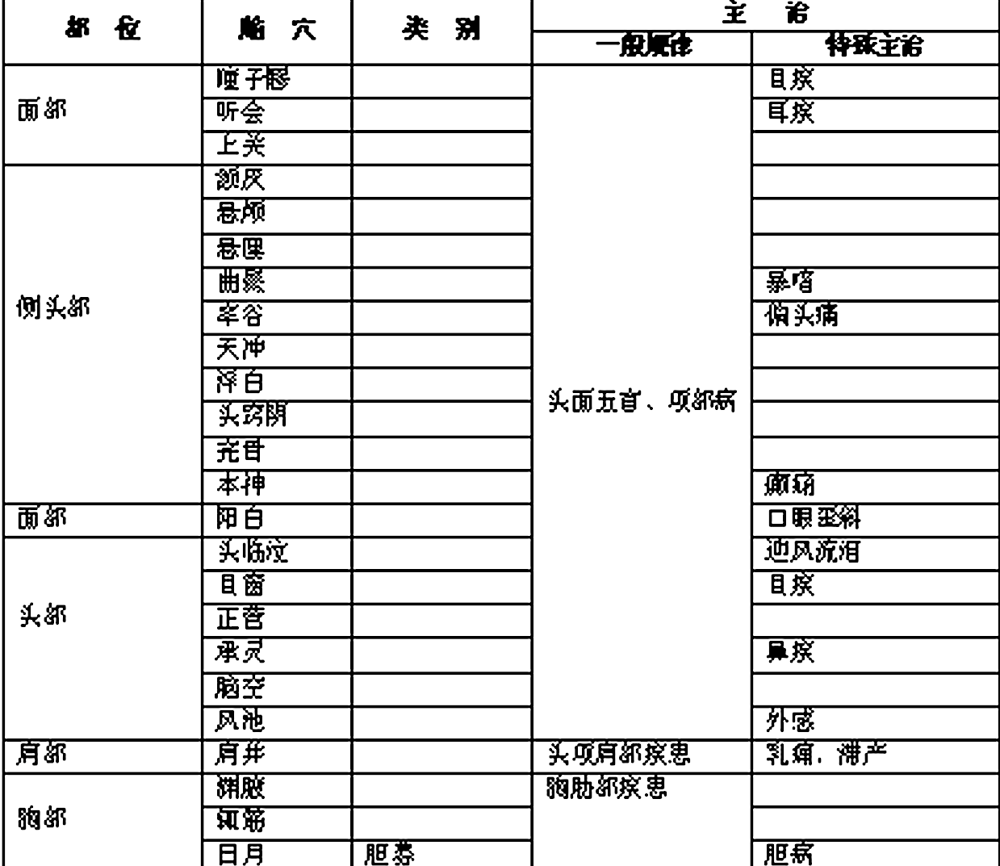 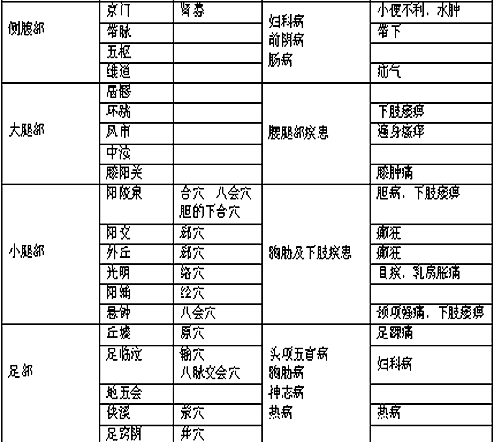
                - **风池**
                    - **合谷+外关+风池+列缺**
                - **阳陵泉+支沟**
                - **足临泣+带脉**
                - **足临泣+外关+风池**
                - **瞳子髎**
                    - **主治特点**
                        - **近治作用**
                            - 头痛
                            - 目赤肿痛、羞明流泪、内障、目翳
                    - **主治规律**
                        - **分部主治规律**
                            - 头痛
                            - 目赤肿痛、羞明流泪、内障、目翳
                    - **禁忌、特殊刺法**
                        - 平刺0.3～0.5寸
                        - 或用三棱针点刺出血
                - **听会**
                    - **主治特点**
                        - **近治作用**
                            - 耳鸣、耳聋、聤耳等耳疾
                        - **远治作用**
                            - 齿痛、面痛、口眼歪斜等面口疾病
                    - **主治规律**
                        - **分经主治规律**
                            - 齿痛、面痛、口眼歪斜等面口疾病
                        - **分部主治规律**
                            - 耳鸣、耳聋、聤耳等耳疾
                    - **禁忌、特殊刺法**
                        - 微张口，直刺0.5～0.8寸
                        - > **耳鸣、耳聋：**
                - **率谷**
                    - **主治特点**
                        - **近治作用**
                            - 偏头痛、眩晕
                        - **远治作用**
                            - 小儿急、慢惊风
                    - **主治规律**
                        - **分经主治规律**
                            - 小儿急、慢惊风
                        - **分部主治规律**
                            - 偏头痛
                    - **禁忌、特殊刺法**
                        - 直刺0.5～0.8寸
                - **完骨**
                    - **主治特点**
                        - **近治作用**
                            - 头痛、颈项强痛等头项病证
                        - **远治作用**
                            - 喉痹、颊肿、齿痛、口歪等五官病证
                            - 癫痫
                            - 中风
                    - **主治规律**
                        - **分经主治规律**
                            - 喉痹、颊肿、齿痛、口歪等五官病证
                            - 癫痫
                            - 中风
                        - **分部主治规律**
                            - 头痛、颈项强痛等头项病证
                    - **禁忌、特殊刺法**
                        - 平刺0.5～0.8寸
                - **阳白**
                    - **主治特点**
                        - **近治作用**
                            - 前头痛
                            - 眼睑下垂，口眼歪斜
                            - 目赤肿痛、视物模糊、眼睑动等目疾
                    - **主治规律**
                        - **分部主治规律**
                            - 前头痛
                            - 眼睑下垂，口眼歪斜
                            - 目赤肿痛、视物模糊、眼睑动等目疾
                    - **禁忌、特殊刺法**
                        - 平刺0.5～0.8寸
                - **头临泣**
                    - **主治特点**
                        - **近治作用**
                            - 头痛
                            - 目痛、目眩、流泪、目翳等目疾
                        - **远治作用**
                            - 鼻塞，鼻渊
                            - 小儿惊痫
                        - **特殊作用**
                            - 迎风流泪
                    - **主治规律**
                        - **分经主治规律**
                            - 鼻塞、鼻渊
                            - 小儿惊痫
                        - **分部主治规律**
                            - 目痛、目眩、流泪、目翳等目疾
                            - 头痛
                    - **禁忌、特殊刺法**
                        - 平刺0.5～0.8寸
                - **风池**
                    - **主治特点**
                        - **近治作用**
                            - 颈项强痛
                            - 中风、癫痫、头痛、眩晕、耳鸣、耳聋等内风所致疾病
                        - **远治作用**
                            - 感冒、鼻塞、鼽衄、目赤肿痛、口眼歪斜等外风所致疾病
                    - **主治规律**
                        - **分经主治规律**
                            - 感冒、鼻塞、鼽衄、目赤肿痛、口眼歪斜等外风所致疾病
                        - **分部主治规律**
                            - 颈项强痛
                            - 中风、癫痫、头痛、眩晕、耳鸣、耳聋等内风所致疾病
                    - **禁忌、特殊刺法**
                        - 针尖微下，向鼻尖斜刺0.8～1.2寸
                        - 或平刺透风府穴
                        - 深部中间为延髓，必须严格掌握针刺的角度与深度
                        - > 外风刺浅，内风（中风、癫痫）刺深
                - **肩井**
                    - **主治特点**
                        - **近治作用**
                            - 颈项强痛，肩背疼痛，上肢不遂
                        - **远治作用**
                            - 滞产、乳痈、乳汁不下、乳癖等妇产科及乳房疾患
                            - > 乳腺炎——肩井瘀血点刺破
                            - 瘰疬
                        - **特殊作用**
                            - 滞产、乳痈
                    - **主治规律**
                        - **分经主治规律**
                            - 滞产、乳痈、乳汁不下、乳癖等妇产科及乳房疾患
                            - 瘰疬
                        - **分部主治规律**
                            - 颈项强痛，肩背疼痛，上肢不遂
                    - **禁忌、特殊刺法**
                        - 直刺0.3～0.5寸
                        - 内有肺尖，不可深刺
                        - 孕妇禁针
                - **日月**
                - > 紧贴膈肌
                    - **特定穴**
                        - 胆之募穴
                    - **主治特点**
                        - **近治作用**
                            - 黄疸、胁肋疼痛等肝胆病证
                            - 呕吐、吞酸、呃逆等肝胆犯胃病证
                    - **主治规律**
                        - **分部主治规律**
                            - 黄疸、胁肋疼痛等肝胆病证
                            - 呕吐、吞酸、呃逆等肝胆犯胃病证
                    - **禁忌、特殊刺法**
                        - 斜刺或平刺0.5～0.8寸
                        - > 垂直深度
                        - 不可深刺，以免伤及脏器
                        - > 斜向下深刺，​紧贴膈肌，避免刺穿
                - **带脉**
                    - **主治特点**
                        - **近治作用**
                            - 月经不调、闭经、赤白带下等妇科病
                            - 疝气
                            - 腰痛，胁痛
                    - **主治规律**
                        - **分部主治规律**
                            - 月经不调、闭经、赤白带下等妇科病
                            - 疝气
                            - 腰痛，胁痛
                    - **禁忌、特殊刺法**
                        - 直刺1～1.5寸
                        - 肥肉——阳气虚（脏器温度降低）
                - **环跳**
                    - **主治特点**
                        - **近治作用**
                            - 腰胯疼痛等腰部疾患
                        - **远治作用**
                            - 下肢痿痹、半身不遂等腿部疾患
                    - **主治规律**
                        - **分经主治规律**
                            - 下肢痿痹、半身不遂等腿部疾患
                        - **分部主治规律**
                            - 腰胯疼痛等腰部疾患
                    - **禁忌、特殊刺法**
                        - 直刺2～3寸
                - **风市**
                    - **主治特点**
                        - **近治作用**
                            - 下肢痿痹、麻木及半身不遂等下肢疾患
                        - **特殊作用**
                            - 遍身瘙痒、脚气
                    - **主治规律**
                        - **分经主治规律**
                            - 遍身瘙痒、脚气
                        - **分部主治规律**
                            - 下肢痿痹、麻木及半身不遂等下肢疾患
                    - **禁忌、特殊刺法**
                        - 直刺1～1.5寸
                - **阳陵泉**
                    - **特定穴**
                        - 合穴
                        - 胆之下合穴
                        - 八会穴之筋会
                    - **主治特点**
                        - **近治作用**
                            - 膝肿痛、下肢痿痹及麻木等下肢、膝关节疾患
                        - **远治作用**
                            - 黄疸、胁痛、口苦、呕吐、吞酸等肝胆胃病症
                            - 小儿惊风
                            - 肩痛
                    - **主治规律**
                        - **分经主治规律**
                            - 黄疸、胁痛、口苦、呕吐、吞酸等肝胆胃病症
                            - 小儿惊风
                            - 肩痛
                        - **分部主治规律**
                            - 膝肿痛、下肢痿痹及麻木等下肢、膝关节疾患
                    - **禁忌、特殊刺法**
                        - 直刺1～1.5寸
                - **光明**
                    - **特定穴**
                        - 络穴
                    - **主治特点**
                        - **近治作用**
                            - 下肢痿痹
                        - **远治作用**
                            - 目痛、夜盲、近视、目花等目疾
                            - 胸乳胀痛，乳少
                        - **特殊作用**
                            - 目疾，胸乳胀痛
                    - **主治规律**
                        - **分经主治规律**
                            - 目痛、夜盲、近视、目花等目疾
                            - 胸乳胀痛，乳少
                        - **分部主治规律**
                            - 下肢痿痹
                    - **禁忌、特殊刺法**
                        - 直刺1～1.5寸
                - **悬钟**
                    - **特定穴**
                        - 八会穴之髓会
                    - **主治特点**
                        - **近治作用**
                            - 下肢痿痹
                        - **远治作用**
                            - 痴呆、中风等髓海不足疾患
                            - 颈项强痛、胸胁满痛
                    - **主治规律**
                        - **分经主治规律**
                            - 痴呆、中风等髓海不足疾患
                            - 颈项强痛、胸胁满痛
                        - **分部主治规律**
                            - 下肢痿痹
                    - **禁忌、特殊刺法**
                        - 直刺0.5～0.8寸
                - **丘墟**
                    - **特定穴**
                        - 原穴
                    - **主治特点**
                        - **近治作用**
                            - 足内翻，足下垂
                            - 外踝肿痛等痛证
                        - **远治作用**
                            - 目赤肿痛、目翳等目疾
                            - 颈下痛、腋下肿、胸胁痛等痛证
                    - **主治规律**
                        - **分经主治规律**
                            - 目赤肿痛、目翳等目疾
                            - 颈下痛、腋下肿、胸胁痛等痛证
                        - **分部主治规律**
                            - 足内翻，足下垂
                            - 外踝肿痛等痛证
                    - **禁忌、特殊刺法**
                        - 直刺0.5～0.8寸
                - **足临泣**
                    - **特定穴**
                        - 输穴
                        - 八脉交会穴（通于带脉）
                    - **主治特点**
                        - **近治作用**
                            - 足跗疼痛
                        - **远治作用**
                            - 偏头痛、目赤肿痛、胁肋疼痛等痛证
                            - 月经不调，乳少，乳痈
                            - 疟疾
                            - 瘰疬
                        - **特殊作用**
                            - 妇科病
                    - **主治规律**
                        - **分经主治规律**
                            - 偏头痛、目赤肿痛、胁肋疼痛等痛证
                            - 月经不调，乳少，乳痈
                            - 疟疾
                            - 瘰疬
                        - **分部主治规律**
                            - 足跗疼痛
                    - **禁忌、特殊刺法**
                        - 直刺0.3～0.5寸
                - **侠溪**
                    - **特定穴**
                        - 荥穴
                    - **主治特点**
                        - **近治作用**
                            - 足跗肿痛
                        - **远治作用**
                            - 惊悸
                            - 头痛、眩晕、颊肿、耳鸣、耳聋、目赤肿痛等头面五官病证
                            - 胁肋疼痛、膝股痛等痛证
                            - 乳痈
                        - **特殊作用**
                            - 热病
                    - **主治规律**
                        - **分经主治规律**
                            - 惊悸
                            - 头痛、眩晕、颊肿、耳鸣、耳聋、目赤肿痛等头面五官病证
                            - 胁肋疼痛、膝股痛等痛证
                            - 乳痈
                            - 热病
                        - **分部主治规律**
                            - 足跗肿痛
                    - **禁忌、特殊刺法**
                        - 直刺0.3～0.5寸
                - **足窍阴**
                    - **特定穴**
                        - 井穴
                    - **主治特点**
                        - **近治作用**
                            - 足跗肿痛
                        - **远治作用**
                            - 头痛、目赤肿痛、耳鸣、耳聋、喉痹等头面五官病证
                            - 胸胁痛
                        - **特殊作用**
                            - 不寐
                            - 热病
                    - **主治规律**
                        - **分经主治规律**
                            - 头痛、目赤肿痛、耳鸣、耳聋、喉痹等头面五官病证
                            - 胸胁痛
                            - 不寐
                            - 热病
                        - **分部主治规律**
                            - 足跗肿痛
                    - **禁忌、特殊刺法**
                        - 浅刺0.1～0.2寸，或点刺出血
    - 足太阴脾经
        - **经脉循行**
            - **经脉循行**
            - > 《灵枢·经脉》
                - 起于足大趾末端→沿着大趾内侧赤白肉际→经过大趾本节后的第一跖趾关节后面→上行至内踝前边→再上小腿内侧→沿胫骨后交出足厥阴经的前面→经膝股部内侧前缘进入腹部→属于脾，络于胃→通过横膈上行→挟食管两旁→连系舌根，散布于舌下
                - **腹部支脉**
                    - 从胃部分出→上过横膈→流注于心中，与手少阴心经相接
            - **循行分布特点**
                - **走向：**
                - **体表路线**
                - > 本经
                    - 起于足大趾内侧端（隐白）→沿足内侧，小腿内侧胫骨后缘及大腿内侧前缘上行→经腹部、胸部的前外侧→止于腋下第6肋间（大包）
                - **分布：**
                - **交接**
                    - 上接足阳明胃经
                    - 有一分支从胃上膈，注心中后，交于手少阴心经
        - **联系脏腑、器官**
            - **联系脏腑**
                - **脾** **胃** **心**
            - **联系器官**
                - **咽** **舌本**
                - 络脉：肠胃
        - **主要病候**
            - **脏腑、器官病**
                - **脏腑病：消化系统**
                    - 胃脘痛，食则呕，嗳气
                    - > 病属于胃，表里相传
                    - 腹胀，便溏，黄疸，身重无力
                    - > 脾病，水湿不能运化
                - **器官病**
                    - 舌根强痛
            - **经脉病**
                - 下肢内侧肿胀，厥冷
        - **主治概要**
            - **脾胃病：**
                - 胃痛，呕吐，腹痛，泄泻，便秘等
            - **妇科、前阴病：**
                - 月经过多，崩漏等
                - 阴挺，不孕，遗精，阳痿等
            - **经脉病：**
                - 下肢痿痹，胸胁痛等
            - **本经经穴主治表** 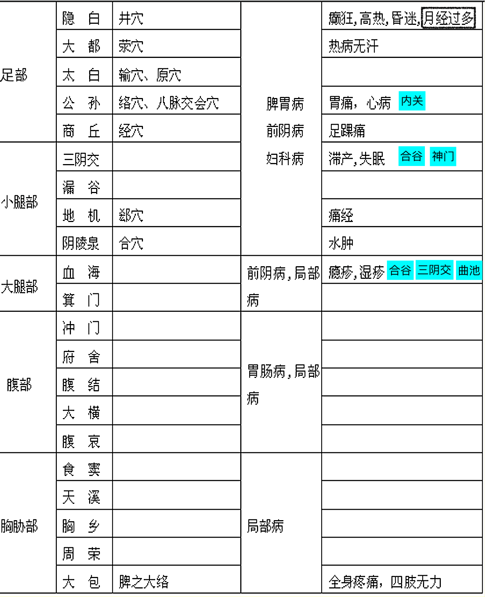
                - **隐白**
                    - **特定穴**
                        - 井穴
                    - **主治特点**
                        - **远治作用**
                            - 月经过多、崩漏等妇科疾病
                            - 便血、尿血等慢性出血证
                            - > 脾不统血——补脾；止血（灸法）
                            - 癫狂、多梦
                            - 惊风
                            - 腹满，暴泻
                        - **特殊作用**
                            - 癫狂、高热、昏迷
                            - 月经过多
                    - **主治规律**
                        - **分经主治规律**
                            - 月经过多、崩漏等妇科疾病
                            - 便血、尿血等慢性出血证
                            - 癫狂、多梦
                            - 惊风
                            - 腹满，暴泻
                    - **禁忌、特殊刺法**
                        - 癫狂、多梦、惊风：浅刺0.1寸
                        - 止血：灸法
                - **太白**
                    - **特定穴**
                        - 输穴
                        - 原穴
                    - **主治特点**
                        - **远治作用**
                            - 肠鸣、腹胀、腹泻、胃痛、便秘等脾胃病证
                            - 体重节痛
                    - **主治规律**
                        - **分经主治规律**
                            - 肠鸣、腹胀、腹泻、胃痛、便秘等脾胃病证
                            - 体重节痛
                    - **禁忌、特殊刺法**
                        - 直刺0.5～0.8寸
                        - 补脾——灸法
                - **公孙**
                    - **特定穴**
                        - 络穴
                        - 八脉交会穴（通于冲脉）
                    - **主治特点**
                        - **远治作用**
                            - 胃痛、呕吐、腹痛、腹泻、痢疾等脾胃肠腑病证
                            - 心烦、失眠、狂证等神志病证
                            - 逆气里急、气上冲心（奔豚气）等冲脉病证
                        - **特殊作用**
                            - 胃痛
                            - 心病，奔豚气
                    - **主治规律**
                        - **分经主治规律**
                            - 胃痛、呕吐、腹痛、腹泻、痢疾等脾胃肠腑病证
                            - 心烦、失眠、狂证等神志病证
                            - 逆气里急、气上冲心（奔豚气）等冲脉病证
                    - **禁忌、特殊刺法**
                        - 直刺0.6～1.2寸
                        - 补脾——灸法
                - **三阴交**
                    - **主治特点**
                        - **近治作用**
                            - 下肢痿痹
                        - **远治作用**
                            - 肠鸣、腹胀、腹泻等脾胃虚弱诸证
                            - 月经不调、带下、阴挺、不孕、滞产等妇产科病证
                            - 遗精、阳痿、遗尿等生殖泌尿系统疾患
                            - 心悸，失眠，高血压
                            - 阴虚诸证
                        - **特殊作用**
                            - 滞产
                            - 失眠
                    - **主治规律**
                        - **分经主治规律**
                            - 肠鸣、腹胀、腹泻等脾胃虚弱诸证
                            - 月经不调、带下、阴挺、不孕、滞产等妇产科病证
                            - 遗精、阳痿、遗尿等生殖泌尿系统疾患
                            - 心悸，失眠，高血压
                            - 阴虚诸证
                        - **分部主治规律**
                            - 下肢痿痹
                    - **禁忌、特殊刺法**
                        - 直刺1～1.5寸
                        - 孕妇禁针
                - **地机**
                    - **特定穴**
                        - 郄穴
                    - **主治特点**
                        - **远治作用**
                            - 痛经、崩漏、月经不调等妇科病
                            - 腹痛、腹泻等肠胃病证
                            - 疝气
                            - 小便不利、水肿等脾不运化水湿病证
                        - **特殊作用**
                            - 痛经
                    - **主治规律**
                        - **分经主治规律**
                            - 痛经、崩漏、月经不调等妇科病
                            - 腹痛、腹泻等肠胃病证
                            - 疝气
                            - 小便不利、水肿等脾不运化水湿病证
                    - **禁忌、特殊刺法**
                        - 直刺1～1.5寸
                - **阴陵泉**
                    - **特定穴**
                        - 合穴
                    - **主治特点**
                        - **近治作用**
                            - 膝痛
                        - **远治作用**
                            - 腹胀，腹泻，水肿，黄疸
                            - 小便不利，遗尿，尿失禁
                            - 阴部痛，痛经，遗精
                        - **特殊作用**
                            - 水肿
                    - **主治规律**
                        - **分经主治规律**
                            - 腹胀，腹泻，水肿，黄疸
                            - 小便不利，遗尿，尿失禁
                            - 阴部痛，痛经，遗精
                        - **分部主治规律**
                            - 膝痛
                    - **禁忌、特殊刺法**
                        - 直刺1～2寸
                        - 治疗膝痛可向阳陵泉或委中方向透刺
                        - > （跑步）姿势不良——阳陵泉/阴陵泉；竞走——髋部代偿
                - **血海**
                    - **主治特点**
                        - **近治作用**
                            - 膝内侧痛
                        - **远治作用**
                            - 月经不调、痛经、经闭等妇科病
                            - > 脾经血病——脾不统血
                            - 隐疹、湿疹、丹毒等血热性皮肤病
                            - 股内侧痛
                        - **特殊作用**
                            - 隐疹、湿疹
                    - **主治规律**
                        - **分经主治规律**
                            - 月经不调、痛经、经闭等妇科病
                            - 隐疹、湿疹、丹毒等血热性皮肤病
                        - **分部主治规律**
                            - 膝内侧痛
                    - **禁忌、特殊刺法**
                        - 直刺1～1.5寸
                - **大横**
                - > 左——降结肠；右——升结肠
                    - **主治特点**
                        - **近治作用**
                            - 腹痛、腹泻、便秘等脾胃病证
                    - **主治规律**
                        - **分部主治规律**
                            - 腹痛、腹泻、便秘等脾胃病证
                    - **禁忌、特殊刺法**
                        - 直刺1～2寸
                - **大包**
                    - **特定穴**
                        - 脾之大络
                    - **主治特点**
                        - **近治作用**
                            - 胸胁痛
                        - **远治作用**
                            - 气喘
                            - 全身疼痛
                            - 四肢无力
                        - **特殊作用**
                            - 全身疼痛
                            - 四肢无力
                    - **主治规律**
                        - **分经主治规律**
                            - 气喘
                            - 全身疼痛
                            - 四肢无力
                        - **分部主治规律**
                            - 胸胁痛
                    - **禁忌、特殊刺法**
                        - 斜刺或向后平刺0.5～0.8寸
    - 足少阴肾经
        - **经脉循行**
            - **经脉循行**
                - 起于足小趾之下→斜向足心→出于舟骨粗隆下→沿内踝后
                - **分支**
                    - 进入足跟→再向上行于小腿内侧→出腘窝内侧→向上行大腿内后缘→通向脊柱→属于肾脏，联络膀胱
                - **腧穴通路**
                    - 还出于前→浅出腹前→上行经腹、胸部→终止于锁骨下缘
                - **肾脏部直行的经脉**
                    - 从肾向上→通过肝和横膈→进入肺中→沿喉咙挟舌根旁
                - **肺部支脉**
                    - 从肺部出来→联络心脏→流注于胸中，与手厥阴心包经相接
            - **循行分布特点**
                - **走向：**
                - **体表路线**
                    - 本经起于足心（涌泉）→绕过内踝后上方→沿下肢内侧后缘→上行至腹→挟脐旁5分→上行至胸→止于锁骨下（俞府）
                    - **一分支**
                        - 从肺出络心→注胸中，交手厥阴心包经
                - **分布：**
                - **交接**
                    - 本经上接足太阳膀胱经
                    - 有一分支从肺出络心注胸中，交于手厥阴心包经
        - **联系脏腑、器官**
            - **联系脏腑**
                - 肾、膀胱、肝、肺、心
                - 心肾相交，肝肾同源，肺主呼气，肾主纳气
            - **联系器官**
                - 脊髓、喉咙、舌本
        - **主要病候**
            - **脏腑、器官病**
                - **脏腑病**
                    - 咳嗽、气喘、水肿、大便秘结、泄泻
                - **器官病**
                    - 舌干、咽喉肿痛
            - **经脉病**
                - 腰痛、脊股内后侧痛、痿弱无力、足心热
        - **主治概要**
            - **头和五官病证：**
            - **妇科病，前阴病：**
            - **经脉病：**
            - **本经经穴主治表** 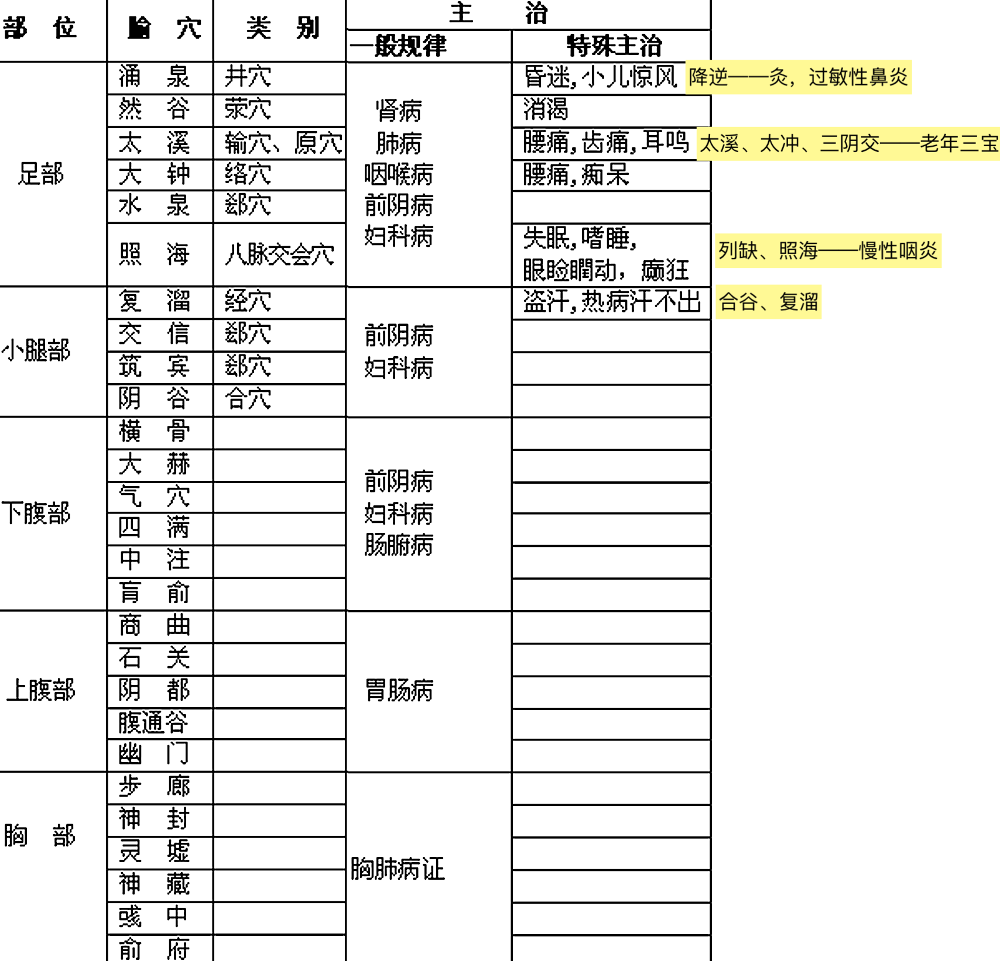
                - **涌泉**
                    - **特定穴**
                        - 井穴
                    - **主治特点**
                        - **近治作用**
                            - **足心热**
                        - **远治作用**
                            - 昏厥、中暑、小儿惊风、癫狂痫等急症及神志病证
                            - 头痛，头晕，目眩，失眠
                            - 咯血、咽喉肿痛、喉痹、失音等肺系病证
                            - 大便难，小便不利
                            - 奔豚气
                        - **特殊作用**
                            - 昏厥、小儿惊风
                    - **主治规律**
                        - **分经主治规律**
                            - 昏厥、中暑、小儿惊风、癫狂痫等急症及神志病证
                            - 头痛，头晕，目眩，失眠
                            - 咯血、咽喉肿痛、喉痹、失音等肺系病证
                            - 大便难，小便不利
                            - 奔豚气
                        - **分部主治规律**
                            - **足心热**
                    - **禁忌、特殊刺法**
                        - 直刺0.5～1寸
                        - 针刺时要防止刺伤足底动脉弓
                        - > 泻各种热——有时刺破
                        - 临床常用灸法或药物贴敷
                        - > 小儿遗尿、睡眠不足——补法、吴茱萸
                - **然谷**
                    - **特定穴**
                        - 荥穴
                    - **主治特点**
                        - **近治作用**
                            - 下肢痿痹，足跗痛
                        - **远治作用**
                            - 月经不调、阴挺、阴痒、白浊等妇科病证
                            - 遗精、阳痿、小便不利等泌尿生殖系统疾患
                            - 咯血，咽喉肿痛
                            - 小儿脐风，口噤
                            - 腹泻
                        - **特殊作用**
                            - 消渴
                    - **主治规律**
                        - **分经主治规律**
                            - 月经不调、阴挺、阴痒、白浊等妇科病证
                            - 遗精、阳痿、小便不利等泌尿生殖系统疾患
                            - 咯血，咽喉肿痛
                            - 消渴
                            - 小儿脐风，口噤
                            - 腹泻
                        - **分部主治规律**
                            - 下肢痿痹，足跗痛
                    - **禁忌、特殊刺法**
                        - 直刺0.5～1寸
                - **太溪**
                    - **特定穴**
                        - 输穴
                        - 原穴
                    - **主治特点**
                        - **近治作用**
                            - 下肢厥冷，内踝肿痛
                        - **远治作用**
                            - 头痛、目眩、失眠、健忘、遗精、阳痿等肾虚证
                            - 咽喉肿痛、齿痛、耳鸣、耳聋等阴虚性五官病证
                            - 咳嗽、气喘、咯血、胸痛等肺系疾患
                            - 消渴，小便频数，便秘
                            - 月经不调
                            - 腰脊痛
                        - **特殊作用**
                            - 腰脊痛、齿痛、耳鸣
                    - **主治规律**
                        - **分经主治规律**
                            - 头痛、目眩、失眠、健忘、遗精、阳痿等肾虚证
                            - 咽喉肿痛、齿痛、耳鸣、耳聋等阴虚性五官病证
                            - 咳嗽、气喘、咯血、胸痛等肺系疾患
                            - 消渴，小便频数，便秘
                            - 月经不调
                            - 腰脊痛
                        - **分部主治规律**
                            - 下肢厥冷，内踝肿痛
                    - **禁忌、特殊刺法**
                        - 直刺0.5～1寸
                        - > 泻——刺；补——灸
                - **大钟**
                    - **特定穴**
                        - 络穴
                    - **主治特点**
                        - **近治作用**
                            - 足跟痛
                        - **远治作用**
                            - 痴呆
                            - 癃闭，遗尿，便秘
                            - 月经不调
                            - 咯血，气喘
                            - 腰脊强痛
                        - **特殊作用**
                            - 腰痛
                            - 痴呆
                    - **主治规律**
                        - **分经主治规律**
                            - 痴呆
                            - 癃闭，遗尿，便秘
                            - 月经不调
                            - 咯血，气喘
                            - 腰脊强痛
                        - **分部主治规律**
                            - 足跟痛
                    - **禁忌、特殊刺法**
                        - 直刺0.3～0.5寸
                - **照海**
                    - **特定穴**
                        - 八脉交会穴（通于阴跷脉）
                    - **主治特点**
                        - **远治作用**
                            - 失眠、癫痫等神志病证
                            - 咽喉干痛、目赤肿痛等五官热性病证
                            - 月经不调、痛经、带下、阴挺等妇科病证
                            - 小便频数，癃闭
                        - **特殊作用**
                            - 失眠，嗜睡，眼睑瞤动，癫狂
                    - **主治规律**
                        - **分经主治规律**
                            - 失眠、癫痫等神志病证
                            - 咽喉干痛、目赤肿痛等五官热性病证
                            - 月经不调、痛经、带下、阴挺等妇科病证
                            - 小便频数，癃闭
                    - **禁忌、特殊刺法**
                        - 直刺0.5～0.8寸
                - **复溜**
                    - **特定穴**
                        - 经穴
                    - **主治特点**
                        - **近治作用**
                            - 下肢痿痹
                        - **远治作用**
                            - 水肿、汗证（无汗或多汗）等津液输布失调病证
                            - 腹胀、腹泻、肠鸣等胃肠病证
                            - 腰脊强痛
                        - **特殊作用**
                            - 盗汗，热病汗不出
                    - **主治规律**
                        - **分经主治规律**
                            - 水肿、汗证（无汗或多汗）等津液输布失调病证
                            - 腹胀、腹泻、肠鸣等胃肠病证
                            - 腰脊强痛
                        - **分部主治规律**
                            - 下肢痿痹
                    - **禁忌、特殊刺法**
                        - 直刺0.5～1寸
                - **阴谷**
                    - **特定穴**
                        - 合穴
                    - **主治特点**
                        - **近治作用**
                            - 膝内侧痛
                        - **远治作用**
                            - 癫狂
                            - 阳痿、小便不利、月经不调、崩漏等泌尿生殖系统疾患
                            - 股内侧痛
                    - **主治规律**
                        - **分经主治规律**
                            - 癫狂
                            - 阳痿、小便不利、月经不调、崩漏等泌尿生殖系统疾患
                            - 股内侧痛
                        - **分部主治规律**
                            - 膝内侧痛
                    - **禁忌、特殊刺法**
                        - 直刺1～1.5寸
                - **大赫**
                    - **主治特点**
                        - **近治作用**
                            - 遗精，阳痿
                            - 阴挺、带下、月经不调等妇科病证
                            - 泄泻，痢疾
                    - **主治规律**
                        - **分部主治规律**
                            - 遗精，阳痿
                            - 阴挺、带下、月经不调等妇科病证
                            - 泄泻，痢疾
                    - **禁忌、特殊刺法**
                        - 直刺1～1.5寸
                - **肓俞**
                    - **主治特点**
                        - **近治作用**
                            - 腹痛绕脐、腹胀、腹泻、便秘等胃肠病证
                            - > 肝寒证
                            - 疝气
                            - 月经不调
                    - **主治规律**
                        - **分部主治规律**
                            - 腹痛绕脐、腹胀、腹泻、便秘等胃肠病证
                            - 疝气
                            - 月经不调
                    - **禁忌、特殊刺法**
                        - 直刺1～1.5寸
    - 足厥阴肝经
        - **经脉循行**
            - **经脉循行**
                - 起于足大趾上的毫毛部→沿着足背到内踝前→上行小腿内侧→至内踝上八寸处→交足太阴经的后面→上行膝内侧→沿着大腿内侧→进入阴毛中→环绕阴部→上达小腹→挟着胃旁→属于肝，络于胆→向上通过横膈→分布于胁肋→沿气管之后→向上进入鼻咽部→连接于“目系”→向上出于前额→与督脉会合于巅顶
                - **目部的支脉**
                    - 从目系下行颊里→环绕唇内
                - **肝部的支脉**
                    - 从肝分出→通过横膈→向上流注于肺，与手太阴肺经相接
            - **循行分布特点**
                - **走向：**
                - **体表路线**
                    - **本经**
                        - 起于足大趾端上方（大敦）→从足背→经内踝前面→沿胫骨内侧面上行→经大腿内侧中间→上至阴部→到达小腹→止于胁肋部（期门）
                    - **一分支**
                        - 从肝分出→穿过横膈膜上注于肺（交手太阴肺经）
                - **分布：**
                - **交接**
                    - 本经上接足少阳胆经
                    - 有一分支从肝分出，穿过膈，注入于肺
        - **联系脏腑、器官**
            - **联系脏腑**
                - 肝、胆、胃、肺
                - 横逆犯胃、木火刑金
            - **联系器官**
                - 喉咙、目、生殖器
                - 过阴器，连目系，环唇内
                - 开窍于目
        - **主要病候**
            - **脏腑病**
                - 胸满，呃逆，遗尿，小便不利
            - **经脉病**
                - 腰痛，疝气，少腹肿等
        - **主治概要**
            - **肝胆病**
                - 黄疸，胸胁胀痛，呕逆及肝风内动所致中风、头痛、眩晕、惊风
            - **妇科病、前阴病：**
                - 月经不调、痛经、崩漏、带下、遗尿、小便不利等
            - **经脉病：**
            - **本经经穴主治表** 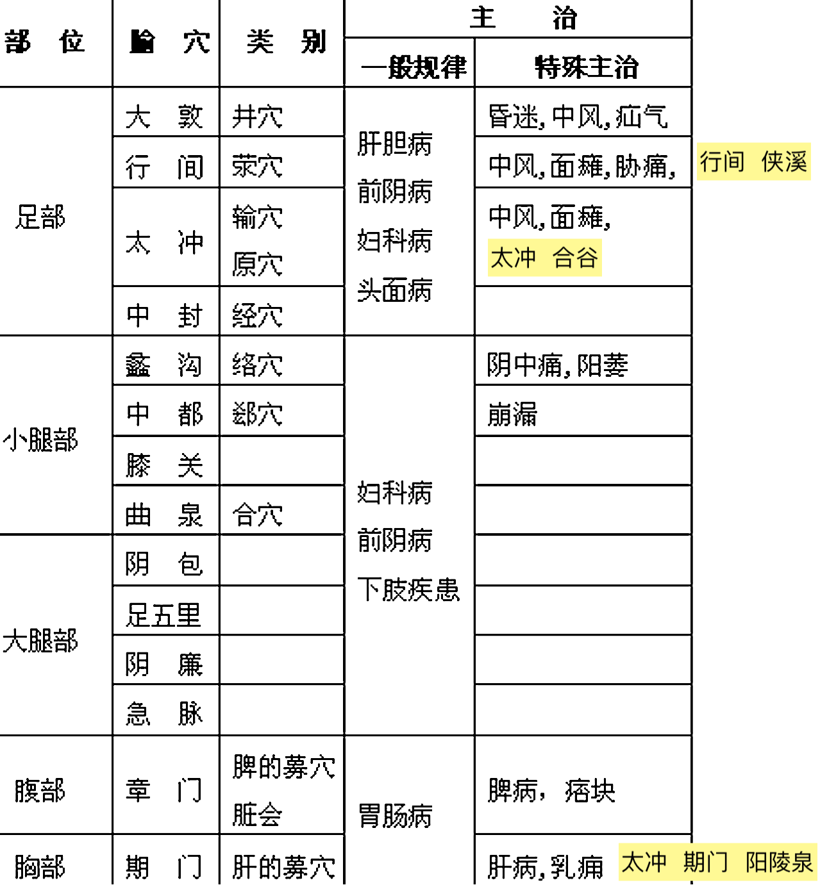
                - **大敦**
                    - **特定穴**
                        - 井穴
                    - **主治特点**
                        - **远治作用**
                            - 疝气、少腹痛
                            - 遗尿、癃闭、五淋、尿血等前阴病
                            - 月经不调、崩漏、阴挺等妇科病
                            - 癫痫
                        - **特殊作用**
                            - 昏迷
                            - 中风
                            - 疝气
                    - **主治规律**
                        - **分经主治规律**
                            - 疝气、少腹痛
                            - 遗尿、癃闭、五淋、尿血等前阴病
                            - 月经不调、崩漏、阴挺等妇科病
                            - 癫痫
                    - **禁忌、特殊刺法**
                        - 浅刺0.1～0.2寸，或点刺出血
                - **行间**
                    - **特定穴**
                        - 荥穴
                    - **主治特点**
                        - **远治作用**
                            - 中风、癫痫、头痛、目眩、目赤肿痛、青盲、口歪等肝经风热病证
                            - 月经不调、痛经、闭经、崩漏、带下等妇科病
                            - 阴中痛，疝气
                            - 遗尿、癃闭、五淋等泌尿系病证
                            - 胸胁满痛
                        - **特殊作用**
                            - 中风，面瘫，胁痛
                    - **主治规律**
                        - **分经主治规律**
                            - 中风、癫痫、头痛、目眩、目赤肿痛、青盲、口歪等肝经风热病证
                            - 月经不调、痛经、闭经、崩漏、带下等妇科病
                            - 阴中痛，疝气
                            - 遗尿、癃闭、五淋等泌尿系病证
                            - 胸胁满痛
                    - **禁忌、特殊刺法**
                        - 直刺0.5～0.8寸
                - **太冲**
                    - **特定穴**
                        - 输穴
                        - 原穴
                    - **主治特点**
                        - **近治作用**
                            - 下肢痿痹，足跗肿痛
                        - **远治作用**
                            - 中风、巅狂痫、小儿惊风、头痛、眩晕、耳鸣、目赤肿痛、口歪、咽痛等肝经风热病证
                            - 月经不调、痛经、经闭、崩漏、带下、滞产等妇产科病证
                            - 黄疸、胁痛、口苦、腹胀、呕逆等肝胃病证
                            - 癃闭，遗尿
                        - **特殊作用**
                            - 中风、面瘫
                    - **主治规律**
                        - **分经主治规律**
                            - 中风、巅狂痫、小儿惊风、头痛、眩晕、耳鸣、目赤肿痛、口歪、咽痛等肝经风热病证
                            - 月经不调、痛经、经闭、崩漏、带下、滞产等妇产科病证
                            - 黄疸、胁痛、口苦、腹胀、呕逆等肝胃病证
                            - 癃闭，遗尿
                        - **分部主治规律**
                            - 下肢痿痹，足跗肿痛
                    - **禁忌、特殊刺法**
                        - 直刺0.5～1寸
                - **蠡沟**
                    - **特定穴**
                        - 络穴
                    - **主治特点**
                        - **近治作用**
                            - 足胫疼痛
                        - **远治作用**
                            - 月经不调、赤白带下、阴挺、阴痒等妇科病证
                            - 小便不利
                            - 疝气，睾丸肿痛
                        - **特殊作用**
                            - 阴中痛
                            - 阳痿
                    - **主治规律**
                        - **分经主治规律**
                            - 月经不调、赤白带下、阴挺、阴痒等妇科病证
                            - 小便不利
                            - 疝气，睾丸肿痛
                        - **分部主治规律**
                            - 足胫疼痛
                    - **禁忌、特殊刺法**
                        - 平刺0.5～0.8寸
                - **曲泉**
                    - **特定穴**
                        - 合穴
                    - **主治特点**
                        - **近治作用**
                            - 膝髌肿痛，下肢痿痹
                        - **远治作用**
                            - 月经不调、痛经、带下、阴挺、阴痒、产后腹痛、腹中包块等妇科病
                            - 遗精，阳痿，疝气
                            - 小便不利
                    - **主治规律**
                        - **分经主治规律**
                            - 月经不调、痛经、带下、阴挺、阴痒、产后腹痛、腹中包块等妇科病
                            - 遗精，阳痿，疝气
                            - 小便不利
                        - **分部主治规律**
                            - 膝髌肿痛，下肢痿痹
                    - **禁忌、特殊刺法**
                        - 直刺1～1.5寸
                - **章门**
                    - **特定穴**
                        - 脾之募穴
                        - 八会穴之脏会
                    - **主治特点**
                        - **近治作用**
                            - 腹痛、腹胀、肠鸣、腹泻、呕吐等脾胃病证
                            - 胁痛、黄疸、痞块等肝胆病证
                        - **特殊作用**
                            - 脾病，痞块
                    - **主治规律**
                        - **分部主治规律**
                            - 腹痛、腹胀、肠鸣、腹泻、呕吐等脾胃病证
                            - 胁痛、黄疸、痞块等肝胆病证
                    - **禁忌、特殊刺法**
                        - 直刺0.8～1寸
                        - 武术点穴
                - **期门**
                    - **特定穴**
                        - 肝之募穴
                    - **主治特点**
                        - **近治作用**
                            - 胸胁胀痛、呕吐、吞酸、呃逆、腹胀、腹泻等肝胃病症
                            - > 胆道蛔虫病
                            - 郁病，奔豚气
                            - 乳痈
                        - **特殊作用**
                            - 肝病
                            - 乳痈
                    - **主治规律**
                        - **分部主治规律**
                            - 胸胁胀痛、呕吐、吞酸、呃逆、腹胀、腹泻等肝胃病症
                            - 郁病，奔豚气
                            - 乳痈
                    - **禁忌、特殊刺法**
                        - 斜刺或平刺0.5～0.8寸
                        - 不可深刺，以免伤及内脏
    - 经外奇穴
        - **四神聪**
            - **主治特点**
                - **近治作用**
                    - 头痛，眩晕
                    - 失眠、健忘、癫痫等神志病
                    - 目疾
            - **禁忌、特殊刺法**
                - 平刺0.5～0.8寸
        - **太阳**
            - **主治特点**
                - **近治作用**
                    - 头痛
                    - 目疾
                    - 面瘫
            - **禁忌、特殊刺法**
                - 直刺或斜刺0.3～0.5寸，或点刺出血
        - **球后**
            - **主治特点**
                - **近治作用**
                    - 目疾
            - **禁忌、特殊刺法**
                - 轻推眼球向上，向眶下缘缓慢直刺0.5～1.5寸，不提插
        - **金津、玉液**
            - **主治特点**
                - **近治作用**
                    - 舌强，舌肿，口疮，喉痹
                - **远治作用**
                    - 消渴，呕吐，腹泻
            - **禁忌、特殊刺法**
                - 点刺出血
        - **夹承浆**
            - **主治特点**
                - **近治作用**
                    - 口歪，齿龈肿痛
            - **禁忌、特殊刺法**
                - 斜刺或平刺0.3～0.5寸
        - **牵正**
            - **主治特点**
                - **近治作用**
                    - 口歪，口疮
            - **禁忌、特殊刺法**
                - 向前斜刺0.5～0.8寸
        - **翳明**
            - **主治特点**
                - **近治作用**
                    - 头痛，眩晕，失眠，耳鸣，目疾
            - **禁忌、特殊刺法**
                - 直刺0.5～1寸，可灸
        - **安眠**
            - **主治特点**
                - **近治作用**
                    - 失眠，头痛，眩晕
                - **远治作用**
                    - 心悸
                    - 癫狂
            - **禁忌、特殊刺法**
                - 直刺0.8～1.2寸
        - **子宫**
            - **主治特点**
                - **近治作用**
                    - 阴挺，月经不调，痛经，崩漏，不孕等妇科病
            - **禁忌、特殊刺法**
                - 直刺0.8～1.2寸
        - **三角灸**
            - **主治特点**
                - **近治作用**
                    - 疝气、腹痛
            - **禁忌、特殊刺法**
                - 艾柱灸5～7壮
        - **定喘**
            - **主治特点**
                - **近治作用**
                    - 肩背痛，落枕
                - **远治作用**
                    - 哮喘，咳嗽
            - **禁忌、特殊刺法**
                - 直刺0.5～0.8寸
        - **夹脊**
            - **主治特点**
                - **近治作用**
                    - 上胸部的穴位——治疗心肺、上肢疾病
                    - 下胸部的穴位——治疗脾胃肝胆疾病
                    - 腰部的穴位——治疗肾病、腰腹及下肢疾病
            - **禁忌、特殊刺法**
                - 根据部位的不同直刺0.3～1寸
                - 或用梅花针叩刺
        - **胃脘下俞**
            - **主治特点**
                - **近治作用**
                    - 胃痛、腹痛、胸胁痛
                    - > 幽门下，十二指肠（球部）
                - **远治作用**
                    - **消渴**
                    - > 胆汁、胰液排泄
            - **禁忌、特殊刺法**
                - 斜刺0.3～0.8寸
        - **腰眼**
            - **主治特点**
                - **近治作用**
                    - 腰痛
                    - 月经不调、带下
                    - 虚劳
            - **禁忌、特殊刺法**
                - 直刺1～1.5寸
        - **肩前**
            - **主治特点**
                - **近治作用**
                    - 肩臂痛，臂不能举
            - **禁忌、特殊刺法**
                - 直刺1～1.5寸
        - **二白**
            - **主治特点**
                - **近治作用**
                    - 痔疾，脱肛
                    - 前臂痛，胸胁痛
            - **禁忌、特殊刺法**
                - 直刺0.5～0.8寸
        - **腰痛点**
            - **主治特点**
                - **近治作用**
                    - 急性腰扭伤
            - **禁忌、特殊刺法**
                - 由两侧向掌中斜刺0.5～0.8寸
        - **外劳宫**
            - **主治特点**
                - **近治作用**
                    - 手臂肿痛
                - **远治作用**
                    - **落枕**
                    - > 后溪
                    - **脐风**
                    - > 肚脐受凉——疼痛在肚脐一圈绞痛
            - **禁忌、特殊刺法**
                - 直刺0.5～0.8寸
        - **八邪**
            - **主治特点**
                - **近治作用**
                    - 手背肿痛，手指麻木
                - **远治作用**
                    - 烦热
                    - > 泻头面部热
                    - 目痛
                - **特殊作用**
                    - 毒蛇咬伤
                    - > 无解毒作用，神经毒素→神经肌肉接头障碍→肌肉无力→瘫痪
            - **禁忌、特殊刺法**
                - 斜刺0.5～0.8寸，或点刺出血
        - **四缝**
            - **主治特点**
                - **远治作用**
                - > 通三焦之气
                    - 小儿疳积
                    - > 中药：通小儿肠胃（逍遥丸）
                    - 百日咳
                    - > 细菌感染，肺气上逆→通三焦之气
            - **禁忌、特殊刺法**
                - 点刺出血或挤出少许黄色透明黏液
                - > 有时四缝+拇指
        - **十宣**
            - **主治特点**
                - **近治作用**
                    - 手指麻木
                - **远治作用**
                    - 昏迷
                    - > 各种昏迷
                        - **人中**
                        - > 暂时维持心跳、呼吸，手指劲要特别大，刺破后不停挤血，出血则末梢循环建立
                        - **十宣**
                        - > 十宣出血标志外周微循环建立，肝肾功能基本恢复
                    - 癫痫
                    - 高热，咽喉肿痛
                    - > 退高热：十宣、耳尖、大椎点刺出血
            - **禁忌、特殊刺法**
                - 浅刺0.1～0.2寸，或点刺出血
        - **鹤顶**
            - **主治特点**
                - **近治作用**
                    - 膝痛，足胫无力，下肢瘫痪
            - **禁忌、特殊刺法**
                - 直刺0.8～1寸
        - **百虫窝**
            - **主治特点**
                - **远治作用**
                    - 风湿痒疹，下部生疮
                    - > 阴痒，荨麻疹
                - **特殊作用**
                    - 虫积
            - **禁忌、特殊刺法**
                - 直刺1.5～2寸
                - 细火针——抑制阴痒
        - **内膝眼**
        - > 外膝眼——犊鼻
            - **主治特点**
                - **近治作用**
                    - 膝痛，腿痛
                - **特殊作用**
                    - 脚气
                        - 大脚趾——水湿不运——脾经——健脾化湿
                        - 小趾——水气不利——膀胱经
                        - 脚心——少见
            - **禁忌、特殊刺法**
                - 向膝中斜刺0.5～1寸，或透刺犊鼻
        - **胆囊**
        - > 胆经上，从阳陵泉往下依次按压找反应点，腓骨小头直下不一定2寸
            - **主治特点**
                - **近治作用**
                    - 下肢痿痹
                - **远治作用**
                    - 胆囊炎、胆石症、胆道蛔虫症、胆绞痛
            - **禁忌、特殊刺法**
                - 直刺1～2寸
        - **阑尾**
        - > 足阳明胃经上
            - **主治特点**
                - **近治作用**
                    - 下肢痿痹
                - **远治作用**
                    - 阑尾炎，消化不良
            - **禁忌、特殊刺法**
                - 直刺1.5～2寸
                - > 胫神经
        - **八风**
            - **主治特点**
                - **近治作用**
                    - 足跗肿痛，趾痛
                    - 脚气
                    - > 脚趾缝处脚气
                - **特殊作用**
                    - **毒蛇咬伤**
                    - > 八风&amp;八邪
                        - **血液毒素**
                        - **神经毒素**
                        - > 无解毒作用，神经毒素→神经肌肉接头障碍→肌肉无力→瘫痪
                            - 河豚毒素→呼吸肌瘫痪，蛋白类毒素，人体可代谢
                            - > 河豚肝脏（毒素生成）、卵巢（血供丰富）
            - **禁忌、特殊刺法**
                - 斜刺0.5～0.8寸，或点刺出血
- **第四章 刺灸法总论**
    - **概念**
        - 刺灸法主要闻述刺法、灸法的基本知识及其具体操作技术，为针灸临床所必须掌握的技能
        - **刺法**
            - 古称“砭刺”，是由砭石刺病发展而来，后来又称“针法”
            - 目前其含义已非常广泛，即指使用不同的针具或非针具，通过一定的手法或方式刺激机体的一定部位（腧穴），以防治疾病的方法
        - **灸法**
            - 古称“灸炳”，又称“艾灸”，是指用艾火治病的方法
            - 广义的灸法既是指采用艾绒等为主烧灼、熏熨体表的方法，又可包括一些非火源的外治疗法
    - **刺法和灸法的关系**
        - **共同点**
            - 刺法和灸法均是通过刺激人体的一定部位（腧穴），以起到疏通经络、行气活血、协调脏腑阴阳等作用，从而达到扶正祛邪、治疗疾病的目的
        - **不同点**
            - 刺法属机械性刺激，偏于疏通
            - 灸法有组织化学变化，偏于温通
    - 源流与发展
        - **针具与刺法的源流**
            - **历史回顾**
                - **旧石器时代：采集、狩猎**
                    - **100万年前的古人**
                        - **软组织损伤与感染**
                        - 当时具备的技术和工具
                            - **石器**
                                - 大石球
                                - 小石钻
                            - **篝火**
                                - 用火
                    - **早期**
                        - **用火的痕迹、粗糙笨拙的打制石器、加工的鹿角和砍砸刮判的兽骨**
                        - 为了生存而进行采集和狩猎、捕捞
                        - 河遗址中发现了可能用于狩猎的石球
                    - **中期**
                        - **摩察取火**
                        - 丁村遗址出土的各式砍砸器、利削器、三棱大尖状器和石球等
                        - **小型的尖状器、題刻器、小石钻和小型砍砸器**
                            - 善于用动物的骨角加工成铲式工具、三棱尖状器和刮削器
                            - 许家窑人生活在距今4万年前
                    - **晚期**
                        - 距今二三万年前，以采集为主、狩猎为辅
                        - **時峪、小南海、虎头梁**
                            - **石箭头和饿形小石刀之类复合工具**
                            - 1960年第一次发掘小南海洞六时10平方米范围内出土石制品达7000多件，可见当时石器制造业已有相当规模
                            - **虎头梁遗址，考古工作者清理出三处篝火遗迹**
                - **新石器时代：陶器、农业**
                    - **早期**
                    - > **距今约12000～9000年**
                        - **陶片**
                    - **中期**
                        - 距今9000～7000年，陶器工艺有很大改进，普遍采用泥片贴塑法、捏塑法和泥条盘筑法，以红色、褐色陶为主，成温度提高
                        - **距今7000～4500年** **满轮修整技术** **轮制技术**
                    - **晚期**
                    - > 距今4500～4000年
                        - 制陶技术突飞猛进，快轮制陶技术迅速普及
                        - **从新石器时代到青铜器时代的过渡期**
            - **针具的起源与发展**
                - **起源**
                    - **砭石——最初的“针具”**
                        - 《说文解字》：“砭，以石刺病也。”
                        - “砭石”起源于新石器时代，最初是用来刺痈肿、排脓、放血的工具
                    - **砭石→骨针→竹针**
                - **发展**
                    - **九针**
                        - 针具由砭石到九针，标志着针具的形成
                        - **镵针、圆针、鍉针、锋针、铍针、圆利针、毫针、长针、大针**
                    - **青铜针→金、银针→铁针→普通钢针→不锈钢针→电针、光针、磁针等**
            - **刺法的起源与发展**
                - **《内经》针刺方法**
                    - **九刺** **十二刺** **五刺**
                    - **徐疾补泻、呼吸补泻、捻转补泻、迎随补泻、提插补泻** **开阉补泻**
                    - 为后世针刺手法奠定了基础
                - **《难经》又有所阐发**
                    - 强调了针刺时双手协作的重要性，对后世影响颇大
                - **唐宋时期**
                    - 在针刺手法方面一直继承《内经》和《难经》之说
                - **金元时期**
                    - **子午流注按时取穴**
                    - **《针经指南》** **“针刺十四法”**
                - **明初·陈会《神应经》**
                    - **“催气手法”**
                - **明·徐凤的《金针赋》**
                    - **“烧山火”** **“透天凉”**
                - **明·高武《针灸聚英》、汪机《针灸问对》**
                    - 记载的针刺手法，都是在《金针赋》的基础上有所发挥撰成
                - **明·杨继洲《针灸大成》**
                    - 汇集了明代以前有关针刺手法的精华
                    - **刺有大小”** **“大补、大泻”** **“平补、平泻”** **“下针十二法”** **针刺“八法”**
                - **中华人民共和国成立后——针灸学术有了很大的发展**
                    - 针刺手法的研究也步人了一个新的历史时期
                    - 从文献考证到临床观察，从实验研究到规律性的探索，均做 了大量的工作，取得了许多科研成果
                    - 这对于规范操作手法，提高针刺临床疗效都具有重要的意义
        - **灸法的起源与发展**
            - **灸法的起源**
                - **灸法属于温热疗法，与火的关系密切**
                    - 火的历史在我国可以追溯到50万年前的“北京人”或80万年前的“蓝田人”时代，乃至更远
                - **煨火取暖→草木灸→艾灸**
                - **用“艾”为主要灸料， 标志着灸法的形成**
            - **灸法的发展**
                - **《内经》**
                    - 《素问·异法方宜论》：“脏寒生满病，其治宜灸炳，故灸炳者，亦从北方来。”
                - **《针灸甲乙经》** **《备急千金要方》**
                - **《曹氏灸方》**
                - **《骨蒸病灸方》**
                - **《黄帝明堂灸经》《灸膏盲俞穴法》《备急灸法》**
                - **《痈疽神秘灸经》**
                - **《太乙神针》《神灸经纶》**
            - **灸法方式的发展**
                - **直接灸**
                - **隔物灸**
                - > 如隔姜、蒜、盐、豆豉饼、附子饼等
                - **艾条灸、温灸器灸、温针灸**
                - > 艾条灸：包括太乙神针灸、雷火神针灸等
    - 常用针灸器具
        - **针灸器具**
            - **针刺用具**
                - **《灵枢·九针十二原》记载了九种不同形状和用途的金属针具**
                - > *西汉《灵枢·官针》：九针之宜，各有所为；长短大小，各有所施也，不得其用，病弗能移。*
                    - **镵针**
                        - **浅刺泄热**
                    - **圆针**
                        - **按摩皮肉**
                    - **鍉针**
                        - **按脉候气**
                    - **锋针**
                        - **刺络放血**
                    - **铍针**
                        - **排脓放血**
                    - **圆利针**
                        - **急性痹证**
                    - **亳针**
                        - **治寒热痹痛在经络者，能扶正祛邪**
                    - **长针**
                        - **病变位置较深的痹证**
                    - **大针**
                        - **关节水肿**
                - **《灵枢·官针》疾病特点决定针具种类**
                - > 在临床中可根据不同病证和刺法的需要，选择使用不同的针具
                    - **皮肤无常处** **镵针**
                    - **分肉** **圆针**
                    - **经络痼痹** **锋针**
                    - **脉，气少** **鍉针**
                    - **大脓** **铍针**
                    - **痹气暴发** **圆利针**
                    - **痹气痛而不去** **亳针**
                    - **在中** **长针**
                    - **水肿不能通关节** **大针**
                    - **五脏固居** **锋针**
                - **华佗**
                    - 偏外科，擅针灸（取穴少），88一7在治寄生虫病
                    - **《三国志·华佗传》**
                        - *若当灸，不过一两处，每处不过七八壮，病亦应除*
                        - *若当针，亦不过一两处，下针言当引某许，若至，语人”。病者言“已到”，应便拔针，病亦行差*
            - **灸材与灸具**
                - **灸材**
                    - 艾叶制成的艾绒——最常用
                    - **灯火灸：**
                    - **天灸：**
                - **灸具**
                    - 临床使用最广——艾炷和艾条
                    - 灸罩、灸盏→温灸筒、温灸盒、熏灸器等
            - **拔罐用具**
                - 拔罐是针灸临床常用治疗方法之一
                - 传统罐具选材不ー，有陶罐、竹罐、金属罐、玻璃罐等
                - 目前临床上使用最广泛的罐具是玻璃罐和竹罐
        - **针灸仪器**
            - **电针仪**
                - 一般将可输出脉冲电流并能满足针刺治疗要求的电子仪器，称为电针仪
                - 电针仪由主机、电极线、电源适配器等部分组成
                - 电针仪是在针刺基础上使用，可发挥针刺和电刺激双重作用，有较好治疗效果，故为现代针灸临床所常用
            - **灸疗仪**
                - 临床常用的灸疗仪有电热艾灸仪、电热温灸仪、光灸仪等
                - **电热艾灸仪**
                    - 电热艾灸仪大多采用电加热艾绒等灸材的方式，温熨熏灼经络腧穴以治疗疾病
                    - 电热艾灸仪中有一种电热喷灸仪，利用加热特制的艾药饼所产生的热气流，作用于一定的腧穴部位，以达到治疗目的
                - **电热温灸仪**
                    - 电热温灸仪大多采用稀士等电发热材料，通电后产生可控的温度，通过电热灸头给予一定的温热刺激，作用于经络腧穴以治疗疾病
                - **光灸仪**
                    - 光灸仪是利用红外线、远红外线或激光产生的热量照射经络腧穴，形成温热或光电效应以起到治疗疾病的作用
            - **拔罐仪**
                - 利用现代科技研制的拔罐仪大体可分两类：一类是单纯的抽气罐，一类是多功能拔罐仪
                    - **抽气罐**
                        - 抽气罐是通过一定的抽气技术，在罐与人体体表部位形成一定负压的罐具
                        - 抽气罐的优点是负压可控，使用安全
                    - **多功能拔罐仪**
                        - 多功能拔罐仪是一类同时具有负压和磁、热等物理刺激作用的拔罐仪器
                        - 这类拔罐仪利用电动机真空泵抽吸罐内空气，可准确调控罐内负压，且罐底装置有稀土发热材料，通电后可产生一定强度的磁场和温热刺激
    - 常用针灸体位
        - **针灸体位的意义**
            - 针灸施术时，需要患者采取一定的受术体位
                - 定位取穴——体位——施术、留针；防止针刺意外发生
            - **意义**
                - 正确定位取穴
                - 方便针灸施术
                - 持久留针以及防止晕针、滞针、弯针、折针等意外情况的发生
        - **针灸体位的选择**
            - **原则**
                - 有利于腧穴的正确定位
                - 便于针灸操作
                - 较长时间留针而患者不致疲劳
            - **常用体位**
                - **仰卧位**
                    - 取头、面、胸、腹部腧穴和四肢部分腧穴
                - **侧卧位**
                    - 取身体侧面少阳经腧穴和上、下肢部分腧穴
                - **俯卧位**
                    - 取头、项、脊背、腰骶部腧穴和下肢后侧及上肢部分腧穴
                - **仰靠坐位**
                    - 取前头、颇面和颈前等部位腧穴
                - **俯伏坐位**
                    - 取后头和项、背部的腧穴
                - **侧伏坐位**
                    - 取侧头部、面颊及耳前后部位腧穴
            - 除上述常用体位外，临床上也可根据某些腧穴的取穴及特殊针刺要求而选取其他的体位
            - 同一患者同次治疗，应尽可能选用一种体位
            - 如因治疗要求和某些腧穴定位的特点而必须采用不同体位时，可根据患者的体质、病情等具体情况灵活掌握
    - 常规针灸治疗量
        - 针刺和艾灸都是通过刺激体表的经络腧穴而达到治疗疾病的目的，因此，针刺和艾灸本身就包含着刺激量等有关量学方面的问题
        - 实践证明，刺法、灸法的相关量学要素是关系疗效的关键环节之一
        - **针灸治疗量**
            - 概指治疗过程中针灸作用量的总合
            - 适度的针灸治疗量是提高针灸疗效、保证针灸安全的关键因素，对针灸临床具有重要意义
            - **广义**
                - 毫针刺法的量学要素应包括进针方向、进针深度、具体手法操作的强度和时间，及留针时间的长短等环节
            - **狭义**
                - 刺法量学要素是指与毫针刺激量及效应密切相关的量学因素，主要包括手法操作的强度和时间两大要素
        - **针刺治疗量的形成要素**
            - **取穴多少**
                - 取穴越多，针刺刺激就越大，针刺作用量越大
                - 慢性疾病、复杂性疾病、全身性疾病——取穴较多
                - 急性病证、单纯性病证、局部病证——取穴较少
            - **针具粗细**
                - 针具直径的大小与针刺刺激量相关，不同粗细的针具对不同的病证有不同的治疗效果
                - > *《灵枢・九针十原》：“针各有所宜，各不同形，各任其所为。”*
                    - **粗针**
                    - **细针**
            - **针刺深浅**
                - *《素问·刺要论》：“病有浮沉，刺有浅深，各至其理，无过其道。”*
                - **深刺**
                - **浅刺**
            - **手法轻重**
                - **毫针刺法中，有效的刺激强度是以** **得气为标志**
                    - 通过得气的强弱来判定刺激量的大小，分为轻、中、重三种不同的刺激量
                        - 轻者，针下感应柔和
                        - > 捻转角度及提插幅度小、频率慢、运针时间较短
                        - 中者，针下感应明显
                        - 重者，针下感应强烈
                        - > 刺激量大
                - **针刺刺激的强度是通过** **手法作用力的强弱** **而实现的**
                    - **捻转的频率、角度**
                        - **轻度**
                        - **中度**
                        - **重度**
                    - **提插的频率、幅度**
                        - 轻度——提插的幅度小于0.3厘米，频率小于60次/分
                        - 中度——提插的幅度在0.3～0.5厘米之间，频率在60～90次/分之间
                        - 重度——提插的幅度大于0.5厘米，频率大于90次/分
            - **留针时间长短**
                - **刺激的时间**
                    - 正确掌握针刺作用持续的时间，在施行针刺手法时，作用力持续的时间直接关系着疗效
                    - 根据患者的具体病证和情况，确定作用力持续的最佳时间参数是提高临床疗效的关键之一
                    - 刺激强度的变化率
                        - 在毫针操作中，由于患者自身的敏感性不同，对刺激阈的要求也不一样，要注意针刺刺激强度的及时增加和调整
                - **留针的过程是保持和增加刺激量的过程，留针时间越长，刺激量相对越大**
                    - 体质较强——多留针——寒性病证、慢性病证——留针时间较长
                    - 体质较弱——少留针——热性病证、急性病证——留针时间较短
        - **艾灸治疗量的形成要素**
            - **艾炷大小**
                - 艾炷越大，艾火就越强，作用量也就越大
                    - 小炷如麦粒大
                    - 中炷如苍耳子大
                    - 大炷如莲子大
            - **壮数多少**
                - **“壮”**
                - > ★名词解释
                    - 壮数越多，作用量就越大
                    - **艾炷大小、患者状况、施灸部位**
            - **灸火强弱**
                - 灸火强弱主要与艾炷大小、艾条施灸距离远近、艾绒燃烧程度等因素有关
                    - 艾炷大、艾条燃端离施灸部位近、艾绒燃烧充分——强灸火——实证、急性病、体质壮的患者
                    - 艾炷小、艾条燃端离施灸部位远、艾绒燃烧不充分——弱灸火——虚证、慢性病、体质弱的患者
            - **施灸时间长短**
                - 施灸时间一般为每穴10～15分钟，时间越长，作用量越大
                    - 初灸时，每日1次，3次后可改为2～3天1次
                    - 急性病可每日灸2～3次
                - *《医宗金鉴・刺灸心法要诀》：“…然头与四肢皮肉浅薄…必分日灸之，或隔日灸之，其炷宜小，壮数少。”*
        - **常规针灸治疗量的确定**
            - **基本原则**
                - **得气**
                    - 得气是针刺取得良好疗效的前提
                - **适度**
                    - 无论是针刺还是艾灸治疗，均需遵循“适度”的原则
            - **综合因素**
                - 针灸治疗量的形成要素+患者的具体情况
                    - 患者的禀赋、体质、年龄、性别等基本情况
                    - 患者的病性、病位、病程等病情状况
            - **治疗常规**
                - **治疗次数**
                    - 常规为一日治疗一次
                    - 根据实际情况，也可ー日两次或两日一次
                - **留针时间**
                    - 每次治疗，一般留针15～30分钟
                    - 留针期间，每5～10分钟行针一次，以保持得气感而提高疗效
                - **疗程**
                    - 目前多以现行7天为一周的作息制度
    - 针灸施术的注意事项
        - **施术前的消毒**
            - **针具器械消毒**
                - **高压蒸汽灭菌法**
                    - 将针具器械用纱布包好，放在密闭的高压蒸汽锅内灭菌
                    - 1.0～1.4kg/cm^2，115～123℃，30分钟以上
                - **药液浸泡消毒法**
                    - 75%乙醇内浸泡30～60分钟，无菌巾或无菌棉球擦干
                    - 器械消毒液（如“84”消毒液）内按规定浓度和时间浸泡消毒
                    - 经过消毒的针具，必须放在消毒过的针盘内，并用无南巾或无菌纱布遮盖好
            - **医者手指消毒**
                - **针刺施术前**
                    - 肥皂水将手洗浄
                    - 待干后再用75%乙醇棉球擦拭
                - **持针施术时**
                    - 避免手指直接接触针身
                    - 如某些刺激需要触及针身时，应以无菌干棉球作隔物，以确保针身无菌
            - **针刺部位消毒**
                - 75%乙醇棉球，或1.5%碘伏擦拭
                - 从中心点向外绕圈消毒皮肤
                - 消毒后，切忌再接触污物，以防止重新污染
            - **治疗室内消毒**
                - 治疗室应卫生洁净，定期消毒浄化，有良好的换气装置以保持空气流通
                - 治疗台上的床垫、枕巾、毛毯、垫席等物品，要按时换洗晾晒
                - 如采用一人一用的无菌垫布、垫纸、枕巾则更好
        - **刺灸法的宜忌**
            - **施术部位的宜忌**
                - **避开重要脏器**
                - > *《素问·刺禁论》：“脏有要害，不可不察。”*
                    - 胸、胁、腰、背、缺盆等部位的腧穴，一般不宜直刺、深刺，以免伤及脏腑
                    - > 心脏刺中易房颤，不抢救则死
                    - 肝、脾大、肺气肿患者尤应注意
                - **避开重要器官组织**
                    - 眼区穴位，针刺不宜大幅度地提插、捻转
                    - 后项部深层为延髓，脊柱的深层为脊髓，均不可深刺
                    - *《素问·刺禁论》：“刺头中脑户，入脑立死。”*
                    - > 脑干刺中则死
                - **避开某些特殊部位**
                    - 大血管附近的腧穴，如人迎、委中、箕门、气冲、曲泽、经渠、冲阳等，应避开血管针刺
                    - 乳中、脐中一般不刺
                    - 小儿囟门部位、头缝尚未骨化部位则禁针
                    - > 有些成人也有囟门未闭情况
                    - *特殊生理：天宗处肩胛天生有洞——0.5～1寸*
                    - 皮肤有感染、溃疡、创伤、瘢痕或肿瘤的部位，不宜针灸
            - **患者状态的宜忌**
                - **体质状态**
                    - 初病、体质强壮者——针灸治疗量宜大
                    - 久病、体质虚弱者和老人、儿童——针灸治疗量宜小
                - **机能状态**
                    - 大醉、大怒、饥饿、疲劳等患者，不宜立即针灸
                    - 妇女行经时
                        - 调经——慎用
                        - 其他正常
                    - 孕妇
                        - 尤其有习惯性流产史者，慎用针灸治疗
                        - 下腹、腰骶部及三阴交、合谷、昆仑、至阴等具有通经活血功能的腧穴，应禁行针刺
            - **病情性质的宜忌**
                - **病情程度**
                    - 气血严重亏虚者，不宜针刺
                    - > 大出血、大吐、大泄、大汗
                    - 形体极度消瘦者，不宜针刺
                    - > 癌症、慢性肝炎晚期等
                - **疾病性质**
                    - **表证宜浅刺**
                        - 表寒者——久留针
                        - 表热者——疾出针
                    - **里证宜深刺**
                        - 里寒者——补法、灸法
                        - 里热者——泻法
                    - **虚证宜用补法**
- **第五章 刺灸法各论**
    - 毫针刺法
        - **毫针简介**
            - **毫针构造**
                - **毫针构造** 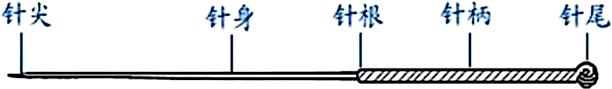
                    - **针尾**
                    - **针柄**
                    - **针根**
                    - **针身**
                    - **针尖**
                - **制针材料**
                    - **现多为** **不锈钢** **制成**
                        - 兼具强度与韧性，针体挺直滑利
                        - 耐高热、不易被腐蚀
                    - **金针、银针**
                        - 传热、导电性强，但强度、韧性价格等不及不锈钢更为适宜
                - **毫针分类** 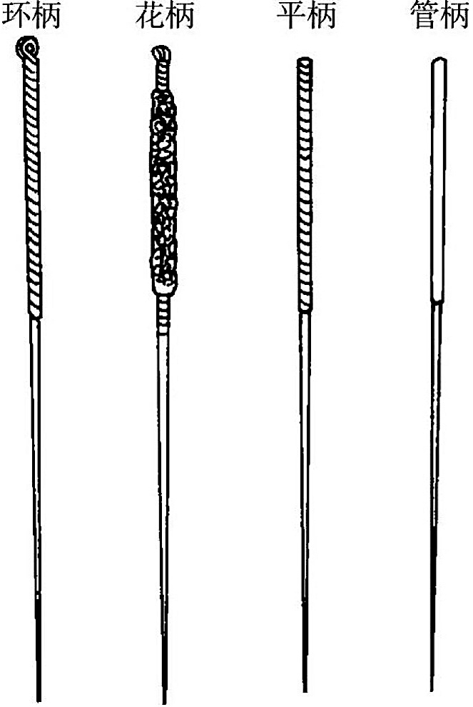
            - **毫针规格**
            - > 0.18*13（0.5寸）（美容针）、0.30*25（1寸）、0.30*40（1.5寸）、0.30*75（3寸）（屁股）
                - **粗细规格** 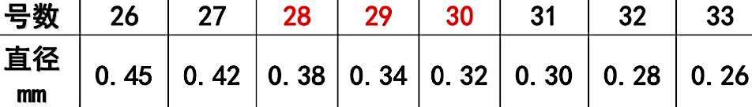
                - **长短规格** 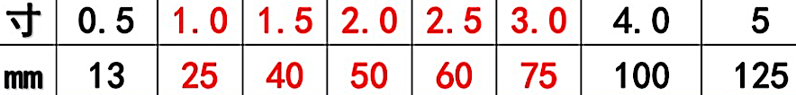
            - **毫针检查**
            - > 一般出厂前已完成
                - 针尖端正不偏，形如“松针”，尖而不锐，圆而不钝，无毛钩
                - 针身光滑挺直圆正匀称，富有弹性，无弯曲、折痕、斑剥、锈痕
                - 针根牢固，无剥蚀、损伤及毛刺
                - 针柄金属丝应缠绕均匀、牢固而无松动或断丝
            - **毫针保养**
                - **反复使用的毫针** **防止针尖受损、针身弯曲或锈蚀、污染**
                - **针盒** **针管** **针夹**
                - **存放的基本要求**
                    - 用纱布、干棉球等柔软之物，将毫针与存放器具的四壁分隔开，以防针尖受损
                    - 已经消毒备用的毫针，存放时应避免受到污染
        - **毫针刺法练习与毫针的选择**
            - **毫针刺法练习**
                - **指力练习**
                - > **纸垫练针：捻转与指力** 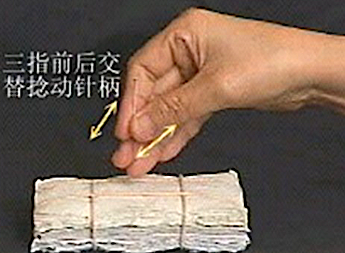
                    - 指力、手法、灵活
                    - 协调性/精神专注
                - **手法练习**
                - > **棉团练针：提插、速刺** 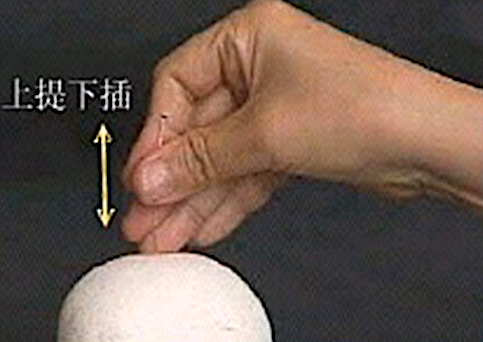
                    - 速刺练习
                    - 捻转练习
                    - 提插练习
                - **手感练习**
                - > **手感练习：自身、他人**
                    - **要求**
                        - 能逐淅做到进针无痛或微痛
                        - 针身挺直不弯
                        - 刺入顺利，提插、捻转行针自如
                        - 用力均匀，手法熟练
                - *增强指感，体察经气*
                - *增强气力，气力结合，驾驭经气*
                - *守神定志，意气力结合*
            - **毫针的选择**
                - **依据**
                - > 根据疾病、安全度
                    - 患者的性别、年龄、胖瘦、体质强弱、病情虚实、病变部位深浅
                        - 病变部位深——长针
                        - 病变部位浅——短针
                    - 拟选腧穴所在部位
                        - 有些部位为了安全（如肺部投影区）——短针
                - **稍长于腧穴应该针至的深度，且有部分露干皮肤之外** 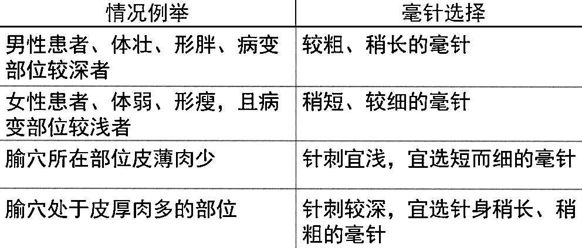
        - **毫针基本操作技术**
            - **进针法**
                - **刺手和押手**
                - > *《灵枢·九针十ニ原》：右主推之，左持而御之*
                    - **刺手**
                    - **爪切按压** **押手**
                    - > 古代尤其重视——防止针断
                - **单手进针法** 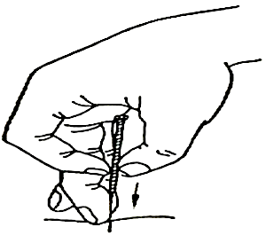
                    - **拇、食二指向下用力，中指随之屈曲**
                    - 仅用刺手
                    - **较短毫针**
                - **双手进针法**
                    - **指切进针法（爪切进针法）** 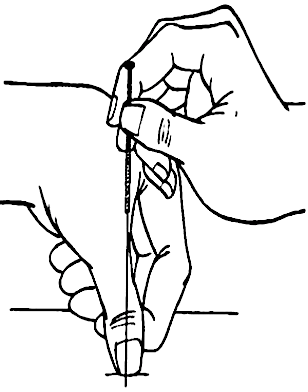
                        - **押手**
                        - **刺手**
                        - **短针**
                    - **夹持进针法** 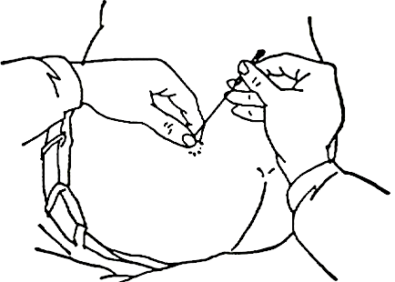
                        - **押手** **夹住针身下端**
                        - **刺手** **押手**
                        - **长针**
                    - **舒张进针法** 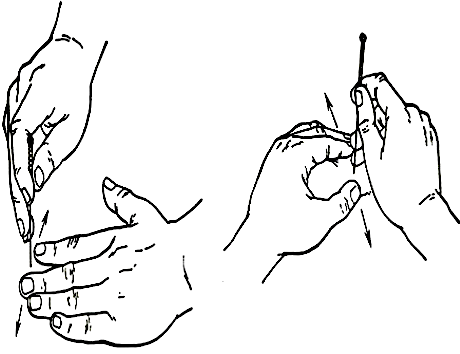
                        - **押手**
                        - **刺手**
                    - **提捏进针法** 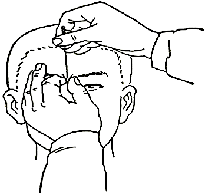
                        - **押手**
                        - **刺手** **捏起部的上端**
                        - **皮肤浅薄部位**
                - **针管进针法** 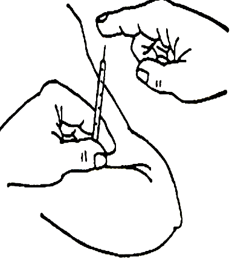
                    - 先将针插入针管内，针尖与针管下端平齐，置于拟刺腧穴上，针管上端露出针柄3分左右
                    - **押手** **刺手**
                    - 然后退出针管，再将针刺入穴内
                    - **进针不痛，对用于儿童、惧针者**
            - **针刺的方向、角度和深度**
                - **针刺方向**
                    - **依经脉循行**
                        - 或顺经而刺，或逆经而刺
                    - **依腧穴特点**
                        - 某些腧穴必须朝向某一特定方向，方能保证疗效与针刺安全
                    - **依治疗需要**
                        - 针尖朝向病所
                - **针刺角度** 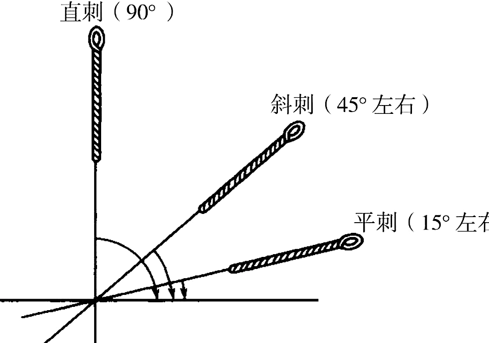
                    - 是指进针时针身与所刺部位皮直制肤表面形成的夹角
                    - 主要依腧穴所在部位的解剖特点和治疗要求而定
                    - **直刺** **斜刺** **平刺**
                    - > 直刺透皮，然后斜刺/平刺——减少疼痛
                        - **直刺**
                            - **90°垂直刺入**
                            - 适用于人体大部分腧穴
                        - **斜刺**
                            - **45°左右刺入**
                            - **肌肉浅薄处或内有重要脏器**
                        - **平刺（横刺、沿皮刺）**
                            - **15°左右或以更小的角度刺入**
                            - **皮薄肉少部位**
                    - 深刺多直刺，浅刺多斜刺、平刺
                - **针刺深度**
                - > **原则：** 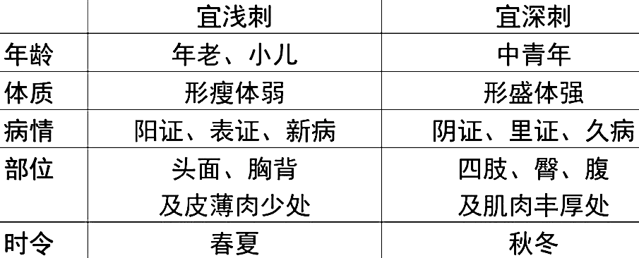
                    - **各腧穴**
                    - **患者的体质、年龄、病情、部位等情况**
                        - **年龄**
                            - 年老体弱、气血虚衰，小儿稚嫩，均不宜深刺
                            - 中青年身强体壮者，可适当深刺
                        - **体质**
                            - 形瘦体弱者，宜浅刺
                            - 形胖体强者，宜深刺
                        - **病情**
                            - 阳证、新病者，宜浅刺
                            - 阴证、久病者，宜深刺
                        - **部位**
                            - 头面、胸背及皮薄肉少处腧穴，宜浅刺
                            - 四肢、臀、腹及肌肉丰厚处腧穴，宜深刺
                    - **季节**
                        - 春夏宜刺浅，秋冬宜刺深
                - ***透穴刺法***
                    - 是一种将针刺方向、角度和深度有机结合，从一个穴位刺向另一个穴位的特殊针刺方法
                        - 腧穴确定后，将针尖朝向欲透刺的腧穴方向，针身与皮肤呈一定角度，将针刺入腧穴
                        - 针下得气后，再将针刺向并抵达另一个腧穴
                    - **透刺形式：**
                    - **根据透刺穴位：**
        - **毫针行针手法**
            - **行针**
            - > 运针
                - 指毫针刺入穴位后，为使患者产生针刺感应，或进一步调整针感的强弱，以及使针感向某一方向扩散、传导而采取的操作方法
            - **基本手法**
                - **提插法**
                    - **定义**
                        - 一定深度 **上提下插**
                        - > 一定深度：决定于之前的探查 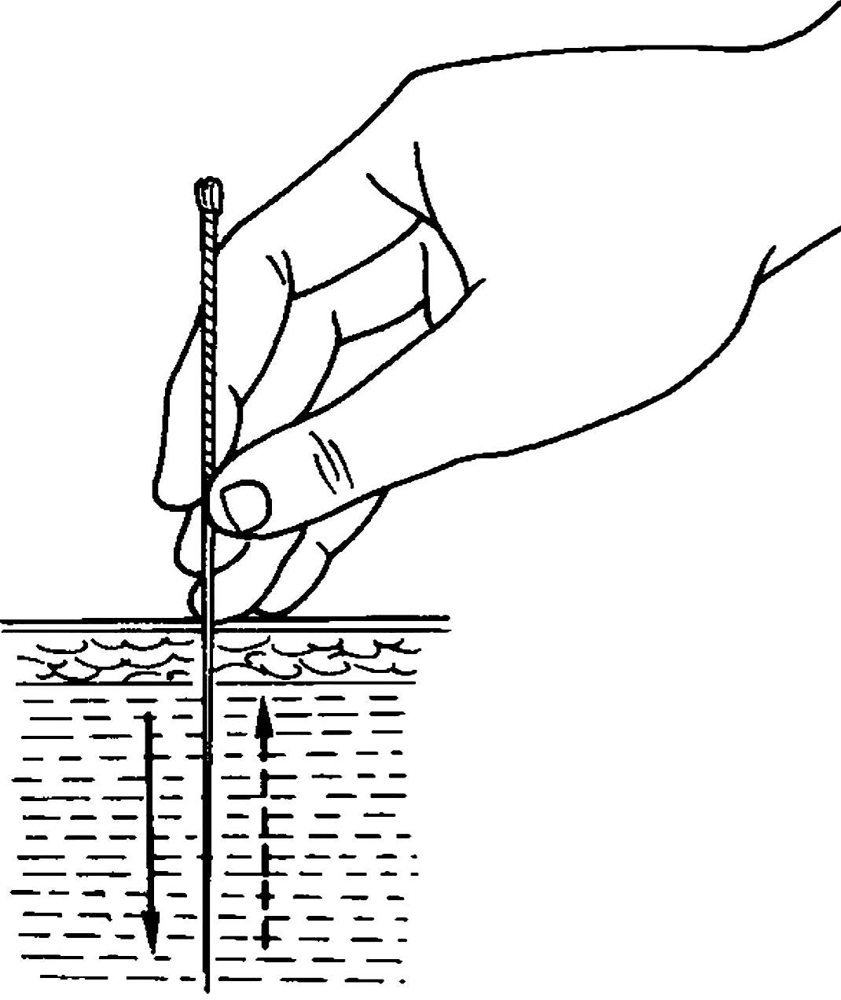 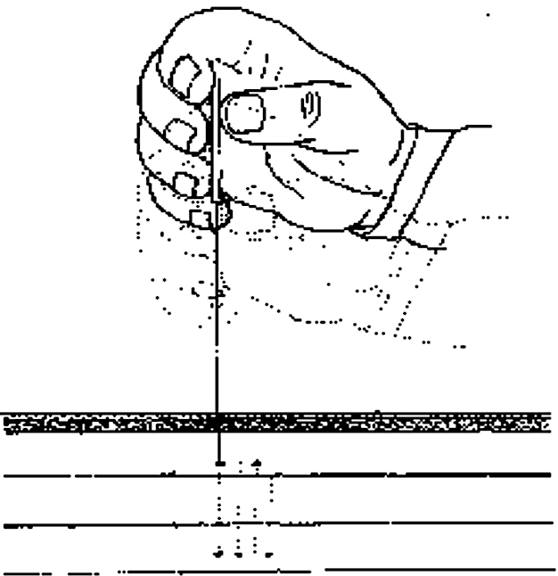
                    - **要求**
                        - **3～5分**
                        - > 7mm～1.5mm，多个层度都存在——多于3～5分，不一定指力均匀一致
                        - **60次/分钟**
                        - > 无关频率问题——先确定深度
                        - 保持针身垂直，不改变针刺方向、角度
                - **捻转法**
                    - **定义**
                        - **向前向后捻转** 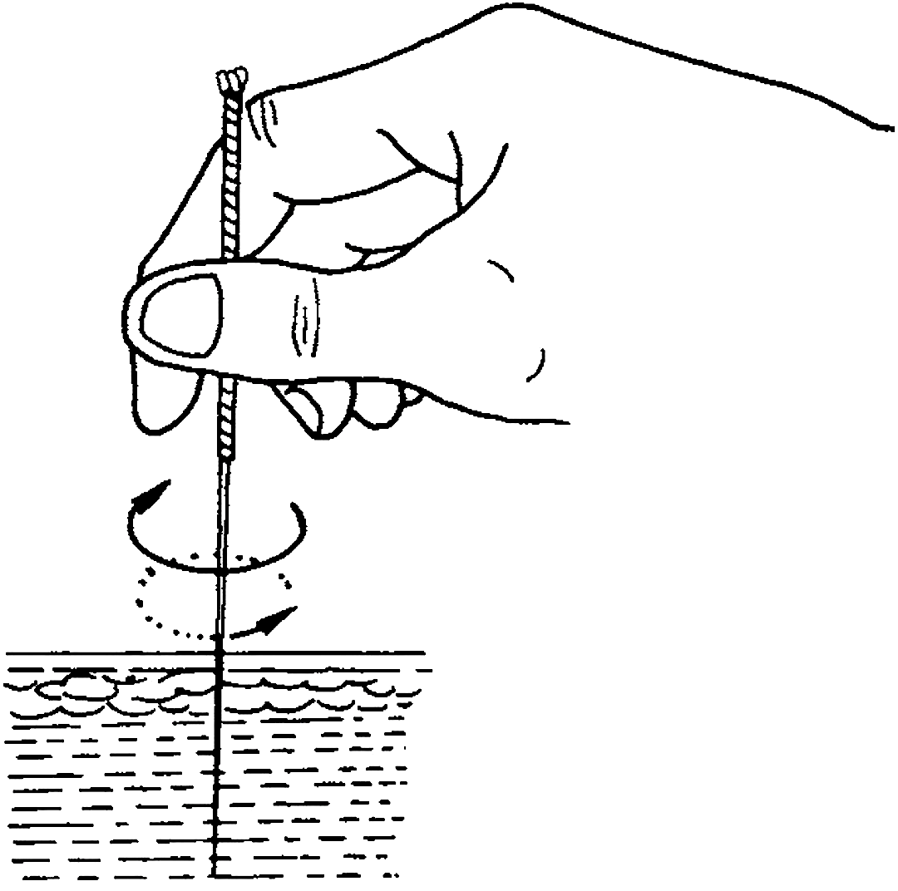
                    - **要求**
                        - **180°～360°**
                        - **不能单向捻转**
            - **辅助手法**
            - > 循弹刮摇飞震颤
                - **循法**
                    - **定义**
                        - **针刺腧穴的上下部位轻柔循按** 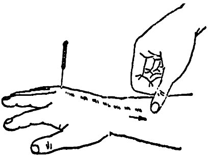 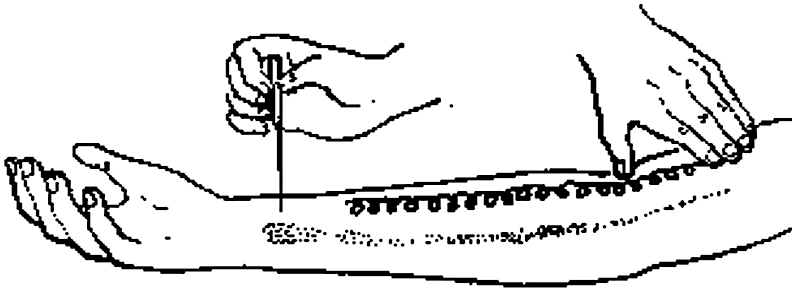
                    - 推动气血运行，激发经气，促使针后易于得气
                - **弹法**
                    - **定义**
                        - **轻弹针尾或针柄** 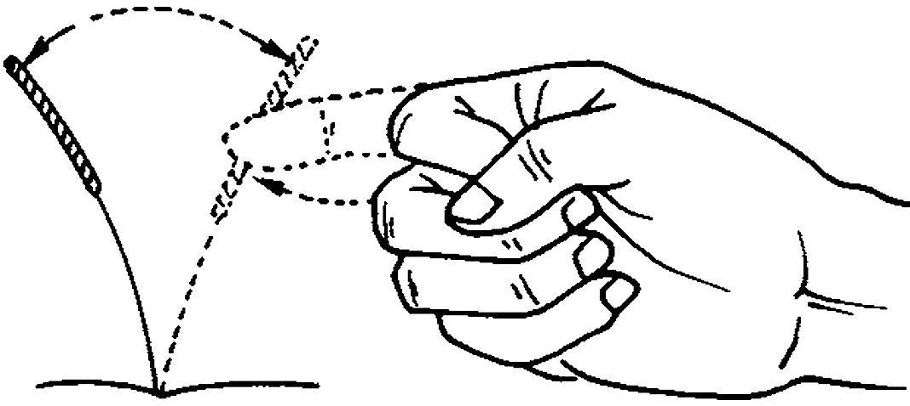 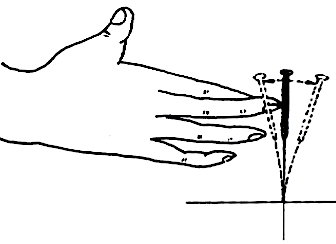 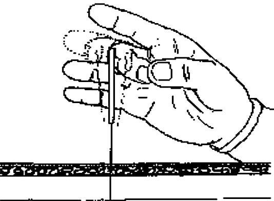
                    - 催气、行气、加强针感
            - **刮法**
                - **定义**
                    - **刮动针柄** 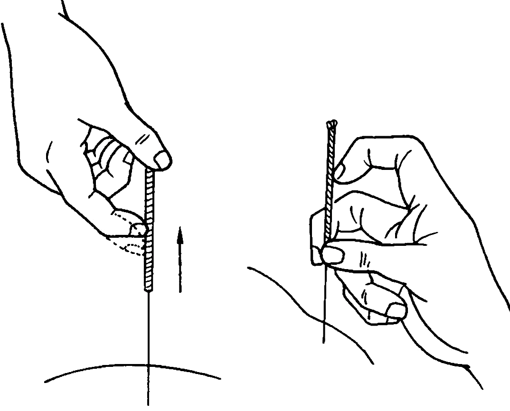
                - 激发经气、加强针感的传导和扩散
            - **摇法**
                - **定义**
                    - **将针轻轻摇动** 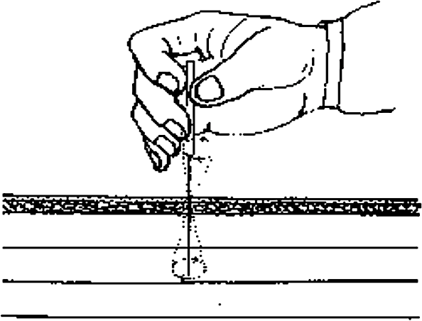 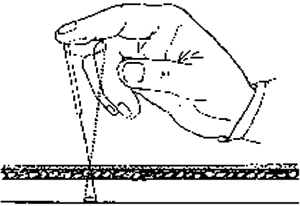
                - 一是直立针身而摇，以加强得气感应
                - 二是卧倒针身而摇，使经气向一定方向传导
            - **飞法**
                - **定义**
                    - **一搓一放，反复数次** 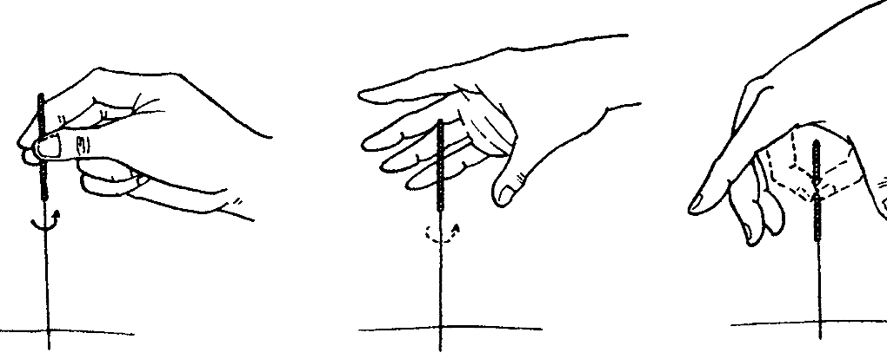 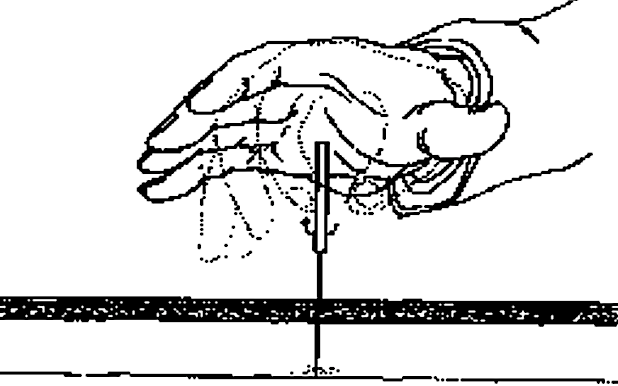 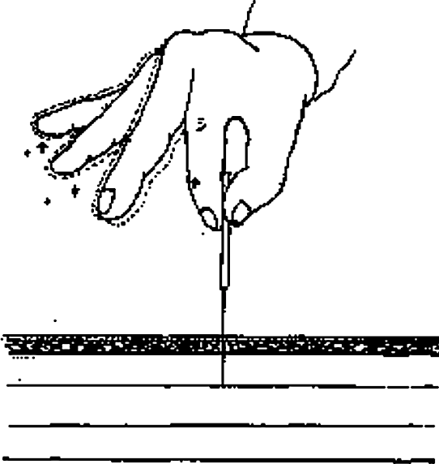
                - 催气、行气、增强针感
            - **震颤法**
                - **定义**
                    - **小幅度、快频率的提插、捻转** **针身轻微震颤** 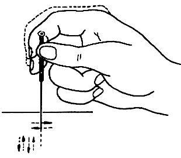 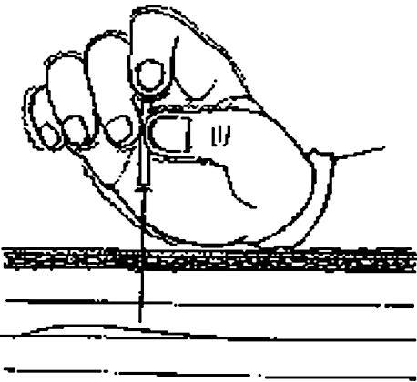
                - 促使得气，增强针刺感应
        - **得气**
            - **得气的概念**
                - ★古称“气至”，今称“针感”
                - **针刺部位获得经气感应**
                - **表现**
                - > 以患者感觉为主
                    - **患者**
                        - 酸麻重胀
                        - > 麻：瞬间（刺中神经）
                        - 抽搐
                        - > 抽搐：指肌肉跳动
                    - **医者**
                    - > 相对（与病人敏感度有关），不一定出现
                        - 针下沉紧、涩滞
                        - 针体颤动
                - **得气的描述**
                    - ***元·窦汉卿《标幽赋》：轻滑慢而未来，沉涩紧而已至***
                    - ***气之至也，如鱼吞钩饵之浮沉；气未至也，如闲处幽堂之深邃***
            - **得气的意义**
                - *《灵枢·九针十ニ原》：“* *刺之要* *，气至而有效。”*
                - *《金针赋》：“气速效速，气迟效迟。”*
                - *《针灸大成》：“针若得气速，则* *病易痊而效亦速* *；若气来迟，则病难愈而有不治之忧。”*
            - **影响得气的因素**
                - **医者**
                - > 重新调整，再次行针，多可得气
                    - 腧穴定位不准
                    - 手法运用不当
                    - 针刺角度深浅失度
                - **患者**
                    - 病久体虚，正气虚惫——经气不足
                    - 其他病理因素导致感觉迟钝、丧失、阻滞
                - **环境**
                    - 气候寒冷、阴雨潮湿，不易得气
                    - 气候温暖、天气晴朗，较易得气
        - **毫针补泻手法**
            - **针刺补泻**
                - 针刺补泻是通过针刺腧穴，运用一定的手法激发经气以鼓舞正气、疏泄病邪而防治疾病的方法
                - **针刺补法**
                    - 鼓舞人体正气，使低下的机能恢复旺盛
                - **针刺泻法**
                    - 疏泄病邪，使亢进的机能恢复正常
            - **单式补泻手法**
                - **捻转补泻**
                - > 根据病人接受程度 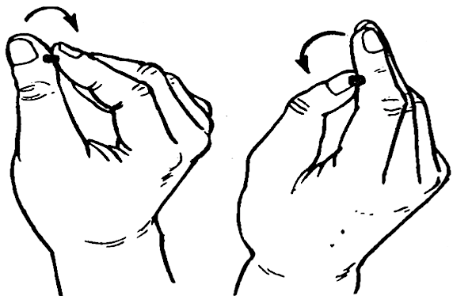
                    - **拇指向前用力重** **补**
                    - **拇指向后用力重** **泻**
                - **提插补泻**
                - > 4～5mm
                    - **重插轻提** **补**
                    - **轻插重提** **泻**
                - **徐疾补泻**
                    - **徐徐刺入，疾速出针** **补** 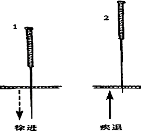
                    - **疾速刺入，徐徐出针** **泻** 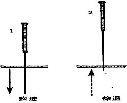
                - **迎随补泻**
                    - 此处指针向补泻
                    - **经脉循行去的方向** **补**
                    - **经脉循行来的方向** **泻**
                - **呼吸补泻**
                    - **呼气时进针，吸气时出针** **补** 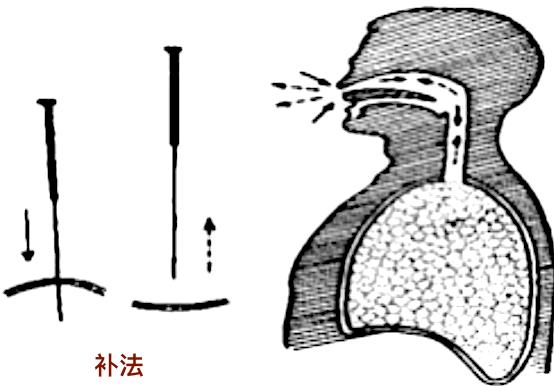
                    - **吸气时进针，呼气时出针** **泻** 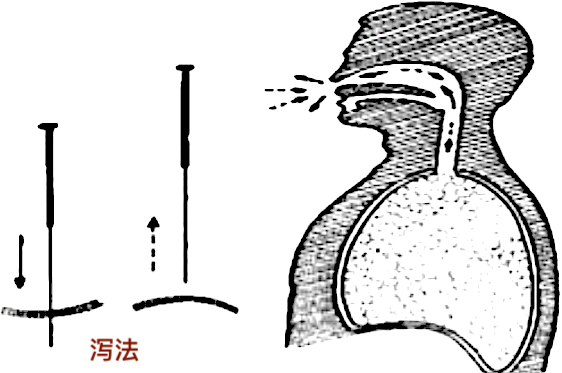
                - **开阖补泻** 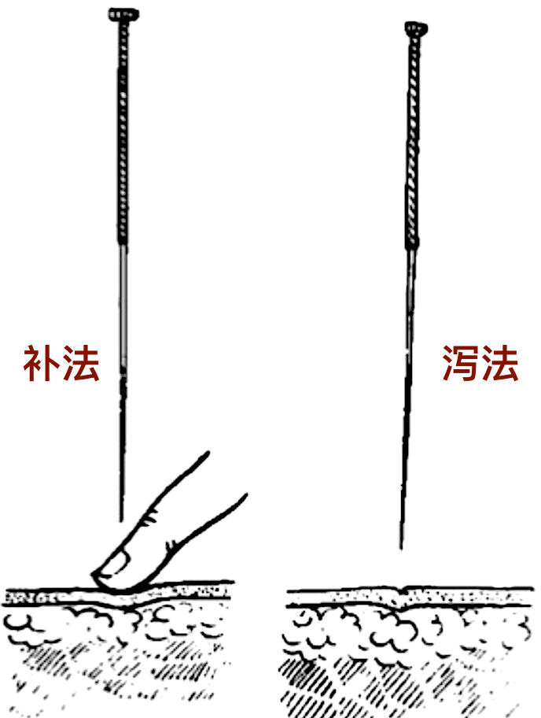
                    - **迅速按闭针孔** **补**
                    - **摇大针孔而不按** **泻**
                - **平补平泻**
                    - **均匀地提插、捻转**
            - **复式补泻手法**
            - > 了解
                - **烧山火**
                    - **浅、中、深** **先浅后深** **紧按慢提** **九数** **深层留针**
                    - **补**
                        - **顽麻冷痹、虚寒性疾病**
                - **透天凉**
                    - **直插深层** **深、中、浅** **紧提慢按** **六数** **浅层留针**
                    - **泻**
                        - **热痹、急性痈肿实热性疾病**
            - **影响针刺补泻效应的因素**
                - **患者的机能状态**
                    - 患者的病理状态不同，针刺产生的调整作用（即补泻效果）也不同
                    - 患者实→补法→不会更实
                    - 患者虚→泻法→可能更虚
                - **腧穴作用的相对特异性**
                    - 腧穴的主治功用，不仅具有普遍性，而且具有相对特异性
                        - 关元、气海、命门——补（可能泻→虚）
                        - 人中、血海、十宣——泻（无补，和手法无关）
                - **针刺手法的选择和运用**
                    - 针刺补泻手法是促使机体虚实状态转化的主要手段
        - **留针与出针**
            - **留针**
                - **定义**
                    - 毫针刺入腧穴并施行手法后，将针留置于腧穴内
                    - 15～30min
                - **目的**
                    - 加强针刺作用、便于继续行针施术
                - **分类**
                    - **静留针**
                        - 留针期间不施行任何手法
                    - **动留针**
                        - 留针期间施行一定的守气、行气、补泻手法
            - **出针**
                - **干棉球** **按压** **小幅度捻转** **缓慢**
                - > 血——不堵、应出（防止瘀血），不用专门挤（如有必要可拔火罐等），血出不止——按压止血
        - **针刺异常情况的处理和预防**
            - **晕针**
                - **定义**
                    - **晕厥**
                - **表现**
                    - 患者突然岀现精神疲倦，头晕目眩，面色苍白，恶心欲吐，多汗，心慌，四肢发冷，血压下降等现象
                    - 重者神志不清，仆倒在地，唇甲青紫，二便失禁，脉细微欲绝，甚至晕厥
                - **处理**
                    - **立即停止针刺，将针全部起出**
                    - **平卧，松开衣带，注意保暖**
                    - **温开水或糖水**
                    - > 仰卧：头歪向一侧
                    - **灸百会、关元、气海、（次髎）**
                    - > 少数
                    - →若仍不省人事，可考虑配合其他治疗或采用急救措施
                    - > 急诊抢救
                - **预防**
                    - 先做好解释，消除其对针刺的顾虑；同时选择舒适持久的体位；选穴宜少，手法要轻；饥饿、疲劳、大渴的患者，应令进食、休、饮水后少时再予针刺
                    - **随时注意观察患者的神色，询问患者的感觉**
            - **滞针**
                - **定义**
                    - 指在行针时或留针过程中，医者感觉针下涩滞，捻转、提插、出针均感困难，而患者感觉疼痛的现象
                - **表现**
                    - **难以捻转，提插、出针均感困难**
                - **处理**
                    - **延长留针时间** **循按** **叩弹** **在附近再刺一针**
                - **预防**
                    - 对精神紧张者，应先做好解释工作，消除其顾虑，选择合适的体位，确定合理的留针时间
                    - **避免单向捻转**
            - **弯针**
                - **定义**
                    - 是指将针刺入腧穴后，针身在体内弯曲的现象
                    - **轻者**
                    - **重者**
                - **表现**
                    - 针柄改变了进针或留针时的方向和角度，提插、捻转及出针均感困难，甚至无法出针，而患者感到疼痛
                - **处理**
                    - 出现弯针后，不得再行提插、捻转等手法
                        - 如属轻微弯曲，应慢慢将针起出
                        - 若弯曲角度过大，应顺着弯曲方向将针起出
                        - 如弯曲不止一处，应视针柄扭转倾斜的方向，逐步分段退出
                        - 若由患者移动体位所致，应使患者慢慢恢复原来体位，局部肌肉放松后再将针绶绶起岀
                    - **切忌强行拔针，以免将针身折断，留在体内**
                - **预防**
                    - **避免进针过速、过猛**
                    - **不要随意变动体位**
            - **断针**
                - **定义**
                    - 又称折针，是指针身折断在体内
                - **原因**
                    - 针具质量欠佳，针身或针根有损伤剥蚀，进针前失于检查
                    - 针刺时将针身全部刺入腧穴，行针时强力提插、捻转肌肉猛烈收缩
                    - 或弯针、滞针未能及时正确处理等
                - **表现**
                    - 行针时或出针后发现针身折断，其断端部分针身浮露于皮外，或断端全部没于皮下
                - **处理**
                    - 医者应沉着冷静，安抚患者
                    - **切勿变更原有体位**
                    - **若断端针身显露于皮外，可用手指或镊子将针起出**
                    - **若断端与皮肤相平，可用左手拇、食二指垂直向下挤压针孔两旁使断针暴露于皮外，右手持镊子将针取出**
                    - 若断针完全没入皮下，应采用外科手术方法取出
                - **预防**
                    - **针刺前**
                        - **针根**
                        - **脉冲电针仪**
                        - > &lt;2%
                        - 避免过猛、过强地行针
                    - **行针或留针时**
                        - 在行针或留针时，应嘱患者不要随意更换体位
                        - 针刺时不宜将针身全部刺入穴内，应留部分针身在体外，以便于针根折断时取针
                        - 在进针、行针过程中，如发现弯针时，应立即出针，切不可强行刺入或行针
                        - 对于滞针、弯针等异常情况应及时正确地处理，不可强行出针
            - **血肿**
                - **定义**
                    - 是指针刺部位皮下出血引起的肿痛
                - **原因**
                    - **刺伤血管**
                - **表现**
                    - 出针后，针刺部位肿胀疼痛，继则皮肤呈现青紫色
                    - > 头面部，疼痛拒按​
                - **处理**
                    - 若微量的皮下出血而呈现局部小块青紫时，一般不必处理，可以自行消退
                    - **冷敷** **热敷**
                - **预防**
                    - **避开血管针刺** **无菌干棉球按压针孔**
                    - > 发现出血：棉球使劲按1～2min
            - **刺伤内脏**
                - **气胸**
                    - **原因**
                        - **针刺胸、背、腋、胁、缺盆等部位**
                    - **表现**
                        - **胸闷、心慌、呼吸不畅** **呼吸困难、唇甲发绀、出汗、血压下降**
                        - 体检时，可见患侧胸肋部间隙饱满，胸部叩诊呈鼓音，气管向健侧移位，听诊时呼吸音明显减弱或消失
                        - 有部分病例针刺当时并无明显异常现象，隔数小时后才逐渐出现胸闷、呼吸困难等症状
                    - **处理**
                        - **立即起针** **半卧位休息**
                        - **漏气量少者，可自行吸收**
                        - 医者要密切观察，随时对症处理，一般首先给患者吸氧，并根据气胸的严重程度，给予休养观察或胸腔穿刺抽气及其他治疗
                        - 对严重病例，如出现张力性气胸者需及时组织抢救
                    - **预防**
                        - 为患者选择合适体位
                        - **严格掌握进针的角度、深度**
                - **刺伤其他内脏**
                    - **表现：疼痛和出血**
                        - **刺伤肝、脾**
                        - > 尤其凝血功能差者
                            - 可引起内出血，肝区或脾区疼痛，有的可向背部放射
                            - 若出血量过大，会出现腹痛、腹肌紧张，并有压痛及反跳痛等急腹症症状
                        - **刺伤心脏**
                            - 轻者可出现强烈刺痛
                            - 重者有剧烈撕裂痛，引起心外射血，导致休克等危重情况
                        - **刺伤肾脏**
                            - 可出现腰痛血尿
                            - 严重时血压下降、休克
                        - **刺伤胆囊、膀胱、胃、肠等空腔脏器**
                            - 可引起疼痛，甚至急腹症等症状
                    - **处理**
                        - **自愈**
                        - 如损伤较重，或有继续出血倾向者
                            - 应用止血药等对症处理
                            - 密切观察病情及血压变化
                            - 若损伤严重，出血较多，出现失血性休克时，则必须迅速进行输血等急救或外科手术治疗
                    - **预防**
                        - **明确腧穴下的脏器组织**
                        - **掌握好针刺方向、角度深度**
            - **刺伤脑脊髓**
                - **定义**
                    - 是指由于针刺过深造成脑及脊髓的损伤
                - **原因**
                    - **针刺的方向及深度不当**
                    - **针刺过深，或手法太强**
                - **表现**
                    - **头痛、恶心、呕吐、呼吸困难、休克和神志不清**
                    - **触电样感觉向肢端放射** **暂时性肢体瘫痪**
                - **处理**
                    - 及时出针
                    - 轻者，需安静休息，经过一段时间后可自行恢复
                    - 重者请神经外科及时抢救
                - **预防**
                    - **针刺头项及背腰部腧穴** **掌握正确的针刺角度和方向，不宜大幅度提插，禁深刺**
            - **外周神经损伤**
                - **定义**
                    - 是指针刺操作不当造成相应的外周神经损伤
                - **原因**
                    - 针刺或使用粗针强刺激出现触电感后仍然大幅度提插。
                - **表现**
                    - **麻木、灼痛**
                - **处理**
                    - **勿继续提插捻转，应缓慢出针**
                    - **B族维生素**
                        - 如在相应经络腧穴上用B族维生素类药物穴位注射
                        - 严重者可根据病情需要进行临床救治
                - **预防**
                    - 针刺神经干附近穴位时，手法宜轻
                    - **出现触电感时，不可再使用强刺溦手法**
    - 灸法
        - **灸法的定义**
            - 灸——灼烧
            - **灸法**
            - > *《灵枢·官能》：“针所不为，灸之所宜。”*
                - 主要是指借灸火的热力和药物的作用，对腧穴或病变部位进行烧灼、温熨，达到防治疾病目的的一种方法
        - **灸法的作用**
            - **温经散寒**
                - 灸火的温和热力→温通经络、驱散寒邪
                - **临床：**
                    - 寒凝血滞、经络痹阻
            - **扶阳固脱**
                - 扶助阳气，举陷固脱
                - > *《扁鹊心书·须识扶阳》：“真阳元气虚则人病，真阳元气脱则人死，保命之法，灼艾第一。”*
                - **临床：**
                    - 虚寒证、寒厥证、虚脱证、中气不足、阳气下陷
            - **消瘀散结**
                - 行气活血、消瘀散结
                - > *《灵枢·刺节真邪》：“脉中之血，凝而留止，弗之火调，弗能取之。”*
                - **临床：**
                    - 气血凝滞
            - **防病保健**
                - 未病施灸→激发人体正气，増强抗病能力→防病保健、益寿延年
                - > **“逆灸”** **“保健灸”**
                - 常灸强壮要穴能够强身健体，抵御外邪
                - > *《医说·针灸》：“若要安，三里莫要干。”*
            - **引热外行**
                - 艾火温热→皮肤腠理开放，毛窍通畅→热有去路→引热外行
                - > *《医学入门·针灸》：“热者灸之，引郁热之气外发。”*
                - **临床**
                    - 疖肿、带状疱疹、丹毒、甲沟炎等
                    - > 实热病证
                    - 阴虚发热
                        - 施灸量不宜过大
        - **灸法的种类及其运用**
            - **艾灸法**
                - **艾炷灸**
                - > 将艾炷置于穴位或病变部位上，点燃施灸；每燃1个艾炷，称为灸1壮​
                    - **直接灸（着肤灸）**
                    - > 将艾炷直接放在皮肤上施灸
                        - **无瘢痕灸（化脓灸）**
                            - 施灸前：施术部位→涂以少量大蒜汁
                            - > 增加粘附性和刺激作用
                            - 放置艾炷，从上端点燃
                            - > 小艾炷（多用，小米粒大小）/中艾炷（少）
                            - 烧近皮肤时：患者有灼痛感→手在穴位四周拍打
                            - > 减轻疼痛
                            - 每壮艾炷须燃尽后→除去灰烬→继续易炷再灸→拟灸壮数灸完
                        - **瘢痕灸（非化脓灸）**
                            - 施灸前：拟灸腧穴部位→涂以少量的凡士林
                            - > 便于艾炷黏附
                            - 将大小适宜的艾炷置于腧穴上，从上端点燃施灸
                            - > 中、小艾炷
                            - 当艾炷燃剩1/3左右而患者感到微有灼痛时：用镊子将艾炷夹去→易炷再灸→拟灸壮数灸完
                    - **间接灸（隔物灸、间隔灸）**
                    - > **用药物或其他材料**
                        - **隔姜灸**
                            - **方法**
                                - 鲜生姜→切d2～3cm，h0.3cm
                                - 中间以针穿刺数孔，上置艾炷
                                - 放在应灸的部位，点燃施灸
                                    - 一般：皮肤红晕而不起疱为度
                                    - 患者感觉灼热不可忍受——将姜片向上提起，使之离开皮肤片刻，再行灸治
                                - 艾炷燃尽→易炷再灸→灸完应灸壮数
                            - **温胃止呕、散寒止痛**
                                - 因寒而致→呕吐、腹痛、风塞痹痛等
                        - **隔蒜灸**
                            - **方法**
                                - 鲜大蒜头→切0.3cm
                                - 中间以针穿刺数孔，上置艾炷
                                - 放在应灸的腧穴部位或患处
                                - 操作方法与隔姜灸相同
                            - **清热解毒、杀虫**
                                - 瘰疬、肺结核、疮疬初起等
                        - **隔盐灸**
                            - **方法**
                                - 纯净干燥的精制食盐→填敷于脐部，使其与脐平，上置艾炷施灸
                                    - 患者稍感灼痛→更换艾炷
                                    - 也可于盐上放置姜片后再施灸
                            - **回阳、救逆、固脱**
                            - > 需连续施灸，不拘壮数，以待脉起、肢温、证候改善
                                - 伤寒阴证、吐泻并作、中风脱证等
                        - **隔附子饼灸**
                            - **方法**
                                - 附子研成细末→黄酒调和→d3cm、h0.8cm的附子饼
                                - 中间以针穿刺数孔，上置艾炷
                                - 放在应灸腧穴或患处，点燃施灸
                                - 灸完应灸壮数
                            - **适用**
                                - 命门火衰→阳痿、早泄、宮寒不孕
                                - 疮疡久溃不敛
                - **艾条灸**
                - > 主要成分：艾绒，卷成圆柱形的艾卷，也称艾条，点燃艾条施灸
                    - **悬起灸**
                        - **温和灸**
                            - 艾条的一端点燃
                            - 对准腧穴或患处，约距离皮肤2～3cm熏灼
                                - 使患者局部有温热感而无灼痛为宜，10～15min/穴→至皮肤红晕为度
                            - 局部知觉减退或昏厥患者
                                - 医者可将食、中两指，置于施灸部位两侧
                                - 通过医者的手指来测知患者局部受热程度
                                - 以便随时调节施灸时间和距离，防止烫伤
                        - **雀啄灸**
                            - 艾条点燃的一端与施灸部位的皮肤并不固定在一定的距离，而是像乌雀啄食一样，一上ー下施灸
                            - 至皮肤红晕为度
                        - **回旋灸**
                            - 艾条点燃的一端与施灸部位的皮肤虽保持一定的距离，但艾条并不固定，而是向左右方向移动或反复旋转地施灸
                    - **实按灸**
                        - 点燃的艾条→隔数层布或绵纸，实按在穴位上
                        - > 使热力透达深部
                        - 火灭热减→重新点火按灸
                            - 反复灸熨7～10次为度
                        - 患者感到按灸局部灼烫、疼痛→移开艾条，增加隔层
                        - **太乙神针&雷火神针：**
                - **温针灸**
                - > 毫针留针时：针柄上置以艾绒（或艾条段）施灸
                    - **方法**
                        - 将毫针刺入腧穴→得气、适当的补泻手法
                        - 将针留在适当的深度
                        - 将纯浄细软的艾绒包裹于针尾/2～3cm艾条段直接插在针柄上
                        - 点燃施灸→艾绒或艾条燃尽→除去灰烬，将针取出
                            - 防止艾火脱落烧伤皮肤
                    - **适用**
                        - 既需要留针而又适宜用艾灸的病证
                - **温灸器灸**
                - > 用温灸器施灸的方法
                    - **温灸器**
                    - > **温灸器/灸疗器：**
                        - 灸架
                        - 灸盒
                        - 灸筒
                    - **方法**
                        - 施灸时：将艾绒/艾条装入温灸器
                        - 点燃→置于腧穴/应灸部位熨灸
                            - 所灸部位的皮肤红晕为度
                    - **调和气血、温中散寒**
                        - 临床需要灸治者，一般均可应用
                        - 对小儿、妇女及畏灸者尤为适宜
            - **非艾灸法**
                - **灯火灸（灯草灸、油捻灸）**
                - > 民间沿用已久的简便灸法
                    - **方法**
                        - 灯芯草根→麻油浸之
                        - 燃火前：软绵纸吸去灯心草上的浮游油
                        - > 防止点火后油滴烫伤皮肤
                        - 燃着→对准穴位/患处→迅速点灸皮肤
                            - 一触即起
                                - 接触皮肤时会伴有“叭”的爆焠声
                                - 如无爆焠声可重复一次
                        - 灸后：皮肤出现黄褐色半点或斑块，偶尔会起小疱
                    - **适用**
                        - 小儿痄腮、乳蛾、吐泻、麻疹、惊风等
                - **天灸（药物灸、发疱灸）**
                - > 三伏贴
                    - 将一些具有刺激性的药物涂敷于穴位或患处，促使局部皮肤充血起疱的方法
                    - 常用药物：白芥子、细辛、大蒜、斑蝥等
                    - **白芥子灸**
                        - 白芥子适量→细末→水→糊状→贴敷于穴位/患处→活血止痛膏固定
                        - 贴敷1～3小时→局部皮肤灼热疼痛
                        - **治疗：**
                    - **细辛灸**
                        - 细辛适量→细末→加醋少许→糊状→敷于穴位/患处→活血止痛膏固定
                        - 贴敷1～3小时→局部皮肤灼热疼痛
                        - **涌泉/神阙**
                    - **蒜泥灸**
                        - 大蒜捣烂如泥→3～5g贴敷于穴位/患处→活血止痛膏固定
                        - 贴敷1～3小时→局部皮肤灼热疼痛
                        - **涌泉**
                        - **合谷**
                        - **鱼际**
                    - **斑蝥灸**
                        - 芫青科昆虫南方大斑蝥/黄黑小斑蝥的干燥全虫
                        - 研末→醋/甘油、乙醇
                        - 胶布→中间剪一小孔（如黄豆大）→对准应灸部位粘贴→斑蝥粉少许置于孔中→上面再贴一层胶布固定
                        - 局部起疱为度
                        - 癣痒等
        - **灸感及灸法补泻**
            - **灸感**
                - 指施灸时患者的自我感觉
                - 灸法：灸火直接/间接在体表施以适当的温热刺激→治病、保健
                - （除瘢痕灸）一般以患者感觉灸处局部皮肤及皮下温热或有灼痛为主
                - 温热刺激
                    - 直达深部，经久不消
                    - 循经感传
            - **灸法补泻**
                - **辨证施治——虚证用补，实证用泻**
                    - **艾灸补法**
                        - 无须以口吹艾火
                        - 自然缓缓燃尽，以补其虚
                    - **艾灸泻法**
                        - 快速吹艾火至燃尽，使艾火的热力迅速透达穴位深层，以泻邪气
                - **施灸先后顺序**
                    - **古代论述**
                        - *《备急千金要方·灸例第六》：“凡灸，当先阳后阴……先上后下。”*
                        - *《明堂灸经》：“先灸上，后灸下；先灸少，后灸多。”*
                    - **一般规律**
                        - 先灸阳经，后灸阴经
                        - 先灸上部，再灸下部
                        - 先灸少，后灸多（壮数）
                        - 先灸小，后灸大（艾炷大小）
                    - **特殊/变化**
                        - **脱肛**
                            - 先灸下，后灸上
                                - **先灸长强** **后灸百会**
                            - 在通风环境中进行
        - **施灸的注意事项**
            - 面部穴位、乳头、大血管等处均不宜使用直接灸，以免烫伤形成瘢痕
            - 关节活动部位亦不适宜用化脓灸，以免化脓溃破，不易愈合，甚至影响功能活动
            - 一般空腹、过饱、极度疲劳和对灸法恐惧者，应慎施灸
    - 拔罐法
        - **拔罐疗法的概念**
            - **吸筒疗法** **角法**
            - **罐具**
                - 最早——兽角
                - 竹罐、金属罐、陶瓷罐、玻璃罐、抽气罐、多功能罐
                - > 艾灸：艾草、桑柘木
        - **罐的吸附方法**
            - **火罐法**
            - > 燃烧→加热罐内空气→冷却→形成负压→将罐吸附于体表
                - **闪火法**
                    - *（圈数越多力量越弱）*
                    - 较安全，不受体位限制，最常用
                        - **注意：**
                - **投火法**
                    - 易燃纸片/95%乙醇棉球→点燃→投入罐内→迅速将罐扣于应拔部位
                    - **侧面横拔**
                    - > 罐内有燃烧物，容易落下烫伤皮肤
                - **贴棉法**
                    - 直径1～2cm的 95%乙醇棉片→贴于罐内壁→点燃→迅速将罐扣于应拔部位
                    - **侧面横拔**
                        - **注意：**
            - **水罐法**
            - > 蒸汽、水煮等→加热罐内空气→冷却→形成负压→使罐吸附于体表
                - **操作**
                    - 罐→水中煮沸2min左右→镊子→罐口朝下夹出→迅速用折叠干毛巾捂紧罐口
                    - > 吸去罐内的水液，降低罐口温度
                    - →保持罐内空气温度→罐口冷却至人体能接受的程度→将罐拔于应拔部位→固定数分钟，吸牢即可
                - **特点**
                    - 温热刺激较强
                    - 可根据病情需要在水中放入适量的祛风活血等药物，以增强疗效
            - **抽气罐法**
            - > 机械装置→抽出罐内部分空气→罐内负压→使罐吸附于体表
                - 抽气罐→紧扣在应拔部位→抽气筒→抽气→使罐吸附于皮肤上
        - **拔罐的应用方法**
            - **留罐法（坐罐法）**
                - 罐具→吸拔在皮肤上→留置5～15min→将罐起下
                - 最常用，一般疾病均可应用
            - **走罐法（推罐法）**
                - **操作**
                    - 拟操作部位→凡士林等润滑剂→罐具→吸拔在皮肤上
                    - →医生手握罐体，均匀用力，将罐沿着一定路线往返推动
                    - →走罐部位皮肤红润、充血甚至瘀血→将罐起下
                - **应用**
                    - 脊背、腰臀、大腿等面积较大、肌肉丰厚的部位
            - **闪罐法**
                - **操作**
                    - 罐具→吸拔在皮肤上→立即取下→迅速吸拔、取下（反复）→皮肤潮红
                        - 闪罐动作——迅速、准确
                        - 手法——轻巧，吸附力适中
                - **应用**
                    - 局部皮肤麻木、疼痛或功能减退等疾患
                    - 不宜留罐的部位及儿童患者
                - **注意**
                    - 一罐多次闪罐后，罐口温度升高，应及时换罐，以免烫伤
            - **刺络拔罐法**
                - 局部消毒，三棱针、粗毫针等点刺/皮肤针叩刺出血→出血部位→拔罐、留罐5～15min
                - > 加强刺血治疗效果
                - 各种急慢性软组织损伤、神经性皮炎、痤疮、皮肤瘙痒、丹毒、坐骨神经痛等
            - **留针拔罐法**
                - 毫针针刺得气→留针→以毫针为中心，加用拔罐→留置10～15min→起罐、起针
        - **起罐的方法**
            - 一手握住罐体中下部，另一手拇指或食指按压罐口边缘的皮肤→罐口与皮肤之间产生空隙→空气进入罐内→将罐取下
            - **抽气罐**
                - 提起其上方的阀门→使空气进入罐内→罐具自行脱落
        - **拔罐的作用和适用范围**
            - **作用**
                - 开泄腠理、祛风散寒、通经活络、行气活血、祛瘀生新、消肿止痛等
                    - 拔罐→真空负压→较强的吸拔之力
                    - →作用在经络穴位→体内的病理产物→皮肤毛孔→排出体外
                    - →疏通经络气血、调整脏腑功能→防治疾病
            - **适用范围**
            - > 较广、常用的保健疗法
                - 腹痛、颈肩腰腿痛、关节痛、软组织闪挫扭伤等
                - > 局部病证
                - 伤风感冒、头痛、面瘫、咳嗽、哮喘、消化不良、泄泻、月经不调、痛经等
                - 目赤肿痛、麦粒肿、丹毒、疮疡初起未溃等
                - > 外科病证
        - **拔罐的注意事项及禁忌**
            - **体位&部位**
                - 适当体位、肌肉相对丰满的部位
                - 体位不当、移动，骨骼凹凸不平，毛发较多者→罐体容易脱落，均不适用
            - **拔罐时**
                - 手法——熟练，动作——轻、快、稳、准
                - 乙醇棉球——不可吸含过量乙醇
                - > 以免拔罐时乙醇滴落到患者皮肤上形成烫伤
                - **留罐过程中：**
                - **起罐时：**
                - > 以免引起疼痛，甚至损伤皮肤
            - **带有心脏起搏器等金属物体的患者**
                - 禁用电磁拔罐器具
            - **留针拔罐**
                - 罐具宜大，毫针针柄宜短——以免吸拔时罐具碰触针柄而致损伤
    - 附：刮痧法
    - > 表证
        - **定义**
            - 是以中医经络皮部理论为基础，运用刮痧器具在体表的一定部位刮拭以防治疾病的方法
        - **机理**
            - 通过对十二皮部的良性刺激，达到疏通经络、行气活血、调整脏腑机能的作用
        - **器具**
            - 刮痧板
            - > 水牛角/玉石材料
            - 铜钱、汤勺、瓷片、苎麻等
            - > 边缘光滑、洁净、易于手持、不易损伤皮肤的日常用具
        - **介质**
        - > 润滑皮肤，使得刮痧板能在皮肤上顺畅移动而不致损伤皮肤
            - 刮痧乳/刮痧油
            - 石蜡油、红花油、麻油
        - **顺序**
            - 先头面后手足
            - 先腰背后胸腹
            - 先上肢后下肢
        - **方向**
            - 由上而下、由内而外——单方向刮拭，并尽可能拉长距离
            - 下肢静脉曲张或下肢肿胀者——由下向上——逆刮法
        - **方法**
            - 3～5个部位*20～30次
            - **潮红、紫红色** **丘疹样斑点、条索状斑块** **局部热感** **轻微疼痛**
            - **两次刮痧间隔：**
                - **不宜在原部位进行刮拭**
            - **用力**
                - 均匀，力度由轻到重，以患者能够承受为度
                - 根据患者体质和刮拭部位，应选择不同的刮拭力量
                    - 小儿、年老体弱患者&amp;面部刮拭——轻
                    - 体质强健患者，或脊柱两侧、下肢等肌肉较为丰满部位——重
        - **应用**
            - 感冒、气管炎、呃逆、呕吐、便秘、腹泻、泌尿系统感染、眩晕、失眠、头痛、落枕、急性腰扭伤、痛经、经期发热、急性乳腺炎、中暑等
            - 预防疾病，保健强身
        - **禁忌**
            - **有出血倾向者禁用**
                - 严重心脑血管疾病、肝肾功能不全、全身浮肿、极度虚弱或消瘦者
                - 血小板减少性疾病、过敏性紫癜、白血病等
            - **不宜直接在病灶部位刮拭**
                - 急性骨髓炎、结核性关节炎、传染性皮肤病、烧伤、体表肿瘤、皮肤溃烂
                - 急性外伤、创伤部位、新近手术疤痕部位、骨折未愈合处等
    - 特殊针具刺法
        - **三棱针法**
        - > **络刺** **赞刺** **豹纹刺** **放血疗法**
            - **概述**
                - 用三棱针刺破血络或腧穴，放出适量血液，或挤出少量液体，或挑断皮下纤维组织，以治疗疾病的方法
                - **锋针** **泻热出血**
                - 现三棱针多由不锈钢材料制成，针长约6cm，针柄稍粗呈圆柱体，针身呈三棱状，尖端三面有刃，针尖锋利
            - **操作方法**
                - **持针方法**
                    - 右手持针
                    - 拇、食二指捏住针柄
                    - 中指指腹紧靠针身下端，针尖露出 3~5mm
                - **针刺方法**
                    - **点刺法**
                    - > 三棱针快速刺入腧穴放出少量血液/挤出少量黏液
                        - **方法**
                            - **点刺前：**
                            - **点刺时**
                                - 押手固定点刺部位，刺手持针
                                - →对准所刺部位快速刺入退出
                                - →轻轻挤压针孔周围，使出血少许
                                - →以无菌干棉球按压针孔
                        - **应用**
                            - 指、趾未端和头面、耳部
                            - > 十宣、十二井穴、印堂、攒竹、耳尖等穴
                    - **散刺法**
                    - > 豹纹刺，在病变局部及其周围进行连续点刺以治疗疾病
                        - **方法**
                            - 由病变外缘呈环形向中心点刺
                            - > 根据病变部位大小的不同，可刺10～20针
                            - →配合挤压或拔罐等
                            - →促使瘀血或水肿的排除
                            - →祛瘀生新、通经活络
                        - **应用**
                            - 局部瘀血、血肿或水肿、顽癣等
                    - **刺络法**
                    - > 刺入浅表血络或静脉放出适量的血液
                        - **方法**
                            - 松紧带/橡皮带→结扎在针刺部位上端（近心端）→消毒
                            - →左手拇指压在被针刺部位下端，右手持三棱针对准针刺部位的静脉，斜向上刺入脉中2～3mm
                            - →立即出针，使其流出定量的血液
                            - > 可轻轻按压静脉上端→瘀血排出、毒邪得泻
                            - →出血停止→消毒干棉球按压针孔
                        - **应用**
                            - 急性吐泻、中暑、发热等
                            - 有较明显浅表血络或静脉的部位
                            - > 曲泽、委中等肘膝关节附近等
                    - **挑刺法**
                    - > 用三棱针挑断穴位皮下纤维样组织以治疗疾病
                        - **方法**
                            - 左手按压施术部位两侧，或捏起皮肤，使皮肤固定
                            - →右手持针速刺入皮肤1～2mm
                            - →将针身倾斜挑破表皮
                            - →再刺入5mm左右深
                            - →将针身倾斜并使针尖轻轻挑起，挑断皮下白色纤维样组织
                            - > 尽量将施术部位的纤维样组织挑尽
                            - →出针→覆盖消毒敷料
                            - > 可根据情况配合局部表浅麻醉
                        - **应用**
                            - 比较平坦的利于挑提牵拉的部位
                            - > 背俞穴
                            - 较顽固的反复发作性疾病
                            - > 肩周炎、胃病、颈椎病、失眠、支气管哮喘、血管神经性头痛等
                - **出血量及疗程**
                    - 每日或隔日治疗1次，1～3次为1个疗程
                    - 出血量多者，每星期1～2次
                    - 一般每次出血量以数滴至3～5ml为宜
            - **适应范围**
                - **通经活络、开窍泻热、调和气血、消肿止痛**
                - 实证、热证、瘀血、疼痛等
                    - 高热、中暑、中风闭证
                    - 咽喉肿痛、目赤肿痛
                    - 顽癣、痛疖初起、扭挫伤、疳证、痔疮
                    - 顽痹头痛、丹毒、指（趾）麻木等
            - **注意事项**
                - 施术前，做好解释工作，消除患者疑虑
                - 出血量较大时，可用敞口器皿盛接，做无害化处理，患者宜适当休息后才可离开
                - 医者须避免直接接触患者血液
                - **血管瘤**
                - 应注意避免伤及大动脉
                - **凝血功能障碍**
        - **皮肤针法**
            - **概述**
                - 运用皮肤针叩刺人体腧穴或一定部位，使叩刺部位皮肤充血红晕或渗出微量血液，以防治疾病的方法
                    - **半刺** **毛刺** **扬刺** **浅刺**
                    - > *《素问·皮部论》：“凡十二经脉者，皮之部也，是故百病之始生也，必先于皮毛”*
                - **组成：针头+针柄**
                    - **针头**
                        - 形似莲蓬状，上缀有数枚不锈钢短针
                        - 根据针头所附针的数目
                            - 梅花针（五支针）
                            - 七星针（七支针）
                            - 罗汉针（十八支针）
                    - **针柄**
                        - 硬柄、软柄
                        - 树脂材料
                        - 15～19cm
            - **操作方法**
                - **持针方法**
                    - **硬柄持针法**
                        - 右手拇指、中指夹持针柄
                        - 食指伸直按压在针柄中段上面
                        - 无名指和小指团住针柄，将其固定于小鱼际处握牢
                    - **软柄持针法**
                        - 拇指在上、食指在下夹住针柄
                        - 其余手指呈握拳状将其固定于掌心
                - **叩刺方法**
                    - 施术部位常规消毒
                    - →按上述方法持针
                    - →将针头平对叩刺部位
                    - →借用腕力叩打皮肤，并迅即弹起（反复）
                    - > 用力均匀、速度均匀；借用腕力，即叩即起；针尖起落垂直于叩刺部位
                    - →皮肤充血红晕
                - **刺激强度**
                - > 患者体质、病情、年龄、叩打部位
                    - **弱刺激**
                        - 叩刺力度小，针尖接触皮肤时间较短
                        - 施术部位皮肤微潮红，无明显出血点或渗出
                        - 患者略有痛感
                        - 老年人、久病体弱者、孕妇、儿童
                        - 头、面、五官等肌肉浅薄部位
                    - **强刺激**
                        - 叩刺力度大，针尖接触皮肤时间略长
                        - 施术部位皮肤明显潮红、湿润，有较明显的出血点或渗出
                        - 患者有较明显的痛感
                        - 年壮体强者
                        - 肩、背、腰、臀、四肢等肌肉丰厚部位
                    - **中刺激**
                        - 叩刺的力度介于弱、强刺激之间
                        - 施术部位皮肤潮红，有少量出血点或渗出
                        - 患者稍感疼痛
                        - 大多数患者
                        - 身体各个部位
                        - 每日或隔日1次，10次为1个疗程，疗程间隔3～5日
            - **叩刺部位**
                - **循经叩刺**
                - > 沿着经脉循行路线进行叩刺
                    - 项、背、腰、骶等部位
                    - > 督脉、足太阳膀胱经
                    - 四肢肘、膝以下部位
                    - > 足三阴、足三阳经特定穴所在的循行部位
                - **穴位叩刺**
                - > 选取与所治病证相关的穴位进行叩刺
                    - 特定穴、华佗夹脊穴、阿是穴等
                - **局部叩刺**
                - > 针对病变局部进行叩刺
                    - 头面五官疾病、关节扭伤、局部肿胀、肌肤麻木不仁等
            - **适应范围**
                - **通经活络、消肿止痛、祛风除湿、开窍泻热、调和气血**
                - **功能失调性疾病** **、**
                    - 近视、视神经萎缩
                    - 感冒、咳喘、喉蛾
                    - 慢性肠胃病、便秘
                    - 头痛、眩晕、失眠、腰痛
                    - 肌肤麻木不仁、痹证
                    - 痛经
                    - 皮神经炎
                    - 斑秃
                    - 小儿弱智
            - **注意事项**
                - 针具要经常检查，注意针尖有无毛钩，针面是否整齐
                - 叩刺后皮肤如有出血点或渗出，需用消毒干棉球擦拭干净；并嘱患者保持针刺部位清洁，以防感染
                - 叩刺时要保持针尖的平正，避免针尖斜向刺入和向后拖拉起针，以减轻疼痛
                - **皮肤创伤、溃疡、瘢痕、不明肿物**
                - **凝血功能障碍** **传染性疾病**
        - **皮内针法**
            - **概述**
                - 将特制的小型针具刺入并固定于腧穴部位的皮下组织中，并较长时间留针，产生持续刺激作用以治疗疾病的方法，又称“埋针法”
                - **特点**
                    - 可以长时间刺激
                    - 患者可以根据病情需要自行按压以强化刺激
                - **分类**
                    - **颗粒型（麦粒型）**
                        - 针身长约1cm
                        - 针柄形似麦粒或呈环形
                        - 针身与针柄成一直线
                    - **揿钉型（图钉型）**
                        - 针身长0.2～0.3cm
                        - 针柄呈环形
                        - 针身与针柄呈垂直状
            - **操作方法**
                - 皮内针、镊子和埋针部位皮肤经严格消毒后，进行针刺
                - 宜使用一次性皮内针
                - **颗粒型**
                    - 押手将腧穴部位皮肤向两侧撑开
                    - 刺手持镊子夹持针柄→将针平刺入腧穴皮下0.5～0.8cm→用医用胶布粘贴固定针具
                - **揿钉型**
                    - 押手固定腧穴部位皮肤
                    - 刺手持镊子夹持针柄→垂直刺入→医用胶布覆盖针柄，固定针具
                    - > 也可将针柄贴在小块胶布上，手持胶布直压刺入拟刺部位
            - **适应范围**
                - **慢性顽固性疾病、反复发作的疼痛性疾病**
                    - 高血压、神经衰弱、三叉神经痛、偏头痛
                    - 面肌痉挛、眼睑动
                    - 哮喘
                    - 胃脘痛、胆绞痛关节痛、扭挫伤
                    - 月经不调、痛经、遗尿等
                - **针刺部位**
                    - 不妨碍肢体正常活动、较易固定的腧穴为主
                    - 背俞穴、四肢穴、耳穴等
                - **留针时间**
                    - 根据病情而定，一般为3～5天，最长可达1周
                    - 炎热天气：1～2日为宜，以防感染
                    - 留针期间，每隔4小时左右可按压埋针处1～2分钟，以加强刺激，提高疗效
            - **注意事项**
                - 关节、胸腹、颜面及体表大血管部位均不宜埋针
                - 埋针部位持续疼痛时，应调整埋针深度和方向
                - > 调整后仍感疼痛，应予出针
                - 埋针期间，针处不可着水，以防感染
                - > 局部感染，应即出针，并做相应处理
                - 对金属过敏者禁止埋针
                - > 首先遵循针灸技术的注意事项
        - **火针法**
            - **概述**
                - 将特制针具的针身用火烧红后，迅速刺入一定部位，给身体局部以灼热性刺激，以治疗疾病的方法，称为火针法
                - **燔针**
                - > *《灵枢·官针》：“焠刺者，刺燔针则取痹也。”*
                    - 粗、中、细三种单头火针
                    - 平头火针
                    - 三头火针
                    - 三棱火针
            - **操作方法**
                - **烧针**
                    - 手持点燃的酒精灯，另一手持针烧灼
                    - 烧针时应靠近施治部位
                    - 一般先烧针身，后烧针尖
                - **针刺方法**
                    - **点刺法**
                    - > 腧穴——单针点刺
                    - **密刺法**
                    - > 体表病灶——多针密集刺激，每针间隔不超过1cm
                    - **散刺法**
                    - > 体表病灶——多针疏散刺激，每针间隔2cm左右
                    - **围刺法**
                    - > 围绕体表病灶——多针刺激，针刺点在病灶与正常组织的交界处
                    - **刺络法**
                    - > 火针刺入体表血液瘀滞的血络，放出适量的血液
                - **针刺深度**
                    - 根据病情、体质和针刺部位等情况而定
            - **适应范围**
                - 痹证、网球肘、漏肩风
                - 肉刺、腱鞘囊肿
                - 慢性结肠炎
                - 癫痫
                - 阳痿、淋证、痛经、痈疽、痔疮
                - 瘰疬、蛇串疮、浸淫疮
                - 腋臭、丹毒、牛皮癣
                - 象皮腿、静脉曲张
                - 历节风、疣、瘊痣等
            - **注意事项**
                - 施术时应注意安全，防止烧伤或火灾等事故的发生
                - 医者应向患者说明术后针刺部位的护理事项
                - **糖尿病患者、瘢痕体质** **过敏体质**
                - **大失血、凝血机制障碍** **不明原因的肿块**
        - **小针刀疗法**
            - **概述**
                - 应用针刀以治疗疾病的方法和技术，称为针刀疗法
                - **九针** **针刺** **局部微创手术**
                - **常用针刀刀具**
                - > 针刀柄形状、针刀身直径不同
                    - 刀身：圆柱形
                    - 刀头：楔形，末端扁平带刃，刀口为齐平口
                    - 刀ロ线和刀柄在同一平面内
                    - **Ⅰ型针刀**
                        - 刀柄：扁平葫芦形
                        - 刀身直径1mm
                        - 各种软组织损伤、骨关节损伤等病证
                    - **Ⅱ型针刀**
                        - 刀柄：梯形葫芦状
                        - 刀身直径3mm
                        - 深层大范围软组织松解、骨折固定、骨折畸形愈合的折骨术
            - **操作方法**
                - **持针方法**
                    - **刺手**
                    - **押手**
                    - > 从而起控制作用，防止针刀刺入时，由于针身过长而引起刺入方向偏离
                - **进针的四步规程**
                    - **定点**
                        - 确定病变部位、掌握该处的解剖结构
                        - →进针部位→甲紫溶液/用记号笔→记号
                        - →局部碘伏消毒
                        - →覆盖无菌小洞巾
                    - **定向**
                        - →刀ロ线和大血管、神经及肌肉纤维走向平行
                        - →将刀口压在进针点上
                    - **加压分离**
                        - **刺手**
                        - →稍加压力不使刺破皮肤
                        - →进针点处形成一个长形凹陷
                        - > 刀ロ线与重要血管、神经以及肌肉纤维走向平行
                    - **刺入**
                        - →继续加压
                        - →感到坚硬感
                        - > 刀口下皮肤已被推挤到接近骨质
                        - →稍一加压→穿过皮肤
                        - →进针点处凹陷基本消失
                        - →根据需要施行手术方法
                - **针刀手术入路的定位标志**
                    - 按骨性标志定位
                    - > 人体体表可以触知的骨性突起——重要标志
                    - 按肌性标志定位
                    - > 人体体表可以看到和触知的肌肉轮廓和行经路线——常用标志之一
                    - 按局部的条索硬节定位
                    - > 病变局部的条索、硬节、压痛点——参考标志
                - **常用针刀刀法**
                    - **纵行疏通法**
                        - 针刀刀ロ线与重要神经、血管走行一致
                        - **纵向**
                        - **刀刃** **接近刀锋的部分刀身**
                        - 其运动距离以厘米为单位，范围根据病情而定
                            - 进刀至剥离处组织，实际上已经做了粘连等病变组织的切开
                            - 疏通阻力过大→沿着肌或腱等病变组织的纤维走行方向再予切开→可顺利进行纵行疏通
                    - **横行剥离法**
                    - > 在纵行疏通法的基础上进行
                        - 针刀刀ロ线与重要神经、血管走行一致
                        - **横向**
                        - > 使粘连、瘢痕等组织在纵向松解的基础上进一步加大其松解度
                        - 运动距离以厘米为单位，范围根据病情而定
                        - **纵行疏通法&横行剥离法**
                            - 最基本、最常用的刀法
                            - 常相结合使用，简称纵疏横剥法
                            - 纵疏横剥1次为1刀
                    - **提插切开剥离法**
                        - 刀刃到达病变部位→切开第1刀
                        - →当针刀提至病变组织外→再向下插入，切开第2刀
                        - 一般提插3～5刀为宜
                        - **应用：**
                        - > 如韧带粘连肌腱挛缩、关节囊病变等
                    - **骨面铲剥法**
                        - 针刀到达骨面，刀刃沿骨面或骨嵴切开与骨面连接的软组织的方法称为铲剥法
                        - **应用：**
                        - > 如肩周炎、肱骨外上髁炎、第三腰椎橫突综合征等
                    - **通透剥离法**
                        - 将刀锋及刀身深入至粘连组织的两层之间，在两层组织之间（有大片粘连病变时）以扇形的轨迹予以剥离的方法
                        - **应用：**
            - **适应范围**
                - 各种慢性软组织损伤疾病
                - 部分骨质增生性疾病与骨关节病
                - 常见脊柱疾病
                - 神经卡压综合征
                - 某些脊柱相关性内脏疾病
                - 部分关节内骨折、骨折畸形愈合
                - 瘢痕挛缩等
            - **注意事项**
                - 严格执行无菌操作，防止晕针和断针，准确选择适应证，严格掌握禁忌证
                - 体质极度虚弱者，在身体有所恢复后再施行针刀手术
                - 禁忌证
                    - 凝血机制异常者
                    - 施术部位有皮肤感染、深部有脓肿及全身急性感染性疾病者
                    - 一切严重内脏病的发作期
                    - 施术部位有重要神经、血管或重要脏器而施术时无法避开者
                    - 血压较高且情绪紧张者
                    - 恶性胂瘤患者
                - 注意术后出血的处理
    - 电针法
        - **概述**
            - 在毫针针刺得气的基础上，应用电针仪输出接近人体生物电的微量电流，通过毫针作用于人体一定部位，以防治疾病的一种疗法
        - **操作方法**
            - **处方配穴**
                - 与毫针刺法相同
                - 选穴宜成对
                    - 同侧肢体的1～3对穴位为宜
            - **电针方法**
                - 针刺得气
                - →输出电位调到“0”位
                - →连接导线，打开电源
                - →选择波型、频率
                - →调节电流量（从小到大）
                - **→留针**
                - →输出电位退至“0”位
                - →关闭电源，取下导线
                - **→出针**
            - **电流刺激强度**
            - > 麻刺感、感觉阈、痛感、痛阈 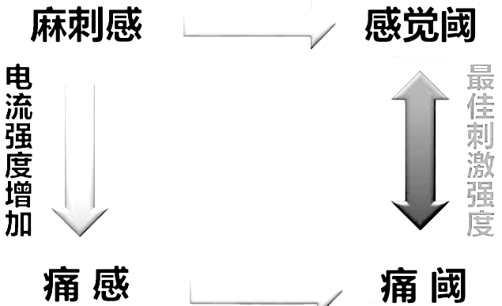
        - **刺激参数**
            - **波型**
                - **连续波** 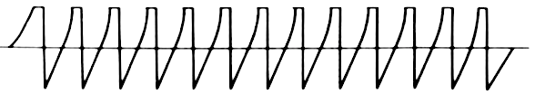
                    - 基本脉冲波简单重复
                    - 每分钟几十次至每秒钟几百次不等
                        - **疏波：**
                        - **密波：**
                - **疏密波** 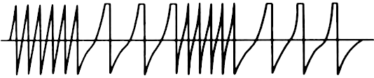
                    - 疏波、密波交替出现
                    - 疏、密波交替持续的时间各约1.5秒
                    - 克服单一波型易产生耐受现象的缺点
                    - 刺激作用较大
                - **断续波** 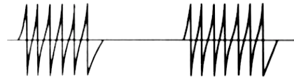
                    - 节律性时断时续
                        - **断时：**
                        - **续时：**
                    - 不易使机体产生耐受
            - **波幅**
                - 脉冲电压或电流的最大值与最小值之差
                - 与刺激强度成正比
                - 计量单位伏特（V）
            - **波宽**
                - 脉冲的持续时间
                - 与刺激强度成正比
                - 临床一般为0.4毫秒左右
            - **频率**
                - 每秒钟内出现的脉冲个数
                - 单位赫兹（Hz）
                - 不同频率的刺激促进不同中枢神经递质的释放
                - > 脑啡肽、内啡肽、强啡肽
                    - 2Hz——脑啡肽、内啡肽
                    - 100Hz——强啡肽
                    - 2/100Hz——内啡肽、强啡肽
        - **适应范围**
            - **作用**
                - 止痛、镇静、改善血液循环、调整肌张力等
            - **适用范围**
            - > 基本和毫针刺法相同
                - 痛证、痹证
                - 心、胃、肠、胆、膀胱、子宫等器官的功能失调
                - 癫狂、肌肉、韧带、关节的损伤性疾病
                - 针刺麻醉
        - **注意事项**
            - 电针仪在首次使用前应仔细阋读产品使用说明书
                - 掌握电针仪的性能、参数、使用方法、注意事项及禁忌等内容
            - 使用电针仪前，需检查其性能是否正常
                - 如果电流输岀时断时续，需检查导线接触是否良好
                - 干电池使用一段时间后输出电流微弱，应及时更换
            - 毫针的针柄经过温针灸火烧之后，表面氧化不导电
                - 有的毫针针柄是用铝丝烧制而成的，并经氧化处理成金黄色，导电性差，均不宜使用
                - 若使用，输出导线应夹持针身
            - 电针仪最大输出电压在40V以上者，最大输出电流应限制在1mA以内，以防止触电
            - 靠近延髓、脊髓等部位使用电针时
                - 电流量宜小并注意电流的回路不要横跨中枢神经系统，不可过强刺激
                - 禁止电流回路通过心脏，例如左右上肢的两个穴位不可连接于同一对电极
            - 电针刺激量较大，要防止晕针
                - 体质虚弱、精神紧张者，尤应注意电流不宜过大
            - 调节电流时，不可突然増强
                - 防止引起肌肉强烈收缩，造成弯针或折针
            - 要注意“电针耐受”现象的发生
                - 电针耐受：长期多次应用电针，使机体对电针刺激产生耐受，从而降低电针疗效的现象
            - 心脏附近、安装心脏起搏器者、颈动脉窦附近禁用电针
    - 穴位注射法
        - **概念**
            - **水针** **中西医理论**
                - **针刺** **药物** **双重刺激**
                - **特点**
                    - 操作简便
                    - 用药量小
                    - 适应证广
                    - 作用迅速
        - **内容**
            - **操作方法**
                - **针具选择**
                    - **一次性注射器**
                    - > 使用药物剂量大小、针刺深浅
                        - **一般：**
                        - **肌肉肥厚部位**
                    - **针头：**
                - **选穴处方**
                    - **根据针灸治疗的选穴原则**
                    - > 以精为要，一般2～4穴/次
                    - **阳性反应点**
                    - > 效果更好
                        - 背俞穴、募穴和四肢部特定穴——条索、结节、压痛
                        - 皮肤凹陷、隆起、色泽变异
                        - 软组织损伤——最明显的压痛点
                - **药物剂量**
                    - 取决于药物种类、浓度、注射部位
                    - 药物说明书规定的肌肉注射剂量
                    - > 可以少用，不得过量
                        - 5%～10%葡萄糖
                        - > 1～2ml/次
                        - 刺激性较大的药物（乙醇）、特异性药物（激素、阿托品等）
                        - > 小剂量注射，每次用量多为常规的 1/10～1/3
                    - 中药注射液：0.5～2ml
                        - 耳穴：0.1ml/穴
                        - 头面部：0.3～0.5ml/穴
                        - 四肢部：1～2ml/穴
                        - 胸背部：0.5～1ml/穴
                        - 腰臀部：2～5ml/穴
                - **操作程序**
                    - 选择注射器、针头
                    - > 所选穴位、用药剂量
                    - →局部皮肤常规消毒
                    - →快速将注射针头刺入腧穴/阳性反应点
                    - →慢慢推进/上下提插
                    - →针下得气
                    - →回抽，若无回血，即可将药液注入
                - **治疗周期**
                    - 急症患者：1～2次/日
                    - 慢性病患者：每日/隔日1次，6～10次为1疗程
                    - 同一穴位两次注射宜间隔1～3天
                    - 每个疗程间可休息3～5天
            - **适应范围**
                - 适用范围广泛
                - 针灸疗法的适应证大部分可用本法治疗
            - **常用药物**
                - **中药注射剂**
                    - 复方当归注射液
                    - 丹参注射液
                    - 川芎嗪注射液
                    - 银黄注射液
                    - 柴胡注射液
                - **西药注射剂**
                    - 维生素B1、维生素B6、维生素B12 等维生素类制剂
                    - 5%～10%葡萄糖、生理盐水、注射用水
                    - 三磷酸腺苷、辅酶A、神经生长因子、胎盘组织液
                    - 硫酸阿托品、山莨菪碱、加兰他敏、强的松龙、盐酸普鲁卡因、利多卡因、氮丙嗪等
            - **注意事项**
                - **治疗前应对患者说明治疗的特点和可能出现的反应**
                    - 注射后局部可能有酸胀感，4～8小时内局部有轻度不适
                    - > 有时持续时间较长，但一般不超过2日
                - **注意药物的性能、药理作用、剂量、配伍禁忌等并检查药物的有效期、药液有无沉淀变质等情况**
                    - 凡能引起过敏反应的药物，均应在药敏试验结束并合格的前提下，方可使用
                    - 副作用较强的药物，亦当慎用
                - **初次治疗及小儿、老人、体弱、敏感者，药液剂量应酌减**
                    - 体质过分虚弱、有晕针史的患者不宜采用本法
                - **严格消毒，防止感染**
                    - 注射后局部红肿、发热等，应及时处理
                - **禁止将药物注射入血管内，一般也不宜注射入关节腔或脊髓腔，以免产生不良后果；避开神经干，以免损伤神经**
                - **回抽针芯见血或积液**
                    - 立即出针，用无菌棉签或干棉球按压针孔0.5～2分钟，更换注射器和药液后重新注射
                - **耳周穴位注射**
                    - 选用易于吸收、无刺激性的药物
                    - 注射深度以皮下为宜，不可过深
    - 穴位埋线法
        - **概念**
            - 指将可吸收性外科缝线置入穴位内，利用线对穴位产生的持续刺激作用防治疾病的方法
            - **特点**
                - 操作简便
                - 作用持久
                - 适应证广
            - **应用：临床各科病证**
        - **内容**
            - **操作方法**
                - **埋线用品**
                    - 皮肤消毒用品、洞巾、注射器、止血钳、镊子
                    - **套管针**
                    - > **套管针：**
                    - 皮肤缝合针、2%利多卡因、手术剪刀、无菌纱布及敷料等
                - **埋线方法**
                    - **套管针埋线法**
                        - 局部皮肤消毒
                        - →可吸收性外科缝线，放入套管针的前端，后接针芯
                        - > 适当长度、已消毒
                        - →一手拇指和食指固定穴位，另一手持针刺入穴位
                        - →达到所需的深度，施以适当的提插捻转手法
                        - →出现针感
                        - →边推针芯边退针管，将线埋置在位的肌层或皮下组织内
                        - →拔针后用无菌干棉球按压针孔片刻
                    - **埋线针埋线法**
                        - 局部皮肤消毒
                        - →利多卡因（局部浸润麻醉）
                        - →一手镊取1cm左右已消毒的可吸收性外科缝线，将线中央置于麻醉点上；另一手持埋线针，缺口向下压线，以 15°~45°角刺入皮下，将线推入
                        - > 也可将线套在埋线针尖后的缺口上→两端用止血钳夹住→一手持针，另ー手持钳→切ロ向下，以 15°~ 45°角将针刺入皮下
                        - →缝线完全被置入皮下
                        - →适当进针0.5cm
                        - →退针
                        - →无菌干棉球按压针孔片刻
                        - →无菌敷料包扎，保护创口3～5天
                    - **医用缝合针埋线法**
                        - 穴位两侧1～2cm处，用碘伏作进针点标记
                        - →皮肤消毒并做局部麻醉
                        - →用持针器夹住带有可吸收性外科缝线的皮肤缝合针
                        - →从一侧局麻点刺入，穿过穴位皮下组织或肌层，从对侧局麻点穿出
                        - →捏起两针孔之间的皮肤并紧贴皮肤剪断两端线头
                        - →放松皮肤，轻揉局部，使线头完全进入皮下
                        - →无菌干棉球按压针孔片刻
                        - →无菌敷料包扎，保护创口3～5天
                - **选穴与疗程**
                    - 一般：根据针灸治疗的处方原则辨证选穴
                        - 取穴宜少而精，每次埋线1～3穴为宜
                        - 多取背、腰及腹等肌肉比较丰厚部位的穴位
                    - 在同一穴位做多次治疗时应偏离前次治疗部位
                    - 每2～4周埋线1次，3～5次为1个疗程
                - **术后反应及处理**
                    - **正常反应**
                        - 无菌性炎症反应，一般无需处理
                        - 少数反应较重的病例，埋线处有少量渗出液，亦属正常，可不做处理
                        - > 若渗液较多，可用75%乙醇棉球擦拭，覆盖无菌纱布
                        - 少数患者可于埋线后4～24小时内体温轻度上升（38°C 左右），但无感染征象，一般无需处理，持续2～4日后可恢复正常
                    - **异常反应**
                        - 治疗时无菌操作不严，或治疗后伤口保护不好，易致感染
                            - 一般在治疗后3～4日出现埋线局部红肿、疼痛加剧，并可伴有发热
                            - 应予局部热敷或抗感染处理
            - **适应范围**
            - > 慢性病证
                - 哮喘
                - 萎缩性胃炎、腹泻、便秘
                - 面神经麻痹、腰腿痛、颈椎病
                - 单纯性肥胖症、眩晕、癫痫
                - 阳痿、月经不调、小儿遗尿
                - 神经性皮炎、视神经萎缩等
            - **注意事项**
                - 操作过程中应保持无菌操作，埋线后创面应保持干燥、清洁，防止感染
                - 埋线宜埋在皮下组织与肌肉之间，不能埋在脂肪层或过浅
                    - 肌肉丰满的部位可埋入肌层，以防不易吸收、溢出或感染
                    - 避免伤及内脏、大血管和神经干
                    - 不应埋入关节腔内
                    - 埋线后线头不可暴露在皮肤外面
                - **肺结核活动期** **骨结核** **严重心脏病** **妊娠期**
                - 外科缝线用剩后，可浸泡在75%乙醇中，或用苯扎溴铵处理，临用时再用生理盐水浸泡
                - 埋线后应定期随访，注意术后反应，有异常现象时应及时处理
    - 穴位贴敷法
        - **概念**
            - 在穴位上贴敷药物，通过药物和腧穴的共同作用以防治疾病的方法
            - **天灸** **自灸** **发疱疗法**
        - **内容**
            - **贴敷药物**
                - **药物选择**
                    - **通经走窜、开窍活络之品**
                    - > 引领诸药开结行滞，直达病所，祛邪外出
                        - 冰片、麝香、丁香、花椒、白芥子、乳香、没药、姜、葱、蒜等
                    - **气味醇厚、力猛有毒之品**
                        - 生南星、生半夏、生川乌、生草鸟、巴豆、斑蝥、蓖麻子、大戟等
                    - **适当溶剂——调和药性/熬膏使用**
                        - 水、白酒/黄酒、醋、姜汁、蜂蜜、蛋清、凡士林等
                        - 针对病情，选用药物的浸剂作溶剂
                - **药物剂型**
                - > 病情、药物性能
                    - 膏剂、散剂、糊剂、泥剂、膜剂、饼剂、熨贴剂等
                    - > 膏剂：软膏剂、硬膏剂
            - **操作方法**
                - **选穴处方**
                    - 辨证选穴为主
                    - > 少而精
                    - 病变局部、阿是穴、经验穴
                    - 吴茱萸——涌泉——小儿流涎
                - **贴敷方法**
                    - **贴法**
                        - 已制备好的药物→直接贴压于穴位上→外敷医用胶布固定
                        - > 或先将药物置于医用胶布粘面正中→对准穴位粘贴
                        - 硬膏剂：直接/温化→将其中心对准穴位贴牢
                    - **敷法**
                        - 已制备好的药物
                        - →直接涂搽于穴位上
                        - →外覆医用防渗水敷料
                        - →以医用胶布固定
                    - **填法**
                        - 将药膏或药粉填于脐中→外覆纱布→以医用胶布固定
                    - **熨贴法**
                        - 将熨贴剂加热→趁热外敷于穴位
                        - > 或先将熨贴剂贴敷于穴位上→以艾火或其他热源温熨药物
                        - →贴敷穴位皮肤出现色素沉着、潮红、微痒、烧灼感、疼痛、轻微红肿、轻度水疱
                        - > 属于正常反应
                - **换药**
                    - **一般情况**
                        - 每隔1～3天换药1次
                        - > 可适当延长到5～7天
                        - 不需溶剂调和的药物
                        - 换药重新贴敷时，可用无菌干棉球或棉签蘸温水、植物油或石蜡油清洁皮肤上的药物，擦干后即可再贴敷
                    - **贴敷部位已起水疱或破溃者，应待皮肤愈后再贴敷**
                        - **小水疱：**
                        - **大水疱：**
                        - **破溃的水疱：**
            - **适用范围**
                - 广泛，主要慢性病，也可治疗某些急性病
                    - 哮喘、咳嗽、腹痛、面瘫、便秘
                    - 小儿咳嗽、小儿哮喘、小儿泄泻
                    - 腰腿痛、乳癖、鼻渊、口疮
                    - 遗精、阳痿、经行腹痛、月经不调、蛇串疮等
                - 治未病
            - **注意事项**
                - 久病、体弱、消瘦、有严重心肝肾功能障碍者、孕妇、幼儿慎用毒性药物
                - **糖尿病**
                - **膏剂** **45℃**
                - 贴敷药物后注意局部防水和观察贴敷皮肤反应
                    - 出现范围较大、程度较重的皮肤红斑、水疱、瘙痒现象→立即停药，对症处理
                    - 出现全身性皮肤过敏症状者→及时到医院就诊
                - 残留在皮肤上的药膏，不宜用刺激性物质擦洗
                - 对胶布过敏者→改用无纺布制品固定贴敷药物
    - 头针法
        - **概念**
            - 头针法又称头皮针法，是指采用毫针或其他针具刺激头部特定部位，以防治疾病的方法
        - **头针穴位的定位与主治**
            - **额中线MS1**
                - **定位：**
                - **主治：**
                - **操作：**
            - **额旁1线MS2**
                - **定位：**
                - **主治：**
                - **操作：**
            - **额旁2线MS3**
                - **定位：**
                - **主治：**
                - **操作：**
            - **额旁3线MS4**
                - **定位：**
                - **主治：**
                - **操作：**
            - **顶中线MS5**
                - **定位：**
                - **主治：**
                - **操作：**
            - **顶颞前斜线MS6**
                - **定位：**
                - **主治：**
                    - **上 1/5：**
                    - **中2/5：**
                    - **下2/5：**
                - **操作：**
            - **顶颞后斜线MS7**
                - **定位：**
                - **主治：**
                    - **上1/5：**
                    - **中2/5：**
                    - **下 2/5：**
                - **操作：**
            - **顶旁1线MS8**
                - **定位：**
                - **主治：**
                - **操作：**
            - **顶旁2线MS9**
                - **定位：**
                - **主治：**
                - **操作：**
            - **颞前线MS10**
                - **定位：**
                - **主治：**
                - **操作：**
            - **颞后线MS11**
                - **定位：**
                - **主治：**
                - **操作：**
            - **枕上正中线MS12**
                - **定位：**
                - **主治：**
                - **操作：**
            - **枕上旁线MS13**
                - **定位：**
                - **主治：**
                - **操作：**
            - **枕下旁线MS14**
                - **定位：**
                - **主治：**
                - **操作：**
        - **适应范围**
            - 中枢神经系统疾患
            - 精神病证
            - 疼痛和感觉异常
            - 皮质内脏功能失调
        - **操作方法**
            - 施术前准备
            - 施术方法
                - 进针
                - 行针：捻转、提插
                - 留针
                - 出针
        - **注意事项**
            - 严格消毒
            - 中风患者急性期不宜选用
            - 患有严重疾病者禁用
            - 头部损伤、小儿囟门未合者禁用
            - 注意出血
            - 可配合电针、艾灸、按压
    - 耳针法
        - **概念**
            - 采用针刺或其他方法刺激耳穴，以防治诊断疾病的一类方法
            - 耳针法治疗范围较广，操作方便，对疾病诊断也有一定的参考价值
        - **耳与经络脏腑的关系**
            - **耳与经络的联系**
                - 手太阳、手足少阳、手阳明等经脉、经别入耳中，足阳明、足太阳的经脉则分别上耳前、至耳上角
                - 六阴经虽不直接入耳，但都通过经别与阳经相合，而与耳相联系
                - 体十二经脉都直接或间接上达于耳
                - 奇经八脉中阴跷、阳跷脉并入耳后，阳维脉循头入耳
            - **耳与脏腑的联系**
            - > *《灵枢·脉度》：“肾气通于耳，肾和则耳能闻五音矣。” ​《难经·四十难》：“肺主声，故令耳闻声。”*
                - 耳与脏腑的生理功能、病理变化也密切相关
                - **压痛敏感、变形、变色** **皮肤电阻特异性改变**
        - **耳郭表面解剖**
        - > 耳郭可分为耳郭正面、耳郭背面和耳根3部分 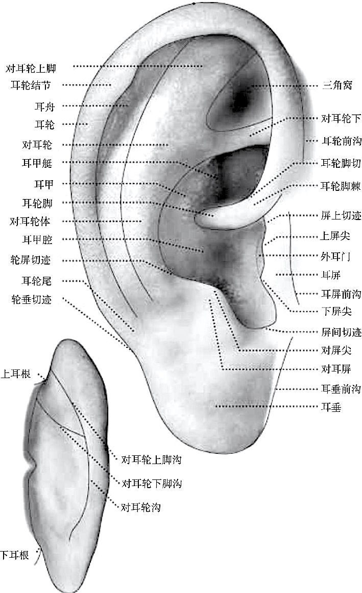
        - **耳穴的分布**
            - 耳穴在耳郭分布如一个倒置在子宫内的胎儿 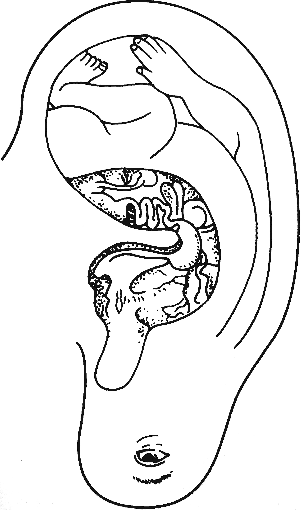
            - 与面颊相应的穴位在耳垂
            - 与上肢相应的穴位在耳舟
            - 与躯干和下肢相应的穴位在对耳轮体部和对耳轮上、下脚
            - 与内脏相应的穴位集中在耳甲
                - 其中与消化道相应的耳穴弧形排列在耳轮脚周围
        - **耳穴的部位和主治**
            - **耳轮穴位**
                - **耳轮分为12个区**
                    - 耳轮脚为耳轮1区
                    - 耳轮脚切迹到对耳轮下脚上缘之间的耳轮分为3等分，自下而上依次为耳轮2、3、4区
                    - 对耳轮下脚上缘到对耳轮上脚前缘之间的耳轮为耳轮5区
                    - 对耳轮上脚前缘到耳尖之间的耳轮为耳轮6区
                    - 耳尖到耳轮结节上缘为耳轮7区
                    - 耳轮结节上缘到耳轮结节下缘为耳轮8区
                    - 耳轮结节下缘到轮垂切迹之间的耳轮分为4等分，自上而下依次为耳轮9、10、11、12区
                - **耳轮重点穴位名称、部位及主治** 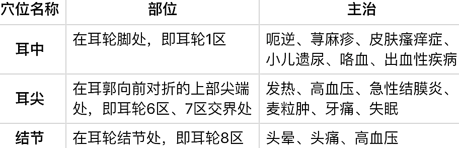
            - **耳舟穴位**
                - **耳舟分为6个区**
                    - 将耳舟分为6等分，自上而下依次为耳舟1区、2区、3区、4区、5区、6区
                - **耳舟重点穴位名称、部位及主治** 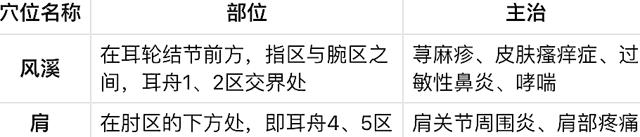
            - **对耳轮穴位**
                - **对耳轮分为13个区**
                    - 对耳轮上脚分为上、中、下3等分
                        - 下1/3为对耳轮5区
                        - 中1/3为对耳轮4区
                        - 上1/3又分为上、下2等分
                            - 下1/2为对耳轮3区
                            - 再将上1/2分为前后2等分
                                - 后1/2为对耳轮2区
                                - 前1/2为对耳轮1区
                - **对耳轮重点穴位名称、部位及主治** 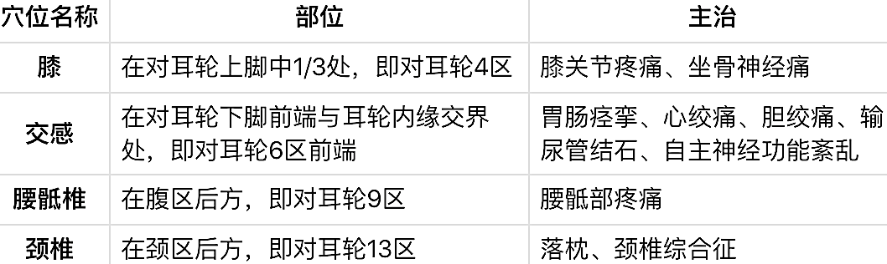
            - **三角窝穴位**
                - **三角窝分为5个区**
                    - 将三角窝由耳轮内缘至对耳轮上、下脚分叉处分为前、中、后3等分
                        - 中1/3为三角窝3 区
                        - 再将前1/3分为上、中、下3等分
                            - 上1/3为三角窝1区
                            - 中、下2/3为三角窝2区
                            - 再将后1/3分为上、下2 等分
                                - 上1/2为三角窝4区
                                - 下1/2为三角窝5区
                - **三角窝重点穴位名称、部位及主治** 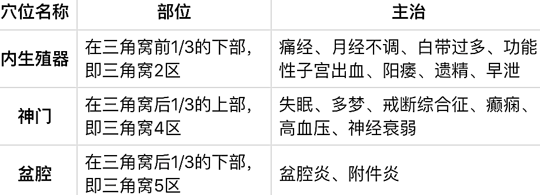
            - **耳屏穴位**
                - **耳屏分为4个区**
                    - 耳屏外侧面分为上、下2等分
                        - 上部为耳屏1区
                        - 下部为耳屏2区
                    - 将耳屏内侧面分为上、下2等分
                        - 上部为耳屏3区
                        - 下部为耳屏4区
                - **耳屏重点穴位名称、部位及主治** 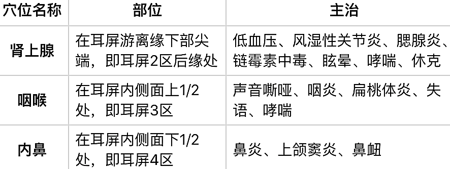
            - **对耳屏穴位**
                - **对耳屏分为4个区**
                    - 由对屏尖及对屏尖至轮屏切迹连线之中点，分别向耳垂上线作两条垂线
                    - 将对耳屏外侧面及其后部分成前、中、后3区
                        - 前为对耳屏1区
                        - 中为对耳屏2区
                        - 后为对耳屏3区
                    - 对耳屏内侧面为对耳屏4区
                - **对耳屏重点穴位名称、部位及主治** 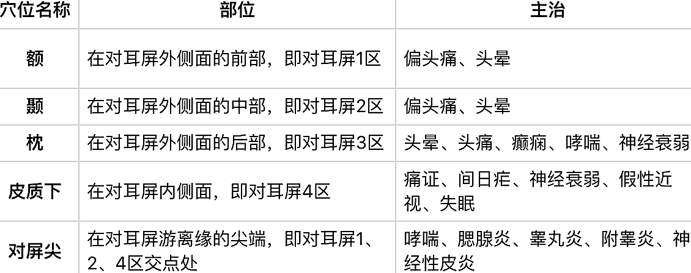
            - **耳甲穴位**
                - **将耳甲用标志点、线分为18个区** 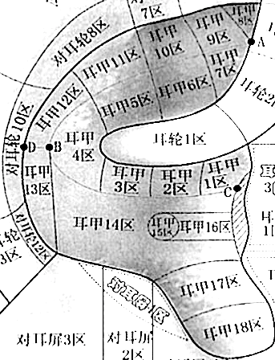
                    - 在耳轮的内缘上设耳轮脚切迹至对耳轮下脚间中、上1/3交界处为A点
                    - 在耳甲内，由耳轮脚消失处向后作一水平线与对耳轮耳甲缘相交，设交点为D点
                    - 设耳轮脚消失处至D点连线的中、后1/3交界处为B点
                    - 设外耳道口后缘上1/4与下3/4 交界处为C点
                    - 从A点向B点作一条与对耳轮耳甲艇缘弧度大体相仿的曲线
                    - 从B点向C点作一条与耳轮脚下缘弧度大体相仿的曲线
                - **重点穴位名称、部位及主治** 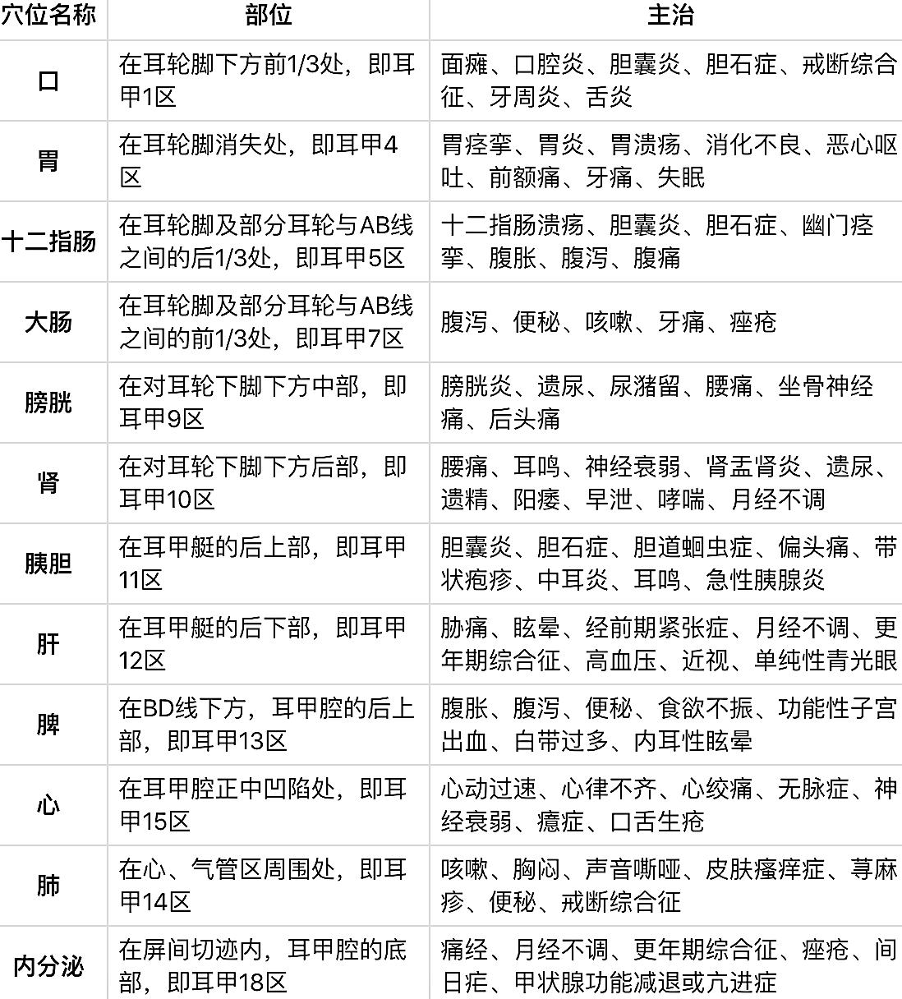
            - **耳垂穴位**
                - **耳垂分为9个区**
                    - 在耳垂上线（经屏间切迹与轮垂切迹所作的直线）至耳垂下缘最低点之间作两条等距离平行线，于上平行线上引两条垂直等分线，将耳垂分为9个区 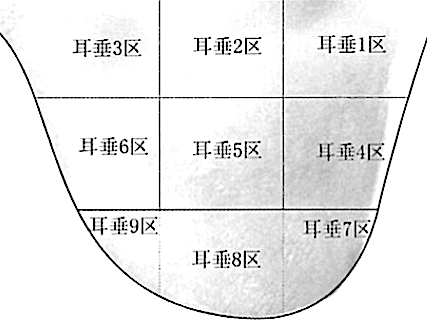
                        - 上部由前到后依次为耳垂1区、2区、3区
                        - 中部由前到后依次为耳垂4区、5区、6区
                        - 下部由前到后依次为耳垂7区、8区、9区
                - **耳垂重点穴位名称、部位及主治** 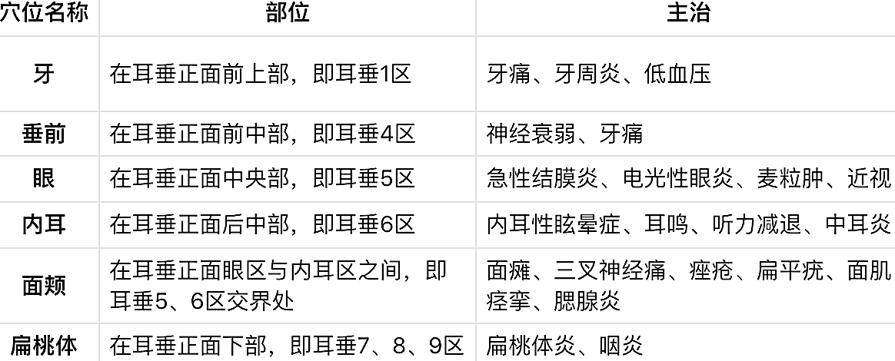
            - **耳背穴位**
                - **耳背分为5个区**
                    - 分别过对耳轮上、下脚分叉处耳背对应点和轮屏切迹耳背对应点作两条水平线，将耳背分为上、中下3部
                        - 上部为耳背1区
                        - 下部为耳背5区
                        - 再将中部分为内、中、外3等分
                            - 内1/3为耳背2区
                            - 中1/3为耳背3区
                            - 外1/3 为耳背4区
                - **耳背重点穴位名称、部位及主治** 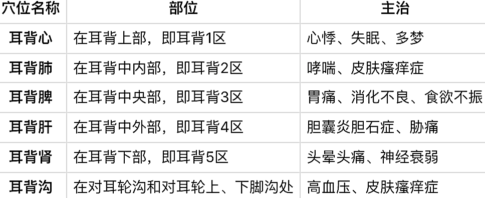
            - **耳根重点穴位名称、部位及主治** 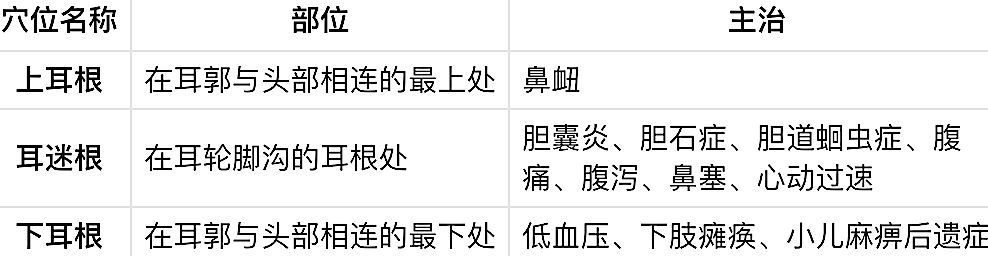
        - **耳针法的临床应用**
            - **耳穴的诊查**
                - 疾病发生时往往会在耳郭的相应区域出现不同的病理反应（阳性反应）
                - > 皮肤色泽、形态改变，局部压痛明显，耳穴电阻下降等
                - 对这些病理反应点进行诊查，既可以结合临床症状辅助诊断，又可以为拟定耳穴处方提供依据
                - **常用的耳穴诊查方法**
                    - 望诊法
                    - 压痛法
                    - 皮肤电阻测定法
            - **适应范围**
                - 疼痛性疾病
                - 炎性疾病及传染病
                - 功能紊乱性疾病
                - 过敏及变态反应性疾病
                - 内分泌代谢紊乱性疾病
                - 其他
            - **选穴原则**
                - 按相应部位选穴
                - 按脏腑辨证选穴
                - 按经络辨证选穴
                - 按西医理论选穴
                - 按临床经验选穴
            - **操作方法**
                - 耳穴毫针法
                - 耳穴电针法
                - 耳穴埋针法
                - 耳穴压丸法
                - 耳穴刺血法
                - 耳穴穴位注射法
            - **注意事项**
            - > 除遵循针灸施术的注意事项外，运用耳针法还应注意：
                - 针刺后如果针孔发红、肿胀，应及时涂碘伏消毒，防止化脓性软骨膜炎的发生
                - 湿热天气，埋针留置时间不宜过长，以1～3日为宜，对普通胶布过敏者宜改用脱敏胶布
                - 耳穴刺血施术时，医者应避免接触患者血液
                - 对扭伤运动障碍患者，进针后嘱其适当活动患部有助提高疗效
- **第六章 针灸治疗总论**
    - 针灸治疗作用
        - **疏通经络**
            - 针灸具有祛除经络瘀阻而使其恢复通畅的作用
            - 最基本、最直接的治疗作用
        - **调和阴阳**
            - 针灸具有使患者机体从阴阳失衡状态向平衡状态转化的作用
            - 最终要达到的根本目的
                - 经络阴阳属性、腧穴配伍、针刺手法→调和阴阳
                - **阳气盛失眠/阴气盛多寐**
                    - 阳跷、阴跷主眼睑开合——取照海（与阴跷相通）、申脉（与阳跷相通）→调和阴阳
                    - **失眠**
                    - **多寐**
        - **扶正祛邪**
            - 针灸具有扶助机体正气及祛除病邪的作用
            - 补虚泻实→扶正祛邪
        - **三者关系**
            - **疏通经络**
            - **扶正祛邪** **作用过程**
            - **目的** **阴阳平衡**
    - 针灸治疗原则
        - **治神守气**
            - **概述**
                - 是充分调动医者、患者双方积极性的关键措施
                    - **医者：**
                    - **患者：**
            - **作用**
                - 更好地发挥针灸疗法的作用，提高治疗效果
                - 防止针灸意外事故的发生
            - **治神**
                - **神**
                - **治神贯穿于针灸治病的全过程**
                    - 针灸操作过程中
                        - **医者**
                        - **患者**
                    - 施治前后：注重调治患者的精神状态
            - **守气**
                - **气**
                - > **得气、气行、气至病所**
                - **医者——治神守气**
                - > 决定性
                    - 诱发经气
                    - 加速气至
                    - 促进气行
                    - 气至病所
                - **患者——意守感传**
                    - 为守气打下良好的基础
                    - 在医者进针、行针过程中配合做呼吸运动
        - **补虚泻实**
            - **补法**
                - **“虚则补之”**
                    - **虚：正气虚**
                    - **补之**
                        - 腧穴的选择
                        - > 背俞穴、偏补腧穴
                        - 针刺方法
                        - > 补泻手法中的补法
                - **“陷下则灸之”**
                    - 陷下：气虚下陷
                    - 灸法：艾灸
            - **泻法**
                - **“盛则泻之”**
                    - **实：邪气盛**
                    - **泻之**
                        - 腧穴的选择
                        - > 偏泻的腧穴
                        - 针刺方法
                        - > 补泻手法中的泻法
                - **“菀陈则除之”**
                    - 菀：同瘀，瘀结、瘀滞
                    - 陈：陈旧，引申为时间长久
                    - 除之：清除，清除瘀血的刺血疗法
            - **“不盛不虚，以经取之”——平补平泻**
                - **不盛不虚**
                    - 脏腑、经络的虚实表现不甚明显
                    - > 并非病证本身无虚实可言
                        - 由于病变脏腑、经脉本身的病变
                        - 不涉及其他脏腑、经脉
                        - 属本经自病
                - **以经取之**
                    - 按本经循经取穴，采用平补平泻的针刺手法
        - **清热温寒**
            - **清热**
            - > “热则疾之”
                - **热：**
                - **疾之：**
            - **温寒**
            - > “寒则留之”
                - **寒：**
                - **留之：**
        - **治病求本**
            - **急则治标**
            - > 当标病处于紧急的情况下首先要治疗标病
            - **缓则治本**
            - > **根本原因**
            - **标本同治**
            - > 在标病和本病并重的情况下，应当采取标本同治的方法
        - **三因制宜**
            - **因时制宜**
            - > 季节气候、时辰因素
            - **因地制宜**
            - > 地理环境、气候条件→人体的生理、病理→治疗应有差异
            - **因人制宜**
            - > 患者性别、年龄、体质等→制订适宜的治疗方法
    - 针灸临床诊治特点
        - **辨证与辨经结合**
            - **辨证**
            - > 针灸临床辨证论治的核心
                - 运用中医理论，将四诊所搜集到的有关疾病的各种症状和体征，加以分析、综合，判断为某种性质的“证候”，亦即“证”
            - **辨经**
            - > 针灸临床辨证论治的核心
                - 运用经络理论，根据患者的各种症状和体征辨别其病变经络脏腑归属，从而选择相应的经络腧穴进行治疗
            - **临床应用**
                - 辨证与辨经不矛盾
                - 辨证本身就涵盖了经络辨证
                    - 明确辨证
                    - →辨证归经
                    - > 结合经络的循行部位、所联系的脏腑
                    - →配穴处方，依方施术
                    - > 根据辨证与辨经的结果
                - 不同的疾病→分别→辨证为主/辨经为主
                - > 内脏疾病、运动系统病患
        - **辨证与辨病结合**
            - **辨病**
                - 指西医学对疾病的诊断及其相应鉴别诊断，其为西医临诊的核心
                - 辨证、辨经→辨病
                - **作用**
                    - 有利于选择更适宜的治疗方案
                    - 有助于判断治疗效果和预后
            - **临床应用（例：腰痛）**
            - > 神经系统、运动系统疾病、内脏病变
                - 中医辨证
                - > 大原则
                - →不同疾病引发腰痛
                    - 温阳散寒/活血化瘀/补肾强腰
                    - 加减不同穴位，施以不同的操作方法，其他针灸疗法
                    - 结合必要的现代医学治疗手段
        - **调神与调气并重**
            - **调神（治神、守神）**
            - > *《素问·宝命全形论篇》：“凡刺之真，必先治神。”*
                - **施治前**
                - **操作过程中**
                - ***贯穿于针灸治病的全过程***
            - **调气**
            - > *《灵枢·刺节真邪》：“用针之类在于调气。” ​《灵枢·终始》：“凡刺之道气调而止。补阴泻阳，音气益彰，耳目聪明，反此者，血气不行。”*
                - **经气调和**
                    - 各种刺灸方法
                    - →刺激一定的腧穴
                    - →激发经气、疏通全身气血
                    - →使偏盛偏衰的脏腑功能趋于平衡
            - **调气和调神密不可分、相互促进**
            - > *《素问·针解篇》：“制其神，令气易行。”*
                - **气的活动以神为主导，神动则气行**
                    - **医者、患者**
                - **调气是调神的重要环节或具体手段**
                    - 调气→“神守志一”→改善患者的功能状态
                - 调神和调气是针灸作用的关键，也是有别于中医其他学科的诊治特色，针灸的治疗作用都是建立在调神调气基础上的
    - 针灸治病特点
        - **激发正气，自身调节**
        - > **特点：双向、良性、整体性调节**
            - 针灸治病：刺激腧穴、疏通经络
            - →调节机体阴阳气血、脏腑功能、筋肉活动
            - →治疗疾病
        - **起效快捷，适应证广**
            - *《灵枢·九针十二原》：“效之信，若风之吹云，明乎若见苍天。”*
            - *“夫善用针者，取其疾也，犹拔刺也，犹雪污也，犹解结也，犹决闭也。”*
        - **无毒性，作用安全**
            - 激发机体自身的调节机能→促进机体释放一些内源性物质→防治疾病
            - 不产生毒性损害——“绿色疗法”
    - 针灸处方
        - **腧穴的选择**
            - **选穴原则**
                - **近部选穴**
                - > 病变局部/临近的范围内
                - **远部选穴**
                - > 病变部位所属和相关的经络上，距病位较远的部位
                - **辨证选穴**
                - > 根据疾病的证候特点，分析病因病机→辨证选取穴位
                - **对症选穴**
                - > 根据疾病的特殊或主要症状
            - **配穴方法**
                - **按部位配穴法**
                - > 结合腧穴分布部位进行穴位配伍
                    - **上下配穴法**
                        - 腰部以上/上肢腧穴&amp;腰部以下/下肢腧穴
                    - **前后配穴法**
                        - 人体前部&amp;后部的腧穴
                        - **胸腹部** **背腰部**
                    - **左右配穴法**
                        - 人体左侧&amp;右侧的腧穴
                - **按经脉配穴法**
                - > 以经脉或经脉相互联系为基础而进行穴位配伍
                    - **本经配穴法**
                        - 病变脏腑、经脉的腧穴
                    - **表里经配穴法**
                        - 脏腑、经脉的阴阳表里配合关系为依据
                    - **同名经配穴法**
                        - 手足同名经的腧穴相互组合
        - **刺灸法的选择**
            - 治疗方法的选择
            - 操作方法的选择
            - 治疗时机的选择
    - 特定穴的临床应用
        - **五输穴**
            - **按五输穴主病特点选用**
                - *《难经·六十八难》：“井主心下满，荥主身热，输主体重节痛，经主喘咳寒热，合主逆气而泄。”*
                - **现代临床应用**
                    - 井穴——急救
                    - 荥穴——热证
                    - 输穴——脏病
                    - 经穴——经脉循部位痛证
                    - 合穴——腑病
            - **按五行生克关系选用**
                - **按五行相生顺序排列**
                - > 《难经》：“阳井金，阴井木。” 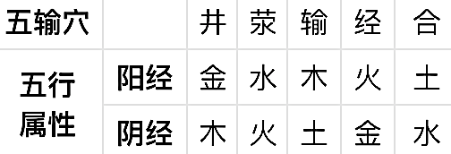
                - **临床运用：“实则泻其子，虚则补其母”**
                    - **本经子母补泻法**
                    - > 肺泻尺泽补太渊
                        - 太渊（土）——肺（金）——尺泽（水）
                        - > （土生金）———————————（金生水）
                        - 解溪（火）——胃（土）——厉兑（金）
                        - > （火生土）———————————（土生金）
                    - **子母经子母补泻法**
                    - > 实则泻子本，虚则补母本
                        - 脾经太白——肺（金）——肾经阴谷
                        - > （土穴）———————————（水穴）
                        - 小肠经阳溪——胃（土）——大肠经商阳
                        - > （火穴）——————————————（金穴）
                - **按时选用**
                    - *《难经·七十四难》：“春刺井，夏刺荥，季夏刺输，秋刺经，冬刺合。”*
                        - 春夏阳气在上——浅刺井荥
                        - 秋冬阳气在下——深刺经合
                    - **子午流注针法**
                        - 根据一日之中十二经脉气血盛衰开阖的时间不同，而选用不同的五输穴
        - **原穴、络穴**
            - **原穴**
                - 诊断疾病
                - > 脏腑发生疾病反应到原穴
                - 治疗疾病
                - > 治疗脏腑疾病
            - **络穴**
                - 治疗表里两经的疾病
            - **原络配穴法**
                - 先病脏腑的原穴&amp;后病的相表里经脉的络穴
        - **郄穴**
            - 本经和相应脏腑的急性病证
                - 阴经郄穴——急性出血性疾病
                - 阳经郄穴——疼痛性疾病
        - **背俞穴、募穴**
            - **治疗相应脏腑病证脏病**
                - 脏病（阴病）——背俞穴（阳部）
                - 腑病（阳病）——募穴（阴部）
            - **治疗与对应脏腑经络相联属的组织器官疾患**
            - **俞募配穴法**
            - > 将病变脏腑的俞、募穴配合运用，以发挥其协同作用。
        - **下合穴**
        - > 六腑疾病
        - **八会穴**
        - > 各自所会的脏、腑、气、血、筋、脉、骨、髓相关的病证
        - **八脉交会穴**
            - 正经疾病&amp;奇经的疾病
            - **上下配合使用**
                - **八脉交会八穴歌**
                    - 公孙冲脉胃心胸，内关阴维下总同。
                    - 临泣胆经连带脉，阳维目锐外关逢。
                    - 后溪督脉内眦颈，申脉阳跷络亦通。
                    - 列缺任脉行肺系，阴跷照海膈喉咙。
- **第七章 针灸治疗各论**
    - 内科病证
        - **中风**
            - **定义**
                - **突然晕倒、不省人事** **口角歪斜、语言不利、半身不遂**
            - **历史沿革**
                - **《内经》**
                    - 无中风病名
                    - 依据症状表现和发病阶段不同描述
                        - 卒中昏迷期间——仆击、大厥、薄厥
                        - 半身不遂者——偏枯、偏风、身偏不用、风痱
                    - 感受外邪，烦劳暴怒可诱发，与体质、饮食有关
                - **《金匮要略》**
                    - 首创“中风”之名
                    - 张仲景：“络脉空虚”
                    - 以邪中深浅、病情轻重而分
                        - 中经中络
                        - 中脏中腑
                - **唐宋以前**
                - > “外风”学说为主，多从“内虚邪中”立论
                - **唐宋以后（金元）**
                - > 突出以“内风”立论
                    - 张元素：“风本生于热，以热为本，以风为标。”
                    - 刘河间：“心火暴盛”
                    - 李东垣：“正气自虚”
                    - 朱丹溪：“湿痰生热”
                    - 元·王履：提出“真中”、“类中”病名
                - **明代**
                    - 张景岳：“非风”之说，“内伤积损”
                    - 李中梓：将中风中脏腑明确分为闭、脱二证
                - **清代**
                    - 叶天士：始明确以“内风”立论
                    - > 《临证指南医案》：“精血衰耗，水不涵木，木少滋荣，故肝阳偏亢，内风时起”
            - **病因病机**
                - **病因——风、火、痰、瘀**
                    - 饮食不节
                    - 五志过极
                    - 年老体衰
                - **病位**
                    - **脑**
                    - 涉及心、肝、脾肾
                - **基本病机**
                    - 脏腑阴阳失调，气血逆乱，上扰清窍，窍闭神匿，神不导气
            - **鉴别诊断**
                - **口僻（吊线风）**
                    - 口眼歪斜，常伴耳后疼痛，口角流涎，言语不清
                    - 无半身不遂、神志障碍
                    - 正气不足，风邪入脉络，气血痹阻所致
                    - 不同年龄均可罹患
                - **厥证**
                    - 突然昏仆、不省人事，神昏时间短暂，发作时常伴四肢逆冷
                    - 移时多可自行苏醒，醒后无半身不遂、口眼㖞斜、言语不利
                - **痉证**
                    - 四肢抽搐、项背强直，甚至角弓反张
                    - 可伴神昏（多在抽搐之后），抽搐时间长
                    - > 中风——多在起病时即有神昏，而后抽搐（时间短）
                    - 无半身不遂、口眼㖞斜
                - **中风&痿证**
                    - **痿证**
                        - 可有肢体瘫痪，活动无力
                        - **缓慢**
                        - 双下肢瘫痪/四肢瘫痪/肌肉萎缩、筋惕肉閏
                        - 无神昏表现
                    - **中风**
                        - 中风后半身不遂日久不能恢复者，可见肌肉瘦削，筋脉弛缓
                        - **急骤** **偏瘫**
                        - **神昏**
                - **中风&痫证**
                    - **痫症**
                        - 起病急骤，突然昏仆倒地
                            - 口中作声，如猪羊啼叫
                            - 四肢频抽，口吐白沫
                        - **阵发性**
                            - 移时可自行苏醒
                            - 醒后如常人，但可再发
                    - **中风**
                        - 仆地无声，无四肢抽搐/口吐涎沫
                        - 神昏症状严重（时间长）
                            - 难以自行苏醒（需及时治疗）
                            - 多伴半身不遂、口眼㖞斜
            - **辨证**
                - **中经络**
                - > **主症：**
                    - **肝阳暴亢证**
                    - > 面红目赤，眩晕头痛，口苦，舌红/绛，苔黄，脉弦有力
                    - **风痰阻络证**
                    - > 肢体麻木/手足拘急，头晕目眩，苔腻，脉弦滑
                    - **痰热腑实证**
                    - > 口黏痰多，腹胀便秘，舌红，苔黄腻或灰黑，脉弦滑大
                    - **气虚血瘀证**
                    - > 肢体软弱，偏身麻木，面色淡白，气短乏力，舌暗，苔白腻，脉细涩
                    - **阴虚风动证**
                    - > 肢体麻木，心烦失眠，眩晕耳鸣，舌红，苔少，脉细数
                - **中脏腑**
                - > **主症：**
                    - **闭证**
                    - > 神志迷蒙，牙关紧闭，两手握固，面赤气粗，喉中痰鸣，二便不通，脉弦滑而数
                    - **脱证**
                    - > 目合口张，手撒溺遗，鼻鼾息微，二便失禁，四肢逆冷，脉细弱
            - **治疗**
                - **基本治疗**
                    - **中经络**
                        - **治法**
                            - 调神导气，疏通经络
                            - 以督脉、手厥阴、足太阴经穴为主
                        - **主穴**
                            - **水沟、内关、三阴交、极泉、尺泽、委中**
                        - **配穴**
                            - **辨证**
                                - 肝阳暴亢——太冲、太溪
                                - 风痰阻络——丰隆、风池
                                - 痰热腑实——曲池、内庭、丰隆
                                - 气虚血瘀——足三里、气海
                                - 阴虚风动——太溪、风池
                            - **辨症**
                                - 口角歪斜——颊车、地仓
                                - 上肢不遂——肩髃、手三里、合谷
                                - 下肢不遂——环跳、阳陵泉、阴陵泉、风市、足三里、解溪
                                - 头晕——风池、完骨、天柱
                                - 足内翻——丘墟透照海
                                - 便秘——天枢、丰隆、支沟
                                - 复视——风池、天柱、睛明、球后
                                - 尿失禁、尿潴留——中极、曲骨、关元
                        - **操作**
                            - **水沟**
                            - > 雀啄法
                                - 以眼球湿润为佳
                            - **三阴交**
                            - > 提插补法
                                - 沿胫骨内侧缘与皮肤成45°角
                                - 使针尖刺到三阴交穴
                            - **极泉**
                            - > 提插泻法
                                - 在原穴位置下2寸心经上取穴
                                - 避开腋动脉
                                - 直刺进针
                                - 以患者上肢有麻胀和抽动感为度
                            - **尺泽、委中**
                            - > 提插泻法
                                - 直刺
                                - 使肢体有抽动感
                            - 可在患侧上、下肢各选2个穴位，采用电针治疗
                        - **方义**
                            - **水沟**
                            - **内关**
                            - **三阴交**
                            - **极泉、尺泽、委中**
                    - **中脏腑**
                        - **治法**
                            - 醒脑开窍，启闭固脱
                            - 以督脉穴和手厥阴经为主
                        - **主穴**
                            - 水沟、百会、内关
                        - **配穴**
                            - 闭证——十二井穴、合谷、太冲
                            - 脱证——关元、气海、神阙等
                            - 阴虚风动——太溪、风池
                        - **操作**
                            - **内关**
                            - > 泻法
                            - **水沟**
                            - > 强刺激，以眼球湿润为度
                            - **十二井穴**
                            - > 三棱针点刺出血
                            - **关元、气海**
                            - > 大艾炷灸
                            - **神阙**
                            - > 隔盐灸，不计壮数，以汗止、脉起、肢温为度
                        - **方义**
                            - **水沟、百会**
                            - **内关**
                - **其他治疗**
                    - **头针法**
                    - > 半身不遂早期
                        - 顶颞前斜线、顶旁1线及顶旁2线
                            - 1.5～2寸毫针
                            - →平刺入头皮下
                            - →快速捻转2～3min
                            - →留针30min
                            - > 留针期间反复行针
                        - 行针时和留针后嘱患者活动患侧肢体
                        - 留针时间可延长至数小时
                    - **穴位注射法**
                    - > 半身不遂
                        - 选上述四肢穴位2～4个
                        - →丹参注射液/复方当归注射液
                        - →1ml/穴，隔日1次
                    - **电针法**
                    - > 半身不遂
                        - 患侧上、下肢各选一组穴位
                        - →断续波/疏密波
                        - →以肌肉微颤为度，通电20～30min/次
        - **头痛**
            - **定义**
                - **患者自觉头部疼痛**
                - **外感风邪** **情志、饮食、体虚久病**
                - **四总穴歌**
                    - **古版**
                    - > 肚腹三里留，腰背委中求，头项寻列缺，面口合谷收
                    - **现代版**
                    - > 心胸取内关，小腹三阴谋，酸痛阿是穴，急救刺水沟
            - **历史沿革**
                - **首载于《内经》**
                - > 《素问·风论》——“首风”、“脑风”，“新沐中风，则为首风”，“风气循风府而上，则为脑风”
                    - 主要病因：外感、内伤
                    - 六经病变皆可导致头痛
                - **汉·张仲景《伤寒论》**
                - > 论述太阳、阳明、少阳、厥阴头痛的见症
                - **《东垣十书》**
                    - 外感头痛、内伤头痛
                    - 症状、病机不同：伤寒头痛、湿热头痛、偏头痛、真头痛、气虚头痛、血虚头痛、气血俱虚头痛、厥逆头痛等
                    - 补充：太阴头痛、少阴头痛
                - **《丹溪心法》**
                - > **引经药**
                - **清·王清任《医林改错》**
                - > 瘀血之说，血府逐瘀汤——治疗瘀血头痛
            - **病因病机**
                - **病因**
                    - 外感风邪
                    - 情志、饮食、体虚久病
                - **病位**
                    - **头**
                    - 与手/足三阳经、足厥阴肝经、督脉相关
                - **基本病机**
                    - 气血失和
                    - 经络不通
                    - 脑窍失养
            - **鉴别诊断**
                - **外感头痛&内伤头痛**
                    - **外感头痛**
                        - **实证**
                        - 起病较急
                        - 疼痛较剧
                        - > 掣痛、跳痛、胀痛、重痛，痛无休止
                    - **内伤头痛**
                        - **虚证**
                        - > 虚证、虚实夹杂证
                        - 起病缓慢
                        - 疼痛较轻
                        - > 隐痛、空痛、昏痛，遇劳加重，时作时止
                    - **肝阳、痰浊、瘀血所致头痛**
                        - 属实证
                        - 头昏胀痛/刺痛钝痛，痛点固定
                        - 常伴肝阳、痰浊、瘀血等相应证候
                - **头痛相关经络脏腑**
                - > **诸阳之会** **手足三阳经** **厥阴经**
                    - **太阳头痛**
                    - > 头后部，下连于项
                    - **阳明头痛**
                    - > 前额部、眉棱骨处
                    - **少阳头痛**
                    - > 侧头部，连及于耳
                    - **厥阴头痛**
                    - > 巅顶部，或连目系
            - **辨证**
            - > **主症：**
                - **辨经络**
                    - **阳明头痛**
                    - > 以前额、眉棱、鼻根部为主
                    - **少阳头痛**
                    - > 侧头部，多见于单侧
                    - **太阳头痛**
                    - > 后枕部，或下连于项部
                    - **厥阴头痛**
                    - > 巅顶部，或连于目系
                - **辨外感内伤**
                    - **外感头痛**
                    - > 发病较急，头痛连及项背，痛无休止，外感表证明显
                        - **风寒头痛**
                        - > 兼恶风畏寒，苔薄白，脉浮紧
                        - **风热头痛**
                        - > 头痛而胀，兼发热，口渴欲饮，小便黄，苔黄，脉浮数
                        - **风湿头痛**
                        - > 头痛如裏，兼肢体困重，苔白腻，脉濡
                    - **内伤头痛**
                    - > 发病较缓，多伴头晕，痛势绵绵，时止时休，遇劳/情志刺激而发作、加重
                        - **肝阳上亢**
                        - > 头胀痛，目眩，心烦易怒，面赤口苦，舌红，苔黄，脉弦数
                        - **肾精不足**
                        - > 头痛兼头晕耳鸣，腰膝酸软，神疲乏力，遗精，舌红，苔少，脉细无力
                        - **气血亏虚**
                        - > 头部空痛兼头晕，神疲无力，面色不华，劳则加重，舌淡，脉细弱
                        - **痰浊上扰**
                        - > 头痛昏蒙，脘腹痞满，呕吐痰涎，苔白腻，脉滑
                        - **瘀阻脑络**
                        - > 头痛迁延日久，或头部有外伤史，痛处固定不移，痛如锥刺，舌暗，脉细涩
            - **治疗**
                - **基本治疗**
                    - **治法**
                        - 疏调经脉，通络止痛
                        - 按部位——局部选穴、远端循经选穴
                    - **主穴**
                        - **阳明头痛**
                        - > **头维、印堂、阳白、阿是穴、合谷、内庭**
                        - **少阳头痛**
                        - > **风池、太阳、率谷、阿是穴、外关、足临泣**
                        - **太阳头痛**
                        - > **天柱、后顶、阿是穴、后溪、申脉**
                        - **厥阴头痛**
                        - > **百会、四神聪、阿是穴、内关、太冲**
                        - **全头痛**
                        - > **风池、百会、头维、率谷、太阳、合谷**
                    - **配穴**
                        - **外感头痛**
                            - 风寒头痛——风门、列缺
                            - 风热头痛——大椎、曲池
                            - 风湿头痛——偏历、阴陵泉
                        - **内伤头痛**
                            - 肝阳上亢——太冲、侠溪、三阴交
                            - 痰浊上扰——中脘、丰隆
                            - 瘀阻脑络——血海、膈俞
                            - 气血亏虚——气海、足三里
                            - 肾精不足——肾俞、太溪、三阴交
                    - **操作**
                        - **风门**
                        - > 拔罐或艾灸
                        - **大椎**
                        - > 点刺出血
                        - **瘀血头痛**
                        - > **局部&膈俞**
                        - 头痛急性发作
                        - > 可2次/d，留针时间宜长
                    - **方义**
                        - 头部穴位——局部选穴
                        - > 调和气血，通络止痛
                        - 远端选穴——同名经穴配合
                        - > 一上ー下，同气相求——疏导阳明、少阳、太阳、厥阴经气血
                - **其他治疗**
                    - **耳针法**
                        - 枕、颞、额、脑
                        - 毫针刺、埋针法、压丸法
                        - **顽固性头痛**
                    - **皮肤针法**
                        - 太阳、印堂、阿是穴
                        - 皮肤针叩刺出血
                        - **外感头痛、瘀阻脑络所致头痛**
                    - **穴位注射法**
                        - 阿是穴、风池
                        - 维生素B12注射液，0.5～1.0ml/d，隔日1次
                        - **顽固性头痛**
        - **眩晕**
            - **定义**
                - **自觉头晕眼花** **视物旋转动摇**
                - **轻者**
                - **重者**
            - **历史沿革**
                - **始见于《内经》——“眩冒”**
                - > **肝** **髓海不足、血虚、邪中**
                - **汉·张仲景——痰饮是眩晕的重要致病因素之一**
                - **金元——病机：从风火立论**
                - > **《丹溪心法》：** ***“无痰则不作眩”*** **——痰水致眩学说**
                - **明清**
                    - **《景岳全书》**
                    - > ***“无虚不能作眩”***
                    - **《医学正传》**
                    - > **“眩运者，中风之渐也”**
            - **病因病机**
                - **病因**
                    - 忧郁恼怒
                    - 饮食不节
                    - 肾精不足
                    - 气血虚弱
                - **病位**
                    - 脑
                    - 与肝、脾、肾相关
                - **基本病机**
                    - 风、火、痰、瘀扰乱清窍
                    - 气血虛弱、髓海不足，清窍失养
            - **鉴别诊断**
                - **眩晕&中风**
                    - **中风**
                        - 眩晕多为中风先兆
                        - 卒然昏仆，不省人事，伴有口舌歪斜，半身不遂，失语
                        - 或不经昏仆，以口舌歪斜、半身不遂为特征
                    - **眩晕**
                        - 无半身不遂、昏仆不省人事、口舌歪斜、舌强语謇
                - **眩晕&厥证**
                    - **厥证**
                        - 以突然昏仆，不省人事，或伴有四肢厥冷为特点
                        - 发作后一般在短时间内可苏醒
                        - 醒后无偏瘫、失语、口舌歪斜等后遗症
                        - 严重者也可一厥不复而死亡
                    - **眩晕**
                        - 发作重者：欲仆/晕旋仆倒
                        - 一般无昏迷不省人事的表现
                - **痫病**
                    - 发前多有头晕、乏力、胸闷等先兆
                    - **眩晕时作**
                    - 突然仆倒，昏不知人，口吐涎沫，两目上视，四肢抽搐，或口中如作猪羊叫声，移时苏醒
                    - > 痫病昏仆必有昏迷不省人事，且伴口吐诞沫，两目上视，抽搐，猪羊叫声等症状
                    - 醒后一如常人
            - **&nbsp;辨证**
            - > **主症：**
                - **肝阳上亢证**
                - > 兼见急躁易怒，头目胀痛，耳鸣，口苦，舌红苔黄，脉弦
                - **痰湿中阻证**
                - > 头蒙如裹，胸闷呕恶，神疲困倦，舌胖苔白腻，脉濡滑
                - **肾精亏虚证**
                - > 耳鸣，腰膝酸软，遗精，舌淡，脉沉细
                - **气血不足证**
                - > 神疲乏カ，心悸少寐，腹胀纳呆，面色淡白/萎黄，舌淡苔薄白，脉细
            - **治疗**
                - **基本治疗**
                    - **实证**
                        - **治法**
                            - 平肝澘阳，化痰定眩
                            - 以督脉、足少阳经、手足厥阴经穴为主
                        - **主穴**
                            - **百会、风池、内关、太冲**
                        - **配穴**
                            - 肝阳上亢——行间、侠溪、太溪
                            - 痰湿中阻——中脘、丰隆、阴陵泉
                        - **操作**
                            - 毫针泻法
                            - 眩晕重症：治疗2次/d
                        - **方义**
                            - **百会** 清利脑窍而定眩
                            - **风池** 疏调头部气机
                            - **太冲** 平肝潜阳
                            - **内关** 宽胸理气，和中化痰止呕 **太冲** 平肝
                    - **虚证**
                        - **治法**
                            - 益气养血，补肾益精
                            - 以督脉、足少阳经、相应背俞穴为主
                        - **主穴**
                            - **百会、风池、肝俞、肾俞、足三里**
                        - **配穴**
                            - 肾精亏虚——志室、悬钟、三明交
                            - 气血不足——气海、脾俞、胃俞
                        - **操作**
                            - 风池——平补平泻法
                            - **肝俞、肾俞、足三里**
                        - **方义**
                            - **风池** 疏调头部气血 **百会** 升提气血 充养脑髓
                            - **肝俞、肾俞** 滋补肝肾、养血益精、培元固本
                            - **足三里** 补益气血
                - **其他治疗**
                    - **头针法**
                        - 顶中线、枕下旁线
                        - 中等刺激
                        - 留针30min
                    - **耳针法**
                        - 肾上腺、皮质下、交感、神门、额、内耳
                        - 3～4穴/次
                        - 毫针刺/压丸法
                    - **三棱针法**
                        - 印堂、太阳、头维、百会
                        - 三棱针点刺出血数滴
                        - 适用于眩晕实证者
        - **面瘫**
            - **定义**
                - **口角歪斜、眼睑闭合不全**
                - > “口眼歪斜”
                - **面瘫**
                    - 中枢性面瘫
                    - > 注意与面瘫区分（内风引起：中风），面神经核以上
                    - **周围性面瘫**
                    - > 面神经核以下
            - **历史沿革**
                - **《灵枢》**
                - > 提出“口僻”这一病名
                - **隋·巢元方《诸病源候论》**
                - > 病因病机
                - **明·李时珍《本草纲目》**
                - > 药物治疗
                - **张介宾《类经》**
                - > 口僻即口歪也
                - **风门**
                    - *明·楼英《医学纲目·口眼㖞斜》：“凡半身不遂者，必口眼㖞斜，亦有无半身不遂而㖞斜者。”*
                    - **口僻** **面瘫** **“吊线风”**
            - **病因病机**
            - > 手足阳经均上头面部 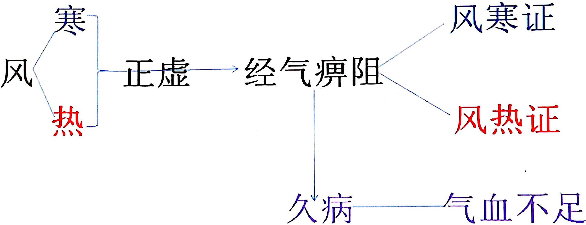
                - 劳作过度
                - **正气不足**
                - →脉络空虚，卫外不固
                - **外** **风**
                - > 风寒/风热
                - →经气阻滞，筋脉失养
                - →面瘫
            - **鉴别诊断**
                - **面瘫&中风**
                    - **面瘫（口僻）**
                    - > 外风引起
                        - 口眼歪斜
                        - **流涎**
                        - 正气不足，风邪入中脉络，气血痹阻所致
                        - 不同年龄均可罹患
                    - **中风**
                    - > 内风引起
                        - 口舌歪斜
                        - > 不伴有额纹、眼裂问题
                        - 伴肢体瘫痪/偏身麻木
                        - 气血逆乱，血随气逆，上扰脑窍而致脑髓神机受损
                        - 中老年人为多
            - **辨证**
                - **主症**
                    - 急性发作，常在睡醒时发现
                    - 一侧面部肌肉板滞、麻木、瘫痪，额纹消失，眼裂变大，露睛流泪（Bells征+），鼻唇沟变浅，口角下垂歪向健侧；病侧不能皱眉、蹙额、闭目、露齿、鼓颊
                    - 耳后疼痛（部分患者初起时），患侧舌前2/3味觉减退或消失、听觉过敏等 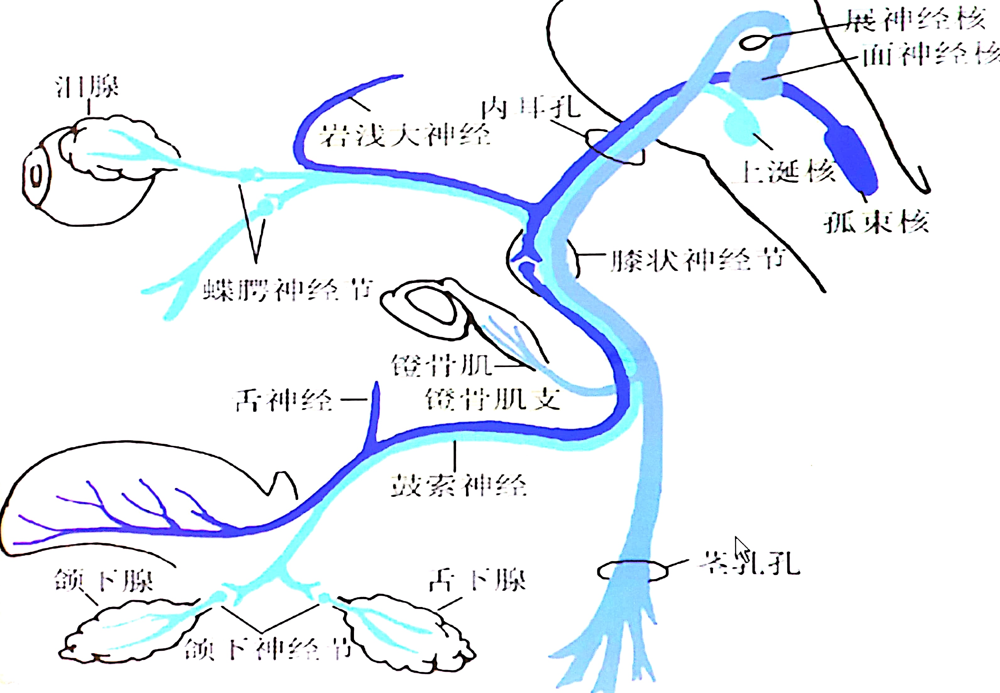
                - **风寒证**
                - > 面部有受凉史，舌淡，苔薄白
                - **风热证**
                - > 继发于感冒发热，舌红，苔薄黄
                - **气血不足**
                - > 病程较长，可伴肢体倦怠无力，面色淡白，头晕等
            - **治疗**
                - **基本治疗**
                    - **治法**
                        - 祛风通络，疏调经筋
                        - 以手足阳明、手足太阳经穴为主
                    - **主穴**
                        - **阳白、四白、颧髎、颊车、地仓、合谷、内庭**
                        - > 翳风
                    - **配穴**
                        - 风寒证——风池、列缺
                        - 风热证——曲池、外关
                        - 恢复期——足三里、气海
                        - > 气血不足
                        - 抬眉困难——攒竹、鱼腰
                        - 乳突部疼痛——翳风
                        - 颏唇沟歪斜——水沟、口禾髎
                        - 鼻唇沟变浅——迎香
                        - 眼泪增多——承泣
                    - **操作**
                        - 面部腧穴——平补平泻法
                        - **急性期**
                        - > 发病～7d
                            - **轻** **浅** **少**
                            - **重**
                        - **恢复期**
                        - > 7d～3m
                            - 肢体远端
                                - **足三里**
                                - **合谷**
                            - 余穴——均用泻法
                        - **后遗症期**
                        - > 3m后
                    - **方义**
                        - 面部腧穴——疏调局部筋络气血，活血通络
                        - **合谷、内庭** **泻法**
                        - **足三里** **补法**
                - **其他治疗**
                    - **皮肤针法**
                    - > 梅花针叩刺
                        - 阳白、颧髎、地仓、颊车
                        - 以局部潮红为度，每日或隔日1次
                        - 恢复期
                    - **刺络拔罐法**
                    - > 三棱针点刺，拔罐
                        - 阳白、颧髎、地仓、颊车
                        - 2次/周
                        - 恢复期
                    - **穴位贴敷法**
                        - 太阳、阳白、颧髎、地仓、颊车
                        - **方法**
                            - **马钱子**
                            - 或蓖麻仁捣烂+少许麝香→取绿豆粒大一团→贴敷穴位上→每隔3～5日更换1次
                            - **白附子**
                        - 后期/顽固性面瘫
                        - 腐蚀性强，易留疤
            - **注意事项**
                - **针灸治疗面瘫有很好的的疗效，可作为首选方法**
                - > **VitB1、VitB12**
                    - **“倒错”**
                    - > 面神经麻痹后遗症，疗效较差
                        - 部分患者病程迁延日久
                        - →瘫痪肌肉出现挛缩
                        - →口角反牵向患侧
                        - →甚则出现面肌痉挛
                - **周围性面瘫的预后与面神经损伤程度密切相关**
                    - **Bells面瘫**
                    - **亨特面瘫**
                    - > 水痘带状疱疹病毒（蛇串疮）
                - **治疗期间面部避免受凉**
                - > 戴眼罩防护/点眼药水→以防感染
            - **【课后习题】**
                - 面瘫的临床表现
                - 面瘫的针灸处方
                - 周围性面瘫与中枢性面瘫的鉴别
        - **痹证**
            - **定义**
                - **酸痛、麻木、重着、屈伸不利** **关节肿大灼热**
            - **历史沿革**
                - **《内经》**
                - > 提出病名，论述病因病机、证候分类、转归、预后

                - **汉·张仲景《金匮要略》**
                - > 湿痹、血痹、历节
                - **隋·巢元方《诸病源候论》**
                - > “历节风”
                - **唐·王焘《外台秘要》**
                - > 症状痛如虎咬，昼轻夜重，称之“白虎病”
                - **宋·严用和《济生方》**
                - > “白虎历节”
                - **元·朱丹溪《格致余论》**
                - > “痛风”
                - **明·王肯堂《证治准绳》**
                - > 膝关节肿大——“鹤膝风”，手指关节肿大——“鼓槌风”
                - **明·李中梓《医宗必读》**
                - > **治则：**
            - **病因病机**
                - **病因**
                    - 外感风、寒、湿、热等邪气
                    - 人体正气不足
                - **基本病机**
                    - 经络不通，气血痹阻
                        - 外邪侵入机体
                        - →痹阻关节肌肉经络
                        - →气血运行不畅
                        - →发病
            - **鉴别诊断**
                - **痹证&痿证**
                    - **痹证**
                        - 风、寒、湿、热之邪→流注肌腠经络→痹阻筋脉关节
                        - 关节疼痛为主
                        - > 痛与不痛
                        - 痛→影响活动
                        - > 观察肢体的活动障碍
                        - 疼痛/关节僵直不能活动→日久废而不用→肌肉萎缩
                    - **痿证**
                        - 肢体力弱，无疼痛症状
                        - 无力运动
                        - 部分痿证病初即有肌肉萎缩
            - **辨证**
            - > **主症：**
                - **行痹（风痹）**
                - > 兼见疼痛游走，痛无定处，恶风发热，舌淡苔薄白，脉浮
                - **痛痹（寒痹）**
                - > 疼痛较剧，痛有定处，遇寒痛增，得热痛减，局部皮肤不红，触之不热，苔薄白，脉弦紧
                - **着痹（湿痹）**
                - > 肢体关节疼痛，重着不移，或有肿胀，肌肤麻木不仁，阴雨天发作/加重，苔白腻，脉濡缓
                - **热痹**
                - > 关节疼痛，局部红肿灼热，痛不可触，常累及多个关节，伴发热恶风，口渴烦闷，苔黄腻，脉滑数
            - **治疗**
                - **基本治疗**
                    - **治法**
                        - 通经活络，行气止痛
                        - 以病痛局部穴为主，结合循经选穴、辨证选穴
                    - **主穴**
                        - **阿是穴、局部经穴**
                    - **配穴**
                        - 行痹——膈俞、血海
                        - 痛痹——肾俞、腰阳关
                        - 着痹——阴陵泉、足三里
                        - 热痹——大椎、曲池
                    - **操作**
                        - 寒痹、湿痹——加灸法
                        - **大椎、曲池**
                        - **局部穴位**
                    - **方义**
                    - > 病痛局部循经选穴→疏通经络气血，调和营卫，缓急止痛
                        - **风邪偏盛之行痹**
                        - > **膈俞、血海**
                        - **寒邪偏盛之痛痹**
                        - > **肾俞、腰阳关**
                        - **湿邪偏盛之着痹**
                        - > **阴陵泉、足三里**
                        - **热痹**
                        - > **大椎、曲池**
                - **其他治疗**
                    - **刺络拔罐法**
                        - **皮肤针重叩**
                        - +拔火罐
                        - 1～2次/周
                    - **穴位注射法**
                        - 当归注射液/丹皮酚注射液/威灵仙注射液→病痛部位腧穴
                        - 0.5～1ml/穴，1～2次/周
                        - 注意勿注入关节腔
                    - **火针治疗**
                        - 肩部经穴、阿是穴
                        - 2次/周
        - **面痛**
            - **定义**
                - 以眼、面颊部出现放射性、烧灼样抽掣疼痛为主症的病证，又称“面风痛”“面颊痛”
                - 多发于40岁以上，女性多见
            - **历史沿革**
                - **《内经》**
                - > 首次提出“颊痛”“顑痛”，并提出了针灸治疗的原则、方法
                - **晋·皇甫谧**
                - > 颜痛、颌痛立论——系足太阴、足阳明经病，提倡针灸治疗
                - **明·龚信《古今医鉴》**
                - > 论面痛为胃脉病
                - **清代医家**
                - > 在治疗面痛上广泛运用针灸治疗
            - **病因病机**
                - **病因**
                    - 外感邪气
                    - 情志不调
                    - 外伤
                - **病位**
                    - **面部**
                    - 与面部手、足三阳经密切相关
                - **基本病机**
                    - 气血阻滞，不通则痛
            - **鉴别诊断**
                - **头痛**
                    - 部位在头，即头部除面部之外的疼痛
                    - > 具体部位，多在巅顶，或两侧，或前后头部
                    - 无面部剧痛的诱发敏感点，亦无眼、鼻、耳疾
                - **中风中经络**
                    - 主要是半侧麻痹，不呈剧烈疼痛
                    - 另有口眼歪斜、闭眼不能等
                - **牙痛**
                    - 无敏感诱发
                    - 漱口、说话、洗脸时，疼痛不产生即刻反应
                    - 能找到具体疼痛的牙齿
            - **辨证**
                - **主症**
                    - 面部疼痛突然发作，呈闪电样、刀割样针刺样、电灼样剧烈疼痛
                    - 痛时面部肌肉抽搐，伴面部潮红，流泪，流涎，流涕等
                    - 常因说话、吞咽、刷牙、洗脸、冷刺激、情绪变化等诱发
                    - 持续数秒到数分钟
                    - 发作次数不定，间歇期无症状
                - **足太阳经证**
                - > 面痛主要发生在眼部
                - **手、足阳明经和手太阳经证**
                - > 面痛主要发生在上颌、下颌部
            - **治疗**
                - **基本治疗**
                    - **治法**
                        - 疏通经络，活血止痛
                        - 以面颊局部、手、足阳明经穴为主
                    - **主穴**
                        - **四白、下关、地仓、合谷、内庭、太冲**
                    - **配穴**
                        - 眼部疼痛——攒竹、阳白
                        - 上颌部疼痛——巨髎、颧髎
                        - 下颌部疼痛——夹承浆、颊车
                    - **操作**
                        - 毫针泻法
                        - 面部诸穴可透刺，但刺激强度不宜过大
                        - 针刺时宜先取远端穴，可用重刺激
                        - 局部穴位在急性发作期宜轻刺
                    - **方义**
                        - **四白、下关、地仓** 疏通面部经络
                        - **合谷、太冲** **“开四关”** 祛风通络止痛
                        - **内庭** 疏通阳明经气血
                - **其他治疗**
                    - **耳针法**
                        - 面频、颌、额、神门
                        - 毫针刺/埋针法、压丸法
                    - **刺络拔罐法**
                        - 颊车、地仓、颧髎
                        - 三棱针点刺后拔罐
                        - 隔日1次
                    - **皮内针法**
                        - 在面部寻找扳机点→埋针
        - **咳嗽**
            - **定义**
                - **肺失宣肃，肺气上逆** **发出咳声** **咳吐痰液**
                    - “咳”——有声无痰
                    - “嗽”——有痰无声
                    - 临床一般多声痰并见，故并称咳嗽
                - **根据发病原因**
                    - 外感
                    - 内伤
            - **历史沿革**
                - **始见于《内经》**
                - > 成因、症状、证候分类、病理转归及治疗
                - **隋·巢元方《诸病源候论》**
                - > **十咳**
                - **明·张介宾**
                - > **外感、内伤**
            - **病因病机**
                - **病因**
                    - **外感咳嗽**
                        - 外邪从口鼻皮毛而入→肺卫受邪
                    - **内伤咳嗽**
                        - 脏腑功能失常→累及于肺
                - **病位**
                    - **肺**
                    - 与肝、脾、肾关系密切
                - **基本病机**
                    - 肺失宣降
            - **鉴别诊断**
                - **咳嗽特点鉴别**
                - > 时间、节律、性质、声音、加重
                    - **外感风寒/风热**
                    - > 咳嗽时作，白天多于夜间，咳而急剧，声重，或咽痒则咳作，或咳声嘶哑，病势急而病程短者
                    - **阴虚/气虚**
                    - > 病势缓而病程长者
                    - **风热/痰热伤津**
                    - > 咳声粗浊者
                    - **痰湿/痰热**
                    - > 早晨咳嗽阵发加剧，咳嗽连声重浊，痰出咳者
                    - **肺燥阴虚**
                    - > 午后、黄昏咳嗽加重，或夜间有单声咳嗽，咳声轻微短促者
                    - **久咳致喘的虚寒证**
                    - > 夜卧咳嗽较剧，持续不已少气或伴气喘者
                    - **咳而声低气怯者——虚，洪亮有力者——实**
                    - **痰湿**
                    - > 饮食肥甘、生冷加重者
                    - **因于气火**
                    - > 情志郁怒加重者
                    - **痰湿、虚寒**
                    - > 劳累、受凉后加重者
                - **咳痰特点鉴别**
                - > 痰色、质、量、味
                    - **咳而少痰**
                    - **痰多**
                    - **痰白而稀薄**
                    - **痰黄而稠**
                    - **痰白质黏**
                    - **痰白清稀透明呈泡沫样**
                    - **咯吐血痰**
                    - **脓血相兼**
                    - **咳嗽咯吐粉红色泡沫痰，咳而气喘，呼吸困难**
                    - **咳痰有热腥味/腥臭气**
                    - **味甜**
                    - **味咸**
                - **咳嗽与咳喘**
                    - **咳嗽**
                    - > 咳嗽为主要临床表现，不伴喘证
                    - **咳喘**
                    - > **咳喘并作**
            - **辨证**
                - **外感咳嗽**
                - > **主症：** **表证**
                    - **外感风寒**
                    - > 兼见咳嗽声重，咽喉作痒，咳痰色白、稀薄，头痛发热，鼻塞流涕，形寒无汗，肢体酸楚，苔薄白，脉浮紧
                    - **外感风热**
                    - > 咳嗽咳痰黏稠、色黄，身热头痛，汗出恶风，苔薄黄，脉浮数
                - **内伤咳嗽**
                - > **主症：** **脏腑功能失调**
                    - **痰湿侵肺**
                    - > 兼见咳嗽痰多、色白、黏稠，胸脘痞闷，神疲纳差，苔白腻，脉濡滑
                    - **肝火犯肺**
                    - > 气逆咳嗽，引胁作痛，痰少而貓，面赤咽干，苔黄少津，脉弦数
                    - **肺阴亏虚**
                    - > 干咳，咳声短，以午后黄香为剧，少痰，或痰中带血，潮热盗汗，形体消瘦，两颊红赤，神疲乏力，舌红，少苔，脉细数
            - **治疗**
                - **基本治疗**
                    - **外感咳嗽**
                        - **治法**
                            - 疏风解表，宣肺止咳
                            - 以手太阴、手阳明经穴为主
                        - **主穴**
                            - **肺俞、列缺、合谷**
                        - **配穴**
                            - 外感风寒——风门
                            - 外感风热——大椎、风池
                            - 咽喉痛——少商放血
                        - **操作**
                            - **毫针泻法**
                            - **风寒袭肺者**
                        - **方义**
                            - **肺俞**
                            - **列缺**
                            - **合谷**
                    - **内伤咳嗽**
                        - **治法**
                            - 肃肺理气，止咳化痰
                            - 以肺之背俞、募穴和原穴为主
                        - **主穴**
                            - **肺俞、中府、太渊、三阴交**
                        - **配穴**
                            - 痰湿侵肺——阴陵泉、丰隆
                            - 肝火犯肺——行间、鱼际
                            - 肺阴亏虚——膏肓、太溪
                            - 胸痛——膻中
                            - 胁痛——阳陵泉
                            - 咽喉干痒——太溪
                            - 咯血——孔最
                            - 盗汗——阴郄
                            - 面肢浮肿、小便不利——阴陵泉、中极
                            - 气短乏力——足三里、气海
                        - **操作**
                            - 主穴用毫针平补平泻，或加用灸法
                        - **方义**
                            - **肺俞、中府** **太渊**
                            - **三阴交**
                - **其他治疗**
                    - **拔罐法**
                        - 肺俞、大椎、风门、膏育
                        - 留罐10～15min后起罐
                        - 风寒袭肺证
                    - **穴位贴敷法**
                        - 肺俞、定喘、风门、膻中、丰隆
                        - **操作**
                            - 白芥子、甘遂、细辛、丁香、苍术、川芎等量
                            - →研成细粉
                            - →加入生姜汁，调成糊状
                            - →制成直径1cm圆饼
                            - →贴在穴位上，胶布固定
                            - →30～90min后取掉，以局部红晕微痛为度
                    - **皮肤针法**
                        - **外感咳嗽**
                            - 后颈部5～7颈椎两侧、气管两侧、天突、肘窝、大小鱼际
                            - 叩刺
                        - **咳嗽日久反复发作者**
                            - 项后至背部1～7胸椎两侧足太阳膀胱经、颈前气管两侧、膻中、天突
                            - 叩刺
                    - **耳针法**
                        - 肺、脾、肝、气管、神门
                        - 2～3穴/次
                        - 毫针刺/埋针法/压丸法
        - **哮喘**
            - **定义**
                - **呼吸急促，喉间哮鸣** **张口抬肩，不能平卧**
                    - “哮”——呼吸急促，喉间有哮鸣音
                    - “喘”——呼吸困难，甚则张口抬肩
                    - **哮必兼喘，喘未必兼哮**
                    - **寒冷季节** **气候骤变**
            - **历史沿革**
                - **《内经》最早出现喘证的名称、症状表现、病因病机**
                - > 虽无哮病之名，但在许多篇章里，都有有关哮病症状病因病机的记载
                - **汉·张仲景《金匮要略》将喘证分虚实两大类，并列方治疗**
                - > **哮病** **伏饮**
                - **金·刘河间：喘因于火热**
                - **元·朱丹溪《丹溪心法》首创哮喘病名**
                - > 七情、饱食、体虚等皆可成为内伤致端之因
                - **明·张景岳**
                - > 喘证：虚实两大证
                - **明·虞抟《医学正传》区别哮&喘**
                - > “哮以声响言，喘以气息言”
                - *后世医家鉴于“哮必兼喘”，故一般统称“哮喘”*
            - **病因病机**
                - **病因**
                    - 
                - **病位**
                    - 
                - **基本病机**
                    - 
            - **西医认识**
                - 
            - **鉴别诊断**
                - 
            - **辨证**
                - 
            - **治疗**
                - **基本治疗**
                    - **治法**
                        - 
                    - **主穴**
                        - 
                    - **配穴**
                        - 
                    - **操作**
                        - 
                    - **方义**
                        - 
                - **其他治疗**
        - **不寐**
            - **定义**
                - **经常不能获得正常睡眠** **入睡困** **睡眠不深** **睡眠时间不足** **彻夜不眠**
                - 本病多见于西医学的神经衰弱、围绝经期综合征、焦虑、抑郁、贫血等多种疾病中
            - **历史沿革**
                - **《内经》**
                - > “不得卧”“不得眠”“卧不安”“目不瞑”
                    - **原因**
                        - 其他病证影响，使人不得安卧
                        - > 咳喘、呕吐、腹满等
                        - 邪气客于脏腑，卫气不能入阴
                        - 脏腑损伤，阴阳不和，则夜寐不安
                - **《难经》**
                - > 最早提出了“不寐”
                - **历代医家**
                - > “不夜瞑”“不眠”“少睡”“少寐”
                    - **《金匮要略》**
                    - > “不得眠”，“不得卧”，“虚劳虚烦不得眠，酸枣仁汤主之”
                - **明清以来**
                - > 多称为“不寐”
                    - **《景岳全书》**
                    - > **有邪、无邪**
                    - **《医宗必读》**
                    - > “一曰气虚，一曰阴虚，一曰痰滞，一曰水停，一曰胃不和”
                    - **《证治要诀》**
                    - > “年高人阳衰不寐”
            - **病因病机**
                - **病因**
                - > 饮食、情志、劳倦、体虚
                    - 情志不遂——肝阳扰动
                    - 思虑劳倦——内伤心脾，生血之源不足
                    - 惊恐、房劳——伤肾，肾水不能上济于心，心火独炽，心肾不交
                    - 体质虚弱——心胆气虚
                    - 饮食不节，宿食停滞——胃不和则卧不安
                - **病位**
                    - 心
                    - 与肝、脾、肾、胆、胃等脏腑密切相关
                - **基本病机**
                    - **心神失养/心神被扰→心神不宁**
                        - 饮食、情志、劳倦、体虚
                        - →邪气扰动心神/心神失于濡养、温煦
                        - →心神不安
                        - →阴跷脉、阳跷脉功能失于平衡
                        - →不寐
                    - **阴跷脉、阳跷脉功能失衡→阳盛阴衰，阴阳失交**
            - **辨证**
            - > 主症：入睡困难，或寐而易醒，甚则彻夜不眠

                - **肝火扰心**
                - > 兼情绪不宁，急躁易怒，头晕头痛，胸胁胀满，舌红，脉弦
                - **心脾两虚**
                - > 兼心悸健忘，纳差倦怠，面色无华，易汗出，舌淡，脉细弱
                - **心肾不交**
                - > 兼五心烦热，头晕耳鸣，腰膝酸软，遗精盗汗，舌红，脉细数
                - **心胆气虚**
                - > 兼多梦易惊，心悸胆怯，善惊多恐，多疑善虑，舌淡，脉弦细
                - **脾胃不和**
                - > 兼脘闷嗳气，嗳腐吞酸，心烦口苦，苔厚腻，脉滑数
            - **治疗**
                - **基本治疗**
                    - **治法**
                        - 调和阴阳，安神利眠
                        - 以督脉、手少阴、足太阴经穴、八脉交会穴为主
                    - **主穴**
                        - **百会、神门、三阴交、照海、申脉、安眠**
                    - **配穴**
                        - 肝火扰心——太冲、行间、侠溪
                        - 心脾两虚——心俞、脾俞、足三里
                        - 心肾不交——心俞、肾俞、太溪
                        - 心胆气虚——心俞、胆俞
                        - 脾胃不和——丰隆、中脘、足三里
                        - 噩梦——厉兑、隐白
                        - 头晕——风池、悬钟
                        - 重症不寐——神庭、印堂、四神聪
                    - **操作**
                        - 毫针刺，泻申脉，补照海
                        - 其他——按虚补实泻操作
                    - **方义**
                        - **百会**
                        - **神门**
                        - **三阴交**
                        - **照海** **申脉**
                        - **安眠穴**
                - **其他治疗**
                    - **耳针法**
                        - 皮质下、心、神门、肝、肾、脾、垂前、交感
                        - 毫针刺/埋针法/压丸法
                        - 3～5穴/次，双耳交替使用
                    - **皮肤针法**
                        - 从项部至腰部
                        - →沿督脉、足太阳膀胱经第1侧线
                        - →皮肤针自上而下叩刺，以皮肤潮红为度
                    - **拔罐法**
                        - 从项部至腰部
                        - →循足太阳膀胱经第1、2侧线
                        - →自上而下行走罐，以背部潮红为度
        - **郁症**
            - **定义**
                - **心情抑郁，情绪不宁，胸部满闷，胁肋胀满，** **易怒易哭，** **咽中如有异物哽塞**
                - **梅核气”、“脏躁”、“百合病”**
                - 本病可见于西医学的抑郁症、癔症及焦虑症、围绝经期综合征等疾病中
            - **历史沿革**
                - **《内经》五气之郁**
                - > *《素问·六元正纪大论》：“木郁达之，火郁发之，土郁夺之，金郁泄之，水郁折之。”*
                - **《金匮要略》**
                - > 记载属于郁证的脏躁及梅核气——多发于女性，提出治疗方药
                - **《丹溪心法》**
                - > **气、血、火、食、湿、痰郁** **六郁汤、越鞠丸**
                - **《医学正传》**
                - > 首先采用郁证这一病证名称
                - **《景岳全书》**
                - > **怒郁、思郁、忧郁**
                - **《临证指南医案》**
                - > *“郁证全在病者能移情易性”*
            - **病因病机**
                - **病因**
                    - **情志不遂**
                        - **气郁**
                        - **火郁**
                    - **思虑过度，精神紧张**
                        - **痰郁**
                    - **情志过极**
                        - **精神惑乱**
                    - **病变日久，损及肝肾心脾**
                        - **→心脾两虚/肝肾不足/心失所养**
                - **病位**
                    - **肝**
                    - 心、脾、肾
                - **基本病机**
                    - 气机郁滞
                    - 脏腑阴阳气血失调
                    - 心神失养/被扰
                    - 气机失畅
            - **辨证**
            - > **主症：**
                - **肝气郁结**
                - > 兼胸胁胀满，脘闷嗳气，不思饮食，大便不调，舌苔薄腻，脉弦
                - **气郁化火**
                - > 兼性情急躁易怒，口苦而干，或头痛、目赤、耳鸣，或嘈杂吐酸，大便秘结，舌红苔黄，脉弦数
                - **痰气郁结（梅核气）**
                - > 兼咽中如有物哽塞，吞之不下，咳之不出，苔白腻，脉弦滑
                - **心神失养（脏躁）**
                - > 兼精神恍惚，心神不宁，多疑易惊，悲忧善哭，喜怒无常，或时时欠伸，或手舞足蹈等，舌淡，脉弦
                - **心脾两虚**
                - > 兼多思善疑，头晕神疲，心悸胆怯，失眠健忘，纳差，面色不华，舌淡，脉细
                - **肝肾亏虚**
                - > 兼眩晕耳鸣，目干畏光，心悸不安，五心烦热，盗汗，口咽干燥，舌千少津，脉细数
            - **治疗**
                - **基本治疗**
                    - **治法**
                        - 调神疏肝，理气解郁
                        - 以督脉、手少阴经、手足厥阴经穴为主
                    - **主穴**
                        - **百会、印堂、神门、太冲、内关、膻中**
                    - **配穴**
                        - 肝气郁结——期门、肝俞
                        - 气郁化火——行间、侠溪
                        - 痰气郁结——丰隆、中脘
                        - 心神失养——通里、心俞
                        - 心脾两虚——心俞、脾俞
                        - 肝肾亏虚——肝俞、肾俞
                        - 咽部异物哽塞感明显者——天突、照海
                    - **操作**
                        - 毫针刺，按虚补实泻操作
                    - **方义**
                        - **百会、印堂** 调理脑神
                        - **神门** 养心安神
                        - **太冲** 疏肝理气解郁
                        - **内关** **膻中** 疏理气机，宽胸解郁
                - **其他治疗**
                    - **耳针法**
                        - 心、枕、皮质下、肝、内分泌、神门
                        - 3～5穴/次
                        - 毫针刺/加电针，留针20min
                        - 恢复期——埋针法/压丸法
                    - **穴位注射法**
                        - 风池、心俞、脾俞、足三里
                        - 丹参注射液/维生素B1/维生素B2注射液
                        - 0.3～0.5ml/（次·穴），每日或隔日1次
        - **痫病**
            - **定义**
                - **猝然昏仆，口吐涎沫，两目上视，强直抽搐，或有鸣声，醒后神志如常**
                - **突然性、短暂性、反复性** **“羊痫风”**
                - 本病即西医学的癫痫
                    - 原发性癫痫
                    - > 病因不明
                    - 继发性癫痫
                    - > 主要见于脑外伤、脑血管病、脑肿瘤等脑部疾患
            - **历史沿革**
                - **首见于《内经》**
                - > “胎病”“癫疾”，发病与先天因素有关
                - **巢元方《诸病源候论·癫狂候》**
                - > *“癫者，卒发仆也，吐涎沫，口喘，目急，手足缭戾，无所觉知，良久乃苏。”*
                - **宋金时代**
                - > 对本病的发病机理阐述较深刻
                    - **陈无择《三因极一病证方论·癫痫方论》**
                    - > 多种因素导致脏气不平，阴阳失调，神乱而病
                    - **朱丹溪《丹溪心法·痫》**
                    - > **痰迷心窍** *“无非痰涎壅塞，迷闷心窍。”*
                    - **王清任**
                    - > **脑髓瘀血**
            - **病因病机**
                - **病因**
                    - 先天因素
                    - 精神因素
                    - > 情志刺激→肝郁不舒→肝、脾、肾等脏气机失调→骤然阳升风动→痰气上壅
                    - 脑部外伤
                    - > 母孕受惊/高热、服药不慎/胎儿头部受损
                    - 六淫之邪
                    - 饮食失调
                - **病位**
                    - 脑
                    - 与肝、心、脾、肾功能失调有关
                - **基本病机**
                    - **风、痰、火、瘀**
                    - →气血逆乱，蒙蔽清窍，扰乱神明，神失所司
                    - →痫病
            - **辨证**
                - **发作期**
                    - **大发作（典型发作）**
                    - > 发作前：常有头晕头痛，胸闷不舒，神疲乏力等预兆
​旋即突然昏仆，不省人事，面色苍白，两目上视，牙关紧闭，四肢抽搐，口吐涎沫，甚则尖叫，二便失禁
​短暂发作即清醒
​发作过后则觉头昏，精神恍惚，乏力欲寐
                    - **小发作**
                    - > 动作突然中断，手中物件落地，或头突然向前倾下而后迅速抬起，或两目上吊
​大多数秒至数分钟即可恢复，且对上述症状发作全然不知
                - **间歇期**
                - > 多见于痫病日久，发作次数频繁，抽搐强度减弱，苏醒后精神萎靡，表情痴呆，智力减退
                    - **风痰闭阻**
                    - > 兼见胸闷，痰多，舌质红，苔白腻，脉弦滑有力
                    - **痰火扰神**
                    - > 兼急躁易怒，咳痰不爽，舌红，苔黄腻，脉弦滑而数
                    - **瘀阻脑络**
                    - > 兼头部刺痛，或有脑部外伤史，舌质紫暗，脉涩
                    - **心脾两虚**
                    - > 兼神疲乏力，面色苍白，大便溏薄，舌淡，苔白腻，脉沉弱
                    - **肝肾阴虚**
                    - > 兼神志恍惚，两目干涩，健忘失眠，腰膝酸软，舌红，苔薄黄，脉细数
            - **治疗**
                - **基本治疗**
                    - **发作期**
                        - **治法**
                            - 开窍醒神，息风止痉
                            - 以督脉、手足厥阴经穴为主
                        - **主穴**
                            - **水沟、百会、内关、太冲、后溪**
                        - **配穴**
                            - 大发作——十宣、涌泉
                            - 小发作——神门、神庭
                        - **操作**
                            - 毫针刺，用泻法
                            - 水沟用重雀啄刺法，至眼球湿润为度
                        - **方义**
                            - **水沟、百会** 醒脑开窍、宁神定志
                            - **内关** 调畅气机，宁心安神
                            - **太冲** 息风止痉
                            - **后溪**
                    - **间歇期**
                        - **治法**
                            - 化痰通络
                            - 以督脉、任脉、手足厥阴经穴为主
                        - **主穴**
                            - **印堂、鸠尾、间使、太冲、丰隆、腰奇**
                        - **配穴**
                            - 风痰闭阻——合谷、中脘、风池
                            - 痰火扰神——曲池、神门、内庭
                            - 瘀阻脑络——百会、膈俞、内关
                            - 心脾两虚——心俞、脾俞、足三里
                            - 肝肾阴虚——肝俞、肾俞、三阴交
                        - **操作**
                            - 毫针刺，按虛补实泻操作
                            - **鸠尾**
                        - **方义**
                            - **印堂** 调神开窍
                            - **鸩尾**
                            - **间使** 调心神、理气血
                            - **太冲** 平息肝风
                            - **丰隆** 豁痰化浊
                            - **腰奇**
                - **其他治疗**
                    - **耳针法**
                        - 胃、皮质下、神门、心、枕、脑点
                        - 2～3穴/次
                        - 毫针刺，强刺激，间歇捻转，留针30min，隔日1次
                        - 也可用压丸法
                    - **穴位注射法**
                        - 足三里、内关、大椎、风池
                        - 2～3穴/次
                        - 维生素B1/B12注射液，0.5~1ml/穴
                    - **穴位埋线法**
                        - 大椎、肝俞、腰奇、足三里、丰隆
                        - 2～4穴/次，2周1次
        - **消渴**
            - **定义**
                - **多饮、多食、多尿、形体消瘦** **尿浊、尿有甜味**
                - 根据患者的症状、病变轻重程度不同，分为上、中下三消
                    - 上消——肺燥
                    - 中消——胃热
                    - 下消——肾虚
                    - *亦可肺燥、胃热、肾虚同时存在*
                - 西医学的糖尿病等属本病范畴
            - **病因病机**
                - **病因**
                    - 禀赋不足
                    - 饮食不节
                    - 情志不调
                    - 劳欲过度
                - **病位**
                    - 肺、胃、肾
                - **基本病机**
                    - 阴虚燥热，津液不足
            - **辨证**
            - > **主症：**
                - **上消——肺热津伤**
                - > 兼见烦渴多饮，口干舌燥，尿量频多，舌边尖红，苔薄黄，脉洪数

                - **中消——胃热炽盛**
                - > 多食善饥，口渴尿多，形体消瘦，大便干燥，苔黄，脉滑实有力
                - **下消——肾阴亏虚**
                - > 尿频尿多，混浊如膏脂，或尿甜，腰膝酸软，乏力，头晕耳鸣，口干唇燥，皮肤干燥、瘙痒，舌红，苔少，脉细数
                - **阴阳两虚**
                - > 小便频数，混浊如膏，甚至饮一溲一，面容憔悴，耳轮干枯，腰膝酸软，四肢欠温，畏寒怕冷，阳痿/月经不调，舌淡，苔白而干，脉沉细无力
            - **治疗**
                - **基本治疗**
                    - **治法**
                        - 清热润燥，养阴生津
                        - 以相应背俞穴、足少阴、足太阴经穴为主
                    - **主穴**
                        - **胃脘下俞、肺俞、胃俞、肾俞、三阴交、太溪**
                    - **配穴**
                        - 上消——太渊、少府
                        - 中消——内庭、地机
                        - 下消——复溜、太冲
                        - 阴阳两虚——关元、命门
                        - 上肢疼痛/麻木——肩髃、曲池、合谷
                        - 下肢疼痛/麻木——风市、阳陵泉、解溪
                        - 皮肤瘙痒——风池、曲池、血海
                    - **操作**
                        - 毫针刺，用补法/平补平泻法
                        - 配穴按虚补实泻法操作
                        - 阴阳两虚者，可配合灸法
                    - **方义**
                        - **胃脘下俞**
                        - **肺俞** 培补肺阴 **胃俞** 清胃泻火 **肾俞** 滋阴补肾
                        - **太溪** **三阴交** 养胃阴，补肝肾，清虚热
                - **其他治疗**
                    - **耳针法**
                        - 胰胆、内分泌、肾、三焦、耳迷根、神门心、肝、肺、屏尖、胃等穴
                        - 3～4穴/次
                        - 毫针刺，轻刺激
                        - 埋针法/压丸法
                    - **穴位注射法**
                        - 心俞、肺俞、脾俞、胃俞、肾俞、三焦俞/相应夹脊穴、曲池、足三里、三阴交、关元、太溪
                        - 2～3穴/次
                        - 当归/黄芪注射液/等渗盐水
                        - 0.5～2ml/（次·穴）
        - **胃痛**
            - **定义**
                - **以上腹脘部发生疼痛为主症的病证，又称**
                - **“心痛”“心下痛”**
                - 胃痛可见于西医学的胃痉挛、胃肠神经官能症、急慢性胃炎、消化性溃疡、胃黏膜脱垂等疾病中
            - **病因病机**
                - **病因**
                    - 寒邪客胃
                    - 饮食伤胃
                    - 肝气犯胃
                    - 脾胃虚弱
                - **病位**
                    - **胃**
                    - 涉及脏腑：肝、脾
                - **基本病机**
                    - 胃气失和、胃络不通、胃失温养
            - **辨证**
            - > **主症：**
                - **实证**
                - > **主症：**
                    - **寒邪犯胃**
                    - > 脘腹得温痛减，遇寒痛增，恶寒喜暖，口不渴，喜热饮，或伴恶寒，苔薄白，脉弦紧
                    - **饮食伤胃**
                    - > 胃脘胀满疼痛，嗳腐吞酸，嘈杂不舒，呕吐/矢气后痛减，大便不爽，苔厚腻，脉滑
                    - **肝气犯胃**
                    - > 胃脘胀满，脘痛连胁，嗳气频频，吞酸，大便不畅，每因情志因素而诱发，心烦易怒，喜太息，苔薄白，脉弦
                    - **气滞血瘀**
                    - > 胃痛拒按，痛有定处，食后痛甚，或有呕血便黑，舌质紫暗/有瘀斑，脉细涩
                - **虚证**
                - > **主症：**
                    - **脾胃虚寒**
                    - > 泛吐清水，喜暖，大便溏薄，神疲乏力，或手足不温，舌淡苔薄，脉虚弱/迟缓
                    - **胃阴不足**
                    - > 胃脘灼热隐痛，似饥而不欲食，咽干口燥，大便干结，舌红少津，脉弦细/细数
            - **治疗**
                - **基本治疗**
                    - **治法**
                        - 和胃止痛
                        - 以胃之下合穴、募穴为主
                    - **主穴**
                        - **足三里、中脘、内关**
                    - **配穴**
                        - 寒邪犯胃——胃俞、神阙
                        - 饮食伤胃——梁门、天枢
                        - 肝气犯胃——期门、太冲
                        - 气滞血瘀——膻中、膈俞
                        - 脾胃虚寒——神阙、胃俞、脾俞
                        - 胃阴不足——胃俞、三阴交
                    - **操作**
                        - 疼痛发作时，远端穴持续行针1～3min，直到痛止或缓解
                        - **中脘**
                    - **方义**
                        - **胃之募穴：**
                            - **中脘**
                        - **胃之下合穴：**
                            - **足三里**
                        - **内关**
                - **其他治疗**
                    - **穴位注射法**
                        - 中脘、足三里、肝俞、胃俞、脾俞
                        - > 2穴/次，诸穴可交替使用
                        - 黄芪注射液/丹参注射液/当归注射液/生脉注射液/维生素B1注射液/维生素B12注射液
                        - > 0.5～1ml/穴，每日或隔日1次
                    - **耳针法**
                        - 胃、肝、脾、神门、交感、十二指肠
                        - 毫针刺——中等强度
                        - 或用埋针法、压丸法
                    - **穴位埋线法**
                        - 中脘、足三里、肝俞、胃俞、脾俞、至阳（常有压痛点）
                        - 慢性胃炎
        - **泄泻**
            - **定义**
                - **大便次数増多** **便质稀溏** **完谷不化** **如水样**
                    - 一年四季均可发生
                    - **夏秋**
                - **“飨泄”、“濡泄”、“洞泄”、“溏泄”**
                    - **泄**
                    - **泻**
                - 泄泻可见于西医学中功能性腹泻、急慢性肠炎过敏性肠炎、溃疡性结肠炎、小肠吸收不良、肠易激综合征等多种疾病
            - **病因病机**
                - **病因**
                    - 饮食不节
                    - 感受外邪
                    - 情志失调
                    - 脾胃虚弱
                    - 年老体弱
                    - 久病体弱
                - **病位**
                    - **肠**
                    - 涉及脏腑：脾、胃、肝、肾
                - **基本病机**
                - > **关键：**
                    - 脾虚湿盛→肠道分清泌浊、传化功能失常
            - **辨证**
                - **主症：**
                    - **实证——急性泄泻**
                    - > 发病势急，病程短，大便次数多，小便减少
                    - **虚证/虚实夹杂——慢性泄泻**
                    - > 起病势缓，病程长，便泻次数较少
                - **寒湿内盛**
                - > 大便清稀，水谷相杂，肠鸣胀痛，口不渴，身寒喜温，舌淡，苔白滑，脉迟
                - **湿热伤中**
                - > 便色黄而臭，伴有黏液，肛门灼热，腹痛，心烦口渴，喜冷饮，小便短赤，舌红苔黄腻，脉濡数大
                - **食滞胃肠**
                - > 腹痛肠鸣，大便恶臭，泻后痛减，伴有未消化的食物，噯腐吞酸，不思饮食，舌苔垢浊/厚膩，脉滑
                - **肝气乘脾**
                - > 胸胁胀闷，噯气食少，每因抑郁恼怒/情绪紧张时，发生腹痛泄泻，舌淡红，脉弦
                - **脾胃虚弱**
                - > 大便溏薄，完谷不化，反复发作，稍进油膩食物，则大便次数增多，面色萎黄，神疲，不思饮食，喜暖畏寒，舌淡，苔白，脉濡缓无力
                - **肾阳虚衰**
                - > 胸胁胀闷，噯气食少，每因抑郁恼怒或情绪紧张时，发生腹痛泄泻，舌淡红，脉弦
            - **治疗**
                - **基本治疗**
                    - **治法**
                        - 运脾化湿，理肠止泻
                        - **大肠募穴、背俞穴、下合穴**
                    - **主穴**
                        - **神阙、天枢、大肠俞、上巨虚、阴陵泉**
                    - **配穴**
                        - 寒湿内盛——关元、水分
                        - 湿热伤中——内庭、曲池
                        - 食滞胃肠——中脘、建里
                        - 脾胃虚弱——脾俞、胃俞
                        - 肝气乘脾——肝俞、太冲
                        - 肾阳虚衰——肾俞、命门、关元
                        - 慢性泄泻——脾俞、足三里
                        - 久泻虚陷——百会
                        - 有明显精神心理症状——神门、内关
                        - 泻下脓血——曲池、合谷、三阴交、内庭
                    - **操作**
                        - 寒湿及脾、肾虚证——针灸并用
                        - > 肾阳亏虚者——可用隔附子饼灸
                        - **神阙穴**
                        - 急性泄泻——针灸治疗2次/d
                    - **方义**
                        - **神阙**
                        - **天枢** **大肠俞** **上巨虚** 调理肠腑而止泻
                        - **阴陵泉**
                - **其他治疗**
                    - **穴位注射法**
                        - **天枢、上巨虚**
                        - **黄连素注射液**
                        - 0.5～1ml/（穴·次），每日或隔日1次
                    - **穴位敷贴法**
                    - > 久泻
                        - **五倍子**
                        - **神阙**
                        - →伤湿止痛膏固定
                            - 2～3日一换
    - 妇儿科病证
        - **痛经**
            - **定义**
                - **周期性小腹疼痛** **痛引腰骶** **剧痛难忍** **恶心呕吐**
            - **病因病机**
                - **病因**
                    - 情志不遂
                    - 起居不慎
                    - 六淫侵袭
                    - 体质因素
                - **病位**
                    - 冲任、子宫
                - **变化：气血**
                - **基本病机**
                - > 不通则痛、不荣则痛
                    - 情志不遂、起居不慎、六淫侵袭、体质因素
                    - →值经期前后冲任二脉气血生理变化急骤→
                        - **不通则痛**
                        - **不荣则痛**
                    - →痛经
            - **西医认识**
                - **原发性痛经**
                - > 首选针灸
                    - 多青春期，有排卵者，功能性痛
                        - 性激素不稳定——PG↑
                        - 膜样痛经性痛
                        - 宫颈狭窄
                        - 子宫过度倾屈
                        - 处女膜闭锁
                    - →宫缩过强，子官平滑肌缺血
                - **继发性痛经**
                    - 盆腔器质性疾病痛
                        - 子宫内膜异位
                        - 慢性盆腔炎
                        - 子宫腺肌病
                        - 子宫肌瘤
            - **辨证**
                - **主症**
                    - **经期/经行前后**
                    - 小腹疼痛为主，部分患者疼痛连及腰骶，放射至肛门或两侧股部
                    - 疼痛难忍者甚或伴有呕吐汗出，面青肢冷，以至晕厥
                    - **周期性发作**
                - **实证**
                - > 主症：经前/行经期小腹剧烈疼痛，痛处拒按
                    - **寒凝血瘀**
                    - > 小腹冷痛，可放射到股内侧及阴道和肛门，得热则舒，经血量少，色紫暗有血块，舌淡胖苔白，脉沉紧
                    - **气滞血瘀**
                    - > 小腹胀痛，可放射到胸胁、乳房，经行不畅，经色紫暗有血块，块下后痛减，舌紫暗/有瘀斑，脉沉弦/涩
                - **虚证**
                - > 主症：行经期/经后小腹/腰骶部绵绵隐痛，痛处喜按
                    - **肾气亏损**
                    - > 兼见腰骶部隐痛，经行量少、色红，伴头晕耳鸣，舌淡苔薄，脉沉细
                    - **气血不足**
                    - > 小腹绵绵作痛，空坠不适，月经量少、色淡，伴神疲乏力，头晕眼花，心悸气短，舌淡苔薄，脉细弱
            - **治疗**
                - **基本治疗**
                    - **实证**
                        - **治法**
                            - 行气活血，调经止痛
                            - 以任脉、足太阴经穴为主
                        - **主穴**
                            - **中极、三阴交、地机、次髎、十七椎**
                        - **配穴**
                            - 寒凝血瘀——关元、归来
                            - 气滞血瘀——太冲、血海
                        - **操作**
                            - 毫针泻法
                            - 寒凝者——加艾灸
                        - **方义**
                            - **中极**
                            - **三阴交**
                            - **地机**
                            - **十七椎、次髎**
                    - **虚证**
                        - **治法**
                            - 调补气血，温养冲任
                            - 以任脉、足阳明、足太阴经穴为主
                        - **主穴**
                            - **关元、足三里、三阴交、次髎、十七椎**
                        - **配穴**
                            - 肾气亏损——太溪、肾俞
                            - 气血不足——气海、脾俞
                        - **操作**
                            - 毫针补法
                            - 可加灸
                        - **方义**
                            - 关元、足三里、三阴交合用，可使气血充足，胞官得养，神任自调
                                - **关元**
                                - **足三里**
                                - **三阴交**
                            - **次髎、十七椎**
                - **其他治疗**
                    - **耳针法**
                        - 内生殖器、内分泌、神门、交感、皮质下、肾、骶腰椎
                        - > 2～4穴/次
                        - 毫针刺（中等刺激）/压丸/埋针法
                    - **皮肤针法**
                        - 背腰部夹脊穴/背俞穴，下腹部任脉、肾经、脾经、胃经
                        - 皮肤针叩刺
                            - 中等刺激至局部皮肤潮红
                            - 隔日1次
                    - **穴位注射**
                        - 关元、气海、足三里、三阴交、地机
                        - > 2～3穴/次
                        - **当归注射液**
                        - > 2ml/穴，隔日1次
        - **小儿遗尿**
            - **定义**
                - **睡中小便自遗** **醒后方觉**
                    - **原发性遗尿**
                        - 小儿从小至就诊时一直有尿床现象
                    - **继发性遗尿**
                        - 小儿曾经停止尿床至少有半年时间，以后又发生尿床的现象
            - **病因病机**
                - **病因**
                    - 禀赋不足
                    - 久病体虚
                    - 习惯不良
                - **病位**
                    - **膀胱**
                    - 与任脉、肾、肺、脾、肝关系密切
                - **基本病机**
                    - 膀胱和肾气化功能失调，膀胱约束无权
                    - 肝经热郁化火，迫注膀胱
            - **西医认识**
                - 遗传因素
                - > 家族中显性遗传
                - 发育因素
                - > 大脑发育不全，膀胱夜间控制能力弱
                - 疾病因素
                - > 蛲虫症、泌尿系炎症、膀胱容积过小等
                - 环境因素
                - > 环境改变、气候变化如寒冷入侵等
                - 生活因素
                - > 排尿训练不够，长期使用尿布，睡眠很深
            - **辨证**
                - **主症：**
                - **肾气不足**
                - > 兼神疲乏力，面色苍白，肢凉怕冷，白天小便亦多，舌淡，苔薄白，脉沉细无力
                - **脾肺气虚**
                - > 兼疲劳后遗尿加重，少气懒言，食欲不振，大便溏薄，自汗出，舌淡，苔薄，脉细无力
                - **肝经郁热**
                - > 兼量少色黄味臊，性情急躁，面赤唇红，或夜间齿，舌红苔黄，脉弦滑数
            - **治疗**
                - **基本治疗**
                    - **治法**
                        - 调理膀胱，温肾健脾
                        - 以任脉穴、膀胱的背俞穴、募穴为主
                    - **主穴**
                        - **关元、肾俞、中极、膀胱俞、膀胱俞**
                    - **配穴**
                        - 肾气不足——肾俞、命门、太溪
                        - 脾肺气虚——肺俞、气海、足三里
                        - 肝经郁热——蠡沟、太冲
                    - **操作**
                        - **多灸**
                        - 下腹部穴位针尖向下斜刺，以针感达到前阴部为佳
                    - **方义**
                        - **关元** **肾俞** 培补元气，固摄下元
                        - **中极、膀胱俞** 俞募配穴，可振奋膀胱气化功能
                        - **三阴交** 通调肝、脾、肾三经经气，健脾益气，益肾固本
                - **其他治疗**
                    - **耳针法**
                        - 肾、膀胱、皮质下、内分泌、尿道、脑点
                        - 2～4穴/次，毫针刺
                        - 埋针法、压丸法
                    - **皮肤针法**
                        - 夹脊穴、气海、关元、中极、膀胱俞、八髎、肾俞、脾俞
                        - 叩刺至局部皮肤潮红
                        - 也可叩刺后加拔火罐
                    - **穴位注射法**
                        - 肾俞、次髎、膀胱俞、三阴交
                        - 1%普鲁卡因注射液
                        - 1ml/穴，三穴交替使用，1次/d
    - 皮外伤科病证
        - **蛇串疮**
            - **定义**
                - **皮肤突发簇集状疱疹** **带状** **强烈痛感**
                - **蛇串疮** **蛇丹** **缠腰火丹**
            - **历史沿革**
                - **隋·巢元方《诸侯源候论·疮病诸候，甑带疮候》**
                - > *“甑带疮者，缠腰生，状如甑带，因以为名。”*
                - **明·王肯堂《证治准绳·疡医·卷四》**
                - > *——“或问缠腰生疮，累累如贯珠，何如？曰：是名火带疮，亦名缠腰火丹。”*
                - **明·申斗垣《外科启玄》**
                - > *——“此疮生于皮肤间，与水窠相似，淡红且痛，五七个成攒，亦能荫开。”*
                - **清·祁坤《外科大成》**
                - > *“初生于腰，紫赤如疹，或起水疱，痛如火燎。”*
            - **病因病机**
                - **病因**
                    - **肝经郁火/脾经湿热内蕴**
                        - →复感风热时邪
                        - →引动肝火
                        - →湿热蕴蒸
                        - →侵淫肌肤而发
                    - **年老体弱者**
                        - 血虚肝旺，湿热毒蕴
                        - →气血凝滞，经络阻塞不通，
                        - →疼痛剧烈，病程迁延
                - **基本病机**
                    - 初期——湿热火毒
                    - 后期——正虚血瘀+湿邪为患
            - **鉴别诊断**
                - **热疮**
                    - **皮肤黏膜交界处**
                    - **针头大小** **绿豆大** **一群**
                    - **易复发**
            - **辨证**
                - **主症**
                    - **初起：**
                    - **继则：**
                    - > 多呈带状排列，多发生于身体一侧，以腰、胁部最为常见
                    - **疱疹消失后：**
                - **肝经火毒**
                - > 疱疹色鲜红，灼热疼痛，水疱饱满，疱壁紧张，口苦咽干，烦躁易怒，苔黄，脉弦滑数
                - **脾经湿热**
                - > 皮损色淡红，疱壁松弛，常有糜烂渗出液，起黄白水疱，脘腹痞闷，苔黄腻，脉滑数
                - **瘀血阻络**
                - > 皮疹消退后遗留顽固性疼痛，皮肤色暗
            - **治疗**
                - **基本治疗**
                    - **治法**
                        - 泻火解毒，通络止痛
                        - 以局部阿是穴、病变相应节段夹脊穴、手足少阳经穴为主
                    - **主穴**
                        - **阿是穴、夹脊穴、支沟、阳陵泉、行间**
                    - **配穴**
                        - 肝经火毒——太冲、侠溪
                        - 脾经湿热——阴陵泉、血海
                        - 瘀血阻络——合谷、血海
                        - 便秘——天枢
                        - 心烦——神门
                    - **操作**
                        - **皮损局部**
                            - 围刺、浅刺
                            - 在疱疹带的头、尾各刺针
                            - **沿皮平刺**
                        - **三棱针点刺** **拔火罐**
                        - **捻转泻法** **电针**
                    - **方义**
                        - **皮损局部** **刺络拔罐**
                        - **夹脊穴**
                        - **支沟、阳陵泉**
                        - **行间**
                        - 清热泻火、通络止痛
                - **其他治疗**
                    - **火针法**
                    - > 疱疹期
                        - **操作**
                            - 碘伏消毒
                            - **两端** **中间**
                            - **大小**
                            - > 以簇中疱疹数量的1/3～1/2为宜
                            - **深度**
                                - 较大脓疱/血疱（直径&gt;0.5cm）者——粗火针点刺→刺后+拔火罐
                        - 就诊前3天1次/d→之后隔日1次
                    - **艾灸法**
                        - **阿是穴**
                        - **艾条回旋灸**
                        - > 3～5min/部位
                        - **铺棉灸**
                            - 将药棉撕成薄薄的一片，面积同疱疹大小
                            - →覆盖疱疹
                            - →从一边点燃
                            - > 注意棉花片要足够薄，不要灼伤局部皮肤
                    - **灯火灸**
                        - 灯心草蘸麻油
                        - →点燃
                        - →对准水疱中央点灼，发出清脆“啪”声即可
                        - →水疱破处可涂碘伏消毒
        - **肩痹**
            - **定义**
                - **肩部持续疼痛** **活动受限** **风寒**
                    - **五十肩**
                    - **肩凝症** **冻结肩**
                - **肩关节周围炎**
            - **病因病机**
                - **病因**
                    - 体虚
                    - 劳损
                    - 风寒侵袭肩部
                - **病位**
                    - 肩部筋肉
                    - 与手三阳经、手太阴经关系密切
                - **基本病机**
                    - 肩部经络阻滞不通
                    - 筋肉失于濡养
            - **辨证**
                - **主症**
                    - **静止痛** **颈部** **上肢**
                    - **日轻夜重**
                    - 肩前、后及外侧均有压痛，主动和被动外展、后伸、上举等功能明显受限
                    - **早期** 肩部疼痛 **后期** 肩关节活动受限
                    - **肩部肌肉萎缩**
                - **手阳明经证**
                - > 肩前区疼痛为主，后伸疼痛加剧
                - **手少阳经证**
                - > 肩外侧疼痛为主，外展疼痛加剧
                - **手太阳经证**
                - > 肩后侧疼痛为主，肩内收时疼痛加剧
                - **手太阴经证**
                - > 肩前近腋部疼痛为主，且压痛明显
            - **治疗**
                - **基本治疗**
                    - **治法**
                        - 通经活络，舒筋止痛
                        - 局部穴位为主，配合循经远端取穴
                    - **主穴**
                        - **肩前、肩髃、肩髎、肩贞、阿是穴、曲池、阳陵泉**
                    - **配穴**
                        - 手阳明经证——合谷
                        - 手少阳经证——外关
                        - 手太阳经证——后溪
                        - 手太阴经证——列缺
                    - **操作**
                        - 刺远端穴→行针后鼓励患者运动肩关节
                        - **强烈的针感**
                        - 可加灸法、电针治疗
                    - **方义**
                        - 远近配穴→疏通肩部经络气血，行气活血→止痛
                            - **肩髃、肩髎、肩贞**
                            - **肩前、阿是穴**
                            - **曲池、阳陵泉**
                - **其他治疗**
                    - **火针**
                    - > 阿是穴
                        - 常规消毒
                        - →火针置酒精灯上烧红
                        - →迅速点刺阿是穴2～3次
                        - > 疼痛剧烈——1次/d，慢性疼痛——3～5日治疗1次
                        - →出针
                        - →用干棉球轻轻揉按针眼
                    - **刺络拔罐法**
                    - > 阿是穴
                        - **皮肤针叩刺**
                    - **穴位注射法**
                    - > 阿是穴
                        - 利多卡因/维生素B12注射液/当归注射液
                        - 1ml/穴，隔日1次
                    - **小针刀疗法**
                    - > 阿是穴
                        - 4号针刀→各穴点刺
                        - 常规针刀→松解
                        - 1次/周
        - **腰痛**
            - **定义**
                - **自觉腰部疼痛**
                - 本病可见于西医学的腰肌劳损、棘间韧带损伤、肌肉风湿、腰椎及椎间盘病变等，肾脏病变以及妇女的盆腔疾患等常可放散到腰部引起腰痛
            - **历史沿革**
                - **《素问》**
                - > *《素问·骨空论》：“督脉为病，脊强反折。” 《素问·脉要精微论》：“腰者，肾之府，转摇不能，肾将惫矣。”​*
                    - 指出腰与肾关系密切，腰痛转摇不能苛责之于肾
                - **《金匮要略》：“肾着”——甘姜苓术汤**
                - > *“其人身体重，腰中冷，如坐水中……腰以下冷痛，腹重如带五千钱。”*
                - **《千金方》《外台秘要》**
                - > 増加了按摩、宣导、护理等内容
                - **《丹溪心法·腰痛》**
                - > 病因：“腰痛主湿热、肾虚、瘀血、闪挫、有痰积”
                - **《素问病机气宜保命集·针法附》**
                - > *“腰痛：身之前，足阳明原穴冲阳；身之后，足太阳原穴京骨；身之侧，足少阳原穴丘墟。” ​“腰痛不可忍，针昆仓及刺委中出血。”*
                - **《针灸聚英·玉龙赋》**
                - > *“人中、委中，除腰脊痛闪之难制。”*
                - **《针灸大成·玉龙歌》**
                - > *“忽然咳嗽腰背疼，身柱由来灸便轻。” ​“​五枢亦治腰间痛，得穴方知疾顿轻。” ​“肾弱腰疼不可当，施为行止甚非常，若知肾俞二穴处，艾火频加体自康。”*
            - **病因病机**
                - **病因**
                    - 感受外邪
                    - 跌仆损伤
                    - 年老体衰
                    - 劳欲过度
                - **病位**
                    - **腰**
                    - 与肾、足太阳膀胱经、督脉等关系密切
                    - > 腰为肾之府，肾经贯脊属肾，膀胱经夹脊络肾，督脉并于脊里
                - **基本病机**
                    - 经络气血阻滞/精血亏虚，经络失于温煦、濡养
            - **鉴别诊断**
                - **腰痛&痹证**
                    - **痹证**
                        - 可出现腰痛
                        - 但以肢体关节疼痛为主要表现
                    - **腰痛**
                        - 无肢体关节疼痛
                - **石淋**
                    - 以腰腹部突发绞痛，尿中带血/夹砂石，小便艰涩/排尿突然中断，尿道痛，少腹拘急为主症
            - **辨证**
            - > **主症：**
                - **辨经络**
                    - **督脉证**
                    - > 疼痛位于腰脊中线部，并有明显压痛
                    - **足太阳经证**
                    - > 疼痛位于腰脊两侧，并有明显压痛
                - **辨证侯**
                    - **寒湿腰痛**
                    - > 腰部有受寒史，阴兩风冷时加重，腰部冷痛重着、酸麻等症
                    - **瘀血腰痛**
                    - > 腰部有扭挫或陈伤史，劳累、晨起、久坐加重，腰部两侧肌肉触之有僵硬感等
                    - **肾虚腰痛**
                    - > 起病缓慢，隐隐作痛，或酸多痛少，乏力易倦，脉细
            - **治疗**
                - **基本治疗**
                    - **治法**
                        - 舒筋活络，通经止痛
                    - **主穴**
                        - **肾俞、大肠俞、阿是穴、委中**
                    - **配穴**
                        - 督脉证——命门、后溪
                        - 足太阳经证——昆仑
                        - 寒湿腰痛——腰阳关
                        - 瘀血腰痛——膈俞
                        - 肾虚腰痛——志室、太溪
                        - 腰骶疼痛——次髎、腰俞
                        - 腰眼部疼痛明显——腰眼
                    - **操作**
                        - 寒湿证——加灸法
                        - 瘀血证——局部加拔火罐，委中刺络放血
                    - **方义**
                        - **肾俞** 益肾壮腰
                        - **大肠俞、阿是穴** 疏调局部筋脉气血，通经止痛
                        - **委中** 疏利膀胱经气，祛除经络之瘀滞
                - **其他治疗**
                    - **皮肤针法**
                    - > 寒湿腰痛、瘀血腰痛
                        - 腰部疼痛部位
                        - 皮肤针叩刺出血，加拔火罐
                    - **针刀疗法**
                    - > 第3腰椎横突综合征
                        - 腰部痛点
                        - 行针刀治疗，1次/周
                    - **穴位注射法**
                        - 腰部痛点
                        - **操作**
                            - 地塞米松5ml+利多卡因2ml混合液
                            - →消毒
                            - →刺入痛点
                            - →无回血后推药液
                            - > 0.5ml/点
        - [附]急性腰扭伤
            - **定义**
                - **腰部疼痛、活动受限**
                - **腰部伤筋** **闪腰** **岔气**
            - **病因病机**
                - **病因**
                    - 剧烈运动
                    - 用力不当
                    - 跌仆损伤
                - **病位**
                    - **腰部经筋**
                    - 与膀胱经、督脉等经脉关系密切
                - **基本病机**
                    - 腰部经络气血壅滞，不通则痛
            - **治疗**
                - **基本治疗**
                    - **治法**
                        - 行气止痛，舒筋活血
                        - 以局部穴、上肢奇穴为主
                    - **主穴**
                        - **腰痛点、阿是穴、委中、后溪**
                    - **配穴**
                        - 督脉证——水沟
                        - 足太阳经证——昆仑
                    - **操作**
                        - 选奇穴腰痛点、后溪穴
                        - →行较强的捻转提插泻法1～3分钟，同时嘱患者慢慢活动腰部
                        - →患者俯卧位，在腰骶部寻找压痛点
                        - →施以毫针泻法，并拔火罐
                    - **方义**
                        - **局部阿是穴**
                        - **手背腰痛点**
                        - **委中**
                        - **后溪**
                - **其他治疗**
                    - **刺络拔罐法**
                        - 阿是穴
                        - 皮肤针重叩至微出血/三棱针点刺出血，加拔火罐
                    - **艾灸法**
                    - > 素体虚弱的患者
                        - 阿是穴、肾俞、次髎
                        - 艾条悬灸/隔姜灸，灸至皮肤潮红为度
                        - > 常在扭伤后24小时以后施灸
                        - 15～20min/次
                    - **电针法**
                        - 委中、腰阳关、大肠俞、腰痛点、阿是穴
                        - 2对/次，1次/d
                        - 针刺得气→低频电刺激10～20min
                        - > 强度以患者舒适为度
        - **坐骨神经痛**
            - **定义**
                - **疼痛**
                - **痹证** **腰腿痛**
            - **历史沿革**
                - **《内经》**
                    - **《素问·举痛论》**
                    - > *“寒气客于脉外则脉寒，脉寒则缩蜷，缩蜷则脉绌急，绌急则外引小络，故猝然而痛。”*
                    - **《灵枢·经脉》**
                    - > *“腰似折，髀不可以曲，腘如结，踹如裂……”*
                - **《金匮要略》**
                - > **“肾着”** *“腰以下冷痛，腰重如带五千钱。”*
            - **病因病机**
                - **病因**
                    - 腰部闪挫
                    - 劳损
                    - 外伤
                    - 感受外邪
                - **病位**
                    - 足太阳、足少阳经
                - **基本病机**
                    - 经络不通，气血瘀滞
            - **鉴别诊断**
                - **腰肌劳损、臀部纤维组织炎**
                - > 臀部及大腿后部疼痛的疾病
                    - 局部疼痛
                    - 无感觉障碍、肌力減退、跟反射减退等神经系统体征
                - **腰扭伤**
                    - 有明确外伤史
                    - 无放射性坐骨神经痛征象
                - **腰椎结核**
                    - 少数病人可见腰痛或坐骨神经痛
                    - 多数伴结核中毒症状，且X线可见椎间隙变窄，椎体有破坏
                - **梨状肌综合征**
                    - 疼痛由臀部开始
                    - 梨状肌体表投影部位有压痛，且梨状肌紧张试验阳性
                    - 臀部疼痛伴有坐骨神经痛，疼痛分布在小腿外侧腓总神经分布区
                    - 但腰部无明显体征，腰部无明显畸形和活动障碍
            - **辨证**
            - > **主症：**
                - **辨经络**
                    - **足太阳经证**
                    - > 疼痛沿腰或臀、大腿后侧、小腿后侧、足外侧放射痛
                    - **足少阳经证**
                    - > 疼痛沿臀、大腿、小腿外侧至足外侧呈放射痛
                - **辨证候**
                    - **寒湿证**
                    - > 腰腿冷痛、重痛，遇冷加重，得温则减，舌质淡，苔白滑，脉沉迟
                    - **血瘀证**
                    - > 腰腿疼痛剧烈，痛如针刺，痛处固定不移，夜间加重，或伴有外伤史，舌质紫暗，脉涩
                    - **气血不足**
                    - > 痛势隐隐，喜揉喜按，劳则加重，舌淡，脉细
            - **治疗**
                - **基本治疗**
                    - **治法**
                        - 通经止痛
                        - 以足太阳、足少阳经穴为主
                    - **主穴**
                        - **腰夹脊、阿是穴、秩边、殷门、委中、承山、昆仑**
                        - **腰夹脊、阿是穴、环跳、阳陵泉、悬钟、丘墟**
                    - **配穴**
                        - 寒湿证——命门、腰阳关
                        - 血瘀证——血海、三阴交
                        - 气血不足证——足三里、三阴交
                    - **操作**
                        - 腰臀部腧穴可适当深刺
                        - 寒湿证可加用灸法
                    - **方义**
                        - **腰夹脊** **阿是穴** 疏通局部气血
                        - 疏导两经之气血 “通则不痛”
                - **其他治疗**
                    - **穴位注射法**
                        - 阿是穴
                        - 利多卡因/维生素B1/B12/当归注射液
                        - 1～2ml/穴，每日或隔日1次
                    - **电针法**
                        - 根性坐骨神经痛——L4～L5夹脊、阳陵泉/委中
                        - 干性坐骨神经痛——秩边/环跳、阳陵泉/委中
                        - 针刺后通电
                        - > 密波/疏密波，刺激量逐渐由中度到强度
                    - **刺络拔罐法**
                        - 腰骶部阿是穴
                        - 皮肤针叩刺/用三棱针在压痛点点刺出血，并加拔火罐
                        - 根性坐骨神经痛
        - **踝关节扭伤**
            - **定义**
                - **踝关节部位韧带、肌腱、关节囊** **踝关节肿胀、疼痛** **活动受限**
                - **踝缝伤筋**
            - **历史沿革**
                - **《素问·明阳应象大论》**
                - > *“气伤痛，形伤肿。” ​“气无形，血有形，气为血帅，血随气行，气先伤及于血，或血先伤于气，先痛而后肿为气伤形，先肿而后痛为形伤气，气血两伤，多肿痛并见。”*
                - **《杂病源流犀烛·跌仆闪挫源流》**
                - > *“跌仆闪挫，卒然身受，由外及内，气血俱伤病也。” ​“忽然闪挫必气为之震，震则激，激则壅，壅则气之周流一身者，忽因所壅而聚在一处……气聚在何处，则血亦凝在何处。”*
                - **《普济方·折伤门》**
                - > *“若因伤折内动经络，血行之道不得宣通。瘀积不散，为肿为痛，治宜除去恶瘀，使气血流通，则可原也。”*
                - **《针灸大成·手足腰腋门》**
                - > *“挫闪腰痛，胁肋痛；尺泽、曲池、合谷、手三里、阴陵泉、阴交、行间、足三里。” ​“踝跟骨痛灸昆仑，更有绝骨共丘墟。”*
                - **《医宗金鉴·刺灸心法要诀》**
                - > *“或跌扑闪失，以致骨缝开错，气血游滞，为肿为痛。”*
            - **病因病机**
                - **病因**
                    - 足部运动用力过猛/不当
                - **病位**
                    - 踝部筋络
                - **基本病机**
                    - 经气运行受阻、气血壅滞
            - **鉴别诊断**
                - **踝部骨折、脱位**
                    - 局部瘀肿、疼痛和压痛、功能障碍
                    - 可闻及骨擦音、可见畸形
                    - 踝关节X线正侧位照片显示多为骨折脱位程度和损伤类型
                    - > 可明确诊断
            - **辨证**
            - > **主症：**
                - **足少阳经筋及阳跷脉证**
                - > **足外踝** **足内翻**
                - **足太阴经筋及阴跷脉证**
                - > **足内踝** **足外翻**
            - **治疗**
                - **基本治疗**
                    - **急性期**
                    - > 扭伤24或48h以内
                        - **治法**
                            - 疏调经筋，缓急止痛
                        - **主穴**
                            - **阿是穴、阳池（或太渊）**
                        - **配穴**
                            - 悬钟、丘墟、申脉
                            - 三阴交、商丘、照海
                        - **操作**
                            - **先针刺上肢远端穴位**
                                - 较强 **泻法**
                                - 持续运针1～3min
                                - 同时嘱患者慢慢活动踝关节
                            - **→然后针刺局部穴位**
                                - 轻柔
                        - **方义**
                            - **阿是穴** 疏导局部气血，疏调经筋
                            - **阳池、太渊** 缓急止痛，加强疏调足少阳、太阴经气血 同名经同气相求以达“通则不痛”
                    - **恢复期**
                    - > 扭伤24或48h以后
                        - **治法**
                            - 舒筋活络，消肿止痛
                            - 以局部穴位为主
                            - 配合局部热敷法以活血，利于血肿吸收
                        - **主穴**
                            - **阿是穴**
                        - **配穴**
                            - 足少阳经筋及阳跷脉病证——丘墟、足临泣、申脉
                            - 足太阴经筋及阴跷脉病证——商丘、照海、水泉
                        - **操作**
                            - **泻法**
                            - 可用温针灸、电针
                        - **方义**
                            - 疏通经络之瘀滞，恢复气血之流畅
                - **其他治疗**
                    - **刺络拔罐法**
                        - 皮肤针重叩压痛点至微出血/三棱针刺5～6针
                        - 加拔火罐
                        - 恢复期，局部血肿明显者
                    - **穴位注射法**
                        - 局部压痛点
                        - 当归注射液
                        - > 0.5ml/穴
                        - 恢复期
                    - **艾灸法**
                        - **悬灸法**
                        - 恢复期
    - 五官科病证
        - **耳鸣、耳聋**
            - **定义**
                - **耳鸣**
                    - **耳内鸣响，如蝉如潮，妨碍听觉**
                - **耳聋**
                    - 以听力不同程度减退或失听为主症，轻者称“重听”
                - 耳鸣、耳聋可见于西医学的多种疾病中，包括耳科疾病、脑血管病、高血压病、动脉硬化、贫血等
            - **历史沿革**
                - **《内经》——病因：外感&内伤**
                - > *《素问·气交变大论》：“炎暑流行，金肺受邪，民病……耳聋” ​《素问·至真要大论》：“厥阴司天，客胜则耳鸣掉眩。”“少阴司天，客胜则………耳聋。”“少阳司天，客胜则……耳聋。” 《灵枢·脉度》：“肾气通与耳，肾和则耳能闻五音矣。” ​《灵枢·海论》：“髓海不足则脑转耳鸣。” ​《灵枢·决气》：“精锐者，耳聋……液脱者…耳数鸣。” ​《灵枢·口问》：“故上气不足，脑为之不满，耳为之苦鸣。”“耳者，宗脉之所聚也，故胃中空则宗脉虛，虚则下溜，脉有所竭者，故耳鸣​。​”*
                - **《外台秘要·耳聋方》**
                - > *“病源足少阴之经，宗气之所聚，其气通与耳，其经脉虚，风邪乘之，风如于耳之脉，使经气痞塞不宣，故为耳聋。”*
                - **《千金要方》卷三、《千金翼方》卷二十六、《济生拔萃》卷三**
                - > 针灸处方、治法
                - **《仁斋直指附遗方论·耳》**
                - > *“肾通于耳……风邪乘虚，使精锐脱，肾惫则耳转而聋。”*
                - **《景岳全书》《济生方》**
                - > **​明·张景岳“五闭”** *“耳聋…大多其证有五；曰火闭；曰气闭；曰邪闭；曰窍闭；曰虚闭。”*
                - **《针灸大成·玉龙歌》**
                - > *“耳聋之证不闻声，痛痒蝉鸣不快情，红肿生疮须用泻，宜从听会用针行。”*
                - **清《医学准绳六要·治法汇》**
                - > *“耳聋、耳鸣，须分新久虚实。”*
            - **病因病机**
                - **病因**
                    - 外感风邪
                    - 肝胆火旺
                    - 肾精亏虚
                - **病位**
                    - **耳**
                    - 肝、胆、肾
                - **基本病机**
                    - 邪扰耳窍/耳窍失养
                        - **实证：**
                        - **虚证：**
            - **鉴别诊断**
                - **脓耳**
                - > 又称“婷耳”“耳疳”等
                    - 虽有听觉障碍、耳内鸣响等症
                    - 以耳内流脓溢液为主
                    - 常伴有高热、头痛、呕吐、神昏、谵语等
                    - 西医学称之为乳突骨膜下脓肿，甚则耳源性脑脓肿
            - **辨证**
            - > **主症：**
                - **外感风邪**
                - > 继发于感冒，猝发耳鸣、耳聋、耳闷胀，伴头痛恶风，发热口干，舌质红，苔薄白/薄黄，脉浮数
                - **肝胆火旺**
                - > 耳鸣、耳聋每于郁怒之后突发/加重，兼有耳胀、耳痛，伴头痛面赤，口苦咽干，心烦易怒，大便秘结，舌红，苔黄，脉弦数
                - **肾精亏虚**
                - > 久病耳聋/耳鸣时作时止，声细调低，按之鸣声减弱，劳累后加剧，伴头晕、腰酸、遗精，舌红，苔少，脉细
            - **治疗**
                - **基本治疗**
                    - **实证**
                        - **治法**
                            - 疏风泻火，通络开窍
                        - **主穴**
                            - **听会、翳风、中渚、侠溪**
                        - **配穴**
                            - 外感风邪——风池、外关
                            - 肝胆火旺——行间、丘墟
                        - **操作**
                            - **听会、翳风**
                            - **泻法**
                        - **方义**
                            - **听会** **翳风** 疏导少阳经气
                            - **侠溪、中渚** 通上达下，疏导少阳经气，宣通耳窍
                    - **虚证**
                        - **治法**
                            - 补肾养窍
                            - 以局部选穴、足少阴经穴为主
                        - **主穴**
                            - **听宫、翳风、太溪、肾俞**
                        - **操作**
                            - **听宫、翳风**
                            - **太溪、肾俞** **补法**
                        - **方义**
                            - **听宫** 聪耳启闭 **翳风** 疏导少阳经气，宣通耳窍
                            - **太溪、肾俞** 补肾填精，上荣耳窍
                            - 诸穴合用，可治肾精亏虚之耳鸣、耳聋
                - **其他治疗**
                    - **头针法**
                        - 两侧颞后线
                        - 毫针刺，间歇运针，留针20min
                        - 每日/隔日1次
                    - **穴位注射法**
                        - 听宫、翳风、完骨等
                        - 甲钴胺注射液
                        - > 1穴/（侧·次），0.5ml/穴，每日/隔日1次
                    - **耳针法**
                        - 心、肝、肾、内耳、皮质下
                        - 暴聋者——毫针强刺激
                        - 一般耳鸣、耳聋——中等刺激量，亦可埋针
        - **鼻渊**
            - **定义**
                - **鼻流腥臭浊涕、鼻塞、嗅觉减退** **鼻漏**
                - 鼻渊多见于西医学的急慢性鼻炎、急慢性鼻霙炎和副鼻窦炎等疾病中
            - **历史沿革**
                - **“脑渗”“脑漏”**
                - **《内经》最早记载**
                - > *《素问·至真要大论》：“少阴之复，燠热内作，烦躁鼽嚏……甚则入肺，咳而鼻渊。”“胆移热于脑，则鼻渊浊涕下不止也。”*
                - **《济生方》**
                - > *“热流胆府，邪移于脑，遂致鼻渊。”*
                - **《医学准绳六要》**
                - > *“浊涕如渊………要皆阳明伏火所致”*
                - **《本草纲目》**
                - > *“鼻渊流浊涕，是脑受风热。”*
                - **《外科正宗》**
                - > *“脑漏者，又名鼻渊，总因风塞凝入脑户，与太阳湿热交蒸乃成。”*
                - **明《景岳全书》**
                - > *“鼻为肺窍，又曰天牝，乃宗气之道………若其为病，则滞塞者谓之鼽，时流浊涕而多臭者谓之鼻渊，又曰脑漏。” ​“虽为热证，然流渗既久者，即火邪已去，流亦不止，以液道不能扃固也。故新病者，多由于热，久病者未必尽为热证。”*
                - **虞搏《医学正传》**
                - > *“触冒风寒，始则伤于皮毛，而成鼻塞不能之候，或为浊涕，或流清涕……名曰鼻渊，此为外寒束内之证也。”*
                - **《寿世保元》**
                - > *“夫鼻者，肺之候，时常和则吸饮香臭矣。若七情内郁、六淫外伤、饮食劳逸之过，则鼻气不能宜调，清道壅塞，即为病也……此皆脏腑不调，邪气郁于鼻而清道壅塞也。寒则温之，热则清之，塞则通之，壅则散之可也。”*
                - **《针灸甲乙经》**
                - > *“鼻鼽不利，窒洞气塞…迎香主之。”*
                - **《针灸聚英·玉龙赋》**
                - > *“头风鼻渊，上星可用。”*
                - **《针灸大成》**
                - > *《针灸大成·玉龙歌》：“鼻流清涕名鼻渊，先泻后补疾可痊，若是头风并眼痛，上星穴内刺无偏。” 《针灸大成》卷九：“第ニ十六，鼻渊鼻痔：上星、风府，更刺后穴；和髎、风池、人中、百会、百劳、风门。​”*
                - **《类经图翼》**
                - > *卷十ー：“鼻渊：上星、曲差、印堂、风门、合谷。”*
                - **《针灸逢源》**
                - > *卷五：“鼻渊又名脑漏：上星、曲差、人中、合谷。”*
            - **病因病机**
                - **病因**
                    - 外邪侵袭
                    - 胆腑郁热
                    - 脾胃湿热
                - **病位**
                    - **鼻**
                    - 肺、脾胃、胆
                    - > 肺开窍于鼻，足阳明胃经起于鼻
                - **基本病机**
                    - 邪壅鼻窍
            - **鉴别诊断**
                - **鼻窒**
                    - 也可见鼻塞，有浊涕，嗅觉减退等症
                    - 很少见流涕
                    - 病位多位于下鼻道
                    - 检查可见下鼻甲肿胀，中鼻甲不肿
                    - 鼻窦拍片结果无异常
                - **鼻鼽**
                    - **鼻流清涕**
                    - **阵发**
                    - > 鼻渊常为持续性，流浊涕
            - **辨证**
            - > **主症：**
                - **肺经风热**
                - > 兼见病变初发，黄涕量多，或伴头痛，发热，咳嗽，舌红，苔黄，脉浮数
                - **胆腑郁热**
                - > 涕下黏稠如脓，鼻塞较重，伴头痛，口苦咽干，心烦易怒，小便赤黄，舌红，苔黄，脉弦数
                - **湿热阻窍**
                - > 经久不愈，反复发作者，兼见头昏，眉额胀痛，思绪分散，记忆衰退，舌红，苔腻
            - **治疗**
                - **基本治疗**
                    - **治法**
                        - 清热宣肺，通利鼻窍
                        - 以局部选穴、手太阴、手阳明经穴为主
                    - **主穴**
                        - **印堂、迎香、合谷、列缺、通天**
                    - **配穴**
                        - 肺经风热——尺泽、少商
                        - 胆腑郁热——阳陵泉、侠溪
                        - 湿热阻窍——曲池、阴陵泉
                    - **操作**
                        - 常规针刺
                        - **少商**
                        - **泻法**
                    - **方义**
                        - **印堂** **迎香** 通利鼻窍
                        - **迎香、合谷** 清泻大肠经热邪
                        - **合谷、列缺** 清泻肺热
                        - **通天**
                - **其他治疗**
                    - **耳针法**
                        - 眼、目1、目2、肝
                        - 毫针刺，留针20min，间歇运针
                        - 亦可仅在耳尖和耳后静脉点刺放血数滴
                    - **三棱针法**
                        - 在肩胛间按压过敏点/大椎两旁0.5寸处选点
                        - 用三棱针挑刺
                        - 急性结膜炎
        - **咽喉肿痛**
            - **定义**
                - **咽喉红肿疼痛、吞咽不适**
                - 西医：多见于急性咽炎、扁桃体炎、扁桃体周围脓肿、咽后脓肿、咽旁脓肿、急性喉炎等疾病中
            - **历史沿革**
                - **喉痹、乳蛾**
                - **《素问·阴阳别论》**
                - > “一阴一阳结，谓之喉痹。”
                - **《喉科心法》**
                - > “凡红肿无形为痹，有形是蛾。”
                - **《针经指南·标幽赋》**
                - > *“心胀咽痛，针太沖而必除。”*
                - **《神应经·咽喉部》**
                - > *“咽喉肿痛，闭塞，水粒不下：合谷、少商，兼以三棱针刺手大指背，头节上甲根下，排刺三排。”*
                - **《针灸聚英·百证赋》**
                - > *“喉痛兮，液门鱼际去疗。”*
                - **《外科理例》**
                - > “一人乳蛾肿痛，脉浮数，尚未成脓，针去恶血。”
                - **《针灸大成》**
                - > “咽喉肿痛：少商、天突、合谷。”
                - **《重楼玉钥》总结治疗咽喉肿痛的腧穴**
                - > 天突、廉泉、后顶、风府、风池、合谷、商阳、中冲、少泽、少商、然谷、照海、三阴交、足三里
            - **病因病机**
                - **病位**
                    - 咽喉
                    - 与肺、胃、肾等关系密切
                    - > 咽通于胃，喉为肺系，肾经上循喉咙，结于廉泉
                - **基本病机**
                    - 火热/虚火上灼咽喉
            - **鉴别诊断**
                - **白喉**
                    - 起病缓慢，咽痛较轻
                    - 有明显中毒症状，发热，精神萎靡，脉细数
                    - 扁桃体及腭垂上有灰白色伪膜，不易拭去，勉强擦去则有出血创面，且伪膜查可查到白喉杆菌
                    - 咽部充血不明显
                    - 颈淋巴结肿大
            - **辨证**
            - > 主症：咽喉肿痛
                - **外感风热**
                - > 兼见咽喉红肿疼痛，吞咽困难，咳嗽，伴有寒热头痛，舌质红，脉浮数
                - **肺胃实热**
                - > 咽干，口渴，便秘，尿黄，舌红，苔黄，脉洪大
                - **肾阴不足**
                - > 咽喉稍肿，色暗红，疼痛较轻，或吞咽时觉痛楚，入夜则见症较重，舌红，少苔，脉细数
            - **治疗**
                - **基本治疗**
                    - **实证**
                        - **治法**
                            - 清热利咽，消肿止痛
                            - 以局部选穴、手太阴足阳明经穴为主
                        - **主穴**
                            - **廉泉、天突、尺泽、少商、内庭、关冲**
                        - **配穴**
                            - 外感风热——风池、外关
                            - 肺胃实热——商阳鱼际
                        - **操作**
                            - 少商、商阳、鱼际、关冲——点刺出血
                            - 余穴——毫针泻法
                        - **方义**
                            - **廉泉、天突** 疏导咽部之气血
                            - **尺泽** 泻肺经实热 *“实则泻其子* *”*
                            - **少商** 清泻肺热
                            - **内庭** 泻阳明之郁热 **关冲** 清泻肺胃热邪 消肿清咽
                    - **虚证**
                        - **治法**
                            - 滋养肾阴，清热降火
                            - 以足少阴、手太阴经穴为主
                        - **主穴**
                            - **太溪、照海、列缺、鱼际**
                        - **配穴**
                            - 入夜发热者——加三阴交、复溜
                        - **操作**
                            - 鱼际——毫针泻法
                            - 余穴——毫针补法/平补平泻法
                            - 列缺、照海——行针时可配合做吞咽动作
                        - **方义**
                            - **太溪** 滋阴降火
                            - **照海** **列缺** **八脉交会组穴**
                - **其他治疗**
                    - **三棱针法**
                    - > 少商、商阳、耳背静脉，点刺出血
                    - **耳针法**
                        - 咽喉、心、下屏尖、扁桃体、轮1～6
                        - 毫针刺——实证者强刺激，留针1h/次
                        - 或用压丸法
        - **牙痛**
            - **定义**
                - **牙齿疼痛**
                - 又称“牙宣”“牙槽风”等
                - 西医：多见于龋齿、牙髓炎、牙周炎、牙槽/牙周脓肿、冠周炎、牙本质过敏等疾病中
            - **历史沿革**
                - **《内经》——多称为齿痛**
                - > *《灵枢·经脉》：“大肠手阳明之脉，是动则病，齿痛颈肿”，“齿痛，不恶清饮，取足阳明；恶清饮，取手阳明。”*
                - **《诸病源候论·卷二十九·牙齿病诸候》——首先提出牙痛病名**
                - **《针经指南·流注通玄指要赋》**
                - > *“牙齿痛，* ***吕细*** *堪治。”*
                - **&nbsp;《神应经·鼻中部》**
                - > *“牙疼：曲池、少海、阴谷、阳溪、二间、液门、颊车、内庭、* ***吕细（在内踝骨尖上，灸二七壮）*** *。”*
                - **《针灸大全·治病十一证歌》**
                - > *“牙痛三分针吕细，齿疼依前指上明。更推大都左之右，交互相迎仔细寻。”*
                - **《针灸聚英·百证赋》**
                - > *“耳门丝竹空，住牙疼于顷刻。”“承浆泻牙疼而即移。”*
                - **《针灸大全·席弘赋》**
                - > *“牙齿肿痛并咽痹，二间阳溪疾难逃。”*
                - **《针灸大成·玉龙歌》**
                - > *“牙疼阵阵苦相兼，穴在二间要的传。”*
                - **《针灸大成》卷九**
                - > *“第三十九，牙齿肿痛：吕细、颊车、龙会、合谷……复刺后穴：肾俞、二间、三间。”*
            - **病因病机**
                - **病位**
                    - 齿
                    - 与胃、肾关系密切肾主骨，齿为骨之余，手、足阳明经分别入下齿、上齿
                - **基本病机**
                    - 风火、胃火、虚火上炎
            - **鉴别诊断**
                - **（风火）牙痛引发头痛**
                    - 牙龈红肿在先，头痛在后
                    - 常伴口腔不洁史
                    - 病程短单纯头痛：多无牙龈红肿，病程可持久转为慢性
                - **面痛**
                - > 与西医学三叉神经痛基本吻合
                    - **主症：**
                    - **特点**
                        - 突然发作，呈阵发性放射性电击样剧痛
                        - 每次疼痛时间短暂，但易复发
                        - 常有“扳机点”
                        - 因吹风、洗脸、说话吃饭等刺激而发作
                - **齿衄**
                    - **一般无牙痛**
                        - 牙龈呈深红/紫红，表面水肿
                        - 牙龈可增生肥大
                        - 刷牙时牙龈可出血
                    - **若急性发作——龈脓肿**
                    - > 西医学：牙龈炎
                        - 突然高热、头痛、咽痛、口臭
                        - 多处牙龈松动，充血水肿、剧痛、龈沟溢脓
                        - 颌下淋巴结肿大
                        - 牙齿有叩痛但不松动
            - **&nbsp;辨证**
            - > **主症：**
                - **&nbsp;（阳明火盛之）胃火牙痛**
                - > 牙痛甚烈，兼有口臭、口渴、便秘、脉洪等
                - **风火牙痛**
                - > 痛甚而龈肿，兼形寒身热，脉浮数等
                - **肾虛牙痛**
                - > 隐隐作痛，时作时止，或齿浮动，口不臭，脉细
            - **治疗**
                - **基本治疗**
                    - **治法**
                        - 祛风泻火，通络止痛
                    - **主穴**
                        - **颊车、下关、合谷**
                    - **配穴**
                        - 胃火牙痛——内庭、二间
                        - 风火牙痛——外关、风池
                        - 肾虚牙痛——太溪、行间
                    - **操作**
                        - 泻法
                    - **方义**
                        - **颊车、下关** 疏通经气而止痛
                        - **合谷** 疏通阳明经气 祛风 通络止痛
                - **其他治疗**
                    - **耳针法**
                        - 上颌、下颌、神门、上屏尖、牙痛点
                        - 取2～3穴/次，毫针刺，强刺激
- **总结**
    - **孕妇禁针**
        - **任脉**
            - **中极**
            - **关元**
            - **气海**
        - **手阳明大肠经**
            - **合谷**
        - **手太阳小肠经**
            - **少泽**
            - > 催乳——产后可用
        - **足太阳膀胱经**
            - **昆仑**
            - **至阴** —— 孕妇禁针
        - **足少阳胆经**
            - **肩井**
        - **足太阴脾经**
            - **三阴交**
    - **检索**