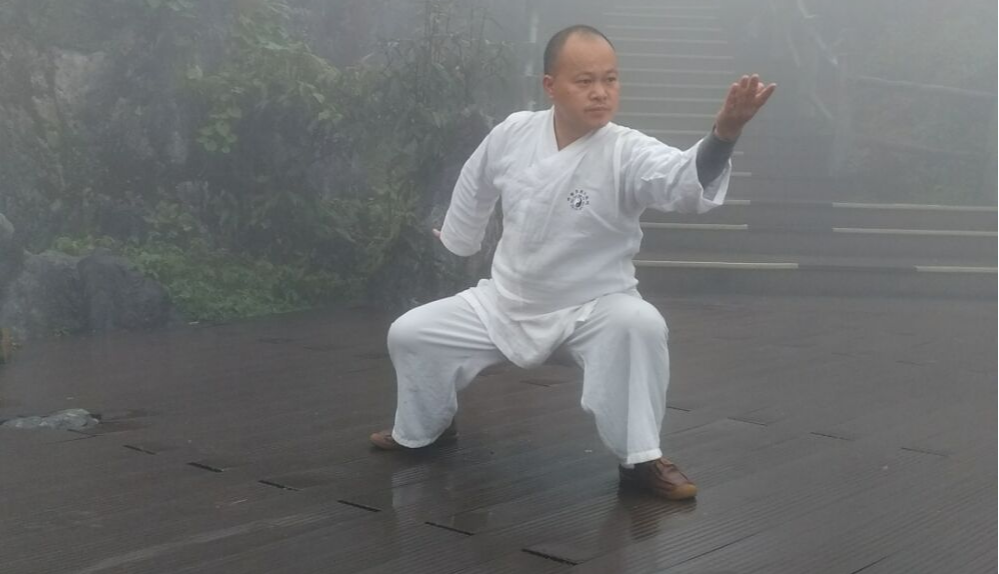

# 道家丹道内丹养生思维导图
- **道家丹道内丹的历史来源和功效**
    - **历史和来源：**
        - 道门丹道，内丹，有渊源的历史，内丹一词最早来自于东晋的许逊《灵剑子》。之后每个朝代，都有内丹修炼代表人物：东晋的葛洪是内丹术著名影响人物，其道场在惠州罗浮山，东汉的魏伯阳著有《周易参同契》；其后的内丹术代表人物有隋朝苏元朗，唐朝钟离权，吕洞宾，陈抟，崔稀范，薛道光，王重阳，丘处机，张三丰，李道纯，陆潜虚，李涵虚，吴云青，苏华仁！
        - 其中也有不少内丹隐修，实修，不愿显世的道门隐修内丹人士，门派传承！
        - 道门丹道，内丹，有渊源的历史，内丹一词最早来自于东晋的许逊《灵剑子》。之后每个朝代，都有内丹修炼代表人物：东晋的葛洪是内丹术著名影响人物，其道场在惠州罗浮山，东汉的魏伯阳著有《周易参同契》；其后的内丹术代表人物有隋朝苏元朗，唐朝钟离权，吕洞宾，陈抟，崔稀范，薛道光，王重阳，丘处机，张三丰，李道纯，陆潜虚，李涵虚，吴云青，苏华仁！
        - 其中也有不少内丹隐修，实修，不愿显世的道门隐修内丹人士，门派传承！
        - 
    - **道家内丹代表人物：**
    - > 东晋的葛洪是内丹术著名影响人物，其道场在惠州罗浮山，东汉的魏伯阳著有《周易参同契》；其后的内丹术代表人物有隋朝苏元朗，唐朝钟离权，吕洞宾，陈抟，崔稀范，薛道光，王重阳，丘处机，张三丰，李道纯，陆潜虚，李涵虚，吴云青，苏华仁！
    - **内丹的作用和功效：**
    - > 道门内丹术，是一种延年长寿术，有些道派称内丹，有些道派称丹道！无论内丹和丹道，实际都是以修炼人体内在精气神为核心的一种道门内丹研习长寿之术解决人体的身体亏损，亚健康!属于道家的养生术之一，通过正确的内丹练习，能提升人体的精气神，精力！同时也可以延缓衰老，增加人长寿的功效 ，内丹术，是道门修士有些一生修炼的养生术！
        - 
- **🔖修炼内丹三要**
- > 内丹第一要：玄牝 内丹第二要：药物 内丹第三要：火候
    - 《一》
    - 《二》
- **💡学习好道家内丹养生术的一些建议，供道友，内丹修炼爱好修士参考！**
- > 道门丹经，对内丹三要玄牝、药物，火候，有些书籍有记载，有些内丹书籍，多是用隐喻，暗语。对于研习内丹术，练道门内丹功，需要有明师传承教学引导辅导，学者要对道教文化，《道德经》，道门内丹相关书籍，有深入的悟性和研读能力！对内丹的一些专业术语，古词都需要有基础，自古以来，内丹术，内丹功，丹道都是在道门内代代相传，口传心授，有些门派不立文字！丹脉相传门内可信，可靠弟子！ 研习道教文化，炼习道门内丹养功长寿功法！ 研习道教文化，炼习道门内丹养功长寿功法！
    - **内丹法脉师承**
    - > 武当三丰自然派丹道体系
    - 内丹功传承老师：许道業 
    - **收徒要求：**
    - > 有一定的道家传统文化领悟能力，接受道家养生文化学习能力快！ 德正，心善，尊师重道者，行善积福，有弘扬道家传统文化兴趣者！ 60岁以下满足上面要求者可以咨询老师学习道门内丹