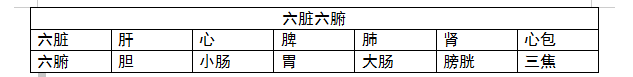
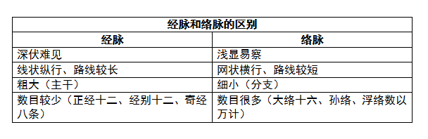
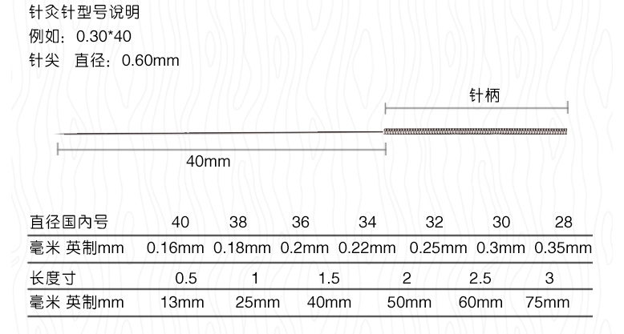

# 针灸解惑
- 脏腑雅正
    - “六脏六腑”
        - 心包的三个代表
            - 生理上代心行事
            - 病理上代心受邪
            - 治疗上代心用穴
        - 传统的“五脏六腑”改为“六脏六腑”
            -  
- 经络雅正
    - 经脉与络脉之异同
        - **沟通内外、联系上下、运行气血、输布营养、协同完成脏腑功能、维持机体生命活动**
        - 经络深浅
            - 经脉在深
                - 阳经在浅
                - 阴经在深
            - 络脉在浅
                - 阳络较浅
                - 阴络较深
        - 经直络横
        - 经粗络细
        - 经少络多
        - 小结
            -  
    - 奇经八脉雅正
        - **奇经八脉加入十二经脉循行**
            - 十四经循行：
                - **手太阴肺经** **手太阴肺经** **手太阴肺经**
        - **奇经八脉有阴阳表里配偶**
            - 任脉、冲脉、阴维、阴跷四脉属阴主里
            - 督脉、带脉、阳维、阳跷四脉属阳主表
        - **奇经八脉与脏腑有连属关系**
            - 奇经八脉直接与奇恒之腑（胆、脑、脉、骨、髓、胞宫）相连
            - 八脉隶乎肝肾——奇经八脉在与脏腑的广泛联系中与肝肾联系尤为突出
    - 十二经筋
        - 十二经筋入内脏
            - 十二经筋的主体结构是机体外周的筋肉系统，并非不入内脏，因为部分经筋除了在体表聚结外，也进入体内散络，形成有关脏腑的组织结构（如内脏系膜、平滑肌等）只是与脏腑没有属络关系。
        - 十二经筋并非只是肌腱韧带
            - 经筋所指的范围应包括骨骼、肌肉、皮下脂肪、内脏系膜、内脏平滑肌和部分神经实体结构。
    - 各经
        - 手太阴肺经
            - 原：“从肺系横出腋下”——改为“从肺系横出腋上”。无论出于云门穴或中府穴都是在腋窝上方。
            - 手太阴肺经起于云门穴
                - 云门穴首见于《素问 水热穴论》《脉经》《针灸甲乙经》。《铜人腧穴针灸图经》定中府，为缪错。
                - 经脉循行走向分析，出于云门，再下中府，再沿肩臂下行
                - 古代医家对腧穴命名含义，门者，经气出入之门户也。从云门浅出体表，从期门深入体内。
        - 足阳明胃经
            - 原：足阳明胃经非左右交叉循行——改为：足阳明胃经与手阳明大肠经一样也是左右交叉循行的。
            - 依据：笔者的一则病例出现经络敏感现象所引发的思考。《十四经发挥》、上海陈得心《中医杂志》曾撰文“足阳明胃经循行质疑”论及此说。
        - 足太阳膀胱经
            - 原：手少阴心经在十二经是否为核心？
            - 足太阳膀胱经为十二经脉之核心
                - 分部范围最大最广
                - 与各脏腑、组织和经脉联系密切（背俞穴是脏腑、经脉气血的转输点，又是脏腑、组织、器官病变的反应点）
                - 腧穴数目67个，占十二经总腧穴量的21.7%
                - 生理功能
                    - 主一身之大表
                    - 统一身之营卫
                    - 司一身之气化
                    - 统帅一身之气街（气街为脏腑、经络之气聚集、通行的共同通路）
                - 病理反应——百病之始
                - 诊断价值——反应点有压痛、敏感、麻木、迟钝、皮下组织变异（凸起、凹陷、结节、肿胀、条索）、皮肤知热度和导电量的异常变化等
                - 治疗作用——除本经外疾病，还主治其他脏腑病、五脏缩主和开窍的组织器官病证以及各脏腑分属的经脉病。
                - 防病保健
    - 腧穴雅正
        - 原：足阳明胃经阴市穴——改为：阳巿穴
            - 外阳内阴，以阴阳命名的32个经穴除了5个（厥阴俞、至阴穴、头窍阴、足窍阴、阴市穴）有悖命名规律外。
            - “阴市穴”位于膝关节外侧，足阳明胃经，主治阴寒之证，以“阳”释名更合适
            - “市”作“巿”手抄之误，巿为古代祭服和古代礼服上绣的青黑相间的花纹的意思。
    - 考古问今论经络
        - 古人对经络的认识
            - 经络是可见的：《灵枢 经脉》、《灵枢 经水》
            - 内联脏腑，外络肢节
            - 经络是运行气血的通路
        - 现代对经络的研究
            - 经络与周围神经相关说——经络是与神经关系密切的索状或管状结构
            - 经络与神经节段相关说——躯体—神经节段—内脏的联系说明体表穴位—经络—内脏联系的假说
            - 经络与中枢神经相关说——“经络感传”为“产生于大脑皮质的经络感觉”
            - 经络与自主神经相关说——交感节后纤维与阻力血管密不可分——交感神经系统是经络实质的重要组成部分
            - 经络与神经—体液调节机能相关说——机体内外环境是通过神经—体液的调节来保持协调和相对平衡的。
            - 经络与控制论相关说——经络是古人对人体控制系统的描述，是最古老的生物控制论。
            - 经络与血管相关说——“脉”=血管，经脉=动脉、络脉=静脉
            - 经络与淋巴管相关说——经脉=动脉+静脉+淋巴管
            - 经络与肌肉相关说——经络的组织结构是以肌纤维为基础的，功能结构复杂。
            - 经络与结缔组织相关说——穴位组织的实质属于最原始组织的结缔组织，针灸作用是通过结缔组织途径实现的。
            - 经络与生物电相关说——经络是人体内电的通路，人体的任何组织均可导电，所以经络—导电通路的组织具有多样性
            - 经络与电磁波相关说——经气的实质是电磁波的传导。针刺疗法的机理是通过改变经络—电磁波的强度、调节细胞的功能活动，直接或间接作用于病变部位而实现的。
            - 经络与气功相关说——气功入静可以诱发循经感传；提高感传的出现率；气功可使全身经络中的气畅通，并贯穿十二经脉和奇经八脉。
            - 经络是综合传导系统说——经络就是综合一切解耦系统来经营生活的综合系统，是从生物出生起既有的系统
            - 经络系统独立存在说——经络是一种多层次、多功能、多形态的立体结构调控系统。（经络的生物特性——抵抗阻、隐性感传、高振动音）
        - 经络是客观存在的
            - 经脉、经别——神经、大血管、淋巴管
            - 孙络、浮络——小血管、毛细血管
            - 经筋——肌肉、肌腱、韧带和部分神经组织
            - 皮部——皮肤的分部，和自主神经末梢结构类同
    - 论经络的平衡与失衡
        - 经络平衡在生理上的意义
            - 整体作用——机体在经络的调节下，气血调和，无寒热虚实之异；脉象平衡，无浮沉迟数之变
            - 局部作用——机体前后、左右、上下、内外经络本身的平衡。
        - 经络失衡在病理上的反应
            - 上实下虚，上虚下实
            - 经虚络满，经满络虚
            - 虚实更作，阴阳相移
            - 左盛则右病，右盛则左病
            - 督脉为病，脊强反折
        - 经络失衡在诊断上的价值
            - 经络望诊——观察络脉和皮部在色泽、润燥及组织形态等方面的各种病理变化，以望面色为主。
            - 经穴切诊——根据内脏有病会在体表出现各种不同的病理反应点或一起脉象的异常变化，而在一定的经穴部位进行触扪、切按来诊断疾病的方法。
            - 经络电测定——利用经络（导平）测定仪探测经络、腧穴皮肤导电量（或电阻值）的变化来分析脏腑、经络、腧穴气血的盛衰虚实。——左右两侧同一经穴的导电量相差一倍以上，即表明该经脉失去平衡，存在相应的病变。
            - 知热感度测定——人体左右两侧同一经穴对灼热的感知程度大致相同，若数据相差一倍以上即为病态，偏高者多虚，偏低多实，
        - 经络平衡在治疗上的体现
            - 左右交叉调治法
                - 缪刺：邪客于络脉或身形有痛而脉象无异常时用缪刺法
                - 巨刺：邪客于经或一侧有病而对侧脉象出现异常时用巨刺法
            - 前后对应调治法
                - 阳病治阴，阴病治阳。
                - 对应穴针刺，俞募配穴法。
            - 上下颠倒调治法
                - 远道刺：“从腰以上者，手太阴、阳明皆主之，从腰以下者，足太阴、阳明皆主之。病在上者下取之，病在下者高取之，病在头者取之足，病在腰者取之腘。”
            - 内外相合调治法
                - 身体的表里深浅部位
                - 脏腑、经脉的阴阳表里
        - 经络平衡在预防上的意义
- 腧穴雅正
    - 关于腧穴的分类
        - 阿是穴
            - 以痛为输
            - 按之快然（按之则血气散，故按之痛止）
            - 出现往往还会伴见其他的病理反应
        - 经外奇穴
            - 部位奇
            - 数目奇
            - 取法奇
                - 额中
                - 三角灸
                - 寅门：鼻端直至发际，等分三段，取绳一段入发际向上量，绳段是穴
                - 肓募：乳头到肚脐取中距离，乳头直下等距是穴
                - 灸痨：直立，足中趾尖端过足心直上至膝腘中央委中穴切断，此绳鼻尖起沿中线过头顶到脊柱是穴
            - 疗效奇
        - 十四经穴:固定部位又有专用名称,并归属十四经脉的腧穴
    - 如何看待腧穴的作用
        - 沟通内外,转输气血
        - 反应病证,辅助诊断
        - 接受刺激,防治疾病
            - 近治作用
            - 远治作用——经脉所通，主治所及
            - 整体治疗作用
            - 特殊治疗作用
                - 部分腧穴的治疗作用有一定的相对特异性：少泽通利乳汁、四缝治疗疳积、水沟救治昏厥、至阴纠正胎位
                - 部分腧穴对机体的不同状态有良性的双向调节作用：合谷、复溜既可发汗又可止汗；中脘、内关既可止呕，又可催吐；天枢、足三里既可止泻，又可通便，神门、心俞既可治疗失眠，又可治疗多寐
                - 各类特定穴的各种特殊治疗作用
            - 防病保健作用：关元、气海、命门、中脘养生四穴
    - 腧穴的功能作用即“穴性”
        - 概念：穴性是腧穴主治功能作用的概括，也是决定腧穴主治范围的前提和基础。
        - 穴性归纳
            - 强身保健穴（对人体补益的穴位）
                - 作用：强身健体、防病保健、抗衰防老、益寿延年
                - 举例：关元、气海、神阙、中脘、膻中、百会、大椎、身柱、命门、风门、肺俞、心俞、膈俞、肝俞、脾俞、胃俞、肾俞、膏肓、足三里、太溪、复溜、涌泉、内关、血海、三阴交等
            - 补气穴
                - 作用：补益阳气及六脏六腑之气
                - 举例：气海、关元、膻中、肺俞、心俞、脾俞、胃俞、肾俞、命门、足三里等
            - 补血穴
                - 作用：补血
                - 举例：气海、膻中、膈俞、肺俞、心俞、肝俞、脾俞、胃俞、膏肓、足三里、绝骨、血海、三阴交等
            - 安神穴
                - 作用：镇静安神，治疗神经衰弱、失眠、多梦、健忘、癔病、梦游、癫狂
                - 举例
                    - 神经衰弱、失眠多梦、健忘——百会、安眠、心俞、神门、内关、太溪、涌泉三阴交等
                    - 癔病、梦游、癫狂——水沟、百会、大椎、内关、神门、后溪、合谷、太冲、丰隆等（夜发病加照海，日发病取申脉）
            - 急救穴
                - 作用：高烧、中暑、低血糖、癫痫发作或中风等导致神志不清、说胡话、突然倒地、不省人事时，急救的穴位
                - 举例
                    - 昏迷不醒、血压升高、满面通红、牙关紧闭、双手握紧、呼吸急促气粗、喉中痰鸣、大小便不通——闭证——水沟、百会、大椎、内关、少商、中冲、合谷、太冲、隐白、大敦重掐或针刺放血，强刺激
                    - 神志不清、血压下降、面色苍白、眼口俱开、呼吸微弱、汗出不止、二便失禁、脉搏弱——脱证——素髎穴、百会、大椎、气海关元、神阙、足三里——艾灸或者皮肤针轻轻叩刺，促使阳气恢复，可清醒
            - 升压穴
                - 作用：血压值&lt;90/60mmHg,低血压
                - 举例：素髎穴升压最显著。人中、百会、内关、太渊、足三里、三阴交
            - 降压穴
                - 作用：降压。正常100-120/60-90mmHg，40岁以下成年人安静状态下，血压超过140/90mmHg称为高血压
                - 用穴：百会、大椎、曲池、内关、合谷、足三里、三阴交、太冲、涌泉、太溪。（吴茱萸、桃仁各15g，面粉9g打粉细末，加醋或蛋清调成糊状2个面饼，临睡贴足心涌泉，可连用数晚）
            - 祛风穴
                - 作用：祛除风邪的穴位
                - 用穴
                    - 伤风感冒——风池、风府、风门按摩、灸（风寒）、叩刺（风热）
                    - 中风、面瘫——风池、翳风、风市，可针可灸
                    - 风湿病——风池、翳风、风市、风门、风府等祛风穴
                    - 合谷、太冲、曲池、膈俞、百会、足三里也属于祛风穴范畴
            - 止痒穴
                - 作用：皮肤瘙痒疾病止痒
                - 用穴：曲池、合谷、血海、风市、足三里、三阴交、太冲、膈俞，叩刺放血或艾灸
            - 退烧穴
                - 正常人口腔体温36.5-37°c，腋下温度略低0.5°，肛门温度略高0.5°
                - 用穴：大椎、曲池、合谷、外关、尺泽、曲泽、鱼际、劳宫、少商、中冲、内庭、委中、大敦、涌泉、耳尖，指压、针刺、三棱针刺血、皮肤针疗法等
            - 除寒穴
                - 作用：消除内脏组织及肌肉、关节寒凉，具有温暖肢体作用的穴位。
                - 用穴：脐中、气海、关元、中脘、命门、百会、大椎、足三里、膝阳关、三阴交、太溪、肺俞、脾俞、胃俞、肾俞
            - 发汗、止汗穴
                - 作用：发汗、止汗
                - 用穴：大椎、合谷、复溜、阴郄、后溪、肺俞、足三里
            - 止咳平喘穴
                - 作用：咳嗽、哮喘等常见的呼吸道病症
                - 用穴
                    - 咳嗽：列缺、尺泽、太渊、丰隆、足三里、膻中、大椎、身柱、肺俞、膏肓
                    - 哮喘：膻中、填土、大椎、定喘、气海、关元、肺俞、肾俞、孔最
            - 化痰穴
                - 作用：化痰
                - 用穴：中脘、胃俞、脾俞、胃俞、内关、丰隆、足三里、三阴交、阴陵泉
            - 止呕、催吐穴
                - 作用：催吐、止呕
                - 用穴：内关、中脘、建里穴、天突穴、脾俞、胃俞、膈俞、足三里、公孙
            - 消食穴
                - 作用：帮助消化食物、治疗消化不良的穴位
                - 用穴：中脘、建里穴、梁门、天枢、脾俞、胃俞、内关、公孙、足三里
            - 止泻、通便穴
                - 作用：止泻、通便
                - 用穴
                    - 双重作用：中脘、天枢、大横、足三里
                    - 通便：外加支沟、丰隆、照海、内庭穴
                    - 止泻：关元、脾俞、神阙、三阴交、公孙
            - 利尿、消肿穴
                - 作用：适用于小便不利、点滴而下、或闭塞不通、小便全无等
                - 利尿：中极、关元、气海、神阙、水分、肺俞、脾俞、肾俞、列缺、三阴交、阴陵泉、委中
            - 调经穴
                - 作用：调理月经，经前或延后、经色时淡时红或夹有血块，经量时少时多。
                - 用穴：关元、气海、天枢、膈俞、肝俞、脾俞、肾俞、合谷、太冲、血海、三阴交、隐白穴、大敦穴
            - 止血穴
                - 鼻出血：迎香穴、素髎穴、印堂、上星穴、大椎、风池、风府、膈俞、合谷、少商
                - 牙龈出血
                    - 实证：膈俞、颊车、合谷、内庭、梁丘、大陵穴、足三里    针不灸
                    - 虚证：膈俞、颊车、合谷、足三里、太溪、照海、涌泉、针灸
                - 咯血——膏肓、膈俞、肺俞、尺泽、孔最、太渊、鱼际、太溪、足三里
                - 吐血——中脘、内关、足三里、郄门、膈俞、胃俞，指压针灸
                - 尿血——关元、中极、膈俞、胃俞、肾俞、膀胱俞、足三里、三阴交、阴陵泉
                - 便血——孔最、承山、三阴交、足三里、膈俞、命门、腰阳关
            - 止痉穴
                - 作用：制止抽搐
                - 高烧抽搐——水沟、大椎、合谷、曲池、中冲、太冲
                - 小儿惊风——水沟、承浆、印堂、百会、大椎、肝俞、合谷、太冲
                - 面神经痉挛——四白、颧髎、阳白、风池、合谷、后溪、太冲
                - 癫痫、癔病发作——水沟、百会、大椎、合谷、后溪、太冲
                - 脑膜炎或破伤风引起的角弓反张——水沟、百会、大椎、筋缩、合谷、后溪、太冲、阳陵泉
                - 小腿抽筋——承山、阳陵泉、昆仑、申脉、太冲、合谷、后溪
            - 宣通官窍穴
            - 镇痛穴
    - 骨会大抒穴改为骨会大椎
        - &lt;难经本义 四十五难&gt;
        - &lt;类经图翼 经络穴&gt;
    - 穴位新的临床治疗运用
        - 翳风穴治疗呃逆的新经验
            - 病例226例,3次以内治愈率95.13%
            - 疏调三焦之气产生治疗作用
        - 阳陵泉穴的临床新用
            - 胆绞痛——直刺2寸，泻法，动留针30-60min，或以连续波、快频率电针强刺20-30min
            - 心绞痛——急性发作，内关、郄门、阴郄，巨阙、膻中等加阳陵泉，泻法
            - 胃肠痉挛——中脘、梁丘强刺泻法，阳陵泉大幅度提插捻转，或加用电针强刺激，以助中脘、梁丘通调腑气，镇痛
            - 胃下垂、肝下垂——补中益气处方加阳陵泉
            - 膈肌痉挛——针刺膈俞、阳陵泉
            - 遗尿或尿储留——针灸阳陵泉
            - 泌尿系绞痛——强刺激阳陵泉
            - 阳痿、阳强、疝气、子宫下垂——关元、三阴交、阳陵泉
- 针法雅正
    - 关于针刺透穴
        - 因人制宜：元气厚薄、浅深之刺
        - 按部而取
            - 浅刺——头面部、胸背部
            - 深刺——四肢、腹部、腰骶部以下
        - 依病而论
            - 辨阴阳
                - 阴证——深刺透穴并留针
                - 阳证——浅透刺穴不留针或少留针
            - 明表里
                - 表证——浅刺透穴法
                - 里证——深刺透穴法
            - 察寒热
                - 热证——浅刺透穴不留针
                - 寒证——深刺透穴久留针
            - 分虚实
                - 实证——深刺透穴
                - 虚证——浅刺透穴
                    - 虚寒——留针侯气
                    - 虚热——浅刺疾出
            - 按病程
                - 新病、轻病浅刺透穴
                - 久病、重病深刺透穴
        - 因时而施
            - 春夏刺浅
            - 秋冬刺深
    - 关于针灸刺激量的浅见
        - 针刺刺激量:单位时间内针刺提插捻转的幅度、频率和强度的大小
            - 强刺激
            - 中刺激
            - 弱刺激
            - 增加刺激量的方法
                - 持续运针——积累刺激时间
                - 反复多次间歇行针——综合间断刺激量
                - 增添刺激手段如加电针——提高刺激强度
        - 艾灸刺激量：施灸中艾炷的大小、艾灸壮数的多少、艾火的强度和艾治时间的长短等因素的综合。
            - 补法：施术过程中艾柱自燃，温热刺激，施灸处皮肤出现潮红为度
            - 泻法：施术过程中不断把火吹旺，强的火热刺激，使施灸部位皮肤产生灼热、疼痛感，灸厚局部可见白色硬块，刺痛，出现水泡。
    - 关于针灸虚实的含义
        - 机体的虚实状态
        - 疾病的虚实性质
        - 经络和脉象的虚实
        - 针下虚实的感觉
        - 达到充实或虚损的目的
    - 关于针刺补泻的若干问题
        - 补泻的含义
            - 鼓舞正气、使低下功能恢复旺盛的针刺手法为补法
            - 疏泻病邪、使亢进功能恢复正常的针刺手法为泻法
        - 得气与补泻的关系
            - 得气在前，补泻在后。得气是补泻的先决条件，补泻必须在得气的基础上实施，才能收到良好的治疗效果。
        - 针刺补泻的时机——得气为先
        - 影响针刺补泻的因素
            - 机体的状态
            - 腧穴的偏补、偏泻特性
            - 针刺手法
        - 补泻的手法问题
            - 强刺激
            - 中刺激
            - 弱刺激
    - 不同刺灸工具与方法对补泻的影响
        - 针刺偏于清泻
        - 艾灸偏于温补
        - 电针
            - 连续波有抑制神经兴奋和镇痛作用，属于泻法
            - 断续波起兴奋神经核振奋肌肉的作用，属于补法
            - 疏密波介于上两者之间，平补平泻
        - 针灸针型号说明 
    - 针灸“无痛”十要诀
        - 消——打消患者怕痛的心理顾虑
        - 选——选好针具与体位
        - 准——准确取穴
        - 干——下针必待消毒酒精挥发干，夹持进针或出针必须用干棉球
        - 散——利用一定的方式分散患者的注意力
        - 避——进针时避开血管、肌腱、韧带、瘢痕和毛孔
        - 押——押手巧妙配合
        - 浅——进针浅
        - 轻——手法轻
        - 问——正确发问。“感觉怎么样？”或“有什么感觉？”
- 针法治疗
    - 治神守气——针灸治疗的第一原则
    - 针灸临床必须辩证论治——针灸的理、法、穴、方、术是针灸临床辩证论治的一套方法。
        - 理——中医学的基本理论：阴阳五行、脏腑气血、经络等
        - 法——中医治病大法，又指针灸治疗方法
        - 穴、方——选穴配方
        - 术——针灸操作技能
    - 针灸临床必须强调经络辩证
        - 针灸临床诊治疾病是以八纲辨证为总纲、脏腑气血辩证为基础、经络辩证为核心。
        - 经络辩证
            - 辩证归经
                - 病候归经
                - 兼证归经
            - 辨位归经
                - 病位归经
                - 体征归经
            - 经络诊察归经
                - 经络望诊
                - 经穴触诊
                    - 循经按压
                    - 穴位按压
                        - 酸胀为主——气滞
                        - 刺痛为主——血瘀
                        - 穴下肉垫——肿瘤形成标志
                        - 穴下结节——肿瘤中期
                        - 硬性结节——肿瘤晚期
                    - 经络电测定——测定一般取各经的原穴或井穴，一经大于或小于他经2万以上或者本经左右相差2万以上即是病态，电阻小电位高为实，电阻大电位低为虚。
                    - 知热感度测定——等热力、等距离、等速度的条件下对井穴进行测定。先左后右，先手后足。
            - 按经论治
                - 十二经证治
                - 奇经八脉证治
                    - 任脉为病，男子内结七疝，女子带下叚聚
                    - 督脉为病，脊强发折。女子不孕，癃、痔、遗溺
                    - 冲脉为病，逆气里急
                    - 带脉之为病，腹满，腰溶溶如坐水中
                    - 阴维为病，苦心痛
                    - 阳维为病，苦寒热
                    - 阴跷为病，阳缓而阴急
                    - 阳跷为病，阴缓而阳急
                - 十二经别证治
                - 络脉证治
                - 经筋证治
                - 皮部证治
        - 针灸六经辩证论治
            - 太阳病证治
                - 提纲——太阳之为病，脉浮，头项僵痛而恶寒
                - 经证
                    - 中风
                        - 症状——头痛、身痛、发热、微恶风寒、汗出、苔薄白、脉浮缓
                        - 治则——疏风解肌、调和 营卫。针灸并用，平补平泻
                        - 处方——风门、大抒穴、肺 俞穴、风府、风池、大椎、列缺、合谷
                    - 伤寒
                        - 症状——头痛、身病、骨节疼痛、恶寒、发热、无汗、咳喘、苔薄白、脉浮紧
                        - 治则——解表散寒、宣肺平喘。针灸并用，泻法
                        - 处方——大抒穴、肺俞、太渊、列缺、合谷、偏历、大椎、后溪
                - 腑证
                    - 蓄水证
                        - 症状——主症兼烦渴引饮、水入既吐、小便不利、小腹胀满
                        - 治则——化气行水、兼解表邪，针灸并用，平补平泻
                        - 处方——肺俞、肾俞、膀胱俞、委中、中极、合谷、内关、三阴交
                    - 蓄血证
                        - 症状——主症兼少腹急结或硬满，狂躁、小便自利、脉沉涩、舌紫暗或有瘀斑
                        - 治则——泻热通阳、活血化瘀。多针少灸、以泻为主
                        - 处方——大椎、膈俞、委中、委阳、中极、关元、下巨虚、三阴交
            - 阳明病证治
                - 提纲——阳明之为病，胃家实是也
                - 经证
                    - 症状——身大热、汗大出、口大渴、面赤、心烦、舌红、苔黄躁、脉洪大而数
                    - 治则——清泄热邪、养阴生津。只针不灸，泻法
                    - 处方——合谷、曲池、颊车、内庭、足三里、大椎、阴郄、后溪、廉泉、金津、玉液
                - 腑证
                    - 症状——便秘、腹满而痛、潮热、汗出、烦躁、谵语、苔红、苔黄躁、脉沉实有力
                    - 治则——通便泻热、 急下存阴。针不灸，泻法
                    - 处方—— 天枢、足三里、上巨虚、丰隆、内庭、曲池、合谷、内关、支沟
            - 少阳病证治
                - 提纲——少阳之为病，口苦、咽干、目眩也
                - 本证
                    - 症状——口苦、咽干、目眩、心烦、恶心呕吐、不欲饮食、寒热往来、胸胁胀满而痛、苔黄、脉弦
                    - 治则——疏调气机、和解少阳。针不灸，泻法
                    - 处方——阳池、外关、支沟、内关、期门、太冲、丘墟、阳陵泉
                - 兼证
                    - 兼太阳证
                        - 症状——主症伴发热、微恶寒、肢体疼痛
                        - 治则——和解少阳、调理营卫。多针少灸，平补平泻
                        - 处方同上，见证加大抒穴、风门、肝俞、合谷、大椎
                    - 兼阳明证
                        - 症状——主症伴日晡潮热、大便不通、脘腹胀满
                        - 治则——和解少阳、通调腑气。只针不灸，泻法
                        - 处方同本证，见证加中脘、天枢、足三里、上巨虚、内庭
            - 太阴病证治
                -  提纲——太阴之为病，腹满而吐，食不下，自利益甚，时腹自痛（舌淡苔白，脉迟缓而弱）
                - 症状——太阴是三阴之首，其病位在里，性质属寒，多虚
                - 治则——温中散寒、健运脾阳。针灸并用，补法
                - 处方——太白、血海、三阴交、脾俞、中脘、足三里、丰隆
            - 少阴病证治
                - 提纲—— 少阴之为病，脉微细，但欲糜也。
                -  寒化证
                    - 症状——四肢厥冷、恶寒、神疲欲寐、蜷卧、下利清谷、小便清长、舌淡苔白、脉微欲绝
                    - 治则——温肾逐寒、扶脉回阳、针灸并用。重灸、补法
                    - 处方——太溪、复溜、肾俞、命门、气海、关元、三阴交
                - 热化证 
                    - 症状——心烦不眠、  口干舌燥、咽喉 疼痛、小便发黄、舌红少苦、脉细数
                    - 治则—— 壮水制火、滋阴清热。只针不灸，平补平泻
                    - 处方——太溪、涌泉、然谷、照海、复溜、列缺、神门、内关、三阴交 
            - 厥阴病证治
                - 提纲——厥阴之为病，消渴、气上冲心、心中痛热、饥不欲食、食则吐蛔，下之、利不止
                - 症状——厥阴病是六经传变的最后一经，处于阴尽阳生之际，是正邪相争，进退消长的关键时期。阳盛则热，阴胜则寒。多见寒热交错，上热下寒，舌黄而干，平补平泻。
                - 治则：清热温寒，安蛔降逆，针灸并用，平补平泻
                - 处方——章门、期门、太冲、阳陵泉、中脘、巨阙、 内关、血海、足三里
            - 六经传变
                - 循经传——病进时：太阳——少阳——阳明；太阴——少阴—— 厥阴；病退太阴病——阳明病；阳明病——少阳——太阳
                - 越经传
        - 针灸温热病辨证论治
            - 卫气营血证治史按照温热病邪侵袭人体致病后的发展规律，将疾病的全过程分为卫气营血四个阶段，以便使病变的浅深部位、轻重缓急和传变规律。
            - 卫分病证治
                - 症状：卫分主表，类似伤寒太阳证。症见发热，微恶寒、少汗或无汗、头痛、咳嗽、口微渴、咽喉红肿疼痛，苔薄白，脉浮数
                - 治则——调和肺卫、疏风解表、只针不灸，泻法
                - 处方——太渊、列缺、合谷、曲池、肺俞、大椎、风府、外关、风池
                - 按——温热病最伤阴，以清热 养阴为务
            - 气分病证治
                - 气分清便是温热之邪入里化热，类似伤寒阳明证
                - 热盛伤津
                    - 症状——高热、多汗、口渴喜冷饮、尿少而黄赤、舌红苔黄躁、脉洪大
                    - 治则——清热泻火、生津止渴、只针不灸，泻法
                    - 处方——合谷、曲池、内庭、颊车、大椎、廉泉、金津玉液
                - 热邪壅肺
                    - 症状——发热、咳嗽、口渴、尿黄、苔薄黄、脉数
                    - 治则——清热泻火、宣肺平喘、只针不灸、泻法
                    - 处方——太渊、 鱼际、列缺、尺泽、中府、合谷、曲池、肺俞
                - 热 结肠道
                    - 症状——高热、便秘、腹满而痛、甚至神昏谵语、苔黄燥焦黑、脉沉实有力
                    - 治则——清泄阳明、通调腑气、只针不灸，泻法
                    - 处方——合谷、曲池、内庭、天枢、足三里、上巨虚、中脘、支沟、大横
                - 湿热蕴结
                    - 症状——身热起伏、胸闷、恶心欲呕、渴不多饮、肢体倦怠、小便短少、大便不爽或溏泄、苔白腻或兼黄、脉濡数或滑数
                    - 治则——清利湿热、宣通气机、只针不灸、泻法
                    - 处方——二间、合谷、曲池、内庭、内关、商丘、太白、三阴交、阴陵泉
            - 营分病证治
                - 症状——营分受邪则耗伤津血、兼犯神明。症见发热夜甚、心烦不寐、狂躁谵语、斑疹隐隐、舌质红绛、少苔或无苔、脉细数
                - 治则——清泄热毒、镇静宁神、只针不灸，泻法或点刺放血
                - 处方——内关、神门、阴郄、合谷、太冲、水沟、大椎、神庭、十二井
            - 血分病证治
                - 症状——身热、 咽口干燥、牙出血、鼻衄、吐血、尿血、便血、女子经血妄行，皮肤发抽搐惊厥、神昏  谵语、燥扰不安、舌深绛、脉细数
                - 治则——清热凉血、镇痉宁神、只针不灸，泻法
                - 处方——合谷、曲池、内关、阴郄、太冲三阴交、膈俞、大椎
        - 针灸三焦辨证论治
            - 上焦
                - 肺
                - 心和心包
            - 中焦
                - 胃
                - 脾
                - 大肠
            - 下焦
                - 肾
                - 肝
                - 膀胱
        - 针灸治病八法 
            -  汗——发汗解表——大椎、身柱、风池、风门、肺俞、合谷、列缺、后溪
            - 吐——催吐——天突、中脘、合谷、内关、丰隆、足三里
            - 下——泻下——合谷、曲池、天枢、大肠俞、丰隆、足三里等
            - 升—— 补中益气、升阳举陷——气海、关元、百会、足三里、三阴交、脾俞
            - 温——温散表寒、温经散寒、温中散寒、散寒补虚、回阳救逆——针灸并用
            - 清——宣散表热、清泻里热、清泻热毒、泻热开窍、刺络泻热、滋阴清热——辨证论治
            - 补法 
                - 补其本经
                - 补表里经
                - 虚则补母
                - 固先天之本、补后天之气
                    - 补益心肺
                    - 补养心脾
                    - 补中益气
                    - 升阳固脱
                    - 滋补肝肾
                    - 气血双补
        - 结合现代医学知识选穴法
            - 按照神经节段选穴
                - C5-T1夹脊穴——上肢桡侧疼痛、麻木、感觉异常
                - T5-L5夹脊穴——腹部脏器病变
                - L1、L2夹脊穴——股外侧皮神经炎
            - 按神经干的走向和分布选穴
            - 结合生理病理学知识，辨证与辨病结合选穴
            - 结合现代临床和科研成果选穴法
                - 呼吸 系统——足三里可增加肺通气量——哮喘；素髎穴、水沟、会阴穴——兴奋呼吸中枢——急救
                - 消化系统——中脘、天枢、胃俞、足三里对胃肠平滑肌蠕动有双向调节；合谷、梁丘调节胃酸分泌
                - 循环系统——内关穴、足三里对心率和血压均有明显的双向调节作用；丰隆穴降血脂、胆固醇、血粘度；素髎穴升压明显
                - 泌尿系统——太溪、照海、肾俞增强神的泌尿功能，又能治疗肾炎。 曲骨、中极、内关、膀胱俞对膀胱括约肌的苏张有双向调节作用
                - 免疫防卫系统——大椎、合谷、足三里消炎止痛、抗感染
            - 
    - 影响针灸处方的基本因素  
        - 穴 有主次，术有先后——先上后下，先阳后阴（一般情况）
        -  知达常变，随症 增减 腧穴
        - 针所不为，灸之所宜
        - 针刺方法不同，治疗效果有别
            - 针刺方向——刺向病所
            - 针刺深浅
            - 刺激强弱
            - 补泻手法
            - 留针和出针
        - 把握针灸治疗时间
            - 治疗时间
            - 留针时间
            - 疗程时间
                - 多数疾病如面瘫、风湿痹痛，针灸10次为1个疗程
                - 部分急性或简单的病症，如急性扭伤、牙痛、目赤肿痛，3-5次为1个疗程
                - 少数慢性病、疑难病和运动功能障碍性疾病，如肥胖症、不育不孕、中风 偏瘫、截瘫等，至少1个月1个疗程
            - 间歇时间
            - 总体治疗时间
    - 特定穴选穴配穴规律
        - 特定穴
            - 原穴——对本经脉、本脏腑有双向调节作用、寒热虚实证均可
            - 络穴——联络表里经、主治表里经病变
            - 俞穴——主治  相应脏腑病，但偏治疗慢性虚弱性疾病，五脏 俞还治疗五脏开窍的五官病、五脏所主的五体病、五脏所属的经脉病
            - 募穴——主治 相应的脏腑病，但偏治急性 疼痛性病症
            - 郄穴——主治本脏腑、经脉的急性、发作性、疼痛性病症
            - 八会穴——脏、腑、气、血、脉、筋、骨、髓，分别主治各自所会组织的病变
            - 下合穴——合治内腑，下合穴是六腑病症的首选穴
            - 八脉交会穴——十二经脉中8个与奇经八脉相通的腧穴，主治奇经八脉的病症
            - 交会穴——两条或两条以上经脉交叉、交会之处的腧穴，主治有关交会经脉以及所属脏腑的病症
            - 五腧穴 ——主治本经病、本脏或本腑病、四肢肘膝关节以下局部并、经脉所及远端的头面、五官、躯干病
                - 井主泻热开窍，用于急救；
                - 荥穴主治身热、泻本经之热和脏腑之热
                - 输穴住肌肉、关节的疼痛性病症
                - 经穴主治以呼吸系统病症为主
                - 合穴主治消化系统尤其六腑病
        - 特定穴配穴规律
            - 原络配穴
            - 俞募配穴——广泛治疗本脏腑的急慢性实证
            - 募合配穴——六腑 相应募穴陪下合穴，加强通调腑气作用
            - 郄会配穴——相关郄穴 与八会学相配，如胃经郄穴梁丘陪中脘止急性腹痛；肺经郄穴孔最配 亶中穴平哮喘发作
            - 八脉交会穴配对——公孙、内关胃心胸，列缺、照海膈喉咙、后溪申脉头项痛，背 腰；外关临泣疗偏头、胸胁、下肢外面病痛
            - 交会穴互配—— 头维、阳白主治偏正头痛、 关元、三阴交主治一切肝、脾、肾疾患
        - 不同病证选配特定穴规律
            - 本经病证——原穴、五输穴
            - 表里经病证——原穴、络穴
            - 交会经病证——交会穴
            - 奇经八脉病证——八脉交会穴、相关交会穴
            - 脏病——原穴、背俞穴、募穴、章门
            - 腑病——原穴、背俞、募穴、下合穴、中脘
            - 气病——亶中、足三里、背俞穴
            - 血病——膈俞、亶中、足三里、背俞穴
            - 筋病——阳陵泉、太冲、肝俞
            - 脉病——太渊、内关、郄门、阴郄、神门、心俞
            - 骨病——大椎、太溪、肾俞
            - 急性、发作证、疼痛性实证——原穴、募穴、郄穴、下合穴
            - 慢性、虚弱性病症——原穴、背俞、关元、亶中、膈俞、三阴交、足三里
- 具体病症的治疗思路和方法
    - 痿证的针灸治疗思路和方法
        - 治痿独取阳明
            - 立论机理
                - 阳明为五脏之本
                - 阳明经多气多血
                - 阳明主润宗筋
                - 阳明与太阴相表里
            - 具体应用
                - 独取阳明法
                    - 补气养血，扶阳明之正——合谷、手足三里、上下巨虚 ——补法、针灸并用
                    - 行气清胃，泄阳明之 热——合谷、曲池、内庭、伏兔、足三里。——针泻法
                    - 祛风活血，通阳明经络——四白、地仓、颊车、下关、合谷、曲池、肩 髃、臂臑、手足三里、髀关、解溪
                    - 健脾利湿，化阳明痰浊 ——地仓、合谷、手足三里、丰隆、伏兔。针灸并用、平补平泻
                - 表里 同用法
                - 兼顾肝肾法
                - 多经取穴法
                - 针药结合法
        - 中风后遗症的治疗思路和方法
        - 针灸减肥的基本环节和用穴规则
            - 发汗
            - 祛湿
            - 化痰
            - 利尿
            - 通便