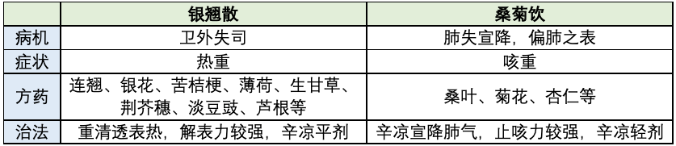
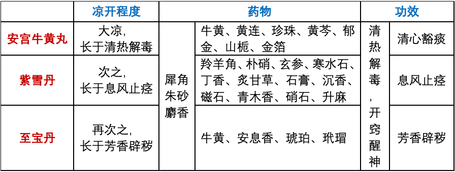
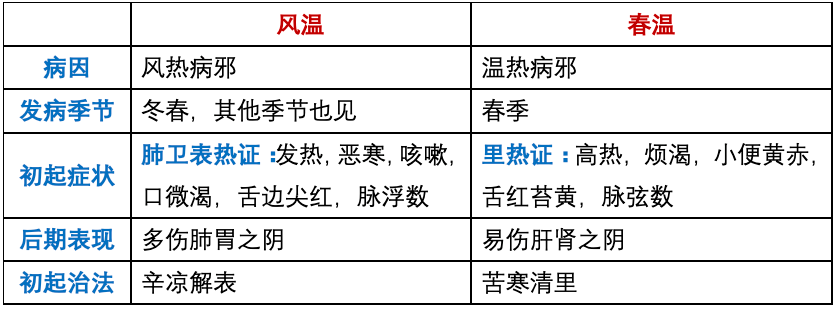
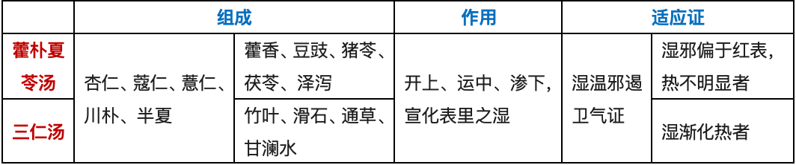

# 温病学各论
- **各论**
    - **风温**
        - **☆概念：感受** **风热** **病邪所引起的急性外感热病；** **初起** **以** **肺卫表热证** **为主要证候，** **继则** **出现** **邪热壅肺** **等** **气分证候** **，** **后期** **多表现为** **肺胃阴伤** **；四季均可发生，但以** **冬春两季** **多见，发于冬季的又称为**  **@冬温**
        - > 风温之名首见于 **《伤寒论》** ： *“太阳病，发热而渴，不恶寒者，为温病，若发汗已，身灼热者，名风温。”* 【西医】冬春季节的 **流行性感冒、急性支气管炎、大叶性肺炎、病毒性肺炎** 等（呼吸系统疾病）
        - **☆治法治则：** [肺经] **清泻肺热**
        - > ***一表二清三养阴：*** *解表为先，继进清热，酌予攻下，养阴善后*
            - 风温初起
                - **邪在肺卫** ——辛凉解表
            - 邪传气分
                - **邪热在肺** ——清热宣肺
                - **阳明热盛** ——辛寒清气
                - **阳明腑实** ——苦寒以下
            - **★** **逆传心包** ——清心开窍
            - > **@逆传心包** **：** 指邪热由肺卫直接内传心包，闭阻心窍，出现神昏谵语、身热肢厥、舌謇、舌绛等危重证候，因疾病急剧变化，病情骤然加重，故称之为“逆传心包”。
            - 后期
                - **肺胃阴伤** ——甘寒清养肺胃之阴
        - **治疗禁忌：** 初起邪在肺卫——忌用辛温发汗，不可过用寒凉
        - **☆病变中心：** **肺经**
        - > 详细：书p72
        - **☆辨证论治**
            - **邪袭肺卫** —— **辛凉解表，宣肺泄热** —— **银翘散/桑菊饮** ——风温初起，风热病邪侵袭肺卫
            - > 发热，微恶风寒，无汗/少汗，头痛，咳嗽，口微渴，苔薄白，舌边尖红，脉浮数
                - **银翘散** （辛凉平剂）
                - > 银翘散主上焦疴，竹叶荆牛豉薄荷，甘桔芦根凉解法，发热咽痛服之瘥。
                    - 取 **轻清宣透** 之品以清宣肺卫之邪
                    - > 吴鞠通：“治上焦如羽，非轻不举。”
                    - **临床应用**
                        - 风热灼津而口渴较甚——+花粉、石斛——生津清热
                        - 咽喉肿痛——+马勃、玄参、土牛膝、白僵蚕——解毒消肿
                        - 夹食滞——+莱菔子、神曲、冬瓜仁——消食导滞
                        - 鼻衄——+白茅根、焦山栀，-荆芥、豆豉
                - **桑菊饮** （辛凉轻剂）
                - > 桑菊饮中桔杏翘，芦根甘草薄荷饶，清疏肺卫轻宣剂，风温咳嗽服之消。
                - **★** **鉴别** 
                    - 邪袭肺卫，偏于 **卫** 者（ 表热较重 ）—— **解表** —— **银翘散**
                    - > 发热微恶风寒，头痛，咽红咽痛较明显者；而 **咳不明显** 者
                    - 邪袭肺卫，偏于 **肺** 者（ 肺失宣降，表证较轻， 以 咳嗽 为主症）—— **宣肺** —— **桑菊饮**
                    - > 寒热、苔白； *吴鞠通：“* ***但咳，身不甚热，*** *口微渴者，桑菊饮主之。”*
            - **肺热炽盛**
                - **邪热壅肺** —— **清热宣肺** （平喘） —— **麻杏石甘汤/千金苇茎汤** ——风热之邪入里，邪热壅阻肺经气分之证
                - > **【** 气分 **，** *肺* **】** **身热** ，汗出，烦 渴 ， ***咳喘*** ；或咯 *痰* 黄稠/带血，舌红 苔黄 ，脉数；或痰呈铁绣色，胸闷 *胸痛*
                    - **麻杏石甘汤** （热、咳、喘）
                    - > 麻杏甘草石膏汤，四药组合有专长，肺热壅盛气喘急，辛凉疏泄此法良。
                    - **千金苇茎汤** （肺热化火/肺痈将成之时，咯吐腥臭脓痰者）
                    - > 苇茎汤方千金存，桃仁薏苡冬瓜仁，瘀热在肺成痈毒，热泻脓除新自生。
                - **肺热腑实** （痰热腑实） —— **宣肺化痰，泄热攻下** —— **宣白承气汤** ——肺经痰热壅阻，肠腑热结不通之肺肠并病证
                - > 【 气分 ， *肺、大肠* 】 **潮热** ***便秘*** ， ***痰*** **涎壅盛** ， ***喘*** **促不宁** ， 苔黄 腻/黄滑，脉右寸实大 宣白承气汤石膏，大黄杏仁和瓜蒌。
                - **肺热移肠** （肺肠同病、肠热下利） —— **苦寒清热止利** —— **葛根黄芩黄连汤** ——肺胃邪热下移大肠
                - > 【 气分 ， *肺、大肠* 】 **身热** ， *咳嗽* ， 口渴 ， ***下利*** *色黄热臭* ，肛门灼热，腹痛而不硬满， **苔黄** ， **脉数**  葛根黄芩黄连汤，再加甘草共煎尝，邪陷阳明成热痢，清里解表保安康。
                    - 热邪自找出路，以伤津液为代价，并气随液脱——急则治其标
                    - **葛根黄芩黄连汤**
                        - 葛根—— 轻清升阳止利
                        - 黄芩、葛根—— 苦寒清热坚阴止利
                        - 甘草——缓和诸药
                - **肺热发疹** —— **宣肺泄热，凉营透疹** —— **银翘散去豆豉，加细生地黄、牡丹皮、大青叶，倍玄参方** ——肺热（气分）波及营络
                - > 【（卫） 气营分 ， *肺* 】 **身热** ， **肌肤发疹，** **疹点红润** ， ***咳嗽*** *，胸闷* ，舌红 苔薄白 ，脉数
            - **痰热结胸** —— **清热化痰开结** —— **小陷胸加枳实汤** ——邪热入里，与痰搏结于胸脘
            - > **身热面赤** ，渴欲饮凉，饮不解渴，得水则呕， **胸脘痞满** ， **按之疼痛** ，便秘， **苔黄滑** ，脉滑数有力 小陷胸汤连半蒌，宽胸开结涤痰优，膈上热痰痞满痛，舌苔黄腻脉滑浮。
            - **邪入阳明**
                - **热炽阳明** （邪热犯胃） —— **清热生津** —— **白虎汤**
                - > **壮热** ，恶热， **汗大** 出， **渴** 喜冷饮，苔黄而燥， **脉** 浮 **洪** /滑数 **（阳明四大证/白虎汤证：大热、大汗、大渴、脉洪大）** 病变部位：阳明胃经；其热势为无形邪热弥漫
                    - **白虎汤** （清泄阳明胃热代表方）
                    - > 白虎汤用石膏偎，知母甘草粳米陪，亦有加入人参者，躁烦热渴舌生苔。
                        - ***粳米*** *——可增加汤液中的石膏晶体粒数，对石膏有助溶作用*
                    - ★ **吴鞠通——白虎汤“四禁”** （二脉二症） ： *“脉浮弦而细者，不可与也；脉沉者，不可与也；不渴者，不可与也；汗不出者，不可与也。”*
                        - ①脉浮弦而细者：邪热未至阳明，表证未解
                        - ②脉沉者：病在里，邪热无外达之机
                        - ③口不渴者：热未甚，津未伤
                        - ④汗不出者：虽见里热，恐表邪未尽解
                        - > 例外： **糖尿病中消** 可用白虎汤
                - **热结肠腑** —— **软坚攻下泄热** —— **调胃承气汤** ——肺经邪热不解，传入胃肠，与肠中积滞糟粕相结
                - > 【 气分 ， *大肠* 】 **日晡潮热** ，时有谵语， ***大便秘结*** ，或纯利恶臭稀水（ **热结旁流** ），肛门灼热， ***腹部胀满*** **硬痛** ， **苔老黄而燥** **，甚则灰黑而燥裂** ， **脉沉实有力**  调胃承气草硝黄，便秘口渴急煎尝。
                    - **甘草** ——缓芒硝、大黄，留中泻热
                - **胃热阴伤** —— **清泄胃热，生津益气** —— **竹叶石膏汤** ——胃热津伤
                - > 身热自汗，面赤，口舌干燥而渴，虚烦不眠，气短神疲，身重难以转侧，时时泛恶，纳谷不馨，苔黄而燥，舌红而干，脉细数 竹叶石膏汤人参，麦冬半夏甘草承，再加粳米同煎服，清热益气津自生。
            - **热入心包**
                - **热陷心包** —— **清心开窍** —— **清宫汤** 送服 **三宝（安宫牛黄丸、紫雪丹、至宝丹）** ——气分、营血分邪热传入心包/病变初期
                - > **神昏谵语/昏愦不语** ， **身体灼热** ，四 **肢厥** 冷， **舌謇** ，舌色鲜泽（ **舌绛** ），脉细数
                    - **凉开三宝**
                    - > **安宫牛黄** 开窍方，芩连栀郁朱雄黄，犀角真珠冰麝箔，热闭心包功效良。 **紫雪** 犀羚朱朴硝，硝磁寒水滑石膏，丁沉木麝升玄草，更用赤金法亦超。 **至宝** 朱砂麝息香，雄黄犀角与牛黄，金银二箔兼龙脑，琥珀还同玳瑁良。 
                - **热入心包兼阳明腑实** —— **清心开窍，攻下腑实** —— **牛黄承气汤**
                - > 【 *手厥阴心包、手阳明大肠* 俱病】身热， **神昏，舌謇** ，肢厥，便秘，腹部按之硬痛，舌绛，苔黄燥，脉数沉实 牛黄承气条辨方，安宫丸内调大黄。 （用安宫牛黄丸二丸，以水化开，调生大黄末9g）
            - **正气外脱** —— **益气敛阴固脱/回阳固脱** （ 内闭外脱者 配合 **清心开窍** ）—— **生脉散/参附汤** （ 内闭外脱者 配合 **安宫牛黄丸** ）—— @内闭外脱 （热陷心包之后，由邪热内闭于心包，继而正气外脱）
            - > 身体灼热，神志昏愦，倦卧，气息短促，汗多，脉散大/细数无力；或发热骤退，面色苍白，四肢既冷，汗出不止，虚烦燥扰，气息短促，舌淡，脉微细欲绝 生脉麦味与人参，保肺生津又提神；气少汗多兼口渴，病危脉绝急煎斟。
            - **余邪未净，肺胃阴伤** —— **滋养肺胃，清涤余邪** —— **沙参麦冬汤、** ~~（五汁饮）~~ ——风温病恢复期，以肺胃阴伤更为突出
            - > 低热/不发热，干咳不已/痰少而粘，口舌干燥而渴，舌干红少苔，脉细 沙参麦冬扁豆桑，玉竹花粉甘草襄；秋燥耗津伤肺胃，咽润干咳最堪尝。
                - 阳明热炽：白虎汤
                - 热盛阴伤：竹叶石膏汤
                - 纯阴伤：沙参麦冬汤
    - **春温**
        - **☆概念：感受** **温热** **而引起的，发生于** **春季** **，以发病急，** **初起** **即有明显** **气分/营分里热候** **，病情较重，变化较多，** **后期** **可** **伤及肝肾阴液** **为主要临床特点的一种急性热病，本病严重者可以出现** **神昏，痉厥，斑疹，出血** **等危重证候。**
            - **★** **鉴别：风温VS春温** 
        - **☆治则：** **清、透、养** **——** **清泄里热** （为主） **，透邪外出，顾护阴液**
        - **治疗大法：** 解表、清气、攻下、清营凉血、开窃、息风、养阴、固脱等
        - > 除了和解法、祛湿清热法
            - 解表—— **初起见表证兼有表邪**
            - 攻下—— **里热传腑**
            - 开窍—— **内闭心包**
            - 清营凉血—— **热在营血**
            - 息风—— **肝风内动**
            - 养阴—— **阴液耗伤**
            - 固脱—— **气阴外脱**
        - **治疗禁忌：** 辛温升透；消导利湿——以防劫津耗液
        - **辨治要点**
            - **辨初起证侯**
            - **辨发于气分、营分之不同**
                - **发于气** ——病程较短，预后较好
                - **发于营** ——病程有较长，预后较差
            - **辨表证之有无**
                - **兼表** ——新感引发
                - **不兼表** ——伏邪自发
        - **☆辨证论治**
            - **★** **初发证治**
            - > 伏邪自发、新感引发
                - **气分郁热** （胆腑郁热） —— **苦寒清热，（坚阴）宣郁透邪** —— **黄芩汤加豆豉、玄参方** ——春温初发热郁气分，多为邪热郁于少阳胆腑（ “伏于少阴，发于少阳” ）
                - > **身热，口苦而渴，干呕，心烦** ，小便短赤，胸胁不舒，舌红苔黄，脉弦数 **滋养阴液** ， 兼表者 佐以 **疏邪透表** 
                    - **黄芩汤加豆豉、玄参方** 《温热逢源》
                        - **“清，透，养”**
                            - 黄芩——苦寒泻火、清泄胆熱
                            - 芍药、甘草——酸甘化阴以生津液
                            - 玄参——咸寒养阴，清热解毒
                            - 豆豉——宣发郁热，透邪外达
                        - **配伍养阴药原因**
                            - 温热病邪易伤阴，配伍养阴药，可顾护阴液
                            - 本方以苦寒药为君，苦寒易伤阴，所以亦配养阴药
                - **卫气同病** —— **解表清里** —— **增损双解散** ~~**（/葱豉桔梗汤+黄芩）**~~ —— ★ 邪郁于里，新感时令之邪引动内伏之邪郁热（表里同病）
                - > **发热恶寒** ，无汗/有汗， **头** 项强 **痛** ， **肢** 体空 **痛** ，心烦口渴，腹胀，大便干，唇焦，舌红， **苔黄** （厚焦 **燥** 甚有芒刺）， **脉** 滑 **数** /弦数 *增损双解散——升降散（大黄、僵蚕、蝉蜕、姜黄）加减*
                - **热灼营分** —— **清营泄热** —— **清营汤** ——营热较盛，营阴受损，心神被扰
                - > **身热夜甚，心烦** 躁扰，甚或时有 **谵语，斑疹隐隐** ，咽燥口干反不甚渴饮， **舌红绛** ，苔薄/无苔，脉细数 清营汤治热传营，身热烦渴眠不宁，犀地银翘玄连竹，丹麦清热更护阴。
                    - **清营汤** ——清泄营热基本方
                    - > 银花、连翘、竹叶一一轻清透泄之品，伍于清昔之品中，可清透泄热，使营分邪热转出气分而解（“ @透热转气 ”）
                        - 本方用黄连的条件——营阴耗损不明显；心神不宁，烦燥
                        - 本方去黄连的条件——营阴耗损明显，舌干绛；防苦燥伤阴
                - **卫营同病** —— **泄卫透营** —— **银翘散去豆豉，加细生地黄、牡丹皮、大青叶，倍玄参方** （方见风温章）——新感引动伏邪，卫受邪郁，营有热灼（表里同病）
                - > 发热，微恶风寒，汗少/无汗，咽痛，咳嗽，口渴，肌肤斑点隐隐，心烦躁扰，甚或时有谵语，舌红绛，苔白黄相兼，脉浮弦数
            - **邪盛气分** —— 气分证
            - > 既可见于初发，也有是从卫气同病证发展而来，其时表证解而气分里热更盛
                - **热灼胸膈** —— **清泄膈热** （清透并举，上下兼顾） —— **凉膈散** （清上泻下，以泻代清） ——郁热充斥，化火灼津
                - > **身热** 不已，面红目赤， **胸膈灼热如焚，烦** 躁不安， **唇焦咽燥** ，口渴，口舌生疮，齿龈肿痛，或大便秘结， **舌红苔黄** ，脉滑数 凉膈硝黄栀子翘，黄芩甘草薄荷饶，再加竹叶调蜂蜜，上中郁热服之消。
                - **阳明热炽** —— **清热保津** —— **白虎汤** （方见风温章）
                - **热结肠腑** —— **通腑泄热** —— **增液承气汤、新加黄龙汤、导赤承气汤**
                - > **身热，腹满，便秘，口干唇裂，舌苔焦燥** ，脉沉细；或伴见口干咽燥， **倦怠少气** ，撮空摸床，肢体震颤，目不了了，苔干黄/焦黑，脉沉弱/沉细；或伴见 **小便涓滴不畅，溺时疼痛** ，尿色红赤，时烦渴甚，舌红脉数
                    - **阳明热结，阴液亏损** —— **攻下腑实，滋阴增液** —— **增液承气汤** （增液汤+硝黄）
                    - > 身热，便秘，腹满时痛，口干唇裂，舌苔焦燥，脉沉细 增液承气玄地冬，更加硝黄力量增，温病阴亏实热结，增水行舟肠腑通。  **@增水行舟** **：** 若邪热已去，仅见津液亏损而引起的肠燥便秘，即属“ **@无水舟停** ”之证，需用“增水行舟”之方，用增液汤
                    - **阳明热结，气液两虚** —— **攻下腑实，补益气阴** —— **新加黄龙汤** ——唯一用海参，大补阴液
                    - > 身热，腹满便秘，苔焦黑，口干咽燥，唇裂舌焦， **倦怠少气，撮空摸床，目不了了** ，脉沉弱/沉细 新加黄龙草硝黄，麦地归人玄海姜，滋阴益气泄通便，热结里实气阴伤。
                    - **阳明腑实，小肠热盛** —— **宣大肠秘，泄小肠热** （攻下腑实，通泄火腑） —— **导赤承气汤**
                    - > 身热， **便秘** ，腹满，心烦，口渴，舌红， **小便涓滴赤痛** ，脉沉实
            - **热燔营血** —— 营分证、血分证 ——病情较为危重
                - **气营（血）两燔** —— **气营（血）两清，大清气血** —— **玉女煎去牛膝、熟地，加细生地、玄参方** ； **化斑汤** ； **清瘟败毒饮**
                - > **壮热** ，目赤，头痛，口 **渴** 饮冷，心 **烦** 躁扰，甚或谵语， **斑疹隐隐** ；甚或大渴引饮，头痛如劈，骨节烦痛，烦躁不安，甚则昏狂谵妄/ **发斑** 吐衄， **舌绛/深绛，苔黄燥** ，脉滑数、弦数/洪大有力 气分邪热未解，入于营血分，营热，血热又盛，热邪燔炽于气营（血），故名曰“两燔”，属气营（血）同病
                    - **气营两燔** ——气分证+营分证—— **玉女煎去牛膝、熟地，加细生地、玄参方**
                    - > 玉女煎用熟地黄，膏知牛膝麦冬襄，肾虚胃火相为病，牙痛齿衄宜煎尝。
                        - 实寓 **白虎汤+增液汤** 之意
                        - 玄参、麦冬、生地——是以 **清营汤** 中养阴作用的用量，而不是用增液承气汤中三药清热的用量
                    - **气血两燔** ——气分证+血分证
                        - **化斑汤** ——气血两燔
                        - > 化斑汤=白虎汤+犀角、玄参
                        - **清瘟败毒饮** ——气血两燔，热毒较重
                        - > 清瘟败毒地连芩，丹膏栀草竹叶并，犀角玄翘知芍桔，清热解毒亦滋阴。
                - **热盛动血** —— **凉血散血，清热解毒** —— **犀角地黄汤** ——热毒炽盛于血分，破血妄行（ 血分证 ）
                - > **身体灼热** ，躁扰不安，甚或昏狂谵语， **斑疹密布** ，色深红/紫黑，或 **吐衄便血，舌深绛** ，脉数（若血大量亡失，气亦失，则脉散大无根，导致脱证） ​犀角地黄芍药丹，血升胃热火邪干，斑黄阳毒皆可治，热入营血服之安。
                    - **犀角地黄汤** —— 血分证的代表方
                        - 本方用赤芍
                            - 白芍：酸寒，养血柔肝滋阴
                            - 赤芍：微苦寒，凉血活血
                        - 叶天士：入血就恐耗血动血，直须凉血散血
                        - > 散血包括两层含义：1活血（即流动）；2养阴（即稀释，补充）
                - **热与血结** —— **泄热通结，活血逐瘀** —— **桃** **仁** **承气汤** ——热毒内陷血分，热于血结，蓄于下焦
                - > ★（选择题） **身热** 夜甚， **少腹坚满，按之疼痛** ，小便自利，大便色黑， **神志如狂** ，或清或乱，口干而漱水不欲咽（瘀热而致口渴）， **舌紫绛色暗/有瘀斑** ，脉沉实而涩 ​桃仁承气当归芍，丹皮大黄与芒硝。
            - **热陷心包** —— **清心开窍，固脱救逆** —— **生脉散/参附汤&三宝** （方均见风温章）
            - **阳气暴脱** —— **回阳救逆** —— **参附汤** （方见风温章）/ **回阳救急汤**
            - **热盛动风** —— **清热凉肝息风，增液舒筋** —— **羚角钩藤汤** ——热邪内陷，深入足厥阴肝经，热盛动风之候
            - > **高热不退** ，头痛头胀， **烦渴** ，烦闷躁扰，甚则狂乱，神昏，手足抽搐，或见颈项强直，角弓反张（ **痉厥** ），舌干红绛，脉弦数 羚角钩藤茯菊桑，贝草竹茹芍地黄，阳邪亢盛成痉厥，肝热生风急煎尝。
                - **羚角钩藤汤** （治标）
                - > 动风，肝热是标，应合治本的药物（由哪里引起的）
                    - 凉肝——羚羊角，钩藤
                    - 散肝——桑叶，菊花
                    - **化痰** —— **川贝，竹茹**
                    - 养阴——生地，白芍，甘草
                    - 安神——茯神
            - **热灼真阴** ——肾阴被热邪所劫夺，多为 温病后期，下焦证候
                - **真阴亏损** —— **滋补肝肾，润养阴液** （乙癸同源） —— **加减复脉汤**
                - > **身热不甚** ，日久不退，（午后面部潮红/颧赤）， **手足心热甚于手足背** ，咽干口燥，齿黑， **舌质干绛/枯痿，甚则紫晦** ，甚则（心悸，）神倦，耳聋，脉虚软/结代 加减复脉汤（炙甘草汤-参、桂、姜、枣，+白芍）——以复脉（肝肾）中之阴
                - **虚风内动** —— **滋阴养血，潜阳息风** —— **三甲复脉汤/大定风珠** ——邪热久耗真阴所致水不涵木，虚风内动
                - > 低热， **手指蠕动** ，甚或 **瘛疭** ，两目上视或斜视，筋惕肉瞤，心悸/心中憺憺大动，甚则心中痛，时时欲脱，形消神倦，齿黑唇裂， **舌干绛** /光绛无苔， **脉虚** 细无力
                    - **三甲复脉汤**
                    - > 三甲复脉蛎龟鳖，地芍麻仁胶草麦，温邪伤阴肢痉挛，息风潜阳又养阴。
                        - 加减复脉汤+生牡蛎、生整甲、生龟板
                        - 无祛邪之品
                    - **大定风珠** ——治疗肝肾阴虚，虚风内动重证之主方
                    - > 大定风珠鸡子黄，胶芍三甲五味襄，麦冬生地麻仁草，滋阴熄风是良方。
                        - 三甲复脉汤+鸡子黄、五味子
                        - 纯虚无邪，阴虚致极，阴阳时时欲脱之虚风内动之重证
                - **阴虚火炽** —— **清热降火，育阴安神** （清心火，育肾阴） —— **黄连阿胶汤** ——水火失济，肾阴耗伤
                - > **身热不甚，心烦不得卧** ，口干咽燥，舌红，苔黄/薄黑而干， **脉细数** 春温后期，邪热久羁而灼伤肾阴，心火亢盛
                    - **黄连阿胶汤**
                    - > 黄芩、黄连、阿胶、白芍、鸡子黄 *先煮芩、连、芍，去滓，纳胶烊尽，小冷，纳鸡子黄，搅令相得，日三服。*  黄连阿胶伤寒汤，黄苓白芍鸡子黄。
                        - 以黄芩从黄连——外泻壮火，内坚真阴
                        - 以芍药从阿胶——内护真阴，外悍亢阳
                        - 鸡子黄——交通心肾，上通心气，下达肾气
            - **邪留阴分** —— **滋阴清热，搜邪透络** （清、养、透） —— **青蒿鳖甲汤** ——春温后期，正气已虚，余邪留伏阴分
            - > 夜热早凉，热退无汗，能食形瘦，舌红苔少，脉沉细略数
                - **青蒿鳖甲汤**
                - > 青蒿，鳖甲，生地，知母，丹皮 青蒿鳖甲知地丹，阴分热伏此方攀，夜热早凉无汗出，从里达表服之安。
                    - *吴鞠通：本分有先入后出之妙，青蒿不能直入阴分，有鳖甲领之入也；鳖甲不能独出阳分，有青蒿领之出也*
                    - 阳分热易清，阴分邪气非咸寒之物不能到
                    - > 阴分：肝肾，脉内营血
    - **暑温**
        - **概念：由** **暑热** **病邪引起的，发生于** **夏季** **，以** **起病急骤** **、初起即见** **阳明热盛** **（壮热、烦渴、汗多、脉洪大）表现，病程中** **易耗气伤津，多化火、动风、生痰** **之变为临床特征的一种急性外感热病。本病发生于** **夏暑当令** **之时，有明显的** **季节性** **特点。由于暑邪有** **夹湿** **与** **不夹湿** **之别，故又将其中夹湿者称为** **@暑湿** **。**
        - > ☆几个名解
            - 有明显的 季节性
            - 发病初起即以 里热证 表现的 新感温病
        - **治法：** **清暑泄热** —— ★☆ *张凤逵：“暑病首用辛凉，继用甘寒，再用酸泄酸敛”*
            - **首用辛凉（初起）** ——暑热炽盛阳明—— 辛寒 **清暑泄热** —— **白虎汤**
            - **继用甘寒（中期）** ——暑热炽盛，耗伤津气—— 甘寒 **清涤暑热，益气生津** —— **王氏清暑益气汤**
            - **再用酸泄酸敛（后期）**
                - **酸泄** ——暑热久羁，损伤心肾，心火偏亢，肾水不足—— 酸苦泄热 以 **清心火，滋肾水** —— **连梅汤**
                    - “暑气通于心”
                    - > 心与小肠相表里——应清心涤暑，导热下行，给暑热外出之机
                    - 王纶“治暑之法，清心利小便最好”
                    - > 特别是兼夹湿邪者，更应注意导湿下行
                - **酸敛** ——暑热大伤津气，暑热虽去，津气欲脱—— 甘酸收敛 以 **益气生津，敛汗固脱** —— **生脉** **散**
        - **治疗禁忌**
            - 多不用下法——虽有暑热盛于内，但未成腑实证
            - > 若有热结肠腑者，亦当用之
            - 暑多火为患，当慎用滋腻之品，以防助湿而致病势缠绵
        - **☆辨证论治**
            - **气分证治**
                - **暑温本病**
                    - **暑入阳明** —— **清泄暑热，** （津气受伤者兼以） **益气生津** —— **白虎汤，白虎加人参汤** ——暑温初起，暑热之邪侵入阳明气分，邪正剧烈交争
                    - > **壮热口渴** ， **汗多** 心烦，头痛且晕，面赤气粗，或 **背微恶寒** ，苔黄燥， **脉洪数/洪大而芤**
                    - **暑伤津气** —— **清热涤暑，益气生津** —— **王氏清暑益气汤** ——暑热亢盛，津气耗伤
                    - > **身热** 心烦，小溲色黄，口渴 **自汗** ，气短而促， **肢倦神疲** ，苔黄干燥， **脉虚无力** 清暑益气西洋参，竹叶知草与荷梗，麦冬米斛连瓜翠，暑伤气津此方能。 *——权衡暑热于正虚之孰轻孰重*
                    - **津气欲脱** —— **补敛津气，扶正固脱** —— **生脉散** ——津气耗伤过甚，致津气欲脱
                    - > **身热骤退，汗出不止** ，喘喝欲脱， **脉散大** 本方用于暑热之邪已退者—— *徐灵胎：“不可徇俗而视为治暑之剂”*
                    - **热结肠腑** —— **通腑泄热，清热解毒** —— 调胃承气汤， **解毒承气汤**
                    - > 身灼热，日晡为甚，腹胀满硬痛， **谵语狂乱** ，大便秘结/热结旁流， **循衣摸床** ， **舌卷囊缩** ，舌红，苔黄燥，脉沉数 解毒承气汤=大承气汤+黄连解毒汤+僵蚕、蝉蜕（息风止痉）
                - **暑温夹湿（兼证）**
                    - **暑湿在卫** —— **透邪达表，涤暑化湿** —— **卫分宣湿饮，新加香薷饮** ——暑湿之邪郁遏肌表
                    - > **身热，微恶风寒，头痛胀重，身重肢节酸楚，无汗/微汗，脘痞，** 口不渴，舌尖红，苔白腻/微黄腻，脉浮滑数/濡数 若暑湿兼寒邪在表——发热无汗，恶寒，甚则寒战，身形拘急， **胸闷脘痞** ，心中烦，时有呕恶，舌苔薄腻，脉浮弦
                        - **卫分宣湿饮** —— 辛温 合以 甘淡 ，意在 **透邪达表而化湿** ，适用于 **暑热之象轻者**
                        - **新加香薷饮** —— 辛温 配伍 辛凉 ，重在 **解表寒、清暑湿** ，适用于 **寒邪外束** 而 **暑湿内郁** 之证
                        - > 香薷散中扁豆朴，散寒化湿又祛暑。易豆为花加银翘，新加香薷治阴暑。
                    - **暑湿困阻中焦** —— **清热化湿** —— **白虎加苍术汤** ——错热盛于阳明，兼有湿困太阴之证 （热重于湿）
                    - > **壮热烦渴，汗多** 溺短， **脘痞身重，脉洪大**  湿温身重汗出多，白虎汤方加苍术。
                    - **暑湿弥漫三焦** —— **清热利湿，宣通三焦** —— **三石汤** ——暑湿弥漫三焦，邪在气分， 暑湿均盛
                    - > **身热面赤，耳聋眩晕，咳痰带血** ，不甚渴饮， **胸闷脘瘩，恶心呕吐，大便溏臭/下利清水，小便短赤** ，舌红赤， **苔黄滑** ， ~~脉滑数~~ 三石汤用石膏寒，竹茹银花金汁添，滑石通草杏仁配，暑湿弥漫病可痊。 （滑石、石膏、寒水石、杏仁、竹茹、银花、金汁、白通草）
            - **营血分证治**
                - **暑入心营** —— **清营泄热，清心开窍** —— **清营汤** 送服 **安宫牛黄丸、紫雪丹** ——暑热犯于心营
                - > **（营分证+热闭心包：）** 心烦口干，夜寐不安， **时有谵语** ， **舌红绛** ，脉细数；或 **猝然昏倒，不知人事** ，身热肢厥，气粗如喘，牙关微紧；舌绛，脉数
                    - 暑属火热之邪，“暑气通于心”，中人最速，极易内陷心营
                    - **@暑厥** **（** **@中暑** **）：** 暑热之邪猝中心营而内闭心包所致，以病即发昏厥为特征，证见猝然昏倒，不知（醒）人事，身热肢厥，气粗如喘，牙关微紧，临床称之为暑厥，又称“中暑”
                    - **暑厥** & **中风**
                        - **暑厥：** 血压下降，有休克症状，体温必定升高
                        - **中风：** 血压升高，体温一般不升高，口眼歪斜，半身不遂
                - **气营两燔** —— **清气凉营，解毒救阴** —— **玉女煎去牛膝、熟地黄，加细生地黄、玄参方** *（见春温章）*
                - > 壮热，头痛如劈，口渴饮冷，心烦躁扰，甚或谵语、神昏，或有斑疹隐隐，舌绛，苔黄燥，脉弦数/洪大有力
                - **暑热动风** —— **清泄暑热，息风定痉** —— **羚角钩藤汤** （见春温章）
                - > 身灼热，四肢抽搐，甚则角弓反张，神志不清，或喉有痰壅，脉弦数/弦滑
                    - **@暑风** **（** **@暑痫** **）：** 暑热亢盛，引动肝风之证，以痉厥为特征，可见四肢抽搐，甚则角弓反张，神志不清，或喉有痰壅。小儿暑风称之为暑痫。
                - **暑入血分** —— **凉血解毒，清心开窍** —— **神犀丹** ——暑热火毒燔灼血分，内陷心包，生痰动风之重险证候
                - > 灼热躁扰，神昏谵语， **斑疹密布** ，色呈紫黑， **吐血、衄血、便血，舌绛苔焦**  神犀丹中犀玄参，芩蒲地银板蓝根，翘豉金汁天花粉，紫草合治热毒深。 豆豉——对卫气营血四阶段都能解郁
                - **暑伤肺络** —— **凉血安络，清暑保肺** —— **犀角地黄汤&黄连解毒汤** ——为暑热犯肺，损伤阳络所致，多见于气分暑热炽盛不解之后
                - > 灼热烦渴，咳嗽气粗/喘促，咯血/痰中带血丝、衄血，舌质红，苔黄而干，脉细数/浮取则洪，中取则空，沉取复有 （发生天壮热之后，来势急，出血量可多可少，但如见面苍白、唇紫、烦躁不安，应引起高度重视）
                    - **@暑療** **：** 暑热犯肺，损伤阳络而致骤然咯血、咳嗽，与痨療相似。
                    - 如有阳气外脱之象，应及时用补气固脱法
            - **后期证治**
                - **暑伤心肾** —— **清心火，滋肾水** —— **连梅汤** ——暑热久羁，耗伤肾阴，致肾水不济心火
                - > **心热** 烦躁， **消渴** 不已，肢体麻痹， **舌绛** ，苔薄黄/薄黑而干， **脉细数**
                    - **连梅汤** （以消渴为主症）
                    - > **黄连阿胶汤** （以失眠为主症）-黄芩、芍药、鸡子黄，+乌梅、生地、麦冬 连梅可使少阴调，暑入厥阴麻痹疗，麦地阿胶先紫雪，神迷心热燥烦消。
                        - 以失眠为主症,本方以消渴为主症
                        - 黄连——苦寒清心火
                        - 乌梅——配合黄连酸苦泄热，配合生地、麦冬酸甘化阴
                        - 生地、阿胶、麦冬——滋肾养阴
                - **暑湿伤气** —— **清暑化湿，培元和中** —— **东垣清暑益气汤** ——暑湿犹盛，元气已耗；平素脾胃气虚有湿，感受暑热邪气
                - > 身热自汗，心烦口渴， **胸闷** 气短， **四肢困倦** ，神疲乏力，小便短赤，大便溏薄， **舌苔腻，脉大无力** /濡滑带数 东垣清暑益气汤，参芪归术加草苍；升葛泽曲麦味合，青陈黄柏共成方。
                    - **东垣清暑益气汤** & **王氏清暑益气汤**
                        - **共同点：** 治暑病气阴两伤之证
                        - **不同点**
                            - **王氏清暑益气汤** ——清暑热之力较强，并在 **益气** 外注重 **养阴生津** ，宜于 **暑热亢盛而伤津耗气** 之证
                            - > 本方里有滋腻之品，故暑病挟湿者不宜使用
                            - **东垣清暑益气汤** ——清暑生津之力较逊，在 **益气培中** 的同时，侧重于 **健脾燥湿** ，治 **脾胃素虚、又感受暑湿** 者
                - **余邪未净**
                    - **暑湿未净，蒙扰清阳** —— **清化暑温** —— **清络饮**
                    - > **低热** 未除，头目不清， **昏眩微胀，口渴不甚** ，舌淡红， **苔薄腻** ，脉濡
                        - **清络饮**
                            - 西瓜翠衣、鲜银花、丝瓜皮——清暑泄热
                            - 鲜荷叶边、鲜扁豆花——清暑化湿
                            - 鲜竹叶心——清心利水
                    - **暑热未净，痰瘀滞络** —— **清解余邪，化痰祛瘀** —— **三甲散加减** ——易发生于神昏、痉厥持续较久者
                    - > 或有 **低热** ，心悸烦躁， **手足颤动，神情呆钝** ，默默不语，甚或 **痴呆** 、 **失语** ，或手足拘挛，强直，或抽搐、瘫痪
                        - **两个阻滞的症状表现**
                            - 痰热阻滞包络，清窍失灵——神情呆钝，甚或痴呆，默默不语
                            - 痰瘀留滞经络，筋脉失利——手足拘挛，肢体强直，瘫痪（久病入络）
                        - **三甲散**
                        - > 三甲二鳖与穿山，柴胡桃仁与僵蚕，痰瘀阻络后遗症，通络化痰理气先。
                            - 地鳖虫、炒鳖甲、炮山甲、僵蚕——通络化痰
                            - 柴胡——配合鳖甲入阴以透邪
                            - 桃仁——活血破瘀
            - **【附】**
                - **@冒暑** **：** **感受暑邪以肌表、肺卫见证为主要表现的暑热疾患**
                    - **暑邪袭表，郁阻肺卫**
                        - **暑热伤肺** —— **清热宣肺** —— **雷氏清宣金脏法**
                        - **暑湿袭于肺卫** —— **清暑化湿** —— **雷氏清凉涤暑法**
                    - **暑湿内蕴，寒邪束表** —— **疏表散寒，涤暑化湿** —— **新加香需饮**
                    - > 表寒证+暑湿内蕴
                - **@暑秽** **（** **@发痧**  **、**  **@龌龊** **）** —— **芳香群秽，化湿涤浊** —— **藿香正气散** ——暑湿秽浊交阻，气机困遏，蒙蔽清窍
                - > **暑热秽浊之邪而致卒然闷乱、烦燥的病证** ​头痛而胀，胸脘痞闷，烦躁呕恶，肤热有汗，甚则神昏耳聋
                    - 突然神昏—— **通关散** ——搐鼻取嚏
                    - 呕恶闷乱—— **玉枢丹**
        - 暑温篇中出现咯血的四个证
            - **蒙扰清阳** —— **清络饮** + **凉血止咳、化痰**
            - **弥漫三焦** —— **清中焦阳明暑热** （治本以止血）
            - **暑伤肺络** —— **犀角地黄汤** & **银翘散**
            - **暑入血分** —— **犀角地黄汤** / **神犀丹**
    - **湿温**
        - **☆概念：是由** **湿热** **病邪引起的急性外感热病。初起以** **身热不扬，身重肢倦，胸闷脘痞，苔腻脉缓** **为主要特征。起病较** **缓** **，病势缠绵，病程较** **长** **。病变主要稽留于** **气分** **，以** **脾胃** **为病变中心。四时均可见，但以** **夏秋季节雨湿** **较盛，气候炎热之时为多。**
        - > ☆中气虚则病在太阴，中气实则病在阳明——中气：中焦脾胃阳气
        - **治则：** **祛湿清热** （清化湿热） ——重在 分解湿热 ，使湿祛热孤而易消解
        - > 薛生白： “热得湿而愈炽，湿得热而愈横，湿热两分，其病轻而缓，湿热两合，其病重而速。” 吴鞠通：“徒清热则湿不退，徒祛湿则热愈炽。”
            - **湿重于热** ——化湿清热
            - > 辛温开郁、苦温燥湿——辛开苦降，燥湿泄热
            - **湿热并重** ——清化湿热
            - > **苦寒** 清燥——辛开苦降，燥湿泄热
            - **热重于湿** ——清热化湿
            - > 寒凉清热、兼以燥湿
        - **治疗禁忌**
            - **☆湿温初起“三禁”：** 禁辛温发汗、禁苦寒攻下、禁滋养阴液
            - > *吴鞠通《温病条辨》： “汗之则神昏耳聋，甚则目瞑不欲言，下之则洞泄，润之则病深不解。”*
                - **禁汗** ——禁用麻、桂、荆、防辛温发汗
                - > 湿为阴邪，粘滞难于速除，故只能微汗使之缓缓而解。否则：
                    - 1.湿随辛温发表药蒸腾上逆，内蒙心窍则神昏，上蒙清窍则耳聋、目暝、不欲言
                    - 2.辛温助热，反更伤津液
                - **禁下** ——禁用大承气汤苦寒攻下
                - > 因湿性粘滞，非一攻即除，所以大下之法：
                    - 1.可进一步损伤脾阳，使脾气下陷，致湿邪乘虚内渍，而致洞泻不止（表现为水泻无物）
                    - 2.大下之法，可损伤肠道血络，致大便下血，甚或气随血脱
                - **禁滋润** ——禁用地、归、元、芍等滋腻之品
                - > 否则致病情加重，病程延长
                    - 1.滋阴之品可生津，生津则助湿
                    - 2.滋阴之品多阻滞气机，有碍湿化，反致病深胶着难解，所以要禁用
                - **湿温病在什么情况下可用汗、下、滋润之法？**
                    - **湿温初期卫气同病** （湿热蕴结的里证+湿郁肌膜的表证）—— **芳香辛开、宣化湿浊** —— **藿朴夏苓汤**
                    - > 使胰理透达，微有汗出，湿邪从汗而解 *薛生白：“此不微汗之，病必不除。”*
                    - **湿温病过程中有可下之证时，必当用下**
                    - > 如湿热郁结，交阻于胃肠，脾胃运化失职，气机不畅，而见腹满便闭时——泄温热、行气机、通腑气——枳实导滞汤/小承气汤——微下之（即轻下、缓下、频下法）
                        - 对湿未化热/中阳虚衰者，不可妄用
                        - 湿温病后期，大便下血者，更当禁用
                    - 湿温病过程中， **湿邪日久化燥伤阴，而见高热不退、口干欲饮等证** ，此时滋阴仍属必须，但应用滋阴不碍湿之品，而不能用滋腻之品，以免有碍湿化
                    - > 如五汁饮、米汤等
            - **禁温补** ——禁用参、芪等甘温补气之品
            - > 否则壅滞助热，有碍湿化，反使湿郁热蒸，病情加重
            - **饮食禁忌**
                - 每食只能半饱，不可过食
                - 甜滞、油腻、生冷、辛辣之物皆在所禁
                - 湿热病初愈者，饮食亦以清淡为宜，以防食复
        - **☆辨证论治**
            - **★** **湿重于热**
                - **★** **湿遏卫气** —— **芳香辛散，宣气化湿** —— **藿朴夏苓汤/三仁汤** ——湿邪阻遏卫气，脾胃气机不畅
                - > 【5～7d】 **恶寒** 少汗， **身热不扬** ，午后热甚，头痛如裹，身重肢倦，胸闷脘痞，面色淡黄，口不渴， **苔白腻，脉濡缓**
                    - **表证** （湿郁卫表） + **里证** （湿郁卫气，脾湿不运）
                    - > 卫气同病，内外和邪，湿重热轻
                        - 阶段： **卫气同病** —— 恶寒身热不扬 ，胸闷脘痞
                        - > *薛生白《湿热条辨》：“湿热证，始恶寒，后但热不寒，汗出胸痞，舌白，口渴不饮引。”*
                        - 部位： **中上二焦** ——头重如裹，胸闷脘痞
                        - 性质： **湿重于热** ——口不渴，少汗，苔白腻，脉濡缓
                    - **藿朴夏苓汤/三仁汤**
                    - > 藿朴夏苓三仁添，猪苓泽泻豆豉全。 三仁杏蔻薏苡仁，夏朴通草竹叶存，加入滑石渗湿热，身重胸痞属湿温。 
                        - **二方共有的药物&作用**
                            - 杏仁——开上
                            - 蔻仁——运中
                            - 薏仁——渗下
                            - 厚朴——理气
                            - 半夏——燥湿
                        - **二方不同的药物&作用**
                            - **藿朴夏苓汤**
                                - 董香、豆豉——芳香透表
                                - 二苓、泽泻——淡渗利湿
                            - **三仁汤**
                                - 竹叶、滑石、通草——淡渗利湿
                                - 甘澜水煎药——轻扬走而不守
                - **邪阻膜原** —— **疏利透达，膜原湿浊** —— **达原饮/雷氏宣透膜原法** （治脾胃以治膜原） ——邪阻膜原，湿浊偏盛，阻遏气机
                - > 【2w】寒热往来如疟状， **寒甚热微** ，身痛有汗，手足沉重，呕逆胀满， **舌苔白厚腻浊或如积粉，脉缓** 达原饮用槟朴芩，芍甘知母草果并，邪伏膜原寒热作，开膜辟秽化浊行。 宣透膜原病有湿，寒甚热微重四肢，身疼有汗脘闷夏，槟芩果朴草藿姜。
                    - 阶段： **气分** —— 寒热往来
                    - > 半表半里病变层次的特殊表现
                    - 病位： **膜原** ——寒热往来、 苔白厚如积粉
                    - > 舌苔白厚腻浊如积粉——邪伏膜原的特殊表现
                    - 病性： **湿重于热** ——寒甚热微、苔白、脉缓
                - **邪困中焦** —— **燥湿化浊** —— **雷氏芳香化浊法** ——湿重热轻，困阻中焦，脾胃升降失司，气机不畅
                - > **身热不扬** ，脘痞腹胀，恶心呕吐，口不渴/渴而不欲饮/渴喜热饮，大便溏泄，小便混浊， **苔白腻，脉濡缓** （或濡而略数） 芳香化浊藿佩兰，厚朴腹皮荷叶鲜，陈皮半夏化湿浊，暑秽伤人病可痊。
                    - 阶段： **气分** ——身热不扬，无恶寒
                    - > 不是病之初期、 **无寒热往来** ——鉴别 **邪阻膜原** 之呕逆胀满
                    - 病位： **中下二焦** ，但以 **中焦** 症候为主
                    - > 脘痞腹胀、呕恶——鉴别 **湿热困阻中焦证** （发热较甚，汗出不解，小便短赤，苔黄腻，脉滑数等 **热象偏盛** ）
                    - 病性—— **湿重于热**
                - **湿阻肠道，传导失司** —— **宣透气机，清化湿浊** —— **宣清导浊汤** ——肠道湿郁气结，传导失司
                - > **少腹硬满** ，大便不通（ **便秘** ）， **神** 识如 **蒙** ， **苔垢** 腻 宣清导浊二苓淡，蚕沙皂荚水石寒，湿滞大肠舌苔腻，化湿清热气机宣。
                    - **VS阳明腑实证**
                        - **本证** ——湿浊郁闭肠道，腹满多无按痛，舌苔垢腻
                        - **阳明证** ——有腹部按痛，苔多黄厚而焦躁
                - **湿浊上蒙，泌别失职** ——先予 **芳香开窍** ，继进 **淡渗利湿** （通利小便） —— **苏合香丸** （芳香开窍）、 **茯苓皮汤** （淡渗利湿）——湿阻膀胱，气化不行
                - > 热蒸头胀，呕逆神迷，小便不通，渴不多饮，舌苔白腻 苏合香丸麝息香，木丁熏陆草檀襄，犀冰术沉诃香附，衣用朱砂中恶尝。 
            - **★** **湿热并重**
                - **湿热困阻中焦** —— **清化湿热，辛开苦降** —— **王氏连朴饮** ——湿热俱盛，郁阻脾胃
                - > **发热汗出不解** ，口渴不欲多饮，脘痞呕恶，心中烦闷，便溏色黄，小便短赤， **苔黄腻，脉濡数**  连朴饮用香豆豉，菖蒲半夏焦山栀，芦根厚朴黄连入，湿热霍乱此方施。
                    - 阶段： **气分** ——身热不扬，苔黄腻
                    - 病位： **中焦** 为主，波及上下焦——脘痞呕恶，心烦、便溏溲赤
                    - > **呕吐鉴别：**
                        - **邪困中焦** ——必见中焦湿浊偏盛之征
                        - > 如身热不扬、脘腹痞胀，舌苔白腻，脉濡缓等
                        - **邪伏膜原** ——兼见寒热往来之半表半里症
                        - **泌别失职** ——必有小便涓滴不畅，甚或尿闭
                    - 病性： **湿热并重** ——口渴不欲多饮，苔黄腻，脉濡数
                - **湿热蕴毒** —— **清热化湿，解毒利咽** —— **甘露消毒丹** ——湿热毒邪上攻咽喉
                - > **发热** 口渴，胸闷腹胀，肢酸倦怠， **咽喉肿痛，小便黄赤，或身目发黄，苔黄而腻，脉滑数** ​甘露消毒蔻藿香，茵陈滑石木通菖，芩翘贝母射干薄，湿热留连正治方。
                    - 阶段： **气分** ——发热，苔黄腻
                    - > 湿热交蒸，热势渐盛，蕴酿成毒，充斥气分，上至咽喉，旁积肝胆
                    - 病位： **三焦** ——胸闷，腹胀，溺赤
                    - 特殊： **肿毒** 表现—— 肿 （ 咽肿 ）、 ~~赤~~ ~~（小便黄赤)~~ 、 黄 （身目发黄）
                    - > 咽喉红肿疼痛——风温、大头瘟、烂喉痧
                        - **风温** ——病之初期，与发热微恶风汗兼见
                        - **大头瘟** ——除咽喉红肿外，必有头面焮赤肿大
                        - **烂喉痧** ——症侯严重，咽喉红肿疼痛，甚则溃破糜烂，且有肌肤丹痧密布
                    - 病性： **湿热并重** ——苔黄腻
                    - **甘露消毒丹** （叶天士）—— 湿热蕴毒的代表方剂
                    - > 王孟英称其为“治湿温时疫之主方”
                - **湿热酿痰，蒙蔽心包** —— **清热化湿，豁痰开窍** —— **菖蒲郁金汤** & **至宝丹/苏合香丸** ——湿热酿蒸成痰，痰浊蒙蔽心包络
                - > 身热不退，朝轻暮重， **神识昏蒙，似清似昧/时清时昧** ，时或谵语，舌苔黄腻，脉濡滑而数 菖蒲郁金紫金片，栀翘通竹沥灯丹，湿热酿痰心包蔽，送服苏合至宝丹。
                    - 痰热较重—— **紫宝丹**
                    - 湿浊偏盛而热势不显—— **苏合香丸**
            - **★** **热重于湿** —— **清泄阳明胃热，兼化太阴脾湿** —— **白虎加苍术汤**
            - **化燥入血** —— **凉血止血** —— **犀角地黄汤**
            - **湿从寒化** —— **温运脾阳，燥湿理气** —— **四加减正气散/五加减正气散**
            - **后期证治**
                - **湿胜阳微** —— **补气扶阳，运脾逐湿** —— **扶阳逐湿汤，真武汤**
                - > 真武汤壮肾中阳，苓芍术附加生姜，少阴腹痛寒水聚，悸眩瞤惕急煎尝。
                - **余邪未净** —— **轻清芳化，涤除余邪** —— **薛氏五叶芦根汤** （肺胃）——余邪未净，胃气未舒，脾气未醒
                - > **身热已退** ，脘中微闷， **知饥不食，苔薄** 腻 五叶芦根用冬瓜，藿佩荷薄与枇杷。
- **温病学提纲**
    - 风温
        - **邪袭肺卫** **——** **银翘散/桑菊饮**
        - > 辛凉解表，宣肺泄热
        - **肺热炽盛**
            - **邪热壅肺** **——** **麻杏石甘汤/千金苇茎汤**
            - > 清热宣肺（平喘）
            - **肺热腑实** （痰热腑实） **——宣白承气汤**
            - > 宣肺化痰，泄热攻下
            - **肺热移肠** （肺肠同病、肠热下利） **——葛根黄芩黄连汤**
            - > 苦寒清热止利
            - **肺热发疹** **——** **银翘散去豆豉，加细生地黄、牡丹皮、大青叶，倍玄参方**
            - > 宣肺泄热，凉营透疹
        - **痰热结胸** **——** **小陷胸加枳实汤**
        - > 清热化痰开结
        - **邪入阳明**
            - **热炽阳明** （邪热犯胃） **——白虎汤**
            - > 清热生津
            - **热结肠腑** **——** **调胃承气汤**
            - > 软坚攻下泄热
            - **胃热阴伤** **——** **竹叶石膏汤**
            - > 清泄胃热，生津益气
        - **热入心包**
            - **热陷心包** **——清宫汤** 送服 **三宝（安宫牛黄丸、紫雪丹、至宝丹）**
            - > 清心开窍
            - **热入心包兼阳明腑实** **——** **牛黄承气汤**
            - > 清心开窍，攻下腑实
        - **正气外脱** **——生脉散/参附汤** （内闭外脱者：配合 **安宫牛黄丸** ）
        - > 益气敛阴固脱/回阳固脱（内闭外脱者：配合清心开窍）
        - **余邪未净，肺胃阴伤** **——沙参麦冬汤**
        - > 滋养肺胃，清涤余邪
    - 春温
        - **初发证治**
            - **气分郁热** （胆腑郁热） **——黄芩汤加豆豉、玄参方**
            - > 苦寒清热，（坚阴）宣郁透邪
            - **卫气同病** **——增损双解散**
            - > 解表清里
            - **热灼营分** **——清营汤**
            - > 清营泄热
            - **卫营同病** **——银翘散去豆豉，加细生地黄、牡丹皮、大青叶，倍玄参方**
            - > 泄卫透营
        - **邪盛气分**
            - **热灼胸膈** **——凉膈散**
            - > 清泄膈热
            - **阳明热炽** **——白虎汤**
            - > 清热保津
            - **热结肠腑** **——增液承气汤、新加黄龙汤、导赤承气汤**
            - > 通腑泄热
                - **阳明热结，阴液亏损** **——增液承气汤**
                - > 攻下腑实，滋阴增液
                - **阳明热结，气液两虚** **——新加黄龙汤**
                - > 攻下腑实，补益气阴
                - **阳明腑实，小肠热盛** **——导赤承气汤**
                - > 宣大肠秘，泄小肠热（攻下腑实，通泄火腑）
        - **热燔营血**
            - **气营（血）两燔** **——玉女煎去牛膝、熟地，加细生地、玄参方；化斑汤；清瘟败毒饮**
            - > 气营（血）两清，大清气血
                - **气营两燔** **——玉女煎去牛膝、熟地，加细生地、玄参方**
                - **气血两燔** **——化斑汤；清瘟败毒饮**
                - > 化斑汤——气血两燔；清瘟败毒饮——气血两燔，热毒较重
            - **热盛动血** **——犀角地黄汤**
            - > 凉血散血，清热解毒
            - **热与血结** **——桃** **仁** **承气汤**
            - > 泄热通结，活血逐瘀
        - **热陷心包** **——生脉散/参附汤&三宝**
        - > 清心开窍，固脱救逆
        - **阳气暴脱** **——参附汤/回阳救急汤**
        - > 回阳救逆
        - **热盛动风** **——羚角钩藤汤**
        - > 清热凉肝息风，增液舒筋
        - **热灼真阴**
            - **真阴亏损** **——加减复脉汤**
            - > 滋补肝肾，润养阴液（乙癸同源）
            - **虚风内动** **——三甲复脉汤/大定风珠**
            - > 滋阴养血，潜阳息风
            - **阴虚火炽** **——黄连阿胶汤**
            - > 清热降火，育阴安神（清心火，育肾阴）
        - **邪留阴分** **——青蒿鳖甲汤**
        - > 滋阴清热，搜邪透络（清、养、透）
    - 暑温
        - **气分证治**
            - **暑温本病**
                - **暑入阳明** **——** **白虎汤，白虎加人参汤**
                - > **清泄暑热，** （津气受伤者兼以） **益气生津**
                - **暑伤津气** **——王氏清暑益气汤**
                - > 清热涤暑，益气生津
                - **津气欲脱** **——生脉散**
                - > 补敛津气，扶正固脱
                - **热结肠腑** **——调胃承气汤，解毒承气汤**
                - > 通腑泄热，清热解毒
            - **暑温夹湿（兼证）**
                - **暑湿在卫** **——卫分宣湿饮，新加香薷饮**
                - > 透邪达表，涤暑化湿
                - **暑湿困阻中焦** （热重于湿） **——白虎加苍术汤**
                - > 清热化湿
                - **暑湿弥漫三焦** （暑湿均盛） **——三石汤**
                - > 清热利湿，宣通三焦
        - **营血分证治**
            - **暑入心营** **——清营汤** 送服 **安宫牛黄丸、紫雪丹**
            - > 清营泄热，清心开窍
            - **气营两燔** **——玉女煎去牛膝、熟地黄，加细生地黄、玄参方**
            - > 清气凉营，解毒救阴
            - **暑热动风** **——羚角钩藤汤**
            - > 清泄暑热，息风定痉
            - **暑入血分** **——神犀丹**
            - > 凉血解毒，清心开窍
            - **暑伤肺络** **——犀角地黄汤** & **黄连解毒汤**
            - > 凉血安络，清暑保肺
        - **后期证治**
            - **暑伤心肾** **——连梅汤**
            - > 清心火，滋肾水
            - **暑湿伤气** **——东垣清暑益气汤**
            - > 清暑化湿，培元和中
            - **余邪未净** **——清络饮、三甲散加减**
                - **暑湿未净，蒙扰清阳** **——清络饮**
                - > 清化暑温
                - **暑热未净，痰瘀滞络** **——三甲散加减**
                - > 清解余邪，化痰祛瘀
    - 湿温
        - **湿重于热**
            - **湿遏卫气** **——藿朴夏苓汤/三仁汤**
            - > 芳香辛散，宣气化湿
            - **邪阻膜原** **——达原饮/雷氏宣透膜原法**
            - > 疏利透达，膜原湿浊
            - **邪困中焦** **——雷氏芳香化浊法**
            - > 燥湿化浊
            - **湿阻肠道，传导失司** **——宣清导浊汤**
            - > 宣透气机，清化湿浊
            - **湿浊上蒙，泌别失职** **——苏合香丸、茯苓皮汤**
            - > 先予苏合香丸芳香开窍，继进茯苓皮汤淡渗利湿（通利小便）
        - **湿热并重**
            - **湿热困阻中焦** **——王氏连朴饮**
            - > 清化湿热，辛开苦降
            - **湿热蕴毒** **——甘露消毒丹**
            - > 清热化湿，解毒利咽
            - **湿热酿痰，蒙蔽心包** **——菖蒲郁金汤&至宝丹/苏合香丸**
            - > 清热化湿，豁痰开窍
        - **热重于湿** **——白虎加苍术汤**
        - > 清泄阳明胃热，兼化太阴脾湿
        - **化燥入血** **——犀角地黄汤**
        - > 凉血止血
        - **湿从寒化** **——四加减正气散/五加减正气散**
        - > 温运脾阳，燥湿理气
        - **后期证治**
            - **湿胜阳微** **——扶阳逐湿汤，真武汤**
            - > 补气扶阳，运脾逐湿
            - **余邪未净** **——薛氏五叶芦根汤**
            - > 轻清芳化，涤除余邪
- **方歌**
    - 风温
        - **银翘散** 主上焦疴，竹叶荆牛豉薄荷，甘桔芦根凉解法，发热咽痛服之瘥。
        - **桑菊饮** 中桔杏翘，芦根甘草薄荷饶，清疏肺卫轻宣剂，风温咳嗽服之消。
        - **麻杏甘草石膏汤** ，四药组合有专长，肺热壅盛气喘急，辛凉疏泄此法良。
        - **苇茎汤** 方千金存，桃仁薏苡冬瓜仁，瘀热在肺成痈毒，热泻脓除新自生。
        - **宣白承气汤** 石膏，大黄杏仁和瓜蒌。
        - **葛根黄芩黄连汤** ，再加甘草共煎尝，邪陷阳明成热痢，清里解表保安康。
        - **小陷胸汤** 连半蒌，宽胸开结涤痰优，膈上热痰痞满痛，舌苔黄腻脉滑浮。
        - **白虎汤** 用石膏偎，知母甘草粳米陪，亦有加入人参者，躁烦热渴舌生苔。
        - **调胃承气** 草硝黄，便秘口渴急煎尝。
        - **竹叶石膏汤** 人参，麦冬半夏甘草承，再加粳米同煎服，清热益气津自生。
        - **凉开三宝**
            - **安宫牛黄** 开窍方，芩连栀郁朱雄黄，犀角真珠冰麝箔，热闭心包功效良。
            - **紫雪** 犀羚朱朴硝，硝磁寒水滑石膏，丁沉木麝升玄草，更用赤金法亦超。
            - **至宝** 朱砂麝息香，雄黄犀角与牛黄，金银二箔兼龙脑，琥珀还同玳瑁良。
        - **牛黄承气** 条辨方，安宫丸内调大黄。
        - **生脉** 麦味与人参，保肺生津又提神；气少汗多兼口渴，病危脉绝急煎斟。
        - **沙参麦冬** 扁豆桑，玉竹花粉甘草襄；秋燥耗津伤肺胃，咽润干咳最堪尝。
    - 春温
        - **清营汤** 治热传营，身热烦渴眠不宁，犀地银翘玄连竹，丹麦清热更护阴。
        - **凉膈** 硝黄栀子翘，黄芩甘草薄荷饶，再加竹叶调蜂蜜，上中郁热服之消。
        - **增液承气** 玄地冬，更加硝黄力量增，温病阴亏实热结，增水行舟肠腑通。
        - **新加黄龙** 草硝黄，麦地归人玄海姜，滋阴益气泄通便，热结里实气阴伤。
        - **玉女煎** 用熟地黄，膏知牛膝麦冬襄，肾虚胃火相为病，牙痛齿衄宜煎尝。
        - **化斑汤** =白虎汤+犀角、玄参
        - **清瘟败毒** 地连芩，丹膏栀草竹叶并，犀角玄翘知芍桔，清热解毒亦滋阴。
        - **犀角地黄** 芍药丹，血升胃热火邪干，斑黄阳毒皆可治，热入营血服之安。
        - **桃仁承气** 当归芍，丹皮大黄与芒硝。
        - **羚角钩藤** 茯菊桑，贝草竹茹芍地黄，阳邪亢盛成痉厥，肝热生风急煎尝。
        - **加减复脉汤** =炙甘草汤-参、桂、姜、枣，+白芍
        - **三甲复脉** 蛎龟鳖，地芍麻仁胶草麦，温邪伤阴肢痉挛，息风潜阳又养阴。
        - **大定风珠** 鸡子黄，胶芍三甲五味襄，麦冬生地麻仁草，滋阴熄风是良方。
        - **黄连阿胶** 伤寒汤，黄苓白芍鸡子黄。
        - **青蒿鳖甲** 知地丹，阴分热伏此方攀，夜热早凉无汗出，从里达表服之安。
    - 暑温
        - **清暑益气** 西洋参，竹叶知草与荷梗，麦冬米斛连瓜翠，暑伤气津此方能。
        - **解毒承气汤** **=** 大承气汤+黄连解毒汤+僵蚕、蝉蜕
        - **香薷散** 中扁豆朴，散寒化湿又祛暑。易豆为花加银翘，新加香薷治阴暑。
        - **三石汤** 用石膏寒，竹茹银花金汁添，滑石通草杏仁配，暑湿弥漫病可痊。
        - **神犀丹** 中犀玄参，芩蒲地银板蓝根，翘豉金汁天花粉，紫草合治热毒深。
        - **连梅** 可使少阴调，暑入厥阴麻痹疗，麦地阿胶先紫雪，神迷心热燥烦消。
        - **三甲** 二鳖与穿山，柴胡桃仁与僵蚕，痰瘀阻络后遗症，通络化痰理气先。
    - 湿温
        - **藿朴夏苓** 三仁添，猪苓泽泻豆豉全。
        - **三仁** 杏蔻薏苡仁，夏朴通草竹叶存，加入滑石渗湿热，身重胸痞属湿温。
        - **达原饮** 用槟朴芩，芍甘知母草果并，邪伏膜原寒热作，开膜辟秽化浊行。
        - **宣透膜原** 病有湿，寒甚热微重四肢，身疼有汗脘闷夏，槟芩果朴草藿姜。
        - **芳香化浊** 藿佩兰，厚朴腹皮荷叶鲜，陈皮半夏化湿浊，暑秽伤人病可痊。
        - **宣清导浊** 二苓淡，蚕沙皂荚水石寒，湿滞大肠舌苔腻，化湿清热气机宣。
        - **苏合香丸** 麝息香，木丁熏陆草檀襄，犀冰术沉诃香附，衣用朱砂中恶尝。
        - **连朴饮** 用香豆豉，菖蒲半夏焦山栀，芦根厚朴黄连入，湿热霍乱此方施。
        - **甘露消毒** 蔻藿香，茵陈滑石木通菖，芩翘贝母射干薄，湿热留连正治方。
        - **菖蒲郁金** 紫金片，栀翘通竹沥灯丹，湿热酿痰心包蔽，送服苏合至宝丹。
        - **真武汤** 壮肾中阳，苓芍术附加生姜，少阴腹痛寒水聚，悸眩瞤惕急煎尝。
        - **五叶芦根** 用冬瓜，藿佩荷薄与枇杷。