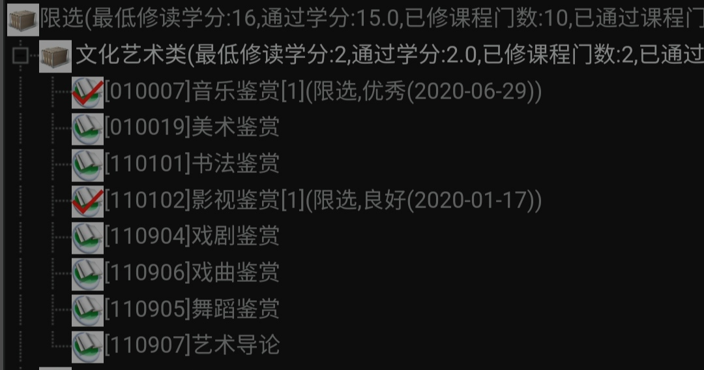

# 南中医选课评价共编版
- 编者的话&新生必看2.2
    - 评价多为个人观点，仅供读者参考
    - 因为学校课程分类总是变动，故全文按照 **朴素的习惯分法，不变应万变！**
        - 限选课：分为文化艺术类与专业类
            - 文化艺术类：有且仅有这些 
            - 专业(拓展)类：主要是本专业与相类似专业推荐选修的，与专业内容关联性较强的课程
        - 任选：全校各年级都能修读的课程， **2021年起有变动，分成公选与通识课**
    - **新生必看**
        - 大一上学期，因为选课时间较晚，以及学校的安排。所以几乎没什么课能选，建议保持一个平常心
        - 同上，因为僧多肉少，所以大一上很难抢课，可以佛系一点
        - 限选课建议关注专业学习计划(预计本班在 哪学期 上 哪位老师 哪天 教的这门课)，最好不要占别班的课，谨慎提前选课。
        - 限选课不代表都要选，学分够即可。
        - 任选/通识课建议关注与限选是否类似（如限选和任选乃至必修都有推拿学，选任选版的就比较亏）， 警惕重复选课
        - 建议在 **毕业前一年** 修满学分
        - 预选：在正式选课前几天，开放预约选课。此时系统常常崩溃。
        - 抢课：某些课程过于热门，选课人数大于容量，则需要抢课。如果有预选，一般是先选课➡️在“退课/抽签”页面排序你的志愿，把难抢的课排在较前志愿可增加选中概率。没有预选，则为抽签抢课
    - 会定期保存本地版，针对恶意编辑者有拉黑权限
    - 个人不把课程好不好过列入（正向）评价标准，主要以有趣有用为准绳，希望各位也如此
- **&** 表示强烈需要一定的知识储备和学科基础。一般来说，如果不确定你有没有基础，那你就是没有
- ***** 表示对这门课的本身意义的高度评价，认为宁愿自学也大有裨益，无关授课情况
- 🌟综合了课本身内容意义与授课情况等等，包含主观成分
- ？ 表示对课程评价有较大争议。可以用除 红色 外的 彩 色 表 示 不同人对同一课程的评价
- 医学限选
    - ***** **中外医学史/中国医学史🌟🌟🌟** **三人评**
        - **实用3 有趣2.5 认真1.5(网课) 性价比3/实用3 有趣3.5 认真3.5 性价比3**
        - 王菲菲/徐建云/ 周俊兵（大部分跟班上）
        - 2学分020924/1学分020101/ 1学分020101
        - 评价
            - **个人认为，对中医学生来说，其中中国医学史部分是非常重要的，乃至可以和中医基础理论合并。知中医学从何而来，知中医学如何演变——知其然而知其所以然，学习中医才有底气，不至于浑浑噩噩，片面崇古薄今，有助于更全面思考中医的现状和未来人生方向。**
            - 网课期间，实话讲昏昏欲睡。宜课外自学（就这一两学分怎么系统学？）
            - 徐建云个人风格很强，有激情
            - 周俊兵老师特立独行，分享行医成长经历，金句频出；锻炼当众演讲能力（两次展示，要求去口头禅）；授课内容轻重分明、条理清晰，认真听后在日后学习都能联系到。
    - **中西医结合系统科学思路与方法🌟**
        - **实用1 有趣1.5 认真1.5 性价比1**
        - 战丽彬 翁泽斌 周雯
        - 1学时020923
    - ***** **诊断基本技能训练🌟🌟🌟🌟🌟**
        - **实用5 有趣2.5 认真4.5 性价比5**
        - 1学分030160
        - 季欧等老师（分组教学）
        - **其实是原本诊断学的必修内容！！后来教改之类的塞不下变成限选了，本质还是必修！！我们诊断学评分，这个课的分数有一定占比！！**
        - **内容无比实用！！考执医啥的也会用到！！实践中学的飞快！！**
    - **中医基础案例教学🌟🌟🌟**
        - **实用3.5 有趣2 认真4 性价比3.5**
        - 钱峻
        - 1学分020918
        - **病案学习，多多益善**
        - 老师其实挺认真的，奈何是周一的早八课，实在撑不住啊
    - **医学社会学🌟🌟**
        - **实用2 有趣2.5 认真2.5 性价比1.5**
        - 田静
        - 2学时110019
        - 普普通通，常识居多
    - **&*** **古今名医内科医案选析🌟🌟🌟🌟**
        - **实用5 有趣3 认真6！ 性价比4**
        - 孙丽霞？
        - 4 学分031632
        - 对中西临来说，本课可补中西医内科学之中医部分先天不足，实乃补天造化之功
        - 对其他中医专业，本课也不可或缺。光是网络教学平台上无比丰富且实用的资料都足以有机地自学
        - 但是，上了一个月换了一个老师……
    - ***** **中医文化导论🌟🌟🌟🌟**
        - **实用4 有趣5 认真4 性价比4.5**
        - 王小丁（大部分跟班上的）
        - 2学分 110920
        - 评价
            - 补充必要的中国传统背景，如八卦等，有益于中医基础理论的学习；初步引导思考中西医及科学的命题，学后有一定的收获
            - 王小丁老师上课互动性强，风趣幽默，结课为小组合作课题及展示
    - **&*** **中医养生学概论🌟🌟🌟** **二人评**
        - **实用4  有趣4 认真5 性价比4**
        - 刘华东
        - 1学分 058993
        - 评价
            - 刘老师上课注重中医思维的塑造，比喻形象、观点独到；对目前的教学体系有自己的思考，不知道之后是否还会开课。他很中肯、很真诚。中医养生学跟后面的中医康复学等都有联系。就是老师口音挺重，个人不大听得懂。
            - 不是这位老师，个人觉得有些泛泛而谈，对部分中医学生来说知识重复
- 非医专业限选
- > 暂定如此，支持各类专业自立门户
- 艺术限选
- > 只要是艺术限选性价比都是5，除非修满了2分学分。同样，难抢程度也是5
    - **音乐鉴赏🌟🌟🌟**
        - **实用2 有趣4 认真3 性价比5**
        - 王思特
        - 1学分 010007
        - 评价
            - 内容比较舒服，有时会点名
            - 期末考的知识会有点难，可以百度
    - **戏曲鉴赏** 🌟🌟🌟🌟
        - **实用2 有趣5 认真4 性价比5**
        - 阎春燕
        - 1学分 110906
        - 评价
            - 接触传统文化的好机会，有京剧社的同学来现场演示，感染性极强
            - 期末可能写小论文或其他
            - 以实用评价可能不合适，毕竟“人总要干点除了吃饭以外的事情”，老师好可爱的！！
    - **戏剧鉴赏🌟🌟🌟🌟**
        - 实用 2  有趣4 认真3 性价比 5
        - 阎春燕
        - 2学分 110904
        - 评价
            - 可能的期末考查：1.演一段剧 or 2.自己去剧院看一部剧，写不少于1500的观后感，开场和谢幕需要拍照，保留票根上交。
            - 老师重点讲了《雷雨》《李尔王》《暗恋桃花源》等剧，很长时间都在看剧嘿嘿，有一次课还放了周星驰的《喜剧之王》，很轻松很有趣！
            - 注意，老师点名次数挺多的。
            - 一次2学分，性价比超高啊！
- 医学任选
    - **&** **五运六气理论与临床应用🌟🌟** **二人评**
        - **实用5 有趣1 认真4 性价比？**
        - 郑晓红
        - 1学分r290010
        - 个人评价
            - **五运六气之类，个人观点向来是先学好那些更靠谱的，有余力有兴趣可以再学学。** 个人不信邪尝试，果然学如白学，众妙之门。
            - 学了也不一定听懂
            - 懂了也不一定会用
            - 会用也不知道有效
            - 老师人不错，谈天谈地，还是个啥教导主任
            - 但知识体系感觉有些陈旧
            - 可以学习到中医思维中的核心部分，是想成为一名好中医必修的课程，也可以学习中国传统思维。
    - **艾灸养生（在学🌟🌟🌟🌟**
        - **实用4 有趣5 认真5 性价比5**
        - 张宏如
        - 2学分r050284
        - 网课评价
            - 老师人年轻，讲课认真。
            - 但作为任选课，内容如同正课，较多穴位记忆知识似填鸭，缺乏重点。网课阶段更缺乏实操感。以至于学完知识难以吸收。
            - 认真学能有收获，老师讲到和自己相关时也会有共鸣，但“性价比”不高，难以坚持。
        - 线下评价：张老师讲课焕然一新，有趣有用。但后面换老师了……
        - 不同老师，在理论课上内容有不少重复
    - **&** **张仲景药证🌟🌟🌟**
        - **实用3.5 有趣2.5 认真3 性价比3**
        - 刘庆帮
        - 2学分r020106
        - 评价
            - 没有伤寒论基础的话，吃力不讨好
            - 我学的时候没基础，除了柴胡全忘了
    - **中医眼科学🌟🌟**
        - **实用2.5 有趣1.5 认真3 性价比2**
        - 张传伟
        - 2学分r030601
        - 评价
            - 内容有些大杂烩，大部分用不上
            - 考试简单，送你PPT
            - 老师年轻人挺好，适合有 **眼科疾病/兴趣课间免费咨询**
    - **针灸技能🌟🌟🌟**
        - 0基础入门针灸、拔罐、艾灸
        - 胡葵
        - 评价
            - 线下课实操特别多，很值，还可以带很多器械回去
            - 考核要考点穴（不多20个穴位），针灸一个部位和拔一个罐
            - 老师人很好，主要还会教你怎么针灸美容灸痘痘
    - **中医医案与临床思维方法讲解🌟🌟🌟🌟🌟**
        - **实用4 有趣6！ 认真4 性价比5**
        - 李崇超 
        - 人人能听，人人有收获
        - 无基础者，听医案如故事，津津有味
        - 有基础者（主要是伤寒论），看山是山，大道至简
    - **&** **循证医学概论🌟🌟🌟🌟**
        - **实用4 有趣3 认真5 性价比4**
        - 孙瑾
        - 1学分r022025
        - 评价
            - 医药学生，可以提前了解循证医学的前沿发展，平常学习外多一个思考方向；中医专业住院医师规范化培训及研究生培养必修课程有这门（非概论），其他专业不清楚。
            - 非医药，接受有点难，毕竟专业程度高；不过也涉及对疗效、治愈标准等判断，整个循证体系涉及制度等等方面，可以开拓眼界。
            - 需要笔记本或平板进行实操（学习NoteExpress、Review Manager等使用）；要求英文水平较高（从外文数据库检索等）……个人不情愿把有趣评这么低，在求知的快乐层面打5分。
    - **&** **经典方剂研究方法概论（在学🌟🌟🌟🌟🌟**
        - **实用5！ 有趣3 认真5！ 性价比5**
        - 范欣生  陈叶青
        - 2学分 r029024
        - 评价
            - 对医药护理专业同学，老师超级认真，内容满满干货！还请了她的博士生来做案例分析！一下就接触到经典方剂研究前沿发展，极度开拓眼界！同样在求知的乐趣上我打5分！！！不过可能学完方剂学再上效果更好……
    - **推拿学（在学🌟🌟🌟🌟🌟** **二人评**
        - **实用5！ 有趣5  认真5！性价比5**
        - 秦宇航
        - 3学分 r050401
        - 评价
            - 老师超可爱又可亲！！！讲解详细，照顾非医学专业同学；不疾不徐、进退有度。生活当中超实用！在治疗中还能有多一种途径推荐给病人or自己直接进行治疗（对家人来说很方便了，不过一定要学精学透）。目前在家网课阶段还无法进行实操，实操是最重要的，老师会考核手法。对中医基础理论，尤其经络理论要求较高，可边学边记。
            - 老师口音有点重，播放的视频/设备较有年代感（但知识没有过期），认真打4分。认真学会很有收获。
    - ***** **初级救护员培训🌟🌟🌟🌟**
        - **实用6 有趣3 认真4 性价比5**
        - 张艺雄
        - 三节理论，三节实践， **考完拿初级救护员证**
        - 理论不同的老师上，都不错，不过有时候例子有些重复
    - **食疗学？**
        - 施鸿飞
        - 老师花式点名
        - 有趣有用程度爆表
        - 注意鉴别
- 人文任选
    - **现代西方哲学🌟🌟半**
        - **实用2 有趣3 认真2.5 性价比2**
        - 陈方平
        - 1学时r010204
        - 只能说很好过...
    - **诗词欣赏🌟🌟🌟不是艺术限选！！！**
        - **实用2 有趣3（网课） 认真3 性价比2.5（周末）**
        - 阎春燕
        - 2学分r010001
        - 一门挺正经的课程
    - **外国文学作品赏析🌟🌟🌟🌟**
        - 实用2 有趣4 认真3 性价比 4
        - 王慧华
        - 2学分 r010032
        - 评价
            - 一般是周六上午后三节
            - 主要不是讲枯燥的文学理论，而是侧重讲书本内容，解析作品主旨。
            - 内容有趣，像听故事。从古希腊文学讲起（听老师讲完终于了解了希腊众神复杂的谱系。）讲到马尔克斯的百年孤独结束，很深刻很晦涩的书老师可以把它讲得很吸引人。
            - 结课作业是不少于1500次的读后感，不需要有过多的学术探讨，侧重写自己的真实感受。
            - 中间点过一次名，其实只是发一本自己喜欢看的书到老师邮箱，只要写书名即可。
            - 强推哦！👍
    - **法语音乐剧鉴赏**
        - 老师人很好，他的法语课也很好！
- 技术任选
    - **大学英语（四级培优）🌟🌟🌟🌟**
        - **实用4 有趣2 认真3.5 性价比5**
        - 3学分r079019
        - 殷娟* 葛恒婷
        - 评价
            - 实不相瞒，我第一次四级因为听力设备加心态没过...
            - 至少可以加强自信，督促练习，保证正常发挥不退步
            - 与其花钱找校外的，不如找 **校内免费** 的
            - 开学知道成绩后很多人退课的，可以联系老师 **转到六级培优**
    - ***** **Python语言程序设计🌟**
        - **实用4 有趣1 认真1.5 性价比2**
        - 高治国
        - 1.5学分r089150
        - **老师可太放水了，建议自学，py比较简单只要出发，条条大路通罗马**
    - **photoshop图像设计🌟🌟🌟🌟🌟四人评**
        - **实用5 有趣4 认真4 性价比5**
        - 前期是看视频学习ps基础知识，进行案例作业提交（可以悄悄的不去教室，自己用电脑看视频、做作业，电脑教室里的电脑还可能会卡）；最后几节课是老师现场讲，要提前去坐前排，不然容易看不见屏幕操作
        - 成绩由每次日常作业和最后的大作业组成，最后的大作业是根据之前所学的技巧自己ps一张图片（大作业展示时建议带个U盘，可以提前展示）
        - 学的都是ps最基础的理论，很有用
        - 来自另一个同学：该课网课体验感受，还蛮累的一个网课，作业好多，不过确实可以入门ps
        - 来自没上这课自学一点ps的同学：ps功能五花八门，自学容易迷眼，有相对系统学习机会挺好的
        - 来自一个偶尔逃课的同学：上课用B6机房的电脑，本人当时上课是那个巨长无比的教室所以经常出现老师在前面讲课，中后排同学一个字都听不见的情况，如果有条件推荐往前坐。上课内容是日常练习ps基础功能（最简单的魔棒抠图到稍微复杂一点的图层蒙版都有），老师会在教学平台上传每节课的素材+记事本格式的操作指南，非常详细。每节课都有当堂作业（也就是根据要求处理素材），期末是大作业并且要求你上台展示告诉大家是如何完成的。老师很少点名，所以平常的作业一定要做！！ps课算是课时很长的任选课了，学分给的也不算很多，推荐想要认真学习ps技术的同学选，ps真的很有用！！哪怕你只学习了一点点皮毛（只要能看懂操作面板）都很有用！
- 生活任选
    - ***** **儿童心理学🌟🌟🌟🌟🌟**
        - **实用5 有趣5 认真4 性价比4.5**
        - 王冬燕
        - 2学分 r010831
        - 评价
            - 无论是对于日后行医要与孩子接触的医学生还是日后要孩子或者不要孩子的人，学习这门课都很有必要。了解孩子们的生理心理特点、特定成长方式才能更好与他们相处，达到治疗或交流的目的。
            - 王冬燕老师上课生动活泼，互动极强、可畅所欲言咨询家里小孩成长状况，授课内容丰富紧凑，启发性强、感染力大，开拓视野，力荐！！！老师会推荐延伸阅读，离开课堂也不能停止对孩子的了解，这是一件需要坚持一生的事（除非以后不跟孩子接触）。
            - 据说很热门，以及最近学期没找到这门课了
    - **心理学与生活🌟🌟🌟🌟**
        - **实用4 有趣4 认真4 性价比4**
        - 曾智
        - 1.5学分 r110900
        - 评价
            - 曾老师博学可亲，从心理学视角看生活发生的各类事件，有助于消除一些困惑。就是他讲话挺快的……
- 体育课
- > 不设置课程评分，上课时间仅代表历史可变更
    - **乒乓球**
        - 室内教学，场地稳定，风雨无阻
        - 对新手较为友好，会打的轻松满分
        - 上课期间可以蹭场地
        - 蔡任——周五下午
            - 南中医乒乓第一人
            - 看起来人畜无害的瘦高个
        - 姚焱兵——周三下午
            - 主业是跆拳道，乒乓球打不过我~
            - 老师人很好，机缘巧合上他课两学期了
            - 周三下午会有些蹭课的，增加氛围
    - 瑜伽
        - 徐俊英
            - 上课要求较为严格，想划水的别报名
    - 羽毛球
        - （整体）考核较难，没基础没运动细胞谨慎报名
        - 苏玉凤老师人比较好
    - 足球
        - 林翔
        - 纯粹放养。考试放水。选上了是你的福气
- 我心中的优秀老师
- > 大致以愿意成为朋友/导师为标准，请附带专业方向标签，可附带一些缺点
    - **倪海雯** _血液科_省中_中西医结合_淋巴瘤
        - 讲课知其然且知其所以然，理性伴着人文，知识伴着案例，有网络上那些著名的医教老师感觉
        - > 潜意思：听很多老师课还不如自己上网课
        - 主观：亲切又稳重。给总是沉闷的血液科也带来一些正能量
        - 视野开阔，前沿系统。对低年级本科生，有开眼看世界之功
        - 因为方向特性，中医的篇幅总是小的，但能感受到老师对中医的研究和态度
        - 中医（淋巴瘤）规范化的抱负！真正做成指南推广的志向！中西医结合教学的悲叹！
        -  [http://inter-hospital.jshtcm.com/jshtcm/#/jshtcm/docDetailInfo?hosId=12675&clinicalType=1&docId=2030839]("http://inter-hospital.jshtcm.com/jshtcm/#/jshtcm/docDetailInfo?hosId=12675&clinicalType=1&docId=2030839")
    - **蒋凤荣** _病理学
        - 主观：斜坐在桌子上翘着二郎腿，真像个神通广大的孙悟空——像病理科的隐藏大佬，定海神针
        - 上课深入浅出，知识量大，真如给海绵泼水
        - 但略有跳脱，基础不好又不预习，听课或有压力
    - **孙丽霞** _中医内科_省中
        - 主观：兢兢业业知识渊博的经典中医形象，中流砥柱
        - 上课细致入微，拿捏有度
        - 但上了一个月就换老师了🕊️💢
        -  [http://inter-hospital.jshtcm.com/jshtcm/#/jshtcm/docDetailInfo?hosId=12675&clinicalType=1&docId=2031102]("http://inter-hospital.jshtcm.com/jshtcm/#/jshtcm/docDetailInfo?hosId=12675&clinicalType=1&docId=2031102")
    - **钱峻** _中医内科_中医诊断
        - 真正做到常常去安慰，总是去帮助
    - **陆玥琳** 中西医结合内科学 省中消化科
        - 亲切可亲，中西临的直系学姐。
        - 上课贴近临床实际，标注重点。
    - **魏刚** _风湿免疫科_省中_中西医结合
        - 一个很标准的好老师形象。
        - 思路清晰，未来的大佬之感
        - 按他的上法，坑爹的中西内竟然也能有条理的上下去了
        -  [http://inter-hospital.jshtcm.com/jshtcm/#/jshtcm/docDetailInfo?hosId=12675&clinicalType=1&docId=2030948]("http://inter-hospital.jshtcm.com/jshtcm/#/jshtcm/docDetailInfo?hosId=12675&clinicalType=1&docId=2030948")
    - **陈美娟** _生物化学
        - 生化教研室主任，讲课认真细致，贴心的靠谱。
        - 可惜课时、基础等原因，生化这门课的难度有时不是一个老师可以扭转
    - **龙军** _药理学
        - 一个面相坚毅的中年帅哥
        - 讲课掌控了知识和风趣的平衡
        - 授人以渔，常常能点醒同学们科研思路与方法
    - **周雅萍** _人体解剖
        - 没错，这是个中年男人的名字
        - 中医院校的人解，终究是小打小闹。但这位仁兄数十年如一日的教学，给我南中医扫地僧之感。
        - 人解，很要求“博闻强记”。讲课风趣，口诀多多，大大降低了初学者入门难度。
- 单方面联动南中医幕布之神，中医幕布的半壁江山： [医学生笔记-黍离个人幕布总结]("https://mubu.com/explore/3RRgBm-uHrU")