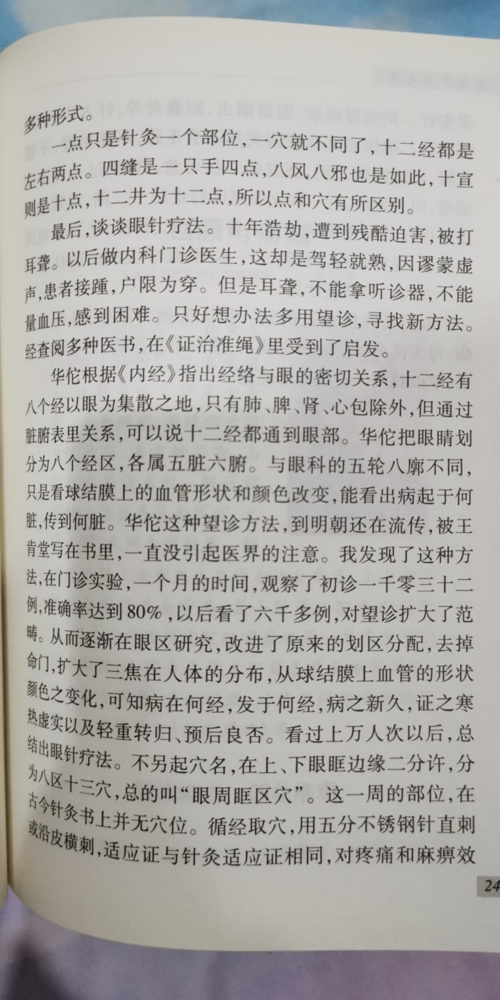

# 名老中医之路（近代中医大神及方法索引&概论）
- 更新中.....
- 此书可启蒙于新，指路于学，激励于难，经验于医，前辈之所学，可为后辈总结经验、指点迷津。
- 岳美中（无恒难以做中医）
    - 无恒难以做中医
    - 肾病、老年病、热性病
    - 《岳美中医案集》《岳美中论医集》《岳美中医话集》
    - 中年自学医，其行坎坷，一开始认为经方好，后来发现或穷于应付。应当是 ***学古方而能入细，学时方而能务实；入细则能理复杂纷乱之繁，务实则能举沉寒痼疾之重。***
    - 从临床疗效方面总结，治重病大证，要注重选用经方；治脾胃病，李东垣方较好；治温热及小病轻病，叶派时方细密可取。把这些认识用之临床，确乎有法路宽阔、进退从容之感。
    - **方法：**
        - （1） **读书宁涩勿滑，临证宁拙勿巧：** 摘要而攻，对主要经典著作要扎扎实实地下功夫，读熟它，嚼透它，消化它。在 **弄清背景** 的前提下，一字一句地细抠、读懂。
            - 读医书，还要边读边记，勤于积累。积累的形式则宜灵活。比如说，可以结合自己研究方向相近的一个或几个方面的专题摘要积累，读书时留意于此，随时摘抄记录， *并部别类居，主要的加以标志，散漫的贯以条理，怀疑的打上问号，领悟的做出分析，大胆地附以己见。*
            - 临证宁拙勿巧。对症状要做“病”与“症”的综合分析，寻求疾病的本质，不可停留在表面的寒热虚实。立方遣药，要讲求主次配伍，加减进退，不可用套方套药取巧应付。遇到大病复杂症，更要格外细密，务期丝丝入扣，恰合病机。既要有临证时的分析，还要做事后的总结。数年来，我自己无论在哪里应诊， *坚持每诊必做记录，半月做一次阶段性的检讨，找出需要总结的经验，发现有进一步探讨价值的问题，提高疗效。*
        - **（2）自视当知其短，从师必得其长**
        - **（3）读书多些有益于专，知识博些源头更活**
        - **（4）勤能补拙恒私效，俭可养廉贞自清**
            - 几十年的生活，基本是“日理临床夜读书”。临床常无暇日，读书必至子时。六十岁以后，医责益重而年事渐高为了抓紧晚年，完成温课和研究计划，曾规定了几条自我约束的“自律”。大致是:
                - ① **要有恒** 。除极特别的事情外，每日按规定时间温课，不得擅自宽假，时作时辍。
                - ② **要专一** 。不得见异思迁，轻易地改变计划。要有始有终地完成一种计划后，再做另一种。“主一无适”谓专。非专，则不精、不深、不透。
                - ③ **要入细** 。不可只学皮毛，不入骨髓；只解大意，不求规律；只涉藩篱，不求堂奥。入细，还要防止轻淡，轻淡则流于薄弱，薄弱则不能举大症；要防止琐屑，琐屑则陷于支离，支离则不能集中主力，也不能理细症。
                - ④ **戒玩嬉** 。此后，忌看小说。非周末不着棋，不赋诗。非有应酬不看戏。
                - ⑤ **节嗜好** 。衣食方面，不求肥甘，不务华美，随遇而安，自甘淡泊。否则必致躁扰不宁，学术上难于探深致远。此后，不独茶酒不事讲求，即书画篆刻，也不宜偏好过多，免得耗费有限的光阴。现在检查起来，除在旧诗词方面，有时情有难禁，占了一些时间外，其他都尽力遵守了。
            - *治学，要忠诚于学术的真理，直至系之以命；临证，要真诚地对病人负责，此外决无所求。只有这样，才能认真热诚地对待患者，谦虚诚挚地对待同道，勇敢无畏地坚持真理，实事求是地对待成败。*
- 任应秋（阅读经典的方法）
    - （1）《语学》：读经宜读全本，解经宜先识字，读经宜正读音。
    - 门径：凡做学问都有一个精与博的辩证关系。属于 *基础理论部分，必须要达到精通精纯的程度，非基础的，但直接或间接与本学科有关的，以及一般知识，必须博览，要广泛的涉猎。* 只有精了，才可能博。 *就中医而言，只有把内经这一类的古典著作搞精通了，博览各家的著作才不费劲，才具有分析鉴别的能力。*
    - 方法：
        - （一） **精读** ：读书有两种方法，最基本的是少而精，多在精的方面下功夫，其次是结合实际，学以致用。
            - **如何读经典？** 每读一次，就带着某一个问题，边阅读边探索，这样一遍又一遍地读下去，每阅读一遍，便把某一问题深入一次，解决一次，巩固一次。无论读任何一部经典著作，每次都带着问题去读，直到掌握了精神实质。在这个基础上再看有关的其他参考书，就一定会做到多多益善，开卷有益。
        - （二） **勤写：**
            - （1） **概括与缩写** ：把已经读过的书的内容做一个非常概括，而简短的叙述扼要说明某一书的内容，主要讲的是什么问题。
            - （2） **纲要笔记：** 一般是按照书的先后内容或问题的主次来写。往往依照原文的次序进行一番简明扼要的复述，体现全书或全篇的逻辑性。类似于提纲。这种笔记省时间，重点突出，便于记忆。
            - （3） **摘记：** 要科学分类，要摘记实实在在的东西。需处理好详略的关系。重要的数据和结论要行，甚至要一点不遗漏的摘。而文章的一般内容则可以概要摘抄。
            - （4） **综合笔记：** 就是把不同书籍和若干资料中的相同内容，综合到一个题目或专题下。
            - （5） **心得笔记：** 用自己的话，记录自己的体会、收获、见解。可巩固学习效果，检验学习的情况，使自己的心中有数。
        - （三） **深思** ：即独立思考。前人的成就要学习，要继承，但如果止于此，那就永远只能步前人的脚印，拾人牙慧，也就永远只能停留在一个水平上，人类还有什么进步可言？中医学有什么可整理提高？故治病时要“心颇疑”。
        - **（四）善记：** 是指要善于锻炼记忆力。
            - 方法：
                - （1）有决心目标，勤奋练习
                - （2）记东西要注意自觉联想
                - （3）不放松机械记忆
                - （4）要把自己学到的知识进行整理和分类。但要注意， *不要让教材牵着鼻子走，书上写的什么，就按着书上的顺序搞，不越雷池一步搞完就完了。*
- 彭静山（针灸•眼针）
    - 东北•辽宁
    - 师承马二琴
    - 《简易针灸疗法》《妇科病中药疗法》《普及针灸手册》《常见四种慢性病中药及针灸疗法》
    - 🔑眼针疗法 #想了解
    - > 有意思，想学 
        - 在《证治准绳》中受启发
- 李聪辅（药性歌诀的学习方法）
    - 背完《药性赋》以后，觉得光读不行，必须“对号”寒、热、温、凉固然可记，但酸、苦、咸、辛、甘则应亲尝。因此，凡能够品尝的药，我都一一品尝了，并对药性大同小异的药物反复品尝了，这真有助于理解和记忆。从中悟出了一点道理： **要想无师自通，只靠死记硬背不行，而要善于比较、鉴别、分类、归纳。** 以后，我将这个方法又用来学习方剂。《汤头歌诀》当然朗朗上口，开始几十首很容易记诵。但方剂越多，同一药物出现的频率越高，就不好记了。琢磨一番之后，我 **先把每一个方剂组成的药物及其分量写出来，想想它为什么这样组成。然后，把配伍相近的方剂并列在一起加以比较。** 如“四君子汤”和“理中汤”，仅一味之差，而方义迥异，为什么？比较比较才知道，“四君子汤”中的茯苓合白术为佐药以健脾渗湿。除去甘淡之茯苓，加入辛热之干姜为君，是为了温运中焦，祛散寒邪，恢复脾阳。移换一味，则成“理中汤’。这样同中析异，异中辨同，虽然多花一些时间和精力，但掌握得比较精密、牢固。
    - **药性歌诀的学习方法：** 先把每一个方剂组成的药物及其分量写出来，想想他为什么这样组成。然后把配伍相近的方剂并列在一起加以比较。
    - 总结一下前面的这几篇，大致都少不了 ***苦学*** 这一点。他们都有一个共性，最主要的就是苦学，再者是多思考，以及勤做笔记，多读书，还有最关键的一点就是临床实践，当然它是建立于前者基础之上的。想当一名好中医，无非就是这么几点。
- 彭履祥（不提倡早临床，重视基础理论；跟诊的方法；各科推荐书籍） #适合 
    - **经历**
        - 二十岁始学，先读了十年医书，而不必急于临证。
        - 三十岁。 开初接触病人，感到无从入手，实际病证，与书本难以对号，似是而非，不易抓住纲领，更难彼此鉴别。辨证立法，遣方用药，亦无定准，深感“书到用时方恨少”。 （深有体会） 老师知道的东西，自己有许多不知道，这就促使我进一步广泛阅读各家论著， 涉猎各家医案医话，增加临床知识，提高理论认识和临床实践水平 。经过三年随师临证学习，在理论和实践的结合上有了较大的收益，所读理论渐能融会贯通，举一反三，临床运用也能灵活自如，不再问津无路了。
        - 此时才 **深感以往熟读硬背的大量功夫，并非白费气力。** 后来马齿徒增，记忆减退之年，读书虽然易于理解，但却难以牢记。相反，早年熟读的理法方药内容，不仅长期不忘，随着反复运用，认识更能不断加深。这种学习方法是先师所坚持主张的，名之曰 **“由深出浅法”** 。他 非常反对学医伊始就上临床，以图速成，或只读一点浅显实用的临床医书，不求深造。他认为，这样学医，知其当然，而不知其所以然，则不可能达到医理精深，临床更难融会贯通、运用自如，只能成为不谙医理，学识肤浅的庸医。 先师常以自己的学医经历和所走弯路启发我们：他少年时代从学的第一位老师不主张多读医书，仅使学生随其应诊配药，理论知识很少讲授，昕凭学生自己浏览选读，随证年余，收效甚微，书读不进去，体会不深，开卷了了，闭卷茫茫。第二位老师则主张认真读书，指定背诵，熟读大量古典医籍，花了几年时间，熟读了《内》《难》《伤寒》《金匮》等书。但是这位以研究儒学为主的老师，理论脱离实际，不善于临证医疗，所授理论，仅从纸上谈兵，较少临床体会。最后从学的第三位老师，既肯定以往认真读书是正确的途径，又指出博览不够，缺乏对脉学、温病学、时病学等方面的学习，尤其缺乏临证运用的技巧训练。这样，继续再读一些有关书籍，并经老师在实践中指点启发，收获就大有长进。
        - **学中医的原则要求**
            - 1.有较高的古文水平
            - 2.先要专心熟读指定的经典和临床一级，不许过早随师临证。
            - 3.临证学习，要求注重理法的活用，不得随意抄录一方一药。
        - 尤其临床课的学习，要一面读书，一面临床，收获就会更大，理解就会更快。有些基础理论必须反复揣摩，加深体会，甚至死记熟读才行。
    - **大佬是刻苦钻研出来的**
        - 我国古代多数医家，他们之所以有成就，并非学习条件如何优越，或者偶逢捷径、一鸣惊人，或者得到什么秘方绝招。相反，他们大多数的条件都不大好，例如，在温病学研究方面有显著成就的吴鞠通，是完全靠自己的刻苦钻研而成功的。东汉医家张仲景也并非天生的“医圣”，而是因为“感往昔之沦丧，伤横天之莫救，乃勤求古训，博采众方”，写出了《伤寒杂病论》不朽名著。清代名医尤在泾自幼家境贫寒，但由于自己的刻苦钻研、勤奋攻读，终于在医学和文学上达到了较高的造诣。
    - **跟诊的方法**
        - 临床学习第一阶段的任务和目的，是将所学的书本知识印证于病人，将抽象理论运用于解释具体证候，从而以此指导诊断和治则。 *书本上的论述是经过条理化、系统化的，与临床实际不可能处处吻合、对号入座，所以就存在理论与实践结合的问题。* 疾病虽千变万化，但有其规律可循。症候虽千差万别，真假混杂， **用四诊八纲细心诊察，结合分析，是能摒去假象、抓住关键、认清病证的。** 所以在临床学习中，不但要学习老师选方遣药， **更重要的是要学习老师诊察疾病和立法选方用药的理论依据** 等。如果只知抄录一方一药，忽视了用理论去指导临床，可能就会成为以药试病或头痛医头的医生。有了一些临床知识以后，更须注意理论学习，用理论指导实践，再以实践来检验理论正确与否。所谓灵活运用，是在大的原则法度指导下，选择最合适的具体方药而言。孙真人说：“胆欲大而心欲小，智欲圆而行欲方。”孟轲说：“不以规矩，不能成方圆。”即是此理。
    - **如何在院校学习中医及各科推荐书目**
        - **（一）以中医学院教材为基础**
            - 全国中医学院统编款材作为学习人门的教材，对于在校同学和个人自学都较适合。个人认为，一九六三、一九六四年修订的第二版统编款材较好，从基础理论到临床各科，基本反映出了中医学的本来面目，归纳了历代医学发展的主要内容，所采集的理法方药比较平正，学术理论观点较为统一，并以现代语言为主体编写。虽有小疵，尚不掩瑜。若能按先基础、后临床的家序，逐章仔细阅读，同时参读历代名著有关部分，通读以后反过来再从临床到基础进行复习，收效就更大。
        - **（二）选读参考医著**
            - **不论经典和后世医著，在通读的基础上，应重点选择其主要部分加以熟读，后世的注释则以参阅为主，然而其中注释论述精粹，归纳全面的，亦可熟读。**
            - **《内经》** ，在通读的基础上，重点熟读和详读一些重要专论，如有关阴阳、脏象、经络、诊法、病机等。至于参读注家，可选薛生白的《医经原旨》，简要易懂；徐灵胎的《内经诠释》，扼要适用；张景岳的《类经》，注释平正，分类周详，便于查阅，张隐庵、马元台等注家亦应合参；张隐庵编写的“十二经络歌”和“经穴分寸歌”等，便于诵读和记忆。
            - **《难经》** 为解释《灵》《素》之疑难而设间，结合《内经》学习，侧重记忆其理论原理。
            - **《伤寒论》** 除“平脉法”不必作原文读外，其余全部原条文应细读熟读，再选择理论平正的注释，作为辅导理解的资料参读。该书注家很多，我个人认为，柯琴的《伤寒来苏集》和陈修园编纂的《伤寒论浅注》及《长沙方论》比较平正。后者既采纳其他几十家注释精练平正部分，又有编者的按语和小结，为便于记忆，对每一方剂编写了歌括和方论，不但简明易记，而且尽量将主治、大法、煎服法编入歌中，并将药物剂量、加减法等如实地编写进去，对初学者都是适用的。当然，注家亦各有所长，各有不足，对于不恰当的意见，尽量省略和剔除。
            - **《金匮要略》** 是论杂病证治的专著，原文亦应熟读。但注家很多，可选尤在泾的《金匮心典》，其注释简明，可作入门向导；魏念庭的《金匮本义》，周扬俊、赵开美的《金匮二注》，陈修园的《金匮要略浅注》及《金匮方歌》等著作，均可参读。其中精粹的论注部分应该熟读。
            - **脉学和诊断学** 的专著不多，大多散在各家综合性的述之中。《四诊抉微》《医宗金鉴·四诊心法要诀》《脉诀规正》《濒湖脉学》，崔紫虚的《四言脉诀》，黄坤载的《四圣心源》《黄氏脉学》等，都是较平正的专著，除重复的内容外，最好尽量多熟读。
            - **温病学** 以王孟英编察的《温热经纬》、吴塘的《温病辨》为主要必读书，包括条文和自注。其他注家和评论作为参考，如章虚谷的《医门棒喝》、陆九芝的《世补斋医书》、杨粟山的《寒温条辨》等。
            - **内、妇儿杂病学** 的历代著述很多，以参阅为主。对有概括性的临床基础著作，如《医宗金鉴》的“杂病心法”“妇科心法”“幼科杂病心法”“外科心法”等，具有提纲挈领全面概括、理法方药齐备、歌括易于诵读记忆等优点，可作为熟读的临床基本书籍。参阅书籍很多，择其要者读之。如（诸病源候论》是较早的病因症候学专著；《千金方》《外台秘要》是汉唐以来医学发展的大成，尤其《千金方》记载了不少新的发现和发展，如对虫类药的认识和运用等。金元诸大家对医学的几个方面各有创见，如张子和《儒门事亲》长于汗、吐、下三法的运用；刘河间《河间六书》对火热证之治疗；朱丹溪《丹溪心法》《脉因证治》，不仅对阴虚学说有得，而对“郁证”“痰证”的研究认识尤有独到之处。又如李东垣对脾胃阳虚、中气下陷的病机和辨证论治有新的发明，《东垣十书》贯穿了他这一思想。明清以来，如徐春甫的《古今医统》、张景岳的《景岳全书》，无论在理论和临床方面，都较全面地阐发和总结了前人的学术经验，尤其后者对阴阳偏频、水火失济为病的机理和救治法，研究较为深入。王肯堂《证治准绳》是一部较丰富的临床治疗学，既有理法，又有方药。张石顽是一位学识渊博、临床经验丰富的医家，所著《张氏医通》，理论联系实际较密切。徐灵胎《医学源流论》《杂病源》都是较好的临床基础专论：《慎疾刍言》《洞溪医案》是他的医话医案专著，有较高的理论水平和临床指导意义；《兰台轨范》是杂病治疗专著。喻昌的《医门法律》，既有精彩的医案医话，又有杂病证治和鉴别诊断方面的独特见解，理论精辟，阐发透彻，理法方药严谨。林佩琴的《类证治裁》是简明扼要的临床参考书。李用粹的《证治汇补》，丹波元简的《杂病广要》，都是汇集前人各家精华，条分缕析，既精且详，前者还补上了自己的见解。尤怡的《金匮翼》也是较出色的临床著述。
            - **中药方剂学** ，既是基础，又是临床，可放在基础和临床课之中安排学习，选读易于诵读牢记的书。药物方面可读龚之林的《药性赋》或张洁古的《药性赋》等著作，参阅李时珍的《本草纲目》《神农本草经》，张璐的《本经逢源》等；方剂学可选读汪切庵的《医方集解》，陈修园的《时方歌括》等，加上《伤寒论》《金匮要略》《温热经纬》《温病条辨》《医宗金鉴》等书中的方剂，基本能满足需要。
            - 其他 **医案、医话** ，散在各家著述中，亦有单独论述者。如喻昌的《寓意草》，徐大椿的《慎疾刍言》《洄溪医案》，叶天士的《临证指南医案》，其他还有江瓘汇编的《名医类案》以及后来各家医案、医话专著不少，均可浏览。但在读这些医案专著时，必须在具备一定的基础理论和临床知识以后进行，才能收到良好效果。另外，应多选读有论有案的书，如喻嘉言的《寓意草》《先哲格言》之类，读后不仅知其然，更要知其所以然。当然，上列医籍，仅其中一部分，还有不少参考书，若精力许可，不妨多选。
- 何世英（经方、时方与综合应用；中西医；儿科） #适合 
    - 经方用之得当，效如桴鼓，这是历代医家共同的体验但我通过临床认识到，囿于经方一隅，是不能解决一切外感热病的。在某些情况下，必须用温病辨证及应用时方才能取得效果。
    - 由于历史的条件，《伤寒论》决不可能概括万病，它的理法方药，也决不可能完全适用于一切外感热病。温病的学说是在《伤寒论》基础上发展起来的，二者都代表外感热病。从整个发病过程中，由初期、中期到末期，都有其不同的临床特点。可以说，伤寒与温病是外感热病的两大类型，每一类型包括若干病种，同一病种也可能在病程中出现不同的类型。这两个类型既有所区别，又各有特点，而且它们的理论核心，都是落实到脏腑经络之上，《伤寒论》一些方剂，仍为温病所沿用。因此，六经、三焦、卫气营血辨证应该密切地结合在一起。根据具体病情，灵活掌握，经方、时方统一运用，不应继续存在几百年来所谓寒温门户之见。个人早期临床既在经方上有所收获，但以后也常应用时方而收效。因此，我个人既不是经方派，更不是时方派，而是综合派。
    - **继承师学和独立思考**
        - 虽秉承师法，但也要跳出老师的框子。
        - 因此，既兼采各家之长，又要独立思考、推陈出新，才是治学治医的必由之路。
    - 汲西医之所学
    - **儿科之所见**