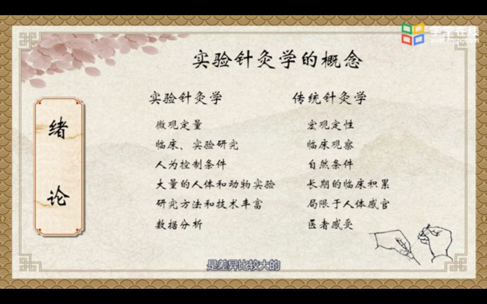
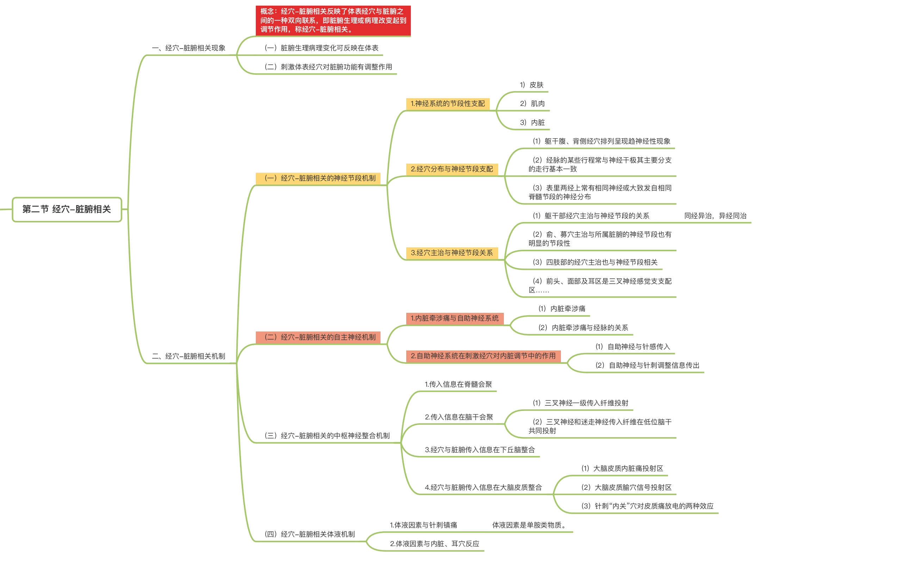
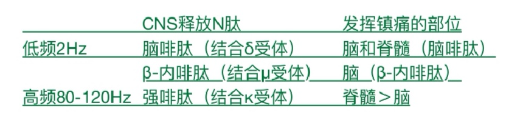

# 实验针灸学
- 绪论
    - ***实验针灸学：实验针灸学是应用*** ***现代科学技术和实验方法*** ***，研究*** ***针灸作用基础、针灸作用规律、针灸效应与机制*** ***的一门学科，是传统针灸学与现代科学相结合而产生的新兴交叉学科，是针灸学科的重要组成部分。*** 
    - 学科属性：
        - 中西医科学理论指导的新兴交叉学科
        - 经验医学向实验医学过渡。
        - *补充：* *实验针灸学与传统针灸学紧密联系、相互渗透、相辅相成。中医针灸学与西医学是各自独立的理论体系。科学实验包括：实验者、实验手段和实验对象。*
        - 实验针灸学和传统针灸学区别🤩🤩🤩
        - > 市委临时认为实验丰富数；川（普）红（色）临自然，积累感官感受 
        - **检验科学性的标准：**
            - **客观性、真实性、重复性（多样性）**
            - > ①客观性：科学活动的过程和结果客观地反映事实。  ②真实性：真实不等于客观记录，科学中的真实在于排除伪造和假象。  ③重复性：重复性是科学的真实性和价值性所在。 客真重
    - **任务**
        - 首要任务
            - 揭示传统针灸学的科学内涵， 用现代科学语言阐释传统针灸学，充实和发展针灸学，促进针灸科学的现代化和世界化。
        - 重要任务
            - 应用临床与实验手段相结合的方法研究针灸效应规律及机制，揭示针灸作用原理和规律，并结合针灸作用技术的研究促进理论研究的成果转化，开发针灸学新技术新方法，丰富和发展针灸诊疗技术。
        - 关键任务
            - 应用现代科学技术研究针灸作用的有效性、综合性和复杂性，明确影响针灸效应的关键影响因素，控制针灸质量，指导临床实践，提高临床疗效，促进针灸的规范化
        - 任务之一
            - 培养现代化的针灸人才。
    - **主要研究内容：👿**
    - > 基础技术特因机
        - **针灸作用基础、**
        - **针灸作用技术、**
        - **针灸作用基本特点、**
        - **针灸作用影响因素、**
        - **针灸效应与机制**
    - **实验针灸学的基本内容：**
    - > 方法理论技效应
        - ①基本研究方法
        - ②针灸学基础理论的现代研究
        - ③针灸作用技术的现代研究
        - ④针刺效应和机理：针刺镇痛效应、免疫调节效应、针灸对机体器官功能的调整效应，促进受伤组织修复和代偿
        - > **针刺镇痛为实验针灸学中针灸作用原理研究的一大标志性成果。** 
    - 发展简史 p3－5
        - *1959－1965第一次针灸热潮；* *1966－1979第二次针灸热潮*
        - **实验针灸学两大突破成就：**
            - **经络现象和实质研究**
            - **针刺镇痛效应和机理研究**
        - 补充：
            - *实验针灸学是科学研究史书，是创新史书*
            - *实验针灸学来源于、成果高于、服务于临床*
- 第一章 针灸作用基础
    - 第一节 穴位的结构与功能
        - 穴位结构：
        - > （穴位与哪些结构相关）  穴位的功能和基础，由神经、血管、肌肉筋膜、肌腱等多种组织构成的一个多层次“立体构筑”，穴位处分布着丰富的神经末梢，交感神经节后纤维，肥大细胞等穴位针感感受装置和穴位效应装置，不同穴位处分布上述组织的种类和数量不同。 
            - **穴位一般结构特点**
                - **1.穴位与神经、血管、肌肉、结缔组织密切关系。**
                    - （1）神经（周围神经）
                        - *a.人体绝大部分穴位与周围神经相关*
                        - *b.穴位与非穴位比较，穴区>神经干/支比非穴区多*
                        - *c.分类*
                            - *I型：35个穴位位于肌肉运动点上，为肌肉神经最接近皮肤的位点。*
                            - *II型：14个穴位位于躯体正中矢状线上，两侧浅表N汇聚出处的交点上。*
                            - *III型：21个穴位位于神经丛上或浅表神经分支处*
                    - （2）血管
                        - *①全身穴位约半数分布在大血管周围*
                        - *②穴区的血管比非穴区密集*
                        - *③穴区血管结构具有相对特异性：*
                            - *a.穴区小血管分支多，微血管相互交叉，吻合形成致密额毛细血管网，非穴区小血管呈树干样分支的稀疏分布*
                            - *b.穴区附近的毛细血管呈平行线状且平行于经络，非穴区一般呈不规则分布*
                            - *c.四肢、躯干、腰胸部的穴位为微淋巴束聚集的部位。*
                    - （3）肌肉
                        - *①62.5%位于肌肉分界处，此部位有神经干支进入。*
                            - *②37.5%位于肌肉、肌2腱之中或其起止点上。*
                    - （4）结缔组织
                        - *穴位大多分布于肌肉之间或肌肉与骨骼之间的结缔组织层。*
                - **2.穴位区含有丰富感受器**
                    - 感受器：分布在体表、组织内部，感受机体内外环境刺激的结构装置。 能够接受内外环境刺激－将其转化为神经冲动－沿传入神经传入中枢神经系统。
                        - （1）感受器丰富多样：
                            - 游离神经末梢、神经束、神经支、各种特殊感受器。
                        - （2）穴位的特殊之处就在于
                            - 较非穴位区组织内存在更为密集的血管壁神经丛及神经感受装置。
                - **3.穴位与肥大细胞**
                    - （掌握）  肥大细胞一般在小血管，毛细血管周围，神经末梢，神经丛处规律的排列，并且大量聚集。 肥大细胞在 **接受刺激、产生和传导针感和针灸效应** 中发挥了重要作用。 穴位与肥大细胞密切相关，主要由以下几点证实
                    - > 肥大细胞是一类胞质内富含嗜碱性颗粒的细胞；结构：成群的分布于血管周围，体积较大，圆形或卵圆形，胞质丰富，充满粗大的异染颗粒，含有组胺、白三烯、肝素。功能：引起过敏反应，抗凝血。 
                        - *（1）穴位分布：*
                            - *人体主要穴位区域肥大细胞数量较非穴位多，* *多沿经络走行方向的小血管和神经束分布。* *穴位浅层的肥大细胞单个存在，数量少，与非穴区无显著差别 ；* *深层中心区肥大细胞梭形密集成群，数量显著高于非穴区，且代谢旺盛。*
                        - *（2）针刺对其影响：*
                            - *针刺或艾灸使肥大细胞呈脱颗粒反应，数量显著减少*
                            - *以胞吐方式分泌活性物质*
                            - *为组胺类物质，其作用于血管及结缔组织中的自主神经末梢及间质细胞，有扩张毛细血管及静脉作用，并有可能使血管内皮基底膜通透性增加，组织液渗出，导致经穴皮丘带出现。*
                            - > 用肥大细胞稳定剂色甘酸钠在穴区预处理后能抑制这种现象（相应的针灸镇痛效应也减弱了），提示肥大细胞释放的物质主要是组胺类物质。 
                            - *人体皮肤真皮深层P物质（SP）样轴突末梢与肥大细胞形成触突连接，穴位受到刺激兴奋了支配该穴位的神经末梢。*
                                - *a.冲动直接传入中枢，产生针感。*
                                - *b.经轴突反射在轴突分支末梢释放SP，进而诱发邻近节段的神经末梢再次引起其兴奋传入，如此反复进行，形成外周神经末梢跨节段信号传递。*
                - **4.穴位是一个多组织、多层次的立体构筑：**
                    - ⭐️穴位是由多种组织（皮肤、皮下组织、神经、血管、淋巴、筋膜、肌肉、肌腱）构成一个多层次的“立体构筑”，与非穴位组织结构相比，在已知组织的配布上存在着某些方面的相对特异性。这些已知结构分布上的相对特异性，也许就是形成穴位功能相对特异性的物质基础之一。
            - 穴位针感组织结构（穴位感受装置结构）
                - 1.穴位针感的组织分布：
                    - 大多数分布在深层组织内。普鲁士蓝反应原理。
                - **2.穴位针感的感受装置有哪些？（P12）：**
                    - **穴位针感的形成与穴位下的小神经束、游离神经末梢、血管或各种特殊感受器等组织结构** 密切相关，他们共同构成穴位针感的感受组织结构。
                    - > **刺激神经－－麻 刺激血管－－痛 刺激肌腱骨膜－－酸 刺激肌肉－－酸胀**
            - **穴位效应装置结构：**
            - > 脏腑器官和穴位
                - 穴位不仅是刺激的感受装置，也是针灸作用的效应装置。
                - **1.肌梭中梭内肌与手下感有关**
                - **2.穴位局部小血管与针灸效应相关** （穴位内血管壁上的自主神经有可能参与效应传入途径。交感传出纤维及其所支配的血管平滑肌可能作为效应装置）
            - 小结
                - 1、穴位不仅是一个接受针刺刺激的感受装置，而且还可视为一个效应装置。
                - 2、穴位的感受部位可能是
                    - 以小神经束、游离神经末梢、血管、各种感受器为主的多种深部神经结构。
                - 3、而穴位的效应部分，则与
                    - 穴位下局部小血管平滑肌或梭内肌有关。
                - 4、 针感的三个方面都由不同的传入、传出系统产生/ （出题：针刺得气时手下感主要出现在肌肉丰厚处的穴位） ：
                    - ①患者的主观感受的结构基础：
                        - 感受装置。
                    - ②局部客观反应的结构基础：
                        - 效应装置。
                    - ③医生手下感的结构基础：
                        - 肌梭中的梭内肌。
        - **穴位的功能（感受刺激和反映病证）⭐️**
            - （一）感受刺激⭐️
            - > ①穴位可感觉多种形式的适宜刺激， ②穴位对不同形式的刺激有不同的适应性， ③也有不同感受阈值。 ④穴位对刺激具有放大作用。（小结） ⑤穴位针感及效应产生的传导通路（书） 针感的主要传入通路是支配穴位的躯体感觉神经 传出通路：神经反射通路、神经－体液通路、脊髓γ－传出系统 ​综上所述，针感的形成包括感受器、传入神经、脊髓通路、脑内通路等环节。针刺机体穴位，兴奋穴区感受器，针刺信号主要沿躯体感觉神经的II类、Ⅲ类纤维上传脊髓后角，再经脊髓脑侧束传至脑干、丘脑，最后在大脑皮质形成针感，后索参与针感的维持。针感的形成和维持有赖于中枢神经系统结构和功能的完整。
                - 1.穴位的适宜刺激⭐️
                    - *（1）分布在动物体表、体腔或组织内的感受器能接受内、外环境刺激，并将之转换成神经冲动。*
                    - （2）一种感受器通常只对某种特定形式刺激引起的能量变化最敏感，这种形式的刺激就称为适宜刺激。
                - 2.穴位的适应现象（耐受性）
                    - *（1）当某个恒定强度刺激作用于感受器时，虽然刺激仍在继续作用，但感受器对刺激的敏感性会逐渐降低，发出冲动的频率逐渐减弱，感觉也逐渐减弱。*
                    - *（2）适应是所有感受器的一个功能特点。*
                - 3.穴位的感受阙  ⭐️
                    - *（1）引起某种感觉所需的最小刺激强度称为感受阈。*
                    - *（2）穴位处不同感受器的感受阈不同。*
                - 4、穴位针感及效应产生的传导通路⭐️（穴位对刺激具有放大作用）
                    - （1）穴位效应产生的外周传入通路和传入神经纤维类别： *根据穴位感受装置的形态学研究，多数学者认为穴位针感的主要传入通路是支配穴位的躯体感觉神经，还可能有部分交感神经的传入成分也参与了冲动的传递：①外周传入通路。②传入神经类别：目前倾向认为针感和镇痛信号主要是由中等粗细的II、III类纤维负责传递的。*
                    - （2）穴位针感信号在中枢内的传导通路。
                        - 脊髓上行通路
                        - 脑内通路
                    - （3）针刺信号的外周传出通路。
                        - 神经反射性通路
                        - 神经－体液通路
                        - 脊髓Y传出通路
            - （二）反应病症
                - 1.穴位病理反应形式：
                    - （1）穴位病理反应（定义）：指脏腑器官疾病通过经络，在体表某些穴位出现各种异常变化的现象。
                    - （2）穴位病理反应的形式主要包括：⭐️
                        - ①感觉异常：最常见的感觉异常是疼痛。有自觉疼痛、痛觉过敏、压痛点。
                        - ②组织形态改变。
                        - ③生物物理特性改变
                            - 临床研究和动物实验
                                - **实验性胃溃疡耳郭电阻**
                                    - **1.低电阻点数量在手术后一定时间内急骤增加**
                                    - **2.由溃疡引起的耳部上的低电阻点并不局限于某一点，但主要集中在中下部分**
                                    - **3.耳郭低电阻点的多少与人工造成的胃溃疡面积及胃黏膜炎症广度有关**
                                    - **4.耳郭低电阻点随病患的发展而增加，但落后于体征，低电阻达到高峰时，动物开始恢复。**
                        - ④生物化学特性改变
                - 2.穴位病理反应的基本规律⭐️
                    - **①穴位病理反应的主要部位多为特定穴：背、募、原、郄、阿是、耳廓**
                    - ②穴位病理反应与脏腑病症存在 相对特异性 ：穴位病理反应在体表的分布区域和部位，与患病脏腑之间有一定对应关系。
                    - ③穴位病理反应同脏腑疾病 进程 有关：穴位病理反应的数量、性质、强弱常随病情发生相应变化。
                - 3·穴位病理反应的临床应用⭐️
                    - 协助诊断疾病
                    - 帮助选取穴位
                - 4·穴位病理反应的结构基础
                    - 局部小动脉和穴区皮肤低电阻有关
                    - 局部循环不畅和穴位压痛有关
                    - 局部血液循环和穴位皮下硬结有关
                - 穴位是活的：①它的激活是机体从健康时“沉寂”状态到病理状态“激活”的动态过程，并伴随微理化环境的改变。②穴位具有“反映病邪”的诊断功能和“痊愈疾病”的治疗功能，穴位功能具有相对特异性。③穴位的结构与功能涉及从“沉寂”到“唤醒”的生理和病理过程。穴位特异性诊断功能的规律性研究：比较人体内脏病理状态下相应穴区和感觉敏感区分布范围的关系（没找到这句话）
        - 小结：
            - 1、穴位与哪些结构相关？
                - （1）基本结构。（2）特殊装置。（3）肥大细胞。
            - 2、何种细胞在传到针感和针灸效应中发挥重要作用？
                - 肥大细胞
            - 3、穴位功能？
                - 感受刺激和反映病证
            - 4、何为穴位病理反应？其反应形式和部位特点如何。
                - （1）穴位病理反应：指脏腑器官疾病通过经络，在体表某些穴位出现各种异常变化的现象。
                - （2）穴位病理反应的形式主要包括：①感觉异常：最常见的感觉异常是疼痛（痛觉过敏、压痛点）。②组织形态改变。③生物物理特性改变④生物化学特性改变
                - （3）穴位病理反应的部位特点： 穴位病理反应的主要部位多为特定穴：背、募、原、郄、阿是、耳廓。在耳郭则出现与患病脏腑有联系的耳穴反应区。 穴位病理反应在体表的分布区域和部位，与患病脏腑之间有一定对应关系。 穴位病理反应的数量、性质、强弱常随病情发生相应变化。
            - 5、针感感受装置有哪些？穴位是何种装置？
                - （1）针感感受装置：穴位针感的形成与穴位下的小神经束6、游离神经末梢、血管或各种特殊感受器等组织结构密切相关，他们共同构成穴位针感的感受组织结构。
                - （2）穴位不仅是一个针刺刺激的感受装置，而且还可视为一个效应装置。
    - 第二节 经穴-脏腑相关
    - > **经穴－脏腑相关机制有哪些？⭐️** **①经穴－脏腑相关的神经节段机制**  **②经穴－脏腑相关的自主神经机制**  **③经穴－脏腑相关的中枢神经整合机制**  **④经穴－脏腑相关的体液机制**  
        - 概念⭐️
            - **经穴－脏腑相关又称体表－内脏相关，反映了体表经穴与脏腑之间的一种双向联系，**
            - **即脏腑生理或病理改变可反映到体表的相应经穴，表现出特定的症状和体征，**
            - **而刺激体表的经穴，又可对相应的脏腑生理功能和病理改变起到调节作用。⭐️**
            - **它是脏腑经络学说的核心内容之一，是指导中医诊断和治疗的重要理论基础。**
        - 经穴－脏腑相关的神经节段机制
            - 每一体节（包括骨节、肌节、皮节和相应脊N）有一神经“节段”
            - A躯干部经穴主治与神经节段（的关系）相关意义何在？
                - ①躯干部腧穴功能主治的神经节段特性表现为“分段”性特点。
                - > 原因：脊神经分布形式呈原始节段分布
                - ②解释中医理论，为临床应用提供依据。
                    - 如何分析“同经异治”和“异经同治”：
                        - ①即同一条经脉的腧穴，由于所处神经节段不同，可有不同的主治，表现为“同经异治”。
                        - ②虽属不同经脉，但其腧穴如同在同一神经节段上，则其主治病症大体相同，从而表现了“异经同治”的功能主治特点。
            - B 俞募穴主治与所属脏腑的神经节段也有明显的节段性
            - C四肢部的经穴主治也和神经节段相关
                - 四肢部经脉穴位与主治病症这一“纵向”沿经分布特征，为“循经取穴”及“宁失其穴，勿失其经”的治则，提供了神经科学依据。
            - D头面部耳区局部为主
        - 小结
            - 概念
                - ①经穴-脏腑相关反映了体表经穴与脏腑之间的一种双向联系。
                - ②脏腑生理或病理改变可反映到体表的相应经穴，便显出特定的症状和体征。
                - ③刺激体表的经穴，可对相应的脏腑生理功能和病理改变起到调节作用，称为经穴-脏腑相关。（人体脏腑经络气血输注与体表特殊部位。）
            - 1.经脉穴位（双向联系）脏腑相关 2.脏腑-经穴相关（从内到外）3.经穴-脏腑相关（从外到内）
    - 第三节 经络现象和经络实质
        - **经络现象概念：**
            - **指机体由于某种原因引起的，沿古典医籍记载的经络循行路线出现的各种生理病理现象** ，包括循经感传、循经感觉障碍、循经皮肤病和循经性皮肤血管神经性反应，以及经物理、化学等技术检测出的循经现象等。⭐️
        - 循经感传现象
            - 1、概念：
                - 循经感传现象系指 **以针刺、电脉冲或其他方法刺激穴位时，人体出现一种酸、胀、麻等特殊感觉从受刺激的穴位开始,沿古典医籍记载的经脉循行路线传导的现象。⭐️**
            - **2.循经感传的特征：⭐️**
            - > **循经趋病感多样，慢速宽深双向性，阻滞效应被激发**
                - **①** **感传** **循经性** ：四肢部基本一致，躯干部常有偏离，而在头面部则差异较大。
                - **②** **趋病性** ：“气至所病”
                - **③** **感觉** **性质多样性** ：大多数受试者可有以酸、胀、麻为主的混合型感觉，少数受试者可出现流水感、蚁行感、冷感及热感等。感觉的多样性常与刺激的方法、部位个体的差异有关。
                - **④** **慢速性** ： 速度－ 传感速度远较周围神经传导速度慢 ，一般1-10cm/s。速度个体差异很大。影响因素：方法、强度、温度。
                - **⑤** **宽度不一** ：因人而已。宽度范围在0.5-5cm。在四肢多呈细线状，在躯干则呈宽带状。中心部较细，感觉强烈、清晰。边缘部分感觉模糊。
                - **⑥深度不一** ：与组织结构特征有关。
                - **⑦双向性** ：方向－与诱发针感的部位有关。与经脉循行方向一致，分单向及双向
                - **⑧感觉可阻滞性**
                - **⑨效应：** 引起相关脏腑的内脏效应
                - **⑩可被激发性**
                    - （1）手法导气
                    - （2）多次接力（电di针短程接力）
                    - （3）药物激发
                    - （4）入静诱导（治神）
        - 经络的生物学特性（选择）
            - 电学特性，声学特性，热学特性，光学特性，磁学特性，同位素循经迁移现象，肌电反应，离子和生物活性物质富集现象
        - **经络现象机制（三种观点，三句话）**
            - **（一）中枢论：**
                - **感在中枢，传在中枢**
            - **（二）外周动因激发观点：**
                - **传在体表，** **感在中枢，**
            - **（三）外周中枢统一观点：**
                - **外周有循经的实质过程，中枢有循经的功能表现。**
        - **经络实质假说：**
            - **体表-皮层-内脏相关说、二重反射假说、轴索反射接力联动假说、第三平衡系统**
- 第二章 针灸作用技术
    - 小结：
        - 1、艾灸的特征参数有哪些？⭐️
            - 温度与光谱。
        - 2、艾灸的作用特点有哪些？⭐️
            - （1）物理作用：①温热刺激作用。②光辐射刺激作用。
            - （2）化学作用：艾烟的挥发性成分。
        - 艾灸主要通过艾绒燃烧产生的温热刺激起作用。直接灸、温和灸及隔物灸等不同灸法的温度曲线各有特点，其辐射光谱也有较大差异。⭐️
- 第三章 针灸作用基本特点及影响因素（这一章很重要）
    - 第一节 针灸作用的基本特点
        - **针灸作用的概念：**
            - **针灸作用是指针灸刺激对机体生理、病理过程的影响及其在体内引起的反应。**
            - 针灸刺激是一种 **非特异性刺激** 。针灸效应是通过体内固有调节系统的介导而产生的，这就决定针灸作用的 基本方式是调节机体状态。
        - 针灸作用的基本特点：⭐️调节
            - 一、 整体性 
                - 含义
                    - 指针灸对机体作用具有多层次、多水平、多靶点的调整特点，即可以在不同水平上同时对机体多个器官、系统的功能产生综合调节作用
                - 针灸作用的整体性特点表现在：
                    - **1.针灸穴位可在不同水平上同时对多个器官、系统功能产生影响；**
                    - **2.针灸对某一器官功能的调节作用，是通过该器官所属系统甚至全身各系统功能的综合调节而实现的。**
            - 二、良性、双向性：
                - **①概念：**
                    - **针灸作用的双向性是指针灸穴位能产生兴奋或抑制双重效应** 。 即在机体功能状态低下时，针灸可使之增强，机体功能状态亢进时，针灸又可使之降低。——针灸治疗原则“损有余补不足”的现代诠释。
                - ② 针灸作为一种非特异性刺激，可以激发机体固有的调节功能，使失调、紊乱的生理生化过程得到调整，从而使机体的物质代谢、能量代谢向正常水平转化，恢复功能同结构之间、各器官系统之间以及机体同环境之间的协调一致。
                    - —— 即失常的功能向正常化方向转化。
                - ③双向调节是一种稳态（机体内环境的各种理化因素都保持相对稳定状态）调节。
                - 针灸双向良性调节作用规律的3种表现形式：
                    - **a.对不同性质疾病的双向良性调节**
                    - **b.对同一种疾病不同功能或不同功能生物活性物质的双向良性调节**
                    - **c.对同一种功能在不同时间状态的双向调节。**
            - 三、功能性、早期性
                - ①概念：
                    - 早期以功能改变为主，不能逆转器质性病变，作用范围局限于生理调节阈值，每次效应维持时间有限。
                    - 针灸作为一种良性的功能调节方法，以激发机体自身的调节潜力，调动机体自身的生物学功能而达到治疗的目的。
                    - 针灸治疗提倡未病先防，已病防变，病后康复的科学治疗理念，提出针灸介入应针对疾病发生发展的不同阶段 早期适时介入 。
                    - 针灸只能激发机体自身的调节潜力，不可能依赖针灸达到机体自身生物功能达不到的调节水平，进而说明 人体自身功能调节的生物学极限就是针灸疗效的极限。 各种功能性疾病或各种疾病患者的某些功能状态的改善则是针灸疗法的适应症。
                - ②针灸作用的功能性主要表现在以下两点：
                    - A、针灸的效应强度只能局限在机体的生理阈值范围内。
                    - B、每次针灸的效应所能维持的时间是有一定限度的。
                    - C、可以理解，针灸调节作用的功能性，其实质也是针灸双向整体调节特性的必然结果。
        - 小结：
            - 1、针灸作用的基本特点？
            - 2、如何理解针灸作用的整体性特点？
            - 3、如何理解针灸作用的良性、双向性作用特点？
            - 4、如何理解针灸作用的功能性、早期性特点？
            - 5、双向效应是一种稳态调节。
            - 6、稳态：机体内环境的各种理化因素都保持相对的稳定状态。
    - 第二节 针灸作用的影响因素
    - > 针灸作用的影响因素①穴位因素②刺激方法及刺激参数③时间因素④个体因素 
        - 穴位因素
            - **穴位作用普遍性 ⭐️🤩🤩🤩**
                - 表现：
                    - ①⭐️穴位作用普遍性是从穴位被刺激后能够引起广泛效应这一角度阐述穴位特点的。     穴位被刺激后不仅针对单一的靶器官或靶组织产生效应， 而会对多种组织和器官产生作用 ，甚至会产生全身性的作用，也就是“牵一穴而动全身”。
                    - ② 穴位的普遍性是穴位的共性。
                - 机制（被概括为“针灸触发的光谱反应系统”）：
                    - 活性物质，体液循环
                    - > a.穴位被刺激后局部或特定组织产生活性物质，这些活性物质通过体液循环到达全身而产生作用。 
                    - 感传，体节，组织器官
                    - > b.穴位被刺激后，产生显性或隐性感传，感传跨越多个体节，不同的体节影响了不同组织和器官，从而产生广泛的作用。 
                    - 高级中枢
                    - > c.穴位被刺激后，冲动传入高级中枢，经过高级中枢的整合，对全身产生协调，而发挥普遍的作用。 
            - **穴位作用特异性 ⭐️**
                - 概念：
                    - 是指穴位与非穴位或某一穴位与其他穴位在功能作用上所具有的不同点， 是针灸治疗具体疾病获效的重要基础。针灸能发挥作用，穴位特异性起着决定性作用
                - 1.表现：
                    - **a.穴位与非穴位之间的作用不同**
                    - **b.不同经脉上穴位作用不同**
                    - **c.同一经脉上不同穴位作用不同**
                - 2.机制：
                    - 立体构筑
                    - > a.穴位有各自不同的立体构筑 
                    - 体节，特异性活动关联，产生特异性作用。
                    - > b.不同穴位联系的体节不尽相同 每一体节由躯体部、内脏部和神经节段三部分组成。体表穴位被刺激后在这个体节内形成特异性活动关联，产生特异性作用。 
                    - 特异性相对最强的部分
                    - > c.现代文献研究的基础上提出腧穴与非腧穴是相对的，但腧穴内部存在一个腧穴特异性相对最强的部分。 
            - **穴位配伍：⭐️**
                - 概念：
                    - 是指多个穴位配合应用的一种针灸处方方法。
                    - 协同作用
                        - 是指多穴配伍处方后，效应优于单个穴位或方内穴位组合；
                    - 拮抗作用
                        - 是指多穴配伍后效应低于单个穴位或方内穴位组合。
                    - （作用相似的组作用强度相似的腧穴间不易出现拮抗，也不一定有显著协同作用）（穴位配伍机制，穴位神经节段整合理论）
                - 特点
                    - 1明确单穴作用特征是配伍的基础
                    - 2穴位配伍是单穴作用的叠加
                    - 3穴位配伍的临床意义 ：
                        - 针对单一靶组织的功能状态；
                        - 针对拮抗靶组织的功能状态；
                        - 多系统疾病的穴位配伍；
                        - 利用不同刺激方法改变对靶组织协同或者拮抗作用。
                - ⭐️临床上应利用协同作用提高针灸疗效，也要重视拮抗作用在复杂性疾病治疗中的意义
            - 穴位敏化
        - 刺激方法及刺激参数
            - （一）毫针
                - **1.得气** ：
                    - 概念
                        - 是针刺穴位后产生的经气感应，包括针感和手下感。
                        - > 针刺捻转对结缔组织的刺激较大，因结缔组织中含大量胶原纤维，组织致密，针下易产生滞重感；针尖或针体牵引、震动含有神经血管的结缔组织膜就会有酸胀重感觉产生。 其中得气对镇痛至关重要的理解①针刺但不得气（eg:穴位注射局麻药加针刺，会阻断针刺镇痛）②只扎针不行针无效，运针得气有效③截瘫患者患侧针刺痛阈不提高，健侧施针痛阈提高 
                            - a.针感是指患者针下产生酸、麻、重、胀等感觉，这种感觉可沿着一定的部位或方向传导
                            - b.手下感是指医者手下徐和、沉紧而不滞重的感觉。
                    - 意义
                        - 得气是施针者针刺技术标志之一，同时又是应采取何种后续手法的基本准则。
                        - 得气是预测针刺临床疗效、衡量针刺施术技法是否到位的标志之一。
                - **2·针刺手法**
                    - **提插捻转**
                    - **补泻手法**
                    - > 补泻两法引起机体功能变化的效应，存在明显的差异。
            - **（二）艾灸**
                - **1.状数** 与灸效的关系：
                    - *不同灸量对阳虚动物脱氧核糖核酸合成* *率* *有不同影响*
                - **2.时间** 与灸效的关系：
                    - *艾灸至阴穴纠正胎位不正的效果，一般以第1、2次艾灸较明显，第8次以后效果则差；灸15分钟可显著提高阳虚小鼠T淋巴细胞酯酶阳性率，灸5分钟作用不明显，灸25分钟作用也没有进一步提高。*
                - *3、* ***热传递*** *的方式：*
                    - *一定条件下（安全范围内）温度升高一点，效果好一点。*
            - 小结： 毫针不同手法及和艾灸的不同施灸壮数和不同施灸时间对针灸的作用效应存在差异。⭐️
        - 时间因素
            - （一）针灸的时效特点
                - 针灸时效含义
                    - 时间因素对针灸效应的影响，以及针灸效应产生的时间规律
                - **1·** **针灸作用的时间过程：**
                    - 针灸效应发生发展有一定的时间规律,其效应过程总体趋势呈现为一个渐进的时间过程，即经过特定的潜伏期后针灸效应逐渐显现，并星上升趋势达最高水平，在该水平维持若干时间后便逐步回降。针灸效应时间过程可分为潜伏期、上升期高峰期和下降期。
                    - **潜伏期**
                        - 速发性反应
                        - 迟发性反应
                    - **上升期**
                        - 单位时间数值增效很大
                    - **高峰期**
                        - 针灸刺激信号在体内发挥了最大的调动能力
                    - **下降期**
                - **2·留针时间对针灸效应的影响**
                    - **一般20－30分钟为宜**
                    - **急性软组织损伤－30分钟佳**
                    - **慢性软组织损伤－60分钟佳**
                - **3·针灸间隔时间对针灸效应的影响**
                    - 急性每周2次，稳定期每周1次
                - **4·疗程对针灸效应的影响**
                    - 一般情况， **效应和疗程时间成正比**
                    - 随着针刺疗程的延长，针灸效应可能随之下降
                - **5·针灸后效应。**
                    - **停止针灸刺激后仍存续的针灸效应称为针灸后效应，其长短强弱与针灸间隔时间、针灸频次的选择相关**
                - 总：针灸效应发生发展的时间规律影响单次针灸施术时间、针灸间隔时间、疗程设置及积累治疗时间预估等临床实施多个环节的抉择。
            - **（二）针灸时机与针灸效应**
                - 针灸治疗时机主要依据人体生理病理节律特征及疾病发生发展的不同病理阶段来确定。
                - 一切生物的生命活动过程都具有时间顺序特征－－周期性和节律性。
                - **人体节律与针灸效应**
                    - **人体生理节律** ：
                        - 含义
                            - 生物体内的各种生命活动按一定的周期和顺序重复发生的变化称为生物节律。节律是生命活动的基本特征之一。
                        - 分类
                            - **近似昼夜节律**
                                - 周期为（24+/－4）小时的生物节律。在生物体内的生命活动中表现得非常突出，是机体最重要的节律之一。
                            - **亚日节律（月经周期）：**
                                - 指周期长于28小时，变动一次所需时间大于一日生物节律。如人体的血清皮质醇的浓度、器官移植后的排异反应都是近似7日节律。月经周期，是人类最明显的亚日节律。
                            - **超日节律（睡眠周期）：**
                                - 指周期小于20小时，变动一次所需时间少于一日的节律。如慢波和快波睡眠。神经放电活动的周期更短，只能以毫秒计算。
                    - 病理节律
                    - 择时针灸的效应差异及其机制
        - **个体因素**
        - > **在诸多相同背景条件下，影响个体与个体间针灸效应的差异称为针灸的个体因素，包括个体生理特点、功能状态和心理因素三方面。** 
            - （一） **个体生理特点** 与针灸作用之间的关系：
                - 个体生理特点即个体差异，包括体质、年龄、性别、种族等。它决定了机体在接受针灸刺激时，对针灸的差异性。
                - *1循经感传的差异*
                - *2针麻效果的差异*
                - *3电针镇痛效应的差异*
            - （二） **功能状态** 是决定针灸作用性质的根本因素 。
                - 机体的功能状态在这里主要指机体的病理状态，包括机体功能的偏离，不同辩证证型和腧穴的病理状态等。
            - （三） **心理因素** 与针灸作用的关系：
                - 中医学历来把人体作为一个有机的整体，重视精神、心理因素对疾病的影响。 心理因素包括情绪、暗示、个性特征、分心等，是影响针灸效应的重要因素。
                - 1.心理因素对机体功能的影响：心理活动是人类所特有的活动，由于所处社会环境、自然环境等不同，其个体情绪调节能力、应变能力等心理因素会有很大差别。
                - 2.心理因素对针灸效应的影响：实验证明，情绪安定时，循经感传显著程度可以提高，针灸效应大为提高。
- 第四章 针灸镇痛效应与机制
    - 疼痛
        - 疼痛定义：
            - 与实际或潜在的组织损伤相关或者类似的令人不愉快的感觉和情感体验。
        - 疼痛 包括三个要素：
            - 感觉认知、情感激发、认知评估
        - 疼痛的成分：
            - 感觉和情绪。 疼痛的两个组分也意味着同样的疼痛经历可以引起不同的人不同程度的共鸣、甚至同一个人在不同环境下的共鸣－－ 对疼痛刺激的感觉；疼痛体验诱发的情绪影响 。
        - 患者的疼痛体验由 人体生物性、心理状态、社会环境背景决定。
        - 从生理学角度看，有两种不同的疼痛：
            - 一种称为 快痛 ，由传导速度较快的 脊髓神经纤维传导，定位好 ，表现为锐痛或刺痛。
            - 一种称为 慢痛 ，由传导较慢的 无髓神经纤维传导，定位不准 ，表现为 灼烧痛 、钝痛、酸痛
        - 疼痛特点：🤩🤩🤩
            - 实际或潜在的组织损伤类似或相关；
            - 不愉快的体验；
            - 疼痛不愉快，但提供保护功能使身体意识到身体存在或即将发生的损害。
        - 疼痛作用两面性：
            - ①具有生命意义，警告防御  保护
            - ②慢性痛失去生理意义， 具消耗、破坏性 ；精神异常，局限性报警
        - 疼痛感的神经机制是分别检测潜在的对组织损伤的刺激，并不提示刺激的认识。
        - 疼痛是感觉过程引发痛觉信号（痛刺激和痛反应）
        - 痛阈：感觉疼痛最小刺激量。耐痛阈：忍受疼痛最大刺激值。
        - 人的疼痛具有高度复杂性： 心理和情绪。
        - 针灸可以治疗疼痛，但不是可以治疗所有疼痛。
    - 第一节 针灸镇痛效应
        - 针灸治疗疼痛的主要作用
            - **（一）针刺镇痛一般规律**
            - > 性质强度空间时
                - **1.性质：急、慢；体表、深部和牵涉痛；提高痛阈、耐痛阈，减低疼痛的情绪反应；减低分辨率，提高报痛标准。**
                - **2强度：使正常人痛阈，耐痛阈提高65%-180%。**
                - **3空间作用范围：全身性，相对特异性。**
                - **4.时程：痛阈和耐痛阈升高到最大值需要20-40分钟，半衰期 16分钟左右**
            - （二）针灸对伤害反应性疼痛的镇痛作用
            - （三）针灸对非伤害反应性疼痛的镇痛作用
        - 二、针灸镇痛的临床评价方法
            - 1.单维工具、量表：
            - > 局限：仅测量疼痛强度
                - ①数字评分量表（NRS）或口头描述评分量表（VRS）
                - > 评分为1～10分，0分代表一点也不痛，10分代表想象中最严重的疼痛  **最简单，且常用**
                - ②视觉模拟评分量表
                - > **直尺的一端标出“一点也不痛”，另一端标出“想象中最严重的疼痛” 更常用**
                - ③口头描述评分量表
                - > **一系列形容词中选择描述词**
                - ④脸谱疼痛评分量表
                - > 从一个非常愉快的笑脸到一个非常痛苦的哭脸，用于小于八岁的儿童、认知障碍患者等的疼痛评价 
            - 2.多维工具、评分量表（特点：信息详细、多向性评价。不足：相对繁琐和费时，且要求专业解释）
                - ①明尼苏达多相人格量表（MMPI）
                - ②McGill疼痛调查问卷（MPQ）
                - > **最常用多维工具**
                - ③简明疼痛量表（BPI）
            - 3疼痛评价的意义：
                - ①疼痛治疗方案的选择取决于对疼痛的整体评价，客观、准确、全面的疼痛评价是有效治疗的前提
                - ②对疼痛治疗效果的评价是调整治疗方法的依据
        - 小结
            - 针刺镇痛的一般规律
            - 针灸镇痛的临床评价方法（单维/多维）
            - 单维量表的局限性
            - 人体实验研究测痛常用方法（k+）及指标痛阈及耐痛阈：
                - 痛阈：引起疼痛或运动反应的最小刺激量—敏感性（稳定）
                - 耐痛阈：机体能忍受伤害性刺激的最大刺激量—耐受性（变异性大）
                - **多种痛觉测定方法中，以K+透入法最为稳定。人体实验研究常用测痛方法（K离子）**
                - > 对组织损伤性好，起始和终止点明确，重复性好
        - **三、针灸镇痛效应及特点**
            - **效应**
                - **临床疗效：**
                    - **干预急性痛：术前电针可以减少术中镇痛药用量及术后吗啡用量**
                    - **治疗慢性痛：腰背痛、慢性肩痛、骨关节炎、脊髓损伤、纤维肌痛**
            - **特点**
            - > **抛物全身叠加得**
                - **抛物线效应（即时效应、后效应）**
                - **全身性效应**
                - **叠加效应**
                - **得气至关重要**
    - 第二节   针灸镇痛机制
        - 一、历程
            - 张香桐教授提出“针刺镇痛是来自穴位和来自痛源部位两种不同传入冲动在脑内相互作用的结果”的假说
            - 针麻时可能是针刺激发了体内抗痛物质，对抗手术时所产生的致痛物质。
        - **二、针灸镇痛的局部机制**
        - > （嘌呤能新号：腺苷A、受体、ATP；穴位感受器；穴区肥大细胞；结缔组织） 
            - 1.针刺镇痛效应的局部机制， **闸门控制学说（能够部分解释低强度针灸产生的节段效应** ）：外周A-纤维的正常活动可能对C-纤维多觉伤害感受器抑制性调制。
            - **2.针刺穴位局部产生的腺苷作用于传入神经上的腺苷A1受体，阻断传入冲动的传输**
            - **3.抑制穴位局部ATP降解可增强艾灸镇痛效应**
            - **4.局部取穴仅用较弱刺激穴区机械感受器可取得明显镇痛效应；远取需较强刺激**
            - **5.针刺引起的组胺释放对肥大细胞脱颗粒为正反馈过程**
            - **6.激发结缔组织参与**
        - 三、针刺镇痛的神经通路
            - 总：① **脊髓** ② 脑干 （各种信息上升至皮层引起感觉之前的整合部位）③ **丘脑** ④边缘系统⑤大脑皮质
                - 低级中枢（脊髓）
                    - 针刺信号通过SG神经元，抑制伤害性神经元活动（ 闸门控制学说）
                - 高级中枢（脑干、丘脑等）
                    - 针刺信号激活下行抑制系统，抑制脊髓伤害性神经元的信号传递
            - **1)针刺信号的外周传⼊途径**
            - > 痛觉感受器：游离神经末梢
                - **针刺能兴奋的神经纤维包括Aa、Aβ、Aδ、C**
                - > Aδ－－刺痛（快痛）、C－－灼痛（慢痛） 
                - **参与镇痛的神经纤维: Aβ、Aδ→弱刺激达到镇痛⽬的**
                - 针感是针刺镇痛的必要条件，针刺感受器的作用：换能
            - **2)针刺信号的脊髓内传导途径.**
                - 针刺信号→脊髓→交叉到对侧上传→影响邻近节段所⽀配⽪肤、内脏活动
                - 脊髓外侧束→邻近节段的痛觉传⼊→脑⼲、 间脑、前脑→发放下⾏抑制冲动(脊髓背外侧束→脊髓背 ⻆)→产⽣镇痛效应
            - **3）针刺信号与疼痛信号在脊髓⽔平的整合**
                - **针刺信号与疼痛信号在脊髓发⽣相互作⽤→产⽣镇痛效应.**
                - **针刺信息和伤害性刺激信息到达相同或相近脊髓节段→镇痛作⽤较强**
                - **针刺信息和伤害性刺激信息到达相距较远的脊髓节段→ 镇痛作⽤较弱**
                - 就近取穴镇痛的生物学基础：
                    - 1.针刺疼痛信号沿传入N到达脊髓，与伤害性信号发生相互作用（ 脊髓背角SG细胞的闸门控制作用，以及产生抑制性突触后电位，从而抑制痛信号的传递和感受 ）。2.这种相互作用有明显节段关系，在相同或相近脊髓节段镇痛作用较强，而在相距较远的脊髓节段镇痛作用较弱。
                    - > （宝宝答案：疼痛信号通过细小纤维 Aδ和C  达到脊髓背角1、2、3、5层，针刺信号和痛信号在脊髓水平汇聚，通过脊髓背角SG细胞的闸门控制作用，以及产生抑制性突触后电位，从而抑制痛信号的传递和感受，这种相互作用有明显节段关系。 由于针刺传入信息和伤害性刺激信息，在相同或相近脊髓阶段镇痛作用较强，而在相距较远的脊髓阶段，镇痛作用较弱。 这种作用发展迅速，持续短暂，故这种发生在相同或相近阶段的整合作用可能是就近取穴镇痛的神经生物学基础。） 
            - **4)针刺信号与疼痛信号在脑⼲⽔平的整合**
                - **针刺信号→延髓⽹状结构的巨核细胞→同⼀核团→镇痛效应**
                - 远道取穴镇痛最重要机制：
                    - 1.针刺疼痛信号经脊髓继续上传到脑干、丘脑水平，与伤害性刺激信号会聚于同一核团、同一细胞，经过相互作用，伤害性刺激引起的反应受到抑制。2.（ 由于这次信号过程发生缓慢，停止针刺后有较长的抑制后效应 ）抑制的出现和消失均是逐渐发生的，这可能是远道取穴镇痛的神经生物学机制
                    - > （宝宝答案：痛信号经脊髓继续上传至丘脑、脑干水平，与伤害性刺激信号汇聚于同一核团同一细胞，经过相互作用，伤害性刺激引起的反应会受到抑制。 由于这次信号过程发生缓慢，停止针刺后有较长的抑制后效应，故针刺抑制的出现和消失，是逐渐发生的，这可能是远道取穴镇痛最重要机制。） 
            - **5)针刺信号与疼痛信号在丘脑⽔平的整合**
                - 伤害性刺激⼸|起丘脑内侧核群（尤其是束旁核、中央外侧核⼀带）特殊形式放电反应
                - 针刺⽳位（⾜三⾥）可以抑制这种痛敏细胞放电
            - **6)针刺激活脑内⼀些有关的痛觉调制结构**
            - **7）大脑皮质对针刺信号与疼痛信号的整合作用**
            - 小结：
                - 就近取穴镇痛的生物学基础
                - 远道取穴镇痛最重要机制
        - 四、针刺镇痛的神经化学机制
            - **1、** **内阿⽚肽在针刺镇痛中的作⽤：**
                - 针刺→阿⽚肽释放→ 镇痛β-内啡肽、脑啡肽（具有镇痛效应） → 在脑内有镇痛作⽤   脑啡肽、强啡肽→在脊髓 内有镇痛作⽤
                    - **电针镇痛不同频率发挥不同作用：🤩🤩🤩**
                    - > **β-内啡肽、脑啡肽——脑内镇痛**  **脑啡肽、强啡肽——脊髓内镇痛**  
                    - *针刺激活脑内的内阿⽚肽系统:*
                        - *①脊髓内的内阿⽚肽神经元释放相应递质→初级感觉传⼊末稍的阿⽚受体→ 抑制P物质释放、抑* *制脊髓伤害性感受神经元的痛反应*
                        - *②脑内有关核团中内阿⽚肽能神经元兴奋→释放递质→神经元换元参与→参与下⾏抑制系统→抑* *制痛觉传递*
                        - *③垂体β-内啡肽释放⾄⾎液内也有⼀定的作⽤。*
            - 2、经典神经递质在针刺镇痛中的作用
            - > **5-HT（中缝背核和中缝⼤核神经元）** **增加针刺镇痛效应** **去甲肾上腺素⼀对抗针刺镇痛， 激活低位脑⼲发出的去甲肾上腺素能下⾏投射系统→ 加强针刺镇** **痛** **DA－消弱针刺镇痛** **⼄酰胆碱能系统⼀增加针刺镇痛** **内** **阿⽚肽抑制去甲肾上腺素能神经元的活动→镇痛**  DA抑制内阿⽚肽的释放→减弱针刺镇痛 
                - 针刺镇痛时，脑内 五羟色胺 的合成释放和利用都增加，参与脑内镇痛的中缝背核和中缝大核中含有丰富的五羟色胺能神经元。五羟色胺受体阻断剂阻断五羟色胺能通路，将减弱针刺镇痛效果。
                - 去甲肾上腺素 上下行纤维分别投射至脑和脊髓。激活脑内去甲肾上腺素能上行投射系统，对抗针刺镇痛；激活低位脑干发出去甲肾上腺素能下行投射系统，则加强针刺镇痛。
                - 但针刺激活多巴胺能系统时，却削弱或对抗针刺镇痛作用。
                - 中枢N递质在中枢不同部位发生不同作用： 5-HT在脑、脊髓有加强作用，NE在脑有对抗作用，在脊髓有加强作用
            - 3、针刺镇痛耐受与 八肽胆囊收缩素
                - 针刺镇痛耐受与哪些神经递质有关？
                    - 神经递质：内阿片肽（脑啡肽，强啡肽），5-HT，NE（去甲肾上腺素），八肽胆囊收缩素（CCK-8）
                - **针刺镇痛耐受**
                    - **是指由于长时间针刺或反复多次针刺后，针刺镇痛效应降低的一种现象**
                - **电针镇痛耐受的机制：**
                    - **中枢八肽胆囊收缩素（CCK-8）是决定针刺镇痛和吗啡镇痛有效性的重要因素、**
                    - **电针镇痛有效性的个体差异决定于中枢阿片肽与八肽胆囊收缩素的相对平衡。**
                    - **CCK-8是对阿片作用的一种负反馈机制。**
                    - **其他神经递质如5-HT、NE也参与针刺耐受的过程**
                - 电针刺激引起阿⽚肽释放加速→CCK-8神经元→CCK-8释放→抑制镇痛（负反馈）
                - 神经病理性疼痛：创伤或疾病累及躯体感觉系统后直接导致的疼痛
                - *针刺镇痛 1.作用：①镇痛作用；②抗内脏牵拉反应的作用；③抗创伤性休克的作用；④抗手术感染的作用；⑤促进术后创伤组织修复的作用 2.缺陷：①麻醉不全；②不能完全抑制内脏反应；③个体差异较大（在书上没有找到）*
    - 第三节
    - 第四节针刺麻醉
        - **针刺麻醉的特点：🤩🤩🤩**
        - > 安全适用范围广，医患配合干扰恢，简便经济易推广
            - **①使用安全适用范围广**
            - **②便于术中医患的配合**
            - **③生理干扰少，利于术后恢复**
            - **④简便经济便于推广**
        - **针刺麻醉的作用：🤩🤩🤩**
        - > 镇痛牵拉休感恢
            - **①镇痛作用**
            - **②抗内脏牵拉反应的作用**
            - **③抗创伤性休克的作用**
            - **④抗手术感染的作用**
            - **⑤促进术后创伤组织恢复的作用**
        - **针刺麻醉的局限性：**
        - > 麻醉内反个差异
            - **①麻醉不全**
            - **②不能完全抑制内脏反应**
            - **③个体差异较大**
        - AAA：针刺辅助麻醉
- 第六章    实验针灸学研究方法
    - 目标：促进针灸现代化、科学化、客观化、标准化、规范化、国际化
    - 第一节   实验针灸研究的基本程序
    - > **立题→检索文献→实验设计→组织实施→形成结论** 
        - 一、立题（确定要研究的对象和内容）都包括哪些内容？
        - > ①选题 ②建立假说 ③开题报告 
            - （一）选题
                - 1.选题中选题的来源有什么？
                    - ①从临床实践中 ②从文献查阅中 ③从学科交叉与渗透中 ④从学术争论或理论内部矛盾中
                - 2.选题中选题的原则有什么？
                - > 选题需求科创行
                    - ①需求性 ②科学性 ③创新性 ④可行性
            - （二）建立假说 初始意念→建立假说→完善假说
                - 假说的特点：
                - > 假说：是指人们根据已知的科学知识和原理，对某种现象进行观察，通过分析与综合、归纳与演绎等科学的抽象概括思维过程，形成对所需探索问题提出初步的、推测性的一种理论解释。 
                    - ①科学性②假设性③系统性④可变性⑤多样性
                    - > 假说科（学）家西边多
                - 科学假说建立的方法：
                    - 归纳演绎法，比较分类法，分析综合法
                - 假说的作用：
                    - 科学阐释针灸学理论的必经之路，多种多样假说的出现有利于实验针灸学研究的繁荣和发展
            - （三）开题报告
                - ①论文题目②立题依据及研究意义③国内外研究现状④研究方案（研究目的、技术路线、研究内容、研究方法、拟解决的关键问题及创新点、研究进度、预期成果）
        - 二、检索文献
            - （一）文献检索基本过程
                - 1明确检索目的2建立检索方法3确定检索词，构筑检索表达式4检索策略的优化5获得原文
            - （二）文献检索方法
                - 1直接法（顺查法；倒查法；抽查法）2追溯法3综合法
            - （三）文献检索途径
                - 1分类2主题3作者4其他
            - （六)文献综述写作
                - 1题目2摘要3前言4正文5总结或者展望6参考文献
        - 三、组织实施
            - 科研设计
            - 实验观察
            - 资料管理
            - 数据处理
            - 总结完成
    - 第二节  实验针灸研究设计
        - 一、实验设计的基本要素（三要素）
            - ①实验对象（ 敏感性、特异性、稳定性、经济性 ）
            - > 明（天）特（意去）问晶晶
            - ②处理因素
            - ③实验效应（关联性；客观性；特异性和灵敏性；重复性；精确性）
            - > 观客特（意）明（天）重复精确
        - 二、实验设计的基本原则是什么？（四原则）
        - > 对照随机重盲法
            - ⑴对照原则。①空白对照 ②标准对照③实验对照④自身对照⑤相互对照⑥历史对照⑦安慰对照
            - ⑵随机原则①简单随机法②区组随机法③分层随机法④系统随机抽样法⑤中央随机
            - ⑶重复原则
            - ⑷盲法原则①单盲法②双盲法③三盲法
            - > a.单盲法（受试对象）  单盲法的优点：①临床实验实施起来容易贯彻执行。②可以根据情况的变化，做出及时的处理，有利于受试者的健康和安全。③可以尽可能的减少或避免来自受试对象的偏倚。  单盲的缺点：由于研究人员清楚地指导受试者的处理因素分组情况，研究结构不可避免的参杂主观因素造成的偏倚。  b.双盲法（受试对象和试验实施者）  双盲法的优点：减少了受试对象和试验实施者的主观因素对研究结果的影响，可以获取准确的研究数据。  双盲法的缺点：管理缺乏灵活性，不能准确判断病情并及时处理。  c.三盲法：指研究者、研究对象、资料分析和报告人员都不知道研究对象的分组情况。  三盲法的优点：使偏移减小到最小的程度，使评价结果接受试者应答反应更符合客观情况。  三盲法的缺点：比较复杂，执行过程中有一定困难，常涉及医德、沾染、补偿、私密等而难以坚持 
        - 第三节   针灸研究的基本类型
            - ①基础研究②临床研究③文献研究④转化研究