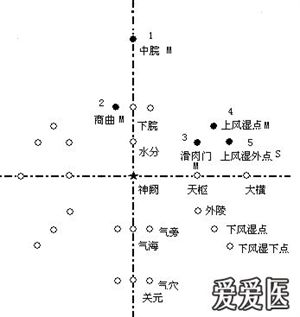
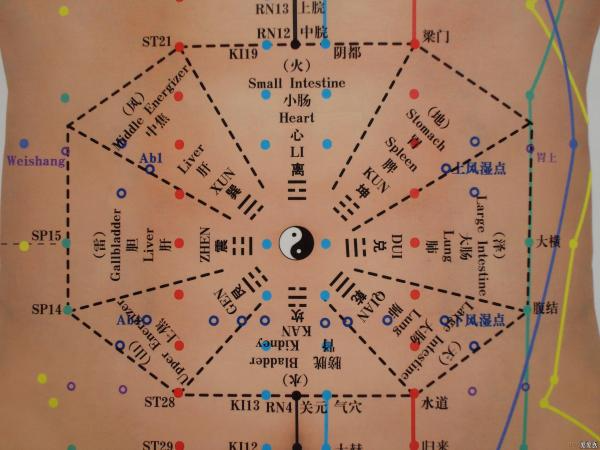
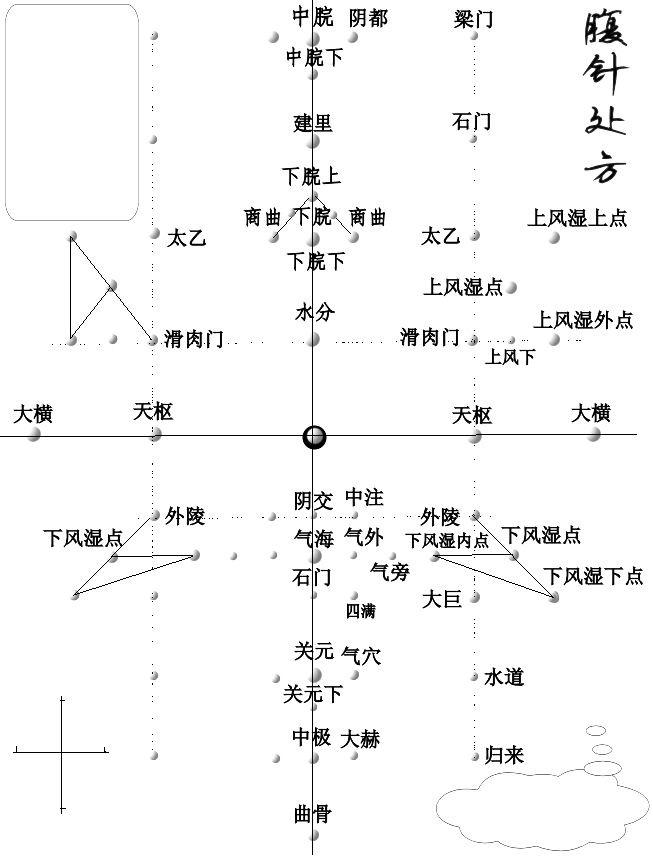
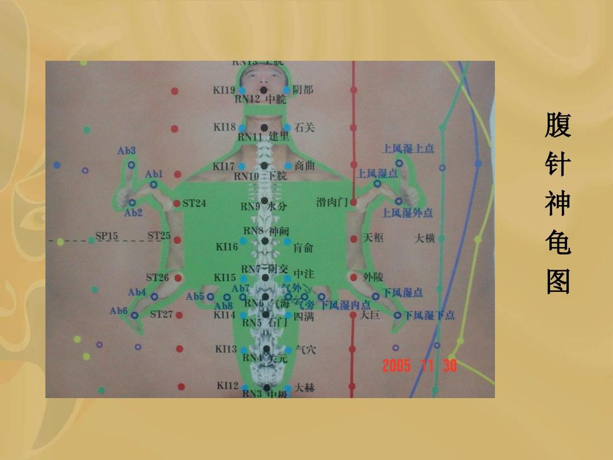

# 腹针针法
- 针法
    - 三角针：以落针点为定点，进两针成等边三角形。
    - 三星针：以落针点为定点，上下或左右各一寸处进针。
    - 梅花针：以落针点为定点，上下左右各一寸处进针。
- 配穴
    - 天地针中脘关元，引气归元下脘气，脾气调和大横来，四关滑肉外陵开，炎症湿腻风湿点，肩部腕部次第排。
        - 天地针：中脘穴，关元穴
        - 引气归元：中脘穴，下脘穴，气海穴，关元穴
        - 调脾气：双大横穴
        - 腹四关：双滑肉门，双大陵穴
        - 风湿点：四关穴外上（下）各五分处
- 腹针图谱    