# 针灸基本功穴位歌诀精选（带图表）
- 编者的话
    - 大部分图片及文字取自 **谢锡亮** 老师著 **《针灸基本功》** (第二版)。个人认为此书诚挚实在，几乎可取代（非针灸专业）教材。微信读书有全书。其余搜集自一些复习/考研资料。
    - 经穴歌诀分四种： 分寸歌 、 选穴分寸歌 、循行定位（星号穴）、 穴名歌 、五腧穴歌。按需选取。
        - 第1版出版之后，有读者提出，十四经歌诀比较难记。为使读者节省时间和较快掌握，我们精简出187穴，编了十四经简要穴分寸歌，共187句，1309个字，涵盖了各种要穴，更方便记忆和临床使用。如肯下功夫，约半月时间就能背诵了。两种分寸歌，可根据自己能力选读，只需背诵一种即可（如果是针灸专业的医生，还是建议背诵完整版）。
        - 循行定位，选课本星号穴位
    - 记忆法——坚持、朗读！
        - 读十四经穴分寸歌要苦读巧读，最好在每天清早，如同读古典文学、诗词、外语、台词一样，高声朗诵，眼看耳听，心领神会，高声念一遍等于默念数遍。这就叫“朗读法”，要逐句、逐段、逐经地念下去。也就是逐句攻、分段读，按章节，有条不紊地依次读熟。只要下工夫去读，大约经过三四周，就能把十四篇经穴分寸歌读得滚瓜烂熟，快速流利。最后要达到的标准是：随时随地都能出口成歌。凡指出来一条经脉，就能有次序地背出本经的穴名和分寸；指出一个穴名要会背出本穴的一句口诀，并指出分寸部位；指出一个穴名能答出归哪一经，是否什么“特要穴”。
        - 具体方法是，念会上句再念下句，念会上段再念下段，念会一经再念一经，每天早上都要从头念起，熟悉的要开快车一念就过，到生的地方再努力“攻”。生句绕口之处，要连念数十遍，念熟了再往前念。总之，不厌百遍千遍地大声念下去，最后达到能背诵的程度。这就叫“循环往复背诵法”。先“死读”而后就能活用了.......后略
    - 歌诀重要性
        - 临床医生使用针灸歌诀，犹如演员登场歌唱、相声家说白语一样，必须熟记，要能够背诵，说来就来，从容流利，出口成词。否则临用时胸无成竹，茫然失措，再查书本那就来不及了。因此必须重视基本功的锻炼，把各种常用的歌诀读熟，给临床应用打下良好基础，其中十四经穴分寸歌尤为重要。
        - 如果读会十四经分寸歌，不但熟悉了全身穴位的名称，同时也对经脉在体表循行的路线有了概念，并且给循经取穴打下了良好的基础，也易于掌握经穴的共性，即经穴的主治原则。读会本歌诀，就能代替《脏腑十二经穴起止歌诀》《十四经脉循行歌》《十四经穴总歌》和《周身经穴赋》，不但条理清晰，不易混乱，而且一举多得，省时省力，收效巨大。
    - 无偿整理与分享，仅供学习，不可用于盈利。如有侵权，请联系删除。
    - 喜马拉雅等，有歌诀音频可听。3Dbody的免费穴位解剖，ui设计优秀，内容与教材同步，是良好工具。
- 手太阴肺经
    - 少商鱼际与太渊，经渠尺泽肺相连。 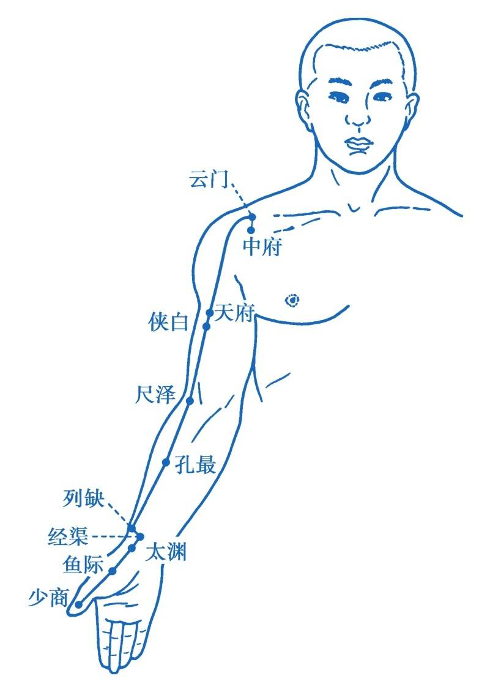
    - 分寸歌（左右各11穴）
        - 上行云门一寸许，天府腋三动脉求，尺泽肘中约纹是，孔最腕后七寸拟，
        - 列缺腕上一寸半，经渠寸口陷中取，太渊掌后横纹头，鱼际节后散脉里，
        - 少商大指内侧端，鼻衄喉痹刺可已。
    - 选穴分寸歌（选6穴）
        - 中府乳上三肋间，却距中行六寸观。
        - 本经下行循臂内，尺泽肘中腱外廉。
        - 列缺腕上一寸半，太渊掌后横纹尖。
        - 鱼际节后散脉里，少商大指内侧端。
    - 循行定位
        - 手太阴肺经 ， 起于中焦， 向下联络大肠，再返回 沿 胃上口，穿过横膈， 入属于 肺。从 肺系 （气管喉咙部）向外横行 至 腋窝下，延 上 臂 内侧 下行，循行于 手少阴与手 厥 阴经之前，下至肘中，沿着前臂内侧桡骨 尺 侧缘下行，经寸口动脉搏动处，行至大鱼际，再沿着大鱼际 桡 侧缘循行直达拇指末端。其支脉，从手腕后分出，沿着食指 桡 侧直达食指末端。
        - 中府 ： 在胸 部 ， 横 平第一肋间隙 ，锁骨下窝外侧， 前正中线旁开 6 寸 。
        - 尺泽 ： 在肘 区，肘 横纹 上 ，肱二头肌腱 桡 侧 缘 凹陷 中。
        - 孔最 ： 在前臂前区，腕掌侧远端横纹上7寸， 尺泽穴与 太 渊连线上 。
        - 列缺 ： 在前臂， 腕 掌侧远端 横纹上 1 ． 5 寸， 拇短伸肌腱和拇长展肌 腱 之间，  拇长展肌腱 沟的 凹陷中。 （ 简便取穴法：两手虎口自然平直交叉，一手食指按在另一手桡骨茎突上，指尖下凹陷中是穴。 ）
        - 太渊 ： 在 腕前区 ，桡骨茎突与舟状骨之间，拇长展肌腱尺侧凹陷中。
        - 鱼际 ： 在手外侧， 第１掌骨 桡 侧 中点 赤 白肉际处 。
        - 少商 ： 在手指， 拇指 末节 桡 侧 ， 指甲 根 角 侧 上方 0 ． 1 寸
    - 穴名歌
        - 手太阴肺十一穴，中府云门天府诀；
        - 侠白之下是尺泽，孔最下行接列缺；
        - 更有经渠与太渊，鱼际少商如韭叶。
- 手阳明大肠经
    - 商阳二三间合谷，阳溪曲池大肠牵。 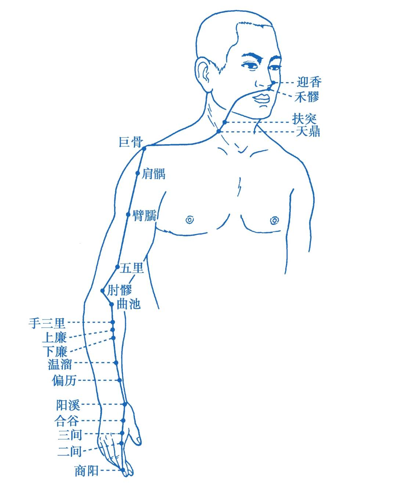
    - 分寸歌（左右各20穴）
        - 商阳食指内侧边，二间寻来本节前，三间节后陷中取，合谷虎口歧骨间，
        - 阳溪腕上筋间是，偏历腕后三寸安，温溜腕后去五寸，池前四寸下廉看，
        - 池前三寸上廉中，池前二寸三里逢，曲池屈肘纹头尽，肘髎大骨外廉近，
        - 大筋中央寻五里，肘上三寸行向里，臂臑肘上七寸量，肩髃肩端举臂取，
        - 巨骨肩尖端上行，天鼎扶下一寸真，扶突人迎后寸五，禾髎水沟旁五分，
        - 鼻翼中点外迎香，大肠经穴是分明。
    - 选穴分寸歌（选10穴）
        - 商阳食指内侧边，本节之后寻三间。
        - 歧骨之前取合谷，偏历交叉中指端。
        - 曲池曲肘纹头尽，肘髎穴在肱外廉。
        - 臂臑肘上七寸量，肩髃肩端举臂陷。
        - 扶突人迎后寸五，迎香鼻旁纹中探。
    - 循行定位
        - 手阳明大肠经，起于食指之尖端（ 桡 侧）， 沿食指 桡 侧，经过1、2掌骨之间，上行至腕后两筋之间，沿前臂外侧缘，至肘部外侧，再沿上臂外侧前缘上行到肩部，经肩峰前，向上 循 行至背部，与诸阳经交会于大椎穴，再向前行进入缺盆，络于肺，下行穿过横膈，属于大肠。其支脉，从缺盆部上行至颈部，经面颊进入下齿之中，又返回经口角到上口唇，交会于人中（水沟 穴 ），左脉右行，右脉左行，止于对侧鼻孔旁。
        - 商阳 ： 在手指，食指末节 桡 侧， 指甲 根 角 侧 上方 0 ． 1 寸 （指寸）。
        - 合谷 ： 在手背，当第２掌骨 桡 侧的中点处 。（ 简便取穴：以一手的拇指指骨关节横纹，放在另一手 拇 、食指之间的指蹼缘上，当拇指尖下是穴。 ）
        - 阳溪 ： 在腕区， 腕背 侧远端 横纹 桡 侧， 桡骨茎突远端，解剖学“鼻烟窝”凹陷中。（拇短伸肌腱、拇长伸肌 腱 之间）
        - 偏历 :  在前臂， 腕 背侧远端 横纹上 3 寸 ， 阳溪穴与曲池 穴 连线上 。
        - 手三里 ： 在前臂， 肘横纹下２寸 ， 阳溪穴与曲池 穴 连线上 。
        - 曲池 ： 在肘区，在 尺泽与肱骨外上髁连线中点凹陷处。
        - 臂臑： 在臂部，曲池上7寸，三角肌前缘处。
        - 肩髃 ：  在三角肌区，肩峰外侧缘前端与肱骨大结节两骨间凹陷中。
        - 扶突 ： 在胸锁乳突肌区，横平喉结，胸锁乳突肌前、后缘中间。
        - 迎香 ： 在面部，鼻翼外缘中点旁，鼻唇沟中。
    - 穴名歌
        - 手阳明穴起商阳，二间三间合谷藏；
        - 阳溪偏历复温溜，下廉上廉三里长；
        - 曲池肘谬五里近，臂臛肩髃巨骨当；
        - 天鼎扶突禾谬按，鼻旁五分号迎香。
- 足阳明胃经
    - 厉兑内庭陷谷胃，冲阳解溪三里随。 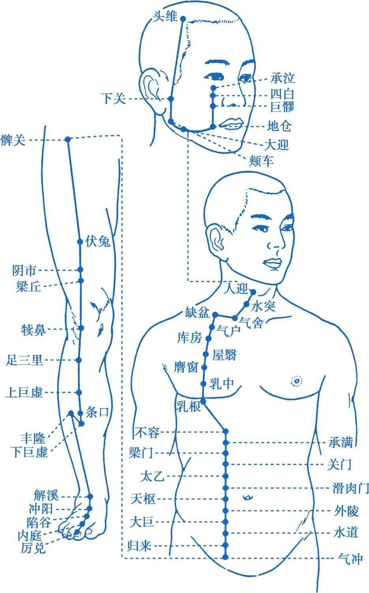
    - 分寸歌（左右各45穴）
        - 胃之经兮足阳明，承泣目下七分寻，四白目下方一寸，巨髎鼻孔旁八分，
        - 地仓挟吻四分近，大迎颔前寸三分，颊车耳下曲颊陷，下关耳前颧弓下，
        - 头维神庭旁四五，人迎喉旁寸五真，水突筋前迎下在，气舍突下穴相承，
        - 缺盆舍外锁骨上，相去中线四寸明，气户锁骨下缘取，库房屋翳膺窗近，
        - 均隔寸六到乳头，乳中正在乳头心，次有乳根出乳下，第五肋间细扪循，
        - 不容巨阙旁二寸，以下诸穴与君陈，其下承满与梁门，关门太乙滑肉门，
        - 上下一寸无多少，共去中行二寸寻，天枢脐旁二寸间，枢下一寸外陵安，
        - 枢下二寸大巨穴，枢下三寸水道全，水下一寸归来好，共去中行二寸边，
        - 气冲归来下一寸，髀关髂下对承扶，伏兔膝上六寸是，阴市膝上方三寸，
        - 梁丘膝上二寸记，膝髌陷中犊鼻存，膝下三寸三里至，胫外一指需细温，
        - 膝下六寸上廉穴，膝下八寸条口位，膝下九寸下廉看，条口之旁丰隆系，
        - 却是踝上八寸量，解溪跗上系鞋处，冲阳跗上五寸唤，陷谷跖趾关节后，
        - 内庭次趾外间陷，厉兑大次趾外端。
    - 选穴分寸歌（选22穴）
        - 胃之经兮足阳明，承泣瞳下眶上缘。
        - 地仓挟吻四分近，颊车耳下曲颊陷。
        - 下关颧骨弓中取，头维神庭旁四半。
        - 人迎喉旁一寸五，锁骨陷窝是缺盆。
        - 下行乳根出乳下，中脘旁二取梁门。
        - 天枢脐旁开二寸，枢下三寸水道安。
        - 再下一寸归来穴，股上尺二找髀关。
        - 伏兔膝上六寸是，梁丘膝上二寸间。
        - 膝膑陷中犊鼻存，膝下三寸三里全。
        - 膝下八寸条口位，条口之旁丰隆看。
        - 解溪跗上筋间取，内庭次趾外间陷。
        - 厉兑次趾之外端。
    - 循行定位
        - 足阳明胃经，起于鼻旁，上行鼻根，与足太阳经脉相交会，再沿鼻的外侧下行，入上齿龈中，返回 环 绕口唇，入下唇交会于 承奖穴 ；再向后下沿下颌下缘，至大迎穴处，再沿下颌 角 至颊车穴，上行到耳前，过足少阳经的上关穴处，沿发际至 额颅部。其支脉，从大迎前下走颈动脉部 ( 人迎 ) ，沿喉咙入缺盆，下横膈， 入属于 胃，联络于脾。其直行的经脉，从缺盆沿乳房内侧下行，经脐旁到下腹部的气冲部； 一 支脉从胃口分出，沿腹内下行，至气冲部与直行经脉相会合。由此经 髀 关、伏兔穴下行，至膝关节中。再沿胫骨外侧前缘下行，经足背到第2足趾外侧端（ 厉兑穴 ） ； 一 支脉从膝下3寸处分出，下行到中 趾 外侧端； 一 支脉从足背分出，沿足大趾内侧直行到末端。
        - 承 泣 ： 在面部，眼球与眶下缘之间，目正视，瞳孔直下。
        - 四白 ： 在面部，眶下孔处。
        - 地仓 ： 在面部，口角旁开0 0.4 寸（指寸）
        - 颊车 ： 在面部，下颌角前上方一横指（中指），闭口咬紧牙时咬肌隆起，放松时按之有凹陷处。
        - 下关 ： 在面部，颧弓下缘中央与下颌切迹之间凹陷中。（ 合口有孔，张口即闭，宜闭口取穴 ）
        - 头维 ： 在头部，额角发际直上0 0.5 寸，头正中线旁开4 0.5 寸。
        - 人迎 ： 在颈部，横平喉结，胸锁乳突肌前缘，颈总动脉搏动处。
        - 粱门（梁门）：在上腹部，脐中上4寸，前正中线旁开2寸。
        - 天枢 ： 在腹部，横平脐中，前正中线旁开2寸。
        - 水道 ： 在下腹部， 脐 中下3寸，前正中线旁开2寸。
        - 归来 ： 在下腹部， 脐 中下4寸，前正中线旁开2寸。
        - 伏兔 ： 在股前区，髌底上6寸， 髂前上棘与髌底外侧端的连线上。
        - 梁丘 ： 在股前区，髌底上2寸，股外侧肌与股直肌肌腱之间。
        - 足三里 ： 在小腿外侧，犊鼻下3寸，胫骨前 嵴 外 1 横指处，犊鼻与解溪连线上。
        - 上巨虚 ： 在小腿外侧，犊鼻下6寸，犊鼻与解溪连线上。
        - 条口 ： 在小腿外侧，犊鼻下8寸，犊鼻与解溪连线上。
        - 下巨虚 ： 在小腿外侧，犊鼻下9寸，犊鼻与解溪连线上。
        - 丰隆 ： 在小腿外侧，外踝尖上8寸，胫骨前肌外缘；条口外侧一横指处。
        - 解溪 ： 在踝区，踝关节前面中央凹陷中，长伸肌 腱于趾长伸肌腱 之间。
        - 内庭 ： 在足背，第2、3 趾 间， 趾 蹼缘后方 赤 白肉际处。
        - 厉兑 ： 在足趾，第2 趾 末节外侧， 趾甲根角侧后 方0 0.1 寸（指寸）。
    - 穴名歌
        - 四十五穴足阳明，承泣四白巨谬径；
        - 地仓大迎颊车时，下关头维对人迎；
        - 水突气舍连缺盆，气户库房屋翳屯；
        - 膺窗乳中连乳根，不容承满及梁门；
        - 关门太乙滑肉门，天枢外陵大巨存；
        - 水道归来气冲次，髀关伏兔走阴市；
        - 梁丘犊鼻足三里，上巨虚连条口位；
        - 下巨虚穴上丰隆，解溪冲阳陷谷中；
        - 下行内庭厉兑穴，大趾次趾之端终。
- 足太阴脾经
    - 隐白大都太白脾，商丘阴陵泉要知。 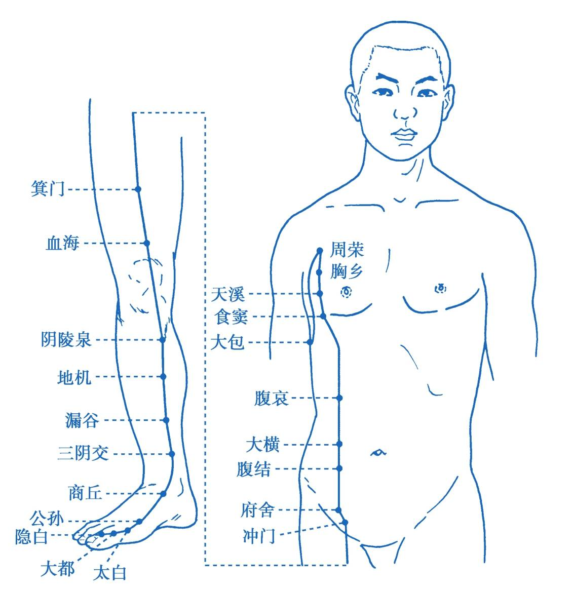
    - 分寸歌（左右各21穴）
        - 大趾内侧端隐白，节前陷中求大都，太白节后白肉际，节后一寸公孙呼，
        - 商丘踝前下陷逢，踝上三寸三阴交，踝上六寸漏谷是，阴陵下三地机朝，
        - 胫髁起点阴陵泉，血海膝髌上内廉，箕门穴在股肌尾，冲门曲骨旁三五，
        - 冲上七分府舍求，舍上三寸腹结算，结上寸三是大横，却与脐平莫胡乱，
        - 建里之旁四寸处，便是腹哀分一段，中庭旁六食窦穴，膻中去六是天溪，
        - 再上一肋胸乡穴，周荣相去亦同然，大包腋下有六寸，渊腋之下三寸悬。
    - 选穴分寸歌（选12穴）
        - 大趾甲内端隐白，节后一寸公孙唤。
        - 商丘踝前陷中找，踝上三寸三阴交。
        - 膝下内侧阴陵泉，血海膝膑上内廉。
        - 箕门要在鱼腹取，冲门穴在横骨端。
        - 脐旁四寸是大横，膻中去六天溪安。
        - 再上二肋周荣穴，腋下六寸大包全。
    - 循行定位
        - 足太阴脾经，起于足大趾末端，沿着大趾内侧 赤 白肉际，经过大趾本节的第1跖趾关节后面，上行至内踝前面，再沿小腿内侧胫骨后缘上行，至内踝上8寸处交于足厥阴经之前，再沿膝股部内侧前缘上行，进入腹部，属脾，联络胃；再经过横膈上行，夹咽部两旁， 连系 舌根，分散于舌下。其支脉，从胃上膈，注心中。
        - 隐白 ： 在足趾，大趾末节内侧， 趾甲 根角侧后 方0 0.1 寸（指寸）。
        - 太白 ： 在 跖 区，第1跖趾关节近端赤白肉际凹陷中。
        - 公孙 ： 在 跖 区，第1跖骨底的前下缘赤白肉际处。
        - 三阴交 ： 在小腿内侧，内踝尖上 3 寸，胫骨内侧缘后际。
        - 地机 ： 在小腿内侧，阴陵泉下3寸，胫骨内侧缘后际。
        - 阴陵泉 ： 在小腿内侧，胫骨内侧髁下缘与胫骨内侧缘之间的凹陷中。
        - 血海 ： 在股前区，髌底内侧端上2寸，股内侧肌隆起处。
        - 大横 ： 在腹部，脐中旁开4寸。
        - 大包 ： 在胸外侧区，第6肋间隙，在腋中线上。
    - 穴名歌
        - 二十一穴脾中州，隐白在足大趾头；
        - 大都太白公孙胜，商丘三阴交可求；
        - 漏谷地机阴陵泉，血海箕门冲门开；
        - 府舍腹结大横排，腹哀食窦连天溪；
        - 胸乡周荣大包随。
- 手少阴心经
    - 少冲少府属于心，神门灵道少海寻。 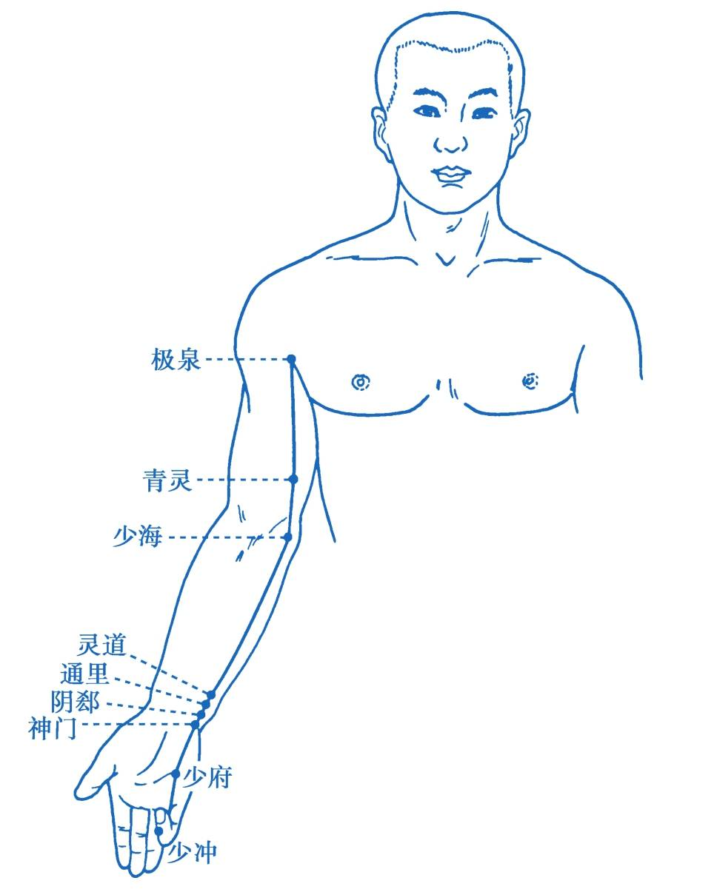
    - 分寸歌（左右各9穴）
        - 少阴心起极泉中，腋下筋间动脉凭，青灵肘上三寸觅，少海屈肘横纹头，
        - 灵道掌后一寸半，通里腕后一寸同，阴郄去腕五分地，神门肌腱桡侧逢，
        - 少府小指本节后，小指内侧是少冲。
    - 选穴分寸歌（选6穴）
        - 少阴心起极泉中，少海肘后五分定。
        - 通里腕后只一寸，神门掌后锐骨逢。
        - 少府掌内本节后，小指内侧是少冲。
    - 循行定位
        - 手少阴心经 ， 起于心中， 出属 心系 （心与其他脏器相连的组织）；下行经过横膈，联络小肠。其支脉，从心系向上，夹着食道上行，连于目系（眼球连接与脑的组织）。其直 行经脉，从 心系上行到肺部，再向外下到达腋窝部，沿着上臂内侧后缘，行于手太阴经和手 厥 阴经的后面，到达肘窝；再沿前臂内侧后缘，至掌后豌豆骨部，进入掌内， 止于小指 桡 侧 末 端 。
        - 极泉 ： 在腋区， 腋窝 中央 ，腋动脉搏动处 。
        - 少海 ： 在肘前区，横平肘横纹， 肱骨内上髁 前缘。
        - 通里 ： 在前臂前区，腕掌侧远端 横纹上  1 寸，尺侧腕屈肌腱的 桡 侧缘 。
        - 阴 郄 ： 在前臂前区， 腕 掌侧远端 横纹上0 . 5寸，尺侧腕屈肌腱的 桡 侧缘 。
        - 神门 ： 在腕前区， 腕 掌侧远端 横纹尺侧端，尺侧腕屈肌腱的 桡 侧 缘。
        - 少府 ： 在手掌， 横平第5掌指关节近端， 第4、5掌骨之间 。
        - 少冲 ： 在手指， 小指 末节 桡 侧 ， 指甲 根角侧 上方 0 ． 1 寸 （指寸）。
    - 穴名歌
        - 极泉青灵少海深，灵道通里阴郄邃，神门少府少冲寻。
- 手太阳小肠经
    - 少泽前谷后溪腕，阳谷小海小肠经。 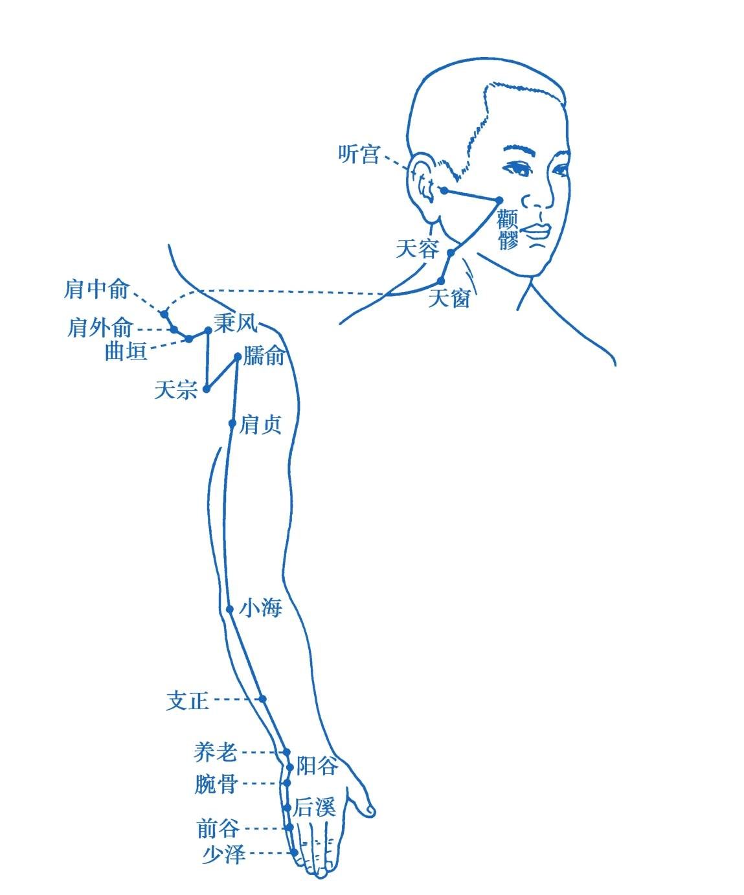
    - 分寸歌（左右各19穴）
        - 小指端外为少泽，前谷外侧节前觅，节后捏拳取后溪，腕骨腕前骨陷侧，
        - 锐骨下陷阳谷讨，腕后高突翻养老，支正腕后五寸量，小海肘髁鹰嘴中，
        - 肩贞腋上一寸寻，臑俞贞上冈下缘，天宗秉风下窝中，秉风冈上举有空，
        - 曲垣冈端上内陷，外俞陶道三寸从，中俞二寸大椎旁，天窗扶突后陷详，
        - 天容耳下曲颊后，颧髎面鸠锐端量，听宫耳中大如菽，此为小肠手太阳。
    - 选穴分寸歌（选10穴）
        - 小指端外为少泽，节后握拳后溪量。
        - 支正腕后正五寸，小海肘端五分当。
        - 腋后缝上取肩贞，天宗秉风骨下详。
        - 秉风肩上缝隙处，曲垣曲胛肩冈上。
        - 天容耳下曲颊后，听宫耳前陷中央。
    - 循行定位
        - 手太阳小肠经，起于手小指尺侧端，沿着手 尺侧至腕部 ，出于尺骨头，直上沿着前臂外侧后缘，经尺骨鹰嘴于肱骨内上髁之间，沿上臂外侧后缘，到达肩关节，绕行肩胛部，交会于大椎，向下进入缺盆部，联络心，沿着食管，经过横膈，到达胃部，属于小肠。其支脉，从缺盆分出，沿着颈部，上达面部， 到目外眦 ，向后进入耳中。另一支脉，从颊部分出，上行目 眶 下，抵于鼻旁，至目内 眦 ，斜行络于颧骨部。
        - 少泽 ： 在手指，小指末节尺侧， 指甲根角侧 上方0 0.1 寸（指寸）。
        - 后溪 ： 在手内侧，第5 掌指关节 尺 侧近端 赤 白肉际凹陷中。
        - 腕骨 ： 在腕区，第5掌骨底与三角骨之间的 赤 白肉际凹陷中。
        - 养老 ： 在前臂后区，腕背横纹上1寸，尺骨头 桡 侧凹陷中。
        - 支正 ： 在 前臂后区， 腕背侧远端横纹上5寸，尺骨尺侧与尺侧腕屈肌之间。
        - 小海： 在肘后区，尺骨鹰嘴与肱骨内上髁之间的凹陷中。
        - 肩贞 ： 在肩胛区，肩关节后下方， 腋 后纹头直上1寸。
        - 天宗 ： 在肩胛区，肩胛冈中点与肩胛骨下角连线上1 /3 与下2 /3 交点凹陷中。
        - 颧 髎 ： 在面部，颧骨下缘，目外 眦 直下凹陷中。
        - 听宫 ： 在面部，耳屏 正中与 下颌骨髁突之间的凹陷中。
    - 穴名歌
        - 手太阳穴一十九，少泽前谷后溪数；
        - 腕骨阳谷养老绳，支正小海外辅肘；
        - 肩贞臛俞接天宗，谬外秉风曲垣首；
        - 肩外俞连肩中俞，天窗乃与天容偶；
        - 锐骨之端上颧谬，听宫耳前珠上走。
- 足太阳膀胱经
    - 至阴通谷束京骨，昆仑委中膀胱知。 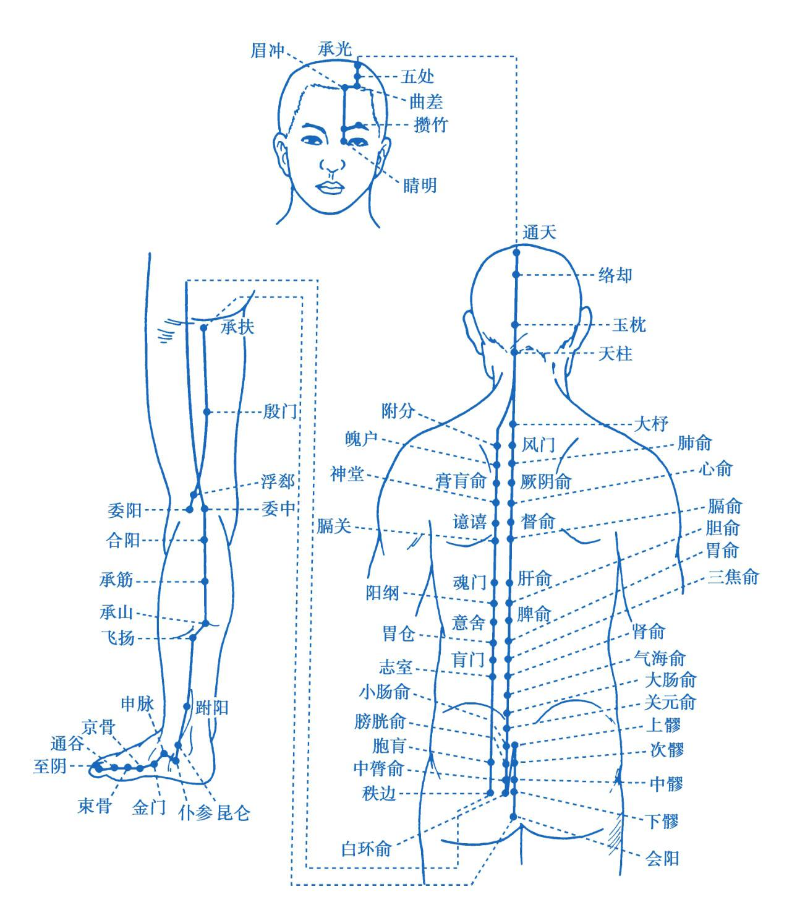
    - 分寸歌（左右各67穴）
        - 足太阳是膀胱经，目内眦角始睛明，眉头头中攒竹取，眉冲直上旁神庭，
        - 曲差入发五寸际，神庭旁开寸五分，五处旁开亦寸半，细算却与上星平，
        - 承光通天络却穴，相去寸五调匀看，玉枕挟脑一寸三，入发三寸枕骨取，
        - 天柱项后发际中（不标准，在颈后区，横平第2颈椎棘突上际，斜方肌外缘凹陷中），大筋外廉陷中陷，自此夹脊开寸五，第一大杼二风门，
        - 三椎肺俞厥阴四，心五督六椎下治，膈七肝九十胆俞，十一脾俞十二胃，
        - 十三三焦十四肾，气海俞在十五椎，大肠十六椎之下，十七关元俞穴推，
        - 小肠十八胱十九，中膂俞穴二十椎，白环廿一椎下当，以上诸穴可推详，
        - 更有上次中下髎，一二三四骶后孔，会阳阴尾尻骨旁，背部二行诸穴详，
        - 又从臀下横纹取，承扶居下陷中央，殷门扶下方六寸，浮郄委阳上一寸，
        - 委阳腘外两筋乡，委中穴在腘纹中，背部三行再细详，又从脊上开三寸，
        - 第二椎下为附分，三椎魄户四膏肓，第五椎下神堂尊，第六譩譆膈关七，
        - 第九魂门阳纲十，十一意舍之穴存，十二胃仓穴已分，十三肓门端正在，
        - 十四志室不须论，十九胞肓廿一秩边（原文如此），委中下二寻合阳，承筋合阳之下取，
        - 穴在腨肠之中央，承山腨下分肉间，外踝七寸上飞扬，跗阳外踝上三寸，
        - 昆仑后跟陷中央，仆参跟下脚边上，申脉踝下五分张，金门申前墟后取，
        - 京骨外侧骨际量，束骨本节后肉际，通谷节前陷中强，至阴却在小趾侧，
        - 太阳之穴始周详。
    - 选穴分寸歌（选38穴）
        - 足太阳是膀胱经，目内眦角始睛明。
        - 眉头头中攒竹取，百会前外通天迎。
        - 百会后外络却穴，天柱项后发际中（不标准，在颈后区，横平第2颈椎棘突上际，斜方肌外缘凹陷中）。
        - **自此夹脊开寸五，第一大杼二风门。**
        - **三椎肺俞五心俞，膈七肝九十胆俞。**
        - **十一脾俞十二胃，十三三焦十四肾。**
        - **大肠十六胱十九，白环廿一椎边求。**
        - 骶骨四孔八髎穴，上次中下仔细究。
        - 又从脊上开三寸，第二椎下为附分。
        - 四椎之旁取膏肓，十二椎下寻胃仓。
        - 十四椎旁志室穴，二十一椎秩边详。
        - 又从臀下横纹取，承扶就在陷中央。
        - 殷门扶下方六寸，委中膝腘正中藏。
        - 承山腨下分肉间，外踝七寸上飞扬。
        - 昆仑外踝后陷中，申脉踝下肉边上。
        - 金门申前陷窝取，京骨外侧骨际量。
        - 至阴却在小趾侧，足太阳经始周详。
    - 循行定位
        - 足太阳膀胱经，起始于于 内眼角，向上过额部，与督脉交会于头顶。其支脉，从头顶分出到耳上角。其直行经脉，从头顶入颅内络脑，再浅出 沿枕项部 下行，沿肩胛内侧脊柱两旁下行到达腰部，进入脊旁肌肉，入内络于肾，属于膀胱。 一 支脉从腰中分出，向下夹脊旁，通过臀部，进入腘窝中； 一 支脉从左右肩胛内侧分别下行，穿过脊旁肌肉，经过髋关节部，沿大腿外侧后缘下行，会合于腘窝内，向下通过腓肠肌，出外踝的后方，沿第5跖骨粗隆，至小趾的外侧末端。
        - 睛 明 ： 在面部，目内 眦 内上方 眶 内侧壁凹陷中。
        - 攒竹 ： 在面部，眉头凹陷中，额切迹处。
        - 天柱 ： 在颈后区，横平第2 颈椎棘突上际，斜方肌外缘凹陷中。
        - 大 杼 ： 在脊柱区，第1胸椎棘突下，后正中线旁开1 0.5 寸。
        - 风门 ： 在脊柱区，第 2 胸椎棘突下，后正中线旁开1 0.5 寸。
        - 肺 俞 ： 在脊柱区，第 3 胸椎棘突下，后正中线旁开1 0.5 寸。
        - 心 俞 ： 在脊柱区，第 5 胸椎棘突下，后正中线旁开1 0.5 寸。
        - 膈 俞 ： 在脊柱区，第 7 胸椎棘突下，后正中线旁开1 0.5 寸。
        - 肝 俞 ： 在脊柱区，第 9 胸椎棘突下，后正中线旁开1 0.5 寸。
        - 胆 俞 ： 在脊柱区，第 10 胸椎棘突下，后正中线旁开1 0.5 寸。
        - 脾 俞 ： 在脊柱区，第 11 胸椎棘突下，后正中线旁开1 0.5 寸。
        - 胃 俞 ： 在脊柱区，第 1 2 胸椎棘突下，后正中线旁开1 0.5 寸。
        - 三焦 俞 ： 在脊柱区，第 1 腰 椎棘突下，后正中线旁开1 0.5 寸。
        - 肾 俞 ： 在脊柱区，第 2 腰椎棘突下，后正中线旁开1 0.5 寸。
        - 大肠 俞 ： 在脊柱区，第 4 腰椎棘突下，后正中线旁开1 0.5 寸。
        - 小肠 俞 ： 在骶区，横平第1 骶后孔，骶正中嵴旁开 1 .5寸。
        - 膀胱 俞 ： 在骶区，横平第 2 后孔，骶正中嵴旁开 1 .5寸。
        - 次髎 ： 在骶区， 正对第2骶后孔中。
        - 承扶 ： 在股后区，臀沟的中点。
        - 委阳 ： 在膝部，腘横纹上，股二头肌腱的内侧缘。
        - 委中 ： 在膝后区，腘横纹中点
        - 膏肓 ： 在脊柱区，第 4 胸椎棘突下，后正中线旁开 3 寸。
        - 志室 ： 在腰区，第 2 腰椎棘突下，后正中线旁开 3 寸。
        - 秩 边 ： 在骶区，横平第 4 骶 后孔 ，骶正中嵴旁开 3 寸。
        - 承山 ： 在小腿后区，腓肠肌两肌腹与肌腱交角处。
        - 飞扬 ： 在小腿后区，昆仑直上 7 寸，腓肠肌外下缘与跟腱移行处。
        - 昆仑 ： 在踝区，外踝尖与跟腱之间的凹陷中。
        - 申脉 ： 在踝区，外踝尖直下，外踝下缘与 跟骨之间凹陷中。
        - 束骨 ： 在 跖 区，第5跖趾关节的近端， 赤 白肉际处。
        - 至阴 ： 在足趾，足小趾末节外侧， 趾甲根角侧后 方0 0.1 寸（指寸）。
    - 穴名歌
        - 六十七穴足太阳，睛明目内红肉藏，攒竹眉冲与曲差，五处寸半上承光，通天络却玉枕昂，天柱后际大筋旁。
        - 大杼夹脊第一行，风门肺俞厥阴四，心俞督俞膈俞强，肝胆脾胃三焦肾，气海大肠关小肠，膀胱中簪白环量，上谬次谬中复下，一空二空腰支当，会阳阴尾骨外取，承扶臀横纹中央，殷门浮郄委阳外，委中胭纹合膀胱，经脉至胸复上背。
        - 附分夹脊第二行，魄户膏肓神堂走，意僖关膈魂门九，阳纲意舍仍胃仓，肓门志室续胞肓，二十一椎秩边场。
        - 小腿合阳承筋乡，承山飞扬髃趵阳，昆仑仆参连申脉，金门京骨束骨忙，通谷至阴小趾旁。
- 足少阴肾经
    - 涌泉然谷与太溪，复溜阴谷肾所宜。 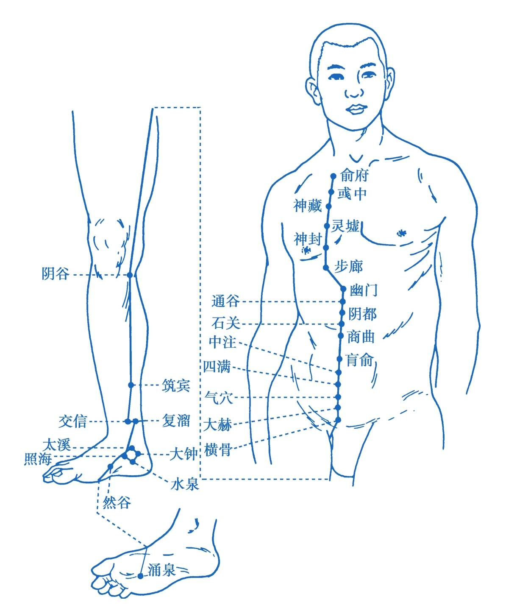
    - 分寸歌（左右各27穴）
        - 足掌心中是涌泉，然骨踝前大骨边，太溪踝后跟腱前，大钟溪下五分见，
        - 水泉溪下一寸觅，照海踝下一寸安，复溜踝上前二寸，交信踝上二寸连，
        - 二穴只隔筋前后，太阴之后少阴前，筑宾内踝上腨分，阴谷筋内两筋间，
        - 横骨大赫并气穴，四满中注亦相连，五穴上行皆一寸，中行旁开半寸边，
        - 肓俞上行亦一寸，俱在脐旁半寸间，商曲石关阴都穴，通谷幽门五穴缠，
        - 上下俱是一寸取，各开中行半寸间，步廊神封灵墟穴，神藏彧中俞府安，
        - 上行寸六旁二寸，穴穴均在肋隙间。
    - 选穴分寸歌（选10穴）
        - 足掌心中是涌泉，然谷踝前大骨边。
        - 太溪踝后大筋前，照海踝下陷中安。
        - 复溜踝上二寸取，阴谷膝下内辅边。
        - 循股内后达耻骨，旁开五分横骨见。
        - 神阙之外取肓俞，膻中旁二神封现。
        - 俞府璇玑离二寸，少阴肾经到此完。
    - 循行定位
        - 足 少阴肾经，起于足小趾下， 斜 走足心， 行舟 骨粗隆下，经内踝的后方，向下进入足跟中，沿小腿内侧上行，经腘窝内侧，沿大腿内侧后缘上行，贯脊柱，属于肾，络于膀胱。其直行支脉，从肾脏向上经过肝、膈，进入肺脏，沿着喉咙，夹舌根旁；另一支脉，从肺分出，联络心，流注于胸中。
        - 涌泉 ： 在足底，屈足卷 趾 时足心最凹陷中；约当足底第2、3 趾 蹼缘与足跟连线的前1 /3 与后2 /3 交点凹陷中。
        - 然谷 ： 在足内侧，足舟骨粗隆下方， 赤 白肉际处。
        - 太溪 ： 在足踝区，内踝尖与跟腱之间凹陷中。
        - 大钟 ： 在跟区，内踝后下方，跟骨上缘，跟腱附着部前缘凹陷中。
        - 照海 ： 在踝区，内踝尖下1寸，内踝下缘边际凹陷中。
        - 复溜 ： 在小腿内侧，内踝尖上2寸，跟腱的前缘。
        - 阴谷 ： 在膝后区，腘横纹上，半腱肌肌腱外侧缘。
        - 大 赫 ： 在下腹部， 脐 中下4寸，前正中线旁开0 0.5 寸。
        - 在腹部，脐中旁开0 0.5 寸。
    - 穴名歌
        - 足少阴经二十七，涌泉然谷与太溪，大钟水泉通照海，复溜交信筑宾接，阴谷膝内附骨后，以上从足走到膝。
        - 横骨大赫连气穴，四满中注肓俞脐，商曲石关阴都密，通谷幽门半寸距，步廊神封膺灵墟，神藏或中俞府毕。
- 手厥阴心包经
    - 中冲劳宫心包络，大陵间使传曲泽。 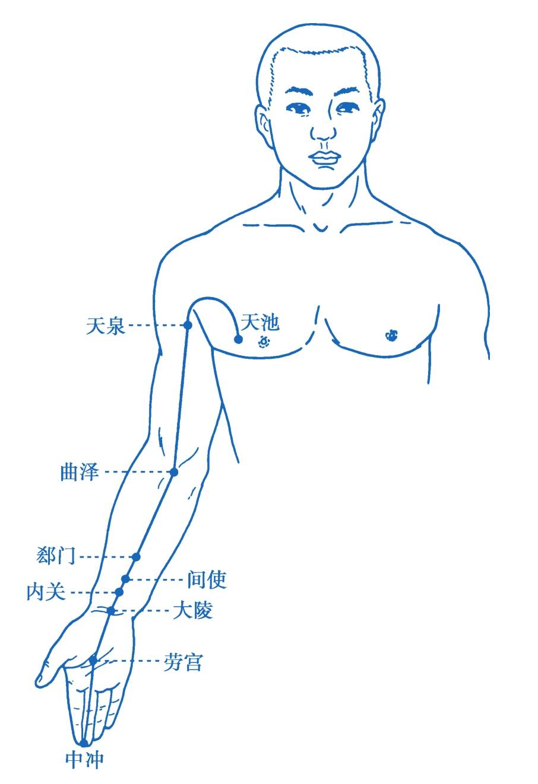
    - 分寸歌（左右各9穴）
        - 心包穴起天池间，乳后旁一腋下三，天泉曲腋下二寸，曲泽肘内横纹端，
        - 郄门去腕方五寸，间使腕后三寸安，内关去腕止二寸，大陵掌后两筋间，
        - 劳宫屈中指间取，中冲中指之末端。
    - 选穴分寸歌（选7穴）
        - 心包穴起天池间，乳后旁一腋下三。
        - 曲泽肘中腱内取，间使腕后三寸安。
        - 内关去腕只二寸，大陵掌后两筋间。
        - 劳宫屈指掌中取，中冲中指之末端。
    - 循行定位
        - 手 厥 阴心包经 ， 起于胸中， 出属 心包 络 ， 向下经过 横膈自胸 至腹依次联络上、中、下三焦。其支脉，从胸部向外侧循环，至腋下3寸处，再向上抵达腋部，沿上臂内侧下行于手太阴、手少阴之间，进入肘中，再向下到前臂，沿两筋之间，进入掌中，循行至中指的末端。 一 支脉从掌中分出，沿无名指到指端。
        - 天池 ： 在胸部， 第四肋间隙 ，前正中线旁开5  寸。
        - 曲泽 ： 在肘前区， 肘 横纹上 ，肱二头肌腱尺侧缘 凹陷中。
        - 郄 门 ： 在前臂前区， 腕 掌侧远端 横纹上5寸，掌长肌腱与桡侧腕屈肌 腱 之间 。
        - 间使 ： 在前臂前区， 腕 掌侧远端 横纹上 3寸，掌长肌腱与桡侧腕屈肌 腱 之间 。
        - 内关 ： 在前臂前区， 腕 掌侧远端 横纹上 2寸，掌长肌腱与桡侧腕屈肌 腱 之间
        - 大陵 ： 在腕前区， 腕 掌侧远端 横纹中，掌长肌腱与桡侧腕屈肌 腱 之间
        - 劳 宫 ： 在掌区，横平第3掌指关节近端， 第 二、三 掌骨 之间偏于第3掌骨。（简便取穴：握拳，中指尖下是穴）
        - 中冲 ： 在手指， 中指 末端最高点。
    - 穴名歌
        - 九穴心包手厥阴，天池天泉曲泽深，郄门间使内关对，大陵劳宫中冲寻。
- 手少阳三焦经
    - 关冲液门中渚焦，阳池支沟天井索。 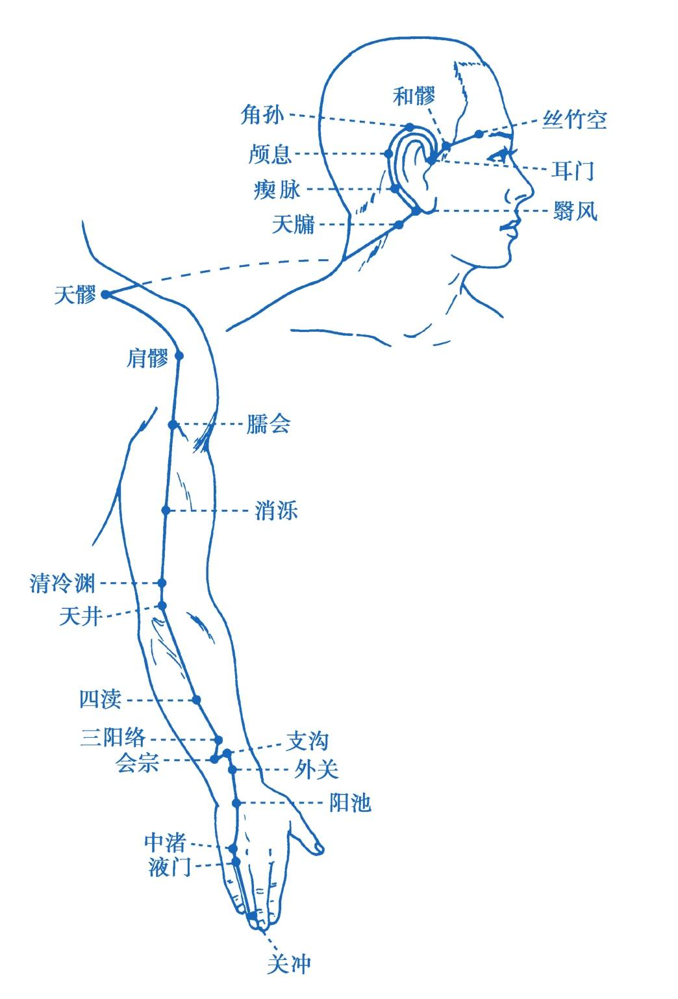
    - 分寸歌（左右各23穴）
        - 无名指外端关冲，液门小次指陷中，中渚液门上一寸，阳池手表腕陷中，
        - 外关腕后方二寸，腕后三寸支沟容，支沟横外取会宗，空中一寸用心攻，
        - 腕后四寸三阳络，四渎肘前五寸着，天井肘外大骨后，骨隙中间一寸摸，
        - 肘后二寸清冷渊，消泺对腋臂外落，臑会肩前三寸量，肩髎臑上陷中央，
        - 天髎宓骨陷内上，天牖天容之后旁，翳风耳垂后方取，瘈脉耳后鸡足张，
        - 颅息亦在青络上，角孙耳廓上中央，耳门耳缺前起肉，和髎耳前锐发乡，
        - 欲知丝竹空何在，眉后陷中仔细量。
    - 选穴分寸歌（选12穴）
        - 无名指外端关冲，阳池手表腕陷中。
        - 外关腕后方二寸，腕后三寸支沟容。
        - 天井肘尖后一寸，臑会肩前三寸迎。
        - 肩髎臑上陷中取，天牗天容后正中。
        - 翳风耳垂角尖陷，角孙按耳正中峰。
        - 耳门屏上缺口前，眉梢头外丝竹空。
    - 循行定位
        - 手少阳三焦经 ， 起于无名指尺侧末端，向上经小指与无名指之间、手腕背侧，上达前臂外侧，沿桡骨和尺骨之间，过肘尖，沿上臂外侧上行至肩部，交出足少阳经之后，进入缺盆部，分布于胸中，散络于心包，向下通过横膈，从胸至腹，依次属上、中、下三焦。其支脉，从胸中分出，进入缺盆部，上行经颈项旁，经耳后直上出于耳上方，再下行至面颊部，到达眼眶下部。另一支脉，从耳后分出，进入耳中，再浅出到耳前，经上关、面颊 到目外眦 。
        - 关冲 ： 在手指，第4指 末节尺侧， 指甲根 角侧 上方0 0.1 寸。
        - 中 渚 ： 在手背，第4、5掌骨间，第4掌指关节近端凹陷中。
        - 阳池 ： 在腕后区，腕背侧远端横纹上，指伸肌腱的尺侧缘凹陷中。
        - 外关 ： 在前臂后区，腕背侧远端横纹上2寸，尺骨于桡骨间隙中点。
        - 支沟 ： 在前臂后区，腕背侧远端横纹上 3 寸，尺骨于桡骨间隙中点。
        - 肩髎 ： 在三角肌区，肩峰角与肱骨大结节两骨间凹陷中。
        - 翳 风 ： 在颈部，耳垂后方，乳突下端前方凹陷中。
        - 角孙 ： 在头部， 耳尖正 对发际处。
        - 耳门 ： 在耳区，耳屏上切迹与下颌骨髁突之间的凹陷中。
        - 丝竹空 ： 在面部，眉梢凹陷中。（瞳子髎直上）
    - 穴名歌
        - 二十三穴手少阳，关冲液门中渚旁，阳池外关支沟正，会宗三阳四渎长，
        - 天井清泠渊消泺，臛会肩髎天髎堂，天牖翳风愈脉青，颅息角孙耳门庭，
        - 和髎上行丝竹空。
- 足少阳胆经
    - 窍阴侠溪临泣胆，丘墟阳辅阳陵泉。 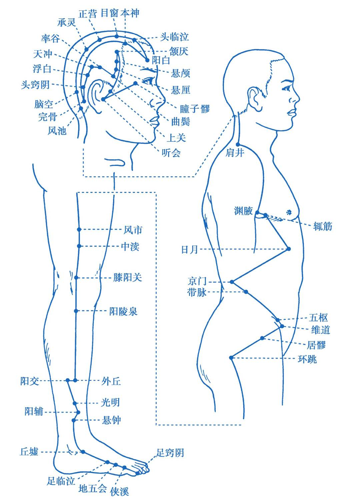
    - 分寸歌（左右各44穴）
        - 外眦五分瞳子髎，耳前陷中听会绕，上关颧弓上缘取，内斜曲角颔厌照，
        - 悬颅悬厘等分取，曲鬓角孙前寸标，入发寸半率谷穴，天冲率后五分交，
        - 浮白下行一寸是，乳突后上窍阴找，完骨乳突后下取，本神庭旁三寸好，
        - 阳白眉上一寸许，临泣入发五分考，目窗正营及承灵，一寸一寸寸半巧，
        - 脑空池上平脑户，风池耳后发际标，肩井大椎肩峰间，渊腋腋下三寸然，
        - 辄筋渊腋前一寸，日月乳下三肋间，京门十二肋骨端，带脉平脐肋下连，
        - 五枢髂前上棘前，前下五分维道还，居髎髂前转子取，环跳髀枢宛中陷，
        - 风市垂手中指寻，中渎膝上五寸陈，阳关阳陵上三寸，骨头前下阳陵存，
        - 阳交外丘骨后前，均在踝上七寸循，踝上五寸光明穴，踝上四寸阳辅临，
        - 踝上三寸悬钟是，丘墟外踝前下真，节后筋外足临泣，地五会在筋内存，
        - 关节之前侠溪至，四趾外端足窍阴。
    - 选穴分寸歌（选18穴）
        - 外眦五分瞳子髎，耳前陷中听会绕。
        - 提耳下按率谷穴，耳后高处完骨找。
        - 风池耳后发际陷，肩井肩上陷解中。
        - 渊腋腋下三寸是，日月乳下二肋逢。
        - 十二肋端是京门，屈髋腱外居髎名。
        - 环跳髀枢宛中陷，风市垂手中指顶。
        - 阳陵膝下腓头前，外丘外踝七寸迎。
        - 踝上五寸光明穴，踝上三寸是悬钟。
        - 丘墟踝前陷中找，四趾外侧窍阴定。
    - 循行定位
        - 足少阳胆经，起于目外 眦 ，上行额角部，下行至耳后，沿颈项部至肩上，下入缺盆。耳部分支，从耳后进入耳中，出走耳前 到目外眦 后方。外 眦 部支脉，从目外 眦 下走大迎，会合于手少阳经到达目 眶 下，行经颊车，由颈部下行，与前脉在缺盆部会合，再向下进入胸中，穿过横膈，络肝，属胆。再沿 胁肋内 下行至腹股沟动脉部， 绕外阴部 毛际横行入髋关节部。其直行经脉， 从缺盆下行，经腋部、侧胸部、 胁 肋部，再下行与前脉会合于髋关节部，再向下沿着大腿外侧、膝外缘下行经腓骨之前，至外踝前，沿足背部，进入第4 趾 外侧。足背部分支，从足背上分出，沿第1、2跖骨间，出于大趾端，穿过趾甲， 出 趾 背毫毛部。
        - 瞳子髎 ： 在面部，目外 眦 外侧0 0.5 寸凹陷中。
        - 听会 ： 在面部，耳屏间切迹与下颌骨髁突之间的凹陷中。
        - 率谷： 在头部，耳尖直上入发际1 0.5 寸。
        - 完骨 ： 在头部，耳后乳突的后下方凹陷中。
        - 阳白 ： 在头部，眉上1寸，瞳孔直上。
        - 头临 泣 ： 在头部，前发际上0 0.5 寸，瞳孔直上。
        - 风池 ： 在颈后区，枕骨之下，胸锁乳突肌上端与斜方肌上端之间的凹陷中。（颈部枕骨下端，横平风府，胸锁乳突肌于斜方肌之间的凹陷中）
        - 肩井 ： 在肩胛区，第七颈椎棘突与肩峰最外侧连线的中点。
        - 日月 ： 在胸部，第7肋间隙中，前正中线旁开4寸。
        - 带脉 ： 在侧腹部，第1 1  肋骨游离端垂线与 脐 水平线的交点上。
        - 环跳 ： 在臀区，股骨大转子最凸点与骶管裂孔连线的外1 /3 与内2 /3 的交点处。
        - 风市 ： 在股部，髌底上7寸：直立垂手，掌心贴于大腿时，中指尖所指凹陷中，髂胫束后缘。
        - 阳陵泉 ： 在小腿外侧，腓骨头前下方凹陷中。
        - 光明 ： 在小腿外侧，外踝尖上5寸，腓骨前缘。
        - 悬钟 ： 在小腿外侧，外踝尖上3寸，腓骨前缘。
        - 丘 墟 ： 在踝区，外踝的前下方，趾长伸肌腱的外侧凹陷中。
        - 足临 泣 ： 在足背，第4、5跖骨底结合部的前方，第5趾长伸肌 腱 外侧凹陷中。
        - 侠溪： 在足背，第4、5 趾 间， 趾 蹼缘后方 赤 白肉际处。
        - 足窍阴： 在足趾，第 4 趾 末节外侧， 趾甲根角侧后 方0 0.1 寸 （指寸）。
    - 穴名歌
        - 足少阳经瞳子髎，四十四穴行迢迢，听会上关颔厌集，悬颅悬厘曲鬓翘，
        - 率谷天冲浮白次，窍阴完骨本神邀，阳白临泣目窗辟，正营承灵脑空摇。
        - 风池肩井渊腋部，辄筋日月京门标，带脉五枢维道续，居谬环跳风市招，
        - 中渎阳关阳陵泉，阳交外丘光明霄，阳辅悬钟丘墟外，足临泣与地五会，
        - 侠溪窍阴四趾端。
- 足厥阴肝经
    - 大敦行间太冲看，中封曲泉属于肝。 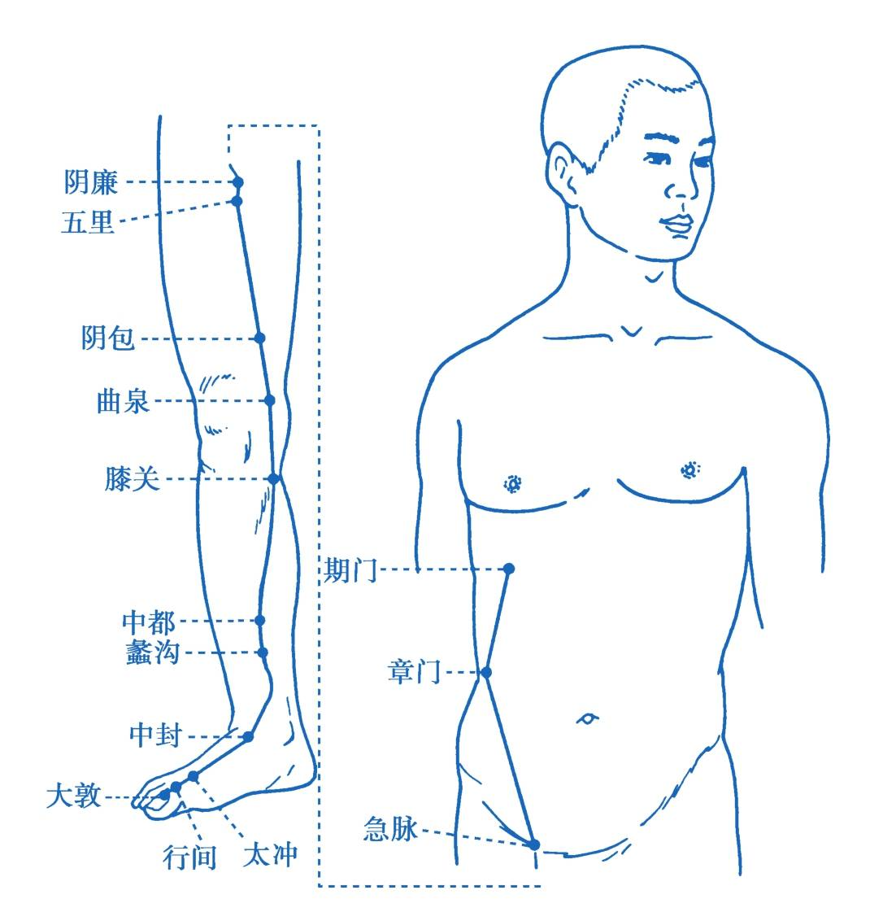
    - 分寸歌（左右各14穴）
        - 足大趾端名大敦，行间大趾缝中存，太冲本节后寸半，踝前一寸号中封，
        - 蠡沟踝上五寸是，中都踝上七寸中，膝关犊鼻下二寸，曲泉屈膝尽横纹，
        - 阴包膝上方四寸，气冲下三足五里，阴廉冲下有二寸，急脉阴旁二寸半，
        - 章门直脐季肋端，肘尖尽处侧卧取，期门又在乳直下，六肋间隙无差矣。
    - 选穴分寸歌（选9穴）
        - 足大趾端名大敦，行间大次缝中存。
        - 太冲本节后寸半，蠡沟踝上五寸寻。
        - 曲泉曲膝纹头上，阴包膝上方四寸。
        - 急脉阴旁二寸半，章门直脐季肋端。
        - 期门穴在乳直下，本位六七肋骨间。
    - 循行定位
        - 足 厥 阴肝经，起于足大趾背毫毛 部，沿足背经内踝前上行，至内踝上8寸处交于足太阴经之后，上行腘窝内缘，沿大腿内侧，上入阴毛中，环绕阴器；再上行抵达小腹，夹胃，属于肝，络于胆；再上行通过横膈，分布于 胁 肋部；继续上行经喉咙的后面，上入鼻咽部，连目系，上出额部，与 督脉在巅顶部 交会。其支脉，从目系下循面颊，环绕唇内。另一支脉，从肝部分出，穿过横膈，注于肺。
        - 大 敦 ： 在足趾，大趾末节外侧， 趾甲根角侧后 方0 0.1 寸（指寸）。
        - 行间 ： 在足背，第1、2 趾 间， 趾 蹼缘后方 赤 白肉际处。
        - 太冲 ： 在足背，第1、2跖骨间，跖骨底结合部前方凹陷中，或触及动脉搏动。
        - 蠡 沟 ： 在小腿内侧，内踝尖上5寸，胫骨内侧面的中央。
        - 曲泉 ： 在膝部，腘横纹内侧端，半腱肌肌腱内缘凹陷中。
        - 章门： 在侧腹部，在第1 1 肋 游离端的下际。
        - 期门 ： 在胸部，第6肋间隙，前正中线旁开4寸。
    - 穴名歌
        - 一十四穴足厥阴，大敦行间太冲侵，中封蠡沟中都近，膝关曲泉阴包临，
        - 五里阴廉急脉穴，章门常对期门深。
- 任脉
    -  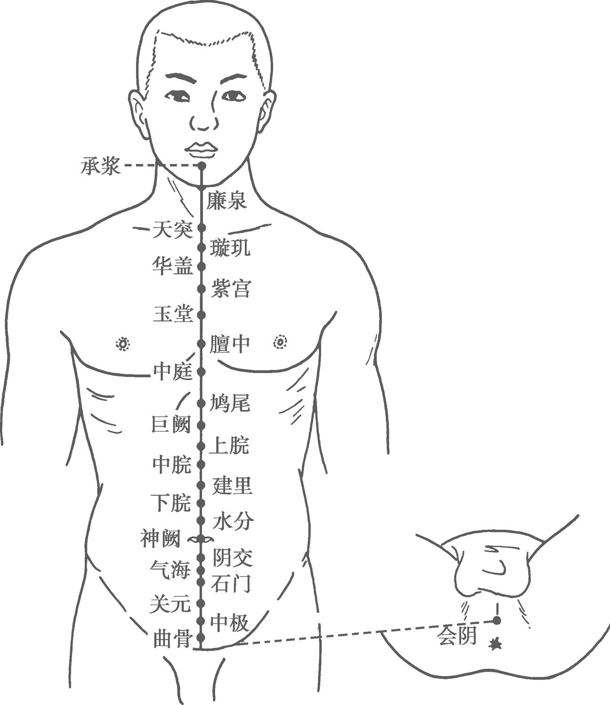
    - 分寸歌（共24穴）
        - 任脉会阴两阴间，曲骨毛际陷中安，中极脐下四寸取，关元脐下三寸连，
        - 脐下二寸石门是，脐下寸半气海全，脐下一寸阴交穴，脐之中央是神阙，
        - 脐上一寸为水分，脐上二寸下脘刊，脐上三寸名建里，脐上四寸中脘计，
        - 脐上五寸上脘在，巨阙脐上六寸步，鸠尾脐上七寸量，中庭膻下寸六取，
        - 膻中却在两乳间，膻上寸六玉堂主，膻上紫宫三寸二，膻上四八华盖举，
        - 璇玑膻上六寸四，玑上一寸天突取，廉泉结上舌本下，承浆颐前唇下处。
    - 选穴分寸歌（选12穴）
        - 任脉会阴两阴间，曲骨毛际陷中安。
        - 中极脐下四寸取，关元脐下三寸连。
        - 脐下寸半气海穴，脐之中央是神阙。
        - 脐上一寸为水分，脐上四寸中脘列。
        - 膻中正在两乳间，天突颈前陷中窝。
        - 颌下结上是廉泉，承浆穴在唇下过。
    - 循行定位
        - 任脉 ， 起于小腹内，下出会阴部，向前上行于阴毛部，在腹内沿前正中线上行， 经关元 等穴至咽喉部，再上行环绕口唇，经面部进入目 眶 下，联系于目
        - 中极 ： 在下腹部， 脐 中 下4寸 ，前正中线上。
        - 关元 ： 在下腹部， 脐 中 下3寸 ，前正中线上。
        - 气海 ： 在下腹部， 脐 中 下1.5寸 ，前正中线上。
        - 神阙 ： 在脐区， 脐 中央 。
        - 下脘：在上腹部，脐中上2寸，前正中线上。
        - 建里 ： 在 上 腹部， 脐 中 上3寸 、 前正中线上。
        - 中 脘 ： 在 上 腹部 ， 脐 中上4寸， 前正中线上 。（ 脐 与 胸剑联 合连线的中点处）
        - 上腕 ： 在上腹部， 脐 中 上5寸 ，前正中线上。
        - 膻中 ： 在胸部，横 平第四肋间隙 ，前正中线上。（或两乳头连线与前正中线的交点处）
        - 天突 ： 在颈前区， 胸骨上窝 中央，前正中线上。
        - 廉泉 ： 在颈前区， 喉结上方，当舌骨上缘 凹陷中，前正中线上。
        - 承奖 ： 在面部， 颏唇沟的正中凹陷处 。
    - 穴名歌
        - 任脉二十四中行，会阴潜伏二阴间，曲骨上边有中极，关元石门气海边，
        - 阴交神阙水分处，下胧建里中腕俞，上腕巨阙连鸠尾，中庭膻中玉堂连。
        - 紫宫华盖循璇玑，天突廉泉承浆端。
- 督脉
    -  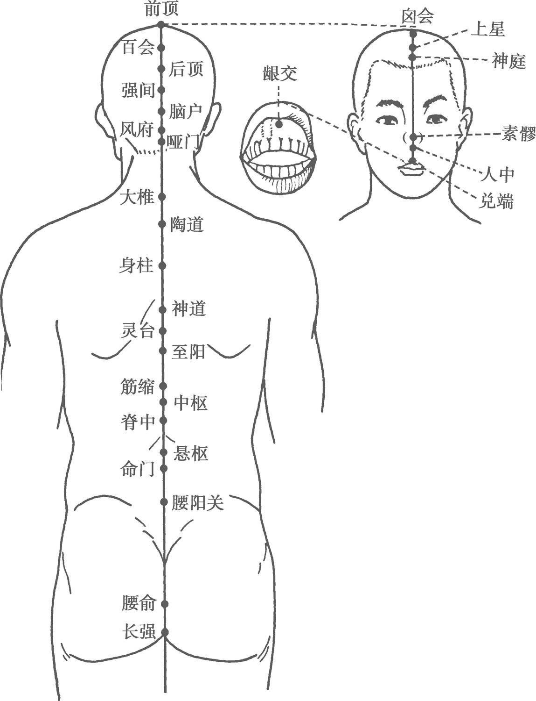
    - 分寸歌（共28穴）
        - 尾闾骨端是长强，二十一椎腰俞当，十六阳关十四命，十三悬枢脊中央，
        - 十一椎下寻脊中，十椎中枢穴下藏，九椎之下筋缩取，七椎之下乃至阳，
        - 六灵五神三身柱，陶道一椎之下乡，一椎之上大椎穴，上至发际哑门行，
        - 风府一寸宛中取，脑户二五枕上方，发上四寸强间位，五寸五分后顶强，
        - 七寸百会顶中取，耳间之上发中央，前顶前行八寸半，前行一尺囟会量，
        - 一尺一寸上星会，入发五分神庭当，鼻端准头素髎穴，水沟鼻下人中藏，
        - 兑端唇尖端上取，龈交齿上龈缝里。
    - 选穴分寸歌（选15穴）
        - 尾闾骨端是长强，二十一椎腰俞当。
        - 十六阳关十四命，七椎之下乃至阳。
        - 六灵五神三身柱，陶道一椎之下乡。
        - 一椎之上大椎穴，上至发际哑门行。
        - 风府脑后宛中取，百会头顶正中央。
        - 入发一寸上星会，水沟鼻下人中藏。
    - 循行定位
        - 起于小腹内，下出于会阴部， 向后从尾骨端上行脊柱的内部 ，上达项后风府，进入脑内，上行 至 巅顶，沿前额下行鼻柱，止于上唇内 龈 交穴
        - 长强 ： 在 会阴区， 尾骨 下方，尾骨 端与肛门连线的中点处 。
        - 腰阳关 ： 在脊柱区， 后正中线上，第四腰椎棘突下凹陷中 （约与髂嵴相平）。
        - 命门 ： 在脊柱区， 后正中线上，第二腰椎棘突下凹陷中 。
        - 至阳 ： 在脊柱区， 后正中线上，第七胸椎棘突下凹陷中 。
        - 身柱 ： 在脊柱区， 后正中线上，第三胸椎棘突下凹陷中 。 （ 约与两侧肩胛冈高点相平 ）。
        - 大椎 ： 在脊柱区， 后正中线上，第七颈椎棘突下凹陷中 。
        - 哑门 ： 在颈后区，第二颈椎棘突上际凹陷中，后正中线上。
        - 风府 ： 在颈后区，枕外隆凸直下，两侧斜方肌之间的凹陷中。
        - 百会 ： 在头部，前发际正中直上5寸。（或当头部正中线与两耳尖连线的交点处）
        - 上星 ： 在头部， 前发际正中直上1寸 。
        - 神庭 ： 在头部，前 发际正中直上0.5寸 。
        - 素髎 ： 在面部， 鼻尖正 中央。
        - 水沟 ： 在 面部， 人中沟的上1／3与 中1 ／3交 点 处 。
        - 印堂 ： 在 头 部，当两眉 毛内侧端 中间 的凹陷中。
    - 穴名歌
        - 二十九穴起长强，腰俞阳关入命门，悬枢脊中中枢长，筋缩至阳归灵台，
        - 神道身柱陶道开，大椎哑门连风府，脑户强间后顶排，百会前顶通凶会，
        - 上星神庭素谬对，水沟兑端在唇上，龈交上齿缝印堂。
- 奇穴
    - 四神聪 ： 在头部，百会前后左右各旁开1寸，共4穴。
    - 太阳 ： 在头部，当眉梢与目外 眦 之间，向后约一横指的凹陷中。
    - 球后 ： 在面部，眶下缘外1 /4 与内3 /4 交界处。
    - 金津 、 玉液 ： 在口腔内，舌下系带的静脉上。左侧为金津，右侧为玉液。
    - 夹承浆 ： 在面部，承浆穴左右各旁开1寸。
    - 牵正 ： 在面部，耳垂前0 0.5 ~ 1 寸的压痛处。
    - 翳 明： 在颈部， 翳 风后1寸。
    - 安眠： 在项部，在 翳 风穴与风池穴连线之中点处。
    - 子宫： 在下腹部， 脐 中下4寸，前正中线旁开3寸。
    - 三角 灸 ： 在下腹部，以患者两口角之间的长度为一边，做等边三角形，将顶角置于患者 脐 心，底边呈水平线，两底角处取穴。
    - 定喘 ： 在脊柱区，横平第7颈椎棘突下，后正中线旁开0 0.5 寸。
    - 夹脊 ： 在脊柱区，第1胸椎至第5 腰椎棘突下两侧，后正中线旁开0 0.5 寸，一侧1 7 穴。
    - 胃脘下 俞 ： 在脊柱区，横平第8胸椎棘突下，后正中线旁开1 0.5 寸。
    - 腰眼 ： 在腰区，横平第4腰椎棘突下，后正中线旁开约3 0.5 寸凹陷中。
    - 肩前 ： 在肩前区， 正坐 垂肩， 腋 前皱襞顶端与肩髃连线的中点。
    - 二白 ： 在前臂前区，腕掌侧远端横纹上4寸，桡侧腕屈肌腱的两侧， 一 肢2穴。
    - 腰痛点 ： 在手背，第2、3掌骨及第4、5掌骨之间，腕背侧横纹远端与掌指关节中点处，一手2穴。
    - 外劳宫 ： 在手背，第2、3掌骨间，掌指关节后0 0.5 寸（指寸）凹陷中。
    - 八邪 ： 在手背，第1~ 5 指间，指蹼缘后方 赤 白肉际处，左右共8穴。
    - 四缝 ： 在手指，第2~ 5 指掌面的近侧指间关节横纹的中央，一手4穴。
    - 十宣 ： 在手指，十指尖端，距指甲游离缘0 0.1 寸（指寸），左右共1 0 穴。
    - 鹤顶 ： 在膝前区，髌底中点的上方凹陷中。
    - 百虫窝 ： 在股前区，髌底内侧端上3寸。
    - 内 膝眼 ： 在膝部，髌韧带内侧凹陷处的中央。
    - 胆囊 ： 在小腿外侧，腓骨小头直下2寸。
    - 阑尾 ： 在小腿外侧，髌韧带外侧凹陷下5寸，胫骨前 嵴 外一横指（中指）。
    - 八风 ： 在足背，第1~ 5 趾 间， 趾 蹼缘后方 赤 白肉际处，左右共8穴。
- 五腧穴歌
    -  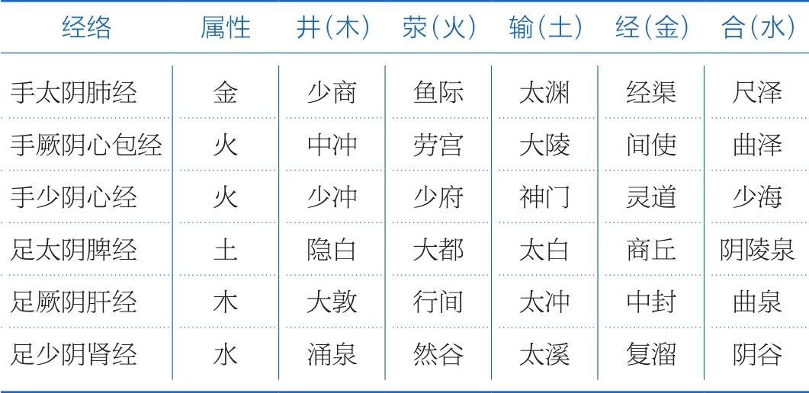 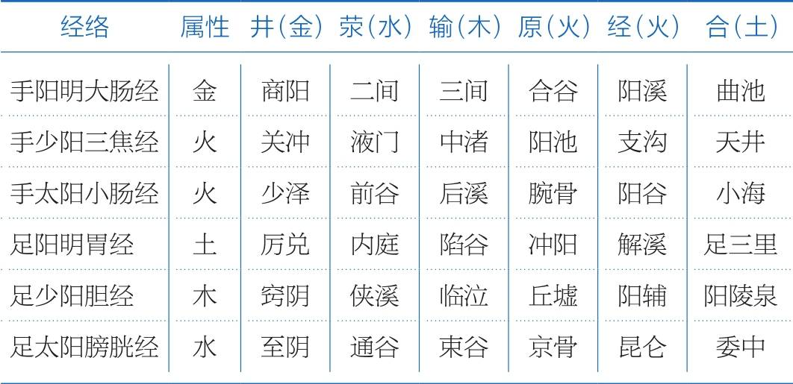
    - **井荥输原经合歌（阳井金，阴井木）**
        - 少商鱼际与太渊，经渠尺泽肺相连。
        - 商阳二三间合谷，阳溪曲池大肠牵。
        - 厉兑内庭陷谷胃，冲阳解溪三里随。
        - 隐白大都太白脾，商丘阴陵泉要知。
        - 少冲少府属于心，神门灵道少海寻，
        - 少泽前谷后溪腕，阳谷小海小肠经。
        - 至阴通谷束京骨，昆仑委中膀胱知。
        - 涌泉然谷与太溪，复溜阴谷肾所宜。
        - 中冲劳宫心包络，大陵间使传曲泽，
        - 关冲液门中渚焦，阳池支沟天井索。
        - 窍阴侠溪临泣胆，丘墟阳辅阳陵泉。
        - 大敦行间太冲看，中封曲泉属于肝。
    - 十二经子母补泻歌
        -  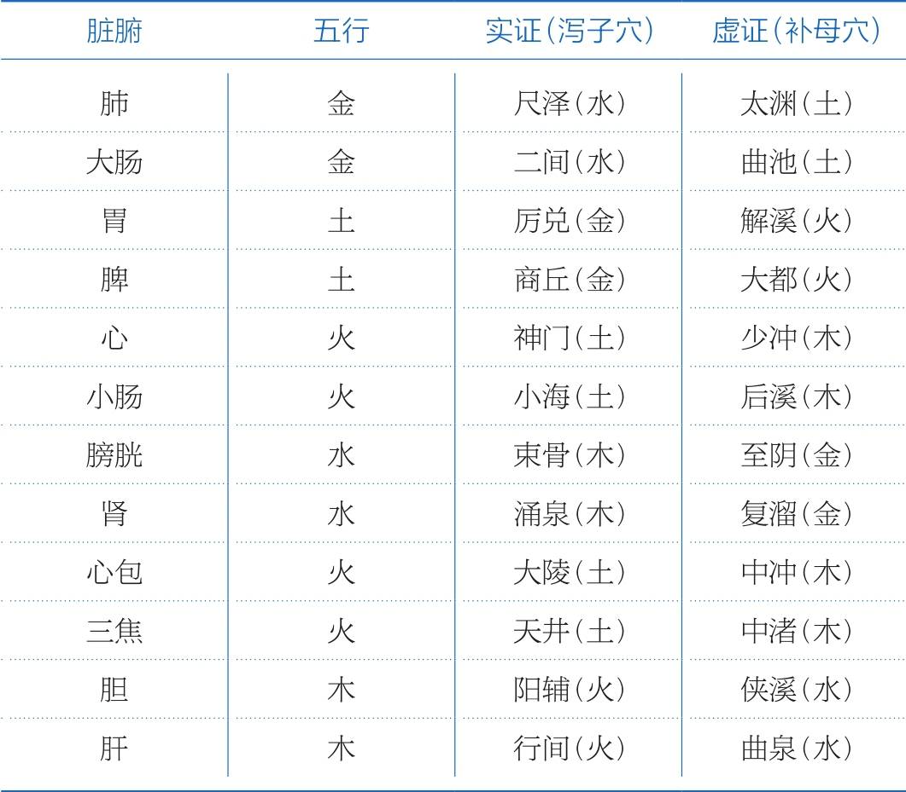
        - 肺泻尺泽补太渊，大肠二间曲池间，
        - 胃泻厉兑解溪补，脾在商丘大都边，
        - 心先神门后少冲，小肠小海后溪连，
        - 膀胱束骨补至阴，肾泻涌泉复溜焉，
        - 心包大陵中冲补，三焦天井中渚全，
        - 胆泻阳辅补侠溪，肝泻行间补曲泉。
    - 还有另外的几种用法，如：十二经纳子法（按地支时辰的子午流注针法）和十二经纳甲法（按日干的子午流注针法），用的就是这66穴。因不常用这里从略了。
- 其他
    - 常用的腧穴定位比较记忆/易错点总结
        - 针灸基本功
            - 入前发际0.5寸：神庭、眉冲、曲差、头临泣、本神、头维。
            - 第四间隙中：膻中、神封、乳中、天池、天溪、辄筋、渊腋。
            - 平脐一周：神阙、肓俞、天枢、大横、带脉。
            - 平第一胸椎棘突下：　陶道、大杼、肩外俞。
            - 平第二骶后孔：次髎、膀胱俞、胞肓。
            - 平腕横纹：太渊、大陵、神门、阳溪、阳池、阳谷。
            - 踝关节一周：解溪、中封、商丘、太溪、昆仑、丘墟。
            - 同一条经脉穴位在同一水平线：丰隆/条口；阳交/外丘；委中/委阳；交信/复溜；支沟/会宗；眉冲/曲差。
        - 红研知己
            - 腕横纹︰太渊、大陵、神门。(渊陵神)
            - 腕背横纹∶阳溪、阳池、阳谷。(溪池谷)
            - 肘内侧∶尺泽、曲泽、少海。(尺曲少)
            - 肘外侧︰曲池、天井、小海。
            - 瞳孔线:头临泣、鱼腰、承泣、四白、巨谬、地仓。风池鼻，哑府颌。(风池向鼻尖刺，哑门风府向下颌刺)
            - 6期7日11带章。(第6肋期门、日月、带脉、章门)
            - 胆2虫3尾5。(胆囊位于阳陵泉直下2寸,百虫窝位于髀底内侧端上3寸，阑尾犊鼻下5寸)
            - 痔疾∶承承秩飞扬。(承扶、承山、秩边、飞扬可以治疗痔疾)
            - 孕妇禁针腰骶、三阴交、合谷、肩井、至阴、昆仑。
    - 六总穴歌
        - 肚腹三里留，腰背委中求，
        - 头项寻列缺，面口合谷收，
        - 心胸取内关，少腹三阴谋。
    - 十四经主治纲要
        -  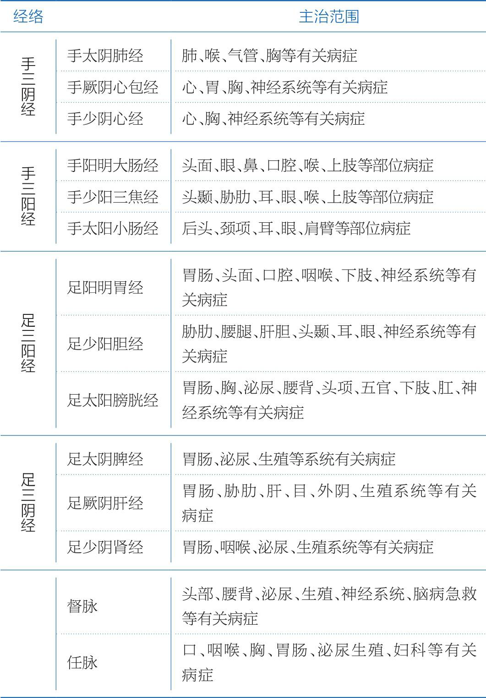
        -  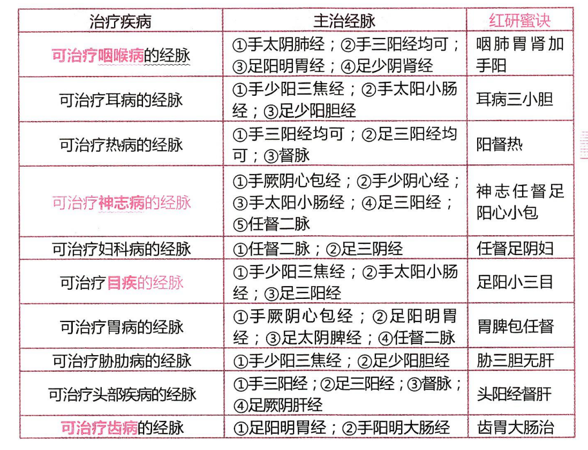
    - 八会穴
        -  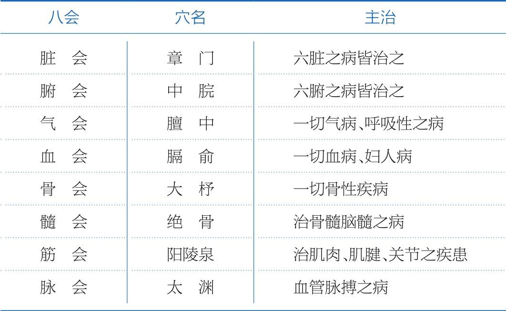
        - 腑会中脘脏章门，髓会绝骨筋阳陵，
        - 血会膈俞骨大杼，脉太渊气膻中存。
    - 八脉交会穴
        - 灵龟八法以此为基础 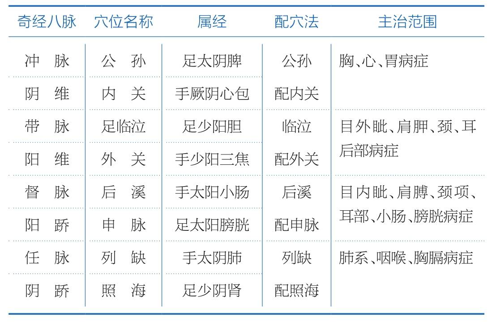
        - 公孙冲脉胃心胸，内关阴维下总同。
        - 临泣胆经连带脉，阳维目锐外关逢。
        - 后溪督脉内眦颈，申脉阳跷络亦通。
        - 列缺任脉行肺系，阴跷照海膈喉咙。
    - 特定穴总结
        - 1.既是络穴，又是八脉交会穴的有:公孙、内关、外关、列缺。
        - 2.既是原穴，又是输穴，又是脉会的是:太渊。
        - 3.既是合穴，又是下合穴，又是筋会的是:阳陵泉。
        - 4.既是输穴，又是八脉交会穴∶足临泣。
        - 5.既是募穴，又是八会穴的有:中脘、章门、膻中。
        - 6.既是合穴，又是下合穴的有∶阳陵泉、委中、足三里。
    - 经脉属络总结
        -  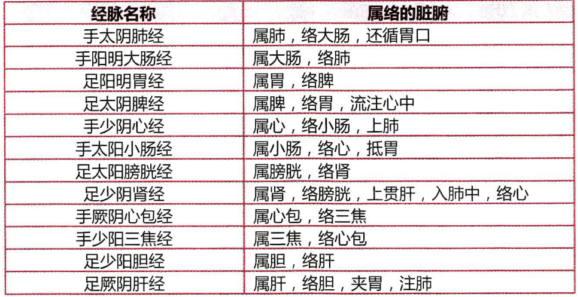
    - 十二经脉、奇经八脉与人体部位的联系
        -  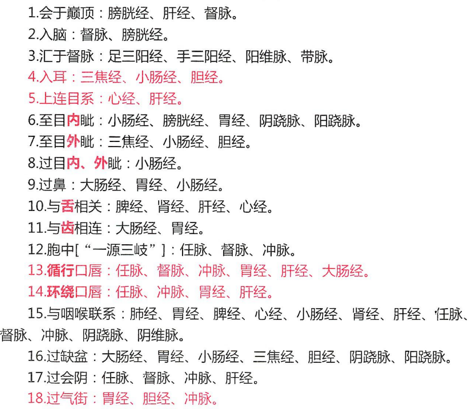
    - 十二经脉起止穴总结
        -  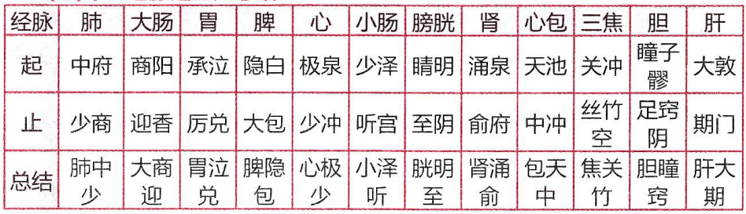
    - 骨度分寸
        - 胸腹部口诀：横八竖八脐下五，乳锁中线数肋骨。
        - 背腰部口诀：腰背肩胛六寸记，四段三线二十一。 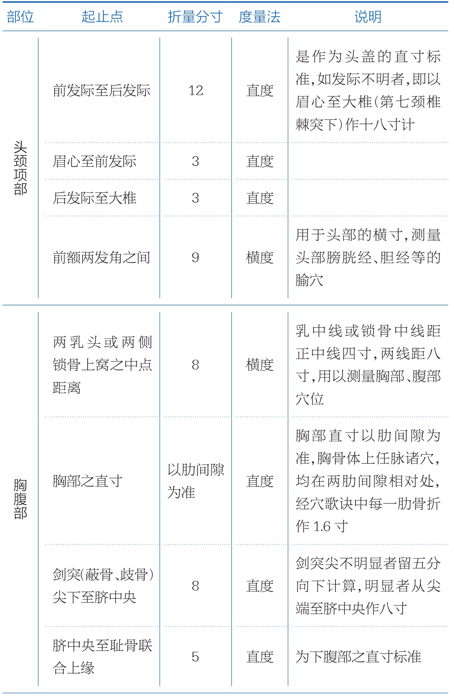 
    - 小结
        -  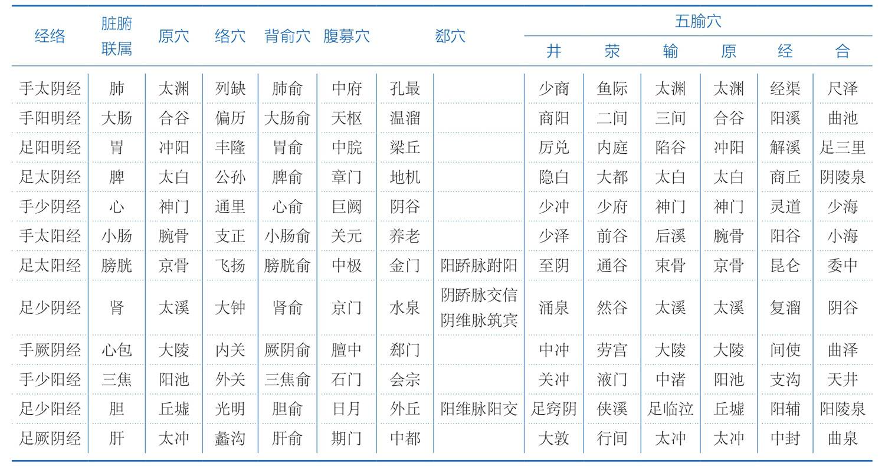