# 温病
- **温病的形成与发展**
    - **萌芽阶段**
        - 战国至晋唐
        - 黄帝内经，难经，伤寒杂病论
        - 隋•巢元方《诸病原候论》
        - 唐•孙思邈《备急千金药方》《千金翼方》葳蕤汤
        - 王焘《外台秘要》
    - **成长阶段**
        - 宋~金元时期
        - 宋•郭雍《伤寒补亡论》：“冬伤于寒，至春发者，谓之温病；冬不伤寒，而春自感风寒温气而病者，亦谓之温。”
        - > 温病有伏邪、新感
        - 金•刘河间，伤寒六经传变皆是热证，六气皆从火化。双解散，防风通圣散表里双解。寒凉派。
        - > 伤寒宗仲景，热病崇河间 双解散： **大黄6钱，滑石6钱，牙皂1钱，甘草1钱。** 
        - 元•王安道（王履）《医经溯洄集》 **温病不得混称伤寒** 。认为伤寒和温病的发病机制迥然不同，温病属里热外发，即使有表证亦多里热郁表所致，主张对温病的治疗，应当以清里热为主，解表兼之，并认为有里热清而表证自解者
        - > **吴鞠通称其“始能脱却伤寒，辨证温病”**
    - **形成阶段**
        - 明清
        - 明•吴又可《温疫论》
            - 我国医学发展史上第一部瘟疫病专著。
            - 认为瘟疫并非风寒暑湿等六气所感，而是疠气所致。
            - 具有强烈的传染性。
            - 邪伏膜原—达原饮。
            - 自口鼻而入。
            - 以祛邪为第一要义，创立疏利透达之法。
        - 清，喻嘉言《医门法律》《尚论篇》
            - 瘟疫的治疗应根据上中下三焦
            - 先饮芳香正气药
            - 以逐秽解毒为主
                - 上焦如雾，升而逐之，兼以解毒
                - 中焦如沤，疏
                - 下焦如渎，决
            - 秋伤于燥
        - 温病四大家 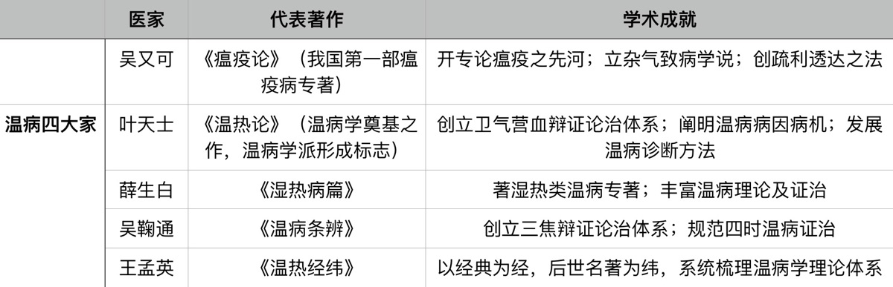
    - **发展阶段**
        - 近现代
- **温病的概念与特点、分类**
    - 🍉 **概念** ：温病是指外感四时温热邪气 **温热邪气** 引起的以 **发热** 为主症，多具有 **热势较重** ， **易化燥伤阴** 等特点的一类 **急性外感热病** 。
    - > 温为热之始，热为温之终。 火：生理--少火；病理--壮火，内生或五志过极化火。 热过重产生毒，例如疮疡。
    - **🍉特点**
        - 1. **致病因素** 的 **特异性** ，为 **温邪** 。
            - ① **从热而化之六淫**
            - ② **伏寒化温** 之病邪
            - ③ **疠气** ，温毒
        - 2.多具有 **传染性、流行性，季节性，地域性** 。
        - > 温病范围广，包括传染病、感染性疾病、中暑。 传染病也不均是温病，如肺结核。
        - 3. **病程** 发展的 **阶段性** （是温病区别于内伤杂病的重要标志）
        - > 温病病程的阶段性，是在温邪作用下，卫气营血与三焦所属脏腑的功能失调和实质损伤具有规律性变化所决定的。
            - 卫分证、气分证、营分证、血分证
            - 上焦证、中焦证、下焦证
            - 温病的病变发展趋势：一般 病位 由表入里， 病势 由浅入深， 病情 由轻转重， 病性 由实致虚。
        - 4. **临床表现** 的 **特殊性**
            - 温热病
                - 1）起病急，转变快
                - 2）以发热为主症，热象较重
                - > 面赤，舌红苔黄，脉数，口渴，大便干，小便黄数。
                - 3）易化燥伤阴
                - 4）易内陷生变
            - 湿热病
                - 1）身热不扬
                - > 脉反迟缓，口不渴，大便不干反溏。
                - 2）脾胃运化功能障碍
                - 3）病势缠绵，缠绵难愈
    - **🍉命名**
        - 根据 **发病季节** 命名：春温、冬温
        - 根据 **四时主气** 命名：风温（春季）、暑温（夏季）、湿温（长夏），有利于揭示温病的发病规律
        - 根据 **发病季节与主气相结合** 命名：秋燥
        - 根据 **特殊的临床表现** 命名：大头瘟、烂喉痧等，有助于诊断
        - 根据 **流行特点** 命名：温疫
    - **🍉分类**
        - 按照发病的特点： **新感温病、伏邪温病** 。
        - 按照病情的性质（是否夹湿）：
            - **温热** ：如风温、春温、暑温、秋燥、大头瘟、烂喉痧等
            - **湿热** ：如湿温、伏暑
    - **温病与相关概念的分析**
        - 🍉 **1.温病与伤寒**
            - 广义伤寒定义：一切外感热病的总称，凡由外邪引起的的外感热病都属于伤寒的范围，其中既有风寒性质的，也包括温热性质的。
            - > 伤寒有五，有中风，有伤寒，有湿温，有热病，有温病。
            - 狭义伤寒：广义伤寒中属于风寒性质的外感热病，感受寒邪引起。
            - 温病与伤寒关系：①温病属于广义伤寒；②温病与狭义伤寒是并列关系。
            - > 同是阳明病，伤寒与温病如何鉴别？ ​瞻前：伤寒以寒邪入侵为主，伤阳多伴有伤津液；温病以热邪入侵为主，伤津液伴有伤阳 ​顾后：伤寒向亡阳发展；温病向往阴发展 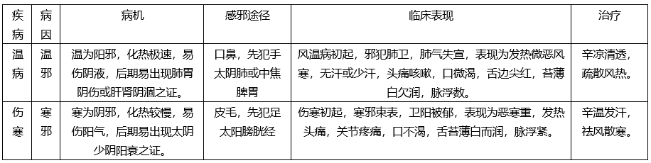
        - 2.温病与温疫
            - 温疫定义：温病中具有 **强烈传染性和流行性** 的一类温病。
            - 温病是所有温热性质外感疾病的总称，包括强烈传染性、流行性的温病；较小传染性、流行性及少数不传染的温病。
            - 温疫与温病的关系：温疫属于温病的范围。
        - 3.温病与温毒
            - 温毒定义：作为病名，指感受 **温热毒邪** 所引起的一类具有独特表现的急性外感热病。除了具有一般温病的临床表现外，还具有 **局部红肿热痛甚至溃烂，或肌肤密布斑疹** 的特征。
            - 温毒与温病的关系：温毒隶属于温病的范围，是温病中具有肿毒或发斑表现的一类特殊病种。
- **温病病因与发病**
    - **🍉病因**
        - **风热病邪**
            - 冬春
            - 风温（冬温）
            - 流行性感冒，急性支气管炎，急性肺炎
            - 致病特点
                - 先犯上焦肺卫
                - 易化燥伤阴
                - 变化迅速
                - 易出疹
                - 易动风
        - **燥热病邪**
            - 秋季
            - 秋燥（温燥）
            - 致病特点
                - 病位以肺为主
                - 易伤津液
                - 病变轻，易愈，预后好
        - **暑热病邪**
            - 暑
            - 暑温
            - 致病特点
                - 多先入阳明气分
                - 易耗津伤气
                - 易兼夹暑湿寒邪
                - 易窍闭动风
        - **湿热病邪**
            - 长夏
            - 湿温
            - 致病特点
                - 发病隐蔽
                - 症状矛盾
                - > 半阴半阳
                - 病程缠绵
                - 病情粘腻
                - 以脾胃为病变中心
                - 病机下行性
                - 易困遏清阳阻滞气机，终至损伤脾肾阳气
        - **伏寒化温病邪**
            - 冬伤于寒，春必温病
            - 春温、温热病邪
            - 致病特点
                - 初起有明显里热
                - 里热内迫易闭窍，动风，动血
                - 后期见肝肾真阴耗伤
        - **疫疠病邪**
            - 温疫
            - 致病特点
                - 致病力强
                - 多从口鼻而入，有特异病变部位
                - 强烈传染性，易引起流行
                - 病情严重凶险
                - 致病有种属选择性
                - > 吴又可
        - **时毒病邪**
            - 温毒，大头瘟，烂喉痧
            - 致病特点
                - 局部红肿热痛、甚则溃烂，肌肤丹痧
                - 传染性强，有一定流行性
                - 攻冲走窜
                - 雍结凝聚
    - **发病因素**
        - 人体正气
        - 自然因素
        - 社会因素
    - **感邪途径**
        - **皮毛**
        - **口鼻**
    - **发病类型** 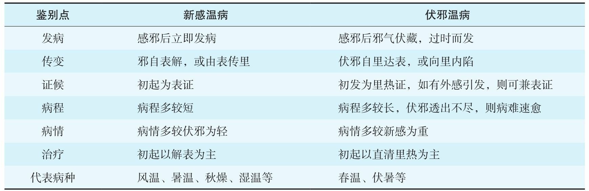
- **温病的辨证**
- > 温病辩证是以卫气营血和三焦辩证理论为指导的。卫气营血辩证和三焦辩证是温病学的理论核心。
    - **卫气营血辨证**
    - > 1.卫气分看舌苔，营血分看舌质。 2.卫气营血辩证最适用于温热病，湿热病少用，一是因为湿热病，卫气范围界限不清，二是湿热病很少向营血分证传变，临床多以气分湿热病多见。 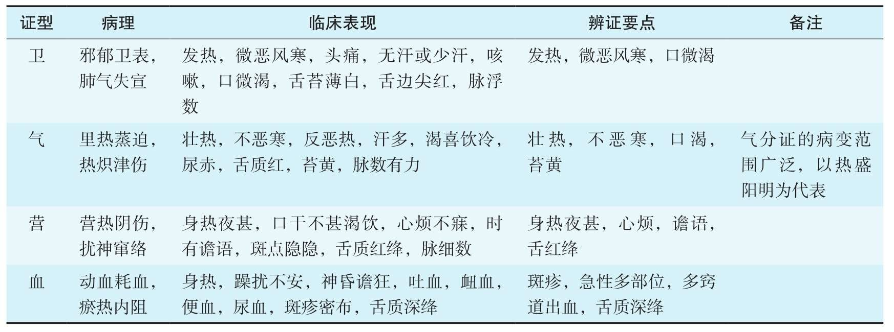
        - **卫分证：**
        - > 温邪 **初犯** 人体，引起 **卫气** 功能失调而出现的证候类型。
            - 病机：邪郁卫表，肺气失宣。
            - 辨证要点： **发热，微恶寒** ，舌尖边红，苔薄白，脉浮数。
            - 少汗或无汗皮肤潮润，口渴，咳嗽，咽痛，头痛等。
        - **气分证：**
        - > 温邪入里，未传入营血分，影响 **人体脏腑之气** 的生理功能，出现的一类证候类型。 ​温病学中的气分证发展方向一是入营分；二是伤气：气分证高热持续不减会导致津气两伤，甚至虚脱形成虚证。
            - 病机：里热蒸迫，热炽津伤。
            - 辨证要点： **壮热** ，不恶寒，口渴， **苔黄** ，脉数而有力。
            - 可有喜冷饮，汗多，尿赤，舌红等。
            - > 热郁肝胆一无汗，热郁肺胃一有汗。舌红是因为充血。
        - **营分证：**
        - > 温邪深入营分， **劫灼营阴，扰神窜络** 而出现的证候类型。
            - 病机：热灼营阴，心神被扰。
            - **身热夜甚**
            - > 身热是正邪相争，夜甚是阳入于阴的结果。舌红是因为血中津液减少，血液黏滞。
            - 可有斑疹隐隐，脉细数，口干而不甚渴。
        - **血分证：**
        - > 温邪深入血分，引起 **耗血动血、瘀热互结** 所出现的证候类型。
            - 病机：动血耗血，瘀热内阻
            - 辨证要点：身热灼手，躁扰不安，多部位、多窍道 **出血** （吐血、衄血、便血、尿血）， **斑疹** 密布，舌质深绛。
            - 可有癫狂神昏等。
    - **三焦辨证**
    - > 更适用于湿热病 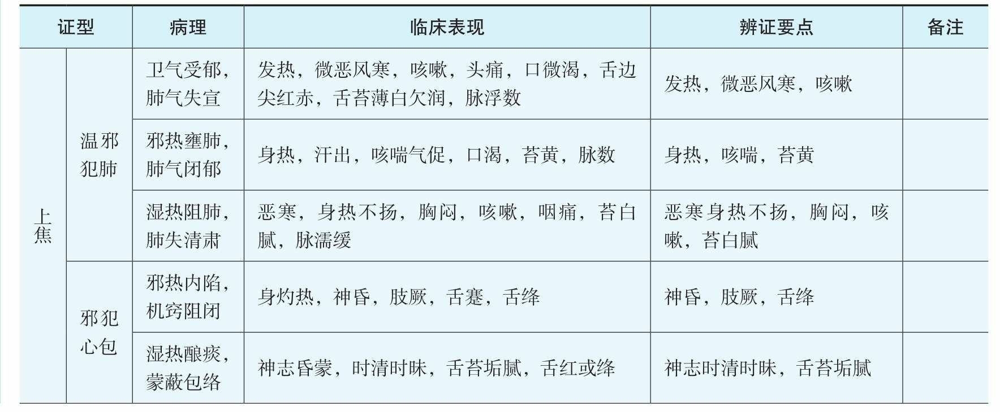 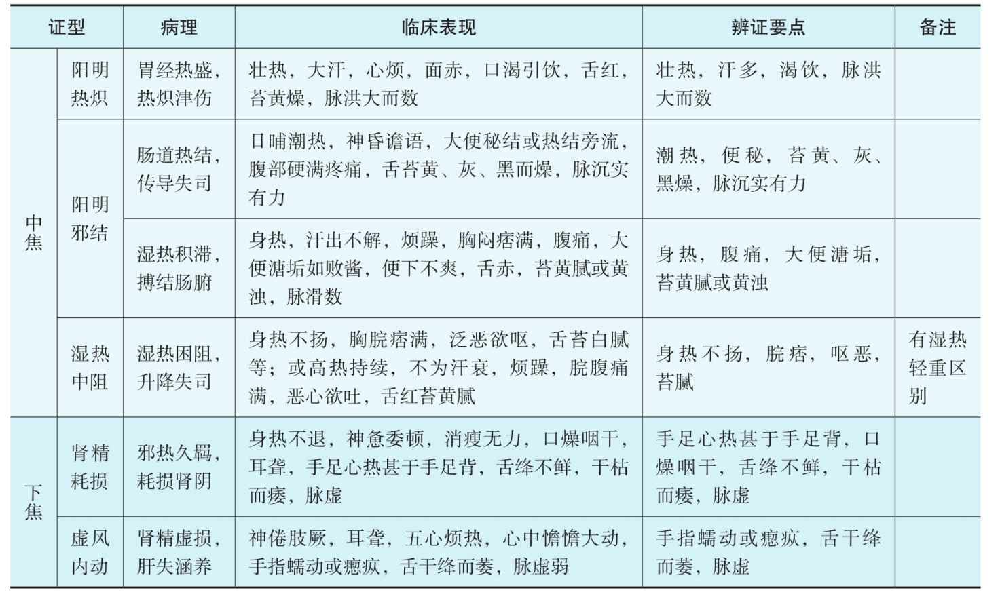
        - **上焦（肺、心）**
            - **肺**
                - 温热类
                    - **1.邪犯肺卫证**
                        - 病机：卫气受郁，肺气失宣
                        - 辨证要点：发热、微恶风寒、咳嗽。
                    - **2.肺热壅盛证**
                        - 病机：邪热壅肺，肺气闭郁
                        - 辨证要点：身热、咳喘咳痰、苔黄。
                - 湿热类
                    - **3.湿热阻肺证**
                        - 病机：湿热阻肺，肺失清肃
                        - 辨证要点：恶寒、身热不扬、胸闷、咳嗽、苔白腻。
            - **心包**
                - 温热类
                    - **4.热闭心包证**
                        - 病机：邪热内陷，机窍阻闭
                        - 辨证要点：神昏、肢厥、舌绛。
                - 湿热类
                    - **5.湿蒙心包证**
                        - 湿热酿痰，蒙蔽包络
                        - 辨证要点：神志时清时眛、舌苔垢腻。
        - **中焦（脾胃、大肠）**
        - > 按照解剖部位，大肠属于下焦
            - **太阴脾**
                - **1.湿热中阻证**
                    - 病机：湿热困阻，升降失司
                    - 辨证要点：身热、脘痞、呕恶、苔腻
            - **阳明**
                - **足阳明胃**
                    - **2.阳明热炽证（胃热亢盛）**
                        - 病机：胃经热盛，热炽津伤
                        - 辨证要点：大热、大渴、大汗、脉洪大、苔黄燥
                - **手阳明大肠**
                    - **3.阳明热结证（热结肠腑、阳明腑实）**
                        - 病机：肠道热结，传导失司
                        - 辨证要点：潮热、便秘、苔黄黑而燥、脉沉实有力
                    - **4.湿热积滞搏结肠腑证**
                        - 病机：湿热积滞，搏结肠腑
                        - 辨证要点：身热、腹痛、便溏垢、苔黄腻或黄浊
                    - **5.湿阻大肠证**
                        - 病机：湿浊闭阻肠道，传导失司
                        - 辨证要点：大便不通、腹胀满、苔垢腻
        - **下焦（肾、肝）**
        - > 按照解剖部位，肝属于中焦
            - **1.肾精耗损证**
                - 病机：邪热久羁，耗损肾阴
                - 辨证要点：手足心热甚于手足背，口干咽燥，舌红绛不鲜干枯而痿，脉虚。
            - **2.虚风内动证**
                - 病机：肾精虚损，肝失涵养
                - 辨证要点：手指蠕动或瘛疭，舌红干绛而痿，脉虚。
    - **三焦辨证与卫气营血辨证的关系**
        - 三焦辨证--定位、说明发展规律、表示浅深轻重（不明确）
        - 卫气营血辨证--表示浅深轻重、定位不明确
        - 吴鞠通的《温病条辨》三焦辨证+六经辨证+卫气营血辨证
- **温病的诊法**
    - **辨舌**
    - > 温病舌苔主要反映 **卫分和气分** 的病变；舌质主要反映 **营分和血分** 的病。
        - **辨舌苔**
            - **白苔**
                - 舌苔薄白 **欠润** ，边尖略红：温病初起邪袭 **卫分**
                - 舌苔薄白而 **干** ，舌边尖红：温病表邪未解、肺津已伤
                - 舌苔白厚而黏腻： **湿阻气分** 而 **湿** 浊偏 **盛**
                - 舌苔白厚而干燥：脾湿未化而胃津已伤；胃燥气伤、气不化液
                - 舌苔白腻而舌质红绛：气分病变，湿遏热伏；热邪入营，湿邪未化
                - 白苔黏腻厚如积灰而舌质紫绛（ **积粉苔** ）： **湿热秽浊郁闭膜原** 的征象，也属湿遏热伏所致，但传变甚快、病多凶险，多见于湿热疫。
                - 白苔如碱伏（ **白碱苔** ）：舌苔垢白厚粗浊而板滞，状如石碱。为温病 **胃中有宿滞而兼夹秽浊郁伏** 之征象。多见于湿热性温病。
                - 白砂苔（ **水晶苔** ）： 舌苔白而干硬如砂皮，扪之糙涩。为邪热迅速化燥入胃， **苔未及转黄而津已大伤** 之象。
                - **白霉苔** ： 满舌生白衣，或蔓延到颊颚等处，有如霉状，或生糜点，如饭粒样附着，或如豆腐渣样刮之易去。为 **秽浊之气上犯而胃气衰败** ，预后多属不良。多见于温病患者久治不愈，胃气大伤，或滥用光谱抗生素，皮质激素者。（如小儿见有类上述舌苔表现，多属鹅口疮）
            - **黄苔**
                - 黄腻苔： **气** 分湿热内蕴
            - **黑苔**
                - （1）黑苔焦燥起刺，质地干涩苍老：热结肠腑、肾阴耗竭。
                - （2）黑苔薄而干燥或焦枯：温病后期，邪热深入下焦而肾阴耗竭。若兼舌质红，心中烦不得卧，为真阴欲竭，壮火复炽所致，即所谓“津枯火炽”。
                - （3）遍舌黑润：无明显苔垢，温病兼夹痰湿。
                - （4）舌苔干黑，舌质淡白无华：湿温病热入营血，灼伤血络，大量便血导致气随血脱。由于病变发展迅速，黑苔未及转化而苔色仍黑，因气随血脱而舌质变为淡白无华。
                - （5）黑苔滑润而舌淡不红：湿温病后期湿胜阳微，转化为寒湿证。
        - **辨舌质**
            - **红舌**
                - 舌尖红赤起刺：邪入营血的早期、心火上炎
                - 舌红有裂纹，或舌中生红点： 心营热毒极盛
                - 舌质红嫩光泽， **望之潮湿，扪之干燥无津** ：邪热初退、津伤未复
            - **绛舌**
                - 舌绛而鲜明润泽，不罩苔垢： 热入心包
                - 舌绛而有黄白苔： 邪热初入营分、卫气分之邪未尽
                - 舌绛上罩黏腻苔垢： 营分受热、气分兼夹痰湿或秽浊
                - 舌绛光亮如镜（镜面舌）：舌绛无苔，光亮如镜，干燥无津。为 **胃阴衰亡** 之征象。
                - 舌绛不鲜，干而枯痿：温邪深入下焦，肾阴欲竭
            - **紫舌**
                - 舌焦紫起刺（杨梅舌）：为 **血分热毒极盛，也可是热盛迫血或动风的先兆。**
                - 舌紫晦而干（猪肝舌）：为 **肝肾阴竭** 之征象。温病后期见这种舌像，主病情危重，多预后不良。
    - **验齿**
    - > 通过观察 **牙齿润燥** 、 **齿缝流血** 、 **齿龈** 和 **齿垢** 等情况，来判断 **热邪的轻重** 、 **病变部位** 、 **津液存亡** 具有一定的参考价值。
        - **牙齿润燥**
            - 1.光燥如 **石** ：齿面干燥，但仍有光泽，多为 **胃热伤津、肾阴未竭** 之象或温病初起，肺卫郁遏，表气不通，津液不能上布者。
            - 2.燥如 **枯骨** ：齿面枯燥而无光泽，状如枯骨，为 **肾阴枯竭** ，多见于温病后期真阴耗损之证，预后不良。
            - 3. **齿燥色黑** ：齿面干燥无津，其色焦黑，为邪热深入下焦， **肝肾阴伤、虚风渐动** 之象。
        - **齿缝流血**
            - 色 **鲜红** 而量较 **多** ，同时伴有 **齿龈红肿疼痛** ，且多兼 **口秽喷人** 等，多由 **胃火** 冲击所致，其证属 **实** 。
            - 血由齿龈浸出，色 **暗红** 而量 **少** ，无齿龈肿痛。多由 **肾阴耗伤而虚火上炎** 动血，其证属 **虚** ，预后较差。
    - **辨斑疹**
    - > 陆子贤说：“斑为阳明热毒，疹为太阴风热。” 温病中的斑为“阳斑”；阴斑：色多青紫，隐隐稀少，出没无常，伴面白、肢凉、脉虚等，病因：脾不统血或阳虚寒凝气血
        - **斑疹鉴别：**
        - > 🍉斑以“清”为主，主要在气血，疹以“透”为主，主要在卫营。 ①忌妄用辛温发表升提药，恐助热动血； ②忌壅补，以免恋邪； ③忌在斑疹初透之机过用寒凉药，以免邪热遏伏。 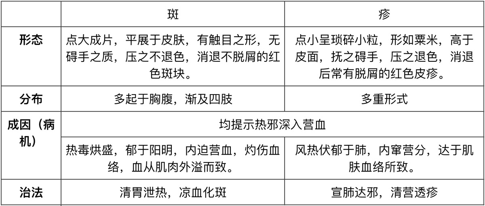
        - **斑疹诊察及临床意义：**
            - **色泽**
            - > 雷少逸说：斑疹“红轻、紫重、黑危。”
                - 斑疹红活荣润为顺，是气血流畅、邪热外达的征象
                - 红如 **胭脂** ，为 **血分热毒炽盛** 的表现
                - 色 **紫赤** 如 **鸡冠花** ，为 **热毒深重**
                - 色 **黑** 为 **火毒极盛** ，病情严重
                - > 但黑而光亮，说明气血尚充，若黑而隐隐，四旁赤色，此为火郁于内，气血尚活，皆可救治
                - 晦暗枯槁则为邪气深入，气血郁滞，正气衰败
            - **形态：**
                - 斑疹松浮洋溢，洒于皮表，多为邪热外达的顺证，预后大多良好
                - 斑疹紧束有根，从皮面钻出，如履透针，如矢贯的者，为热毒锢结的逆证，预后多不良
            - **疏密：**
            - > 叶天士说：斑疹“宜见而不宜见多。”章虚谷注说：斑疹“不见则邪闭，故宜见；多见则邪重，故不宜多。”
                - 发出量少，稀疏均匀，为热毒轻浅、邪有外达之象，预后较好
                - 发出量多，甚至稠密融合成片，则标志热毒深重，预后不良
            - **结合脉证**
    - **辨白㾦**
    - > 是 **湿热** 留恋 **气分** ，蕴酿淹滞，郁蒸于肌肤而形成的 **细小白色疱疹** 。多见于 **湿热** 类温病。
        - **形态及分布：**
            - 形如粟米，色如珍珠，突出于皮肤，内含少量透明浆液，色如水晶
            - 多分布于颈、胸、腹部，四肢少见，头面更少见，在消退时可有细小的皮屑脱落
        - **病因病机：**
            - 湿热郁阻于气分，胶结难解，蕴蒸于肌表
            - > 湿热并重
            - 随出汗而透发。汗出热减，继而复热。
        - **诊断意义：**
            - 晶㾦—正能胜邪—透；枯㾦—津气俱竭—扶正
            - > 叶天士：“或白如枯骨者多凶，为气液竭也。”
        - **治疗：**
            - 吴鞠通：“纯辛走表，纯苦清热，皆在所忌，辛凉淡法，薏苡仁竹叶散主之。”
    - **发热：各种温病必具的主症之一**
        - **恶寒发热：**
        - > 发热同时伴有恶寒。属于卫分证。 热的程度以患者自我感受为主。
            - ①温邪初起，邪袭肺卫；②外寒诱发伏邪；③暑热内炽阳明。
        - **寒热往来：**
        - > 恶寒与发热 **交替** 出现，往来起伏如疟状，定时或不定时发作。热重寒轻。 **属于气分证。**
            - ①提示邪郁少阳半表半里；②见于湿热类温病中；③见于湿热郁阻三焦。
        - **壮热：**
        - > 通体皆热，热势炽盛，但恶热而不恶寒。属于气分证。是 **转折点** 。
            - 阳明热盛，里热蒸迫。
            - > 不一定在胃，肺、肝胆亦可。
        - **日晡潮热：**
        - > 日晡即申、酉之时，相当于3-5点，日晡潮热指发热于下午3-5点为甚。属于气分证。
            - 多发生于热结肠腑，阳明腑实证；湿温病亦可出现午后发热升高的征象，一般为午后湿热交蒸所致。
            - > 申时为阳明主时，又病在阳明，阳明为多气多血之经，此时正邪相争最为激烈。
        - **身热不扬：**
        - > 身热稽留而热象不显，即自觉热势不甚而持续难退，初扪体表不觉很热（或胫冷），但扪之稍久则觉灼手。 **属于气分证。**
            - 多见于湿温病初起，湿热病邪郁阻卫气，湿重于热， **热为湿遏** ，热势不能外达，湿热蕴蒸所致。
        - **身热夜甚：**
        - > 发热入夜尤甚，灼热 无汗 。
            - 为温病 **热入营分** ，劫灼营阴，甚至深入血分之征象。（营热伤阴）
        - **夜热早凉：**
        - > 入夜发热，天明则热退身凉，但 **热退无汗** 。间断低热。
            - 温病后期， **邪留阴分** 之象。
        - **低热：**
        - > 热势低微，持续难退。
            - 温病后期， **阴伤虚热** 之象。
    - **汗出异常**
        - **无汗：**
        - > 皮肤不干而润
            - 温病初起，邪在卫分，郁闭肌表，腠理闭塞；热郁上焦，肺气失于宣展，腠理则闭阖不开，津液失于敷布而无汗；邪入营血分，热灼营阴，阴液亏损，汗源匮乏。
        - **时有汗出：**
        - > 汗随热势起伏而时出时止，多表现为热盛而汗出，汗出热退，继而复热。汗少而黏。伴有白㾦。
            - 感受湿热或暑湿之邪，热蒸湿动，湿遏热伏，气机不畅。
        - **大汗：**
            - 肺胃热盛（热汗） ；亡阴（汗出粘稠） ；亡阳（冷汗）
        - **战汗**
            - 概念：患者 **壮热** 数日，突见肢冷爪青、脉沉伏，继而全身战栗、大汗淋漓的表现，为战汗。多为热邪留连 **气分** 日久，邪正相持，正气奋起鼓邪外出的表现。
            - 转归
                - ①战汗后，脉静身凉→为邪随汗出，病情向愈。
                - ②战汗后，身热不退，烦燥不安，脉象急疾或肤冷汗出，神情萎靡，甚至昏迷→邪盛正衰，病情危重。
                - ③战汗后，身热渐退，数日后又复发热者→邪盛正虚，不能一战即退，过一段时间后可再发生战汗。
                - ④全身战栗而无汗者→正气亏虚，不能托邪外达。
    - **神志异常**
        - **烦躁不安：**
        - > 心中烦乱，并可有身体及手足躁扰，但 **神志尚清** 。
            - 胸膈邪热扰心；胃肠邪热扰心；邪热初入营分
        - **神昏谵语：**
        - > 神昏指 **神志不清，或意识丧失** ；谵语指语无伦次或胡言乱语。二者常同时出现称为昏谵。
            - 热结肠腑；营热扰心；血热扰心；邪 **热夹痰** ，内闭心包
        - **神志昏蒙：**
        - > **神志不清，时清时寐，似清似昧** ，或时有谵语，甚至可见嗜睡如昏，但 **呼之能应。**
            - **气分湿热** 蒸酿 **痰** 浊而 **蒙蔽心包** ，扰及心神
        - **神志如狂：**
        - > 神志昏乱，躁扰不安，甚则如狂。
            - 下焦蓄血， **瘀热** 扰心；热入血室，瘀热互结，扰及心包
        - **神识呆钝：**
        - > 神清淡漠，反应迟钝。
            - **湿热** 上蒙清窍； **瘀热** 互阻，阻遇厥阴，心窍不灵
        - **昏愦不语：**
        - > **意识完全丧失，昏迷不语，呼之不应，甚至外界各种刺激全无反应** ，是神志异常中昏迷程度最深者。
            - 热闭心包；邪 **热夹痰** 闭阻心包，瘀热闭阻心包
- **温病的治疗** 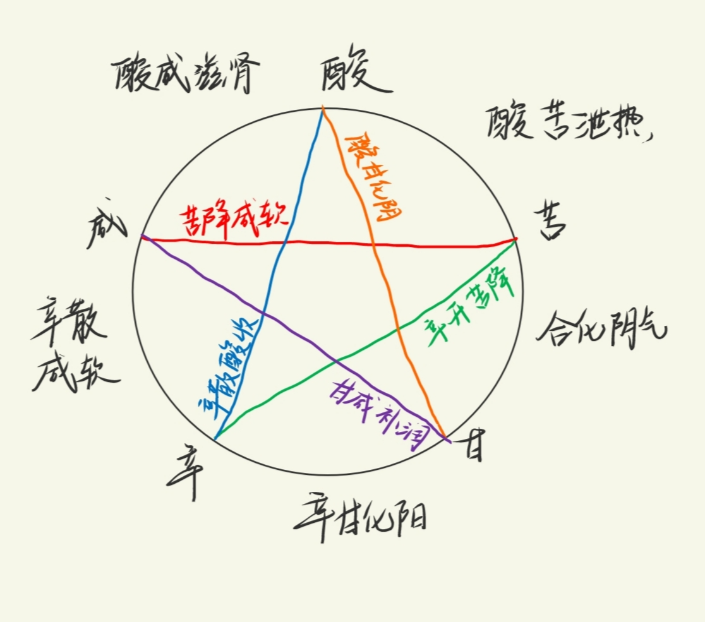
    - **治疗原则：**
        - ①袪邪护阴：温病治疗“袪邪为第一要务”。
        - ②卫气营血治则：“在卫汗之可也”，“到气才可清气”，“入营犹可透热转气”，“入血就恐耗血动血，直须凉血散血”。（叶天士）
        - ③三焦治则：治上焦如羽，非轻不举；治中焦如衡，非平不安；治下焦如权，非重不沉。（吴鞠通）
    - **🍉温病的主要治法**
        - **一、泄卫透表法**
        - > 泄卫透表法是驱除在表温邪，解除卫分表证的治法，具有疏泄腠理、逐邪外出、透热解表的作用。适用于温病初起，邪在卫表。
            - **（一）疏风散热**
                - 【作用】辛凉轻透，疏散肺卫。
                - 【适应症】风温初起，风热病邪袭于肺卫之证。
                - 【临床表现】发热，微恶寒，口微渴，无汗或少汗，舌边尖红，苔薄白。
                - 【代表方剂】银翘散。
            - **（二）解表清暑**
                - 【作用】透散表邪，清暑化湿。
                - > 用辛温芳化清凉之品，外解肌表之寒束，清化在里之暑湿。
                - 【适应症】夏日暑湿蕴阻于内，复受寒邪侵犯肌表之证。
                - 【临床表现】发热恶寒，头痛无汗，心烦，口渴，脘痞，舌红苔腻等。
                - 【代表方剂】新加香薷饮。
            - **（三）宣表化湿**
                - 【作用】芳香宣透，疏表化湿。
                - 【适应症】湿温初起，湿热病邪侵于卫表之证。
                - 【临床表现】恶寒，头重如裹，身体困重，汗出胸痞，苔白腻，脉濡缓等。
                - 【代表方剂】藿朴夏苓汤。
            - **（四）疏卫润燥**
                - 【作用】辛凉透表，生津润燥。
                - 【适应症】秋燥初起，燥热侵袭肺卫之证。
                - 【临床表现】发热，微恶风寒，头痛，口鼻咽喉干燥，咳嗽少痰，舌红苔薄白等。
                - 【代表方剂】桑杏汤。
            - **注意：**
                - 1、根据不同表邪、兼夹病邪选用不同治法配合使用。
                - 2、一般忌用辛温发汗，否则可助热化火，出现发斑、出血、谵妄等，此即吴鞠通所说：“温病忌汗，汗之不唯不解，反生他患。”
                - 3、中病即止，过汗伤津。
        - **二、清解气热法**
        - > 清解气热法是清泄气分热邪，解除气分热毒的一种治法，又称“清气法”。本法具有清热除烦、生津止渴作用，属于八法中的清法。适用于温热病卫分之邪已解，气分无形里热亢盛，尚未与燥屎、食滞、痰湿、瘀血等有形实邪相搏结的证候。
            - **（一）轻清宣气**
                - 【作用】透泄邪热，宣畅气机。
                - 【适应症】温邪初入气分，热郁胸膈，热势不甚或里热渐退而余热扰于胸膈之证。
                - 【临床表现】身热微渴，心中懊不舒，舌苔薄黄，脉数。
                - 【代表方剂】栀子豉汤。
            - **（二）辛寒清气**
                - 【作用】透解邪热，大清气分。
                - 【适应症】阳明气分，邪热炽盛，表里俱热之证。
                - 【临床表现】壮热烦渴，汗出，舌苔黄燥，脉洪数等。
                - 【代表方剂】白虎汤。
            - **（三）清热泻火（苦寒直折）**
                - 【作用】直清里热，泻火解毒。
                - 【适应症】邪热内蕴，郁而化火之证。
                - 【临床表现】身热口渴，烦躁不安，口苦咽干，小便黄赤，舌红苔黄，脉数等。
                - 【代表方剂】黄芩汤或黄连解毒汤。
            - **注意：**
                - 1、与其他治法配合：
                    - 若热邪初入气分，倘表邪未尽，则须在轻清宣气中加入透表之品，如银翘白虎汤。
                    - 若气分热邪炽盛，津液耗伤，则须在辛寒清气中加入生津养液之品，如王氏清暑益气汤、白虎加人参汤。
                    - 若火郁成毒，毒聚成肿成结者，则须在清热泻火中加入解毒消肿散结之品，如普济消毒饮。
                    - 若热在气分，邪热壅肺，当配合宣肺降气之品，如麻杏石甘汤。
                    - 若热郁肝胆当配疏利肝胆之品。
                - 2、本法主治气分无形邪热，若邪热已与有形实邪相结，湿邪、燥屎、食滞、痰浊、瘀血，必须祛除实邪才能解除邪热。
                - 3、热邪未入气分者不宜早用，以免寒凉冰伏邪气。
                - 4、素体阳气不足，应中病即止，不可过用之，防止寒凉过度而伐伤阳气。
                - 5、苦寒药有化燥伤津之弊，热盛阴伤或素体阴虚者慎用。
        - **三、和解表里法**
        - > 和解表里法是以和解、疏泄、宣通气机达到外解里和的治法。本法属于八法中的和法。气分。
            - **（一）清泄少阳**
                - 【作用】用辛苦芳化之品，清泄少阳热邪，兼以化痰和胃。
                - 【适应症】热郁少阳，兼有痰湿犯胃之证。
                - 【临床表现】寒热往来，口苦喜呕，胁脘闷痛，烦渴溲赤，舌红苔黄腻，脉弦数等。
                - 【代表方剂】蒿芩清胆汤；黄芩汤加豆豉、玄参、柴胡（醋/鳖血拌炒）、山栀。
            - **（二）分消走泄**
                - 【作用】用辛开苦泄之品宣展气机，清化三焦气分痰热或湿热。
                - 【适应症】邪留三焦，气化失司，所致痰热、湿浊阻滞之证。
                - 【临床表现】寒热起伏，汗出不解，胸痞腹胀，溲短，苔腻等。
                - 【代表方剂】温胆汤加减，或以叶天士所说的 **杏、朴、苓** 之类为基本药。
            - **（三）开达膜原**
                - 【作用】用辛通苦燥之品，疏利透达湿浊之邪。
                - 【适应症】湿热秽浊之邪郁闭膜原之证。
                - 【临床表现】寒甚热微，脘痞腹胀，身痛肢重，舌红绛或紫绛，苔白厚浊腻积粉等。
                - 【代表方剂】雷氏宣透膜原法或达原饮。
            - **注意：**
                - 1、清泄少阳法虽有透邪泄热作用，但其清热力量较弱，故适用于邪热夹痰湿郁阻于少阳，对气分里热炽盛者不宜用。
                - 2、分消走泄和开达膜原法以疏化湿浊为主，热象较著及热盛津伤者不宜单用，可配合清热法、养阴法等。湿浊偏盛者，也可加用祛湿的治法。
        - **四、祛湿清热法**
        - > 祛湿清热法是驱除三焦湿热的治法。本法具有宣畅气机、运脾和胃、通利水道等化湿泄热的作用，症见湿热性质的温病。
            - **（一）宣气化湿**
                - 【作用】用芳化宣通之品，疏通表里气机，透化湿邪。
                - 【适应症】湿温病初起，湿中蕴热，湿遏表里气机之证。
                - 【临床表现】身热不扬，午后热甚，或微恶寒，汗出不解，胸闷脘痞，小便短少，舌苔白腻，脉濡缓等。
                - 【代表方剂】三仁汤。
            - **（二）燥湿泄热**
                - 【作用】用辛开苦降之品，疏通中焦气机，祛除湿热邪气。
                - 【适应症】中焦湿热遏伏，湿渐化热，湿热俱甚，遏伏中焦之证。
                - 【临床表现】身热而汗出不解，口渴不多饮，脘痞腹胀，泛恶欲吐，舌苔黄腻，脉濡数等。
                - 【代表方剂】湿重：雷氏芳香化浊汤；并重：王氏连朴饮。
            - **（三）分利湿热**
                - 【作用】用淡渗之品，清热渗湿，使湿从小便而出。
                - 【适应症】湿热阻于下焦，膀胱气化失司之证。
                - 【临床表现】小便短少，甚则不通，热蒸头胀，渴不多饮，舌苔白腻等。
                - 【代表方剂】茯苓皮汤。
            - **注意：**
            - > 权衡湿热偏盛偏轻及所在部位。
                - 1、宣气化湿法偏于“宣上”；燥湿泄热法偏于“畅中”；分利湿热法偏于“渗下”。用药需配合使用，以利于湿邪的上下分消。
                - 2、湿盛热微者，苦寒药当慎用或不用，应以辛温开郁、苦温燥湿为主。
                - 3、湿邪已经化燥者，不可再用。
                - 4、阴液亏虚，小便不利，不可滥用渗湿利尿，应以清热养阴。
        - **五、通下逐邪法**
        - > 通下逐邪法是攻导里实、涤除热结的治法。本法具有通腑泄热、荡涤积滞、通瘀破结、排除邪毒和给邪以出路的作用，属于八法中的下法。主要适用于热邪与有形实邪燥屎、湿滞、瘀血等互结于肠腑的证候。
            - **（一）通腑泄热**
                - 【作用】用苦寒攻下之品，泻下阳明实热燥结。
                - 【适应症】热入阳明，内结肠腑之证。
                - 【临床表现】潮热便秘，或热结旁流，时有谵语，腹部胀满或硬痛拒按，舌苔黄燥或焦黑起刺，脉沉实等。
                - 【代表方剂】调胃承气汤、大承气汤。
            - **（二）导滞通便**
                - 【作用】用苦辛合苦寒之品，通导肠腑湿热积滞。
                - 【适应症】 **湿热积滞** 搏结肠腑之证。
                - 【临床表现】身热，脘腹痞满，恶心呕逆，便溏不爽，色黄酱，舌苔黄垢浊腻等。
                - 【代表方剂】枳实导滞汤。
            - **（三）增液通便**
                - 【作用】用甘寒滋润合苦寒通下之品，滋养阴液兼以通下。
                - 【适应症】阳明热结而阴液亏虚之证，又称为 **“热结液亏”** 证。
                - 【临床表现】身热不退，大便秘结，口干唇裂，舌苔焦燥，脉沉细等。
                - 【代表方剂】增液承气汤。
            - **（四）通瘀破结**
                - 【作用】以泻下逐瘀及活血破结之品，破散逐除下焦瘀血蓄结。
                - 【适应症】温病热瘀互结，蓄于下焦之证。
                - 【临床表现】身热，少腹硬满急痛， **大便秘结或色黑** ，小便自利，或神志狂，舌紫绛，脉沉实等。
                - 【代表方剂】桃仁承气汤。
                - > 大黄主要用于活血化瘀。
            - **注意：**
                - 1、里热未成实结或无郁热积滞者不可妄用。
                - 2、平素体虚者，或在温病过程中阴液、正气耗伤较甚，虽有热结，也不宜一味单用攻下之法，应配合扶正药同用。
                - 3、阴亏肠燥便秘者，属无水舟停，忌单用苦寒通腑泄热。
                - 4、下后邪气复聚，若必须再度用下法，应防止过下伤正。
        - **六、清营凉血法**
        - > 清营凉血法是清解营血之热、消散营血分瘀滞的治法，具有清营养阴、凉血解毒、滋养阴液、散血活络的作用，也属于八法中清法。
            - **（一）清营泄热**
                - 【作用】用甘苦寒合轻清凉透之品，清营养阴，透邪外达，以祛除营分邪热。
                - 【适应症】热入营分，郁热伤阴之证。
                - 【临床表现】身热夜甚，心烦时有谵语，斑点隐隐，舌质红绛等。
                - 【代表方剂】清营汤。
            - **（二）凉血散血**
                - 【作用】用甘苦寒合活血散瘀之品，清解血热，散瘀宁络，以清散血分瘀热。
                - 【适应症】温病热盛血分，迫血妄行，热瘀交结之证。
                - 【临床表现】灼热躁扰，甚则昏狂谵妄，斑疹密布，各种出血，舌质紫绛或有瘀斑等。
                - 【代表方剂】犀角地黄汤。
            - **（三）气营（血）两清**
            - > 用清营法或凉血法与清解气热法配合，双解气营或气血之邪热。
                - 气营同病
                    - 【临床表现】壮热口渴，烦扰不寐， **舌绛苔黄。**
                    - 【代表方剂】加减玉女煎。
                - 气血两燔
                    - 【临床表现】壮热躁扰，甚或神昏谵妄，两目昏瞀，口秽喷人，周身骨节痛被杖，斑疹密布，出血，舌质紫绛，苔黄燥或焦黑。
                    - 【代表方剂】化斑汤、清瘟败毒饮。
            - **注意：**
                - 1、热在气分而未入营、血分者，不可早用。
                - 2、营分、血分病变兼有湿邪者，应慎用本法，以防本法所用药物寒凉滋腻之弊。
        - **七、开窍醒神法**
        - > 开窍醒神法是开通窍闭、苏醒神志的治法，具有清泄心包邪热、芳香清化湿热痰浊、醒神利窍的作用。
            - **（一）清心开窍**
                - 【作用】用辛香透络、清心化痰之品，清泄心包痰热，促使神志苏醒，
                - 【适应症】 **温热病** 痰热内闭心包的证候。
                - 【临床表现】神昏谵语或昏愦不语，身体灼热，舌蹇肢厥，舌质红绛或纯绛鲜泽，脉细数等。
                - 【代表方剂】清宫汤送服凉开三宝（首选安宫牛黄丸）。
            - **（二）豁痰开窍**
                - 【作用】用 **芳香** 辟秽、化痰清热之品，宣通窍闭，
                - 【适应症】 **湿热** 郁蒸，酿生痰浊，蒙蔽清窍的证候。
                - 【临床表现】神识昏蒙，时清时昧，时有谵语，舌苔黄腻或白腻，脉濡滑或数。
                - 【代表方剂】菖蒲郁金汤送服苏合香丸（湿重于热）或至宝丹（湿热并重）。
                - > 不可用安宫牛黄丸。冰伏。
        - **八、息风止痉法**
        - > 息风止痉法是平肝息风、解除挛急的治法，具有凉泄肝经邪热、滋养肝肾阴液、控制抽搐的作用。
            - **（一）凉肝息风**
                - 【作用】用甘苦合酸寒之品，凉肝解痉，透热养阴。
                - 【适应症】温病邪热内炽，肝风内动之证。
                - 【临床表现】灼热躁扰，四肢拘急，甚则角弓反张，口噤神昏，舌红苔黄，脉弦数。
                - 【代表方剂】羚角钩藤汤。
            - **（二）滋阴息风**
                - 【作用】用咸寒合酸甘之品，育阴潜阳，滋水涵木。
                - 【适应症】温病后期热入下焦，日久真阴亏损， **肝木失涵，虚风内动** 之证。
                - 【临床表现】低热， **手足蠕动，甚或瘛疭** ，肢厥神疲，舌干绛而痿，脉虚细等。
                - 【代表方剂】二甲复脉汤、三甲复脉汤、大定风珠。
            - **注意：**
                - 1、辨别温病动风之属虚属实，实风重在凉肝，虚风重在滋阴。实风抽搐剧烈者可重用息风止痉药（特别是虫类药）以加强止痉的作用，但须注意避免其劫伤津液之弊，阴虚动风证运用时尤当慎重；运用滋阴药时又须防其滋腻阴柔而恋邪。
                - 2、小儿患者在卫、气分阶段因高热而引起痉厥者，往往只需投用清热透邪之剂，或用物理降温方法，热退而抽搐自止，不可轻用息风之法治疗。治疗本病为主，兼以止痉。
        - **九、滋阴生津法**
        - > 滋阴生津法是滋阴养液，补充阴津损耗的治法。本法具有润燥生津、滋养真阴、壮水制火的作用，属于八法中的补法。 适用于温病后期邪热渐退，阴液耗伤之证。
            - **（一）滋养肺胃**
                - 【作用】滋养肺胃津液，又称 **甘寒生津** 法。
                - 【适应症】温病气分邪热渐退，而肺胃阴液未复，或肺胃阴伤之证。
                - 【临床表现】干咳少痰或无痰，口干咽燥，或干呕不欲食，舌光红少苔或干。
                - 【代表方剂】沙参麦冬汤、益胃汤。
            - **（二）增液润肠**
                - 【作用】用甘咸寒生津养液之品，润肠通便，又称 **“增水行舟”** 法。
                - 【适应症】温病气分热邪渐解，津枯肠燥而便秘之证。
                - 【临床表现】大便数日不下，口干咽燥，舌红而干。
                - 【代表方剂】增液汤。
            - **（三）滋补真阴**
                - 【作用】用甘酸咸寒之品，填补真阴，壮水制火，又称“滋补肝肾”法。
                - 【适应症】温病后期，邪热久羁，真阴耗损， **邪少虚多** 之证。
                - 【临床表现】低热不退，手足心热甚于手足背，颧红，口干咽燥，神疲欲寐，或心中憺憺大动，舌绛少苔或干绛枯痿，齿燥，脉虚细或结代等。
                - 【代表方剂】加减复脉汤、大定风珠。
        - **十、固脱救逆法**
            - **（一）益气敛阴**
                - 【作用】用甘温、甘酸补气敛阴之品，益气生津，敛阴固脱。
                - 【适应症】温病 **气阴两伤，正气欲脱** 的证候。
                - 【临床表现】 **身热骤降，汗多气短** ，体倦神疲，舌光少苔，脉散大无力。
                - 【代表方剂】生脉散。
            - **（二）回阳固脱**
                - 【作用】用甘温、辛热益气温阳之品，固脱救逆。
                - 【适应症】温病过程中阳气暴脱证。
                - 【临床表现】四肢逆冷，大汗淋漓，神疲倦卧，面色苍白，舌淡苔润，脉微细欲绝。
                - 【代表方剂】参附汤或参附龙牡汤。
            - **注意：**
                - 1、本法为急救之法，运用固脱法应注意用药要快速、及时、准确。
                - 2、一旦阳回脱止，就要注意有无火热复炽、阴气欲竭的现象，并根据具体情况辨证施治。
                - 3、若出现神昏配合开窍法。
    - **温病中形成的病理产物**
        - 1、痰饮--芳香化痰，清热豁痰
        - 2、食滞--消食和胃，导滞通腑
        - 3、气郁--行气（下行）
        - 4、血瘀--清营血、化宿血；清血室、化瘀热
    - **温病瘥后调理**
    - > 忌大补
        - 阴伤--益胃汤
        - 气阴两伤--三才汤
        - 脾胃呆钝--五叶芦根汤
- **温热类疾病辨证**
    - **风温**
    - > 感受风热病邪所引起的急性外感热病。初起以肺卫表热证为主要证候，继则出现邪热壅肺等气分证候，后期多表现为肺胃阴伤。本病四季均可发生，以冬春两季多见。（发于冬季的又称“冬温”）​
        - 沿革：
            - 风温之名， **首见于《伤寒论》**
            - 陈平伯《外感温病篇》 关于风温的专著
        - 病因：风热病邪
        - **肺卫表热证**
        - 发展趋向：顺传于胃；逆传心包
        - 辨证要点（辨病依据）
            - 1.本病一年四季均可发生，以冬春两季多见。
            - 2.发病急骤，初起即见发热、恶风、咳嗽、口微渴等肺卫证候。
            - 3.传变较速。
        - 治则：风温的病变重心在肺经，故以 **清泄肺热** 为治疗原则。
            - 风温初起邪在肺卫， 治以辛凉解表；
            - 邪传气分， 肺经热盛， 治当清热宣肺；
            - 阳明热炽，治以宜辛寒清气；
            - 阳明腑实则治以苦寒攻下；
            - 热陷心包应清心开窍；
            - 后期肺胃阴伤， 治宜甘寒清养肺胃之阴
        - 常见证候辨治 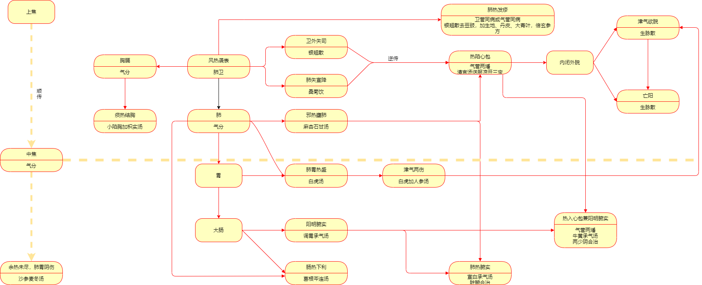
            - **邪袭肺卫**
                - 证候：发热，微恶风寒，无汗或少汗，头痛，咳嗽，口微渴，苔薄白，舌边尖红，脉浮数。
                - 病机：风温初起，风热病邪侵袭肺卫。
                - 治法：辛凉轻解，宣肺泄热。
                - 方药：银翘散或桑菊饮
                - > 1、银翘散——辛凉平剂   桑菊饮——辛凉轻剂         白虎汤——辛凉重剂 **2、银翘散煎服方法：** 上杵为散， 每服六钱， 鲜苇根汤煎， 香气大出即取服， 勿过煮。 肺药取轻清， 过煮则味厚而入中焦矣。 病重者， 约二时一服， 日三服， 夜一服； 轻者三时一服， 日二服， 夜一服； 病不解者， 作再服。 3、“但熱不惡寒而渴者，辛涼平劑銀翹散主之。” 4、“太陰風溫，但咳，身不甚熱，微渴者，辛涼輕劑桑菊飲主之。（上焦篇6）”“咳，熱傷肺絡也。身不甚熱，病不重也。渴而微，熱不甚也。恐病輕藥重，故另立輕劑方。”
                - **🍉** **银翘散与桑菊饮的比较** ：
                    - ①银翘散与桑菊饮均为 **辛凉解表** 方剂，适用于 **风热侵犯肺卫** 之证，但两者清解之力有轻重之别。
                    - ②“辛凉平剂”银翘散中荆芥、豆豉等辛散透表之品合于辛凉药物中，其 **解表之力较胜** ，且银花、连翘用量大，并配竹叶， **清热作用较强** ；
                    - ③“辛凉轻剂”桑菊饮多为辛凉之品， **力轻平和** ，其解表清热之力逊于银翘散，但方中杏仁肃降肺气， **止咳** 作用较银翘散为优。所以风温初起邪袭肺卫而偏于表热较重者，宜用银翘散；偏于肺失宣降，表证较轻，以咳嗽为主症者，宜用桑菊饮。
            - **邪入气分**
                - **邪热壅肺**
                    - 证候： 身热， 汗出， 烦渴， 咳喘， 或咯痰黄稠， 或痰中带血， 或痰呈铁锈色， 胸闷胸痛， 舌红苔黄， 脉数。
                    - 病机：风热之邪入里， 邪热壅阻肺经气分
                    - 治法：清热宣肺。
                    - 方药：麻杏石甘汤或千金苇茎汤。
                - **痰热结胸**
                    - 证候：身热面赤， 渴欲凉饮， 饮不解渴， **得水则呕** ， **胸脘痞满，按之疼痛** ， 便秘， 苔黄滑， 脉滑数有力。
                    - 病机：邪热入里， 与痰搏结于 **胸脘** 而成。
                    - > 1、本证身热面赤， 渴欲凉饮， 有似阳明无形热盛之象，但 **舌黄滑而非黄燥** ， 且有 **胸脘满痛** 之感， 则显非阳明经证。 ​2、 其见大便秘结， 又有似阳明腑实， 但腑实便秘， 必见潮热或腹部硬满疼痛， 今身热， 便秘而腹不硬痛， 且舌苔亦不黄厚干燥， 脉象亦不沉实， 则非腑实便秘可知。
                    - 治法 ：清热化痰开结。
                    - 方药： 小陷胸加枳实汤
                - **肺热腑实**
                    - 证候： 潮 **热** 便 **秘** ， **痰** 涎壅盛， 喘促不宁， 苔黄腻或黄滑， 脉 **右寸实大** 。
                    - 病机：本证为既有肺经痰热壅阻， 又有肠腑热结不通之肺肠同病证。
                    - 治法：宣肺化痰， 泄热攻下。
                    - 方药：宣白承气汤（生石膏、生大黄、杏仁粉、瓜蒌皮 ）
                    - > 吴鞠通： “以杏仁、 石膏宣肺气之痹， 以大黄逐肠胃之结， 此 **脏腑合治** 法也。 ”
                - **肺热发疹**
                    - 证候：身热，皮肤 **发疹** ，疹点红润， **咳嗽** ，胸闷，舌红苔薄白，脉浮数。
                    - **气分**
                    - > 卫营同病或气营同病
                    - 治法：宣肺泄热，凉营透疹。
                    - 方药：银翘散去豆豉，加细生地、丹皮、大青叶，倍玄参方
                - **肺热移肠**
                    - 证候：身热， 咳嗽， 口渴， **下利色黄热臭， 肛门灼热，** 腹痛而不硬满， 苔黄， 脉数。
                    - 病机： 本证为肺胃邪热下移大肠所致。
                    - > 本证为热移大肠， 下利多为 **黄色稀便而非稀水** ，内无燥屎结于肠腑， 所以虽可出现腹痛，但 **按其腹部并无硬满感觉** 。 而热结旁流的腑实证则为燥屎内结， 粪水从旁而流下， 故 **下利恶臭稀水** ， 腹部硬满， **按之作痛** 。
                    - 治法：苦寒清热止利。
                    - 方药：葛根黄芩黄连汤
                - **热炽阳明**
                    - 证候：壮 **热** ，恶热， **汗** 大出，面目红赤， **渴** 喜冷饮，苔黄而燥，脉浮 **洪** 或滑数。
                    - 病机：阳明 **无形** 邪热内盛。
                    - 治法：清热保津。
                    - 方药：白虎汤
                    - > 1、“太陰溫病，脈浮洪，舌黄，渴甚，大汗，面赤惡熱者，辛涼重劑白虎湯主之。（上焦篇7）”“脈浮洪，邪在肺經氣分也。舌黄，熱已深。渴甚，津已傷也。大汗，熱逼津液也。面赤，火炎上也。惡熱，邪欲出而未遂也。辛涼平劑焉能勝任，非虎嘯風生，金飆退熱，而又能保津液不可，前賢多用之。” 2、吴鞠通在《温病条辨》中提出 **白虎汤“四禁** ”：白虎本为达热出表，若其人 **脉浮弦而细者** ，不可与也； **脉沉者** ，不可与也； **不渴者** ，不可与也； **汗不出者** ，不可与也。常须识此，勿令误也。 3、白虎汤证👉白虎汤四大证+身倦，背微恶寒，脉虚（洪大而芤）=白虎加人参汤，实中夹虚。👉身体灼热， 神志昏愦， 倦卧， 气息短促， 汗多， 脉散大或细数无力 =津气欲脱，生脉散，益气敛阴固脱 。👉发热骤退， 面色苍白， 四肢厥冷， 汗出不止， 虚烦躁扰，气息短促， 舌淡， 脉微细欲绝=亡阳，参附汤，回阳固脱 。 4、面目俱赤，語聲重濁，呼吸俱粗，大便閉，小便澀，舌苔老黄，甚則黑有芒刺，但惡熱，不惡寒，日晡益甚者，傳至中焦，陽明溫病也。 **脈浮洪躁甚者** ，白虎湯主之； **脈沉數有力** ，甚則脈體反小而實者，大承氣湯主之。（中焦篇1）
                - **热结肠腑**
                    - 证候：日晡潮 **热** ， 时有谵语， 大便 **秘** 结， 或纯利恶臭稀水， 肛门灼热， 腹部 **胀满硬痛** ， 苔老黄而燥， 甚则灰黑而燥裂， 脉沉实有力。
                    - 病机：肺经邪热不解， 传入胃肠， 与肠中积滞糟粕相结而成。
                    - 治法：软坚攻下泄热。
                    - 方药：调胃承气汤
                    - > 1、如见腹胀满较甚， 可加枳实、 厚朴以行气破坚， 但这两味药性偏温燥， 津伤甚者当慎用；  ​2、如见苔灰黑而燥， 为津伤已甚， 可加玄参、 生地黄、 麦冬等以攻下泄热， 生津养液， 即为增液承气汤；  3、若热毒较甚， 可加入黄连、 黄芩、 栀子、 黄柏以苦寒攻下， 清热解毒。
            - **热入心包**
            - > 营分
                - **热陷心包**
                    - 证候：神昏谵语，或昏愦不语，身体灼热，四肢厥冷， **舌蹇** ，舌 **纯绛鲜泽** ，脉细数。
                    - 病机：肺之气分、营分热邪逆传入心包。
                    - > 有 **痰、热** 。
                    - 治法：清心凉营，豁痰开窍。
                    - 方药：清宫汤送服安宫牛黄丸或紫雪丹、至宝丹等
                    - > 热陷心包→内闭外脱，益气敛阴、回阳固脱，生脉散或参附汤送服安宫牛黄丸。
                    - **🍉“三宝”比较**
                        - 安宫牛黄丸、至宝丹、紫雪丹三方皆有 **清热解毒、透络开窍、苏醒神志** 之功，属 **凉开之剂** ，是传统治疗 **温病神昏之要药** ，俗称“三宝” 。
                        - ① 安宫牛黄丸药性最凉，长于 **清热兼能解毒** ，主要用于 **高热昏迷** 之症；
                        - ②至宝丹则长于 **芳香辟秽** ，多用于 **窍闭谵语** 之症；
                        - ③紫雪丹药性 **偏凉** ，长于 **止痉息风，泄热通便** ，多用于 **高热惊厥** 之症。
                - **热入心包兼阳明腑实**
                    - 证候：身热， 神昏， 舌蹇， 肢厥， 便秘， 腹部按之硬痛， 舌绛，苔黄燥， 脉数沉实。
                    - 病机 ： **手厥阴心包** 与 **手阳明大肠** 俱病。
                    - > 上焦痰热，中焦燥屎。
                    - 治法：清心开窍， 攻下腑实。
                    - 方药 ：牛黄承气汤
                    - > 即用前安宫牛黄丸二丸， 化开， 调生大黄末三钱， 先服一半， 不知再服 。 吴鞠通：“以牛黄丸開手少陰之閉， 以承氣急瀉陽明， 救足少陰之消， 此 **兩少陰合治** 法也 。”
            - **余邪未净， 肺胃阴伤**
                - 证候： **低热或不发热** ， **干咳** 不已或痰少而黏， 口舌干燥而 **渴** ， 舌干红少苔， 脉细。
                - 病机：本证多见于风温病恢复期。
                - 治法：滋养肺胃， 清涤余邪。
                - 方药：沙参麦冬汤
                - > 沙参、 麦冬、 玉竹、 花粉甘寒生津， 润养肺胃； 生扁豆、 甘草扶助胃气； 桑叶轻清宣透以散余邪 。
    - **春温**
    - > 春温是由温热病邪引起的急性外感热病，其临床特点为起病即见里热证候，如发热，心烦，口渴，舌红，苔黄等，甚则见神昏，痉厥，斑疹等。一般起病急骤，病发于里，病情严重，变化较多。发于春季。

        - 沿革： **郭雍** 首先提出“春温”病名
        - 病因： **温热** 病邪
        - > 1、伏寒化温2、春季感受温热邪气（比一般的风热邪气重）
        - **里热**
        - 辨证要点（诊断依据）
            - 1.本病多见于春季。
            - 2.初起即见高热、 烦渴， 甚则神昏谵语、 斑疹、 惊厥等里热见证，诊断病发于气分或病发于营分， 少数兼短暂的表证。
            - 3.本病发病急骤， 病情复杂， 变化迅速， 病程中易入营动血出现斑疹、 痉厥、 神昏、 正气外脱等危重证候， 后期易致肾阴耗竭、 虚风内动。
            - **🍉4.与风温鉴别。**
                - ①风温与春温均发生于 **春** 季， 同为 **温热性质** 的温病， 都具有 **发病急、 变化多、 传变快** 的特点。
                - ②风温的病因是 **风热** 病邪， 发病之初邪犯肺卫， 故初起见有发热， 微恶风寒， 咳嗽， 口微渴，舌苔薄白， 舌边尖红， 脉浮数等 **肺卫表热证** ；初起病变部位在 **肺卫** ， 后期易出现 **肺胃阴伤** 之象。
                - ③春温是 **温热病邪伏而后发** 所致， 其初起即可见身灼热、 烦渴、 舌苔黄， 甚则神昏、 痉厥、 斑疹等 **里热证候** 。 初起病变部位在 **气分或营分** ， 病情重、 变化快， 后期常见 **肝肾阴伤** 证候。
        - **清泄里热** **透邪外出，顾护阴液**
        - > ①忌纯用苦寒，要配甘寒、咸寒，否则易伤阴液②忌利尿③忌辛温发汗④忌早用滋补
        - 常见证候辨治 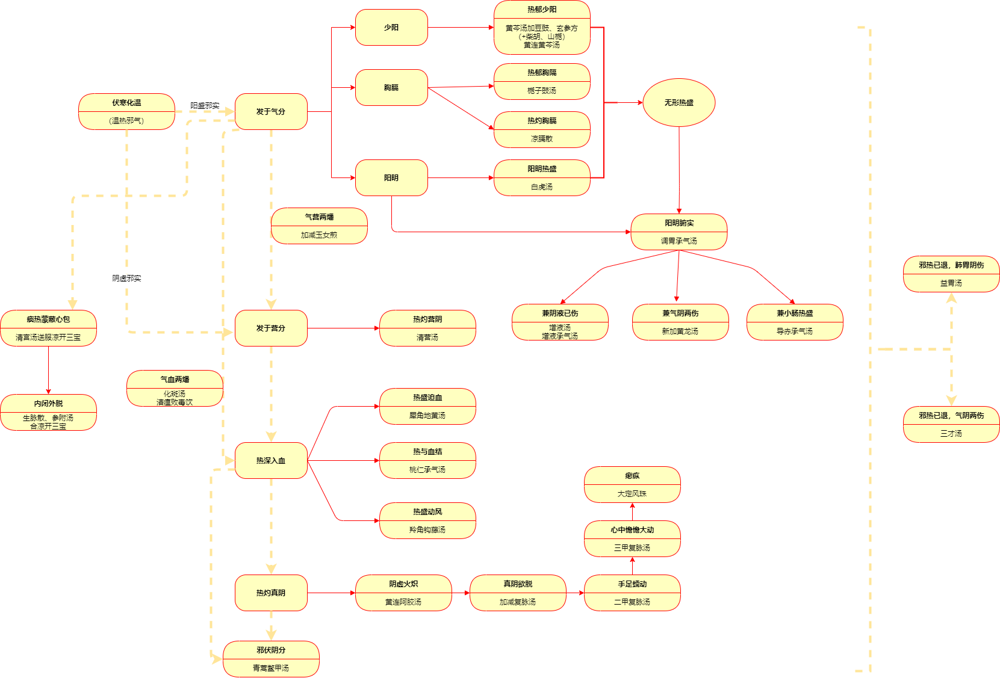
            - **气分**
                - **热郁少阳**
                    - 【证候】寒热往来，热重寒轻，或身热， **口苦** 而渴， 干呕心烦， 小便短赤， 胸胁不舒， 舌红苔黄， 脉弦数。
                    - 【病机】 **热郁胆腑** ， 津液耗伤
                    - 【治法】苦寒清热， 宣郁透泄
                    - 【方药】黄芩汤加豆豉、 玄参方（《温热逢源》 ） ；黄连黄芩汤
                    - > 本方为 **邪伏少阴** 之主方。柳宝诒《温热逢源》：“少阳则寒热往来，口苦胁痛，治以芩、豉、合 **柴胡、山栀** 等味。”“邪已化热，则邪热燎原，最易灼伤阴液，阴液一伤，变证蜂起。故治伏气温病，当步步 **顾其阴液** 。”“邪热未离少阴，其治法不外是矣。或邪未脱少阴，而已兼有三阳见证者，均宜临证参酌施治，固非可刻舟求剑矣。”临床使用时再加 **醋柴胡（量不宜大，防伤阴）、山栀（清导热邪）** 效果更佳。
                - **热郁胸隔**
                    - 【治法】栀子豉汤
                - **热灼胸膈**
                    - 【证候】 **身热不已** ， **胸膈灼热如焚** ， **烦躁** 不安， 唇焦咽燥， 口渴，口舌生疮， 齿龈肿痛， 或大便秘结， 舌红， 苔黄， 脉滑数。
                    - 【病机】热灼胸膈， 气热灼津。
                    - 【治法】清泄膈热。
                    - 【方药】凉膈散
                    - > 1、有调胃承气汤，通腑泄热， “以泻代清”以治下 。 2、热郁胸膈证与本证均为热在胸膈， 但前证为 **无形热郁** ， 邪热较 **轻** ； 本证胸膈 **郁热较甚， 微兼腑实** 。
                - **阳明热盛（无形热盛）**
                - **热结肠腑/阳明腑实（有形热结）兼证**
                - > 🍉 陽明溫病， 下之不通， 其證有五： 應下失下， **正虛** 不能運藥，不運藥者死， **新加黄龍湯** 主之。 喘促不寧， **痰** 涎壅滯， 右寸實大， 肺氣不降者， 宣白承氣湯 主之。 左尺牢堅， **小便赤痛** ， 時煩渴甚， **導赤承氣湯** 主之。 邪閉心包， **神昏舌短** ， 内竅不通， 飲不解渴者， **牛黄承氣湯** 主之。 津液不足， **無水舟停** 者， 間服 **增液** ， 再不下者， **增液承氣湯** 主之。
                    - **兼阴伤**
                        - 【证候】阳明腑实伴见 **口干唇裂， 舌苔焦燥** ， 脉沉细
                        - 【病机】热结肠腑， 兼阴液已伤
                        - 【治法】 攻下腑实， 滋阴增液
                        - 【方药】 增液承气汤
                        - > 增液汤合调胃承气汤去甘草 吴鞠通：“此一腑中 **气血合治** 法。”
                    - **兼气阴伤**
                        - 【证候】阳明腑实伴见 **口干咽燥， 倦怠少气** ， 撮空摸床， 肢体震颤， 目不了了， 苔干黄或焦黑， 脉沉弱或沉细
                        - 【病机】 热结肠腑， 兼气液两虚
                        - 【治法】 攻下腑实， 补益气阴
                        - 【方药】 新加黄龙汤
                        - > 补：增液汤+人参、海参；攻：调胃承气汤；宣血中气分之用：当归；宣通胃气：姜汁（代枳实、厚朴）。 **邪正合治 。**
                    - **兼小肠热**
                        - 【证候】阳明腑实兼有伴见 **小便涓滴不畅， 溺时疼痛， 尿色红赤** ， 时烦渴甚， 舌红脉数。
                        - 【病机】 热结肠腑， 兼小肠热盛
                        - 【治法】 攻下肠腑热结， 清泄小肠邪热
                        - 【方药】导赤承气汤
                        - > **二肠同治。**
            - **营分证**
                - **热灼营分**
                    - 【证候】 **身热夜甚， 心烦躁扰** ， 甚或时有 **谵语** ， 斑点隐隐， 咽燥口干而反不甚渴， **舌质红绛** ， 脉细数。
                    - 【病机】营热炽盛， 营阴耗伤， 心神被扰
                    - 【治法】清营养阴，透热转气
                    - > 透热转气：清气药-降低气分热度，营分热向气分透；通气药-气机通畅。
                    - 【方药】清营汤
                    - > 1、含有增液汤。银花、连翘、竹叶 **透热转气** 。 2、吴鞠通：“太陰溫病，寸脈大， **舌絳而乾** ，法當渴，今反不渴者，熱在營中也， **清營湯去黄連** 主之。”根据“舌绛而干”，推断 **营阴耗伤较重** ，而 **黄连苦燥，能耗伤营阴** ，且性质 **沉降** ，为了“不欲其深入”而去黄连。
                - **热入心包**
                    - 痰热蒙蔽心包
                    - > =风温病“热陷心包”，但非逆传，春温病是自内而发，不是新感温病，由卫分而入，传变途径不同。其病因病机为气分热盛，灼液成痰，蒙蔽心包，热入营阴，损伤营阴。
                    - 内闭外脱
                - **热盛动风**
                    - 【证候】 **高热不退** ，头晕胀痛，烦渴，烦闷躁扰，甚则狂乱，神昏， **手足抽搐** ，或见颈项强直，角弓反张，舌干红绛，脉 **弦数** 。
                    - 【病机】热陷厥阴，肝风内动
                    - 【治法】清热凉肝息风。
                    - 【方药】羚角钩藤汤
            - **血分证**
                - **热盛动血**
                - > 血分实证为主
                    - 【证候】 **身体灼热， 躁扰不安** ， 甚或昏狂谵妄， **斑疹密布** ， 色深红甚或紫黑， 或 **吐衄便血** ， **舌质深绛** ， 脉数。
                    - 【病机】血热瘀阻， 耗血动血
                    - 【治法】凉血散血， 清热解毒
                    - > 散血=活血+养阴，主要为血热，先凉血，而后养阴，补充血中津液，再活血。
                    - 【方药】犀角地黄汤
                    - > 禁用收敛止血药，会使热邪收敛，加重病情；禁用补血药，此处为血中津液的消耗，使用补血药血液更加粘滞，应补血中津液。
                - **热与血结**
                    - 【证候】身热， 少腹坚满， 按之疼痛， **小便自利， 大便色黑** ， 神志如狂， 或清或乱， **口干而漱水不欲咽** ， 舌 **紫绛色暗或有瘀斑** ， 脉象沉实而涩。
                    - 【病机】热与血结， 瘀蓄下焦
                    - 【治法】泄热通结， 活血逐瘀
                    - 【方药】桃仁承气汤
                    - > 本方是以《伤寒论》 桃核承气汤去辛温之桂枝、 甘缓之甘草， 加丹皮、 芍药、 当归而成 。
                    - **🍉桃核承气汤与桃仁承气汤鉴别：**
                        - 同：二者均治疗下焦蓄血，均有桃仁，大黄，有泻热逐瘀之功
                        - 异：桃核承气汤偏重于 **膀胱蓄血，感寒后化热，瘀重而热轻** ，用桂枝通阳散淤；桃仁承气汤偏重于 **肠腑蓄血，热重而瘀轻，或二者皆重** ，用生地、丹皮，加强清热作用。
            - **气营（血）两燔**
            - > 以气为主
                - 【证候】气分：壮热、口渴、苔黄；兼心烦，时有谵语，或斑点隐隐，舌绛者，属气营两燔；兼斑疹透发，或吐衄下血，舌深绛者，属气血两燔；气血两燔兼头痛如劈，骨节烦痛，咽唇部肿痛，可出现喷射状呕吐，脉虚大而芤或沉细，为热毒充斥，疫病发斑。
                - 【病机】气分邪热未解， 营血分热毒又盛
                - 【治法】气营（血） 两清
                - 【方药】气营两燔：加减玉女煎（玉女煎去牛膝、 熟地黄加生地黄、 玄参方）；气血两燔：轻-化斑汤、重-清瘟败毒饮
                - > 加减玉女煎：生石膏、知母、增液汤（麦冬、生地、玄参）；化斑汤：白虎汤加犀角、 玄参 ；清瘟败毒饮：重用石膏清胃热，胃热清则十二经之火自清，白虎汤、黄连解毒汤、犀角地黄汤、凉膈散。
            - **热灼真阴**
                - **阴虚火炽**
                    - 【证候】身热不甚， 心烦不得卧， 舌红， 苔黄或薄黑而干， 脉细数。
                    - 【病机】春温后期， 邪热久羁而耗伤肾阴， 心火亢盛
                    - 【治法】清热降火， 育阴安神
                    - 【方药】黄连阿胶汤
                    - > 吴鞠通《温病条辨》：“少陰溫病，真陰欲竭，壯火復熾，心中煩，不得卧者，黄連阿膠湯主之。（下焦篇11）”“以黄芩从黄连，外泻壮火而内坚真阴；以芍药从阿胶，内护真阴而外捍亢阳。名黄连阿胶汤者，取一刚以御外侮，一柔以护内主之义也”。
                - **真阴亏损**
                    - 【证候】 身热不甚， 日久不退， **手足心热甚于手足背** ， 口干 **咽燥，齿黑， 舌质干绛或枯痿** ， 甚则紫晦， 或神倦， 耳聋， **脉虚软或结代。**
                    - 【病机】 邪热久羁，深入下焦，真阴亏损
                    - 【治法】 滋补肝肾，润养阴液
                    - 【方药】 加减复脉汤
                    - > 🍉 **复脉汤（炙甘草汤；复脉中之阳）的加减应用：** 1、👉减参桂姜枣酒加白芍=加减复脉汤（复脉中之阴）👉加生牡蛎、生鳖甲=二甲复脉汤（手足但觉蠕动）👉加生龟板=三甲复脉汤（心中憺憺大动）👉加五味子、鸡子黄（其他药物相同，但剂量有改变）=大定风珠（时时欲脱） 2、👉去麻仁加生牡蛎、生龙骨=救逆汤 （汗自出， 心无所主， 震震悸动 ） 3、👉去麻仁加生牡蛎=一甲复脉汤（大便溏 ）
                - **阴虚风动**
                    - 【证候】低热， **手足蠕动， 甚或瘛疭** ， 两目上视或斜视， 筋惕肉， 心悸或 **心中憺憺大动** ， 甚则心中作痛， 时时欲脱， 形消神倦， 齿黑唇裂， **舌干绛或光绛无苔** ， 脉虚细无力。
                    - 【病机】 邪热久耗真阴， 水不涵木， 虚风内动
                    - 【治法】 滋阴息风
                    - 【方药】 三甲复脉汤或大定风珠
            - **邪留阴分**
                - 【证候】 **夜热早凉， 热退无汗，**  **能食形瘦** ， 舌红苔少， 脉沉细略数。
                - 【病机】阴液亏损， 邪伏阴分
                - > 人体卫气日行于阳，夜行于阴，余邪留于阴分，卫气夜入阴分与邪相争，故夜热；天明卫气行于阳，不与邪争，故早凉；留伏之余邪未能随卫气外出，故热虽退而身无汗。
                - 【治法】滋阴清热， 搜邪透络
                - 【方药】青蒿鳖甲汤
                - > 吴鞠通指出“夜熱早涼，熱退無汗，熱自陰來者，青蒿鱉甲湯主之。（下焦篇12）”“再此方有先入后出之妙，青蒿不能直入阴分，有鳖甲领之入也；鳖甲不能独出阳分，有青蒿领之出也”。
            - **善后调理**
                - **邪热已退，肺胃阴伤**
                    - 【治法】 益胃汤
                    - > 无邪。沙参麦冬汤有余邪。 陽明溫病，下後汗出，當復其陰，益胃湯主之。（中焦篇12）
                - **邪热已退，气阴两伤**
                    - 【治法】 三才汤
                    - > 天冬、地黄、人参。清补
    - **暑温**
    - > 暑温是感受 **暑热病邪** 引起的急性外感热病。本病发病急骤，初起即可见壮热，烦渴，汗多，脉洪大等 **气分热盛** 证候。病机传变迅速，易伤津耗气，多有化火，生痰，闭窍，动风之变。发病有明显的季节性，发生于夏暑当令之时。
        - 沿革：
            - 吴鞠通则在《温病条辨》 中首次提出： “暑温者， 正夏之时， 暑病之偏于热者也。 ”至此确立了暑温的病名。
        - 病因：暑热病邪
        - 致病特点：初起即可见 **气分热盛证候** ，传变迅速，易伤津耗气，多有闭窍动风之变。
        - 辨证要点（诊断依据）
            - 1.发病有明显的季节性，多发生于夏暑当令之时，即 **夏至到立秋或处暑** 期间。
            - > 《素问·热论》 说：“凡病伤寒而成温者，先夏至日者为病温，后夏至日者为病暑。 ”
            - 2.起病多 **急** 骤，初起较少卫分过程，发病即可见高热、汗多、烦渴、脉洪等肺胃热炽的典型表现。
            - > 为新感温病，初起即见里热原因是暑热致病特殊，暑热盛，夏季人体腠理开泄，汗出多，正气不足，所以暑热邪气易深入。 并非局限于阳明气分，初起亦可犯手太阴、厥阴。“夏暑发自阳明”仅举例而言。
            - 3.病程中传变迅速，变化较多，既可有 **化火、动风、生痰** 等较多的病理变化，又易见津气欲脱、闭窍、伤络 **动血** 等严重病证。
            - 4.发病初期，若伴有脘痞、身重、苔腻等症状者为暑温兼湿之证；若兼有恶寒、无汗等症者则为暑湿兼寒之候。
        - 治则： **清暑泄热，顾护津液**
        - 治法：
            - ①张凤逵 “暑病首用 **辛凉（白虎汤）** ，继用 **甘寒（清暑益气汤）** ，再用 **酸泄（连梅汤）酸敛（生脉散）** ”。
            - > 本病 **气分** 阶段治疗的基本大法
            - ②王纶 “治暑之法， **清心利小便** 最好”。
        - 常见证候辨治 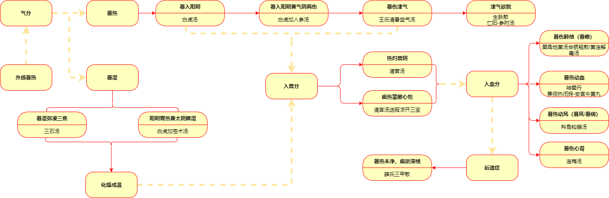
            - **气分暑热证**
                - **暑入阳明**
                    - 【证候】壮热汗多， 口渴心烦， 头痛且晕， 面赤气粗， 或 **背微恶寒** ， 苔黄燥， 脉洪数或洪大而芤。
                    - 【病机】暑温初起， 为暑热之邪侵入阳明气分， 邪正剧烈交争所致。
                    - 【治法】清泄暑热。 津气受伤者兼以益气生津。
                    - 【方药】白虎汤（方见风温章） 或白虎加人参汤。
                    - > 手太陰暑溫，或已經發汗，或未發汗，而汗不止，煩渇而喘，脈洪大有力者，白虎湯主之；脈洪大而芤者，白虎加人參湯主之；身重者，濕也，白虎加蒼术湯主之；汗多脈散大，喘喝欲脫者，生脈散主之。（上焦篇26）
                - **暑伤津气**
                    - 【证候】 **身热心烦** ， 小溲色黄， 口渴自汗， **气短而促** ， **肢倦神疲** ，苔黄干燥， 脉虚无力。
                    - 【病机】 暑热亢盛， 津气两伤。
                    - 【治法】 清热涤暑， 益气生津。
                    - 【方药】 王氏清暑益气汤（《温热经纬》 ） 。
                    - > 1、本方与白虎加人参汤均为 **清热解暑、 益气生津** 之剂，临床运用时应注意区别其适应证候： 白虎加人参汤 **清暑泄热之力较强** ，适用于暑入阳明， **暑热较盛而津气耗伤较轻** 之证； 本方清泄暑热之力不及前方， 但 **养阴生津益气之力较强** ， 则适用于 **暑热稍轻， 津气耗伤较甚** 之证。 2、王氏、李氏清暑益气汤的治疗证候 ①王氏清暑益气汤（阳明）清暑力强，用于暑重，气津两伤→ **暑伤津气** ②东垣清暑益气汤（阳明+太阴）重于健运脾胃→ **暑湿伤气** 
                - **津气欲脱**
                    - 【证候】 身热骤降， 汗出不止， 喘喝欲脱， 脉散大。
                    - 【病机】 津气耗伤过甚所致的津气欲脱之候。
                    - 【治法】 益气敛津， 扶正固脱。
                    - 【方药】 生脉散 。
            - **气分暑湿证**
                - **暑湿困阻中焦**
                    - 【证候】 **壮热烦渴** ， 汗多溺短， **脘痞身重** ， 脉洪大。
                    - 【病机】 暑热盛于阳明， 兼有湿困太阴之证， 其性质属热重于湿。
                    - 【治法】 清热化湿。
                    - 【方药】 白虎加苍术汤。
                - **暑湿弥漫三焦**
                    - 【证候】 身热面赤， **耳聋眩晕** ， 咳痰带血， 不甚渴饮， 胸闷脘痞，恶心呕吐， 小便短赤， 下利稀水， 舌质红赤， 苔黄腻， 脉滑数。
                    - 【病机】 暑湿弥漫三焦， 邪在气分， 暑湿均盛。
                    - > 暑湿蒸腾， 上蒙清窍则面赤耳聋。
                    - 【治法】 清热利湿， 宣通三焦。
                    - 【方药】 三石汤。
                    - > 🍉三石： **滑石、石膏、寒水石**
            - **暑入营血**
                - **暑入心营**
                - > 痰热蒙蔽心包+热灼营阴 脈虛夜寐不安，煩渇舌赤，時有讝語，目常開不閉，或喜閉不開，暑入手厥陰也。手厥陰暑溫，清營湯主之。舌白滑者，不可與也。（上焦篇30）
                - **暑伤肺络**
                    - 【证候】 **灼热烦渴， 咳嗽气粗或喘促， 咯血或痰中带血丝** ， 烦躁，舌质红， 苔黄而干， 脉象细数。
                    - > 肺部出血
                    - 【病机】 暑热犯肺， 损伤阳络。
                    - > 临床上常见骤然咯血、咳嗽等症， 其表现颇似痨瘵， 故有 **暑瘵** 之称。 由于暑热损伤肺络， 血从上溢， 故见咯血或痰中带血丝， 甚则可出现口鼻鲜血外涌。
                    - 【治法】 凉血解毒， 清暑安络。
                    - 【方药】 犀角地黄汤合银翘散或黄连解毒汤。
                - **暑入血分**
                    - 【证候】 **灼热躁扰，神昏谵妄** ，痰声辘辘，斑疹密布，色呈紫黑， **吐血、衄血、便血** ，或兼见四肢抽搐，角弓反张，舌绛苔焦。
                    - > 全身性出血
                    - 【病机】暑热火毒燔灼血分，内陷心包，生痰动风之重险证候。
                    - 【治法】清热凉血解毒， 清心豁痰开窍。
                    - 【方药】神犀丹合安宫牛黄丸。
                - **暑热动风**
                - > 暑热导致的动风抽搐，吴鞠通 **“暑痫”** ，雷少逸 **“暑风”** 小兒暑溫，身熱，卒然痙厥，名曰暑癇，清營湯主之，亦可少與紫雪丹。（上焦篇33） 大人暑癇，亦同上法。熱初入營，肝風内動，手足瘛瘲，可於清營湯中，加鈎藤、丹皮、羚羊角。（上焦篇34）
            - **暑伤心肾**
                - 【证候】 心热烦躁，消渴不已，麻痹，舌红绛， **苔薄黄** 或薄黑而干，脉细数。
                - 【病机】 暑热久羁，耗伤肾阴，致水火不济之候，多见于暑温的后期。
                - 【治法】 清心泻火，滋肾养液。
                - 【方药】 连梅汤 。
                - > 1、吴鞠通：“暑邪深入 **少陰消渴** 者，連梅湯主之；入 **厥陰麻痹** 者，連梅湯主之；心熱煩躁神迷甚者，先與紫雪丹，再與連梅湯。” 2、阴虚火炽-黄连阿胶汤，热盛阴伤并重，清热滋阴。连梅汤偏于阴伤，清热力量小，滋阴力量大。
            - **暑热未净，痰瘀滞络**
                - 【证候】低热不退，心悸烦躁，手足颤动，神情呆钝，默默不语，甚则痴呆、失语、失明、耳聋，或见手足拘挛、肢体强直、瘫痪等。
                - 【病机】由于病势迁延，余 **热** 夹 **痰** 、夹 **瘀** 留滞络脉，导致气钝血滞，机窍阻闭所致。如痰瘀留滞日久不去，气血日耗，以上诸症可能难以恢复，从而留下 **后遗症** 。
                - 【治法】清透余热，化痰祛瘀搜络。
                - 【方药】三甲散。
                - > 🍉三甲： **醉地鳖虫、醋炒鳖甲、土炒穿山甲**  临床效果不佳，常合用桃红四物汤活血；穿甲、地龙、白花蛇、乌梢蛇、蕲蛇搜剔散风通络；清半夏、南星、天竺黄、浙贝母、瓜蒌皮、白芥子化痰（区分寒热）；枳实、厚朴、木香、川楝子、香附、柴胡、郁金行气；生黄芪（大）、党参补气；阿胶、沙参、黄精、玉竹补阴；麝香、菖蒲开窍；羚羊角清肝热。
        - 其他暑病
            - **冒暑**
            - > 夏月感受暑邪， 以肌表、 肺卫见证为主要表现的称为冒暑。 冒暑即暑月感冒， 病情较轻， 邪势轻浅， 病程较短， 极少发生传变， 预后良好。
                - **暑湿内蕴， 寒邪束表**
                    - 【证候】 **发热恶寒** ，头痛无汗，身形拘急，心烦， **胸闷脘痞，苔薄腻** ，脉濡数。
                    - > 以发热为主。
                    - 【病机】暑湿内蕴而又兼寒邪外束。多因夏月暑气当令，先受暑湿之邪蕴阻于内，复因起居不慎，贪凉过度，导致寒邪外侵，以致暑湿为寒邪所遏。
                    - > 所感受的寒邪非伤寒，腠理闭塞程度较轻。
                    - 【治法】 疏表散寒，涤暑化湿。
                    - 【方药】 新加香薷饮。
                    - > 卫气同病、表里同病。
                - **暑热夹湿， 郁阻肺卫**
                - > 以恶寒发热为主--冒暑，以咳嗽为主--暑咳
                    - 【证候】头晕，寒热汗出， **咳嗽** ，苔薄微腻。
                    - 【病机】暑湿之邪袭于上焦肺卫所致， 其症较轻。
                    - 【治法】涤暑清热， 化湿宣肺。
                    - 【方药】雷氏清凉涤暑法。
            - **中暑**
                - 【症候】高热，口渴，猝然昏倒，不省人事，喉间痰鸣，气急喘促。舌红，苔黄脉滑数或沉浮。
                - > 兼有四肢厥逆--暑厥
                - 【病机】痰蒙心包。
                - > 🍉风温、春温、暑温痰热蒙蔽心包形成机制： **营热阴伤，热邪灼液成痰** 。有一定发展过程。 中暑起病急，暑热猝然进入人体，肺宣降失常， **气机闭塞，津液不能输布，凝聚成痰** ，蒙蔽心包。并不一定有营阴被伤。
                - 【治法】 芳香开窍，宣通气机。
                - 【方药】 苏合香丸、至宝丹、藿香正气水。
                - > 苏合香丸--温开--辛温 **芳香** ，宣通气机开窍。苏醒后再涤暑热。 至宝丹--凉开--凉，清热豁痰开窍。 ​安宫牛黄丸、紫雪丹太凉，体内有热，气机不畅，骤然用大凉药恐寒伏气机；且其芳香之性较弱。
            - **暑秽**
            - > 夏季因感受 **暑湿** 秽浊病邪而致猝然闷乱、 烦躁的病候， 称为暑秽。俗称 **“发痧”“龌龊”** ， 雷少逸称之为“秽浊”， 实质上也是猝中暑邪的一类病证。 中暑感受的是 **暑热** 。
                - 【证候】头痛而胀，胸脘痞闷，烦躁呕恶，肤热有汗，甚则神昏耳聋。
                - 【病机】暑湿秽浊病邪。夏秋之间，天暑下迫，地湿升腾，暑湿交蒸，更兼秽浊之气交混于内，若素体脾虚湿盛，或起居不慎，暑湿秽浊之邪易侵犯人体，困遏气机而发为本病。
                - > 偏于暑热重者，苔多黄腻，且有心烦口渴；偏于湿浊重者，则舌苔白腻，口多不渴。
                - 【治法】 芳香辟秽， 化湿涤浊。
                - 【方药】 藿香正气散、 通关散、 玉枢丹。
    - **秋燥**
    - > 秋燥是秋季感受 **燥邪** 所引起的急性外感热病，初起以咽干、鼻燥、咳嗽少痰、皮肤干燥等 **津液干燥见证** ，一般传变较少，病情较轻，病程较短，极少数病例病邪可传下焦肝肾。本病发生在 **秋季** ，尤以初秋多见。
        - 沿革：
            - 清初喻嘉言在 **《医门法律》** 中指出《内经》中“秋伤于湿”应为“秋伤于燥”，并著有论述燥邪为患的专著——“ **秋燥论** ”，首立秋燥病名，并创制 **清燥救肺汤** 为治秋燥主方。
            - 刘河间在《素问玄机原病式》中补充了“ **诸涩枯涸，干劲皴揭，皆属于燥** ”的燥病特点。
        - 诊断依据（辨证要点）
            - 1.本病具有明显的季节性，一般发生在燥热偏盛的初秋。
            - 2.发病初起有发热恶寒，咳嗽等肺卫见症，同时伴有口、鼻、咽、唇、皮肤等处津液干燥的征象。
            - 3.本病的病变中心在 **肺** ，容易累及 **胃肠** ，病情较轻，传变较少，后期以 **肺胃阴伤** 者为多，少有传入下焦肝肾者。
            - > 俞根初在《通俗伤寒论》所说：“秋燥一证，先伤肺津，次伤胃液，终伤肝血肾阴。”
        - 🍉治则： **清热润燥**
        - > 治疗用药注意“宜柔润，忌苦燥”，因燥性虽近火，但又不同于火，“ **治火可用苦寒，治燥必用甘寒** ”。
        - 🍉 治法：“ **上燥治气，中燥增液，下燥治血** ”（秋燥初、中、未三期的治疗大法）
        - > 上燥治气：“治气”即为“治肺”。是指燥邪上受，首犯肺卫，肺主气，肺为燥邪所伤，则肺气宣肃失司，治宜 **辛以宣肺透邪，润以制燥保肺** 。 中燥增液：燥热病邪由上焦而至中焦，损伤肺胃津液，治当 **甘凉濡润** ，以复其津。 下燥治血：而少数病例因燥热化火，耗伤下焦肝肾之精血者，病属后期，则须治用 **甘咸柔润，以补肾填精** ，故“治血”之意实指补肾阴。
        - 常见证候辨治 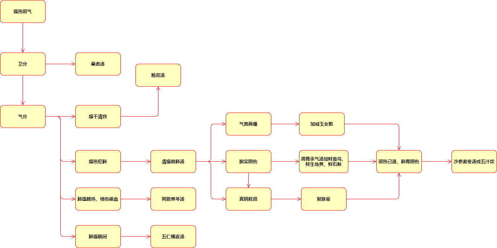
            - **邪犯肺卫**
                - 【证候】发热，微恶风寒，少汗， **干咳或痰少而黏** ，咳甚则声音嘶哑，咽干痛，鼻燥热，口微渴，舌边尖红，苔薄白欠润， **右脉数大** 。
                - > **🍉** **右脉为肺脾命，主气，左脉为心肝肾，主血。此病伤于卫气分。**
                - 【病机】秋燥初起，燥热上受，邪袭肺卫。
                - 【治法】辛凉甘润，轻透肺卫。
                - 【方药】桑杏汤。
            - **邪在气分**
                - **燥干清窍**
                    - 【证候】身热，口渴，耳鸣，目赤， **龈肿，咽痛** ，舌红，苔薄黄而干，脉数。
                    - 【病机】燥热病邪从卫入气，上干头目清窍。
                    - > 咽喉为肺胃之门户，牙龈为阳明经脉所络。
                    - 【治法】清宣上焦气分燥热。
                    - 【方药】翘荷汤。
                    - > 🍉此证为火郁，太过寒凉的药物会将邪气闭住，导致凉遏。 燥氣化火，清竅不利者，翹荷湯主之。（上焦篇57）
                - **燥热伤肺**
                    - 【证候】身热，干咳无痰，气逆而喘，咽喉干燥，鼻燥，齿燥，胸满胁痛，心烦口渴，舌边尖红赤，舌苔薄白而燥或薄黄干燥，脉数等。
                    - 【病机】肺经燥热化火，耗伤阴液。
                    - > 本证苔薄白而燥，是因燥热迅即由卫及气，化火伤阴所致，故舌面干燥而苔色未及转变。一俟邪留气分时间稍久，苔必由白转黄，舌面必进一步干燥。对此种薄白而燥之苔切不可误为表未解而津已伤。
                    - 【治法】清肺润燥养阴。
                    - 【方药】清燥救肺汤。
                    - 清燥救肺汤与桑杏汤鉴别 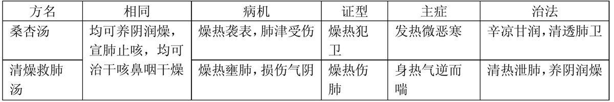
                - **肺燥肠热，络伤咳血**
                    - 【证候】初起喉痒干咳，继则因咳甚而痰黏带血，胸胁牵痛，腹部灼热，大便泄泻，舌红，苔薄黄而干，脉数。
                    - 【症候分析】肺与大肠相表里，肺中燥热下趋大肠，传导失常，故见腹部灼热如焚而大便泄泻。此种便泻，多是水泻如注，肛门热痛，甚或腹痛泄泻，泻必艰涩难行，似痢非痢。《素问·至真要大论》云：“暴注下迫，皆属于热。”这与虚寒便泄清水不同。舌红，苔黄而干，脉数，皆系气分燥热之征，故本证之咳血，并非热入血分，迫血妄行所致。
                    - 【治法】清热止血，润肺清肠。
                    - 【方药】阿胶黄芩汤。
                - **肺燥肠闭**
                    - 【证候】咳嗽不爽而多痰，胸腹胀满，大便秘结，舌红而干。
                    - 【病机】肺有燥热，液亏肠闭。
                    - > 表证虽解，但肺受燥热所伤，气机失于宣畅，则 **津液停聚而为痰** ，大肠失于濡润，传导失常，则糟粕停聚于内而见便秘腹胀。
                    - 【治法】肃肺化痰，润肠通便。
                    - 【方药】五仁橘皮汤。
                - **腑实阴伤**
                    - 【证候】潮热，腹部胀满，大便秘结，口干唇燥，或有神昏谵语，苔黑干燥，脉沉细。
                    - 【病机】燥热内结于阳明，津伤肠燥。
                    - 【治法】滋阴润燥，通腑泄热。
                    - 【方药】调胃承气汤加鲜首乌、鲜生地黄、鲜石斛。
                - **肺胃阴伤**
                    - 【证候】身热已退，或身有微热，干咳或痰少，口、鼻、咽、唇干燥乏津，口渴，舌干红少苔，脉细数。
                    - 【病机】燥热渐退，肺胃阴伤，邪少虚多。
                    - 【治法】甘寒滋润，清养肺胃。
                    - 【方药】沙参麦门冬汤，津伤甚者合以五汁饮。
                    - > 燥傷肺胃陰分，或熱或咳者，沙參麥冬湯主之。（上焦篇56）
            - **气营两燔**
            - **气血两燔**
            - **燥伤真阴**
            - **附：凉燥**
                - 【证候】 **恶寒重，发热轻** ，头痛， **无汗，鼻塞，鼻干，咽干唇燥** ，咳嗽痰稀，脉浮不数，舌苔薄白而干。
                - 【治法】辛开温润。
                - 【方药】杏苏散。
- **湿热类疾病辨证**
- > **🍉** **吴鞠通：“伏暑、暑温、湿温，证本一源，前后互参。”**
    - **湿热病概述**
        - 1、分类：暑温（暑湿）、湿温、伏暑、湿热疫
        - 2、病因：外感湿热邪气或外感湿邪，由湿蕴热。
        - > 吴鞠通：“内不能运水谷之湿，外复感时令之湿。”
        - 3、特点：
            - ①季节性强，多发于长夏季节，夏末秋初。湿热氤氲。
            - > 叶天士：“湿乃重浊之邪，热为熏蒸之气。”
            - ②以 **脾胃** 为中心，弥漫周身，阻滞气机，水液代谢障碍。
            - ③ **症状矛盾** ：身热不扬，身热-面不红反淡黄、脉不数反迟缓、口不渴或喜热饮、不烦躁反痴呆、大便数日不下反溏、舌苔白腻。
            - ④病程长，缠绵难愈。
        - 4、三焦湿热的辨治法则
        - > 湿热初期卫气同病，中期气分为主，不化燥情况下不入营血。三焦辨证更有意义，初起上焦为主，中期中焦为主，羁留时间长，可传下焦大肠膀胱。
            - **上焦湿热**
            - > 开上
                - 【症候】身热不扬，恶寒较重，头身重，舌苔白腻，脉濡。
                - > 湿为阴邪，遏阻气机，遏伤阳气，故恶寒较重。
                - 【治法】辛温宣透，芳香化湿。
                - 【方药】主：藿香、白芷、苏叶、香薷；芳香不辛温：佩兰、青蒿。
                - > 疏透肌腠，腠理通达，汗出邪解--小汗法
            - **中焦湿热**
            - > 上焦传入或素体脾虚；畅中
                - **湿重于热**
                    - 【症候】身热不扬，脘痞不饥，大便溏滞不爽，口淡不渴，舌苔白腻，脉濡。
                    - > 与邪气及体质有关，“在阳旺之躯，胃湿恒多，在阴盛之体，脾湿亦不少。”
                    - 【治法】辛温开郁，苦温燥湿。-- **辛开苦降**
                    - 【方药】半夏、苍术、白蔻仁、草果；厚朴、大腹皮、陈皮
                - **湿热并重**
                    - 【症候】身热心烦，脘痞腹胀，恶心呕吐，大便溏薄，色黄而臭，黏汗味重量少，热随汗减，继而复热，舌苔黄腻，脉濡数。
                    - 【治法】苦寒清热燥湿。
                    - 【方药】黄连、黄芩、栀子。
                - **热重于湿**
                    - 【症候】大热、大汗、大渴、脉洪大，兼有脘闷身重，舌苔黄燥，脉滑数。
                    - 【治法】清泻阳明胃热，兼燥脾湿。
                    - 【方药】石膏，知母，苍术。
            - **下焦湿热**
            - > 渗下
                - 【症候】大肠、膀胱气机不畅，大小便不爽甚至不通。
                - 【治法】淡渗利湿，苦寒清利。
                - > 利小便，大肠湿邪亦除，大便亦通。
                - 【方药】茯苓、猪苓、滑石、车前子、生薏苡仁；栀子、竹叶、木通。
        - 5、其他治疗准则
            - 湿热易弥漫，治疗时以某部位为主，兼顾三焦。
            - 以脾胃为中心，用健脾醒胃药。
            - > 茯苓、白术、生薏苡仁；山楂、神曲、麦芽、鸡内金、砂仁、蔻仁
            - 与行气药合用。
            - > 厚朴、枳实、陈皮、大腹皮、藿梗、苏梗 使用降浊的行气药，不用升清苦寒行气药
            - 开肺气，通调水道。
            - > 杏仁、桔梗
        - **6、🍉常用药物总结** 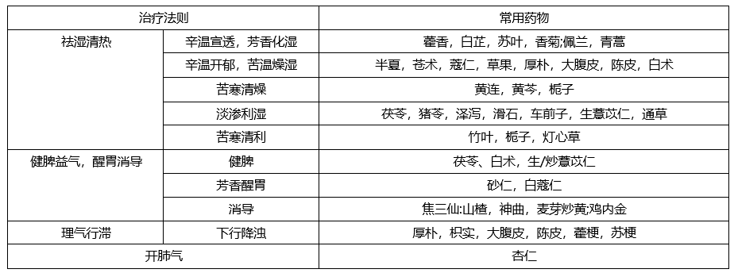
        - 7、禁忌
            - 🍉 **药物：**
            - > 吴鞠通： **“汗之则神昏耳聋，甚则目瞑不欲言；下之则洞泄；润之则病深不解。”**
                - ①发热恶寒，无汗或少汗--类似风寒束表--湿热郁于卫气--禁辛温发汗--湿热蒸腾，上蒙清窍，神昏耳聋
                - > 禁的是大汗，应微汗。
                - ②脘腹痞闷--类似食滞里证--湿热困阻脾胃--禁苦寒攻下--损伤脾胃阳气，脾气下陷，洞泻不止
                - > 应化湿行气。
                - ③午后热甚--类似阴虚--湿热郁蒸--禁滋腻养阴--碍脾滞气，病情迁延难愈
                - ④手脚不温，周身无力--类似气虚-- 后期， 湿热已退，消耗正气--忌温补--“恐炉烟虽息，灰中有火”
                - > 后期应用轻清之药。
            - 饮食：忌甜、黏、硬、生冷、油腻。
            - 调护：感冒复--避风寒，食复--半流食，劳复--避免过度劳累，节制性生活
        - 8、湿热病的转归（从化）
            - 从阳化热：①热邪偏盛②阳盛体质③过用温燥药物👉化燥成温→温热病
            - 从阴化寒：①湿邪偏盛②阴盛体质③过用寒凉👉寒湿病
    - **湿温**
    - > 湿温是由 **湿热病邪** 引起的急性外感热病。初起以身热不扬，身重肢倦，胸闷脘痞，苔腻脉缓等卫气证候。临床以发病缓慢、传变较慢、病程长、病势缠绵，病变主要稽留于 **气分** ，以 **脾胃为病变中心** 为特征。本病四季均可发生，但以 **夏秋** 季节雨湿较盛，气候炎热之时为多。
        - 沿革：湿温病名首见于《难经·五十八难》
        - 病因：湿热病邪（具有 **蒙上流下** 的特点）
        - > 薛生白《湿热病篇》 ： “太阴内伤，湿饮停聚，客邪再至，内外相引，故病湿热。 ”
        - 致病特点：初起 **卫气** 证候，临床以发病缓慢、传变较慢、病程长、病势缠绵，病变主要 **稽留于气分** ，以 **脾胃** 为病变中心为特征。
        - 辨证要点（诊断依据）
            - 1.本病多发生于 **夏秋** 雨湿季节，其他季节雨湿较重时也可见到。
            - 2.起病较缓，初期即见 **恶寒身热不扬** ，进而 **热势渐高** ， **稽留不退** ，并见 **头重如裹** ，身重肢倦， **胸闷脘痞** ，苔腻脉缓等。
            - > 初起与感冒相鉴别。
            - 3.传变较慢，病势缠绵， **湿热留恋气分阶段较长** ，病变以脾胃为中心，也可涉及其他脏腑。
            - 4.病程之中易见 **白痦** 。后期邪随火化，损伤肠络，可见大便下血甚或气随血脱；或湿从寒化，致湿盛阳微等严重证候。
        - 治则： **祛湿清热（“徒清热则湿不退，徒祛湿则热愈炽”）**
        - 常见证候辨治 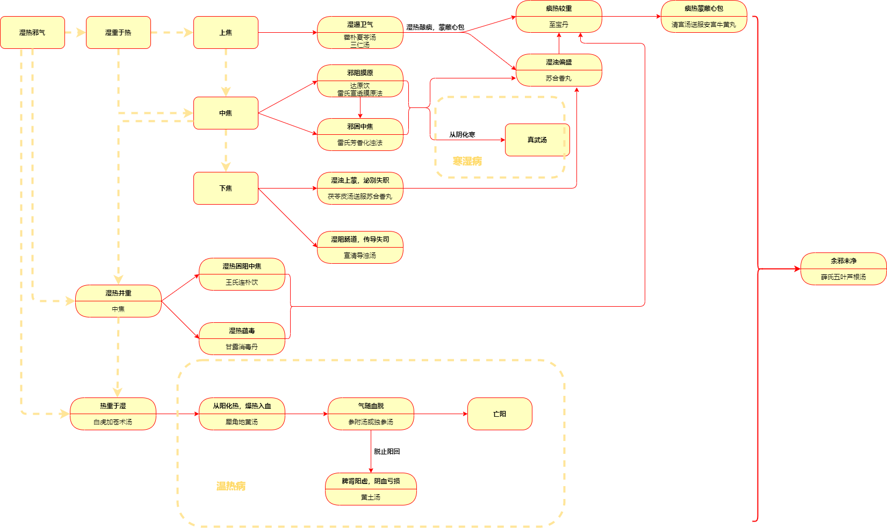
            - **湿重于热**
            - > 👉素体阳虚或病中过用寒凉药等损伤中气，湿邪久羁从寒而化👉形寒肢冷，倦怠乏力，心悸头晕，面目四肢浮肿，咳喘气逆，面目苍白或青紫，脘腹胀满，食少无味，小便清长或小便不利，大便不爽或溏泄，苔白腻或白腻而滑，脉缓或结代👉温阳行水--- **真武汤** 
                - **湿遏卫气**
                    - 【证候】 **恶寒身热不扬** ，午后热盛，少汗，头痛如裹， **身重** 肢倦，胸闷脘痞， **面色淡黄** ，口不渴，苔白腻，脉濡缓。
                    - 【病机】湿温初起内外合邪， **卫气同病** ，湿重热轻之候。其既有湿郁卫分之表证，又有湿郁气分、遏阻脾胃气机之里证。
                    - 【 治法】芳香化湿， 宣通气机。
                    - 【 方药】藿朴夏苓汤或三仁汤。
                    - 🍉 **藿朴夏苓治与三仁汤比较**
                        -  1、藿朴夏苓汤（偏重于 **解表，** 用于 **湿邪偏于卫表而化热不明显** 者）
                        - > ~~***藿香、淡豆豉：辛温芳香，宣透化湿***~~ 杏仁：开通肺气  ​半夏、蔻仁：辛温开郁燥湿  ​厚朴：苦温燥湿，行气降浊 赤茯苓、生薏苡仁、猪苓、泽泻：淡渗利湿
                        - 2、三仁汤（偏重于 **泄热，** 用于 **湿渐化热者，或里湿蕴热** 者）
                        - > **杏仁** ：轻宣肺气 **白蔻仁** 、厚朴、半夏：芳香化浊，燥湿理气 **生苡仁** 、白通草、飞滑石：淡渗利湿 ~~***竹叶：轻清宣透郁热***~~
                - **湿热酿痰， 蒙蔽心包**
                - > 可由湿重于热逐步发展为湿热并重
                    - 【 证候】 **身热不扬/身热不退，朝轻暮重，神识昏蒙，似清似昧** ， 或 **时醒时昧** ，时或谵语，舌苔黄腻，脉濡滑而数。
                    - 【 病机】气分湿热，酿蒸痰浊，蒙蔽心包所致。
                    - 【 治法】清化湿热， 芳香开窍。
                    - > 不可豁痰开窍，豁痰--热痰。
                    - 【 方药】菖蒲郁金汤送服苏合香丸或至宝丹 。
                    - > 1、湿热上蒙心包，其病变中心是 **湿热留恋气分** ，治疗必须以 **清化湿热** 为主，不可乱用清心开窍之剂，如安宫牛黄丸等，否则易 **凉遏冰伏** ，有 碍湿化。 2、若 **痰热较重，邪热炽盛** 者，苔黄、脉数，可加服 **至宝丹** ，以清心化痰开窍 3、若 **湿浊偏盛，热势不著** 者，苔白，脉不数，可送服 **苏合香丸** 以化湿辟秽、芳香醒神。
                    - 🍉 **湿热酿痰，蒙蔽心包与痰热蒙蔽心包鉴别** 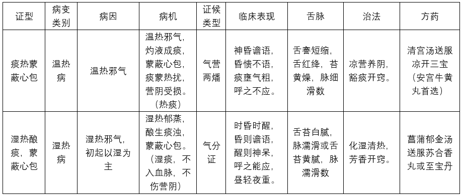
                - **邪阻膜原**
                    - 【证候】 **寒热往来，寒甚热微** ，身痛有汗，手足沉重，呕逆胀满， **舌苔白厚腻浊或如积粉** ，脉缓。
                    - 【病机】湿热秽浊郁伏膜原，阻遏气机。
                    - > 1、膜原者，外通肌肉，内近胃腑，为三焦之门户，一身之半表半里。湿热病邪从口鼻而入，直趋中道，膜原为必经之路，故可郁伏膜原。湿热病邪阻遏膜原，表里气机不畅，故见寒热往来；湿浊偏盛，阳气被郁，故见恶寒较甚，而发热较微，至阳气渐积，郁极而通，则恶寒消失，而见发热汗出。 2、“邪自口鼻而入，则其所客，内不在脏腑，外不在经络，舍于伏膂之内，去表不远，附近于胃，乃表里之分界，是为半表半里，即《内经·疟论》所谓‘横连募原’也。”经胃交关之处。
                    - 【治法】 **疏利透达** 膜原湿浊。
                    - 【方药】达原饮或雷氏宣透膜原法。
                    - > 1、达原饮： **槟榔、 厚朴、 草果** **苦** 温燥湿， 辛开气机， 直达膜原， 透达湿热秽浊； ​ 配知母滋阴清热， 白芍敛阴和血， 黄芩清湿中之热， 甘草和中。  ​2、雷氏宣透膜原法=达原饮-白芍、 知母之酸敛滋润+化湿泄浊之半夏、 藿香。
                - **邪困中焦**
                    - 【证候】 **身热不扬，脘痞腹胀** ，恶心呕吐，口不渴或渴而不欲饮或渴 **喜热** 饮， **大便溏泄，小便浑浊，苔白腻，脉濡缓** 。
                    - 【病机】湿浊偏盛，困阻中焦，脾胃升降失职，吴鞠通称“本证以中焦为扼要”。本证的形成或因湿热病邪直犯中焦，或为膜原湿浊传归于脾胃所致。章虚谷云：“始受于膜原，终归于脾胃。”
                    - 【治法】芳香化浊，燥湿运脾。
                    - 【方药】雷氏芳香化浊法。
                - **湿浊上蒙，泌别失职**
                    - 【证候】 **热蒸头胀，呕逆神迷，小便不通** ，渴不多饮，舌苔白腻。
                    - 【病机】中焦湿浊久困，热为湿遏，热蒸湿动，蒙上流下。湿邪蒸郁蒙蔽于上，则热蒸头胀，甚或蒙蔽心包而神迷；湿滞中阻，胃气不降，则见呕逆；湿浊下注，阻滞膀胱，泌別失职，则小便不通；湿浊偏盛，阻滞气机，则渴不多饮，舌苔白腻。
                    - > 吴鞠通：“吸受穢濕，三焦分佈，熱蒸頭脹，身痛嘔逆， **小便不通** ，神識昏迷，舌白，渴不多飲，先宜芳香通神利竅，安宮牛黄丸；繼用淡滲分消濁濕，茯苓皮湯。（中焦篇56）” 刘景源--①治疗上本末倒置 ，小便不利→湿浊→蒙蔽清窍，定位应在下焦 ，先开窍后利尿×，应开窍利尿同时进行。②本条所述舌白，渴不多饮，说明湿浊较盛，开窍药不可过用寒凉，安宫牛黄丸冰伏湿浊。
                    - 【治法】淡渗利湿，芳香开窍。
                    - 【方药】茯苓皮汤送服苏合香丸。
                - **湿阻肠道，传导失司**
                    - 【证候】身热不扬， **少腹满硬，大便不通，神识如蒙** ， **苔垢腻** 。
                    - 【病机】湿热久羁，肠道 **湿郁气结** ，传导失职。
                    - 【治法】宣通气机，清化湿浊。
                    - 【方药】宣清导浊汤。
                    - **🍉与阳明腑实证加以鉴别**
                        - 本证为湿浊郁闭肠道，气机不通所致，以 **少腹硬满而无疼痛、苔垢腻** 为特点；
                        - 而阳明腑实证为燥屎内结，腑气不通所致，以 **腹部硬满疼痛拒按、苔多黄厚而焦燥** 为特点。
            - **湿热并重**
                - **湿热困阻中焦**
                    - 【证候】 **发热，汗出热减，继而复热** ，口渴不欲多饮，脘痞呕恶，心中烦闷，便溏色黄，小便短赤，苔黄腻，脉濡数。
                    - > 易发白 㾦
                    - 【病机】湿郁化热，湿热并重，互结中焦，致脾胃升降失常。
                    - 【治法】 **辛开苦降** ，燥湿清热。
                    - 【方药】王氏连朴饮。
                - **湿热蕴毒**
                    - 【证候】 **发热口渴** ，胸痞腹胀，肢酸倦怠， **咽肿溺赤** ，或 **身目发黄** ，苔黄而腻，脉滑数。
                    - 【病机】湿热交蒸，酝酿成毒，充斥气分。
                    - 【治法】化湿辟秽，清热解毒。
                    - 【方药】甘露消毒丹。
                    - > 本方又名普济解毒丹，王孟英称其“此治湿温时疫之主方”。
            - **热重于湿**
                - 【 证候】高热汗出，面赤气粗，口渴欲饮，身重脘痞，苔黄微腻，脉滑数。
                - 【 病机】湿热化燥而成热炽阳明， 兼太阴脾湿未化之证。
                - > 薛生白云：“热、渴、自汗，阳明之热也。胸痞、身重，太阴之湿兼见矣。 ”
                - 【治法】清泄阳明胃热，兼化太阴脾湿。
                - 【方药】白虎加苍术汤。
                - > 👉湿邪化燥，热邪化火，深入营血，损伤脉络，动血伤阴；或因护理不周，饮食不节，损伤肠络，迫血妄行= **犀角地黄汤** 👉出血量增加👉气随血脱： 骤然热退身凉，伴见面色苍白、汗出肢冷、舌淡无华、脉象细微欲绝者= **参附汤或独参汤** （人参30g浓煎）👉脱止阳回👉脾肾阳虚，阴血亏损：温阳益气，滋阴补血= **黄土汤**
                - 🍉 **几个湿热方的鉴别**
                    - **湿重热轻**
                    - **湿热并重**
                    - **热重湿轻**
            - **余邪未净**
                - 【证候】身热已退， **脘中微闷** ，知饥不食，苔薄腻。
                - 【病机】湿温病恢复期，余邪未净， **胃气未舒，脾气未醒** 。
                - > 湿热已退，故不发热，余湿未净，胃气未舒，故脘中微闷；脾气未醒则知饥不食；苔薄腻为余邪未净之征。
                - 【治法】轻清芳化，涤除余湿。
                - > 薛生白云：“此湿热已解，余邪蒙蔽清阳，胃气不舒。宜用极轻清之品，以宣上焦气机。若投味重之剂，是与病情不相涉矣。”
                - 【方药】薛氏五叶芦根汤。
    - **伏暑**
    - > 伏暑是夏季感受暑湿或暑热病邪，伏于体内，发于 **秋冬** 季节，起并即见暑湿或暑热里证为特征的一种伏邪温病。
        - 沿革：
            - 宋代 **《太平惠民和剂局方》** 中 **首载“伏暑”之名** ：“丈夫妇人伏暑，发热作渴，呕吐恶心，黄连一味为丸。”但其 **“伏暑”系指病因而非病名** 。
            - 明代王肯堂《证治准绳》明确指出：“暑邪久伏而发者，名曰伏暑。”首先确立伏暑病名。
        - 特点：
            - 1、发病临床表现与季节住气不相符。
            - **2、初起先见表证** ，与感冒类似，但为表里同病，且以湿热或里热伤阴为主。
            - > 春温可无表证--伏邪自发，伏暑均为外邪诱发，深秋冬季腠理闭塞，邪气难发，新感引动而发。
            - 3、病程长，缠绵难愈，病情重。
        - 病因：夏季感受暑邪，伏藏于体内，至深秋或冬月，又为秋冬时令之邪所诱发。
        - 辨证要点（诊断依据）
            - 1.发病季节在深秋或冬季（寒露前后到大寒前后）。
            - 2.起病急骤，初起即见暑湿或暑热内伏的证候。发于气分者，起病即见高热、心烦、口渴、脘痞、苔腻等，若湿热流连气分阶段，可郁发 **白㾦** ；发于营分者，起病即见高热、心烦、舌绛少苔，甚至皮肤、黏膜 **发斑疹** 等。 **两种类型均兼有恶寒等卫表证** ，但卫分见证较短暂，很快即可消失而呈现出一派里热证。
            - > 吴鞠通认为： “霜未降而发者少轻， 霜既降而发者则重， 冬日发者尤重。 ”
            - 3.病程中可见湿热夹滞郁于胃肠之候，证见但热不寒，入夜尤甚，天明得汗稍减而 **胸腹灼热不除** ，兼大便不爽，色黄赤如酱，肛门灼热者等
            - 4.部分患者病变过程中可迅速出现尿少、尿闭、出血、发斑、神昏、抽搐、厥脱等危重症候，病情缓解后可出现尿少、遗尿等肾虚症状。
        - 治则：清泄伏邪、清暑化湿或清暑泄热
        - 常见症候辨治 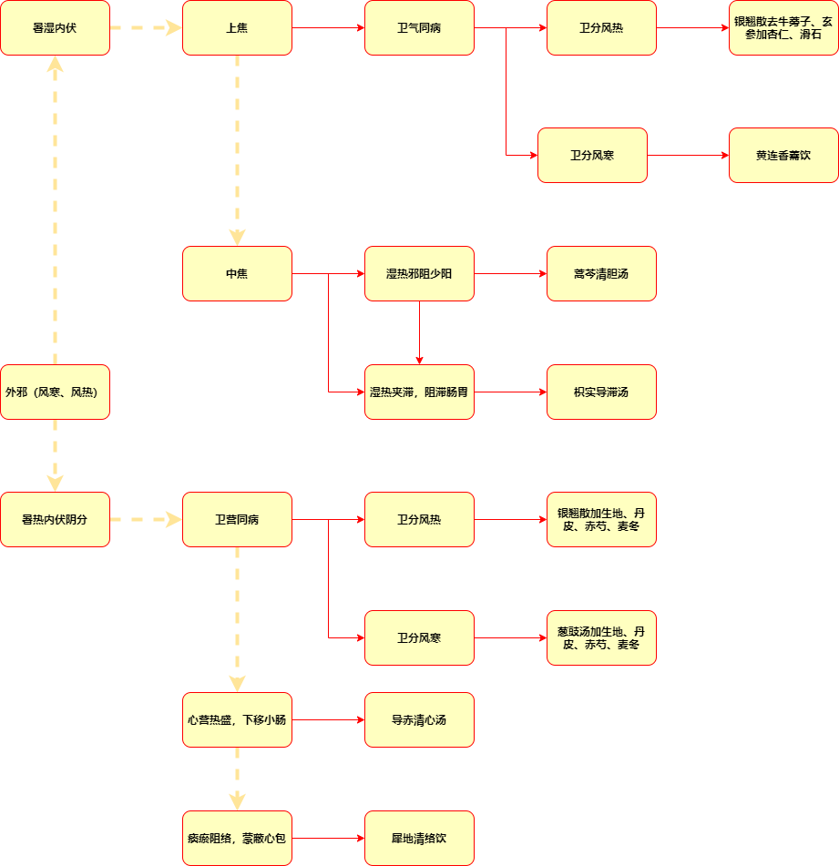
            - **初发证治**
                - **卫气同病**
                    - 【证候】 **发热恶寒** ，头痛， **周身酸痛** ，无汗或少汗， **心烦口渴，小便短赤，脘痞** ，苔白腻，脉濡数。
                    - 【病机】伏暑初起，暑湿内郁气分，时邪束表，卫气同病。
                    - > 湿热并重。
                    - 【治法】清暑化湿， 疏表透邪。
                    - 【方药】银翘散去牛蒡子、 玄参加杏仁、 滑石方或黄连香薷饮。
                    - > **风热** 袭表，暑湿内郁=银翘散去牛蒡子、 玄参加杏仁、 滑石方 **表寒** 外束，暑湿内蕴，而暑热较甚=黄连香薷饮
                - **卫营同病**
                    - 【证候】 **发热，微恶寒** ，头痛，无汗或少汗， **心烦不寐** ， **口干而不甚渴饮** ，或斑点隐隐，舌红绛少苔，脉浮细数。
                    - 【病机】伏暑初起，暑热内炽营分，风热袭表，卫营同病。
                    - 【治法】清营泄热，辛凉透表。
                    - 【方药】银翘散加生地黄、丹皮、赤芍、麦冬方。
            - **邪在气分**
                - **暑湿郁阻少阳**
                    - 【 证候】 **寒热似疟，热重寒轻** ，口渴心烦，脘痞，身热午后较甚， **入暮尤剧，天明得汗诸症稍减** ， **但胸腹灼热不除** ，苔黄白而腻，脉弦数。
                    - 【 病机】 暑湿郁阻少阳，邪在气分，暑重湿轻。
                    - > 1、何秀山：“手足少阳合为一经。其气化，一寄于胆中，以化水谷，一发于三焦以行腠理，若受湿遏热郁，则三焦之气机不畅，胆中相火乃赤......胆火炽，必犯胃而液郁为痰。” 2、 邪阻则寒，正争则热。 湿为阴邪，旺于阴分，于午后暮夜邪正相争剧烈，故身热午后加重，入暮尤剧，天明阳气渐旺，机体气机一时舒展，腠理开泄而汗出，但因湿邪郁遏，得汗后邪未能尽解，故诸症虽减而胸腹灼热不除
                    - 【 治法】 清泄少阳，分消湿热。
                    - 【 方药】 蒿芩清胆汤。
                - **暑湿夹滞，搏结肠腑**
                    - 【证候】身热稽留，胸腹灼热，呕恶，脘痞腹胀，便溏不爽， **色黄如酱** ，苔黄垢腻，脉滑数。
                    - 【病机】暑湿郁蒸气分，与积滞互结搏滞肠腑。
                    - 【治法】导滞通下，清热化湿。
                    - 【方药】枳实导滞汤。
                    - > 1、 “轻法频下”：指暑湿积滞，郁结肠道之证往往要连续攻下，但制剂宜轻，因势利导，不宜峻剂猛攻。 ​2、叶天士《温热论》所说：“伤寒邪热在里，劫烁津液，下之宜猛；此多湿热内搏，下之宜轻。伤寒大便溏为邪已尽，不可再下；湿温病大便溏为邪未尽，必大便硬，慎不可再攻也，以粪燥为无湿矣。”
                    - 枳实导滞丸与枳实导滞汤鉴别 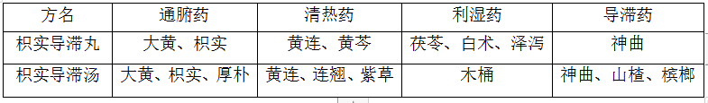
            - **热在营血**
                - **热在心营，下移小肠**
                - > 气营两燔
                    - 【证候】 **身热夜甚，心烦不寐** ，口干但不甚渴饮， **小便短赤热痛** ，舌绛，脉细数。
                    - 【病机】暑热入营，心营邪热下移小肠。
                    - 【治法】清心凉营，清泻小肠。
                    - 【方药】导赤清心汤。
                - **热闭心包，血络瘀滞**
                    - 【证候】身热夜甚，神昏谵语，口干而漱水不欲咽，皮肤、黏膜出血斑进行性扩大，舌深绛或紫晦。
                    - 【病机】瘀热阻闭心包，血络瘀滞。
                    - 【治法】凉血化瘀，开窍通络。
                    - 【方药】犀地清络饮
- **温毒类疾病辨证**
- > 传染性，有局部红肿热痛
    - **大头瘟**
    - > 是感受 **风热时毒** 引起的，以 **头面焮赤肿大** 为特征的急性外感热病，多发于 **冬春** 二季。 颜面部丹毒，流行性腮腺炎。
        - 辨病依据
            - 1. 本病有明显的季节性，多发生于冬春季节。
            - 2.初起症见憎寒发热、无汗、全身酸楚、咽痛口渴等肺卫表热证，同时，伴有明显肿毒征象，如头面焮赤肿痛，皮肤发硬，表面光滑，界限清楚。多由鼻旁、面颊肿起，向眼、耳、面部蔓延，甚至波及头皮，或出现水疮。伴有咽喉肿痛，但一般不会破溃糜烂。
            - 3.病程中头面焮赤肿大特征突出，以气分肺胃热毒蒸迫为主要病机变化，深入营血者较少。
        - 治则：疏风清热，解毒散结，内外合治
        - 毒壅肺胃
        - > 卫气同病
            - 【症候】壮热口渴，烦躁不安，头面焮肿疼痛，咽喉疼痛加剧，舌红苔黄，脉数实。
            - 【病机】肺胃热毒炽盛，上攻头面。热毒炽盛，充斥肺胃，搏结头面脉络则壮热口渴，烦躁不安，头面焮肿，咽喉肿疼加剧；舌红苔黄，脉数实为热毒炽盛征象。
            - 【治法】清热解毒，疏风消肿。
            - 【方药】内服普济消毒饮，外敷三黄二香散。
            - > 频服。
    - **烂喉痧**
    - > 是 **外感温热毒邪** 而引起的急性外感热病。临床以 **发热、咽喉肿痛糜烂、肌肤丹痧密布** 为主要特征，多发于 **冬春** 二季。
        - 病机演变：
        - > 何廉臣说：“疫痧时气，吸从口鼻，并入肺经气分则烂喉，并入胃经血分则发痧。”
            - 肺气不宣， **卫** 受毒郁，故初起发热憎寒并见，继则邪毒传里， **阳明** 受邪，正邪剧争，故见里热蒸迫证候。咽喉为肺胃之门户，热毒充斥肺胃，上攻搏结咽喉，血为毒滞，导致咽喉红肿疼痛，甚至血败肉腐而糜烂；肺胃热毒外窜肌肤血络则出现肌肤丹痧。
        - 辨病依据
            - 1.本病多发生于冬春二季，发病前每有与烂喉痧患者的 **接触史** 。
            - 2.起病急骤，具有急性发热，咽喉肿痛糜烂，肌肤布满丹痧，舌红绛或紫绛起刺状如杨梅等典型的临床表现。
            - 3.多数患者在发病后12~24小时内出现丹痧，最早见于颈部、腋下及腹股沟，从颈胸、躯干再蔓延到四肢，一般在24小时内遍布全身。皮疹为弥漫性红色小点，疹点之间呈一片红晕。当丹痧遍布全身后，发热便逐渐降退。 **丹痧消退后有脱屑，但无色斑痕迹** 。
            - 4.与白喉、麻疹、风疹、药疹鉴别。
            - （1）白喉：本病与白喉均可见于冬春季节，都有咽喉肿痛，但白喉咽喉肿痛多有典型的白色伪膜，与口腔粘连很紧，不易剥离，且肌肤无丹痧皮疹。
            - （2）麻疹：本病与麻疹均好发于冬春，皆有皮疹。
                - 麻疹发病 **二三日** ，可于 **口腔两侧颊黏膜靠臼齿处** 出现具有诊断意义的麻疹黏膜斑；皮疹出疹也较迟，一般在起病后 **第三四日** 出现，先从 **耳后** 、发际、头面发出，然后遍布全身，最后手足心均现疹点，疹形为点状或融合成片，且高出皮面，疹间 **皮肤正常** ，疹后糠秕样脱屑及棕色斑痕；可有 **咽喉肿痛，但不溃烂** 。
                - 烂喉痧皮疹多在发病当天出现，先从颈胸、躯干发出，再蔓延到四肢，皮肤皱褶处更为 **密集** ，疹间 **皮肤红晕** ，压之 **退色** ；疹后鳞片状脱屑；且有显著的咽喉肿痛，甚则糜烂。
        - 治则：清泄热毒。
        - 辨证论治
            - **毒侵肺卫**
                - 【证候】初起憎寒发热，继则壮热烦渴，咽喉红肿疼痛，甚或溃烂，肌肤丹痧隐约，舌红赤，或有珠状突起，舌苔薄白欠润，脉浮数。
                - 【病机】温热时毒外袭肌表，内侵肺胃，见于烂喉痧初期。
                - 【治法】透表泄热，清咽解毒。
                - 【方药】内服清咽栀豉汤，外用玉钥匙吹喉。
                - > 🍉丁甘仁亦谓：“烂喉丹痧以 **畅汗** 为第一要义。”所谓畅汗，是以 **辛凉清透** 为法，使表气通畅，热达腠开，从而达到邪从汗透，热随汗泄的目的。即以汗出通畅作为邪热外透的标志，所以又有得汗则安的说法。但临床运用时，切不可把发汗作为目的，滥用辛温升托之品以强取其汗，以免助热伤阴加重病情。若表郁较重者，可酌情加入荆芥、防风等以辛散表邪；咽喉肿痛明显者，可加入挂金灯、青果、土牛膝根等清热利咽。
            - **毒壅气分**
                - 【证候】壮热，口渴，烦躁，咽喉红肿疼痛，甚则腐烂，肌肤丹痧显露， **舌红赤有珠** ，舌苔黄燥，脉洪数。
                - 【病机】表邪已解，肺胃邪热渐盛，热毒壅结气分所致。
                - 【治法】清气解毒，利咽退疹。
                - 【方药】内服余氏清心凉膈散，外用锡类散吹喉。
                - > 清心凉膈散=凉膈散-硝、黄+石膏、桔梗
            - **毒燔气营（血）**
                - 【证候】咽喉红肿糜烂，甚则气道阻塞，声哑气急，丹痧 **密布** ，红晕如斑， **赤紫成片** ， **壮热，汗多，口渴，烦躁** ，舌绛干燥，遍起芒刺，状如 **杨梅** ，脉细数。
                - 【病机】邪毒化火，燔灼气（营）血所致。
                - 【治法】清气凉血（营），解毒救阴。
                - 【方药】内服凉营清气汤，外用珠黄散吹喉。
                - > 凉营清气汤=玉女煎、凉膈散、犀角地黄汤等方加减组合。 👉热邪灼液成痰👉痰热蒙蔽心包/痰瘀阻塞包络=安宫牛黄丸👉内闭外脱
            - **余毒伤阴**
                - 【证候】 **咽喉腐烂渐减** ，但仍疼痛， **肌肤丹痧渐退** ，并陆续脱屑，壮热已除，唯午后仍低热， **口干唇燥，舌红而干** ，脉细数。
                - 【病机】本证见于烂喉痧恢复期，热毒已减未净，肺胃阴伤。
                - 【治法】滋阴生津，兼清余热。
                - 【方药】清咽养营汤。
- **《叶香岩外感温热篇》**
    - **溫邪上受，首先犯肺，逆傳心包** 。肺主氣屬衛，心主血屬營，辨營衛氣血雖與傷寒同，若論治法則與傷寒大異也。（1）
    - > 温病的发生发展规律、病机变化，与伤寒辨治的区别。
    - 蓋傷寒之邪留戀在表，然後化熱入裏，溫邪則熱變最速，未傳心包，邪尚在肺，肺主氣，其合皮毛，故云在表。在表初用辛涼輕劑。 **挾風** 則加入 **薄荷、牛蒡** 之屬， **挾濕** 加 **蘆根、滑石** 之流。或透風於熱外，或滲濕於熱下， **不與熱相搏** ，勢必孤也。（2）
    - > 温病与伤寒传变的区别及温邪在表夹风、夹湿的治法。
    - 不爾，風挾溫熱而燥生，清竅必乾，謂水主之氣不能上榮， **兩陽相劫** 也。濕與溫合，蒸鬱而蒙蔽於上，清竅爲之壅塞，濁邪害清也。其病有類傷寒，其驗之之法，傷寒多有變證，溫熱雖久，在一經不移，以此爲辨。（3）
    - > 温热夹风、夹湿的证候特点及温热夹湿与伤寒的鉴别要点。
    - 前言辛涼散風，甘淡驅濕，若病仍不解，是漸欲入營也。營分受熱，則血液受劫，心神不安，夜甚無寐，或斑點隱隱，即撤去氣藥。如從 **風熱** 陷入者，用 **犀角、竹葉** 之屬；如從 **濕熱** 陷入者， **犀角、花露** 之品，參入 **涼血清熱方** 中。若加 **煩躁，大便不通** ， **金汁** 亦可加入， **老年或平素有寒** 者，以 **人中黄** 代之，急急透斑爲要。(4)
    - > 温病邪入营分证治。
    - 若斑出熱不解者，胃津亡也， **主以甘寒** ，重則如玉女煎，輕則如梨皮、蔗漿之類。或其人腎水素虧，雖未及下焦，先自彷徨矣，必驗之於舌，如 **甘寒之中加入鹹寒** ， **務在先安未受邪之地** ，恐其陷入易易耳。（5）
    - > 斑出热不解的病机及治法。
    - 若其邪始終在氣分流連者，可冀其戰汗透邪， **法宜益胃** ，令邪與汗並，熱達腠開，邪從汗出。解後胃氣空虛，當膚冷一晝夜，待氣還自溫暖如常矣。蓋戰汗而解，邪退正虛，陽從汗泄，故漸膚冷，未必即成脫證。此時宜令病者，安舒靜臥，以養陽氣來復，旁人切勿驚惶，頻頻呼喚，擾其元神，使其煩躁。但診其脈，若虛軟和緩，雖倦臥不語，汗出膚冷，卻非脫證；若脈急疾，躁擾不臥，膚冷汗出，便爲氣脫之證矣。更有邪盛正虛，不能一戰而解，停一二日再戰汗而愈者，不可不知。（6）
    - > 战汗形成的机理、临床特点、护理措施、预后及与脱证的鉴别等。
    - 再論氣病有不傳血分，而邪留三焦，亦如傷寒中少陽病也。 **彼則和解表裏之半，此則分消上下之勢** ，隨證變法，如近時 **杏、朴、苓** 等類，或如 **溫膽湯** 之走泄。因其仍在氣分，猶可望其戰汗之門戶，轉瘧之機括。（7）
    - > 湿热邪气留滞三焦的治疗和转归。
    - 大凡看法，衛之後方言氣，營之後方言血。在衛汗之可也，到氣才可清氣，入營猶可 **透熱轉氣** ，如 **犀角、玄參、羚羊角** 等物，入血就恐耗血動血，直須 **涼血散血** ，如 **生地、丹皮、阿膠、赤芍** 等物。否則，前後不循緩急之法，慮其動手便錯，反致慌張矣。（8）
    - > 卫气营血病机的深浅层次、病程的先后阶段及治疗原则。
    - 且吾吳濕邪害人最廣，如面色白者，須要顧其陽氣，濕勝則陽微也，法應清涼，然到十分之六七，即不可過於寒涼，恐成功反棄，何以故耶？濕熱一去，陽亦衰微也；面色蒼者，須要顧其津液，清涼到十分之六七，往往熱減身寒者， **不可就云虛寒，而投補劑，恐爐煙雖熄，灰中有火也** ，須細察精詳，方少少與之，慎不可直率而往也。又有酒客裏濕素盛，外邪入裏，裏濕爲合。在陽旺之軀，胃濕恒多；在陰盛之體，脾濕亦不少，然其化熱則一。 **熱病救陰猶易，通陽最難，救陰不在血，而在津與汗；通陽不在溫，而在利小便，** 然較之雜證，則有不同也。（9）
    - > 湿邪致病的特点及其治疗大法和注意点。
    - 再論三焦不得從外解，必致成裏結。裏結於何？在陽明胃與腸也。亦須用下法，不可以氣血之分，就不可下也。但傷寒邪熱在裏，劫爍津液，下之宜猛；此多濕邪内搏，下之宜輕。 **傷寒大便溏爲邪已盡，不可再下；濕溫病大便溏爲邪未盡，必大便硬，慎不可再攻也，以糞燥爲無濕矣。** （10）
    - > 湿热里结的病位和治法，湿热病与伤寒运用下法的区别。
- **《温病条辨》** **温病治则与治禁**
    - 治外感如將（兵貴神速，機圓法活，去邪務盡，善後務細，蓋早平一日，則人少受一日害）；治内傷如相（坐鎮從容，神機默運，無功可言，無德可見，而人登壽域）。 **治上焦如羽（非輕不舉）；治中焦如衡（非平不安）；治下焦如權（非重不沉）** 。（卷四·雜說）
        - 【提要】外感、内伤的治法及温病三焦治则。
        - 【释义】“治上焦如羽（非轻不举）”，其中“羽”意为轻，即邪在上焦肺卫，病位较浅，病情较轻，治疗上焦病证所用药物宜选 **轻清宣透** 方药为主，不能用过于苦寒沉降之品，以免药过病所。同时，用药剂量也宜轻，煎药时间也宜较短，均体现了“轻”的特点。而“治中焦如衡（非平不安）”的“衡”指秤杆，意为平，即治疗中焦病证，必须平定邪势之盛，使机体阴阳归于平衡。此外，对于湿热之邪在中焦者，应根据湿与热之孰轻孰重而予清热化湿之法，不能单治一边，也体现了“平”的特点。“治下焦如权（非重不沉）”的“权”，指秤砣，意为重，即治疗下焦病证，所用药物以 **重镇滋填厚味之品** 为主，使之直入下焦 **滋补肾阴** ，或用 **介类重镇之品** 以平息肝风，这些都体现了“重”的特点。
    - 太陰溫病，不可發汗，發汗而汗不出者，必發斑疹；汗出過多者，必神昏讝語。發斑者，化斑湯主之；發疹者，銀翹散去豆豉，加細生地、丹皮、大青葉，倍元參主之。禁升麻、柴胡、當歸、防風、羌活、白芷、葛根、三春柳。神昏讝語者，清宮湯主之，牛黄丸、紫雪丹、局方至寶丹亦主之。（上焦篇16）
    - > 溫病忌汗者，病由口鼻而入，邪不在足太陽之表，故不得傷太陽經也。時醫不知而誤發之，若其人 **熱甚血燥，不能蒸汗，溫邪鬱於肌表血分** ，故必發斑疹也。若其人表疏，一發而 **汗出不止，汗爲心液，誤汗亡陽，心陽傷而神明亂，中無所主** ，故神昏。心液傷而心血虛，心以陰爲體，心陰不能濟陽，則心陽獨亢，心主言，故讝語不休也。且手經逆傳，世罕知之。手太陰病不解，本有必傳手厥陰心包之理，況有傷其氣血乎！
        - 【提要】温病忌汗之理及误汗后的变证。
    - 斑疹，用升提則衄，或厥，或嗆咳，或昏痙，用壅補則瞀亂。（中焦篇23）
    - > 此治斑疹之禁也。斑疹之邪在血絡，只喜輕宣涼解。若用柴胡、升麻辛溫之品，直升少陽，使熱血上循清道則衄；過升則下竭，下竭者必上厥；肺爲華蓋，受熱毒之熏蒸則嗆咳；心位正陽，受升提之摧迫則昏痙。至若壅補，使邪無出路，絡道比經道最細，諸瘡痛癢，皆屬於心，既不得外出，其勢必返而歸之於心，不瞀亂得乎？
        - 【提要】温病斑疹的治疗禁忌。
        - 【释义】吴氏指出斑疹的治疗主要 **禁用升提和壅补** 二法。所谓升提，是指用辛温之剂发散透疹之法。这一治法主要是针对风疹、麻疹表气郁闭较甚者而设，但通常对这类疾病的治疗应 **以辛凉宣透为主** ，而非滥用辛温升提，更不能用于斑疹等营血有热之证；因斑疹本是热入营血之象，治疗当以清解为主，若误用壅补易致心中闷乱，头目昏眩等症。但若温病发斑疹时，正气大虚而出现斑疹内陷之逆证，体温骤降，斑疹突然隐没，治疗当用补气托斑之法，则不属禁忌之法。
    - 溫病小便不利者， **淡滲不可與也** ，忌五苓、八正輩。（中焦篇30）
    - > 此用淡滲之禁也。熱病 **有餘於火，不足於水** ，惟以 **滋水瀉火** 爲急務，豈可再以淡滲動陽而爍津乎？奈何吳又可於小便條下，特立猪苓湯，乃去仲景原方之阿膠，反加木通、車前，滲而又滲乎？其治小便血分之桃仁湯中，仍用滑石，不識何解！
    - 溫病燥熱， **欲解燥者，先滋其乾，不可純用苦寒也** ，服之反燥甚。（中焦篇31）
    - > 此用苦寒之禁也。溫病有餘於火，不用淡滲猶易明，并苦寒亦設禁條，則未易明也。舉世皆以苦能降火，寒能瀉熱，坦然用之而無疑，不知苦先入心，其化以燥，服之不應，愈化愈燥。
        - 【释义】所谓苦寒之禁是指温病过程中出现燥热时，不可单用苦寒以冀解除燥热，因 **苦燥有伤阴之弊** ，而应投用甘寒之品“先滋其干”。但应当看到，甘寒之品虽能润燥泄热，但其清热之力毕竟较弱，如邪热较甚时可适当配合苦寒之品以泻邪热，即所谓“甘苦合化”。
    - 白虎本爲達熱出表，若其人脈浮弦而細者，不可與也；脈沉者，不可與也；不渴者，不可與也；汗不出者，不可與也。常須識此，勿令誤也。（上焦篇9）
    - > 此白虎之禁也。按白虎慓悍，邪重非其力不舉，用之得當，原有立竿見影之妙，若用之不當，禍不旋踵。懦者多不敢用，未免坐誤事機；孟浪者，不問其脈證之若何，一概用之，甚至石膏用至斤餘之多，應手而效者固多，應手而斃者亦復不少。皆未真知確見其所以然之故，故手下無凖的也。
        - 【提要】白虎汤运用的“四禁”。
        - 【释义】脉浮，表明邪在表；脉弦，表明邪在半表半里；脉细，为气血不足等正气亏虚之象；脉沉而有力，见于阳明腑实证；沉而无力，多为肝肾真阴耗竭，皆不可与。吴氏亦强调不渴、汗不出不可用白虎汤。不渴为里热不甚，津伤不显，或内有湿邪；汗不出，为表气郁闭，或热势未盛，或津液已大伤，无作汗之源，皆不可与。当然，临床亦不可拘泥于白虎“四禁”，只要四诊合参后，确系气分无形邪热炽盛者，即可使用白虎汤。
    - 斑疹陽明證悉具，外出不快， **内壅特甚** 者，調胃承氣湯微和之，得通則已， **不可令大泄** ，大泄則内陷。（中焦篇24）
    - > 此斑疹下法，微有不同也。斑疹雖宜宣泄，但不可太過，令其内陷。斑疹雖忌升提，亦畏内陷，方用調胃承氣者，避枳、朴之溫燥，取芒硝之入陰，甘草敗毒緩中也。調胃承氣湯方（方見前）
        - 【提要】温病斑疹下法的宜忌。
        - 【释义】温病出现斑疹透发不畅同时伴有阳明腑实证，表现为大便不通，腑气壅滞者，可用调胃承气汤缓下热结，使腑气得通，邪热得以外泄，则斑疹亦可透发。吴氏还提出温病斑疹用攻下之法应注意以下两点：一是掌握使用攻下的指证，既有阳明证，又有“外出不快，内壅特甚”；二是攻下当适可而止，不能过剂，以免发生内陷之变。
    - 壯火尚盛者，不得用定風珠、復脈。邪少虛多者，不得用黄連阿膠湯。陰虛欲痙者，不得用青蒿鱉甲湯。（下焦篇17）
    - > 此諸方之禁也。前數方雖皆爲存陰退熱而設，其中有以補陰之品，爲退熱之用者；有一面補陰，一面搜邪者；有一面填陰，一面護陽者。各宜心領神會，不可混也。
        - 【提要】下焦病治禁。
        - 【释义】“诸方”指治疗下焦温病的主要方剂，如加减复脉汤、大小定风珠、黄连阿胶汤、青蒿鳖甲汤等，都具有滋养肾阴的作用，但各有适应病证，临床应注意区别运用。如大定风珠、加减复脉汤属填补真阴之剂，对壮火尚盛者禁用；黄连阿胶汤属滋水清心之剂，故对邪少虚多者禁用；青蒿鳖甲汤属滋阴透邪之剂，故对肾阴大虚而虚风内动者禁用。